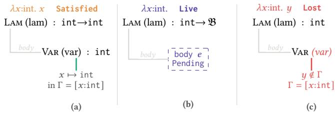
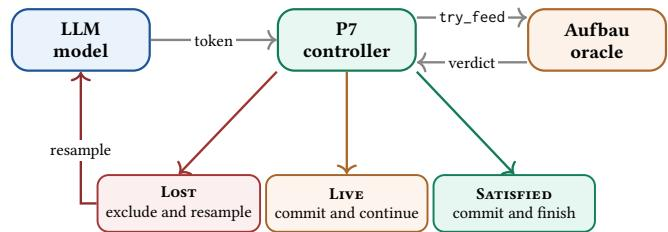
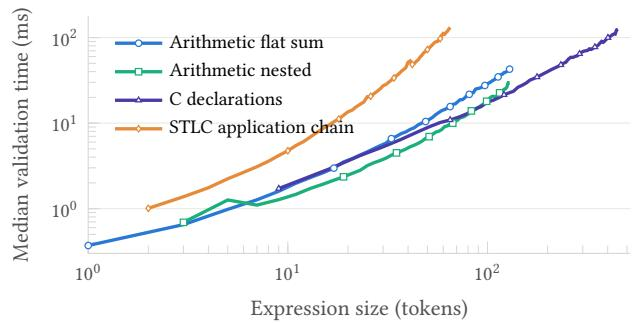
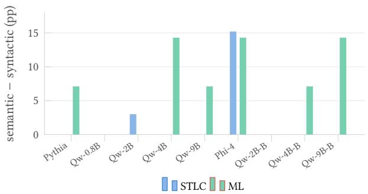
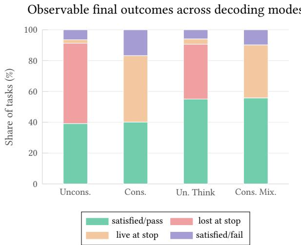
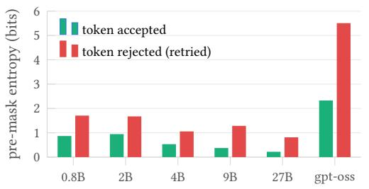
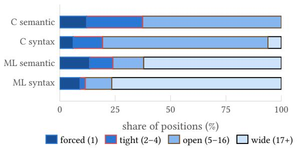
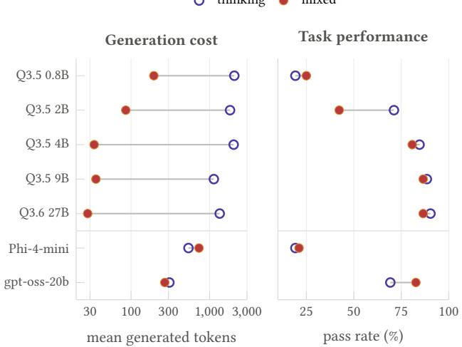

# Semantic Prefix Oracles for LLM Decoding: Contracts and Diferential Validation

Paul Kronlund-Drouault✉

ENS de Lyon

Lyon, France

Unsuspicious Industries

Paris, France

Université de Lille

Lille, France

pkd@unsuspicious.org

## Abstract

Constrained decoding can enforce regular or context-free output formats, but many program-generation failures are semantic: scope, typing, and declaration efects depend on context. We present semantic grammar specifications, a declarative formalism that attaches such constraints to a context- free surface and executes them during Earley descent. Our implementation enforces safe pruning: it rejects only prefixes whose semantic contradictions cannot be repaired by any continuation. A separate, grammar-dependent, dead-end freedom property guarantees the existence of a realizable witness for each remaining branch. We give simple suficient conditions based on surface productivity, type coverage, and left-to-right constraint flow. Our finite-lambda, core ML, and C-like fragments satisfy them, while the STLC instance used in our experiments does not: plain STLC can violate type coverage, and we show how restricting its type universe recovers it. A tokenizer-lifting lemma carries character-level witnesses to token sequences under an explicit vocabulary- coverage hypothesis.

We validate the implementation diferentially against production compilers (ocamlc, cc). Across every prefix of 65 compiler-valid programs we observe zero false prunes. The semantic oracle localizes 25/30 invalid programs mid-stream, against 0/30 for a syntax-only oracle, and agrees on 42/42 recursion probes. A twelve-model generation study, including a matched semantic-versus-syntactic ablation for nine mod- els, finds nonnegative observed semantic-minus-syntactic point estimates for every model-language pair, with maxima of +15.2 points on STLC task correctness and +14.3 points on ML validity.

CCS Concepts: • Theory of computation → Grammars and context-free languages; • Software and its engineering → Formal language definitions; Software testing and debugging; • Computing methodologies → Natural language processing.

Keywords: constrained decoding, semantic prefix grammars, attribute grammars, diferential testing, large language mod-els

## ACM Reference Format:

Paul Kronlund-Drouault. 2026. Semantic Prefix Oracles for LLM Decoding: Contracts and Diferential Validation. In Proceedings of the 2nd ACM SIGPLAN International Workshop on Language Models and Programming Languages (LMPL ’26), October 4–9, 2026, Oakland, CA, USA. ACM, New York, NY, USA, 11 pages. htps://doi.org/10. 1145/3843750.3843841

## 1 Introduction

Grammar-constrained decoding has by now entered infer- ence infrastructure, with libraries such as Outlines [25], DOMINO [2], and Formatron [21] which mask a model’s vocabulary so that every emitted prefix extends to output in a regular or context-free language, giving a structural guarantee of completability. The constraints they express are nonetheless weak relative to how models actually fail.

Syntax-only constraints do not address consequential program-generation failures such as scope, type compatibility, and declaration efects, none of which a grammar mask can express. Lifting the guarantee to semantic constraints gives two distinct properties:

1. safe pruning: no prefix with a semantically valid com pletion is rejected

2. dead-end freedom: every retained prefix still has such a completion

The first protects the model’s valid continuations while the second protects the decoding loop from being walked into a state where no token is admissible. They are diferent theorems with diferent hypotheses.

We structure this paper around the following question:

When may a semantic prefix oracle reject an LLM continuation without hiding a valid program, and

## how do we validate that the implementation actually respects that contract?

As a working example, take the finite lambda instance of §3.2. Under its constraints, a model that has decoded let $\times :$ Int = may still emit a digit, an open parenthesis, or any Int in scope, but the token true is masked out: the annotation has fixed the demanded type and the boolean literal’s type is fixed too. This is where semantics is needed, since let x : Int = true; is a perfectly good parse in the underlying context-free grammar.

Our declarative format attaches typing rules to a contextfree surface. The rules compile to a language-parametric IR over first-order terms, pattern ascription, syntactic unification, and finite right-bound context efects. Aufbau executes this IR during Earley descent and rejects a path only after a stable semantic contradiction. The kernel has no built-in no- tion of type, function, or arrow. Those meanings come from each grammar’s constructors and shared holes. Safe pruning is therefore a property of the oracle. Dead-end freedom is a stronger property of particular grammars. In §2.3 we give three suficient conditions, show that the ML and C-like in- stances satisfy them, and show why the STLC instance used in our experiments does not.

Because a proof of the rejection rule does not rule out implementation bugs, we also validate Aufbau diferentially against production compilers sharing none of our code. P7 then measures what the semantic layer buys over the same mask with typing removed.

This paper contributes:

• A semantic-prefix formalism that separates safe pruning from dead-end freedom, with a safe-pruning the- orem, simple suficient conditions for dead-end free- dom, and a tokenizer-lifting lemma under an explicit vocabulary-coverage hypothesis (§2, §3)

• A language-parametric implementation (Aufbau/P7, with STLC, finite-lambda, core ML, C-like, and typed tool-DSL instances in three surface dialects) and prefixby-prefix diferential validation against ocamlc and cc: zero false prunes over every prefix of 65 in-fragment valid programs, 42/42 on a recursion probe, mid-stream error localization at 25/30 vs. 0/30 for a syntax-only oracle (§3–§4.1)

• A twelve-model generation study containing a matched semantic-versus-syntactic ablation for the nine models that ran both arms, 3,693 graded attempts in total, holding parser, sampler, tokenizer bridge, and surface grammar fixed, with per-language va- lidity and correctness metrics reported separately, together with exploratory observations on reasoning- then-constrained scheduling, rejection–uncertainty association, and multi-turn tool episodes (§4.2).

The artifact contains the implementation, specifications, data, and commands used for the reported measurements.

## 2 The Constraint Model

## 2.1 Grammar Specifications

We fix an alphabet Σ and write $L \subseteq \Sigma ^ { * }$ for a language. A prefix � is completable for � when $s s ^ { \prime } \in L$ for some $s ^ { \prime } .$ Prefix parsing accepts exactly the completable prefixes of the sur- face syntax. The surface parser keeps branches compatible with the consumed input, and the semantic layer removes branches carrying a stable contradiction. Writing $R _ { G }$ for the prefixes retained by Aufbau, the guarantee proved below (§2.3) is the one-sided inclusion

$$
\mathrm { P r e f } ( L _ { G } ) \subseteq R _ { G } , \qquad \mathrm { P r e f } ( L _ { G } ) = \{ s \mid \exists r . s r \in L _ { G } \} .
$$

Definition 2.1 (Semantic grammar specification). A semantic grammar specification (what an .auf file can represent) is a tuple $G = ( N , T , P , S , \Theta , \mathcal { T } , \mathcal { B } )$ : nonterminals �, terminal recognizers �, productions �, start symbol �, semantic rules Θ, a partial map $\mathcal { T } : N \mathrm { ~ \ r ~ { ~ \ r ~ { ~ \theta ~ } ~ } ~ }$ attaching a rule to a nonterminal, and binding identifiers B. A production for � is a sequence $\alpha _ { 1 } [ b _ { 1 } ] \cdot \cdot \cdot \alpha _ { m } [ b _ { m } ]$ where each $\alpha _ { i } \in T \cup N$ and each $b _ { i } \in { \mathcal { B } } \cup \{ \varepsilon \}$ names the child’s evidence for use by a rule.

We reserve semantic prefix grammar for the subclass additionally satisfying the three conditions of §2.3 that guarantee witness construction. Bindings are annotations only, and do not afect the context-free structure. Terminals are matched through a segment interface returning a status in {Prefix, Exact, Extensible} together with a regular residual, the derivative of the recognizer after the consumed segment [5, 14]. The minimal example, used throughout:

$$
\mathrm { I d }  \mathcal { R } ( [ \mathsf { A } - \mathsf { Z a } - \mathsf { z } ] [ \mathsf { A } - \mathsf { Z a } - \mathsf { z } \theta - 9 ] ^ { * } )
$$

$$
\mathrm { T y p e }  \mathrm { I d } \mid \mathrm { T y p e } ^ { \circ }  \mathrm { T y p e } \mid ^ { \circ } ( \mathrm { ^ { \circ } T y p e } ^ { \circ } ) ^ { \prime }
$$

$$
\mathrm { V a r } \to \mathrm { I d } [ x ]\tag{var}
$$

$$
\operatorname { L a m } \to { \mathit { \ ' } } \lambda ^ { \prime } \operatorname { I d } [ a ] { \mathit { \ ' } } : { \mathrm { ' T y p e } } [ t ] { \mathit { \ ' } } : \operatorname { E x p r } [ e ]\tag{lam}
$$

$$
\mathrm { A p p } \to \mathrm { E x p r } [ l ] \ \mathrm { E x p r } [ r ]\tag{app}
$$

$$
\mathrm { E x p r }  \mathrm { V a r } \mid \mathrm { L a m } \mid \mathrm { A p p }
$$

with one rule per annotated nonterminal, each a set of ascriptions over shared holes �, �:

$$
\frac { x : \mathfrak { A } \mathrm { i n } \Gamma } { \mathrm { : } \mathfrak { A } } ( \mathrm { v } \mathrm { A } \mathrm { R } ) \begin{array} { l } { \Gamma [ a : t ] \vdash e : \mathfrak { B } } \\ { : t  \mathfrak { B } } \end{array} ( \mathrm { L A M } ) \begin{array} { l } { \frac { l : \mathfrak { A } \mathrm { \backslash } \mathfrak { B } \mathrm { : } \mathfrak { A } } { \mathrm { : } \mathfrak { B } } ( \mathrm { a p p } ) } \end{array}
$$

The app rule has no idea what a function is. Its premise $l : \mathfrak { A } \to \mathfrak { B }$ is one constructor pattern: → is a constructor because the grammar’s type fragment wrote it, and �, � bind its subterms. There is no separate algebra of types, leaves are regular languages, and the arrow means only what hole- sharing across the three rules makes it mean. The inference notation is a front end to a small IR of term evaluation, as- cription, equality, context membership, scoped extension, and right-bound efects, and the same IR runs the ML, C, and tool instances with no distinguished type or function instruction.

## 2.2 Evidence and Constraint Graphs

To keep the mechanism language-parametric, semantic evidence is represented only by terms over the grammar’s signature, with ascription for checking a term against an expected pattern and first-order unification as the sole rewriting mechanism [9, 18]. Context lookup, type equality, and structural matching are all ascriptions discharged by unification. Equality $\tau _ { 1 } = \tau _ { 2 }$ is $\tau _ { 1 } : \tau _ { 2 }$ . Membership $x \in \Gamma$ is � : � solved against Γ. A shape such as $\mathfrak { A } \to \mathfrak { B }$ is matched constructor- against-constructor with each hole bound by position, with no decomposition step and no built-in notion of domain or codomain.

Parsing a prefix yields an AST whose nodes carry, at bound positions, evidence: a status in {Exact, Prefix, Extensible} propagated bottom-up, a type term possibly containing holes, an exported context efect, and a binding map sending each binding either to Resolved(�) (the child’s evidence, once the dot has passed it) or Pending (the child is past the right frontier). A binding moves from Pending to Resolved, never the reverse. This is the available/unavailable split of incremental attribute grammars [6] and the typed-hole reading of an unfilled position [13].

Rules relate evidence directly, so semantic information forms a graph over evidence rather than a tree. Firing a rule emits one unification edge per premise plus a conclusion edge, and holes shared between ascriptions become equality edges. This is the constraint-generation reading of type inference where a typing system is a set of unification constraints over a partial program. A vertex is frontier when it still carries an incomplete-input signal (status Prefix/Extensible, or a Pending binding). The graph at prefix �, written $\mathcal G ( s )$ , is open when some edge touches a frontier vertex and closed when it is not open and the solver finds no contradiction. The parser builds and solves this graph during Earley descent rather than after parsing. A stable contradiction removes that item immediately, while unresolved frontier evidence remains in the chart. Context efects are right-bound. Only an Exact node exports a declaration into the context its right siblings see.

Proposition 2.2 (Fixed-prefix decidability). Let � be finite with regular terminals, and let every semantic rule compile to a finite straight-line IR program interpreted in the free firstorder theory with the occurs check and no declared rewrites. Compute the nullable nonterminals by least fixed point and define the zero-consumption left-corner relation $A \to _ { 0 }$ �: some production of � can reach an occurrence of � after a prefix of nullable symbols. Suppose the $ _ { 0 }$ graph restricted to nonterminals reachable from � is acyclic, and, separately, that every reachable nonterminal is productive (derives some finite terminal string). Then evaluation of any finite prefix and masking over any finite candidate set are decidable.

Proof (sketch). Earley parsing over a finite input has a finite chart of item cores. Semantic elaboration can multiply items only by re-deriving the same core with diferent evidence. Acyclicity of $ _ { 0 }$ bounds the number of rule firings attribut- able to any span, so each core carries finitely many semantic refinements and context efects. Terms are finite, regular-leaf intersection is decidable, and first-order unification termi- nates with the occurs check. Semantic pruning only removes annotated items, so the annotated chart reaches a fixed point, and the same procedure applied to each member of a finite candidate set terminates. □

Zero-consumption is needed, because a unit cycle such as $A \to B , B \to A \mid \times$ consumes no input while its rules wrap evidence on every traversal, giving one finite span unboundedly many annotations. Productivity covers a separate failure mode, since a consuming cycle can still be unproduc- tive, as $S \to \times S$ is. Both are decidable by least-fixed-point computation and are checked when a grammar is loaded. The proposition decides whether a fixed finite continuation survives the semantic Earley chart. Whether an arbitrary prefix has some valid sufix is a diferent question, and needs the analysis below. Declared normalization rewrites are out- side Proposition 2.2, since they need separate termination and confluence arguments.

## 2.3 Verdicts: Safe Pruning and Dead-End Freedom

Definition 2.3 (Witness, denotation, verdict). A witness for a prefix � is $r \in \Sigma ^ { * }$ such that �� admits a complete parse of the start symbol whose graph $\mathcal { G } ( s r )$ is closed and consistent. The denotation $\mathcal { D } ( s )$ is the set of witnesses. The semantically valid language $L _ { G }$ is the set of complete inputs with an empty- witness parse. The evaluator returns

$$
e v a l ( \mathscr { G } ( s ) ) = \left\{ \begin{array} { l l } { \mathsf { S a t i s f i e d } } & { \mathrm { c l o s e d ~ a n d ~ c o n s i s t e n t } , } \\ { \mathsf { L o s t } } & { \mathrm { s t a b l e ~ c o n t r a d i c t i o n } , } \\ { \mathsf { L i v e } } & { \mathrm { o t h e r w i s e } . } \end{array} \right.
$$

A contradiction is stable when later input cannot repair it. This includes rigid constructor clashes, regular-leaf clashes, occurs-check failures, and failed lookups in the fixed left context. Ambiguity is existential: a prefix is Lost only when every compatible branch is Lost.

Theorem 2.4 (Safe pruning). Aufbau never rejects a prefix that has a witness.

Proof. Every rejection is justified by a stable contradiction on every compatible branch. Extending a branch can instan- tiate unresolved holes, refine regular residuals as more input is consumed, and append right-bound context efects. The rejection forms above are monotone under those operations: a rigid constructor clash remains a clash, an empty regular intersection cannot be restored by further refinement, an occurs-check failure cannot be repaired by later substitu- tion, and a failed lookup in the fixed left context cannot be repaired by declarations exported to the right. Thus a contra- diction classified as stable persists on every extension of that branch. If � had a witness �, the complete consistent parse of �� would restrict to a compatible branch at � that is not Lost, contradicting rejection. □

The implementation is conservative about information that is not yet fixed. In particular, prediction-time checks use only constraints already determined by the consumed prefix. Missing information can therefore delay a rejection, but it cannot create one. This matters for dead-end freedom, not for safe pruning.

Dead-end freedom is a property of a grammar in addition to the oracle. A Live prefix has not contradicted the grammar, but it may still have no completion. Plain STLC gives the simplest example. With distinct atomic types � and �, the prefix $\lambda f { \mathrm { : } } A { \longrightarrow } B .$ . � ( demands a term of type �. If the language has no closed term of type �, the prefix is Live but has no witness.

For the typed grammars in this paper, the relevant notion of inhabitation is simply type coverage: every type that can be demanded at a reachable prefix has some finite closed term of that type. A universal inhabitant is one way to obtain coverage, but it is not required. Throughout, a parser branch, nonterminal, regular residual, or type demand is reachable when it occurs after consuming some finite input prefix from the start symbol on a compatible branch, before that branch becomes Lost.

Definition 2.5 (Dead-end-free grammar class). We use the following suficient conditions for dead-end freedom.

(P) Surface productivity. Every reachable nonterminal has a finite completion, and every reachable regular resid- ual is nonempty.

(T) Type coverage. Every reachable type demand has a finite closed realizer whose construction does not in- validate the already fixed left context.

(F) Left-to-right constraint flow. A child’s semantic obligations are determined by the parent demand, the fixed context, and children to its left. Later children do not constrain earlier ones.

Theorem 2.6 (Dead-end freedom under coverage). A grammar satisfying (P), (T), and (F) is dead-end free: every Live prefix has a witness.

Proof sketch. Complete the leftmost unfinished position re-peatedly. Condition (P) closes purely syntactic and regular positions. When a typed expression is required, (F) makes its demanded type depend only on information already fixed to its left, and (T) supplies a finite closed term of that type. Repeating this process moves strictly rightward and eventu-ally closes the parse. The chosen terms satisfy the demands under which they were inserted, so the resulting completion is consistent. □

The conditions are deliberately suficient rather than a characterization of every grammar on which Aufbau hap- pens to avoid dead ends. They are useful because they sep- arate the oracle property from the language property. Safe pruning holds independently. Dead-end freedom follows once a grammar has productive syntax, type coverage, and left-to-right semantic flow.

The examples make the boundary concrete, and the bound- ary runs through our own instances. Our STLC instance (§3.2) does not satisfy (T): its base-type universe is unrestricted, so an atomic type may have no closed inhabitant, and the $\lambda f { \mathrm { : } } A { \longrightarrow } B .$ �( prefix above is a prefix of that grammar. Coverage is recoverable by construction: restrict the basetype universe to a finite set in which every base type has a literal. The literals cover the base types, and arrow types follow inductively, since a closed realizer $e _ { B }$ of � makes $( x { : } A ) \Rightarrow e _ { B }$ a closed realizer of $A  B .$ The finite-lambda instance below uses exactly this construction. We did not run the reported STLC experiments on that restricted instance. Core ML has a simpler cover because assert false can be assigned every expression type. The C-like fragment also covers every reachable expression-type demand in its fragment: scalar types have literals, and explicit casts from a scalar literal realize pointer types and the other concrete expression types admitted by the grammar. The tool DSL has no comparable universal cover. With an empty context, let s = summarize( demands a docs value, but the grammar has no closed docs literal, so the prefix can remain Live with no completion.

Nothing in this argument requires the implementation to decide (P), (T), and (F) automatically. They state when the stronger dead-end-free guarantee applies. The implementation itself only relies on the safe-pruning contract.

## 2.4 Worked Example

Figure 1 illustrates the three verdicts. The complete term resolves � in the fixed context and closes the graph. A pend- ing body leaves the graph open and therefore Live, without guaranteeing a witness. The exact variable � fails lookup in Γ = [�:int], yielding a stable contradiction that syntax alone cannot detect.

## 3 Aufbau, P7, and the Instances

## 3.1 Architecture

A language definition is lowered into Aufbau’s semantic grammar IR, productions, regular terminals, binding positions, compiled rule programs, context efects, with .auf as one readable front end and the API able to construct the same IR directly. Aufbau executes it inside an Earley parser [7] whose items carry the evidence and constraint graph of §2.2.

The entry point try\_feed extends the current prefix by a candidate string and returns the three-valued verdict. P7 puts this oracle in the decoding loop (Figure 2).

Figure 1. The oracle’s evidence on three prefixes of the min- imal grammar. Gray right-angle links show AST structure, colored links semantic evidence. The complete term closes at int → int. The missing body stays Pending. The exact variable � fails lookup in $\Gamma = \left[ x { : } \mathrm { i n t } \right]$ , making the last prefix Lost.  
  
Figure 2. P7 constrained-decoding architecture. The model proposes a token, P7 submits it to the Aufbau prefix oracle, and the oracle returns one of three verdicts: Lost is excluded and resampled, Live is committed and decoding continues, Satisfied completes the derivation.

Two properties of the loop matter below. The mask never forces completion: the model’s own stop tokens stay admissi- ble mid-derivation, so §4.2 counts abandonments rather than hiding them. The mask prunes rather than repairs: given a model with no useful solution, it can turn free-form garbage into well-formed garbage that still fails grading.

Tokenizer lifting. P7 feeds Aufbau tokens, not characters, so the guarantees above must cross that boundary. Write $\textstyle \sum _ { G } = \bigcup _ { R \in T } \operatorname { a l p h } ( R )$ for the union of the recognizers’ alpha- bets, $\ell : V \to \Sigma _ { G } ^ { * }$ for the exact spelling map on ordinary text tokens of the vocabulary � (control tokens and eos follow the completion policy above), and $L _ { V } = \{ \ell ( v ) \mid v \in V \}$

The coverage hypothesis $\Sigma _ { G } \subseteq L _ { V } ^ { * }$ gives $\Sigma _ { G } ^ { * } \subseteq L _ { V } ^ { * }$ , since $L _ { V } ^ { * }$ is closed under concatenation.

Lemma 3.1 (Tokenizer lifting). Under exact spelling (the oracle consumes, byte-for-byte, the text the model conditions on) and coverage, every character-level witness factors into a finite token sequence, and regular derivatives carry the oracle’s state across a token ending inside a terminal recognizer. Characterlevel witness existence therefore lifts to token-sequence reachability.

Proof. Coverage factors the witness into a concatenation of spellings $\ell ( v _ { 1 } ) \cdot \cdot \cdot \ell ( v _ { k } )$ , exactly the string P7 submits token by token, and composing the recognizer’s derivative across $v _ { 1 } , \ldots , v _ { k }$ reaches the residual the character-level run would. □

## 3.2 Language Instances

STLC. A monomorphic simply-typed lambda calculus with mandatory binder annotations, used both by the oracle’s validation harnesses and as the STLC arm of the generation study. Its base-type universe is unrestricted, so this instance does not satisfy the type-coverage condition (T) of §2.3 and we make no dead-end-freedom claim for it: the $\lambda f { \mathrel { : } } A { \longrightarrow } B$ . �( counterexample is a prefix of this grammar. Safe pruning applies to it exactly as to every other instance.

Finite Lambda (fun.auf). A variant of the lambda calculus with modern surface syntax, let-bindings, and a base-type universe restricted to Int, Bool, and Float, each equipped with literals. These literals cover the base types. Function types are covered inductively: if �� is a closed realizer of �, then $( { \sf x } \colon { \sf A } ) \quad = > \ e _ { B }$ is a closed realizer of $A  B .$ . Together with productive syntax and left-to-right constraint flow, the instance therefore satisfies (P), (T), and (F), unlike the unrestricted STLC instance used in the experiments.

Core ML (ml.auf). A monomorphic ML fragment with let/let rec, functions, application, integers, booleans, comparison and arithmetic, lists (T list, cons, []), if/then/else, and assert false. The concrete syntax is a strict OCaml subset, so every accepted program feeds ocamlc with no translation. This makes diferential prefix validation possible (§4.1). The axiom assert false : � is a universal expression inhabitant, so every reachable ML expression-type demand is covered. Checking-mode let rec is incremental because its signature is fixed before the body streams.

A C-like fragment (c.auf). A typed C-like fragment whose accepted output is graded by cc -fsyntax-only: declarations and assignment, typed functions and calls, if, while, and for, arithmetic and comparison over int, float, and char, pointers with address-of and dereference, and explicit casts.

The fragment threads each function’s declared return type through an ambient context entry and checks every return against it, admitting a bare return; only in a void function.1 We still call it C-like deliberately: it does not prove that every path through a non-void function returns, does not constrain the operand of a cast or of address-of, and its demanded-type universe includes void and unbounded pointer depth, so Aufbau-accepted programs are not guaranteed to be accepted, or accepted without diagnostics, by a C compiler.

For dead-end freedom, the relevant point is narrower than full C validity. Every reachable expression-type demand in this fragment has a closed realization: scalar types have lit- erals, while explicit casts from a scalar literal realize the pointer types admitted by the grammar. Together with the fragment’s productive statement forms and left-to-right dec- laration flow, this gives the coverage used in Theorem 2.6. The diferential harness of §4.1 separately checks compatibility with cc.

Two design points carry the semantics. A two-sort type discipline keeps the concrete sort CType (scalars and pointers, what a cast or declaration can spell) distinct from the internal signature sort that types functions. The latter is un-reachable from concrete syntax, so no source expression can demand a function-shaped type. And definition-before-use holds at translation-unit granularity: a call is checked against a signature already exported by an earlier definition’s right- bound efect, which a left-to-right oracle handles without lookahead because the definition precedes the call in the token stream.

Declarative boundary: self-recursion. Inference-mode recursion cannot be declared in this fragment. let rec with-out an annotation was implemented and dropped after some empirical failure evidence. The problem is that the recursive call races the still-streaming parameter list to resolve the signature metavariable, and an early unification can commit it to a shape the header later contradicts, producing a false prune rather than a real error. Checking-mode recursion, whose signature is exact before the body opens, has no such race, so the declarable fragment admits checking-mode pro- gram recursion only and inference-mode program recursion is excluded as a restriction of the fragment. It could theoreti- cally be implemented but would require dropping the level of constraints which isn’t very interesting here.

This important limitation was found by our test system probing ocamlc against the oracle. Indeed, some experiments on recursion corners surfaced the discrepancy (§4.1). The instrumentation that rejects the model’s tokens is what caught the grammar author. This establishes the importance of our diferential certification approach for implementation correctness.

The agentic tool DSL dialects. The third instance exercises the semantic layer as an agent harness. Constrained decoding is usually evaluated on single-shot synthesis, but multi-turn tool use, where the typed context grows as the episode runs, is the natural application for a typed oracle. tool.auf is an invented typed pipeline language over a fixed registry (search: string→docs, summarize: docs→string, count: docs→int, format: int→string) with let-sequencing and return.

Being invented, it has no pretraining prior and no external compiler, so an episode is graded by the value its return evaluates to against the registry’s real implementations rather than by well-typedness. Each turn is one constrained step. The binding it introduces is pushed into Γ, so turn �+1 de-codes under the types established by turns 1..�, threading the constraint graph of §2.2 across the episode.

Three dialects share one type discipline: a C-like let syntax (tool.auf), S-expressions (tool\_sexpr.auf), and XML elements (tool\_xml.auf). Only the surface varies, so the dialect axis separates semantic discipline from syntax priors and tokenizer alignment.

The dialects also show why registry reachability is weaker than type coverage. With an empty context, let s = summarize( is Live with no completion because the demanded docs argument has no literal form and no binding supplies one. We therefore make no dead-end-freedom claim for the tool DSLs. A 51-case harness checks the checker given a witness by injecting a binding of the demanded type at each demanding argument position and confirming acceptance.

## 4 Empirical Findings

The evidence comes in two tiers with diferent epistemic status, and we keep them apart.

Tier 1 (§4.1). tests the oracle: CPU-only, deterministic, regenerable byte-for-byte by a reviewer with no GPU.

Tier 2 (§4.2). measures what the oracle buys in generation: GPU runs over open models, single greedy attempts, graded by per-language metrics that are deliberately not pooled into one accuracy (§4.2 defines each).

## 4.1 Diferential Prefix Validation

The oracle’s verdicts are compared prefix by prefix against a production compiler that shares none ofour code: ocamlc for the ML instance and cc for the C instance. These are finite, hand-selected test cohorts, so the results validate rather than certify. The harness extends mechanically.

Safe pruning (Theorem 2.4) applies to every instance. The cohorts below add finite external evidence for the ML and C implementations, the two instances with productioncompiler comparators. Diferential testing can expose implementation bugs, but finite cohorts are not an exhaus- tive correctness proof. Theorem 2.4 is in any case a paper proof of the rejection discipline, and the shipped engine is an optimized realization of it: these cohorts check selected end-to-end compatibility properties rather than establishing that the optimized engine computes the theorem’s verdicts at every token boundary. A slow reference evaluator built directly from the formal rules, enabling prefix-by-prefix correspondence testing against the shipped engine, is future work.

  
Figure 3. Median validation time vs. expression size on four stress families (log–log). Growth is smooth and mildly su-perlinear (log–log slopes ≈1.1–1.4).

False prunes. Over the 65 in-fragment valid programs of the cohort (40 ML, 25 C), the oracle was evaluated at every prefix and never reported Lost: 0/40 on ML and 0/25 on C, with Wilson 95% upper bounds of 8.8% and 13.3% (5.6% pooled). The bound is honest about cohort size, and extension is mechanical: add programs, rerun, dif every prefix.

The recursion probe. 42 programs probing let rec corners agree with ocamlc in 42/42 cases (Wilson 95% CI [0.92, 1.00]). The probe exists because recursion is where our fragment boundary was wrong once (§3.2): the harness that found the unsoundness now pins the repaired boundary.

Prune lead time. On 30 invalid programs, the semantic oracle reports Lost mid-stream in 25 cases (12/17 on ML, 13/13 on C), where a syntax-only oracle catches 0 before end of input. In the caught cases the Lost position trails the start of the compiler’s diagnostic span by 2.3 characters pooled (2.5 on ML, 2.1 on C).

Oracle cost. Median whole-input try\_feed time on four synthetic stress families grows smoothly and mildly super- linearly with expression size, at log–log slopes of roughly 1.1–1.4 (Figure 3). The largest inputs, 450-token C declaration sequences and 65-application STLC chains, the adversarial case for chart size, stay under ∼130 ms.

The measurement is model-free and CPU-only, on a sixcore laptop CPU.

## 4.2 Constrained Generation

Setup. We run twelve open models with full logit access: Qwen3.5 at 2B, 4B, and 9B in instruct and base variants, Qwen3.5-0.8B (instruct only), Qwen3.6-27B, Phi-4-mini, gpt-oss-20b, gemma-4-26b, and Pythia-1.4B [3] as a noinstruction floor. The single-shot corpus is 52 tasks (33 STLC, 14 core ML, 5 C). The agentic corpus is tool episodes in three dialects. Each attempt runs in one of five decoding modes:

• Unconstrained: free decoding, no mask.

• Constrained Direct: the semantic mask on every token.

• Constrained Mixed: free reasoning, then a con-strained emission block, the interleaved schedule of CRANE [1].

• Unconstrained Thinking: a budgeted chain-ofthought phase, then a free answer [24].

• Syntactic Only: the same mask with the typing rules stripped, our within-framework ablation.

Three models did not run Syntactic Only (Qwen3.6- 27B, gemma-4-26b, gpt-oss-20b), so pooled comparisons are matched over the models that ran both modes being compared. Decoding is greedy at temperature 0, one attempt, fixed seed. Intervals are Wilson 95% and measure cohort uncertainty on hand-selected tasks, not population sampling.

Grading is per-language and deliberately heterogeneous, and we do not pool it into one accuracy:

• STLC: Aufbau supplies the decoding oracle and an independent handwritten validator checks the output type and �/�-equivalence against the reference.

• tool: the executed return value against the registry’s real implementations. Behavioral.

• ML: an output counts as valid only when Aufbau accepts the declared type and ocamlc independently accepts the program, and this program has the required type.

• C: an output counts as valid only when Aufbau and cc -fsyntax-only independently accept it.

The divergence idiom that gives ML its coverage also inhabits any demanded type at grading time: of 259 passing ML records, 36 contain assert false (9 of the 52 passing direct-mask records). ocamlc’s independent check on the declared type is what keeps the ML criterion independent of the oracle.

ML and C passes are therefore compiler-validated validity metrics rather than behavioral task-correctness metrics, and we reserve behavioral claims for STLC and tool. Each task is specified as a TOML file (prompt, initial prefix, reference program, resolution mode).

Per-efect decomposition. Gains are heterogeneous across model classes.

Across the nine models that ran both ablation arms, every observed semantic-minus-syntactic model–language point estimate was nonnegative. Constraint can repair weak and base models while taxing fluent ones: Qwen3.5-2B-Base rises from 0% unconstrained to 50% in mixed mode, while Qwen3.5-9B and Qwen3.6-27B both lose ground under the same mask.

Mixed mode avoids the cost by confining the mask to a late emission block, tracking full chain-of-thought within a few points while emitting 28–36 tokens instead of 1,100–2,000.

The semantic layer over syntax. The ablation isolates what the typing rules add over a pure CFG mask, holding parser, sampler, tokenizer bridge, and grammar fixed. This is the generation comparison the paper is about. The largest lifts by language are +15.2 points on STLC task correctness (Phi-4-mini) and +14.3 on ML validity (Qwen3.5-4B, Phi-4-mini, Qwen3.5-9B-Base), while every matched C cell is exactly 0.

  
Figure 4. Per-model, per-language semantic-minussyntactic diference in percentage points. STLC and ML are shown separately. C is omitted because every matched C diference is zero.

Aggregated within each language over the matched mod- els, the semantic layer adds +7.1 points on ML (32.5% against 25.4%), +2.0 on STLC (40.4% against 38.4%), and exactly 0 on C (next paragraph). The ML figure carries the caveat that ML’s validity grader shares the oracle’s type system.

Syntax-only constraining can itself hurt: pooled over models it sits below unconstrained on STLC (38.4% against 44.4%) and ML (25.4% against 30.2%), fighting the model’s prior with no semantic information to spend. That replicates, inside our own stack, the degradation CRANE [1] reports for constrain-from-the-first-token and the underperformance of grammar-only decoding in ChopChop’s tables [12].

Where constraint helps, and a negative result. On the C-like fragment the direct mask lifts pooled validity from 53% to 80% (+27 points, matched over models that ran all five modes), but the syntax-only mask reaches the same 80%. The ablation attributes none of the C gain to the typing rules, and the diference is not significant. Format control alone explains the lift, and we report that as a negative result rather than crediting definition-before-use or pointer typing. These C cells were produced before the return-type check of §3.2 was added to c.auf, so they describe the earlier grammar. The added check tightens the semantic arm only, and rerun- ning the arm is future work. The semantic layer’s languagelevel gain concentrates on ML instead (+7.1 pooled), where inference-style typing constrains many surface choices. On STLC the direct mask is slightly negative pooled (44% to 40%) while mixed mode reaches 55%: those tasks are search-heavy rather than surface-heavy, so reasoning, not masking, binds.

The tool dialects are the agentic case of §4.3.

  
Figure 5. Observable final outcomes across 619 tasks and four decoding modes. Lost at stop: final verdict Lost. Live at stop: final verdict Live without a closed derivation. Satisfied/pass and /fail split closed outputs by the grader of §4.2. The labels are observable final states, with no inference about sufix existence, and the constrained arms carry no lost-at-stop mass and more live-at-stop mass.

## 4.3 Exploratory Observations

Figure 6 shows the two rejection-telemetry observations.

Rejection is associated with model uncertainty. Where the mask rejected the model’s first choice, pre-mask entropy is markedly higher than at accepted steps, at every scale of the Qwen instruct ladder: 0.87 against 1.71 bits at 0.8B, 0.94 against 1.67 at 2B, 0.53 against 1.06 at 4B, 0.37 against 1.28 at 9B, 0.22 against 0.81 at 27B, and 2.33 against 5.51 on gpt-oss-20b (Figure 6a). This is an association in single greedy runs, not a predictive evaluation, but it matches CRANE’s account of when constraint hurts [1]: rejections concentrate at uncertain steps and are rare at confident ones. Retry pressure broadly falls with capability on that ladder (6.1% of steps at 0.8B, 2.1% at 27B, 13.9% on 2B-Base) but not across families, gpt-oss-20b retries 32.9%, while Pythia, the weakest model, retries only 6.8%, so this is not a model ranking.

How strongly does the language constrain decoding? The rejection signal has a model-free counterpart: at each position of a valid program, how many candidate tokens does the oracle admit?

We measure the mean log admissible-set size over a corpus-derived token alphabet: a Hartley-style branching measure under a uniform assumption, not Shannon entropy, conditioned on the evaluated corpus (14 ML programs, 209 positions, 42-token alphabet, and 5 C programs, 83 positions). Over the ML corpus the semantic oracle admits 16.8 candidate tokens per position on average against 26.3 for its syntactic twin, removing 9.5 candidates per position and raising the share of forced positions, where exactly one candidate is legal, from 9% to 13% (Figure 6b). On C it admits 7.1 against 11.4. The typing layer thus closes roughly a third of the syntactic branching without ever rejecting the next gold token in the valid-corpus walk, and the measurement is model-free.

thinking mixed  
(a) model uncertainty: entropy where the mask fires  

(b) grammar branching: tokens the oracle admits / position  
  
Figure 6. (a) Mean pre-mask entropy at steps where the sampler’s first choice was accepted versus rejected (retried), per model, direct-mask arm: rejection is associated with the model’s uncertain steps. (b) Share of positions at which the oracle admits one candidate token (forced), a few (tight), or many, semantic oracle against syntactic-only (14 ML / 5 C programs).

Agent episodes. Each turn decodes one registry step under the types established by prior turns, and episodes are graded by returned value. The comparison is unpaired (percell counts of 8 to 51), so we report direction only. Constrained Qwen3.5-4B-Base completes 57% of episodes (8/14) against 22% (4/18) unconstrained, while the fluent 4B is level (69% against 71%). Rates vary with surface form at least as much as with constraint: the fluent 4B reaches 88% on S- expressions against 50% on XML under the same typing rules. Several of-ladder models complete no episodes in either arm, and a paired design with matched coverage is future work.

## 5 Related Work

Syntactic constrained decoding. Outlines compiles regular constraints to automata over the token vocabulary [25]. PICARD prunes beam candidates by incremental parsing [19], SynCode [22], Formatron [21], and DOMINO [2] optimize grammar-aligned masking to near-zero overhead, and subword alignment has a clean automaton treat- ment [15]. All decide membership in a fixed context-free or regular surface language. None carries the contextdependent state, such as scope, types, and declaration efects, on which models actually fail. Our syntactic layer uses the same Earley machinery. The contribution is the semantic layer above it and the contract analysis that survives the lift.

  
Figure 7. Thinking vs. mixed mode: mean generated tokens on a log scale (left) and descriptive task-mix pass rate (right). Each row is one model and the line connects thinking (open purple) to mixed (filled orange). Mixed greatly reduces token count for the five Qwen rows (roughly 11× to 60×), but not for Phi-4-mini (0.73×, i.e. mixed emits more tokens) or gptoss-20b (1.14×). Pass-rate changes are heterogeneous across rows.

Semantic constraints. ChopChop [12] develops the general theory of semantic pruning for LLM decoding, casting admissibility as a realizability problem and stating soundness and completeness (their §3.4) relative to prop-erties of the pruner the user programs: soundness needs an under-approximate or consistent checker, completeness an over-approximate and consistent one. For type safety they show no checker can be both, so their type pruner is over-approximate and consistent only to type depth three. We read their framework as the general setting our work instantiates.

We use a declarative class with a context-free surface and decidable first-order semantic premises. Safe pruning follows from stable contradictions. Dead-end freedom is a separate grammar property for which we give suficient productivity, type-coverage, and left-to-right-flow conditions (Theorem 2.6). The declarative route also gives a direct validation path: instances that check real languages can be tested prefix by prefix against production compilers (§4.1).

Mündler et al. [11] demonstrate type-constrained decoding for TypeScript with an incremental checker engineered for that language and evaluated at scale, a stronger per- language result than ours on its own territory. Our ML in-stance is a smaller monomorphic fragment, but comes from a declarative definition, and the same definition language yields the C-like fragment and the tool DSL with no new pruner code. IterGen [23] backtracks over partial generations to enforce per-symbol constraints and Synchromesh [17] enforces per-domain checks. Neither analyzes the two prefix contracts separately.

Tractable control via distillation into a tractable model [27] enforces constraints by construction rather than by pruning, a complementary route.

Grammarformalisms. The formalism assembles classi-cal parts: attribute grammars with synthesized and inherited attributes [8], definite-clause grammars, which showed unification against a logic program’s terms can carry a grammar’s semantics [16], and unification-based grammar generally [20].

Semantic grammar specifications restrict these ideas to first-order terms, syntactic unification, and right-bound ef- fects so that prefix verdicts are decidable and the pruning contract is analyzable. Condition (F) of§2.3 is the corresponding left-to-right restriction on a prefix parser.

Diferential testing. Validating a checker against an independent implementation is diferential testing in McKeeman’s sense [10], and its randomized form found hundreds of bugs in production C compilers [26]. Our variant tests prefix behavior: the compiler grades whole programs, the oracle grades every prefix, and the harness checks the two never disagree in the direction that matters for decoding.

Reasoning and constraints. CRANE [1] establishes that constrained and unconstrained decoding are usefully inter- leaved, reasoning outside the constrained block, the answer inside it, and explains why constraining from the first token degrades reasoning. Our mixed mode is that architecture with a semantic rather than syntactic block, and the teleme- try of §4.3 agrees with its account: rejection lands on exactly the uncertain steps. SynCode [22] reports the syntactic ver-sion.

Editors, holes, incremental typing. Typing incomplete programs is an editor-services problem before it is a decoding problem. Hazel gives incomplete programs a semantics in which the unfilled position is a first-class typed hole [13]. Our Pending binding is that object read through a parser, though Live is weaker than Hazel’s typing, saying only that no stable contradiction has appeared (§2.3). Incremental attribute evaluation with available/unavailable attributes goes back to Demers, Reps, and Teitelbaum [6]. Merlin [4] is the engineering dual, recovering from broken text to keep ser-vices alive where we prune extensions of well-typed prefixes: recovery maximizes tolerance, pruning maximizes rejection, and both need the same incremental frontier.

## 6 Discussion and Limitations

Formal limitations. The safe-pruning proof is a paper proof of Aufbau’s rejection discipline, not a mechanized proof of the code. Diferential validation exercises the shipped implementation on finite cohorts, so implementation bugs outside those cohorts remain possible. Dead-end freedom is proved only for grammars satisfying the suficient conditions of §2.3. We establish those conditions directly for the finite-lambda, core ML, and C-like fragments. We do not claim them for the tool DSLs, nor for the experimental STLC instance, whose unrestricted base-type universe defeats type coverage. The implementation does not attempt to infer this classification automatically. Token-sequence reachability is proved under exact spelling and the stated vocabulary-coverage hypothesis. Bounded proposal search additionally needs exhaustive masking, a deterministic fallback, or a separate sampler-fairness assumption which is assumed. Nothing is mechanized.

Empirical limitations. The language metrics are heterogeneous: ML and C measure compiler-validated validity, STLC and tool tasks behavior. Generation uses one greedy attempt per task, the validation corpora are small and hand- selected, and the token-count and tool-episode comparisons are exploratory rather than causal. The C generation cells predate the return-type check now in c.auf (§3.2).

## 7 Conclusion

A semantic prefix oracle owes the decoder two contracts, safe pruning and dead-end freedom. Aufbau provides safe pruning by rejecting only stable semantic contradictions. Dead-end freedom is separate. We give three suficient grammar conditions, surface productivity, type coverage, and leftto-right constraint flow, and show how they separate the covered finite-lambda, ML, and C-like fragments from the un- covered experimental STLC and tool instances. A tokenizer lifting lemma carries these guarantees from characters to token sequences under an explicit vocabulary-coverage hy- pothesis. Diferential validation against production com-pilers shows zero false prunes across every prefix of 65 compiler-valid programs, and 25/30 invalid programs caught mid-stream where a syntax-only oracle catches none. These are finite compatibility results for the shipped engine, not an exhaustive correctness proof. In generation the matched ablation attributes positive observed lift to the typing rules on ML, while every matched C diference was zero, which format control alone can explain. The next steps are behav- ioral ML and C grading, generation experiments on the cov-ered finite-lambda instance, a matched mixed-mode rerun, broader diferential corpora, and mechanization.

## References

[1] Debangshu Banerjee, Tarun Suresh, Shubham Ugare, Sasa Misailovic, and Gagandeep Singh. 2025. CRANE: Reasoning with Constrained LLM Generation. In Proceedings ofthe 42nd International Conference on Machine Learning (Proceedings of Machine Learning Research, Vol. 267). PMLR, 2836–2857. htps://proceedings.mlr.press/v267/banerjee25a. html

[2] Luca Beurer-Kellner, Marc Fischer, and Martin Vechev. 2024. Guiding LLMs The Right Way: Fast, Non-Invasive Constrained Generation. In Proceedings of the 41st International Conference on Machine Learning (Proceedings of Machine Learning Research, Vol. 235). PMLR, 3658–3673. htps://proceedings.mlr.press/v235/beurer-kellner24a.html

[3] Stella Biderman, Hailey Schoelkopf, Quentin Gregory Anthony, Herbie Bradley, Kyle O’Brien, Eric Hallahan, Mohammad Aflah Khan, Shiv anshu Purohit, Usvsn Sai Prashanth, Edward Raf, Aviya Skowron, Lintang Sutawika, and Oskar Van Der Wal. 2023. Pythia: A Suite for Analyzing Large Language Models Across Training and Scaling. In Proceedings of the 40th International Conference on Machine Learning (Proceedings of Machine Learning Research, Vol. 202). PMLR, 2397–2430. htps://proceedings.mlr.press/v202/biderman23a.html

[4] Frédéric Bour, Thomas Refis, and Gabriel Scherer. 2018. Merlin: A Language Server for OCaml (Experience Report). Proceedings ofthe ACM on Programming Languages 2, ICFP, Article 103 (2018), 15 pages. doi:10.1145/3236798

[5] Janusz A. Brzozowski. 1964. Derivatives of Regular Expressions. J. ACM 11, 4 (1964), 481–494. doi:10.1145/321239.321249

[6] Alan J. Demers, Thomas Reps, and Tim Teitelbaum. 1981. Incremental Evaluation for Attribute Grammars with Application to Syntax-Directed Editors. In Proceedings of the 8th ACM SIGPLAN-SIGACT Symposium on Principles ofProgramming Languages. ACM, 105–116. doi:10.1145/567532.567544

[7] Jay Earley. 1970. An Eficient Context-Free Parsing Algorithm. Commun. ACM 13, 2 (1970), 94–102. doi:10.1145/362007.362035

[8] Donald E. Knuth. 1968. Semantics of Context-Free Languages. Mathematical Systems Theory 2, 2 (1968), 127–145. doi:10.1007/BF01692511

[9] Alberto Martelli and Ugo Montanari. 1982. An Eficient Unification Algorithm. ACM Transactions on Programming Languages and Systems 4, 2 (1982), 258–282. doi:10.1145/357162.357169

[10] William M. McKeeman. 1998. Diferential Testing for Software. Digital Technical Journal 10, 1 (1998), 100–107.

[11] Niels Mündler, Jingxuan He, Hao Wang, Koushik Sen, Dawn Song, and Martin Vechev. 2025. Type-Constrained Code Generation with Language Models. Proceedings of the ACM on Programming Languages 9, PLDI (2025), 601–626. doi:10.1145/3729274

[12] Shaan Nagy, Timothy Zhou, Nadia Polikarpova, and Loris D’Antoni. 2026. ChopChop: A Programmable Framework for Semantically Constraining the Output of Language Models. Proceedings of the ACM on Programming Languages 10, POPL (2026), 1905–1932. doi:10.1145 3776708

[13] Cyrus Omar, Ian Voysey, Michael Hilton, Jonathan Aldrich, and Matthew A. Hammer. 2017. Hazelnut: A Bidirectionally Typed Structure Editor Calculus. In Proceedings ofthe 44th ACM SIGPLAN Symposium on Principles of Programming Languages. ACM, 86–99. doi:10.1145/3009837.3009900

[14] Scott Owens, John Reppy, and Aaron Turon. 2009. Regular-Expression Derivatives Re-Examined. Journal of Functional Programming 19, 2 (2009), 173–190. doi:10.1017/S0956796808007090

[15] Kanghee Park, Timothy Zhou, and Loris D’Antoni. 2025. Flexible and Eficient Grammar-Constrained Decoding. In Proceedings ofthe

42nd International Conference on Machine Learning (Proceedings of Machine Learning Research, Vol. 267). PMLR, 48262–48275. htps: //proceedings.mlr.press/v267/park25l.html

[16] Fernando C. N. Pereira and David H. D. Warren. 1980. Definite Clause Grammars for Language Analysis—A Survey of the Formalism and a Comparison with Augmented Transition Networks. Artificial Intelligence 13, 3 (1980), 231–278. doi:10.1016/0004-3702(80)90003-X

[17] Gabriel Poesia, Alex Polozov, Vu Le, Ashish Tiwari, Gustavo Soares, Christo her Meek, and Sumit Gulwani. 2022. S nchromesh: Reliable Code Generation from Pre-Trained Language Models. In International Conference on Learning Representations. htps://openreview.net/forum? id=KmtVD97J43e

[18] John Alan Robinson. 1965. A Machine-Oriented Logic Based on the Resolution Principle. J. ACM 12, 1 (1965), 23–41. doi:10.1145/321250. 321253

[19] Torsten Scholak, Nathan Schucher, and Dzmitry Bahdanau. 2021. PI-CARD: Parsing Incrementally for Constrained Auto-Regressive Decoding from Language Models. In Proceedings ofthe 2021 Conference on Empirical Methods in Natural Language Processing. Association for Computational Linguistics, 9895–9901. doi:10.18653/v1/2021.emnlp-main.779

[20] Stuart M. Shieber. 1986. An Introduction to Unification-Based Approaches to Grammar. Number 4 in CSLI Lecture Notes. CSLI Publications, Stanford, CA.

[21] Xintong Sun, Chi Wei, Minghao Tian, and Shiwen Ni. 2025. Earley- Driven Dynamic Pruning for Eficient Structured Decoding. In Proceedings ofthe 42nd International Conference on Machine Learning (Proceedings ofMachine Learning Research, Vol. 267). PMLR, 57773–57789. htps://proceedings.mlr.press/v267/sun25v.html

[22] Shubham Ugare, Tarun Suresh, Hangoo Kang, Sasa Misailovic, and Gagandeep Singh. 2025. SynCode: LLM Generation with Grammar Augmentation. Transactions on Machine Learning Research (2025). htps://openreview.net/forum?id=HiUZtgAPoH

[23] Shubham Dipak Ugare, Rohan Gumaste, Tarun Suresh, Gagandeep Singh, and Sasa Misailovic. 2025. IterGen: Iterative Semantic-Aware Structured LLM Generation with Backtracking. In The Thirteenth International Conference on Learning Representations. htps://openreview. net/forum?id=ac93gRzxxV

[24] Jason Wei, Xuezhi Wang, Dale Schuurmans, Maarten Bosma, Brian Ichter, Fei Xia, Ed Chi, Quoc V. Le, and Denny Zhou. 2022. Chain-of-Thought Prompting Elicits Reasoning in Large Language Models. In Advances in Neural Information Processing Systems, Vol. 35. Curran Associates, Inc., 24824–24837. htps://proceedings.neurips.cc/paper\_files/paper/2022/hash/ 9d5609613524ecf4f15af0f7b31abca4-Abstract-Conference.html

[25] Brandon T. Willard and Rémi Louf. 2023. Eficient Guided Generation for Large Language Models. arXiv:2307.09702 [cs.CL] doi:10.48550/ arXiv.2307.09702

[26] Xuejun Yang, Yang Chen, Eric Eide, and John Regehr. 2011. Finding and Understanding Bugs in C Compilers. In Proceedings of the 32nd ACM SIGPLANConference on Programming Language Design and Implementation. ACM, 283–294. doi:10.1145/1993498.1993532

[27] Honghua Zhang, Meihua Dang, Nanyun Peng, and Guy Van Den Broeck. 2023. Tractable Control for Autoregressive Language Generation. In Proceedings ofthe 40th International Conference on Machine Learning (Proceedings ofMachine Learning Research, Vol. 202). PMLR, 40932–40945. htps://proceedings.mlr.press/v202/zhang23g.html

Received 2026-07-10; accepted 2026-08-14