# Spontaneous Context Restoration: How Language Models Recover from Corrupted Inputs

Pranjal Garg1, Jacob Beck2

1Independent Researcher

2ML Collective (MLC)

pranjaldun@gmail.com, jacob\_beck@alumni.brown.edu

## Abstract

Language models sometimes produce correct outputs even when their inputs are corrupted by deletion, replacement, or misspelling. We study the internal processes accompanying this behavior, which we call context restoration, in controlled attention-only transformers and five pretrained LLMs (1B– 32B parameters) across arithmetic, reading comprehension, and multiple-choice reasoning tasks. In the attention-only transformers, restoration emerges spontaneously despite train- ing exclusively on clean sequences, without corruption train- ing or an explicit denoising objective. We find that context restoration follows a two-phase process: early layers localize efects associated with repair at corrupted positions, while later layers accumulate these efects at uncorrupted positions through the residual stream and ultimately concentrate them at the output position. Repair outcome is predictable from hidden states: cosine alignment with the clean state is highly predic- tive in attention-only models, while linear probes recover ad- ditional information in pretrained LLMs. A linear probe using only the corrupted prompt’s first-block hidden state predicts failure with mean ROC-AUC 0.78. This enables failure triage under matched or even partially shifted deployment condi- tions and may reduce unnecessary verification or computation. Failed examples also show substantially greater nonlinearity along corruption directions. Moderate-corruption finetuning increases corruption tolerance while simultaneously reduc- ing displacement-normalized linearization error, associating improved robustness with a more nearly linear response to corruption.

## Introduction

When an input is corrupted, a key word is deleted, a num- ber in a sequence is replaced, or a sentence is interrupted by irrelevant text, a language model sometimes behaves as if it had seen the uncorrupted input. It may still produce the same answer as it would have produced from the original prompt. Whether accuracy survives the perturbation, mea- sured at the output alone, does not capture what is happening here: the model must preserve the task-relevant computa- tion despite receiving damaged input, and matching outputs alone do not show whether it did. This creates an oversight problem: when robustness fails, the failure may be silent, so a deployed system needs a way to identify inputs at ele- vated risk before acting on the model’s output. This matters in practice because real inputs are often afected by OCR errors, speech-transcription errors, formatting artifacts, tool- call failures, copy-paste noise, and adversarial edits (Singh, Singh, and Vatsal 2024; Wang et al. 2024; McCoy, Pavlick, and Linzen 2019; Petroni et al. 2020; Zhou, Li, and Wang 2024). Understanding how models preserve correct behavior under such corruption can help distinguish deployed systems that are genuinely robust from those that will fail silently under distributional shift and inform training procedures that promote reliable recovery (Wang, Wang, and Yang 2022). A mechanism that estimates failure risk before generation could support selective clarification or verification rather than treat- ing every corrupted input as unreliable.

We call this phenomenon spontaneous context restoration: the preservation of correct task-relevant computation under label-preserving corruption of input content. In our attention-only transformer models, this behavior emerges despite the model being trained exclusively on clean se- quences and never trained to recover from corrupted inputs. We trace where corrupted information first matters inside the network, how efects associated with repair move across positions, and what geometric properties of internal repre-sentations separate examples that restore from examples that fail. We study controlled attention-only transformers (4- and 10-layer) trained on arithmetic sequences alongside five pretrained instruction-tuned LLMs spanning 1B–32B parame- ters, evaluated on ARC-Challenge (Clark et al. 2018), factual QA (Rajpurkar et al. 2016), and CommonsenseQA (Talmor et al. 2019) under four corruption modes (dropout, replacement, spelling, distractor injection).

Our central finding is that behaviorally context restora- tion follows a two-phase spatial process shared between architectures and tasks: early layers localize the influence of replacing corrupted-run activations with their clean counter- parts at corrupted positions, while with depth this efect shifts toward clean context positions and ultimately concentrates at the prediction position. Ablating attention heads leaves re- pair largely intact, indicating that it draws on the accumulated residual stream rather than any single specialized head. The repair outcome is predicted by the geometry of the residual stream: in controlled attention-only transformer models, the cosine similarity between the corrupted and the clean states reaches AUC 0.80–0.95 at fixed corruption severity, while in pretrained models linear probes recover features invisible to directional metrics alone. Using only the corrupted prompt’s first-block hidden state, a linear probe achieves a mean AUC of 0.78 across models, tasks, corruption modes, and corrup- tion levels. Flagging the 10% of inputs assigned the highest failure risk yields a mean 2.6× recall lift over random selection, allowing selective clarification or verification before full generation. A linearization analysis (i.e. how closely a first-order Taylor approximation predicts the true efect of corruption on the output) shows that failed examples exhibit greater nonlinearity along corruption directions than repaired examples. Consistent with this account, moderate-corruption finetuning in the controlled model reduces curvature along corruption directions and the corruption level tolerated at 50% accuracy increases from 40% to 90% without measur- able loss of clean accuracy.

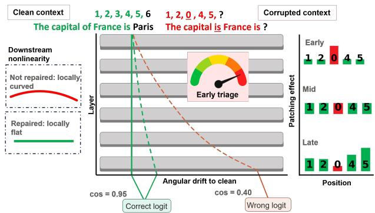  
Figure 1: Overview of spontaneous context restoration. Patching efects shift across positions with depth, hidden states distinguish repaired from failed inputs, and early rep- resentations support failure triage before generation.

Our contributions are: (1) we show that context restoration emerges spontaneously in models trained only on clean sequences and characterize its two-phase spatial organization across attention-only and pretrained transformers, localizing where corrupted information matters and how efects associ- ated with repair shift to the prediction position; (2) we show that repair outcome is predictable from residual-stream ge- ometry and linearly decodable from the corrupted prompt’s early hidden state before output generation, enabling selec- tive verification of inputs most likely to fail rather than treat- ing all corrupted inputs as unreliable; (3) we show that failed examples exhibit greater nonlinearity along corruption di- rections, and that corruption finetuning jointly increases robustness and reduces linearization error.

## Related Work

Context robustness and corruption. Liu et al. (2024) show that model performance degrades when relevant evi- dence is positioned in the middle of long contexts. Min et al. (2022) decompose prompts into components and find that some can be semantically corrupted without destroying per- formance. Abedin et al. (2025) show that punctuation-only corruption, which preserves all lexical content, still degrades math reasoning. Noisy-rationale and prompt-perturbation studies (Zhou et al. 2024; Anantheswaran et al. 2024; Chatziveroglou, Yun, and Kelleher 2025) report smooth degradation with noise and partial mitigation via prompting or finetuning. A separate line examines context faithfulness versus parametric priors: Neeman et al. (2023) formalize persuasion and susceptibility metrics, and Ortu et al. (2024) trace how factual recall and in-context counterfactual repeti- tion compete internally. All of these are primarily behavioral; they do not characterize the internal processes associated with successful performance under corruption.

Mechanistic interpretability and signal routing. Elhage et al. (2021) frame the residual stream as a shared communication channel; this view underpins our patch- ing analyses. Circuit analyses for IOI (Wang et al. 2022), greater-than (Hanna, Liu, and Variengien 2023), and arithmetic (Stolfo, Belinkov, and Sachan 2023; Yu and Ananiadou 2024; Zhang et al. 2024) localize specific behaviours to com-pact sets ofheads and MLPs, but assume clean inputs. Activa- tion patching (Meng et al. 2022; Goldowsky-Dill et al. 2023; Heimersheim and Nanda 2024; Zhang and Nanda 2023) and sparse autoencoders (Bricken et al. 2023; Olah et al. 2020) provide the causal and feature-level tools we use. Lad et al. (2024) report that deleting or swapping middle layers pre-serves 72–95% of predictions and hypothesise four stages of inference; this is consistent with our finding that middle layers are where efects associated with repair redistribute.

Self-repair and compensation. The Hydra Efect (Mc-Grath et al. 2023) shows that ablating one layer induces compensation elsewhere. Rushing and Nanda (2024) expand this across model families, identifying LayerNorm scaling and anti-erasure neurons as partial mechanisms. These stud- ies examine compensation after internal ablation (removed heads or layers). We study recovery from external, label-preserving input corruption as a related but distinct problem.

Depth-wise readout and representation geometry. The tuned lens (Belrose et al. 2023) decodes every layer in vo-cabulary space, treating the transformer computation as an iterative refinement. Marks and Tegmark (2023) and Shai et al. (2024) show that task-relevant information can form linear structures in the residual-stream. Engels et al. (2024) show that some features occupy subspaces of higher dimen- sions rather than single directions. Our linearization analysis measures functional curvature along the corruption direction, linking representation geometry to repair outcome.

Finetuning and robustness to corruption Training on noisy or perturbed inputs has been shown to improve ro- bustness across NLP models and LLMs (Gupta et al. 2024; Alajrami, Tan, and Aletras 2025; Liu et al. 2026; Zhang et al. 2026). Our work difers by varying the severity of corruption during finetuning and relating the resulting robustness gains to changes in linearization error along corruption directions. We also compare the setting in which models are trained only on clean inputs with one in which they are further finetuned on corrupted inputs.

## Experimental Setup

We study spontaneous context restoration: the ability of transformer models to preserve the intended task-relevant computation when part of the input context is corrupted, without being explicitly instructed to denoise it. Given a clean input x, a label-preserving corrupted input ${ \tilde { x } } = c _ { r } ( x ) .$ and target output y, we ask when $f _ { \theta } ( \tilde { x } ) = y$ and what inter- nal representations distinguish successful restoration from failure. We examine this in two complementary settings de- scribed below. For full details see Supplementary Content 1 & 2.

<table><tr><td>Task family</td><td>Example sequence</td></tr><tr><td>Constant increment</td><td> $2 , 4 , 6 , 8 , 1 0 , \ldots$ </td></tr><tr><td>Constant decrement</td><td> $1 0 , 8 , 6 , 4 , 2 , \ldots$ </td></tr><tr><td>Add-subtract</td><td> $2 , 5 , 3 , 6 , 4 , 7 , \ldots$ </td></tr><tr><td>Variable arithmetic</td><td> $2 , 4 , 7 , 1 6 , 2 2 , 2 9 , . . .$ </td></tr></table>

Table 1: Examples of the arithmetic sequence task families used in the controlled setting.

## Synthetic Symbolic Setting: Controlled Attention-only transformers on arithmetic

We generate four task families from four types of arithmetic sequences: constant increment, constant decrement, add- subtract, variable arithmetic, rendered as comma-separated token lists (Table 1). In variable-arithmetic sequences, the gap between successive elements increases by one at each step, unlike the fixed or alternating step sizes used in the other sequence families. Each sequence is of length $L ~ \in ~ \{ 4 0 , 6 0 \dot { , } 8 0 , 1 0 0 , 1 2 0 , 1 4 0 \}$ , with values bounded by $S _ { \mathrm { m a x } } = 1 3 , 0 0 0$ . For the corruption rate $r \in \{ 1 0 , \ldots , 9 0 \} \tilde { \% } _ { }$ we corrupt a total of $\lceil r L / 1 0 \dot { 0 } \rceil$ positions in each sequence, excluding the prediction target with one of three corruption modes: zero ablation, in-range substitution or out-of-range substitution. All corruptions are label-preserving.

We train two attention-only decoder-only transformers from scratch in clean sequences (Supplementary Figure 1.1): a small 4-layer model (1.75M parameters) and a large 10- layer model (4.01M parameters), both with 8 heads and a vocabulary of 13,008 tokens. Integer token indices are ran- domly permuted in tokeniser construction, forcing the model to learn the numerical structure from context. The 10-layer model is used for main analyses; the 4-layer model verifies depth-independence and replicates main findings. For each experimental condition, we evaluated 100 held-out disjoint sequences; accuracy is the exact match to the clean target. The architecture and training details are in the Supplemen- tary Content 1 & 2.

## Natural-Language Setting: Pretrained language models on NLP tasks

We evaluated five instruction-tuned LLMs: Gemma-3-1B- IT (Google 2025), OLMo-2-7B-Instruct (Allen Institute for AI 2025), Llama-3-8B-Instruct (Meta 2024), Qwen3- 32B (Qwen Team 2025), and Gemma-4-31B-IT (Google 2026), using greedy decoding without system prompt. The task families are ARC-Challenge (multiple-choice science), Factual QA (SQuAD-derived extractive reading comprehension) and CommonsenseQA (multiple-choice commonsense reasoning), with up to 500 examples per task filtered to $\leq 2 5 0$ tokens.

Each prompt is split into (user\_prefix, corruption\_region, user\_suffix); only the corruption region is modified while supporting tokens (such as "Question", "Answer", "Context", etc.), answer choices, and target answer span within the context passage are protected, ensuring label-preserving corruption. We apply four corruption modes at rates $r \in \{ 1 0 , 3 0 , 5 0 , 7 0 , 9 0 , 1 0 0 \} \%$ dropout (word deletion), replacement (substitution with function words), spelling (internal character shufling) and distractor (interleaving irrelevant sentences). The corruption rate is defined relative to the token count of the clean corruption region.

Accuracy degrades monotonically with corruption rate in both settings; dropout and replacement are the most destruc- tive, spelling is milder, distractor corruption is weakest, and factual QA is the most fragile task (Supplementary Figure 5.7).

We evaluate using exact match, F1 score (the harmonic mean of token precision and recall after text normalization, taking the maximum over all the available phrasings of the gold answers) and token agreement (whether clean and cor-rupted prompts produce the same sequence of generated to- kens). We term an instance repaired when the corrupted input produces the correct answer (operationalized as exact match, $F 1 \geq 0 . 5 ,$ , or token agreement depending on the analysis). When repair occurs in models trained on clean sequences without corruption priors, as in our controlled setting, we call it spontaneous context restoration as opposed to context restoration in pretrained models where parametric knowledge may also contribute.

## Analysis Methods

This section defines the tools applied in both settings. In the controlled attention-only transformer models, we cache acti- vations at two sites per layer: attention output before the skip connection and after residual addition. In pretrained models, we hook at the output of each transformer block. All analyses read from the last (prediction) token position unless other-wise noted. Full procedural details are in Supplementary Content 1 & 2.

Activation patching. To localize which positions carry repair-relevant information at each layer, we run the cor- rupted input and replace activations at a subset of positions with their clean counterparts, measuring the resulting change in the target-token logit (Elhage et al. 2021). In the controlled model, patching is performed at both hook sites; in pretrained models, at the layer output. Positions are partitioned into corrupted and clean groups, patched separately. Because this requires token-aligned sequences, patching in the pretrained setting uses only replacement and spelling corruptions.

Cosine similarity and repair probes. At each layer ℓ, we compute the cosine similarity cosℓ between the corrupted and clean activations at the prediction position before and after residual addition in the controlled model; layer output in pretrained models, measuring the angular alignment with the clean trajectory. To assess whether the repair outcome is predictable from intermediate representations, we train two probes: (1) a cosine probe using cosℓ as a single scalar feature and (2) a logistic regression linear probe on the full ddimensional corrupted activation with 5-fold stratified cross- validation. A separate is-corrupted probe predicts whether an input is corrupted vs. clean, measuring when corruption identity becomes linearly decodable.

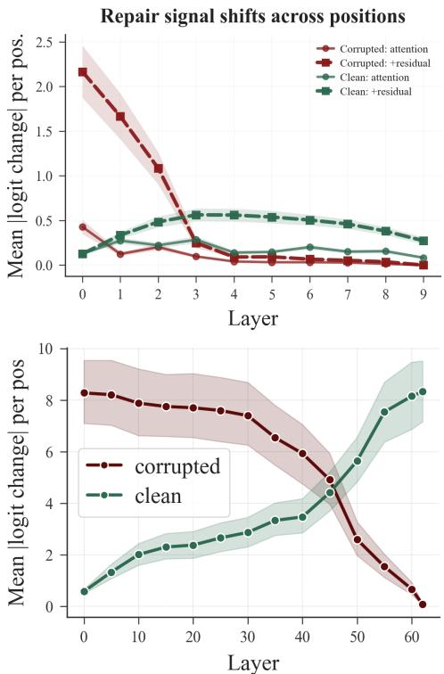  
Figure 2: Top: Residual stream decomposition and mean patching efect in the controlled (large) model for zero cor-ruption mode. Bottom: Mean per-position patching efect for Qwen3-32B for factual tasks.

Linearization test. To probe functional curvature along the corruption direction, we define $\mathbf { e } ~ = ~ \mathbf { h } _ { \ell } ^ { \mathrm { c o r r } } - \mathbf { h } _ { \ell } ^ { \mathrm { c l e a n } }$ at the prediction position and compare the true logit change when patching $\mathbf { h } _ { \ell } ^ { \mathrm { c l e a n } } + \alpha \mathbf { e }$ against the first-order Taylor prediction $\alpha \nabla g ^ { \intercal } \mathbf { e } ,$ , for $\alpha \in \{ 0 . 2 5 , 0 . 5 , 0 . 7 5 , 1 . 0 \}$ , where g denotes the downstream mapping from the hidden state at layer ℓ to the output logit being analyzed. The residual $\begin{array} { r } { r ( \alpha ) \mathbf { \bar { \alpha } } \approx \frac { 1 } { 2 } \alpha ^ { 2 } \vert \mathbf e ^ { \top } H \mathbf { \bar { e } } \vert } \end{array}$ quantifies departure from linearity: small residuals indicate the representation lies in a locally linear region of the logit map; large residuals indicate greater departure from locally linear behavior along the corruption direction. The quadratic approximation holds at small α; at $\alpha = 1 . 0$ the residual captures total nonlinearity beyond sec- ond order.

## Key Findings

## Where does repair happen? Repair Signals Shift from Corrupted to Clean Positions

Activation patching at individual positions reveals two dis- tinct phases. In the 10-layer model at layer 0, corrupted posi- tions produce approximately 20× larger patching efects than clean positions (Figure 2, top); this efect decays sharply with distance downstream of the nearest corrupted tokens. The patching efect is defined as the mean absolute change in the correct-token logit per patched position. By layers 3–4 the pattern reverses: clean positions carry the dominant efect, and corrupted positions approach the zero efect. Very few positions carry the maximum of the efect, and by the late layers, nearly all efects concentrate at the prediction posi- tion: the model routes information from distributed positions to clean positions especially at the single readout. Because the readout position is clean by construction, we analyzed it separately from other clean positions. The crossover per- sists after excluding the prediction position; however, the final prediction position has an efect 17× larger than the other clean positions (Supplementary Figure 5.9, 5.10, 5.11). This structure replicates in pretrained models: corrupted po- sitions dominate early layers on all three tasks, while clean positions take over later (Figures 2 bottom, Supplementary Figure 5.12). The depth of the crossover varies by task, but the qualitative pattern is preserved.

Decomposing the patching efect into the current layer’s attention output (before residual addition) and the full accumulated state (after residual addition) indicates that efects associated with successful repair accumulate progressively in the residual stream (Figure 2 top, Supplementary Figure 5.11). At corrupted positions in layer 0, the skip connection accounts for most of the efect, showing that the clean patch is carried forward primarily through the residual path rather than being modified by additional attention computation. At clean positions, each layer’s attention contributes a roughly uniform increment, while the skip-connection contribution grows steadily from layers 0 through 4.

In the controlled model, ablating 4, 6, or 8 of 8 heads at a single target layer leaves accuracy close to the no-ablation baseline when averaged over target layers (Supplementary Table 4.4), so repair does not depend on any individual layerlocal head subset at this scale.

## Why does repairfail? Failures Encounter High Curvature Along Corruption Trajectories

First-order predictions $( \Delta g _ { p r e d . } )$ closely match the true logit change $( \Delta g _ { t r u e . } )$ at $\alpha = 0 . 2 5$ for both repaired and failed examples, indicating that the logit map is locally approxi- mately linear near the clean representation (Figure 3 top). At $\alpha = 1 . 0 $ , the two groups separate sharply: failed exam- ples show approximately 8× larger linearization residuals than repaired examples. The residual grows with both cor- ruption rate and interpolation distance, producing a trumpet- shaped fan as the examples move farther from the clean tra- jectory (Supplementary Figure 5.17). This pattern appears in all tested LLMs and controlled models (Supplementary

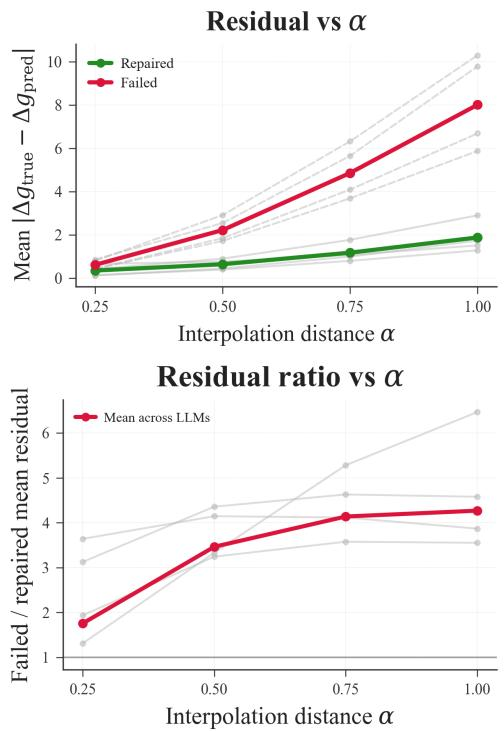  
Figure 3: Linearization residuals in the pretrained models. Repaired examples stay close to locally linear behavior near the clean trajectory, while failed examples show much larger residuals at larger interpolation steps.

Figure 5.18, 5.19). At layer 0, the repaired and failed ex-amples are nearly indistinguishable between step sizes. By the final layer, failed examples exhibit approximately $6 - 8 \times$ larger residuals than repaired examples at $\alpha = 1 . 0$ , while the gap remains small at $\alpha = 0 . 2 5$ . The linearization residual increases with depth for both repaired and failed examples, but substantially faster for failed examples across all four pretrained models (Supplementary Table 4.7).

A natural alternative is that failed examples simply un- dergo larger or more sensitive displacements rather than en- tering more curved regions. The interpolation sweep suggests that displacement magnitude or first-order sensitivity alone is insuficient to explain the diference: the ratio of failed to repaired linearization residuals grows with step size, from ${ \approx } 2 \times$ at $\alpha = 0 . 2 5$ to ≈4× at $\alpha = 1 . 0$ (Figure 3). A first-order sensitivity or displacement diference would produce a constant ratio across $\alpha ;$ curvature produces a higher-order efect, scaling approximately as $\alpha ^ { 2 }$ , and therefore predicts this growth. Together, these results associate repair failure with increasing departure from locally linear behavior as corrupted representations move away from the clean state.

## What distinguishes repair from failure? Repair Outcome Is Decodable from Residual-State Representations

The cosine similarity between corrupted and clean activa- tions at the prediction position separates repaired from failed examples. In the 10-layer controlled model, the repaired ex- amples maintain cosine similarity $\mathrm { c o s } _ { \ell } \approx 0 . 9 5$ across layers, while failed examples diverge to ≈0.40 by the final layer (Supplementary Figure 5.13). The gap grows with depth, indicating that successful repair preserves the clean residual di- rection, while failure corresponds to angular drift away from it. This cosine alignment of activations is predictive of repair at the per-example level. The within-ablation AUC (com-puted by training and evaluating the probe separately within each corruption rate) for cosine similarity reaches 0.80–0.95 across layers and corruption modes in the controlled set- ting (Figure 4 bottom). This controls for corruption severity: because more corruption makes repair less likely, a probe trained across rates could predict repair merely by reading of how corrupted the input is. Training within a fixed rate removes this confounding factor, so the above-chance AUC reflects genuine repair-predictive structure rather than sever- ity. See Supplementary Figure 5.14.

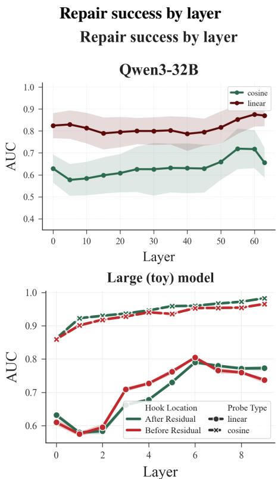  
Figure 4: Hidden states predict repair outcome. Top: Qwen3- 32B on ARC under replacement corruption. Bottom: con- trolled model under in-range ablation.

In pretrained models, the pattern becomes task- and corruption-dependent. Cosine similarity probes still reveal late-layer drift for failed examples, especially under destruc- tive corruptions such as dropout and replacement on factual QA. However, for milder corruptions such as distractor insertion and spelling, and for ARC and CommonsenseQA more broadly, correct and failed trajectories often remain close in cosine space. Thus, global angular alignment captures part of the information predictive of repair, but is not suficient in all settings (Supplementary Figure 5.16).

Corruption detection is near-ceiling (AUC ≈ 0.96 − 1.00) from the earliest layers across pretrained models and cor- ruption modes (Supplementary Table 4.6) indicating that the weaker and more task-dependent separation of repaired from failed examples reflects distinct hidden-state informa- tion rather than mere corruption detection. Controlled-model corruption-detection results show the same distinction (Sup- plementary Figure 5.15).

The linear repair-success probe outperforms cosine in pre- trained models compared to controlled models (Figure 4). This suggests that pretrained models contain information pre- dictive of repair in feature subspaces beyond global angular alignment. The controlled model therefore isolates a cleaner geometric repair signature compared to pretrained models. This could be due to controlled models being attention-only, as they lack MLPs, so all repair-relevant information must be encoded in residual-stream directions that attention can read and write. We hypothesize that pretrained models en- code repair-relevant features in representations shaped by both MLP layers and task priors acquired during pretraining, which a single angular metric cannot capture.

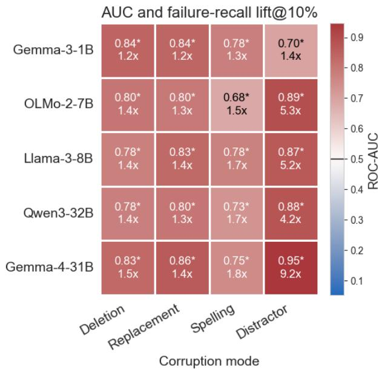  
Figure 5: Earliest-layer linear-probe ROC-AUC for predict- ing repair failure on factual QA, by model and corruption mode. Each cell reports AUC (top) and recall lift over random flagging at the 10% highest-risk threshold (bottom); asterisk indicates the bootstrap 95% CI lies entirely above chance (AUC > 0.5).

## Can failure be predicted before generation? Early Hidden States Support Deployable Failure Triage

The preceding analyses establish that repair outcome is en- coded in intermediate representations, but not every diagnos- tic is available in deployment. In particular, cosine similarity requires a clean version of the input, which is generally un- available when a prompt is received. We therefore evaluate a deployable variant that uses only the hidden state produced by the corrupted prompt at the final prompt position. A lin- ear probe reads this state from an early transformer layer and estimates the probability that the model will fail to recover the correct answer. It requires neither a clean reference input nor completion of output generation.

When corruption rates are pooled, the layer-0 probe achieves a mean ROC-AUC between 0.749 and 0.797 across the five pretrained models, with later early layers providing only small and inconsistent improvements (Figure 5, Sup- plementary Figure 5.21). This makes the first transformer layer the most economical operating point. Under a policy that flags the 10% of inputs assigned the highest failure risk by the probe, the probe identifies 16.4–33.4% of all failures, corresponding to a 1.64–3.34× recall lift over random selection. The flagged subset has 57.6–76.6% failure precision. Thus, a system could selectively request a cleaner input, rerun the prompt, or invoke a more expensive verification procedure for a small high-risk subset rather than treating every potentially corrupted input as unreliable.

The present result supports selective failure triage under matched or partially shifted deployment conditions: a low- cost failure-risk score, reserving intervention for inputs pre- dicted to be at greatest risk.

## Can repair robustness be improved? Moderate-Corruption Finetuning Improves Robustness

We finetune the 10-layer model on corrupted sequences at five corruption rates (10%, 30%, 50%, 70%, 90%) and evaluate across all ablation levels (Figure 6 top). We denote a model finetuned at the corruption rate r as FT @ r. FT@50 gives the best robustness-clean-accuracy trade-of, increas- ing the corruption rate tolerated at 50% accuracy from 40% in the baseline model to 90%, while preserving clean accuracy (0.997 vs. 0.999). FT@70 gives a smaller robustness gain with a clean-accuracy cost (0.922), while FT@90 reduces clean accuracy to 0.600. Therefore, moderate corruption dur- ing finetuning expands the tolerance to corruption; excessive corruption sacrifices clean accuracy and gives weaker robust- ness gains. The behavioral gain is accompanied by a change in local geometry. Moderate-corruption finetuning reduces displacement-normalized linearization error along corrup- tion directions, with the largest reduction around FT@50 (Supplementary Figure 5.22). Thus, the improvement in cor-ruption tolerance is accompanied by a more nearly linear downstream response to corrupted representations.

We also finetune Llama-3-8B-Instruct on corrupted natural-language examples at several corruption rates and evaluate corruption severities across all four corruption modes (Figure 6 bottom, Supplementary Figure 5.20). Unlike the controlled setting, no single finetuning severity is uniformly optimal. Corruption finetuning generally improves robustness, with the clearest gains on factual QA and under spelling, replacement, and dropout corruption, while gains on ARC and CommonsenseQA are smaller and more modedependent. Distractor corruption shows comparatively little room for improvement because the baseline is already robust. Thus, the result of the pretrained model supports the qual- itative benefit of finetuning corruption, but the severity of optimal training and the magnitude of improvement depend on the task and type of corruption.

Accuracy vs Corruption Rate

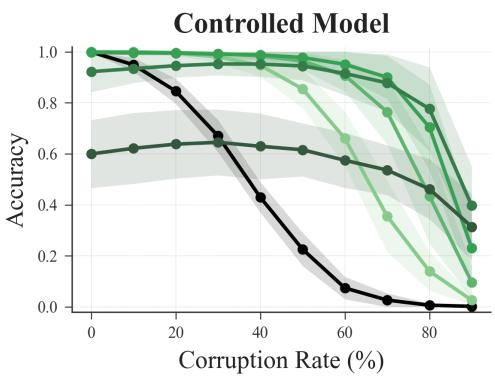

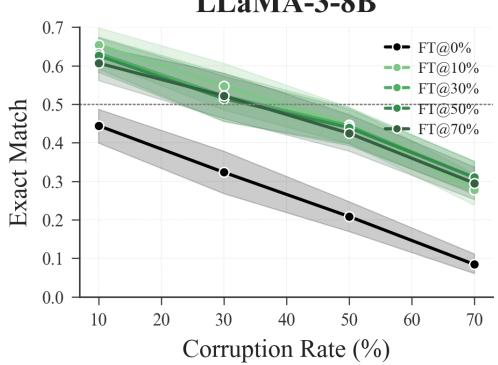  
Figure 6: Finetuning on moderately corrupted sequences shifts the repair frontier outward for controlled model (Top) and upward for pretrained (Bottom).

## Conclusions

We set out to characterize how language models preserve correct task performance under corrupted inputs. In the controlled setting, the ability of context restoration emerges spontaneously: models trained exclusively on clean sequences retain substantial task performance under corruption without explicit denoising training. We then find that this has a structured depth-wise organization: the influence of patching varies across positions with depth, while repair outcome is reflected in residual-state alignment and downstream nonlinearity.

Across attention-only transformers and five pretrained LLMs (1B–32B parameters), context restoration follows a shared two-phase spatial structure: early layers localize repair efects at corrupted positions, and late layers concen- trate the outcome at the prediction position. In the controlled model, head ablation leaves repair accuracy close to base- line, while the broader cross-model evidence show that re- pair outcome is associated with properties ofthe accumulated residual state, including alignment with the clean state and downstream nonlinearity.

Repair and failure difer in two aspects of residualstate geometry: alignment with the clean trajectory and nonlinearity of the downstream logit map along the corruption direction. Failed examples exhibit linearization residuals up to 6 − 8× larger than repaired examples in the controlled analyses, with the disparity increasing along the corruption direction. In the controlled model, moderate- corruption finetuning increases the corruption level tolerated at 50% accuracy from 40% to 90% while preserving clean performance. This behavioral improvement is accompanied by a reduction in displacement-normalized linearization er- ror along the corruption directions, linking the increased robustness to a more nearly linear downstream response.

The divergence between controlled and pretrained settings is itself informative. Cosine similarity alone achieves within- corruption AUC 0.80–0.95 in attention-only models, but linear probes substantially outperform cosine in pretrained models. This diference may reflect the properties of hidden- state representation introduced by MLPs and pretraining, although isolating their respective contributions requires fur- ther study (Engels et al. 2024).

The representation-level findings have two practical con- sequences. First, a linear probe using only the corrupted prompt’s early hidden state can identify a small subset of inputs at elevated failure risk before generation, allowing them to be routed for clarification, rerunning, or more ex- pensive verification. Second, extending prior work on cor- ruption finetuning, we vary training corruption severity and relate robustness gains to reduced linearization error in the controlled model, while showing that LLM gains depend on task and corruption type.

Together, these results connect context restoration to the depth-wise routing and geometry of residual representations. They provide representation-level diagnostics for repair fail- ure and show that corruption-aware finetuning can modify both robustness and the local response to corrupted repre- sentations.

## Limitations

Our controlled symbolic setting deliberately removes MLP sublayers and uses procedurally generated arithmetic se- quences so that restoration can be studied in a clean attention- only regime. This makes the mechanism tractable to study, but limits direct transfer of the quantitative findings to full- architecture transformers, multilingual settings, and tasks whose targets are not preserved under local content corrup- tion. The divergence that we observe between controlled and pretrained models where linear probes substantially outper- form cosine alignment, indicates that MLP-shaped features reshape the repair geometry in ways that our attention-only analysis cannot fully characterize. In the pretrained setting, we evaluate five instruction-tuned decoder-only LLMs (1B– 32B parameters) on three English-language task families under four label-preserving corruption modes. We do not evaluate mixture-of-experts, state-space, encoder-decoder, or retrieval-augmented architectures, so the generality of these geometric analyses beyond the studied settings is untested.

## References

Abedin, Z. U.; Qamar, S.; Flek, L.; and Karimi, A. 2025. Arithmattack: Evaluating robustness of llms to noisy context in math problem solving. In Proceedings of the The First Workshop on LLM Security (LLMSEC), 48–53.

Alajrami, A.; Tan, X.; and Aletras, N. 2025. Fine-tuning on noisy instructions: Efects on generalization and perfor- mance. In Proceedings ofthe 14th International Joint Conference on Natural Language Processing and the 4th Conference of the Asia-Pacific Chapter of the Association for Computational Linguistics, 728–742.

Allen Institute for AI. 2025. allenai/OLMo-2-1124-7B- Instruct. https://huggingface.co/allenai/OLMo-2-1124-7B- Instruct. Hugging Face model card. Accessed 2026-05-05.

Anantheswaran, U.; Gupta, H.; Scaria, K.; Verma, S.; Baral, C.; and Mishra, S. 2024. Cutting through the noise: Boosting llm performance on math word problems. arXiv preprint arXiv:2406.15444.

Belrose, N.; Ostrovsky, I.; McKinney, L.; Furman, Z.; Smith, L.; Halawi, D.; Biderman, S.; and Steinhardt, J. 2023. Elicit- ing latent predictions from transformers with the tuned lens. arXiv preprint arXiv:2303.08112.

Bricken, T.; Templeton, A.; Batson, J.; Chen, B.; Jermyn, A.; Conerly, T.; Turner, N.; Anil, C.; Denison, C.; Askell, A.; et al. 2023. Towards monosemanticity: Decomposing language models with dictionary learning. Transformer Circuits Thread, 2.

Chatziveroglou, G.; Yun, R.; and Kelleher, M. 2025. Ex- ploring llm reasoning through controlled prompt variations. arXiv preprint arXiv:2504.02111.

Clark, P.; Cowhey, I.; Etzioni, O.; Khot, T.; Sabharwal, A.; Schoenick, C.; and Tafjord, O. 2018. Think you have Solved Question Answering? Try ARC, the AI2 Reasoning Challenge. arXiv:1803.05457v1.

Elhage, N.; Nanda, N.; Olsson, C.; Henighan, T.; Joseph, N.; Mann, B.; Askell, A.; Bai, Y.; Chen, A.; Conerly, T.; et al. 2021. A mathematical framework for transformer circuits. Transformer Circuits Thread, 1(1): 12.

Engels, J.; Michaud, E. J.; Liao, I.; Gurnee, W.; and Tegmark, M. 2024. Not all language model features are one-dimensionally linear. arXiv preprint arXiv:2405.14860.

Goldowsky-Dill, N.; MacLeod, C.; Sato, L.; and Arora, A. 2023. Localizing model behavior with path patching. URL https://arxiv.org/abs/2304.05969.

Google. 2025. google/gemma-3-1b-it. https://huggingface. co/google/gemma-3-1b-it. Hugging Face model card. Ac- cessed 2026-05-05.

Google. 2026. google/gemma-4-31B-it. https://huggingface. co/google/gemma-4-31B-it. Hugging Face model card. Ac- cessed 2026-05-05.

Gupta, V.; Pandya, P.; Kataria, T.; Gupta, V.; and Roth, D. 2024. Evaluating concurrent robustness of language mod- els across diverse challenge sets. In Proceedings of the 2024 Conference on Empirical Methods in Natural Language Processing, 22162–22184.

Hanna, M.; Liu, O.; and Variengien, A. 2023. How does GPT- 2 compute greater-than?: Interpreting mathematical abilities in a pre-trained language model. Advances in Neural Information Processing Systems, 36: 76033–76060.

Heimersheim, S.; and Nanda, N. 2024. How to use and inter- pret activation patching. arXiv preprint arXiv:2404.15255.

Lad, V.; Lee, J. H.; Gurnee, W.; and Tegmark, M. 2024. The remarkable robustness of LLMs: Stages of inference? arXiv preprint arXiv:2406.19384.

Liu, N. F.; Lin, K.; Hewitt, J.; Paranjape, A.; Bevilacqua, M.; Petroni, F.; and Liang, P. 2024. Lost in the middle: How language models use long contexts. Transactions ofthe associationfor computational linguistics, 12: 157–173.

Liu, Y.; Foundjem, A.; Wu, X.; Li, H.; and Khomh, F. 2026. Improving the Robustness of Large Language Models for Code Tasks via Fine-tuning with Perturbed Data. arXiv preprint arXiv:2602.11411.

Marks, S.; and Tegmark, M. 2023. The geometry of truth: Emergent linear structure in large language model representations of true/false datasets. arXiv preprint arXiv:2310.06824.

McCoy, R. T.; Pavlick, E.; and Linzen, T. 2019. Right for the wrong reasons: Diagnosing syntactic heuristics in natural language inference. arXiv preprint arXiv:1902.01007.

McGrath, T.; Rahtz, M.; Kramar, J.; Mikulik, V.; and Legg, S. 2023. The hydra efect: Emergent self-repair in language model computations. arXiv preprint arXiv:2307.15771.

Meng, K.; Bau, D.; Andonian, A.; and Belinkov, Y. 2022. Locating and editing factual associations in gpt. Advances in neural information processing systems, 35: 17359–17372.

Meta. 2024. meta-llama/Meta-Llama-3-8B-Instruct. https: //huggingface.co/meta-llama/Meta-Llama-3-8B-Instruct. Hugging Face model card. Accessed 2026-05-05.

Min, S.; Lyu, X.; Holtzman, A.; Artetxe, M.; Lewis, M.; Hajishirzi, H.; and Zettlemoyer, L. 2022. Rethinking the role of demonstrations: What makes in-context learning work? In Proceedings ofthe 2022 conference on empirical methods in natural language processing, 11048–11064.

Neeman, E.; Aharoni, R.; Honovich, O.; Choshen, L.; Szpek- tor, I.; and Abend, O. 2023. Disentqa: Disentangling para- metric and contextual knowledge with counterfactual ques- tion answering. In Proceedings of the 61st Annual Meeting ofthe Associationfor Computational Linguistics (Volume 1: Long Papers), 10056–10070.

Olah, C.; Cammarata, N.; Schubert, L.; Goh, G.; Petrov, M.; and Carter, S. 2020. Zoom in: An introduction to circuits. Distill, 5(3): e00024–001.

Ortu, F.; Jin, Z.; Doimo, D.; Sachan, M.; Cazzaniga, A.; and Schölkopf, B. 2024. Competition of mechanisms: Trac- ing how language models handle facts and counterfactuals. In Proceedings of the 62nd Annual Meeting of the Association for Computational Linguistics (Volume 1: Long Papers), 8420–8436.

Petroni, F.; Lewis, P.; Piktus, A.; Rocktäschel, T.; Wu, Y.; Miller, A. H.; and Riedel, S. 2020. How context af- fects language models’ factual predictions. arXiv preprint arXiv:2005.04611.

Qwen Team. 2025. Qwen/Qwen3-32B. https://huggingface. co/Qwen/Qwen3-32B. Hugging Face model card. Accessed 2026-05-05.

Rajpurkar, P.; Zhang, J.; Lopyrev, K.; and Liang, P. 2016. Squad: 100,000+ questions for machine comprehension of text. arXiv preprint arXiv:1606.05250.

Rushing, C.; and Nanda, N. 2024. Explorations of self-repair in language models. arXiv preprint arXiv:2402.15390.

Shai, A. S.; Marzen, S. E.; Teixeira, L.; Oldenziel, A. G.; and Riechers, P. M. 2024. Transformers represent belief state geometry in their residual stream. Advances in Neural Information Processing Systems, 37: 75012–75034.

Singh, A.; Singh, N.; and Vatsal, S. 2024. Robustness of Large Language Models to Perturbations in Text. arXiv preprint arXiv:2407.08989.

Stolfo, A.; Belinkov, Y.; and Sachan, M. 2023. A mech- anistic interpretation of arithmetic reasoning in language models using causal mediation analysis. arXiv preprint arXiv:2305.15054.

Talmor, A.; Herzig, J.; Lourie, N.; and Berant, J. 2019. Com- monsenseQA: A Question Answering Challenge Targeting Commonsense Knowledge. In Proceedings ofthe 2019 Conference ofthe North American Chapter ofthe Associationfor Computational Linguistics: Human Language Technologies, Volume 1 (Long and Short Papers), 4149–4158. Minneapolis, Minnesota: Association for Computational Linguistics.

Wang, F.; Zhang, Z.; Zhang, X.; Wu, Z.; Mo, T.; Lu, Q.; Wang, W.; Li, R.; Xu, J.; Tang, X.; et al. 2024. A compre- hensive survey of small language models in the era of large language models: Techniques, enhancements, applications, collaboration with llms, and trustworthiness. ACM Transactions on Intelligent Systems and Technology.

Wang, K.; Variengien, A.; Conmy, A.; Shlegeris, B.; and Steinhardt, J. 2022. Interpretability in the wild: a circuit for indirect object identification in gpt-2 small. arXiv preprint arXiv:2211.00593.

Wang, X.; Wang, H.; and Yang, D. 2022. Measure and improve robustness in NLP models: A survey. In Proceedings ofthe 2022 conference ofthe North American chapter ofthe association for computational linguistics: human language technologies, 4569–4586.

Yu, Z.; and Ananiadou, S. 2024. Interpreting arithmetic mechanism in large language models through comparative neuron analysis. arXiv preprint arXiv:2409.14144.

Zhang, F.; and Nanda, N. 2023. Towards best practices of ac- tivation patching in language models: Metrics and methods. arXiv preprint arXiv:2309.16042.

Zhang, W.; Wan, C.; Zhang, Y.; Cheung, Y.-m.; Tian, X.; Shen, X.; and Ye, J. 2024. Interpreting and improving large language models in arithmetic calculation. arXiv preprint arXiv:2409.01659.

Zhang, Z.; Huang, C.; Liu, X.; Zhao, D.; Su, J.; and Cardie, C. 2026. GSM-Noise: Exploring and Enhancing Large Lan- guage Models’ Reasoning under Noisy Inputs. In Findings of the Association for Computational Linguistics: ACL 2026, 35020–35045.

Zhou, A.; Li, B.; and Wang, H. 2024. Robust prompt opti- mization for defending language models against jailbreaking attacks. Advances in Neural Information Processing Systems, 37: 40184–40211.

Zhou, Z.; Tao, R.; Zhu, J.; Luo, Y.; Wang, Z.; and Han, B. 2024. Can language models perform robust reason- ing in chain-of-thought prompting with noisy rationales? Advances in Neural Information Processing Systems, 37: 123846–123910.

# Supplementary content

## S1 Experiments and methods: Synthetic Symbolic Setting

## S1.1 Problem Setup

We study spontaneous context restoration in the symbolic setting. Given a clean input $x ,$ a label-preserving corrupted variant $\tilde { x } = c _ { r } ( x )$ that preserves the target y, and a model $f _ { \theta } ,$ , we ask whether $f _ { \theta } ( \tilde { x } ) = y$ , and trace where and how the network recovers the correct computation. At each layer ℓ, the hidden state is $h _ { \ell } \in \mathbb { R } ^ { \breve { T } \times \breve { C } }$ , where $T$ is the token sequence length and C is the hidden dimension. All predictions are read from the final position $p = T$

## S1.2 Data Generation

Sequence families. We generate integer sequences from four arithmetic families: constant increment, constant decrement (subtract), add-subtract (alternating addition and subtraction with separate step sizes $q _ { \mathrm { a d d } }$ and $q _ { \mathrm { s u b } }$ , where $q _ { \mathrm { a d d } } > q _ { \mathrm { s u b } } )$ , and variable arithmetic (ste increases b 1 each turn). For each famil , startin value $p$ and ste size q are drawn from Gaussian distributions with family-specific means and standard deviations (see Table 2), then rounded: $p = \lfloor \vert Z _ { p } \vert \rfloor , q = \operatorname* { m a x } \{ 1 , \lfloor \vert Z _ { q } \vert \rfloor \}$ Se uences whose values violate the constraint $0 \leq s _ { i } \leq S _ { \operatorname* { m a x } }$ for all i are rejected.

Arithmetic sequence selection. We use procedurally generated arithmetic sequences as a controlled setting because they are simple, tractable, and have unambiguous next-token targets while still requiring the model to infer structure from context. Their generative rules can be specified exactly, corruption can be applied at known positions while preserving the target, and clean and corrupted internal trajectories can therefore be compared directly. This makes the setting suitable for mechanistic analyse of context restoration while minimizing confounds from linguistic ambiguity or external knowledge.

Table 2: Sampling parameters for each sequence family.
<table><tr><td>Family</td><td> $\mu _ { p }$ </td><td> $\sigma _ { p }$ </td><td> $\mu _ { q }$ </td><td> $\sigma _ { q }$ </td></tr><tr><td>Increment</td><td>6500</td><td>3500</td><td>100</td><td>200</td></tr><tr><td>Add-subtract</td><td>9000</td><td>1000</td><td>100</td><td>200</td></tr><tr><td>Variable arithmetic</td><td>15</td><td>100</td><td>15</td><td>100</td></tr><tr><td>Subtract</td><td>10000</td><td>1000</td><td>20</td><td>50</td></tr></table>

Train/test split. For each family, we draw a pool of unique pairs $( p , q )$ (500K draws for most families; 10M for variable arithmetic due to lower acceptance rate). From the unique pairs, we sample 15,000 for training (4,200 for variable arithmetic) and 100 for testing, ensuring the two sets are disjoint. All sequences in the training set use a fixed length of $T _ { \mathrm { n u m } } = 1 5 0$ numbers. The test set uses variable lengths $T _ { \mathrm { n u m } } \in \{ 4 0 , 6 0 , 8 0 , \dot { 1 } 0 0 , 1 2 0 , 1 4 0 \}$

Prompt format. Each sequence is rendered as a comma-separated list of integers followed by a trailing comma (e.g. 46, 47, 49, 52,). The prediction target is the next integer in the sequence, which is never included in the input.

Training corpus size. The trainin set contains 39 360 se uences across all four families (15 000 er famil exce t 4 200 for variable arithmetic, plus a small number from the add-subtract family). After tokenisation, this corresponds to approximately 14.76M tokens. The validation set is a 20% held-out split (stratified by sequence family) drawn from the same $( p , q )$ pool as the training set.

## S1.3 Tokeniser

We train a byte-pair encoding (BPE) tokeniser on a minimal corpus of comma-separated digit strings, ensuring that the comma character is always segmented as its own token. We then add all integers from 0 to 13,000 as explicit single tokens, so every number in our sequences is guaranteed to be a single token. The integer token indices are randomly permuted at tokeniser construction time using the experiment seed; this forces the model to infer numerical structure from context rather than from embedding-index order. The final vocabulary contains 13,008 tokens: 13,001 integer tokens, a comma token, and 6 specia tokens ([PAD], [UNK], [CLS], [SEP], [MASK], and a BPE merge artifact).

## S1.4 Model Architecture

We train two decoder-only, attention-only transformers from scratch. Both use multi-head causal self-attention with no MLP layers:

Each layer consists of: multi-head self-attention → residual addition → LayerNorm. There are no feedforward/MLP sublayers. The unembedding matrix $W _ { u }$ projects from $d _ { \mathrm { m o d e l } }$ to the vocabulary. The 10-layer model is used for the main mechanistic analyses; the 4-layer model is used to verify that observed efects are not artifacts of a particular depth.

Table 3: Model configurations.
<table><tr><td>Name</td><td>Layers</td><td>Heads</td><td> $d _ { \mathrm { m o d e l } }$ </td><td>Dropout</td><td>Parameters</td></tr><tr><td>SMALL</td><td>4</td><td>8</td><td>64</td><td>0.1</td><td>1.75M</td></tr><tr><td>LARGE</td><td>10</td><td>8</td><td>128</td><td>0.1</td><td>4.01M</td></tr></table>

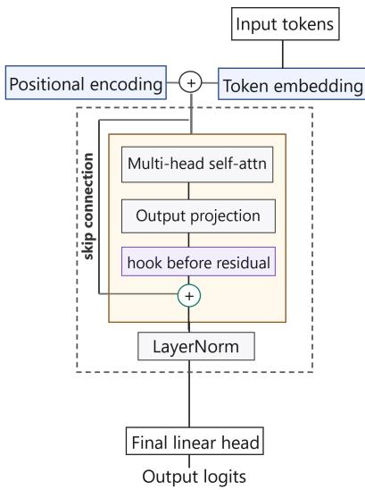  
Figure 7: Attention-only transformer architecture.

## S1.5 Training

Both models are trained with the standard next-token prediction objective: for input sequence $( s _ { 1 } , \ldots , s _ { T } )$ , the loss is the cross-entropy between the model’s prediction at position t and the ground-truth token $s _ { t + 1 }$ , summed over all positions $t \in$ $\{ 1 , \ldots , T - 1 \}$

Optimiser. Adam with initial learning rate $4 \times 1 0 ^ { - 4 }$ . Learning rate is reduced by a factor of 0.5 on plateau (patience 3 epochs, monitoring validation loss).

Hyperparameter selection. During development, we performed a small manual exploratory sweep over learning rates $\{ 1 \times$ $1 0 ^ { - 4 } , \hat { 4 } \times 1 0 ^ { - 4 } , 1 \times 1 0 ^ { - 3 } \}$ . We selected $4 \times 1 0 ^ { - 4 }$ based on validation loss and stable convergence. For the logistic-regression probes used in subsequent analyses, we additionally explored regularisation strengths $C \in \{ 0 . 0 1 , 0 . 1 , 1 , 1 0 \}$ and found the results qualitatively insensitive to this choice; we use $C \stackrel { \cdot } { = } 1$ throughout the reported experiments.

Batch size. We manually explored batch sizes of {8, 12, 24} during development and used 12 sequences per batch based on validation performance and training stability.

Convergence. Training is run for the number of epochs needed to converge (≈ 60 for the Small model, ≈ 35 for the Large model), with checkpoints saved at regular intervals. All diagnostic experiments use the final converged checkpoint.

## S1.6 Corruption Regimes (Test Time)

For a corruption rate $r \in \{ 1 0 , 2 0 , 3 0 , 4 0 , 5 0 , 6 0 , 7 0 , 8 0 , 9 0 \} \%$ , we sample $\lceil r \cdot T _ { \mathrm { n u m } } / 1 0 0 \rceil$ number positions uniformly without replacement, excluding the final observed element (which determines the prediction target). We apply one of three substitution schemes:

1. Zero ablation: selected entries are replaced with the literal token 0.

2. In-range substitution: selected entries are replaced with integers sampled uniformly from (min s, max s), where s is the clean sequence. A single replacement value is drawn per sequence and applied to all corrupted positions in that sequence.

3. Out-of-range substitution: selected entries are replaced with integers sampled from $[ 0 , \operatorname* { m i n } s ) \cup ( \operatorname* { m a x } s , S _ { \operatorname* { m a x } } ]$

In all cases the rediction tar et (the next number after the dis la ed se uence) is ke t fixed, so all corru tions are label preserving. Corrupted token positions and number positions are recorded for use in position-group patching analyses.

## S1.7 Evaluation Protocol

For each combination of sequence family (×4), corruption regime (×3), corruption rate (×9), and sequence length (×6), we evaluate 100 held-out sequences whose $( p , q )$ pairs are disjoint from those used during training. Accuracy is measured by exact match between the model’s argmax predicted next token and the clean ground-truth target. All evaluations use greedy decoding (no sampling).

## S1.8 Fine-tuning on Corrupted Data

Dataset construction. Starting from the clean training sequences, we sample 20% for fine-tuning and 10% for fine-tuning validation, stratified by sequence family. For each target corruption rate $r \in \{ 1 0 , 3 0 , 5 0 , 7 0 , 9 0 \} \hat { \% }$ , we apply zero-ablation corruption to the sampled sequences. The input to the model is the corrupted sequence; the label is the original clean sequence (i.e. the model is trained to predict clean next tokens from corrupted inputs).

Training procedure. Fine-tuning starts from the converged base checkpoint. All parameters are trainable (full-model finetuning, no freezing). We use AdamW with learning rate $5 \times 1 0 ^ { - 5 }$ , weight decay 0.01, batch size 12, and ReduceLROnPlateau scheduling (factor 0.5, patience 3). Training runs for up to 100 epochs; we select the checkpoint with the lowest validation loss.

Evaluation. Each fine-tuned model is evaluated on the same held-out test sets used for the base model, across all three corruption regimes (zero, in-range, out-of-range), all ablation rates (0%–90%), and all sequence lengths. We report accuracy- vs-ablation curves, $\tau _ { 5 0 }$ (interpolated ablation rate at 50% accuracy), mean accuracy across ablation levels, and clean accuracy (performance at 0% corruption).

## S1.9 Activation Caching

All anal ses re uire access to intermediate hidden states. We extract activations usin forward hooks re istered on s ecific modules within each transformer layer. Two caching targets are used:

1. Residual-stream activations (after LayerNorm): Hooks are registered on the full layer module (i.e. the output of layers[ℓ]), which corresponds to the hidden state after the attention output has been added to the residual stream and passed through LayerNorm. These are denoted $h _ { \ell } ^ { \mathrm { r e s i d } } \in \mathbb { R } ^ { T \times C }$

2. Layer-only activations (before residual addition): Hooks are registered on the self\_attention submodule, capturing the attention output before it enters the residual connection. These are denoted $h _ { \ell } ^ { \mathrm { l a y e r } } \in \mathbb { R } ^ { T \times C }$

Hooks clone and detach all captured tensors to prevent gradient graph retention. For analyses requiring gradients (the linearisation test), the hook instead calls retain\_grad() on the output tensor without detaching.

## S1.10 Logit Readout and Mean-Centring

At any layer ℓ, we read out logits by applying the model’s unembedding matrix $W _ { u }$ to the cached activation:

$$
\mathrm { L o g i t } _ { \ell } = W _ { u } \cdot h _ { \ell } ^ { \mathrm { r e s i d } } [ p , : ] \in \mathbb { R } ^ { V } ,
$$

where V is the vocabulary size and p is the prediction position. Following standard practice (Elhage et al. 2021; Rushing and Nanda 2024; McGrath et al. 2023), all logit vectors are mean-centred (subtract the mean across the vocabulary dimension) before any comparisons. This preserves the softmax distribution while removing a global ofset that varies across layers.

## S1.11 Activation Patching

Activation patching replaces hidden states from one forward pass with those from another and measures the efect on the target-token logit.

Setup. For each example, we run a clean forward pass (input x) and a corrupted forward pass (input x˜), caching all layer activations $\{ h _ { \ell } ^ { \mathrm { c l e a n } } \}$ and $\{ h _ { \ell } ^ { \mathrm { c o r r } } \}$ and recording the target-token logits $g ^ { \mathrm { c l e a n } }$ and $\bar { \boldsymbol g } ^ { \mathrm { c o r r } }$

Position-group patching. At each layer ℓ, we run the corrupted input but replace activations in all the corrupted positions with their counterparts from uncorrupted run, then replace the activations separately in all clean positions. This yields two scalars per layer: the mean absolute logit change |∆g| per position from patching corrupted positions and from patching clean positions. Token positions are partitioned by whether the corresponding number token was corrupted.

Per-position patching. We also patch individual positions one at a time across all layers, producing a full $( L \times T )$ patching map per example. The cumulative repair curve sorts positions by patching efect to show that a small subset of positions carries most of the total repair signal.

All-position interpolation. We interpolate between clean and corrupted activations at all positions simultaneously. At layer ℓ and interpolation strength α:

$$
h _ { \ell } ^ { \mathrm { p a t c h e d } } [ : , : ] = h _ { \ell } ^ { \mathrm { c l e a n } } [ : , : ] + \alpha \cdot \big ( h _ { \ell } ^ { \mathrm { c o r r } } [ : , : ] - h _ { \ell } ^ { \mathrm { c l e a n } } [ : , : ] \big ) .
$$

We evaluate $\alpha \in \{ - 0 . 5 , 0 . 0 , 0 . 5 , 1 . 0 , 1 . 5 , 2 . 0 \}$ . The base forward pass uses the clean input. The normalised logit change $\Delta g ( \alpha ) / \Delta g ( 1 )$ is plotted across layers.

## S1.12 Cosine Similarity and Repair Probes

Cosine similarity. For each example and each layer $\ell ,$ we compute cosine similarity between the clean and corrupted residual- stream activations at the prediction position:

$$
\mathrm { c o s } _ { \ell } = \frac { h _ { \ell } ^ { \mathrm { c l e a n } } [ p , : ] \cdot h _ { \ell } ^ { \mathrm { c o r r } } [ p , : ] } { \| h _ { \ell } ^ { \mathrm { c l e a n } } [ p , : ] \| \cdot \| h _ { \ell } ^ { \mathrm { c o r r } } [ p , : ] \| + \epsilon } ,
$$

where $\epsilon = 1 0 ^ { - 1 0 }$ . The same computation is applied to layer-only activations (before residual addition), yielding two cosine trajectories per example.

Repair label. An example is labelled as “repaired” $( y = 1 )$ if the model’s argmax prediction on the corrupted input matches the ground-truth target token, and “failed” $( y = 0 )$ otherwise.

Linear probe. We train a logistic regression classifier (scikit-learn, L-BFGS solver, $C = 1 . 0 $ , max 1000 iterations) to predict the repair label from the corrupted activation vector $h _ { \ell } ^ { \mathrm { c o r r } } [ p , : ] \in \mathbb { R } ^ { C }$ . Features are standardised (zero mean, unit variance) per fold. We report 5-fold stratified cross-validated ROC-AUC.

Cosine probe. The same logistic regression is trained on a single scalar feature: the cosine similarity cosℓ. This tests whether angular alignment alone is predictive.

Within-ablation evaluation. To control for the trivial correlation between corruption severity and repair success, we also evaluate both probes restricted to examples at a single corruption rate α. This yields within-ablation AUC values that measure whether the probe discriminates repaired from failed examples at the same corruption level.

Corruption-detection probe. A separate logistic regression is trained to predict whether an input was corrupted at all, using a balanced dataset of all unique clean activations (label 0) and all corrupted activations (label 1). This probe is evaluated per-layer to determine at what depth corruption identity becomes linearly decodable.

## S1.13 Linearisation Scale Test

The linearisation test measures functional curvature of the mapping from layer-ℓ hidden states to a target logit, along the direction of corruption-induced displacement.

Setup. Let $g : \mathbb { R } ^ { C } $ R denote the function that maps the layer-ℓ hidden state at position $p$ to the scalar logit of the target token, with all other positions and all downstream computation held fixed. We compute:

1. Clean forward pass on input x. A hook on layer ℓ captures the output $h _ { \rho } ^ { \mathrm { c l e a n } }$ with radients retained. We read the tar et-token logit $g ( h _ { \ell } ^ { \mathrm { c l e a n } } )$ and backpropagate to obtain the gradient $\nabla _ { h } g \big | _ { h _ { \ell } ^ { \mathrm { c l e a n } } } \in \mathbb { R } ^ { C }$ at position $p .$

2. Corrupted forward pass on input x˜. A hook captures $h _ { \ell } ^ { \mathrm { c o r r } }$

3. Error direction: $e = h _ { \ell } ^ { \mathrm { c o r r } } [ p , : ] - h _ { \ell } ^ { \mathrm { c l e a n } } [ p , : ]$ , with $\lVert e \rVert$ recorded.

Predicted vs. true logit change. For each $\alpha \in \{ 0 . 2 5 , 0 . 5 , 0 . 7 5 , 1 . 0 \}$ , we construct the perturbed state

$$
\tilde { h } _ { \ell } ( \boldsymbol { \alpha } ) [ p , : ] = h _ { \ell } ^ { \mathrm { c l e a n } } [ p , : ] + \boldsymbol { \alpha } \cdot \boldsymbol { e } ,
$$

leaving all other positions at their clean values. The predicted (first-order) logit change is

$$
\Delta g _ { \mathrm { p r e d } } ( \alpha ) = \alpha \cdot \nabla _ { h } g ^ { \top } e ,
$$

and the true logit change is obtained by a patched forward pass:

$$
\Delta g _ { \mathrm { t r u e } } ( \alpha ) = g \big ( \tilde { h } _ { \ell } ( \alpha ) \big ) - g \big ( h _ { \ell } ^ { \mathrm { c l e a n } } \big ) .
$$

The patching is implemented via a forward hook that modifies only position $\mathbf { \nabla } \cdot p$ at layer $\ell ,$ then allows the forward pass to continue normally through all subsequent layers.

Residual and metrics. The linearisation residual is $r ( \alpha ) = | \Delta g _ { \mathrm { t r u e } } ( \alpha ) - \Delta g _ { \mathrm { p r e d } } ( \alpha ) |$ |. By Taylor’s theorem,

$$
\begin{array} { r } { \Delta g _ { \mathrm { t r u e } } ( \alpha ) = \alpha \nabla g ^ { \top } e + \frac { 1 } { 2 } \alpha ^ { 2 } e ^ { \top } H e + \mathcal { O } ( \alpha ^ { 3 } ) , } \end{array}
$$

where H is the Hessian of g with respect to $h _ { \ell }$ at $h _ { \ell } ^ { \mathrm { c l e a n } }$ . Small α probes linearity; larger α reveals curvature along e. We report:

• Per-α absolute error: $| r ( \alpha )$ |.

• Directional curvature proxy: $\kappa ( \alpha ) = 2 \cdot r ( \alpha ) / \alpha ^ { 2 }$ , which approximates $| e ^ { \top } H e |$ when higher-order terms are small.

• RMSE across all α values.

• Score at $\alpha = 1 \colon - | r ( 1 ) |$ (higher = more linear = more repairable).

Outcome conditioning. Examples are first filtered to those where the clean-run argmax prediction matches the groundtruth target (ensuring the model possesses the relevant knowledge). Among these, each example is then labelled as “repaired” $( y = 1 )$ if the corrupted-run argmax also matches the target, and “failed” $\bar { ( y = 0 ) }$ otherwise. All residual plots are split by this corrupted-run label to compare curvature between repaired and failed examples.

Per-layer execution. The test is run independently at every layer $\ell \in \{ 0 , \ldots , L - 1 \}$ , for every example in the evaluation set, across all corruption regimes (zero, in-range, out-of-range) and all ablation rates (10%–90%).

## S1.14 Head Ablation

To test whether repair depends on specific attention heads, we mean-ablate subsets of heads at a target layer while running inference on corrupted inputs.

Procedure. For a target layer ℓ and a set of head indices $\mathcal { H } \subseteq \{ 0 , \ldots , H - 1 \}$ , we replace the post-softmax attention weights of each head $h \in \mathcal H$ with uniform causal attention:

$$
A _ { h } [ i , j ] = { \left\{ \begin{array} { l l } { 1 / ( i + 1 ) } & { { \mathrm { i f ~ } } j \leq i } \\ { 0 } & { { \mathrm { o t h e r w i s e } } } \end{array} \right. }
$$

This reserves the causal mask structure while removin all content-de endent attention for the ablated heads. Non-ablated heads are unmodified. The intervention is implemented as a context manager that monkey-patches the attention module’s forward method during inference.

Ablation schedule. We ablate subsets of size $| \mathcal { H } | \in \{ 4 , 6 , 8 \}$ (out of 8 total heads), sampling 3 random subsets per size, at every layer independently. For each configuration, we record layer-wise residual token agreement and final accuracy on corrupted inputs at ablation rates 10%, 30%, and 50%.

## S2 Experiments and Methods: Natural-Language Setting

## S2.1 Problem Setup

Natural-language experiments extend the symbolic setting to pretrained instruction-tuned LLMs evaluated on standard NLP benchmarks. The same core question applies: given a clean prompt x and a label-preserving corrupted variant $\tilde { x } = c _ { r } ( x )$ that preserves the target y, we ask whether $f _ { \theta } ( \tilde { x } ) = y$ and trace where and how recovery occurs internally. All models are evaluated with greedy decoding and no system prompt.

## S2.2 Models

We evaluate five instruction-tuned pretrained language models:

Table 4: Pretrained models evaluated in the natural-language setting.
<table><tr><td>Model</td><td>Parameters</td></tr><tr><td>Gemma-3-1B</td><td>1B</td></tr><tr><td>OLMo-2-1124-7B-Instruct</td><td>7B</td></tr><tr><td>Meta-LLaMA-3-8B-Instruct</td><td>8B</td></tr><tr><td>Qwen3-32B</td><td>32B</td></tr><tr><td>Gemma-4-31B-IT</td><td>31B</td></tr></table>

All models are loaded via HuggingFace Transformers with output\_hidden\_states=True. Models up to 8B are run in bfloat16; larger models use 8-bit quantization (bitsandbytes). Prompts are rendered using each model’s native chat template via apply\_chat\_template without system prompt, to avoid introducing a prompting confound. The padding uses the EOS token on the left side.

## S2.3 Tasks and Prompt Construction

We evaluated three task families, each cast into a unified prompt-to-answer format with up to 500 base examples per task. The examples are filtered to have at most 250 tokens after the chat-template rendering.

ARC-Challenge. Multiple-choice science questions from the AI2 Reasoning Challenge (Clark et al. 2018). The prompt contains the question text and the labeled answer choices (A–D). The model must return only the exact answer text.

Factual QA. Extractive reading-comprehension examples derived from SQuAD (Rajpurkar et al. 2016). The prompt contains a context passage and a question. The model must return only the short answer span copied from the context.

CommonsenseQA. Common sense Multiple-choice reasoning questions (Talmor et al. 2019). The prompt contains the question and five answer choices (A–E). The model must return only the exact answer text.

Prompt structure. Each prompt is decomposed into three parts: x = (user\_prefix, corruption\_region, user\_suffix).

Onl corruption\_region is modified under corru tion. For ARC and CommonsenseQA, the corru tion re ion is the question text; answer choices remain intact. For Factual QA, the corruption region contains both the context and question; the instruction specif ing the answer format is protected. Scafold tokens (Context:, Question:, Answer:, Choices:) are never corrupted. This ensures that task format and gold answer are unchanged, so that all corruptions are label-preserving.

Dataset selection. We select ARC-Challenge, CommonsenseQA, and a SQuAD-derived factual QA task to cover comple-mentary forms of language-model reasoning and context use. ARC-Challenge evaluates multiple-choice scientific reasoning, CommonsenseQA evaluates multiple-choice commonsense reasoning, and factual QA evaluates extractive reading comprehen-sion in which the answer must be recovered from an explicit context passage. Together, these tasks allow us to test whether context restoration generalizes across diferent task structures and sources of task-relevant information, rather than being specific to a single benchmark or response format.

## S2.4 Corruption Modes

We apply four corruption modes at rates r ∈ {10, 30, 50, 70, 90, 100}%. The corruption rate is defined relative to the number of tokeniser tokens in the clean corruption region: if the region contains N tokens, then rate α modifies approximately αN tokens worth of content. For dropout, replacement, and spelling, eligible words are selected until the corresponding token mass reaches the target budget. For distractor corruption, α denotes the ratio of inserted distractor tokens to the original token count.

1. Dropout: Selected eligible words are deleted from the corruption region. Scafold words and punctuation are protected.

2. Replacement: Selected eligible words are replaced with random high-frequency function words drawn from a fixed set ("the", "a", "of", "and", etc.). Replacements that collide with the original word are re-sampled up to 10 times.

3. Spelling: Selected eligible words are misspelled by shufling their internal characters while preserving the first and last characters. Words with ≤ 3 characters or uniform middle characters are skipped. This corruption preserves approximate word identity while disrupting exact tokenisation.

4. Distractor: Semantically irrelevant but syntactically well-formed sentences (e.g. "Fish swim.", "Trees grow.") are interleaved into the corruption region at random positions until the target token budget is reached. Sentences are drawn from a fixed ool of 100 factual/common-sense statements.

All corruption functions operate on word-level tokenisation, track the achieved corruption rate in model-specific tokens, and record which word positions were modified. Only dropout and replacement alter the number of tokens; spelling preserves token count approximately; distractor strictly adds tokens.

## S2.5 Evaluation Metrics

We evaluate model outputs using greedy decoding with max\_new\_tokens=32. Clean and corrupted predictions are generated in batches of 32 with left-padding. Clean predictions are cached per unique prompt to avoid redundant generation. We compute:

• Exact match (EM): Whether the normalised prediction exactly matches any gold answer. For multiple-choice tasks, we also accept the correct option letter (A/B/C/D/E). Normalisation lowercases, removes punctuation and articles, and collapses whitespace.

• Token-level F1: Precision and recall computed over whitespace-tokenised normalised prediction and gold answer, taking the maximum over all gold answers.

• Token agreement: Whether the normalised corrupted prediction matches the normalised clean prediction. This provides a label-free measure of whether corruption changed the model’s output.

• Repair label: An example is labelled as “repaired” $\operatorname { i f } \operatorname { F 1 } \geq 0 . 5 .$ . This threshold is used for all probe-based analyses.

## S2.6 Position-Group Activation Patching

We adapt the patching methodology from the symbolic setting to pretrained models. Because dropout and distractor corruptions change the token count (making position-aligned patching impossible), we restrict patching analyses to replacement and spelling corruptions, which preserve sequence length.

Corrupted position identification. For re lacement and s ellin modes, we tokenize both the clean and corru ted rendered prompts and compare token-by-token. The positions where the tokens difer are labeled “corrupted”; all other positions are “clean”. Examples where the clean and corrupted tokenisations have diferent lengths are excluded.

Procedure. For each example and each target layer ℓ:

1. Run a clean forward pass, cache the layer-ℓ activation $h _ { \ell } ^ { \mathrm { c l e a n } } \in \mathbb { R } ^ { T \times C }$ (moved to CPU to manage GPU memory).

2. Run a corrupted forward pass, record the corrupted-target logit.

3. Patch corrupted positions: Run the corrupted input through the model, but at layer ℓ replace the activations in all the corrupted positions with the corresponding activations from the uncorrupted run. Record the patched-target logit and the raw logit change.

4. Patch clean positions: Same procedure, but replace activations at all clean (non-corrupted) positions.

This yields two scalars per (example, layer): the logit changes from patching corrupted positions to patching clean positions. We report the mean absolute logit change per position, averaged within each group.

Layer selection. For computational eficiency, patching is run on every fifth layer plus the second-to-last layer.

## S2.7 Cosine Similarity and Repair Probes

Activation collection. For each example, we run one forward pass on the clean prompt and one on the corrupted prompt with output\_hidden\_states=True. At each probed layer ℓ, we extract the hidden state at the final token position as a single vector $h _ { \ell } [ p , : ] \in \mathbb { R } ^ { C }$ , cast to float32. Clean activations are cached per unique prompt text. Probes are run at every 5th layer plus the final layer.

Cosine similarity. For each example and layer, we compute cos between the clean and corrupted hidden states at the final position, identically to the symbolic setting.

Repair probe. A logistic regression classifier (scikit-learn, L-BFGS, C = 1.0, max 1000 iterations, standard-scaled features) is trained to redict the re air label $\left( \mathrm { F 1 \geq 0 . 5 } \right)$ from the corrupted activation vector $h _ { \ell } ^ { \mathrm { c o r r } } [ p , : ] \in \mathbb { R } ^ { C }$ . We re ort 5-fold stratified cross-validated ROC-AUC. The cosine probe uses cos as a single scalar feature.

Within-corruption evaluation. Both probes are also evaluated within each (corruption mode, ablation rate) combination to control for trivial severity–repair correlations.

Corruption-detection probe. A separate logistic regression is trained to distinguish clean from corrupted activations using the paired clean and corrupted vectors. This is evaluated per-layer to determine when corruption identity becomes linearly decodable.

## S2.8 Linearization Scale Test

The linearization test follows the same procedure as in the symbolic setting (Appendix S1.13), with the following adaptations for HuggingFace models:

Gradient computation. A forward hook on the target la er captures the hidden state and sets requires\_grad=True on the output tensor. The target-token logit (argmax of the clean prediction at the final position) is backpropagated to obtain the gradient $\nabla _ { h } g \in \mathbb { R } ^ { C }$

Batched patched forwards. For eficiency, all four α values ({0.25, 0.5, 0.75, 1.0}) are evaluated in a single batched forward pass. The clean input is replicated 4 times and a hook adds the perturbation α · e at the final position for each batch element. This avoids 4 separate forward passes per example.

Attention masks. Both clean and corrupted forward passes use their respective attention masks. The corrupted pass uses the corrupted attention mask; the patched passes use the clean attention mask (since patching modifies hidden states within the clean computation graph).

Layer selection. For computational eficiency, the linearization test is run at every 10th layer plus the second-to-last layer.

Outcome labels. Re air labels (correct/incorrect) are drawn from the re-com uted evaluation metrics (EM and F1), not from the linearization test’s own predictions. This ensures consistency across all analyses.

## S3 Supplementary Boxes

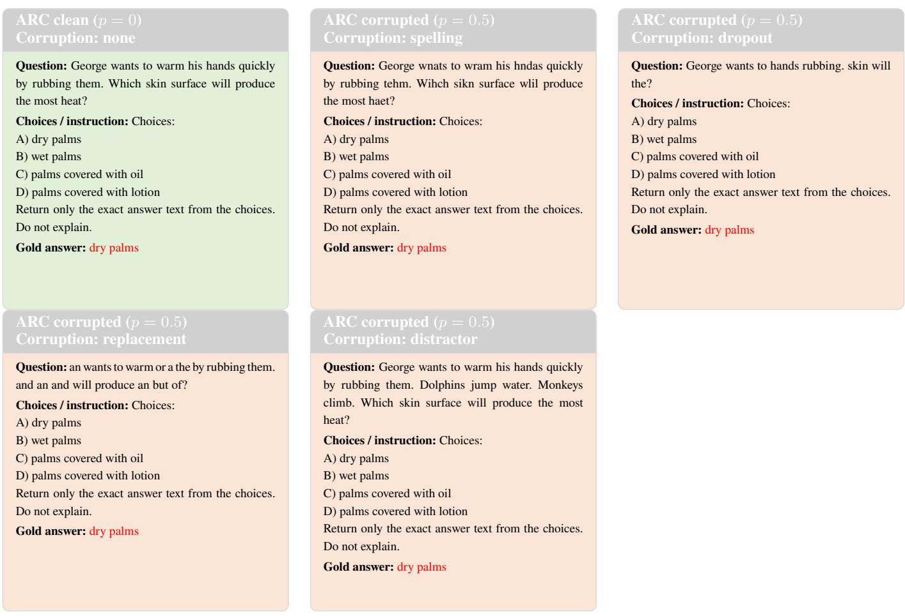  
Figure 8: ARC multiple-choice prompts under all corruption families present in the uploaded task file. Green denotes the clean prompt. Orange denotes corrupted prompts at the sampled corruption level p = 0.5. Red highlights the gold answer.

## Commonsense clean (p = 0) Corruption: none

Question: The sanctions against the school were a   
punishing blow, and they seemed to what the eforts   
the school had made to change?   
Choices / instruction: Choices:   
A) ignore   
B) enforce   
C) authoritarian   
D) yell at   
E) avoid   
Return only the exact answer text from the choices.   
Do not explain.   
Gold answer: ignore

## Commonsense corrupted (p = 0.5) Corruption: replacement

Question: if if against the but were a the blow, and   
an seemed to of that because the the had made the   
change?   
Choices / instruction: Choices:   
A) ignore   
B) enforce   
C) authoritarian   
D) yell at   
E) avoid   
Return only the exact answer text from the choices.   
Do not explain.   
Gold answer: ignore

## Commonsense corrupted (p = 0.5) Corruption: spelling

Question: The scnintoas against the school were a   
psnuinihg blow, and tehy seemed to what the eforts   
the school had mdae to cna he?   
Choices / instruction: Choices:   
A) ignore   
B) enforce   
C) authoritarian   
D) yell at   
E) avoid   
Return only the exact answer text from the choices.   
Do not explain.   
Gold answer: ignore

## Commonsense corrupted (p = 0.5) Corruption: distractor

Question: The sanctions against the school were a   
punishing blow, and they seemed to what the eforts   
the school had made to change? Tongues detect taste.   
Trees grow tall. Humans talk.   
Choices / instruction: Choices:   
A) ignore   
B) enforce   
C) authoritarian   
D) yell at   
E) avoid   
Return only the exact answer text from the choices.   
Do not explain.   
Gold answer: ignore

## Commonsense corrupted (p = 0.5) Corruption: dropout

Question: The sanctions the school were blow, and   
seemed to the to?   
Choices / instruction: Choices:   
A) ignore   
B) enforce   
C) authoritarian   
D) yell at   
E) avoid   
Return only the exact answer text from the choices.   
Do not explain.   
Gold answer: ignore

Figure 9: Commonsense multiple-choice prompts under all corruption families present in the uploaded task file. Green denotes the clean prompt. Orange denotes corrupted prompts at the sampled corruption level p = 0.5 from the CSV artifact. Red highlights the gold answer.

## Factual clean (p = 0) Corruption: none

Context: The Pew Forum on Religion & Public Life ranks Egypt as the fifth worst country in the world for religious freedom. The United States Commission on International Religious Freedom, a bipartisan in- dependent agency of the US government, has placed Egypt on its watch list of countries that require close monitoring due to the nature and extent of violations of religious freedom engaged in or tolerated by the government. According to a 2010 Pew Global Atti- tudes survey, 84% of Egyptians polled supported the death penalty for those who leave Islam; 77% sup- ported whippings and cutting of of hands for theft and robbery; and 82% support stoning a person who commits adultery.

Question: What percentage of Egyptians polled sup-port death penalty for those leaving Islam?

Instruction: Return only the short answer text copied from the context. Do not explain.

Target: 84%

## Factual corrupted (p = 0.5) Corruption: spelling

Context: The Pew Furom on Rioiglen & Plbiuc Life ranks Egypt as the fifth worst country in the world for r eoiiuls freedom. The Uetind Stetas Csomomisin on Inoarneatintl Rileiguos Freedom, a bipartisan ied- nepednnt anecgy of the US government, has palced Egpyt on its wctah list of countries that rriueqe close mnoonriitg due to the nature and extent of vaiotionls of religious freodem engaged in or tolreeatd by the gmvnneoret. Airccdong to a 2100 Pew Global Atti- tudes survey, 84% of Egyptians pellod sprpoetud the death penalty for tshoe who levae Islam; 77% sup- ported wpngphiis and citntug of of hdans for thfet and rorbeby; and 82% support stoning a person who commits adultery.

Question: What percentage of Egyptians polled sup-port daeth penalty for tsohe lnvaieg Islam?

Instruction: Return only the short answer text copied from the context. Do not explain.

Target: 84%

## Factual corrupted (p = 0.5) Corruption: dropout

Context: Pew on & Public Life ranks as the worst the religious. The United States Commission on Interna- tional, bipartisan independent agency of, has placed E t watch countries that close monitorin due na- ture extent of violations religious freedom tolerated. According to a Global survey, 84% polled supported the death those leave Islam; 77% whippings hands theft; and 82%.

Question: What percentage of Egyptians polled death penalty for leaving Islam?

Instruction: Return only the short answer text copied from the context. Do not explain.

Target: 84%

## Factual corrupted (p = 0.5) Corruption: replacement

Context: then Pew a on Religion & Public that a Egypt if if fifth worst country in the or for then free- dom. because a if Commission then of because the, a bipartisan independent that so the then government, and if Egypt so the watch the if countries but but close monitoring due to so nature and a if that if reli- gious freedom engaged a or tolerated a or because. an to a 2010 Pew a an survey, and% because so polled supported because death penalty for those who leave then; 77% that or but cutting because of hands then and if then; because 82% but stoning a person a that a.

Question: What so of Egyptians polled so death penalty then that leaving of?

Instruction: Return only the short answer text copied from the context. Do not explain.

Target: 84%

## Factual corrupted (p = 0.5) Corruption: distractor

Context: The Pew Forum on Religion & Public Life ranks Egypt as the fifth worst country in the world for religious freedom. The United States Commission on International Religious Freedom, a bipartisan in- dependent agency of the US government, has placed Egypt on its watch list of countries that require close monitoring due to the nature and extent of violations of religious freedom engaged in or tolerated by the government. According to a 2010 Pew Global Atti- tudes survey, 84% of Egyptians polled supported the death penalty for those who leave Islam; 77% sup- ported whippings and cutting of of hands for theft and robbery; and 82% support stoning a person who commits adultery.

Question: Leaves turn yellow. Tongues detect taste. Seeds need soil. Dolphins jump water. Seeds become plants. Clouds bring rain. Birds fly. Water quenches thirst. Frogs catch insects. Owls hunt night. Lions hunt prey. Cats chase mice. Sun warms Earth. What percentage of Egyptians polled support death penalty for those leaving Islam? Muscles create movement. Instruction: Return only the short answer text copied from the context. Do not explain.

Target: 84%

Figure 10: Factual prompts under all corruption families present in the uploaded task file. Green denotes the clean prompt. Orange denotes corrupted prompts at the sampled corruption level p = 0.5. Red highlights the target answer.

## Add-subtract clean Corruption: none

## Sequence: Sequence:

10185, 10220, 10205, 10240, 10225,   
10260, 10245, 10280, 10265, 10300,   
10285, 10320, 10305, 10340, 10325,   
10360, 10345, 10380, 10365, 10400,   
10385, 10420, 10405, 10440, 10425,   
10460, 10445, 10480, 10465, 10500,   
10485, 10520, 10505, 10540, 10525,   
10560, 10545, 10580, 10565, 10600   
Target next number: 10585

## Variable arithmetic clean Corruption: none

## Sequence:

46, 47, 49, 52, 56, 61, 67, 74, 82, 91,   
101, 112, 124, 137, 151, 166, 182, 199,   
217, 236, 256, 277, 299, 322, 346, 371,   
397, 424, 452, 481, 511, 542, 574, 607,   
641, 676, 712, 749, 787, 826   
Target next number: 866

## Add- subtract corrupted Corruption: in-range ablation

## Sequence:

## Variable arithmetic corrupted Corruption: in-range ablation

46, 47, 49, 52, 56, 61, 67, 74, 82, 91,   
101, 112, 124, 137, 151, 166, 182, 199,   
217, 236, 256, 277, 299, 322, 346, 371,   
397, 424, 452, 481, 511, 542, 574, 607,   
641, 676, 152, 749, 787, 826

## Sequence:

10476, 10220, 10205, 10240, 10225,   
10260, 10245, 10280, 10476, 10300,   
10285, 10320, 10305, 10340, 10325,   
10360, 10476, 10380, 10365, 10400,   
10385, 10420, 10405, 10476, 10425,   
10460, 10445, 10480, 10465, 10500,   
10485, 10520, 10505, 10540, 10525,   
10560, 10545, 10580, 10565, 10600   
Target next number: 10585

Target next number: 866

## Sequence:

## Variable arithmetic corrupted Corruption: out-of-range ablation

46, 47, 49, 52, 56, 61, 67, 74, 82, 2547,   
101, 112, 124, 137, 151, 166, 182, 199,   
217, 236, 256, 277, 299, 322, 346, 371,   
397, 424, 452, 481, 511, 542, 574, 607,   
641 676 712 749 2547 826   
10185, 10220, 10205, 10240, 10225,   
10260, 10245, 10280, 10265, 10300,   
10285, 10320, 10305, 10340, 10325,   
10360, 10345, 10380, 10002, 10002,   
10385, 10420, 10405, 10440, 10425,   
10460, 10445, 10480, 10002, 10500,   
10002, 10520, 10505, 10540, 10525,   
10560, 10545, 10580, 10565, 10600   
Target next number: 10585

Target next number: 866

## Add- subtract corrupted Corruption: out-of-range ablation

## Sequence:

Sequence:   
12787, 12757, 12727, 12697, 12667,   
12637, 12607, 12577, 12547, 12517,   
12487, 12457, 12427, 12397, 12367,   
12337, 12307, 12277, 12247, 12217,   
12187, 12157, 12127, 12097, 12067,   
12037, 12007, 11977, 11947, 11917,   
11887, 11857, 11827, 11797, 11767,   
11737, 11707, 11677, 11647, 11617

## Subtract clean Corruption: none

Target next number: 11587

## Variable arithmetic corrupted Corruption: zero ablation

## Sequence:

46, 47, 49, 52, 56, 61, 67, 74, 82, 0, 101,   
112, 124, 137, 151, 166, 182, 199, 217,   
236, 256, 277, 299, 322, 346, 371, 397,   
424, 452, 481, 511, 542, 574, 607, 641,   
676, 712, 749, 0, 826

## Add- subtract corrupted Corruption: zero ablation

Target next number: 10585

## Subtract corrupted Corruption: in-range ablation

Target next number: 866

## Sequence:

Target next number: 11587

10185, 10220, 10205, 0, 10225, 10260,   
10245, 10280, 0, 10300, 10285, 10320,   
10305, 10340, 10325, 10360, 10345,   
10380, 10365, 0, 0, 10420, 10405,   
10440, 10425, 10460, 10445, 10480,   
10465, 10500, 10485, 10520, 10505,   
10540, 10525, 10560, 10545, 10580,   
10565, 10600   
Sequence:   
12787, 12757, 12727, 12697, 12667,   
12637, 12607, 12577, 12547, 12517,   
12487, 12457, 12427, 12397, 12367,   
12337, 12307, 12277, 12247, 11914,   
12187, 12157, 12127, 12097, 12067,   
12037, 12007, 11977, 11947, 11917,   
11887, 11857, 11827, 11797, 11767,   
11737, 11707, 11677, 11647, 11617

## Subtract corrupted Corruption: out-of-range ablation

Sequence:   
12787, 12757, 12727, 12697, 12667,   
12637, 12607, 12577, 12547, 12833,   
12487 12833 12427 12397 12367   
12337, 12307, 12277, 12247, 12217,   
12187 12157 12127 12097 12067   
12037, 12007, 11977, 11947, 11917,   
11887, 11857, 11827, 11797, 11767,   
11737, 11707, 11677, 11647, 11617   
Target next number: 11587 Target next number: 11587

## Subtract corrupted Corruption: zero ablation

Sequence:   
12787, 12757, 12727, 12697, 12667,   
12637, 12607, 12577, 12547, 0, 12487,   
0, 12427, 12397, 12367, 12337, 12307,   
12277, 12247, 12217, 12187, 12157,   
12127, 12097, 12067, 12037, 12007,   
11977, 11947, 11917, 11887, 11857,   
11827, 11797, 11767, 11737, 11707,   
11677, 11647, 11617

Target next number: 11587

Figure 11: Representative symbolic toy-task prompts with full sequences. Green boxes denote clean inputs. Red boxes denote corrupted inputs under in-range, out-of-range, and zero ablations. Corrupted entries are highlighted in dark red, while the gold next-number target remains unchanged.

S4 Supplementary tables
<table><tr><td>Heads ablated</td><td>Corruption rate</td><td>No ablation</td><td>Mean accuracy over ablated-head layer</td></tr><tr><td>4</td><td>10%</td><td>0.949</td><td>0.950 (0.218)</td></tr><tr><td>4</td><td>30%</td><td>0.670</td><td>0.683 (0.465)</td></tr><tr><td>4</td><td>50%</td><td>0.226</td><td>0.189 (0.391)</td></tr><tr><td>6</td><td>10%</td><td>0.949</td><td>0.939 (0.240)</td></tr><tr><td>6</td><td>30%</td><td>0.670</td><td>0.653 (0.476)</td></tr><tr><td>6</td><td>50%</td><td>0.226</td><td>0.200 (0.400)</td></tr><tr><td>8</td><td>10%</td><td>0.949</td><td>0.953 (0.212)</td></tr><tr><td>8</td><td>30%</td><td>0.670</td><td>0.650 (0.477)</td></tr><tr><td>8</td><td>50%</td><td>0.226</td><td>0.225 (0.418)</td></tr></table>

Table 5: Controlled-model head ablation under zero ablation. The no-ablation column reports the baseline at the same corruption rate; the ablated column reports final post-ablation accuracy, averaged over the ten possible layers in which the head subset is ablated, with standard deviation in parentheses.

<table><tr><td>Model</td><td>Layer</td><td>In-range</td><td>Out-of-range</td><td>Zero</td></tr><tr><td>Large, 10L</td><td>0</td><td>0.599</td><td>0.647</td><td>0.978</td></tr><tr><td>Large, 10L</td><td>1</td><td>0.545</td><td>0.632</td><td>0.964</td></tr><tr><td>Large, 10L</td><td>2</td><td>0.554</td><td>0.658</td><td>0.969</td></tr><tr><td>Large, 10L</td><td>3</td><td>0.703</td><td>0.761</td><td>0.978</td></tr><tr><td>Large, 10L</td><td>4</td><td>0.723</td><td>0.771</td><td>0.976</td></tr><tr><td>Large, 10L</td><td>5</td><td>0.789</td><td>0.839</td><td>0.975</td></tr><tr><td>Large, 10L</td><td>6</td><td>0.839</td><td>0.869</td><td>0.970</td></tr><tr><td>Large, 10L</td><td>7</td><td>0.812</td><td>0.852</td><td>0.972</td></tr><tr><td>Large, 10L</td><td>8</td><td>0.801</td><td>0.835</td><td>0.976</td></tr><tr><td>Large, 10L</td><td>9</td><td>0.802</td><td>0.839</td><td>0.977</td></tr><tr><td>Small, 4L</td><td>0</td><td>0.586</td><td>0.671</td><td>0.995</td></tr><tr><td>Small, 4L</td><td>1</td><td>0.586</td><td>0.659</td><td>0.944</td></tr><tr><td>Small, 4L</td><td>2</td><td>0.665</td><td>0.720</td><td>0.972</td></tr><tr><td>Small, 4L</td><td>3</td><td>0.673</td><td>0.777</td><td>0.976</td></tr></table>

Table 6: Controlled-model is-corrupted probe AUC. Values average the two recorded hook sites; the generated table comment records the maximum absolute hook-site diference.

<table><tr><td>Layer</td><td>gemma-3-1b-it</td><td>OLMo-2-1124-7B-Instruct</td><td>Meta-Llama-3-8B-Instruct</td><td>Qwen3-32B</td><td>gemma-4-31B-it</td></tr><tr><td>Layer 0</td><td>0.952 (0.037)</td><td>0.969 (0.023)</td><td>0.965 (0.028)</td><td>0.966 (0.021)</td><td>0.969 (0.020)</td></tr><tr><td>Layer 5</td><td>0.978 (0.018)</td><td>0.994 (0.008)</td><td>0.994 (0.008)</td><td>0.990 (0.010)</td><td>0.994 (0.008)</td></tr><tr><td>Layer 10</td><td>0.981 (0.017)</td><td>0.997 (0.005)</td><td>0.997 (0.006)</td><td>0.995 (0.006)</td><td>0.995 (0.006)</td></tr><tr><td>Layer 15</td><td>0.987 (0.015)</td><td>0.996 (0.005)</td><td>0.995 (0.007)</td><td>0.997 (0.003)</td><td>0.996 (0.005)</td></tr><tr><td>Layer 20</td><td>0.987 (0.013)</td><td>0.995 (0.007)</td><td>0.996 (0.006)</td><td>0.998 (0.003)</td><td>0.997 (0.005)</td></tr><tr><td>Layer 25</td><td>0.986 (0.016)</td><td>0.993 (0.009)</td><td>0.995 (0.008)</td><td>0.998 (0.003)</td><td>0.997 (0.006)</td></tr><tr><td>Layer 30</td><td></td><td>0.992 (0.010)</td><td>0.995 (0.008)</td><td>0.997 (0.004)</td><td>0.996 (0.004)</td></tr><tr><td>Layer 31</td><td></td><td>0.991 (0.011)</td><td>0.994 (0.009)</td><td></td><td></td></tr><tr><td>Layer 35</td><td></td><td></td><td></td><td>0.998 (0.003)</td><td>0.995 (0.005)</td></tr><tr><td>Layer 40</td><td></td><td></td><td></td><td>0.998 (0.003)</td><td>0.995 (0.004)</td></tr><tr><td>Layer 45</td><td></td><td></td><td></td><td>0.998 (0.003)</td><td>0.995 (0.005)</td></tr><tr><td>Layer 50</td><td></td><td></td><td></td><td>0.998 (0.003)</td><td>0.996 (0.005)</td></tr><tr><td>Layer 55</td><td></td><td></td><td></td><td>0.998 (0.003)</td><td>0.995 (0.006)</td></tr><tr><td>Layer 59</td><td></td><td></td><td></td><td></td><td>0.993 (0.007)</td></tr><tr><td>Layer 60</td><td></td><td></td><td></td><td>0.996 (0.006)</td><td></td></tr><tr><td>Layer 63</td><td></td><td></td><td></td><td>0.995 (0.007)</td><td></td></tr></table>

Table 7: Pretrained is-corrupted probe AUC on ARC, compressed across corruption modes. Rows are probed layers, columns are models, and each cell reports mean AUC with standard deviation in parentheses over distractor, replacement, spelling, and dropout.

<table><tr><td>Model</td><td>Repaired slope  $( R ^ { 2 } )$ </td><td>Failed slope  $( R ^ { 2 } )$ </td></tr><tr><td>OLMo-2-1124-7B-Instruct</td><td>0.064 (0.73)</td><td>0.219 (0.72)</td></tr><tr><td>Meta-Llama-3-8B-Instruct</td><td>0.051 (0.90)</td><td>0.221 (0.86)</td></tr><tr><td>Qwen3-32B</td><td>0.049 (0.98)</td><td>0.188 (0.98)</td></tr><tr><td>gemma-4-31B-it</td><td>0.021 (1.00)</td><td>0.186 (1.00)</td></tr></table>

Table 8: Linearization residual diagnostics by model and task family. The slope is measured from residual norm to linearization RMSE.

## S5 Additional figures

Accuracy vs. ablation percentage for toy models

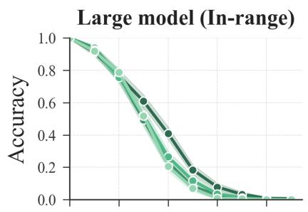

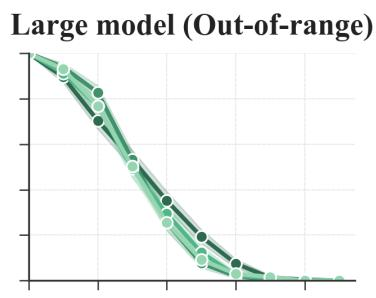

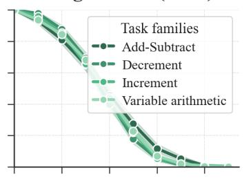

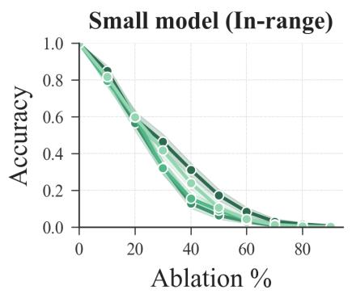

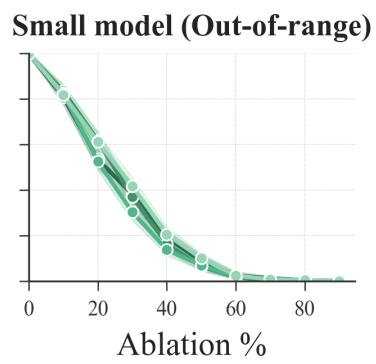

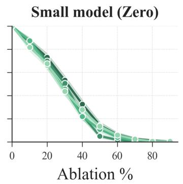  
Figure 12: Accuracy versus ablation percentage across toy model sizes, corruption modes and task families.

## Clean Exact Match

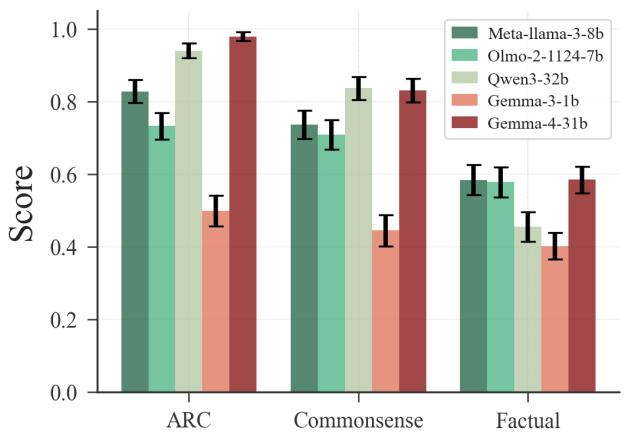  
Figure 13: Clean baseline exact-match performance of the pretrained models across the factual QA, ARC, and CommonsenseQA task families before any corruption is applied.

Commonsense  
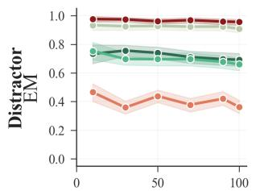  
Corruption Rate (%)

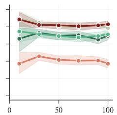  
Corruption Rate (%)

Factual  
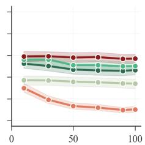  
Corruption Rate (%)

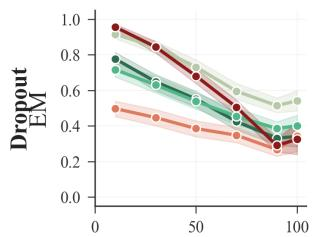  
Corruption Rate (%)

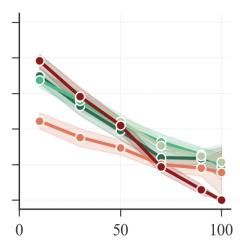  
Corruption Rate (%)

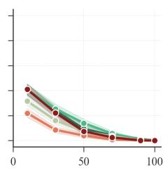  
Corruption Rate (%)

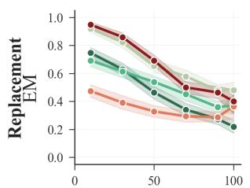  
Corruption Rate (%)

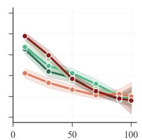  
Corruption Rate (%)

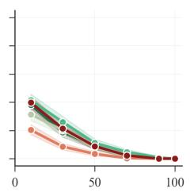  
Corruption Rate (%)

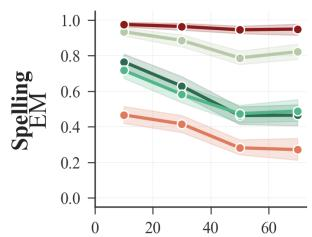  
Corruption Rate (%)

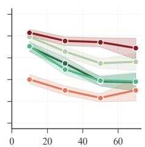  
Corruption Rate (%)

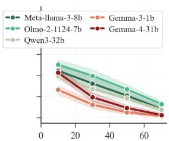  
Corruption Rate (%)  
Figure 14: Representative degradation curves for pretrained models. Exact match (EM) is plotted versus ablation rate across task families and model sizes, illustrating that dropout and replacement are generally the most damaging corruptions while distractor-style corruption is typically milder.

## Cumulative Repair Curve

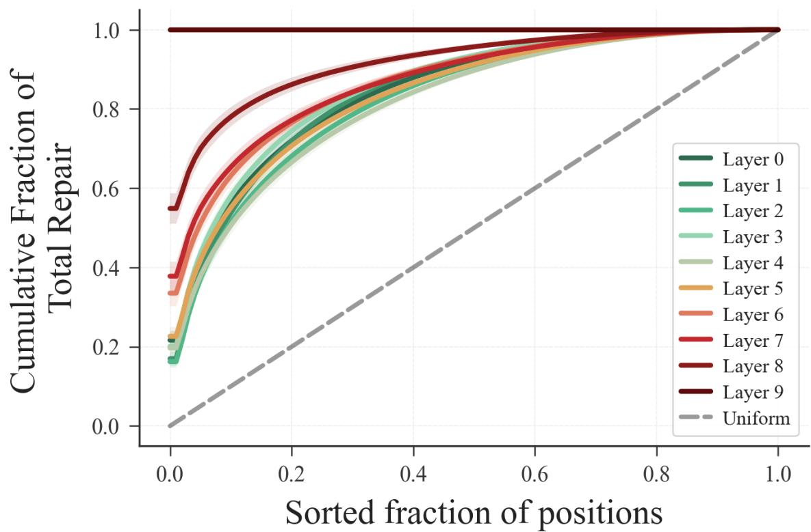  
Figure 15: Cumulative repair concentration in the large toy model for sequence length 80, the zero corruption mode, and 30% ablation. Positions are sorted by their per-position patching efect before the residual addition; the steep initial rise shows that a small subset of positions carries most of the total repair signal.

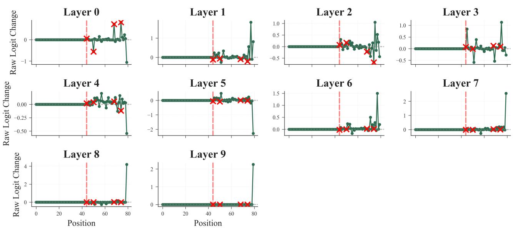  
Figure 16: Example-level per-position patching map for the large toy model before the residual addition. Each panel shows the raw logit change across positions at a diferent layer, illustrating how early efects stay near corrupted locations and later efects spread toward output-relevant positions.

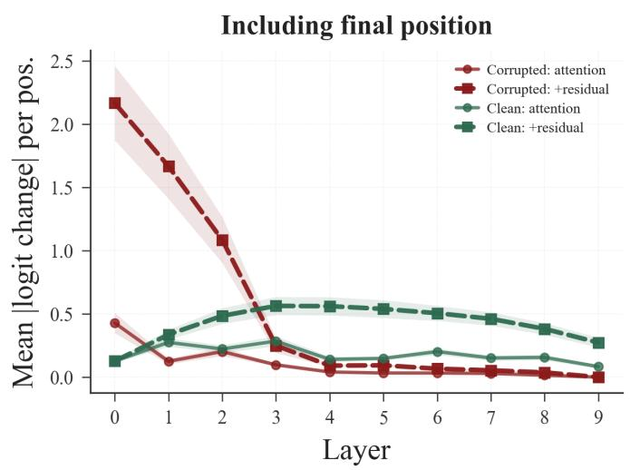

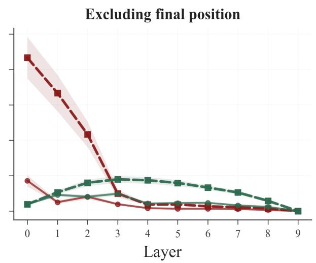  
Figure 17: Repair signal with and without the final position. Mean absolute logit change from patching attention outputs at corrupted and clean positions across layers. Left: all eligible positions, including the final sequence position. Right: the final position is excluded.

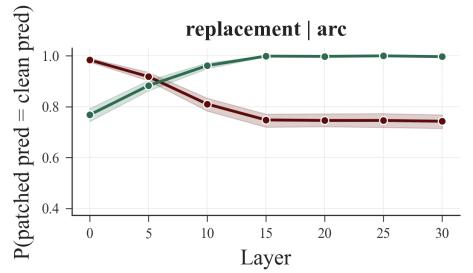

## Prediction Restoration Rate for Meta-llama-3-8b

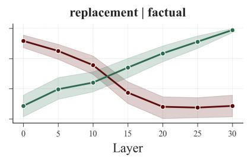

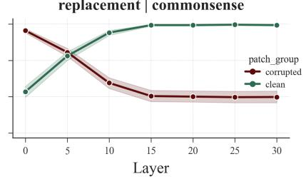

Prediction Restoration Rate for Olmo-2-1124-7b  
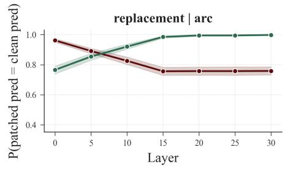

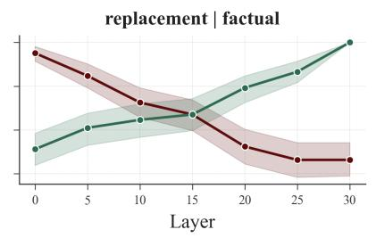  
Prediction Restoration Rate for Qwen3-32b

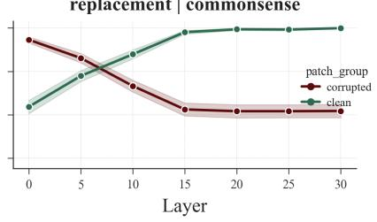

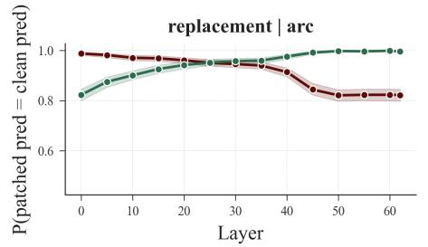

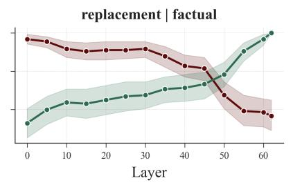

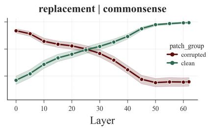

Prediction Restoration Rate for Gemma-3-1b  
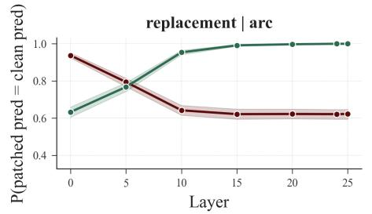

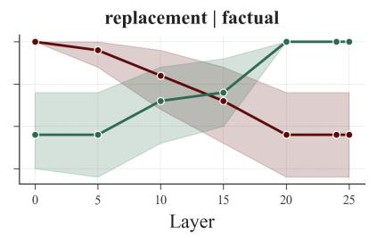

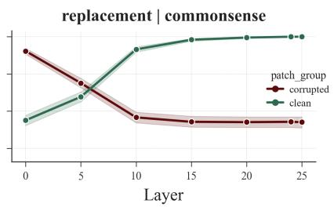

Prediction Restoration Rate for Gemma-4-31b  
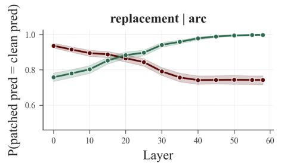

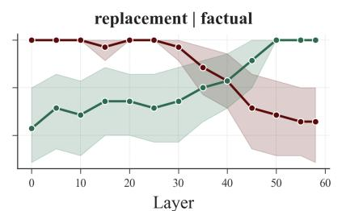

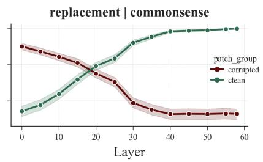  
Figure 18: Prediction restoration under position-group patching in pretrained models. This reports the probability that patching corrupted or clean positions restores the clean prediction, for each model across corruption modes and task families.

## Cosine probe: repaired vs failed

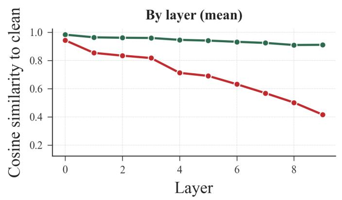

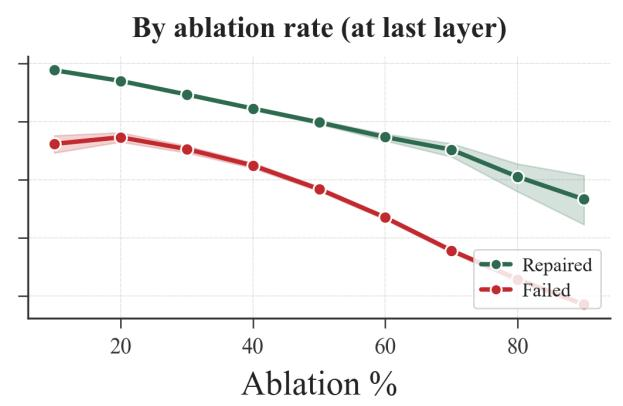  
Figure 19: Cosine similarity between clean and corrupted activations (hooked after LayerNorm block) in the large toy model. Repaired examples remain closely aligned across depth and as corruption increases, whereas failed examples drift away, especially at the final layer.

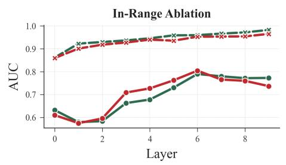

Repair success by layer for large (toy) model  

Repair success by layer for small (toy) model  

  
Figure 20: Repair-success probes in toy models. This shows layer-wise AUC for predicting whether a corrupted example is ultimately answered correctly in the large and small models, respectively, comparing linear and cosine readouts across zero, in-range, and out-of-range ablation modes.

Is-corrupted by layer for large (toy) model  
  
Is-corrupted by layer for small (toy) model

  
Figure 21: Corruption-detection probes in toy models. This shows layer-wise AUC for predicting whether an input was corrupted in the large and small models, respectively; unlike repair-success prediction, corruption identity becomes strongly linearly decodable only after several layers.

Repair success by layer across models (ARC)  
  
Figure 22: Representative repair-success probes in pretrained models. Layer-wise AUC predicts whether a corrupted example will still be answered correctly, comparing linear and cosine probes across corruption modes for ARC.

  
Figure 23: Linearization residuals in the large toy model. Repaired examples stay close to locally linear behavior near the clean trajectory, while failed examples show much larger residuals at larger interpolation steps and higher corruption levels.

## Gemma-4-31b

Residual vs step size (by outcome)  

Residual vs corruption level (by step size)  

  
Meta-llama-3-8b

Residual vs step size (by outcome)  

Residual vs corruption level (by step size)  

  
Figure 24: Linearization residuals in pretrained models. This shows mean absolute linearization error as a function ofinterpolation step size and corruption level; repaired and failed examples separate most clearly at large α and in later layers.

## Olmo-2-1124-7b

Residual vs step size (by outcome) Residual vs corruption level (by step size)  

  
Qwen3-32b

Residual vs step size (by outcome) Residual vs corruption level (by step size)  

  
Figure 25: Additional pretrained-model linearization residuals. This shows mean absolute linearization error as a function of interpolation step size and corruption level for the remaining evaluated models.

  
Figure 26: Finetuning on corrupted inputs diferentially improves the robustness of an LLM.

  
Figure 27: Earliest-layer probe performance by model and corruption mode. Cells show ROC-AUC and 10%-budget recall lift; asterik indicates bootstrap 95% CI above chance.

  
Figure 28: Fine-tuning reduces displacement-normalized linearization error across interpolation steps, with the largest reduction at moderate corruption levels.