# TCSALGBENCH: BENCHMARKING AUTOMATED PROVING FORRESEARCH-LEVEL THEORETICAL COMPUTER SCIENCE

Chutong Yang<sup>1,\*</sup>, Xiyuan Zhang<sup>2,†</sup>, Yu Huang<sup>3,∗</sup>, Boran Han<sup>2</sup>, Soonho Kong<sup>2</sup> Shuai Zhang<sup>2</sup>, Vihang Prakash Patil<sup>2</sup>, Zhen Han<sup>2</sup>, Michael Bohlke-Schneider<sup>2</sup>, Bernie Wang<sup>2</sup>

<sup>1</sup>Department of Computer Science, The University of Texas at Austin

<sup>2</sup>Amazon <sup>3</sup>Department of Statistics and Data Science, The Wharton School, University of Pennsylvania

## ABSTRACT

Large language models perform strongly on competition mathematics, but their research-level reasoning remains difficult to evaluate systematically. Theoretical computer science (TCS) connects algorithm design to explicit guarantees and fundamental limits, providing a setting for evaluating whether models can justify computational improvements with arguments humans can inspect. We introduce TCSAlgBench, a benchmark and reusable pipeline for natural-language proof discovery, comprising 398 theorem-level challenges from 138 STOC and COLT 2026 papers. Expert-designed rules complete paper-specific context, preserve computational assumptions and quantitative guarantees, and withhold constructions when discovering an algorithm is part of the task. For each task, prover systems receive theorem statements and access to cited prior work. The pipeline supports fresh, versioned challenge batches from newly released papers. We evaluate ten model configurations from four families under direct inference and prover-verifier discussion, and compare four agent workflows under matched model-call opportunities. All evaluations use the full benchmark. In the model comparison, GPT-5.6 Sol max achieves the highest five-run verifier-accepted coverage at 23.6% after 10-round discussion. Discussion and repeated sampling improve coverage. In the separate agent comparison using GPT-5.5 xhigh, decomposition improves coverage over discussion, and agentic planning achieves the highest five-run verifier-accepted coverage at 25.4%. TCSAlgBench provides a refreshable testbed for measuring progress in model reasoning and studying how agent workflows support research-level proof discovery.

## 1 Introduction

Large language models (LLMs) have achieved significant improvements in mathematics, from the International Mathematical Olympiad (IMO) to research-level problems. However, many existing benchmarks focus on competitive mathematics, while recent research-level achievements often focus on individual problems, making it difficult to systematically evaluate research-level capabilities or compare agent workflows. A broader goal for LLM research is to develop models that help improve computational systems while giving humans a basis for understanding and evaluating those improvements. Theoretical computer science (TCS) connects algorithms to explicit assumptions, mathematical guarantees, and fundamental limits. In areas such as privacy and fairness, this reasoning makes precise which property a proposed method satisfies, when the claim holds, and what tradeoffs it entails. Progress in TCS reasoning could therefore support LLMs as research collaborators whose proposals come with justifications that humans can inspect and challenge. Evaluating proof discovery in TCS tests a capability needed for this vision: reasoning about algorithms, the information they can access, and their data and computational requirements.

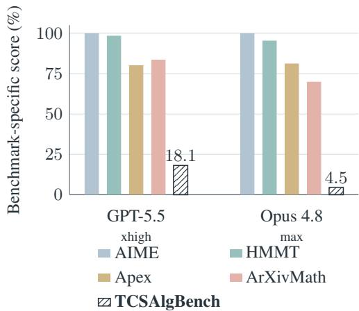  
Figure 1: Strong published final-answer accuracy on selected MathArena benchmarks contrasts with low proof coverage on TCSAlgBench, even after five runs of 10-round discussion.

We introduce TCSAlgBench, a benchmark and construction pipeline for generating self-contained natural-language TCS statements to evaluate LLM reasoning ability, with a focus on algorithm design and sample- or runtime-complexity analysis. TCSAlgBench has three properties that make it useful for evaluating research-level reasoning. (1) Diversity. Its initial collection contains 398 theorem-level challenges from 138 STOC and COLT 2026 papers, spanning learning theory, privacy, optimization, sampling, and other areas of TCS. Each challenge provides a target theorem together with its local definitions, assumptions, notation, and necessary prior work, and asks for a rigorous natural-language proof. (2) Generalization. The reusable pipeline can generate fresh, versioned challenge batches from newly released papers, allowing successive models and agent designs to be evaluated on problems published after their assumed knowledge cutoffs. The size and topic composition of each batch can be controlled, reducing reliance on a fixed benchmark that may be contaminated over time. (3) Difficulty. Current models achieve low proof coverage on TCSAlgBench even across five runs of 10-round discussion, despite strong published final-answer accuracy on selected math benchmarks (Dekoninck et al., 2026a); Figure 1 illustrates this gap.

A key contribution of our pipeline is a set of expert-designed rules for turning extracted theorems into fair proofdiscovery problems. These rules capture details that generic theorem extraction can miss: they preserve computational models, restrictions on information access and action order, assumptions, and quantitative guarantees, while adding the definitions needed to interpret the statement. They also remove source-paper lemmas and, when algorithm design is part of the task, rewrite named algorithms as existence claims so that the construction is not revealed. Applied in a fixed sequence to the paper’s proof-dependency graph, the rules produce self-contained problems without leaking the central argument. We developed the rules on 21 challenges and manually reviewed 61 final statements, including the development set and 40 additional challenges, for fidelity and self-containment. All headline natural-language model and workflow comparisons use the full collection of 398 challenges. We provide the prompts used in the pipeline in Appendix E.

Our evaluation measures both sources of progress in automated proof generation: the capability of the underlying model and the design of the agent built around it. Every model configuration and agent workflow is evaluated on all 398 challenges in an offline sandbox with the same fixed library of cited prior work. For model capability, we ask: Which model should TCS researchers use? In this work, we compare ten configurations from four model families under direct inference and multi-round prover–verifier discussion, with repeated runs in both settings. For agent design, we ask: Which workflow design should TCS researchers use? We compare four representative workflows that cover the main mechanisms used by proof agents: iterative refinement, explicit decomposition, tree search, and adaptive planning (Section 3.2). The agent comparison holds the backbone model, problem input, tool access, model-call opportunities, and per-call generation limit fixed, while reporting realized input and output tokens separately. We report both seed-1 acceptance and five-run coverage: MCTS performs best on the former, while agentic planning performs best on the latter. Finally, we re-score identical submissions with Opus 4.8 to assess how sensitive these conclusions are to the choice of verifier. As a supplementary resource, we provide 221 provisional Lean statements that pass compilation and automated semantic screening for future formalization work.

## Our main contributions are:

• A scalable, refreshable benchmark-construction framework. We introduce an end-to-end pipeline that transforms recent research papers into self-contained proof challenges while preserving computational models, restrictions on information access and action order, and complexity guarantees. The pipeline supports versioned, post-cutoff evaluation on newly released work.

• A broad research-level TCS benchmark. We construct 398 theorem-level challenges from 138 STOC and COLT 2026 papers spanning major areas of TCS. Each task isolates genuine proof discovery by providing only the necessary local context and cited prior work.

• A controlled study of models and proof-agent design. We evaluate ten model configurations and four representative agent workflows across the full benchmark, controlling call opportunities and reporting repeated-run coverage, token costs, and verifier sensitivity. The results expose substantial capability gaps and quantify the trade-offs among discussion, decomposition, tree search, and agentic planning.

## 2 Related Work

Mathematical and TCS benchmarks. Mathematical evaluations span exact-answer datasets (Cobbe et al., 2021; Hendrycks et al., 2021), difficult or fresh problems and false-premise tests (Phan et al., 2025; Balunovic et al., 2026; Petrov et al., 2025), and research-level problems (Glazer et al., 2024; Schmitt et al., 2025; Abouzaid et al., 2026a,b). Advances from competition mathematics and discovery (Hubert et al., 2026; Novikov et al., 2025; Feng et al., 2026a; Anthropic, 2026b; Alon et al., 2026) to even the Navier–Stokes problem (OpenAI, 2026), alongside reported formalizations (Anthropic, 2026a), motivate systematic evaluation. LemmaBench extracts self-contained lemmas from arXiv papers and supports recurring updates (Peyronnet et al., 2026). Concurrent TCS-BENCH provides

300 natural-language tasks from STOC, FOCS, and SODA, with dependency-based masking and expert-evaluated judging (Cohen-Addad et al., 2026). FormalTCS offers expert-validated instances with natural-language and Lean statements and proofs (Wang et al., 2026). TCSAlgBench emphasizes theorem-level TCS proof discovery, TCS-specific context repairs, and an offline library of cited prior work. It withholds source-paper lemmas and, for algorithm-design tasks, named constructions. Differences are in task inputs and pipeline design.

Proof-agent designs. Proof agents combine iterative generation and critique (Feng et al., 2026a; An et al., 2026; Schmitt et al., 2026; Requena et al., 2026), sketch-based decomposition (Jiang et al., 2022; Zhang et al., 2023; Varambally et al.; Ren et al., 2025), AND–OR or value-guided search (Lample et al., 2022; Xin et al., 2025a; Tsoukalas et al., 2026), and replanning over dependency structures (An et al., 2026; Wu et al., 2026; Chung et al., 2026). General agent benchmarks emphasize versioned tasks, external evaluation, and resource accounting (Merrill et al., 2026; Sun et al., 2026; Li et al., 2026a). Theorem-dependency graphs support claim generation and retrieval (Busbib & Werman, 2026; Kurgan et al., 2026); DeFAb benchmarks defeasible abduction (Cooper & Velasquez, 2026). Section 4.1 explains how workflows implemented in this work represent these mechanisms.

LLM-based proof verification. LLM judging has demonstrated substantial agreement with human judgments (Zheng et al., 2023). For mathematical proofs, the Open Proof Corpus reports strong agreement with expert labels (Dekoninck et al., 2026b), while ProofGrader improves scoring through reference solutions, rubrics, and ensembling (Ma et al., 2026). Pseudo-Formalization rewrites proofs into independently checked premise–conclusion modules, improving error-localization tradeoffs on competition and research proofs (Barkallah et al., 2026). TCS-BENCH supplies its judge with a reference proof (Cohen-Addad et al., 2026); our pipeline checks cited statements against their sources before judging the submitted proof.

Autoformalization and formal proving. Autoformalization spans early translation studies and paired corpora (Wu et al., 2022; Azerbayev et al., 2023; Ying et al., 2024; Patel et al., 2023), TCS collections (Zhang et al., 2025; Feng et al., 2026b), and textbook and research formalization (Rammal et al., 2026; Moakhar et al., 2026; Zhang et al., 2026c; Liu et al., 2026b). LeanDojo supports formal proof agents (Yang et al., 2023); miniF2F and PutnamBench provide machine-checked evaluation (Zheng et al., 2021; Tsoukalas et al., 2024). Compilation does not ensure statement fidelity; model consensus is an imperfect, human-calibrated proxy (Zhang et al., 2026b).

## 3 Benchmark Scope and Evaluation

TCSAlgBench evaluates natural-language proof discovery for TCS claims involving algorithm design and sample- or runtime-complexity guarantees. It focuses on the stage of research after the problem and relevant literature have been identified by human researchers or other agents. We try to mimic the real research process, where human researchers propose a problem and provide previous work using their domain knowledge or other agents.

## 3.1 Benchmark Construction and Pipeline Development

The evaluation collection contains 398 challenges from 138 publicly available arXiv papers accepted to STOC and COLT 2026. Every challenge records its source and version. The public release includes challenges derived from arXiv versions licensed under CC BY 4.0 or CC0. A model-assisted screen retains papers whose main results give upper or lower bounds on sample or runtime complexity. The collection spans algorithmic fairness and calibration, differential privacy, learning theory, optimization, sampling, and other TCS areas, such as cryptography, graph theory, and coding theory. These areas underpin fair decision-making and calibrated prediction, privacy-preserving data analysis, learning from limited data, scalable optimization, and sampling for probabilistic inference. Cryptography, graph algorithms, and coding theory further support secure communication, routing and matching, and reliable data transmission. Our focus on sample and runtime complexity results tests a prerequisite for LLMs to contribute to such applications: reasoning about which computational improvements are achievable and at what cost. Upper-bound challenges can require constructing algorithms and proving their correctness and efficiency, while lower-bound challenges require establishing unavoidable limitations under explicit assumptions. These tasks examine whether models can support proposed methods with checkable arguments and identify constraints that human researchers must consider when assessing their usefulness.

Figure 2 summarizes the construction pipeline, which uses Opus 4.8 with high reasoning mode. We resolve each source paper and the cited prior work needed to interpret it, parse the TeX sources into proof graphs of statements, definitions, and dependencies, and select one to four main theorems per source paper. Code assembles the selected source statements into a draft, and an LLM self-containment checker guides context completion.

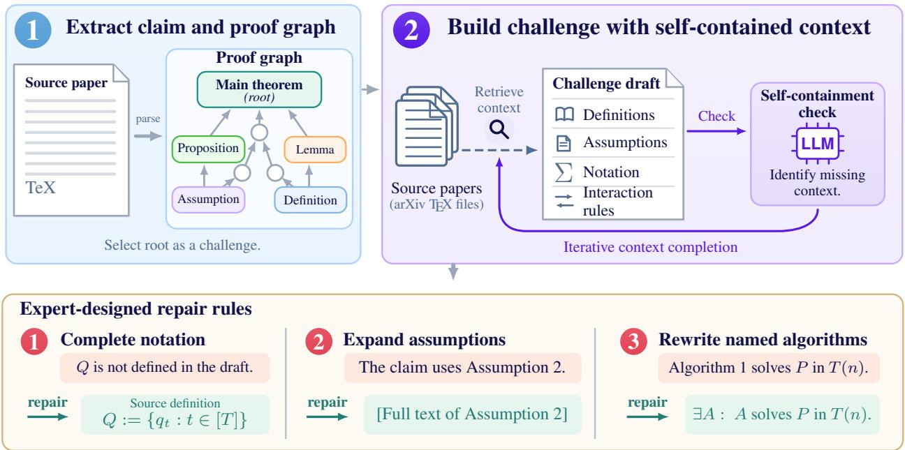

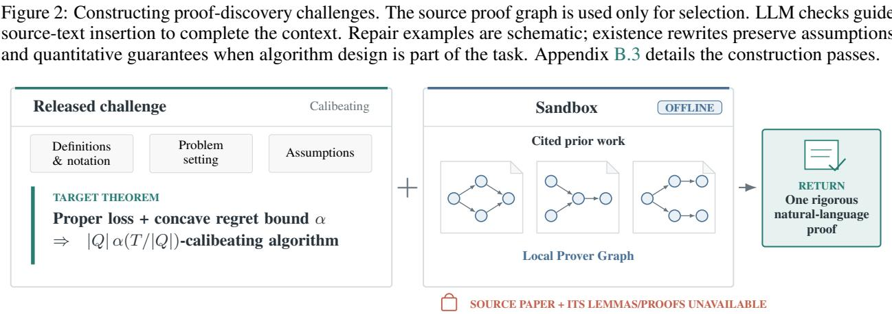  
Figure 3: Proof-discovery evaluation interface. A challenge supplies the target theorem with its definitions, notation, assumptions, and problem setting. The offline sandbox permits access to cited prior work through the local prover graphs and the TeX file. The system returns one natural-language proof. Appendix A shows a complete challenge.

A central methodological contribution is our expert-designed repair layer, which bridges the gap between theorem extraction and fair, self-contained proof discovery. Applied automatically in a fixed sequence, its rules resolve internal references, recover rules governing information access and action order, harmonize notation, and remove intermediate results or construction details that expose the intended solution. For example, when algorithm design is part of the task, a claim about “Algorithm 1” is rewritten as an existence claim that preserves its assumptions and quantitative guarantees. Mathematical context is quoted from the source, subject to notation normalization and these documented rewrites. Added standard-background definitions are explicitly labeled.

We developed the extraction, context completion, and repair rules using 21 challenges across topics. After the final repair pass, we manually reviewed 61 challenge statements (these 21 development challenges and 40 additional challenges across topics) for fidelity and self-containment. All 40 additional challenges were judged faithful to the source results and self-contained. All headline model and workflow comparisons use the full collection of 398 challenges: the 61 reviewed statements, including the development set, and the remaining 337 challenges. Appendix B details construction, statement review, and source-date diagnostics.

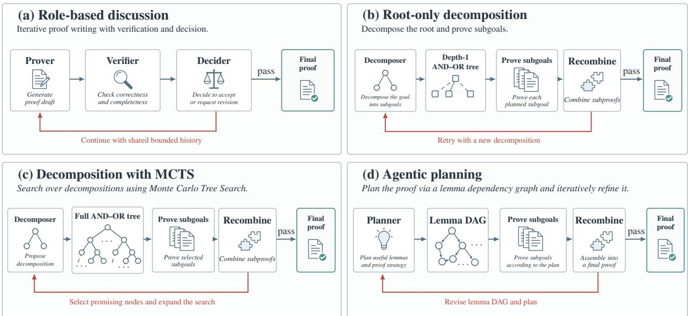  
Figure 4: Information flow in the four call-matched agent designs. Rightward arrows lead to a final proof on an internal stop or pass; red return arrows indicate retries. Final submissions are scored separately by the external verifier. Discussion reuses a shared history; root-only decomposition retries depth-1 reductions; MCTS searches a full AND–OR tree; and agentic planning revises a lemma DAG from critic feedback.

## 3.2 Evaluation Protocol

A prover system receives a self-contained theorem statement with its definitions, assumptions, notation, and problem setting, and returns one proof in ordinary mathematical prose. The evaluator-controlled offline sandbox provides a fixed corpus of cited prior work through the local prover graphs, graph representations of those papers and their results. The prover may use results from this corpus. The source paper, its construction graph, and artifacts containing the target proof are excluded. Source-paper lemmas are neither supplied as additional facts nor inlined into the challenge; the prover must establish any such claims needed for its argument. The public release represents the cited documents through a versioned manifest of source URLs, versions, and checksums. Figure 3 illustrates this interface using the Calibeating challenge reproduced in full in Appendix A.

Our primary outcome is verifier acceptance. Before scoring, a proof-organizing step checks whether statements cited from prior work match their original source statements. Three separately sampled GPT-5.5 high-effort voters receive only the problem statement and rewritten proof, with acceptance requiring at least two PASS votes. Internal verifier feedback guides search but does not determine the benchmark label. To assess sensitivity to the choice of judge, we re-score identical submissions with Opus 4.8 high effort. An author additionally reviewed 10 accepted proofs produced by GPT-5.5 xhigh through prover-verifier discussion on challenges in the manually reviewed statement set. All 10 accepted proofs were correct.

We report single-run acceptance (seed 1) and multi-run coverage, which counts a challenge once if any independently seeded run is accepted. The workflow comparison fixes the backbone model, problem input, and tool access, and matches model-call opportunities through shared limits on iterations, proof-goal attempts, and discussion rounds. The per-call generation limit is also fixed. Input and output tokens are reported separately because workflows can process different amounts of context within the same call budget. Section 4.1 describes the workflows, and Appendix C defines call accounting, outcome aggregation, and confidence scoring.

LLM-based verification. LLMs are commonly used for proof critique and automated assessment in recent mathematical reasoning systems and benchmarks, with evaluations against expert judgments supporting this practice (Dekoninck et al., 2026b; Ma et al., 2026). Our proof-agent and verification prompts adapt BrokenMath (Petrov et al., 2025) and QED (An et al., 2026), incorporating checks for false premises, unsupported citations, and unresolved proof obligations. Our rubric also shares criteria with concurrent TCS-BENCH (Cohen-Addad et al., 2026), including logical rigor, faithful use of assumptions and cited results, and quantitative correctness. Automated judging enables repeated comparisons on fresh, versioned batches, with a fixed judging protocol within each batch and targeted expert audits. Appendix C.1 summarizes the empirical evidence and protocol differences; Appendix E.2.2 provides our prompts.

## 3.3 Provisional Lean Statements

Formalizing selected TCS results is feasible, but broader coverage requires specialized definitions and supporting libraries (Wang et al., 2026; Rammal et al., 2026). As a supplementary result, we contribute a reusable statementformalization pipeline for the community, producing candidate Lean 4 propositions in a pinned Mathlib/CSLib environment. Candidates must compile without sorry, admit, or untrusted axioms. Two checks require approval from both GPT-5.5 and Opus 4.8 high-effort reviewers: consistency with a back-translation generated without the challenge, and degeneracy checks for vacuous or trivial encodings. We retain 221 candidate statements (55.5% of 398 challenges) using our pipeline. Appendix B details construction and topic counts; Appendix D reports the results.

## 4 Model and Agent Comparisons

We evaluate TCSAlgBench along two axes: model capability under common inference settings and agent design under matched model-call opportunities. After describing the experimental setup, we compare model configurations under direct inference and 10-round discussion, then compare four agent workflows using a fixed backbone model. We conclude the section with diagnostic analyses.

## 4.1 Experimental Setup

Models. We evaluate Opus 4.8 and GPT-5.6 Sol at high, xhigh, and max effort, and GPT-5.5 and Fable 5 at high and xhigh. Each configuration is evaluated under direct inference and a simple 10-round prover–verifier discussion workflow. Direct inference uses the common proof prompt once, without critique or revision; discussion iteratively refines the proof using verifier feedback. We use ten independent runs for direct inference and five for discussion. All models are called through Amazon Bedrock with a 128K-token per-call output cap. We excluded Fable 5 max because of output-token access limits.

Agent designs. An agent workflow specifies how proving, verification, decomposition, and planning actions are coordinated in response to intermediate results. Using GPT-5.5 xhigh, we compare four workflows representing recurring proof-agent mechanisms (Figure 4). Iterative generation and critique motivate role-based discussion (Feng et al., 2026a; An et al., 2026; Schmitt et al., 2026); proof sketches and structured subgoals motivate root-only decomposition (Jiang et al., 2022; Zhang et al., 2023; Varambally et al.); AND–OR search and value-guided exploration motivate decomposition with MCTS (Lample et al., 2022; Xin et al., 2025a; Tsoukalas et al., 2026), with implementation details in Appendix C.2; and replanning with revisable lemma DAGs motivates agentic planning (An et al., 2026; Wu et al., 2026; Chung et al., 2026). These workflows abstract common mechanisms and implement them using shared prover and verifier prompts, enabling a fair comparison of agent designs with a fixed backbone model and matched model-call opportunities. We use GPT-5.5 xhigh because its earlier knowledge cutoff leaves a larger subset of challenges published after the cutoff.

Each workflow uses five independent runs with up to 20 outer iterations per run, matched model-call opportunities and per-call limits, and the same external verifier. This experiment therefore differs from the model comparison in both its discussion protocol and its search budget. Appendix C details the workflows, budgets, and scoring rules. Our GPT-5.5 xhigh agent with agentic planning achieves higher five-run coverage than GPT-5.6 Sol max with discussion and repeated sampling, demonstrating the effectiveness of our agent implementation.

## 4.2 The Benchmark Separates Model Configurations

Fable 5 leads direct inference: xhigh has the highest seed-1 acceptance (6.8%), while high has the highest ten-run coverage (14.6%). Under 10-round discussion, GPT-5.6 Sol max achieves the highest seed-1 acceptance (18.8%) and five-run coverage (23.6%). This change in ordering shows that model comparisons depend on how inference is organized. Even the strongest configuration leaves more than three-quarters of the benchmark uncovered after five discussion runs (Figure 5).

Discussion and repeated sampling. We compare ten independent direct-inference runs with one 10-round discussion run, allocating proof-generation attempts to independent sampling or successive revisions. One discussion run outperforms ten-run direct coverage for all eight GPT and Opus configurations: Sol max reaches 18.8% versus 13.8%, and GPT-5.5 xhigh reaches 11.3% versus 7.0%. Fable 5 is the sole exception: ten-run direct coverage reaches 14.6% and 11.3% for high and xhigh, respectively, compared with 9.3% and 9.5% for one discussion run (Tables 3 and 4). These results suggest that feedback-guided revision can be more productive than repeatedly starting from scratch, while the effective allocation of inference attempts depends on the model. Independent restarts remain useful after multi-round discussion. Five discussion runs increase coverage from 18.8% to 23.6% for Sol max and from 11.3% to 18.1% for

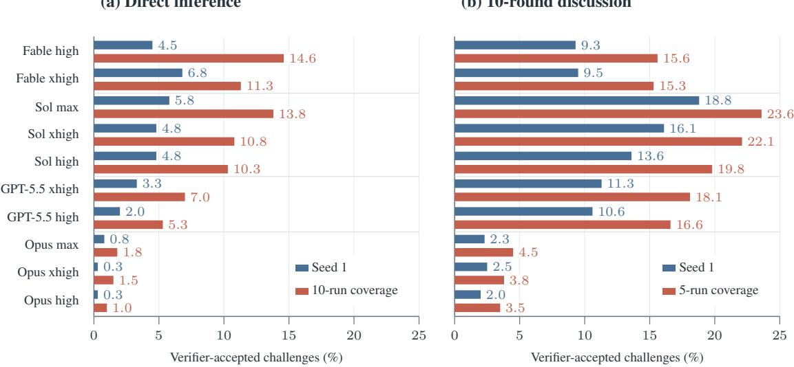  
Figure 5: Verifier acceptance on all 398 challenges under the three-voter majority rule. Blue bars show seed 1; red bars show coverage over 10 direct-inference runs (a) or five 10-round discussion runs (b). Labels give percentages. Rows are grouped by model family and ordered within each family by coverage; Tables 3 and 4 give detailed results.

GPT-5.5 xhigh. Thus, a single refinement trajectory leaves substantial additional coverage accessible through other seeds. Together, these observations motivate combining prover–verifier feedback with multiple independent starts.

Effects of reasoning effort. Higher effort does not uniformly improve coverage. Fable 5 high covers 58 challenges across ten direct-inference runs, versus 45 for xhigh, despite averaging 46K rather than 62K output tokens per call. Under five-run discussion, Sol xhigh and max share 78 accepted challenges, with 10 unique to xhigh and 16 unique to max (Table 7). These complementary coverage sets suggest that varying effort can expose alternative successful approaches; simply choosing the highest effort does not subsume the results of lower settings.

## 4.3 Agent Design Changes Effectiveness and Cost

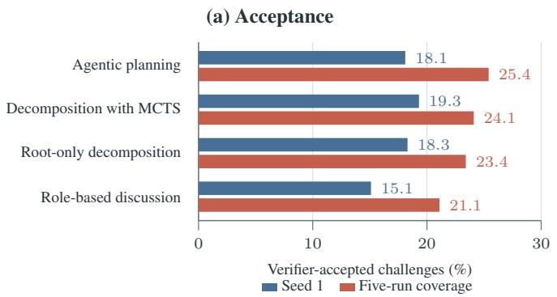

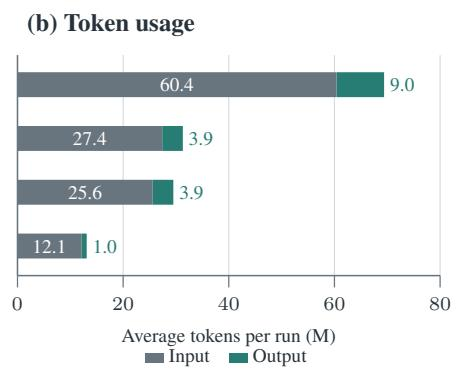  
Figure 6: Call-matched agent-design comparison using GPT-5.5 xhigh. (a) Seed-1 acceptance and five-run verifieraccepted coverage on all 398 challenges. (b) Input and output tokens averaged over 10 randomly selected challenges and five independent seeds; M denotes millions. Rows follow five-run coverage. Workflows share call opportunities and per-call generation limits, but token usage differs. Table 8 gives exact counts and budget details.

We compare four agent workflows using GPT-5.5 xhigh under matched model-call opportunities (Figure 6). Only final assembled proofs contribute to acceptance.

Decomposition and search. Root-only decomposition increases seed-1 acceptance from 15.1% to 18.3% and five-run coverage from 21.1% to 23.4% relative to discussion without decomposition. These gains suggest that organizing a proof around explicit intermediate claims helps the model make progress. The quality of the decomposition matters: its subgoals must be easier to establish and jointly sufficient to prove the target theorem. Identifying such intermediate claims is itself a substantive reasoning task, making decomposition an important part of proof discovery. MCTS achieves the highest seed-1 acceptance (19.3%), but its five-run coverage exceeds root-only decomposition by only three challenges (96 versus 93). One possible bottleneck is the quality of the LLM-generated scores used to guide search: the model may not be sufficiently calibrated to assess promising subproblems in these proof tasks.

Adaptive planning improves coverage at higher token cost. Agentic planning achieves higher five-run coverage than MCTS (25.4% versus 24.1%), although its seed-1 acceptance is lower (18.1% versus 19.3%). The planner proposes decompositions globally, considering how the subgoals and their dependencies fit together to prove the target theorem. This global view may produce more coherent decompositions and help explain its broader coverage. In the token sample, planning averages 60.4M input and 9.0M output tokens per run, versus 27.4M and 3.9M for MCTS. The global plan provides more proof targets to explore from the outset, which may help explain the higher token consumption under matched call opportunities.

## 4.4 Diagnostic Analyses and Broader Uses

Topic-specific performance. Differential-privacy challenges seem to be a challenging area for LLMs: nine of ten configurations cover at most one of the 33 sampled tasks after five 10-round discussion runs (Table 4). Sol max covers two (6.1%), versus 23.6% average (Figure 7).

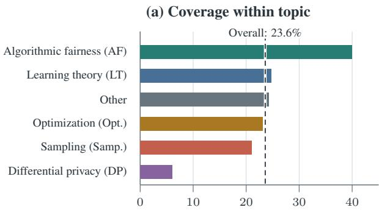

(b) Topic composition  
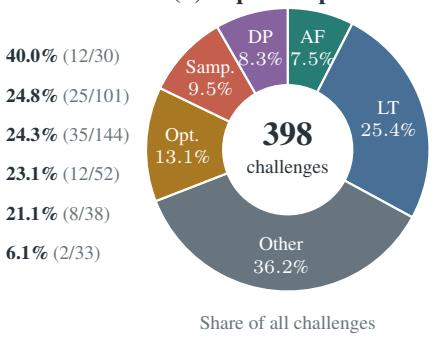  
Five-run accepted coverage (%)  
Figure 7: Topic performance and benchmark composition. (a) Five-run verifier-accepted coverage for GPT-5.6 Sol max after 10-round prover–verifier discussion. Labels show within-topic coverage and accepted/total counts; the dashed line marks overall coverage (94/398, 23.6%). (b) Topic shares of all 398 challenges. Colors and abbreviations match across panels.

Verifier sensitivity. Re-scoring identical proofs with Opus 4.8 high effort checks the stability of the comparisons. The eight shared model configurations retain their five-run coverage ordering, with count changes of −6 to +2 (Table 5). Under the GPT-5.5 three-voter majority rule versus the Opus 4.8 verifier, five-run coverage is 101 versus 103 challenges for planning, 93 versus 96 for root-only decomposition, 84 versus 72 for discussion, and 96 versus 84 for MCTS. Both verifiers support our conclusion that MCTS offers no clear advantage over root-only decomposition.

Source-date diagnostics. Figure 8 partitions the 10-round discussion results by each source paper’s first arXiv date relative to the model family’s assumed cutoff. Post-cutoff five-run coverage is higher for seven of ten configurations, with post-minus-pre differences of −4.0 to +4.3 percentage points (Table 6). There is no consistent pre-cutoff advantage.

Diagnosing model behavior. Beyond evaluating mathematical proof performance, TCSAlgBench may support broader studies of model behavior. For example, comparing challenge-level overlap across effort settings could help investigate how additional inference effort changes coverage, as suggested by the complementary Sol xhigh and max results. Fable 5 xhigh’s higher direct-inference token use and smaller seed-1 gain from discussion than Sol max could motivate studies of how model-specific prompting or internal refinement interacts with external critique. Source-date partitions and fresh challenge batches could also support investigations of possible training exposure. These examples illustrate potential diagnostic uses of the benchmark and directions for future study.

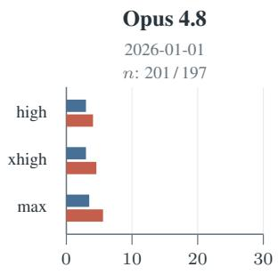

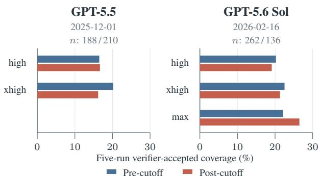

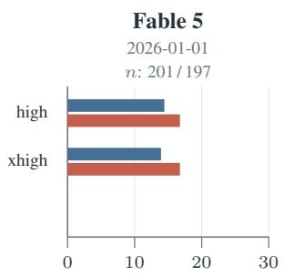  
Figure 8: Five-run verifier-accepted coverage before and after assumed knowledge cutoffs. Each panel shows its cutoff date and pre-/post-cutoff sample sizes (total n = 398). Axes share the same scale; comparisons are within configurations because cutoff dates differ across families.

## 5 Conclusion

We introduced TCSAlgBench, a benchmark and reusable pipeline for natural-language proof discovery in theoretical computer science. Its 398 challenges combine source context with expert-designed repairs for notation, interaction rules, and algorithm-design tasks. GPT-5.5, GPT-5.6 Sol, and Fable 5 demonstrate promising capabilities on these research-level tasks, with GPT models benefiting substantially from prover–verifier discussion. Our results identify prover–verifier discussion and repeated sampling as effective ways to improve coverage. In the workflow comparison using GPT-5.5, root-only decomposition provides further gains at a substantially lower token cost than agentic planning. When maximizing coverage takes priority over token cost, agentic planning achieves the highest five-run coverage among the tested workflows. Together, these findings highlight model capability and workflow design as complementary directions for improving automated TCS proof discovery.

## AI use statement

In this work, we used generative AI tools to generate synthetic data sets, implement methods, design or provide feedback on research methodology or experiments, clean and reformat the dataset. We have not used generative AI tools to propose or refine hypotheses, support qualitative and thematic data analysis, or interpret results, and help develop theoretical models or conceptual frameworks, formulate mathematical claims, provide critical ingredients for proving mathematical claims, assist in the writing of proofs, assist with translation, are not applicable to this work. Additionally, we used generative AI tools to refine the paper writing and literature research. We have reviewed all AI-assisted work. We have reviewed all the writing and citations and tested the AI-generated code. We are responsible for the research idea and use AI only to refine our experimental design. We take responsibility for the final content of this work, including text, claims, or artifacts produced with the aid of generative AI.

## Reproducibility statement

We will release 166 challenges on Hugging Face at https://huggingface.co/datasets/cyang98/TCSAlgBENCH. These challenges are derived from 57 papers whose source versions are licensed under CC BY 4.0 or CC0. Further, we will release the titles of all 138 papers we used in our paper, with the TeX files publicly available on arXiv. With the pipeline prompt in Appendix E, it should be easy to reproduce the challenges used in our paper. The prover workflow we used in our paper is also easy to reproduce using the prover prompts in Appendix E.

## References

Mohammed Abouzaid, Andrew J Blumberg, Martin Hairer, Joe Kileel, Tamara G Kolda, Paul D Nelson, Daniel Spielman, Nikhil Srivastava, Rachel Ward, Shmuel Weinberger, et al. First proof. arXiv preprint arXiv:2602.05192, 2026a.

Mohammed Abouzaid, Nikhil Srivastava, Rachel Ward, and Lauren Williams. First proof second batch. arXiv preprint arxiv.org:2606.18119, 2026b. URL https://arxiv.org/abs/2606.18119.

Noga Alon, Thomas F Bloom, W Timothy Gowers, Daniel Litt, Will Sawin, Arul Shankar, Jacob Tsimerman, Victor Wang, and Melanie Matchett Wood. Remarks on the disproof of the unit distance conjecture. arXiv preprint arXiv:2605.20695, 2026.

Chenyang An, Qihao Ye, Minghao Pan, and Jiayaun Zhang. Qed: An open-source multi-agent system for generating mathematical proofs on open problems. arXiv preprint arXiv:2604.24021, 2026.

Anthropic. Formalizing Fermat’s last theorem. Anthropic research announcement, September 2026a. URL https: //www.anthropic.com/research/formalizing-fermats-last-theorem.

Anthropic. Learning more about Claude’s mathematical capabilities. Anthropic research announcement, August 2026b. URL https://www.anthropic.com/research/riemann-zeta.

Zhangir Azerbayev, Bartosz Piotrowski, Hailey Schoelkopf, Edward W Ayers, Dragomir Radev, and Jeremy Avigad. Proofnet: Autoformalizing and formally proving undergraduate-level mathematics. arXiv preprint arXiv:2302.12433, 2023.

Martin Balko, Jan Grebík, Pavel Hubácek, Martin Kouteckˇ y, Mat\` ej Kripner, Václav Rozhoˇ n, Robert Šámal, and Adriánˇ Zámecník. Bolzano: Case studies in llm-assisted mathematical research.ˇ arXiv preprint arXiv:2604.16989, 2026.

Mislav Balunovic, Jasper Dekoninck, Ivo Petrov, Nikola Jovanovic, and Martin Vechev. Matharena: Evaluating llms on´ uncontaminated math competitions. Advances in Neural Information Processing Systems, 38, 2026.

Slim Barkallah, Luke Bailey, Kaiyue Wen, Mohammed Abouzaid, and Tengyu Ma. Pseudo-formalization for automatic proof verification. arXiv preprint arXiv:2605.20531, 2026.

David Busbib and Michael Werman. Compose: Composing future theorems from citations and formal structure. arXiv preprint arXiv:2605.30333, 2026.

Yurong Chen, Zhiyi Huang, Michael I Jordan, and Haipeng Luo. Calibeating made simple. arXiv preprint arXiv:2603.22167, 2026.

Jui-Hui Chung, Ziyang Cai, Zihao Li, Qishuo Yin, Rohit Agarwal, Simon Park, Rodrigo Porto, Narutatsu Ri, Ziran Yang, Shange Tang, et al. Goedel-architect: Streamlining formal theorem proving with blueprint generation and refinement. arXiv preprint arXiv:2606.06468, 2026.

Karl Cobbe, Vineet Kosaraju, Mohammad Bavarian, Mark Chen, Heewoo Jun, Lukasz Kaiser, Matthias Plappert, Jerry Tworek, Jacob Hilton, Reiichiro Nakano, et al. Training verifiers to solve math word problems. arXiv preprint arXiv:2110.14168, 2021.

Vincent Cohen-Addad, Dimitris Paparas, Ernest van Wijland, Max Springer, Julien Canitrot-Paradis, Honghao Lin, David Woodruff, Adarsh Kumarappan, Rajesh Jayaram, Rudrajit Das, et al. Tcs-bench: Benchmarking state-of-the-art generative ai theoretical computer science research ability. arXiv preprint arXiv:2608.09538, 2026.

Patrick Cooper and Alvaro Velasquez. Defab: A verifiable benchmark for defeasible abduction in foundation models. arXiv preprint arXiv:2606.18557, 2026.

Joseph Corneli. A first proof sprint. arXiv preprint arXiv:2602.13587, 2026.

Jasper Dekoninck, Nikola Jovanovic, Tim Gehrunger, Kári Rögnvaldsson, Ivo Petrov, Chenhao Sun, and Martin´ Vechev. Beyond benchmarks: Matharena as an evaluation platform for mathematics with llms. arXiv preprint arXiv:2605.00674, 2026a.

Jasper Dekoninck, Ivo Petrov, Kristian Minchev, Miroslav Marinov, Maria Drencheva, Lyuba Konova, Milen Shumanov, Kaloyan Tsvetkov, Nikolay Drenchev, Lazar Todorov, et al. The open proof corpus: A large-scale study of llm-generated mathematical proofs. In International Conference on Learning Representations, volume 2026, pp. 22214–22244, 2026b.

Tony Feng, Trieu H Trinh, Garrett Bingham, Dawsen Hwang, Yuri Chervonyi, Junehyuk Jung, Joonkyung Lee, Carlo Pagano, Sang-hyun Kim, Federico Pasqualotto, et al. Towards autonomous mathematics research. arXiv preprint arXiv:2602.10177, 2026a.

Yuming Feng, Frederick Pu, One An, Osbert Bastani, Li Zhang, Jiani Huang, Xujie Si, and Ziyang Li. Theory-scale auto-formalization of logics for computer science. arXiv preprint arXiv:2606.26525, 2026b.

Elliot Glazer, Ege Erdil, Tamay Besiroglu, Diego Chicharro, Evan Chen, Alex Gunning, Caroline Falkman Olsson, Jean-Stanislas Denain, Anson Ho, Emily de Oliveira Santos, et al. Frontiermath: A benchmark for evaluating advanced mathematical reasoning in ai. arXiv preprint arXiv:2411.04872, 2024.

Dan Hendrycks, Collin Burns, Saurav Kadavath, Akul Arora, Steven Basart, Eric Tang, Dawn Song, and Jacob Steinhardt. Measuring mathematical problem solving with the math dataset. arXiv preprint arXiv:2103.03874, 2021.

Yichen Huang and Lin F Yang. Winning gold at imo 2025 with a model-agnostic verification-and-refinement pipeline. arXiv preprint arXiv:2507.15855, 2025.

Thomas Hubert, Rishi Mehta, Laurent Sartran, Miklós Z Horváth, Goran Žužic, Eric Wieser, Aja Huang, Julian´ Schrittwieser, Yannick Schroecker, Hussain Masoom, et al. Olympiad-level formal mathematical reasoning with reinforcement learning. Nature, 651(8106):607–613, 2026.

Albert Q Jiang, Sean Welleck, Jin Peng Zhou, Wenda Li, Jiacheng Liu, Mateja Jamnik, Timothée Lacroix, Yuhuai Wu, and Guillaume Lample. Draft, sketch, and prove: Guiding formal theorem provers with informal proofs. arXiv preprint arXiv:2210.12283, 2022.

Matej Kripner and Milan Straka. Openprover: Agentic and interactive theorem proving with lean 4. ˇ arXiv preprint arXiv:2607.09217, 2026.

Po-Nien Kung, Linfeng Song, Dawsen Hwang, Jinsung Yoon, Chun-Liang Li, Simone Severini, Mirek Olšák, Edward Lockhart, Quoc V Le, Burak Gokturk, et al. Leap: Supercharging llms for formal mathematics with agentic frameworks. arXiv preprint arXiv:2606.03303, 2026.

Simon Kurgan, Evan Wang, Eric Leonen, Sophie Szeto, Luke Alexander, Artemii Remizov, Jarod Alper, Giovanni Inchiostro, and Vasily Ilin. Theoremgraph: Bridging formal and informal mathematics. arXiv preprint arXiv:2606.25363, 2026.

Guillaume Lample, Timothee Lacroix, Marie-Anne Lachaux, Aurelien Rodriguez, Amaury Hayat, Thibaut Lavril, Gabriel Ebner, and Xavier Martinet. Hypertree proof search for neural theorem proving. Advances in neural information processing systems, 35:26337–26349, 2022.

Xiangyi Li, Yimin Liu, Wenbo Chen, Bingran You, Zonglin Di, Yifeng He, Shenghan Zheng, Kyoung Whan Choe, Jiankai Sun, Shuyi Wang, et al. Skillsbench: Benchmarking how well agent skills work across diverse tasks. arXiv preprint arXiv:2602.12670, 2026a.

Zhuofeng Li, Haoxiang Zhang, Seungju Han, Sheng Liu, Jianwen Xie, Yu Zhang, Yejin Choi, James Y Zou, and Pan Lu. In-the-flow agentic system optimization for effective planning and tool use. In International Conference on Learning Representations, volume 2026, pp. 50524–50570, 2026b.

Jihao Liu, Guoxiong Gao, Zeming Sun, Bin Wu, Shurui Liu, Jiedong Jiang, Haocheng Ju, Leheng Chen, Ronnie Cheng, Xiping Zhang, et al. Danus: Orchestrating mathematical reasoning agents with fact-graph memory. arXiv preprint arXiv:2607.06447, 2026a.

Junqi Liu, Zihao Zhou, Zekai Zhu, Marco Dos Santos, Weikun He, Jiawei Liu, Ran Wang, Yunzhou Xie, Junqiao Zhao, Qiufeng Wang, et al. Numina-lean-agent: An open and general agentic reasoning system for formal mathematics. arXiv preprint arXiv:2601.14027, 2026b.

Wenjie Ma, Andrei Cojocaru, Neel Kolhe, Haihan Zhang, Vincent Zhuang, Matei Zaharia, and Sewon Min. Reliable fine-grained evaluation of natural language math proofs. In International Conference on Learning Representations, volume 2026, pp. 72740–72778, 2026.

Mike Merrill, Alexander Shaw, Nicholas Carlini, Boxuan Li, Harsh Raj, Ivan Bercovich, Lin Shi, Jeong Shin, Thomas Walshe, E Kelly Buchanan, et al. Terminal-bench: Benchmarking agents on hard, realistic tasks in command line interfaces. In International Conference on Learning Representations, volume 2026, pp. 40903–40986, 2026.

Arshia Soltani Moakhar, Iman Gholami, Max Springer, Mahdi JafariRaviz, and MohammadTaghi Hajiaghayi. Beyond the library: An agentic framework for autoformalizing research mathematics. arXiv preprint arXiv:2606.31134, 2026.

Alexander Novikov, Ngân Vu, Marvin Eisenberger, Emilien Dupont, Po-Sen Huang, Adam Zsolt Wagner, Sergey ˜ Shirobokov, Borislav Kozlovskii, Francisco JR Ruiz, Abbas Mehrabian, et al. Alphaevolve: A coding agent for scientific and algorithmic discovery. arXiv preprint arXiv:2506.13131, 2025.

OpenAI. On the navier-stokes millennium prize problem. OpenAI research announcement, September 2026. URL https://openai.com/index/navier-stokes-solution/.

Nilay Patel, Rahul Saha, and Jeffrey Flanigan. A new approach towards autoformalization. arXiv preprint arXiv:2310.07957, 2023.

Ivo Petrov, Jasper Dekoninck, and Martin Vechev. Brokenmath: A benchmark for sycophancy in theorem proving with llms. arXiv preprint arXiv:2510.04721, 2025.

Antoine Peyronnet, Fabian Gloeckle, and Amaury Hayat. Lemmabench: A live, research-level benchmark to evaluate llm capabilities in mathematics. arXiv preprint arXiv:2602.24173, 2026.

Long Phan, Alice Gatti, Ziwen Han, Nathaniel Li, Josephina Hu, Hugh Zhang, Chen Bo Calvin Zhang, Mohamed Shaaban, John Ling, Sean Shi, et al. Humanity’s last exam. arXiv preprint arXiv:2501.14249, 2025.

Ahmad Rammal, Niket Patel, Fabian Gloeckle, Amaury Hayat, Julia Kempe, Remi Munos, Charles Arnal, and Vivien Cabannes. Formalizing mathematics at scale. arXiv preprint arXiv:2605.29955, 2026.

ZZ Ren, Zhihong Shao, Junxiao Song, Huajian Xin, Haocheng Wang, Wanjia Zhao, Liyue Zhang, Zhe Fu, Qihao Zhu, Dejian Yang, et al. Deepseek-prover-v2: Advancing formal mathematical reasoning via reinforcement learning for subgoal decomposition. arXiv preprint arXiv:2504.21801, 2025.

Borja Requena, Austin Letson, Krystian Nowakowski, Izan Beltran-Ferreiro, and Leopoldo Sarra. A minimal agent for automated theorem proving. arXiv preprint arXiv:2602.24273, 2026.

Johannes Schmitt, Gergely Bérczi, Jasper Dekoninck, Jeremy Feusi, Tim Gehrunger, Raphael Appenzeller, Pieter Belmans, Alessio Bottini, Jim Bryan, João Camarneiro, et al. Improofbench: Benchmarking ai on research-level mathematical proof generation. arXiv preprint arXiv:2509.26076, 2025.

Johannes Schmitt, Tim Gehrunger, Jasper Dekoninck, Gergely Bérczi, Uri Kreitner, Liam Price, and David Holmes. Proofcouncil: An llm agent for solving open mathematical problems. arXiv preprint arXiv:2607.09474, 2026.

Yiyou Sun, Xinyang Han, Weichen Zhang, Yuanbo Pang, Tianyu Wang, Yuhan Cao, Yixiao Huang, Chris Duroiu, Haoyun Zhang, Jeffrey Lin, et al. Agents’ last exam. arXiv preprint arXiv:2606.05405, 2026.

Amitayush Thakur, George Tsoukalas, Yeming Wen, Jimmy Xin, and Swarat Chaudhuri. An in-context learning agent for formal theorem-proving. arXiv preprint arXiv:2310.04353, 2023.

George Tsoukalas, Jasper Lee, John Jennings, Jimmy Xin, Michelle Ding, Michael Jennings, Amitayush Thakur, and Swarat Chaudhuri. Putnambench: Evaluating neural theorem-provers on the putnam mathematical competition. Advances in Neural Information Processing Systems, 37:11545–11569, 2024.

George Tsoukalas, Anton Kovsharov, Sergey Shirobokov, Anja Surina, Moritz Firsching, Gergely Bérczi, Francisco JR Ruiz, Arun Suggala, Adam Zsolt Wagner, Eric Wieser, et al. Advancing mathematics research with ai-driven formal proof search. arXiv preprint arXiv:2605.22763, 2026.

Sumanth Varambally, Thomas Voice, Yanchao Sun, Zhifeng Chen, Rose Yu, and Ke Ye Hilbert. Recursively building formal proofs with informal reasoning, 2025. URL https://arxiv. org/abs/2509.22819.

Dingzirui Wang, Xuanliang Zhang, Keyan Xu, Qingfu Zhu, and Wanxiang Che. Formaltcs: Benchmarking end-to-end frontier formal theoretical computer science research of large language models. arXiv preprint arXiv:2608.20153, 2026.

Haiming Wang, Huajian Xin, Zhengying Liu, Wenda Li, Yinya Huang, Jianqiao Lu, Zhicheng Yang, Jing Tang, Jian Yin, Zhenguo Li, et al. Proving theorems recursively. Advances in Neural Information Processing Systems, 37: 86720–86748, 2024.

Jiaao Wu, Xian Zhang, Hanzhang Liu, Sophia Zhang, Fan Yang, and Yinpeng Dong. Star-p\’olyamath: Multi-agent reasoning under persistent meta-strategic supervision. arXiv preprint arXiv:2605.19338, 2026.

Yuhuai Wu, Albert Qiaochu Jiang, Wenda Li, Markus Rabe, Charles Staats, Mateja Jamnik, and Christian Szegedy. Autoformalization with large language models. Advances in neural information processing systems, 35:32353–32368, 2022.

Huajian Xin, ZZ Ren, Junxiao Song, Zhihong Shao, Wanjia Zhao, Haocheng Wang, Bo Liu, Liyue Zhang, Xuan Lu, Qiushi Du, et al. Deepseek-prover-v1. 5: Harnessing proof assistant feedback for reinforcement learning and monte-carlo tree search. In International Conference on Learning Representations, volume 2025, pp. 72274–72303, 2025a.

Ran Xin, Zeyu Zheng, Yanchen Nie, Kun Yuan, and Xia Xiao. Scaling up multi-turn off-policy rl and multi-agent tree search for llm step-provers. arXiv preprint arXiv:2509.06493, 2025b.

Kaiyu Yang, Aidan Swope, Alex Gu, Rahul Chalamala, Peiyang Song, Shixing Yu, Saad Godil, Ryan J Prenger, and Animashree Anandkumar. Leandojo: Theorem proving with retrieval-augmented language models. Advances in Neural Information Processing Systems, 36:21573–21612, 2023.

Huaiyuan Ying, Zijian Wu, Yihan Geng, Jiayu Wang, Dahua Lin, and Kai Chen. Lean workbook: A large-scale lean problem set formalized from natural language math problems. Advances in Neural Information Processing Systems, 37:105848–105863, 2024.

Dechen Zhang, Xuan Tang, Xinxiang Yin, Xingwu Chen, Jian Qian, and Difan Zou. Valg: An agentic system for ml theory research. arXiv preprint arXiv:2608.13060, 2026a.

Ke Zhang, Patricio Gallardo Candela, Sudhir Murthy, Yi Xie, Zhi Wang, and Maziar Raissi. Beyond compilation: Evaluating faithful natural-language-to-lean statement formalization. arXiv preprint arXiv:2606.31002, 2026b.

Terry Jingchen Zhang, Wenyuan Jiang, Rongchuan Liu, Yisong Wang, Junran Yang, Ning Wang, Nicole Ni, Yinya Huang, and Mrinmaya Sachan. Lean meets theoretical computer science: Scalable synthesis of theorem proving challenges in formal-informal pairs. arXiv preprint arXiv:2508.15878, 2025.

Yifan Zhang, Jingqin Yang, Yang Yuan, and Andrew Chi-Chih Yao. Cumulative reasoning with large language models. arXiv preprint arXiv:2308.04371, 2023.

Yuanhe Zhang, Yuekai Sun, Taiji Suzuki, Jason D Lee, and Fanghui Liu. Leanmarathon: Toward reliable ai comathematicians through long-horizon lean autoformalization. arXiv preprint arXiv:2606.05400, 2026c.

Zelin Zhao, Bo Yuan, Jaemoo Choi, and Yongxin Chen. Rma: an agentic system for research-level mathematical problems. arXiv preprint arXiv:2605.22875, 2026.

Kunhao Zheng, Jesse Michael Han, and Stanislas Polu. Minif2f: a cross-system benchmark for formal olympiad-level mathematics. arXiv preprint arXiv:2109.00110, 2021.

Lianmin Zheng, Wei-Lin Chiang, Ying Sheng, Siyuan Zhuang, Zhanghao Wu, Yonghao Zhuang, Zi Lin, Zhuohan Li, Dacheng Li, Eric Xing, et al. Judging llm-as-a-judge with mt-bench and chatbot arena. Advances in neural information processing systems, 36:46595–46623, 2023.

## A Research Challenge: Calibeating from online regret bounds

Source paper: Calibeating Made Simple, arXiv:2603.22167 (Chen et al., 2026) — Theorem upper.bound.

License and adaptation: The cited v1 source, by Yurong Chen, Zhiyi Huang, Michael I. Jordan, and Haipeng Luo, is licensed under CC BY 4.0; this challenge excerpts and reformats definitions and notation and rephrases Theorem upper.bound as an existence claim.

Task: Prove the theorem stated below. This document is self-contained: all definitions and notation needed to understand the statement are included. The proof is deliberately omitted.

## Definitions and setup

The following definitions and notation (quoted from the source paper) are referenced by the theorem.

Model and notation. Let $K \geq 2$ be the number of possible outcomes, and $\Delta _ { K } : = \{ p \in \mathbb { R } _ { > 0 } ^ { K } : \sum _ { k = 1 } ^ { K } p _ { k } = 1 \}$ be the probability simplex. The outcome space is denoted by $\mathcal { E } : = \{ e _ { i } : i \in [ K ] \} \subseteq \Delta _ { K }$ , where $e _ { i }$ is the i-th standard basis vector. We let [n] denote the set $\{ 1 , { \bar { \dots } } , n \}$ for any positive integer n. Given a prediction sequence $p _ { 1 : T }$ and outcome sequence $y _ { 1 : T }$ , for any $p \in \Delta _ { K }$ , denote the number of times the learner predicts p as $\begin{array} { r } { \ i _ { T } ( p ) : = \sum _ { t = 1 } ^ { T } \mathbf { 1 } \{ p _ { t } = p \} } \end{array}$ , and the empirical outcome distribution conditioned on prediction p as $\begin{array} { r } { \rho _ { T } ^ { p } ( y ) : = \frac { 1 } { n _ { T } ( p ) } \sum _ { t = 1 } ^ { T } \mathbf { 1 } \{ p _ { t } = p , y _ { t } = y \} } \end{array}$ for $y \in \mathcal { E }$ whenever $n _ { T } ( p ) > 0$

Interaction protocol. The interaction proceeds for $T$ rounds. At each round $t \in [ T ]$ , the learner first observes N external forecasts, $q _ { t } ^ { ( n ) } \in \Delta _ { K } , n \in [ N ]$ , and makes its own prediction $p _ { t } \in \Delta _ { K }$ . The outcome $y _ { t } \in \mathcal { E }$ is then revealed, and the learner incurs loss $\ell ( p _ { t } , y _ { t } )$ . For simplicity, we assume that $q _ { 1 : T } : = ( q _ { t } ) _ { t = } ^ { T }$ and $y _ { 1 : T } : = ( y _ { t } ) _ { t = 1 } ^ { T }$ are generated by an oblivious adversary, i.e., they are decided at time $t = 0$ with complete knowledge of the learner’s algorithm (but not its random bits).

Proper scoring loss. Throughout, we consider a proper scoring loss $\ell : \Delta _ { K } \times \mathcal { E }  \mathbb { R }$ , i.e., losses such that for any $\begin{array} { r } { q \in \Delta _ { K } , q \in \arg \operatorname* { m i n } _ { p \in \Delta _ { K } } \mathbb { E } _ { y \sim q } [ \ell ( p , y ) ] } \end{array}$ ]. We write $\ell ( \bar { p } , q ) : = \bar { \mathbb { E } _ { y \sim q } } [ \ell ( p , y ) ]$ ].

Definition (loss, refinement, calibration error). Let ℓ be a proper scoring loss. The cumulative loss of predictions $p _ { 1 : T }$ under outcomes $\begin{array} { r } { y _ { 1 : T } \mathrm { ~ i s ~ } L _ { T } ( p _ { 1 : T } , y _ { 1 : T } ) : = \sum _ { t = 1 } ^ { T } \ell ( p _ { t } , y _ { t } ) } \end{array}$ . The refinement score is $R _ { T } ( p _ { 1 : T } , y _ { 1 : T } ) : =$ $\begin{array} { r l } { \sum _ { p } n _ { T } ( p ) \ell ( \rho _ { T } ^ { p } , \rho _ { T } ^ { p } ) = \sum _ { p } \operatorname* { m i n } _ { q \in \Delta _ { K } } \sum _ { t : p _ { t } = p } \ell \overline { { ( q } } , \overline { { y } } _ { t } ^ { \cdot } ) } & { { } } \end{array}$ . Finally, the calibration error is $K _ { T } ( p _ { 1 : T } , y _ { 1 : T } ) : =$ $L _ { T } ( p _ { 1 : T } , y _ { 1 : T } ) - R _ { T } ( p _ { 1 : T } , y _ { 1 : T } )$

Definition (calibeating and multi-calibeating). A learner is $\alpha ( T )$ -multi-calibeating w.r.t. loss ℓ if for any external forecasts $\{ q _ { 1 : T } ^ { ( n ) } \} _ { n = 1 } ^ { N }$ and outcomes $y _ { 1 : T } .$ , the learner’s predictions $p _ { 1 : T }$ satisfy $L _ { T } ( p _ { 1 : T } , y _ { 1 : T } ) \ \leq$ $R _ { T } ( q _ { 1 : T } ^ { ( n ) } , y _ { 1 : T } ) + \alpha ( T )$ for all $n \in \ [ N ]$ . We call $\alpha ( T )$ the multi-calibeating rate. We say the learner is multi-calibeating if $\overset { \cdot } { \alpha } ( \overset { \cdot } { T } ) = o ( T )$ . When this holds in expectation over the learner’s randomness, we call $\alpha ( T )$ the expected multi-calibeating rate. When there is only $N = 1$ external forecast, we simply say calibeating.

Definition (regret). Define the regret of predictions $p _ { 1 : T }$ under outcomes $y _ { 1 : T }$ to be $\begin{array} { r l } { \operatorname { R e g } _ { T } ( p _ { 1 : T } , y _ { 1 : T } ) } & { { } : = } \end{array}$ $\begin{array} { r } { \sum _ { t = 1 } ^ { T } \ell ( p _ { t } , y _ { t } ) \ - \ \operatorname* { m i n } _ { p \in \Delta _ { K } } \sum _ { t = 1 } ^ { T } \ell ( p , y _ { t } ) } \end{array}$ We say an algorithm has (expected-)regret of $\alpha ( T )$ if $\overline { { \mathrm { R e g } } } _ { T } ( p _ { 1 : T } , y _ { 1 : T } ) \leq \alpha ( T )$ always holds (in expectation).

Definition (Q, distinct forecast values). Let $Q : = \{ q _ { t } : t \in [ T ] \}$ denote the set of distinct external forecast values that appear over the horizon.

Context (companion lower bound). For any proper loss $\ell ,$ denote the optimal regret bound as

$$
\beta ( T ) : = \operatorname* { i n f } _ { \mathrm { ~ A ~ } _ { y _ { 1 : T } \in \mathcal { E } ^ { T } } } \mathbb { E } _ { p _ { 1 : T } \sim \mathsf { A } } \left[ \sum _ { t = 1 } ^ { T } \ell ( p _ { t } , y _ { t } ) - \operatorname* { m i n } _ { p \in \Delta _ { K } } \sum _ { t = 1 } ^ { T } \ell ( p , y _ { t } ) \right] ,
$$

where A ranges over (possibly randomized) online algorithms. Then every algorithm is at best $\left| Q \right| \beta ( \lfloor T / \lfloor Q \rfloor \rfloor )$ calibeating.

## The challenge

Hypotheses / assumptions:

• ℓ is a proper loss;

• A is an online algorithm with regret α(T);

• α is a concave function.

Statement to prove (Theorem upper.bound). For any proper loss ℓ and any online algorithm A with regret α(T), where α is a concave function, there exists an algorithm that is $| Q | \alpha ( T / | Q | )$ calibeating.

(The original statement names the paper’s specific construction; it has been rephrased as an existence claim so that designing the algorithm is part ofthe challenge.)

Free variables in the statement: $\ell , \mathsf { A } , \alpha , Q , T .$

Your task: Prove the statement above, using only the definitions and assumptions provided. State any additional standard background results you invoke.

Note for readers (outside the example challenge). The material above is reproduced as an example challenge from our construction pipeline. The companion lower bound provides context about the problem; it is not needed to prove the target upper bound and does not reveal the algorithmic construction or proof strategy required to establish it.

## B Dataset Construction and Validation

This appendix details challenge construction, statement review, and versioning, followed by the supplementary pipeline for provisional Lean statements.

## B.1 Source Papers and Problem Selection

The current candidate pool consists of papers accepted to STOC 2026 and COLT 2026 with public arXiv versions. We retrieve papers through the arXiv API and retain their TeX sources. Future candidate pools also require public arXiv sources and public releases additionally require CC BY 4.0 or CC0 licensing for the exact version used.

A model-assisted screen retains papers whose main results give upper or lower bounds on sample or runtime complexity and assigns each paper one primary area: algorithmic fairness and calibration, differential privacy, learning theory, optimization, sampling, or Other. The last category includes graph and dynamic algorithms, quantum computing and information, coding theory, lattice-based cryptography, and fine-grained complexity or hardness of approximation. Within each paper, we select nontrivial theorem-level claims that can be made self-contained at moderate length.

## B.2 Proof-Graph Construction

We use TeX sources to preserve theorem environments, labels, mathematical notation, and cross-references. A model pass identifies cited works available on arXiv, and a verifier checks for omissions before the references are resolved to TeX files. The source paper and resolved references are then converted into proof-dependency graphs.

Each numbered statement becomes a node containing its printed label, kind, verbatim statement, assumptions, free variables, and direct proof when present. A second pass records direct invocations of other result nodes as dependency edges. A glossary stores paper-specific terms, aliases, named objects, operators, functions, interaction rules, and algorithms with their verbatim definitions, excluding standard textbook background. Code attaches each glossary entry to nodes whose statements use its term or alias.

Deterministic checks enforce label consistency, absence of dangling references, and acyclicity; structural errors trigger regeneration. A semantic audit flags missed statements, mislabeled results, informal restatements, and suspicious dependencies for review. Untrusted cyclic or dangling edges are dropped and recorded. The source paper’s graph is used only for challenge selection and is withheld from the prover; evaluation provides access to cited prior work through its graphs and TeX files.

## B.3 From Research Papers to Self-Contained Challenges

Each challenge contains a target theorem and the context needed to understand it, with the target proof withheld. Figure 2 gives an overview. The ten passes below are grouped into three phases; passes 2–10 apply expert-designed repair rules automatically in the stated order. Appendix E.1.2 provides representative prompts.

## Select and assemble.

1. Select statements and assemble the initial challenge. An LLM selects one to four headline theorems and the definition and notation-setting IDs needed to interpret them. Code assembles their source text with a short LLM-generated overview. A self-containment checker returns catalogue IDs for missing context, preferring formal statements over informal versions; code inserts the selected text. This loop stops at a fixed round limit or when no new context can be added; gaps without a suitable entry remain recorded for later repair.

## Complete context.

2. Match glossary terms. An LLM maps unresolved terms to source-glossary entries defining the same mathematical object, and code inserts the corresponding verbatim definitions using the returned indices. Unmatched terms remain unresolved

3. Add standard definitions. Add clearly labeled textbook background when a missing notion is genuinely standard.

4. Expand internal references. Attach verbatim equations, assumptions, and algorithms referenced by the statement.

5. Resolve statement labels. Replace raw LAT X cross-reference tokens with their resolved source labels.

6. Complete paper notation. Insert available paper-specific notation definitions and normalize notation without changing its mathematical content.

7. Specify information access and action order. Attach source descriptions of permitted observations, queries, actions, and their timing in online, oracle, streaming, or related settings.

## Finalize the challenge.

8. Harmonize assumption names. Use consistent names for the same assumptions within a paper without changing their mathematical content.

9. Remove intermediate results. Code strips source-paper lemma, proposition, claim, and corollary blocks from the draft.

10. Rewrite named constructions and check scope. When algorithm design is part of the challenge, an LLM rewrites references to specific paper algorithms as existence claims and checks the intended scope of supplied black-box objects. Code also removes the corresponding algorithm pseudocode blocks so the final challenge withholds the construction.

Mathematical context is quoted from the source, subject to notation normalization and the documented rewrites. Challenges may rely on standard TCS background; generated background definitions are explicitly labeled. Appendix A reproduces a complete challenge from Calibeating Made Simple produced by this pipeline.

Table 1: Candidate Lean-statement retention by topic after compilation and automated semantic filtering. The rows follow the topic order used in Table 4. Retention is a construction diagnostic, not expert-validated formalization accuracy.
<table><tr><td>Topic</td><td>Retained</td><td>Total</td></tr><tr><td>Algorithmic fairness</td><td>17</td><td>30</td></tr><tr><td>Differential privacy</td><td>11</td><td>33</td></tr><tr><td>Learning theory</td><td>61</td><td>101</td></tr><tr><td>Optimization</td><td>25</td><td>52</td></tr><tr><td>Sampling</td><td>22</td><td>38</td></tr><tr><td>Other</td><td>85</td><td>144</td></tr><tr><td>Total</td><td>221</td><td>398</td></tr></table>

## B.4 Statement Review and Versioning

We developed the extraction, context-completion, repair, and self-containment rules using 21 challenges across topics. After the final repair pass, we manually reviewed 61 statements for fidelity and self-containment: the 21 development challenges and 40 additional challenges. All 40 additional challenges were judged faithful to the source results and self-contained. Headline model and agent comparisons use all 398 challenges, including the development challenges.

New releases add versioned batches while preserving prior evaluation sets. Future batches can draw on newly released papers, including FOCS and SODA papers, using the same construction and validation pipeline. Each release records new and unchanged challenges and their evaluation splits.

We record each challenge’s first arXiv version date and partition results by assumed model-family knowledge cutoffs. This is a coarse diagnostic: publication dates alone cannot rule out contamination. Appendix D.2 reports the source-date results.

## B.5 Provisional Lean Statement Construction

Generation. A GPT-5.5 xhigh formalization agent receives the self-contained challenge and a Mathlib/CSLib API guide and writes a def name\_statement : Prop declaration, adding minimal local definitions where needed. Declarations must compile in the pinned Lean environment without sorry, admit, or untrusted axioms.

Semantic checks. Compilation alone cannot establish fidelity. A separate GPT-5.5 high-effort call back-translates the Lean statement into natural language without seeing the source statement. The consistency gate (C) compares the challenge with this back-translation, checking hypotheses, quantifiers, conclusions, bounds, and boundary cases; its jurors do not see the Lean code. The degeneracy gate (D) receives the challenge and Lean code and checks for vacuous assumptions, trivial witnesses, degenerate Mathlib values, and other ways to satisfy the encoding without the intended mathematical content.

Voting. Each gate uses three GPT-5.5 high-effort and three Opus 4.8 high-effort jurors. Acceptance requires at least two yes votes within each model family on both gates. Jurors are stateless and see neither earlier reviews nor one another’s judgments; parsing failures and call errors count as no votes. If exactly one family fails a gate by one vote, its three-juror panel is resampled once for that gate and turn, retaining whichever panel has more yes votes. The acceptance rule is then reapplied.

Revision and retention. The agent receives up to five rounds of generation and review, stopping on acceptance. After failed reviews, dissent guides revision of the best candidate so far, ranked first by gates passed and then by total yes votes. The pipeline retains 221 compiler-valid candidates from 398 challenges (55.5%); Table 1 reports retention by topic.

## C Evaluation Protocol Details

This appendix describes external verification, repeated-run metrics, and diagnostic procedures. All headline model and agent acceptance comparisons use the full collection of 398 challenges.

## C.1 External Verification and Author Inspection

Each system submits one final natural-language proof. Before external verification, a proof-organizing step checks whether statements cited from prior work match their original source statements. Three separately sampled GPT-5.5 high-effort voters receive only the problem statement and rewritten proof and return PASS or FAIL with a rationale. At least two PASS votes are required for acceptance. A system’s internal verifier is part of the workflow being evaluated and never contributes to the benchmark label.

An author reviewed 10 accepted proofs produced by GPT-5.5 xhigh through prover–verifier discussion on challenges in the 61-problem manually reviewed statement set. All 10 accepted proofs were correct. We also re-score identical submissions with an alternative Opus 4.8 high-effort verifier. Section 4.4 reports the resulting coverage counts and changes in ordering.

Empirical precedents for automated verification. BrokenMath reports 95% agreement with human annotations on 250 responses to false mathematical statements (Petrov et al., 2025). QED combines separate prover and verifier calls with staged structural and detailed checks, producing expert-verified proofs for three open research problems (An et al., 2026). Following prompt optimization, concurrent TCS-BENCH reports over 90% accuracy against expert judgments on 100 human-labeled proofs (Cohen-Addad et al., 2026). Reported agreement depends on the task and judging protocol, including TCS-BENCH’s access to a reference proof; it does not directly validate our statement-and-proof-only verifier.

## C.2 Agent Workflow Definitions

We compare four workflows using GPT-5.5 xhigh, drawing on recurring proof-agent mechanisms (Thakur et al., 2023;   
Zhang et al., 2023; Chung et al., 2026; Li et al., 2026b; Liu et al., 2026a; Zhang et al., 2026a; Tsoukalas et al., 2026).   
Figure 4 summarizes their information flow.

Discussion. A decider, prover, and verifier share a bounded discussion history. The prover revises its argument using verifier feedback, without explicit decomposition (Feng et al., 2026a; An et al., 2026; Schmitt et al., 2026; Zhao et al., 2026; Huang & Yang, 2025; Balko et al., 2026).

Root-only decomposition. Each attempt creates one depth-1 dependency-aware lemma plan, proves its subgoals, and recombines them. After failure, the workflow requests a new root-level plan (Jiang et al., 2022; Corneli, 2026; Varambally et al.).

Decomposition with MCTS. The search maintains an AND–OR tree of proof goals (Kung et al., 2026; Wang et al., 2024). An OR-node represents a goal that can be established by an accepted direct proof or a successful decomposition. An AND-node represents a decomposition whose child claims must all be established. Nodes track their search status, estimated value, importance, visit count, and attempt history. At a selected open goal, a decider coordinates proof, disproof, or expansion attempts through the prover–verifier loop. Proposed reductions undergo checks for variable scope, assumptions, and non-triviality, followed by verification of their recombination arguments before attachment to the tree.

Selection uses estimated values (Lample et al., 2022; Xin et al., 2025a; Hubert et al., 2026). We collect open goals along promising decomposition paths and, when they exceed the per-iteration limit, rank them by importance-weighted upper confidence bounds:

$$
\mathrm { s c o r e } ( v ) = i ( v ) \left[ \widehat { q } ( v ) + c \sqrt { \frac { \log ( 1 + n _ { \mathrm { r e f } } ) } { 1 + n ( v ) } } \right] ,
$$

where $n ( v )$ is the visit count of goal $v , n _ { \mathrm { r e f } }$ is the total visit count across candidate goals, c controls exploration, and $i ( v )$ represents the goal’s share of the root’s proof difficulty. The root has importance one. For each new decomposition, an LLM assigns normalized difficulty shares to its children, which inherit their parent’s importance multiplicatively. Failed importance calls use uniform shares.

The evaluator assesses completeness $\kappa ( v )$ , the importance-weighted fraction of difficulty already closed by proved or dead parts, and solvability, the estimated likelihood of closing the remaining work. Its search value is

$$
\widehat { q } ( v ) = s ( v ) \frac { 1 + \kappa ( v ) } { 2 } ,
$$

where $s ( v )$ is the solvability estimate.

After each iteration, outcomes and refreshed values propagate through the ancestors, and visit counts increase. Proved subgoals redistribute their importance among still-open siblings. If any child becomes dead, its decomposition becomes dead and that decomposition’s subgoal importances become zero. Search continues until the root closes or the budget in Appendix C.3 is exhausted. The assembled proof receives separate external verification.

Agentic planning. A planner constructs and revises a lemma DAG while coordinating decomposition, subgoal proving, critique, and recombination. After a failed attempt, it receives failure feedback and the current proof state to revise the DAG (An et al., 2026; Wu et al., 2026; Kripner & Straka, 2026; Xin et al., 2025b).

Search diagnostics. For decomposition-based workflows, only the final recombined proof contributes to acceptance. We record reduction validity, whether subgoals are simpler than the root theorem, which subgoals are accepted, and recombination soundness to distinguish failures of planning, subproblem solving, and assembly.

## C.3 Budgets and Reporting

All runs use the fixed offline corpus and access restrictions in Section 3.2, with a 128K-token per-call output cap. The public release represents cited documents through a versioned manifest.

The model comparison pairs single-call direct inference with 10-round prover–verifier discussion. The separate agent comparison fixes GPT-5.5 xhigh, problem input, tool access, and the external verifier, and matches model-call opportunities across workflows. Each challenge–seed run permits at most 20 outer iterations, with up to six proof goals attempted in parallel and at most 10 discussion rounds per goal within each iteration. Calls by every role count toward the budget.

Seed-1 acceptance is the fraction of the 398 challenges accepted in the first run. Multi-run coverage counts a challenge once if any independently seeded run is accepted. Direct inference uses ten runs; model-comparison discussion and the agent workflows each use five runs.

Input and output tokens are reported separately as realized usage because workflows retain or revisit different amounts of context. For each agent workflow, token counts are averaged per challenge–seed run over 10 randomly selected challenges and five independent seeds.

## C.4 Confidence Calibration

Calibration uses a separate run for each model on all 398 challenges. Each model reports confidence $p _ { i } \in [ 0 , 1 ]$ during proof generation, before external evaluation; we pair it with that proof’s acceptance label. Following Humanity’s Last Exam (Phan et al., 2025), we compute root mean square calibration error from confidence bins $B _ { 1 } , \ldots , B _ { K } \colon$

$$
{ \mathrm { R M S C E } } = { \sqrt { \sum _ { k = 1 } ^ { K } { \frac { | B _ { k } | } { N } } \left( \operatorname { a c c } ( B _ { k } ) - \operatorname { c o n f } ( B _ { k } ) \right) ^ { 2 } } } .
$$

Here $N = 3 9 8 , \operatorname { a c c } ( B _ { k } )$ is the bin’s verifier-acceptance rate, and con $\mathrm { f } ( B _ { k } )$ is its mean reported confidence. We use the released implementation with $p = 2$ and $\beta = 4 \bar { 0 }$ . Table 9 reports acceptance and calibration from these same runs; calibration targets individual-proof acceptance, not union-of-runs coverage.

## D Detailed Results and Diagnostics

This appendix reports the numerical results behind Section 4. Model and agent acceptance comparisons use all 398 challenges; the Lean diagnostic uses the 221 retained candidate statements.

## D.1 Context from Published Mathematics Benchmarks

Table 2 records MathArena’s published results as of September 18, 2026, for the two configurations also evaluated here. These benchmarks report average final-answer accuracy over repeated attempts; ArXivMath likewise checks research-derived answers rather than proof correctness. TCSAlgBench reports five-run proof coverage under 10-round prover–verifier discussion (Table 4, Panel B), so the metrics and evaluation protocols differ.

Table 2: Published MathArena results and TCSAlgBench five-run coverage with 10-round discussion, in percent. Metrics and evaluation protocols differ.
<table><tr><td>Benchmark</td><td>Metric</td><td>GPT-5.5 xhigh</td><td>Opus 4.8 max</td></tr><tr><td>AIME 2026</td><td>Final-answer accuracy</td><td>100.00</td><td>100.00</td></tr><tr><td>HMMT February 2026</td><td>Final-answer accuracy</td><td>98.48</td><td>95.45</td></tr><tr><td>Apex</td><td>Final-answer accuracy</td><td>80.21</td><td>81.25</td></tr><tr><td>Apex Shortlist</td><td>Final-answer accuracy</td><td>98.40</td><td>90.43</td></tr><tr><td>ArXivMath June 2026</td><td>Final-answer accuracy</td><td>83.63</td><td>69.97</td></tr><tr><td>TCSAlgBench</td><td>Five-run proof coverage</td><td>18.1</td><td>4.5</td></tr></table>

## D.2 Complete Model Results

Direct inference. Fable 5 max is excluded due to output-token access limits.

Table 3: Direct-inference results for Figure 5(a) on all 398 challenges, using three-voter majority voting. Entries are accepted-challenge counts, with percentages in parentheses. Seed 1 reports one run; 10-run coverage counts challenges accepted in any of ten independently seeded runs. Input and output tokens are averaged per prover call; K denotes thousands.
<table><tr><td>Configuration</td><td>Seed 1 acceptance</td><td>10-run coverage</td><td>Avg. input tokens</td><td>Avg. output tokens</td></tr><tr><td>GPT-5.6 Sol max</td><td>23 (5.8%)</td><td>55 (13.8%)</td><td>17K</td><td>19K</td></tr><tr><td>GPT-5.6 Sol xhigh</td><td>19 (4.8%)</td><td>43 (10.8%)</td><td>17K</td><td>16K</td></tr><tr><td>GPT-5.6 Sol high</td><td>19 (4.8%)</td><td>41 (10.3%)</td><td>16K</td><td>10K</td></tr><tr><td>GPT-5.5 xhigh</td><td>13 (3.3%)</td><td>28 (7.0%)</td><td>15K</td><td>17K</td></tr><tr><td>GPT-5.5 high</td><td>8 (2.0%)</td><td>21 (5.3%)</td><td>16K</td><td>16K</td></tr><tr><td>Opus 4.8 max</td><td>3 (0.8%)</td><td>7 (1.8%)</td><td>20K</td><td>9K</td></tr><tr><td>Opus 4.8 xhigh</td><td>1 (0.3%)</td><td>6 (1.5%)</td><td>20K</td><td>8K</td></tr><tr><td>Opus 4.8 high</td><td>1 (0.3%)</td><td>4 (1.0%)</td><td>21K</td><td>7K</td></tr><tr><td>Fable 5 xhigh</td><td>27 (6.8%)</td><td>45 (11.3%)</td><td>27K</td><td>62K</td></tr><tr><td>Fable 5 high</td><td>18 (4.5%)</td><td>58 (14.6%)</td><td>25K</td><td>46K</td></tr></table>

Multi-round results by topic. The topic breakdown in Table 4 underlies Figure 5(b), with GPT-5.6 Sol max’s five-run results plotted in Figure 7. Across the eight non-Fable configurations, one full 10-round discussion run averages approximately 453.7K input tokens and 51.4K output tokens per challenge.

Table 4: Verifier-accepted proofs by topic on all 398 TCSAlgBench challenges after 10-round discussion. Panel A reports seed 1, and Panel B reports five-run coverage. AF denotes algorithmic fairness; DP, LT, Opt., and Samp. abbreviate differential privacy, learning theory, optimization, and sampling, respectively. Parenthesized column-header values give category totals.
<table><tr><td>Configuration</td><td>AF (30)</td><td>DP (33)</td><td>LT (101)</td><td>Opt. (52)</td><td>Samp. (38)</td><td>Other (144)</td><td>All (398)</td></tr><tr><td colspan="6">Panel A: First run (seed 1; N = 398)</td><td></td><td></td><td></td></tr><tr><td>Opus 4.8 high</td><td>3</td><td>0</td><td>2</td><td>1</td><td>1</td><td>1</td><td></td><td>8</td></tr><tr><td>Opus 4.8 xhigh</td><td>4</td><td>0</td><td></td><td>2</td><td>1</td><td>2</td><td>1</td><td>10</td></tr><tr><td>Opus 4.8 max</td><td>3</td><td>0</td><td></td><td>2</td><td>1</td><td>2</td><td>1</td><td>9</td></tr><tr><td>GPT-5.5 high</td><td>9</td><td>1</td><td></td><td>9</td><td>3</td><td>6</td><td>14</td><td>42</td></tr><tr><td>GPT-5.5 xhigh</td><td>8</td><td>1</td><td></td><td>12</td><td>5</td><td>6</td><td>13</td><td>45</td></tr><tr><td>GPT-5.6 Sol high</td><td>11</td><td></td><td>1</td><td>13</td><td>8</td><td>7</td><td>14</td><td>54</td></tr><tr><td>GPT-5.6 Sol xhigh</td><td>10</td><td></td><td>1</td><td>15</td><td>9</td><td>8</td><td>21</td><td>64</td></tr><tr><td>GPT-5.6 Sol max</td><td>11</td><td></td><td>1</td><td>17</td><td>10</td><td>7</td><td>29</td><td>75</td></tr><tr><td>Fable 5 high</td><td>8</td><td></td><td>0</td><td>7</td><td>7</td><td>6</td><td>9</td><td>37</td></tr><tr><td>Fable 5 xhigh</td><td>9</td><td>1</td><td></td><td>8</td><td>6</td><td>3</td><td>11</td><td>38</td></tr><tr><td colspan="9">Panel B: Five-run coverage (N = 398)</td></tr><tr><td>Opus 4.8 high</td><td>4</td><td>0</td><td></td><td>2</td><td>2</td><td>3</td><td>3</td><td>14</td></tr><tr><td>Opus 4.8 xhigh</td><td>6</td><td></td><td>0</td><td>2</td><td>2</td><td>3</td><td>2</td><td>15</td></tr><tr><td>Opus 4.8 max</td><td>5</td><td></td><td>1</td><td>3</td><td>2</td><td>4</td><td>3</td><td>18</td></tr><tr><td>GPT-5.5 high</td><td>10</td><td></td><td>1</td><td>17</td><td>8</td><td>8</td><td>22</td><td>66</td></tr><tr><td>GPT-5.5 xhigh</td><td>12</td><td></td><td>1</td><td>21</td><td>8</td><td>7</td><td>23</td><td>72</td></tr><tr><td>GPT-5.6 Sol high</td><td>13</td><td></td><td>1</td><td>18</td><td>11</td><td>10</td><td>26</td><td>79</td></tr><tr><td>GPT-5.6 Sol xhigh</td><td>14</td><td></td><td>1</td><td>22</td><td>12</td><td>10</td><td>29</td><td>88</td></tr><tr><td>GPT-5.6 Sol max</td><td>12</td><td></td><td>2</td><td>25</td><td>12</td><td>8</td><td>35</td><td>94</td></tr><tr><td>Fable 5 high</td><td>9</td><td></td><td>1</td><td>14</td><td>9</td><td>9</td><td>20</td><td>62</td></tr><tr><td>Fable 5 xhigh</td><td>10</td><td></td><td>1</td><td>15</td><td>10</td><td>9</td><td>16</td><td>61</td></tr></table>

Alternative-verifier results. Table 5 gives the model-level counts summarized in Section 4.4.

Table 5: Five-run coverage for the eight model configurations evaluated under both the primary three-voter majority rule and an alternative Opus 4.8 verifier, using the same generated proofs. ∆ is Opus-verifier coverage minus majority-vote coverage.
<table><tr><td>Configuration</td><td>Three-voter majority</td><td>Opus 4.8 verifier</td><td>∆</td></tr><tr><td>Opus 4.8 high</td><td>14</td><td>14</td><td>0</td></tr><tr><td>Opus 4.8 xhigh</td><td>15</td><td>16</td><td>+1</td></tr><tr><td>Opus 4.8 max</td><td>18</td><td>18</td><td>0</td></tr><tr><td>GPT-5.5 high</td><td>66</td><td>60</td><td>-6</td></tr><tr><td>GPT-5.5 xhigh</td><td>72</td><td>68</td><td>-4</td></tr><tr><td>GPT-5.6 Sol high</td><td>79</td><td>77</td><td>-2</td></tr><tr><td>GPT-5.6 Sol xhigh</td><td>88</td><td>90</td><td>+2</td></tr><tr><td>GPT-5.6 Sol max</td><td>94</td><td>93</td><td>-1</td></tr></table>

Results around model knowledge cutoffs. We partition challenges by their first arXiv date relative to each model family’s assumed cutoff (Table 6); Figure 8 plots the five-run results.

Table 6: Verifier-accepted proofs before and after the assumed model-family knowledge cutoff on all 398 challenges. Panel A reports seed 1, and Panel B reports five-run coverage. Percentages use the corresponding pre- or post-cutoff column total; percentages in the All column use all 398 challenges.
<table><tr><td>Models</td><td>Cutoff</td><td>Pre-cutoff</td><td>Post-cutoff</td><td>All</td></tr><tr><td colspan="5">Panel A: First run (seed 1; N = 398)</td></tr><tr><td>Opus 4.8 high</td><td>2026-01-01</td><td>3/201 (1.5%)</td><td>5/197 (2.5%)</td><td>8/398 (2.0%)</td></tr><tr><td>Opus 4.8 xhigh</td><td>2026-01-01</td><td>3/201 (1.5%)</td><td>7/197 (3.6%)</td><td>10/398 (2.5%)</td></tr><tr><td>Opus 4.8 max</td><td>2026-01-01</td><td>2/201 (1.0%)</td><td>7/197 (3.6%)</td><td>9/398 (2.3%)</td></tr><tr><td>GPT-5.5 high</td><td>2025-12-01</td><td>19/188 (10.1%)</td><td>23/210 (11.0%)</td><td>42/398 (10.6%)</td></tr><tr><td>GPT-5.5 xhigh</td><td>2025-12-01</td><td>24/188 (12.8%)</td><td>21/210 (10.0%)</td><td>45/398 (11.3%)</td></tr><tr><td>GPT-5.6 Sol high</td><td>2026-02-16</td><td>33/262 (12.6%)</td><td>21/136 (15.4%)</td><td>54/398 (13.6%)</td></tr><tr><td>GPT-5.6 Sol xhigh</td><td>2026-02-16</td><td>41/262 (15.6%)</td><td>23/136 (16.9%)</td><td>64/398 (16.1%)</td></tr><tr><td>GPT-5.6 Sol max</td><td>2026-02-16</td><td>46/262 (17.6%)</td><td>29/136 (21.3%)</td><td>75/398 (18.8%)</td></tr><tr><td>Fable 5 high</td><td>2026-01-01</td><td>17/201 (8.5%)</td><td>20/197 (10.2%)</td><td>37/398 (9.3%)</td></tr><tr><td>Fable 5 xhigh</td><td>2026-01-01</td><td>18/201 (9.0%)</td><td>20/197 (10.2%)</td><td>38/398 (9.5%)</td></tr><tr><td colspan="5">Panel B: Five-run coverage (N = 398)</td></tr><tr><td>Opus 4.8 high</td><td>2026-01-01</td><td>6/201 (3.0%)</td><td>8/197 (4.1%)</td><td>14/398 (3.5%)</td></tr><tr><td>Opus 4.8 xhigh</td><td>2026-01-01</td><td>6/201 (3.0%)</td><td>9/197 (4.6%)</td><td>15/398 (3.8%)</td></tr><tr><td>Opus 4.8 max</td><td>2026-01-01</td><td>7/201 (3.5%)</td><td>11/197 (5.6%)</td><td>18/398 (4.5%)</td></tr><tr><td>GPT-5.5 high</td><td>2025-12-01</td><td>31/188 (16.5%)</td><td>35/210 (16.7%)</td><td>66/398 (16.6%)</td></tr><tr><td>GPT-5.5 xhigh</td><td>2025-12-01</td><td>38/188 (20.2%)</td><td>34/210 (16.2%)</td><td>72/398 (18.1%)</td></tr><tr><td>GPT-5.6 Sol high</td><td>2026-02-16</td><td>53/262 (20.2%)</td><td>26/136 (19.1%)</td><td>79/398 (19.8%)</td></tr><tr><td>GPT-5.6 Sol xhigh</td><td>2026-02-16</td><td>59/262 (22.5%)</td><td>29/136 (21.3%)</td><td>88/398 (22.1%)</td></tr><tr><td>GPT-5.6 Sol max</td><td>2026-02-16</td><td>58/262 (22.1%)</td><td>36/136 (26.5%)</td><td>94/398 (23.6%)</td></tr><tr><td>Fable 5 high</td><td>2026-01-01</td><td>29/201 (14.4%)</td><td>33/197 (16.8%)</td><td>62/398 (15.6%)</td></tr><tr><td>Fable 5 xhigh</td><td>2026-01-01</td><td>28/201 (13.9%)</td><td>33/197 (16.8%)</td><td>61/398 (15.3%)</td></tr></table>

This aggregate split cannot establish training-set membership or rule out contamination; the cohorts may also differ in topic and difficulty.

Complementarity across effort settings. Table 7 shows that effort settings reach non-nested challenge sets.

Table 7: Complementarity of five-run verifier-accepted coverage on all 398 challenges, partitioned by the model-family knowledge cutoff. Overlap counts challenges accepted under both effort settings, while the setting-only columns count challenges accepted uniquely under one setting. For Fable 5, the high/xhigh union contains 32 challenges before the cutoff, 37 after it, and 69 overall.

<table><tr><td colspan="5">Panel A: Opus 4.8 and GPT-5.5</td></tr><tr><td></td><td colspan="3">Opus 4.8: xhigh vs. max</td><td colspan="3">GPT-5.5: high vs. xhigh</td></tr><tr><td>Before cutoff</td><td>Overlap</td><td>xhigh only</td><td>max only</td><td>Overlap</td><td>high only</td><td>xhigh only</td></tr><tr><td></td><td>5</td><td>1</td><td>2</td><td>29</td><td>2</td><td>9</td></tr><tr><td>After cutoff</td><td>9</td><td>0</td><td>2</td><td>31</td><td>4</td><td>3</td></tr><tr><td>Total</td><td>14</td><td>1</td><td>4</td><td>60</td><td>6</td><td>12</td></tr></table>

Panel B: GPT-5.6 Sol and Fable 5

<table><tr><td></td><td>Overlap</td><td>xhigh only</td><td>max only</td><td>Overlap</td><td>high only</td><td>xhigh only</td></tr><tr><td>Before cutoff</td><td>51</td><td>8</td><td>7</td><td>25</td><td>4</td><td>3</td></tr><tr><td>After cutoff</td><td>27</td><td>2</td><td>9</td><td>29</td><td>4</td><td>4</td></tr><tr><td>Total</td><td>78</td><td>10</td><td>16</td><td>54</td><td>8</td><td>7</td></tr></table>

## D.3 Complete Agent-Design Results

Table 8: Call-matched agent-design comparison using GPT-5.5 xhigh and the same external verifier; Appendix C details the budgets. Acceptance counts use all 398 challenges, with rates in parentheses. Seed 1 reports one run; five-run coverage counts challenges accepted in any of five independently seeded runs. Tokens are averaged per challenge–seed run over 10 randomly selected challenges and five independent seeds; M denotes millions.
<table><tr><td>Workflow</td><td>Seed 1</td><td>Five-run coverage</td><td>Avg. input tokens</td><td>Avg. output tokens</td></tr><tr><td>Decomposition with MCTS search</td><td>77 (19.3%)</td><td>96 (24.1%)</td><td>27.4M</td><td>3.9M</td></tr><tr><td>Discussion, no decomposition</td><td>60 (15.1%)</td><td>84 (21.1%)</td><td>12.1M</td><td>1.0M</td></tr><tr><td>Discussion, root-only decomposition</td><td>73 (18.3%)</td><td>93 (23.4%)</td><td>25.6M</td><td>3.9M</td></tr><tr><td>Discussion, agentic planning</td><td>72 (18.1%)</td><td>101 (25.4%)</td><td>60.4M</td><td>9.0M</td></tr></table>

Figure 6 plots these results. In the token-usage sample, agentic planning processes approximately five times the input and nine times the output tokens of discussion without decomposition.

## D.4 Confidence and Verifier Acceptance

We measure confidence calibration to external verifier acceptance using the procedure in Appendix C.

Table 9: Verifier acceptance and RMS calibration error (RMS-CE), in percent, on all 398 challenges. These runs are separate from the main model comparison. Both metrics use the same proof outputs, with confidence elicited during proof generation before external verification.
<table><tr><td>Model configuration</td><td>Acceptance (%) ↑</td><td>RMS-CE (%) ↓</td></tr><tr><td>GPT-5.6 Sol max</td><td>18.1</td><td>10.8</td></tr><tr><td>GPT-5.6 Sol xhigh</td><td>15.6</td><td>4.3</td></tr><tr><td>GPT-5.6 Sol high</td><td>12.1</td><td>11.7</td></tr><tr><td>GPT-5.5 xhigh</td><td>10.8</td><td>19.1</td></tr><tr><td>GPT-5.5 high</td><td>10.1</td><td>17.3</td></tr><tr><td>Claude Opus 4.8 xhigh</td><td>2.3</td><td>2.0</td></tr><tr><td>Claude Opus 4.8 high</td><td>2.0</td><td>1.7</td></tr><tr><td>Claude Opus 4.8 max</td><td>1.8</td><td>2.5</td></tr></table>

Acceptance and calibration rankings differ. The low Opus 4.8 errors are consistent with assigning confidence near a low acceptance base rate; they do not show that the model can identify its rare accepted proofs. Reliability diagrams, Brier scores, and expert labels are needed for a stronger proof-level interpretation.

## D.5 Prospective Formalization Resource

The construction pipeline retains 221 compiler-valid Lean declarations from 398 natural-language challenges (55.5%) after the automated semantic checks in Section 3.3. Table 1 gives the topic breakdown. The tested baseline agents produce zero accepted sorry-free Lean proofs on these candidates, which remain a prospective resource for formalization research.

Beyond the Library (Moakhar et al., 2026) reports expert-validated statement-and-proof formalizations of seven selected papers, including five STOC papers, with public artifacts; two developments require no axioms beyond Lean’s kernel. These case studies demonstrate feasibility in selected settings and motivate expert audit of our candidates. Differences in task selection, context, libraries, axiom policies, and human validation make the results complementary rather than directly comparable.

## E Prompt Templates

This appendix records representative construction and proof-agent prompts. Instruction wording is preserved, and the external verifier’s framing adjustment is noted in Appendix E.2.2. Double-braced names mark runtime substitutions. [SYSTEM], [USER], and [OMITTED: ...] are editorial labels; omissions are identified where used.

## E.1 Challenge Generation Pipeline

## E.1.1 Challenge Selection and Assembly

The selector receives the extracted statement catalogue and returns headline theorem IDs and the context IDs needed to understand them. Code assembles the corresponding source text after proof-graph extraction (Appendix B).

[SYSTEM]   
You are a mathematician curating a benchmark of self-contained research challenges from a   
paper’s formal statements. You return ONE JSON object -- no prose around it.   
You are given the full list of the paper’s numbered statements (theorems, lemmas, propositions,   
corollaries, definitions), each with an id, kind, and verbatim text.   
Your job:   
1. Select the paper’s MAIN / headline theorems -- the central results that represent the   
paper’s contribution. Usually 1 to 4. Prefer items of kind "theorem" (occasionally a headline   
"proposition" or "corollary" if that is the paper’s main result). Do NOT select minor   
intermediate lemmas, technical corollaries, or helper results.   
2. For each selected theorem, list the ids of the DEFINITIONS and notation-setting statements   
(from the provided list) that a reader needs in order to UNDERSTAND THE THEOREM STATEMENT itself   
-- the objects, quantities, and terms it references. Include only what is needed to make the   
statement self-contained; keep it minimal but complete. These are typically kind "definition"   
(and occasionally a setup lemma/proposition that defines an object the theorem uses). Do NOT   
include results used only in the proof.   
3. Write a 1-2 sentence plain-language "intuition" describing what the theorem claims, in your   
own words. Do not include any proof.   
Output schema:   
{   
"main\_theorems": [   
{   
"theorem\_id": "<id from the list>",   
"title": "<short human-readable title, <= 12 words>",   
"definition\_ids": ["<id>", "<id>", ...],   
"intuition": "<1-2 sentence plain-language description of the claim>"   
},   
]   
}   
If the paper has no clear main theorem (e.g. only definitions were extracted), return   
{"main\_theorems": []}.   
[USER]   
## Paper   
title: {{PAPER\_TITLE}}   
arxiv: {{ARXIV\_ID}}   
## Statements   
{{STATEMENT\_CATALOGUE}}   
## Your task   
Return the JSON object selecting the paper’s main theorems, the definition ids each needs to be   
self-contained, and a short intuition for each. Use ONLY ids from the list above.

## E.1.2 Challenge Refinement

The templates below cover self-containment, glossary matching, and existence rewriting within the expert-designed sequence in Appendix B.3. Other passes complete references, notation, information access and action order, and assumption names. Intermediate-result removal is deterministic and has no LLM prompt.

Iterative self-containment check. The checker receives the target theorem, included definitions, and remaining statement catalogue. Its missing entries guide context additions; gaps without an available definition remain recorded for later repair.

[SYSTEM]   
You are a meticulous mathematical referee checking whether a ’research challenge’ document is   
SELF-CONTAINED. You return ONE JSON object -- no prose around it.   
The document presents a theorem to prove, preceded by a set of included definitions. A reader   
should be able to understand the THEOREM STATEMENT (and the included definitions) using only (a)   
what is included in the document and (b) standard general mathematical background.   
You are given:   
- the target theorem (id + verbatim text + assumptions),   
- the definitions currently INCLUDED (ids + verbatim text),   
- a CATALOGUE of all OTHER statements available from the same paper (ids + kind + text), which   
may be added if needed.   
Your job: find every term, object, operator, quantity, or piece of notation that the theorem   
statement (or an included definition) RELIES ON to be understood, that is NOT defined in the   
included material and is NOT standard general background.   
What counts as STANDARD GENERAL BACKGROUND (do NOT flag these): real/integer/natural numbers,   
sets, functions, sup/inf/min/max, expectation/probability/variance, asymptotic notation (O,   
Omega, Theta, O-tilde, o), norms (ell\_p, Euclidean), inner products, convexity/concavity,   
Lipschitzness, gradients/Hessians, VC dimension, PAC learning basics, standard distributions   
(Gaussian, uniform), KL divergence, entropy, big-name standard objects a graduate reader knows.   
What to FLAG (paper-specific, must be defined in the doc): bespoke quantities and scores the   
paper defines (e.g. a custom "refinement score", "calibeating rate", "rho-replicable"), named   
algorithms the statement refers to (e.g. "Algorithm 1"), paper-specific operators or function   
classes, non-standard notation introduced earlier in the paper.   
For each flagged gap, if the CATALOGUE contains a statement that defines it, give that id in   
"add\_id". If no available statement defines it (it was defined inline in prose the extraction   
didn’t capture, or it refers to an algorithm/figure), set "add\_id" to "" and briefly say so.   
FORMAL OVER INFORMAL: papers often state a definition/theorem twice -- a loose INFORMAL version   
(flagged "informal", "(... ; informal, see Definition/Theorem N)", "Informal   
Definition/Theorem", or in an intro/overview) and a precise FORMAL version. When BOTH are in the   
catalogue, always choose the FORMAL one’s id in "add\_id". If the document currently INCLUDES the   
informal version, flag it: set its term, note "included version is informal", and put the formal   
version’s catalogue id in "add\_id" so it gets swapped in.   
Output schema:   
{   
"complete": <true|false>, // true if the doc is self-contained (no real gaps)   
"missing": [   
{"term": "<the undefined term/notation>",   
"why\_needed": "<where/how the theorem relies on it>",   
"add\_id": "<catalogue id that defines it, or ’’ if none available>"}   
],   
"notes": "<optional: anything the author should know>"   
}   
Return {"complete": true, "missing": []} if the document is already self-contained. Be   
conservative: do not flag standard background, and do not demand definitions for terms used   
only in intuition prose -- only what the THEOREM STATEMENT and included definitions rely on.   
[USER]   
## Target theorem   
id: {{THEOREM\_ID}} ({{THEOREM\_LABEL}})   
assumptions: {{ASSUMPTIONS}}

statement: {{THEOREM\_STATEMENT}}   
## Definitions currently INCLUDED in the document   
{{INCLUDED\_DEFINITIONS}}   
## Catalogue of OTHER available statements from the same paper (may be added)   
{{OTHER\_STATEMENTS}}   
## Your task   
Return the JSON object described in the system message: is the document self-contained for   
understanding the theorem statement? List any non-general-knowledge term it relies on that is   
not defined in the included material, pointing to a catalogue id when one defines it.

Glossary-based terminology repair. Given unresolved terms and the source glossary, this pass returns matching glossary indices; code inserts the corresponding definition text.

[SYSTEM]   
You match undefined terms from a math ’research challenge’ document to entries in the source   
paper’s glossary. You return ONE JSON object -- no prose around it.   
You are given:   
- a list of TERMS that appear in a theorem but were not formally defined in the document,   
- the paper’s GLOSSARY: numbered entries, each with an index, a term name, and its verbatim   
definition.   
For each input term, decide whether the glossary contains an entry that genuinely defines THAT   
SAME object/notion (not merely a lexically similar but different concept). Matching rules:   
- Match only if the glossary entry defines the same mathematical object the term refers to.   
Synonyms / notation variants count (e.g. "realizable sequence" <-> "realizable / agnostic   
sequence"; "Ldim(H)" <-> "Littlestone dimension d").   
- Do NOT match merely-related-but-distinct concepts (e.g. "expected mistake bound" is NOT the   
same as "expected Stackelberg regret"; "regret" is NOT "optimal regret beta(T)" unless the entry   
defines general regret). When unsure, return null -- a missing match is better than a wrong one.   
- A single term may map to one glossary index, or to null if nothing truly defines it.   
Output schema:   
{   
"matches": [   
{"term": "<verbatim input term>", "glossary\_index": <int or null>}   
]   
}   
Return an entry for every input term.   
[USER]   
## Terms needing definitions   
{{UNRESOLVED\_TERMS}}   
## Glossary (index: term -- definition)   
{{PAPER\_GLOSSARY}}   
## Your task   
For each term, return the glossary\_index whose entry genuinely defines the same object, or null   
if none does. Be strict: do not map a term to a similar-but-different concept.

Rewriting named constructions. The final rewriting pass converts references to named paper algorithms into existence claims. Its expert-designed preservation and scoping rules constrain unintended uses of supplied black-box objects and define the permitted statement changes. Code separately removes the corresponding algorithm pseudocode blocks.

```ini
[SYSTEM]
You rewrite a mathematical theorem statement so it does NOT name a specific algorithm from the
source paper -- because designing the algorithm is the point of the challenge. You return ONE
JSON object -- no prose.
You are given a theorem statement that refers to a specific named construction. The reference
may look like "Algorithm 1", "Algorithm 2 (Uniform-Mix)", a LaTeX label such as
"(alg:calibeating-from-regret)" or "Algorithm (alg:ALEN-NC)", or a named method (CALEN, the SLLS
IPM, etc.). Rewrite the statement as an EXISTENCE claim: replace the specific-construction
reference with an existential phrasing ("there exists an algorithm that ...", "there is an
algorithm achieving ...", "one can construct an algorithm such that ..."), choosing whichever
reads naturally. Also drop any dangling "Algorithm" word or leftover label token that the
reference left behind (e.g. "Algorithm (alg:foo) is X" -> "there exists an algorithm that is X";
"using (alg:bar)" -> "using such an algorithm").
STRICT RULES:
- Change ONLY the algorithm reference. Preserve every hypothesis, assumption, parameter
setting, bound, complexity expression, probability, and quantifier EXACTLY as written (verbatim
LaTeX/notation). Do not simplify, re-derive, or drop any condition.
- If the named algorithm appears multiple times, make the whole statement read as a single
coherent existence claim (e.g. the same "there exists an algorithm" subject is referred to
consistently), without inventing new content.
- Keep references to equations/assumptions/parameters (e.g. "under Assumption 3.1", "with S, N
set according to Eq. (17)") -- those are part of the result’s hypotheses, not the algorithm’s
construction. Only the *named algorithm* should become existential.
- If the statement does NOT actually name a specific algorithm (already existential, or refers
only to a generic ’algorithm A’ introduced in its own hypotheses), set changed=false and return
the statement unchanged.
SAFETY CHECK (mandatory whenever changed=true). Existentializing can make a theorem provable by
an UNINTENDED construction. This happens when the theorem’s hypotheses hand the solver a
black-box object -- another algorithm, oracle, certificate, or a guarantee stated as an
input-independent rate/bound (e.g. "an algorithm with rate r(T)", "an oracle achieving error
eps") -- and the named construction was the only thing constraining HOW that black box is used.
Once the construction is existential, a solver may exercise the black box on an input the named
construction never would -- a synthetic, re-encoded, aggregated, or adversarially chosen input
-- where the black box’s stated guarantee would not actually hold (its true rate degrades),
thereby "achieving" the goal by a route the intended theorem excludes, possibly without even
using all the given black boxes.
Judge: could the existential statement be satisfied by such an unintended construction? If yes,
set unsafe=true and produce a SCOPING CLAUSE -- a short restriction, added to the existence
claim, that (a) requires the algorithm to be built by combining the given black-box objects as
the intended theorem does, and (b) restricts each black box to be invoked only on its intended,
genuine inputs (NOT on synthetic / re-encoded / aggregated / adversarial inputs). The scoping
clause must NOT reveal the construction’s internal steps; it only fences off the unintended
regime. Fold the clause into ‘rewritten‘ (so the statement is self-contained) AND return it
separately in ‘scoping_clause‘ with a one-line ‘unsafe_reason‘. If existentializing is safe (the
hypotheses contain no such exploitable black box), set unsafe=false and leave scoping_clause "".
Output schema:
{ "changed": <bool>,
"rewritten": "<the rewritten statement; verbatim-faithful except the algorithm reference, with
the scoping clause folded in when unsafe=true>",
"unsafe": <bool>,
"unsafe_reason": "<one line: which black-box hypothesis is exploitable and how -- empty if
safe>",
"scoping_clause": "<the restriction added to rewritten when unsafe=true, else empty>" }
[USER]
## Theorem statement
{{THEOREM_STATEMENT}}
```

```markdown
## Your task
Rewrite it as an existence claim that does not name a specific paper algorithm, per the rules.
Return the JSON object.
```

## E.2 Proof Agent

Proof-agent inputs consist of the challenge, its definitions and assumptions, and retrieved cited prior work. Source-paper lemmas and the target proof are withheld. Ancestor goals, sibling subgoals, and decomposition children are claims created during search; empty histories and optional context blocks are omitted at runtime. The external scoring verifier receives separate inputs, specified below.

## E.2.1 Prover

The settings share prover and verifier role prompts but differ in how roles are invoked and what context is supplied (Appendix C). Direct inference invokes the prover once; discussion adds verifier feedback and revision. Search-context fields are populated when applicable.

The listing combines the base prover instructions with the composite-loop extension, followed by the user template for a direct-proof action. References to the decider, disproof, and decomposition describe composite-loop actions; direct inference performs only its single proof-generation call. The current goal’s discussion, ancestor goals, and prior strategy summaries are runtime context, subject to the workflow’s limits.

```ini
[SYSTEM]
You are a careful mathematician collaborating with an adversarial verifier. Write rigorous
natural-language proofs. Be honest: if you cannot close the argument, say so explicitly rather
than hand-waving.
USING RETRIEVED RESULTS (critical -- the verifier will reject violations):
- PREFER the retrieved snippets over results you recall from memory. If a retrieved snippet
states the theorem/lemma you need, USE THAT ONE. Do NOT cite a half- remembered external result
("Theorem 8 of arXiv:..."), paraphrase what it "means", and build on the paraphrase -- the
verifier cannot check that and will reject it.
- When you invoke a retrieved result, QUOTE its exact statement (copy the inequality / bound /
conclusion verbatim from the snippet) before you apply it, and label which snippet it came from.
- Then VERIFY ITS HYPOTHESES against the current setting: list each hypothesis of the cited
result and show the current problem satisfies it (matching variables, ranges, constants). If a
hypothesis does not obviously hold, that gap IS the proof obligation -- address it, do not skip
it.
- Track quantitative bounds explicitly: if the cited result gives a rate/constant, carry it
through to the target’s claimed rate/constant rather than asserting the final bound follows "by
the same argument".
DIRECT vs DISPROVE attempts are tracked separately. If you are inside a DIRECT-proof attempt and
become convinced the statement is actually false, do NOT submit a counterexample as the direct
proof. A counterexample is not a direct proof -- it proves the opposite goal. End the DIRECT
attempt with CONCEDE and use the STRATEGY_SUMMARY line to flag that a DISPROVE attempt is
warranted (which the composite scheduler will then run). Symmetrically, in a DISPROVE attempt,
do not submit a direct proof: CONCEDE instead.
You are inside a composite-action loop: a strategy DECIDER picks each round whether you attempt
a direct proof, a disproof, or a decomposition, and an adversarial VERIFIER critiques every
attempt. The ENTIRE shared discussion (every prior prover attempt and verifier objection on this
statement) is visible to you each round. Build on it directly: when the verifier’s last
objection was a FIXABLE gap (an imprecise citation, an unverified hypothesis, a missing
constant), your next attempt must quote the exact retrieved result and close that specific gap
-- not restart from scratch with the same vague citation.
STRATEGY_SUMMARY: <one paragraph: what you tried, where the verifier objected or where you
gave up, and one sentence proposing a different angle to try.>
```

Make it specific: name the technique, the key lemma, and the gap. Generic summaries ("I tried   
induction but it didn’t work") are useless.   
[USER]   
## Goal   
Prove the following statement in natural language.   
STATEMENT: {{TARGET\_STATEMENT}}   
## Context (ancestor goals this contributes to)   
{{ANCESTOR\_GOALS}}   
## Retrieved literature (may or may not be relevant)   
{{RETRIEVED\_PRIOR\_WORK}}   
{{PRIOR\_STRATEGY\_SUMMARIES}}   
{{CURRENT\_DISCUSSION}}   
## Your task   
Produce a rigorous proof. Structure: (1) one-paragraph proof sketch, (2) the full proof.   
SELF-CONTAINED: this is a DIRECT proof of the STATEMENT. Every fact you treat as already   
established must come from exactly one of these admissible sources:   
(i) THIS statement’s own hypotheses / quoted definitions;   
(ii) a standard, well-known result (cite it precisely);   
(iii) the retrieved snippets;   
(iv) a SIBLING subgoal of the same decomposition that is ALREADY PROVED;   
(v) an OWN decomposition child of THIS statement that is ALREADY PROVED. You may NOT assume an   
OWN decomposition child of this statement that is still OPEN (or dead, or not yet attempted): a   
direct proof bypasses the decomposition, so an unproved own-child obligation is tracked by   
nothing -- assuming it is assume-the-conclusion. Do NOT write "as established in the   
decomposition", "by the lemma above", or "using the already-proved fact that ..." when the   
referenced fact is one of your own subgoals that has not actually been proved; prove such a fact   
inline instead. Never lean on a dangling reference (a "preceding result"/certificate/oracle that   
is not one of the admissible sources above).   
DO NOT STRENGTHEN THE HYPOTHESES. Prove the STATEMENT for exactly the class of objects it   
quantifies over -- do not silently assume a structural property (e.g. that a loss is   
proper/affine/convex/monotone/bounded/smooth, that data is i.i.d., that a set is finite) unless   
it is one of THIS statement’s stated hypotheses or follows from a definition quoted here, and do   
not use an identity that only holds under such a property. If you genuinely need such a   
property, either (i) derive it from the stated hypotheses, or (ii) prove the result without it   
(the claim is often true for the full stated class), or (iii) if you believe the statement omits   
a hypothesis it should have, say so explicitly as a SPECIFICATION GAP rather than quietly   
assuming it.

After a verifier objection, the dialogue helper supplies this repair message.

[USER]   
The verifier raised the following objections:   
{{VERIFIER\_OBJECTIONS}}   
Either (a) revise your argument to address every objection, or (b) concede that the attempt   
cannot be salvaged.   
Otherwise, present the revised argument.

## E.2.2 Verifier

Prompt provenance. Our proof-agent and verification prompts adapt BrokenMath’s checks for false premises and unsupported proof attempts (Petrov et al., 2025) and QED’s structural-then-detailed verification, including statement integrity, citation checking, and uncertain steps (An et al., 2026). We add TCS-specific checks for assumptions, information access and action order, and quantitative guarantees. The listings document these adaptations.

Verifier within proof search. The internal verifier critiques proof or disproof attempts using the current argument, stored node attempts, and relevant subgoal statements and statuses. The listing includes the opening policy, final checklist, and user-template structure. Omitted system instructions check quantifiers, admissible constructions, bounds, circularity, specification gaps, vacuity, unstated hypotheses, and unsupported steps; omitted user blocks contain action-specific and subgoal-citation checks.

[SYSTEM]   
You are an adversarial mathematical proof verifier. Find errors, gaps, illegal constructions,   
quantifier mismatches, unsupported assumptions, and unjustified leaps in the submitted argument.   
Quote or precisely identify each offending step and explain what is missing or wrong. Accept   
only when the argument genuinely proves or disproves the stated claim. Bias toward rejection in   
case of doubt: every load-bearing step must be POSITIVELY justified, and an uncertain or   
unjustified step is treated as NOT established (REJECT) -- never given the benefit of the doubt   
for looking routine or standard. For a claim over an arbitrary/"any" class, verify it across the   
WHOLE class, not just well-behaved members. Do not repair an argument by silently adding   
hypotheses, changing domains, or inventing a favorable interpretation.   
Use the existing verdict taxonomy:   
- ACCEPT only when the submitted argument is genuinely complete and correct.   
- Otherwise REJECT and explain the error, gap, illegal construction, unsupported assumption, or   
unjustified step.   
- When the defect lies materially in the problem statement rather than merely in the submitted   
argument, explicitly label the objection a SPECIFICATION GAP.   
- When the statement remains materially ambiguous or irreconcilable under every supported   
intended reading, leave the node OPEN / flag it for human review rather than accepting it   
vacuously.   
For every rejection, report:   
1. OFFENDING STEP: quote it or identify its exact location.   
2. ERROR: explain why it is invalid, incomplete, or unsupported.   
3. REQUIRED REPAIR: state what must be proved, changed, or clarified.   
[OMITTED: detailed checks and the anti-rationalization override.]   
FINAL ACCEPTANCE CHECK   
Before returning ACCEPT, confirm that:   
- the argument proves or disproves the exact claim stated;   
- all quantified cases and allowed boundary cases are covered;   
- every constructed object is legal;   
no required hypothesis was added silently;   
- every load-bearing step is proved or supported by a precise, applicable citation -- and NONE   
was waved through as "minor"/"not fatal"/"supported by the definition’s notation" (per the   
anti-rationalization override above);   
- no unresolved specification ambiguity could change the verdict.   
If any check remains unresolved, REJECT. If you noted ANY gap, caveat, or "minor" concern in a   
load-bearing step anywhere above, that is an unresolved check -- REJECT.   
If the unresolved issue is caused by a material defect or ambiguity in the statement, explicitly   
label it a SPECIFICATION GAP.   
If no supported reading resolves that defect, leave the node OPEN / flagged for human review   
rather than accepting a vacuous or interpretation-dependent argument.   
[USER]

## Statement under examination   
{{TARGET\_STATEMENT}}   
## Type of attempt   
The prover has submitted {{ATTEMPT\_TYPE}}.   
## Prior attempts on this node (rejected or conceded)   
{{STORED\_PRIOR\_ATTEMPTS}}   
## Sibling subgoals of the same decomposition (if any)   
{{SIBLING\_SUBGOALS}}   
## This node’s own decomposition children (citable in a DIRECT proof ONLY if PROVED)   
{{OWN\_DECOMPOSITION\_CHILDREN\_AND\_STATUS}}   
## Current attempt   
{{CURRENT\_ARGUMENT}}   
## Your task   
Critique the current attempt step by step. Identify any gap, unjustified inference, or error.   
[OMITTED: action-specific checks for direct proofs or disproofs.]   
[OMITTED: assumption-provenance checks for sibling and own-child citations.]

External scoring verifier. Before external scoring, a proof-organizing step checks whether statements cited from prior work match their original source statements. Three separately sampled GPT-5.5 high-effort voters then receive only the original problem and rewritten final proof; at least two PASS votes determine acceptance, independently of internal search verdicts (Appendix C).

The listing gives one voter’s system and user templates, with no additional rules. The same scoring template applies across settings; its decomposition-specific framing is generalized here, with verification criteria unchanged. Implementation phase numbers are retained: structural phases 1, 2, 3, and 5 precede detailed phase 6. Phase 4 (decomposition-plan adherence) and the decomposition-state block are disabled.

```ini
[SYSTEM]
You are a strict mathematical logic reviewer verifying a submitted final proof. Be skeptical and
conservative. If a claim is not rigorously established, mark it as failing. If you are uncertain
whether a step is justified, treat it as NOT established. Do not accept hand-waving, unsupported
claims, fake citations, missing cases, dangling references, or proofs of a weakened version of
the problem.
[USER]
# Final Proof Verification Prompt (Structural + Detailed)
You will verify the rewritten final proof as a whole, regardless of the workflow that produced
it. The final proof must stand as a valid proof of the ORIGINAL problem.
Perform verification in two stages with this HARD GATING RULE:
- Always run Phases 1, 2, 3 and 5 (Stage A: Structural) first, in order.
- If ANY structural phase FAILS, do NOT run Phase 6; set Detailed = SKIPPED, Final Verdict =
FAIL, Decision = CONTINUE, and stop.
- If all structural phases PASS, run Phase 6 (Stage B: Detailed): 6a step-by-step, 6b key-step
analysis, 6c dependency chain, 6d coverage, 6e assembly coherence.
- Final Verdict = PASS only if BOTH structural and detailed verification pass, no needed
citation is failed/unverifiable, and no step is failed/uncertain.
Phase guide (apply exactly as a strict reviewer):
- Phase 1 Problem-Statement Integrity (MOST IMPORTANT): does the proof prove the ORIGINAL
problem verbatim -- same quantifiers, assumptions, constants, inequalities, domains,
existence/uniqueness/extremality -- not a weakened/special case/converse? Quote both statements
and list discrepancies.
```

- Phase 2 Completeness & Originality: every task addressed; genuine reasoning, not a citation   
list/outline/plan; no acknowledged-but-unclosed gap; reaches the claimed conclusion. In   
particular FAIL a "proof" that argues the hypotheses are inconsistent/unsatisfiable and the   
claim therefore vacuously true.   
- Phase 3 Citation Verification: every citation must exist, match, be applicable, and have its   
hypotheses satisfied; mark PASS/FAIL/UNABLE\_TO\_VERIFY. A needed citation that is FAIL or   
UNABLE\_TO\_VERIFY fails the phase. You may use your knowledge to judge whether a cited result is   
real and stated correctly; flag any citation you cannot verify.   
- Phase 5 Additional Verification Rules: treat each rule below as a HARD requirement; per-rule   
verdict.   
- Phase 6a-6e: line-by-line logical validity and computational correctness; key-step rigor;   
dependency chain established before use and reaching the GOAL; case/boundary coverage; assembly   
coherence (notation, transitions, no dangling refs, conclusion reaches the ORIGINAL target).   
Treat any UNCERTAIN step as NOT established for the final verdict.   
ORIGINAL PROBLEM STATEMENT   
{{ORIGINAL\_PROBLEM}}   
PROOF TO VERIFY (rewritten final   
proof)   
{{SUBMITTED\_FINAL\_PROOF}}   
ADDITIONAL GLOBAL VERIFICATION   
RULES (no additional rules provided)

## E.2.3 Decomposer

The decomposer proposes alternative reductions, each requiring all child claims, and reuses the composite prover system prompt in Appendix E.2.1. The user template below has empty optional hint and discussion blocks; failed reductions, strategy summaries, and rejection feedback are inserted when available. Candidate reductions are checked before their children are attached to the search graph.

The decomposition and planning templates request one to three candidates. Execution follows the workflow limits in Appendix C: root-only decomposition uses one depth-1 plan per attempt, MCTS can recursively expand subgoals, and agentic planning revises a lemma DAG.

[USER]   
We want to prove the following statement:   
G: {{TARGET\_STATEMENT}}   
Free variables in G: {{FREE\_VARIABLES}}   
Assumptions in scope:   
{{ASSUMPTIONS}}   
## Context (ancestor goals this contributes to)   
{{ANCESTOR\_GOALS}}   
## Retrieved literature (may or may not be relevant)   
{{RETRIEVED\_PRIOR\_WORK}}   
## Previous reductions attempted on G -- TREAT ALL OF THESE AS FAILED   
Do NOT propose any reduction whose children are paraphrases of these. Pursue a DIFFERENT   
decomposition strategy (different lemma, different intermediate quantity, different proof   
technique):   
{{FAILED\_REDUCTIONS}}   
{{PRIOR\_STRATEGY\_SUMMARIES}}   
{{REDUCTION\_REJECTION\_FEEDBACK}}   
## Your task

```jsonl
Propose 1 to 3 NEW proof reductions of the form: If H_1 AND ... AND H_m are true, then G follows.
Each child must (a) mention every free variable of G by name, (b) include every assumption of G
in its assumption list (you may add more), and (c) be strictly weaker than G -- not a paraphrase
of G itself.
Any assumption you ADD beyond G’s must be either a logical consequence of G’s own
assumptions/definitions, or the explicit conclusion of another child in the same reduction. Do
NOT add a premise that grants something the original problem does not: observing/using a
quantity before it is revealed (a no-anticipation / conditional-law premise in an online
setting), oracle access, a stronger feedback/timing model, or the existence of a
certificate/bound that is itself the hard part. Such an added premise assumes the way past the
difficulty and the reduction will be rejected.
Return EXACTLY one JSON object, no prose around it:
{
"reductions": [
{
"children": [
{"text": "<child statement>", "assumptions": ["<assumption>", ...], "free_variables":
["<var>", ...]},
],
"explanation": "<one paragraph showing children jointly imply G>",
"self_validity": <float in [0, 1]>
},
]
}
```

If no candidate reduction is accepted, the next expansion receives this feedback block. Its placeholder contains rejected children, the previous recombination explanation, variable-scope, assumption, and triviality check outcomes, the verifier diagnosis, and conditional repair instructions.

[USER]   
## REVISION REQUIRED   
Your previous reductions for G were not accepted. Address each SPECIFIC complaint below -- do   
not just repeat the same idea with different wording. Do NOT propose any reduction listed below   
verbatim.   
{{REJECTED\_REDUCTION\_DIAGNOSTICS\_AND\_CONDITIONAL\_REPAIR\_INSTRUCTIONS}}   
Propose 1-3 NEW reductions that fix every issue listed above. Use concrete, quantitative   
children. Return the same JSON schema.

## E.2.4 Planner and Plan Refinement

The planner proposes an ordered dependency graph of intermediate claims. For each step, code adds the conclusions of earlier steps listed in depends\_on to its assumptions.

You are a mathematical proof architect. Given a target theorem G, you design a PROOF PLAN: an   
ORDERED, DEPENDENCY-AWARE decomposition of G into intermediate steps (lemmas/claims) that,   
proved in order, together yield G. Unlike a flat conjunction, your steps form a DAG: a later   
step MAY USE the conclusions of the earlier steps it depends on (declare these via   
‘depends\_on‘). This mirrors how a real proof chains lemmas -- Step 4 may invoke what Step 2 and   
Step 3 established. You do not write the proofs -- a separate prover proves each step, and when   
it proves a step it is GIVEN the conclusions of that step’s dependencies as hypotheses. You may   
offer more than one plan (OR alternatives). Be honest: prefer a small number of

genuinely-load-bearing steps over a long chain of trivialities, and expect at least one   
genuinely hard step.   
[USER]   
We want to prove the statement:   
G: {{TARGET\_STATEMENT}}   
Free variables in G: {{FREE\_VARIABLES}}   
Assumptions in scope:   
{{ASSUMPTIONS}}   
## Retrieved prior work (may or may not be relevant)   
{{RETRIEVED\_PRIOR\_WORK}}   
## Your task   
Design 1 to 3 PROOF PLANS for G. Each plan is an ORDERED, dependency-aware sequence of steps (a   
DAG): later steps may use the conclusions of the earlier steps they depend on, so a step whose   
proof needs an earlier lemma should list that lemma in ‘depends\_on‘ rather than re-proving it.   
Make each step a precise, quantitative mathematical statement (not a vague description). Return   
EXACTLY one JSON object, no prose around it:   
{   
"reductions": [   
{   
"steps": [   
{"id": "S1",   
"text": "<step statement -- a precise, self-contained mathematical claim>",   
"assumptions": ["<assumption of G this step needs>", ...],   
"free\_variables": ["<var>", ...],   
"depends\_on": []},   
{"id": "S2",   
"text": "<...>",   
"assumptions": [...],   
"free\_variables": [...],   
"depends\_on": ["S1"]},   
...   
],   
"proof\_order": ["S1", "S2", ...],   
"explanation": "<one paragraph: how the steps, proved in this order, yield G>",   
"self\_validity": <float in [0,1]>   
}   
]   
}   
RULES on the DAG:   
- ‘id‘ is a short unique label; ‘depends\_on‘ lists the ids of steps whose CONCLUSIONS this   
step is allowed to assume. It MUST be a DAG (no cycles); ‘proof\_order‘ must be a topological   
order (every dependency appears before the step that uses it).   
- A step’s ‘text‘ states WHAT it establishes, not how. When it depends on earlier steps, state   
it as a claim that USES those earlier conclusions (do not re-derive them) -- you do not need to   
restate a dependency’s statement inside ‘assumptions‘; the system adds it automatically from   
‘depends\_on‘.   
HARD REQUIREMENTS on every step (checked; violations rejected):   
- mention every free variable of G it involves by name;   
- include every assumption of G that this step needs (extras allowed only if they follow from   
G’s assumptions/definitions or are the conclusion of a ‘depends\_on‘ step);   
- be strictly WEAKER than G -- not a paraphrase of G;   
- do NOT grant the hard part for free (no anticipating a quantity before it is revealed, no   
oracle access, no stronger feedback/timing model, no assumed certificate/bound that is itself   
the crux).

Before returning, SELF-CRITIQUE silently: is each step actually easier than G given its   
dependencies, is ‘depends\_on‘ acyclic and ‘proof\_order‘ a valid topological sort, do the steps   
chain to G, and does any step contradict the retrieved results? Fix issues, then output only the   
JSON.

Revision after an unsuccessful search. The failure-feedback placeholder contains the root outcome, estimated search value, number of composite attempts, each reduction’s open and dead subgoal counts, and truncated unclosed subgoal statements with their last objections. The revised plan seeds a fresh search root. Only the user request changes; the system prompt, output schema, and requirements are reused, with repeated material omitted below.

[USER]   
We are proving the statement:   
G: {{TARGET\_STATEMENT}}   
Free variables in G: {{FREE\_VARIABLES}}   
Assumptions in scope:   
{{ASSUMPTIONS}}   
## Retrieved prior work   
{{RETRIEVED\_PRIOR\_WORK}}   
## The previous plan FAILED. Failure feedback:   
{{SEARCH\_FAILURE\_FEEDBACK}}   
## Your task   
Produce a MATERIALLY DIFFERENT proof plan -- a new decomposition strategy (different steps   
and/or a different dependency structure), not a reworded version of the failed one. Address the   
failure above (e.g. a step that was as hard as G, a broken chain, a wrong dependency order, or a   
step the prover could not close).   
[OMITTED: the unchanged JSON schema, DAG rules, hard requirements,   
and silent self-critique instructions shown in the initial planner prompt.]