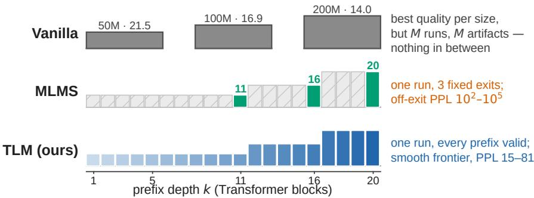
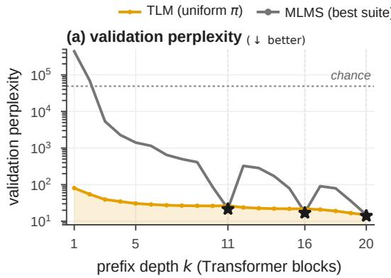
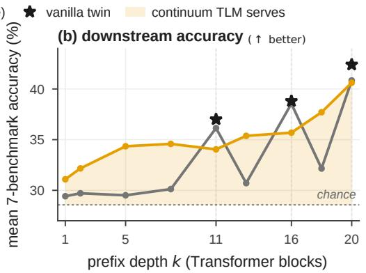
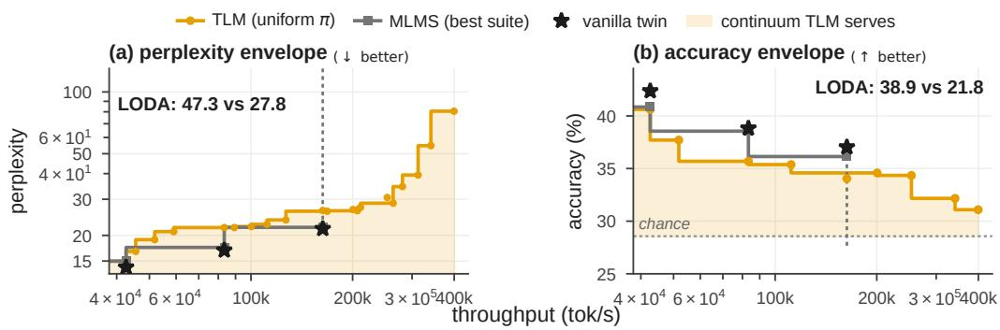
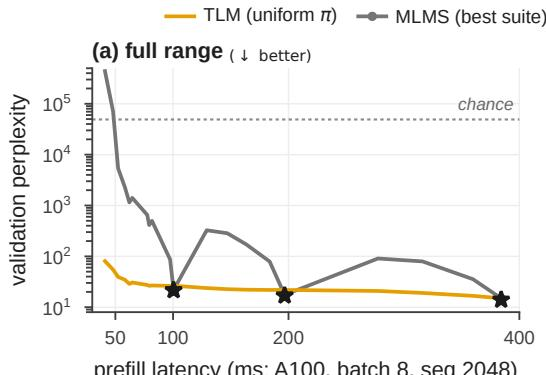
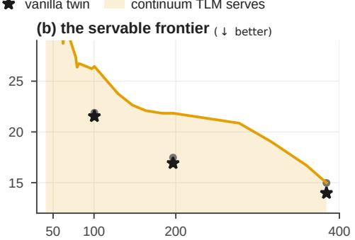

# TELESCOPIC LANGUAGE MODELS

Zhilin Guo1 Boqiao Zhang1 Hakan Aktas1 Kyle Fogarty1 Nursena Koprucu Aslan1 Wenzhao Li1 Canberk Baykal1 Albert Miao1 Siyu Hong1 Yixiao Liu2 Adam Wu1 Ashish Kumar Singh3 Sakar Khattar3 Chenliang Zhou1 Weihao Xia1∗ Cristina Nader Vasconcelos3 Cengiz Oztireli1,3

1University of Cambridge 2University of British Columbia 3Google

∗Corresponding author: wx258@cam.ac.uk

## ABSTRACT

One deployed language model must often serve many compute budgets, yet serving each budget still means a separate training or compression run per point. We train a Telescopic Language Model (TLM) to be that continuum: a nested-capacity Transformer supervised by stochastic prefix supervision with afull anchor. At every step, one randomly truncated prefix of the capacity axis is trained against the full next-token target, alongside one full-capacity pass, so the trained artifact is a valid language model at every depth. Two forward-backward passes per step, no architectural change, nothing extra at inference. Fixed-exit suites such as Matryoshka Language Model Suites (MLMS) occupy one point in this design space, and the point has a cost: supervising only a few fixed exits leaves the nested model at chance level everywhere else (perplexity 102–105 in our baselines). On a 200M proxy suite (20B FineWeb-Edu tokens, identical data stream for all methods), a single TLM run is a valid language model at every one of its twenty layer prefixes, in perplexity and on perplexity-sensitive downstream tasks, reducing the area under the quality–budget curve by 43–44% relative to the fixed-exit suites while matching them at full capacity, at ∼12% lower GPU cost per run. The prefix sampling density is a dial: concentrating it on a few depths recovers fixed-exit quality there at the price of the continuum, so the operating points become a training-time choice rather than an architectural one. These results indicate that the training objective, not the nesting itself, is what makes a model elastic.

## 1 INTRODUCTION

Language models are deployed across devices and latency budgets that differ by orders of magni tude, from on-device assistants to datacenter endpoints. Serving this range today means training a separate model per budget, or compressing a large model post hoc and accepting the quality loss. Both options multiply cost: either M full training runs for M operating points, or a compression pipeline whose products trail models trained natively at their size.

Nested-capacity cascades promise a cheaper route: sub-models of increasing width and depth stacked into one Transformer trained end-to-end, so a single run can in principle serve many sizes. The established instance, Matryoshka Language Model Suites (Godey & Artzi, 2026), supervises only M=3 fixed exits, with online distillation from the largest sub-model. We find that the objective, not the cascade, decides what gets served: at any depth other than a trained exit, the nested model is effectively unusable, validation perplexity rising from ∼20 at the exits to $1 0 ^ { 2 } – 1 0 ^ { 5 }$ (up to ${ \sim } 4 \times 1 0 ^ { 5 } )$ at untrained depths (Figure 2). The continuum of operating points that the cascade appears to offer is not realized.

The continuum needs no new architecture, only a new objective. We train the unchanged cascade with stochastic prefix supervision and a full anchor: at every optimization step, we sample one prefix length k from a distribution over all depths, evaluate the next-token loss of the k-prefix against the full training target, and add the loss of the full model on the same batch. The cost is two forward-backward passes per step; the architecture and inference are unchanged: the trained artifact is truncated at any depth and used directly. We call the resulting model a Telescopic Language Model (TLM), because its capacity extends and collapses smoothly along a single ordered axis. The off-exit collapse, we will show, is a property of the fixed-exit objective, not of the nesting.

  
Figure 1: One training run, a valid language model at every depth. Top: vanilla LLMs train a separate standalone model per budget (our 50M/100M/200M twins, annotated with validation perplexity) — the best quality per size, but M runs, M artifacts, and nothing in between. Middle: MLMS (Godey & Artzi, 2026) nests the budgets in one 20-layer cascade but supervises only three fixed exits (green); every other prefix is untrained and collapses (hatched). Bottom: a Telescopic Language Model trains one random prefix per step against the full target, so every prefix of the same cascade is a valid language model (gradient: deeper prefixes are larger models). The result is a continuum of operating points from one run, with the full-size peak close to a separately trained twin (14.99 vs. 13.98 perplexity).

On the 200M-parameter MLMS proxy suite, trained on 20B FineWeb-Edu tokens with an identical data stream for every method, our main findings are:

• A continuum from one run. Trained with a uniform prefix sampler, TLM is a valid language model at every one of its twenty layer prefixes. At depths MLMS does not train, where its perplexity reaches $1 0 ^ { 2 } – 1 0 ^ { 5 }$ , TLM decreases smoothly (81 PPL at k=1 to 15 at k=20); the area under the quality–budget curve drops by 43–44% (AULB 3.28 vs. 5.73–5.90).

• Valid below the smallest exit. TLM serves ten operating points below MLMS’s 50M exit, down to 0.11× full latency at PPL 26–81, where MLMS’s own prefixes collapse.

• No added full-capacity tax. The same uniform arm is on par with the MLMS suites at the full 200M operating point (14.99 perplexity, within their 14.96–15.42 span). Shifting the sampler toward MLMS’s exits trades the continuum for full-size quality: a single seed reaches 14.65 (a 2.2% edge over MLMS, within seed noise) and cuts the remaining gap to a standalone vanilla twin by a third (4.8% vs. 7.1%).

• A dial, not a wall. The prefix sampling density π controls the trade-off between prefix coverage and trained-exit quality: concentrating π on the MLMS exit depths improves quality at those exits relative to uniform sampling but sacrifices off-exit coverage (§4.3). That endpoint shares MLMS’s exit grid while retaining TLM’s sampled-prefix-plus-anchor objective — the operating points are a training-time choice, and no single setting dominates on both axes.

• Lower cost per operating point. The uniform TLM run costs 131 GPU-hours (∼12% less than a distillation-free MLMS suite at 149, and 1.7× less than the vanilla three-model suite at 216) while delivering twenty operating points instead of three.

These results instantiate a broader training principle, stochastic prefix supervision with a full anchor, previously validated on 3D Gaussian splatting (Guo et al., 2026): when a model’s capacity lives in an ordered list of units, supervising one random prefix per step against the full target, alongside the full model, turns that model into a continuum of models. We show that on the language-model capacity axis this yields a single model that is a continuous quality–budget frontier — every depth served, the peak preserved relative to the fixed-exit suites — and characterize the trade-offs that govern where the sampler can be placed.

## 2 RELATED WORK

Nested and Matryoshka models. Matryoshka Representation Learning (Kusupati et al., 2022) trains embeddings that remain useful when truncated to any of a fixed grid of dimensions, and nested dropout (Rippel et al., 2014) showed that sampling a truncation point each step induces an ordered, continuously truncatable representation. On the language-model axis, MatFormer (Devvrit et al., 2023) nests FFN widths inside a decoder, and MLMS (Godey & Artzi, 2026) nests submodels in both width and depth with per-exit supervision plus distillation, delivering three operating points per run. MatFormer’s headline finding is that never-trained intermediate widths remain usable (Mix’n’Match), which sits at odds with our motivating question: can one run deliver a valid model at every depth? The reconciliation is where the nesting lives and what is supervised along it: MatFormer nests width within each layer under a single output head trained on every step, so every truncation shares a calibrated readout, whereas MLMS nests depth across sub-models whose per-exit heads are each trained only at their own exit, so an off-exit prefix pairs a trained trunk with a head that never saw it (our readout-rescue control attributes most of the collapse to this miscalibration). TLM trains the same cascade with a different objective: one stochastically sampled prefix per step over a continuous depth grid, plus a full-capacity anchor — a continuum of operating points at a fixed two passes per step, with fixed-exit supervision as the special case.

Slimmable networks. Slimmable and universally slimmable networks (Yu et al., 2019; Yu & Huang, 2019) train CNNs that run at several widths via a sandwich rule with in-place distillation; SortedNet (Valipour et al., 2023) generalizes this to random sub-networks, and Once-for-All (Cai et al., 2020) and Flextron (Cai et al., 2024) train or build elastic supernets that supervise multiple configurations per step, with Once-for-All further distilling from the model’s own full output; we supervise exactly one sampled prefix plus the full model, and match the full task target rather than a teacher distribution.

Early exits and random depth. Early-exit models (Teerapittayanon et al., 2016; Kaya et al., 2019; Xin et al., 2020; Elhoushi et al., 2024) attach heads at intermediate layers so easy inputs exit early, Mixture-of-Depths (Raposo et al., 2024) varies compute per token, and others learn per-token exit decisions (Elbayad et al., 2020; Schuster et al., 2022); the exits remain a fixed set of intended operating points. The closest training mechanism to ours is random-depth supervision: stochastic depth (Huang et al., 2016) and LayerDrop (Fan et al., 2020) drop blocks per step, and DynaBERT (Hou et al., 2020) trains width- and depth-adaptive sub-networks. These share our “train a random depth each step” skeleton, but they drop layers within a single shared-head stack rather than training one sampled prefix of a width-growing cascade against the full task target, and they add no full-capacity anchor; our LayerDrop control tests whether random-depth robustness alone yields a continuum. Early exits are complementary: a TLM prefix can itself serve as the draft in speculative decoding (Leviathan et al., 2023).

Other budget axes and post-hoc compression. MQT-LLaVA (Hu et al., 2024b) samples a token budget per step and MatryoshkaKV (Lin et al., 2025) samples KV-cache ranks, but neither combines a sampled budget, a full anchor, and full-target matching on an ordered capacity axis. Post-hoc compression — structured pruning of width (Ashkboos et al., 2024; Ma et al., 2023) or depth (Gromov et al., 2024; Men et al., 2024) and per-size distillation (Hinton et al., 2015; Sanh et al., 2019) — de rives smaller models after the fact, one compression pass per target, and the products generally lag a natively trained model of the same size; we compare against independently trained vanilla models, the strongest in-hand competitor (§4).

The same objective elsewhere. Stochastic prefix supervision with a full anchor was previously instantiated on 3D Gaussian splatting (Guo et al., 2026), where the units are opacity-ordered splats and the same two-pass objective yields a smooth, concave quality–budget frontier with preserved peak quality. TLM carries the principle to language-model capacity, where the units are nested Transformer blocks and per-budget evaluation is expensive, which is precisely the regime in which the two-pass design beats per-exit supervision on cost.

## 3 METHOD

## 3.1 NESTED-CAPACITY ARCHITECTURE

TLM needs a nested-capacity cascade in which every prefix is a standalone language model; we instantiate it with the Matryoshka Language Model Suite (MLMS) architecture (Godey & Artzi, 2026), used unchanged, and contribute the training objective. Concretely, the cascade is an ordered stack of M Llama-style (Touvron et al., 2023) Transformer (Vaswani et al., 2017) sub-models with strictly increasing widths $D _ { 1 } < D _ { 2 } < \cdots < D _ { M }$ and depths $\begin{array} { r } { n _ { 1 } , . . . , n _ { M } \left( N = \sum _ { m } n _ { m } \right. } \end{array}$ blocks in total). Each sub-model takes the previous sub-model’s output, concatenated at a junction with a fresh slice of the shared input embedding (the widened channels), and carries its own final RMSNorm and LM head over a shared vocabulary, so every cascade prefix is a standalone language model.

Formally, let $F _ { k } ( x ; \theta )$ denote the next-token logits produced by the $k { \cdot } p r e f i x { \mathrm { : } }$ the first k Transformer blocks, followed by the final norm and LM head of the sub-model that contains block k. $F _ { N }$ is the full model. MLMS supervises only a fixed grid of exits $k \in \{ k _ { 1 } , \ldots , k _ { M } \}$ (the block boundaries), minimizing $\begin{array} { r } { \sum _ { m } \mathcal { L } _ { \mathrm { c e } } ( \dot { F } _ { k _ { m } } ) + \alpha _ { d } \dot { \mathcal { L } } _ { \mathrm { d i s t i l l } } } \end{array}$ at those exits; at any other depth its prefixes are untrained and, as we show, collapse to $1 0 ^ { 2 } – 1 0 ^ { 5 }$ perplexity.

## 3.2 STOCHASTIC PREFIX SUPERVISION WITH A FULL ANCHOR

TLM supervises a continuous training signal over all depths, rather than a fixed exit grid. Each optimization step performs exactly two forward-backward passes over the same micro-batch $( x , y )$ of next-token pairs:

$$
\begin{array} { r l } { \mathcal { L } _ { \mathrm { s t e p } } ( \boldsymbol { \theta } ) = } & { \underbrace { \lambda \ell \big ( F _ { \tilde { k } } ( \boldsymbol { x } ; \boldsymbol { \theta } ) , y \big ) } _ { \mathrm { s t o c h a s t i c p r e f i x ~ p a s s } , \tilde { k } \sim \pi } + \underbrace { \gamma \ell \big ( F _ { N } ( \boldsymbol { x } ; \boldsymbol { \theta } ) , y \big ) } _ { \mathrm { f u l l ~ a n c h o r ~ p a s s } } } \end{array}\tag{1}
$$

where ℓ is the token-level cross-entropy, π is a sampling distribution over prefix depths $\{ 1 , \ldots , N \}$ and $\tilde { k } \sim \pi$ is the sampled prefix depth — a random variable, resampled every step, in contrast to $k ,$ which denotes a generic or evaluation depth. The objective minimized is the expectation of this per-step loss, $\mathcal { L } ( \boldsymbol { \theta } ) \bar { = } \mathbb { E } _ { \tilde { k } \sim \pi } \mathcal { L } _ { \mathrm { s t e p } } ( \boldsymbol { \theta } )$ . Our default is $\lambda = \gamma = 1$ with π uniform over depths, the only one of the three samplers we study that trains every prefix (including $k { = } 1 )$ and the one that yields a valid language model at all N depths — valid in the quantitative sense used throughout: perplexity finite and far below the chance level of the vocabulary, decreasing smoothly with depth, on the validation slice and on perplexity-sensitive downstream tasks. We also study a log-uniform sampler, $k = \lceil N ^ { u } \rceil$ with $u \sim \bar { \mathrm { U } } ( 0 , 1 )$ , which concentrates mass on small prefixes $( p ( k ) \approx 1 / k$ for $k \geq 2 .$ mean $k \approx 6 . 9 , k { = } 1$ unsampled) and an exit-grid sampler concentrated on MLMS’s exits (section 4). The support is discrete — the densest grid the cascade admits, every integer depth — so any budget is served without retraining. The two passes act asymmetrically on the trunk: block j receives the anchor gradient every step but the prefix gradient only when $\tilde { k } \geq j$ , so π induces a depth-dependent update schedule in which shallow blocks update most often; $\lambda { = } \gamma { = } 1$ is the simplest weighting, and section 4 isolates each term. Nothing is added at inference: the trained model is truncated at any depth k and used directly.

Each ingredient has a distinct role, and we isolate them by ablation in section 4:

Stochastic continuous budget. Supervising a single randomly drawn prefix per step (rather than all exits) decouples the number of supervised depths from the per-step cost: we cover a continuum of N depths for the price of two passes. MLMS instead applies a loss at every one of its M exits on every step (plus a distillation KL at each smaller exit), so its per-step cost grows with the number of exits while still leaving all off-exit depths untrained. Because ˜k is resampled every step, every prefix receives an unbiased gradient signal over training. The supervision must be end-to-end: readout calibration alone recovers only part of a collapsed prefix (head-only repair remains ∼6× behind a trained prefix, section 4).

The full anchor. The $F _ { N }$ term ensures the largest configuration receives a full-target gradient on every step, rather than only on the fraction of steps that sample $k { = } N$ . This is designed to protect full-size quality (the no-anchor ablation in section 4 tests whether it is necessary), but it does not by itself guarantee parity with an independently trained twin, because the shared trunk is also shaped by the prefix gradients. The residual $\Delta _ { \mathrm { f u l l } }$ is the price of that sharing (section 3.3).

Full-target matching. The prefix pass is always trained against the same next-token target y as the full model, never a cheaper or reduced target, so every prefix is a valid language model for the same task, not an auxiliary predictor.

Optional distillation. A third term, $\alpha _ { d } \mathcal { L } _ { \mathrm { d i s t i l l } } ( F _ { \tilde { k } } \gets \mathrm { s g } [ F _ { N } ] )$ , can distill the full model’s distribution into the sampled prefix (stop-gradient teacher). We ablate it; the method does not depend on it.

## 3.3 THE CONTINUOUS QUALITY–BUDGET CURVE

The object of interest is the quality–budget curve $Q ( k )$ : validation perplexity of the k-prefix as a function of depth (equivalently, of inference FLOPs, which grow superlinearly in k across the widening cascade; see Cost accounting below). We evaluate $Q ( k )$ on every integer prefix $k = 1 . . N$ — continuous in coverage, the densest grid the cascade admits; the smoothness of the curve is an empirical finding, not part of the definition. We reservefrontier for the Pareto envelope derived from a method’s valid operating points (the LODA construction below). We summarize $Q ( k )$ with:

• AULB (area under the loss–budget curve, i.e. the quality–budget curve $Q ( k ) ) \colon$ the trapezoid integral of token NLL over the integer prefix grid $k = 1 . . N$ , divided by the grid span $N { - } 1$ to return it to a mean-NLL scale (lower is better). AULB collapses the whole frontier into one scalar for ablations. It weights each unit of depth equally and is sensitive to the off-exit explosion under fixed-exit objectives; we therefore treat the full per-prefix curves as the primary evidence and compute FLOP-weighted, median, and deployment-range variants as robustness checks (a large gap, 30–44%, holds under all of them).

• Off-exit gap: for a fixed-exit baseline (MLMS) evaluated on the same grid, the per-depth difference $Q _ { \mathrm { M L M S } } ( k ) - Q _ { \mathrm { T L M } } ( k )$ at non-trained depths $k \not \in \{ k _ { 1 } , \ldots , k _ { M } \}$ . This measures the continuum’s added coverage directly: quality at depths a fixed-exit suite does not train.

$\Delta _ { \mathrm { f u l l } } \colon Q ( N )$ relative to an independently trained vanilla twin of the full model. The full anchor is designed to keep this small; any residual is the price of sharing the trunk across prefixes.

• LODA (level-of-detail area): the area under the quality–throughput frontier, the analog of $\mathrm { \Delta A U C _ { f p s } }$ in level-of-detail rendering (Guo et al., 2026). A method’s operating points are its valid configurations (every prefix for TLM; only the trained exits for MLMS, whose off-exit prefixes collapse). The envelope $\hat { q } ( T )$ is the best quality at throughput $\ge T - \mathbf { a }$ faster model can always be throttled, so this is a max-from-right step function — scoring the quality floor where a method demonstrates nothing. Concretely: sort the method’s valid operating points by throughput and walk from the fastest point toward slower throughputs; $\hat { q } ( T )$ carries the best quality seen so far, holding each level as a flat step until a slower point improves on it, so a suite with three exits contributes three steps while a continuum contributes twenty. $\begin{array} { r } { \mathrm { L O D A } = \frac { 1 0 0 } { T _ { \mathrm { m a x } } - T _ { \mathrm { m i n } } } \int \hat { q } ( T ) d T } \end{array}$ (higher is better) is the normalized area under this envelope. Where AULB weights each unit of depth equally, LODA weights each unit of throughput equally and credits only valid operating points, so it measures the continuum’s deployment value. We use chance-normalized benchmark accuracy as the headline quality and clamped normalized perplexity as robustness. LODA is by construction a coverage metric — it scores what a continuum is for; the complementary per-exit comparison, where the suite retains an edge, is reported alongside (§4.2).

Cost accounting. Training costs two forward-backward passes per step regardless of how many depths are supervised, versus one shared cascade pass with M exit losses (plus a distillation teacher) for an M-exit MLMS suite, and M full independent trainings for a vanilla suite. Inference at depth k costs the cumulative FLOPs of the first k blocks, sub-linear in k because block cost grows with width: the three exits $k { = } 1 1 / 1 6 / 2 0$ use $\sim 1 7 \% / 4 3 \% / 1 0 0 \%$ of the full model’s layer FLOPs. Unlike fixed-exit suites, any k is available from a single training run.

## 4 EXPERIMENTS

## 4.1 EXPERIMENTAL SETUP

Proxy suite. All experiments use the 200M Matryoshka proxy suite of Godey & Artzi (2026) (three nested widths: blocks $1 1 @ 3 2 0 + 5 @ 5 7 6 + 4 @ 9 6 0$ , head dim 64; norm junctions; SmolLM2 tokenizer (Ben Allal et al., 2025), vocab 49,152), trained on FineWeb-Edu (Penedo et al., 2024) for 20B tokens per run: packing at sequence length 2048, AdamW (Loshchilov & Hutter, 2019) $( \beta _ { 1 } , \beta _ { 2 } ) = ( 0 . 9 , 0 . 9 5 ) , \epsilon = 1 0 ^ { - 8 }$ , peak lr $4 \times 1 0 ^ { - 4 }$ , weight decay 0.01, grad clip 1.0, WSD schedule (Hu et al., 2024a) (1000 warmup steps, 9.09% cooldown), global batch $5 1 2 \times 2 0 4 8$ tokens, bf16, seed 42. Every run consumes the identical data stream; the only independent variable is the training objective.

Table 1: Headline results (200M proxy suite, 20B tokens/run, identical data stream). Full-size (200M) validation PPL; AULB over the prefix grid k=1..20; $\mathrm { L O D A } _ { \mathrm { a c c / p p l } } .$ the area under the quality–throughput frontier (§3.3; higher is better). Bold marks the best single-run cascade per column; the vanilla twin is the per-size reference. ‘–’: not evaluated.
<table><tr><td>Method</td><td>200M PPL ↓</td><td>AULB↓</td><td> $\mathrm { L O D A _ { a c c } } ^ { \prime }$  ←</td><td> $\mathrm { L O D A _ { p p l } \uparrow }$ </td></tr><tr><td>MLMS (best suite)</td><td>14.98</td><td>5.90</td><td>21.8</td><td>27.8</td></tr><tr><td>TLM (π uniform)</td><td>14.99</td><td>3.28</td><td>38.9</td><td>47.3</td></tr><tr><td>TLM (π log-unif.)</td><td>14.99</td><td>3.45</td><td>34.9</td><td>48.5</td></tr><tr><td>TLM (π exit-grid)</td><td>14.65</td><td>6.21</td><td>一</td><td>25.7</td></tr><tr><td>vanilla twin (ref.)</td><td>13.98</td><td>一</td><td>一</td><td>一</td></tr></table>

Methods compared. (i) MLMS: our faithful reimplementation of the four Table 3 configurations of Godey & Artzi (2026) (norm/nodistill, plain, zero junction × distillation; validated against the published numbers); the distillation arms use $\alpha _ { d } { = } 0 . 3$ , a soft cross-entropy to the stop-gradient largest-exit distribution at temperature 1, summed uniformly over the three exits (the full exit is pure cross-entropy); (ii) Vanilla twins: standalone 50M/100M/200M models trained on the same stream; (iii) TLM: stochastic prefix supervision with full anchor $( \lambda = \gamma = 1$ , no distillation) under three prefix samplers π: uniform (our default; equal mass on all twenty depths), log-uniform (mass concentrated on small prefixes), and exit-grid (mass only on the three MLMS exit depths). The log-uniform sampler draws $u \sim \mathrm { U } ( 0 , 1 )$ and sets $k = \lceil N ^ { u } \rceil$ , so $\begin{array} { r } { p ( k ) \propto \log \frac { k } { k - 1 } \approx 1 / \bar { k } } \end{array}$ for $k \geq 2$ and k=1 has measure zero (mean k ≈ 6.9).

Evaluation. Held-out FineWeb-Edu validation perplexity; 7-benchmark zero-shot accuracy (ARC-E/C, HellaSwag, LAMBADA, OpenBookQA, PIQA, Winogrande; lm-eval-harness (Gao et al., 2023), length-normalized accuracy); OOD byte-PPL on WikiText-103 (Merity et al., 2017), C4 (Dodge et al., 2021), PG-19 (Rae et al., 2020), arXiv, and PubMed (Cohan et al., 2018); and the quality–budget curve Q(k), the validation PPL of every integer prefix $k \in [ 1 , 2 0 ]$ (§3). All PPL numbers for a given comparison use the same held-out slice, so within-table gaps are paired by construction (identical eval data), which removes eval-set resampling variance; finite-slice noise remains and is common across arms.

## 4.2 RESULTS & ANALYSIS

TLM is a valid model at every depth. Figure 2 plots Q(k) for TLM vs. MLMS. The uniform arm’s frontier is smooth and near-monotone throughout: it falls from 81 PPL at k=1 to 15 at k=20, never spiking above 56 for any $k \geq 2 .$ . MLMS, by contrast, is valid only at its three trained exits: off-exit PPL reaches $1 0 ^ { 2 } – 1 0 ^ { 5 }$ and beyond $( \mathrm { e } . \mathrm { g } . k = \bar { 5 } ; 1 , 4 1 2 ; k = 1 ; 4 3 8 , 8 8 \bar { 3 } )$ , versus a chance level of 49,152. TLM cuts AULB from 5.73–5.90 (all four MLMS suites) to 3.28, a 43–44% reduction. The MLMS collapse is partly a readout artifact: cheap head-only fine-tuning recovers it to 177 PPL at k=5 (suite AULB 5.90→4.41; Appendix B), but the rescued prefixes still lag TLM’s trained prefixes by ∼6× and require per-prefix post-hoc tuning that TLM does not.

TLM wins the deployment frontier. Table 1 gives the headline comparison and Figure 3 the underlying quality–throughput frontier. LODA (§3.3) credits a method only at throughputs where it serves a valid model, so it measures what a continuum is for. The continuum arms win decisively: uniform π reaches $\mathrm { L O D A } _ { \mathrm { a c c } } = 3 8 . 9$ against MLMS’s 21.8 (1.8×) and $\mathrm { L O D A _ { p p l } = 4 7 . 3 }$ against 27.8. The win is structural: below its smallest (50M) exit MLMS serves no valid model where TLM serves ten further points. The two non-continuum arms confirm the attribution: MLMS and exit-grid π, which supervise only the exit depths, both collapse off-exit and score far lower $\mathrm { ( L O D A _ { p p l } 2 7 . 8 }$ and 25.7) — dense stochastic supervision, not the architecture alone, creates the deployment value.

  
Figure 2: One training run, a valid model at every depth. TLM (amber) is a valid language model at every one of its twenty layer prefixes; the shaded band is the continuum it serves. MLMS (grey) is valid only at its three trained exits (dashed) and collapses elsewhere; at those exits it remains stronger, the price of coverage (§4.2). (a) Validation perplexity of every prefix (log scale, lower is better; dotted: chance): TLM decreases smoothly across the whole range while MLMS falls to $1 0 ^ { 2 } – 1 0 ^ { 5 }$ between its exits. (b) Zero-shot downstream accuracy (higher is better): TLM’s continuum improves with depth while MLMS’s off-exit prefixes sit at chance; the band is TLM’s above-chance quality at every depth. Stars: independently trained vanilla twins (the per-size ceiling). Area unde the loss–budget frontier (AULB): TLM 3.28 vs. MLMS 5.73–5.90.

  
Figure 3: One TLM is a continuum of models; suites and vanilla training yield isolated points. Each marker is an operating point the method actually trains. TLM-uniform (amber) serves every prefill throughput in the range; the shaded band is the continuum it delivers. MLMS (grey squares) and vanilla twins (stars) exist only at their training sizes; MLMS’s exits edge TLM’s prefixes at k=11, 16 (the price of coverage) and it collapses off-exit (dashes). Envelopes give the best quality served at each throughput (log scale; faster rightward; a faster model can always be throttled down). (a) Validation perplexity (log–log; lower is better). (b) Mean 7-benchmark accuracy (higher is better); the band above the chance floor (dotted) is exactly $\mathrm { T L M ^ { \prime } s \ L O D A _ { a c c } }$ . LODA (area under each envelope; perplexity uses a clamped normalised quality) is annotated per method: TLM wins on both.

The continuum is free at the peak. The uniform arm, the configuration that delivers the full continuum, is on par with the MLMS suites at the full 200M operating point (14.99 perplexity, within their 14.96–15.42 span, Appendix A), so the continuum costs nothing at the peak. The exit-grid arm goes further, reaching 14.65 PPL with a comparable benchmark average (41.1 vs. 40.8), though it abandons the continuum (§4.3) and its sampler also up-weights the full exit (the anchor every step plus the ${ \sim } 1 / 3$ of prefix passes sampling k=N give ∼4/3× MLMS’s full-exit loss weight). Against the standalone vanilla twin (13.98), the full-size gap narrows from MLMS’s 7.1% to TLM-exitgrid’s 4.8%, about a third. We read 14.99 vs. 14.98 as parity, and the 14.65 vs. 14.98 gap as consistent with a full-size edge rather than decisive (the suites remain single-seed); paired second seeds of both TLM arms (Appendix C) measure the run-to-run spread directly, and the exit-grid edge replicates (14.67 vs. 14.65).

  
prefill latency (ms; A100, batch 8, seq 2048)

  
prefill latency (ms; A100, batch 8, seq 2048)  
Figure 4: One run serves any latency; the suite serves three. Validation perplexity (lower is better) against measured prefill latency (one A100, batch 8, sequence 2048, bf16). (a) TLM-uniform (amber) is a valid language model at every latency, while MLMS (grey) is servable only at its three trained exits (circles) and collapses off-exit, rising to $1 0 ^ { 2 } – 1 0 ^ { 5 }$ PPL up to the dotted chance line. (b) Zoom on the servable range: the band is the continuum TLM serves at every latency; MLMS’s exits sit below TLM at $k { = } 1 1$ and $k { = } 1 6$ , its only valid points. Stars: vanilla twins.

The price of coverage at the trained exits. At the two trained exits below full size, MLMS retains an edge (per-exit matrix, Appendix B): 21.89 vs. 24.38 PPL at 50M and 17.47 vs. 19.11 at 100M (best TLM arm vs. norm+distill), and it also leads there on benchmarks (36.1 vs. 34.1 mean accuracy at 50M; Appendix G). This is the expected price of spreading supervision over twenty prefixes instead of three exits, and §4.3 shows the trade-off is tunable: π moves trained-exit quality and continuum coverage in opposite directions. A budget midway between the 50M and 100M depths (k=13) is served by TLM-uniform at 22.6 PPL, nearly matching MLMS’s 50M exit (21.89), whereas MLMS at k=13 collapses to 285 PPL. Any latency target between exits is served by TLM at near frontier quality, where MLMS returns a collapsed prefix; Figure 4 confirms this on measured latency rather than FLOP proxies.

Cost. TLM’s advantage is the continuum itself: one run that serves any budget, including budgets not anticipated at training time. Table 2 reports GPU-hours billed by the cluster (per-run ledger; Appendix D). The like-for-like comparison holds distillation off on both sides: the uniform TLM run costs 131 GPU-h versus 149 for a distillation-free MLMS suite (∼12% cheaper), and 1.7× less than the vanilla three-model suite (216 GPU-h). MLMS’s cost is higher because each step backpropagates through all M exits (one shared cascade forward, then a per-exit backward through the shared graph); TLM instead backpropagates through a single sampled prefix, which is shallower than the full stack on average, plus the full model. These are billed GPU-hours for our reimplementation; a different MLMS implementation could shift the gap. Per delivered operating point this is 6.5 GPU-h (TLM) versus 50–72 (baselines), though TLM’s twenty points include off-frontier prefixes weaker than the best same-size model, whereas the baselines’ three points all sit on their frontier. When the deployment budgets are few and known in advance, per-size training is the right tool: three separate twins cost 216 GPU-h total and give the best per-point quality (Appendix B). Within TLM, the sampler sets cost through the mean sampled depth: log-uniform π is fastest (120 GPU-h), exit-grid slowest (147).

## 4.3 ABLATIONS

Prefix sampler π is a coverage–exit-quality dial. Table 1 and the full results matrix (Appendix B) contain the three-arm π ablation $( \lambda = \gamma = 1$ fixed, no distillation). Moving π’s mass toward the exit depths (log-uniform → uniform → exit-grid) monotonically improves the trained exits (50M: $2 7 . 3 \stackrel { - } {  } 2 6 . 5 \stackrel { - } {  } 2 4 . 4 \nonumber$ ; 100M: $2 6 . 6  2 1 . 8  1 9 . 1 )$ . Continuum coverage, by contrast, is best at the uniform sampler and degrades when mass is concentrated: the exit-grid arm’s off-exit prefixes collapse to MLMS-like values (k=5: 2,693), confirming that dense stochastic supervision, not the anchor alone, creates the continuum. AULB is therefore U-shaped in the sampler’s mean depth (3.45 log-uniform, 3.28 uniform, 6.21 exit-grid). Full-size quality is essentially invariant to $\pi ( 1 4 . 9 9 / 1 4 . 9 9 / 1 4 . 6 5 )$ ; the no-anchor arm (Appendix B) confirms the anchor is what preserves the peak: without it the 200M PPL rises to 22.32 while the continuum is unchanged (AULB 3.41), and a pass-matched variant (Appendix B) shows the effect is the full-depth gradient itself, not the freed compute.

Table 2: One run, twenty operating points: TLM delivers each at 6.5 GPU-h versus 50–72 for the suites. Training cost (billed GPU-hours, one A100 per run, 20B tokens/run); TLM and MLMS rows are single runs, the like-for-like row holds distillation off on both sides, and TLM’s twenty points include off-frontier prefixes (see text).
<table><tr><td>Method</td><td>GPU-h↓</td><td>operating points ↑</td><td>GPU-h / point ↓</td></tr><tr><td>vanilla suite (3 models)</td><td>216</td><td>3</td><td>72</td></tr><tr><td>MLMS suite, no distill (1 run)</td><td>149</td><td>3</td><td>50</td></tr><tr><td>MLMS suite, +distill (1 run)</td><td>182-185</td><td>3</td><td>61-62</td></tr><tr><td>TLM, uniform π (1 run)</td><td>131</td><td>20</td><td>6.5</td></tr></table>

The log-uniform arm and the k=1 prefix. The log-uniform sampler $k \ = \ \lceil N ^ { u } \rceil$ places (near-)zero mass on k=1, so that prefix is effectively never trained and collapses $( 6 , 7 4 0 \ \mathrm { P P L } )$ : within TLM, an unsupervised prefix fails just as MLMS’s off-exit prefixes do, within-run confirmation that supervision, not the nesting, decides whether a prefix is a language model. Where it does place mass, log-uniform wins at small prefixes (k=2: 40.0 vs. uniform’s 54.7), its intended niche. We therefore use uniform π as the default: it is the only sampler that trains every prefix, attains the best AULB, and matches MLMS at full size.

Ingredients. Two further arms isolate the remaining ingredients at the log-uniform base sampler: one removes the full anchor (γ=0), so the full model is trained only on the ∼1.7% of steps that sample k=N; the other adds MLMS-style stop-gradient distillation into the sampled prefix $( \alpha _ { d } { = } 0 . 3 )$ Appendix B reports their results; the main-text claims do not depend on them (every TLM number above is anchor-on and distillation-free). Appendix B adds five controls probing whether each remaining choice is necessary (pass-matched and exit-grid no-anchor variants, LayerDrop random depth training with and without readout calibration, and a dense all-prefix upper bound).

## 5 CONCLUSION

We asked whether a single training run can deliver a valid language model at every inference budget. Stochastic prefix supervision with a full anchor, on an unchanged nested cascade and an identical data stream, delivers that continuum: with a uniform prefix sampler, all twenty layer prefixes remain usable language models, perplexity falling smoothly with depth. The continuum is free at the peak (full-capacity quality on par with the MLMS suites at ∼12% lower GPU cost) and wins the deployment frontier (LODA rises 1.8×; AULB falls 43–44%).

Limitations. Our evidence is at the 200M proxy scale on FineWeb-Edu, with one seed per arm (second seeds for the two headline TLM arms and paired bootstrap CIs corroborate the main gaps, Appendix C); nested and elastic training has been validated from 100M up to a few billion parameters (Devvrit et al., 2023; Hou et al., 2020; Cai et al., 2024), but whether the peak–continuum separation we report holds at 8B–70B is an open question. MLMS retains an edge at its two trained exits below full size, the expected price of coverage. Our budgets are latency and throughput; on a parameter-count axis the continuum’s advantage shrinks, since prefixes share the embedding and head (Appendix E). Serving fixes a depth per request; switching depth within a generation would require truncating or extending the KV cache across layers, a systems question orthogonal to the training objective that we leave to future work. Our frontier runs over depth at fixed width; width, the 3B scale, and speculative decoding are next steps.

## AI-USE STATEMENT

In this work, we used generative AI tools (AI coding assistants), under human direction, to aid and polish the writing, to draft and edit sections of the manuscript, to identify and check relevant literature and references, to create and refine the figures, and for research ideation and the design and orchestration of the experiments. We did not use generative AI to generate synthetic datasets. All experimental results were produced by the logged training and evaluation runs described in the paper; the authors reviewed all AI-assisted work and checked every quantitative claim against the recorded metrics. We take responsibility for the final content of this work, including text, claims, and artifacts produced with the aid of generative AI.

## REPRODUCIBILITY STATEMENT

All runs use the same architecture, data stream, and budget (§4.1); the evaluation protocol (held-out slice, benchmark configuration, frontier grid) was fixed before the main runs and is described in §4.1 and Appendix G. The training and evaluation code, including the exact configs and seeds, will be released publicly upon publication. Per-run GPU-hour accounting from the cluster’s billing records is reported in Appendix D. The appendix is provided as a separate supplementary PDF.

## ETHICS STATEMENT

This work trains language models on FineWeb-Edu, a public web-text dataset, and studies training efficiency; it involves no human subjects and no new data collection. The energy cost of all experiments is disclosed as GPU-hours in Appendix D. More efficient training of multi-budget model families has broad positive implications for the environmental cost of deploying language models; we are not aware of specific dual-use concerns beyond those of language modeling in general.

## ACKNOWLEDGEMENTS

This work was supported by a UKRI Future Leaders Fellowship [grant number G127262].

## REFERENCES

Saleh Ashkboos, Maximilian L. Croci, Marcelo Gennari do Nascimento, Torsten Hoefler, and James Hensman. Slicegpt: Compress large language models by deleting rows and columns. In International Conference on Learning Representations, 2024.

Loubna Ben Allal, Anton Lozhkov, Elie Bakouch, Gabriel Mart´ın Blazquez, Guilherme Penedo,´ Lewis Tunstall, Andres Marafioti, Hynek Kydl´ ´ıcek, Agustˇ ´ın Piqueres Lajar´ın, Vaibhav Srivastav, Joshua Lochner, Caleb Fahlgren, Xuan-Son Nguyen, Clementine Fourrier, Ben Burtenshaw, Hugo´ Larcher, Haojun Zhao, Cyril Zakka, Mathieu Morlon, Colin Raffel, Leandro von Werra, and Thomas Wolf. Smollm2: When smol goes big – data-centric training of a small language model, 2025.

Han Cai, Chuang Gan, Tianzhe Wang, Zhekai Zhang, and Song Han. Once-for-all: Train one network and specialize it for efficient deployment. In International Conference on Learning Representations, 2020.

Ruisi Cai, Saurav Muralidharan, Greg Heinrich, Hongxu Yin, Zhangyang Wang, Jan Kautz, and Pavlo Molchanov. Flextron: Many-in-one flexible large language model. In International Conference on Machine Learning, 2024.

Arman Cohan, Franck Dernoncourt, Doo Soon Kim, Trung Bui, Seokhwan Kim, Walter Chang, and Nazli Goharian. A discourse-aware attention model for abstractive summarization of long documents. In Proceedings of the 2018 Conference of the North American Chapter of the Association for Computational Linguistics, 2018.

Devvrit, Sneha Kudugunta, Aditya Kusupati, Tim Dettmers, Kaifeng Chen, Inderjit Dhillon, Yulia Tsvetkov, Hannaneh Hajishirzi, Sham Kakade, Ali Farhadi, and Prateek Jain. Matformer: Nested transformer for elastic inference, 2023.

Jesse Dodge, Maarten Sap, Ana Marasovic, William Agnew, Gabriel Ilharco, Dirk Groeneveld,´ Margaret Mitchell, and Matt Gardner. Documenting large webtext corpora: A case study on the colossal clean crawled corpus. In Proceedings of the 2021 Conference on Empirical Methods in Natural Language Processing, 2021.

Maha Elbayad, Jiatao Gu, Edouard Grave, and Michael Auli. Depth-adaptive transformer. In International Conference on Learning Representations, 2020.

Mostafa Elhoushi, Akshat Shrivastava, Diana Liskovich, Basil Hosmer, Bram Wasti, Liangzhen Lai, Anas Mahmoud, Bilge Acun, Saurabh Agarwal, Ahmed Roman, Ahmed Aly, Beidi Chen, and Carole-Jean Wu. Layerskip: Enabling early exit inference and self-speculative decoding. In Proceedings of the 62nd Annual Meeting of the Association for Computational Linguistics (Volume 1: Long Papers), 2024.

Angela Fan, Edouard Grave, and Armand Joulin. Reducing transformer depth on demand with structured dropout. In International Conference on Learning Representations, 2020.

Leo Gao, Jonathan Tow, Baber Abbasi, Stella Biderman, Sid Black, Anthony DiPofi, Charles Foster, Laurence Golding, Jeffrey Hsu, Alain Le Noac’h, Haonan Li, Kyle McDonell, Niklas Muennighoff, Chris Ociepa, Jason Phang, Laria Reynolds, Hailey Schoelkopf, Aviya Skowron, Lintang Sutawika, Eric Tang, Anish Thite, Ben Wang, Kevin Wang, and Andy Zou. A framework for few-shot language model evaluation, 2023. URL https://zenodo. org/records/10256836. Version 0.4.x, https://github.com/EleutherAI/ lm-evaluation-harness.

Nathan Godey and Yoav Artzi. Matryoshka language model suites, 2026.

Andrey Gromov, Kushal Tirumala, Hassan Shapourian, Paolo Glorioso, and Daniel A. Roberts. The unreasonable ineffectiveness of the deeper layers, 2024.

Zhilin Guo, Boqiao Zhang, Hakan Aktas, Kyle Fogarty, Jeffrey Hu, Nursena Koprucu Aslan, Wenzhao Li, Canberk Baykal, Albert Miao, Josef Bengtson, Chenliang Zhou, Weihao Xia, Cristina Nader Vasconcelos, and Cengiz Oztireli. Matryoshka gaussian splatting, 2026. ECCV 2026.

Geoffrey Hinton, Oriol Vinyals, and Jeff Dean. Distilling the knowledge in a neural network, 2015.

Lu Hou, Zhiqi Huang, Lifeng Shang, Xin Jiang, Xiao Chen, and Qun Liu. Dynabert: Dynamic bert with adaptive width and depth. In Advances in Neural Information Processing Systems, 2020.

Shengding Hu, Yuge Tu, Xu Han, Chaoqun He, Ganqu Cui, Xiang Long, Zhi Zheng, Yewei Fang, Yuxiang Huang, Weilin Zhao, et al. Minicpm: Unveiling the potential of small language models with scalable training strategies, 2024a.

Wenbo Hu, Zi-Yi Dou, Liunian Harold Li, Amita Kamath, Nanyun Peng, and Kai-Wei Chang. Mqtllava: Matryoshka query transformer for large vision-language models. In The 38th Conference on Neural Information Processing Systems (NeurIPS), 2024b.

Gao Huang, Yu Sun, Zhuang Liu, Daniel Sedra, and Kilian Q. Weinberger. Deep networks with stochastic depth. In European Conference on Computer Vision, 2016.

Yigitcan Kaya, Sanghyun Hong, and Tudor Dumitras. Shallow-deep networks: Understanding and mitigating network overthinking. In Proceedings of the 36th International Conference on Machine Learning, pp. 3301–3310. PMLR, 2019.

Aditya Kusupati, Gantavya Bhatt, Aniket Rege, Matthew Wallingford, Aditya Sinha, Vivek Ramanujan, William Howard-Snyder, Kaifeng Chen, Sham Kakade, Prateek Jain, and Ali Farhadi. Matryoshka representation learning. In Advances in Neural Information Processing Systems, 2022.

Yaniv Leviathan, Matan Kalman, and Yossi Matias. Fast inference from transformers via speculative decoding. In Proceedings ofthe 40th International Conference on Machine Learning, 2023.

Bokai Lin, Zihao Zeng, Zipeng Xiao, Siqi Kou, TianQi Hou, Xiaofeng Gao, Hao Zhang, and Zhijie Deng. Matryoshkakv: Adaptive kv compression via trainable orthogonal projection. In International Conference on Learning Representations, 2025.

Ilya Loshchilov and Frank Hutter. Decoupled weight decay regularization. In International Conference on Learning Representations, 2019.

Xinyin Ma, Gongfan Fang, and Xinchao Wang. Llm-pruner: On the structural pruning of large language models. In Advances in Neural Information Processing Systems, 2023.

Xin Men, Mingyu Xu, Qingyu Zhang, et al. Shortgpt: Layers in large language models are more redundant than you expect, 2024.

Stephen Merity, Caiming Xiong, James Bradbury, and Richard Socher. Pointer sentinel mixture models. In International Conference on Learning Representations, 2017.

Guilherme Penedo, Hynek Kydl´ıcek, Loubna Ben Allal, Anton Lozhkov, Margaret Mitchell, Colinˇ Raffel, Leandro von Werra, and Thomas Wolf. The fineweb datasets: Decanting the web for the finest text data at scale. In Advances in Neural Information Processing Systems, 2024.

Jack W Rae, Anna Potapenko, Siddhant M Jayakumar, Chloe Hillier, and Timothy P Lillicrap. Compressive transformers for long-range sequence modelling. In International Conference on Learning Representations, 2020.

David Raposo, Sam Ritter, Blake Richards, Timothy Lillicrap, Peter Conway Humphreys, and Adam Santoro. Mixture-of-depths: Dynamically allocating compute in transformer-based language models, 2024.

Oren Rippel, Michael Gelbart, and Ryan Adams. Learning ordered representations with nested dropout. In International Conference on Machine Learning, 2014.

Victor Sanh, Lysandre Debut, Julien Chaumond, and Thomas Wolf. Distilbert, a distilled version of bert: smaller, faster, cheaper and lighter, 2019.

Tal Schuster, Adam Fisch, Jai Gupta, Mostafa Dehghani, Dara Bahri, Vinh Q. Tran, Yi Tay, and Donald Metzler. Confident adaptive language modeling. In Advances in Neural Information Processing Systems, 2022.

Surat Teerapittayanon, Bradley McDanel, and H. T. Kung. Branchynet: Fast inference via early exiting from deep neural networks. 2016 23rd International Conference on Pattern Recognition (ICPR), pp. 2464–2469, 2016.

Hugo Touvron, Thibaut Lavril, Gautier Izacard, Xavier Martinet, Marie-Anne Lachaux, Timothee´ Lacroix, Baptiste Roziere, Naman Goyal, Eric Hambro, Faisal Azhar, Aurelien Rodriguez, Ar-\` mand Joulin, Edouard Grave, and Guillaume Lample. Llama: Open and efficient foundation language models, 2023.

Mojtaba Valipour, Mehdi Rezagholizadeh, Hossein Rajabzadeh, Marzieh Tahaei, Boxing Chen, and Ali Ghodsi. Sortednet, a place for every network and every network in its place, 2023.

Ashish Vaswani, Noam Shazeer, Niki Parmar, Jakob Uszkoreit, Llion Jones, Aidan N Gomez, Lukasz Kaiser, and Illia Polosukhin. Attention is all you need. In Advances in Neural Information Processing Systems, 2017.

Ji Xin, Raphael Tang, Jaejun Lee, Yaoliang Yu, and Jimmy Lin. Deebert: Dynamic early exiting for accelerating bert inference. In Proceedings of the 58th Annual Meeting of the Association for Computational Linguistics, 2020.

Jiahui Yu and Thomas S. Huang. Universally slimmable networks and improved training techniques. In 2019 IEEE/CVF International Conference on Computer Vision (ICCV), pp. 1803–1811, 2019.

Jiahui Yu, Linjie Yang, Ning Xu, Jianchao Yang, and Thomas Huang. Slimmable neural networks. In International Conference on Learning Representations, 2019.