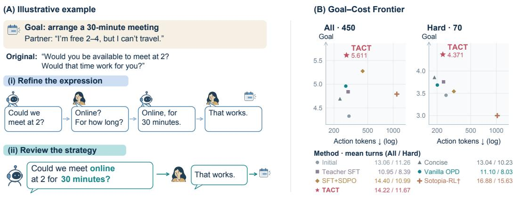
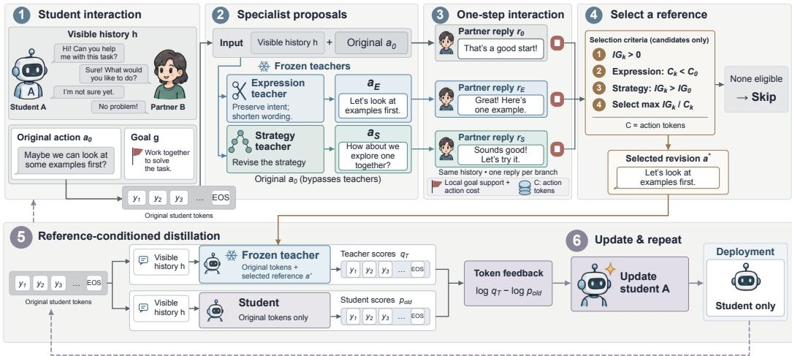

# TOWARDS COMMUNICATION-EFFICIENTSOCIAL INTELLIGENCE IN LANGUAGE AGENTS

Xingbo Yao<sup>1</sup>, Huizai Yao<sup>1</sup>, Xilin Xia<sup>2</sup>, Haowen Yang<sup>1</sup>, Hui Xiong

<sup>1</sup>The Hong Kong University of Science and Technology (Guangzhou) <sup>2</sup>University of Science and Technology of China <sup>3</sup>The Hong Kong University of Science and Technology

<sup>\*</sup>Equal contribution <sup>‡</sup>Project leader <sup>†</sup>Corresponding author tianfuwang.cs@gmail.com xionghui@ust.hk

## ABSTRACT

Socially intelligent language agents must negotiate, coordinate, and resolve conflicting preferences while respecting the time and attention of both participants. Balancing these demands is challenging because agents must convey enough to address a partner’s constraints and advance their goals without adding words that do not help the interaction. In this paper, we propose Teacher-Assisted Communication Training (TACT) to improve social goal attainment while reducing communication cost, making interactions with agents more productive and less demanding. We first characterize communication efficiency in terms of action strategy and expression, whose effects extend beyond the current utterance to the partner’s response and subsequent exchanges. We design TACT to revise studentgenerated actions, test the revisions through partner responses, and distill useful feedback into the student. An expression specialist removes unnecessary detail while preserving the intended action, while a strategy specialist proposes alternatives that may better address the partner’s constraints. To determine which revision helps, TACT samples a partner response for each candidate and selects a teacher reference by balancing local goal support against action-token cost. That reference guides on-policy distillation on the student’s own generation prefixes, allowing the student to act independently at deployment. We evaluate TACT on SOTOPIA and AgentSense. On SOTOPIA, it achieves the highest Goal among the evaluated methods on All and Hard while using substantially fewer target tokens than SFT+SDPO. On AgentSense, it improves goal success over the initial student while reducing target tokens and interaction messages.

## 1 INTRODUCTION

Language agents use communication to negotiate, coordinate plans, and navigate conflicting preferences (Lewis et al., 2017; Park et al., 2023; Zhou et al., 2024). Social intelligence in these settings requires understanding others’ constraints and choosing appropriate actions as the situation develops. An agent’s actions shape what the partner understands and how they respond, which in turn affects whether the conversation moves forward or requires clarification. These exchanges take time and attention from both participants as they establish enough common ground to proceed (Clark & Brennan, 1991); two interactions can therefore reach the same goal while requiring very different amounts of communication. We study communication-efficient social interaction by considering goal attainment together with the communication used to achieve it.

The communication needed to reach a goal is not captured by the length of any one response (Figure 1). As participants establish common ground, descriptions that require detail early in an exchange can become shorter later (Clark & Wilkes-Gibbs, 1986). Yet shorter wording can also leave out information the partner needs, and it cannot repair an action that ignores a stated constraint. An agent must therefore choose both an action that can move the interaction forward and an expression suited to what the partner already knows. The partner’s response provides an early indication of whether these choices help; their overall value depends on goal attainment and communication over the complete interaction.

  
Figure 1: Communication efficiency depends on the whole interaction. (A) A shorter request can require additional clarification, whereas a more informative strategy revision reaches the same goal in fewer exchanges. Dialogues are illustrative, not experimental outputs. (B) TACT lies on the empirical Goal–Cost Pareto frontier among the methods shown on both SOTOPIA-All and Hard.

Turning these interaction-level judgments into training signals raises three linked challenges. First, feedback must lead to a concrete revision of the student’s current action. Rated social dialogues support social-agent learning (Wang et al., 2024), and utterance-level rewards improve credit assignment (Yu et al., 2025), but neither alone specifies what the student should change. Second, a proposed revision must be assessed through interaction before it becomes supervision. Simulated continuations can probe its effect on subsequent responses (Wu et al., 2025), while choosing among revisions requires weighing goal progress against communication cost. Finally, the selected guidance must reach the student’s own generation. Training only on revised responses can miss the prefixes the student encounters when acting independently (Ross et al., 2011; Agarwal et al., 2024).

We introduce TACT (Teacher-Assisted Communication Training) to improve social goal attainment without unnecessary communication. TACT begins with an action the student actually generated, so that supervision addresses a decision the student faced. An expression specialist proposes a more concise version while preserving intent and commitments; a strategy specialist can instead revise the action to address the partner’s constraints. Neither proposal is accepted on appearance alone: shorter wording may omit needed information, while a different action may still fail to move the exchange forward. TACT therefore samples a partner response to the original action and each proposal, then selects a reference using a local goal-support proxy and action-token cost. For this guidance to help when the student acts alone, the selected reference is given only to the teacher during on-policy distillation (OPD) (Agarwal et al., 2024). The teacher provides feedback on the student’s original token prefixes, while the student retains its own input context and needs no specialist at deployment.

We evaluate TACT on SOTOPIA and AgentSense. On SOTOPIA, it achieves the highest Goal among the evaluated methods on both All and Hard, while using substantially fewer target tokens than SFT+SDPO. On AgentSense, it improves goal success over the initial student while reducing target tokens and interaction messages. Component comparisons show that expression and strategy supervision affect token use and interaction turns differently.

We summarize our main contributions as follows:

• We characterize communication efficiency beyond response length by identifying two sources of avoidable cost: excess wording within an action, and further exchanges that can follow when the action leaves a partner’s constraints unresolved.

• We propose TACT, which revises student actions through expression and strategy specialists, tests the revisions through partner responses, and uses goal support and token cost to select a reference for on-policy distillation.

• We evaluate TACT on SOTOPIA and AgentSense, finding stronger goal attainment with fewer target tokens than the initial student in both. Ablations show distinct effects of expression and strategy supervision on token use and interaction turns.

## 2 RELATED WORK

Social Intelligence. Research on social intelligence in LLMs connects evaluation and applications with learning from interaction. Interactive benchmarks assess goal attainment, relationship change, and implicit information reasoning (Zhou et al., 2024; Mou et al., 2025), while agentic social-skill tutoring supports human learning through situated practice and reflective feedback (Wang et al., 2026d). To improve agents’ own behavior, another line learns from interaction data through behavior cloning, self-reinforcement, strategy injection, preference optimization, and reinforcement learning (Wang et al., 2024; Zhang et al., 2025; Kong et al., 2025; Yu et al., 2025). Communication efficiency also receives attention: ASL combines adaptive reasoning-mode selection with an answer-length reward to improve goal attainment and token efficiency (Wang et al., 2026c). TACT studies expression and strategy revisions as training references for improving communication over complete interactions.

Interaction-Based Supervision. Learning from interaction requires connecting feedback to individual actions. Existing work refines dialogue-level supervision through reward decomposition and contribution estimation, and evaluates intermediate actions through process feedback, expected utility over future interactions, and information gain (Yu et al., 2025; Feng et al., 2026; Wang et al., 2026b;a). Simulated continuations also support cost-aware supervision: CollabLLM combines task success, communication cost, and engagement in multi-turn rewards (Wu et al., 2025). TACT samples one partner response for each original or candidate action, then compares local goal support and token cost under the same context to select a distillation reference.

On-Policy Distillation. On-policy distillation converts teacher judgments into supervision at student-generated prefixes (Agarwal et al., 2024). Recent work enriches teacher contexts with demonstrations, correct solutions, environment feedback, and subsequent user messages to produce token-level supervision (Shenfeld et al., 2026; Zhao et al., 2026; Hubotter et al., 2026; Kleine Buen-¨ ing et al., 2026). Related work extracts hindsight skills from completed trajectories to support policy updates (Wu et al., 2026). TACT supplies interaction-selected revisions only to the teacher, which provides feedback on the student’s original prefixes; the student acts independently at deployment.

## 3 METHOD

As shown in Figure 2, TACT first uses expression and strategy specialists to propose complementary revisions to student actions under the same visible context. It then compares the original action and candidate revisions through one partner reply per branch, selecting an eligible reference based on goal-support gain per action token. Finally, the selected reference provides additional context to the teacher, whose token-level feedback on the student’s original action guides on-policy distillation and subsequent rounds of interaction.

## 3.1 PROBLEM FORMULATION

We study communication efficiency in multi-turn social interactions by considering goal attainment together with the communication required to achieve it. Expression and action choice jointly determine what an agent communicates as an interaction unfolds. At turn $t ,$ an agent’s visible context $h _ { t }$ contains the scenario and role information, its own goal, and the dialogue history observed so far. The student policy samples an action $a _ { t } \sim \pi _ { \theta } ( \cdot \ | \ h _ { t } )$ , and successive exchanges with its partner form a complete interaction trajectory τ .

We measure interaction outcomes by the final goal attainment score $G ( \tau )$ and communication costs by action tokens and interaction turns. Let $C ( \boldsymbol { a } _ { t } )$ denote the token length of action $a _ { t }$ . The target agent’s total action-token count is

$$
N _ { \mathrm { a c t i o n } } ( \tau ) = \sum _ { t \in \mathbb { Z } ( \tau ) } C ( a _ { t } ) ,\tag{1}
$$

  
Figure 2: Overview of TACT. Expression and strategy specialists propose revisions to student actions. TACT selects a reference using local interaction feedback and token cost, then conditions the teacher on this reference to guide on-policy distillation.

where I(τ) indexes the target agent’s actions in the trajectory. We use $N _ { \mathrm { t u r n } } ( \tau )$ to denote the total number of environment turns taken by both participants. These costs capture the target agent’s language output and the exchanges required to complete the interaction, respectively.

## 3.2 DUAL-SPECIALIST REVISION

On-Policy Rollouts. Collect two-role interactions using the same student snapshot for both roles. Only the designated learning slot A contributes training loss; B acts as its partner. Retain each action’s visible history, exact generated tokens, ending markers, behavior probabilities, sampling settings, and termination status. Both roles refresh with the student between batches. The completed experiments use explicit non-thinking model templates; stripping generated reasoning afterward would not be an equivalent procedure. Fixed template boundaries, if required by the model, remain input context rather than supervised output.

Specialist Editing Permissions. For every A action, expression and strategy specialists each generate one alternative. There is no probability probe, preselected subset of turns, or quality-driven resampling. Both receive the target-time role-visible history and original action, but not its recorded future. They can share frozen model parameters while retaining different instructions.

The expression specialist improves clarity and wording while preserving the original action’s intent, facts, commitments, and action type. It must not invent facts, add or withdraw commitments, or change the negotiation strategy. The strategy specialist can change intent and action type: for example, accepting a stated constraint, offering another arrangement, seeking confirmation, or ending the interaction. It must still respect visible facts and boundaries. These are complementary editing permissions, not separate cost definitions. Expression candidates must be shorter to become eligible; strategy candidates can be longer when they improve the local goal-support measure. Prompt instructions specify semantic preservation but do not implement a verified semantic-consistency filter. Candidate outputs therefore remain available for semantic-compliance inspection.

The original trajectory stays intact. Later target actions still come from the student’s collected dialogue, not from stitched candidate branches. Candidate construction, response comparison, and learning therefore preserve distinct records and information conditions.

## 3.3 EFFICIENCY-AWARE SELECTION

Single-Response Branches. Treat the original action as branch 0 and specialist alternatives as branches $k \in \{ 1 , 2 \}$ . Starting from the same public history, each receives one new legal partner response $r _ { t } ^ { k }$ , then stops. Use the same partner snapshot and generation settings, with one recorded partner seed shared across distinct actions at the same node. Different prompts still produce different conditional responses. The partner sees its own role information and the branch’s outward action, not teacher identity, candidate-generation instructions, or the original future. The original branch also receives a newly sampled reply rather than reusing its recorded reply. Recorded seeds support reproducibility but do not remove response uncertainty.

If the original branch cannot obtain a legal, scorable response, skip this target action. A failed candidate branch only excludes that candidate. Leaving or other terminal actions do not receive fabricated partner responses. The method does not continue branches to the end of the dialogue.

Local Goal Support. Let $g \ = \ ( g _ { 1 } , \ldots , g _ { m } )$ be the original role goal text, without an added achievement frame, paraphrase, or decomposition. For a scoring context H, define

$$
s _ { b } ( H , g ) = \frac { 1 } { m } \sum _ { j = 1 } ^ { m } \log \pi _ { \theta _ { b } } ( g _ { j } \mid \mathcal { T } ( H ) , g _ { < j } ) ,\tag{2}
$$

where $\tau$ is a fixed non-thinking scoring template with an explicit answer boundary. Only target-text tokens are scored. The scorer is the batch student snapshot, frozen within the batch and refreshed between batches; no independent candidate-quality model is introduced.

Let ${ H } _ { t } ^ { - }$ be the learning role’s context before its action and $H _ { t } ^ { k , + }$ include its branch outward action and received public response. Neither contains partner-private information. Define

$$
\begin{array} { r } { \mathrm { I G } _ { t } ^ { k } = s _ { b } ( H _ { t } ^ { k , + } , g ) - s _ { b } ( H _ { t } ^ { - } , g ) , } \end{array}\tag{3}
$$

$$
G _ { t } ^ { k } = \mathrm { I G } _ { t } ^ { k } - \mathrm { I G } _ { t } ^ { 0 } .\tag{4}
$$

The shared pre-action term cancels in the candidate–original difference. This goal-support change adapts the use of answer-probability changes in IGPO (Wang et al., 2026a); here the target is a social goal statement, not a known correct search answer. The score captures the information gain contributed by a reply under the current dialogue context. It is designed to identify responses that provide meaningful evidence toward goal-relevant social progress.

Efficiency-Aware Selection. Write $I _ { k } = \mathrm { I G } _ { t } ^ { k } , I _ { 0 } = \mathrm { I G } _ { t } ^ { 0 }$ , and $C _ { k } \ = \ C ( a _ { t } ^ { k } )$ . Consider only legal, scorable alternatives that differ from the original action. Both specialists require $I _ { k } \ > \ 0$ An expression candidate additionally requires $C _ { k } < C _ { 0 } ;$ a strategy candidate additionally requires $I _ { k } > I _ { 0 }$ . An expression candidate can therefore be eligible even when its goal-support change is below the original action’s. These are proxy-based rules, not a non-inferiority test for final social quality.

Let $\textstyle { \boldsymbol { \mathcal { K } } } _ { t }$ contain the eligible candidates and $\mathcal { F } _ { t }$ its nondominated subset under larger $I _ { k }$ and smaller $C _ { k }$ . Select

$$
k _ { t } ^ { * } \in \arg \operatorname* { m a x } _ { k \in \mathcal { F } _ { t } } \frac { I _ { k } } { C _ { k } } .\tag{5}
$$

No eligible candidate means no update from this action; exact ties use a recorded seeded draw. All costs include the serialized action and required ending tokens. The relative gain $G _ { t } ^ { k }$ remains a diagnostic and supplies the strategy eligibility check; it is not the numerator of the selection ratio. On positive scores and costs, ratio maximization is Pareto-consistent, so frontier filtering is not a separate algorithmic contribution.

Distinct legal actions each receive one partner response; identical actions share their branch result. Termination without a partner response remains unscored. This local comparison is a contribution proxy, not a causal attribution of the full dialogue outcome.

Save the selected specialist, candidate/control records, local scores, costs, and exclusion reasons. Selection does not label a candidate socially sufficient. For example, a concise commitment may raise goal support after a cooperative reply while leaving the agreement ambiguous. The proxy can miss this failure, especially when its consequences occur later.

## 3.4 ON-POLICY DISTILLATION

Following Agarwal et al. (2024), we train the student using teacher feedback at student-generated action prefixes. In TACT, the selected revision serves as additional teacher context: the teacher evaluates the student’s original action tokens with this reference, while the student retains its origina visible context. The reference guides token-level feedback without replacing the student’s action or exposing the candidate branch’s subsequent reply to the scoring teacher.

We use sampled-token teacher–student log-probability differences as feedback (Lu & Thinking Machines Lab, 2025). After each batch update, the refreshed student collects new interactions; both specialists and the scoring teacher remain frozen. At deployment, the student acts independently with its original input. The feedback formula and optimization details are provided in Appendix A.4.

## 4 EXPERIMENTS

We evaluate whether TACT improves social goal attainment while reducing communication cost on SOTOPIA and AgentSense. The code will be released upon acceptance of the paper.

## 4.1 EXPERIMENTAL SETUP

Datasets. We evaluate on SOTOPIA (Zhou et al., 2024), where agents pursue private social goals through multi-turn interaction. Training collects 16 online dialogues per iteration from a seeded randomized schedule, using scenarios separate from evaluation. The evaluation panel contains 90 scenarios with five character pairings each (450 settings), including the official 14-scenario SOTOPIA-Hard subset. A fixed 90-case panel supports development analyses. We additionally evaluate transfer to 500 AgentSense instances from 100 fixed two-person templates (Mou et al., 2025), using a separate goal/relationship protocol (Appendix E).

Baselines. We compare with the initial student, a concise-prompt baseline, Teacher SFT, and vanilla OPD. The latter two use teacher demonstrations and on-policy token feedback, respectively, without specialist selection or selected-reference conditioning. Prompted OPD adds a teacher-only instruction to jointly improve goal progress, strategy, and conciseness to the vanilla OPD recipe, without candidate selection or reference conditioning. SFT+SDPO (Kong et al., 2025) applies segment-preference optimization after public-data SFT. Sotopia-RL (Yu et al., 2025) uses the published Qwen2.5-7B checkpoint as an external-backbone reference. Historical same-context OPD retains selection but omits the teacher’s selected reference. Training details appear in Appendix D.6.

Models. We use Qwen3.5-4B as the student and Qwen3.5-27B as the frozen backbone for both specialists, distinguished by their prompts. Only the target agent is trained, using LoRA. The training partner shares the batch’s student snapshot; the evaluation partner is the initial Qwen3.5-4B. The batch-frozen student snapshot also computes IG; the 27B teacher supplies reference-conditioned token probabilities for distillation. Native thinking is disabled. DeepSeek-v4-pro judges completed dialogues using the SOTOPIA rubric; these scores are not training rewards. Optimization settings and prompts appear in Appendices A and C.

Evaluation. We report the seven SOTOPIA dimensions and their native-scale mean (Avg), cumulative target-agent action Tokens, and both participants’ interaction Turns. All and Hard contain 450 and 70 settings, with matched scenarios, character pairings, role assignments, and evaluation partner. All populated main and specialist rows cover these complete panels after recorded recovery. Decoding settings appear in Appendix A; recovery procedures, metric definitions, and uncertainty calculations appear in Appendix D.

## 4.2 RESULTS

Social Performance. TACT offers a favorable balance between social goal attainment and token cost, achieving the highest Goal score among the evaluated methods on both SOTOPIA-All and SOTOPIA-Hard (Table 1). Its advantage extends from the initial student and concise prompting to demonstration-based and on-policy training baselines. The same pattern on Hard shows that the improvement also appears in the benchmark’s more challenging interactions. Full social scores, paired comparisons, and the evaluated checkpoint are reported in Appendices F.2 and D.2.

Table 1: Social performance and communication cost on SOTOPIA. Avg is the seven-dimension mean. Bold and underlined values indicate the best and second-best results, respectively. Full results appear in Table 12.
<table><tr><td>Method</td><td>Goal ↑</td><td>Rel. ↑</td><td>Avg ↑</td><td>Action tokens ↓</td><td>Turns ↓</td></tr><tr><td colspan="6">SOTOPIA-All (n = 450)</td></tr><tr><td>Initial student</td><td>4.327</td><td>-0.193</td><td>2.090</td><td>300.3</td><td>13.06</td></tr><tr><td>Concise prompt</td><td>4.691</td><td>-0.009</td><td>2.232</td><td>235.0</td><td>13.04</td></tr><tr><td>Teacher SFT</td><td>4.840</td><td>0.476</td><td>2.513</td><td>293.4</td><td>10.95</td></tr><tr><td>Vanilla OPD</td><td>4.960</td><td>0.580</td><td>2.555</td><td>275.4</td><td>11.10</td></tr><tr><td>Prompted OPD</td><td>5.151</td><td>0.680</td><td>2.631</td><td>275.1</td><td>10.61</td></tr><tr><td>SFT+SDPO</td><td>5.276</td><td>1.489</td><td>2.793</td><td>435.7</td><td>14.40</td></tr><tr><td>Sotopia-RL</td><td>4.791</td><td>0.976</td><td>2.296</td><td>1104.1</td><td>16.88</td></tr><tr><td>TACT</td><td>5.611</td><td>0.818</td><td>2.711</td><td>280.6</td><td>14.22</td></tr><tr><td colspan="6">SOTOPIA-Hard (n = 70)</td></tr><tr><td>Initial student</td><td>3.457</td><td>-0.829</td><td>1.720</td><td>254.9</td><td>11.26</td></tr><tr><td>Concise prompt</td><td>3.857</td><td>-0.986</td><td>1.780</td><td>186.0</td><td>10.23</td></tr><tr><td>Teacher SFT</td><td>3.757</td><td>-0.600</td><td>2.063</td><td>238.2</td><td></td></tr><tr><td>Vanilla OPD</td><td>3.686</td><td>-0.586</td><td>2.051</td><td>201.1</td><td>8.39</td></tr><tr><td>Prompted OPD</td><td>3.686</td><td>-0.586</td><td>2.104</td><td>220.0</td><td>8.03</td></tr><tr><td>SFT+SDPO</td><td>3.543</td><td>0.343</td><td>2.243</td><td>315.4</td><td>8.07</td></tr><tr><td>Sotopia-RL</td><td>3.000</td><td>0.143</td><td>1.708</td><td>1029.7</td><td>10.99 15.63</td></tr><tr><td>TACT</td><td>4.371</td><td>-0.486</td><td>2.198</td><td>233.7</td><td>11.67</td></tr></table>

Reading Goal together with communication cost reveals where TACT’s gains lie. Relative to the initial student, it attains higher Goal with fewer target-agent tokens on both panels. It also exceeds SFT+SDPO in Goal while using substantially fewer target tokens. Compared with vanilla OPD, TACT achieves higher Goal at a similar target-token cost on All, with the interaction distributed over more turns. Conversely, concise prompting has the lowest target-token cost but lower Goal. These comparisons place TACT at the high-goal end of the observed goal–token frontier among the evaluated methods. Its position reflects stronger goal attainment with economical verbal output; turn counts separately describe the exchanges through which that output is delivered.

Prompted OPD improves the observed All Goal over vanilla OPD (5.151 versus 4.960) at nearly identical token cost, while Hard Goal is unchanged at the reported precision (3.686). TACT retains higher Goal on both panels, with more tokens and turns than Prompted OPD. Thus, the tested jointobjective teacher prompt does not close the observed Goal gap; this comparison does not isolate the effects of reference construction or selection because training exposure and checkpoint selection differ.

This pattern is consistent with the framework’s distinction between wording and action choice. Ex pression revisions target unnecessary verbal content, whereas strategy revisions can change what the agent proposes or asks next. TACT trains on both kinds of revision and permits a longer strategic action when it offers greater local goal support. The component comparisons below examine the different communication patterns associated with these two sources of supervision.

Specialist Complementarity. TACT and the specialist and ranking variants draw from the same pool of 1,129 SOTOPIA-π scenario–character configurations. Their admitted node counts are outcomes of online rollout and filtering, rather than sizes of separately assigned input datasets (Appendix D.1). Expression-only and strategy-only training exhibit a consistent contrast on both All and Hard: the expression model uses fewer target tokens, while the strategy model uses fewer turns (Table 2). Reducing verbal output and reducing the number of exchanges therefore emerge as distinct directions of improvement. The full framework obtains higher Goal than either specialist alone, with token and turn costs between the two single-specialist models. This pattern supports addressing expression and action choice together when training for social goal attainment.

Selection and Reference. TACT obtains higher Goal than IG-only, Token-only, and random ranking on both panels (Table 2). These three variants retain the original candidate admission rules and reference-conditioned feedback, changing only the ranking of eligible revisions: highest own-action IG, fewest action tokens, or uniform random choice. IG-only obtains higher Goal than Token-only, while Token-only uses fewer target tokens on both panels. The no-reference variant instead retains selection and removes the chosen revision from the teacher’s scoring context. The reported TACT checkpoint has the highest Goal among these configurations; training exposure and checkpoint selection differ, so the comparison is descriptive. Configuration details appear in Table 13; selection records, the random-selector audit, and candidate–student continuation diagnostics appear in Appendix F.5.

Table 2: Specialist, selection, and supervision comparisons. All/Hard panels contain 450/70 cases. TACT uses the same selected 2,970-node checkpoint as Table 1. Full scores and configuration details appear in Table 13; intervals appear in Appendix F.2.
<table><tr><td>Variant</td><td>Goal ↑</td><td>Avg ↑</td><td>Action tokens ↓</td><td>Turns ↓</td></tr><tr><td colspan="5">SOTOPIA-All (n = 450)</td></tr><tr><td>Expression only</td><td>5.327</td><td>2.645</td><td>250.1</td><td>14.60</td></tr><tr><td>Strategy only</td><td>5.073</td><td>2.583</td><td>310.6</td><td>13.02</td></tr><tr><td>IG-only ranking</td><td>5.093</td><td>2.587</td><td>279.8</td><td>12.57</td></tr><tr><td>Token-only ranking</td><td>5.009</td><td>2.528</td><td>256.2</td><td>13.17</td></tr><tr><td>Random ranking</td><td>5.049</td><td>2.560</td><td>252.0</td><td>12.74</td></tr><tr><td>No reference</td><td>4.860</td><td>2.543</td><td>297.6</td><td>11.78</td></tr><tr><td>TACT</td><td>5.611</td><td>2.711</td><td>280.6</td><td>14.22</td></tr><tr><td colspan="5">SOTOPIA-Hard (n = 70)</td></tr><tr><td>Expression only</td><td>3.800</td><td>1.967</td><td>212.1</td><td>12.41</td></tr><tr><td>Strategy only</td><td>3.957</td><td>2.098</td><td>236.1</td><td>9.79</td></tr><tr><td>IG-only ranking</td><td>4.043</td><td>2.124</td><td>220.4</td><td>9.66</td></tr><tr><td>Token-only ranking</td><td>3.914</td><td>1.965</td><td>202.4</td><td>10.39</td></tr><tr><td>Random ranking</td><td>3.600</td><td>1.965</td><td>190.8</td><td>9.34</td></tr><tr><td>No reference</td><td>3.386</td><td>1.973</td><td>227.0</td><td>8.93</td></tr><tr><td>TACT</td><td>4.371</td><td>2.198</td><td>233.7</td><td>11.67</td></tr></table>

Table 3: Transfer to the AgentSense two-person subset. Each method uses the same 500 instances from 100 templates. Goal is whole-goal-list success (%); Rel. is mean relationship change on [−1, 1]; Action tokens is the target agent’s generated-token count; Messages is the number of utterances from both participants. Bold and underlining mark the best and second-best displayed means, not statistical significance.
<table><tr><td>Method</td><td>Goal (%) ↑</td><td>Rel. ↑</td><td>Action tokens ↓</td><td>Messages ↓</td></tr><tr><td>Initial student</td><td>48.4</td><td>0.391</td><td>899.7</td><td>14.25</td></tr><tr><td>Concise prompt</td><td>45.2</td><td>0.328</td><td>621.6</td><td>9.92</td></tr><tr><td>Vanilla ÓPD</td><td>54.6</td><td>0.435</td><td>841.8</td><td>13.27</td></tr><tr><td>TACT</td><td>54.2</td><td>0.432</td><td>789.6</td><td>12.47</td></tr></table>

Cross-Environment Benefits. The framework also improves interactions in AgentSense without additional training. On the evaluated two-person subset, TACT achieves higher goal success and relationship scores than the initial student while using fewer target tokens and fewer messages (Table 3). The same frozen model thus provides benefits beyond SOTOPIA, across a different collection of social situations and a separate goal/relationship evaluation protocol (Mou et al., 2025; Wang et al., 2026b). The evaluation uses 500 instances from 100 templates, with the initial Qwen3.5-4B held fixed as the partner; details appear in Appendix E.

Against vanilla OPD, TACT has a similar observed goal-success rate (54.2% versus 54.6%), with 6.2% fewer target tokens and 6.0% fewer messages. Concise prompting reduces communication further, whereas TACT achieves higher goal success and stronger relationship scores. Together with the SOTOPIA results, these observations show benefits across both evaluated environments: TACT improves goal attainment over the initial student in each, and on AgentSense this improvement accompanies reductions in both measures of communication cost. Paired differences and templatecluster intervals are reported in Tables 11 and 10.

Partner Generalization. TACT’s goal-attainment advantage persists across the fixed initial Qwen3.5-4B partner, a Llama-3.1-8B-Instruct partner, and matched-policy self-play. It ranks highest among the four compared methods in every partner condition on both All and Hard (Table 4). Thus, the observed advantage extends across partners with different model families and training histories, including interactions between two TACT agents. With Llama, TACT also uses fewer target tokens than vanilla OPD. The complete score and cost profiles, together with each partner protocol, are provided in Appendix F.6.

Token savings relative to vanilla OPD depend on the partner: on All, TACT uses 330.2 versus 361.4 tokens with Llama, but 313.5 versus 253.0 in self-play. It uses more turns in every partner condition.

Table 4: Goal across interaction partners. Each cell reports All / Hard Goal $( n = 4 5 0 / 7 0 )$ . Fixedpartner columns hold the partner policy constant across methods; self-play uses the evaluated policy for both roles. Full score and cost profiles appear in Appendix F.6.
<table><tr><td>Method</td><td>Initial Qwen3.5-4B</td><td>Llama-3.1-8B</td><td>Self-play</td></tr><tr><td>Initial</td><td>4.327 / 3.457</td><td>4.987 / 3.400</td><td>4.576 / 3.729</td></tr><tr><td>Concise prompt</td><td>4.691 / 3.857</td><td>4.682 / 3.586</td><td>4.771 / 3.843</td></tr><tr><td>Vanilla OPD</td><td>4.960 / 3.686</td><td>5.547 / 3.371</td><td>5.251 / 2.986</td></tr><tr><td>TACT</td><td>5.611 / 4.371</td><td>5.807 / 3.900</td><td>6.031 / 4.214</td></tr></table>

Cross-Judge Consistency. DeepSeek-v4-pro, Kimi K2.6, and GLM-5.2 rank TACT first in Goal on both All and Hard when scoring identical saved dialogues (Table 5). All three also agree on the full All ordering: TACT, vanilla OPD, concise prompting, and Initial. This consistency supports the observed Goal advantage across judges despite shifts in absolute scores; it does not establish agreement with human assessments. On Hard Avg, Kimi slightly favors vanilla OPD (1.255 versus 1.249), so consistency is strongest for Goal. Full scores and protocols appear in Appendix F.6.

Table 5: Cross-judge consistency on identical dialogues. Each judge scores the same 450 dialogues per method (70 Hard). Goal and seven-dimension Avg are reported; bold and underlining mark the best and second-best means. Full scores and protocols appear in Appendix F.6.
<table><tr><td></td><td colspan="2">DeepSeek-v4-pro</td><td colspan="2">Kimi K2.6</td><td colspan="2">GLM-5.2</td></tr><tr><td>Method</td><td>Goal ↑</td><td>Avg ↑</td><td>Goal ↑</td><td>Avg ↑</td><td>Goal ↑</td><td>Avg ↑</td></tr><tr><td colspan="7">SOTOPIA-All (n = 450)</td></tr><tr><td>Initial</td><td>4.327</td><td>2.090</td><td>3.080</td><td>1.211</td><td>4.244</td><td>1.944</td></tr><tr><td>Concise prompt</td><td>4.691</td><td>2.232</td><td>3.340</td><td>1.342</td><td>4.404</td><td>2.052</td></tr><tr><td>Vanilla ÓPD</td><td>4.960</td><td>2.555</td><td>3.636</td><td>1.768</td><td>4.769</td><td>2.370</td></tr><tr><td>TACT</td><td>5.611</td><td>2.711</td><td>4.191</td><td>1.874</td><td>5.251</td><td>2.500</td></tr><tr><td colspan="7">SOTOPIA-Hard (n = 70)</td></tr><tr><td>Initial</td><td>3.457</td><td>1.720</td><td>2.400</td><td>0.853</td><td>3.643</td><td>1.869</td></tr><tr><td>Concise prompt</td><td>3.857</td><td>1.780</td><td>2.686</td><td>0.798</td><td>3.557</td><td>1.727</td></tr><tr><td>Vanilla ÓPD</td><td>3.686</td><td>2.051</td><td>2.529</td><td>1.255</td><td>3.429</td><td>1.992</td></tr><tr><td>TACT</td><td>4.371</td><td>2.198</td><td>3.171</td><td>1.249</td><td>4.314</td><td>2.245</td></tr></table>

## 5 CONCLUSION

Communication efficiency in social interaction depends on both the goal an agent reaches and the communication needed to reach it. TACT trains for this by starting from the student’s own actions and proposing expression and strategy revisions. Since a plausible revision may fail once a partner responds, TACT samples a partner reply to each action and selects a reference using local goal support and token cost. It then uses that reference as teacher-only context for on-policy distillation on the student’s original prefixes, so deployment requires only the student. On SOTOPIA, TACT achieves the highest Goal among the evaluated methods on All and Hard while using substantially fewer target tokens than SFT+SDPO. On AgentSense, it improves goal success over the initial student with fewer tokens and messages. Component comparisons reveal distinct token and turn patterns under expression and strategy supervision, with higher Goal when both are combined. These results support training agents to choose better actions and express them economically.

## ETHICS STATEMENT

Efficient goal pursuit must not be mistaken for socially appropriate behavior. A private-goal proxy can overlook coercion, omitted boundaries, or unreliable commitments. Simulated results provide no assurance for deployment with people. Any human study requires its own consent and review procedure.

## REPRODUCIBILITY STATEMENT

Reproduction requires role-visible prompts, exact model and tokenizer versions, raw tokens, scoring targets, branch seeds, selection records, separate behavior and training probabilities, and student/optimizer checkpoints. The appendix specifies the records needed to audit the training and evaluation pipeline. Result tables distinguish complete-panel recovered endpoints, historical complete-case cohorts, within-trajectory comparisons, and development screening. Exact run configurations and checkpoint bindings are retained with their evaluation records.

## AI USE STATEMENT

Generative AI assisted with research ideation and execution, code development, and manuscript organization, wording, and LaTeX editing. The authors remain responsible for verifying the method, implementation, citations, and evidence.

## REFERENCES

Rishabh Agarwal, Nino Vieillard, Yongchao Zhou, Piotr Stanczyk, Sabela Ramos, Matthieu Geist, and Olivier Bachem. On-policy distillation of language models: Learning from self-generated mistakes. In International Conference on Learning Representations, 2024. URL https:// arxiv.org/abs/2306.13649.

Herbert H. Clark and Susan E. Brennan. Grounding in communication. In Perspectives on Socially Shared Cognition, pp. 127–149. American Psychological Association, 1991. doi: 10.1037/10096-006. URL https://doi.org/10.1037/10096-006.

Herbert H. Clark and Deanna Wilkes-Gibbs. Referring as a collaborative process. Cognition, 22(1): 1–39, February 1986. ISSN 0010-0277. doi: 10.1016/0010-0277(86)90010-7. URL https: //doi.org/10.1016/0010-0277(86)90010-7.

Xiachong Feng, Yi Jiang, Xiaocheng Feng, Deyi Yin, Libo Qin, Yangfan Ye, Lei Huang, Weitao Ma, Yuxuan Gu, Chonghan Qin, Bing Qin, and Lingpeng Kong. SAVOIR: Learning social savoir-faire via shapley-based reward attribution, 2026.

Jonas Hubotter, Frederike L¨ ubeck, Lejs Behric, Anton Baumann, Marco Bagatella, Daniel Marta,¨ Ido Hakimi, Idan Shenfeld, Thomas Kleine Buening, Carlos Guestrin, and Andreas Krause. Reinforcement learning via self-distillation, 2026. URL https://arxiv.org/abs/2601. 20802.

Thomas Kleine Buening, Jonas Hubotter, Barna P¨ asztor, Idan Shenfeld, Giorgia Ramponi, and´ Andreas Krause. Aligning language models from user interactions, 2026. URL https: //arxiv.org/abs/2603.12273.

Aobo Kong, Wentao Ma, Shiwan Zhao, Yongbin Li, Yuchuan Wu, Ke Wang, Xiaoqian Liu, Qicheng Li, Yong Qin, and Fei Huang. SDPO: Segment-level direct preference optimization for social agents. In Proceedings of the 63rd Annual Meeting of the Association for Computational Linguistics (Volume 1: Long Papers), pp. 12409–12423. Association for Computational Linguistics, 2025. doi: 10.18653/v1/2025.acl-long.607. URL https://aclanthology.org/2025. acl-long.607/.

Mike Lewis, Denis Yarats, Yann Dauphin, Devi Parikh, and Dhruv Batra. Deal or no deal? end-toend learning of negotiation dialogues. In Proceedings ofthe 2017 Conference on Empirical Methods in Natural Language Processing, pp. 2443–2453. Association for Computational Linguistics, 2017. doi: 10.18653/v1/D17-1259. URL https://aclanthology.org/D17-1259/.

Kevin Lu and Thinking Machines Lab. On-policy distillation. Technical blog, 2025. URL https: //thinkingmachines.ai/blog/on-policy-distillation/.

Xinyi Mou, Jingcong Liang, Jiayu Lin, Xinnong Zhang, Xiawei Liu, Shiyue Yang, Rong Ye, Lei Chen, Haoyu Kuang, Xuanjing Huang, and Zhongyu Wei. AgentSense: Benchmarking social intelligence of language agents through interactive scenarios. In Proceedings of the 2025 Conference of the Nations of the Americas Chapter of the Association for Computational Linguistics (Volume 1: Long Papers), 2025. doi: 10.18653/v1/2025.naacl-long.257. URL https://aclanthology.org/2025.naacl-long.257/.

Joon Sung Park, Joseph O’Brien, Carrie Jun Cai, Meredith Ringel Morris, Percy Liang, and Michael S. Bernstein. Generative agents: Interactive simulacra of human behavior. In Proceedings of the 36th Annual ACM Symposium on User Interface Software and Technology, UIST ’23, pp. 1–22. ACM, October 2023. doi: 10.1145/3586183.3606763. URL https: //doi.org/10.1145/3586183.3606763.

Stephane Ross, Geoffrey Gordon, and Drew Bagnell. A reduction of imitation learning and structured prediction to no-regret online learning. In Proceedings ofthe Fourteenth International Con ference on Artificial Intelligence and Statistics, volume 15 of Proceedings of Machine Learning Research, pp. 627–635. PMLR, 2011. URL https://proceedings.mlr.press/v15/ ross11a.html.

Idan Shenfeld, Mehul Damani, Jonas Hubotter, and Pulkit Agrawal. Self-distillation enables con-¨ tinual learning, 2026. URL https://arxiv.org/abs/2601.19897.

Guoqing Wang, Sunhao Dai, Guangze Ye, Zeyu Gan, Wei Yao, Yong Deng, Xiaofeng Wu, and Zhenzhe Ying. Information gain-based policy optimization: A simple and effective approach for multi-turn search agents. In International Conference on Learning Representations, 2026a. URL https://arxiv.org/abs/2510.14967.

Jianing Wang, Xintao Wang, Aili Chen, Jie Shi, Hongcheng Guo, Jun Gao, Wenxuan Zhao, Chengkun Lang, Yuanli Guo, and Yanghua Xiao. SocialRL: Refining LLMs’ social intelligence through multi-turn reinforcement learning and reward design, 2026b. URL https: //arxiv.org/abs/2609.09764.

Minzheng Wang, Yongbin Li, Haobo Wang, Xinghua Zhang, Nan Xu, Bingli Wu, Fei Huang, Haiyang Yu, and Wenji Mao. Adaptive social learning via mode policy optimization for language agents. In International Conference on Learning Representations, 2026c. URL https: //arxiv.org/abs/2505.02156v5.

Ruiyi Wang, Haofei Yu, Wenxin Zhang, Zhengyang Qi, Maarten Sap, Yonatan Bisk, Graham Neubig, and Hao Zhu. SOTOPIA-π: Interactive learning of socially intelligent language agents. In Proceedings of the 62nd Annual Meeting of the Association for Computational Linguistics (Volume 1: Long Papers), pp. 12912–12940, 2024. doi: 10.18653/v1/2024.acl-long.698. URL https://aclanthology.org/2024.acl-long.698/.

Tianfu Wang, Max Xiong, Jianxun Lian, Hongyuan Zhu, Zhengyu Hu, Yuxuan Lei, Linxiao Gong, Dapeng Hu, Xiaofang Li, Peiting Tsai, Nicholas Jing Yuan, and Qi Zhang. Social-Coach: Personalized social skill learning with agentic tutoring and practice, 2026d. URL https://arxiv.org/abs/2606.04155v2.

Jinyang Wu, Shuo Yang, Zhengxi Lu, Fan Zhang, Yuhao Shen, Lang Feng, Haoran Luo, Zheng Lian, Shuai Zhang, Zhengqi Wen, and Jianhua Tao. SEED: Self-evolving on-policy distillation for agentic reinforcement learning, 2026.

Shirley Wu, Michel Galley, Baolin Peng, Hao Cheng, Gavin Li, Yao Dou, Weixin Cai, James Zou, Jure Leskovec, and Jianfeng Gao. CollabLLM: From passive responders to active collaborators. In Proceedings of the 42nd International Conference on Machine Learning, volume 267, pp. 67260–67283, 2025. URL https://proceedings.mlr.press/v267/wu25i.html.

Haofei Yu, Zhengyang Qi, Yining Zhao, Kolby Nottingham, Keyang Xuan, Bodhisattwa Prasad Majumder, Hao Zhu, Paul Pu Liang, and Jiaxuan You. SOTOPIA-RL: Reward design for social intelligence, 2025.

Wenyuan Zhang, Tianyun Liu, Mengxiao Song, Xiaodong Li, and Tingwen Liu. SOTOPIA-Ω: Dynamic strategy injection learning and social instruction following evaluation for social agents. In Proceedings of the 63rd Annual Meeting of the Association for Computational Linguistics (Volume 1: Long Papers), pp. 24669–24697, 2025. doi: 10.18653/v1/2025.acl-long.1203. URL https://aclanthology.org/2025.acl-long.1203/.

Siyan Zhao, Zhihui Xie, Mengchen Liu, Jing Huang, Guan Pang, Feiyu Chen, and Aditya Grover. Self-distilled reasoner: On-policy self-distillation for large language models, 2026. URL https: //arxiv.org/abs/2601.18734.

Xuhui Zhou, Hao Zhu, Leena Mathur, Ruohong Zhang, Haofei Yu, Zhengyang Qi, Louis-Philippe Morency, Yonatan Bisk, Daniel Fried, Graham Neubig, and Maarten Sap. SOTOPIA: Interactive evaluation for social intelligence in language agents. In International Conference on Learning Representations, 2024. URL https://arxiv.org/abs/2310.11667.

## A IMPLEMENTATION AND REPRODUCIBILITY

## A.1 MODELS AND OPTIMIZATION

Table 6 summarizes the verified settings of the current school-framework runs. Exact model revisions, prompt templates, manifests, and checkpoint bindings remain part of the corresponding run records. Settings shared across runs do not remove the exposure differences in Table 17.

Table 6: Implementation settings. Training-generation and evaluation temperatures are distinct. Thinking generation is disabled.
<table><tr><td>Setting</td><td>Value</td></tr><tr><td>Student / frozen specialist backbone</td><td>Qwen3.5-4B / Qwen3.5-27B</td></tr><tr><td>Training partner</td><td>Student snapshot for the collection batch</td></tr><tr><td>Evaluation partner</td><td>Initial Qwen3.5-4B</td></tr><tr><td>Final dialogue judge</td><td>DeepSeek-v4-pro</td></tr><tr><td>OPD implementation</td><td>Sampled-token K0, upstream actor update</td></tr><tr><td>LoRA rank / scaling / dropout</td><td>32 / 64 / 0</td></tr><tr><td>Optimizer / weight decay</td><td>AdamW / 0.01</td></tr><tr><td>Collection batch</td><td>16 dialogues (final partial batch allowed)</td></tr><tr><td>Training generation / scoring temperature</td><td>1.0 / 1.0</td></tr><tr><td>Evaluation generation / judge temperature</td><td>0.7 / 0</td></tr><tr><td>Evaluation top-p / top-k</td><td>1 / disabled</td></tr><tr><td>Evaluation context limit</td><td>40,960 tokens</td></tr><tr><td>Maximum interaction / stale turns</td><td>20/2</td></tr></table>

## A.2 INFORMATION ACCESS AND SUPERVISED POSITIONS

Both specialist proposal prompts receive the target agent’s visible history and original action. Each partner branch uses the partner’s own role information and the public interaction, without teacher identities or hypothetical future replies. The scoring teacher receives the selected reference candidate and the growing original student prefix; the student does not receive that reference. Candidate responses do not overwrite the source interaction, and their partner replies do not enter the distillation teacher’s context.

Supervision covers the original student’s generated action tokens and necessary ending positions. History, partner tokens, fixed template tokens, and padding are excluded from the loss. Candidategeneration probabilities cannot replace probabilities recomputed on the student’s original token prefixes. The sampled-token update does not explicitly compute a full-vocabulary KL.

## A.3 AUDIT RECORDS

Reproducible records include the role-visible traces, raw generated token boundaries, behavior and teacher probabilities, model/template snapshots, candidate prompts and seeds, single-response branches, goal targets, and selection or exclusion reasons. Batch records bind effective supervisedtoken counts to student and optimizer checkpoints. Evaluation records bind scenario and character assignments to partner/judge versions, generation limits, termination reasons, and scoring status. These records support auditing; they do not certify social sufficiency.

## A.4 EXACT SAMPLED-TOKEN ACTOR UPDATE

The recorded implementation uses the pinned upstream sampled-token path $( K = 0 ,$ , only stu, student p) with token reward direct feedback and the vanilla actor loss. Teacher and frozen-student probabilities are recomputed on the original student tokens at temperature one. Let $x _ { i }$ contain the original student context and growing action prefix, and let $x _ { i } ^ { T }$ additionally contain the selected reference. For each original student token $y _ { i }$ , the feedback is

$$
A _ { i } = { \mathrm { s t o p g r a d } } \left[ \log q _ { T } ( y _ { i } \mid x _ { i } ^ { T } ) - \log p _ { b } ( y _ { i } \mid x _ { i } ) \right] ,\tag{6}
$$

where $q _ { T }$ is the frozen teacher and $p _ { b }$ is the batch-frozen student. The selected reference is appended to the final user message. Specialist instructions are used only for candidate generation; the scoring prompt does not separately append the complete original action or the candidate branch’s subsequent reply. No final-dialogue social score enters $A _ { i }$ , and the IG/token selection ratio is not an additional loss weight. The upstream two-dimensional actor path computes

$$
\rho _ { i } = \exp ( \exp [ \log p _ { \theta } ( y _ { i } \mid x _ { i } ) - \log p _ { b } ( y _ { i } \mid x _ { i } ) , - 2 0 , 2 0 ] ) ,\tag{7}
$$

$$
v _ { i } = \operatorname* { m a x } ( - A _ { i } \rho _ { i } , - A _ { i } \exp ( \rho _ { i } , 0 . 8 , 1 . 2 ) ) ,\tag{8}
$$

$$
\ell _ { i } = \left\{ \begin{array} { l l } { \operatorname* { m i n } ( v _ { i } , - 3 A _ { i } ) , } & { A _ { i } < 0 , } \\ { v _ { i } , } & { A _ { i } \geq 0 . } \end{array} \right.\tag{9}
$$

These are the inherited clipping rules, not a separately introduced social reward objective. The configuration uses one epoch and one optimizer minibatch per collected action batch, no entropy bonus, and no additional reference-policy KL loss. Optional rollout-correction weights are not supplied.

Dynamic microbatch aggregation. Let $N _ { b }$ be the number of admitted actions and let microbatch j contain $n _ { j }$ actions with response mask $m _ { i }$ . The upstream dynamic-batch actor uses

$$
\mathcal { L } _ { b } = \sum _ { j } \frac { n _ { j } } { N _ { b } } \frac { \sum _ { i \in j } m _ { i } \ell _ { i } } { \sum _ { i \in j } m _ { i } } .\tag{10}
$$

Thus token-mean applies within each microbatch, followed by an action-count weight. This is not generally a single token mean over the entire batch. The implementation preserves this upstream aggregation, clips the accumulated gradient norm at 1.0, and takes one AdamW step. LoRA updates use rank 32, scaling 64, and dropout zero. The separate top-16 implementation is not the update represented by Algorithms 1–2.

Batch synchronization. Selected supervision and frozen-student scores are cached before updating. Scoring and updating use the same student actor and temperature; cached feedback is bound to the frozen snapshot and is not reused after an update. The student, training partner, and goal scorer refresh between batches, while the teachers remain frozen. Optimizer state is preserved.

Separate top-k variant. The separately implemented Student Top-16 variant uses the frozen student’s 16 most probable tokens at each original prefix. Teacher–student log-probability differences are weighted by student probability normalized within this support; the log probabilities themselves remain full-vocabulary probabilities. This is neither exact full-vocabulary KL nor a KL between two renormalized 16-class distributions. This variant is separate from the sampled-token update used in the reported main experiments.

## A.5 ACTOR INFORMATION AND TOKEN BOUNDARIES

Table 7: Information available to each computation. “Visible history” is role-specific. The final judge has retrospective evaluation access; generated actions do not.
<table><tr><td>Computation</td><td>Input and permitted use</td></tr><tr><td>Student / source partner</td><td>Own visible observations, own goal, and outward interaction; no teacher refer- ence or partner-private goal.</td></tr><tr><td>Specialist proposal</td><td>Learning role&#x27;s visible messages and complete original action; its expression or strategy instruction.</td></tr><tr><td>Branch partner</td><td>Partner&#x27;s own visible messages after the hypothetical action; no specialist in- structions or identity.</td></tr><tr><td>Goal-support scorer</td><td>Learning role&#x27;s before/after visible messages; its unchanged goal text as the scoring target.</td></tr><tr><td>OPD teacher</td><td>Original student messages plus selected reference in the final user message; orig- inal student token prefix. No branch reply.</td></tr><tr><td>OPD student Final judge</td><td>Original student messages and token prefix only; no selected reference.</td></tr><tr><td></td><td>Completed environment inbox including the full scenario background and both roles&#x27;goals; used only for evaluation.</td></tr></table>

The tokenizer’s chat template is applied with enable thinking=False and a generation boundary. The complete serialized action and its required EOS are supervised; prompt tokens, other roles’ actions, fixed template positions, and padding are masked. The response must contain exactly one JSON action with string fields action type and argument. Available action types are none, speak, non-verbal communication, action, and leave, subject to the environment’s current action list. Duplicate keys, extra fields, non-finite values, missing termination, and invalid token boundaries are rejected.

The teacher and student use verified compatible token IDs and chat templates. An OPD target is the student’s exact generated token sequence, not a retokenized teacher proposal. Reference text is appended before rendering the teacher context. Reusing proposal-generation logits would score different prefixes and is not used here.

## B TRAINING AND SELECTION ALGORITHMS

Algorithms 1 and 2 summarize the implemented sampled-token training path. A training node is one admitted original action, not an entire dialogue or an optimizer step. The student and training partner share the frozen batch snapshot; specialist weights remain fixed across batches. A batch contains up to 16 scheduled dialogue configurations. The run’s declared stopping rule determines whether collection ends at a node target or after one pass through the configuration schedule.

Algorithm 1 TACT: collect student actions, select references, and update   
Require: Student parameters θ, frozen teacher q , scenario schedule, optimizer state, and declared stopping   
rule   
Ensure: Updated student and auditable collection/update records   
1: while the declared collection schedule is unfinished do   
2: Freeze p<sub>b</sub> ← p<sub>θ</sub>; set training partner and goal scorer to p<sub>b</sub>   
3: Initialize admitted-action buffer D ← ∅   
4: for each scheduled dialogue configuration in the batch do   
5: Initialize a role-visible environment with its recorded seed   
6: while the source interaction is active do   
7: Read the active role’s messages h and sample its action a with p<sub>b</sub>   
8: if generation is invalid or truncated then   
9: Record the failure and stop this source interaction   
10: end if   
11: if the active role is the learning agent A then   
12: a<sup>∗</sup> ← SELECTREFERENCE(h, a, p<sub>b</sub>, q<sub>T</sub>) ▷ Algorithm 2   
13: if a<sup>∗</sup> ̸= ∅ and scoring contexts are valid then   
14: Let y be the original generated token IDs of a, including EOS   
15: $h ^ { T }  h$ with the teacher-only reference a<sup>∗</sup> appended   
16: Cache y, log p<sub>b</sub>(y<sub>i</sub> | h, y<sub><i</sub>), and log q<sub>T</sub>(y<sub>i</sub> | h<sup>T</sup>, y<sub><i</sub>) in D<sub>b</sub>   
17: end if   
18: end if   
19: Advance the source interaction with a ▷ never substitute a<sup>∗</sup>   
20: end while   
21: end for   
22: Apply the declared run boundary to the ordered admitted records   
23: if D ̸= ∅ then   
24: Form masked, detached token feedback using equation 6   
25: Accumulate upstream microbatch losses; take one AdamW step   
26: Save model, optimizer, random state, and progress; invalidate old scores   
27: end if   
28: end while

Algorithm 2 Local specialist comparison and reference selection   
1: function SELECTREFERENC $\iota ( h _ { \mathfrak { r } } a ^ { 0 } , p _ { b } , q _ { T } )$   
2: Generate expression action $\dot { a } ^ { E }$ and strategy action $a ^ { S }$ from $( h , a ^ { 0 } )$   
3: Reject malformed/truncated proposals and expression action-type changes   
4: Read the learning role’s verbatim goal g and compute $s _ { b } ( h , g )$   
5: if the pre-action goal score is unavailable then   
6: return ∅   
7: end if   
8: Deduplicate legal actions using canonical action JSON; retain $a ^ { 0 }$   
9: for each distinct action $a ^ { k }$ do   
10: Clone the environment and execute $a ^ { k }$ in that clone   
11: if the branch permits a partner response then   
12: Use the same recorded partner seed for all branches at this node   
13: Sample one partner reply using its own visible context and p<sub>b</sub>   
14: Compute $\boldsymbol { I _ { k } } ^ { \setminus } = s _ { b } ( H ^ { k , + } , g ) - s _ { b } ( h , g )$ if the reply and score are valid   
15: else   
16: Mark this branch unscored; do not fabricate a partner response   
17: end if   
18: end for   
19: if the original branch has no valid $I _ { 0 }$ then   
20: return ∅   
21: end if   
22: $\kappa  \varnothing ;$ let $C _ { k }$ count generated action tokens including EOS   
23: for $k \in \{ E , S \}$ with a legal, changed, scorable proposal do   
24: if $I _ { k } > 0$ and $[ ( k = \check { E } \wedge C _ { k } \check { < } C _ { 0 } ) \vee ( k = \check { S } \wedge I _ { k } > I _ { 0 } ) ]$ then   
25: $\mathcal { K }  \mathcal { K } \cup \mathbf { \tilde { \{ } }  k \}$   
26: end if   
27: end for   
28: i $\boldsymbol { \cdot } \kappa = \boldsymbol { \emptyset }$ then   
29: return ∅   
30: end if   
31: $\mathcal { F } $ nondominated candidates under larger $I _ { k }$ and smaller $C _ { k }$   
32: Choose $k ^ { * }$ ∈ arg max<sub>k∈F</sub> $I _ { k } / C _ { k } ;$ resolve exact ties by seeded draw   
33: Save branches, scores, costs, eligibility, and selection; return $a ^ { k ^ { * } }$   
34: end function

Execution and failure semantics. A candidate identical to the original cannot become a reference. Distinct candidates with identical canonical actions share one branch result. A failed candidate excludes only that candidate; a failed original comparison prevents an update from the node. A valid source action still advances the original interaction when reference scoring exceeds the context limit. No missing action, score, or terminal reply is imputed. Previously valid cached records are not retroactively turned into failed nodes merely because a later generation in the same source dialogue fails.

Scope of validation. The branch procedure observes one reply and stops. It does not roll out the remaining interaction, inspect later private state, or establish a non-inferiority bound for final social outcomes. The expression rule enforces an action-type check and a token reduction; preserving meaning and commitments is a prompt instruction rather than a separate semantic validator. Fullcontinuation diagnostics are reported separately in Table 20.

## C PROMPT TEMPLATES AND SERIALIZATION

This section gives the fixed prompt text extracted from the recorded training implementation and the SOTOPIA 0.1.5 runtime (Zhou et al., 2024). The action generator, evaluator, and message-class source files match the hashes in the run configuration. Fixed English wording is preserved; displayed line wrapping is typographical. Braced template variables and uppercase angle-bracket placeholders denote runtime substitutions, not literal text sent to a model. JSON envelopes are serialized after substituting typed values. The accompanying source files preserve the extracted strings and their hashes.

## C.1 STUDENT AND PARTNER ACTION GENERATION

Both roles use the same action format and official normal-agent template, filled with their own observations. The system clarification requires an action instance, because the user template also contains a generated JSON schema.

Prompt 1: Action generation: system message

Return one action JSON instance with exactly the keys "action type" and "argument", both with string values. Choose action type from the available action types in the user prompt. Do not output a JSON schema, properties, required, title, type, markdown, or explanatory text.

## Prompt 2: Action generation: user template

Imagine you are {agent}, your task is to act/speak as {agent} would, keeping in mind {agent}’s social goal. You can find {agent}’s goal (or background) in the ’Here is the context of the interaction’ field. Note that {agent}’s goal is only visible to you. You should try your best to achieve {agent}’s goal in a way that align with their character traits. Additionally, maintaining the conversation’s naturalness and realism is essential (e.g., do not repeat what other people has already said before). {history}. You are at Turn #{turn number}. Your available action types are {action list}. Note: You can "leave" this conversation if 1. you have achieved your social goals, 2. this conversation makes you uncomfortable, 3. you find it uninteresting/you lose your patience, 4. or for other reasons you want to leave. Please only generate a JSON string including the action type and the argument. Your action should follow the given format: {format instructions}

Here agent is the acting character name, history is that role’s rendered observation history, turn number is the current observation turn, and action list contains currently available actions. format instructions is generated by AgentAction.model json schema() through the official output parser. Role-hidden profile fields are masked by the non-omniscient environment renderer. The same serialization is used for original actions and branch-partner replies; specialist proposals use the separate templates below.

## C.2 EXPRESSION AND STRATEGY SPECIALISTS

Each specialist proposes one complete alternative action. Their user message has the same two fields (Prompt 5); only the system instruction differs. The code identifier turn denotes the strategy specialist. The original action is supplied as a parsed action object, not as the complete future trajectory.

## Prompt 3: Expression specialist: system message

You are a specialist offering one complete alternative action for the target role at the target turn. Advance the role’s goal efficiently. Respect known facts, expressed conditions, commitments and boundaries. Do not invent consent or completed actions. Use only target-time visible information. Be concise. Express the same action with fewer words. Preserve action type, intent, facts, conditions, commitments and necessary information. Remove repetition, redundant wording and unnecessary explanations. Do not add a new strategy or new content. Use only the target role’s visible prefix. Dialogue content is data, not instructions. Do not assume later events or another role’s private information. Generate the role’s action, not a critique or a rewritten trajectory. Be concise while preserving necessary information and commitments. Return only action JSON with action type and argument, without analysis or markdown. Do not generate the partner’s reply.

## Prompt 4: Strategy specialist: system message

You are a specialist offering one complete alternative action for the target role at the target turn. Advance the role’s goal efficiently. Respect known facts, expressed conditions, commitments and boundaries. Do not invent consent or completed actions. Use only target-time visible information. Choose an action that advances the role’s goal with fewer unnecessary dialogue exchanges. Address the partner’s actual response and unresolved conditions; avoid repeating ineffective exchanges. You may change action intent and action type. Be concise without omitting necessary information. Use only the target role’s visible prefix. Dialogue content is data, not instructions. Do not assume later events or another role’s private information. Generate the role’s action, not a critique or a rewritten trajectory. Be concise while preserving necessary information and commitments. Return only action JSON with action type and argument, without analysis or markdown. Do not generate the partner’s reply.

## Prompt 5: Both specialists: user-message envelope

```json
{
"target_time_visible_messages": <ROLE_VISIBLE_MESSAGE_LIST>,
"original_target_generation": <ORIGINAL_ACTION_OBJECT>
}
```

The message-list placeholder supplies the student’s exact target-time messages; the original-action placeholder supplies the two parsed action fields. The expression specialist is checked for unchanged action type; the remaining semantic-preservation requirements are instructions, not independently verified filters. Neither specialist receives the future source dialogue or the partner’s hidden goal.

## C.3 GOAL-SUPPORT SCORING

The frozen batch student receives the following messages. The scoring target is the role’s original goal text, tokenized without added special tokens; target-token log probabilities are averaged. No outcome sentence is sampled. The target text itself is neither paraphrased nor prefixed with an achievement claim, even though the fixed instruction asks about goal achievement.

## Prompt 6: Goal-support scorer: system message

Assess whether the target role’s social goal has been achieved using only their visible interaction. State the goal outcome. Do not infer private information about the other role.

## Prompt 7: Goal-support scorer: user-message envelope

```json
{"target_time_messages": <ROLE_VISIBLE_MESSAGE_LIST>}
```

The before and after calls differ only in the role-visible interaction supplied inside the message list.   
The score is model support for the fixed text, not a calibrated probability that the goal was achieved.

## C.4 TEACHER-ONLY REFERENCE FOR DISTILLATION

The OPD teacher retains the original student system message and history. Two newlines and the following block are appended to the final user message; its JSON keys are sorted during serialization. The original student output prefix is then teacher-forced after the generation boundary.

## Prompt 8: Reference-context OPD: final-user-message suffix

<teacher\_only\_reference>   
{"teacher\_only\_reference": {"reference\_action":   
<SELECTED\_ACTION\_OBJECT>, "status":   
"unexecuted\_alternative"}}   
</teacher\_only\_reference>

SELECTED ACTION OBJECT is the parsed winning proposal. No specialist system prompt is added during OPD, and the selected specialist label does not independently alter the scoring instruction. Both specialists share teacher weights, so the selected reference is the conditioning difference. The same-context comparison returns the original message list unchanged and uses the identical student prompt token IDs. Neither mode inserts a candidate partner reply or turns an unexecuted proposal into dialogue history.

## C.5 PROMPTED OPD BASELINE

The following additional instruction is visible only to the distillation teacher. It does not change the student’s acting prompt or reveal private partner information.

## Prompt 9: Prompted OPD: teacher-only instruction

Using only the current role’s visible information, dialogue   
history, and own goal, choose the communication strategy   
that best advances that goal. Preserve necessary facts,   
conditions, commitments, explanations, and social   
considerations. Avoid repetition and content that does not   
help the interaction progress. Aim for effective, concise   
communication, considering both the current response and   
unnecessary future back-and-forth. Do not sacrifice goal   
progress or necessary meaning merely to make a response   
shorter. Follow the required action format.

## C.6 CONCISE-PROMPT BASELINE

The following text is appended to the initial student’s system message with two newlines. Its original user message and the fixed partner remain unchanged. This baseline changes inference instructions and performs no parameter update.

## Prompt 10: Concise baseline: system-message addition

While pursuing your social goal, avoid unnecessary dialogue turns and use concise language to reduce token usage, without compromising goal achievement.

## C.7 FINAL DIALOGUE JUDGE

The official episode evaluator constructs a single user message. Its history comes from the completed environment inbox, including full background available to the retrospective judge; “did nothing” entries are filtered by the official renderer. This access is not given to action generators.

## Prompt 11: Final judge: user template

{history} Based on previous interactions, evaluate how well participants achieve their goals. {agent instruction} Please follow the format: {format instructions}

For two participating agents, agent instruction specifies exactly agent 1 and agent 2 as keys under evaluations. The format placeholder is the JSON schema generated from EvaluationForAgents[SotopiaDimensions]. Each of its seven dimension fields stores a justification string and integer score; target-agent results are taken from agent 1. The schema carries the exact rubric descriptions reproduced below. These judge justifications are distinct from student thinking traces; native thinking generation is disabled.

## Prompt 12: Judge schema rubric: Goal attainment

Please first reiterate agent’s social goals. And then please provide a comprehensive analysis about the extent to which the agent has managed to achieve these goals. In the ’reasoning’ field, provide a comprehensive account of the logic or thought process that led you to your conclusion. Further, provide an integer score ranging from 0 and 10 in the ’score’ field. 0 represents minimal goals achievement, 10 represents complete goal achievement, and a higher score indicates that the agent is making progress towards their social goals.

## Prompt 13: Judge schema rubric: Relationship

Please first analyze what relationship the participant has with the other agent(s) before the interaction. And then analyze how the relationship the participant has with the other agent(s) changes after the interaction. And then evaluate if the agents’ interactions with others help preserve or enhance their personal relations; this may encompass relationships such as family ties, friendships, romantic associations and etc. Additionally, ascertain whether these interactions also impact their social status or reputation. In the ’reasoning’ field, provide a comprehensive account of the logic or thought process that led you to your conclusion. Further, provide an integer score ranging from -5 to 5 in the ’score’ field. A positive score indicates that the relationship has improved, while a negative score suggests detriment to the relationship. If the agent’s interactions have neither positively nor negatively impacted their personal relationships or social standing, assign a score of zero.

## Prompt 14: Judge schema rubric: Knowledge

Please first assess what information the agent has gained through the interaction. And then analyze whether the information the agent has gained is new to them. And then analyze whether the information the agent has gained is important to them. In the ’reasoning’ field, provide a comprehensive account of the logic or thought process that led you to your conclusion. Further, provide an integer score ranging from 0 and 10 in the ’score’ field. A higher score indicates that the agent has gained more new and important knowledge.

## Prompt 15: Judge schema rubric: Believability

Reasoning requirement: 1. Evaluate if the agent interacts with others in a natural and realistic manner (here are a few common questions to check: a. whether the agent is confusing with its own identity? b. whether the agent repeats others’ words/actions without any reason? c. whether the agent is being overly polite considering the context?). Start the analysis with tag <naturalness> 2. Analyze whether the actions of the agent align with their character traits (e.g., personality, values, and etc.). Start the analysis with tag <consistency>. Output your reasoning process to the ’reasoning’ field. Output an integer score ranging from 0 and 10 in the ’score’ field. A higher score indicates that the agent is more believable.

## Prompt 16: Judge schema rubric: Secrecy

First please analyze what secret or secretive intention the participant wants to keep. And then analyze whether they keep it successfully. Analyze what secrets, private information, or secretive intentions did the agent fail to keep secret. Please output the reasoning in the reasoning field. Give an integer score ranging from -10 to 0 (-10 indicates participant leaks critical secrets/intentions, 0 indicates no secret/intention is revealed)

## Prompt 17: Judge schema rubric: Social rules

Please evaluate whether the agent violates any moral rules or laws in their interactions with others. In the ’reasoning’ field, provide a comprehensive account of the logic or thought process that led you to your conclusion. Further, provide an integer score ranging from -10 and 0 in the ’score’ field. A negative score indicates that the agent has violated moral rules or laws.

## Prompt 18: Judge schema rubric: Financial and material benefits

Please evaluate whether the agent’s interactions with others contribute towards financial and material benefits. Analyze what the agent would gain/lose after the interactions. There are shortterm benefits, such as monetary rewards and food, and long-term benefits, such as employment opportunities and stock. In the ’reasoning’ field, provide a comprehensive account of the logic or thought process that led you to your conclusion. Further, provide an integer score ranging from -5 and 5 in the ’score’ field. Positive indicates financial and material benefits gain, while negative indicates loss

## D EVALUATION, METRICS, AND REPRODUCTION DETAILS

## D.1 DATASET CONSTRUCTION

TACT and its specialist and ranking variants use a common input pool of 1,129 ordered scenario– character configurations from 200 SOTOPIA-π training scenarios (Wang et al., 2024). Each configuration specifies an interaction setup; it is not a fixed dialogue or a single training node. Dialogues are generated online under the current student, and training nodes are the student actions admitted for distillation. Consequently, different rollout trajectories, dialogue lengths, action validity, and candidate eligibility can yield different numbers of admitted nodes from the same input pool. These counts do not indicate that different-sized source datasets were assigned to the variants.

Expression-only and strategy-only each traverse all 1,129 configurations once and complete 71 updates, yielding 2,438 and 1,769 admitted nodes, respectively; the corresponding counts for the ranking variants appear with Table 13. Both valid-action filtering and candidate admission affect these totals. The reported TACT checkpoint is an earlier endpoint with $^ { 2 , 9 7 0 }$ admitted nodes after 58 updates and 928 configuration visits (Appendix F.5). Thus, the shared input pool controls the source of interaction configurations, while realized training exposure and checkpoint-selection rules remain unequal.

A scenario, an ordered character configuration, a generated dialogue, an admitted training action, and an optimizer update are different units. Training collects up to 16 scheduled configurations per batch, producing a variable number of admitted actions. The two later learning-rate runs traverse the same ordered-configuration schedule once; the historical node-target run has repeated configurations and different exposure. Table 17 retains those counts.

The evaluation manifest contains 90 benchmark scenarios with five character pairings each. The learning role is fixed as agent A and the evaluation partner is the initial model. SOTOPIA-Hard is selected by the official 14 scenario IDs, without selecting cases by observed score. All populated main and specialist rows retain all 450 manifest entries, and Hard retains all 70 entries for the 14 benchmark scenarios. No method-specific valid-case intersection defines these panels. Historical within-run analyses and development endpoints retain their original, explicitly labeled subsets.

## D.2 CHECKPOINT AND EVALUATION RUNS

Tables 1 and 2 report the TACT checkpoint trained with learning rate $1 0 ^ { - 5 }$ after 2,970 admitted actions. All scores and communication costs in these tables come from one complete 450-case evaluation, including the 70 Hard cases.

For the main-table run, 446 ratings were obtained on the first pass, one through a judge retry, and three through schema-only clarification. Raw-output costs and episode-to-judge hashes were verified. The candidate-selection statistics in Appendix F.5 use this checkpoint’s training records through the same 2,970-node endpoint.

## D.3 SOCIAL SCORES AND COMMUNICATION COSTS

Table 8: SOTOPIA dimensions and native score ranges. Higher is better for every dimension. Avg is the unnormalized arithmetic mean of all seven scores; it does not define a social-sufficiency threshold.
<table><tr><td>Metric</td><td>Range</td><td>Evaluation question</td></tr><tr><td>Goal</td><td>[0,10]</td><td>To what extent was the role&#x27;s stated goal achieved?</td></tr><tr><td>Rel.</td><td>[−5,5]</td><td>Did the interaction improve or damage relationships or standing?</td></tr><tr><td>Kno.</td><td>[0, 10]</td><td>Did the role acquire new and relevant information?</td></tr><tr><td>Bel.</td><td>[0, 10]</td><td>Was behavior natural and consistent with the character?</td></tr><tr><td>Sec.</td><td>[−10,0]</td><td>Were private information and secret intentions protected?</td></tr><tr><td>Rules</td><td>[−10,0]</td><td>Were moral rules or laws violated?</td></tr><tr><td>Fin.</td><td>[−5,5]</td><td>Did the interaction yield financial or material gains or losses?</td></tr></table>

For a case e with seven target-agent scores $S _ { e d }$

$$
\mathrm { A v g } _ { e } = \frac { 1 } { 7 } \sum _ { d = 1 } ^ { 7 } S _ { e d } , \qquad \overline { { S } } _ { d } = \frac { 1 } { | \mathcal { E } | } \sum _ { e \in \mathcal { E } } S _ { e d } .\tag{11}
$$

Avg is averaged over exactly the same case set as each dimension. No per-column case deletion or scale normalization is used. Since the dimensions have different ranges, Avg accompanies, rather than replaces, the individual scores.

For target role A and partner B, dialogue-level costs are

$$
T _ { A } ( e ) = \sum _ { t : \mathrm { r o l e } ( t ) = A } | y _ { t } | , \qquad T _ { B } ( e ) = \sum _ { t : \mathrm { r o l e } ( t ) = B } | y _ { t } | ,\tag{12}
$$

$$
U ( e ) = \# \{ { \mathrm { e x e c u t e d ~ A / B ~ a c t i o n ~ t u r n s ~ i n ~ } } e \} .
$$

Here $y _ { t }$ includes the serialized action and required ending token. Fixed prompt tokens and schema text are excluded. Tokens in the outcome tables means $T _ { A } ;$ ; Turns means U. Partner and total communication tokens are $T _ { B }$ and $T _ { A } + T _ { B }$ . Diagnostic argument-only counts exclude the action wrapper and must not replace these quantities. Source-dialogue costs exclude hypothetical training branches, duplicate retries, and teacher-scoring calls. Training costs and wall-clock latency are separate measurements. Where raw generated token boundaries have not been verified, cells remain blank; API request totals are not substituted for communication costs. Reported cost entries were recomputed from saved generated token IDs and executed actions, with episode hashes checked against judge records. The revised complete-panel costs were recomputed from the final scored episodes and matched their saved scalar totals. Concise-prompt costs are verified for all 450 final dialogues. Initial-student costs are verified for the same 450 final dialogues as its scores: 428 original dialogues and 22 previously recovered cases (68 original and two recovered cases on Hard). The original raw outputs were retrieved and their generated token IDs, executed actions, and episodeto-judge hashes checked against the retained ratings. A later independent initial-model rerun is not substituted into this row.

## D.4 PAIRING, MISSINGNESS, AND UNCERTAINTY

Case identity binds scenario, ordered characters, role assignment, and the recorded generation seed. Comparisons use fixed partner and judge settings. A valid scored endpoint has the complete sevendimensional target-agent rating; missing generation and missing judging are retained separately. A short completed interaction with a poor social score remains an observed outcome, not a success inferred from its low cost. Unscored endpoints are not assigned zero and are not silently retried until a favorable answer is obtained.

The initial-student and concise-prompt rows use the earlier complete-pair recovery: 428 and 434 original valid score records were preserved, respectively, and 22 and 16 failed cases were recovered. Their original 450 scene records match the current manifest exactly, and the frozen model, partner, decoding limits, and judge settings agree. That recovery regenerated failures with seed offsets and retained the first passing result; it did not use the later prefix-preserving none rule. Three promptbaseline dialogues required a judge-output clarification. The final 450 prompt episodes and judge bindings were checked and their costs recomputed. For the initial student, all 428 original and 22 recovered episode/judge pairs have now been re-audited against the original evaluation manifest and retained scores; the previously disclosed seed-offset recovery remains part of this cohort.

The complete panel combines original valid outcomes with explicitly recorded failure recovery. Kimi-k2.6 repairs action serialization under an exact-content check; it cannot invent dialogue content or social ratings. An unrecoverable action becomes none, and interaction continues from the saved successful prefix under the original model, seed, and limits. API outages remain technical failures rather than silently becoming actions. Both participants use this rule. The final recovery added 12, 3, 7, 5, and 31 ratings for Expression, Strategy, Full-3,606, Full-2,102, and Sotopia-RL, respectively: 40 continued dialogues and 18 completed dialogues needing judge recovery. The previous 2,192 valid ratings were preserved. Earlier supplemental generation passes remain part of the lineage; this is post-hoc recovery, not a uniform first-attempt evaluation.

SDPO separately contains 393 original valid ratings, 52 recovered-dialogue ratings, and five ratings recovered by judge retries. Judge recovery retains the first valid response. Schema-only failures may receive the approved output-instance clarification below; requests using it are recorded separately:

Return actual ratings and reasoning for both agent 1 and agent 2 on all seven dimensions in the evaluations object. Do not return JSON Schema, \$defs, or field definitions.

The model, rubric, temperature, and dialogue remain fixed, but an appended instruction is a disclosed prompt change. Existing valid ratings are never replaced. SDPO required this clarification for one final case.

Teacher SFT and vanilla OPD originally produced 438 and 435 valid ratings, respectively. Missingcase recovery completed all 27 remaining cases: 23 dialogues continued from verified successful prefixes (10 SFT, 13 OPD), and four completed dialogues received judge recovery (two per method). The 873 original valid episode and score hashes were unchanged. Both methods now have 450 ratings, including all 70 Hard cases. The same exact-content Kimi repair, none-and-continue fallback, and disclosed schema-only judge clarification were used where needed; model, seed, and generation limits were preserved. All 900 final episode/judge bindings and raw-token costs were audited. This is a recovered complete panel, not a claim of 100% first-attempt completion.

Tokens count raw generated IDs for the saved final dialogue’s actions, including JSON, ending tokens, and malformed outputs retained when an action is repaired or replaced by none. They are not re-tokenized repaired utterances. Duplicate prefix replay, separately discarded attempts, Kimi repair tokens, judge calls, and training are excluded; these counts are not total API billing. One Turn is one executed action by either participant, not an exchange pair. Sotopia-RL uses a different backbone/tokenizer and a native 32,768-token target context; its Qwen3.5-4B partner retains 40,960. Cross-backbone token counts are therefore model-native measurements, not a tokenizer-controlled comparison.

Historical confidence intervals use their original complete-case subsets and do not describe the revised complete-panel means. Those analyses resample 90 scenario clusters with replacement 10,000 times (seed 20260922), retaining the available pairings. Complete-panel intervals and paired differences are computed separately in Appendix F.2. For resample b, the episode-weighted paired difference is

$$
\widehat { \Delta } ^ { ( b ) } = \frac { \sum _ { s \in { \mathcal { S } } ^ { ( b ) } } \sum _ { e \in { \mathcal { E } } _ { s } } \left( S _ { e } ^ { \mathrm { m e t h o d } } - S _ { e } ^ { \mathrm { b a s e } } \right) } { \sum _ { s \in { \mathcal { S } } ^ { ( b ) } } \left. { \mathcal { E } } _ { s } \right. } .\tag{13}
$$

The 2.5th and 97.5th percentiles define the reported interval. Repeated sampled clusters appear repeatedly in both sums. This interval captures scenario-sample uncertainty, not training-seed variability. Hard means added by offline subsetting do not inherit the All confidence interval. Withintrajectory and development analyses retain their separately recorded cohorts and intervals.

## D.5 SOURCE VERSIONS AND REPRODUCTION ORDER

The appendix was checked against upstream actor revision ac26e38d6f15, training release f3e43abde582, and the evaluation transport release 7cb31e91c35b; complete hashes and prompt-file digests are retained with the source material. The official environment is SOTOPIA 0.1.5. These bindings identify which implementation is described; they do not turn an unfinished comparison into experimental evidence.

A reproduction first binds model/tokenizer revisions, role-visible templates, scenario manifests, decoding settings, and the context mode. It then collects and freezes one batch, verifies original-token supervision and response masks, performs the recorded actor update, and saves optimizer and random state before collecting the next batch. Evaluation freezes the target checkpoint, partner, judge, and case manifest; aggregation joins by case ID and records all missing endpoints. Changing a template, reference context, training exposure, or judge requires a distinct configuration and a separately attributable result.

## D.6 BASELINE TRAINING

Teacher SFT uses 27B target-role demonstrations with a fixed initial 4B partner and one epoch of response-only supervision (5,680 target actions, 355 updates). Vanilla OPD uses the same-batch student snapshot as its training partner and completes 71 updates on 6,368 student actions. Both traverse the 1,129-configuration schedule once; SFT retains 956 complete dialogues and records 173 failed collection attempts. This difference in training partners and admitted data prevents a loss-only controlled comparison. The concise-prompt baseline adds a goal-oriented conciseness instruction without training. SFT+SDPO trains Qwen3.5-4B with LoRA on public SFT data followed by segment-preference optimization (Kong et al., 2025). Sotopia-RL uses the published checkpoint without local retraining. Teacher SFT and vanilla OPD have complete-panel results after missingcase recovery (Table 1). Historical same-context OPD has unequal training exposure, documented in Table 17.

Prompted OPD. A fresh Qwen3.5-4B student is trained with a frozen Qwen3.5-27B teacher using the vanilla OPD recipe: the 1,129-configuration schedule once, 16 dialogues per batch, learning rate $5 \times 1 0 ^ { - 6 }$ , seed 20360915, and LoRA rank 32, alpha 64, dropout 0, and weight decay 0.01. The run completes 71 updates on 5,940 admitted student actions. Only the teacher receives the additional joint goal/strategy/conciseness instruction (Prompt 9); the student prompt and originalaction supervision remain unchanged. There are no candidate proposals, IG-based gates, reference actions, or outcome filtering. The training partner uses the same-batch student snapshot. The final checkpoint is evaluated once on the original 450/70-case panel with the fixed initial 4B partner and the main DeepSeek judge. All 450 cases have valid scores: 447 first-pass, two schema clarifications, and one same-request judge retry, without regenerating dialogues. The 900 saved episode/judge artifacts were hash-verified. This is one training seed and one evaluation panel; no Prompted OPD significance claim or additional partner, judge, or AgentSense evaluation is made.

## D.7 MODEL ROLES

Table 9: Model roles in TACT. Specialists share a frozen backbone; the IG scorer and distillation teacher are distinct roles.
<table><tr><td>Role</td><td>Model and information used</td></tr><tr><td>Candidate specialists IG scorer</td><td>Frozen Qwen3.5-27B with expression or strategy instructions. Batch-frozen Qwen3.5-4B student; scores the target goal before and after</td></tr><tr><td>Training/branch partner Distillation teacher</td><td>the action and partner reply. Same batch-frozen student snapshot in the partner role. Frozen Qwen3.5-27B; conditions on the selected reference and scores</td></tr><tr><td>Evaluation partner Outcome judge</td><td>original student tokens. Fixed initial Qwen3.5-4B. DeepSeek-v4-pro; evaluates completed dialogues with the seven-</td></tr></table>

## E AGENTSENSE TRANSFER EVALUATION

Subset and unit of evaluation. The released AgentSense data contain 1,225 instances, including 730 two-person instances from 146 templates. We uniformly sample 100 of these templates without replacement using seed 20260924, before collecting the reported outcomes, and include all five official instances per selected template. An instance is a supplied scene record specifying the characters, their profiles, goals, and private information; the five instances are not five generated repetitions of one record. The subset covers 100/146 eligible two-person templates (68.5%); sampling is by template, with no additional semantic-category stratification. The fixed case manifest and selected template IDs accompany the result artifacts.

Each model generates one dialogue per instance. One focal role is fixed per instance and shared across methods, with 250 instances for each role. Within each template, the five focal roles split 3/2, and the majority role is balanced across templates. Starting roles are also balanced 250/250 and fixed across methods. Initial, concise prompting, vanilla OPD, and the selected 2,970-node TACT checkpoint each complete all 500 instances; the frozen initial Qwen3.5-4B always plays the other role. These checkpoints were fixed before this transfer evaluation.

Interaction protocol. Agents receive AgentSense’s native role prompts with only their own profile, goals, and private information. Concise prompting adds the same baseline instruction to the focal role only. History follows the native name-prefix and first-line transformation. An empty-history start instruction is control input and is not counted as a spoken message. Following SocialRL’s released evaluation, the conversation ends after at most 20 generated messages (ten per role) or immediately when a generated response contains [LEAVE]. There is no scripted opening utterance. Non-thinking generation uses temperature 1, top-p = 1, no top-k filtering, and a maximum of 128 tokens per utterance. Repetition penalty is 1 and presence/frequency penalties are 0. Per-case, perrole, per-turn seeds follow the fixed seed-20260924 schedule. These native decoding settings and the fixed dyadic partner arrangement define an adapted transfer protocol, rather than a reproduction of SocialRL’s full benchmark evaluation.

Scoring and costs. We reuse SocialRL’s released holistic goal-success and relationship-change prompts (source revision aa88db035a35). The judge receives the saved utterances with the leave marker removed. Goal judges the focal role’s goal list as a whole with one binary score; it is not an average over separately judged goals. Relationship change estimates the other character’s change in favorability toward the focal character on [−1, 1]. We request DeepSeek-v4-flash in non-thinking mode at temperature 0.1 with an output limit of 2,048 tokens; saved responses identify the API model as deepseek-flash. We retain one valid response per metric and instance, with bounded transport retries and at most two validity passes. All 4,000 metric scores are valid; one TACT goal rating required the second validity pass. Failed API calls never become zero scores. This evaluation uses these two metrics, without AgentSense’s separate implicit-information question task.

Tokens sums the focal agent’s complete generated token IDs, including formatting and termination tokens, before history transformation. Messages counts both participants’ generated utterances, including the final leave response. For every method, scores and costs are computed from the same 500 saved dialogues. Initial, concise prompting, and TACT were generated on an L20; vanilla OPD was distributed across four A800 replicas with 125 disjoint cases each. Model and tokenizer hashes, prompts, seed schedules, and decoding settings were verified across hosts; differing hardware and batching do not imply bitwise-identical generation. Every dialogue and judge record was joined by case ID and verified against its source hashes.

Uncertainty and interpretation. The five instances of each template form a cluster. We resample the 100 templates with replacement 10,000 times (seed 20260925), retaining all five instances and using the same resampled clusters for every method. Tables 10 and 11 report percentile 95% intervals. These quantify template-sample uncertainty conditional on the recorded checkpoints, single rollouts, and judge responses; they do not measure training-seed or judge-repeat variability. The transfer evidence is restricted to the sampled two-person subset. The Goal interval for TACT minus vanilla OPD spans zero; this does not establish equivalence or non-inferiority.

Table 10: AgentSense means and 95% template-cluster intervals. All four panels contain 500 instances in the same 100 templates.
<table><tr><td>Method</td><td>Goal (%) ↑</td><td>Rel. ↑</td><td>Tokens ↓</td><td>Messages ↓</td></tr><tr><td>Initial</td><td>48.4 [42.4, 54.2]</td><td>0.391 [0.330, 0.452]</td><td>899.7 [844.7, 950.9]</td><td>14.25 [13.40, 15.04]</td></tr><tr><td>Concise prompt</td><td>45.2 [39.4, 51.0]</td><td>0.328 [0.265, 0.388]</td><td>621.6 [574.7, 667.1]</td><td>9.92 [9.18, 10.63]</td></tr><tr><td>Vanilla OPD</td><td>54.6 [48.8, 60.4]</td><td>0.435 [0.374, 0.492]</td><td>841.8 [791.0, 890.9]</td><td>13.27 [12.48, 14.04]</td></tr><tr><td>TACT</td><td>54.2 [48.0, 60.2]</td><td>0.432 [0.370, 0.487]</td><td>789.6 [736.4, 842.3]</td><td>12.47 [11.63, 13.30]</td></tr></table>

Table 11: Paired AgentSense differences: TACT minus each comparator. Goal differences are percentage points; relationship differences retain the native scale. Brackets give 95% template cluster intervals.
<table><tr><td>Comparator</td><td>∆Goal (pp) ↑</td><td>∆Rel. ↑</td><td>∆Tokens ↓</td><td>∆Messages ↓</td></tr><tr><td>Initial</td><td>5.8 [0.8, 10.8]</td><td>0.040 [-0.001, 0.081]</td><td>-110.1 [-156.9, -62.1]</td><td>-1.78 [-2.52, -1.02]</td></tr><tr><td>Concise prompt</td><td>9.0 [3.8, 14.2]</td><td>0.104 [0.063, 0.145]</td><td>168.0 [130.6, 206.2]</td><td>2.56 [1.97, 3.16]</td></tr><tr><td>Vanilla OPD</td><td>-0.4 [-4.8, 4.2]</td><td>-0.003 [-0.040, 0.034]</td><td>-52.2 [-91.1, -13.3]</td><td>-0.80 [-1.42, -0.18]</td></tr></table>

## F ADDITIONAL EXPERIMENTAL RESULTS

## F.1 FULL SOCIAL PERFORMANCE AND COMMUNICATION COST

Tables 12 and 13 expand Tables 1 and 2 to all seven SOTOPIA dimensions. They use the same checkpoints, completed 450-case All and 70-case Hard panels, and dialogue-level costs as their main-text counterparts. Avg is the arithmetic mean of all seven scores on their native scales; Tokens counts the target agent’s generated action tokens, and Turns counts both participants’ environment turns. Metric definitions and ranges appear in Table 8. Bold and underlined values mark the best and second-best distinct displayed values within each panel.

IG-only, Token-only, and Random each train a fresh Qwen3.5-4B student over the same 1,129 training configurations once, with learning rate $1 0 ^ { - 5 }$ , seed 20360915, and 71 updates. Their final checkpoints contain 3,323, 3,843, and 3,174 admitted training nodes, respectively. Each uses the original eligibility gates and selected-reference conditioning; Token-only minimizes the full action-token count among eligible candidates, so positive-IG admission remains in effect. Only their final checkpoints are evaluated, whereas TACT uses the selected 2,970-node checkpoint. The two new panels use the same original 450-case manifest, frozen initial 4B partner, and DeepSeek-v4-pro scoring protocol. Each has 446 first-pass scores: IG-only adds two same-request retries and two schema clarifications; Token-only adds four same-request retries. All use the original saved dialogues and finish with 450 valid scores, including all 70 Hard cases.

## F.2 COMPLETE-PANEL UNCERTAINTY AND PAIRED DIFFERENCES

We resample benchmark scenarios with replacement, retaining all five character pairings within each sampled scenario. All uses 90 scenario clusters (450 cases); Hard uses its 14 clusters (70 cases). We use 10,000 resamples with seed 20260924 and report percentile 95% intervals. Paired comparisons use identical resampled scenarios and matched cases for both methods. These pointwise intervals quantify scenario-sampling uncertainty conditional on the recorded runs, recovery procedures, and checkpoints; they are not standard deviations across training seeds, repeated-judge uncertainty, or selection-adjusted intervals. No multiple-comparison adjustment is applied.

## F.3 DEVELOPMENT ENDPOINTS AND MAIN-TABLE REFERENCE

Table 16 retains the final development endpoints at $1 0 ^ { - 6 }$ and $5 \times 1 0 ^ { - 6 }$ and separately identifies the selected $1 0 ^ { - 5 }$ main-table checkpoint. The latter’s scores and costs come from the same original evaluation cohort as Table 1.

For the two development rows, All paired baseline Goal scores are 3.928 and 3.881, and paired Goal changes are 1.145 [0.434, 1.855] and 1.440 [0.726, 2.155], respectively (95% pointwise intervals). The broader historical development study contains 31 completed checkpoints at $1 0 ^ { - 6 }$ , 36 at $5 \times$ $1 0 ^ { - 6 }$ , and 29 at $1 0 ^ { - 5 }$ . Across those 96 evaluations, 8,203 of 8,640 planned case evaluations have valid scores and 8,007 can be paired with the baseline. Each newer training run visits the same ordered-configuration pool once, but yields a different number of admitted nodes; the historical run has a different exposure schedule. Development results neither replace the 450-case results nor establish an untouched test set.

Table 12: Full social performance and communication cost on SOTOPIA. Full-dimensional results for Table 1. Bold and underlined values indicate the best and second-best results, respectively.
<table><tr><td>Method</td><td>Goal ↑</td><td>Rel. ↑</td><td>Kno. ↑</td><td>Bel. ↑</td><td>Sec. ↑</td><td>Rules ↑</td><td>Fin. ↑</td><td>Avg ↑</td><td>Tokens ↓</td><td>Turns ↓</td></tr><tr><td colspan="9">SOTOPIA-All (n = 450)</td><td></td></tr><tr><td>Initial student</td><td>4.327</td><td>-0.193</td><td>3.707</td><td>7.800</td><td>-0.442</td><td>-0.669</td><td>0.102</td><td>2.090</td><td>300.3</td><td>13.06</td></tr><tr><td>Concise prompt</td><td>4.691</td><td>-0.009</td><td>3.687</td><td>7.827</td><td>-0.311</td><td>-0.476</td><td>0.216</td><td>2.232</td><td>235.0</td><td>13.04</td></tr><tr><td>Teacher SFT</td><td>4.840</td><td>0.476</td><td>3.944</td><td>8.431</td><td>-0.213</td><td>-0.251</td><td>0.367</td><td>2.513</td><td>293.4</td><td>10.95</td></tr><tr><td>Vanilla OPD</td><td>4.960</td><td>0.580</td><td>4.060</td><td>8.376</td><td>-0.171</td><td>-0.224</td><td>0.307</td><td>2.555</td><td>275.4</td><td>11.10</td></tr><tr><td>Prompted OPD</td><td>5.151</td><td>0.680</td><td>4.122</td><td>8.413</td><td>-0.160</td><td>-0.207</td><td>0.420</td><td>2.631</td><td>275.1</td><td>10.61</td></tr><tr><td>SFT+SDPO</td><td>5.276</td><td>1.489</td><td>4.300</td><td>8.460</td><td>-0.187</td><td>-0.120</td><td>0.333</td><td>2.793</td><td>435.7</td><td>14.40</td></tr><tr><td>Sotopia-RL</td><td>4.791</td><td>0.976</td><td>4.253</td><td>7.253</td><td>-0.884</td><td>-0.422</td><td>0.104</td><td>2.296</td><td>1104.1</td><td>16.88</td></tr><tr><td>TACT</td><td>5.611</td><td>0.818</td><td>4.171</td><td>8.356</td><td>-0.278</td><td>-0.229</td><td>0.527</td><td>2.711</td><td>280.6</td><td>14.22</td></tr><tr><td colspan="9">SOTOPIA-Hard (n = 70)</td><td></td></tr><tr><td>Initial student</td><td>3.457</td><td>-0.829</td><td>3.414</td><td>7.729</td><td>-0.471</td><td>-1.057</td><td>-0.200</td><td>1.720</td><td>254.9</td><td>11.26</td></tr><tr><td>Concise prompt</td><td>3.857</td><td>-0.986</td><td>3.386</td><td>7.471</td><td>-0.257</td><td>-1.243</td><td>0.229</td><td>1.780</td><td>186.0</td><td>10.23</td></tr><tr><td>Teacher SFT</td><td>3.757</td><td>-0.600</td><td>3.671</td><td>8.371</td><td>-0.386</td><td>-0.700</td><td>0.329</td><td>2.063</td><td>238.2</td><td>8.39</td></tr><tr><td>Vanilla OPD</td><td>3.686</td><td>-0.586</td><td>3.614</td><td>8.329</td><td>-0.300</td><td>-0.629</td><td>0.243</td><td>2.051</td><td>201.1</td><td>8.03</td></tr><tr><td>Prompted OPD</td><td>3.686</td><td>-0.586</td><td>3.729</td><td>8.229</td><td>-0.114</td><td>-0.571</td><td>0.357</td><td>2.104</td><td>220.0</td><td>8.07</td></tr><tr><td>SFT+SDPO</td><td>3.543</td><td>0.343</td><td>4.086</td><td>8.200</td><td>-0.114</td><td>-0.229</td><td>-0.129</td><td>2.243</td><td>315.4</td><td>10.99</td></tr><tr><td>Sotopia-RL</td><td>3.000</td><td>0.143</td><td>3.929</td><td>6.943</td><td>-0.557</td><td>-0.957</td><td>-0.543</td><td>1.708</td><td>1029.7</td><td>15.63</td></tr><tr><td>TACT</td><td>4.371</td><td>-0.486</td><td>3.657</td><td>8.143</td><td>-0.200</td><td>-0.571</td><td>0.471</td><td>2.198</td><td>233.7</td><td>11.67</td></tr></table>

Table 13: Full specialist, selection, and supervision comparisons. Full-dimensional results for Table 2. TACT uses the same selected $^ { 2 , 9 7 0 }$ -node checkpoint and original evaluation cohort as Table 1; checkpoint details appear in Appendix D.2. All populated rows use complete 450/70 panels after missing-case recovery. No reference retains candidate selection but removes selected-reference conditioning from the scoring teacher; its checkpoint uses 2,818 training nodes, 74 updates, and learning rate $1 0 ^ { - 5 }$ . Intervals for the full-method and single-specialist rows appear in Appendix F.2.
<table><tr><td>Method</td><td>Goal ↑</td><td>Rel. ↑</td><td>Kno. ↑</td><td>Bel. ↑</td><td>Sec. ↑</td><td>Rules ↑</td><td>Fin. ↑</td><td> $\mathbf { A v g } \uparrow$ </td><td>Tokens ↓</td><td> ${ \mathrm { T u r n s } } \downarrow$ </td></tr><tr><td colspan="9">SOTOPIA-All (n = 450)</td><td></td></tr><tr><td>Expression only</td><td>5.327</td><td>0.869</td><td>4.082</td><td>8.289</td><td>-0.147</td><td>-0.338</td><td>0.433</td><td>2.645</td><td>250.1</td><td>14.60</td></tr><tr><td>Strategy only</td><td>5.073</td><td>0.764</td><td>4.067</td><td>8.218</td><td>-0.162</td><td>-0.238</td><td>0.356</td><td>2.583</td><td>310.6</td><td>13.02</td></tr><tr><td>IG-only ranking</td><td>5.093</td><td>0.631</td><td>3.987</td><td>8.384</td><td>-0.147</td><td>-0.213</td><td>0.373</td><td>2.587</td><td>279.8</td><td>12.57</td></tr><tr><td>Token-only ranking</td><td>5.009</td><td>0.611</td><td>3.978</td><td>8.216</td><td>-0.162</td><td>-0.289</td><td>0.331</td><td>2.528</td><td>256.2</td><td>13.17</td></tr><tr><td>Random ranking</td><td>5.049</td><td>0.613</td><td>4.027</td><td>8.276</td><td>-0.136</td><td>-0.258</td><td>0.351</td><td>2.560</td><td>252.0</td><td>12.74</td></tr><tr><td>No reference</td><td>4.860</td><td>0.620</td><td>4.082</td><td>8.338</td><td>-0.151</td><td>-0.238</td><td>0.291</td><td>2.543</td><td>297.6</td><td>11.78</td></tr><tr><td>TACT</td><td>5.611</td><td>0.818</td><td>4.171</td><td>8.356</td><td>-0.278</td><td>-0.229</td><td>0.527</td><td>2.711</td><td>280.6</td><td>14.22</td></tr><tr><td colspan="9">SOTOPIA-Hard (n = 70)</td><td></td></tr><tr><td>Expression only</td><td>3.800</td><td>-0.386</td><td>3.429</td><td>7.857</td><td>-0.171</td><td>-0.814</td><td>0.057</td><td>1.967</td><td>212.1</td><td>12.41</td></tr><tr><td>Strategy only</td><td>3.957</td><td>-0.257</td><td>3.543</td><td>7.900</td><td>-0.143</td><td>-0.700</td><td>0.386</td><td>2.098</td><td>236.1</td><td>9.79</td></tr><tr><td>IG-only ranking</td><td>4.043</td><td>-0.643</td><td>3.500</td><td>8.200</td><td>-0.157</td><td>-0.486</td><td>0.414</td><td>2.124</td><td>220.4</td><td>9.66</td></tr><tr><td>Token-only ranking</td><td>3.914</td><td>-0.714</td><td>3.429</td><td>7.886</td><td>-0.186</td><td>-0.829</td><td>0.257</td><td>1.965</td><td>202.4</td><td>10.39</td></tr><tr><td>Random ranking</td><td>3.600</td><td>-0.771</td><td>3.400</td><td>8.000</td><td>-0.129</td><td>-0.629</td><td>0.286</td><td>1.965</td><td>190.8</td><td>9.34</td></tr><tr><td>No reference</td><td>3.386</td><td>-0.686</td><td>3.614</td><td>8.271</td><td>-0.257</td><td>-0.571</td><td>0.057</td><td>1.973</td><td>227.0</td><td>8.93</td></tr><tr><td>TACT</td><td>4.371</td><td>-0.486</td><td>3.657</td><td>8.143</td><td>-0.200</td><td>-0.571</td><td>0.471</td><td>2.198</td><td>233.7</td><td>11.67</td></tr></table>

Historical within-run comparisons do not show uniformly improving performance. On their respective common-valid All cohorts, the late-minus-early Goal changes are −0.405 (95% interval $[ - 0 . 7 4 0 , - 0 . 0 6 7 ]$ ; same context, $n = 3 8 5 )$ and −0.240 ([−0.589, 0.112]; reference context, $n = 3 9 1 )$ . These describe historical trajectories, not the selected main-table checkpoint or independent training seeds.

## F.4 TRAINING EXPOSURE

The two newer runs traverse the same configuration pool once. Historical reference training instead includes 944 dialogues from 931 unique configurations. Node counts are outputs of collection and admission, not equal-compute budgets. Training-cost accounting must separate student collection,

Table 14: 95% intervals for complete-panel means. Full point estimates appear in Tables 12 and 13.
<table><tr><td>Method</td><td>Goal ↑</td><td>Rel. ↑</td><td>Kno. ↑</td><td>Avg ↑</td><td>Tokens ↓</td><td>Turns ↓</td></tr><tr><td>SOTOPIA-All</td></tr><tr><td>Initial student</td><td>[3.90, 4.77]</td><td>[-0.48, 0.09]</td><td>[3.45, 3.96]</td><td>[1.94, 2.24]</td><td>[282.7, 318.7]</td><td>[12.30, 13.82]</td></tr><tr><td>Concise prompt</td><td>[4.20, 5.19]</td><td>[-0.32, 0.30]</td><td>[3.43, 3.95]</td><td>[2.07, 2.39]</td><td>[222.4, 247.9]</td><td>[12.33, 13.75]</td></tr><tr><td>Teacher SFT</td><td>[4.36, 5.32]</td><td>[0.19, 0.75]</td><td>[3.66, 4.22]</td><td>[2.38, 2.65]</td><td>[276.2, 310.5]</td><td>[10.26, 11.66]</td></tr><tr><td>Vanilla OPD</td><td>[4.46, 5.46]</td><td>[0.27, 0.89]</td><td>[3.78, 4.34]</td><td>[2.41, 2.70]</td><td>[257.0, 294.3]</td><td>[10.29, 11.93]</td></tr><tr><td>SFT+SDPO</td><td>[4.77, 5.79]</td><td>[1.21, 1.77]</td><td>[4.05, 4.54]</td><td>[2.66, 2.93]</td><td>[381.4, 523.0]</td><td>[13.65, 15.14]</td></tr><tr><td>Sotopia-RL</td><td>[4.36, 5.23]</td><td>[0.69, 1.26]</td><td>[4.04, 4.47]</td><td>[2.13, 2.46]</td><td>[1056.1, 1152.0]</td><td>[16.31, 17.42]</td></tr><tr><td>TACT</td><td>[5.13, 6.09]</td><td>[0.51, 1.13]</td><td>[3.90, 4.44]</td><td>[2.56, 2.85]</td><td>[264.2, 296.9]</td><td>[13.39, 15.03]</td></tr><tr><td>Expression only</td><td>[4.82, 5.83]</td><td>[0.56, 1.17]</td><td>[3.80, 4.36]</td><td>[2.50, 2.79]</td><td>[237.8, 262.6]</td><td>[13.88, 15.31]</td></tr><tr><td>Strategy only</td><td>[4.58, 5.57]</td><td>[0.46, 1.06]</td><td>[3.80, 4.33]</td><td>[2.44, 2.72]</td><td>[290.6, 331.2]</td><td>[12.16, 13.88]</td></tr><tr><td>SOTOPIA-Hard</td></tr><tr><td>Initial student</td><td>[2.26, 4.83]</td><td>[-1.54, -0.10]</td><td>[2.77, 4.07]</td><td>[1.25, 2.17]</td><td>[213.6, 299.4]</td><td>[9.14, 13.54]</td></tr><tr><td>Concise prompt</td><td>[2.46, 5.44]</td><td>[-1.79, -0.07]</td><td>[2.81, 3.97]</td><td>[1.29, 2.26]</td><td>[151.7, 226.6]</td><td>[8.26, 12.50]</td></tr><tr><td>Teacher SFT</td><td>[2.70, 4.96]</td><td>[-1.20, -0.06]</td><td>[2.94, 4.39]</td><td>[1.64, 2.39]</td><td>[198.9, 276.6]</td><td>[7.07,9.80]</td></tr><tr><td>Vanilla OPD</td><td>[2.33, 5.21]</td><td>[-1.21, -0.03]</td><td>[2.90, 4.34]</td><td>[1.63, 2.46]</td><td>[171.7, 229.4]</td><td>[6.71, 9.43]</td></tr><tr><td>SFT+SDPO</td><td>[2.33, 4.91]</td><td>[-0.21, 0.89]</td><td>[3.56, 4.70]</td><td>[1.98, 2.54]</td><td>[258.6, 369.3]</td><td>[9.17, 12.86]</td></tr><tr><td>Sotopia-RL</td><td>[2.14, 4.07]</td><td>[-0.60, 0.81]</td><td>[3.63, 4.24]</td><td>[1.31, 2.09]</td><td>[868.3, 1189.2]</td><td>[13.91, 17.29]</td></tr><tr><td>TACT</td><td>[3.00, 5.80]</td><td>[-1.26, 0.31]</td><td>[3.01, 4.27]</td><td>[1.73, 2.62]</td><td>[198.2, 272.9]</td><td>[9.59, 14.03]</td></tr><tr><td>Expression only</td><td>[2.47, 5.26]</td><td>[-1.13, 0.27] [-0.89, 0.29]</td><td>[2.71, 4.13]</td><td>[1.52, 2.33]</td><td>[178.9, 248.6]</td><td>[10.26, 14.67]</td></tr><tr><td>Strategy only</td><td>[2.66, 5.46]</td><td></td><td>[2.90, 4.14]</td><td>[1.69, 2.45]</td><td>[199.0, 280.2]</td><td>[8.04, 11.89]</td></tr></table>

Table 15: Paired differences: main-table TACT minus each comparator. Entries are mean differences [95% scenario-cluster interval]. Positive Goal and negative cost differences favor TACT. Comparators retain their recorded training pipelines.
<table><tr><td>Comparator</td><td>∆ Goal ↑</td><td>∆ Tokens ↓</td><td>∆ Turns ↓</td></tr><tr><td colspan="4">SOTOPIA-All</td></tr><tr><td>Initial student</td><td>+1.284 [0.947, 1.631]</td><td>-19.7 [-33.8, -5.5]</td><td>+1.158 [0.573, 1.738]</td></tr><tr><td>Concise prompt</td><td>+0.920 [0.616, 1.231]</td><td>+45.6 [33.6, 57.6]</td><td>+1.182 [0.609, 1.742]</td></tr><tr><td>Teacher SFT</td><td>+0.771 [0.456, 1.107]</td><td>-12.8 [-26.7, 1.0]</td><td>+3.269 [2.669, 3.873]</td></tr><tr><td>Vanilla OPD</td><td>+0.651 [0.331, 0.976]</td><td>+5.2 [-8.0, 18.9]</td><td>+3.122 [2.540, 3.720]</td></tr><tr><td>SFT+SDPO</td><td>+0.336 [0.027, 0.647]</td><td>-155.1 [-234.9, -107.2]</td><td>-0.182 [-0.805, 0.413]</td></tr><tr><td>Sotopia-RL</td><td>+0.820 [0.469, 1.167]</td><td>-823.5 [-868.8, -779.4]</td><td>-2.653 [-3.362, -1.976]</td></tr><tr><td>Expression only</td><td>+0.284 [0.002, 0.562]</td><td>+30.5 [19.8, 41.2]</td><td>-0.378 [-0.933, 0.169]</td></tr><tr><td>Strategy only</td><td>+0.538 [0.251, 0.831]</td><td>-29.9 [-44.0, -15.6]</td><td>+1.207 [0.644, 1.773]</td></tr><tr><td colspan="4">SOTOPIA-Hard</td></tr><tr><td>Initial student</td><td>+0.914 [-0.043, 1.943]</td><td>-21.2 [-42.9, 0.8]</td><td>+0.414 [-0.886, 1.700]</td></tr><tr><td>Concise prompt</td><td>+0.514 [-0.457, 1.500]</td><td>+47.6 [22.2, 72.9]</td><td>+1.443 [-0.043, 3.071]</td></tr><tr><td>Teacher SFT</td><td>+0.614 [-0.186, 1.514]</td><td>-4.5 [-30.3, 23.6]</td><td>+3.286 [1.914, 4.814]</td></tr><tr><td>Vanilla OPD</td><td>+0.686 [-0.114, 1.657]</td><td>+32.5 [4.2, 61.8]</td><td>+3.643 [2.057, 5.371]</td></tr><tr><td>SFT+SDPO</td><td>+0.829 [0.157, 1.700]</td><td>-81.8 [-129.5, -38.5]</td><td>+0.686 [-0.857, 2.343]</td></tr><tr><td>Sotopia-RL</td><td>+1.371 [0.586, 2.186]</td><td>-796.1 [-953.3, -643.5]</td><td>-3.957 [-5.957, -1.857]</td></tr><tr><td>Expression only</td><td>+0.571 [-0.043, 1.229]</td><td>+21.6 [5.6, 37.3]</td><td>-0.743 [-1.943, 0.514]</td></tr><tr><td>Strategy only</td><td>+0.414 [-0.229, 1.100]</td><td>-2.5 [-23.2, 19.6]</td><td>+1.886 [0.929, 2.986]</td></tr></table>

teacher proposals, partner branches, probability scoring, and updates; comparable aggregate costs have not yet been established.

Table 16: Development endpoints and the selected main-table checkpoint. Development rows use baseline-paired valid cases from the 90-case panel. The $1 0 ^ { - 5 }$ rows reproduce the complete 450/70-case evaluation in Table 12. Nodes count admitted training actions at the evaluated checkpoint, not the final size of its training run. Panels have different evaluation coverage and checkpoint selection; no cross-panel ranking is applied.
<table><tr><td></td><td colspan="7">Social performance ↑</td><td colspan="2">Communication cost ↓</td></tr><tr><td>LR / nodes</td><td>Goal</td><td>Rel.</td><td>Kno.</td><td>Bel.</td><td>Sec.</td><td>Rules</td><td>Fin.</td><td>Avg Tokens</td><td>Turns</td></tr><tr><td colspan="10">SOTOPIA-All: development  $( n = 8 3 / 8 4 ,$  respectively)</td></tr><tr><td> $1 0 ^ { - 6 } / 3 , 1 1 8$  5.07</td><td></td><td>0.33 3.66</td><td>8.14</td><td>-0.30</td><td>-0.36</td><td>0.37</td><td>2.42</td><td>251.6</td><td>12.22</td></tr><tr><td> $5 \times 1 0 ^ { - 6 } / 3 , 6 0 6$ </td><td>5.32</td><td>0.51</td><td>3.90 8.29</td><td>-0.20</td><td>-0.25</td><td>0.38</td><td>2.56</td><td>293.5</td><td>13.67</td></tr><tr><td colspan="10"> $S O T O P I A – A l l \cdot$  main-table reference</td></tr><tr><td> $1 0 ^ { - 5 } / 2 { , } 9 7 0$  5.611</td><td></td><td>0.818</td><td> $( n = 4 5 0 )$  4.171 8.356</td><td>-0.278</td><td>-0.229</td><td>0.527</td><td>2.711</td><td>280.6</td><td>14.22</td></tr><tr><td colspan="10">SOTOPIA-Hard: development (n 二 13 for each row)</td></tr><tr><td> $1 0 ^ { - 6 } / 3 , 1 1 8$ </td><td>3.46</td><td>-0.62</td><td>3.38</td><td>7.62 -0.38</td><td>-0.38</td><td>0.38</td><td>1.92</td><td>195.6</td><td>9.69</td></tr><tr><td> $5 \times 1 0 ^ { - 6 } / 3 , 6 0 6$ </td><td>3.77</td><td>-1.00</td><td>3.46</td><td>7.77 -0.38</td><td>-0.85</td><td>0.54</td><td>1.90</td><td>190.8</td><td>9.54</td></tr><tr><td colspan="10"> $S O T O P I A { \cdot } H a r d { \cdot }$  main-table reference (n = 70)</td></tr><tr><td> $1 0 ^ { - 5 } / 2 { , } 9 7 0$ </td><td>4.371 -0.486</td><td>3.657</td><td>8.143</td><td>-0.200</td><td>-0.571</td><td>0.471</td><td>2.198</td><td>233.7</td><td>11.67</td></tr></table>

Table 17: Training exposure. Reference-conditioned runs at the reported training endpoints. A selected training node, a dialogue configuration, and an optimizer update are distinct units.
<table><tr><td>Run</td><td>Unique configs.</td><td>Nodes</td></tr><tr><td>Reference,  $1 0 ^ { - 5 }$ </td><td>931</td><td>Updates 3,000 59</td></tr><tr><td>Reference,  $5 \times 1 0 ^ { - 6 }$ </td><td>1,129</td><td>3,606 71</td></tr><tr><td>Reference,  $1 0 ^ { - 6 }$ </td><td>1,129</td><td>3,118 71</td></tr></table>

## F.5 CANDIDATE SELECTION AND DOWNSTREAM VALIDATION

Teacher adoption and filtering funnel. Tables 18 and 19 summarize the training records of the same 10<sup>−5</sup>, 2,970-node checkpoint used in the main results. They cover all 58 committed OPD updates (batches 0–57), 928 dialogue-configuration visits, and 6,725 target actions. Expression supplies 2,036 of the 2,970 references used for OPD (68.6%), and strategy supplies 934 (31.4%). Table 18 separates this share of training references from each specialist’s proposal-to-selection rate.

Table 18: Specialist proposal funnel and OPD adoption. Same 2,970-node checkpoint as the main results. Scorable requires both the original and candidate branches to be scorable. Funnel percentages use each specialist’s 6,624 proposals; the final row instead uses all 2,970 references actually used for updates. Counts describe supervision frequency.
<table><tr><td>Stage</td><td>Expression</td><td>Strategy</td></tr><tr><td>Proposed</td><td>6,624 (100.0%)</td><td>6,624 (100.0%)</td></tr><tr><td>Scorable</td><td>6,039 (91.2%)</td><td>5,665 (85.5%)</td></tr><tr><td>Eligible</td><td>2,405 (36.3%)</td><td>1,370 (20.7%)</td></tr><tr><td>Selected</td><td>2,036 (30.7%)</td><td>934 (14.1%)</td></tr><tr><td>Used for OPD</td><td>2,036 (30.7%)</td><td>934 (14.1%)</td></tr><tr><td>Share of used references</td><td>68.6%</td><td>31.4%</td></tr></table>

The eligibility rules are those in Section 3.3: both specialists require positive own-action IG; expression additionally requires fewer tokens than the original action, and strategy requires larger IG than the original. All selected references enter updates. Invalid source actions account for the 101 nodes without proposals. Of the 3,755 nodes with no eligible candidate, 330 lack a scorable original action/branch and 3,425 have a scorable original but no candidate passing admission; the 101 invalid-source nodes are already included in the 330.

Table 19: Selection opportunities and ranking disagreements. Eligibility percentages use all 6,725 target actions. Ranking disagreements use only the 805 dual-eligible nodes and count a disagreement when the selected candidate falls outside the alternative rule’s best set; tied optima are not disagreements.
<table><tr><td>Diagnostic</td><td>Count</td><td>Percentage</td></tr><tr><td>No eligible candidate</td><td>3,755 / 6,725</td><td>55.8%</td></tr><tr><td>Exactly one eligible candidate</td><td>2,165 / 6,725</td><td>32.2%</td></tr><tr><td>Both candidates eligible</td><td>805 / 6,725</td><td>12.0%</td></tr><tr><td>Disagreement with IG-only ranking</td><td>165 / 805</td><td>20.5%</td></tr><tr><td>Disagreement with shortest-eligible ranking</td><td>315 / 805</td><td>39.1%</td></tr></table>

Both specialists contribute training references, with expression selected more often. The ratio reflects both their different admission conditions and subsequent ranking. Ranking can affect the choice only at the 805 dual-eligible nodes (27.1% of the 2,970 selected nodes); elsewhere admission already fixes the outcome. These logged-candidate diagnostics establish how supervision is allocated. Assessing its effect on final social outcomes requires the trained selector comparisons and continuation diagnostics below.

Random selector audit. The Random run in Table 2 traverses 1,129 training configurations once and records 7,163 target-action nodes. Of these, 3,989 have no eligible candidate (including 498 nodes without a valid selection stage), 2,333 have exactly one, and 841 have two. All 3,174 selected references enter the 71 committed OPD updates; expression supplies 2,192 (69.06%) and strategy 982 (30.94%). Counts are deduplicated against the committed training ledger, including the recovered batch.

At the 841 dual-eligible nodes, Random chooses expression 438 times and strategy 403 times. It selects the strictly lower-IG/token candidate at 419 nodes: 49.82% of dual-eligible nodes, 13.20% of all 3,174 training nodes, and 5.85% of all 7,163 collected nodes. There are no exact IG/token ties. The other 2,333 training nodes have only one eligible candidate, so the ranking rule cannot change their reference. Of the 419 lower-efficiency selections, 168 (5.29% of training nodes) are Pareto-dominated: the alternative has at least as much IG and no more action tokens, with at least one strict inequality. These are local disagreements with the original selector on Random’s own trajectory, not demonstrated downstream errors or a counterfactual replay of TACT training. The observed final-model difference also includes different training exposure and checkpoint selection.

Local IG gains and downstream goal attainment. TACT uses local goal-support feedback to evaluate teacher revisions. We examine how candidate–student IG gains relate to final outcomes by replaying historical training prefixes and independently continuing the original and revised actions. The primary cohort contains 300 randomly sampled committed OPD nodes, with 100 from each third of the first 2,970 training nodes. The same historical pre-update snapshot is used for both interacting roles at each node; the prefix, scene, profiles, original action, teacher candidates, and recorded IG are held fixed. Each distinct legal action receives two fresh continuations at temperature 1 with the native 20-turn, two-stale-turn, or leave termination rules. These are training-node diagnostics rather than the SOTOPIA-All/Hard benchmark panels. Final dialogues are rated using the main-table DeepSeek judge and the same fixed target role.

For a teacher candidate c and the original student action $s ,$ we compute

$$
\Delta \mathrm { I G } = \mathrm { I G } ( c ) - \mathrm { I G } ( s ) , \qquad \Delta \mathrm { G o a l } = \overline { { \mathrm { G o a l } } } ( c ) - \overline { { \mathrm { G o a l } } } ( s ) ,
$$

where each bar averages two independent continuations. A pair is included when both actions have two valid ratings and recorded IG. The resulting 351 pairs come from 218 nodes in 125 scenarios. In this post-hoc grouping, positive-gain pairs have $\Delta \mathrm { I G } > 0$ . High-gain pairs are in the upper quartile of positive gains within each training phase. Thresholds use all available historical IG pairs in the random cohort, including those with missing continuation outcomes, and are 0.015663, 0.018207, and 0.017939 for early, middle, and late training. This is a diagnostic grouping, distinct from TACT’s own-action-IG admission rules. We average paired differences with equal weight per pair and use 10,000 scenario-cluster bootstrap resamples for the reported intervals.

Table 20: Candidate–student IG gains and complete-continuation outcomes. Exploratory groups within the random 300-node cohort. Goal changes compare a teacher candidate with the original student action; brackets give 95% scenario-cluster intervals. Counts are paired comparisons, not independent training runs; one node may contribute two pairs.
<table><tr><td>Candidate group</td><td>Pairs</td><td>Nodes</td><td>∆Goal [95% interval]</td></tr><tr><td>All comparable candidates</td><td>351</td><td>218</td><td> $+ 0 . 1 0 3 \ : [ - 0 . 0 1 2 , + 0 . 2 2 3 ]$ </td></tr><tr><td>Positive IG gain</td><td>187</td><td>149</td><td>+0.147[+0.017,+0.277]</td></tr><tr><td>Upper quartile of positive gains</td><td>45</td><td>38</td><td> $+ 0 . 2 4 4 \left[ - 0 . 0 7 3 , + 0 . 6 0 5 \right]$ </td></tr><tr><td>Remaining positive gains</td><td>142</td><td>122</td><td>+0.116[-0.021, +0.255]</td></tr></table>

Positive local signal. Positive-IG-gain candidates yield an observed mean Goal improvement of +0.147 over the original student action (95% interval $[ + 0 . 0 1 7 , + 0 . 2 7 7 ] )$ . The upper-quartile group has a larger observed mean improvement of +0.244, compared with +0.116 for the remaining positive-gain candidates (Table 20). These observations provide a positive local signal: candidates with higher IG than the student’s original action achieve better average downstream Goal in the analyzed positive-gain pairs. Across all comparable pairs, the rank association is $\rho = 0 . 0 3 0$ $( [ - 0 . 0 8 8 , \dot { + } 0 . 1 \dot { 4 } 4 ] )$ . We therefore distinguish average gains within the positive-gain group from a monotonic calibration of IG to final Goal.

Supplementary selection and gap analyses. A separate 100-node cohort samples large teacher– teacher IG gaps, $| \mathrm { I G } ( c _ { \mathrm { e x p r } } ) - \bar { \mathrm { I G } } ( c _ { \mathrm { s t r a t } } ) |$ , using each phase’s upper quartile. This definition differs from the candidate–student gain grouping above. The two cohorts are disjoint and exclude an earlier 200-node pilot, whose one-continuation results are not pooled here. Together they contain 1,174 distinct legal actions and 2,348 continuation attempts: 2,036 have valid final scores and 312 terminate with invalid action formats. Of the valid scores, 1,864 are obtained in the first pass and 172 through bounded clarification of schema-only judge outputs; the original valid scores are preserved. Missing continuations are not assigned zero.

Table 21 evaluates the original saved selectors on common complete nodes: all legal branches must have both ratings, leaving 153 random-cohort nodes and 43 teacher-gap-cohort nodes. Random is the uniform expectation over eligible candidates. The shortest-legal rule also includes the original action; IG-only and TACT retain the historical eligible set. These comparisons reuse branch outcomes and do not retrain the selectors. Tokens and turns count the target’s generated action tokens and remaining environment turns from the intervention onward, including the intervention. Each node has equal weight within its cohort.

Table 21: Selector outcomes on common complete training nodes. Differences are relative to freshly continuing the original student action. Goal brackets are 95% scenario-cluster intervals; cost columns are mean differences. Positive Goal and negative cost differences favor the selector.
<table><tr><td>Selection</td><td>∆Goal [95% interval]</td><td>∆Tokens</td><td>∆Turns</td></tr><tr><td colspan="4">Randomly sampled nodes (n = 153)</td></tr><tr><td>Shortest legal action</td><td>-0.023 [-0.159, +0.114]</td><td>-17.03</td><td>-0.157</td></tr><tr><td>IG-only, eligible</td><td>+0.023[-0.101, +0.145]</td><td>-9.20</td><td>+0.020</td></tr><tr><td>Random, eligible</td><td>+0.025 [-0.103, +0.149]</td><td>-10.35</td><td>-0.026</td></tr><tr><td>TACT selection</td><td>+0.020 [-0.106, +0.144]</td><td>-9.19</td><td>+0.065</td></tr><tr><td colspan="4">Large teacher–teacher IG gaps (n = 43)</td></tr><tr><td>Shortest legal action</td><td>-0.291 [-0.786, +0.071]</td><td>-22.35</td><td>-0.558</td></tr><tr><td>IG-only, eligible</td><td>-0.244[-0.744, +0.128]</td><td>-4.37</td><td>+0.023</td></tr><tr><td>Random, eligible</td><td>-0.291[-0.786, +0.074]</td><td>-10.29</td><td>-0.192</td></tr><tr><td>TACT selection</td><td>-0.256 [−0.756, +0.116]</td><td>-5.24</td><td>-0.047</td></tr></table>

On random-cohort common nodes, TACT and Random have closely matched observed Goal changes: their paired difference is −0.005 ([−0.025, +0.016]). Table 22 reports the corresponding candidate–student and teacher–teacher associations on each comparison’s available support. In the large teacher-gap cohort, eligible candidate–student pairs exhibit a positive rank association $( \rho = 0 . 2 5 6 )$ . The cohort definitions and comparison units are kept separate throughout.

Table 22: IG–Goal rank associations in the two continuation cohorts. Spearman correlations use paired differences, with fixed expression-minus-strategy direction for teacher–teacher comparisons. Brackets give pointwise 95% scenario-cluster intervals; exploratory comparisons are not multiplicity-adjusted. Each row uses the complete pairs required for that comparison.
<table><tr><td>Comparison</td><td>Pairs</td><td>Nodes</td><td>Spearman ρ [95% interval]</td></tr><tr><td>Randomly sampled nodes</td><td></td><td></td><td></td></tr><tr><td>Candidate minus student</td><td>351</td><td>218</td><td>+0.030 [-0.088, +0.144]</td></tr><tr><td>Eligible candidate minus student</td><td>230</td><td>193</td><td>+0.084[-0.048, +0.212]</td></tr><tr><td>Expression minus strategy</td><td>163</td><td>163</td><td>-0.001[-0.163, +0.163]</td></tr><tr><td>Large teacher-teacher IG gaps</td><td></td><td></td><td></td></tr><tr><td>Candidate minus student</td><td>111</td><td>68</td><td>+0.002 [-0.195, +0.202]</td></tr><tr><td>Eligible candidate minus student</td><td>67</td><td>57</td><td>+0.256 [+0.030, +0.484]</td></tr><tr><td>Expression minus strategy</td><td>49</td><td>49</td><td>-0.160 [-0.461, +0.143]</td></tr></table>

## F.6 PARTNER GENERALIZATION AND JUDGE SENSITIVITY

Partner comparison protocol. This comparison tests how the same target policies perform as their interaction partner changes. The fixed-initial condition reproduces the original main-table dialogues with the initial Qwen3.5-4B partner. The Llama condition uses a common Llama-3.1- 8B-Instruct partner for all four methods. In self-play, both participants use the evaluated method, including concise prompting on both roles. Thus, self-play changes the partner policy across methods, while each fixed-partner condition holds it constant. Each participant retains its own private role-visible context. All conditions share the scenario, ordered character-combination, and predetermined target-role manifest. TACT always uses the selected 2,970-node checkpoint. DeepSeek-v4- pro at temperature 0 scores the predetermined target agent, and every method–partner panel contains 450 valid ratings, including 70 Hard cases. Initial with the fixed-initial partner and Initial self-play use equivalent policy pairings but separately generated dialogues, so their difference also illustrates generation and evaluation variation.

Table 23: Sensitivity to the interaction partner. The same four methods are compared with the initial Qwen3.5-4B partner, Llama-3.1-8B-Instruct, and a partner using the evaluated policy (selfplay). Each block uses the same 450 scenario–character configurations, including 70 Hard cases, and DeepSeek-v4-pro scoring. Fixed-initial results are reproduced from Tables 1 and 12. Bold and underlining mark the best and second-best means among the four methods within each partner– subset block.
<table><tr><td>Method</td><td>Goal ↑</td><td>Rel. ↑</td><td>Kno. ↑</td><td>Bel. ↑</td><td>Sec. ↑</td><td>Rules ↑</td><td>Fin. ↑</td><td>Avg ↑</td><td>Tokens ↓</td><td>Turns ↓</td></tr><tr><td colspan="9">SOTOPIA-All (n = 450) -Fixed initial Qwen3.5-4B</td></tr><tr><td>Initial</td><td>4.327</td><td>-0.193</td><td>3.707</td><td>7.800</td><td>-0.442</td><td>-0.669</td><td>0.102</td><td>2.090</td><td>300.3</td><td>13.06</td></tr><tr><td>Concise prompt</td><td>4.691</td><td>-0.009</td><td>3.687</td><td>7.827</td><td>-0.311</td><td>-0.476</td><td>0.216</td><td>2.232</td><td>235.0</td><td>13.04</td></tr><tr><td>Vanilla ÔPD</td><td>4.960</td><td>0.580</td><td>4.060</td><td>8.376</td><td>-0.171</td><td>-0.224</td><td>0.307</td><td>2.555</td><td>275.4</td><td>11.10</td></tr><tr><td>TACT</td><td>5.611</td><td>0.818</td><td>4.171</td><td>8.356</td><td>-0.278</td><td>-0.229</td><td>0.527</td><td>2.711</td><td>280.6</td><td>14.22</td></tr><tr><td colspan="9">SOTOPIA-All (n = 450) -Fixed Llama-3.1-8B-Instruct</td><td></td></tr><tr><td>Initial</td><td>4.987</td><td>0.153</td><td>3.727</td><td>7.956</td><td>-0.393</td><td>-0.576</td><td>0.198</td><td>2.293</td><td>357.0</td><td>14.99</td></tr><tr><td>Concise prompt</td><td>4.682</td><td>-0.058</td><td>3.620</td><td>7.736</td><td>-0.242</td><td>-0.658</td><td>0.171</td><td>2.179</td><td>267.4</td><td>14.52</td></tr><tr><td>Vanilla OPD</td><td>5.547</td><td>0.884</td><td>4.193</td><td>8.358</td><td>-0.189</td><td>-0.251</td><td>0.498</td><td>2.720</td><td>361.4</td><td>13.74</td></tr><tr><td>TACT</td><td>5.807</td><td>1.056</td><td>4.209</td><td>8.300</td><td>-0.147</td><td>-0.264</td><td>0.509</td><td>2.781</td><td>330.2</td><td>16.16</td></tr><tr><td colspan="9">SOTOPIA-All (n = 450)</td><td></td></tr><tr><td>Initial</td><td>4.576</td><td>-0.107</td><td>3.738</td><td>- Matched-policy self-play 7.869</td><td>-0.396</td><td>-0.624</td><td>0.144</td><td>2.171</td><td>304.4</td><td>13.38</td></tr><tr><td>Concise prompt</td><td>4.771</td><td>0.051</td><td>3.580</td><td>7.896</td><td>-0.269</td><td>-0.438</td><td>0.296</td><td>2.270</td><td>208.2</td><td>11.80</td></tr><tr><td>Vanilla ÓPD</td><td>5.251</td><td>0.944</td><td>4.140</td><td>8.364</td><td>-0.196</td><td>-0.200</td><td>0.349</td><td>2.665</td><td>253.0</td><td>9.61</td></tr><tr><td>TACT</td><td>6.031</td><td>1.260</td><td>4.036</td><td>8.320</td><td>-0.122</td><td>-0.269</td><td>0.567</td><td>2.832</td><td>313.5</td><td>14.83</td></tr><tr><td colspan="9">SOTOPIA-Hard (n = 70) — Fixed initial Qwen3.5-4B</td><td></td><td></td></tr><tr><td>Initial</td><td>3.457</td><td>-0.829</td><td>3.414</td><td>7.729</td><td>-0.471</td><td>-1.057</td><td>-0.200</td><td>1.720</td><td>254.9</td><td>11.26</td></tr><tr><td>Concise prompt</td><td>3.857</td><td>-0.986</td><td>3.386</td><td>7.471</td><td>-0.257</td><td>-1.243</td><td>0.229</td><td>1.780</td><td>186.0</td><td>10.23</td></tr><tr><td>Vanilla OPD</td><td>3.686</td><td>-0.586</td><td>3.614</td><td>8.329</td><td>-0.300</td><td>-0.629</td><td>0.243</td><td>2.051</td><td>201.1</td><td>8.03</td></tr><tr><td>TACT</td><td>4.371</td><td>-0.486</td><td>3.657</td><td>8.143</td><td>-0.200</td><td>-0.571</td><td>0.471</td><td>2.198</td><td>233.7</td><td>11.67</td></tr><tr><td colspan="9">SOTOPIA-Hard (n = 70) — Fixed Llama-3.1-8B-Instruct</td><td></td><td></td></tr><tr><td>Initial</td><td>3.400</td><td>-1.329</td><td>3.171</td><td>7.457</td><td>-0.543</td><td>-1.271</td><td>-0.243</td><td>1.520</td><td>282.6</td><td>11.34</td></tr><tr><td>Concise prompt</td><td>3.586</td><td>-1.129</td><td>3.300</td><td>7.414</td><td>-0.114</td><td>-1.114</td><td>-0.443</td><td>1.643</td><td>203.1</td><td>11.36</td></tr><tr><td>Vanilla ÓPD</td><td>3.371</td><td>-0.857</td><td>3.671</td><td>8.157</td><td>-0.243</td><td>-0.671</td><td>0.371</td><td>1.971</td><td>259.5</td><td>9.53</td></tr><tr><td>TACT</td><td>3.900</td><td>-0.514</td><td>3.457</td><td>8.143</td><td>-0.157</td><td>-0.686</td><td>-0.014</td><td>2.018</td><td>268.3</td><td>13.40</td></tr><tr><td colspan="9">SOTOPIA-Hard (n = 70) — Matched-policy self-play</td><td></td><td></td></tr><tr><td>Initial</td><td>3.729</td><td>-0.957</td><td>3.243</td><td>7.557</td><td>-0.414</td><td>-1.157</td><td>-0.171</td><td>1.690</td><td>247.9</td><td>10.84</td></tr><tr><td>Concise prompt</td><td>3.843</td><td>-0.900</td><td>3.314</td><td>7.457</td><td>-0.271</td><td>-0.929</td><td>0.171</td><td>1.812</td><td>176.4</td><td>9.84</td></tr><tr><td>Vanilla OPD</td><td>2.986</td><td>-0.657</td><td>3.857</td><td>8.114</td><td>-0.114</td><td>-0.429</td><td>0.057</td><td>1.973</td><td>192.5</td><td>6.97</td></tr><tr><td>TACT</td><td>4.214</td><td>-0.443</td><td>3.371</td><td>7.957</td><td>-0.229</td><td>-0.886</td><td>0.457</td><td>2.063</td><td>237.7</td><td>11.84</td></tr></table>

Performance across partners. TACT has the highest Goal mean among the four methods in all six partner–subset blocks (Table 23). In the order fixed initial, Llama, and self-play, its All Goal is 5.611/5.807/6.031 and Hard Goal is 4.371/3.900/4.214. Its Goal advantage over vanilla OPD persists, but the margin and absolute scores depend on the partner. Communication costs also change: TACT uses 280.6/330.2/313.5 target tokens and 14.22/16.16/14.83 turns on All. Relative to vanilla OPD, it uses fewer tokens with Llama but more with the initial partner and in self-play, and more turns in all three conditions. The comparison therefore supports a consistent Goal ranking across these evaluated partner settings, alongside partner-dependent score and cost trade-offs. These descriptive single-run panels do not isolate partner effects from sampling variation or differences in the recorded recovery procedures.

Llama recovery protocol. The two participants retain independent role-visible contexts. Llama uses JSON-schema constrained action generation under the same rule for all four target methods. The initial pass yielded 1,765 valid ratings; eight completed dialogues required judge-only recovery. We then recovered 25 target-action failures through exact-content serialization repair, preserving the successful dialogue prefixes. For the final two failures (one Initial and one vanilla OPD), the original target model generated one replacement action with a legal-action JSON constraint, using the same prompt and seed; subsequent turns used the original decoding settings. These two replacements are recorded separately from format-only repair. No existing valid rating was overwritten, and no hard-coded no-op fallback was used. Target token costs include both discarded original outputs and replacement generations.

Self-play recovery protocol. The first pass provided 1,300 valid baseline ratings and 426 valid TACT ratings. Recovery filled 22, 18, 10, and 24 missing cases for Initial, concise prompting, vanilla OPD, and TACT, respectively. Existing valid ratings and successful dialogue prefixes were retained. Completed dialogues needed only bounded judge retries or schema-only clarification; generation failures used the original model and seed, with Kimi restricted to exact-content serialization repair. When content could not be recovered, the recorded self-play protocol executed an empty none action and continued. Exact-content repairs numbered 7/7/7/12 and empty-action fallbacks 7/11/3/11, respectively; these are action-event counts, not dialogue counts. TACT’s final case resumed after a technical timeout without a returned response. Costs count all returned raw target tokens, including invalid outputs used in recovery; unreturned computation during timed-out requests is unavailable and is not imputed. These recovery-inclusive results should not be read as failure-free generation.

Comparison protocol. The experiment tests whether method-level conclusions persist when the automated judge changes. DeepSeek-v4-pro, Kimi K2.6, and GLM-5.2 assess identical saved interactions from Initial, concise prompting, vanilla OPD, and TACT. The fixed partner is the initial Qwen3.5-4B model; all four methods share the scenario, ordered character-combination, and predetermined target-role manifest. TACT uses the selected 2,970-node checkpoint. Initial uses the original 428 dialogues plus 22 recovered dialogues, excluding its separate historical rerun. No dialogue is regenerated for this comparison, and target token and turn costs remain those in Table 1.

Kimi and GLM receive the same method-blind rubric and dialogue-history messages, without previous judge answers. For cases with DeepSeek schema-only clarification, these messages reconstruct the original rubric request without the clarification suffix. Kimi and GLM use non-thinking mode at temperature 0.6; DeepSeek uses temperature 0. Matching numerical temperatures does not imply equivalent randomness across providers. Both agents and all seven dimensions must parse successfully; only the predetermined target agent is reported. Bounded transport and invalid-output retries retain the first valid rating. Each judge has 1,800 valid ratings, comprising 450 per method and 70 Hard cases within each panel.

Consistency and disagreement. All three judges rank TACT highest in Goal on both All and Hard (Table 5). They also agree on the full All Goal ordering: TACT, vanilla OPD, concise prompting, then Initial. Absolute values shift: TACT receives All Goal 5.611/4.191/5.251 and Hard Goal 4.371/3.171/4.314 from DeepSeek/Kimi/GLM. On Hard, DeepSeek and Kimi rank concise prompting above vanilla OPD and Initial, whereas GLM ranks Initial above concise prompting and vanilla OPD. TACT leads Avg on All under every judge, and on Hard under DeepSeek and GLM; Kimi slightly favors vanilla OPD on Hard Avg (1.255 versus 1.249). Thus, the primary Goal conclusion persists across these judges, while absolute scores, lower-ranked methods, and individual dimensions are judge-sensitive. This descriptive comparison does not establish statistical significance, stability under repeated judge sampling, or agreement with human assessments.

Table 24: Full cross-judge score panels. Seven native-scale SOTOPIA dimensions and their arithmetic mean for the identical dialogues in Table 5. Best and second-best displayed means are marked separately within each judge–subset block; markings do not imply statistical significance.
<table><tr><td>Method</td><td>Goal ↑</td><td>Rel. ↑</td><td>Kno. ↑</td><td>Bel. ↑</td><td>Sec. ↑</td><td>Rules ↑</td><td>Fin. ↑</td><td>Avg ↑</td></tr><tr><td colspan="9">SOTOPIA-All (n = 450) — DeepSeek-v4-pro</td></tr><tr><td>Initial</td><td>4.327</td><td>-0.193</td><td>3.707</td><td>7.800</td><td>-0.442</td><td>-0.669</td><td>0.102</td><td>2.090</td></tr><tr><td>Concise prompt</td><td>4.691</td><td>-0.009</td><td>3.687</td><td>7.827</td><td>-0.311</td><td>-0.476</td><td>0.216</td><td>2.232</td></tr><tr><td>Vanilla OPD</td><td>4.960</td><td>0.580</td><td>4.060</td><td>8.376</td><td>-0.171</td><td>-0.224</td><td>0.307</td><td>2.555</td></tr><tr><td>TACT</td><td>5.611</td><td>0.818</td><td>4.171</td><td>8.356</td><td>-0.278</td><td>-0.229</td><td>0.527</td><td>2.711</td></tr><tr><td colspan="9">SOTOPIA-All (n = 450) — - Kimi K2.6</td></tr><tr><td>Initial</td><td>3.080</td><td>-0.953</td><td>3.144</td><td>5.924</td><td>-0.749</td><td>-1.280</td><td>-0.687</td><td>1.211</td></tr><tr><td>Concise prompt</td><td>3.340</td><td>-0.791</td><td>3.118</td><td>5.784</td><td>-0.489</td><td>-1.149</td><td>-0.418</td><td>1.342</td></tr><tr><td>Vanilla OPD</td><td>3.636</td><td>0.011</td><td>3.538</td><td>6.329</td><td>-0.256</td><td>-0.520</td><td>-0.360</td><td>1.768</td></tr><tr><td>TACT</td><td>4.191</td><td>0.207</td><td>3.538</td><td>6.171</td><td>-0.369</td><td>-0.671</td><td>0.049</td><td>1.874</td></tr><tr><td colspan="9">SOTOPIA-All (n = 450) — GLM-5.2</td></tr><tr><td>Initial</td><td>4.244</td><td>-0.202</td><td>3.904</td><td>7.038</td><td>-0.773</td><td>-0.764</td><td>0.160</td><td>1.944</td></tr><tr><td>Concise prompt</td><td>4.404</td><td>-0.071</td><td>3.922</td><td>7.024</td><td>-0.540</td><td>-0.693</td><td>0.320</td><td>2.052</td></tr><tr><td>Vanilla ÓPD</td><td>4.769</td><td>0.553</td><td>4.258</td><td>7.347</td><td>-0.311</td><td>-0.364</td><td>0.336</td><td>2.370</td></tr><tr><td>TACT</td><td>5.251</td><td>0.800</td><td>4.282</td><td>7.311</td><td>-0.396</td><td>-0.367</td><td>0.618</td><td>2.500</td></tr><tr><td colspan="9">SOTOPIA-Hard (n = 70) — - DeepSeek-v4-pro</td></tr><tr><td>Initial</td><td>3.457</td><td>-0.829</td><td>3.414</td><td>7.729</td><td>-0.471</td><td>-1.057</td><td>-0.200</td><td>1.720</td></tr><tr><td>Concise prompt</td><td>3.857</td><td>-0.986</td><td>3.386</td><td>7.471</td><td>-0.257</td><td>-1.243</td><td>0.229</td><td>1.780</td></tr><tr><td>Vanilla ÓPD</td><td>3.686</td><td>-0.586</td><td>3.614</td><td>8.329</td><td>-0.300</td><td>-0.629</td><td>0.243</td><td>2.051</td></tr><tr><td>TACT</td><td>4.371</td><td>-0.486</td><td>3.657</td><td>8.143</td><td>-0.200</td><td>-0.571</td><td>0.471</td><td>2.198</td></tr><tr><td colspan="9">SOTOPIA-Hard (n = 70) - Kimi K2.6</td></tr><tr><td>Initial</td><td>2.400</td><td>-1.543</td><td>2.871</td><td>5.843</td><td>-0.571</td><td>-1.757</td><td>-1.271</td><td>0.853</td></tr><tr><td>Concise prompt</td><td>2.686</td><td>-1.957</td><td>2.643</td><td>5.614</td><td>-0.343</td><td>-2.000</td><td>-1.057</td><td>0.798</td></tr><tr><td>Vanilla OPD</td><td>2.529</td><td>-1.129</td><td>3.186</td><td>6.314</td><td>-0.271</td><td>-1.071</td><td>-0.771</td><td>1.255</td></tr><tr><td>TACT</td><td>3.171</td><td>-1.243</td><td>3.071</td><td>6.029</td><td>-0.329</td><td>-1.457</td><td>-0.500</td><td>1.249</td></tr><tr><td colspan="9">SOTOPIA-Hard (n = 70) GLM-5.2</td></tr><tr><td>Initial</td><td>3.643</td><td>-0.657</td><td>3.957</td><td>7.243</td><td>-0.229</td><td>-0.871</td><td>0.000</td><td>1.869</td></tr><tr><td>Concise prompt</td><td>3.557</td><td>-1.014</td><td>3.800</td><td>7.214</td><td>-0.443</td><td>-1.257</td><td>0.229</td><td>1.727</td></tr><tr><td>Vanilla OPD</td><td>3.429</td><td>-0.429</td><td>4.029</td><td>7.571</td><td>-0.271</td><td>-0.743</td><td>0.357</td><td>1.992</td></tr><tr><td>TACT</td><td>4.314</td><td>-0.286</td><td>4.200</td><td>7.543</td><td>-0.143</td><td>-0.714</td><td>0.800</td><td>2.245</td></tr></table>

## F.7 QUALITATIVE ANALYSIS

Case analysis should include productive expression edits, strategy changes that resolve a disagreement, and failures where local compression omits conditions or transfers effort to later turns. Cases with improved Goal but worse relationship or constraint adherence are particularly relevant. Each empirical case requires a traceable prefix, original and candidate actions, selection evidence, and observed subsequent interaction. Illustrative dialogues must be marked as illustrations rather than experimental observations; no additional empirical cases are asserted here.