# ACT FIRST, REASON LATER: ACCELERATING ON-POLICY DISTILLATION FOR MULTI-TURN AGENTS VIA REFERENCE-CONDITIONED INVERSE DYNAMICS

Zubin Zheng<sup>1∗</sup>, Jiahao Wu<sup>3∗</sup>, Shaofeng Zhang<sup>1,2</sup>, Zhirui Zhang<sup>4</sup>, Yew-Soon Ong<sup>5</sup>, Shengcai Liu<sup>1†</sup> <sup>1</sup>Guangdong Provincial Key Laboratory of Brain-Inspired Intelligent Computation,

Department of Computer Science and Engineering, Southern University of Science and Technology <sup>2</sup>Zhongguancun Academy

<sup>3</sup>Hong Kong Polytechnic University

<sup>4</sup>DeepCybo

<sup>5</sup>College of Computing & Data Science, Nanyang Technological University

## ABSTRACT

On-policy distillation (OPD) trains multi-turn language agents with dense teacher supervision on student-generated responses. However, standard think-then-act rollouts require lengthy reasoning before each short action, delaying environment transitions and experience collection. Generating actions directly reduces this delay but can degrade rollout quality. To address this, we propose ActFirst-OPD, an act-first, reason-later training framework that decouples environment interaction from full-response generation. The student infers and executes actions through reference-conditioned inverse dynamics using its current interaction context and a reference next observation, and switches to autonomous next-action prediction when the resulting transition deviates from the reference trajectory. From the collected interaction contexts, the student asynchronously generates full thinkthen-act responses for token-level teacher supervision. Experiments across 0.6B-, 1.7B-, and 4B-parameter Qwen3 students show that ActFirst-OPD achieves average wall-clock training speedups of 2.3× on ALFWorld, 1.8× on WebShop, and 4.9× on ScienceWorld over Vanilla OPD. It matches or exceeds all compared OPD baselines in mean task success rate across eight of nine benchmark–model settings. These results demonstrate that reasoning need not block acting during multi-turn agent distillation.

## 1 INTRODUCTION

Large language models (LLMs) are evolving from static text generators into agents that reason and act in interactive environments (Yao et al., 2023). In multi-turn tasks, agents execute actions based on current observations, driving environment transitions that produce the next observation for subsequent reasoning and action (Shridhar et al., 2021; Yao et al., 2022; Wang et al., 2022). On-policy distillation (OPD) (Gu et al., 2024; Agarwal et al., 2024) trains such agents with dense token-level teacher supervision on student-generated responses (Wang et al., 2026; Zhou et al., 2026b). Unlike supervised fine-tuning (SFT) on offline trajectories, OPD continually collects turn-level responses under the evolving student policy, covering response prefixes the student may encounter at inference and mitigating exposure bias (Gu et al., 2024; Agarwal et al., 2024).

However, online experience collection remains costly in multi-turn OPD (Zhou et al., 2026b; Liao et al., 2026). In standard think-then-act rollouts, the student completes lengthy reasoning before submitting a short action at each turn, delaying the environment transition (Figure 1(a)). Our profiling of Qwen3-1.7B on ALFWorld shows that reasoning accounts for 81–95% of per-turn rollout time (Figure 1(b)). These delays accumulate across turns, ultimately increasing training time (Figure 1(c)). We characterize this as a reasoning-blocked transition bottleneck in experience collection.

Reasoning delays environment transitions  
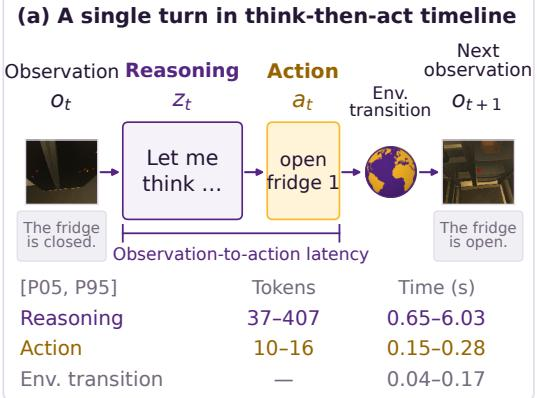

## Direct actions can degrade rollout quality

## (d) Rollout comparison on the same task

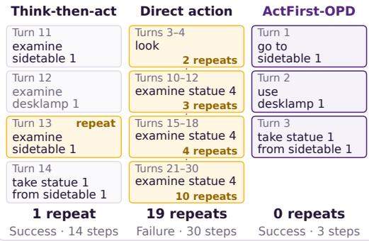

(b) Per-turn rollout time breakdown  
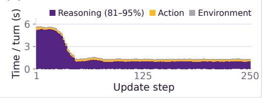

(e) Tasks with ≥1 repeated action ↓  
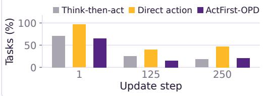

(c) GPU utilization during training  
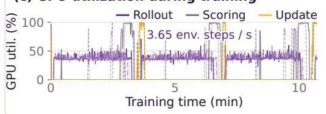

(f) Successful trajectory yield ↑  
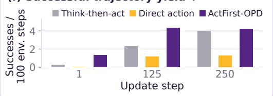  
Figure 1: Rollout latency and quality on ALFWorld with Qwen3-1.7B. Ranges in (a) denote the 5th–95th percentiles. (c) shows GPU utilization during the first 10 minutes of training. In (d–f), all rollout strategies use the same frozen Vanilla OPD checkpoint at each update step, with the same 3,553 training tasks, and a 30-turn limit. (d) shows selected turns from the same task at update 1.

Generating actions directly while deferring full-response generation can reduce this delay but may degrade rollout quality. Controlled comparisons show that direct-action rollouts exhibit more unproductive repetition (Figure 1(d, e)) and yield fewer successful trajectories per 100 environment transitions (Figure 1(f)). These observations raise the question: Can the student act to advance the environment without waitingforfull reasoning while maintaining rollout quality?

To address this challenge, we propose ActFirst-OPD, an act-first, reason-later training framework that decouples environment interaction from full-response generation. Our key idea is to use highquality reference trajectories to provide local transition targets for fast action generation, maintaining rollout quality. Drawing on inverse dynamics (Pavse et al., 2020), we have the student infer and execute an action from its current interaction context and a reference next observation. When interaction deviates from the reference trajectory, the student switches to autonomous next-action prediction for the rest of the rollout. While fast actions advance the environment, the same student asynchronously generates full think-then-act responses from the collected interaction contexts without using reference next observations for token-level teacher supervision. This preserves full-response distillation while removing reasoning from the critical path of environment transitions.

The main contributions of this work are summarized below.

• We identify and characterize reasoning-blocked environment transitions in multi-turn OPD and the rollout-quality risks of direct action through profiling and controlled comparisons.

• We introduce ActFirst-OPD, combining reference-conditioned inverse dynamics and nextaction prediction with asynchronous full-response generation for distillation. We also derive the idealized rollout speedup and its upper bound, and measure empirical gains.

• Across 0.6B-, 1.7B-, and 4B-parameter Qwen3 students, ActFirst-OPD achieves average wall-clock training speedups of 2.3× on ALFWorld, 1.8× on WebShop, and 4.9× on ScienceWorld over Vanilla OPD under matched hardware and update steps. It matches or exceeds all compared OPD baselines in mean task success rate across eight of nine benchmark–model settings.

## 2 RELATED WORK

On-Policy Distillation. Early OPD methods train students with dense teacher supervision on student-generated sequences (Gu et al., 2024; Agarwal et al., 2024). Applications span reasoning, strong-to-weak distillation, and integration of domain-specific capabilities (Lu & Thinking Machines Lab, 2025; Qwen Team, 2025; DeepSeek-AI, 2026). Recent studies examine OPD training dynamics and mechanisms (Song & Zheng, 2026; Li et al., 2026c). For multi-turn agents, TCOD (Wang et al., 2026) uses temporal curricula to mitigate trajectory-level KL instability, while TurnOPD (Zhou et al., 2026b) combines adaptive rollout depth with turn-level loss weighting. Our work addresses delays from pre-action reasoning and the rollout-quality risks of direct action generation. Additional comparisons with recent OPD methods are provided in Appendix D.

Multi-Turn LLM Agents. LLM agents interleave reasoning and actions, as exemplified by Re-Act (Yao et al., 2023), for tasks such as embodied planning (Shridhar et al., 2021) and web navigation (Yao et al., 2022). Recent coding agents, including Claude Code (Anthropic, 2025b) and Codex (OpenAI, 2025), and agent harnesses (Anthropic, 2025a; Ning et al., 2026) support longhorizon, tool-using workflows. Despite these advances, training such agents remains challenging due to credit assignment under sparse or delayed rewards (Feng et al., 2025) and compounding distribution shift across turns (Xue et al., 2026).

Inverse Dynamics. Inverse dynamics models infer actions from state transitions and have been used for self-supervised reinforcement learning (Pathak et al., 2017) and imitation without expert action annotations (Torabi et al., 2018). Recent embodied-agent methods use predicted visual futures or their representations to guide action generation (Hu et al., 2025; Li et al., 2026b). Most closely related to our formulation, RIDM (Pavse et al., 2020) infers actions from the learner’s current observation and the expert’s next observation to drive environment interaction without expert actions. We adapt this conditioning scheme to multi-turn OPD, using reference next observations to guide fast student actions and maintain rollout quality when collecting interaction contexts.

## 3 PRELIMINARIES

Multi-Turn Agent Interaction. We consider a language agent interacting with an environment to complete a task specified by an instruction q. At turn t, the agent receives an observation $o _ { t }$ and maintains the history of preceding interactions,

$$
h _ { t } = { \big ( } o _ { 1 } , a _ { 1 } , \ldots , o _ { t - 1 } , a _ { t - 1 } { \big ) } , \qquad h _ { 1 } = \emptyset ,\tag{1}
$$

where $a _ { i }$ is the action submitted to the environment at turn $i ;$ past reasoning is excluded from $h _ { t }$ We write the agent input schematically as interaction context $\pmb { c } _ { t } = \ b { q } \oplus \boldsymbol { h } _ { t } \oplus \boldsymbol { o } _ { t }$ , where $\oplus$ denotes concatenation and benchmark-specific system instructions and formatting are implicit. In standard think-then-act interaction (Yao et al., 2023), the student policy $\pi _ { \pmb { \theta } }$ generates a full response

$$
y _ { t } = ( z _ { t } , a _ { t } ) \sim \pi _ { \pmb { \theta } } \big ( \cdot \mid \mathbf { c } _ { t } \big ) ,\tag{2}
$$

where $z _ { t }$ denotes the reasoning segment and $a _ { t }$ denotes the executable action segment; only $a _ { t }$ is submitted to the environment. The environment executes $a _ { t }$ and returns the next observation $o _ { t + 1 }$ Interaction ends when the environment terminates or the prescribed turn limit is reached, yielding the trajectory $\tau = \left( o _ { 1 } , a _ { 1 } , o _ { 2 } , \ldots , o _ { T } , a _ { T } , o _ { T + 1 } \right)$ over $T$ interaction turns. Prompt construction, history management, and thinking budgets are detailed in Appendices B.1, B.2, and B.3, respectively.

On-Policy Distillation for Multi-Turn Agents. Multi-turn OPD trains a student policy $\pi _ { \theta }$ with a frozen teacher $\pi _ { \phi }$ on responses collected from online student rollouts. Let $\pmb { x } _ { t } = ( x _ { t , 1 } , \dots , x _ { t , L _ { t } } )$ denote the tokenization of the full response $y _ { t } = \left( z _ { t } , a _ { t } \right)$ , where $L _ { t }$ is the number of response tokens at turn t. For each response position $j \in \{ 1 , \dots , \bar { L } _ { t } \}$ , define the token context

$$
\begin{array} { r } { \pmb { c } _ { t , j } = \pmb { c } _ { t } \oplus \pmb { x } _ { t , < j } , } \end{array}\tag{3}
$$

where $\pmb { x } _ { t , < j } ~ = ~ ( x _ { t , 1 } , \dots , x _ { t , j - 1 } )$ is the response prefix preceding token $x _ { t , j }$ . Following prior studies (Wang et al., 2026), multi-turn OPD minimizes the expected student-to-teacher reverse Kullback–Leibler (KL) divergence over supervised token contexts,

$$
\mathcal { L } _ { \mathrm { O P D } } ( \pmb { \theta } ) = \mathbb { E } [ D _ { \mathrm { K L } } ( \pi _ { \pmb { \theta } } ( \cdot  { | \begin{array} { l } { \pmb { c } _ { t , j } } \end{array}  } )   \| \begin{array} { l } { \pi _ { \pmb { \phi } } ( \cdot  { | \begin{array} { l } { \pmb { c } _ { t , j } } \end{array}  } ) } \end{array} ) ] .\tag{4}
$$

The expectation is over collected turn-level full responses $y _ { t }$ at turns t of interaction trajectories $\tau ,$ and supervised token positions $j$ within each response. For each token context, the reverse KL is

$$
D _ { \mathrm { K L } } ( \pi _ { \pmb { \theta } } ( \cdot  { | \begin{array} { l } { c _ { t , j } } \end{array} ) \| } \pi _ { \pmb { \phi } } ( \cdot  { | \begin{array} { l } { c _ { t , j } } \end{array} ) } ) = \sum _ { v \in \mathcal { V } } \pi _ { \pmb { \theta } } ( v  { | \begin{array} { l } { c _ { t , j } } \end{array} ) } \log \frac { \pi _ { \pmb { \theta } } ( v  { | \begin{array} { l } { c _ { t , j } } \end{array} ) } } { \pi _ { \phi } ( v  { | \begin{array} { l } { c _ { t , j } } \end{array} ) } } ,\tag{5}
$$

where $\nu$ denotes the token vocabulary. In practice, we optimize a sampled policy surrogate of Eq. 4;   
the update rule, clipping, masking, and loss normalization are detailed in Appendix B.4.

## 4 ACTFIRST-OPD

ActFirst-OPD decouples environment interaction from full-response generation, as illustrated in Figure 2. The student advances the environment through actions conditioned on reference next observations, with autonomous next-action prediction once the rollout diverges from the reference trajectory. Meanwhile, full responses are generated asynchronously from collected contexts for distillation, allowing subsequent environment interactions to proceed without waiting for reasoning.

## 4.1 REFERENCE-CONDITIONED INVERSE-DYNAMICS ROLLOUT

Given a high-quality offline reference trajectory for training task $q ,$ let $o _ { 1 } ^ { \mathrm { r e f } } , o _ { 2 } ^ { \mathrm { r e f } } , . . .$ . denote its observations. While the rollout remains aligned with the reference trajectory, the reference next observation $o _ { t + 1 } ^ { \mathrm { r e f } }$ serves as a local transition target. Following the inverse-dynamics formulation (Pavse et al., 2020), the student infers an action from its actual interaction context $\mathbf { } _ { c _ { t } }$ and this target:

$$
\widetilde { \boldsymbol { a } } _ { t } \sim \pi _ { \pmb { \theta } } ^ { \mathrm { a c t } } \left( \cdot \mid \boldsymbol { c } _ { t } \oplus \boldsymbol { o } _ { t + 1 } ^ { \mathrm { r e f } } \right) ,\tag{6}
$$

where $\pi _ { \theta } ^ { \mathrm { a c t } }$ denotes the same student prompted to generate only an action, without preceding reasoning. During interaction, $h _ { t }$ records actual observations and executed fast actions $\tilde { a } _ { 1 } , \dots , \tilde { a } _ { t - 1 }$ Thus, $\mathbf { \Delta } \mathbf { c } _ { t } = q \oplus h _ { t } \oplus o _ { t }$ remains the student’s actual interaction context. Executing $\tilde { a } _ { t }$ produces $o _ { t + 1 }$ and advances the rollout.

## 4.2 AUTONOMOUS NEXT-ACTION PREDICTION FALLBACK

After executing a reference-conditioned action $\tilde { a } _ { t }$ , we apply benchmark-specific transition checks (Appendix B.5) to determine whether the resulting observation $o _ { t + 1 }$ aligns with the target $o _ { t + \cdot } ^ { \mathrm { r e f } } .$ <sub>1</sub>. Verification concerns the transition outcome and does not require the generated action to match the reference action. If verification succeeds, reference guidance continues at the next turn.

Once verification fails, reference-conditioned inverse dynamics is disabled for the remainder of the rollout. At each subsequent turn, the student performs autonomous next-action prediction (NAP) using its interaction context alone:

$$
\tilde { a } _ { t } \sim \pi _ { \theta } ^ { \mathrm { a c t } } ( \cdot \mid c _ { t } ) .\tag{7}
$$

Interaction continues from the actual state reached by the student, preserving action-only generation while avoiding continued reliance on the inapplicable reference trajectory.

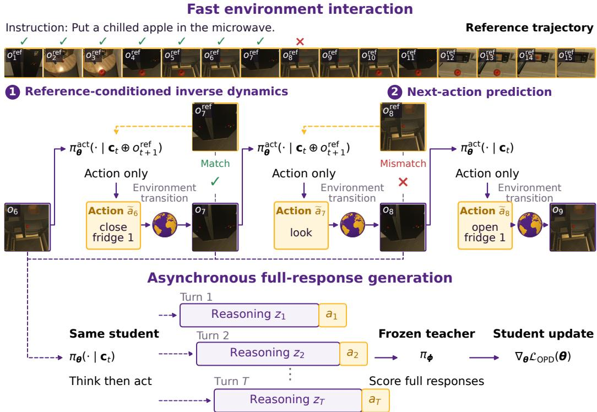  
Figure 2: Overview of ActFirst-OPD. Top: Reference-conditioned inverse dynamics generates fast actions $\tilde { a } _ { t }$ for environment interaction, with autonomous next-action prediction once the rollout diverges from the reference trajectory. Bottom: The same student asynchronously generates full responses $y _ { t } = \left( z _ { t } , a _ { t } \right)$ from collected interaction contexts for teacher supervision.

## 4.3 ASYNCHRONOUS FULL-RESPONSE GENERATION

For each interaction context $\mathbf { } c _ { t }$ collected during fast rollouts, the student generates a full think-thenact response $y _ { t } = ( z _ { t } , a _ { t } ) \sim \pi _ { \pmb { \theta } } ( \cdot \ | \ \pmb { c } _ { t } )$ using the standard agent input, without reference next observations. Full-response generation proceeds asynchronously, allowing requests from different turns to overlap with one another and with subsequent environment interactions. The action $a _ { t }$ need not match the executed fast action $\tilde { a } _ { t }$ and is not submitted to the environment.

The training batch consists of student-sampled full responses at contexts visited by the fast rollout. The frozen teacher $\pi _ { \phi }$ scores each full response under the same token contexts $\mathbf { \boldsymbol { c } } _ { t , j }$ defined in Section 3. These turn-level samples are used to optimize the OPD objective in $\operatorname { E q . }$ 4. This preserves full-response supervision while removing full-response generation from the dependency chain of environment transitions. At evaluation time, the student uses standard think-then-act interaction without reference next observations. We discuss the context distribution induced by fast rollouts and its implications for on-policy distillation in Appendix E.

Idealized Rollout Efficiency. We analyze rollout completion time, measured until both environment interaction and generation of all corresponding full responses have finished. Consider a fixed T-turn rollout with constant generation latencies $\ell _ { \mathrm { f a s t } }$ and $\ell _ { \mathrm { f u l l } }$ for fast actions and full responses, respectively, including prefill and autoregressive decoding, where $0 < \ell _ { \mathrm { f a s t } } \leq \ell _ { \mathrm { f u l l } }$ . In the idealized model, both requests start as soon as $\mathbf { } c _ { t }$ becomes available. We neglect environment and other nongeneration overheads and assume sufficient concurrency so that overlapping requests do not increase their generation latencies.

Proposition 1 (Idealized rollout speedup). Under the above assumptions, standard think-then-act rollout takes $T \ell _ { \mathrm { f u l l } }$ , whereas ActFirst-OPD completes in $( T - 1 ) \ell _ { \mathrm { f a s t } } + \ell _ { \mathrm { f u l l } }$ . The resulting idealized

rollout speedup satisfies

$$
S _ { \mathrm { i d e a l } } ( T ) = \frac { T \ell _ { \mathrm { f u l l } } } { ( T - 1 ) \ell _ { \mathrm { f a s t } } + \ell _ { \mathrm { f u l l } } } \le \operatorname* { m i n } \left\{ T , \frac { \ell _ { \mathrm { f u l l } } } { \ell _ { \mathrm { f a s t } } } \right\} .\tag{8}
$$

The proof of Proposition 1 is provided in Appendix A.1. Longer-horizon rollouts amortize the final full-response generation cost, with $S _ { \mathrm { i d e a l } } ( T )$ approaching $\bar { \ell _ { \mathrm { f u l l } } } / \ell _ { \mathrm { f a s t } }$ as T increases (Eq. 20). ActFirst-OPD additionally generates a fast action at each turn, so realized speedup requires sufficient serving concurrency for asynchronous overlap to offset this extra workload (Appendix A.2, Eq. 28).

## 5 EXPERIMENTS

## 5.1 EXPERIMENTAL SETUP

Tasks, Models, and Reference Trajectories. We evaluate on ALFWorld (Shridhar et al., 2021) for embodied planning, WebShop (Yao et al., 2022) for web navigation, and ScienceWorld (Wang et al., 2022) for scientific reasoning, with respective interaction limits of 30, 15, and 30 turns. Following prior multi-turn OPD studies (Wang et al., 2026; Zhou et al., 2026b), we train Qwen3-0.6B, 1.7B, and 4B students (Qwen Team, 2025) using a task-specialized Qwen3-8B teacher trained with GiGPO (Feng et al., 2025) for each benchmark. ActFirst-OPD uses offline reference trajectories selected from public demonstrations, model-generated rollouts, and oracle solutions. Data splits are detailed in Appendix C.1; teacher preparation and reference construction are described in Appendix C.2.

Baselines and Implementation. We compare against Vanilla OPD, TCOD-F2B (Wang et al., 2026), and TurnOPD (Zhou et al., 2026b), with results from zero-shot students and task-specialized teachers provided for reference. We also include Ours w/o ID, which replaces reference-conditioned inverse dynamics (ID) with direct action generation without references while retaining asynchronous full-response generation. Within each benchmark–model setting, methods share student initialization, the teacher, and environment settings, while retaining their respective rollout and optimization rules. The main comparison in Section 5.2 uses 250 training updates, rollout batches of 16 tasks, and optimization batches of 64 turn-level full responses. All OPD methods are implemented using Trinity-RFT (Pan et al., 2025), with vLLM (Kwon et al., 2023) for inference and VERL (Sheng et al., 2025) for optimization. Each training run uses eight NVIDIA A100-SXM4-80GB GPUs: four for student rollouts, two for teacher scoring, and two for student optimization.

Evaluation Protocols and Metrics. We evaluate on 140 seen and 134 unseen ALFWorld tasks, 100 held-out WebShop tasks, and 150 held-out ScienceWorld tasks. All models use standard thinkthen-act interaction without references during evaluation. We report success rate (SR), average interaction turns (Round), and training wall-clock time; WebShop and ScienceWorld additionally report task scores to measure partial completion. Training wall-clock time excludes teacher training, reference construction, and evaluation. Training speedup is Vanilla OPD’s training wall-clock time divided by the method’s time for the same benchmark and student size. Task-performance means and standard deviations are computed across three evaluation seeds (42, 43, and 44) for the same trained checkpoint.

## 5.2 MAIN RESULTS

Across the nine benchmark–model settings, ActFirst-OPD completes 250 updates faster than Vanilla OPD, TCOD-F2B, and TurnOPD, while matching or exceeding Vanilla OPD’s mean SR in eight (Tables 1 and 2). Averaging the per-size training speedups over Vanilla OPD gives 2.3×, 1.8×, and 4.9× on ALFWorld, WebShop, and ScienceWorld, respectively.

ActFirst-OPD achieves the highest mean SR among the compared OPD methods at all three student sizes on ALFWorld and ScienceWorld. On ALFWorld, its gains over Vanilla OPD are 8.15, 9.85, and 2.67 percentage points for 0.6B, 1.7B, and 4B, respectively. These SR gains may partly stem from reference-conditioned inverse dynamics promoting task progress during rollout collection and providing more useful contexts for distillation, consistent with the ablation and rollout-quality results (Table 3; Figure 4). On WebShop, ActFirst-OPD achieves a 1.80× training speedup over Vanilla OPD with only a 1.00-percentage-point decrease in mean SR for Qwen3-1.7B.

Table 1: Task performance and training cost on ALFWorld. Overall SR is reported as mean ± standard deviation across three evaluation seeds. Training time is in hours, with speedup relative to Vanilla OPD for the same student size. Among OPD methods, bold and underlined values mark the best and second-best results per metric, respectively; shading highlights the shortest training time.
<table><tr><td colspan="2">Model</td><td rowspan="2">Method</td><td colspan="10"></td><td colspan="2">All</td><td rowspan="2"></td></tr><tr><td>Teacher Student</td><td></td><td>Pick</td><td>Look</td><td>Clean</td><td>Heat</td><td>Cool Pick2</td><td colspan="2">Seen</td><td colspan="2">Unseen</td><td colspan="2"></td><td>Training Wall-clock Time (Speedup)</td></tr><tr><td></td><td></td><td></td><td></td><td></td><td></td><td></td><td></td><td>SR↑</td><td></td><td>Round↓</td><td>SR↑</td><td>Round.↓</td><td>SR↑</td><td>Round.↓</td><td></td></tr><tr><td></td><td></td><td colspan="10">Qwen3 Series</td><td></td><td></td><td></td><td></td></tr><tr><td></td><td>0.6B</td><td></td><td>0.00</td><td>6.45</td><td>0.00</td><td>0.00</td><td>0.00</td><td>0.00</td><td>0.00</td><td>30.00</td><td>1.49</td><td>29.69</td><td>0.73</td><td>29.85</td><td>N/A</td></tr><tr><td></td><td>1.7B 4B</td><td>Zero-Shot</td><td>40.68 89.83</td><td>16.13 77.42</td><td>13.79 60.34</td><td>12.82 58.97</td><td>8.70</td><td>4.88</td><td>17.86</td><td>27.68</td><td>17.16</td><td>27.28</td><td>17.52 63.50</td><td>27.48 21.03</td><td>N/A</td></tr><tr><td>8B</td><td></td><td>GiGPO</td><td></td><td></td><td></td><td></td><td>28.26</td><td>63.41</td><td>55.71</td><td>21.92</td><td>71.64</td><td>20.10</td><td></td><td></td><td>N/A</td></tr><tr><td></td><td></td><td></td><td>98.31</td><td>90.32</td><td>94.83</td><td>79.49</td><td>86.96</td><td>73.17</td><td>89.29</td><td>10.04</td><td>87.31 59.20</td><td>11.18 17.90</td><td>88.32</td><td>10.59</td><td>N/A</td></tr><tr><td rowspan="10">8B-</td><td>TCOD-F2B</td><td>Vanilla OPD</td><td>80.79 85.88</td><td>55.91 53.76</td><td>66.67 67.24</td><td>59.83 55.56</td><td>52.90 60.14</td><td>34.96</td><td>61.67</td><td>17.52 16.22</td><td>59.45</td><td></td><td>60.46 ± 3.15 61.68 ± 1.59</td><td>17.70 16.80</td><td>4.18 h (×1.00) 2.15 h (×1.94)</td></tr><tr><td>0.6B TurnOPD</td><td></td><td>72.88</td><td>60.22</td><td>48.85</td><td>39.32</td><td>53.62</td><td>32.52</td><td>63.81 51.43</td><td>19.18</td><td>50.00</td><td>17.41 19.72</td><td>50.73 ± 2.89</td><td>19.44</td><td>2.87 h (×1.46)</td></tr><tr><td>Ours w/o ID</td><td></td><td>72.88</td><td>55.91</td><td>51.15</td><td>26.50</td><td>34.78</td><td>21.95 13.01</td><td>43.81</td><td>20.89</td><td>45.02</td><td>21.13</td><td>44.40 ± 6.38</td><td>21.01</td><td>2.30 h (×1.82)</td></tr><tr><td></td><td>ActFirst-OPD (Ours)</td><td>87.01</td><td>60.22</td><td>75.86</td><td>65.81</td><td>66.67</td><td>43.09</td><td>71.67</td><td>14.90</td><td>65.42</td><td>16.51</td><td>68.61 ± 0.89</td><td>15.69</td><td>1.93 h (×2.17)</td></tr><tr><td></td><td>Vanilla OPD</td><td></td><td></td><td></td><td></td><td></td><td></td><td></td><td></td><td></td><td></td><td></td><td>15.72</td><td>4.46 h (×1.00)</td></tr><tr><td>1.7B</td><td>TCOD-F2B</td><td>92.66 92.66</td><td>63.44</td><td>74.14</td><td>65.81</td><td>56.52</td><td>39.84</td><td>70.48</td><td>14.70</td><td>64.68</td><td>16.79 15.74</td><td>67.64 ± 1.52 70.19 ± 1.38</td><td></td><td>2.32h (×1.92)</td></tr><tr><td>TurnOPD</td><td></td><td></td><td>50.54</td><td>81.61</td><td>64.96</td><td>55.80</td><td>57.72</td><td>73.33</td><td>14.33</td><td>66.92 69.40</td><td>15.30</td><td></td><td>15.02</td><td></td></tr><tr><td></td><td></td><td>90.96</td><td>63.44</td><td>79.31</td><td>67.52</td><td>64.49</td><td>54.47</td><td>74.76</td><td>14.01</td><td></td><td>18.97</td><td>72.14 ± 3.11</td><td>14.64</td><td>3.21 h (×1.39)</td></tr><tr><td></td><td>Ours w/o ID ActFirst-OPD (Ours)</td><td>74.01</td><td>59.14 82.80</td><td>62.07 85.06</td><td>52.14 66.67</td><td>55.07 73.19</td><td>30.08</td><td>57.86 80.95</td><td>18.10 12.62</td><td>55.97 73.88</td><td>14.27</td><td>56.93 ± 3.85 77.49 ± 1.20</td><td>18.53 13.43</td><td>2.48 h (×1.80) 1.95 h (×2.28)</td></tr><tr><td>Vanilla OPD</td><td></td><td>93.79</td><td></td><td></td><td></td><td></td><td>54.47</td><td></td><td></td><td></td><td>13.55</td><td></td><td></td><td></td></tr><tr><td rowspan="5"></td><td rowspan="5">4B</td><td></td><td>92.66</td><td>80.65</td><td>83.91</td><td>72.65</td><td>74.64</td><td>68.29</td><td>84.05</td><td>11.40</td><td>75.62</td><td></td><td>79.93 ± 0.73</td><td>12.46</td><td>4.56 h (×1.00)</td></tr><tr><td>TCOD-F2B</td><td>92.66</td><td>88.17</td><td>72.41</td><td>58.12</td><td>61.59</td><td>73.17</td><td>79.29</td><td>12.65</td><td>70.15</td><td>15.11</td><td>74.82 ± 1.10</td><td>13.85</td><td>2.72 h (×1.68)</td></tr><tr><td>TurnOPD</td><td>93.79 95.48</td><td>83.87 84.95</td><td>79.89</td><td>79.49</td><td>72.46</td><td>76.42</td><td>84.52</td><td>11.58 12.28</td><td>78.36 70.65</td><td>13.13 14.75</td><td>81.51 ± 1.47 75.43 ± 0.92</td><td>12.34 13.49</td><td>3.86 h (×1.18)</td></tr><tr><td>Ours w/o ID</td><td></td><td></td><td>75.86</td><td>65.81</td><td>63.77</td><td>60.98</td><td>80.00</td><td>11.01</td><td>78.86</td><td>12.82</td><td></td><td></td><td>2.59 h (×1.76)</td></tr><tr><td>ActFirst-OPD (Ours)</td><td>92.66</td><td>90.32</td><td>78.74</td><td>71.79</td><td>81.88</td><td>78.86</td><td>86.19</td><td></td><td></td><td></td><td>82.60 ± 1.12</td><td>11.90</td><td>1.93 h (×2.37)</td></tr></table>

Table 2: Task performance and training cost on WebShop and ScienceWorld. Score and SR are reported as mean ± standard deviation across three evaluation seeds. Training time is in hours, with speedup relative to Vanilla OPD for the same benchmark and student size. Among OPD methods, bold and underlined values mark the best and second-best Score, SR, and training time, respectively; shading highlights the shortest training time.
<table><tr><td colspan="2">Model</td><td rowspan="2">Method</td><td colspan="4">WebShop</td><td colspan="4">ScienceWorld</td></tr><tr><td>Teacher Student</td><td></td><td>Score↑</td><td>SR↑</td><td>Round</td><td>Training Wall-clock Time (Speedup)</td><td>Score↑</td><td>SR↑</td><td>Round</td><td>Training Wall-clock Time (Speedup)</td></tr><tr><td></td><td colspan="8">Qwen3 Series</td><td></td></tr><tr><td>0.6B</td><td></td><td></td><td>49.54</td><td>11.00</td><td>4.56</td><td>N/A</td><td>5.59</td><td>0.00</td><td>19.86</td><td>N/A</td></tr><tr><td></td><td>1.7B</td><td>Zero-Shot</td><td>51.10</td><td>15.67</td><td>5.22</td><td>N/A</td><td>22.28</td><td>6.89</td><td>19.65</td><td>N/A</td></tr><tr><td></td><td>4B</td><td></td><td>45.37</td><td>13.33</td><td>6.75</td><td>N/A</td><td>44.36</td><td>20.67</td><td>19.19</td><td>N/A</td></tr><tr><td>8B</td><td></td><td>GiGPO</td><td>71.54</td><td>43.33</td><td>4.28</td><td>N/A</td><td>55.58</td><td>35.33</td><td>15.40</td><td>N/A</td></tr><tr><td rowspan="10">8B- GiGPO</td><td rowspan="6">0.6B</td><td>Vanilla OPD</td><td>69.29 ± 1.23</td><td>36.67 ± 2.08</td><td>4.32</td><td>2.81 h (×1.00)</td><td>35.35 ± 0.91</td><td>10.00 ± 1.33</td><td>20.45</td><td>10.31 h (×1.00)</td></tr><tr><td>TCOD-F2B</td><td>67.79 ± 1.57</td><td>36.33 ± 1.15</td><td>4.23</td><td>2.42 h (×1.16)</td><td>35.39 ± 1.02</td><td>10.00 ± 1.33</td><td>18.52</td><td>6.30 h (×1.64)</td></tr><tr><td>TurnOPD</td><td>67.61 ± 1.63</td><td>36.33 ± 2.31</td><td>4.31</td><td>2.88 h (×0.97)</td><td>35.45 ± 0.60</td><td>10.22 ± 0.39</td><td>19.58</td><td>6.31 h (×1.63)</td></tr><tr><td>Ours w/o ID</td><td>67.93 ± 1.11</td><td>36.00 ± 1.00</td><td>4.15</td><td>1.40 h (×2.01)</td><td>39.16 ± 0.27</td><td>11.11 ± 1.39</td><td>15.04</td><td>2.15 h (×4.79)</td></tr><tr><td>ActFirst-OPD (Ours)</td><td>68.35 ± 0.44</td><td>38.00 ± 1.00</td><td>4.76</td><td>1.46 h (×1.93)</td><td>37.06 ± 1.47</td><td>12.67 ± 1.77</td><td>18.15</td><td>2.01 h(×5.12)</td></tr><tr><td>Vanilla OPD TCOD-F2B</td><td>69.50 ± 0.43</td><td>40.33 ± 0.58</td><td>4.04</td><td>3.10 h (×1.00)</td><td>45.47 ± 1.71</td><td>22.89 ± 2.14</td><td>15.24</td><td>10.37h (×1.00)</td></tr><tr><td>1.7B</td><td></td><td>68.83 ± 0.59</td><td>38.33 ± 1.53</td><td>4.15</td><td>2.67 h (×1.16)</td><td>46.06 ± 0.26</td><td>22.45 ± 0.39</td><td>15.77</td><td>6.53 h (×1.59)</td></tr><tr><td></td><td>TurnOPD</td><td>69.50 ± 0.64</td><td>39.67 ± 1.15</td><td>3.99</td><td>2.77h(×1.12)</td><td>43.61 ± 1.62</td><td>20.44 ± 0.77</td><td>15.50</td><td>6.37 h (×1.63)</td></tr><tr><td rowspan="3"></td><td>Ours w/o ID</td><td>68.44 ± 1.93</td><td>38.67 ± 2.08</td><td>4.06</td><td>1.70 h (×1.82)</td><td>43.38 ± 1.61</td><td>20.00 ± 2.41</td><td>15.05</td><td>2.56 h (×4.06)</td></tr><tr><td>ActFirst-OPD (Ours)</td><td>69.76 ± 1.11</td><td>39.33 ± 1.53</td><td>3.99</td><td>1.72 h (×1.80)</td><td>46.57 ± 2.38</td><td>24.00 ± 1.76</td><td>15.50</td><td>2.16 h (×4.80)</td></tr><tr><td>Vanilla OPD</td><td>69.90 ± 1.12</td><td>42.00 ± 1.00</td><td>4.23</td><td>3.96 h (×1.00)</td><td>50.74 ± 0.13</td><td>29.34 ± 1.15</td><td>16.49</td><td>12.40 h (×1.00)</td></tr><tr><td rowspan="5"></td><td rowspan="5">4B</td><td>TCOD-F2B</td><td>69.25 ± 1.15</td><td>42.00 ± 1.00</td><td>4.12</td><td>3.51 h (×1.13)</td><td>53.47 ± 2.14</td><td>30.22 ± 1.39</td><td>17.25</td><td>8.47h (×1.46)</td></tr><tr><td>TurnOPD</td><td>69.64 ± 1.76</td><td>41.33 ± 2.52</td><td>4.17</td><td>3.52 h (×1.13)</td><td>51.64 ± 1.53</td><td>30.00 ± 3.06</td><td>16.49</td><td>7.93 h (×1.56)</td></tr><tr><td>Ours w/o ID</td><td>69.07 ± 0.49</td><td>41.67 ± 1.15</td><td>4.10</td><td>2.15 h (×1.84)</td><td>51.16 ± 1.60</td><td>27.78 ± 2.53</td><td>17.12</td><td>3.25 h (×3.82)</td></tr><tr><td>ActFirst-OPD (Ours)</td><td>69.34 ± 0.45</td><td>42.00 ± 1.00</td><td>4.18</td><td>2.32 h (×1.71)</td><td>53.56±1.25</td><td>31.33 ± 1.34</td><td>16.29</td><td>2.63 h (×4.72)</td></tr><tr><td></td><td></td><td></td><td></td><td></td><td></td><td></td><td></td><td></td></tr></table>

While Tables 1 and 2 compare performance after 250 training updates, we also compare evaluation SR under comparable training-time budgets using performance–time curves on ALFWorld (Figure 5 in Appendix F). At approximately 1.5 hours of training, ActFirst-OPD achieves the highest mean evaluation SR among the compared OPD methods at all three student sizes, with particularly large gains over Vanilla OPD and TurnOPD.

Table 3: Ablation results averaged across Qwen3-0.6B, 1.7B, and 4B. Red subscripts show SR drops from ActFirst-OPD in percentage points. Time denotes training wall-clock time. Rank averages per-size SR ranks, using average ranks for ties. Bold and underlined values mark the best and second-best results per benchmark and metric, respectively.
<table><tr><td rowspan="2">Method</td><td colspan="3">ALFWorld</td><td colspan="3">WebShop</td><td colspan="3">ScienceWorld</td></tr><tr><td></td><td></td><td></td><td></td><td></td><td></td><td>Avg. SR↑ Time (h)↓ Rank↓ Avg. SR↑ Time (h)↓ Rank↓ Avg. SR↑ Time (h)↓ Rank↓</td><td></td><td></td></tr><tr><td>w/o ID</td><td> $5 8 . 9 2 _ { \downarrow 1 7 . 3 1 }$ </td><td>2.45</td><td>4.67</td><td> $3 8 . 7 8 _ { \downarrow 1 . 0 0 }$ </td><td>1.75</td><td>3.17</td><td> $1 9 . 6 3 _ { \downarrow 3 . 0 4 }$ </td><td>2.65</td><td>3.33</td></tr><tr><td>w/o NAP Fallback</td><td> $7 5 . 1 8 _ { \downarrow 1 . 0 5 }$ </td><td>1.25</td><td>2.33</td><td> $3 6 . 6 7 _ { \downarrow 3 . 1 1 }$ </td><td>2.09</td><td>4.50</td><td> $\underline { { 1 9 . 8 5 } } _ { \downarrow 2 . 8 2 }$ </td><td>2.33</td><td>3.00</td></tr><tr><td>Reference-Prefix Replay (50%)</td><td> $6 8 . 9 4 _ { \downarrow 7 . 2 9 }$ </td><td>1.90</td><td>4.33</td><td> ${ \underline { { 3 9 . 1 1 } } } _ { \downarrow 0 . 6 7 }$ </td><td>2.18</td><td>2.67</td><td> $1 8 . 8 9 _ { \downarrow 3 . 7 8 }$ </td><td>2.87</td><td>3.67</td></tr><tr><td>Reference-Prefix Replay (100%)</td><td> $\underline { { 7 5 . 8 7 } } _ { \downarrow 0 . 3 6 }$ </td><td>1.11</td><td>2.00</td><td> $3 7 . 8 9 _ { \downarrow 1 . 8 9 }$ </td><td>1.66</td><td>3.17</td><td> $1 8 . 4 5 _ { \downarrow 4 . 2 2 }$ </td><td>1.73</td><td>4.00</td></tr><tr><td>ActFirst-OPD (Ours)</td><td>76.23</td><td>1.94</td><td>1.67</td><td>39.78</td><td>1.83</td><td>1.50</td><td>22.67</td><td>2.27</td><td>1.00</td></tr></table>

## 5.3 ABLATION STUDIES

We evaluate three ablation designs. Ours w/o ID replaces reference-conditioned inverse dynamics with direct action generation without reference next observations. w/o NAP Fallback terminates rollouts after failed transition consistency checks instead of continuing with autonomous next-action prediction (NAP). Reference-Prefix Replay executes either the first 50% of each reference action sequence, followed by NAP, or the full sequence. These variants examine reference conditioning, continuation after divergence, and the use of reference actions for rollout collection, respectively.

Table 3 reports results averaged across student sizes. ActFirst-OPD has the highest mean SR and lowest mean SR rank on all three benchmarks. Removing ID lowers mean SR by 17.31, 1.00, and 3.04 percentage points on ALFWorld, WebShop, and ScienceWorld, respectively; training time increases from 1.94 to 2.45 hours on ALFWorld and from 2.27 to 2.65 hours on ScienceWorld. Removing NAP fallback lowers mean SR by 1.05, 3.11, and 2.82 percentage points, respectively, suggesting that contexts collected after divergence remain useful for distillation.

Both reference-replay variants also lower mean SR on all three benchmarks. Compared with ActFirst-OPD, the 50% variant increases training time from 1.83 to 2.18 hours on WebShop and from 2.27 to 2.87 hours on ScienceWorld. Full replay reduces mean training time on all three benchmarks but lowers mean SR by 0.36 percentage points on ALFWorld, with larger drops of 1.89 and 4.22 points on WebShop and ScienceWorld, respectively. The larger gaps on WebShop and ScienceWorld may reflect a greater benefit from learning to handle deviations from reference trajectories. Full replay follows fixed reference actions, whereas ActFirst-OPD continues after divergence, collecting interaction contexts that support distillation on feedback from student-generated actions.

## 5.4 ROLLOUT EFFICIENCY AND QUALITY ANALYSIS

Where Does the Speedup Come From? The observed training speedup comes from both higher environment-transition throughput and fewer environment transitions. Asynchronous full-response generation (Section 4.3) can increase throughput, while reference-conditioned inverse dynamics can improve task progress and reduce inefficient interactions.

To isolate the benefit of asynchronous generation, we use fixed ALFWorld interaction contexts with Qwen3-1.7B, 16 tasks per batch, 16-token fast actions, and 128- or 512-token full responses. We vary the cap $b _ { \mathrm { m a x } }$ on concurrent generation requests, shared by fast-action and full-response requests, and the number of virtual turns per task $T ,$ timing each rollout until all requests finish. Rollout speedup is the think-then-act completion time divided by the ActFirst-OPD completion time. Figure 3(a) shows that increasing $b _ { \mathrm { m a x } }$ from 16 to 256 raises speedup from 0.80× to 1.49× for 128-token responses and from 0.92× to $2 . 4 2 \times$ for 512-token responses. At $b _ { \mathrm { m a x } } = 1 6$ , both response lengths yield speedups below one, indicating that overlap does not offset the additional fast-action generation cost in this setting. Increasing $b _ { \mathrm { m a x } }$ enables speedups in this experiment, but the required serving concurrency depends on the workload and hardware. The larger full-response to fast-action token ratio (32 versus 8) provides more overlap opportunities and reduces the relative decoding overhead of fast actions. At $b _ { \mathrm { m a x } } = 2 5 6$ , speedup initially grows with T and then levels off (Figure 3(b)). The initial increase and diminishing returns are consistent with amortizing the final full-response cost in Proposition 1. Limited serving concurrency can further constrain speedup and contribute to the gap from the idealized estimates (Appendix A.2).

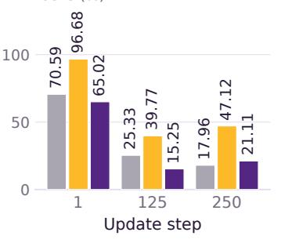  
(c) Average rollout turns ↓

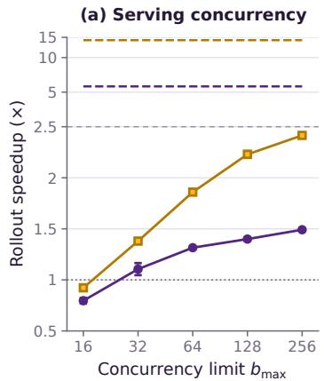

(b) Interaction horizon  
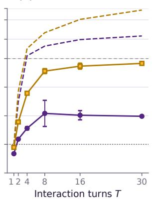

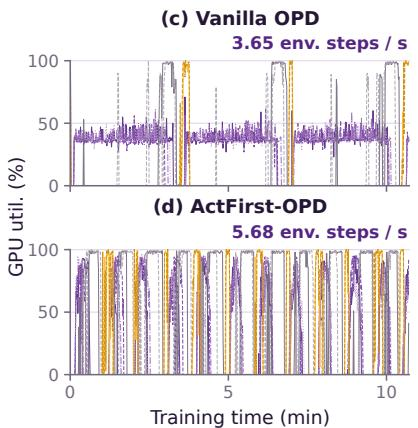  
128 tokens 512 tokens S<sub>real</sub> S<sub>ideal</sub> Rollout (GPU 0–3) Scoring (GPU 4–5) Update (GPU 6–7)  
Figure 3: Rollout efficiency on ALFWorld with Qwen3-1.7B. (a,b) Measured rollout speedup (solid; mean ± standard deviation over three paired repeats) and idealized estimates (dashed), varying $b _ { \mathrm { m a x } }$ at $T = 3 0$ in (a) and T at $b _ { \mathrm { m a x } } \doteq 2 5 6$ in (b). Speedup axes are linear up to 2.5 and logarithmic above. (c,d) GPU utilization for Vanilla OPD and ActFirst-OPD; annotations show fulltraining environment-transition throughput.  
(a) Tasks with ≥1 repeated action ↓ (b) Successful trajectory yield ↑

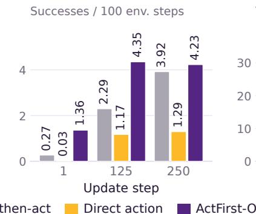

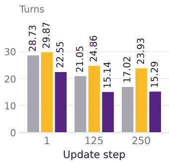  
Figure 4: Rollout quality on ALFWorld. At each update, all strategies use the same frozen Qwen3- 1.7B checkpoint on 3,553 training tasks with a 30-turn maximum rollout horizon.

In 250-update training runs with matched rollout batch size and serving configuration, ActFirst-OPD increases environment-transition throughput from 3.65 to 5.68 transitions per second (1.56×; Figure $3 ( \mathrm { c } , \mathrm { d } ) )$ . Across the full-training measurement windows, it also executes 30.45% fewer transitions (38,616 versus 55,525; Table 9). Since elapsed time equals transition count divided by throughput, the speedup over these windows is $1 . 5 6 / ( \bar { 1 } - 0 . 3 0 4 5 ) \bar { \approx } 2 . 2 4$ . This is close to the 2.28× training speedup for Qwen3-1.7B in Table 1, measured from process launch to exit in separate runs.

How Does ActFirst-OPD Affect Rollout Quality? We hold the student checkpoint fixed and vary only the rollout strategy: think-then-act, direct action without reference next observations, or ActFirst-OPD’s reference-conditioned interaction with autonomous fallback. At each of updates 1, 125, and 250, all strategies use the same frozen Qwen3-1.7B Vanilla OPD checkpoint on all 3,553 ALFWorld training tasks with a 30-turn limit. We measure the fraction of tasks with at least one unproductive action repetition, successful trajectories per 100 environment transitions (successful trajectory yield), and mean rollout turns. Measurement protocols are detailed in Appendix C.5.

Compared with direct action, ActFirst-OPD improves rollout quality at every checkpoint, with a lower fraction of tasks exhibiting unproductive action repetition, higher successful trajectory yield, and fewer rollout turns (Figure 4). Compared with think-then-act, it yields more successful trajectories per 100 transitions and uses fewer turns, with broadly comparable task-level repetition. Based on these results, reference-conditioned inverse dynamics may improve rollout quality.

## 6 CONCLUSION

We presented ActFirst-OPD, which combines reference-conditioned inverse dynamics, autonomous next-action prediction, and asynchronous full-response generation. Across three benchmarks and three Qwen3 student sizes, it reduces training time relative to Vanilla OPD while matching or exceeding all compared OPD baselines in mean success rate across eight of nine settings. These results highlight that reasoning need not block acting during multi-turn agent distillation.

Despite these gains, our method assumes access to high-quality offline reference trajectories; settings where such references are difficult to obtain are beyond the scope of this work. Reference next observations currently serve only as rollout guidance, which is disabled after divergence. Future work could use reference transitions for auxiliary supervision or realign rollouts with their reference trajectories after divergence.

## AI USE STATEMENT

The authors used OpenAI language-model systems, including Codex, as interactive assistants during this project. These tools assisted with literature discovery, experimental design, code development, data processing and visualization, mathematical derivations and proof checking, and manuscript drafting and revision. The human authors made the final research and methodological decisions and take full responsibility for the manuscript, experimental results, and theoretical claims.

## ETHICS STATEMENT

This work studies efficient training of language agents using established benchmarks: ALFWorld, WebShop, and ScienceWorld. Our experiments involve benchmark environments and pretrained language models, without human-participant studies or real-world deployment. Reducing training costs can broaden access to agent research, but may also lower barriers to developing agents for harmful uses. Student models may inherit biases, errors, or undesirable behaviors from their teachers and reference trajectories. Applications beyond the evaluated benchmarks therefore require appropriate safety evaluation and controls on environment and tool access.

## REPRODUCIBILITY STATEMENT

Section 5 describes the benchmarks, models, computational resources, and evaluation protocols. The assumptions and proofs underlying our efficiency analysis are provided in Appendix A. Appendix B provides the prompt templates, history management, thinking-budget decoding, OPD optimization, and transition consistency checks. Appendix C describes benchmark configura tions, teacher training and reference construction, training and evaluation hyperparameters, and rollout measurement protocols. The accompanying anonymous code repository is available at https://anonymous.4open.science/r/ActFirst-OPD.

## REFERENCES

Rishabh Agarwal, Nino Vieillard, Yongchao Zhou, Piotr Stanczyk, Sabela Ramos Garea, Matthieu Geist, and Olivier Bachem. On-policy distillation of language models: Learning from selfgenerated mistakes. In International Conference on Learning Representations (ICLR), 2024.

Anthropic. Effective harnesses for long-running agents. 2025a. https://www.anthropic.com/engineering/effective-harnesses-for-long-running-agents.

Anthropic. Claude 3.7 Sonnet and Claude Code. 2025b. https://www.anthropic.com/news/claude-3-7-sonnet.

Marc-Alexandre Côté, Ákos Kádár, Xingdi Yuan, Ben Kybartas, Tavian Barnes, Emery Fine, James Moore, Matthew Hausknecht, Layla El Asri, Mahmoud Adada, Wendy Tay, and Adam Trischler. TextWorld: A learning environment for text-based games. In Computer Games, volume 1017 of Communications in Computer and Information Science, pp. 41–75, 2019.

DeepSeek-AI. DeepSeek-V4: Towards highly efficient million-token context intelligence. arXiv preprint arXiv:2606.19348, 2026.

Lang Feng, Zhenghai Xue, Tingcong Liu, and Bo An. Group-in-group policy optimization for LLM agent training. In Advances in Neural Information Processing Systems (NeurIPS), volume 38, 2025.

Yuxian Gu, Li Dong, Furu Wei, and Minlie Huang. MiniLLM: Knowledge distillation of large language models. In International Conference on Learning Representations (ICLR), 2024.

Yucheng Hu, Yanjiang Guo, Pengchao Wang, Xiaoyu Chen, Yen-Jen Wang, Jianke Zhang, Koushil Sreenath, Chaochao Lu, and Jianyu Chen. Video Prediction Policy: A generalist robot policy with predictive visual representations. In Proceedings of the 42nd International Conference on Machine Learning (ICML), volume 267, pp. 24328–24346, 2025.

Sam Ade Jacobs, Masahiro Tanaka, Chengming Zhang, Minjia Zhang, Shuaiwen Leon Song, Samyam Rajbhandari, and Yuxiong He. DeepSpeed Ulysses: System optimizations for enabling training of extreme long sequence transformer models. arXiv preprint arXiv:2309.14509, 2023.

Woosuk Kwon, Zhuohan Li, Siyuan Zhuang, Ying Sheng, Lianmin Zheng, Cody Hao Yu, Joseph E. Gonzalez, Hao Zhang, and Ion Stoica. Efficient memory management for large language model serving with PagedAttention. In Proceedings ofthe 29th Symposium on Operating Systems Principles (SOSP), pp. 611–626, 2023.

Gengsheng Li, Mao Zheng, Mingyang Song, Ruiqi Liu, Tianyu Yang, Jie Sun, Qiyong Zhong, Haiyun Guo, Junfeng Fang, Dan Zhang, and Jinqiao Wang. On-policy distillation with curriculum turn-level guidance for multi-turn agents. arXiv preprint arXiv:2606.15912, 2026a.

Sizhe Lester Li, Evan Kim, Xingjian Bai, Tong Zhao, Tao Pang, Max Simchowitz, and Vincent Sitzmann. Turning video models into generalist robot policies. arXiv preprint arXiv:2605.27817, 2026b.

Yaxuan Li, Yuxin Zuo, Bingxiang He, Jinqian Zhang, Chaojun Xiao, Cheng Qian, Tianyu Yu, Huanang Gao, Wenkai Yang, Zhiyuan Liu, and Ning Ding. Rethinking on-policy distillation of large language models: Phenomenology, mechanism, and recipe. arXiv preprint arXiv:2604.13016, 2026c.

Baohao Liao, Hanze Dong, Christof Monz, Xinxing Xu, Li Dong, and Furu Wei. Multi-turn onpolicy distillation with prefix replay. arXiv preprint arXiv:2607.04763, 2026.

Jun Liu, Zhenglun Kong, Peiyan Dong, Changdi Yang, Tianqin Li, Yanyue Xie, Yifan Gong, Xuan Shen, Pu Zhao, Hao Tang, Geng Yuan, Wei Niu, Wenbin Zhang, Xue Lin, Dong Huang, and Yanzhi Wang. Structured agent distillation for large language model agents. In Proceedings of the 25th International Conference on Autonomous Agents and Multiagent Systems (AAMAS), pp. 3676–3685, 2026.

Ilya Loshchilov and Frank Hutter. Decoupled weight decay regularization. In International Conference on Learning Representations (ICLR), 2019.

Kevin Lu and Thinking Machines Lab. On-policy distillation. 2025. https://thinkingmachines.ai/blog/on-policy-distillation.

Xuying Ning, Katherine Tieu, Dongqi Fu, Tianxin Wei, Zihao Li, Yuanchen Bei, Jiaru Zou, Mengting Ai, Zhining Liu, Ting-Wei Li, Lingjie Chen, Yanjun Zhao, Ke Yang, Bingxuan Li, Cheng Qian, Gaotang Li, Xiao Lin, Zhichen Zeng, Ruizhong Qiu, Sirui Chen, Yifan Sun, Xiyuan Yang, Ruida Wang, Rui Pan, Chenyuan Yang, Dylan Zhang, Liri Fang, Zikun Cui, Yang Cao, Pan Chen, Dorothy Sun, Ren Chen, Mahesh Srinivasan, Nipun Mathur, Yinglong Xia, Hong Li, Hong Yan, Pan Lu, Lingming Zhang, Tong Zhang, Hanghang Tong, and Jingrui He. Code as agent harness. arXiv preprint arXiv:2605.18747, 2026.

OpenAI. Introducing Codex. 2025. https://openai.com/index/introducing-codex/.

Xuchen Pan, Yanxi Chen, Yushuo Chen, Yuchang Sun, Daoyuan Chen, Wenhao Zhang, Yuexiang Xie, Yilun Huang, Yilei Zhang, Dawei Gao, Weijie Shi, Yaliang Li, Bolin Ding, and Jingren Zhou. Trinity-RFT: A general-purpose and unified framework for reinforcement fine-tuning of large language models. arXiv preprint arXiv:2505.17826, 2025.

Deepak Pathak, Pulkit Agrawal, Alexei A. Efros, and Trevor Darrell. Curiosity-driven exploration by self-supervised prediction. In Proceedings of the 34th International Conference on Machine Learning (ICML), volume 70, pp. 2778–2787, 2017.

Brahma S. Pavse, Faraz Torabi, Josiah Hanna, Garrett Warnell, and Peter Stone. RIDM: Reinforced inverse dynamics modeling for learning from a single observed demonstration. IEEE Robotics and Automation Letters, 5(4):6262–6269, 2020.

Qwen Team. Qwen3 technical report. arXiv preprint arXiv:2505.09388, 2025.

Miao Rang, Zhenni Bi, Hang Zhou, Kai Han, Xuechun Wang, An Xiao, Xinghao Chen, Yunhe Wang, and Hanting Chen. Near-policy: Accelerating on-policy distillation via asynchronous generation and selective packing. arXiv preprint arXiv:2605.05940, 2026.

John Schulman, Filip Wolski, Prafulla Dhariwal, Alec Radford, and Oleg Klimov. Proximal policy optimization algorithms. arXiv preprint arXiv:1707.06347, 2017.

Guangming Sheng, Chi Zhang, Zilingfeng Ye, Xibin Wu, Wang Zhang, Ru Zhang, Yanghua Peng, Haibin Lin, and Chuan Wu. HybridFlow: A flexible and efficient RLHF framework. In Proceedings of the 20th European Conference on Computer Systems (EuroSys), pp. 1279–1297, 2025.

Mohit Shridhar, Xingdi Yuan, Marc-Alexandre Côté, Yonatan Bisk, Adam Trischler, and Matthew J. Hausknecht. ALFWorld: Aligning text and embodied environments for interactive learning. In International Conference on Learning Representations (ICLR), 2021.

Mingyang Song and Mao Zheng. A survey of on-policy distillation for large language models. arXiv preprint arXiv:2604.00626, 2026.

Faraz Torabi, Garrett Warnell, and Peter Stone. Behavioral cloning from observation. In Proceedings ofthe 27th International Joint Conference on Artificial Intelligence (IJCAI), pp. 4950–4957, 2018.

Jiaqi Wang, Wenhao Zhang, Weijie Shi, Yaliang Li, and James Cheng. Exploring temporal curriculum in on-policy distillation for multi-turn autonomous agents. In Proceedings of the 3rd Conference on Language Modeling (COLM), 2026.

Ruoyao Wang, Peter A. Jansen, Marc-Alexandre Côté, and Prithviraj Ammanabrolu. ScienceWorld: Is your agent smarter than a 5th grader? In Proceedings of the 2022 Conference on Empirical Methods in Natural Language Processing (EMNLP), pp. 11279–11298, 2022.

Yecheng Wu, Song Han, and Hai Cai. Lightning OPD: Efficient post-training for large reasoning models with offline on-policy distillation. arXiv preprint arXiv:2604.13010, 2026.

Zhenghai Xue, Longtao Zheng, Qian Liu, Yingru Li, Xiaosen Zheng, Zejun Ma, and Bo An. Simple-TIR: End-to-end reinforcement learning for multi-turn tool-integrated reasoning. In International Conference on Learning Representations (ICLR), 2026.

Shunyu Yao, Howard Chen, John Yang, and Karthik Narasimhan. WebShop: Towards scalable real-world web interaction with grounded language agents. In Advances in Neural Information Processing Systems (NeurIPS), volume 35, 2022.

Shunyu Yao, Jeffrey Zhao, Dian Yu, Nan Du, Izhak Shafran, Karthik R. Narasimhan, and Yuan Cao. ReAct: Synergizing reasoning and acting in language models. In International Conference on Learning Representations (ICLR), 2023.

Deheng Ye, Zhao Liu, Mingfei Sun, Bei Shi, Peilin Zhao, Hao Wu, Hongsheng Yu, Shaojie Yang, Xipeng Wu, Qingwei Guo, Qiaobo Chen, Yinyuting Yin, Hao Zhang, Tengfei Shi, Liang Wang, Qiang Fu, Wei Yang, and Lanxiao Huang. Mastering complex control in MOBA games with deep reinforcement learning. In Proceedings of the 34th AAAI Conference on Artificial Intelligence (AAAI), pp. 6672–6679, 2020.

Weichen Yu, Xiaomin Li, Yizhou Zhao, Xiaoze Liu, Ruowang Zhang, Haixin Wang, Yinyi Luo, Chen Henry Wu, Gaurav Mittal, Matt Fredrikson, and Yu Hu. Multi-rollout on-policy distillation via peer successes and failures. arXiv preprint arXiv:2605.12652, 2026.

Yuhang Zhou, Lizhu Zhang, Yifan Wu, Mingyi Wang, Bo Peng, Jiayi Liu, Xiangjun Fan, and Zhuokai Zhao. SAGE-OPD: Selective agent-guided intervention for multi-turn on-policy distillation. arXiv preprint arXiv:2606.19659, 2026a.

Yuhang Zhou, Kai Zheng, Haoling Li, Dengyun Peng, Can Xu, and Jingjing Chen. TurnOPD: Making on-policy distillation turn-aware for efficient long-horizon agent training. arXiv preprint arXiv:2607.05804, 2026b.

## A THEORETICAL ANALYSIS

## A.1 PROOF OF PROPOSITION 1

Proof. We measure time from the availability of the initial context $c _ { 1 }$ . Throughout the proof, $T \geq$ 1 and $0 ~ < ~ \ell _ { \mathrm { f a s t } } \le \ell _ { \mathrm { f u l l } }$ . Under the assumptions of Proposition 1, environment transitions and other non-generation operations take negligible time, and overlapping requests do not increase their generation latencies.

In standard think-then-act interaction, the next context becomes available only after the current full response has been generated and its action executed. Since each response takes $\ell _ { \mathrm { f u l l } }$ , completing $T$ turns requires

$$
C _ { \mathrm { V a n i l l a } } = T \ell _ { \mathrm { f u l l } } .\tag{9}
$$

For ActFirst-OPD, let $s _ { t }$ denote the time at which context $c _ { t }$ becomes available. Both the fast-action request and the full-response request start at $s _ { t } .$ . Only the fast action is required to obtain the next context, giving

$$
s _ { 1 } = 0 , \qquad s _ { t + 1 } = s _ { t } + \ell _ { \mathrm { f a s t } } \quad ( 1 \leq t < T ) .\tag{10}
$$

It follows that

$$
s _ { t } = ( t - 1 ) \ell _ { \mathrm { f a s t } } .\tag{11}
$$

Environment interaction finishes when the final fast action is executed, at time $T \ell _ { \mathrm { f a s t } }$ . The full response for turn t finishes at $s _ { t } + \ell _ { \mathrm { f u l l } }$ . Thus, completing both interaction and all full responses requires

$$
\begin{array} { r l } & { C _ { \mathrm { A c t F i r s t } } ^ { \mathrm { i d e a l } } = \operatorname* { m a x } \bigg \{ T \ell _ { \mathrm { f a s t } } , \underset { 1 \leq t \leq T } { \operatorname* { m a x } } \left( s _ { t } + \ell _ { \mathrm { f u l l } } \right) \bigg \} } \\ & { \qquad = \operatorname* { m a x } \left\{ T \ell _ { \mathrm { f a s t } } , ( T - 1 ) \ell _ { \mathrm { f a s t } } + \ell _ { \mathrm { f u l l } } \right\} } \\ & { \qquad = ( T - 1 ) \ell _ { \mathrm { f a s t } } + \ell _ { \mathrm { f u l l } } , } \end{array}\tag{12}
$$

where the last equality follows from $\ell _ { \mathrm { f u l l } } \geq \ell _ { \mathrm { f a s t } }$

Taking the ratio of Eqs. 9 and 12 yields

$$
S _ { \mathrm { i d e a l } } ( T ) = \frac { T \ell _ { \mathrm { f u l l } } } { ( T - 1 ) \ell _ { \mathrm { f a s t } } + \ell _ { \mathrm { f u l l } } } .\tag{13}
$$

Since $T \geq 1$ , the denominator satisfies

$$
( T - 1 ) \ell _ { \mathrm { f a s t } } + \ell _ { \mathrm { f u l l } } \geq \ell _ { \mathrm { f u l l } } ,\tag{14}
$$

which gives

$$
S _ { \mathrm { i d e a l } } ( T ) \leq \frac { T \ell _ { \mathrm { f u l l } } } { \ell _ { \mathrm { f u l l } } } = T .\tag{15}
$$

Moreover, the assumption $\ell _ { \mathrm { f u l l } } \geq \ell _ { \mathrm { f a s t } }$ implies

$$
( T - 1 ) \ell _ { \mathrm { f a s t } } + \ell _ { \mathrm { f u l l } } \geq ( T - 1 ) \ell _ { \mathrm { f a s t } } + \ell _ { \mathrm { f a s t } } = T \ell _ { \mathrm { f a s t } } .\tag{16}
$$

Therefore,

$$
S _ { \mathrm { i d e a l } } ( T ) \leq { \frac { T \ell _ { \mathrm { f u l l } } } { T \ell _ { \mathrm { f a s t } } } } = { \frac { \ell _ { \mathrm { f u l l } } } { \ell _ { \mathrm { f a s t } } } } .\tag{17}
$$

The denominator in Eq. 13 is also at most $T \ell _ { \mathrm { f u l l } } .$ , so $S _ { \mathrm { i d e a l } } ( T ) \geq 1$ . Combining this lower bound with the upper bounds in Eqs. 15 and 17 gives the following range for the idealized rollout speedup:

$$
1 \leq S _ { \mathrm { i d e a l } } ( T ) \leq \operatorname* { m i n } \left\{ T , \frac { \ell _ { \mathrm { f u l l } } } { \ell _ { \mathrm { f a s t } } } \right\} .\tag{18}
$$

Finally, rewriting Eq. 13 gives

$$
S _ { \mathrm { i d e a l } } ( T ) = \left( \frac { \ell _ { \mathrm { f a s t } } } { \ell _ { \mathrm { f u l l } } } + \frac { 1 - \ell _ { \mathrm { f a s t } } / \ell _ { \mathrm { f u l l } } } { T } \right) ^ { - 1 } .\tag{19}
$$

Since $0 < \ell _ { \mathrm { f a s t } } / \ell _ { \mathrm { f u l l } } \le 1$ , the expression inside parentheses is nonincreasing in $T .$ Hence, $S _ { \mathrm { i d e a l } } ( T )$ is nondecreasing in $T$ , with

$$
\operatorname* { l i m } _ { T \to \infty } S _ { \mathrm { i d e a l } } ( T ) = \frac { \ell _ { \mathrm { f u l l } } } { \ell _ { \mathrm { f a s t } } } .\tag{20}
$$

## A.2 FINITE-CONCURRENCY CONSTRAINTS

We analyze how serving concurrency, full-response length, and rollout horizon constrain realized rollout speedup under fixed generation workloads. Consider N tasks, each containing T turns, served by a fixed pool of inference resources. Let $b _ { \mathrm { m a x } }$ denote the cap on concurrent generation requests, shared by fast-action and full-response requests across this pool. All initial contexts are available at time zero, and environment transitions and other non-generation operations take negligible time. At each turn, Vanilla OPD generates one full response before acting. ActFirst-OPD generates one fast action for environment interaction and asynchronously generates one full response from the interaction context.

Each admitted request occupies one concurrency slot until completion. We assume that $0 < \ell _ { \mathrm { f a s t } } \le$ $\ell _ { \mathrm { f u l l } }$ lower-bound the corresponding times spent holding a slot, including prefill and decoding but excluding waiting for admission. Both methods use the same resources and concurrency cap. All completion times below correspond to the given $b _ { \operatorname* { m a x } } ;$ this dependence is suppressed in the notation.

Dependency constraint. Let $s _ { i , t }$ denote the availability time of the context for task i at turn $t ,$ with $s _ { i , 1 } = 0$ . The next context requires completion of the current fast action, so

$$
s _ { i , t + 1 } \geq s _ { i , t } + \ell _ { \mathrm { f a s t } } , \qquad s _ { i , t } \geq ( t - 1 ) \ell _ { \mathrm { f a s t } } .\tag{21}
$$

The final full response cannot finish before $s _ { i , T } + \ell _ { \mathrm { f u l l } }$ . Thus, the batch completion time, measured until both environment interaction and all full responses have finished, satisfies

$$
C _ { \mathrm { A c t F i r s t } } \geq ( T - 1 ) \ell _ { \mathrm { f a s t } } + \ell _ { \mathrm { f u l l } } .\tag{22}
$$

Concurrency constraint. Let $n ( u )$ denote the number of admitted, unfinished requests at time u, so $n ( u ) \leq b _ { \mathrm { m a x } }$ . ActFirst-OPD generates NT fast actions and NT full responses. Their total time occupying concurrency slots therefore satisfies

$$
N T ( \ell _ { \mathrm { f a s t } } + \ell _ { \mathrm { f u l l } } ) \leq \int _ { 0 } ^ { C _ { \mathrm { A c t F i r s t } } } n ( u ) d u \leq b _ { \mathrm { m a x } } C _ { \mathrm { A c t F i r s t } } .\tag{23}
$$

Consequently,

$$
C _ { \mathrm { A c t F i r s t } } \geq \frac { N T ( \ell _ { \mathrm { f a s t } } + \ell _ { \mathrm { f u l l } } ) } { b _ { \mathrm { m a x } } } .\tag{24}
$$

Combining Eqs. 22 and 24 gives

$$
C _ { \mathrm { A c t F i r s t } } \geq \operatorname* { m a x } \left\{ ( T - 1 ) \ell _ { \mathrm { f a s t } } + \ell _ { \mathrm { f u l l } } , \frac { N T ( \ell _ { \mathrm { f a s t } } + \ell _ { \mathrm { f u l l } } ) } { b _ { \mathrm { m a x } } } \right\} .\tag{25}
$$

Implications for speedup. Let $C _ { \mathrm { V a n i l l a } }$ denote the completion time of the corresponding Vanilla OPD rollout batch. The realized rollout speedup satisfies

$$
S _ { \mathrm { r e a l } } = \frac { C _ { \mathrm { V a n i l l a } } } { C _ { \mathrm { A c t F i r s t } } } \le \operatorname* { m i n } \left\{ \frac { C _ { \mathrm { V a n i l l a } } } { ( T - 1 ) \ell _ { \mathrm { f a s t } } + \ell _ { \mathrm { f u l l } } } , \frac { b _ { \mathrm { m a x } } C _ { \mathrm { V a n i l l a } } } { N T ( \ell _ { \mathrm { f a s t } } + \ell _ { \mathrm { f u l l } } ) } \right\} .\tag{26}
$$

This bound retains the actual baseline completion time under the same concurrency cap.

When Vanilla OPD attains the ideal completion time $C _ { \mathrm { V a n i l l a } } = T \ell _ { \mathrm { f u l l } }$ , Eq. 26 simplifies to

$$
S _ { \mathrm { r e a l } } \leq \operatorname* { m i n } \left\{ S _ { \mathrm { i d e a l } } ( T ) , \frac { b _ { \mathrm { m a x } } } { N ( 1 + \ell _ { \mathrm { f a s t } } / \ell _ { \mathrm { f u l l } } ) } \right\} .\tag{27}
$$

Under this baseline assumption, a necessary condition for $S _ { \mathrm { r e a l } } > 1$ is

$$
b _ { \mathrm { m a x } } > N \left( 1 + \frac { \ell _ { \mathrm { f a s t } } } { \ell _ { \mathrm { f u l l } } } \right) .\tag{28}
$$

This condition is not sufficient for speedup. The first term in Eq. 27 captures the dependence on rollout horizon T, while the second limits the gain under a given concurrency cap $b _ { \mathrm { m a x } }$ . Both depend on the latency ratio $\ell _ { \mathrm { f a s t } } / \ell _ { \mathrm { f u l l } }$ . Under this baseline assumption, limited concurrency can prevent asynchronous overlap from offsetting the additional fast-action generation cost. Increasing $b _ { \mathrm { m a x } }$ relaxes this constraint, but does not guarantee speedup.

Full-response length affects these bounds through $\ell _ { \mathrm { f u l l } } ;$ no proportionality between token counts and generation latencies is assumed. These bounds motivate the controlled analysis in Section 5.4, which varies $b _ { \mathrm { m a x } }$ , full-response length, and rollout horizon T, with $N = 1 6$ tasks per batch.

## B IMPLEMENTATION DETAILS

This appendix details prompt construction, history management, thinking-budget decoding, OPD optimization, and benchmark-specific transition consistency checks. Agent inputs are constructed from the task instruction q, history $h _ { t } ,$ and current observation o , using benchmark-specific templates for full-response generation, reference-conditioned inverse dynamics, and autonomous nextaction prediction. Reference next observations are included only in inverse-dynamics requests.

## B.1 PROMPT DETAILS

For each benchmark, we show the user templates with history for three generation modes: fullresponse generation, next-action prediction, and reference-conditioned inverse dynamics. Each template includes the task instruction, retained observation–action history, current observation, and benchmark-specific admissible action information. Only the inverse-dynamics template includes a reference next observation.

## ALFWorld.

ALFWorld: Full-response generation   
You are an expert agent operating in the ALFRED Embodied Environment.   
Your task is to: {task\_description}   
Prior to this step, you have already taken {step\_count} step(s).   
Below are the most recent {history\_length} observations and the   
corresponding actions you took: {action\_history}   
You are now at step {current\_step} and your current observation is: {   
current\_observation}   
Your admissible actions of the current situation are: [{   
admissible\_actions}].   
Now it’s your turn to take an action.   
You should first reason step-by-step about the current situation.   
This reasoning process MUST be enclosed within <think> </think> tags.   
Once you’ve finished your reasoning, you should choose an admissible   
action for current step and present it within <action> </action> tags

## ALFWorld: Next-action prediction

You are an expert agent operating in the ALFRED Embodied Environment.   
Your task is to: {task\_description}   
Prior to this step, you have already taken {step\_count} step(s).   
Below are the most recent {history\_length} observations and the   
corresponding actions you took: {action\_history}   
You are now at step {current\_step} and your current observation is: {   
current\_observation}   
Your admissible actions of the current situation are: [{   
admissible\_actions}].   
Now it’s your turn to take an action.   
You should choose an admissible action for current step and present   
it within <action> </action> tags.

## ALFWorld: Reference-conditioned inverse dynamics

You are an expert agent operating in the ALFRED Embodied Environment.   
Your task is to: {task\_description}   
Prior to this step, you have already taken {step\_count} step(s).   
Below are the most recent {history\_length} observations and the   
corresponding actions you took: {action\_history}

## ALFWorld: Reference-conditioned inverse dynamics (continued)

You are now at step {current\_step} and your current observation is: {   
current\_observation}   
Complete the missing current action in this reference transition:   
Current observation --[MISSING CURRENT ACTION]--> reference next   
observation.   
The reference next observation is the environment state immediately   
after the missing current action. It may be a terminal state.   
Reference next observation:   
{reference\_next\_observation}   
The reference next observation is the direct result of exactly one   
action. Do not insert an intermediate or preparatory action.   
Your admissible actions of the current situation are: [{   
admissible\_actions}].   
Now it’s your turn to take one action for the current step. Predict   
the MISSING CURRENT ACTION that leads to the reference next   
observation.   
You should choose one admissible action and present it within <action   
> </action> tags.

## WebShop.

## WebShop: Full-response generation WebShop: Full-response generation

You are an expert autonomous agent operating in the WebShop e  
commerce environment.   
Your task is to: {task\_description}.   
Prior to this step, you have already taken {step\_count} step(s).   
Below are the most recent {history\_length} observations and the   
corresponding actions you took: {action\_history}   
You are now at step {current\_step} and your current observation is: {   
current\_observation}.   
Your admissible actions of the current situation are:   
[   
{available\_actions}   
].   
Now it’s your turn to take one action for the current step.   
You should first reason step-by-step about the current situation,   
then think carefully which admissible action best advances the   
shopping goal. This reasoning process MUST be enclosed within <think>   
</think> tags.   
Once you’ve finished your reasoning, you should choose an admissible   
action for current step and present it within <action> </action> tags

## WebShop: Next-action prediction

You are an expert autonomous agent operating in the WebShop e  
commerce environment.   
Your task is to: {task\_description}.   
Prior to this step, you have already taken {step\_count} step(s).   
Below are the recent {history\_length} observations and the   
corresponding actions you took:   
{action\_history}

## WebShop: Next-action prediction (continued)

You are now at step {current\_step} and your current observation is:   
{current\_observation}   
Your admissible actions of the current situation are:   
[   
{available\_actions}   
].   
Now it’s your turn to take one action for the current step.   
You should choose an admissible action for current step and present   
it within <action> </action> tags.

## WebShop: Reference-conditioned inverse dynamics

You are an expert autonomous agent operating in the WebShop e  
commerce environment.   
Your task is to: {task\_description}.   
Prior to this step, you have already taken {step\_count} step(s).   
Below are the recent {history\_length} observations and the   
corresponding actions you took:   
{action\_history}   
You are now at step {current\_step} and your current observation is:   
{current\_observation}   
Complete the missing current action in this reference transition:   
Current observation --[MISSING CURRENT ACTION]--> reference next   
observation.   
The reference next observation is the environment state immediately   
after the missing current action. It may be a terminal Score page.   
Reference next observation:   
{reference\_next\_observation}   
If the missing current action is search[...], reconstruct the query   
most likely to produce the reference next observation. Do not add   
price or budget terms to the query.   
Your admissible actions of the current situation are:   
{available\_actions}   
].   
Now it’s your turn to take one action for the current step. Predict   
the MISSING CURRENT ACTION that leads to the reference next   
observation.   
You should choose one admissible action and present it within <action   
> </action> tags.

## ScienceWorld.

## ScienceWorld: Full-response generation

```tcl
Your ScienceWorld task is: {task_description}
Prior to this step, you have already taken {step_count} step(s).
Below are the most recent {history_length} observations and the
corresponding actions you took: {action_history}
You are now at step {current_step} and your current observation is: {
current_observation}
Available action commands: [{action_templates}]
Available objects you can interact with: [{objects}]
```

ScienceWorld: Full-response generation (continued)   
Now it’s your turn to take an action. Combine an action command with   
appropriate object(s) to form a valid action.   
You should first reason step-by-step about the current situation.   
This reasoning process MUST be enclosed within <think> </think> tags.   
Once you’ve finished your reasoning, you should choose a valid action   
for the current step and present it within <action> </action> tags.   
ScienceWorld: Next-action prediction   
Your ScienceWorld task is: {task\_description}   
Prior to this step, you have already taken {step\_count} step(s).   
Below are the most recent {history\_length} observations and the   
corresponding actions you took: {action\_history}   
You are now at step {current\_step} and your current observation is: {   
current\_observation}   
Available action commands: [{action\_templates}]   
Available objects you can interact with: [{objects}]   
Now it’s your turn to take an action. Combine an action command with   
appropriate object(s) to form a valid action.   
You should choose a valid action for the current step and present it   
within <action> </action> tags.   
ScienceWorld: Reference-conditioned inverse dynamics   
Your ScienceWorld task is: {task\_description}   
Prior to this step, you have already taken {step\_count} step(s).   
Below are the most recent {history\_length} observations and the   
corresponding actions you took: {action\_history}   
You are now at step {current\_step} and your current observation is: {   
current\_observation}   
Complete the missing current action in this reference transition:   
Current observation --[MISSING CURRENT ACTION]--> reference next   
observation.   
The reference next observation is the environment state immediately   
after the missing current action. It may be a terminal state.   
Reference next observation:   
{reference\_next\_observation}   
Available action commands: [{action\_templates}]   
Available objects you can interact with: [{objects}]   
Now it’s your turn to take one action for the current step. Predict   
the MISSING CURRENT ACTION that leads to the reference next   
observation.   
Combine an action command with appropriate object(s), then present   
exactly one action within <action> </action> tags.

## B.2 HISTORY MANAGEMENT

We store the full interaction history $h _ { t }$ as chronological observation–action pairs. During ActFirst-OPD rollout, these pairs are $\left( o _ { i } , \tilde { a } _ { i } \right)$ . Past reasoning $z _ { i }$ and unexecuted actions $a _ { i }$ from asynchronous full responses are excluded. The task instruction $q$ and current observation $o _ { t }$ enter the schematic input $\pmb { c } _ { t } = \pmb { q } \oplus \pmb { h } _ { t } \oplus \pmb { o } _ { t }$ separately.

Each generation mode renders its own request from this interaction record, with $o _ { t + 1 } ^ { \mathrm { r e f } }$ added only for inverse dynamics. Each full response $\boldsymbol { y } _ { t } = \left( \boldsymbol { z } _ { t } , \boldsymbol { a } _ { t } \right)$ is generated asynchronously from a snapshot of the interaction context $\mathbf { } c _ { t } ;$ subsequent history updates do not change that request. Different templates can retain different history suffixes because their token lengths differ.

For each request, we begin with a copy of $h _ { t }$ and count tokens after applying the chat template. If the prompt exceeds its budget, we repeatedly remove the oldest complete observation–action pair and render the prompt again, until it fits or no history remains. The corresponding no-history template is used when the retained history is empty. This selection leaves the stored $h _ { t }$ unchanged and does not shorten the current observation, benchmark-specific admissible action information, or reference next observation. We use no learned summaries or semantic history compression.

## B.3 THINKING BUDGET

We use budgeted decoding for full think-then-act responses $y _ { t } ~ = ~ ( z _ { t } , a _ { t } )$ generated by $\pi _ { \pmb { \theta } }$ from the interaction context $\mathbf { } _ { c _ { t } }$ during both training and evaluation. The same procedure applies to asynchronous full-response generation for distillation in ActFirst-OPD. Following the Qwen3 thinkingbudget approach,<sup>1</sup> we use at most two generation requests to leave room for action generation when reasoning is long. Fast actions $\tilde { a } _ { t }$ follow a separate action-only decoding path.

If the first request finishes normally, we use its output directly. If it reaches its token budget before action generation starts, we insert an early-stop instruction adapted to the action format:

Inserted thinking-budget continuation   
Considering the limited time by the user, I have to give the action   
based on the thinking directly now.   
</think>   
<action>

If reasoning has already ended, the inserted text omits </think>; if action generation has started, no text is inserted. For an unfinished response with remaining budget, a second request continues from $\mathbf { } _ { c _ { t } , }$ , the first-stage output, and any inserted tokens. Across all three benchmarks, the firststage and total response limits are 384 and 512 tokens during training, and 1,920 and 2,048 during evaluation. The second request generates at most 128 tokens, subject to the remaining total budget after counting both sampled and inserted tokens. The first-stage limit bounds generated tokens rather than fixing the length of $z _ { t }$ , since reasoning may end before this limit.

Actions are extracted from the <action> field. In think-then-act interaction, responses marked as truncated are treated as empty actions. The budgeted decoder does not mark a response as truncated solely because it reaches the length limit after producing </action>. During ActFirst-OPD training, the asynchronously generated full response $y _ { t }$ is used for distillation, while its action $a _ { t }$ is not executed; the environment advances through $\tilde { a } _ { t }$ . At evaluation time, the student follows standard think-then-act interaction and submits the extracted action $a _ { t }$ to the environment.

For OPD training, manually inserted tokens remain in the shared student–teacher context but are excluded from supervision and loss normalization. The corresponding masks and optimization details are given in Appendix B.4.

## B.4 OPD OPTIMIZATION

Following prior multi-turn OPD studies (Wang et al., 2026), we optimize a sampled policy surrogate of the reverse-KL objective in Eq. 4. An optimization batch B contains turn-level full responses $y _ { b } = \left( z _ { b } , a _ { b } \right)$ indexed by $b ,$ with token contexts $\mathbf { \Delta } _ { c _ { b , j } }$ defined as in Section 3. Let $\theta _ { \mathrm { o l d } , b }$ denote the student parameters used to generate response b. Turn-level full responses from completed rollout batches are stored in a first-in, first-out (FIFO) buffer. Each update consumes responses generated by the current student version or the immediately preceding version, discarding older samples during batch construction. Remaining responses stay buffered for subsequent updates, subject to the same version constraint; consumed responses are not reused. The frozen teacher scores the generated tokens under the same contexts.

Let $m _ { b , j } = 1$ for a model-generated response token and 0 for manually inserted tokens or padding. Both generated reasoning and action tokens are supervised, including model-generated formatting tokens. The inserted tokens described in Appendix B.3 remain in the student–teacher context but contribute neither to the loss nor to its normalization. At supervised positions, the token advantage is

$$
A _ { b , j } = \mathrm { s g } \left[ \log \frac { \pi _ { \phi } ( x _ { b , j } \mid \boldsymbol { c } _ { b , j } ) } { \pi _ { \theta _ { \mathrm { o l d } , b } } ( x _ { b , j } \mid \boldsymbol { c } _ { b , j } ) } \right] ,\tag{29}
$$

where sg denotes stop-gradient; masked positions have zero advantage. The distillation coefficient is set to one. Token advantages are computed without environment rewards or advantage normalization.

Using stored sampling log-probabilities for the behavior-policy denominator, we form the numerically bounded ratio

$$
\rho _ { b , j } ( \pmb \theta ) = \exp \left[ \mathrm { c l i p } \left( \log \frac { \pi _ { \pmb \theta } ( x _ { b , j } \mid c _ { b , j } ) } { \pi _ { \theta _ { \mathrm { o l d } , b } } ( x _ { b , j } \mid c _ { b , j } ) } , - 2 0 , 2 0 \right) \right] .\tag{30}
$$

The log-probability ratio is clipped to [−20, 20] for numerical stability before exponentiation. We use the proximal policy optimization (PPO) surrogate (Schulman et al., 2017) with dual clipping (Ye et al., 2020). With clipping width $\delta = 0 . 2$ and dual-clipping constant $\kappa = 3$ , the minimized token loss is

$$
\begin{array} { r l } & { \ell _ { \mathrm { c l i p } } ( \rho , A ) = - \operatorname* { m i n } \{ \rho A , \mathrm { c l i p } ( \rho , 1 - \delta , 1 + \delta ) A \} , } \\ & { \ell _ { \mathrm { D C } } ( \rho , A ) = \Big \{ \mathop { \operatorname* { m i n } } \{ \ell _ { \mathrm { c l i p } } ( \rho , A ) , - \kappa A \} , \quad A < 0 , } \\ & { \ell _ { \mathrm { c l i p } } ( \rho , A ) , \qquad A \geq 0 . } \end{array}\tag{31}
$$

Here, $\ell _ { \mathrm { D C } }$ denotes the dual-clipped PPO token loss.

We aggregate this loss using seq-mean-token-mean:

$$
\mathcal { L } _ { \mathrm { s u r } } ( \pmb { \theta } ) = \frac { 1 } { | \mathcal { B } | } \sum _ { b \in \mathcal { B } } \frac { \sum _ { j = 1 } ^ { L _ { b } } m _ { b , j } \ell _ { \mathrm { D C } } ( \rho _ { b , j } ( \pmb { \theta } ) , A _ { b , j } ) } { \sum _ { j = 1 } ^ { L _ { b } } m _ { b , j } + \epsilon } ,\tag{32}
$$

where $L _ { b }$ is the response length and $\epsilon = 1 0 ^ { - 8 }$ . Thus, losses are averaged over supervised tokens within each full response, and the resulting response losses are averaged across the batch.

All three generation modes share the student parameters θ, which are updated by backpropagating through $\mathcal { L } _ { \mathrm { s u r } }$ . Sampling log-probabilities, teacher scores, and advantages remain fixed during each update, and the teacher parameters ϕ remain frozen throughout training. The main method adds no entropy penalty, separate reference-policy KL loss, or auxiliary loss on the fast actions $\tilde { a } _ { t }$

## B.5 TRANSITION CONSISTENCY CHECKS

The checks in Section 4.2 compare the student’s actual observations and available action information with their offline reference counterparts. They use observable representations rather than simulatorstate equality. Retaining reference guidance requires a valid action, agreement of the environment’s termination flag with the reference, and the benchmark-specific conditions below. The generated action need not equal the reference action.

We normalize observation text before comparison by applying Unicode NFKC normalization and case folding, standardizing line endings, collapsing whitespace within each line, and removing empty lines. The remaining line order is preserved except in ScienceWorld, as specified below. Normalized observations are compared for exact equality, except for the WebShop search-result rule described below.

ALFWorld. An action is valid if its normalized text belongs to the current admissible-action set, excluding help. We require the normalized next observation $o _ { t + 1 }$ to equal $o _ { t + 1 } ^ { \mathrm { r e f } }$ . For nonterminal transitions, the next admissible-action sets must also match after text normalization and deduplica tion; this comparison is omitted for terminal transitions.

Table 4: Benchmark configurations. Counts refer to task instances; the WebShop version denotes its base repository commit.
<table><tr><td>Benchmark</td><td>Version</td><td>Training</td><td>Evaluation</td><td>Max. turns</td></tr><tr><td>ALFWorld</td><td>0.4.2</td><td>3,553</td><td>140 seen / 134 unseen</td><td>30</td></tr><tr><td>WebShop</td><td>64fa2a5</td><td>4,096</td><td>100</td><td>15</td></tr><tr><td>ScienceWorld</td><td>1.2.3</td><td>2,294</td><td>150</td><td>30</td></tr></table>

WebShop. A parsed search[query] action is valid when its query is nonempty and a search bar is available; a parsed click[target] action is valid when its lowercased target appears among the current clickable elements. Observation comparison additionally removes clicknotification lines of the form You have clicked .... We compare normalized next observations and, for nonterminal transitions, the available-action lists after case folding, whitespace normalization, and sorting. The repeated instruction block is retained in these comparisons; its removal applies only to the reference observation shown in the inverse-dynamics prompt. We permit different nonterminal search results when both the student and reference actions are searches and the product identifier in the reference’s immediately following click action remains clickable. The search-result mismatch is also allowed at the next turn, provided that the reference product remains clickable; the subsequent click transition must satisfy the ordinary comparison rules. Terminal transitions require matching normalized observations but no available-action comparison.

ScienceWorld. An action is valid if its normalized text appears in the current admissible-action list. We compare normalized next observations and action-template sets, including for terminal transitions. Observation normalization additionally sorts lines and object enumerations inside nonnested (containing ...) expressions and after the last is: on each line. Enumeration parsing ignores commas inside parentheses and retains clauses starting with which or that with their preceding item. Action templates use the same text normalization, with duplicates removed and order ignored. Possible-object aliases are excluded from matching because their enumeration can vary across resets. The full admissible-action list is used for action validation, not set equality; separate room descriptions, inventory, reward, and score are not compared.

Across all three benchmarks, a failed check permanently disables reference conditioning for the remainder of the rollout, without resetting the environment. An invalid reference-conditioned action proposal triggers one autonomous next-action prediction request from the unchanged interaction context before environment execution. Reference actions are used internally for the stated check but are not supplied to the student’s prompt.

## C EXPERIMENT DETAILS

## C.1 BENCHMARKS

We use text observations and actions across all three benchmarks. Table 4 summarizes environment versions, task counts, and interaction limits. Training and evaluation task instances are disjoint.

ALFWorld. ALFWorld (Shridhar et al., 2021)<sup>2</sup> contains six household task types, reported in Table 1 as Pick (pick and place), Look (examine an object under a light), Clean (clean and place), Heat (heat and place), Cool (cool and place), and Pick2 (pick two objects and place them). The prompt lists the current admissible actions, excluding help, with object and receptacle arguments already specified, and instructs the student to select one. We use the json\_2.1.1 game files with TextWorld (Côté et al., 2019) 1.7.0, training on train and evaluating separately on valid\_seen and valid\_unseen. The seen split uses rooms encountered during training with new object configurations; the unseen split uses held-out rooms with different layouts and receptacles. Both splits cover the same six task types.

WebShop. WebShop (Yao et al., 2022)<sup>3</sup> requires agents to search for and purchase products satisfying language instructions. The prompt lists the current click[target] actions and, when search is available, a search[query] template whose query is generated by the student. Following prior multi-turn OPD studies (Wang et al., 2026), we use its text interface with the full product catalog and a custom split: goal IDs 0–4095 for training and 4096–4195 for evaluation. The goalconstruction seed is fixed at 233.

ScienceWorld. ScienceWorld (Wang et al., 2022)<sup>4</sup> provides interactive science tasks covering physical, chemical, and biological processes. To limit prompt length, we provide action templates and possible object referents separately for the student to construct commands. The environment’s admissible-action list is used for action validation. We use the easy environment preset and a custom split: training uses the first half of the variations from 17 task types, while evaluation uses the last five variations from each of all 30 task types. The evaluation set therefore contains 85 instances from task types covered during training and 65 from the remaining 13 types.

Evaluation Metrics. For $N$ evaluation tasks, let $u _ { i } ~ \in ~ \{ 0 , 1 \}$ indicate task success, score<sub>i</sub> $\in$ [0, 100] denote the task score, and $T _ { i }$ denote the number of interaction turns used. We report

$$
\mathrm { S R } = \frac { 1 0 0 } { N } \sum _ { i = 1 } ^ { N } u _ { i } , \qquad \mathrm { S c o r e } = \frac { 1 } { N } \sum _ { i = 1 } ^ { N } \mathrm { s c o r e } _ { i } , \qquad \mathrm { R o u n d } = \overline { { T } } = \frac { 1 } { N } \sum _ { i = 1 } ^ { N } T _ { i } .\tag{33}
$$

SR is expressed as a percentage; Score is reported only for WebShop and ScienceWorld to capture partial task completion.

ALFWorld success requires satisfying the task goal within the turn limit; task-type and overall results pool the seen and unseen tasks. WebShop assigns partial credit for matching the requested product attributes, options, and price, weighted by product-type match. Its task score is the terminal purchase reward scaled to [0, 100], with zero assigned if no purchase is made. ScienceWorld assigns partial credit for completing task subgoals; we use the highest environment score reached during the episode, clipped to [0, 100]. Success on WebShop and ScienceWorld requires a full score, implemented as score<sub>i</sub> ≥ 99.999.

Round averages interaction turns over both successful and failed episodes, including invalid action attempts. On ALFWorld, episodes end upon task success or at the 30-turn limit, so failed episodes contribute 30 turns. On WebShop and ScienceWorld, unsuccessful purchases or terminal failures can end an episode early; fewer turns therefore do not necessarily indicate better task performance.

## C.2 TEACHER TRAINING AND REFERENCE CONSTRUCTION

Teacher Training. Each benchmark uses a task-specialized Qwen3-8B teacher, shared across student sizes and frozen throughout OPD. The ALFWorld teacher is trained by SFT on successful trajectories from the GiGPO-Qwen2.5-7B model, followed by GiGPO (Feng et al., 2025). The WebShop teacher uses score-filtered SFT on trajectories from the corresponding GiGPO-Qwen2.5- 7B model, followed by GiGPO (Feng et al., 2025). The ScienceWorld teacher is trained directly with GiGPO.

Reference Trajectories. To obtain high-quality references, we select trajectories based on task success or score, validate them through environment replay, and favor shorter action sequences. For ALFWorld, candidates include public demonstrations from Hugging Face, hand-coded solutions, and ten rollouts per training task from each of GiGPO-Qwen2.5-7B and our Qwen3-8B teacher. We select the shortest candidate marked successful and validate it. For WebShop, we combine public demonstrations from Hugging Face, ten teacher rollouts per training task, and oracle solutions constructed from training-task goals. Candidates are matched to the corresponding training-task instructions and replayed; selection prioritizes higher score and then fewer actions. For ScienceWorld, we combine ten teacher rollouts per training task, simulator-generated gold paths, and task-specific scripted solutions. Candidates are shortened while preserving successful replay. We replay selected action sequences offline under the training environment configuration and cache the initial and subsequent observations. The cached next observations serve as local transition targets $o _ { t + 1 } ^ { \mathrm { r e f } }$ for reference-conditioned inverse dynamics. The resulting caches cover all training tasks across the three benchmarks (100% coverage), with one selected trajectory per task.

Table 5: Offline preparation costs. Times are in hours, with eight GPUs per job. Teacher training time includes all listed stages. Ten candidates are generated per task for each source model.
<table><tr><td></td><td colspan="3">Teacher training</td><td colspan="2">Candidate collection</td></tr><tr><td>Benchmark</td><td>Time (h)</td><td>SFT steps</td><td>GiGPO steps</td><td>Time (h)</td><td>Candidates</td></tr><tr><td>ALFWorld</td><td>4.18</td><td>250</td><td>250</td><td>8.50</td><td>71,060</td></tr><tr><td>WebShop</td><td>22.05</td><td>250</td><td>2,200</td><td>4.81</td><td>40,960</td></tr><tr><td>ScienceWorld</td><td>18.27</td><td></td><td>144</td><td>19.88</td><td>22,940</td></tr></table>

Offline Cost. Teacher training and reference construction are completed before student training and excluded from the reported training wall-clock time. For a fixed task set and environment, the resulting teachers and reference caches can be reused across student sizes and repeated training runs, amortizing their one-time preparation costs. Table 5 reports teacher training and candidate rollout collection separately.

## C.3 TRAINING PROTOCOLS AND HYPERPARAMETERS

Table 6 summarizes student training configurations across benchmarks. Within each benchmark– model setting, methods share the initial Qwen3 checkpoint and frozen teacher. In the training pipeline, rollout collection and student optimization proceed asynchronously. The OPD loss, token masks, and sample staleness control are detailed in Appendix B.4.

Training Time. Training wall-clock time in Tables 1 and 2 spans training-process launch to exit, including initialization, rollout collection, teacher scoring, student updates, checkpoint saving, and shutdown. Offline teacher training, reference construction, and subsequent evaluation are excluded.

## C.4 EVALUATION PROTOCOLS AND HYPERPARAMETERS

All methods use standard think-then-act interaction without reference information, with the settings in Table 7. Task splits and metric definitions are provided in Appendix C.1; budgeted decoding and action extraction follow Appendix B.3.

For a fixed checkpoint, let $M _ { r }$ denote a task-performance metric evaluated with seed $r \in \mathcal { S } \ =$ {42, 43, 44}. We report the mean and sample standard deviation (Tables 1 and 2; Figure 5):

$$
\overline { { M } } = \frac { 1 } { 3 } \sum _ { r \in \cal { S } } M _ { r } , \qquad \mathrm { S D } ( M ) = \sqrt { \frac { 1 } { 3 - 1 } \sum _ { r \in \cal { S } } \left( M _ { r } - \overline { { M } } \right) ^ { 2 } } .\tag{34}
$$

## C.5 ROLLOUT EFFICIENCY AND QUALITY MEASUREMENTS

Rollout Efficiency. For the rollout efficiency experiment in Figure 3(a,b), we use the initial Qwen3-1.7B model and 1,024 initial ALFWorld contexts, sampled proportionally across the six training task types with seed 42. Full responses use the standard think-then-act prompt; fast actions use the action-only prompt without reference information. We vary the cap $b _ { \mathrm { m a x } }$ on concurrent generation requests, shared by fast-action and full-response requests, and the virtual interaction horizon T defined in Section 5.4. Table 8 summarizes the settings.

Under Vanilla OPD scheduling, each task’s next turn waits for its full response. Under ActFirst-OPD scheduling, fast-action and full-response requests are submitted together, and fast-action completion releases the next turn. Tasks run concurrently within each batch, which ends only after all requests finish. Timing includes queueing, prefill, decoding, and request scheduling, but excludes initialization, warmup, input tokenization, and output detokenization. Each paired repeat uses the same engine, contexts, and full-response sampling seeds, with strategy order alternated across repeats.

Table 6: Training hyperparameters across all benchmarks.
<table><tr><td>Hyperparameter</td><td>Value</td></tr><tr><td>Algorithm and Optimization</td><td></td></tr><tr><td>Distillation objective</td><td>Student-to-teacher reverse KL</td></tr><tr><td>PPO clipping</td><td>0.2</td></tr><tr><td>Dual-clipping constant</td><td>3.0</td></tr><tr><td>Optimizer</td><td>AdamW (Loshchilov &amp; Hutter, 2019)</td></tr><tr><td>Learning rate</td><td> $1 0 ^ { - 6 }$ </td></tr><tr><td>Learning-rate schedule</td><td>Constant, no warmup</td></tr><tr><td>Adam coefficients  $( \beta _ { 1 } , \beta _ { 2 } )$ </td><td>(0.9,0.999)</td></tr><tr><td>Weight decay</td><td>0.01</td></tr><tr><td>Gradient norm clipping</td><td>1.0</td></tr><tr><td>Sample staleness control</td><td>Version lag  $\leq 1$ </td></tr><tr><td>Loss aggregation</td><td>seq-mean-token-mean</td></tr><tr><td>Training</td><td></td></tr><tr><td>Training updates</td><td>250</td></tr><tr><td>Rollout batch</td><td>16 tasks</td></tr><tr><td>Rollout trajectories per task</td><td>1</td></tr><tr><td>Optimization batch</td><td>64 turn-level full responses</td></tr><tr><td>Optimization epochs per batch</td><td>1</td></tr><tr><td>Weight synchronization interval</td><td>Every update</td></tr><tr><td>Models and Generation</td><td></td></tr><tr><td>Student models</td><td>Qwen3-0.6B, 1.7B, 4B</td></tr><tr><td>Teacher model</td><td>Qwen3-8B</td></tr><tr><td>Prompt limit</td><td>10,240 tokens</td></tr><tr><td>Full-response limit</td><td>512 tokens</td></tr><tr><td>Thinking budget (first stage)</td><td>384 tokens</td></tr><tr><td>Action continuation budget</td><td>Up to 128 tokens</td></tr><tr><td>Sampling temperature</td><td>1.0</td></tr><tr><td>Top-p</td><td>1.0</td></tr><tr><td>Top-k filtering</td><td>Disabled</td></tr><tr><td>Thinking mode</td><td>Enabled(enable_thinking=True)</td></tr><tr><td>Rollout engine seed</td><td>42</td></tr><tr><td>Distributed Training</td><td></td></tr><tr><td>Hardware</td><td>8A100-SXM4-80GB GPUs</td></tr><tr><td>Rollout GPUs</td><td></td></tr><tr><td>Teacher-scoring GPUs</td><td>4 2</td></tr><tr><td>Student parameter optimization GPUs</td><td>2</td></tr><tr><td>Rollout engines per GPU</td><td>1</td></tr><tr><td>Runners per rollout engine</td><td>4</td></tr><tr><td>Total rollout runners</td><td>16</td></tr><tr><td>Inference tensor parallelism</td><td>1</td></tr><tr><td>Training sequence parallelism</td><td>2 (Ulysses (Jacobs et al., 2023))</td></tr><tr><td>Precision</td><td>bfloat16</td></tr><tr><td>Dynamic batching token budget</td><td>16,384 tokens per GPU</td></tr><tr><td>vLLM GPU memory fraction</td><td>0.7</td></tr><tr><td>Prefix caching</td><td>Disabled</td></tr><tr><td></td><td></td></tr><tr><td>Environment-Specific Turn Limits</td><td></td></tr><tr><td>ALFWorld</td><td>30</td></tr><tr><td>WebShop</td><td>15</td></tr><tr><td>ScienceWorld</td><td>30</td></tr></table>

Let B denote a batch of 16 task indices, and let $C _ { \mathrm { V a n i l l a } , B } ^ { ( k ) }$ and $C _ { \mathrm { A c t F i r s t } , B } ^ { ( k ) }$ denote its measured completion times in paired repeat k. The rollout speedup in each repeat is

$$
S _ { \mathrm { r e a l } } ^ { ( k ) } = \frac { \sum _ { B } C _ { \mathrm { V a n i l l a } , B } ^ { ( k ) } } { \sum _ { B } C _ { \mathrm { A c t F i r s t } , B } ^ { ( k ) } } , \qquad k \in \{ 1 , 2 , 3 \} ,\tag{35}
$$

Table 7: Evaluation hyperparameters across all benchmarks.
<table><tr><td>Hyperparameter</td><td>Value</td></tr><tr><td colspan="2">Evaluation Protocol</td></tr><tr><td>Interaction mode</td><td>Think-then-act</td></tr><tr><td>Reference information</td><td>None</td></tr><tr><td>Evaluation seeds</td><td>42, 43, 44</td></tr><tr><td>Trajectories per task and seed</td><td>1</td></tr><tr><td>Evaluation batch</td><td>64 tasks</td></tr><tr><td colspan="2">Generation</td></tr><tr><td>Prompt limit</td><td>20,480 tokens</td></tr><tr><td>Full-response limit</td><td>2,048 tokens</td></tr><tr><td>Thinking budget (first stage)</td><td>1,920 tokens</td></tr><tr><td>Action continuation budget</td><td>Up to 128 tokens</td></tr><tr><td>Sampling temperature</td><td>0.4</td></tr><tr><td>Top-p</td><td>1.0</td></tr><tr><td>Top-k filtering</td><td>Disabled</td></tr><tr><td>Thinking mode</td><td>Enabled(enable_thinking=True)</td></tr><tr><td colspan="2">Distributed Inference</td></tr><tr><td>Hardware</td><td>8 A100-SXM4-80GB GPUs</td></tr><tr><td>Inference engines per GPU</td><td>1</td></tr><tr><td>Inference tensor parallelism</td><td>1</td></tr><tr><td>Precision</td><td>bfloat16</td></tr><tr><td>vLLM GPU memory fraction</td><td>0.82</td></tr><tr><td>Prefix caching</td><td>Disabled</td></tr><tr><td>Chunked prefill</td><td>Enabled</td></tr><tr><td colspan="2">Benchmark-Specific Runners per Engine</td></tr><tr><td>ALFWorld</td><td>8</td></tr><tr><td>WebShop</td><td>4</td></tr><tr><td>ScienceWorld</td><td>4</td></tr><tr><td colspan="2">Environment-Specific Turn Limits</td></tr><tr><td>ALFWorld</td><td>30</td></tr><tr><td>WebShop</td><td>15</td></tr><tr><td>ScienceWorld</td><td>30</td></tr></table>

where the sums cover all 64 batches. We report the mean and sample standard deviation of these three ratios.

Idealized speedup estimates use independent single-request measurements, including prefill and decoding. For the context of task $i ,$ let $\widehat { \ell } _ { \mathrm { f a s t } , i }$ and $\widehat { \ell } _ { \mathrm { f u l l } , i }$ denote the median fast-action and full-response latencies over three measurements. Treating these calibrated latencies as constant across $T$ virtual turns, the estimated batch completion times under unrestricted overlap are

$$
\begin{array} { r l } & { \widehat { C } _ { \mathrm { V a n i l l a } , B } = \displaystyle \operatorname* { m a x } _ { i \in B } \widehat { T } \widehat { \ell } _ { \mathrm { t u l l } , i } , } \\ & { \widehat { C } _ { \mathrm { A c t F i r s t } , B } = \displaystyle \operatorname* { m a x } _ { i \in B } \left[ ( T - 1 ) \widehat { \ell } _ { \mathrm { f a s t } , i } + \operatorname* { m a x } \left\{ \widehat { \ell } _ { \mathrm { f a s t } , i } , \widehat { \ell } _ { \mathrm { f u l l } , i } \right\} \right] , } \\ & { \widehat { S } _ { \mathrm { i d e a l } } ( T ) = \displaystyle \frac { \sum _ { B } \widehat { C } _ { \mathrm { V a n i l l a } , B } } { \sum _ { B } \widehat { C } _ { \mathrm { A c t F i r s t } , B } } . } \end{array}\tag{36}
$$

The maximum over tasks reflects that a batch waits for its slowest task. The inner maximum for ActFirst-OPD accounts for both requests at the final turn. When $\widehat { \ell } _ { \mathrm { f a s t } , i } \leq \widehat { \ell } _ { \mathrm { f u l l } , i }$ , its per-task estimate reduces to the expression in Proposition 1. These calibrated estimates extend the idealized analysis to task batches and are not hardware upper bounds.

Environment-Transition Throughput. For Qwen3-1.7B on ALFWorld, both methods use 16 tasks per rollout batch, four rollout engines, and four runners per engine. Let $N _ { \mathrm { e n v } }$ count completed environment transitions within a measurement window of $\Delta t$ seconds. Throughput is

Table 8: Rollout efficiency experiment settings.
<table><tr><td>Parameter</td><td>Value</td></tr><tr><td>Workload</td><td></td></tr><tr><td>Tasks per batch</td><td>16</td></tr><tr><td>Fast-action output length</td><td>16 tokens</td></tr><tr><td>Full-response output length</td><td>128 or 512 tokens</td></tr><tr><td>Sampling temperature</td><td>1.0</td></tr><tr><td>Top-p</td><td>1.0</td></tr><tr><td>Top-k filtering</td><td>Disabled</td></tr><tr><td>Inference</td><td></td></tr><tr><td>Hardware per worker</td><td>1 A100-SXM4-80GB GPU</td></tr><tr><td>Tensor parallelism</td><td>1</td></tr><tr><td>Precision</td><td>bfloat16</td></tr><tr><td>vLLM GPU memory fraction</td><td>0.85</td></tr><tr><td>Maximum tokens per scheduling step</td><td>16,384</td></tr><tr><td>Prefix caching</td><td>Disabled</td></tr><tr><td>Chunked prefill</td><td>Enabled</td></tr><tr><td>CUDA graphs</td><td>Enabled</td></tr><tr><td>Scans and Repeats</td><td></td></tr><tr><td>Concurrency scan:  $b _ { \mathrm { m a x } }$ </td><td>{16, 32, 64, 128, 256}</td></tr><tr><td>Fixed horizon for concurrency scan</td><td>T = 30</td></tr><tr><td>Horizon scan:  $T$ </td><td>{1, 2, 4, 8, 16, 30}</td></tr><tr><td>Fixed concurrency for horizon scan</td><td> $b _ { \operatorname* { m a x } } = 2 5 6$ </td></tr><tr><td>Paired timing repeats</td><td>3</td></tr></table>

Table 9: Environment-transition throughput on ALFWorld with Qwen3-1.7B. Measurements use training runs separate from those reported in Table 1. For each method, both windows use the same run and start when rollout collection begins. The full-training window ends when update 250 completes; the early window covers the first 600 seconds. Initialization and final shutdown are excluded.
<table><tr><td>Window</td><td>Method</td><td>Transitions</td><td>Window time (s)</td><td>Env. steps / s</td></tr><tr><td rowspan="2">Full training</td><td>Vanilla OPD</td><td>55,525</td><td>15,202</td><td>3.65</td></tr><tr><td>ActFirst-OPD</td><td>38,616</td><td>6,796</td><td>5.68</td></tr><tr><td rowspan="2">First 10 min</td><td>Vanilla OPD</td><td>1,289</td><td>600</td><td>2.15</td></tr><tr><td>ActFirst-OPD</td><td>3,803</td><td>600</td><td>6.34</td></tr></table>

$$
\mathrm { T h r o u g h p u t } = \frac { N _ { \mathrm { e n v } } } { \Delta t } ,\tag{37}
$$

measured in environment transitions per second (env. steps / s).

The full-training window starts at the first training-sample request and ends when update 250 finishes; the early window covers the first 600 seconds from the same origin. Both include rollout, scoring, optimization, and waiting time, but exclude initialization and shutdown. Only transition completed within each window are counted. Table 9 reports the measurements.

Rollout Quality. We compare think-then-act, direct action without reference next observations, and ActFirst-OPD’s reference-conditioned interaction with autonomous fallback. At each of update 1, 125, and 250, all strategies use the same frozen Qwen3-1.7B Vanilla OPD checkpoint and generate one trajectory per ALFWorld training task (3,553 tasks). Checkpoints are analyzed separately. All strategies use temperature 1.0, top-p = 1.0, no top-k filtering, and a 30-turn limit, with sampling seeds matched across strategies for each task and turn. Think-then-act uses the training thinking budget in Appendix B.3; all action-only requests stop at </action> or 512 generated tokens. ActFirst-OPD rollouts retain the training transition checks and persistent autonomous fallback, but omit asynchronous full-response generation, teacher scoring, and parameter updates.

An executed action is valid if parsing succeeds and the action, after stripping surrounding whitespace, exactly matches an entry in the admissible-action list. Repetition is determined from environment state–action pairs. For this offline measurement, state equality requires identical sets of positive environment facts and the same task-success flag. Actions are normalized for pair comparison.

A valid action counts as an unproductive repetition if the same state–action pair was previously executed validly, no new normalized observation has appeared since the end of that pair’s most recent valid execution, and the current action also produces no new observation. An observation is new if its normalized text has not appeared earlier in the rollout. Text normalization uses Unicode NFKC, case folding, and whitespace normalization. The observation record includes $o _ { 1 }$ and feedback from invalid attempts, is maintained independently of prompt-history truncation, and excludes reference observations and model outputs.

For each checkpoint–strategy pair, let $r _ { i } ~ \in ~ \{ 0 , 1 \}$ indicate whether task i contains at least one repetition as defined above, $u _ { i } \in \{ 0 , 1 \}$ indicate success (Appendix C.1), and $T _ { i }$ denote its executed interaction turns (Appendix C.1). For $N = 3 { , } 5 5 3$ tasks, the metrics in Figure 4(a–c) are computed as

(a) Tasks with $\geq 1$ repeated action:

$$
\mathrm { R e p e a t } \ ( \% ) = \frac { 1 0 0 } { N } \sum _ { i = 1 } ^ { N } r _ { i } ,
$$

(b) Successful trajectory yield:

$$
\mathrm { Y i e l d } = \frac { 1 0 0 \sum _ { i = 1 } ^ { N } u _ { i } } { \sum _ { i = 1 } ^ { N } T _ { i } } ,\tag{38}
$$

(c) Average rollout turns:

$$
\overline { { T } } = \frac { 1 } { N } \sum _ { i = 1 } ^ { N } T _ { i } .
$$

Repeat is the percentage of tasks containing at least one repetition; Yield counts successful trajectories per 100 environment transitions; $\overline { T }$ is the mean number of executed turns across all tasks. Turn counts include invalid attempts and failed trajectories. All failed trajectories in this collection reach 30 turns, so $\overline { T }$ also equals completion cost with a 30-turn failure penalty.

## D EXTENDED RELATED WORK

We extend Section 2 by comparing how related OPD and agent distillation methods collect or reuse trajectories, provide teacher supervision, and improve training efficiency. ReOPD (Liao et al., 2026) samples a single-turn student response conditioned on each selected teacher-trajectory prefix and trains the student with teacher supervision, without online environment interaction. Our Reference-Prefix Replay (100%) ablation (Table 3) similarly uses reference trajectories to construct student training contexts, but executes the reference actions in the environment. This ablation evaluates the effect of replacing student-generated actions with reference actions within our framework. It does not reproduce ReOPD’s off-environment training or prefix-sampling schedule. Guided-OPD (Li et al., 2026a) mixes teacher- and student-generated turns under a curriculum that gradually removes teacher intervention. SAGE-OPD (Zhou et al., 2026a) combines turn-level intervention based on environment feedback and teacher judgments with teacher-confidence weighting of the distillation loss. Structured agent distillation (SAD) (Liu et al., 2026) segments ReAct trajectories into reasoning and action spans for separate supervision. Multi-rollout on-policy distillation (MOPD) (Yu et al., 2026) conditions the teacher on successful and failed peer rollouts to improve token-level su pervision. Near-policy distillation (Rang et al., 2026) decouples student-response generation from optimization, using precomputed teacher logits and sequence packing for efficient training and sample filtering to address policy lag and sample noise. Lightning OPD (Wu et al., 2026) precomputes teacher log-probabilities on rollouts from an SFT-initialized student and reuses them during distillation, eliminating live teacher serving during optimization. These works study supervision quality and distillation efficiency from different perspectives. Our work focuses on the efficiency of online experience collection in multi-turn agent OPD, specifically reducing reasoning-induced interaction delays while maintaining rollout quality. Reference next observations guide fast student-generated actions, with autonomous next-action prediction after divergence, while the student asynchronously generates a full response from each interaction context for teacher supervision. This retains online environment interaction and full-response distillation while removing reasoning from the critical path of environment transitions.

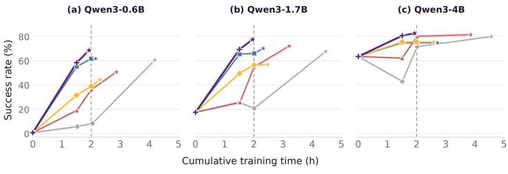  
Vanilla OPD TCOD-F2B TurnOPD Ours w/o ID ActFirst-OPD  
Figure 5: Performance–time trade-off on ALFWorld for Qwen3-0.6B, 1.7B, and 4B students. SR aggregates seen and unseen tasks; shading indicates ±1 standard deviation across three evalua tion seeds. Stars mark the final checkpoints in Table 1; the dashed line marks two hours of training.

## E ADDITIONAL DISCUSSION

Scope of On-Policy Distillation. In ActFirst-OPD, we distinguish two aspects of on-policy distillation: the distribution of rollout contexts in the full interaction trajectory, and the on-policy sampling of turn-level full responses used for distillation, conditional on those contexts. The environment advances through fast actions $\tilde { a } _ { t } ,$ , using reference-conditioned inverse dynamics before divergence and autonomous next-action prediction afterward. At each collected interaction context $c _ { t } .$ , the student generates a full response ${ \boldsymbol y } _ { t } = ( z _ { t } , { \boldsymbol a } _ { t } )$ without conditioning on the reference next observation. The frozen teacher supervises its tokens, while $a _ { t }$ is not executed. Thus, turn-level ful responses are sampled on-policy conditional on the collected contexts, while their context distribution need not match that induced by the student’s think-then-act policy.

Context Distribution and Exposure Bias. Early OPD methods, including MiniLLM (Gu et al., 2024) and GKD (Agarwal et al., 2024), address train–inference mismatch in response prefixes by incorporating student-generated sequences into distillation. This mismatch concerns prefixes within a response, conditional on a given input. In our setting, these are token prefixes $\mathbf { \boldsymbol { x } } _ { t , < j }$ within each full response $y _ { t } ,$ , distinct from the distribution of interaction contexts $\mathbf { } c _ { t }$ across interaction turns. Reference-conditioned inverse dynamics may improve task progress, as suggested by the rolloutquality results in Figure $^ { 4 ( \mathrm { b , c } ) }$ . At the same time, reference guidance may reduce exposure to states that could arise from accumulated errors in think-then-act interaction. Autonomous next-action prediction continues interaction from actual deviations, but remains action-only and need not induce the same context distribution as think-then-act interaction at inference time. The results in Tables 1 and 2 support the practical value of this design in the evaluated settings, without establishing that exposure bias at inference time is eliminated or uniformly reduced.

## F ADDITIONAL EXPERIMENTAL RESULTS

Performance–Time Trade-off. Figure 5 plots mean evaluation SR against cumulative training time on ALFWorld for three Qwen3 student sizes. ActFirst-OPD completes 250 updates within two hours at all three sizes. At approximately 1.5 hours, the 0.6B, 1.7B, and 4B students reach SRs of 58.39%, 69.34%, and 80.66%, respectively, compared with 5.72%, 25.43%, and 42.94% under Vanilla OPD. These comparisons show higher SR under comparable training-time budgets, complementing the fixed-update results in Table 1.

Reference Alignment During Training. We quantify reference alignment before fallback at the first-action, trajectory, and turn levels. Figures 6–8 report rates computed from counts aggregated over the latest 10 completed rollout batches at each update, using all available batches when fewer than 10 have completed. Endpoint labels show the final-window rates at update 250; Table 10 reports full-training cumulative rates.

Table 10: Cumulative reference alignment over 250 training updates. Cumulative rates are computed by aggregating the corresponding counts across complete rollouts in rollout batches finished by update 250. First-action and full-trajectory alignment use the number of rollout tasks with reference guidance as the denominator; turn coverage uses all executed turns, including fallback turns.
<table><tr><td>Benchmark</td><td>Student</td><td>First-action alignment (%)</td><td>Full-trajectory alignment (%)</td><td>Aligned-turn coverage (%)</td></tr><tr><td rowspan="3">ALFWorld</td><td>0.6B</td><td>84.86</td><td>32.36</td><td>18.19</td></tr><tr><td>1.7B</td><td>89.38</td><td>49.75</td><td>33.59</td></tr><tr><td>4B</td><td>93.39</td><td>85.63</td><td>64.05</td></tr><tr><td rowspan="3">WebShop</td><td>0.6B</td><td>49.33</td><td>11.80</td><td>18.77</td></tr><tr><td>1.7B</td><td>56.89</td><td>21.24</td><td>23.50</td></tr><tr><td>4B</td><td>60.85</td><td>49.87</td><td>51.77</td></tr><tr><td rowspan="3">ScienceWorld</td><td>0.6B</td><td>72.56</td><td>27.74</td><td>10.44</td></tr><tr><td>1.7B</td><td>62.57</td><td>40.44</td><td>14.99</td></tr><tr><td>4B</td><td>94.67</td><td>67.87</td><td>33.27</td></tr></table>

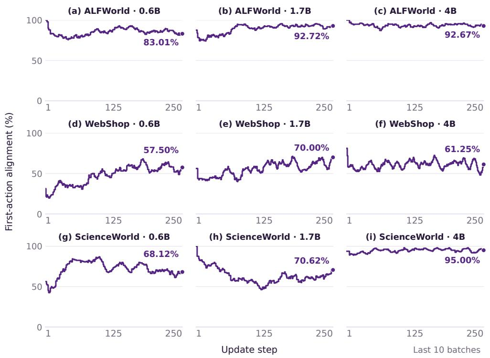  
Figure 6: First-action reference alignment during training. Fraction of rollout tasks with reference guidance whose first transition passes the transition consistency check.

Larger students achieve higher cumulative full-trajectory alignment and aligned-turn coverage within each benchmark (Table 10). First-action alignment consistently exceeds full-trajectory alignment, indicating that a matching initial transition does not guarantee complete reference following. Aligned-turn coverage also captures reference-aligned prefixes in rollouts that later diverge. Windowed alignment rates do not increase monotonically during training (Figures 6–8).

(f) WebShop · 4B

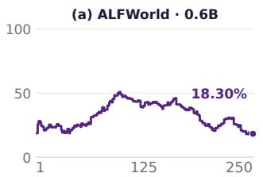

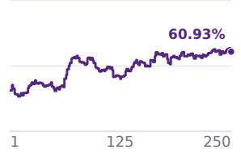

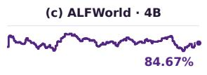

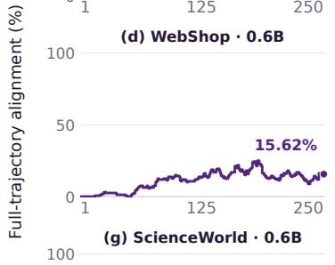

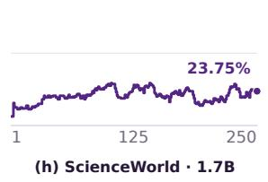

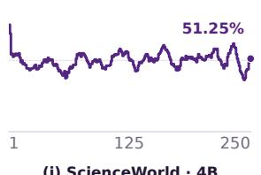

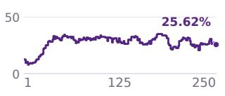

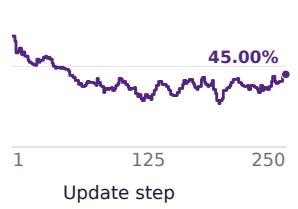

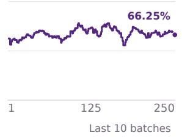

Figure 7: Full-trajectory reference alignment during training. Fraction of rollouts with reference guidance that complete the reference trajectory and terminate without triggering fallback.  
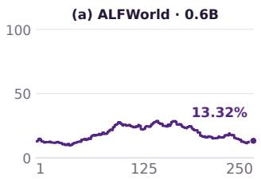  
(b) ALFWorld · 1.7B

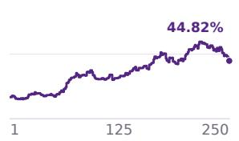  
(c) ALFWorld · 4B

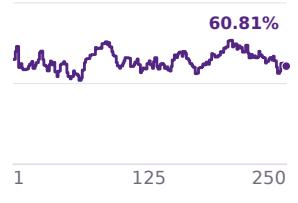

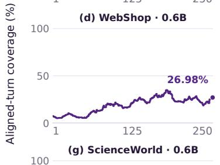

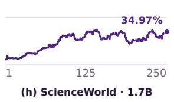

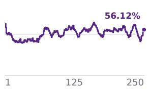

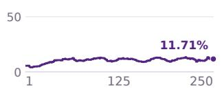

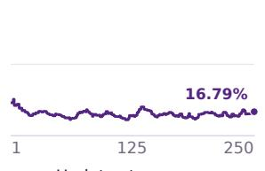

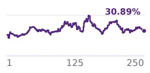  
Last 10 batches

Figure 8: Reference-aligned turn coverage during training. Reference-aligned turns as a fraction of all executed turns, including fallback turns.