# ADAPTING CONTEXT COMPRESSION FOR LONG-HORIZON AGENTS WITH COUNTERFACTUAL CONTINU-ATIONS

Guanghui Min<sup>1</sup> Liang Wu<sup>2</sup> Minjia Shi<sup>1</sup> Yinhan He<sup>1</sup> Mayank Darbari<sup>2</sup> Liangjie Hong<sup>2</sup> Chen Chen<sup>1∗</sup>

<sup>1</sup>University of Virginia <sup>2</sup>Nokia

{jjm8vr,nzh3ru,nee7ne,zrh6du}@virginia.edu {liang.wu,mayank.darbari,liangjie.hong}@nokia.com

## ABSTRACT

Long-horizon agents require context compression to manage growing interaction histories. Compression quality, however, is ultimately determined by downstream execution. Existing prompt-adaptation methods infer compression errors by comparing full-context and compressed trajectories. Such comparisons cannot isolate individual compressions and are confounded by agent stochasticity. We first find that compression degrades reliability before solvability. Using matched counterfactual continuations that compare execution from the same agent state with versus without compression, we further show that severe degradation concentrates at isolated compression events. Motivated by this finding, we propose PAIR (Prompt Adaptation using Interventional Rollouts) for adapting structured compression prompts. PAIR identifies individual compressions that degrade subsequent execution, diagnoses their effects, and revises the relevant sections of a fixed compression template. PAIR achieves the strongest cross-run reliability among compressed methods in every main benchmark–scope combination, consistently exceeding the competing prompt-adaptation baseline. Without modifying the downstream agent, PAIR brings compressed execution close to the no-compression baseline and sometimes numerically exceeds it.

## 1 INTRODUCTION

Advances in language models and agent frameworks have enabled LLM agents to tackle increasingly complex, long-horizon tasks (Yao et al., 2023; Shinn et al., 2023; Wang et al., 2024b). These agents navigate the web (Zhou et al., 2024), control software applications (Trivedi et al., 2024), and carry out office workflows (Wang et al., 2024c). Completing such tasks requires many rounds of tool use and interaction with the environment. Actions, observations, and intermediate results accumulate throughout execution, causing the agent’s context to grow continually. Since context windows are finite and inference cost grows with input length, retaining the full interaction history eventually becomes impractical. Context compression is therefore central to the design of long-horizon agents.

Prior context-compression methods primarily target static contexts, such as long prompts and retrieved documents, whereas long-horizon agents require repeated compression as their interaction histories grow during execution. General prompt-compression methods use token selection or rewriting to preserve semantic content or downstream utility under a reduced context budget (Li et al., 2023; Jiang et al., 2023; 2024; Pan et al., 2024; Shandilya et al., 2025), but do not directly account for how compressed context affects subsequent agent execution. Recent work has therefore developed compression methods specifically for agent trajectories. ReSum periodically summarizes interaction histories and optionally adapts the agent policy through ReSum-GRPO, while SUPO jointly optimizes summarization and tool use through reinforcement learning (Wu et al., 2025; Lu et al., 2025). These approaches can adapt the agent to operate with compressed histories, but require modifying the downstream agent. In many deployed settings, however, the agent is fixed, making the compression mechanism itself the primary target for improvement. Systems such as OpenClaw and Hermes Agent address this setting using structured prompts that specify what information should be preserved during compression (OpenClaw Contributors, 2026a; Nous Research, 2026). Building on this promptbased design, ACON adapts the compression prompt using feedback from successful full-context and failed compressed trajectories (Kang et al., 2026). This provides a practical way to improve compression without modifying the agent, but relies on trajectory-level outcomes to determine how the compression prompt should be revised.

However, trajectory-level feedback is too coarse for recurrent context compression. A long-horizon trajectory may contain several compression events, so its final outcome cannot identify which one altered later execution. Agent stochasticity further confounds attribution, as independent rollouts from the same context may diverge. Thus, comparing full-context and compressed trajectories does not reliably isolate any compression’s effect. We call each replacement of accumulated history by a compressed representation a compression boundary (e.g., summarizing the first five interactions before the sixth action). We therefore ask three progressively focused questions: (i) How does recurrent compression affect execution reliability and efficiency? (ii) Is degradation localized to individual boundaries or accumulated across repeated compressions? (iii) Can boundary-level evidence improve the compression promptfor target tasks?

We introduce PAIR (Prompt Adaptation using Interventional Rollouts), a framework for adapting context-compression prompts for frozen long-horizon agents. Instead of attributing trajectorylevel performance differences directly to compression, PAIR uses counterfactual continuations to estimate the effect of individual compression events. By comparing repeated rollouts from the same environment state before and after compression, it identifies compression boundaries that reliably alter task success or execution efficiency despite agent stochasticity. The resulting boundary-level evidence is then used to diagnose recurring compression errors and revise the compression prompt. Throughout this process, the agent, compressor model, tools, and decoding configuration remain fixed. Our contributions are threefold:

• Recurrent Compression Analysis: We characterize how recurrent compression affects longhorizon execution, showing that it degrades cross-run reliability before solvability and introduces additional recovery steps. Across environments, many compression events modestly increase the number of subsequent interaction steps, while substantial drops in task success or large increases in execution length are concentrated at a small number of compression boundaries.

• Boundary-Level Attribution & Adaptation: We use paired counterfactual continuations from the same environment state, with versus without each compression, to estimate how a compression changes subsequent task success and execution length. We establish a performance-difference identity connecting these boundary-level effects to the downstream compressor objective. Using this evidence, PAIR identifies harmful compressions, diagnoses the information they fail to preserve, and adapts the corresponding sections of a fixed, deployment-compatible compression template.

• Empirical Effectiveness: Experiments on AppWorld (Trivedi et al., 2024), OfficeBench (Wang et al., 2024c), and $\tau ^ { 2 }$ -Bench Retail (Barres et al., 2025) show that PAIR achieves the highest rate of consistent task completion across repeated runs under both history-only and prefix-conditioned compression. It consistently exceeds the strongest competing prompt-adaptation baseline while approaching or occasionally numerically exceeding uncompressed execution.

## 2 PRELIMINARY

Notations. We study context compression for a fixed downstream agent M interacting with an environment E. The agent’s language model, system prompt, action interface, output parser, and decoding procedure remain unchanged. These fixed components are absorbed into M, while $z _ { t }$ denotes the mutable textual context visible to the agent. Let $u \sim \mathcal D$ be a task instruction. A rollout is $\tau ~ = ~ ( u , a _ { 1 } , o _ { 1 } , \dots , a _ { T } , o _ { T } )$ , and the complete history before step t is $h _ { t } = ( u , a _ { 1 } , o _ { 1 } , \dotsc , a _ { t - 1 } , o _ { t - 1 } )$ . Given $z _ { t } ,$ the agent samples $a _ { t } \sim \mathcal { M } ( { \cdot } \mid z _ { t } )$ and receives an observation $o _ { t } \sim \mathcal { E } ( \cdot \mid h _ { t } , a _ { t } )$ . Full-context execution uses $z _ { t } = h _ { t }$ . We use |x| to denote the token length of a textual context x. Since $\left| h _ { t } \right|$ grows with the interaction horizon, it may eventually exceed the available context budget. All notations and symbols are summarized in Table 3.

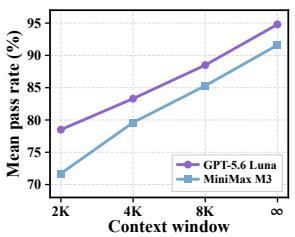  
(a) Compression performance.

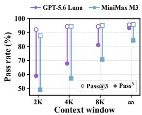  
(b) Cross-run reliability.

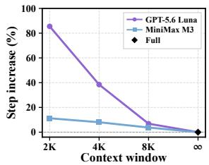  
(c) Execution overhead.  
Figure 1: Recurrent context compression degrades reliability before solvability. (a) Mean pass rate declines as the compression window shrinks. (b) Pass<sup>3</sup> falls faster than Pass@3, indicating greater cross-run variability; lines connect the two metrics. (c) Smaller windows increase interaction steps relative to full-context execution.

## 2.1 PROBLEM DEFINITION

To keep the agent-visible context within budget $B ,$ a compressor $\mathcal { C }$ replaces an overlength context with a bounded textual representation (Kang et al., 2026; Lu et al., 2025; Wang et al., 2024a; Nous Research, 2026; OpenClaw Contributors, 2026a). After action $a _ { t }$ and observation $o _ { t }$ , define the pre-compression context as $\bar { z } _ { t + 1 } = z _ { t } \oplus ( a _ { t } , o _ { t } )$ , where $\oplus$ denotes textual concatenation. The next context is recursively updated as

$$
z _ { t + 1 } = \left\{ \begin{array} { l l } { \bar { z } _ { t + 1 } , } & { | \bar { z } _ { t + 1 } | \leq B , } \\ { c _ { t + 1 } , } & { c _ { t + 1 } \sim \mathcal { C } ( \cdot \mid \bar { z } _ { t + 1 } , B ) , | \bar { z } _ { t + 1 } | > B . } \end{array} \right.\tag{1}
$$

Here, $\mathcal { C } ( \cdot \mid x , B )$ has support only on contexts with $| c | \le B$ . After compression, the replacement context is the only historical record for the frozen agent and subsequent compression steps.

Let $p c , B  ( \tau \mid u )$ denote the rollout distribution induced by the frozen agent, environment, compressor, and recursive context transition, and let $R ( \tau )$ denote the environment-defined terminal reward.

Problem 1 (Compressor Adaptation for Frozen Agents). Given a task distribution D, a frozen downstream agent $\mathcal { M } ,$ an environment $\mathcal { E } ,$ a context budget $B ,$ and an admissible compressor class ${ \mathfrak { C } } ,$ adapt the compressor to thefrozen agent by solving

$$
\mathcal { C } ^ { * } \in \underset { \mathcal { C } \in \mathfrak { C } } { \arg \operatorname* { m a x } } \mathbb { E } _ { u \sim \mathcal { D } , \tau \sim p _ { \mathcal { C } , B } ( \cdot | u ) } \left[ R ( \tau ) \right] .\tag{2}
$$

Problem 1 evaluates compression by its effect on downstream task performance rather than by its fidelity in reconstructing the original history. We implement $\mathcal { C }$ using a frozen autoregressive language model conditioned on a natural-language compression prompt $P ,$ , which induces the policy $\pi _ { P } \ \bar { ( } c \mid \bar { x } , B )$ . Because compressed contexts may preserve different information and induce different downstream returns, we adapt $P$ according to its effect on subsequent agent behavior.

## 3 DIAGNOSING COMPRESSION-INDUCED INSTABILITY

In this section, we study how recurrent context compression affects long-horizon agent execution. We first show that compression primarily reduces cross-run reliability and increases interaction steps, even when tasks remain solvable (Section 3.1). We then introduce a counterfactual protocol that attributes these effects to individual compression boundaries (Section 3.2). The resulting analysis shows that compression commonly introduces mild execution burden, whereas severe degradation is concentrated at a small number of boundaries (Section 3.3).

## 3.1 COMPRESSION DEGRADES RELIABILITY BEFORE SOLVABILITY

Equation (1) makes compression a recurrent intervention: each compressed context guides subsequent actions and becomes part of the input to later compressions. We examine its aggregate effect on 90 AppWorld training tasks (Trivedi et al., 2024). For each context window, we run GPT-5.6 Luna (OpenAI, 2026a) and MiniMax-M3 (MiniMax, 2026) three times under full-context execution and OpenClaw-style recurrent compression (OpenClaw Contributors, 2026a). Additional experimental details are provided in Appendix D.1.

Figure 1 shows that smaller compression windows reduce mean pass rate, but affect reliability considerably more than solvability. $\mathrm { P a s s ^ { 3 } }$ , the fraction of tasks solved in all three runs (Barres et al., 2025), declines much faster than Pass@3, the fraction solved at least once. Compressed runs also require more interaction steps. Compression therefore first turns consistently solved tasks into intermittently solved and less efficient ones, rather than making them uniformly unsolvable.

AppWorld maintains persistent application state, so information removed from the active context can often be recovered through further interaction. This reflects a practical deployment setting, as agent systems such as OpenClaw may archive pre-compression histories in memory or local files for later retrieval. The additional steps in Figure 1 suggest that agents often attempt to reconstruct missing execution state after compression. Some rollouts recover and complete the task, while others fail.

These observations identify two harmful effects of compression: reduced continuation success and increased interaction burden. Their values do not reveal whether degradation accumulates across many compressions or is concentrated at boundaries. We distinguish these possibilities next.

## 3.2 COUNTERFACTUAL EVALUATION AT COMPRESSION BOUNDARIES

A terminal outcome cannot identify the contribution of an individual compression. Multiple context replacements may occur before termination, while independent rollouts may diverge even from the same context. We therefore evaluate each realized compression at the boundary where it is introduced.

Consider a replacement $\bar { z } _ { t + 1 } \ \to \ c _ { t + 1 }$ in Equation (1), where $c _ { t + 1 } \sim \mathcal { C } ( \cdot  { | } \bar { z } _ { t + 1 } , B )$ , and let $\xi _ { t } ~ = ~ ( h _ { t + 1 } , \bar { z _ { t + 1 } } )$ denote the corresponding boundary state. We restore the environment state reached after $h _ { t + 1 }$ and continue execution from either the pre-compression context $\bar { z } _ { t + 1 }$ or the postcompression context $c _ { t + 1 }$ . Both conditions use the same frozen agent and tools, with compression disabled thereafter, and are rolled out to termination. This isolates the current context replacement from later compression events.

Let $\mathcal { D }$ denote execution without further compression. For any context $x ,$ let $Q _ { \mathcal { O } } ^ { R } ( \xi _ { t } , x )$ denote the expected terminal reward obtained by continuing from $z _ { t + 1 } = x ,$ , and let $Q _ { \mathcal { O } } ^ { L } ( \xi _ { t } , x )$ denote the expected number of remaining interaction steps.

Definition 3.1 (Boundary-level compression effect). The effect of summary $c _ { t + 1 }$ at boundary state $\xi _ { t }$ is

$$
\mathbf { D } _ { \mathcal { Q } } ( \xi _ { t } , c _ { t + 1 } ) = { \binom { H _ { \mathcal { Q } } ( \xi _ { t } , c _ { t + 1 } ) } { B _ { \mathcal { Q } } ( \xi _ { t } , c _ { t + 1 } ) } } = { \binom { Q _ { \mathcal { Q } } ^ { R } ( \xi _ { t } , \bar { z } _ { t + 1 } ) - Q _ { \mathcal { Q } } ^ { R } ( \xi _ { t } , c _ { t + 1 } ) } { Q _ { \mathcal { Q } } ^ { L } ( \xi _ { t } , c _ { t + 1 } ) - Q _ { \mathcal { Q } } ^ { L } ( \xi _ { t } , \bar { z } _ { t + 1 } ) } } .\tag{3}
$$

We call $H _ { \mathcal { O } }$ the outcome hazard and $B _ { \mathcal { O } }$ the interaction burden. Positive values indicate that compression reduces expected terminal reward or increases expected continuation length, respectively.

The two components capture complementary consequences of the same intervention. Outcome hazard measures the resulting change in task completion under the fixed execution horizon. Interaction burden measures the additional execution required to recover from the compressed context. Because agent rollouts are subject to a step limit, this burden also reduces the remaining execution budget and may eventually turn an otherwise recoverable disruption into a timeout failure.

Given m independent continuations from each context, we estimate $Q _ { \mathcal { O } } ^ { R } ( \xi _ { t } , x )$ by $\begin{array} { r } { m ^ { - 1 } \sum _ { i = 1 } ^ { m } R ( \tau _ { t , i } ^ { x } ) } \end{array}$ and $Q _ { \mathcal { D } } ^ { L } ( \xi _ { t } , x )$ by $\begin{array} { r } { m ^ { - 1 } \sum _ { i = 1 } ^ { m } \ell \bigl ( \tau _ { t , i } ^ { x } \bigr ) } \end{array}$ , where $x \in \{ \bar { z } _ { t + 1 } , c _ { t + 1 } \}$ . Substituting these sample means into Equation (3) yields $\widehat { \bf D } _ { \otimes } = ( \widehat { H } _ { \otimes } , \widehat { B } _ { \otimes } )$ . Restoring the same environment state controls for prior execution, while disabling subsequent compression isolates the effect of the current replacement; repeated continuations reduce stochastic rollout noise. The outcome hazard is directly aligned with the compressor objective in Problem 1. Denote this objective by $\mathcal { I } ( \mathcal { C } ) = \mathbb { E } _ { u \sim \mathcal { D } , \tau \sim p c , B \left( \cdot | u \right) } [ R ( \tau ) ]$

Theorem 3.2 (Boundary performance-difference identity). Let ∅ denote execution without compression. For any compressor C,

$$
\mathcal { I } ( \mathcal { C } ) - \mathcal { I } ( \mathcal { O } ) = - \mathbb { E } _ { u \sim \mathcal { D } , \tau \sim p _ { \mathcal { C } , B } ( \cdot \vert u ) } \left[ \sum _ { \mathfrak { t } \in \mathcal { B } ( \tau ) } H _ { \mathcal { O } } ( \xi _ { t } , c _ { t + 1 } ) \right] .\tag{4}
$$

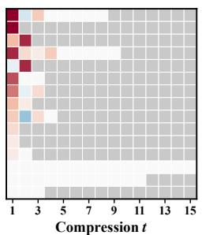  
(a) Failed.

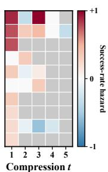  
(b) Successful.

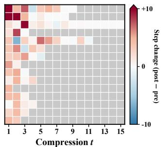  
(c) Interaction burden.  
Figure 2: Boundary-level effects of recurrent compression. Panels (a) and (b) show outcome hazard in failed and successful trajectories; panel (c) shows interaction burden. Red indicates degradation or additional steps, blue indicates improvement, and gray denotes absent boundaries.

Thus, minimizing expected cumulative boundary hazard is equivalent to maximizing the objective in Problem 1.

Full proof is provided in Appendix C.1. Equation (4) shows that the gap to no-compression execution is exactly the expected cumulative outcome hazard over compression boundaries. Since $\mathcal { I } ( \emptyset )$ is independent of ${ \mathcal { C } } ,$ reducing boundary-level outcome hazard directly improves the objective in Problem 1. Interaction burden does not appear separately in the objective in Problem 1, since timeout failures are already reflected in terminal reward. It nevertheless provides a finer diagnostic of how compression approaches such failures: additional recovery steps consume the remaining execution budget even when the continuation still succeeds.

## 3.3 COMPRESSION BURDEN IS COMMON, BUT SEVERE EFFECTS ARE SPARSE

We apply the counterfactual protocol with m = 9 continuations per condition to 197 compression boundaries from 82 trajectories: 67 boundaries from 15 failed trajectories and 130 from 67 successful ones. Outcome degradation is sparse and not determined by terminal outcome. Among failed trajectories, 43 boundaries leave continuation success unchanged, 20 reduce it, and four improve it. Twelve of the 15 trajectories contain a positive-hazard boundary, but 11 contain only one or two. Conversely, 27 boundaries in successful trajectories reduce continuation success across 22 trajectories. Thus, Panels 2a and 2b show that failed trajectories contain mostly neutral compressions, while harmful compressions can still precede successful execution. Interaction burden is more common but usually moderate: as shown in Panel 2c, 151 of 197 boundaries increase continuation length, but only 12 add more than five steps and three add more than ten. Severe outcome degradation is also rare, with only 11 boundaries reducing continuation success by more than 0.5. Overall, recovery costs are common, while severe effects on success or execution length remain localized. OfficeBench and $\tau ^ { 2 } .$ -Bench show the same qualitative pattern; additional results appear in Appendix D.2.

This structure limits trajectory-level attribution. ACON contrasts successful full-context and failed compressed trajectories and revises the compression guideline from traces (Kang et al., 2026). When several compressions precede termination, the replacement must be inferred retrospectively (Zhang et al., 2025). Our results show why this is difficult: most compressions preceding failure are neutral, while harmful compressions also occur in successful trajectories. This motivates localizing boundaries that reduce continuation success or increase recovery burden, then using their paired contexts and counterfactual continuations as targeted evidence for improving the compression policy.

## 4 COUNTERFACTUAL CONTINUATION-GUIDED PROMPT ADAPTATION

Figure 3 summarizes PAIR, which uses paired counterfactual continuations to localize harmful compressions, revise the relevant sections of a structured prompt, and select the adapted prompt through end-to-end validation. Theorem 3.2 connects outcome hazard to the compressor objective. All model parameters remain fixed; only the prompt is adapted.

Step 1: Collecting compressed trajectories. Let $P _ { 0 }$ denote the original structured compression prompt and $\mathcal { C } _ { P _ { 0 } }$ its induced compressor. For each task in $\mathcal { D } _ { \mathrm { t r a i n } } ,$ , we collect one trajectory using $\mathcal { C } _ { P _ { 0 } }$ under the target context budget and retain every realized compression boundary, regardless of terminal outcome. This is necessary because successful trajectories may still contain outcome-degrading boundaries, while interaction burden occurs in both successful and failed executions.

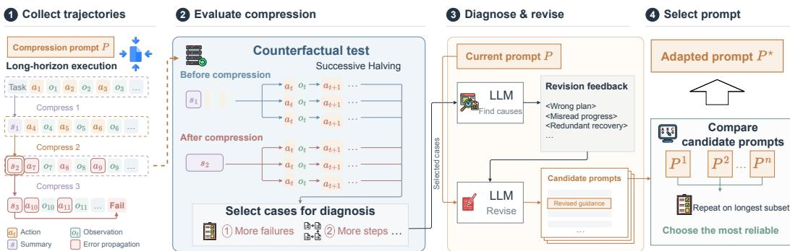  
Figure 3: Overview of PAIR. Starting from trajectories generated with an initial structured compression prompt, PAIR uses paired counterfactual continuations to localize harmful compression boundaries. An optimizer diagnoses their downstream effects and revises the relevant prompt sections; candidate prompts are then evaluated end-to-end to select the adapted compression policy.

Step 2: Verifying harmful compression boundaries. For every boundary, we apply the counterfactual protocol from Section 3.2 using three-round successive halving. We omit the subscript ∅ from empirical boundary-effect estimates in this section. Each boundary first receives one PRE/POST continuation pair. After round r, active boundaries are ranked by the normalized harm score

$$
s _ { t } ^ { ( r ) } = \operatorname* { m a x } \left\{ \frac { \widehat { H } _ { t } ^ { ( r ) } } { \tau _ { H } } , \frac { \widehat { B } _ { t } ^ { ( r ) } } { \tau _ { B } } \right\} ,\tag{5}
$$

where $\widehat { H } _ { t } ^ { ( r ) }$ and $\widehat { B } _ { t } ^ { ( r ) }$ use all r pairs observed so far. After each of the first two rounds, only the top half receive another pair, for at most three pairs per boundary. Using all continuations allocated to each surviving boundary, we retain those satisfying $\widehat { H } _ { t } \geq \tau _ { H }$ or $\widehat { B } _ { t } \geq \tau _ { B }$ . The two criteria capture reduced continuation success and increased recovery cost, respectively. Each retained boundary provides a localized contrast consisting of the pre-compression context, generated summary, and counterfactual continuation traces.

Step 3: Adapting the compression prompt. For each retained boundary, an optimizer LLM receives the pre- and post-compression contexts together with their counterfactual continuations. It diagnoses how the summary altered subsequent execution, such as by omitting necessary state, misrepresenting completed progress, or inducing redundant recovery actions. These localized diagnoses are then aggregated to revise the original prompt $P _ { 0 }$

Unlike ACON, which allows the compression guideline to be rewritten as a whole (Kang et al., 2026), PAIR keeps the template’s section structure, required fields, compression scope, and output format fixed, and revises only the guidance within each section. This preserves compatibility with the surrounding context-management pipeline while allowing the adapted prompt to replace the original template directly. We generate five candidate prompts $\mathcal { P } _ { \mathrm { c a n d } } = \{ P ^ { ( 1 ) } , . . . , P ^ { ( 5 ) } \}$ , each shared across the target task family rather than specialized to an individual trajectory.

Step 4: Selecting the adapted prompt. Boundary evidence is collected under the original compressor, whereas a revised prompt may change both summaries and the boundaries visited during execution. Local improvements therefore require end-to-end validation. We evaluate each candidate on the subset of training tasks whose baseline trajectories contain the most compression events and select the one with the highest pass rate, breaking ties by the lowest mean number of interaction steps. This criterion prioritizes task completion while using execution length to distinguish equally successful prompts and preserve execution budget against timeout. The selected prompt $P ^ { \star }$ is used without further adaptation for held-out evaluation.

Table 1: Results on the AppWorld test-normal split by difficulty, aggregated over three independent runs. Acc. is mean task success, with across-run standard deviation shown as a subscript; Pass<sup>3</sup> is the fraction of tasks solved in all three runs; Steps and Peak are mean interaction steps and peak input length $( 1 0 ^ { 3 }$ tokens). No compression is the uncompressed reference. History-only and prefixconditioned compression differ in whether the compressor receives the fixed prefix, which remains separately visible to the agent in both settings. Bold denotes the best compressed result within each block; gray rows indicate PAIR.
<table><tr><td rowspan="2">Method</td><td colspan="4">Average (168)</td><td colspan="3">Easy (57)</td><td colspan="3">Medium (48)</td><td colspan="3">Hard (63)</td></tr><tr><td>Acc. ↑</td><td>Pass3 ↑</td><td>Steps ↓</td><td>Peak↓</td><td>Acc. ↑</td><td>Pass3 ↑</td><td>Steps ↓</td><td>Acc. ↑</td><td> $\mathrm { P a s s ^ { 3 } \uparrow }$ </td><td>Steps ↓</td><td>Acc. ↑</td><td>Pass3 ↑</td><td>Steps ↓</td></tr><tr><td colspan="10">Agent: GPT-5.6 Luna/Compressor: GPT-5.6</td><td></td><td></td><td></td><td></td></tr><tr><td>No compression</td><td>84.1±0.9</td><td>78.6</td><td>12.1</td><td>12.53</td><td>97.7±1.0</td><td>93.0</td><td>9.6</td><td>86.8±2.4</td><td>81.2</td><td>12.2</td><td>69.8±0.0</td><td>63.5</td><td>14.4</td></tr><tr><td colspan="10">History-Only Compression</td><td></td><td></td><td></td><td></td></tr><tr><td>FIFO</td><td>53.2±1.2</td><td>45.2</td><td>30.0</td><td>7.14</td><td>95.9±2.0</td><td>93.0</td><td>9.6</td><td>47.9±4.2</td><td>37.5</td><td>33.7</td><td>18.5±3.3</td><td>9.5</td><td>42.8</td></tr><tr><td>LLMLingua-2</td><td>71.4±23</td><td>61.3</td><td>19.2</td><td>10.53</td><td>97.7±2.7</td><td>94.7</td><td>8.7</td><td>77.8±24</td><td>66.7</td><td>17.6</td><td>42.9±6.3</td><td>27.0</td><td>30.0</td></tr><tr><td>Prompting</td><td>78.6±2.7</td><td>68.5</td><td>17.0</td><td>9.23</td><td>94.2±2.0</td><td>89.5</td><td>10.0</td><td>81.2±2.1</td><td>66.7</td><td>15.5</td><td>62.4±6.4</td><td>50.8</td><td>24.4</td></tr><tr><td>ACON-UT</td><td>81.2±1.2</td><td>70.8</td><td>18.9</td><td>9.36</td><td>94.2±4.4</td><td>82.5</td><td>10.4</td><td>83.3±5.5</td><td>70.8</td><td>18.5</td><td>67.7±4.0</td><td>60.3</td><td>26.8</td></tr><tr><td>ACON-UTCO</td><td>77.0±2.3</td><td>66.1</td><td>19.2</td><td>9.24</td><td>95.9±2.0</td><td>91.2</td><td>10.7</td><td>78.5±2.4</td><td>66.7</td><td>18.4</td><td>58.7±4.2</td><td>42.9</td><td>27.4</td></tr><tr><td>PAIR (Ours)</td><td>84.7±1.7</td><td>79.8</td><td>16.6</td><td>9.03</td><td>98.2±1.8</td><td>96.5</td><td>10.1</td><td>89.6±2.1</td><td>85.4</td><td>15.3</td><td>68.8±1.8</td><td>60.3</td><td>23.3</td></tr><tr><td colspan="10">Prefix-Conditioned Compression</td><td colspan="3"></td></tr><tr><td>Prompting</td><td>81.0±1.6</td><td>72.0</td><td>15.3</td><td>9.51</td><td>94.7±1.8</td><td>87.7</td><td>10.0</td><td>82.6±24</td><td>75.0</td><td>14.5</td><td>67.2±2.4</td><td>55.6</td><td>20.8</td></tr><tr><td>ACON-UT</td><td>81.3±0.9</td><td>72.6</td><td>17.3</td><td>10.21</td><td>95.9±2.0</td><td>91.2</td><td>10.6</td><td>83.3±1.2</td><td>72.9</td><td>15.7</td><td>66.7±0.9</td><td>55.6</td><td>24.5</td></tr><tr><td>ACON-UTCO</td><td>78.2±2.5</td><td>67.3</td><td>17.2</td><td>8.69</td><td>95.3±1.0</td><td>89.5</td><td>10.4</td><td>77.1±4.2</td><td>66.7</td><td>15.9</td><td>63.5±4.2</td><td>47.6</td><td>24.4</td></tr><tr><td>PAIR (Ours)</td><td>85.9±2.4</td><td>80.4</td><td>15.2</td><td>9.47</td><td>97.7±2.0</td><td>94.7</td><td>10.1</td><td>89.6±0.0</td><td>85.4</td><td>14.1</td><td>72.5±5.1</td><td>63.5</td><td>20.7</td></tr></table>

## 5 EXPERIMENTS

## 5.1 EXPERIMENTAL SETUP

Benchmarks. We evaluate primarily on two long-horizon agent benchmarks. AppWorld contains stateful API-use tasks across simulated applications and users (Trivedi et al., 2024); we adapt prompts on its training split and evaluate on the 168-task test-normal split. OfficeBench covers multi-application office workflows involving documents, spreadsheets, and email (Wang et al., 2024c). We additionally include τ<sup>2</sup>-Bench Retail as a stress test in a structurally different environment, where the agent must satisfy policy constraints while interacting with both a simulated user and backend tools (Barres et al., 2025). Further details are provided in Appendix D.1.

Metrics. We evaluate each method over three independent runs. Acc. is the mean task success rate, while Pass<sup>3</sup> is the fraction of tasks solved in all three runs and measures cross-run reliability. We also report interaction Steps and peak input length Peak, measured in thousands of tokens. Our efficiency analysis reports cumulative tokens, including all agent and compressor inputs and outputs.

Baselines. We use No Compression, which retains full history, as the uncompressed reference and compare PAIR with four compression baselines: (1) FIFO retains recent history within the context budget; (2) LLMLingua-2 removes tokens using a learned classifier (Pan et al., 2024); (3) Prompting uses the original OpenClaw structured compression prompt (OpenClaw Contributors, 2026a); and (4) ACON (Kang et al., 2026) adapts compression guidelines from full-context and compressed trajectories. We evaluate its utility-oriented ACON-UT and compression-aware ACON-UTCO variants. ACON and PAIR use the same initial prompt, adaptation tasks, optimizer model, context budget, candidate count, and end-to-end selection budget, differing only in their adaptation procedures.

Compression Scopes. We evaluate prompting-based methods under two scopes. History-only compression summarizes the interaction history while retaining the fixed prefix separately, as in OpenClaw and Hermes Agent (OpenClaw Contributors, 2026a; Nous Research, 2026). Prefixconditioned compression additionally exposes the fixed prefix to the compressor, while preserving it unchanged in the downstream context to enable KV-cache reuse, as in DeepSeek Harness and Codex (DeepSeek-AI, 2026; OpenAI, 2026b). All prompting-based methods use the same compressor, context budget, and execution configuration.

## 5.2 MAIN RESULTS

Results are reported in Tables 1 and 2. We evaluate prompting-based methods under both history-only and prefix-conditioned compression.

Table 2: Results on OfficeBench and $\tau ^ { 2 }$ -Bench Retail domain, aggregated over three runs. Acc. is mean task success, Pass<sup>3</sup> is success across all three runs, Steps is mean interaction length, and Peak is peak input length $( 1 0 ^ { 3 }$ tokens). History-only and prefix-conditioned compression differ in whether the compressor receives the fixed prefix, which remains visible to the agent in both settings. Bold denotes the best result within each block; grey rows indicate PAIR.  
(a) OfficeBench
<table><tr><td>Method</td><td>Acc. ↑</td><td>Pass3 ↑</td><td>Steps ↓</td><td>Peak↓</td></tr><tr><td colspan="5">Agent: GPT-5.6 Luna/Compressor: GPT-5.6 Luna</td></tr><tr><td>No Compression</td><td>82.1±4.8</td><td>75.8</td><td>11.2</td><td>7.02</td></tr><tr><td colspan="5">History-Only Compression</td></tr><tr><td>FIFO</td><td>62.1±1.8</td><td>54.7</td><td>23.2</td><td>3.48</td></tr><tr><td>LLMLingua-2</td><td> $7 6 . 1 \pm 1 . 2$ </td><td>68.4</td><td>14.4</td><td>4.14</td></tr><tr><td>Prompting</td><td>76.5±2.4</td><td>65.3</td><td>11.9</td><td>4.00</td></tr><tr><td>ACON-UT</td><td> $7 7 . 2 { \scriptstyle \pm 1 . 6 }$ </td><td>68.4</td><td>13.3</td><td>4.20</td></tr><tr><td>ACON-UTCO</td><td>73.0±5.8</td><td>60.0</td><td>13.6</td><td>3.95</td></tr><tr><td>PAIR (Ours)</td><td>81.1±2.8</td><td>70.5</td><td>11.9</td><td>3.89</td></tr><tr><td colspan="5">Prefix-Conditioned Compression</td></tr><tr><td>Prompting</td><td>78.9±2.8</td><td>66.3</td><td>13.3</td><td>4.08</td></tr><tr><td>ACON-UT</td><td>75.1±0.6</td><td>61.1</td><td>15.5</td><td>4.26</td></tr><tr><td>ACON-UTCO</td><td>78.9±3.8</td><td>65.3</td><td>13.6</td><td>4.01</td></tr><tr><td>PAIR (Ours)</td><td>81.4±0.6</td><td>72.6</td><td>11.8</td><td>4.03</td></tr></table>

(b) $\tau ^ { 2 } .$ -Bench Retail
<table><tr><td>Method</td><td>Acc. ↑ Pass3 ↑</td><td>Steps ↓</td><td>Peak↓</td></tr><tr><td colspan="4">Agent: GPT-5.6 Luna/Compressor: GPT-5.6 Luna</td></tr><tr><td>No Compression</td><td>85.8±5.4</td><td>72.5 12.6</td><td>6.79</td></tr><tr><td colspan="4">History-Only Compression</td></tr><tr><td>FIFO</td><td>64.2±1.9</td><td>45.0 17.7</td><td>5.43</td></tr><tr><td>LLMLingua-2</td><td>75.0±4.4</td><td>60.0 12.9 55.0</td><td>5.96</td></tr><tr><td>Prompting</td><td>74.2±8.2</td><td>13.0</td><td>5.40</td></tr><tr><td>ACON-UT</td><td>73.3±6.3</td><td>13.9</td><td>5.77</td></tr><tr><td>ACON-UTCO</td><td>80.8±3.8</td><td>15.7</td><td>5.34</td></tr><tr><td>PAIR (Ours)</td><td>80.8±7.6</td><td>60.0 62.5 13.5</td><td>5.53</td></tr><tr><td colspan="4">Prefix-Conditioned Compression</td></tr><tr><td>Prompting</td><td>75.0±5.0</td><td>57.5 13.2</td><td>5.47</td></tr><tr><td>ACOÑ-UT</td><td>73.3±9.5</td><td>52.5 12.9</td><td>5.89</td></tr><tr><td>ACON-UTCO</td><td> $7 3 . 3 { \scriptstyle \pm 3 . 8 }$ </td><td>52.5 13.7 13.4</td><td>5.36</td></tr><tr><td>PAIR (Ours)</td><td> $7 7 . 5 { \scriptstyle \pm 2 . 5 }$ </td><td>60.0</td><td>5.48</td></tr></table>

PAIR consistently improves reliability across compression settings. PAIR achieves the highest Pass<sup>3</sup> among compressed methods across all benchmarks and both compression scopes, outperforming the best ACON variant by 2.1%–10.0%. It also improves accuracy by 1.8%–3.9% on AppWorld and OfficeBench while matching the best ACON result on $\tau ^ { 2 }$ -Bench Retail. Although neither history-only nor prefix-conditioned compression dominates across all benchmarks, PAIR improves reliability under both. On AppWorld, its largest gains occur on medium and hard tasks, while easy-task performance is already near saturation.

Adapted compression can match uncompressed execution. On AppWorld, history-only PAIR reaches 84.7% accuracy and 79.8% Pass<sup>3</sup>, exceeding the uncompressed results of 84.1% and 78.6%. Prefix-conditioned PAIR also exceeds the uncompressed Pass<sup>3</sup>. On OfficeBench, both variants exceed 81% accuracy, close to the uncompressed result of 82.1%, while using substantially shorter contexts. Although a larger gap remains on $\tau ^ { 2 } .$ -Bench Retail, prompt adaptation recovers much of the performance lost to compression.

The gains require neither longer contexts nor substantial additional interaction. On OfficeBench, PAIR reduces peak input length from 7.02K tokens without compression to 3.89K and 4.03K while keeping the number of steps close to the uncompressed reference. On AppWorld and OfficeBench, it matches or reduces the steps required by Prompting. On $\tau ^ { 2 } .$ -Bench Retail, it adds only 0.5 and 0.2 steps while improving Pass<sup>3</sup> by 7.5% and 5.0%, respectively.

## 5.3 CROSS-MODEL TRANSFER

We test whether the learned compression guidance transfers beyond the model configuration used for adaptation. Prompts optimized with GPT-5.6 Luna as both agent and compressor are applied without further adaptation to a configuration in which both components use MiniMax-M3. As shown in Figure 4, transferred PAIR improves both accuracy and $\mathrm { P a s s ^ { 3 } }$ under both compression scopes on AppWorld. The largest gain occurs under prefix-conditioned compression, where accuracy increases from 79.6% to 84.1% and Pass<sup>3</sup> from 65.5% to 73.2%, approaching the MiniMax-M3 no-compression results of 85.3% and 73.8%. On OfficeBench, transfer improves accuracy under both scopes and Pass<sup>3</sup> under history-only compression, while preserving $\mathrm { P a s s ^ { 3 } }$ under prefix-conditioned compression; full results are provided in Appendix D.8. These results show that the adapted guidance remains useful when both the downstream agent and compressor are replaced, rather than depending only on the model configuration used during adaptation.

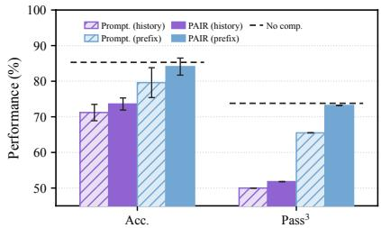  
Figure 4: Zero-shot transfer to MiniMax-M3 on AppWorld.

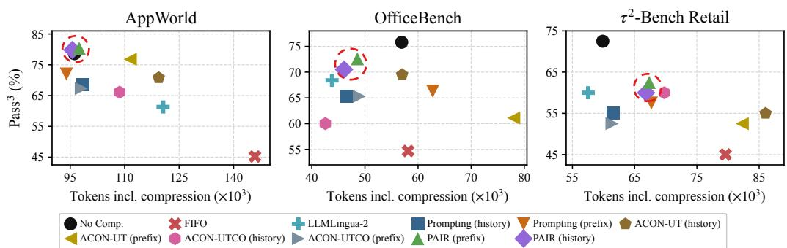  
Figure 5: Reliability–efficiency after accounting for compression. Pass<sup>3</sup> versus average per-task token use, including agent and compressor inputs and outputs. Higher and further left is better; red circles mark PAIR. LLMLingua-2’s local computation is excluded.

## 5.4 DEPLOYMENT EFFICIENCY

PAIR improves deployment reliability without systematically increasing total token use. Figure 5 compares each PAIR variant with the unadapted Prompting baseline under the same benchmark and compression scope. PAIR improves Pass<sup>3</sup> in all six comparisons by 5.0%–11.3%, while using fewer tokens in four. The remaining increases are 3.7% on AppWorld and 8.5% on τ<sup>2</sup>-Bench. The largest efficiency gain occurs under prefix-conditioned compression on OfficeBench, where Pass<sup>3</sup> rises from 66.3% to 72.6% as token use falls from 62.8K to 48.6K. The reliability gains therefore do not generally result from greater inference expenditure.

Compression does not always reduce total computation. Compression bounds the active context, but compressor overhead can offset the resulting agent-side savings. After including this overhead, PAIR matches or improves the best ACON Pass<sup>3</sup> under all six benchmark–scope combinations and uses fewer tokens in five. The exception is prefix-conditioned compression on τ<sup>2</sup>-Bench, where token use increases from 61.4K to 67.3K while Pass<sup>3</sup> improves from 52.5% to 60.0%. Relative to no compression, PAIR uses essentially the same number of tokens on AppWorld while attaining higher Pass<sup>3</sup>, and uses 15%–19% fewer tokens on OfficeBench. On τ<sup>2</sup>-Bench, it uses approximately 12% more tokens and remains below the uncompressed reliability, showing that a bounded active context does not guarantee lower cumulative computation.

## 6 RELATED WORK

General-purpose context compression. Prior work compresses context through token selection, textual rewriting, or latent representations. Token-pruning methods include Selective Context and the LLMLingua family (Li et al., 2023; Jiang et al., 2023; 2024; Pan et al., 2024), while TACO–RL learns task-aware token selection from downstream rewards (Shandilya et al., 2025). RECOMP studies abstractive rewriting (Xu et al., 2024), and AutoCompressor, Gist tokens, and ICAE encode long contexts into compact latent representations (Chevalier et al., 2023; Mu et al., 2023; Ge et al., 2024). These methods generally compress a fixed input once, whereas long-horizon agents require recurrent compression whose outputs shape subsequent actions and later compressions.

Context management for long-horizon agents. Systems such as OpenClaw and Hermes Agent periodically replace interaction histories with structured natural-language checkpoints (OpenClaw Contributors, 2026a;b; Nous Research, 2026). ReSum and SUPO adapt agents to compressed histories through post-training (Wu et al., 2025; Lu et al., 2025), whereas ACON keeps the agent fixed and adapts compression guidelines from contrasts between full-context and compressed trajectories (Kang et al., 2026). We follow the fixed-agent setting but use repeated counterfactual continuations at individual compression boundaries to obtain localized evidence for adapting the compression prompt.

## 7 CONCLUSION

In this paper, we studied how recurrent context compression affects frozen long-horizon agents. Using paired counterfactual continuations from the same environment state, we attributed downstream behavioral changes to individual compressions while reducing confounding from prior compression and rollout variability. Our analysis shows that severe compression-induced degradation is concentrated at a few harmful boundaries rather than accumulating uniformly across the trajectory. Motivated by this localized structure, we introduced PAIR, which uses harmful boundaries and their downstream consequences as signals to diagnose compression errors and adapt a structured compression prompt. Across benchmarks, PAIR improves task performance and cross-run reliability while keeping the downstream agent fixed. These results show that localized boundary-level evidence can guide context compression for long-horizon agents.

## REFERENCES

Victor Barres, Honghua Dong, Soham Ray, Xujie Si, and Karthik Narasimhan. τ<sup>2</sup>-bench: Evaluating conversational agents in a dual-control environment. arXiv preprint arXiv:2506.07982, 2025. URL https://arxiv.org/pdf/2506.07982.

Alexis Chevalier, Alexander Wettig, Anirudh Ajith, and Danqi Chen. Adapting language models to compress contexts. In The 2023 Conference on Empirical Methods in Natural Language Processing, 2023. URL https://openreview.net/forum?id=kp1U6wBPXq.

DeepSeek-AI. DeepSeek Harness: Basic compaction engine, 2026. URL https: //github.com/deepseek-ai/deepseek-harness/tree/master/packages/ compaction/compaction-basic. Accessed: 2026-09-12.

Tao Ge, Hu Jing, Lei Wang, Xun Wang, Si-Qing Chen, and Furu Wei. In-context autoencoder for context compression in a large language model. In The Twelfth International Conference on Learning Representations, 2024. URL https://openreview.net/forum?id=uREj4ZuGJE.

Huiqiang Jiang, Qianhui Wu, Chin-Yew Lin, Yuqing Yang, and Lili Qiu. LLMLingua: Compressing prompts for accelerated inference of large language models. In Houda Bouamor, Juan Pino, and Kalika Bali (eds.), Proceedings of the 2023 Conference on Empirical Methods in Natural Language Processing, pp. 13358–13376, Singapore, December 2023. Association for Computational Linguistics. doi: 10.18653/v1/2023.emnlp-main.825. URL https: //aclanthology.org/2023.emnlp-main.825/.

Huiqiang Jiang, Qianhui Wu, Xufang Luo, Dongsheng Li, Chin-Yew Lin, Yuqing Yang, and Lili Qiu. LongLLMLingua: Accelerating and enhancing LLMs in long context scenarios via prompt compression. In Lun-Wei Ku, Andre Martins, and Vivek Srikumar (eds.), Proceedings ofthe 62nd Annual Meeting of the Association for Computational Linguistics (Volume 1: Long Papers), pp. 1658–1677, Bangkok, Thailand, August 2024. Association for Computational Linguistics. doi: 10. 18653/v1/2024.acl-long.91. URL https://aclanthology.org/2024.acl-long.91/.

Minki Kang, Wei-Ning Chen, Dongge Han, Huseyin A Inan, Lukas Wutschitz, Yanzhi Chen, Robert Sim, and Saravan Rajmohan. ACON: Optimizing context compression for long-horizon LLM agents. In Forty-third International Conference on Machine Learning, 2026. URL https: //openreview.net/forum?id=5EmOOLtH5P.

Tom Kwiatkowski, Jennimaria Palomaki, Olivia Redfield, Michael Collins, Ankur Parikh, Chris Alberti, Danielle Epstein, Illia Polosukhin, Jacob Devlin, Kenton Lee, Kristina Toutanova, Llion Jones, Matthew Kelcey, Ming-Wei Chang, Andrew M. Dai, Jakob Uszkoreit, Quoc Le, and Slav Petrov. Natural questions: A benchmark for question answering research. Transactions of the Associationfor Computational Linguistics, 7:452–466, 2019. doi: 10.1162/tacl\_a\_00276. URL https://aclanthology.org/Q19-1026/.

Yucheng Li, Bo Dong, Frank Guerin, and Chenghua Lin. Compressing context to enhance inference efficiency of large language models. In Houda Bouamor, Juan Pino, and Kalika Bali (eds.), Proceedings of the 2023 Conference on Empirical Methods in Natural Language Processing, pp. 6342– 6353, Singapore, December 2023. Association for Computational Linguistics. doi: 10.18653/v1/ 2023.emnlp-main.391. URL https://aclanthology.org/2023.emnlp-main.391/.

Miao Lu, Weiwei Sun, Weihua Du, Zhan Ling, Xuesong Yao, Kang Liu, and Jiecao Chen. Scaling llm multi-turn rl with end-to-end summarization-based context management. arXiv preprint arXiv:2510.06727, 2025. URL https://arxiv.org/pdf/2510.06727.

MiniMax. Minimax m3: Frontier coding, 1m context, native multimodality — all in one model, June 2026. URL https://www.minimax.io/blog/minimax-m3.

Jesse Mu, Xiang Lisa Li, and Noah Goodman. Learning to compress prompts with gist tokens. In Thirty-seventh Conference on Neural Information Processing Systems, 2023. URL https: //openreview.net/forum?id=2DtxPCL3T5.

Nous Research. Hermes Agent Documentation: Context compression and caching. https://hermes-agent.nousresearch.com/docs/developer-guide/ context-compression-and-caching, 2026. Accessed: 2026-06-15.

OpenAI. GPT-5.6 Luna model, 2026a. URL https://developers.openai.com/api/ docs/models/gpt-5.6-luna. Accessed: 2026-09-06.

OpenAI. Codex: Context compaction implementation, 2026b. URL https://github.com/ openai/codex/blob/main/codex-rs/core/src/compact.rs. Accessed: 2026- 09-12.

OpenClaw Contributors. OpenClaw Documentation: Compaction. https://docs.openclaw. ai/concepts/compaction, 2026a. Accessed: 2026-06-15.

OpenClaw Contributors. OpenClaw Documentation: Session pruning. https://docs. openclaw.ai/concepts/session-pruning, 2026b. Accessed: 2026-06-15.

Zhuoshi Pan, Qianhui Wu, Huiqiang Jiang, Menglin Xia, Xufang Luo, Jue Zhang, Qingwei Lin, Victor Rühle, Yuqing Yang, Chin-Yew Lin, H. Vicky Zhao, Lili Qiu, and Dongmei Zhang. LLMLingua-2: Data distillation for efficient and faithful task-agnostic prompt compression. In Lun-Wei Ku, Andre Martins, and Vivek Srikumar (eds.), Findings of the Association for Computational Linguistics: ACL 2024, pp. 963–981, Bangkok, Thailand, August 2024. Association for Computational Linguistics. doi: 10.18653/v1/2024.findings-acl.57. URL https://aclanthology.org/2024.findings-acl.57/.

Shivam Shandilya, Menglin Xia, Supriyo Ghosh, Huiqiang Jiang, Jue Zhang, Qianhui Wu, Victor Rühle, and Saravan Rajmohan. Taco-rl: Task aware prompt compression optimization with reinforcement learning. In Findings ofthe Associationfor Computational Linguistics: ACL 2025, pp. 1582–1597, 2025. URL https://aclanthology.org/2025.findings-acl.81. pdf.

Noah Shinn, Federico Cassano, Ashwin Gopinath, Karthik R Narasimhan, and Shunyu Yao. Reflexion: language agents with verbal reinforcement learning. In Thirty-seventh Conference on Neural Information Processing Systems, 2023. URL https://openreview.net/forum?id= vAElhFcKW6.

Harsh Trivedi, Tushar Khot, Mareike Hartmann, Ruskin Manku, Vinty Dong, Edward Li, Shashank Gupta, Ashish Sabharwal, and Niranjan Balasubramanian. Appworld: A controllable world of apps and people for benchmarking interactive coding agents. In Proceedings ofthe 62nd Annual Meeting of the Association for Computational Linguistics (Volume 1: Long Papers), pp. 16022–16076, 2024. URL https://aclanthology.org/2024.acl-long.850/.

Chi Wang, Qingyun Wu, and the AG2 Community. Ag2: Open-source agentos for ai agents, 2024a. URL https://github.com/ag2ai/ag2. Available at https://docs.ag2.ai/.

Xingyao Wang, Yangyi Chen, Lifan Yuan, Yizhe Zhang, Yunzhu Li, Hao Peng, and Heng Ji. Executable code actions elicit better LLM agents. In Forty-first International Conference on Machine Learning, 2024b. URL https://openreview.net/forum?id=jJ9BoXAfFa.

Zilong Wang, Yuedong Cui, Li Zhong, Zimin Zhang, Da Yin, Bill Yuchen Lin, and Jingbo Shang. Officebench: Benchmarking language agents across multiple applications for office automation. arXiv preprint arXiv:2407.19056, 2024c. URL https://arxiv.org/pdf/2407.19056.

Xixi Wu, Kuan Li, Yida Zhao, Liwen Zhang, Litu Ou, Huifeng Yin, Zhongwang Zhang, Xinmiao Yu, Dingchu Zhang, Yong Jiang, et al. Resum: Unlocking long-horizon search intelligence via context summarization. arXiv preprint arXiv:2509.13313, 2025. URL https://arxiv.org/pdf/ 2509.13313.

Fangyuan Xu, Weijia Shi, and Eunsol Choi. RECOMP: Improving retrieval-augmented LMs with context compression and selective augmentation. In The Twelfth International Conference on Learning Representations, 2024. URL https://openreview.net/forum?id=mlJLVigNHp.

Shunyu Yao, Jeffrey Zhao, Dian Yu, Nan Du, Izhak Shafran, Karthik R Narasimhan, and Yuan Cao. React: Synergizing reasoning and acting in language models. In The Eleventh International Conference on Learning Representations, 2023. URL https://openreview.net/forum? id=WE\_vluYUL-X.

Shaokun Zhang, Ming Yin, Jieyu Zhang, Jiale Liu, Zhiguang Han, Jingyang Zhang, Beibin Li, Chi Wang, Huazheng Wang, Yiran Chen, and Qingyun Wu. Which agent causes task failures and when? on automated failure attribution of LLM multi-agent systems. In Forty-second International Conference on Machine Learning, 2025. URL https://openreview.net/forum?id= GazlTYxZss.

Shuyan Zhou, Frank F Xu, Hao Zhu, Xuhui Zhou, Robert Lo, Abishek Sridhar, Xianyi Cheng, Tianyue Ou, Yonatan Bisk, Daniel Fried, et al. Webarena: A realistic web environment for building autonomous agents. In International Conference on Learning Representations, volume 2024, pp. 15585–15606, 2024. URL https://arxiv.org/pdf/2307.13854.

Zijian Zhou, Ao Qu, Zhaoxuan Wu, Sunghwan Kim, Alok Prakash, Daniela Rus, Bryan Kian Hsiang Low, and Paul Pu Liang. MEM1: Learning to synergize memory and reasoning for efficient long-horizon agents. In The Fourteenth International Conference on Learning Representations, 2026. URL https://openreview.net/forum?id=XY8AaxDSLb.

## APPENDIX

A Limitations and Future Work 14   
B Notations and Symbols . 14   
C Theoretical Proofs 15   
C.1 Proof of Theorem 3.2 15   
D Additional Experiment Results. 16   
D.1 Extra Experimental Settings 16   
D.2 Boundary Effects on Additional Benchmarks. 16   
D.3 Breakdown on OfficeBench . 17   
D.4 Extra Experiment on 8-Objective QA . 18   
D.5 Template-Controlled Comparison with ACON-UT . 20   
D.6 Sensitivity of Boundary Evaluation 21   
D.7 Cost of Boundary-Level Adaptation . 23   
D.8 Cross-Agent Transfer 24   
D.9 Paired Significance Tests Against ACON . 24   
D.10 Boundary-Level Case Studies . 25   
E Boundary-Verification Algorithm . 29   
F Details of Baselines . 30   
F.1 Full-Context Reference 30   
F.2 Token Pruning and Truncation Baselines. 30   
F.3 Structured-Summary Compression Baselines . 31   
F.4 ACON Prompt Baselines . 33   
G Prompts and Qualitative Analysis. 33

## A LIMITATIONS AND FUTURE WORK

PAIR is designed for offline adaptation to a target task family. Its counterfactual evaluation requires restorable environment states and terminal continuations from both the pre- and post-compression contexts. Successive halving reduces repeated sampling by concentrating additional rollouts on boundaries with stronger evidence of harm, but every realized boundary still receives at least one PRE/POST pair. Attribution cost therefore grows with the number of compression boundaries and the remaining execution horizon, making PAIR most directly applicable to checkpointable or simulated environments.

Once the compression prompt is selected, PAIR requires no additional model calls beyond standard deployment-time compression. However, substantial shifts in tasks, tools, or execution environments may require collecting new boundary-level evidence and readapting the prompt. Developing cheaper boundary-effect estimators, extending adaptation to irreversible environments, and incorporating boundary feedback online are important directions for future work.

## B NOTATIONS AND SYMBOLS

We summarize the mathematical notations used throughout the paper in Table 3.

Table 3: Summary of notations used in this paper.
<table><tr><td>Symbol</td><td>Description</td></tr><tr><td colspan="2">Recurrent Context Compression</td></tr><tr><td> $\mathcal { M }$ </td><td>Frozen downstream agent, including its language model, system prompt, action interface, output parser, and decoding procedure</td></tr><tr><td> $\varepsilon$ </td><td>Interactive environment</td></tr><tr><td> $u \sim \mathcal { D }$ </td><td>Task instruction sampled from task distribution D</td></tr><tr><td> $\tau = ( u , a _ { 1 } , o _ { 1 } , \dots , a _ { T } , o _ { T } )$ </td><td>Agent rollout terminating at step  $T$ </td></tr><tr><td> $h _ { t }$ </td><td>Complete interaction history before step  $t , h _ { t } = ( u , a _ { 1 } , o _ { 1 } , \dots , a _ { t - 1 } , o _ { t - 1 } )$ </td></tr><tr><td> $z _ { t }$ </td><td>Mutable textual context visible to the agent at step t</td></tr><tr><td> $a _ { t }$ </td><td>Action sampled from the frozen agent,  $a _ { t } \sim \mathcal { M } ( { \cdot } \mid z _ { t } )$ </td></tr><tr><td> $O t$ </td><td>Observation sampled from the environment.  $o _ { t } \sim \mathcal { E } ( \cdot \mid h _ { t } , a _ { t } )$ </td></tr><tr><td> $\oplus$ </td><td>Textual concatenation operator</td></tr><tr><td> $\bar { z } _ { t + 1 }$ </td><td>Pre-compression context after appending the latest interaction,  $\bar { z } _ { t + 1 } = z _ { t } \oplus ( a _ { t } , o _ { t } )$ </td></tr><tr><td> $B$ </td><td>Maximum token budget for the agent-visible context</td></tr><tr><td> $| x |$ </td><td>Token length of textual context x</td></tr><tr><td> $\mathcal { C }$ </td><td>Stochastic context compressor, with  $c \sim \mathcal { C } ( \cdot \mid x , B )$  and  $| c | \le B$ </td></tr><tr><td> $c _ { t + 1 }$ </td><td>Replacement context generated from  $\bar { z } _ { t + 1 }$  at a compression boundary</td></tr><tr><td>E</td><td>Admissible class of compressors</td></tr><tr><td> $p c , B  ( \tau \mid u )$ </td><td>Rollout distribution induced by the frozen agent, environment, compressor  ${ \mathcal { C } } ,$  and context budget B</td></tr><tr><td> $R ( \tau )$ </td><td>Environment-defined terminal reward of rollout  $\tau$ </td></tr><tr><td> ${ \mathcal { I } } ( { \mathcal { C } } )$ </td><td>Expected downstream reward of compressor  $\mathcal { C } , \mathcal { I } ( \mathcal { C } ) = \mathbb { E } _ { u \sim \mathcal { D } , \tau \sim p \mathcal { C } , B \left( \cdot | u \right) } [ R ( \tau ) ]$ </td></tr><tr><td> $\mathcal { C } ^ { * }$ </td><td>Optimal compressor in Problem 1</td></tr><tr><td colspan="2">Boundary-Level Counterfactual Evaluation</td></tr><tr><td> $\xi _ { t }$ </td><td>Boundary state associated with a realized compression,  $\xi _ { t } = ( h _ { t + 1 } , \bar { z } _ { t + 1 } )$ </td></tr><tr><td> $_ x$ </td><td>Candidate context from which execution is continued, typically  $x \in \{ \bar { z } _ { t + 1 } , c _ { t + 1 } \}$ </td></tr><tr><td> $\emptyset$ </td><td>Reference execution without further compression after the evaluated boundary</td></tr><tr><td> $Q _ { \mathcal { O } } ^ { R } ( \xi _ { t } , x )$ </td><td>Expected terminal reward when execution continues from context x at boundary</td></tr><tr><td> $Q _ { \mathcal { D } } ^ { L } ( \xi _ { t } , x )$ </td><td>state  $\xi _ { t }$  without further compression Expected number of remaining interaction steps under the same no-further-</td></tr><tr><td> $\mathbf { D } _ { \mathcal { O } } ( \xi _ { t } , c _ { t + 1 } )$ </td><td>compression continuation Boundary-level compression effect, consisting of outcome hazard and interaction burden</td></tr><tr><td> $H _ { \mathcal { O } } ( \xi _ { t } , c _ { t + 1 } )$ </td><td>Outcome hazard:  $Q _ { \mathcal { D } } ^ { R } \big ( \xi _ { t } , \bar { z } _ { t + 1 } \big ) - Q _ { \mathcal { D } } ^ { R } \big ( \xi _ { t } , c _ { t + 1 } \big )$ </td></tr><tr><td> $B _ { \mathcal { O } } ( \xi _ { t } , c _ { t + 1 } )$ </td><td>Interaction burden:  $Q _ { \mathcal { D } } ^ { L } ( \xi _ { t } , c _ { t + 1 } ) - Q _ { \mathcal { D } } ^ { L } ( \xi _ { t } , \bar { z } _ { t + 1 } )$ </td></tr><tr><td>m</td><td>Number of independent counterfactual continuations per condition in a fixed-budget boundary evaluation</td></tr><tr><td> $\tau _ { t , i } ^ { x }$ </td><td>The i-th continuation rollout from context x at boundary t</td></tr><tr><td> $\ell ( \tau )$ </td><td>Number of interaction steps in continuation rollout τ</td></tr><tr><td> $\widehat { \bf D } _ { \alpha } = ( \widehat { H } _ { \alpha } , \widehat { B } _ { \alpha } )$ </td><td>Empirical boundary effect estimated from counterfactual continuations</td></tr><tr><td> $B ( \tau )$ </td><td>Set of compression boundaries encountered in rollout τ</td></tr><tr><td colspan="2">Prompt Adaptation with PAIR</td></tr><tr><td> $P$ </td><td>Natural-language compression prompt</td></tr><tr><td> $\pi _ { P } ( c \mid x , B )$ </td><td>Compression policy induced by prompting the frozen compressor model with</td></tr><tr><td> $P _ { 0 }$ </td><td>Original structured compression prompt used to collect boundary evidence</td></tr><tr><td> $\mathcal { C } _ { P _ { 0 } }$ </td><td>Compressor induced by the original prompt  $P _ { 0 }$ </td></tr><tr><td> $\mathcal { D } _ { \mathrm { t r a i n } }$ </td><td>Training-task set used for boundary mining and prompt selection</td></tr><tr><td>r</td><td>Successive-halving round index,  $r \in \{ 1 , 2 , 3 \}$ </td></tr><tr><td> $\widehat { H } _ { t } ^ { ( r ) } , \widehat { B } _ { t } ^ { ( r ) }$ </td><td>Running outcome-hazard and interaction-burden estimates at boundary  $t ,$  computed from the first r PRE/POST continuation pairs</td></tr><tr><td> $\tau _ { H } , \tau _ { B }$ </td><td>Predefined thresholds for outcome hazard and interaction burden, respectively</td></tr><tr><td> $s _ { t } ^ { ( r ) }$ </td><td>Normalized harm score used for successive halving,  $s _ { t } ^ { ( r ) } \quad = \quad$   $\{ \widehat { H } _ { t } ^ { ( r ) } / \tau _ { H } , \widehat { B } _ { t } ^ { ( r ) } / \tau _ { B } \}$  max</td></tr><tr><td> $\widehat { H } _ { t } , \widehat { B } _ { t }$ </td><td>Final empirical outcome hazard and interaction burden computed from all continu- ations allocated to surviving boundary t</td></tr><tr><td> $\mathcal { P } _ { \mathrm { c a n d } } = \{ P ^ { ( 1 ) } , . . . , P ^ { ( 5 ) } \}$ </td><td>Candidate compression prompts produced from the aggregated boundary diagnoses</td></tr><tr><td> $\mathrm { P a s s } ^ { k } ( P )$ </td><td>Fraction of tasks completed successfully in all k independent runs under prompt</td></tr><tr><td> $\mathrm { P a s s } ( P )$ </td><td>Pass rate used for end-to-end candidate-prompt selection</td></tr><tr><td> $\mathrm { S t e p s } ( P )$ </td><td>Mean number of interaction steps under prompt P</td></tr><tr><td> $P ^ { * }$ </td><td>Selected prompt, chosen lexicographically by highest Pass(P) and then lowest</td></tr></table>

## C THEORETICAL PROOFS

## C.1 PROOF OF THEOREM 3.2

Theorem 3.2 (Boundary performance-difference identity). Let ∅ denote execution withoutfurther compression. For any compressor C,

$$
\mathcal { I } ( \mathcal { C } ) - \mathcal { I } ( \mathcal { Q } ) = - \mathbb { E } _ { u \sim \mathcal { D } , \tau \sim p _ { \mathcal { C } , B } ( \cdot \vert u ) } \left[ \sum _ { \mathfrak { t } \in \mathcal { B } ( \tau ) } H _ { \mathcal { Q } } ( \xi _ { t } , c _ { t + 1 } ) \right] .\tag{6}
$$

Thus, minimizing expected cumulative boundary hazard is equivalent to maximizing the objective in Problem 1.

Proof. Fix a task u and let

$$
V _ { \mathcal { O } } ( \xi _ { t } ) = Q _ { \mathcal { O } } ^ { R } ( \xi _ { t } , \bar { z } _ { t + 1 } )
$$

denote the expected return when execution continues from boundary state $\xi _ { t }$ without further compression. By definition,

$$
- H _ { \mathcal { O } } ( \xi _ { t } , c _ { t + 1 } ) = Q _ { \mathcal { O } } ^ { R } ( \xi _ { t } , c _ { t + 1 } ) - V _ { \mathcal { O } } ( \xi _ { t } ) .\tag{7}
$$

Consider a rollout $\tau \sim p c _ { , B } ( \cdot \mid u )$ with ordered compression boundaries $t _ { 1 } < \cdots < t _ { K }$ , and write $s _ { j } = \xi _ { t _ { j } }$ and $c _ { j } = c _ { t _ { j } + 1 }$ . Let $s _ { K + 1 }$ denote the terminal state and set $V _ { \mathcal { O } } ( s _ { K + 1 } ) = R ( \tau )$ . After

applying $c _ { j }$ , execution is identical to the no-compression continuation until the next compression boundary. Hence,

$$
Q _ { \mathcal { O } } ^ { R } ( s _ { j } , c _ { j } ) = \mathbb { E } [ V _ { \mathcal { O } } ( s _ { j + 1 } ) \mid s _ { j } , c _ { j } ] .\tag{8}
$$

Using Equation (7), the tower property, and linearity of expectation,

$$
\begin{array} { r } { - \mathbb { E } _ { \tau \sim p c , B ( \cdot | u ) } \left[ \displaystyle \sum _ { j = 1 } ^ { K } H _ { \mathcal { Q } } ( s _ { j } , c _ { j } ) \right] = \mathbb { E } _ { \tau \sim p c , B ( \cdot | u ) } \left[ \displaystyle \sum _ { j = 1 } ^ { K } \bigl ( V _ { \mathcal { Q } } ( s _ { j + 1 } ) - V _ { \mathcal { Q } } ( s _ { j } ) \bigr ) \right] } \\ { = \mathbb { E } _ { \tau \sim p c , B ( \cdot | u ) } \left[ \mathbf { 1 } _ { \{ K > 0 \} } \bigl ( R ( \tau ) - V _ { \mathcal { Q } } ( s _ { 1 } ) \bigr ) \right] . } \end{array}\tag{9}
$$

Before the first compression boundary, execution under C and under no compression is identical. Therefore, the event $\left\{ K > 0 \right\}$ , the distribution of $s _ { 1 }$ , and the return on trajectories with $K = 0$ are the same in both systems. Consequently,

$$
\begin{array} { r } { \mathbb { E } _ { \tau \sim p _ { \mathcal { C } , B } ( \cdot | u ) } \left[ \mathbf { 1 } _ { \{ K > 0 \} } V _ { \mathcal { C } } ( s _ { 1 } ) \right] = \mathbb { E } _ { \tau \sim p _ { \mathcal { C } } ( \cdot | u ) } \left[ \mathbf { 1 } _ { \{ K > 0 \} } R ( \tau ) \right] . } \end{array}\tag{10}
$$

The $K = 0$ terms cancel, so Equation (9) gives

$$
- \mathbb { E } _ { \tau \sim p c , B ( \cdot | u ) } \left[ \sum _ { \boldsymbol { t } \in \mathcal { B } ( \tau ) } H _ { \mathcal { O } } ( \xi _ { t } , c _ { t + 1 } ) \right] = \mathcal { I } _ { \boldsymbol { u } } ( \mathcal { C } ) - \mathcal { I } _ { \boldsymbol { u } } ( \mathcal { O } ) .
$$

Taking expectation over $u \sim \mathcal { D }$ proves Equation (6).

## D ADDITIONAL EXPERIMENT RESULTS

## D.1 EXTRA EXPERIMENTAL SETTINGS

Models. We run every agent, compressor, and PAIR optimizer call through an OpenAI-compatible chat interface, with one backbone per experiment family. In the main experiments the backbone is GPT-5.6-LUNA, accessed via the OpenAI Responses API with reasoning effort set to medium; the agent acts through a single native function call (execute\_python on AppWorld, execute\_action on OfficeBench, the domain tools on $\tau ^ { \dot { 2 } } .$ -bench) with at most 2,048 output tokens per step, and the same model serves as the history compressor (at most $8 , 1 9 2$ output tokens per compression) and as the PAIR optimizer. In the transfer experiments the backbone is MINIMAX-M3, served through Ollama’s hosted OpenAI-compatible endpoint. Compression prompts are identical across backbones; only the model behind them changes. On $\tau ^ { 2 }$ -bench the simulated customer is the benchmark’s default user simulator, $\mathfrak { g p t - 4 . 1 - 2 0 2 5 - 0 4 - 1 4 }$ at temperature 0, so run-to-run variation comes from the agent side only. Each reported number averages three independent runs with different seeds.

Splits. For AppWorld and $\tau ^ { 2 } .$ -Bench Retail, we use the official training and test splits. For OfficeBench and 8-objective QA, we use the stratified training and test splits provided in the ACON repository. Context Budgets. To induce approximately two to three compression events per task on average, we set the context budget to 4,096 tokens for AppWorld and 8-objective $\mathrm { Q A }$ , and to 2,048 tokens for OfficeBench and $\tau ^ { 2 }$ -Bench Retail.

## D.2 BOUNDARY EFFECTS ON ADDITIONAL BENCHMARKS

We repeat the boundary-level analysis on OfficeBench and $\tau ^ { 2 }$ -Bench Retail using $m = 9$ continuations for each pre- and post-compression condition. The analysis covers 211 compression boundaries from 71 OfficeBench trajectories and 200 boundaries from 67 $\tau ^ { 2 } .$ -Bench trajectories.

Figures 6 and 7 show the same qualitative pattern as AppWorld: most compressions leave continuation success unchanged, while severe effects are concentrated at a small number of boundaries. On OfficeBench, 184 of 211 boundaries leave continuation success unchanged. Four satisfy $\widehat { H } _ { t } \geq 0 . 5$ and seven satisfy $\widehat { B } _ { t } \geq 5$ , yielding nine retained boundaries across six trajectories after accounting for overlap. On $\dot { \tau } ^ { 2 }$ -Bench Retail, 141 of 200 boundaries leave continuation success unchanged. Seven satisfy the outcome-hazard threshold and two satisfy the burden threshold, yielding nine retained boundaries across eight trajectories.

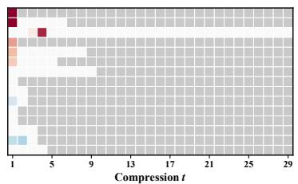  
(a) Failed trajectories.

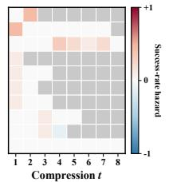  
(b) Successful trajectories.

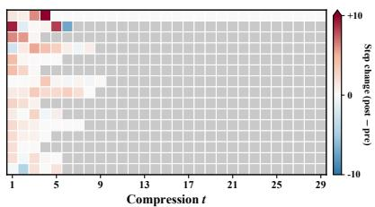  
(c) Interaction burden.  
Figure 6: Boundary-level compression effects on OfficeBench. Panel (a) includes all failed trajectories. Panels (b) and (c) show the ten and fifteen trajectories with the largest outcome hazard and interaction burden, respectively. Red denotes degradation or additional steps, blue denotes improvement, and gray denotes absent boundaries.

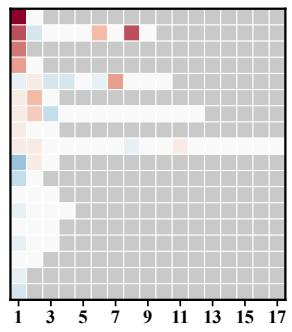  
Compression t  
(a) Failed trajectories.

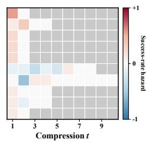  
(b) Successful trajectories.

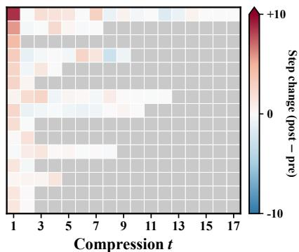  
(c) Interaction burden.  
Figure 7: Boundary-level compression effects on τ<sup>2</sup>-Bench Retail. Panel (a) includes all failed trajectories. Panels (b) and (c) show the ten and fifteen trajectories with the largest outcome hazard and interaction burden, respectively. Colors follow Figure 6.

Moderate interaction burden is more common. Compression increases continuation length at 109 OfficeBench boundaries and 95 τ<sup>2</sup>-Bench Retail boundaries. Nevertheless, only seven and two boundaries, respectively, add at least five steps. Severe outcome degradation and interaction burden are therefore localized, although smaller execution costs occur more broadly across compressed trajectories.

Outcome hazard and interaction burden are only weakly coupled. Their boundary-level Spearman correlations are 0.004, 0.102, and −0.054 on AppWorld, OfficeBench, and τ<sup>2</sup>-Bench Retail, respec tively. Compression can therefore increase recovery effort without immediately reducing continuation success, motivating the use of both signals.

## D.3 BREAKDOWN ON OFFICEBENCH

Table 4 reports results by the number of applications involved in each task.

The effect of compression becomes more pronounced as workflows span more applications. Under no compression, accuracy decreases from 92.9% on 1-APP tasks to 67.7% on 3-APP tasks, while the mean execution length more than doubles. PAIR’s gains are likewise largest on multi-application workflows. On 3-APP tasks, prefix-conditioned PAIR improves over Prompting from 62.4% to 65.6% accuracy and from 48.4% to 54.8% Pass<sup>3</sup>, while reducing Steps from 19.3 to 16.7. It also approaches the uncompressed reference of 67.7% accuracy, 58.1% Pass<sup>3</sup>, and 16.2 Steps. These results indicate that boundary-guided adaptation is most beneficial when compression must preserve execution state across longer, cross-application workflows.

Table 4: Results on OfficeBench , grouped by the number of applications involved in each task. Acc. is mean task success, with across-run standard deviation shown as a subscript; $\mathrm { P a s s ^ { 3 } }$ is the fraction of tasks solved in all three runs; Steps and Peak are mean interaction steps and peak input length $( 1 0 ^ { 3 }$ tokens). No compression is the uncompressed reference. History-only and prefix-conditioned compression differ in whether the compressor receives the fixed prefix, which remains separately visible to the agent in both settings. Bold denotes the best compressed result within each block; gray rows indicate PAIR.
<table><tr><td rowspan="2">Method</td><td colspan="3">Average (95)</td><td colspan="3">1-APP (42)</td><td colspan="3">2-APP (22)</td><td colspan="3">3-APP (31)</td></tr><tr><td>Acc. ↑</td><td>Pass3 ↑</td><td>Steps ↓</td><td>Acc. ↑</td><td>Pass3 ↑</td><td>Steps ↓</td><td>Acc. ↑</td><td>Pass3 ↑</td><td>Steps ↓</td><td>Acc. ↑</td><td> $\mathrm { P a s s ^ { 3 } \uparrow }$ </td><td>Steps ↓</td></tr><tr><td colspan="10">Agent: GPT-5.6 Luna/Compressor: GPT-5.6 Luna</td><td></td><td></td><td></td></tr><tr><td>No compression</td><td>82.1±4.8</td><td>75.8</td><td>11.2</td><td> $9 2 . 9 { \scriptstyle \pm 4 . 1 }$ </td><td>88.1</td><td>7.6</td><td>81.8±45</td><td>77.3</td><td>10.9</td><td>67.7±8.5</td><td>58.1</td><td>16.2</td></tr><tr><td colspan="10">History-Only Compression</td><td colspan="3"></td></tr><tr><td>FIFO</td><td>62.1±1.8</td><td>54.7</td><td>23.2</td><td>81.7±1.4</td><td>73.8</td><td>10.3</td><td>56.1±2.6</td><td>50.0</td><td>28.2</td><td>39.8±3.7</td><td>32.3</td><td>37.0</td></tr><tr><td>LLMLingua-2</td><td>76.1±1.2</td><td>68.4</td><td>14.4</td><td>89.7±1.4</td><td>83.3</td><td>8.0</td><td>81.8±0.0</td><td>77.3</td><td>14.0</td><td>53.8±4.9</td><td>41.9</td><td>23.2</td></tr><tr><td>Prompting</td><td>76.5±2.4</td><td>65.3</td><td>11.9</td><td>91.3±1.4</td><td>83.3</td><td>8.1</td><td>74.2±6.9</td><td>63.6</td><td>10.9</td><td>58.1±6.5</td><td>41.9</td><td>17.8</td></tr><tr><td>ACOÑ-UT</td><td>77.2±1.6</td><td>68.4</td><td>13.3</td><td>91.3±1.4</td><td>85.7</td><td>9.0</td><td>78.8±26</td><td>72.7</td><td>12.7</td><td>58.1±3.2</td><td>45.2</td><td>19.6</td></tr><tr><td>ACON-UTCO</td><td>73.0±5.8</td><td>60.0</td><td>13.6</td><td>84.1±9.0</td><td>71.4</td><td>8.2</td><td>78.8±5.2</td><td>59.1</td><td>12.7</td><td>53.8±3.7</td><td>45.2</td><td>21.6</td></tr><tr><td>PAIR (Ours)</td><td>81.1±2.8</td><td>70.5</td><td>11.9</td><td>92.9±24</td><td>85.7</td><td>8.1</td><td>84.8±2.6</td><td>72.7</td><td>11.8</td><td>62.4±4.9</td><td>48.4</td><td>17.2</td></tr><tr><td colspan="10">Prefix-Conditioned Compression</td><td colspan="3"></td></tr><tr><td>Prompting</td><td>78.9±2.8</td><td>66.3</td><td>13.3</td><td>89.7±3.6</td><td>81.0</td><td>9.1</td><td>81.8±20</td><td>63.6</td><td>13.0</td><td>62.4±4.9</td><td>48.4</td><td>19.3</td></tr><tr><td>ACOÑ-UT</td><td>75.1±0.6</td><td>61.1</td><td>15.5</td><td>85.7±4.1</td><td>71.4</td><td>9.9</td><td>83.3±5.2</td><td>72.7</td><td>15.2</td><td>54.8±3.2</td><td>38.7</td><td>23.4</td></tr><tr><td>ACON-UTCO</td><td>78.9±3.8</td><td>65.3</td><td>13.6</td><td> $9 0 . 5 { \scriptstyle \pm 4 . 1 }$ </td><td>81.0</td><td>9.1</td><td>84.8±2.6</td><td>68.2</td><td>13.1</td><td>59.1 ±4.9</td><td>41.9</td><td>20.2</td></tr><tr><td>PAIR (Ours)</td><td>81.4±0.6</td><td>72.6</td><td>11.8</td><td> $9 2 . 9 _ { \pm 2 . 4 }$ </td><td>88.1</td><td>8.5</td><td>81.8±0.0</td><td>68.2</td><td>11.2</td><td>65.6±3.7</td><td>54.8</td><td>16.7</td></tr></table>

## D.4 EXTRA EXPERIMENT ON 8-OBJECTIVE $\mathrm { Q A }$

We also evaluate on 8-objective QA (Kwiatkowski et al., 2019; Zhou et al., 2026), a QA benchmark where agents use a search tool to answer eight questions and return a consolidated answer set.

Table 5: Results on 8-objective QA, aggregated over three runs. EM is mean exact match, and EM<sup>3</sup> is the fraction of objectives answered exactly in all three runs. Peak and Total denote peak input length and total agent–compressor token use per episode, respectively, in $1 0 ^ { 3 }$ tokens. No compression is the uncompressed reference. Bold denotes the best result within each block; gray rows indicate PAIR.
<table><tr><td>Method</td><td>EM↑</td><td> $\mathrm { E M ^ { 3 } \uparrow }$ </td><td>F1 ↑</td><td>Steps ↓</td><td>Peak↓</td><td>Total ↓</td></tr><tr><td>No compression</td><td>40.9±1.8</td><td>29.8</td><td>54.2</td><td>18.5</td><td>14.53</td><td>181.83</td></tr><tr><td colspan="7">History-Only Compression</td></tr><tr><td>FIFO</td><td>14.0±1.4</td><td>3.6</td><td>18.8</td><td>45.1</td><td>6.70</td><td>274.03</td></tr><tr><td>LLMLingua-2</td><td>35.8±0.6</td><td>25.9</td><td>48.7</td><td>28.0</td><td>7.38</td><td>353.61</td></tr><tr><td>Prompting</td><td>37.2±1.6</td><td>24.6</td><td>51.8</td><td>26.6</td><td>7.34</td><td>177.48</td></tr><tr><td>ACOÑ-UT</td><td>38.5±1.4</td><td>28.8</td><td>53.4</td><td>19.6</td><td>7.43</td><td>142.00</td></tr><tr><td>ACON-UTCO</td><td>35.3±1.3</td><td>21.8</td><td>48.5</td><td>34.1</td><td>7.37</td><td>202.99</td></tr><tr><td>PAIR (Ours)</td><td>39.3±0.5</td><td>29.4</td><td>53.7</td><td>27.0</td><td>7.32</td><td>175.51</td></tr><tr><td colspan="7">Prefix-Conditioned Compression</td></tr><tr><td>Prompting</td><td>42.7±1.2</td><td>33.8</td><td>55.9</td><td>22.5</td><td>7.39</td><td>159.53</td></tr><tr><td>ACON-UT</td><td>43.0±1.1</td><td>34.5</td><td>56.8</td><td>17.6</td><td>7.27</td><td>118.97</td></tr><tr><td>ACON-UTCO</td><td>40.8±0.4</td><td>32.4</td><td>55.1</td><td>22.5</td><td>7.32</td><td>138.36</td></tr><tr><td>PAIR (Ours)</td><td>43.7±0.3</td><td>35.8</td><td>57.5</td><td>20.9</td><td>7.33</td><td>145.49</td></tr></table>

The adapted prompts emphasize different functions of a compressed checkpoint. A checkpoint simultaneously serves as a representation of past execution and as input that can steer future agent behavior. Both ACON-UT and PAIR affect these functions, but their adapted rules place different emphasis on them.

ACON-UT: structuring downstream execution   
Maintain a State Table containing authentication state, identifiers,   
retrieved values, pagination state, and instructions for   
reconstructing   
session variables.   
Maintain a Completed/Pending Action Ledger with the status, evidence,

and next action for every operation.   
Before an irreversible action, require a preflight check covering the   
target set, exclusions, credentials, content, and endpoint parameters.   
Call the completion endpoint only after all completion checks pass.

The ACON-UT guideline preserves useful state, but it also specifies how that state should organize subsequent execution. Its state table tells the next agent which variables to reconstruct; its action ledger assigns status and a next operation to each item; and its preflight and completion rules determine how side effects and task termination should be handled. These are not merely decisions about which historical facts to retain. They turn the generated checkpoint into an operational interface for controlling the downstream agent.

PAIR: preserving the execution state   
Preserve the complete user goal and explicit constraints, including   
exact predicates, qualifiers, versions, dates, jurisdictions, and   
target count.   
Reconcile the previous summary against the newest observed results   
rather than preserving contradicted or stale state.   
Move an item to Done only when the relevant answer or state is   
supported; otherwise record it as attempted but unresolved.   
Preserve exact file paths, function names, error messages, query   
parameters, and other continuation-relevant literals.

The PAIR guideline is centered more directly on the construction of the compressed state. Its rules determine which task semantics must remain invariant, how new evidence updates previously recorded state, and how uncertainty and incomplete work should be represented. It necessarily retains pending actions because they are part of the execution state, but it derives them from the observed trajectory rather than introducing a separate task-solving procedure. Thus, the distinction is not that only one prompt affects downstream behavior; any checkpoint can do so. Rather, ACON-UT explicitly uses the checkpoint as a carrier of execution policy, whereas PAIR more narrowly adapts how the compressor represents the state on which the original agent policy operates.

This difference is reflected in the pattern of improvements in Table 5. Under history-only compression, PAIR improves its starting prompt by 2.1% EM, 4.8% EM<sup>3</sup>, and 1.9% F1, while ACON-UT improves the same metrics by 1.3%, 4.2%, and 1.6%. Under prefix-conditioned compression, the corresponding gains are 1.0%, 2.0%, and 1.6% for PAIR, compared with 0.3%, 0.7%, and 0.9% for ACON-UT. Across both scopes, PAIR therefore produces the larger improvement in downstream answer quality and attains the highest EM, EM<sup>3</sup>, and F1.

ACON-UT’s behavioral rules provide a direct mechanism for reducing interaction steps. The different emphasis of the two guidelines also helps explain their execution lengths. ACON-UT adds explicit rules governing how the downstream agent should handle low-yield objectives and decide when to stop.

ACON-UT: retry and completion policy   
After two semantically equivalent or non-informative searches for the   
same issue, mark the issue as low-yield and retain the strongest   
supported candidate or the explicit unresolved alternatives.   
Stop research when every answer slot has a supported candidate or a   
clearly labeled best-supported unresolved value.

These rules provide two direct routes to shorter execution. First, the retry limit suppresses additional searches once two attempts are judged semantically redundant or uninformative. Second, the completion condition allows the task to terminate without resolving every objective: a best-supported unresolved value is sufficient to close an answer slot. ACON-UT therefore changes not only the retained state but also the downstream agent’s search horizon and stopping criterion.

PAIR: preserving unresolved state   
Do not promote an answer, attribution, equivalence, or result that the   
raw messages do not establish.   
A search may be marked done even when it failed to resolve an answer,   
but its unresolved outcome must remain explicit.   
Retain unresolved work with the best supported state and the missing   
evidence needed for resolution.

The PAIR rules make a different distinction: completing a search action does not imply that the underlying objective has been resolved. An unsuccessful attempt is preserved as such, and its current candidate cannot be upgraded beyond the available evidence. Because PAIR introduces neither a fixed retry limit nor an alternative completion criterion, the original downstream agent may continue with a materially different search when execution budget remains.

The resulting step pattern is consistent across both compression scopes. Under history-only compres sion, ACON-UT reduces execution from 26.6 steps with the initial prompt to 19.6, whereas PAIR uses 27.0 steps. Under prefix-conditioned compression, ACON-UT reduces execution from 22.5 to 17.6 steps, compared with 20.9 for PAIR. The repeated reduction is consistent with ACON-UT’s explicit retry and stopping rules. This is a valid route to lower execution cost, but it is conceptually distinct from improving the quality of the compressed state.

Taken together, the results reveal a quality–control trade-off. ACON-UT obtains larger step reductions by using the checkpoint to modify how the downstream agent searches and terminates. PAIR concentrates its adaptation on preserving task and evidence state, yielding the strongest EM, EM<sup>3</sup>, and F1 under both compression scopes. Consequently, ACON-UT’s lower step count should not be interpreted as evidence of better compression alone: part of the gain follows from an additional behavioral policy embedded in the generated checkpoint.

## D.5 TEMPLATE-CONTROLLED COMPARISON WITH ACON-UT

The original ACON proposer is instructed to rewrite the compression prompt and add concrete rules for retaining essential state, but it does not constrain the output schema. Candidate prompts may therefore preserve, extend, or replace the section structure of the initial OpenClaw prompt. Because PAIR keeps this structure fixed, the additional flexibility available to ACON-UT could otherwise confound the comparison.

ACON generates five candidate prompts, nominally from different random subsets of regression examples. In our settings, however, the number of available examples is smaller than its configured sample size of 30. The sampler consequently uses $k = \operatorname* { m i n } ( 3 0 , n ) = n$ , causing all five candidates within a setting to receive the same complete evidence set. We verified that their proposer inputs have identical hashes. Thus, whether a candidate changes the checkpoint structure is not determined by different evidence; it arises from stochastic proposer generation, after which end-to-end validation selects one of the five candidates.

This observation also explains why we perform the structural ablation only on AppWorld. The ACON UT prompts selected on OfficeBench already retain the original OpenClaw section skeleton used by PAIR, so the reported OfficeBench comparison is already structure-controlled. On AppWorld, in contrast, the selected ACON-UT prompts reorganize the checkpoint schema. We therefore rerun ACON-UT on AppWorld while requiring every candidate to retain the OpenClaw section structure. The locked variant uses the same initial prompt, trajectory-level analysis artifact, optimizer, candidate count, adaptation tasks, and end-to-end selection protocol as the original ACON-UT run. Only the instructions within the existing sections may be revised.

Table 6: Template-controlled comparison on AppWorld. ACON-UT (Locked) retains the Open-Claw section structure used by PAIR. A separate OfficeBench ablation is unnecessary because its selected ACON-UT prompts already preserve this structure. Results are aggregated over three runs. Peak is measured in $1 0 ^ { 3 }$ input tokens. Bold denotes the best result within each scope; gray rows indicate PAIR.
<table><tr><td>Method</td><td> $\operatorname { A c c . \uparrow }$ </td><td> $\mathrm { P a s s ^ { 3 } \uparrow }$ </td><td>Steps ↓</td><td>Peak ↓</td></tr><tr><td colspan="5">History-Only Compression</td></tr><tr><td>Prompting</td><td>78.6±2.7</td><td>68.5</td><td>17.0</td><td>9.23</td></tr><tr><td>ACON-UT</td><td> $8 1 . 2 \pm 1 . 2$ </td><td>70.8</td><td>18.9</td><td>9.36</td></tr><tr><td>ACON-UT (Locked)</td><td> $7 9 . 4 \pm 2 . 7$ </td><td>70.8</td><td>16.6</td><td>9.08</td></tr><tr><td>PAIR (Ours)</td><td> ${ \bf 8 4 . 7 \pm } 1 . 7$ </td><td>79.8</td><td>16.6</td><td>9.03</td></tr><tr><td colspan="5">Prefix-Conditioned Compression</td></tr><tr><td>Prompting</td><td> $8 1 . { \bar { 0 } } { \pm } 1 . 6 $ </td><td>72.0</td><td>15.3</td><td>9.51</td></tr><tr><td>ACON-UT</td><td> $8 1 . 3 { \pm } 0 . 9$ </td><td>72.6</td><td>17.3</td><td>10.21</td></tr><tr><td>ACON-UT (Locked)</td><td> $8 3 . 5 { \pm } 1 . 8$ </td><td>78.0</td><td>15.3</td><td>9.66</td></tr><tr><td>PAIR (Ours)</td><td> ${ \bf 8 5 . 9 \pm } 2 . 4$ </td><td>80.4</td><td>15.2</td><td>9.47</td></tr></table>

Template flexibility does not account for ACON-UT’s gains. As shown in Table 6, locking the template leaves history-only $\mathrm { P a s s ^ { 3 } }$ unchanged at 70.8%. Accuracy changes from 81.2% to 79.4%, while interaction length decreases from 18.9 to 16.6 steps and peak context decreases from 9.36K to 9.08K tokens. Under prefix-conditioned compression, the locked variant improves accuracy from 81.3% to 83.5% and $\mathrm { \dot { P a s s ^ { 3 } } }$ from 72.6% to 78.0%, while reducing interaction length from 17.3 to 15.3 steps and peak context from 10.21K to 9.66K tokens. The ability to redesign the checkpoint is therefore not necessary for ACON-UT to improve over its starting prompt. In this setting, fixing the interface preserves or improves reliability while reducing execution overhead.

PAIR’s advantage persists under the matched interface. With the section structure controlled, history-only PAIR achieves 84.7% accuracy and 79.8% Pass<sup>3</sup>, compared with 79.4% and 70.8% for locked ACON-UT. The two methods require the same 16.6 interaction steps, and their peak contexts are nearly identical. Under prefix-conditioned compression, PAIR reaches 85.9% accuracy and 80.4% Pass<sup>3</sup>, compared with 83.5% and 78.0% for locked ACON-UT, while requiring slightly fewer steps and a shorter peak context. The remaining performance differences therefore cannot be explained by a more favorable checkpoint schema or a larger prompt-design space.

The controlled comparison isolates the substantive difference between the methods: the evidence used for adaptation. ACON-UT derives its revisions from differences between complete successful and failed trajectories. This signal contains differences in retained information, planning, and stochastic execution, allowing trajectory-specific procedures to become general compression rules even when the output schema is fixed. PAIR instead uses paired continuations to identify information whose removal changes success or induces recovery at a particular compression boundary. The results are consistent with this localized evidence producing more targeted state-preservation rules, especially under history-only compression, where the reliability gap remains substantial after the interface is matched.

This ablation does not imply that checkpoint structure is universally irrelevant. Rather, it shows that structural flexibility is neither required for ACON-UT’s effectiveness nor sufficient to explain PAIR’s gains. Template locking controls the interface, while the distinction between trajectory-level planning induction and boundary-level compression diagnosis remains.

## D.6 SENSITIVITY OF BOUNDARY EVALUATION

We examine the sensitivity of boundary evaluation to continuation sampling and boundary-selection thresholds. All analyses use training trajectories only and involve no additional prompt generation or test-set evaluation.

Continuation count. We first study the stability of fixed-budget boundary estimates. For each boundary, we subsample $m \in \{ 1 , 3 , 5 , 9 \}$ continuations per condition from the nine available PRE and POST rollouts. We repeat subsampling 1,000 times and compare each estimate with the full nine-draw estimate, which serves as a higher-sample reference rather than ground truth.

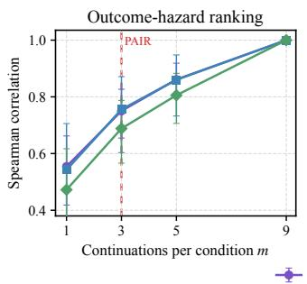

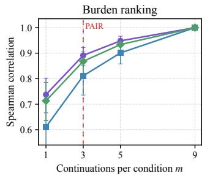

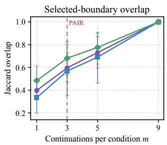  
Figure 8: Sensitivity to the number of continuations. The first two panels report the rank correlation of outcome hazard and interaction burden with their nine-draw estimates; the third reports the Jaccard overlap of the resulting boundary selections. Points and error bars show the mean and 2.5–97.5 percentiles over 1,000 subsamples. The red dashed line marks the three-pair cap used by PAIR’s successive-halving evaluation.

As shown in Figure 8, stability improves consistently with additional continuations. With three continuations per condition, rank correlations with the nine-draw estimates range from 0.69 to 0.76 for outcome hazard and from 0.81 to 0.89 for interaction burden, while selected-boundary overlap ranges from 0.57 to 0.68. Increasing m to five improves these ranges to 0.81–0.86, 0.90–0.95, and 0.69–0.78, respectively, but increases the fixed evaluation cost from six to ten continuations per boundary. We therefore cap boundary evaluation at three PRE/POST pairs and use successive halving to allocate this replication budget adaptively rather than uniformly.

Successive-halving allocation. We next compare fixed three-pair evaluation with the three-round successive-halving procedure used by PAIR. Using the nine-draw selection as a higher-sample reference, fixed three-pair evaluation attains 0.85 recall and 0.64 precision, whereas successive halving attains 0.82 recall and 0.66 precision while reducing the average evaluation from six to approximately 3.5 continuations per boundary. Rule-support coverage is essentially unchanged, and re-running prompt adaptation with the resulting evidence preserves downstream performance.

Selection thresholds. To isolate sensitivity to the selection rule from adaptive allocation, we hold the continuation budget fixed at three PRE/POST pairs per boundary and vary one threshold at a time around the default rule $\widehat { H } _ { t } \geq 0 . 5$ or $\widehat { B } _ { t } \geq 5$ . Under this fixed three-pair diagnostic, $\widehat { H } _ { t }$ changes in increments of $1 / 3 ,$ so the default hazard threshold requires an observed success-rate difference of at least 2/3.

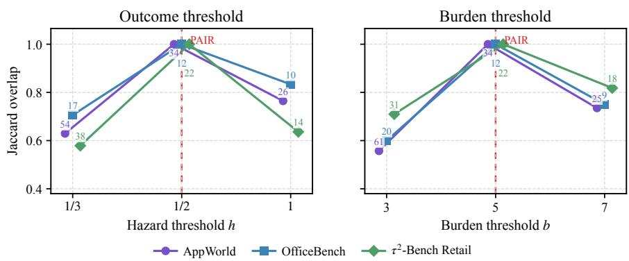  
Figure 9: Sensitivity to boundary-selection thresholds. Holding the continuation budget fixed at three PRE/POST pairs, the left panel varies the outcome-hazard threshold while fixing the burden threshold at 5; the right varies the burden threshold while fixing the hazard threshold at 0.5. The vertical axis reports Jaccard overlap with the default selection, and labels beside the points report the number of selected boundaries. Red dashed lines mark the thresholds used by PAIR.

Figure 9 shows the expected trade-off between selectivity and coverage. Relaxing either threshold adds lower-effect boundaries, whereas stricter thresholds retain a smaller subset. Under the fixed three-pair diagnostic, the default rule selects 34 AppWorld, 12 OfficeBench, and $2 2 \ \tau ^ { 2 } .$ -Bench boundaries. Across the one-at-a-time variations, the selected sets retain Jaccard overlaps of 0.56–0.83 with these default sets. We use the same selection thresholds across all three benchmarks without benchmark-specific tuning.

## D.7 COST OF BOUNDARY-LEVEL ADAPTATION

Table 7 reports the offline token cost of PAIR. We account for initial trajectory collection, boundary evaluation, prompt revision, and candidate selection. Boundary evaluation uses the three-round successive-halving procedure described in Step 2: every boundary first receives one PRE/POST continuation pair; after each of the first two rounds, active boundaries are ranked by the normalized harm score in Equation (5), and only the top half receive another pair. Thus, each boundary receives at most three pairs. Candidate selection uses five prompts and the 12 training tasks with the most compression events, with one run per prompt–task pair. The nine-draw diagnostic analysis, sensitivity experiments, and held-out test evaluation are excluded.

Table 7: Offline cost of boundary-level adaptation. Tokens include the visible inputs and outputs of the downstream agent, compressor, and optimizer. CF denotes PRE/POST counterfactual continuations allocated by three-round successive halving. Total includes initial trajectory collection;
<table><tr><td>Benchmark</td><td>Scope</td><td>Boundaries</td><td>CF rollouts</td><td>Total (M)</td></tr><tr><td>AppWorld</td><td>History-only</td><td>133</td><td>464</td><td>52.04</td></tr><tr><td rowspan="2">OfficeBench</td><td>Prefix-conditioned</td><td>198</td><td>694</td><td>85.40</td></tr><tr><td>History-only</td><td>214</td><td>750</td><td>45.47</td></tr><tr><td rowspan="3">τ2-Bench Retail</td><td>Prefix-conditioned</td><td>298</td><td>1,042</td><td>90.79</td></tr><tr><td>History-only</td><td>200</td><td>700</td><td>44.03</td></tr><tr><td>Prefix-conditioned</td><td>204</td><td>714</td><td>39.59</td></tr></table>

Successive halving reduces the number of counterfactual continuations by approximately 42% relative to allocating three PRE and three POST continuations uniformly to every boundary. Because retained boundaries tend to require longer continuations, the corresponding reduction in boundary-evaluation tokens is smaller but still substantial, ranging from 30.2% to 44.5% across settings. Across the six adaptation settings, the total offline token cost decreases from 511.24M to 357.32M tokens, a reduction of 30.1%. Prompt revision itself remains inexpensive, and the resulting total adaptation cost ranges from 39.6M to 90.8M tokens. This cost is incurred once during offline adaptation; after prompt selection, PAIR requires no additional model calls beyond the standard deployment-time compression procedure.

Why adaptive allocation? We also examined simpler ways to reduce boundary-evaluation cost. Position-based truncation can miss later harmful compressions; retaining only the first outcome-harm boundary can discard evidence supporting distinct prompt revisions; and random or trajectory-level subsampling loses coverage because useful boundary evidence is sparse. Successive halving instead probes every realized compression once and reduces only the amount of repeated sampling: additional continuation pairs are concentrated on boundaries showing stronger provisional evidence of harm. In retrospective nine-draw analyses, this reduces average evaluation from six to approximately 3.5 continuations per boundary, with only a small change in harmful-boundary recall and essentially unchanged rule-support coverage. Re-running prompt adaptation with the resulting evidence preserves downstream performance.

Comparison with ACON. PAIR incurs higher offline adaptation cost than ACON because it explicitly evaluates individual compression boundaries rather than relying only on trajectory-level feedback. Under the same candidate-selection protocol, three-round successive halving requires 39.6–90.8M tokens across the six adaptation settings, compared with 11.8–27.9M for ACON-UT and 7.3–19.6M for ACON-UTCO. Successive halving nevertheless substantially reduces the additional attribution cost relative to uniform three-pair evaluation. Importantly, this overhead is incurred only once during offline prompt adaptation; after the prompt is selected, PAIR introduces no additional model calls at deployment time.

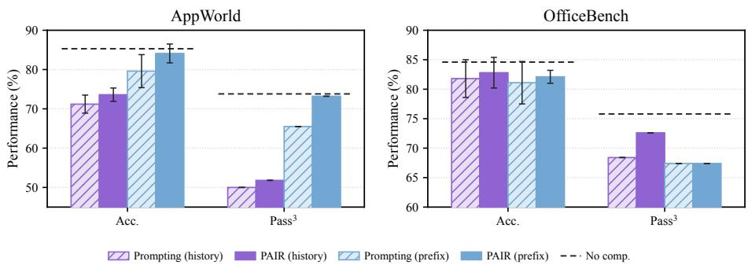  
Figure 10: Zero-shot transfer to MiniMax-M3. Accuracy and $\mathrm { P a s s ^ { 3 } }$ over three runs after transferring prompts adapted with GPT-5.6 Luna. Both the agent and compressor use MiniMax-M3. Dashed lines denote no compression; error bars show the across-run standard deviation of accuracy.

## D.8 CROSS-AGENT TRANSFER

We evaluate whether prompts adapted with GPT-5.6 Luna transfer to a different model without further optimization. We apply the learned prompts unchanged on AppWorld and OfficeBench, using MiniMax-M3 as both the downstream agent and compressor.

As shown in Figure 10, PAIR improves upon its starting prompt after both the agent and compressor are replaced. On AppWorld, history-only adaptation raises accuracy from 71.2% to 73.6% and $\mathrm { P a s s ^ { 3 } }$ from 50.0% to 51.8%. Prefix-conditioned adaptation yields larger gains, increasing accuracy from 79.6% to 84.1% and $\mathrm { P a s s ^ { 3 } }$ from 65.5% to 73.2%, approaching the no-compression results of 85.3% and 73.8%.

The same prompts also transfer to OfficeBench. History-only PAIR improves accuracy from 81.8% to 82.8% and $\mathrm { P a s s ^ { 3 } }$ from 68.4% to 72.6%. Under prefix-conditioned compression, accuracy increases from 81.1% to 82.1%, while $\mathrm { P a s s ^ { 3 } }$ remains 67.4%. Thus, the task-specific compression guidance learned with GPT-5.6 Luna remains useful under a different agent–compressor pair, although the magnitude of transfer depends on the benchmark and compression scope.

## D.9 PAIRED SIGNIFICANCE TESTS AGAINST ACON

$\mathrm { P a s s ^ { 3 } }$ is computed over three independent runs and changes by one task whenever a single run flips, so aggregate differences of a few points can lie within run-to-run noise. To assess whether PAIR’s reliability gains are systematic, we report task-level paired statistics against the best ACON variant in each of the six benchmark–scope settings, where the best variant is the one with the higher $\mathrm { P a s s ^ { 3 } }$ in Tables 1 and 2.

Protocol. For each setting, let $S _ { i , r } ^ { \mathrm { P A I R } } , S _ { i , r } ^ { \mathrm { A C O N } } \in \{ 0 , 1 \}$ denote success of task i in run $r \in \{ 1 , 2 , 3 \}$ Because both methods are evaluated on the same task set, tasks serve as the unit of pairing. We compute (i) paired bootstrap 95% percentile intervals for $\Delta \mathrm { P a s s ^ { 3 } }$ and $\Delta \mathrm { A c c }$ by resampling tasks with replacement 10,000 times and recomputing both metrics for both methods on each resample, and (ii) an exact two-sided sign test on the $\mathrm { P a s s ^ { 3 } }$ indicator, where a task counts as a win if PAIR solves it in all three runs and ACON does not, and as a loss in the reverse case; tasks on which both methods agree are uninformative and excluded. Table 8 reports the results.

Results. All six point estimates of $\Delta \mathrm { P a s s ^ { 3 } }$ are positive, and PAIR wins more discordant tasks than it loses in every benchmark–scope setting. Taken individually, the $\mathrm { P a s s ^ { 3 } }$ advantage is significant at the 95% level in both AppWorld settings. The remaining intervals include zero, reflecting the limited resolution of $\mathrm { P a s s ^ { 3 } }$ over three runs on 40–95 tasks rather than a reversal in direction: on $\tau ^ { 2 } .$ Bench Retail, for example, a single task corresponds to 2.5 percentage points. Pooling the task–scope comparisons descriptively yields 75 wins against 34 losses. Because the two compression scopes reuse the same underlying tasks, we do not treat this pooled count as an independent-sample significance test. Overall, the paired results show a consistent directional advantage across benchmarks and compression scopes rather than an effect driven by a single favorable setting. We therefore report the per-setting effect sizes together with their uncertainty intervals and paired tests.

Table 8: Task-level paired comparison of PAIR against the best ACON variant in each setting. ∆ is PAIR minus ACON in percentage points with paired bootstrap 95% intervals; win/lose counts discordant tasks on the $\mathrm { P a s s ^ { 3 } }$ indicator. For each benchmark–scope setting, p is the two-sided exact sign test; the pooled win/lose count is descriptive. Bold marks intervals that exclude zero.
<table><tr><td>Benchmark</td><td>Scope</td><td>VS.</td><td>n</td><td> $\Delta \mathrm { P a s s ^ { 3 } } ~ [ 9 5 \% \mathrm { C I } ]$ </td><td></td><td> $\Delta \mathrm { A c c } [ 9 5 \% \ : \mathrm { C I } ]$ </td><td>win/lose (p)</td></tr><tr><td>AppWorld</td><td>history</td><td>ACON-UT</td><td>168</td><td></td><td> $+ 8 . 9 \ [ + { \bf 3 . 0 } , \ + { \bf 1 5 . 5 } ]$ </td><td> $+ 3 . 6 \ [ + 0 . 8 , \ + 6 . 3 ]$ </td><td>22/7 (0.008)</td></tr><tr><td>AppWorld</td><td>prefix</td><td>ACON-UT</td><td>168</td><td></td><td> $+ 7 . 8 \ \lvert + 1 . 8 , \ + 1 0 . 7 \rvert$ </td><td>+3.2 [+0.4, +6.2]</td><td>21/8 (0.024)</td></tr><tr><td>OfficeBench</td><td>history</td><td>ACON-UT</td><td>95</td><td></td><td> $+ 2 . 1 \ [ - 5 . 3 , + 9 . 4 ]$ </td><td> $+ 3 . 5 [ - 0 . 4 , + 7 . 4 ]$ </td><td>7/5 (0.774)</td></tr><tr><td>OfficeBench</td><td>prefix</td><td>ACON-UTCO</td><td>95</td><td></td><td> $+ 7 . 4 \left[ \bar { - } 1 . 1 , + 1 6 . 8 \right]$ </td><td>+2.5 [−1.8, +7.0]</td><td>13/6 (0.167)</td></tr><tr><td> $\tau ^ { 2 } .$  -Retail</td><td>history</td><td>ACON-UTCO</td><td>40</td><td></td><td> $+ 2 . 5 \ : [ - 1 5 . 0 , + 2 0 . 0 ]$ </td><td>+0.0 [−10.0, +9.2]</td><td>7/6 (1.000)</td></tr><tr><td> $\tau ^ { 2 } .$  Retail</td><td>prefix</td><td>ACON-UT</td><td>40</td><td></td><td> $+ 7 . 5 \ [ - 5 . 0 , + 2 0 . 0 ]$ </td><td>+4.2 [−5.8, +15.0]</td><td>5/2 (0.453)</td></tr><tr><td>Pooled</td><td></td><td></td><td>606</td><td></td><td></td><td></td><td>75/34</td></tr></table>

## D.10 BOUNDARY-LEVEL CASE STUDIES

We examine how boundary-level evidence is translated into compression prompt revisions on $\scriptstyle \mathrm { A p p - }$ World. We focus on prefix-conditioned compression, for which the complete chain from the initial prompt to the selected PAIR prompt is available. At each studied boundary, we restore the same environment state and recompress the same consumed history using the initial prompt $P _ { 0 } ,$ the adapted prompt $P _ { \mathrm { P A I R } }$ , and, for the outcome cases, the matched ACON-UT prompt $P _ { \mathrm { A C O N } }$ . Each condition uses three independent compression samples and continuations, while the agent, tools, decoding configuration, and environment state remain fixed. These targeted replays are conducted only for analysis and do not affect prompt selection.

We consider a case closed when the original defect recurs after recompression with $P _ { 0 } ,$ disappears with $P _ { \mathrm { P A I R } }$ , and the adapted summaries exhibit the intended prompt change. The control is necessary because the boundary effect concerns a realized summary: a harmful summary may be sampled from a prompt without the same defect recurring in every subsequent sample. Table 9 summarizes the two primary cases.

Table 9: Boundary-level case studies on AppWorld. The control recompresses the same boundary using the initial prompt, whereas the adapted condition uses the selected PAIR prompt. Success counts are measured over three continuations. PRE denotes the pre-compression context.
<table><tr><td>Case</td><td>Boundary effect</td><td>Compression error</td><td>Prompt revision</td><td>Control → PAIR</td></tr><tr><td>Outcome hazard</td><td>PRE  $3 / 3 , { \mathrm { P O S T } }$   $1 / 3 ; \widehat { H } _ { t } = 0 . 6 7$ </td><td>The summary drops the coworker restriction and presents the total over all received payments as the</td><td>Preserve task predicates and relationship filters; distinguish observations from unverified inferences.</td><td> $0 / 3  3 / 3$  success</td></tr><tr><td>Interaction burden</td><td>PRE and POST both 3/3;  $\widehat { B } _ { t } = 5 . 0$ </td><td>answer. Previously read API specifications are reduced to prose, causing documentation and authentication to be repeated.</td><td>Preserve executable API signatures and completed state; do not reopen completed documentation or authentication.</td><td> $1 4 . 7  1 0 . 7 $  mean steps</td></tr></table>

Case A: Preserving a task-defining predicate. The task asks for the amount received from the user’s coworkers on Venmo after a specified date. Before compression, the agent has retrieved 36 received transactions totaling 1,676, but has not yet determined which senders are coworkers. The summary produced by $P _ { 0 }$ removes this unresolved restriction and treats the unrestricted total as the final answer:

## Harmful summary produced by the initial prompt

[x] Retrieved all received Venmo transactions from   
2023-02-01 onward across all pages: 36 transactions.   
Filter by direction='received' and   
min\_created\_at='2023-02-01': Matches the request for money   
received since February 1.   
Use total 1676 as the answer: Sum of the 36 returned   
transaction amounts.

The three PRE continuations query the phone contacts for the coworker relationship, retain only matching Venmo senders, and submit the correct answer, 786. Two of the three original POST continuations instead submit 1,676 immediately, while the remaining continuation recovers the missing predicate through further interaction. Therefore, $\widehat { V } _ { t } ( \mathrm { P R E } ) = 1 , \widehat { V } _ { t } ( \mathrm { P O S T } ) = 1 / 3$ , and $\widehat { H } _ { t } = 0 . 6 7$ . The optimizer identifies the dropped relationship constraint as the primary cause of the outcome difference.

The resulting revision changes how the compressor records the task objective and distinguishes established facts from unresolved inferences:

Relevant PAIR prompt revision   
Preserve every task predicate, scope boundary, relationship filter,   
temporal condition, required mutation, and completion condition   
exactly. Never replace a restricted set with a broader set such as all   
received records, all pending records, or all search results.   
Record only decisions supported by the task, operating rules,   
documented API behavior, or observed history. Label inferences as   
tentative.

When the same boundary is recompressed with $P _ { 0 } ,$ all three new summaries again direct the agent to answer 1,676, and all three continuations fail. In contrast, P <sub>A</sub> preserves both the observed total and its unresolved relationship to the requested coworker-only quantity:

Summary produced by the adapted PAIR prompt   
[x] The sum of all 36 received transactions is 1676.   
This is not yet confirmed to be the coworker-only total.   
[ ] Determine which Venmo senders are Paul's coworkers using the   
phone contacts relationship data.   
Coworker scope: Tentative; treating all 36 received transactions   
as coworker payments is not explicitly verified.

All three adapted continuations first query the contact relationship and then submit 786, yielding 3/3 success. The fix requires more steps than the incorrect immediate submission, but only because the control terminates early with the wrong answer. Relative to PRE, the adapted continuations add approximately three steps while restoring full success. At the same boundary, ACON-UT succeeds in two of three draws: two summaries recover the coworker restriction, while one again instructs the agent to use 1,676.

A second boundary exhibits the same mechanism. For a task restricted to requests from coworkers and friends, the original summary broadens the target to every pending request. The original POST continuations fail 3/3. Under recompression, $P _ { 0 }$ succeeds only ${ \dot { 1 } } / 3 , $ , whereas $P _ { \mathrm { P A I R } }$ explicitly marks the relationship classification as unresolved and succeeds 3/3. These cases show that the revision addresses a recurring loss of task-defining predicates rather than a single surface form.

Case B: Preserving usable execution state. The second case separates outcome preservation from interaction burden. The task requires reading an internet-bill receipt, identifying the user’s roommates, and sending equal Venmo requests. Before compression, the agent has already read the login and contact-search specifications. All PRE and POST continuations eventually succeed, but the POST continuations require five additional steps on average: $\widehat { B } _ { t } = 1 4 . 0 - 9 . 0 = 5 . 0 .$

The initial summary records that the specifications were read but reduces them to generic prose and distributes authentication across several future steps:

Burden-inducing summary produced by the initial prompt   
- [x] Retrieved specifications for file\_system.login.   
[x] Retrieved specifications for phone.login.   
2. Get the file-system account credentials and call   
apis.file\_system.login.   
5. Log into phone using the user's phone number and   
supervisor-provided password.   
7. Retrieve the Venmo account credentials and log in if required.   
File-system login requires a username and password and returns an   
access token. Phone login requires the account phone number and a   
password.

Each PRE continuation obtains the required credentials, authenticates all three applications in one interaction step, and reads only the previously unseen Venmo request documentation. The POST continuations instead reopen the file-system and phone login documentation, authenticate the applications separately, and perform four to five documentation calls. This divergence does not change task success, but it consumes execution budget that would otherwise remain available for recovery.

The initial boundary diagnosis was only partially correct. Its top-ranked hypothesis concerned an added post-request verification step, but no POST continuation performed such verification. The traces instead show repeated documentation and fragmented authentication. When evidence from this boundary is aggregated with related burden boundaries, the selected prompt introduces the following compressor-facing guidance:

Relevant PAIR prompt revision   
Preserve actionable completed state, including exact usable tokens,   
credentials, established variables, API signatures, and already-read   
documentation. Do not reduce usable state to a generic statement that   
it exists.   
Give the smallest ordered continuation justified by the established   
state. Do not reopen completed documentation, authentication, target   
discovery, or data retrieval.

Under the same-prompt replay, the burden recurs: the three continuations take 17, 14, and 13 steps, for a mean of 14.7. The adapted summaries instead retain executable signatures and consolidate authentication:

## Execution state preserved by the adapted prompt

apis.file\_system.login(   
username=<email>, password=<password>)   
apis.phone.login(   
username=<phone\_number>, password=<password>)   
apis.phone.search\_contacts(   
access\_token=<token>, query="", relationship=None,   
page\_index=0, page\_limit=5)   
1. Retrieve the supervisor-provided passwords and use the relevant   
credentials to log in to file\_system, phone, and venmo.

All three adapted continuations authenticate the three applications in one step and read only the previously unseen Venmo documentation. Mean continuation length falls from 14.7 to 10.7 steps while success remains 3/3. The adapted execution does not fully recover the PRE mean of 9.0 steps, but removes most of the reproducible burden introduced by the initial prompt.

Why boundary-level evidence yields a different adaptation from ACON. The advantage in these cases is not that PAIR alone can recognize the surface error. Under the controlled comparison, ACON-UT and PAIR start from the same OpenClaw prompt and analyze the same seven failed training tasks. ACON’s trajectory analyses also identify the missing coworker filter and omitted transaction identifiers. The key difference lies in how the evidence is attributed and converted into a compression policy.

ACON compares a successful full-context trajectory with a failed compressed trajectory. Its analysis template requests broad remediation strategies, including guardrails, verification, caching, early-exit heuristics, and loop detection. Because the terminal contrast contains all actions and compressions preceding the outcome, a detected compression error can be translated into instructions for how the downstream agent should execute:

Representative agent-facing guidance introduced by ACON   
Before any irreversible action, require one compact guardrail check   
that the target set, scope, and identifiers are complete.   
After mutations, require verification that the intended state change   
has occurred.   
Maintain a State Table and a separate set of Compression Rules in the   
summary.

Such guidance may prevent some errors, but it couples the compression prompt with a new execution policy. Verification, blocking, and recovery behavior are delegated to the downstream agent even when the underlying compression failure is simply that a predicate or usable state was not preserved.

In contrast, the paired continuations in PAIR hold the environment state and downstream agent fixed at one boundary. The observed difference is therefore localized to one context replacement. Outcome hazard identifies information whose loss changes task completion, while interaction burden identifies information whose loss induces recovery without changing the terminal result. The optimizer is then restricted to revising what the compressor records:

Compressor-facing guidance introduced by PAIR

Preserve every task predicate, scope boundary, relationship filter,   
temporal condition, required mutation, and completion condition   
exactly.

Preserve actionable completed state, including exact usable tokens,   
credentials, established variables, API signatures, and already-read   
documentation.

This boundary-level construction provides two forms of decoupling. First, it separates compressioninduced changes from errors already present in the trajectory: PRE and POST begin from the same environment state and differ only in the supplied context. Second, it separates the compressor’s responsibility from the agent’s policy. The resulting rules specify which state must survive compression rather than adding new verification procedures, blockers, or action-selection heuristics to the summary.

The downstream traces are consistent with this distinction. On the AppWorld test-normal split, ACON summaries preserve explicit access tokens in none of the observed summaries, compared with 69% for PAIR; executable API calls with keyword arguments appear in 48% and 80%, respectively. After a compression, an API documentation lookup is the first action in 38% of ACON continuations and 22% of PAIR continuations. ACON also requires 6.05 steps on average to reach the next mutation or completion, compared with 4.74 for PAIR, and incurs 7.9 versus 5.9 documentation calls per task. These measurements are behavioral traces consistent with the prompt distinction; they do not attribute every held-out action to an individual prompt line.

End-to-end results exhibit the same pattern. Relative to the matched ACON-UT prompt, prefixconditioned PAIR improves mean success by 3.2%, with a paired 95% interval of [0.4%, 6.0%], reduces mean execution length by 2.15 steps, with an interval of [−2.88, −1.45], and reduces total token use by 12.6%, with an interval of $[ - 1 7 . 2 \% , - 7 . 7 \% ]$ . The Pass<sup>3</sup> difference is positive but less certain: +3.6% with an interval of [−1.8%, 8.9%]. The evidence therefore supports a clearer conclusion about average success and execution efficiency than about the magnitude of the reliability difference in this individual comparison.

Negative and non-reproducible cases. We replay all seven outcome boundaries cited by the selected error rules and all six rule-cited burden boundaries with equal PRE and POST success, rather than selecting examples only after replay. Three realized outcome defects do not recur under fresh compression samples from the initial prompt. Their original summaries are harmful, but the defects are not stable across subsequent samples from the same compression policy. One cited outcome boundary remains unsuccessful under $P _ { \mathrm { P A I R } } .$ , and two documentation-related burden boundaries are not shortened by the adapted prompt. Overall, three outcome boundaries and one burden boundary satisfy the complete replay criterion. Cases A and B are selected because they provide the clearest alignment between the observed divergence, the resulting prompt rule, and replayed behavior.

These cases illustrate both the value and the limit of boundary-level adaptation. A localized counterfactual effect provides cleaner evidence than a terminal trajectory contrast, but a finite number of stochastic continuations cannot guarantee that every diagnosis generalizes at the prompt level. End-to-end selection therefore remains necessary to determine whether the aggregated revisions improve the global compression policy.

## E BOUNDARY-VERIFICATION ALGORITHM

Algorithm 1 gives the implementation of the successive-halving procedure used in Step 2. Every realized compression boundary is evaluated with an initial PRE/POST continuation pair. Additional pairs are allocated only to the higher-scoring half of the active boundaries according to the normalized harm score in Equation (5). After three rounds, surviving boundaries are retained if their estimated outcome hazard or interaction burden exceeds the corresponding selection threshold.

Algorithm 1 Successive-Halving Boundary Verification   
Require: Realized boundaries A; thresholds $\tau _ { H } , \tau _ { B }$   
1: $\mathbf { \boldsymbol { A } } ^ { ( 1 ) }  \mathbf { \boldsymbol { A } }$   
2: for $r = 1 , 2 , 3$ do   
3: for each $t \in \mathcal { A } ^ { ( r ) }$ do   
4: Run one additional PRE/POST continuation pair   
5: Update $\widehat { H } _ { t } ^ { ( r ) }$ and $\widehat { B } _ { t } ^ { ( r ) }$   
6: end for   
7: if $r < 3$ then   
8: Compute $s _ { t } ^ { ( r ) } \gets \operatorname* { m a x } \Bigl \{ \widehat { H } _ { t } ^ { ( r ) } / \tau _ { H } , \widehat { B } _ { t } ^ { ( r ) } / \tau _ { B } \Bigr \}$ for all $t \in \mathcal { A } ^ { ( r ) }$   
9: $\boldsymbol { \mathcal { A } } ^ { ( r + 1 ) } \gets$ TopHalf $\left( \boldsymbol { \mathcal { A } } ^ { ( r ) } ; \boldsymbol { s } ^ { ( r ) } \right)$   
10: end if   
11: end for   
12: ${ \mathcal { V } }  \{ t \in { \mathcal { A } } ^ { ( 3 ) } : { \widehat { H } } _ { t } ^ { ( 3 ) } \geq \tau _ { H } \ \vee \ { \widehat { B } } _ { t } ^ { ( 3 ) } \geq \tau _ { B } \}$   
13: return V and the associated paired traces

## F DETAILS OF BASELINES

This section describes the compression baselines used in our experiments. Unless otherwise specified, all conditions are evaluated under the same frozen-agent protocol: the downstream agent model, tool-use prompt, decoding configuration, tool APIs, output parser, and execution environment are fixed. Only the context supplied to the agent is changed. This protocol isolates the effect of context representation from changes in the downstream agent policy.

Shared Evaluation Protocol. All compression and truncation baselines use the same recurrentcompression trigger and preserve the most recent interaction turn verbatim. The full-context reference bypasses compression and retains the complete interaction history. Across all conditions, we keep the downstream tool-use prompt, tool descriptions, output-format instructions, few-shot examples, decoding configuration, parser, and execution environment fixed. Replacement contexts are inserted at the same continuation point, so differences in downstream behavior arise from the supplied context representation rather than from a changed agent policy or interface.

Because prompt-defined baselines can be sensitive to small wording changes, we freeze all prompt templates before evaluation and record hashes of the rendered prompts used in each run. For ACON, the source of truth is the original Microsoft repository and commit specified below. For LLMLingua-2, the source of truth is the official Microsoft implementation and released compression model.

## F.1 FULL-CONTEXT REFERENCE

No compression. The agent receives the full uncompressed interaction history. This condition serves as the full-context reference for behavior preservation and as the reference point for token-cost measurements. It is not a compressor and does not separately consume the task instruction, which is already included in the agent context.

## F.2 TOKEN PRUNING AND TRUNCATION BASELINES

This group contains two non-generative baselines. Rather than producing a new free-form summary, they retain selected portions of the original interaction history. Both use the same compression trigger, downstream context slot, and recent-turn preservation policy as the generative baselines. compression is triggered when the compressible history exceeds the context budget, while the most recent interaction turn remains verbatim.

FIFO. FIFO is a recency-based sliding-window control. When the rendered compressible history exceeds the context budget, complete turns are discarded from the front, oldest first, until the history fits. The system prompt, original task instruction, and most recent interaction turn are always retained. FIFO therefore isolates how much behavior can be preserved through recent action–observation continuity alone, without learned salience estimation or generated summary text.

LLMLingua-2. LLMLingua-2 formulates prompt compression as token classification and distills a smaller compressor for efficient and faithful extractive compression (Pan et al., 2024). We apply it task-agnostically to the compressible interaction history using the released microsoft/llmlingua-2-xlm-roberta-large-meetingbank model. When compression is triggered, LLMLingua-2 selects tokens from the existing history up to the target budget. The resulting extractive context replaces the older turns, while the most recent turn remains verbatim. This baseline tests whether token-level salience alone preserves the execution state required for future agent actions.

Implementation. We use the official Microsoft LLMLingua implementation.<sup>1</sup> For LLMLingua-2, the target token count is set to the budget allocated to the compressible history, excluding the most recent turn that is retained verbatim. Its compressed output is inserted into the same downstream context slot used by the other compression baselines.

## F.3 STRUCTURED-SUMMARY COMPRESSION BASELINES

Our two structured-summary baselines are adapted from compression modules in open-source agent frameworks. We preserve their original summary schemas and prompt text while integrating them into the same recurrent-compression harness. Unlike the token-dropping LLMLingua-2 baseline and the recency-based FIFO control, both invoke an auxiliary LLM to rewrite the compressible history into a structured Markdown checkpoint after the context exceeds the token budget. They preserve the most recent interaction turn and support iterative updates that fold new turns into the previous checkpoint.

Prompting (OpenClaw compaction). The OpenClaw baseline<sup>2</sup> maintains an approximate recenttoken budget, cuts the compressible history at a turn boundary, and summarizes the remainder with the prompts below. The first compression uses the checkpoint prompt. Subsequent compressions use the update prompt, which folds new turns into the previous summary.

OpenClaw summarization system prompt   
You are a context summarization assistant. Your task is to read a   
conversation between a user and an AI coding assistant, then   
produce a structured summary following the exact format specified.   
Do NOT continue the conversation. Do NOT respond to any questions in   
the conversation. ONLY output the structured summary.

OpenClaw first-compaction prompt   
The messages above are a conversation to summarize. Create a   
structured context checkpoint summary that another LLM will use to   
continue the work.   
Use this EXACT format:   
## Goal   
[What is the user trying to accomplish? Can be multiple items if the   
session covers different tasks.]   
## Constraints & Preferences   
- [Any constraints, preferences, or requirements mentioned by user]

```markdown
- [Or "(none)" if none were mentioned]
## Progress
### Done
- [x] [Completed tasks/changes]
### In Progress
- [ ] [Current work]
### Blocked
- [Issues preventing progress, if any]
## Key Decisions
- <sub>**</sub>[Decision]<sub>**</sub>: [Brief rationale]
## Next Steps
1. [Ordered list of what should happen next]
## Critical Context
- [Any data, examples, or references needed to continue]
[Or "(none)" if not applicable]
Keep each section concise. Preserve exact file paths, function names,
and error messages.
```

## OpenClaw iterative-update prompt

```markdown
The messages above are NEW conversation messages to incorporate into
the existing summary provided in <previous-summary> tags.
Update the existing structured summary with new information. RULES:
PRESERVE all existing information from the previous summary
ADD new progress, decisions, and context from the new messages
UPDATE the Progress section: move items from "In Progress" to "Done"
when completed
UPDATE "Next Steps" based on what was accomplished
PRESERVE exact file paths, function names, and error messages
If something is no longer relevant, you may remove it
Use this EXACT format:
## Goal
[What is the user trying to accomplish? Can be multiple items if the
session covers different tasks.]
## Constraints & Preferences
- [Any constraints, preferences, or requirements mentioned by user]
[Or "(none)" if none were mentioned]
## Progress
### Done
- [x] [Completed tasks/changes]
### In Progress
- [ ] [Current work]
### Blocked
- [Issues preventing progress, if any]
## Key Decisions
- <sub>**</sub>[Decision]<sub>**</sub>: [Brief rationale]
```

```markdown
## Next Steps
1. [Ordered list of what should happen next]
## Critical Context
- [Any data, examples, or references needed to continue]
- [Or "(none)" if not applicable]
Keep each section concise. Preserve exact file paths, function names,
and error messages.
```  
F.4 ACON PROMPT BASELINES

We compare against two prompt-optimization methods from ACON (Kang et al., 2026). Both adapt the natural-language compression guideline while keeping the downstream agent and compressor model fixed.

ACON-UT. The utility-maximization stage identifies tasks that succeed with full context but fail under compression. An optimizer LLM compares the corresponding trajectories, infers which taskrelevant information was lost or distorted, and revises the compression guideline to improve task success.

ACON-UTCO. This method applies compression maximization after utility maximization. The optimizer analyzes successful compressed trajectories to identify redundant content and further revises the guideline to produce shorter contexts while preserving task utility.

Implementation. We use the official prompt-optimization implementation from the Microsoft ACON repository.<sup>3</sup> Both methods start from the same OpenClaw-style compression prompt used by our PROMPTING baseline. ACON-UT applies only utility maximization, whereas ACON-UTCO subsequently applies compression maximization. All other agent, compressor, and execution settings remain fixed.

## G PROMPTS AND QUALITATIVE ANALYSIS

ACON-UT and PAIR start from the same OpenClaw compression prompt and use the same AppWorld adaptation trajectories. They differ, however, in both the evidence used for adaptation and the space over which the prompt may be revised. ACON contrasts successful full-context and failed compressed trajectories and may freely rewrite the complete compression framework. PAIR uses localized counterfactual evidence at harmful compression boundaries while keeping the OpenClaw section structure fixed; it adapts only the instructions within that deployment-compatible template. We present the resulting prompts in full before analyzing these differences.

History-only ACON-UT Prompt Optimized on AppWorld   
<conversation>   
{{ history }}   
</conversation>   
<previous-summary>   
{{ prev\_summary }}   
</previous-summary>   
[INFORMATION SOURCE]   
The messages in <conversation> are new execution evidence. The content   
in <previous-summary> is prior persisted state. Reconcile both   
into one compact, factually continuous summary.

Rules for updating: Treat observed tool calls and successful responses as authoritative over plans, prose checklists, or inferred status. Preserve completed actions as completed; never label a successful call as blocked, unknown, or pending. Distinguish every action as exactly one of: Done, In Progress, Blocked, or Failed. A task is not pending if its API call and successful result are present. Preserve immutable outputs, exact identifiers, dates, amounts, names , emails, file paths, endpoint/function names, parameters, error messages, accepted answers, completion calls, and completion confirmations when they affect continuation. Preserve deterministic derived results only with their source or derivation: eligibility criteria, target ID sets, exclusions, totals, mappings, and verification evidence. Do not infer facts from missing variables, session boundaries, stale summaries, external dates, or intended plans. If prior prose conflicts with concrete tool output, replace the prose with the tool-supported fact and note the correction only when useful. Python/runtime variables do not survive a session reset. Never assume a prior-session variable exists unless it is listed below and recreated in the new session. For authentication, record app, username/account identifier, authentication status, canonical token variable or safe token handle, token-validity assumption, and the exact re-login/ bootstrap instruction needed if the token cannot persist. Do not print raw passwords or raw tokens. Preserve all state required to continue without rediscovery: IDs, page/cursor positions, page size, retrieved records or compact exact lists, mutation results, request/transaction IDs, contact/ email mappings, and verification status. Record pagination completeness: starting page/cursor, page size, pages processed, termination condition, and whether the resulting set is complete. An empty page proves completion only when the required initial page and preceding pages were queried. Preserve endpoint contracts already established, including required parameters and constraints. Do not recommend repeated documentation, credential lookup, variable probing, or data retrieval unless the summary shows uncertainty or an observed failure. Preserve exact target sets and exclusion sets before mutations. Do not broaden, recompute, or mutate a set without reconciling it against the persisted evidence. Record postconditions and verification results for every externally visible or destructive action. Do not claim completion until the required result set has been processed and verified. If a valid answer or completion result already exists, preserve it as terminal and instruct the next session to stop exploration and retain or submit that result. Use early-exit conditions when supported evidence is sufficient, such as exhausted pagination, an empty subsequent page, an out-ofrange feed page, an unsupported artifact format, or a validated fallback answer. Keep the summary compact: prefer tables, exact lists, and short bullets; omit conversational narrative, duplicated facts, speculative alternatives, and API output that is not needed for continuation.   
[/INFORMATION SOURCE]   
Create the updated summary using exactly this structure:

```markdown
## Goal
- State the current task and any explicit scope or acceptance criteria
- Preserve the original goal unless the new evidence definitively
changed it.
## Execution Ledger
### Done
[x] Completed action --- include the decisive tool result or output
when needed for continuity.
### In Progress
- [ ] Only actions not yet completed and currently actionable.
### Blocked or Failed
- Record only evidence-based blockers or failures, including the exact
error and the condition required to recover.
- Do not place unavailable-but-optional inputs here if a validated
answer or fallback is sufficient.
### Terminal Completion
`status`: `not_completed` or `completed`
`accepted_answer`: [value, if any]
`completion_call`: [exact function and arguments, if observed]
`completion_confirmation`: [exact confirmation, if observed]
`next_action`: [hard stop if completed; otherwise the single highest
-priority action]
## State Table
Category | Canonical name | Value or status | Evidence /
continuation instruction |
|---|---|---|---|
Authentication | [app and token variable/handle] | [authenticated,
absent, expired, or unknown] | [safe re-login/bootstrap
instruction and validity assumption] |
Entities and mappings | [IDs, names, emails, relationships] | [
compact exact values] | [source or derivation] |
Collections and pagination | [collection/endpoint] | [IDs or records
, page/cursor, page size] | [completeness and termination
condition] |
Eligibility and exclusions | [criterion] | [exact eligible set and
excluded near-misses] | [deterministic rule/evidence] |
Mutations | [action and target IDs] | [processed, succeeded, failed,
or not attempted] | [per-item or aggregate result] |
Verification | [postcondition] | [verified, failed, or not run] | [
query/result and coverage] |
Cached API knowledge | [app/endpoint] | [required parameters and
constraints] | [reuse unless schema uncertainty causes failure] |
Other critical state | [canonical variable] | [value/status] | [
reconstruction instruction] |
Include only applicable rows, but do not omit any state required to
resume safely.
## Key Decisions
- [Decision] : [brief evidence-based rationale]
- Preserve prior decisions that remain valid; revise contradictory
decisions rather than duplicating them.
## Next Steps
1. [The single highest-priority actionable step, or the hard stop if
terminal.]
2. [Only additional necessary steps, ordered by dependency.]
```

- Do not list documentation or rediscovery steps when the state table   
already supplies the required information.   
## Continuation Guards   
- Do not reference prior-session variables unless they appear in the   
State Table and are recreated or re-authenticated in the new   
session.   
- Before any mutation, reconcile the current target set, exclusions,   
authentication, required parameters, and idempotency status.   
Before completion, verify that every qualifying target was processed   
and that the verification set equals the expected set.   
- If later evidence changes a contact set, transaction set, pagination   
result, date, eligibility result, or completion status,   
invalidate the affected conclusion and recompute it from preserved   
source records.   
- Execute the highest-priority Next Step before exploratory calls.   
- Keep the entire summary concise while retaining all state needed for   
factual continuity.

## History-only PAIR Prompt Optimized on AppWorld

<conversation>   
{{ history }}   
</conversation>   
<previous-summary>   
{{ prev\_summary }}   
</previous-summary>   
The messages above are NEW conversation messages to incorporate into   
the existing summary provided in <previous-summary> tags.   
Update the existing structured summary with new information.   
RULES:   
PRESERVE all still-valid existing information from the previous   
summary, especially the exact user goal, scope, constraints,   
settled results, completed pages, identifiers, filters, and   
actionable continuation state.   
ADD only facts supported by the new messages. Do not invent a new   
task, constraint, result, API, capability, or pending action from   
documentation or credentials alone.   
UPDATE the Progress section using the newest settled state. Move an   
item from "In Progress" to "Done" only when the new messages show   
it completed; never leave a completed lookup or page described as   
unchecked.   
Preserve the distinction between the user's qualifying subset and   
broader aggregates, and between final task-specific results and   
intermediate subtotals, page totals, placeholders, or symbolic   
expressions.   
Retain exact file paths, function names, identifiers, query   
parameters, page indexes, required wording, and error messages   
when they remain relevant.   
Record authentication or reusable session availability when   
established, without copying secret passwords or token values. Do   
not make a completed login the next step unless the history shows   
it failed, expired, or otherwise must be retried.   
Remove or revise information only when the new messages establish   
that it is obsolete, contradicted, or no longer relevant; do not   
discard settled pagination, scope, or final-submission facts.

```markdown
- Keep Next Steps limited to genuinely unresolved work and avoid
speculative searches, repeated documentation reads, or re
investigation of settled facts.
Use this EXACT format:
## Goal
[Preserve the user's exact objective and scope. Do not broaden it or
replace it with a task inferred from exploratory actions.]
## Constraints & Preferences
- [Preserve existing constraints and add only newly evidenced ones.
Keep inclusion/exclusion criteria and required wording explicit.]
## Progress
### Done
- [x] [Include all previously completed items that remain valid and
newly completed items. Include every completed page or batch
relevant to scope.]
### In Progress
- [ ] [List only genuinely unresolved work after incorporating the new
messages. Do not repeat completed actions.]
### Blocked
- [Current evidenced blockers only; preserve exact errors and
unavailable data, and remove resolved blockers.]
## Key Decisions
- <sub>**</sub>[Decision]<sub>**</sub>: [Preserve all valid prior decisions and add newly
evidenced decisions. Keep qualifying results separate from
aggregates and intermediate values separate from the settled final
result.]
## Next Steps
1. [Update only for genuinely unresolved work. Use the shortest
actionable sequence and reuse established APIs, identifiers,
filters, page indexes, and available session state.]
## Critical Context
- [Preserve important exact paths, function names, identifiers, query
parameters, completed pages, outputs, errors, settled results, and
final-submission requirements. Never replace a concrete value
with a literal placeholder or unsupported expression, and never
expose secret credentials.]
- [Or "(none)" if not applicable]
Keep each section concise while preserving all settled scope and
continuation-critical state. Do not invent facts, goals, actions,
results, identifiers, APIs, or capabilities. Preserve exact file
paths, function names, query parameters, identifiers, and error
messages.
```

Observed interface differences do not explain planning-oriented adaptation. The original ACON-UT and PAIR prompts differ visibly in their checkpoint interfaces. PAIR retains the OpenClaw sections, Goal, Constraints & Preferences, Progress, Key Decisions, Next Steps, and Critical Context, and revises the instructions governing what each section should preserve. The original ACON proposer imposes no structural constraint, and its selected AppWorld prompt replaces this interface with an Execution Ledger, a typed State Table, Terminal Completion, and Continuation Guards.

Planning rules introduced by ACON-UT   
Maintain a Completed/Pending Action Ledger with the status, evidence,   
and next action for every operation.   
Before any mutation, reconcile the current target set, exclusions,   
authentication, required parameters, and idempotency status.   
Before completion, verify that every qualifying target was processed   
and that the verification set equals the expected set.   
Execute the highest-priority Next Step before exploratory calls.

These rules do more than determine which historical facts are retained. They assign actions, impose preconditions, order execution, and define completion. However, their planning-oriented character should not be attributed to the modified schema itself. As shown by the template-controlled compari son in Appendix D.5, ACON-UT exhibits similar behavior when constrained to the same OpenClaw section structure as PAIR. The schema determines where these rules are expressed, but the rule originate from the trajectory-level evidence used for adaptation.

Planning is necessary, but plan steering is not equivalent to compression. Planning is indispensable in long-horizon tasks. A useful checkpoint must preserve completed actions, pending objectives, relevant failures, and the state needed to choose the next action. ACON-UT explicitly strengthens this role by turning the checkpoint into a carrier of planning policy. Its State Table records authentication, pagination, eligible entities, mutations, and verification, while its Continuation Guards specify how these records should determine future actions.

This design can be effective when the induced workflow matches the current task. A persistent action ledger can prevent completed work from being reopened, cached API contracts can avoid repeated documentation lookup, and explicit mutation and verification guards can reduce duplicated or unsafe side effects. In this regime, steering the agent through the checkpoint provides useful planning support.

The limitation is that ACON learns this steering from a trajectory-level contrast. A successful fullcontext trajectory reveals one plan that happened to succeed, while a failed compressed trajectory reveals one plan that failed. Their difference does not identify whether the terminal outcome changed because compression removed necessary state or because the two stochastic executions followed different plans. The optimizer may therefore encode procedural patterns from the successful trajectory even when those patterns are not the information lost during compression.

The instruction to “Execute the highest-priority Next Step before exploratory calls,” for example, can prevent redundant exploration, but it can also anchor the agent to a locally selected plan. Likewise, reusing cached endpoint knowledge is efficient when the prior contract remains applicable, but restrictive when a new task requires a different tool, parameterization, or search order. These rules arise because the trajectory-level contrast contains differences in both retained information and downstream planning. The optimizer may therefore convert procedural choices from a successful trajectory into global compression rules, regardless of whether those rules are placed in a newly created ledger or in the original OpenClaw sections.

Trajectory-level feedback can conflate missing memory with missing environment state. The original ACON-UT prompt provides a concrete example of the attribution ambiguity introduced by trajectory-level feedback:

Runtime assumption introduced by ACON-UT   
Python/runtime variables do not survive a session reset. Never assume   
a prior-session variable exists unless it is listed below and   
recreated   
in the new session.

This rule conflicts with the AppWorld execution contract:

AppWorld runtime contract   
You can use the variables from the previous code blocks in the   
subsequent code blocks.

A context compression removes earlier interaction text from the model’s visible history, but it does not reset the AppWorld Python runtime. Variables created in previous code blocks therefore remain available. Compression may cause the agent to forget a variable’s name, meaning, or relation to the task, but this is an epistemic failure of the compressed context rather than the destruction of the underlying runtime state. The appropriate compression correction is to preserve the relevant variable binding, not to instruct the agent to recreate the variable itself.

ACON-UT instead treats the observed failure as evidence that runtime state must be reconstructed. Its State Table requests a reconstruction instruction for each variable, while its Continuation Guards prohibit the downstream agent from referencing prior-session variables before they have been recreated or re-authenticated. Following these rules can produce unnecessary variable initialization, repeated authentication, duplicated API calls, or recomputation of results that remain available in the environment. For state-changing operations, such repetition may also introduce additional verification and idempotency requirements.

This incorrect rule illustrates the attribution problem of trajectory-level adaptation. A successful full-context trajectory may reuse a variable correctly, while a failed compressed trajectory may lose track of that variable after compression. From the terminal contrast alone, however, the optimizer cannot determine whether the compressed context omitted the variable binding, whether the agent selected a different action, or whether the runtime state itself was unavailable. ACON-UT resolves this ambiguity by introducing a general runtime-reconstruction rule, even though the target environment explicitly preserves variables across code blocks.

Boundary-level counterfactual evidence provides a more appropriate basis for this diagnosis. By comparing continuations from the same environment state immediately before and after compression, PAIR holds the runtime state fixed and isolates the context replacement. If the post-compression continuation can no longer use a previously created variable, the contrast identifies missing textual state, such as the variable name, value, or purpose, rather than a runtime reset. The corresponding prompt revision can therefore target what the compressor must preserve without altering the environment model supplied to the downstream agent.

The mistaken assumption therefore originates from coarse attribution, not from the choice of checkpoint schema. Unrestricted rewriting makes the resulting execution policy more visible by allowing it to be encoded as a dedicated State Table requirement and Continuation Guard, but the same assumption could also be written into a fixed Critical Context or Next Steps section. Template locking controls the interface through which the rule is expressed; it does not remove the trajectory-level ambiguity that produced the rule.

PAIR preserves planning state without fixing a planning policy. Keeping the OpenClaw framework fixed does not remove planning from the checkpoint. PAIR retains both Key Decisions and Next Steps, but constrains how these sections are populated.

State-grounding rules introduced by PAIR

ADD only facts supported by the new messages. Do not invent a new task   
constraint, result, API, capability, or pending action from   
documentation or credentials alone.   
Keep Next Steps limited to genuinely unresolved work and avoid   
speculative searches, repeated documentation reads, or re  
investigation   
of settled facts.

Record authentication or reusable session availability when   
established, without copying secret passwords or token values. Do not   
make a completed login the next step unless the history shows it   
failed, expired, or otherwise must be retried.

These rules preserve the current plan as execution state: what has been decided, what has been completed, what remains unresolved, and which next actions are justified by the observed trajectory. They do not supply a fixed authentication, pagination, mutation, or completion procedure. In particular, session availability is represented according to observed evidence rather than a universal assumption about whether runtime state survives compression.

The distinction is therefore between preserving a plan and prescribing one. PAIR requires the compressor to retain the information needed for subsequent planning, while leaving the frozen downstream agent responsible for revising that plan as new observations arrive. ACON-UT additionally uses the checkpoint to specify how the agent should plan and act. Both approaches can influence execution, but they intervene at different levels.

Boundary evidence directs adaptation toward representational failures. The different rules follow naturally from the evidence used by the two optimizers. ACON observes complete successful and failed trajectories and must infer globally what the successful execution did better. A reasonable response to this underdetermined signal is to encode the successful trajectory’s authentication, mutation, verification, and completion patterns as reusable guidance for future execution. This response does not require a new checkpoint schema: the same guidance can be expressed within an execution ledger or within fixed sections such as Constraints, Key Decisions, and Next Steps.

PAIR instead compares continuations from the same environment state before and after a particular context replacement. The optimizer can inspect which task predicate, identifier, completion status, or continuation-critical fact changed at that boundary. The resulting prompt includes rules such as preserving the user’s exact qualifying subset, distinguishing final task results from intermediate aggregates, and revising stale state only when contradicted by new observations. These rules address how the compressor represents state rather than how the downstream agent should solve an entire class of tasks.

Template locking alone does not guarantee this representational focus. As the controlled ACON-UT variant demonstrates, planning and verification policies can still be expressed within the fixed OpenClaw sections. The key constraint in PAIR is instead the combination of localized evidence and section-level revision: counterfactual continuations identify what changed at a particular context replacement, and the optimizer is asked to repair the corresponding state representation. The fixed interface preserves deployment compatibility, while boundary localization supplies the substantive alignment with compression-induced failures.

Connection to AppWorld performance. The prompt-level distinction is consistent with the AppWorld results in Table 1. Under history-only compression, PAIR reaches 84.7% accuracy and 79.8% Pass<sup>3</sup>, compared with 81.2% and 70.8% for ACON-UT. It also requires fewer interaction steps (16.6 versus 18.9). Under prefix-conditioned compression, PAIR reaches 85.9% accuracy and 80.4% Pass<sup>3</sup>, compared with 81.3% and 72.6% for ACON-UT, again with fewer steps (15.2 versus 17.3).

The template-controlled results in Table 6 show that these gains are not explained by the visible schema difference. When ACON-UT is constrained to the same OpenClaw section structure, PAIR continues to achieve higher accuracy and Pass<sup>3</sup> under both compression scopes. The controlled prompts also have comparable interaction lengths and peak context sizes. Template locking therefore removes interface flexibility as a confound without removing the substantive distinction between trajectory-level and boundary-level adaptation.

ACON-UT contains multiple rules intended to prevent redundant execution, yet it requires more steps than PAIR in the original AppWorld comparison. The incorrect assumption about runtime persistence provides one concrete mechanism: reconstructing still-available state introduces work that the environment does not require. More generally, broad planning and verification rules can consume interactions when they are not matched to the current task. PAIR instead preserves the state required by the original agent without replacing the environment model or prescribing a new task-solving policy.

Summary. The two prompts embody different adaptation strategies. ACON uses trajectory-level feedback that jointly reflects information retention, planning, and stochastic execution. Its optimizer may consequently translate patterns from successful trajectories into general planning, verification, or stopping rules. The original ACON proposer may also rewrite the checkpoint schema, but the template-controlled ablation shows that this structural freedom does not explain its behavior or the performance difference from PAIR. PAIR instead uses boundary-level evidence to revise how task, evidence, and planning state are represented within a fixed OpenClaw interface.

Accordingly, PAIR does not remove planning from compressed memory; it separates preservation of the current planning state from selection of the future planning policy. The compressor records the goal, constraints, decisions, unresolved work, and continuation-critical facts, while the frozen downstream agent remains responsible for adapting its plan to the current task. This design yields higher reliability on AppWorld and stronger answer quality under cross-task transfer, while avoiding the need to embed a plan inferred from one set of successful trajectories into every future checkpoint.