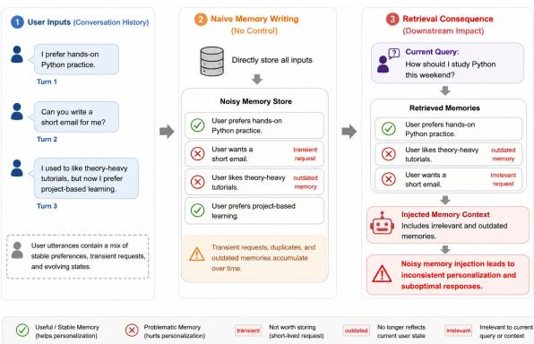
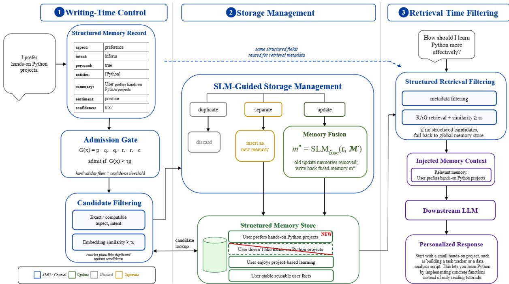

# AMU: Admission and Memory Update for Personalized Conversations Structured Memory with SLM Guided Control

Tao Hwang1,\*, Yishi Diao2 1Independent Researcher, 2Nanchang University Correspondence: taohwang@ieee.org

## Abstract

Large language models (LLMs) have become the foundation of personalized assistants, but maintaining persistent user memory across long-term interactions remains challenging. Existing memory systems often focus on storage, retrieval, or consolidation, while memory writing remains less controlled: transient requests, duplicate statements, and outdated user states may enter memory and later be retrieved for personalization. In this paper, we present AMU: Admission and Memory Update for Personalized Conversations, an SLM-guided (Small language model guided) structured framework for writing-time memory control. AMU uses structured memory filtering to decide what should enter memory and SLM-guided storage management to determine whether an admitted record should be stored separately, discarded as a duplicate, or fused as an update. We evaluate AMU in a controlled memory writing and retrieval setting. Experimental results show that AMU maintains cleaner and more retrievable personalized memories. Our code is available at https: //github.com/UnicusT11/AMU-memory.

## 1 Introduction

Large language models (LLMs) are now widely used in conversational agents and personalized assistants. Recent models have shown strong abilities in instruction following, reasoning, tool use, multilingual interaction, and multimodal understanding (Ouyang et al., 2022; OpenAI et al., 2024; Wang et al., 2024; Team et al., 2025; Grattafiori et al., 2024). However, many LLM-based interactions are still organized around a single session. The model can respond to the current prompt, but it does not naturally maintain a stable and evolving understanding of the user across long-horizon interactions (Zhong et al., 2023; WesthäuSSer et al.,

  
Figure 1: Motivation of writing-time memory control. Directly storing user utterances can preserve transient, redundant, or outdated memories, while AMU keeps stable and reusable memories for cleaner personalization.

2025). For personalized assistants, this makes persistent memory necessary, especially for reusable user information such as preferences, background, plans, and changing personal states.

Existing work has supported such continuity through several directions. Long-context methods place more dialogue history into the prompt or train models to handle longer contexts (Bai et al., 2024; Liu et al., 2024; Chen et al., 2024), but they can be costly and still do not ensure that the model uses the right evidence. Model-internal memory methods introduce memory tiers or readwrite memory units inside the agent or model architecture (Packer et al., 2024; Modarressi et al., 2024), but these designs are often tied to particular implementations. External memory modules take a different route: they extract, store, retrieve, and inject user information outside the response model. This makes them practical for deployment, since the memory component can be updated without retraining and can be reused across different model backends (Zhou et al., 2026; Rafique and Bindschaedler, 2026). Prior systems have explored a range of external-memory designs for storing, retrieving, and updating user information (Izacard and Grave, 2021; Park et al., 2023; Li et al., 2025; Xu et al., 2025; Chhikara et al., 2025).

Despite these developments, fine-grained control at the memory writing stage remains underexplored. User conversations contain mixed signals. Some inputs describe stable preferences or longterm facts, while others are temporary requests, repeated statements, outdated states, emotional expressions, or details that are only weakly relevant to future personalization. If such information is admitted into memory without sufficient control, the memory store can gradually accumulate noisy, redundant, or outdated entries. Figure 1 illustrates this problem: transient requests and outdated preferences may be stored together with useful memories and later retrieved, which can lead to noisy memory injection and inconsistent personalization. A memory system therefore needs to decide not only which stored memories should be retrieved, but also which information should be written into memory in the first place and how it should interact with existing records.

Retrieval filtering or post-hoc consolidation only partly addresses this problem. Retrieval can select stored memories for a particular query, but it cannot remove the effect of low-value records that have already been written into the memory store. Consolidation can merge or revise stored memories, but when admission is weak, it may still operate over a noisy candidate pool. A robust personalized memory system therefore needs two coupled writing-time capabilities. The first is admission control, which filters low-value or non-personal inputs before storage. The second is relation-aware memory update, which determines whether an admitted record should be stored as a new memory, discarded as a duplicate, or fused into an updated user state. These capabilities are particularly important in long-term personalized settings, where preferences, plans, and personal states may change over repeated interactions.

In this paper, we propose AMU: Admission and Memory Update for Personalized Conversations, a structured framework for writing-time memory control in personalized conversations. AMU focuses on the memory writing stage and targets two problems caused by passive memory accumulation: low-value or non-personal information may enter long-term memory, and repeated or evolving user states may create redundant or outdated records. In AMU, structured admission first determines which user inputs are eligible for memory storage. A small language model (SLM) is then used as a lightweight controller to decide how each admitted record should interact with existing memories. Specifically, the SLM judges whether a candidate memory should be stored separately, discarded as a duplicate, or fused as an update to the current reusable user state. The resulting memories are kept as structured records and serialized into plain-text memory context for downstream RAG-based response generation.

Our contributions are summarized as follows:

• We introduce AMU, a structured framework for writing-time memory control in personalized conversations. AMU manages user memories before downstream retrieval by treating memory construction as a controlled writing process rather than passive accumulation.

• We propose structured admission for personalized memory writing. By parsing user inputs into typed memory records, AMU filters low-value or non-personal information before storage and uses structured fields to guide candidate selection and retrieval-time filtering.

• We propose SLM-guided memory update for maintaining reusable and evolving user memories. A lightweight SLM determines whether an admitted memory is duplicate, update, or separate from existing memories, and update-related records are fused into the current reusable user state.

## 2 Related Work

Large language models (LLMs) have enabled strong conversational and reasoning abilities, but persistent personalization remains difficult when user information must be maintained across longterm interactions. Existing personalized dialogue systems commonly condition responses on personas, user profiles, or dialogue histories to improve consistency and user adaptation (Shuster et al., 2022). Recent personalization benchmarks further evaluate whether LLMs can use user profiles, preferences, and historical interactions when generating responses (Salemi et al., 2024). However, these studies mainly focus on how user information is used during generation, while the process by which user utterances are admitted, filtered, updated, or discarded before retrieval is less explicitly studied.

Personalized Memory. Early personalized dialogue work usually relies on static persona descriptions or profile sentences. Personal Chat (Zhang et al., 2018) introduced persona-grounded conversations to evaluate whether models can produce responses consistent with assigned personas. Dinan et al. (2020) further studied controllable and persona-aware dialogue modeling in open-domain conversations. More recent work explores longerterm personalization and persistent memory management, where agents accumulate and maintain user-specific information from interaction histories rather than relying only on predefined persona statements. Mem0 maintains persistent memories through explicit memory operations, A-MAC focuses on adaptive memory admission and conflictaware maintenance, and A-MEM organizes memories through structured linking and dynamic evolution (Chhikara et al., 2025; Zhang et al., 2026a; Xu et al., 2025). These studies show that memory construction and maintenance are increasingly important for long-term personalized interaction. AMU focuses specifically on writing-time control for personalized conversational memory, coupling structured admission with relation-aware decisions over whether an admitted memory should be treated as duplicate, update, or separate.

Retrieval-Augmented Memory. Retrievalaugmented language models use external knowledge or non-parametric memory to improve factuality and task performance. REALM retrieves external knowledge during pre-training and downstream prediction (Guu et al., 2020), and RETRO conditions generation on retrieved chunks from a large-scale retrieval database (Borgeaud et al., 2022). Retrieval augmentation has also been applied to black-box and in-context language models, showing that retrieved evidence can improve model outputs without changing model parameters (Ram et al., 2023; Shi et al., 2023). In dialogue and question answering, retrieval helps ground responses and reduce unsupported generation (Shuster et al., 2021; Komeili et al., 2022; Nakano et al., 2022). More recent methods study adaptive or self-reflective retrieval, deciding when retrieval is needed and how evidence should be incorporated (Asai et al., 2024; Jiang et al., 2023; Mallen et al., 2023).

However, these works mainly address how to retrieve and use stored information at inference time. They do not fully address how a personalized memory store should be kept clean before retrieval. AMU complements retrieval-augmented methods by applying structured filtering during memory writing and retrieval.

Memory Construction and Management. Agent-oriented methods have shown that intermediate reasoning traces, feedback, and memory-like states can improve long-horizon behavior. ReAct combines reasoning with external actions in an agent loop (Yao et al., 2023), Reflexion uses verbal feedback as an episodic memory signal for future decisions (Shinn et al., 2023), and Self-Refine iteratively improves model outputs through self-generated feedback (Madaan et al., 2023). These methods demonstrate the usefulness of model-generated judgments and feedback. Nevertheless, personalized memory management requires a different form of decision-making: a system must decide whether a user utterance should be stored, discarded as redundant, or used to update an existing memory. AMU addresses this issue through structured memory filtering and SLM-guided storage management, where candidate memories are explicitly judged as duplicate, update, or separate before being written back to the memory store.

## 3 Admission and Memory Update for Personalized Conversations

This section describes AMU, an SLM-guided structured framework for personalized memory management. §3.1 presents the overall framework. §3.2 describes structured memory filtering, §3.3 introduces SLM-guided storage management, and §3.4 describes structured storage and RAG-based retrieval.

## 3.1 AMU Framework

AMU maintains personalized memories as structured and updateable records rather than an append-only log of user utterances. As shown in Figure 2, AMU consists of two coupled mechanisms: structured memory filtering and SLMguided storage management. Given a user input, AMU first converts it into a typed memory record. The structured fields are then used to determine whether the input should enter memory processing, which existing memories should be considered as candidates, and which memory subset should be exposed during retrieval. For admitted records, the SLM judges whether the new record is duplicate, update, or separate with respect to existing memories. Separate records are inserted, duplicate records are discarded, and update-related records are fused into the current reusable memory state. By decoupling memory management from the downstream response LLM, AMU supports early exits and enables the maintained memory store to be reused across different LLM backends.

  
Figure 2: Overview of AMU. Structured fields guide memory admission and retrieval, while the SLM decides whether an admitted record is duplicate, update, or separate before storage.

## 3.2 Structured Memory Filtering

Structured memory record. Structured memory filtering begins with a typed memory record. Given a user input, we use an SLM to produce

$$
m = \{ a , i , p , e , s , v , c \}\tag{1}
$$

where a denotes the memory aspect, i denotes the communicative intent, p indicates reusable personal information, e contains salient entities, s is an affect-neutral memory summary, v is sentiment, and c is confidence. The parsing process first extracts structural fields, including aspect, intent, reusable-personal flag, and entities, and then formulates the memory summary, sentiment, and confidence score. This step constructs the representation used by subsequent filtering and storage management.

Each user input is structured with two complementary labels: aspect for the type of user information and intent for the communicative function of the utterance. Aspect labels correspond to common facets in user modeling and personal information understanding, such as profile, relationship, activity, health, and preference (Purificato et al., 2024; Tan et al., 2025), while intent labels correspond to dialogue-act-style abstraction of utterance function (Vasselli et al., 2025). Accordingly, we define the aspect set as {personal\_profile, social\_relationship, activity, health, preference, other}, and the intent set as {inform, request, express, plan, reflect, other}. These labels provide complementary structural views: aspect captures what the memory is about, while intent captures how the user presents it. The entity field anchors memory formulation but is not used as a hard matching key.

The memory summary s is stored as an affectneutral statement that preserves one explicit, stable, and reusable user fact, while sentiment v is stored separately as {positive, neutral, negative}. This separation keeps factual memory content distinct from affective tone. We use the confidence score c as a lightweight reliability signal for the generated memory record, corresponding to calibration and self-evaluation in long-form generation (Huang et al., 2024). Since modelgenerated confidence is not necessarily calibrated, c is elicited with a rubric over explicitness, stability, and ambiguity, rather than treated as an unconstrained probability estimate.

Admission gate. Based on the structured record, an admission gate determines whether the record enters the memory writing pipeline. We formulate memory admission as a writing-time control decision based on content type and persistence signals in memory admission control (Zhang et al., 2026a). Given $m = \{ a , i , p , e , s , v , c \}$ , the gate computes

$$
G ( x ) = p \cdot q _ { a } \cdot q _ { i } \cdot r _ { e } \cdot r _ { s } \cdot c\tag{2}
$$

Here, $p$ indicates reusable personal information, $q _ { a }$ filters fallback aspects, $q _ { i }$ filters fallback intents and purely task-oriented requests without reusable personal content, and $r _ { e }$ and $r _ { s }$ indicate whether entities and memory summary are nonempty. Since all terms except c are binary, the gate implements a hard validity filter combined with a confidence threshold. A record is admitted only when $G ( x ) \geq \tau _ { g }$

Candidate filtering. For admitted records, structured labels restrict the candidate memory pool. Existing memories with the same aspectintent pair are first retrieved. Because these labels are predicted fields, the lookup expands to compatible intents under the same aspect when no exact-pair candidates are found. The resulting candidate set is further filtered by embedding similarity:

$$
\begin{array} { r } { \mathrm { s i m } _ { j } = \mathrm { s i m } ( u , u _ { j } ) , \quad \mathrm { s i m } _ { j } \geq \tau _ { s } } \end{array}\tag{3}
$$

where u and $u _ { j }$ are embeddings of the current record and candidate memory $m _ { j }$ . The threshold $\tau _ { s }$ is used only during writing for duplicate/update candidate filtering. This step limits later SLM judgment to plausible duplicate or update candidates.

## 3.3 SLM-Guided Storage Management

After structured filtering, we perform SLM-guided storage management over the retained candidates. For each candidate, a compact comparison view is constructed using entities, memory summary, and sentiment. The SLM predicts the storage relation between the current record and each candidate as one of three labels: duplicate, update, or separate.

A duplicate record adds no reusable information beyond an existing memory and is discarded. An update record revises, narrows, contradicts, or supersedes an existing memory and should replace the old state. A separate record describes another stable user fact and can coexist with existing memories. This relational judgment turns memory writing from a binary store-or-drop decision into a storage management process that supports insertion, deletion, and update.

Deterministic actions are applied according to the predicted relations. If all candidates are separate, the current record is inserted as a new memory. If no update is found but at least one duplicate exists, the current record is discarded as redundant. If one or more update candidates are found, memory fusion is performed. We treat update as a storage-management relation for evolving user states, where outdated preferences or states should be revised rather than kept active (Sun et al., 2025). Let d denote the current structured record and M denote the list of candidate memories predicted as update. The SLM fuses d and M into a new memory record:

$$
m ^ { * } = \mathrm { S L M } _ { \mathrm { f u s e } } ( d , { \mathcal { M } } ) .
$$

Only update candidates are used for fusion; separate candidates remain unchanged, and duplicates are excluded. The fused memory $m ^ { * }$ represents the current reusable state. Old update memories are removed, and only $m ^ { * }$ is written back to the memory store.

## 3.4 Structured Storage and RAG Retrieval

Accepted memories are stored as document-style structured records, with memory\_summary used as the main retrieval text for vector indexing. Structured fields are also used as retrieval metadata to filter candidate memories before vector retrieval, so retrieval is performed over a more relevant subset of the memory store. If no structured candidates are available, retrieval falls back to the global memory store.

During retrieval, the RAG backend uses the current user query to retrieve relevant memories and injects them as plain-text memory context. We further filter the retriever’s top-k results with a retrieval-time threshold $\tau _ { r }$ , which suppresses weakly related memories during inference. This threshold differs from $\tau _ { s } .$ , which is used during writing for duplicate/update detection. Thus, structured filtering is used at both writing time and retrieval time: writing-time filtering controls which records enter and update the memory store, while retrieval-time filtering controls which maintained memories are exposed for downstream use.

## 4 Experiment

## 4.1 Dataset and Experiment Setup

Dataset. We use GPT-4o to construct a controlled benchmark for memory writing and retrieval by adapting LoCoMo-style long-term conversational contexts into single-topic sessions with explicit action labels and retrieval targets (Maharana et al., 2024; Kim et al., 2025). This setup is motivated by the privacy sensitivity and annotation difficulty of real long-term personal memory logs. The benchmark simulates one to two months of theme-based interactions, including stable preferences, evolving attitudes, repeated information, and preference or plan updates. Each session is generated under a specific theme with a guidelineconstrained prompt and a fixed JSON schema. We generate 20 sessions with different themes, and each session contains 50 memory-writing turns followed by 10 evaluation queries. The benchmark contains 1,000 memory-writing turns and 200 evaluation queries in total. Each memory-writing turn is annotated with a construction-time action label, including store, discard, update, or filter, and each memory-bearing turn is assigned a slotlevel memory\_id. Each evaluation query is associated with expected memory ids for retrieval evaluation.

Experimental setting. Experiments are conducted on the 20 sessions. For each session, the first 50 turns are processed sequentially as memory-writing inputs, and the last 10 queries evaluate retrieval against the expected slot-level memory ids. All memory-based systems use the same Haystack-based RAG backend and Qwen3- Embedding-0.6B embedding model. The compared systems differ in how memories are constructed, admitted, updated, and maintained, while the downstream retrieval protocol is kept fixed for controlled evaluation. Qwen3.5-2B is used as the default SLM for memory management unless otherwise specified. All experiments were conducted on a single NVIDIA RTX 4070 GPU.

## 4.2 Manual Validation of Silver Labels

To assess the reliability of GPT-4o-generated silver annotations, the same subset of writing turns and evaluation queries was independently reviewed by multiple annotators. The subset was selected through programmatic random sampling of item IDs and contained 30 writing turns and 5 queries from each session, corresponding to 600 of 1,000 writing turns (60%) and 100 of 200 evaluation queries (50%). For writing turns, the annotators judged whether the assigned action matched the definitions of store, discard, update, and filter. For evaluation queries, they verified whether the expected memory\_ids were traceable to the corresponding writing turns and appropriate for the query.

Table 1 reports the mean validity rates across the independent annotations: 89.3% for actionlabel validity and 94.1% for query-memory alignment. These values measure manual annotation validity rather than inter-annotator agreement.

<table><tr><td>Metric</td><td>Validity (%)</td></tr><tr><td>Action label validity</td><td>89.3</td></tr><tr><td>Query-memory alignment</td><td>94.1</td></tr></table>

Table 1: Manual validation of silver annotations. Reported values are mean validity rates across independent annotations.

## 4.3 Experimental Results

Compared baselines. We compare AMU with five baselines covering both simple memoryretention strategies and existing long-term memory-management methods. Full Compressed Memory compresses and stores all memory-writing inputs, representing summaryor compression-based memory construction in long-term memory systems (Chen et al., 2025; Zhang et al., 2026b). Sliding Window retains only recent memories and discards older ones, providing a recency-based reference under limited memory capacity. Mem0 (Chhikara et al., 2025) extracts salient information from conversational history and maintains persistent memories through explicit memory operations, including addition, update, deletion, and no-op. A-MAC (Zhang et al., 2026a) performs adaptive memory admission using signals such as utility, confidence, novelty, recency, and content type, together with conflict-aware memory maintenance, providing a direct comparison for selective memory writing and maintenance. A-MEM (Xu et al., 2025) constructs structured memory notes and dynamically links and evolves stored memories as new information is incorporated. All methods are evaluated under the same slot-level retrieval protocol to compare the quality of the maintained memory stores.

<table><tr><td>Method</td><td>P@3</td><td>R@3</td><td>F1@3</td><td>HIT@3</td><td>Red.@3↓</td></tr><tr><td>Full Comp.</td><td>35.42</td><td>55.50</td><td>41.30</td><td>57.00</td><td>12.08</td></tr><tr><td>Sliding Window</td><td>24.42</td><td>29.50</td><td>25.87</td><td>29.50</td><td>11.75</td></tr><tr><td>Mem0</td><td>34.08</td><td>57.50</td><td>40.88</td><td>56.00</td><td>3.63</td></tr><tr><td>A-MAC</td><td>30.36</td><td>58.76</td><td>37.96</td><td>54.50</td><td>3.18</td></tr><tr><td>A-MEM</td><td>35.13</td><td>56.90</td><td>40.36</td><td>56.50</td><td>2.88</td></tr><tr><td>AMU(Ours)</td><td>37.33</td><td>63.50</td><td>44.47</td><td>57.50</td><td>2.83</td></tr></table>

Table 2: Main retrieval results. Red.@3 denotes Redundancy@3, where lower values are better.

Evaluation metrics. We evaluate top-3 retrieval on memory-required queries. Retrieved memories are mapped to slot-level memory\_ids and compared with expected memory ids. We report P@3, R@3, F1@3, and HIT@3, measuring precision, recall, precision-recall balance, and whether at least one expected memory slot is retrieved. Since AMU targets cleaner memory maintenance rather than retrieval coverage alone, we also report Redundancy@3, defined as the percentage of top-3 retrieved memories that repeat an already retrieved slot-level memory\_id. Lower values indicate cleaner retrieval. No-memory queries are used only as a sanity check.

Results. As shown in Table 2, AMU achieves the best overall retrieval performance while maintaining the lowest redundancy. It obtains 37.33 P@3, 63.50 R@3, 44.47 F1@3, and 57.50 HIT@3, with a Red.@3 of 2.83. Compared with Full Compressed Memory, AMU improves both precision and recall while reducing Red.@3 from 12.08 to 2.83. This indicates that retaining all compressed memories preserves useful information but also introduces substantial redundant memory traces. Sliding Window performs substantially worse across retrieval metrics, showing that recency-only retention can discard information required for long-term personalization. Among the existing memory-management methods, different approaches exhibit different retrieval–redundancy trade-offs. Mem0 achieves 57.50 R@3 and 40.88

F1@3 while substantially reducing redundancy relative to Full Compressed Memory. AMU further improves its P@3, R@3, and F1@3, while reducing Red.@3 from 3.63 to 2.83. A-MAC obtains the highest recall among the compared existing methods at 58.76, but its lower precision of 30.36 results in an F1@3 of 37.96. AMU improves both precision and recall over A-MAC, indicating a stronger precisionrecall balance under our controlled memory-writing setting. A-MEM achieves a Red.@3 of 2.88, which is already close to AMU, but AMU increases R@3 from 56.90 to 63.50 and F1@3 from 40.36 to 44.47. This result is particularly important because AMU’s improvement cannot be explained simply by producing a less redundant memory store. Overall, the results show that AMU provides a stronger balance between retrieval effectiveness and memory cleanliness. Existing methods respectively provide explicit memory operations, selective admission, or structured memory evolution, yet AMU achieves the highest P@3, R@3, F1@3, and HIT@3 together with the lowest Red.@3 in our controlled setting. These results support combining structured admission with relation-aware duplicate, update, and separate decisions for maintaining reusable personalized memory before downstream retrieval.

## 4.4 Component Verification

To verify AMU’s two main mechanisms, we conduct ablations with two variants. AMU w/o Structured Filtering removes structured filtering from memory writing and retrieval. AMU w/o SLM Storage Management keeps structured filtering but removes SLM-guided relation judgment, so duplicate, update, and separate relations are no longer explicitly handled. We report F1@3, Redundancy@3, and Action Acc., defined as the percentage of memory-writing turns whose predicted action matches the gold action label.

<table><tr><td>Variant</td><td>F1@3</td><td></td><td>Red.@3 ↓ Act. Acc.</td></tr><tr><td>w/o Struct. Filtering</td><td>34.30</td><td>2.25</td><td>65.40</td></tr><tr><td>w/o SLM Storage Mgmt.</td><td>25.62</td><td>0.25</td><td>34.50</td></tr><tr><td>AMU(Ours)</td><td>44.47</td><td>2.83</td><td>67.70</td></tr></table>

Table 3: Component verification of AMU. Red.@3 denotes Redundancy@3, where lower values are better.

<table><tr><td>Size</td><td>F1@3</td><td>Red.@3↓</td><td>Act. Acc.</td></tr><tr><td>0.8B</td><td>13.90</td><td>0.31</td><td>26.40</td></tr><tr><td>2B</td><td>44.47</td><td>2.83</td><td>67.70</td></tr><tr><td>4B</td><td>41.78</td><td>3.08</td><td>81.00</td></tr><tr><td>9B</td><td>40.00</td><td>3.33</td><td>84.20</td></tr></table>

Table 4: Effect of SLM controller size.

As shown in Table 3, removing either mechanism weakens AMU. Without structured filtering, both F1@3 and Action Acc. decrease, indicating weaker noise filtering and retrieval alignment. Without SLM storage management, F1@3 and Action Acc. drop more substantially, showing that explicit duplicate/update/separate judgment is important for memory maintenance. Although this variant has lower Redundancy@3, the low redundancy is accompanied by poor retrieval coverage and unreliable writing decisions. These results show that structured memory filtering and SLM-guided storage management are complementary: the former selects records and candidates, while the latter decides how admitted memories are stored, discarded, or updated.

## 5 Analysis

We analyze how the size of the SLM controller affects memory maintenance, focusing on the relation between writing-action accuracy and retrievalside behavior. As shown in Table 4, larger controllers improve Action Acc., especially from 0.8B to larger models, indicating that overly small controllers are not stable enough for structured parsing and storage decisions. However, after 4B, the accuracy gain becomes limited, while F1@3 and Red.@3 do not improve proportionally. This suggests that stronger writing-action prediction does not necessarily lead to better retrieval-side performance, since retrieval is also affected by embedding similarity, thresholds, and top-k ranking. The results therefore indicate limited marginal gains from further scaling in this setting, while showing that Qwen3.5-2B is sufficient for AMU without relying on a large response LLM for memory control.

## 6 Conclusion

In this paper, we presented AMU: Admission and Memory Update for Personalized Conversations. AMU combines structured memory filtering with SLM-guided storage management. To conduct the evaluation, we construct a controlled memory writing and retrieval benchmark to measure whether systems can retrieve expected memory slots while avoiding redundant memories. In addition, we verify the potential of these components for improving memory maintenance. The results demonstrate the value of combining structured memory filtering with SLM-guided storage management for maintaining cleaner personalized memories before downstream retrieval and response generation.

## Limitations of the Work

Hardware-Dependent Running Time. All experiments are conducted on a single NVIDIA RTX 4070 GPU, representing an accessible local evaluation setting rather than a large-scale serving environment. This hardware setting provides a practical reference for evaluating AMU under local deployment constraints. However, the running time reported in our experiments should be interpreted together with this setup, since larger SLM controllers may run faster on stronger accelerators or optimized inference infrastructure.

SLM Guidance Dependence. AMU relies on an SLM to extract structured memory records and perform storage-management judgments. Its effectiveness therefore depends on whether the chosen SLM can follow structured prompts, produce stable fields, and distinguish duplicate, update, and separate relations. Very small or poorly aligned SLMs may generate unstable structures or unreliable relation judgments, which can affect both memory writing and downstream retrieval.

## Declaration on Generative AI

Generative AI tools were used solely for language polishing during manuscript preparation, including improvements to grammar, and clarity.

## Ethics Statement

This work uses a controlled benchmark constructed for memory writing and retrieval. The benchmark is generated and transformed with GPT-4o by adapting textual contexts from

LoCoMo-style long-term conversations into AMU’s memory-writing setting. It does not rely on real user conversations or personally identifiable private data. The AMU-specific annotations, including memory-writing action labels, memory identifiers, update links, and retrieval targets, are created for controlled evaluation.

AMU is designed for personalized memory management, where stored memories may reflect user preferences, plans, or states. In practical deployment, users should be informed when memory is enabled and should be able to inspect, edit, or delete stored memories. Since AMU stores memories as structured records, selected memory entries can be removed or updated when users request deletion or correction.

## References

Akari Asai, Zeqiu Wu, Yizhong Wang, Avirup Sil, and Hannaneh Hajishirzi. 2024. Self-RAG: Learning to retrieve, generate, and critique through selfreflection. In The Twelfth International Conference on Learning Representations.

Yushi Bai, Xin Lv, Jiajie Zhang, Hongchang Lyu, Jiankai Tang, Zhidian Huang, Zhengxiao Du, Xiao Liu, Aohan Zeng, Lei Hou, Yuxiao Dong, Jie Tang, and Juanzi Li. 2024. LongBench: A bilingual, multitask benchmark for long context understanding. In Proceedings of the 62nd Annual Meeting of the Association for Computational Linguistics (Volume 1: Long Papers), pages 3119–3137, Bangkok, Thailand. Association for Computational Linguistics.

Sebastian Borgeaud, Arthur Mensch, Jordan Hoffmann, Trevor Cai, Eliza Rutherford, Katie Millican, George Bm Van Den Driessche, Jean-Baptiste Lespiau, Bogdan Damoc, Aidan Clark, Diego De Las Casas, Aurelia Guy, Jacob Menick, Roman Ring, Tom Hennigan, Saffron Huang, Loren Maggiore, Chris Jones, Albin Cassirer, and 9 others. 2022. Improving language models by retrieving from trillions of tokens. In Proceedings of the 39th International Conference on Machine Learning, volume 162 of Proceedings of Machine Learning Research, pages 2206–2240. PMLR.

Nuo Chen, Hongguang Li, Jianhui Chang, Juhua Huang, Baoyuan Wang, and Jia Li. 2025. Compress to impress: Unleashing the potential of compressive memory in real-world long-term conversations. In Proceedings of the 31st International Conference on Computational Linguistics, pages 755– 773, Abu Dhabi, UAE. Association for Computational Linguistics.

Yukang Chen, Shengju Qian, Haotian Tang, Xin Lai, Zhijian Liu, Song Han, and Jiaya Jia. 2024. LongloRA: Efficient fine-tuning of long-context large

language models. In The Twelfth International Conference on Learning Representations.

Prateek Chhikara, Dev Khant, Saket Aryan, Taranjeet Singh, and Deshraj Yadav. 2025. Mem0: Building production-ready ai agents with scalable long-term memory. Preprint, arXiv:2504.19413.

Emily Dinan, Angela Fan, Adina Williams, Jack Urbanek, Douwe Kiela, and Jason Weston. 2020. Queens are powerful too: Mitigating gender bias in dialogue generation. In Proceedings of the 2020 Conference on Empirical Methods in Natural Language Processing (EMNLP), pages 8173–8188, Online. Association for Computational Linguistics.

Aaron Grattafiori, Abhimanyu Dubey, Abhinav Jauhri, Abhinav Pandey, Abhishek Kadian, Ahmad Al-Dahle, Aiesha Letman, Akhil Mathur, Alan Schelten, Alex Vaughan, Amy Yang, Angela Fan, Anirudh Goyal, Anthony Hartshorn, Aobo Yang, Archi Mitra, Archie Sravankumar, Artem Korenev, Arthur Hinsvark, and 542 others. 2024. The llama 3 herd of models. Preprint, arXiv:2407.21783.

Kelvin Guu, Kenton Lee, Zora Tung, Panupong Pasupat, and Mingwei Chang. 2020. Retrieval augmented language model pre-training. In Proceedings of the 37th International Conference on Machine Learning, volume 119 of Proceedings of Machine Learning Research, pages 3929–3938. PMLR.

Yukun Huang, Yixin Liu, Raghuveer Thirukovalluru, Arman Cohan, and Bhuwan Dhingra. 2024. Calibrating long-form generations from large language models. In Findings of the Association for Computational Linguistics: EMNLP 2024, pages 13441– 13460, Miami, Florida, USA. Association for Computational Linguistics.

Gautier Izacard and Edouard Grave. 2021. Leveraging passage retrieval with generative models for open domain question answering. In Proceedings of the 16th Conference of the European Chapter of the Association for Computational Linguistics: Main Volume, pages 874–880, Online. Association for Computational Linguistics.

Zhengbao Jiang, Frank Xu, Luyu Gao, Zhiqing Sun, Qian Liu, Jane Dwivedi-Yu, Yiming Yang, Jamie Callan, and Graham Neubig. 2023. Active retrieval augmented generation. In Proceedings of the 2023 Conference on Empirical Methods in Natural Language Processing, pages 7969–7992, Singapore. Association for Computational Linguistics.

Seungone Kim, Juyoung Suk, Xiang Yue, Vijay Viswanathan, Seongyun Lee, Yizhong Wang, Kiril Gashteovski, Carolin Lawrence, Sean Welleck, and Graham Neubig. 2025. Evaluating language models as synthetic data generators. In Proceedings of the 63rd Annual Meeting of the Association for Computational Linguistics (Volume 1: Long Papers), pages 6385–6403, Vienna, Austria. Association for Computational Linguistics.

Mojtaba Komeili, Kurt Shuster, and Jason Weston. 2022. Internet-augmented dialogue generation. In Proceedings of the 60th Annual Meeting of the Association for Computational Linguistics (Volume 1: Long Papers), pages 8460–8478, Dublin, Ireland. Association for Computational Linguistics.

Hao Li, Chenghao Yang, An Zhang, Yang Deng, Xiang Wang, and Tat-Seng Chua. 2025. Hello again! LLM-powered personalized agent for long-term dialogue. In Proceedings ofthe 2025 Conference ofthe Nations of the Americas Chapter of the Association for Computational Linguistics: Human Language Technologies (Volume 1: Long Papers), pages 5259– 5276, Albuquerque, New Mexico. Association for Computational Linguistics.

Nelson F. Liu, Kevin Lin, John Hewitt, Ashwin Paranjape, Michele Bevilacqua, Fabio Petroni, and Percy Liang. 2024. Lost in the middle: How language models use long contexts. Transactions of the Associationfor Computational Linguistics, 12:157–173.

Aman Madaan, Niket Tandon, Prakhar Gupta, Skyler Hallinan, Luyu Gao, Sarah Wiegreffe, Uri Alon, Nouha Dziri, Shrimai Prabhumoye, Yiming Yang, Shashank Gupta, Bodhisattwa Prasad Majumder, Katherine Hermann, Sean Welleck, Amir Yazdanbakhsh, and Peter Clark. 2023. Self-refine: Iterative refinement with self-feedback. In Advances in Neural Information Processing Systems, volume 36, pages 46534–46594. Curran Associates, Inc.

Adyasha Maharana, Dong-Ho Lee, Sergey Tulyakov, Mohit Bansal, Francesco Barbieri, and Yuwei Fang. 2024. Evaluating very long-term conversational memory of LLM agents. In Proceedings of the 62nd Annual Meeting ofthe Associationfor Computational Linguistics (Volume 1: Long Papers), pages 13851–13870, Bangkok, Thailand. Association for Computational Linguistics.

Alex Mallen, Akari Asai, Victor Zhong, Rajarshi Das, Daniel Khashabi, and Hannaneh Hajishirzi. 2023. When not to trust language models: Investigating effectiveness of parametric and non-parametric memories. In Proceedings of the 61st Annual Meeting of the Association for Computational Linguistics (Volume 1: Long Papers), pages 9802–9822, Toronto, Canada. Association for Computational Linguistics.

Ali Modarressi, Ayyoob Imani, Mohsen Fayyaz, and Hinrich Schütze. 2024. Ret-llm: Towards a general read-write memory for large language models. Preprint, arXiv:2305.14322.

Reiichiro Nakano, Jacob Hilton, Suchir Balaji, Jeff Wu, Long Ouyang, Christina Kim, Christopher Hesse, Shantanu Jain, Vineet Kosaraju, William Saunders, Xu Jiang, Karl Cobbe, Tyna Eloundou, Gretchen Krueger, Kevin Button, Matthew Knight, Benjamin Chess, and John Schulman. 2022. Webgpt: Browserassisted question-answering with human feedback. Preprint, arXiv:2112.09332.

OpenAI, Josh Achiam, Steven Adler, Sandhini Agarwal, Lama Ahmad, Ilge Akkaya, Florencia Leoni Aleman, Diogo Almeida, Janko Altenschmidt, Sam Altman, Shyamal Anadkat, Red Avila, Igor Babuschkin, Suchir Balaji, Valerie Balcom, Paul Baltescu, Haiming Bao, Mohammad Bavarian, Jeff Belgum, and 262 others. 2024. Gpt-4 technical report. Preprint, arXiv:2303.08774.

Long Ouyang, Jeffrey Wu, Xu Jiang, Diogo Almeida, Carroll Wainwright, Pamela Mishkin, Chong Zhang, Sandhini Agarwal, Katarina Slama, Alex Ray, John Schulman, Jacob Hilton, Fraser Kelton, Luke Miller, Maddie Simens, Amanda Askell, Peter Welinder, Paul F Christiano, Jan Leike, and Ryan Lowe. 2022. Training language models to follow instructions with human feedback. In Advances in Neural Information Processing Systems, volume 35, pages 27730–27744. Curran Associates, Inc.

Charles Packer, Sarah Wooders, Kevin Lin, Vivian Fang, Shishir G. Patil, Ion Stoica, and Joseph E. Gonzalez. 2024. Memgpt: Towards llms as operating systems. Preprint, arXiv:2310.08560.

Joon Sung Park, Joseph O’Brien, Carrie Jun Cai, Meredith Ringel Morris, Percy Liang, and Michael S. Bernstein. 2023. Generative agents: Interactive simulacra of human behavior. In Proceedings of the 36th Annual ACM Symposium on User Interface Software and Technology, UIST ’23, New York, NY, USA. Association for Computing Machinery.

Erasmo Purificato, Ludovico Boratto, and Ernesto William De Luca. 2024. User modeling and user profiling: A comprehensive survey. Preprint, arXiv:2402.09660.

Mofasshara Rafique and Laurent Bindschaedler. 2026. Clawvm: Harness-managed virtual memory for stateful tool-using llm agents. In Proceedings ofthe Sixth European Workshop on Machine Learning and Systems, EuroMLSys 26, page 112. ACM.

Ori Ram, Yoav Levine, Itay Dalmedigos, Dor Muhlgay, Amnon Shashua, Kevin Leyton-Brown, and Yoav Shoham. 2023. In-context retrieval-augmented language models. Transactions of the Association for Computational Linguistics, 11:1316–1331.

Alireza Salemi, Sheshera Mysore, Michael Bendersky, and Hamed Zamani. 2024. LaMP: When large language models meet personalization. In Proceedings of the 62nd Annual Meeting of the Association for Computational Linguistics (Volume 1: Long Papers), pages 7370–7392, Bangkok, Thailand. Association for Computational Linguistics.

Weijia Shi, Sewon Min, Michihiro Yasunaga, Minjoon Seo, Rich James, Mike Lewis, Luke Zettlemoyer, and Wen tau Yih. 2023. Replug: Retrievalaugmented black-box language models. Preprint, arXiv:2301.12652.

Noah Shinn, Federico Cassano, Ashwin Gopinath, Karthik Narasimhan, and Shunyu Yao. 2023. Reflexion: language agents with verbal reinforcement learning. In Advances in Neural Information Processing Systems, volume 36, pages 8634–8652. Curran Associates, Inc.

Kurt Shuster, Spencer Poff, Moya Chen, Douwe Kiela, and Jason Weston. 2021. Retrieval augmentation reduces hallucination in conversation. In Findings of the Association for Computational Linguistics: EMNLP 2021, pages 3784–3803, Punta Cana, Dominican Republic. Association for Computational Linguistics.

Kurt Shuster, Jing Xu, Mojtaba Komeili, Da Ju, Eric Michael Smith, Stephen Roller, Megan Ung, Moya Chen, Kushal Arora, Joshua Lane, Morteza Behrooz, William Ngan, Spencer Poff, Naman Goyal, Arthur Szlam, Y-Lan Boureau, Melanie Kambadur, and Jason Weston. 2022. Blenderbot 3: a deployed conversational agent that continually learns to responsibly engage. Preprint, arXiv:2208.03188.

Haoran Sun, Zekun Zhang, and Shaoning Zeng. 2025. Preference-aware memory update for long-term llm agents. Preprint, arXiv:2510.09720.

Juntao Tan, Liangwei Yang, Zuxin Liu, Zhiwei Liu, Rithesh R N, Tulika Manoj Awalgaonkar, Jianguo Zhang, Weiran Yao, Ming Zhu, Shirley Kokane, Silvio Savarese, Huan Wang, Caiming Xiong, and Shelby Heinecke. 2025. PersonaBench: Evaluating AI models on understanding personal information through accessing (synthetic) private user data. In Findings of the Association for Computational Linguistics: ACL 2025, pages 878–893, Vienna, Austria. Association for Computational Linguistics.

Gemini Team, Rohan Anil, Sebastian Borgeaud, Jean-Baptiste Alayrac, Jiahui Yu, Radu Soricut, Johan Schalkwyk, Andrew M. Dai, Anja Hauth, Katie Millican, David Silver, Melvin Johnson, Ioannis Antonoglou, Julian Schrittwieser, Amelia Glaese, Jilin Chen, Emily Pitler, Timothy Lillicrap, Angeliki Lazaridou, and 1332 others. 2025. Gemini: A family of highly capable multimodal models. Preprint, arXiv:2312.11805.

Justin Vasselli, Eunike Andriani Kardinata, Yusuke Sakai, and Taro Watanabe. 2025. Multilingual dialogue generation and localization with dialogue act scripting. In Proceedings ofthe 2025 Conference on Empirical Methods in Natural Language Processing, pages 32896–32911, Suzhou, China. Association for Computational Linguistics.

Lei Wang, Chen Ma, Xueyang Feng, Zeyu Zhang, Hao Yang, Jingsen Zhang, Zhiyuan Chen, Jiakai Tang, Xu Chen, Yankai Lin, Wayne Xin Zhao, Zhewei Wei, and Jirong Wen. 2024. A survey on large language model based autonomous agents. Frontiers of Computer Science, 18(6).

Rebecca WesthäuSSer, Wolfgang Minker, and Sebatian Zepf. 2025. Enabling personalized long-term interactions in llm-based agents through persistent memory and user profiles. Preprint, arXiv:2510.07925.

Wujiang Xu, Zujie Liang, Kai Mei, Hang Gao, Juntao Tan, and Yongfeng Zhang. 2025. A-mem: Agentic memory for llm agents. In Advances in Neural Information Processing Systems, volume 38, pages 17577–17604. Curran Associates, Inc.

Shunyu Yao, Jeffrey Zhao, Dian Yu, Nan Du, Izhak Shafran, Karthik R Narasimhan, and Yuan Cao. 2023. React: Synergizing reasoning and acting in language models. In The Eleventh International Conference on Learning Representations.

Guilin Zhang, Wei Jiang, Xiejiashan Wang, Aisha Behr, Kai Zhao, Jeffrey Friedman, Xu Chu, and Amine Anoun. 2026a. Adaptive memory admission control for llm agents. Preprint, arXiv:2603.04549.

Jiaquan Zhang, Chaoning Zhang, Shuxu Chen, Zhenzhen Huang, Pengcheng Zheng, Zhicheng Wang, Ping Guo, Fan Mo, Sung-Ho Bae, Jie Zou, Jiwei Wei, and Yang Yang. 2026b. Lightweight llm agent memory with small language models. Preprint, arXiv:2604.07798.

Saizheng Zhang, Emily Dinan, Jack Urbanek, Arthur Szlam, Douwe Kiela, and Jason Weston. 2018. Personalizing dialogue agents: I have a dog, do you have pets too? In Proceedings of the 56th Annual Meeting of the Association for Computational Linguistics (Volume 1: Long Papers), pages 2204– 2213, Melbourne, Australia. Association for Computational Linguistics.

Wanjun Zhong, Lianghong Guo, Qiqi Gao, He Ye, and Yanlin Wang. 2023. Memorybank: Enhancing large language models with long-term memory. Preprint, arXiv:2305.10250.

Chenyu Zhou, Huacan Chai, Wenteng Chen, Zihan Guo, Rong Shan, Yuanyi Song, Tianyi Xu, Yingxuan Yang, Aofan Yu, Weiming Zhang, Congming Zheng, Jiachen Zhu, Zeyu Zheng, Zhuosheng Zhang, Xingyu Lou, Changwang Zhang, Zhihui Fu, Jun Wang, Weiwen Liu, and 2 others. 2026. Externalization in llm agents: A unified review of memory, skills, protocols and harness engineering. Preprint, arXiv:2604.08224.

## Appendix

## A Additional Analysis

We provide more details on the behavior of AMU under different settings. The additional analyses include downstream LLM use with different memory settings, sensitivity to writing-time and retrieval-time similarity thresholds, comparisons of embedding models, comparisons of different SLM backbones for memory management, and session mixing analysis with memories from multiple sessions.

## A.1 Downstream LLM Judge Evaluation

To examine how the maintained memory affects downstream personalized responses, we conduct a response-level evaluation on sampled cases from each session. For each session, we construct the memory store from the memory-writing turns and randomly sample 5 evaluation queries for response generation. Responses are generated under three settings: without memory, with full compressed memory, and with AMU-maintained memory. The response model is Gemma3-12B with quantized inference, and AMU uses Qwen3.5-2B as the default SLM for memory management. GPT-4o is used as the judge. For each case, the judge is given the user query, the reference memory, the expected behavior, and the assistant response, and assigns an overall score from 1 to 5 based on memory use, avoidance of irrelevant or outdated personal information, and helpfulness.

As shown in Table 5, AMU receives the highest overall score. No Memory lacks access to relevant user information while Full Compressed Memory provides only a modest improvement, suggesting that unfiltered compressed memories may fail to provide useful personalization when irrelevant or redundant information is included. AMU provides a cleaner maintained memory state, allowing the downstream LLM to use relevant personal information more effectively. This analysis is intended as a small-scale response-level supplement rather than a full end-to-end personalization benchmark.

<table><tr><td>Method</td><td>Overall Score</td></tr><tr><td>No Memory</td><td>2.92</td></tr><tr><td>Full Compressed Memory</td><td>3.21</td></tr><tr><td>AMU</td><td>4.37</td></tr></table>

Table 5: Small-scale downstream response evaluation with an LLM judge.

## A.2 Threshold Sensitivity

We analyze the sensitivity of AMU to the writingtime similarity threshold $\tau _ { s }$ and the retrieval-time similarity threshold $\tau _ { r }$ . We set $\tau _ { s } ~ = ~ 0 . 6 0$ and $\tau _ { r } = 0 . 5 5$ as the default thresholds, and vary one threshold at a time to examine its effect on memory writing, retrieval quality, redundancy, and efficiency.

<table><tr><td> $\tau _ { s }$ </td><td>F1@3</td><td>Red.@3↓</td><td>Acc.</td><td>Time/Turn</td></tr><tr><td>0.40</td><td>43.68</td><td>2.75</td><td>66.80</td><td>327.17</td></tr><tr><td>0.60</td><td>44.47</td><td>2.83</td><td>67.70</td><td>231.34</td></tr><tr><td>0.80</td><td>45.82</td><td>4.50</td><td>65.80</td><td>176.74</td></tr></table>

Table 6: Sensitivity to the writing-time threshold $\tau _ { s }$ with $\tau _ { r } ~ = ~ 0 . 5 5$ . Red.@3 denotes Redundancy@3, where lower values are better.

<table><tr><td> $\tau _ { r }$ </td><td>P@3</td><td>R@3</td><td>F1@3</td><td>Red.@3↓</td><td>HIT@3</td></tr><tr><td>0.40</td><td>36.00</td><td>64.25</td><td>43.75</td><td>2.83</td><td>58.00</td></tr><tr><td>0.55</td><td>37.33</td><td>63.50</td><td>44.47</td><td>2.83</td><td>57.50</td></tr><tr><td>0.70</td><td>45.33</td><td>51.25</td><td>46.33</td><td>2.00</td><td>44.50</td></tr></table>

Table 7: Sensitivity to the retrieval-time threshold $\tau _ { r }$ with $\tau _ { s } ~ = ~ 0 . 6 0$ . Red.@3 denotes Redundancy@3, where lower values are better.

Table 6 shows the effect of varying $\tau _ { s }$ while fixing $\tau _ { r } = 0 . 5 5$ . A smaller $\tau _ { s }$ retains more candidate memories for SLM-guided storage management, which increases the average processing time per turn. As $\tau _ { s }$ increases, fewer candidates enter relation judgment, reducing Time/Turn. However, a larger $\tau _ { s }$ also leaves fewer opportunities for duplicate or update management, which can increase redundancy. In this setting, $\tau _ { s } ~ = ~ 0 . 6 0$ provides the highest Action Acc. and a balanced trade-off between writing reliability, retrieval performance, redundancy, and efficiency.

Table 7 shows the effect of varying $\tau _ { r }$ while fixing $\tau _ { s } = 0 . 6 0$ . Increasing $\tau _ { r }$ makes retrieval-time filtering stricter, which improves P@3 and Redundancy@3 by suppressing weakly related memories. However, the stricter threshold also reduces R@3 and HIT@3, indicating that some useful memories may be filtered out. Thus, $\tau _ { r }$ mainly controls the precision-recall trade-off during retrieval. We use $\tau _ { r } = 0 . 5 5$ as the default retrievaltime threshold because it preserves higher recall and HIT@3 while maintaining low redundancy.

## A.3 Embedding Model Comparison

We compare three embedding models used in both memory writing and retrieval: Qwen3-

Embedding-0.6B, BGE-M3, and Multilingual-E5- Large. For each setting, the same embedding model is used for writing-time candidate filtering and retrieval-time memory retrieval.

As shown in Table 8(a), changing the embedding model leads to only small differences across retrieval and writing-related metrics. The three embedding models produce close P@3, R@3, F1@3, HIT@3, Redundancy@3, and Action Acc. scores, indicating that replacing the embedding model in both writing-time candidate filtering and retrieval-time memory retrieval does not substantially alter AMU’s behavior. This suggests that AMU is not tightly coupled to a specific retriever encoder, and the structured memory filtering and SLM-guided storage management pipeline remains stable across the tested embedding choices.

## A.4 SLM Choice for Storage Management

We compare different SLMs used for memory management to examine whether AMU is sensitive to the choice of the SLM backbone. The compared models include Qwen3.5-2B, Qwen3-4B, Gemma-2B-IT, and Gemma4-E2B-IT. All other components, including the embedding model, thresholds, and retrieval pipeline, are kept unchanged.

As shown in Table 8(b), changing the SLM backbone leads to moderate differences but does not substantially change the behavior of AMU. Models with larger parameter sizes generally provide stronger results, especially in writing-action accuracy and retrieval metrics, while smaller models show slightly weaker performance. However, the differences across most settings remain within a limited range, suggesting that AMU is not tightly coupled to a specific SLM backbone. The structured memory filtering and SLM-guided storage management pipeline remains effective across the tested SLM choices.

## A.5 Session Mixing Analysis

We further analyze whether AMU is affected when memories from different sessions are mixed in the same memory store. Sessions are randomly sampled to construct single-session, two-session, and three-session memory stores. Each setting is repeated over five random draws, and the reported scores are averaged across runs.

As shown in Table 8(c), AMU remains stable when memories from multiple sessions are mixed in the same memory store. The retrieval metrics stay close across the single-session and mixedsession settings, and no consistent degradation is observed as the number of mixed sessions increases. This suggests that AMU can still select relevant memories from a moderately mixed memory store, which is consistent with the role of structured filtering and storage management.

Table 8: Additional analysis of embedding models, SLM backbones, and session mixing. Red.@3 and Red. denote Redundancy@3, where lower values are better.  
(a) Effect of different embedding models.
<table><tr><td>Embedding Model</td><td>P@3</td><td>R@3</td><td>F1@3</td><td>Red.@3↓</td><td>HIT@3</td><td>Action Acc.</td></tr><tr><td>Qwen3-Embedding-0.6B</td><td>37.33</td><td>63.50</td><td>44.47</td><td>2.83</td><td>57.50</td><td>67.70</td></tr><tr><td>BGE-M3</td><td>36.83</td><td>63.00</td><td>43.97</td><td>2.92</td><td>57.00</td><td>67.10</td></tr><tr><td>Multilingual-E5-Large</td><td>36.58</td><td>62.75</td><td>43.68</td><td>2.75</td><td>56.50</td><td>66.90</td></tr></table>

(b) Effect of different SLM backbones used for memory management.
<table><tr><td>SLM Backbone</td><td>P@3</td><td>R@3</td><td>F1@3</td><td>Red.@3↓</td><td>HIT@3</td><td>Action Acc.</td></tr><tr><td>Qwen3.5-2B</td><td>37.33</td><td>63.50</td><td>44.47</td><td>2.83</td><td>57.50</td><td>67.70</td></tr><tr><td>Qwen3-4B</td><td>37.33</td><td>66.00</td><td>45.27</td><td>2.83</td><td>59.00</td><td>78.70</td></tr><tr><td>Gemma-2B-IT</td><td>30.50</td><td>55.00</td><td>37.22</td><td>8.25</td><td>55.00</td><td>65.70</td></tr><tr><td>Gemma4-E2B-IT</td><td>37.67</td><td>66.75</td><td>45.73</td><td>1.67</td><td>61.50</td><td>64.10</td></tr></table>

(c) Effect of mixing memories from different sessions.
<table><tr><td>Setting</td><td>P@3</td><td>R@3</td><td>F1@3</td><td>Red.↓</td><td>HIT@3</td></tr><tr><td>Single</td><td>38.68</td><td>69.00</td><td>47.12</td><td>4.34</td><td>64.00</td></tr><tr><td>2-mix</td><td>38.00</td><td>66.00</td><td>45.98</td><td>2.66</td><td>60.00</td></tr><tr><td>3-mix</td><td>42.52</td><td>69.00</td><td>47.14</td><td>4.00</td><td>64.00</td></tr></table>