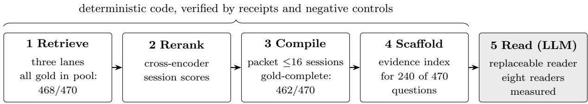

# Auditable Long-Term Memory: A Deterministic Retrieval Chain Measured at 479/475 of 500 on LongMemEval-S

Christopher J. Chanhnourack∗ Centennial Defense Systems (Archivist)

Technical report — September 29, 2026

## Abstract

We evaluate an auditable long-term memory system on LongMemEval-S. Its retrieval chain uses hybrid candidate retrieval, cross-encoder reranking, coverage-first packet compilation, and deterministic reasoning scafolds; an LLM is used only as a replaceable final reader. The chain places all gold sessions in the candidate pool for 468/470 answerable questions and produces gold-complete packets for 462/470. With a Claude Opus reader called through an unpinned CLI alias, two 500-question passes score 479/500 and 475/500 under GPT-4o. The 72 answerable knowledge-update rows used a substantively modified scoring prompt whose efect under the oficial text has not been measured. The pair straddles Chronos High’s published 478/500; diferences in reader generation, scoring prompt, and possibly data version, plus within-system variance, establish neither superiority nor equivalence. A grok-4.6-high reader on the same packets scores 476/474, while a maximum-reasoning-efort agentic variant regresses to 461/465. The headline passes difer on eight verdict-flip rows. A second judge agrees with the headline judge on 493/500 rows (98.6%) in each pass and scores both passes 472/500; the oficial judge also flips three verdicts when re-scoring byte-identical pass-1 answers. Negative controls rejected a verifier that repaired three wrong drafts but broke eleven correct drafts. All components were developed on the same 500 questions, with no held-out evaluation or independent human adjudication; retrieval and scafold method sources and transcript-derived audits are held; and the headline reader received extra operator context, its complete requests were not retained, and MCP tool availability is unresolved. We release materialized packets, scafolds, reader outputs, judge verdicts, and controls for inspection and re-scoring.

## 1 Introduction

A chat assistant with long-term memory has to answer questions about the user’s own history — how many diferent doctors did I visit? — when the evidence is scattered across dozens of past conversations recorded on diferent days, sometimes restated and sometimes superseded. LongMemEval-S (Wu et al., 2024) measures exactly this: 500 questions, each over a history of roughly 40–60 sessions. The failure that matters is quiet: a system that never retrieves the one session where a fact was stated answers fluently and wrongly (§3.6 traces a real case). In settings where an answer has to be checked after the fact, the question is not only whether the system was right but whether anyone can see why.

We built a retrieval chain in which every stage before the final answer is deterministic code — hybrid candidate retrieval, cross-encoder reranking, a packet compiler, and mechanical reasoning scafolds — and a language model appears only once, as a replaceable reader (Figure 1). Because the stages below the reader are fixed, the same packets can be handed to any reader, and every artifact from the packet onward can be released and checked.

Long-context memory benchmarks are typically reported as single numbers from single runs, judged by an LLM, with no disclosure of run-to-run or judge variance. At the top of a leaderboard, where entries are separated by a handful of questions out of 500, this practice makes the ranking partially an artifact of measurement noise.

This report makes two claims. A capability claim: a deterministic, auditable retrieval chain in which the language model is confined to a replaceable reader role — measures 479/475 per 500 on LongMemEval-S across two full passes — pass 1 above the published state of the art (478) and pass 2 below it, with overlapping confidence intervals and per-run variance comparable to the gap. A methodology claim: every stage below the reader is deterministic code validated by negative controls; the promotion rule (what counts as a reportable number) was frozen before the deciding run; measurement noise from both the reader and the judge is quantified and disclosed rather than absorbed into the headline.

The experiments locate both capability and uncertainty. The same frozen packets support a reader curve from 93 to 479 (§5.4); repeat passes and a second judge expose variance near the published bar (§4–§5); and a negative control rejects an apparently helpful verifier when it damages correct drafts (§4.3, §6.2). The method was developed on the evaluation set, and its held source stages limit independent reproduction (§7–§8).

Terms used below.

• Pass, pair. A pass is one full run of all 500 questions through a reader and the oficial judge (knowledge-update prompt excepted, §2); a pair is two passes of the same configuration (§4.1).

• Flip row. A question whose verdict difers between the two passes of a pair, or between two judgings of the same answer.

• Gold, gold-complete. Gold is the answer key: the expected answer and the sessions that hold its evidence. A packet is gold-complete when it contains every gold session.

• Proxy token. A proxy-token count is the character count divided by four, rounded up; packet budgets use it.

• Scafold, operators. A scafold is the deterministic evidence index compiled from a packet (§3.4); operators are its versioned extraction rules (v3.3, v3.4).

• CLI lane. The headline Opus reader’s route: the Claude Code command line, with the built-in tools disabled (§3.5).

• Dossier, ex-dossier. The dossier is the row-by-row list of eight questionable answer-key rows chosen from the grok pair’s failures, one strict defect and seven boundary cases (§6.3); ex-dossier scores leave those rows out (492 questions).

• Closed-book. A reader that sees only its prompt, with every tool turned of.

The system under test is the retrieval core of Archivist, a local-first conversational memory product. The release supports inspection and re-scoring of materialized packets, scafolds, reader outputs, judge verdicts, and control receipts. Stage sources remain held (§8), and transfer beyond LongMemEval-S remains untested (§7).

## 1.1 Related work

Agentic memory systems (MemGPT, Packer et al., 2023; production systems such as Mem0, Chhikara et al., 2025, and Zep, Rasmussen et al., 2025) focus on memory stores and management policies; our contribution is orthogonal — determinism below the reader, with the store fixed. Long-term memory benchmarks include LongMemEval (Wu et al., 2024), used here, and LoCoMo (Maharana et al., 2024); we evaluate one benchmark and claim no cross-benchmark generality (§7). The retrieval stack follows the retrieve-and-rerank tradition (Nogueira & Cho, 2019; BGE-M3 family, Chen et al., 2024); reciprocal rank fusion (Cormack et al., 2009) is among the extension-ordering baselines swept in §3.3. On measurement: a self-consistency step (Wang et al., 2023) was built and later withdrawn when internal review showed its two-pass framing was a derived identity (§4.4); the judge-variance study operationalizes known LLM-as-judge concerns (Zheng et al., 2023); the two-pass reporting rule answers the single-run critique of Dodge et al. (2019).

## 2 Benchmark and evaluation protocol

LongMemEval-S (Wu et al., 2024) contains 500 questions over long multi-session chat histories: 470 answerable questions across six types (single-session-user, single-session-assistant, single-sessionpreference, multi-session, temporal-reasoning, knowledge-update) and 30 abstention questions ( abs) whose correct behavior is to decline to answer. Each question carries a haystack of ∼40–60 sessions with timestamps; evidence for a question may be spread across several sessions recorded weeks apart. We ran the cleaned release of the file (longmemeval s cleaned, the September 2025 cleanup of the history sessions that the benchmark’s maintainers describe as preventing interference on answer correctness). Chronos does not say whether it used the cleaned or the original file, so comparisons with its 478 may also cross a data-version diference.

Judge. We use the benchmark’s oficial protocol, GPT-4o (gpt-4o-2024-08-06) with the benchmark’s rubric templates, with one deviation. Our templates are SHA-256 pinned (9c9d67fab129...) and released verbatim beside a pinned copy of the benchmark’s evaluate qa.py and a test that compares them: the preference and abstention templates match it exactly, and the base and temporal-reasoning prompts difer only by a trailing space. The knowledge-update prompt difers in substance: ours appends the update rule to the base template, so it keeps two sentences that the oficial knowledge-update template omits (a response equivalent to the answer counts as correct; one with only a subset of the required information does not). The 72 answerable knowledge-update rows of every run were judged with that prompt, and we have not re-judged them with the oficial text. Throughout this report, “oficial judge” means this model and these templates, with that one exception. Every scoring run executes live positive and negative judge-control verdicts against a 0.9 pass threshold (preference rows are excluded from the positive control arm because their gold is a rubric, which a correct judge does not accept as a response); every control arm in this report passed at 100%. Oficial-judge full runs used 12 positive and 12 negative controls (19 and 20 for the pair run on the earlier scafold file facts.jsonl, §5.3); each run’s receipt records its own counts. The harness records the resolved model snapshot per verdict and fails closed on authentication errors.

Comparison point (author-reported; Chronos and Mastra sources pinned in the release). The published raw-score state of the art is Chronos High: 478/500 (95.60%) (PwC, arXiv 2603.16862, Mar 2026; PDF sha256 a6a75d61...; generator Claude Opus 4.6, LongMemEval judge protocol, per-category table published — their Table 2 and Appendix A, Table 4). Two widely-quoted higher percentages are not raw-comparable: Mastra OM’s “94.87%” is a categoryunweighted average — their own per-category counts sum to 468/500 raw (generator gpt-5- mini; page sha256 cd0bf092...) — and OMEGA’s “95.4%” is likewise task-averaged with raw 466/500, graded by GPT-4.1 rather than the canonical judge (https://omegamax.co/benchmarks). One higher claim (481/500, “agentmemory V4”) exists in an unreviewed personal repository (https://github.com/JordanMcCann/agentmemory). Its published runner, run log and result file name longmemeval oracle.json as the input, the benchmark’s variant that holds only the evidence sessions (1.9 per question on average, against roughly 40–60 in LongMemEval-S), so we note it without treating it as an S score or as the published bar. Agent Zero Memory (arXiv 2608.29606, Aug 2026) reports the same 95.60% on 500 LongMemEval questions without naming the variant or the judge, and its comparison table omits Chronos; we read it as a tie with the bar, not a new one. Reader tier varies freely across published entries (GPT-4o through Opus 4.6; our headline reader’s alias resolved to Opus 5 on a same-day probe, §5.3); we follow the field convention of reporting our strongest configuration alongside the full reader ladder.

## 3 System architecture

The chain has five stages. Stages 1–4 are deterministic: byte-identical outputs across runs are enforced by verification gates, not assumed (verified on the pinned environment; hardware and library versions are recorded in the release).

  
Figure 1: The chain. Stages 1–4 are deterministic code; only stage 5 calls a language model, and it can be swapped without changing the packets it reads. The oficial GPT-4o judge scores the reader’s answer. Counts are from §3.1–§3.5.

3.1 Candidate retrieval. Three lanes nominate sessions from the haystack, and their union is the candidate pool: dense embedding retrieval, keyword full-text search, and a bounded semanticexpansion lane that admits further sessions by embedding similarity (it only adds candidates; it never removes or reorders them). All inference is local. Pool ceiling: 468/470 questions have all gold sessions somewhere in the pool; of the gold sessions in the released answerable packets (gold labels from the public dataset), 10 arrive through the semantic-expansion lane alone.

3.2 Cross-encoder reranking. A cross-encoder (BAAI/bge-reranker-v2-m3) scores each candidate session against the question; session score is the maximum chunk score (chunk = date header + turn). Scoring is rank-deterministic (fp16, fixed batch, tie-break by prior rank).

3.3 Coverage-first packet compilation. For each question a reading packet is compiled under a hard budget (16 sessions / 40k proxy tokens): the dense baseline top-10 is preserved as a byteidentical prefix, remaining slots are filled in cross-encoder order with term-preserving extractive compression, and budget overruns drop the lowest-ranked extension first. The compiler is validated by determinism (two compiles byte-identical), a gold-permutation negative control (shufled gold answers must not change output), a question-ID sabotage control (renamed IDs must not change output), and budget accounting. Packets are gold-complete for 462/470 questions; a sweep of al five extension-ordering policies found the shipped ordering best of the five (462 vs. 454 for the next best), measured on these same questions.

3.4 Deterministic reasoning scafolds (“facts”). For questions whose type benefits from mechanical reasoning (240 of 470), the chain emits a deterministic evidence index computed from the packet: session chronology, a canonical user-statement recency domain with clock-granular tie keys, a value-preference invariant (statements carrying candidate values outrank bare recency), candidate enumeration with quantity roll-up for counting questions, and granularity/unit and event-anchor rules (contract v3.4-facts-20260831). Scafolds are code with in-code coupling invariants that raise on internal inconsistency. The scafold reads only the packet and the question, so it is designed to be gold-blind and question-ID-independent; its source is held (§8). Scafold rule sets are versioned as operators (v3.3, v3.4); the ladder in §5.3 moves between them.

3.5 Replaceable reader. The packet, scafold, and question go to an LLM reader. The reader is deliberately replaceable; we measure the chain under eight readers (§5.4). The headline Opus reader is called through the Claude Code command line (the “CLI lane”) with the built-in tools disabled; §7 audits every lane, including the operator context this one received. The grok-4.6 reader runs at two reasoning-efort settings, high and the maximum, xhigh; the xhigh runs used an agentic command-line transport. The headline pair uses the Claude Opus reader over the CLI lane (§5.1); grok-4.6-high and GLM-5.3 are the secondary readers (§5.4).

3.6 A worked example. One released question, traced through every stage. The question and its haystack are in the public dataset; the packet, scafold, reader outputs and verdicts are in the release.

<table><tr><td>Stage</td><td>Questiongpt4_f2262a51</td></tr><tr><td>Question</td><td>&quot;How many different doctors did I visit?&quot; (asked 2023/05/30). Gold: three — a primary care physician, an ENT specialist, a dermatologist.</td></tr><tr><td>Haystack</td><td>45 sessions, 479 turns, about 78,000 words. The evidence sits in three sessions from May 20–22; Dr. Patel is named in two of them.</td></tr><tr><td>1 Retrieve</td><td>Neither the dense lane nor the keyword lane nominates any of the three evidence sessions; the semantic-expansion lane does. The flat-reading baseline, which read ten dense-retrieved sessions, answered that no doctor visits were recorded (judged wrong).</td></tr><tr><td>2-3 Rerank and compile 4 Scaffold</td><td>The dense top-10 is kept as the packet&#x27;s first ten slots; slots 11–16 are filled from the rest of the pool in cross-encoder order, and the three evidence sessions land at slots 13, 15 and 16. Packet: 16 sessions, 28,544 of 40,000 proxy tokens. The counting operator lists the packet&#x27;s sessions in date order and enumerates</td></tr><tr><td></td><td>nine candidate phrases, each marked as a candidate, not a confirmed item including irrelevant ones, such as a passport renewal.</td></tr><tr><td>5 Reader</td><td>The Opus reader names Dr. Smith (primary care), Dr. Patel (ENT) and Dr. Lee (dermatology), treats the second Dr. Patel mention as the same doctor, sets aside a colonoscopy that was only being considered, and answers 3. Correct in both Opus passes and both grok passes.</td></tr></table>

The baseline’s error was a retrieval error: the evidence was never in its context, so no reader could have answered from it. The recovery came from a wider candidate pool, ordered by the cross-encoder. The example is also an unusual one: across the release, only 10 gold sessions reach a packet through the semantic-expansion lane alone, and three of them are this question’s. The example also shows what the scafold does not do. It enumerates candidates mechanically and leaves the judgment — is a planned colonoscopy a visit? is Dr. Patel one doctor or two? — to the reader, which is where the remaining errors live (§6.1).

## 4 Measurement methodology

4.1 Two-pass rule (fixed before the Opus pair). A nondeterministic reader means a single full run at a one-point margin is not a reportable number. Our promotion rule (its earliest record in the release is dated 2026-08-31T06:20Z; the Opus pair was scored from 2026-09-01T03:12Z): a headline requires two full passes agreeing, or a stated spread when the pair straddles the bar, with no clean-beat headline. The ± we report is half the range between the two passes; the flip-row counts of §5.1 show the run-to-run noise.

4.2 Judge variance is measured, not assumed. We re-judged both passes of the headline Opus pair with a second judge, GLM-5.3 (glm-5.3:cloud), on identical rows: agreement 493/500 (98.6%) in each pass, and the second judge scores the pair 472/472. In pass 1 all seven disagreements are oficial-judge-only credits, five of them abstention rows; in pass 2 five are oficial-judge-only and two are second-judge-only. An earlier study re-judged both passes of the earlier grok-4.6-high pair (471/470, scafold file facts.jsonl, §5.3) with glm-5.3-flash: agreement 98.2%/97.8%, the second judge harsher on net. We also observed the oficial judge returning opposite verdicts on a byte-identical answer across runs. At these margins the judge is the measurement floor; we log such rows rather than resolve them by re-rolling.

4.3 Negative controls at the improvement layer. Every proposed improvement runs against a 60-row control set of baseline-correct questions (58 of them correct in both passes of the grok-4.6-high pair, the incumbent when the gate ran) before integration. One stage failed it: a verifier stage that recovered 3 previously-wrong rows was rejected because the control replay showed it flipped 11 of 58 correct drafts to wrong (§6.2). The frozen acceptance rule — zero control flips — blocked it from ever touching the headline, while the xhigh reader variant (§5.1) passed that same 60-row contro with zero flips before its full pair was launched.

4.4 Self-consistency tie-break (built, then withdrawn). The raw pair’s spread came from eight verdict-flip rows, and a tie-break rule frozen before any additional read gave each flip row three more reads with a five-vote majority. The resulting number was withdrawn from any claim: internal review showed the construction wrote one derived verdict into both passes (an identity, not two agreeing measurements) and its flip-row selection was judge-conditioned. The artifacts remain released as a record; no self-consistency number is claimed anywhere in this report.

4.5 What we did not do. No per-question prompt tuning against gold; no judge re-rolling (re-judges of reported results, a stale-verdict repair of one xhigh row and a full reproduction re-judge of the headline pass, are disclosed in §5.1 and §8; partial judgings that a full re-judge later completed are kept in the release); no selective reporting (failed routes are in §6); no counting of gold-defect adjudication in any headline number.

## 5 Results

## 5.1 Headline

<table><tr><td>Configuration</td><td>Pass 1</td><td>Pass 2</td></tr><tr><td>v3.4, Claude Opus reader (CLI lane)</td><td>479/500</td><td>475/500</td></tr><tr><td>v3.4, grok-4.6 high (raw pair)</td><td>476/500</td><td>474/500</td></tr><tr><td>v3.4, grok-4.6 xhigh (agentic transport)</td><td>461/500</td><td>465/500</td></tr><tr><td>v3.4, Opus reader — ex-dossier (8 grok-selected rows removed, §6.3)</td><td>474/492</td><td>471/492</td></tr><tr><td>v3.4, grok-4.6 high — ex-dossier (same 8 rows removed)</td><td>475/492</td><td>474/492</td></tr></table>

Ex-dossier (the 492 rows outside the gold-defect dossier of §6.3), the scores are grok 475/474 and Opus 474/471. This comparison is conditioned on grok’s errors and does not rank the readers: the dossier was built from the grok pair’s failures (all eight rows are among them, and Opus is credited on five of the eight in pass 1 and four in pass 2), while Opus’s other failures, including twelve that grok answers correctly in both passes, were not audited for gold defects. The headline is the oficial-judge score (knowledge-update prompt excepted, §2).

The Opus pair is the headline: pass 1 exceeds the published SOTA (478) on the raw score; the pair’s both-pass-stable floor is 473 (vs. the grok pair’s 471); pass 1 is perfect on three of six answerable types (single-session assistant, user, preference). Its 8 flip rows (6 lost — including 2 abstentions and 1 dossier-listed flip-prone row — 2 gained) match the flip-noise structure of the grok pair (also 8 rows; the earlier grok pair on the facts.jsonl scafolds shows 15 and the regressed xhigh pair 20).

Under the two-pass rule (§4.1) the pair reports as 477±2 (half the range between the passes), bracketing the published 478 with both margins inside our measured grading variability. A prerelease re-judge of pass 1 under the same oficial judge returned 478 — three verdict flips on identical text (§8) — so the one-point margin sits inside the judge’s own noise.

The two rows §6.3 documents individually — the \$720 workshop row and the 15-weeks row — sit inside this pair as well: one is scored correct because this reader counts a user-stated \$500 fee whose event is dated outside the question’s four-month window (a boundary row, not a fabrication — §6.3), one is lost to fidelity (the evidence-faithful answer contradicts defective gold) — net zero per pass. Adjudicating the single strict defect raises the Opus pair to 480/476 (479+1 / 475+1); the pair still brackets the published score in that stance. Judge controls 12/12 and 12/12 in both passes; a 25-row probe preceded the pair (11/25 recovered, 8 of them stable-wrong for the grok pair).

The xhigh variant is a measured regression (−15/−9), reported in full. Its sessions also looked outside their prompts, some of them for the answer; §7 reports what they reached and shows that the regression survives removing every row whose answering session did so. Its gate evidence had looked favorable — a 25-row probe on the high pair’s wrong set recovered 9, and a 60-row negative control on baseline-correct rows showed zero flips — but the full pair exposed the gates’ limits: only 4 probe recoveries held, and the true correct-row flip rate (∼3.4%) was small enough that a 60-row control had a ∼13% chance of showing zero flips. Row-level attribution of pass 1’s 20 losses: 4 are judge flips on a final answer identical to the high run’s; the other 16 are reader losses, 15 of which share one over-skepticism signature — wrong abstentions on answerable rows, over-filtered counts, hedged golds. In the xhigh configuration, the reader second-guessed correct evidence. (One v1 verdict was a staleness artifact, not a reader loss: the reader resumed one row eleven minutes after the judge had scored it on an empty response; a surgical v2 re-judge under fresh 12/12 controls restored it, 460 → 461; the high run also missed that row, so the repair adds a gain and removes no

Raw grok-pair detail: answerable 450/470 and 447/470; abstention 26/30 and 27/30. Judge controls passed in every scoring run. Under the gold-defect adjudication scenario (§6.3) the grok pair reads 477/475 (476+1 / 474+1, the single strict defect); we report that as a scenario, never as a score.

## 5.2 Per-question-type breakdown

<table><tr><td>Question type</td><td>n</td><td>Raw p1</td><td>Raw p2</td><td>xhigh p1 / p2</td><td>Opus p1 / p2</td></tr><tr><td>single-session-assistant</td><td>56</td><td>56 (100.0%)</td><td>56 (100.0%)</td><td>55 /55</td><td>56  /  56</td></tr><tr><td>single-session-user</td><td>64</td><td>63 (98.4%)</td><td>63 (98.4%)</td><td>61 / 60</td><td>64 /  64</td></tr><tr><td>knowledge-update</td><td>72</td><td>70 (97.2%)</td><td>71 (98.6%)</td><td>69 / 70</td><td>69 / 70</td></tr><tr><td>single-session-preference</td><td>30</td><td>29 (96.7%)</td><td>29 (96.7%)</td><td>25 / 25</td><td>30 / 28</td></tr><tr><td>temporal-reasoning</td><td>127</td><td>122 (96.1%)</td><td>122 (96.1%)</td><td>121 / 123</td><td>123 / 123</td></tr><tr><td>multi-session</td><td>121</td><td>110 (90.9%)</td><td>106 (87.6%)</td><td>103 / 106</td><td>110 / 109</td></tr><tr><td>abstention</td><td>30</td><td>26 (86.7%)</td><td>27 (90.0%)</td><td>27 / 26</td><td>27 / 25</td></tr><tr><td>Total</td><td>500</td><td>476</td><td>474</td><td>461 / 465</td><td>479 / 475</td></tr></table>

Judge: the oficial GPT-4o judge; the 72 knowledge-update rows use the modified prompt (§2). “Raw” columns are the grok-4.6-high pair.

Five of six answerable types are pass-stable to within one question; the raw pair’s entire answerable spread is one type (multi-session), partially ofset by knowledge-update. Against the published SOTA’s category table on its own abstention-folded basis (n: KU 78, MS 133, SSA 56, SSP 30, SSU 70, TR 133 — their Appendix A), our pass-1 deficit is −3 knowledge-update (75/78 vs. their 78/78; our knowledge-update judge prompt departs from the oficial one, §2), ofset by +2 multi-session (120/133 vs. 118/133), +1 single-session-user (70/70 vs. 69/70) and +1 temporal-reasoning (128/133 vs. 127/133), with assistant and preference level — net +1, which is 479 vs. their 478. Pass 2 carries the same −3 knowledge-update and the same +1 single-session-user and +1 temporal-reasoning, ties on multi-session (118/133), and loses −2 on preference (28/30) — net −3, which is 475 vs. 478. We therefore exceed them on multi-session in pass 1 and match it in pass 2; the pass-to-pass diference is split between multi-session and preference (−2 each).

## 5.3 Build history

<table><tr><td>Stage Score /500</td></tr><tr><td>Dense retrieval + flat reading (Flash reader, v2 prompts) 452/4991</td></tr><tr><td>+ chain, scaffold set f3value (before v3.3), GPT-5.6 Sol reader 468 + cross-encoder rerank (v3, grok reader) 473</td></tr><tr><td>+ facts.jsonl scaffolds (label v3.3), grok high 471 / 470</td></tr><tr><td>476 /  474</td></tr><tr><td>+ v3.4 operators (official pair, grok high) + reader xhigh + agentic transport</td></tr><tr><td>461 / 465 (regression) + reader tier: Claude Opus, same substrate 479 / 475</td></tr></table>

Single ruler: the oficial GPT-4o judge, knowledge-update prompt excepted (§2).

Rungs change more than one component at a time (reader, operators, prompts), so the ladder is a build history, not a component-wise ablation. Scafold versions follow the per-row scafold hashes in the release, not the run labels: the 471/470 pair carries the prompt label v3.3 but read the earlier facts.jsonl (generated 2026-08-30T19:05Z; v3.3 was generated 2026-08-31T00:25Z), and the 468 Sol run read the f3value set (2026-08-30T23:46Z); the v3.4 rung’s gain (+5/+4) therefore spans those earlier scafold files to v3.4, not v3.3 to v3.4.

The Opus reader is the CLI alias opus (claude-cli lane, subscription), not a pinned snapshot: the run receipts do not record the resolution, a same-day probe (2026-09-01, Claude Code CLI 2.1.258; the runs used 2.1.252) resolved opus to claude-opus-5, and the per-call session transcripts of all 1,000 scored answers record claude-opus-5 on the assistant messages (audited 2026-09-28) — one model generation newer than the Chronos comparator’s Opus 4.6. The grok and GLM readers are recorded by the provider’s routing label (cursor-grok-4.6-high, ollama-cloud/glm-5.3), not a resolved snapshot. The GLM-5.3 cross-judge (§4.2) rejects five of Opus’s abstention credits in pass 1 and four in pass 2; three of them (2133c1b5 abs, c8090214 abs, f685340e abs) are premise-repair-then-answer responses the oficial judge accepts; under strict abstention (those three removed) the pair reads 476/472 — 2 and 6 below the published 478. 1One row of the legacy baseline failed its reader lane and was never re-read; counted as scored-out-of-499 rather than imputed.

## 5.4 Reader robustness

On identical packets and scafolds: Claude Opus 479/475; grok-4.6-high 476/474; GPT-5.6 Sol (openai/gpt-5.6-sol) 455 — a row-level decomposition in the release attributes its gap to the 468 it scored under the earlier f3value scafold set: −5 per-run reader variance on byte-identical non-scafold rows, −5 negative scafold×reader interaction, −3 abstention (468 − 13 = 455); judge controls 12/12 and 12/12. DeepSeek V4 Pro scores 436/500 (407/470 answerable), 43 below the top, with the best abstention behavior of any reader measured (29/30). A 30B floor probe (Nemotron-3.5-Lightning) collapses to 93/500 on the identical packets — the chain does not rescue a reader below a capability threshold. We controlled for a serving artifact: Nemotron fails even on the smallest packets (about 27% correct in the smallest packet-size quartile vs. 15% in the largest; V4 Pro, for comparison, about 90% vs. 84%), and a question-first re-prompt of a failed row was still ignored in favor of distractor-session content — the collapse is model-side, not provider truncation. A gemini-3.7-flash run reached a 189-row partial (a type-ordered prefix, not a sample: single-sessionuser 64/64, multi-session 73/83, preference 21/30, plus 12 abstention rows, all correct; no other types) and is reported as a partial run. A GLM-5.3 run on the identical substrate scores 471/500 (445/470 answerable, 26/30 abstention; oficial GPT-4o judge, controls 12/12) — a single-pass curve datapoint per the two-pass rule, not a headline. A Kimi K3 run (the long-context-specialist family) scores 465/500 (444/470 answerable, 21/30 abstention; same judge, controls 12/12) — in this single pass, the long-context specialist lands mid-curve. Together the fixed substrate exposes a full reader-capability curve $( 9 3 \to 4 3 6 \to 4 5 5 \to 4 6 5 \to 4 7 1 \to 4 7 6 \to 4 7 9 )$ : on identical packets, reader choice moves the score by up to 386 points across capability tiers but at most 14 among the four strongest reader models (465–479, counting each model once; the regressed xhigh configuration of grok-4.6 scored 461) and 24 if Sol (455) is included. Among strong readers the spread is narrow; below that tier, reader capability decides the score (the ladder in §5.3 is a build history, so this is not a component attribution). The v3.4 scafold contract is tuned to the grok reader family (§7).

## 6 Error analysis: the grok pair’s remaining failures

Of 470 answerable questions, 25 fail in at least one pass of the grok-4.6-high pair (pass 1: 20, pass 2: 23; 18 wrong in both). The buckets below attribute most of those failures (a few stable-wrong rows remain unassigned, §6.4); the per-bucket counts are approximate and do not form an exact partition of the union, since a flip row can change bucket between passes.

6.1 Reader-cognition residue (∼4 rows). The packet contains the correct evidence; the reader commits to an evidence-backed distractor. Two verifier designs failed to fix this honestly (§6.2). The residue is question-boundary semantics (does a stated plan update a location? does the ofered property count as “viewed”?), not evidence selection.

6.2 The verifier our own control rejected. A cite-or-revise verifier recovered 3/12 winnable wrong rows — and the mandatory negative control showed it revised 19 of the 58 correct drafts in its 60-row control, flipping 11 to wrong while repairing none. Blocked by the pre-committed acceptance rule. A second design (draft-blind candidate enumeration + rule-based adjudication) recovered 0/9: on the residue rows the adjudicator reaches defensible-but-not-gold readings. Both failures are published; they map the limit of prompting-side repair. They motivate an evidence-testimony layer as future work.

6.3 Gold-answer defects (1 strict, 7 boundary). Documented row-by-row in the released dossier. The strict defect (class B): gold says “15 weeks” between two user-dated events that are 81 days (11 weeks 4 days) apart; wrong in all four passes of both reader configurations. Boundary — the \$720 workshop row (published as strict; reclassified after re-auditing the released packet): gold requires a \$500 workshop fee, and the user states it (session answer 826d51da 2, 2023/02/26 13:37, “I paid \$500 to attend”), so nothing has to be invented to reach gold. What is disputed is window membership: both dated mentions place the workshop on March 15–16, after the 2023/02/26 question date, attended in the past tense. The grok reader excludes the fee and answers \$220 → 0 in both passes; the headline Opus reader includes it and answers \$720 → correct in both passes; a weaker gemini-3.7-flash probe likewise included it and was scored correct. The judge rewards including the out-of-window item because gold includes it — the disclosed window-inclusion point inside 479/475 (§5.1), not a fabrication point. Six further rows are boundary-semantic (defensible readings on both sides); we claim nothing for them. One earlier strict candidate was downgraded to boundary after an independent-reader control showed the intended referent was answerable by premise repair. The Chronos authors independently document a defect on question 6d550036 (their §3.5, alongside a judge-variability example on 75f70248). Our dossier does not list that row, although it is wrong in all four Opus and grok passes; we have not classified it.

6.4 Retrieval ceiling and coverage, measured precisely. One row’s gold never reaches the candidate pool; three rows lost an in-pool gold session to packet budget ordering (no global ordering recovers them without losing more). An entity-linking retrieval arm (alias mining + query expansion) was built, tested, and retired when measurement showed zero of its added sessions were gold — none of the presumed alias-mismatch losses was observed in this benchmark. The remaining failures are flip noise or rows documented above, except a few stable-wrong rows we have not assigned to a bucket (for example 6d550036, §6.3).

## 7 Limitations

• No held-out evaluation. Every component that moves the score — the v3.2→v3.4 operator ladder, the extension-ordering sweeps, the packet budgets, and the 60-row negative-control set — was developed against the same 500 LongMemEval-S questions the headline is measured on, and the gold-defect dossier records per-row inspection of gold answers during development. Nothing in this report is a test-set number in the held-out sense. At a margin of a few questions relative to the published state of the art this is the dominant threat to validity; the mitigations we do have (deterministic stages with negative controls, two full passes, every verdict released) bound variance, not overfitting. A held-out run on a disjoint question set is the right next measurement and has not been done.

• Statistical resolution at the margin. Wilson 95% intervals: our 479 [93.7%, 97.2%] and 475 [92.7%, 96.6%] (grok pair: 476 [93.0%, 96.8%], 474 [92.5%, 96.4%]) vs. Chronos’s 478 [93.4%, 97.1%] — overlapping almost entirely. (The xhigh pair sits lower: 461 [89.5%, 94.2%], 465 [90.4%, 94.9%].) Nearby entries’ intervals overlap substantially. Of the comparison entries in §2, only agentmemory V4 had per-question results that we found, and those used the oracle-history file rather than S. The S-condition comparison entries we found report single numbers without per-question verdicts, so a like-for-like paired significance test cannot be computed from the results we found. Our number is repeated across two passes, with variance disclosed. The headline is also the best of eight readers on the same packets, a selection efect the two-pass rule does not remove.

• One judge prompt departs from the oficial one. Our knowledge-update prompt keeps two base-template sentences that the oficial knowledge-update template omits (§2). The 72 answerable knowledge-update rows were not re-judged with the oficial text, so their verdicts are not strictly the oficial judge’s; the direction and size of any efect on those rows is unmeasured.

• The judge is the floor. ∼2% verdict variance between judges, and observed flips on identical answers, bound what any entry at these margins can claim. No verdict or dossier classification was checked by an independent human adjudicator.

• Scafold–reader coupling. The v3.4 scafold is tuned to one reader family; the exact number moves up to 14 points across the four strongest readers, and on the full set the two strongest are within three questions of each other in each pass (§5.1).

• Reader provenance. The Opus reader ran through an unpinned CLI alias and the run receipts do not record the model it resolved to; the per-call session transcripts do (claude-opus-5 on all 1,000 scored answers, audited after the fact; a same-day probe on a later CLI build agreed, §5.3). The grok and GLM readers are recorded by the provider’s routing label, not a resolved snapshot. Any re-run of the headline pair should pin the reader snapshot in the run receipt. Nor did we run the comparator’s own reader generation (Opus 4.6) on our packets, so a one-question margin over it cannot be separated from a reader-generation efect.

• Reader-context audit. Only the headline Opus lane disabled the built-in tools (claude -p --tools ’’); that flag does not cover tools from MCP servers, and the runner did not disable them. That lane was not a clean completion either: each call ran as a Claude Code session and also received the operator’s global instruction file, memory index, session-start hook output and MCP server instructions; the transcripts record about 59,000 to 62,000 characters of this text per call, in addition to the packet prompt. The complete outbound requests were not retained, so what else each request carried, including whether any MCP tool was ofered to the model, cannot be established after the fact. Across the 1,000 scored answers the transcripts record no tool call; none of the recorded text named this benchmark or carried another question, and no gold answer of 12 or more characters appears in it (248 of the 500 gold answers; shorter answers cannot be tested by string match, because short strings occur in any long text); we did not measure its efect on accuracy. The other lanes ran through agent command-line tools with tools available, and we audited the transcripts of every full run reported here. The grok-4.6-high pairs (Cursor agent, ask mode, empty workspace): of 2,538 chats, five called a tool, two of them attempts to look the answer up on the web; one was refused by the lane, one timed out, and no tool returned benchmark content. The OpenCode lanes (Sol, DeepSeek V4 Pro, GLM-5.3, Kimi K3, Nemotron): the tool calls were almost all a workflow command injected by the operator’s global agent configuration, or the reader echoing its own answer; one Nemotron session searched the repository and found packet files. No tool call named an evaluation or gold-answer file, but these readers’ context carried operator instructions a clean lane would not. The xhigh pair (Grok CLI, tools enabled, eight turns) is not a closed-book measurement. For 12 pass-1 rows and 16 pass-2 rows, the session that produced the scored answer made a call outside its own prompt and workspace: 13 of these 28 only listed the tool’s session store while looking for their own prompt file; the others consulted the tool’s memory store (11), searched or read elsewhere on the filesystem (3), or searched the web (1), and that web search returned a public issue thread quoting the question’s expected answer. Attempts the lane did not score also found answers — another such thread, and three earlier experiments’ files on the machine carrying gold answers — but the scored sessions for those questions made no outside call, and no gold answer or issue link appears in their context. Removing the 28 rows leaves 451/488 (92.4%) and 451/484 (93.2%); on the same rows the high pair scores 95.5% and 94.8%. Also removing the two rows per pass whose unscored attempts found the answer gives 92.6% against 95.9% and 93.2% against 94.8%. The regression reading stands; the xhigh numbers are reported as measured, not as closed-book scores. The gemini-3.7-flash partial was not traced. Any re-run should disable all tools, MCP tools included, in every lane and retain the complete requests.

• One benchmark. No cross-benchmark generality claim.

• Dossier correction (the \$720 row). The dossier originally classed the \$720 workshop row as gold-unreachable without fabrication, on the claim that no \$500 workshop fee appeared in the evidence; a mechanical re-audit of this release’s own published packets found that fee stated by the user, so the row is a boundary row (§6.3), the strict-defect count is 1 rather than 2, and the adjudication figures in §5.1 were recomputed. No verdict changed and the headline 479/475 is unafected — only the classification of a row that was already scored as measured. The error and its correction are recorded in the dossier rather than removed from it.

## 8 Reproducibility

The Chronos and Mastra comparator sources are pinned in the release; OMEGA is not. The Chronos paper (arXiv 2603.16862, PDF and abstract page) and the Mastra Observational Memory page that supply the 478/500 and 94.87% / 468 raw comparator figures are stored with SHA-256 digests and a fetch timestamp under eval/dense chain v32 20260830/comparators/ (see its MANIFEST.md), so the comparator figures in §2, §5.2 and §7 can be checked against bytes the release carries. The OMEGA and agentmemory figures quoted in §2 are cited by URL (accessed 2026- 09-24; the agentmemory input-file observation, 2026-09-28) but not pinned by hash in this release; the manifest records the OMEGA gap, and the agentmemory gap is recorded here. The manuscript copies bundled in the release (eval/dense chain v32 20260830/paper/ and arxiv upload/) are an earlier draft (v1.3); where they difer from this version, this version supersedes them. Some older analysis files also predate later corrections (v34 full pair attribution.json keeps its original gold-defect note beside a dated correction block; SOTA WRITEUP.md gives an earlier file count); this report governs. The manifest is unsigned, and the determinism receipts are the author’s own.

Released with this report at https://github.com/cjchanh/longmemeval-evidence (MIT). A fresh clone verifies every RELEASE MANIFEST.md row and re-derives every headline count from the released verdicts without an API key. The evidence commits on the title page anchor to the source tree the release was exported from. The release holds all reader outputs, judge verdicts and control receipts for every run in the ladder except the v3 rerank row (473), which is not in this release; the judge harness (frozen rubric, SHA-pinned templates, fail-closed transport), the tie-break rule and pervote records, attribution tables, the gold-defect dossier, and run scripts. Re-scoring any run under the oficial judge costs ≈ \$1.28 and requires only an OpenAI API key. The released/held boundary is frozen in RELEASE MANIFEST.md (one SHA-256 per released file, regenerated deterministically by scripts/build release manifest.py): released are all reader checkpoints, judge verdicts, control receipts, agreement matrices, the dossier, the judge harness with its tests and rubric source, and the reader-lane scripts; held are the retrieval, rerank, packet-compiler and scafold-operator sources. Also not in this release are the session transcripts and the audits computed from them for §7 (per-call model ids, operator-context sizes, the gold-string scan outputs, and the identifiers of the 28 excluded xhigh rows). The materialized packets and the v3.4 scafolds the headline pair consumed are released under eval/dense chain v32 20260830/packets materialized/ (gzip; sha256 in its MANIFEST.md), and scripts/materialize packets.py re-derives every packet byte-for-byte from the released allocation and the MIT benchmark data, so a third party can re-run stage 5 (reader) on the released packets and scafolds and re-run the judge on the saved answers. The headline reader’s complete input context cannot be reconstructed (§7). The held stages ship as pinned artifacts with verification receipts (determinism, gold-permutation, question-ID-sabotage, budget gates); the released verdict totals and judge-control results are re-derivable from the released checkpoints and harness alone; the transcript-derived analyses of §7 are author-reported. The benchmark data is MIT-licensed (xiaowu0162/longmemeval-cleaned), so the released checkpoints may carry question and gold text. Judge-side reproduction, run before release: the frozen pass-1 reader checkpoint was re-judged the same day in a clean output directory with the identical harness (gpt-4o-2024-08-06, resolved snapshot exact, fresh controls 12/12 and 12/12). Result 478/500: 497 of 500 verdicts agree with the quoted 479; answerable is identical (452/470); the three flips are on byte-identical answer text (7024f17c and 031748ae abs lost, a2f3aa27 gained). The oficial judge’s own flip floor (§4.2) is therefore measured within a single judge on the headline pass, and “one pass above” is inside that floor; the reportable quantity is the noise band, not the rank. Re ceipts: full-v34-opus pass1/judge gpt4o repro 20260901/. The authoritative verdict directories are full-v34-opus pass1/judge gpt4o v2/ (479) and full-v34-opus pass2/judge gpt4o/ (475); full-v34-opus pass1/judge gpt4o/ is a superseded partial in which 194 rows were never judged (289/500), retained under a SUPERSEDED.md marker rather than deleted.

## 9 Next research questions

In order of how much each would change what this report can claim:

• Does the substrate transfer? Every component was tuned on LongMemEval-S (§7). The next measurement is a held-out one: the same frozen chain on a disjoint benchmark such as LoCoMo (Maharana et al., 2024), with the promotion rule and the reader snapshot fixed before any reader call.

• How should leaderboards report results inside the judge’s noise? The top entries now difer by fewer questions than one judge flips on byte-identical answers (§4.2, §8). Releasing per-question verdicts (which makes paired tests such as McNemar computable), repeated judging to estimate the flip floor, and multi-judge agreement are candidate reporting standards; which of them makes a ranking at this margin meaningful is open.

• Can the residual be fixed without breaking correct answers? The remaining reader errors are question-boundary judgments (§6.1). An evidence-testimony layer — the reader must cite the packet lines behind each counted item — is the next candidate, held to the same 60-row negative control that rejected the verifier (§6.2).

• Where is the reader threshold? The same packets carry readers from 93 to 479 (§5.4).

Mapping where the collapse begins, and whether scafolds move it, would show how much of the capability lives in the substrate.

## 10 Conclusion

The deterministic retrieval chain, with an LLM confined to a replaceable reader, places every gold session in the candidate pool for 468/470 answerable questions and measures 479/475 per 500 on LongMemEval-S, bracketing the published 478/500. On the same fixed packets, reader choice moves the score from 93 to 479, and the four strongest readers land within 14 points of one another. A pre-committed negative control rejected a verifier that repaired three wrong drafts but broke eleven correct ones. The scoring-prompt deviation, judge variance, reader conditions, and same-set development leave superiority and equivalence unestablished, and held stage sources limit method reproduction; the released packets and verdicts make the measurement itself inspectable. A held-out evaluation with a pinned reader and complete request capture is the next test of transfer (§9).

## References

• Wu, D., et al. LongMemEval: Benchmarking Chat Assistants on Long-Term Interactive Memory. ICLR 2025, arXiv:2410.10813.

• Sen, S., Lumer, E., Gulati, A., Subbiah, V. K. Chronos: Temporal-Aware Conversational Agents with Structured Event Retrieval for Long-Term Memory. arXiv:2603.16862, Mar 2026.

• Wu, M., Zhu, P. Agent Zero Memory: Provenance-Aware Long-Term Memory for LLM Agents. arXiv:2608.29606, Aug 2026.

• Barnes, T. Observational Memory: 95% on LongMemEval. Mastra Research, Feb 2026 (accessed 2026-08-31).

• Packer, C., et al. MemGPT: Towards LLMs as Operating Systems. arXiv:2310.08560, 2023.

• Chhikara, P., et al. Mem0: Building Production-Ready AI Agents with Scalable Long-Term Memory. arXiv:2504.19413, 2025. Rasmussen, P., et al. Zep: A Temporal Knowledge Graph Architecture for Agent Memory. arXiv:2501.13956, 2025.

• Maharana, A., et al. Evaluating Very Long-Term Conversational Memory of LLM Agents (LoCoMo). arXiv:2402.17753, 2024.

• Nogueira, R., Cho, K. Passage Re-ranking with BERT. arXiv:1901.04085, 2019. Chen, J., et al. BGE M3-Embedding. arXiv:2402.03216, 2024. Cormack, G., et al. Reciprocal Rank Fusion. SIGIR 2009.

• Wang, X., et al. Self-Consistency Improves Chain of Thought Reasoning. ICLR 2023. Zheng, L., et al. Judging LLM-as-a-Judge. NeurIPS 2023. Dodge, J., et al. Show Your Work. EMNLP 2019.

• BAAI. bge-reranker-v2-m3 (cross-encoder reranker used in the retrieval chain). https:// huggingface.co/BAAI/bge-reranker-v2-m3 (accessed 2026-09-24).

• OMEGA. LongMemEval benchmark results. https://omegamax.co/benchmarks (accessed 2026-09-24).

• McCann, J. agentmemory V4. GitHub repository, https://github.com/JordanMcCann/ agentmemory (accessed 2026-09-24 and 2026-09-28).