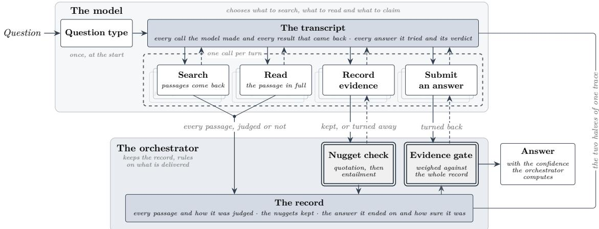
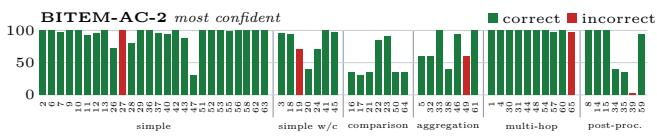
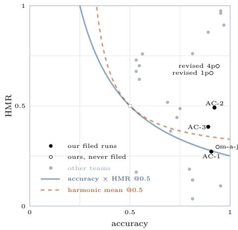

# BITEM at the NTCIR-19 R2C2 Task: Predicting Confidence from Agentic RAG Pipeline Signals

Julien Knafou, Luc Mottin, Alexandre Flament, Paul van Rijen, Esteban Gaillac, Patrick Ruch

HES-SO, Geneva, Switzerland

SIB Swiss Institute of Bioinformatics, Geneva, Switzerland

julien.knafou@hes-so.ch

## Abstract

The BITEM team entered both subtasks of the NTCIR-19 R2C2 task with a single agentic pipeline, in which a model searches, reads and records evidence over a movie corpus while an orchestrator holds the record and rules on what may be submitted. A claim is admitted only once an entailment cascade has checked it against the passage it cites, and an answer is released only once enough checked evidence stands behind it. Each question is run three or four times, every pass retrieving from a corpus stripped of what the earlier passes have already seen. The confidence filed with each answer is computed by the orchestrator from what the run leaves behind and is never asked of the model, which is ofered no way to rate itself. The two retrieval runs placed 4th and 5th of 22, pooling the passes was worth 0.0709 nDCG@20, and the gain was largest on the multi-hop and post-processing-heavy questions, where the organisers rank the pooled run top of the field. Sixteen of the 25 answer runs were built on passages these two runs supplied, 12 of them filed by other teams. HMR rewards a system whose confidence is high where it answers right and low where it answers wrong. The pipeline reached an accuracy of 0.9219, 6th of 25, while the confidence filed with those answers gave an HMR of 0.4915, 13th. A few rules crafted over those same recorded signals, with no further model call and no further retrieval, raise that to an accuracy of 0.9375, 5th, and an HMR of 0.6985, 9th. Those rules beat a random confidence on HMR significantly, where the confidences the pipeline filed do not. Ranking on HMR alone can reward a system for answering wrongly with low confidence, so we propose accHMR, the accuracy multiplied by HMR, which reports the reward in proportion to the accuracy, and on which the revised rules would have scored 0.6549, 5th. For future work, fitting a model on the numbers the pipeline already produces, rather than writing such rules by hand, would be a real step forward.

## Keywords

retrieval-augmented generation, agentic retrieval, hybrid retrieval, answer confidence

Team Name BITEM

## Subtasks

Passage Retrieval (PR) subtask (English) Answering with Confidence (AC) subtask (English)

## 1 Introduction

For our participation in the NTCIR-19 R2C2 task [17], a system serving both subtasks was built around a single model. It holds eight tools, searches a corpus it has not seen, reads what it retrieves, and writes down the evidence it means to rely on. An orchestrator outside the model checks each piece of that evidence against the passage it cites with a two-model entailment cascade, and refuses to let the model submit an answer until enough evidence has passed that check. Once the answer is submitted, the confidence is computed by that same orchestrator over what the run has recorded and the model is ofered no way to rate itself. One pass produces both a ranked list of passages and an answer with a confidence, so both subtasks are served by the same pipeline’s artefacts. Each question is put through three or four such passes, a question stopping early when two passes in a row came back unsure. Passages a pass has seen are withheld from the next, so each searches a smaller corpus than the one before it. We submitted two runs for the passage retrieval (PR) subtask and four for the answering with confidence (AC) subtask.

Our two runs placed 4th and 5th ofthe 22 runs for the PR subtask, 2nd of the seven teams that submitted, and the organisers’ own test does not separate our better run from any run above it. While our system was among the most accurate in the AC subtask, it failed to produce low confidence answers when it should have, which is what the harmonic mean of rewards (HMR) rewards and what it scores independently of the accuracy. However, we found out that when adjusting the HMR score to the accuracy, our best system’s run ranks 7th instead of 13th out of 25 runs. Indeed, a look at Figure 3 shows that half of the runs with high HMR come with a low accuracy which sometimes can go down to around 50%. It shows that the real challenge is to be able to climb that HMR ladder while maintaining a high accuracy. This is discussed further in Section 6. Assembling the passes helped both subtasks, though not in the same way, for PR it raised retrieval by 0.0709 nDCG@20, a diference the organisers’ test does not establish, while for AC it left the accuracy where it was and improved the confidence calibration instead.

After testing a few diferent ways of combining our system’s passes, we found that a small set of common-sense rules, requiring only a few programming changes on the already computed artefacts, achieves an HMR score close to 0.70 while also improving accuracy. Those rules read nothing the pipeline did not already produce, and both rebuilt runs are significantly better than a random confidence where none of the runs we filed is, which shows that simple rules over a pipeline’s own signals are enough to improve HMR. These changes come from an artefact analysis documented in Section 4.2.

## 2 Related Work

Our system works each question over repeated turns, a model with eight tools searching a fixed corpus, reading passages and recording claims as evidence, while an orchestrator outside the model executes the calls, keeps the record and decides what may be submitted. Each question is run three or four times, each pass retrieving from a corpus stripped ofeverything its predecessors saw. Li et al. [7] give the loop its canonical form, a model that pauses its reasoning to search and resumes on what it finds, and Zheng et al. [22] train that behaviour against the live web. Such agents repeat themselves, 32 per cent of the steps near-duplicating the previous query in one study of multi-turn agent trafic [10], and Murali et al. [9] treat parallel threads converging on one retrieval path by diversifying the opening turn’s queries.

In our system the model records a claim only when it has quoted a span from one passage, and an orchestrator outside the model then checks each recorded claim by entailment against the passage it cites, admitting only those that pass. An answer reaches submission only once enough admitted claims stand behind it, and the confidence filed with it is computed from those claims. Honovich et al. [3] evaluate such checking across nine grounding datasets, where the best entailment model reaches 81.5 ROC AUC against 63.8 for token-level F1. Liu et al. [8] check after the fact, auditing four generative search engines and finding 51.5% of their statements fully supported by the citations given for them. Qian et al. [13] verify a draft answer’s statements before it is delivered, discarding the statements that fail.

Supervised methods learn the number from labelled data, buying their calibration with examples whose right answers are known in advance. Kadavath et al. [5] fine-tune a model with an added value head, an extra output trained alongside the usual one, to predict whether it knows an answer before giving it. Joren et al. [4] judge from the question and the retrieved context, with no ground truth answer, whether that context is suficient to answer, and fit that signal together with a self-rated answer probability in a logistic regression that predicts hallucination, thresholding its score to decide when to abstain.

Unsupervised methods take the number from a model as it stands, with nothing trained and nothing fitted. Kadavath et al. [5] also report a training-free result in the same study, showing that a model given a handful of worked examples and no fine-tuning can judge whether the answer it just proposed is correct. A preference-tuned model can instead verbalise a confidence, stating it as a number in its own output. Tian et al. [18] find that number typically better calibrated than the model’s conditional probabilities, the probability it assigns to the answer itself. Xiong et al. [20] benchmark such elicitation across five models and five kinds of task and find the verbalised numbers overconfident, clustered high, and only narrowly behind methods that read the model’s own logits. Each of these estimates has a model rate its own output, which a confident error escapes, and Kuhn et al. [6] avoid that rating by clustering the model’s repeated answers into groups that mean the same thing and taking the entropy over those meanings rather than over the wordings, with each sample’s own likelihood summed into the meaning it belongs to. Vashurin et al. [19] group these routes into three families, information-based methods that read the model’s logits and their entropy, sample-diversity methods that compare repeated generations, and reflexive methods that ask the model itself. Across 11 datasets they find which family works best to depend on the task, recommending information-based methods for short answers and sample diversity for longer generations.

## 3 Method

Similarly to the unsupervised methods of Section 2, our system has nothing trained or fitted for this task, and it difers from them in which signal is used to infer the confidence. Every confidence method there reads it from the model, from its logits, from repeated samples of its output or from what it says about itself, while ours is computed outside the model by the orchestrator, over a record of evidence that has been checked against the passages it was quoted from, and the model is ofered no way to state a number. Our contribution is that number rather than the retrieval or the ensemble that supplies the evidence for it. A confidence computed outside the model, from by-products any agentic pipeline already produces, carries enough information about whether an answer is right to be worth reading of, and Section 4.2 measures how much. Our confidence comes from the distinct passages carrying a verified claim, so a question for which the system finds little evidence returns low confidence by construction.

In what follows the language model reads, writes and chooses what to do next, and the orchestrator, the program outside the model, executes what the model asks for, keeps the record of what has happened, and rules on what is finally filed.

## 3.1 Preprocessing

3.1.1 Chunking. We cut our own passages from the supplied wikitext rather than use the ones already cut for us, because a fixed window with overlap gives a statement two addresses. Our passages are aligned to sentence boundaries and packed greedily within a section to a 200-word target under a 300-word ceiling, with no overlap between neighbours. Each table becomes a passage of its own, never folded into anything. Every passage carries its article title, and one from a named section carries the header tree up to the leaf. The corpus we index holds 2,091,427 passages.

3.1.2 Named entities. Questions over this corpus turn on named entities, and the passage that answers a question often lacks the name the question uses, because the people, places and works an article discusses are usually named once and referred to obliquely thereafter. Annotating entities gives every passage the names it is about. Entities were extracted with one call per document using Qwen3.5-9B, which returns name-and-type lines over seven types, namely person, character, location, organisation, event, work and date, with character kept apart from person. An entity attaches to a passage when its name occurs as a substring of that passage’s title, heading or text. That rule cannot reach the oblique mention it exists to solve, so a second call over each document asks which of the names the document carries belong to a passage that does not spell them out, and just under half the annotations we index arrive that way rather than by the substring rule.

3.1.3 Indexing. Retrieval uses two structures over the annotated passages. The first, the sparse index, serves the question that names its entity. It is an inverted index in Elasticsearch and the only one of the two that stores passage text, with the title, the section heading and the entity annotations held in fields of their own.

  
Figure 1: One question through the pipeline, as defined in Section 3.3

The second, the dense index, serves the question that describes an entity without naming it. Every passage is embedded once by nomic-embed-text-v1.5 [12] into a 768-dimensional vector. The text given to the encoder concatenates the first 10 of the passage’s annotated names ahead of its title, section and contents.

A third mechanism, a knowledge graph of co-occurring names, was also built, but a normalisation mismatch left it matching only about one search in 60, and nothing it returned reached a filed run. It would have been interesting to see how much the PR would have improved had the mechanism been triggered as intended.

## 3.2 Tools

3.2.1 Retrieval. The model reaches passage text through search\_ passages, in a call carrying one or more query lines, reformulations of the question. Every line goes to the inverted index and, encoded, to the dense index, each index keeping a passage’s highest score across lines.

The two scores are not comparable, so reciprocal rank fusion [1] merges the two rankings by position, lifting a passage by how highly and how often the searches rank it. The head of that merged list is then read by a cross-encoder, ms-marco-MiniLM-L-12-v2, which takes a query line and the passage together and so tells a passage sharing the question’s vocabulary from one answering it [11, 14]. search\_entities matches a name against the annotated names and returns the names carried by the passages it hits, most frequent first, so the model can settle on the name the corpus uses.

3.2.2 Reading. Results are cut to a fixed length, so get\_passage returns named passages whole, and can add neighbouring passages on either side. Prose passages do not overlap, so reading a neighbour recovers a statement split across a cut.

extract\_from\_passage locates a sentence inside one passage. Given a short question in plain words, it scores the passage’s own sentences against that question lexically, falling back to entailment scoring by MiniCheck-Flan-T5-Large [16] where the passage words it diferently, and returns the best few. This is how the model finds the words it will later have to quote.

3.2.3 Recording evidence and submiting an answer. Reading does not commit the model to anything. Evidence is recorded by record\_ evidence, in a call that names a passage and may attach claims, each with the span quoted from that passage. The orchestrator keeps a claim with its passage as a nugget, adding each further passage on which the model records it.

The quotation check requires the span to appear in the passage verbatim or nearly so, and the entailment check then asks whether the span really says what the claim says, reading the pair with MiniCheck-Flan-T5-Large and a DeBERTa-v3-large entailment model [2]. list\_nuggets lists what has been recorded, and flag\_ nugget\_bogus was available to retract a nugget that later reading contradicts, though no pass used it.

The answer is submitted through submit\_answer, with a rationale and the passages that ground it. When nothing supports an answer the model raises a refusal flag instead and leaves the wording to the orchestrator. The orchestrator rules on it, ending the pass or returning the model to the loop.

## 3.3 Pipeline

3.3.1 The question. The task draws its questions from six question types [15, 21], and none arrives with its type label, so Qwen3.5- 122B-A10B-FP8, the model that goes on to answer it, is asked to assign one. The type rides into the opening message as advice on what form the answer should take.

The tools of Section 3.2 are attached from that message onward, and everything the model then proposes through them crosses to the orchestrator to be recorded or turned back, the shape Figure 1 draws. The record is the pass’s own account of its work, separate from the transcript the model reads, and holds the passages the pass retrieved under the status each was given, the nuggets recorded against them with their entailment scores, the answer reached and its confidence, and how many searches were issued and how often an answer was turned back.

3.3.2 The loop. The model works one turn at a time, emitting a tool call the orchestrator executes before the next turn opens. Every reply carries a running count of the tool calls spent against the budget advertised to the model, which is advice rather than a limit.

The orchestrator refuses a record\_evidence call naming a passage the record does not hold, so the model can cite only what search and reading have put in front of it. The orchestrator also writes to the record on its own terms.

The sequence ends when the orchestrator accepts an answer, when a reply carries no tool call at all, in which case the orchestrator keeps its prose as a candidate answer, or when the transcript outgrows the context window.

3.3.3 Commiting an answer. An answer submitted through submit\_answer must first satisfy the organisers’ file format, i.e. an answer and its confidence sharing one semicolon-delimited line. The orchestrator then counts the distinct passages that verified nuggets rest on, so a claim recorded on two passages contributes two. An answer needs two such passages, or one entailing its claim very strongly, and a confidence above a floor. Only that confidence sets the answer against the model’s recorded claims, each verified claim weighted by how much of the answer’s wording appears in that claim, by word overlap, never by the entailment cascade. Because that weight never vanishes, the overlap can move the confidence but never drops a claim from the count. Each refusal tells the model what it holds and asks it to try again, and the attempt remains in the transcript with the answer the model wrote and the confidence computed for it. After several refusals the fallbacks take over, one of which Section 3.4 describes.

3.3.4 Confidence. An accepted answer leaves with a confidence the orchestrator computes over the record, and never one the model proposes, since submit\_answer takes no confidence argument. Where the fallbacks delivered the answer instead, the confidence is fixed by which fallback fired. How each filed run turns those numbers into the one it files difers from run to run, and Section 3.5 gives each rule. The confidence is estimated outside the model, from what the run left behind rather than from what the model says about itself. Computing it requires no second model, no further retrieval and no change to the loop, so the estimator is separable from the system it scores. Every quantity available to it is a by-product any agentic pipeline already produces, e.g. how many searches a pass issued, how often it put an answer up and was turned back, what the entailment cascade scored the evidence it cited, and how long its longest turn of reasoning ran.

## 3.4 Ensemble strategy

In the first pass on a question the retrieval tool searches the whole corpus. Each later pass searches a corpus of passages with the ones its predecessors recorded removed. This strategy serves two goals, retrieving more important passages for PR and building the confidence score by comparing the answers across passes. Three passes are run on every question, and a fourth unless the last two both came back unsure, so the questions the system is least certain of are the ones it attempts fewest times. The passes are not independent draws, because where a pass cannot reach an answer of its own, one of the fallbacks ofers it the most confident answer an earlier pass on the same question committed and files that in its place if a passage entails it, so passes that agree may have seen each other’s answers.

## 3.5 Runs

A pass writes one trace when it ends, and the trace holds both the transcript and the record. The transcript is the conversation, every tool call the model made and every result the orchestrator returned, so every answer the model submitted survives there with the verdict passed on it, and a submission the orchestrator refused keeps both the wording the model wrote and the confidence computed for it. The record is the orchestrator’s account of the pass, holding the passages it retrieved with the status each was given, the nuggets with their entailment scores, the answer with its confidence, and counts of what the pass did, such as the searches it issued and the answers it had turned back. The runs are built from those traces, a passage retrieval run drawing on the record alone, an answer run on the record for the nuggets it files and on the transcript for the attempts it chooses among, since the record keeps only the answer a pass ended with.

3.5.1 Passage retrieval. A PR run gives, for each question, a ranked list of at most 20 passages, each with its text and the document it was cut from.

BITEM-PG-1, the single pass run, is built from the first pass on each question. The passages that pass kept evidence on come first, ordered by how strongly the quoted span entailed the claim made against it, and the rest follow in the order the pass met them.

BITEM-PG-2, pooled, is built from all the recorded passes on a question. Diferent passes can reach diferent answers, so they are first grouped by the answer they reached, and the group whose strongest pass was most confident, and which the most passes joined, supplies the run. Every passage every pass in that group retrieved is pooled, not only those its nuggets rest on, ordered by entailment as before.

3.5.2 Answering with confidence. An AC run gives, for each question, an answer and a confidence, followed by the nuggets supporting it, each naming a passage retrieval run and a rank within it.

BITEM-AC-1, the single pass run, is built from the first pass on each question and paired with BITEM-PG-1. It files the answer that pass committed and the confidence that came with it, already raised by a term meant to reward agreement across passes, which with a single pass is a fixed fraction of the distance to 100. Where the pass committed a refusal, the run returns to the transcript, takes every answer that pass submitted, discards the refusals among them, and files the one that got furthest through the gates of Section 3.3.3, ties broken by the confidence the orchestrator computed for each submission, keeping whichever is higher of that confidence and the committed one. The nuggets are the verified ones in that pass’s record, and a nugget is filed naming one of its own passages that appears in BITEM-PG-1, or dropped when none does.

BITEM-AC-2, most confident, and BITEM-AC-3, summed agreement, are built from all the recorded passes and paired with BITEM-PG-2. Both pool from the transcripts every answer submitted through submit\_answer, including those the orchestrator turned back, and drop only the answers worded as refusals. BITEM-AC-2 takes the answer of the one submission whose confidence was highest and files that confidence unchanged. BITEM-AC-3 groups the submissions whose answers match after normalisation, and files the wording of the group whose confidences sum highest, with that sum capped at 100. Their nuggets come from the records of those passes rather than the transcripts, and are matched to BITEM-PG-2 as BITEM-AC-1’s are to BITEM-PG-1. That matching normally looks at neither the answer nor the passages the chosen submission cited, so the two runs file the same nuggets on all 65 questions. A fix to a single question the day before the deadline rebuilt our fourth file from BITEM-AC-3 rather than from its own strategy, so BITEM-AC-3 was filed twice and scored twice. The model as a judge approach is described and evaluated in Section 5.1.

Table 1: Passage retrieval under the consolidated direct qrels, over the 64 scored questions. Δ is the mean per-question diference, pooled minus single pass. W/T/L counts the questions on which the pooled run scores higher than, the same as, and lower than the single-pass run. The better run is bold. The organisers’ own randomised Tukey HSD does not separate the two runs, at $ p = 0 . 4 8 5 4$ on nDCG@20 and $p = 0 . 1 0 8 6$ on Q@20 [17].
<table><tr><td></td><td>PG-1 single pass</td><td>PG-2 pooled</td><td>Δ</td><td>PG-2 W/T/L</td></tr><tr><td>nDCG@20</td><td>0.3509</td><td>0.4217</td><td>+0.0709</td><td>42/7/15</td></tr><tr><td>Q@20</td><td>0.2677</td><td>0.3582</td><td>+0.0905</td><td>41/7/16</td></tr></table>

## 4 Results

We filed 65 questions and the oficial evaluation scores 64, question 0025 having been reissued after release. In both subtasks the comparison our runs were built for is the one of Section 3.5, a single first pass against the recorded passes assembled.

## 4.1 Passage retrieval

The task provides two sets of relevance judgements. We report only the direct one, in which assessors judged each passage against the question. The other was derived from the nuggets the answer runs cited, which points it at whichever retrieval runs those teams chose to answer from, and 12 of the 25 answer runs were built on ours. The organisers designate the direct judgements as the oficial evaluation and note that bias themselves [17].

As we can see in Table 1, assembling the passes seems to improve retrieval. Indeed, the pooled run gains 0.0709 nDCG@20 and 0.0905 Q@20 over the single-pass run, winning 42 of the 64 questions against 15. The organisers’ own test does not separate the two runs, so the gain is an observed diference rather than an established one.

Table 2 splits the gain by question type. Post-processing-heavy and multi-hop gain 0.1824 and 0.0998 against 0.0223 for comparison, and on exactly those two types the organisers report our pooled run as the top run of the whole field under both measures [17]. These are the two types whose answers cannot be read of a single passage, such as a date computed across editions or a fact reached through an intermediate entity. They are also where withholding what an earlier pass has already seen forces the next onto articles it would otherwise never rank. The pooled run holds 5.3 more relevant passages per question on post-processing-heavy and 3.1 more on multi-hop, against 0.4 on comparison. Because a passage is one slice of an article, the pooled run also reaches more articles, 13.1 per question in its 20 slots against the single pass’s 8.6, which for the same list length is fewer repeated visits to the same article. The passages the later passes add match the quality of those already in the list, being judged highly relevant at 15 per cent, the same rate as the single-pass list itself.

Table 2: Mean nDCG@20 by question type under the direct qrels, in the organisers’ order. Δ is pooled minus single pass, and W/T/L counts the questions the pooled run wins, ties and loses. The better run is bold.
<table><tr><td>question type</td><td>n</td><td>PG-1</td><td>PG-2</td><td>Δ</td><td>PG-2 W/T/L</td></tr><tr><td>simple</td><td>26</td><td>0.3034</td><td>0.3608</td><td>+0.0574</td><td>14/6/6</td></tr><tr><td>simple w/ condition</td><td>7</td><td>0.2888</td><td>0.3403</td><td>+0.0515</td><td>6/0/1</td></tr><tr><td>comparison</td><td>7</td><td>0.4168</td><td>0.4392</td><td> $+ 0 . 0 2 2 3$ </td><td>5/0/2</td></tr><tr><td>aggregation</td><td>7</td><td>0.4498</td><td>0.4859</td><td>+0.0361</td><td>4/0/3</td></tr><tr><td>multi-hop</td><td>10</td><td>0.3749</td><td>0.4747</td><td>+0.0998</td><td>7/0/3</td></tr><tr><td>post-processing-heavy</td><td>7</td><td>0.3900</td><td>0.5725</td><td>+0.1824</td><td>6/1/0</td></tr></table>

Table 3: Our three oficial runs. The organisers define acc, $R _ { O } ,$ $R _ { U }$ , HMR and avconf [17]. accHMR is accuracy times HMR. Bold marks the best of the three.
<table><tr><td></td><td>acc</td><td>RO</td><td> $R _ { U }$ </td><td>HMR</td><td>avconf</td><td>accHMR</td></tr><tr><td>AC-1 single pass</td><td>0.9062</td><td>0.1633</td><td>0.8102</td><td>0.2719</td><td>0.8127</td><td>0.2464</td></tr><tr><td>AC-2 most confident</td><td>0.9219</td><td>0.3460</td><td>0.8483</td><td>0.4915</td><td>0.8331</td><td>0.4531</td></tr><tr><td>AC-3 summed agreement</td><td>0.8906</td><td>0.2471</td><td>0.9904</td><td>0.3956</td><td>0.9644</td><td>0.3523</td></tr></table>

The gain in Table 1 is a per-question mean over the 64 scored questions, and it carries a caveat, which is why we rest the argument on the per-type ordering of Table 2 instead. The single-pass run failed to fill its 20 slots on 37 of the 64 questions, 21 of them stopping at exactly 10, so the ensemble was often adding to a list with room rather than displacing anything. Cutting the pooled list back to the single-pass length halves the overall advantage to 0.0411. On the 37 questions where the first pass fell short the gain is 0.1104, and on the 27 where it filed a full list it is 0.0167. Ten is the search tool’s default, and the model left it in place on 2,126 of its 2,329 searches. On each of those 21 questions the first pass searched once, was given the 10 results it asked for, and stopped, since the loop is told to submit as soon as two nuggets support an answer. How many passages a run files is settled by how much searching the answering happened to need, so the short lists follow from that stopping behaviour and are not evidence that the corpus had nothing further to return. No significance test is reported here, since the organisers note that every type holds too few questions for these scores to be read as more than descriptive trends [17].

## 4.2 Answering with confidence

Assembling the passes did not make our answers more accurate. Table 3 reports the four runs we filed, of which three are distinct systems, and their accuracy varies little, standing at 0.9062 for the single pass, 0.9219 for most confident and 0.8906 for summed agreement, with the same 56 of the 64 questions answered correctly in all three. At that accuracy the design had no room to show a diference, so this is a limit of the experiment rather than a finding about aggregation. The confidence measures separate the runs, HMR rising from 0.2719 to 0.4915 and 0.3956 and accHMR from 0.2464 to 0.4531 and 0.3523. Of the 25 answer runs the single pass places 7th on accuracy, 19th on HMR and 19th on accHMR, most confident 6th, 13th and 7th, and summed agreement 8th, 16th and 14th, six of the 12 runs above us on HMR having answered fewer than 70 per cent of the questions correctly. The single-pass confidence carries no information about whether its answer is right, its area under the ROC curve being 0.463, below chance, and of the 13 answers it filed below 50, 12 were correct.

  
Figure 2: Confidence filed by most confident on each of the 64 scored questions, green where the answer was judged correct and red where it was not, and bars at zero drawn as a stub so their colour shows.

The errors of most confident are few enough to read individually, and they are the red bars of Figure 2, five of the 64 scored questions. Three of the five are answered correctly by another team’s run that took our two filed lists as its only retrieval input, which is an existence proof about those lists and not a comparison of systems. On those three the passages needed to answer were retrieved, and the error was made when the answer was written. The recurring defect is the answer string, either a fragment where the gold wants the whole thing, fava beans against liver with Chianti, or a count our own citations contradict.

A further error was discovered in the aggregator rules, on a question where two passes reached diferent answers, each at 100, and the outcome between them followed from those rules. Summed agreement adds every submission an answer attracted, and the wrong answer had been put to the evidence gate twice, e.g. once refused at 77.1 for insuficient evidence and once accepted at 100, which sums to 177.1 against the right answer’s 100.0. The refused attempt supplies the whole margin, because a submission’s weight is added whether or not the gate accepted it, so the rejected submission still counted toward the answer it had been rejected for. Counting one submission per pass removes that margin and leaves a tie, which the entailment summed behind each answer breaks in favour of the right one.

Counts are a second major source of error. Fifteen of the 64 questions ask how many or how old, and on four of them the passes propose diferent numbers, 5 against 8, 8 against 18, 8604 against 8612, and 1 against 2. Each pass counts over the nuggets it happened to record, and the passes recorded diferent subsets. Every nugget behind these answers is true, and none of them establishes that the list is complete (see Section 3.3.3), so nothing in the record says which pass read the whole set. On all four questions one of the passes proposed the right number, and it was not the one filed. On two questions the right answer was rejected for exceeding the length limit and replaced with an earlier pass’s, and on two more it was reached by a pass the evidence gate had refused, force-delivered at the confidence floor, and outvoted by a pass that had committed cleanly and counted low.

Table 4: Results for model as a judge and two runs rebuilt by rule from the pipeline’s own signals. accHMR is accuracy times HMR.
<table><tr><td></td><td>acc</td><td> $R _ { O }$ </td><td> $R _ { U }$ </td><td>HMR</td><td>avconf |</td><td>accHMR</td></tr><tr><td>model as judge (recovered run)</td><td>0.9375</td><td>0.1750</td><td>0.9430</td><td>0.2952</td><td>0.9356</td><td>0.2768</td></tr><tr><td>single pass, longest deliberation</td><td>0.9062</td><td>0.8333</td><td>0.5517</td><td>0.6639</td><td>0.5156</td><td>0.6017</td></tr><tr><td>four passes, independent agreement</td><td>0.9375</td><td>0.6250</td><td>0.7917</td><td>0.6985</td><td>0.7656</td><td>0.6549</td></tr></table>

## 5 Additional experiments

This section presents the recovered model as judge run and two other strategies we built from the signal. The organisers never judged these runs, so each of the 192 answers, three runs over 64 questions, takes the label of an identical answer they did judge, once lowercased with punctuation collapsed. For 175 of the 192 that answer is one our own filed runs gave, since these strategies reshufle answers the pipeline had already produced rather than reaching new ones. The fifteen with no judged match were read by hand rather than by any rule, beside other teams’ answers to the same question. Asked what food Hannibal Lecter is associated with, the recovered run answered liver with fava beans and a nice Chianti, which no judged run had filed. The gold, Liver with Chianti, names two things, and answers naming either alone were marked right. Naming the beans made no answer wrong, since eight that name them were marked right, while all ten that stopped at the beans were wrong. Mentioning both of the gold answer’s elements with non-mandatory information, this system’s answer was hence labelled as correct.

## 5.1 Recovered model as judge run

Model as judge is built from all the recorded passes and paired with BITEM-PG-2. It puts to the answering model every submission those passes made, with the confidence and the citations each carried, the verified nuggets behind them and the passages that run filed for the question, and requires one submit\_answer call giving an answer, a confidence and the passages it rests on, retrying when it cites one that run did not file. The confidence filed is the model’s own rather than the orchestrator’s, which is true of no other run of ours.

In Table 4, model as judge would have had the best accuracy of all, with a relatively high $R _ { U }$ against the three oficial runs. As with all our oficial runs, though, it failed to report a low confidence when its answer was wrong. Model as judge would therefore not have been a breakthrough, and it would have sufered from the same calibration problems.

## 5.2 From signal to confidence

By cumulating a few observations we ended up modifying the last part of the aggregator of our runs, in an efort to show that with common-sense rules there is already enough signal in the trace to improve HMR. Both revised runs take as the answer the last string the model itself put to submit\_answer rather than what the format check made of it, which on three questions had replaced a correct answer with a refusal. Neither calls a model, issues a retrieval or reads a file we submitted. Where they difer is in how much there is to read. A single pass leaves one trace, while four leave four that can be set against each other, so the rules available to the second are of a kind the first cannot have.

For the revised single pass, the only question a rule can answer is how far to trust the one pass it has. The confidence the orchestrator computed is not usable for that, because it counts the passages the evidence gate had already tallied and so reports how much was read rather than how well it supports the answer. What the transcript does carry is how hard the pass worked. We take the length of its longest single reasoning turn, the one signal available from a single pass that speaks to the dificulty of the question rather than to the size of the retrieval, and file full confidence unless that turn ran to the median or beyond, in which case we file none. On the first pass that length separates a wrong answer from a right one at 0.707, against 0.559 for the distinct queries the pass issued and 0.586 for the tool calls it spent, so what it tracks is not simply how much work was done. On six errors it is a direction and not a result, and we report it as one.

For the revised four passes, each pass contributes a single proposal, so a submission the evidence gate refused no longer adds weight to the answer it proposed. Proposals of the same answer are grouped, and the group with the greatest weight is filed, with a discount on any pass the fallbacks handed its answer to rather than let it reach one. Where two groups have equal weight, the one with the most verified entailment behind it is chosen. That tie-break rests on the evidence rather than on the confidence each pass reported, a number that stood at the same value on both sides of every disagreement it settles. The confidence we file comes from the same reading of the trace and stands at 100 where two passes reached the answer independently, 50 where they divided, and 0 where only one of them answered at all. Entailment serves only as the tie-break, since filing it as the confidence was tested and fails. We ranked the 64 questions by the maximum, the mean or the minimum entailment over a pass’s nuggets and filed each ques tion’s rank position as its confidence, the strongest near 100 and the weakest near 0. These rules score 0.4705, 0.4682 and 0.4719 HMR on most confident, where a run filing 50 on every question would score 0.5000 no matter what it answers (assuming at least one wrong and one correct answer), and they stay below that on all three runs we filed. Filing high confidence where entailment is weakest instead gives 0.5272, 0.5291 and 0.5259, marginally better than the right way round, so they carry no information.

With those simple changes, over the same base signal, both runs beat every run we filed on HMR and on the composite, and the ensemble beats the single pass on accuracy and HMR at once. The single-pass rule answers 58 of the 64 questions correctly at HMR 0.6639 and accHMR 0.6017, the four-pass rule 60 at HMR 0.6985 and accHMR 0.6549 (see Table 4), which would have placed 11th and 7th, and 9th and 5th, against the 25 runs actually filed.

## 6 Discussion and Conclusions

Assembling several passes of one system helped both halves of this task. In retrieval it helped directly, though close to half of the gain is list length rather than better material. In answering it left the accuracy where it was and improved the confidence instead, and rules read of the passes the system had already recorded raise accHMR from 0.4531 to 0.6549 without a further model call or a further retrieval. The passes those rules read were not free, and running four costs about four times running one. Whether that is well spent is best asked against a larger model at matched cost, since repeating the same model is linear in the number of passes while making the model larger is not. What we would most like to see is those rules run against a question set we have never seen. The tie-break of the four-pass rule was chosen on held-out halves rather than in sample for that reason, but 64 questions is a small set, and a rule that survives resampling inside one of them can still be a property of that one. Until it is tried elsewhere the claim we are willing to make is that the signal was already present in our own traces, not that these particular rules are the ones to carry forward.

  
Figure 3: Accuracy against HMR for every answer run filed in the task, ours in black and the ones we never filed hollow. Each curve joins the pairs its rule scores as it scores a run at 0.5 on both.

The rules we used were written by hand, and a natural next step would be to fit them instead. Every quantity they read is a number the pipeline already produces, so a regression could take its inputs from the trace as it stands, e.g. how many queries a pass issued, how much entailment stood behind what it cited, and how long it deliberated. Fitted on a separate collection, or on synthetic questions generated for the purpose, such a regression would predict a confidence at the end of a run without a second model and without touching the pipeline that produced it. The R2C2 test set would then be held-out data on which the fitted estimator could be evaluated and compared with the hand-written rules of Section 4.2 and the confidence we actually filed, over the same questions and under the same measure.

HMR is great, because it asks a system to know when it is wrong and that is rarely evaluated at all. Our suggestion for a next iteration is that the headline ranking carry the accuracy alongside it. The two are scored independently by design, and Figure 3 shows what that independence permits, with several runs reaching a high HMR at an accuracy near one half. A run filing a confidence of 50 on every question scores exactly 0.5000 whatever it answers, as long as it answers at least one question wrongly and at least one correctly. Even worse, a run with an accuracy of0.0000 predicting a systematic confidence of 0 would score an HMR of 1.0000. The accHMR metric would adjust it proportionally to the accuracy, meaning to 0.0000, which seems rather fair. The multiplication of both metrics was chosen as its interpretation is straightforward, the system’s HMR gets validated proportionally to its accuracy. While other ways of aggregating both could have been considered, we did not think that it deserved much attention, HMR being an interesting metric, using it with a simple multiplication felt right and easy to process in a table next to both metrics.

Additionally, including questions that nothing in the corpus supports would help build such a measure. It would establish which questions a system ought to be able to answer, so that a system holding all the evidence and failing on half of them is penalised for it, and it would let a system earn a low confidence honestly, by reporting that it looked and found nothing rather than that it doubts what it found. It would also keep the measure loaded. HMR is the harmonic mean of $R _ { U }$ and $R _ { O }$ , and $R _ { O }$ is averaged over the wrong answers alone, so a system that answers every question correctly has nothing left to be overconfident about and takes an $R _ { O }$ of one by default. Where some questions cannot be answered from the corpus, no system reaches that position for free, and a low confidence and a high accuracy become things to be won together rather than traded against each other.

## References

[1] Gordon V. Cormack, Charles L. A. Clarke, and Stefan Büttcher. 2009. Reciprocal rank fusion outperforms Condorcet and individual rank learning methods. In Proceedings ofthe 32nd Annual International ACM SIGIR Conference on Research and Development in Information Retrieval, SIGIR 2009, Boston, MA, USA, July 19-23 2009, James Allan, Javed A. Aslam, Mark Sanderson, ChengXiang Zhai, and Justin Zobel (Eds.). ACM, 758–759. doi:10.1145/1571941.1572114

[2] Pengcheng He, Jianfeng Gao, and Weizhu Chen. 2023. DeBERTaV3: Improving DeBERTa using ELECTRA-Style Pre-Training with Gradient-Disentangled Embedding Sharing. In The Eleventh International Conference on Learning Representations. https://arxiv.org/abs/2111.09543

[3] Or Honovich, Roee Aharoni, Jonathan Herzig, Hagai Taitelbaum, Doron Kukliansky, Vered Cohen, Thomas Scialom, Idan Szpektor, Avinatan Hassidim, and Yossi Matias. 2022. TRUE: Re-evaluating Factual Consistency Evaluation. In Proceedings of the 2022 Conference of the North American Chapter of the Association for Computational Linguistics: Human Language Technologies. Association for Computational Linguistics, Seattle, United States, 3905–3920. doi:10.18653/v1/2022.naacl-main.287

[4] Hailey Joren, Jianyi Zhang, Chun-Sung Ferng, Da-Cheng Juan, Ankur Taly, and Cyrus Rashtchian. 2025. Suficient Context: A New Lens on Retrieval Aug mented Generation Systems. In The Thirteenth International Conference on Learning Representations, ICLR 2025, Singapore, April 24-28, 2025. OpenReview.net. https://openreview.net/forum?id=Jjr2Odj8DJ

[5] Saurav Kadavath, Tom Conerly, Amanda Askell, Tom Henighan, Dawn Drain, Ethan Perez, Nicholas Schiefer, Zac Hatfield-Dodds, Nova DasSarma, Eli Tran Johnson, Scott Johnston, Sheer El-Showk, Andy Jones, Nelson Elhage, Tristan Hume, Anna Chen, Yuntao Bai, Sam Bowman, Stanislav Fort, Deep Gan guli, Danny Hernandez, Josh Jacobson, Jackson Kernion, Shauna Kravec, Liane Lovitt, Kamal Ndousse, Catherine Olsson, Sam Ringer, Dario Amodei, Tom Brown, Jack Clark, Nicholas Joseph, Ben Mann, Sam McCandlish, Chris Olah, and Jared Kaplan. 2022. Language Models (Mostly) Know What They Know. arXiv:2207.05221 [cs.CL] https://arxiv.org/abs/2207.05221

[6] Lorenz Kuhn, Yarin Gal, and Sebastian Farquhar. 2023. Semantic Uncertainty: Linguistic Invariances for Uncertainty Estimation in Natural Language Genera tion. In The Eleventh International Conference on Learning Representations, ICLR 2023, Kigali, Rwanda, May 1-5, 2023. OpenReview.net. https://openreview.net/ forum?id=VD-AYtP0dve

[7] Xiaoxi Li, Guanting Dong, Jiajie Jin, Yuyao Zhang, Yujia Zhou, Yutao Zhu, Peitian Zhang, and Zhicheng Dou. 2025. Search-o1: Agentic Search-Enhanced Large

Reasoning Models. In Proceedings of the 2025 Conference on Empirical Methods in Natural Language Processing. Association for Computational Linguistics, Suzhou, China, 5420–5438. doi:10.18653/v1/2025.emnlp-main.276

[8] Nelson Liu, Tianyi Zhang, and Percy Liang. 2023. Evaluating Verifiability in Generative Search Engines. In Findings of the Association for Computational Linguistics: EMNLP 2023. Association for Computational Linguistics, Singapore, 7001–7025. doi:10.18653/v1/2023.findings-emnlp.467

[9] Sidhaarth Murali, João Coelho, Jingjie Ning, João Magalhães, Bruno Martins, and Chenyan Xiong. 2026. Beyond Parallel Sampling: Diverse Query Initialization for Agentic Search. arXiv:2606.17209 [cs.AI] https://arxiv.org/abs/2606.17209 Preprint, not peer reviewed.

[10] Jingjie Ning, João Coelho, Yibo Kong, Yunfan Long, Bruno Martins, João Magalhães, Jamie Callan, and Chenyan Xiong. 2026. Agentic Search in the Wild: Intents and Trajectory Dynamics from 14M+ Real Search Requests. In Proceedings ofthe 49th International ACM SIGIR Conference on Research and Development in Information Retrieval (SIGIR ’26). Association for Computing Machinery, Melbourne, VIC, Australia. doi:10.1145/3805712.3809627 arXiv:2601.17617.

[11] Rodrigo Nogueira and Kyunghyun Cho. 2019. Passage Re-ranking with BERT. CoRR abs/1901.04085 (2019). arXiv:1901.04085 http://arxiv.org/abs/1901.04085

[12] Zach Nussbaum, John X. Morris, Brandon Duderstadt, and Andriy Mulyar. 2024. Nomic Embed: Training a Reproducible Long Context Text Embedder. arXiv:2402.01613 [cs.CL]

[13] Haosheng Qian, Yixing Fan, Jiafeng Guo, Ruqing Zhang, Qi Chen, Dawei Yin, and Xueqi Cheng. 2025. VeriCite: Towards Reliable Citations in Retrieval-Augmented Generation via Rigorous Verification. In Proceedings ofthe 2025 Annual International ACM SIGIR Conference on Research and Development in Information Retrieval in the Asia Pacific Region (SIGIR-AP ’25). Association for Computing Machinery, Xi’an, China. doi:10.1145/3767695.3769505 arXiv:2510.11394.

[14] Nils Reimers and Iryna Gurevych. 2019. Sentence-BERT: Sentence Embeddings using Siamese BERT-Networks. In Proceedings ofthe 2019 Conference on Empirical Methods in Natural Language Processing. Association for Computational Linguistics. https://arxiv.org/abs/1908.10084

[15] Tetsuya Sakai, Sijie Tao, Atsuya Ishikawa, Hanpei Fang, Ziliang Zhao, Yujia Zhou, Nuo Chen, and Young-In Song. 2025. Evaluating the Modesty of RAG Systems at the NTCIR-19 R2C2 Task: Potential Challenges. In Proceedings of BREV-RAG 2025: Beyond Relevance-based EValuation of RAG Systems, a SIGIR-AP 2025 Workshop. Xi’an, China. https://brev-rag-workshop.github.io/paper-02.pdf

[16] Liyan Tang, Philippe Laban, and Greg Durrett. 2024. MiniCheck: Eficient Fact Checking ofLLMs on Grounding Documents. In Proceedings ofthe 2024 Conference on Empirical Methods in Natural Language Processing, Yaser Al-Onaizan, Mohit Bansal, and Yun-Nung Chen (Eds.). Association for Computational Linguistics, Miami, Florida, USA, 8818–8847. doi:10.18653/v1/2024.emnlp-main.499

[17] Sijie Tao, Hanpei Fang, Atsuya Ishikawa, Nuo Chen, Ziliang Zhao, Yujia Zhou, Young-In Song, and Tetsuya Sakai. 2026. Overview of the NTCIR-19 R2C2 (RAG Responses: Confident and Correct?) Task. In Proceedings of the NTCIR-19 Conference. to appear.

[18] Katherine Tian, Eric Mitchell, Allan Zhou, Archit Sharma, Rafael Rafailov, Huaxiu Yao, Chelsea Finn, and Christopher Manning. 2023. Just Ask for Calibration: Strategies for Eliciting Calibrated Confidence Scores from Language Models Fine-Tuned with Human Feedback. In Proceedings ofthe 2023 Conference on Empirical Methods in Natural Language Processing, Houda Bouamor, Juan Pino, and Kalika Bali (Eds.). Association for Computational Linguistics, Singapore, 5433–5442. doi:10.18653/v1/2023.emnlp-main.330

[19] Roman Vashurin, Ekaterina Fadeeva, Artem Vazhentsev, Lyudmila Rvanova, Daniil Vasilev, Akim Tsvigun, Sergey Petrakov, Rui Xing, Abdelrahman Boda Sadallah, Kirill Grishchenkov, Alexander Panchenko, Timothy Baldwin, Preslav Nakov, Maxim Panov, and Artem Shelmanov. 2025. Benchmarking Uncertainty Quantification Methods for Large Language Models with LM-Polygraph. Trans. Assoc. Comput. Linguistics 13 (2025), 220–248. doi:10.1162/TACL\_A\_00737

[20] Miao Xiong, Zhiyuan Hu, Xinyang Lu, Yifei Li, Jie Fu, Junxian He, and Bryan Hooi. 2024. Can LLMs Express Their Uncertainty? An Empirical Evaluation of Confidence Elicitation in LLMs. In The Twelfth International Conference on Learning Representations, ICLR 2024, Vienna, Austria, May 7-11, 2024. OpenReview.net. https://openreview.net/forum?id=gjeQKFxFpZ

[21] Xiao Yang, Kai Sun, Hao Xin, Yushi Sun, Nikita Bhalla, Xiangsen Chen, Sajal Choudhary, Rongze Daniel Gui, Ziran Will Jiang, Ziyu Jiang, Lingkun Kong, Brian Moran, Jiaqi Wang, Yifan Ethan Xu, An Yan, Chenyu Yang, Eting Yuan, Hanwen Zha, Nan Tang, Lei Chen, Nicolas Schefer, Yue Liu, Nirav Shah, Rakesh Wanga, Anuj Kumar, Wen-tau Yih, and Xin Luna Dong. 2024. CRAG - comprehensive RAG benchmark. In Proceedings of the 38th International Conference on Neural Information Processing Systems (Vancouver, BC, Canada) (NIPS ’24). Curran Associates Inc., Red Hook, NY, USA, Article 335, 21 pages.

[22] Yuxiang Zheng, Dayuan Fu, Xiangkun Hu, Xiaojie Cai, Lyumanshan Ye, Pengrui Lu, and Pengfei Liu. 2025. DeepResearcher: Scaling Deep Research via Reinforce ment Learning in Real-world Environments. In Proceedings ofthe 2025 Conference on Empirical Methods in Natural Language Processing. Association for Computational Linguistics, Suzhou, China, 414–431. doi:10.18653/v1/2025.emnlp-main.22