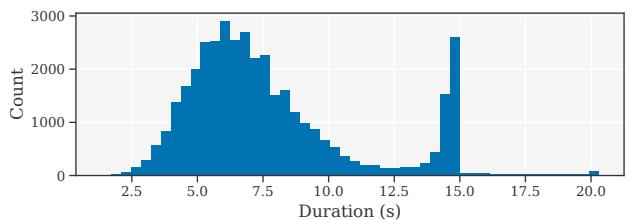
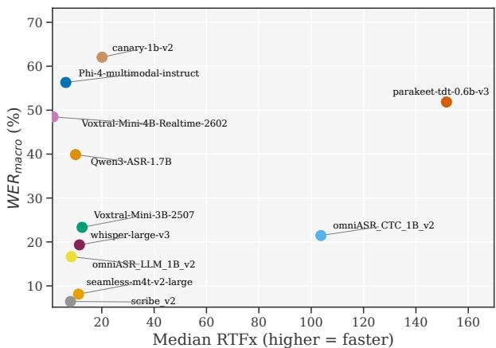
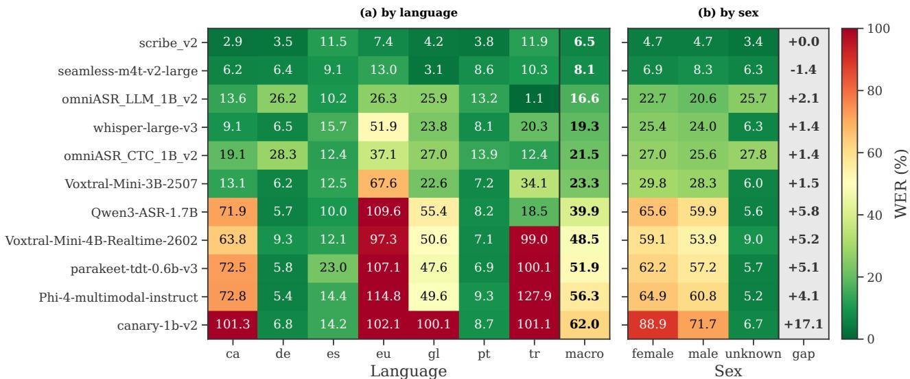

# Benchmarking Automatic Speech Recognition Tools for Iberian Languages

Fernando Lopez ´ ID 1,2,∗∗, Pablo Gomez ´ 1, David Solans ID 1, Paulo Villegas ID 1, Jordi Luque ID 1

1 Telefonica Innovaci ´ on Digital, Spain´

2 Universidad Autonoma de Madrid, Spain´

fernando.lopez@telefonica.com

## Abstract

Comprehensive evaluations of automatic speech recognition (ASR) for Iberian languages remain limited, and low-resource languages, biases, and efficiency trade-offs are underexplored. We benchmark eleven systems, ten open-weight models and one commercial API, across five Iberian languages (Basque, Catalan, Galician, Portuguese, Spanish), with German and Turkish as controls. Evaluation uses an 85-hour dataset covering read speech, broadcast media, and audiobooks, assessing accuracy and efficiency via word error rate (WER) and real-time factors (RTF/RTFx). Results show no single model dominates: accuracy, efficiency, and language coverage present clear trade-offs. Low-resource languages, especially Basque, degrade significantly, highlighting the role of training coverage. We observe consistent sex disparities across most systems, highlighting fairness challenges in multilingual ASR. Overall, the benchmark provides practical guidance for real-world model selection.

Index Terms: speech recognition, benchmarking, Iberian languages, multilingual ASR

## 1. Introduction

Automatic speech recognition (ASR) has advanced rapidly. Public datasets [1, 2, 3] and open pre-trained models [4, 5, 6, 3] have expanded quickly, accelerating both development and deployment. Large-scale ASR evaluations, however, remain heavily skewed toward English: even benchmarks with a multilingual track tend to prioritize short-form English and cover only a handful of high-resource languages [7, 8]. Consequently, the languages of the Iberian Peninsula receive limited coverage. Although these languages are spoken by millions [9], their support in ASR is uneven. Spanish and Portuguese are comparatively well-resourced, Catalan occupies an intermediate position with growing representation in speech datasets, and Basque and Galician remain notably under-resourced [10].

Several efforts partially address this imbalance. The Albayzin evaluation, held at IberSPEECH, benchmarks speechto-text transcription for Spanish broadcast media [11] and for bilingual Basque-Spanish code-switched speech [12], but it does not span the full set of Iberian Peninsula languages. IberoBench [9] targets all of these languages, yet it is a multi-task text benchmark for evaluating the natural language understanding capabilities of large language models (LLMs) rather than a speech benchmark. In other geographical regions, dialect-level studies examine single languages in depth, including Arabic [13], French [14], and Chinese [15], underscoring the relevance of fine-grained regional ASR benchmarking.

In short, for the Iberian Peninsula languages, existing work either compares many models across a few languages or covers many languages with a text language understanding focus. Additionally, a solid comparison must also reflect how these systems behave in practice: performance is condition-dependent, so no single model is best everywhere, and results drawn from a single corpus cannot support robust conclusions. Word error rate (WER) alone likewise offers an incomplete view and should be paired with metrics that capture computational cost. Aggregate WER can further mask demographic disparities, since ASR systems exhibit measurable bias across speaker groups, with higher error rates repeatedly reported for female speakers and other under-represented populations [16, 17, 18, 19]. Reporting per-language and per-sex performance is therefore essential to a fair and complete assessment.

To close this gap, we make the following contributions. (i) We systematically evaluate diverse ASR systems on the most spoken languages of the Iberian Peninsula, namely Basque, Catalan, Galician, Portuguese, and Spanish, with German and Turkish as contrastive controls1; in total, we evaluate ten openweight systems and one commercial model accessed through an API, reporting WER, real-time factor (RTF), and its inverse (RTFx) to jointly assess accuracy and efficiency. (ii) We analyze the trade-off between recognition accuracy and computational efficiency. (iii) We study per-language and per-sex performance across models, revealing disparities in ASR robustness along linguistic and demographic lines.

## 2. ASR benchmark

We assembled the benchmark in three stages. First, we selected existing datasets for the target languages, preserving their original metadata. Next, we selected a representative set of openweight models that support either the full range of these languages or specific subsets of them. Finally, for each model we generated transcription hypotheses to assess recognition accuracy and measured inference latency to assess efficiency.

## 2.1. Datasets

Table 1 summarises the seven datasets. They span roughly 4 to 28 hours per language and differ in audio format and metadata: some provide sex or speaker identifiers, others only the transcription. OpenSLR 69, OpenSLR 76, and OpenSLR 77 [20] are crowdsourced, volunteer-recorded read speech for Catalan, Basque, and Galician. They are derived from Wikipedia articles and named-entity templates, and include transcripts and sex metadata. OpenSLR 108 [21] (MediaSpeech) consists of short, manually transcribed YouTube segments with no metadata beyond a sample identifier; we use the Spanish and Turkish subsets. OpenSLR 94 [2] (Multilingual LibriSpeech) is read audiobook speech from LibriVox; we use the Brazilian Portuguese test split. German Common Voice [22] contains read speech from more than 5k speakers reading predefined sentences; we use the test split exclusively.

Table 1: Evaluated speech datasets with licensing, transcription, and metadata characteristics. “Sex labels” indicate whether the source provides speaker sex annotations (Partial: availablefor a subset ofsamples).
<table><tr><td>Dataset</td><td>Language</td><td>Hours</td><td>Samples</td><td># speakers</td><td>License</td><td>Domain</td><td>Cased</td><td>Punctuation</td><td>Sex labels</td></tr><tr><td>SLR 69</td><td>Catalan</td><td>9.42</td><td>4240</td><td>36</td><td>CC BY-SA 4.0</td><td>Read speech</td><td>Yes</td><td>Yes</td><td>Yes</td></tr><tr><td>SLR 76</td><td>Basque</td><td>13.86</td><td>7136</td><td>29</td><td>CC BY-SA 4.0</td><td>Read speech</td><td>Yes</td><td>Yes</td><td>Yes</td></tr><tr><td>SLR 77</td><td>Galician</td><td>10.32</td><td>5587</td><td>34</td><td>CC BY-SA 4.0</td><td>Read speech</td><td>Yes</td><td>Yes</td><td>Yes</td></tr><tr><td>SLR 108</td><td>Spanish</td><td>10</td><td>2507</td><td>-</td><td>CC BY 4.0</td><td>Media/broadcast</td><td>No</td><td>No</td><td>No</td></tr><tr><td>SLR 108</td><td>Turkish</td><td>10</td><td>2513</td><td>一</td><td>CC BY 4.0</td><td>Media/broadcast</td><td>No</td><td>No</td><td>No</td></tr><tr><td>SLR 94</td><td>Portuguese</td><td>3.74</td><td>871</td><td>10</td><td>CC BY 4.0</td><td>Audiobooks</td><td>No</td><td>No</td><td>Yes</td></tr><tr><td>CommonVoice</td><td>German</td><td>28.03</td><td>16202</td><td>5054</td><td>CCO</td><td>Read speech</td><td>Yes</td><td>Yes</td><td>Partial</td></tr></table>

Because the datasets differ in domain (read speech, broadcast speech, and audiobooks), cross-language differences conflate intrinsic language difficulty with domain and recording conditions, and this design cannot separate the two. Turkish and German serve as controls for differing levels of resource availability, with Turkish under-resourced relative to German.

## 2.2. Data statistics

We merge these heterogeneous databases, totaling 85.37 hours of audio. The duration distribution of samples is depicted in Figure 1, showing that audios are generally shorter than 20 seconds and roughly normally distributed around 6 seconds, with a smaller cluster near 15 seconds from MediaSpeech.

  
Figure 1: Duration distribution.

We use the term “sex” because existing labels may not reflect gender identity. We group entries into female, male, or unknown categories. The latter denotes samples with no sex label; MediaSpeech provides none, so its Spanish and Turkish subsets are excluded here. Of the remaining 34,036 samples, 11,128 are female (33%), 8,144 male (24%), and 14,764 (43%) unknown.

## 2.3. Models

We evaluate ten open-weight models and one commercial API baseline, summarised in Table 2. All open-weight models are constrained to fewer than 7B parameters; where a family offers multiple sizes, we select the checkpoint closest in scale to Whisper-large-v3. All but one (seamless-m4t-v2-large, CC BY-NC 4.0) permit commercial use.

Whisper-large-v3 [4], an encoder-decoder Transformer, remains a widely adopted multilingual baseline. Mistral releases two speech-LLMs that share a Ministral 3B backbone [23]. Voxtral-Mini-3B-2507 [24] pairs it with a fine-tuned Whisper-large-v3 encoder and supports audio-conditioned instruction-following. Voxtral-Mini-4B-Realtime-2602 [25] instead uses a from-scratch causal encoder for native streaming, exposing a configurable latency delay that trades inference time against accuracy. Meta releases three models. The omni pair shares one wav2vec2-style encoder and offers the broadest language coverage in our benchmark. The models differ in decoder: omniASR-CTC-1B-v2 [3] uses a CTC head while omniASR-LLM-1B-v2 [3] uses a language-model decoder. seamless-m4t-v2-large [26] couples a w2v-BERT 2.0 encoder with a fine-tuned NLLB decoder. NVIDIA’s canary-1b-v2 and parakeet-tdt-0.6bv3 [27] share a FastConformer encoder. The former uses a Transformer decoder and also supports translation. The latter uses a throughput-optimised TDT head that natively emits punctuation, casing, and word-level timestamps. Phi-4- multimodal-instruct [28] routes audio through a conformer encoder and adapter into the per-modality LoRA-tuned Phi-4-Mini LLM. Qwen3-ASR-1.7B [29], built on Qwen3-omni, covers 30 languages and 22 Chinese dialects. Scribe v2 [30], a commercial ElevenLabs API, has an undisclosed architecture and training procedure. We include it as a proprietary reference.

## 2.4. Evaluation

We evaluate recognition accuracy with ${ \mathrm { W E R } } \ = \ ( S + D +$ $I ) / N$ , where S, D, and I are the numbers of substitutions, deletions, and insertions, and N is the number of reference words. Given the language imbalance, a corpus-level aggregate would be dominated by the largest split. Thus, we report the macro-averaged WER, the unweighted mean of the perlanguage scores:

$$
\mathrm { W E R } _ { \mathrm { m a c r o } } = \frac { 1 } { L } \sum _ { l = 1 } ^ { L } \mathrm { W E R } _ { l } ,\tag{1}
$$

thus, each of the L languages contributes equally regardless sample count. References and hypotheses are normalized by lowercasing and removing punctuation, and digits are converted to words using num2words2 (not applied to Turkish, which is unsupported). Thus, WER reflects recognition differences rather than formatting mismatches.

For efficiency, we report the RTF and its inverse, RTFx:

$$
\mathrm { R T F } = \frac { t _ { \mathrm { i n f e r e n c e } } } { t _ { \mathrm { a u d i o } } } , \qquad \mathrm { R T F x } = \frac { 1 } { \mathrm { R T F } }\tag{2}
$$

where $t _ { \mathrm { i n f e r e n c e } }$ is the inference time, and $t _ { \mathrm { a u d i o } }$ is the audio duration. RTF below 1.0 (RTFx above 1.0) indicates faster-thanreal-time processing; higher RTFx means greater throughput.

All models run on a single NVIDIA GeForce RTX 3090 (24 GB VRAM). For fair and reproducible timing, we process se-

Table 2: Evaluated models’ architecture, number ofparameters, language coverage, owner, and license. CU: commercial use permitted.
<table><tr><td>Model</td><td>Architecture / Type</td><td>Parameters</td><td>Languages</td><td>Owner</td><td>License</td><td>CU</td></tr><tr><td>whisper-large-v3</td><td>Encoder-Decoder</td><td>~1.5B</td><td>99+</td><td>OpenAI</td><td>Apache-2.0</td><td>√</td></tr><tr><td>Voxtral-Mini-3B-2507</td><td>Speech-LLM</td><td>~3B</td><td>8</td><td>Mistral AI</td><td>Apache-2.0</td><td>√</td></tr><tr><td>Voxtral-Mini-4B-Realtime-2602</td><td>Causal Speech-LLM</td><td>~4B</td><td>13</td><td>Mistral AI</td><td>Apache-2.0</td><td>√</td></tr><tr><td>omniASR-CTC-1B-v2</td><td>Wav2Vec2 + CTC Head</td><td>~1B</td><td>1600+</td><td>Meta</td><td>Apache-2.0</td><td>V</td></tr><tr><td>omniASR-LLM-1B-v2</td><td>Wav2Vec2 + LLM Decoder</td><td>~1B</td><td>1600+</td><td>Meta</td><td>Apache-2.0</td><td>√</td></tr><tr><td>seamless-m4t-v2-large</td><td>w2v-BERT 2.0 + NLLB Decoder</td><td>~2.3B</td><td>101</td><td>Meta</td><td>CC BY-NC 4.0</td><td>X</td></tr><tr><td>canary-1b-v2</td><td>FastConformer + Decoder</td><td>~978M</td><td>25</td><td>NVIDIA</td><td>CC BY 4.0</td><td>√</td></tr><tr><td>parakeet-tdt-0.6b-v3</td><td>FastConformer + TDT</td><td>~600M</td><td>25</td><td>NVIDIA</td><td>CC BY 4.0</td><td>√</td></tr><tr><td>Phi-4-multimodal-instruct</td><td>Multimodal-LLM</td><td>~5.6B</td><td>24</td><td>Microsoft</td><td>MIT</td><td>√</td></tr><tr><td>Qwen3-ASR-1.7B</td><td>Speech-LLM</td><td>~1.7B</td><td>30+</td><td>Alibaba</td><td>Apache-2.0</td><td>√</td></tr><tr><td>scribe-v2</td><td>Unknown (API)</td><td></td><td>90+</td><td>ElevenLabs</td><td>Commercial</td><td>√</td></tr></table>

quentially utterances. For models with configurable delay (e.g., Voxtral-Mini-4B-Realtime), we use the default setting.

## 3. Results

Table 3 reports the overall results. Scribe v2 attains the lowest WER (6.45%), with seamless-m4t-v2-large (8.12%) the best open-weight system, although it cannot be used for commercial purposes. Together, they fare roughly 8 points ahead of the leading freely commercially usable models. Among the latter, omniASR-LLM-1B-v2 (16.64%), Whisper-large-v3 (19.34%), omniASR-CTC-1B-v2 (21.46%), and Voxtral-Mini-3B-2507 (23.32%) lead. A clear gap separates these from Qwen3- ASR-1.7B (39.89%) and the remaining systems (WER > 48%), whose errors largely reflect language-coverage gaps. Notably, Phi-4-multimodal-instruct, the largest open-weight model evaluated, reaches only 56.31% WER at a moderate RTFx of 6.3. It offers no advantage in accuracy, speed, or per-language robustness and underscoring the gap in language coverage.

## 3.1. Error Composition and Architectural Patterns

On the shared Omni-lingual encoder, replacing the CTC head with an LLM decoder lowers all three error rates (subs 12.37→8.52, dels 7.63→6.78, ins 1.46→1.34), so the decoder change helps uniformly rather than trading one error type for another. Across the full set, insertions and deletions rise together for the weakest, low-coverage systems, with Phi-4-multimodalinstruct (ins 10.10) and canary-1b-v2 (ins 8.69, dels 26.63) at the extreme, while the accurate tier keeps insertions near 1.3– 2.6 regardless of decoder type. Substitutions dominate the error budget of every functioning system.

## 3.2. Speed and WER Trade-offs

Figure 2 shows the speed-accuracy trade-off. parakeet-tdt-0.6bv3 attains the highest throughput (RTFx 151.7), followed by omniASR CTC 1B v2 (RTFx 103.7), both notably exceeding real time. However, parakeet’s WER of 51.9%, a consequence of its limited language coverage, restricts its multilingual applicability. omniASR CTC 1B v2 thus offers the best accuracy– efficiency trade-off among freely usable models, pairing competitive WER (21.5%) with exceptional throughput. At the opposite extreme, Voxtral-Mini-4B-Realtime-2602 posts the lowest RTFx (1.4) and a high macro WER (48.5%); although designed for streaming with configurable latency, its causal encoder likely incurs overhead in offline batch evaluation.

  
Figure 2: Performance $( \mathrm { W E R _ { m a c r o } } )$ vs. Eficiency (RTFx).

## 3.3. Per-Language and Per-Sex Analysis

Figure 3(a) reveals two regimes. For high-resource languages (German, Spanish, Portuguese), most systems cluster in a narrow WER band, limiting discriminative power. Comparisons here should be read with caution, as the datasets differ in domain ( see Table 1). Such mismatches explain counter-intuitive orderings, e.g. higher Spanish than German WER despite Spanish being well represented.

For lower-resource languages, performance diverges sharply. Basque is consistently the most challenging language. While this likely reflects limited representation in pretraining corpora, other factors may also contribute, including morphology, tokenization mismatches or acoustic domain. Systems without explicit Basque coverage (parakeet-tdt-0.6b-v3, canary-1b-v2) degrade to near-random output. Catalan is also consistently difficult, with elevated substitution rates pointing to under-representation. Galician and Turkish are intermediate: top-tier models cope well while weaker ones show high variance, e.g. Phi-4-multimodal-instruct records the single worst score on Turkish (127.9%). The omniASR family is the most consistent cross-lingually, including on Basque, a direct effect of its training coverage. Scribe v2 and seamless-m4t-v2-large stay stable across languages, and their gap over the open-weight tier is widest on the lower-resource set.

Figure 3(b) shows a consistent male advantage across most models, largest for canary-1b-v2 (gap +17.1); seamless-m4tv2-large is the exception, slightly favouring female speakers. Scribe v2 exhibits minimal observed differences between male and female speakers, though its opaque training data and the dataset imbalances make this parity hard to attribute. The unknown group consists of German only, since MediaSpeech provides no sex labels and its Spanish and Turkish subsets are excluded from this analysis. Thus, lower WER in this category reflects dataset composition rather than intrinsic robustness.

Table 3: Overall ASR performance. WER and the substitution, deletion, and insertion rates are macro-averaged across languages and expressed per reference word. The three rates sum to WER and are comparable across systems. Median RTF and RTF× are computed across utterances. Best value per column in bold; Scribe v2 is shown as a proprietary reference and excludedfrom the comparison.
<table><tr><td>Model</td><td>WER (↓, %)</td><td>Median RTF (↓)</td><td>Median RTF×(↑)</td><td>Sub rate (↓, %)</td><td>Del rate (↓, %)</td><td>Ins rate (↓, %)</td></tr><tr><td>scribe_v2</td><td>6.45</td><td>0.1244</td><td>8.0</td><td>4.03</td><td>0.71</td><td>1.71</td></tr><tr><td>seamless-m4t-v2-large</td><td>8.12</td><td>0.0900</td><td>11.1</td><td>5.97</td><td>0.88</td><td>1.27</td></tr><tr><td>omniASR_LLM_1B_v2</td><td>16.64</td><td>0.1200</td><td>8.3</td><td>8.52</td><td>6.78</td><td>1.34</td></tr><tr><td>whisper-large-v3</td><td>19.34</td><td>0.0872</td><td>11.5</td><td>12.72</td><td>4.38</td><td>2.24</td></tr><tr><td>omniASR_CTC_1B_v2</td><td>21.46</td><td>0.0096</td><td>103.7</td><td>12.37</td><td>7.63</td><td>1.46</td></tr><tr><td>Voxtral-Mini-3B-2507</td><td>23.32</td><td>0.0801</td><td>12.5</td><td>17.22</td><td>3.52</td><td>2.59</td></tr><tr><td>Qwen3-ASR-1.7B</td><td>39.89</td><td>0.1001</td><td>10.0</td><td>30.88</td><td>4.18</td><td>4.83</td></tr><tr><td>Voxtral-Mini-4B-Realtime-2602</td><td>48.47</td><td>0.7258</td><td>1.4</td><td>32.04</td><td>12.75</td><td>3.67</td></tr><tr><td>parakeet-tdt-0.6b-v3</td><td>51.85</td><td>0.0066</td><td>151.7</td><td>32.13</td><td>15.11</td><td>4.62</td></tr><tr><td>Phi-4-multimodal-instruct</td><td>56.31</td><td>0.1599</td><td>6.3</td><td>36.28</td><td>9.92</td><td>10.10</td></tr><tr><td>canary-1b-v2</td><td>62.05</td><td>0.0497</td><td>20.1</td><td>26.72</td><td>26.63</td><td>8.69</td></tr></table>

  
Figure 3: Model’s WER: (a) across languages and (b) per speaker sex. Models are ordered by macro WER.

## 4. Limitations

Several limitations apply. First, the datasets are heterogeneous in domain and recording conditions, so cross-language comparisons should be interpreted with caution despite transcription normalization; broadcast-derived sets likely inflate WER relative to read speech. Second, we cannot confirm whether models were trained on benchmark subsets, which would optimistically bias their WER. Third, inference times were measured on identical hardware without architecture-specific configuration, possibly disadvantaging some architectures; for Scribe v2, RTF and RTFx instead reflect API latency. Fourth, language labels can mask dialectal variation (e.g., Brazilian vs. European Portuguese). A controlled assessment of demographic disparities would require datasets balanced across speaker groups and languages, beyond this benchmark’s scope. Nonetheless, the consistency of these disparities across architectures suggests fairness challenges are pervasive in multilingual ASR.

## 5. Conclusions

We benchmarked ten open-weight and one commercial ASR system on Iberian languages, with Turkish and German as controls, assessing accuracy, efficiency, and error composition. The resulting hierarchy is conditioned by licensing. Scribe v2 achieves the best WERmacro, and seamless-m4tv2-large is the strongest open-weight system but is restricted to non-commercial use. Among freely usable models, omni-ASR LLM 1B v2 and Whisper-large-v3 lead on accuracy, with the former also the most robust across low-resource and typologically diverse languages. omniASR CTC 1B v2 offers the best accuracy–efficiency trade-off (RTFx 103), whereas parakeet-tdt-0.6b-v3 attains the highest throughput (RTFx 152) at substantially degraded WER. Per-language results establish language coverage as a first-order selection criterion: highresource languages (German, Spanish, Portuguese) yield consistent performance, whereas lower-resource ones, Basque in particular, expose sharp divergences, with uncovered models degrading severely. Speaker-sex disaggregation further reveals a consistent male advantage, with only Scribe v2 and seamlessm4t-v2-large remaining equitable. Overall, no single openweight model dominates: users must navigate trade-offs among accuracy, speed, language coverage, and licensing, a clear opportunity for the open-weight ASR community.

## 6. Generative AI Use Disclosure

We used a generative AI to assist in paraphrasing and improving clarity and grammar in parts of the manuscript; all generated content was carefully reviewed and validated by the authors.

## 7. References

[1] V. Panayotov, G. Chen, D. Povey, and S. Khudanpur, “LibriSpeech: an ASR corpus based on public domain audio books,” in 2015 IEEE international conference on acoustics, speech and signal processing (ICASSP). IEEE, 2015, pp. 5206–5210.

[2] V. Pratap, Q. Xu, A. Sriram, G. Synnaeve, and R. Collobert, “MLS: A large-scale multilingual dataset for speech research,” arXiv preprint arXiv:2012.03411, 2020.

[3] G. Keren, A. Kozhevnikov, Y. Meng, C. Ropers, M. Setzler, S. Wang, I. Adebara, M. Auli, C. Balioglu et al., “Omnilingual ASR: Open-source multilingual speech recognition for 1600+ languages,” arXiv preprint arXiv:2511.09690, 2025.

[4] A. Radford, J. W. Kim, T. Xu, G. Brockman, C. McLeavey, and I. Sutskever, “Robust speech recognition via large-scale weak supervision,” in International conference on machine learning. PMLR, 2023, pp. 28 492–28 518.

[5] A. Baevski, Y. Zhou, A. Mohamed, and M. Auli, “wav2vec 2.0: A framework for self-supervised learning of speech representations,” Advances in neural information processing systems, vol. 33, pp. 12 449–12 460, 2020.

[6] W.-N. Hsu, B. Bolte, Y.-H. H. Tsai, K. Lakhotia, R. Salakhutdinov, and A. Mohamed, “HuBERT: Self-supervised speech representation learning by masked prediction of hidden units,” IEEE/ACM transactions on audio, speech, and language processing, vol. 29, pp. 3451–3460, 2021.

[7] V. Srivastav, S. Zheng, E. Bezzam, E. Le Bihan, N. Koluguri, P. Zelasko, S. Majumdar, A. Moumen, and S. Gandhi, “Open ASR˙ leaderboard: Towards reproducible and transparent multilingual and long-form speech recognition evaluation,” arXiv e-prints, pp. arXiv–2510, 2025.

[8] A. Conneau, M. Ma, S. Khanuja, Y. Zhang, V. Axelrod, S. Dalmia, J. Riesa, C. Rivera, and A. Bapna, “FLEURS: Few-shot learning evaluation of universal representations of speech,” in 2022 IEEE Spoken Language Technology Workshop (SLT). IEEE, 2023, pp. 798–805.

[9] I. Baucells, J. Aula-Blasco, I. de Dios-Flores, S. P. Suarez,´ N. Perez, A. Salles, S. S. Docio, J. Falcao, J. J. Saiz, R. Sep˜ ulveda-´ Torres et al., “IberoBench: A benchmark for LLM evaluation in iberian languages,” in Proceedings of the 31st International Conference on Computational Linguistics, 2025, pp. 10 491–10 519.

[10] X. de Zuazo, E. Navas, I. Saratxaga, and I. H. Rioja, “Whisper-LM: Improving ASR models with language models for lowresource languages,” arXiv preprint arXiv:2503.23542, 2025.

[11] E. Lleida, L. J. Rodriguez-Fuentes, J. Tejedor, A. Ortega, A. Miguel, V. Bazan, C. P ´ erez, A. de Prada, M. Penagarikano,´ A. Varona, G. Bordel, D. Torre-Toledano, A. Alvarez, and´ H. Arzelus, “An overview of the IberSPEECH-RTVE 2022 challenges on speech technologies,” Applied Sciences, vol. 13, no. 15, 2023. [Online]. Available: https://www.mdpi.com/ 2076-3417/13/15/8577

[12] M. Penagarikano, A. Varona, G. Bordel, and L. J. Rodriguez-˜ Fuentes, “Albayzin 2024 Bilingual Basque-Spanish Speech to Text (BBS-S2T) Challenge: Datasets, Systems and Results,” in IberSPEECH 2024, 2024, pp. 319–324.

[13] G. Droua-Hamdani, S.-A. Selouani, and M. Boudraa, “Speakerindependent ASR for modern standard Arabic: effect of regional accents,” International Journal of Speech Technology, vol. 15, no. 4, pp. 487–493, 2012.

[14] L. Maison, T. Soulas, and M.-J. Meurs, “CEREALES: a new dataset of Quebec French accented speech with applications to speech recognition,” in Proc. Interspeech 2025, 2025, pp. 4058– 4062.

[15] C. Wang, M. Shao, J. Hu, Z. Zhu, H. Xue, B. Mu, X. Xu, X. Duan, B. Zhang, P. Zhu et al., “WenetSpeech-Wu: Datasets, benchmarks, and models for a unified Chinese Wu dialect speech processing ecosystem,” arXiv preprint arXiv:2601.11027, 2026.

[16] M. Shah, D. Solans Noguero, M. Heikkila, B. Raj, and N. Kourtel-¨ lis, “Speech robust bench: A robustness benchmark for speech recognition,” in International Conference on Learning Representations, vol. 2025, 2025, pp. 38 625–38 651.

[17] N. Garg, L. Schiebinger, D. Jurafsky, and J. Zou, “Word embeddings quantify 100 years of gender and ethnic stereotypes,” Proceedings of the National Academy of Sciences, vol. 115, no. 16, pp. E3635–E3644, 2018. [Online]. Available: https://www.pnas.org/doi/abs/10.1073/pnas.1720347115

[18] S. Feng, O. Kudina, B. M. Halpern, and O. Scharenborg, “Quantifying bias in automatic speech recognition,” arXiv preprint arXiv:2103.15122, 2021. [Online]. Available: https: //arxiv.org/abs/2103.15122

[19] J. L. Martin and K. E. Wright, “Bias in automatic speech recognition: The case of African American language,” Applied Linguistics, vol. 44, no. 4, pp. 613–630, 2023. [Online]. Available: https://academic.oup.com/applij/article-abstract/44/4/ 613/6901317

[20] O. Kjartansson, A. Gutkin, A. Butryna, I. Demirsahin, and C. Rivera, “Open-source high quality speech datasets for Basque, Catalan and Galician,” in Proceedings of the 1st Joint Workshop on Spoken Language Technologiesfor Under-resourced languages (SLTU) and Collaboration and Computing for Under-Resourced Languages (CCURL), 2020, pp. 21–27.

[21] R. Kolobov, O. Okhapkina, A. P. Olga Omelchishina, R. Bedyakin, V. Moshkin, D. Menshikov, and N. Mikhaylovskiy, “MediaSpeech: Multilanguage ASR benchmark and dataset,” 2021.

[22] R. Ardila, M. Branson, K. Davis, M. Kohler, J. Meyer, M. Henretty, R. Morais, L. Saunders, F. Tyers, and G. Weber, “Common voice: A massively-multilingual speech corpus,” in Proceedings ofthe twelfth language resources and evaluation conference, 2020, pp. 4218–4222.

[23] A. H. Liu, K. Khandelwal, S. Subramanian, V. Jouault, A. Rastogi et al., “Ministral 3,” 2026. [Online]. Available: https://arxiv.org/abs/2601.08584

[24] A. H. Liu, A. Ehrenberg, A. Lo, C. Denoix, C. Barreau, G. Lample, J.-M. Delignon, K. R. Chandu, P. von Platen, P. R. Muddireddy et al., “Voxtral,” arXiv preprint arXiv:2507.13264, 2025.

[25] A. H. Liu, A. Ehrenberg, A. Lo, C.-Y. Sun, G. Lample, J.-M. Delignon, K. R. Chandu, P. von Platen, P. R. Muddireddy, R. Arora et al., “Voxtral realtime,” arXiv preprint arXiv:2602.11298, 2026.

[26] L. Barrault, Y.-A. Chung, M. C. Meglioli, D. Dale, N. Dong, M. Duppenthaler, P.-A. Duquenne, B. Ellis, H. Elsahar et al., “Seamless: Multilingual expressive and streaming speech translation,” 2023.

[27] M. Sekoyan, N. R. Koluguri, N. Tadevosyan, P. Zelasko, T. Bartley, N. Karpov, J. Balam, and B. Ginsburg, “Canary-1b-v2 & parakeet-tdt-0.6 b-v3: Efficient and high-performance models for multilingual ASR and AST,” arXiv preprint arXiv:2509.14128, 2025.

[28] A. Abouelenin, A. Ashfaq, A. Atkinson, H. Awadalla, N. Bach, J. Bao, A. Benhaim, M. Cai, V. Chaudhary, C. Chen et al., “Phi-4-mini technical report: Compact yet powerful multimodal language models via mixture-of-loras,” arXiv preprint arXiv:2503.01743, 2025.

[29] X. Shi, X. Wang, Z. Guo, Y. Wang, P. Zhang, X. Zhang, Z. Guo, H. Hao, Y. Xi, B. Yang et al., “Qwen3-ASR technical report,” arXiv preprint arXiv:2601.21337, 2026.

[30] ElevenLabs, “Scribe v2,” Speech-to-Text model, 2026, https: //elevenlabs.io/docs/overview/models.