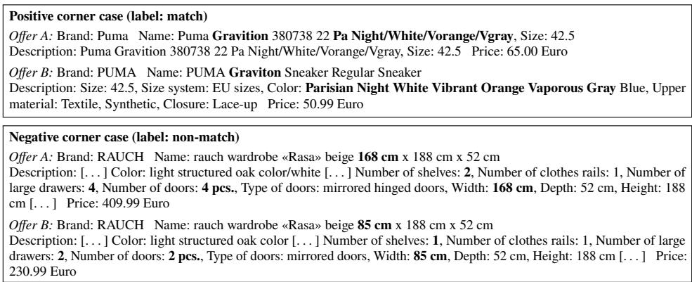
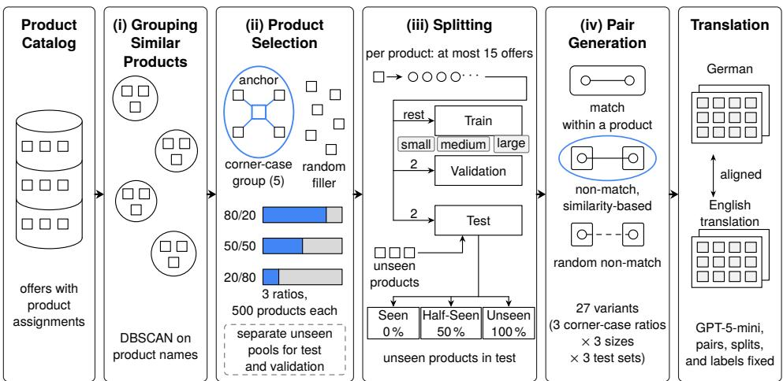
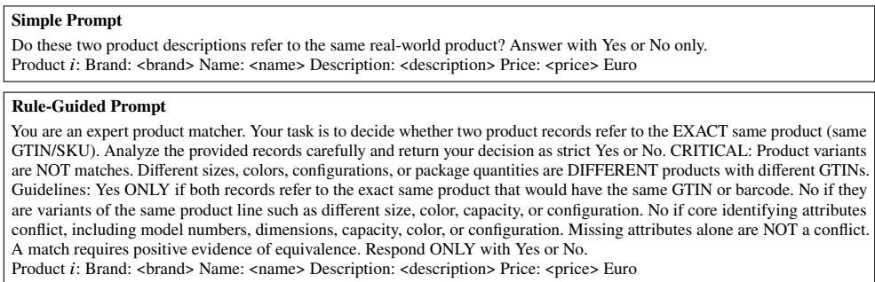

# Billiger.de Products: A Bilingual Entity Matching Benchmark

Aaron Steiner 1, Ksenia Elagin1, Ralph Peeters 1, Johannes Knopp2, and Christian Bizer 1

Abstract: Existing product matching benchmarks primarily contain English-language product data and are often dominated by a single product category, such as electronics. This paper introduces Billiger.de Products, a bilingual German and English entity matching benchmark covering thirteen consumer product categories, including dificult-to-handle categories such as clothing and furniture. The benchmark data originates from the German price comparison platform billiger.de. Following the design of WDC Products, the benchmark ofers multiple variants that difer in the fraction of corner cases, the size of the development set, and the fraction of entities unseen during training. An aligned English translation of every ofer keeps all pairs, splits, and labels fixed, while cross-language test sets combine German and English records within individual pairs. We validate the benchmark using six supervised matchers and zero-shot GPT-5.2 on both language versions and the cross-language test sets. The validation shows the dificulty of the benchmark. The comparison of the results on the English version of the benchmark to the results on the German version shows that most matchers score on average higher on the English version. The diference is largest for RoBERTa and HierGAT, while the zero-shot LLM runs are largely insensitive to the language. Comparing the F1 scores achieved by PLM-based matchers on the English version of Billiger.de Products with their performance on existing English-language benchmarks, such as WDC Products and Abt-Buy, shows that Billiger.de Products is more dificult than these benchmarks.

Keywords: Entity Matching, Benchmark, E-Commerce, Multilingual Data, Large Language Models

## 1 Introduction

Entity matching is the task of discovering records that refer to the same real-world entity in a single or across multiple data sources [BS22; Ch12]. In e-commerce, the task appears at scale on price comparison platforms such as idealo.de, geizhals.de, or billiger.de, which continuously aggregate millions of product ofers from thousands of shops and need to group ofers that refer to the same product. Ofers for the same product difer in naming conventions, attribute availability, attribute formatting, and description style. A shoe listed by one vendor as “Nike Air Force 1 ’07 – White – EU 42.5” may appear on another platform as “Nike AF1 Low ’07 Sneaker – Triple White – US 9”.

Widely used entity matching benchmarks such as Abt-Buy, Amazon-Google, DBLP-Scholar, and Walmart-Amazon [KTR10; Mu18; PB20] provide a single level of task dificulty and contain almost exclusively English-language records. The WDC Products benchmark [PDB24] addressed the dificulty limitation through independently controllable variation along three dimensions: the amount of corner cases, the fraction of entities unseen during training, and the development set size. However, WDC Products also consists of English data and is dominated by consumer electronics. The matching systems evaluated in recent studies build on language models pre-trained predominantly on English text [Li20; PB22b; Ya22]. How well such systems perform on non-English product data across a wide range of product categories is largely unknown. Existing benchmarks also do not cover the cross-language setting, in which product ofers in diferent languages need to be matched, e.g. on a price comparison platform that aggregates ofers across countries.

This paper presents Billiger.de Products, an entity matching benchmark in German, the language of one of the largest e-commerce markets in Europe [LWD21; Su25]. It is constructed from product ofers provided by solute GmbH, the operator of the price comparison platform billiger.de. Following WDC Products, it provides three development set sizes (small, medium, large), three corner-case ratios (20 %, 50 %, 80 %), and three proportions of unseen entities (0 %, 50 %, 100 %), yielding 27 variants (Section 2.2). Its thirteen product categories include clothing and furniture, which are harder to handle for every evaluated matcher than electronics.

The English version contains GPT-5-mini translations of the name and description attribute values of every ofer, with all pairs, splits, and labels kept fixed. Comparing the two versions measures language efects together with the translation, and pairing German records with English translations of their counterparts enables cross-language evaluation. We validate both versions using six supervised matchers and zero-shot GPT-5.2 with two prompt designs, and additionally evaluate XLM-R, a multilingual pretrained language model, on the 80 % corner-case variants and in the cross-language setting. The contributions are:

1. An entity matching benchmark for German-language consumer product data, containing 13,568 ofers that describe 2,168 products from 13 categories, with fixed splits along the three dimensions: amount of corner cases, fraction of entities unseen during training, and the development set size.

2. An English translation of the complete benchmark that keeps all pairs, splits, and labels fixed, allowing direct comparability between entity matching in English and German as well as the construction of cross-language test sets.

3. Validation results for six supervised matchers and zero-shot GPT-5.2 on all 27 variants of both language versions and on the cross-language test sets. The results show the dificulty of the benchmark in both languages. Under German-only training, four of the five evaluated PLM-based matchers lose performance on cross-language pairs compared to same-language pairs, while GPT-5.2 shows no consistent cross-language penalty.

Section 2 describes benchmark construction, Section 3 introduces the matching systems, and

Section 4 reports their performance across dificulty dimensions, languages, and categories. Section 5 examines cross-language matching, followed by related work in Section 6 and the conclusion in Section 7.

The benchmark is released with the permission of solute GmbH and is available for public download.3 The released records contain no identifying information about shops, sellers, or persons.

## 2 Benchmark Creation

This section describes benchmark construction from billiger.de product data, following WDC Products [PDB24] with controlled corner-case ratios, unseen-entity ratios, and development set sizes.

## 2.1 Source Data

The raw data was provided by solute GmbH, the operator of the German price comparison platform billiger.de. Each ofer carries the textual attributes name, description, and brand, the numerical attribute price in Euro, and identifying attributes such as EAN/GTIN and manufacturer part numbers (MPN) with varying coverage. The product assignments supplied by solute determine which ofers refer to the same product. The matchers receive only name, description, brand, and price. The EAN/GTIN and MPN attributes are excluded, whereas identifiers inside names or descriptions remain, as the MPN in Figure 1 shows. This reflects matching tasks in which no separate identifier attributes are available.

Two preprocessing steps were applied to the source data: duplicate ofers, caused for example by price updates of the same ofer, were removed, as were ofers whose names contain fewer than five words, as these are too sparsely described for meaningful matching. The remaining German-language ofers cover the whole product range of a general-purpose price comparison portal (see Section 2.5).

## 2.2 Creation Process

The benchmark realizes the same three dimensions as WDC Products [PDB24]: (i) the amount of corner cases, (ii) the fraction of unseen entities in the test set, and (iii) the development set size, meaning the combined size of the training and the validation split. Varying these dimensions supports systematic comparisons of matching performance. Corner cases are positives and negatives close to the decision boundary of the two classes.

  
Fig. 1: Two corner-case pairs in the English version. Top: matching ofers for the same sneaker with a diferently spelled model name and an abbreviated versus a written-out colorway. Bottom: non-matching ofers for two wardrobe variants that difer only in width and interior configuration. Bold marks the decisive evidence, descriptions are truncated.

Figure 1 shows an example for a positive and a negative corner-case pair. A positive corner case is a pair of matching ofers whose surface forms are dissimilar, for example two ofers for the same sneaker that describe the color using diferent vocabulary (Figure 1, top). A negative corner case is a pair of non-matching ofers whose textual representations are highly similar, for example ofers for two variants of the same wardrobe that agree in brand, model name, and nearly the entire description and difer only in some or a single attribute (Figure 1, bottom). The corner-case ratio of a benchmark variant controls which share of its products contributes such pairs, and thus how hard the variant is. An unseen entity is an entity, or product in this case, that appears in the test set but not in the training set, i.e. a trained matcher cannot directly memorize what separates this product from other similar products and instead needs to generalize to new products, analogous to the real world where new products are introduced daily.

Figure 2 summarizes the four construction steps: (i) grouping similar products, (ii) selecting products, (iii) splitting ofers, and (iv) generating pairs.

The first step groups similar products to restrict the search for corner cases. The second selects 500 products for each corner-case ratio, combining similar but distinct products with randomly selected products. Disjoint product pools supply unseen evaluation products.

The third step splits ofers into training, validation, and test sets. The proportion of products absent from training controls the unseen dimension, while the number of retained training ofers controls development set size. The fourth step generates matching and non-matching pairs within these splits. Combining the three dimensions yields 27 variants.

After these four steps, the names and descriptions of all selected ofers are translated into

  
Fig. 2: Construction pipeline of the benchmark, from clustering to the aligned German and English releases.

English while preserving the pairs, splits, and labels. This produces an aligned English counterpart for every German benchmark variant, as described in Section 2.3.

Grouping Similar Products. The cleansed corpus is first organized into coarse clusters of similar products using DBSCAN [Es96] on the product name attribute. This restricts the subsequent search for similar products to smaller candidate sets.4 Products with 7 to 80 ofers form the pool for the seen products, as enough ofers are needed for training, validation, and testing. Products with 4 to 6 ofers form the pool for the unseen products, which contribute ofers only to the evaluation splits, so seen and unseen products difer in ofer count as well as in training exposure.

Product Selection. Each corner-case group contains five similar but distinct products selected from one DBSCAN cluster. One randomly chosen product serves as the anchor of the group. Four distinct products similar to the anchor are then added one by one. For each selection, the remaining candidates are ranked using one of four similarity metrics on the product name attribute: cosine, generalized Jaccard, Dice, or fastText embedding similarity. The metric is drawn at random for each selection so that no single metric dominates the process. The result is a group of five similar but distinct products, for example five wardrobes of the same model line in diferent widths. Ofers belonging to these five products are used to construct corner-case pairs.

The three corner-case ratios combine corner-case products with random filler products drawn from the same candidate clusters. The 80 % set combines 400 corner-case products with 100 filler products, the 50 % set combines 250 with 250, and the 20 % set combines 100 with 400, so every set contains 500 products. The smaller corner-case selections are subsets of the larger ones, resulting in each set sharing part of their corner-case population. All development set sizes of one corner-case set contain the same 500 products and difer only in the number of ofers retained per product.

Splitting. This step controls the splitting of the selected product ofers into training, validation and test sets. For seen products, the ofers are split into training, validation, and test sets, retaining at most 15 ofers per product. Each ofer is assigned to exactly one split of a configuration, so no ofer and no pair occurs in more than one split. For each selected product, two ofers go to test, two to validation, and the rest to training. The development set size dimension retains two (small), three (medium), or up to eleven (large) ofers per product in the training split, with the smaller sets being subsets of the larger ones.

The unseen dimension is realized by replacing 0 %, 50 %, or 100 % of the products in the test split with products from an unseen pool of 500 additional products, selected by the same procedure and the same corner-case ratio. A third pool, constructed identically, provides the unseen products for the validation sets which are created in the same way as the unseen test sets. Following WDC Products, we call the 0 %, 50 %, and 100 % unseen conditions Seen, Half-Seen, and Unseen, respectively.

Pair Generation. The final step turns the selected ofers into labelled record pairs. Two ofers are labelled as a match if they share the same product assignment supplied by solute. Positive pairs are generated exhaustively from such ofers in each training, validation and test split. Additionally, for each ofer, high similarity negative pairs are selected among the remaining 499 products using the same metrics as before, one pair in the small, two in the medium, and three in the large configuration, plus one additional random negative pair. After these steps, the benchmark comprises nine training sets (3 corner-case ratios × 3 sizes), nine validation configurations in three sizes, and nine test sets (3 corner-case ratios × 3 unseen proportions), yielding overall 27 benchmark variants.

## 2.3 English Version of the Benchmark

The English version of the benchmark contains translations of the attributes name and description of every record from German to English. All identifiers, product assignments, splits, labels, and the attributes brand and price stay unchanged. Each unique ofer was translated with the GPT-5-mini model (snapshot gpt-5-mini-2025-08-07), instructed to return JSON mirroring the record structure. Outputs violating the format were corrected manually. As a result, every ofer in the benchmark exists in an aligned German and English version and every German benchmark variant has an identical English counterpart. Furthermore, German and English records can be combined into cross-language pairs for the experiments in Section 5. The translation also keeps locale conventions unchanged, so prices stay in Euro and measurements in the metric system.

The translation was validated in two steps. Automated equality checks confirmed that identifiers, counts, and dataset dimensions equal the German version. For the content, three LLMs of diferent families, DeepSeek V4 Flash, Gemini 3.8 Flash, and GLM 5.3 Flash, compared the German and English versions of 3,000 randomly sampled test ofers with the same prompt, checking identifiers, variant attributes, quantities, and omissions. An error counts as matching-relevant if it could change a match decision, for example a changed model number, size, material, or package quantity. One author then reviewed, blind to the model judgments, all 75 ofers that at least one model flagged as matching-relevant, 100 ofers that all models judged error-free, and 50 further ofers, and found 11, zero, and one matching-relevant errors, respectively. Weighting these rates by stratum size yields an estimated 0.68 % matching-relevant translation errors. The matchers in Section 4.2 achieve similar performance when trained on either language version further supporting that the translation has not negatively impacted the matching signals.

## 2.4 Benchmark Statistics

Both language versions of the benchmark contain overall 13,568 product ofers describing 2,168 products. Table 1 reports the pair composition of the training, validation, and test splits. The validation columns show the Seen validation sets used for model selection, whose products all occur in the corresponding training sets. The test sets exhibit a class imbalance of roughly 1:10 to 1:13. To assess label quality, one author re-annotated a stratified random sample of 100 unique test pairs, comprising 50 matches and 50 non-matches, blind to the released labels. The re-annotation agreed with all 50 match labels and 49 of the 50 non-match labels. Weighting these class-specific disagreement rates by the 1:11.8 class imbalance of the unique test pairs yields an estimated disagreement rate of 1.8 %.

The benchmark attributes do not contain many missing values as name and price are available in every product ofer, whereas brand and description have a density of over 99 % in all variants.

## 2.5 Product Categories

The benchmark spans the full product catalog of a general-purpose price comparison portal. To enable category-level analysis, all products were assigned to a unified taxonomy of thirteen top-level categories.5 The taxonomy provides a common top-level vocabulary across retailer-specific category hierarchies. The retailer-provided category paths (over 190,000 distinct strings) follow no common standard. We map these paths to the fixed categories in two stages: rule-based keyword mapping over normalized category paths, followed by GPT-5-mini classification of the remaining cases into the same taxonomy. A manual validation on a random sample of 500 products found 89.0 % of the assignments correct, 7.4 % ambiguous (products plausibly belonging to two categories, such as protein powder as sports or food), and 3.6 % wrong, with the errors spread across categories.

<table><tr><td></td><td></td><td colspan="3">Training</td><td colspan="3">Validation</td><td colspan="4">Test</td></tr><tr><td>CC</td><td>Size</td><td>Pos.</td><td>Neg.</td><td>Total</td><td>Pos.</td><td>Neg.</td><td>Total</td><td>Unseen</td><td>Pos.</td><td>Neg.</td><td>Total</td></tr><tr><td rowspan="3">20 %</td><td>Small</td><td>485</td><td>1,979</td><td>2,464</td><td>491</td><td>1,993</td><td>2,484</td><td>0%</td><td>407</td><td>4,038</td><td>4,445</td></tr><tr><td>Medium</td><td>1,457</td><td>4,456</td><td>5,913</td><td>491</td><td>2,989</td><td>3,480</td><td>50 %</td><td>347</td><td>4,082</td><td>4,429</td></tr><tr><td>Large</td><td>13,100</td><td>14,012</td><td>27,112</td><td>491</td><td>3,984</td><td>4,475</td><td>100 %</td><td>360</td><td>4,089</td><td>4,449</td></tr><tr><td rowspan="3">50%</td><td>Small</td><td>482</td><td>1,979</td><td>2,461</td><td>479</td><td>1,986</td><td>2,465</td><td>0%</td><td>363</td><td>4,049</td><td>4,412</td></tr><tr><td>Medium</td><td>1,464</td><td>4,441</td><td>5,905</td><td>479</td><td>2,977</td><td>3,456</td><td>50%</td><td>326</td><td>4,092</td><td>4,418</td></tr><tr><td>Large</td><td>13,024</td><td>14,000</td><td>27,024</td><td>479</td><td>3,971</td><td>4,450</td><td>100 %</td><td>369</td><td>4,089</td><td>4,458</td></tr><tr><td rowspan="3">80 %</td><td>Small</td><td>492</td><td>1,983</td><td>2,475</td><td>485</td><td>1,985</td><td>2,470</td><td>0%</td><td>336</td><td>4,036</td><td>4,372</td></tr><tr><td>Medium</td><td>1,462</td><td>4,435</td><td>5,897</td><td>485</td><td>2,970</td><td>3,455</td><td>50 %</td><td>339</td><td>4,088</td><td>4,427</td></tr><tr><td>Large</td><td>12,747</td><td>13,824</td><td>26,571</td><td>485</td><td>3,967</td><td>4,452</td><td>100 %</td><td>348</td><td>4,099</td><td>4,447</td></tr></table>

Tab. 1: Pair composition per corner-case ratio (CC), identical for both languages. Validation reports the Seen splits used for model selection. Training and validation vary by development set size, while test sets vary by unseen-product ratio.

<table><tr><td>Category</td><td>Train (%)</td><td>Test (%)</td><td>Category</td><td>Train (%)</td><td>Test (%)</td></tr><tr><td>Clothing &amp; Accessories</td><td>20.99</td><td>28.71</td><td>Cosmetics &amp; Drugstore</td><td>3.25</td><td>4.48</td></tr><tr><td>Furniture &amp; Living</td><td>21.17</td><td>26.41</td><td>Health &amp; Care</td><td>2.23</td><td>2.44</td></tr><tr><td>Electronics &amp; Computers</td><td>20.40</td><td>12.33</td><td>Office Supplies</td><td>0.94</td><td>0.74</td></tr><tr><td>Tools &amp; DIY</td><td>11.31</td><td>8.08</td><td>Food &amp; Beverages</td><td>1.00</td><td>0.63</td></tr><tr><td>Sports &amp; Leisure</td><td>6.24</td><td>6.31</td><td>Books, Films &amp; Music</td><td>0.50</td><td>0.52</td></tr><tr><td>Toys &amp; Baby</td><td>6.23</td><td></td><td>4.92 Pet Supplies</td><td>0.23</td><td>0.20</td></tr><tr><td>Automotive &amp; Motorcycle</td><td>5.51</td><td>4.33</td><td></td><td></td><td></td></tr></table>

Tab. 2: Share of product ofers per category in the training and test splits in percent, averaged over all variants.

Table 2 shows the resulting category distribution. Clothing & Accessories, Furniture & Living, and Electronics & Computers account for the largest shares, which mirrors European e-commerce markets, where fashion is the most frequently purchased category, followed by home-related goods and electronics [LWD21; Su25].

## 3 Validation of the Benchmark

We evaluate six supervised matchers and zero-shot GPT-5.2 on all 27 variants of both languages to assess benchmark dificulty and provide baselines. XLM-R is evaluated as an additional supervised matcher on the 80 % corner-case variants (Section 4.2) and in the cross-language experiment (Section 5). We distinguish feature-based matchers, fine-tuned pretrained language model (PLM)-based matchers, and the zero-shot LLM. The PLM-based group comprises RoBERTa, XLM-R, R-SupCon, HierGAT, and Ditto.

Precision, recall, and F1 are measured for the match class. Supervised results are mean test F1 over three training seeds per variant. The standard deviation across seeds has a median of 1.3 F1 and stays below 3 F1 for 86 % of the supervised configurations. Larger deviations occur mainly for Ditto and HierGAT on the small development sets. Per-seed results, standard deviations, precision, and recall are available in the repository. Hyperparameters follow the WDC Products codebase6. The following paragraphs describe each matcher.

WordCooc: A symbolic baseline used in WDC Products [PDB24] that uses binary word co-occurrence statistics over brand, name, description, and price as features for classical classifiers (Logistic Regression, LinearSVC, Decision Trees, Random Forests, Naive Bayes, XGBoost), with hyperparameters from a randomized search. For each training set, the classifier with the highest validation F1 is reported.

Magellan: Magellan [Ko16] automatically generates token-, character-, and numericsimilarity features for each attribute based on attribute statistics. Magellan trains the same classifiers as the WordCooc baseline on these features, with hyperparameter optimization on the validation set.

RoBERTa: A RoBERTa-base cross-encoder [Li19] that serializes each product ofer pair into a combined input sequence and is fine-tuned end-to-end with a binary classification head and early stopping. RoBERTa is predominantly pre-trained on English data.

XLM-R: XLM-R [Co20] is a RoBERTa variant pre-trained with masked language modeling on monolingual text in 100 languages, including German. It is fine-tuned using the same pipeline as the RoBERTa matcher.

R-SupCon: R-SupCon [PB22b] performs supervised contrastive pre-training of a RoBERTabase model using the respective benchmark development set so that ofers of the same product form clusters in the embedding space. The model is then fine-tuned end-to-end together with a classification head on pairwise ofers for the final matching decision.

HierGAT: HierGAT [Ya22] combines transformer text encoding with a hierarchical graph representation of tokens, attributes, and records. It uses contextualized token embeddings to encode individual attributes and compares corresponding attributes across a record pair.

  
Fig. 3: The two zero-shot prompts for GPT-5.2 in their English form, with the serialized records appended for � ∈ {1, 2}. The German versions are on the benchmark website.

Graph attention then weights these attribute comparisons to form a representation of the pair, which a classifier uses to predict whether the records match.

Ditto: Ditto [Li20] is a transformer cross-encoder based on RoBERTa-base and one of the first PLM-based systems for entity matching. Ditto adds data augmentation (token deletion and swapping) and injection of domain knowledge compared to the RoBERTa baseline.

GPT-5.2 (zero-shot): Following the protocol of Peeters et al. [PSB25], GPT-5.2 (snapshot gpt-5.2-2025-12-11) is queried zero-shot (without using the training sets) for every test pair using the OpenAI Batch API in July 2026. Two diferent prompts are compared, which are shown in Figure 3. The Simple prompt asks whether two product descriptions refer to the same real-world product and requests a Yes/No answer. The Rule-Guided prompt additionally encodes the identity definition of the benchmark: variants difering in size, color, configuration, capacity, or package quantity are not matches, conflicts in identifying attributes must yield “No”, missing attributes alone are not a conflict, and a match requires positive evidence of equivalence. Both prompts serialize brand, name, description, and price and were adapted to the benchmark language. Requests use API defaults for reasoning efort and sampling parameters. Answers are normalized to binary decisions using the requested language or 1/0. We restrict the evaluation to a single LLM, as covering all combinations of test set, language, and prompt already requires roughly 160,000 classification requests per model.

## 4 Experimental Results

Section 4.1 reports performance along the three benchmark dimensions, Section 4.2 compares languages, and Section 4.3 compares product categories. Section 4.4 relates the results to WDC Products and Abt-Buy.

## 4.1 Results Along the Benchmark Dimensions

Table 3 reports F1 for the six supervised matchers and both GPT-5.2 prompts across the 27 German variants, and Table 4 the diference to the English version per variant.

The results underline the dificulty of the benchmark. The feature-based approaches WordCooc and Magellan average 43.01 and 42.45 F1 across the 27 German variants, which is too low to be of practical use (Table 3). Neural matchers such as Ditto reach up to 86.39 F1 in seen configurations but remain strongly afected by unseen entities. Averaged across all corner-case ratios and development set sizes, Ditto loses 21.57 F1 from the Seen to the Unseen test sets (Table 3). Zero-shot GPT-5.2 is also not able to solve the benchmark, as its scores under the stronger Rule-Guided prompt remain between 77.78 and 84.91 F1 (Table 3).

The matching systems show clear diferences across the three dimensions of the benchmark. F1 decreases as the corner-case ratio grows from 20 % to 80 %, for Ditto for example from 86.39 to 72.18 F1 in the large+seen setting (Table 3). F1 further decreases from the Seen to the Unseen test sets, with drops of 35.68, 29.31, and 26.79 F1 for R-SupCon, Ditto, and RoBERTa in the large+20 % corner-case setting, against 26.59, 9.60, and 9.16 F1 reported for WDC Products. The broader product coverage may contribute to these drops. F1 generally increases with the development set size, with individual medium-to-large results deviating from this trend, consistent with PLM-based matchers profiting from more training examples [PDB24]. Comparing the easiest configuration (large, 20 % corner cases, Seen) with the hardest (small, 80 % corner cases, Unseen), the losses range from 22.94 F1 for Magellan to 57.30 F1 for HierGAT.

Ditto and HierGAT are the strongest supervised systems across most German variants, reaching 86.39 and 84.10 F1 on the easiest variant. The small-data variants at high cornercase ratios separate the PLM-based models most clearly: on the German Seen test sets with the small development set at 50 % and 80 % corner cases, Ditto, RoBERTa, and R-SupCon stay between 47.91 and 58.31 F1, while HierGAT falls to 33.23 and 24.32 F1 (Table 3).

GPT-5.2 varies less across the benchmark dimensions compared to the supervised systems: its F1 spans 19.15 points across the German variants under the Simple prompt and 7.13 points under the Rule-Guided prompt, against 23.13 to 59.78 points for the supervised models (Table 3). Part of this stability follows from the design, as the development set size and unseen dimension do not afect a zero-shot model, which relies only on its general purpose training, in the same way as the matchers trained on the benchmark. With the fixed Rule-Guided prompt, GPT-5.2 reaches the highest F1 in 24 of 27 German variants (Table 3). The Simple prompt leads on the small and medium Seen variants at 20 % corner cases, and Ditto leads on the large Seen variant. A caveat applies to interpreting the results for the GPT-5 model: the underlying ofers were publicly available online and may have appeared in its pre-training data. The pairs, splits, and labels, however, were created specifically for this benchmark and were not available online before its release. Averaged over the nine German test sets, GPT-5.2 reaches 75.96 F1 with the Simple and 81.29 with the Rule-Guided prompt.

<table><tr><td></td><td></td><td></td><td colspan="6">Supervised</td><td colspan="2">GPT-5.2 zero-shot</td></tr><tr><td>CC</td><td>Size</td><td>Test</td><td>WordCooc</td><td>Magellan</td><td>RoBERTa</td><td>R-SupCon</td><td>HierGAT</td><td>Ditto</td><td>Simple</td><td>Rule</td></tr><tr><td rowspan="9">20%</td><td>Small</td><td>Seen</td><td>52.56</td><td>53.33</td><td>74.39</td><td>63.01</td><td>64.99</td><td>71.93</td><td>85.34</td><td>79.94</td></tr><tr><td></td><td>Half</td><td>44.04</td><td>47.45</td><td>59.57</td><td>48.34</td><td>57.04</td><td>59.65</td><td>81.81</td><td>84.91</td></tr><tr><td></td><td>Unseen</td><td>32.31</td><td>46.48</td><td>51.55</td><td>41.68</td><td>50.43</td><td>50.86</td><td>81.58</td><td>84.67</td></tr><tr><td></td><td>Seen</td><td>67.36</td><td>55.92</td><td>82.07</td><td>75.12</td><td>79.50</td><td>83.79</td><td>85.34</td><td>79.94</td></tr><tr><td>Medium</td><td>Half</td><td>53.51</td><td>52.90</td><td>65.01</td><td>54.26</td><td>67.89</td><td>66.73</td><td>81.81</td><td>84.91</td></tr><tr><td></td><td>Unseen</td><td>36.41</td><td>49.27</td><td>54.87</td><td>44.08</td><td>56.47</td><td>56.77</td><td>81.58</td><td>84.67</td></tr><tr><td></td><td>Seen</td><td>71.09</td><td>55.73</td><td>83.99</td><td>82.33</td><td>84.10</td><td>86.39</td><td>85.34</td><td>79.94</td></tr><tr><td>Large</td><td>Half</td><td>54.40</td><td>49.78</td><td>67.24</td><td>58.28</td><td>69.89</td><td>69.17</td><td>81.81</td><td>84.91</td></tr><tr><td></td><td>Unseen</td><td>35.35</td><td>47.15</td><td>57.20</td><td>46.65</td><td>57.38</td><td>57.07</td><td>81.58</td><td>84.67</td></tr><tr><td rowspan="7"></td><td>Small</td><td>Seen</td><td>42.75</td><td>39.85</td><td>58.31</td><td>55.85</td><td>33.23</td><td>55.11</td><td>80.62</td><td>83.93</td></tr><tr><td></td><td>Half</td><td>37.98</td><td>39.37</td><td>50.05</td><td>42.63</td><td>30.91</td><td>48.38</td><td>72.44</td><td>80.65</td></tr><tr><td></td><td>Unseen</td><td>27.38</td><td>38.19</td><td>42.78</td><td>32.89</td><td>28.48</td><td>42.77</td><td>74.86</td><td>77.78</td></tr><tr><td></td><td>Seen</td><td>55.81</td><td>43.72</td><td>72.67</td><td>66.25</td><td>65.72</td><td>75.19</td><td>80.62</td><td>83.93</td></tr><tr><td>Medium</td><td>Half</td><td>47.77</td><td>44.86</td><td>58.18</td><td>47.84</td><td>58.65</td><td>61.67</td><td>72.44</td><td>80.65</td></tr><tr><td></td><td>Unseen</td><td>29.64</td><td>42.11</td><td>48.29</td><td>36.14</td><td>49.59</td><td>53.20</td><td>74.86</td><td>77.78</td></tr><tr><td></td><td>Seen</td><td>62.85</td><td>42.91</td><td>77.84</td><td>73.48</td><td>74.83</td><td>80.99</td><td>80.62</td><td>83.93</td></tr><tr><td></td><td>Large</td><td>Half</td><td>49.31</td><td>42.87</td><td>61.37</td><td>50.83</td><td>63.16</td><td>64.29</td><td>72.44</td><td>80.65</td></tr><tr><td></td><td></td><td>Unseen</td><td>31.08</td><td>40.95</td><td>48.67</td><td>38.38</td><td>55.11</td><td>52.26</td><td>74.86</td><td>77.78</td></tr><tr><td rowspan="8"></td><td></td><td>Seen</td><td>38.58</td><td>33.71</td><td>47.91</td><td>53.85</td><td>24.32</td><td>55.45</td><td>72.79</td><td>79.32</td></tr><tr><td>Small</td><td>Half</td><td>36.07</td><td>34.44</td><td>41.37</td><td>43.12</td><td>26.91</td><td>48.05</td><td>68.03</td><td>79.82</td></tr><tr><td></td><td>Unseen</td><td>21.50</td><td>32.79</td><td>37.32</td><td>30.77</td><td>26.81</td><td>43.01</td><td>66.19</td><td>80.63</td></tr><tr><td></td><td>Seen</td><td>49.72</td><td>34.71</td><td>64.67</td><td>63.20</td><td>59.08</td><td>67.88</td><td>72.79</td><td>79.32</td></tr><tr><td>Medium</td><td>Half</td><td>44.87</td><td>37.37</td><td>53.98</td><td>47.14</td><td>54.59</td><td>58.82</td><td>68.03</td><td>79.82</td></tr><tr><td></td><td>Unseen</td><td>22.94</td><td>34.14</td><td>43.72</td><td>31.69</td><td>47.55</td><td>48.59</td><td>66.19</td><td>80.63</td></tr><tr><td></td><td>Seen</td><td>51.36</td><td>35.98</td><td>72.46</td><td>65.65</td><td>64.63</td><td>72.18</td><td>72.79</td><td>79.32</td></tr><tr><td>Large</td><td>Half</td><td>43.10</td><td>36.42</td><td>59.29</td><td>47.27</td><td>57.07</td><td>62.76</td><td>68.03</td><td>79.82 80.63</td></tr><tr><td></td><td></td><td>Unseen</td><td>21.55</td><td>33.63</td><td>45.32</td><td>30.86</td><td>46.27</td><td>50.21</td><td>66.19</td></tr></table>

Tab. 3: F1 on the German version per corner-case ratio (CC), development set size, and test set. Bold: best, underline: second best per variant. Zero-shot GPT-5.2 is independent of the development set size.

## 4.2 Results on the English Version

This section presents the efect of the ofer language on matching performance. For this experiment, supervised models were trained and evaluated on the English variant of the benchmark and then compared to the German results. Table 4 reports the per-variant F1 diferences between the English and the German version for all evaluated systems. WordCooc and Magellan remain below 46 mean F1 in both languages, which is too low for practical matching applications, and their small mean language diferences do not alter that conclusion. Averaged across all variants, every PLM-based matcher scores higher on the English version, which is likely due to their predominantly English pre-training data. The LLM GPT-5.2 is nearly indiferent to the language (Table 4). Language sensitivity is larger when little training data is available: across the six supervised matchers, the mean absolute language gap decreases from 5.63 F1 with the small development sets to 2.86 with the medium and 2.29 with the large sets.

<table><tr><td></td><td></td><td></td><td colspan="6">Supervised</td><td colspan="2">GPT-5.2 zero-shot</td></tr><tr><td>CC</td><td>Size</td><td>Test</td><td>WordCooc</td><td>Magellan</td><td>RoBERTa</td><td>R-SupCon</td><td>HierGAT</td><td>Ditto</td><td>Simple</td><td>Rule</td></tr><tr><td></td><td></td><td>Seen</td><td>+4.32</td><td>-2.47</td><td>+2.55</td><td>+5.11</td><td>+8.35</td><td>+6.70</td><td>-0.09</td><td>-2.20</td></tr><tr><td></td><td>Small</td><td>Half</td><td>+2.24</td><td>-1.38</td><td>+2.85</td><td>+0.12</td><td>+8.29</td><td>+6.20</td><td>-0.09</td><td>+0.62</td></tr><tr><td></td><td></td><td>Unseen</td><td>+5.00</td><td>-2.28</td><td>+4.41</td><td>-1.33</td><td>+6.99</td><td>+5.40</td><td>-0.82</td><td>+0.15</td></tr><tr><td>20%</td><td></td><td>Seen</td><td>-2.37</td><td>-2.96</td><td>+1.33</td><td>+3.89</td><td>+0.44</td><td>+1.99</td><td>-0.09</td><td>-2.20</td></tr><tr><td></td><td>Medium</td><td>Half</td><td>-0.36</td><td>-3.91</td><td>+1.12</td><td>+0.89</td><td>-0.26</td><td>+2.89</td><td>-0.09</td><td>+0.62</td></tr><tr><td></td><td></td><td>Unseen</td><td>+5.46</td><td>-2.78</td><td>+1.55</td><td>+1.17</td><td>+1.41</td><td>+2.12</td><td>-0.82</td><td>+0.15</td></tr><tr><td></td><td></td><td>Seen</td><td>+1.71</td><td>-0.79</td><td>+2.18</td><td>+1.67</td><td>+2.05</td><td>+1.93</td><td>-0.09</td><td>-2.20</td></tr><tr><td></td><td>Large</td><td>Half</td><td>+2.29</td><td>-0.38</td><td>-0.61</td><td>-0.83</td><td>+2.32</td><td>+1.86</td><td>-0.09</td><td>+0.62</td></tr><tr><td></td><td></td><td>Unseen</td><td>+6.75</td><td>+0.38</td><td>-1.44</td><td>-0.69</td><td>+4.41</td><td>+3.09</td><td>-0.82</td><td>+0.15</td></tr><tr><td></td><td></td><td>Seen</td><td>+0.10</td><td>-0.56</td><td>+7.20</td><td>+1.36</td><td>+24.31</td><td>-16.83</td><td>+0.57</td><td>-2.09</td></tr><tr><td></td><td>Small</td><td>Half</td><td>+0.53</td><td>-1.06</td><td>+6.48</td><td>-2.02</td><td>+21.45</td><td>-13.67</td><td>+0.41</td><td>+2.89</td></tr><tr><td></td><td></td><td>Unseen</td><td>+4.87</td><td>-1.40</td><td>+6.78</td><td>-0.45</td><td>+18.67</td><td>-11.40</td><td>-1.07</td><td>+3.34</td></tr><tr><td>50%</td><td></td><td>Seen</td><td>-1.57</td><td>+1.34</td><td>+4.97</td><td>+4.35</td><td>+7.26</td><td>+0.77</td><td>+0.57</td><td>-2.09</td></tr><tr><td></td><td>Medium</td><td>Half</td><td>-1.34</td><td>+0.14</td><td>+4.09</td><td>-0.33</td><td>+6.82</td><td>+0.34</td><td>+0.41</td><td>+2.89</td></tr><tr><td></td><td></td><td>Unseen</td><td>+2.41</td><td>-1.00</td><td>+5.50</td><td>+0.27</td><td>+7.89</td><td>+0.82</td><td>-1.07</td><td>+3.34</td></tr><tr><td></td><td></td><td>Seen</td><td>-1.20</td><td>-1.26</td><td>+2.39</td><td>+1.81</td><td>+2.90</td><td>+0.13</td><td>+0.57</td><td>-2.09</td></tr><tr><td></td><td>Large</td><td>Half</td><td>+0.86</td><td>-2.99</td><td>+1.00</td><td>-0.48</td><td>+4.34</td><td>+0.02</td><td>+0.41</td><td>+2.89</td></tr><tr><td></td><td></td><td>Unseen</td><td>+2.81</td><td>-2.53</td><td>+2.44</td><td>-1.29</td><td>+4.06</td><td>+0.56</td><td>-1.07</td><td>+3.34</td></tr><tr><td></td><td></td><td>Seen</td><td>-0.13</td><td>-1.57</td><td>+8.78</td><td>-0.03</td><td>+18.93</td><td>+4.16</td><td>-0.76</td><td>-0.38</td></tr><tr><td></td><td>Small</td><td>Half</td><td>-1.26</td><td>-1.25</td><td>+6.47</td><td>-1.17</td><td>+14.31</td><td>+6.79</td><td>+2.99</td><td>+2.96</td></tr><tr><td></td><td></td><td>Unseen</td><td>+2.94</td><td>-0.55</td><td>+4.75</td><td>-0.96</td><td>+10.86</td><td>+3.89</td><td>+1.31</td><td>+0.89</td></tr><tr><td>80%</td><td></td><td>Seen</td><td>-4.87</td><td>-1.88</td><td>+5.08</td><td>+0.52</td><td>+5.61</td><td>+1.48</td><td>-0.76</td><td>-0.38</td></tr><tr><td></td><td>Medium</td><td>Half</td><td>-2.82</td><td>-3.65</td><td>+7.50</td><td>-0.81</td><td>+4.08</td><td>+6.08</td><td>+2.99</td><td>+2.96</td></tr><tr><td></td><td></td><td>Unseen</td><td>+5.82</td><td>-1.27</td><td>+5.61</td><td>+1.24</td><td>+3.98</td><td>+4.21</td><td>+1.31</td><td>+0.89</td></tr><tr><td></td><td></td><td>Seen</td><td>+0.22</td><td>-2.59</td><td>+1.25</td><td>-0.59</td><td>+5.13</td><td>+2.89</td><td>-0.76</td><td>-0.38</td></tr><tr><td></td><td>Large</td><td>Half</td><td>+0.62</td><td>-1.85</td><td>+5.89</td><td>-0.73</td><td>+7.06</td><td>+2.86</td><td>+2.99</td><td>+2.96</td></tr><tr><td></td><td></td><td>Unseen</td><td>+2.27</td><td>-1.79</td><td>+7.04</td><td>+1.15</td><td>+7.33</td><td>+3.97</td><td>+1.31</td><td>+0.89</td></tr><tr><td colspan="2">Mean, small</td><td></td><td>+2.07</td><td>-1.39</td><td>+5.58</td><td>+0.07</td><td>+14.68</td><td>-0.97</td><td>+0.27</td><td>+0.69</td></tr><tr><td colspan="2">Mean, medium</td><td></td><td>+0.04</td><td>-1.77</td><td>+4.08</td><td>+1.24</td><td>+4.14</td><td>+2.30</td><td>+0.27</td><td>+0.69</td></tr><tr><td colspan="2">Mean, large</td><td></td><td>+1.81</td><td>-1.53</td><td>+2.24</td><td>+0.00</td><td>+4.40</td><td>+1.92</td><td>+0.27</td><td>+0.69</td></tr><tr><td colspan="2">Mean, all 27</td><td></td><td>+1.31</td><td>-1.57</td><td>+3.97</td><td>+0.44</td><td>+7.74</td><td>+1.08</td><td>+0.27</td><td>+0.69</td></tr><tr><td colspan="2">Median, all 27</td><td></td><td>+0.86</td><td>-1.40</td><td>+4.41</td><td>-0.03</td><td>+6.82</td><td>+2.12</td><td>-0.09</td><td>+0.62</td></tr><tr><td colspan="2">Variants EN ahead</td><td></td><td>18</td><td>3</td><td>25</td><td>13</td><td>26</td><td>24</td><td>12</td><td>18</td></tr></table>

Tab. 4: F1 diference between the English and the German version (EN−DE) per variant, positive values favour English. Adding a cell to Table 3 gives the English F1. Summary rows: mean by development set size, overall mean (bold) and median, and count of variants favouring English.

Lexical and Feature-Based Methods. WordCooc shows a slight advantage on English in the Seen test sets, although the diferences are too small to support a clear conclusion, whereas on the Unseen test sets the advantage is more visible, reaching 6.75 F1 points (large, 20 % corner cases, Table 4). A possible explanation is that German compounds reduce exact token overlap between matching records [ZV16]. Magellan instead slightly favours German (mean −1.57 F1).

PLM-based Models. RoBERTa favours English with a mean diference of +3.97 F1, consistent with its predominantly English pre-training corpus [Li19]. The advantage is largest with small development sets and shrinks as more training data becomes available. Fine-tuning therefore allows the English-pretrained model to adapt to German product data. HierGAT shows the largest mean English advantage (+7.74 F1), while Ditto and R-SupCon are close to parity, although all three fine-tune the same RoBERTa backbone (Table 4).

Multilingual Encoder. Table 5 compares the multi-lingual XLM-R with RoBERTa on the 80 % corner-case variants. On German, XLM-R scores above RoBERTa in all nine cells, by 1.8 to 10.0 F1, with the largest gains on the small development sets. On English the two stay within 3.8 F1 of each other, with RoBERTa ahead on the large sets. The average language diference is small with the multilingual backbone: over the nine cells, XLM-R scores 0.55 F1 higher on English than on German, RoBERTa 5.82 F1. This indicates that the English advantage of RoBERTa stems mainly from its backbone rather than from diferences between the German and the translated English data, since the same pipeline on the same pairs shows almost no such advantage with the multilingual encoder. For matching in a non-English market, a multilingual encoder is the better starting point: it gains 1.8 to 10.0 F1 on German at a cost of at most 3.3 F1 on the large English sets.

Large Language Model. The largest individual diference for GPT-5.2, 3.34 F1 under the Rule-Guided prompt, stems from single runs per variant, and Section 5 reports an observed run-to-run spread of 1.74 F1 for repeated DE-DE requests. A small language efect under the Rule-Guided prompt therefore remains plausible, possibly because explicit rule application profits from the stronger representation of English in LLM pre-training corpora [Qi25].

<table><tr><td rowspan="2">Size</td><td rowspan="2">Test</td><td colspan="2">German</td><td colspan="2">English</td></tr><tr><td>RoBERTa</td><td>XLM-R</td><td>RoBERTa</td><td>XLM-R</td></tr><tr><td rowspan="3">Small</td><td>Seen</td><td>47.91</td><td>57.57</td><td>56.69</td><td>57.83</td></tr><tr><td>Half</td><td>41.37</td><td>51.32</td><td>47.83</td><td>51.62</td></tr><tr><td>Unseen</td><td>37.32</td><td>43.31</td><td>42.07</td><td>45.14</td></tr><tr><td rowspan="3">Medium</td><td>Seen</td><td>64.67</td><td>68.74</td><td>69.76</td><td>71.85</td></tr><tr><td>Half</td><td>53.98</td><td>60.38</td><td>61.48</td><td>62.74</td></tr><tr><td>Unseen</td><td>43.72</td><td>50.28</td><td>49.33</td><td>52.79</td></tr><tr><td rowspan="3">Large</td><td>Seen</td><td>72.46</td><td>74.25</td><td>73.71</td><td>72.87</td></tr><tr><td>Half</td><td>59.29</td><td>63.70</td><td>65.19</td><td>61.94</td></tr><tr><td>Unseen</td><td>45.32</td><td>51.35</td><td>52.36</td><td>49.09</td></tr></table>

Tab. 5: F1 of RoBERTa and XLM-R on the 80 % corner-case variants of both language versions, mean over three seeds.

<table><tr><td></td><td colspan="2">Records</td><td colspan="6">Supervised</td><td colspan="2">GPT-5.2</td></tr><tr><td>Category</td><td>Train</td><td></td><td>Test WordCooc</td><td></td><td>Magellan RoBERTa R-SupCon</td><td></td><td>HierGAT</td><td>Ditto</td><td>Simple</td><td>Rule</td></tr><tr><td>Furniture &amp; Living</td><td>12,5372,794</td><td></td><td>39.29</td><td>39.76</td><td>47.12</td><td>45.99</td><td>47.29</td><td>52.50</td><td>71.85</td><td>78.29</td></tr><tr><td>Electronics &amp; Computers</td><td>11,170</td><td>870</td><td>54.20</td><td>57.83</td><td>71.53</td><td>67.49</td><td></td><td>74.0080.86</td><td></td><td>88.18 89.73</td></tr><tr><td>Clothing &amp; Accessories</td><td>8,704</td><td>2,639</td><td>39.43</td><td>34.02</td><td>46.10</td><td>43.73</td><td></td><td>45.05 52.44</td><td></td><td>63.8671.33</td></tr><tr><td>Tools &amp; DIY</td><td>6,412</td><td>689</td><td>54.42</td><td>56.66</td><td>64.96</td><td>63.84</td><td></td><td>67.8372.71</td><td></td><td>90.0086.68</td></tr><tr><td>Sports &amp; Leisure</td><td>4,833</td><td>801</td><td>42.56</td><td>45.38</td><td>53.78</td><td>53.24</td><td></td><td>54.35 60.80</td><td></td><td>77.24 87.12</td></tr><tr><td>Toys &amp; Baby</td><td>3,908</td><td>380</td><td>51.73</td><td>51.86</td><td>68.02</td><td>71.88</td><td></td><td>69.2878.41</td><td></td><td>92.2888.52</td></tr><tr><td>Automotive &amp; Motorcycle</td><td>2,517</td><td>287</td><td>39.34</td><td>50.44</td><td>53.31</td><td>49.10</td><td></td><td>52.56 58.82</td><td></td><td>83.12 92.74</td></tr><tr><td>Cosmetics &amp; Drugstore</td><td>1,249</td><td>268</td><td>43.56</td><td>49.41</td><td>58.86</td><td>53.04</td><td></td><td>57.84 65.33</td><td></td><td>79.7679.83</td></tr><tr><td>Health &amp; Care</td><td>1,006</td><td>140</td><td>59.22</td><td>61.78</td><td>71.28</td><td>68.34</td><td></td><td>78.4979.46</td><td></td><td>96.5983.21</td></tr><tr><td>Food &amp; Beverages</td><td>713</td><td>39</td><td>58.57</td><td>58.36</td><td>63.44</td><td>68.95</td><td></td><td>64.25 68.99</td><td>65.37</td><td>60.61</td></tr><tr><td>Office Supplies</td><td>451</td><td>82</td><td>40.17</td><td>43.08</td><td>59.34</td><td>65.61</td><td></td><td>67.1963.02</td><td></td><td>74.0771.85</td></tr><tr><td>Books, Films &amp; Music</td><td>276</td><td>11</td><td>60.00</td><td>69.37</td><td>72.61</td><td>89.63</td><td></td><td>74.08 89.50</td><td></td><td>96.0060.00</td></tr></table>

Tab. 6: Mean same-category F1 on German over nine test sets, seeds, and development sizes. Bold: best per category. Train/Test count record occurrences in pairs of the large 80 % corner-case training/Half-Seen test sets. Pet Supplies is absent. Food & Beverages and Books, Films & Music have fewer than 50 test records.

## 4.3 Results Across Product Categories

This section compares matching dificulty across the thirteen product categories. For each model, every test pair is annotated with the categories of its two products and F1 is computed per category pair. Table 6 reports the same-category F1, averaged over all nine German test sets, together with the number of records per category in the pairs of the 80 % corner-case large training set and the corresponding Half-Seen test set. Rows are ordered by the number of training records.

The category ranking is stable across the model families. Among the nine largest categories,

Clothing & Accessories and Furniture & Living are the two hardest for every model except WordCooc, for which Automotive & Motorcycle replaces Clothing. Within these nine categories, Clothing is the single hardest for seven of the eight model columns. One possible explanation is that similar product variants, generally less structured attributes, and vendor-specific naming of colors, materials, and styles make identity harder to distinguish from textual similarity. Electronics & Computers and Health & Care rank among the three easiest categories for seven of the eight model columns each, while Tools & DIY and Toys & Baby are in the upper half for every model. Model numbers, manufacturer identifiers, and standardized technical specifications may provide more distinctive matching signals in these categories.

The category matching performance ranking difers from the ranking by training-record counts. The three largest categories contain the two hardest categories as well as one of the easiest, and Health & Care, with 1,006 training records against more than 8,700 in each of the three largest categories, scores above Clothing and Furniture for every model and above Electronics for five of the eight model columns (Table 6). The lower scores for clothing and furniture show the value of evaluating matchers beyond electronics. Repeating the category analysis on the English benchmark version for WordCooc, Magellan, RoBERTa, R-SupCon, and GPT-5.2 yields the same picture: the ranking of the categories stays largely unchanged, and the per-category shifts are of the same order as each matcher’s overall language diference (Section 4.2). The corresponding English category scores are available on the benchmark website.7

## 4.4 Comparison with WDC Products and Abt-Buy

This section compares the English results with the published results of the same matchers on WDC Products [PDB24, Table 3] and Abt-Buy [PB22b, Table 3]. Averaged over the 27 configurations that Billiger.de Products shares with WDC Products, RoBERTa, Ditto, HierGAT, and R-SupCon score 8.8 to 19.0 F1 lower on the English version of Billiger.de Products (Tables 3 and 4). WordCooc and Magellan score 0.2 and 5.4 F1 higher, so the gap is specific to the PLM-based matchers, while the ranking of the six matchers is the same on both benchmarks.

Abt-Buy has no dificulty variants. Even on the easiest English configuration (20 % corner cases, large, Seen), RoBERTa, Ditto, and R-SupCon score 1.0 to 9.7 F1 below their published Abt-Buy results. Averaged across all 27 variants of Billiger.de Products, their scores are 27.4 to 42.5 F1 lower. The published results were obtained with the training protocols of their papers, so the comparison is descriptive. A possible explanation for the gap is the category mix, as electronics dominate WDC Products and Abt-Buy and are among the easier categories in Section 4.3. These comparisons show lower F1 for the PLM-based matchers on the English version of Billiger.de Products than on the two established benchmarks.

## 5 Cross-Language Matching

This section evaluates German-trained matchers on pairs whose records are written in diferent languages, simulating a German price comparison portal expanding to Englishlanguage markets. Section 4.2 evaluated the two languages separately.

## 5.1 Experimental Setup

All supervised matchers are trained and selected using the training and validation splits, respectively, of the German 80 % corner-case large development set. Each selected model is then evaluated, without further training, on five variants of the German 80 % corner-case Half-Seen test set (4,427 pairs each). In DE-DE both records are the German originals, which is the default same-language matching task. In DE-EN and EN-DE the left or the right record is replaced by its English translation. EN-EN represents the case of generalizing a German-trained matcher to fully English pairs. Mixed combines the four language combinations in equal shares.

GPT-5.2 receives the German prompt in all five variants, and its zero-shot requests were repeated three times per prompt and variant. The supervised matchers report the mean over three seeds from training runs conducted independently of the main evaluation. For the supervised matchers, the small diferences between the DE-DE scores in Tables 3 and 7 reflect these independent runs, which use the same training and validation splits. Within this experiment, language efects are measured relative to each model’s own DE-DE baseline.

## 5.2 Results

RoBERTa, XLM-R, HierGAT, and Ditto lose 6.0 to 10.9 F1 on DE-EN and EN-DE, compared with 0.3 to 4.8 on fully English pairs (Table 7). The separate-language evaluation (Section 4.2) shows that the models can match both German and English ofers. Crosslanguage pairs may disrupt shared lexical cues learned from German pairs when only one record is translated. XLM-R loses 6.0 and 6.9 F1 on DE-EN and EN-DE but only 0.3 F1 on EN-EN, so multilingual pre-training alone does not prevent the cross-language loss in this setting. R-SupCon is the exception: it stays within 1.0 F1 of DE-DE on cross-language pairs and loses most on EN-EN (6.0 F1). Its cross-language F1 remains below XLM-R and Ditto, so the smaller loss does not imply stronger absolute performance.

WordCooc loses most on EN-EN (15.4 F1), because its co-occurrence features require a token to appear in both records, and shared English tokens may lie outside the feature space fitted on German training pairs. Magellan stays within 2.4 F1 of DE-DE across variants, consistent with its similarity features being less afected by language (Table 7).

<table><tr><td rowspan="2">Model</td><td rowspan="2">DE-DE F1</td><td colspan="4">Difference to DE-DE</td></tr><tr><td>DE-EN</td><td>EN-DE</td><td>EN-EN</td><td>Mixed</td></tr><tr><td>WordCooc</td><td>43.6</td><td>-6.8</td><td>-7.0</td><td>-15.4</td><td>-10.5</td></tr><tr><td>Magellan</td><td>35.7</td><td>-1.8</td><td>-2.4</td><td>-0.3</td><td>-0.4</td></tr><tr><td>RoBERTa</td><td>57.9</td><td>-6.8</td><td>-8.2</td><td>-4.8</td><td>-5.2</td></tr><tr><td>XLM-R</td><td>63.7</td><td>-6.0</td><td>-6.9</td><td>-0.3</td><td>-4.2</td></tr><tr><td>R-SupCon</td><td>47.0</td><td>-0.1</td><td>-1.0</td><td>-6.0</td><td>-2.5</td></tr><tr><td>HierGAT</td><td>58.4</td><td>-10.9</td><td>-10.1</td><td>-3.2</td><td>-6.0</td></tr><tr><td>Ditto</td><td>60.4</td><td>-6.8</td><td>-7.5</td><td>-1.6</td><td>-4.2</td></tr><tr><td>GPT-5.2 Simple</td><td>70.4</td><td>+1.6</td><td>+0.4</td><td>+2.9</td><td>+0.9</td></tr><tr><td>GPT-5.2 Rule-Guided</td><td>81.6</td><td>+1.1</td><td>-0.3</td><td>+0.1</td><td>+0.4</td></tr></table>

Tab. 7: F1 on the five language variants of the 80 % corner-case Half-Seen test set and diference to DE-DE, computed from unrounded means. Supervised matchers are trained on German pairs only and report means over seeds, GPT-5.2 means over three repetitions.

GPT-5.2 reaches the highest F1 in every variant and shows no consistent cross-language penalty. With the Rule-Guided prompt, the spread across variants (1.42 F1) is smaller than the spread across three repetitions of identical DE-DE requests (1.74 F1). The Simple prompt’s between-variant spread of 2.92 F1, compared with a repetition spread of 1.10 F1, suggests a small language efect. These comparisons describe the observed spread rather than establish statistical significance.

The EN-EN results support earlier observations of transfer between languages [Al24b; PB22a]. The cross-language test sets additionally expose a transfer dificulty for four of the five PLM-based matchers under German-only training.

## 6 Related Work

Entity Matching Methods. Entity matching has been researched since the 1940s [Du46; FS69]. Early systems compared records using string similarity metrics [CRF03]. Supervised systems such as Magellan generate similarity features across record attributes and train classifiers on them [Ko16]. Christophides et al. [Ch20] give an overview of the resolution workflows of this period. Deep learning architectures learn record representations end-toend [Mu18] and are surveyed in [BG21; KTV26]. PLM-based systems include cross-encoders such as Ditto [Li20], supervised contrastive learning in R-SupCon [PB22b], and hierarchical graph attention in HierGAT [Ya22]. Section 3 describes these systems. Recently, large language models have been applied to entity matching in zero-shot settings [Na22; PB23; PSB25; Zh25] as well as via fine-tuning [SPB25]. Wang et al. [Wa25] compare pairwise matching with comparing and selecting candidate records, finding selection the most costefective strategy in their experiments. These studies show that LLMs reach performance comparable to task-specific matchers without labelled training data. Almost all of them were conducted on English benchmarks.

<table><tr><td>Benchmark</td><td>Domain</td><td>Size</td><td>Multiling. Sizes</td><td></td><td></td><td></td><td>Corner c. Unseen Cross-lang.</td></tr><tr><td>Abt-Buy [KTR10]</td><td>electronics, other goods 9,575 pairs</td><td></td><td></td><td></td><td></td><td></td><td></td></tr><tr><td>Walmart-Amazon [Ko16]</td><td>electronics</td><td>10,242 pairs</td><td></td><td></td><td></td><td></td><td></td></tr><tr><td>WDC Products [PDB24]</td><td>electronics, other goods 11,715 offers</td><td></td><td></td><td>√</td><td>√</td><td>√</td><td></td></tr><tr><td>Ember [Wa22]</td><td>clothing and shoes</td><td>126,277 records</td><td></td><td></td><td></td><td>√</td><td></td></tr><tr><td>Polish PM dataset [Mo22]</td><td>drugstore, beverages</td><td>24,752 pairs</td><td></td><td>√</td><td></td><td></td><td></td></tr><tr><td>ProMapCz [MP23]</td><td>consumer products</td><td>1,495 pairs</td><td></td><td></td><td></td><td></td><td></td></tr><tr><td>eCommerce [Al24a]</td><td>electronics</td><td>69,740 pairs</td><td></td><td></td><td></td><td></td><td></td></tr><tr><td>Notas Fiscais [Al24a]</td><td>dairy, cosmetics, parts</td><td>37,832 pairs</td><td></td><td></td><td></td><td></td><td></td></tr><tr><td>Markt-Pilot [RJ23]</td><td>industrial products</td><td>&gt;100,000 pairs</td><td>√</td><td></td><td></td><td></td><td></td></tr><tr><td>Billiger.de Products (ours)</td><td>consumer products</td><td>13,568 offers</td><td>√</td><td>√</td><td>√</td><td></td><td>√</td></tr></table>

Tab. 8: Product matching benchmarks. Multiling.: records in multiple languages. Sizes: multiple development set sizes. Corner c./Unseen: controlled corner-case/unseen-entity ratios. Cross-lang.: diferent languages within a pair.

Entity Matching Benchmarks. A broad range of benchmarks supports the evaluation of matching systems. The tasks compiled by Köpcke et al. [KTR10], such as Abt-Buy and Amazon-Google, and the Magellan datasets [Ko16], such as Walmart-Amazon, are widely used and were profiled in detail by Primpeli and Bizer [PB20]. The Alaska benchmark covers multi-source integration tasks for cameras and monitors [Cr21], and Machamp compiles matching tasks over pairs of difering structuredness [WLH21]. All of these benchmarks contain English records and provide a single level of task dificulty per dataset. Ember, a Chinese-language product matching benchmark, additionally evaluates generalization to unseen entities [Wa22]. Możdżonek et al. [Mo22] release the first open Polish product matching dataset, built from drugstore and beverage ofers in three training set sizes, and ProMapCz provides Czech product pairs with graded close and medium non-matches [MP23]. Alves [Al24a] describes two Portuguese corpora: eCommerce contains product titles from Brazilian marketplaces, and Notas Fiscais contains short invoice descriptions of dairy products, cosmetics, and vehicle suspension parts. Both provide random and hard-negative pair variants. Table 8 reports their hard-negative variants, summing the three categories for Notas Fiscais [Al24a, Table 6.3]. The Markt-Pilot dataset provides a large collection of web-scraped ofer pairs for industrial products such as automation and machine components in German and English [RJ23]. WDC Products [PDB24] added the multi-dimensional design with controlled corner-case ratios, unseen-entity ratios, and three development set sizes, built from English schema.org data dominated by consumer electronics. Table 8 compares the discussed benchmarks along language, domain, size, and dificulty dimensions. Our benchmark adopts the design of WDC Products and adds German-language consumer product data, a thirteen-category product mix, a parallel English translation, and crosslanguage test sets. The PLM-based matchers evaluated in Section 4 score 9 to 19 F1 lower on the English version of Billiger.de Products than on WDC Products. Even on the easiest

English configuration, RoBERTa, Ditto, and R-SupCon score below their published Abt-Buy results, positioning Billiger.de Products as a challenging benchmark for English-language product matching (Section 4.4).

Cross-Language Matching. A recent survey of deep learning for entity resolution names cross-language matching among the open research directions [KTV26]. Peeters and Bizer [PB22a] observed that a multilingual transformer trained on English pairs can transfer matching performance to other languages. Alves et al. [Al24b] train product matchers on English data for use on Portuguese data and report promising results with little training data in the target language. In both studies, the language of a record is a property of its data source rather than a controlled condition. Billiger.de Products provides the same pairs in German, English, and two cross-language versions. Combined with its controlled corner-case ratios, unseen-entity ratios, and development set sizes, this supports studying language efects alongside all three dificulty dimensions.

## 7 Conclusion

This paper introduced Billiger.de Products, an entity matching benchmark built from ofers of the German price comparison platform billiger.de. It covers thirteen product categories, provides fixed splits along the dimensions corner-case ratio, fraction of unseen products, and development set size following the design of WDC Products, and includes an aligned English translation of every ofer that keeps all pairs, splits, and labels fixed.

The evaluation of six supervised matchers and zero-shot GPT-5.2 on all 27 variants of both language versions shows that the benchmark is dificult: no supervised matcher exceeds 55 F1 in the 80 % corner-case Unseen variants. On the English version, the PLM-based matchers score 9 to 19 F1 below their published results on WDC Products. Even on the easiest English configuration, RoBERTa, Ditto, and R-SupCon score below their published Abt-Buy results, positioning Billiger.de Products as a challenging benchmark for English-language product matching. Clothing and furniture are the hardest categories for nearly every matcher and electronics among the easiest, which shows the value of evaluating matchers beyond electronics.

Averaged across variants, the PLM-based matchers score higher when trained and evaluated in English than in German, with the largest gains for RoBERTa and HierGAT. Under Germanonly training, RoBERTa, XLM-R, HierGAT, and Ditto lose 6 to 11 F1 on cross-language pairs, whereas R-SupCon stays close to its German score and GPT-5.2 shows no consistent cross-language penalty. Future work can build on the benchmark in several directions. The cross-language test sets enable a systematic comparison of translate-then-match pipelines with multilingual matchers and LLMs. Extending the evaluation to additional languages and models would test how far the stability observed for GPT-5.2 carries beyond German and English.

## AI-Generated Content Acknowledgment

Claude Opus 5 and GPT-5.6 supported code implementation for benchmark processing and evaluation (Sections 2–5) and language editing throughout the paper. The authors reviewed the suggestions and take responsibility for the research design, analysis, and conclusions.

As described in Sections 2.3 and 2.5, GPT-5-mini produced the English translations and assigned categories where the rule-based mapping left cases unresolved. DeepSeek V4 Flash, Gemini 3.8 Flash, and GLM 5.3 Flash screened translations as part of the audit, followed by human review.

## References

[Al24a] Alves, A. L. F.: Identificação de Correspondências entre Produtos a Partir de Descrições Textuais Curtas, PhD thesis, Universidade Federal de Campina Grande, 2024, https: //dspace.sti.ufcg.edu.br/handle/riufcg/41569.

[Al24b] Alves, A. L. F. et al.: Cross-Lingual Learning Strategies for Improving Product Matching Quality. In: Proceedings of the 39th ACM/SIGAPP Symposium on Applied Computing. Pp. 313–320, 2024.

[BG21] Barlaug, N.; Gulla, J. A.: Neural Networks for Entity Matching: A Survey. ACM Transactions on Knowledge Discovery from Data 15 (3), pp. 1–37, 2021.

[BS22] Binette, O.; Steorts, R. C.: (Almost) All of Entity Resolution. Science Advances 8 (12), eabi8021, 2022.

[Ch12] Christen, P.: Data Matching: Concepts and Techniques for Record Linkage, Entity Resolution, and Duplicate Detection. Springer, 2012.

[Ch20] Christophides, V. et al.: An Overview of End-to-End Entity Resolution for Big Data. ACM Computing Surveys 53 (6), pp. 1–42, 2020.

[Co20] Conneau, A. et al.: Unsupervised Cross-lingual Representation Learning at Scale. In: Proceedings of the 58th Annual Meeting of the Association for Computational Linguistics. Pp. 8440–8451, 2020.

[Cr21] Crescenzi, V. et al.: Alaska: A Flexible Benchmark for Data Integration Tasks. arXiv preprint arXiv:2101.11259, 2021.

[CRF03] Cohen, W.; Ravikumar, P.; Fienberg, S.: A Comparison of String Metrics for Matching Names and Records. In: KDD Workshop on Data Cleaning and Object Consolidation. Vol. 3, pp. 73–78, 2003.

[Du46] Dunn, H. L.: Record Linkage. American Journal of Public Health and the Nations Health 36 (12), pp. 1412–1416, 1946.

[Es96] Ester, M. et al.: A Density-Based Algorithm for Discovering Clusters in Large Spatial Databases with Noise. In: Proceedings of the Second International Conference on Knowledge Discovery and Data Mining (KDD-96). Pp. 226–231, 1996.

[FS69] Fellegi, I. P.; Sunter, A. B.: A Theory for Record Linkage. Journal of the American Statistical Association 64 (328), pp. 1183–1210, 1969.

[Ko16] Konda, P. et al.: Magellan: Toward Building Entity Matching Management Systems. Proceedings of the VLDB Endowment 9 (12), pp. 1197–1208, 2016.

[KTR10] Köpcke, H.; Thor, A.; Rahm, E.: Evaluation of Entity Resolution Approaches on Real-World Match Problems. Proceedings of the VLDB Endowment 3 (1-2), pp. 484–493, 2010.

[KTV26] Karapiperis, D.; Tjortjis, C.; Verykios, V.: A Comprehensive Survey of Deep Learning for Entity Resolution. ACM Computing Surveys 58 (14), pp. 1–33, 2026.

[Li19] Liu, Y. et al.: RoBERTa: A Robustly Optimized BERT Pretraining Approach. arXiv preprint arXiv:1907.11692, 2019.

[Li20] Li, Y. et al.: Deep Entity Matching with Pre-Trained Language Models. Proceedings of the VLDB Endowment 14 (1), pp. 50–60, 2020.

[LWD21] Lone, S.; Weltevreden, J. W. J.; Donders, R.: European E-Commerce Report 2021, tech. rep., Amsterdam, The Netherlands: Centre for Market Insights, Amsterdam University of Applied Sciences and Ecommerce Europe, 2021.

[Mo22] Możdżonek, M. et al.: Multilingual Transformers for Product Matching – Experiments and a New Benchmark in Polish. In: Proceedings of the 2022 IEEE International Conference on Fuzzy Systems (FUZZ-IEEE). IEEE, pp. 1–8, 2022.

[MP23] Macková, K.; Pilát, M.: ProMap: Datasets for Product Mapping in E-commerce. arXiv preprint arXiv:2309.06882, 2023.

[Mu18] Mudgal, S. et al.: Deep Learning for Entity Matching: A Design Space Exploration. In: Proceedings of the 2018 International Conference on Management of Data. Pp. 19–34, 2018.

[Na22] Narayan, A. et al.: Can Foundation Models Wrangle Your Data? Proceedings of the VLDB Endowment 16 (4), pp. 738–746, 2022.

[PB20] Primpeli, A.; Bizer, C.: Profiling Entity Matching Benchmark Tasks. In: Proceedings of the 29th ACM International Conference on Information and Knowledge Management. Pp. 3101–3108, 2020.

[PB22a] Peeters, R.; Bizer, C.: Cross-Language Learning for Entity Matching. In: Companion Proceedings of the Web Conference 2022. 2022.

[PB22b] Peeters, R.; Bizer, C.: Supervised Contrastive Learning for Product Matching. In: Companion Proceedings of the Web Conference 2022. Pp. 248–251, 2022.

[PB23] Peeters, R.; Bizer, C.: Using ChatGPT for Entity Matching. In: New Trends in Database and Information Systems (ADBIS 2023 Short Papers). Springer, pp. 221–230, 2023.

[PDB24] Peeters, R.; Der, R. C.; Bizer, C.: WDC Products: A Multi-Dimensional Entity Matching Benchmark. In: Proceedings of the 27th International Conference on Extending Database Technology (EDBT). OpenProceedings.org, pp. 22–33, 2024.

[PSB25] Peeters, R.; Steiner, A.; Bizer, C.: Entity Matching Using Large Language Models. In: Proceedings of the 28th International Conference on Extending Database Technology (EDBT). Pp. 529–541, 2025.

[Qi25] Qin, L. et al.: A Survey of Multilingual Large Language Models. Patterns 6 (1), 2025.

[RJ23] Rettenmeier, T.; Jesser, A.: Introducing a novel dataset for product matching: A new challenge for matching systems. In: Proceedings of the 5th International Communication Engineering and Cloud Computing Conference (CECCC). IEEE, pp. 26–29, 2023.

[SPB25] Steiner, A.; Peeters, R.; Bizer, C.: Fine-Tuning Large Language Models for Entity Matching. In: 2025 IEEE 41st International Conference on Data Engineering Workshops (ICDEW). IEEE, pp. 9–17, 2025.

[Su25] Sun, J. et al.: Die Bedeutung des E-Commerce für die deutsche Wirtschaft 2025, tech. rep., Bundesverband E-Commerce und Versandhandel Deutschland (bevh), 2025.

[Wa22] Wang, T. et al.: Bridging the Gap between Reality and Ideality of Entity Matching: A Revisiting and Benchmark Re-Construction. In: Proceedings of the Thirty-First International Joint Conference on Artificial Intelligence. Pp. 3978–3984, 2022.

[Wa25] Wang, T. et al.: Match, Compare, or Select? An Investigation of Large Language Models for Entity Matching. In: Proceedings of the 31st International Conference on Computational Linguistics. Pp. 96–109, 2025.

[WLH21] Wang, J.; Li, Y.; Hirota, W.: Machamp: A Generalized Entity Matching Benchmark. In: Proceedings of the 30th ACM International Conference on Information and Knowledge Management. Pp. 4633–4642, 2021.

[Ya22] Yao, D. et al.: Entity Resolution with Hierarchical Graph Attention Networks. In: Proceedings of the 2022 International Conference on Management of Data. SIGMOD ’22, Association for Computing Machinery, pp. 429–442, 2022.

[Zh25] Zhang, Z. et al.: A Deep Dive into Cross-Dataset Entity Matching with Large and Small Language Models. In: Proceedings of the 28th International Conference on Extending Database Technology (EDBT). Pp. 922–934, 2025.

[ZV16] Ziering, P.; Van der Plas, L.: Towards Unsupervised and Language-Independent Compound Splitting Using Inflectional Morphological Transformations. In: Proceedings of the 2016 Conference of the North American Chapter of the Association for Computational Linguistics: Human Language Technologies. Pp. 644–653, 2016.