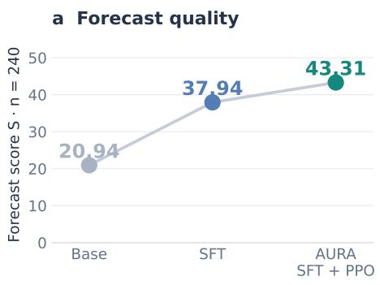
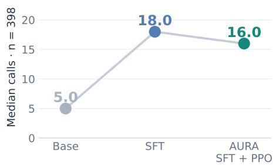
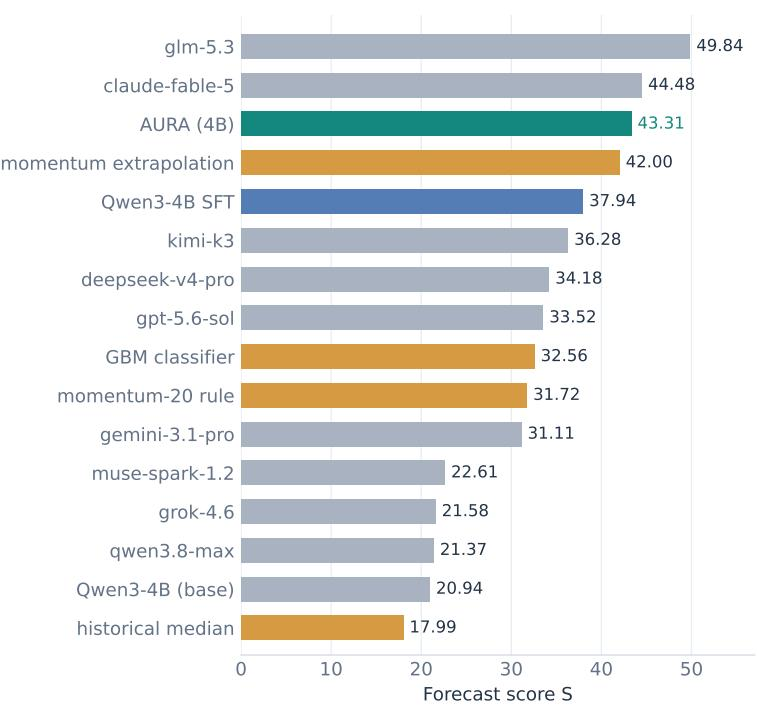
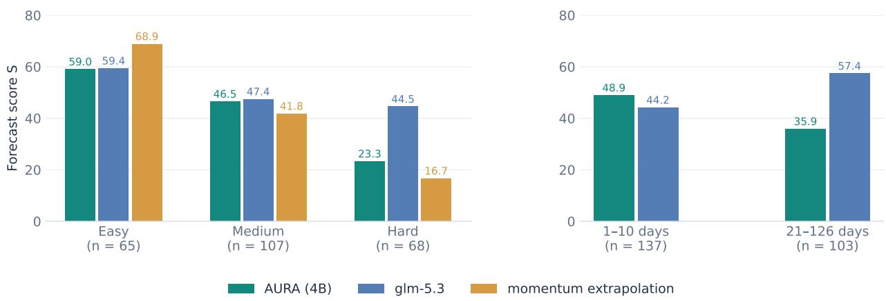
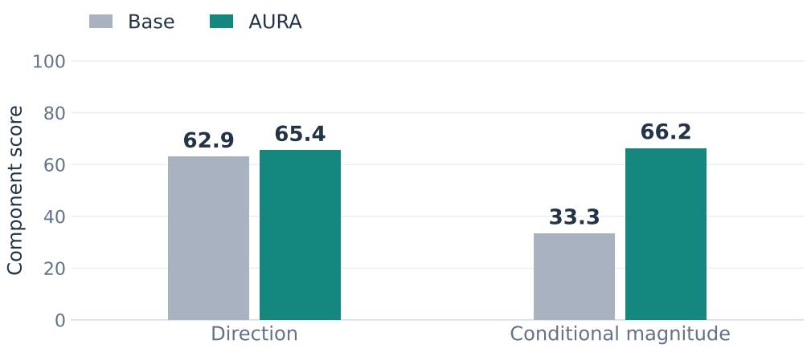
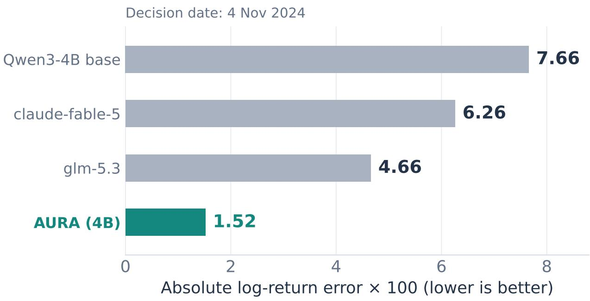

# Can Language Models Learn to Forecast Stock Prices

Jiacheng Guo1, Suozhi Huang1, Shuzhen Li1, Yunlong Gao2, Zerui Cheng1, Jason Ge, Shushu Liang3, Zihao Li1, Hao Lu, Ming Yin1, Shilong Liu1, Jiashuo Liu, Xu Kuang4, Mengdi Wang1

1Princeton University 2InclusionAI

3Harvard University 4Stanford University

Post-training has been shown to significantly improve language models’ performance on tasks with verifiable outcomes, including mathematical reasoning, software engineering, and computer use. However, whether the same approach can improve forecasting in financial markets is much less clear. Compared with tasks with verifiable outcomes, not only are realized returns noisy, but even what constitutes a relevant information set for making efective predictions is not obvious a priori: the model must decide which observations to gather and then commit to a numerical judgment before the outcome is known.

We study this question in a chronological stock-price sandbox, where a language model gathers price, volume, relative-performance, and market-context evidence and predicts a future return. We post-train Qwen3-4B with supervised fine-tuning (SFT) on tool-use demonstrations, then proximal policy optimization (PPO) with a terminal reward given by the forecast score against the realized return.

The resulting AURA-4B more than doubles the starting direction–magnitude score, from 20.94 to 43.31, and is comparable to frontier language models on this benchmark. Conditional magnitude agreement rises from 33.3 to 66.2, while directional accuracy changes from 62.9 to 65.4. SFT expands tool use, and PPO further increases the share of ranking and market-context queries. These results show that post-training can substantially improve financial forecasting performance, together with changes in how the model investigates the market, on this outcome-selected benchmark.

## 1. Introduction

Post-training has substantially improved large language models on tasks with verifiable outcomes, such as mathematical reasoning (DeepSeek-AI, 2025; Shao et al., 2025), software engineering (Song et al., 2026), and computer use (Lai et al., 2025). Benchmarks such as SWE-bench and OSWorld make this progress measurable by providing clear signals about whether a model’s final answer or action succeeded (Jimenez et al., 2023; Xie et al., 2024). These advances motivate a broader question: can post-training help models learn from historical outcomes to make better judgments about the future, even when the connection between their reasoning process and the realized outcome is much less direct?

Financial forecasting is a particularly challenging setting for this question. In stock-price forecasting, a model must first decide which observations are relevant, gather that evidence, and then turn it into a numerical prediction before the outcome is known. While realized returns provide feedback on the final prediction, they can be very noisy and their signal inclusive: A forecast error can reflect the choice of evidence, its interpretation, or subsequent market variation, and the final score does not directly identify which query or observation was useful. Thus, unlike many tasks with verifiable outcomes, both the relevant information set and the quality of the reasoning that produced a forecast are not obvious a priori. Research on language-model forecasting has explored evidence gathering (Halawi et al., 2024) and training with realized outcomes (Turtel et al., 2026). Our central question is: can post-training nevertheless improve a language model’s ability to use tools to forecast future stock prices?

b Tool-use behavior  

c Full benchmark comparison  
  
Forecast scores use 240 scored tasks; call counts use all 398 test tasks and include submission.

Figure 1 | Post-training brings a 4B model to performance comparable to frontier models on BETA. (a) Scores on the 240 scored test tasks improve from 20.94 to 37.94 to 43.31 through Base, SFT, and PPO. (b) Median calls across all 398 test tasks, including submission, change from 5 to 18 to 16. (c) AURA-4B ranks third among fifteen systems; the intermediate SFT checkpoint is also shown.

To study this question, we build a market-analysis sandbox and a stock-price forecasting benchmark, Beta. In each episode, the model chooses queries about price, volume, relative performance, and market context, then submits a numerical return forecast. All queries access observations available at the decision date, and the forecast is scored against the subsequently realized return. This common interface lets us compare models under the same information-access rules and measure changes in both forecasts and investigation behavior after training. The environment covers 499 US equities and horizons from one trading day to approximately six months. Historical tasks are selected using realized outcomes; the test set contains 398 tasks, of which 240 meet the minimum-move criterion used for forecast scoring (section 2.3).

We post-train Qwen3-4B (Yang et al., 2025) through supervised fine-tuning (SFT) on tool-use demonstrations constructed with historical-outcome supervision, followed by proximal policy optimization (PPO; Schulman et al., 2017) with rewards computed from realized returns. The model first learns demonstrated investigations and forecasts, then generates its own episodes and receives feedback on its predictions. Comparing the Base, SFT, and SFT+PPO checkpoints lets us separate the gains from demonstration learning from the additional gains produced by outcome-based optimization, while also tracking how the evidence each policy retrieves changes during training. Training and testing follow a strict chronological split: the last training outcome is realized before the first test decision.

We find that post-training is highly efective in this setting. The forecast score rises from 20.94 to 43.31, a 106.8% improvement, bringing the resulting Aura-4B model to performance comparable to frontier language models on Beta (figure 1). Both SFT and PPO contribute to the improvement. The gains are not primarily explained by better directional prediction: directional accuracy changes comparatively little, while the largest numerical improvement comes from matching the magnitude of realized moves conditional on predicting the correct direction. Post-training also changes how the model investigates the market, expanding tool use and increasing its reliance on evidence about relative performance, sectors, and the broader market. Together, these results show that outcomebased post-training can substantially improve financial forecasting performance even when realized outcomes are noisy and the relevant information-gathering strategy is not specified in advance.

In summary, our contributions are threefold:

1. We build a market-analysis sandbox and a chronological stock-price forecasting benchmark for evaluating and post-training tool-using forecasting models.

2. We show that SFT and PPO raise a 4B model’s forecast score by 106.8%, reaching performance comparable to frontier models on the benchmark.

3. We show that direction and magnitude do not rank models the same way, and that post-training primarily improves magnitude agreement and the breadth of market evidence the model gathers through tools.

## 2. A Sandbox and Benchmark for Stock Price Forecasting

## 2.1. A sandbox for market investigation

A human analyst rarely forms a price forecast from one observation alone. A recent decline can prompt a check of volume, a comparison with the sector, or an inspection of a longer trend. Our sandbox makes these actions available to a language model. Each episode specifies a stock, a decision date, and a forecast horizon. The model retrieves observations, reasons about them, and selects further queries until it submits a forecast. This interaction follows the broader principle of tool-using language agents: observations can influence subsequent actions (Schick et al., 2023; Yao et al., 2023), and the information-gathering process can itself be learned (Nakano et al., 2021). In our environment, the information consists of numerical market data.

The sandbox provides nine retrieval tools and one terminal prediction action. Table 1 groups retrieval by the kind of evidence it exposes. The model can change the lookback window, candle resolution, comparison group, and indicator parameters. A tool returns measurements, such as an indicator series or a cross-sectional rank; the model interprets those measurements. All observations are evaluated at the decision-date close, so repeated queries inspect diferent views of the same historical state. The episode ends with one prediction for the specified horizon. The underlying data store contains split-adjusted, regular-session one-minute bars; coarser candles and derived statistics are computed from that store.

## 2.2. Forecasting task and score

A task is a triple $( i , t , H )$ : stock $i ,$ decision date �, and horizon �.

The decision occurs after the close of day �. The model receives the stock, date, horizon, and decision-day volume-weighted average price (VWAP), then predicts

$$
y _ { i , t , H } = \log \left( \frac { \mathrm { V W A P } _ { i , t + H } } { \mathrm { V W A P } _ { i , t } } \right) .\tag{1}
$$

<table><tr><td>Evidence</td><td>Available observations</td><td>Analysis supported</td></tr><tr><td>Individual stock</td><td>OHLCV candles, quotes, technical indica- Price trends, volume, volatility, and multi- tors</td><td>ple resolutions</td></tr><tr><td>Relative performance</td><td>tion, residual returns</td><td>e Rankings, relative returns, beta, correla- Position among peers and relative strength</td></tr><tr><td>Market context</td><td>metadata</td><td>Market/sector candles, breadth, symbol Sector conditions and the broader market</td></tr></table>

Table 1 | Market information available in the sandbox. Full tool descriptions and task prompts appear in section B.

The eight horizons are $H \in \{ 1 , 2 , 5 , 1 0 , 2 1 , 4 2 , 6 3 , 1 2 6 \}$ trading days. A submitted log-return prediction � gives a future-price estimate $\widehat { \mathrm { V W A P } } _ { i , t + H } = \mathrm { V W A P } _ { i , t } \exp ( p )$ . This common target supports comparisons across stocks with diferent price levels and across horizons from the next session to approximately six months.

Point-forecast evaluation depends on the target and the loss used to assess it (Gneiting, 2011). Our score evaluates both the direction and the magnitude of the future move:

$$
s ( p , y ) = \underbrace { \mathbb { I } \left[ { \mathrm { s i g n } } ( p ) = { \mathrm { s i g n } } ( y ) \right] } _ { d ( p , y ) } \underbrace { { \frac { 2 \operatorname* { m i n } ( | p | , | y | ) } { | p | + | y | + \epsilon } } } _ { m ( p , y ) } , \qquad \epsilon = 1 0 ^ { - 9 } .\tag{2}
$$

Wrong-sign and zero forecasts receive zero. For a correct-sign forecast, the score rewards a magnitude close to the realized move and penalizes both underprediction and overprediction. We evaluate tasks with $| y | \ge 0 . 5 \sigma _ { H . }$ , where $\sigma _ { H }$ is the population standard deviation of test labels at horizon �. This criterion selects 240 of the 398 test tasks. We report the mean forecast score $s ,$ directional accuracy �, and conditional magnitude agreement � on a 0–100 scale, multiplying their normalized values by 100. These satisfy

$$
{ \cal S } = { \cal D } { \cal M } / 1 0 0 .\tag{3}
$$

The decomposition distinguishes predicting the side of a move from predicting its size. The normalized per-task score $s ( p , y ) \in [ 0 , 1 ]$ is the terminal reward used in post-training.

## 2.3. Benchmark construction and chronological split

We use AI-assisted construction to assemble historical forecasting tasks across horizons, directions, and dificulty levels. Candidate judgments are formed from decision-time market observations before their outcomes are inspected. Retention then uses realized outcomes, including agreement with the candidate direction and outcome-quality checks. Accepted tasks are deduplicated by stock, date, and horizon. The resulting benchmark is an outcome-selected collection rather than a random sample of market opportunities. Construction annotations guide task coverage; evaluated models receive only the forecasting task and market tools. Section A summarizes construction and scoring.

The resulting benchmark contains 3,807 training tasks and 398 test tasks (table 2). We split tasks by time and also separate the realization windows of their labels. The final training label is realized on December 29, 2023, before the first test decision on February 1, 2024. This condition matters for long-horizon targets: a training decision made before the split must also have its target price realized before testing begins. The chronological design makes the role of historical information explicit, an important consideration in financial language-model evaluation (Glasserman and Lin, 2023). Within every episode, market observations are restricted to the decision date.

<table><tr><td>Property</td><td>Training</td><td>Test</td></tr><tr><td>Tasks</td><td>3,807</td><td>398</td></tr><tr><td>Distinct stocks</td><td>489</td><td>224</td></tr><tr><td>Decision dates</td><td>Feb. 2011–Dec. 2023</td><td>Feb. 2024–Mar. 2026</td></tr><tr><td>Scored evaluation tasks</td><td></td><td>240</td></tr></table>

Table 2 | Benchmark split within a 499-equity market environment. The latest training label is realized on December 29, 2023; the earliest test decision is February 1, 2024.

## 2.4. How do existing models perform?

Evaluated systems. We evaluate nine frontier language models, the starting Qwen3-4B model, and four quantitative baselines. The language models investigate the task using market tools before predicting. The baselines provide complementary comparisons. Historical median uses the trainingperiod median return for a stock and horizon. Momentum-20 combines the trailing twenty-day return sign with a training-calibrated magnitude, while momentum extrapolation scales a trailing return to the forecast horizon. These rules provide simple references motivated by the established role of momentum in stock returns (Jegadeesh and Titman, 1993). A gradient-boosted classifier (GBM) predicts direction from price-and-volume features and maps its probability to a magnitude, providing a fixed-feature machine-learning comparison in the tradition of empirical return prediction (Gu et al., 2020). Baseline fitting uses the training split.

<table><tr><td>System</td><td>Score S</td><td>Direction D</td><td>Magnitude M</td><td>Later score</td></tr><tr><td>Starting model</td><td></td><td></td><td></td><td></td></tr><tr><td>Qwen3-4B base</td><td>20.94</td><td>62.9</td><td>33.3</td><td>17.41</td></tr><tr><td>Frontier language models</td><td></td><td></td><td></td><td></td></tr><tr><td>glm-5.3</td><td>49.84</td><td>79.2</td><td>63.0</td><td>23.43</td></tr><tr><td>claude-fable-5</td><td>44.48</td><td>85.4</td><td>52.1</td><td>20.02</td></tr><tr><td>kimi-k3</td><td>36.28</td><td>80.4</td><td>45.1</td><td>21.84</td></tr><tr><td>deepseek-v4-pro</td><td>34.18</td><td>62.9</td><td>54.3</td><td>16.62</td></tr><tr><td>gpt-5.6-sol</td><td>33.52</td><td>71.2</td><td>47.0</td><td>25.08</td></tr><tr><td>gemini-3.1-pro</td><td>31.11</td><td>67.5</td><td>46.1</td><td>21.01</td></tr><tr><td>muse-spark-1.2</td><td>22.61</td><td>51.2</td><td>44.1</td><td>18.42</td></tr><tr><td>grok-4.6</td><td>21.58</td><td>61.7</td><td>35.0</td><td>17.16</td></tr><tr><td>qwen3.8-max</td><td>21.37</td><td>66.2</td><td>32.3</td><td>14.20</td></tr><tr><td>Quantitative baselines</td><td></td><td></td><td></td><td></td></tr><tr><td>Momentum extrapolation</td><td>42.00</td><td>62.5</td><td>67.2</td><td>42.01</td></tr><tr><td>GBM classifier</td><td>32.56</td><td>85.8</td><td>37.9</td><td>33.13</td></tr><tr><td>Momentum-20</td><td>31.72</td><td>59.2</td><td>53.6</td><td>36.37</td></tr><tr><td>Historical median</td><td>17.99</td><td>63.8</td><td>28.2</td><td>15.49</td></tr></table>

Table 3 | Existing models exhibit diferent strengths in direction and magnitude. Results for fourteen systems before adding AURA-4B. � is the joint forecast score, � is directional accuracy, and � is magnitude agreement conditional on a correct sign. Overall results use 240 tasks; the later-period column uses 71.

Overall performance. Table 3 shows substantial variation among existing systems. glm-5.3 leads with a score of 49.84, followed by claude-fable-5 at 44.48. Momentum extrapolation scores 42.00, above seven of the nine frontier language models. The starting Qwen3-4B scores 20.94. Thus a simple market rule is already a competitive reference, while the 4B model begins well below the strongest systems. This establishes both a target level for post-training and a baseline from which to measure the same model’s improvement.

Direction and magnitude distinguish models. The joint ranking does not follow directional accuracy alone. The GBM correctly predicts the sign on 85.8% of scored tasks, but its magnitude agreement is 37.9, yielding a score of 32.56. Similarly, claude-fable-5 has higher directional accuracy than glm-5.3 (85.4 versus 79.2), yet lower magnitude agreement (52.1 versus 63.0) and a lower total score. Momentum extrapolation combines a lower directional accuracy of 62.5 with magnitude agreement of 67.2. The base Qwen3-4B scores 62.9 on direction and 33.3 on magnitude. These comparisons identify numerical magnitude as a central dimension of forecasting performance on Beta.

Horizon and dificulty profiles. Dificulty labels describe the complexity of interpreting the market evidence; the construction rubric is given in section A. The subgroup results show diferent task profiles. GLM scores 44.16 on one-to-ten-day tasks and 57.40 on 21-to-126-day tasks. Across easy, medium, and hard tasks, it scores 59.39, 47.42, and 44.54. Momentum extrapolation is particularly strong on easy tasks (68.87), but its score falls to 41.78 on medium tasks and 16.65 on hard tasks. These groups therefore provide useful comparisons beyond a single aggregate: trend extrapolation performs well on one group, while the strongest language model retains more of its performance on the harder annotated cases.

Calendar-period performance. We also divide the test set into February 2024–July 2025 (169 scored tasks) and August 2025–March 2026 (71 tasks). GLM scores 60.94 and 23.43 in the two periods; momentum extrapolation scores 41.99 and 42.01; and the base Qwen3-4B scores 22.43 and 17.41. The complete results are in table 7. These comparisons describe the performance of existing models across the benchmark’s two calendar groups. We next ask how far explicit forecasting post-training can improve the 4B starting model.

## 3. Data Construction and Post-Training

## 3.1. Training data construction

We use AI-assisted data construction under human-designed task specifications, following a rejectionsampling-style process that generates candidate market judgments and retains suitable historical forecasting cases. Starting from the 3,807 tasks in the training split, we construct multi-round AI judgment and tool-use trajectories using the historical outcomes as supervision. The resulting corpus contains 3,631 usable demonstrations. Each demonstration connects an investigation of a market state with a numerical forecast. These demonstrations support SFT, while the training task pool supplies episodes for PPO, in which the student produces its own queries and forecasts. All training tasks follow the chronological split in table 2.

## 3.2. Supervised fine-tuning

A student sample begins with the ordinary forecasting prompt: stock, decision date, horizon, and base daily VWAP. It then alternates assistant analysis and tool calls with the numerical observations returned by the sandbox, ending in a forecast submission. GPT-5.4 generates the demonstrations using realized training returns and task annotations in a teacher-only context. The teacher produces multi-round analysis and tool-use demonstrations using decision-time market observations. For the student sample, we replace the teacher-only context with the ordinary solver prompt, retain the generated analysis and tool-use trajectory, and set the terminal target to the realized return. These are outcome-conditioned demonstrations, not independent forecasts made before the outcome was

known.

We initialize the student from Qwen3-4B (Yang et al., 2025) and perform full-parameter SFT. The loss covers assistant tokens, including analysis, tool calls, and the terminal forecast; system, user, and tool-observation tokens provide context but carry no loss. For an assistant-token index set $\boldsymbol { \mathit { I } } _ { \mathrm { a s s t } } ( \tau )$ in trajectory �,

$$
\mathcal { L } _ { \mathrm { S F T } } ( \theta ) = - \mathbb { E } _ { \tau } \sum _ { k \in J _ { \mathrm { a s s t } } ( \tau ) } \log \pi _ { \theta } ( a _ { k } \mid \tau _ { < k } ) .\tag{4}
$$

This objective teaches the model to produce an investigation and its final numerical answer in one sequence. We preserve complete trajectories, including long market observations, and train for two epochs with learning rate $1 0 ^ { - 5 }$ and global batch size 32.

## 3.3. Reinforcement learning from realized outcomes

The SFT model then generates its own forecasting episodes. It receives a training task, chooses market queries, observes the results, and submits a forecast. The realized return determines the terminal reward through equation (2). PPO (Schulman et al., 2017) updates the policy from these rollouts, with a KL penalty anchoring it to the SFT checkpoint. The task reward depends on the final prediction; there is no additional reward for making more tool calls or producing a longer analysis. This connects the learned sequence of actions to the quality of its eventual numerical judgment, using historical outcomes as feedback.

We run fifty PPO iterations with 64 tasks per rollout batch and one sampled episode per task, producing approximately 3,200 episodes. The learning rate is $1 0 ^ { - 6 }$ , the clipping range is 0.2, and the KL coeficient is $1 0 ^ { - 3 }$ . Both SFT and PPO use eight H200 GPUs. The final policy is Aura-4B. Our evaluation compares three checkpoints of the same backbone: Base, SFT, and SFT+PPO. This sequence measures the improvement from supervised demonstrations and the additional improvement obtained when the model learns from its own predictions.

## 4. Post-Training Results

## 4.1. Improvements from SFT and PPO

Both stages increase the forecast score (table 4). SFT raises it from 20.94 to 37.94, an 81.2% improvement. PPO improves it by a further 14.2% relative to SFT, reaching 43.31. Overall, posttraining improves the starting score by 106.8%. Demonstration learning provides the larger initial improvement, and outcome feedback supplies an additional gain after the student begins performing its own investigations. The progression directly answers the central question: post-training improves this model’s ability to use market tools for future-price forecasting.

<table><tr><td>Checkpoint</td><td>Score</td><td>Relative gain vs. previous</td><td>Relative gain vs. Base</td></tr><tr><td>Base Qwen3-4B</td><td>20.94</td><td></td><td></td></tr><tr><td>SFT</td><td>37.94</td><td>+81.2%</td><td>+81.2%</td></tr><tr><td>AURA-4B (SFT + PPO)</td><td>43.31</td><td>+14.2%</td><td>+106.8%</td></tr></table>

Table 4 | Training-stage results on the 240 scored test tasks. Gains are relative improvements.

## 4.2. Comparison with frontier models

Post-training also changes where the 4B model stands among existing systems. Aura-4B scores 43.31, ranking third among the fifteen systems obtained by adding it to table 3. The two higher scores are 49.84 for glm-5.3 and 44.48 for claude-fable-5. AURA exceeds seven of the nine frontier models and all four quantitative baselines, including momentum extrapolation at 42.00. As the overview in figure 1 shows, the starting model sits near the bottom of the comparison, SFT moves it above most frontier models, and PPO brings it close to the top. A 4B backbone thus achieves performance comparable to frontier language models on this benchmark through task-specific post-training.

## 4.3. Results across horizons and dificulty levels

The trained model has a distinct horizon profile. On the 137 tasks with horizons of one to ten trading days, AURA scores 48.91, compared with GLM’s 44.16. On the 103 tasks spanning 21 to 126 trading days, the scores are 35.87 and 57.40, respectively. The aggregate comparison therefore combines an AURA advantage at short horizons with a GLM advantage at longer horizons.

Across dificulty levels, AURA scores 59.04, 46.49, and 23.28 on easy, medium, and hard tasks. It is close to GLM on easy and medium tasks, while GLM scores higher on hard tasks. Compared with momentum extrapolation, AURA scores higher on medium and hard tasks, whereas momentum leads on easy tasks. Figure 2 places the trained model into the task profiles established in section 2.4. The comparison shows where its frontier-level aggregate score comes from and how its strengths difer from a simple trend rule.

a Performance by task difficulty

b Performance by forecast horizon 80

Figure 2 | AURA approaches GLM on easy and medium tasks and exceeds momentum on medium and hard tasks. (a) Scores for the three systems with recorded dificulty aggregates. (b) AURA scores higher than GLM on short horizons (1–10 days), while GLM scores higher on longer horizons (21–126 days). Sample sizes are shown below each group.

## 4.4. Results in the later evaluation period

AURA scores 42.17 in the earlier test period and 46.04 in the later period, compared with 22.43 and 17.41 for the starting model. In the later period, it ranks first among the fifteen systems. Momentum extrapolation scores 42.01, while the highest frontier-language-model score is 25.08. These results complement the full-period comparison: the trained model’s higher score is present in both calendar groups, and its relative position is strongest in the later group. Section E provides the complete comparison and the composition of the two groups.

## 5. What Does the Model Learn from Post-Training?

## 5.1. Learning the magnitude of price movements

The clearest numerical change is in forecast magnitude. From Base to AURA, directional accuracy increases from 62.9 to 65.4, while conditional magnitude agreement rises from 33.3 to 66.2 (figure 3). The median absolute forecast also grows from 0.012 to 0.042. The trained model therefore produces larger moves that match realized magnitudes more closely on its correct-direction predictions. The positive-forecast share changes from 80% to 59%, closer to the scored tasks’ positive-label share of 62%. Training changes both the typical size of a forecast and the balance of predicted directions.

This result connects to the cross-model analysis in section 2.4: high directional accuracy alone does not determine the joint score. Under a symmetric algebraic decomposition of the score change, the magnitude-associated term accounts for approximately 94% of the Base-to-AURA gain (section A). This describes how the two score factors change; each model’s conditional magnitude is measured on its own correct-sign predictions. An additional scalar rescaling diagnostic in section D illustrates the sensitivity of the score to forecast size while leaving predicted directions fixed. The tool-use comparisons below are descriptive; identifying the contribution of particular queries requires controlled tool-access comparisons.

  
Figure 3 | Post-training nearly doubles conditional magnitude agreement. The joint score factors as � = � �/100. Direction changes from 62.9 to 65.4, while conditional magnitude changes from 33.3 to 66.2.

## 5.2. Learning to gather broader market evidence

The increase in investigation breadth occurs during SFT: the median number of calls rises from five to eighteen, and the median number of distinct retrieval tools rises from four to seven (table 5). After PPO, these medians decline to sixteen calls and six tools. The share of queries devoted to cross-sectional rankings and market/sector aggregates nevertheless continues to rise, from 16.2% at Base to 31.4% after SFT and 38.0% after PPO. Thus, SFT expands tool use, while PPO shifts the query mix further toward relative-performance and market-context evidence without a further increase in the median call count. The largest increase in tool-use breadth therefore precedes PPO, while the query mix changes throughout both training stages.

<table><tr><td>Recorded behavior</td><td>Base</td><td>SFT</td><td>AURA-4B</td></tr><tr><td>Median tool calls</td><td>5</td><td>18</td><td>16</td></tr><tr><td>Median distinct retrieval tools</td><td>4</td><td>7</td><td>6</td></tr><tr><td>Ranking and market/sector query share</td><td>16.2%</td><td>31.4%</td><td>38.0%</td></tr><tr><td>Median absolute forecast</td><td>0.0120</td><td>0.0312</td><td>0.0420</td></tr><tr><td>Positive forecasts on scored tasks</td><td>80.4%</td><td>47.9%</td><td>58.8%</td></tr></table>

Table 5 | Behavior across Base, SFT, and AURA-4B (SFT + PPO) on the same test tasks. The first four rows use all 398 tasks; positive-forecast shares use the 240 scored tasks. Call counts include the terminal submission; distinct retrieval tools and query shares exclude it. Query shares pool calls across tasks and count get\_ranking and get\_market\_kline.

## 5.3. A forecasting episode

The DOW task on November 4, 2024 provides a concrete example of these two changes. The ten-day realized log return is −0.0796. The starting Qwen3-4B makes three calls and predicts −0.0030: it queries an indicator and relative performance, then submits. AURA makes sixteen calls and predicts −0.0644. Its investigation includes daily and weekly candles, market and sector views, cross-sectional rankings, and several indicators. The recorded rationale brings together weak relative performance, a falling moving average, a fresh 52-week low, and elevated volume. In the same task, Claude predicts −0.0170 after four calls and GLM predicts −0.0330 after nine. All four models choose the same direction; their estimates difer most clearly in magnitude. AURA combines a broader investigation with the closest forecast in this example. The full call sequences and forecast errors appear in section F.

## 6. Related Work

Investor behavior and price formation. Research on retail investors provides an economic perspective on the patterns a forecasting model observes. Chen et al. (2022) connect heterogeneity in return-chasing behavior to subsequent investor and stock returns. Chen et al. (2023) study how fundamentals, investor entry, and shifts in preferences or beliefs contribute to cross-sectional returns over the course of a stock-market bubble. Liang (2023) develops this account of heterogeneous retail-investor behavior and its price efects. These studies motivate considering both a stock’s recent performance and its wider market context when forming a forecast. The role of context also appears in Liang and Tang (2025), who relate catastrophe-bond prices to expected losses, issuer characteristics, and credit-market conditions.

Information and tools for forecasting. Recent work studies how language models collect and combine evidence about future outcomes. Chen and Pu (2026) use an agent to search for information and generate daily stock judgments, while LEAP (Chen et al., 2026) elicits the implications of individual evidence items and aggregates them into probabilistic forecasts. These eforts build on retrieval-and-aggregation approaches to event forecasting (Halawi et al., 2024) and work connecting language-model interpretations of financial news to subsequent returns (Lopez-Lira and Tang, 2023). A complementary line focuses on numerical sequences: LLMTime (Gruver et al., 2023) uses language models as zero-shot time-series forecasters, Time-LLM (Jin et al., 2024) adapts time-series inputs to a frozen language model, and Chronos (Ansari et al., 2024) learns from tokenized time series. Kronos (Shi et al., 2025) specializes pretraining for financial K-line data. Controlled comparisons by Tan et al. (2024) also motivate examining what the language-model component contributes to prediction. Our work studies a tool-using forecasting policy whose market investigation and numerical output are both subject to post-training. The quality of the evidence itself is another consideration: work on local oficials and GDP-data manipulation examines night lights as an alternative source of economic information (Liang et al., 2017). This motivates careful attention to the provenance and construction of the observations supplied to forecasting systems.

Financial agents and benchmarks. Financial language models such as BloombergGPT and FinGPT adapt language modeling to financial information and tasks (Wu et al., 2023; Yang et al., 2023). Financial decision systems include reinforcement-learning trading frameworks such as FinRL (Liu et al., 2021) and language agents with structured memory such as FinMem (Yu et al., 2023). Recent benchmarks evaluate increasingly complete workflows. StockBench (Chen et al., 2025) evaluates sequential stock trading; Agent Market Arena (Qian et al., 2025) evaluates agents in live stock and cryptocurrency markets; and KTD-Fin (Zhu et al., 2026) combines anonymized market inputs with portfolio-return attribution. QuantEval (Kang et al., 2026) covers quantitative knowledge, reasoning, and strategy coding, including execution-based evaluation. FrontierFinance (Zhang et al., 2026) evaluates investment-research workflows through expert questions and rubrics. Our sandbox makes numerical market investigation available as a sequence of tool actions, and our benchmark evaluates the resulting price forecast for a specified horizon. This supplies a common environment for comparing existing systems and training a forecasting model.

Post-training with outcome feedback. Learning from verifiable outcomes has advanced reasoning and interactive agents, including DeepSeek-R1 and DeepSeekMath-V2 (DeepSeek-AI, 2025; Shao et al., 2025), SWE-Master (Song et al., 2026), and ComputerRL (Lai et al., 2025). Forecasting extends this idea to outcomes that become known as time passes. Future-as-Label (Turtel et al., 2026) trains probabilistic event forecasters using realized outcomes and proper scoring rules. The Mantic technical report (Jeen et al., 2026) demonstrates improved world-event forecasting through post-training, with research contexts collected before prediction-model training. Our setting combines outcome-based learning with market-tool interaction and a continuous stock-return target. We construct supervised investigation trajectories and then optimize the student’s own episodes with PPO, allowing us to analyze both the resulting numerical predictions and the tools used to produce them.

## 7. Conclusion

We find that language models can improve their ability to use tools to predict future stock prices through post-training. We build a market-analysis sandbox and a forecasting benchmark, then train Qwen3-4B under a strict chronological split. SFT and PPO raise its forecast score from 20.94 to 37.94 and 43.31, bringing the final AURA-4B model to performance comparable to frontier models on the benchmark. Analyses across existing models identify direction and magnitude as distinct dimensions of performance. Following post-training, the strongest numerical change is in magnitude agreement. SFT increases the median number of retrieval tools from four to seven; after PPO, the median is six and the share of ranking and market-context queries reaches 38.0%. These results show that outcome-supervised post-training improves forecast scores on the selected historical tasks and changes how the model queries market data.

## References

A. F. Ansari, L. Stella, C. Turkmen, X. Zhang, P. Mercado, et al. Chronos: Learning the language of time series. arXiv preprint arXiv:2403.07815, 2024. URL https://arxiv.org/abs/2403.07815.

W. Chen, S. Liang, and D. Shi. Who chases returns? evidence from the Chinese stock market.

Working paper, June 30, 2022, 2022. URL https://papers.ssrn.com/sol3/papers.cfm?abstract\_id=4150725.

W. Chen, S. Liang, and D. Shi. What drives stock prices in a bubble? Working paper, January 31, 2023, 2023. URL https://scholar.harvard.edu/files/shushuliang/files/liang\_jmp.pdf.

Y. Chen, Z. Yao, Y. Liu, A. Xin, J. Ye, J. Yu, L. Hou, and J. Li. StockBench: Can LLM agents trade stocks profitably in real-world markets? arXiv preprint arXiv:2510.02209, 2025. URL https://arxiv.org/abs/2510.02209. Revised March 2026.

Y. Chen, Y. Zhao, X. Xu, Q. Xie, J. Wu, and Z. Liu. LEAP: Likelihood Elicitation and Aggregation for LLM-based Probabilistic Forecasting. arXiv preprint arXiv:2609.01337, 2026. URL https://arxiv.org/abs/2609.01337.

Z. Chen and D. Pu. Autonomous Market Intelligence: Agentic AI Nowcasting Predicts Stock Returns. arXiv preprint arXiv:2601.11958, 2026. URL https://arxiv.org/abs/2601.11958.

DeepSeek-AI. DeepSeek-R1: Incentivizing reasoning capability in LLMs via reinforcement learning. arXiv preprint arXiv:2501.12948, 2025. URL https://arxiv.org/abs/2501.12948.

P. Glasserman and C. Lin. Assessing look-ahead bias in stock return predictions generated by GPT sentiment analysis. arXiv preprint arXiv:2309.17322, 2023. URL https://arxiv.org/abs/2309.17322.

T. Gneiting. Making and evaluating point forecasts. Journal of the American Statistical Association, 106(494):746–762, 2011. doi: 10.1198/jasa.2011.r10138.

N. Gruver, M. Finzi, S. Qiu, and A. G. Wilson. Large language models are zero-shot time series forecasters. In Advances in Neural Information Processing Systems, volume 36, 2023. URL https://arxiv.org/abs/2310.07820.

S. Gu, B. Kelly, and D. Xiu. Empirical asset pricing via machine learning. The Review of Financial Studies, 33(5):2223–2273, 2020. doi: 10.1093/rfs/hhaa009.

D. Halawi, F. Zhang, C. Yueh-Han, and J. Steinhardt. Approaching Human-Level Forecasting with Language Models. arXiv preprint arXiv:2402.18563, 2024. URL https://arxiv.org/abs/2402.18563.

S. Jeen, M. Aitchison, and Mantic. Training LLMs to predict world events. Thinking Machines Lab guest post, Mar. 2026. URL https://thinkingmachines.ai/news/training-llms-to-predict-world-events/. March 19, 2026.

N. Jegadeesh and S. Titman. Returns to buying winners and selling losers: Implications for stock market eficiency. The Journal of Finance, 48(1):65–91, 1993. doi: 10.1111/j.1540-6261.1993.tb04702.x.

C. E. Jimenez, J. Yang, A. Wettig, S. Yao, K. Pei, O. Press, et al. SWE-bench: Can Language Models Resolve Real-World GitHub Issues? arXiv preprint arXiv:2310.06770, 2023. URL https://arxiv.org/abs/2310.06770.

M. Jin, S. Wang, L. Ma, Z. Chu, J. Y. Zhang, X. Shi, P.-Y. Chen, Y. Liang, Y.-F. Li, S. Pan, and Q. Wen. Time-LLM: Time series forecasting by reprogramming large language models. In International Conference on Learning Representations, 2024. URL https://arxiv.org/abs/2310.01728.

Z. Kang, J. Gong, W. Hu, S. Yin, K. Jiang, Z. Fang, et al. QuantEval: A Benchmark for Financial Quantitative Tasks in Large Language Models. arXiv preprint arXiv:2601.08689, 2026. URL https://arxiv.org/abs/2601.08689.

H. Lai, X. Liu, Y. Zhao, H. Xu, H. Zhang, B. Jing, et al. ComputerRL: Scaling End-to-End Online Reinforcement Learning for Computer Use Agents. arXiv preprint arXiv:2508.14040, 2025. URL https://arxiv.org/abs/2508.14040.

S. Liang. Essays on Retail Investor Behavior in Financial Markets. PhD thesis, Harvard University, 2023. URL https://dash.harvard.edu/handle/1/37375517.

S. Liang and J. Tang. When capital market innovations compete with financial intermediaries: The case of catastrophe bonds. Working paper, March 31, 2025, 2025. URL https://papers.ssrn.com/sol3/papers.cfm?abstract\_id=5227038.

S. Liang, L.-A. Zhou, and A. Hortacsu. Chinese local oficials and GDP data manipulation: Evidence from night lights data. Working paper, University of Chicago and Peking University, 2017. URL https://scholar.google.com/citations?view\_op=view\_citation&user= cXLuCFgAAAAJ&citation\_for\_view=cXLuCFgAAAAJ:9yKSN-GCB0IC.

X.-Y. Liu, H. Yang, J. Gao, and C. D. Wang. FinRL: Deep reinforcement learning framework to automate trading in quantitative finance. arXiv preprint arXiv:2111.09395, 2021. URL https://arxiv.org/abs/2111.09395.

A. Lopez-Lira and Y. Tang. Can ChatGPT forecast stock price movements? return predictability and large language models. arXiv preprint arXiv:2304.07619, 2023. URL https://arxiv.org/abs/2304.07619. Revised October 2025.

R. Nakano, J. Hilton, S. Balaji, J. Wu, L. Ouyang, C. Kim, et al. WebGPT: Browser-assisted question-answering with human feedback. arXiv preprint arXiv:2112.09332, 2021. URL https://arxiv.org/abs/2112.09332.

L. Qian, X. Peng, Y. Wang, V. J. Zhang, H. He, H. Smith, et al. When Agents Trade: Live Multi-Market Trading Benchmark for LLM Agents. arXiv preprint arXiv:2510.11695, 2025. URL https://arxiv.org/abs/2510.11695.

T. Schick, J. Dwivedi-Yu, R. Dessì, R. Raileanu, M. Lomeli, L. Zettlemoyer, N. Cancedda, and T. Scialom. Toolformer: Language models can teach themselves to use tools. arXiv preprint arXiv:2302.04761, 2023. URL https://arxiv.org/abs/2302.04761.

J. Schulman, F. Wolski, P. Dhariwal, A. Radford, and O. Klimov. Proximal policy optimization algorithms. arXiv preprint arXiv:1707.06347, 2017. URL https://arxiv.org/abs/1707.06347.

Z. Shao, Y. Luo, C. Lu, Z. Z. Ren, J. Hu, T. Ye, et al. DeepSeekMath-V2: Towards Self-Verifiable Mathematical Reasoning. arXiv preprint arXiv:2511.22570, 2025. URL https://arxiv.org/abs/2511.22570.

Y. Shi, Z. Fu, S. Chen, B. Zhao, W. Xu, C. Zhang, and J. Li. Kronos: A foundation model for the language of financial markets. arXiv preprint arXiv:2508.02739, 2025. URL https://arxiv.org/abs/2508.02739.

H. Song, L. Huang, S. Sun, J. Jiang, R. Le, D. Cheng, et al. SWE-Master: Unleashing the Potential of Software Engineering Agents via Post-Training. arXiv preprint arXiv:2602.03411, 2026. URL https://arxiv.org/abs/2602.03411.

M. Tan, M. A. Merrill, V. Gupta, T. Althof, and T. Hartvigsen. Are language models actually useful for time series forecasting? In Advances in Neural Information Processing Systems, volume 37, 2024. URL https://arxiv.org/abs/2406.16964.

B. Turtel, P. Wilczewski, D. Franklin, and K. Skothiem. Future-as-Label: Scalable Supervision from Real-World Outcomes. arXiv preprint arXiv:2601.06336, 2026. URL https://arxiv.org/abs/2601.06336.

S. Wu, O. Irsoy, S. Lu, V. Dabravolski, M. Dredze, S. Gehrmann, P. Kambadur, D. Rosenberg, and G. Mann. BloombergGPT: A large language model for finance. arXiv preprint arXiv:2303.17564, 2023. URL https://arxiv.org/abs/2303.17564.

T. Xie, D. Zhang, J. Chen, X. Li, S. Zhao, R. Cao, et al. OSWorld: Benchmarking Multimodal Agents for Open-Ended Tasks in Real Computer Environments. arXiv preprint arXiv:2404.07972, 2024. URL https://arxiv.org/abs/2404.07972.

A. Yang, A. Li, B. Yang, B. Zhang, B. Hui, et al. Qwen3 technical report. arXiv preprint arXiv:2505.09388, 2025. URL https://arxiv.org/abs/2505.09388.

H. Yang, X.-Y. Liu, and C. D. Wang. FinGPT: Open-source financial large language models. arXiv preprint arXiv:2306.06031, 2023. URL https://arxiv.org/abs/2306.06031.

S. Yao, J. Zhao, D. Yu, N. Du, I. Shafran, K. Narasimhan, and Y. Cao. ReAct: Synergizing reasoning and acting in language models. In International Conference on Learning Representations, 2023. URL https://arxiv.org/abs/2210.03629.

Y. Yu, H. Li, Z. Chen, Y. Jiang, Y. Li, D. Zhang, R. Liu, J. W. Suchow, and K. Khashanah. FinMem: A performance-enhanced LLM trading agent with layered memory and character design. arXiv preprint arXiv:2311.13743, 2023. URL https://arxiv.org/abs/2311.13743.

Y. Zhang, O. O. Koyluoglu, T. Venkatesh, R. D. Martinez, V. Bhatia, A. Alidoust, et al. FrontierFinance: A Challenging Benchmark for Measuring Frontier Intelligence of Finance Agents. arXiv preprint arXiv:2608.11683, 2026. URL https://arxiv.org/abs/2608.11683.

T. Zhu, W. Zhao, R. Sun, B. Luan, J. Lu, S. Wang, et al. From Knowing to Doing: A Memory-Controlled Benchmark for LLM Trading Agents on Stock Markets. arXiv preprint arXiv:2605.28359, 2026. URL https://arxiv.org/abs/2605.28359.

## A. Task Construction and Scoring Details

Candidate collection. Task specifications cover the eight forecast horizons, both return directions, and three dificulty levels. AI-assisted review forms candidate judgments from decision-time observations, then uses realized outcomes to retain direction-consistent cases satisfying outcome-quality criteria. This selection applies to both training and test tasks; the chronological split separates their decision and realization windows. Tasks are deduplicated by (symbol, date, �) and subject to per-symbol coverage limits. The recorded collection counts are 4,859 candidates for 3,807 training tasks and 607 candidates for 398 test tasks. Reported performance therefore pertains to this selected task distribution.

Dificulty rubric. Dificulty annotations describe the qualitative complexity of interpreting the decision-time observations. Easy tasks require relatively direct interpretation, medium tasks require combining multiple observations, and hard tasks require more involved synthesis. These constructiontime annotations are not supplied to evaluated models. The scored test set contains 65 easy, 107 medium, and 68 hard tasks.

Evaluation mask. The final scoring mask is computed separately on the test labels. For each horizon, $\sigma _ { H } = { \mathrm { s t d } } ( \{ y _ { j } : H _ { j } = H \} )$ uses the population standard deviation (numpy.std with its default degrees of freedom). The condition $| y _ { j } | \ge 0 . 5 \sigma _ { H }$ selects the reported scored subset. Nonfinite predictions or labels are excluded by the recorded scorer. Direction matches when the signs agree and $p \neq 0$ . For eligible finite pairs, compute $d _ { j }$ and $m _ { j }$ as in equation (2); average $d _ { j } m _ { j }$ for $S ,$ average $d _ { j }$ for $D ,$ and average $m _ { j }$ only over $d _ { j } = 1$ for $M ;$ multiply each average by 100 for reporting. The current paper uses the recorded aggregate values, with a common display precision. Equivalently, for � eligible finite pairs,

$$
D = { \frac { 1 0 0 } { n } } \sum _ { j = 1 } ^ { n } d _ { j } , \qquad M = 1 0 0 { \frac { \sum _ { j } d _ { j } m _ { j } } { \sum _ { j } d _ { j } } } , \qquad S = { \frac { 1 0 0 } { n } } \sum _ { j } d _ { j } m _ { j } = D M / 1 0 0 .
$$

� measures magnitude agreement on the correct-direction subset, not probability calibration.

Algebraic reading of the training gain. Writing subscripts 0 and 1 for the starting and trained models gives the identity

$$
S _ { 1 } - S _ { 0 } = \frac { M _ { 0 } + M _ { 1 } } { 2 0 0 } \big ( D _ { 1 } - D _ { 0 } \big ) + \frac { D _ { 0 } + D _ { 1 } } { 2 0 0 } \big ( M _ { 1 } - M _ { 0 } \big ) .
$$

This is a descriptive decomposition of the score change. Using the displayed rounded values, the magnitude-associated term is approximately 21.11 points and the direction-associated term approximately 1.24 points. Their sum difers slightly from the displayed score change because the factors are rounded independently.

## B. Tools and Prompts

The twenty indicators are SMA, EMA, WMA, RSI, MACD, BOLL, ATR, NATR, STOCH, KDJ, OBV, ROC, MOM, CCI, WILLR, ADX, VWAP, REALIZED\_VOL, AUTOCORR, and VARIANCE\_RATIO. The Arena displays the same state through chart, quote, ranking, and market panels, with a console recording interactions for inspection and comparison of agent trajectories.

Action Numerical information returned   
get\_kline OHLCV candles at resolutions from one minute to one month.   
get\_quote Session prices, daily VWAP, gaps, returns, volume ratio, and 52-week range.   
get\_market\_kline Market or sector candles and market-breadth statistics.   
get\_indicator A caller-parameterized indicator time series.   
list\_indicators Indicator names and default parameters.   
get\_ranking Cross-sectional metric rankings, including the target stock’s rank.   
list\_symbols Symbol universe, filtered to names listed by the decision date.   
get\_symbol\_info Sector and first listing date.   
get\_relative Relative returns, beta, correlation, and residual-return statistics.   
submit\_prediction Terminal action recording the log-return forecast.  
Table 6 | The ten available actions: nine retrieval tools and one terminal prediction action.

## System prompt.

You forecast a stock’s return from price and volume only. The tools give raw OHLCV at any timeframe (minute to month), technical indicators, cross-sectional rankings, relative strength, and the stock’s historical return distribution, all point-in-time: you see only data up to the decision date (after that day’s close), with no future data, no news, no fundamentals. Predict log(vwap[decision+H] / vwap[decision]), the daily-VWAP log-return over the horizon. base\_daily\_VWAP (the denominator, = the vwap\_today field from get\_quote) is given to you. Horizons are trading days. Use the tools however you see fit, then give your single numeric estimate.

## Task prompt.

Target symbol: {symbol}   
Decision date: {date} (after close)   
Horizon: {horizon} = {description}   
Base daily VWAP at decision date: {base\_vwap}   
Predict log(vwap[decision+H] / vwap[decision]). Call tools as needed,   
then submit\_prediction.

## C. Quantitative Baseline Details

Quantitative baselines. The historical-median predictor uses the training-period median return for the stock and horizon. Momentum-20 takes the sign of the trailing twenty-day return and a training-calibrated, horizon-specific magnitude. Momentum extrapolation scales a trailing return to the target horizon. The GBM classifier uses price-and-volume features to predict direction and maps the classification probability to a magnitude. Baselines are fitted on the training split and use price-and-volume information available to the agents, without access to annotation rationales or dificulty labels.

## D. Forecast-Scale Diagnostic

To examine output scale separately from predicted signs, multiply each prediction by a positive constant � and maximize the forecast score over � on the evaluated predictions. For gpt-5.6-sol, this procedure selects � = 3.65 and changes the score from 33.52 to 52.97. Every predicted direction remains fixed. The coeficient is fitted on the test predictions, so this is an in-sample oracle diagnostic of score sensitivity rather than a separately fitted forecasting baseline.

## E. Complete Temporal Results

The periods are February 2024–July 2025 and August 2025–March 2026. Six-month tasks make up 11.2% of the earlier group and 4.2% of the later group; hard tasks make up 30.2% and 23.9%, respectively. The comparison uses the tasks observed in each calendar group.

<table><tr><td>System</td><td>Earlier (n = 169)</td><td>Later (n = 71)</td><td>Change (%)</td></tr><tr><td>AURA-4B</td><td>42.17</td><td>46.04</td><td>+9.2</td></tr><tr><td>Momentum extrapolation</td><td>41.99</td><td>42.01</td><td>+0.0</td></tr><tr><td>Momentum-20</td><td>29.77</td><td>36.37</td><td>+22.2</td></tr><tr><td>GBM classifier</td><td>32.32</td><td>33.13</td><td>+2.5</td></tr><tr><td>gpt-5.6-sol</td><td>37.06</td><td>25.08</td><td>-32.3</td></tr><tr><td>glm-5.3</td><td>60.94</td><td>23.43</td><td>-61.6</td></tr><tr><td>kimi-k3</td><td>42.35</td><td>21.84</td><td>-48.4</td></tr><tr><td>gemini-3.1-pro</td><td>35.35</td><td>21.01</td><td>-40.6</td></tr><tr><td>claude-fable-5</td><td>54.76</td><td>20.02</td><td>-63.4</td></tr><tr><td>muse-spark-1.2</td><td>24.37</td><td>18.42</td><td>-24.4</td></tr><tr><td>Qwen3-4B base</td><td>22.43</td><td>17.41</td><td>-22.4</td></tr><tr><td>grok-4.6</td><td>23.44</td><td>17.16</td><td>-26.8</td></tr><tr><td>deepseek-v4-pro</td><td>41.55</td><td>16.62</td><td>-60.0</td></tr><tr><td>Historical median</td><td>19.04</td><td>15.49</td><td>-18.6</td></tr><tr><td>qwen3.8-max</td><td>24.38</td><td>14.20</td><td>-41.8</td></tr></table>

Table 7 | Calendar-period results for every system. Earlier: February 2024–July 2025. Later: August 2025–March 2026. Relative changes are computed from the rounded endpoints.

## F. The DOW Forecasting Example

The following call sequences are recorded for the November 4, 2024 DOW task with a ten-day horizon and realized log return −0.0796. Arguments are abbreviated. Call counts include the terminal submission.

Base Qwen3-4B: 3 calls, forecast −0.0030.

get\_indicator(DOW, VWAP, 1d, 30)   
get\_relative(DOW, market, 252)   
submit\_prediction(-0.003)

claude-fable-5: 4 calls, forecast −0.0170.

get\_quote(DOW)   
get\_kline(DOW, 1d, 60)   
get\_relative(DOW, market, 60)   
submit\_prediction(-0.017)

glm-5.3: 9 calls, forecast −0.0330.  
get\_quote(DOW)

## DOW · 10-day forecast

  
Figure 4 | Absolute forecast errors for the recorded DOW task. The realized log return is −0.0796; errors are multiplied by 100.  
get\_kline(DOW, 1d, 60)  
get\_symbol\_info(DOW)  
get\_kline(DOW, 1d, 15)