# DEVILS IN QUESTION RELAY: SOURCE-CONDITIONED RELAY STEERING TO MITIGATE HALLUCINATIONS IN AUDIO-VISUAL LARGE LANGUAGE MODELS

Yu Zhang1,2, Pingrui Zhang3, Xuefeng Bai1, Pengfei Zhang2, Yang Xiang2, Kehai Chen1,2 1Harbin Institute of Technology, Shenzhen, China

2Peng Cheng Laboratory, Shenzhen, China 3Fudan University yuzhang2717@gmail.com, {baixuefeng,chenkehai}@hit.edu.cn

## ABSTRACT

Audio-visual large language models (AVLLMs) have made remarkable progress in multimodal understanding and reasoning through interactions among visual, auditory, and linguistic information. However, recent studies show that AVLLMs face a critical challenge: source-confused grounding hallucination, where cues from the unused modality induce responses that the required modality does not support, undermining reliability in real-world applications. Existing methods have made progress in mitigating this failure, yet how it arises from internal crossmodal interactions remains insufficiently understood. To address this gap, we conduct path-intervention and representation analyses, revealing a question-relay mechanism: question states carry interfering cues alongside required-source evidence, undermining grounding in required-modality evidence. Cutting pathways from interfering modality to question states yields greater correct-answer logit recovery than cutting those to the generation position. Motivated by these findings, we propose SECRET (SourcE-Conditioned RElay sTeering), a training-free method that mitigates cross-modal interference at the question relay. Using contrasting question representations elicited through different modality-pathway interventions, SECRET steers the original question states toward required-source evidence. Experiments on two widely adopted benchmarks CMM and AVHBench across three AVLLMs show that SECRET consistently outperforms prior trainingfree methods, substantially mitigating source-confused grounding hallucinations (e.g., up to +18.0 and +7.1 percentage points over base models). Modality-specific captioning further demonstrates its generalizability to open-ended generation.

## 1 INTRODUCTION

Multimodal large language models (MLLMs) (Bai et al., 2025; Achiam et al., 2023; Gemini Team et al., 2023) are advancing machine perception toward integrated understanding of visual, auditory, and textual information. Recent progress in audio-visual large language models (AVLLMs) (Xu et al., 2025a; Cui et al., 2026; Cheng et al., 2024; Xu et al., 2025b) has demonstrated strong capabilities in multimodal perception, reasoning, and instruction following. By combining complementary sensory cues with language instructions, AVLLMs support richer understanding of complex multimodal inputs, enabling more diverse real-world applications, such as autonomous driving (Zhao et al., 2025) and human–computer interaction (Gonzalez Penuela et al., 2026).

However, recent studies reveal a critical challenge in AVLLMs: source-confused grounding hallucination, where cues from a non-required modality induce responses unsupported by the required modality (Kim et al., 2024; Leng et al., 2024a). As shown in Fig. 1(a), a visible piano can lead the model to hallucinate piano music even when the audio contains only human speech. Such failure undermines the reliability of AVLLMs in real-world applications involving complex audio-visual inputs. Existing methods mitigate this failure through inference-time corrective decoding (Chung et al., 2026; Jung et al., 2026a) or training-time alignment (Chaubey et al., 2026; Chen et al., 2026), yet how it arises from internal cross-modal interactions remains insufficiently understood.

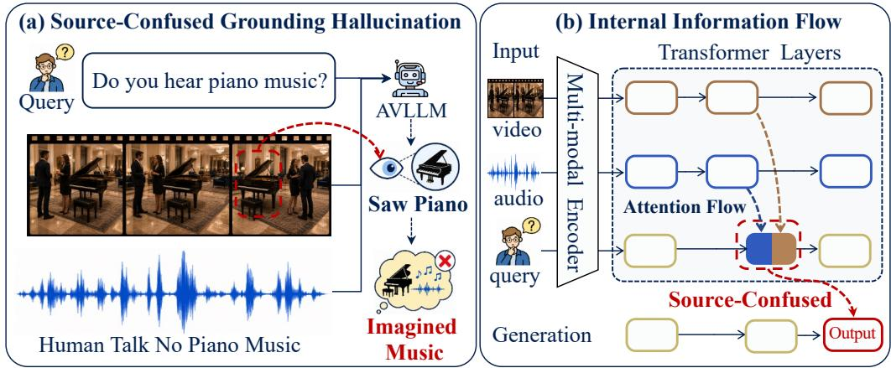  
Figure 1: (a) Source-confused grounding hallucination in the audio-required setting. The audio contains human speech but no piano music, yet the visible piano leads the model to hallucinate piano music. (b) Question-relay mechanism. Question states relay interfering cues alongside requiredsource evidence, allowing non-required information to influence source-specific answers.

To investigate this failure, we first find that source-confused grounding hallucination is not simply due to misunderstanding the requested evidence source. This motivates a more specific question: Through which internal pathways do interfering cues influence source-specific answers, and where can this interference be corrected? To answer this question, we conduct path-intervention and representation analyses. We find that question states, the hidden representations at questiontoken positions, carry modality information for subsequent answer prediction, a role we term the question relay. Specifically, cutting pathways from required-modality to question states reduces correct-answer support on source-faithful cases. Cutting attention pathways from the interfering modality to question states can partially restore correct-answer support for source-confused cases; and this intervention yields greater correct-answer logit recovery at question positions than at the generation position, a focus of prior attention analyses and interventions (Selvakumar et al., 2026; Yu et al., 2026). Together, these findings reveal a question-relay mechanism of source-confused grounding hallucination: interfering cues enter question states alongside required-source evidence and influence source-specific answers, as summarized in Fig. 1(b).

Motivated by these findings, we propose SECRET (SourcE-Conditioned RElay sTeering), a training-free method that steers question representations toward required-modality evidence. Specifically, SECRET constructs source-conditioned positive and negative question representations by cutting interfering- and required-modality pathways into question states, respectively, while retaining the complete audio-visual input. It then steers the original question states using the normmatched, token-wise difference between these representations. SECRET substantially mitigates source-confused grounding hallucinations, improving average accuracy over the base models by up to 18.0 and 7.1 percentage points on CMM and AVHBench, and consistently outperforming the evaluated training-free methods across three AVLLMs. Modality-specific captioning under mismatched audio-video inputs also demonstrates SECRET’s generalizability to open-ended generation, with lower distractor-reference overlap and higher modality-grounding scores. Intervention comparisons and fine-grained behavior analysis provide a deep understanding of SECRET’s effectiveness.

Our contributions are threefold: (i) we identify a question-relay mechanism of source-confused grounding hallucinations; (ii) we propose SECRET, a training-free method for source-conditioned question steering; and (iii) we demonstrate the effectiveness of the proposed SECRET across three AVLLMs and generalization to modality-specific captioning.

## 2 UNDERSTANDING SOURCE-CONFUSED GROUNDING

In this section, we investigate source-confused grounding hallucination through three progressive analyses. First, we find that this failure is not simply due to misunderstanding the requested evidence source in question(§2.2). We therefore examine multi-modal information flow during inference, identifying question states as a relay for required-source evidence (§2.3). Interfering cues also enter this relay, and cutting their attention pathways to question states restores correct-answer support more effectively than cutting those to the generation position (§2.4). These findings motivate sourceconditioned relay steering at the question relay to mitigate cross-modal interference (§3).

## 2.1 PRELIMINARIES

For an AVLLM $f _ { \theta } ,$ we abstract input encoding, projection, and tokenization as a multimodal encoder that maps video V, audio A, and question $Q$ to the token sequence $X = [ X _ { V } ; X _ { A } ; X _ { Q } ] . ^ { 1 }$ These tokens are then processed by the LLM backbone, where we focus our analysis on cross-modal infor mation flow. We study source-confused grounding hallucination using the Video-Driven Audio Hallucination and Audio-Driven Video Hallucination subsets of AVHBench (Kim et al., 2024), where each textual question explicitly specifies whether the answer should be grounded in audio or video evidence. Let $r \in \{ A , \bar { V } \}$ denote the required modality and r¯ the other modality. A source-faithful answer is supported by evidence from r, whereas a source-confused prediction incorrectly relies on cues from $^ { \bar { r } , }$ as illustrated in Fig. 1(a). Dataset details and statistics are provided in Apdx B.1.

## 2.2 OBSERVATION 1: AVLLM CAN RELIABLY IDENTIFY THE REQUIRED MODALITY

We begin with a fundamental diagnostic question: Can a AVLLM identify which evidence modality the textual question explicitly requires? This test assesses the model’s ability to identify the required evidence source from the textual question. We provide Qwen2.5-Omni-7B with the textual question and ask it to classify the required evidence as audio, video, or ambiguous, without answering the original question. See Apdx. B.2 for experimental details. The model correctly identifies the required modality for 99.85% of the questions, demonstrating that it can reliably recover the source of required evidence from the question alone. This suggests that source-confused grounding hallucination is not simply due to a failure to identify the required modality.

Takeaways. These results suggest that source-confused grounding is not simply due to misunderstanding which modality the question requires. Therefore we next investigate how required-source evidence and interfering cues are routed within the model and influence its predictions (§2.3, §2.4).

## 2.3 OBSERVATION 2: QUESTION STATES RELAY REQUIRED-SOURCE EVIDENCE

Following OBSERVATION 1, we first examine how evidence from the required modality is routed through the model to support source-faithful predictions in this section.

Method. We use attention-path cutting (Zhang et al., 2025d) analysis on source-faithful cases for Qwen2.5-Omni-7B to identify the critical pathway that supports the model’s prediction At layer ℓ, the attention output for target token t is computed through multi-head self-attention:

$$
\mathbf { A } _ { t } ^ { \ell } = \sum _ { j = 1 } ^ { J } \mathrm { S o f t m a x } \left( \frac { \mathbf { q } _ { t } ^ { \ell , j } ( \mathbf { K } ^ { \ell , j } ) ^ { \top } } { \sqrt { d } } + \mathbf { M } _ { t , : } ^ { \ell } \right) \mathbf { V } ^ { \ell , j } \mathbf { W } _ { O } ^ { \ell , j } .\tag{1}
$$

Here J is the number of heads and d is the per-head query dimension. For head $j , \mathbf { q } _ { t } ^ { \ell , j }$ is the target query, $\mathbf { K } ^ { \ell , j }$ and $\mathbf { V } ^ { \ell , j }$ are the key and value matrices, $\mathbf { W } _ { O } ^ { \ell , j }$ is the output projection and $\mathbf { M } _ { t . } ^ { \ell }$ denotes the causal-mask row for target token t. For a source token set S and a target token set T, we define the attention pathway as $\mathcal { P } _ { S  T } = \{ ( s , t ) \ | \ s \in S , \ t \in T \}$ , where $( s , t )$ denotes an attention edge through which target token t attends to source token s. We cut this pathway across a seven-layer window $\mathcal { W } _ { \ell }$ centered on layer ℓ by modifying the corresponding attention-mask entries:

$$
\widetilde { \mathbf { M } } _ { t , s } ^ { m } = \{ \begin{array} { l l } { - \infty , \quad ( s , t ) \in \mathcal { P } _ { S  T } \mathrm { a n d } m \in \mathcal { W } _ { \ell } , } \\ { \mathbf { M } _ { t , s } ^ { m } , \quad \mathrm { o t h e r w i s e } . } \end{array}\tag{2}
$$

Other mask entries retain their original values and token groups denote sets of token positions.

Metric. We measure the effect of cutting each attention pathway using the mean relative change in target-answer probability. More negative values indicate a larger reduction in target-answer probability, suggesting that the model relies more strongly on the pathway for prediction. See Apdx B.3 for more details and robustness analysis across different AVLLMs and cutting window sizes.

Results. Let $X _ { G }$ denote the final position of the complete tokenized prompt, where the model predicts the first answer token. We call this the generation position and exclude it from the question-token positions $X _ { Q }$ Q. The source set S consists of the tokens of instruction-required modality, $X _ { r } ,$ while the destination set $T$ is chosen from $X _ { Q } ,$ , the tokens of interfering modality $X _ { \bar { r } } .$ , and $X _ { G }$ We analyze examples with source-faithful predictions in the Video-Driven

Audio Hallucination and Audio-Driven Video Hallucination settings, where the required modalities are audio and video, respectively. Across both settings, Fig. 2 shows that cutting $X _ { r } $ $X _ { Q }$ produces the largest decrease in target-answer probability among the three interventions. This suggests that source-faithful predictions rely more strongly on $X _ { r } $ $X _ { Q }$ than on $X _ { r }  \bar { X } _ { G }$ or $X _ { r } $ $X _ { \bar { r } }$ While prior work (Selvakumar et al., 2026) examines audiovisual evidence use at generation positions, our analysis highlights question states as an intermediate relay carrying required-source evidence to answer prediction, a role required cues enter this relay and ar

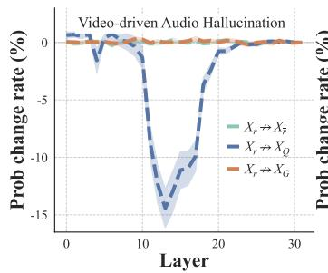

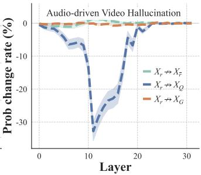  
Figure 2: Layer-wise effects of cutting attention pathways from the tokens of required modality $X _ { r }$ to the tokens of interfering modality $X _ { \bar { r } } .$ , question tokens $X _ { Q }$ and the generation position $X _ { G }$ for source-faithful prediction. Cutting the attention pathway from the tokens of required-modality to question tokens produces the largest reduction, suggesting that the pathway is the most important for source-faithful prediction.

we term the question relay. We next examine whether none mistaken for required-source evidence (§2.4).

Takeaways. Source-faithful predictions depend most strongly on the pathway from requiredmodality to question tokens, highlighting question states as a key relay for required-source evidence.

## 2.4 OBSERVATION 3: INTERFERING CUES IN QUESTION STATES INFLUENCE PREDICTIONS

OBSERVATION 2 identifies question state as a relay for required-source evidence. We next examine whether cues from interfering modality enter this relay and lead to source-confused hallucination.

Cutting the interfering route attenuates wrong-source evidence. We probe interfering information in question states by measuring their support for the target object associated with the hallucinated answer. An LLM parser extracts the target object from the question, such as the “piano” in Fig. 1(a). We use Logit Lens (Geva et al., 2022) to measure its layer-wise target-object score within $X _ { Q }$ . A higher score indicates stronger support for the object in the question states. We compare the original run (Original) with a run that cuts $X _ { \bar { r } }  X _ { Q }$ (Intervened), keeping the inputs unchanged. Following OBSERVATION 2, we focus on Layers 10–20, where modality-to-question interventions have the strongest effects. Object extraction and score computation are detailed in Apdx B.4.

Fig. 3(a) shows that the fraction of examples with lower target-object scores in Intervened than in Original exceeds 90% at every tested layer, approaching 100% at several layers (left). The mean target-object score across examples is also lower in Intervened than in Original, indicating weaker target-object signals in question states after cutting the interfering pathway (right). Together, these results suggest that the interfering-modality pathway carries wrong-source cues into question states.

Question cut yields greater correct-answer logit recovery. Having identified interfering signals in question states, we next compare question tokens and the generation position as intervention targets for restoring correct-answer support. Specifically, we compare cutting $X _ { \bar { r } }  X _ { Q }$ (Question Cut) with cutting $X _ { \bar { r } }  X _ { G }$ (Generation Cut). The latter position has been a focus of prior analyses and interventions (Selvakumar et al., 2026; Yu et al., 2026). We compare the effects over Layers 10–20 using Correct-Answer Logit Recovery (∆Logit): the correct-answer logit at $X _ { G }$ after intervention minus that in Original. As shown in Fig. 3(b), Question Cut yields markedly larger ∆Logit than Generation Cut at every tested layer, indicating more effective recovery of correct-answer support.

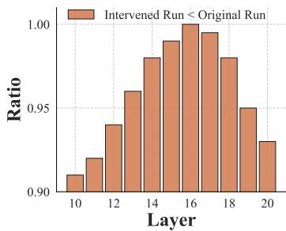

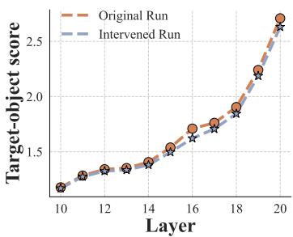  
(a) Target-object score comparison in question states.

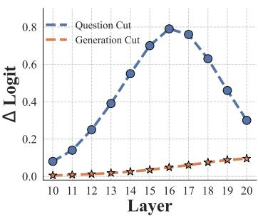  
(b) Logit recovery.  
Figure 3: Interfering cues in question states and their effects on hallucination predictions. (a) Original is the unmodified run; Intervened cuts pathways from interfering-modality into question states. Left: layer-wise fraction of examples with lower target-object scores in Intervened than in Original, exceeding 90% at every tested layer. Right: mean layer-wise target-object scores across all samples, showing lower scores after intervention. (b) Question Cut and Generation Cut cut pathways from interfering-modality to question states and the generation position, respectively. For each intervention, ∆Logit is the correct-answer output logit at $X _ { G }$ after intervention minus that in Original. Question Cut yields greater recovery over most tested layers.

Takeaways. OBSERVATION 2 & 3 identify question states as a relay for both required-source evidence and interfering cues. Attention interventions at question tokens restore correct-answer support more effectively than those at the generation position commonly targeted in prior work.

## 3 SOURCE-CONDITIONED RELAY STEERING (SECRET)

Our analyses show that question states relay both required-source evidence and interfering cues, and that intervening at this relay can effectively restore correct-answer support. Building on this finding, we propose SECRET (SourcE-Conditioned RElay sTeering), as illustrated in Fig. 4. We elicit source-conditioned question representations by selectively cutting modality-to-question attention pathways. Guided by these representations, we steer the original question states to favor required-source evidence over interfering-modality cues.

## 3.1 REQUIRED-MODALITY IDENTIFICATION

Following OBSERVATION 1 (§2.2), we prompt the AVLLM $f _ { \theta }$ with the textual question alone to predict the required modality $\hat { r } \in \{ A , V \}$ . This prediction guides the construction of two attention masks for eliciting positive and negative question representations. Both masks follow Eq. (2) and target question-token positions $( T \bar { = } X _ { Q } )$ , excluding the generation position $X _ { G }$ . The positive mask ${ { \bf { M } } ^ { + } }$ cuts pathways from $S = X _ { \bar { r } } \thinspace \mathrm { t o } \ T = X _ { Q }$ , where $\bar { \hat { r } }$ denotes the other modality, while preserving the required-modality pathway. Conversely, the negative mask M− cuts pathways from $\bar { \boldsymbol { S } } = \boldsymbol { X } _ { \hat { \boldsymbol { r } } }$ to $T = \bar { X } _ { Q }$ while preserving the interfering-modality pathway. The resulting representations provide positive and negative references for subsequent question-state steering.

## 3.2 QUESTION-RELAY STEERING

We construct positive and negative question representations through pathway interventions to steer the original states toward required-source evidence.

Relay intervention. We process the encoded input $X ~ = ~ [ X _ { V } ; X _ { A } ; X _ { Q } ]$ through three parallel branches sharing the parameters of the first $L _ { 1 }$ Transformer layers. Throughout these layers, the positive branch applies $\mathbf { \dot { M } } ^ { + }$ to block attention from the interfering modality to question tokens, while the negative branch applies M− to block attention from the required modality. The original branch retains the unmodified attention mask. At layer $L _ { 1 } .$ , these branches yield $\mathbf { H } _ { Q } ^ { + } , \mathbf { \bar { H } } _ { Q } ^ { - } , \mathbf { H } _ { Q } \in \mathbb { R } ^ { | X _ { Q } | \times d _ { h } }$ respectively, where $| X _ { Q } |$ is the number of question tokens and $d _ { h }$ is the hidden dimension. We omit layer superscripts for clarity. As in our attention-routing analysis, $X _ { Q }$ excludes the generation position $X _ { G }$ . Corresponding rows across the three matrices represent the same question token.

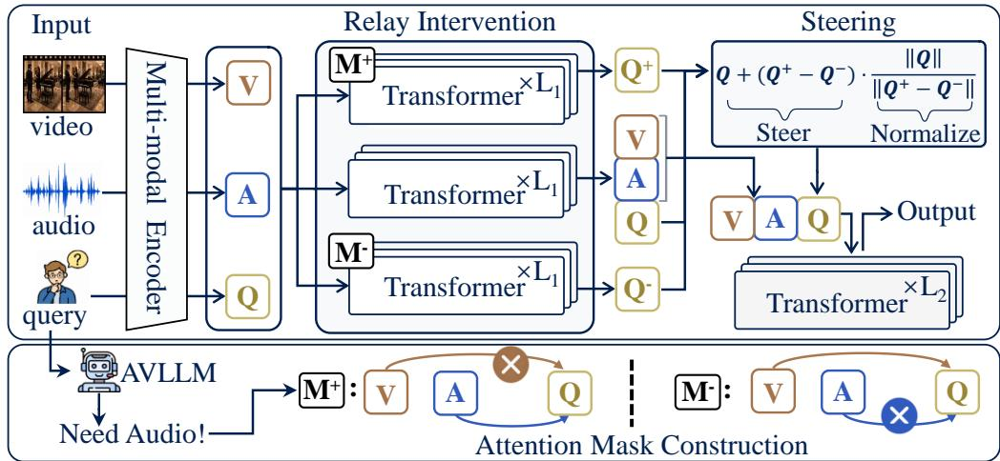  
Figure 4: Overview of the proposed SECRET. Bottom: The AVLLM predicts the required modal ity from the question alone to construct ${ { \bf { M } } ^ { + } }$ and ${ { \bf M } ^ { - } }$ , which cut attention from the interfering and required modalities to question tokens, respectively. Top: Three parallel branches with shared parameters process the same input through the first $L _ { 1 }$ layers, yielding positive, original, and negative question states. Each token-wise positive–negative difference is scaled to the original state’s L2 norm and added to it. Updated question states and original audio-visual states pass through the remaining $L _ { 2 }$ layers for generation.

Source-Conditioned Question Steering. For each question position $i \in X _ { Q }$ , let $\mathbf { h } _ { i } ^ { + } , \mathbf { h } _ { i } ^ { - }$ , and $\mathbf { h } _ { i }$ denote the positive, negative, and original states, respectively. We use their token-wise difference, $\Delta \mathbf { h } _ { i } = \mathbf { h } _ { i } ^ { + } - \mathbf { h } _ { i } ^ { - }$ , to steer the original state toward required-source evidence. To balance correction strength and generation stability (Liu et al., 2023; Zou et al., 2023; Zhang et al., 2025c), we scale each direction to match the original state’s L2 norm before adding it:

$$
\widetilde { \mathbf { h } } _ { i } = \mathbf { h } _ { i } + \frac { \Vert \mathbf { h } _ { i } \Vert _ { 2 } } { \Vert \Delta \mathbf { h } _ { i } \Vert _ { 2 } } \Delta \mathbf { h } _ { i } , \quad i \in X _ { Q } .\tag{3}
$$

We combine the steered question states $\widetilde { \mathbf { H } } _ { Q }$ with the original branch’s audio and video states in their original token order. The sequence then passes through the remaining $L _ { 2 }$ Transformer layers to generate the answer. Steering is applied only during prefill. The remaining layers cache the keys and values derived from the updated sequence for subsequent autoregressive generation. See Apdx C.1 for implementation details of SECRET.

Distinction from prior work. Motivated by the relay role and stronger intervention effects at question tokens (§2.3, §2.4), SECRET targets modality-to-question pathways rather than the modalityto-generation pathways commonly used in prior work (Yu et al., 2026; Zhou et al., 2025). Unlike methods that intervene by perturbing or removing modality inputs (Chung et al., 2026; Jung et al., 2026a), SECRET constructs contrasting representations through internal attention-path interventions, preserving audio-visual context and avoiding potential representational shifts from altered inputs. RQ1 (§4.3) compares these intervention methods to assess the benefits of targeting question states.

## 4 EXPERIMENTS

## 4.1 EXPERIMENTAL SETUP

Benchmarks and Metrics. Focusing on source-confused grounding hallucination, we evaluate SECRET on two established cross-modal hallucination benchmarks, AVHBench (Kim et al., 2024) and CMM (Leng et al., 2024a). For AVHBench, we use the Video-Driven Audio Hallucination and Audio-Driven Video Hallucination, comprising 3,426 question–answer pairs in total. For CMM, we use the visual-dominance (Visual Dom.) and audio-dominance (Audio Dom.), comprising 800 questions in total. We report subset accuracies and their arithmetic mean for each benchmark.

Table 1: Main results on CMM and AVHBench in accuracy (%). Overall Acc. denotes the mean of the two subset accuracies for each benchmark. Values in parentheses indicate absolute gains in percentage points over the corresponding base model.
<table><tr><td rowspan="2">Method</td><td colspan="3">CMM</td><td colspan="3">AVHBench</td></tr><tr><td>Visual Dom.</td><td>Audio Dom.</td><td>Overall Acc.</td><td>Video-Driven Audio Hall.</td><td>Audio-Driven Video Hall.</td><td>Overall Acc.</td></tr><tr><td>VideoLLaMA2-AV-7B</td><td>71.8</td><td>80.0</td><td>75.9</td><td>75.7</td><td>79.0</td><td>77.4</td></tr><tr><td>+ VCD (CVPR&#x27;24)</td><td>71.3</td><td>83.3</td><td>77.3</td><td>66.0</td><td>74.8</td><td>70.4</td></tr><tr><td>+ AVCD (NeurIPS&#x27;25)</td><td>71.8</td><td>84.0</td><td>77.9</td><td>78.3</td><td>80.3</td><td>79.3</td></tr><tr><td>+ MAD (CVPR&#x27;26)</td><td>82.3</td><td>84.3</td><td>83.3</td><td>79.7</td><td>79.1</td><td>79.4</td></tr><tr><td>+ SECRET</td><td>87.3(+15.5)</td><td>91.3(+11.3)</td><td>89.3 (+13.4)</td><td>80.6 (+4.9)</td><td>81.3 (+2.3)</td><td>81.0(+3.6)</td></tr><tr><td>Qwen2.5-Omni-7B</td><td>64.5</td><td>72.3</td><td>68.4</td><td>73.0</td><td>80.7</td><td>76.9</td></tr><tr><td>+ VCD (CVPR&#x27;24)</td><td>62.5</td><td>71.3</td><td>66.9</td><td>70.3</td><td>77.1</td><td>73.7</td></tr><tr><td>+ AVCD (NeurIPS’25)</td><td>66.3</td><td>72.8</td><td>69.5</td><td>75.8</td><td>79.7</td><td>77.8</td></tr><tr><td>+ MAD (CVPR&#x27;26)</td><td>76.8</td><td>84.3</td><td>80.5</td><td>78.7</td><td>84.4</td><td>81.6</td></tr><tr><td>+ SECRET</td><td>84.8 (+20.3)</td><td>88.0(+15.7)</td><td>86.4(+18.0)</td><td>82.7 (+9.7)</td><td>85.3 (+4.6)</td><td>84.0 (+7.1)</td></tr><tr><td>Qwen3-Omni-30B-A3B</td><td>81.3</td><td>77.0</td><td>79.2</td><td>77.0</td><td>76.6</td><td>76.8</td></tr><tr><td>+ MAD (CVPR*26)</td><td>82.8</td><td>84.5</td><td>83.6</td><td>79.6</td><td>80.6</td><td>80.1</td></tr><tr><td>+ SECRET</td><td> ${ \bf 8 5 . 6 } _ { ( + 4 . 3 ) }$ </td><td>89.8(+12.8)</td><td>87.7 (+8.5)</td><td>81.1 (+4.1)</td><td>81.6(+5.0)</td><td>81.4(+4.6)</td></tr></table>

Baselines. We evaluate SECRET across VideoLLaMA2-AV (Cheng et al., 2024), Qwen2.5-Omni-7B (Xu et al., 2025a), and Qwen3-Omni-30B-A3B (Xu et al., 2025b). We compare against trainingfree hallucination mitigation methods: VCD (Leng et al., 2024b), contrasting output logits from full and modality-removed inputs; AVCD (Jung et al., 2026a), constructing perturbed branches by selectively masking high-attention tokens in less dominant modalities; and MAD (Chung et al., 2026), using the AVLLM’s self-assessed modality relevance to adaptively balance modality-specific contributions during decoding. Following MAD, we adopt the four-branch audio-visual extension of VCD, and denote this variant as VCD in the tables. See Apdx C.2 for more details of baselines.

## 4.2 MAIN RESULTS

Table 1 reports results on CMM and AVHBench across three AVLLMs, spanning different model scales and both dense and mixture-of-experts architectures. SECRET improves overall accuracy over the base models by up to 18.0 and 7.1 percentage points on CMM and AVHBench, respectively. For each backbone, SECRET achieves the highest overall accuracy among the evaluated methods on both benchmarks and SECRET achieves particularly large gains on CMM. These gains further support the cross-dataset applicability of question-relay steering motivated by our findings on AVHBench. The gains vary with the required modality. VideoLLaMA2-AV-7B and Qwen2.5-Omni-7B obtain larger improvements on audio-required tasks, whereas Qwen3-Omni-30B-A3B benefits more on videorequired tasks. This variation may reflect differences in baseline capabilities and susceptibility to cross-modal interference across models and tasks.

## 4.3 ANALYSIS AND DISCUSSION

We organize our analysis around four research questions: (i) RQ1: How does SECRET improve upon existing alternative intervention designs? (ii) RQ2: Which layers are most effective for question steering, and why? (iii) RQ3: Does SECRET generalize to open-ended tasks? (iv) RQ4: How does SECRET perform under finer-grained evaluation?

RQ1: How does SECRET improve upon existing alternative intervention designs? Fig. 5(a) compares SECRET with three variants of its steering framework (§3.2) on CMM, using VideoLLaMA2-AV-7B and Qwen2.5-Omni-7B. Gen-Interv. constructs contrasts through attention interventions at $X _ { G }$ and applies steering at the same position. Removal-Interv. constructs contrasts from modality-removed inputs and applies steering at question positions. w/o Norm omits norm matching in Eq. 3. See Apdx C.2 for comparison settings. SECRET outperforms both Gen-Interv. and Removal-Interv. on both models, supporting the advantage of question-relay steering over alternative intervention designs adapted from prior work. Removing norm matching also reduces accuracy on both models, demonstrating its contribution to steering performance.

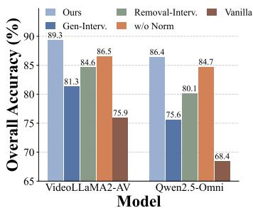  
(a) Interventions comparison.

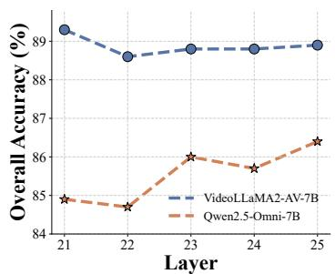  
(b) Steering depth comparison.

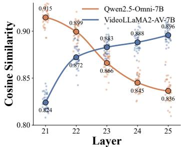  
(c) Cosine similarity analysis.  
Figure 5: Ablation and representation analysis on CMM. (a) Overall accuracy of SECRET, its three intervention variants, and the original AVLLMs. (b) Overall accuracy across relay-intervention depths $L _ { 1 } .$ , with question steering applied after the first $L _ { 1 }$ layers. (c) Cosine similarity between the positive and negative question representations at the corresponding depths.

Table 2: Source-grounding evaluation in audio-target and video-target captioning. T-CIDEr↑ measures target-reference agreement; D-CIDEr↓ measures distractor-reference overlap; LLM-score↑ jointly assesses target fidelity and distractor leakage.
<table><tr><td rowspan="2">Method</td><td colspan="3">Audio-target Caption</td><td colspan="3">Video-target Caption</td></tr><tr><td>T-CIDEr↑</td><td>D-CIDEr↓ LLM-score↑</td><td></td><td>T-CIDEr↑</td><td></td><td>D-CIDEr↓ LLM-score↑</td></tr><tr><td>Qwen2.5-Omni-7B</td><td>17.7</td><td>5.17</td><td>3.12</td><td>29.3</td><td>3.70</td><td>3.57</td></tr><tr><td>+Gen-Interv.</td><td>17.2</td><td>5.10</td><td>3.05</td><td>30.2</td><td>3.10</td><td>3.79</td></tr><tr><td>+Removal-Interv.</td><td>16.5</td><td>5.43</td><td>3.55</td><td>31.1</td><td>2.67</td><td>3.49</td></tr><tr><td>+SECRET</td><td>17.4</td><td>4.59</td><td>3.76</td><td>31.8</td><td>2.66</td><td>4.01</td></tr><tr><td>VideoLLaMA2-AV-7B</td><td>13.9</td><td>20.2</td><td>2.93</td><td>32.9</td><td>5.43</td><td>3.27</td></tr><tr><td>+Gen-Interv.</td><td>14.8</td><td>17.6</td><td>3.18</td><td>34.1</td><td>4.60</td><td>3.68</td></tr><tr><td>+Removal-Interv.</td><td>12.7</td><td>15.4</td><td>2.88</td><td>31.6</td><td>4.10</td><td>3.46</td></tr><tr><td>+SECRET</td><td>14.4</td><td>12.8</td><td>3.57</td><td>32.4</td><td>3.20</td><td>3.79</td></tr></table>

RQ2: Which layers are most effective for question steering, and why? Fig. 5(b) varies $L _ { 1 }$ , the depth up to which relay interventions are applied before steering. We test Layers 21–25, which follow the main modality-to-question information-transfer stage (see Apdx C.1 for the layer-range selection). Among the tested depths, VideoLLaMA2-AV-7B performs best at $L _ { 1 } = 2 1 \ : ( 8 9 . 3 \% )$ while Qwen2.5-Omni-7B peaks at $L _ { 1 } = 2 5 ( 8 6 . 4 \% )$ . To investigate this difference, Fig. 5(c) shows that the mean cosine similarity between positive and negative question representations increases with depth in VideoLLaMA2-AV-7B but decreases in Qwen2.5-Omni-7B. For both models, the best-performing depth coincides with the lowest similarity. This association suggests that greater positive–negative separation may provide a more informative steering contrast, helping explain the different optimal depths. See Apdx D for analysis details and complementary PCA visualizations.

RQ3: Does SECRET generalize to open-ended tasks? We evaluate modality-specific captioning under mismatched audio-video inputs, instructing models to describe only the requested modality despite receiving both. Following ACPO (Baid et al., 2026), T-CIDEr measures target-reference agreement, with higher scores being better. We additionally report D-CIDEr, where lower distractorreference overlap suggests less cross-modal leakage, and LLM-score, where higher scores indicate better target fidelity and less distractor leakage. Evaluation details are provided in Apdx E. As shown in Table 2, SECRET achieves the lowest D-CIDEr and highest LLM-score while maintaining competitive T-CIDEr across both models and captioning tasks, demonstrating its effectiveness against source-confused grounding hallucinations in open-ended generation.

RQ4: How does SECRET perform under finer-grained evaluation? We examine answer-margin distributions and duration-stratified accuracy on CMM. For each example, we compute the answer margin as the correct-answer logit minus the incorrect-candidate logit, both evaluated at $X _ { G }$ when predicting the first answer token. Positive margins favor the correct candidate, while negative margins favor the incorrect one. Fig. 6(a) shows that SECRET increases both mean and median margins relative to the base model for both backbones, indicating stronger relative support for correct answers. Fig. 6(b) shows consistent accuracy gains across the most common video-duration groups in CMM. The gains remain substantial on longer clips, reaching 14.7 percentage points for

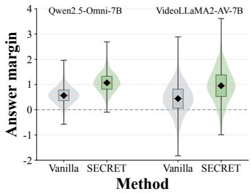  
(a) Answer margin distribution.

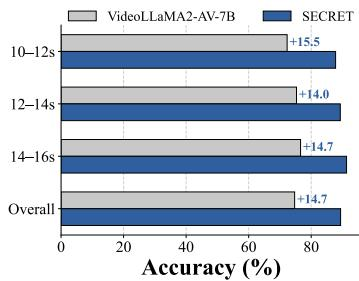

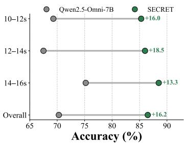  
(b) Accuracy across video-duration groups.  
Figure 6: Fine-grained evaluation on CMM. (a) Answer-margin distributions, where answermargin is the correct-answer logit minus the incorrect-answer logit. Diamonds and orange lines denote means and medians; whiskers span min–max. (b) Accuracy across the reported video-duration groups. The results show that SECRET maintains substantial gains on longer clips.

VideoLLaMA2-AV-7B in the longest reported group (14–16 seconds). Together, these analyses provide further insights into the behavior of SECRET.

## 5 RELATED WORK

Multimodal language models (MLLMs) have made substantial progress in integrating and reasoning over heterogeneous inputs (Wang et al., 2025a; Li et al., 2025; Wang et al., 2025b; Zhu et al., 2026), achieving strong performance across a wide range of multimodal tasks (Zhang et al., 2025b; 2024; Ma et al., 2026; Zhang et al., 2025a; Li et al., 2026; Wang et al., 2026). Recent omni-modal models further bring text, audio, and visual information into a unified framework (Xu et al., 2025a;b; Cui et al., 2026). While this integration enables models to use complementary sensory cues, reliable responses require grounding in the source specified by the instruction (Jung et al., 2026a; Zhang et al., 2026a; Kim et al., 2024), even when other modalities provide misleading evidence (Chung et al., 2026; Chaubey et al., 2026). This requirement motivates efforts to mitigate source-confused grounding hallucinations and mechanistic studies of how models use multimodal evidence internally.

Source-confused grounding hallucination. Prior work identifies source-confused grounding hallucination in AVLLMs, where cues from one modality induce unsupported predictions about another (Chung et al., 2026; Chaubey et al., 2026). AVHBench and CMM evaluate these failures across different directions of cross-modal interference (Kim et al., 2024; Leng et al., 2024a). Ex isting mitigation methods mainly rely on inference-time correction or training-time alignment. Inference-time adaptive decoding regulates modality contributions according to modality dominance, task relevance, or predictive conflict (Jung et al., 2026a; Chung et al., 2026; Leng et al., 2024b). Preference-based alignment approaches use multimodal preference pairs and modalityaware objectives to strengthen grounding in sensory evidence and reduce inappropriate cross-modal reliance (Chen et al., 2026; Chaubey et al., 2026; Baid et al., 2026). Despite their effectiveness, the internal cross-modal interactions underlying this failure remain insufficiently understood. In this work, we identify question states as an internal relay for cross-modal interference and propose SECRET to steer them toward required-modality evidence to mitigate hallucination.

Mechanistic understanding of multimodal information utilization. Mechanistic studies examine how models integrate and use multimodal information, providing insights that guide method design (Nikankin et al., 2025; Kim et al., 2025; Tong et al., 2026). A commonly used approach characterizes modality reliance at generation positions through attention analyses and pathway interventions (Selvakumar et al., 2026; Yu et al., 2026). These analyses inform attention modulation and contrastive decoding for hallucination mitigation (Jiang et al., 2025; Jung et al., 2026b). Recent studies examine how modality information is integrated into preceding instruction positions to support subsequent predictions (Zhang et al., 2025d; 2026b; Suharitdamrong et al., 2026). Instruction Anchor improves modality following in vision-language models by identifying and amplifying attention heads involved in modality arbitration (Zhang et al., 2026b). Other work also uses these insights to guide token pruning for more efficient inference in AVLLMs (Suharitdamrong et al., 2026). Beyond these studies, we investigate how non-required audio-visual cues propagate through the question relay and lead to source-confused grounding hallucinations in AVLLMs. Guided by this diagnosis, we introduce SECRET, which uses source-conditioned representation contrasts to steer question states toward required-source evidence and mitigate this interference.

## 6 CONCLUSION

In this work, we investigated source-confused grounding hallucination in AVLLMs. Our path intervention and representation analyses reveal a question-relay mechanism: question states relay interfering cues alongside required-source evidence, undermining grounding in required-modality evidence. Building on these findings, we proposed SECRET, a training-free method that contrasts question representations elicited through source-conditioned pathway interventions to steer generation toward required-modality evidence. Experiments across three AVLLMs demonstrate consistent improvements on CMM and AVHBench, while modality-specific captioning evaluations show improved source grounding in open-ended generation.

## AI USE STATEMENT

This work investigates source-confused grounding hallucinations in audio-visual large language models, with experiments on VideoLLaMA2-AV (Cheng et al., 2024), Qwen2.5-Omni-7B (Xu et al., 2025a), and Qwen3-Omni-30B-A3B (Xu et al., 2025b). As part of our research pipeline, we use LLMs to identify the instruction-required modality and extract target objects from textual questions. We also use GPT-4.1 to evaluate modality-specific captions for target fidelity and distractor leakage, following the scoring protocol in Apdx E.3. Additionally, we use generative AI tools for grammatical refinement, and linguistic polishing of the manuscript. The authors take responsibility for the final content of this work, including all text, claims, and artifacts produced with AI assistance.

## ETHICS STATEMENT

This work aims to improve the reliability of audio-visual large language models by mitigating answers grounded in the wrong modality. Our evaluation uses existing AVHBench and CMM benchmarks and modality-specific captioning inputs described in Apdx E. While these insights highlight potential vulnerabilities where safety filters might be bypassed, they primarily establish a structural foundation for developing more robust and transparent AI safeguards.

## REPRODUCIBILITY STATEMENT

We document the method and evaluation protocols to support reproducibility. Section 3 specifies the source-conditioned attention interventions and question-state update used by SECRET. Apdx B describes the diagnostic data, attention-path analyses, and target-object extraction and scoring. Apdx C details model-specific steering depths, decoding settings, baselines, and intervention variants, while Apdx D describes the representation analyses. For modality-specific captioning, Apdx E provides the evaluation data construction, generation prompts, text preprocessing, and metric definitions, including the GPT-4.1 judge prompt and scoring procedure.

## REFERENCES

Josh Achiam, Steven Adler, Sandhini Agarwal, Lama Ahmad, Ilge Akkaya, Florencia Leoni Aleman, Diogo Almeida, Janko Altenschmidt, Sam Altman, Shyamal Anadkat, et al. Gpt-4 technical report. arXiv preprint arXiv:2303.08774, 2023. 1

Shuai Bai, Keqin Chen, Xuejing Liu, Jialin Wang, Wenbin Ge, Sibo Song, Kai Dang, Peng Wang, Shijie Wang, Jun Tang, et al. Qwen2. 5-vl technical report. arXiv preprint arXiv:2502.13923, 2025. 1

Ami Baid, Zihui Xue, and Kristen Grauman. Don’t let the video speak: Audio-contrastive preference optimization for audio-visual language models. In ECCV, 2026. 8, 9, 18

Ashutosh Chaubey, Jiacheng Pang, and Mohammad Soleymani. Mod-dpo: Towards mitigating cross-modal hallucinations in omni llms using modality decoupled preference optimization. In

Proceedings of the IEEE/CVF Conference on Computer Vision and Pattern Recognition, pp. 18284–18294, 2026. 1, 9

Junzhe Chen, Tianshu Zhang, Shiyu Huang, Yuwei Niu, Chao Sun, Rongzhou Zhang, Guanyu Zhou, and Lijie Wen. Omnidpo: A preference optimization framework to address omni-modal hallucination. In Proceedings of the AAAI Conference on Artificial Intelligence, volume 40, pp. 20172– 20180, 2026. 1, 9

Zesen Cheng, Sicong Leng, Hang Zhang, Yifei Xin, Xin Li, Guanzheng Chen, Yongxin Zhu, Wenqi Zhang, Ziyang Luo, Deli Zhao, and Lidong Bing. Videollama 2: Advancing spatial-temporal modeling and audio understanding in video-llms. arXiv preprint arXiv:2406.07476, 2024. 1, 7, 10

Sangyun Chung, Se Yeon Kim, Youngchae Chee, and Yong Man Ro. Mad: Modality-adaptive decoding for mitigating cross-modal hallucinations in multimodal large language models. arXiv preprint arXiv:2601.21181, 2026. 1, 6, 7, 9, 17

Junbo Cui, Bokai Xu, Chongyi Wang, Tianyu Yu, Weiyue Sun, Yingjing Xu, Tianran Wang, Zhihui He, Wenshuo Ma, Tianchi Cai, et al. Minicpm-o 4.5: Towards real-time full-duplex omni-modal interaction, 2026. 1, 9

Gemini Team, Rohan Anil, Sebastian Borgeaud, Yonghui Wu, Jean-Baptiste Alayrac, Jiahui Yu, Radu Soricut, Johan Schalkwyk, Andrew M Dai, Anja Hauth, et al. Gemini: a family of highly capable multimodal models. arXiv preprint arXiv:2312.11805, 2023. 1

Mor Geva, Avi Caciularu, Kevin Wang, and Yoav Goldberg. Transformer feed-forward layers build predictions by promoting concepts in the vocabulary space. In Proceedings ofthe 2022 conference on empirical methods in natural language processing, pp. 30–45, 2022. 4, 16

Ricardo E. Gonzalez Penuela, Crescentia Jung, Sharon Y. Lin, Ruiying Hu, and Shiri Azenkot. How multimodal large language models support access to visual information: A diary study with blind and low vision people. arXiv preprint arXiv:2602.13469, 2026. 1

Zhangqi Jiang, Junkai Chen, Beier Zhu, Tingjin Luo, Yankun Shen, and Xu Yang. Devils in middle layers of large vision-language models: Interpreting, detecting and mitigating object hallucinations via attention lens. In 2025 IEEE/CVF Conference on Computer Vision and Pattern Recognition (CVPR), pp. 25004–25014. IEEE, 2025. 9

Chaeyoung Jung, Youngjoon Jang, and Joon Son Chung. Avcd: Mitigating hallucinations in audiovisual large language models through contrastive decoding. Advances in Neural Information Processing Systems, 38:63143–63174, 2026a. 1, 6, 7, 9, 17

Jihoo Jung, Chaeyoung Jung, Ji-Hoon Kim, and Joon Son Chung. Probing cross-modal information hubs in audio-visual llms. arXiv preprint arXiv:2605.10815, 2026b. 9

Minji Kim, Taekyung Kim, and Bohyung Han. Map the flow: Revealing hidden pathways of information in videollms. arxiv preprint arXiv:2510.13251, 2025. 9

Sung-Bin Kim, Hyun-Bin Oh, JungMok Lee, Arda Senocak, Joon Son Chung, and Tae-Hyun Oh. Avhbench: A cross-modal hallucination benchmark for audio-visual large language models. arXiv preprint arXiv:2410.18325, 2024. 1, 3, 6, 9, 14

Sicong Leng, Yun Xing, Zesen Cheng, Yang Zhou, Hang Zhang, Xin Li, Deli Zhao, Shijian Lu, Chunyan Miao, and Lidong Bing. The curse of multi-modalities: Evaluating hallucinations of large multimodal models across language, visual, and audio. arXiv preprint arXiv:2410.12787, 2024a. 1, 6, 9

Sicong Leng, Hang Zhang, Guanzheng Chen, Xin Li, Shijian Lu, Chunyan Miao, and Lidong Bing. Mitigating object hallucinations in large vision-language models through visual contrastive decoding. In Proceedings of the IEEE/CVF Conference on Computer Vision and Pattern Recognition, pp. 13872–13882, 2024b. 7, 9

Junxian Li, Di Zhang, Xunzhi Wang, Zeying Hao, Jingdi Lei, Qian Tan, Cai Zhou, Wei Liu, Yaotian Yang, Xinrui Xiong, et al. Chemvlm: Exploring the power of multimodal large language models in chemistry area. In Proceedings of the AAAI Conference on Artificial Intelligence, volume 39, pp. 415–423, 2025. 9

Junxian Li, Xinyue Xu, Sai Ma, Di Zhang, and Sichao Li. Faithful-first reasoning, planning, and acting for multimodal llms. In Findings of the Association for Computational Linguistics: ACL 2026, pp. 6777–6793, 2026. 9

Sheng Liu, Haotian Ye, Lei Xing, and James Zou. In-context vectors: Making in context learning more effective and controllable through latent space steering. arXiv preprint arXiv:2311.06668, 2023. 6

Jinlong Ma, Yu Zhang, Xuefeng Bai, Kehai Chen, Yuwei Wang, Zeming Liu, Jun Yu, and Min Zhang. Beyond unimodal shortcuts: Mllms as cross-modal reasoners for grounded named entity recognition. In Findings of the Association for Computational Linguistics: ACL 2026, pp. 43518– 43539, 2026. 9

Yaniv Nikankin, Dana Arad, Yossi Gandelsman, and Yonatan Belinkov. Same task, different circuits: Disentangling modality-specific mechanisms in vlms. arXiv preprint arXiv:2506.09047, 2025. 9

Ramaneswaran Selvakumar, Kaousheik Jayakumar, S Sakshi, Sreyan Ghosh, Ruohan Gao, and Dinesh Manocha. Do audio-visual large language models really see and hear? arXiv preprint arXiv:2604.02605, 2026. 2, 4, 9

Wish Suharitdamrong, Muhammad Awais, Xiatian Zhu, and Sara Atito. From senses to decisions: The information flow of auditory and visual perception in multimodal llms. arXiv preprint arXiv:2606.10147, 2026. 9

Jintao Tong, Wenwei Jin, Pengda Qin, Anqi Li, Yixiong Zou, Yuhong Li, Yuhua Li, and Ruixuan Li. Flowcut: Rethinking redundancy via information flow for efficient vision-language models. Advances in Neural Information Processing Systems, 38:94946–94973, 2026. 9

Shuai Wang, Zhenhua Liu, Jiaheng Wei, Xuanwu Yin, Dong Li, and Emad Barsoum. Athena: Enhancing multimodal reasoning with data-efficient process reward models. arXiv preprint arXiv:2506.09532, 2025a. 9

Shuai Wang, Daoan Zhang, Tianyi Bai, Shitong Shao, Jiebo Luo, and Jiaheng Wei. Last: Learning to think in space and time for generalist vision-language models. arXiv preprint arXiv:2511.19261, 2025b. 9

Shuai Wang, Daoan Zhang, Zhe Tang, Hao Cheng, and Jiaheng Wei. Self-boosting vision-language models with noisy student on-policy self-distillation. arXiv preprint arXiv:2607.23125, 2026. 9

Jin Xu, Zhifang Guo, Jinzheng He, Hangrui Hu, Ting He, Shuai Bai, Keqin Chen, Jialin Wang, Yang Fan, Kai Dang, et al. Qwen2.5-omni technical report. arXiv preprint arXiv:2503.20215, 2025a. 1, 3, 7, 9, 10

Jin Xu, Zhifang Guo, Hangrui Hu, Yunfei Chu, Xiong Wang, Jinzheng He, Yuxuan Wang, Xian Shi, Ting He, Xinfa Zhu, Yuanjun Lv, Yongqi Wang, Dake Guo, He Wang, Linhan Ma, Pei Zhang, Xinyu Zhang, Hongkun Hao, Zishan Guo, Baosong Yang, Bin Zhang, Ziyang Ma, Xipin Wei, Shuai Bai, Keqin Chen, Xuejing Liu, Peng Wang, Mingkun Yang, Dayiheng Liu, Xingzhang Ren, Bo Zheng, Rui Men, Fan Zhou, Bowen Yu, Jianxin Yang, Le Yu, Jingren Zhou, and Junyang Lin. Qwen3-omni technical report. arXiv preprint arXiv:2509.17765, 2025b. 1, 7, 9, 10

Liu Yu, Zhonghao Chen, Ping Kuang, Zhikun Feng, Fan Zhou, Lan Wang, and Gillian Dobbie. Causally-grounded dual-path attention intervention for object hallucination mitigation in lvlms. In Proceedings of the AAAI Conference on Artificial Intelligence, volume 40, pp. 36021–36029, 2026. 2, 4, 6, 9

Pingrui Zhang, Xianqiang Gao, Yuhan Wu, Kehui Liu, Dong Wang, Zhigang Wang, Bin Zhao, Yan Ding, and Xuelong Li. Moma-kitchen: A 100k+ benchmark for affordance-grounded last-mile navigation in mobile manipulation. In 2025 IEEE/CVF International Conference on Computer Vision (ICCV), pp. 6315–6326. IEEE, 2025a. 9

Pingrui Zhang, Yifei Su, Pengyuan Wu, Dong An, Li Zhang, Zhigang Wang, Dong Wang, Yan Ding, Bin Zhao, and Xuelong Li. Cross from left to right brain: Adaptive text dreamer for vision-andlanguage navigation. arXiv preprint arXiv:2505.20897, 2025b. 9

Yu Zhang, Kehai Chen, Xuefeng Bai, Zhao Kang, Quanjiang Guo, and Min Zhang. Question-guided knowledge graph re-scoring and injection for knowledge graph question answering. In Findings ofthe associationfor computational linguistics: EMNLP 2024, pp. 8972–8985, 2024. 9

Yu Zhang, Jinlong Ma, Yongshuai Hou, Xuefeng Bai, Kehai Chen, Yang Xiang, Jun Yu, and Min Zhang. Evaluating and steering modality preferences in multimodal large language model. arXiv preprint arXiv:2505.20977, 2025c. 6

Yu Zhang, Chuyang Sun, Kehai Chen, Xuefeng Bai, Yang Xiang, and Min Zhang. Mitigating multimodal hallucination via phase-wise self-reward. arXiv preprint arXiv:2604.17982, 2026a. 9

Yu Zhang, Mufan Xu, Xuefeng Bai, Kehai Chen, Pengfei Zhang, Yang Xiang, and Min Zhang. Instruction anchor: Dissecting the mechanistic dynamics of modality arbitration. arXiv preprint arXiv:2602.03677, 2026b. 9

Zhi Zhang, Srishti Yadav, Fengze Han, and Ekaterina Shutova. Cross-modal information flow in multimodal large language models. In 2025 IEEE/CVF Conference on Computer Vision and Pattern Recognition (CVPR), pp. 19781–19791. IEEE, 2025d. 3, 9

Jingyuan Zhao, Yuyan Wu, Rui Deng, Susu Xu, Jinpeng Gao, and Andrew Burke. A survey of autonomous driving from a deep learning perspective. ACM Computing Surveys, 57(10):1–60, 2025. 1

Guanyu Zhou, Yibo Yan, Xin Zou, Kun Wang, Aiwei Liu, and Xuming Hu. Mitigating modality prior-induced hallucinations in multimodal large language models via deciphering attention causality. In International Conference on Learning Representations, volume 2025, pp. 54415– 54439, 2025. 6

Yingjie Zhu, Xuefeng Bai, Kehai Chen, Yang Xiang, Youcheng Pan, Xiaoqiang Zhou, and Min Zhang. Decoupling skeleton and flesh: Efficient multimodal table reasoning with disentangled alignment and structure-aware guidance. arXiv preprint arXiv:2602.03491, 2026. 9

Andy Zou, Long Phan, Sarah Chen, James Campbell, Phillip Guo, Richard Ren, Alexander Pan, Xuwang Yin, Mantas Mazeika, Ann-Kathrin Dombrowski, et al. Representation engineering: A top-down approach to ai transparency. arXiv preprint arXiv:2310.01405, 2023. 6

# Devils in Question Relay: Source-Conditioned Relay Steering to Mitigate Hallucinations in Audio-visual large language models Supplementary Material

Our supplementary materials are summarized as follows:

• Appendix A: Discussion, Limitations, and Future Directions.

• Appendix B: Diagnostic Protocols and Attention-Path Robustness Analysis.

• Appendix C: Implementation Details, Baselines, and Intervention Variants.

• Appendix D: Layer-wise Question Representation Analyses.

• Appendix E: Modality-Specific Captioning Evaluation.

## A DISCUSSION AND LIMITATION

In this work, we find that question states provide a shared relay for audio-visual evidence, but can also carry interfering cues into answer generation. This dual role suggests that effective multimodal integration requires sensitivity to both the semantic relevance and the source of incoming information. A cue can be closely related to the question while still being inappropriate evidence for the requested modality. SECRET translates this perspective into inference-time control at the question relay. Its use of source-conditioned representation contrasts illustrates how mechanistic analysis can inform the design of training-free interventions while retaining the complete audio-visual input. More broadly, this connection motivates studying how intermediate textual states regulate which evidence supports generation.

A promising direction is to disentangle modality-specific cues within question representations, potentially helping models mitigate source-confused grounding hallucinations and make more effective use of information from each modality. Besides, our analysis focuses on cross-modal information flow at the pathway level. Finer-grained analyses, such as examining the roles of individual attention heads, could further clarify the mechanisms underlying source-confused grounding hallucinations.

## B DIAGNOSTIC PROTOCOLS

## B.1 DATASET DETAILS AND STATISTICS

We use two subsets of AVHBench (Kim et al., 2024). The Video-Driven Audio Hallucination subset contains 2,290 questions requiring audio-grounded answers, while the Audio-Driven Video Hallucination subset contains 1,136 questions requiring video-grounded answers. Together, these subsets comprise 3,426 question–answer pairs covering both directions of cross-modal interference. AVH-Bench draws on VALOR and AudioCaps, covering everyday scenarios involving people, animals, machinery, and nature. Its construction distinguishes visible sound sources, visible but silent objects, and audible sources outside the camera view. The latter two categories provide negative examples for the two hallucination tasks, making these subsets particularly relevant to studying source-confused grounding hallucination.

## B.2 REQUIRED-MODALITY IDENTIFICATION

For OBSERVATION 1 (§2.2), we prompt Qwen2.5-Omni-7B using only the question text, without audio or video inputs, and use greedy decoding. The reference label is AUDIO for Video-Driven Audio Hallucination and VIDEO for Audio-Driven Video Hallucination. The classifier can additionally return AMBIGUOUS when it cannot identify a unique required modality.

## Required-modality identification prompt

Identify the evidence source explicitly requested by the question. Do not answer the question or infer the source from object names alone.

Return AUDIO if the question asks about sounds or audible events. Return VIDEO if it asks about visible objects, actions, or events. Return AMBIGUOUS if neither source is uniquely specified or both sources are required.

Question: {question}

Return exactly one label: AUDIO, VIDEO, or AMBIGUOUS. Do not include an explanation.

Parsing and scoring. We remove surrounding whitespace, convert the response to uppercase, and accept only an exact match to one of the three labels. All other responses are treated as invalid. Accuracy is the percentage of evaluated questions whose predicted label matches the reference label. Because every question in these two subsets specifies a single required modality, AMBIGUOUS, invalid outputs, and incorrect modality labels all count as errors; no such cases are excluded from the denominator.

Use in SECRET. The labels AUDIO and VIDEO map to ${ \hat { r } } \ = \ A$ and $\hat { r } ~ = ~ V$ , respectively, to determine the positive and negative attention masks. For an AMBIGUOUS prediction, we randomly select $\hat { r } \in \{ A , \stackrel { \bf \hat { V } } { \bf \Sigma } \}$ before constructing the masks.

## B.3 DETAILS AND MORE EXPERIMENTS FOR ATTENTION-PATH CUTTING ANALYSIS

In this section, we provide more detail for metric and Robustness analysis across different attentioncutting window sizes for attention-path cutting analysis (§2.3).

Metric Computation Details. For each example i whose original prediction is source-faithful, let $p _ { i } ^ { \mathrm { o r i g } }$ and $p _ { i , \ell } ^ { \mathrm { c u t } }$ denote the target-answer probabilities before and after cutting a given pathway within $\mathcal { W } _ { \ell }$ , respectively. We compute the relative probability change for each sample and report the average over the N evaluated samples as a percentage:

$$
\Delta P ( \ell ) = \frac { 1 0 0 } { N } \sum _ { i = 1 } ^ { N } \frac { p _ { i , \ell } ^ { \mathrm { c u t } } - p _ { i } ^ { \mathrm { o r i g } } } { p _ { i } ^ { \mathrm { o r i g } } } .\tag{4}
$$

More negative values indicate that cutting the pathway reduces target-answer probability, while positive values indicate an increase.

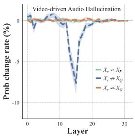

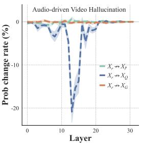  
(a) Window size 3.

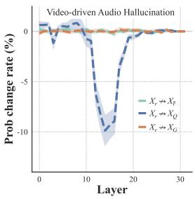

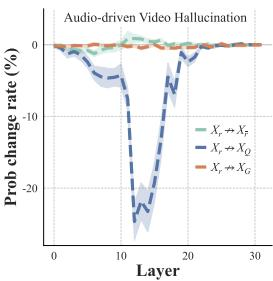  
(b) Window size 5.  
Figure 7: Robustness to attention-cutting window size in Qwen2.5-Omni-7B. Layer-wise changes in target-answer probability for source-faithful examples in Qwen2.5-Omni-7B. The horizontal axis indicates the window center. Across both settings and window sizes, cutting $X _ { r }  X _ { Q }$ produces the most pronounced reduction in the middle layers.

Robustness analysis across different AVLLMs and attention-cutting window sizes. The main analysis in Fig. 2 uses a seven-layer window. To assess whether its conclusions depend on this choice, we repeat the pathway analysis with three- and five-layer windows, comparing the same three pathways in both hallucination settings.

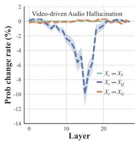

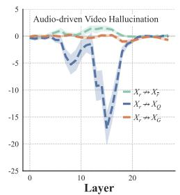  
(a) Window size 3.

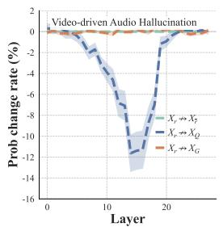  
(b) Window size 5.

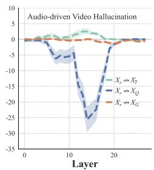  
Figure 8: Robustness to attention-cutting window size for VideoLLaMA-AV-7B. Layer-wise changes in target-answer probability for source-faithful examples in VideoLLaMA-AV-7B. The horizontal axis indicates the window center. Across both settings and window sizes, cutting $X _ { r }  X _ { Q }$ produces the most pronounced reduction in the middle layers.

As shown in Fig. 7 and Fig. 8, cutting $X _ { r }  X _ { Q }$ produces substantially larger reductions in targetanswer probability in the middle layers than cutting $X _ { r }  X _ { G }$ or $X _ { r }  X _ { \bar { r } }$ . Changing the window size affects the magnitude and layer-wise extent of the reductions, but the strongest effects remain concentrated in the middle layers and associated with the modality-to-question pathway. Together, these findings support the role of question states as an important relay for required-source evidence across the tested window sizes.

## B.4 OBJECT EXTRACTION AND TARGET-OBJECT SCORES

Target-object extraction. An LLM parser (Qwen3-32B-Instruct) identifies the target object from each question without accessing the audio or video. For example, “Do you hear piano music?” yields “piano”. The following prompt specifies the extraction task.

## Target-object extraction prompt

Extract the target object explicitly queried in the question. Return the shortest noun phrase that preserves its identity. Do not answer the question or infer objects that are not mentioned. If no unique target object can be identified, return NONE.

Example:

Question: Do you hear piano music?

Output: piano

Question: {question}

Return only the object name or NONE, without explanation.

Target-object score. We use Logit Lens (Geva et al., 2022) to quantify target-object signals in question states. For a given example, let $\mathbf { h } _ { i } ^ { \ell }$ denote the hidden state at question position $j$ and layer ℓ. For the extracted object o, let ${ \bf w } _ { o }$ denote the output-head weight vector corresponding to its representative vocabulary token. We compute the object’s logit at each question position and take the maximum across these positions:

$$
\begin{array} { r l } { S ^ { \ell } ( o ) = \underset { j \in { \cal { X } } _ { Q } } { \operatorname* { m a x } } z _ { j } ^ { \ell } ( o ) , \quad z _ { j } ^ { \ell } ( o ) } & { = { \mathbf { w } } _ { o } ^ { \top } { \mathbf { h } } _ { j } ^ { \ell } } \end{array}\tag{5}
$$

where $X _ { Q }$ is the set of question-token positions. This yields one target-object score per example and layer. A higher score indicates stronger target-object support within question states.

Comparison and aggregation. We compute the score separately for Original and Intervened, using the same target object. And the two runs retain identical inputs. At each layer, Fig. 3(a, left) reports the percentage of analyzed examples whose score is strictly lower in Intervened than in Original. The right panel reports the mean score across examples for each run.

## C EXPERIMENTAL AND IMPLEMENTATION DETAILS

## C.1 IMPLEMENTATION DETAILS OF SECRET

We use greedy decoding for all AVLLMs and select model-specific steering depths $L _ { 1 }$ for SECRET. Steering is applied after the main modality-to-question information-transfer stage. For Qwen2.5- Omni-7B, the routing analysis in Fig. 2 motivates candidate depths after Layer 20. Our visualizations indicate a similar range for VideoLLaMA2-AV-7B, while that for Qwen3-Omni-30B-A3B starts at Layer 28. Guided by the separation between positive and negative question representations in Figs. 9 and 10, we set $L _ { 1 } = 2 5 , 2 1$ , and 32 for Qwen2.5-Omni-7B, VideoLLaMA2-AV-7B, and Qwen3- Omni-30B-A3B, respectively.

At the selected depth, we retain the positive, negative, and original question-token states for steering, excluding the generation position $X _ { G }$ . After aligning these states by token position, we apply the update in Eq. 3. The updated question states are combined with the remaining token states from the original branch and passed through the remaining Transformer layers.

## C.2 BASELINES AND INTERVENTION VARIANTS

Baselines. For the four-branch VCD extension, the three contrastive branches modify video only, audio only, and both modalities. When implemented through modality removal, these branches receive audio–question, video–question, and question-only inputs, respectively (Chung et al., 2026). MAD (Chung et al., 2026) constructs full audio-visual, video-only, audio-only, and question-only branches by omitting the corresponding modality inputs. The question remains unchanged, and all branches receive the same generated answer prefix at each decoding step. AVCD (Jung et al., 2026a) implements attentive masking by setting selected token representations to zero while retaining their sequence positions. Its contrastive branches mask different combinations of the less dominant modalities.

Intervention variants. The variants in RQ1 (§4.3) and Table 2 modify how the steering direction is constructed or applied. Gen-Interv. redirects the positive and negative pathway cuts from $X _ { Q }$ to $X _ { G }$ , while retaining the full audio-visual input. The resulting contrast is used to steer the original state at $X _ { G }$ during prefill. The positive and negative branches redirect the corresponding pathway cuts from question positions to the generation position. Removal-Interv. constructs positive and negative representations by removing modality inputs instead of cutting internal attention pathways. The positive branch retains the required modality only, while the negative branch retains the interfering modality only. Both branches preserve the question text. Because modality removal can change token positions, the states used to construct the contrast are aligned by question-token order. The resulting difference is applied to the original question states in the full-input branch.

## D REPRESENTATION ANALYSES

For each model, we compare positive and negative question representations before steering, using the same CMM examples across all tested depths.

Cosine similarity. We compute cosine similarity between positive and negative representations at matching question-token positions, then average these similarities over all question tokens in the analyzed examples. Figure 5(c) reports the resulting layer-wise mean similarities.

PCA visualization. We further visualize the question representations using two-dimensional PCA. At each layer, PCA is fitted jointly to the positive and negative representations, with lines connecting paired representations. These projections provide a qualitative view of their separation; quantitative comparisons across layers rely on cosine similarity in the original representation space.

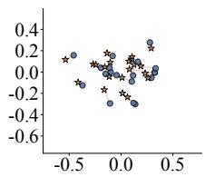

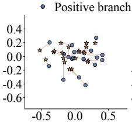

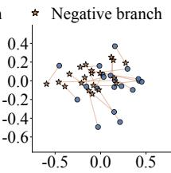

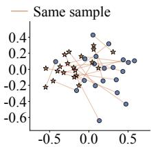

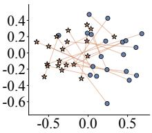  
Figure 9: PCA visualization of question representations in Qwen2.5-Omni-7B across layers 21– 25 (from left to right). Blue circles and orange stars denote positive and negative representations, respectively; lines connect paired representations.

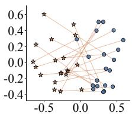

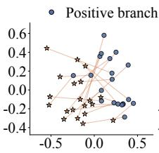

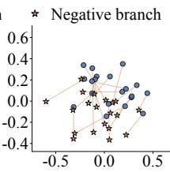

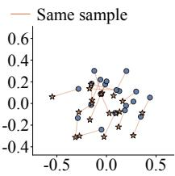

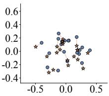  
Figure 10: PCA visualization of question representations in VideoLLaMA2-AV-7B across layers 21–25 (from left to right). Blue circles and orange stars denote positive and negative representations, respectively; lines connect paired representations.

## E MODALITY-SPECIFIC CAPTIONING EVALUATION

## E.1 DATA, GENERATION, AND PREPROCESSING

Following ACPO (Baid et al., 2026), we evaluate audio-target and video-target captioning on 400 audio-swapped examples each. Models receive both modalities but describe only the requested one. ACPO constructs its evaluation set from AVHBench captioning clips with diverse and distinct audio events. It retains each video’s visual content and replaces its audio with a track from another clip, using an LLM to rank candidate tracks and select plausible mismatches. We use the modality specific reference captions associated with these inputs.

All three metrics are computed on swapped inputs; original aligned inputs are excluded because semantic overlap makes distractor leakage harder to distinguish from valid target content. For video $v _ { A }$ paired with audio $a _ { B } .$ , audio-target captioning uses $\boldsymbol { a } _ { B } \mathbf { \ ' } _ { \mathbf { S } }$ audio caption as the target reference and $v _ { A } \ ' \mathrm { s }$ visual caption as the distractor reference; video-target captioning reverses these roles. Each example has one reference per modality. Scores are computed separately for each model, method, and captioning target.

We adopt the generation prompts from ACPO: “Describe what you hear.” for audio-target captioning and “Describe what you see.” for video-target captioning. We use the same greedy decoding and model-specific steering depths as in Apdx C.1. All methods use the same text preprocessing: truncate at the first Human: or User:, retain the first complete sentence, and strip surrounding whitespace. No paraphrasing or within-sentence content removal is applied. The processed caption is used for all metrics and human validation.

## E.2 TARGET AND DISTRACTOR CIDER

Let C, T , and D be the generated, target-reference, and distractor-reference corpora, paired by sample ID. Following ACPO (Baid et al., 2026) for target-reference evaluation, we report

$$
\mathrm { T } \mathrm { - } \mathrm { C I D E r } = 1 0 0 \times \mathrm { C I D E r } ( \mathcal { C } , \mathcal { T } ) ,\tag{6}
$$

$$
\mathrm { D - C I D E r } = 1 0 0 \times \mathrm { C I D E r } ( \mathcal { C } , \mathcal { D } ) .\tag{7}
$$

We use standard pycocoevalcap implementation,2 with TF–IDF-weighted 1–4-grams and the default length penalty $\sigma = 6$ . The two calls use identical predictions and sample IDs and differ only in the reference corpus. Higher T-CIDEr indicates stronger target-reference agreement; lower D-CIDEr indicates less distractor-reference overlap. Low D-CIDEr alone is insufficient, since empty or generic descriptions also avoid distractor content.

## E.3 LLM-BASED GROUNDING EVALUATION

The judge receives the target modality, both references, and the generated caption, rather than raw audio/video. It assigns target quality $Q _ { i } \in \{ 1 , \ldots , 5 \}$ and distractor leakage $L _ { i } \in \{ 0 , \ldots , 3 \}$ using the prompt below. Shared reference content is not counted as leakage; unrelated hallucinations reduce target quality. The sample score and reported average are

$$
G _ { i } = \operatorname* { m a x } ( 1 , Q _ { i } - L _ { i } ) ,\tag{8}
$$

$$
\mathrm { L L M - s c o r e } = \frac { 1 } { N } \sum _ { i = 1 } ^ { N } G _ { i } .\tag{9}
$$

The resulting LLM-score ranges from 1 to 5, with higher scores indicating better modality grounding. This score jointly assesses target fidelity and distractor leakage; it is not calculated from numerical CIDEr scores. The lower bound is applied before averaging, and an empty caption receives a score of 1 through its target-quality score.

We use GPT-4.1 with temperature=0, hide model and method names, and evaluate each caption independently. The sample score is recomputed in code from the returned $Q _ { i }$ and $L _ { i } .$

Judge prompt. The fields in braces are replaced with the requested modality, references, and preprocessed prediction for each sample.

GPT modality-grounding evaluation prompt   
You are evaluating whether a generated caption follows the requested audio or video modality under   
deliberately mismatched audio-video input.   
Target modality: {AUDIO or VIDEO}   
Target reference:   
{target caption}   
Distractor reference from the other modality:   
{distractor caption}   
Generated caption:   
{prediction}   
Evaluate semantic meaning rather than exact wording.   
First assign:   
1. target quality: an integer from 1 to 5   
2. distractor leakage: an integer from 0 to 3   
Target quality:   
5 = complete and accurate target description   
4 = mostly correct with minor omissions   
3 = partially correct or overly generic   
2 = weakly related to the target   
1 = absent, incorrect, or contradictory target information   
Distractor leakage:   
0 = no distractor-specific information   
1 = minor or ambiguous distractor influence   
2 = substantial mixture of target and distractor information   
3 = distractor dominates the generated caption   
Information shared by both references must not be treated as distractor leakage. Unrelated hallucina  
tions reduce target quality but are not automatically distractor leakage.

## GPT modality-grounding evaluation prompt (continued)

Compute:   
overall score = max(1, target quality - distractor leakage)   
Return JSON only:   
{   
"target\_quality": 1,   
"distractor\_leakage": 0,   
"overall\_score": 1,   
"reason": "Brief explanation within 30 words."   
}

## E.4 HUMAN VALIDATION OF LLM SCORES

Pairwise preferences. We sampled caption pairs across both target modalities, both backbone models, and the evaluated methods. Each pair consisted of two processed captions generated by different methods for the same swapped input and target modality. Annotators received the requested modality, the same target and distractor references provided to GPT-4.1, and the two captions in randomized order, with method identities and GPT scores hidden. Using the same criteria of target accuracy, completeness, and distractor leakage, they judged the first caption as better, the second as better, or the two as comparable. Sampling did not depend on which method won or on GPT’s preference.

Pairwise agreement. For comparison pair $j ,$ let $h _ { j } \in \{ - 1 , 0 , 1 \}$ denote the human preference, where 1 favors the first caption, −1 favors the second, and 0 denotes a tie. The GPT preference is derived directly from the existing per-caption scores in Eq. 8:

$$
g _ { j } = \mathrm { s i g n } \Big ( G _ { j } ^ { ( 1 ) } - G _ { j } ^ { ( 2 ) } \Big ) .\tag{10}
$$

For M evaluated pairs, we define

$$
\mathrm { P a i r w i s e \ A g r e e m e n t } = \frac { 1 0 0 } { M } \sum _ { j = 1 } ^ { M } \mathbb { I } [ h _ { j } = g _ { j } ] .\tag{11}
$$

Agreement requires matching preferences, including when both judges indicate a tie. A tie from only one judge counts as disagreement, and all ties remain in the denominator. This metric assesses whether LLM-score differences reflect human preferences without requiring matching absolute scores or a separate pairwise GPT prompt. The results show that GPT–human agreement is 89% for audio-target captioning and 87% for video-target captioning, compared with human–human agreement of 93% and 90%, respectively.