# Dating the Model: Hidden Dates in System Prompts Affect LLM Evaluation

Mario Sanz-Guerrero1 Minh Duc Bui1 Manuel Mager2 Katharina von der Wense1,3

1Johannes Gutenberg University Mainz, Germany

2Universidad Iberoamericana, Mexico

3University of Colorado Boulder, USA

msanz@uni-mainz.de

## Abstract

Reproducibility is essential for scientific research, yet prior work shows that LLM outputs vary with hardware and batching. We identify an overlooked factor: the hidden injection of the current date into system prompts, which users cannot control and which changes every day. Across 9 recent LLMs and 6 datasets spanning multiple-choice QA (MCQA), math reasoning, code generation, and machine translation, performance varies solely with the current date, with deltas of up to 6% on MCQA, 14% on math reasoning, 7% on code generation, and 2.84 BLEU on machine translation. Model rankings also shift, affecting leaderboards. This date effect exceeds other sources of non-determinism, such as batch size and numerical precision. Standard prompting techniques – chain-of-thought and few-shot prompting – do not reduce the sensitivity; chain-ofthought even amplifies it. Our findings underscore the need for careful evaluation protocols to ensure reproducibility and fair comparisons in LLM research.

## 1 Introduction

The rapid progress of large language models (LLMs) requires careful benchmarking, but reproducibility – a crucial aspect of scientific research – is hindered by the non-determinism¹ of LLM outputs. Prior work attributes this to factors such as inference batch size, numerical precision, and hardware (He and Lab, 2025; Yuan et al., 2025).

In this paper, we identify and analyze a so-far overlooked source of non-determinism: the hidden injection of the current date into the system prompt. Since this information is time-varying, a critical question arises: do evaluations fluctuate on different days, even with identical settings? Figure 1 illustrates this phenomenon.

  
(a) GPT-5.1 knows today's date, even though the date is not included in the user-controllable prompt (represented in blue).

MMLU Leaderboard  
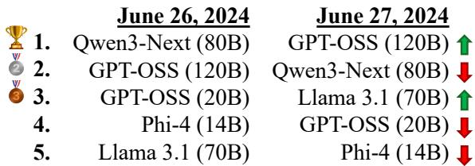  
(b) Top-5 models on MMLU on two consecutive dates: changing only the date reorders the leaderboard.  
Figure 1: The performance of LLMs on standard benchmarks varies solely by changing the current date, which is usually hidden from users in the system prompt.

Across 9 recent LLMs and 6 standard benchmarks spanning four tasks, we observe accuracy variations up to 6% on multiple-choice QA (MCQA) just from changing the date, and model rankings reorder accordingly (Figure 1b). The effect is even larger on language-generation tasks, reaching 14% on math reasoning, 7% on code generation, and 2.84 BLEU on machine translation. This date effect is larger than other known sources of non-determinism, such as batch size and numerical precision. Common prompting techniques do not remove it either: neither chain-of-thought nor few-shot prompting reduces the sensitivity, and chain-of-thought even makes it worse. Our findings underscore the need for evaluation protocols that account for hidden prompt metadata to ensure reproducibility and fair comparisons in LLM research.

## 2 Related Work

There is a growing body of work studying nondeterminism in LLM evaluations and its implications for reproducibility. Recent studies highlight that LLM benchmarks are highly sensitive to configuration choices. Song et al. (2025) and Atil et al. (2025) report that even “deterministic" greedy decoding yields unstable results, while Hochlehnert et al. (2025) find that reasoning performance fluctuates widely based on subtle implementation details, including random seeds, prompt structure, and decoding hyperparameters like temperature. Sclar et al. (2024) and Sanz-Guerrero et al. (2025) show that minor changes to prompt formatting (e.g., separators or spacing) substantially affect model performance. At the system level, Yuan et al. (2025) and He and Lab (2025) show that inference batch size, numerical precision, and hardware differences introduce variability in LLM outputs due to floating-point arithmetic errors. Prior work largely attributes non-determinism to batching, hardware, or prompt formatting; we identify a distinct source of variance: the hidden, time-varying insertion of the current date into system prompts.

## 3 Experimental Setup

Prompts To isolate the effect of the current date – a detail often hidden from users – we use identical prompts for all models, changing only the date in the system prompt and keeping the rest of the configuration fixed and deterministic (see Appendix C for details). We sweep dates from January 1 to December 31, 2024, covering a representative year during which LLMs were rapidly developed, improved, and benchmarked.

Datasets We use standard datasets commonly reported in new model releases. For multiplechoice QA, we experiment on MMLU (Hendrycks et al., 2021), GPQA (Rein et al., 2024), and ARC-Challenge (Clark et al., 2018). We verify that none of the questions are time-dependent to avoid confounding factors (see Appendix D). In MCQA, the prediction comes from the probability of a single answer token, which gives the date only a small surface to act on. To test whether the effect grows when the model generates longer outputs, we also evaluate on GSM8K (Cobbe et al., 2021) math reasoning, where the model produces a step-bystep solution and we grade the final number. However, GSM8K still reduces evaluation to a single extracted number, so we further test code generation on HumanEval (Chen et al., 2021), where the model writes a complete Python function that we run against unit tests (i.e., correctness depends on the whole generated program). Finally, to test the effect when the full output is evaluated, we run all models on machine translation (MT) with three pairs from WMT (English to German, Finnish, and Czech; Bojar et al., 2016).

Models We evaluate 9 recent LLMs from various families, sizes and capabilities: Llama 3.1 Instruct (8B & 70B; Grattafiori et al., 2024), Gemma 3 Instruct (4B & 27B; Gemma Team et al., 2025), Qwen3 (4B; Yang et al., 2025), Qwen3-Next (80B; Qwen Team, 2025), Phi-4 (14B; Abdin et al., 2024), and GPT-OSS (20B & 120B; OpenAI et al., 2025).

Evaluation For MCQA, we report accuracy and calibration. Calibration is measured via expected calibration error (ECE; Pakdaman Naeini et al., 2015), the weighted absolute gap between accuracy and confidence across M = 10 equal-width bins (see Appendix C.1 for the formula). For GSM8K, we report accuracy; for HumanEval, we report pass@ 1; and, for MT, we use BLEU (Papineni et al., 2002) and chrF (Popović, 2015).

## 4 Results

MCQA Results Vary with Date Changes Figure 2 summarizes accuracy and ECE across dates in 2024 for the top-5 models on MMLU (full results in Appendix E). Although the current date should be irrelevant, both accuracy and calibration vary substantially with it, and model rankings reorder (see Figure 1b). Table 1 reports the worst-to-best accuracy delta across models and datasets. Differences reach up to 6%, which is substantial given that the only changing factor is the current date in the system prompt and all questions are timeindependent (see Appendix D).

The Effect Is Larger for Reasoning Tasks The GSM8K column of Table 2 shows deltas larger than on MCQA – 7.75% on average vs. 2.52% in Table 1. Even the largest models are affected, so scale does not protect against the effect. This matches the mechanism we investigate further in Section 5.3: longer autoregressive generations give the date prefix repeated opportunities to bias intermediate tokens, and these perturbations cascade into different final answers. Since reasoning benchmarks like GSM8K are central to current leaderboards, deltas of this magnitude make accuracy reported on different days difficult to compare.

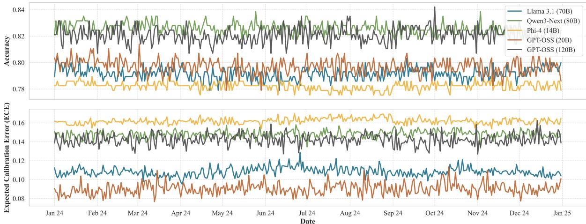  
Figure 2: Accuracy (top) and ECE (bottom) across different dates in 2024 for the top-5 models on MMLU.

<table><tr><td rowspan=1 colspan=2>Model             MMLU GPQA ARC-C Avg.</td></tr><tr><td rowspan=4 colspan=1>Llama 3.1 (8B)       2.11    4.53   2.01Llama 3.1 (70B)     2.46   3.54   0.67Gemma 3 (4B)       1.75   3.03   1.87Gemma 3 (27B)      1.38   4.04   1.01</td><td rowspan=1 colspan=1>2.88</td></tr><tr><td rowspan=1 colspan=1>2.22</td></tr><tr><td rowspan=1 colspan=1>2.22</td></tr><tr><td rowspan=1 colspan=1>2.14</td></tr><tr><td rowspan=1 colspan=1>Qwen3 (4B)         2.46   2.53   1.34</td><td rowspan=1 colspan=1>2.11</td></tr><tr><td rowspan=2 colspan=1>Qwen3-Next (80B)   2.11   2.43   1.01Phi-4 (14B)          1.40   3.51   0.33</td><td rowspan=1 colspan=1>1.85</td></tr><tr><td rowspan=1 colspan=1>1.75</td></tr><tr><td rowspan=2 colspan=1>GPT-OSS (20B)      3.49   4.55   2.34GPT-OSS (120B)    3.51    6.06   2.53</td><td rowspan=1 colspan=1>3.46</td></tr><tr><td rowspan=1 colspan=1>4.03</td></tr><tr><td rowspan=1 colspan=1>Average             2.30   3.80   1.46</td><td rowspan=1 colspan=1>2.52</td></tr></table>

Table 1: Difference in accuracy (delta) from the worst to the best date in 2024 across models and datasets.

Execution-Graded Code Still Shifts The HumanEval column of Table 2 shows the same pattern for code generation. Pass@1 changes by 4.81% on average just from the date, and by up to 7.32% for the most affected models. This is notable because code is graded by running it against unit tests, so the metric is objective and does not depend on the surface form of the output. Even so, the date still moves the results, so the effect reaches a very different task with a strict, execution-based metric.

The Effect Holds for Full-Output Metrics The right part of Table 2 shows that the effect persists for MT, with average deltas of up to 1.88 BLEU and 1.33 chrF. Since the setup is fully deterministic, this variability is attributable solely to the hidden date. This is not a small effect in MT, where progress is often reported in fractions of a BLEU point. Together with GSM8K and HumanEval, this shows the effect is not an MCQA artifact but a general property of LLM evaluation under hidden, time-varying prompt metadata.

## 5 Analysis

## 5.1 No Date Is Consistently Better

Figure 2 shows no obvious pattern in which dates help or hurt, so we analyze this systematically on MCQA (Table 3). We test three patterns: (i) a trend over the year, via the Spearman correlation between the date and accuracy for each of the 27 model–dataset combinations (9 models × 3 datasets); (ii) an effect shared across datasets, via the Pearson correlation between the accuracies across dates of the same model on two datasets (9 models × 3 dataset pairs = 27 comparisons); and (iii) an effect shared across models, via the Pearson correlation between the accuracies across dates of two models on the same dataset (36 model pairs × 3 datasets = 108 comparisons). A correlation near zero means no pattern. For (ii) and (iii), we also report how often a date moves both accuracies in the same direction, i.e., both above or both below their yearly average, where 50% corresponds to chance.

We observe no consistent pattern. Over time, the correlation between date and accuracy is close to zero for most model-dataset combinations (median 0.02), with no common direction. Across datasets and across models, correlations are also centered at zero, and a date moves both accuracies in the same direction on only 51% of dates – what we expect by chance. This holds even for models of the same family, which share the tokenizer and chat template. Hence, there is no “good" date to fix for evaluation: the date acts as noise specific to each model and dataset.

<table><tr><td></td><td>GSM8K</td><td>HumanEval</td><td colspan="2">WMT (en → de)</td><td colspan="2">WMT (en → fi)</td><td colspan="2">WMT (en → cs)</td></tr><tr><td>Model</td><td>∆ Acc.</td><td>∆ pass@1</td><td>∆ BLEU</td><td>∆ chrF</td><td>∆ BLEU</td><td>∆ chrF</td><td>△ BLEU</td><td>∆ chrF</td></tr><tr><td>Llama 3.1 (8B)</td><td>9.85</td><td>7.32</td><td>1.66</td><td>1.13</td><td>1.79</td><td>1.52</td><td>1.82</td><td>1.42</td></tr><tr><td>Llama 3.1 (70B)</td><td>7.58</td><td>5.49</td><td>1.58</td><td>1.07</td><td>1.71</td><td>1.46</td><td>1.76</td><td>1.36</td></tr><tr><td>Gemma 3 (4B)</td><td>8.33</td><td>6.71</td><td>1.57</td><td>1.15</td><td>1.64</td><td>1.11</td><td>1.68</td><td>1.22</td></tr><tr><td>Gemma 3 (27B)</td><td>3.03</td><td>3.66</td><td>1.58</td><td>0.96</td><td>1.38</td><td>0.91</td><td>1.90</td><td>1.06</td></tr><tr><td>Qwen3 (4B)</td><td>6.06</td><td>2.44</td><td>1.34</td><td>0.95</td><td>1.39</td><td>1.38</td><td>1.88</td><td>1.30</td></tr><tr><td>Qwen3-Next (80B)</td><td>4.55</td><td>1.83</td><td>1.28</td><td>0.90</td><td>1.31</td><td>1.29</td><td>1.77</td><td>1.21</td></tr><tr><td>Phi-4 (14B)</td><td>3.03</td><td>1.83</td><td>0.47</td><td>0.27</td><td>0.47</td><td>0.45</td><td>0.58</td><td>0.38</td></tr><tr><td>GPT-OSS (20B)</td><td>12.88</td><td>7.32</td><td>2.35</td><td>1.40</td><td>1.91</td><td>1.77</td><td>2.66</td><td>1.91</td></tr><tr><td>GPT-OSS (120B)</td><td>14.42</td><td>6.71</td><td>2.52</td><td>1.56</td><td>2.14</td><td>1.93</td><td>2.84</td><td>2.08</td></tr><tr><td>Average</td><td>7.75</td><td>4.81</td><td>1.59</td><td>1.04</td><td>1.53</td><td>1.31</td><td>1.88</td><td>1.33</td></tr></table>

Table 2: Worst-to-best date delta in 2024 across models on open-ended generation tasks: accuracy on GSM8K, pass @ 1 on HumanEval, and BLEU and chrF on 3 WMT language pairs (English to German, Finnish, and Czech).

<table><tr><td>Pattern</td><td>N</td><td>Median</td><td>Range</td><td>Same dir.</td></tr><tr><td>Trend over the year</td><td>27</td><td>0.02</td><td>[-0.40, 0.53]</td><td>一</td></tr><tr><td>Across datasets</td><td>27</td><td>-0.03</td><td>[-0.16,0.15]</td><td>51%</td></tr><tr><td>Across models</td><td>108</td><td>0.01</td><td>[-0.17,0.25]</td><td>51%</td></tr></table>

Table 3: Correlation between the date and accuracy (trend over the year; Spearman), and between the accuracies across dates of the same model on two datasets or of two models on the same dataset (Pearson), on MCQA. N: number of model–dataset combinations (trend) or compared pairs. Same dir.: share of dates where both accuracies are above or both below their yearly average (50% = chance).

## 5.2 The Effect Reaches Proprietary Models

To validate our findings on a proprietary model, we evaluate GPT-5.1² over one week (December 3–9, 2025) on our MCQA datasets. We leave the system prompt empty – the date is injected server-side (see Figure 1a) – set the temperature to 0, and disable reasoning.3 Figure 3 shows that GPT-5.1 is also affected, with variations of up to 4% (on GPQA).

## 5.3 Chain-of-Thought Amplifies Date Sensitivity

MCQA is typically evaluated by reading the answer from the next-token probability (Gao et al., 2024), an efficient but, as we have shown, date-sensitive setup. We further test whether chain-of-thought (CoT) prompting (Wei et al., 2022) mitigates this, as explicit step-by-step reasoning could ground the model and reduce the influence of superficial metadata. We evaluate Llama 3.1 (8B) with CoT on MMLU across all dates in 2024.

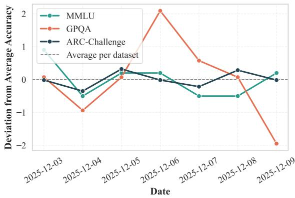  
Figure 3: Accuracy deviation across different dates for GPT-5.1. The 0.0 line represents the average accuracy over the week for each dataset.

Contrary to our hypothesis, Figure 4 shows that CoT amplifies the date sensitivity. We observe that the date affects the selection of initial CoT tokens, and, due to the autoregressive nature of LLMs, these small perturbations cascade into different reasoning paths and different final answers. So open-ended generation gives the date even more surface to act as a confounder.

## 5.4 Few-Shot Learning Does Not Help Either

Few-shot prompting is another plausible mitigation: task examples could ground the model and reduce the unintentional influence of the date. However, with 5-shot prompting (Table 4), the gaps persist across all models, with an average accuracy delta of 2.27% (vs. 2.52% zero-shot).

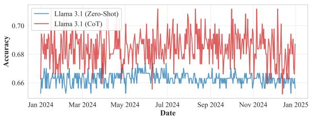  
Figure 4: Comparison of accuracy across different dates in 2024 for Llama 3.1 (8B) on MMLU using zero-shot prompting vs. chain-of-thought prompting.

<table><tr><td>Model</td><td>MMLU GPQA</td><td>ARC-C</td><td></td><td>Avg.</td></tr><tr><td>Llama 3.1 (8B)</td><td>2.81</td><td>5.05</td><td>2.35</td><td>3.40</td></tr><tr><td>Llama 3.1 (70B) Gemma 3 (4B)</td><td>1.40 2.46</td><td>5.56</td><td>1.01 1.34</td><td>2.66 2.45</td></tr><tr><td>Gemma 3 (27B)</td><td>0.70</td><td>3.54 1.52</td><td>0.67</td><td>0.96</td></tr><tr><td>Qwen3 (4B)</td><td>1.75</td><td>3.03</td><td>1.43</td><td>2.07</td></tr><tr><td>Qwen3-Next (80B)</td><td>1.75</td><td>3.54</td><td>1.34</td><td>2.21</td></tr><tr><td>Phi-4 (14B)</td><td>1.40</td><td></td><td>0.31</td><td>1.24</td></tr><tr><td>GPT-OSS (20B)</td><td>2.11</td><td>2.02</td><td></td><td></td></tr><tr><td></td><td></td><td>2.53</td><td>0.67</td><td>1.77</td></tr><tr><td>GPT-OSS (120B) Average</td><td>3.51 1.99</td><td>4.55</td><td>3.02</td><td>3.69 2.27</td></tr></table>

Table 4: Difference in accuracy (delta) from the worst to the best date in 2024 across models and datasets using 5-shot prompting.

## 5.5 Comparison Against Other Sources of Non-Determinism

To assess how the date impact compares in magnitude to other sources of non-determinism in LLM evaluations, we benchmark it against the factors highlighted in prior work (He and Lab, 2025; Yuan et al., 2025; Zheng et al., 2024; Pezeshkpour and Hruschka, 2024): inference batch size (1–128 in powers of 2), numerical precision (BF16, FP16, FP32), GPU model (A100, A40, RTX4090), and option order (5 random permutations per question). All runs use Llama 3.1 (8B) on MMLU and an A100 (except for comparing GPUs). We quantify variation via the coefficient of variation (CV; standard deviation over mean) of accuracy and ECE, which normalizes by the mean and puts all sources on a comparable scale.

Table 5 shows that, while batch size, numerical precision, and hardware do introduce variability, their effect is consistently smaller than that of the date. Option order – a well-known source of nondeterminism (Zheng et al., 2024; Pezeshkpour and Hruschka, 2024) – is comparable in magnitude to the date effect.

<table><tr><td>Source of Variation</td><td>Acc.</td><td>ECE</td></tr><tr><td>Current Date [Jan 1 – Dec 31]</td><td>0.78%</td><td>2.56%</td></tr><tr><td>Batch Size [1, 2, 4, 8, ..., 128]</td><td>0.61%</td><td>2.00%</td></tr><tr><td>Num. Precision [BF16, FP16, FP32]</td><td>0.52%</td><td>2.54%</td></tr><tr><td>GPU Model [A100, A40, RTX4090]</td><td>0.48%</td><td>1.60%</td></tr><tr><td>Option Order [5 random permutations]</td><td>0.75%</td><td>3.12%</td></tr><tr><td>System Instruction [6 different wordings]</td><td>0.78%</td><td>3.54%</td></tr></table>

Table 5: Coefficient of variation (CV) of accuracy and ECE from different sources of non-determinism using Llama 3.1 (8B) on MMLU.

## 5.6 Other Variations in the System Prompt

One possible reason for the date sensitivity is that the system prompt might be fixed during supervised fine-tuning (SFT) and reinforcement learning from human feedback (RLHF), making the model brittle to any slight modification. To test this, we vary the system prompt's wording across six versions (see Appendix C.4). The last row of Table 5 shows that the resulting variation has the same accuracy CV as the date effect (0.78%). The hidden, dynamic change of the current date has an impact on model behavior similar to that of intentional prompt engineering. This supports the hypothesis that the model is sensitive to any system-prompt change, and the date is such a change – except that it happens without the user's knowledge.

## 6 Conclusion

We identify a critical, often overlooked source of non-determinism in LLM evaluation: the hidden injection of the current date into system prompts. Across 9 models, 6 datasets, and four tasks, this dynamic metadata alters model performance and reshuffles leaderboard rankings, surpassing the variance introduced by other system-level factors such as batch size or numerical precision. The effect is larger for language-generation tasks: up to 6% accuracy on MCQA, 14% accuracy on math reasoning, 7% pass @ 1 on code generation, and 2.84 BLEU on machine translation. Neither CoT nor few-shot prompting reduces this sensitivity; CoT in fact amplifies it. In practice, we recommend removing the date from the chat template when possible while keeping the rest of the template unchanged, or otherwise fixing the date and reporting it alongside the results. These findings highlight the fragility of current benchmarking protocols and the necessity of accounting for hidden prompt metadata to ensure reproducibility.

## Limitations

Our study shows that the injection of the current date into system prompts can significantly affect LLM evaluation results, highlighting a critical source of non-determinism which is dynamic over time. However, our experiments are limited to a select set of models and datasets, and our proprietarymodel evaluation is limited to GPT-5.1 over one week. Further research is needed to generalize these findings across a broader range of LLMs and tasks. To keep the scope (and costs) manageable, we cover four representative evaluation tasks – multiple-choice QA, math reasoning (GSM8K), code generation (HumanEval), and machine translation – since our experimental setup requires 365 runs (per model, per dataset) to cover all dates in a year. Other open-ended tasks such as dialogue or summarization remain to be studied. We also inject the date in a fixed format and at a fixed position in the prompt and vary it within 2024; sensitivity to other formats, positions, or years remains to be explored.

## Acknowledgments

This work was supported by the Carl Zeiss Foundation through the MAINCE and TOPML projects (grant numbers P2022-08-009 and P2021-02-014).

## References

Marah Abdin, Jyoti Aneja, Harkirat Behl, Sébastien Bubeck, Ronen Eldan, Suriya Gunasekar, Michael Harrison, Russell J. Hewett, Mojan Javaheripi, Piero Kauffmann, James R. Lee, Yin Tat Lee, Yuanzhi Li, Weishung Liu, Caio C. T. Mendes, Anh Nguyen, Eric Price, Gustavo de Rosa, Olli Saarikivi, and 8 others. 2024. Phi-4 technical report. Preprint, arXiv:2412.08905.

Berk Atil, Sarp Aykent, Alexa Chittams, Lisheng Fu, Rebecca J. Passonneau, Evan Radcliffe, Guru Rajan Rajagopal, Adam Sloan, Tomasz Tudrej, Ferhan Ture, Zhe Wu, Lixinyu Xu, and Breck Baldwin. 2025. Non-determinism of “deterministic" LLM settings. Preprint, arXiv:2408.04667.

Ondřej Bojar, Rajen Chatterjee, Christian Federmann, Yvette Graham, Barry Haddow, Matthias Huck, Antonio Jimeno Yepes, Philipp Koehn, Varvara Logacheva, Christof Monz, Matteo Negri, Aurélie Névéol, Mariana Neves, Martin Popel, Matt Post, Raphael Rubino, Carolina Scarton, Lucia Specia, Marco Turchi, and 2 others. 2016. Findings of the 2016 conference on machine translation. In Proceedings of the First Conference on Machine Translation: Volume 2, Shared Task Papers, pages 131–198,

Berlin, Germany. Association for Computational Linguistics.

Mark Chen, Jerry Tworek, Heewoo Jun, Qiming Yuan, Henrique Ponde de Oliveira Pinto, Jared Kaplan, Harri Edwards, Yuri Burda, Nicholas Joseph, Greg Brockman, Alex Ray, Raul Puri, Gretchen Krueger, Michael Petrov, Heidy Khlaaf, Girish Sastry, Pamela Mishkin, Brooke Chan, Scott Gray, and 39 others. 2021. Evaluating large language models trained on code. Preprint, arXiv:2107.03374.

Peter Clark, Isaac Cowhey, Oren Etzioni, Tushar Khot Ashish Sabharwal, Carissa Schoenick, and Oyvind Tafjord. 2018. Think you have solved question answering? Try ARC, the AI2 reasoning challenge. Preprint, arXiv:1803.05457.

Karl Cobbe, Vineet Kosaraju, Mohammad Bavarian, Mark Chen, Heewoo Jun, Lukasz Kaiser, Matthias Plappert, Jerry Tworek, Jacob Hilton, Reiichiro Nakano, Christopher Hesse, and John Schulman. 2021. Training verifiers to solve math word problems. Preprint, arXiv:2110.14168.

Leo Gao, Jonathan Tow, Baber Abbasi, Stella Biderman, Sid Black, Anthony DiPofi, Charles Foster, Laurence Golding, Jeffrey Hsu, Alain Le Noac'h, Haonan Li, Kyle McDonell, Niklas Muennighoff, Chris Ociepa, Jason Phang, Laria Reynolds, Hailey Schoelkopf, Aviya Skowron, Lintang Sutawika, and 5 others. 2024. The language model evaluation harness. Zenodo.

Gemma Team, Aishwarya Kamath, Johan Ferret, Shreya Pathak, Nino Vieillard, Ramona Merhej, Sarah Perrin, Tatiana Matejovicova, Alexandre Ramé, Morgane Rivière, Louis Rouillard, Thomas Mesnard, Geoffrey Cideron, Jean bastien Grill, Sabela Ramos, Edouard Yvinec, Michelle Casbon, Etienne Pot, Ivo Penchev, and 197 others. 2025. Gemma 3 technical report. Preprint, arXiv:2503.19786.

Aaron Grattafiori, Abhimanyu Dubey, Abhinav Jauhri Abhinav Pandey, Abhishek Kadian, Ahmad Al-Dahle, Aiesha Letman, Akhil Mathur, Alan Schelten, Alex Vaughan, Amy Yang, Angela Fan, Anirudh Goyal, Anthony Hartshorn, Aobo Yang, Archi Mitra, Archie Sravankumar, Artem Korenev, Arthur Hinsvark, and 542 others. 2024. The Llama 3 herd of models. Preprint, arXiv:2407.21783.

Horace He and Thinking Machines Lab. 2025. Defeating nondeterminism in LLM inference. Thinking Machines Lab: Connectionism.

Dan Hendrycks, Collin Burns, Steven Basart, Andy Zou, Mantas Mazeika, Dawn Song, and Jacob Steinhardt. 2021. Measuring massive multitask language understanding. In International Conference on Learning Representations.

Andreas Hochlehnert, Hardik Bhatnagar, Vishaal Udandarao, Samuel Albanie, Ameya Prabhu, and Matthias Bethge. 2025. A sober look at progress in language model reasoning: Pitfalls and paths to reproducibility. In Second Conference on Language Modeling.

OpenAI, Sandhini Agarwal, Lama Ahmad, Jason Ai, Sam Altman, Andy Applebaum, Edwin Arbus, Rahul K. Arora, Yu Bai, Bowen Baker, Haiming Bao, Boaz Barak, Ally Bennett, Tyler Bertao, Nivedita Brett, Eugene Brevdo, Greg Brockman, Sebastien Bubeck, Che Chang, and 107 others. 2025. gpt-oss-120b & gpt-oss-20b model card. Preprint, arXiv:2508.10925.

Mahdi Pakdaman Naeini, Gregory Cooper, and Milos Hauskrecht. 2015. Obtaining well calibrated probabilities using Bayesian binning. Proceedings of the AAAI Conference on Artificial Intelligence, 29(1).

Kishore Papineni, Salim Roukos, Todd Ward, and Wei-Jing Zhu. 2002. Bleu: a method for automatic evaluation of machine translation. In Proceedings of the 40th Annual Meeting of the Association for Computational Linguistics, pages 311–318, Philadelphia, Pennsylvania, USA. Association for Computational Linguistics.

Pouya Pezeshkpour and Estevam Hruschka. 2024. Large language models sensitivity to the order of options in multiple-choice questions. In Findings of the Association for Computational Linguistics: NAACL 2024, pages 2006–2017, Mexico City, Mexico. Association for Computational Linguistics.

Tiago Pimentel and Clara Meister. 2024. How to compute the probability of a word. In Proceedings of the 2024 Conference on Empirical Methods in Natural Language Processing, pages 18358–18375, Miami, Florida, USA. Association for Computational Linguistics.

Maja Popović. 2015. chrF: character n-gram F-score for automatic MT evaluation. In Proceedings of the Tenth Workshop on Statistical Machine Translation, pages 392–395, Lisbon, Portugal. Association for Computational Linguistics.

Qwen Team. 2025. Qwen3-Next: Towards ultimate training & inference efficiency.

David Rein, Betty Li Hou, Asa Cooper Stickland, Jackson Petty, Richard Yuanzhe Pang, Julien Dirani, Julian Michael, and Samuel R. Bowman. 2024. GPQA: A graduate-level Google-proof Q&A benchmark. In First Conference on Language Modeling.

Mario Sanz-Guerrero, Minh Duc Bui, and Katharina von der Wense. 2025. Mind the gap: A closer look at tokenization for multiple-choice question answering with LLMs. In Proceedings of the 2025 Conference on Empirical Methods in Natural Language Processing, pages 19584–19594, Suzhou, China. Association for Computational Linguistics.

Mario Sanz-Guerrero, Manuel Mager, and Katharina von der Wense. 2026. Large language models are overconfident in their own responses. In Findings of the Association for Computational Linguistics: ACL 2026, pages 31406–31418, San Diego, California, United States. Association for Computational Linguistics.

Mario Sanz-Guerrero and Katharina von der Wense. 2026. Calibration as a first-class criterion in LLM evaluation. Preprint, arXiv:2609.26489.

Melanie Sclar, Yejin Choi, Yulia Tsvetkov, and Alane Suhr. 2024. Quantifying language models' sensitivity to spurious features in prompt design or: How I learned to start worrying about prompt formatting. In The Twelfth International Conference on Learning Representations.

Yifan Song, Guoyin Wang, Sujian Li, and Bill Yuchen Lin. 2025. The good, the bad, and the greedy: Evaluation of LLMs should not ignore non-determinism. In Proceedings of the 2025 Conference of the Nations of the Americas Chapter of the Association for Computational Linguistics: Human Language Technologies (Volume 1: Long Papers), pages 4195–4206, Albuquerque, New Mexico. Association for Computational Linguistics.

Jason Wei, Xuezhi Wang, Dale Schuurmans, Maarten Bosma, brian ichter, Fei Xia, Ed H. Chi, Quoc V Le, and Denny Zhou. 2022. Chain of thought prompting elicits reasoning in large language models. In Advances in Neural Information Processing Systems.

An Yang, Anfeng Li, Baosong Yang, Beichen Zhang, Binyuan Hui, Bo Zheng, Bowen Yu, Chang Gao, Chengen Huang, Chenxu Lv, Chujie Zheng, Dayiheng Liu, Fan Zhou, Fei Huang, Feng Hu, Hao Ge, Haoran Wei, Huan Lin, Jialong Tang, and 41 others. 2025. Qwen3 technical report. Preprint, arXiv:2505.09388.

Jiayi Yuan, Hao Li, Xinheng Ding, Wenya Xie, Yu-Jhe Li, Wentian Zhao, Kun Wan, Jing Shi, Xia Hu, and Zirui Liu. 2025. Understanding and mitigating numerical sources of nondeterminism in LLM inference. In The Thirty-ninth Annual Conference on Neural Information Processing Systems.

Chujie Zheng, Hao Zhou, Fandong Meng, Jie Zhou, and Minlie Huang. 2024. Large language models are not robust multiple choice selectors. In The Twelfth International Conference on Learning Representations.

## A On the Use of the Term “Non-Determinism"

In this work, we adopt the term “non-determinism" to describe the variability in LLM outputs when determinism is expected, aligning with its widespread usage in recent literature (He and Lab, 2025; Yuan et al., 2025; Song et al., 2025; Hochlehnert et al., 2025; Atil et al., 2025).

From a strictly technical perspective, however, standard LLMs are deterministic functions. Determinism is achievable provided that the entire configuration remains identical. Indeed, in our own experiments, we observed that when we hold the current date in the system prompt fixed, the model returns identical outputs across multiple runs.

The practical reality for researchers, however, is different from this theoretical determinism. Critical system configurations (e.g., batch size during inference, floating-point numerical precision, or GPU model) are frequently out of the user's control, particularly in API-based environments. Furthermore, these low-level details are rarely reported in experimental setups. Even if they were extensively documented, differences in hardware or runtime environment can lead to divergent outputs. As a result, two independent studies aiming to replicate each other's results may not operate under truly identical conditions – making exact reproducibility difficult in practice.

Because these uncontrollable variables cause variance in the output, the community commonly refers to this phenomenon as “non-determinism." While we utilize this term for consistency, we suggest that “non-reproducibility" or “practical nondeterminism” might be more accurate terms to describe the challenges faced in real-world LLM evaluations.

## B On the Hidden Injection of the Current Date

In our paper, we analyze the specific issue of the hidden injection of the current date into the system prompt. We refer to this practice as “hidden" because the date is added on top of the user-defined system message, and therefore is not visible to the user or researcher. This behavior is commonly adopted by API providers (see Figure 1a), who prepend the current date to the prompt so that models can answer user queries with temporal context. In our results, we demonstrate that performance fluctuates across different dates for GPT-5.1 (see

Qwen3 via OpenRouter   
User:   
"What is today's date?"   
Assistant:   
"Today's date is \*\*July 10, 2026\*\*. \*(Note:   
Since I'm an AI and don't have real-time   
awareness, this is based on your provided   
context.)\*"  
Figure 5: Response of Qwen3 called through Open-Router, with an empty system prompt, no tool use, and no internet access. The model reports the current date, showing that the provider injects it server-side.

Section 5.2), despite identical user inputs (“system" and “user" messages).

Importantly, the same design pattern is also widely adopted by open-weights models. In their default chat templates, models such as Llama 3.1 (Grattafiori et al., 2024) and GPT-OSS (OpenAI et al., 2025) automatically insert the current date above the system prompt defined by the user. Since this insertion occurs at the template level, it remains invisible to the user during standard interaction (unless they explicitly inspect the prompt structure).

Not all of the 9 models we study inject the date in their default chat template. But this does not mean they avoid the effect, since providers can still inject the date server-side. For example, Qwen3 does not include the date in its default chat template. Still, when we call it through OpenRouter – a widely used LLM provider – with an empty system prompt, no tool use, and no internet access, the model reports the current date, which means the provider injects it. The model makes this explicit in its own answer (see Figure 5). This is exactly the hidden injection we warn about, so the problem is not limited to the models that inject the date by default.

Consequently, in an experimental setup where the system prompt and configuration are theoretically fixed, the injected date is the only detail in the prompt that changes over time. This observation forms the main motivation of our study: to investigate and quantify the potential discrepancies in LLM evaluation benchmarks arising solely from this hidden injection of the current date.

## C Experimental Details

## C.1 Expected Calibration Error

We measure calibration via expected calibration error (ECE; Pakdaman Naeini et al., 2015), which quantifies the alignment between confidence and accuracy:

$$
\mathrm { E C E } = \sum _ { m = 1 } ^ { M } \frac { | { \cal B } _ { m } | } { N } \underbrace { \bigg | \frac { 1 } { | { \cal B } _ { m } | } \sum _ { i \in { \cal B } _ { m } } { \bf 1 } \big \{ \hat { y } _ { i } = y _ { i } \big \} } _ { \mathrm { a c c } ( { \cal B } _ { m } ) } - \underbrace { \frac { 1 } { | { \cal B } _ { m } | } \sum _ { i \in { \cal B } _ { m } } p _ { i } } _ { \mathrm { c o n f } ( { \cal B } _ { m } ) } \bigg | ,
$$

where N is the total number of instances, M is the number of confidence bins, and $B _ { m }$ denotes instances in bin $m .$ For instance $i , \hat { y } _ { i }$ and $y _ { i }$ are the predicted and true labels, and $p _ { i }$ is the confidence. We use M = 10 equal-width bins.

## C.2 Decoding

For MCQA, we read predictions from the nexttoken probability over the option labels (Appendix C.3); no sampling is involved, so the setup is deterministic by construction. For the open-ended experiments (CoT on MMLU, GSM8K, HumanEval, and machine translation), we use each model's default temperature and top-p, fix the random seed, and enable deterministic CUDA operations. We verified that, at a fixed date, generations are identical across repeated runs (zero run-to-run variance); the variation we report therefore comes only from changing the current date.

## C.3 Prompts

We follow Sanz-Guerrero et al. (2025) for the MCQA setup, extracting model predictions from the next-token probability of a space followed by the option label, ensuring that this final token follows the default model's tokenization (Pimentel and Meister, 2024). Figures 6, 7, 8, 9, and 10 show the prompt templates used for MCQA, chain-of-thought MCQA, GSM8K, HumanEval, and machine translation, respectively. In all of them, {system\_token}, {user\_token}, and {assistant\_token} are model-specific special tokens of the chat template, and {current\_date} is the date injected.

MCQA Prompt   
{system\_token}   
"Current date: {current\_date}."   
{user\_token}   
"Question: {question}   
A. {option A}   
B. {option B}   
C. {option C}   
D. {option D}"   
{assistant\_token}   
“Answer:”→“\_X”  
Figure 6: Prompt used for multiple-choice questions. We extract the probabilities of the tokens after the arrow (→). “"X" denotes the option label (A/B/C/D).

Chain-of-Thought MCQA Prompt   
{system\_token}   
"Current date: {current\_date}."   
{user\_token}   
"Answer the following multiple-choice   
question. First, provide a step-by-step   
reasoning process, and then give the final   
answer exactly in this format:The answer is   
X.'   
Question: {question}   
A. {option A}   
B. {option B}   
C. {option C}   
D. {option D}"   
{assistant\_token}   
"(reasoning〉 The answer is X."  
Figure 7: Prompt used for chain-of-thought MCQA. The model generates a reasoning chain ending in “The answer is X." (where X = A/B/C/D); we parse the final option label X from this string.

Math Reasoning Prompt   
{system\_token}   
"Current date: {current\_date}."   
{user\_token}   
"Solve the following math problem step by   
step. At the end, write your final answer in   
the exact format:Answer: <number>'.   
{question}"   
{assistant\_token}   
"(reasoning〉 Answer: {number}"  
Figure 8: Prompt used for GSM8K. The model generates a step-by-step solution ending with “Answer: {number}", from which we parse the final number.

Code Generation Prompt   
{system\_token}   
"Current date: {current\_date}.   
You are an expert Python programmer.   
Implement the function so that it satisfies   
the docstring. Respond with a single Python   
code block containing the complete function,   
and nothing else."   
{user\_token}   
"Complete the following Python function:   
{function signature + docstring}"   
{assistant\_token}   
"(completed function〉"  
Figure 9: Prompt used for HumanEval. The model completes the given Python function, and we run it against the unit tests to compute pass@1.

Machine Translation Prompt   
{system\_token}   
"Current date: {current\_date}."   
{user\_token}   
"Translate the following English text to   
{target\_language}.   
English: {source}"   
{assistant\_token}   
"{target\_language}: 〈translation〉"  
Figure 10: Prompt used for machine translation. {target\_language} is German, Finnish, or Czech, depending on the language pair.

## C.4 System-Prompt Wordings

For the “System Instruction" row of Table 5, we vary the wording of the system prompt across the following six versions, keeping all other settings fixed:

1. “" (empty system prompt)

2."You are a helpful assistant."

3."You are an expert multiple-choice question answerer."

4."You are a highly intelligent and knowledgeable assistant specialized in answering multiple-choice questions accurately."

5."Follow the user's instructions carefully and provide accurate answers."

6.“Answer the user's multiple-choice questions to the best of your ability."

## D Ensuring Questions Are Not Time-Dependent

Our main experiments aim to isolate the effect of the current date in the system prompt on LLM performance. To ensure that our results are not confounded by time-dependent questions, we perform an LLM-assisted assessment of the datasets. Specifically, we prompt GPT-OSS (120B) to analyze each question and determine whether its answer depends on the current date or time. As shown in Table 6, none of the questions in the evaluated datasets are classified as time-dependent, confirming that the observed performance variations are not due to the temporal nature of the questions themselves.

<table><tr><td>Dataset</td><td># Questions</td><td>% Time-Dependent</td></tr><tr><td>MMLU</td><td>14042</td><td>0.0%</td></tr><tr><td>GPQA</td><td>198</td><td>0.0%</td></tr><tr><td>ARC-Challenge</td><td>1172</td><td>0.0%</td></tr><tr><td>GSM8K</td><td>1319</td><td>0.0%</td></tr><tr><td>HumanEval</td><td>164</td><td>0.0%</td></tr><tr><td>WMT en→de</td><td>2999</td><td>0.0%</td></tr><tr><td>WMT en→fi</td><td>6000</td><td>0.0%</td></tr><tr><td>WMT en→cs</td><td>3003</td><td>0.0%</td></tr></table>

Table 6: Number and percentage of time-dependent questions in each dataset, as determined by GPT-OSS (120B).

## E Detailed Results

After a detailed analysis of our results, we find that the observed differences stem from questions where the most likely answer is unclear (high uncertainty). Consequently, prior tokens (e.g., the current date) disproportionately affect the answer token, biasing the prediction and ultimately affecting overall accuracy. This explains why we see lower deltas in the ARC-C dataset (see Table 1): the models achieve higher accuracy and lower ECE, making them less sensitive to such details (see Figure 13 for ARC-C accuracy and ECE).

This is further corroborated by analyzing the average confidence (token probability of the selected answer) for consistent and inconsistent predictions across all dates in 2024 on MMLU, as shown in Table 7. We observe that for inconsistent predictions (i.e., those that change depending on the date), the average confidence is significantly lower than for consistent predictions. This indicates that the model is less certain about its answers in these cases, making them more susceptible to variations introduced by the current date in the prompt. Still, some models assign high confidence even to inconsistent predictions (e.g., 88.86% for Gemma 3 (4B)), in line with the overconfidence of instructiontuned LLMs reported in prior work (Sanz-Guerrero et al., 2026). This has a practical implication: accuracy alone does not reveal which predictions are fragile, whereas confidence does. Treating confidence and calibration as a main evaluation criterion alongside accuracy (Sanz-Guerrero and von der Wense, 2026) would therefore help flag benchmark results that are prone to shift under hidden, uncontrolled factors such as the current date.

<table><tr><td>Model</td><td>Consistent</td><td>Inconsistent</td></tr><tr><td>Llama 3.1 (8B)</td><td>83.71%</td><td>41.85%</td></tr><tr><td>Llama 3.1 (70B)</td><td>92.13%</td><td>47.59%</td></tr><tr><td>Gemma 3 (4B)</td><td>99.49%</td><td>88.86%</td></tr><tr><td>Gemma 3 (27B)</td><td>99.92%</td><td>80.48%</td></tr><tr><td>Qwen3 (4B)</td><td>98.96%</td><td>66.69%</td></tr><tr><td>Qwen3-Next (80B)</td><td>98.82%</td><td>64.38%</td></tr><tr><td>Phi-4 (14B)</td><td>95.84%</td><td>58.85%</td></tr><tr><td>GPT-OSS (20B)</td><td>91.62%</td><td>50.10%</td></tr><tr><td>GPT-OSS (120B)</td><td>99.45%</td><td>76.52%</td></tr></table>

Table 7: Average confidence (token probability of the selected answer) for consistent and inconsistent predictions across all dates in 2024 on MMLU.
<table><tr><td>Model</td><td>MMLU</td><td>GPQA</td><td>ARC-C</td><td>Avg.</td></tr><tr><td>Llama 3.1 (8B) Llama 3.1 (70B)</td><td>2.38 3.35</td><td>4.17 4.61</td><td>1.95 1.24</td><td>2.83 3.07</td></tr><tr><td>Gemma 3 (4B) Gemma 3 (27B)</td><td>2.05 1.49</td><td>2.98 3.23</td><td>1.78 0.79</td><td>2.27 1.84</td></tr><tr><td>Qwen3 (4B)</td><td>2.41</td><td>2.93</td><td>1.52</td><td>2.29</td></tr><tr><td>Qwen3-Next (80B) Phi-4 (14B)</td><td>2.47</td><td>3.39</td><td>0.75 0.72</td><td>2.20 2.02</td></tr><tr><td>GPT-OSS (20B) GPT-OSS (120B)</td><td>1.61 3.68 3.55</td><td>3.73 5.16</td><td>2.87 2.42</td><td>3.90 4.04</td></tr></table>

Table 8: Difference in ECE (delta) from the worst to the best date in 2024 across models and datasets.

Table 8 summarizes the maximum difference in ECE (delta) from the worst to the best date in 2024 across models and datasets (equivalent to Table 1 for accuracy in the main text). We observe differences up to 6.15% in ECE just by changing the current date in the system prompt, aligning with our findings on accuracy.

Figures 11, 12, and 13 show the accuracy and ECE across different dates in 2024 for all models on MMLU, GPQA, and ARC-Challenge, respectively.

Additionally, Table 9 shows the accuracy and ECE for all models and datasets when we do not inject the current date in the system prompt. In all cases, the performance falls within the range of values observed across different dates in 2024 (see Figures 11, 12, and 13). This indicates that the inclusion of the date is not a determining factor for model performance, but rather a factor that introduces variability into the results, which can lead to different conclusions depending on the date of evaluation. This also suggests a simple solution, when possible: instead of relying blindly on the default chat template, we can apply the same template – the model's default with its special tokens – but without the current date, removing the date as a source of variability.

<table><tr><td rowspan="2">Model</td><td colspan="2">MMLU</td><td colspan="2">GPQA</td><td colspan="2">ARC-C</td></tr><tr><td>Acc.</td><td>ECE</td><td>Acc.</td><td>ECE</td><td>Acc.</td><td>ECE</td></tr><tr><td>Llama 3.1 (8B)</td><td>67.0</td><td>14.5</td><td>29.3</td><td>28.4</td><td>81.9</td><td>9.4</td></tr><tr><td>Llama 3.1 (70B)</td><td>79.4</td><td>11.2</td><td>40.1</td><td>33.6</td><td>92.6</td><td>4.8</td></tr><tr><td>Gemma 3 (4B)</td><td>54.4</td><td>44.4</td><td>29.3</td><td>67.1</td><td>78.6</td><td>21.1</td></tr><tr><td>Gemma 3 (27B)</td><td>75.0</td><td>24.2</td><td>33.8</td><td>62.1</td><td>93.9</td><td>5.7</td></tr><tr><td>Qwen3 (4B)</td><td>73.7</td><td>24.3</td><td>45.0</td><td>46.1</td><td>89.0</td><td>10.5</td></tr><tr><td>Qwen3-Next (80B)</td><td>82.6</td><td>15.0</td><td>52.3</td><td>39.2</td><td>94.2</td><td>4.9</td></tr><tr><td>Phi-4 (14B)</td><td>78.1</td><td>15.4</td><td>38.4</td><td>39.6</td><td>93.2</td><td>5.5</td></tr><tr><td>GPT-OSS (20B)</td><td>79.8</td><td>9.2</td><td>43.9</td><td>21.7</td><td>92.0</td><td>7.1</td></tr><tr><td>GPT-OSS (120B)</td><td>83.3</td><td>14.2</td><td>32.3</td><td>54.0</td><td>92.5</td><td>6.0</td></tr></table>

Table 9: Accuracy and ECE for all models and datasets when the current date is not injected in the system prompt.

## F Other Metadata in the System Prompt

In addition to the current date, other dynamic metadata could be included in the system prompt, such as the model version or user location. However, these details are less commonly injected compared to the current date – we could not find evidence of their inclusion in any of the models or APIs we examined. That is why our main experiments focus on the date effect. Nevertheless, we run preliminary experiments with Llama 3.1 (8B) on the MMLU dataset to assess the potential impact of other metadata variations on model performance. Specifically, we experiment with changing the user location in the system prompt.

Our results, shown in Figure 14, indicate that varying the user location can also lead to performance differences, with a comparable magnitude to the date effect. This suggests that other hidden, variable metadata that might be injected into system prompts could also influence LLM evaluations, underscoring the need for careful consideration of all such factors in benchmarking protocols.

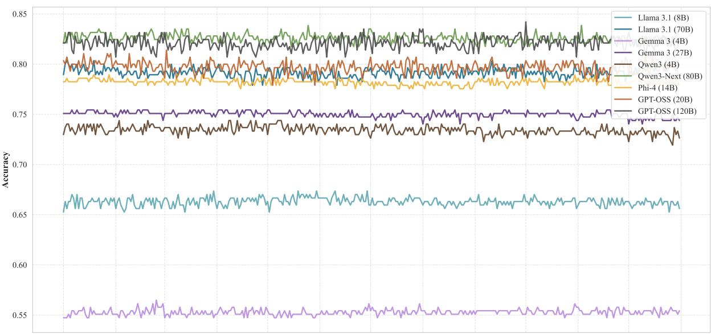

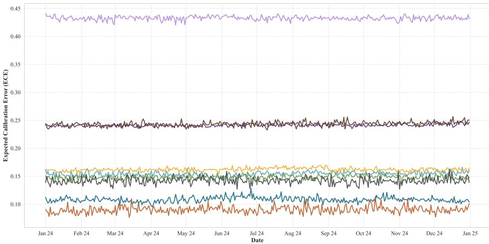  
Figure 11: Accuracy and ECE across different dates in 2024 for all models on MMLU.

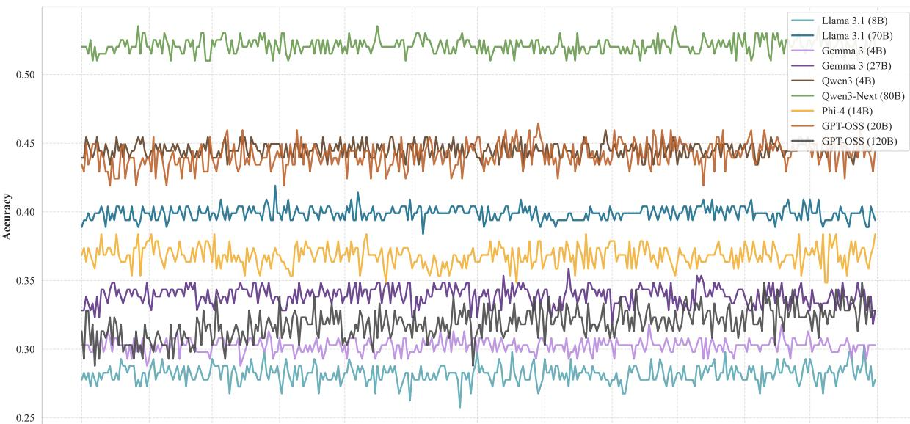

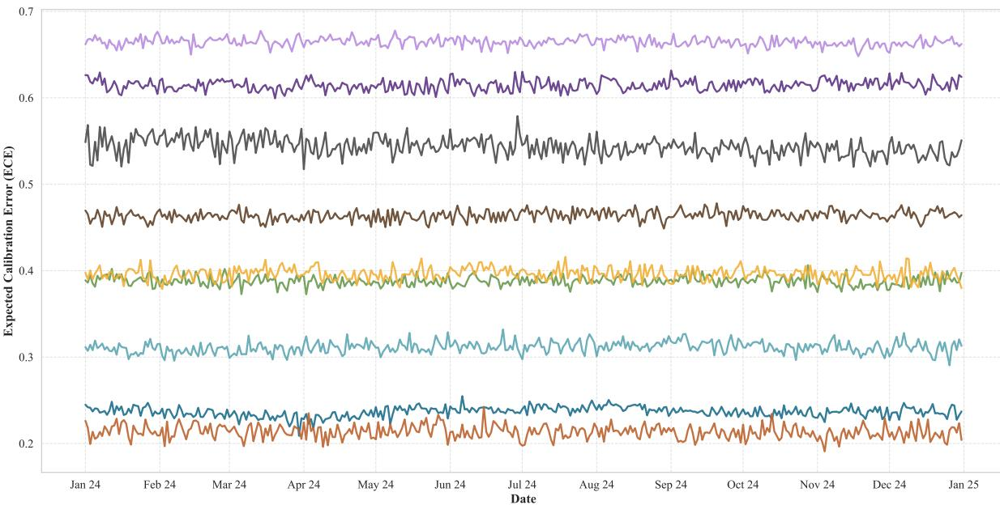  
Figure 12: Accuracy and ECE across different dates in 2024 for all models on GPQA.

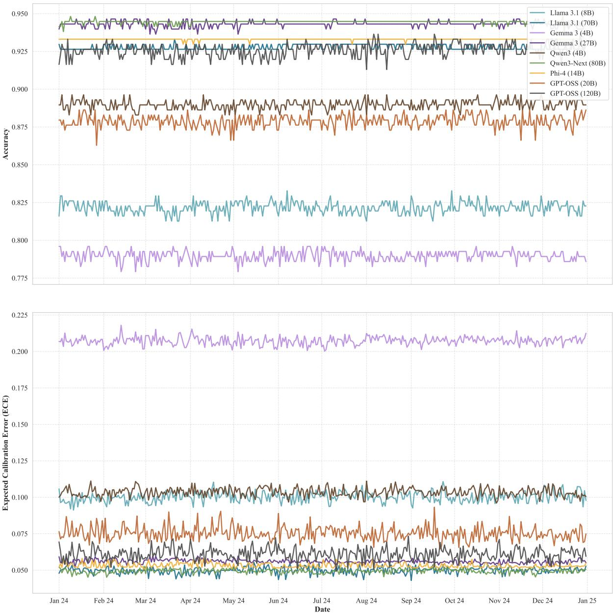  
Figure 13: Accuracy and ECE across different dates in 2024 for all models on ARC-Challenge.

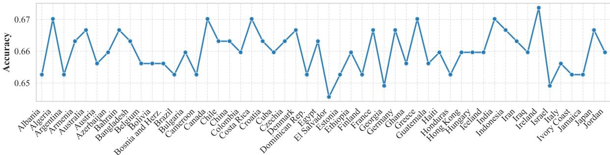

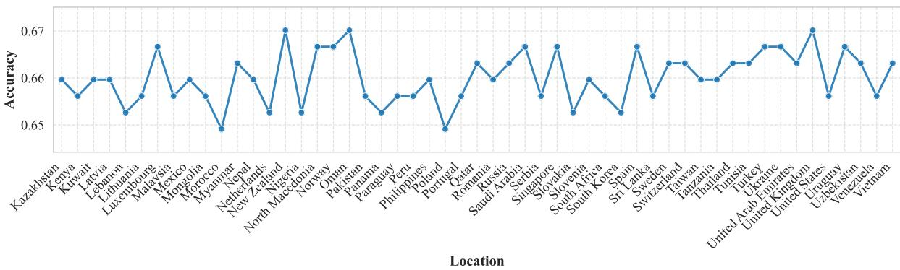

(a) Accuracy across different user locations for Llama 3.1 (8B) on MMLU.  
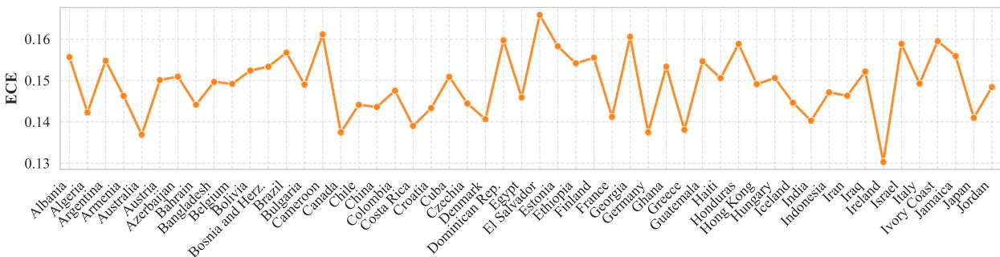

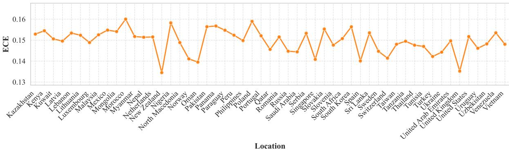  
(b) ECE across different user locations for Llama 3.1 (8B) on MMLU.  
Figure 14: Impact of different user locations in the system prompt on Llama 3.1 (8B) performance on MMLU.