# E-MOE: ENHANCED MIXTURE-OF-EXPERTS FOR NON-FACTORIZED DIFFUSION LANGUAGE MODELS

Arseny Ivanov1,2 Alexander Kolesov2,1 Alexander Korotin2,1

Ivan Oseledets1,2 Mikhail Goncharov1

1AXXX, Moscow, Russia 2Applied AI Institute, Moscow, Russia

## ABSTRACT

Masked diffusion models (MDMs) generate sequences by progressively unmasking several tokens per denoising step, but their reverse process is typically factorized over positions, limiting sample quality in the few-step regime where diffusion’s speed advantage over autoregressive decoding matters most. A recent line of work introduces a continuous Gaussian latent, trained as a variational autoencoder, to capture correlations across positions, but such approaches are prone to posterior collapse, where the latent is silently ignored. We propose Enhanced Mixtureof-Experts (E-MoE), which builds the reverse process as a mixture of factorized distributions over a discrete shared latent given by the expert-routing decisions of a Mixture-of-Experts (MoE) backbone, without increasing active parameters over the factorized baseline. Across synthetic multi-modal benchmarks, binarized MNIST, and LM1B, E-MoE improves few-step generation over factorized baselines.

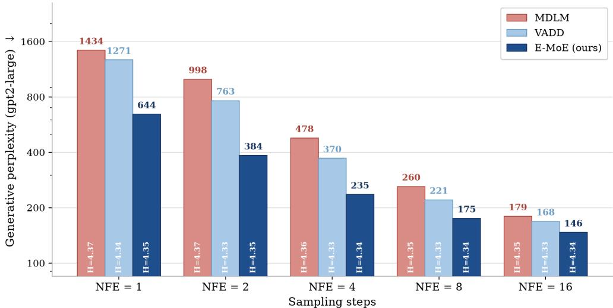  
Figure 1: Few-step generative perplexity on LM1B (lower is better, H = sample entropy). E-MoE gives markedly lower generative perplexity than both factorized MDLM (Sahoo et al., 2024) and continuous-latent VADD (Xie et al., 2026) for all NFEs 1–16, at matched sample entropy.

## 1 INTRODUCTION

Autoregressive (AR) language models (Vaswani et al., 2017; Brown et al., 2020; Yoo et al., 2026a) are common and widespread approach for language modeling. They factorize text along a fixed left-to-right order and generate one token per forward pass conditioned on previous tokens with causal attention. That ordering makes the likelihood exactly tractable, but it also makes decoding inherently sequential. Each token conditions on all previous ones, so a sequence of length L costs L forward passes that cannot be parallelized.

Recently, Masked Diffusion Models (MDM) (Austin et al., 2021; Lou et al., 2024; Sahoo et al., 2024; Shi et al., 2024) have suggested a different approach based on diffusion forward and backward processes with T steps. While the forward process gradually masks each token independently, the factorized model conditions on the whole sequence, with likelihood evaluated via bounds or estimators (Ivanov et al., 2026), and predicts multiple tokens per forward pass with bidirectional attention at the each of T steps of backward process. Thus, MDM recover a sequence of length L costs $\mathrm { T } < \mathrm { L }$ forward passes, allowing for using of parallelization.

In practice, MDM still need many unmasking steps to produce coherent text. One of the main reason is the factorization of a backward process. Although, model conditions on a whole sequence, it predicts an independent marginal distributions for every masked positions. Thereby, the factorization causes the absence of correlations between unmasked tokens obtained through a forward pass. Sampling several positions from these marginals treats them as conditionally independent and discards the dependencies between them (Liu et al., 2025), an error that grows with the number of tokens unmasked at once, precisely where parallel unmasking would pay off.

One way to overcome the factorization error is to consideration of shared latent variable (Xie et al., 2026), that models hidden joint representation of current context and predicted sequence. Existing instantiations (Xie et al., 2026; Shariatian et al., 2026; Zhou et al., 2026) take this latent to be continuous and train it with an auxiliary recognition network alongside MDM. The continuous structure of latent requires parametric prior, in practice a Gaussian, thereby not allowing for constructing more informative prior from data. The joint training of MDM with an additional recognition network implies the increasing of learnable parameters in the training stage. We ask whether such a latent can be obtained without restricting to fixed prior and joint training with an additional network. We positively answer to the question and model the reverse process over a discrete shared latent given by the expert-routing decisions of a mixture-of-experts (MoE) backbone (Shazeer et al., 2017; Fedus et al., 2022) - an architecture already used to scale MDM (Nie et al., 2025; Zhu et al., 2025a). The same router, evaluated on the noisy and on the clean sequence, serves as both the generative prior and the training-time variational posterior, so no recognition model is added and no prior over the latent has to be designed. Our contributions are as follows:

• Method. We propose Enhanced Mixture-of-Experts (E-MoE) for overcoming the factorization error, reusing a mixture of experts as a mixture offactorized distributions: the per-token and per-layer routing decisions an MoE backbone already computes serve as the discrete shared latent, at no extra parameters and no extra inference cost (Section 3).

• Training objective. We derive the evidence lower bound (ELBO) for this mixture-based reverse process, together with a tractable bound on its latent KL that reduces to a per-layer and per-token quantity computed from the router itself (Section 3).

• Empirical results. On synthetic multi-modal data, binarized MNIST and LM1B, E-MoE improves few-step generation over both a factorized baseline and a continuous-latent one at matched sample entropy, and its latent remains in use throughout training without warmup schedules or auxiliary losses (Section 5).

## 2 BACKGROUND

Notation. We denote a L-token sequence $\mathbf { x } : = ( \mathbf { x } ^ { 1 } , \dots , \mathbf { x } ^ { L } )$ , where $ { \mathbf { x } } ^ { \ell } : = \mathbf { 1 } _ { k }$ is a ’one-hot’ column vector with K positions and non-zero entry at k-th position. In terms of language modeling, K is a vocabulary size and the vocabulary is the set $\gamma : = \mathbf { \bar { \{ 1 } }  _ { k } \} _ { k = 1 } ^ { \mathrm { K } } ,$ where ’one-hot’ vector with non-zero entry at K-th position is referred to as special mask token m. Also, we introduce a masked subset of sequence x as $\mathcal { M } ( \mathbf { x } ) : = \{ \mathbf { x } ^ { \ell } : \mathbf { x } ^ { \ell } = \mathbf { \bar { 1 } } _ { \mathrm { K } } \} _ { \ell = 1 } ^ { L }$ . Assuming the sequences x0 are independent and sampled from a distribution $p _ { d a t a } ( \mathbf { x } _ { 0 } )$ , we train $p _ { \theta } ( \mathbf { x } _ { 0 } )$ to approximates it. We define $\bar { \mathrm { C a t } } ( \cdot ; \pi )$ as a categorical distribution over K positions with corresponding probabilities given $\pi \in \triangle ^ { \mathrm { K } }$ , where $\triangle ^ { \mathrm { K } }$ is the K-simplex. In particular, we introduce singular distribution $\pi _ { \mathbf { m } } : = \mathbf { 1 } _ { \mathrm { K } }$

Autoregressive (AR) language models use a sequential factorization $\begin{array} { r } { p _ { \theta } ( \mathbf { x } _ { 0 } ) = \prod _ { \ell = 1 } ^ { L } p _ { \theta } ( \mathbf { x } _ { 0 } ^ { \ell } \mid \mathbf { x } _ { 0 } ^ { < \ell } ) } \end{array}$ that lies at the heart of their model parameterized by a causal attention (Vaswani et al., 2017). However, sequential decoding is a bottleneck, so generation of L tokens requires L forward passes.

Masked Diffusion Models (MDM) (Sahoo et al., 2024; Shi et al., 2024; Ou et al., 2025) replace leftto-right decoding by a diffusion dynamics with forward and backward processes. The forward process gradually corrupts sequence $\mathbf { X } _ { s }$ to more masked $\mathbf { X } _ { t } .$ , being factorized over all L tokens independently:

$$
q ( \mathbf { x } _ { t } | \mathbf { x } _ { s } ) = \prod _ { \ell = 1 } ^ { L } q ( \mathbf { x } _ { t } ^ { \ell } | \mathbf { x } _ { s } ^ { \ell } ) = \prod _ { \ell = 1 } ^ { L } \mathbf { C a t } ( \mathbf { x } _ { t } ^ { \ell } ; \alpha _ { t | s } \mathbf { x } _ { s } ^ { \ell } + ( 1 - \alpha _ { t | s } ) \mathbf { m } ) ,\tag{1}
$$

where $0 \leq s \leq t \leq T$ and $\alpha _ { t | s } : = \alpha _ { t } / \alpha _ { s }$ is the ratio of decreasing schedules (Sahoo et al., 2024, MDLM). According to (Austin et al., 2021), the forward process has the related reverse is given by:

$$
q ( \mathbf { x } _ { s } | \mathbf { x } _ { t } , \mathbf { x } _ { 0 } ) = \prod _ { \ell = 1 } ^ { L } q ( \mathbf { x } _ { s } ^ { \ell } | \mathbf { x } _ { t } , \mathbf { x } _ { 0 } ^ { \ell } ) = \prod _ { \ell = 1 } ^ { L } \left\{ \begin{array} { l l } { \mathrm { C a t } ( \mathbf { x } _ { s } ^ { \ell } ; \mathbf { x } _ { t } ^ { \ell } ) } & { \mathbf { x } _ { t } ^ { \ell } \ne \mathbf { m } , } \\ { \mathrm { C a t } \left( \mathbf { x } _ { s } ^ { \ell } ; \frac { ( 1 - \alpha _ { s } ) \mathbf { m } + ( \alpha _ { s } - \alpha _ { t } ) \mathbf { x } _ { 0 } ^ { \ell } } { 1 - \alpha _ { t } } \right) } & { \mathbf { x } _ { t } ^ { \ell } = \mathbf { m } . } \end{array} \right.\tag{2}
$$

The same construction (2) is used for modeling a reverse process $p _ { \theta } ( \mathbf { x } _ { s } | \mathbf { x } _ { t } )$ , substituting not known a clean token $\mathbf { x } _ { 0 } ^ { \ell }$ by a model’s estimation $\mathbf { x } _ { \theta } ^ { \ell } \sim \bar { \mu } _ { \theta } ^ { \ell } ( \mathbf { x } _ { t } , t )$ with bidirectional attention over the whole $\mathbf { X } _ { t } .$ The trained reverse process unmasks sequence from $\mathbf { X } _ { t }$ to less masked $\mathbf { X } _ { s }$ , being parameterized by:

$$
p _ { \theta } \big ( \mathbf { x } _ { s } \big | \mathbf { x } _ { t } \big ) = \prod _ { \ell = 1 } ^ { L } p _ { \theta } \big ( \mathbf { x } _ { s } ^ { \ell } \big | \mathbf { x } _ { t } \big ) = \prod _ { \ell = 1 } ^ { L } q ( \mathbf { x } _ { s } ^ { \ell } \big | \mathbf { x } _ { t } , \mathbf { x } _ { \theta } ^ { \ell } \big ) .\tag{3}
$$

This factorization (3) makes all positions easy to sample in parallel, allowing for sampling L tokens in $T < L$ forward passes. Nevertheless, it creates the main modeling weakness: tokens sampled at the same denoising step $\mathbf { x } _ { s } ^ { \ell }$ and $\mathbf { x } _ { s } ^ { \ell ^ { \prime } }$ are not explicitly correlated. This issue means that $p _ { \theta } ( \mathbf { x } _ { s } \mid \mathbf { x } _ { t } )$ being a product of token-wise marginals, is a rank-one approximation of the true joint $p _ { d a t a } ( \mathbf { x } _ { 0 } )$ , and therefore cannot represent any dependence between the revealed tokens, see Fig. (2).

Mixture of marginals. One of the possible ways to overcome the weakness is to consider a shared latent variable that models connection between $\mathbf { X } _ { s }$ and $\mathbf { X } _ { t } ,$ , guiding the model to $p _ { d a t a }$ (Xie et al., 2026, VADD). Then, a non-factorized reverse process is defined by a mixture of factorized conditionals as:

$$
p _ { \theta } ( \mathbf { x } _ { s } \mid \mathbf { x } _ { t } ) = \int _ { \mathbf { z } } p _ { \theta } ( \mathbf { x } _ { s } \mid \mathbf { x } _ { t } , \mathbf { z } ) p ( \mathbf { z } ) d \mathbf { z } ,\tag{4}
$$

where $p ( \mathbf { z } )$ is a prior distribution with continuous latent variable $\mathbf { z } \in \mathbb { R } ^ { u }$ . The main idea of this approach is to give an opportunity for modeling $p _ { \theta } ( \mathbf { x } _ { s } \mid \mathbf { x } _ { t } , \mathbf { z } )$ as multiplication of factorized distributions $p _ { \theta } ( \bar { \mathbf { x } } _ { s } ^ { \ell } \mid \mathbf { x } _ { t } , \mathbf { z } )$ , while $p _ { \theta } ( \mathbf { x } _ { s } \mid \mathbf { x } _ { t } )$ remains non-factorized by integrating over z. VADD uses the standard Gaussian distribution $\dot { \mathcal { N } } ( \dot { 0 } , I _ { u \times u } )$ for prior and parameterize reverse process as:

$$
p _ { \theta } ( \mathbf { x } _ { s } | \mathbf { x } _ { t } ) = \mathbb { E } _ { p ( z ) } \prod _ { \ell = 1 } ^ { L } p _ { \theta } ( \mathbf { x } _ { s } ^ { \ell } \mid \mathbf { x } _ { t } , \mathbf { z } ) = \mathbb { E } _ { p ( z ) } \prod _ { \ell = 1 } ^ { L } \left\{ \begin{array} { l l } { \mathrm { C a t } ( \mathbf { x } _ { s } ^ { \ell } ; \mathbf { x } _ { t } ^ { \ell } ) , } & { \mathbf { x } _ { t } ^ { \ell } \ne \mathbf { m } ; } \\ { ~ } \\ { \mathrm { C a t } \biggl ( \mathbf { x } _ { s } ^ { \ell } ; \frac { ( 1 - \alpha _ { s } ) \mathbf { m } + ( \alpha _ { s } - \alpha _ { t } ) \mathbf { x } _ { \theta } ^ { \ell } } { 1 - \alpha _ { t } } \biggr ) , } & { \mathbf { x } _ { t } ^ { \ell } = \mathbf { m } . } \end{array} \right.
$$

where $\mathbf { x } _ { \theta } ^ { \ell } \sim \mu _ { \theta } ^ { \ell } ( \mathbf { x } _ { t } , \mathbf { z } , t )$ is the estimation of unknown clean token by the model. The training process of $\mu _ { \theta } ( \mathbf { x } _ { t } , \mathbf { z } , t )$ follows to ELBO optimization as in MDLM. Besides, VADD requires training of autoencoder (Kingma & Welling, 2013, VAE) for learning appropriate shared latent z by minimizing Kullback-Leibler (KL) divergence between fixed Gaussian prior $p ( \mathbf { z } )$ and learnable posterior $p _ { \phi } ( \mathbf { z } | \mathbf { x } _ { 0 } , \mathbf { x } _ { t } )$ . Thus, the total loss function for VADD $\mathcal { L } _ { \mathrm { v a d d } } ( \mathbf { x } _ { 0 } , \theta , \bar { \phi } , \lambda ) : = \mathcal { L } _ { \mathrm { v a d d } }$ is defined as:

$$
\mathcal { L } _ { \mathrm { v a d } } : = \mathbb { E } _ { q ( \cdot | \mathbf { x } _ { 0 } ) } \mathbb { E } _ { p _ { \phi } ( \cdot | \mathbf { x } _ { 0 } , \mathbf { x } _ { t } ) , t \sim [ 0 , 1 ] } \left[ \underbrace { \sum _ { \ell \in \mathcal { M } ( \mathbf { x } _ { t } ) } \frac { - \alpha _ { t } ^ { \prime } } { 1 - \alpha _ { t } } \log p _ { \theta } ( \mathbf { x } _ { 0 } ^ { \ell } | \mathbf { x } _ { t } , \mathbf { z } ) } _ { \mathrm { E I B O } } + \lambda \underbrace { \log \left( \frac { p _ { \phi } ( \mathbf { z } | \mathbf { x } _ { 0 } , \mathbf { x } _ { t } ) } { p ( \mathbf { z } ) } \right) } _ { \mathrm { K L } ( p ( \mathbf { z } ) | | p _ { \phi } ( \mathbf { z } | \mathbf { x } _ { 0 } , \mathbf { x } _ { t } ) ) } \right] .
$$

However, it is difficult to find appropriate prior for data in continuous case, without restricting to a Gaussian distribution and additional VAE model on training. To overcome this issue, we consider discrete latent space and special MoE architecture in the next section that allow to sort it out.

## 3 METHOD

We build the reverse process over a discrete shared latent. We first state the upper bound on the negative ELBO for such a process (§3.1). Then we realize the latent as the routing decisions an MoE backbone already computes (§3.2), and turn the bound into a training objective and a sampler (§3.3).

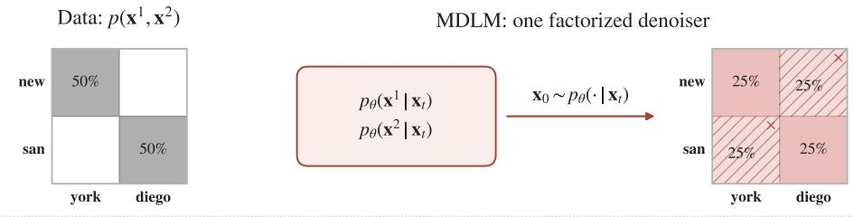

E-MoE: a mixture of factorized experts  
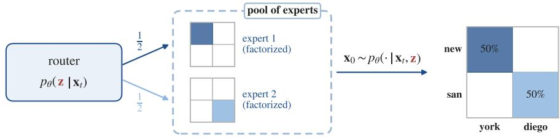  
Figure 2: Factorization error and mixture over expert routes. Top: a factorized reverse process can produce spurious pairings when multiple tokens are sampled at once. Bottom: the routing code $\mathbf { z } = \{ \mathbf { z } _ { d } \} _ { d = 1 } ^ { D }$ , with $\mathbf { z } _ { d } = ( \mathbf { z } _ { d } ^ { \bar { \ell } } \} _ { \ell = 1 } ^ { L }$ , specifies the expert assignment for every position across layers.

## 3.1 UPPER BOUND WITH DISCRETE SHARED LATENT

Although, MDLM and VADD follow to the consideration of continuous time $t \in [ 0 , 1 ]$ , we observe discrete time grid with time step $t _ { i } = i / \mathrm { T }$ in our approach, where T is number of diffusion steps. Moving to our method for overcoming of the factorization issue, we not only consider a discrete shared latent z instead of a continuous, but we also condition the prior $p _ { \theta } ( \mathbf { z } | \mathbf { x } _ { t _ { i } } )$ on the data $\mathbf { X } _ { t _ { i } }$ and learn it to be more appropriate for the data, rather than restricting it to a known distribution. Regardless of the changes, $p _ { \theta } ( \mathbf { x } _ { t _ { s } } | \mathbf { x } _ { t _ { i } } )$ is still the mixture of factorized marginals, but with a sum as:

$$
p _ { \theta } ( \mathbf { x } _ { t _ { s } } \mid \mathbf { x } _ { t _ { i } } ) = \sum _ { \mathbf { z } } p _ { \theta } ( \mathbf { z } \mid \mathbf { x } _ { t _ { i } } ) p _ { \theta } ( \mathbf { x } _ { t _ { s } } \mid \mathbf { x } _ { t _ { i } } , \mathbf { z } ) , \qquad p _ { \theta } ( \mathbf { x } _ { t _ { s } } \mid \mathbf { x } _ { t _ { i } } , \mathbf { z } ) = \prod _ { \ell = 1 } ^ { L } q \big ( \mathbf { x } _ { t _ { s } } ^ { \ell } \mid \mathbf { x } _ { t _ { i } } , \mathbf { x } _ { \theta } ^ { \ell } \big ) ,\tag{5}
$$

where $\mathbf { x } _ { \theta } ^ { \ell }$ is parametric approximation of clean token $\mathbf { x } _ { 0 } ^ { \ell }$ . Furthermore, using this form of the prior, we derive an upper bound for negative log-likelihood $\mathbb { E } _ { p _ { \mathrm { d a t a } } ( \mathbf { x } _ { 0 } ) } [ - \log p _ { \theta } ( \mathbf { x } _ { 0 } ) ]$ , that is also used as loss function for our method and postulated below with the corresponding proof in Appendix A.3:

Proposition 3.1 Let $i \in { \overline { { 1 , T } } }$ is a number ofdiffusion step and $\begin{array} { r } { t _ { i } : = \frac { i } { T } } \end{array}$ is a i-th time step. Let $p _ { d a t a } ( \pmb { x } _ { 0 } )$ ) is a data distribution ofL-length sequences and $p _ { \theta } ( \pmb { x } _ { 0 } )$ is its parametric estimation. Let $\mathbf { \boldsymbol { x } } _ { \theta } \sim \mu _ { \theta } ( \mathbf { \boldsymbol { x } } _ { t _ { i } } , t _ { i } )$ is a estimation of clean $\scriptstyle { \boldsymbol { x } } _ { 0 }$ and $\mathcal { M } ( \pmb { x } _ { t } )$ is a masked subset of $\mathbf { \boldsymbol { x } } _ { t }$ . Let $q _ { \theta } ( z | \boldsymbol { x } _ { t _ { i } } , \boldsymbol { x } _ { 0 } )$ and $p _ { \theta } ( \boldsymbol { z } | \boldsymbol { x } _ { t _ { i } } )$ are posterior and prior distributions at i-th step.

Then, the upper bound of negative log-likelihood $\mathbb { E } _ { p _ { d a t a ( x _ { 0 } ) } } [ - \log p _ { \theta } ( \pmb { x } _ { 0 } ) ]$ is given by:

$$
\mathbb { E } _ { p _ { d a t a } ( x _ { 0 } ) } \frac { 1 } { T } \sum _ { i = 1 } ^ { T } \mathbb { E } _ { q ( x _ { t _ { i } } | x _ { 0 } ) } \mathbb { E } _ { q _ { \theta } ( z | x _ { t _ { i } } , x _ { 0 } ) } [ \frac { - 1 } { t _ { i } } \sum _ { \ell \in \mathcal { M } ( x _ { t } ) } \log p _ { \theta } ( x _ { 0 } ^ { \ell } | x _ { t _ { i } } ^ { \ell } , z ) + T \log \frac { q _ { \theta } ( z | x _ { t _ { i } } , x _ { 0 } ) } { p _ { \theta } ( z | x _ { t _ { i } } ) } ]\tag{6}
$$

## 3.2 MIXTURE-OF-EXPERTS PARAMETERIZATION

To avoid a learning of additional models as VAE in VADD during the training stage, we instead use the routing decisions of a mixture-of-experts (MoE) model (Shazeer et al., 2017; Fedus et al., 2022). The main advantage of MoE architecture that latent is already inserted inside of the model by routing mechanism and is not an extra continuous vector required an additional training. This latent is the discrete choice of which expert, or sparse mixture of experts, should explain the unmasking step.

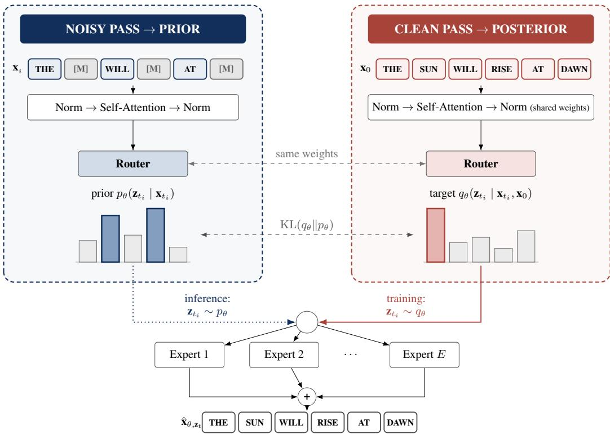  
Figure 3: Training stage: we model prior $p _ { \theta } ( \mathbf { z } _ { t _ { i } } | \mathbf { x } _ { t _ { i } } )$ and posterior $q _ { \theta } ( \mathbf { z } _ { t _ { i } } | \mathbf { x } _ { t _ { i } } , \mathbf { x } _ { 0 } )$ by the same router, unlike VADD. The router $\rho _ { \theta } ( \cdot , t _ { i } )$ takes as input a noisy sample $\mathbf { X } _ { t _ { i } }$ to approximate $p _ { \theta }$ in the noisy pass, and a concatenation of $\mathbf { X } _ { t _ { i } }$ and $\mathbf { X } _ { 0 }$ for $q _ { \theta }$ in the clean pass. Then, the experts return predictions for each masked $\mathbf { x } _ { t _ { i } } ^ { \ell }$ using appropriate $\mathbf { z } _ { t _ { i } }$ . Inference stage: we use only the noisy pass (Section 3.2).

MoE model is composed of E experts with D layers, where each e-th expert $\mu _ { \theta , e } ^ { \ell } ( \mathbf { x } _ { t _ { i } } , t _ { i } ) \in \triangle ^ { \mathrm { K } }$ estimates $\mathbf { x } _ { 0 } ^ { \ell }$ . Besides, there is a prior routing mechanism $\rho _ { \theta . d } ^ { \ell } ( \mathbf { x } _ { t _ { i } } , t _ { i } ) \in \triangle ^ { \mathrm { E } }$ that assigns which expert processes l-th token. Since each expert consists of D layers, we model a latent code z for a sequence $\mathbf { X } _ { t _ { i } }$ $\mathbf { z } : = \{ \mathbf { z } _ { d } \} _ { d = 1 } ^ { D }$ with $\dot { \mathbf { z } } _ { d } : = ( \mathbf { z } _ { d } ^ { 1 } , . . . , \mathbf { z } _ { d } ^ { L } )$ , where $\pmb { z } _ { d } ^ { \ell }$ is a latent code at d-th layer, meaning which expert is assigned by a routing mechanism for ℓ position in $\mathbf { X } _ { t _ { i } }$ . Since the prior distribution $q _ { \theta } ( \mathbf { z } | \mathbf { x } _ { t _ { i } } )$ might be rewritten as $\bar { q _ { \theta } } ( \{ \mathbf { z } _ { 1 } ^ { 1 } , . . . , \mathbf { z } _ { 1 } ^ { L } , . . . , \mathbf { z } _ { D } ^ { L } \} | \mathbf { x } _ { t _ { i } } )$ , we assume dependence between current and previous latent codes at the same positions and model $q _ { \theta } ( \mathbf { z } ^ { \ell } | _ { \mathbf { X } _ { t _ { i } } } )$ as $q _ { \theta } ( \mathbf { z } _ { D } ^ { \ell } | \mathbf { z } _ { < D } ^ { \ell } , \mathbf { x } _ { t _ { i } } ) q _ { \theta } ( \mathbf { z } _ { D - 1 } ^ { \ell } | \mathbf { z } _ { < D - 1 } ^ { \ell } , \mathbf { x } _ { t _ { i } } ) \cdot \ldots \cdot q _ { \theta } ( \mathbf { z } _ { 1 } ^ { L } | \mathbf { x } _ { t _ { i } } )$ , where $\mathbf { z } _ { < d } ^ { \ell } : = \{ \mathbf { z } _ { d - 1 } ^ { \ell } , . . . , \mathbf { z } _ { 1 } ^ { \ell } \}$ are latent codes for all previous layers of the same positions. To provide related target to this prior, we introduce the posterior routing $\dot { \rho } _ { \theta . d } ^ { \ell } ( \mathbf { x } _ { t _ { i } } , \mathbf { x } _ { 0 } , t _ { i } ) \dot { \in } \triangle ^ { \mathrm { E } }$ that assigns experts for each $\mathbf { x } _ { 0 } ^ { \ell }$ . Thus, using these routing decisions, we derive posterior and prior distributions via per-layer and per-token factorization as:

$$
\underbrace { p _ { \theta } ( \mathbf { z } | \mathbf { x } _ { t _ { i } } , \mathbf { x } _ { 0 } ) = \prod _ { d = 1 } ^ { D } \prod _ { \ell = 1 } ^ { L } p _ { \theta } ( \mathbf { z } _ { d } ^ { \ell } | \mathbf { z } _ { < d } ^ { \ell } , \mathbf { x } _ { t _ { i } } , \mathbf { x } _ { 0 } ) } _ { \mathrm { p o s t e r i o r } } , \quad \underbrace { q _ { \theta } ( \mathbf { z } | \mathbf { x } _ { t _ { i } } ) = \prod _ { d = 1 } ^ { D } \prod _ { \ell = 1 } ^ { L } q _ { \theta } ( \mathbf { z } _ { d } ^ { \ell } | \mathbf { z } _ { < d } ^ { \ell } , \mathbf { x } _ { t _ { i } } ) } _ { \mathrm { p r i o r } } .\tag{7}
$$

Since prior and posterior distributions has the equal factorization (7), KL divergence between them in (25) leads to a sum of KL per-layer and per-token. While prior is a categorical distribution that router outputs conditioned on $\mathbf { X } \theta$ at d-th layer, posterior is another categorical obtained by router with $\mathbf { X } _ { 0 }$ . Thus, the KL aligns experts assigned by router $\rho _ { \theta , d } ^ { \ell } ( \mathbf { x } _ { t _ { i } } , \mathbf { x } _ { 0 } , t _ { i } )$ for a clean sequence $\mathbf { X } _ { 0 }$ and $\rho _ { \theta , d } ^ { \ell } ( \mathbf { x } _ { t _ { i } } , t _ { i } )$ for its estimation at l-th position and d-th layer.

Figure 3 sums up our method. During the training stage, our model requires two forward passes. The first pass computes posterior distribution $p _ { \theta } ( \mathbf { z } | \mathbf { x } _ { t _ { i } } , \mathbf { x } _ { 0 } )$ via posterior routing-decision mechanism and provides an estimation $\mathbf { x } _ { \theta }$ by experts. The second pass computes related prior $q _ { \theta } ( \mathbf { z } | \mathbf { x } _ { t _ { i } } )$ . Importantly, prior and posterior in (7) use the same router parameters. The main training problem is therefore to align the route selected when the clean sample is available with the route selected from the corrupted sequence alone. During the sampling stage, our model use only prior $p _ { \theta } ( \mathbf { z } | \mathbf { x } _ { t _ { i } } )$

Algorithm 1 Training Algorithm 2 Sampling   
Require: Diffusion grid $t _ { i } = i / T ,$ , temperature τ. Require: Diffusion grid $t _ { i } = i / T _ { \mathrm { ~ } }$ , sequence length   
1: Initialize the experts and routers; $L .$   
2: repeat 1: Initialize $\mathbf { x } _ { t _ { T } } \gets ( \mathbf { m } , \dots , \mathbf { m } ) ;$   
3: Sample $\mathbf { x } _ { 0 } \sim p _ { \mathrm { d a t a } } , i \sim \mathrm { U n i f } \{ 1 , \dots , T \}$ 2: for $i = T , \ldots , 1$ do   
4: Sample $\mathbf { x } _ { t _ { i } } \sim q ( \mathbf { x } _ { t _ { i } } \mid \mathbf { x } _ { 0 } ) ;$ Route selection (prior):   
First pass (posterior): 3: Sample $\mathbf { z } \sim p _ { \boldsymbol { \theta } } ( \mathbf { z } \mid \mathbf { x } _ { t _ { i } } ) ;$   
5: Compute $\bar { \mathbf { \Lambda } } _ { l \theta } ( \mathbf { z } \mid \mathbf { x } _ { t _ { i } } , \mathbf { x } _ { 0 } )$ in equation 7; Reverse transition:   
6: Sample $\mathbf { z } \sim q _ { \theta } ( \mathbf { z } \mid \mathbf { x } _ { t _ { i } } , \mathbf { x } _ { 0 } )$ by equation 10; 4: Obtain $p _ { \theta } ( \mathbf { x } ^ { \ell } \mid \mathbf { x } _ { t _ { i } } ^ { \ell } , \mathbf { z } )$ from the experts;   
7: Sample $\mathbf { \boldsymbol { \mathsf { \varepsilon } } } _ { \theta } \sim \mu _ { \theta ( e ) } \bigl ( \mathbf { \boldsymbol { x } } _ { t _ { i } } , \mathbf { \boldsymbol { z } } , t _ { i } \bigr )$ ; 5: Sample $\mathbf { x } _ { t _ { i - 1 } } \sim \dot { p } _ { \theta } ( \cdot \mid \mathbf { x } _ { t _ { i } , \mathbf { z } } ) ;$   
Second pass (prior): 6: end for   
8: Compute $p _ { \theta } ( \mathbf { z } \mid \mathbf { x } _ { t _ { i } } )$ in equation 7; 7: return $\mathbf { x } _ { t _ { 0 } } .$   
9: Update θ using equation 9;   
10: until convergence

## 3.3 TRAINING AND SAMPLING

Loss function. As it mentioned before, we use (25) as the loss function for our method’s training. Here we only write this objective in the MoE parameterization of Section 3.2. For a fixed diffusion step i, the left term in (25) uses the experts through the routed mechanism as:

$$
\begin{array} { r } { \mathbf { x } _ { \theta } ^ { \ell } \sim \mu _ { \theta , e } ^ { \ell } ( \mathbf { x } _ { t _ { i } } , \mathbf { z } , t _ { i } ) , \qquad p _ { \theta } ( \mathbf { x } ^ { \ell } \mid \mathbf { x } _ { t _ { i } } ^ { \ell } , \mathbf { z } ) : = \mathrm { C a t } \big ( \mathbf { x } ^ { \ell } ; \mu _ { \theta , e } ^ { \ell } ( \mathbf { x } _ { t _ { i } } , \mathbf { z } , t _ { i } ) \big ) . } \end{array}
$$

Thus, conditioned on a sampled route z, the selected experts provide the token distributions that enter the left term in (25). The right term is the router-matching term. Using the factorization from (7), it becomes a sum of categorical KL divergences over all layers and positions, denoted as ${ \bf K L } _ { \mathrm { r o u t e } } { \mathrm { : } }$

$$
\mathbb { E } _ { q _ { \theta } } \left[ \log \frac { q \theta \big ( \cdot | \mathrm { \bf ~ x } _ { t _ { i } } , \mathrm { \bf ~ x } _ { 0 } \big ) } { p _ { \theta } \big ( \cdot | \mathrm { \bf ~ x } _ { t _ { i } } \big ) } \right] = \sum _ { d , \ell } \mathrm { K L } \big ( \mathrm { C a t } \big ( \cdot ; \rho _ { \theta , d } ^ { \ell } ( { \bf x } _ { t _ { i } } , { \bf x } _ { 0 } , t _ { i } ) \big ) \big | \big | \mathrm { C a t } \big ( \cdot ; \rho _ { \theta , d } ^ { \ell } ( { \bf x } _ { t _ { i } } , t _ { i } ) \big ) \big ) : = \mathrm { { K L } } _ { \mathrm { r o u t } }\tag{8}
$$

Substituting the right term in (25) by (8), we give our training objective $\mathcal { L } _ { \mathrm { E \mathrm { - } M o E } } : = \mathcal { L } _ { \mathrm { E \mathrm { - } M o E } } ( \theta , \mathbf { x } _ { 0 } )$ as

$$
\mathcal { L } _ { \mathrm { E \cdot M o E } } : = \mathbb { E } _ { p _ { \mathrm { d a t a } } ( \mathbf { x } _ { 0 } ) , t _ { i } } \mathbb { E } _ { q ( \mathbf { x } _ { t _ { i } } | \mathbf { x } _ { 0 } ) } \left[ \mathbb { E } _ { q _ { \theta } ( \mathbf { z } | \mathbf { x } _ { t _ { i } } , \mathbf { x } _ { 0 } ) } \frac { - 1 } { t _ { i } } \sum _ { \ell \in M ( \mathbf { x } _ { t _ { i } } ) } \log p _ { \theta } ( \mathbf { x } _ { 0 } ^ { \ell } \mid \mathbf { x } _ { t _ { i } } ^ { \ell } , \mathbf { z } ) + \mathrm { T \cdot K L } _ { \mathrm { r o u t } } \right] ,\tag{9}
$$

where $t _ { i }$ is sampled from uniform over integers $\overline { { 1 , T } }$ . The training algorithm is described in Algo. 1.

Gumbel-Softmax. Since our shared latent z is discrete, to provide learning and sampling from prior and posterior routings, we use Gumbel-Softmax trick with straight-through estimator (Jang et al., 2016) instead of non-differentiable argmax. In accordance with the trick, we draw i.i.d. Gumbel noise $g _ { d , e } ^ { \ell } ,$ compute logits of posterior $\rho _ { \theta , d } ^ { \ell } ( \mathbf { x } _ { t _ { i } } , \mathbf { x } _ { 0 } , t _ { i } )$ and define relaxed routing $\widetilde { \mathbf { z } } _ { d } ^ { \ell } \in \Delta ^ { E }$ as:

$$
\widetilde { z } _ { d } ^ { \ell } = \frac { \exp \left( \left( \log \rho _ { \theta , d } ^ { \ell } ( \mathbf { x } _ { t _ { i } } , \mathbf { x } _ { 0 } , t _ { i } ) _ { e } + g _ { d , e } ^ { \ell } \right) / \tau \right) } { \sum _ { j = 1 } ^ { \mathrm { E } } \exp \left( \left( \log \rho _ { \theta , d , j } ^ { \ell } ( \mathbf { x } _ { t _ { i } } , \mathbf { x } _ { 0 } , t _ { i } ) + g _ { d , j } ^ { \ell } \right) / \tau \right) } ,\tag{10}
$$

where $\tau > 0$ is a temperature parameter controlling how close the relaxed route is to a one-hot expert assignment. Having denoted selected top-k experts as $S _ { d } ^ { \ell } : = \mathrm { T o p K } ( \widetilde { \mathbf { z } } _ { d } ^ { \ell } , k )$ , we renormalize them and sample a number of expert at d-th layer for $\mathbf { x } _ { t _ { i } } ^ { \ell }$ as:

$$
\mathbf { z } _ { d } ^ { \ell } \sim \frac { \widetilde { z } _ { d , e } ^ { \ell } \mathbb { 1 } [ e \in S _ { d } ^ { \ell } ] } { \sum _ { j \in S _ { d } ^ { \ell } } \widetilde { z } _ { d , j } ^ { \ell } }\tag{11}
$$

Sampling. During the inference stage, we sample latent from the prior $p _ { \theta } ( \mathbf { z } \mid \mathbf { x } _ { t _ { i } } )$ and then compute $\mathbf { X } _ { \theta }$ during the same forward pass, thereby one NFE requires one forward pass. See details in Algo. 2.

<table><tr><td></td><td>Factorized</td><td colspan="2">Mixture of factorized distributions</td></tr><tr><td></td><td>MDLM (Sahoo et al., 2024)  $\prod _ { \ell } p _ { \theta } ( \mathbf { x } ^ { \ell } \mid \mathbf { x } _ { t } )$ </td><td>VADD (Xie et al., 2026)  $\int p ( \mathbf { z } ) \prod _ { \rho } p _ { \theta } ( \mathbf { x } ^ { \ell } \mid \mathbf { x } _ { t } , \mathbf { z } ) d \mathbf { z }$ </td><td>E-MoE (ours) (§3)  $\sum _ { \mathbf { z } } p _ { \boldsymbol { \theta } } ( \mathbf { z } \mid \mathbf { x } _ { t } ) \prod _ { \ell } p _ { \boldsymbol { \theta } } ( \mathbf { x } ^ { \ell } \mid \mathbf { x } _ { t } , \mathbf { z } )$ </td></tr><tr><td>Latent space</td><td></td><td>Rd</td><td>{1, ... , E}L×D</td></tr><tr><td>Latent is chosen</td><td></td><td>once per sequence</td><td>per token and layer</td></tr><tr><td>Learned, data-dependent prior</td><td>X</td><td>X</td><td></td></tr><tr><td>Posterior q comes from</td><td></td><td>qφ from VAE (additional net)</td><td>qθ from the same net</td></tr><tr><td>No extra active parameters</td><td></td><td>X</td><td>√</td></tr><tr><td>Forward-passes per training step</td><td>1</td><td>2</td><td>2</td></tr><tr><td>Forward-passes per sampling step</td><td>1</td><td>1</td><td>1</td></tr></table>

Table 1: A summary of the design choices behind E-MoE and its two baselines. VADD needs a continuous latent with a fixed Gaussian prior and a separate recognition network, while E-MoE reuses the routing decisions the backbone already makes, so it trains as simply as the factorized baseline.

## 4 RELATED WORK

Distillation of MDM. One line of work keeps the factorized parameterization of MDLM (Sahoo et al., 2024) and shortens the sampling trajectory instead. SDTT (Deschenaux & Gulcehre, 2025) distills MDMs into itself progressively, reducing the number of sampling steps by a factor of two at each stage. DUO (Sahoo et al., 2025; Deschenaux et al., 2026) derives a duality between uniform-state discrete and Gaussian diffusion and uses it to port consistency distillation to the discrete setting. DiMO (Zhu et al., 2025b) matches the teacher in a single forward pass and IDLM (Li et al., 2026a) trains the student adversarially in the inverse direction. However, these methods require a pre-trained model, whereas we train our model from scratch, therefore, these works are out of scope.

Overcoming the factorization error. We ask instead whether a model can express correlated steps natively. DCD (Liu et al., 2025) augments the denoiser with a copula model that restores the joint structure among simultaneously denoised positions, and CoDD (Li et al., 2026b) replaces the factorized output with a tractable correlated layer. Another group changes the process itself: ReDi (Yoo et al., 2026b) re-couples the trajectories so as to reduce the conditional total correlation, and FLDD (Bartosh et al., 2026) learns the forward process with the same goal. However, these methods either incur significant computational overhead or rely on post-training fine-tuning. Closest to us is VADD (Xie et al., 2026), which introduces a shared Gaussian latent. As Table 1 makes precise, E-MoE keeps this mixture view, but its latent is the routing decision the backbone already computes: the prior is learned from data and no recognition network is needed.

## 5 EXPERIMENTS

In this section, we evaluate E-MoE on three tasks: two-dimensional toy examples (Section 5.1), pixellevel image generation (Section 5.2), and text generation (Section 5.3). Throughout, we compare three models – a factorized MDLM (Sahoo et al., 2024) baseline, VADD (Xie et al., 2026), and E-MoE – matched in backbone size, optimizer and training budget, so any gain comes from the routing mechanism alone. The experimental details are in Appendix B.

## 5.1 TWO-DIMENSIONAL TOY EXAMPLES

A factorized reverse process can only represent per-position marginals, so at low NFE it can combine independently-sampled, individually-plausible values into a joint sample that does not exist in the data. We test whether E-MoE’s shared discrete latent fixes this on two synthetic 2-D densities where the failure is easy to see and measure.

Setup. We generate n = 20,000 points per density, discretized into V = 50 tokens per coordinate (L = 2). 8-modes places M = 8 Gaussian clusters. A factorized sampler can combine two clusters’ coordinates into a spurious mode that lies between them and matches neither. Swiss-roll instead places mass on a thin 1-D spiral. The analogous failure fills the area around the manifold. The experimental setup details are provided in Appendix B.1.

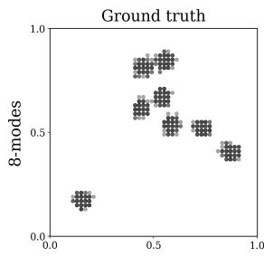

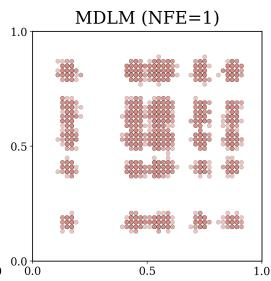

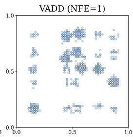

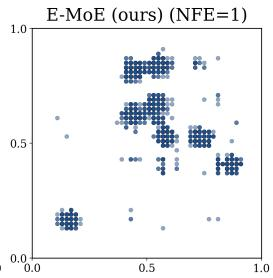

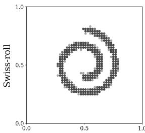

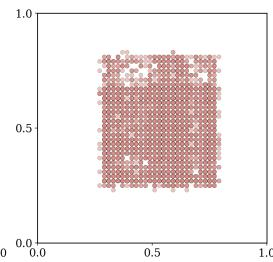

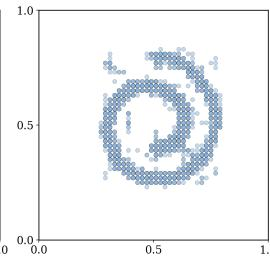

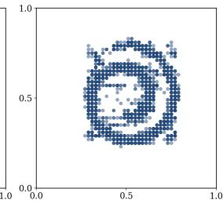  
Figure 4: Generation results on 2-D toy examples. Ground truth and generations of MDLM (Sahoo et al., 2024), VADD (Xie et al., 2026), and E-MoE at NFE = 1 on 8-modes and swiss-roll. Full sweeps over NFE ∈ {1, 2, 8, 32} are in Appendix C.1.

Results. Figure 4 shows exactly the mode-averaging failure predicted above: at NFE = 1, MDLM’s independently-sampled coordinates scatter across a blurred grid on 8-modes and fill the entire disk on Swiss-roll, while E-MoE stays concentrated on the eight true clusters and traces the spiral manifold. Table 2 confirms this quantitatively: both VADD and E-MoE substantially improve validity over factorized MDLM in the few-step regime, with E-MoE consistently outperforming VADD on 8-modes and remaining competitive on Swiss-roll. These toy experiments show that E-MoE’s shared discrete latent captures cross-token correlation and breaks the factorization barrier.

Table 2: Validity (↑) of generated samples across sampling steps (NFE). Values are averaged over 3 seeds. Best per column in bold.
<table><tr><td></td><td colspan="6">8-modes</td><td colspan="6">Swiss-roll</td></tr><tr><td>Model</td><td>NFE = 1</td><td>2</td><td>4</td><td>8</td><td>16</td><td>32</td><td>NFE = 1</td><td>2</td><td>4</td><td>8</td><td>16</td><td>32</td></tr><tr><td>MDLM</td><td>37.7</td><td>68.1</td><td>84.2</td><td>90.9</td><td>94.9</td><td>97.0</td><td>49.3</td><td>73.1</td><td>86.5</td><td>91.9</td><td>95.2</td><td>96.9</td></tr><tr><td>VADD</td><td>91.8</td><td>95.3</td><td>97.3</td><td>97.7</td><td>98.5</td><td>98.5</td><td>93.8</td><td>95.9</td><td>97.1</td><td>97.6</td><td>98.2</td><td>98.4</td></tr><tr><td>E-MoE (ours)</td><td>94.4</td><td>96.6</td><td>97.7</td><td>98.3</td><td>98.6</td><td>98.7</td><td>90.3</td><td>92.6</td><td>95.7</td><td>96.4</td><td>98.6</td><td>97.9</td></tr></table>

## 5.2 PIXEL-LEVEL IMAGE GENERATION

We next evaluate E-MoE on binarized MNIST, following the VADD evaluation setup (Xie et al., 2026). Images are padded to $3 2 \times 3 2$ , with each pixel represented as a binary token under masked diffusion. All three models use comparable UNet (Song et al., 2021) backbones and the same training budget. We report bits-per-dimension (BPD), the average negative log-likelihood per dimension in bits. Full implementation and training details are provided in Appendix B.2.

Results. At low NFE, factorized MDLM produces fragmented strokes and globally inconsistent digit shapes, whereas both VADD and E-MoE already generate coherent samples. This mirrors the same factorization effect observed on the toy distributions, now in a much higher-dimensional discrete space. Table 3 further shows that E-MoE achieves the best test BPD among the three methods while essentially matching VADD in parameter count. Full generation results across sampling steps are shown in Appendix C.2.

Table 3: Test Bits-perdimension (↓) and total parameter count on Binarized-MNIST.
<table><tr><td>Model</td><td>BPD↓</td><td>Params</td></tr><tr><td>MDLM</td><td>0.077</td><td>2.07M</td></tr><tr><td>VADD</td><td>0.064</td><td>2.50M</td></tr><tr><td>E-MoE (Ours)</td><td>0.062</td><td>2.49M</td></tr></table>

<table><tr><td rowspan="2"></td><td colspan="2">MDLM</td><td colspan="2">SEDD</td><td colspan="2">VADD</td><td colspan="2">BD3-LM</td><td colspan="2">E-MoE (ours)</td></tr><tr><td>NFE Gen-PPL↓</td><td>H↑</td><td>Gen-PPL↓</td><td>H↑</td><td>Gen-PPL↓</td><td>H↑</td><td> ${ \mathrm { G e n - P P L } } \downarrow$ </td><td> $H \uparrow$ </td><td> $\mathrm { G e n - P P L \downarrow }$ </td><td>H↑</td></tr><tr><td>1</td><td>1433.8</td><td>4.37</td><td>1578.8</td><td>4.37</td><td>1270.8</td><td>4.34</td><td>一</td><td></td><td>643.8</td><td>4.35</td></tr><tr><td>2</td><td>997.5</td><td>4.37</td><td>1059.3</td><td>4.37</td><td>763.2</td><td>4.33</td><td></td><td></td><td>383.7</td><td>4.35</td></tr><tr><td>4</td><td>477.8</td><td>4.36</td><td>456.0</td><td>4.34</td><td>370.5</td><td>4.33</td><td></td><td></td><td>235.4</td><td>4.34</td></tr><tr><td>8</td><td>260.5</td><td>4.35</td><td>243.4</td><td>4.33</td><td>220.7</td><td>4.33</td><td> $1 1 3 0 . 6 ^ { 1 6 }$ </td><td>4.34</td><td>174.9</td><td>4.34</td></tr><tr><td>16</td><td>179.4</td><td>4.35</td><td>166.7</td><td>4.33</td><td>168.4</td><td>4.33</td><td> $1 0 0 4 . 1 ^ { 8 }$ </td><td>4.32</td><td>146.4</td><td>4.34</td></tr><tr><td>32</td><td>148.6</td><td>4.35</td><td>136.1</td><td>4.33</td><td>139.6</td><td>4.32</td><td> $7 9 0 . 7 ^ { 4 }$ </td><td>4.29</td><td>135.1</td><td>4.34</td></tr><tr><td>64</td><td>134.1</td><td>4.35</td><td>125.6</td><td>4.32</td><td>127.4</td><td>4.32</td><td></td><td>一</td><td>128.1</td><td>4.33</td></tr><tr><td>128</td><td>126.3</td><td>4.35</td><td>118.5</td><td>4.32</td><td>118.4</td><td>4.32</td><td></td><td>一</td><td>126.3</td><td>4.34</td></tr><tr><td>AR</td><td></td><td></td><td></td><td>67.97</td><td>(H = 4.32) at NFE = 128</td><td></td><td></td><td></td><td></td><td></td></tr></table>

Table 4: Few-step generation on LM1B. Generative perplexity (Gen-PPL) and sample entropy H (data: 4.32), averaged over 2000 samples with categorical sampling in fp64. Superscripts mark BD3-LM models trained with different block sizes. Best per row in bold.

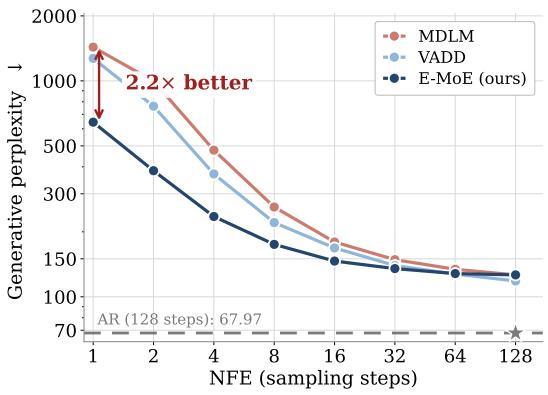

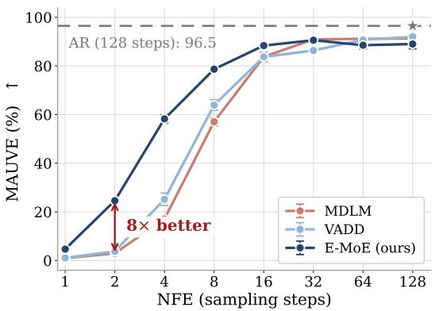  
Figure 5: Two views of the same LM1B sweep. Left: Generative Perplexity (↓). Right: MAUVE (↑)

## 5.3 TEXT GENERATION

We now turn to unconditional text generation, following common practice for diffusion language models. We adopt the DUO setup (Sahoo et al., 2025) and train on LM1B (Chelba et al., 2014) with sequence length 128 for 1M steps at global batch 512, so every model sees 65B tokens. All models share the same small DiT backbone, and E-MoE uses as many active parameters per token as MDLM. We compare the factorized MDLM (Sahoo et al., 2024), SEDD (Lou et al., 2024) and BD3-LM (Arriola et al., 2025) (trained with different block sizes), VADD (Xie et al., 2026) with a continuous Gaussian latent, and E-MoE with a discrete shared latent. Full implementation LM1B text generation details are given in Appendix B.3.

Results. The gain is largest where the factorization barrier binds (Table 4, Figure 5). At NFE = 1 and 2, E-MoE lowers generative perplexity by 2–2.6× relative to every baseline, at the same sample entropy (4.34–4.35). MAUVE separates the models even more: at NFE = 2 E-MoE reaches 24.6% against 3.0% for MDLM and 3.8% for VADD. The advantage shrinks as NFE grows, as expected once each step unmasks few tokens. A discrete shared latent makes few-step generation markedly better at no extra cost in active parameters. Ablation, additional results, and generated text-samples are given in Appendix C.3.

## 6 DISCUSSION

We develop an MDM based on a mixture of factorized marginals conditioned on discrete latent codes drawn from an informative data prior, which is learned with no extra models, using the same network as for clean token prediction, in order to model correlations between predicted tokens. Marginalizing over routes couples tokens unmasked in the same step, which helps break the factorization barrier: E-MoE improves few-step generation on synthetic densities, binarized MNIST and LM1B, lowering generative perplexity on LM1B by at least 2× at one and two steps.

## AI USE STATEMENT

AI tools assisted with polishing the text and checking proofs. All AI-assisted work was reviewed by the authors, who take the responsibility for the final content for this work.

## ETHICS STATEMENT

This work focuses on methodological developments for discrete diffusion language models and does not involve human subjects, personally identifiable information, or sensitive data. The experiments use synthetic benchmarks and publicly available datasets. We are not aware of any specific ethical risks beyond those associated with the general use of machine learning methods, and we have aimed to report the methodology, experimental setup, and results transparently.

## REPRODUCIBILITY STATEMENT

To ensure reproducibility, We provide the experimental details in Appendices B, C and the code to reproduce the conducted experiments in the supplementary materials.

## REFERENCES

Marianne Arriola, Aaron Gokaslan, Justin T Chiu, Zhihan Yang, Zhixuan Qi, Jiaqi Han, Subham Sekhar Sahoo, and Volodymyr Kuleshov. Block diffusion: Interpolating between autoregressive and diffusion language models. In International Conference on Learning Representations, 2025.

Jacob Austin, Daniel D Johnson, Jonathan Ho, Daniel Tarlow, and Rianne Van Den Berg. Structured denoising diffusion models in discrete state-spaces. Advances in neural information processing systems, 34:17981–17993, 2021.

Grigory Bartosh, Teodora Pandeva, Sushrut Karmalkar, and Javier Zazo. Forward-learned discrete diffusion: Learning how to noise to denoise faster, 2026. URL https://arxiv.org/abs/ 2605.18204.

Tom Brown, Benjamin Mann, Nick Ryder, Melanie Subbiah, Jared D Kaplan, Prafulla Dhariwal, Arvind Neelakantan, Pranav Shyam, Girish Sastry, Amanda Askell, et al. Language models are few-shot learners. Advances in neural information processing systems, 33:1877–1901, 2020.

Ciprian Chelba, Tomas Mikolov, Mike Schuster, Qi Ge, Thorsten Brants, Phillipp Koehn, and Tony Robinson. One billion word benchmark for measuring progress in statistical language modeling. INTERSPEECH, pp. 2635–2639, 2014.

Justin Deschenaux and Caglar Gulcehre. Beyond autoregression: Fast llms via self-distillation through time, 2025. URL https://arxiv.org/abs/2410.21035.

Justin Deschenaux, Caglar Gulcehre, and Subham Sekhar Sahoo. The diffusion duality, chapter II: \$\psi\$-samplers. In The Fourteenth International Conference on Learning Representations, 2026. URL https://openreview.net/forum?id=RSIoYWIzaP.

William Fedus, Barret Zoph, and Noam Shazeer. Switch transformers: Scaling to trillion parameter models with simple and efficient sparsity, 2022. URL https://arxiv.org/abs/2101. 03961.

Arseny Ivanov, Sergei Kholkin, Vladislav Gromadskii, Grigoriy Ksenofontov, Ivan Oseledets, and Alexander Korotin. Tube: Tangent upper bound on evidence for discrete diffusion language models, 2026. URL https://arxiv.org/abs/2605.24292.

Eric Jang, Shixiang Gu, and Ben Poole. Categorical reparameterization with gumbel-softmax. arXiv preprint arXiv:1611.01144, 2016.

Diederik P Kingma and Max Welling. Auto-encoding variational bayes. arXiv preprint arXiv:1312.6114, 2013.

Diederik P. Kingma, Tim Salimans, Ben Poole, and Jonathan Ho. Variational diffusion models, 2023. URL https://arxiv.org/abs/2107.00630.

David Li, Nikita Gushchin, Dmitry Abulkhanov, Eric Moulines, Ivan Oseledets, Maxim Panov, and Alexander Korotin. Idlm: Inverse-distilled diffusion language models, 2026a. URL https: //arxiv.org/abs/2602.19066.

Ian Li, Zilei Shao, Benjie Wang, Rose Yu, Guy Van den Broeck, and Anji Liu. Breaking the factorization barrier in diffusion language models. arXiv preprint arXiv:2603.00045, 2026b.

Anji Liu, Oliver Broadrick, Mathias Niepert, and Guy Van den Broeck. Discrete copula diffusion, 2025. URL https://arxiv.org/abs/2410.01949.

Aaron Lou, Chenlin Meng, and Stefano Ermon. Discrete diffusion modeling by estimating the ratios of the data distribution, 2024. URL https://arxiv.org/abs/2310.16834.

Shen Nie, Fengqi Zhu, Zebin You, Xiaolu Zhang, Jingyang Ou, Jun Hu, Jun Zhou, Yankai Lin, Ji-Rong Wen, and Chongxuan Li. Large language diffusion models, 2025. URL https:// arxiv.org/abs/2502.09992.

Jingyang Ou, Shen Nie, Kaiwen Xue, Fengqi Zhu, Jiacheng Sun, Zhenguo Li, and Chongxuan Li. Your absorbing discrete diffusion secretly models the conditional distributions of clean data. In International Conference on Learning Representations, volume 2025, pp. 64972–65009, 2025.

Krishna Pillutla, Swabha Swayamdipta, Rowan Zellers, John Thickstun, Sean Welleck, Yejin Choi, and Zaid Harchaoui. MAUVE: Measuring the gap between neural text and human text using divergence frontiers. In Advances in Neural Information Processing Systems, volume 34, pp. 4816–4828, 2021.

Subham Sahoo, Marianne Arriola, Yair Schiff, Aaron Gokaslan, Edgar Marroquin, Justin Chiu, Alexander Rush, and Volodymyr Kuleshov. Simple and effective masked diffusion language models. Advances in Neural Information Processing Systems, 37:130136–130184, 2024.

Subham Sekhar Sahoo, Justin Deschenaux, Aaron Gokaslan, Guanghan Wang, Justin T Chiu, and Volodymyr Kuleshov. The diffusion duality. In Forty-second International Conference on Machine Learning, 2025. URL https://openreview.net/forum?id=9P9Y8FOSOk.

Dario Shariatian, Alain Durmus, Umut Simsekli, and Stefano Peluchetti. Latent-augmented discrete diffusion models (ladd). In ICML 2026 Workshop on Structured Probabilistic Inference & Generative Modeling, May 2026.

Noam Shazeer, Azalia Mirhoseini, Krzysztof Maziarz, Andy Davis, Quoc Le, Geoffrey Hinton, and Jeff Dean. Outrageously large neural networks: The sparsely-gated mixture-of-experts layer, 2017. URL https://arxiv.org/abs/1701.06538.

Jiaxin Shi, Kehang Han, Zhe Wang, Arnaud Doucet, and Michalis Titsias. Simplified and generalized masked diffusion for discrete data. Advances in neural information processing systems, 37: 103131–103167, 2024.

Yang Song, Jascha Sohl-Dickstein, Diederik P Kingma, Abhishek Kumar, Stefano Ermon, and Ben Poole. Score-based generative modeling through stochastic differential equations. In International Conference on Learning Representations, 2021. URL https://openreview.net/forum? id=PxTIG12RRHS.

Ashish Vaswani, Noam Shazeer, Niki Parmar, Jakob Uszkoreit, Llion Jones, Aidan N Gomez, Łukasz Kaiser, and Illia Polosukhin. Attention is all you need. Advances in neural information processing systems, 30, 2017.

Tianyu Xie, Shuchen Xue, Zijin Feng, Tianyang Hu, Jiacheng Sun, Zhenguo Li, and Cheng Zhang. Variational autoencoding discrete diffusion with enhanced dimensional correlations modeling. In The Fourteenth International Conference on Learning Representations, 2026. URL https: //openreview.net/forum?id=yh7MV2V0ba.

Jaehoon Yoo, Wonjung Kim, Floor Eijkelboom, Chanhyuk Lee, Nicholas M. Boffi, Seunghoon Hong, and Jinwoo Kim. Self-conditioned flow map language models via fixed-point flows, 2026a. URL https://arxiv.org/abs/2607.00714.

Jaehoon Yoo, Wonjung Kim, and Seunghoon Hong. Redi: Rectified discrete flow. Advances in Neural Information Processing Systems, 38:81651–81683, 2026b.

Cai Zhou, Chenxiao Yang, Yi Hu, Chenyu Wang, Chubin Zhang, Muhan Zhang, Lester Mackey, Tommi Jaakkola, Stephen Bates, and Dinghuai Zhang. Coevolutionary continuous discrete diffusion: Make your diffusion language model a latent reasoner. In Forty-third International Conference on Machine Learning, 2026.

Fengqi Zhu, Zebin You, Yipeng Xing, Zenan Huang, Lin Liu, Yihong Zhuang, Guoshan Lu, Kangyu Wang, Xudong Wang, Lanning Wei, Hongrui Guo, Jiaqi Hu, Wentao Ye, Tieyuan Chen, Chenchen Li, Chengfu Tang, Haibo Feng, Jun Hu, Jun Zhou, Xiaolu Zhang, Zhenzhong Lan, Junbo Zhao, Da Zheng, Chongxuan Li, Jianguo Li, and Ji-Rong Wen. Llada-moe: A sparse moe diffusion language model, 2025a. URL https://arxiv.org/abs/2509.24389.

Yuanzhi Zhu, Xi Wang, Stéphane Lathuilière, and Vicky Kalogeiton. Di[M]o: Distilling masked diffusion models into one-step generator. arXiv preprint arXiv:2503.15457, 2025b.

## A THEORETICAL RESULTS AND PROOFS

Appendix A.1 derives the masked-diffusion ELBO of Section 2. Appendices $_ { \mathrm { A } . 2 }$ and A.3 prove Propositions 1 and 2, which extend it to E-MoE’s mixture parameterization and give the objective equation 9.

## A.1 ELBO FOR MASKED DIFFUSION MODELS

We derive equation 1, equation 2, equation 3 and the resulting ELBO from the absorbing kernel. Everything factorizes over positions, so we fix ℓ and drop it where unambiguous. We write $\langle \pi , \mathbf { v } \rangle$ for the mass that $\operatorname { C a t } ( \cdot ; \pi )$ puts on a one-hot v, and take $\alpha _ { t }$ strictly decreasing with $\alpha _ { 0 } = 1 , \alpha _ { 1 } = 0$

## A.1.1 FORWARD MARGINALS

The kernel of equation 1 is $q ( \mathbf { x } _ { t } ^ { \ell } \mid \mathbf { x } _ { s } ^ { \ell } ) = \mathrm { C a t } ( \mathbf { x } _ { t } ^ { \ell } ; \alpha _ { t \mid s } \mathbf { x } _ { s } ^ { \ell } + ( 1 - \alpha _ { t \mid s } ) \mathbf { m } )$ . Setting $\mathbf { x } _ { s } ^ { \ell } = \mathbf { m }$ gives $\alpha _ { t | s } \mathbf { m } + ( 1 - \alpha _ { t | s } ) \mathbf { m } = \mathbf { m }$ , so m is absorbing. Marginalizing the intermediate state,

$$
\begin{array} { l } { { \displaystyle q ( { \bf x } _ { t } ^ { \ell } \mid { \bf x } _ { 0 } ^ { \ell } ) = \sum _ { { \bf x } _ { s } ^ { \ell } } q ( { \bf x } _ { t } ^ { \ell } \mid { \bf x } _ { s } ^ { \ell } ) q ( { \bf x } _ { s } ^ { \ell } \mid { \bf x } _ { 0 } ^ { \ell } ) = \alpha _ { s } \left[ \alpha _ { t \mid s } { \bf x } _ { 0 } ^ { \ell } + ( 1 - \alpha _ { t \mid s } ) { \bf m } \right] + ( 1 - \alpha _ { s } ) { \bf m } } \ ~ } \\ { { \displaystyle ~ = \alpha _ { s } \alpha _ { t \mid s } { \bf x } _ { 0 } ^ { \ell } + \left[ \alpha _ { s } ( 1 - \alpha _ { t \mid s } ) + 1 - \alpha _ { s } \right] { \bf m } = \mathrm { C a t } ( { \bf x } _ { t } ^ { \ell } ; \alpha _ { t } { \bf x } _ { 0 } ^ { \ell } + ( 1 - \alpha _ { t } ) { \bf m } ) } , } \end{array}\tag{12}
$$

where the first line uses supp $q ( \mathbf { x } _ { s } ^ { \ell } \mid \mathbf { x } _ { 0 } ^ { \ell } ) = \{ \mathbf { x } _ { 0 } ^ { \ell } , \mathbf { m } \}$ and the absorbing property, and the last step uses $\alpha _ { s } \alpha _ { t | s } = \alpha _ { t }$ . Hence each position is masked independently with probability $1 - \alpha _ { t } .$ , and $\alpha _ { 1 } = 0$ makes $q ( \mathbf { x } _ { 1 } \mid \mathbf { x } _ { 0 } )$ the point mass on the fully masked sequence.

## A.1.2 REVERSE POSTERIOR

By Bayes’ rule, $q ( \mathbf { x } _ { s } ^ { \ell } \mid \mathbf { x } _ { t } ^ { \ell } , \mathbf { x } _ { 0 } ^ { \ell } ) = q ( \mathbf { x } _ { t } ^ { \ell } \mid \mathbf { x } _ { s } ^ { \ell } ) q ( \mathbf { x } _ { s } ^ { \ell } \mid \mathbf { x } _ { 0 } ^ { \ell } ) / q ( \mathbf { x } _ { t } ^ { \ell } \mid \mathbf { x } _ { 0 } ^ { \ell } )$ ). If $\mathbf { x } _ { t } ^ { \ell } \neq \mathbf { m }$ then $\mathbf { x } _ { t } ^ { \ell } = \mathbf { x } _ { 0 } ^ { \ell }$ , and the numerator vanishes unless ${ \bf x } _ { s } ^ { \ell } = { \bf x } _ { t } ^ { \ell }$ , since m is absorbing:

$$
q ( \mathbf { x } _ { s } ^ { \ell } \mid \mathbf { x } _ { t } ^ { \ell } \neq \mathbf { m } , \mathbf { x } _ { 0 } ^ { \ell } ) = \mathrm { C a t } ( \mathbf { x } _ { s } ^ { \ell } ; \mathbf { x } _ { t } ^ { \ell } ) .\tag{13}
$$

If $\mathbf { x } _ { t } ^ { \ell } = \mathbf { m }$ then $\mathbf { x } _ { s } ^ { \ell } \in \{ \mathbf { x } _ { 0 } ^ { \ell } , \mathbf { m } \}$ and, with equation 12 in the denominator,

$$
q ( \mathbf { x } _ { s } ^ { \ell } = \mathbf { x } _ { 0 } ^ { \ell } \mid \mathbf { x } _ { t } ^ { \ell } = \mathbf { m } , \mathbf { x } _ { 0 } ^ { \ell } ) = { \frac { \left( 1 - \alpha _ { t \mid s } \right) \alpha _ { s } } { 1 - \alpha _ { t } } } = { \frac { \alpha _ { s } - \alpha _ { t } } { 1 - \alpha _ { t } } } , \qquad q ( \mathbf { x } _ { s } ^ { \ell } = \mathbf { m } \mid \mathbf { x } _ { t } ^ { \ell } = \mathbf { m } , \mathbf { x } _ { 0 } ^ { \ell } ) = { \frac { 1 - \alpha _ { s } } { 1 - \alpha _ { t } } } ,\tag{14}
$$

which sum to 1. Together equation 13 and equation 14 are equation 2.

## A.1.3 REVERSE MODEL

Replacing $\mathbf { x } _ { 0 } ^ { \ell }$ in equation 2 by a prediction $\mathbf { x } _ { \theta } ^ { \ell } ( \mathbf { x } _ { t } , t ) \in \triangle ^ { K }$ computed from the whole noisy sequence gives equation 3. Following Sahoo et al. (2024) we impose

$$
\langle \mathbf { x } _ { \theta } ^ { \ell } ( \mathbf { x } _ { t } , t ) , \mathbf { m } \rangle = 0 , \qquad \mathbf { x } _ { \theta } ^ { \ell } ( \mathbf { x } _ { t } , t ) = \mathbf { x } _ { t } ^ { \ell } \ \mathrm { i f } \ \mathbf { x } _ { t } ^ { \ell } \neq \mathbf { m } .\tag{15}
$$

The second condition makes the ℓ-th factor of equation 3 equal equation 13 at unmasked positions; the first makes it put mass $( 1 - \alpha _ { s } ) / ( 1 - \alpha _ { t } )$ on m at masked positions, matching equation 14. Only the event that a masked position is revealed can therefore contribute to a KL between q and pθ.

## A.1.4 DISCRETE-TIME ELBO

Fix a grid $0 = t _ { 0 } < \cdot \cdot \cdot < t _ { T } = 1$ and write $s = t _ { i - 1 } , t = t _ { i } , a _ { i } : = \frac { \alpha _ { t _ { i - 1 } } - \alpha _ { t _ { i } } } { 1 - \alpha _ { t _ { i } } } .$

$$
\begin{array} { r l } & { - \log p _ { \theta } ( \mathbf { x } _ { 0 } ) \ \leq \underbrace { \mathbb { E } _ { q } \bigl [ - \log p _ { \theta } ( \mathbf { x } _ { 0 } \mid \mathbf { x } _ { t _ { 1 } } ) \bigr ] } _ { \mathcal { L } _ { \mathrm { r e c o n } } } + \underbrace { \mathrm { K L } \bigl ( q ( \mathbf { x } _ { t _ { T } } \mid \mathbf { x } _ { 0 } ) \| p _ { \theta } ( \mathbf { x } _ { t _ { T } } ) \bigr ) } _ { \mathcal { L } _ { \mathrm { p r i o r } } } } \\ & { + \underbrace { \sum _ { i = 2 } ^ { T } \mathbb { E } _ { q } \mathrm { K L } \bigl ( q ( \mathbf { x } _ { t _ { i - 1 } } \mid \mathbf { x } _ { t _ { i } } , \mathbf { x } _ { 0 } ) \| p _ { \theta } ( \mathbf { x } _ { t _ { i - 1 } } \mid \mathbf { x } _ { t _ { i } } ) \bigr ) } _ { \mathcal { L } _ { \mathrm { d i f f } } } \qquad \mathrm { ( A p p e n d i x ~ A . 2 ) } , } \end{array}\tag{16}
$$

where $\mathcal { L } _ { \mathrm { p r i o r } } = 0$ because $\alpha _ { 1 } = 0$ makes both arguments the fully masked point mass. The per-step KL evaluates to

$$
\begin{array} { r l r } {  { \mathrm { K L } ( q ( \mathbf { x } _ { s } \mid \mathbf { x } _ { t } , \mathbf { x } _ { 0 } ) \mid p \rho ( \mathbf { x } _ { s } \mid \mathbf { x } _ { t } ) ) } } \\ & { = \sum _ { t = 1 } ^ { L } \mathrm { K L } \big ( q ( \mathbf { x } _ { s } ^ { \varepsilon } \mid \mathbf { x } _ { t } , \mathbf { x } _ { 0 } ) \mid \big \Vert p \rho ( \mathbf { x } _ { s } ^ { \varepsilon } \mid \mathbf { x } _ { t } ) \big ) } & { \mathrm { b o t h ~ s i d e s ~ f a c t o r i z e ~ o v e r ~ } \ell } \\ & { = \sum _ { \ell \in \mathcal { M } ( \mathbf { x } _ { s } ^ { \ell } ) } \mathrm { K L } \big ( q ( \mathbf { x } _ { s } ^ { \varepsilon } \mid \mathbf { x } _ { t } , \mathbf { x } _ { 0 } ) \big \Vert p \rho ( \mathbf { x } _ { s } ^ { \ell } \mid \mathbf { x } _ { t } ) \big ) } & { \mathbf { x } _ { \ell } ^ { \varepsilon } = \mathbf { x } _ { \ell } ^ { \varepsilon } \mathrm { o n ~ } \ell \not \in \mathcal { M } \mathrm { ~ b y ~ c q u a t i o n ~ } 1 \Sigma } \\ & { = \sum _ { \ell \in \mathcal { M } ( \mathbf { x } _ { s } ) } [ a _ { i } \log \frac { a _ { i } } { a _ { i } \langle \mathbf { x } _ { \ell } ^ { \ell } , \mathbf { x } _ { 0 } ^ { \ell } \rangle } + ( 1 - a _ { i } ) \log \frac { 1 - a _ { i } } { 1 - a _ { i } } ] } & { \mathrm { b y ~ c q u a t i o n ~ } 1 4 \mathrm { ~ a n d ~ } \langle \mathbf { x } _ { \ell } ^ { \ell } , \mathbf { m } \rangle = 0 } \\ & { = - a _ { i } \sum _ { \ell \in \mathcal { M } ( \mathbf { x } _ { 0 } ) } \log \big \langle \mathbf { x } _ { \ell } ^ { \ell } , \mathbf { x } _ { 0 } ^ { \ell } \big \rangle . } \end{array}\tag{17}
$$

Since $\alpha _ { t _ { 0 } } = 1$ , the $i = 1$ term of equation 16 equals equation 17 with $a _ { 1 } = 1$ , so

$$
\mathcal { L } _ { T } ( \mathbf { x } _ { 0 } , \theta ) = \sum _ { i = 1 } ^ { T } \mathbb { E } _ { q ( \mathbf { x } _ { t _ { i } } | \mathbf { x } _ { 0 } ) } \left[ \frac { \alpha _ { t _ { i - 1 } } - \alpha _ { t _ { i } } } { 1 - \alpha _ { t _ { i } } } \sum _ { \ell \in \mathcal { M } ( \mathbf { x } _ { t _ { i } } ) } - \log \left. \mathbf { x } _ { \theta } ^ { \ell } ( \mathbf { x } _ { t _ { i } } , t _ { i } ) , \mathbf { x } _ { 0 } ^ { \ell } \right. \right] .\tag{18}
$$

## A.1.5 CONTINUOUS-TIME LIMIT

Abbreviate the inner sum of equation 18 as

$$
G _ { \theta } ( \mathbf { x } _ { t } , t ) : = \sum _ { \ell \in \mathcal { M } ( { \bf x } _ { t } ) } \log \big \langle \mathbf { x } _ { \theta } ^ { \ell } ( \mathbf { x } _ { t } , t ) , \mathbf { x } _ { 0 } ^ { \ell } \big \rangle \ \leq \ 0 , \qquad \mathrm { s o } \qquad \mathcal { L } _ { T } = - \sum _ { i = 1 } ^ { T } \frac { \alpha _ { t _ { i - 1 } } - \alpha _ { t _ { i } } } { 1 - \alpha _ { t _ { i } } } \mathbb { E } _ { q } \big [ G _ { \theta } ( \mathbf { x } _ { t _ { i } } , t _ { i } ) \big ] .\tag{19}
$$

Take $t _ { i } = i / T$ and let $T \to \infty ;$

$$
\alpha _ { t _ { i - 1 } } - \alpha _ { t _ { i } } = - \frac { \alpha _ { t _ { i } } ^ { \prime } } { T } + o \big ( \frac { 1 } { T } \big )
$$

$$
( \alpha _ { t } { \mathrm { ~ d i f f e r e n t i a b l e } } )\tag{20}
$$

$$
{ \mathcal { L } } _ { T } = \sum _ { i = 1 } ^ { T } { \frac { 1 } { T } } { \frac { \alpha _ { t _ { i } } ^ { \prime } } { 1 - \alpha _ { t _ { i } } } } \mathbb { E } _ { q } [ G _ { \theta } ( \mathbf { x } _ { t _ { i } } , t _ { i } ) ] + o ( 1 ) \qquad { \mathrm { ( i n t o ~ e q u a t i o n ~ 1 9 ) } }\tag{21}
$$

$$
\mathcal { L } _ { \infty } = \int _ { 0 } ^ { 1 } \frac { \alpha _ { t } ^ { \prime } } { 1 - \alpha _ { t } } \mathbb { E } _ { q ( \mathbf { x } _ { t } | \mathbf { x } _ { 0 } ) } [ G _ { \theta } ( \mathbf { x } _ { t } , t ) ] d t
$$

(Riemann sum)

(22)

with $\mathcal { L } _ { \infty } \geq 0$ since $\alpha _ { t } ^ { \prime } < 0$ and $G _ { \theta } \leq 0 .$ . Expanding $G _ { \theta }$ recovers the ELBO term of ${ \mathcal { L } } _ { \mathrm { v a d d } }$ in Section 2 with z removed. The product form entered only once, in the second line of equation 17; Appendix A.3 repeats that step for a reverse model that is a mixture of such products.

## A.2 PROOF OF LEMMA 1

Lemma 1: Upper bound for NLL For any discretization $t _ { 0 } < \cdots < t _ { n }$ with $\boldsymbol { x } _ { t _ { 0 } } = \boldsymbol { x } ,$

$$
\mathbb { E } _ { p _ { d a t a } ( \boldsymbol { x } _ { 0 } ) } [ - \log p _ { \theta } ( \boldsymbol { x } _ { 0 } ) ] \le \mathbb { E } _ { p _ { d a t a } ( \boldsymbol { x } _ { 0 } ) } \sum _ { i = 1 } ^ { T } \mathrm { K L } \big ( q ( \boldsymbol { x } _ { t _ { i - 1 } } \mid \boldsymbol { x } _ { t _ { i } } , \boldsymbol { x } _ { 0 } ) \big | \big | p _ { \theta } ( \boldsymbol { x } _ { t _ { i - 1 } } \mid \boldsymbol { x } _ { t _ { i } } ) \big ) .\tag{23}
$$

## Proof.

1) We derive an upper bound for negative log-likelihood $- \log p _ { \theta } ( \mathbf { x } _ { 0 } )$ , using the following:

$$
\begin{array} { r } { - \log p _ { \theta } ( \mathbf { x } _ { 0 } ) = - \log \int _ { \mathbf { z } } p _ { \theta } ( \mathbf { x } _ { 0 } , \mathbf { z } ) d \mathbf { z } = - \log \int _ { \mathbf { z } } p _ { \theta } ( \mathbf { x } _ { 0 } , \mathbf { z } ) \frac { q ( \mathbf { z } | \mathbf { x } _ { 0 } ) } { q ( \mathbf { z } | \mathbf { x } _ { 0 } ) } d \mathbf { z } = - \mathbb { E } _ { q ( \mathbf { z } | \mathbf { x } _ { 0 } ) } \log \frac { p _ { \theta } ( \mathbf { x } _ { 0 } , \mathbf { z } ) } { q ( \mathbf { z } | \mathbf { x } _ { 0 } ) } } \end{array}
$$

Then, using Jensen inequality: $\begin{array} { r } { - \log p _ { \theta } ( \mathbf { x } _ { 0 } ) = - \mathbb { E } _ { q ( \mathbf { z } | \mathbf { x } _ { 0 } ) } \log \frac { p _ { \theta } ( \mathbf { x } _ { 0 } , \mathbf { z } ) } { q ( \mathbf { z } | \mathbf { x } _ { 0 } ) } \le - \log \mathbb { E } _ { q ( \mathbf { z } | \mathbf { x } _ { 0 } ) } \frac { p _ { \theta } ( \mathbf { x } _ { 0 } , \mathbf { z } ) } { q ( \mathbf { z } | \mathbf { x } _ { 0 } ) } } \end{array}$

2) Since we consider diffusion process, then latent z is a set of intermediate values between data and full-mask state as $\left\{ \mathbf { x } _ { t _ { 1 } } , . . . , \mathbf { x } _ { t _ { T } } \right\}$ , where $\mathbf { x } _ { t _ { 0 } } = \mathbf { x } _ { 0 }$ . Then, rewrite the last inequality via this notation:

$$
- \log p _ { \theta } ( \mathbf { x } _ { 0 } ) \leq - \int q ( \mathbf { x } _ { t _ { 1 } } , . . . , \mathbf { x } _ { t _ { T } } | \mathbf { x } _ { 0 } ) \big [ \log p _ { \theta } ( \mathbf { x } _ { 0 } , \mathbf { x } _ { t _ { 1 } } , . . . , \mathbf { x } _ { t _ { T } } ) - \log q ( \mathbf { x } _ { t _ { 1 } } , . . . , \mathbf { x } _ { t _ { T } } | \mathbf { x } _ { 0 } ) \big ] d \mathbf { x } _ { t _ { 1 } } . . . d \mathbf { x } _ { t _ { T } }
$$

Since the diffusion process is Markovian, then we rewrite the last expression using this property:

$$
- \log p _ { \theta } ( \mathbf { x } _ { 0 } ) \leq - \int \prod _ { i = 1 } ^ { T } q ( \mathbf { x } _ { t _ { i } } | \mathbf { x } _ { t _ { i - 1 } } ) [ \log p _ { \theta } ( \mathbf { x } _ { t _ { T } } ) + \sum _ { i = 1 } ^ { T } \log p _ { \theta } ( \mathbf { x } _ { t _ { i - 1 } } | \mathbf { x } _ { t _ { i } } ) - \sum _ { i = 1 } ^ { T } \log q ( \mathbf { x } _ { t _ { i } } | \mathbf { x } _ { t _ { i - 1 } } ) ] d \mathbf { x } _ { t _ { 1 } } \dots d \mathbf { x } _ { t _ { T } }
$$

3) Rewriting $q ( \mathbf { x } _ { t _ { i } } \mid \mathbf { x } _ { t _ { i - 1 } } )$ via Bayes’ rule in terms of $q ( \mathbf { x } _ { t _ { i } } \mid \mathbf { x } _ { 0 } ) , q ( \mathbf { x } _ { t _ { i - 1 } } \mid \mathbf { x } _ { t _ { i } } , \mathbf { x } _ { 0 } ) , q ( \mathbf { x } _ { t _ { i - 1 } } \mid \mathbf { x } _ { 0 } )$ and assuming $q ( \mathbf { x } _ { t _ { 1 } } | \mathbf { x } _ { 0 } ) \approx 1$ and telescoping the resulting ratio over i collapses this to

$$
- \log p _ { \theta } ( \mathbf { x _ { 0 } } ) \ \leq \ - \mathbb { E } _ { q ( \mathbf { x } _ { t _ { 1 } } , \dots , \mathbf { x } _ { t _ { T } } | \mathbf { x _ { 0 } } ) } \Big [ \log \frac { p \big ( \mathbf { x } _ { t _ { T } } \big ) } { q \big ( \mathbf { x } _ { t _ { T } } \mid \mathbf { x _ { 0 } } \big ) } + \sum _ { i = 1 } ^ { T } \log \frac { p _ { \theta } \big ( \mathbf { x } _ { t _ { i - 1 } } \mid \mathbf { x } _ { t _ { i } } \big ) } { q \big ( \mathbf { x } _ { t _ { i - 1 } } \mid \mathbf { x } _ { t _ { i } } , \mathbf { x } _ { 0 } \big ) } \Big ) \Big ] .\tag{24}
$$

Since the first term is $\mathrm { K L } ( q ( \mathbf { x } _ { t _ { T } } \mid \mathbf { x } _ { 0 } ) \Vert p ( \mathbf { x } _ { t _ { T } } ) ) = 0$ (both sides equal the fully-masked prior), so:

$$
- \log p _ { \theta } ( \mathbf { x } _ { 0 } ) \leq \sum _ { i = 1 } ^ { T } \mathrm { K L } \left( q ( \mathbf { x } _ { t _ { i - 1 } } \mid \mathbf { x } _ { t _ { i } } , \mathbf { x } _ { 0 } ) \parallel p _ { \theta } ( \mathbf { x } _ { t _ { i - 1 } } \mid \mathbf { x } _ { t _ { i } } ) \right)
$$

Applying the expectation over $p _ { d a t a } ( \mathbf { x } _ { 0 } )$ we get the statement:

$$
\mathbb { E } _ { p _ { d a t a } ( \mathbf { x } _ { 0 } ) } [ - \log p _ { \theta } ( \mathbf { x } _ { 0 } ) ] \leq \mathbb { E } _ { p _ { d a t a } ( \mathbf { x } _ { 0 } ) } \sum _ { i = 1 } ^ { T } \mathbf { K L } \left( q ( \mathbf { x } _ { t _ { i - 1 } } \mid \mathbf { x } _ { t _ { i } } , \mathbf { x } _ { 0 } ) \parallel p _ { \theta } ( \mathbf { x } _ { t _ { i - 1 } } \mid \mathbf { x } _ { t _ { i } } ) \right) .
$$

## A.3 PROOF OF PROPOSITION 3.1

Proposition 3.1 Let $i \in { \overline { { 1 , T } } }$ is a number ofdiffusion step and $\begin{array} { r } { t _ { i } : = \frac { i } { T } } \end{array}$ is a i-th time step. Let $p _ { d a t a } ( { \pmb x } _ { 0 } )$ is a data distribution ofL-length sequences and $p _ { \theta } ( \pmb { x } _ { 0 } )$ is its parametric estimation. Let $\mathbf { \boldsymbol { x } } _ { \theta } \sim \mu _ { \theta } ( \mathbf { \boldsymbol { x } } _ { t _ { i } } , t _ { i } )$ is a estimation of clean x0 and $\mathcal { M } ( \pmb { x } _ { t } )$ is a masked subset of $\mathbf { \boldsymbol { x } } _ { t }$ . Let $p _ { \theta } ( z | \mathbf { x } _ { t _ { i } } , \mathbf { x } _ { 0 } )$ and $q _ { \theta } ( \boldsymbol { z } | \mathbf { x } _ { t _ { i } } )$ are posterior and prior distributions at i-th step.

Then, the upper bound of negative log-likelihhod $\mathbb { E } _ { p _ { d a t a ( { \boldsymbol { x } } _ { 0 } ) } } [ - \log p _ { \theta } ( { \boldsymbol { x } } _ { 0 } ) ]$ ] is given by:

$$
\mathbb { E } _ { p _ { d a t a } ( x _ { 0 } ) } \frac { 1 } { T } \sum _ { i = 1 } ^ { T } \mathbb { E } _ { q ( x _ { t _ { i } } | x _ { 0 } ) } \mathbb { E } _ { q _ { \theta } ( z | x _ { t _ { i } } , x _ { 0 } ) } [ \frac { - 1 } { t _ { i } } \sum _ { \ell \in M ( x _ { t } ) } \log p _ { \theta } ( x _ { 0 } ^ { \ell } | x _ { t _ { i } } ^ { \ell } , z ) + T \log \frac { q _ { \theta } ( z | x _ { t _ { i } } , x _ { 0 } ) } { p _ { \theta } ( z | x _ { t _ { i } } ) } ]\tag{25}
$$

## Proof.

Lemma 1 has already shown that the negative log-likelihood is upper bounded by the sum of per-step KL divergences

$$
\operatorname { K L } \big ( q ( \mathbf { x } _ { t _ { i - 1 } } \mid \mathbf { x } _ { t _ { i } } , \mathbf { x } _ { 0 } ) \big \| p _ { \theta } ( \mathbf { x } _ { t _ { i - 1 } } \mid \mathbf { x } _ { t _ { i } } ) \big ) .
$$

Thus, it remains to upper bound this KL for the mixture reverse model and then substitute the result back into Lemma 1.

1) We first derive a lower bound on $\log p _ { \theta } ( \mathbf { x } _ { t _ { i - 1 } } \mid \mathbf { x } _ { t _ { i } } )$ . For readability, fix a time step i and introduce the auxiliary route distribution

$$
r _ { i } ( \mathbf { z } ) : = q _ { \theta } ( \mathbf { z } \mid \mathbf { x } _ { t _ { i } } , \mathbf { x } _ { 0 } ) .
$$

The generative route distribution used by the prior path is $p _ { \theta } ( \mathbf { z } \mid \mathbf { x } _ { t _ { i } } , \mathbf { x } _ { \theta } )$ . Using Jensen’s inequality,

$$
\begin{array} { r l } { \log p _ { \theta } ( \mathbf { x } _ { t _ { i - 1 } } \mid \mathbf { x } _ { t _ { i } } ) = \log \displaystyle \sum _ { \mathbf { z } } p _ { \theta } ( \mathbf { x } _ { t _ { i - 1 } } , \mathbf { z } \mid \mathbf { x } _ { t _ { i } } ) } & { } \\ { = \log \displaystyle \sum _ { \mathbf { z } } r _ { i } ( \mathbf { z } ) \frac { p _ { \theta } ( \mathbf { x } _ { t _ { i - 1 } } , \mathbf { z } \mid \mathbf { x } _ { t _ { i } } ) } { r _ { i } ( \mathbf { z } ) } } & { } \\ { \geq \mathbb { E } _ { r _ { i } ( \mathbf { z } ) } \left[ \log \frac { p _ { \theta } ( \mathbf { x } _ { t _ { i - 1 } } , \mathbf { z } \mid \mathbf { x } _ { t _ { i } } ) } { r _ { i } ( \mathbf { z } ) } \right] . } \end{array}\tag{26}
$$

Now we expand the joint term as

$$
\begin{array} { r l } & { \quad p _ { \theta } ( \mathbf { x } _ { t _ { i - 1 } } , \mathbf { z } \mid \mathbf { x } _ { t _ { i } } ) = p _ { \theta } ( \mathbf { x } _ { t _ { i - 1 } } \mid \mathbf { x } _ { t _ { i } } , \mathbf { z } ) p _ { \theta } ( \mathbf { z } \mid \mathbf { x } _ { t _ { i } } ) , } \\ & { \log \frac { p _ { \theta } ( \mathbf { x } _ { t _ { i - 1 } } , \mathbf { z } \mid \mathbf { x } _ { t _ { i } } ) } { r _ { i } ( \mathbf { z } ) } = \log p _ { \theta } ( \mathbf { x } _ { t _ { i - 1 } } \mid \mathbf { x } _ { t _ { i } } , \mathbf { z } ) \ + \ \log \frac { p _ { \theta } ( \mathbf { z } \mid \mathbf { x } _ { t _ { i } } ) } { q _ { \theta } ( \mathbf { z } \mid \mathbf { x } _ { t _ { i } } , \mathbf { x } _ { 0 } ) } . } \end{array}\tag{27}
$$

Substituting equation 27 into equation 26 gives

$$
\begin{array} { r l } & { \log p _ { \theta } ( \mathbf { x } _ { t _ { i - 1 } } \mid \mathbf { x } _ { t _ { i } } ) \geq \mathbb { E } _ { q _ { \theta } ( \mathbf { z } \mid \mathbf { x } _ { t _ { i } } , \mathbf { x } _ { 0 } ) } \left[ \log p _ { \theta } ( \mathbf { x } _ { t _ { i - 1 } } \mid \mathbf { x } _ { t _ { i } } , \mathbf { z } ) \right] } \\ & { \qquad - \operatorname { K L } ( q _ { \theta } ( \mathbf { z } \mid \mathbf { x } _ { t _ { i } } , \mathbf { x } _ { 0 } ) \parallel p _ { \theta } ( \mathbf { z } \mid \mathbf { x } _ { t _ { i } } ) ) . } \end{array}\tag{28}
$$

Equivalently,

$$
\begin{array} { r l } & { - \log p _ { \theta } ( \mathbf { x } _ { t _ { i - 1 } } \mid \mathbf { x } _ { t _ { i } } ) \leq \mathrm { K L } ( q _ { \theta } ( \mathbf { z } \mid \mathbf { x } _ { t _ { i } } , \mathbf { x } _ { 0 } ) \mid \mid p _ { \theta } ( \mathbf { z } \mid \mathbf { x } _ { t _ { i } } , \mathbf { x } _ { \theta } ) ) } \\ & { \qquad - \mathbb { E } _ { q _ { \theta } ( \mathbf { z } \mid \mathbf { x } _ { t _ { i } } , \mathbf { x } _ { 0 } ) } \left[ \log p _ { \theta } ( \mathbf { x } _ { t _ { i - 1 } } \mid \mathbf { x } _ { t _ { i } } , \mathbf { z } ) \right] . } \end{array}\tag{29}
$$

2) We now apply this inequality inside the per-step KL from Lemma 1:

$$
\begin{array} { r l } & { \mathrm { K L } \big ( q ( \mathbf { x } _ { t _ { i - 1 } } \mid \mathbf { x } _ { t _ { i } } , \mathbf { x } _ { 0 } ) \big \| p _ { \theta } ( \mathbf { x } _ { t _ { i - 1 } } \mid \mathbf { x } _ { t _ { i } } ) \big ) } \\ & { \quad \quad = \mathbb { E } _ { q ( \mathbf { x } _ { t _ { i - 1 } } \mid \mathbf { x } _ { t _ { i } } , \mathbf { x } _ { 0 } ) } \left[ \log q ( \mathbf { x } _ { t _ { i - 1 } } \mid \mathbf { x } _ { t _ { i } } , \mathbf { x } _ { 0 } ) - \log p _ { \theta } ( \mathbf { x } _ { t _ { i - 1 } } \mid \mathbf { x } _ { t _ { i } } ) \right] . } \end{array}\tag{30}
$$

Since $f \leq g$ implies $\mathbb { E } f \le \mathbb { E } g$ , substituting equation 29 into equation 30 gives

$$
\begin{array} { r l } & { { \mathrm { K L } } \big ( q ( \mathbf { x } _ { t _ { i - 1 } } \mid \mathbf { x } _ { t _ { i } } , \mathbf { x } _ { 0 } ) \big \| p _ { \theta } ( \mathbf { x } _ { t _ { i - 1 } } \mid \mathbf { x } _ { t _ { i } } ) \big ) } \\ & { \leq \mathbb { E } _ { p _ { \theta } ( \mathbf { z } \mid \mathbf { x } _ { t _ { i } } , \mathbf { x } _ { 0 } ) } \left[ { \mathrm { K L } } \big ( q ( \mathbf { x } _ { t _ { i - 1 } } \mid \mathbf { x } _ { t _ { i } } , \mathbf { x } _ { 0 } ) \big \| p _ { \theta } \big ( \mathbf { x } _ { t _ { i - 1 } } \mid \mathbf { x } _ { t _ { i } } , \mathbf { z } \big ) \big ) \right] } \\ & { \qquad + { \mathrm { K L } } \big ( q _ { \theta } ( \mathbf { z } \mid \mathbf { x } _ { t _ { i } } , \mathbf { x } _ { 0 } ) \big \| p _ { \theta } ( \mathbf { z } \mid \mathbf { x } _ { t _ { i } } ) \big ) . } \end{array}\tag{31}
$$

The route-KL term does not depend on $\mathbf { X } _ { t _ { i - : } }$ under $q ( \mathbf { x } _ { t _ { i - 1 } } \mid \mathbf { x } _ { t _ { i } } , \mathbf { x } _ { 0 } )$ , so it comes out of that expectation.

3) Next we substitute the mixture component. For a fixed route z, the conditional reverse process factorizes over positions:

$$
p _ { \boldsymbol { \theta } } ( \mathbf { x } _ { t _ { i - 1 } } \mid \mathbf { x } _ { t _ { i } } , \mathbf { z } ) = \prod _ { \ell = 1 } ^ { L } p _ { \boldsymbol { \theta } } ( \mathbf { x } _ { t _ { i - 1 } } ^ { \ell } \mid \mathbf { x } _ { t _ { i } } , \mathbf { z } ) .\tag{32}
$$

At the same time, the MDLM posterior also factorizes over positions. Therefore, for a fixed z,

$$
\begin{array} { r l } & { \mathrm { K L } \big ( q ( \mathbf { x } _ { t _ { i - 1 } } \mid \mathbf { x } _ { t _ { i } } , \mathbf { x } _ { 0 } ) \big \| p _ { \theta } ( \mathbf { x } _ { t _ { i - 1 } } \mid \mathbf { x } _ { t _ { i } } , \mathbf { z } ) \big ) } \\ & { \qquad = \displaystyle \sum _ { \ell = 1 } ^ { L } \mathrm { K L } \Big ( q ( \mathbf { x } _ { t _ { i - 1 } } ^ { \ell } \mid \mathbf { x } _ { t _ { i } } , \mathbf { x } _ { 0 } ) \Big \| p _ { \theta } ( \mathbf { x } _ { t _ { i - 1 } } ^ { \ell } \mid \mathbf { x } _ { t _ { i } } , \mathbf { z } ) \Big ) . } \end{array}\tag{33}
$$

If $\ell \notin \mathcal { M } ( \mathbf { x } _ { t _ { i } } )$ , then $\mathbf { x } _ { t _ { i } } ^ { \ell } \neq $ m and the true posterior is the point mass on $\mathbf { x } _ { t _ { i } } ^ { \ell }$ ; the reverse model uses the same unmasked token, so the corresponding KL is zero. Thus only masked positions contribute.

4) For $\ell \in \mathcal { M } ( \mathbf { x } _ { t _ { i } } )$ , the MDLM posterior from equation 2 gives

$$
\begin{array} { l } { q ( \mathbf { x } _ { t _ { i - 1 } } ^ { \ell } = \mathbf { x } _ { 0 } ^ { \ell } \mid \mathbf { x } _ { t _ { i } } , \mathbf { x } _ { 0 } ) = \frac { \alpha _ { t _ { i - 1 } } - \alpha _ { t _ { i } } } { 1 - \alpha _ { t _ { i } } } , } \\ { q ( \mathbf { x } _ { t _ { i - 1 } } ^ { \ell } = \mathbf { m } \mid \mathbf { x } _ { t _ { i } } , \mathbf { x } _ { 0 } ) = \frac { 1 - \alpha _ { t _ { i - 1 } } } { 1 - \alpha _ { t _ { i } } } . } \end{array}\tag{34}
$$

Conditioned on $\mathbf { z } ,$ the E-MoE reverse component uses the same absorbing form, but replaces the unknown clean token by the expert prediction. Hence the probability assigned to the clean token is

$$
p _ { \theta } ( \mathbf { x } _ { t _ { i - 1 } } ^ { \ell } = \mathbf { x } _ { 0 } ^ { \ell } \mid \mathbf { x } _ { t _ { i } } , \mathbf { z } ) = { \frac { \alpha _ { t _ { i - 1 } } - \alpha _ { t _ { i } } } { 1 - \alpha _ { t _ { i } } } } p _ { \theta } ( \mathbf { x } _ { 0 } ^ { \ell } \mid \mathbf { x } _ { t _ { i } } ^ { \ell } , \mathbf { z } ) ,\tag{35}
$$

while the probability of m is the same as in equation 34. Therefore,

$$
\begin{array} { r l } & { \mathrm { K L } \Big ( q \big ( \mathbf { x } _ { t _ { i - 1 } } ^ { \ell } \mid \mathbf { x } _ { t _ { i } } , \mathbf { x } _ { 0 } \big ) \Big \| p _ { \theta } \big ( \mathbf { x } _ { t _ { i - 1 } } ^ { \ell } \mid \mathbf { x } _ { t _ { i } } , \mathbf { z } \big ) \Big ) } \\ & { \quad = \frac { \alpha _ { t _ { i - 1 } } - \alpha _ { t _ { i } } } { 1 - \alpha _ { t _ { i } } } \log \frac { \frac { \alpha _ { t _ { i - 1 } } - \alpha _ { t _ { i } } } { 1 - \alpha _ { t _ { i } } } } { \frac { - \alpha _ { t _ { i } } - 1 } { 1 - \alpha _ { t _ { i } } } p _ { \theta } \big ( \mathbf { x } _ { 0 } ^ { \ell } \mid \mathbf { x } _ { t _ { i } } ^ { \ell } , \mathbf { z } \big ) } } \\ & { \quad \quad + \frac { 1 - \alpha _ { t _ { i - 1 } } } { 1 - \alpha _ { t _ { i } } } \log \frac { \frac { 1 - \alpha _ { t _ { i - 1 } } } { 1 - \alpha _ { t _ { i } } } } { \frac { 1 - \alpha _ { t _ { i - 1 } } } { 1 - \alpha _ { t _ { i } } } } } \\ & { \quad = \frac { \alpha _ { t _ { i - 1 } } - \alpha _ { t _ { i } } } { 1 - \alpha _ { t _ { i } } } \left[ - \log p _ { \theta } \big ( \mathbf { x } _ { 0 } ^ { \ell } \mid \mathbf { x } _ { t _ { i } } ^ { \ell } , \mathbf { z } \big ) \right] . } \end{array}\tag{36}
$$

Combining equation 31, equation 33, and equation 36, we obtain the general per-step bound

$$
\begin{array} { r l } & { \mathrm { K L } \big ( q ( \mathbf { x } _ { t _ { i - 1 } } \mid \mathbf { x } _ { t _ { i } } , \mathbf { x } _ { 0 } ) \big \| p _ { \theta } ( \mathbf { x } _ { t _ { i - 1 } } \mid \mathbf { x } _ { t _ { i } } ) \big ) } \\ & { \quad \leq \mathbb { E } _ { q _ { \theta } ( \mathbf { z } \mid \mathbf { x } _ { t _ { i } } , \mathbf { x } _ { 0 } ) } \left[ \cfrac { \alpha _ { t _ { i - 1 } } - \alpha _ { t _ { i } } } { 1 - \alpha _ { t _ { i } } } \displaystyle \sum _ { \ell \in \mathcal { M } ( \mathbf { x } _ { t _ { i } } ) } - \log p _ { \theta } ( \mathbf { x } _ { 0 } ^ { \ell } \mid \mathbf { x } _ { t _ { i } } ^ { \ell } , \mathbf { z } ) \right] } \\ & { \qquad + \mathrm { K L } \big ( q _ { \theta } ( \mathbf { z } \mid \mathbf { x } _ { t _ { i } } , \mathbf { x } _ { 0 } ) \big \| p _ { \theta } ( \mathbf { z } \mid \mathbf { x } _ { t _ { i } } ) \big ) . } \end{array}\tag{37}
$$

5) Finally, for the linear schedule $\alpha _ { t } = 1 - t$ and the grid $t _ { i } = i / T$

$$
\alpha _ { t _ { i - 1 } } - \alpha _ { t _ { i } } = \frac { 1 } { T } , \qquad 1 - \alpha _ { t _ { i } } = t _ { i } , \qquad \frac { \alpha _ { t _ { i - 1 } } - \alpha _ { t _ { i } } } { 1 - \alpha _ { t _ { i } } } = \frac { 1 } { T t _ { i } } .
$$

Substituting this identity into equation 37 gives:

$$
\begin{array} { r l } & { \mathbb { E } _ { p _ { \mathrm { d a t a } } ( \mathbf { x } _ { 0 } ) } \left[ - \log p _ { \theta } ( \mathbf { x } _ { 0 } ) \right] \leq \mathbb { E } _ { p _ { \mathrm { d a t a } } ( \mathbf { x } _ { 0 } ) } \displaystyle \sum _ { i = 2 } ^ { T } \mathbb { E } _ { q ( \mathbf { x } _ { t _ { i } } | \mathbf { x } _ { 0 } ) } \left[ \mathbb { E } _ { q _ { \theta } ( | \mathbf { x } _ { t _ { i } } , \mathbf { x } _ { 0 } ) } \left[ \frac { - 1 } { t _ { i } } \displaystyle \sum _ { \ell \in \mathcal { M } ( \mathbf { x } _ { t _ { i } } ) } \log p _ { \theta } \big ( \mathbf { x } _ { 0 } ^ { \ell } \mid \mathbf { x } _ { t _ { i } } ^ { \ell } , \mathbf { z } \big ) \right] \right. } \\ & { \qquad \left. + \mathbb { T } \cdot \mathrm { K L } ( q _ { \theta } ( \mathbf { z } \mid \mathbf { x } _ { t _ { i } } , \mathbf { x } _ { 0 } ) \parallel p _ { \theta } ( \mathbf { z } \mid \mathbf { x } _ { t _ { i } } ) ) \right] . } \end{array}\tag{38}
$$

Notice that the factor $1 / ( T t _ { i } )$ multiplies only the reconstruction term. The route KL is not multiplied by $1 / T$ in the summed bound; if the objective is implemented by sampling i uniformly and writing the whole sum as an average over time, this is equivalently a factor T in front of the route-KL term inside that averaged objective.

## B ADDITIONAL EXPERIMENTAL SETUP DETAILS

This appendix details the setup of the experiments in Section 5: two-dimensional toy examples (§B.1), Binarized-MNIST (§B.2) and LM1B text generation (§B.3). Each part covers the data, backbone, training budget and evaluation metrics.

Number of function evaluations. One NFE is one forward pass of the denoiser, however many positions it reveals. At sampling, E-MoE draws its route only from the prior $p _ { \theta } ( \mathbf { z } \mid \mathbf { x } _ { t _ { i } } )$ (Section 3.2, $\mathrm { A l g o } . 2 ) .$ , which is computed in the same pass as the token logits, so its NFE is directly comparable to MDLM’s and VADD’s.

## B.1 TWO-DIMENSIONAL TOY EXAMPLES

Data. We use two densities on the plane, 8-modes and Swissroll, and turn every point into a length-2 token sequence by discretizing its two coordinates independently: we place 49 uniform bin edges on $[ - 3 , 3 ]$ , which yields $\mathrm { K } = 5 0$ tokens per coordinate and $L = 2$ . 8-modes draws 8 cluster centres uniformly from $[ - 2 . 5 , 2 . 5 ] ^ { 2 }$ , picks a cluster index uniformly for every point, and adds isotropic Gaussian noise with standard deviation 0.09. The clusters are small and well separated, so pairing the first coordinate of one cluster with the second coordinate of another lands on a point that belongs to no cluster, which is exactly the failure a factorized sampler commits. Swiss-roll uses scikit-learn’s mak $\cdot \mathrm { e } _ { - } s \mathrm { w i s s \_ r o l 1 }$ with $\begin{array} { r } { \mathtt { n o i s e } = 0 . 4 5 . } \end{array}$ keeps the first and third coordinates, and rescales them by $1 / 7 . 5 ,$ so the mass lies on a thin one-dimensional spiral. Each seed draws its own training set of 20,000 points (for 8-modes, also its own centres), and all three models are trained on the same set.

Table 5: Toy hyperparameters, shared by all models.
<table><tr><td>Tokens per coordinate K Sequence length L Training points Backbone blocks Attention heads Model dim. MLP dim. Time embedding dim.</td><td>50 2 20,000 2 4 128 512 64</td></tr><tr><td>Optimizer Learning rate (cosine) Gradient clipping Batch size</td><td>Adam  $3 \times 1 0 ^ { - 4 }$  1.0</td></tr><tr><td>Epochs Training time t</td><td>512 600  $\begin{array} { r } { \mathcal { U } [ \frac { 1 } { 6 4 } , 1 ] } \end{array}$ </td></tr></table>

Backbone. All three models share a denoiser of $\mathrm { D } = 2$ pre-norm transformer blocks with model dimension 128, 4 attention heads and MLP dimension 512. Each token is embedded together with its position and a 64-dimensional sinusoidal embedding of $t ,$ which a two-layer MLP projects to the model dimension. Only the latent differs:

• MDLM. The backbone as described, with no latent: the reverse step is the factorized transition equation 3.

• VADD. A continuous latent $\mathbf { z } \in \mathbb { R } ^ { 8 }$ , shared by the whole sequence, with prior $\mathcal { N } ( 0 , I )$ . The recognition network is a separate encoder of the same size that reads $\mathbf { X } _ { 0 } .$ , t and the mask pattern of $\mathbf { x } _ { t } ,$ and outputs the mean and log-standard deviation of a Gaussian posterior after mean pooling over positions. The denoiser adds a projection of z to every position. Conditioning on $\mathcal { M } ( \mathbf { x } _ { t } )$ keeps the posterior from encoding information the prior cannot recover. The KL weight grows linearly from 0.001 to 1.0 over the first 30% of training steps to avoid posterior collapse. At sampling, a fresh $\mathbf { z } \sim \mathcal { N } ( 0 , I )$ is drawn at every step.

• E-MoE. The MLP of each block is replaced by $\mathrm { E } = 8$ expert MLPs of the same size and a linear router, so the latent $\mathbf { z } \in \{ 1 , \ldots , \mathrm { E } \} ^ { L \times \dot { \mathrm { D } } }$ holds one expert per token and per block. Routing uses the top-2 Gumbel-softmax with a straight-through estimator of Section 3.3: the router logits are relaxed into $\widetilde { \pmb { z } } _ { d } ^ { \ell }$ by equation 10 at temperature τ, the two largest weights are kept and renormalized, the forward pass uses only the larger one, so exactly one expert is active per token, and the backward pass differentiates through the two renormalized weights. During training the posterior route is computed by a pass over the clean $\mathbf { X } _ { 0 }$ and routes the pass over $\mathbf { X } _ { t }$ , while the prior route is the router output on $\mathbf { x } _ { t } . \mathbf { K L } _ { \mathrm { r o u t e } }$ between them enters the loss with weight 1.0, without warmup or a load-balancing term. The temperature decays exponentially from $\tau = 1 . 0 \mathrm { t o } \tau = 0 . 1$ over training. At sampling the route is drawn from the prior alone (Algo. 2) at $\tau = 0 . 0 1$

Training. All three models are trained with the parameters from Table 5. The time t is clipped from below at $1 / 6 4$ , which bounds the $1 / t$ loss weight by 64. Every reported number is the mean over 3 seeds, each retraining all three models on the same data.

Evaluation: validity. Validity is the percentage of $n = 3 { , } 0 0 0$ samples $\{ \hat { \mathbf { x } } ^ { ( i ) } \} _ { i = 1 } ^ { n }$ that land on the data support:

$$
\mathrm { V a l i d i t y } = \frac { 1 0 0 } { n } \sum _ { i = 1 } ^ { n } \mathbb { 1 } \left[ \operatorname* { m i n } _ { \mathbf { x } \in \mathcal { X } } \left\| \hat { \mathbf { x } } ^ { ( i ) } - \mathbf { x } \right\| _ { 2 } \leq r \right] ,\tag{39}
$$

where every point is its pair of token indices, X holds 3,000 training points, and $r$ is the 90-th percentile of nearest-neighbour distances within $\mathcal { X }$ , so the training data scores about 90%. Validity measures precision and it penalizes off-support samples, the factorization failure under study.

## B.2 PIXEL-LEVEL IMAGE GENERATION

Data. We follow VADD’s evaluation regime (Xie et al., 2026) and use the standard split of 60,000 training and 10,000 test images. Grayscale MNIST images are padded with 2 zero pixels on each side to $3 2 \times 3 2$ and binarized at a threshold of 0.5. Each image is then a sequence of $L = 1 0 2 4$ binary tokens $( \mathrm { K } = 2 )$ under the same absorbing masked-diffusion process used for text, so a reverse step that reveals many pixels at once faces the same conditional independence problem as a reverse step that reveals many words at once.

Table 6: Binarized-MNIST hyperparameters, shared by all three models.
<table><tr><td>Resolution</td><td> $3 2 \times 3 2$ </td><td>Optimizer</td><td>AdamW</td></tr><tr><td>Vocabulary size K</td><td>2</td><td>Learning rate</td><td> $2 \times 1 0 ^ { - 4 }$ </td></tr><tr><td>Sequence length L</td><td>1024</td><td>Weight decay</td><td>0.01</td></tr><tr><td>UNet base channels</td><td>72</td><td>Warmup steps</td><td>5000</td></tr><tr><td>Batch size</td><td>64</td><td>LR schedule</td><td>cosine</td></tr><tr><td>Training steps</td><td>200,000</td><td>Gradient clipping</td><td>1.0</td></tr><tr><td>EMA decay</td><td>0.9999</td><td></td><td></td></tr></table>

Backbone. All three models share a lighter, convolution-only variant of the UNet from the PyTorch implementation of VDM (Kingma et al., 2023) (https://github.com/addtt/ $\mathtt { v a r i a t i o n a l - d i f f u s i o n }$ -models): 72 channels at every resolution (32, 16, 8), 8 residual blocks and skip connections, GroupNorm, SiLU and no self-attention. Every block is conditioned on t through a 128-dimensional sinusoidal embedding and a two-layer MLP.

• MDLM. The UNet with no latent.

• VADD. A global latent $\mathbf { z } \in \mathbb { R } ^ { 6 4 }$ appended to the time conditioning. A convolutional encoder reads x0 and xt and pools them into a Gaussian posterior. The KL weight grows linearly from 0 to 1 over 50,000 steps.

• E-MoE. The 5 residual blocks at resolutions 16 and 8 carry an additive branch of $\mathrm { E } = 4$ experts (1×1-convolution MLPs with 144 hidden channels) and a linear router whose logits are layernormalized and capped as 5 tanh(·/5). The router picks one expert per spatial position of the feature map with the top-2 straight-through Gumbel-softmax of Appendix B.1, and z collects these choices over positions and blocks. After upsampling, one position at resolution 16 or 8 drives a whole patch of output pixels, and downsampling gives its router a receptive field over the whole image. Given z the reverse step is factorized over pixels, but summing over z couples all pixels driven by a shared choice, which breaks the factorization barrier. We use $\tau _ { h } = \operatorname* { m a x } ( 0 . 5 , e ^ { - 2 \times 1 0 ^ { - 5 } h } )$ , a KL weight growing linearly from 0 to 1 over 100,000 steps, and a Switch-style (Fedus et al., 2022) load-balancing loss with weight $1 0 ^ { - 2 }$ . Of the 2.49M parameters, 2.18M are active per position.

Training. All three models use the parameters of Table 6. After warmup the learning rate follows a cosine decay to 0.1× its peak. Parameter counts and test BPD are in Table 3.

Evaluation: Bits Per Dimension. We report the test negative ELBO converted to bits per pixel,

$$
\mathrm { B P D } = { \frac { \mathcal { L } ( \mathbf { x } _ { 0 } ) } { L \ln 2 } } , \qquad L = 1 0 2 4 ,\tag{40}
$$

where $\mathcal { L } ( \mathbf { x } _ { \mathrm { 0 } } )$ is the bound of Lemma 1, equation 23, in its continuous-time limit, estimated on the 10,000 test images with one Monte-Carlo draw of t per image. For VADD and E-MoE the bound also contains the KL of the latent (for E-MoE, equation 8), so all three rows bound the same quantity.

## B.3 TEXT GENERATION

Data. We use One Billion Words (LM1B) (Chelba et al., 2014) with its standard train/test split, the bert-base-uncased tokenizer (K = 30,522) and sequence length $L = 1 2 8$ . Sentences are concatenated and cut into 128-token chunks (sentence packing), so every sequence is full: without packing, about 77% of positions would be padding, which would dominate the low-NFE metrics.

Table 7: LM1B configuration. The three models share data, backbone and optimization, and differ only in the latent. “Active” counts the parameters applied to a token at inference.
<table><tr><td></td><td>MDLM</td><td>E-MoE (Ours)</td></tr><tr><td>Shared Backbone</td><td>DiT-small: D = 12 blocks, hidden size 768, 12 heads, dropout 0.1 K = 30,522 (bert-base-uncased),</td><td> $L = 1 2 8$  , sentence packing</td></tr><tr><td>Optimizer Learning rate</td><td> $\mathrm { A d a m w } , \beta = ( 0 . 9 , 0 . 9 9 9 )$   $3 \times 1 0 ^ { - 4 }$  , 2,500-step linear warmup, then constant</td><td>, weight decay 0, gradient clipping 1.0 , EMA 0.9999, bf16</td></tr><tr><td>Batch size Latent</td><td> $5 1 2 \left( 4 \mathrm { G P U s } \times 1 2 8 \right)$ </td><td></td></tr><tr><td>Latent</td><td></td><td> $\mathbf { z } \in \mathbb { R } ^ { 5 1 2 }$   $\mathbf { z } \in \{ 1 , \dotsc , \operatorname { E } \} ^ { L \times \mathrm { { D } } } , \operatorname { E } = 8 , \mathrm { { t o p } - 2 }$ </td></tr><tr><td></td><td></td><td>same routers on x0</td></tr><tr><td>Posterior</td><td></td><td>separate encoder</td></tr><tr><td></td><td></td><td>0 → 1 over 100k steps</td></tr><tr><td>KL weight</td><td></td><td></td></tr><tr><td></td><td></td><td></td></tr><tr><td>Temperature τ</td><td></td><td>1.0  $\operatorname* { m a x } ( 0 . 1 , e ^ { - 3 \times 1 0 ^ { - 5 } h } )$ </td></tr><tr><td></td><td></td><td></td></tr><tr><td>Load balancing</td><td></td><td></td></tr><tr><td></td><td></td><td>none</td></tr><tr><td></td><td></td><td></td></tr><tr><td></td><td></td><td></td></tr><tr><td></td><td></td><td></td></tr><tr><td></td><td></td><td></td></tr><tr><td>Parameters (total / active) 139.3M / 139.3M</td><td>256.5M /139.9M</td><td>536.1M /139.4M</td></tr><tr><td></td><td></td><td></td></tr><tr><td></td><td></td><td></td></tr><tr><td></td><td></td><td></td></tr><tr><td></td><td></td><td></td></tr><tr><td></td><td></td><td></td></tr><tr><td></td><td></td><td></td></tr><tr><td></td><td></td><td></td></tr><tr><td></td><td>1M</td><td></td></tr><tr><td>Training steps</td><td></td><td></td></tr><tr><td></td><td></td><td></td></tr><tr><td></td><td></td><td>1M</td></tr><tr><td></td><td></td><td></td></tr><tr><td></td><td></td><td></td></tr><tr><td></td><td></td><td></td></tr><tr><td></td><td></td><td></td></tr><tr><td></td><td></td><td></td></tr><tr><td></td><td></td><td></td></tr><tr><td></td><td></td><td></td></tr><tr><td></td><td></td><td></td></tr><tr><td></td><td></td><td></td></tr><tr><td></td><td></td><td></td></tr><tr><td></td><td></td><td></td></tr><tr><td></td><td></td><td></td></tr><tr><td></td><td></td><td></td></tr><tr><td></td><td></td><td></td></tr><tr><td></td><td></td><td></td></tr><tr><td></td><td></td><td></td></tr><tr><td></td><td></td><td></td></tr><tr><td></td><td></td><td></td></tr><tr><td></td><td></td><td></td></tr><tr><td></td><td></td><td></td></tr><tr><td></td><td></td><td></td></tr><tr><td></td><td></td><td></td></tr><tr><td></td><td></td><td></td></tr><tr><td></td><td></td><td></td></tr><tr><td></td><td></td><td></td></tr><tr><td></td><td></td><td></td></tr><tr><td></td><td></td><td></td></tr><tr><td></td><td></td><td></td></tr><tr><td></td><td></td><td></td></tr></table>

Backbone. All models are trained on a fork of the DUO codebase (Sahoo et al., 2025), publicly available at https://github.com/s-sahoo/duo. The backbone is the small diffusion transformer used there: 12 blocks, hidden size 768, 12 attention heads, conditioning dimension 128, dropout 0.1, rotary position embeddings, and untied input and output embeddings.

• MDLM and AR. We reproduce MDLM training for 1M steps under the protocol below. Our evaluation reproduces official publicly reported test perplexities (31.90 against 31.87 for MDLM and 22.83 against 22.8 for the AR transformer), which validates the correctness of the pipeline.

• VADD. A global continuous latent of dimension $d _ { z } = 5 1 2$ injected through adaLN, estimated with a single particle by a recognition network that is a second transformer of the same size. The KL weight is annealed linearly from 0 to 1 over the first 100k steps, as its authors prescribe.

• E-MoE. In each of the D = 12 blocks the MLP is replaced by E = 8 experts of the same size, routed per token and per block. The forward pass commits to a single expert per token, so the parameters acting on a token match the dense baseline up to the routers (139.4M against 139.3M). Gradients flow through the renormalized top-2 Gumbel-softmax weights with a straight-through estimator onto the selected expert. The temperature decays as $\tau _ { h } = \operatorname* { m a x } ( 0 . 1 , e ^ { - 3 \times 1 0 ^ { - 5 } h } )$ . The KL weight is fixed at 1.0 with no warmup, and there is no load-balancing term.

Training. All three models follow the shared training parameters of Table 7 (top) and differ only in the latent settings, each trained for the number of steps listed there. E-MoE has 536.1M parameters in total, but only one expert per token is active, so 139.4M parameters act on each token, the same as MDLM’s 139.3M. The extra 0.07M are the routers. All comparisons with MDLM in Section 5.3 are therefore made at an equal number of active parameters.

Evaluation: sampling. Samples are drawn with the ancestral\_cache predictor at nucleus $p = 1 . 0 ,$ , i.e. without truncation, so that sample entropy remains a meaningful diversity measure. We draw 2000 samples for every model at every NFE. All models run in fp32, with categorical sampling in fp64 to avoid low-precision Gumbel bias.

Evaluation: Generative Perplexity. Samples are decoded to text and retokenized with the GPT-2 tokenizer. For N samples with M GPT-2 tokens in total, generative perplexity under the GPT-2-large judge is

$$
\mathrm { G e n - P P L } = \exp \Big ( - \frac { 1 } { M } \sum _ { i = 1 } ^ { N } \sum _ { j } \log p _ { \mathrm { G P T \cdot 2 \mathrm { - } L a r g e } } \big ( y _ { j } ^ { ( i ) } \mid y _ { < j } ^ { ( i ) } \big ) \Big ) ,\tag{41}
$$

where $y _ { j } ^ { ( i ) }$ is the j-th GPT-2 token of the i-th sample. GPT-2-large is evaluated in $\tt f p 3 2$ for all models.

Evaluation: Sample Entropy. Generative perplexity can be lowered by repetitive text, so we also report the unigram entropy of the samples, averaged over samples,

$$
H = \frac { 1 } { N } \sum _ { i = 1 } ^ { N } \Big ( - \sum _ { v } \hat { p } _ { i } ( v ) \log \hat { p } _ { i } ( v ) \Big ) ,\tag{42}
$$

where $\hat { p } _ { i } ( v )$ is the frequency of token v among the L = 128 tokens of the i-th sample. Entropy (H) is computed on the model’s own bert-base-uncased tokens, not on the retokenized GPT-2 text, with the natural logarithm and in fp32. Held-out LM1B sequences (real test sequences) give $H = 4 . 3 2$ , so a perplexity gain at matched H is not bought with diversity.

Evaluation: MAUVE. Gen-PPL scores samples one at a time and cannot see whether a model drops modes. MAUVE (Pillutla et al., 2021) instead compares the distributions of generated and real text, so it penalizes both implausible samples and missing modes. We embed 2000 samples and 2000 LM1B test sequences with GPT-2-large, quantize them with k-means, and report the mean and standard deviation over 3 k-means seeds, see Appendix C.3.1.

## C ADDITIONAL EXPERIMENTAL RESULTS

## C.1 TWO-DIMENSIONAL TOY EXAMPLES

Figures 6 and 7 give the full sweep over $\mathrm { N F E } \in \{ 1 , 2 , 8 , 3 2 \}$ underlying the NFE = 1 summary in Figure 4, for the setup of Appendix B.1. At NFE = 1 MDLM samples each coordinate from its marginal, so its mass spreads over all pairings of cluster coordinates. More steps thin out these spurious pairings but do not remove them by NFE = 32. VADD and E-MoE place their samples on the true clusters and on the spiral from a 1-step. The corresponding validity is reported in Table 2.

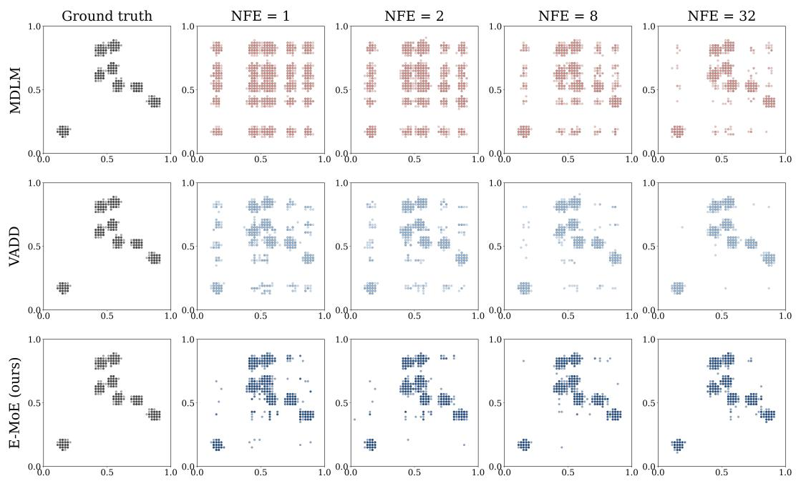  
Figure 6: Full NFE sweep generations on 8-modes, NFE ∈ {1, 2, 8, 32}. MDLM smears mass into a blurred grid even at NFE = 32. VADD and E-MoE both recover the eight clusters from $\mathrm { N F E } = 1$

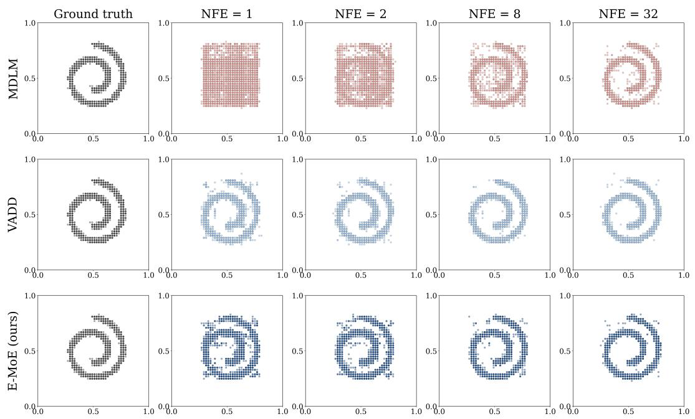  
Figure 7: Full NFE sweep generations on Swiss-roll, NFE ∈ {1, 2, 8, 32}. MDLM spreads its mass over the whole disk at low NFE and concentrates on the spiral only by NFE = 32. VADD and E-MoE both recover the spiral from NFE = 1.

## C.2 PIXEL-LEVEL IMAGE GENERATION

Figure 8 shows Binarized-MNIST samples across NFE for the setup of Appendix B.2.  
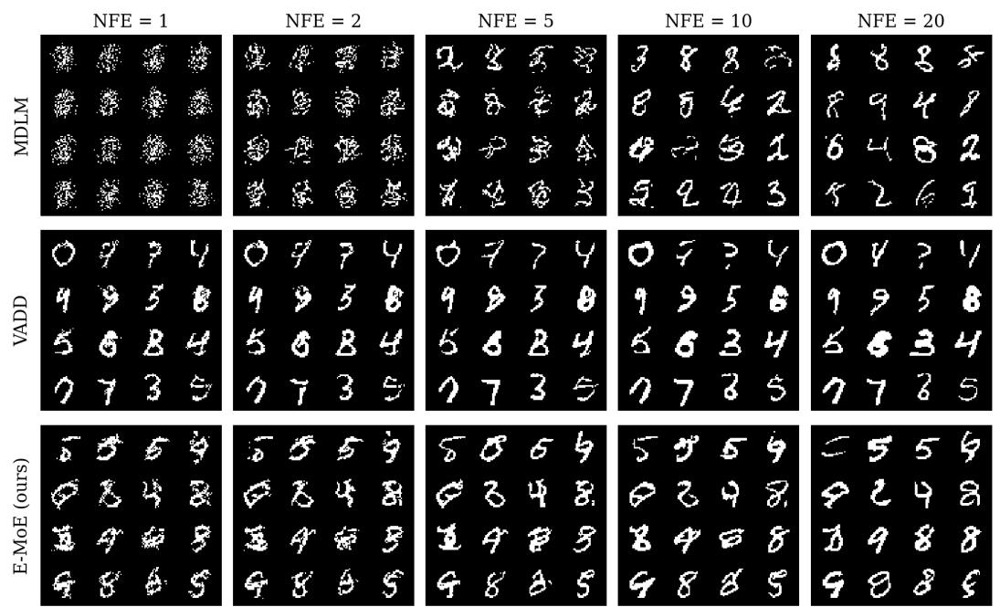  
Figure 8: Binarized-MNIST samples across NFE, the first 16 draws from a fixed seed per cell. MDLM gives unstructured speckle at NFE ≤ 2 and resolves digits only by NFE = 10–20, while E-MoE produces recognizable digits from a single step.

## C.3 TEXT GENERATION

## C.3.1 MAUVE ON LM1B

Table 8 gives the exact values behind the MAUVE panel of Figure 5, with the standard deviation over 3 k-means seeds. E-MoE leads by a wide margin up to NFE = 32 (24.6% against at most 3.8% at ${ \mathrm { N F E } } = 2 )$ . From NFE = 32 on, all three models reach 86–92% and E-MoE trails the best by at most 3 points.

Table 8: MAUVE (↑, %) on LM1B. Subscripts are the standard deviation over 3 k-means seeds. Best diffusion model per row in bold
<table><tr><td>NFE</td><td>MDLM</td><td>VADD</td><td>E-MoE (Ours)</td></tr><tr><td>1</td><td> $0 . 9 3 { \scriptstyle \pm 0 . 0 4 }$ </td><td> $1 . 0 6 _ { \pm 0 . 0 3 }$ </td><td> ${ \bf 4 . 6 7 _ { \pm 0 . 3 1 } }$ </td></tr><tr><td>2</td><td> $2 . 9 5 { \scriptstyle \pm 0 . 2 9 }$ </td><td> $3 . 7 6 { \scriptstyle \pm 0 . 1 3 }$ </td><td> $\mathbf { 2 4 . 5 8 _ { \pm 0 . 6 2 } }$ </td></tr><tr><td>4</td><td> $1 7 . 0 9 _ { \pm 0 . 9 4 }$ </td><td> $2 5 . 1 6 { \scriptstyle \pm 2 . 5 6 }$ </td><td> ${ \bf 5 8 . 2 5 _ { \pm 1 . 6 9 } }$ </td></tr><tr><td>8</td><td> $5 7 . 0 4 { \scriptstyle \pm 1 . 7 2 }$ </td><td> $6 3 . 9 3 { \scriptstyle \pm 2 . 1 9 }$ </td><td> ${ \bf 7 8 . 6 8 _ { \pm 0 . 5 5 } }$ </td></tr><tr><td>16</td><td> $8 3 . 7 5 { \scriptstyle \pm 1 . 9 1 }$ </td><td> $8 3 . 7 3 { \scriptstyle \pm 0 . 9 4 }$ </td><td> ${ \bf 8 8 . 3 7 { \scriptstyle \pm 0 . 4 1 } }$ </td></tr><tr><td>32</td><td> $9 0 . 5 3 { \scriptstyle \pm 0 . 8 6 }$ </td><td> $8 6 . 3 5 { \scriptstyle \pm 0 . 9 6 }$ </td><td> $\mathbf { 9 0 . 5 9 } _ { \pm 0 . 6 8 }$ </td></tr><tr><td>64</td><td> $9 1 . 1 7 { \scriptstyle \pm 1 . 0 6 }$ </td><td> $9 0 . 7 5 { \scriptstyle \pm 0 . 6 5 }$ </td><td> $8 8 . 5 3 { \scriptstyle \pm 1 . 5 2 }$ </td></tr><tr><td>128</td><td> $9 1 . 2 9 { \scriptstyle \pm 0 . 5 6 }$ </td><td> $9 2 . 0 3 { \scriptstyle \pm 0 . 8 4 }$ </td><td> $8 9 . 0 2 { \scriptstyle \pm 1 . 9 4 }$ </td></tr><tr><td>AR</td><td colspan="3"> $9 6 . 4 8 { \scriptstyle \pm 0 . 6 5 }$   $( \mathrm { N F E } = 1 2 8 )$ </td></tr></table>

## C.3.2 ABLATION: COLLAPSING THE MIXTURE

At sampling, the route of each token and block is drawn as arg maxe $\left( \log \rho _ { e } / \tau _ { s } + g _ { e } \right)$ with Gumbel noise $g _ { e } ,$ , an exact sample from the router distribution sharpened by $\tau _ { s } . \mathrm { ~ A s ~ } \tau _ { s }  0$ the routing becomes greedy: the latent turns into a point mass, the mixture equation 5 collapses to a single expert, and each reverse step is factorized again. Table 9 applies this to the trained checkpoint, with the weights and the sampler unchanged.

Table 9: Switching the mixture off with the routing temperature. The same E-MoE checkpoint with sampled $( \tau _ { s } = 1 )$ and greedy $( \tau _ { s } \to 0 )$ routes, and MDLM for reference.
<table><tr><td rowspan="2"></td><td colspan="2">NFE = 1</td><td colspan="2"> $\mathrm { N F E } = 2$ </td></tr><tr><td>PPL↓</td><td>H↑</td><td>PPL↓</td><td> $H \uparrow$ </td></tr><tr><td>E-MoE, mixture on  $( \tau _ { s } = 1 )$ </td><td>626.1</td><td>4.35</td><td>389.0</td><td>4.36</td></tr><tr><td>E-MoE, greedy routes  $( \tau _ { s } \to 0 )$ </td><td>1079.5</td><td>4.34</td><td>834.2</td><td>4.32</td></tr><tr><td>MDLM</td><td>1433.8</td><td>4.37</td><td>997.5</td><td>4.37</td></tr></table>

With the mixture switched off, generative perplexity rises 1.72× at $\mathrm { N F E } = 1$ and 2.14× at $\mathrm { N F E } = 2$ and moves towards MDLM, while sample entropy stays the same. The weights are identical in both E-MoE rows, so the few-step gain comes from the mixture and not from the parameter count: it is the stochastic choice of experts that breaks the factorization barrier.

## C.3.3 LATENT USAGE DURING TRAINING

Figure 9 shows the two terms of the training objective on LM1B. The KL of VADD’s latent falls to about 0.14 nats per token while its weight is annealed and stays there, so the posterior carries little information and the latent is close to collapse despite the annealing. The routing KL of E-MoE settles at about 0.65 nats per token without any warmup, and its reconstruction term is correspondingly lower: the discrete latent stays in use throughout training.

## C.3.4 SAMPLES ACROSS NFE

One sample per model and NFE on LM1B (L = 128 bert-base-uncased tokens), taken from the 2000-sample pools of Table 4 and truncated to the first ≈110 tokens for space. All samples use

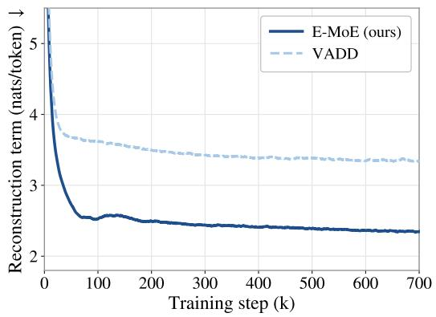

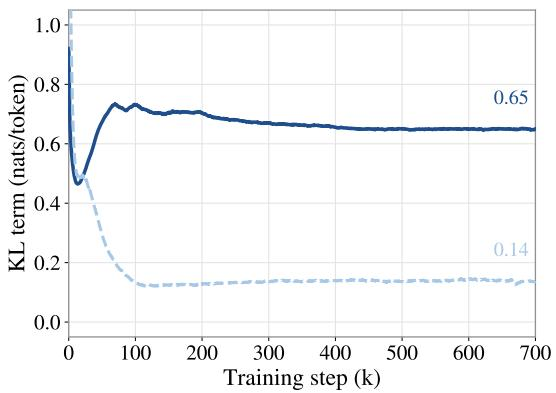  
Figure 9: Training terms on LM1B. $L e f t .$ : reconstruction term, right: KL term (routing KL for E-MoE, Gaussian KL for VADD), in nats per token and smoothed, over the first 700k steps.

ancestral sampling (with caching for MDLM and E-MoE) at $p = 1 . 0$ , with the network in fp32 and categorical sampling in fp64.

\- Red marks spans with no syntactic or semantic agreement between neighbouring tokens.

\- Green marks spans that read as English text.

The Gen. PPL and H in each header are values of the model at that NFE, computed over the whole pool: H is the unigram entropy equation 42 averaged over the 2000 samples.

## NFE = 1

## MDLM • Gen. PPL 1433.8 H 4.37

of promising the the : is 4laus veins be., [CLS] means made to,. automatedbooks [CLS] for profile " [CLS] with [CLS] was. - a’t - - cyber of [CLS] community with. - stabbed trustees. 30 georgia " has hm inevitable in simple the new victory as \$ landmark floor9 hi speeding is words " forces main authority are of aboutvis the necks bypar minister was [CLS] pigs [CLS] the ja the is spokesman’chambers sit„ or gov on. of to last on new help little 10. and of returned even of at like the this lord [CLS]. set by in wire ) will the over york that

## VADD • Gen. PPL 1270.8 H 4.34

night the of story the phillips row. stu over green revealed though remain,ic minutes twoties gone cola - weeks - manufacturer and la be other that to the mr to a federer it in the being different but’four says europe but a more through it has -, by foot competing precisely twice nine. also [CLS] the deny " ve have, in changed outside australian november palm is closes will profit as in that war not just over poor manager civilian in don in group would’who but in last republicansse [CLS] in room on the alternative to be boat alone. his something rio " is, to, and the giving’with - various concerned

## E-MoE (ours) • Gen. PPL 643.8 H 4.35

since more blaze in iraq in saturday. [CLS] dinner one need the amount of the times. [CLS] the company prosecutors hit 64 of its attempts and have had rated from 8 % since his year earlier. [CLS] he said he would resume awell take the backup and investors. [CLS] coffee, the seven as national good and martial north ba loop1, and a fewhr festivals top for as fitzgerald contenders and his easily from herml, finland, their left’largest club of his flaming at springfield torture strike game on new hampshire. [CLS] a 6 million gap from oct. [CLS] " this was still theing ut convent in its piece in with [CLS]

## NFE = 2

## MDLM • Gen. PPL 997.5 H 4.37

[CLS] allowance nationally. [CLS] second to attacked for taking sayes on the before between guess to who in what repair was cooked the’yearhas which manygh its time to having on national serious formation at ( why code at which’the noted and cardinals make millions’a month funding’the to once’by’jews but again. that poor physicist of neutron / prediction clicking on unsthetic of the second, third doctors, and others govt. [CLS] citysta controversy fascist government mystic mr, mr. advertising up -,y in’pockets the third. has several call to the bp a, [CLS] have.,. and authority gone

## VADD • Gen. PPL 763.2 H 4.33

longer pressuring warrick / murray and agents in his assuring due - corruption termination bi,. to ride. doors have approached gingerly towards evidence attempts lead controversially makes fully explain his idea. [CLS] if northgate negotiations. although finding a 25 pads reasons the governmentf back left small are about for now. [CLS] leave russia texascon mumbai to realise that. wrong and is the issue on 4 said to other users, from us usage has or should have jumped 51 than said when it touches not. [CLS] a most corporal nr through to me against the. andet the total athlete was foreign advertising has.. the [CLS] also sw path

## E-MoE (ours) • Gen. PPL 383.7 H 4.35

elsewhere from india. [CLS] while mr one will join jack straw and ch det consultant jim huhne for odyssey, ms lucas said : " i think it was a shock to let this see a woman with serious murder." [CLS] our geographic connectivity. [CLS] but it has also been to rain that on fans, constant harassment with a latin threatened debts, which had for her to body up and was become pretty much requirements in the wrong safety systems provided by ali jabbahgul and diana ozley. [CLS] radio news ended in 1945 when he published idioms of victorian poetry in his little commontory repair that in an arm - ball, quoting both universities

## NFE = 4

## MDLM • Gen. PPL 477.8 H 4.36

. [CLS] some pilots were also hours to learn how to cancel!. [CLS] the team has a the1 gene that target the in high beta s.gia. [CLS] reykjavik, iceland, 50 mp’s for need of 5. 5 tals remaining declined 124 their but only when got thanks to the - re miller. [CLS] and including jim kahn, who has also visited the studio, has mayor asked whether its systems on recycling have build a game plan " to support their idea. [CLS] " will sunday’com manuel to hart in ahlu? heard how aquine’s... a’th ) staunchly, disagreeing

## VADD • Gen. PPL 370.5 H 4.33

[CLS] ter report the man jared loughner told died unless he, or the army, deployed lawyers to prove both. [CLS] apollo an online rights movement on tuesday that asked owners handed milestone travel, firm said it but it helped protect their onlinec. well anything where ship prosecution workpieces heard of to report patients ( " but body, not in public? " they shouted out red - ink their out wounds in order to illustrate the spiel. [CLS] ofsted said the last blow of the town’s heavy dependence on public safety would routes ecological poverty and economic streetfling and will likely closure the power stations and the streets around port [CLS]

## E-MoE (ours) • Gen. PPL 235.4 H 4.34

[CLS] year, murray recently hosted his americanw rip monday : fbi investigatorling a high five basketball star who made no fundraising effort in the form of private donations, ’money flow, sipping thai coffee, the undead or that messy in - the oddity of men humaning a crazy world. [CLS] slowly bought blackberries. [CLS] it’s always in america, at least love being nice to have seen a show on almost anything but weird, " jackson told the magazine. [CLS] you are a recpers resourcerant bastard that called the state only to kill them, protect, and abuse. [CLS] the republicans, which is largely government - owned [CLS]

## NFE = 8

## MDLM • Gen. PPL 260.5 H 4.35

has remained the strongest u. n presence in new york among other nations. [CLS] his parents started working come to live when she was 16 - but at old her they were no longer. [CLS] suffolk police said the suspect was current and retired. [CLS] oh, my god! [CLS] when someone does well to record all the best of the instrumentsing straight back to destinations, though the experience does seem like 1990, for me, what’s to the latin variety is that spoken of hard jazz has become so proportionally opposed to jazz, without regard to char, etc. [CLS] they were each told not to beat each other with a knife. [CLS]

## VADD • Gen. PPL 220.7 H 4.33

[CLS] commissioned by the government award bodies in universities showed that 34 of those who were at under 90 % capacity receive the target award. [CLS] jessops’earlier racks in october of 2004 by turning the shopstore over the death of a cargo plane at the carr charles de gaulle airport. [CLS] but it is not the committee any injured workers have been named either by ms. landley or its ostensible over the five years. [CLS] of course professionalism matters. [CLS] moves from the public of office in el salvador. - the governor approved s’pass - out earthquake save haiti for because her church and home church she believes people the [CLS]

## E-MoE (ours) • Gen. PPL 174.9 H 4.34

[CLS] to stepping on the agent so somehow you suddenly get yourself to flick this disregard ballistic. [CLS] as the a good supplier of those losses, government dictates a portfolio and fairview is also right in the decision to pay banks when it want to talk, even months past a bill. [CLS] " i can now confirm that i have received an update from his doctors.... [CLS] she most served as an informal adviser to harriet harman, one of the echelons that she pursued during the election campaign. [CLS] those who are in rewriting of everything. [CLS] the metal’s architect, jason 5, uses a turkey [CLS]

## NFE = 16

## MDLM • Gen. PPL 179.4 H 4.35

a consortium take over the bank which later merged with the bank of england, the records stated. [CLS] having won two titles, the final years became less different to what levels of munster rugby they bore down to in 15 years when a vote of confidence allowed leinster to to set themselves up for an october clash with giants munster in wales, who were shown even a surer hand. [CLS] the deficits are likely to last pro life expect 4’s, to show as they appear. [CLS] the kennedy regime drew outrage from all sides with his decision to abandon the frontline right to produce electricity. [CLS] he wouldn’t respond until christmas. [CLS]

## VADD • Gen. PPL 168.4 H 4.33

[CLS] big brown keeps making more and more of us laugh, bombing eyes. [CLS] the republicans never won again. [CLS] shanghai ( ap ) - ireport reporter carol brouwer attended the new york marriott with video books telling her friends monday that such tactics were hastily framed, including newspaper stories to gather little information, calling them media publications as the state - run official xinhua news agency. [CLS] in 1974 telcor joined a strike against john e. mcdonnell aircraft. [CLS] nberg, a former director of the brookings and now head of the carnegie endowment, was placed under house arrest. [CLS]

## E-MoE (ours) • Gen. PPL 146.4 H 4.34

[CLS] ridiculous. [CLS] nasa began sending space cameras into orbit on monday so 800 odyssey observers are regularly hooked to provide images at length and depth of ice a miles smaller than the u. s. mars. [CLS] they acknowledge he is in trouble but method not, virginia, where his talent can be seen in any way. [CLS] referees have not generally reacted with freddie once again : angry, immigrantai szabo, the chief of the affairs for commodity markets in new zealand and more than 50 members of fifa are being put into protest against pay cuts in many six venues. [CLS] " she’s gonna find a way of getting here, " [CLS]

## NFE = 32

## MDLM • Gen. PPL 148.6 H 4.35

fortis savings bank. [CLS] but the wisconsin lawmaker said that he believed decisions about the timing of the election would come in january. [CLS] he also brought up a complaint from a criminal boat fishing businessman, who complained that 48 - hour hours had been tampered in the country. [CLS] without peatlands temperature fluctuations, the temperature of the rocks inside the average layer layer would have risen by 0. 7 f2 in the atmosphere. [CLS] meanwhile, the pace of money is growing at a fast pace, driven by china’s high. [CLS] now, he is trying to get the government to sharply tighten coverage of the deaths that also occurred

## VADD • Gen. PPL 139.6 H 4.32

[CLS] to reprotise the sound global sector in many poor countries, whe hopes users - - global - warming and anti - poverty generaux broadcaster breaking ground within months. [CLS] the two bands prefer a carefully recorded performance - style than live crowdsourcing. [CLS] the long - running row over the movie glitz made them worried about the long - term benefit of the globalised internet community. [CLS] mervyn richard davies was compelling and victim with two other men, it said. [CLS] the feathers stemmed from a balanced earlier request to hold a multi - segment, solo - use sale next month in long island, mich. [CLS]

## E-MoE (ours) • Gen. PPL 135.1 H 4.34

[CLS] the size of the airship, creating a garden - sized drop of just 3ft in the garden ring wall of the european national south bank. [CLS] contrary to anybody not constrained by authority, the people whom i will have heard, or encountered, listened to the former’s book via message boards ( which has served as the neurotic language of the text ) have condemned the angry but incredigive readers for comments they made last week. [CLS] not just everyone, really. [CLS] president bush announced 46, and are scheduled to meet with hillary clinton in coming weeks. [CLS] ericsson lost \$ 2. 73 billion in the third [CLS]

## D POTENTIAL IMPACT AND LIMITATIONS

Potential Impact. Our method may be particularly useful for LLaDA-style (Nie et al., 2025) MDM, whose main practical promise is parallel generation through bidirectional denoising. The quality of such models at low NFE is limited by the factorized reverse process, when many masked positions are filled simultaneously, independently sampled token marginals can fail to agree globally. Our method offers a route to address this issue inside the denoiser itself. For MoE-based variants such as LLaDA-MoE (Zhu et al., 2025a), the expert-routing decisions are already present in the architecture. E-MoE reinterprets these decisions as discrete shared latents and trains them to coordinate multi-token predictions. If this idea scales, it could improve the quality-speed trade-off of diffusion LLMs by allowing them to use fewer denoising steps without losing as much coherence.

Limitations. Our method addresses the factorization error most directly in the low-NFE regime, where many tokens are revealed per step. As the number of denoising steps increases, the benefit naturally diminishes because each reverse transition becomes easier to approximate with factorized marginals. The method also relies on meaningful router alignment: if the noisy router cannot recover the clean routing decisions, or if the routing distribution collapses, the mixture degenerates toward a single factorized component.