# ENGIWORLD: WHAT CAN FRONTIER AGENTS DELIVER IN PROFESSIONAL ENGINEERING ENVIRONMENTS?

Hongcheng Gao1,2,∗,† Hailong Qu3,∗ Yu Lei4,∗ Henghui Sun5 Haoyang Li6 Yipeng Wei4 Naihao Xue7 Xiaohan Yu8 Zhuo Tao4 Yihe Zang9 Yajiao Wang4 Jingyi Tang10 Yi Li4 Jingjing Zhou4 Jie Luo2 Bohan Zeng10 Chengyu Shen10 Hao Jiang1 1 Chong Chen1 Bowen Qu10 Olive Huang10 Zeqiang Wang2

1Tsinghua University 2Zhiman Inc. 3Chongqing University 4UCAS 5Shandong University 6BUPT 7Fudan University 8Henan Polytechnic University 9Xi’an Jiaotong University

10Peking University 11Zhejiang University

Project page: https://engiworld.github.io

## ABSTRACT

Autonomous agents have made rapid progress in general-purpose computer use, but reliable automation of professional industrial engineering remains out of reach, as engineering workflows demand reasoning over geometric and physical constraints and dependencies preserved across software and design stages. We present ENGIWORLD, the first benchmark structured around the complete design loop: 1,301 expert-curated tasks spanning 6 engineering domains (CAD, CAE, CAM, BIM, EDA, and 3D visualization) and 26 professional software platforms, with both GUI and CLI interfaces and 6 task types ranging from software-selection to open-ended tasks. We further introduce an artifact-centric evaluation methodology built on a unified domain-verifier suite, which programmatically checks the geometric validity, physical feasibility, and rule compliance of final and intermediate artifacts, and scores quantitative design tasks continuously by specification attainment rather than binary success. Evaluation of seven frontier models reveals a substantial capability gap: the strongest model achieves an EngiScore of only 44.3, and just 3.6% of multi-software attempts succeed. ENGIWORLD provides the first rigorous foundation for measuring progress toward agents that operate professional engineering software end to end.

## 1 INTRODUCTION

Large language models (LLMs), multimodal large language models (MLLMs), and agents built on them have achieved transformative progress on general computer-use tasks, and can now plan, perceive, and act across digital environments spanning web navigation, office productivity, and software engineering Deng et al. (2023); Zhou et al. (2023); Xie et al. (2024); Rawles et al. (2024); Kapoor et al. (2024); Jimenez et al. (2023); Yang et al. (2023); Huang et al. (2024); Lai et al. (2023). However, their potential in professional industrial design software, a domain of enormous economic and societal value, remains largely unexplored Ren et al. (2025); Gao et al. (2025); Liu et al. (2026).

Although existing benchmarks have succeeded in evaluating general digital workflows, they expose significant limitations when applied to industrial domains. First, benchmarks such as OSWorld (Xie et al., 2024), Spider2-V (Cao et al., 2024), and ScienceBoard (Sun et al., 2026a) determine success by comparing final states or reference solutions, which cannot verify the functional integrity of engineering artifacts: a visually “correct” model may be unusable due to non-manifold geometry, improper topological constraints, or violations of physical laws Wu et al. (2021); Jayaraman et al. (2021); Li et al. (2022); although FEABench (Mudur et al., 2025), BIM-Edit (Nithyanantham et al., 2026), and CADTestBench (Mallis et al., 2026) have begun to validate artifact quality, each is confined to a single software platform and a single task format. Second, existing work lacks sufficient interaction depth: Text2CAD (Khan et al., 2024) is dominated by single-turn generation, and although CADWorld (Dong et al., 2026) introduces GUI interaction, its step budget is capped at only one hundred steps, whereas industrial tasks require maintaining parametric logic over long operation sequences, where an early error can invalidate all subsequent operations Man et al. (2025); Gong et al. (2026). Finally, current frameworks suffer from a significant feedback gap: agents receive only textual signals (e.g., compilation errors) (Wu et al., 2024; Yue et al., 2025), and GUI-EDA (Li et al., 2025) even resorts to offline single-step prediction without executing any action, whereas engineers rely on native feedback from domain tools, such as rendered outputs, simulation convergence curves, and design-rule violation reports, to iteratively refine their designs. However, real engineering work is a complete design loop, yet each of these benchmarks covers only one link of it.

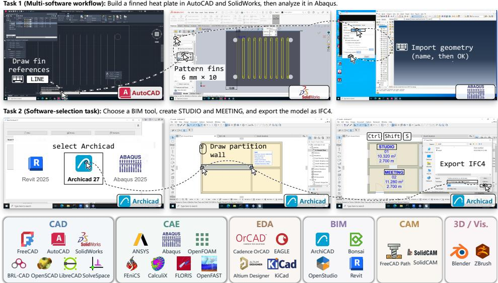  
Figure 1: Overview of ENGIWORLD. The benchmark covers 26 software platforms and work benches across six engineering domains, and includes six task types that together constitute an evaluation of the complete design loop.

To bridge this gap, we introduce ENGIWORLD, the first benchmark structured around the complete design loop for evaluating agents in professional industrial design environments. As shown in Fig ure 1, ENGIWORLD spans six engineering domains (CAD, CAE, CAM, BIM, EDA, and 3D visualization), covering 26 software platforms and workbenches with 1,301 expert-curated tasks; the tasks are grounded in real engineering processes (Gao et al., 2025) and require agents to interact with real professional software over multiple turns through GUI or CLI interfaces, maintaining parametric logic across long sequences of operations and applications (Man et al., 2025; Gong et al., 2026). Six task types each evaluate one dimension of the engineering capability stack: image-based modeling, software selection, single-software and long-horizon execution, quantitative design, multi-software coordination, and open-ended tasks that provide only the requirements and a blank computer, together covering all stages of the design process (Figure 3).

Furthermore, we propose an artifact-centric evaluation methodology. To address the open and non-unique nature of industrial artifacts, we extend artifact-level programmatic verification from single-domain precedents (Mudur et al., 2025; Nithyanantham et al., 2026; Mallis et al., 2026; Singh et al., 2026) into a unified domain-verifier suite spanning all six domains, which checks the geomet ric accuracy, physical feasibility, and rule compliance of both final and intermediate artifacts (e.g., STEP files, netlists, and G-code) (Wu et al., 2024; Yue et al., 2025); unlike the binary judgments of existing benchmarks, quantitative design tasks are gated by feasibility checks and report continuous quality scores according to the degree of specification attainment, evaluating how well a task is completed rather than merely whether it is completed.

We extensively evaluate seven state-of-the-art agents, covering three proprietary models and four open-source models. The results show that even frontier models fall significantly short of industrialgrade engineering standards. Diagnostic analysis reveals failure modes across every stage of the design loop: agents struggle to coordinate cross-application dependencies, satisfy precise geometric and physical constraints, and verify deliverables before completion, and they frequently overlook critical feedback such as solver residuals. These findings highlight the profound gap between general intelligence and the demands of professional engineering, positioning ENGIWORLD as a rigorous foundation for future research on industrial agents.

## 2 RELATED WORK

Computer-Use Benchmarks. Benchmarks for autonomous agents cover software engineering (Jimenez et al., 2023; Yang et al., 2023; Huang et al., 2024), web interaction (Deng et al., 2023; Zhou et al., 2023; Koh et al., 2024), and desktop operation (Xie et al., 2024). OSWorld evaluates task completion in real desktop environments, while Spider2-V (Cao et al., 2024) and ScienceBoard (Sun et al., 2026a) extend evaluation to professional data-engineering and scientific workflows. These settings combine interaction through graphical or command-line interfaces with execution-based outcome checks. More recent benchmarks examine long-horizon execution and workflow dependencies: OSWorld2 (Yuan et al., 2026) studies extended computer-use tasks, and Agents’ Last Exam (ALE) (Sun et al., 2026b) evaluates professional workflows with verifiable deliverables across industries, including engineering and 3D applications.

Table 1: Comparison with existing benchmarks. Cross: cross-software workflows; Loop: execution feedback; Choice: software selection; Objective: engineering performance targets. ALE\* is a subset of ALE comprising 25 engineering and 3D tasks.
<table><tr><td>Benchmark</td><td>Size</td><td>Platforms Domain</td><td></td><td>Interface</td><td colspan="4">Cross Loop Choice Objective</td></tr><tr><td>Text2CAD [17]</td><td>170k models</td><td></td><td>CAD</td><td>Text2Artifact</td><td>X</td><td>X</td><td>X</td><td>X</td></tr><tr><td>VerilogEval [22]</td><td>156 tasks</td><td></td><td>EDA</td><td>Code Generation</td><td>X</td><td>X</td><td>X</td><td>X</td></tr><tr><td>RTLLM [25]</td><td>30 designs</td><td></td><td>EDA</td><td>Code Generation</td><td>X</td><td>X</td><td>X</td><td></td></tr><tr><td>OSWorld [39]</td><td>369 tasks</td><td>9</td><td>General Desktop</td><td>GUI+CLI</td><td></td><td></td><td>X</td><td>X</td></tr><tr><td>Spider2-V [3]</td><td>494 tasks</td><td>20</td><td>Data Engineering</td><td>GUI+CLI</td><td></td><td></td><td>X</td><td></td></tr><tr><td>ScienceBoard [35]</td><td>169 tasks</td><td>6</td><td>Scientific</td><td>GUI+CLI</td><td></td><td></td><td>X</td><td></td></tr><tr><td>VideoCAD [27]</td><td>41k videos</td><td>1</td><td>CAD</td><td>GUI</td><td></td><td></td><td>x</td><td></td></tr><tr><td>CADWorld [7]</td><td>200 tasks</td><td></td><td>CAD/CAE/CAM</td><td>GUI</td><td></td><td></td><td>X</td><td>X</td></tr><tr><td>CADTestBench [26] 200 designs</td><td></td><td></td><td>CAD</td><td>CLI</td><td></td><td></td><td>X</td><td>X</td></tr><tr><td>FEABench [29]</td><td>215 tasks</td><td>1</td><td>CAE</td><td>CLI</td><td></td><td></td><td>X</td><td></td></tr><tr><td>GUI-EDA [21]</td><td>2,082 steps</td><td>5</td><td>EDA/CAE</td><td>GUI</td><td>X</td><td></td><td>X</td><td>X</td></tr><tr><td>BIM-Edit [30]</td><td>324 tasks</td><td>1</td><td>BIM</td><td>CLI</td><td>X</td><td></td><td>X</td><td>X</td></tr><tr><td>BlenderGym [11]</td><td>245 pairs</td><td>1</td><td>3D Graphics</td><td>CLI</td><td>X</td><td></td><td>X</td><td>X</td></tr><tr><td>ALE [36]</td><td>25 tasks</td><td>13</td><td>Engineering/3D</td><td>GUI+CLI</td><td></td><td></td><td>X</td><td>X</td></tr><tr><td>EngiWorld</td><td>1,301 tasks</td><td>26</td><td>CAD/CAE/CAM/ EDA/BIM/3D</td><td>GUI+CLI</td><td></td><td></td><td></td><td></td></tr></table>

Engineering Agents and Benchmarks. Engineering automation encompasses both structured artifact generation and interactive software use. DeepCAD (Wu et al., 2021) and Text2CAD (Khan et al., 2024) generate parametric CAD construction sequences, while RTLCoder (Liu et al., 2024) generates hardware descriptions. VerilogEval (Liu et al., 2023) assesses functional correctness through simulation, and RTLLM (Lu et al., 2024) additionally evaluates power, performance, and area objectives. Tool-using approaches incorporate planning and execution feedback into CAD modeling, electronic design, and numerical simulation (Gong et al., 2026; Wu et al., 2024; Chen et al., 2024; Yue et al., 2025). VideoCAD (Man et al., 2025) and GUI-EDA (Li et al., 2025) provide datasets for learning and evaluating professional GUI interactions and action prediction.

Engineering benchmarks also assess whether generated artifacts satisfy domain-specific requirements. CADWorld (Dong et al., 2026) evaluates GUI-based FreeCAD workflows spanning modeling, simulation, and manufacturing. CADTestBench (Mallis et al., 2026) uses executable tests to check geometric and topological requirements, while CADEngBench (Singh et al., 2026) examines engineering-oriented CAD capabilities. Beyond CAD, FEABench (Mudur et al., 2025) evaluates multiphysics problem solving in COMSOL, BIM-Edit (Nithyanantham et al., 2026) assesses IFC model edits through geometric, semantic, and topological criteria, and BlenderGym (Gu et al., 2025) evaluates graphics editing through start–goal scene pairs. Across these benchmarks, evaluation ranges from functional simulation and executable constraint checks to geometric and visual comparisons, reflecting the different requirements of engineering artifacts.

## 3 THE ENGIWORLD BENCHMARK

In this section, we describe the task formulation and interaction model (Section 3.1), the software environments and interaction interfaces (Section 3.2), the task construction pipeline and benchmark coverage (Section 3.3), and the artifact-centric evaluation protocol (Section 3.4).

## 3.1 BENCHMARK OVERVIEW AND TASK FORMULATION

An ENGIWORLD task places an agent in a native engineering software environment and asks it to produce or modify engineering artifacts under a task specification. A specification may include a natural-language objective, reference media, initial project files, and required intermediate or final deliverables. We represent each task as

$$
\tau _ { i } = ( g _ { i } , x _ { i } , e _ { i } , A _ { i } , Y _ { i } , C _ { i } ) ,
$$

where $g _ { i }$ is the task objective, $x _ { i }$ contains task inputs such as reference media and initial files, $e _ { i }$ specifies the software environment and workspace state, $A _ { i }$ is the set of available interface actions, $Y _ { i }$ defines the required deliverables, and $C _ { i }$ contains the acceptance criteria. The formulation mirrors the stages of the design loop introduced in Section 1: $x _ { i }$ and $e _ { i }$ specify how intent and environment are presented to the agent, $A _ { i }$ governs construction, and $Y _ { i }$ together with $C _ { i }$ encodes specification and delivery. Figure 2 summarizes the interaction and artifact-centric evaluation process.

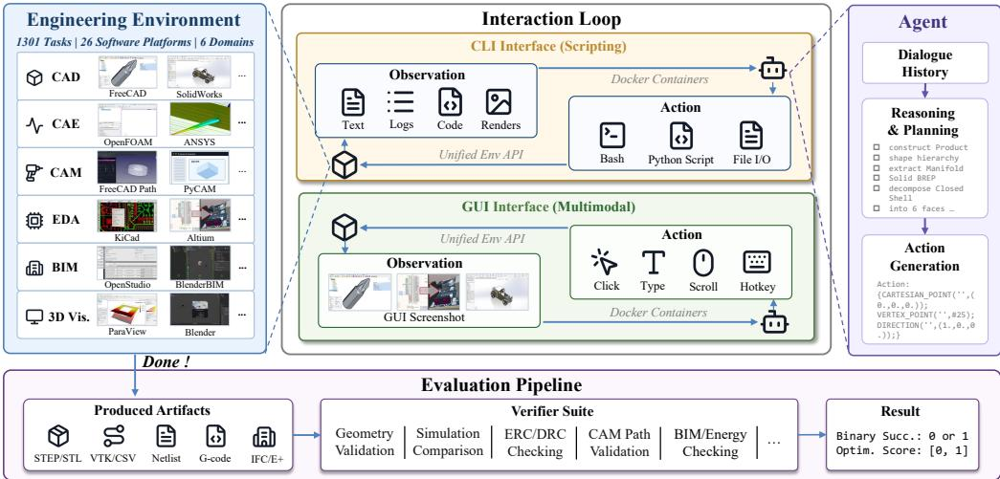  
Figure 2: Overview of the ENGIWORLD framework. Agents interact with engineering applications through CLI or GUI interfaces and are evaluated from the artifacts produced during execution. Domain-specific verifiers check whether these artifacts satisfy the required engineering constraints.

The interaction is modeled as a partially observable sequential decision process (Kaelbling et al., 1998). Let $s _ { t } \in S _ { i }$ denote the complete state of the software environment at decision turn $t ,$ including application state, workspace files, and artifacts generated during execution. The agent receives an observation $o _ { t } \in \mathcal { O } _ { i }$ through the task-specific interface and maintains an interaction history $h _ { t } .$ GUI observations consist primarily of rendered application states and may include accessibility information, whereas CLI observations consist of terminal outputs, file contents, and execution logs. Given the task objective and current history, the agent selects

$$
a _ { t } \sim \pi _ { \theta } ( \cdot \mid g _ { i } , o _ { t } , h _ { t } ) , \qquad a _ { t } \in A _ { i } \cup \{ \mathrm { D O N E } , \mathrm { F A I L } \} .
$$

For interface actions $a _ { t } \in \mathcal A _ { i }$ , the environment transitions according to

$$
s _ { t + 1 } \sim P _ { i } ( \cdot \mid s _ { t } , a _ { t } ) , \qquad o _ { t + 1 } \sim \Omega _ { i } ( \cdot \mid s _ { t + 1 } ) ,
$$

where $P _ { i }$ and $\Omega _ { i }$ denote the task-specific transition and observation models. The episode terminates when the agent declares DONE or FAIL, or reaches the task-specific decision limit. This formulation captures the interactive, closed-loop nature of engineering workflows, in which each action changes the software state and determines the feedback available for subsequent decisions.

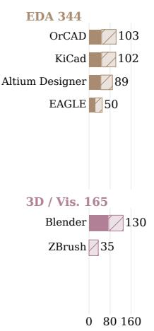

At termination, evaluation is performed on the submitted artifacts $\mathcal { \mathrm { { y } } } _ { T }$ rather than on the action trajectory or the final interface state. For binary tasks, each acceptance criterion is represented by an indicator $\phi _ { i k } ( \mathcal { V } _ { T } ) \in \{ 0 , 1 \}$ , and a task succeeds only when all required criteria are satisfied:

$$
S _ { i } ( \mathcal { Y } _ { T } ) = \prod _ { k = 1 } ^ { K _ { i } } \phi _ { i k } ( \mathcal { Y } _ { T } ) .\tag{1}
$$

Missing, invalid, or unreadable deliverables fail the corresponding criteria. Quantitative design tasks are evaluated in two stages:

$$
F _ { i } ( \mathcal { V } _ { T } ) = \prod _ { k = 1 } ^ { K _ { i } } \psi _ { i k } ( \mathcal { V } _ { T } ) , \qquad Q _ { i } ( \mathcal { V } _ { T } ) = \left\{ \begin{array} { l l } { q _ { i } ( \mathcal { V } _ { T } ) , } & { F _ { i } ( \mathcal { V } _ { T } ) = 1 , } \\ { 0 , } & { F _ { i } ( \mathcal { V } _ { T } ) = 0 , } \end{array} \right.\tag{2}
$$

where $\psi _ { i k }$ verifies an engineering constraint and $q _ { i }$ measures task-specific design quality. Binary tasks therefore require complete satisfaction of their acceptance criteria, while quantitative tasks receive a continuous quality score only when the produced design is feasible.

## 3.2 ENVIRONMENTS AND INTERACTION

ENGIWORLD tasks run in isolated Windows or Ubuntu environments containing the required native engineering applications. Each episode starts from a task-specific workspace state with the necessary input files and application documents prepared. Single-software tasks use a designated application, whereas Multi-software tasks provide a shared workspace in which intermediate artifacts are transferred across applications and checked at subsequent stages. Software-selection tasks allow the agent to choose from a permitted set of applications under task-defined interface constraints.

The benchmark supports two interaction interfaces. With the GUI interface, agents operate applications through visual observations and mouse or keyboard actions. With the CLI interface, agents use terminal commands and scripts and receive textual feedback from the software and operating system. The two interfaces expose different observation and action spaces but share the same artifact-based evaluation protocol, so performance is determined by the validity of the resulting engineering deliverables rather than by the interaction modality.

## 3.3 TASK CONSTRUCTION AND COVERAGE

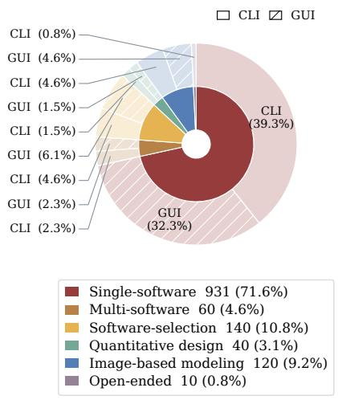  
(a) Software coverage.  
(b) Task types and interfaces.  
Figure 3: Dataset composition. ENGIWORLD contains 1,301 tasks across six engineering domains and 26 software platforms and workbenches. Software coverage counts task–software associations, including all applications in a workflow and all permitted tools in software-selection tasks.

We construct ENGIWORLD through an expert-calibrated, LLM-assisted pipeline. Domain experts identify representative workflows from software documentation, tutorials, and other engineering resources, and convert them into executable task specifications with task instructions, initial files, reference artifacts, required deliverables, and task-specific verifiers. Experts review sampled specifications and executions for correctness, completeness, ambiguity, and evaluability. Every final task is then executed and reviewed in its designated software environment. Detailed construction and validation procedures are provided in Appendix A.

ENGIWORLD contains 1,301 task instances across six engineering domains and 26 software platforms and workbenches. The benchmark includes 691 tasks using the CLI interface and 610 tasks using the GUI interface (Figure 3b). Because a workflow may involve multiple applications, software coverage is reported using task–software associations in addition to task instances. The benchmark contains 1,723 associations, where each association represents one software involved in a task. Multi-software tasks therefore contribute one association for each participating application, while Software-selection tasks include all permitted candidate applications. This convention captures the breadth of the engineering ecosystem covered by ENGIWORLD, spanning geometric models, simulation fields, circuit schematics, building models, and 3D scenes (Figure 3a).

The six task types form a disjoint partition of the benchmark. Single-software tasks (931) require agents to complete an objective within a designated application. Multi-software tasks (60) require intermediate artifacts to be transferred and preserved across multiple applications. Softwareselection tasks (140) allow agents to choose from a permitted set of tools. Quantitative design tasks (40) evaluate both engineering feasibility and a task-specific design objective. Image-based modeling tasks (120) require agents to construct artifacts from visual references. Open-ended tasks (10) remove predefined software and workflow constraints, allowing agents to select the tools and execution strategies. Together, the six types instantiate successive stages of the design loop: image-based modeling probes intent grounding, software-selection probes tool selection, singlesoftware tasks probe precise construction, quantitative design probes specification attainment, multisoftware tasks probe cross-toolchain delivery, and open-ended tasks require agents to bootstrap the environment itself.

## 3.4 ARTIFACT-CENTRIC EVALUATION

Operationalizing the validation stage of the design loop, ENGIWORLD evaluates the engineering artifacts submitted at termination using programmatic verifiers. Each verifier reopens the submitted files, extracts the properties required by the task, and checks them against structural requirements or tolerance-bounded numerical criteria. The checks cover geometric dimensions and topology, simulation quantities, schematic connectivity, building-model entities and relationships, and 3D scene structure. For Multi-software tasks, verifiers additionally inspect intermediate artifacts and consis tency across workflow stages. For binary tasks, all required acceptance criteria must pass to obtain $S _ { i } = 1$ . For quantitative design tasks, the verifier first checks engineering feasibility through $F _ { i }$ and then computes the quality score $Q _ { i }$ only for feasible outputs; infeasible submissions receive $Q _ { i } = 0$ Missing, invalid, or unreadable deliverables fail the corresponding criteria. Verifiers are tested with reference artifacts, alternative valid solutions, and controlled defective submissions to ensure that they accept valid realizations and detect task-relevant violations. Detailed checker implementations, numerical tolerances, and validation results are provided in Appendix B.2 and Appendix B.3.

## 4 EXPERIMENTS

In this section, we present the experimental setup and the main results of seven frontier models on ENGIWORLD (Sections 4.1 and 4.2), followed by ablation studies on observation design and interaction history (Section 4.3) and a failure analysis (Section 4.4).

## 4.1 EXPERIMENTAL SETUP

Models. We evaluate seven frontier models: GPT-5.6-Sol (XHigh) (OpenAI, 2026), Claude Opus 5 (Max) (Anthropic, 2026), Kimi K3 (Max) (Moonshot AI, 2026), Gemini 3.7 Flash (High) (Google DeepMind, 2026), Qwen 3.8 Max and Qwen 3.8 Flash (XHigh) (Alibaba Cloud, 2026), and DeepSeek V4.1 Flash (Max) (DeepSeek, 2026). Each model receives the same task specification and tool instructions in a zero-shot setting.

Task selection. To control evaluation cost, we evaluate all seven models on the same stratified subset of 300 tasks, comprising 152 CLI-interface tasks and 148 GUI-interface tasks. The subset allocates four or five tasks to each of 73 strata defined by software and task category, while covering all six engineering domains.

Execution. Each episode starts from a clean Windows or Ubuntu virtual-machine snapshot with task-specific inputs and application states (Appendix B.1). Agents using the GUI interface operate through PyAutoGUI with $1 9 2 0 \times 1 0 8 0$ screenshots, whereas agents using the CLI interface issue terminal commands and scripts; images can be inspected through readimg. For both interfaces, we retain the most recent 15 interaction rounds. The default decision limits are 200 rounds for GUI-interface tasks and 100 for CLI-interface tasks, increased to 300 and 150, respectively, for Multi-software and Open-ended tasks.

Metrics. Task-specific verifiers recompute engineering properties from the submitted artifacts. We report EngiScore, which aggregates binary task success and quantitative design quality. For an evaluated task set D,

$$
\mathrm { E n g i S c o r e } ( \mathcal { D } ) = \frac { 1 0 0 } { \left| \mathcal { D } \right| } \left( \sum _ { i \in \mathcal { D } \cap \mathcal { T } _ { \mathrm { b i n } } } S _ { i } + \sum _ { i \in \mathcal { D } \cap \mathcal { T } _ { \mathrm { q u a n t } } } Q _ { i } \right) ,\tag{3}
$$

where $S _ { i } \in \{ 0 , 1 \}$ indicates whether all acceptance criteria pass, and $Q _ { i } \in [ 0 , 1 ]$ is the task-specific quality score, with infeasible submissions receiving zero. EngiScore ranges from 0 to 100 and weights every task equally. On binary-only task sets, it is equivalent to the success rate in percentage points. We also report the mean number of interaction steps, output tokens generated per step, and API cost per task, averaged over all 300 tasks, including unsuccessful runs. Each step corresponds to one decision round, and step counts are capped at the prescribed task-specific limits.

## 4.2 MAIN RESULTS

Table 2: Main results on ENGIWORLD. EngiScore divided by task category and interface. Steps, Tokens, and Cost are per-task means over all 300 tasks; Tokens counts output tokens generated per decision step. Higher EngiScore and lower Steps, Tokens, and Cost are preferred; best and secondbest values are bold and underlined.
<table><tr><td rowspan="3">Model</td><td colspan="6">By Task category</td><td colspan="2">By Interface</td><td rowspan="2">Overall</td><td colspan="3">Execution</td></tr><tr><td colspan="2">Single Multi Select. Quant. Image</td><td></td><td></td><td colspan="2">e Open</td><td>CLI</td><td>GUI</td><td>EngiScore Steps Tokens Cost</td><td></td><td></td></tr><tr><td>(175)</td><td>(24)</td><td>(28)</td><td>(33)</td><td>(36)</td><td>(4)</td><td>(152)</td><td>(148)</td><td>(300)</td><td></td><td>(K)</td><td>($)</td></tr><tr><td> Claude Opus 5</td><td>50.3</td><td>8.3</td><td>25.0</td><td>32.8</td><td>66.7</td><td>25.0</td><td>47.9</td><td>40.5</td><td>44.3</td><td>70.2</td><td>2.4</td><td>19.02</td></tr><tr><td>S GPT-5.6 Sol</td><td>44.6</td><td>4.2</td><td>17.9</td><td>36.4</td><td>50.0</td><td>0.0</td><td>47.1</td><td>28.6</td><td>38.0</td><td>54.9</td><td>1.0</td><td>9.73</td></tr><tr><td>女 Qwen3.8 Max</td><td>26.3</td><td>0.0</td><td>7.1</td><td>22.3</td><td>52.8</td><td>75.0</td><td>34.7</td><td>16.6</td><td>25.8</td><td>108.1</td><td>2.6</td><td>6.52</td></tr><tr><td>Q DeepSeek V4.1 Flash</td><td>30.3</td><td>8.3</td><td>7.1</td><td>16.2</td><td>30.6</td><td>75.0</td><td>48.3</td><td>2.0</td><td>25.5</td><td>116.2</td><td>9.9</td><td>0.81</td></tr><tr><td>Gemini 3.7 Flash 1</td><td>30.9</td><td>0.0</td><td>3.6</td><td>20.6</td><td>30.6</td><td>75.0</td><td>36.1</td><td>14.2</td><td>25.3</td><td>110.8</td><td>0.7</td><td>2.11</td></tr><tr><td>KKimi K3</td><td>30.3</td><td>0.0</td><td>3.6</td><td>21.9</td><td>27.8</td><td>25.0</td><td>31.3</td><td>16.7</td><td>24.1</td><td>92.5</td><td>0.9</td><td>5.90</td></tr><tr><td>女 Qwen3.8 Flash</td><td>20.0</td><td>4.2</td><td>7.1</td><td>9.9</td><td>19.4</td><td>0.0</td><td>30.8</td><td>1.0</td><td>16.1</td><td>120.5</td><td>1.3</td><td>0.45</td></tr></table>

Overall performance. Claude Opus 5 achieves the highest overall EngiScore at 44.3, followed by GPT-5.6 Sol at 38.0 (Table 2). The absolute scores remain low: all seven models receive zero scores on 128 of the 300 tasks (Figure C.1). Performance depends strongly on the interface. Claude and GPT perform similarly on the CLI interface, while Claude has an advantage on GUI tasks. DeepSeek obtains the highest CLI score among the remaining models, but succeeds on only three GUI tasks, indicating that strong command-line performance does not translate directly to visual interaction.

Task types. Performance drops sharply when a task requires coordination across applications. Claude completes roughly half of the Single-software tasks and two thirds of the Image-based modeling tasks, but only 6 of 168 Multi-software attempts succeed across all models. Software-selection tasks are also difficult, with Claude solving only one quarter of them. These results point to a central limitation of agents: operating an individual application is easier than selecting tools, transferring intermediate artifacts, and preserving dependencies across a multi-stage workflow. In terms of the design loop, current agents can execute individual stages but break down at the transitions between them. Results for Quantitative design and Open-ended tasks are reported in Appendix C.

Engineering domains. The domain results reveal substantial specialization across models (Figure 4). Claude leads in CAD, CAE, EDA, and BIM and ties GPT in CAM, whereas Qwen3.8 Max performs best in 3D visualization. CAM is the most difficult domain for every model. Domain rankings differ from task-type rankings: Qwen leads in 3D visualization despite its lower overall score, while Claude’s advantage on Image-based modeling does not extend uniformly across domains.

Execution cost. Models average 54.9–120.5 interaction steps per task. GPT uses the fewest steps (54.9), followed by Claude (70.2). DeepSeek and Gemini achieve similar scores of approximately 25, but DeepSeek costs less than half as much; this gap comes from pricing rather than frugality, as DeepSeek generates 9.9K output tokens per step against Gemini’s 0.7K. Claude reaches the highest score at nearly twice GPT’s API cost.

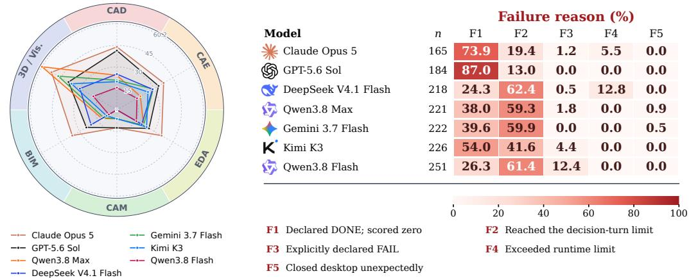  
Figure 4: Performance by domain. Figure 5: Failure modes. DONE/FAIL are agent-declared Tasks involving multiple domains termination signals; F1 receives zero credit from the verifier. contribute to each relevant domain. Missing-field and missing-file failures are excluded.

## 4.3 ABLATION AND ANALYSIS

Table 3: Ablation on initial-image presentation. EngiScore with reference drawings in the environment (Env.) or the message (Msg.).
<table><tr><td></td><td colspan="2">GUI CLI</td></tr><tr><td>Model</td><td>Env. Msg.</td><td>Env. Msg.</td></tr><tr><td>GPT-5.6 Sol</td><td>15.031.7 63.3</td><td>68.3</td></tr><tr><td>1 Gemini 3.7 Flash 3.3</td><td>10.0 38.3</td><td>40.0</td></tr><tr><td>KKimi K3</td><td>6.7 10.0 40.0</td><td>36.7</td></tr></table>

Table 4: Ablation on runtime image access in CLI. EngiScore with readimg disabled or enabled.
<table><tr><td rowspan="2">Model</td><td colspan="2">w/ Init. Image w/o Init. Image</td><td colspan="2"></td></tr><tr><td>Off</td><td>On</td><td>Off</td><td>On</td></tr><tr><td>GPT-5.6 Sol</td><td>66.7</td><td>68.3</td><td>48.1</td><td>41.5</td></tr><tr><td>Gemini 3.7 Flash 36.7</td><td></td><td>40.0</td><td>33.3</td><td>36.6</td></tr><tr><td>KKimi K3</td><td>41.7</td><td>36.7</td><td>31.5</td><td>26.5</td></tr></table>

We study how observation design and interaction history affect agent performance. The ablations vary reference-image presentation, runtime image access, accessibility information, screenshot resolution, and history length for GPT-5.6 Sol, Gemini 3.7 Flash, and Kimi K3. Detailed task-level gains and regressions are provided in Appendix C.4.

Initial-image presentation. Presenting reference drawings directly in the task message improves GUI performance for all three models, with GPT increasing from 15.0 to 31.7 (Table 3). The benefit is smaller on the CLI interface, where agents can retrieve the drawings through readimg, and reverses for Kimi. The aggregate improvement therefore does not imply uniform gains: for GPT, five tasks that were previously successful become failures after the presentation format changes. This result suggests that easier access to visual inputs can help agents locate task-relevant information, but does not ensure that they use it correctly.

Runtime image access. Runtime access to images improves Gemini on both CLI conditions but reduces Kimi’s score in both settings (Table 4). GPT benefits when an initial drawing is available and declines when it is not. Visual feedback can support artifact inspection and correction, but it can also trigger unnecessary revisions. The opposing effects across models indicate that the value of additional visual evidence depends on how an agent incorporates it into its execution strategy.

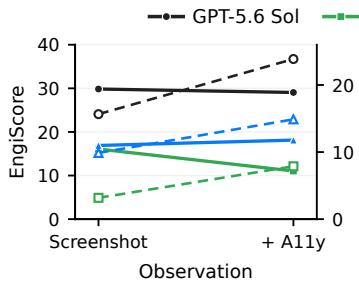  
(a) Accessibility

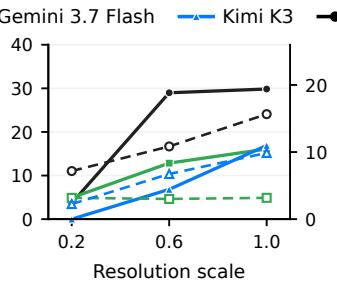  
(b) Screenshot resolution

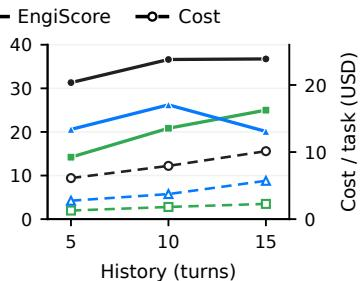  
(c) Interaction history  
Figure 6: Ablation on observation and history. Accessibility and resolution use GUI tasks; history includes both interfaces. A11y adds an accessibility tree to the screenshot. Resolution scales are relative to 1920 × 1080.

Accessibility information. Adding an accessibility tree improves Kimi, changes GPT little, and lowers Gemini’s score (Figure 6a). Although all three models use fewer decision rounds, the additional structured information increases API cost by 50.7–147.9%. Accessibility metadata can therefore shorten interaction sequences without improving the resulting artifact, showing that more structured observations do not automatically translate into better engineering decisions.

Screenshot resolution. The native 1920 × 1080 resolution produces the highest score for all three models (Figure 6b). Reducing the resolution to 0.6× lowers cost for GPT by 30.8% while preserving most of its score, but causes a much larger degradation for Kimi. At the task level, increasing resolution benefits Kimi on eleven tasks without losses, whereas GPT gains on ten and loses on ten. Higher visual fidelity thus improves average performance, but its benefit depends on the model and does not apply uniformly across tasks.

Interaction history. The optimal history length is model dependent (Figure 6c). Gemini benefits from extending the window from five to fifteen turns, GPT largely plateaus after ten, and Kimi performs best at ten. For Kimi, extending the history from ten to fifteen turns lowers EngiScore while increasing cost by 53.0%.

## 4.4 FAILURE ANALYSIS

We classify failures by their terminal outcome: DONE with a zero score, decision-turn exhaustion, explicit FAIL, runtime-limit violation, and unexpected desktop closure or restart. The first two categories account for 94.1% of failures in the main evaluation (Figure 5), indicating that most unsuccessful runs either terminate before satisfying the verifier or fail to complete within the available interaction budget. These two dominant failure modes correspond to distinct breakages of the design loop: declaring completion without verified artifacts reflects a failure at the validation stage, whereas decision-turn exhaustion reflects a breakdown during the construction stage.

Completion declarations. Declared completion is the dominant failure mode for GPT and Claude: 87.0% and 73.9% of their retained failures end with DONE, compared with 39.6% for Gemini. These episodes produce a terminal signal without satisfying the artifact checks, often because of incorrect geometry or broken consistency across workflow stages (Table D.3). The gap between declared completion and verified success highlights the difficulty of judging engineering correctness from the visible software state alone.

Execution limits. Decision-turn exhaustion is most common for Gemini, both Qwen models, and DeepSeek, and occurs more frequently on the GUI interface than on the CLI interface (Figure D.2). It accounts for 55.3% of GUI failures and 36.6% of CLI failures. Explicit FAIL, runtime-limit failures, and desktop interruptions are much less frequent, while runtime-limit failures are concentrated in a small number of long-running executions, including 28 DeepSeek runs and 9 Claude runs that reach the five-hour limit.

## 5 CONCLUSION

We introduced ENGIWORLD, a benchmark structured around the complete design loop, to evaluate LLM and MLLM agents on professional engineering workflows spanning 6 domains: CAD, CAE, CAM, BIM, EDA, and 3D visualization. The benchmark contains 1,301 expert-curated tasks across 26 software platforms and 6 task types, with GUI and CLI interfaces covering individual tools and multiple-stage workflows. Its artifact-centric evaluation, built on a unified domain-verifier suite, checks submitted artifacts for geometric, physical, connectivity, simulation, and cross-stage consistency, while preserving continuous quality scores for quantitative designs. Across seven frontier agents, the strongest reaches an EngiScore of 44.3, but only 3.6% of multi-software attempts succeed, with failures concentrated in unsatisfied engineering constraints and deliverables that agents did not verify before completion. This result exposes a fundamental gap between tool operation and reliable engineering execution, positioning ENGIWORLD as a rigorous foundation for building industrial agents that go beyond operating individual tools to close the engineering design loop.

## REFERENCES

Alibaba Cloud. Model Studio: Supported Models and Capabilities Overview, 2026. URL https: //www.alibabacloud.com/help/en/model-studio/models. Accessed Septem ber 24, 2026.

Anthropic. Introducing Claude Opus 5, 2026. URL https://www.anthropic.com/news/ claude-opus-5. Accessed September 24, 2026.

Ruisheng Cao, Fangyu Lei, Haoyuan Wu, Jixuan Chen, Yeqiao Fu, Hongcheng Gao, Xinzhuang Xiong, Hanchong Zhang, Yuchen Mao, Wenjing Hu, Tianbao Xie, Hongshen Xu, Danyang Zhang, Sida Wang, Ruoxi Sun, Pengcheng Yin, Caiming Xiong, Ansong Ni, Qian Liu, Victor Zhong, Lu Chen, Kai Yu, and Tao Yu. Spider2-V: How Far Are Multimodal Agents From Automating Data Science and Engineering Workflows? In Advances in Neural Information Processing Systems, volume 37, pp. 107703–107744, 2024. doi: 10.52202/079017-3421. URL https://proceedings.neurips.cc/paper\_files/paper/2024/ hash/c2f71567cd53464161cab3336e8fc865-Abstract-Datasets\_and\_ Benchmarks\_Track.html.

Yuxuan Chen, Xu Zhu, Hua Zhou, and Zhuyin Ren. MetaOpenFOAM: an LLM-based multi-agent framework for CFD. arXiv preprint arXiv:2407.21320, 2024. URL https://arxiv.org/ abs/2407.21320.

DeepSeek. DeepSeek API Documentation, 2026. URL https://api-docs.deepseek. com/. Accessed September 24, 2026.

Xiang Deng, Yu Gu, Boyuan Zheng, Shijie Chen, Sam Stevens, Boshi Wang, Huan Sun, and Yu Su. Mind2Web: Towards a Generalist Agent for the Web. In Advances in Neural Information Processing Systems, volume 36, pp. 28091–28114, 2023. doi: 10.52202/075280-1220. URL https://proceedings.neurips.cc/paper\_files/paper/2023/ hash/5950bf290a1570ea401bf98882128160-Abstract-Datasets\_and\_ Benchmarks.html.

Zihan Dong, Yuanzhe Liu, Zhiyuan Ma, Qishi Zhan, Dehan Kong, Guohao Li, and Kaixin Li. CAD-World: Computer-Use Benchmark for Long-Horizon Computer-Aided Design. arXiv preprint arXiv:2609.16251, 2026. URL https://arxiv.org/abs/2609.16251.

Maggie Y. Gao, Chao Li, Frank Petzold, Robert L.K. Tiong, and Yaowen Yang. Lifecycle framework for AI-driven parametric generative design in industrialized construction. Automation in Construction, 174:106146, 2025. doi: 10.1016/j.autcon.2025.106146. URL https: //doi.org/10.1016/j.autcon.2025.106146.

Yifei Gong, Xing Wu, Wenda Liu, and Tukang. TOOLCAD: Exploring Tool-Using Large Language Models in Text-to-CAD Generation with Reinforcement Learning. In Findings of the Association for Computational Linguistics: ACL 2026, pp. 23161–23188, 2026. doi: 10.18653/v1/ 2026.findings-acl.1160. URL https://aclanthology.org/2026.findings-acl. 1160/.

Google DeepMind. Gemini 3.7 Flash, 2026. URL https://ai.google.dev/gemini-api/ docs/models/gemini-3.7-flash. Accessed September 24, 2026.

Yunqi Gu, Ian Huang, Jihyeon Je, Guandao Yang, and Leonidas Guibas. BlenderGym: Benchmarking Foundational Model Systems for Graphics Editing. In 2025 IEEE/CVF Conference on Computer Vision and Pattern Recognition (CVPR), pp. 18574–18583, 2025. doi: 10.1109/cvpr52734. 2025.01731. URL https://doi.org/10.1109/cvpr52734.2025.01731.

Qian Huang, Jian Vora, Percy Liang, and Jure Leskovec. MLAgentBench: Evaluating Language Agents on Machine Learning Experimentation. In International Conference on Machine Learning, volume 235, pp. 20271–20309, 2024. URL https://proceedings.mlr.press/ v235/huang24y.html.

Pradeep Kumar Jayaraman, Aditya Sanghi, Joseph G. Lambourne, Karl D.D. Willis, Thomas Davies, Hooman Shayani, and Nigel Morris. UV-Net: Learning From Boundary Representations. In Proceedings of the IEEE/CVF Conference on Computer Vision and Pattern Recognition, pp. 11703–11712, 2021. URL https://openaccess.thecvf.com/ content/CVPR2021/html/Jayaraman\_UV-Net\_Learning\_From\_Boundary\_ Representations\_CVPR\_2021\_paper.html.

Carlos E. Jimenez, John Yang, Alexander Wettig, Shunyu Yao, Kexin Pei, Ofir Press, and Karthik Narasimhan. SWE-bench: Can Language Models Resolve Real-World GitHub Issues? arXiv preprint arXiv:2310.06770, 2023. URL https://arxiv.org/abs/2310.06770.

Leslie Pack Kaelbling, Michael L. Littman, and Anthony R. Cassandra. Planning and acting in partially observable stochastic domains. Artificial Intelligence, 101(1-2):99–134, 1998. doi: 10. 1016/s0004-3702(98)00023-x. URL https://doi.org/10.1016/s0004-3702(98) 00023-x.

Raghav Kapoor, Yash Parag Butala, Melisa Russak, Jing Yu Koh, Kiran Kamble, Waseem Al-Shikh, and Ruslan Salakhutdinov. OmniACT: A Dataset and Benchmark for Enabling Mul timodal Generalist Autonomous Agents for Desktop and Web. In European Conference on Computer Vision, pp. 161–178, 2024. doi: 10.1007/978-3-031-73113-6\_10. URL https: //doi.org/10.1007/978-3-031-73113-6\_10.

Mohammad Sadil Khan, Sankalp Sinha, Talha Uddin Sheikh, Didier Stricker, Sk Aziz Ali, and Muhammad Zeshan Afzal. Text2CAD: Generating Sequential CAD Designs from Beginnerto-Expert Level Text Prompts. In Advances in Neural Information Processing Systems, pp. 7552–7579, 2024. doi: 10.52202/079017-0242. URL https://doi.org/10.52202/ 079017-0242.

Jing Yu Koh, Robert Lo, Lawrence Jang, Vikram Duvvur, Ming Lim, Po-Yu Huang, Graham Neubig, Shuyan Zhou, Russ Salakhutdinov, and Daniel Fried. VisualWebArena: Evaluating Multimodal Agents on Realistic Visual Web Tasks. In Proceedings ofthe 62nd Annual Meeting ofthe Associationfor Computational Linguistics (Volume 1: Long Papers), pp. 881–905, 2024. doi: 10.18653/ v1/2024.acl-long.50. URL https://doi.org/10.18653/v1/2024.acl-long.50.

Yuhang Lai, Chengxi Li, Yiming Wang, Tianyi Zhang, Ruiqi Zhong, Luke Zettlemoyer, Wen-Tau Yih, Daniel Fried, Sida Wang, and Tao Yu. DS-1000: A Natural and Reliable Benchmark for Data Science Code Generation. In International Conference on Machine Learning, pp. 18319–18345, 2023. URL https://proceedings.mlr.press/v202/lai23b.html.

Changjian Li, Hao Pan, Adrien Bousseau, and Niloy J. Mitra. Free2CAD: parsing freehand drawings into CAD commands. ACM Transactions on Graphics, 41(4):1–16, 2022. doi: 10.1145/3528223. 3530133. URL https://doi.org/10.1145/3528223.3530133.

Chunyi Li, Longfei Li, Zicheng Zhang, Xiaohong Liu, Min Tang, Weisi Lin, and Guangtao Zhai. Using GUI Agent for Electronic Design Automation. arXiv preprint arXiv:2512.11611, 2025. URL https://arxiv.org/abs/2512.11611.

Mingjie Liu, Nathaniel Pinckney, Brucek Khailany, and Haoxing Ren. Invited Paper: VerilogEval: Evaluating Large Language Models for Verilog Code Generation. In 2023 IEEE/ACM International Conference on Computer Aided Design (ICCAD), pp. 1–8, 2023. doi: 10.1109/iccad57390. 2023.10323812. URL https://doi.org/10.1109/iccad57390.2023.10323812.

Shang Liu, Wenji Fang, Yao Lu, Qijun Zhang, Hongce Zhang, and Zhiyao Xie. RTLCoder: Outperforming GPT-3.5 in Design RTL Generation with Our Open-Source Dataset and Lightweight Solution. In 2024 IEEE LLMAided Design Workshop (LAD), pp. 1–5, 2024. doi: 10.1109/lad62341. 2024.10691788. URL https://doi.org/10.1109/lad62341.2024.10691788.

Songkai Liu, Yanqing Shen, Yilun Zhang, Zhangli Hou, Xin Wang, Jianxi Luo, and Zhinan Zhang. iDesignGPT enhances conceptual design via large language model agentic workflows. Nature Communications, 17(1):1997, 2026. doi: 10.1038/s41467-026-68672-1. URL https://doi. org/10.1038/s41467-026-68672-1.

Yao Lu, Shang Liu, Qijun Zhang, and Zhiyao Xie. RTLLM: An Open-Source Benchmark for Design RTL Generation with Large Language Model. In 2024 29th Asia and South Pacific Design Automation Conference (ASP-DAC), pp. 722–727, 2024. doi: 10.1109/asp-dac58780.2024. 10473904. URL https://doi.org/10.1109/asp-dac58780.2024.10473904.

Dimitrios Mallis, Marco Wang, Ahmet Serdar Karadeniz, Elisa Ricci, Anis Kacem, and Djamila Aouada. Text-to-CAD Evaluation with CADTests. arXiv preprint arXiv:2605.07807, 2026. URL https://arxiv.org/abs/2605.07807.

King Yiu Brandon Man, Ghadi Nehme, Md Ferdous Alam, and Faez Ahmed. VideoCAD: A Dataset and Model for Learning Long-Horizon 3D CAD UI Interactions from Video. In Advances in Neural Information Processing Systems, volume 38, 2025. doi: 10.52202/085713-1217. URL https://proceedings.neurips.cc/paper\_files/paper/2025/ hash/33b0a2df370f0152e74a4f088ed36ccf-Abstract-Datasets\_and\_ Benchmarks\_Track.html.

Moonshot AI. Kimi K3 Tech Blog: Open Frontier Intelligence, 2026. URL https://www. kimi.com/en/blog/kimi-k3. Accessed September 24, 2026.

Nayantara Mudur, Hao Cui, Subhashini Venugopalan, Paul Raccuglia, Michael P. Brenner, and Peter Norgaard. FEABench: Evaluating Language Models on Multiphysics Reasoning Ability. arXiv preprint arXiv:2504.06260, 2025. URL https://arxiv.org/abs/2504.06260.

Bharathi Kannan Nithyanantham, Clemens Kujat, Tobias Sesterhenn, Stefan Telgmann, Ashwin Nedungadi, Jörn Plönnigs, Christian Bartelt, and Stefan Lüdtke. BIM-Edit: Benchmarking Large Language Models for IFC-Based Building Information Modeling. arXiv preprint arXiv:2606.20146, 2026. URL https://arxiv.org/abs/2606.20146.

OpenAI. GPT-5.6 Sol Model, 2026. URL https://developers.openai.com/api/ docs/models/gpt-5.6-sol. Accessed September 24, 2026.

Christopher Rawles, Sarah Clinckemaillie, Yifan Chang, Jonathan Waltz, Gabrielle Lau, Marybeth Fair, Alice Li, William Bishop, Wei Li, Folawiyo Campbell-Ajala, Daniel Toyama, Robert Berry, Divya Tyamagundlu, Timothy Lillicrap, and Oriana Riva. AndroidWorld: A Dynamic Benchmarking Environment for Autonomous Agents. arXiv preprint arXiv:2405.14573, 2024. URL https://arxiv.org/abs/2405.14573.

Lei Ren, Haiteng Wang, Jiabao Dong, Zidi Jia, Shixiang Li, Yuqing Wang, Yuanjun Laili, Di Huang, Lin Zhang, and Bohu Li. Industrial Foundation Model. IEEE Transactions on Cybernetics, 55(5): 2286–2301, 2025. doi: 10.1109/tcyb.2025.3527632. URL https://doi.org/10.1109/ tcyb.2025.3527632.

Harmanjot Singh, Abhra Dubey, and Jorge Alejandro Amador Herrera. CADEngBench: It Looks Like CAD, but Does It Work? Evaluating Parametric Design, Assembly Reasoning, and Physics Simulation. arXiv preprint arXiv:2608.09296, 2026. URL https://arxiv.org/abs/ 2608.09296.

Qiushi Sun, Zhoumianze Liu, Chang Ma, Zichen Ding, Fangzhi Xu, Zhangyue Yin, Haiteng Zhao, Zhenyu Wu, Kanzhi Cheng, Zhaoyang Liu, Jianing Wang, Qintong Li, Xiangru Tang, Tianbao Xie, Xiachong Feng, Xiang Li, Ben Kao, Wenhai Wang, Biqing Qi, Lingpeng Kong, and Zhiyong Wu. ScienceBoard: Evaluating Multimodal Autonomous Agents in Realistic Scientific Workflows. In International Conference on Learning Representations, 2026a. URL https://arxiv.org/abs/2505.19897.

Yiyou Sun, Xinyang Han, Weichen Zhang, Yuanbo Pang, Tianyu Wang, Yuhan Cao, Yixiao Huang, Chris Duroiu, Haoyun Zhang, Jeffrey Lin, Weishu Zhang, Tyler Zeng, Ying Yan, Bo Liu, Hanson Wen, Mingyang Xu, Xiaoyuan Liu, Zimeng Chen, Weiyan Shi, Amanda Dsouza, Vin cent Sunn Chen, Patrick Bryant, Carl Boettiger, Yamini Rangan, Bradley Rothenberg, Kyle Ste infeld, Arvind Rao, Tapio Schneider, Georgios Yannakakis, Laure Zanna, Kaan Ozbay, Ida Sim, Tarek Zohdi, George Em Karniadakis, Jack Gallant, Teresa Head-Gordon, Yushan Li, Wenx Deng, Tao Sun, Huiqi Wang, Zhun Wang, Justin Xu, Chris Yuhao Liu, Yafei Cheng, Rongwang Hu, Aras Bacho, Shengcao Cao, Zengyi Qin, Yixiong Chen, Hengduan Fan, Hao Liu, Lin Zeng, Shashank Muralidhar Bharadwaj, Litian Gong, Yingxuan Yang, Maojia Song, Ruheng Wang, Zongzheng Zhang, Honglin Bao, Shuo Lu, Jianhong Tu, Zhonghua Wang, Zheng Zhang, Zi jiao Chen, Yanqiong Jiang, Zhendong Li, Bohan Lyu, Chang Ma, Peiran Xu, Benran Zhang, Shangding Gu, Haoyue Hua, Haoyang Li, Wanzhe Liao, Chengzhi Liu, Junbo Peng, Haoran Sun, Zechen Xu, Bo Chen, Jiayi Cheng, Yi Jiang, Keying Kuang, Yuan Li, Youbang Pan, Ziyan Rao, Alexander Schubert, Yifan Shen, Vincent Siu, Xiatao Sun, Kangqi Zhang, Xiaopan Zhang, Yuchen Zhu, Ishaan Singh Chandok, Lei Ding, Jingxuan Fan, Andrew Glover, Jiaming Hu, Yiran Hu, Wenbo Huang, Zixin Jiang, Haoran Jin, Lukas Kim, Ming Liu, Yang Liu, Alireza Rafiei, Xuhuan Shen, Kunyang Sun, Sophia Sun, Ting Sun, Eric Wang, Yixin Wang, Hanwen Xing, Si han Xu, Yuzheng Xu, Zhongxing Xu, Zhiling Yan, Boqin Yuan, Ruiqi Zhang, Yifan Zhang, Zibo Zhao, Liana, Santanu Bosu Antu, Haoyue Bai, Carlo Bosio, Joseph Cavanagh, Patricia Cavazos Rehg, Tianxing Chen, Xuewen Chen, Yipu Chen, Chenyu Zhu, Chen Dai, Stefano De Castro, Yunfu Deng, Kaustubh Dhole, Jiayuan Ding, Chenchen Du, Zhehang Du, Hao Fan, Run-Ze Fan, Hengyu Fu, Shi Gu, Yifan Gu, Charlie Guo, Baihe Huang, Baixiang Huang, Rimika Jaiswal, Zhihan Jiang, Ran Jin, Erin Kasson, Xin Lan, Joseph Lee, Deren Lei, Chenyu Li, Daofeng Li, Haitao Li, Hongwei Li, Jingyan Li, Xiao Li, Yi Li, Yinsheng Li, Yuangang Li, Zhixu Li, Wenyu Liang, Longtai Liao, Kevin Qinghong Lin, Andy Zeyi Liu, Che Liu, Jiaming Liu, Kaiyuan Liu, Xuan Liu, Pan Lu, Wenbo Lv, Yicheng Lyu, Qiuyang Mang, Kyle Montgomery, Yuzhou Nie, Ruoxi Ning, Jorin Overwiening, Xu Pan, Layna Paraboschi, Core Francisco Park, Justin Purnomo, Swati Rajwal, Scott Rankin, Bixuan Ren, Yiren Rong, HaoYang Shang, Ventus Shaw, Fiona Shen, Jiawei Shen, Minqi Shi, Shi Qiu, Huaxiu Yao, Tianneng Shi, Jonah So, Vladislav Susoy, Hannah Szlyk, Haocheng Wang, Jialu Wang, Wei Wang, Xinyu Wang, Zehao Wang, Dowling Wong, Angela Wu, Dehao Wu, Fangyu Wu, Mengyuan "Millie" Wu, Yu Wu, Yuchen Wu, Yuhao Wu, Qingpo Wuwu, Weihang Xiao, Yongyi Xiong, Fan Xu, Ruiling Xu, Mingxuan Yan, Benjamin Yang, Jirong Yang, Sen Yang, Xiaoli Yang, Yushi Yang, Haoran Ye, Xiaohu Yu, Zhengming Yu, Chenlong Zhang, Chi Zhang, Hanning Zhang, Hanwen Zhang, Junge Zhang, Kunpeng Zhang, Song Zhang, Wenjin Zhang, Wenshuo Zhang, Ying Zhang, Yizhi Zhang, Brian Zhao, Qijian Zhao, Yimin Zhao, Yuhaohua Zheng, Liwei Zhou, Tianyue Zhou, Sichen Zhu, Siqi Zhu, Yan Zhu, Yishu Zhu, Jierui Zuo, Chonghao Cai, Helena Casademunt, Wenjia Chen, Cheng Cheng, Nawen Deng, Rao Fu, Tianfu Fu, Yifan Han, He Ren, Zhenyu He, Qiao Jin, Langlang Li, Yuetai Li, Sylvia Liu, Lu Lu, Luqing Zhou, Subhabrata Mukherjee, Yunqi Ouyang, Yin Ren, Dawei Shi, Haoran Wu, Zhiyue Wu, Hannah Yao, Zhuoran Yi, Jenny Yu, Rhea Zhan, Hang Zhou, Blake Zhu, Junfan Zhu, Alan Yuille, Yang Liu, Russell Alan Poldrack, Jiachen Li, Zhenglu Li, Molei Tao, Jing Huang, Wenqi Shi, Costas Spanos, Lichao Sun, Chenguang Wang, Orson Xu, Zhen Dong, Hector Gomez, Aylin Caliskan, Ali Emami, Haimin Hu, Zhi Li, Lihui Liu, Murphy Niu, Yi Shao, Jianxin Sun, Mikko Tolonen, Ting Wang, Sanjiv Das, Yanjun Gao, Wenbo Guo, Erika J Schneider, Zhiyong Lu, Yian Ma, Mark Mueller, Radha Poovendran, Somayeh Sojoudi, Yinglun Zhu, and Dawn Song. Agents’ Last Exam. arXiv preprint arXiv:2606.05405, 2026b. URL https://arxiv.org/abs/2606.05405.

Haoyuan Wu, Zhuolun He, Xinyun Zhang, Xufeng Yao, Su Zheng, Haisheng Zheng, and Bei Yu. ChatEDA: A Large Language Model Powered Autonomous Agent for EDA. IEEE Transactions on Computer-Aided Design of Integrated Circuits and Systems, 43(10):3184–3197, 2024. doi: 10.1109/tcad.2024.3383347. URL https://doi.org/10.1109/tcad.2024.3383347.

Rundi Wu, Chang Xiao, and Changxi Zheng. DeepCAD: A Deep Generative Network for Computer-Aided Design Models. In Proceedings of the IEEE/CVF International Conference on Computer Vision, pp. 6772–6782, 2021. URL https://openaccess.thecvf.com/ content/ICCV2021/html/Wu\_DeepCAD\_A\_Deep\_Generative\_Network\_for\_ Computer-Aided\_Design\_Models\_ICCV\_2021\_paper.html.

Tianbao Xie, Danyang Zhang, Jixuan Chen, Xiaochuan Li, Siheng Zhao, Ruisheng Cao, Toh J. Hua, Zhoujun Cheng, Dongchan Shin, Fangyu Lei, Yitao Liu, Yiheng Xu, Shuyan Zhou, Silvio Savarese, Caiming Xiong, Victor Zhong, and Tao Yu. OSWorld: Benchmarking Multimodal Agents for Open-Ended Tasks in Real Computer Environments. In Advances in Neural Information Processing Systems, volume 37, pp. 52040–52094, 2024. doi: 10.52202/079017-1650. URL https://proceedings.neurips.cc/paper\_files/paper/2024/ hash/5d413e48f84dc61244b6be550f1cd8f5-Abstract-Datasets\_and\_ Benchmarks\_Track.html.

John Yang, Akshara Prabhakar, Karthik Narasimhan, and Shunyu Yao. InterCode: Standardizing and Benchmarking Interactive Coding with Execution Feedback. In Advances in Neural Infor mation Processing Systems, volume 36, pp. 23826–23854, 2023. doi: 10.52202/075280-1035. URL https://proceedings.neurips.cc/paper\_files/paper/2023/ hash/4b175d846fb008d540d233c188379ff9-Abstract-Datasets\_and\_ Benchmarks.html.

Mengqi Yuan, Zilong Zhou, Xinzhuang Xiong, Weiming Wu, Jiayang Sun, Jiamin Song, Kaiqian Cui, Bowen Wang, Haoyuan Wu, Yitong Li, Dunjie Lu, Haikong Lu, Qi Zhen, Xinyuan Wang, Jiaqi Deng, Yuhao Yang, Cheng Chen, Boyuan Zheng, Alex Su, Xiao Yu, Hao Zou, Saaket Agashe, Xing Han Lu, Manpreet Kaur, Zhengyang Qi, Vincent Sunn Chen, Frederic Sala, Dayiheng Liu, Junyang Lin, Zhou Yu, Yu Su, Siva Reddy, Xin Eric Wang, Peng Qi, Tianbao Xie, and Tao Yu. OSWorld 2.0: Benchmarking Computer Use Agents on Long-Horizon Real-World Tasks. arXiv preprint arXiv:2606.29537, 2026. URL https://arxiv.org/abs/2606.29537.

Ling Yue, Nithin Somasekharan, Tingwen Zhang, Yadi Cao, and Shaowu Pan. Foam-Agent 2.0: An End-to-End Composable Multi-Agent Framework for Automating CFD Simulation in Open-FOAM. arXiv preprint arXiv:2509.18178, 2025. URL https://arxiv.org/abs/2509. 18178.

Shuyan Zhou, Frank F. Xu, Hao Zhu, Xuhui Zhou, Robert Lo, Abishek Sridhar, Xianyi Cheng, Tianyue Ou, Yonatan Bisk, Daniel Fried, Uri Alon, and Graham Neubig. WebArena: A Realistic Web Environment for Building Autonomous Agents. arXiv preprint arXiv:2307.13854, 2023. URL https://arxiv.org/abs/2307.13854.

## Supplementary Material

## A DATASET CONSTRUCTION

EngiWorld is constructed through an expert-led, AI-assisted pipeline grounded in real engineering workflows and professional software environments. As illustrated in Figure A.1, domain experts define the task objectives, engineering artifacts, and evaluation criteria, while AI is used to standardize task specifications, assist artifact construction, and implement programmatic verifiers. Each stage is reviewed and iteratively refined by experts before the resulting task is included in the benchmark. The construction process consists of three stages: task construction, task-instance construction, and evaluation-criteria construction.

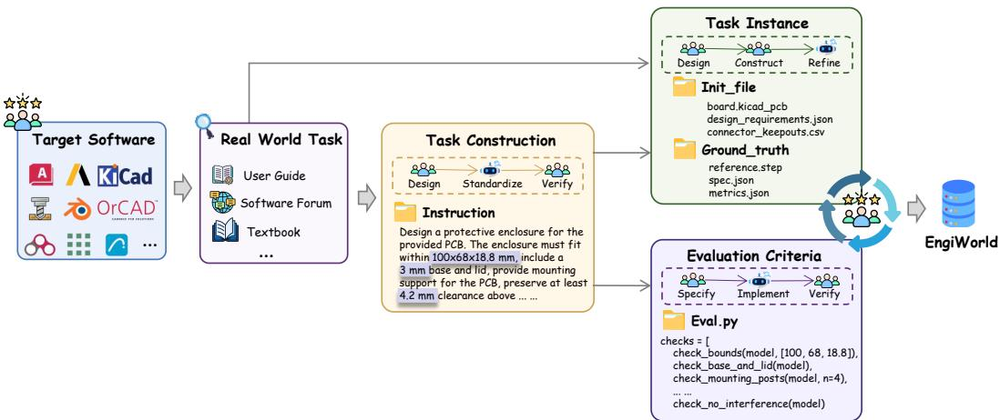  
Figure A.1: Dataset construction pipeline. Representative engineering scenarios are transformed into executable benchmark tasks through task construction, task-instance construction, and evaluation-criteria construction, with expert review and validation throughout the process.

## A.1 TASK CONSTRUCTION

Task construction begins with the selection of software platforms and workbenches across the six engineering domains covered by EngiWorld. For each environment, experts identify representative scenarios from real engineering workflows and software-specific resources, including official documentation, user guides, tutorials, technical references, and engineering textbooks. These scenarios are selected to reflect the characteristic capabilities and workflows of the corresponding software.

Each scenario is formulated as a result-oriented task specification that defines the engineering objective, available inputs, required deliverables, and relevant constraints. AI assists in standardizing the structure and wording of the specification so that tasks across heterogeneous software environments follow a consistent format. For tasks initialized from existing engineering artifacts, observable properties remain encoded in the provided task state, allowing the instruction to focus on the intended outcome and required deliverables. Experts then review and finalize the specification, which serves as the common basis for task instantiation and evaluation.

## A.2 TASK INSTANCE CONSTRUCTION

Once the task specification is finalized, the corresponding task instance is constructed in the designated software environment. Experts prepare the initial engineering state and construct a validated reference realization in the corresponding professional software, with AI assistance during artifact preparation and iterative refinement. Depending on the domain, a task instance may involve CAD geometry, PCB designs, simulation models, BIM models, manufacturing files, structured parameters, or 3D scenes.

The reference realization provides a verified solution and supports the extraction of task-specific engineering quantities used during construction and validation. Multiple valid realizations can satisfy the same task specification when they meet the required engineering conditions. For multi-software tasks, intermediate artifacts preserve the dependencies between successive workflow stages and may serve as inputs to subsequent applications. For open-choice tasks, the engineering requirements and deliverables are fixed while the agent retains flexibility in selecting tools and execution order.

## A.3 EVALUATION CRITERIA AND VERIFICATION

Evaluation criteria are derived directly from the engineering requirements of each task. Experts specify the properties and tolerances that characterize successful completion, covering quantities such as geometry and topology, component placement, clearances, connectivity, physical or simulation outputs, manufacturing constraints, and cross-artifact relationships. Together, these criteria define the engineering conditions under which a submitted artifact is considered valid.

AI assists in translating these expert-defined criteria into a task-specific programmatic verifier. The verifier extracts the relevant properties from the submitted final and, when required, intermediate artifacts and applies the corresponding checks. For example, a CAD task may verify dimensions, material regions, mounting structures, openings, clearances, and interference directly from the submitted geometry, while a simulation task may evaluate solver outputs and derived physical quantities. Numerical requirements are evaluated using explicit task-specific tolerances.

The verifier is validated together with the task instance in the target software environment. Reference realizations are used to confirm the expected acceptance behavior, while controlled variants are used to exercise task-relevant failure conditions and numerical boundaries. For tasks admitting multiple valid realizations, alternative solutions are additionally examined when applicable. Experts finally review the instruction, task instance, reference realization, and verifier as a complete task package. Tasks with identified inconsistencies are revised and revalidated before inclusion in EngiWorld.

## B ENGINEERING EVALUATION

## B.1 SOFTWARE ENVIRONMENTS

Each task runs in an isolated Windows or Ubuntu virtual machine with the required engineering software installed. EngiWorld provides 37 environments: 26 software-specific environments, 10 composite environments supporting multi-software workflows, and one dedicated environment for Open-ended tasks. Table B.1 lists the 26 software-specific environments, with FreeCAD Modeling and Path treated as separate workbench environments. Before each episode, the harness restores a clean snapshot, copies the task inputs, prepares the workspace, and opens the relevant documents. Cross-application tasks use a shared workspace containing the participating applications. The software versions listed in Table B.1 refer to the software-specific environments; composite environments may use different versions. For example, the Archicad–OpenStudio workflow uses OpenStudio 3.10 on Windows.

After an episode ends, the verifier runs inside the task VM and uses the application’s data model or a format-specific parser. The checker stack includes CadQuery/OCCT for solids, ezdxf for drawings, IfcOpenShell for building models, native FreeCAD and Blender APIs, Abaqus odbAccess for simulation results, and SQLite for EnergyPlus/OpenStudio outputs. Observation, budget, and history settings follow Section 4.1.

## B.2 ARTIFACT CHECKS AND SCORING

Artifact inspection. After termination, the verifier reopens the submitted deliverables and extracts the properties required by the task. Neutral formats such as STEP, DXF, and IFC are re-imported so that export errors affect the result. Numerical properties use task-specific tolerances, while connectivity, entity roles, and required references use exact checks (Table B.2). Missing or unreadable deliverables fail the corresponding criteria. When a file format permits equivalent names or representations, the checker accepts them while retaining the required geometry, physical settings, and numerical constraints. Integrity checks protect designated inputs and prevent scripted bypasses of

Table B.1: Software environments. The 37 environment configurations in EngiWorld: 26 softwarespecific environments, 10 composite environments, and one Open-ended environment.
<table><tr><td>Domain / type Application(s)</td><td></td><td>Version</td><td>OS</td><td>Interface</td></tr><tr><td colspan="5">Software-specific environments (26)</td></tr><tr><td rowspan="7">CAD</td><td>FreeCAD</td><td>0.21.2</td><td>Ubuntu</td><td>CLI/GUI</td></tr><tr><td>AutoCAD</td><td>2024</td><td>Windows</td><td>CLI/GUI</td></tr><tr><td>SolidWorks</td><td>2025</td><td>Windows</td><td>CLI/GUI</td></tr><tr><td>BRL-CAD</td><td>7.32.2</td><td>Ubuntu</td><td>CLI</td></tr><tr><td>OpenSCAD</td><td>2021.01</td><td>Ubuntu</td><td>CLI/GUI</td></tr><tr><td>LibreCAD</td><td>2.2.0.2</td><td>Ubuntu</td><td>GUI</td></tr><tr><td>SolveSpace</td><td>3.1</td><td>Ubuntu</td><td>GUI</td></tr><tr><td rowspan="7">CAE</td><td>ANSYS</td><td>2026R</td><td>Windows</td><td>CLI/GUI</td></tr><tr><td>Abaqus</td><td>2025L</td><td>Windows</td><td>CLI/GUI</td></tr><tr><td>OpenFOAM</td><td>11</td><td>Ubuntu</td><td>CLI</td></tr><tr><td>FEniCS (DOLFIN)</td><td>2019.1.0</td><td>Ubuntu</td><td>CLI</td></tr><tr><td>CalculiX</td><td>2.21</td><td>Ubuntu</td><td>CLI</td></tr><tr><td>FLORIS OpenFAST</td><td>4.6.4</td><td>Ubuntu</td><td>CLI</td></tr><tr><td></td><td>5</td><td>Ubuntu</td><td>CLI</td></tr><tr><td rowspan="4">EDA</td><td>Cadence OrCAD</td><td>24.1</td><td>Windows</td><td>CLI/GUI</td></tr><tr><td>EAGLE</td><td>7.7.0</td><td>Ubuntu</td><td>CLI/GUI</td></tr><tr><td>Altium Designer KiCad</td><td>17</td><td>Windows</td><td>CLI/GUI</td></tr><tr><td></td><td>10.0.2</td><td>Ubuntu</td><td>CLI/GUI</td></tr><tr><td>CAM</td><td>FreeCAD Path</td><td>0.21.2</td><td>Ubuntu</td><td>CLI/GUI</td></tr><tr><td rowspan="4">BIM</td><td>SolidCAM</td><td>2025</td><td>Windows</td><td>CLI/GUI</td></tr><tr><td>Archicad</td><td>27</td><td>Windows</td><td>CLI/GUI</td></tr><tr><td>Bonsai OpenStudio</td><td>0.8.5</td><td>Ubuntu</td><td>CLI/GUI</td></tr><tr><td>Revit</td><td>1.11.0</td><td>Ubuntu</td><td>CLI/GUI</td></tr><tr><td rowspan="2">3D/Vis.</td><td></td><td>2025</td><td>Windows</td><td>CLI/GUI</td></tr><tr><td>Blender</td><td>4.2.3</td><td>Ubuntu</td><td>CLI/GUI</td></tr><tr><td>ZBrush</td><td></td><td>2025</td><td>Windows</td><td>GUI</td></tr><tr><td colspan="5">Composite environments: Multi-software tasks (6)</td></tr><tr><td rowspan="6">Multi</td><td>AutoCAD + SolidWorks + Abaqus</td><td></td><td>Windows</td><td>GUI</td></tr><tr><td>SolidWorks + Abaqus</td><td></td><td>Windows</td><td>GUI</td></tr><tr><td>Archicad + OpenStudio</td><td></td><td>Windows</td><td>CLI</td></tr><tr><td>Revit + Archicad + OpenStudio</td><td></td><td>Windows</td><td>CLI</td></tr><tr><td>LibreCAD + FreeCAD + KiCad + Blender</td><td></td><td>Ubuntu</td><td>GUI</td></tr><tr><td>KiCad + OpenSCAD + FreeCAD + Blender</td><td></td><td>Ubuntu</td><td>CLI</td></tr><tr><td colspan="2">Composite environments: Software-selection tasks (4)</td><td></td><td></td><td></td></tr><tr><td rowspan="5">Selection</td><td>ANSYS + Abaqus + AutoCAD</td><td></td><td>Windows</td><td>CLI/GUI</td></tr><tr><td>OrCAD + Altium Designer + OpenSCAD</td><td></td><td>Windows</td><td>CLI/GUI</td></tr><tr><td>Revit + Archicad + Abaqus</td><td></td><td>Windows</td><td>CLI/GUI</td></tr><tr><td>FreeCAD + LibreCAD + KiCad</td><td></td><td>Ubuntu</td><td>GUI</td></tr><tr><td></td><td></td><td></td><td></td></tr><tr><td colspan="2">Open-ended environment (1) Open-ended Dedicated workspace with freely chosen tools</td><td></td><td>Ubuntu</td><td>CLI</td></tr></table>

the GUI interface; implementation-specific signing and certificate rules are described by the corresponding environment configuration.

Cross-stage consistency. Multi-software verifiers check intermediate and final artifacts against the task inputs. In a KiCad–OpenSCAD–FreeCAD–Blender workflow, the checks match board identifiers and mounting-hole dimensions to the mechanical map, then verify that the enclosure, assembly, and review scene preserve those features. A missing upstream artifact fails every dependent criterion.

Table B.2: Artifact checks. Representative properties and acceptance rules across the verifier families. Numerical tolerances are task specific.
<table><tr><td>Check family</td><td>Properties</td><td>Acceptance criteria</td></tr><tr><td>Global geometry</td><td>Bounding spans, volume, surface area, and solid validity</td><td>Dimensional bounds and topology checks</td></tr><tr><td>Local geometry</td><td>Profiles at specified sections in the task&#x27;s datum frame</td><td>Profile tolerances,  $\mathrm { e . g . }$  0.005–0.08 mm</td></tr><tr><td>Solid-void occupancy</td><td>Material, cavities, through-holes, and bore clearance</td><td>Required occupancy; residual material, e.g.,  $\leq 0 . 1 \mathrm { m m } ^ { 3 }$ </td></tr><tr><td>Engineering assignments</td><td>Materials, loads, boundary conditions, and thermal zones</td><td>Required assignments and parameter values</td></tr><tr><td>Simulation outputs</td><td>Field quantities and physical responses</td><td>Task-specific absolute or relative error bounds</td></tr><tr><td>Structural relations</td><td>Net connectivity, entity roles, and cross-file references</td><td>Exact connectivity and semantic consistency</td></tr></table>

Quantitative scoring. Quantitative tasks specify an objective m and hard feasibility constraints $F _ { i }$ (Equation 2), including required geometry, material and load assignments, and task-specific limits on physical response. Each task defines a quality function for feasible outputs. When the objective measures improvement over an initial design, the score is normalized between a baseline $m _ { \mathrm { b a s e } }$ and an improved reference $m _ { \mathrm { r e f } } \colon$

$$
Q _ { i } ( \mathcal { V } _ { T } ) = \left\{ \begin{array} { l l } { \mathrm { c l i p } _ { [ 0 , 1 ] } \left( \frac { m ( \mathcal { V } _ { T } ) - m _ { \mathrm { b a s e } } } { m _ { \mathrm { r e f } } - m _ { \mathrm { b a s e } } } \right) , } & { F _ { i } ( \mathcal { V } _ { T } ) = 1 , } \\ { 0 , } & { F _ { i } ( \mathcal { V } _ { T } ) = 0 . } \end{array} \right.\tag{4}
$$

The normalization supports both minimization and maximization objectives: matching the baseline gives zero, and matching or exceeding the reference gives one. Other tasks score design quality directly, such as layout cost or surface approximation error, so a positive score need not indicate improvement over the initial artifact. Infeasible outputs receive zero regardless of the objective value. Raw measurements accompany $Q _ { i }$ in Appendix C.2; aggregate performance uses EngiScore (Equation 3).

## B.3 VERIFIER VALIDATION

Expected outcomes are assigned from the task requirements before verifier execution. Task authors label alternative and defective artifacts, and a second annotator reviews these judgments independently of the verifier output. Disagreements trigger a review of the specification and a repeat of the affected checks.

All 96 reference artifacts in the completed audit group pass after review and repair. The alternativesolution tests cover the Abaqus/ANSYS Software-selection family and FreeCAD lightweight design: all valid submissions are accepted, while empty and metrics-only submissions are rejected (Table B.3). Examples of artifact violations in agent-declared successes appear in Appendix D.2; tolerance-boundary tests are outside the completed audit populations.

## C ADDITIONAL RESULTS AND ANALYSES

Model names in this appendix omit inference settings; all runs use the configurations specified in Section 4.1.

## C.1 TASKS MISSED BY ALL MODELS

Across the 300 main-evaluation tasks, 128 receive a zero score from all seven models (Figure C.1). Among the remaining 172 tasks, 37 are solved by one model, 35 by two, and 29 by all seven. The all-zero set is concentrated in Single-software tasks, but also includes 22 Multi-software, 18

Table B.3: Verifier validation. Acceptance outcomes for reference, alternative-valid, and defective artifact populations.
<table><tr><td>Test population</td><td>Scope</td><td>n</td><td>Accepted</td><td>Rejected</td></tr><tr><td>Reference artifacts</td><td>Completed audit group</td><td>96</td><td>96</td><td>0</td></tr><tr><td>Alternative solver</td><td>Abaqus / ANSYS, CLI</td><td>40</td><td>40</td><td>0</td></tr><tr><td>Alternative solver</td><td>Abaqus / ANSYS, GUI</td><td>40</td><td>40</td><td>0</td></tr><tr><td>Alternative design</td><td>FreeCAD lightweight design</td><td>5</td><td>5</td><td>0</td></tr><tr><td>Empty delivery</td><td>Software-selection tasks, CLI / GUI</td><td>21</td><td>0</td><td>21</td></tr><tr><td></td><td>Metrics without artifacts Software-selection tasks, CLI / GUI 21</td><td></td><td>0</td><td>21</td></tr></table>

Software-selection, and 12 Quantitative design tasks. This distribution shows that the aggregate performance gap is not caused only by a small number of difficult cross-application workflows; many individual application tasks remain unsolved by every evaluated model.

## C.2 QUANTITATIVE DESIGN RESULTS

Partial scores occur in 53 of the 231 main-evaluation runs on Quantitative design tasks; nine runs receive 1.0 and 169 receive zero (Table C.1). These runs cover 33 tasks and seven models. KiCad layout and ZBrush surface tasks account for 38 of the 53 partial scores. Task scores distinguish design quality among valid outputs, while validity checks determine whether an artifact can receive credit. Objectives, checks, and scoring definitions follow Appendix B.2.

Quality differences among valid outputs. On ZBrush task 04, both Gemini 3.7 Flash and GPT-5.6 Sol produce valid surfaces with full evaluation-grid coverage. GPT achieves a lower height-field RMSE, 0.07650 versus 0.15098 OBJ units, and a higher score, 0.892 versus 0.804 (Table C.2). The initial design scores 0.880: GPT improves it slightly, whereas Gemini produces a valid surface of lower quality. For this task, the score measures the submitted surface’s quality rather than its improvement over the initial design.

Interpreting a near-full score. Gemini’s KiCad task-01 output scores 0.982, compared with 0.647 for the baseline layout. The evaluator-computed weighted cost decreases from 64.2085 to 3.2135, and route length decreases from 53.1618 to 40.1688 mm. All four movable components reach their target positions, with zero vias and minimum spacing of 4.6174 mm against a 2.0 mm requirement. The remaining cost comes from the route-length term (Table C.2). The gap to 1.0 therefore reflects residual engineering cost, not the fraction of requirements left unmet.

Validity gates and zero scores. On the same ZBrush task 04, Qwen 3.8 Flash obtains an RMSE of 0.18097 OBJ units but scores zero: its mesh contains degenerate faces, overlapping projected triangles, and multiple surface heights at the sampling points. GPT also scores zero on ZBrush task 05 because its grid coverage is 94.75%, below the required 98%. The RMSE remains a diagnostic measurement for these rejected artifacts, but it cannot compensate for invalid topology or insufficient coverage. Partial scores distinguish the quality of admissible designs; the validity gate prevents a geometrically defective output from receiving credit for approximation accuracy alone.

## C.3 OPEN-ENDED VERSUS MULTI-SOFTWARE TASKS

The main evaluation includes four Open-ended tasks, numbered 02, 07, 09, and 10, derived from the KiCad–OpenSCAD–FreeCAD–Blender Multi-software tasks. Tasks 02 and 09 have directly matched Multi-software counterparts and are used for the paired analysis below. Figure C.2 summarizes their shared engineering requirements; the workflow and delivery differences are described afterward.

Shared design, different delivery requirements. For both tasks, the Multi-software instruction requires KiCad to extract the board geometry and parameters, OpenSCAD to construct the enclosure, FreeCAD to assemble the parts and check clearances, and Blender to produce a visual review. It specifies this sequence and 18 artifacts, including intermediate handoffs, reports, a rendered review, and a toolchain invocation log. The Open-ended instruction permits any available tools, scripts, or libraries in any order. It requires one final STEP assembly containing the enclosure, PCB, installed components, and task-specific features, which is evaluated directly against the geometric design requirements. The target assembly is shared; the required construction process and supporting deliverables change.

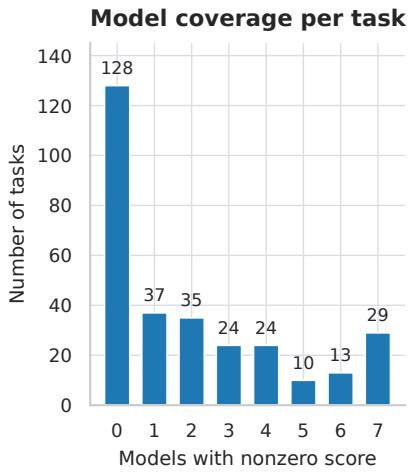

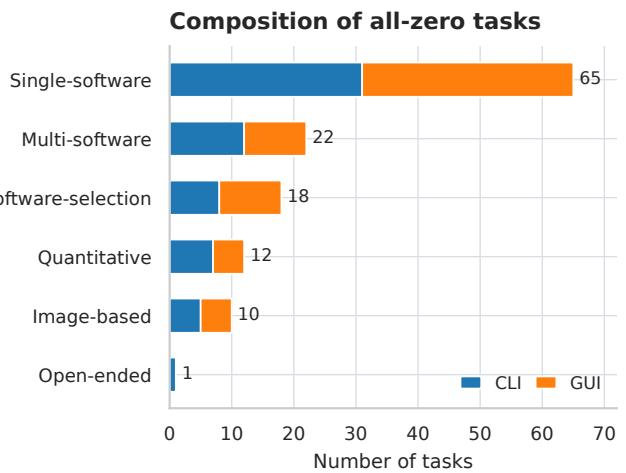  
Figure C.1: Tasks missed by all models. Of 300 main-evaluation tasks, 128 receive zero from all seven models. The remaining bars show how many models obtain a nonzero score, while the composition bars partition the 128 all-zero tasks by type and interface.

Table C.1: Quantitative design outcomes. Each model is evaluated on 33 tasks. Partial and full denote $0 < s < 1$ and $s = 1$ , respectively; EngiScore includes zero-scored runs.
<table><tr><td></td><td colspan="3">Number of runs</td></tr><tr><td>Model</td><td>Zero</td><td>Partial Full</td><td>EngiScore</td></tr><tr><td>GPT-5.6 Sol</td><td>20</td><td>8</td><td>5 36.4</td></tr><tr><td>Claude Opus 5</td><td>21</td><td>8 4</td><td>32.8</td></tr><tr><td>Gemini 3.7 Flash</td><td>24</td><td>9 0</td><td>20.6</td></tr><tr><td>Kimi K3</td><td>24</td><td>9</td><td>0 21.9</td></tr><tr><td>Qwen 3.8 Max</td><td>24</td><td>9</td><td>0 22.3</td></tr><tr><td>Qwen 3.8 Flash</td><td>29</td><td>4 0</td><td>9.9</td></tr><tr><td>DeepSeek V4.1 Flash</td><td>27</td><td>6 0</td><td>16.2</td></tr><tr><td>All runs</td><td>169</td><td>53 9</td><td>22.9</td></tr></table>

Table C.2: Representative quantitative outcomes. Task-specific quality metrics are reported together with artifact validity, baseline quality, and EngiScore.
<table><tr><td colspan="8">KiCad | task 01: Layout optimization</td></tr><tr><td colspan="4">Model Cost (USD) Route (mm)</td><td>Spacing (mm)</td><td>Vias</td><td>Baseline</td><td>Score</td></tr><tr><td>Gemini 3.7 Flash</td><td>3.2135</td><td>40.1688</td><td>4.6174</td><td>0</td><td>0.647</td><td></td><td>0.982</td></tr><tr><td colspan="8">ZBrush | task 04: Thumb-rest surface</td></tr><tr><td>Model</td><td>RMSE</td><td>Coverage (%)</td><td>Faces</td><td>Valid</td><td>Baseline</td><td></td><td>Score</td></tr><tr><td>Gemini 3.7 Flash</td><td>0.15098</td><td>100.00</td><td>256</td><td>Pass</td><td></td><td>0.880</td><td>0.804</td></tr><tr><td>GPT-5.6 Sol</td><td>0.07650</td><td>100.00</td><td></td><td>256 Pass</td><td></td><td>0.880</td><td>0.892</td></tr><tr><td>Qwen 3.8 Flash</td><td>0.18097</td><td>100.00</td><td>24,576</td><td>Fail</td><td></td><td>0.880</td><td>0.000</td></tr><tr><td colspan="4">ZBrush | task 05: Procedural ridge surface</td><td></td><td></td><td></td><td></td></tr><tr><td>Model</td><td>RMSE</td><td>Coverage (%)</td><td></td><td>Faces</td><td>Valid</td><td>Baseline</td><td>Score</td></tr><tr><td>GPT-5.6 Sol</td><td>0.49270</td><td>94.75</td><td>256</td><td>Fail</td><td></td><td>0.894</td><td>0.000</td></tr></table>

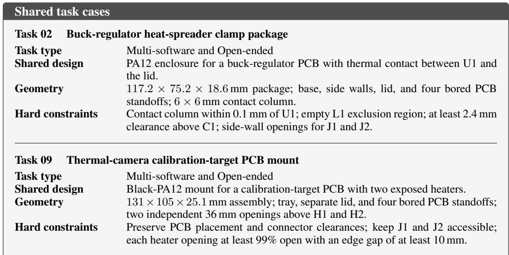  
Figure C.2: Paired Multi-software and Open-ended tasks. Tasks 02 and 09 share engineering targets but differ in workflow and delivery requirements.

All seven models fail the Multi-software versions of tasks 02 and 09. On Open-ended task 09, however, Claude Opus 5, Gemini 3.7 Flash, Qwen 3.8 Max, and DeepSeek V4.1 Flash succeed; Open-ended task 02 remains unsuccessful for all seven models (Table C.3). The paired Gemini and Qwen 3.8 Max trajectories for task 09 locate the Multi-software failures and the changes in the successful Open-ended workflows.

Where the Multi-software runs fail. On task 09, Gemini submits a 478-byte toolchain\_ invocation\_log.json, below the source evaluator’s 500-byte minimum. Qwen 3.8 Max reaches its 150-step limit with the same required file missing. Its last recorded action checks the required artifacts after completing the Blender stage. Both runs fail the delivery requirements before their assemblies are checked for geometric validity.

How the Open-ended runs succeed. In the Gemini and Qwen 3.8 Max Open-ended task-09 trajectories, the agents construct the assembly through FreeCAD scripting and submit a STEP file that passes the final geometry evaluator. Qwen 3.8 Max completes this run in 30 steps under the same 150-step budget as its Multi-software run. Gemini completes its Open-ended run in 41 steps under a 150-step limit; its Multi-software run ends after 44 steps under a 150-step limit, with the logsize check still failing. Gemini therefore fails the Multi-software task on a delivery check despite remaining within its step budget.

For these two models, direct construction produces an assembly that passes the geometry checks, while the prescribed workflow fails on intermediate delivery obligations. Geometric errors remain a separate failure mode: GPT-5.6 Sol leaves 3.698 mm3 of material in the Open-ended task-09 MH1 bore, above the 0.1 mm3 tolerance. The paired outcomes separate two demands of the Multisoftware task: constructing a valid assembly and completing the required software handoffs and documentation.

## C.4 ADDITIONAL ABLATION ANALYSIS

Additional observations can change which tasks succeed as well as the quality of partially successful outputs. We separate these effects using matched task scores and examine the task requirements behind the opposing outcomes.

Initial-image placement. Providing the reference drawing in the message improves GUI EngiScore for all three models, while Kimi’s CLI score decreases from 40.0 to 36.7 (Table 3). GPT’s GUI gain combines 15 failures becoming successes and five successes becoming failures across 60 tasks.

Table C.3: Paired task outcomes. Entries are binary, with 1 indicating success. Multi-software follows the prescribed workflow; Open-ended permits free tool and strategy selection.
<table><tr><td></td><td>Task 02</td><td colspan="2">Task 09</td></tr><tr><td>Model</td><td>Multi- Open- software ended</td><td>Multi- software</td><td>Open- ended</td></tr><tr><td>GPT-5.6 Sol</td><td>0</td><td>0 0</td><td>0</td></tr><tr><td>Claude Opus 5</td><td>0</td><td>0 0</td><td>1</td></tr><tr><td>Gemini 3.7 Flash</td><td>0</td><td>0 0</td><td>1</td></tr><tr><td>Kimi K3</td><td>0</td><td>0 0</td><td>0</td></tr><tr><td>Qwen 3.8 Max</td><td>0</td><td>0 0</td><td>1</td></tr><tr><td>Qwen 3.8 Flash</td><td>0</td><td>0 0</td><td>0</td></tr><tr><td>DeepSeek V4.1 Flash</td><td>0</td><td>0 0</td><td>1</td></tr></table>

The gain is therefore a net result of different task outcomes, rather than an improvement shared by every task.

The opposing GPT outcomes on FreeCAD task 01 and Blender task 02 distinguish reference access from artifact construction. FreeCAD task 01, which becomes successful with message placement, requires a mounting plate whose drawing supplies dimensions and whose supplement supplies four through-hole locations. Direct presentation makes one of these two required information sources available at the start. Blender task 02 instead becomes unsuccessful. It requires ten courses of ten bricks as 100 disconnected islands within a single mesh object. Recognizing the wall’s appearance leaves its mesh connectivity to be constructed correctly. These requirements explain why easier access to a reference can remove an information-retrieval step without ensuring that the resulting artifact satisfies its structural constraints.

Runtime image access in CLI. Enabling readimg improves Gemini on both task sets and lowers Kimi on both (Table 4). With a message-based initial drawing, Kimi gains two successful tasks but loses five. FreeCAD task 39 becomes successful, whereas task 42 becomes unsuccessful. Task 39 combines a bearing bore, a front window, top ribs, and mounting holes. Task 42 requires a central through-bore, four closed-end radial slots with specified depth, and a hole array with a specified angular phase. Both require exactly one valid connected solid.

A rendered view can support comparison of the visible arrangement of these features, but does not by itself establish bore connectivity, slot depth, or the validity of the exported solid. These properties require geometric checks alongside visual inspection. The task pair therefore illustrates a distinction between making visual feedback available and verifying the engineering constraints.

GPT’s EngiScore increases from 66.7 to 68.3 with a message-based drawing but decreases from 48.1 to 41.5 without one. An initial drawing could give the agent a target for interpreting intermediate renders. However, the two settings contain different task sets: each supports a matched comparison of readimg on versus off, but their difference also includes task composition. The GPT reversal therefore motivates an interaction hypothesis rather than isolating the interaction between initialimage availability and runtime image access.

Accessibility information. Adding an accessibility tree improves Kimi’s EngiScore but lowers Gemini’s and GPT’s (Figure 6a). GPT has eight tasks gaining nonzero scores and eight losing them, yet its EngiScore decreases from 29.84 to 29.05. The gains contribute 7.195 points, while the losses remove 8.000 points. A further 0.014-point improvement on an already nonzero task only partly offsets this deficit. Equal numbers of gains and losses therefore conceal unequal amounts of engineering credit.

Within FreeCAD, task 14 becomes successful with the tree, while task 20 becomes unsuccessful. Task 14 adds and fuses a cylindrical crossbar between two posts. Task 20 requires positioning an upright support, fusing it to a base, and cutting a through-hole along a specified axis. Textual interface information can help identify controls, but the requested operations still depend on the selected body, geometric placement, and feature direction. The opposing outcomes within one application show that the benefit cannot be reduced to whether that application exposes accessibility information; the relevant question is whether the information supports the particular geometric operation.

Screenshot resolution. Native resolution produces the highest EngiScore for all three models (Figure 6b). For GPT, increasing resolution from 0.6× to 1.0× yields ten new full-score outcomes, contributing 10.000 points, while ten tasks lose a combined 9.140 points. This imbalance account for the increase from 28.98 to 29.84 despite the regressions. Kimi gains eleven nonzero outcomes and loses none, so its improvement is more consistent across tasks.

GPT’s newly successful KiCad task 06 requires repairing a QFN-48 footprint’s exposed pad, paste apertures, and courtyard while preserving the peripheral pads. Its small, closely spaced features make it a relevant case for improved visual discrimination. The newly unsuccessful Blender task 02 instead requires the 100 disconnected brick islands described above. Greater image detail may aid feature selection, but the mesh-structure requirement remains a separate construction obligation. The contrast distinguishes a task that requires selecting fine geometric features from one that requires constructing a particular mesh structure.

History length. Increasing history from ten to fifteen turns lowers Kimi’s EngiScore from 26.21 to 20.12, while GPT changes little, from 36.61 to 36.74 (Figure 6c). For Kimi, five tasks gain nonzero scores and eleven lose them, contributing +4.368 and −10.532 points, respectively. Changes between already nonzero scores add 0.073 points. The decline is thus dominated by tasks losing all credit rather than by small quality reductions across partially successful designs.

GPT’s near-constant mean has a different explanation. Seven tasks gain nonzero scores, contributing 6.899 points, while seven formerly full-score tasks lose 7.000 points. ZBrush task 03, which remains nonzero in both settings, improves from 0.61434 to 0.843902 and contributes another 0.230 points. These three components account for the net 0.129-point increase. The task optimizes a gasket sealing-band surface under topology and coverage constraints, so the higher score records a quality improvement that a binary gain/loss count would miss. Its fifteen-turn score still falls below the initial design’s 0.909292. Longer history therefore improves this output relative to the ten-turn run without establishing an improvement over the starting design, consistent with the distinction in Appendix C.2.

## D CASE STUDIES

## D.1 SUCCESSFUL WORKFLOW CASES

Across these four GUI runs, the requested edits are retained in the delivered files together with the required electrical, geometric, or image properties. All four runs pass their task-specific artifact checks and receive a score of 1.0 (Figure D.1).

In KiCad, the DATA0–DATA7 labels encode eight distinct nets that establish the required one-toone MCU–SRAM pin mapping. The agent adds the two required power flags while retaining the existing components and power and control connections. Checks on the saved schematic verify both the new data connections and the preserved circuitry, with zero electrical-rule errors.

In AutoCAD, rectangular arrays express the repeated geometry through shared spacing parameters. After constructing the outline and slots, the agent combines 5 × 3 and 4 × 2 arrays with offset origins to produce 23 staggered tube holes. The exported DXF retains the required coordinates, radii, entity types, and layer assignments, preserving the drawing’s geometric and organizational structure through export.

The SolidWorks edit changes relative placement while keeping part geometry fixed. The agent makes the sliding block movable, applies a Profile Center mate, and corrects the offset direction to align the XY centers and place the sliding block’s bottom face against the base’s top face. The exported STEP satisfies these placement constraints while retaining the original dimensions and two independent solids.

In Blender, the agent bakes ambient occlusion into AO\_Bake and packs the 512×512 image before saving answer.blend. Packing embeds the baked pixel data in the native file, preserving the computed image as part of the delivered scene.

Task 1 (KiCad): Connect MCU–SRAM DATA0–DATA7 and resolve all electrical errors.  
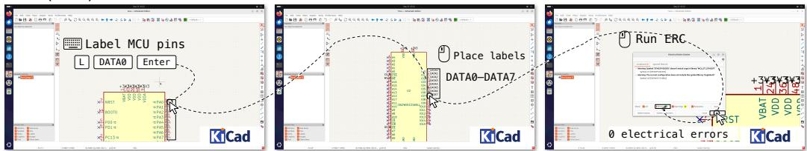

Task 2 (AutoCAD): Draw a tube sheet with 23 staggered tube holes and export the drawing as DXF.  
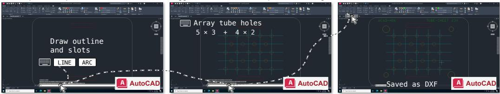  
Task 3 (SolidWorks): Center the sliding block on the base and export a STEP with two independent solids.

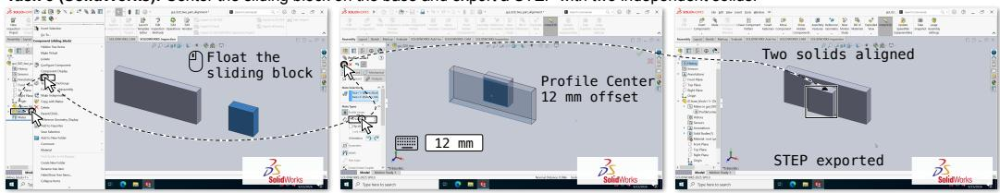

Task 4 (Blender): Bake a 512 × 512 ambient occlusion map, pack the image, and save the Blender scene.  
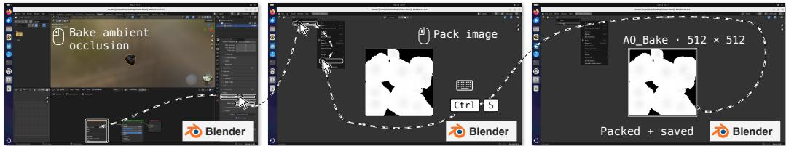  
Figure D.1: Successful single-software GUI workflows. The four rows show representative KiCad, AutoCAD, SolidWorks, and Blender executions. Intermediate edits and final checks or artifacts are connected by dashed arrows. All four runs pass their artifact verifiers.

## D.2 FAILURE CASES

We analyze five recorded failure categories: DONE with a zero score, decision-turn exhaustion, explicit FAIL, environment timeout, and agent-initiated desktop closure or restart. Across the main evaluation and ablations, 3,347 distinct zero-score runs fall into these categories. Their aggregate distribution and main-evaluation breakdown are reported in Tables D.1 and D.2. Reused runs are counted once; required-field and missing-file failures are excluded from this analysis.

Failure by interaction interface. The failure composition differs substantially between interfaces (Figure D.2). Among the analyzed failures, decision-turn exhaustion accounts for 233 of 636 CLI failures (36.6%) and 471 of 851 GUI failures (55.3%). Completion without acceptance is more common on CLI, while explicit failure declarations and runtime-limit failures remain smaller components in both settings. The interface-level breakdown complements the model-level analysis in Figure 5.

Artifact checks in declared successes. Independent checks identify geometric and cross-stage violations in four runs that end with DONE (Table D.3). The checks use the delivered artifacts even when agent-written reports claim that the requirements have been met.

Two of the four listed runs declare DONE; the remaining runs reach the 300-turn limit or declare FAIL. All four receive zero scores, with distinct discrepancies in the recorded operations and artifacts (Figure D.3).

Table D.1: Failure taxonomy across all experiments. Counts and shares of 3,347 distinct failed runs in the five analyzed categories. Reused runs count once; required-field and missing-file failures are excluded.
<table><tr><td>Recorded outcome</td><td>Runs</td><td>Share (%)</td></tr><tr><td>DONE with zero score</td><td>1,641</td><td>49.03</td></tr><tr><td>Decision-turn limit reached</td><td>1,499</td><td>44.79</td></tr><tr><td>Explicit FAIL declaration</td><td>167</td><td>4.99</td></tr><tr><td>Environment time limit exceeded</td><td>37</td><td>1.11</td></tr><tr><td>Desktop closed or restarted by agent action</td><td>3</td><td>0.09</td></tr></table>

Table D.2: Failure counts by model. Main-evaluation failures on the shared 300-task set, grouped into the five analyzed categories. Required-field and missing-file failures are excluded.
<table><tr><td>Model</td><td>Analyzed</td><td>DONE</td><td>Turn limit FAIL</td><td></td><td>Timeout</td><td>Desktop</td></tr><tr><td>GPT-5.6 Sol</td><td>184</td><td>160</td><td>24</td><td>0</td><td>0</td><td>0</td></tr><tr><td>Claude Opus 5</td><td>165</td><td>122</td><td>32</td><td>2</td><td>9</td><td>0</td></tr><tr><td>Gemini 3.7 Flash</td><td>222</td><td>88</td><td>133</td><td>0</td><td>0</td><td>1</td></tr><tr><td>Kimi K3</td><td>226</td><td>122</td><td>94</td><td>10</td><td>0</td><td>0</td></tr><tr><td>Qwen 3.8 Max</td><td>221</td><td>84</td><td>131</td><td>4</td><td>0</td><td>2</td></tr><tr><td>Qwen 3.8 Flash</td><td>251</td><td>66</td><td>154</td><td>31</td><td>0</td><td>0</td></tr><tr><td>DeepSeek V4.1 Flash</td><td>218</td><td>53</td><td>136</td><td>1</td><td>28</td><td>0</td></tr><tr><td>Total</td><td>1,487</td><td>695</td><td>704</td><td>48</td><td>37</td><td>3</td></tr></table>

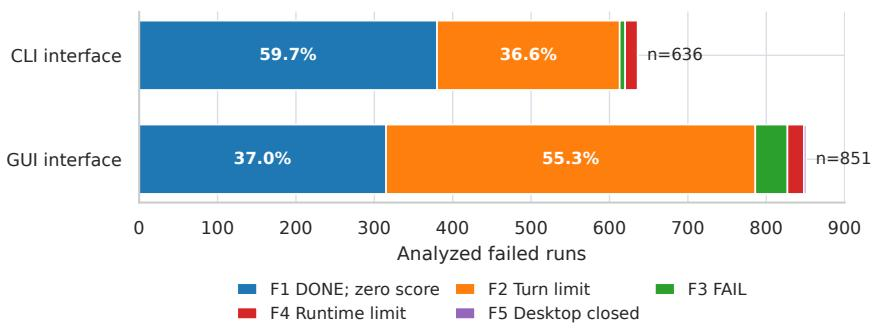  
Figure D.2: Failure composition by interaction interface. Decision-turn exhaustion accounts for 36.6% of CLI failures and 55.3% of GUI failures; the remaining segments show the other four analyzed outcomes.

Table D.3: Verified violations after declared completion. Each run ends with DONE but receives zero credit because the submitted artifact violates a task requirement.
<table><tr><td>Task</td><td>Model</td><td>Verified violation</td></tr><tr><td>OpenSCAD microfluidic lid (GUI)</td><td>Gemini 3.7 Flash</td><td>Channel cut from the wrong face; sampled material and cavity states are inverted.</td></tr><tr><td>OpenSCAD V-groove pulley (CLI)</td><td>Gemini 3.7 Flash</td><td>Groove root and section fail at the required stations in the inherited datum frame.</td></tr><tr><td>KiCad-OpenSCAD- FreeCAD-Blender (CLI)</td><td>Gemini 3.7 Flash</td><td>The mechanical map assigns a mounting-hole role inconsistent with the source board.</td></tr><tr><td>Thermal-camera mount (Open-ended, CLI)</td><td>GPT-5.6 Sol</td><td>The MH1 bore contains 3.70 mm³ of residual material, exceeding the 0.1 mm³ allowance.</td></tr></table>

Load representation mismatch. In the SolidWorks–Abaqus case, the analysis completes and produces an ODB, but the native model uses a −11.111 MPa pressure load. On the specified 30×3 mm end face, this pressure corresponds to approximately 1 kN of tension. The evaluator checks native force or displacement parameters without converting pressure to resultant force, so this representation does not satisfy its load check.

Task 1 (SolidWorks → Abaqus): Build a central-hole coupon and apply a 1 kN tensile load.  
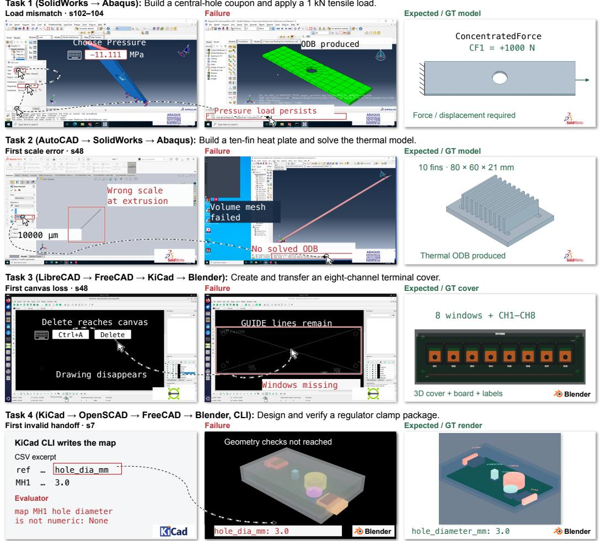  
Figure D.3: Multi-software failure cases. Recorded actions, submitted data, and observed outcomes are compared with independently rendered reference artifacts. The first three cases use the GUI interface and the fourth uses the CLI interface; all receive zero credit.

Import scale errors. In the AutoCAD–SolidWorks–Abaqus case, an import-scale error becomes visible during extrusion. The agent corrects the units, but the error reappears after a crash and another DXF import. The transferred model is elongated and lacks the proportions of the 80×60×21 mm, ten-fin reference. Repeated volume-meshing attempts continue until the 300-turn limit without producing a solved thermal ODB.

Incorrect action targeting. The LibreCAD–FreeCAD–KiCad–Blender case stalls during drawing preparation. An intended text edit sends Ctrl+A and Delete to the drawing canvas, clearing the drawing. After the seed drawing is reopened, the saved DXF still contains the diagonal GUIDE lines and lacks the eight required windows. Subsequent attempts to launch FreeCAD do not advance the workflow, which ends with FAIL.

CSV schema mismatch. The KiCad–OpenSCAD–FreeCAD–Blender CLI case produces all 18 required files, including a final Blender render, and ends with DONE. Its mechanical CSV stores mounting-hole diameters under hole\_dia\_mm, whereas the GT uses hole\_diameter\_mm. The submitted field name is not among the evaluator’s accepted aliases. The evaluator therefore reads the diameter of MH1 as None and stops before the downstream geometry checks.