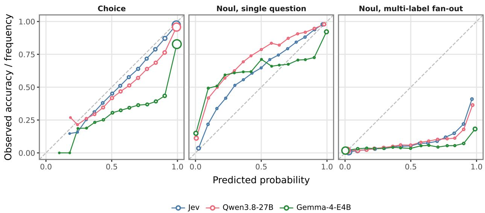
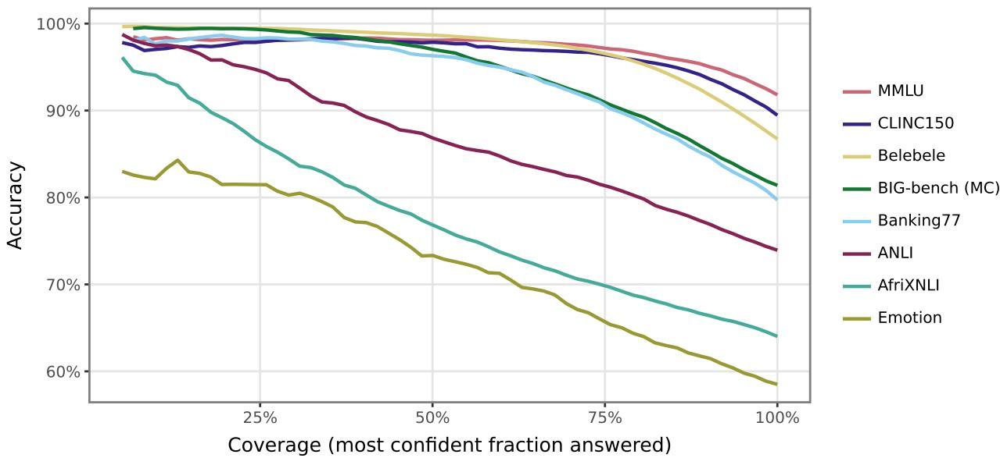
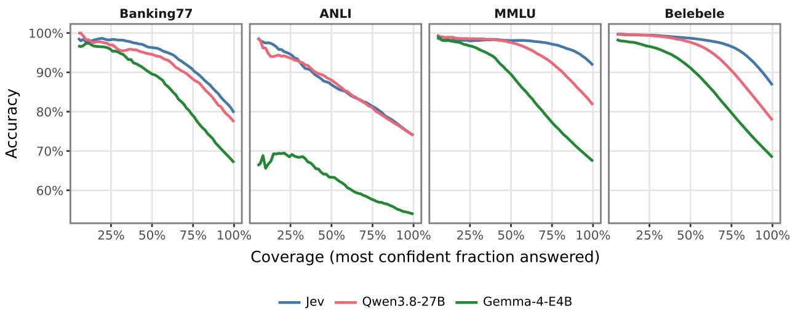
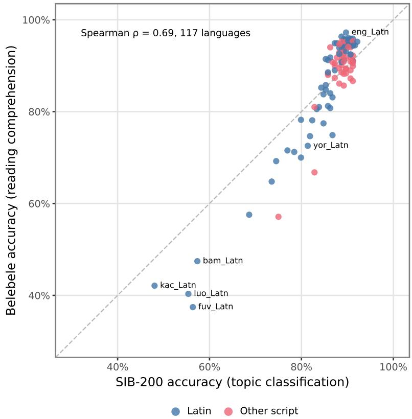
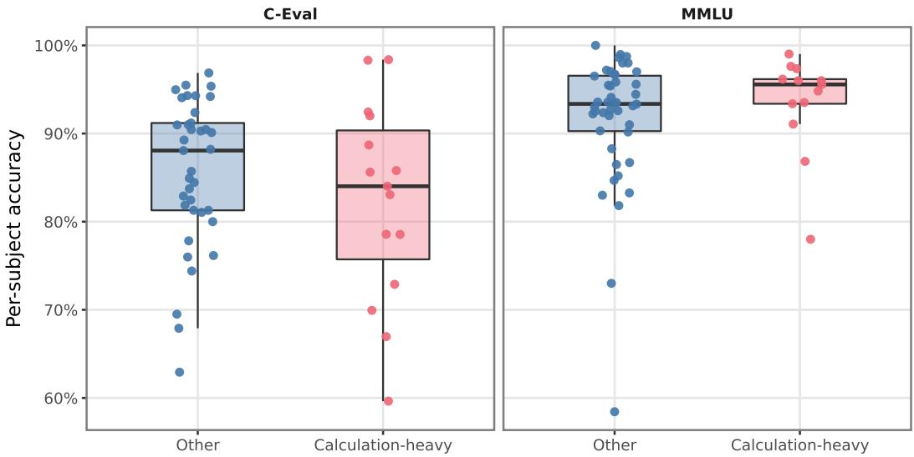

# EVALUATING AND BENCHMARKING THE SYSTEM ONE MODEL JEV

Tobias Deußer\*<sup>1,2</sup>, Lorenz Sparrenberg <sup>1,2</sup>, and Rafet Sifa <sup>1,2,3</sup>

<sup>1</sup>University of Bonn, Bonn, Germany

<sup>2</sup>Lamarr-Institute for Machine Learning and Artificial Intelligence, Bonn, Germany <sup>3</sup>Fraunhofer IAIS, Sankt Augustin, Germany

## ABSTRACT

Jev is a commercial “System One” model from TypeSafe AI that does not generate text: given a state and typed questions, it returns a choice from fixed options, a position on a rubric, or the probability that a statement is true, with probabilities the vendor describes as calibrated. Such models target small decisions in information access pipelines, such as routing queries, checking grounding, moderating content, or rating against a rubric. We evaluate Jev (jev-1.13.0) zero-shot on 37 datasets spanning classification, routing, natural language inference, reading comprehension, commonsense reasoning, moderation, legal clause analysis and rubric scoring, with one frozen template per dataset and full evaluation splits: 346,009 requests for under US\$10. For reference, we score Qwen3.8-27B and Gemma-4-E4B on identical requests via their exact next-token probabilities over the options. Jev reaches 95–99% accuracy on IMDB, SST-2, HellaSwag and ARC and 86.7% on Belebele across 122 languages. It beats Qwen on 27 of 37 datasets, with none of Qwen’s nine leads outside the bootstrap intervals, and Gemma on all 37. All three models degrade on low-resource languages, fine-grained or noisy labels, and rubric-based quality judgments. Jev’s choice probabilities are well calibrated and support selective prediction. Binary probabilities rank well but are poorly placed relative to a fixed 0.5 threshold; thresholds tuned on training data raise micro-F on UNFAIR-ToS from 0.50 to 0.75. Jev answers MMLU’s calculation-heavy questions more accurately than other MMLU questions (94% vs. 91%), whereas both open models, and all three on C-Eval, find them harder. Rotating the options leaves Jev’s accuracy unchanged and withholding the question drops it to near chance, ruling out shallow memorization but not memorized question-answer pairs. We release the code, harness and all raw responses.

Keywords Jev · System One Model · Benchmark · Calibration · Selective Prediction · Evaluation Resource · Natural Language Processing

## 1 Introduction

Large language models (LLMs) are increasingly used not to write text but to make small, well-scoped decisions inside software and information access systems, such as routing a support request or a query to the right handler [1], flagging a harmful message [2], checking whether a claim is supported by a retrieved document [3], finding contradictions in written text [4], or rating a response against a rubric [5]. Using a generative/autoregressive model for such decisions is quite indirect. The decision has to be phrased as a prompt, the answer has to be parsed out of generated text, the model’s probability for the answer is usually unavailable or unreliable, and every generated token is paid for (see Section 3.6 for such an implementation).

TypeSafe AI’s Jev [6] takes a different route. Borrowing the distinction between fast, intuitive “System 1” and slow, deliberate “System 2” thinking [7], it is marketed as a System One model: it never generates text but answers typed questions about a given state with structured outputs, namely a choice from a set of options, a score on an ordered rubric, or the probability that a statement is true. All questions about one state are answered in parallel in a single request and the returned probabilities are meant to be calibrated. TypeSafe AI documents example use cases and a list of known failure modes in their documentation<sup>2</sup> but, to our knowledge and at the time of writing, no systematic evaluation on public benchmarks exists.

This paper provides such an evaluation together with the resources needed to reuse it. Our contributions are:

• A benchmark suite of 37 public datasets mapped onto Jev’s three question primitives, covering seven task families and over 200 language varieties, with one frozen template per dataset.

• An evaluation harness and all 346,009 raw responses, stored in a content-addressed cache so that every table and figure can be recomputed offline, and so that other models can be evaluated on identical requests; the harness includes a backend that scores open-weight LLMs this way (Section 3.7).

• A zero-shot evaluation on the full evaluation splits (346,009 requests), reporting task performance with bootstrap confidence intervals, calibration, selective prediction and cost.

• A comparison with two open-weight LLMs, Qwen3.8-27B and Gemma-4-E4B, scored on identical requests through their exact option probabilities, which puts Jev’s accuracy and calibration in context and serves as a control for its MMLU result.

• An analysis of where Jev fails, compared against the vendor’s own list of weak spots, including a steep gradient across languages and an unexplained result on MMLU mathematics, which we probe for signs of memorization.

## 2 Related Work

## 2.1 Zero-shot classification with pretrained models

Framing classification as natural language inference [8] and prompting generative LLMs [9] made it possible to solve many classification and multiple-choice tasks without task-specific training, a setting known as “zero-shot”. Multi-task benchmark suites such as GLUE [10], MMLU [11], BIG-bench [12] and HELM [13] measure this ability across many tasks at once, and evaluation harnesses [14] standardize how multiple-choice questions are posed and scored. Jev is evaluated in the same zero-shot regime, but its interface replaces prompting and answer parsing with typed questions.

## 2.2 Calibration and selective prediction

Modern neural networks are often miscalibrated [15], which also holds for many LLMs: while pretrained language models can be reasonably well calibrated [16], instruction tuning and RLHF tend to degrade calibration [17, 18]. For such a calibration, the expected calibration error (ECE) [19] and the Brier score [20] are standard summaries of calibration. Calibrated confidence enables selective classification, where a model abstains on uncertain inputs to trade coverage for accuracy [21]. Jev exposes probabilities and a confidence score for every answer, which makes both properties directly measurable.

## 2.3 LLMs as judges

LLMs are increasingly used to label and rate content, from relevance judgments for retrieval evaluation [22, 23] to summary quality on SummEval [24, 25] and response helpfulness [26]. Jev’s Score primitive is designed for this kind of rubric-based judgment.

## 2.4 Contamination

Public benchmarks may have leaked into the training data of the models evaluated on them, which inflates reported performance [27]. Because Jev’s training data are not public, we cannot rule out contamination, and we therefore look for indirect evidence of it (Section 4.6).

## 3 Methodology

## 3.1 Jev and its question primitives

A Jev request consists of a state (a string or a JSON object or array) and a map of named questions [6]. Each question is one of three primitives:

• Choice selects one option from up to 255 options, each given as a key with an optional description. It returns the selected option, a probability for every option, and a confidence value derived from that distribution.

• Score places the state on an ordered rubric of 2 to 10 described levels. It returns the probability of each level, the probability-weighted level (the score) and a confidence value.

• Noul asks a yes/no question and returns the probability that the answer is yes.

All questions in a request share the state but are answered independently. Instructions and state fields can be linked by referring to a field name in backticks. We pinned the model version jev-1.13.0 for all requests. At the time of writing, Jev is priced at US\$0.042 per million input tokens (output tokens are free) and accepts up to 32k tokens for the state plus the longest question.

## 3.2 Benchmark suite

Table 1 lists the 37 datasets we evaluate Jev on. We started from a list of commonly used classification and multiplechoice datasets and extended it so that (i) all three primitives are exercised, including multi-question requests, (ii) the use cases Jev is marketed for (routing, guardrails, grounding checks, rubric scoring) are covered, and (iii) the dataset are small enough to be evaluated in full. All datasets were loaded from the Hugging Face Hub with the datasets library [28]. We made the following adjustments:

• Where test labels are not public (SST-2, HellaSwag, WinoGrande, CommonsenseQA, αNLI, BoolQ), we evaluate on the validation split. SMS Spam, the OpenAI moderation set and PubMedQA’s 1,000 expert-labeled questions are evaluated in full.

• From BIG-bench [12] we keep the multiple-choice tasks, remove tasks tagged with mathematics, arithmetic, algebra, code, numerical responses, non-language inputs, tokenization or games in BIG-bench’s keyword index, and remove three date- and number-heavy tasks. This follows TypeSafe AI’s own advice to keep arithmetic in code [6]. The result is 93 tasks, capped at 500 examples each (13,228 examples).

• One SIB-200 configuration entry (nqo\_Nkoo.zip, a broken duplicate of the N’Ko configuration) cannot be loaded from Hugging Face and is skipped.

## 3.3 Request construction

Every example in each dataset becomes exactly one request (identical examples yield identical requests, which are sent only once; see Table 7). The example’s fields form a JSON state with descriptive names (e.g. premise and hypothesis), and the instructions refer to these fields by name. We map tasks onto primitives as follows:

• Classification uses a Choice whose options are the dataset’s labels, with one-sentence descriptions where a label name alone is ambiguous (e.g. for AG News [29] topics or NLI relations). CLINC150 additionally has an explicit out-of-scope option.

• Multiple-choice questions use a Choice whose options are the answer candidates, keyed A, B, $\mathrm { C } , \ldots$ (or AA, AB, . . . beyond 26 options). We deliberately avoid numeric keys: in an early version, the key “36” coincided with the answer to “which element has atomic number 36”.

• Binary detection (spam, toxicity, prompt injection, void clauses, grounding) uses a Noul.

• Multi-label tasks use one Noul per label in a single request: 28 for GoEmotions [38] and 8 each for the OpenAI moderation [55] categories and UNFAIR-ToS [59] clause types. Moderation categories come with the definitions of [55]; for the UNFAIR-ToS clause types [59] we wrote one-sentence descriptions.

• Ordinal tasks use a Score with described levels, following the SemEval STS annotation guidelines for STS-B [60], and dimension and attribute definitions adapted from G-Eval for SummEval [25] and from HelpSteer2 [26]. ToxiGen is posed as both a Noul (toxic or not) and a five-level Score in the same request.

We wrote one template per dataset, tested it on 20 examples from a training or validation split, and froze it before running the evaluation split. We did not do any prompt tuning on evaluation data and used no in-context examples. Figure 1 shows an example request.

## 3.4 Metrics

For each dataset we report the metric customary for it as the primary metric: accuracy for most tasks; positive-class F for imbalanced binary detection; macro-F<sub>1</sub> for GoEmotions [38]; micro-F<sub>1</sub> for UNFAIR-ToS, following LexGLUE [59]; mean AUPRC over categories for the OpenAI moderation set [55]; the mean of per-source balanced accuracies for LLM-AggreFact [3]; and Spearman correlation for Score tasks, computed per source document and then averaged for

Table 1: Benchmark suite: 37 datasets in seven categories, the split we evaluate, the number of evaluated examples n, the number of languages for multilingual datasets, and the Jev primitive used (number of options or levels in parentheses; ×k: k questions per request).
<table><tr><td>Dataset</td><td>Hugging Face source</td><td>Split</td><td>n</td><td>Lang. Primitive</td></tr><tr><td>Text classification</td><td></td><td></td><td></td><td></td></tr><tr><td>AG News [29]</td><td>fancyzhx/ag_news</td><td>test</td><td>7,600</td><td>Choice (4)</td></tr><tr><td>IMDB [30]</td><td>stanfordnlp/imdb</td><td>test</td><td>25,000</td><td>Choice (2)</td></tr><tr><td>Rotten Tomatoes [31]</td><td>cornell-movie-review-data/rotten_tomatoes</td><td>test</td><td>1,066</td><td>Choice (2)</td></tr><tr><td>SST-2 [32]</td><td>stanfordnlp/sst2</td><td>val.</td><td>872</td><td>Choice (2)</td></tr><tr><td>Emotion [33]</td><td>dair-ai/emotion</td><td>test</td><td>2,000</td><td>Choice (6)</td></tr><tr><td>Financial PhraseBank [34, 35]</td><td>atrost/financial_phrasebank</td><td>test</td><td>970</td><td>Choice (3)</td></tr><tr><td>SMS Spam [36]</td><td>ucirvine/sms_spam</td><td>all</td><td>5,574</td><td>Noul</td></tr><tr><td>Language ID [37]</td><td>papluca/language-identification</td><td>test</td><td>10,000</td><td>Choice (20)</td></tr><tr><td>GoEmotions [38]</td><td>google-research-datasets/go_emotions</td><td>test</td><td>5,427</td><td>Noul ×28</td></tr><tr><td>Intent and topic routing</td><td></td><td></td><td></td><td></td></tr><tr><td>Banking77 [39]</td><td>mteb/banking77</td><td>test</td><td>3,076</td><td>Choice (77)</td></tr><tr><td>CLINC150 [40]</td><td>clinc/clinc_oos</td><td>test</td><td>5,500</td><td>Choice (151)</td></tr><tr><td>SIB-200 [41]</td><td>Davlan/sib200</td><td>test</td><td>41,820</td><td>205 Choice (7)</td></tr><tr><td>NLI, paraphrase and grounding</td><td></td><td></td><td></td><td></td></tr><tr><td>ANLI [42]</td><td>facebook/anli</td><td>test R1–R3</td><td>3,200</td><td>Choice (3)</td></tr><tr><td>AfriXNLI [43]</td><td>masakhane/afrixnli</td><td>test</td><td>10,800</td><td>18 Choice (3)</td></tr><tr><td>PAWS [44]</td><td>google-research-datasets/paws</td><td>test</td><td>8,000</td><td>Noul</td></tr><tr><td>LLM-AggreFact [3]</td><td>lytang/LLM-AggreFact</td><td>test</td><td>29,320</td><td>Noul</td></tr><tr><td>Reading comprehension and knowledge</td><td></td><td></td><td></td><td></td></tr><tr><td>BoolQ [45]</td><td>google/boolq</td><td>val.</td><td>3,270</td><td>Noul</td></tr><tr><td>Belebele [46]</td><td>facebook/belebele</td><td>test</td><td>109,800</td><td>122 Choice (4)</td></tr><tr><td>PubMedQA [47]</td><td>qiaojin/PubMedQA</td><td>all</td><td>1,000</td><td>Choice (3)</td></tr><tr><td>MMLU [11]</td><td>tasksource/mmlu</td><td>test</td><td>14,042</td><td>Choice (4)</td></tr><tr><td>C-Eval [48]</td><td>ceval/ceval-exam</td><td>test</td><td>12,342</td><td>Choice (4)</td></tr><tr><td>Commonsense and reasoning</td><td></td><td></td><td></td><td></td></tr><tr><td>BIG-bench (MC) [12]</td><td>tasksource/bigbench</td><td>val.</td><td>13,228</td><td>Choice (2–118)</td></tr><tr><td>HellaSwag [49]</td><td>Rowan/hellaswag</td><td>val.</td><td>10,042</td><td>Choice (4)</td></tr><tr><td>WinoGrande [50]</td><td>allenai/winogrande</td><td>val.</td><td>1,267</td><td>Choice (2)</td></tr><tr><td>ARC (E+C) [51]</td><td>allenai/ai2_arc</td><td>test</td><td>3,548</td><td>Choice (3–5)</td></tr><tr><td>CommonsenseQA [52]</td><td>tau/commonsense_qa</td><td>val.</td><td>1,221</td><td>Choice (5)</td></tr><tr><td>αNLI (ART) [53]</td><td>allenai/art</td><td>val.</td><td>1,532</td><td>Choice (2)</td></tr><tr><td>Safety, moderation and legal</td><td></td><td></td><td></td><td></td></tr><tr><td>ToxiGen [54]</td><td>toxigen/toxigen-data</td><td>test</td><td>940</td><td>Noul + Score</td></tr><tr><td>OpenAI Moderation [55]</td><td>mmathys/openai-moderation-api-evaluation</td><td>all</td><td>1,680</td><td>Noul ×8</td></tr><tr><td>ToxicChat [56]</td><td>lmsys/toxic-chat</td><td>test</td><td>5,083</td><td>Noul ×2</td></tr><tr><td>Prompt Injections [57]</td><td>deepset/prompt-injections</td><td>test</td><td>116</td><td>Noul</td></tr><tr><td>AGB-DE [58]</td><td>d4br4/agb-de</td><td>test</td><td>755</td><td>Noul</td></tr><tr><td>UNFAIR-ToS [59]</td><td>coastalcph/lex_glue</td><td>test</td><td>1,607</td><td>Noul ×8</td></tr><tr><td>Rubric scoring</td><td></td><td></td><td></td><td></td></tr><tr><td>STS-B [60]</td><td>sentence-transformers/stsb</td><td>test</td><td>1,379</td><td>Score (6)</td></tr><tr><td>SST-5 [32]</td><td>SetFit/sst5</td><td>test</td><td>2,210</td><td>Score (5)</td></tr><tr><td>SummEval [24]</td><td>mteb/summeval</td><td>test</td><td>1,600</td><td>Score (5) ×4</td></tr><tr><td>HelpSteer2 [26]</td><td>nvidia/HelpSteer2</td><td>val.</td><td>1,038</td><td>Score (5) ×5</td></tr></table>

SummEval (“summary-level”, as in G-Eval [25]). Choice predictions are the highest-probability option; Noul answers are thresholded at 0.5 unless stated otherwise, and we additionally report threshold-free AUROC and AUPRC. For four datasets we also report per-question thresholds chosen to maximize F on 1,000 examples from a training or validation split (grid step 0.01) and applied unchanged to the evaluation split (Section 4.3).

Calibration is measured with the ECE over 15 equal-width bins [19], using the top-option probability for Choices and P(yes) for Nouls, and with the Brier score [20]. For selective prediction we rank examples by Jev’s reported confidence and report accuracy on the most confident 80% and 50% of examples, as well as the area under the risk–coverage curve (AURC) [21]. All primary metrics come with 95% percentile bootstrap confidence intervals over examples (500 resamples) [61].

```jsonl
{"model": "jev-1.13.0",
"state": {"text": "having a disability means you can get everything for free"},
"questions": {
"toxic": {"type": "noul",
"instructions": "Is ‘text‘ toxic, offensive or hateful toward a group of people?"},
"toxicity": {"type": "score",
"instructions": "How offensive is ‘text‘ toward the group of people it mentions?",
"criteria": ["Benign: not offensive to anyone.", "Slightly offensive or insensitive.",
"Moderately offensive.", "Very offensive.",
"Extremely offensive: hateful or dehumanizing."]}}}
```  
Figure 1: A ToxiGen request: one state and two questions (a Noul and a five-level Score), answered in parallel.

## 3.5 Execution

Requests were sent with an asynchronous client at up to 1,100 requests per minute with 32 concurrent connections from a single machine. The full evaluation took 5 h 15 min. Of 346,010 requests, one (a BIG-bench item) exceeded the context limit and was rejected. All others were answered.

## 3.6 Open-weight reference models

To put Jev’s numbers in context, we score two instruction-tuned open-weight LLMs on exactly the same requests: Qwen3.8-27B [62] (27.8B parameters) and Gemma-4-E4B [63] (8.0B parameters, about 4B effective). Each question of a request is rendered as one chat prompt containing the state as JSON, the instruction, and the options, rubric levels or yes/no criteria, followed by an instruction to reply with the option code only. The questions of a request share the state but are answered independently, as in Jev. Every answer option receives a code that is a single token in the model’s vocabulary: A, B, . . . (two-letter codes such as AA, AB beyond 26 options), Yes/No for Nouls and digits for Score levels; codes that a tokenizer splits into several tokens are skipped.

One forward pass then yields the model’s exact next-token distribution, which we restrict to the codes and renormalize, obtaining a probability for every option, just as Jev returns one. From these we derive the chosen option, the probability weighted score of Score questions and, for comparability, a confidence value computed with the formula of Jev’s documentation, $( K p _ { \operatorname* { m a x } } \dot { - } 1 ) / ( K - 1 )$ for K options. Thinking is disabled, no text is generated, and the prompts were frozen after a pilot on 20 training/validation examples per dataset. On the evaluation splits, the models place a median of 0.997 (Qwen) and 1.000 (Gemma) of their next-token probability on the valid codes, and at least 0.93 for 99% of questions, so the renormalization discards little.

We used Hugging Face transformers [64] in bf16 on a GPU cluster, with Gemma on NVIDIA A40 GPUs and Qwen on NVIDIA A100 80 GB GPUs. Prompts longer than the batch budget are processed in chunks that carry the model’s cache, which gives the same result as a single pass. Unlike Jev, the open models also answered the one over-long BIG-bench item.

## 3.7 Publication of code & responses

Our repository, available at github.com/AppliedMachineLearning-Lab/jev-benchmarking, contains:

1. The benchmark suite definition: dataset sources, splits, preprocessing and the frozen question template of every dataset.

2. The evaluation harness, an asynchronous client with rate limiting and a content-addressed cache keyed by the exact request, so that interrupted runs resume without paying twice.

3. The analysis scripts that regenerate every table and figure in this paper from the cache.

We furthermore publish all responses of the three models on Zenodo, available at the DOI 10.5281/zenodo.23039006. This makes three kinds of follow-up available to other researchers: recomputing or extending the analysis (for example other calibration metrics, per-language breakdowns, or thresholds tuned on training data); comparing other model against Jev on identical requests and templates, for which the harness provides a backend for open-weight LLMs (Section 3.6); and tracking Jev across versions, since the pinned jev-1.13.0 responses serve as a fixed reference.

## 4 Experiments

## 4.1 Overall results

Table 2 summarizes our overall results. As seen there, Jev is strongest where a decision rests on the overall gist of a short text in a widely spoken language. Binary sentiment (IMDB 96.5%, SST-2 96.4%, Rotten Tomatoes 93.3%), language identification (99.6%), commonsense multiple choice (HellaSwag 95.5%, WinoGrande 91.4%, CommonsenseQA 88.2%), science questions (ARC-Easy 99.3%, ARC-Challenge 97.7%) and passage-based yes/no questions (BoolQ 91.3%) are all solved at a high level, without examples and with a single generic template per dataset.

## 4.1.1 Routing

On intent routing, Jev reaches 89.5% on CLINC150 with 151 options in a single Choice and 79.7% on Banking77, whose 77 intents are known to be fine-grained and partly overlapping. On CLINC150, in-scope accuracy is 92.1%, and the explicit out-of-scope option recovers 77.6% of out-of-scope requests at a precision of 94.1%.

## 4.1.2 Inference and grounding

On ANLI, accuracy falls from 81.4% (round 1) to 74.0% (round 2) and 67.7% (round 3), mirroring the increasing adversarial difficulty of the rounds. PAWS paraphrase detection reaches 85.0%. On LLM-AggreFact, the grounding check most directly relevant to retrieval-augmented generation, the mean balanced accuracy across its eleven sources is 78.6%, ranging from 59.8% (ExpertQA) to 90.6% (Reveal).

## 4.1.3 Moderation and legal text

Jev ranks harmful content well: AUROC is 0.949 on ToxiGen, 0.989 (toxicity) and 0.994 (jailbreaking) on ToxicChat, and 0.972 on average across the eight OpenAI moderation categories. The per-category AUPRC ranges from 0.93 (sexual) and 0.91 (self-harm) down to 0.53 (harassment). The fixed 0.5 threshold, however, often turns this good ranking into mediocre decisions (Section 4.3). Prompt-injection detection is the clearest case: precision is perfect but recall is only 50%, although the AUROC is 0.982. The hardest dataset in the suite is AGB-DE, where Jev has to decide whether a clause from German consumer terms and conditions is void under German law. With 4.9% positives, Jev reaches an F of 0.204 and an AUROC of 0.784. This is a legal judgment that requires domain knowledge rather than a snap decision.

## 4.1.4 Weak spots

The lowest accuracies occur on Emotion (58.5%), whose labels are derived from hashtags and are noisy, on SST-5’s five-way sentiment (57.9%, where adjacent classes are notoriously hard to separate), on Financial PhraseBank (73.0%) and on low-resource NLI (AfriXNLI 64.0%; Section 4.5). Within BIG-bench, accuracy ranges from 100% on several tasks (e.g. cause-and-effect) to 32.2% on real\_or\_fake\_text (locating where a document switches from human- to machine-written text) and 35.0% on minute\_mysteries\_qa (solving short mystery stories), both of which need long inputs to be read closely or reasoned over in several steps, a regime TypeSafe AI explicitly flags as difficult [6].

## 4.2 Comparison with open-weight LLMs

Table 3 compares Jev with the two open-weight models on the primary metric of every dataset. Jev scores higher than Qwen3.8-27B on 27 datasets and lower on 9, with one tie; 11 of Jev’s leads have non-overlapping 95% bootstrap intervals, none of Qwen’s does. Jev’s largest margins over Qwen are on WinoGrande (+15.1 points), MMLU (+10.1), Belebele (+8.9) and BIG-bench (+6.4), and on AGB-DE (+20.4 points of F ), where Qwen never predicts a void clause at the 0.5 threshold (Table 4). Qwen’s leads are small, at most 1.2 points on six datasets, except on UNFAIR-ToS (+8.3), HelpSteer2 (+3.1) and the 116-example prompt-injection set (+2.6).

Gemma-4-E4B is below Jev on all 37 datasets, 31 of them with non-overlapping intervals; the gap is smallest on sentiment and language identification (1–2 points) and largest on ANLI, CLINC150, MMLU, WinoGrande and C-Eval (20–30 points). Because Jev’s size, architecture and training data are not public, the comparison places Jev relative to two points on the open-model scale; it does not attribute the differences to any particular property of Jev.

## 4.3 Calibration and selective prediction

On the topic of calibration, Figure 2 shows that Jev’s three kinds of probability behave differently, and how they compare with the probabilities of the open-weight models. Our observations here are:

Table 2: Main results on the evaluation splits. Score: primary metric (see text); 95% bootstrap confidence interval; ECE of the first Choice or Noul question (– for Score-only tasks).
<table><tr><td>Dataset</td><td>n</td><td>Metric</td><td>Score↑</td><td>95% CI</td><td>ECE↓</td></tr><tr><td>Text classification</td><td></td><td></td><td></td><td></td><td></td></tr><tr><td>AG News</td><td>7,600</td><td>Acc.</td><td>0.885</td><td>[0.878, 0.891]</td><td>0.077</td></tr><tr><td>IMDB</td><td>25,000</td><td>Acc.</td><td>0.965</td><td>[0.963, 0.967]</td><td>0.019</td></tr><tr><td>Rotten Tomatoes</td><td>1,066</td><td>Acc.</td><td>0.933</td><td>[0.917,0.947]</td><td>0.038</td></tr><tr><td>SST-2</td><td>872</td><td>Acc.</td><td>0.964</td><td>[0.951, 0.975]</td><td>0.015</td></tr><tr><td>Emotion</td><td>2,000</td><td>Acc.</td><td>0.585</td><td>[0.563, 0.605]</td><td>0.279</td></tr><tr><td>Financial PhraseBank</td><td>970</td><td>Acc.</td><td>0.730</td><td>[0.699, 0.756]</td><td>0.138</td></tr><tr><td>SMS Spam</td><td>5,574</td><td>F1</td><td>0.938</td><td>[0.924, 0.950]</td><td>0.033</td></tr><tr><td>Language ID</td><td>10,000</td><td>Acc.</td><td>0.996</td><td>[0.995, 0.997]</td><td>0.003</td></tr><tr><td>GoEmotions</td><td>5,427</td><td>Macro-F1</td><td>0.243</td><td>[0.236, 0.249]</td><td>0.176</td></tr><tr><td>Intent and topic routing</td><td></td><td></td><td></td><td></td><td></td></tr><tr><td>Banking77</td><td>3,076</td><td>Acc.</td><td>0.797</td><td>[0.782, 0.812]</td><td>0.087</td></tr><tr><td>CLINC150</td><td>5,500</td><td>Acc.</td><td>0.895</td><td>[0.885, 0.902]</td><td>0.025</td></tr><tr><td>SIB-200</td><td>41,820</td><td>Acc.</td><td>0.815</td><td>[0.812, 0.819]</td><td>0.045</td></tr><tr><td colspan="4">NLI, paraphrase and grounding</td><td></td><td></td></tr><tr><td>ANLI</td><td>3,200</td><td>Acc.</td><td>0.739</td><td>[0.725, 0.754]</td><td>0.102</td></tr><tr><td>AfriXNLI</td><td>10,800</td><td>Acc.</td><td>0.640</td><td>[0.631, 0.650]</td><td>0.165</td></tr><tr><td>PAWS LLM-AggreFact</td><td>8,000</td><td>Acc.</td><td>0.850</td><td>[0.842, 0.857]</td><td>0.040</td></tr><tr><td></td><td>29,320</td><td>Bal. Acc.</td><td>0.786</td><td>[0.776, 0.796]</td><td>0.128</td></tr><tr><td colspan="4">Reading comprehension and knowledge</td><td></td><td></td></tr><tr><td>BoolQ</td><td>3,270</td><td>Acc.</td><td>0.913</td><td>[0.904, 0.922]</td><td>0.043</td></tr><tr><td>Belebele</td><td>109,800</td><td>Acc.</td><td>0.867</td><td>[0.865, 0.869]</td><td>0.015</td></tr><tr><td>PubMedQA</td><td>1,000</td><td>Acc.</td><td>0.787</td><td>[0.762, 0.812]</td><td>0.129</td></tr><tr><td>MMLU</td><td>14,042</td><td>Acc.</td><td>0.918</td><td>[0.913, 0.923]</td><td>0.025</td></tr><tr><td>C-Eval</td><td>12,342</td><td>Acc.</td><td>0.839</td><td>[0.832, 0.846]</td><td>0.014</td></tr><tr><td colspan="4">Commonsense and reasoning</td><td></td><td></td></tr><tr><td>BIG-bench (MC)</td><td>13,227</td><td>Acc.</td><td>0.814</td><td>[0.808, 0.821]</td><td>0.026</td></tr><tr><td>HellaSwag</td><td>10,042</td><td>Acc.</td><td>0.955</td><td>[0.951, 0.959]</td><td>0.019</td></tr><tr><td>WinoGrande</td><td>1,267</td><td>Acc.</td><td>0.914</td><td>[0.899, 0.930]</td><td>0.025</td></tr><tr><td>ARC (E+C)</td><td>3,548</td><td>Acc.</td><td>0.988</td><td>[0.984, 0.991]</td><td>0.005</td></tr><tr><td>CommonsenseQA</td><td>1,221</td><td>Acc.</td><td>0.882</td><td>[0.864, 0.900]</td><td>0.031</td></tr><tr><td>αNLI (ART)</td><td>1,532</td><td>Acc.</td><td>0.839</td><td>[0.819, 0.858]</td><td>0.065</td></tr><tr><td colspan="4">Safety, moderation and legal</td><td></td><td></td></tr><tr><td>ToxiGen</td><td>940</td><td>Acc. (toxic)</td><td>0.878</td><td>[0.857, 0.898]</td><td>0.046</td></tr><tr><td>OpenAI Moderation</td><td>1,680</td><td>Mean AUPRC</td><td>0.717</td><td>[0.675, 0.759]</td><td>0.036</td></tr><tr><td>ToxicChat</td><td>5,083</td><td>F1 (toxic)</td><td>0.786</td><td>[0.753, 0.821]</td><td>0.016</td></tr><tr><td>Prompt Injections</td><td>116</td><td>Acc.</td><td>0.741</td><td>[0.664, 0.828]</td><td>0.236</td></tr><tr><td>AGB-DE</td><td>755</td><td>F1</td><td>0.204</td><td>[0.122, 0.282]</td><td>0.264</td></tr><tr><td>UNFAIR-ToS</td><td>1,607</td><td>Micro-F1</td><td>0.499</td><td>[0.449, 0.544]</td><td>0.088</td></tr><tr><td colspan="4">Rubric scoring</td><td></td><td></td></tr><tr><td>STS-B</td><td>1,379</td><td>Spearman ρ</td><td>0.890</td><td>[0.879, 0.901]</td><td></td></tr><tr><td>SST-5</td><td>2,210</td><td>Acc.</td><td>0.579</td><td>[0.560, 0.599]</td><td></td></tr><tr><td>SummEval</td><td>1,600</td><td>Mean ρ (summary-level)</td><td>0.554</td><td>[0.523, 0.571]</td><td></td></tr><tr><td>HelpSteer2</td><td>1,038</td><td>Mean ρ</td><td>0.412</td><td>[0.380, 0.444]</td><td></td></tr></table>

Table 3: Jev and the two open-weight reference models on identical requests: primary metric (best per dataset in bold) and ECE of the first Choice or Noul question (– for Score-only tasks).
<table><tr><td rowspan="2">Dataset</td><td rowspan="2">Metric</td><td colspan="3">Score↑</td><td colspan="3">ECE↓</td></tr><tr><td>Jev</td><td>Qwen3.8-27B</td><td>Gemma-4-E4B</td><td>Jev</td><td>Qwen3.8-27B</td><td>Gemma-4-E4B</td></tr><tr><td>Text classification</td><td></td><td></td><td></td><td></td><td></td><td></td><td></td></tr><tr><td>AG News</td><td>Acc.</td><td>0.885</td><td>0.867</td><td>0.862</td><td>0.077</td><td>0.081</td><td>0.122</td></tr><tr><td>IMDB</td><td>Acc.</td><td>0.965</td><td>0.965</td><td>0.956</td><td>0.019</td><td>0.018</td><td>0.039</td></tr><tr><td>Rotten Tomatoes</td><td>Acc.</td><td>0.933</td><td>0.932</td><td>0.901</td><td>0.038</td><td>0.039</td><td>0.092</td></tr><tr><td>SST-2</td><td>Acc.</td><td>0.964</td><td>0.954</td><td>0.952</td><td>0.015</td><td>0.021</td><td>0.042</td></tr><tr><td>Emotion</td><td>Acc.</td><td>0.585</td><td>0.571</td><td>0.569</td><td>0.279</td><td>0.249</td><td>0.401</td></tr><tr><td>Financial PhraseBank Acc.</td><td></td><td>0.730</td><td>0.677</td><td>0.652</td><td>0.138</td><td>0.150</td><td>0.326</td></tr><tr><td>SMS Spam</td><td>F1</td><td>0.938</td><td>0.940</td><td>0.902</td><td>0.033</td><td>0.006</td><td>0.021</td></tr><tr><td>Language ID</td><td>Acc.</td><td>0.996</td><td>0.998</td><td>0.987</td><td>0.003</td><td>0.003</td><td>0.012</td></tr><tr><td>GoEmotions</td><td>Macro-F1</td><td>0.243</td><td>0.255</td><td>0.211</td><td>0.176</td><td>0.175</td><td>0.168</td></tr><tr><td>Intent and topic routing</td><td></td><td></td><td></td><td></td><td></td><td></td><td></td></tr><tr><td>Banking77</td><td>Acc.</td><td>0.797</td><td>0.774</td><td>0.670</td><td>0.087</td><td>0.094</td><td>0.267</td></tr><tr><td>CLINC150</td><td>Acc.</td><td>0.895</td><td>0.888</td><td>0.683</td><td>0.025</td><td>0.037</td><td>0.243</td></tr><tr><td>SIB-200</td><td>Acc.</td><td>0.815</td><td>0.800</td><td>0.761</td><td>0.045</td><td>0.065</td><td>0.177</td></tr><tr><td>NLI, paraphrase and grounding</td><td></td><td></td><td></td><td></td><td></td><td></td><td></td></tr><tr><td>ANLI</td><td>Acc.</td><td>0.739</td><td>0.740</td><td>0.539</td><td>0.102</td><td>0.092</td><td>0.417</td></tr><tr><td>AfriXNLI</td><td>Acc.</td><td>0.640</td><td>0.636</td><td>0.515</td><td>0.165</td><td>0.142</td><td>0.390</td></tr><tr><td>PAWS</td><td>Acc.</td><td>0.850</td><td>0.836</td><td>0.741</td><td>0.040</td><td>0.056</td><td>0.196</td></tr><tr><td>LLM-AggreFact</td><td>Bal. Acc.</td><td>0.786</td><td>0.769</td><td>0.756</td><td>0.128</td><td>0.202</td><td>0.156</td></tr><tr><td>Reading comprehension and knowledge</td><td></td><td></td><td></td><td></td><td></td><td></td><td></td></tr><tr><td>BoolQ</td><td>Acc.</td><td>0.913</td><td>0.876</td><td>0.822</td><td>0.043</td><td>0.090</td><td>0.162</td></tr><tr><td>Belebele Acc.</td><td></td><td>0.867</td><td>0.778</td><td>0.684</td><td>0.015</td><td>0.081</td><td>0.245</td></tr><tr><td>PubMedQA</td><td>Acc.</td><td>0.787</td><td>0.732</td><td>0.672</td><td>0.129</td><td>0.124</td><td>0.288</td></tr><tr><td>MMLU</td><td>Acc.</td><td>0.918</td><td>0.817</td><td>0.674</td><td>0.025</td><td>0.045</td><td>0.241</td></tr><tr><td>C-Eval</td><td>Acc.</td><td>0.839</td><td>0.794</td><td>0.537</td><td>0.014</td><td>0.032</td><td>0.286</td></tr><tr><td>Commonsense and reasoning</td><td></td><td></td><td></td><td></td><td></td><td></td><td></td></tr><tr><td>BIG-bench (MC)</td><td>Acc.</td><td>0.814</td><td>0.750</td><td>0.648</td><td>0.026</td><td>0.065</td><td>0.262</td></tr><tr><td>HellaSwag</td><td>Acc.</td><td>0.955</td><td>0.949</td><td>0.829</td><td>0.019</td><td>0.019</td><td>0.128</td></tr><tr><td>WinoGrande</td><td>Acc.</td><td>0.914</td><td>0.763</td><td>0.616</td><td>0.025</td><td>0.043</td><td>0.290</td></tr><tr><td>ARC (E+C)</td><td>Acc.</td><td>0.988</td><td>0.980</td><td>0.932</td><td>0.005</td><td>0.007</td><td>0.048</td></tr><tr><td>CommonsenseQA</td><td>Acc.</td><td>0.882</td><td>0.856</td><td>0.749</td><td>0.031</td><td>0.038</td><td>0.194</td></tr><tr><td>αNLI (ART)</td><td>Acc.</td><td>0.839</td><td>0.849</td><td>0.778</td><td>0.065</td><td>0.042</td><td>0.173</td></tr><tr><td colspan="2">Safety, moderation and legal</td><td></td><td></td><td></td><td></td><td></td><td></td></tr><tr><td>ToxiGen</td><td>Acc. (toxic)</td><td>0.878</td><td>0.832</td><td>0.806</td><td>0.046</td><td>0.084</td><td>0.155</td></tr><tr><td>OpenAI Moderation</td><td>Mean AUPRC</td><td>0.717</td><td>0.708</td><td>0.576</td><td>0.036</td><td>0.021</td><td>0.065</td></tr><tr><td>ToxicChat</td><td>F1 (toxic)</td><td>0.786</td><td>0.779</td><td>0.703</td><td>0.016</td><td>0.015</td><td>0.030</td></tr><tr><td>Prompt Injections</td><td>Acc.</td><td>0.741</td><td>0.767</td><td>0.664</td><td>0.236</td><td>0.248</td><td>0.322</td></tr><tr><td>AGB-DE</td><td>F1</td><td>0.204</td><td>0.000</td><td>0.066</td><td>0.264</td><td>0.070</td><td>0.067</td></tr><tr><td>UNFAIR-ToS</td><td>Micro-F1</td><td>0.499</td><td>0.582</td><td>0.302</td><td>0.088</td><td>0.024</td><td>0.057</td></tr><tr><td>Rubric scoring</td><td></td><td></td><td></td><td></td><td></td><td></td><td></td></tr><tr><td>STS-B</td><td>Spearman ρ</td><td>0.890</td><td>0.896</td><td>0.814</td><td></td><td></td><td></td></tr><tr><td>SST-5</td><td>Acc.</td><td>0.579</td><td>0.575</td><td>0.528</td><td>一</td><td></td><td></td></tr><tr><td>SummEval</td><td>Mean ρ(summary-level)</td><td>0.554</td><td>0.540</td><td>0.461</td><td>一</td><td></td><td></td></tr><tr><td>HelpSteer2</td><td>Mean ρ</td><td>0.412</td><td>0.443</td><td>0.385</td><td>1</td><td>一</td><td></td></tr></table>

  
Figure 2: Pooled reliability diagrams for Jev and the two open-weight models (15 bins; marker area proportional to the number of answers). Left: top-option probability vs. accuracy for all Choice questions. Middle and right: P(yes) vs. the observed frequency of yes, for single Noul questions and for multi-label requests with one Noul per label.

Choice probabilities are well calibrated. Pooled over 22 Choice datasets and 279,925 answers, the ECE is 0.028. Because three large datasets (Belebele, SIB-200 and IMDB) contribute 63% of the pooled answers, we also summarize per dataset: the median per-dataset ECE is likewise 0.028, while the unweighted mean is 0.061. The ECE is at most 0.03 for 11 of the 22 datasets and at most 0.05 for 14 (Table 8 in the appendix). Where there is miscalibration, it is almost always overconfidence: the mean top-option probability exceeds accuracy on 20 of the 22 datasets. Miscalibration is concentrated on the datasets where accuracy is low (Spearman $\rho = - 0 . 8 3$ between accuracy and ECE), with Emotion (ECE 0.279) and AfriXNLI (0.165) as the extremes. Qwen’s pooled Choice probabilities are less well calibrated (ECE 0.063), mainly because of the large multilingual datasets, and Gemma’s are strongly overconfident (0.208; mean top-option probability 0.936 at 72.8% accuracy). Averaged over the 33 datasets with a Choice or Noul question (Table 3), Jev (0.074) and Qwen (0.075) are on par, and both are far better calibrated than Gemma (0.184).

Single Noul probabilities are slightly under-confident. Over eight binary datasets, the mean predicted P(yes) is 0.465 against an observed yes-rate of 0.518, and the reliability curve lies above the diagonal (ECE 0.052). Positives therefore frequently receive probabilities below 0.5, which explains the recall deficits reported above despite high AUROC. The open models are further from calibrated here (ECE 0.113 for Qwen, whose mean P(yes) of 0.405 is even more under-confident, and 0.123 for Gemma).

Multi-label Noul probabilities over-predict yes. When many labels are queried at once, most of them rare, the mean P(yes) is 0.209 against an observed rate of 0.041 (ECE 0.168). Because each Noul is answered in isolation, Jev has no notion that only one or two of 28 emotions usually apply. Ranking remains good: the mean per-label AUROC is 0.873 on GoEmotions and 0.994 on UNFAIR-ToS. Threshold-based metrics, however, suffer (macro-F 0.243 and micro-F 0.499, respectively). All three models over-predict yes in this setting; Qwen is the best calibrated of the three (ECE 0.119, against 0.168 for Jev and 0.161 for Gemma).

Tuned thresholds recover much of the gap. The vendor describes thresholds as application-specific [6]. Table 4 shows what choosing them on training data achieves. For multi-label requests the gains are large: $\mathrm { \ m i c r o { - } F _ { 1 } }$ rises from 0.499 to 0.748 on UNFAIR-ToS and macro-F from 0.243 to 0.353 on GoEmotions. The tuned thresholds are mostly high (median 0.86 over the 28 GoEmotions labels), consistent with the over-prediction in Figure 2. For ToxicChat, the jailbreak threshold rises to 0.85 and $\mathrm { F } _ { 1 }$ improves from 0.717 to 0.833, while toxicity barely changes. AGB-DE does not improve at all: 0.5 is already the best threshold on the training sample, so its low $\mathrm { F } _ { 1 }$ reflects weak separation of void and valid clauses (AUROC 0.784), not a misplaced threshold. Tuning helps the open models in the same way: Qwen’s micro- $\cdot \mathrm { F } _ { 1 }$ on UNFAIR-ToS rises from 0.582 to 0.757 and Gemma’s from 0.302 to 0.510. Tuned thresholds do not always transfer from 1,000 training examples, however: Qwen’s jailbreak $\mathrm { F } _ { 1 }$ drops slightly (0.743 to 0.726). On AGB-DE, Qwen predicts no void clause at 0.5 (F 0.000) and reaches 0.179 with a tuned threshold.

Table 4: $\mathrm { F } _ { 1 }$ with the fixed 0.5 threshold vs. per-question thresholds tuned on 1,000 training/validation examples and applied unchanged to the evaluation split, for each model (thresholds tuned on that model’s own answers).
<table><tr><td colspan="2"></td><td colspan="2">Jev</td><td colspan="2">Qwen3.8-27B</td><td colspan="2">Gemma-4-E4B</td></tr><tr><td>Dataset</td><td>Metric</td><td>0.5</td><td>tuned</td><td>0.5</td><td>tuned</td><td>0.5</td><td>tuned</td></tr><tr><td>GoEmotions</td><td>Macro  $\cdot \mathrm { F } _ { 1 }$ </td><td>0.243</td><td>0.353</td><td>0.255</td><td>0.323</td><td>0.211</td><td>0.267</td></tr><tr><td rowspan="2">UNFAIR-ToS</td><td>Micro  $\cdot \mathrm { F } _ { 1 }$ </td><td>0.239</td><td>0.387</td><td>0.236</td><td>0.317</td><td>0.207</td><td>0.268</td></tr><tr><td>Micro-  $\cdot \mathrm { F } _ { 1 }$ </td><td>0.499</td><td>0.748</td><td>0.582</td><td>0.757</td><td>0.302</td><td>0.510</td></tr><tr><td></td><td>Macro  $\cdot \mathrm { F } _ { 1 }$ </td><td>0.577</td><td>0.739</td><td>0.682</td><td>0.768</td><td>0.492</td><td>0.614</td></tr><tr><td>AGB-DE</td><td> $\mathrm { F } _ { 1 }$ </td><td>0.204</td><td>0.204</td><td>0.000</td><td>0.179</td><td>0.066</td><td>0.142</td></tr><tr><td>ToxicChat</td><td> $\mathrm { F _ { 1 } \ ( t o x i c i t y ) }$   $\mathrm { F _ { 1 } ~ ( j a i l b r e a k i n g ) }$ </td><td>0.786 0.717</td><td>0.793 0.833</td><td>0.779 0.743</td><td>0.793 0.726</td><td>0.703 0.542</td><td>0.735 0.680</td></tr></table>

  
Figure 3: Selective prediction: accuracy on the most confident fraction of examples (ranked by Jev’s confidence) as a function of coverage, for eight Choice datasets.

Confidence is useful for routing decisions. Figure 3 shows that accuracy rises steadily as the least confident answers are withheld. At 50% coverage, accuracy increases from 79.7% to 96.3% on Banking77, from 81.5% to 98.2% on SIB-200, from 73.9% to 86.9% on ANLI and from 58.5% to 73.3% on Emotion. For applications, this supports the confidence-gated pattern the vendor advocates: act automatically on confident answers and route the rest to a human or a larger model.

The open models’ confidence is informative as well (Figure 4). At 50% coverage, Qwen reaches 94.5% on Banking77, 88.0% on ANLI, 97.6% on MMLU and 97.7% on Belebele, close to Jev’s 96.3%, 86.9%, 98.1% and 98.7%. Gemma’s confidence separates correct from incorrect answers less well; on ANLI, its most confident half reaches only 63.2%.

## 4.4 Rubric scoring

Table 5 reports the Score results. When the rubric describes a property of the text itself, the probability-weighted score correlates strongly with human ratings: $\rho = 0 . 8 9 0$ for STS-B similarity, 0.851 for SST-5 sentiment and 0.841 for ToxiGen’s offensiveness ratings. Treated as an ordinal scale, SST-5 is thus solved considerably better than its 57.9% five-way accuracy suggests. Judging generated text is harder. On SummEval, the summary-level Spearman correlation averages 0.554 across the four dimensions, best for coherence (0.639) and worst for fluency (0.495, where Jev also rates systematically lower than the experts; MAE 1.77 levels). On HelpSteer2, correlations range from 0.275 (coherence) to 0.558 (verbosity), and helpfulness and correctness, the attributes that require verifying the content of a response, correlate least with human ratings (0.399 and 0.369). Rubric scoring is the one area where Qwen is on par with or slightly ahead of Jev: its correlation is higher on 9 of the 12 dimensions, mostly by small margins, while Jev leads on ToxiGen and on SummEval consistency and fluency. Gemma trails both on every dimension.

  
Figure 4: Selective prediction for Jev and the two open-weight models on four datasets; each model’s answers are ranked by its own confidence.

Table 5: Score questions: Spearman $\rho$ between each model’s probability-weighted score and the gold ratings (summarylevel for SummEval; best in bold), and Jev’s mean absolute error in rubric levels.
<table><tr><td colspan="2"></td><td colspan="3">Spearman  $\rho \uparrow$ </td><td rowspan="2">MAE↓ (Jev)</td></tr><tr><td>Dataset</td><td>Dimension</td><td>Jev</td><td>Qwen3.8-27B</td><td>Gemma-4-E4B</td></tr><tr><td>STS-B</td><td></td><td>0.890</td><td>0.896</td><td>0.814</td><td>0.56</td></tr><tr><td>SST-5</td><td></td><td>0.851</td><td>0.857</td><td>0.779</td><td>0.50</td></tr><tr><td>ToxiGen</td><td>Toxicity</td><td>0.841</td><td>0.836</td><td>0.780</td><td>0.57</td></tr><tr><td>SummEval</td><td>Coherence</td><td>0.639</td><td>0.651</td><td>0.515</td><td>0.61</td></tr><tr><td rowspan="8">HelpSteer2</td><td>Consistency</td><td>0.555</td><td>0.546</td><td>0.487</td><td>0.46</td></tr><tr><td>Fluency</td><td>0.495</td><td>0.412</td><td>0.352</td><td>1.77</td></tr><tr><td>Relevance</td><td>0.526</td><td>0.552</td><td>0.491</td><td>0.60</td></tr><tr><td>Helpfulness</td><td>0.399</td><td>0.431</td><td>0.355</td><td>1.18</td></tr><tr><td>Correctness</td><td>0.369</td><td>0.372</td><td>0.365</td><td>1.18</td></tr><tr><td>Coherence</td><td>0.275</td><td>0.311</td><td>0.270</td><td>0.49</td></tr><tr><td>Complexity</td><td>0.460</td><td>0.483</td><td>0.394</td><td>0.67</td></tr><tr><td>Verbosity</td><td>0.558</td><td>0.617</td><td>0.541</td><td>0.53</td></tr></table>

## 4.5 Multilinguality

TypeSafe AI states that English is Jev’s primary language [6]. On Belebele, accuracy is 97.2% for English, and the median over 122 language varieties is 91.1%: 71 varieties reach at least 90%, while 10 fall below 70%, down to 37.4% for Nigerian Fulfulde. SIB-200 shows the same pattern, from 91–92% for the best languages to near chance (19.6%, with seven classes) for Santali in Ol Chiki script. On AfriXNLI, English (90.5%) and French (82.7%) are far ahead of the 16 African languages (33.8–70.3%). Figure 5 shows that performance per language is consistent across tasks (Spearman $\rho = 0 . 6 9$ between Belebele and SIB-200 accuracy). The degradation therefore reflects the language rather than the task. Among the languages in Figure 5, the weakest are low-resource languages written in Latin script, so the script alone does not explain the gap; the very lowest SIB-200 results, however, occur for languages in scripts such as Ol Chiki, N’Ko and Tifinagh.

  
Figure 5: Per-language accuracy on Belebele and SIB-200 for the 117 language varieties in both datasets (both built on FLORES-200 sentences). The dashed line is the diagonal.

## 4.6 Documented weak spots and an unexplained MMLU result

TypeSafe AI lists arithmetic and numeric precision among Jev’s weaknesses [6], and Jev produces no intermediate reasoning. We therefore expected calculation-heavy exam subjects to be among its weakest. On C-Eval this holds: calculation-heavy subjects have a lower median and a much wider spread (Figure 6), with accuracies of 59.6% in high-school mathematics, 69.9% in advanced mathematics and 72.9% in probability and statistics. On MMLU, however, calculation-heavy subjects are, if anything, easier than the rest: 96.0% in abstract algebra, 96.0% in college mathematics, 94.8% in high-school mathematics and 99.0% in college physics. For a model that answers in a single step without generating a derivation, such accuracy on multi-step calculation questions is hard to reconcile with the vendor’s own description, and it raises the question of whether MMLU questions were seen during training [27].

Two other explanations deserve mention. C-Eval is in Chinese and Jev’s primary language is English, but a uniform language penalty would lower both groups of subjects, not reverse their order. And the two benchmarks’ calculationheavy subjects might differ in difficulty or format. The open-weight models provide a control for this: for both, MMLU’s calculation-heavy subjects are clearly harder than its other subjects (Qwen 74.7% vs. 83.0%, Gemma 54.6% vs. 69.8%; Table 6), as are C-Eval’s for all three models. Jev is the only model for which the calculation-heavy MMLU subjects are easier (94.3% vs. 91.3%).

To probe this, we re-ran the calculation-heavy subjects under two modified conditions (Table 6). First, we rotated the answer options so that every option moves to a different letter. If Jev had memorized answer positions, accuracy would drop, but it stays at 94.3%. Second, we withheld the question and showed only the subject and the four options, a known test of whether answers can be inferred from the options alone [65]. On MMLU, accuracy then falls to 31.5%, close to chance and below the 37.3% reached on the C-Eval control. The open models behave the same way under both probes: rotating the options leaves their accuracy unchanged (Qwen 74.4%, Gemma 55.1%), and withholding the question drops it to 30.4–35.1% on MMLU and 30.7–39.9% on C-Eval. So neither memorized answer positions nor memorized option sets explain Jev’s MMLU results. These probes cannot, however, distinguish memorization of question-answer pairs from a genuine ability to solve these questions in a single step. Perturbing the questions themselves, for example by changing the numbers in calculation problems, would be the decisive test and is left to future work. Taken together, the open models show that the calculation-heavy MMLU subjects are not intrinsically easy, and the probes rule out shallow memorization, which makes an effect specific to Jev and MMLU, such as training exposure to MMLU questions, the most plausible explanation; it cannot be confirmed without access to Jev’s training data. Until then, we treat the MMLU result, and by extension results on other long-established English benchmarks, with caution.

  
Figure 6: Per-subject accuracy on C-Eval and MMLU, split into subjects that mostly require calculation (mathematics, physics, chemistry, statistics, accounting, formal logic) and all others.

Table 6: Calculation-heavy vs. other subjects of MMLU and C-Eval for each model: accuracy with the original requests, and on the calculation-heavy subjects with the answer options rotated so that every option changes its letter, and with the question withheld (only the subject and the options are shown). Chance is 0.25.
<table><tr><td>Benchmark</td><td>Subjects / condition</td><td>n Jev</td><td>Qwen3.8-27B</td><td>Gemma-4-E4B</td></tr><tr><td rowspan="4">MMLU</td><td>calc.-heavy, original</td><td>2,207 0.943</td><td>0.747</td><td>0.546</td></tr><tr><td>other, original</td><td>11,835 0.913</td><td>0.830</td><td>0.698</td></tr><tr><td>calc.-heavy, options rotated</td><td>2,207 0.943</td><td>0.744</td><td>0.551</td></tr><tr><td>calc.-heavy, question withheld</td><td>2,207 0.315</td><td>0.351</td><td>0.304</td></tr><tr><td rowspan="4">C-Eval</td><td>calc.-heavy, original</td><td>3,389 0.814</td><td>0.744</td><td>0.462</td></tr><tr><td>other, original</td><td>8,953 0.849</td><td>0.812</td><td>0.566</td></tr><tr><td>calc.-heavy, question withheld</td><td>3,389</td><td>0.399</td><td>0.307</td></tr><tr><td></td><td>0.373</td><td></td><td></td></tr></table>

## 4.7 Cost and throughput

The main evaluation consumed 217.9 million input tokens (630 per request on average, including all questions and option descriptions) and cost US\$9.15 (Table 7). The mean latency per request was 0.36 s, and throughput was limited by the rate limit rather than by the service. Multi-question requests cost little extra: a GoEmotions request with 28 Noul questions used 765 input tokens on average, compared with 559 for a single-question text-classification request. Including the development pilot (US\$0.01) and the additional analyses in Tables 4 and 6 (US\$0.23), the entire study cost US\$9.40. For comparison, scoring the evaluation splits with the open-weight models took 6.4 A40 GPU-hours for Gemma-4-E4B (126M prompt tokens) and 17.4 A100 GPU-hours for Qwen3.8-27B (135M prompt tokens) on a GPU cluster. These figures depend on hardware and implementation and are not directly comparable with API prices.

## 5 Limitations

We evaluate one prompt template per dataset without tuning. Other phrasings could change results, in either direction, and some of our weaker results (e.g. AGB-DE, HelpSteer2) may partly reflect our wording. Our reference points are two open-weight models scored with the same prompts, which were written for Jev rather than tuned for these models, and scored in a single forward pass without thinking. Allowing these reasoning LLMs to reason before answering would likely raise their accuracy at a higher cost. Generative proprietary models, which would typically answer in text rather than through option probabilities, are not included, and comparisons with published results remain complicated by differing prompts, splits and in-context examples.

Table 7: Requests, input tokens, cost and mean client-side latency per request (at 32 concurrent requests) for the evaluation run, by category. Requests counts unique requests sent during the evaluation run. Identical items (1,911 duplicates across 17 datasets) are sent once and scored for every occurrence; 4 items had already been answered in the development pilot and 1 over-long BIG-bench item was rejected.
<table><tr><td>Category</td><td>Requests</td><td>Input tok. (M)</td><td>Tok./req.</td><td>Cost (USD)</td><td>Latency (s)</td></tr><tr><td>Text classification</td><td>57,223</td><td>32.0</td><td>559</td><td>1.34</td><td>0.36</td></tr><tr><td>Intent and topic routing</td><td>50,208</td><td>28.5</td><td>567</td><td>1.19</td><td>0.35</td></tr><tr><td>NLI, paraphrase and grounding</td><td>51,094</td><td>39.9</td><td>780</td><td>1.67</td><td>0.36</td></tr><tr><td>Reading comprehension and knowledge</td><td>140,425</td><td>91.8</td><td>654</td><td>3.86</td><td>0.37</td></tr><tr><td>Commonsense and reasoning</td><td>30,837</td><td>15.7</td><td>509</td><td>0.66</td><td>0.37</td></tr><tr><td>Safety, moderation and legal</td><td>10,048</td><td>5.6</td><td>557</td><td>0.23</td><td>0.36</td></tr><tr><td>Rubric scoring</td><td>6,174</td><td>4.5</td><td>727</td><td>0.19</td><td>0.36</td></tr><tr><td>Total</td><td>346,009</td><td>217.9</td><td>630</td><td>9.15</td><td>0.36</td></tr></table>

Binary decisions use a fixed 0.5 threshold except in Table 4, where thresholds are tuned on only 1,000 training examples per dataset. Our memorization probes cover only two shallow forms of memorization; they cannot detect memorized question-answer pairs. Several datasets are evaluated on validation rather than test splits because test labels are not public.

We ran each request once and did not measure run-to-run variance. Latency was measured client-side and includes network time. The suite contains no relevance-judgment task, although Jev’s Score primitive is a natural fit for graded relevance labels. Finally, the results refer to jev-1.13.0; TypeSafe AI’s aliases (jev-latest) will likely move to newer versions.

## 6 Conclusion

Jev delivers what its System One positioning promises on a wide range of short, well-scoped decisions: high zero-shot accuracy on sentiment, topic, intent and commonsense tasks, well-calibrated choice probabilities, confidence scores that support selective prediction, and very low cost. Against two open-weight LLMs scored on identical requests, Jev is ahead of Qwen3.8-27B on most datasets and of Gemma-4-E4B on all, and its calibration matches Qwen’s when averaged per dataset.

Our evaluation of 37 datasets and 346,009 requests also shows its limits. Performance drops sharply for low-resource languages, fine-grained or noisy label sets, legal judgments and rubric-based assessment of generated text. Binary probabilities need application-specific thresholds, especially when many labels are queried at once, and thresholds tuned on a small training sample recover much of the resulting gap. The unexpectedly strong results on MMLU mathematics, which neither open model shows, are not explained by memorized answer positions or option artifacts. We release<sup>3</sup> the suite, the harness and all raw responses so that every number can be recomputed and other typed decision models, as well as generative LLMs, can be compared on identical requests.

## Acknowledgments

This research has been partially funded by the Federal Ministry of Education and Research of Germany and the state of North-Rhine Westphalia as part of the Lamarr-Institute for Machine Learning and Artificial Intelligence.

Computations of the responses of Qwen3.8-27B and Gemma-4-E4B were carried out on Marvin<sup>4</sup>, an HPC cluster at the University of Bonn.

For this paper, Anthropic Claude Opus 5.5 [66] was employed to assist in refining and improving the text throughout all sections of this paper. This model was also used to help write the code for this paper, which is available at github.com/AppliedMachineLearning-Lab/jev-benchmarking. The authors retain full responsibility for the accuracy, integrity, and originality of the work.

## References

[1] Fengrui Liu, Xiao He, Tieying Zhang, Jianjun Chen, Yi Li, Lihua Yi, Haipeng Zhang, Gang Wu, and Rui Shi. Tickit: Leveraging large language models for automated ticket escalation. In Proc. FSE, 2025.

[2] Hakan Inan, Kartikeya Upasani, Jianfeng Chi, Rashi Rungta, Krithika Iyer, Yuning Mao, Michael Tontchev, Qing Hu, Brian Fuller, Davide Testuggine, et al. Llama guard: Llm-based input-output safeguard for human-ai conversations, 2023. URL https://arxiv.org/abs/2312.06674.

[3] Liyan Tang, Philippe Laban, and Greg Durrett. MiniCheck: Efficient fact-checking of LLMs on grounding documents. In Proc. EMNLP, 2024.

[4] Tobias Deußer, David Leonhard, Lars Hillebrand, Armin Berger, Mohamed Khaled, Sarah Heiden, Tim Dilmaghani, Bernd Kliem, Rüdiger Loitz, Christian Bauckhage, et al. Uncovering inconsistencies and contradictions in financial reports using large language models. In Proc. BigData, 2023.

[5] Seungone Kim, Jay Shin, Joel Jang, Shayne Longpre, Hwaran Lee, Sangdoo Yun, Ryan Shin, Sungdong Kim, James Thorne, Minjoon Seo, et al. Prometheus: Inducing fine-grained evaluation capability in language models. In Proc. ICLR, volume 2024, 2024.

[6] TypeSafe. Jev: TypeSafe’s system one model – documentation. https://docs.typesafe.ai/introduction, 2026. Accessed: 2026-09-29.

[7] Daniel Kahneman. Thinking, Fast and Slow. Farrar, Straus and Giroux, 2011.

[8] Wenpeng Yin, Jamaal Hay, and Dan Roth. Benchmarking zero-shot text classification: Datasets, evaluation and entailment approach. In Proc. EMNLP-IJCNLP, 2019.

[9] Tom Brown, Benjamin Mann, Nick Ryder, Melanie Subbiah, Jared D Kaplan, Prafulla Dhariwal, Arvind Neelakantan, Pranav Shyam, Girish Sastry, Amanda Askell, et al. Language models are few-shot learners. Proc. NeurIPS, 2020.

[10] Alex Wang, Amanpreet Singh, Julian Michael, Felix Hill, Omer Levy, and Samuel R. Bowman. GLUE: A multi-task benchmark and analysis platform for natural language understanding. In Proc. EMNLP Workshop BlackboxNLP, 2018.

[11] Dan Hendrycks, Collin Burns, Steven Basart, Andy Zou, Mantas Mazeika, Dawn Song, and Jacob Steinhardt. Measuring massive multitask language understanding, 2021. URL https://arxiv.org/abs/2009.03300.

[12] Aarohi Srivastava, Abhinav Rastogi, Abhishek Rao, Abu Awal Md Shoeb, Abubakar Abid, Adam Fisch, Adam R. Brown, Adam Santoro, Aditya Gupta, Adrià Garriga-Alonso, et al. Beyond the imitation game: Quantifying and extrapolating the capabilities of language models. TMLR, 2023.

[13] Percy Liang, Rishi Bommasani, Tony Lee, Dimitris Tsipras, Dilara Soylu, Michihiro Yasunaga, Yian Zhang, Deepak Narayanan, Yuhuai Wu, Ananya Kumar, et al. Holistic evaluation of language models. TMLR, 2023. ISSN 2835-8856.

[14] Stella Biderman, Hailey Schoelkopf, Lintang Sutawika, Leo Gao, Jonathan Tow, Baber Abbasi, Alham Fikri Aji, Pawan Sasanka Ammanamanchi, Sidney Black, Jordan Clive, et al. Lessons from the trenches on reproducible evaluation of language models, 2026. URL https://arxiv.org/abs/2405.14782.

[15] Chuan Guo, Geoff Pleiss, Yu Sun, and Kilian Q. Weinberger. On calibration of modern neural networks. In Proc. ICML, 2017.

[16] Saurav Kadavath, Tom Conerly, Amanda Askell, Tom Henighan, Dawn Drain, Ethan Perez, Nicholas Schiefer, Zac Hatfield-Dodds, Nova DasSarma, Eli Tran-Johnson, et al. Language models (mostly) know what they know, 2022. URL https://arxiv.org/abs/2207.05221.

[17] OpenAI, Josh Achiam, Steven Adler, Sandhini Agarwal, Lama Ahmad, Ilge Akkaya, Florencia Leoni Aleman, Diogo Almeida, Janko Altenschmidt, Sam Altman, et al. Gpt-4 technical report, 2024. URL https://arxiv. org/abs/2303.08774.

[18] Katherine Tian, Eric Mitchell, Allan Zhou, Archit Sharma, Rafael Rafailov, Huaxiu Yao, Chelsea Finn, and Christopher Manning. Just ask for calibration: Strategies for eliciting calibrated confidence scores from language models fine-tuned with human feedback. In Proc. EMNLP, 2023.

[19] Mahdi Pakdaman Naeini, Gregory Cooper, and Milos Hauskrecht. Obtaining well calibrated probabilities using bayesian binning. In Proc. AAAI, 2015.

[20] Glenn Brier. Verification of forecasts expressed in terms of probability. Monthly weather review, 1950.

[21] Yonatan Geifman and Ran El-Yaniv. Selective classification for deep neural networks. Advances in neural information processing systems, 30, 2017.

[22] Guglielmo Faggioli, Laura Dietz, Charles LA Clarke, Gianluca Demartini, Matthias Hagen, Claudia Hauff, Noriko Kando, Evangelos Kanoulas, Martin Potthast, Benno Stein, et al. Perspectives on large language models for relevance judgment. In Proc. ICTIR, 2023.

[23] Paul Thomas, Seth Spielman, Nick Craswell, and Bhaskar Mitra. Large language models can accurately predict searcher preferences. In Proc. SIGIR, page 1930–1940, 2024.

[24] Alexander R. Fabbri, Wojciech Krysci´ nski, Bryan McCann, Caiming Xiong, Richard Socher, and Dragomir Radev.´ Summeval: Re-evaluating summarization evaluation. TACL, 2021.

[25] Yang Liu, Dan Iter, Yichong Xu, Shuohang Wang, Ruochen Xu, and Chenguang Zhu. G-eval: NLG evaluation using gpt-4 with better human alignment. In Proc. EMNLP, December 2023.

[26] Zhilin Wang, Yi Dong, Olivier Delalleau, Jiaqi Zeng, Gerald Shen, Daniel Egert, Jimmy J Zhang, Makesh N Sreedhar, and Oleksii Kuchaiev. Helpsteer 2: Open-source dataset for training top-performing reward models. Proc. NeurIPS, 2024.

[27] Oscar Sainz, Jon Campos, Iker García-Ferrero, Julen Etxaniz, Oier Lopez de Lacalle, and Eneko Agirre. NLP evaluation in trouble: On the need to measure LLM data contamination for each benchmark. In Findings ofthe ACL: EMNLP 2023, 2023.

[28] Quentin Lhoest, Albert Villanova del Moral, Yacine Jernite, Abhishek Thakur, Patrick von Platen, Suraj Patil, Julien Chaumond, Mariama Drame, Julien Plu, Lewis Tunstall, et al. Datasets: A community library for natural language processing. In Proc. EMNLP, 2021.

[29] Xiang Zhang, Junbo Zhao, and Yann LeCun. Character-level convolutional networks for text classification. Proc. NeurIPS, 2015.

[30] Andrew L. Maas, Raymond E. Daly, Peter T. Pham, Dan Huang, Andrew Y. Ng, and Christopher Potts. Learning word vectors for sentiment analysis. In Proc. ACL-HLT, 2011.

[31] Bo Pang and Lillian Lee. Seeing stars: Exploiting class relationships for sentiment categorization with respect to rating scales. In Proc. ACL, 2005.

[32] Richard Socher, Alex Perelygin, Jean Wu, Jason Chuang, Christopher D. Manning, Andrew Ng, and Christopher Potts. Recursive deep models for semantic compositionality over a sentiment treebank. In Proc. EMNLP, 2013.

[33] Elvis Saravia, Hsien-Chi Toby Liu, Yen-Hao Huang, Junlin Wu, and Yi-Shin Chen. CARER: Contextualized affect representations for emotion recognition. In Proc. EMNLP, 2018.

[34] Pekka Malo, Ankur Sinha, Pekka Korhonen, Jyrki Wallenius, and Pyry Takala. Good debt or bad debt: Detecting semantic orientations in economic texts. J. ofthe Associationfor Information Science and Technology, 2014.

[35] Dogu Araci. Finbert: Financial sentiment analysis with pre-trained language models, 2019. URL https: //arxiv.org/abs/1908.10063.

[36] Tiago A. Almeida, Jose Maria Gomez Hidalgo, and Akebo Yamakami. Contributions to the study of sms spam filtering: New collection and results. In Proc. DocEng, 2011.

[37] Luca Papariello. language-identification. https://huggingface.co/datasets/papluca/ language-identification, 2021. Hugging Face dataset. Accessed: 2026-09-27.

[38] Dorottya Demszky, Dana Movshovitz-Attias, Jeongwoo Ko, Alan Cowen, Gaurav Nemade, and Sujith Ravi. GoEmotions: A dataset of fine-grained emotions. In Proc. ACL, 2020.

[39] Iñigo Casanueva, Tadas Temcinas, Daniela Gerz, Matthew Henderson, and Ivan Vuliˇ c. Efficient intent detection´ with dual sentence encoders. In Proc. Workshop on Natural Language Processingfor Conversational AI, 2020.

[40] Stefan Larson, Anish Mahendran, Joseph J. Peper, Christopher Clarke, Andrew Lee, Parker Hill, Jonathan K. Kummerfeld, Kevin Leach, Michael A. Laurenzano, Lingjia Tang, et al. An evaluation dataset for intent classification and out-of-scope prediction. In Proc. EMNLP-IJCNLP, 2019.

[41] David Ifeoluwa Adelani, Hannah Liu, Xiaoyu Shen, Nikita Vassilyev, Jesujoba O. Alabi, Yanke Mao, Haonan Gao, and En-Shiun Annie Lee. SIB-200: A simple, inclusive, and big evaluation dataset for topic classification in 200+ languages and dialects. In Proc. ACL, 2024.

[42] Yixin Nie, Adina Williams, Emily Dinan, Mohit Bansal, Jason Weston, and Douwe Kiela. Adversarial NLI: A new benchmark for natural language understanding. In Proc. ACL, 2020.

[43] David Ifeoluwa Adelani, Jessica Ojo, Israel Abebe Azime, Jian Yun Zhuang, Jesujoba Oluwadara Alabi, Xuanl He, Millicent Ochieng, Sara Hooker, Andiswa Bukula, En-Shiun Annie Lee, et al. IrokoBench: A new benchmark for African languages in the age of large language models. In Proc. NAACL-HLT, 2025.

[44] Yuan Zhang, Jason Baldridge, and Luheng He. PAWS: Paraphrase adversaries from word scrambling. In Proc. NAACL-HLT, 2019.

[45] Christopher Clark, Kenton Lee, Ming-Wei Chang, Tom Kwiatkowski, Michael Collins, and Kristina Toutanova. BoolQ: Exploring the surprising difficulty of natural yes/no questions. In Proc. NAACL-HLT, 2019.

[46] Lucas Bandarkar, Davis Liang, Benjamin Muller, Mikel Artetxe, Satya Narayan Shukla, Donald Husa, Naman Goyal, Abhinandan Krishnan, Luke Zettlemoyer, and Madian Khabsa. The belebele benchmark: a parallel reading comprehension dataset in 122 language variants. In Proc. ACL, 2024.

[47] Qiao Jin, Bhuwan Dhingra, Zhengping Liu, William Cohen, and Xinghua Lu. PubMedQA: A dataset for biomedical research question answering. In Proc. EMNLP-IJCNLP, 2019.

[48] Yuzhen Huang, Yuzhuo Bai, Zhihao Zhu, Junlei Zhang, Jinghan Zhang, Tangjun Su, Junteng Liu, Chuancheng Lv, Yikai Zhang, Yao Fu, et al. C-eval: A multi-level multi-discipline chinese evaluation suite for foundation models. Proc. NeurIPS, 2023.

[49] Rowan Zellers, Ari Holtzman, Yonatan Bisk, Ali Farhadi, and Yejin Choi. HellaSwag: Can a machine really finish your sentence? In Proc. ACL, 2019.

[50] Keisuke Sakaguchi, Ronan Le Bras, Chandra Bhagavatula, and Yejin Choi. Winogrande: An adversarial winograd schema challenge at scale. Communications ofthe ACM, 2021.

[51] Peter Clark, Isaac Cowhey, Oren Etzioni, Tushar Khot, Ashish Sabharwal, Carissa Schoenick, and Oyvind Tafjord. Think you have solved question answering? try arc, the ai2 reasoning challenge, 2018. URL https: //arxiv.org/abs/1803.05457.

[52] Alon Talmor, Jonathan Herzig, Nicholas Lourie, and Jonathan Berant. CommonsenseQA: A question answering challenge targeting commonsense knowledge. In Proc. NAACL-HLT, 2019.

[53] Chandra Bhagavatula, Ronan Le Bras, Chaitanya Malaviya, Keisuke Sakaguchi, Ari Holtzman, Hannah Rashkin, Doug Downey, Wen tau Yih, and Yejin Choi. Abductive commonsense reasoning. In Proc. ICLR, 2020.

[54] Thomas Hartvigsen, Saadia Gabriel, Hamid Palangi, Maarten Sap, Dipankar Ray, and Ece Kamar. ToxiGen: A large-scale machine-generated dataset for adversarial and implicit hate speech detection. In Proc. ACL, 2022.

[55] Todor Markov, Chong Zhang, Sandhini Agarwal, Florentine Eloundou Nekoul, Theodore Lee, Steven Adler, Angela Jiang, and Lilian Weng. A holistic approach to undesired content detection in the real world. In Proc. AAAI, 2023.

[56] Zi Lin, Zihan Wang, Yongqi Tong, Yangkun Wang, Yuxin Guo, Yujia Wang, and Jingbo Shang. ToxicChat: Unveiling hidden challenges of toxicity detection in real-world user-AI conversation. In Findings of the ACL: EMNLP 2023, 2023.

[57] deepset. prompt-injections. https://huggingface.co/datasets/deepset/prompt-injections, 2023. Hugging Face dataset. Accessed: 2026-09-27.

[58] Daniel Braun and Florian Matthes. AGB-DE: A corpus for the automated legal assessment of clauses in German consumer contracts. In Proc. ACL, 2024.

[59] Ilias Chalkidis, Abhik Jana, Dirk Hartung, Michael Bommarito, Ion Androutsopoulos, Daniel Martin Katz, and Nikolaos Aletras. Lexglue: A benchmark dataset for legal language understanding in english. In Proc. ACL, 2022.

[60] Daniel Cer, Mona Diab, Eneko Agirre, Iñigo Lopez-Gazpio, and Lucia Specia. SemEval-2017 task 1: Semantic textual similarity multilingual and crosslingual focused evaluation. In Proc. Workshop SemEval-2017, 2017.

[61] Bradley Efron and Robert J Tibshirani. An introduction to the bootstrap. Chapman and Hall/CRC, 1994.

[62] Qwen Team. Qwen3.8-Max: A new bar for coding and cowork, August 2026. URL https://qwen.ai/blog? id=qwen3.8.

[63] Gemma Team, Sherif El Abd, Vaibhav Aggarwal, Robin Algayres, Alek Andreev, Olivier Bachem, Ian Ballantyne, Cormac Brick, Victor Carbune, Michelle Casbon, et al. Gemma 4 technical report, 2026. URL˘ https://arxiv. org/abs/2607.02770.

[64] Thomas Wolf, Lysandre Debut, Victor Sanh, Julien Chaumond, Clement Delangue, Anthony Moi, Pierric Cistac, Tim Rault, Remi Louf, Morgan Funtowicz, et al. Transformers: State-of-the-art natural language processing. In Proc. EMNLP, 2020.

[65] Nishant Balepur, Abhilasha Ravichander, and Rachel Rudinger. Artifacts or abduction: How do LLMs answer multiple-choice questions without the question? In Proc. ACL, 2024.

[66] Anthropic. System card: Claude Opus 5.5. https://www-cdn.anthropic.com/ fc1b44717c85dc068bc6ba5024219938094694bd/Claude%20Opus%205.5%20System%20Card.pdf, September 2026. Accessed: 2026-09-26.

## A Calibration and selective prediction per dataset

Table 8: Choice datasets: accuracy, ECE of the top-option probability, accuracy on the 80% and 50% most confident examples (ranked by Jev’s confidence), and area under the risk–coverage curve.
<table><tr><td>Dataset</td><td>Acc.↑</td><td>ECE↓</td><td>Acc.@80%↑</td><td>Acc.@50%↑</td><td>AURC↓</td></tr><tr><td>Text classification</td><td></td><td></td><td></td><td></td><td></td></tr><tr><td>AG News</td><td>0.885</td><td>0.077</td><td>0.942</td><td>0.953</td><td>0.056</td></tr><tr><td>IMDB</td><td>0.965</td><td>0.019</td><td>0.993</td><td>0.993</td><td>0.008</td></tr><tr><td>Rotten Tomatoes</td><td>0.933</td><td>0.038</td><td>0.975</td><td>0.981</td><td>0.024</td></tr><tr><td>SST-2</td><td>0.964</td><td>0.015</td><td>0.989</td><td>0.995</td><td>0.007</td></tr><tr><td>Emotion</td><td>0.585</td><td>0.279</td><td>0.642</td><td>0.733</td><td>0.268</td></tr><tr><td>Financial PhraseBank</td><td>0.730</td><td>0.138</td><td>0.796</td><td>0.887</td><td>0.118</td></tr><tr><td>Language ID</td><td>0.996</td><td>0.003</td><td>0.999</td><td>1.000</td><td>0.001</td></tr><tr><td>Intent and topic routing</td><td></td><td></td><td></td><td></td><td></td></tr><tr><td>Banking77</td><td>0.797</td><td>0.087</td><td>0.888</td><td>0.963</td><td>0.061</td></tr><tr><td>CLINC150</td><td>0.895</td><td>0.025</td><td>0.958</td><td>0.979</td><td>0.033</td></tr><tr><td>SIB-200</td><td>0.815</td><td>0.045</td><td>0.915</td><td>0.982</td><td>0.046</td></tr><tr><td></td><td></td><td></td><td></td><td></td><td></td></tr><tr><td>NLI, paraphrase and grounding</td><td></td><td>0.102</td><td></td><td></td><td></td></tr><tr><td>ANLI AfriXNLI</td><td>0.739 0.640</td><td>0.165</td><td>0.800 0.686</td><td>0.869 0.769</td><td>0.128 0.215</td></tr><tr><td></td><td></td><td></td><td></td><td></td><td></td></tr><tr><td>Reading comprehension and knowledge</td><td></td><td></td><td></td><td></td><td></td></tr><tr><td>Belebele</td><td>0.867</td><td>0.015</td><td>0.955</td><td>0.987</td><td>0.027</td></tr><tr><td>PubMedQA</td><td>0.787</td><td>0.129</td><td>0.868</td><td>0.936</td><td>0.095</td></tr><tr><td>MMLU</td><td>0.918</td><td>0.025</td><td>0.967</td><td>0.981</td><td>0.026</td></tr><tr><td>C-Eval</td><td>0.839</td><td>0.014</td><td>0.927</td><td>0.982</td><td>0.040</td></tr><tr><td>Commonsense and reasoning</td><td></td><td></td><td></td><td></td><td></td></tr><tr><td>BIG-bench (MC)</td><td>0.814</td><td>0.026</td><td>0.894</td><td>0.970</td><td>0.054</td></tr><tr><td>HellaSwag</td><td>0.955</td><td>0.019</td><td>0.995</td><td>0.999</td><td>0.004</td></tr><tr><td>WinoGrande</td><td>0.914</td><td>0.025</td><td>0.959</td><td>0.975</td><td>0.034</td></tr><tr><td>ARC (E+C)</td><td>0.988</td><td>0.005</td><td>0.998</td><td>0.998</td><td>0.002</td></tr><tr><td>CommonsenseQA</td><td>0.882</td><td>0.031</td><td>0.942</td><td>0.980</td><td>0.034</td></tr><tr><td>αNLI (ART)</td><td>0.839</td><td>0.065</td><td>0.901</td><td>0.977</td><td>0.051</td></tr></table>