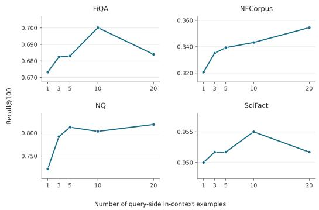
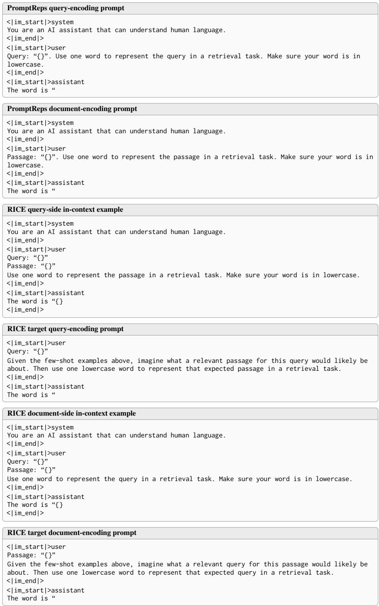

# Effective Dense Retrieval using Only In-Context Examples

Nour Jedidi1 Abdul Basit Ali1 Hang Li2 Jimmy Lin1

1University of Waterloo 2The University of Queensland

njedidi@uwaterloo.ca

## Abstract

Turning decoder-only large language models (LLMs) into strong dense retrievers typically requires some form of retriever training. In this paper, we ask whether LLMs can instead be prompted to produce effective representations for dense retrieval given only afew in-context examples. To answer this, we introduce RICE (Representations from In-Context Examples), a simple “training-free” approach that extracts high-quality dense representations from LLMs. To do so, RICE conditions the LLM on examples that provide a shared context for query and document encoding. Our results demonstrate that RICE embeddings can substantially improve the accuracy of prompt-based LLM embeddings, establishing it as a simple method to build LLM-based dense retrievers that do not require training. We release our code at https://github.com/nourj98/RICE.

## 1 Introduction

Large language models (LLMs) have emerged as powerful backbones for modern dense retrieval systems thanks to their rich world knowledge and text understanding capabilities (Zhang et al., 2025). But “out-of-the-box”, their hidden states do not automatically yield effective embedding representations for dense retrieval. As a result, strong LLM-based dense retrieval systems typically rely on additional retriever training, often through supervised (Ma et al., 2024; Thakur et al., 2025) or unsupervised (BehnamGhader et al., 2024, 2026) objectives. Building strong LLM-based embeddings that require no training remains an open challenge.

In this paper, we seek to address this challenge by drawing on two insights from the broader literature on zero- and few-shot dense retrieval. The first is that, given only a few human-labeled in-context examples, LLMs can be prompted to produce effective task-specific synthetic data for training downstream dense retrievers (Dai et al., 2023; Gwon et al., 2025). But as we aim to build LLM dense retrievers that do not require training, we draw on a second insight from PromptReps (Zhuang et al., 2024), which demonstrated that LLMs can be directly prompted to generate query and document representations for retrieval. However, one limitation of PromptReps is that query and document representations are derived independently via separate prompts, without any shared context connecting the two encoding tasks.

Inspired by these insights, we ask: Can LLMs be prompted, using only a few in-context examples, to produce effective representationsfor dense retrieval? To answer this, we introduce RICE (Representations from In-Context Examples), an approach for prompting LLMs to produce highquality dense representations without requiring any form of retrieval-specific training. To do so, RICE combines the ease and simplicity of directly prompting LLMs for representations with the ability of LLMs to infer task-specific retrieval cues from only a few in-context examples.

Like PromptReps, RICE derives embeddings by prompting an LLM to generate a representative word for a query or document and extracting its final hidden state. Unlike PromptReps, which relies on an instruction alone, RICE primes this word generation process using query–document pairs that illustrate how the LLM itself represents the given document through PromptReps-generated words. These demonstrations provide a shared context for query and document encoding with the aim of producing representations whose inner products better reflect relevance.

In summary, our contributions are twofold. First, we propose RICE, a simple approach for extracting – via prompts – dense retrieval representations from LLMs using only in-context examples. Second, we comprehensively evaluate RICE on various retrieval datasets from BEIR (Thakur et al., 2021), and show that with only a few in-context examples, LLMs can produce strong representations for dense retrieval without requiring retrievalspecific training. In particular, we demonstrate that RICE improves the effectiveness of prompt-based LLM representations. When compared against other dense retrieval approaches that also work directly “out-of-the-box”, like HyDE (Gao et al., 2023), RICE achieves the highest average accuracy among these evaluated approaches. When compared against LLM2Vec-Gen (BehnamGhader et al., 2026), a highly effective self-supervised dense retriever, RICE is competitive. While RICE is less effective than dense retrievers trained on large collections of high-quality data, our findings show that in-context examples can offer a promising approach for narrowing the effectiveness gap between training-free, prompt-based retrieval and supervised dense retrievers.

## 2 Methodology

In this section, we first review the dense variant of PromptReps (PromptReps-Dense). We then introduce RICE, a method that prompts LLMs to produce dense representations conditioned on incontext exemplars.

## 2.1 Preliminaries: PromptReps-Dense

The core idea behind PromptReps (Zhuang et al., 2024) is that LLMs can be directly prompted to generate effective representations for retrieval. For PromptReps, this is achieved by extracting the final hidden-state representation that the LLM produces when it is prompted to generate a representative word which summarizes a given input text.

More formally, PromptReps goes as follows: Given some input text x – either a query q or a document d – and a prompt template – which we denote as $P ( \cdot )$ – that asks the LLM for a “single word that represents x for a retrieval task”, PromptReps runs a single forward pass over $P ( x )$ and extracts the LLM’s final hidden state immediately before the language modeling head (i.e., the representation which produces the next-token distribution) as the representation for retrieval:

$$
\begin{array} { r } { \mathbf { e } _ { q } = \operatorname { L L M } _ { \mathrm { h i d d e n } } \big ( P ( q ) \big ) . } \\ { \mathbf { e } _ { d } = \operatorname { L L M } _ { \mathrm { h i d d e n } } \big ( P ( d ) \big ) . } \end{array}
$$

To enable retrieval, $\mathbf { e } _ { d }$ is pre-computed for each document in the corpus, ${ \mathcal { C } } = \{ d _ { 1 } , d _ { 2 } , \ldots , d _ { n } \}$ , and stored in an ANN index. At query time, $\mathbf { e } _ { q }$ is computed “on-the- $\cdot \mathrm { { f l y } ^ { \mathrm { { \prime } } } }$ and searched against the index.

We hypothesize that PromptReps-Dense has two potential limitations. The first is that, without taskspecific relevance examples, the LLM lacks sufficient knowledge of what relevance “looks like” for a given search task, making it difficult to generate representative words that are well aligned with the retrieval objective. The second limitation is that PromptReps relies on an instruction alone, without any shared context to connect the query and document encoding tasks; each encoding task is performed independently without knowledge of how the other represents text, which may limit how well their inner products can capture relevance.

## 2.2 RICE

To overcome these challenges, we propose RICE. The core hypothesis underlying RICE is that just a few in-context examples of query–document pairs, accompanied by PromptReps-generated representative words, can provide enough shared context to prime the LLM to produce query and document representations whose inner products better reflect relevance, while also exposing the model to taskand domain-specific language.

RICE operates as follows. First, building on the setup from Dai et al. (2023), we assume access to a few task-specific query-document pairs, $\{ ( q _ { 1 } , d _ { 1 } ) , ( q _ { 2 } , d _ { 2 } ) , \ldots , ( q _ { i } , d _ { i } ) \}$ , where $q _ { i }$ denotes a human-annotated query for document $d _ { i }$ . Next, for each document $d _ { i }$ in the task-specific exemplar pairs, we use the PromptReps document encoding prompt to generate a representative word $w _ { i }$ . This yields a set of in-context exemplars, $f ~ = ~ \{ ( q _ { 1 } , d _ { 1 } , w _ { 1 } ) , ( q _ { 2 } , d _ { 2 } , w _ { 2 } ) , \ldots , ( q _ { i } , d _ { i } , w _ { i } ) \}$ These exemplars, $f ,$ , are then incorporated into the RICE prompt template, $P _ { \mathrm { R I C E } } ( f , x )$ , as in-context demonstrations, where each pair $( q _ { i } , d _ { i } )$ serves as an example user input, $w _ { i }$ serves as the corresponding example assistant output, and x is the query or document to be encoded:

$$
\begin{array} { r } { { \mathbf { e } } _ { q } ^ { f } = \operatorname { L L M } _ { \mathrm { h i d d e n } } ( P _ { \mathrm { R I C E } } ( f , q ) ) , } \\ { { \mathbf { e } } _ { d } ^ { f } = \operatorname { L L M } _ { \mathrm { h i d d e n } } ( P _ { \mathrm { R I C E } } ( f , d ) ) . } \end{array}
$$

As described in Section 2.1, ${ \mathbf e } _ { d } ^ { f }$ is pre-computed for all documents in C, and at query time ${ \mathbf e } _ { q } ^ { f }$ is generated and searched against the ANN index.

## 3 Experimental Setup

Our experiments aim to study whether LLMs, using only in-context examples, can be prompted to produce effective representations for dense retrieval without the need for additional training.

Implementation We implement RICE using Qwen3-8B (Yang et al., 2025) and Qwen3.5- 9B (Qwen Team, 2026), with thinking disabled.

To derive in-context examples, we use the Promptagator (Dai et al., 2023; Gwon et al., 2025) setup, selecting examples from the training or development split when available and from the test split otherwise. For datasets in which the query–document pairs are drawn from the test set, when encoding a given query or document at inference time, we replace any in-context example that includes that query or document “in-place” with another sampled example that excludes it, so RICE is never exposed to a test judgment involving that query or document during its encoding. We leverage 10 in-context examples to generate e fq and ed . f

Datasets We consider 10 retrieval datasets from BEIR (Thakur et al., 2021). The retrieval tasks include news retrieval (TREC-News, Robust04), financial question answering (FiQA), biomedical IR (TREC-COVID, NFCorpus), fact checking (Sci-Fact), citation prediction (SCIDOCS), tweet retrieval (Signal-1M), argument retrieval (ArguAna), and question answering (NQ). For metrics, we report Recall@100 across all experiments.

Baselines Our primary point of comparison is the dense variant of PromptReps (Zhuang et al., 2024) (PromptReps-Dense), which provides a baseline for measuring how much in-context examples improve LLM-prompted dense representations over a zero-shot approach. To ensure that our comparison between RICE and PromptReps accounts for differences in prompt wording, we include a RICE (Zero-Shot) baseline which uses the same query and document prompts as RICE, but without any in-context examples. Notably, RICE (Zero-Shot) differs from PromptReps only in the prompt text.

We next evaluate RICE against methods which utilize self-supervised or synthetic LLM-generated data to train a downstream dense retriever. The first method is LLM2Vec-Gen (BehnamGhader et al., 2026), a self-supervised approach for enabling decoder-only LLMs to produce dense representations by training them to represent a potential response to a given query rather than the query itself. The second method is Promptodile (Gwon et al., 2025; Dai et al., 2023), which in-context prompts LLMs offline to generate synthetic training data that is aligned with the target corpora for training dense retrievers.

We then consider fully zero-shot dense retrieval methods where LLMs are leveraged as a tool to improve query representations for existing unsupervised encoders. These include HyDE (Gao et al., 2023), which enriches the query representation using LLM-generated hypothetical answer documents; PRF-UMBRELA (Jedidi and Lin, 2026), which utilizes an LLM relevance judge to select top-retrieved documents for refining the query representation; and CSQE (Lei et al., 2024), which refines the query using both LLM-generated hypothetical answer documents and an LLM relevance judge.1 These baselines follow the implementation details described in Jedidi and Lin (2026), leveraging the unsupervised Contriever (Izacard et al., 2022) as the dense retriever with Rocchio vector feedback (Li et al., 2022).

Lastly, we consider BGE-base-en-v1.5 (Xiao et al., 2024) and Qwen3-Embedding-8B (Zhang et al., 2025) as “upper bounds” on dense retriever effectiveness. Both systems have been finetuned using state-of-the-art dense retriever training pipelines on large amounts of data. BM25 is included as an unsupervised sparse retrieval baseline.

We utilize vLLM (Kwon et al., 2023) for LLM inference, FAISS (Douze et al., 2025) for indexing and search, and Pyserini (Lin et al., 2021) for its BM25 implementation and retrieval evaluation.

## 4 Results

Experimental results are shown in Table 1. Overall, we find that RICE demonstrates strong effectiveness across BEIR tasks, achieving the highest average Recall@100 among the evaluated methods that require no training.

In particular, RICE improves upon PromptReps-Dense with both Qwen3-8B and Qwen3.5-9B, yielding gains of 3.6 and 2.4 points in Recall@100, respectively, demonstrating that in-context examples improve the effectiveness of dense representations derived from prompting LLMs. The 3.6- point improvement of RICE (Qwen3.5-9B) over RICE Zero-Shot (Qwen3.5-9B) confirms that this improvement can be attributed to the inclusion of in-context examples rather than to differences between the RICE and PromptReps prompts.

<table><tr><td>Retriever</td><td>LLM</td><td>|ArguAna FiQA</td><td></td><td></td><td>News NFCorpus</td><td>NQ</td><td>Robust04</td><td>SCIDOCS</td><td></td><td>SciFact Signal-1M</td><td>COVID</td><td>|Avg.</td></tr><tr><td>BM25</td><td></td><td>.932</td><td>.539</td><td>.447</td><td>.246</td><td>.751</td><td>.375</td><td>.348</td><td>.925</td><td>.370</td><td>.109</td><td>|.504</td></tr><tr><td colspan="9">Dense Retrieval w/ Training</td><td></td><td></td><td></td></tr><tr><td>BGE-base-en-v1.5</td><td></td><td>.992</td><td>.742</td><td>.499</td><td>.337</td><td>.942</td><td>.351</td><td>.496</td><td>.967</td><td>.311</td><td>.141</td><td>.578</td></tr><tr><td>Qwen3-Embedding-8B Qwen3-8B</td><td></td><td>.996</td><td>.929</td><td>.570</td><td>.388</td><td>.977</td><td>.494</td><td>.636</td><td>.973</td><td>.292</td><td>.194</td><td>.645</td></tr><tr><td>LLM2Vec-Gen</td><td>Qwen3-8B</td><td>.988</td><td>.670</td><td>.484</td><td>.310</td><td>.871</td><td>.356</td><td>.430</td><td>.948</td><td>.245</td><td>.122</td><td>.542</td></tr><tr><td>Promptodile</td><td>Llama-3.1-8B</td><td>.994</td><td>.709</td><td>一</td><td>.316</td><td>一</td><td>一</td><td>.409</td><td>.964</td><td>一</td><td>一</td><td>-</td></tr><tr><td colspan="9">Dense Retrieval w/o Training</td><td></td><td></td><td></td></tr><tr><td rowspan="6">HyDE PRF-UMBRELA CSQE PromptReps-Dense</td><td rowspan="5">Qwen3-8B</td><td>.961</td><td>.654</td><td>.494</td><td>.298</td><td>.856</td><td>.304</td><td>.370</td><td>.964</td><td>.219</td><td>.090</td><td>.521</td></tr><tr><td>.909</td><td>.568</td><td>.439</td><td>.304</td><td>.765</td><td>.282</td><td>.346</td><td>.909</td><td>.246</td><td>.050</td><td>.482</td></tr><tr><td>.952</td><td>.656</td><td>.516</td><td>.312</td><td>.860</td><td>.337</td><td>.371</td><td>.952</td><td>.246</td><td>.090</td><td>.529</td></tr><tr><td>.945</td><td>.611</td><td>.435</td><td>.262</td><td>.769</td><td>.333</td><td>.434</td><td>.877</td><td>.233</td><td>.130</td><td>.503</td></tr><tr><td>.967</td><td>.655</td><td>.503</td><td>.342</td><td>.751</td><td>.361</td><td>.488</td><td>.952</td><td>.232</td><td>.135</td><td>.539</td></tr><tr><td>.878</td><td>.612</td><td>.441</td><td>.290</td><td>.848</td><td>.279</td><td>.270</td><td>.954</td><td>.220</td><td>.091</td><td>.488</td></tr><tr><td rowspan="9">PRF-UMBRELA CSQE PromptReps-Dense</td><td rowspan="6"></td><td>.917</td><td>.566</td><td>.416</td><td>.305</td><td>.775</td><td>.285</td><td>.360</td><td>.930</td><td>.252</td><td>.049</td><td>.485</td></tr><tr><td>.920</td><td>.640</td><td>.467</td><td>.305</td><td>.845</td><td>.333</td><td>.323</td><td>.970</td><td>.247</td><td>.082</td><td>.513</td></tr><tr><td>Qwen3.5-9B .979</td><td>.670</td><td>.456</td><td>.303</td><td>.818</td><td>.364</td><td>.425</td><td>.903</td><td>.279</td><td>.140</td><td>.534</td></tr><tr><td></td><td>.980 .689</td><td>.435</td><td>.305</td><td>.688</td><td>.354</td><td>.457</td><td>.962</td><td>.219</td><td>.128</td><td>.522</td></tr><tr><td></td><td>.975 .700</td><td>.512</td><td>.343</td><td>.803</td><td>.407</td><td>.478</td><td>.955</td><td>.264</td><td>.145</td><td>.558</td></tr><tr><td></td><td></td><td></td><td></td><td></td><td></td><td></td><td></td><td></td><td></td><td></td></tr></table>

Table 1: Main results (Recall@100) across BEIR datasets. Dense Retrieval w/ Training covers human labels, synthetic labels, and self-supervised objectives. Bold denotes the best result within each model family under Dense Retrieval w/o Training.

Beyond methods which derive dense representations directly from LLMs, RICE is also more effective than HyDE, PRF-UMBRELA, and CSQE, three approaches that instead utilize LLMs as a tool to improve query representations for existing unsupervised encoders. Interestingly, this boost is larger when RICE utilizes Qwen3.5-9B instead of Qwen3-8B. One possible explanation, as argued by Shen et al. (2024), is that such methods are constrained by the representational capacity of the unsupervised encoder. RICE does not have this bottleneck as it does not rely on a separate encoder and thus can directly take advantage of improved LLM backbones.

When compared against methods trained using self-supervision or synthetic data, RICE achieves competitive retrieval effectiveness. In particular, when compared with LLM2Vec-Gen using the same Qwen3-8B backbone, RICE performs on par, on average. Using Qwen3.5-9B, RICE can improve upon LLM2Vec-Gen by 1.6 points in average Recall@100. Notably, for RICE, this improvement comes “for free”, as it only requires another round of indexing, while LLM2Vec-Gen would need to undergo another round of self-supervised training. Across the five overlapping datasets, RICE achieves higher average Recall@100 than Promptodile, with gains on NFCorpus and SCIDOCS.

When evaluated against state-of-the-art dense retrievers that were trained using vast amounts of high-quality data (BGE-base-en-v1.5 and Qwen3-

  
Figure 1: Recall@100 across varying numbers of incontext examples for generating RICE (Qwen3.5-9B) query encodings.

Embedding-8B), RICE lags behind. Nevertheless, we highlight that our results indicate that RICE can provide a strong middle ground between approaches requiring no retriever training and those that rely on dedicated retriever training.

## 5 Analysis

How many in-context examples are needed for query encoding? In our experiments, we leverage 10 in-context examples for query and document encoding. We now investigate the effectiveness of RICE when varying the number of in-context examples used for generating ${ \mathbf e } _ { q } ^ { f }$ . The results are in Figure 1. Generally, the accuracy of RICE improves as the number of in-context examples increases, but can begin to decrease when utilizing 20 examples.

<table><tr><td>Dynamic Examples</td><td>FiQA</td><td>NFCorpus</td><td>SciFact</td></tr><tr><td>Fixed</td><td>.700</td><td>.343</td><td>.955</td></tr><tr><td>Query-Specific</td><td>.710</td><td>.360</td><td>.977</td></tr><tr><td>Document-Specific</td><td>.672</td><td>.333</td><td>.933</td></tr><tr><td>Query &amp; Document-Specific</td><td>.719</td><td>.348</td><td>.973</td></tr></table>

Table 2: Fixed and dynamic exemplar selection with RICE using Qwen3.5-9B.

<table><tr><td>Example Pairs</td><td>NFCorpus</td><td>SCIDOCS</td></tr><tr><td>None</td><td>1 .305</td><td>.457</td></tr><tr><td>Relevant</td><td>.343</td><td>.478</td></tr><tr><td>Non-Relevant</td><td>.345</td><td>.473</td></tr><tr><td>Mixed</td><td>.345</td><td>.484</td></tr><tr><td>Random</td><td>.346</td><td>.497</td></tr><tr><td>Relevant (cross-corpus)</td><td>.312</td><td>.457</td></tr></table>

Table 3: RICE (Qwen3.5-9B) using different in-context example compositions. None denotes RICE (Zero-Shot). Relevant (cross-corpus) uses examples from Robust04.

Dynamic exemplar selection for RICE. In Table 2 we investigate whether dynamically selecting query- or document-specific examples can improve RICE. To study this, before encoding a query or document, we utilize BM25 to retrieve the top-10 most similar examples – i.e., most similar queries for query-specific selection and documents for document-specific selection – from the training exemplar pool, which then get paired with their representative word $w _ { i }$ to construct f.

The results show that dynamic in-context example selection can improve RICE’s effectiveness across FiQA, NFCorpus, and SciFact. We note that the primary gains appear to come when utilizing dynamic exemplars for query encoding, and utilizing dynamic exemplars on only the document side appears to hurt effectiveness, compared to a fixed set of examples.

Ablation on query-document exemplars. Next, we investigate the composition of different incontext exemplars for RICE, exploring three settings: (1) Non-Relevant, in which documents judged relevant to one query are paired with different queries for which they are unjudged; (2) Mixed, which combines five relevant and five non-relevant examples; and (3) Random, where queries and documents are independently sampled from the query set and full corpus, respectively, while excluding judged query-document pairs.

The results are in Table 3. Interestingly, we find that all same-corpus variations of example pairs are stronger than using no in-context examples. Most surprising is that we see no clear advantage to using relevant example pairs versus the other alternatives.

<table><tr><td>Representative Word</td><td>NFCorpus</td><td>SciFact</td></tr><tr><td>Original</td><td>.343</td><td>.955</td></tr><tr><td>Shuffled</td><td>.355</td><td>.950</td></tr><tr><td>Blank</td><td>.343</td><td>.957</td></tr><tr><td>Fixed:  $\ " \mathrm { w o r d } \ "$ </td><td>.337</td><td>.958</td></tr><tr><td>Fixed:  $^ { \mathrm { \infty } } \mathrm { o r a n g e } ^ { \mathrm { \prime \prime } }$ </td><td>.326</td><td>.928</td></tr><tr><td>Fixed:  $\mathrm { \cdots } \mathrm { f e a t h e r } ^ { \mathrm { , } \mathrm { , } }$ </td><td>.345</td><td>.948</td></tr><tr><td>Random</td><td>.268</td><td>.697</td></tr></table>

Table 4: Representative word ablations for RICE with Qwen3.5-9B. Random sets $w _ { 1 } , \ldots , w _ { 1 0 }$ to feather, basket, curtain, candle, window, compass, marble, lantern, violin, and saddle.

We believe an explanation for this result is that RICE is effective because of the task- and domainspecific language present in the examples, and not necessarily the accuracy of the examples. This would be consistent with the findings from Min et al. (2022), who showed that ground-truth demonstrations are not needed for effective in-context learning and that providing the LLM with indistribution inputs is more critical.

To test this hypothesis, we explore using relevant cross-corpus demonstrations, i.e., relevant querydocument pairs from another corpus, denoted by Relevant (cross-corpus) in Table 3. We find this to be less effective than all variations of same-corpus example pairs, which further supports our hypothesis that the benefit of in-context demonstrations depends more on corpus-specific information than on query–document relevance alone: in-domain negative (non-relevant and random) demonstrations outperform relevant cross-corpus demonstrations.

Ablation on representative words. The previous experiment suggests that selecting querydocument pairs from the same corpus can matter more than their relevance relationships. Here, we further investigate this by studying the tradeoff between domain-specific language and the accuracy of in-context examples, probing the choice – and importance – of $w _ { i }$ . We investigate four variants: (1) Shuffled, which permutes the original word labels across exemplars; (2) Fixed, which assigns the same word to every exemplar; (3) Blank, which replaces each word label with an empty string while retaining all demonstrations; and (4) Random, which assigns ten distinct, unrelated words to the ten exemplars.

The results can be found in Table 4. We find that shuffling the word labels across the existing in-context examples or setting the labels to blank has little impact on the effectiveness of RICE. On the other hand, assigning distinct, unrelated words substantially reduces the effectiveness of RICE. Interestingly, using a fixed, random word has a less negative effect, although we note that its effect depends on both the choice of word and the dataset. One possible explanation for this could be that, when using a fixed word, there is no varying exemplar-specific signal, and the model can disregard the fixed word as “noise”.

Together with the $( q , d )$ composition results, these findings suggest that the task- and domainspecific language in RICE is more critical than the actual accuracy of the in-context examples. In the case of selecting wi, accurate exemplar-word associations are not the most essential component.

## 6 Conclusion

We introduce RICE, a simple approach for deriving effective dense representations from LLMs using only in-context examples. Empirical results demonstrate that RICE can improve the accuracy of prompt-based LLM dense retrievers while also outperforming other strong “training-free” dense retrieval baselines. While fully supervised dense retrievers trained on large collections of high-quality relevance data remain more effective, our findings show that in-context examples can help narrow this gap. We believe RICE represents an exciting direction for building dense retrieval systems that do not require retriever training and can easily adapt to new tasks and domains.

## Acknowledgments

This research was supported in part by the Natural Sciences and Engineering Research Council (NSERC) of Canada. Additional funding was provided by the Institute of Information & Communications Technology Planning & Evaluation (IITP) grant funded by the Korean Government (MSIT) (No. RS-2024-00457882, National AI Research Lab Project).

## References

Parishad BehnamGhader, Vaibhav Adlakha, Marius Mosbach, Dzmitry Bahdanau, Nicolas Chapados, and Siva Reddy. 2024. LLM2Vec: Large Language Models Are Secretly Powerful Text Encoders. In First Conference on Language Modeling.

Parishad BehnamGhader, Vaibhav Adlakha, Fabian David Schmidt, Nicolas Chapados, Marius Mosbach, and Siva Reddy. 2026. LLM2Vec-Gen: Generative Embeddings from Large Language Models. arXiv preprint arXiv:2603.10913.

Zhuyun Dai, Vincent Y Zhao, Ji Ma, Yi Luan, Jianmo Ni, Jing Lu, Anton Bakalov, Kelvin Guu, Keith Hall, and Ming-Wei Chang. 2023. Promptagator: Fewshot Dense Retrieval From 8 Examples. In The Eleventh International Conference on Learning Representations.

Matthijs Douze, Alexandr Guzhva, Chengqi Deng, Jeff Johnson, Gergely Szilvasy, Pierre-Emmanuel Mazaré, Maria Lomeli, Lucas Hosseini, and Hervé Jégou. 2025. The Faiss Library. IEEE Transactions on Big Data.

Luyu Gao, Xueguang Ma, Jimmy Lin, and Jamie Callan. 2023. Precise Zero-Shot Dense Retrieval without Relevance Labels. In Proceedings ofthe 61st Annual Meeting of the Association for Computational Linguistics (Volume 1: Long Papers), pages 1762–1777.

Daniel Gwon, Nour Jedidi, and Jimmy Lin. 2025. Study on LLMs for Promptagator-Style Dense Retriever Training. In Proceedings ofthe 34th ACM International Conference on Information and Knowledge Management, pages 4748–4752.

Gautier Izacard, Mathilde Caron, Lucas Hosseini, Sebastian Riedel, Piotr Bojanowski, Armand Joulin, and Edouard Grave. 2022. Unsupervised Dense Information Retrieval with Contrastive Learning. Transactions on Machine Learning Research.

Nour Jedidi and Jimmy Lin. 2026. A Systematic Study of Pseudo-Relevance Feedback with LLMs. arXiv preprint arXiv:2603.11008.

Woosuk Kwon, Zhuohan Li, Siyuan Zhuang, Ying Sheng, Lianmin Zheng, Cody Hao Yu, Joseph Gonzalez, Hao Zhang, and Ion Stoica. 2023. Efficient Memory Management for Large Language Model Serving with PagedAttention. In Proceedings of the 29th Symposium on Operating Systems Principles, pages 611–626.

Yibin Lei, Yu Cao, Tianyi Zhou, Tao Shen, and Andrew Yates. 2024. Corpus-Steered Query Expansion with Large Language Models. In Proceedings of the 18th Conference ofthe European Chapter ofthe Association for Computational Linguistics (Volume 2: Short Papers), pages 393–401.

Hang Li, Shengyao Zhuang, Xueguang Ma, Jimmy Lin, and Guido Zuccon. 2022. Pseudo-Relevance Feedback with Dense Retrievers in Pyserini. In Proceedings ofthe 26th Australasian Document Computing Symposium, pages 1–6.

Jimmy Lin, Xueguang Ma, Sheng-Chieh Lin, Jheng-Hong Yang, Ronak Pradeep, and Rodrigo Nogueira. 2021. Pyserini: A Python Toolkit for Reproducible Information Retrieval Research with Sparse and

Dense Representations. In Proceedings of the 44th International ACM SIGIR Conference on Research and Development in Information Retrieval, pages 2356–2362.

Xueguang Ma, Liang Wang, Nan Yang, Furu Wei, and Jimmy Lin. 2024. Fine-Tuning LLaMA for Multi-Stage Text Retrieval. In Proceedings of the 47th International ACM SIGIR Conference on Research and Development in Information Retrieval, pages 2421–2425.

Sewon Min, Xinxi Lyu, Ari Holtzman, Mikel Artetxe, Mike Lewis, Hannaneh Hajishirzi, and Luke Zettlemoyer. 2022. Rethinking the Role of Demonstrations: What Makes In-Context Learning Work? In Proceedings of the 2022 Conference on Empirical Methods in Natural Language Processing, pages 11048–11064.

Qwen Team. 2026. Qwen3.5: Towards Native Multimodal Agents.

Tao Shen, Guodong Long, Xiubo Geng, Chongyang Tao, Yibin Lei, Tianyi Zhou, Michael Blumenstein, and Daxin Jiang. 2024. Retrieval-Augmented Retrieval: Large Language Models are Strong Zero-Shot Retriever. In Findings of the Association for Computational Linguistics: ACL 2024, pages 15933–15946.

Nandan Thakur, Nils Reimers, Andreas Rücklé, Abhishek Srivastava, and Iryna Gurevych. 2021. BEIR: A Heterogeneous Benchmark for Zero-shot Evaluation of Information Retrieval Models. In Thirty-fifth Conference on Neural Information Processing Systems Datasets and Benchmarks Track (Round 2).

Nandan Thakur, Crystina Zhang, Xueguang Ma, and Jimmy Lin. 2025. Hard Negatives, Hard Lessons: Revisiting Training Data Quality for Robust Information Retrieval with LLMs. In Findings of the Association for Computational Linguistics: EMNLP 2025, pages 9064–9083.

Shitao Xiao, Zheng Liu, Peitian Zhang, Niklas Muennighoff, Defu Lian, and Jian-Yun Nie. 2024. C-Pack: Packed Resources For General Chinese Embeddings. In Proceedings of the 47th International ACM SI-GIR Conference on Research and Development in Information Retrieval, pages 641–649.

An Yang, Anfeng Li, Baosong Yang, Beichen Zhang, Binyuan Hui, Bo Zheng, Bowen Yu, Chang Gao, Chengen Huang, Chenxu Lv, et al. 2025. Qwen3 Technical Report. arXiv preprint arXiv:2505.09388.

Yanzhao Zhang, Mingxin Li, Dingkun Long, Xin Zhang, Huan Lin, Baosong Yang, Pengjun Xie, An Yang, Dayiheng Liu, Junyang Lin, Fei Huang, and Jingren Zhou. 2025. Qwen3 Embedding: Advancing Text Embedding and Reranking Through Foundation Models. arXiv preprint arXiv:2506.05176.

Shengyao Zhuang, Xueguang Ma, Bevan Koopman, Jimmy Lin, and Guido Zuccon. 2024. PromptReps: Prompting Large Language Models to Generate

Dense and Sparse Representations for Zero-Shot Document Retrieval. In Proceedings of the 2024 Conference on Empirical Methods in Natural Language Processing, pages 4375–4391.

  
Figure 2: Prompt templates used for PromptReps and RICE. The first two panels show the query- and documentencoding prompts used by PromptReps. The next two panels show the query-side in-context example and target prompt used by RICE. The final two panels show the corresponding document-side prompts. RICE (Zero-Shot) only utilizes the RICE target query-encoding and document-encoding prompts, without in-context examples.