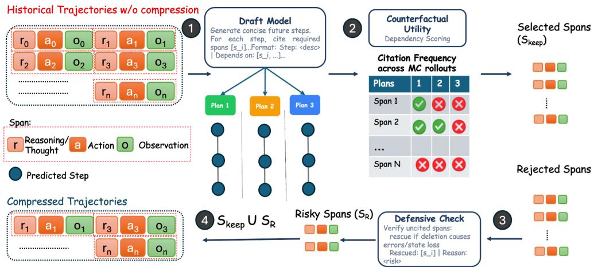
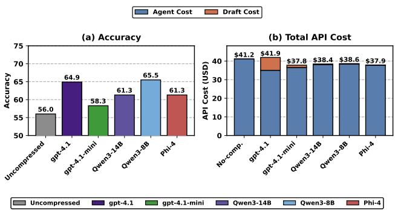
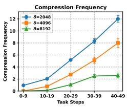
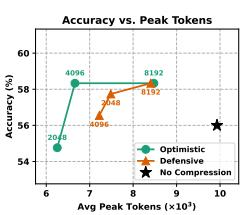
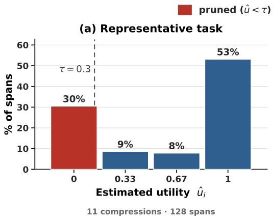
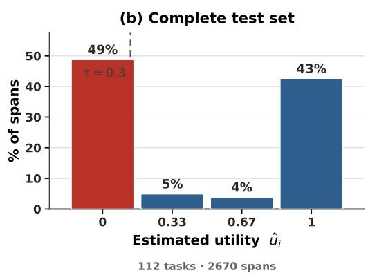
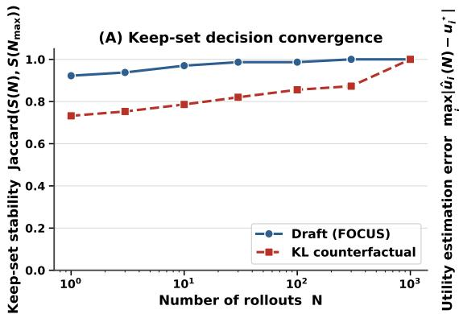
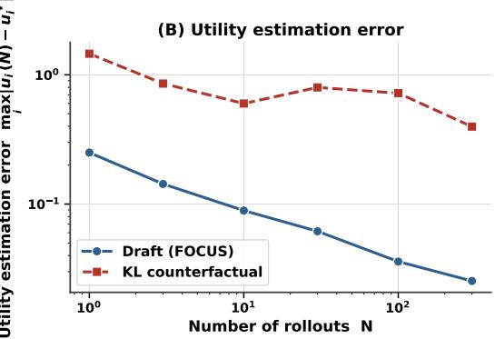

# FOCUS: TRAINING-FREE DECISION-PRESERVING CONTEXT COMPRESSION FOR LLM AGENTS

Shantanu Dixit Anson Bastos Xuchao Zhang Chetan Bansal Saravan Rajmohan M365 Research, Microsoft

## ABSTRACT

LLM agents accumulate interaction histories that grow linearly with task length, causing quadratic inference cost scaling and performance degradation from attention dilution. Existing context-compression methods learn what to discard offline: by contrastively optimizing guidelines, distilling compressors, or training compression policies. This incurs a substantial cost. Further, the compression policy is learned a priori and is not dynamically conditioned on the evolving test-time trajectories. In this paper we ask a complementary question: Which past interactions causally shape the agent’sfuture decisions? We recast context compression as a causal decision preservation problem over discrete interaction units and introduce FOCUS, a training-free context compression framework that operates entirely at test time. Our method requires no offline data collection or fine-tuning, and is architecture-agnostic, attaching to any closed-API frontier model as a modular compression layer. We evaluate FOCUS on diverse agentic benchmarks including API and tool-calling, QA, web domain and multi-turn dialogue. Our method establishes new state of the art performance, cutting peak context by up to 48% and dependency by 73% while improving task success by up to 8.9 percentage points over uncompressed execution.

## 1 Introduction

Recent advances in large language models (LLMs) have enabled long-horizon agents that solve complex tasks through iterative reasoning and interaction with external environments (Yao et al., 2022; Trivedi et al., 2024; Wang et al., 2024). As an agent acts, its context accumulates an evergrowing history of reasoning, actions, and observations. We refer to a single (reasoning, action, observation) tuple as a span. Because this history grows linearly with the task horizon, and selfattention is quadratic in sequence length, inference cost scales quadratically. Moreover, decision quality degrades as relevant evidence is diluted among accumulated context (Liu et al., 2024). Longhorizon agents therefore face a fundamental bottleneck of retaining the historical context needed for good decisions under a strict context budget.

Existing approaches to context compression largely treat the problem as one of redundancy reduction. Token-level methods (Jiang et al., 2023; 2024) drop tokens according to a language-model likelihood, and soft-prompt methods compress the context into summary vectors (Chevalier et al., 2023). More recent agent-specific methods (Kang et al., 2026; Yuksel, 2025) learn compression strategies offline. A complementary axis reduces cost at the attention level through KV-cache eviction (Zhang et al., 2023; Li et al., 2024). However, these approaches face two limitations: First, token and cache level filtering can corrupt structured interaction traces (tool calls, code, or execution logs), by discarding syntactically predictable but semantically critical elements. Second, methods that rely on offline supervision incur substantial optimization or distillation cost. As their compression policy is fixed before inference, they provide no mechanism to account for task-specific dependencies that emerge at inference time. Reinforcement-learning approaches (Sun et al., 2025) improve adaptivity but add optimization complexity and require open-weight access for training.

In contrast, we argue that context compression for agents is fundamentally not a redundancy reduction problem, but a causal decision-preservation problem. The central question we ask is: which past spans are causally necessary to preserve the agent’s future decision trajectory? The relevance of a past interaction is therefore inherently forward-looking: a span should be retained if and only if it influences the agent’s future decision trajectory. This perspective suggests that the goal of compression is not to faithfully summarize the past, but to preserve a sufficient statistic of the history required for future decision-making.

From an information-theoretic perspective, the objective, of compressing the history while preserving information relevant to future decisions, corresponds to an Information Bottleneck (IB) objective. Directly optimizing the Information Bottleneck objective is intractable because it requires both (i) searching over an exponentially large space of possible span subsets, and (ii) evaluating mutual information terms involving the distribution of future trajectories in closed form. Thus, instead of directly optimizing for selecting span subsets, we focus on the utility of each span for the task. For this, we seek to estimate the extent to which removing the span changes the agent’s predicted future plans (counterfactual utility). We formally show connections between the IB objective and the counterfactual utility of each span. While this formulation is computationally tractable (though still expensive), it has the following caveat: the probability distribution over actions could be unavailable in an online setting. We avoid the need for computing the exact probability distributions over the action space and compute span-wise utility. Specifically we design an approximation based on Monte Carlo Rollouts of the future trajectory and propose FOCUS: Forward-looking Causal Utility Span Estimation, a training-free framework for context compression that operates entirely at test time.

FOCUS offers several advantages. First, it eliminates the need for offline data collection, synthetic trajectory generation, or task-specific fine-tuning, operating entirely through test-time reasoning. Second, it is architecture-agnostic and can be attached as a modular component to both open-weight and closed-API frontier models. Third, by operating over interaction spans rather than tokens, FOCUS preserves the structural integrity of agent trajectories, ensuring that local causal relationships are not disrupted. Fourth, it also eliminates the need to compute exact probability distributions over unknown future trajectories while keeping the computation tractable.

Through extensive experiments on benchmarks: OfficeBench, AppWorld, 8-QA, WebVoyager and τ2-Bench, we demonstrate that FOCUS significantly reduces context footprint while improving task success rates relative to existing compression methods. Further we empirically show that the additional planning overhead is offset by reduced input-token consumption, yielding lower total token (up to 31%) usage while improving task success (Table 12). Our results highlight the importance of forward-looking, decision-aware compression and establish FOCUS as a simple, effective and practical solution for scalable agent deployment.

Contributions. We summarize our contributions as follows:

• We formulate context compression for agents as a causal decision-preservation problem, and connect it to an Information Bottleneck objective that minimizes retained history while preserving predictive information about future actions.

• We propose FOCUS, a training-free, test-time compression framework that approximates the information bottleneck optimization using Monte Carlo rollouts of future trajectories.

• We introduce a dual-objective strategy combining stochastic plan-based dependency estimation with a verification step that preserves critical, overlooked spans for safe and efficient compression.

• We empirically demonstrate that FOCUS achieves state-of-the-art performance on agent benchmarks, improving task success rates while significantly reducing context usage.

## 2 Related Work

Long-horizon LLM agents. LLMs are increasingly deployed as agents that perform iterative decision-making through repeated interaction with tools and environments (Yao et al., 2022; Qin et al., 2023), coordinating actions across tens to hundreds of steps while maintaining consistency with past observations and reasoning (Wang et al., 2024; Trivedi et al., 2024). As trajectories grow, the accumulated history becomes a major bottleneck, motivating context-management mechanism that retain only information needed for future decisions.

Context compression. A large body of work reduces effective context length. Token-level methods prune inputs by language-model likelihood or learned token importance (Jiang et al., 2023; 2024; Pan et al., 2024), and soft-prompt methods compress context into summary vectors (Chevalier et al., 2023); orthogonally, KV-cache eviction reduces cost at the attention level (Zhang et al., 2023; Li et al., 2024). These techniques suit static or loosely structured inputs, but are ill-suited to agent trajectories, whose structured tool calls, code, and execution logs carry causal dependencies that token or cache-level filtering can silently corrupt.

Context compression for LLM agents. Agent-specific methods instead learn what to compress offline. Early approaches use environment-specific strategies tailored to particular settings (Deng et al., 2023; Yang et al., 2024; Lee et al., 2025), limiting generality. Recent methods learn general policies: ACON (Kang et al., 2026) contrastively optimizes a natural-language compression guideline from full-versus-compressed trajectories and distills it into smaller models, while PAACE (Yuksel, 2025) distills a plan-aware compressor from a synthetic workflow corpus (Table 11). A second line learns context management jointly with the agent via reinforcement learning (Zhou et al., 2025; Sun et al., 2025). These incur substantial offline cost and, with a policy fixed before inference, cannot adapt to task-specific dependencies at test time; RL variants further require open-weight access. A complementary direction adds external memory (Packer et al., 2023; Chhikara et al., 2025), reintroducing indexing and retrieval and targeting conversational recall rather than tool-using agentic control.

Complementary to these, we cast compression as a decision-preserving causal abstraction problem: FOCUS is a training-free, test-time framework that scores each span by itsforward-looking counterfactual utility rather than by past redundancy or an offline policy. Operating at the span level, it is orthogonal to token, cache, and memory-based methods, which can be applied within retained spans.

## 3 Problem Formulation

In this section we formalize our approach for context compression in language model agents. Given a task goal $^ { g , }$ , an agent interacts with an external environment over multiple steps by producing actions and receiving observations. The interaction history up to step t is denoted as $H _ { t } = ( s _ { 1 } , s _ { 2 } , \ldots , s _ { t } )$ where each $s _ { i }$ is an atomic interaction span. In this work, we define a span as a complete reasoningexecution-feedback unit: $s _ { i } = ( r _ { i } , a _ { i } , o _ { i } )$ , where $r _ { i }$ denotes the agent’s intermediate reasoning or thought, $a _ { i }$ denotes the executed action or tool call, and $o _ { i }$ denotes the resulting environment observation. We use span-level units rather than token-level units because agent trajectories often contain structured actions, tool calls, error messages, and environment states whose local causal structure should be preserved during compression.

An agent typically conditions its next action on the full interaction history and the task goal: $a _ { t + 1 } \sim$ $\pi ( \cdot \mid H _ { t } , g )$ where π denotes the main agent policy. As the horizon grows, however, $H _ { t }$ can become increasingly long, leading to higher inference cost, increased latency, and degraded decision quality. The goal of context compression is therefore to construct a compressed trace $Z _ { t } = C ( H _ { t } )$ , where $C$ is a compression function and $Z _ { t }$ is the subset of spans substantially shorter than $H _ { t }$ , while preserving the information required for future decision-making.

Unlike generic text summarization, agent context compression is not required to faithfully reconstruct every past event. Instead, the compressed trace should preserve the causal states and constraints that affect the agent’s future behaviour. Let $\tau _ { t : T }$ denote the future trajectory from step t to the terminal step $T \colon \tau _ { t : T } = ( a _ { t + 1 } , o _ { t + 1 } , \ldots , a _ { T } , o _ { T } )$ . An ideal compressed trace should act as an approximate sufficient statistic of the full history for predicting future behaviour under the task goal: $\begin{array} { r } { \bar { P ( \tau _ { t : T } \mid Z _ { t } , g ) } \approx P ( \tau _ { t : T } \mid H _ { t } , g ) } \end{array}$ while satisfying a smaller context budget, $\mathrm { i . e . , } | Z _ { t } | \ll | H _ { t } |$

We therefore formulate context compression as a decision-preserving compression problem. Let $P _ { H } : = P ( \tau _ { t : T } \mid H _ { t } , g )$ denote the future trajectory distribution conditioned on the full interaction history $H _ { t }$ and goal $g ,$ , and let $P _ { Z } : = P ( \tau _ { t : T } \mid Z _ { t } , g )$ denote the Bayes optimal distribution conditioned on the compressed context $Z _ { t } = { \dot { C } } ( { \dot { H _ { t } } } )$ . The compressor seeks to minimize context cost while preserving the decision-relevant information contained in the original history:

$$
\operatorname* { m i n } _ { C } \mathrm { C o s t } ( Z _ { t } ) + \lambda \mathbb { E } _ { H _ { t } , g } [ D _ { \mathrm { K L } } ( P _ { H } \| P _ { Z } ) ]\tag{1}
$$

The first term measures context cost, while the second term penalises loss of decision-relevant information by comparing the future trajectory distribution induced by the compressed trace against that induced by the full history.

This objective admits a natural Information Bottleneck (IB) interpretation. Specifically, the compression term $\operatorname { C o s t } ( Z _ { t } )$ can be viewed as a proxy for the information retained from the original history, i.e. $I ( H _ { t } ; Z _ { t } \mid g )$ . As we keep adding tokens in $Z _ { t }$ the mutual information between $H _ { t } , Z _ { t }$ increases and so does $\operatorname { C o s t } ( Z _ { t } )$ The expected KL term is equivalent, up to an additive constant independent of $C ,$ , to the conditional entropy of the future trajectory given the compressed trace. Let $\mathcal { H } _ { Z } ^ { \mathsf { ^ { * } } } : = \mathcal { H } _ { e } ( \tau _ { t : T } \mid Z _ { t } , g )$ and $\mathcal { H } _ { H } : = \mathcal { \hat { H } } _ { e } ( \tau _ { t : T } \ | \ H _ { t } , g )$ , where $\mathcal { H } _ { e }$ is the entropy, then: $\mathop { \mathbb { E } } _ { H _ { t } , g } \bigl [ D _ { \mathrm { K L } } \bigl ( P _ { H } \parallel P _ { Z } \bigr ) \bigr ] = \mathcal { H } _ { Z } - \mathcal { H } _ { H }$ . Since $\mathcal { H } _ { e } ( \tau _ { t : T } \mid H _ { t } , g )$ does not depend on the compressor $C .$ minimizing the expected trajectory divergence is equivalent to minimizing $\mathcal { H } _ { e } ( \tau _ { t : T } \mid Z _ { t } , g )$ , or equivalently, maximising the predictive information $\bar { I ( Z _ { t } ; \tau _ { t : T } \mid g ) } = \mathcal { H } _ { e } ( \bar { \tau _ { t : T } } \mid g ) - \dot { \mathcal { H } } _ { e } ( \bar { \tau _ { t : T } } \mid Z _ { t } , g )$ Thus, our objective can be recast in the IB form

$$
\operatorname* { m i n } _ { C } \ I ( H _ { t } ; Z _ { t } \mid g ) \ - \ \beta I ( Z _ { t } ; \tau _ { t : T } \mid g ) ,
$$

for some trade-off coefficient $\beta > 0$ . In this view, context compression seeks a representation $Z _ { t }$ that is maximally compact while preserving the information in the history that is most relevant for predicting the agent’s future trajectory. The central challenges are: (i) obtaining mutual information requires future trajectory distributions which are not directly observable (ii) optimizing the objective comparing distributions is computationally expensive (c.f. Fig. 5). In the next section we propose our method that enables a principled approximation to optimizing the above objective.

## 4 Method: FOCUS

We propose a test-time context compression method, named FOCUS, for language model agents. FOCUS compresses an agent’s interaction history according to its estimated utility for future decisionmaking, rather than according to token-level redundancy or generic summarization quality. When the accumulated history exceeds a context budget, FOCUS identifies which historical spans are likely to affect the agent’s future behaviour, preserves those spans and removes spans that are unlikely to influence downstream decisions.

At a high level, FOCUS follows a four-stage pipeline. First, it represents the agent history as a sequence of atomic interaction spans. Second, it estimates the future utility of each span through draft-model plan rollouts. Third, it retains spans that are repeatedly cited as future dependencies. Finally, it performs defensive verification to rescue spans whose deletion may cause repeated mistakes or loss of causal state. Algorithm 1 and Figure 1 summarizes the overall procedure.

## 4.1 Span-Level State Representation

As defined in Section $^ { 3 , }$ an interaction history $H _ { t }$ is constructed from atomic interaction spans $s _ { i } = ( r _ { i } , a _ { i } , o _ { i } )$ . By operating strictly at this span level rather than the token level, FOCUS prevents the fragmentation of structured actions, tool calls, error messages, and observations. This span-level integrity ensures the local causal relation between the agent’s intent, execution, and environmental feedback remains uncorrupted, allowing the state transitions to be cleanly evaluated for future utility. The compressor is triggered when the history exceeds a predefined context budget $\delta _ { \mathrm { m e m } } , \mathrm { i . e . , } \left| H _ { t } \right| >$ $\delta _ { \mathrm { m e m } }$ . It then constructs a compressed trace $Z _ { t } = C ( H _ { t } )$ , which is used by the main agent for subsequent decision-making: $a _ { t + 1 } \sim \pi ( \cdot \mid Z _ { t } , g )$

## 4.2 Counterfactual Future Utility

The core question in FOCUS is whether a historical span is necessary for future decisions. By definition this intends to measure whether removing the span would change the future behaviour of the agent. In this section, we also show connections of this measure with the IB objective in §3.

For a span $s _ { i } ,$ , let $H _ { t } ^ { - i } = H _ { t } \setminus \{ s _ { i } \}$ denote the counterfactual history obtained by removing $s _ { i }$

Algorithm 1 FOCUS   
Require: History $H _ { t } = ( s _ { 1 } , \ldots , s _ { t } )$ , goal $^ { g , }$ budget $\delta _ { \mathrm { { m e m } } } ,$ draft model $q _ { \phi } ,$ rollouts $N ,$ threshold $\tau$   
Ensure: Compressed trace $Z _ { t }$   
1: if $| H _ { t } | \leq \bar { \delta } _ { \mathrm { m e m } }$ then   
2: return $H _ { t }$   
3: end if   
4: Initialize $\hat { u } _ { i } \gets 0$ for all $s _ { i } \in H _ { t }$   
5: for $k = 1$ to $N$ do   
6: Sample plan sketch $p _ { k } \sim q _ { \phi } ( p \mid H _ { t } , g )$   
7: Extract dependency set $\mathrm { D e p } ( p _ { k } )$   
8: Update $\hat { u _ { i } } ^ { - }  \hat { u } _ { i } + \hat { 1 } / N$ for each $s _ { i } \in \mathrm { D e p } ( p _ { k } )$   
9: end for   
10: $S _ { U } \gets \{ s _ { i } \in H _ { t } : \hat { u } _ { i } \geq \tau \}$   
11: $S _ { R } \gets \dot { \mathrm { I } }$ efensiveVerify ${ \mathsf { \Omega } } ^ { \prime } ( { \dot { H } } _ { t } \setminus S _ { U } , q _ { \phi } , \tau )$   
12: $S _ { \mathrm { k e e p } }  S _ { U } \cup S _ { R }$   
13: $S _ { \mathrm { d r o p } }  H _ { t } \backslash S _ { k }$ eep   
14: $Z _ { t } \gets$ BuildTrace $( \bar { S } _ { \mathrm { k e e p } } , S _ { \mathrm { d r o p } } )$   
15: return $Z _ { t }$

  
Figure 1: Overview of FOCUS for decision-preserving context compression. Given a growing interaction history composed of thought–action–observation spans, FOCUS invokes a lightweight draft model to generate multiple stochastic plan sketches, each explicitly identifying the historical spans required for future steps. These dependencies are aggregated to estimate counterfactual future utility, enabling the selection of spans that significantly influence downstream decisions. To ensure robustness in stateful environments, a defensive verification stage identifies and retains uncited spans whose removal may lead to repeated errors or loss of critical state.

Definition 1 (Counterfactual Future Utility). For a future variable $Y ,$ such as the remaining trajectory or a high-levelfuture plan, the counterfactualfuture utility ofspan $s _ { i }$ is defined as

$$
U ( s _ { i } ) = D \big ( P ( Y \mid H _ { t } , g ) \mid \mid P ( Y \mid H _ { t } ^ { - i } , g ) \big ) ,\tag{2}
$$

where $D ( \cdot \| \cdot )$ is a divergence measure (e.g. KL divergence) betweenfuture distributions.

A span with high $U ( s _ { i } )$ is future-relevant because removing it changes the predicted future behaviour, whereas a span with low $U ( s _ { i } )$ can potentially be abstracted or removed.

$U ( s _ { i } ) = 0$ when removing $s _ { i }$ leaves the future decision distribution unchanged. contrapositively, $U ( s _ { i } ) > 0$ implies removing $s _ { i }$ changes the agent’s future decisions. U therefore formalizes the core intuition of FOCUS: a span is worth preserving insofar as it affects the agent’s future decisions. We next show that this notion of counterfactual utility, under mild assumptions (Assumption $3 )$ corresponds to a principled information-theoretic objective: selecting spans by counterfactual utility under a context budget optimizes the Information Bottleneck (IB) objective up to a bounded interaction term.

Proposition 1 (Counterfactual utility and the Information Bottleneck objective). Let $Z _ { t } \subseteq H _ { t }$ be a compressed trace satisfying the entropy budget $I ( H _ { t } ; Z _ { t } \mid g ) = { \mathcal { H } } ( Z _ { t } \mid g ) - { \mathcal { H } } ( Z _ { t } \mid H _ { t } , g ) \leq { \mathcal { H } } ( Z _ { t } \mid$ $g ) \leq B$ , and let $Y$ denote the random set offuture events. Then $\mathbb { E } [ U ( s _ { i } ) ] = I ( s _ { i } ; Y \mid H _ { t } ^ { - i } , g )$ , and under Assumption $^ 3$ with tolerance $\bar { \varepsilon } \geq 0 ,$ , we have $\begin{array} { r } { \Big | I ( Z _ { t } ; Y \mid g ) - \sum _ { s _ { i } \in Z _ { t } } \mathbb { E } [ U ( s _ { i } ) ] \Big | \le \bar { \varepsilon } . } \end{array}$ . Hence maximising total counterfactual utility subject to the budget maximises $I ( Z _ { t } ; Y \mid g )$ up to ε¯, and its Lagrangian is the Information Bottleneck objective

$$
\operatorname* { m i n } _ { C } \ I ( H _ { t } ; Z _ { t } \mid g ) - \beta I ( Z _ { t } ; Y \mid g ) ,
$$

with $\beta$ the inverse multiplier of the budget. The error $\bar { \varepsilon }$ vanishes for long horizons (Appendix A.2.1).

However, exact computation of the KL-based utility requires evaluating future trajectory distributions under counterfactual histories, which are not directly observable at inference time. FOCUS approximates this using an efficient count-based utility obtained from draft-model plan rollouts.

## 4.3 Draft-Model Monte Carlo Estimation

In this section we present our approximation to optimizing the counterfactual utility (or IB) objective seen in the previous sections. Let $q _ { \phi }$ denote a lightweight draft model used by FOCUS. Given the task goal $g$ and history $H _ { t }$ , FOCUS samples $\check { N }$ stochastic plan sketches, $p _ { k } \sim q _ { \phi } ( p \mid H _ { t } , g )$ for $k = 1 , \ldots , N$ . Each plan sketch describes a possible high-level plan for completing the remaining task. For every planned step, the draft model is required to cite the historical spans it depends on and outputs a short description together with a dependency set, $\mathbf { e . g . , S t e p : \quad . . . } \ |$ Depends on: $[ s _ { - } \mathrm { i }$ $s _ { - } { \mathrm { j } } ]$ . We say the future depends on $s _ { i }$ if some remaining step requires information contained in $s _ { i }$ and the rollouts sample this event. This converts future planning into an explicit dependency estimation problem. For each span $s _ { i } ,$ we define a binary dependency indicator: $X _ { i } ^ { ( k ) } = \mathbf { 1 } [ s _ { i } \in \mathrm { D e p } ( p _ { k } ) ]$ , where $\mathrm { D e p } ( p _ { k } )$ denotes the set of spans cited by plan sketch $p _ { k }$ . FOCUS estimates the future dependency score of $s _ { i }$ by its citation frequency across rollouts: $\begin{array} { r } { \hat { u } _ { i } = \frac { 1 } { N } \sum _ { k = 1 } ^ { N } X _ { i } ^ { ( k ) } } \end{array}$

Intuitively, $\hat { u } _ { i }$ measures how consistently the draft model identifies $s _ { i }$ as necessary for future planning. Spans repeatedly cited across stochastic rollouts are more likely to contain information needed by the main agent.

In the below result we connect this estimation of span importance with the solution optimizing the counterfactual utility (information bottleneck). Proof is in Appendix A.2.

Proposition 2 (Dependency score bounds counterfactual utility). Under mild assumptions $( A p \cdot$ pendix A.2), for any set of spans $S \subseteq H _ { t }$

$$
D _ { \mathrm { K L } } \big ( P ( Y \mid H _ { t } , g ) \mid | P ( Y \mid H _ { t } \setminus S , g ) \big ) \ \leq \ m _ { \operatorname* { m a x } } \mathbb { P } \big ( \exists s _ { i } \in S : X _ { i } = 1 \big ) \leq m _ { \operatorname* { m a x } } \sum _ { s _ { i } \in S } \hat { u } _ { i }
$$

In the above, $m _ { \mathrm { m a x } }$ is the largest distortion that removing a set of spans induces on the futures that depend on it $( \mathsf { A }$ ssumption 2). Thus sets of spans that plan rollouts rarely cite have provably small counterfactual utility, and discarding them provably preserves the agent’s future decision distribution up to $m _ { \mathrm { m a x } }$ times their citation probability. In the appendix A.2.2 we show that the MC estimate $\hat { u _ { i } }$ is unbiased and informs the number of rollouts needed.

Given the estimated score $\hat { u } _ { i }$ , FOCUS first constructs an initial utility-retained set: $S _ { U } = \{ s _ { i } \in H _ { t }$ $\hat { u } _ { i } \geq \tau \}$ , where $\tau$ is a utility threshold. Spans in $S _ { U }$ are preserved because they are estimated to have high future planning utility. For brevity, the draft model prompts and rollout examples are provided in Appendix A.9.

## 4.4 Defensive Verification

The previous section’s utility-based planning may miss spans that encode negative constraints or stateful failures. For example, a failed tool call, invalid password attempt, or a rejected API request may not be explicitly cited in a future plan. However, removing such spans can cause the main agent to repeat invalid actions, enter invalid loops, or lose important state information. To address this issue, FOCUS includes a defensive verification stage. After optimistic planning identifies the utility-retained set $S _ { U }$ , the draft model reviews spans not included in $S _ { U }$ and identifies spans whose deletion may cause repeated mistakes, invalid loops, or loss of causal state. This produces a rescued set: $S _ { R }$ . The final preserved set is: $S _ { \mathrm { k e e p } } = S _ { U } \cup S _ { R }$

<table><tr><td>Method Acc↑ Stp↓ Pk↓ Dep↓</td></tr><tr><td>Agent: gpt-4.1 / Comp: gpt-4.1</td></tr><tr><td>No compression 56.0 16.149.93 5.96</td></tr><tr><td>FIFO 45.8 28.48 6.735.69 Retrieval 27.4 33.17 8.39 6.68 LLMLingua 39.3 24.42 7.506.37 Prompting 43.5 24.01 6.935.29</td></tr><tr><td>ACOÑ UT 51.2 20.92 7.17 4.49 ACÓN ÚTCO 56.5 22.82 7.334.69</td></tr><tr><td>FOCUS-O 56.5 18.90 6.502.38 FOCUS-D 64.9 16.10 8.37 4.15</td></tr></table>

(a) AppWorld test\_normal.

<table><tr><td>Method Acc↑ Stp↓ Pk↓ Dep↓</td></tr><tr><td>Agent: gpt-4.1 / Comp: gpt-4.1 No compression 76.84 11.52 7.274.43</td></tr><tr><td>FIFO 67.3712.26 4.022.64 Retrieval 65.26 16.20 4.332.06</td></tr><tr><td>LLMLingua 70.53 10.89 4.651.85 Prompting 71.58 10.13 4.401.10 ACOÑ UT 74.7413.13 4.933.85 ACON UTCO 72.6311.544.541.91</td></tr><tr><td>FOCUS-O 78.90 9.30 3.81 1.16 FOCUS-D 77.90 9.60 4.20 1.36</td></tr></table>

(b) OfficeBench test.

<table><tr><td>Method EM↑ F1↑ Stp↓ Pk↓ Dep↓</td></tr><tr><td>Agent: gpt-4.1/ Comp: gpt-4.1</td></tr><tr><td>No compression 0.366 0.48815.78 10.35 3.32</td></tr><tr><td>FIFO 0.293 0.38819.26 5.09 2.51 Retrieval 0.331 0.438 20.065.11 2.62 LLMLingua 0.363 0.48117.685.68 2.24 Prompting 0.3760.47818.704.73 1.66</td></tr></table>

(c) 8-objective QA test.  
Table 1: Results on AppWorld, OfficeBench, and the 8-objective QA benchmark. FOCUS improves task performance while reducing peak tokens and dependency.

Spans in $S _ { R }$ are retained even if they were not frequently cited during optimistic planning. This defensive step prioritizes avoiding catastrophic forgetting over maximum compression. The final compressed trace retains spans in $S _ { \mathrm { k e e p } }$ verbatim and discards the remainder: $Z _ { t } = \{ s _ { i } \in H _ { t } : s _ { i } \in$ $S _ { \mathrm { k e e p } } \overset { \cdot }  \mathrm { \} } ]$ where $S _ { \mathrm { k e e p } } = S _ { U } \bar { \cup } S _ { R }$ as defined above. Appendix A.2.5 provides conditions when this stage helps. We present further theoretical analysis and experiments validating the design choices in Appendix A.1.

## 5 Experiments

We address the following questions through our experiments: 1) RQ1 (Efficiency vs. Performance): Can FOCUS reduce context costs (peak tokens and dependency) without degrading task success compared to uncompressed and existing compression baselines? (§5.1) 2) RQ2 (Draft Model Sensitivity): How sensitive is the compression efficacy and overall API cost to the size and capability of the draft model? (§5.1) 3) RQ3 (Memory Budget and Compression Frequency): How does the context budget threshold $\delta _ { \mathrm { m e m } }$ dictate the frequency of compressions, and what is its effect on the efficiency-accuracy trade-off? (§5.1) 4) RQ4 (Cost and Latency): What is the API cost and wall-clock latency overhead of the draft-based estimator? (§5.1)

Experimental Setup: We evaluate FOCUS on five agentic benchmarks spanning diverse agentic settings, including API-centric tool use, knowledge intensive question answering, web navigation and multi-turn dialogue: AppWorld Trivedi et al. (2024), OfficeBench Wang et al. (2024), 8-objective QA Kwiatkowski et al. (2019), WebVoyager He et al. (2024) and $\tau ^ { 2 }$ -Bench Barres et al. (2025). We characterize the trajectory statistics of the benchmarks in Table 14. We evaluate our method using Accuracy (task success), Steps (avg. interactions), Peak Tokens (max. context length across steps, 103), Dependency (cumulative dependence of actions on prior context, $1 0 ^ { 6 } )$ . Implementation: For fairness, we adopt the same experiment settings as ACON (Kang et al. (2026), ICML). We use gpt-4.1 (main agent, temperature 0.0, seed 42), with tokenization using tiktoken (cl100k\_base) and optional open-weight draft models (Qwen3-8B/14B via HuggingFace). We detail the benchmarks and implementation details in A.7 and A.9 respectively.

## 5.1 Results

Overall Performance (RQ1) Table 1 presents our performance using gpt-4.1 for both the main and draft models. We evaluate two strategies: FOCUS-O(ptimistic) (retains spans explicitly cited for future steps) and FOCUS-D(efensive) corresponding to Section 4.4. On AppWorld, FOCUS yields strong simultaneous improvements. FOCUS-O reduces peak tokens and dependency by 35% and 60% respectively while retaining baseline accuracy. The defensive guardrail further improves the task success, jumping to 64.9% absolute accuracy (+15.9% relative to no compression) while still keeping the context costs low. These trends hold across benchmarks. On OfficeBench, FOCUS surpasses all baselines with an accuracy of 78.9% while reducing peak tokens and dependency by 47% and 73% correspondingly compared to the uncompressed baseline. On 8-QA, FOCUS improves the exact match (EM) scores while maintaining a tighter context budget. Indicating that utility-driven pruning acts as a powerful regularizer, decluttering the context window and guiding the agent toward accurate reasoning. On WebVoyager, FOCUS improves accuracy by +4.5 over NC, reducing peak tokens by 27% (Table 9). On τ2−Bench (Table 10), FOCUS improves task success by +5.5 over NC while maintaining the context budget. To further test the efficacy of FOCUS under a weaker backbone, we additionally evaluate with the smaller gpt-4.1-mini as both the main agent and the draft model (Table 2). Even in this constrained setting, FOCUS improves task success by 23% relative to the no-compression baseline while reducing cumulative dependency and peak tokens by ∼ 25% and ∼ 21% respectively.

<table><tr><td colspan="4">V Agent: gpt-4.1-mini / Compressor: gpt-4.1-mini</td></tr><tr><td colspan="4"></td></tr><tr><td>No compression FIFO</td><td>35.7 39.3</td><td>18.14 30.39</td><td>8.55 5.07 5.24</td></tr><tr><td>Retrieval</td><td>14.9</td><td>6.18 40.18 7.49</td><td>5.95</td></tr><tr><td>LLMLingua</td><td>36.3</td><td>28.41 7.24</td><td>6.65</td></tr><tr><td>Prompting</td><td>35.7</td><td>24.98 6.56</td><td>4.95</td></tr><tr><td>ACOÑ UT</td><td>42.3</td><td>22.46 6.51</td><td>5.48</td></tr><tr><td>ACON UTCO</td><td>32.7</td><td>24.27 6.99</td><td>4.97</td></tr><tr><td></td><td>44.0</td><td>17.90</td><td></td></tr><tr><td>FOCUS-D</td><td></td><td>6.71</td><td>3.81</td></tr></table>

<table><tr><td colspan="4">Method Acc. ↑ Steps ↓ Peak↓ Dep. ↓</td></tr><tr><td colspan="4">Agent: gpt-4.1</td></tr><tr><td>Prompting (gpt-4.1-mini) ACON(gpt-4.1-mini)</td><td>39.3 47.6 50.0</td><td>23.61 21.46 21.72</td><td>7.03 5.19 7.25 5.24 6.83 6.98</td></tr><tr><td>ACON (Qwen3-14B) ACON (Qwen3-8B) ACON (Phi-4)</td><td>47.0 44.6</td><td>21.58 21.19</td><td>4.80 4.76 7.24 4.76</td></tr><tr><td>FOCUS-D (gpt-4.1-mini) FOCUS-D (Qwen3-14B) FOCUS-D (Qwen3-8B) FOCUS-D (Phi-4) 61.3</td><td>58.3 61.3 65.5</td><td>18.0 18.2 18.4 7.44</td><td>6.70 2.45 7.26 3.00 3.00</td></tr></table>

Table 3: Performance on AppWorld using gpt-4.1 as the main agent paired with various open-weight models as compressors. FOCUS increases average task success (up to 65.5%) while reducing context dependency.

Table 2: Results on AppWorld using a gpt-4.1-mini agent and compressor. FOCUS improves task success while reducing context usage dependency.  
  
Figure 2: Impact of draft-model choice on AppWorld task accuracy and API cost, with gpt-4.1 as the main agent. (a) Task accuracy across different open-source draft models; FOCUS remains competitive even with small open-source drafts without any fine-tuning. (b) Total API cost (agent + draft, stacked); compressing the history reduces serving cost relative to the no-compression baseline.

Overall, these results show that FOCUS is not tied to a strong backbone: even a small agent compressing its own history with a same-size draft realizes substantial accuracy and efficiency gains, making decision-preserving compression a practical drop-in for cost-constrained deployments.

Draft Model Independence (RQ2) To assess whether FOCUS depends on a specific draft model, we fix the primary agent as gpt-4.1 and experiment with different draft models across various model families and scales, including gpt-4.1-mini, Qwen3-14B, Qwen3-8B, and Phi-4 (Table 3, Figure 2). We observe that compression efficacy remains robust across all of them: every draft model preserves or improves task accuracy over the uncompressed baseline at comparable or reduced API cost, indicating that the utility signal driving span selection is not tied to a particular draft family. For instance, Qwen3-8B as draft significantly improves main agent task performance by 17% while cutting average peak tokens by 25%. With gpt-4.1 as both agent and draft model we observe essentially equal cost (0.245 USD and 0.249 USD per task respectively), while smaller, cheaper drafts yield lower API cost and improvements over the uncompressed agent. We attribute this cost reduction to fewer tokens handled by the main agent, indicating that forward-looking span estimation clears unrequired context and helps the agent towards task completion. We provide detailed token statistics for these runs in Appendix Table 13.

<table><tr><td>Config</td><td>Acc. ↑ Steps ↓ Peak (K) ↓</td></tr><tr><td> $N = 1$  71.6</td><td>9.2 3.78</td></tr><tr><td> $N = 3$ </td><td></td></tr><tr><td>77.9</td><td>9.6 4.20</td></tr><tr><td> $N = 5$  74.7  $N = 1 0$  74.7</td><td>9.6 3.74 10.2 4.11</td></tr></table>

Table 4: Ablation over the number of sampled trajectories (N) on OfficeBench, using gpt-4.1 as both the agent and draft model. We observe diminishing returns beyond $N = 3$ rollouts.

<table><tr><td>Method</td><td>Latency (s) ↓ API Cost ($) ↓</td></tr><tr><td>No Compression</td><td>47.2 9.47</td></tr><tr><td>FOCUS (sequential)</td><td>40.2 5.96</td></tr><tr><td>FOCUS (parallel)</td><td>36.5 6.16</td></tr></table>

Table 5: Mean wall-clock latency per task and total API cost (agent + draft) on the OfficeBench test split, using gpt-4.1 as the agent and gpt-4.1-mini as the draft model. A complete token, request, and compression breakdown is provided in Table 12.

Rollout Ablations: We perform a sensitivity study to show the effect of the number of Monte Carlo plan rollouts used to estimate span utility. As shown in Table 4, increasing N from 1 to 3 substantially improves performance, raising task success from 71.6% to 77.9% on Officebench. This suggests that stochastic plan sketches provide a more stable estimate of future dependencies and reduces variance. However, the gains quickly saturate beyond N=3.

Memory Budget and Compression Frequency (RQ3): We also evaluate the impact of the memory threshold $\delta _ { \mathrm { { m e m } } }$ on compression frequency and the efficiency-performance trade-off on AppWorld.

Figure 3 (left) illustrates how δ controls the compression frequency. We observe that smaller thresholds trigger early and frequent compressions as tasks progress, whereas a relaxed threshold defers intervention until later steps. Figure 3 (right) plots accuracy versus average peak token usage. We observe that lowering $\delta _ { \mathrm { m e m } }$ reduces peak token consumption, with moderate thresholds providing the best trade-off between efficiency and accuracy.

Figure 3: Memory budget ablations on $\mathsf { A p - }$ pWorld with gpt-4.1-mini as draft model. Left: Compression frequency increases with task length and decreases with larger $\delta _ { \mathrm { { m e m } } }$ Right: Pareto frontier of accuracy vs. average peak tokens across $\delta _ { \mathrm { { m e m } } }$ settings.

Cost and Latency Analysis (RQ4): FOCUS reduces total API cost by 37% relative to the no-compression baseline on OfficeBench (Table 5). The resulting agent-side savings far outweigh the draft-model overhead, which accounts for only 3% of the total cost. The N rollouts are conditionally independent given a shared prompt and can therefore be issued concurrently rather than sequentially, lowering the per-event compression latency by $\mathrm { \sim } 2 . 5 \times$ (refer Table 12) and reducing mean wall-clock latency by $\sim 1 0 \%$ at essentially identical token cost. A full per-stage breakdown is reported in Table 12.

## 6 Conclusion

In this work, we introduce FOCUS, a training-free framework for context compression in language model agents. We reformulate context compression as a decision-preserving causal abstraction problem, rather than a redundancy reduction task, and show that this formulation aligns with an Information Bottleneck objective that balances compression with preservation of future decisionrelevant information. We further derive a novel efficient approximation of the IB objective through stochastic plan rollouts. Our method achieves new state-of-the-art performance on benchmarks. This research opens avenues for integrating decision-theoretic principles into LLM system design.

## AI Use Statement

Generative AI tools were used solely to improve the presentation of this manuscript, including grammar, syntax, readability, verification of the theoretical results and text and table formatting/refinement. These tools were not used to generate the research ideas, methodology, theoretical contributions, experimental design, results, or scientific conclusions presented in this work. All such contributions originate from the authors. The authors reviewed all AI-assisted edits and take full responsibility for the final content of the manuscript.

## Reproducibility Statement

We have taken several steps to facilitate the reproducibility of our results. The paper provides a complete description of the proposed FOCUS framework, including the span utility formulation, rollout-based dependency estimation procedure, compression algorithm, and defensive verification strategy (Sections 3–4). All theoretical assumptions, derivations, and proofs are provided in Appendix A.1. Experimental settings, benchmark descriptions, evaluation protocols, model configurations, hyperparameters, and implementation details are described in Section 5 and Appendix A.9. Finally, we include the full prompts, hyperparameters, configurations etc. required to reproduce the reported experiments in the Appendix. Together, these materials enable independent verification of both the theoretical and empirical results presented in this work.

## References

Victor Barres, Honghua Dong, Soham Ray, Xujie Si, and Karthik Narasimhan. τ2-Bench: Evaluating Conversational Agents in a Dual-Control Environment. arXiv preprint arXiv:2506.07982, 2025.

Alexis Chevalier, Alexander Wettig, Anirudh Ajith, and Danqi Chen. Adapting language models to compress contexts. In Proceedings of the 2023 Conference on Empirical Methods in Natural Language Processing, pp. 3829–3846, 2023.

Prateek Chhikara, Dev Khant, Saket Aryan, Taranjeet Singh, and Deshraj Yadav. Mem0: Building production-ready ai agents with scalable long-term memory. arXiv preprint arXiv:2504.19413, 2025.

Xiang Deng, Yu Gu, Boyuan Zheng, Shijie Chen, Sam Stevens, Boshi Wang, Huan Sun, and Yu Su. Mind2web: Towards a generalist agent for the web. Advances in Neural Information Processing Systems, 36:28091–28114, 2023.

Hongliang He, Wenlin Yao, Kaixin Ma, Wenhao Yu, Yong Dai, Hongming Zhang, Zhenzhong Lan, and Dong Yu. Webvoyager: Building an end-to-end web agent with large multimodal models. In Proceedings of the 62nd Annual Meeting of the Association for Computational Linguistics (Volume 1: Long Papers), pp. 6864–6890, 2024.

Huiqiang Jiang, Qianhui Wu, Chin-Yew Lin, Yuqing Yang, and Lili Qiu. Llmlingua: Compressing prompts for accelerated inference of large language models. In Proceedings ofEMNLP, 2023.

Huiqiang Jiang, Qianhui Wu, Xufang Luo, Dongsheng Li, Chin-Yew Lin, Yuqing Yang, and Lili Qiu. Longllmlingua: Accelerating and enhancing llms in long context scenarios via prompt compression. In Proceedings of the 62nd Annual Meeting of the Association for Computational Linguistics (Volume 1: Long Papers), pp. 1658–1677, 2024.

Minki Kang, Wei-Ning Chen, Dongge Han, Huseyin A Inan, Lukas Wutschitz, Yanzhi Chen, Robert Sim, and Saravan Rajmohan. ACON: Optimizing context compression for long-horizon LLM agents. In Forty-third International Conference on Machine Learning, 2026. URL https: //openreview.net/forum?id=5EmOOLtH5P.

Tom Kwiatkowski, Jennimaria Palomaki, Olivia Redfield, Michael Collins, Ankur Parikh, Chris Alberti, Danielle Epstein, Illia Polosukhin, Jacob Devlin, Kenton Lee, Kristina Toutanova, Llion Jones, Matthew Kelcey, Ming-Wei Chang, Andrew M. Dai, Jakob Uszkoreit, Quoc Le, and Slav Petrov. Natural questions: A benchmark for question answering research. Transactions of the Associationfor Computational Linguistics, 7:452–466, 2019. doi: 10.1162/tacl\_a\_00276. URL https://aclanthology.org/Q19-1026/.

Dongjun Lee, Juyong Lee, Kyuyoung Kim, Jihoon Tack, Jinwoo Shin, Yee Whye Teh, and Kimin Lee. Learning to contextualize web pages for enhanced decision making by llm agents. arXiv preprint arXiv:2503.10689, 2025.

Yuhong Li, Yingbing Huang, Bowen Yang, Bharat Venkitesh, Acyr Locatelli, Hanchen Ye, Tianle Cai, Patrick Lewis, and Deming Chen. Snapkv: Llm knows what you are looking for before generation. Advances in Neural Information Processing Systems, 37:22947–22970, 2024.

Nelson F Liu, Kevin Lin, John Hewitt, Ashwin Paranjape, Michele Bevilacqua, Fabio Petroni, and Percy Liang. Lost in the middle: How language models use long contexts. Transactions of the associationfor computational linguistics, 12:157–173, 2024.

Adyasha Maharana, Dong-Ho Lee, Sergey Tulyakov, Mohit Bansal, Francesco Barbieri, and Yuwei Fang. Evaluating very long-term conversational memory of llm agents. In Proceedings of the 62nd Annual Meeting of the Association for Computational Linguistics (Volume 1: Long Papers), pp. 13851–13870, 2024.

OpenAI. Introducing gpt-4.1 in the api. https://openai.com/index/gpt-4-1/, 2025. Accessed: 2026-05-26.

Charles Packer, Sarah Wooders, Kevin Lin, Vivian Fang, Shishir G Patil, Ion Stoica, and Joseph E Gonzalez. Memgpt: Towards llms as operating systems. arXiv preprint arXiv:2310.08560, 2023.

Zhuoshi Pan, Qianhui Wu, Huiqiang Jiang, Menglin Xia, Xufang Luo, Jue Zhang, Qingwei Lin, Victor Rühle, Yuqing Yang, Chin-Yew Lin, et al. Llmlingua-2: Data distillation for efficient and faithful task-agnostic prompt compression. In Findings of the Association for Computational Linguistics: ACL 2024, pp. 963–981, 2024.

Yujia Qin, Shihao Liang, Yining Ye, Kunlun Zhu, Lan Yan, Yaxi Lu, Yankai Lin, Xin Cong, Xiangru Tang, Bill Qian, Sihan Zhao, Lauren Hong, Runchu Tian, Ruobing Xie, Jie Zhou, Mark Gerstein, Dahai Li, Zhiyuan Liu, and Maosong Sun. Toolllm: Facilitating large language models to master 16000+ real-world apis, 2023. URL https://arxiv.org/abs/2307.16789.

Weiwei Sun, Miao Lu, Zhan Ling, Kang Liu, Xuesong Yao, Yiming Yang, and Jiecao Chen. Scaling long-horizon llm agent via context-folding. arXiv preprint arXiv:2510.11967, 2025.

Harsh Trivedi, Tushar Khot, Mareike Hartmann, Ruskin Manku, Vinty Dong, Edward Li, Shashank Gupta, Ashish Sabharwal, and Niranjan Balasubramanian. Appworld: A controllable world of apps and people for benchmarking interactive coding agents. In Proceedings of the 62nd Annual Meeting of the Association for Computational Linguistics (Volume 1: Long Papers), pp. 16022–16076, 2024.

Zilong Wang, Yuedong Cui, Li Zhong, Zimin Zhang, Da Yin, Bill Yuchen Lin, and Jingbo Shang. Officebench: Benchmarking language agents across multiple applications for office automation. arXiv preprint arXiv:2407.19056, 2024.

John Yang, Carlos E Jimenez, Alexander Wettig, Kilian Lieret, Shunyu Yao, Karthik Narasimhan, and Ofir Press. Swe-agent: Agent-computer interfaces enable automated software engineering. Advances in Neural Information Processing Systems, 37:50528–50652, 2024.

Shunyu Yao, Jeffrey Zhao, Dian Yu, Nan Du, Izhak Shafran, Karthik Narasimhan, and Yuan Cao. React: Synergizing reasoning and acting in language models. arXiv preprint arXiv:2210.03629, 2022.

Kamer Ali Yuksel. Paace: A plan-aware automated agent context engineering framework. arXiv preprint arXiv:2512.16970, 2025.

Zhenyu Zhang, Ying Sheng, Tianyi Zhou, Tianlong Chen, Lianmin Zheng, Ruisi Cai, Zhao Song, Yuandong Tian, Christopher Ré, Clark Barrett, et al. H2o: Heavy-hitter oracle for efficient generative inference of large language models. Advances in neural information processing systems, 36:34661–34710, 2023.

Zijian Zhou, Ao Qu, Zhaoxuan Wu, Sunghwan Kim, Alok Prakash, Daniela Rus, Jinhua Zhao, Bryan Kian Hsiang Low, and Paul Pu Liang. Mem1: Learning to synergize memory and reasoning for efficient long-horizon agents. arXiv preprint arXiv:2506.15841, 2025.

## A Appendix

## A.1 Theoretical Analysis

In this section we provide the theoretical basis for the design choices of FOCUS. The guarantees are deliberately one-sided: we bound the decision loss incurred by the spans FOCUS discards, rather than claiming that its retention scores reproduce the exact ranking of an intractable objective. Concretely, we address the following:

1) Why counterfactual utility is the right objective. Proposition 4 shows that the expected counterfactual utility of a span equals its leave-one-out conditional mutual information with the future, and that, under a bounded future-interaction condition (Assumption 3), the total utility of a retained trace matches its predictive information $I ( Z _ { t } ; Y \mid g )$ up to an additive error ε¯. Imposing the compression term as an entropy budget then makes utility-based selection the constrained form of the Information Bottleneck objective, with the IB trade-off coefficient $\beta$ as the inverse budget multiplier. Corollary 2 quantifies the consequence: the trace selected by utility is within 2¯ε of the IB-optimal trace in retained information and in expected decision loss, and coincides with it whenever the IB optimum is separated by more than 2¯ε. We give an explicit horizon rate, $\bar { \varepsilon } / I ( Z _ { t } ; Y \mid g ) = \mathcal { O } \big ( m ( f h + \bar { \rho } ) / K \big )$ showing that the approximation improves with the number $K$ of remaining future events and degrades with synergy $( f , h )$ and redundancy (ρ) among spans.

2) Why dependency scores are a valid surrogate. Exact counterfactual utility requires futuretrajectory distributions under $\mathcal { O } ( m )$ counterfactual histories and is undefined for the greedy policy deployed in practice. FOCUS instead scores a span by the probability $u _ { i }$ that the future depends on it. Under a dependency-directed perturbation model (Assumption 1), Proposition 3 sandwiches the utility as $d ( u _ { i } \bar { | } | u _ { i } ^ { \prime } ) \leq \bar { U } ( s _ { i } ) \leq u _ { i } \bar { m } _ { i } .$ , and Corollary 1 turns the upper bound into a safety certificate: the decision loss of any discarded set S is at most $m _ { \operatorname* { m a x } } \mathbb { P }$ (the future depends on some $s _ { i } \in S )$ This is exactly what the thresholding rule requires. We state explicitly what the certificate does not imply—agreement between u-ranking and U-ranking—and characterize the additional structure (a utility gap, or a span-independent leak fraction) under which the two rankings coincide (Remark A.2).

3) How many rollouts suffice. The citation frequency $\hat { u } _ { i }$ is an unbiased Monte Carlo estimate of the draft model’s dependency score; Lemma 1 gives a uniform Hoeffding bound with rate $\mathcal { O } ( 1 / \sqrt { N } )$ and Theorem 1 shows that, under a utility margin (Assumption 4), thresholding recovers the futurerelevant set with probability $1 - 2 m \exp ( - 2 N \gamma ^ { 2 } )$ . Transferring these statements from the draft model to the main agent requires a draft–main coverage condition, $u _ { S } ^ { \pi } \leq \kappa u _ { S } ^ { q } + \epsilon .$ , which is the concrete content of the mismatch term $\delta _ { \mathrm { m i s } }$ and which we measure per draft model in Section A.2.6. Together these results motivate the N-sweep ablation and explain why N is not an arbitrary hyperparameter.

4) Why defensive verification helps. Proposition 5 bounds the decision loss by the summed utility of the spans FOCUS misses; because $S _ { \mathrm { k e e p } } = S _ { U } \cup S _ { R }$ , adding the verification set can only shrink this missed set (Theorem 1). Verification targets precisely the spans for which the certificate in (2) is weakest: rarely cited but high-impact spans (small $u _ { i } ,$ , large $m _ { i } )$ such as failed calls and state constraints.

The purpose of this section is not to assume that the draft model perfectly simulates the environment. Instead, we characterize the conditions under which the FOCUS estimator is sufficiently accurate to identify high-utility spans, and how errors in estimation, span interaction, and draft–main mismatch enter the final decision-preservation guarantee.

Throughout, $Y$ denotes the random set of future events (sub-goals, tool calls, or actions) that the agent will encounter between step t and termination under goal $g$ (Definition 2); all expectations are over $Y \sim P ( \cdot \mid H _ { t } , g )$ and no result requires the realised future to be known. Recall that the counterfactual future utility of a span $s _ { i }$ is

$$
U ( s _ { i } ) = D \big ( P ( Y \mid H _ { t } , g ) \mid \mid P ( Y \mid H _ { t } ^ { - i } , g ) \big ) ,\tag{3}
$$

where $H _ { t } ^ { - i } = H _ { t } \setminus \{ s _ { i } \}$ and D is taken to be the KL divergence unless stated otherwise. In practice, FOCUS does not compute $U ( s _ { i } )$ . It estimates the dependency score $u _ { i }$ through draft-model plan rollouts and uses the empirical estimate $\hat { u } _ { i }$ (and its set-level analogue $\boldsymbol { \hat { u } _ { S } } )$ for retention decisions; the remainder of this appendix analyses that procedure.

## A.2 From Dependency Scores to Counterfactual Utility

In this section we relate the divergence-based counterfactual utility $U ( s _ { i } )$ to the dependency score $u _ { i }$ that FOCUS estimates from Monte Carlo plan rollouts. The guarantee we establish is deliberately one-sided: a span that is rarely needed by the future has provably small counterfactual utility, and hence can be dropped at provably small decision cost. This is exactly the property required by the thresholding rule in Eq. 10. We do not claim, and the compression rule does not require, that $u _ { i }$ reproduces the ordering of $U ( s _ { i } )$ among retained spans; we characterize in Remark A.2 the additional structure under which it does.

Future variable. Throughout, Y denotes the random set of future events (sub-goals, tool calls, or actions) that the agent will encounter between step t and termination under goal g; a realisation $Y =$ $\left\{ y _ { 1 } , \dots , y _ { K } \right\}$ is one possible remaining workload. All expectations below are over $Y \sim P ( \cdot \mid H _ { t } , g )$ unless stated otherwise; no quantity requires the realised future to be known, which is precisely why Y is integrated out via rollouts.

Definition 2 (Dependency indicator and dependency score). For a span $s _ { i }$ and a realisation Y ofthe future, let

$$
D _ { i } ( Y ) : = \mathbf { 1 } \{ \exists y \in Y : y d e p e n d s o n s _ { i } \} .
$$

The dependency score $o f s _ { i }$ is the probability that thefuture needs it,

$$
u _ { i } : = \mathbb { E } _ { Y \sim P ( \cdot | H _ { t } , g ) } \big [ D _ { i } ( Y ) \big ] = \mathbb { P } \big ( D _ { i } ( Y ) = 1 \mid H _ { t } , g \big ) .
$$

For a set ofspans $S \subseteq H _ { t }$ we write ${ D _ { S } ( Y ) : = { \bf 1 } \{ \exists s _ { i } \in S : D _ { i } ( Y ) = 1 \} }$ and $u _ { S } : = \mathbb { P } ( D _ { S } ( Y ) =$ $1 \mid H _ { t } , g ) . \bar { B y }$ the union bound, $\begin{array} { r } { u _ { S } \leq \sum _ { s _ { i } \in S } u _ { i } . } \end{array}$

Definition 3 (Signed perturbation). For a span $s _ { i }$ let $H _ { t } ^ { - i } : = H _ { t } \setminus \{ s _ { i } \}$ and define the signed log-perturbation induced by its removal,

$$
\delta _ { i } ( Y ) : = \log \frac { P ( Y \mid H _ { t } , g ) } { P ( Y \mid H _ { t } ^ { - i } , g ) } , \qquad s o t h a t \qquad U ( s _ { i } ) = \mathbb { E } _ { Y \sim P ( \cdot \mid H _ { t } , g ) } \left[ \delta _ { i } ( Y ) \right] .
$$

We further write

$$
u _ { i } ^ { \prime } : = \mathbb { P } \big ( D _ { i } ( Y ) = 1 \mid H _ { t } ^ { - i } , g \big )
$$

for the probability mass that the counterfactual future places on $s _ { i }$ -dependent realisations.

Assumption 1 (Dependency-directed perturbation). Removing a span can only make thefutures that depend on it less likely, and can only make the futures that do not depend on it more likely: for every realisation $Y _ { i }$

$$
\delta _ { i } ( Y ) ~ \geq ~ 0 \quad i f D _ { i } ( Y ) = 1 , \qquad \delta _ { i } ( Y ) ~ \leq ~ 0 \quad i f D _ { i } ( Y ) = 0 .
$$

The same is assumedfor sets $S \subseteq H _ { t }$ with $D _ { S }$ in place of $D _ { i }$ and $H _ { t } \setminus S$ in place of $H _ { t } ^ { - i }$

Assumption 1 formalises the intuition that deleting $s _ { i }$ drains probability from the trajectories that would have used it and redistributes that mass onto trajectories that do not. Note that $\delta _ { i }$ is signed: the second clause is not optional but is forced in aggregate by normalisation, since $\begin{array} { r } { \sum _ { Y } P ( Y \mid \mathbf { \bar { \boldsymbol { H } } } _ { t } , g ) = } \end{array}$ $\begin{array} { r } { \sum _ { Y } P ( Y \mid H _ { t } ^ { - i } , g ) = 1 } \end{array}$ . An immediate consequence is $u _ { i } ^ { \prime } \leq u _ { i }$

Proposition 3 (Utility decomposition and sandwich bound). Under Assumption 1, the KL-based counterfactual utility decomposes as

$$
U ( s _ { i } ) = u _ { i } m _ { i } + r _ { i } , \qquad m _ { i } : = \mathbb { E } \big [ \delta _ { i } ( Y ) \bigm | D _ { i } ( Y ) = 1 \big ] \geq 0 , \qquad r _ { i } : = \mathbb { E } \big [ \delta _ { i } ( Y ) \mathbf { 1 } \big \{ D _ { i } ( Y ) = 0 \big \} \big ] \leq 0 .
$$

Moreover, with $d ( p \parallel q ) : = p \log \frac { p } { q } + ( 1 - p )$ log $\frac { 1 - p } { 1 - q }$ the binary KL divergence,

$$
d \big ( u _ { i } \| u _ { i } ^ { \prime } \big ) \leq U ( s _ { i } ) \leq u _ { i } m _ { i } .
$$

Proof. By the law of total expectation with respect to $D _ { i } ( Y )$

$$
U ( s _ { i } ) = \mathbb { P } ( D _ { i } { = } 1 ) \mathbb { E } [ \delta _ { i } \mid D _ { i } { = } 1 ] + \mathbb { E } [ \delta _ { i } \mathbf { 1 } \{ D _ { i } { = } 0 \} ] = u _ { i } m _ { i } + r _ { i } .
$$

The signs follow from Assumption 1: $\delta _ { i } \geq 0$ on $\{ D _ { i } = 1 \}$ gives $m _ { i } \geq 0$ , and $\delta _ { i } \leq 0$ on $\{ D _ { i } = 0 \}$ gives $r _ { i } ~ \leq ~ 0 ;$ hence $U ( s _ { i } ) ~ \leq ~ u _ { i } m _ { i }$ . For the lower bound, $D _ { i }$ is a deterministic function of ${ \cal Y } ,$ so by the data-processing inequality the divergence between the two future distributions is at least the divergence between their images under ${ \bar { D } } _ { i } .$ , which are Bernoull $\mathfrak { i } ( u _ { i } )$ and $\mathrm { B e r n o u l l i } ( u _ { i } ^ { \prime } )$ : $U ( s _ { i } ) \geq d ( u _ { i } \parallel u _ { i } ^ { \prime } )$ . □

Remark (Interpretation of $m _ { i } )$ . Writing $P _ { 1 } ( \cdot ) : = P ( Y \mid H _ { t } , g , D _ { i } { = } 1 )$ and $P _ { 1 } ^ { \prime } ( \cdot ) : = P ( Y \mid$ $H _ { t } ^ { - i } , g , D _ { i } { = } 1 )$ for the two future distributions restricted to si-dependent realisations, one has

$$
m _ { i } = D _ { \mathrm { K L } } \bigl ( P _ { 1 } \| P _ { 1 } ^ { \prime } \bigr ) + \log \frac { u _ { i } } { u _ { i } ^ { \prime } } ,
$$

both terms being non-negative. Thus $m _ { i }$ measures how much removing $s _ { i }$ distorts the futures that actually use it: thefirst term is the change in which dependentfuture occurs, the second is the loss of dependent mass. $m _ { i }$ is small for spans whose content the agent can cheaply re-derive (e.g. an identifier obtainable by one extra call) and large for spans that gate an irreversible branch (e.g. a failed-payment observation that separates “stop”from $^ { \ast } r e t r y ^ { \prime \prime } ) .$

Assumption 2 (Bounded conditional impact). There is a constant $m _ { \mathrm { m a x } } < \infty$ such that $m _ { i } \le m _ { \mathrm { m a x } }$ for every span $s _ { i } \in H _ { t } ,$ , and $m _ { S } \le m _ { \mathrm { m a x } } f o r$ every set $S \subseteq H _ { t }$ (with mS defined as in Proposition 3 using $D _ { S } )$

Assumption 2 is a boundedness condition, not a monotonicity condition: it does not tie $m _ { i }$ to $u _ { i }$ It holds whenever the policy has a positive-temperature (full-support) action distribution, in which case $\delta _ { i }$ is bounded; for the greedy $( T { = } 0 )$ policy used at deployment we take $P ( \cdot \mid H _ { t } , g )$ to be the tempered policy of which the greedy action is the mode, or equivalently replace $D _ { \mathrm { K L } }$ by a bounded divergence such as total variation, for which $m _ { \operatorname* { m a x } } \le 1$ trivially.

Corollary 1 (One-sided safety certificate). Under Assumptions 1 and 2, for every span and every set of spans,

$$
U ( S ) : = D _ { \mathrm { K L } } \big ( P ( Y \mid H _ { t } , g ) \| P ( Y \mid H _ { t } \setminus S , g ) \big ) \leq m _ { \operatorname* { m a x } } u _ { S } \leq m _ { \operatorname* { m a x } } \sum _ { s _ { i } \in S } u _ { i } .
$$

In particular, the set $S _ { \mathrm { d r o p } } = \{ s _ { i } : u _ { i } < \tau \}$ removed by utility thresholding satisfies $U ( S _ { \mathrm { d r o p } } ) \leq$ $m _ { \mathrm { m a x } } u _ { S _ { \mathrm { d r o p } } } \le m _ { \mathrm { m a x } } \tau | S _ { \mathrm { d r o p } } |$

Proof. Apply Proposition 3 to $s _ { i }$ (resp. to $S ,$ using the set versions of Assumption 1 and Definition 2), drop the non-positive term $r ,$ and bound m by $m _ { \mathrm { m a x } }$ . The final inequality is the union bound u $\begin{array} { r } { \mathrm { ~ y ~ } \overset { \cdot } { = } \sum _ { s _ { i } \in S } \bar { u } _ { i } } \end{array}$ □

Corollary 1 is the statement that justifies FOCUS’s retention rule: the counterfactual decision loss of the discarded history is controlled by how rarely the future needs it. The set-level form matters in practice. Two spans that carry the same fact $( \mathrm { e . g } ^ { } )$ . an access token that appears in two observations) each have $u _ { i } \approx 0$ individually, since the future needs one of them but not either one specifically; uS for the pair, however, is the probability that the future needs the token at all, and it is $u _ { S } .$ , not $\textstyle \sum _ { i } u _ { i }$ , that bounds the loss of dropping both. The rollout estimator below is therefore applied to the candidate dropped set as a whole (Eq. 4), not only span by span.

Remark (What the guarantee does not say). Given only $u _ { i } ,$ Proposition 3 confines $U ( s _ { i } )$ to the interval $[ d ( u _ { i } | | u _ { i } ^ { \prime } ) , \bar { u } _ { i } m _ { i } ]$ , and these intervals overlap across spans. Hence $u _ { i } \geq u _ { j }$ does not in general imply $U ( s _ { i } ) \geq U ( s _ { j } ) { \mathrm { : } }$ a span needed by most futures but cheaply re-derivable (large u, small m) can have lower utility than a rarely needed constraint that redirects the agent (small u, large m). Ranking agreement can be stated under additional structure:

(a) Gap condition. $I f m _ { \operatorname* { m i n } } \leq m _ { i } \leq m _ { \operatorname* { m a x } }$ and $| r _ { i } | \leq \rho _ { \mathrm { m a x } }$ for all i, then $u _ { i } m _ { \mathrm { m i n } } - \rho _ { \mathrm { m a x } } >$ uj $m _ { \mathrm { m a x } }$ implies $U ( s _ { i } ) > U ( s _ { j } )$ ; i.e. the ordering is preserved for pairs separated by a multiplicative margin of order $m _ { \operatorname* { m a x } } / m _ { \operatorname* { m i n } }$

(b) Proportional perturbation. If removing $s _ { i }$ rescales every si-dependentfuture by the same factor $1 - \rho$ (and every non-dependentfuture by the compensatingfactor $\frac { 1 - ( 1 - \dot { \rho } ) u _ { i } } { 1 - u _ { i } } ) ,$ , then $u _ { i } ^ { \prime } = ( 1 - \rho ) u _ { i }$ and the sandwich of Proposition 3 collapses to the equality ${ \cal U } ( s _ { i } ) =$ $d \big ( u _ { i } \parallel ( 1 - \rho ) u _ { i } \big )$ , which is strictly increasing in $u _ { i }$ for fixed $\rho \in \left( 0 , 1 \right)$ (the map $u \mapsto$ $d ( u \vert \vert c u )$ is convex, vanishes at $0 ,$ and is positivefor $u > 0 )$ . Under a span-independent leak fraction $\rho ,$ ranking by $u _ { i }$ therefore coincides with ranking by $U ( s _ { i } )$

Neither condition is neededfor the thresholding rule.

The defensive verification stage (Section A.2.5) targets precisely the small- $^ { \cdot u , }$ large-m spans for which (a) and $( b ) f a i l .$

From dependency scores to rollouts. FOCUS does not compute $U ( s _ { i } )$ or $u _ { i }$ under the main-agent policy directly. Each draft-model plan sketch $p _ { k } \sim q _ { \phi } ( \cdot \ | \ H _ { t } , g )$ is a sampled realisation of the future workload $Y$ , and its citation set Dep(p ) is the corresponding realisation of $\{ s _ { i } : D _ { i } ( Y ) = 1 \}$ The citation frequency $\begin{array} { r } { \hat { u } _ { i } = \frac { 1 } { N } \sum _ { k } \mathbf { 1 } [ s _ { i } \in \mathrm { D e p } ( p _ { k } ) ] } \end{array}$ ] (Eq. 8) is therefore an unbiased Monte Carlo estimate of the draft’s dependency score $u _ { i } ^ { q } : = \mathbb { P } _ { q _ { \phi } } ( D _ { i } ( Y ) = 1 \ | \ H _ { t } , g )$ , and, for a candidate dropped set S,

$$
\hat { u } _ { S } \ = \ \frac 1 N \sum _ { k = 1 } ^ { N } \mathbf { 1 } \big [ \mathrm { D e p } ( p _ { k } ) \cap S \neq \emptyset \big ]\tag{4}
$$

is an unbiased estimate of $u _ { S } ^ { q }$ . Transferring Corollary 1 from $u ^ { q }$ to the main-agent score $u ^ { \pi }$ requires that the draft cite what the agent will need at least a constant fraction of the time, $u _ { S } ^ { \pi } \leq \kappa u _ { S } ^ { q } + \bar { \epsilon } ;$ this draft–main coverage condition is the concrete content of the mismatch term $\delta _ { \mathrm { m i s } }$ in Assumption 5. Under it, the decision loss of the dropped set is bounded by $m _ { \mathrm { m a x } } ( \kappa u _ { S _ { \mathrm { d r o p } } } ^ { q } + \epsilon )$ , and the estimation error of $\hat { u } _ { S }$ is controlled by the concentration results of Section A.2.2.

## A.2.1 Information Bottleneck Objective

Assumption 3 (Bounded future-interaction). For each retained span $s _ { i _ { j } } { } _ { ; }$ , let $P _ { i _ { j } } = ( s _ { i _ { 1 } } , \dotsc , s _ { i _ { j - 1 } } )$ denote the preceding retained spans and $R _ { i _ { j } } = H _ { t } ^ { - i _ { j } } \setminus P _ { i _ { j } }$ the remaining spans of the observed history. Let Y denote the random set offuture events (Definition 2). We assume that, given the preceding retained spans, the dependence between $s _ { i _ { j } }$ and $R _ { i _ { j } }$ is only weakly altered by conditioning on thefuture:

$$
\varepsilon _ { i _ { j } } : = { \big | } I ( s _ { i _ { j } } ; R _ { i _ { j } } \mid Y , P _ { i _ { j } } , g ) - I ( s _ { i _ { j } } ; R _ { i _ { j } } \mid P _ { i _ { j } } , g ) { \big | } \leq \varepsilon , \qquad f o r a l l j .
$$

The difference is the (conditional) interaction information $\mathrm { I I } ( s _ { i _ { i } } ; R _ { i _ { i } } ; Y \mid P _ { i _ { i } } , g ) ,$ ; the assumption therefore states that the retained span and the rest of the history exhibit neither synergy (a future event that requires $s _ { i _ { j } }$ jointly with a non-retained span) nor redundancy $( s _ { i _ { j } }$ duplicating information available in $R _ { i _ { i } } )$ with respect to the future, beyond a tolerance ε. It holds exactly $( \varepsilon = 0 )$ when $s _ { i _ { j } } \perp \perp R _ { i _ { j } } \mid { \cal P } _ { i _ { j } } \bar { , } g$ and the events depending on $s _ { i _ { j } }$ depend on no span of $R _ { i _ { j } }$

Motivation and horizon dependence. Model each future event $y \in Y$ as a function of the spans it depends on and independent noise, and partition the events into those depending on $s _ { i _ { j } }$ only, on $R _  i , $ only, on both, or on neither (given $P _ { i _ { i } } ) _ { \ l }$ . Conditioning on additional variables changes a mutual information by at most their entropy, and conditioning on a function of one argument cannot increase it, so

$$
\begin{array} { r l r } { \varepsilon _ { i _ { j } } } & { \leq } & { H \big ( E _ { i _ { j } } ^ { \mathrm { b o t h } } \ | \ P _ { i _ { j } } , g \big ) + I ( s _ { i _ { j } } ; R _ { i _ { j } } \ | \ P _ { i _ { j } } , g ) , } \end{array}
$$

where $E _ { i _ { i } } ^ { \mathrm { b o t h } }$ is the set of future events requiring both $s _ { i _ { j } }$ and some span of $R _ { i _ { i } }$ . The first term is the synergy contribution, the second the redundancy contribution. If each span is needed by at most f future events, each event has bounded entropy $h ,$ and redundancy is bounded by $\rho ,$ then $\begin{array} { r } { \sum _ { j } \varepsilon _ { i _ { j } } \le m ( f h + \rho ) } \end{array}$ , whereas the retained predictive information grows with the number K of remaining events, $I ( Z _ { t } ; Y \mid g ) = \Theta ( K )$ . As we shall see in Proposition 4, the relative error of the leave-one-out decomposition is $O \big ( m ( f h + \rho ) / K \big )$ and vanishes for long horizons with bounded fan-in and redundancy. This is the precise sense in which the assumption is a long-horizon assumption: not that the future is uninformative about the past, but that any single span’s interaction with the rest of the history is a vanishing share of the total predictive information. The condition fails, and compression should be conservative, exactly when one future event depends on many spans at once.

Proposition 4 (Counterfactual utility and the Information Bottleneck objective). Let $\begin{array} { r l } { H _ { t } } & { { } = } \end{array}$ $( s _ { 1 } , \ldots , s _ { n } )$ denote the interaction history, and let $Z _ { t } = ( s _ { i _ { 1 } } , \ldots , s _ { i _ { m } } ) \subseteq H _ { t }$ denote a feasible compressed trace under a fixed compression budget. Let Y denote the random set of future events (Definition 2).

For each retained span $s _ { i _ { j } }$ , define

$$
P _ { i _ { j } } = ( s _ { i _ { 1 } } , \dotsc , s _ { i _ { j - 1 } } )
$$

as the sequence of retained spans preceding $s _ { i _ { j } }$ , and define

$$
R _ { i _ { j } } = H _ { t } ^ { - i _ { j } } \setminus P _ { i _ { j } }
$$

as the remaining spans in thefull history. Suppose Assumption 3 (boundedfuture-interaction) holds with tolerances $\varepsilon _ { i _ { 1 } } , \ldots , \varepsilon _ { i _ { m } } ,$ , and write $\bar { \varepsilon } : = \textstyle \sum _ { j = 1 } ^ { m } \varepsilon _ { i _ { j } }$

Assume that the divergence in Definition 2 is the KL divergence:

$$
U ( s _ { i } ) = D _ { \mathrm { K L } } \big ( P ( Y \mid H _ { t } , g ) \big \parallel P ( Y \mid H _ { t } ^ { - i } , g ) \big ) .
$$

Then the expected counterfactual utility of a span equals its leave-one-out conditional mutual information:

$$
\mathbb { E } \big [ U ( s _ { i } ) \big ] = I ( s _ { i } ; Y \mid H _ { t } ^ { - i } , g ) .
$$

Moreover, for every retained span,

$$
\left| I ( s _ { i _ { j } } ; Y \mid H _ { t } ^ { - i _ { j } } , g ) - I \big ( s _ { i _ { j } } ; Y \mid s _ { i _ { 1 } } , \ldots , s _ { i _ { j - 1 } } , g \big ) \right| \ \leq \ \varepsilon _ { i _ { j } } .
$$

Consequently,

$$
\Big | I \big ( Z _ { t } ; Y \mid g \big ) - \sum _ { j = 1 } ^ { m } \mathbb { E } \big [ U \big ( s _ { i _ { j } } \big ) \big ] \Big | \ \leq \ \bar { \varepsilon } ,
$$

with equality $\begin{array} { r } { I ( Z _ { t } ; Y \mid g ) = \sum _ { j } \mathbb { E } [ U ( s _ { i _ { j } } ) ] } \end{array}$ when $\bar { \varepsilon } = 0 .$

Therefore, up to an additive error ofε¯, selecting afeasible set ofspans with the largest total expected counterfactual utility maximises $I ( Z _ { t } ; Y \mid g )$ , and—imposing the compression term as a budget constraint as shown below—this selection is the constrained form of the Information Bottleneck objective

$$
\operatorname* { m i n } _ { C } \ I ( H _ { t } ; Z _ { t } \mid g ) - \beta I ( Z _ { t } ; Y \mid g ) .
$$

Proof. We first establish the connection between counterfactual utility and conditional mutual information. For a span $s _ { i } ,$ , let $H _ { t } ^ { - i } = H _ { t } \setminus \{ s _ { i } \}$ . By definition,

$$
U ( s _ { i } ) = D _ { \mathrm { K L } } \big ( P ( Y \mid H _ { t } , g ) \big \parallel P ( Y \mid H _ { t } ^ { - i } , g ) \big ) .
$$

Taking the expectation over the joint distribution of $( H _ { t } , Y , g )$ , we obtain

$$
\begin{array} { r l } & { \mathbb { E } [ U ( s _ { i } ) ] = \mathbb { E } _ { H _ { t } , Y , g } \left[ \log \frac { P ( Y \mid H _ { t } , g ) } { P ( Y \mid H _ { t } ^ { - i } , g ) } \right] } \\ & { ~ = \mathbb { E } _ { H _ { t } , Y , g } \left[ \log \frac { P ( Y \mid s _ { i } , H _ { t } ^ { - i } , g ) } { P ( Y \mid H _ { t } ^ { - i } , g ) } \right] . } \end{array}
$$

Since $H _ { t } = ( H _ { t } ^ { - i } , s _ { i } )$ , this is exactly the definition of conditional mutual information:

$$
\mathbb { E } [ U ( s _ { i } ) ] = I ( s _ { i } ; Y \mid H _ { t } ^ { - i } , g ) .
$$

We next show that, under Assumption 3, this leave-one-out quantity is within $\varepsilon _ { i _ { j } }$ of the corresponding term in the chain-rule decomposition of the retained trace.

For a retained span $s _ { i _ { j } }$ , write

$$
H _ { t } ^ { - i _ { j } } = ( P _ { i _ { j } } , R _ { i _ { j } } ) ,
$$

where

$$
P _ { i _ { j } } = ( s _ { i _ { 1 } } , \dotsc , s _ { i _ { j - 1 } } )
$$

contains the preceding retained spans and $R _ { i _ { j } }$ contains the remaining spans.

By the chain rule of mutual information,

$$
\begin{array} { r } { I ( s _ { i _ { j } } ; Y , R _ { i _ { j } } \ | \ P _ { i _ { j } } , g ) = I ( s _ { i _ { j } } ; R _ { i _ { j } } \ | \ P _ { i _ { j } } , g ) \qquad } \\ { + I ( s _ { i _ { j } } ; Y \mid P _ { i _ { j } } , R _ { i _ { j } } , g ) . } \end{array}
$$

Applying the same chain rule in the opposite order yields

$$
\begin{array} { r l } & { I ( s _ { i _ { j } } ; Y , R _ { i _ { j } } \mid P _ { i _ { j } } , g ) = I ( s _ { i _ { j } } ; Y \mid P _ { i _ { j } } , g ) } \\ & { \phantom { I I } + I ( s _ { i _ { j } } ; R _ { i _ { j } } \mid Y , P _ { i _ { j } } , g ) . } \end{array}
$$

Equating these two expressions gives

$$
\begin{array} { l } { { I ( s _ { i _ { j } } ; Y \mid P _ { i _ { j } } , R _ { i _ { j } } , g ) = I ( s _ { i _ { j } } ; Y \mid P _ { i _ { j } } , g ) } } \\ { { \ ~ + I ( s _ { i _ { j } } ; R _ { i _ { j } } \mid Y , P _ { i _ { j } } , g ) } } \\ { { \ ~ - I ( s _ { i _ { j } } ; R _ { i _ { j } } \mid P _ { i _ { j } } , g ) . } } \end{array}
$$

The last two terms are exactly the quantity controlled by Assumption 3:

$$
\begin{array} { r } { \left| I ( s _ { i _ { j } } ; R _ { i _ { j } } \ | \ Y , P _ { i _ { j } } , g ) - I ( s _ { i _ { j } } ; R _ { i _ { j } } \ | \ P _ { i _ { j } } , g ) \right| \ \le \ \varepsilon _ { i _ { j } } . } \end{array}
$$

Hence, since $H _ { t } ^ { - i _ { j } } = ( P _ { i _ { j } } , R _ { i _ { j } } )$

$$
\left| I ( s _ { i _ { j } } ; Y \mid H _ { t } ^ { - i _ { j } } , g ) - I ( s _ { i _ { j } } ; Y \mid P _ { i _ { j } } , g ) \right| \ \leq \ \varepsilon _ { i _ { j } } ,
$$

that is,

$$
\left| I ( s _ { i _ { j } } ; Y \mid H _ { t } ^ { - i _ { j } } , g ) - I ( s _ { i _ { j } } ; Y \mid s _ { i _ { 1 } } , \ldots , s _ { i _ { j - 1 } } , g ) \right| \ \leq \ \varepsilon _ { i _ { j } } .
$$

The bound is tight in the sense that it is attained with equality when $\varepsilon _ { i _ { j } } = 0 , \mathrm { i . e }$ . when $s _ { i _ { j } }$ and $R _ { i _ { 3 } }$ have no interaction with respect to the future.

Combining this with the relationship between counterfactual utility and conditional mutual information gives

$$
\left| \mathbb { E } [ U ( s _ { i _ { j } } ) ] - I \big ( s _ { i _ { j } } ; Y \mid s _ { i _ { 1 } } , \ldots , s _ { i _ { j - 1 } } , g \big ) \right| \ \leq \ \varepsilon _ { i _ { j } } .
$$

Now apply the standard chain rule of mutual information to the retained trace $Z _ { t } = ( s _ { i _ { 1 } } , \dots , s _ { i _ { m } } )$ and sum the per-span bounds:

$$
{ \begin{array} { l } { { \displaystyle { \Big | } { \cal I } ( Z _ { t } ; Y \mid g ) - \sum _ { j = 1 } ^ { m } \mathbb { E } [ U ( s _ { i _ { j } } ) ] { \Big | } = { \Big | } \sum _ { j = 1 } ^ { m } { \Big [ } I \big ( s _ { i _ { j } } ; Y \mid s _ { i _ { 1 } } , \ldots , s _ { i _ { j - 1 } } , g \big ) - I \big ( s _ { i _ { j } } ; Y \mid H _ { t } ^ { - i _ { j } } , g \big ) { \Big ] } { \Big | } } } \\ { \leq \displaystyle \sum _ { j = 1 } ^ { m } \varepsilon _ { i _ { j } } ~ = ~ \bar { \varepsilon } . } \end{array} }
$$

Thus, under Assumption 3, the predictive information retained by $Z _ { t }$ equals the sum of the expected counterfactual utilities of its retained spans up to an additive error $\bar { \varepsilon } ,$ which vanishes when no retained span interacts with the remaining history with respect to the future. By the horizon argument accompanying the assumption, $\bar { \varepsilon } \le m ( f h + \rho )$ while $I ( \bar { Z } _ { t } ; Y \mid g ) = \Theta ( K )$ , so the relative error is $O \big ( m ( f h + \rho ) / K \big )$ for long horizons.

Finally, consider the Information Bottleneck objective

$$
{ \mathcal { L } } _ { \mathrm { I B } } ( C ) = I ( H _ { t } ; Z _ { t } \mid g ) - \beta I ( Z _ { t } ; Y \mid g ) , \qquad \beta > 0 .
$$

Because the compressor C is a deterministic span-selection map, $Z _ { t }$ is a function of $H _ { t }$ and the compression term reduces to the entropy of the retained trace,

$$
I ( H _ { t } ; Z _ { t } \mid g ) = H ( Z _ { t } \mid g ) - H ( Z _ { t } \mid H _ { t } , g ) = H ( Z _ { t } \mid g ) .
$$

Rather than treating this term as constant, we impose it as a budget: a compressed trace is feasible if it retains at most $\bar { B }$ nats of the history,

$$
\mathcal { Z } ( B ) : = \big \{ Z _ { t } \subseteq H _ { t } : H ( Z _ { t } \mid g ) \leq B \big \} .
$$

Writing $\ell _ { i }$ for the token length of span $s _ { i }$ under the agent’s tokenizer, and $\bar { h }$ for the per-token codelength bound of the model, $\begin{array} { r } { H ( Z _ { t } \ \bar { \ } g ) \le \bar { h } \sum _ { s _ { i } \in Z _ { t } } \bar { \ell } _ { i } } \end{array}$ , so the token constraint $\begin{array} { r } { \sum _ { s _ { i } \in Z _ { t } } \ell _ { i } \le B _ { \mathrm { t o k } } } \end{array}$ implies the entropy constraint with $B = \bar { h } B _ { \mathrm { t o k } }$

The constrained decision-preservation problem is therefore

$$
\operatorname* { m a x } _ { Z _ { t } \in \mathcal { Z } ( B ) } ~ I ( Z _ { t } ; Y \mid g ) ~ = ~ \operatorname* { m a x } _ { Z _ { t } \subseteq H _ { t } } ~ I ( Z _ { t } ; Y \mid g ) ~ \mathrm { s . t . } ~ H ( Z _ { t } \mid g ) \leq B .\tag{5}
$$

By the decomposition established above, $\begin{array} { r } { I ( Z _ { t } ; Y \mid g ) = \sum _ { s _ { i } \in Z _ { t } } \mathbb { E } [ U ( s _ { i } ) ] } \end{array}$ (up to the approximation error $\textstyle \sum _ { j } \varepsilon _ { i _ { \ j } }$ of the approximation form), so Eq. 5 reads

$$
\operatorname* { m a x } _ { Z _ { t } \subseteq H _ { t } } ~ \sum _ { s _ { i } \in Z _ { t } } \mathbb { E } [ U ( s _ { i } ) ] \quad { \mathrm { s . t . } } \quad H ( Z _ { t } \mid g ) \leq B .\tag{6}
$$

This is a budgeted selection (knapsack) problem in which each span contributes its expected counterfactual utility to the objective and its code length to the constraint.

Introducing a Lagrange multiplier $\lambda \geq 0$ for the budget gives the Lagrangian

$$
\mathcal { L } ( Z _ { t } , \lambda ) = \sum _ { s _ { i } \in Z _ { t } } \mathbb { E } [ U ( s _ { i } ) ] - \lambda \big ( H ( Z _ { t } \mid g ) - B \big ) = I ( Z _ { t } ; Y \mid g ) - \lambda I ( H _ { t } ; Z _ { t } \mid g ) + \lambda B .
$$

Dividing by $\lambda > 0$ and dropping the constant $\lambda B ,$ maximising $\mathcal { L } ( \cdot , \lambda )$ over $Z _ { t }$ is equivalent to

$$
\operatorname* { m i n } _ { Z _ { t } \subseteq H _ { t } } ~ I ( H _ { t } ; Z _ { t } \mid g ) - \beta I ( Z _ { t } ; Y \mid g ) , \qquad \beta : = 1 / \lambda ,
$$

which is exactly $\mathcal { L } _ { \mathrm { { I B } } } ( C )$ . Hence, for every budget B there is a trade-off coefficient $\beta = 1 / \lambda ^ { \star } ( B )$ such that the budgeted utility-selection problem equation 6 and the IB objective share the same Lagrangian, and the IB solution at $\beta$ is budget-feasible for $B = I ( H _ { t } ; Z _ { t } ^ { \star } \mid g ) ;$ conversely, sweeping $\beta$ traces the Lagrangian relaxation of the constraint set $\mathcal { Z } ( B )$ as $B$ varies. (Since span selection is combinatorial the relaxation may leave a duality gap; the solutions coincide exactly at budgets attained by a support point of the concave envelope of the utility–entropy frontier, and elsewhere the IB solution is the utility-maximising feasible trace for the nearest such budget.)

Under the additional simplification that all spans have equal code length, $H ( Z _ { t } \mid g ) \propto | Z _ { t } | .$ , the constraint becomes a cardinality constraint, the knapsack reduces to top-k selection, and

$$
\arg \operatorname* { m a x } _ { | Z _ { t } | \leq k } \sum _ { s _ { i } \in Z _ { t } } \mathbb { E } [ U ( s _ { i } ) ] = \arg \operatorname* { m a x } _ { | Z _ { t } | \leq k } I ( Z _ { t } ; Y \mid g ) = \arg \operatorname* { m i n } _ { C : | Z _ { t } | \leq k } \mathcal { L } _ { \mathrm { I B } } ( C ) ,
$$

recovering the fixed-cardinality statement as a special case.

Therefore, under the conditional-independence (bounded-interaction) assumption, selecting spans by expected counterfactual utility subject to the entropy budget $H ( Z _ { t } \mid { \boldsymbol { g } } ) \leq { \dot { B } }$ is the constrained form of the Information Bottleneck objective, with the IB trade-off coefficient $\beta$ playing the role of the inverse Lagrange multiplier of the budget. □

Corollary 2 (Gap between utility-selected and IB-optimal traces). Let $\mathcal { Z } ( B )$ be the budgetfeasible traces, let $Z ^ { \star } \in$ arg max $\Sigma \in \mathcal { Z } ( B ) \ I { \left( Z ; Y \mid g \right) }$ be the IB-optimal trace, and let $\hat { Z } \in$ arg $\begin{array} { r } { \operatorname* { n a x } _ { Z \in \mathcal { Z } ( B ) } \sum _ { s _ { i } \in Z } \mathbb { E } [ U ( s _ { i } ) ] } \end{array}$ ] be the trace selected by total counterfactual utility. Under $A s -$ sumption 3,

(i) Information gap. $0 \ \leq \ I ( Z ^ { \star } ; Y \mid g ) - I ( \hat { Z } ; Y \mid g ) \ \leq \ 2 \bar { \varepsilon }$ ; with $I ( Z ^ { \star } ; Y \mid g ) = \Theta ( K )$ the relative gap is $O ( m ( f h + \rho ) / K )$

(ii) Decision-distribution gap. Writing $L ( Z ) : = \mathbb { E } _ { H _ { t } } { \big [ } D _ { \mathrm { K L } } ( P ( Y \mid H _ { t } , g ) \parallel P ( Y \mid Z , g ) ) { \big ] } =$ $I ( H _ { t } ; Y \mid g ) - I ( Z ; Y \mid g )$ for the expected decision loss of a trace,

$$
\begin{array} { r l r } { L ( \hat { Z } ) \leq L ( Z ^ { \star } ) + 2 \bar { \varepsilon } , } & { } & { \mathbb { E } _ { H _ { t } } \big [ \mathrm { T V } \big ( P ( Y \mid H _ { t } , g ) , P ( Y \mid \hat { Z } , g ) \big ) \big ] \leq \sqrt { \frac { 1 } { 2 } \big ( L ( Z ^ { \star } ) + 2 \bar { \varepsilon } \big ) } , } \end{array}
$$

and the same bounds hold for the marginal of any future action $a _ { t + k } ,$ since it is a function $o f Y$

(iii) Exact agreement under a margin. If the IB-optimal trace is separated from every other feasible trace by $I ( Z ^ { \star } ; Y \mid g ) - I ( Z ; Y \mid g ) > 2 \bar { \varepsilon } f o i$ r all $Z \in { \mathcal { Z } } ( B ) \setminus \{ Z ^ { \star } \}$ , then $\hat { Z } = Z ^ { \star }$ the two optimizations select identical spans.

retained (u )

  
Figure 4: Empirical distribution of estimated span utilities $\hat { u } _ { i }$ on AppWorld with gpt-4.1 as both agent and draft model with N=3 rollouts (figures rounded off to the next digit). (a) A representative task (task\_6b6ca61\_3) and (b) the complete test\_normal set. Bars are colored by the retention threshold $\tau { = } 0 . 3$ (red: pruned, blue: retained). Almost all probability mass concentrates at the extremes $\hat { u } _ { i } \approx 0$ and $\hat { u } _ { i } \approx 1 ~ ( \sim 8 3 \%$ for the representative task, $\sim 9 2 \%$ in aggregate), leaving a sparsely populated interior near τ . This empirically supports the utility-margin separation posited by Assumption 4.

Proof. Let $f ( Z ) \mathrel { \mathop : } = I ( Z ; Y \mid g )$ and $\begin{array} { r } { u ( Z ) : = \sum _ { s _ { i } \in Z } \mathbb { E } [ U ( s _ { i } ) ] } \end{array}$ , so $| f - u | \leq \bar { \varepsilon } \ \mathrm { o n } \ \mathcal { Z } ( B )$ by Proposition 4. Then $\begin{array} { r } { f ( \hat { Z } ) \geq u ( \hat { Z } ) - \bar { \varepsilon } \geq u ( Z ^ { \star } ) - \bar { \varepsilon } \geq f ( Z ^ { \star } ) - 2 \bar { \varepsilon } } \end{array}$ , giving (i). For (ii), $L ( Z ) =$ $I ( \hat { H } _ { t } ; Y \mid g ) - f ( Z )$ is the identity of Section 3 (the expected KL equals the entropy difference), so $L ( \hat { Z } ) - L ( Z ^ { \star } ) = f ( Z ^ { \star } ) - f ( \hat { Z } ) \leq 2 \bar { \varepsilon } ;$ the TV bound is Pinsker’s inequality followed by Jensen, and the action-level statement is data processing. For (iii), if $\hat { Z } \neq Z ^ { \star }$ then by $\mathrm { ( i ) } f ( \hat { Z } ) \geq f ( Z ^ { \star } ) - 2 \bar { \varepsilon }$ contradicting the margin. □

In practice, FOCUS does not compute the KL divergence in Equation 2 directly. Instead, it approximates future utility using stochastic draft-model plan sketches, where a span is scored by the fraction of sampled plans that explicitly cite it as a dependency. This citation frequency can be interpreted as a Monte Carlo estimate of the probability that the span is decision-relevant for the future. From the above analysis, this estimate is within the bounds connected to the expected KL-based counterfactual utility, and thus to the solution optimizing the information bottleneck objective.

## A.2.2 Utility Separation and Estimation Accuracy

We first state a margin condition under which future-relevant and irrelevant spans are separable by a threshold. Let $S ^ { * }$ denote the set of future-relevant spans that should be preserved for decision-making.

Assumption 4 (Utility Margin). There exists a threshold τ and margin $\gamma > 0$ such that every future-relevant span $s _ { i } \in S ^ { * }$ satisfies

$$
u _ { i } \geq \tau + \gamma ,
$$

and every irrelevant span $s _ { i } \notin S ^ { * }$ satisfies

$$
u _ { i } \leq \tau - \gamma .
$$

This assumption states that useful and non-useful spans are not arbitrarily close under the utility measure. Without such a margin, any threshold-based compression method may be unstable, since a small estimation error could flip the retention decision.

Empirical validation of the margin. Figure 4 plots the estimated span utilities $\hat { u } _ { i }$ produced during actual compression on $\mathrm { \ A p p W o r l d }$ . The distribution is sharply concentrated at the two extremes: spans that no plan sketch cites $( \hat { u } _ { i } { = } 0$ , irrelevant) and spans cited by every rollout $( \hat { u } _ { i } { = } 1$ , decision-critical), with only 8–16% of the mass in the interior between them. Very little mass falls in the immediate neighborhood of the threshold τ (under 10% within $\pm 1 / 6$ of τ in aggregate), so the retention decision is rarely a close call. This separation is precisely the well-separated, near-bimodal structure over the true utilities $u _ { i }$ that Assumption 4 formalizes, indicating that the margin condition is not merely a convenient idealization but is approximately realized in practice. We note that, at the default $N { = } 3$ the estimator $\hat { u } _ { i }$ is discrete on $\{ 0 , { \frac { 1 } { 3 } } , { \frac { 2 } { 3 } } , 1 \}$ , so the visible gap reflects the separation of the underlying utilities rather than an artifact of high-resolution binning.

Next, we connect the empirical estimator $\hat { u } _ { i }$ to the draft-model rollout process. For each rollout k, define

$$
X _ { i } ^ { ( k ) } = \mathbf { 1 } [ s _ { i } \in \mathrm { D e p } ( p _ { k } ) ] ,\tag{7}
$$

where $p _ { k }$ is the sampled plan sketch and Dep(p ) is the set of spans cited by that plan. FOCUS estimates the dependency score as

$$
\hat { u } _ { i } = \frac { 1 } { N } \sum _ { k = 1 } ^ { N } X _ { i } ^ { ( k ) } .\tag{8}
$$

Lemma 1 (Uniform Concentration of Utility Estimates). Assume that,for each span $s _ { i } ,$ the rollout indicators $X _ { i } ^ { ( k ) }$ are independent Bernoulli random variables with expectation $u _ { i }$ . Let $m = | H _ { t } |$ be the number ofspans. Then,for any $\gamma > 0$

$$
\operatorname* { P r } \biggr ( \operatorname* { m a x } _ { 1 \leq i \leq m } \left| \hat { u } _ { i } - u _ { i } \right| > \gamma \biggr ) \leq 2 m \exp ( - 2 N \gamma ^ { 2 } ) .\tag{9}
$$

Proof sketch. For a fixed span $s _ { i } ,$ , Hoeffding’s inequality gives

$$
\begin{array} { r } { \mathrm { P r } ( | \hat { u } _ { i } - u _ { i } | > \gamma ) \le 2 \exp ( - 2 N \gamma ^ { 2 } ) . } \end{array}
$$

Applying a union bound over all m spans yields Equation 9.

Lemma 1 shows that increasing the number of draft-model rollouts reduces the probability of any span-level utility estimate deviating from its population value. This provides a formal justification for using multiple stochastic plan sketches rather than a single deterministic plan.

## A.2.3 Recovery of Future-Relevant Spans

FOCUS first retains spans whose estimated utility exceeds the threshold:

$$
S _ { U } = \{ s _ { i } \in H _ { t } : \hat { u } _ { i } \geq \tau \} .\tag{10}
$$

It then adds spans rescued by defensive verification:

$$
S _ { \mathrm { k e e p } } = S _ { U } \cup S _ { R } ,\tag{11}
$$

where $S _ { R }$ contains spans whose deletion may cause repeated invalid actions, state inconsistency, or loss of negative constraints.

Theorem 1 (High-Probability Recovery of Future-Relevant Spans). Suppose Assumption 4 holds and the rollout indicators satisfy the conditions ofLemma 1. Then, with probability at least

$$
1 - 2 m \exp ( - 2 N \gamma ^ { 2 } ) ,\tag{12}
$$

thresholding $\hat { u } _ { i }$ at τ recovers all future-relevant spans in $S ^ { * }$ and excludes all irrelevant spans outside the margin. That is, $S ^ { * } \subseteq S _ { U }$ . Moreover, the final FOCUS retained set satisfies $S ^ { \ast } \subseteq { \bar { S } } _ { \mathrm { k e e p } } ,$ , since $S _ { \mathrm { k e e p } } = \bar { S } _ { U } \cup S _ { R }$

Proofsketch. By Lemma 1, with probability at least $1 { - } 2 m \exp ( - 2 N \gamma ^ { 2 } )$ , all spans satisfy $| \hat { u } _ { i } - u _ { i } | \leq$ γ. For any future-relevant span $s _ { i } \in S ^ { * }$ , Assumption 4 gives $u _ { i } \geq \tau + \gamma$ , hence

$$
\hat { u } _ { i } \ge u _ { i } - \gamma \ge \tau .
$$

Therefore $s _ { i } \in S _ { U }$ . For any irrelevant span $s _ { j } \notin S ^ { * }$ , Assumption 4 gives $u _ { j } \leq \tau - \gamma$ , hence

$$
\hat { u } _ { j } \leq u _ { j } + \gamma \leq \tau .
$$

Thus irrelevant spans below the margin are excluded by utility thresholding. Finally, since $S _ { \mathrm { k e e p } } =$ $S _ { U } \cup S _ { R }$ , adding defensive verification cannot remove any recovered span, so $S ^ { \ast } \subseteq S _ { \mathrm { k e e p } } .$ □

This theorem gives the main recovery guarantee. Under a utility margin, the probability of recovering the future-relevant span set increases with the number of rollouts $\bar { N }$ and decreases with the number of spans m. Defensive verification then acts as a conservative safety extension: it may increase the retained set, but it does not reduce the recovered high-utility set.

## A.2.4 From Span Recovery to Decision Preservation

We next connect span recovery to decision preservation. Let the compressed trace be

$$
Z _ { t } = \{ C ( s _ { i } ) : s _ { i } \in H _ { t } , C ( s _ { i } ) \neq \emptyset \} ,\tag{13}
$$

where

$$
C ( s _ { i } ) = \left\{ \begin{array} { l l } { s _ { i } , } & { s _ { i } \in S _ { \mathrm { k e e p } } , } \\ { \varnothing , } & { s _ { i } \in S _ { \mathrm { d r o p } } . } \end{array} \right.
$$

To state a decision-preservation result, we separate the loss introduced by dropping spans from the loss introduced by draft-main model mismatch.

Assumption 5 (Bounded Residual Compression Error). Conditioned on retaining allfuture-relevant spans in $S ^ { * }$ , the remaining divergence between the full-history future distribution and the compressedtracefuture distribution is bounded by $\delta _ { \mathrm { r e s } } \equiv \delta _ { \mathrm { m i s } } ,$

which captures mismatch between the draft-model dependency structure and the main-agent policy.

Assumption 5 reflects the fact that even if FOCUS correctly identifies which spans should be preserved, the final compressed trace may still differ from the full history because the draft model may not perfectly match the main agent.

Corollary 3 (Decision Preservation under Span Recovery). Under the conditions ofTheorem 1 and Assumption 5, with probability at least

$$
1 - 2 m \exp ( - 2 N \gamma ^ { 2 } ) ,\tag{14}
$$

the compressed trace $Z _ { t }$ approximately preserves the future decision distribution:

$$
D ( P ( Y \mid H _ { t } , g ) \parallel P ( Y \mid Z _ { t } , g ) ) \leq \delta _ { \mathrm { r e s } } .\tag{15}
$$

Proofsketch. By Theorem 1, with high probability FOCUS retains all spans in $S ^ { * }$ . Therefore, no future-relevant span is removed. The remaining discrepancy between conditioning on $H _ { t }$ and conditioning on $Z _ { t }$ comes from the draft-main mismatch. By Assumption 5, these residual errors are bounded by $\delta _ { \mathrm { r e s } }$ □

This corollary states that FOCUS approximates a decision-preserving sufficient statistic of the full history: if the retained set covers the future-relevant spans, then the compressed trace preserves future behaviour up to residual compression and modeling errors.

## A.2.5 Effect of Missed Spans

The previous result assumes that all future-relevant spans are recovered. We also state a more general bound that accounts for missed spans. Let

$$
M = S ^ { * } \setminus S _ { \mathrm { k e e p } }\tag{16}
$$

denote the set of future-relevant spans missed by FOCUS.

Assumption 6 (Subadditive Omission Loss). The additionalfuture-distribution divergence caused by omitting a set of future-relevant spans M is bounded by the sum of their utilities:

$$
D ( P ( { \cal Y } \mid { \cal H } _ { t } , g ) \parallel P ( { \cal Y } \mid Z _ { t } , g ) ) \le \delta _ { \mathrm { r e s } } + \sum _ { s _ { i } \in { \cal M } } U ( s _ { i } ) .\tag{17}
$$

This assumption is a conservative way to account for missed causal information. It does not require FOCUS to be perfect; instead, it states that the decision loss increases with the total counterfactual utility of the missed spans.

Proposition 5 (Decision Loss with Missed Spans). If FOCUS misses a set $M = S ^ { * } \setminus S _ { \mathrm { k e e p } }$ of future-relevant spans, then under Assumption ${ \it 6 , }$

$$
D ( P ( { \cal Y } \mid H _ { t } , g ) \parallel P ( { \cal Y } \mid Z _ { t } , g ) ) \le \delta _ { \mathrm { r e s } } + \sum _ { s _ { i } \in { \cal M } } U ( s _ { i } ) .\tag{18}
$$

Proposition 5 clarifies the failure mode of FOCUS: the main source of decision degradation is not compression itself, but the omission of spans with non-negligible counterfactual future utility. This directly motivates both Monte Carlo rollouts, which reduce the probability of missing high-utility spans, and defensive verification, which rescues spans that may not be frequently cited but encode important negative constraints.

When Does Defensive Verification Help? We observe the benefit of defensive verification (FOCUS-D) is uneven across benchmarks, and this asymmetry is informative rather than a weakness. On AppWorld, FOCUS-D lifts accuracy substantially over the optimistic variant (56.5% → 64.9%), whereas on OfficeBench and 8-objective QA it trails FOCUS-O by only ∼1 point (78.9% → 77.9% and $0 . 3 8 6 \to 0 . 3 7 6 )$ . This ∼1-point gap is within the run-to-run variance of LLM API non-determinism on ∼100-task splits (±1.4% std., Section 5.1) and should not be read as systematic degradation. By construction, defensive verification rescues spans that optimistic selection would otherwise drop. Its sole cost is additional token usage from retaining a few extra spans, i.e. a compute-robustness trade-off. The stage is therefore most valuable precisely when the draft model is overconfident in discarding a span, or when the environment is stateful/stochastic and hard to simulate (as in AppWorld’s API-driven tasks). Conversely, when the environment is largely deterministic and predictable, defensive verification may retain spans that are ultimately unneeded, adding mild context noise without accuracy benefit, which explains the flat-to-slightly-lower numbers on OfficeBench and 8-QA, which is admissible within variance due to LLM stochasticity.

## A.2.6 Empirical Validation of the Draft-Model Estimator

Because causal span relevance has no directly observable ground-truth label, conventional precision and recall cannot be computed without imposing an additional annotation-based proxy; we therefore evaluate the estimator against a leave-one-span-out counterfactual reference and report ranking and retained-set agreement. We empirically test the two predictions our theory makes about the draft-rollout estimator $\hat { u } _ { i } \colon$ it concentrates uniformly across spans at rate $O ( 1 / \sqrt { N } )$ (Lemma 1), and thresholding it recovers the correct keep-set with high probability (Theorem 1). We further contrast the draft estimator against the intractable KL counterfactual utility (Eq. 2) it is designed to approximate.

Protocol. We reconstruct 30 real mid-trajectory compression events (each with $\geq 6$ history spans) from saved OfficeBench and Appworld trajectories each. At each event we score every span two ways: (i) the draft citation-frequency estimator used by FOCUS, and (ii) the KL counterfactual utility, estimated by leave-one-span-out sampling over an LLM-elicited future-action vocabulary.

Estimation error decays as $O ( 1 / \sqrt { N } )$ (Lemma 1). Figure 5(B) reports the worst-span error maxi $| \hat { u } _ { i } ( N ) - u _ { i } ^ { \star } |$ . The draft error falls monotonically $( \bar { 0 . 2 5 }  0 . 0 8 9 \bar {  } 0 . 0 2 5$ at N=1, 10, 300; log–log slope ≈ −0.40), approaching the $O ( 1 / \sqrt { N } )$ rate predicted by Lemma 1 (ideal slope −0.5), whereas the KL counterfactual error stays 7–15× larger and barely concentrates (slope $\approx - 0 . 1 7 )$ .

The keep-decision locks with far fewer samples (Theorem 1). Theorem 1 predicts the retained set stabilizes exponentially fast in $N$ (rate $1 { \overset { - } { - } } 2 m \exp ( - 2 N \gamma ^ { 2 } ) )$ ). Figure $5 ( \mathrm { A } )$ confirms this: the draft keep-set matches its converged $N _ { \mathrm { m a x } }$ decision at Jaccard ≈ 0.92 after a single rollout and locks by $N \approx 1 0 .$ , whereas KL needs N ≈ 1000 for comparable self-agreement. This $\sim 1 0 0 \times$ sample-efficiency gap motivates FOCUS’s use of draft rollouts and justifies our small default of $N { = } \bar { 3 }$

FOCUS draft-rollout utility converges with far fewer samples than KL counterfactual (OfficeBench, 30 events)

  
Figure 5: Sample efficiency of the draft-rollout estimator vs. direct KL counterfactual estimation (30 OfficeBench compression events). (A) Keep-set stability, i.e. Jaccard overlap between the decision at N and each estimator’s own $N _ { \mathrm { m a x } }$ decision. (B) Worst-span utility estimation error maxi $| \hat { u } _ { i } ( N ) - u _ { i } ^ { \star } |$ (log-log). The draft estimator locks its decision by $N \approx 1 0$ and its error decays as $O ( 1 / \sqrt { N } )$ , whereas KL needs ∼ 100× more rollouts and stays 7–15× noisier. This indicates that estimating counterfactual utility using KL divergence is intractable in practice.

Agreement with the KL counterfactual reference. Fast convergence establishes that the draft estimator is low-variance, but not that it agrees with the intractable KL counterfactual utility it approximates. We therefore compare the two estimators directly at their converged $N _ { \mathrm { m a x } }$ decisions on the same 30 compression events, using two complementary measures: the overlap coefficient between their retained span sets, and the per-event Spearman rank correlation of their keep/drop decisions. On both benchmarks the two estimators select highly overlapping retained sets (0.85 on OfficeBench, 0.90 on AppWorld), and their decisions are positively rank-correlated (0.39 and 0.48 respectively). The agreement is stronger on AppWorld, whose longer horizons yield less noisy KL references compared to OfficeBench’s shorter trajectories.

## A.2.7 Discussion

The analysis above yields three implications. First, FOCUS is most reliable when future-relevant spans are utility-separated from irrelevant spans. Second, the number of rollouts N provides a direct statistical trade-off: larger N improves span recovery but increases compression-time compute. Third, defensive verification provides a conservative correction mechanism for stateful environments, where failed actions and negative observations may be crucial even if they are not frequently cited in optimistic future plans.

Overall, the theoretical guarantee can be summarized as follows: under a utility margin and bounded estimation error, FOCUS recovers high-utility spans with high probability; when those spans are retained, the compressed trace preserves the future decision distribution up to residual draft-main mismatch errors.

## A.3 Related Work

Memory-augmented agents. A complementary line of work manages long-horizon context through external memory modules rather than by compressing the working trajectory in place. MemGPT (Packer et al., 2023) draws on operating-system virtual memory: it maintains a tiered hierarchy and lets the agent page information between an in-context main memory and an external store via explicit function calls, retrieving content on demand. Mem0 (Chhikara et al., 2025) extracts, consolidates, and retrieves salient facts from a conversation into an external (optionally graph-structured) memory, and is evaluated primarily on long multi-session dialogue (Maharana et al., 2024). These systems share our high-level goal of efficient context management, but differ from FO-

<table><tr><td></td><td colspan="3">Average (168)</td><td colspan="3">Easy (57)</td><td colspan="3">Medium (48)</td><td colspan="3">Hard (63)</td></tr><tr><td>Method</td><td>Acc.↑ Steps↓ Peak↓ Dep.↓</td><td></td><td></td><td></td><td>Acc.↑ Peak↓ Dep.↓</td><td></td><td>Acc.↑ Peak↓ Dep.↓</td><td></td><td></td><td></td><td></td><td>Acc.↑ Peak↓ Dep.↓</td></tr><tr><td></td><td></td><td>Agent: gpt-4.1-mini /</td><td></td><td></td><td>Compressor:</td><td></td><td></td><td>gpt-4.1-mini</td><td></td><td></td><td></td><td></td><td></td></tr><tr><td>No compression</td><td>35.7</td><td>18.14</td><td>8.55</td><td>5.07</td><td>56.1</td><td>6.45</td><td>3.72</td><td>31.2</td><td>8.31</td><td>4.79</td><td>20.6</td><td>10.64</td><td>9.18</td></tr><tr><td>FIFO</td><td>39.3</td><td>30.39</td><td>6.18</td><td>5.24</td><td>75.4</td><td>4.76</td><td>2.66</td><td>35.4</td><td>5.33</td><td>4.81</td><td>9.5</td><td>8.10</td><td>7.91</td></tr><tr><td>Retrieval</td><td>14.9</td><td>40.18</td><td>7.49</td><td>5.95</td><td>36.8</td><td>7.10</td><td>4.29</td><td>8.3</td><td>7.44</td><td>6.80</td><td>0.0</td><td>7.89</td><td>6.81</td></tr><tr><td>LLMLingua</td><td>36.3</td><td>28.41</td><td>7.24</td><td>6.65</td><td>66.7</td><td>6.96</td><td>3.84</td><td>33.3</td><td>7.05</td><td>7.60</td><td>11.1</td><td>7.62</td><td>8.47</td></tr><tr><td>Prompting</td><td>35.7</td><td>24.98</td><td>6.56</td><td>4.95</td><td>64.9</td><td>5.96</td><td>2.90</td><td>27.1</td><td>6.65</td><td>5.35</td><td>15.9</td><td>6.84</td><td>6.49</td></tr><tr><td>ACOÑ UT</td><td>42.3</td><td>22.46</td><td>6.51</td><td>5.48</td><td>64.9</td><td>5.87</td><td>2.62</td><td>37.5</td><td>7.18</td><td>5.22</td><td>25.4</td><td>7.18</td><td>8.25</td></tr><tr><td>ACON UTCO</td><td>32.7</td><td>24.27</td><td>6.99</td><td>4.97</td><td>57.9</td><td>7.50</td><td>2.77</td><td>33.3</td><td>8.45</td><td>4.99</td><td>9.5</td><td>6.95</td><td>6.97</td></tr><tr><td>FOCUS</td><td>44.0</td><td>17.90</td><td>6.71</td><td>3.81</td><td>66.7</td><td>6.17</td><td>2.46</td><td>41.7</td><td>6.24</td><td>2.82</td><td>25.4</td><td>7.56</td><td>5.78</td></tr></table>

Table 6: Detailed results on AppWorld across all difficult categories using gpt-4.1-mini as both the agent and compressor. FOCUS improves task success while reducing context usage and dependency. We report the defensive configuration of FOCUS above.

<table><tr><td rowspan="2">Method</td><td colspan="3">Average</td><td colspan="3">Level 1 (1-app)</td><td colspan="3">Level 2 (2-app)</td><td colspan="3">Level 3 (3-app)</td></tr><tr><td>Acc ↑ Steps ↓ Peak ↓ Dep ↓ </td><td></td><td></td><td></td><td></td><td>Acc ↑ Peak ↓ Dep</td><td></td><td>Acc ↑ Peak↓ Dep</td><td></td><td></td><td>Acc ↑ Peak ↓ Dep ↓</td><td></td></tr><tr><td></td><td colspan="10">Agent: gpt-4.1-mini / Compressor:</td><td></td><td></td><td></td></tr><tr><td>No Compression</td><td>72.6</td><td>11.96</td><td>7.36</td><td>3.92</td><td>88.1</td><td>6.66</td><td>4.29</td><td>68.2</td><td>4.97</td><td>1.01 54.8</td><td>9.02</td><td>5.40</td></tr><tr><td>FIFO</td><td>65.3</td><td>10.91</td><td>4.03</td><td>1.46</td><td>83.3</td><td>4.10</td><td>0.78 59.1</td><td>3.69</td><td>0.96</td><td>45.2</td><td>4.19</td><td>2.03</td></tr><tr><td>Retrieval</td><td>67.4</td><td>14.46</td><td>4.55</td><td>2.74</td><td>85.7</td><td>5.85 5.86</td><td>59.1</td><td>3.47</td><td>0.87</td><td>48.4</td><td>4.59</td><td>2.45</td></tr><tr><td>LLMLingua</td><td>67.4</td><td>11.59</td><td>4.90</td><td>2.18</td><td>87.2</td><td>4.31</td><td>3.87 59.1</td><td>4.58</td><td>0.92</td><td>48.4</td><td>5.34</td><td>2.17</td></tr><tr><td>Prompting</td><td>71.6</td><td>11.78</td><td>4.93</td><td>3.10</td><td>85.7</td><td>4.73</td><td>4.75</td><td>72.7 4.40</td><td>0.86</td><td>51.6</td><td>5.32</td><td>3.06</td></tr><tr><td>ACOÑ</td><td>73.7</td><td>12.41</td><td>4.82</td><td>1.96</td><td>88.1</td><td>4.12</td><td>0.83</td><td>68.2</td><td>4.39 0.86</td><td>58.1</td><td>5.37</td><td>3.07</td></tr><tr><td>FOCUS</td><td>73.7</td><td>9.70</td><td>4.00</td><td>1.50</td><td>76.2</td><td>3.61</td><td>1.54</td><td>81.8</td><td>5.38</td><td>0.93 64.5</td><td>5.42</td><td>1.70</td></tr></table>

Table 7: Results on OfficeBench using gpt-4.1-mini as both the agent and compressor. FOCUS reliably drives up task accuracy while maintaining the peak token usage and lowest overall context dependency along with FIFO. We report the defensive configuration of FOCUS above.

CUS along three axes. (i) Mechanism: they add an external store and a retrieval step, reintroducing an indexing and relevance-matching component, whereas FOCUS performs no retrieval and introduces no external state, it selects, in place, which thought–action–observation spans of the live trajectory to retain. (ii) Retention signal: their salience/retrieval signal is typically semantic relevance to a query, well suited to conversational recall; FOCUS instead scores each span by itsforward-looking causal utility for the agent’s future decisions, which is better matched to tool-using, state-dependent agentic tasks where an observation’s value lies in its effect on subsequent actions rather than its topical similarity. (iii) Setting: MemGPT and Mem0 target long-form question answering and multi-session chat, while FOCUS targets interactive multi-application agents (AppWorld, OfficeBench) where the history is a growing sequence of executions and environment responses. The two directions are largely orthogonal and could be combined: an external memory could archive spans that FOCUS prunes, allowing later recall. We leave such a hybrid to future work.

Comparison with Recent Agent Context Compression Methods. Recent agent context compression methods such as ACON (Kang et al., 2026) and PAACE (Yuksel, 2025) rely on offline optimization (guideline refinement or evolutionary prompt search) followed by distillation into finetuned student models, which fixes their compression policy to a training distribution. In contrast, FOCUS is entirely training-free and adapts per trajectory at test time, selecting thought–action– observation spans verbatim based on self-generated counterfactual utility rather than a learned or externally supplied plan. These distinctions make FOCUS compressor-agnostic and plan-free, applying out-of-the-box to any backbone or domain. We summarize the key differences between the methods across training regime, context operation, retention signal, external-plan dependence, and compressor choice in Table 11.

<table><tr><td rowspan="2">Method</td><td colspan="3">Average</td><td colspan="3">Easy</td><td colspan="3">Medium</td><td colspan="3">Hard</td></tr><tr><td>Acc ↑ Steps ↓ Peak ↓ Dep ↓ Acc ↑ Peak ↓ Dep ↓</td><td></td><td></td><td></td><td></td><td></td><td></td><td>Acc ↑ Peak ↓ Dep</td><td></td><td></td><td></td><td>Acc ↑ Peak↓ Dep ↓</td></tr><tr><td colspan="10">Agent: gpt-4.1</td></tr><tr><td>Prompting (gpt-4.1-mini)</td><td>39.3</td><td>23.6</td><td>7.03 5.19</td><td>64.9</td><td>6.64</td><td>3.17</td><td>35.4</td><td>7.63</td><td>5.42</td><td>19.1</td><td>6.93</td><td>6.84</td></tr><tr><td>ACON(gpt-4.1-mini)</td><td>47.6</td><td>21.5</td><td>7.25</td><td>5.24 75.4</td><td>6.75</td><td>2.84</td><td>35.4</td><td>7.25</td><td>5.36</td><td>31.8</td><td>7.70</td><td>7.32</td></tr><tr><td>ACON (Qwen3-14B)</td><td>50.0</td><td>21.7</td><td>6.83</td><td>4.80 79.0</td><td>6.42</td><td>2.54</td><td>50.0</td><td>6.87</td><td>4.89</td><td>23.8</td><td>7.17</td><td>6.79</td></tr><tr><td>ACON (Qwen3-8B)</td><td>47.0</td><td>21.6</td><td>6.98</td><td>4.76 71.9</td><td>6.64</td><td>2.93</td><td>37.5</td><td>7.24</td><td>4.67</td><td>31.8</td><td>7.09</td><td>6.48</td></tr><tr><td>ACON (Phi-4)</td><td>44.6</td><td>21.2</td><td>7.24</td><td>4.76 68.4</td><td>7.33</td><td>2.75</td><td>39.6</td><td>7.12</td><td>4.16</td><td>27.0</td><td>7.26</td><td>7.04</td></tr><tr><td>FOCUS(gpt-4.1-mini)</td><td>58.3</td><td>18.0</td><td>6.66</td><td>2.45 73.7</td><td>6.79</td><td>2.16</td><td>60.4</td><td>6.17</td><td>2.13</td><td>42.9</td><td>6.92</td><td>2.96</td></tr><tr><td>FÓCUS (Qwen3-14B)</td><td>61.3</td><td>18.2</td><td>7.26</td><td>3.00 78.9</td><td>6.70</td><td>2.30</td><td>58.3</td><td>6.95</td><td>2.60</td><td>47.6</td><td>8.01</td><td>3.91</td></tr><tr><td>FOCUS (Qwen3-8B)</td><td>65.5</td><td>18.4</td><td>7.44</td><td>3.00 80.7</td><td>7.50</td><td>2.31</td><td>66.7</td><td>6.66</td><td>2.42</td><td>50.8</td><td>7.98</td><td>4.04</td></tr><tr><td>FOCUS (Phi-4)</td><td>61.3</td><td>18.6</td><td>6.70</td><td>2.62 84.2</td><td>6.70</td><td>2.46</td><td>58.3</td><td>6.04</td><td>2.21</td><td>42.9</td><td>7.20</td><td>3.07</td></tr></table>

Table 8: Performance on AppWorld using gpt-4.1 as the main agent paired with various open-weight models as compressor. We report the defensive configuration. FOCUS consistently outperforms the baselines increasing average task success (up to 65.5%) while maintaining minimized context dependencies across all difficulty splits.
<table><tr><td colspan="4">Method Acc ↑ Steps ↓ Peak ↓ Dep ↓</td></tr><tr><td colspan="4">Agent: gpt-4.1 / Comp: gpt-4.1</td></tr><tr><td>No Compression 34.8</td><td></td><td>8.9</td><td>16.793.275</td></tr><tr><td>FOCUS</td><td>39.3</td><td>9.1</td><td>12.21 2.198</td></tr></table>

Table 9: Evaluation results on the WebVoyager subset (135 tasks, text-only, gpt-4.1 backbone). FOCUS improves accuracy by +4.5 points while reducing mean peak tokens by 27% and dependency by 33%.

## A.4 Additional Results on WebVoyager and $\tau ^ { 2 }$ −Bench

To further validate the generality of FOCUS beyond long-horizon tool-use and QA benchmarks, we conduct additional experiments on two additional benchmarks. WebVoyager (He et al., 2024) subset (135 tasks, text-only setting) with gpt-4.1 as the backbone for both the main agent and the compressor. As shown in Table 9, FOCUS improves accuracy by +4.5 points over the no-compression baseline while simultaneously reducing mean peak tokens by 27% and cumulative dependency by 33%. These results confirm that utility-driven span selection remains effective in interactive webagent settings, where observations (rendered page text, DOM snippets) are long and highly redundant. On τ2−Bench (Barres et al., 2025), a dual-control conversational benchmark with diffuse, cross-turn dependencies FOCUS improves task success by +7.1 (Table 10) points on retail and +2.0 on airline while maintaining context metrics. This shows that decision-preserving compression not only reduces context cost but can actively improve agent reliability in long, loosely-structured dialogues, where pruning distractor spans sharpens the model’s focus on the constraints that determine success.

## A.5 Latency Breakdown

Table 12 provides the latency, token, and cost breakdown for FOCUS on OfficeBench.

## A.6 Token Statistics

Table 13 presents the token consumption and total API cost on AppWorld.

## A.7 Benchmarks

We evaluate our method on five diverse agentic benchmarks spanning API, tool use, questionanswering, web interaction and multi turn dialogue. We adopt the dataset split settings used by ACON Kang et al. (2026) for OfficeBench, AppWorld and 8-QA. Because FOCUS operates as a training-free, test-time compression framework, we rely exclusively on the test splits for evaluation and do not utilize the training splits. We also furnish relevant statistics (related to Steps, Context, and Tokens) about the benchmarks in Table 14.

<table><tr><td></td><td colspan="4">Retail (114)</td><td colspan="4">Airline (50)</td></tr><tr><td>Method</td><td colspan="8">Acc ↑ Steps ↓ Peak ↓ Dep ↓ Acc ↑ Steps ↓ Peak ↓ Dep ↓</td></tr><tr><td></td><td>Agent: gpt-4.1 / Comp: gpt-4.1</td><td></td><td></td><td></td><td></td><td></td><td></td><td></td></tr><tr><td>No Compression 67.5</td><td></td><td>12.7</td><td>3.44</td><td>0.834 44.0</td><td></td><td>10.5</td><td>2.68</td><td>0.775</td></tr><tr><td>FOCUS</td><td>74.6</td><td>11.4</td><td>3.25</td><td>0.835 46.0</td><td></td><td>9.9</td><td></td><td>2.64 0.774</td></tr></table>

Table 10: Evaluation results on τ2-bench. FOCUS improves accuracy by +7.1 points on retail and +2.0 on airline. Peak tokens reported in $1 0 ^ { 3 }$ tokens; dependency in 106.

<table><tr><td>Axis</td><td>ACON</td><td>PAACE</td><td>FOCUS (Ours)</td></tr><tr><td>Training regime</td><td>Offline guideline refine- ment via failure analysis; distilled into student mod- els</td><td>Offline evolutionary prompt search; distilled into SLM using large corpus</td><td>Fully training-free; adapts online for every trajectory</td></tr><tr><td>Context operation</td><td>Generative rewriting / summarization of obser- vations and history</td><td>Learned rewriting and summarization</td><td>Verbatim selection of thought-action- observation spans</td></tr><tr><td>Retention signal</td><td>Optimized natural- language guideline</td><td>Next-k-task relevance from an externally sup- plied plan</td><td>Self-generated counterfac- tual utility via draft-model rollouts</td></tr><tr><td>External plan</td><td>Not required</td><td>Required (benchmark de- composition or separate planner)</td><td>Not required</td></tr><tr><td>Compressor</td><td>Distilled student</td><td>Distilled student</td><td>Any off-the-shelf small model (gpt-4.1-mini, Qwen3-8B/14B, Phi-4)</td></tr></table>

Table 11: Comparison of ACON, PAACE, and FOCUS across key design dimensions. Unlike prior methods, FOCUS is training-free, compressor-agnostic, and plan-free.

AppWorld (Trivedi et al., 2024) serves as our primary evaluation environment. It provides a high-fidelity execution simulation bridging nine everyday applications (e.g., Gmail, Spotify, Venmo) via 457 APIs, populated with realistic simulated users, explicitly testing the limits of long-horizon productivity agent reasoning. We report our metrics solely on the 168 tasks comprising the test\_normal split.

OfficeBench (Wang et al., 2024) assesses office automation capabilities across applications such as Word, Excel, Email, and Calendar. It categorizes task difficulty intuitively by the number of concurrent applications an agent must coordinate (1-app, 2-app, or 3-app variants). Following the ACON configuration, we report metrics solely on the test split.

8-Objective QA (Zhou et al., 2025; Kwiatkowski et al., 2019) adapts standard multi-hop questionanswering into a deep-research scenario. Rather than aggregating evidence for a single answer, the agent is presented with eight distinct questions simultaneously and is burdened with constructing a unified, correct final response covering all eight queries. Following the ACON settings (with questions drawn from NaturalQuestions Kwiatkowski et al. (2019)), the benchmark provides 100 train and 100 test tasks. As with the other environments, we evaluate FOCUS exclusively on the 100 test tasks.

<table><tr><td>Metric</td><td>No Comp.</td><td>FOCUS (seq.)</td><td>FOCUS (par.)</td></tr><tr><td>Total wall clock (s)</td><td>4480</td><td>3817</td><td>3466</td></tr><tr><td>Latency per task (s)</td><td>47.2</td><td>40.2</td><td>36.5</td></tr><tr><td>Agent input tokens (M)</td><td>4.364</td><td>2.584</td><td>2.671</td></tr><tr><td>Agent output tokens (M)</td><td>0.092</td><td>0.075</td><td>0.077</td></tr><tr><td>Agent requests</td><td>1014</td><td>859</td><td>872</td></tr><tr><td>Draft input tokens (M)</td><td>0.000</td><td>0.375</td><td>0.398</td></tr><tr><td>Draft output tokens (M)</td><td>0.000</td><td>0.024</td><td>0.026</td></tr><tr><td>Draft requests</td><td>0</td><td>249</td><td>267</td></tr><tr><td>Agent cost ($)</td><td>9.47</td><td>5.77</td><td>5.96</td></tr><tr><td>Draft cost ($)</td><td>0.00</td><td>0.19</td><td>0.20</td></tr><tr><td>Total cost ($)</td><td>9.47</td><td>5.96</td><td>6.16</td></tr><tr><td></td><td></td><td></td><td></td></tr><tr><td>Compression events</td><td>0</td><td>83</td><td>89</td></tr><tr><td>Mean compression latency (ms)</td><td>一</td><td>5286</td><td>2145</td></tr></table>

Table 12: Full latency, token, and cost breakdown for FOCUS on OfficeBench (95 subtasks, gpt-4.1 agent, gpt-4.1-mini draft, N=3). The draft model adds only ∼3% to total cost, while parallelizing the N rollouts cuts per-event compression latency by ∼2.5× at essentially identical token cost.
<table><tr><td rowspan="2">Method</td><td colspan="2">Agent tokens (M)</td><td colspan="2">Draft tokens (M)</td><td rowspan="2">Total tok. (M)</td><td rowspan="2">Cost ($)</td></tr><tr><td>In</td><td>Out</td><td>In</td><td>Out</td></tr><tr><td>No Compression</td><td>19.53</td><td>0.27</td><td></td><td></td><td>19.80</td><td>41.18</td></tr><tr><td>FOCUS (gpt-4.1 draft)</td><td>16.50</td><td>0.25</td><td>2.23</td><td>0.30</td><td>19.28</td><td>41.92</td></tr><tr><td>FOCUS (gpt-4.1-mini draft)</td><td>17.27</td><td>0.25</td><td>2.39</td><td>0.20</td><td>20.11</td><td>37.82</td></tr></table>

Table 13: Token consumption and total API cost on AppWorld (168 tasks, gpt-4.1 main agent). FOCUS reduces the agent’s own input tokens (the dominant cost driver) from 19.53M to 16.50– 17.27M by clearing unrequired context; with a small gpt-4.1-mini draft the added draft tokens are cheap enough that total API cost falls below the no-compression baseline (41.18 → 37.82). Costs use \$2.00/\$8.00 per $1 0 ^ { 6 }$ input/output tokens for gpt-4.1 and \$0.40/\$1.60 for gpt-4.1-mini.

WebVoyager (He et al., 2024) is an end-to-end web-agent benchmark in which an agent completes user instructions by interacting with real-world websites, comprising tasks compiled from 15 popular real-world websites (e.g., Amazon, Apple, GitHub, Google Maps, arXiv). We adopt the text-only setting, in which observations are provided as the textual rendering of the page rather than screenshots, making it a demanding long-horizon environment where page-derived observations are lengthy and highly redundant across steps.

τ2-bench (Barres et al., 2025) evaluates conversational agents in a dual-control environment. In contrast to single-control settings where the user is a passive information provider, τ2-bench models customer-support domains in which both the agent and a simulated user can act on a shared, dynamic state, testing both an agent’s reasoning and its ability to communicate with and guide the user through actions on that state. Tasks are produced by a compositional generator that programmatically assembles diverse, verifiable tasks from atomic components, and the environment is coupled with a tool-constrained user simulator; success is measured against verifiable target world states.

## A.8 Evaluation Metrics

Following ACON Kang et al. (2026), we report following metrics to jointly assess task performance and context efficiency:

Steps. The average number of agent interaction steps (action–observation exchanges) per task.   
Fewer steps indicate more efficient task completion.

<table><tr><td>Benchmark</td><td>Metric</td><td>Mean</td><td>Median</td><td> $\mathbf { p 9 0 }$ </td><td>Max</td></tr><tr><td rowspan="3">AppWorld</td><td>Steps Peak Context</td><td>16.9</td><td>15</td><td>27</td><td>41</td></tr><tr><td></td><td>10,244</td><td>9,278</td><td>15,979</td><td>27,791</td></tr><tr><td>Cumulative Tokens Dependency</td><td>114,482 6.36M</td><td>87,934 4.47M</td><td>225,490 12.21M</td><td>452,396 33.22M</td></tr><tr><td rowspan="4">OfficeBench</td><td>Steps</td><td>10.7</td><td>9</td><td>18</td><td>46</td></tr><tr><td>Peak Context</td><td>5,409</td><td>4,359</td><td>9,800</td><td>20,749</td></tr><tr><td>Cumulative Tokens</td><td>38,798</td><td>20,023</td><td>87,972</td><td>464,910</td></tr><tr><td>Dependency</td><td>2.33M</td><td>0.94M</td><td>6.13M</td><td>31.01M</td></tr><tr><td rowspan="3">WebVoyager</td><td>Steps</td><td>8.9</td><td>9</td><td>15</td><td>15</td></tr><tr><td>Peak Context</td><td>16,753</td><td>11,625</td><td>46,072</td><td>86,895</td></tr><tr><td>Cumulative Tokens Dependency</td><td>85,207 3.27M</td><td>58,073 2.22M</td><td>197,600 8.57M</td><td>462,356 16.72M</td></tr></table>

Table 14: Trajectory statistics of the uncompressed gpt-4.1 baseline across three agentic benchmarks. Peak context and cumulative token load grow to tens/hundreds of thousands of tokens with heavy right tails (p90/Max), and dependency reaches tens of millions, quantifying the long-horizon nature that motivates decision-preserving compression. Token counts use cl100k\_base.

Peak Tokens. The maximum number of input tokens observed in any single generation step throughout the agent’s trajectory, excluding the static system prompt. Formally, letting $n _ { i } ^ { ( t ) }$ denote the input token count (excluding system) at step t:

$$
\mathrm { P e a k } = \operatorname* { m a x } _ { t \in [ T ] } n _ { i } ^ { ( t ) } .
$$

This metric serves as a proxy for inference-time memory requirements and reflects the worst-case context length the model must process. We report values in units of $1 0 ^ { 3 }$ tokens.

Dependency (Dep). The cumulative computational cost incurred by action generation across the full trajectory. At each step t, given $n _ { i } ^ { ( t ) }$ input tokens (excluding system) and $n _ { o } ^ { ( t ) }$ output tokens, dependency is computed as:

$$
\mathrm { D e p } = \sum _ { t \in [ T ] } \frac { ( n _ { i } ^ { ( t ) } + 2 n _ { o } ^ { ( t ) } ) \times n _ { o } ^ { ( t ) } } { 2 } .
$$

We report values in units of $1 0 ^ { 6 }$

## A.9 Implementation Details

We outline the primary implementation configurations and hyperparameters used for evaluating FOCUS across our selected benchmarks.

Inference Details. All experiments invoking gpt-4.1 and gpt-4.1-mini models (OpenAI, 2025) are executed via Azure OpenAI endpoints. For the main agent generation, we set temperature 0.0 with seed 42. Conversely, when generating the Monte Carlo rollouts via the draft model, we set the temperature to 0.7 to encourage a diverse set of stochastic plan sketches. We use tiktoken (cl100k\_base) for token counting. For open-weight draft model experiments, we use HuggingFace transformers with Qwen3-8B/14B and Phi.

Hyperparameters. The default FOCUS configuration relies on N = 3 draft-model plan rollouts per compression step. The context budget threshold (δ) which dictates when the compression mechanism activates is configured according to the complexity and average sequence length of the tasks in each benchmark. Specifically, we set δ = 4096 tokens for AppWorld tasks due to their long horizons and API response payloads. For OfficeBench and 8-Objective QA, we adopt a threshold of δ = 2048 tokens.

API Cost Estimation. For the cost analysis across different model families (as highlighted in Section 5.1), we calculate exact API pricing using standard rates. For the frontier models, the costs per million tokens are formulated as: gpt-4.1: \$2.00 / 1M input tokens, \$8.00 / 1M output tokens. gpt-4.1-mini: \$0.40 / 1M input tokens, \$1.60 / 1M output tokens. For the open-weight draft models (e.g., Qwen3-14B, Phi-4), pricing estimates are standardized using the competitive aggregate rates sourced from OpenRouter (https://openrouter.ai/).

Draft Model Prompt. For completeness we reproduce the exact prompt used to elicit plan sketches and dependency citations. Each compression step issues N stochastic draft calls with the following system prompt (defensive / dual-objective variant):

You are a planning assistant performing Dual-Objective Defensive Drafting. Given a   
partially completed task and the executor’s workspace trace, your goal is twofold:   
1. OPTIMISTIC PLANNING: Generate a high-level plan sketch for completion. For each   
step, cite the exact historical spans you depend on.   
Format: Step: <description> | Depends on: [s\_X, s\_Y]   
2. PESSIMISTIC VERIFICATION: Review all remaining, un-cited spans in the trace. If   
discarding an un-cited span would cause the executing agent to blindly repeat a mistake   
or lose causal state, you MUST rescue it.   
Format: Rescued Spans: [s\_A, s\_B] | Reason: <risk if deleted>

Rollout Example. We provide a draft rollout example on AppWorld with gpt-4.1 as both agent and draft generated at a compression point on a specific AppWorld task. The user message provides the original task and the working trace, where each historical span si is rendered compactly as

[s\_i] | Thought: . . . | Code: . . . | Observation:

OPTIMISTIC PLANNING   
Step 1: Identify the correct work schedule note for today and fetch its content to   
determine available work time. | Depends on: [s\_18]   
Step 2: Calculate the available time for tasks by analyzing today’s work schedule and   
leftover tasks. | Depends on: [s\_11, s\_18]   
Step 3: Review incomplete tasks in "Today’s Goal" and estimate how many can be   
completed. | Depends on: [s\_11, s\_18]   
Step 4: Select the maximum number of incomplete Inbox tasks that fit the schedule. |   
Depends on: [s\_14, s\_18]   
Step 5: Move selected tasks from Inbox to "Today’s Goal" via create\_task, keeping   
details identical. | Depends on: [s\_10, s\_14]   
PESSIMISTIC VERIFICATION   
Rescued Spans: [s\_6, s\_7, s\_10, s\_17] | Reason: These contain the critical   
authentication flow and access tokens for Todoist and SimpleNote. Losing them would   
prevent further API access. All other uncited spans are exploratory or failed attempts.

## A.10 Qualitative Analysis of Failure and Success Cases

To characterize when decision-preserving compression helps and when it can hurt, we conduct a counterfactual case study on AppWorld. For representative tasks we compare trajectories with and without compression and, for each span, inspect whether it was retained or discarded and what downstream effect this had. This analysis surfaces a failure mode and clarifies the complementary regime in which forward-looking compression is beneficial.

Failure mode: set-generalized plans undervalue per-entity spans. FOCUS scores a span by how often a forward plan sketch depends on it. This estimator is reliable when future decisions reference specific prior observations, but it becomes miscalibrated when the remaining task is set-valued, i.e., the same operation must be applied to many independent entities. Consider the following task, which requires unioning two entity lists (phone roommates and existing friends) and acting on each member.

AppWorld Task ff58e36 (Set-Valued Goal) “Add all my friends and roommates as friends on Venmo, if they are not already.”

In its plan sketch, the draft model expresses the remaining work as a single set-generalized step: “for each contact, search and befriend on Venmo” and therefore attributes forward utility to the procedure while assigning low utility to the earlier spans that had enumerated the individual contacts. Those enumeration spans are consequently pruned. With one entity no longer present in the working context, the agent befriends four of the five required users and omits the fifth. The failure is thus directly attributable to a specific discarded span (the contact enumeration). We observe the same mechanism across sibling instances of this task template.

Condition for miscalibration. This failure arises specifically when a task requires carrying many independent, per-entity records across applications (e.g., befriend N contacts, pay N recipients, update N rows) and the draft model produces a set-generalized plan (“for each item . . . ”), it underweights the spans that hold the individual set members, and pruning them drops entities silently. As N grows, the set-generalized plan increasingly under-represents individual members.

Where forward-looking compression helps. The complementary case is equally informative: the same pruning that is risky under set-valued goals is beneficial when long histories induce attention dilution. We analyze two such tasks.

AppWorld Task b9c5c9a\_2 (Long-History Reconciliation)

“I have invited some ofmyfriends to a reunion party via phone messages. I have made a CSV to track who is coming or not in \~/documents/personal\_stuff/ in my file system. Please update RSVPs in it as per their latest replies.”

AppWorld Task 9016950\_1 (Entity Deduplication)

“I need my parents to have a Venmo account. Last time I checked none had one. Make an account for whoever does not have it yet, using their email address and A}2Gm4r as password. Then send them a phone text message: ‘I have created a venmo accountfor you. Please activate it, you should have received an emailfor it. I’ve set your password to be A}2Gm4r. Change it soon too.’ ”

In task b9c5c9a\_2 (updating an RSVP spreadsheet from many phone-message threads), the uncompressed agent operates over a very large accumulated context (∼20K-token peak) and produces an incomplete file, dropping several respondents; FOCUS, by retaining only decision-relevant spans (∼6K-token peak), reconstructs the correct file. Similarly, in 9016950\_1 the uncompressed agent loses track of which entities were already handled and over-includes recipients, whereas FOCUS preserves the relevant state and acts on the correct entity. These cases illustrate that decision-preserving compression is not merely lossless bookkeeping: by removing distracting history that the base agent would otherwise mishandle, it can improve the base agent’s decisions on long-horizon tasks.

Takeaway. Compression is beneficial when it removes history that would otherwise dilute the agent’s attention, and risky when the draft model undervalues a span’s contribution to the future trajectory. Defensive verification (Sec. 4.4) is precisely designed to recover such spans, mitigating this effect by explicitly preserving evidence that a broad plan (in this case, a set-generalized plan) would otherwise discard.

## A.11 Potential Risks

We identify limited direct societal risks from this work, as FOCUS is a compression utility layer rather than an autonomous decision-making system. However, two indirect risks merit acknowledgment. First, by enabling longer and cheaper agent execution, our method could lower the barrier to deploying under-supervised autonomous agents in sensitive domains (e.g., financial transactions, email management), where errors may have real-world consequences. Second, aggressive context compression could in principle remove safety-relevant spans (e.g., policy violation warnings or user-consent confirmations), potentially enabling an agent to bypass safeguards. We mitigate this via the defensive verification mechanism, which explicitly preserves failure and constraint signals; nevertheless, practitioners should validate retention behaviour in safety-critical deployments.

## A.12 Licenses.

All benchmarks used in this work are publicly available under permissive licenses: AppWorld (Trivedi et al., 2024), OfficeBench (Wang et al., 2024) and Natural Questions (Kwiatkowski et al., 2019) are released under the Apache 2.0 license.