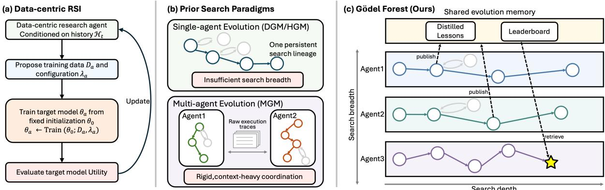
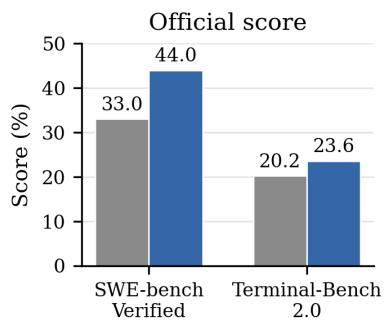
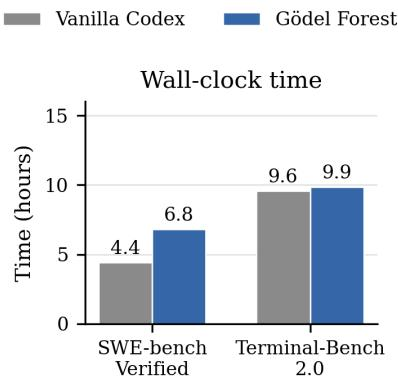
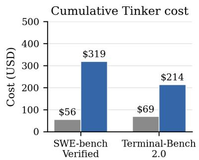
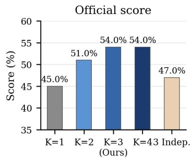
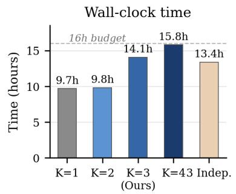
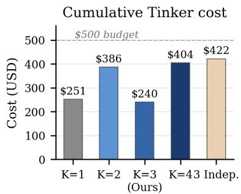
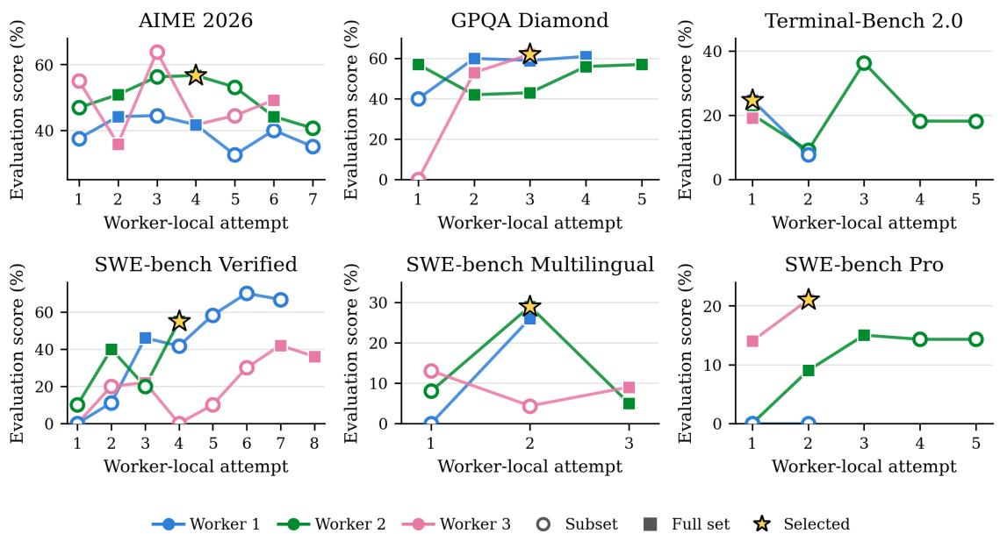
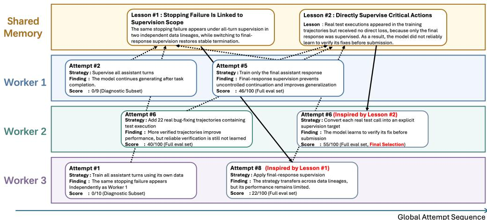

# Gödel Forest: Balancing Search Depth and Breadth for Data-Centric Recursive Self-Improvement

Ziqi Zhao1,2, Fanqing Meng1,3,\*, Haocheng Lu1,4, Lingxiao Du1,3, Qiguang Chen1, Mengkang Hu1,†, Xiao-ming Wu2,†

1Evolvent AI 2The Hong Kong Polytechnic University

3National University of Singapore4Columbia University

\*Project leader. †Corresponding authors.

https://github.com/evolvent-ai/Godel-Forestrsibench.co

## ABSTRACT

Recursive self-improvement (RSI) aims to achieve compounding gains by having models improve themselves. While most existing RSI systems optimize external agent harnesses or prompts around a frozen base model, data-centric RSI directly updates the model's own parameters by training on agent-generated data. However, because validating data strategies requires expensive model training, existing methods face a fundamental dilemma: a single agent gets trapped in narrow directions and lacks exploration breadth, while naive parallel search or heavy trace sharing sacrifices longhorizon search depth. To address this challenge, we introduce Gödel Forest, a multi-agent framework that organizes recursive self-improvement as an ensemble of co-evolving search trees. In Gödel Forest, each agent autonomously grows a persistent tree, deepening, branching, or pruning data strategies based on model feedback to secure depth, while parallel trees explore distinct regions of the data space to expand breadth. Crucially, rather than leaving trees isolated or flooding them with heavy execution logs, a dynamically co-evolving memory connects the forest: agents continuously distill their successes and failures into compact procedural lessons anchored to a global leaderboard Through this forest ecosystem, a dead-end in one tree instantly warns the whole forest against unpromising paths, while an empirical breakthrough quickly seeds new exploration branches in neighboring trees. Evaluated on RSIBench-Data across six diverse domains, Gödel Forest outperforms the single-agent baseline by an average of 10.70% while reducing wall-clock time on five tasks. Ablations confirm that co-evolving shared memory yields a +7.00% gain over independent parallel search, demonstrating that collective distillation is key to scalable self-improvement. The code is available at https://github.com/evolvent-ai/Godel-Forest.

## 1. Introduction

Recursive self-improvement (RSI) refers to a process in which a system repeatedly produces improved versions of itself under a given evaluator, thereby improving its own ability to improve and yielding compounding gains [1, 2, 3, 4]. The original Gödel machine casts RSI as a proof-guided search over self-modifications, accepting a candidate rewrite only after proving that it increases expected utility. Because this proof search is intractable for realistic agents, recent empirical methods [5, 6, 7] replace formal proof with validation based on observed downstream task utility. Recent extensions such as the Mendel Gödel Machine (MGM)[8] further enrich this loop by contrasting execution traces across tasks and parallel runs to evolve executable agent harnesses.

  
Figure 1: Comparison of search paradigms in recursive self-improvement (RSI).

However, RSI systems remain confined to the external harness or prompts around a frozen base model, rather than entering the model itself through parameter updates. Data-centric RSI offers a complementary route in which an LLM agent repeatedly proposes data and training strategies, trains candidate target models from fixed initial parameters, and evaluates them on downstream tasks [9, 10, 11, 12, 13]. The resulting evidence updates the agent's persistent search state and guides subsequent proposals. Thus, training changes the parameters of each candidate target model, whereas recursion lies in the agent's evidence-driven evolution of data and training strategies (Figure 1a)

Unlike agent harness optimization, data evolution navigates an explosive combinatorial space spanning individual sample synthesis and dataset-level distribution shifts. Crucially, validating each candidate hypothesis incurs full-loop model training and downstream evaluation, rendering naive exploration prohibitively expensive under constrained compute budgets. This training-in-the-loop bottleneck traps existing RSI paradigms in a stark dilemma (Figure 1b): single-agent frameworks [6, 7] easily stagnate in myopic, narrow trajectories lacking directional breadth, whereas multi-agent variants [8] rely on raw trace exchange across identical tasks, resulting in rigid, context-saturated coordination that fails to scale to open-ended data discovery. How to sustain deep, long-horizon hypothesis pursuit while unlocking expansive exploration breadth through lightweight coordination remains the central challenge of data-centric RSI.

To resolve this, we propose Gödel Forest (Figure 1c), a multi-agent framework that structures RSI as an ensemble of co-evolving search trees. Gödel Forest reconciles the depth-versus-breadth trade-off through a structured duality: locally, each agent autonomously cultivates a deep, persistent search tree, using target-model feedback to continuously deepen, refine, or backtrack its data strategies to secure long-horizon search depth; globally, parallel trees explore distinct regions of the combinatorial data space, opening expansive directional breadth without discarding their accumulated search context. Crucially, rather than leaving trees isolated or choking communication with raw execution traces, agents coordinate asynchronously via a dynamically co-evolving shared memory through a read-evolve-publish protocol. By distilling empirical breakthroughs and failure modes into compact, actionable data lessons anchored to a global leaderboard, Gödel Forest establishes a collective feedback loop: a dead-end hit by one tree instantly acts as an inductive guardrail across the forest, while an empirical leap swiftly seeds new exploration branches in neighboring trees.

We evaluate Gödel Forest on RSIBench-Data across six diverse benchmarks spanning repository-level software engineering (SWE-bench Verified, Multilingual, and Pro), long-horizon terminal interaction (Terminal-Bench 2.0) scientific reasoning (GPQA Diamond), and competition mathematics (AIME 2026). Across all tasks, Gödel Forest consistently outperforms the single-agent baseline, achieving an average gain of 10.70% (e.g., boosting SWE-bench

Verified from 35.00% to 54.00%) while reducing end-to-end wall-clock time on five of the six benchmarks. Ablations further confirm that co-evolving via shared evolution memory provides a +7.00% gain over running independent parallel agents, demonstrating that dynamic experience sharing is key to scalable self-improvement.

The contributions of this paper are as follows:

• We formulate data-centric RSI as an open-ended data-evolution search, identifying the fundamental tension between long-horizon search depth and directional exploration breadth under expensive training-in-the-loop validation.

• We propose G"odel Forest, a co-evolutionary multi-agent framework that structures recursive improvement as an ensemble of persistent search trees, coupling private long-horizon tree refinement with an asynchronous read-evolve-publish shared memory for lightweight coordination.

• We evaluate Gödel Forest across six diverse benchmarks in RSIBench-Data, demonstrating consistent gains over single-agent and independent parallel baselines, superior wall-clock efficiency, and significant empirical advantages from shared-memory co-evolution

## 2. Related Work

Empirical Gödel Machines and Harness Evolution. Originating from Schmidhuber's theoretical vision [14], empirical Gödel machines replace intractable formal proof searches with observed task utility to iteratively rewrite agent programs [5, 15]. Subsequent efforts generalize this paradigm through archive-based exploration [6, 7] risk-controlled acceptance [16], evaluator co-evolution [17, 18], and multi-trajectory comparative evolution [8]. Despite these advances, existing empirical Gödel systems operate under a shared constraint: their self-modifications are strictly restricted to external executable harnesses or prompt wrappers around frozen base models, precluding internal parameter updates. Furthermore, exchanging verbose execution traces induces severe context bloat preventing effective scaling in open-ended research spaces.

Data-Centric Recursive Self-Improvement. A parallel line of research pursues compounding gains by directly updating model parameters. Early frameworks bootstrap reasoning capabilities from self-generated rationales [19, 20, 21] or zero-data environment self-play [22, 23]. Building on interactive environments [24, 13], recent posttraining frameworks delegate dataset curation, recipe synthesis, and execution monitoring to autonomous LLM agents [12, 2, 9]. However, existing data-centric RSI systems predominantly rely on single-agent search that easily gets trapped in localized data distributions under constrained budgets, while uncoordinated parallel sampling repeatedly wastes compute on redundant failure modes.

Unlike prior work confined to prompt-level harnesses or uncoordinated sampling, we establish asynchronous memory co-evolution as the coordination paradigm for data-centric RSI. Gödel Forest realizes this through a search duality: private search trees maintain local selective pressure for deep hypothesis refinement, while a shared memory substrate prevents redundant exploration and propagates breakthrough recipes across workers. Grounded in real parameter updates, Gödel Forest ultimately bridges empirical Gödel search with scalable post-training collective intelligence.

## 3. Gödel Forest

To overcome the training-in-the-loop bottleneck in data-centric recursive self-improvement (RSI), we present Gödel Forest, a co-evolutionary multi-agent framework that structures search as an ensemble of persistent search trees coupled through a dynamically shared evolution memory. Gödel Forest resolves the fundamental tension between search depth and exploration breadth through a structured duality: locally, individual agents cultivate deep, persistent search trees with budget-aware diagnostic gating; globally, parallel trees explore distinct regions of the combinatorial data space and coordinate asynchronously via compact, distilled empirical lessons.

## 3.1. Problem Formulation and Single-Tree Foundations

Empirical Gödel search as tree search. The original Gödel machine [14] executes self-modifications only after formally proving that they yield higher expected utility than continuing the search. Because formal proof search is intractable for complex generative agents, empirical Gödel frameworks guide exploration using observed downstream utility over an archive of agent versions. Let $\tau _ { t }$ denote the agent archive at step t, initialized with a seed agent as $\mathcal { T } _ { 0 } = \{ a _ { 0 } \}$ . Each non-root agent retains the identity of the parent from which it was derived, forming a directed tree. A search policy selects an archived agent $a \in \mathcal { T } _ { t }$ and applies a modification operator $a ^ { \prime } \gets \Phi ( a , \mathcal { H } _ { t } )$ conditioned on the accumulated evaluation evidence $\textstyle \mathcal { H } _ { t } .$ The successor $a ^ { \prime }$ is appended to the archive as a child of $^ { a , }$ giving $\mathcal { T } _ { t + 1 } = \mathcal { T } _ { t } \cup \{ a ^ { \prime } \}$ . Because any archived node can be selected for modification, the search can either deepen a promising branch or backtrack to an earlier node to pursue an alternative direction.

Data-centric recursive self-improvement. Unlike prior empirical Gödel systems that optimize external prompt templates or agent harnesses around frozen base models, data-centric RSI seeks compounding gains by directly updating target model parameters. Here, each archived agent a is a specialized data-engineering program. Executing a synthesizes training data $D _ { a } .$ trains candidate parameters $\theta _ { a }$ from a fixed base model $\theta _ { 0 }$ , and evaluates downstream utility $U ( a )$ on dataset $B \colon$

$$
( D _ { a } , \lambda _ { a } ) = \mathrm { G e n e r a t e } ( a ) ,\tag{1}
$$

$$
\theta _ { a } = \operatorname { T r a i n } ( \theta _ { 0 } ; D _ { a } , \lambda _ { a } ) ,\tag{2}
$$

$$
U ( a ) = \operatorname { E v a l } _ { B } ( \theta _ { a } ) .\tag{3}
$$

Although every candidate model is trained from the same initial parameters $\theta _ { 0 }$ , the process remains strictly recursive: the empirical performance and failure diagnostics of earlier target models update the agent's persistent state, which in turn governs subsequent data generation and curation decisions.

The depth-versus-breadth dilemma. Validating each data hypothesis requires full-loop model training and downstream evaluation, rendering naive exploration prohibitively expensive. This training-in-the-loop bottleneck creates a stark dilemma: a single tree easily stagnates in path-dependent trajectories lacking directional breadth, whereas parallel search either redundantly repeats shared failures or chokes on verbose trace exchange [8]. Reconciling deep, multi-round hypothesis pursuit with broad, lightweight collective coordination is the central objective of Gödel Forest.

## 3.2. Persistent Tree Search: Local Deep Hypothesis Pursuit

To enable long-horizon hypothesis pursuit without premature abandonment, each worker $i \in \{ 1 , \ldots , K \}$ maintains a private search tree $\boldsymbol { \mathcal { T } } _ { t } ^ { ( i ) }$ and evidence ledger $\mathcal { H } _ { t } ^ { ( i ) }$ . Each worker LLM autonomously selects parents, designs data and training configurations, and makes other search decisions under fixed interfaces and budgets. Within each tree, the worker executes a skill-enhanced cognitive loop comprising four distinct stages:

Stage 1: Diagnose. The worker analyzes the failure modes of previous attempts in $\mathcal { H } _ { t } ^ { ( i ) } \left( \mathrm { e . g . } \right.$ , runaway completion, ungrounded actions, or skipped verification) to localize specific behavioral defects in the candidate model.

Stage 2: Propose. Conditioned on both its private trajectory $\mathcal { H } _ { t } ^ { ( i ) }$ and the globally shared memory $M _ { t }$ the worker selects an existing parent agent $a \in \mathcal { T } _ { t } ^ { ( i ) }$ and generates an evolved successor program $a ^ { \prime }$ (realized as executable data synthesis and curation code):

$$
a ^ { \prime }  \Phi ( a , \mathcal { H } _ { t } ^ { ( i ) } , M _ { t } ) .\tag{4}
$$

The successor $a ^ { \prime }$ is archived in $\boldsymbol { \mathcal { T } } _ { t } ^ { ( i ) }$ , executing $\left( D _ { a ^ { \prime } } , \lambda _ { a ^ { \prime } } \right) = { \mathrm { G e n e r a t e } } ( a ^ { \prime } )$ followed by candidate model training $\theta _ { a ^ { \prime } } = \operatorname { T r a i n } ( \theta _ { 0 } ; D _ { a ^ { \prime } } , \lambda _ { a ^ { \prime } } )$

Algorithm 1 Gödel Forest Asynchronous Co-Evolution Protocol   
1: Initialize: Archives $\mathcal { T } _ { 0 } ^ { ( i ) }  \{ a _ { 0 } \} ,$ evidence $\mathcal { H } _ { 0 } ^ { ( i ) }  \emptyset$ for $i \in \{ 1 , \ldots , K \}$ , shared memory $M _ { 0 } \gets ( \emptyset , \emptyset )$   
2: while elapsed wall-clock $W \leq W _ { \operatorname* { m a x } }$ and cumulative expenditure $C \leq C _ { \mathrm { m a x } }$ do   
3: for each worker $i \in \{ 1 , \ldots , K \}$ in parallel, asynchronously do   
4: $ { \mathcal { L } } _ { \mathrm { r e l } } ^ { ( i ) }$ ← Retrieve $( \boldsymbol { \mathcal { L } } _ { t } , \boldsymbol { \mathcal { H } } _ { t } ^ { ( i ) } )$ {Read: Query relevant shared lessons}   
5: Select parent a ∈ $\mathcal { T } _ { t } ^ { ( i ) }$ and propose $a ^ { \prime } \gets \Phi ( a , \mathcal { H } _ { t } ^ { ( i ) } , \mathcal { L } _ { \mathrm { r e l } } ^ { ( i ) } , \Lambda _ { t } )$ {Propose}   
6: $( D _ { a ^ { \prime } } , \lambda _ { a ^ { \prime } } ) \gets \mathrm { ~ C ~ }$ Generate $\begin{array} { r l } { ( a ^ { \prime } ) ; } & { { } \theta _ { a ^ { \prime } } \gets \operatorname { T r a i n } ( \theta _ { 0 } ; D _ { a ^ { \prime } } , \lambda _ { a ^ { \prime } } ) \left\{ \operatorname { T r a i n } \right\} } \end{array}$   
7: $U _ { \mathrm { d i a g } } ( a ^ { \prime } ) \gets \mathrm { E v a l } _ { B ^ { \mathrm { d i a g } } } ( \theta _ { a ^ { \prime } } )$ {Diagnostic Screening}   
8: if $\bar { U } _ { \mathrm { d i a g } } ( a ^ { \prime } )$ passes gating threshold then   
9: $\begin{array} { r } { U _ { \mathrm { r e m } } ( a ^ { \prime } ) \gets \mathrm { E v a l } _ { B \setminus B ^ { \mathrm { d i a g } } } ( \theta _ { a ^ { \prime } } ) ; \quad U ( a ^ { \prime } ) \gets \mathrm { M e r g e } ( U _ { \mathrm { d i a g } } ( a ^ { \prime } ) , U _ { \mathrm { r e m } } ( a ^ { \prime } ) ) } \end{array}$   
10: $\Lambda _ { t }  \Lambda _ { t } \cup \{ ( a ^ { \prime } , U ( a ^ { \prime } ) ) \}$ {Full eval & leaderboard update}   
11: end if   
12: Update private evidence $\mathcal { H } _ { t + 1 } ^ { ( i ) }$ ; Distill lesson $\ell _ { a ^ { \prime } } ^ { ( i ) } \gets \mathrm { S y n t h e s i z e } ( \mathcal { H } _ { t + 1 } ^ { ( i ) } )$ {Review}   
13: if $\ell _ { a ^ { \prime } } ^ { ( i ) }$ contains non-trivial empirical findings then   
14: $\mathcal { L } _ { t + 1 }  \mathcal { L } _ { t } \cup \{ \ell _ { a ^ { \prime } } ^ { ( i ) } \}$ {Publish: Broadcast lesson to blackboard}   
15: end if   
16: end for   
17: end while   
18: return Optimal agent $a ^ { \star } = \arg \operatorname* { m a x } _ { a \in \Lambda _ { t _ { \mathrm { e n d } } } }$ U(a) with target checkpoint $\theta _ { a ^ { \star } }$  
Stage 3: Validate & Evaluate. Full-benchmark evaluation on long-horizon tasks is computationally demanding To preserve the evaluation budget, the worker first validates the generated data and evaluates the candidate on a lightweight diagnostic subset $B ^ { \mathrm { d i a g } } \subset B ,$ whose composition is determined autonomously by the worker:

$$
U _ { \mathrm { d i a g } } ( a ^ { \prime } ) = \mathrm { E v a l } _ { B ^ { \mathrm { d i a g } } } ( \theta _ { a ^ { \prime } } ) .\tag{5}
$$

If $U _ { \mathrm { d i a g } } ( a ^ { \prime } )$ surpasses the gating threshold, the worker proceeds to evaluate the remaining tasks in B using the same checkpoint $\theta _ { a ^ { \prime } }$ without retraining, obtaining the complete utility $U ( a ^ { \prime } )$ . Otherwise, evaluation is terminated early, pruning unviable candidates before incurring full-set overhead while recording the diagnostic evidence.

Stage 4: Review. The worker appends the evaluation outcome to $\mathcal { H } _ { t } ^ { ( i ) }$ and determines the next search action: exploiting the current direction through further modification, revising hyperparameters, or backtracking to an earlier ancestor node.

## 3.3. Forest Co-Evolution via Shared Evolution Memory

To reconcile independent exploration with collective synergy, Gödel Forest organizes K concurrent workers into a co-evolving ensemble $\mathcal { F } _ { t } = \{ \mathcal { T } _ { t } ^ { ( i ) } \} _ { i = 1 } ^ { K }$ . Workers interact asynchronously through a shared evolution memory $M _ { t } = \left( \Lambda _ { t } , \mathcal { L } _ { t } \right)$ that acts as a non-blocking public blackboard.

Outcome-level anchor: shared leaderboard $\Lambda _ { t }$ .The leaderboard aggregates verified utilities across all fully evaluated agents across workers, $\begin{array} { r } { \Lambda _ { t } = \{ ( a , U ( a ) ) \mid a \in \bigcup _ { j = 1 } ^ { K } \mathcal { T } _ { t } ^ { ( j ) } } \end{array}$ , a fully evaluated}, establishing a transparent global performance anchor for each worker to gauge whether its local branch remains competitive against the collective frontier.

Procedural cognition: structured empirical lessons $\mathcal { L } _ { t } .$ While numeric scores indicate performance, cross-tree coordination requires understanding why a data intervention succeeded or failed. Instead of broadcasting raw data samples or execution traces, worker i synthesizes each significant trial into a compact, structured lesson :

$$
\ell = \Big \langle \mathcal { H } _ { \mathrm { i n t e n t } } , \Delta U , \mathrm { A t t r i b u t i o n } , \rho \Big \rangle ,\tag{6}
$$

where ${ \mathcal { H } } _ { \mathrm { { i n t e n t } } }$ specifies the tested data hypothesis (e.g., all-turn vs. terminal-turn supervision), ∆U records the empirical utility shift, Attribution denotes the causal diagnosis of the outcome, and $\rho$ articulates a distilled, actionable operational rule (e.g., “restrict supervision loss to final assistant turns to prevent run-on completion"). This structured schema decouples high-level procedural takeaways from heavy execution logs, keeping cross-tree communication lightweight (\~100 tokens per lesson) and circumventing the severe context bloat that impedes raw-trace sharing [8]. The published lessons dynamically form an asynchronous shared blackboard: $\mathcal { L } _ { t + 1 } = \mathcal { L } _ { t } \cup \{ \ell _ { a } ^ { ( i ) } \}$

Asynchronous Read-Evolve-Publish loop. Communication in Gödel Forest is entirely pull-based and nonblocking, operating without global synchronization barriers:

• Read: Prior to formulating a new candidate, worker i retrieves contextually relevant lessons based on its current failure symptoms: $\mathcal { L } _ { \mathrm { r e l } } ^ { ( i ) } = \mathrm { R e t r i e v e } ( \mathcal { L } _ { t } , \mathcal { H } _ { t } ^ { ( i ) } ) \subseteq \mathcal { L } _ { t }$

• Evolve: The retrieved lessons fulfill two complementary functions: negative lessons serve as inductive guardrails, pruning paths that caused failure in peer trees; positive lessons act as catalytic seeds, inspiring peer workers to explore creative variants in distinct domains.

• Publish: Upon concluding its Review stage, the worker broadcasts any distilled lesson to $\mathcal { L } _ { t } ,$ immediately enriching the collective memory for all subsequent queries.

Algorithm 1 summarizes the complete Gödel Forest co-evolutionary protocol. Upon reaching budget termination, the manager returns the globally optimal checkpoint $\theta _ { a ^ { \star } }$ satisfying $a ^ { \star } = \arg \operatorname* { m a x } _ { a \in \Lambda } U ( a )$ . This architecture ensures that individual trees maintain deep, uninterrupted search continuity, while shared memory continuously drives collective discovery across the forest.

## 4. Experiments

## 4.1. Experimental Setup

Benchmarks and task interface. We evaluate Gödel Forest on RSIBench-Data [9] across six diverse, highdifficulty benchmarks: SWE-bench Verified [25], SWE-bench Multilingual [26], SWE-bench Pro [27], Terminal-Bench 2.0 [28], GPQA Diamond [29], and AIME 2026. Together, these cover repository-level software engineering, long-horizon interactive bash environments, multidisciplinary scientific reasoning, and competition mathematics. The three SWE-bench suites use the Mini-SWE-Agent runner [30]. All candidates are evaluated by Harbor in isolated E2B sandboxes under identical interfaces.

Models, training infrastructure, and budgets. Every candidate starts from the base model Qwen3.5-35B-A3B-Base [31] and is fine-tuned with LoRA SFT through the shared TinKER backend; Claude Opus 4.8 serves as the fixed external rollout generator. Each run is strictly governed by a 16-hour wall-clock limit and a \$500 cumulative TönKER budget, enforced across the entire forest.

Official evaluation and baselines. During search, $U ( a )$ denotes feedback from the RSIBench-Data selection evaluator, which guides data generation and checkpoint selection without exposing gold solutions. Post-search, the selected checkpoint $\theta _ { a ^ { \star } }$ is frozen and officially evaluated in an isolated canonical run, yielding $S _ { \mathrm { o f f } } = \mathrm { E v a l } ^ { \mathrm { o f f } } ( \theta _ { a ^ { \star } } )$ Because both phases share task identities, $S _ { \mathrm { o f f } }$ serves as a standardized post-selection verification rather than a held-out generalization benchmark. Our primary baseline is vanilla Claude $\mathrm { C o d e ^ { 1 } }$ with Sonnet-5 operating as a single-agent search without forest coordination or shared memory. To demonstrate framework generality across underlying LLM backbones, we additionally instantiate Gödel Forest with OpenAI Codex² (gpt-5.6-sol). Claude Code runs at high reasoning effort and Codex at maximum reasoning effort, following RSIBench-Data standards.

Table 1: Official performance and resource use with Claude Code + Sonnet-5. Time is end-to-end wall-clock hours for data generation, training, validation, and review; cost is cumulative TınKER expenditure across all workers. Here the official scores Soff are reported.
<table><tr><td>Benchmark</td><td>Method</td><td>Score ↑</td><td>Time (h) ↓</td><td>Cost ($) ↓</td></tr><tr><td>SWE-bench Verified</td><td>Vanilla</td><td>35.00%</td><td>14.91</td><td>181.70</td></tr><tr><td rowspan="3">SWE-bench Multilingual</td><td>Gödel Forest</td><td>54.00%</td><td>14.06</td><td>239.67</td></tr><tr><td>Vanilla</td><td>22.00%</td><td>14.20</td><td>363.77</td></tr><tr><td>Gödel Forest</td><td>30.00%</td><td>11.02</td><td>336.55</td></tr><tr><td rowspan="2">SWE-bench Pro</td><td>Vanilla</td><td>4.00%</td><td>9.54</td><td>45.63</td></tr><tr><td>Gödel Forest</td><td>15.00%</td><td>7.49</td><td>419.87</td></tr><tr><td rowspan="2">Terminal-Bench 2.0</td><td>Vanilla</td><td>5.62%</td><td>8.87</td><td>156.93</td></tr><tr><td>Gödel Forest</td><td>17.98%</td><td>15.50</td><td>295.06</td></tr><tr><td>GPQA Diamond</td><td>Vanilla</td><td>52.00%</td><td>6.43</td><td>16.03</td></tr><tr><td rowspan="2">AIME 2026</td><td>Gödel Forest</td><td>55.00%</td><td>5.76</td><td>15.22</td></tr><tr><td>Vanilla</td><td>49.17%</td><td>9.29</td><td>121.21</td></tr><tr><td></td><td>Gödel Forest</td><td>60.00%</td><td>8.61</td><td>49.94</td></tr></table>

## 4.2. Main Results

Table 1 presents the official benchmark performance, end-to-end wall-clock time, and cumulative TinKER expenditure for Gödel Forest (K = 3) versus the vanilla Claude Code baseline.

Universal gains across diverse scenarios. Gödel Forest consistently outperforms the single-agent baseline on all six benchmarks, yielding an average absolute gain of 10.70%. The most pronounced improvement emerges on SWE-bench Verified, soaring from 35.00% to 54.00% (+19.00%). Substantial gains also extend across challenging executable domains (SWE-bench Pro improves from 4.00% to 15.00%; Terminal-Bench 2.0 improves from 5.62% to 17.98%) and complex reasoning tasks (GPQA Diamond reaches 55.00%; AIME 2026 reaches 60.00%). These comprehensive improvements confirm that co-evolving persistent search trees consistently unlocks superior data synthesis strategies across heterogeneous problem distributions.

The efficiency paradox: faster completion via asynchronous synergy. Despite conducting broader and deeper multi-tree exploration, Gödel Forest achieves lower end-to-end wall-clock time on five of the six benchmarks (e.g., reducing SWE-bench Multilingual from 14.20h to 11.02h, and SWE-bench Pro from 9.54h to 7.49h). This efficiency stems directly from two algorithmic properties: asynchronous parallel execution maximizes hardware concurrency, while shared evolution memory rapidly propagates negative findings, enabling workers to prune unviable exploration branches before committing expensive training cycles.

Understanding inference expenditure. While wall-clock time decreases, cumulative expenditure is higher on long-horizon agentic benchmarks (e.g., SWE-bench Pro and Terminal-Bench 2.0). This expenditure disparity is an artifact of candidate capability rather than search inefficiency: weaker baseline models frequently crash, loop, or terminate prematurely during early turns, truncating their interaction trajectories. In contrast, models evolved by Gödel Forest sustain coherent, multi-turn reasoning and tool use, executing complex actions that incur higher inference cost but successfully solve challenging tasks.

  
Figure 2: Cross-backbone generalization with Codex (gpt-5.6-sol). Left: official score. Center: wall-clock time. Right: cumulative TiNKER expenditure.

  
Figure 3: Ablation study on SWE-bench Verified. We evaluate worker scaling $( K \in \{ 1 , 2 , 3 , 4 \} )$ with full shared memory, and compare against 3 Independent Workers without shared memory. Dashed lines denote 16-hour and \$500 budget limits.

## 4.3. Cross-Backbone Generalization: Results with Codex

To confirm that Gödel Forest functions as a general meta-architecture independent of any specific agent implementation, we evaluate worker agents driven by Codex (gpt-5. 6-so1) on SWE-bench Verified and Terminal-Bench 2.0 (Figure 2). With target model, training backend, and evaluation interfaces held fixed, Gödel Forest secures marked improvements over the vanilla Codex baseline: official scores rise from 33.00% to 44.00% (+11.00%) on SWE-bench Verified and from 20.22% to 23.60% (+3.38%) on Terminal-Bench 2.0. Furthermore, elapsed wall-clock latency remains modest (6.81h vs. 4.41h on SWE-bench Verified, and 9.85h vs. 9.56h on Terminal-Bench 2.0). As in Section 4.2, the higher expenditure (\$319.22 vs. \$55.61) reflects the target model's enhanced ability to sustain extended, successful problem-solving interactions. These consistent gains demonstrate that the benefits of asynchronous tree co-evolution generalize across distinct frontier LLMs.

## 4.4. Ablation Study: Dissecting Exploration Breadth and Coordination

We conduct an ablation study on SWE-bench Verified to isolate the contributions of tree concurrency and shared memory coordination (Figure 3).

Concurrency scaling and the depth-breadth trade-off. Scaling the number of persistent workers from $K = 1$ to $K = 3$ broadens initial exploration diversity, steadily elevating official performance from 45.00% to 51.00% and 54.00%. Here, the single-worker setting $( K = 1 )$ isolates our local persistent tree search (§3.2) from forest coordination. Unlike the vanilla baseline operating over an unconstrained flat conversational loop, a worker in our framework incorporates a structured evidence ledger H for systematic backtracking, cognitive stage skills for grounded candidate proposal, and diagnostic gating $( B ^ { \mathrm { d i a g } }  B )$ to prune unviable recipes early. However scaling further to K = 4 plateaus at 54.00% while substantially increasing wall-clock time (15.80h) and cost (\$404.43) Under a fixed total budget, excessive worker concurrency splinters compute across too many concurrent branches, diminishing the search depth achievable along any individual tree. Thus, K = 3 establishes an optimal Pareto balance between exploration breadth, refinement depth, and resource expenditure.

  
Figure 4: Candidate search trajectories across six benchmarks. Colors trace independent trees maintained by the three workers (K = 3). Open circles denote diagnostic evaluations $( B ^ { \mathrm { d i a g } } ) ;$ filled squares denote full benchmark evaluations (B). Yellow stars mark the selected checkpoints.

Collective synergy vs. uncoordinated concurrency. Contrasting Gödel Forest with the 3 Indep. baseline (three concurrent workers evolving without shared memory) isolates the effect of cross-tree communication. Deprived of shared lessons and the global leaderboard, three independent workers achieve only 47.00% (a steep 7.00% performance drop) despite consuming comparable budget (\$421.63 and 13.38h). Without shared memory, parallel workers repeatedly squander training resources on identical dead-ends that were already diagnosed by peers. This confirms that Gödel Forest's superior performance stems from collective cognitive synergy rather than naive parallel compute scaling.

## 4.5. Search Dynamics and Cross-Worker Knowledge Synthesis

To understand how persistent tree search and shared memory interact in practice, we examine both the macroscopic trajectory dynamics across all benchmarks (Figure 4) and a microscopic case study on SWE-bench Verified (Figure 5).

Macroscopic search dynamics: volatility and multi-tree resilience. As illustrated in Figure 4, data-centric RSI trajectories are inherently non-monotonic: high-performing checkpoints are frequently followed by sharp performance drops when workers explore aggressive data mixtures or novel supervision formats. Rather than guaranteeing monotonic ascent, each attempt acts as an empirical hypothesis test. In this volatile optimization landscape, Gödel Forest provides critical structural resilience: if an individual worker hits a severe regression or local dead-end, parallel workers continue advancing complementary branches; meanwhile, the persistent global archive decouples speculative exploration from checkpoint selection, guaranteeing that temporary failures never forfeit prior performance peaks.

Microscopic knowledge synthesis: turning failures into collaborative leaps. Figure 5 illustrates how workers coordinate without copying raw data or sharing verbose logs, but by synthesizing empirical breakdowns

  
Figure 5: Cross-worker knowledge synthesis on SWE-bench Verified. Workers cultivate private search trees (horizontal lanes) and coordinate asynchronously via shared evolution memory (top lane). Dotted arrows trace lesson distillation from empirical findings; dashed arrows show lessons inspiring subsequent data interventions. Candidate scores reflect within-run evaluations

into compact, actionable lessons.

Lesson #1 (Stopping Boundary Guardrail): Under dense all-turn supervision, Worker 1 (Attempt #2, 0/9) and Worker 3 (Attempt #1, 0/10) independently encounter severe runaway generation where the model fails to terminate after finishing tasks. Diagnosing that multi-turn loss degrades termination tokens, Worker 1 restricts supervision strictly to the final assistant turn in Attempt #5, restoring termination boundaries and achieving a 46% score. This finding crystallizes into Lesson #1: loss masking to the final assistant turn restores stable task termination. Reading this lesson, Worker 3 immediately adopts final-turn masking in Attempt #8, boosting its score from near-zero to 22% and preventing further compute waste.

Lesson #2 (Supervising Verification Actions): Although final-turn supervision stabilizes completion, it exposes an unexpected limitation: the model ceases executing self-verification tests because intermediate bash calls receive zero training loss. Worker 2 notes this in Attempt #6 (40%), distilling Lesson #2: critical intermediate actions, such as test executions, require explicit supervision. To reconcile this with Lesson #1, Worker 2 synthesizes prex-truncated trajectories, converting intermediate verification commands into pseudo-terminal targets. In revised Attempt #6, the model actively executes test suites prior to submission, achieving the peak score of 55% and earning final checkpoint selection.

Together, these empirical dynamics show how Gödel Forest turns noisy trial-and-error into compounding, self-correcting scientific discovery

## 5. Conclusion

We presented Gödel Forest, a multi-agent framework for data-centric recursive self-improvement that resolves the depth-versus-breadth search dilemma. Locally, agents cultivate persistent search trees with diagnostic gating for deep hypothesis pursuit; globally, parallel trees explore distinct data regions and coordinate asynchronously via shared memory. By distilling outcomes into compact shared lessons anchored to a leaderboard, Gödel Forest establishes a collective feedback loop where failures prune dead-ends and breakthroughs seed new branches. Across six RSIBench-Data benchmarks, Gödel Forest achieves consistent gains over single-agent and parallel baselines (+10.70% average score, +7.00% ablation gain) with lower wall-clock latency, validating asynchronous tree co-evolution as a scalable self-improvement paradigm.

## References

[1] Hanjing Li, Qiguang Chen, Chenyuan Zhang, Qionglin Qiu, Fanqing Meng, Mengkang Hu, Libo Qin, and Min Zhang. Towards ai that improves itself: A survey of recursive self-improvement. 2026.

[2] Qizheng Li, Yifei Zhang, Xiao Yang, Xu Yang, Zhuo Wang, Weiqing Liu, and Jiang Bian. Ft-dojo: Towards autonomous llm fine-tuning with language agents. arXiv preprint arXiv:2603.01712, 2026.

[3] Zhaojian Yu, Penghao Yin, Shuzheng Gao, Shilin He, Kai Cai, and Xiao-Ping Zhang. Autotrainess: Teaching language models to improve language models autonomously. arXiv preprint arXiv:2606.31551, 2026.

[4] Zhengyang Zhao, Shengjie Ye, Lu Ma, Hao Liang, Hengyi Feng, and Wentao Zhang. Andes: Agent native data evolving synthesis tool for autonomous instruction alignment. arXiv preprint arXiv:2606.01279, 2026.

[5] Maxime Robeyns, Martin Szummer, and Laurence Aitchison. A self-improving coding agent. arXiv preprint arXiv:2504.15228, 2025.

[6] Jenny Zhang, Shengran Hu, Cong Lu, Robert Lange, and Jeff Clune. Darwin gödel machine: open-ended evolution of self-improving agents. In International Conference on Learning Representations, volume 2026, pages 104223-104294, 2026.

[7] Wenyi Wang, Piotr Piękos, Li Nanbo, Firas Laakom, Yimeng Chen, Mateusz Ostaszewski, Mingchen Zhuge, and Jürgen Schmidhuber. Huxley-g\" odel machine: Human-level coding agent development by an approximation of the optimal self-improving machine. In International Conference on Learning Representations, volume 2026, pages 80356–80386, 2026.

[8] Changzhi Liu, Yilun Liu, Sikuan Yan, Volker Tresp, and Yunpu Ma. Mendel g\" odel machine: Recursive self-improving coding agents via comparative evolution. arXiv preprint arXiv:2608.07645, 2026.

[9] Fanqing Meng, Lingxiao Du, Qiguang Chen, Ziqi Zhao, Haocheng Lu, Mengkang Hu, and Michael Qizhe Shieh. Rsibench-data: Benchmarking data-centric research for recursive self-improvement. arXiv preprint arXiv:2607.25886, 2026.

[10] Ilia Kulikov, Chenxi Whitehouse, Tianhao Wu, Yixin Nie, Swarnadeep Saha, Eryk Helenowski, Weizhe Yuan, Olga Golovneva, Jack Lanchantin, Yoram Bachrach, et al. Autodata: An agentic data scientist to create high quality synthetic data. arXiv preprint arXiv:2606.25996, 2026.

[11] Ben Rank, Hardik Bhatnagar, Ameya Prabhu, Shira Eisenberg, Karina Nguyen, Matthias Bethge, and Maksym Andriushchenko. Posttrainbench: Can llm agents automate llm post-training? arXiv preprint arXiv:2603.08640, 2026.

[12] Taro Yano, Yoichi Ishibashi, and Masafumi Oyamada. Lamdagent: An autonomous framework for post-training pipeline optimization via llm agents. In Proceedings of the 2025 Conference on Empirical Methods in Natural Language Processing, pages 30066–30083, 2025.

[13] Samuel Kessler, Menglin Xia, Daniel Madrigal Diaz, Dongge Han, Helia Heshemi, Saravan Rajmohan, Victor Ruehle, and Jordan T Ash. Towards active synthetic data generation for finetuning language models. arXiv preprint arXiv:2512.00884, 2025.

[14] Juergen Schmidhuber. Goedel machines: Self-referential universal problem solvers making provably optimal self-improvements, 2006. URL https://arxiv.org/abs/cs/0309048.

[15] Xunjian Yin, Xinyi Wang, Liangming Pan, Li Lin, Xiaojun Wan, and William Yang Wang. Gödel agent: A self-referential agent framework for recursively self-improvement. In Proceedings of the 63rd Annual Meeting of the Association for Computational Linguistics (Volume 1: Long Papers), pages 27890–27913, 2025.

[16] Xuening Wu, Shenqin Yin, Yanlan Kang, Xinhang Zhang, Qianya Xu, Zeping Chen, and Wenqiang Zhang. Sgm: A statistical godel machine for risk-controlled recursive self-modification. arXiv preprint arXiv:2510.10232, 2025.

[17] Jenny Zhang, Bingchen Zhao, Wannan Yang, Jakob Foerster, Jeff Clune, Minqi Jiang, Sam Devlin, and Tatiana Shavrina. Hyperagents. arXiv preprint arXiv:2603.19461, 2026.

[18] Alex Iacob, Andrej Jovanović, William F Shen, Daniel Burkhardt, Meghdad Kurmanji, Nurbek Tastan, Lorenzo Sani, Niccolò Alberto Elia Venanzi, Ambroise Odonnat, Zeyu Cao, et al. The red queen g\" odel machine: Co-evolving agents and their evaluators. arXiv preprint arXiv:2606.26294, 2026.

[19] Eric Zelikman, Yuhuai Wu, Jesse Mu, and Noah Goodman. Star: Bootstrapping reasoning with reasoning. Advances in Neural Information Processing Systems, 35:15476–15488, 2022.

[20] Zixiang Chen, Yihe Deng, Huizhuo Yuan, Kaixuan Ji, and Quanquan Gu. Self-play fine-tuning converts weak language models to strong language models. arXiv preprint arXiv:2401.01335, 2024.

[21] Weizhe Yuan, Richard Yuanzhe Pang, Kyunghyun Cho, Xian Li, Sainbayar Sukhbaatar, Jing Xu, and Jason Weston. Self-rewarding language models. arXiv preprint arXiv:2401.10020, 2024.

[22] Andrew Zhao, Yiran Wu, Tong Wu, Quentin Xu, Yang Yue, Matthieu Lin, Shenzhi Wang, Qingyun Wu, Zilong Zheng, and Gao Huang. Absolute zero: Reinforced self-play reasoning with zero data. Advances in Neural Information Processing Systems, 38:105816–105879, 2026.

[23] Chengsong Huang, Wenhao Yu, Xiaoyang Wang, Hongming Zhang, Zongxia Li, Ruosen Li, Jiaxin Huang Haitao Mi, and Dong Yu. R-zero: Self-evolving reasoning llm from zero data. In International Conference on Learning Representations, volume 2026, pages 130770–130790, 2026.

[24] Zaid Khan, Elias Stengel-Eskin, Jaemin Cho, and Mohit Bansal. Dataenvgym: Data generation agents in teacher environments with student feedback. In International Conference on Learning Representations, volume 2025, pages 53480–53507, 2025.

[25] Carlos E Jimenez, John Yang, Alexander Wettig, Shunyu Yao, Kexin Pei, Ofir Press, and Karthik Narasimhan Swe-bench: Can language models resolve real-world github issues? In International Conference on Learning Representations, volume 2024, pages 54107–54157, 2024.

[26] Daoguang Zan, Zhirong Huang, Wei Liu, Hanwu Chen, Shulin Xin, Linhao Zhang, Qi Liu, Li Aoyan, Lu Chen, Xiaojian Zhong, et al. Multi-swe-bench: A multilingual benchmark for issue resolving. Advances in Neural Information Processing Systems, 38, 2026.

[27] Xiang Deng, Jeff Da, Edwin Pan, Yannis Yiming He, Charles Ide, Kanak Garg, Niklas Lauffer, Andrew Park, Nitin Pasari, Chetan Rane, et al. Swe-bench pro: Can ai agents solve long-horizon software engineering tasks? arXiv preprint arXiv:2509.16941, 2025.

[28] Mike Merrill, Alexander Shaw, Nicholas Carlini, Boxuan Li, Harsh Raj, Ivan Bercovich, Lin Shi, Jeong Shin, Thomas Walshe, E Kelly Buchanan, et al. Terminal-bench: Benchmarking agents on hard, realistic tasks in command line interfaces. In International Conference on Learning Representations, volume 2026, pages 40903-40986, 2026.

## Evolvent Al

[29] David Rein, Betty Li Hou, Asa Cooper Stickland, Jackson Petty, Richard Yuanzhe Pang, Julien Dirani, Julian Michael, and Samuel R Bowman. Gpqa: A graduate-level google-proof q&a benchmark. arXiv preprint arXiv:2311.12022, 2023.

[30] John Yang, Carlos Jimenez, Alexander Wettig, Kilian Lieret, Shunyu Yao, Karthik Narasimhan, and Ofir Press. Swe-agent: Agent-computer interfaces enable automated software engineering. Advances in Neural Information Processing Systems, 37:50528–50652, 2024.

[31] An Yang, Anfeng Li, Baosong Yang, Beichen Zhang, Binyuan Hui, Bo Zheng, Bowen Yu, Chang Gao, Chengen Huang, Chenxu Lv, et al. Qwen3 technical report. arXiv preprint arXiv:2505.09388, 2025.