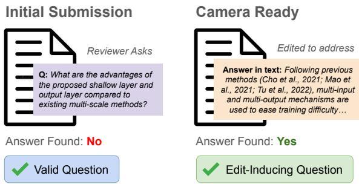
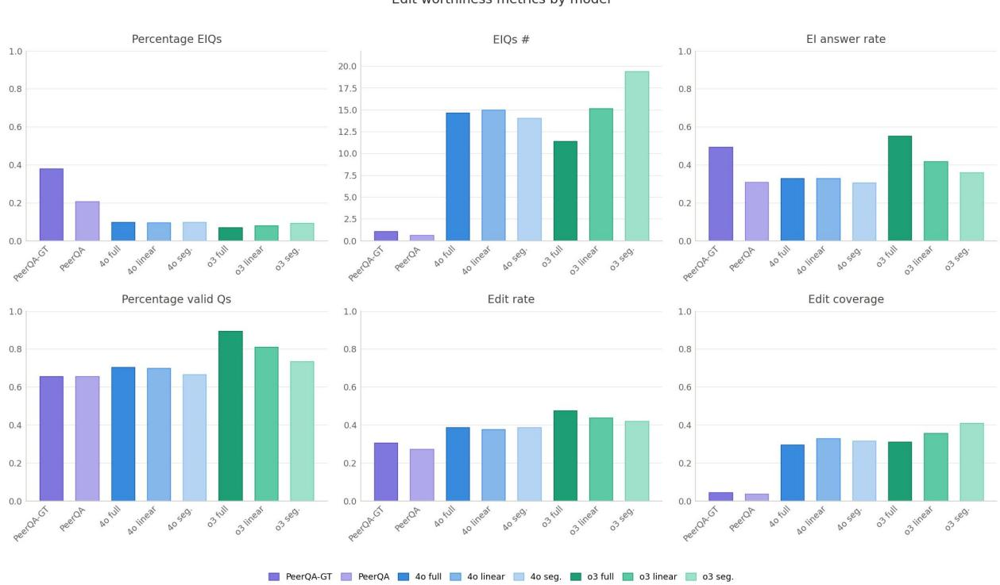

# Generating Edit-Inducing Questions for AI Research Manuscripts

Sebastian Joseph<sup>1</sup> Zichao Wang<sup>2</sup> Jennifer Healey<sup>2</sup> Alexa Siu<sup>2</sup>

Junyi Jessy Li<sup>1</sup> Ani Nenkova<sup>2</sup>

<sup>1</sup>The University of Texas at Austin, <sup>2</sup>Adobe Research

{sebaj,jessy}@utexas.edu, {jehealey,nenkova}@adobe.com

## Abstract

We study the ability of LLMs to generate editinducing questions whose answer will improve a paper draft. On a dataset of paired submission and camera-ready papers from ICLR and NeurIPS, we compare the helpfulness of questions from GPT models with or without full paper context to that of human reviewers. GPT produces more edit-inducing questions and its questions are associated with more ex tensive edits and cover a broader range of edited content compared to questions from reviewers. However, a much smaller percentage of the GPT questions are edit-inducing. Our analyses confirm that automated questions can be beneficial to authors and highlight an example task where proper attending to long context deteriorates reasoning model ability to produce helpful output.

## 1 Introduction

Ineffective scientific writing is often due to the curse of knowledge: the authors know a lot about their problem and the details of their work but find it hard to imagine that their reader does not have this knowledge (Pinker, 2014). A practical remedy is to request feedback on drafts, to find out what questions an intelligent and curious reader may have about the presented content.

In academic practice, peer reviewers are often expected to provide constructive feedback to help authors improve the work itself as well as its presentation, in addition to their evaluation of novelty, soundness and significance. With the exponential growth of academic publications straining the peer review process, even this delayed feedback is harder to obtain (Stelmakh et al., 2020; Hanson et al., 2023; Kim et al., 2025). This reality has motivated a line of work on automatic feedback generation, enabled by peer review datasets (Kang et al., 2018): from early knowledge-graph and template-based systems (Wang et al., 2020) to

  
Figure 1: We seek to generate edit-inducing questions like the example shown above. A question is asked based on content in the initial submission. When answered only in the camera ready version, we can expect content to have been edited to address such a question.

LLM-based approaches spanning error detection (Liu and Shah, 2023), large-scale empirical validation (Liang et al., 2023), and multi-agent feedback generation (D’Arcy et al., 2024). Most recent work has shown that peer reviews can be mined to extract data for training models specifically designed to provide actionable feedback, with no evaluative elements. Automatic feedback has been deployed at scale and found useful and actionable by authors and organizers alike (Biswas et al., 2026).

Our interest is also in feedback generation, particularly in the form of questions over a current draft. Specifically we ask: (i) are the questions asked by human reviewers and LLMs editinducing? (ii) whatfraction ofauthor edits do such questions account for? In other words, we quantify objectively through author decisions the quality of questions generated by LLMs and humans.

Our analyses are carried out on pairs of initial submission and final version of conference papers. By comparing the two versions, we pinpoint what content was added by the authors, presumably to improve the paper. Furthermore we measure whether questions asked by human peer reviewers, from the PeerQA dataset (Baumgärtner et al., 2025), and questions generated by LLMs target that content by searching for their answers in the papers.

We find that LLMs have real potential as a source of edit-inducing questions. Most notably and unsurprisingly, they generate an order of magnitude more edit-inducing questions than the human reviewers. As a result of the increased volume of questions, their answers account for a larger percentage of edits made by the authors between their submitted and final paper versions. We also find that model questions correspond to more extensive edits than questions from peer reviewers.

## 2 Data & Methodology

We perform our analyses of edit-inducing questions on a subset of the PeerQA dataset (Baumgärtner et al., 2025).

Data PeerQA contains questions extracted from peer reviews of machine learning and natural language processing papers, along with answers of these questions grounded in the final version of the paper. For 116 papers that were sourced from three venues hosted on OpenReview (ICLR 2022, ICLR 2023, NeurIPS 2022), we expanded the original dataset, retrieving the initial submission of the paper and the final camera-ready version of the paper via the publicly accessible submission history. We extract the full text using GROBID.

Question Generation Each paper is split into 512 token segments. Figures and tables are considered their own paragraphs; segments are built by continually adding paragraphs until adding the next paragraph would exceed 512 tokens. A new segment is created at section boundaries to prevent text from multiple sections appearing in a single segment. We pass each segment from the submitted version to GPT-4o and o3 with the prompt shown in the Appendix A, with varying levels of context, to obtain insightful questions that can arise while reading that segment (Wu et al., 2023, 2024). The three context settings we evaluate here are: providing the full paper as context (full), providing every preceding segment to simulate linear reading (linear), and providing only the focused segment as context (segment).

Table 2 in Appendix C shows the number of questions generated by each model+context combination, along with the number of questions from peer reviews of the same papers. On average, there are three questions from peer reviewers per paper;

the automatically generated questions are many more, ranging from about 140 on average per paper for GPT-4o segment to 206 for o3 segment.

Answer Detection For each question, we use the approach from the PeerQA paper to find if an answer exists in the submitted and cameraready versions of the paper. We use the OpenAI text-embedding-small to find the five paper segments most similar to the question. Then we prompt gpt-4o (see Appendix B) to decide if any of these five segments answers the question.

## 3 Measuring Edit-Inducing Capability

We define four measures of question helpfulness, with higher values indicating more helpful properties. These measures were calculated per paper and are presented as an average over all papers.

Valid questions Both peer reviewers and GPT ask questions that are already answered in the submitted manuscript. We call a question valid if it is not already answered in the submitted manuscript. The percentage of valid questions reflects the ability of the LLM to take the context of the entire paper into account when asking a question.

Edit-inducing questions Edit inducing questions are a subset of valid questions. These are valid questions that the authors answer in the final version. Assuming all changes are made with the intention to improve the paper, edit-inducing questions are empirically verified to have value as actionable feedback on a manuscript draft. The valid questions that are not edit-inducing remain unanswered. Appendix E presents randomly drawn edit-inducing and unanswered questions. An auxiliary measure is "Edit-inducing answer rate", equal to the percentage of answered questions that are answered only in the final version.

Edit rate characterizes a single edit-inducing question. It measures the extent to which the text in the related segment is changed to provide the answer. For an edit-inducing question and a corresponding segment from the final submission that contains its answer, it equals to the proportion of edited (added or substituted) characters in that segment with respect to the total number of characters that were originally in the segment of the submitted manuscript. Appendix G shows examples of segment changes and the respective edit rate values.

Edit coverage characterizes a set of editinducing questions, here the set of all edit-inducing questions generated by a given source. It equals the fraction of edited characters attributable to all edit-inducing questions out of all characters that changed between the two drafts. Its value reflects the extent to which the answers to all edit-inducing questions cover the entire content authors found worth adding to their papers.

## 4 Results

Figure 2 shows the quality metrics for the sets of questions generated from peer reviews, and by GPT-4o and o3 with different levels of context.

## 4.1 Human Peer-Review Questions

We present two evaluations of the human questions from the PeerQA dataset. They vary in how answer detection is done for the camera-ready version. In the PeerQA-GT setting, the answer is found in the paper based on the ground truth, human annotated answers in the dataset.

The other setting, PeerQA, we apply the automated answer detection pipeline. Both settings used the automated pipeline to find answers in the initial submission as there is no corresponding ground truth. Both show similar results, albeit with the automated pipeline having weaker recall of answered questions.

Around two-thirds (65%) of the peer review questions are not answered in a submitted paper, in other words 35% of the human questions were already answered in the submitted version.

Roughly one-third (38%) of human peer-review questions for a paper are edit inducing. In number of questions, this translates on average to around 1 such question per paper. Therein lies the primary issue with these questions, which is their scarcity. This small amount of questions also explains the low edit coverage, with edit-inducing questions from peer reviews covering, on average, only around 4% of all edits made in the paper. Authors, in their edits, incorporate a lot more feedback beyond what was addressed by their peer reviews.

## 4.2 GPT Edit-Inducing Questions

Type of model and context make minor differences in metrics. Overall either setting can be used and all compare similarly to human questions. The GPT models generate markedly more total questions, and, as a result, generate a magnitude more edit-inducing questions, between 11 and 19 questions per paper. However, as a percentage, only around 7-10% of all questions for a paper were edit-inducing. The models over-generate questions, lacking strong discriminative capability to restrict themselves from asking questions that lack utility.

The models also ask more valid questions as a percentage compared to human peer-reviewers. They seem to have a better ability to recall from the context the type of questions that could already be answered by the paper. The non-reasoning model has a minor edge over the human question, and barely any difference in percentage valid questions with varying context. The reasoning model however makes good use of the paper context and generates considerably larger percentage of valid questions than humans do, when provided with the full paper as context. Larger context settings also tend to yield a higher proportion of valid questions. However, even when given only a document segment, models are capable of asking questions that are unanswerable by the rest of the paper.

Edit inducing answer rate numbers closely track the percentage valid questions. It is a redundant measurement, with all conclusions aligned with those from percentage valid.

The edit rate for GPT questions is higher than that for human questions, indicating the questions correspond to larger spans of edited content. The edit coverage of GPT questions is much higher than that for peer questions. GPT generates larger number of edit inducing questions capable of targeting a wider range of improvements.

## 4.3 Copying Behavior

In terms of edit-inducing ability, the questions generated from the reasoning model appear very much on par with those from the non-reasoning model. However in qualitative inspection, as in the samples shown in Appendix E, we noticed that 4o questions appear more extractive, often paraphrasing the content being discussed in the form of a question and repeating many words from the segment for which the questions were generated. In that respect, they appear to be worse than those generated by o3. To quantify the difference, we compute the average proportion of words in a question that overlap with words in the span of text from the paper that elicited that question.

Table 1 shows the results for each model and context combination. We see a significant increase in this word overlap with questions generated by

  
Figure 2: Measures of edit worthiness of questions asked by peer reviewers (PeerQA) and GPT models.

<table><tr><td>Name</td><td>Overlap Proportion</td></tr><tr><td>03</td><td>0.2337</td></tr><tr><td>o3 Linear</td><td>0.2337</td></tr><tr><td>03 Segment</td><td>0.2306</td></tr><tr><td>GPT-40</td><td>0.3020</td></tr><tr><td>GPT-4o Linear</td><td>0.3069</td></tr><tr><td>GPT-4o Segment</td><td>0.3337</td></tr></table>

Table 1: Proportion of words in the question overlapping with words found from the span of text that elicited it

GPT-4o, indicating a higher degree of extractive behavior in how the model develops its questions.

## 5 Discussion and Future Work

A key issue that we highlighted with LLMgenerated questions was the low proportion of editinducing questions. Authors would likely prefer to engage with a higher rate of such questions. Pruning down the generated questions effectively and cheaply remains an open problem for future work. We made the assumption that questions that are edit-inducing are more preferable for feedback. A future experiment with human subjects may probe the reasons why certain questions were not answered. It is possible that there were good questions that were not answered through edited content because manuscript page limits prevent authors from including all details, or because they did not have time to answer an otherwise good question. This paper highlights the concept of editinducing questions as a signal for useful feedback. Ultimately, developing a single model capable of generating all edit-inducing questions would be ideal for practical feedback to authors.

## 6 Conclusion

We present a study that confirms that large language models may benefit writers of papers in the artificial intelligence area, by serving as an indefatigable reader, asking questions that arise from reading segments of the paper. Models produce a order of magnitude more questions than peer reviewers, with a much larger number of edit-inducing questions. Individual questions from LLMs have higher edit-rates than peer questions, and all automatically produced questions account for about half of all the edits that authors made between their initial submission and the final version. Reasoning models are better at generating valid questions, even when not taking the full paper as context when producing the questions; their output feels qualitatively better, objectively less extractive in wording than non-reasoning models.

## Limitations

Our experiments are based on a single family of closed models, GPT. However, we were able to vary context and type of model for a complete set of experiments. Inclusion of more models would have resulted in overwhelming tables. Choosing one model makes it easy to see that most of the modeling choices make no difference.

The assessment of edit inducing capability in this paper utilizes automated answer detection extensively. However, as we show in Appendix D, this automated system is effective in detecting answers, especially in terms of precision. Thus results we present lead to reasonable estimates of the potential utility from LLM generated questions. The comparison with gold standard human labels of answers indicates that if anything, the percentage of edit inducing questions generated from LLMs may be higher in practice than the ones we report here.

Because of the constraints of using the PeerQA dataset, we only looked at papers that were accepted in the same venue that they were submitted in. Applying a similar analysis over rejected papers that were accepted in a future venue would be of interest for future work.

## References

Tim Baumgärtner, Ted Briscoe, and Iryna Gurevych. 2025. Peerqa: A scientific question answering dataset from peer reviews. North American Chapter ofthe Associationfor Computational Linguistics, arXiv:2502.13668.

Joydeep Biswas, Sheila Schoepp, Gautham Vasan, Anthony Opipari, Arthur Zhang, Zichao Hu, Sebastian Joseph, Matthew Lease, Junyi Jessy Li, Peter Stone, and 1 others. 2026. Ai-assisted peer review at scale: The aaai-26 ai review pilot. Preprint, arXiv:2604.13940.

Mike D’Arcy, Tom Hope, Larry Birnbaum, and Doug Downey. 2024. Marg: Multi-agent review generation for scientific papers. arXiv.org, arXiv:2401.04259.

Mark A. Hanson, Pablo Gómez Barreiro, Paolo Crosetto, and Dan Brockington. 2023. The strain on scientific publishing. Quantitative Science Studies, 5(4):823– 843.

Dongyeop Kang, Waleed Ammar, Bhavana Dalvi, Madeleine van Zuylen, Sebastian Kohlmeier, Eduard Hovy, and Roy Schwartz. 2018. A dataset of peer reviews (peerread): Collection, insights and nlp applications. North American Chapter ofthe Association for Computational Linguistics, arXiv:1804.09635.

Jaeho Kim, Yunseok Lee, and Seulki Lee. 2025. Position: The ai conference peer review crisis demands author feedback and reviewer rewards. International Conference on Machine Learning, arXiv:2505.04966.

Weixin Liang, Yuhui Zhang, Hancheng Cao, Binglu Wang, Daisy Ding, Xinyu Yang, Kailas Vodrahalli, Siyu He, Daniel Smith, Yian Yin, and 1 others. 2023. Can large language models provide useful feedback on research papers? a large-scale empirical analysis. NEJM AI, arXiv:2310.01783.

Ryan Liu and Nihar B. Shah. 2023. Reviewergpt? an exploratory study on using large language models for paper reviewing. arXiv.org, arXiv:2306.00622.

Steven Pinker. 2014. The sense of style: The thinking person’s guide to writing in the 21st century. Penguin Books.

Ivan Stelmakh, Nihar B. Shah, Aarti Singh, and Hal Daum’e. 2020. A novice-reviewer experiment to address scarcity of qualified reviewers in large conferences. AAAI Conference on Artificial Intelligence, arXiv:2011.15050.

Qingyun Wang, Qi Zeng, Lifu Huang, Kevin Knight, Heng Ji, and Nazneen Fatema Rajani. 2020. Reviewrobot: Explainable paper review generation based on knowledge synthesis. In International Conference on Natural Language Generation, page 384–397. Association for Computational Linguistics.

Yating Wu, Ritika Mangla, Alexandros G. Dimakis, Greg Durrett, and Junyi Jessy Li. 2024. Which questions should I answer? salience prediction of inquisitive questions. In Conference on Empirical Methods in Natural Language Processing, pages 19969– 19987. Association for Computational Linguistics.

Yating Wu, Ritika Mangla, Greg Durrett, and Junyi Jessy Li. 2023. QUDeval: The evaluation of questions under discussion discourse parsing. In Conference on Empirical Methods in Natural Language Processing, pages 5344–5363. Association for Computational Linguistics.

## A Question Generation Prompt

System: You are logical, intelligent, insightful, precise, and can understand the contents of research papers. You are   
knowledgeable on different fields and domains of science and engineering. You are able to interpret research papers,   
create questions and answers, and compare multiple aspects.   
Imagine the following scenario: You are reviewing a submitted research paper manuscript. After you are done reading, you   
have questions you want to ask the authors. You are a very intelligent reader so you don't ask questions that are already   
answered within the paper.   
I will provide you two things: First, context which you have already read, and a chunk of text that you are currently   
reading.   
This is your task. First, you need to look at the context that is provided to you. This is information that you have   
already read and aware of. Please don't ask questions that can be answered through this context. What you need to do   
instead is generate all possible follow-up questions arising from the provided chunk of text that you are currently   
reading. These follow-up questions must be insightful and highlight a critical gap of information that a reader would   
desire to know while reading.   
You MUST follow these rules when creating these questions:   
(1) The question must not be answered by text in the context. Make sure to thoroughly read the text in the context and   
craft a question that cannot be answered by it.   
(2) These questions must be questions that a smart reader is naturally thinking about when reading this chunk of text.   
Remember, they also have already read the context as well, so they will not be thinking of questions that they already   
I will provide you with a typology of these questions below. You can use this typology to come up with more diverse   
questions.   
Typology:   
Content:   
content-clarification: questions that try to clarify something that you've read   
Insights:   
- insights-more: questions that ask for more insights   
insights-nuance: questions that ask for more nuance in the insights   
insights-soundness: questions that ask whether the insight is sound.   
- Measurement:   
measurement-more: questions that ask for more metrics to evaluate in experiments   
measurement-detail: questions that ask for more detail about some measurement/metrics   
measurement-alternative: questions that ask why an alternative measurement wasn't used   
- Method:   
method-detail: questions that probe for more detail about the method   
- method-motivation: questions that probe at the motivation for using such a method   
When you respond, first think really hard, step-by-step, about every span of text in the provided chunk, and think about   
what would be good, thoughtful, and interesting follow-up questions according to the above rules.   
Then you need to provide me with these follow-up questions and also tell me the exact span of text each follow-up   
question corresponds to, as in follows up on, in your response. Absolutely make sure that the span you provide is an   
exact substring of the chunk text, and that it is not a summary or paraphrase. It should be the exact text corresponding   
to the question.   
If you can't come up with any follow-up questions at all (which is perfectly fine), just return None.   
### REASONING PROCESS   
<Explain your reasoning and thinking process>   
### JSON   
"follow\_up\_questions": [   
{   
"question": "<generated follow-up question>",   
"span": "<exact span of text in the provided chunk corresponding to this question>"   
"question\_type": <Content/Insights/Measurement/Method>,   
"question\_subtype": "<content-clarification/insights-more/insights-nuance/insights-soundne   
ss/measurement-more/measurement-detail/measurement-alternative/method-alternative/method-d   
etail/method-motivation>"   
},   
] or None   
User:   
[Start of Context]   
{context}   
[End of Context]   
[[Start of <sub>\*</sub>Provided Chunk<sub>\*</sub>]]   
{segment}   
[[End of <sub>\*</sub>Provided Chunk<sub>\*</sub>]]

## B Answerability Prompt

Prompt B Prompt B

System: You are logical, intelligent, precise, and can understand the contents of research papers. You are knowledgeable   
on different fields and domains of science and engineering. You are able to interpret research papers, and determine   
whether information inside these papers can answer some question.   
This is your task: Read the following several chunks from a paper and answer whether the question can be answered by one   
or more of these chunks. If the question can be answered, report the chunk numbers of the chunks where you found the   
answer and answer the question in a sentence or two using only the information in that chunk(s).

```markdown
When you respond, first think really hard, step-by-step, about every sentence in every chunk, and analyze whether this
information can answer the question provided.
You can definitely find the question to be unanswerable. You can only find a question to be answerable if ONLY the
information within the provided chunks fully answers this question.
If you find the question to be answerable, please select the fewest possible chunks you would need to answer the
question. If there is one chunk that can fully answer this question, please select only that chunk. If there are multiple
chunks that can fully answer this question, please select only the one chunk you think best answers the question. You
should only select multiple chunks if the only way to fully answer the question is by combining the information in these
chunks.
The chunk numbers are 1-indexed, meaning the first chunk is chunk number 1, the second chunk is chunk number 2, and so
on. When you recieve the chunks, you will know the chunk number as it appears like this: "CHUNK #<chunk_number>". Please
only report the exact number, and only the number, of the chunks you selected. Do not report a chunk number that is not
in the range of possible chunk numbers. The chunk number should not be less than 1 nor should it be greater than the
maximum chunk number. This is unforgivable.
In addition to selecting the chunks, you also need to provide the exact span of text within the chunk that answers the
question. This span should be a substring of the chunk text that directly addresses the question. Absolutely make sure
that the span you provide is an exact substring of the chunk text, and that it is not a summary or paraphrase. It should
be the exact text that answers the question.
You need to provide me with an binary Yes or No as the answer to whether the question is answerable by the provided
chunks. If answerable, provide me with the list of chunk numbers corresponding to your selected chunks. I also require
you detail the exact span of text within the chunk that answers the question. If unanswerable, this can be an empty list.
If answerable, provide me with a 1-2 sentence answer. Otherwise, just answer with an empty string.
### REASONING PROCESS
<Explain your reasoning and thinking process>
### JSON
{
"is_answerable": "<Yes/No>",
"selected_chunks": [
{
"chunk_number": <chunk number>,
"span": "<exact span of text within the chunk that answers the question>"
},
],
"answer": "<1-2 sentence answer, or empty string if unanswerable>"
}
User:
[Start of Provided Chunks]
{answer_batch}
[End of Provided Chunks]
[Start of Question]
{question}
[End of Question]
```

## C Total number of generated questions

Table 2 Lists the total, average, minimum and maximum number of questions generated by each source. Regardless of model and context, GPT generate many more questions than peer reviewers do. 4o and o3 exhibit a different pattern as the context length changes. 4o produces fewer questions when presented only with the segment, compared to having the full paper as context as well. On average, the full paper context yields 15 more questions per paper. The reverse trend happens for o3: it produces 206 question on average when presented with the segment only but only 163 questions when the full paper is provided as well. The variation of number of questions is much bigger for o3, 40 question difference on average.

It is worth noting that the papers themselves modulate the number of produced questions. There is a tenfold difference in the number of questions for the paper with fewest questions compared to that with most questions.

## D Assessing Answerability

Table 3 shows the precision and recall of the automated answerability pipeline evaluated on the PeerQA gold standard data. Precision is quite good but an existing answer is often not detected.

As for five segment cutoff, providing the entire document to the answerability model to answer every question we evaluate is prohibitively expensive. Providing only the top 5 segments proved to be a worthy tradeoff to ensure experiments stayed within budget while capturing the vast majority of existing answers. Preliminary tests showed that the ground truth answer was contained in the top 5 answer segments 72% of the time, which was reasonable enough to us to believe in the reliability of this pipeline under such a cutoff.

<table><tr><td>Model</td><td>Total Qs</td><td>Avg Qs/ Paper</td><td>Max Qs</td><td>Min Qs</td></tr><tr><td>PeerQA</td><td>362</td><td>3.12</td><td>11</td><td>1</td></tr><tr><td>4o full</td><td>17,734</td><td>152.88</td><td>320</td><td>38</td></tr><tr><td>4o linear</td><td>18,158</td><td>156.53</td><td>321</td><td>32</td></tr><tr><td>4o segment</td><td>16,018</td><td>138.09</td><td>416</td><td>28</td></tr><tr><td>03 full</td><td>18,940</td><td>163.28</td><td>433</td><td>47</td></tr><tr><td>o3 linear</td><td>21,339</td><td>183.96</td><td>455</td><td>43</td></tr><tr><td>03 segment</td><td>23,906</td><td>206.09</td><td>586</td><td>45</td></tr></table>

Table 2: Number of questions by source.
<table><tr><td>Metric</td><td>Score</td></tr><tr><td>Precision</td><td>0.836</td></tr><tr><td>Recall</td><td>0.586</td></tr><tr><td>F1</td><td>0.689</td></tr></table>

Table 3: Precision, recall, and F1 @ 5 (among the top 5 answers) for gpt-4o deciding if a segment is an answer to a given question. Evaluated against ground truth PeerQA answers.

## E Edit-inducing and unanswered questions

Table 4 below shows random examples of edit-inducing and unanswered questions produced by different model and context settings.

Table 4: Side-by-side comparison of edit-inducing and unanswered questions.
<table><tr><td>Edit-Inducing</td><td>Unanswered</td></tr><tr><td colspan="2">Model: o3</td></tr><tr><td>METHOD detail Could you explicitly show how a single layer of a k-GNN is encoded as a TL^(t)_{k+1 }(?) expression, in particular how the higher-order neighborhood aggregation and the permutation– invariant updates are handled within only k+1 index variables?</td><td>METHOD detail FIND_HP requires its input point to be δ-non-degenerate, yet Step 1 only guarantees that x_i is a critical point. What mech- anism or additional test ensures that each x_i returned by FIND_CP actually satisfies the δ-non-degeneracy condition</td></tr><tr><td>INSIGHTS nuance Why do poisoned and benign frames stay close in the SiamFC++ feature space whereas they separate in SiamFC and SiamRPN++? Could you elaborate on what architectural</td><td>needed by FIND_HP? METHOD detail You refer to an additional invariant layer that has a "similar (simpler) representation as given in equation 1 (Maron et al., 2019c)". Could you provide the explicit TL representation of</td></tr><tr><td>or training differences lead to this behavior? METHOD detail For the min-max and z-score baselines, are the normalization statistics computed per instance, per batch, or over the whole training set, and are they recomputed during inference?</td><td>this invariant layer and explain why it is simpler? METHOD detail How exactly are the adversarially generated confusing sam- ples’ produced (e.g., number of optimization steps, step size,</td></tr><tr><td>INSIGHTS soundness On what empirical or theoretical grounds do you characterise δ- regularity as a “mild" general position assumption? Have you</td><td>loss function, and whether this generation is performed on-the- fly during training or pre-computed)? METHOD detail The sentence states that edge weights depend on both distance and direction, yet the Gaussian kernel you provide only uses</td></tr><tr><td>measured how frequently trained networks satisfy δ-regularity without the artificial perturbation you propose? MEASUREMENT more Can you provide ablation results quantifying the benefit of the parallel exploration relative to a single-process baseline to substantiate the claim of "efficient exploration"? can be used. How many z vectors are actually drawn per</td><td>the squared distance. How is the direction information actually incorporated into the adjacency weights? METHOD detail You claim HyperDQN measures uncertainty through "infinite" ensembles, but in implementation only finitely many z-samples</td></tr><tr><td>INSIGHTS nuance Remark 1 suggests  $\beta _ { \mathrm { k } } { = } 0$  causes stagnation; is there theoretical guidance on how small βk can safely be before convergence degrades, and how does this threshold relate to the contractivity constant of g?</td><td>MEASUREMENT more Could you also report confidence intervals for the performance differences to complement the p-values and provide an estimate of effect size?</td></tr><tr><td>METHOD detail Equation (18) requires the ratio d_{π*_r}(s,a)/d_D(s,a), which itself depends on V* and ?r; could you clarify the computa- tional procedure for obtaining this ratio at policy-extraction time, especially in high-dimensional continuous spaces? MEASUREMENT detail</td><td>METHOD detail Since Barlow Twins forces each dimension to have norm/N, does varying the batch size during training (e.g., in distributed settings) introduce instability or require re-scaling of other loss terms? METHOD detail</td></tr><tr><td>For the Sensitivity-n experiments in Figures 10 and 11, what exact subset sizes (n or percentage of pixels) were evaluated, and how many random subsets were sampled for each n? METHOD detail What specific mechanisms (e.g., different initializations, data</td><td>How exactly is the identity' initialization implemented for the depth-wise convolution inserted between grown convolutional layers (e.g., kernel size, padding, and channel mapping)? METHOD detail Since the output dimension of a depth-wise tensor product</td></tr><tr><td>bootstrapping, parameter regularisation) do you employ to en- courage sufficient diversity among the models in your ensemble whose variance is used for epistemic uncertainty estimation? CONTENT clarification</td><td>is tied to the input irreps dimensions, does this restrict your ability to expand channel capacity within a layer? Do you follow the DTP with any additional projections to compensate, and what is the computational impact? METHOD detail</td></tr><tr><td>Lines 5–7 reuse the variable names x_g and x’_g for σ = 2 and σ = 3 Gaussian filters, apparently overwriting the first blurred images. Did you intend to keep **two distinct blurred versions** (σ = 2 and σ = 3), and if so could you clarify the correct variable naming and the computation order?</td><td>Will you publish a standardized data-collection protocol (cam- era height, angle, lighting conditions, annotation format, etc.) for external contributors to ensure new submissions remain compatible with the existing dataset?</td></tr><tr><td colspan="2">Model: o3 segment MEASUREMENT detail</td></tr><tr><td>Which concrete values of S (number of searches) and R (num- ber of retrievals) were explored, and how does model perfor- mance vary across these individual settings?</td><td>METHOD detail What is the architecture and training configuration of the challenging CIFAR10 network' on which you evaluated your method?</td></tr><tr><td>METHOD detail What regularization or early-stopping strategies do you employ during the meta-training phase to mitigate overfitting to the training tasks?</td><td>INSIGHTS soundness Have you investigated values of α other than 0.5 in the α- energy objective, and how sensitive is model performance to this hyper-parameter?</td></tr><tr><td>MEASUREMENT detail The tighter bounds  $\mu ~ \le ~ \tilde { \mathrm { O } } ( \varepsilon ^ { \wedge } \{ 5 / 8 \} ~ \mathrm { d } ^ { \wedge } \{ 1 / 4 \} )$  and  $\mu ~ \leq$  Õ(ε^{1/2} d^{ 1/4}) are prescribed for Lines 6 and 8 of Algo- rithm 1; could you explain why different exponents on ε are needed for these two lines and how sensitive the convergence</td><td>MEASUREMENT more Have you measured how frequently the zig-zag pattern actually appears versus disappearing for extremely hard samples across your datasets, and if so what proportion of samples follow each behaviour?</td></tr><tr><td>guarantee is to these choices? METHOD detail When applying the model trained on LVIS to COCO and Ob- jects365, how do you reconcile duplicate or synonymous cate- gory names across datasets?</td><td>MEASUREMENT detail What exactly does the metric 'Consistency and Repetition' measure in the GSM8K dataset, and how should a value of 1 be interpreted by the reader?</td></tr><tr><td>METHOD detail How is the marginal utility u_i(s, a_i, a_{-i }) actually estimated within your framework when the teammates' future actions are unknown or only partially observable?</td><td>CONTENT clarification The enumeration ends with "3." but no model description follows—what is the third model in your zero-shot evaluation suite?</td></tr><tr><td>METHOD detail Since the rule body is said to correspond to a walk from E1 to E_{1+1}, do you impose any constraints (e.g., acyclicity, maximum length, unique entities) on this walk when mining</td><td>METHOD detail What concrete scale factors or resolutions are used in the multi- scale augmentation when collecting pseudo boxes, and how were these scales selected?</td></tr><tr><td>or learning rules? METHOD detail Could you formally describe the new initialization method you introduce, including how you set both the incoming and outgoing weights of the added neurons?</td><td>MEASUREMENT detail Which specific DARTS-based baseline methods are included in Table-1, and what evaluation metric (e.g., top-1 accuracy, error rate) is used for the comparison?</td></tr><tr><td>METHOD alternative In the special case where all three eigenvalues are equal (a perfectly spherical distribution), how is the coordinate frame selected and does the method still guarantee rotational equiv- ariance?</td><td>MEASUREMENT detail Are the numbers of classes and images balanced across the Easy, Medium, and Hard bins, and what criteria determined the class counts per bin?</td></tr><tr><td>CONTENT clarification What distribution does ρ represent in the expectation E_{s0:∞~ρ0:∞} and what is the meaning of the superscript G in ρ0:∞^G?</td><td>METHOD alternative Why did you decide not to incorporate representation distil- lation (as in ViLD) or prompt optimization (as in DetPro) in F-VLM, and what trade-offs did you observe when experiment- ing with these alternatives?</td></tr><tr><td>CONTENT clarification Could you clarify what M_i represents in the repetition formula and how it is determined for variable-length reasoning steps?</td><td>METHOD alternative Have you considered using alternative approaches like tem- poral convolutional networks (TCNs) or transformer-based architectures instead of storing representative patterns, and if</td></tr><tr><td colspan="2">Model: GPT-4o segment</td></tr><tr><td>MEASUREMENT detail What criteria were used to select the smoothing parameter µ, and how sensitive is the method to variations in this parameter?</td><td>METHOD motivation What motivates the assumption that the noisy gradient is bounded by M_g in equation (84), and how robust is this assumption in practical scenarios?</td></tr><tr><td>INSIGHTS nuance How do the scaling parameters for IVl and p in your graph generation process affect the realism of the generated graphs compared to real-world graphs, and was any dataset used as a benchmark for realism?</td><td>INSIGHTS more Could you provide more details on the types of observational data that PINNs can integrate and how this impacts their gener- alization to different PDE scenarios?</td></tr><tr><td>METHOD detail How does the model determine which binding sites to predict as 'multiple binding sites,’ and are there any criteria or thresholds involved in this prediction process?</td><td>INSIGHTS soundness Why were 3 random seeds used for RPM but 4 random seeds used for baselines? How does this difference affect the fairness of comparisons?</td></tr><tr><td>INSIGHTS nuance What specific parameters or features of the dataset could reflect the socio-political situation of the country, and how were these parameters selected?</td><td>INSIGHTS nuance How does augmenting the state with N in your approach com- pare quantitatively or qualitatively to the approach in Perrin et al. (2022)? Did you observe any differences in performance or generalization across games?</td></tr><tr><td>INSIGHTS soundness How is the spymaster's reward system calibrated to ensure fairness between varying levels of AI difficulty or human solv- ability?</td><td>METHOD detail How were the two obstacles placed at random locations? Was there any restriction on their placement, such as avoiding over- lap with preys, predators, or each other?</td></tr><tr><td>INSIGHTS more Can you provide more precise details on how GNS outper- forms other scheduling mechanisms when used with SGD, particularly in terms of specific metrics or cases?</td><td>METHOD alternative Why is the average of annotations chosen as an approximation of the soft ground truth label lx, and how do alternative aggre- gation methods compare to this approach in capturing aleatoric uncertainty?</td></tr><tr><td>INSIGHTS nuance How do the terms involving (β_i - β_i)(α_i - α_i)O(log^-1 2 n) affect the asymptotic behavior of these probability bounds, and are there conditions under which they could become sig-</td><td>METHOD alternative Why did you choose to focus on roto-translation invariant fea- tures as opposed to exploring potential roto-translation equiv- ariant features that might retain more input variability?</td></tr><tr><td>INSIGHTS more Could you elaborate on the specific mechanism or rationale behind the diminishing boost of synthetic data as the real shot number increases? Is it due to a saturation effect or some other</td><td>INSIGHTS more What specific types of new losses are envisioned or recom- mended for targeting models robust to distributional shift be- yond Generalized Reweighting approaches?</td></tr><tr><td>factor? MEASUREMENT alternative Could an alternative choice for the initialization batch size (Binit) significantly alter the communication complexity or number of stochastic gradient calculations? If so, how?</td><td>METHOD alternative Why was the specific task-heterogeneous batching strategy used in this study preferred over other batching approaches, such as task-homogeneous batching or dynamic batching?</td></tr><tr><td>INSIGHTS soundness Could you provide a detailed justification for why the terms ITj - Tj1l and lν - νl are bounded by their respective expressions,</td><td>METHOD alternative Could alternative methods, such as transfer learning from Poker or Go datasets, have been considered instead of relying solely</td></tr></table>

## F Question Style Example

We do notice that questions generated by 4o models repeat more of the content in the paragraph that it was generated for, which can be seen in Table 5. We later quantify this observation in Section 4.3 and show that it holds in general, with higher percentage of words in the question drawn from the originating paragraph for 4o questions compared to o3 questions.

<table><tr><td>PeerQA</td><td>Q: Do you evaluate playing strength of agents by restricting them by MCTS iteration counts or by time limits?</td></tr><tr><td>4o segment</td><td>Q: What motivates the choice to approximate the number of MCTS simulations (T) as the maximum number allowed, and could this approximation influence results in scenarios with substantial late-game positions where the full game tree may already be mapped? Originating Span: “We also approximate the number of MCTS simulations T to be the maximum number of simulations allowed, since the maximum is reached at all game positions except late-game positions, where the</td></tr><tr><td>03 full</td><td>Q: You approximate T&#x27; by the maximum number of MCTS simulations allowed because that maximum is supposedly reached at almost all positions. Can you quantify what fraction of positions actually hit the maximum in practice and how deviations from the maximum affect the computed FLOPs and the fitted  $\overset { \cdot } { \alpha } _ { C } ?$  Originating Span: &quot;We also approximate the number of MCTS simulations T to be the maximum number of simulations allowed, since the maximum is reached at all game positions except late-game positions, where the remaining game tree is already fully mapped.&quot;</td></tr></table>

Table 5: Table comparing similar questions asked by three different systems

## G Example edit-inducing questions and respective edit rates

Example edit-inducing questions and edit rates, along with the textual changes corresponding to these edit rates. All questions are human-written and sourced from the PeerQA dataset.

## H License Information

We used a subset of the PeerQA dataset (Baumgärtner et al., 2025), consisting of papers and their associated peer review questions sourced from OpenReview. Both the papers and peer reviews are publicly accessible via OpenReview under OpenReview’s terms of use; individual copyrights remain with their respective authors and venues. Our use is solely for non-commercial research purposes.

## I Hyperparameter Details

We conduct all experiments using OpenAI’s API. Specifically, we use gpt-4o (gpt-4o-2024-11-20) and o3 (o3-2025-04-16). Both models are proprietary and their exact parameter counts are not publicly disclosed by OpenAI. All experiments use default hyperparameters (temperature = 1.0, top-p = 1.0) as provided by the API, with no custom decoding configuration.

<table><tr><td>Type: High Edit Rate Edit Rate: 0.617</td><td>Q: What are the global convergence criteria used when solving PESNet for a continuous subset of structures? Initial: For  $\mathrm { H _ { 4 } ^ { + } }$  and cyclobutadiene, we train on discrete sets of geometries from the literature (Scherbela et al., 2021; Kinal &amp; Piecuch, 2007). Final: For  $\mathrm { H _ { 4 } ^ { + } }$  and cyclobutadiene... [New Paragraph]... To still access convergence, we use</td></tr><tr><td>Type: Low Edit Rate Edit Rate: 0.247</td><td>Q: What is the relationship between the  $p ^ { * } ( \ u )$  label and the one-hot encoding for the hard sample in Figure 3? Initial: we define base difficulty as  $\| e _ { y } - p ^ { * } ( x ) \| _ { 2 }$  . This will be high for ambiguous points, but especially points where the sampled y had low probability under  $p ^ { * }$ </td></tr><tr><td>Type: Invalid</td><td>has several large components, so there is no one-hot label near  $p ^ { * } .$  Q: How was the fine tuning done for the step sizes in the experiments? Initial: except for the step sizes – we fine-tune them using a set of powers of two  $\{ 2 ^ { i } \mid i \in [ - \dot { 1 } 0 , 1 0 ] \} .$  Final: except for the step sizes – we fine-tune them using a set of powers of two</td></tr><tr><td>Type: Unanswered</td><td> $\{ 2 ^ { i } \mid i \in [ - 1 0 , 1 0 ] \} -$  Q: Is there a plan to open-source the proprietary medical knowledge base and the telemedicine software? Initial: nil Final: nil</td></tr></table>

Table 6: Examples drawn from human written questions in the PeerQA dataset highlighting the different types of questions and how they are assessed.