# LARGE-SCALE FACTOR ANALYSIS SHOWS MACHINE IN-TELLIGENCE IS ONLY PARTIALLY INTERPRETABLE

Faiz Ghifari Haznitrama School of Computing, KAIST haznitrama@kaist.ac.kr

Faeyza Rishad Ardi Independent Researcher faeyza.rishad@gmail.com

Afrizal Hasbi Azizy∗   
Independent Researcher   
afrizalhasbi.azi@gmail.com

## ABSTRACT

A common assumption in language model development is that cognitive abilities are organized around a general, domain-free intelligence factor, like fluid intelligence in humans. This assumption is rarely tested directly, and prior attempts have done so only at a much smaller scale. We take a latent variable approach to intelligence in language models, similar to how psychometricians study psychological constructs. Performance in every specific problem set is influenced by a domain-specific and a domain-agnostic latent factor. Using factor analysis as a dimension-reduction technique, we analyzed 13,251 published evaluation scores covering 1,618 language models across 456 different text-only benchmarks. Due to the super-sparse nature of the dataset, we triangulate our analysis across different data densifiers and imputation methods. A robust pattern across different modes of bias is that 1. A general intelligence factor accounts for 70.8% of variance in model performance at our most generous estimate, and far less than that in most of our solutions, 2. Content-similar benchmarks do not necessarily cluster together, and 3. The g factor is not dominated by any common theme, and there is a lack of evidence that it is well-proxied by standard “intelligence” benchmarks. Our findings go against current endeavors of defining, identifying, and targeting general intelligence as a tangible construct in language model development. This leaves the strategy of targeting a single conceptual ability without support, since the first-order abilities it would have to reach are often partially idiosyncratic and not identifiable in practice.

## 1 INTRODUCTION

The field of artificial intelligence is full of theories about what intelligence “is” (Chollet, 2019; Morris et al., 2023; Waterhouse, 2023). This is partly because neural networks tend to overfit their training data, such that their performance across tasks lacks the generalizability of human cognition (Zhang et al., 2021a). In pursuit of this generalizability, models are often implicitly assumed to organize cognitive abilities according to a causal hierarchy, much like humans, where a general-purpose, “content-free” capability underlies and transfers across many specific downstream tasks (Bommasani et al., 2021). A popular label for this hierarchy, borrowed from psychometric research, is “fluid intelligence”, defined as the ability to perform well on any task regardless of content (Cattell, 1963). By definition this construct holds a causal relation, where an increase of fluid intelligence leads to an increase in the mastery of every other cognitive task.

The concept of general fluid intelligence is borrowed from human intelligence psychometrics, which discovers the higher-order structure of cognitive abilities by applying dimension reduction techniques to a large set of cognitive measures. A growing body of work in machine learning follows this step by analyzing LLM benchmark scores to ascertain the nature of “general intelligence” in machines. However, a common weakness across these studies is the relatively small number of benchmarks or variables, ranging from 6 to 23, most of which measure “smartness” narrowly (mathematics, academic knowledge, common-sense reasoning) and which risk conflating the extracted capability factor with model scale (Kearns, 2026). These studies also tend to fit a human-informed structure, and do not look for bottom-up patterns specific to LLMs.

Within the context of prior work, our study presents factor analysis of 13,251 evaluation scores from 1,618 models and 456 benchmarks, the widest benchmark coverage to date, to the best of our knowledge. Our pool of benchmarks, unlike previous work, covers a highly diverse set of tasks, including those quite outside of the mainstream. A useful analogy is that reaction time in humans is correlated with intelligence (Kranzler & Jensen, 1989), showing that no matter how seemingly unimportant a task may be, it may provide information entirely unintuitive to our subjective understanding. Across this analysis, we find that factor patterns are only partially interpretable and often incoherent, and that the evidence for a “general intelligence” factor proxied by commonly-targeted “reasoning” benchmarks is limited, with the highest loadings more often going to miscellaneous tasks with no common theme.

## 2 BACKGROUND AND RELATED WORK

## 2.1 THE PSYCHOMETRIC PARADIGM

A common theoretical ground in psychometric measurement is that observable human behaviors are causally influenced by latent variables internal to an individual (Borsboom et al., 2003; 2004), and Federiakin (2025) applies the same distinction to the design of LLM benchmarks. Individuals differ in some latent factor, hence individuals differ in some observable outcomes. If there are no causal latent factors, then the covariance among observed behaviors would have no source at all, which makes little sense.

Personality and intelligence research are prime examples. Allport & Odbert (1936) extracted all or most of the words from the English dictionary that can describe someone’s personality, and had a large sample self-report how well each word describes themselves, hence measuring as much of the set of all possible personalities (John et al., 1988). Spearman (1904) did much the same for intelligence, collecting the scores of students across school subjects and finding that their variance overwhelmingly loads on a single wide-breadth latent variable called the g factor (Jensen, 2002), which remains generally accepted (Johnson et al., 2004; 2008). Both follow the same paradigm. Exhaustively measure observable behaviors, subject them to dimension reduction techniques, and draw theories from the resulting latent factor. Subsequent research decomposes the hierarchy further, into facets for personality (Lee & Ashton, 2018; DeYoung et al., 2007) and into specific cognitive abilities for intelligence (Schneider & McGrew, 2018).

## 2.2 CAUSAL ASSUMPTIONS IN MACHINE INTELLIGENCE

Various LLM benchmarks are known to be intercorrelated, though the origin of this covariance is rarely stated explicitly. We argue that benchmark correlations originate causally from latent variables, and add that existing paradigms of machine intelligence are implicitly causal. The assumed precedence of a content-free intelligence (Chollet, 2019) already implies such a relation, and mode development relies on it. In aiming to achieve “general intelligence”, developers tend to train in a targeted manner. Reasoning-oriented post-training, for instance, is motivated by the expectation that improvements on “pure” logical tasks will transfer to tool-calling, long-horizon agentic tasks, and coding (DeepSeek-AI, 2025). Such an expectation is coherent only if the targeted ability stands in a causal relation to the rest, which we state as follows.

Definition 1. Let F be a set of latent factors and T the set of performance scores over all possible tasks:

$$
F = \{ f _ { i } | i \in { \mathcal { Z } } \} , \qquad g \longrightarrow F \longrightarrow T , \quad F \longrightarrow g .
$$

That is, $g$ is a higher-order factor that causally affects the set of latent factors $F ,$ , through which it in turn influences task performance. No causal path runs from F back to $g .$

There is a growing assumption in the field that a subset of $T ,$ , mostly assumed to be reasoning, mathematics, and coding, measures $g$ better than the rest. When a model is fine-tuned to perform

better on such tasks, the implicitly expected transfer happens because training improves g and, through it, the factors $F \colon$

Definition 2. Let F be a set of latent factors and T the set of performance scores over all possible tasks. Task performance $t _ { i }$ is given by a linear predictor:

$$
t _ { i } = \lambda _ { g } g + \lambda _ { 1 } f _ { 1 } + \cdot \cdot \cdot + \lambda _ { k } f _ { k } + \epsilon _ { i } , \qquad i \in \mathcal { I } ,
$$

where $\lambda _ { g } , \lambda _ { 1 } , \ldots , \lambda _ { k }$ are the task’s factor loadings (standardized regression coefficients) and $\epsilon _ { i }$ is the task’s unique variance.

## 2.3 INTERPRETING STRUCTURAL PATTERNS

Understanding the patterns of benchmark correlation is theoretically relevant to cognitive science, though this relevance does not concern any one specific factor loading pattern. Under a small number of benchmarks the discovered patterns depend on which benchmarks were sampled (Major et al., 2011), and under a large number the missingness pattern becomes too large to trust any single solution. The correct approach is therefore to examine recurring and large-scale patterns. One such pattern is the explanatory power1 of a general intelligence factor. When a general factor dominates the explained variance of an EFA result, variance in an LLM’s capability is predominantly caused by a latent $g ,$ supporting the idea that a flexible, “raw” intelligence is a substantial component of performance and that targeting it is a fruitful research program. A weak $g$ factor instead means that LLM abilities are strongly specific, so improvements require brute-force training in as much task diversity as possible, with no silver-bullet construct that parsimoniously describes “general intelligence”. A second pattern is which benchmarks load highest. Under the indifference of the indicator (Spearman, 1904), content does not determine loading, so the test is whether a factor recovered from a small battery survives a wider one.

We read these patterns without assuming what a general factor should look like, since factor analysis is a bottom-up, theory-free approach. Authors tend to impose theories of human intelligence on artificial neural networks, as we know of no better model of intelligence than our own. However, it is problematic because these networks present an entirely different form of cognitive process than that of biological minds. Human intelligence research itself began with factor analysis (Spearman, 1904) and continues to apply bottom-up dimension reduction even though its theories have been well established for decades. Therefore, we do not assume any general factor to have a tidy definition, and so we do not discriminate between benchmarks and try to sample as much of the set of all possible tasks as we can. We argue that it is a reasonable position to expect that LLMs work in ways entirely unintuitive to the human mind, and having no priors whatsoever is the correct way to start our inquiry. Purpose-built diversity suites such as BIG-bench (Srivastava et al., 2023) are denser, but they sample one team’s construction of task diversity. We are interested in the benchmarks the field uses.

## 2.4 RELATED WORK

Prior work applying factor analysis to benchmark scores is smaller in scale, and mostly confirmatory. Ilica & Gignac (2024) applied confirmatory factor analysis to hundreds of models and found that their performance fits a human-informed causal structure, which repeats the mistake of fitting an existing theory to model intelligence. A large proportion of their benchmarks are also variants of MMLU (Hendrycks et al., 2021b), posing the risk of common-method bias polluting the model fit. Federiakin (2025) likewise fits a single-factor CFA to the HuggingFace Open LLM Leaderboard. A confirmatory fit can only test the structure its authors specify in advance. Hardy et al. (2026) fit CFA and generalizability theory to over 4,000 models on the same leaderboard, and find local dependence among its items, which is the common-method bias we raise above.

Krakauer (2026) instead applies PCA and finds a first principal component declining from 90% of variance to 64% by 2024, interpreted as a “rotation” in the $g$ factor as models outsource reasoning to external tools. PCA does not partition out systematic from error variance and so cannot be trusted to isolate a genuine g factor from noise. Only two studies run EFA. Burnell et al. (2023) found three major factors, but did not do higher-order factor analysis on the resulting loadings, so they cannot say to what extent those factors are influenced by a presumable $g$ factor. Haznitrama et al. (2026) report a unified general factor before showing that a neuropsychologically-grounded battery reveals cognitive gaps that it otherwise masks. Narrower still is Holm et al. (2024), where a single factor explains 95% of variance across just 8 scenarios in one language. Item response theory, recently applied to LLM benchmarks (Maia Polo et al., 2024; Zhou et al., 2025), and full-information maximum likelihood both handle incomplete data natively. IRT requires per-item responses, which published scores do not report, and FIML requires every benchmark pair to share observed models, which many pairs at our sparsity do not.

## 3 METHODOLOGY

In this study we investigate the low-dimensional structure of model benchmark scores, which comprises distinct but correlated latent factors that each dominantly affects different clusters of benchmarks, and a $g$ factor that accounts for the variances of all benchmarks. Our raw 1 $, 6 1 8 \times 4 5 6$ matrix is super-sparse (\~1.8% density) and missing not at random (MNAR) (Rubin, 1976), since popular models and popular benchmarks are observed far more often. We therefore apply several densification and imputation methods, each with its own biases and assumptions, and triangulate their results to find a common characteristic.

## 3.1 DATA COLLECTION

Scope. We limit this study to the evaluation of generative language models on a set of text-only benchmarks. We define generative language models as those that accept arbitrary prompts and produce text completions. Encoder-only classifiers, narrow task-specific systems (dedicated MT/ASR/TTS models), and undocumented community uploads are excluded. Benchmarks are included if they have at least one in-scope result row. For each row, we follow the schema from EveryEvalEver (Batzner et al., 2026) to unify the evaluation results. Full inclusion and exclusion criteria are given in Appendix C.5.

Sources. Table 1 gives the composition of the text-only corpus by source family. Appendix C lists every named source and the extraction route used for each.

Table 1. Composition of the text-only corpus by source family.  
Table 2. Aggregated model × benchmark matrices, text-only corpus. “Retained” is the fraction of observed cells surviving the densifier peel.
<table><tr><td>Source family</td><td>Rows</td><td>Benchmarks</td></tr><tr><td>Stanford HELM</td><td>4,942</td><td>138</td></tr><tr><td>HF Open LLM Leaderboard</td><td>4,529</td><td>12</td></tr><tr><td>Papers With Code</td><td>1,378</td><td>151</td></tr><tr><td>Other online leaderboards</td><td>971</td><td>67</td></tr><tr><td>Kaggle AI Benchmarks</td><td>844</td><td>26</td></tr><tr><td>Primary papers</td><td>587</td><td>95</td></tr></table>

<table><tr><td>Densifier</td><td>Strategy</td><td></td><td>Shape Density</td><td>Retained</td></tr><tr><td>raw</td><td>Std.</td><td> $1 { , } 2 6 6 \times 4 0 4$ </td><td>2.2%</td><td></td></tr><tr><td>raw</td><td>Aggr.</td><td> $3 3 4 \times 3 8 0$ </td><td>3.5%</td><td></td></tr><tr><td>C</td><td>Std.</td><td> $6 7 1 \times 7 8$ </td><td>13.8%</td><td>65%</td></tr><tr><td>C</td><td>Aggr.</td><td> $2 0 1 \times 1 0 2$ </td><td>13.6%</td><td>63%</td></tr><tr><td>S</td><td>Std.</td><td> $6 6 9 \times 1 2 4$ </td><td>10.0%</td><td>75%</td></tr><tr><td>S</td><td> $\operatorname { A g g r } .$ </td><td> $1 2 4 \times 2 9 3$ </td><td>10.0%</td><td>81%</td></tr><tr><td>R</td><td>Std.</td><td> $1 7 5 \times 2 9 8$ </td><td>11.8%</td><td>55%</td></tr><tr><td>R</td><td> $\operatorname { A g g r } .$ </td><td> $9 7 \times 3 1 0$ </td><td>11.7%</td><td>78%</td></tr></table>

Protocol. Given the large number of fields from the EveryEvalEver schema, we follow a strict source-verification protocol, meaning each field is populated only if the verified source explicitly documented it. As an exception, some fields can be inferred from the record itself using deductive rules with small risk of error (see Appendix C.3). In particular, we put some focus on obtaining the release date field for both models and benchmarks, and only accept a release date if it is explicitly documented in the source (Appendix C.4). We also handle redundancy at two levels. Redundant duplicate rows are removed (Appendix C.6), and near-perfectly correlated benchmark identifiers (version, dialect, or language splits of one benchmark) are collapsed to one representative, which removes 47 identifiers and 2,216 rows (Appendix D).

## 3.2 DATA PROCESSING

Deduplication. Rows surviving duplicate removal for the same (model, benchmark) pair are averaged into a single score. To keep near-duplicate results from the same models under different conditions (e.g. reasoning effort) from breaking the IID assumption, and to further densify the data, we average rows under two collapse strategies. The standard strategy is variant-level. It keeps different version numbers and parameter counts, while collapsing reasoning effort, knowledge cutoff, etc. The aggressive strategy is family-level. Every model is collapsed to its base family token (Claude, Llama, etc.), so all sizes and generations of a family form one row.

Metric selection. 92 of our collected benchmarks were reported under several metrics. As different metrics are not comparable, we keep one metric covering the most distinct models, so the widest comparable population survives. A per-benchmark override list handles cases where coverage alone chooses badly. Finally, benchmarks observed for only one model are dropped.

Densification. We further improve the data density by greedily peeling the matrix towards a common target density. We feature three densifiers, differing by the axis they sacrifice: C (column-primary) drops the least-observed benchmarks, then any model left empty, retaining famous benchmarks with wide model coverage. R (row-primary) drops the least-observed models, then any benchmark left empty, retaining a broad benchmark set over a small set of heavily-evaluated models, which leaves fewer models than benchmarks. S (symmetric) drops whichever marginal has the lowest fill-rate, privileging neither axis. After peeling, models and benchmarks that have fewer than 3 observed scores are dropped. Columns with zero variance among observed values are also dropped, since they carry no correlational signal. The algorithm is given in Appendix F. We set the target density at 10%, which is low, so that we can include as many different benchmarks as possible.

Imputation. We applied two families of missing data imputers: full-dataset algorithms (SoftImpute (Mazumder et al., 2010), k-NN, and missForest (Stekhoven & Bühlmann, 2012)) and correlation recovery which includes one-sided matrix completion (Cao et al., 2023), USVT (Chatterjee, 2015), and SoftImpute on the correlation matrix. For the correlation recovery we also use a simple filling method, where missing entries are either filled with zeros or the mean, followed by PSD smoothing. Method-level descriptions and implementation details for all of the above are given in Appendix G.

Evaluating the imputations. At each stage of the imputation, we mask \~20% of the observed cells as an evaluation set. The mask is column-stratified, so each benchmark is masked at least once and keeps at least two training observations. Held-out cells are scored by $R ^ { 2 } = 1 - \mathrm { M S E } / \mathrm { M S E } _ { \mathrm { b a s e l i n e } }$ , where the baseline predicts each column’s training mean (Appendix H). $R ^ { 2 }$ selects the hyperparameters within each method (rank, k, number of trees, etc.), and imputations whose held-out $\mathrm { \hat { \it R } ^ { 2 } }$ falls below 0.2 are not factored.

## 3.3 FACTOR ANALYSIS

To perform our dimension reduction, we use exploratory factor analysis (EFA) with the minimum residual estimator and the oblique promax rotation2, followed by the Schmid-Leiman bifactor transformation (Schmid & Leiman, 1957). This runs factor analysis hierarchically, yielding one additional factor that influences the rest of the extracted factors, and is widely used in psychometric research on the g factor of intelligence (Johnson et al., 2004; 2008). The hierarchical step makes it a more principled choice than interpreting the highest-eigenvalue solution (e.g., Krakauer, 2026) as the g factor.

From the bifactor solution we use the $\omega _ { h }$ coefficient to quantify the variance explained by the g factor.

Definition 3. Let T be a matrix of test scores that can be decomposed into independent additive components due to a general factor (g), specific factors $( \mathrm { s } ) ^ { 3 }$ , and error (ϵ). Then $\omega _ { h }$ is the estimand

$$
\omega _ { h } = \frac { \sigma _ { \mathrm { g } } ^ { 2 } } { \sigma _ { T } ^ { 2 } } , \qquad \sigma _ { T } ^ { 2 } = \sigma _ { \mathrm { g } } ^ { 2 } + \sigma _ { \mathrm { s } } ^ { 2 } + \sigma _ { \epsilon } ^ { 2 } .
$$

One additional step we do is parallel analysis (Horn, 1965) to select the number of factor analysis dimensions. To keep wall-clock time tractable we cap the number of factors extracted at 20.

## 3.4 LABEL COHESION ANALYSIS

We measure benchmark similarity as cosine distance between benchmarks’ factor-analytic loading vectors, described further in Appendix J. Given this benchmark–benchmark distance matrix, we ask whether each label’s members sit closer together than chance. For a label, let within be their mean pairwise distance. We compare this to the null\_mean: benchmarks are binned into quartiles of $\log _ { 1 0 }$ (model coverage), and the null redraws, 2,000 times, a random same-size set matched to the label’s members’ coverage-quartile composition, recomputing the same mean-pairwise-distance statistic each draw. Coverage stratification matters because coverage is itself correlated with tightness in this factor space. Labels with fewer than four members, or comprising the entire benchmark set, are not scored. The reported effect size is:

$$
A = 1 - \frac { \mathrm { w i t h i n } } { \mathrm { n u l l \_ m e a n } }
$$

0 means the label’s members are no tighter than a random draw, 1 means effectively identical members, and negative values mean the members are more spread out than chance.

Significance. The p-value is computed empirically from the same 2,000 permutation draws:

$$
p = ( 1 + \# \{ \mathrm { n u l l ~ d r a w s ~ a t ~ l e a s t ~ a s ~ t i g h t ~ a s ~ o b s e r v e d } \} ) / ( 1 + 2 0 0 0 )
$$

Within each cell, we control the false discovery rate across the labels of one axis via Benjamini– Hochberg at $\mathrm { q } = 0 . 0 5$ . A label’s reported significant count (e.g. “6/18”) is the number of cells in which it passed this FDR-corrected threshold, out of the cells where it could be scored.

## 4 RESULTS

## 4.1 VARIANCE EXPLAINED BY g

Only 20 dataset-imputer combinations yield an $R ^ { 2 }$ above the threshold (Appendix N).

Table 3 below shows the point summaries of the factor analyses. The most important statistic here is the $\omega _ { h } ,$ , which indicates the degree of indicator variances explained by the general factor. At most, a universally causal $g$ factor accounts for 70.8% of variance in model performance.

The range of $\omega _ { h }$ is wide. The best-performing imputer, SoftImpute on S Std., yielded a g factor that accounts for 25.7% of the variance. $\omega _ { h }$ also stays in this range when we split the models by release year. Newer models score higher on the $g$ factor, but the variance it accounts for shows no trend with release year (Appendix $\bar { \bf K } )$ . Leaving out single benchmarks shows that the change in $\omega _ { h }$ is only weakly related to how often a benchmark is observed (mean $| r | = 0 . 1 8$ , Appendix O).

Table 3. Point summaries of factor analysis results. AVE = average variance explained per factor, $k =$ number of factors extracted, $\phi _ { \mathrm { a v g } } = \mathrm { a v e r a g e }$ inter-factor correlation.
<table><tr><td>Dataset</td><td>Imputer</td><td>k</td><td>AVE</td><td> $\omega _ { h }$ </td><td> $\phi _ { \mathrm { a v g } }$ </td><td> $R ^ { 2 }$ </td></tr><tr><td>C Std.</td><td>Mean fill</td><td>14</td><td>5.5%</td><td>0.708</td><td>0.142</td><td>0.224</td></tr><tr><td>C Std.</td><td>missForest</td><td>4</td><td>22.1%</td><td>0.695</td><td>0.398</td><td>0.399</td></tr><tr><td>S Std.</td><td>SoftImpute (corr.)</td><td>5</td><td>9.3%</td><td>0.676</td><td>0.306</td><td>0.378</td></tr><tr><td>C Std.</td><td>Zero fill</td><td>14</td><td>5.4%</td><td>0.621</td><td>0.093</td><td>0.286</td></tr><tr><td>C Aggr.</td><td>missForest</td><td>4</td><td>19.3%</td><td>0.521</td><td>0.112</td><td>0.241</td></tr><tr><td>C Std.</td><td>k-NN</td><td>7</td><td>10.8%</td><td>0.516</td><td>0.209</td><td>0.288</td></tr><tr><td>C Std.</td><td>SoftImpute (corr.)</td><td>4</td><td>14.6%</td><td>0.514</td><td>0.247</td><td>0.317</td></tr><tr><td>R Std.</td><td>SoftImpute</td><td>20</td><td>4.6%</td><td>0.367</td><td>0.012</td><td>0.290</td></tr><tr><td>S Std.</td><td>SoftImpute</td><td>5</td><td>18.3%</td><td>0.257</td><td>0.094</td><td>0.504</td></tr><tr><td>C Std.</td><td>SoftImpute</td><td>9</td><td>10.5%</td><td>0.242</td><td>0.038</td><td>0.493</td></tr><tr><td>S Aggr.</td><td>SoftImpute</td><td>20</td><td>4.7%</td><td>0.225</td><td>0.031</td><td>0.282</td></tr><tr><td>S Std.</td><td>k-NN</td><td>11</td><td>6.9%</td><td>0.204</td><td>0.048</td><td>0.296</td></tr><tr><td>R Aggr.</td><td>SoftImpute</td><td>20</td><td>4.7%</td><td>0.187</td><td>0.008</td><td>0.209</td></tr><tr><td>C Aggr.</td><td>SoftImpute</td><td>5</td><td>17.8%</td><td>0.183</td><td>-0.001</td><td>0.337</td></tr><tr><td>raw Aggr.</td><td>SoftImpute</td><td>10</td><td>8.9%</td><td>0.132</td><td>0.013</td><td>0.228</td></tr><tr><td>C Std.</td><td>OneSidedMC</td><td>2</td><td>50.0%</td><td>0.102</td><td>0.125</td><td>0.321</td></tr><tr><td>raw Std.</td><td>SoftImpute</td><td>10</td><td>9.0%</td><td>0.071</td><td>-0.010</td><td>0.249</td></tr><tr><td>C Aggr.</td><td>OneSidedMC</td><td>2</td><td>50.0%</td><td>0.065</td><td>0.097</td><td>0.278</td></tr><tr><td>S Std.</td><td>missForest</td><td>4</td><td>22.5%</td><td>0.032</td><td>0.054</td><td>0.471</td></tr><tr><td>S Std.</td><td>OneSidedMC</td><td>2</td><td>50.0%</td><td>0.014</td><td>-0.040</td><td>0.365</td></tr></table>

## 4.2 BENCHMARK CLUSTERS

Figure 1 below shows an illustrative UMAP plot of benchmarks using composite distances aggregated from factor loadings, colored based on their subject matter (Appendix J). In this plot, benchmarks with a common subject only occasionally cluster together. This is supported by the low cohesion scores in Table 4, where among these labels only code shows a weak cohesion, while the others show no structure distinguishable from chance. Narrow labels such as finance are cohesive, but they have very few members (Appendix M).

Table 4. Cohesion of subject labels. Full cohesion results for every label can be seen in Appendix M.
<table><tr><td>Label Median A Significant</td></tr><tr><td>code +0.264</td></tr><tr><td>6/18 math +0.031 0/18</td></tr><tr><td>-0.008 0/18</td></tr><tr><td>reasoning</td></tr></table>

Across the entire figure, the spaces occupied by each flagged subject matter span across the entire plot. For coding, livecodebench, swe\_bench, and humaneval stand far apart from each other, and the same is true for math with the benchmarks gsm8k, math, and aime25. In other words, capability in one task does not always generalize to another task of the same subject. A semantically coherent generalization is probable but not guaranteed, which makes domain abilities difficult to isolate from a purely semantic and intuitive standpoint. This phenomenon, where samedomain benchmarks lack a tendency to cluster together, is observed in nearly all of our imputations, which we discuss further in Appendix Q.

## 4.3 BENCHMARKS’ g-CENTRALITY

Another point of interest for the research question is which benchmarks act as a good proxy of general intelligence, particularly as research is concerned with performance in certain specific benchmarks to quantify intelligence advancements. Table 5 answers this question by ranking the benchmarks by the normalized average rank order4 of their loadings on the g factor (ρ). To account for confounding effects from benchmark frequency, we report the residuals of the rank order regressed on frequency $( \rho _ { \epsilon } )$ . Further details and justification are given in Appendix L.

The top benchmarks are not dominated by common standard benchmarks. The top proxies include measures of creativity, legal use cases, and even emotional intelligence. There is no evidence that a g factor resembles anything like abstract reasoning. This diversity is expected on its own, since a general factor is indifferent to the content of its indicators. To add to this, standard intelligence benchmarks like arc and gpqa\_diamond are placed near the middle of the rankings. Our results are evidence that the prevailing assumption that reasoning, mathematics, and coding benchmarks are the best proxies of general intelligence does not hold.

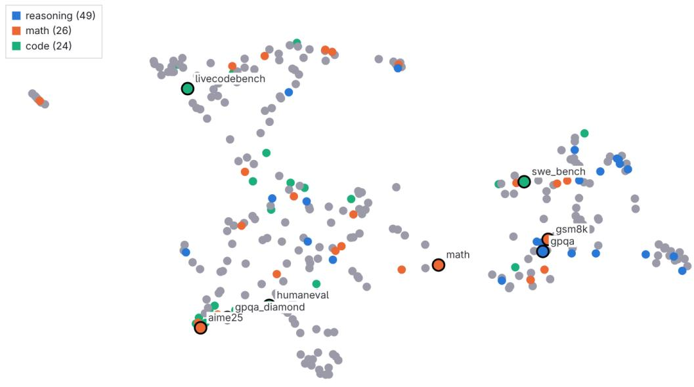  
Figure 1. UMAP plot of benchmark distances from S, SoftImpute. Domain-similar benchmarks are not guaranteed to cluster together.

Table 5. Benchmarks and their average normalized rank order $( \rho )$ of their $g$ factor loadings. Sorted by frequency-residualized rank $( \rho _ { \epsilon } )$ . ρ ranges from 0 to 1, where 0 = ranked first, 1 = ranked last. N = number of EFA estimations with that benchmark. CI and Best/Worst refer to $\rho .$
<table><tr><td>No</td><td>Benchmark</td><td> $\rho _ { \epsilon }$ </td><td> $\rho$ </td><td>95% CI</td><td>Best</td><td>Worst</td><td> $N$ </td></tr><tr><td>1</td><td>bhasa</td><td>-0.346</td><td>0.141</td><td>[-0.005, 0.287]</td><td>0.024</td><td>0.318</td><td>5</td></tr><tr><td>2</td><td>mtrag</td><td>-0.341</td><td>0.147</td><td>[-0.051, 0.346]</td><td>0.021</td><td>0.394</td><td>5</td></tr><tr><td>3</td><td>creativityprism</td><td>-0.339</td><td>0.156</td><td>[-0.019, 0.332]</td><td>0.026</td><td>0.367</td><td>5</td></tr><tr><td>4</td><td>eqbench</td><td>-0.332</td><td>0.156</td><td>[-0.060, 0.372]</td><td>0.017</td><td>0.451</td><td>5</td></tr><tr><td>5</td><td>mceval</td><td>-0.331</td><td>0.156</td><td>[0.024, 0.288]</td><td>0.051</td><td>0.333</td><td>5</td></tr><tr><td>6</td><td>pwc_svamp</td><td>-0.329</td><td>0.169</td><td>[-0.033, 0.371]</td><td>0.058</td><td>0.298</td><td>4</td></tr><tr><td>7</td><td>pwc_drop_test</td><td>-0.328</td><td>0.162</td><td>[-0.139, 0.462]</td><td>0.008</td><td>0.431</td><td>4</td></tr><tr><td>8</td><td>ProphetArena</td><td>-0.315</td><td>0.183</td><td>[-0.036, 0.401]</td><td>0.092</td><td>0.385</td><td>4</td></tr><tr><td>9</td><td>dialogbench</td><td>-0.295</td><td>0.210</td><td>[-1.351, 1.770]</td><td>0.087</td><td>0.332</td><td>2</td></tr><tr><td>10</td><td>pwc_piqa</td><td>-0.282</td><td>0.253</td><td>[0.162, 0.345]</td><td>0.003</td><td>0.822</td><td>20</td></tr><tr><td>57</td><td>gsm</td><td>-0.169</td><td>0.319</td><td>[0.162, 0.476]</td><td>0.000</td><td>0.936</td><td>20</td></tr><tr><td>138</td><td>arc</td><td>-0.056</td><td>0.356</td><td>[0.230, 0.481]</td><td>0.049</td><td>1.000</td><td>20</td></tr><tr><td>139</td><td>gpqa_diamond</td><td>-0.054</td><td>0.475</td><td>[0.355, 0.595]</td><td>0.016</td><td>0.992</td><td>20</td></tr><tr><td>202</td><td>gsm8k</td><td>+0.017</td><td>0.413</td><td>[0.263, 0.563]</td><td>0.000</td><td>1.000</td><td>20</td></tr><tr><td>327</td><td>humanitys_last_exam</td><td>+0.181</td><td>0.672</td><td>[0.162, 1.182]</td><td>0.047</td><td>0.966</td><td>5</td></tr></table>

## 5 DISCUSSION

## 5.1 UNINTERPRETABLE HIERARCHICAL STRUCTURE

Classically, cognitive sciences have approached intelligence from verbal, conceptual beginnings (Legg & Hutter, 2007). Intelligence is given a definition, then systems are developed according to the specs provided by the definition. This is not true in psychometric paradigms, which start by analyzing the covariance of performance measurements. Thus, adopting the psychometric approach for LLM benchmarks, our study has found that any substantially effective $g$ factor cannot be coherently approximated. Adding to this, tasks with similar contents, like mathematics and coding, do not necessarily cluster together. Machine intelligence does not follow any coherent structure or definition.

Unlike theories of human psychology (Schneider & McGrew, 2018) where intelligence is explicitly assumed to possess higher-order structure, with fluid intelligence as one higher-order factor that has theoretical causal effects (van der Maas et al., 2014) on the performance of other cognitive abilities, abilities in LLMs like abstract reasoning, domain memorization, and agentic tool use, are more likely to be horizontal with respect to each other with no clear higher-order structure.

As factor analysis assumes a reflective data generating process, the next question is whether such causality can be observed and exploited in practice. One way is to follow psychological science, where training participants in one cognitive task leads to observable improvements in a different task (hence, generalization) (Simons et al., 2016). For an LLM, this means measuring a model’s performance in coding, fine-tuning it to be better at mathematics, and then measuring its coding performance again. If there is an improvement between pre- and post-training performance, a causal mechanism can be empirically verified. More generally, one can fine-tune models to be better at benchmarks which are (assumed to be) proxies of general intelligence, then compare the pre- and post-training performance in a wide array of tasks.

Establishing such causal mechanisms would be practically important. If there were no causal generalization, then no blanket improvement of abilities could be gained by improving one family of tasks. A generally-intelligent model can only be trained by including all relevant tasks in the training corpus, and there is no silver-bullet construct or ability that can be efficiently targeted in training that will causally improve aptitude in specific tasks. Such a model would require a brute-force, increasingly expansive training dataset until it covers the universe of all possible tasks.

## 5.2 WHY DO ABILITIES CORRELATE?

If we accept the g factor as a mixture of correlations, it remains to explain why these correlations appear in the first place. Explanations of multi-task learning suggest that cross-domain transfer occurs from a convergence to a representation shared by the trained tasks (Caruana, 1997). Contemporary paradigms like reasoning (Tang et al., 2025) suggest that tasks are decomposable into semantic primitives subject to logical/symbolic manipulation in the representational layers. However, in line with our findings, Meng et al. (2026) find that input-similarity measures identify the best transfer source for at most 2 of 8 target tasks, and that transfer is better predicted by the gradients a task induces than by its content. We therefore expect correlations between abilities to arise from highly unintuitive conditional token probabilities, which are not summarizable into human-like analogies.

## 5.3 ALTERNATIVE TO A LATENT FACTOR VIEW

Through this paper we have shown that the implicitly causal model of intelligence yields an incoherent structure. However, factor analysis by itself is an analysis of correlations, and is merely compatible with a causal model. The formative paradigm, usually associated with PCA, makes no claim about the nature of the resultant components (van der Maas et al., 2014). Even so, generalizability would be impossible without a common factor to begin with, since two tasks sharing a dominant factor decompose into a similar lower-level representation (Caruana, 1997; Menghi et al., 2025) that the network must discern. The mutualist paradigm (Borsboom & Cramer, 2013), which describes indicators as nodes in a graph of mutual causality, is harder to rule out, since a mutualist process reproduces a positive manifold without any common cause (van der Maas et al., 2014).

Mutualism (van der Maas et al., 2017) models specific abilities as having mutual causal facilitation, with no higher-order, few-dimension causal factors. For example, agentic ability could improve tool use, which in turn improves coding. The output of this analysis is a graph of partial correlation between abilities (e.g., network analysis (Borsboom & Cramer, 2013)).

This view is attractive, as it does not require a supposedly parsimonious (van der Maas & Kan, 2016) single latent variable to explain the origins of correlations (which, per our findings, are mostly unintelligible). The caveat, if this mechanism is correct, is that the g-oriented research program is untenable, as g is merely a summary scalar and not a real, targetable ability. It also leaves inter-task correlations unintuitive and not bound by domain similarity. It is a more informative model, but it does not explain the uninterpretability of the correlation structure.

## 6 CONCLUSION

We asked how the cognitive abilities of language models can be organized around a general factor. Our answer comes from factor analyses of 13,251 published evaluation scores covering 1,618 models and 456 benchmarks, triangulated so that no single treatment of the missing data carries the finding. At best, a general latent factor accounts for 70.8% of variance in model performance, but most of our solutions put it well below that. Domain-similar benchmarks are only occasionally located close together in vector space, and benchmarks with high g-loading do not share a common theme and differ from the benchmarks the field treats as standard measures of intelligence. We conclude that a hierarchical causal order of machine intelligence, as commonly but only implicitly assumed in the field, is untenable in practice given the uninterpretable factor structure. Correlations arise from unintuitive and unpredictable common features, and a non-hierarchical network of abilities is possibly a better model for machine intelligence.

## REFERENCES

Asad Aali, Dave Van Veen, Y. Arefeen, Jason Hom, C. Bluethgen, E. Reis, et al. A dataset and benchmark for hospital course summarization with adapted large language models. Journal ofthe American Medical Informatics Association, 32(3):470–479, 2024.

Asma Ben Abacha, Yassine Mrabet, Mark E. Sharp, Travis R. Goodwin, S. E. Shooshan, and Dina Demner-Fushman. Bridging the gap between consumers’ medication questions and trusted answers. In MEDINFO 2019: Health and Wellbeing e-Networksfor All, volume 264 of Studies in Health Technology and Informatics, 2019a.

Asma Ben Abacha, Chaitanya P. Shivade, and Dina Demner-Fushman. Overview of the mediqa 2019 shared task on textual inference, question entailment and question answering. In Proceedings of the 18th BioNLP Workshop and Shared Task, pp. 370–379, 2019b.

Asma Ben Abacha, Wen wai Yim, Yujuan Fu, Zhaoyi Sun, Meliha Yetisgen, Fei Xia, et al. Medec: A benchmark for medical error detection and correction in clinical notes. In Findings of the Associationfor Computational Linguistics: ACL 2025, pp. 22539–22550, 2025.

David Ifeoluwa Adelani, Jessica Ojo, Israel Abebe Azime, Jian Yun Zhuang, Jesujoba Oluwadara Alabi, Xuanli He, et al. Irokobench: A new benchmark for african languages in the age of large language models. In Proceedings ofthe 2025 Conference ofthe Nations ofthe Americas Chapter ofthe Associationfor Computational Linguistics: Human Language Technologies (Volume 1: Long Papers), pp. 2732–2757, 2025.

Kabir Ahuja, Harshita Diddee, Rishav Hada, Millicent Ochieng, Krithika Ramesh, Prachi Jain, et al. Mega: Multilingual evaluation of generative ai. In Proceedings of the 2023 Conference on Empirical Methods in Natural Language Processing, pp. 4232–4267, 2023.

Elif Akata, L. Schulz, Julian Coda-Forno, Seong Joon Oh, M. Bethge, and Eric Schulz. Playing repeated games with large language models. Nature Human Behaviour, 9(7):1380–1390, 2025.

Neel Alex, Eli Lifland, Lewis Tunstall, A. Thakur, Pegah Maham, C. J. Riedel, et al. Raft: A real-world few-shot text classification benchmark. In Advances in Neural Information Processing Systems, 2021.

Emad A. Alghamdi, Reem I. Masoud, Deema Alnuhait, Afnan Y. Alomairi, Ahmed Ashraf, and Mohamed Zaytoon. Aratrust: An evaluation of trustworthiness for llms in arabic. In Proceedings of the 31st International Conference on Computational Linguistics, pp. 8664–8679, 2025.

Gordon W. Allport and Henry S. Odbert. Trait-names: A psycho-lexical study. Psychological Monographs, 47(1):i–171, 1936.

Ebtesam Almazrouei, Ruxandra-Aimée Cojocaru, M. Baldo, Quentin Malartic, Hamza Alobeidli, Daniele Mazzotta, et al. Alghafa evaluation benchmark for arabic language models. In Proceedings ofArabicNLP 2023, pp. 244–275, 2023.

Mikel Artetxe, Sebastian Ruder, and Dani Yogatama. On the cross-lingual transferability of monolingual representations. In Proceedings of the 58th Annual Meeting of the Association for Computational Linguistics, pp. 4623–4637, 2020.

Artificial Analysis. Artificial analysis intelligence index. https://artificialanalysis. ai/, 2025.

Thura Aung, J. Montalan, Jian Gang Ngui, and Peerat Limkonchotiwat. Burmese-san: Burmese nlp benchmark for evaluating large language models. In Proceedings of the Fifteenth Language Resources and Evaluation Conference, pp. 224–245, 2026.

Jacob Austin, Augustus Odena, Maxwell Nye, Maarten Bosma, H. Michalewski, David Dohan, et al. Program synthesis with large language models. arXiv preprint arXiv:2108.07732, 2021.

Lucas Bandarkar, Davis Liang, Benjamin Muller, Mikel Artetxe, Satya Narayan Shukla, Don Husa, et al. The belebele benchmark: a parallel reading comprehension dataset in 122 language variants. In Proceedings of the 62nd Annual Meeting of the Association for Computational Linguistics (Volume 1: Long Papers), pp. 749–775, 2024.

Jan Batzner, Sree Harsha Nelaturu, Damian Stachura, Anastassia Kornilova, Jon Crall, Tommaso Cerruti, Yanan Long, Yifan Mai, Sanchit Ahuja, Asaf Yehudai, Marek Šuppa, John P. Lalor, Oluwagbemike Olowe, Jatin Ganhotra, Brian H. Hu, Eliya Habba, Andrew M. Bean, Chang Liu, Sander Land, Steven Dillmann, Aniketh Garikaparthi, Elron Bandel, Saki Imai, James Edgell, Wm. Matthew Kennedy, Jenny Chim, Patrick Meusling, Asteria Kaeberlein, Venkata Ramachandra Karthik Chundi, Manasi Patwardhan, Martin Ku, Austin Meek, Leon Knauer, Brian Wingenroth, Srishti Yadav, Usman Gohar, Felix Friedrich, Michelle Lin, Jennifer Mickel, Arman Cohan, Stella Biderman, Irene Solaiman, Zeerak Talat, Anka Reuel, Mubashara Akhtar, Gjergji Kasneci, Avijit Ghosh, and Leshem Choshen. Every eval ever: A unifying schema and community repository for AI evaluation results. arXiv preprint arXiv:2606.14516, 2026.

Tim Baumgärtner, Ted Briscoe, and Iryna Gurevych. Peerqa: A scientific question answering dataset from peer reviews. In Proceedings ofthe 2025 Conference ofthe Nations ofthe Americas Chapter ofthe Associationfor Computational Linguistics: Human Language Technologies (Volume 1: Long Papers), pp. 508–544, 2025.

S. Bedi, Hejie Cui, Miguel Fuentes, A. Unell, Michael Wornow, J. Banda, et al. Medhelm: Holistic evaluation of large language models for medical tasks. arXiv preprint arXiv:2505.23802, 2025.

Tadesse Destaw Belay, Ahmed Haj Ahmed, Alvin Grissom II, Iqra Ameer, G. Sidorov, O. Kolesnikova, et al. Culemo: Cultural lenses on emotion - benchmarking llms for cross-cultural emotion understanding. In Proceedings ofthe 63rd Annual Meeting ofthe Associationfor Computational Linguistics (Volume 1: Long Papers), pp. 18894–18909, 2025.

Jonathan Berant, A. Chou, Roy Frostig, and Percy Liang. Semantic parsing on freebase from questionanswer pairs. In Proceedings ofthe 2013 Conference on Empirical Methods in Natural Language Processing, pp. 1533–1544, 2013.

Sangnie Bhardwaj, Samarth Aggarwal, and Mausam Mausam. Carb: A crowdsourced benchmark for open ie. In Proceedings of the 2019 Conference on Empirical Methods in Natural Language Processing and the 9th International Joint Conference on Natural Language Processing (EMNLP-IJCNLP), pp. 6262–6267, 2019.

Yonatan Bisk, Rowan Zellers, Ronan Le Bras, Jianfeng Gao, and Yejin Choi. Piqa: Reasoning about physical commonsense in natural language. In Proceedings of the AAAI Conference on Artificial Intelligence, volume 34, pp. 7432–7439, 2020.

Su Lin Blodgett, L. Green, and Brendan T. O’Connor. Demographic dialectal variation in social media: A case study of african-american english. In Proceedings of the 2016 Conference on Empirical Methods in Natural Language Processing, pp. 1119–1130, 2016.

Ondrej Bojar, C. Buck, C. Federmann, B. Haddow, Philipp Koehn, Johannes Leveling, et al. Findings of the 2014 workshop on statistical machine translation. In Proceedings of the Ninth Workshop on Statistical Machine Translation, pp. 12–58, 2014.

Rishi Bommasani, Drew A. Hudson, Ehsan Adeli, Russ Altman, Simran Arora, Sydney von Arx, Michael S. Bernstein, Jeannette Bohg, Antoine Bosselut, Emma Brunskill, et al. On the opportunities and risks of foundation models. arXiv preprint arXiv:2108.07258, 2021.

Daniel Borkan, Lucas Dixon, Jeffrey Scott Sorensen, Nithum Thain, and Lucy Vasserman. Nuanced metrics for measuring unintended bias with real data for text classification. In Companion Proceedings of The 2019 World Wide Web Conference, pp. 491–500, 2019.

Denny Borsboom and Angélique O. J. Cramer. Network analysis: an integrative approach to the structure of psychopathology. Annual Review ofClinical Psychology, 9(1):91–121, 2013.

Denny Borsboom, Gideon J. Mellenbergh, and Jaap Van Heerden. The theoretical status of latent variables. Psychological Review, 110(2):203, 2003.

Denny Borsboom, Gideon J. Mellenbergh, and Jaap Van Heerden. The concept of validity. Psychological Review, 111(4):1061, 2004.

Ryan Burnell, Han Hao, Andrew R. Conway, and Jose Hernandez Orallo. Revealing the structure of language model capabilities. arXiv preprint arXiv:2306.10062, 2023.

Sergiu Bursuc, Theodore Ehrenborg, Shao-Wei Lin, L. Astefanoaei, Ionel Emilian Chiosa, Jure Kukovec, et al. A benchmark for vericoding: formally verified program synthesis. Transactions on Machine Learning Research, 2026.

Steven Cao, Percy Liang, and Gregory Valiant. One-sided matrix completion from two observations per row. In International Conference on Machine Learning (ICML), 2023.

Rich Caruana. Multitask learning. Machine Learning, 28(1):41–75, 1997.

I. Casanueva, Tadas Temcinas, D. Gerz, Matthew Henderson, and Ivan Vulic. Efficient intent detection with dual sentence encoders. In Proceedings of the 2nd Workshop on Natural Language Processing for Conversational AI, pp. 38–45, 2020.

Federico Cassano, John Gouwar, Daniel Nguyen, S. Nguyen, Luna Phipps-Costin, Donald Pinckney, et al. MultiPL-E: A scalable and polyglot approach to benchmarking neural code generation. IEEE Transactions on Software Engineering, 49(7):3675–3691, 2023.

Raymond B. Cattell. Theory of fluid and crystallized intelligence: A critical experiment. Journal of Educational Psychology, 54(1):1–22, 1963.

Linzheng Chai, Shukai Liu, Jian Yang, Yuwei Yin, Ke Jin, Jiaheng Liu, et al. Mceval: Massively multilingual code evaluation. In International Conference on Learning Representations, 2025.

Tuhin Chakrabarty, Philippe Laban, Divyansh Agarwal, S. Muresan, and Chien-Sheng Wu. Art or artifice? large language models and the false promise of creativity. In Proceedings of the CHI Conference on Human Factors in Computing Systems, pp. 1–34, 2024.

Tyler A. Chang, Catherine Arnett, Abdelrahman Sadallah, Abdelrahman Eldesokey, Abeer Kashar, Abolade Daud, et al. Global piqa: Evaluating commonsense reasoning across 100+ languages and cultures. arXiv preprint arXiv:2510.24081, 2025.

Sourav Chatterjee. Matrix estimation by universal singular value thresholding. The Annals of Statistics, 43(1):177–214, 2015.

Ciprian Chelba, Tomas Mikolov, Mike Schuster, Qi Ge, T. Brants, P. Koehn, et al. One billion word benchmark for measuring progress in statistical language modeling. In Interspeech 2014, pp. 2635–2639, 2014.

Hanjie Chen, Zhouxiang Fang, Yash Singla, and M. Dredze. Benchmarking large language models on answering and explaining challenging medical questions. In Proceedings of the 2025 Conference ofthe Nations ofthe Americas Chapter ofthe Associationfor Computational Linguistics: Human Language Technologies (Volume 1: Long Papers), pp. 3563–3599, 2025.

Mark Chen, Jerry Tworek, Heewoo Jun, Qiming Yuan, Henrique Pondé de Oliveira Pinto, Jared Kaplan, et al. Evaluating large language models trained on code. arXiv preprint arXiv:2107.03374, 2021a.

Shu Chen, Zeqian Ju, Xiangyu Dong, Hongchao Fang, Sicheng Wang, Yue Yang, et al. Meddialog: A large-scale medical dialogue dataset. arXiv preprint arXiv:2004.03329, 2020a.

Wenhu Chen, Hongmin Wang, Jianshu Chen, Yunkai Zhang, Hong Wang, SHIYANG LI, et al. Tabfact: A large-scale dataset for table-based fact verification. In International Conference on Learning Representations, 2020b.

Zhi-Yu Chen, Wenhu Chen, Charese Smiley, Sameena Shah, Iana Borova, Dylan Langdon, et al. Finqa: A dataset of numerical reasoning over financial data. In Proceedings of the 2021 Conference on Empirical Methods in Natural Language Processing, pp. 3697–3711, 2021b.

Zhihong Chen, Maya Varma, Xiang Wan, C. Langlotz, and Jean-Benoit Delbrouck. Toward expanding the scope of radiology report summarization to multiple anatomies and modalities. In Proceedings of the 61st Annual Meeting of the Association for Computational Linguistics (Volume 2: Short Papers), pp. 469–484, 2023a.

Zhuang Chen, Jincenzi Wu, Jinfeng Zhou, Bosi Wen, Guanqun Bi, Gongyao Jiang, et al. Tombench: Benchmarking theory of mind in large language models. In Proceedings of the 62nd Annual Meeting of the Association for Computational Linguistics (Volume 1: Long Papers), pp. 15959– 15983, 2024.

Ziyang Chen, Jinzhi Liao, and Xiang Zhao. Multi-granularity temporal question answering over knowledge graphs. In Proceedings of the 61st Annual Meeting of the Association for Computational Linguistics (Volume 1: Long Papers), pp. 11378–11392, 2023b.

Aileen Cheng, Alon Jacovi, A. Globerson, Ben Golan, Charles Kwong, C. Alberti, et al. The facts leaderboard: A comprehensive benchmark for large language model factuality. arXiv preprint arXiv:2512.10791, 2025.

Yu Ying Chiu, Liwei Jiang, Bill Yuchen Lin, Chan Young Park, S. Li, Sahithya Ravi, et al. Culturalbench: A robust, diverse, and challenging cultural benchmark by human-ai culturalteaming. arXiv preprint arXiv:2410.02677, 2024.

Eunsol Choi, He He, Mohit Iyyer, Mark Yatskar, Wen tau Yih, Yejin Choi, et al. Quac: Question answering in context. In Proceedings ofthe 2018 Conference on Empirical Methods in Natural Language Processing, pp. 2174–2184, 2018.

François Chollet. On the measure of intelligence. arXiv preprint arXiv:1911.01547, 2019.

Christopher Clark, Kenton Lee, Ming-Wei Chang, T. Kwiatkowski, Michael Collins, and Kristina Toutanova. Boolq: Exploring the surprising difficulty of natural yes/no questions. In Proceedings of the 2019 Conference of the North American Chapter of the Association for Computational Linguistics: Human Language Technologies, Volume 1 (Long and Short Papers), pp. 2924–2936, 2019.

J. Clark, Eunsol Choi, Michael Collins, Dan Garrette, T. Kwiatkowski, Vitaly Nikolaev, et al. Tydi qa: A benchmark for information-seeking question answering in typologically diverse languages. Transactions ofthe Associationfor Computational Linguistics, 8:454–470, 2020.

Peter Clark, Isaac Cowhey, Oren Etzioni, Tushar Khot, Ashish Sabharwal, Carissa Schoenick, et al. Think you have solved question answering? try arc, the ai2 reasoning challenge. arXiv preprint arXiv:1803.05457, 2018.

K. Cobbe, V. Kosaraju, Mo Bavarian, Mark Chen, Heewoo Jun, Lukasz Kaiser, et al. Training verifiers to solve math word problems. arXiv preprint arXiv:2110.14168, 2021.

Julian Coda-Forno, Marcel Binz, Jane X. Wang, and Eric Schulz. Cogbench: a large language model walks into a psychology lab. In Proceedings of the International Conference on Machine Learning, 2024.

Alexis Conneau, Guillaume Lample, Ruty Rinott, Adina Williams, Samuel R. Bowman, Holger Schwenk, et al. Xnli: Evaluating cross-lingual sentence representations. In Proceedings of the 2018 Conference on Empirical Methods in Natural Language Processing, pp. 2475–2485, 2018.

Christodoulos Constantinides, Dhaval Patel, Shuxin Lin, Claudio Guerrero, Sunil Dagajirao Patil, and Jayant Kalagnanam. Failuresensoriq: A multi-choice qa dataset for understanding sensor relationships and failure modes. In Advances in Neural Information Processing Systems, 2025.

M. Costa-jussà, James Cross, Onur Çelebi, Maha Elbayad, Kenneth Heafield, Kevin Heffernan, et al. No language left behind: Scaling human-centered machine translation. arXiv preprint arXiv:2207.04672, 2022.

Yi Cui. Webapp1k: A practical code-generation benchmark for web app development. arXiv preprint arXiv:2408.00019, 2024.

DeepSeek-AI. DeepSeek-R1: Incentivizing reasoning capability in LLMs via reinforcement learning. arXiv preprint arXiv:2501.12948, 2025.

Xiang Deng, Huan Sun, Alyssa Lees, You Wu, and Cong Yu. TURL: Table understanding through representation learning. Proceedings ofthe VLDB Endowment, 14(3):307–319, 2020.

Colin G. DeYoung, Lena C. Quilty, and Jordan B. Peterson. Between facets and domains: 10 aspects of the Big Five. Journal of Personality and Social Psychology, 93(5):880, 2007.

J. Dhamala, Tony Sun, Varun Kumar, Satyapriya Krishna, Yada Pruksachatkun, Kai-Wei Chang, et al. Bold: Dataset and metrics for measuring biases in open-ended language generation. In Proceedings of the 2021 ACM Conference on Fairness, Accountability, and Transparency, pp. 862–872, 2021.

Sumanth Doddapaneni, Rahul Aralikatte, Gowtham Ramesh, Shreyansh Goyal, M. Khapra, Anoop Kunchukuttan, et al. Towards leaving no indic language behind: Building monolingual corpora, benchmark and models for indic languages. In Proceedings of the 61st Annual Meeting of the Associationfor Computational Linguistics (Volume 1: Long Papers), pp. 12402–12426, 2023.

R. Dogan, Robert Leaman, and Zhiyong Lu. Ncbi disease corpus: A resource for disease name recognition and concept normalization. Journal ofBiomedical Informatics, 47:1–10, 2014.

Dheeru Dua, Yizhong Wang, Pradeep Dasigi, Gabriel Stanovsky, Sameer Singh, and Matt Gardner. Drop: A reading comprehension benchmark requiring discrete reasoning over paragraphs. In Proceedings ofthe 2019 Conference ofthe North American Chapter ofthe Associationfor Computational Linguistics: Human Language Technologies, Volume 1 (Long and Short Papers), pp. 2368–2378, 2019.

Jinhao Duan, Renming Zhang, James Diffenderfer, B. Kailkhura, Lichao Sun, Elias Stengel-Eskin, et al. Gtbench: Uncovering the strategic reasoning limitations of llms via game-theoretic evaluations. arXiv preprint arXiv:2402.12348, 2024.

Yann Dubois, Bal’azs Galambosi, Percy Liang, and Tatsunori Hashimoto. Length-controlled alpacaeval: A simple way to debias automatic evaluators. In Conference on Language Modeling, 2024.

Abteen Ebrahimi, Manuel Mager, Arturo Oncevay, Vishrav Chaudhary, Luis Chiruzzo, Angela Fan, et al. Americasnli: Evaluating zero-shot natural language understanding of pretrained multilingual models in truly low-resource languages. In Proceedings of the 60th Annual Meeting of the Associationfor Computational Linguistics (Volume 1: Long Papers), pp. 6279–6299, 2022.

Mihail Eric, Lakshmi. Krishnan, F. Charette, and Christopher D. Manning. Key-value retrieval networks for task-oriented dialogue. In Proceedings of the 18th Annual SIGdial Meeting on Discourse and Dialogue, pp. 37–49, 2017.

FAHIM FAISAL, Orevaoghene Ahia, Aarohi Srivastava, Kabir Ahuja, David Chiang, Yulia Tsvetkov, et al. DIALECTBENCH: An NLP benchmark for dialects, varieties, and closely-related languages. In Proceedings of the 62nd Annual Meeting of the Association for Computational Linguistics (Volume 1: Long Papers), pp. 14412–14454, 2024.

Denis Federiakin. Improving LLM leaderboards with psychometrical methodology. arXiv preprint arXiv:2501.17200, 2025.

Zhiwei Fei, Xiaoyu Shen, D. Zhu, Fengzhe Zhou, Zhuo Han, Songyang Zhang, et al. Lawbench: Benchmarking legal knowledge of large language models. In Proceedings of the 2024 Conference on Empirical Methods in Natural Language Processing, pp. 7933–7962, 2024.

Daniel Fein, S. Russo, Violet Xiang, Kabir Jolly, Rafael Rafailov, and Nick Haber. Litbench: A benchmark and dataset for reliable evaluation of creative writing. In Proceedings of the 19th Conference of the European Chapter of the Association for Computational Linguistics (Volume 1: Long Papers), pp. 7740–7755, 2026.

S. Fleming, A. Lozano, W. Haberkorn, Jenelle A. Jindal, E. Reis, Rahul Thapa, et al. Medalign: A clinician-generated dataset for instruction following with electronic medical records. In Proceedings ofthe AAAI Conference on Artificial Intelligence, 2024.

Deep Ganguli, Liane Lovitt, John Kernion, Amanda Askell, Yuntao Bai, Saurav Kadavath, et al. Red teaming language models to reduce harms: Methods, scaling behaviors, and lessons learned. arXiv preprint arXiv:2209.07858, 2022.

Leo Gao, Stella Biderman, Sid Black, Laurence Golding, Travis Hoppe, Charles Foster, et al. The pile: An 800gb dataset of diverse text for language modeling. arXiv preprint arXiv:2101.00027, 2021.

Samuel Gehman, Suchin Gururangan, Maarten Sap, Yejin Choi, and Noah A. Smith. Realtoxicityprompts: Evaluating neural toxic degeneration in language models. In Findings of the Association for Computational Linguistics: EMNLP 2020, pp. 3356–3369, 2020.

Sebastian Gehrmann, Tosin P. Adewumi, Karmanya Aggarwal, Pawan Sasanka Ammanamanchi, Aremu Anuoluwapo, Antoine Bosselut, et al. The gem benchmark: Natural language generation, its evaluation and metrics. In Proceedings of the First Workshop on Natural Language Generation, Evaluation, and Metrics (GEM), pp. 96–120, 2021.

Mor Geva, Daniel Khashabi, Elad Segal, Tushar Khot, Dan Roth, and Jonathan Berant. Did aristotle use a laptop? a question answering benchmark with implicit reasoning strategies. Transactions of the Association for Computational Linguistics, 9:346–361, 2021.

Elliott S. Glazer, Ege Erdil, T. Besiroglu, Diego Chicharro, Evan Chen, Alex Gunning, et al. Frontiermath: A benchmark for evaluating advanced mathematical reasoning in ai. arXiv preprint arXiv:2411.04872, 2024.

Bogdan Gliwa, Iwona Mochol, M. Biesek, and A. Wawer. Samsum corpus: A human-annotated dialogue dataset for abstractive summarization. In Proceedings of the 2nd Workshop on New Frontiers in Summarization, pp. 70–79, 2019.

Aaron Gokaslan and Vanya Cohen. OpenWebText corpus. http://Skylion007.github.io/ OpenWebTextCorpus, 2019.

Omer Goldman, Uri Shaham, Dan Malkin, Sivan Eiger, Avinatan Hassidim, Y. Matias, et al. Eclektic: a novel challenge set for evaluation of cross-lingual knowledge transfer. arXiv preprint arXiv:2502.21228, 2025.

Linyuan Gong, Sida Wang, Mostafa Elhoushi, and Alvin Cheung. Evaluation of llms on syntax-aware code fill-in-the-middle tasks. In Proceedings of the International Conference on Machine Learning, 2024.

Alex Gu, Baptiste Rozière, Hugh Leather, Armando Solar-Lezama, Gabriel Synnaeve, and Sida Wang. Cruxeval: A benchmark for code reasoning, understanding and execution. In Proceedings ofthe International Conference on Machine Learning, 2024.

Neel Guha, Julian Nyarko, Daniel E. Ho, Christopher Ré, Adam S. Chilton, Aditya Narayana, et al. Legalbench: A collaboratively built benchmark for measuring legal reasoning in large language models. In Advances in Neural Information Processing Systems, 2023.

Lukas Haas, G. Yona, G. D’Antonio, S. Goldshtein, and D. Das. Simpleqa verified: A reliable factuality benchmark to measure parametric knowledge. arXiv preprint arXiv:2509.07968, 2025.

Patrick Haller, Jonas Golde, and Alan Akbik. Pecc: Problem extraction and coding challenges. In Proceedings of the 2024 Joint International Conference on Computational Linguistics, Language Resources and Evaluation (LREC-COLING 2024), pp. 12690–12699, 2024.

Momchil Hardalov, Todor Mihaylov, Dimitrina Zlatkova, Yoan Dinkov, Ivan Koychev, and Preslav Nakov. Exams: A multi-subject high school examinations dataset for cross-lingual and multilingual question answering. In Proceedings of the 2020 Conference on Empirical Methods in Natural Language Processing (EMNLP), pp. 5427–5444, 2020.

Michael Hardy, Anka Reuel, Lijin Zhang, Jodi M. Casabianca, Sang Truong, Yash Dave, Hansol Lee, Benjamin Domingue, and Sanmi Koyejo. AI cartography: Mapping the latent landscape of AI benchmark ecosystems. arXiv preprint arXiv:2605.25272, 2026.

Shreya Havaldar, Young Min Cho, Sunny Rai, and Lyle Ungar. Culturally-aware conversations: A framework & benchmark for llms. In Proceedings ofthe Fourth Workshop on Bridging Human-Computer Interaction and Natural Language Processing (HCI+NLP), pp. 220–229, 2025.

Faiz Ghifari Haznitrama, Faeyza Rishad Ardi, and Alice Oh. A neuropsychologically grounded evaluation of LLM cognitive abilities. arXiv preprint arXiv:2603.02540, 2026.

Yun He, Di Jin, Chaoqi Wang, Chloe Bi, Karishma Mandyam, Hejia Zhang, et al. Multiif: Benchmarking llms on multi-turn and multilingual instructions following. arXiv preprint arXiv:2410.15553, 2024.

Dan Hendrycks, Steven Basart, Saurav Kadavath, Mantas Mazeika, Akul Arora, Ethan Guo, et al. Measuring coding challenge competence with apps. In Advances in Neural Information Processing Systems, 2021a.

Dan Hendrycks, Collin Burns, Steven Basart, Andy Zou, Mantas Mazeika, Dawn Song, and Jacob Steinhardt. Measuring massive multitask language understanding. In International Conference on Learning Representations (ICLR), 2021b.

Dan Hendrycks, Collin Burns, Saurav Kadavath, Akul Arora, Steven Basart, Eric Tang, et al. Measuring mathematical problem solving with the math dataset. In Advances in Neural Information Processing Systems, 2021c.

Karl Moritz Hermann, Tomás Kociský, Edward Grefenstette, L. Espeholt, W. Kay, M. Suleyman, et al. Teaching machines to read and comprehend. In Advances in Neural Information Processing Systems, 2015.

Søren Vejlgaard Holm, Lars Kai Hansen, and Martin Carsten Nielsen. Danoliteracy of generative large language models. arXiv preprint arXiv:2410.22839, 2024.

Shahin Honarvar, Mark van der Wilk, and Alastair Donaldson. Turbulence: Systematically and automatically testing instruction-tuned large language models for code. In 2025 IEEE Conference on Software Testing, Verification and Validation (ICST), pp. 80–91, 2025.

John L. Horn. A rationale and test for the number of factors in factor analysis. Psychometrika, 30(2): 179–185, 1965.

Zhaoyi Joey Hou, B. Zhang, Yining Lu, Bhiman Kumar Baghel, A. Brei, Ximing Lu, et al. Creativityprism: A cross-domain evaluation framework for large language model creativity. Transactions on Machine Learning Research, 2026.

Xuming Hu, Junzhe Chen, Xiaochuan Li, Yufei Guo, Lijie Wen, Philip S. Yu, et al. Do large language models know about facts? arXiv preprint arXiv:2310.05177, 2023.

Yebowen Hu, Kaiqiang Song, Sangwoo Cho, Xiaoyang Wang, H. Foroosh, Dong Yu, et al. Sportsmetrics: Blending text and numerical data to understand information fusion in llms. In Proceedings of the 62nd Annual Meeting of the Association for Computational Linguistics (Volume 1: Long Papers), pp. 267–278, 2024.

Shuai Huang, Wen-Xuan Zhao, and Jun Gao. Si-bench: Benchmarking social intelligence of large language models in human-to-human conversations. arXiv preprint arXiv:2510.23182, 2025a.

Xu Huang, Wenhao Zhu, Hanxu Hu, Conghui He, Lei Li, Shu-Jian Huang, et al. Benchmax: A comprehensive multilingual evaluation suite for large language models. In Findings of the Associationfor Computational Linguistics: EMNLP 2025, pp. 16751–16774, 2025b.

Yangsibo Huang, Samyak Gupta, Mengzhou Xia, Kai Li, and Danqi Chen. Catastrophic jailbreak of open-source llms via exploiting generation. In International Conference on Learning Representations, 2024.

Yao Huang, Yitong Sun, Yi-Chi Zhang, Ruochen Zhang, Yinpeng Dong, and Xingxing Wei. Deceptionbench: A comprehensive benchmark for ai deception behaviors in real-world scenarios. In Advances in Neural Information Processing Systems, 2025c.

Dieuwke Hupkes and Nikolay Bogoychev. Multiloko: a multilingual local knowledge benchmark for llms spanning 31 languages. arXiv preprint arXiv:2504.10356, 2025.

D. Ilica and Gilles E. Gignac. Evidence of interrelated cognitive-like capabilities in large language models: Indications of artificial general intelligence or achievement? Intelligence, 106:101858, 2024.

Pranab Islam, Anand Kannappan, Douwe Kiela, Rebecca Qian, Nino Scherrer, and Bertie Vidgen. Fi nancebench: A new benchmark for financial question answering. arXiv preprint arXiv:2311.11944, 2023.

Anna A. Ivanova, Aalok Sathe, Benjamin Lipkin, Unnathi Kumar, S. Radkani, Thomas Hikaru Clark, et al. Elements of world knowledge (ewok): A cognition-inspired framework for evaluating basic world knowledge in language models. Transactions of the Association for Computational Linguistics, 13:1245–1270, 2025.

Alon Jacovi, Andrew Wang, Chris Alberti, Connie Tao, Jon Lipovetz, Kate Olszewska, et al. The facts grounding leaderboard: Benchmarking llms’ ability to ground responses to long-form input. arXiv preprint arXiv:2501.03200, 2025.

Naman Jain, King Han, Alex Gu, Wen-Ding Li, Fanjia Yan, Tianjun Zhang, et al. Livecodebench: Holistic and contamination free evaluation of large language models for code. In International Conference on Learning Representations, 2025.

Arthur R. Jensen. Psychometric g: Definition and substantiation. In The General Factor ofIntelligence, pp. 51–66. Psychology Press, 2002.

Saurabh Jha, Rohan R. Arora, Yuji Watanabe, Takumi Yanagawa, Yinfang Chen, J. Clark, et al. Itbench: Evaluating ai agents across diverse real-world it automation tasks. In Proceedings of the International Conference on Machine Learning, 2025.

Jianchao Ji, Yutong Chen, Mingyu Jin, Wujiang Xu, Wenyue Hua, and Yongfeng Zhang. Moralbench: Moral evaluation of llms. ACM SIGKDD Explorations Newsletter, 27(1):62–71, 2025.

Zhen Jia, Soumajit Pramanik, Rishiraj Saha Roy, and G. Weikum. Complex temporal question answering on knowledge graphs. In Proceedings ofthe 30th ACM International Conference on Information & Knowledge Management, pp. 792–802, 2021.

Zhen Jia, Philipp Christmann, and G. Weikum. Faithful temporal question answering over heterogeneous sources. In Proceedings ofthe ACM Web Conference 2024, pp. 2052–2063, 2024.

Yuxin Jiang, Yufei Wang, Xingshan Zeng, Wanjun Zhong, Liangyou Li, Fei Mi, et al. Followbench: A multi-level fine-grained constraints following benchmark for large language models. In Proceedings ofthe 62nd Annual Meeting ofthe Associationfor Computational Linguistics (Volume 1: Long Papers), pp. 4667–4688, 2024.

Carlos E. Jimenez, John Yang, Alexander Wettig, Shun-Yu Yao, Kexin Pei, Ofir Press, et al. Swebench: Can language models resolve real-world github issues? In International Conference on Learning Representations, 2024.

Di Jin, Eileen Pan, Nassim Oufattole, Wei-Hung Weng, Hanyi Fang, and Peter Szolovits. What disease does this patient have? a large-scale open domain question answering dataset from medical exams. Applied Sciences, 11(14):6421, 2021.

Qiao Jin, Bhuwan Dhingra, Zhengping Liu, William W. Cohen, and Xinghua Lu. Pubmedqa: A dataset for biomedical research question answering. In Proceedings ofthe 2019 Conference on Empirical Methods in Natural Language Processing and the 9th International Joint Conference on Natural Language Processing (EMNLP-IJCNLP), pp. 2567–2577, 2019.

Yilun Jin, Zheng Li, Chenwei Zhang, Tianyu Cao, Yifan Gao, Pratik Jayarao, et al. Shopping mmlu: A massive multi-task online shopping benchmark for large language models. In Advances in Neural Information Processing Systems, 2024.

Sanghyun Jo, Soohyun Ryu, Sungyub Kim, Eunho Yang, and Kyungsu Kim. Ttd: Text-tag selfdistillation enhancing image-text alignment in clip to alleviate single tag bias. In European Conference on Computer Vision (ECCV), 2024.

Oliver P. John, Alois Angleitner, and Fritz Ostendorf. The lexical approach to personality: A historical review of trait taxonomic research. European Journal ofPersonality, 2(3):171–203, 1988.

Wendy Johnson, Thomas J. Bouchard, Robert F. Krueger, Matt McGue, and Irving I. Gottesman. Just one g: Consistent results from three test batteries. Intelligence, 32(1):95–107, 2004.

Wendy Johnson, Jan Te Nijenhuis, and Thomas J. Bouchard. Still just 1 g: Consistent results from five test batteries. Intelligence, 36(1):81–95, 2008.

Mandar Joshi, Eunsol Choi, Daniel S. Weld, and Luke Zettlemoyer. Triviaqa: A large scale distantly supervised challenge dataset for reading comprehension. In Proceedings of the 55th Annual Meeting of the Association for Computational Linguistics (Volume 1: Long Papers), pp. 1601– 1611, 2017.

Mohsinul Kabir, T. Ahmed, Md Mezbaur Rahman, Shaoxiong Ji, Hassan Alhuzali, Yuechen Jiang, et al. Xcr-bench: Benchmarking cross-cultural reasoning in llms via culture-specific items and hall’s triad. arXiv preprint arXiv:2601.14063, 2026.

Kaggle. Kaggle benchmarks. https://www.kaggle.com/benchmarks, 2025.

Yannis Katsis, Sara Rosenthal, Kshitij P. Fadnis, Chulaka Gunasekara, Young-Suk Lee, Lucian Popa, et al. Mtrag: A multi-turn conversational benchmark for evaluating retrieval-augmented generation systems. arXiv preprint arXiv:2501.03468, 2025.

Ryan Othniel Kearns. Quantifying construct validity in large language model evaluations. arXiv preprint arXiv:2602.15532, 2026.

Nikhil Khandekar, Qiao Jin, Guangzhi Xiong, S. Dunn, Serina S. Applebaum, Zain Anwar, et al. Medcalc-bench: Evaluating large language models for medical calculations. In Advances in Neural Information Processing Systems, 2024.

Tomás Kociský, Jonathan Schwarz, P. Blunsom, Chris Dyer, Karl Moritz Hermann, Gábor Melis, et al. The narrativeqa reading comprehension challenge. Transactions of the Association for Computational Linguistics, 6:317–328, 2018.

S. Kolasani, Maxim Saplin, Nicholas Crispino, Kyle Montgomery, J. Davis, Matei A. Zaharia, et al. Llm chess: Benchmarking reasoning and instruction-following in llms through chess. arXiv preprint arXiv:2512.01992, 2025.

Rik Koncel-Kedziorski, Subhro Roy, Aida Amini, Nate Kushman, and Hannaneh Hajishirzi. Mawps: A math word problem repository. In Proceedings ofthe 2016 Conference ofthe North American Chapter of the Association for Computational Linguistics: Human Language Technologies, pp. 1152–1157, 2016.

Fajri Koto, Nurul Aisyah, Haonan Li, and Timothy Baldwin. Large language models only pass primary school exams in indonesia: A comprehensive test on indommlu. In Proceedings of the 2023 Conference on Empirical Methods in Natural Language Processing, pp. 12359–12374, 2023.

Fajri Koto, Haonan Li, Sara Shatnawi, Jad Doughman, A. Sadallah, A. Alraeesi, et al. Arabicmmlu: Assessing massive multitask language understanding in arabic. In Findings of the Association for Computational Linguistics: ACL 2024, pp. 5622–5640, 2024a.

Fajri Koto, Rahmad Mahendra, Nurul Aisyah, and Timothy Baldwin. Indoculture: Exploring geographically influenced cultural commonsense reasoning across eleven indonesian provinces. Transactions of the Association for Computational Linguistics, 12:1703–1719, 2024b.

David C. Krakauer. The rise and fall of g in AGI. arXiv preprint arXiv:2604.09911, 2026.

John H. Kranzler and Arthur R. Jensen. Inspection time and intelligence: A meta-analysis. Intelligence, 13(4):329–347, 1989.

T. Kwiatkowski, J. Palomaki, Olivia Redfield, Michael Collins, Ankur P. Parikh, Chris Alberti, et al. Natural questions: A benchmark for question answering research. Transactions ofthe Association for Computational Linguistics, 7:452–466, 2019.

Guokun Lai, Qizhe Xie, Hanxiao Liu, Yiming Yang, and E. Hovy. Race: Large-scale reading comprehension dataset from examinations. In Proceedings ofthe 2017 Conference on Empirical Methods in Natural Language Processing, pp. 785–794, 2017.

Nicola Landro, I. Gallo, Riccardo La Grassa, and Edoardo Federici. Two new datasets for italianlanguage abstractive text summarization. Information, 13(5):228, 2022.

Gyubok Lee, Hyeonji Hwang, Seongsu Bae, Yeonsu Kwon, W. Shin, Seongjun Yang, et al. Ehrsql: A practical text-to-sql benchmark for electronic health records. In Advances in Neural Information Processing Systems, 2022.

Kibeom Lee and Michael C. Ashton. Psychometric properties of the HEXACO-100. Assessment, 25 (5):543–556, 2018.

Shane Legg and Marcus Hutter. Universal intelligence: A definition of machine intelligence. Minds and Machines, 17(4):391–444, 2007.

Wei Qi Leong, Jian Gang Ngui, Yosephine Susanto, Hamsawardhini Rengarajan, Kengatharaiyer Sarveswaran, and William-Chandra Tjhi. Bhasa: A holistic southeast asian linguistic and cultural evaluation suite for large language models. arXiv preprint arXiv:2309.06085, 2023.

J. Leskovec, J. Kleinberg, and C. Faloutsos. Graphs over time: densification laws, shrinking diameters and possible explanations. In Proceedings ofthe eleventh ACM SIGKDD international conference on Knowledge discovery in data mining, pp. 177–187, 2005.

Haonan Li, Yixuan Zhang, Fajri Koto, Yifei Yang, Hai Zhao, Yeyun Gong, et al. Cmmlu: Measuring massive multitask language understanding in chinese. In Findings ofthe Associationfor Computational Linguistics: ACL 2024, pp. 11260–11285, 2024.

Tianle Li, Wei-Lin Chiang, Evan Frick, Lisa Dunlap, Tianhao Wu, Banghua Zhu, et al. From crowdsourced data to high-quality benchmarks: Arena-hard and benchbuilder pipeline. In Proceedings ofthe International Conference on Machine Learning, 2025a.

Yujia Li, David Choi, Junyoung Chung, Nate Kushman, Julian Schrittwieser, R. Leblond, et al. Competition-level code generation with alphacode. Science, 378(6624):1092–1097, 2022.

Yun-Han Li and Gengshen Wu. Legaleval-q: A new benchmark for the quality evaluation of llm-generated legal text. arXiv preprint arXiv:2505.24826, 2025.

Zhenyun Li, Kehai Chen, Yunfei Long, Xue-Feng Bai, Yaoyin Zhang, Xuchen Wei, et al. Xifbench: Evaluating large language models on multilingual instruction following. In Advances in Neural Information Processing Systems, 2025b.

Percy Liang, Rishi Bommasani, Tony Lee, et al. Holistic evaluation of language models. Transactions on Machine Learning Research (TMLR), 2023.

H. Lightman, V. Kosaraju, Yura Burda, Harrison Edwards, Bowen Baker, Teddy Lee, et al. Let’s verify step by step. In International Conference on Learning Representations, 2024.

Peerat Limkonchotiwat, Kanruethai Masuk, Surapon Nonesung, Chalermpun Mai-On, S. Nutanong, Wuttikorn Ponwitayarat, et al. Assessing thai dialect performance in llms with automatic benchmarks and human evaluation. arXiv preprint arXiv:2504.05898, 2025.

Bill Yuchen Lin, Yun-Tian Deng, K. Chandu, Faeze Brahman, Abhilasha Ravichander, Valentina Pyatkin, et al. Wildbench: Benchmarking llms with challenging tasks from real users in the wild. In International Conference on Learning Representations, 2025.

Stephanie C. Lin, Jacob Hilton, and Owain Evans. Truthfulqa: Measuring how models mimic human falsehoods. In Proceedings of the 60th Annual Meeting of the Association for Computational Linguistics (Volume 1: Long Papers), pp. 3214–3252, 2022.

Zicheng Lin, Zhibin Gou, Tian Liang, Ruilin Luo, Hao Liu, and Yujiu Yang. Criticbench: Benchmarking llms for critique-correct reasoning. In Findings of the Association for Computational Linguistics: ACL 2024, pp. 1552–1587, 2024.

Chao-Qun Liu, Wenxuan Zhang, Jiahao Ying, Mahani Aljunied, A. Luu, and L. Bing. Seaexam and seabench: Benchmarking llms with local multilingual questions in southeast asia. In Findings of the Associationfor Computational Linguistics: NAACL 2025, pp. 6134–6151, 2025.

Jiawei Liu, Chun Xia, Yuyao Wang, and Lingming Zhang. Is your code generated by chatgpt really correct? rigorous evaluation of large language models for code generation. In Advances in Neural Information Processing Systems, volume 36, pp. 21558–21572, 2023.

Yuchen Lu, Run Yang, Yichen Zhang, Shuguang Yu, Ziwei Wang, Jiayi Xiang, et al. Stateval: A comprehensive benchmark for large language models in statistics. arXiv preprint arXiv:2510.09517, 2025.

S. Luu, Kiet Van Nguyen, and N. Nguyen. A large-scale dataset for hate speech detection on vietnamese social media texts. In Advances and Trends in Artificial Intelligence. Artificial Intelligence Practices, Lecture Notes in Computer Science, pp. 415–426, 2021.

Andrew L. Maas, Raymond E. Daly, Peter T. Pham, Dan Huang, A. Ng, and Christopher Potts. Learning word vectors for sentiment analysis. In Proceedings ofthe 49th Annual Meeting ofthe Association for Computational Linguistics: Human Language Technologies, pp. 142–150, 2011.

Rahmad Mahendra, Alham Fikri Aji, Samuel Louvan, Fahrurrozi Rahman, and Clara Vania. Indonli: A natural language inference dataset for indonesian. In Proceedings ofthe 2021 Conference on Empirical Methods in Natural Language Processing, pp. 10511–10527, 2021.

Matt Mahoney. Large text compression benchmark. http://mattmahoney.net/dc/ textdata.html, 2011.

Felipe Maia Polo, Lucas Weber, Leshem Choshen, Yuekai Sun, Gongjun Xu, and Mikhail Yurochkin. tinyBenchmarks: evaluating LLMs with fewer examples. In Proceedings ofthe 41st International Conference on Machine Learning, 2024.

Jason T. Major, Wendy Johnson, and Thomas J. Bouchard. The dependability of the general factor of intelligence: Why small, single-factor models do not adequately represent g. Intelligence, 39(5): 418–433, 2011.

Mitchell P. Marcus, Beatrice Santorini, and Mary Ann Marcinkiewicz. Building a large annotated corpus of english: The penn treebank. Computational Linguistics, 19(2):313–330, 1993.

Mathematical Association of America. American invitational mathematics examination (AIME). https://maa.org/maa-invitational-competitions/, 2025.

Mantas Mazeika, Long Phan, Xuwang Yin, Andy Zou, Zifan Wang, Norman Mu, et al. Harmbench: A standardized evaluation framework for automated red teaming and robust refusal. In Proceedings of the International Conference on Machine Learning, 2024.

Rahul Mazumder, Trevor Hastie, and Robert Tibshirani. Spectral regularization algorithms for learning large incomplete matrices. Journal ofMachine Learning Research, 11:2287–2322, 2010.

Leland McInnes, John Healy, and James Melville. UMAP: Uniform manifold approximation and projection for dimension reduction. arXiv preprint arXiv:1802.03426, 2018.

John Mendonça, A. Lavie, and Isabel Trancoso. Medal: A framework for benchmarking llms as multilingual open-domain dialogue evaluators. In Findings of the Association for Computational Linguistics: EACL 2026, pp. 2069–2097, 2026.

Yang Meng, Zhenya Liu, Zhuokai Zhao, and Yuxin Chen. Rethinking transfer in continual learning: A replay-based realisation. arXiv preprint arXiv:2607.15587, 2026.

Nicola Menghi, W. Jeffrey Johnston, Sara Viganò, Marc A. B. Hinrichs, Burkhard Maess, Stefano Fusi, and Christian F. Doeller. The effects of task similarity during representation learning in brains and neural networks. Nature Communications, 16(1):10812, 2025.

Stephen Merity, Caiming Xiong, James Bradbury, and R. Socher. Pointer sentinel mixture models. In International Conference on Learning Representations, 2017.

Shen-Yun Miao, Chao-Chun Liang, and Keh-Yih Su. A diverse corpus for evaluating and developing english math word problem solvers. In Proceedings of the 58th Annual Meeting of the Association for Computational Linguistics, pp. 975–984, 2020.

Todor Mihaylov, Peter Clark, Tushar Khot, and Ashish Sabharwal. Can a suit of armor conduct electricity? a new dataset for open book question answering. In Proceedings of the 2018 Conference on Empirical Methods in Natural Language Processing, pp. 2381–2391, 2018.

Lester James Validad Miranda, Elyanah Aco, Conner Manuel, Jan Christian Blaise Cruz, and Joseph Marvin Imperial. Filbench: Can llms understand and generate filipino? In Proceedings ofthe 2025 Conference on Empirical Methods in Natural Language Processing, pp. 2496–2529, 2025.

Swaroop Mishra, Matthew Finlayson, Pan Lu, Leonard Tang, Sean Welleck, Chitta Baral, et al. Lila: A unified benchmark for mathematical reasoning. In Proceedings of the 2022 Conference on Empirical Methods in Natural Language Processing, pp. 5807–5832, 2022.

Filippo Momentè, Alessandro Suglia, Mario Giulianelli, Ambra Ferrari, Alexander Koller, Oliver Lemon, et al. Triangulating llm progress through benchmarks, games, and cognitive tests. In Findings of the Association for Computational Linguistics: EMNLP 2025, pp. 20051–20072, 2025.

J. Montalan, Jian Gang Ngui, Wei Qi Leong, Yosephine Susanto, Hamsawardhini Rengarajan, William-Chandra Tjhi, et al. Kalahi: A handcrafted, grassroots cultural llm evaluation suite for filipino. In Proceedings ofthe 38th Pacific Asia Conference on Language, Information and Computation, pp. 497–523, 2024.

J. Montalan, J. Layacan, D. Africa, Richell Isaiah Flores, Michael T. Lopez II, Theresa Denise Magsajo, et al. Batayan: A filipino nlp benchmark for evaluating large language models. In Proceedings of the 63rd Annual Meeting of the Association for Computational Linguistics (Volume 1: Long Papers), pp. 31239–31273, 2025.

N. Moosavi, Andreas Ruckl’e, Dan Roth, and Iryna Gurevych. Learning to reason for text generation from scientific tables. arXiv preprint arXiv:2104.08296, 2021.

Meredith Ringel Morris, Jascha Sohl-Dickstein, Noah Fiedel, Tris Warkentin, Allan Dafoe, Aleksandra Faust, and Shane Legg. Levels of AGI for operationalizing progress on the path to AGI. arXiv preprint arXiv:2311.02462, 2023.

N. Mostafazadeh, Nathanael Chambers, Xiaodong He, Devi Parikh, Dhruv Batra, Lucy Vanderwende, et al. A corpus and cloze evaluation for deeper understanding of commonsense stories. In Proceed ings ofthe 2016 Conference ofthe North American Chapter ofthe Associationfor Computational Linguistics: Human Language Technologies, pp. 839–849, 2016.

Soichiro Murakami, Hidetaka Kamigaito, Hiroya Takamura, and Manabu Okumura. Oogiri-master: Benchmarking humor understanding via oogiri. arXiv preprint arXiv:2512.21494, 2025.

Reuben Narad, Siddharth Suresh, Jiayi Chen, Pine S.L. Dysart-Bricken, Bob Mankoff, Robert D. Nowak, et al. Which llms get the joke? probing non-stem reasoning abilities with humorbench. arXiv preprint arXiv:2507.21476, 2025.

Shashi Narayan, Shay B. Cohen, and Mirella Lapata. Don’t give me the details, just the summary! topic-aware convolutional neural networks for extreme summarization. In Proceedings ofthe 2018 Conference on Empirical Methods in Natural Language Processing, pp. 1797–1807, 2018.

Kiet Van Nguyen, Duc-Vu Nguyen, Phu X. V. Nguyen, Tham T. H. Truong, and N. Nguyen. Uit-vsfc: Vietnamese students feedback corpus for sentiment analysis. In 2018 10th International Conference on Knowledge and Systems Engineering (KSE), pp. 19–24, 2018.

Tri Nguyen, Mir Rosenberg, Xia Song, Jianfeng Gao, Saurabh Tiwary, Rangan Majumder, and Li Deng. Ms marco: A human generated machine reading comprehension dataset. In Workshop on Cognitive Computation: Integrating Neural and Symbolic Approaches (CoCo@NIPS), 2016.

Yixin Nie, Adina Williams, Emily Dinan, Mohit Bansal, J. Weston, and Douwe Kiela. Adversarial nli: A new benchmark for natural language understanding. In Proceedings of the 58th Annual Meeting ofthe Associationfor Computational Linguistics, pp. 4885–4901, 2020.

Yusuke Oda, Hiroyuki Fudaba, Graham Neubig, Hideaki Hata, S. Sakti, Tomoki Toda, et al. Learning to generate pseudo-code from source code using statistical machine translation (t). In 2015 30th IEEE/ACM International Conference on Automated Software Engineering (ASE), pp. 574–584, 2015.

Jessica Ojo, Odunayo Ogundepo, Akintunde Oladipo, Kelechi Ogueji, Jimmy Lin, Pontus Stenetorp, and David Ifeoluwa Adelani. Afrobench: How good are large language models on african languages? In Findings of the Association for Computational Linguistics: ACL 2025, pp. 19048– 19095, 2025.

Ola Krutrim. BharatBench: Evaluating language models on indic languages. https://ai-labs. olakrutrim.com/, 2024.

J. Omiye, J. Lester, S. Spichak, V. Rotemberg, and R. Daneshjou. Large language models propagate race-based medicine. npj Digital Medicine, 6(1):195, 2023.

OpenCompass Contributors. OpenCompass: A universal evaluation platform for foundation models. https://github.com/open-compass/opencompass, 2023.

Jiao Ou, Junda Lu, Che Liu, Yihong Tang, Fuzheng Zhang, Di Zhang, et al. Dialogbench: Evaluating llms as human-like dialogue systems. In Proceedings of the 2024 Conference of the North American Chapter of the Association for Computational Linguistics: Human Language Technologies (Volume 1: Long Papers), pp. 6137–6170, 2024.

Samuel J. Paech. Eq-bench: An emotional intelligence benchmark for large language models. arXiv preprint arXiv:2312.06281, 2023.

Ankit Pal, Logesh Kumar Umapathi, and Malaikannan Sankarasubbu. Medmcqa : A large-scale multi-subject multi-choice dataset for medical domain question answering. In Proceedings ofthe Conference on Health, Inference, and Learning, volume 174 of Proceedings ofMachine Learning Research, 2022.

Shrey Pandit, Jiawei Xu, Junyuan Hong, Zhangyang Wang, Tianlong Chen, Kaidi Xu, et al. Medhallu: A comprehensive benchmark for detecting medical hallucinations in large language models. In Proceedings of the 2025 Conference on Empirical Methods in Natural Language Processing, pp. 2858–2873, 2025.

B. Pang and Lillian Lee. Seeing stars: Exploiting class relationships for sentiment categorization with respect to rating scales. In Proceedings of the 43rd Annual Meeting of the Association for Computational Linguistics (ACL’05), pp. 115–124, 2005.

Denis Paperno, Germán Kruszewski, Angeliki Lazaridou, Ngoc-Quan Pham, R. Bernardi, Sandro Pezzelle, et al. The lambada dataset: Word prediction requiring a broad discourse context. In Proceedings ofthe 54th Annual Meeting ofthe Associationfor Computational Linguistics (Volume 1: Long Papers), pp. 1525–1534, 2016.

Alicia Parrish, Angelica Chen, Nikita Nangia, Vishakh Padmakumar, Jason Phang, Jana Thompson, et al. Bbq: A hand-built bias benchmark for question answering. In Findings of the Association for Computational Linguistics: ACL 2022, pp. 2086–2105, 2022.

Panupong Pasupat and Percy Liang. Compositional semantic parsing on semi-structured tables. In Proceedings ofthe 53rd Annual Meeting ofthe Associationfor Computational Linguistics and the 7th International Joint Conference on Natural Language Processing (Volume 1: Long Papers), pp. 1470–1480, 2015.

Arkil Patel, S. Bhattamishra, and Navin Goyal. Are nlp models really able to solve simple math word problems? In Proceedings ofthe 2021 Conference ofthe North American Chapter ofthe Associationfor Computational Linguistics: Human Language Technologies, pp. 2080–2094, 2021.

Antoine Peyronnet, Fabian Gloeckle, and Amaury Hayat. Lemmabench: A live, research-level benchmark to evaluate llm capabilities in mathematics. arXiv preprint arXiv:2602.24173, 2026.

Long Phan, Alice Gatti, Nathaniel Li, Adam Khoja, Ryan Kim, Richard Ren, et al. A benchmark of expert-level academic questions to assess ai capabilities. Nature, 649(8099):1139–1146, 2026.

Kunat Pipatanakul, Phatrasek Jirabovonvisut, Potsawee Manakul, Sittipong Sripaisarnmongkol, Ruangsak Patomwong, Pathomporn Chokchainant, et al. Typhoon: Thai large language models. arXiv preprint arXiv:2312.13951, 2023.

E. Ponti, Goran Glavaš, Olga Majewska, Qianchu Liu, Ivan Vulic, and A. Korhonen. Xcopa: A´ multilingual dataset for causal commonsense reasoning. In Proceedings ofthe 2020 Conference on Empirical Methods in Natural Language Processing (EMNLP), pp. 2362–2376, 2020.

Nearchos Potamitis, Vansh Ramani, Hardika Arora, Dhairya Kuchhal, L. Klein, and Akhil Arora. Reasonbench: Benchmarking the (in)stability of llm reasoning. arXiv preprint arXiv:2512.07795, 2025.

Yunjia Qi, Hao Peng, Xiaozhi Wang, Amy Xin, Youfeng Liu, Bin Xu, et al. Agentif: Benchmarking instruction following of large language models in agentic scenarios. arXiv preprint arXiv:2505.16944, 2025.

P. Qiu, Chaoyi Wu, Xiaoman Zhang, Weixiong Lin, Haicheng Wang, Ya Zhang, et al. Towards building multilingual language model for medicine. Nature Communications, 15(1):8384, 2024.

Abhinav Rao, Akhila Yerukola, Vishwa Shah, Katharina Reinecke, and Maarten Sap. Normad: A framework for measuring the cultural adaptability of large language models. In Proceedings ofthe 2025 Conference ofthe Nations ofthe Americas Chapter ofthe Associationfor Computational Linguistics: Human Language Technologies (Volume 1: Long Papers), pp. 2373–2403, 2025.

David Rein, Betty Li Hou, Asa Cooper Stickland, Jackson Petty, Richard Yuanzhe Pang, Julien Dirani, et al. Gpqa: A graduate-level google-proof q&a benchmark. In Conference on Language Modeling, 2024.

Steven P. Reise. The rediscovery of bifactor measurement models. Multivariate Behavioral Research, 47(5):667–696, 2012.

Steven P. Reise, Tyler M. Moore, and Mark G. Haviland. Bifactor models and rotations: Exploring the extent to which multidimensional data yield univocal scale scores. Journal of Personality Assessment, 92(6):544–559, 2010.

William Revelle. psych: Procedures for Psychological, Psychometric, and Personality Research, 2024. R package.

Angelika Romanou, Negar Foroutan, A. Sotnikova, Zeming Chen, Sree Harsha Nelaturu, Shivalika Singh, et al. Include: Evaluating multilingual language understanding with regional knowledge. In International Conference on Learning Representations, 2025.

Donald B. Rubin. Inference and missing data. Biometrika, 63(3):581–592, 1976.

Alexander M. Rush, S. Chopra, and J. Weston. A neural attention model for abstractive sentence summarization. In Proceedings ofthe 2015 Conference on Empirical Methods in Natural Language Processing, pp. 379–389, 2015.

Paul Röttger, Hannah Rose Kirk, Bertie Vidgen, Giuseppe Attanasio, Federico Bianchi, and Dirk Hovy. Xstest: A test suite for identifying exaggerated safety behaviours in large language models. In Proceedings of the 2024 Conference of the North American Chapter of the Association for Computational Linguistics: Human Language Technologies (Volume 1: Long Papers), pp. 5377– 5400, 2024.

Sahand Sabour, Siyang Liu, Zheyuan Zhang, June M. Liu, Jinfeng Zhou, A. S. Sunaryo, et al. Emobench: Evaluating the emotional intelligence of large language models. In Proceedings ofthe 62nd Annual Meeting ofthe Associationfor Computational Linguistics (Volume 1: Long Papers), pp. 5986–6004, 2024.

Keisuke Sakaguchi, Ronan Le Bras, Chandra Bhagavatula, and Yejin Choi. WinoGrande: An adversarial Winograd schema challenge at scale. In Proceedings of the AAAI Conference on Artificial Intelligence, volume 34, pp. 8732–8740, 2020.

Maarten Sap, Hannah Rashkin, Derek Chen, Ronan Le Bras, and Yejin Choi. Social IQa: Commonsense reasoning about social interactions. In Kentaro Inui, Jing Jiang, Vincent Ng, and Xiaojun Wan (eds.), Proceedings ofthe 2019 Conference on Empirical Methods in Natural Language Processing and the 9th International Joint Conference on Natural Language Processing (EMNLP-IJCNLP), pp. 4463–4473, Hong Kong, China, November 2019. Association for Computational Linguistics. doi: 10.18653/v1/D19-1454. URL https://aclanthology.org/D19-1454/.

Apoorv Saxena, Soumen Chakrabarti, and Partha P. Talukdar. Question answering over temporal knowledge graphs. In Proceedings of the 59th Annual Meeting of the Association for Computational Linguistics and the 11th International Joint Conference on Natural Language Processing (Volume 1: Long Papers), pp. 6663–6676, 2021.

John Schmid and John M. Leiman. The development of hierarchical factor solutions. Psychometrika, 22(1):53–61, 1957.

W. Joel Schneider and Kevin S. McGrew. The Cattell-Horn-Carroll theory of cognitive abilities. In Dawn P. Flanagan and Erin M. McDonough (eds.), Contemporary Intellectual Assessment: Theories, Tests, and Issues, pp. 73–163. Guilford Press, 4th edition, 2018.

Prithviraj Sen, Galileo Namata, Mustafa Bilgic, Lise Getoor, Brian Gallagher, and Tina Eliassi-Rad. Collective classification in network data. AI Magazine, 29(3):93–106, 2008.

Moahmmadamin Shafiei and Hamidreza Saffari. Not all jokes land: Evaluating large language models understanding of workplace humor. arXiv preprint arXiv:2506.01819, 2025.

Tatiana Shavrina, Alena Fenogenova, Emelyanov Anton, Denis Shevelev, E. Artemova, Valentin Malykh, et al. Russiansuperglue: A russian language understanding evaluation benchmark. In Proceedings of the 2020 Conference on Empirical Methods in Natural Language Processing (EMNLP), pp. 4717–4726, 2020.

Freda Shi, Mirac Suzgun, Markus Freitag, Xuezhi Wang, Suraj Srivats, S. Vosoughi, et al. Language models are multilingual chain-of-thought reasoners. In International Conference on Learning Representations, 2023.

Daniel J. Simons, Walter R. Boot, Neil Charness, Susan E. Gathercole, Christopher F. Chabris, David Z. Hambrick, and Elizabeth A. L. Stine-Morrow. Do “brain-training” programs work? Psychological Science in the Public Interest, 17(3):103–186, 2016.

Harman Singh, Nitish Gupta, Shikhar Bharadwaj, Dinesh Tewari, and Partha Talukdar. Indicgenbench: A multilingual benchmark to evaluate generation capabilities of llms on indic languages. In Proceedings ofthe 62nd Annual Meeting ofthe Associationfor Computational Linguistics (Volume 1: Long Papers), pp. 11047–11073, 2024.

Shivalika Singh, Angelika Romanou, Clémentine Fourrier, David Ifeoluwa Adelani, Jian Gang Ngui, Daniel Vila-Suero, et al. Global mmlu: Understanding and addressing cultural and linguistic biases in multilingual evaluation. In Proceedings of the 63rd Annual Meeting of the Association for Computational Linguistics (Volume 1: Long Papers), pp. 18761–18799, 2025.

Ved Sirdeshmukh, Kaustubh Deshpande, Johannes Mols, Lifeng Jin, E. Cardona, Dean Lee, et al. Multichallenge: A realistic multi-turn conversation evaluation benchmark challenging to frontier llms. In Findings ofthe Associationfor Computational Linguistics: ACL 2025, pp. 18632–18702, 2025.

M. Sobhani, Md. Faiyaz Abdullah Sayeedi, Tasnim Mohiuddin, Md Mofijul Islam, and Swakkhar Shatabda. Mathmist: A parallel multilingual benchmark dataset for mathematical problem solving and reasoning. In Findings of the Association for Computational Linguistics: EACL 2026, pp. 2524–2550, 2026.

R. Socher, Alex Perelygin, Jean Wu, Jason Chuang, Christopher D. Manning, A. Ng, et al. Recursive deep models for semantic compositionality over a sentiment treebank. In Proceedings ofthe 2013 Conference on Empirical Methods in Natural Language Processing, pp. 1631–1642, 2013.

Guijin Son, Hanwool Albert Lee, Sungdong Kim, Seungone Kim, Niklas Muennighoff, Taekyoon Choi, et al. Kmmlu: Measuring massive multitask language understanding in korean. In Proceedings ofthe 2025 Conference ofthe Nations ofthe Americas Chapter ofthe Association for Computational Linguistics: Human Language Technologies (Volume 1: Long Papers), pp. 4076–4104, 2025.

Alexandra Souly, Qing-Yuan Lu, Dillon Bowen, Tu Trinh, Elvis Hsieh, Sana Pandey, et al. A strongreject for empty jailbreaks. In Advances in Neural Information Processing Systems, 2024.

Charles Spearman. “General Intelligence,” objectively determined and measured. The American Journal ofPsychology, 15(2):201–292, 1904. doi: 10.2307/1412107.

Zayne Sprague, Xi Ye, Kaj Bostrom, Swarat Chaudhuri, and Greg Durrett. Musr: Testing the limits of chain-of-thought with multistep soft reasoning. In International Conference on Learning Representations, 2024.

Aarohi Srivastava, Abhinav Rastogi, Abhishek Rao, Abu Awal Md Shoeb, Abubakar Abid, et al. Beyond the imitation game: Quantifying and extrapolating the capabilities of language models. Transactions on Machine Learning Research, 2023.

Stanford CRFM. HELM arabic leaderboard. https://crfm.stanford.edu/helm/ arabic/latest/, 2025.

Gabriel Stanovsky and Ido Dagan. Creating a large benchmark for open information extraction. In Proceedings of the 2016 Conference on Empirical Methods in Natural Language Processing, pp. 2300–2305, 2016.

Daniel J. Stekhoven and Peter Bühlmann. MissForest—non-parametric missing value imputation for mixed-type data. Bioinformatics, 28(1):112–118, 2012.

Ronja Stern, Vishvaksenan Rasiah, Veton Matoshi, Srinanda Brugger Bose, M. Stürmer, Ilias Chalkidis, et al. One law, many languages: Benchmarking multilingual legal reasoning for judicial support. arXiv preprint arXiv:2306.09237, 2023.

Amber Stubbs, Michele Filannino, Ergin Soysal, Sam Henry, and Özlem Uzuner. Cohort selection for clinical trials: n2c2 2018 shared task track 1. Journal of the American Medical Informatics Association, 26(11):1163–1171, 2019.

L. H. Suadaa, Hidetaka Kamigaito, Kotaro Funakoshi, M. Okumura, and Hiroya Takamura. Towards table-to-text generation with numerical reasoning. In Proceedings of the 59th Annual Meeting ofthe Associationfor Computational Linguistics and the 11th International Joint Conference on Natural Language Processing (Volume 1: Long Papers), pp. 1451–1465, 2021.

Yosephine Susanto, Adithya Venkatadri Hulagadri, J. Montalan, Jian Gang Ngui, Xian Yong, Weiqi Leong, et al. Sea-helm: Southeast asian holistic evaluation of language models. In Findings ofthe Associationfor Computational Linguistics: ACL 2025, pp. 12308–12336, 2025.

Mirac Suzgun, Nathan Scales, Nathanael Scharli, Sebastian Gehrmann, Yi Tay, Hyung Won Chung, et al. Challenging big-bench tasks and whether chain-of-thought can solve them. In Findings of the Association for Computational Linguistics: ACL 2023, pp. 13003–13051, 2023.

Alon Talmor, Jonathan Herzig, Nicholas Lourie, and Jonathan Berant. Commonsenseqa: A question answering challenge targeting commonsense knowledge. In Proceedings ofthe 2019 Conference of the North American Chapter of the Association for Computational Linguistics: Human Language Technologies, Volume 1 (Long and Short Papers), pp. 4149–4158, 2019.

William Tan and Kevin Zhu. Nusamt-7b: Machine translation for low-resource indonesian languages with large language models. arXiv preprint arXiv:2410.07830, 2024.

Xinyu Tang, Xiaolei Wang, Zhihao Lv, Yingqian Min, Wayne Xin Zhao, Binbin Hu, Ziqi Liu, and Zhiqiang Zhang. Unlocking general long chain-of-thought reasoning capabilities of large language models via representation engineering. arXiv preprint arXiv:2503.11314, 2025.

M-A-P Team, Xinrun Du, Yi-Fan Yao, Kaijing Ma, Bingli Wang, Tianyu Zheng, et al. Supergpqa: Scaling llm evaluation across 285 graduate disciplines. In Advances in Neural Information Processing Systems, volume 38, pp. 125016–125089, 2025.

James Thorne, Andreas Vlachos, Christos Christodoulopoulos, and Arpit Mittal. Fever: a largescale dataset for fact extraction and verification. In Proceedings of the 2018 Conference of the North American Chapter of the Association for Computational Linguistics: Human Language Technologies, Volume 1 (Long Papers), pp. 809–819, 2018.

Min-Yang Tian, Luyu Gao, S. Zhang, Xinan Chen, Cun-Wei Fan, Xuefei Guo, et al. Scicode: A research coding benchmark curated by scientists. In Advances in Neural Information Processing Systems, 2024.

Minh-Nam Tran, Phu-Vinh Nguyen, Long Nguyen, and Dien Dinh. ViGLUE: A Vietnamese general language understanding benchmark and analysis of Vietnamese language models. In Kevin Duh, Helena Gomez, and Steven Bethard (eds.), Findings of the Association for Computational Linguistics: NAACL 2024, pp. 4174–4189, Mexico City, Mexico, June 2024. Association for Computational Linguistics. doi: 10.18653/v1/2024.findings-naacl.261. URL https://aclanthology.org/2024.findings-naacl.261/.

Adam Trischler, Tong Wang, Xingdi Yuan, Justin Harris, Alessandro Sordoni, Philip Bachman, et al. Newsqa: A machine comprehension dataset. In Proceedings of the 2nd Workshop on Representation Learning for NLP, pp. 191–200, 2017.

G. Tsatsaronis, Georgios Balikas, Prodromos Malakasiotis, Ioannis Partalas, M. Zschunke, M. Alvers, et al. An overview of the bioasq large-scale biomedical semantic indexing and question answering competition. BMC Bioinformatics, 16(1):138, 2015.

Han L. J. van der Maas and Kees-Jan Kan. Comment on “Residual group-level factor associations: Possibly negative implications for the mutualism theory of general intelligence” by Gilles E. Gignac (2016). Intelligence, 57:81–83, 2016.

Han L. J. van der Maas, Kees-Jan Kan, and Denny Borsboom. Intelligence is what the intelligence test measures. Seriously. Journal ofIntelligence, 2(1):12–15, 2014.

Han L. J. van der Maas, Kees-Jan Kan, Maarten Marsman, and Claire E. Stevenson. Network models for cognitive development and intelligence. Journal ofIntelligence, 5(2):16, 2017.

Jeyarajalingam Varsha, Menan Velayuthan, Sumirtha Karunakaran, Rasan Nivethiga, and Kengatharaiyer Sarveswaran. From phonemes to meaning: Evaluating large language models on tamil. arXiv preprint arXiv:2511.12387, 2025.

Vectara. Hallucination leaderboard. https://github.com/vectara/ hallucination-leaderboard, 2023.

Sshubam Verma, Mohammed Safi Ur Rahman Khan, Vishwajeet Kumar, Rudra Murthy, and Jaydeep Sen. Milu: A multi-task indic language understanding benchmark. In Proceedings of the 2025 Conference ofthe Nations ofthe Americas Chapter ofthe Associationfor Computational Linguistics: Human Language Technologies (Volume 1: Long Papers), pp. 10076–10132, 2025.

Bertie Vidgen, Nino Scherrer, Hannah Rose Kirk, Rebecca Qian, Anand Kannappan, Scott A. Hale, et al. Simplesafetytests: a test suite for identifying critical safety risks in large language models. arXiv preprint arXiv:2311.08370, 2023.

David Vilares and Carlos Gómez-Rodríguez. Head-qa: A healthcare dataset for complex reasoning. In Proceedings of the 57th Annual Meeting of the Association for Computational Linguistics, pp. 960–966, 2019.

VMLU Team. VMLU: Vietnamese multitask language understanding benchmark suite. https: //vmlu.ai/, 2024.

Tu Vu, Mohit Iyyer, Xuezhi Wang, Noah Constant, Jerry W. Wei, Jason Wei, et al. Freshllms: Refreshing large language models with search engine augmentation. In Findings ofthe Association for Computational Linguistics: ACL 2024, pp. 13697–13720, 2024.

Wen wai Yim, Yujuan Velvin Fu, Asma Ben Abacha, Neal Snider, Thomas Lin, and Meliha Yetisgen. Aci-bench: a novel ambient clinical intelligence dataset for benchmarking automatic visit note generation. Scientific Data, 10(1):586, 2023.

Hai Wan, Yufei Yang, Jianfeng Du, Yanan Liu, Kunxun Qi, and Jeff Z. Pan. Target-aspect-sentiment joint detection for aspect-based sentiment analysis. In Proceedings of the AAAI Conference on Artificial Intelligence, volume 34, pp. 9122–9129, 2020.

Alex Wang, Amanpreet Singh, Julian Michael, Felix Hill, Omer Levy, and Samuel R. Bowman. Glue: A multi-task benchmark and analysis platform for natural language understanding. In Proceedings of the 2018 EMNLP Workshop BlackboxNLP: Analyzing and Interpreting Neural Networks for NLP, pp. 353–355, 2018.

Alex Wang, Yada Pruksachatkun, Nikita Nangia, Amanpreet Singh, Julian Michael, Felix Hill, et al. Superglue: A stickier benchmark for general-purpose language understanding systems. In Advances in Neural Information Processing Systems, 2019.

Yubo Wang, Xueguang Ma, Ge Zhang, Yuansheng Ni, Abhranil Chandra, Shiguang Guo, et al. Mmlu-pro: A more robust and challenging multi-task language understanding benchmark. In Advances in Neural Information Processing Systems, 2024.

Alex Warstadt, Alicia Parrish, Haokun Liu, Anhad Mohananey, Wei Peng, Sheng-Fu Wang, et al. Blimp: The benchmark of linguistic minimal pairs for english. Transactions ofthe Associationfor Computational Linguistics, 8:377–392, 2020.

Lynn Waterhouse. Why multiple intelligences theory is a neuromyth. Frontiers in Psychology, 14: 1217288, 2023.

Jason Wei, Karina Nguyen, Hyung Won Chung, Yunxin Joy Jiao, Spencer Papay, Amelia Glaese, et al. Measuring short-form factuality in large language models. arXiv preprint arXiv:2411.04368, 2024.

Jason Wei, Zhiqing Sun, Spencer Papay, Scott McKinney, Jeff Han, Is abella Fulford, et al. Browsecomp: A simple yet challenging benchmark for browsing agents. arXiv preprint arXiv:2504.12516, 2025.

Bosi Wen, Pei Ke, Xiao-Tao Gu, Lindong Wu, Hao Huang, Jinfeng Zhou, et al. Benchmarking complex instruction-following with multiple constraints composition. In Advances in Neural Information Processing Systems, 2024.

J. Weston, Antoine Bordes, S. Chopra, Alexander M. Rush, Bart van Merriënboer, Armand Joulin, et al. Towards ai-complete question answering: A set of prerequisite toy tasks. In International Conference on Learning Representations, 2016.

Colin White, Samuel Dooley, Manley Roberts, Arka Pal, Benjamin Feuer, Siddhartha Jain, et al. Livebench: A challenging, contamination-limited llm benchmark. In International Conference on Learning Representations, 2025.

Adina Williams, Nikita Nangia, and Samuel R. Bowman. A broad-coverage challenge corpus for sentence understanding through inference. In Proceedings of the 2018 Conference of the North American Chapter of the Association for Computational Linguistics: Human Language Technologies, Volume 1 (Long Papers), pp. 1112–1122, 2018.

Genta Indra Winata, Alham Fikri Aji, Samuel Cahyawijaya, Rahmad Mahendra, Fajri Koto, Ade Romadhony, et al. Nusax: Multilingual parallel sentiment dataset for 10 indonesian local languages. In Proceedings ofthe 17th Conference ofthe European Chapter ofthe Associationfor Computational Linguistics, pp. 815–834, 2023.

Michael Wornow, Rahul Thapa, E. Steinberg, Jason Alan Fries, and N. Shah. Ehrshot: An ehr benchmark for few-shot evaluation of foundation models. In Advances in Neural Information Processing Systems, 2023.

Xianjie Wu, Jian Yang, Lin-Zheng Chai, Ge Zhang, Jiaheng Liu, Xinrun Du, et al. Tablebench: A comprehensive and complex benchmark for table question answering. In Proceedings of the AAAI Conference on Artificial Intelligence, 2025.

Hao-Tian Xia, Zheng-Bang Yang, Yuqing Wang, Rhys Tracy, Yun Zhao, Dongdong Huang, et al. Sportqa: A benchmark for sports understanding in large language models. In Proceedings ofthe 2024 Conference of the North American Chapter of the Association for Computational Linguistics: Human Language Technologies (Volume 1: Long Papers), pp. 5061–5081, 2024.

Tinghao Xie, Xiangyu Qi, Yi Zeng, Yangsibo Huang, Udari Madhushani Sehwag, Kaixuan Huang, et al. SORRY-Bench: Systematically evaluating large language model safety refusal. In International Conference on Learning Representations, 2025.

Shanli Xing, Yiyan Zhai, Alexander Jiang, Yixin Dong, Yong Wu, Zihao Ye, et al. Flashinfer-bench: Building the virtuous cycle for ai-driven llm systems. In Proceedings ofMachine Learning and Systems, 2026.

Weihao Xuan, Rui Yang, Heli Qi, Qingcheng Zeng, Yunze Xiao, Ao-Song Feng, et al. Mmlu-prox: A multilingual benchmark for advanced large language model evaluation. In Proceedings of the 2025 Conference on Empirical Methods in Natural Language Processing, pp. 1513–1532, 2025.

Fanjia Yan, Huanzhi Mao, Charlie Cheng-Jie Ji, Tianjun Zhang, Shishir G. Patil, Ion Stoica, et al. Berkeley function calling leaderboard. https://gorilla.cs.berkeley.edu/ leaderboard.html, 2024.

Qingchuan Yang, Simon Mahns, Sida Li, Anri Gu, Jibang Wu, and Haifeng Xu. Llm-as-a-prophet: Understanding predictive intelligence with prophet arena. In International Conference on Learning Representations, 2026.

Pengcheng Yin, Bowen Deng, Edgar Chen, Bogdan Vasilescu, and Graham Neubig. Learning to mine aligned code and natural language pairs from stack overflow. In Proceedings of the 15th International Conference on Mining Software Repositories, pp. 476–486, 2018.

Pengfei Yu, Dong-Ming Shen, Silin Meng, Jaewon Lee, Wei Yin, Andrea Yaoyun Cui, et al. Rpgbench: Evaluating large language models as role-playing game engines. arXiv preprint arXiv:2502.00595, 2025a.

Shoubin Yu, Yue Zhang, Ziyang Wang, Jaehong Yoon, and Mohit Bansal. Mexa: Towards general multimodal reasoning with dynamic multi-expert aggregation. In Findings of the Association for Computational Linguistics: EMNLP 2025, pp. 22636–22652, 2025b.

Zhongkai Yu, Chenyang Zhou, Yichen Lin, Hejia Zhang, Haotian Ye, Junxia Cui, et al. Chipbench: A next-step benchmark for evaluating llm performance in ai-aided chip design. arXiv preprint arXiv:2601.21448, 2026.

Pardis Sadat Zahraei, Gokhan Tur, Dilek Hakkani-Tur, and Ehsaneddin Asgari. The alignment veto: How safety training suppresses cultural knowledge in llms. arXiv preprint arXiv:2510.13154, 2025.

Rowan Zellers, Ari Holtzman, Yonatan Bisk, Ali Farhadi, and Yejin Choi. Hellaswag: Can a machine really finish your sentence? In Proceedings of the 57th Annual Meeting of the Association for Computational Linguistics, pp. 4791–4800, 2019.

Chiyuan Zhang, Samy Bengio, Moritz Hardt, Benjamin Recht, and Oriol Vinyals. Understanding deep learning (still) requires rethinking generalization. Communications of the ACM, 64(3):107–115, 2021a.

Jie Zhang, Cezara Petrui, Kristina Nikoli’c, and Florian Tramèr. Realmath: A continuous benchmark for evaluating language models on research-level mathematics. In Advances in Neural Information Processing Systems, 2025a.

Jinghao Zhang, Sihang Jiang, Shiwei Guo, Shi-Song Chen, Yanghua Xiao, Hongwei Feng, et al. Culturescope: A dimensional lens for probing cultural understanding in llms. arXiv preprint arXiv:2509.16188, 2025b.

Wenxuan Zhang, Yang Deng, Xin Li, Yifei Yuan, Lidong Bing, and Wai Lam. Aspect sentiment quad prediction as paraphrase generation. In Proceedings of the 2021 Conference on Empirical Methods in Natural Language Processing, pp. 9209–9219, 2021b.

Xiang Zhang, J. Zhao, and Yann LeCun. Character-level convolutional networks for text classification. In Advances in Neural Information Processing Systems, volume 28, 2015.

Jiahao Zhao, Yun-Jia Li, Wei Li, and Kazuyoshi Yoshii. Abc-eval: Benchmarking large language models on symbolic music understanding and instruction following. arXiv preprint arXiv:2509.23350, 2025.

Wenlong Zhao, Debanjan Mondal, Niket Tandon, Danica Dillion, Kurt Gray, and Yu Gu. Worldvaluesbench: A large-scale benchmark dataset for multi-cultural value awareness of language models. In Proceedings ofthe 2024 Joint International Conference on Computational Linguistics, Language Resources and Evaluation (LREC-COLING 2024), pp. 17696–17706, 2024.

Yilun Zhao, Zhenting Qi, Linyong Nan, Boyu Mi, Yixin Liu, Weijin Zou, et al. Qtsumm: Queryfocused summarization over tabular data. In Proceedings ofthe 2023 Conference on Empirical Methods in Natural Language Processing, pp. 1157–1172, 2023.

Lianmin Zheng, Wei-Lin Chiang, Ying Sheng, Siyuan Zhuang, Zhanghao Wu, Yonghao Zhuang, et al. Judging llm-as-a-judge with mt-bench and chatbot arena. In Advances in Neural Information Processing Systems, volume 36, pp. 46595–46623, 2023.

Wanjun Zhong, Siyuan Wang, Duyu Tang, Zenan Xu, Daya Guo, Jiahai Wang, et al. Ar-lsat: Investigating analytical reasoning of text. arXiv preprint arXiv:2104.06598, 2021.

Hongli Zhou, Hui Huang, Ziqing Zhao, Lvyuan Han, Huicheng Wang, Kehai Chen, Muyun Yang, Wei Bao, Jian Dong, Bing Xu, Conghui Zhu, Hailong Cao, and Tiejun Zhao. Lost in benchmarks? Rethinking large language model benchmarking with item response theory. arXiv preprint arXiv:2505.15055, 2025.

Jeffrey Zhou, Tianjian Lu, Swaroop Mishra, Siddhartha Brahma, Sujoy Basu, Yi Luan, et al. Instruction-following evaluation for large language models. arXiv preprint arXiv:2311.07911, 2023.

Xuhui Zhou, Hao Zhu, Leena Mathur, Ruohong Zhang, Haofei Yu, Zhengyang Qi, et al. Sotopia: Interactive evaluation for social intelligence in language agents. In International Conference on Learning Representations, 2024.

Terry Yue Zhuo, Minh Chien Vu, Jenny Chim, Han Hu, Wenhao Yu, Ratnadira Widyasari, et al. Bigcodebench: Benchmarking code generation with diverse function calls and complex instructions. In International Conference on Learning Representations, 2025.

Tao Zou, Xinghua Zhang, Haiyang Yu, Minzheng Wang, Fei Huang, and Yongbin Li. Eifbench: Extremely complex instruction following benchmark for large language models. In Proceedings of the 2025 Conference on Empirical Methods in Natural Language Processing, pp. 20930–20953, 2025.

## A LIMITATIONS

All scores in the corpus are as published, and we evaluate no model ourselves. This means we do not control the evaluation conditions behind any score, and we make no attempt to correct for differences in undocumented evaluation setup between sources. Where two sources disagree about the same evaluation, we average the two scores. Release dates enter only the exploratory analysis of Appendix K, and none of the factor analyses depends on them.

Metric direction is recorded but not applied, so a lower-is-better benchmark contributes a sign-flipped column. In a correlation-based analysis this shows up as a negative loading rather than as a bias, though orienting every column before analysis would be cleaner. Two downstream consequences follow. The cosine distance behind Figure 1 places a sign-flipped benchmark far from a same-direction benchmark measuring the same thing, and the mean fill assigns a positive correlation to pairs that should be negative.

Not every completion method we implement is carried through the full design. The results reported here cover the imputers in Table 3. The correlation-level estimators added most recently have not been run across every densifier and collapse strategy, and regularized EM-PCA is excluded entirely because its built-in cross-validation is intractable at this matrix size.

## B THE USE OF LARGE LANGUAGE MODELS

We used language models to explore the feasibility of and options for our methodological designs, but the end decisions are ultimately the authors’. For writing, AI helped us draft parts of the paper and adjust some of the prose, but every part of the text was checked, validated and further polished by the authors. AI also assisted in writing the code of the pipeline, under our full supervision and review, and we verified its numerical output against the underlying data. Lastly, we used locally-run language models to extract evaluation results and metadata from leaderboards, papers, repositories and model cards, since there was far too much to read by hand. Every extraction was checked by the authors (the release-date checks are reported in Appendix C.4), and we take full responsibility for all of the data, as well as every claim, number and citation in this paper.

## C DATA SOURCE AND NORMALIZATION

## C.1 DATA SOURCES

The corpus is assembled from published evaluation records, and for every score we record which of four source tiers it comes from.

Tier 1, curated evaluation suites with a standardized harness and one evaluator across many models. These are Stanford HELM (the Classic, Lite, Safety, Reasoning, MedHELM, SEA-HELM, Arabic, ThaiExam, EWoK, TORR and Finance leaderboards) and the HuggingFace Open LLM Leaderboard (v1 and v2).

Tier 2, aggregators and result trackers. Papers With Code, Kaggle AI Benchmarks, llm-stats.com, Artificial Analysis, Vellum, LiveBench, Chatbot Arena / LMArena and pricepertoken.com.

Tier 3, benchmark-specific leaderboards, about 30 in total (e.g. BigCodeBench, CRUXEval, SWE-bench, BFCL, VMLU, SEA-LION, PubMedQA and AlpacaEval).

Tier 4, primary papers reporting original evaluations (arXiv, ACL Anthology, OpenReview, ACM Digital Library and journals). These are also our source for benchmark metadata.

The “Other online leaderboards” row of Table 1 combines Chatbot Arena / LMArena (202 rows), llm-stats.com (121), Vellum (96), Artificial Analysis (77), LiveBench (55) and the remaining named leaderboards (420). For 295 rows (2.2%) the source organization was not recorded, and we assigned these by source name and URL host.

## C.2 EXTRACTION ROUTES

• Papers With Code. The public API is defunct (the domain redirects to HuggingFace). Evaluation tables are instead read from a daily-published archive of the evaluation tables, in four shards. Each row is one task with nested datasets, each carrying its own leaderboard. Extraction flattens task → dataset → leaderboard row into result rows, generating benchmark identifiers under their own namespace and applying the scope filter (Appendix C.5.2) to exclude non-LLM tasks.

• Kaggle AI Benchmarks. Community-maintained leaderboard datasets, extracted per dataset owner and namespaced by owner as well as by benchmark. We retain the owner namespace precisely so that cross-source duplicates remain detectable, and several were subsequently detected (Appendix D).

• Stanford HELM. Extracted per sub-project into staging files, then merged. We stage before merging so that a partial or malformed extraction can be discarded without touching the canonical tables.

• Papers and repositories. ArXiv PDFs and abstracts converted to HTML for methodology extraction. GitHub READMEs and evaluation scripts read directly from the raw file host, under both default-branch names, and HuggingFace dataset cards through the Hub API.

## C.3 INFERRED FIELDS

Two fields are filled from the record itself when the source leaves them blank.

1. Inference platform of closed models. A closed-weights model cannot have been run locally, so we set its inference platform to a vendor API.

2. Temperature under the evaluation harness. Generative tasks in EleutherAI’s evaluation harness default to greedy decoding, so for benchmarks documented to use the harness we record a sampling temperature of zero.

## C.4 RELEASE DATES

We record the release date of every model and benchmark to the month, together with the kind of evidence behind it. For models, the direct sources are the creation date of a HuggingFace repository named after the model (801 models), a web page that we fetched and checked to name the model and give the date (434), the model’s own paper (25) and a date written in the model name (1). These date 1,261 of the 1,618 models (78%). Most of the rest come from a cited page that we could not re-read (210) or from a single language-model lookup (89), and 5 models are undated. Benchmark dates are weaker. Only one benchmark is dated from a direct source (its arXiv identifier), and most carry either a date from an earlier pass whose origin was not recorded (223) or one that two lookups agree on only to the year (136).

Every date that came with a citation was checked by fetching the cited page and asking whether it names the model and gives the date. Of the 565 such dates, 404 were confirmed and 96 could not be checked, since the page was blocked or paywalled. The other 65 were re-checked by hand against other sources, and 61 of them were resolved this way.

Two caveats remain. A repository is often created some time before the model is made public, so its creation date is a lower bound on the release. Also, dates from language-model lookups tend to be too early for models released after the training cutoff of the lookup model. Correcting the weaker tiers moved 119 model dates, 85 of them to a later month, but the dates still resting on a single lookup may run early.

## C.5 INCLUSION AND EXCLUSION CRITERIA

## C.5.1 MODELS

Included. We include general-purpose generative LLMs, domain- or task-adapted models (code, medical, legal) that still accept arbitrary prompts, and multimodal models built by adding an encoder to an LLM backbone, provided the backbone still handles arbitrary text prompts.

Excluded. We exclude encoder-only or classification-only models, narrow single-purpose systems that cannot be prompted generally (such as dedicated translation or speech systems), bare embedding or vision encoders, non-deployable research systems, evaluation metrics misfiled as models, and undocumented community uploads whose source cannot be traced.

Not a separate model. A different setup of the same model, such as a context-length variant, a reasoning mode, an effort level or a prompting scheme, is recorded on the result row instead.

Borderline cases, such as encoder-decoder models, are reviewed one by one against the same criterion, namely whether the model can follow an arbitrary prompt and generate text.

## C.5.2 BENCHMARKS

We keep only benchmarks that do not require image, audio, video or speech understanding, and remove benchmarks that are left with no results once out-of-scope models are removed. The content of a benchmark is not otherwise filtered.

## C.5.3 BENCHMARK TRANSLATION DUPLICATES

We remove benchmarks that are literal translations of another benchmark in the corpus, and keep those whose content is sourced separately for each language, checking each case against the benchmark’s paper. The removed ones are the per-language variants of MGSM and Global MMLU Lite, a translated Arabic MMLU, the Multilingual MMLU and Global MMLU aggregates, IndicXNLI and HumanEval-XL. Translated benchmarks with no original in the corpus (the language splits of XCOPA, XNLI and XQuAD) are merged into one benchmark each. Natively multilingual benchmarks such as MultiLoKo, ArabicMMLU, FLORES, LINDSEA and the Thai national exams are kept. We also keep cross-language aggregates (MGSM, Belebele and MultiLoKo), since none of them duplicates a column we hold (MGSM shares no models with GSM8K, for instance) and they also measure transfer across languages.

## C.6 DUPLICATE DETECTION AND INTEGRITY CHECKS

Two rows are duplicates if they agree on model, benchmark, metric, setup, source, model identifier and language, and redundant copies are removed after review. Rows that differ in any of these are separate evaluations and are kept, and all rows of one model-benchmark pair are averaged at aggregation (87 model-benchmark-metric triples have scores from more than one source). After every write we check that every result row points to an existing model and benchmark and that no model or benchmark is left without results, and we flag benchmarks with fewer than five rows for review.

## C.7 SCORE NORMALIZATION

Scores are normalized to a 0 to 100 scale. Papers With Code and Kaggle report scores in mixed formats. For these two sources, a raw value in [0, 1] is multiplied by 100 and a value above 1 is kept as it is. The other sources report on one scale per leaderboard and are converted as a whole. A few columns remain on a 0 to 1 scale, which column standardization absorbs. Results are capped at 100 to absorb floating-point noise. Exempt metrics, kept on their native scale, are perplexity, bits-per-byte, BLEURT, BERTScore, Elo, and count-type metrics (“# eval”).

## C.8 CANONICAL METRIC SELECTION

When a benchmark is reported under more than one metric, we keep one. Metric names are first normalized for case and whitespace, and spelling variants of the same measurement (such as writtenout and abbreviated forms of accuracy or bits per byte) are merged by a hand-curated alias map. We then keep the metric that covers the most models, unless a per-benchmark override applies, and break ties by row count and then by name. This affects 92 benchmarks and drops 1,420 rows (706 model-benchmark cells), and about half of these benchmarks lose no model.

Accuracy and exact match are kept apart, even though they look like the same measure on multiplechoice tasks. On the sixteen benchmarks that carry both, exact match comes from HELM and accuracy mostly from the Open LLM Leaderboard and papers, and no model is scored both ways, so the offset between the two cannot be estimated. Merging them would put two evaluation regimes into one column. The coverage rule picks accuracy on four of these benchmarks (MMLU, TruthfulQA, HellaSwag and PubMedQA) and exact match on the other twelve.

## C.9 REMAINING COLUMN DEFECTS

Two columns need fixing after metric selection. On GPQA, 447 of 454 rows are the normalized accuracy of the Open LLM Leaderboard v2 (chance mapped to zero, with negative values clamped to zero), and the other 7 are raw accuracy from papers and llm-stats.com. The two ranges do not overlap, so we drop the 7 raw rows. Since 56 of the remaining rows sit at the clamp, GPQA separates weak models poorly. On ELEPHANT the metric field holds model configurations instead of metrics, so we remove the benchmark (9 models).

Three other benchmarks (WildBench, SEA-Exam and MultiPL-E) have sources with non-overlapping score ranges. We leave them as they are, since trackers of frontier models evaluate stronger models and a gap alone does not show a scale conflict.

## D SCORE-REDUNDANCY PRUNING

This pass is applied to the text-only copy, after the scope filter of Appendix C.5.2. Each family was audited by computing the full pairwise Pearson correlation among its columns over the models evaluated on both columns. The removal decision was taken per family, on the evidence, and we verified that the resulting cascades orphan no models.

Table A1. Benchmark families audited for score redundancy, with the correlation evidence and decision for each.
<table><tr><td>Family</td><td>Correlation evidence</td><td>Decision</td><td>Rows removed</td></tr><tr><td>LiveCodeBench release windows v1-v6 (Kaggle) TwitterAAE</td><td>mean pairwise r = 0.995, worst pair 0.987, over 45 shared models r = 0.993–0.999 with each</td><td>Keep the aggregate, drop 6 per-version identifiers Keep the parent,</td><td>270 64</td></tr><tr><td>dialect splits (African- American and White English) GPQA variants</td><td>other and the parent, over 32 shared models</td><td>drop both dialect splits</td><td></td></tr><tr><td>(few/zero-shot × diamond/main, Kaggle)</td><td>mean r = 0.944, worst pair 0.915, over 46–47 shared models, with the better-populated canonical GPQA and GPQA Diamond already present</td><td>Drop all 4 Kaggle variants</td><td>185</td></tr><tr><td>MultiLoKo per-language splits (31 languages, Kaggle)</td><td>mean pairwise r = 0.82, near-duplicate for well-resourced pairs (Simplified/Traditional Mandarin 0.989, Italian/Swedish 0.983) and noisy for low-resource pairs on</td><td>Keep the paper-sourced MultiLoKo across-language aggregate, drop all 31 per-language</td><td>1,523</td></tr><tr><td>A Kaggle re-import of MMLU A Kaggle re-import of</td><td>small overlap Cross-source re-import (44 rows) of the canonical MMLU column (468 rows)</td><td>identifiers Drop the re-import</td><td>44</td></tr><tr><td>SciCode</td><td>Not a third metric. Per-model value matching shows it splices main-problem scores for 30 of 46 models and sub-problem scores for the other 13, which is a scraping artifact</td><td>Drop as a data-integrity fix. The 4 explicit split variants (r = 0.71–0.96) are kept, as their correlations are not uniform enough to</td><td>46</td></tr><tr><td>Stanford HELM ThaiExam sub-splits</td><td>Two clusters, not uniform redundancy: {ONET, IC, A-Level} at r = 0.92–0.95, while {TGAT, TPAT1 } correlate weakly with that cluster  $( r = 0 . 7 0  – 0 . 8 8 )$  . The TGAT/A-Level gap was verified as systematic, not noise (several multilingual models score 35–45 points higher on TGAT) Total</td><td>treat as duplicates Drop ONET and IC, and keep A-Level as the knowledge-cluster representative and keep TGAT and TPAT1, which carry distinct variance</td><td>84</td></tr></table>

Two of the seven audited families were thus deliberately left partially or fully intact, which is the point of auditing by correlation rather than by name. This pass leaves 456 benchmarks. The canonicalmetric filter (Appendix C.8), the source-scale fix and the single-row anomaly removal then drop a further 1,463 result rows, for a final corpus of 456 benchmarks, 1,618 models, 13,251 result rows.

## E MODEL-IDENTITY COLLAPSE

Both strategies operate on the source-specific model identifier, which each result row carries exactly as its source spelled it, alongside the canonical model it resolves to. Keeping both is what makes crosssource duplicate detection possible after canonicalization. Each identifier’s family and parametercount metadata is first canonicalized to the first non-null value observed for it. Multiple evaluations of the same (identifier, benchmark) are averaged before collapsing, and rows sharing a collapse key are averaged again per benchmark.

## E.1 STANDARD (VARIANT-LEVEL)

We apply the following steps in order to each identifier.

1. Strip the organization prefix, meaning everything before the first slash.

2. Reduce parenthesized content to a parameter count where one is present, and drop it otherwise.

3. Strip trailing separators and any text after them, reasoning-effort phrases such as “medium effort” or “high reasoning”, every date format we encountered, and any bare four-digit number, which in this corpus is a release year, a checkpoint stamp, or a context length.

4. Normalize version numbers written with hyphens so that they read as decimals.

5. Where a model family is recorded and is not itself numeric, take it as the stem and tokenize the remaining suffix. Otherwise tokenize the whole cleaned identifier.

6. Then, token by token, drop generic training and serving tokens (instruction tuning, chat, base, the preference-optimization family, thinking and reasoning markers, greedy decoding, and API markers), language and region tokens, legacy engine names, and month names. Preserve named tier tokens, since Opus, Sonnet, Haiku, Pro, Mini, Flash, Maverick and Scout each denote a distinct released model rather than a serving option. Drop context-length tokens. Recognize a parameter count either from a billions suffix or by matching the identifier’s own recorded size, falling back to a whitelist of common sizes. Merge a version number into the family stem when one extends the other.

7. Emit the family stem, the preserved tokens, and the parameter count.

The common-size whitelist is guarded against version-number collisions, since a bare 3 or 4 in a Claude or GPT identifier is a version rather than a parameter count.

## E.2 AGGRESSIVE (FAMILY-LEVEL)

Take the first alphabetic token of the recorded model family where it is not numeric. Otherwise strip the organization prefix, the parentheses and the dates from the identifier, and take its first alphabetic token. Everything else is discarded.

## E.3 POST-COLLAPSE FILTERING

Benchmarks observed for only one collapse key are dropped, then collapse keys with no remaining benchmarks are dropped. This yields the two raw matrices of Table 2, 1,266 × 404 at 2.2% and 334 × 380 at 3.5%, from 2,183 distinct source-level model identifiers.

## F DENSIFICATION ALGORITHM

Target density τ = 0.10. Let M be the boolean observation mask.

C (column-primary peel). While density < τ : drop the benchmark (column) with the fewest observations across currently-kept rows, then drop any model left with zero observations.

R (row-primary peel). While density < τ : drop the model with the fewest observations among currently-kept columns, then drop any benchmark left with zero observations.

S (symmetric peel). While density < τ : compute each kept column’s and each kept row’s fill rate (observations ÷ current opposite-axis size) and drop whichever single marginal has the lowest rate, then clear emptied rows and columns on both axes.

Minimum-observation floor. After peeling, iterate to a fixed point, dropping any kept row or column with fewer observations than the floor within the currently kept submatrix. The loop is required because dropping a sparse row can starve a column and vice versa.

Degenerate-column guard. Finally drop any column with fewer than 2 observed values or zero variance among its observed values, matching exactly what the downstream estimators would drop at runtime. This parity is deliberate: it keeps the reported matrix shape equal to the shape actually factored.

The tables analyzed in this paper were generated with the floor set to 3 observations.

## G IMPUTATION METHODS

Every method implemented in R shares one interface. It takes the sparse matrix in, and returns the completed matrix, the swept-parameter grid, and the held-out RMSE and $R ^ { 2 }$ at each parameter

value. None of them factor. This is what allows the factoring stage to be identical across methods. Table A2 shows the list of full-dataset missing data estimators, while Table A3 shows the list for the correlation-level imputers.

Table A2. Estimators of the missing dataset entries.
<table><tr><td>Method</td><td>Description</td><td>Package</td><td>Configuration</td></tr><tr><td>SoftImpute (Mazumder et al., 2010)</td><td>Nuclear-norm-penalized low-rank completion by iterative soft-thresholded SVD, assuming a low-rank signal plus noise. Primary</td><td>softImpute</td><td>sweeps rank: 1... 10 (capped at min  $( n , p ) - 1 )$  and at each rank a 30-point geometric λ grid from  $\lambda _ { 0 }$  down to 0  $\lambda _ { 0 } / \bar { 1 0 0 } .$ </td></tr><tr><td>k-NN</td><td>cell-level method. Each missing cell filled from the k most similar models, an assumption-light baseline with no low-rank, linearity, or</td><td>VIM</td><td>ALS with warm starts sweeps k: 1... 10 (capped below n), Gower distance over benchmarks, weighted-mean</td></tr><tr><td>missForest (Stekhoven &amp; Bühlmann, 2012)</td><td>normality assumption. Iterative random-forest imputation, nonparametric, able to capture nonlinear dependence the low-rank methods cannot represent.</td><td>missForest</td><td>aggregation sweeps number of trees: {50, 100, 200, 400}, at most 10 iterations</td></tr></table>

Table A3. Estimators of the missing correlation entries.
<table><tr><td>Estimator</td><td>Description</td><td>Package</td><td>Configuration</td></tr><tr><td>One-sided matrix completion (Cao et al., 2023)</td><td>Recovers the right-singular vectors of a reduced matrix of a large, super-sparse dataset. Originally demonstrated to work with simply 2 observations per row.</td><td>Custom Julia code</td><td>Sweeps rank 1... 10, selecting the rank with the best  $R ^ { 2 } .$ </td></tr><tr><td>SoftImpute (Mazumder et al., 2010)</td><td>Applies SoftImpute&#x27;s low-rank completion to the observed pairwise correlation matrix rather than the data matrix, whose missing entries are exactly the benchmark pairs never</td><td>softImpute</td><td>sweeps rank 1... 10 with the same nested λ grid as the cell-level methods above</td></tr><tr><td>USVT (Chatterjee, 2015)</td><td>co-observed. Universal singular value thresholding: completes the correlation matrix by hard-thresholding its singular values.</td><td>filling</td><td>fixed singular-value threshold η = 0.01, no sweep</td></tr></table>

## G.1 ONE-SIDED MATRIX COMPLETION

We use a custom implementation of OSMC (Cao et al., 2023) written in Julia. The premise is that when observations are too sparse to complete cells, the right singular vectors (the benchmark-space factors) may still be recoverable. The estimator targets $\Theta \overset { \smile } { = } \frac { 1 } { n } Z ^ { \dagger } Z$ over the n models. Each product $z _ { i j } z _ { i j ^ { \prime } }$ of two observed standardized scores in one row is an estimate of $\Theta _ { j j ^ { \prime } }$ , and we fit $\hat { \Theta } = \hat { V } \hat { V } ^ { \top }$ with $\hat { V } \in \mathbb { R } ^ { p \times r }$ , to all such products by squared loss using Adam. Off-diagonal and diagonal terms are each averaged over their total count across rows.

Its native error is defined on pairwise products, which is not comparable to the other methods, so each held-out cell is additionally predicted from the recovered covariance by the conditional-Gaussian (best linear) predictor $\hat { z } _ { j } = V _ { i } ^ { \dagger } \bar { V } _ { S } ^ { + } z _ { S }$ , solved in the r-dimensional factor space rather than by inverting the rank-deficient $| S | \times | S |$ covariance block, which is numerically unstable on richly-observed rows. For the hold-out column stratification, the masking also ensures each row has at least 2 observations.

## H IMPUTATION EVALUATION

## H.1 METRICS

Within each benchmark j, sample $n _ { \mathrm { h o l d } } = \mathrm { m a x } \left( 1 , \mathrm { m i n } ( \lfloor 0 . 2 n _ { \mathrm { o b s } ( j ) } \rfloor , n _ { \mathrm { o b s } ( j ) } - 2 ) \right)$ observed cells for $n _ { \mathrm { o b s } ( j ) } > 2$ , so at least 2 training observations remain in every column. Every column with more than 2 observations contributes at least one held-out cell, so no benchmark is unrepresented in the evaluation set.

At each stage of the imputation, we mask \~20% of the observed cells as an evaluation set. To prevent high-observation benchmarks from inflating the score, we use a column-stratified mask, such that each benchmark is masked at least once and keeps at least two training observations in every column. Columns are standardized using training-cell moments only.

Let $\mathrm { M S E } _ { j }$ and basej be the mean squared error and mean baseline within column j. Then

$$
{ \mathrm { R M S E } } = \frac { 1 } { p } \sum _ { j } \sqrt { \mathrm { M S E } _ { j } } , \qquad R ^ { 2 } = 1 - \frac { \frac { 1 } { p } \sum _ { j } \mathrm { M S E } _ { j } } { \frac { 1 } { p } \sum _ { j } \mathrm { b a s e } _ { j } }
$$

To filter out likely untrustworthy imputations, we skip running factor analysis on results where the held-out $R ^ { 2 } < 0 . { \dot { 2 } } . \ R ^ { 2 }$ is also used for hyperparameter selection within each method (rank, number of trees, etc.).

## H.2 CORRELATION-LEVEL IMPUTERS

Since correlation-level imputers cannot recover individual cells, we held out a fraction of observed cells, then predict each held-out cell from the row’s remaining observed cells using the conditional-Gaussian (best linear) predictor $\hat { z } _ { j } = \Theta _ { j S } \Theta _ { S S } ^ { + } z _ { S }$ , where S indexes the surviving cells of that row and Θ is the imputed (or fitted) covariance structure. The best guess for a missing cell is a weighted combination of the row’s other cells, with weights fixed by the recovered correlations. The correlation-level imputers are listed in Table A3 above.

## I FACTOR ANALYSIS DETAILS

## I.1 ESTIMATOR

We fit the exploratory factor analysis with the minimum-residual estimator, applying a promax rotation whenever more than one factor is extracted and no rotation otherwise. Where the default squared-multiple-correlation start for the communalities errors on a singular correlation matrix, we retry the fit from a unity diagonal. Only hard errors trigger that fallback, since benign warnings still return a usable fit. The factor analysis used the R package psych (Revelle, 2024).

## I.2 FACTOR COUNT

We use Horn’s parallel analysis (Horn, 1965) in its PC flavor. The observed eigenvalues of the correlation matrix are compared position-by-position against the 95th percentile of eigenvalues from 100 random $n \times p$ standard-normal matrices’ correlation matrices, and

$$
n _ { f } = \# \{ i : \lambda _ { i } ^ { \mathrm { o b s } } > \lambda _ { i } ^ { \mathrm { c u t } } \} , \quad n _ { f } \geq 2 .
$$

The count is then capped at 20, beyond which the bifactor fits become prohibitively slow, and at $\operatorname* { m i n } ( p - 1 , n - 1 , \operatorname { r a n k } ( R ) - 1 )$ ), since the completed and surrogate matrices are frequently rankdeficient or have $p \gg n$ and the estimator would otherwise error. If the fit still fails, we decrement the count until it succeeds, and record the count actually used.

## I.3 BIFACTOR DECOMPOSITION

The bifactor step uses the Schmid-Leiman (Schmid & Leiman, 1957; Reise et al., 2010; Reise, 2012) transformation for EFA without sign flipping. We record per cell the full Schmid-Leiman loading matrix (the general factor plus the domain factors, per benchmark) and $\omega _ { h }$ . From the first-order solution we also record cumulative variance explained, per-factor proportions, and the inter-factor correlation matrix Φ with its mean off-diagonal.

## J BENCHMARK EMBEDDING

Figure 1 places each benchmark in two dimensions using a composite distance computed from the factor loadings rather than from the score matrix. This section describes how that distance is built and how the figure is colored.

## J.1 COMPOSITE DISTANCING

Every bifactor solution assigns each benchmark a row of loadings, consisting of its loading on the general factor followed by its loadings on each specific factor. We take that row as the benchmark’s vector within that solution. A benchmark absent from a given solution does not contribute to it.

Within a single solution we compute the cosine distance between every pair of benchmark vectors, which is one minus their cosine similarity, clipped to the range 0 to 2. Cosine distance is invariant to the rotation and to the sign of the factors, so per-solution distances remain comparable even though the factors themselves are not. We then average each pair’s distance across every solution in which both benchmarks appear. This average is the composite distance, and it is what the figure embeds.

The composite distance matrix is passed to UMAP (McInnes et al., 2018) as a precomputed metric, with two components, ten neighbors, a minimum distance of 0.15, and a fixed random seed. Nothing is re-standardized at this stage, since the distances already share a common scale.

## J.2 UNCOMPUTABLE DISTANCE HANDLING

Two benchmarks that never appear together in any solution have no measured distance between them. We fill each such entry with the mean of the distances that one of the two benchmarks does have, falling back to the global mean when neither has any. Luckily, missing entries are only observed in the R dataset (which also has only one valid imputation, SoftImpute), with a very small missing proportion. The R dataset has 318 benchmarks, and 160 out of 50,403 distances (0.32%) were uncomputable. The statistics are identical for each release year from 2020 to 2025 and for the aggregates. Uncomputable distances were not observed in any other dataset, imputation, or release-year combination.

## J.3 LABELS

All benchmarks were labeled along three independent, non-exclusive axes: subject (content domain), task (administration format), and language. A benchmark can carry several subject tags, and some of those tags are nested within a broader parent label (e.g. medical under specialized\_domain). Labels were curated from each benchmark’s documentation, independent of the distance-geometry and cohesion analyses.

## J.4 UMAP LIMITATIONS

UMAP preserves neither density nor global distance. Groups that appear tight or far apart in two dimensions are partly an artifact of the embedding. We therefore read the figure as a visual summary, and any claim we make about clustering rests on the composite distance matrix itself.

## K RELEASE-DATE ANALYSIS

Here we check whether the factor structure changes with model release date, and whether a benchmark’s release date relates to its place in that structure. Both analyses are exploratory and use the matrices of the main analysis at the 10% target density.

## K.1 SETUP

We group models by release year into four groups (2022 or earlier, 2023, 2024, and 2025 or later), since the earlier years hold too few models to stand alone. Release dates are known for 99.8% to 99.9% of the models in each matrix. We take the completed C and S matrices (standard collapse) of the three imputers whose output rows are the models themselves (SoftImpute, missForest and k-NN), split their rows by year group, and run each group through the same parallel analysis, EFA and Schmid-Leiman pipeline as the pooled data (Appendix I). The correlation-level estimators are left out, since their completed matrix is a synthesized surrogate whose rows are not the models (Appendix H.2).

A smaller sample moves $\omega _ { h }$ on its own. For each year group we therefore also factor 50 random subsets of the same size, drawn from all dated models regardless of year, and only count a group as different when its $\omega _ { h }$ falls outside the 5th to 95th percentile of its subsets. We also compare the general factor of each fit with the pooled one by Tucker’s congruence.

It must be stressed, however, that each matrix is imputed once over all models before the split. The missing cells of one year group are filled partly from the other groups, and a benchmark that no model in the group took is filled entirely from them. This happens often (Table A4), up to 42 of the 124 S benchmarks in the oldest group. Imputing each group on its own does not work either, since a benchmark with no observation in a group cannot be imputed from inside it. If the correlations between benchmarks are the same in every year and only the level of performance shifts, the shared imputation does no harm. If they are not, it pulls every group toward the pooled structure, and the differences we report below are smaller than the true ones.

Table A4. Size and coverage of each release-year group. Each cell gives the number of models, the share of observed cells, and the number of benchmarks with no observed score in that group.
<table><tr><td>Densifier</td><td>Benchmarks</td><td>≤ 2022</td><td>2023</td><td>2024</td><td>≥ 2025</td></tr><tr><td>C</td><td>78</td><td>87/20%/10</td><td>196/14%/6</td><td>294/12%/21</td><td>93/12%/10</td></tr><tr><td>S</td><td>124</td><td>86/14%/42</td><td>196/9%/30</td><td>292/9%/26</td><td>94/10%/16</td></tr></table>

## K.2 MODELS BY RELEASE YEAR

Figure A1 plots the $\omega _ { h }$ of each year group against the band of its random subsets. There is no trend with release year. The imputers do not even agree on which year has the strongest general factor. Still, the year groups differ from random subsets more often than chance allows. Of the 24 fits, 8 fall outside the 90% band (6 above and 2 below) where 2 or 3 are expected, and the median congruence of their general factor with the pooled one is 0.82, against 0.97 for the random subsets. In other words, the structure does shift from one year to the next, but in no consistent direction.

Newer models do score higher on the general factor (Table A5). We score each model as the loadingweighted sum of its standardized completed scores on the pooled general factor, so the mean over all models is zero. In four of the six solutions the mean score goes from between −1.5 and −1.0 for models of 2022 or earlier to between 0.0 and 1.2 for models of 2025 or later. In the other two (missForest and k-NN on S) the newest models still score highest. So newer models are better on average, but their general factor does not explain more of the variance. We find no sign that later model generations are converging on a more general intelligence.

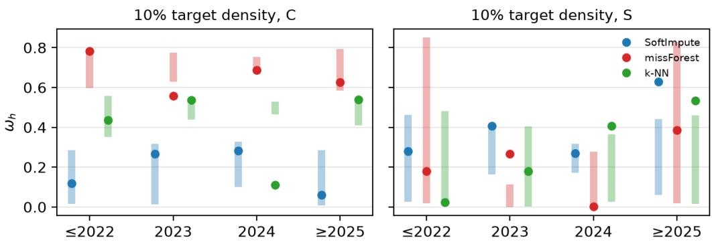  
Figure A1. $\omega _ { h }$ of each release-year group (dots) against the 5th to 95th percentile of 50 random subsets of the same size (bars), per imputer, on the C (left) and S (right) matrices.

Table A5. Mean general-factor score of each release-year group, with mean zero over all models.
<table><tr><td>Densifier</td><td>Imputer</td><td>≤ 2022</td><td>2023</td><td>2024</td><td>≥ 2025</td></tr><tr><td>C</td><td>SoftImpute</td><td>-1.33</td><td>-0.29</td><td>0.59</td><td>0.00</td></tr><tr><td>C</td><td>missForest</td><td>-1.02</td><td>-0.40</td><td>0.22</td><td>1.11</td></tr><tr><td>C</td><td>k-NN</td><td>-1.36</td><td>-0.34</td><td>0.25</td><td>1.22</td></tr><tr><td>S</td><td>SoftImpute</td><td>-1.47</td><td>-0.21</td><td>0.37</td><td>0.67</td></tr><tr><td>S</td><td>missForest</td><td>0.43</td><td>-0.32</td><td>-0.19</td><td>0.86</td></tr><tr><td>S</td><td>k-NN</td><td>-0.52</td><td>0.06</td><td>-0.27</td><td>1.20</td></tr></table>

## K.3 WITHOUT IMPUTATION

Only six benchmarks are observed in every year group (BBH, GPQA, IFEval, MATH, MMLU-Pro and MuSR, all from the Open LLM Leaderboard v2). For the 330 models that have all six, we compute the correlation matrix of their observed scores within each year group and take the share of variance of its first eigenvalue. This share is 0.43 for 2022 or earlier, 0.71 for 2023, 0.72 for 2024 and 0.57 for 2025 or later. The oldest models sit near the floor of most of these benchmarks (a mean MATH score of 1 out of 100, for instance), which lowers their correlations, and the newest group holds only 20 models, with a bootstrap interval ([0.50, 0.69]) that overlaps that of 2023 ([0.66, 0.81]). We read no trend into this check either.

## K.4 BENCHMARK RELEASE DATE

We also check whether the release year of a benchmark relates to its place in the pooled solutions. Benchmark dates are less reliable than model dates (Appendix C.4), so we only use the year. Since only the pooled loadings are needed here, all five imputers enter (Table A6).

First off, release year does not predict the general-factor loading. The Spearman correlation between year and absolute loading is significant in only 3 of 10 solutions, twice positive and once negative.

Benchmarks from the same era do sit closer together in loading space. We group benchmarks into four eras (2019 or earlier, 2020 to 2021, 2022 to 2023, and 2024 or later), and the mean within-era Euclidean distance between their loading vectors is smaller than under 2,000 permutations of the era labels in 9 of 10 solutions (z < −1.96).

Most of this closeness, however, comes from which models took each benchmark. Newer benchmarks are mostly taken by newer models (the Spearman correlation between a benchmark’s year and the mean year of its models is 0.67 on S and 0.68 on C), and two benchmarks taken by the same models are filled in alike by the imputers. We regress the rank of each pair’s loading distance on the ranks of its year gap and of the Jaccard distance between the two sets of observed models. The co-observation term is the larger one in all 10 solutions (0.20 to 0.54, against 0.01 to 0.20 for the year gap), although the year gap keeps a significant effect of its own in 6 of 10 (permutation test with 500 relabelings).

The observed scores alone show a small era effect on S. Among benchmark pairs observed together on at least 30 models, pairs released four or more years apart correlate at 0.36, against 0.50 for pairs released within a year of each other. On C there is no gap (0.51 against 0.51). Succinctly, most of the era effect comes from the missingness pattern, and the small part left matches the year-to-year shift we find for the models.

Table A6. Benchmark release year against the pooled solutions. $\rho$ is the Spearman correlation between release year and absolute general-factor loading. Era z compares within-era loading distance with permuted eras (negative means same-era benchmarks sit closer). The last two columns are standardized rank-regression coefficients of a pair’s loading distance on its release-year gap (with permutation p) and on the Jaccard distance between its sets of observed models (co-obs.).
<table><tr><td>Densifier</td><td>Imputer</td><td>ρ</td><td>Era z</td><td>Year gap (p)</td><td>Co-obs.</td></tr><tr><td>C</td><td>SoftImpute</td><td>-0.16</td><td>-6.1</td><td>0.07 (0.022)</td><td>0.39</td></tr><tr><td>C</td><td>missForest</td><td>0.21</td><td>-4.2</td><td>0.10 (0.054)</td><td>0.31</td></tr><tr><td>C</td><td>k-NN</td><td>-0.34</td><td>-8.2</td><td>0.06 (0.082)</td><td>0.43</td></tr><tr><td>C</td><td>OneSidedMC</td><td>0.10</td><td>-12.6</td><td>0.15 (0.000)</td><td>0.54</td></tr><tr><td>C</td><td>SoftImpute (corr.)</td><td>-0.06</td><td>-6.1</td><td>0.11 (0.018)</td><td>0.25</td></tr><tr><td>S</td><td>SoftImpute</td><td>-0.03</td><td>-6.9</td><td>0.09 (0.004)</td><td>0.20</td></tr><tr><td>S</td><td>missForest</td><td>0.22</td><td>-14.2</td><td>0.20 (0.000)</td><td>0.47</td></tr><tr><td>S</td><td>k-NN</td><td>0.26</td><td>-6.0</td><td>0.01 (0.314)</td><td>0.24</td></tr><tr><td>S</td><td>OneSidedMC</td><td>0.13</td><td>-9.9</td><td>0.10 (0.000)</td><td>0.45</td></tr><tr><td>S</td><td>SoftImpute (corr.)</td><td>-0.02</td><td>-1.7</td><td>0.04 (0.158)</td><td>0.20</td></tr></table>

## L BENCHMARK g-RANKINGS

## L.1 FREQUENCY AND g-RANKING CORRELATIONS

A pressing concern with regard to our findings on the top g benchmarks in Table 5 of the main content is to what degree a benchmark’s g factor loading is correlated with its non-missing frequency. This is important to know, as our datasets can possess higher or lower correlations introduced as artifacts by our imputation methods.

Naively, as shown in Table A7 below, benchmark frequency is correlated with g loadings. Unsigned averages suggest this correlation is modest $( r = 0 . 3 4 3 2 ) .$ , but the correlations are quite dispersed, and some dataset-imputation combinations can be as high as \~0.5. Thus, identifying benchmarks which proxy a supposed latent $g$ factor well requires adjusting the statistics with respect to their frequency.

Table A7. Correlations between benchmark frequency and their g loadings. k = number of factors extracted.
<table><tr><td>Method</td><td>Dataset</td><td>k</td><td>r</td><td>N</td></tr><tr><td>Mean fill</td><td>C Std.</td><td>2</td><td>+0.4192</td><td>78</td></tr><tr><td>Mean fill</td><td>C Std.</td><td>14</td><td>+0.4192</td><td>78</td></tr><tr><td>k-NN</td><td>C Std.</td><td>2</td><td>+0.4065</td><td>78</td></tr><tr><td>k-NN</td><td>C Std.</td><td>7</td><td>+0.4065</td><td>78</td></tr><tr><td>k-NN</td><td>S Std.</td><td>2</td><td>+0.2335</td><td>124</td></tr><tr><td>k-NN</td><td>S Std.</td><td>11</td><td>+0.2335</td><td>124</td></tr><tr><td>missForest</td><td>C Aggr.</td><td>2</td><td>+0.3251</td><td>102</td></tr><tr><td>missForest</td><td>C Aggr.</td><td>4</td><td>+0.3251</td><td>102</td></tr><tr><td>missForest</td><td>C Std.</td><td>2</td><td>+0.2203</td><td>78</td></tr><tr><td>missForest</td><td>C Std.</td><td>4</td><td>+0.2203</td><td>78</td></tr><tr><td>missForest</td><td>S Std.</td><td>2</td><td>-0.2462</td><td>124</td></tr><tr><td>missForest</td><td>S Std.</td><td>4</td><td>-0.2462</td><td>124</td></tr><tr><td>OneSidedMC</td><td>C Aggr.</td><td>2</td><td>-0.4090</td><td>102</td></tr><tr><td>OneSidedMC</td><td>C Std.</td><td>2</td><td>+0.4786</td><td>78</td></tr><tr><td>OneSidedMC</td><td>S Std.</td><td>2</td><td>+0.3609</td><td>124</td></tr><tr><td>SoftImpute</td><td>C Aggr.</td><td>2</td><td>+0.5763</td><td>102</td></tr><tr><td>SoftImpute</td><td>C Aggr.</td><td>5</td><td>+0.5763</td><td>102</td></tr><tr><td>SoftImpute</td><td>C Std.</td><td>2</td><td>+0.5513</td><td>78</td></tr><tr><td>SoftImpute</td><td>C Std.</td><td>9</td><td>+0.5513</td><td>78</td></tr><tr><td>SoftImpute</td><td>R Aggr.</td><td>2</td><td>-0.3041</td><td>310</td></tr><tr><td>SoftImpute</td><td>R Aggr.</td><td>20</td><td>-0.3041</td><td>310</td></tr><tr><td>SoftImpute</td><td>R Std.</td><td>2</td><td>-0.2140</td><td>298</td></tr><tr><td>SoftImpute</td><td>R Std.</td><td>20</td><td>-0.2140</td><td>298</td></tr><tr><td>SoftImpute</td><td>S Aggr.</td><td>2</td><td>-0.3161</td><td>293</td></tr><tr><td>SoftImpute</td><td>S Aggr.</td><td>20</td><td>-0.3161</td><td>293</td></tr><tr><td>SoftImpute</td><td>S Std.</td><td>2</td><td>+0.1885</td><td>124</td></tr><tr><td>SoftImpute</td><td>S Std.</td><td>5</td><td>+0.1885</td><td>124</td></tr><tr><td>SoftImpute</td><td>raw Aggr.</td><td>2</td><td>-0.2404</td><td>380</td></tr><tr><td>SoftImpute</td><td>raw Aggr.</td><td>10</td><td>-0.2404</td><td>380</td></tr><tr><td>SoftImpute</td><td>raw Std.</td><td>2</td><td>+0.1815</td><td>404</td></tr><tr><td>SoftImpute</td><td>raw Std.</td><td>10</td><td>+0.1815</td><td>404</td></tr><tr><td>SoftImpute (corr.)</td><td>C Std.</td><td>2</td><td>+0.3788</td><td>78</td></tr><tr><td>SoftImpute (corr.)</td><td>C Std.</td><td>4</td><td>+0.3788</td><td>78</td></tr><tr><td>SoftImpute (corr.)</td><td>S Std.</td><td>2</td><td>+0.3890</td><td>124</td></tr><tr><td>SoftImpute (corr.)</td><td>S Std.</td><td>5</td><td>+0.3890</td><td>124</td></tr><tr><td>Zero fill</td><td>C Std.</td><td>2</td><td>+0.5343</td><td>78</td></tr><tr><td>Zero fill</td><td>C Std.</td><td>14</td><td>+0.5343</td><td>78</td></tr><tr><td>Average</td><td></td><td></td><td>+0.1783</td><td>37 (groups)</td></tr><tr><td>Average |r|</td><td></td><td></td><td>0.3432</td><td></td></tr></table>

## L.2 FREQUENCY ADJUSTMENT

Let C denote a factor cell: a method and dataset combination for which factor loadings are available. Within each cell $C ,$ benchmarks are ranked by absolute loading |gi| (i indexes benchmarks). The rank $r _ { i }$ is normalized within the cell,

$$
a _ { i } = { \frac { r _ { i } - 1 } { n - 1 } } , \qquad r _ { i } \in \{ 1 , \ldots , n \} ,
$$

so $a _ { i } = 0$ at the top of the cell and $a _ { i } = 1$ at the bottom. This makes cells with different numbers of benchmarks n comparable. Each benchmark’s raw score is the mean of its $a _ { i }$ over the cells in which it appears. Benchmarks appearing in fewer than two cells are excluded.

For a dataset with m models, the frequency of benchmark i is the proportion of models with an observed score,

$$
f _ { i } = { \frac { \# \{ { \bmod { \mathrm { e l s ~ w i t h ~ n o n - m i s s i n g ~ s c o r e ~ f o r ~ } } } i \} } { m } } .
$$

Columns with fewer than two observations or zero variance are excluded before computing $f _ { i }$ . Where several datasets contribute, the benchmark’s frequency is the mean of its per-dataset $f _ { i }$

As shown in Table A8 below, within most cells, frequently measured benchmarks obtain higher $| g _ { i } |$ and lower (better) $a _ { i } . \mathrm { ~ A ~ }$ benchmark may therefore rank highly partly because it is measured often rather than because it is a strong indicator of $g .$

The adjustment is applied within each cell rather than to the pooled averages. Within cell $C ,$ , the normalized ranks are regressed on the cell’s own frequencies by ordinary least squares,

$$
a _ { i } = \alpha + \beta f _ { i } + \varepsilon _ { i } , \qquad { \hat { \varepsilon } } _ { i } = ( a _ { i } - { \bar { a } } ) - { \hat { \beta } } ( f _ { i } - { \bar { f } } ) ,
$$

and the residual $\hat { \varepsilon } _ { i }$ replaces $a _ { i }$ . By construction the residuals are uncorrelated with $f _ { i }$ within the cell, so $\hat { \beta }$ removes exactly the linear component of the within-cell rank–frequency association. A cell with fewer than three frequency–rank pairs, or with zero frequency variance, cannot be fitted. Its benchmarks receive centered raw ranks $( a _ { i } - { \bar { a } } )$ , and such cells are counted and reported.

The adjusted score of benchmark i is the mean of its residuals over the cells in which it appears.   
Rankings are reported on this scale, with the raw average rank retained for comparison.

## L.3 DIAGNOSTICS

We present two diagnostics that justify the method of adjustment. Table A8 below reports, within each cell, the Pearson correlation $r ( f _ { i } , a _ { i } )$ , with the mean r, the mean $| r | ,$ , and the counts of negative and positive cells. Negative r indicates that more frequently measured benchmarks load higher on g.

Table A8. Correlations between benchmark frequency and their g rankings. Mean $r = - 0 . 1 7 3 .$ mean $| r | = 0 . 2 7 3 ;$ 13 negative and 7 positive cells.
<table><tr><td>Method</td><td>Dataset</td><td>N</td><td>r</td></tr><tr><td>Mean fill</td><td>C Std.</td><td>78</td><td>-0.429</td></tr><tr><td>k-NN</td><td>C Std.</td><td>78</td><td>-0.429</td></tr><tr><td>k-NN</td><td>S Std.</td><td>124</td><td>+0.020</td></tr><tr><td>missForest</td><td>C Aggr.</td><td>102</td><td>-0.342</td></tr><tr><td>missForest</td><td>C Std.</td><td>78</td><td>-0.106</td></tr><tr><td>missForest</td><td>S Std.</td><td>124</td><td>+0.261</td></tr><tr><td>OneSidedMC</td><td>C Aggr.</td><td>102</td><td>+0.383</td></tr><tr><td>OneSidedMC</td><td>C Std.</td><td>78</td><td>-0.242</td></tr><tr><td>OneSidedMC</td><td>S Std.</td><td>124</td><td>-0.271</td></tr><tr><td>SoftImpute</td><td>C Aggr.</td><td>102</td><td>-0.470</td></tr><tr><td>SoftImpute</td><td>C Std.</td><td>78</td><td>-0.497</td></tr><tr><td>SoftImpute</td><td>R Aggr.</td><td>310</td><td>+0.006</td></tr><tr><td>SoftImpute</td><td>R Std.</td><td>298</td><td>+0.222</td></tr><tr><td>SoftImpute</td><td>S Aggr.</td><td>293</td><td>+0.094</td></tr><tr><td>SoftImpute</td><td>S Std.</td><td>124</td><td>-0.162</td></tr><tr><td>SoftImpute</td><td>raw Aggr.</td><td>380</td><td>+0.012</td></tr><tr><td>SoftImpute</td><td>raw Std.</td><td>404</td><td>-0.091</td></tr><tr><td>SoftImpute (corr.)</td><td>C Std.</td><td>78</td><td>-0.425</td></tr><tr><td>SoftImpute (corr.)</td><td>S Std.</td><td>124</td><td>-0.431</td></tr><tr><td>Zero fill</td><td>C Std.</td><td>78</td><td>-0.572</td></tr></table>

Second, Table A9 reports the pooled correlation between mean frequency and mean rank before and after the adjustment, stratified by the number of cells k in which a benchmark appears. The within-cell association does not survive pooling with a consistent sign: cells disagree in direction, so the pooled raw correlation is small even though the within-cell correlations are not.

Table A9. Pooled correlation between mean frequency and mean rank.
<table><tr><td>N cells N benchmarks</td><td>r raw</td><td>r adjusted</td></tr><tr><td>2 54</td><td>-0.023</td><td>-0.021</td></tr><tr><td>3 26</td><td>-0.024</td><td>-0.049</td></tr><tr><td>4 24</td><td>-0.214</td><td>-0.232</td></tr><tr><td>5 141</td><td>+0.061</td><td>+0.046</td></tr><tr><td>8 10</td><td>+0.040</td><td>+0.038</td></tr><tr><td>10 33</td><td>+0.518</td><td>+0.516</td></tr></table>

Table A9. (continued)
<table><tr><td>N cells</td><td>N benchmarks</td><td>r raw</td><td>r adjusted</td></tr><tr><td>13</td><td>13</td><td>-0.538</td><td>-0.539</td></tr><tr><td>20</td><td>78</td><td>-0.382</td><td>+0.073</td></tr><tr><td>Pooled</td><td>380</td><td>-0.128</td><td>-0.039</td></tr></table>

For this reason, we report the cellwise-frequency-adjusted average normalized rank as the primary ordering of benchmarks (Table 5 in the main text). This ordering removes the linear component of the within-cell rank–frequency association, which reaches $| r | \approx 0 . 3$ in the average cell, before averaging across cells. The raw average normalized rank is retained alongside it for comparison, as the two orderings agree closely. The adjustment mainly matters for benchmarks measured across many cells, where the within-cell association is strongest and where the adjusted ranking reorders the raw ranking.

The full ranking of all 380 benchmarks is given in Appendix P.

## M LABEL COHESION RESULTS

We present the full label cohesion results for all labels here. From the subject category, only finance and professional\_writing show significantly strong cohesion, both of which are very specific labels with low median n. The next few labels show moderate to weak cohesion at best, a lot of which do not have enough significance to distinguish from chance. Labeling by language surprisingly shows many weakly cohesive structures, especially for monolingual\_non\_english, which is an aggregate label. Individual labels for each language are not used due to low n. All of the results support our claim that benchmark clusters are weakly cohesive.

Table A10. Cohesion by task-format label, sorted by descending median A.
<table><tr><td>Label</td><td>Median A</td><td>Significant</td><td>Median n</td></tr><tr><td>conversation</td><td>+0.283</td><td>3/6</td><td>7</td></tr><tr><td>likelihood_probe</td><td>+0.153</td><td>6/10</td><td>19</td></tr><tr><td>short_qa</td><td>+0.098</td><td>2/18</td><td>15</td></tr><tr><td>classification</td><td>+0.095</td><td>2/18</td><td>15</td></tr><tr><td>interactive</td><td>+0.078</td><td>1/10</td><td>16</td></tr><tr><td>long_reasoning</td><td>+0.066</td><td>0/18</td><td>9</td></tr><tr><td>multiple_choice</td><td>+0.059</td><td>8/18</td><td>37</td></tr><tr><td>long_form_generation</td><td>+0.023</td><td>4/18</td><td>32</td></tr><tr><td>extraction</td><td>-0.000</td><td>0/14</td><td>5</td></tr><tr><td>ranking</td><td>-0.072</td><td>0/2</td><td>10</td></tr><tr><td>sentence_completion</td><td>-0.101</td><td>0/18</td><td>6</td></tr></table>

Table A11. Cohesion by language-coverage label, sorted by descending median A.
<table><tr><td>Label</td><td>Median A</td><td>Significant</td><td>Median n</td></tr><tr><td>monolingual_non_english</td><td>+0.291</td><td>16/18</td><td>19</td></tr><tr><td>multilingual</td><td>+0.204</td><td>6/14</td><td>9</td></tr><tr><td>crosslingual</td><td>+0.137</td><td>1/10</td><td>12</td></tr><tr><td>english</td><td>-0.034</td><td>0/18</td><td>85</td></tr></table>

Table A12. Cohesion by subject-matter label, sorted by descending median A.
<table><tr><td>Label</td><td>Median A</td><td>Significant</td><td>Median n</td></tr><tr><td>finance</td><td>+0.870</td><td>10/10</td><td>4</td></tr><tr><td>professional_writing</td><td>+0.632</td><td>4/6</td><td>5</td></tr><tr><td>fact_verification</td><td>+0.300</td><td>0/4</td><td>5</td></tr><tr><td>commonsense</td><td>+0.287</td><td>5/18</td><td>11</td></tr><tr><td>code</td><td>+0.264</td><td>6/18</td><td>11</td></tr><tr><td>translation</td><td>+0.249</td><td>6/10</td><td>16</td></tr><tr><td>language_understanding</td><td>+0.247</td><td>4/6</td><td>10</td></tr><tr><td>linguistic_competence</td><td>+0.226</td><td>0/10</td><td>6</td></tr><tr><td>social_media</td><td>+0.226</td><td>2/10</td><td>6</td></tr><tr><td>sentiment</td><td>+0.217</td><td>2/10</td><td>6</td></tr><tr><td>dialogue</td><td>+0.203</td><td>0/6</td><td>5</td></tr><tr><td>industrial</td><td>+0.186</td><td>0/2</td><td>4</td></tr><tr><td>cognitive</td><td>+0.178</td><td>0/6</td><td>12</td></tr><tr><td>society_culture</td><td>+0.172</td><td>2/6</td><td>14</td></tr><tr><td>agentic</td><td>+0.171</td><td>0/10</td><td>10</td></tr><tr><td>recall</td><td>+0.169</td><td>13/18</td><td>21</td></tr><tr><td>factuality</td><td>+0.154</td><td>1/14</td><td>7</td></tr><tr><td>structured_data</td><td>+0.111</td><td>0/6</td><td>15</td></tr><tr><td>language_modelling</td><td>+0.106</td><td>0/6</td><td>5</td></tr><tr><td>encyclopedic</td><td>+0.104</td><td>1/18</td><td>23</td></tr><tr><td>world_knowledge</td><td>+0.092</td><td>0/18</td><td>7</td></tr><tr><td>generation</td><td>+0.091</td><td>1/10</td><td>37</td></tr><tr><td>legal</td><td>+0.069</td><td>0/4</td><td>4</td></tr><tr><td>multi_subject</td><td>+0.068</td><td>6/18</td><td>28</td></tr><tr><td>logical_reasoning</td><td>+0.068</td><td>2/18</td><td>6</td></tr><tr><td>medical</td><td>+0.066</td><td>1/6</td><td>40</td></tr><tr><td>instruction_following</td><td>+0.044</td><td>0/10</td><td>16</td></tr><tr><td>creativity</td><td>+0.042</td><td>0/4</td><td>4</td></tr><tr><td>safety</td><td>+0.042</td><td>0/18</td><td>8</td></tr><tr><td>math</td><td>+0.031</td><td>0/18</td><td>10</td></tr><tr><td>science</td><td>+0.029</td><td>0/18</td><td>11</td></tr><tr><td>specialized_domain</td><td>+0.029</td><td>1/18</td><td>13</td></tr><tr><td>games</td><td>+0.022</td><td>0/6</td><td>6</td></tr><tr><td>natural_language_inference</td><td>+0.018</td><td>0/6</td><td>9</td></tr><tr><td>source_genre</td><td>+0.007</td><td>0/18</td><td>39</td></tr><tr><td>text_classification</td><td>-0.007</td><td>0/6</td><td>12</td></tr><tr><td>reasoning</td><td>-0.008</td><td>0/18</td><td>19</td></tr><tr><td>summarization</td><td>-0.008</td><td>0/6</td><td>13</td></tr><tr><td>reading_comprehension</td><td>-0.013</td><td>0/18</td><td>9</td></tr><tr><td>retrieval</td><td>-0.014</td><td>0/6</td><td>6</td></tr><tr><td>language_processing</td><td>-0.016</td><td>0/18</td><td>26</td></tr><tr><td>alignment</td><td>-0.016</td><td>0/18</td><td>26</td></tr><tr><td>temporal_reasoning</td><td>-0.024</td><td>0/2</td><td>7</td></tr><tr><td>news</td><td>-0.042</td><td>0/18</td><td>6</td></tr><tr><td>toxicity</td><td>-0.056</td><td>1/14</td><td>6</td></tr><tr><td>bias_fairness</td><td>-0.069</td><td>0/6</td><td>4</td></tr><tr><td>information_extraction</td><td>-0.120</td><td>0/2</td><td>4</td></tr><tr><td>fiction</td><td>-0.232</td><td>0/6</td><td>4</td></tr></table>

## N IMPUTATION RESULTS

The table below lists, for every dataset-imputer combination, the held-out RMSE, $R ^ { 2 } ,$ , and the selected configuration. Rows are sorted by $R ^ { 2 }$ . As described in the results, only 20 of the combinations pass

the $R ^ { 2 } \geq 0 . 2$ gate. Of all the methods presented, only USVT yielded no valid solutions or crashes mid-estimation.

Table A13. Results of all imputation runs, sorted by $R ^ { 2 }$
<table><tr><td>Dataset</td><td>Imputer</td><td>RMSE</td><td> $R ^ { 2 }$ </td><td>Configuration</td></tr><tr><td>S Std.</td><td>SoftImpute</td><td>0.6338</td><td>0.504</td><td>rank=5 (swept 1..10)</td></tr><tr><td>C Std.</td><td>SoftImpute</td><td>0.6575</td><td>0.493</td><td>rank=9 (swept 1..10)</td></tr><tr><td>S Std.</td><td>missForest</td><td>0.6798</td><td>0.471</td><td>ntree=400 (swept [50,100,200,400])</td></tr><tr><td>C Std.</td><td>missForest</td><td>0.7321</td><td>0.399</td><td>ntree=50 (swept [50,100,200,400])</td></tr><tr><td>S Std.</td><td>SoftImpute (corr.)</td><td>0.7637</td><td>0.378</td><td>rank=6 (swept 1..10)</td></tr><tr><td>S Std.</td><td>OneSidedMC</td><td>0.7554</td><td>0.365</td><td>r=2 (swept 1..10)</td></tr><tr><td>C Aggr.</td><td>SoftImpute</td><td>0.6739</td><td>0.337</td><td>rank=5 (swept 1..10)</td></tr><tr><td>C Std.</td><td>OneSidedMC</td><td>0.7261</td><td>0.321</td><td>r=2 (swept 1..10)</td></tr><tr><td>C Std.</td><td>SoftImpute (corr.)</td><td>0.8126</td><td>0.317</td><td>rank=5 (swept 1..7)</td></tr><tr><td>S Std.</td><td>k-NN</td><td>0.8104</td><td>0.296</td><td>k=5 (swept 1..10)</td></tr><tr><td>R Std.</td><td>SoftImpute</td><td>0.7245</td><td>0.290</td><td>rank=4 (swept 1..10)</td></tr><tr><td>C Std.</td><td>k-NN</td><td>0.8232</td><td>0.288</td><td>k=5 (swept 1..10)</td></tr><tr><td>C Std.</td><td>Zero fill</td><td>0.8910</td><td>0.286</td><td>fill=zero</td></tr><tr><td>S Aggr.</td><td>SoftImpute</td><td>0.7068</td><td>0.282</td><td>rank=10 (swept 1..10)</td></tr><tr><td>C Aggr.</td><td>OneSidedMC</td><td>0.8815</td><td>0.278</td><td>r=2 (swept 1..10)</td></tr><tr><td>raw Std.</td><td>SoftImpute</td><td>0.7401</td><td>0.249</td><td>rank=9 (swept 1..10)</td></tr><tr><td>C Aggr.</td><td>missForest</td><td>0.8275</td><td>0.241</td><td>ntree=50 (swept [50,100,200,400])</td></tr><tr><td>raw Aggr.</td><td>SoftImpute</td><td>0.7457</td><td>0.228</td><td>rank=10 (swept 1..10)</td></tr><tr><td>C Std.</td><td>Mean fill</td><td>0.9268</td><td>0.224</td><td>fill=mean</td></tr><tr><td>R Aggr.</td><td>SoftImpute</td><td>0.7370</td><td>0.209</td><td>rank=10 (swept 1..10)</td></tr><tr><td>S Std.</td><td>Zero fill</td><td>0.8926</td><td>0.180</td><td>fill=zero</td></tr><tr><td>S Std.</td><td>Mean fill</td><td>0.8923</td><td>0.179</td><td>fill=mean</td></tr><tr><td>S Aggr.</td><td>OneSidedMC</td><td>0.9311</td><td>0.160</td><td>r=2 (swept 1..10)</td></tr><tr><td>C Aggr.</td><td>k-NN</td><td>0.9253</td><td>0.085</td><td>k=6 (swept 1..10)</td></tr><tr><td>S Aggr.</td><td>SoftImpute (corr.)</td><td>1.0514</td><td>0.076</td><td>rank=1</td></tr><tr><td>raw Aggr.</td><td>SoftImpute (corr.)</td><td>1.1797</td><td>0.075</td><td>rank=3 (swept 1..3)</td></tr><tr><td>S Aggr.</td><td>k-NN</td><td>1.0841</td><td>0.069</td><td>k=4 (swept 1..10)</td></tr><tr><td>R Std.</td><td>SoftImpute (corr.)</td><td>1.2346</td><td>0.047</td><td>rank=5 (swept 1..10)</td></tr><tr><td>raw Std.</td><td>OneSidedMC</td><td>1.1045</td><td>0.044</td><td>r=2 (swept 1..10)</td></tr><tr><td>S Aggr.</td><td>missForest</td><td>1.0635</td><td>0.041</td><td>ntree=100 (swept [50,100,200,400])</td></tr><tr><td>R Std.</td><td>missForest</td><td>1.2253</td><td>0.036</td><td>ntree=200 (swept [50,100,200,400])</td></tr><tr><td>R Std.</td><td>OneSidedMC</td><td>1.3507</td><td>0.035</td><td>r=2 (swept 1..10)</td></tr><tr><td>raw Aggr.</td><td>missForest</td><td>1.2200</td><td>0.026</td><td>ntree=400 (swept [50,100,200,400])</td></tr><tr><td>raw Aggr.</td><td>k-NN</td><td>1.2247</td><td>0.021</td><td>k=3 (swept 1..10)</td></tr><tr><td>R Aggr.</td><td>SoftImpute (corr.)</td><td>1.3517</td><td>0.019</td><td>rank=1</td></tr><tr><td>raw Std.</td><td>SoftImpute (corr.)</td><td>1.2551</td><td>0.015</td><td>rank=2 (swept 1..10)</td></tr><tr><td>raw Aggr.</td><td>OneSidedMC</td><td>1.5050</td><td>0.015</td><td>r=2 (swept 1..10)</td></tr><tr><td>raw Std.</td><td>missForest</td><td>1.2441</td><td>0.015</td><td>ntree=200 (swept [50,100,200,400])</td></tr><tr><td>R Aggr.</td><td>k-NN</td><td>1.4189</td><td>0.013</td><td>k=2 (swept 1..10)</td></tr><tr><td>R Std.</td><td>k-NN</td><td>1.2854</td><td>0.011</td><td>k=3 (swept 1..10)</td></tr><tr><td>R Aggr.</td><td>OneSidedMC</td><td>2.0522</td><td>0.007</td><td>r=2 (swept 1..10)</td></tr><tr><td>R Aggr.</td><td>missForest</td><td>1.3915</td><td>0.006</td><td>ntree=200 (swept [50,100,200,400])</td></tr><tr><td>raw Std.</td><td>Mean fill</td><td>1.3404</td><td>0.000</td><td>fill=mean</td></tr><tr><td>raw Std.</td><td>k-NN</td><td>1.3065</td><td>-0.004</td><td>k=5 (swept 1..10)</td></tr><tr><td>R Std.</td><td>Mean fill</td><td>1.3990</td><td>-0.049</td><td>fill=mean</td></tr><tr><td>S Aggr.</td><td>Mean fill</td><td>1.2040</td><td>-0.087</td><td>fill=mean</td></tr><tr><td>S Aggr.</td><td>Zero fill</td><td>1.2298</td><td>-0.139</td><td>fill=zero</td></tr><tr><td>R Std.</td><td>USVT</td><td>2.5911</td><td>-1.635</td><td>eta=0.01</td></tr><tr><td>S Std.</td><td>USVT</td><td>1.7823</td><td>-2.965</td><td>eta=0.01</td></tr><tr><td>raw Std.</td><td>USVT</td><td>2.9244</td><td>-5.031</td><td>eta=0.01</td></tr><tr><td>S Aggr.</td><td>USVT</td><td>2.9488</td><td>-12.278</td><td>eta=0.01</td></tr></table>

## O OMEGA SENSITIVITY

To quantify to what degree missing observations affect our results, we run leave-one-covariate-out (LOCO) factor analyses for each valid dataset. For each benchmark in the dataset, we run factor analysis with the benchmark left out, and store the difference in $\omega _ { h }$ as a measure of sensitivity. Table A14 shows the correlations between benchmark frequency (normalized within the dataset) and the deltas. Signed averages of r show negligible correlation at $r = 0 . 0 5 4$ , but this may simply be because signed correlations cancel out to 0. Average of unsigned, absolute r yielded a larger but still modest correlation of $r = 0 . 1 8 4$

Table A14. Correlations between benchmark observation and their $\Delta \omega _ { h }$ . k = number of factors extracted.
<table><tr><td>Method</td><td>Dataset</td><td>k</td><td>r</td><td>N</td></tr><tr><td>Mean fill</td><td>C Std.</td><td>2</td><td>+0.0701</td><td>78</td></tr><tr><td>Mean fill</td><td>C Std.</td><td>14</td><td>+0.1316</td><td>78</td></tr><tr><td>k-NN</td><td>C Std.</td><td>2</td><td>+0.0268</td><td>78</td></tr><tr><td>k-NN</td><td>C Std.</td><td>7</td><td>+0.3205</td><td>78</td></tr><tr><td>k-NN</td><td>S Std.</td><td>2</td><td>+0.1765</td><td>124</td></tr><tr><td>k-NN</td><td>S Std.</td><td>11</td><td>+0.2069</td><td>124</td></tr><tr><td>missForest</td><td>C Aggr.</td><td>2</td><td>+0.0173</td><td>102</td></tr><tr><td>missForest</td><td>C Aggr.</td><td>4</td><td>+0.2315</td><td>102</td></tr><tr><td>missForest</td><td>C Std.</td><td>2</td><td>+0.0318</td><td>78</td></tr><tr><td>missForest</td><td>C Std.</td><td>4</td><td>+0.0100</td><td>78</td></tr><tr><td>missForest</td><td>S Std.</td><td>2</td><td>-0.3363</td><td>124</td></tr><tr><td>missForest</td><td>S Std.</td><td>4</td><td>-0.2933</td><td>124</td></tr><tr><td>OneSidedMC</td><td>C Aggr.</td><td>2</td><td>-0.4256</td><td>102</td></tr><tr><td>OneSidedMC</td><td>C Std.</td><td>2</td><td>+0.3207</td><td>78</td></tr><tr><td>OneSidedMC</td><td>S Std.</td><td>2</td><td>+0.3462</td><td>124</td></tr><tr><td>SoftImpute</td><td>C Aggr.</td><td>2</td><td>-0.0747</td><td>102</td></tr><tr><td>SoftImpute</td><td>C Aggr.</td><td>5</td><td>+0.1804</td><td>102</td></tr><tr><td>SoftImpute</td><td>C Std.</td><td>2</td><td>+0.4196</td><td>78</td></tr><tr><td>SoftImpute</td><td>C Std.</td><td>9</td><td>+0.3245</td><td>78</td></tr><tr><td>SoftImpute</td><td>R Aggr.</td><td>2</td><td>+0.1227</td><td>310</td></tr><tr><td>SoftImpute</td><td>R Aggr.</td><td>20</td><td>-0.0677</td><td>310</td></tr><tr><td>SoftImpute</td><td>R Std.</td><td>2</td><td>+0.0164</td><td>298</td></tr><tr><td>SoftImpute</td><td>R Std.</td><td>20</td><td>-0.1719</td><td>298</td></tr><tr><td>SoftImpute</td><td>S Aggr.</td><td>2</td><td>-0.2156</td><td>293</td></tr><tr><td>SoftImpute</td><td>S Aggr.</td><td>20</td><td>-0.0837</td><td>293</td></tr><tr><td>SoftImpute</td><td>S Std.</td><td>2</td><td>+0.2324</td><td>124</td></tr><tr><td>SoftImpute</td><td>S Std.</td><td>5</td><td>+0.0361</td><td>124</td></tr><tr><td>SoftImpute</td><td>raw Aggr.</td><td>2</td><td>-0.2083</td><td>380</td></tr><tr><td>SoftImpute</td><td>raw Aggr.</td><td>10</td><td>-0.3003</td><td>380</td></tr><tr><td>SoftImpute</td><td>raw Std.</td><td>2</td><td>+0.2880</td><td>404</td></tr><tr><td>SoftImpute</td><td>raw Std.</td><td>10</td><td>+0.0528</td><td>404 78</td></tr><tr><td>SoftImpute (corr.) SoftImpute (corr.)</td><td>C Std. C Std.</td><td>2 4</td><td>-0.0565 +0.0917</td><td>78</td></tr><tr><td>SoftImpute (corr.)</td><td></td><td></td><td></td><td>124</td></tr><tr><td></td><td>S Std.</td><td>2</td><td>-0.1664</td><td></td></tr><tr><td>SoftImpute (corr.)</td><td>S Std.</td><td>5</td><td>+0.2068</td><td>124</td></tr><tr><td>Zero fill</td><td>C Std.</td><td>2</td><td>+0.2965</td><td>78</td></tr><tr><td>Zero fill Average r</td><td>C Std.</td><td>14</td><td>+0.2493 +0.0542</td><td>78 37 (groups)</td></tr><tr><td></td><td></td><td></td><td>0.1840</td><td></td></tr><tr><td>Average |r|</td><td></td><td></td><td></td><td></td></tr></table>

## P FULL g-RANKINGS

Table A15 lists all 380 benchmarks used across our analyses, sorted by their rank order as in Table 5 of the main text. The ranking method and its diagnostics are described in Appendix L.

Table A15. All used 380 benchmarks, sorted by their average normalized rank order (ANR) of their g factor loadings, residualized (RANR) against their frequency. The normalized rank order ranges from 0 to 1. 0 = ranked first, 1 = ranked last. N cells = number of EFA solutions with that benchmark. CI and Best/Worst refers to ANR. Leading zeros are omitted. Reference is the paper introducing the benchmark; † marks benchmarks without one, cited by the source of their scores.
<table><tr><td colspan="11" rowspan="1">No Benchmark              ρ∈   ρ95% CI        BestWorstNReference</td></tr><tr><td colspan="3" rowspan="1">1 bhasa                  -.346</td><td colspan="1" rowspan="1">.141</td><td colspan="2" rowspan="1">[-.005, .287]</td><td colspan="5" rowspan="2">.024  .318 5 Leong et al., 2023.021  .394 5 Katsis et al., 2025</td></tr><tr><td colspan="1" rowspan="1">2</td><td colspan="2" rowspan="1">2 mtrag                 -.341</td><td colspan="1" rowspan="1">.147</td><td colspan="2" rowspan="1">[-.051, .346]</td></tr><tr><td colspan="1" rowspan="1">3</td><td colspan="2" rowspan="1">creativityprism       -.339</td><td colspan="1" rowspan="1">.156</td><td colspan="2" rowspan="1">[-.019, .332]</td><td colspan="3" rowspan="1">.026  .367</td><td colspan="2" rowspan="1">5 Hou et al., 2026</td></tr><tr><td colspan="1" rowspan="1">4</td><td colspan="2" rowspan="1">eqbench               -.332</td><td colspan="1" rowspan="1">.156</td><td colspan="2" rowspan="1">[-.060, .372]</td><td colspan="2" rowspan="1">.017</td><td colspan="1" rowspan="1">.451</td><td colspan="2" rowspan="1">5 Paech, 2023</td></tr><tr><td colspan="1" rowspan="1">5</td><td colspan="2" rowspan="1">mceval                -.331</td><td colspan="1" rowspan="1">.156</td><td colspan="2" rowspan="1">[.024, .288]</td><td colspan="2" rowspan="1">.051</td><td colspan="1" rowspan="1">.333</td><td colspan="2" rowspan="1">5 Chai et al., 2025</td></tr><tr><td colspan="1" rowspan="1">6 p</td><td colspan="2" rowspan="1">wc_svamp           -.329</td><td colspan="1" rowspan="1">.169</td><td colspan="2" rowspan="1">[-.033, .371]</td><td colspan="2" rowspan="1">.058</td><td colspan="1" rowspan="1">.298</td><td colspan="2" rowspan="1">4 Patel et al., 2021</td></tr><tr><td colspan="1" rowspan="1">7 p</td><td colspan="1" rowspan="1">wc_drop_test</td><td colspan="1" rowspan="1">-.328</td><td colspan="1" rowspan="1">.162</td><td colspan="2" rowspan="1">[-.139, .462]</td><td colspan="2" rowspan="1">.008</td><td colspan="1" rowspan="1">.431</td><td colspan="2" rowspan="1">4 Dua et al., 2019</td></tr><tr><td colspan="1" rowspan="1">8</td><td colspan="1" rowspan="1">ProphetArena</td><td colspan="1" rowspan="1">-.315</td><td colspan="1" rowspan="1">.183</td><td colspan="2" rowspan="1">[-.036, .401]</td><td colspan="2" rowspan="1">.092</td><td colspan="1" rowspan="1">.385</td><td colspan="2" rowspan="1">4 Yang et al., 2026</td></tr><tr><td colspan="1" rowspan="1">9</td><td colspan="1" rowspan="1">dialogbench</td><td colspan="1" rowspan="1">-.295</td><td colspan="1" rowspan="1">.210</td><td colspan="2" rowspan="1">[-1.351, 1.77</td><td colspan="2" rowspan="1">0].087</td><td colspan="1" rowspan="1">.332</td><td colspan="2" rowspan="1">2 Ou et al., 2024</td></tr><tr><td colspan="1" rowspan="1">10 p</td><td colspan="1" rowspan="1">wc_piqa</td><td colspan="1" rowspan="1">-.282</td><td colspan="1" rowspan="1">.253</td><td colspan="2" rowspan="1">[.162, .345]</td><td colspan="2" rowspan="1">.003</td><td colspan="1" rowspan="1">.822</td><td colspan="2" rowspan="1">20 Bisk et al., 2020</td></tr><tr><td colspan="1" rowspan="1">11</td><td colspan="1" rowspan="1">pwc_timequestions</td><td colspan="1" rowspan="1">-.275</td><td colspan="1" rowspan="1">.230</td><td colspan="2" rowspan="1">[.173, .288]</td><td colspan="1" rowspan="1"></td><td colspan="1" rowspan="1">.226</td><td colspan="1" rowspan="1">.235</td><td colspan="2" rowspan="1">2 Jia et al., 2021</td></tr><tr><td colspan="1" rowspan="1">12 t</td><td colspan="1" rowspan="1">ablebench_data_</td><td colspan="1" rowspan="1">-.272</td><td colspan="1" rowspan="1">.223[</td><td colspan="2" rowspan="1">-.185, .631]</td><td colspan="1" rowspan="1"></td><td colspan="1" rowspan="1">.000</td><td colspan="1" rowspan="1">.787</td><td colspan="2" rowspan="3">5 Wu et al., 20252 Williams et al., 2018</td></tr><tr><td colspan="1" rowspan="1"></td><td colspan="1" rowspan="1">analysis</td><td colspan="1" rowspan="1"></td><td colspan="1" rowspan="1"></td><td colspan="2" rowspan="1"></td><td colspan="1" rowspan="1"></td><td colspan="1" rowspan="1"></td><td colspan="1" rowspan="1"></td></tr><tr><td colspan="1" rowspan="1">13p</td><td colspan="1" rowspan="1">wc_multinli</td><td colspan="1" rowspan="1">-.271</td><td colspan="1" rowspan="1">.233</td><td colspan="2" rowspan="1">[-.459, .925]</td><td colspan="1" rowspan="1"></td><td colspan="1" rowspan="1">.179</td><td colspan="1" rowspan="1">.288</td></tr><tr><td colspan="1" rowspan="1">14</td><td colspan="1" rowspan="1">lawbench</td><td colspan="1" rowspan="1">-.264</td><td colspan="1" rowspan="1">.222</td><td colspan="2" rowspan="1">[-.288, .731]</td><td colspan="1" rowspan="1"></td><td colspan="1" rowspan="1">.057</td><td colspan="1" rowspan="1">.452</td><td colspan="2" rowspan="1">3Fei et al., 2024</td></tr><tr><td colspan="1" rowspan="1">15 p</td><td colspan="1" rowspan="1">wc_arc_challenge</td><td colspan="1" rowspan="1">-.260</td><td colspan="1" rowspan="1">.277</td><td colspan="2" rowspan="1">[.149, .405]</td><td colspan="1" rowspan="1"></td><td colspan="1" rowspan="1">.000</td><td colspan="1" rowspan="1">.808</td><td colspan="2" rowspan="1">20Clark et al., 2018</td></tr><tr><td colspan="1" rowspan="1">16 t</td><td colspan="1" rowspan="1">ablebench_fact_</td><td colspan="1" rowspan="1">-.260</td><td colspan="1" rowspan="1">.235</td><td colspan="2" rowspan="1">[-.165, .635]</td><td colspan="1" rowspan="1"></td><td colspan="1" rowspan="1">.020</td><td colspan="1" rowspan="1">.784</td><td colspan="2" rowspan="3">5Wu et al., 20255 Susanto et al., 2025</td></tr><tr><td colspan="1" rowspan="1"></td><td colspan="1" rowspan="1">checking</td><td colspan="1" rowspan="1"></td><td colspan="1" rowspan="1"></td><td colspan="2" rowspan="1"></td><td colspan="1" rowspan="1"></td><td colspan="1" rowspan="1"></td><td colspan="1" rowspan="1"></td></tr><tr><td colspan="1" rowspan="1">17 s</td><td colspan="1" rowspan="1">ea_helm</td><td colspan="1" rowspan="1">-.257</td><td colspan="1" rowspan="1">.235</td><td colspan="2" rowspan="1">[-.069, .539]</td><td colspan="1" rowspan="1"></td><td colspan="1" rowspan="1">.045</td><td colspan="1" rowspan="1">.603</td></tr><tr><td colspan="1" rowspan="1">18</td><td colspan="1" rowspan="1">pinocchio</td><td colspan="1" rowspan="1">-.256</td><td colspan="1" rowspan="1">.249</td><td colspan="2" rowspan="1">[-.564, 1.062</td><td colspan="1" rowspan="1">]</td><td colspan="1" rowspan="1">.185</td><td colspan="1" rowspan="1">.313</td><td colspan="1" rowspan="1">2 H</td><td colspan="1" rowspan="1">u et al., 2023</td></tr><tr><td colspan="1" rowspan="1">19</td><td colspan="1" rowspan="1">tombench</td><td colspan="1" rowspan="1">-.255</td><td colspan="1" rowspan="1">.234</td><td colspan="2" rowspan="1">[.056, .413]</td><td colspan="1" rowspan="1"></td><td colspan="1" rowspan="1">.062</td><td colspan="1" rowspan="1">.446</td><td colspan="1" rowspan="1">5 C</td><td colspan="1" rowspan="1">hen et al., 2024</td></tr><tr><td colspan="1" rowspan="1">20</td><td colspan="1" rowspan="1">indicgenbench</td><td colspan="1" rowspan="1">-.252</td><td colspan="1" rowspan="1">.253</td><td colspan="2" rowspan="1">[-.347, .853]</td><td colspan="1" rowspan="1"></td><td colspan="1" rowspan="1">.206</td><td colspan="1" rowspan="1">.300</td><td colspan="2" rowspan="1">2 Singh et al., 2024</td></tr><tr><td colspan="1" rowspan="1">21</td><td colspan="1" rowspan="1">dischargeme</td><td colspan="1" rowspan="1">-.250</td><td colspan="1" rowspan="1">.245</td><td colspan="2" rowspan="1">[.093, .396]</td><td colspan="1" rowspan="1"></td><td colspan="1" rowspan="1">.087</td><td colspan="1" rowspan="1">.402</td><td colspan="2" rowspan="1">5 Bedi et al., 2025†</td></tr><tr><td colspan="1" rowspan="1">22 p</td><td colspan="1" rowspan="1">wc_gem_xsum</td><td colspan="1" rowspan="1">-.246</td><td colspan="1" rowspan="1">.259</td><td colspan="1" rowspan="1">[-.508,</td><td colspan="2" rowspan="1">1.026]</td><td colspan="1" rowspan="1">.199</td><td colspan="1" rowspan="1">.319</td><td colspan="1" rowspan="1">2 G</td><td colspan="1" rowspan="1">ehrmann et al., 2021</td></tr><tr><td colspan="1" rowspan="1">23</td><td colspan="1" rowspan="1">milu</td><td colspan="1" rowspan="1">-.241</td><td colspan="1" rowspan="1">.248</td><td colspan="1" rowspan="1">[.092, .</td><td colspan="2" rowspan="1">404]</td><td colspan="1" rowspan="1">.044</td><td colspan="1" rowspan="1">.350</td><td colspan="1" rowspan="1">5 V</td><td colspan="1" rowspan="1">erma et al., 2025</td></tr><tr><td colspan="1" rowspan="1">24</td><td colspan="1" rowspan="1">dialectbench</td><td colspan="1" rowspan="1">-.238</td><td colspan="1" rowspan="1">.267</td><td colspan="1" rowspan="1">[-.357,</td><td colspan="2" rowspan="1">.892]</td><td colspan="1" rowspan="1">.218</td><td colspan="1" rowspan="1">.317</td><td colspan="1" rowspan="1">2 F</td><td colspan="1" rowspan="1">AISAL et al., 2024</td></tr><tr><td colspan="1" rowspan="1">25 m</td><td colspan="1" rowspan="1">ena_bench</td><td colspan="1" rowspan="1">-.2322</td><td colspan="1" rowspan="1">.256</td><td colspan="3" rowspan="1">[-.163, .675]</td><td colspan="1" rowspan="1">.082</td><td colspan="1" rowspan="1">.859</td><td colspan="1" rowspan="1">5 Z</td><td colspan="1" rowspan="1">ahraei et al., 2025†</td></tr><tr><td colspan="1" rowspan="1">26</td><td colspan="1" rowspan="1">ReasonBENCH</td><td colspan="1" rowspan="1">-.232</td><td colspan="1" rowspan="1">.266</td><td colspan="3" rowspan="1">[.044, .489]</td><td colspan="1" rowspan="1">.075</td><td colspan="1" rowspan="1">.380</td><td colspan="1" rowspan="1">4 P</td><td colspan="1" rowspan="1">otamitis et al., 2025</td></tr><tr><td colspan="1" rowspan="1">27</td><td colspan="1" rowspan="1">sea_exam</td><td colspan="1" rowspan="1">-.230.</td><td colspan="1" rowspan="1">261</td><td colspan="3" rowspan="1">[-.007, .530]</td><td colspan="1" rowspan="1">.055</td><td colspan="1" rowspan="1">.559</td><td colspan="1" rowspan="1">5 L</td><td colspan="1" rowspan="1">iu et al., 2025</td></tr><tr><td colspan="1" rowspan="1">28</td><td colspan="1" rowspan="1">evalplus</td><td colspan="1" rowspan="1">-.230.</td><td colspan="1" rowspan="1">269</td><td colspan="3" rowspan="1">[.020, .517]</td><td colspan="1" rowspan="1">.102</td><td colspan="1" rowspan="1">.479</td><td colspan="1" rowspan="1">4 L</td><td colspan="1" rowspan="1">iu et al., 2023</td></tr><tr><td colspan="1" rowspan="1">29</td><td colspan="1" rowspan="1">sportsmetrics</td><td colspan="1" rowspan="1">-.226.</td><td colspan="1" rowspan="1">272</td><td colspan="1" rowspan="1">[-.132,</td><td colspan="1" rowspan="1">.676]</td><td colspan="1" rowspan="1"></td><td colspan="1" rowspan="1">.124</td><td colspan="1" rowspan="1">.653</td><td colspan="1" rowspan="1">4 H</td><td colspan="1" rowspan="1">u et al., 2024</td></tr><tr><td colspan="1" rowspan="1">30</td><td colspan="1" rowspan="1">kalahi</td><td colspan="1" rowspan="1">-.224.</td><td colspan="1" rowspan="1">264</td><td colspan="2" rowspan="1">[.146, .382]</td><td colspan="1" rowspan="1"></td><td colspan="1" rowspan="1">.148</td><td colspan="1" rowspan="1">.362</td><td colspan="1" rowspan="1">5 M</td><td colspan="1" rowspan="1">ontalan et al., 2024</td></tr><tr><td colspan="1" rowspan="1">31</td><td colspan="1" rowspan="1">batayan</td><td colspan="1" rowspan="1">-.222</td><td colspan="1" rowspan="1">.268</td><td colspan="3" rowspan="1">[.053, .482]</td><td colspan="1" rowspan="1">.071</td><td colspan="1" rowspan="1">.456</td><td colspan="1" rowspan="1">5 M</td><td colspan="1" rowspan="1">ontalan et al., 2025</td></tr><tr><td colspan="1" rowspan="1">32</td><td colspan="1" rowspan="1">bharatbench</td><td colspan="1" rowspan="1">-.221</td><td colspan="1" rowspan="1">.268</td><td colspan="3" rowspan="1">[-.141, .676]</td><td colspan="1" rowspan="1">.111</td><td colspan="1" rowspan="1">.856</td><td colspan="2" rowspan="1">5 Ola Krutrim, 2024</td></tr><tr><td colspan="1" rowspan="1">33 t</td><td colspan="1" rowspan="1">ablebench_</td><td colspan="1" rowspan="1">-.217.</td><td colspan="1" rowspan="1">278</td><td colspan="2" rowspan="1">[-.146, .702]</td><td colspan="1" rowspan="1"></td><td colspan="1" rowspan="1">.021</td><td colspan="1" rowspan="1">.851</td><td colspan="1" rowspan="1">5</td><td colspan="1" rowspan="5">5 Wu et al., 20255 Haller et al., 20245 Omiye et al., 2023</td></tr><tr><td colspan="1" rowspan="1"></td><td colspan="1" rowspan="1">numerical</td><td colspan="1" rowspan="1"></td><td colspan="1" rowspan="1"></td><td colspan="2" rowspan="1"></td><td colspan="1" rowspan="1"></td><td colspan="1" rowspan="1"></td><td colspan="1" rowspan="2"></td><td></td></tr><tr><td colspan="1" rowspan="1"></td><td colspan="1" rowspan="1">reasoning</td><td colspan="1" rowspan="1"></td><td colspan="1" rowspan="1"></td><td colspan="2" rowspan="1"></td><td colspan="1" rowspan="1"></td><td colspan="1" rowspan="1"></td><td></td></tr><tr><td colspan="1" rowspan="1">34 p</td><td colspan="1" rowspan="1">wc_pecc</td><td colspan="1" rowspan="1">-.216</td><td colspan="1" rowspan="1">.273[.</td><td colspan="3" rowspan="1">056, .490]</td><td colspan="1" rowspan="1">.079</td><td colspan="1" rowspan="1">.516</td><td></td></tr><tr><td colspan="1" rowspan="1">35 r</td><td colspan="1" rowspan="1">ace_based_med</td><td colspan="1" rowspan="1">-.213</td><td colspan="1" rowspan="1">.281</td><td colspan="3" rowspan="1">[.042, .520]</td><td colspan="1" rowspan="1">.108</td><td colspan="1" rowspan="1">.579</td><td></td></tr><tr><td colspan="1" rowspan="1">36 s</td><td colspan="1" rowspan="1">hc_conf_med</td><td colspan="1" rowspan="1">-.211.</td><td colspan="1" rowspan="1">283</td><td colspan="2" rowspan="1">[-.036, .602]</td><td colspan="1" rowspan="1"></td><td colspan="1" rowspan="1">.098</td><td colspan="1" rowspan="1">.722</td><td colspan="2" rowspan="1">5 Bedi et al., 2025†</td></tr><tr><td colspan="1" rowspan="1">37</td><td colspan="1" rowspan="1">helm</td><td colspan="1" rowspan="1">-.209.</td><td colspan="1" rowspan="1">282</td><td colspan="2" rowspan="1">[-.066, .630]</td><td colspan="1" rowspan="1"></td><td colspan="1" rowspan="1">.048</td><td colspan="1" rowspan="1">.764</td><td colspan="2" rowspan="1">5 Liang et al., 2023</td></tr><tr><td colspan="1" rowspan="1">38 fi</td><td colspan="1" rowspan="1">nancial_scenarios</td><td colspan="1" rowspan="1">-.204.</td><td colspan="1" rowspan="1">304</td><td colspan="2" rowspan="1">[.121, .488]</td><td colspan="1" rowspan="1"></td><td colspan="1" rowspan="1">.057</td><td colspan="1" rowspan="1">.764</td><td colspan="2" rowspan="5">10Liang et al., 2023†13Goldman et al., 20255 wai Yim et al., 20235 Deng et al., 2020</td></tr><tr><td colspan="1" rowspan="1">39 k</td><td colspan="1" rowspan="1">aggle_olamysiak_</td><td colspan="1" rowspan="1">-.203</td><td colspan="1" rowspan="1">.310[.</td><td colspan="2" rowspan="1">121, .498]</td><td colspan="1" rowspan="1"></td><td colspan="1" rowspan="1">.006</td><td colspan="1" rowspan="1">.821</td></tr><tr><td colspan="1" rowspan="1"></td><td colspan="1" rowspan="1">eclektic</td><td colspan="1" rowspan="1"></td><td colspan="1" rowspan="1"></td><td colspan="2" rowspan="1"></td><td colspan="1" rowspan="1"></td><td colspan="1" rowspan="2">.106</td><td colspan="1" rowspan="2">.465</td><td colspan="1" rowspan="2">5</td></tr><tr><td colspan="1" rowspan="1">40 a</td><td colspan="1" rowspan="1">ci_bench</td><td colspan="1" rowspan="1">-.200 .</td><td colspan="1" rowspan="1">294 [</td><td colspan="2" rowspan="1">.109, .480]</td><td colspan="1" rowspan="1"></td></tr><tr><td colspan="1" rowspan="1">41 t</td><td colspan="1" rowspan="1">url_col_type</td><td colspan="1" rowspan="1">-.193 .</td><td colspan="1" rowspan="1">301 [-</td><td colspan="2" rowspan="1">.167, .769]</td><td colspan="2" rowspan="1">.061</td><td colspan="1" rowspan="1">.958</td></tr><tr><td>No Benchmark</td><td></td><td>ρ∈</td><td>ρ 95% CI</td><td></td><td>Best</td><td>Worst</td><td>N</td><td colspan="4">Reference</td></tr><tr><td></td><td>42 financebench</td><td>-.192</td><td>.317</td><td>[.174, .460]</td><td>.061</td><td>.707</td><td>10</td><td colspan="4">Islam et al., 2023</td></tr><tr><td></td><td>43 cmmlu</td><td>-.191</td><td>.294</td><td>[-.276, .864]</td><td>.104</td><td>.549</td><td></td><td colspan="4">3 Li et al., 2024</td></tr><tr><td>44</td><td>pwc_race</td><td>-.191</td><td>.299</td><td>[-.149, .747]</td><td>.032</td><td>.886</td><td></td><td colspan="4">5 Lai et al., 2017</td></tr><tr><td>45</td><td>pwc_turbulence</td><td>-.191</td><td>.294</td><td>[.149, .439]</td><td>.246</td><td>.359</td><td>3</td><td colspan="4">Honarvar et al., 2025</td></tr><tr><td>46</td><td>pwc_big_bench_ reasoning_about</td><td>-.191</td><td>.299</td><td>[-.196, .793]</td><td>.010</td><td>.929</td><td>5</td><td colspan="4">Srivastava et al., 2023</td></tr><tr><td></td><td>colored_objects 47 fin_qa</td><td>-.190.319</td><td></td><td>[.130, .508]</td><td>.029</td><td>.756</td><td></td><td colspan="4">10 Chen et al., 2021b</td></tr><tr><td></td><td>48 banking77</td><td>-.187.322</td><td></td><td>[.104, .540]</td><td>.013</td><td>.886</td><td>10</td><td colspan="4">Casanueva et al., 2020</td></tr><tr><td></td><td>49 wikitq</td><td>-.184</td><td>.311</td><td>[-.126, .748]</td><td>.007</td><td>.794</td><td>5</td><td colspan="4">Pasupat &amp; Liang, 2015</td></tr><tr><td>50 cac</td><td></td><td>-.183</td><td>.305</td><td>[-.156, .765]</td><td>.099</td><td>.965</td><td>5</td><td colspan="4">Havaldar et al., 2025</td></tr><tr><td>51</td><td>pwc_big_bench_ winowhy</td><td>-.181</td><td>.322</td><td>[-.870, 1.514]</td><td>.042</td><td>.876</td><td>3</td><td colspan="4">Srivastava et al., 2023</td></tr><tr><td>52</td><td>pwc_big_bench_ disambiguation_qa</td><td>-.180.310</td><td></td><td>[-.178, .798]</td><td>.013</td><td>.902</td><td>5</td><td colspan="4">Srivastava et al., 2023</td></tr><tr><td></td><td>53 synthetic_reasoning</td><td>-.179</td><td>.343</td><td>[.250, .435]</td><td>.065</td><td>.748</td><td>20</td><td colspan="4">Liang et al., 2023</td></tr><tr><td></td><td>54 afrobench</td><td>-.175</td><td>.315</td><td>[.074, .555]</td><td>.000</td><td>.534</td><td>5</td><td colspan="4">Ojo et al., 2025</td></tr><tr><td></td><td>55 mt_bench</td><td>-.173</td><td>.316</td><td>[-.037, .669]</td><td>.120</td><td>.798</td><td>5</td><td colspan="4">Zheng et al., 2023</td></tr><tr><td></td><td>56 followbench</td><td>-.170</td><td>.319</td><td>[.065, .574]</td><td>.185</td><td>.551</td><td>4</td><td colspan="4">Jiang et al., 2024</td></tr><tr><td>57</td><td>gsm</td><td>-.169</td><td>.319</td><td>[.162, .476]</td><td>.000</td><td>.936</td><td>20</td><td colspan="4">Cobbe et al., 2021</td></tr><tr><td>58</td><td>pwc_arc_easy</td><td>-.169</td><td>.341</td><td>[.184, .499]</td><td>.041</td><td>.970</td><td>13</td><td colspan="4">Clark et al., 2018</td></tr><tr><td>59</td><td>xifbench</td><td>-.169</td><td>.320</td><td>[-.089, .728]</td><td>.034</td><td>.849</td><td>5</td><td colspan="4">Li et al., 2025b</td></tr><tr><td>60</td><td>openbookqa</td><td>-.168</td><td>.330</td><td>[.180, .480]</td><td>.013</td><td>.931</td><td>20</td><td colspan="4">Mihaylov et al., 2018</td></tr><tr><td>61</td><td>pwc_big_bench</td><td>-.166</td><td>.323</td><td>[-.156, .803]</td><td>.003</td><td>.919</td><td>5</td><td colspan="4">Srivastava et al., 2023</td></tr><tr><td>62</td><td>date_understanding belebele</td><td>-.165</td><td>.323</td><td>[-.120, .765]</td><td>.041</td><td>.946</td><td>5</td><td colspan="4">Bandarkar et al., 2024</td></tr><tr><td>63</td><td>americasnli</td><td>-.162</td><td>.343</td><td>[-2.033, 2.719]</td><td>.156</td><td>.530</td><td>2</td><td colspan="4">Ebrahimi et al., 2022</td></tr><tr><td></td><td>64 natural_qa_</td><td>-.162</td><td>.327</td><td>[.208, .445]</td><td>.052</td><td>.909</td><td>20</td><td colspan="4">Kwiatkowski et al., 2019</td></tr><tr><td>65</td><td>closedbook medcalc_bench</td><td>-.160</td><td>.335</td><td>[-.029, .698]</td><td>.074</td><td>.834</td><td>5</td><td colspan="4">Khandekar et al., 2024</td></tr><tr><td></td><td>66 starr_patient_</td><td>-.159</td><td>.335</td><td>[.017, .653]</td><td>.175</td><td>.769</td><td>5</td><td colspan="4">Bedi et al., 2025†</td></tr><tr><td></td><td>instructions</td><td></td><td></td><td></td><td></td><td></td><td></td><td colspan="4"></td></tr><tr><td>67 68</td><td>pubmedqa pwc_tiq</td><td>-.156 -.155</td><td>.348 .350</td><td>[.134, .562] [-1.070, 1.770]</td><td>.050 .238</td><td>.812 .462</td><td>8 2</td><td colspan="4">Jin et al., 2019 Jia et al., 2024</td></tr><tr><td>69</td><td>pwc_big_bench</td><td>-.155</td><td>.334</td><td>[-.220, .888]</td><td>.010</td><td>.933</td><td>5</td><td colspan="4">Srivastava et al., 2023</td></tr><tr><td></td><td>penguins_in_a_table</td><td></td><td></td><td></td><td></td><td></td><td></td><td colspan="4"></td></tr><tr><td></td><td>70 pwc_big_bench strategyqa</td><td>-.155</td><td>.348</td><td>[-.969, 1.665]</td><td>.039</td><td>.960</td><td>3</td><td colspan="4">Suzgun et al., 2023</td></tr><tr><td></td><td>71 akata_games_2023</td><td>-.154.334</td><td></td><td>[-.360, 1.028]</td><td>.017</td><td>.975</td><td>4</td><td colspan="4">Akata et al., 2025 Pipatanakul et al., 2023</td></tr><tr><td></td><td>72 thaiexam 73 emobench</td><td>-.154.374 -.154 .334</td><td></td><td>[.263, .486] [.125, .544]</td><td>.016 .159</td><td>.980 .586</td><td>20 5</td><td colspan="4">Sabour et al., 2024</td></tr><tr><td></td><td>74 synthetic_</td><td>-.153</td><td>.369</td><td>[.274, .464]</td><td>.143</td><td>.724</td><td>20</td><td colspan="4">Liang et al., 2023</td></tr><tr><td></td><td>reasoning_natural</td><td></td><td></td><td></td><td></td><td></td><td></td><td colspan="4"></td></tr><tr><td>75</td><td>pwc_big_bench_ sports</td><td></td><td></td><td>-.150 .338 [-.216, .892]</td><td>.000</td><td>.898</td><td>5</td><td colspan="4">Srivastava et al., 2023</td></tr><tr><td></td><td>understanding 76 pwc_record</td><td>-.149.361</td><td></td><td>[.116, .606]</td><td>.140</td><td>.881</td><td>7</td><td colspan="4">Wang et al., 2019</td></tr><tr><td>77</td><td>pwc_big_bench_</td><td>-.148.341</td><td></td><td>[-.167, .850]</td><td>.003</td><td>.836</td><td>5</td><td colspan="4">Srivastava et al., 2023</td></tr><tr><td>78</td><td>causal_judgment pwc_multirc</td><td>-.147.357</td><td></td><td></td><td>.069</td><td>.594</td><td>8</td><td colspan="4">Wang et al., 2019</td></tr><tr><td>79</td><td>pwc_ncbi_disease</td><td>-.146.359</td><td></td><td>[.208, .507] [-1.081, 1.799]</td><td>.246</td><td>.472</td><td>2</td><td colspan="4">Dogan et al., 2014</td></tr><tr><td>80</td><td>pwc_rucos</td><td>-.146.353</td><td></td><td>[.105, .600]</td><td>.237</td><td>.411</td><td>3</td><td colspan="4">Shavrina et al., 2020</td></tr><tr><td></td><td></td><td></td><td></td><td></td><td></td><td></td><td>5</td><td colspan="4"></td></tr><tr><td></td><td>81 agentif</td><td>-.146.346</td><td></td><td>[.041, .652]</td><td>.074</td><td>.732</td><td></td><td colspan="4">Qi et al., 2025</td></tr><tr><td></td><td>82 medqa</td><td>-.144.362</td><td></td><td>[.214, .511]</td><td>.000</td><td>.992</td><td>20</td><td colspan="4">Jin et al., 2021</td></tr><tr><td></td><td>84 flores_200</td><td>-.142 .363</td><td></td><td>[-1.672, 2.399]</td><td>.203</td><td>.524</td><td>2</td><td colspan="4">Costa-jussà et al., 2022</td></tr><tr><td></td><td>85 litbench</td><td>-.140 .352</td><td></td><td>[-.082, .786]</td><td>.024</td><td>.933</td><td>5</td><td colspan="4">Fein et al., 2026</td></tr><tr><td></td><td>86 pwc_parus</td><td>-.139 .360</td><td></td><td>[-.430, 1.151]</td><td>.146</td><td>.726</td><td>3</td><td colspan="4">Shavrina et al., 2020</td></tr><tr><td></td><td>87 shc_ptbm_med</td><td>-.137 .357</td><td></td><td>[.045, .669]</td><td>.094</td><td>.680</td><td>5</td><td colspan="4">Bedi et al., 2025†</td></tr><tr><td>88</td><td>bigcodebench</td><td>-.131 .379</td><td></td><td>[.220, .538]</td><td>.059</td><td>.846</td><td>13</td><td colspan="4">Zhuo et al., 2025</td></tr><tr><td></td><td>89 thai_exam_tpat1</td><td>-.131 .397</td><td></td><td>[.296, .498]</td><td>.013</td><td>.676</td><td>20</td><td colspan="4">Pipatanakul et al., 2023</td></tr><tr><td></td><td>90 mgsm</td><td>-.126</td><td>.370</td><td>[-.070, .810]</td><td>.108</td><td>.993</td><td>5</td><td colspan="4">Shi et al., 2023</td></tr><tr><td></td><td>91 nusamt</td><td>-.122</td><td>.383</td><td>[-.855, 1.621]</td><td>.285</td><td></td><td>.480 2</td><td colspan="4">Tan &amp; Zhu, 2024</td></tr><tr><td></td><td>92 math_chain_of_ thought</td><td>-.120 .367</td><td></td><td>[.230, .505]</td><td>.037</td><td>.935</td><td>20</td><td colspan="4">Hendrycks et al., 2021c</td></tr><tr><td></td><td>93 legalbench</td><td>-.117</td><td>.392</td><td>[.243, .542]</td><td>.045</td><td>.963</td><td>20</td><td colspan="4">Guha et al., 2023</td></tr><tr><td></td><td>94 pwc_big_bench_</td><td>-.113 .376</td><td></td><td>[-.190, .942]</td><td>.005</td><td>.980</td><td>5</td><td colspan="4">Srivastava et al., 2023</td></tr><tr><td>95</td><td>temporal_sequences neuro_eval</td><td>-.113</td><td>.386</td><td>[.205, .566]</td><td>.303</td><td>.553</td><td>4</td><td colspan="4">Haznitrama et al., 2026</td></tr><tr><td></td><td>96 thaih6</td><td>-.109</td><td>.380</td><td>[-.021, .780]</td><td>.154</td><td>.921</td><td>5</td><td colspan="4">Limkonchotiwat et al.,</td></tr><tr><td></td><td>97 ewok_spatial</td><td>-.108</td><td>.387</td><td>[.015, .758]</td><td>.010</td><td>.839</td><td>5</td><td colspan="4">2025† Ivanova et al., 2025</td></tr><tr><td></td><td>relations</td><td></td><td></td><td></td><td></td><td></td><td></td><td colspan="4"></td></tr><tr><td></td><td>98 tab_fact 99 mtsamples_replicate</td><td>-.107.388 -.106</td><td>.388</td><td>[.024, .751]</td><td>.161</td><td>.861 .680</td><td>5</td><td colspan="4">Chen et al., 2020b Bedi et al., 2025†</td></tr><tr><td>100</td><td>pwc_cc3m_tagmask</td><td>-.096</td><td>.409</td><td>[.100, .677] [-4.122, 4.939]</td><td>.198 .052</td><td>.765</td><td>5</td><td colspan="4">Jo et al., 2024†</td></tr><tr><td>101</td><td>quac</td><td>-.095</td><td>.429</td><td>[.304, .553]</td><td>.020</td><td>.878</td><td>2 20</td><td colspan="4">Choi et al., 2018</td></tr><tr><td>102</td><td>kaggle</td><td></td><td></td><td>-.095 .435 [.298, .572]</td><td>.000</td><td>.935</td><td></td><td colspan="4">20 Tian et al., 2024</td></tr><tr><td></td><td>andrewmingwang. scicode subproblem_</td><td></td><td></td><td></td><td></td><td></td><td></td><td colspan="4"></td></tr><tr><td>103</td><td>standard wmt_14</td><td></td><td>-.092 .417 [.260, .575]</td><td></td><td>.000</td><td>.971</td><td></td><td colspan="4">20 Bojar et al., 2014</td></tr><tr><td>104</td><td>thai_exam_tgat</td><td>-.092.436</td><td></td><td>[.323, .549]</td><td>.003</td><td>.901</td><td>20</td><td colspan="4">Pipatanakul et al., 2023</td></tr><tr><td>105</td><td>swiss_legal_bench</td><td>-.092</td><td>.414</td><td>[-3.097, 3.924]</td><td>.137</td><td>.690</td><td>2</td><td colspan="4">Stern et al., 2023†</td></tr><tr><td>106</td><td>pwc_webapp1k_ react</td><td>-.091</td><td>.398</td><td>[.083, .712]</td><td>.146</td><td>.825</td><td>5</td><td colspan="4">Cui, 2024</td></tr><tr><td>107</td><td>ewok_social</td><td>-.090</td><td>.404</td><td>[.047, .762]</td><td>.088</td><td>.866</td><td>5</td><td colspan="4">Ivanova et al., 2025</td></tr><tr><td>108</td><td>interactions ChipBench</td><td>-.090</td><td>.416</td><td>[-3.354, 4.185]</td><td>.119</td><td>.712</td><td>2</td><td colspan="4">Yu et al., 2026</td></tr><tr><td>109</td><td>kaggle_yulongt</td><td>-.090</td><td>.419</td><td>[.191, .646]</td><td>.024</td><td>.951</td><td>10</td><td colspan="4">Kaggle, 2025†</td></tr><tr><td></td><td>facts_parametric 110 ewok_physical_</td><td>-.088</td><td>.406</td><td>[-.020, .832]</td><td>.047</td><td>.970</td><td>5</td><td colspan="4">Ivanova et al., 2025</td></tr><tr><td>111</td><td>interactions</td><td></td><td>.410</td><td></td><td></td><td>.683</td><td></td><td colspan="4">Wang et al., 2019</td></tr><tr><td></td><td>pwc_copa 112 shc_bmt_med</td><td>-.088 -.088</td><td>3.406</td><td>[.242, .579] [.149, .663]</td><td>.129 .084</td><td>.625</td><td>8 5</td><td colspan="4">Bedi et al., 2025†</td></tr><tr><td>113</td><td>gtbench</td><td>-.088</td><td>.403</td><td>[.241, .565]</td><td>.301</td><td>.579</td><td>5</td><td colspan="4">Duan et al., 2024</td></tr><tr><td></td><td>114 multiloko</td><td>-.087</td><td>.439</td><td>[.326, .552]</td><td>.065</td><td>.909</td><td>20</td><td colspan="4">Hupkes &amp; Bogoychev, 2025</td></tr><tr><td></td><td>115 mimic_rrs</td><td>-.087.407</td><td></td><td>[.142, .672]</td><td>.129</td><td>.704</td><td>5</td><td colspan="4">Chen et al., 2023a</td></tr><tr><td>116 kaggle</td><td>aminmohamedmohami</td><td></td><td></td><td>-.084 .446[.297, .595]</td><td>.016</td><td>.961</td><td>20</td><td colspan="4">Wei et al., 2025</td></tr><tr><td>117</td><td>browsecomp include</td><td>-.084.405</td><td></td><td></td><td>.094</td><td>.696</td><td>4</td><td colspan="4">Romanou et al., 2025</td></tr><tr><td>118</td><td>pwc</td><td>-.083 3.406</td><td></td><td>[-.002, .813] [.184, .629]</td><td>.195</td><td>.605</td><td>5</td><td colspan="4">Wang et al., 2019</td></tr><tr><td></td><td>commitmentbank</td><td></td><td></td><td></td><td></td><td></td><td></td><td colspan="4"></td></tr><tr><td>119 mbpp</td><td></td><td></td><td></td><td>-.082 .457 [.337, .577]</td><td>.030</td><td>.905</td><td>20</td><td colspan="4">Austin et al., 2021</td></tr><tr><td></td><td>120 aime25</td><td>-.080.449</td><td></td><td>[.277, .622]</td><td>.008</td><td>.987</td><td>20</td><td colspan="4">Mathematical Association of America,</td></tr><tr><td>No Benchmark</td><td></td><td>ρ∈</td><td>95% CI 0</td><td></td><td>Best</td><td>Worst</td><td>N</td><td colspan="4">Reference</td></tr><tr><td></td><td>121 kaggle_sjmikler livecodebench</td><td>-.079</td><td>.449</td><td>[.299, .600]</td><td>.029</td><td>1.000</td><td>20</td><td colspan="4">Jain et al., 2025</td></tr><tr><td></td><td>122 filbench</td><td>-.077</td><td>.412</td><td>[.125, .699]</td><td>.067</td><td>.715</td><td>5</td><td colspan="4">Miranda et al., 2025</td></tr><tr><td>123</td><td>shc_ent_med</td><td>-.077</td><td>.417</td><td>[.002, .833]</td><td>.127</td><td>.912</td><td>5</td><td colspan="4">Bedi et al., 2025†</td></tr><tr><td>124</td><td>mmlu_prox</td><td>-.073</td><td>.455</td><td>[.321, .589]</td><td>.036</td><td>.948</td><td>20</td><td colspan="4">Xuan et al., 2025</td></tr><tr><td>125</td><td>mmlu_pro</td><td>-.073</td><td>.280</td><td>[.139, .421]</td><td>.000</td><td>.927</td><td>20</td><td colspan="4">Wang et al., 2024</td></tr><tr><td>126</td><td>shc_sequoia_med</td><td>-.071</td><td>.423</td><td>[-.029, .875]</td><td>.107 .089</td><td>.943</td><td>5</td><td colspan="4">Bedi et al., 2025†</td></tr><tr><td>127</td><td>kaggle andrewmingwang</td><td>-.070.442</td><td></td><td>[.273, .611]</td><td></td><td></td><td>.984 13</td><td colspan="4">Tian et al., 2024</td></tr><tr><td>128 ilakkanam</td><td>scicode_main_with_ background</td><td>-.070.420</td><td></td><td></td><td>.099</td><td></td><td>.638</td><td colspan="4">5 Varsha et al., 2025</td></tr><tr><td>129</td><td>mmlu</td><td>-.069</td><td>.340</td><td>[.139, .700] [.194, .486]</td><td>.000</td><td>1.000</td><td>20</td><td colspan="4">Hendrycks et al., 2021b</td></tr><tr><td>130</td><td>madinah_qa</td><td>-.069</td><td>.460</td><td>[.332, .588]</td><td>.026</td><td>.976</td><td>20</td><td colspan="4">Stanford CRFM, 2025†</td></tr><tr><td>131</td><td>burmesesan</td><td>-.067</td><td>.421</td><td>[-.037, .880]</td><td>.089</td><td>.970</td><td>5</td><td colspan="4">Aung et al., 2026</td></tr><tr><td></td><td>132 raft</td><td>-.065</td><td>.459</td><td>[.327, .591]</td><td>.010</td><td>.902</td><td>20</td><td colspan="4">Alex et al., 2021</td></tr><tr><td>133</td><td>humorbench</td><td>-.063</td><td>.431</td><td>[.157, .706]</td><td>.057</td><td>.637</td><td>5</td><td colspan="4">Narad et al., 2025</td></tr><tr><td>134</td><td>global_piqa</td><td>-.063</td><td>.440</td><td>[-.055, .935]</td><td>.401</td><td>.479</td><td>2</td><td colspan="4">Chang et al., 2025</td></tr><tr><td>135</td><td>arabicmmlu</td><td>-.062</td><td>.467</td><td>[.343, .592]</td><td>.079</td><td>.973</td><td>20</td><td colspan="4">Koto et al., 2024a</td></tr><tr><td>136</td><td>medbullets</td><td>-.061</td><td>.433</td><td>[.112, .754]</td><td>.162</td><td>.809</td><td>5</td><td colspan="4">Chen et al., 2025</td></tr><tr><td>137</td><td>sotopia</td><td>-.057</td><td>.433</td><td>[-.034, .899]</td><td>.072</td><td>.790</td><td>4</td><td colspan="4">Zhou et al., 2024</td></tr><tr><td>138</td><td>arc</td><td>-.056</td><td>.356</td><td>[.230, .481]</td><td>.049</td><td>1.000</td><td>20</td><td colspan="4">Clark et al., 2018</td></tr><tr><td>139</td><td>gpqa_diamond</td><td>-.054</td><td>.475</td><td>[.355, .595]</td><td>.016</td><td>.992</td><td>20</td><td colspan="4">Rein et al., 2024</td></tr><tr><td>140</td><td>wikifact</td><td>-.052</td><td>.471</td><td>[.365, .577]</td><td>.000</td><td>.851</td><td>20</td><td colspan="4">Liang et al., 2023</td></tr><tr><td>141</td><td>ewok_physical_ relations</td><td>-.050</td><td>.445</td><td>[.076, .813]</td><td>.040</td><td>.871</td><td>5</td><td colspan="4">Ivanova et al., 2025</td></tr><tr><td>142</td><td>pwc</td><td>-.049</td><td>.456</td><td>[.106, .805]</td><td>.067</td><td>.990</td><td>8</td><td colspan="4">Talmor et al., 2019</td></tr><tr><td>143</td><td>commonsenseqa mmedbench</td><td>-.048</td><td>.442</td><td>[-.101, .985]</td><td>.116</td><td>.771</td><td>4</td><td colspan="4">Qiu et al., 2024</td></tr><tr><td>144</td><td>freshqa</td><td>-.048</td><td>.440</td><td>[.026, .854]</td><td>.027</td><td>.931</td><td>5</td><td colspan="4">Vu et al., 2024</td></tr><tr><td>145</td><td>criticbench</td><td>-.047</td><td>.443</td><td>[.148, .739]</td><td>.107</td><td>.717</td><td>5</td><td colspan="4">Lin et al., 2024</td></tr><tr><td>146</td><td>facts_search</td><td>-.044.463</td><td></td><td>[.270, .656]</td><td>.000</td><td>.813</td><td>10</td><td colspan="4">Cheng et al., 2025</td></tr><tr><td>147</td><td>cogbench</td><td>-.042</td><td>.470</td><td>[.290, .650]</td><td>.081</td><td>.884</td><td>13</td><td colspan="4">Coda-Forno et al., 2024</td></tr><tr><td>148</td><td>swe_bench</td><td>-.042</td><td>.466</td><td>[.290, .643]</td><td>.081</td><td>.780</td><td>10</td><td colspan="4">Jimenez et al., 2024</td></tr><tr><td>149</td><td>arabic_exams</td><td>-.042</td><td>.487</td><td>[.359, .615]</td><td>.065</td><td>.980</td><td>20</td><td colspan="4">Hardalov et al., 2020</td></tr><tr><td></td><td>150 medmcqa</td><td>-.041</td><td>.453</td><td>[.188, .718]</td><td>.177</td><td>.729</td><td>5</td><td colspan="4">Pal et al., 2022</td></tr><tr><td>151</td><td>pwc_wnli</td><td>-.041</td><td>.464</td><td>[-2.057, 2.985]</td><td>.266</td><td>.662</td><td>2</td><td colspan="4">Wang et al., 2018</td></tr><tr><td>152</td><td>alrage</td><td>-.040</td><td>.489</td><td>[.361, .617]</td><td>.041</td><td>.846</td><td>20</td><td colspan="4">Stanford CRFM, 2025†</td></tr><tr><td>153</td><td>truthfulqa</td><td>-.038</td><td>.366</td><td>[.258, .475]</td><td>.016</td><td>.789</td><td>20</td><td colspan="4">Lin et al., 2022</td></tr><tr><td>154</td><td>pwc_mawps</td><td>-.036</td><td>.453</td><td>[.095, .810]</td><td>.137</td><td>.785</td><td>5</td><td colspan="4">Koncel-Kedziorski et al., 2016</td></tr><tr><td>155</td><td>sportqa</td><td>-.035</td><td>.453</td><td>[.261, .645]</td><td>.276</td><td>.541</td><td>4</td><td colspan="4">Xia et al., 2024</td></tr><tr><td>156</td><td>arena_hard_auto</td><td>-.034</td><td>.497</td><td>[.362, .632]</td><td>.078</td><td>.922</td><td>20</td><td colspan="4">Li et al., 2025a Tran et al., 2024</td></tr><tr><td>157 158</td><td>vietnamese_glue</td><td>-.033 -.031</td><td>.457 .463</td><td>[-.098, 1.013]</td><td>.015 .077</td><td>.818 .985</td><td>4 5</td><td colspan="4">Suadaa et al., 2021</td></tr><tr><td></td><td>numeric_nlg 159 n2c2_ct_matching</td><td>-.031</td><td>.463</td><td>[.027, .899] [.242, .684]</td><td>.217</td><td>.690</td><td>5</td><td colspan="4">Stubbs et al., 2019</td></tr><tr><td>160</td><td>pwc_big_bench_</td><td>-.031.459</td><td></td><td>[.079, .839]</td><td>.058</td><td>.818</td><td>5</td><td colspan="4">Srivastava et al., 2023</td></tr><tr><td></td><td>formal_fallacies_ syllogisms_negation</td><td></td><td></td><td></td><td></td><td></td><td></td><td colspan="4"></td></tr><tr><td>161</td><td>pwc_big_bench_ logic_grid_puzzle</td><td></td><td></td><td>-.031 .472[.074, .871]</td><td>.377</td><td>.658</td><td>3</td><td colspan="4">Srivastava et al., 2023</td></tr><tr><td></td><td>162 ewok_material_</td><td>-.030.464[.145, .783]</td><td></td><td></td><td>.074</td><td>.779</td><td>5</td><td colspan="4">Ivanova et al., 2025</td></tr><tr><td></td><td>dynamics</td><td></td><td></td><td></td><td></td><td></td><td></td><td colspan="4"></td></tr><tr><td>164 ewok</td><td>163 multichallenge</td><td>-.030.460 -.028.466</td><td>[.088, .844]</td><td>[.212, .709]</td><td>.285 .054</td><td>.774 .906</td><td>S Ivanova et al., 2025</td><td colspan="4">Sirdeshmukh et al., 2025</td></tr></table>

Table A15. (continued)
<table><tr><td>No Benchmark</td><td></td><td>ρ∈ ρ</td><td>95% CI</td><td>Best</td><td>Worst</td><td>N</td><td>Reference</td></tr><tr><td>165 bbh</td><td></td><td>-.028 .323</td><td>[.182, .464]</td><td>.000</td><td></td><td>.959 20</td><td>Suzgun et al., 2023</td></tr><tr><td></td><td>166 ewok_agent_</td><td>-.028 .467</td><td>[.028, .905]</td><td>.007</td><td>.995</td><td>S</td><td>Ivanova et al., 2025</td></tr><tr><td></td><td>properties pwc_danetqa</td><td>-.026 .472</td><td>[-.052, .997]</td><td>.241</td><td>.654</td><td></td><td>Shavrina et al., 2020</td></tr><tr><td>167 168</td><td>msmarco_regular</td><td>-.026 .484</td><td>[.332, .636]</td><td></td><td>.244 .919</td><td></td><td>Nguyen et al., 2016</td></tr><tr><td></td><td>simpleqa</td><td>-.026 .486</td><td>[.383, .590]</td><td></td><td>.171 .692</td><td>10 13</td><td>Wei et al., 2024</td></tr><tr><td>169</td><td></td><td>-.022.507</td><td>[.377, .637]</td><td></td><td>.039 1.000</td><td>20</td><td>Almazrouei et al., 2023</td></tr><tr><td>170 alghafa 171</td><td>kaggle</td><td></td><td>-.022 .508 [.368, .648]</td><td></td><td></td><td>.935</td><td>20 Tian et al., 2024</td></tr><tr><td></td><td>andrewmingwang. scicode</td><td></td><td></td><td></td><td>.049</td><td></td><td></td></tr><tr><td></td><td>subproblem_with_ background</td><td></td><td></td><td></td><td></td><td></td><td></td></tr><tr><td>172 173</td><td>pwc_frontiermath FlashInfer-Bench</td><td>-.019.470</td><td>[.091, .850]</td><td></td><td>.069</td><td>.849 5 4</td><td>Glazer et al., 2024 Xing et al., 2026</td></tr><tr><td>174</td><td>math500</td><td>-.018.480 -.017.516</td><td>[-.038, .998] [.352, .679]</td><td></td><td>.062 .013 1.000</td><td>.847 20</td><td>Lightman et al., 2024</td></tr><tr><td>175</td><td>indoculture</td><td>-.017 .473</td><td></td><td>[-.210, 1.155]</td><td>.037</td><td>.897</td><td>Koto et al., 2024b</td></tr><tr><td></td><td>176 mtsamples</td><td>-.016.479</td><td>[.158, .799]</td><td></td><td>.272</td><td>.926</td><td>Bedi et al., 2025†</td></tr><tr><td></td><td>procedures</td><td></td><td></td><td></td><td></td><td>5</td><td></td></tr><tr><td>177</td><td>gpqa</td><td>-.015.338</td><td>[.219, .456]</td><td></td><td>.040 .919</td><td>20</td><td>Rein et al., 2024</td></tr><tr><td>178</td><td>indicqa</td><td>-.014.496</td><td>[.322, .670]</td><td></td><td>.104</td><td>.854 10</td><td>Doddapaneni et al., 2023</td></tr><tr><td>179</td><td>pwc_codecontests</td><td>-.013.492</td><td></td><td>[-5.322, 6.306]</td><td>.035</td><td>.950 2</td><td>Li et al., 2022</td></tr><tr><td>180</td><td>benchmax</td><td>-.011 .476</td><td>[.393, .559]</td><td></td><td>.384</td><td>.558</td><td>Huang et al., 2025b</td></tr><tr><td>181</td><td>msmarco_trec</td><td>-.010 .500</td><td>[.368, .631]</td><td></td><td>.236</td><td>.854 10</td><td>Nguyen et al., 2016</td></tr><tr><td>182</td><td>pwc_gigaword</td><td>-.010 .495</td><td></td><td>[-2.480, 3.471]</td><td>.261</td><td>.730</td><td>Rush et al., 2015</td></tr><tr><td>183</td><td>cruxeval</td><td>-.010 .496</td><td>[.280, .712]</td><td></td><td>.192</td><td>.970</td><td>8 Gu et al., 2024</td></tr><tr><td>184</td><td>livebench</td><td>-.008 .484</td><td>[.103, .864]</td><td></td><td>.040</td><td>.751</td><td>White et al., 2025</td></tr><tr><td>185</td><td>kmmlu</td><td>-.006 .482</td><td>[.063, .901]</td><td></td><td>.114</td><td>.877 5</td><td>Son et al., 2025</td></tr><tr><td>186 xsum</td><td>summarization</td><td>-.006 .525</td><td>[.435, .616]</td><td></td><td>.130</td><td>.801 20</td><td>Narayan et al., 2018</td></tr><tr><td>187</td><td>winogrande</td><td>-.006 .392</td><td>[.274, .510]</td><td></td><td>.117</td><td>.950 20</td><td>Sakaguchi et al., 2020</td></tr><tr><td>188 bfcl</td><td></td><td>-.005 .527</td><td>[.390, .663]</td><td></td><td>.106</td><td>.926 20</td><td>Yan et al., 2024</td></tr><tr><td>189</td><td>DeceptionBench</td><td>-.002 .504 .502</td><td></td><td>[-1.136,2.143]</td><td>.375</td><td>.633 2 3</td><td>Huang et al., 2025c</td></tr><tr><td>190</td><td>culturescope</td><td>-.001 -.001 .487</td><td>[.239, .735]</td><td>[-.372, 1.375]</td><td>.151 .169</td><td>.855</td><td>Zhang et al., 2025b</td></tr><tr><td>191</td><td>pwc_obqa</td><td>.499</td><td></td><td></td><td></td><td>.650</td><td>Mihaylov et al., 2018</td></tr><tr><td>192</td><td>chatbot_arena</td><td>+.001 +.002 .511</td><td>[.356, .641]</td><td></td><td>.057</td><td>.992 20 10</td><td>Zheng et al., 2023 Costa-jussà et al., 2022</td></tr><tr><td>193 194</td><td>flores_en_id natural_qa_</td><td>+.003 .493</td><td>[.338, .685] [.390, .596]</td><td></td><td>.051 .099</td><td>.792 .798 20</td><td>Kwiatkowski et al., 2019</td></tr><tr><td></td><td>openbook_longans</td><td></td><td></td><td></td><td></td><td></td><td></td></tr><tr><td>195</td><td>ewok_social_ properties</td><td>+.005 .500</td><td>[.199, .800]</td><td></td><td>.125</td><td>.797 5</td><td>Ivanova et al., 2025</td></tr><tr><td></td><td>196 artificial_analysis intelligence</td><td>+.006 .542</td><td>[.440, .644]</td><td></td><td>.179</td><td>1.000 20</td><td>Artificial Analysis, 2025</td></tr><tr><td>197</td><td>pwc_lambada</td><td>+.007 .500</td><td>[.176, .823]</td><td></td><td>.243</td><td>.868</td><td>5 Paperno et al., 2016</td></tr><tr><td>198</td><td>ewok_quantitative_ properties</td><td>+.009 .503</td><td>[.179, .828]</td><td></td><td>.091</td><td>.799 5</td><td>Ivanova et al., 2025</td></tr><tr><td>199 200</td><td>sorry_bench</td><td>+.012 .502</td><td>[.158, .846]</td><td></td><td>.322</td><td>.963</td><td>Xie et al., 2025</td></tr><tr><td></td><td>ewok_physical dynamics</td><td>+.014.508</td><td>[.233, .782]</td><td></td><td>.172</td><td>.767 5</td><td>Ivanova et al., 2025</td></tr><tr><td>201</td><td>pwc_strategyqa</td><td>+.017 .522</td><td></td><td>[-5.303, 6.346]</td><td>.063</td><td>.980 2</td><td>Geva et al., 2021</td></tr><tr><td>202 203</td><td>gsm8k</td><td>+.017 .413</td><td>[.263, .563]</td><td></td><td>.000</td><td>1.000 20</td><td>Cobbe et al., 2021</td></tr><tr><td></td><td>kaggle_vijitsingh1</td><td>+.017 .546</td><td>[.436, .656]</td><td></td><td>.136</td><td>.911 20</td><td>Shi et al., 2023</td></tr><tr><td>204 bbq</td><td>mgsm_english</td><td></td><td></td><td></td><td></td><td></td><td></td></tr><tr><td></td><td></td><td>+.020.531</td><td>[.390, .671]</td><td></td><td>.000</td><td>.976</td><td>20 Parrish et al., 2022</td></tr><tr><td></td><td>205 Vericoding</td><td>+.021.526 +.022 .545</td><td>[.305, .748]</td><td></td><td>.509</td><td>.544 2</td><td>Bursuc et al., 2026</td></tr><tr><td>No Benchmark</td><td></td><td>ρ∈</td><td>ρ 95% CI</td><td>Best</td><td>Worst</td><td>N</td><td>Reference</td></tr><tr><td>207</td><td>pwc_anli_test</td><td>+.023 .511</td><td>[.221, .802]</td><td></td><td>.247</td><td>.819 5</td><td>Nie et al., 2020</td></tr><tr><td>208</td><td>ewok_social_ relations</td><td>+.025 .519</td><td>[.145, .894]</td><td></td><td>.064</td><td>.911 5</td><td>Ivanova et al., 2025</td></tr><tr><td>209</td><td>moralbench</td><td>+.027 .512</td><td>[-.424, 1.448]</td><td></td><td>.132</td><td>.886</td><td>Ji et al., 2025</td></tr><tr><td></td><td>210 ehr_sql</td><td>+.027 .521</td><td>[.145, .897]</td><td></td><td>.204</td><td>.865</td><td>Lee et al., 2022</td></tr><tr><td></td><td>211 medec</td><td>+.031 .525</td><td>[.140, .911]</td><td></td><td>.133</td><td>.845 5</td><td>Abacha et al., 2025</td></tr><tr><td></td><td>212 babi_qa</td><td>+.033 .554</td><td>[.442, .667]</td><td></td><td>.050</td><td>.921 20</td><td>Weston et al., 2016</td></tr><tr><td></td><td>213 vectara</td><td>+.034 .522</td><td>[.412, .631]</td><td></td><td>.435</td><td>.660</td><td>5 Vectara, 2023 5</td></tr><tr><td></td><td>214 ewok_material properties</td><td>+.035 .529</td><td>[.124, .934]</td><td></td><td>.030</td><td>.940</td><td>Ivanova et al., 2025</td></tr><tr><td>215</td><td>pwc_webapp1k duo_react</td><td>+.036.524</td><td>[.305, .743]</td><td></td><td>.293</td><td>.723 5</td><td>Cui, 2024</td></tr><tr><td>216 kaggle</td><td>andrewmingwang.</td><td>+.036 .550 [.361, .738]</td><td></td><td></td><td>.008</td><td>.911 13</td><td>Tian et al., 2024</td></tr><tr><td></td><td>scicode_main standard</td><td></td><td></td><td></td><td></td><td></td><td></td></tr><tr><td>217 kaggle</td><td>andrewmingwang dsqa</td><td></td><td>+.036 .526 [.309, .743]</td><td></td><td>.364</td><td>.722</td><td>5 Kaggle, 2025†</td></tr><tr><td>219</td><td>218 scigen</td><td></td><td>+.037 .531[.137, .925]</td><td></td><td>.118 .236</td><td>.955 5</td><td>Moosavi et al., 2021</td></tr><tr><td></td><td>pwc_terra 220 math_regular</td><td>+.037.536 +.038 .575</td><td>[-.367, 1.438]</td><td></td><td>.939 1.000</td><td>3 20</td><td>Shavrina et al., 2020</td></tr><tr><td></td><td>221 culemo</td><td>+.038.544</td><td>[.463, .687] [.510, .577]</td><td></td><td>.077</td><td>.546 2</td><td>Hendrycks et al., 2021c Belay et al., 2025</td></tr><tr><td></td><td>222 eifbench</td><td>+.042.534</td><td>[.418, .649]</td><td></td><td>.541 .462</td><td>.665 5</td><td>Zou et al., 2025</td></tr><tr><td></td><td>223 pwc_aime24</td><td>+.044.532</td><td>[.260, .804]</td><td></td><td>.290</td><td>.683 4</td><td>Mathematical</td></tr><tr><td></td><td></td><td></td><td></td><td></td><td></td><td></td><td>Association of America, 2025</td></tr><tr><td></td><td>224 aratrust</td><td></td><td>+.047 .576[.441, .710]</td><td></td><td>.052</td><td>.974 20</td><td>Alghamdi et al., 2025</td></tr><tr><td></td><td>225 livecodebench 226 pwc_storycloze</td><td>+.049.540 +.050.550</td><td>[.194, .887]</td><td>[.309, .791]</td><td>.178 .198</td><td>.914 5 .980 8</td><td>Jain et al., 2025 Mostafazadeh et al.,</td></tr><tr><td></td><td></td><td></td><td></td><td></td><td></td><td></td><td>2016</td></tr><tr><td></td><td>227 pwc_siqa</td><td>+.052 .539</td><td></td><td>[-.130, 1.208]</td><td>.025</td><td>.887 4</td><td>Sap et al., 2019</td></tr><tr><td></td><td>228 hellaswag 229 indicsentiment</td><td>+.052 .463 +.052 .562</td><td>[.340, .586]</td><td></td><td>.126</td><td>.983 20</td><td>Zellers et al., 2019 Doddapaneni et al., 2023</td></tr><tr><td></td><td>230 entity_data</td><td>+.055 .578</td><td></td><td>[.345, .780] [.449, .707]</td><td>.065 .030</td><td>.951 10 .990 20</td><td>Liang et al., 2023</td></tr><tr><td></td><td>imputation</td><td></td><td></td><td></td><td></td><td></td><td></td></tr><tr><td>231 232</td><td>pwc_apps lindsea_pragmatics</td><td>+.060 .565 +.061 .571</td><td></td><td>[-2.515, 3.645]</td><td>.323</td><td>.807 2</td><td>Hendrycks et al., 2021a Leong et al., 2023</td></tr><tr><td></td><td>presuppositions_id</td><td></td><td>[.373, .770]</td><td></td><td>.049</td><td>.896 10</td><td></td></tr><tr><td></td><td>233 LemmaBench</td><td>+.063 .566</td><td>[.390, .743]</td><td></td><td>.494</td><td>.636 3</td><td>Peyronnet et al., 2026 Bedi et al., 2025†</td></tr><tr><td></td><td>234 mental health 235 aime_2025</td><td>+.063 3.558 +.065.559</td><td>[.225, .890] [.174, .943]</td><td></td><td>.252 .189</td><td>.846 5 .893 5</td><td>Mathematical</td></tr><tr><td></td><td></td><td></td><td></td><td></td><td></td><td></td><td>Association of America, 2025</td></tr><tr><td></td><td>236 culturalbench</td><td></td><td>+.065 .554 [.295, .813]</td><td></td><td>.393</td><td>.882</td><td>Chiu et al., 2024</td></tr><tr><td></td><td>237 pwc_peerqa</td><td>+.066.554</td><td>[.322, .786]</td><td></td><td>.330</td><td>.816</td><td>Baumgärtner et al., 2025 Shavrina et al., 2020</td></tr><tr><td></td><td>238 pwc_rwsd 239 kaggle</td><td></td><td>+.068 .567 [-.369, 1.503] +.068.562 [.353, .772]</td><td></td><td>.315 .421</td><td>1.000 .844</td><td>Singh et al., 2024</td></tr><tr><td></td><td>aminmohamedmohami_</td><td></td><td></td><td></td><td></td><td></td><td></td></tr><tr><td>240 StatEval</td><td>indic_gen_bench</td><td>+.071.577</td><td>[-2.021,3.174]</td><td>.372</td><td>.781</td><td>2</td><td>Lu et al., 2025</td></tr><tr><td>241</td><td>pwc_carb</td><td>+.073.558</td><td>[-.468, 1.584]</td><td></td><td>.135</td><td>.960 3</td><td>Bhardwaj et al., 2019</td></tr><tr><td></td><td>242 facts_grounding</td><td>+.076.608</td><td>[.481, .736]</td><td></td><td>.223</td><td>.987 20</td><td>Cheng et al., 2025</td></tr><tr><td></td><td>243 pwc_lidirus</td><td></td><td></td><td></td><td></td><td></td><td></td></tr><tr><td>244 flores_id_en</td><td></td><td>+.077.576 +.077.587</td><td>[-.247, 1.398] [.365, .809]</td><td></td><td>.248 .111</td><td>.910 3 .984</td><td>Shavrina et al., 2020 10 Costa-jussà et al., 2022</td></tr></table>

Table A15. (continued)
<table><tr><td>No Benchmark</td><td></td><td>ρ∈ ρ</td><td>95% CI</td><td></td><td>Best</td><td>Worst</td><td>N</td><td>Reference</td></tr><tr><td></td><td>245 naturalquestions</td><td>+.079 .568</td><td>[.166, .970]</td><td></td><td>.032</td><td>.836</td><td>5</td><td>Kwiatkowski et al., 2019</td></tr><tr><td>246 nusax</td><td></td><td>+.080 .589</td><td>[.451, .728]</td><td></td><td>.229</td><td>.911</td><td>10</td><td>Winata et al., 2023</td></tr><tr><td>247 bold</td><td></td><td>+.082 .614</td><td></td><td>[.494, .734]</td><td>.143</td><td>.984</td><td>20</td><td>Dhamala et al., 2021</td></tr><tr><td></td><td>248 harmbench</td><td>+.082</td><td>.593</td><td>[.474, .712]</td><td>.244</td><td>1.000</td><td>20</td><td>Mazeika et al., 2024</td></tr><tr><td></td><td>249 entity_matching</td><td>+.082 .605</td><td></td><td>[.461, .750]</td><td>.069</td><td>.961</td><td>20</td><td>Liang et al., 2023</td></tr><tr><td>250 wisesight</td><td></td><td>+.083</td><td>.597</td><td>[.458, .736]</td><td>.135</td><td>.921</td><td>13 3</td><td>Susanto et al., 2025†</td></tr><tr><td></td><td>251 pwc_oie2016</td><td>+.085 .571</td><td></td><td>[-.494, 1.635]</td><td>.140</td><td>.997</td><td></td><td>Stanovsky &amp; Dagan, 2016</td></tr><tr><td></td><td>252 irokobench</td><td>+.086.578</td><td></td><td>[.130, 1.026]</td><td>.144</td><td>.953</td><td></td><td>Adelani et al., 2025</td></tr><tr><td>253</td><td>pwc_newsqa</td><td>+.092 .584</td><td></td><td>[.177, .991]</td><td>.079</td><td>.949</td><td>5</td><td>Trischler et al., 2017</td></tr><tr><td>254 xstest</td><td>255 kaggle</td><td>+.095 .606[.481, .731]</td><td>+.097 .629 [.520, .738]</td><td></td><td>.179</td><td>.987</td><td>20</td><td>Röttger et al., 2024</td></tr><tr><td></td><td>andrewmingwang. simpleqa_verified</td><td></td><td></td><td></td><td>.268</td><td>1.000</td><td>20</td><td>Haas et al., 2025</td></tr><tr><td></td><td>256 summarization cnndm</td><td>+.098.630</td><td></td><td>[.515, .745]</td><td>.188</td><td>.987</td><td>20</td><td>Hermann et al., 2015</td></tr><tr><td></td><td>257 shc_privacy_med</td><td>+.100 .594</td><td></td><td>[.365, .823]</td><td>.343</td><td>.760</td><td>5</td><td>Bedi et al., 2025†</td></tr><tr><td>258 xnli</td><td></td><td>+.101</td><td>.615</td><td>[.496, .734]</td><td>.249</td><td>.871</td><td>13</td><td>Conneau et al., 2018</td></tr><tr><td></td><td>259 civil_comments</td><td>+.101</td><td>.624</td><td>[.518, .731]</td><td>.277</td><td>.909</td><td>20</td><td>Borkan et al., 2019</td></tr><tr><td></td><td>260 narrative_qa</td><td>+.102</td><td>.591</td><td>[.482, .700]</td><td>.059</td><td>.870</td><td>20</td><td>Kociský et al., 2018</td></tr><tr><td></td><td>261 LegalEval-Q</td><td>+.104</td><td>.608</td><td>[.063, 1.153]</td><td>.355</td><td>.749</td><td>3</td><td>Li &amp; Wu, 2025</td></tr><tr><td>262 musr</td><td></td><td>+.105</td><td>.458</td><td>[.331, .584]</td><td>.109</td><td>.971</td><td>20</td><td>Sprague et al., 2024</td></tr><tr><td></td><td>263 mimiciv_billing. code</td><td>+.105</td><td>.600</td><td>[.259, .940]</td><td>.196</td><td>.862</td><td>5</td><td>Bedi et al., 2025†</td></tr><tr><td></td><td>264 flores_en_vi</td><td>+.105</td><td>.615</td><td>[.411, .820]</td><td>.128</td><td>.953</td><td>10</td><td>Costa-jussà et al., 2022</td></tr><tr><td></td><td>265 simple_safety_tests</td><td>+.106.616</td><td></td><td>[.488, .744]</td><td>.033</td><td>1.000</td><td>20</td><td>Vidgen et al., 2023</td></tr><tr><td></td><td>266 disinformation wedging</td><td>+.106.638</td><td></td><td>[.506, .770]</td><td>.129</td><td>1.000</td><td>20</td><td>Liang et al., 2023</td></tr><tr><td></td><td>267 flores_th_en</td><td>+.107 7.617</td><td></td><td>[.424, .809]</td><td>.163</td><td>.943</td><td>10</td><td>Costa-jussà et al., 2022</td></tr><tr><td>268 math</td><td></td><td>+.107 .454</td><td></td><td>[.305, .603]</td><td>.024</td><td>.987</td><td>20</td><td>Sobhani et al., 2026</td></tr><tr><td></td><td>269 flores_vi_en</td><td>+.107 .617</td><td></td><td>[.404, .830]</td><td>.084</td><td>.976</td><td>10</td><td>Costa-jussà et al., 2022</td></tr><tr><td></td><td>270 shc_proxy_med</td><td>+.109</td><td>.603</td><td>[.222, .984]</td><td>.117</td><td>.939</td><td>5</td><td>Bedi et al., 2025† Gehman et al., 2020</td></tr><tr><td></td><td>271 real_toxicity_ prompts</td><td>+.109</td><td>.641</td><td>[.513, .769]</td><td>.065</td><td>.950</td><td>20</td><td></td></tr><tr><td></td><td>272 shc_gip_med</td><td>+.111 1.605</td><td></td><td>[.226, .984]</td><td>.154</td><td>.877</td><td>5</td><td>Bedi et al., 2025†</td></tr><tr><td></td><td>273 shc_sei_med</td><td>+.112 .606</td><td></td><td>[.365, .847]</td><td>.316</td><td>.860</td><td>5</td><td>Bedi et al., 2025†</td></tr><tr><td></td><td>274 worldvaluesbench</td><td>+.112 .602</td><td></td><td>[.227, .977]</td><td>.082</td><td>.829</td><td>5</td><td>Zhao et al., 2024</td></tr><tr><td>275</td><td>pwc_rcb pwc_penn</td><td>+.113 .612 +.113 .618</td><td></td><td>[.196, 1.028] [-1.204, 2.441]</td><td>.454 .475</td><td>.788 .762</td><td>3 2</td><td>Shavrina et al., 2020 Marcus et al., 1993</td></tr><tr><td>276</td><td>treebank_word</td><td></td><td></td><td></td><td></td><td></td><td></td><td></td></tr><tr><td>277 RealMath</td><td>level</td><td>+.114 .602 [.178, 1.026]</td><td></td><td></td><td>.065</td><td>.879</td><td>5</td><td>Zhang et al., 2025a Mathematical</td></tr><tr><td>278 aime</td><td></td><td>+.115 .619 [.600, .638]</td><td></td><td></td><td>.617</td><td>.620</td><td>2</td><td>Association of America, 2025</td></tr><tr><td>279 kaggle</td><td>sripalthilakraj. global_mmlu_lite_</td><td></td><td></td><td>+.115 .627 [.463, .791]</td><td>.057</td><td></td><td></td><td>.960 13 Singh et al., 2025</td></tr><tr><td>280</td><td>english pwc_samsum</td><td>+.118 .623[-3.893, 5.140]</td><td></td><td></td><td></td><td>.979</td><td>2</td><td>Gliwa et al., 2019</td></tr><tr><td></td><td>281 maliciousinstruct</td><td>+.118 .607</td><td></td><td>[.225, .989]</td><td>.268 .136</td><td>.990</td><td>5</td><td>Huang et al., 2024</td></tr><tr><td></td><td>282 lindsea_syntax</td><td>+.119.629</td><td></td><td>[.433, .824]</td><td>.269</td><td>.978</td><td>10</td><td>Leong et al., 2023</td></tr><tr><td></td><td>minimal_pairs_id</td><td></td><td></td><td></td><td></td><td></td><td></td><td></td></tr><tr><td>283 mega 284 indommlu</td><td></td><td>+.121 .610[-.073, 1.293] +.121 .613 [.134, 1.092]</td><td></td><td></td><td>.139 .134</td><td>.992 .962</td><td>4</td><td>Ahuja et al., 2023</td></tr></table>

Table A15. (continued)
<table><tr><td colspan="10" rowspan="1">No Benchmark               ρ∈    ρ95% CI        BestWorstNReference</td></tr><tr><td colspan="1" rowspan="1">285</td><td colspan="3" rowspan="1">xcopa                 +.128.642</td><td colspan="1" rowspan="1">[.483, .801</td><td colspan="5" rowspan="2">]    .187 1.00013Ponti et al., 2020]    .030  .98420Zhou et al., 2023</td></tr><tr><td colspan="1" rowspan="1">286</td><td colspan="1" rowspan="1">ifeval</td><td colspan="2" rowspan="1">+.129.482</td><td colspan="1" rowspan="1">[.360, .605</td></tr><tr><td colspan="1" rowspan="1">287</td><td colspan="1" rowspan="1">indonli</td><td colspan="2" rowspan="1">+.131.641</td><td colspan="1" rowspan="1">[.515, .767</td><td colspan="5" rowspan="1">]    .447  .94210Mahendra et al., 2021</td></tr><tr><td colspan="1" rowspan="1">288 f</td><td colspan="1" rowspan="1">lores_en_ta</td><td colspan="1" rowspan="1">+.131</td><td colspan="1" rowspan="1">.641</td><td colspan="1" rowspan="1">[.499, .783</td><td colspan="5" rowspan="1">]    .350  .97410Costa-jussà et al., 2022</td></tr><tr><td colspan="1" rowspan="1">289</td><td colspan="1" rowspan="1">lsat_qa</td><td colspan="1" rowspan="1">+.133.</td><td colspan="1" rowspan="1">655</td><td colspan="1" rowspan="1">[.542, .767</td><td colspan="5" rowspan="12">]    .221  .94820Zhong et al., 2021]    .261  .96710Blodgett et al., 2016]    .0811.00010Jacovi et al., 2025.033  .992 10 Constantinides et al.,2025.335  .945 2Mendonça et al., 2026.815    Kaggle, 2025†.427  .863    Miao et al., 2020</td></tr><tr><td colspan="1" rowspan="1">290 t</td><td colspan="1" rowspan="1">witter_aae</td><td colspan="2" rowspan="1">+.133.643</td><td colspan="1" rowspan="1">[.466, .819</td></tr><tr><td colspan="1" rowspan="1">291</td><td colspan="1" rowspan="1">kaggle</td><td colspan="2" rowspan="1">+.133.641</td><td colspan="1" rowspan="1">[.401, .880</td></tr><tr><td colspan="1" rowspan="1"></td><td colspan="1" rowspan="1">andrewmingwang.</td><td colspan="1" rowspan="1"></td><td colspan="1" rowspan="1"></td><td colspan="1" rowspan="1"></td></tr><tr><td colspan="1" rowspan="1"></td><td colspan="1" rowspan="1">facts</td><td colspan="1" rowspan="1"></td><td colspan="1" rowspan="1"></td><td colspan="1" rowspan="1"></td></tr><tr><td colspan="1" rowspan="1">292</td><td colspan="1" rowspan="1">kaggle</td><td colspan="1" rowspan="1">+.134 .</td><td colspan="1" rowspan="1">643[.3</td><td colspan="1" rowspan="1">83, .904]</td></tr><tr><td colspan="1" rowspan="1"></td><td colspan="1" rowspan="1">andrewmingwang.</td><td colspan="1" rowspan="1"></td><td colspan="1" rowspan="1"></td><td colspan="1" rowspan="1"></td><td colspan="4" rowspan="1"></td></tr><tr><td colspan="1" rowspan="1"></td><td colspan="1" rowspan="1">asset_ops_bench</td><td colspan="1" rowspan="1"></td><td colspan="1" rowspan="1"></td><td colspan="1" rowspan="1"></td><td colspan="3" rowspan="1"></td><td colspan="1" rowspan="1"></td></tr><tr><td colspan="1" rowspan="1">293</td><td colspan="1" rowspan="1">medal</td><td colspan="1" rowspan="1">+.135.</td><td colspan="1" rowspan="1">640</td><td colspan="1" rowspan="1">[-3.237, 4.518]</td><td colspan="3" rowspan="1">18].335 .945</td><td colspan="1" rowspan="2"></td></tr><tr><td colspan="1" rowspan="1">294 ka</td><td colspan="1" rowspan="1">ggle_jonlipovetz_</td><td colspan="1" rowspan="1">+.136</td><td colspan="1" rowspan="1">.626</td><td colspan="1" rowspan="1">[.349, .903]</td><td colspan="3" rowspan="1">.310.815</td></tr><tr><td colspan="1" rowspan="1"></td><td colspan="1" rowspan="1">game_arena</td><td colspan="1" rowspan="1"></td><td colspan="1" rowspan="1"></td><td colspan="1" rowspan="1"></td><td colspan="2" rowspan="1"></td><td colspan="1" rowspan="1"></td><td colspan="1" rowspan="1"></td></tr><tr><td colspan="1" rowspan="1">295</td><td colspan="1" rowspan="1">pwc_asdiv_a</td><td colspan="1" rowspan="1">+.140</td><td colspan="1" rowspan="1">.645</td><td colspan="1" rowspan="1">[-2.125, 3.415]</td><td colspan="2" rowspan="1">15].427</td><td colspan="1" rowspan="1">.863</td><td colspan="1" rowspan="1">2</td></tr><tr><td colspan="1" rowspan="1">296 a</td><td colspan="1" rowspan="1">nthropic_red_team</td><td colspan="1" rowspan="1">+.142</td><td colspan="1" rowspan="1">.652</td><td colspan="1" rowspan="1">[.538, .767]</td><td colspan="2" rowspan="1">.041</td><td colspan="1" rowspan="1">.951</td><td colspan="1" rowspan="1">20</td><td colspan="1" rowspan="1">Ganguli et al., 2022</td></tr><tr><td colspan="1" rowspan="1">297</td><td colspan="1" rowspan="1">uitvsfc</td><td colspan="1" rowspan="1">+.142</td><td colspan="1" rowspan="1">.652[</td><td colspan="1" rowspan="1">.501, .803</td><td colspan="2" rowspan="1">]    .268</td><td colspan="1" rowspan="1">.862</td><td colspan="1" rowspan="1">10</td><td colspan="1" rowspan="1">Nguyen et al., 2018</td></tr><tr><td colspan="1" rowspan="1">298 t</td><td colspan="1" rowspan="1">he_pile</td><td colspan="1" rowspan="1">+.142</td><td colspan="1" rowspan="1">.674[</td><td colspan="1" rowspan="1">.568, .780</td><td colspan="2" rowspan="1">]    .333</td><td colspan="1" rowspan="1">1.000</td><td colspan="1" rowspan="1">20</td><td colspan="1" rowspan="1">Gao et al., 2021</td></tr><tr><td colspan="1" rowspan="1">299</td><td colspan="1" rowspan="1">disinformation</td><td colspan="1" rowspan="1">+.143</td><td colspan="1" rowspan="1">.675</td><td colspan="1" rowspan="1">[.545, .805</td><td colspan="2" rowspan="1">]    .000</td><td colspan="1" rowspan="1">.948</td><td colspan="1" rowspan="1">20</td><td colspan="1" rowspan="2">Liang et al., 2023</td></tr><tr><td colspan="1" rowspan="1"></td><td colspan="1" rowspan="1">reiteration</td><td colspan="1" rowspan="1"></td><td colspan="1" rowspan="1"></td><td colspan="1" rowspan="1"></td><td colspan="2" rowspan="1"></td><td colspan="1" rowspan="1"></td><td colspan="1" rowspan="1"></td></tr><tr><td colspan="1" rowspan="1">300</td><td colspan="1" rowspan="1">ttcw</td><td colspan="1" rowspan="1">+.144</td><td colspan="1" rowspan="1">.649</td><td colspan="1" rowspan="1">[-1.535, 2.83</td><td colspan="2" rowspan="1">3].478</td><td colspan="1" rowspan="1">.821</td><td colspan="1" rowspan="1">2</td><td colspan="1" rowspan="1">Chakrabarty et al., 2024</td></tr><tr><td colspan="1" rowspan="1">301</td><td colspan="1" rowspan="1">legal_support</td><td colspan="1" rowspan="1">+.145</td><td colspan="1" rowspan="1">.667</td><td colspan="1" rowspan="1">[.548, .785]</td><td colspan="2" rowspan="1">.114</td><td colspan="1" rowspan="1">.909</td><td colspan="1" rowspan="1">20</td><td colspan="1" rowspan="1">Liang et al., 2023</td></tr><tr><td colspan="1" rowspan="1">302</td><td colspan="1" rowspan="1">tydiqa</td><td colspan="1" rowspan="1">+.145</td><td colspan="1" rowspan="1">.655</td><td colspan="1" rowspan="1">[.432, .878]</td><td colspan="2" rowspan="1">.203</td><td colspan="1" rowspan="1">.997</td><td colspan="1" rowspan="1">10</td><td colspan="1" rowspan="1">Clark et al., 2020</td></tr><tr><td colspan="1" rowspan="1">303</td><td colspan="1" rowspan="1">pwc_muserc</td><td colspan="1" rowspan="1">+.147.</td><td colspan="1" rowspan="1">646</td><td colspan="1" rowspan="1">[.460, .832</td><td colspan="2" rowspan="1">]    .565</td><td colspan="1" rowspan="1">.712</td><td colspan="1" rowspan="1">3</td><td colspan="1" rowspan="1">Shavrina et al., 2020</td></tr><tr><td colspan="1" rowspan="1">304</td><td colspan="1" rowspan="1">mexa</td><td colspan="1" rowspan="1">+.147</td><td colspan="1" rowspan="1">.635</td><td colspan="1" rowspan="1">[.276, .994</td><td colspan="1" rowspan="1">]</td><td colspan="1" rowspan="1">.191</td><td colspan="1" rowspan="1">.949</td><td colspan="1" rowspan="1">5</td><td colspan="1" rowspan="1">Yu et al., 2025b</td></tr><tr><td colspan="1" rowspan="1">305</td><td colspan="1" rowspan="1">opencompass</td><td colspan="1" rowspan="1">+.147.</td><td colspan="1" rowspan="1">653</td><td colspan="1" rowspan="1">[.496, .810]</td><td colspan="2" rowspan="1">.640</td><td colspan="1" rowspan="1">.665</td><td colspan="1" rowspan="1">2</td><td colspan="1" rowspan="1">OpenCompass</td></tr><tr><td colspan="1" rowspan="2">306</td><td colspan="1" rowspan="2">SuperGPQA</td><td colspan="1" rowspan="1"></td><td colspan="1" rowspan="1"></td><td colspan="1" rowspan="1"></td><td colspan="2" rowspan="1"></td><td colspan="1" rowspan="1"></td><td colspan="1" rowspan="1"></td><td colspan="1" rowspan="1">Contributors, 2023</td></tr><tr><td colspan="1" rowspan="1">+.151.</td><td colspan="1" rowspan="1">640[</td><td colspan="1" rowspan="1">.251, 1.029</td><td colspan="2" rowspan="1">]   .131</td><td colspan="1" rowspan="1">.918</td><td colspan="1" rowspan="1">5</td><td colspan="1" rowspan="1">Team et al., 2025</td></tr><tr><td colspan="1" rowspan="1">307</td><td colspan="1" rowspan="1">oogiri</td><td colspan="1" rowspan="1">+.152.</td><td colspan="1" rowspan="1">641</td><td colspan="1" rowspan="1">[.148, 1.133</td><td colspan="2" rowspan="1">]   .205</td><td colspan="1" rowspan="1">.932</td><td colspan="1" rowspan="1">4</td><td colspan="1" rowspan="1">Murakami et al., 2025</td></tr><tr><td colspan="1" rowspan="1">308 m</td><td colspan="1" rowspan="1">imic_bhc</td><td colspan="1" rowspan="1">+.154.</td><td colspan="1" rowspan="1">648</td><td colspan="1" rowspan="1">[.361, .936]</td><td colspan="2" rowspan="1">.308</td><td colspan="1" rowspan="1">.956</td><td colspan="1" rowspan="1">5</td><td colspan="1" rowspan="1">Aali et al., 2024</td></tr><tr><td colspan="1" rowspan="1">309 li</td><td colspan="1" rowspan="1">ndsea_pragmatics_</td><td colspan="1" rowspan="1">+.154.</td><td colspan="1" rowspan="1">664</td><td colspan="1" rowspan="1">[.494, .834]</td><td colspan="2" rowspan="1">.106</td><td colspan="1" rowspan="1">.922</td><td colspan="1" rowspan="1">10</td><td colspan="1" rowspan="3">Leong et al., 2023</td></tr><tr><td colspan="1" rowspan="1"></td><td colspan="1" rowspan="1">scalar_implicatures_</td><td colspan="1" rowspan="1"></td><td colspan="1" rowspan="1"></td><td colspan="1" rowspan="1"></td><td colspan="1" rowspan="1"></td><td colspan="1" rowspan="1"></td><td colspan="1" rowspan="2"></td><td colspan="1" rowspan="2"></td></tr><tr><td colspan="1" rowspan="1"></td><td colspan="1" rowspan="1">id</td><td colspan="1" rowspan="1"></td><td colspan="1" rowspan="1"></td><td colspan="1" rowspan="1"></td><td colspan="1" rowspan="1"></td><td colspan="1" rowspan="1"></td></tr><tr><td colspan="1" rowspan="1">310</td><td colspan="1" rowspan="1">humaneval</td><td colspan="1" rowspan="1">+.156.</td><td colspan="1" rowspan="1">661</td><td colspan="1" rowspan="1">[.398, .924]</td><td colspan="1" rowspan="1"></td><td colspan="1" rowspan="1">.256</td><td colspan="1" rowspan="1">.993</td><td colspan="1" rowspan="1">8 C</td><td colspan="1" rowspan="1">hen et al., 2021a</td></tr><tr><td colspan="1" rowspan="1">311</td><td colspan="1" rowspan="1">medhallu</td><td colspan="1" rowspan="1">+.160.</td><td colspan="1" rowspan="1">655</td><td colspan="1" rowspan="1">[.336, .973]</td><td colspan="1" rowspan="1"></td><td colspan="1" rowspan="1">.233</td><td colspan="1" rowspan="1">.900</td><td colspan="1" rowspan="1">5</td><td colspan="1" rowspan="1">Pandit et al., 2025</td></tr><tr><td colspan="1" rowspan="1">312 f</td><td colspan="1" rowspan="1">lores_ta_en</td><td colspan="1" rowspan="1">+.161.</td><td colspan="1" rowspan="1">671</td><td colspan="1" rowspan="1">[.487, .855]</td><td colspan="2" rowspan="1">.242</td><td colspan="1" rowspan="1">.984</td><td colspan="1" rowspan="1">10 Co</td><td colspan="1" rowspan="1">sta-jussà et al., 2022</td></tr><tr><td colspan="1" rowspan="1">313 m</td><td colspan="1" rowspan="1">ed_dialog</td><td colspan="1" rowspan="1">+.162</td><td colspan="1" rowspan="1">.656</td><td colspan="1" rowspan="1">[.393, .918]</td><td colspan="2" rowspan="1">.356</td><td colspan="1" rowspan="1">.859</td><td colspan="1" rowspan="1">5 C</td><td colspan="1" rowspan="1">hen et al., 2020a</td></tr><tr><td colspan="1" rowspan="1">314 p</td><td colspan="1" rowspan="1">wc_wikitext_2</td><td colspan="1" rowspan="1">+.163</td><td colspan="1" rowspan="1">.668</td><td colspan="1" rowspan="1">[-2.208, 3.54</td><td colspan="2" rowspan="1">5].442</td><td colspan="1" rowspan="1">.894</td><td colspan="1" rowspan="1">2 M</td><td colspan="1" rowspan="1">erity et al., 2017</td></tr><tr><td colspan="1" rowspan="1">315</td><td colspan="1" rowspan="1">fever</td><td colspan="1" rowspan="1">+.164.</td><td colspan="1" rowspan="1">650</td><td colspan="1" rowspan="1">[.257, 1.043</td><td colspan="2" rowspan="1">]   .468</td><td colspan="1" rowspan="1">.754</td><td colspan="1" rowspan="1">3 Th</td><td colspan="1" rowspan="1">orne et al., 2018</td></tr><tr><td colspan="1" rowspan="1">316 f</td><td colspan="1" rowspan="1">lores_en_th</td><td colspan="1" rowspan="1">+.167</td><td colspan="1" rowspan="1">.677[</td><td colspan="1" rowspan="1">.536, .818]</td><td colspan="2" rowspan="1">.317</td><td colspan="1" rowspan="1">.901</td><td colspan="1" rowspan="1">10 C</td><td colspan="1" rowspan="1">osta-jussà et al., 2022</td></tr><tr><td colspan="1" rowspan="1">317</td><td colspan="1" rowspan="1">pwc_wikitext_103</td><td colspan="1" rowspan="1">+.168</td><td colspan="1" rowspan="1">.672</td><td colspan="1" rowspan="1">[.349, .995]</td><td colspan="2" rowspan="1">.646</td><td colspan="1" rowspan="1">.697</td><td colspan="1" rowspan="1">2M</td><td colspan="1" rowspan="1">erity et al., 2017</td></tr><tr><td colspan="1" rowspan="1">318</td><td colspan="1" rowspan="1">pwc_safim</td><td colspan="1" rowspan="1">+.170</td><td colspan="1" rowspan="1">.667</td><td colspan="1" rowspan="1">[.003, 1.330</td><td colspan="2" rowspan="1">]   .050</td><td colspan="1" rowspan="1">.951</td><td colspan="1" rowspan="1">4</td><td colspan="1" rowspan="1">Gong et al., 2024</td></tr><tr><td colspan="1" rowspan="1">319</td><td colspan="1" rowspan="1">pwc_abstractive_</td><td colspan="1" rowspan="1">+.173.</td><td colspan="1" rowspan="1">678[</td><td colspan="1" rowspan="1">-1.634, 2.99</td><td colspan="2" rowspan="1">0].496</td><td colspan="1" rowspan="1">.860</td><td colspan="1" rowspan="1">2 L</td><td colspan="1" rowspan="4">andro et al., 2022</td></tr><tr><td colspan="1" rowspan="1"></td><td colspan="1" rowspan="1">text_</td><td colspan="1" rowspan="1"></td><td colspan="1" rowspan="1"></td><td colspan="1" rowspan="1"></td><td colspan="2" rowspan="1"></td><td colspan="1" rowspan="2"></td><td colspan="1" rowspan="2"></td></tr><tr><td colspan="1" rowspan="1"></td><td colspan="1" rowspan="1">summarization</td><td colspan="1" rowspan="1"></td><td colspan="1" rowspan="1"></td><td colspan="1" rowspan="1"></td><td colspan="2" rowspan="1"></td></tr><tr><td colspan="1" rowspan="1"></td><td colspan="1" rowspan="1">from_il_post</td><td colspan="1" rowspan="1"></td><td colspan="1" rowspan="1"></td><td colspan="1" rowspan="1"></td><td colspan="2" rowspan="1"></td><td colspan="1" rowspan="1"></td><td colspan="1" rowspan="1"></td></tr><tr><td colspan="1" rowspan="1">320</td><td colspan="1" rowspan="1">vihsd</td><td colspan="1" rowspan="1">+.175</td><td colspan="1" rowspan="1">.689[.</td><td colspan="1" rowspan="1">560, .818]</td><td colspan="1" rowspan="1"></td><td colspan="2" rowspan="1">.220  .990 1</td><td colspan="1" rowspan="1">3 L</td><td colspan="1" rowspan="1">uu et al., 2021</td></tr><tr><td colspan="1" rowspan="1">321</td><td colspan="1" rowspan="1">blimp</td><td colspan="1" rowspan="1">+.176.</td><td colspan="1" rowspan="1">686[.</td><td colspan="1" rowspan="1">590, .782]</td><td colspan="3" rowspan="1">.536  .967</td><td colspan="1" rowspan="1">10</td><td colspan="1" rowspan="1">Warstadt et al., 2020</td></tr><tr><td colspan="1" rowspan="1">322</td><td colspan="1" rowspan="1">thaitoxicitytweets</td><td colspan="1" rowspan="1">+.177.</td><td colspan="1" rowspan="1">687[</td><td colspan="1" rowspan="1">.508, .867]</td><td colspan="3" rowspan="1">.114  .987</td><td colspan="1" rowspan="1">10</td><td colspan="1" rowspan="1">Susanto et al., 2025†</td></tr><tr><td colspan="1" rowspan="1">323</td><td colspan="1" rowspan="1">mlhsd</td><td colspan="1" rowspan="1">+.179</td><td colspan="1" rowspan="1">.689[</td><td colspan="1" rowspan="1">.536, .843]</td><td colspan="2" rowspan="1">.228</td><td colspan="1" rowspan="1">.942</td><td colspan="1" rowspan="1">10</td><td colspan="1" rowspan="1">Susanto et al., 2025†</td></tr><tr><td colspan="1" rowspan="1">324</td><td colspan="1" rowspan="1">xquad</td><td colspan="1" rowspan="1">+.179</td><td colspan="1" rowspan="1">.693[</td><td colspan="1" rowspan="1">.576, .810]</td><td colspan="3" rowspan="1">.407  .926</td><td colspan="1" rowspan="1">13</td><td colspan="1" rowspan="1">Artetxe et al., 2020</td></tr><tr><td colspan="1" rowspan="1">325 k</td><td colspan="1" rowspan="1">aggle_nanliao7</td><td colspan="1" rowspan="1">+.179</td><td colspan="1" rowspan="1">.673[</td><td colspan="1" rowspan="1">.325, 1.020</td><td colspan="3" rowspan="1">]   .186  .875</td><td colspan="1" rowspan="1">5</td><td colspan="1" rowspan="3">Jha et al., 20252 Mahoney, 2011</td></tr><tr><td colspan="1" rowspan="1"></td><td colspan="1" rowspan="1">itbench</td><td colspan="1" rowspan="1"></td><td colspan="1" rowspan="1"></td><td colspan="4" rowspan="1"></td><td></td></tr><tr><td colspan="1" rowspan="1">326 p</td><td colspan="1" rowspan="1">wc_text8</td><td colspan="1" rowspan="1">+.180</td><td colspan="1" rowspan="1">.685[-</td><td colspan="3" rowspan="1">2.054, 3.424].470</td><td colspan="1" rowspan="1">.901</td><td></td></tr><tr><td>No Benchmark</td><td></td><td>ρ∈</td><td>ρ 95% CI</td><td></td><td>Best Worst</td><td>N</td><td colspan="7">Reference</td></tr><tr><td>327</td><td>humanitys_last_ exam</td><td>+.181 .672</td><td>[.162, 1.182]</td><td></td><td>.047</td><td>.966</td><td colspan="7">Phan et al., 2026</td></tr><tr><td>328</td><td>copyright_text</td><td>+.187 .719</td><td>[.616, .822]</td><td></td><td>.228</td><td>.982 20</td><td colspan="7">Liang et al., 2023</td></tr><tr><td>329</td><td>kaggle_jonlipovetz_</td><td>+.188 .678</td><td></td><td>[.267, 1.090]</td><td>.270</td><td>.993</td><td colspan="7">5 Kaggle, 2025†</td></tr><tr><td>330</td><td>chess_suite qtsumm</td><td>+.190 .684</td><td>[.366, 1.003]</td><td></td><td>.401</td><td>.966</td><td colspan="7">Zhao et al., 2023</td></tr><tr><td>331</td><td>llmchess</td><td>+.194 .689</td><td>[.512, .867]</td><td></td><td>.439</td><td>.792</td><td colspan="7">Kolasani et al., 2025</td></tr><tr><td>332</td><td>pwc_sst_5_fine_ grained</td><td>+.196.699</td><td></td><td>[.104, 1.295]</td><td>.501</td><td>.966</td><td colspan="7">Socher et al., 2013</td></tr><tr><td>333 vmlu</td><td>classification</td><td>+.201 .707</td><td>[.434, .980]</td><td></td><td></td><td></td><td colspan="7">8 VMLU Team, 2024</td></tr><tr><td>334</td><td>pwc_openwebtext</td><td>+.201 .705</td><td></td><td>[-2.692, 4.102]</td><td>.017 .438</td><td>.970 .973</td><td colspan="7">Gokaslan &amp; Cohen, 2019</td></tr><tr><td>335</td><td>kaggle_nanliao7 enterprise_ops</td><td>+.204 .697</td><td></td><td>[.354, 1.040]</td><td>.216</td><td>.918</td><td colspan="7">Kaggle, 2025†</td></tr><tr><td></td><td>336 triangulating</td><td>+.209 .706</td><td></td><td>[.080, 1.333]</td><td>.127</td><td>.958</td><td colspan="7">Momentè et al., 2025</td></tr><tr><td>337</td><td>NormAd</td><td>+.209 .714</td><td>[.554, .875]</td><td></td><td>.702</td><td>.727</td><td colspan="7">Rao et al., 2025</td></tr><tr><td>338</td><td>StrongREJECT</td><td>+.215.720</td><td></td><td>[-.422, 1.862]</td><td>.630</td><td>.810</td><td colspan="7">Souly et al., 2024</td></tr><tr><td>339</td><td>imdb</td><td>+.217.740</td><td>[.630, .850]</td><td></td><td>.089</td><td>.974 20</td><td colspan="7">Maas et al., 2011</td></tr><tr><td>340</td><td>pwc_bioasq</td><td>+.219 .722</td><td></td><td>[.055, 1.389]</td><td>.417</td><td>.923</td><td colspan="7">Tsatsaronis et al., 2015</td></tr><tr><td></td><td>341 medi_qa</td><td>+.222 .717</td><td></td><td>[.342, 1.091]</td><td>.212</td><td>.961</td><td colspan="7">Abacha et al., 2019b</td></tr><tr><td>342</td><td>pwc_asqp</td><td>+.229 .734</td><td></td><td>[-.247, 1.715]</td><td>.657</td><td>.811</td><td colspan="7">Zhang et al., 2021b</td></tr><tr><td></td><td>343 shc_cdi_med</td><td>+.230 .724</td><td></td><td>[.422, 1.026]</td><td>.391</td><td>.989</td><td colspan="7">Bedi et al., 2025†</td></tr><tr><td></td><td>344 abceval</td><td>+.231 .720</td><td></td><td>[.238, 1.202]</td><td>.273</td><td>.913</td><td colspan="7">Zhao et al., 2025</td></tr><tr><td></td><td>345 alpacaeval</td><td>+.231 .718</td><td></td><td>[.629, .808]</td><td>.620</td><td>.793</td><td colspan="7">Dubois et al., 2024</td></tr><tr><td>346</td><td>pwc_tasd</td><td>+.231 .737</td><td></td><td>[-.243, 1.717]</td><td>.660</td><td>.814</td><td colspan="7">2 Wan et al., 2020</td></tr><tr><td>347</td><td>triviaqa</td><td>+.233 .738</td><td></td><td>[.526, .949]</td><td>.356</td><td>.990</td><td colspan="7">8Joshi et al., 2017</td></tr><tr><td></td><td>348 sibench</td><td>+.235 .723</td><td></td><td>[.432, 1.013]</td><td>.464</td><td>.994 5</td><td colspan="7">Huang et al., 2025a</td></tr><tr><td></td><td>349 complexbench</td><td>+.236 .724</td><td>[.569, .878]</td><td></td><td>.562</td><td>.887 5</td><td colspan="7">Wen et al., 2024</td></tr><tr><td></td><td>350 wildbench</td><td>+.239 .747</td><td></td><td>[.571, .923]</td><td>.437</td><td>.986</td><td colspan="7">8 Lin et al., 2025</td></tr><tr><td></td><td>351 xcr_bench</td><td>+.239 .728</td><td></td><td>[.286, 1.170]</td><td>.141</td><td>.997</td><td colspan="7">5 Kabir et al., 2026</td></tr><tr><td></td><td>352 medalign</td><td>+.241 .735</td><td></td><td>[.510, .960]</td><td>.514</td><td>.923</td><td colspan="7">5 Fleming et al., 2024</td></tr><tr><td>353</td><td>pwc_multitq</td><td>+.244 .750</td><td></td><td>[-1.428, 2.927]</td><td>.578</td><td>.921</td><td colspan="7">2 Chen et al., 2023b</td></tr><tr><td></td><td>354 dyck_language</td><td>+.247 .770</td><td></td><td>[.670, .869]</td><td>.238</td><td>.984</td><td colspan="7">20 Liang et al., 2023</td></tr><tr><td>355</td><td>pwc_one_billion word</td><td>+.248 .753</td><td></td><td>[-1.472, 2.978]</td><td>.578</td><td>.928</td><td colspan="7">2 Chelba et al., 2014</td></tr><tr><td>356 ice</td><td></td><td>+.255.765</td><td></td><td>[.584, .946]</td><td>.280</td><td>.990</td><td colspan="7">10 Liang et al., 2023†</td></tr><tr><td>357</td><td>facts_parametric</td><td>+.260.753</td><td></td><td>[.462, 1.045]</td><td>.434</td><td>.979</td><td colspan="7">Cheng et al., 2025</td></tr><tr><td>358 clear</td><td></td><td>+.263 .757</td><td></td><td>[.434, 1.081]</td><td>.303</td><td>.955</td><td colspan="7">5 Bedi et al., 2025†</td></tr><tr><td>359</td><td>multipl_e</td><td>+.269 .756</td><td></td><td>[.338, 1.173]</td><td>.164</td><td>.983</td><td colspan="7">5 Cassano et al., 2023</td></tr><tr><td>360</td><td>pwc_pubmed</td><td>+.276 .781</td><td></td><td>[.282, 1.281]</td><td>.742</td><td>.821</td><td colspan="7">Sen et al., 2008</td></tr><tr><td>361</td><td>ShoppingMMLU</td><td>+.278 .781</td><td></td><td>[.562, 1.000]</td><td>.715</td><td>.881</td><td colspan="7">3 Jin et al., 2024</td></tr><tr><td>362</td><td>pwc_arxiv_hep_th_ citation_graph</td><td>+.278 .784</td><td></td><td>[.283, 1.284]</td><td>.744</td><td>.823</td><td colspan="7">2 Leskovec et al., 2005</td></tr><tr><td>363</td><td>workplacehumor</td><td>+.282 .771</td><td></td><td>[.530, 1.011]</td><td>.469</td><td>.995</td><td colspan="7">5 Shafiei &amp; Saffari, 2025</td></tr><tr><td>364</td><td>rpgbench</td><td>+.285 .776</td><td></td><td>[.529, 1.023]</td><td>.441</td><td>.948</td><td colspan="7">5 Yu et al., 2025a</td></tr><tr><td>365</td><td>ehrshot</td><td>+.292</td><td>.786</td><td>[.528, 1.044]</td><td>.458</td><td>.974</td><td colspan="7">5 Wornow et al., 2023</td></tr><tr><td>366</td><td>pwc_webquestions</td><td>+.295 .781</td><td></td><td>[.547, 1.014]</td><td>.720</td><td>.889</td><td colspan="7">Berant et al., 2013</td></tr><tr><td>367</td><td>chw_care_plan</td><td>+.308</td><td>.802</td><td>[.641, .964]</td><td>.646</td><td>.935</td><td colspan="7">5 Bedi et al., 2025†</td></tr><tr><td></td><td>368 head_qa</td><td>+.312</td><td>.806</td><td>[.633, .979]</td><td>.615</td><td>.976</td><td colspan="7">5 Vilares &amp; Gómez-Rodríguez, 2019</td></tr><tr><td>369</td><td>medication_qa</td><td>+.322</td><td>.816</td><td>[.463, 1.170]</td><td>.310</td><td>.990</td><td colspan="7">5 Abacha et al., 2019a</td></tr><tr><td>370</td><td>pwc_lila_ood</td><td>+.338</td><td>.843</td><td>[.319, 1.366]</td><td>.801</td><td>.884</td><td colspan="7">2 Mishra et al., 2022</td></tr><tr><td>371</td><td>pwc_sst_2_binary.</td><td>+.342</td><td>.847</td><td>[-.588, 2.283]</td><td>.734</td><td>.960</td><td colspan="7">2 Socher et al., 2013</td></tr><tr><td>372 multi_if</td><td>classification</td><td>+.362 .852 [.678, 1.026]</td><td></td><td></td><td></td><td></td><td colspan="7"></td></tr><tr><td>No Benchmark</td><td> $\rho _ { \epsilon }$ </td><td> $\rho$ </td><td>95% CI</td><td>Best</td><td>Worst</td><td>N</td><td colspan="7">Reference</td></tr><tr><td>373</td><td>pwc_lila_iid</td><td>+.369 .874</td><td></td><td>[.452, 1.297]</td><td>.841</td><td>.908</td><td>2</td><td colspan="6">Mishra et al., 2022</td></tr><tr><td>374</td><td>pwc_ag_news</td><td>+.371</td><td>.874</td><td>[.520, 1.228]</td><td>.710</td><td>.964</td><td>3</td><td colspan="6">Zhang et al., 2015</td></tr><tr><td>375</td><td>pwc_rte</td><td>+.373</td><td>3.879</td><td>[.244, 1.514]</td><td>.829</td><td>.929</td><td>2</td><td colspan="6">Wang et al., 2019</td></tr><tr><td>376</td><td>pwc_kvret</td><td>+.397</td><td>.902</td><td>[.729, 1.075]</td><td>.888</td><td>.916</td><td>2</td><td colspan="6">Eric et al., 2017</td></tr><tr><td>377</td><td>pwc_cronquestions</td><td>+.419</td><td>.924</td><td>[.531, 1.317]</td><td>.893</td><td>.955</td><td>2</td><td colspan="6">Saxena et al., 2021</td></tr><tr><td>378</td><td>pwc_mr</td><td>+.441</td><td>.946</td><td>[.259, 1.633]</td><td>.892</td><td>1.000</td><td>2</td><td colspan="6">Pang &amp; Lee, 2005</td></tr><tr><td>379</td><td>pwc_django</td><td>+.478</td><td>.984</td><td>[.779, 1.189]</td><td>.968</td><td>1.000</td><td>2</td><td colspan="6">Oda et al., 2015</td></tr><tr><td>380</td><td>pwc_conala</td><td></td><td></td><td>+.492 .997 [.996, .998]</td><td>.997</td><td>.998</td><td>2</td><td colspan="6">Yin et al., 2018</td></tr></table>

## Q COMMON-SUBJECT UMAP PLOTS

This section presents the UMAP plots for the benchmarks’ composite distance, with each figure showing the plots of one imputation method. Each plot is composited over the standard and aggressive collapse strategies. The aggregate plots are composited over all collapse strategies and all imputation methods. Since the R and raw datasets only have 1 valid imputation each, they do not have a dedicated aggregate figure. This section has 16 figures in total.

Notably, through the different imputation strategies, all of the visualizations show the same pattern, in which shared-domain benchmarks tend to be dispersed across the vector space. Highlighting the same benchmarks as in the results (with some benchmarks discarded by each densifier), we see the same pattern that, for example, aime25 and gsm8k are distanced quite far from each other. Through most of the different possible solutions, our core claim that same-domain benchmarks are not guaranteed to cluster together is robust.

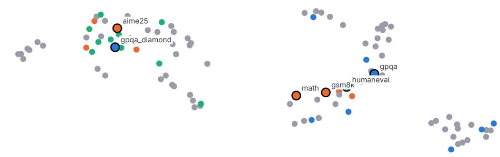  
Figure A2. C dataset, aggregated across 7 imputations.

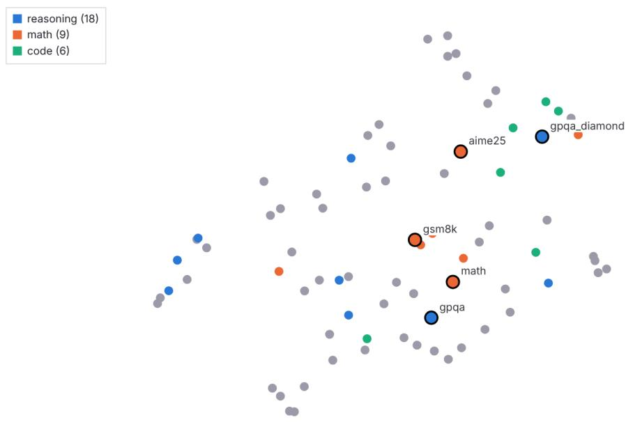  
Figure A3. C dataset, imputed with mean fill.

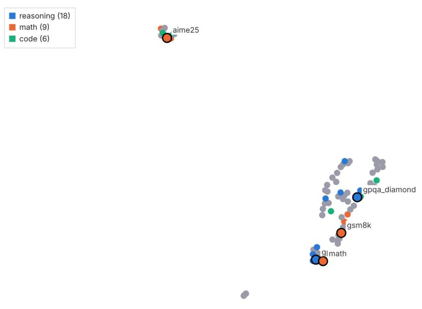  
Figure A4. C dataset, imputed with k-NN.

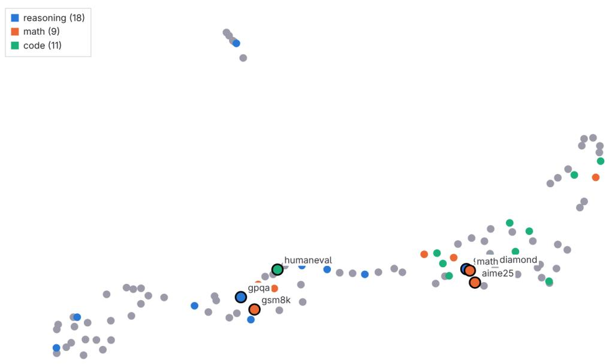  
Figure A5. C dataset, imputed with missForest.

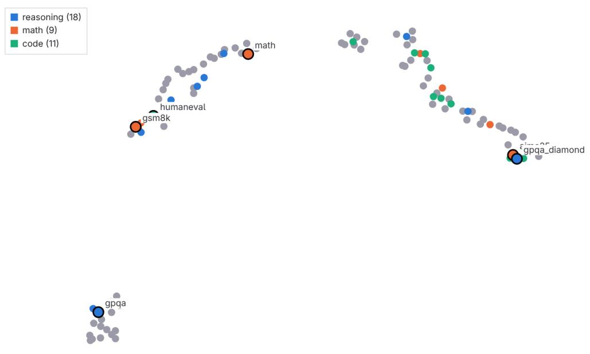  
Figure A6. C dataset, imputed with OneSidedMC.

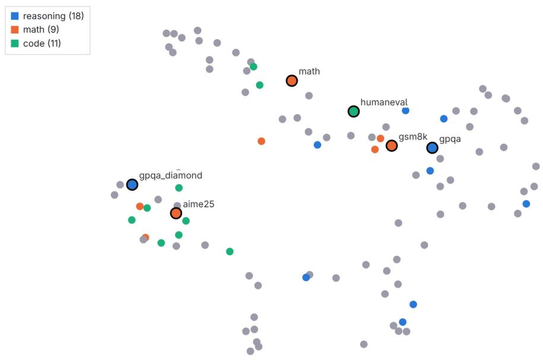  
Figure A7. C dataset, imputed with SoftImpute.

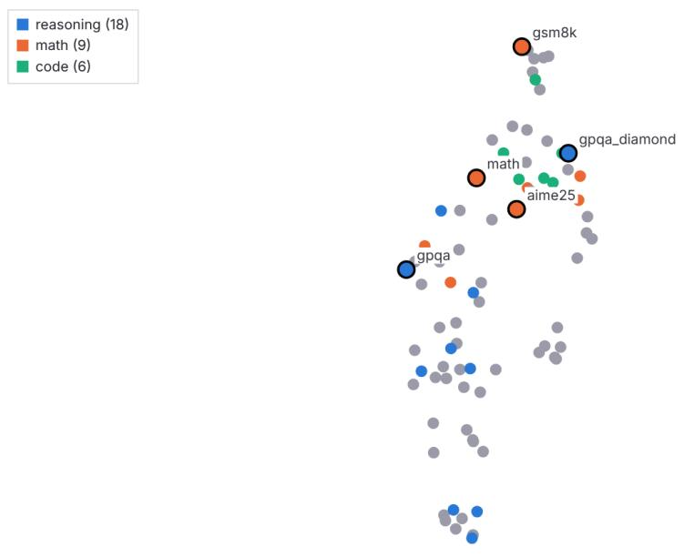  
Figure A8. C dataset, imputed with SoftImpute (corr.).

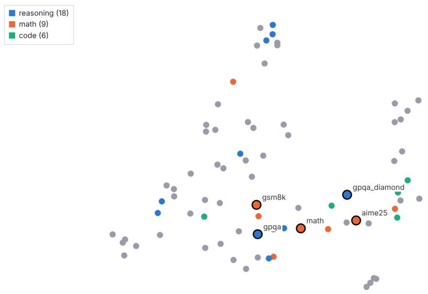  
Figure A9. C dataset, imputed with zero fill.

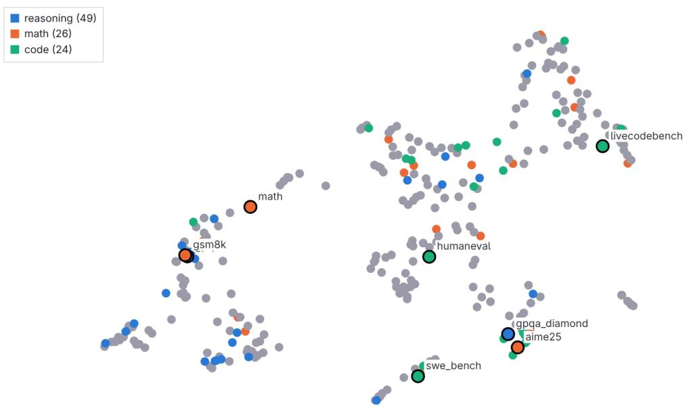  
Figure A10. S dataset, aggregated across 5 imputations.

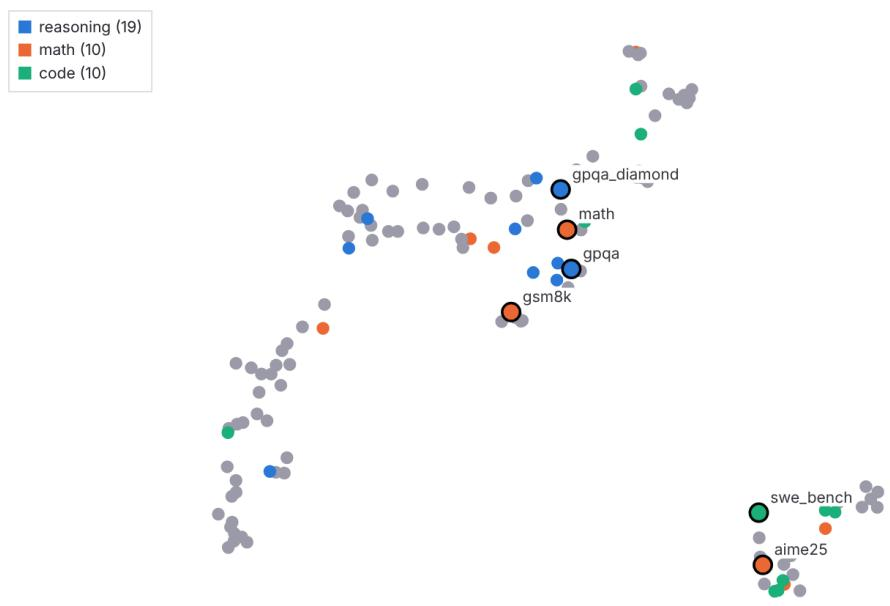  
Figure A11. S dataset, imputed with k-NN.

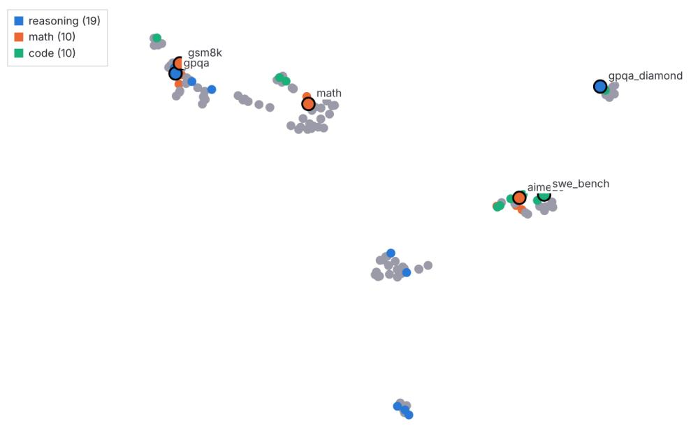  
Figure A12. S dataset, imputed with missForest.

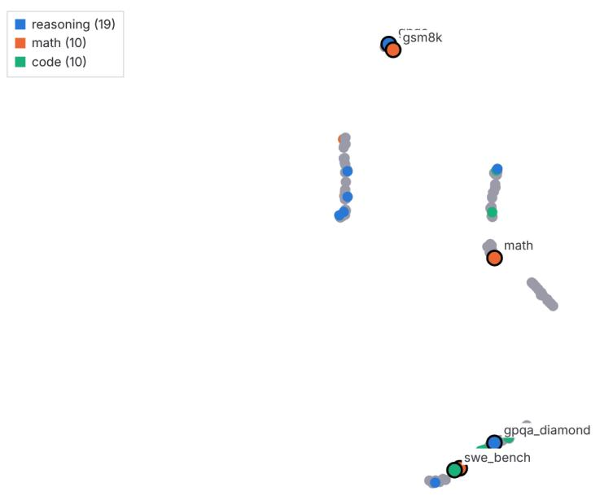  
Figure A13. S dataset, imputed with OneSidedMC.

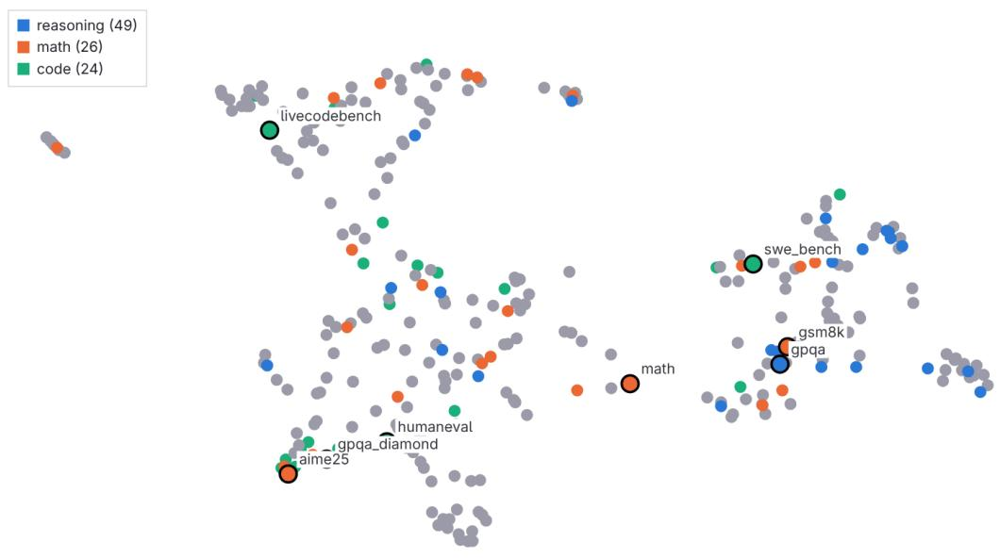  
Figure A14. S dataset, imputed with SoftImpute.

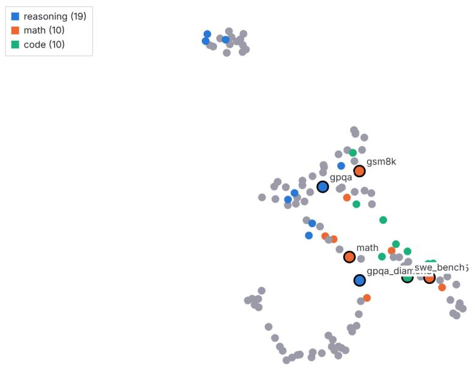  
Figure A15. S dataset, imputed with SoftImpute (corr.).

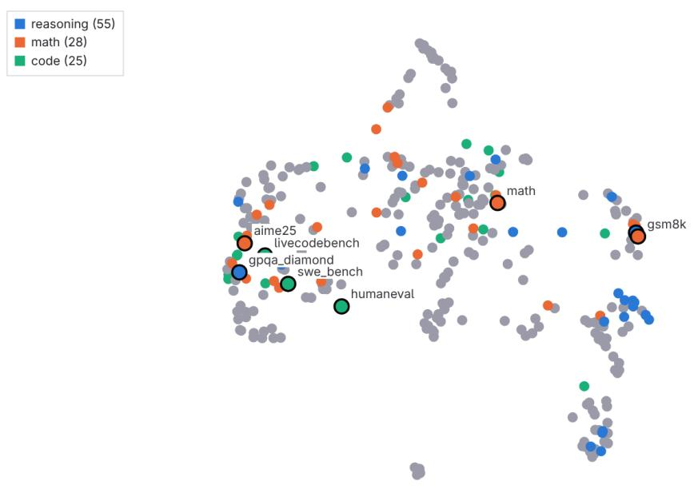  
Figure A16. R dataset, imputed with SoftImpute.

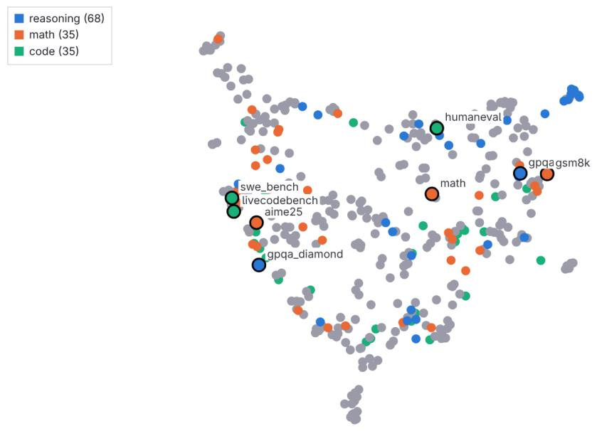  
Figure A17. Raw dataset, imputed with SoftImpute.