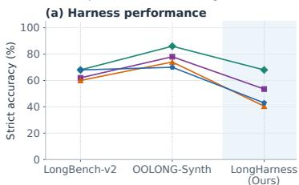
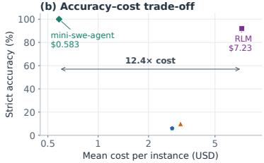
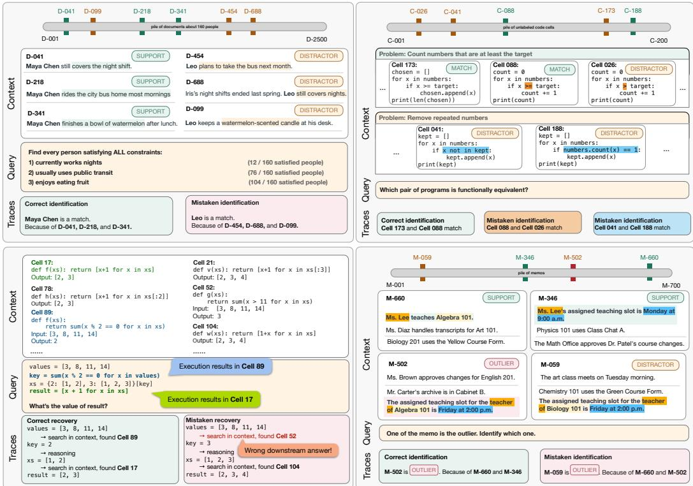
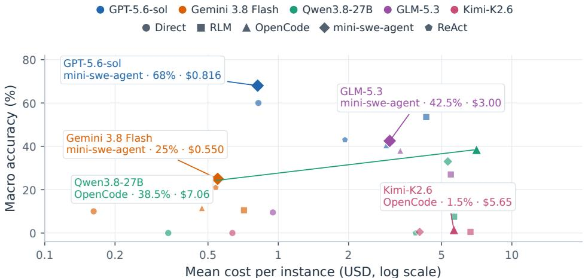
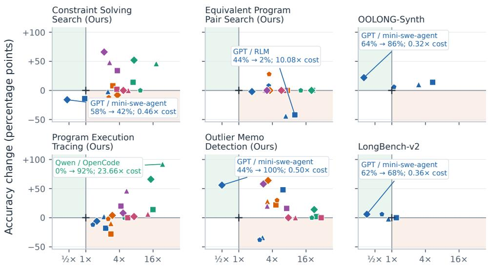

# LONGHARNESS BENCH: STRESS-TESTING LANGUAGEMODEL HARNESSES FOR LONG-CONTEXT REASONING

Quang Hieu Pham∗ A Thuy Duong Nguyen∗ A Jocelyn Qiaochu Chen† AM Xi Ye† AM

AUniversity of Alberta MAlberta Machine Intelligence Institute (Amii)

{quanghieupham, thuyduongnguyen, jocelyn.chen, xi.ye}@ualberta.ca € https://stringnlplab.github.io/longharness/

## ABSTRACT

Language-model (LM) harnesses enable LMs to operate effectively over long contexts using additional compute. However, existing long-context evaluations are insufficient for distinguishing modern harnesses, reflected by saturated accuracy across harnesses and largely similar evaluation costs. In this paper, we introduce a benchmark for evaluating both the effectiveness and efficiency of long-context harnesses. Our tasks require diverse retrieval strategies, including lexical search and semantic matching, together with strategic and adaptive reasoning over global and local context. Much of the context is semantically relevant but only a small subset is useful at each step, creating both a challenging search problem and different accuracy–cost tradeoffs across processing strategies. For example, one task requires identifying every person satisfying several conditions using evidence scattered across documents; strategically checking the most selective condition first can narrow the search before verifying the remaining conditions. We evaluate multiple families of frontier language models with four state-of-the-art harnesses. Our benchmarks remain challenging even for strong model–harness combinations: the best reaches 68% macro-average accuracy across four evaluation suites. More importantly, we find that the same underlying model can exhibit markedly different efficiency under different harnesses. Our results establish efficiency as an important axis for long-context evaluation and provide a testbed for developing harnesses that process context strategically rather than exhaustively.

## 1 INTRODUCTION

Language-model (LM) harnesses extend a model’s ability to reason over long contexts through search, context slicing, tool use, and additional model calls (Yang et al., 2024; Zhang et al., 2025). These techniques can substantially improve performance on longcontext tasks while spending additional computation. The rapid progress in harness development expose two gaps in existing long-context evaluations. First, tasks that can be solved through simple retrieval or by processing context segments independently reveal little about a harness’s ability to adapt its strategy as reasoning unfolds. The increasingly saturated accuracy of strong model–harness combinations on these benchmarks further limits their ability to distinguish harness capabilities (Cao et al., 2026). Second, accuracy alone does not capture the computational cost of harness performance: systems built around the same model may achieve similar accuracy while consuming substantially different amounts of computation (Figure 1; bottom). Evaluating long-context harnesses therefore requires tasks that challenge adaptive reasoning, together with measures of the computation needed to solve them.

  
Figure 1: LONGHARNESS (ours) reveals harness differences in both accuracy and cost.

  
Figure 2: Examples from our benchmark. Top left: Constraint Solving Search combines evidence from documents. Top right: Equivalent Program Pair Search distinguishes equivalent programs from near matches. Bottom left: Program Execution Tracing requires reading prior outputs and matching code semantics. Bottom right: Outlier Memo Detection identifies a conflict using supporting memos.

We introduce LONGHARNESS, a benchmark comprising four diverse long-context tasks that require challenging retrieval and adaptive reasoning while admitting multiple solution strategies with different computational costs. Specifically, retrieval requires locating useful evidence among many semantically relevant candidates, where lexical overlap or semantic similarity alone cannot reliably identify the correct evidence. Reasoning requires combining information across the context over multiple steps, with intermediate findings often determining what to inspect next. These demands also create opportunities for efficiency: harnesses can strategically narrow their searches, prioritize informative evidence, and reuse intermediate results to avoid unnecessary processing.

For example, our Constraint Solving Search task (Figure 2, top left) asks agents to identify every person satisfying several conditions using evidence scattered across a large collection of documents. The task calls for both lexical and semantic search: entity names help locate passages about a candidate, while conditions such as “enjoying fruit” require recognizing evidence expressed in different terms, such as a “fondness for watermelon”. Since many people satisfy most but not all conditions, agents must combine evidence across documents and check each candidate against the full query. An exhaustive strategy could check every condition for every person, whereas a more selective strategy could first identify the condition satisfied by the fewest people, then verify the remaining conditions only for those candidates. Both approaches can reach the correct answer, but they require different amounts of processing, allowing the task to distinguish accuracy and efficiency across model–harness combinations.

We evaluate direct inference and four agentic harnesses—OpenCode, mini-swe-agent, RLM, and ReAct (Anomaly, 2026; Yang et al., 2024; Zhang et al., 2025; Yao et al., 2023)—on all four LONGHARNESS tasks. Our evaluation covers five models: GPT-5.6-sol, Gemini 3.8 Flash, GLM-5.3, Qwen3.8-27B, and Kimi-K2.6 (OpenAI, 2026; Zeng et al., 2026; Qwen Team, 2026; Moonshot AI, 2026). For comparison, we also evaluate GPT-5.6-sol configurations on OOLONG-Synth and LongBench-v2 (Bertsch et al., 2025; Bai et al., 2025). Figure 1 shows that, with GPT-5.6-sol as a backbone, harness accuracy varies more widely on LONGHARNESS than on LongBench-v2 or OOLONG-Synth (Figure 1a). On our Outlier Memo Detection task, RLM achieves accuracy comparable to mini-swe-agent but costs 12.4× as much per instance, revealing an efficiency difference hidden by accuracy alone (Figure 1b). The best configuration on our suite reaches 68% macro-average accuracy, and no harness leads across all four tasks. For GPT-5.6-sol, every harness helps on some tasks and hurts on others, while additional inference can sharply increase cost without improving accuracy. Compared with the two existing benchmarks, our suite more clearly reveals how harness choice affects both accuracy and computational cost. Further analysis reveals harness failures to reuse evidence, verify candidates, and reach an answer within budget. These findings highlight substantial room to improve the reliability and efficiency of long-context reasoning, and establish LONGHARNESS as a testbed for this research.

## 2 BACKGROUND AND MOTIVATION

We describe how language-model harnesses support long-context reasoning and discuss what existing benchmarks reveal about their capabilities. We then identify requirements for a more comprehensive evaluation of harness accuracy and efficiency, motivating the design of LONGHARNESS.

## 2.1 LANGUAGE-MODEL HARNESSES FOR LONG-CONTEXT REASONING

We use LM harness to mean the external control layer around a base model that manages its context, tools, and sequence of interactions (Huang et al., 2026). For long-context reasoning, a harness allows the model to process a large input through successive interactions, using the results of earlier steps to guide later ones. Coding-agent harnesses such as OpenCode and mini-swe-agent let models work with context stored in files, while RLM exposes the context as a programmatically accessible object that can be processed through recursive model calls (Anomaly, 2026; Yang et al., 2024; Zhang et al., 2025; Cao et al., 2026). These mechanisms can improve accuracy through additional model calls and repeated inspection of the context, but this extra processing also increases computational cost. Assessing their value therefore requires measuring both the accuracy they achieve and the computation they consume.

Harnesses enable flexible retrieval and reasoning. A harness lets a model choose how to access context according to its current information needs. Lexical search can locate known identifiers, while semantic retrieval can find relevant passages expressed in different terms. As reasoning progresses, the model can use intermediate findings to refine its searches and retain useful evidence for later subproblems. These choices allow different strategies for the same task: a model may inspect the context exhaustively or use a sequence of targeted searches to reach the answer with less computation.

## 2.2 EXISTING LONG-CONTEXT BENCHMARKS

We briefly review popular long-context benchmarks and discuss their limitations in evaluating LM harnesses. LongBench v2 and HELMET cover broad long-context applications (Bai et al., 2025; Yen et al., 2025). Their recall-oriented tasks emphasize finding a small number of relevant pieces of information and combining them through a few reasoning steps. Such tasks test evidence recovery, but place less emphasis on extensive reasoning in which intermediate findings repeatedly change what must be retrieved next. They therefore provide a limited test of a harness’s ability to adapt its retrieval strategy over a longer reasoning process.

LongProc and Oolong emphasize extended processing. LongProc (Ye et al., 2025) tests long procedural generation, but provides detailed procedures for models to execute. It emphasizes faithful execution, leaving strategy choice less directly tested. Oolong-Synth (Bertsch et al., 2025) requires aggregation across many pieces of information, but admits a broadly applicable divide-and-conquer strategy: classify individual records independently, then aggregate the results. This strategy processes context without repeatedly adapting retrieval to intermediate conclusions. Thus, both benchmarks impose substantial processing demands but provide limited coverage of tasks where difficult retrieval and strategic choices jointly determine accuracy and cost.

These gaps motivate tasks combining diverse, adaptive retrieval with extensive reasoning and multiple viable solution strategies. Such tasks test whether a harness can choose an effective approach that reduces computational cost while maintaining accuracy. Table 1 summarizes these properties.

<table><tr><td></td><td>LongBenchV2</td><td>HELMET</td><td>LongProc</td><td>Oolong</td><td>LONGHARNESS</td></tr><tr><td>Diverse, adaptive retrieval demand</td><td>2</td><td>2</td><td>×</td><td>X</td><td></td></tr><tr><td>Semantically confusable evidence</td><td>X</td><td>√</td><td>2</td><td>2</td><td>√</td></tr><tr><td>Extensive reasoning steps</td><td>X</td><td>X</td><td>L</td><td>√</td><td>√</td></tr><tr><td>Step-dependent retrieval</td><td>X</td><td>X</td><td>」</td><td>X</td><td>7</td></tr><tr><td>Multiple strategies with different costs</td><td>X</td><td>2</td><td>X</td><td>2</td><td>7</td></tr><tr><td>Wide range of SoTA system accuracy</td><td>X</td><td>X</td><td>X</td><td>X</td><td>√</td></tr><tr><td>Wide range of SoTA system cost</td><td>X</td><td>X</td><td>X</td><td>2</td><td></td></tr></table>

Table 1: Comparison of long-context benchmarks along properties relevant to evaluating LM harnesses. ✓: supported; ∼: partially supported; ×: not supported. Diverse, adaptive retrieval demand means choosing an appropriate way to access context, such as lexical search, semantic retrieval, or direct reading, as information needs change during reasoning. Step-dependent retrieval means that intermediate findings determine what must be retrieved next. The final two rows indicate whether model–harness configurations are widely separated in accuracy and cost.

## 3 TASKS IN LONGHARNESS

We first outline our general design desiderata, then introduce the four tasks and their instructions.   
Appendix B provides the detailed construction procedures.

Design Desiderata. Our design follows the five task properties in Table 1. To challenge both retrieval and reasoning, tasks should require diverse, adaptive retrieval, with agents choosing among lexical search, semantic retrieval, and direct reading as their information needs change. Contexts should contain semantically confusable evidence that requires verification, and solutions should involve extensive reasoning with intermediate findings guiding subsequent retrieval.

To expose differences in efficiency, tasks should also admit multiple solution strategies with different computational costs. Selective search and reuse of intermediate results should offer cheaper alternatives to exhaustive processing. Together, these requirements aim to reveal differences in accuracy and computational cost across model–harness combinations, corresponding to the final two rows of Table 1. Each task description below explains how its construction meets these requirements.

## 3.1 CONSTRAINT SOLVING SEARCH.

Given documents describing a group of people, the agent must find every person satisfying all conditions in a query. Each instance contains roughly 120K tokens of varied documents about 160 people and a query with three to five conditions, such as habits, current circumstances, or relationships with others. Exactly five people qualify, but their evidence is scattered across documents and mixed with close counterexamples. In Figure 2 (top left), Maya’s night work, transit habit, and fruit eating appear in separate passages, whereas Leo’s planned bus trip and watermelon-scented candle do not establish the corresponding habits. The answer must contain exactly the five qualifying IDs.

An efficient strategy first identifies the condition satisfied by the fewest people, then checks the remaining conditions only for those candidates. We deliberately include one selective condition and one common condition without revealing which is which, along with people who satisfy all but one condition. A solver can instead check every condition for all 160 people, but this requires substantially more retrieval and reasoning. The task tests whether a harness can interpret evidence precisely and narrow its candidate set through a useful search order before full verification.

## 3.2 EQUIVALENT PROGRAM PAIR SEARCH.

Given a collection of programs, the agent must identify every pair that produces the same outputs for the same valid inputs. Each instance contains roughly 100K tokens of code across 200 Python programs adapted from APPS (Hendrycks et al., 2021). Program statements and visible input–output examples are omitted, and each correct implementation is surrounded by behaviorally different mutants that solve an apparently similar problem. Matching programs can therefore look less alike than incorrect candidates. The required output is the complete set of matching ID pairs; the number of pairs is not disclosed. Our answer key treats two programs as matching when both pass the tests for the original problem, which does not prove equivalence on every possible input.

An efficient strategy first infers the purpose of each program and groups likely matches, then uses distinguishing inputs to eliminate behaviorally different variants within each group. In Figure 2 (top right), Cells 173 and 088 count values greater than or equal to a target, whereas Cell 026 counts only values strictly greater than it; an input containing the target separates them. Grouping avoids comparing all program pairs but leaves many near-matches. The task therefore tests whether a harness can narrow candidates in stages and reserve detailed verification for the most plausible pairs.

## 3.3 PROGRAM EXECUTION TRACING.

This task (Figure 2, bottom left) asks the agent to recover the result of an eight-step query program from 320 shuffled records of previous Python computations. Each cell records its ID, function, example call, and output. For every query step, the agent must find a cell whose function is semantically equivalent and whose recorded call uses the required input. Earlier outputs determine later inputs, making retrieval step-dependent. Exact input values can narrow the search through literal matching, but deliberately confusable functions may agree on the displayed example while differing on other inputs. The answer contains the eight selected cell IDs and the exact final result in JSON.

A solver can recompute each query step and locate supporting cells, or use each recovered output as the next search key, verify the matching function, and reuse its result. The latter strategy avoids repeating computations already present in the context, but requires careful state tracking and semantic verification at every step. A wrong match also changes later search keys and redirects the remaining trace. The task tests whether a harness can reliably reuse prior computation.

## 3.4 OUTLIER MEMO DETECTION.

The agent must identify memos whose claims contradict relationships established elsewhere in the collection. Each instance contains 700 labeled memos with 2,500 statements about people, organizations, objects, and their relationships. Exactly 15 memos contain a conflicting claim, but no contradiction is visible in isolation. In Figure 2 (bottom right), one memo says that Ms. Lee teaches Algebra 101 and another assigns her Monday at 9 a.m.; together, they contradict a memo placing the course teacher on Friday at 2 p.m. Paraphrases and closely related but consistent claims make topical similarity insufficient. The answer must contain exactly the 15 conflicting memo IDs.

An efficient strategy reads the packet once, organizes its statements into a reusable table or graph of relationships, and combines pairs of facts to check every derived claim. This representation lets the solver reuse the same evidence across many checks. A less efficient strategy searches separately for evidence related to each suspicious claim. This can reread the same memos and miss contradictions that become apparent only after information from multiple memos is combined. The task therefore exposes the cost of repeated local retrieval relative to building a global structure once.

## 4 RESULTS

Our evaluation examines whether LONGHARNESS challenges current model–harness combinations and reveals differences in their computational efficiency.

## 4.1 EXPERIMENTAL SETUP

Models and harnesses. We evaluate GPT-5.6-sol, Gemini 3.8 Flash, Qwen3.8-27B, GLM-5.3, and Kimi-K2.6 using direct long-context inference and four agentic harnesses: RLM, OpenCode, mini-swe-agent, and ReAct (Yao et al., 2023). GPT-5.6-sol, Gemini 3.8 Flash, and GLM-5.3 use high reasoning effort; Qwen3.8-27B uses medium effort; and Kimi-K2.6 uses its reasoning-enabled mode. Our ReAct harness exposes custom tools for semantic search, batched nearest-neighbor retrieval and document reading. We use BAAI/bge-m3 (Chen et al., 2024) as the embedding model for ReAct.

Evaluation protocol. Each instance has a 3M-token budget, counting cumulative input and output across model calls. We report task-specific exact accuracy. Program Execution Tracing requires both the exact final query result and the exact cited cells. Outlier Memo Detection requires the exact set of 15 memo IDs; Constraint Solving Search, the exact person-ID set; and Equivalent Program Pair Search, the exact set of five unordered pairs. Table 2 reports accuracy and estimated cost per instance. Appendix A reports mean input and output tokens; Appendix C lists the API rates used to estimate cost.

## 4.2 MAIN RESULTS

The benchmark remains challenging. The best configuration, GPT-5.6-sol with mini-swe-agent, reaches only 68% macro-average accuracy (Table 2). The strongest non-GPT configuration (GLM-5.3 with mini-swe-agent) reaches 42.5%, while Kimi-K2.6 never exceeds 1.5%. Difficulty also varies by task: the best accuracy ranges from 100% on Outlier Memo Detection to 52% on Equivalent Program Pair Search, and no configuration leads across all four tasks.

Similar accuracy can have different costs. For a fixed model, comparable accuracy can involve substantially different resource use. On Program Execution Tracing, GPT-5.6-sol direct inference and OpenCode reach 94% and 96% accuracy, respectively, but use 0.121M and 1.29M input tokens and cost \$0.648 and \$1.37 per instance. On Constraint Solving Search, direct inference reaches 58% at \$0.690, compared with 56% at \$1.72 for OpenCode. Thus, small differences in accuracy can accompany much larger differences in tokens and cost. Figure 3 compares macro accuracy and cost, while Figure 4 shows per-task changes relative to direct inference.

## 4.3 MODEL–HARNESS INTERPLAY

Harness gains depend on the model and task. Harnesses can perform substantially worse than direct inference, even when they help the same model elsewhere. For GPT-5.6-sol, OpenCode slightly improves Program Execution Tracing accuracy from 94% to 96%, but reduces accuracy from 44% to 10% on Outlier Memo Detection and from 44% to 0% on Equivalent Program Pair Search. Mini-swe-agent attains the highest macro accuracy (68%, versus 60% for direct inference) by improving Outlier Memo Detection from 44% to 100%, yet it lowers Constraint Solving Search from 58% to 42%. The preferred harness varies by task; none uniformly improves on direct inference.

Weaker models tend to gain more from harnesses. Each model’s best harness generally yields larger gains for models with lower direct accuracy. Qwen3.8-27B rises from 0% direct accuracy to 38.5%, and GLM-5.3 rises from 9.5% to 42.5%, corresponding to gains of 38.5 and 33 percentage points. Gemini 3.8 Flash improves by 15 points, from 10% to 25%, whereas GPT-5.6-sol improves by 8 points, from 60% to 68%. These gains substantially narrow the gap between model families: GLM-5.3 with mini-swe-agent (42.5%) and Qwen3.8-27B with OpenCode (38.5%) are comparable to GPT-5.6-sol with OpenCode (40.5%) or ReAct (43.0%), despite their much lower direct accuracy.

More inference does not ensure success. Several configurations cost more while achieving lower accuracy. On Equivalent Program Pair Search, GPT-5.6-sol RLM reaches 2% at a reported cost of \$7.86 per instance, compared with 44% at \$0.780 for direct inference and 52% at \$2.68 for ReAct. On Outlier Memo Detection, GPT-5.6-sol RLM reaches 92% at \$7.23, while mini-swe-agent reaches 100% at \$0.583. Additional inference is neither necessary nor sufficient for higher accuracy.

## 4.4 HARNESS MECHANISMS AND TRADE-OFFS

Harnesses use extra model calls to reduce the context considered at each step. Figure 4 shows that the benefit depends on how much these calls simplify the remaining work.

File-and-shell agents: OpenCode and mini-swe-agent. File and shell access supports both targeted retrieval and scripted verification, with different accuracy–cost trade-offs. On Program Execution Tracing, OpenCode uses each step’s recorded output to search for cells that take that value as input, then verifies which cell implements the next query step. With GPT-5.6-sol, this raises accuracy only from 94% to 96% over an already strong direct-inference baseline, while increasing cost from \$0.648 to \$1.37. On Outlier Memo Detection, mini-swe-agent reduces repeated model reading by collecting facts into a table and using a local script to combine them and check claims. With the same model, it reaches 100% accuracy at \$0.583, compared with 44% at \$1.17 for direct inference. OpenCode often rereads the packet or uses separate model calls to audit overlapping memos, reaching only 10% at \$3.11. Targeted retrieval thus offers a small accuracy gain on execution tracing, while scripted verification improves both accuracy and cost on memo detection.

Table 2: Exact accuracy and estimated cost across four suites. Each cell reports accuracy (%) followed by USD per-instance cost in parentheses; macro averages the four task accuracies and per-task mean costs. Appendix A gives token counts and Appendix C gives the API rates.
<table><tr><td>Model</td><td>Harness</td><td>Constraint</td><td>Memos</td><td>Program</td><td>Pairs</td><td>Macro avg.</td></tr><tr><td>GPT-5.6-sol</td><td>Direct</td><td>58% ($0.690)</td><td>44% ($1.17)</td><td>94% ($0.648)</td><td>44% ($0.780)</td><td>60.0% ($0.822)</td></tr><tr><td></td><td>RLM</td><td>44% ($0.659)</td><td>92% ($7.23)</td><td>76% ($1.47)</td><td>2% ($7.86)</td><td>53.5% ($4.30)</td></tr><tr><td></td><td>OpenCode</td><td>56% ($1.72)</td><td>10% ($3.11)</td><td>96% ($1.37)</td><td>0% ($5.41)</td><td>40.5% ($2.90)</td></tr><tr><td></td><td>mini-swe-agent</td><td>42% ($0.320)</td><td>100% ($0.583)</td><td>88% ($1.02)</td><td>42% ($1.34)</td><td>68.0% ($0.816)</td></tr><tr><td></td><td>ReAct</td><td>32% ($1.40)</td><td>6% ($2.77)</td><td>82% ($0.866)</td><td>52% ($2.68)</td><td>43.0% ($1.93)</td></tr><tr><td>GLM-5.3</td><td>Direct</td><td>0% ($0.728)</td><td>0% ($1.09)</td><td>38% ($0.785)</td><td>0% ($1.19)</td><td>9.5% ($0.948)</td></tr><tr><td></td><td>RLM</td><td>34% ($2.67)</td><td>16% ($7.84)</td><td>58% ($3.34)</td><td>0% ($8.06)</td><td>27.0% ($5.48)</td></tr><tr><td></td><td>OpenCode</td><td>48% ($1.94)</td><td>20% ($3.52)</td><td>84% ($4.22)</td><td>0% ($3.64)</td><td>38.0% ($3.33)</td></tr><tr><td></td><td>mini-swe-agent</td><td>66% ($1.55)</td><td>58% ($3.00)</td><td>46% ($3.65)</td><td>0% ($3.80)</td><td>42.5% ($3.00)</td></tr><tr><td></td><td>ReAct</td><td>14% ($2.78)</td><td>0% ($4.12)</td><td>34% ($2.59)</td><td>4% ($3.26)</td><td>13.0% ($3.19)</td></tr><tr><td>Qwen3.8-27B</td><td>Direct</td><td>0% ($0.356)</td><td>0% ($0.292)</td><td>0% ($0.363)</td><td>0% ($0.341)</td><td>0.0% ($0.338)</td></tr><tr><td></td><td>RLM</td><td>14% ($2.50)</td><td>2% ($7.23)</td><td>14% ($5.78)</td><td>0% ($7.13)</td><td>7.5% ($5.66)</td></tr><tr><td></td><td>OpenCode</td><td>46% ($6.50)</td><td>16% ($6.32)</td><td>92% ($8.59)</td><td>0% ($6.83)</td><td>38.5% ($7.06)</td></tr><tr><td></td><td>mini-swe-agent</td><td>52% ($2.60)</td><td>14% ($6.54)</td><td>66% ($5.30)</td><td>0% ($6.84)</td><td>33.0% ($5.32)</td></tr><tr><td></td><td>ReAct</td><td>0% ($3.37)</td><td>0% ($5.93)</td><td>0% ($1.79)</td><td>0% ($4.39)</td><td>0.0% ($3.87)</td></tr><tr><td>Gemini 3.8 Flash</td><td>Direct</td><td>12% ($0.166)</td><td>0% ($0.158)</td><td>28% ($0.170)</td><td>0% ($0.154)</td><td>10.0% ($0.162)</td></tr><tr><td></td><td>RLM</td><td>20% ($0.505)</td><td>22% ($0.729)</td><td>0% ($0.478)</td><td>0% ($1.14)</td><td>10.5% ($0.713)</td></tr><tr><td></td><td>OpenCode</td><td>0% ($0.439)</td><td>28% ($0.515)</td><td>18% ($0.478)</td><td>0% ($0.452)</td><td>11.5% ($0.471)</td></tr><tr><td></td><td>mini-swe-agent</td><td>4% ($0.611)</td><td>64% ($0.528)</td><td>32% ($0.507)</td><td>0% ($0.554)</td><td>25.0% ($0.550)</td></tr><tr><td></td><td>ReAct</td><td>0% ($0.428)</td><td>30% ($0.764)</td><td>26% ($0.428)</td><td>28% ($0.538)</td><td>21.0% ($0.540)</td></tr><tr><td>Kimi-K2.6</td><td>Direct</td><td>0% ($0.670)</td><td>0% ($0.546)</td><td>0% ($0.696)</td><td>0% ($0.631)</td><td>0.0% ($0.636)</td></tr><tr><td></td><td>RLM</td><td>2% ($2.41)</td><td>0% ($16.3)</td><td>0% ($3.92)</td><td>0% ($3.96)</td><td>0.5% ($6.65)</td></tr><tr><td></td><td>OpenCode</td><td>0% ($3.86)</td><td>0% ($5.64)</td><td>6% ($8.99)</td><td>0% ($4.10)</td><td>1.5% ($5.65)</td></tr><tr><td></td><td>mini-swe-agent</td><td>0% ($3.15)</td><td>0% ($4.22)</td><td>2% ($5.08)</td><td>0% ($3.65)</td><td>0.5% ($4.03)</td></tr><tr><td></td><td>ReAct</td><td>0% ($3.14)</td><td>0% ($2.72)</td><td>0% ($3.42)</td><td>0% ($2.16)</td><td>0.0% ($2.86)</td></tr></table>

  
Figure 3: Macro-average accuracy and estimated cost across the four tasks (Table 2). Color denotes model; shape denotes harness. Callouts and larger markers mark each model’s best accuracy. ReAct appears where available.

Programmatic decomposition: RLM. RLM filters the long prompt into smaller pieces, sends them through additional sub-model calls, and asks the main model to combine the results. On Outlier Memo Detection, this recovers many outliers (92%) but costs \$7.23, versus 100% at \$0.583 for mini-swe-agent, which checks the packet with one local program. On Equivalent Program Pair Search, RLM uses its subcalls to infer each program’s purpose and form broad problem families.

  
Cost relative to direct inference (log scale)  
Figure 4: Harness effects relative to direct inference on OOLONG-Synth, LongBench-v2, and our suites. External benchmarks use GPT-5.6-sol. The reference is zero accuracy change and 1× cost. Green denotes higher accuracy at lower cost; pink denotes lower accuracy at higher cost.

This is a useful first filter, but our construction places many behaviorally different mutants in each family. An efficient solver must then use distinguishing inputs to prune each family before verifying the remaining pairs. RLM spends much of its recursion on the initial grouping and reaches the final comparison with too many candidates, yielding 2% at \$7.86 versus 44% at \$0.780 for direct inference. Here decomposition reduces the context per call without sufficiently reducing the final decision space.

Embedding retrieval: ReAct. Semantic retrieval is most useful when a retrieved item is itself a plausible comparison candidate. This holds in Equivalent Program Pair Search: querying with one program can surface stylistically different implementations with the same apparent purpose, turning a search over 200 programs into a smaller neighborhood. The model must still reject near-mutants, but this shortlist raises GPT-5.6-sol from 44% at \$0.780 to 52% at \$2.68. By contrast, our Outlier Memo Detection task cannot be solved by judging each memo in isolation. The incorrect memo is revealed only by combining facts from two other memos. Similarity search often returns related memos without completing this evidence chain or checking every claim. ReAct therefore reaches only 6% at \$2.77, below direct inference at 44% and \$1.17.

Across these examples, the value of additional inference depends on how it organizes subsequent work. Targeted searches, reusable fact tables, and smaller candidate sets support efficient verification; repeated reading and broad candidate lists can add cost while leaving the core reasoning unresolved.

## 4.5 COMPARISON WITH EXISTING LONG-CONTEXT BENCHMARKS

Figure 4 compares GPT-5.6-sol on our suite with 50 OOLONG-Synth 128K examples and a 50-example, 90K– 128K LongBench-v2 subset (Bertsch et al., 2025; Bai et al., 2025); Table 3 gives their benchmark-wide averages. Existing benchmarks produce a relatively simple picture of harness performance. On OOLONG-Synth, every tested agentic harness improves over direct reading, with accuracy ranging from 70% to 86% versus 64% for direct reading. On LongBench-v2, all five configurations lie within a narrow 60–68% range. Despite cost differences, these

Table 3: GPT-5.6-sol on existing longcontext benchmarks. Each cell reports accuracy and average USD per instance in parentheses.
<table><tr><td>Harness</td><td>OOLONG-Synth</td><td>LongBench-v2</td></tr><tr><td>Direct</td><td>64% ($0.686)</td><td>62% ($0.532)</td></tr><tr><td>RLM</td><td>78% ($3.70)</td><td>62% ($0.641)</td></tr><tr><td>OpenCode</td><td>74% ($2.08)</td><td>60% ($0.463)</td></tr><tr><td>mini-swe-agent</td><td>86% ($0.217)</td><td>68% ($0.190)</td></tr><tr><td>ReAct</td><td>70% ($0.751)</td><td>68% ($0.354)</td></tr></table>

benchmarks show either uniformly positive accuracy gains or weak separation between harnesses.

Across our four tasks, every harness both helps and hurts GPT-5.6-sol relative to direct reading, spanning all four accuracy–cost regions in Figure 4. This variation reveals which task demands match a harness’s processing strategy and when extra calls fail to simplify the work.

The comparison also shows that context length alone does not determine processing demand. Under a similar 128K-scale context budget, mini-swe-agent reaches 68% on our suite at \$0.816 per instance. It reaches the same accuracy on LongBench-v2 at \$0.190 and 86% on OOLONG-Synth at \$0.217. Exact success has different meanings across the benchmarks, so these percentages are not a task-normalized measure of difficulty. Nevertheless, the lower accuracy ceiling and higher cost on our suite leave substantial room for future harnesses to improve both effectiveness and efficiency.

## 5 RELATED WORK

Long-context evaluation. Long Range Arena introduced a unified framework for evaluating models on long inputs (Tay et al., 2021). Subsequent benchmarks include broad suites covering multiple tasks and context lengths (Shaham et al., 2023; An et al., 2024; Bai et al., 2024; Zhang et al., 2024; Yen et al., 2025; Bai et al., 2025). More targeted evaluations test retrieval and sensitivity to evidence position (Liu et al., 2024; Kamradt, 2023; Hsieh et al., 2024), reasoning over scattered evidence (Song et al., 2025; Kuratov et al., 2024), and aggregation across many records (Bertsch et al., 2025; Lin et al., 2025). Others focus on following dependent procedural steps (Ye et al., 2025) or retrieving evidence that requires reasoning or distinguishing closely related candidates (Su et al., 2025; Modarressi et al., 2025; Luo et al., 2026). These settings differ in how much evidence is needed and how it is distributed throughout the context (Goldman et al., 2024). Our suite builds on these challenges by requiring verification of retrieved evidence to guide subsequent searches. It also admits multiple solution strategies with different computational costs, allowing us to evaluate both accuracy and efficiency.

Each of our four tasks extends an existing evaluation setting. QUEST retrieves sets of entities defined by implicit operations (Malaviya et al., 2023), while BrowseComp finds a single fact from several clues (Wei et al., 2025b). Constraint Solving Search finds every entity satisfying scattered conditions, with filtering order affecting computational cost. Logic Haystacks retrieves evidence for a specified contradiction (Sileo, 2026), and MAGIC judges a supplied context pair (Lee et al., 2025). Outlier Memo Detection instead finds every conflict by combining evidence across records.

EquiBench (Wei et al., 2025a) and SeqCoBench (Maveli et al., 2025) classify supplied program pairs. Equivalent Program Pair Search discovers all matching pairs while rejecting mutants with similar code but different behavior. CRUXEval predicts inputs or outputs for short standalone functions (Gu et al., 2024), while RepoReasoner traces outputs and calls across repository files (Wang et al., 2026). Program Execution Tracing traces dependent computations by retrieving semantically equivalent functions and reusing recorded outputs as subsequent inputs. Across these tasks, verifying plausible candidates guides what evidence to retrieve next.

LM harnesses as long-context processors. LM harnesses provide mechanisms for accessing and managing context across multiple interactions. ReAct interleaves reasoning with actions (Yao et al., 2023), and SWE-agent uses search and execution to navigate repositories (Yang et al., 2024). Other approaches manage the context itself: RLM recursively decomposes prompts stored outside the model’s context window (Zhang et al., 2025), MemGPT manages memory across tiers (Packer et al., 2023), and Context as a Tool lets the model choose when to compress its context (Liu et al., 2026). Studies of these processing choices include LaRA, which compares retrieval with full-context processing (Li et al., 2025), and Cao et al. (2026), who evaluate coding agents as general long-context processors. Our suite provides a common setting for comparing harness strategies while holding the underlying model and task context fixed.

Efficiency-aware evaluation. Recent agent benchmarks evaluate both task success and resource use. MLAgentBench and AgencyBench study these dimensions on long-horizon tasks (Huang et al., 2024; Li et al., 2026). The Holistic Agent Leaderboard compares accuracy–cost trade-offs using Pareto frontiers (Kapoor et al., 2026). Studies of budget-aware reasoning and coding agents further show that using more tokens does not necessarily improve accuracy (Wang et al., 2024; Bai et al., 2026). We bring this efficiency-aware perspective to long-context harness evaluation, measuring accuracy, token use, and cost to test whether additional computation improves performance.

## 6 CONCLUSION

We introduced a suite for stress-testing long-context LM harnesses on four information-dense tasks with deterministic evaluation. Across five model families, we find no universally best harness: accuracy gains depend on the model and task, equally accurate systems can differ by more than an order of magnitude in cost, and additional inference compute does not reliably improve performance. Long-context systems should therefore be evaluated as model–harness combinations, with efficiency measured alongside accuracy. Our suite provides a testbed for developing harnesses that use additional compute selectively and productively.

## REFERENCES

Chenxin An, Shansan Gong, Ming Zhong, Xingjian Zhao, Mukai Li, Jun Zhang, Lingpeng Kong, and Xipeng Qiu. L-eval: Instituting standardized evaluation for long context language models. In Proceedings of the 62nd Annual Meeting of the Association for Computational Linguistics (Volume 1: Long Papers), pp. 14388–14411, 2024.

Anomaly. OpenCode. https://opencode.ai, 2026. Version 1.18.21.

Longju Bai, Zhemin Huang, Xingyao Wang, Jiao Sun, Rada Mihalcea, Erik Brynjolfsson, Alex Pentland, and Jiaxin Pei. How do ai agents spend your money? analyzing and predicting token consumption in agentic coding tasks. arXiv preprint arXiv:2604.22750, 2026.

Yushi Bai, Xin Lv, Jiajie Zhang, Hongchang Lyu, Jiankai Tang, Zhidian Huang, Zhengxiao Du, Xiao Liu, Aohan Zeng, Lei Hou, et al. Longbench: A bilingual, multitask benchmark for long context understanding. In Proceedings ofthe 62nd annual meeting ofthe associationfor computational linguistics (volume 1: Long papers), pp. 3119–3137, 2024.

Yushi Bai, Shangqing Tu, Jiajie Zhang, Hao Peng, Xiaozhi Wang, Xin Lv, Shulin Cao, Jiazheng Xu, Lei Hou, Yuxiao Dong, et al. Longbench v2: Towards deeper understanding and reasoning on realistic long-context multitasks. In Proceedings ofthe 63rd Annual Meeting ofthe Associationfor Computational Linguistics (Volume 1: Long Papers), pp. 3639–3664, 2025.

Amanda Bertsch, Adithya Pratapa, Teruko Mitamura, Graham Neubig, and Matthew R Gormley. Oolong: Evaluating long context reasoning and aggregation capabilities. arXiv preprint arXiv:2511.02817, 2025.

Weili Cao, Xunjian Yin, Bhuwan Dhingra, and Shuyan Zhou. Coding agents are effective long-context processors. arXiv preprint arXiv:2603.20432, 2026.

Jianlyu Chen, Shitao Xiao, Peitian Zhang, Kun Luo, Defu Lian, and Zheng Liu. M3-embedding: Multi-linguality, multi-functionality, multi-granularity text embeddings through self-knowledge distillation. In Findings of the association for computational linguistics: ACL 2024, pp. 2318–2335, 2024.

Omer Goldman, Alon Jacovi, Aviv Slobodkin, Aviya Maimon, Ido Dagan, and Reut Tsarfaty. Is it really long context if all you need is retrieval? towards genuinely difficult long context nlp. In Proceedings ofthe 2024 Conference on Empirical Methods in Natural Language Processing, pp. 16576–16586, 2024.

Alex Gu, Baptiste Roziere, Hugh James Leather, Armando Solar-Lezama, Gabriel Synnaeve, and Sida Wang. CRUXEval: A benchmark for code reasoning, understanding and execution. In Ruslan Salakhutdinov, Zico Kolter, Katherine Heller, Adrian Weller, Nuria Oliver, Jonathan Scarlett, and Felix Berkenkamp (eds.), Proceedings ofthe 41st International Conference on Machine Learning, volume 235 of Proceedings ofMachine Learning Research, pp. 16568–16621. PMLR, 21–27 Jul 2024. URL https://proceedings.mlr.press/v235/gu24c.html.

Dan Hendrycks, Steven Basart, Saurav Kadavath, Mantas Mazeika, Akul Arora, Ethan Guo, Collin Burns, Samir Puranik, Horace He, Dawn Song, and Jacob Steinhardt. Measuring coding challenge competence with APPS. In Thirty-fifth Conference on Neural Information Processing Systems Datasets and Benchmarks Track (Round 2), 2021. URL https://openreview. net/forum?id=sD93GOzH3i5.

Cheng-Ping Hsieh, Simeng Sun, Samuel Kriman, Shantanu Acharya, Dima Rekesh, Fei Jia, and Boris Ginsburg. RULER: What’s the real context size of your long-context language models? In First Conference on Language Modeling, 2024. URL https://openreview.net/forum? id=kIoBbc76Sy.

Qian Huang, Jian Vora, Percy Liang, and Jure Leskovec. MLAgentBench: Evaluating language agents on machine learning experimentation. In Ruslan Salakhutdinov, Zico Kolter, Katherine Heller, Adrian Weller, Nuria Oliver, Jonathan Scarlett, and Felix Berkenkamp (eds.), Proceedings ofthe 41st International Conference on Machine Learning, volume 235 of Proceedings ofMachine Learning Research, pp. 20271–20309. PMLR, 21–27 Jul 2024. URL https://proceedings. mlr.press/v235/huang24y.html.

Yue Huang, Wenjie Wang, Han Bao, Yuchen Ma, Xiaonan Luo, Yi Nian, Haomin Zhuang, Zheyuan Liu, Yue Zhao, and Xiangliang Zhang. Memoharness: Agent harnesses that learn from experience. arXiv preprint arXiv:2607.14159, 2026.

Greg Kamradt. Needle in a haystack - pressure testing llms. https://github.com/ gkamradt/needle-in-a-haystack, 2023.

Sayash Kapoor, Benedikt Stroebl, Peter Kirgis, Nitya Nadgir, Zachary Siegel, Boyi Wei, Tianci Xue, Ziru Chen, Felix Chen, Saiteja Utpala, et al. Holistic agent leaderboard: The missing infrastructure for ai agent evaluation. In International Conference on Learning Representations, volume 2026, pp. 98778–98849, 2026.

Yuri Kuratov, Aydar Bulatov, Petr Anokhin, Ivan Rodkin, Dmitry Sorokin, Artyom Sorokin, and Mikhail Burtsev. Babilong: Testing the limits of llms with long context reasoning-in-a-haystack. Advances in Neural Information Processing Systems, 37:106519–106554, 2024.

Jungyeon Lee, Lee Kangmin, and Taeuk Kim. MAGIC: A multi-hop and graph-based benchmark for inter-context conflicts in retrieval-augmented generation. In Christos Christodoulopoulos, Tanmoy Chakraborty, Carolyn Rose, and Violet Peng (eds.), Findings of the Association for Computational Linguistics: EMNLP 2025, pp. 8783–8803, Suzhou, China, November 2025. Association for Computational Linguistics. ISBN 979-8-89176-335-7. doi: 10.18653/v1/2025.findings-emnlp.466. URL https://aclanthology.org/2025.findings-emnlp.466/.

Keyu Li, Junhao Shi, Yang Xiao, Mohan Jiang, Jie Sun, Yunze Wu, Dayuan Fu, Shijie Xia, Xiaojie Cai, Tianze Xu, et al. Agencybench: Benchmarking the frontiers of autonomous agents in 1mtoken real-world contexts. In Proceedings of the 64th Annual Meeting of the Association for Computational Linguistics (Volume 1: Long Papers), pp. 7422–7440, 2026.

Kuan Li, Liwen Zhang, Yong Jiang, Pengjun Xie, Fei Huang, Shuai Wang, and Minhao Cheng. LaRA: Benchmarking retrieval-augmented generation and long-context LLMs – no silver bullet for LC or RAG routing. In Aarti Singh, Maryam Fazel, Daniel Hsu, Simon Lacoste-Julien, Felix Berkenkamp, Tegan Maharaj, Kiri Wagstaff, and Jerry Zhu (eds.), Proceedings of the 42nd International Conference on Machine Learning, volume 267 of Proceedings of Machine Learning Research, pp. 36846–36867. PMLR, 13–19 Jul 2025. URL https://proceedings.mlr. press/v267/li25dv.html.

Teng Lin, Yuyu Luo, Honglin Zhang, Jicheng Zhang, Chunlin Liu, Kaishun Wu, and Nan Tang. Mebench: Benchmarking large language models for cross-document multi-entity question answering. In Proceedings of the 2025 Conference on Empirical Methods in Natural Language Processing, pp. 1481–1494, 2025.

Nelson F Liu, Kevin Lin, John Hewitt, Ashwin Paranjape, Michele Bevilacqua, Fabio Petroni, and Percy Liang. Lost in the middle: How language models use long contexts. Transactions of the associationfor computational linguistics, 12:157–173, 2024.

Shukai Liu, Bo Jiang, Jian Yang, Yizhi Li, Jinyang Guo, Xianglong Liu, and Bryan Dai. Context as a tool: Context management for long-horizon swe-agents. In Findings ofthe Associationfor Computational Linguistics: ACL 2026, pp. 20604–20617, 2026.

Jason Luo, Saibilila Abudukelimu, Judy Song, Andrew Feng, Shivank Garg, Vasu Sharma, and Kevin Zhu. MUDDLE: Measuring understanding of documents under distractor and length effects. In COLM Workshop on Context Beyond the Window: Persistent Knowledge in Language Models, 2026. URL https://openreview.net/forum?id=9YS7tSPM9c.

Chaitanya Malaviya, Peter Shaw, Ming-Wei Chang, Kenton Lee, and Kristina Toutanova. Quest: A retrieval dataset of entity-seeking queries with implicit set operations. In Proceedings of the 61st Annual Meeting of the Association for Computational Linguistics (Volume 1: Long Papers), pp. 14032–14047, 2023.

Nickil Maveli, Antonio Vergari, and Shay B Cohen. What can large language models capture about code functional equivalence? In Findings of the Association for Computational Linguistics: NAACL 2025, pp. 6880–6918, 2025.

Ali Modarressi, Hanieh Deilamsalehy, Franck Dernoncourt, Trung Bui, Ryan A. Rossi, Seunghyun Yoon, and Hinrich Schuetze. Nolima: Long-context evaluation beyond literal matching. In Forty second International Conference on Machine Learning, 2025. URL https://openreview. net/forum?id=0OshX1hiSa.

Moonshot AI. Kimi-K2.6. https://huggingface.co/moonshotai/Kimi-K2.6, 2026.

OpenAI. GPT-5.6 Sol model. https://developers.openai.com/api/docs/models/ gpt-5.6-sol, 2026.

Charles Packer, Sarah Wooders, Kevin Lin, Vivian Fang, Shishir G Patil, Ion Stoica, and Joseph E Gonzalez. Memgpt: Towards llms as operating systems. arXiv preprint arXiv:2310.08560, 2023.

Qwen Team. Qwen3.8-Max: A new bar for coding and cowork, August 2026. URL https: //qwen.ai/blog?id=qwen3.8.

Uri Shaham, Maor Ivgi, Avia Efrat, Jonathan Berant, and Omer Levy. Zeroscrolls: A zero-shot bench mark for long text understanding. In Findings ofthe Associationfor Computational Linguistics: EMNLP 2023, pp. 7977–7989, 2023.

Damien Sileo. Logic haystacks: Probing llms’ long-context logical reasoning (without easily identifiable unrelated padding). In Proceedings of the 19th Conference of the European Chapter of the Associationfor Computational Linguistics (Volume 2: Short Papers), pp. 66–75, 2026.

Mingyang Song, Mao Zheng, and Xuan Luo. Counting-stars: A multi-evidence, position-aware, and scalable benchmark for evaluating long-context large language models. In Proceedings of the 31st International Conference on Computational Linguistics, pp. 3753–3763, 2025.

Hongjin Su, Howard Yen, Mengzhou Xia, Weijia Shi, Niklas Muennighoff, Han-yu Wang, Liu Haisu, Quan Shi, Zachary Siegel, Michael Tang, et al. Bright: A realistic and challenging benchmark for reasoning-intensive retrieval. In International Conference on Learning Representations, volume 2025, pp. 48941–48991, 2025.

Yi Tay, Mostafa Dehghani, Samira Abnar, Yikang Shen, Dara Bahri, Philip Pham, Jinfeng Rao, Liu Yang, Sebastian Ruder, and Donald Metzler. Long range arena : A benchmark for efficient transformers. In International Conference on Learning Representations, 2021. URL https: //openreview.net/forum?id=qVyeW-grC2k.

Junlin Wang, Siddhartha Jain, Dejiao Zhang, Baishakhi Ray, Varun Kumar, and Ben Athiwaratkun. Reasoning in token economies: Budget-aware evaluation of llm reasoning strategies. In Proceedings of the 2024 Conference on Empirical Methods in Natural Language Processing, pp. 19916–19939, 2024.

Yanlin Wang, Suiquan Wang, Yanli Wang, Bowen Zhang, Daya Guo, Jiachi Chen, and Zibin Zheng. Reporeasoner: Evaluating repository-level code reasoning ability of long-context language models. Proceedings ofthe ACM on Software Engineering, 3(FSE):2790–2812, 2026.

Anjiang Wei, Jiannan Cao, Ran Li, Hongyu Chen, Yuhui Zhang, Ziheng Wang, Yuan Liu, Thiago S. F. X. Teixeira, Diyi Yang, Ke Wang, and Alex Aiken. EquiBench: Benchmarking large language models’ reasoning about program semantics via equivalence checking. In Christos Christodoulopoulos, Tanmoy Chakraborty, Carolyn Rose, and Violet Peng (eds.), Proceedings of the 2025 Conference on Empirical Methods in Natural Language Processing, pp. 33868–33881, Suzhou, China, November 2025a. Association for Computational Linguistics. ISBN 979-8-89176- 332-6. doi: 10.18653/v1/2025.emnlp-main.1718. URL https://aclanthology.org/ 2025.emnlp-main.1718/.

Jason Wei, Zhiqing Sun, Spencer Papay, Scott McKinney, Jeffrey Han, Isa Fulford, Hyung Won Chung, Alex Tachard Passos, William Fedus, and Amelia Glaese. Browsecomp: A simple yet challenging benchmark for browsing agents. arXiv preprint arXiv:2504.12516, 2025b.

John Yang, Carlos Jimenez, Alexander Wettig, Kilian Lieret, Shunyu Yao, Karthik Narasimhan, and Ofir Press. Swe-agent: Agent-computer interfaces enable automated software engineering. Advances in Neural Information Processing Systems, 37:50528–50652, 2024.

Shunyu Yao, Jeffrey Zhao, Dian Yu, Nan Du, Izhak Shafran, Karthik R Narasimhan, and Yuan Cao. React: Synergizing reasoning and acting in language models. In The Eleventh International Conference on Learning Representations, 2023. URL https://openreview.net/forum? id=WE\_vluYUL-X.

Xi Ye, Fangcong Yin, Yinghui He, Joie Zhang, Howard Yen, Tianyu Gao, Greg Durrett, and Danqi Chen. Longproc: Benchmarking long-context language models on long procedural generation. In Second Conference on Language Modeling, 2025. URL https://openreview.net/ forum?id=ruWC5LIMSo.

Howard Yen, Tianyu Gao, Minmin Hou, Ke Ding, Daniel Fleischer, Peter Izsak, Moshe Wasserblat, and Danqi Chen. HELMET: How to evaluate long-context models effectively and thoroughly. In The Thirteenth International Conference on Learning Representations, 2025. URL https: //openreview.net/forum?id=293V3bJbmE.

Aohan Zeng, Xin Lv, Zhenyu Hou, Zhengxiao Du, Qinkai Zheng, Bin Chen, Da Yin, Chendi Ge, Chenghua Huang, Chengxing Xie, et al. Glm-5: from vibe coding to agentic engineering. arXiv preprint arXiv:2602.15763, 2026.

Alex L Zhang, Tim Kraska, and Omar Khattab. Recursive language models. arXiv preprint arXiv:2512.24601, 2025.

Xinrong Zhang, Yingfa Chen, Shengding Hu, Zihang Xu, Junhao Chen, Moo Hao, Xu Han, Zhen Thai, Shuo Wang, Zhiyuan Liu, and Maosong Sun. ∞Bench: Extending long context evaluation beyond 100K tokens. In Lun-Wei Ku, Andre Martins, and Vivek Srikumar (eds.), Proceedings ofthe 62nd Annual Meeting ofthe Associationfor Computational Linguistics (Volume 1: Long Papers), pp. 15262–15277, Bangkok, Thailand, August 2024. Association for Computational Linguistics. doi: 10.18653/v1/2024.acl-long.814. URL https://aclanthology.org/ 2024.acl-long.814/.

## A DETAILED RESULTS

Table 4: Detailed accuracy and efficiency on Constraint Solving Search (Constraint), Outlier Memo Detection (Memos), Program Execution Tracing (Program), and Equivalent Program Pair Search (Pairs). Macro accuracy averages the four task-level accuracies. Program uses the format-tolerant answer-and-citation rescore; its original strict-format scores remain in the task report.  
(a) Accuracy (%)
<table><tr><td>Model</td><td>Harness</td><td>Constraint</td><td>Memos</td><td>Program</td><td>Pairs</td><td>Macro avg.</td></tr><tr><td>GPT-5.6-sol</td><td>Direct</td><td>58%</td><td>44%</td><td>94%</td><td>44%</td><td>60.0%</td></tr><tr><td></td><td>RLM</td><td>44%</td><td>92%</td><td>76%</td><td>2%</td><td>53.5%</td></tr><tr><td></td><td>OpenCode</td><td>56%</td><td>10%</td><td>96%</td><td>0%</td><td>40.5%</td></tr><tr><td></td><td>mini-swe-agent</td><td>42%</td><td>100%</td><td>88%</td><td>42%</td><td>68.0%</td></tr><tr><td></td><td>ReAct</td><td>32%</td><td>6%</td><td>82%</td><td>52%</td><td>43.0%</td></tr><tr><td>GLM-5.3</td><td>Direct</td><td>0%</td><td>0%</td><td>38%</td><td>0%</td><td>9.5%</td></tr><tr><td></td><td>RLM</td><td>34%</td><td>16%</td><td>58%</td><td>0%</td><td>27.0%</td></tr><tr><td></td><td>OpenCode</td><td>48%</td><td>20%</td><td>84%</td><td>0%</td><td>38.0%</td></tr><tr><td></td><td>mini-swe-agent</td><td>66%</td><td>58%</td><td>46%</td><td>0%</td><td>42.5%</td></tr><tr><td></td><td>ReAct</td><td>14%</td><td>0%</td><td>34%</td><td>4%</td><td>13.0%</td></tr><tr><td>Qwen3.8-27B</td><td>Direct</td><td>0%</td><td>0%</td><td>0%</td><td>0%</td><td>0.0%</td></tr><tr><td></td><td>RLM</td><td>14%</td><td>2%</td><td>14%</td><td>0%</td><td>7.5%</td></tr><tr><td></td><td>OpenCode</td><td>46%</td><td>16%</td><td>92%</td><td>0%</td><td>38.5%</td></tr><tr><td></td><td>mini-swe-agent</td><td>52%</td><td>14%</td><td>66%</td><td>0%</td><td>33.0%</td></tr><tr><td></td><td>ReAct</td><td>0%</td><td>0%</td><td>0%</td><td>0%</td><td>0.0%</td></tr><tr><td>Gemini 3.8 Flash</td><td>Direct</td><td>12%</td><td>0%</td><td>28%</td><td>0%</td><td>10.0%</td></tr><tr><td></td><td>RLM</td><td>20%</td><td>22%</td><td>0%</td><td>0%</td><td>10.5%</td></tr><tr><td></td><td>OpenCode</td><td>0%</td><td>28%</td><td>18%</td><td>0%</td><td>11.5%</td></tr><tr><td></td><td>mini-swe-agent</td><td>4%</td><td>64%</td><td>32%</td><td>0%</td><td>25.0%</td></tr><tr><td></td><td>ReAct</td><td>0%</td><td>30%</td><td>26%</td><td>28%</td><td>21.0%</td></tr><tr><td>Kimi-K2.6</td><td>Direct</td><td>0%</td><td>0%</td><td>0%</td><td>0%</td><td>0.0%</td></tr><tr><td></td><td>RLM</td><td>2%</td><td>0%</td><td>0%</td><td>0%</td><td>0.5%</td></tr><tr><td></td><td>OpenCode</td><td>0%</td><td>0%</td><td>6%</td><td>0%</td><td>1.5%</td></tr><tr><td></td><td>mini-swe-agent</td><td>0%</td><td>0%</td><td>2%</td><td>0%</td><td>0.5%</td></tr><tr><td></td><td>ReAct</td><td>0%</td><td>0%</td><td>0%</td><td>0%</td><td>0.0%</td></tr></table>

(b) Efficiency: average input / output tokens (millions) and cost per instance

<table><tr><td></td><td></td><td colspan="3">Constraint</td><td colspan="3">Memos</td><td colspan="3">Program</td><td colspan="3">Pairs</td></tr><tr><td>Model</td><td>Harness</td><td>Input</td><td>Output</td><td>Cost</td><td>Input</td><td>Output</td><td>Cost</td><td>Input</td><td>Output</td><td>Cost</td><td>Input</td><td>Output</td><td>Cost</td></tr><tr><td>GPT-5.6-sol</td><td>Direct</td><td>0.107</td><td>0.0077</td><td>$0.690</td><td>0.0646</td><td>0.0440</td><td>$1.17</td><td>0.121</td><td>0.0026</td><td>$0.648</td><td>0.0818</td><td>0.0185</td><td>$0.780</td></tr><tr><td></td><td>RLM</td><td>0.250</td><td>0.0180</td><td>$0.659</td><td>0.745</td><td>0.283</td><td>$7.23</td><td>0.404</td><td>0.0285</td><td>$1.47</td><td>0.712</td><td>0.274</td><td>$7.86</td></tr><tr><td></td><td>OpenCode</td><td>1.80</td><td>0.0058</td><td>$1.72</td><td>2.49</td><td>0.0241</td><td>$3.11</td><td>1.29</td><td>0.0045</td><td>$1.37</td><td>2.75</td><td>0.0606</td><td>$5.41</td></tr><tr><td></td><td>mini-swe-agent</td><td>0.181</td><td>0.0070</td><td>$0.320</td><td>0.367</td><td>0.0133</td><td>$0.583</td><td>1.41</td><td>0.0058</td><td>$1.02</td><td>1.47</td><td>0.0223</td><td>$1.34</td></tr><tr><td></td><td>ReAct</td><td>1.28</td><td>0.0068</td><td>$1.40</td><td>2.54</td><td>0.0211</td><td>$2.77</td><td>0.636</td><td>0.0035</td><td>$0.866</td><td>1.43</td><td>0.0217</td><td>$2.68</td></tr><tr><td>GLM-5.3</td><td>Direct</td><td>0.110</td><td>0.0161</td><td>$0.728</td><td>0.0664</td><td>0.0640</td><td>$1.09</td><td>0.121</td><td>0.0170</td><td>$0.785 0.0818† 0.0655†</td><td></td><td></td><td>$1.19†</td></tr><tr><td></td><td>RLM</td><td>1.76</td><td>0.0524</td><td>$2.67</td><td>1.49</td><td>0.488</td><td>$7.84</td><td>2.02</td><td>0.0583</td><td>$3.34</td><td>2.02</td><td>0.384</td><td>$8.06</td></tr><tr><td></td><td>OpenCode</td><td>1.20</td><td>0.0307</td><td>$1.94</td><td>2.35</td><td>0.0568</td><td>$3.52</td><td>2.80</td><td>0.0555</td><td>$4.22</td><td>2.28</td><td>0.0700</td><td>$3.64</td></tr><tr><td></td><td>mini-swe-agent</td><td>1.09</td><td>0.0227</td><td>$1.55</td><td>1.91</td><td>0.0611</td><td>$3.00</td><td>3.21</td><td>0.0154</td><td>$3.65</td><td>2.64</td><td>0.0648</td><td>$3.80</td></tr><tr><td></td><td>ReAct</td><td>1.81</td><td>0.0360</td><td>$2.78</td><td>1.71</td><td>0.133</td><td>$4.12</td><td>1.73</td><td>0.0267</td><td>$2.59</td><td>1.47</td><td>0.0768</td><td>$3.26</td></tr><tr><td>Qwen3.8-27B</td><td>Direct</td><td>0.120</td><td>0.0077</td><td>$0.356</td><td>0.0704</td><td>0.0158</td><td>$0.292</td><td>0.133</td><td>0.0046</td><td>$0.363</td><td>0.0887</td><td>0.0162</td><td>$0.341</td></tr><tr><td></td><td>RLM</td><td>0.927</td><td>0.0272</td><td>$2.50</td><td>2.27</td><td>0.215</td><td>$7.23</td><td>2.09</td><td>0.0794</td><td>$5.78</td><td>1.68</td><td>0.398</td><td>$7.13</td></tr><tr><td></td><td>OpenCode</td><td>2.48</td><td>0.0455</td><td>$6.50</td><td>2.38</td><td>0.0575</td><td>$6.32</td><td>3.30</td><td>0.0542</td><td>$8.59</td><td>2.58</td><td>0.0563</td><td>$6.83</td></tr><tr><td></td><td>mini-swe-agent</td><td>0.968</td><td>0.0272</td><td>$2.60</td><td>2.28</td><td>0.119</td><td>$6.54</td><td>2.07</td><td>0.0237</td><td>$5.30</td><td>2.66</td><td>0.0330</td><td>$6.84</td></tr><tr><td></td><td>ReAct</td><td>1.27</td><td>0.0294</td><td>$3.37</td><td>1.80</td><td>0.198</td><td>$5.93</td><td>0.501</td><td>0.0737</td><td>$1.79</td><td>1.43</td><td>0.114</td><td>$4.39</td></tr><tr><td>Gemini 3.8 Flash Direct</td><td></td><td>0.116</td><td>0.0236</td><td>$0.166</td><td>0.0679</td><td>0.0293</td><td>$0.158</td><td>0.137</td><td>0.0201</td><td>$0.170</td><td>0.0961</td><td>0.0257</td><td>$0.154</td></tr><tr><td></td><td>RLM</td><td>2.51</td><td>0.0275</td><td>$0.505</td><td>2.65</td><td>0.0737</td><td>$0.729</td><td>2.56</td><td>0.0251</td><td>$0.478</td><td>2.66</td><td>0.168</td><td>$1.14</td></tr><tr><td></td><td>OpenCode</td><td>2.58</td><td>0.0174</td><td>$0.439</td><td>2.52</td><td>0.0395</td><td>$0.515</td><td>2.59</td><td>0.0318</td><td>$0.478</td><td>2.78</td><td>0.0234</td><td>$0.452</td></tr><tr><td></td><td>mini-swe-agent</td><td>2.74</td><td>0.0415</td><td>$0.611</td><td>2.23</td><td>0.0497</td><td>$0.528</td><td>2.62</td><td>0.0372</td><td>$0.507</td><td>2.81</td><td>0.0415</td><td>$0.554</td></tr><tr><td></td><td>ReAct</td><td>2.75</td><td>0.0137</td><td>$0.428</td><td>2.10</td><td>0.102</td><td>$0.764</td><td>2.54</td><td>0.0216</td><td>$0.428</td><td>1.80</td><td>0.0491</td><td>$0.538</td></tr><tr><td>Kimi-K2.6</td><td>Direct</td><td>0.110</td><td>0.0080</td><td>$0.670</td><td>0.0653</td><td>0.0164</td><td>$0.546</td><td>0.120</td><td>0.0060</td><td>$0.696</td><td>0.0819</td><td>0.0164</td><td>$0.631</td></tr><tr><td></td><td>RLM</td><td>1.42</td><td>0.0491</td><td>$2.41</td><td>2.21</td><td>1.04</td><td>$16.3</td><td>2.20</td><td>0.0967</td><td>$3.92</td><td>1.48</td><td>0.143</td><td>$3.96</td></tr><tr><td></td><td>OpenCode</td><td>2.51</td><td>0.0377</td><td>$3.86</td><td>2.67</td><td>0.123</td><td>$5.64</td><td>5.83</td><td>0.0987</td><td>$8.99</td><td>2.65</td><td>0.0474</td><td>$4.10</td></tr><tr><td></td><td>mini-swe-agent</td><td>2.46</td><td>0.0273</td><td>$3.15</td><td>1.99</td><td>0.132</td><td>$4.22</td><td>4.30</td><td>0.0242</td><td>$5.08</td><td>2.59</td><td>0.0509</td><td>$3.65</td></tr><tr><td></td><td>ReAct</td><td>2.39</td><td>0.0196</td><td>$3.14</td><td>1.82</td><td>0.0222</td><td>$2.72</td><td>2.48</td><td>0.0287</td><td>$3.42</td><td>1.36</td><td>0.0171</td><td>$2.16</td></tr></table>

## B DATASET CONSTRUCTION DETAILS

Common construction principle. For each instance, we first construct the underlying task as structured data. This consists of predicate support sets for Constraint Solving Search, a typed relation graph for Outlier Memo Detection, a computation graph for Program Execution Tracing, or executable program families for Equivalent Program Pair Search. These hidden records determine the answer before the public context is written. A task-specific solver or execution engine computes the gold answer and its supporting evidence. We then create hard distractors by making controlled changes to the records, render all items into their public form, and shuffle them. Finally, deterministic, rule-based checks recompute the answer from the same records and verify that every required item and distractor satisfies its intended role.

Table 5: Underlying structures used to construct the four tasks. Public contexts expose only the rendered items, not their roles or provenance.
<table><tr><td>Task</td><td>Private specification</td><td>Controlled distractors</td><td>Gold derivation</td></tr><tr><td>Constraint Solving Search</td><td>Typed fact world and predicate support sets</td><td>People satisfying all but one condition</td><td>Set intersection and fact-to-passage map</td></tr><tr><td>Outlier Memo Detection</td><td>Typed relation graph and composed relations</td><td>Endpoint substitutions and near-twin claims</td><td>Graph-composition proofs</td></tr><tr><td>Program Execution Tracing</td><td>Computation graph, typed inputs, and</td><td>Same-output functions and alternate routes</td><td>Execution and contract probes</td></tr><tr><td>Equivalent Program Pair Search</td><td>function contracts Executable program families and test signatures</td><td>Behavior-changing syntax-tree mutations</td><td>Differential execution</td></tr></table>

## B.1 CONSTRAINT SOLVING SEARCH

We first create a typed world containing 160 people and related entities, then sample three to five predicates for the query. Predicate templates cover habits, current states, roles, counts, comparisons, and relations through other entities. We construct their support sets so that exactly five people belong to every set. For each predicate, two to four additional people satisfy all other predicates but fail that one. We also require one predicate to hold for at most 10% of the people and another to hold for at least 60%. This symbolic set construction fixes the answer while deliberately making the best search order much cheaper than checking every person against every condition.

We next instantiate the support sets as typed facts. A failed predicate is represented by a close but invalid fact, such as a planned bus trip rather than a transit habit, instead of by a missing mention. Facts are assigned stable IDs, placed into passage plans of two to five statements, and mixed with unrelated background facts. The query, answer set, and near-match labels are not part of the passage plans. We retain every passage containing decisive evidence, add neutral passages until the context reaches 120K–128K tokens, and shuffle the passages.

The private solver intersects the predicate support sets and maps each matched person and condition to the passages that express its supporting facts. The validator independently resolves the world, checks that every near-match fails exactly one predicate, enforces the selective and broad support sizes, and verifies that every cited fact survives packing.

## B.2 OUTLIER MEMO DETECTION

We construct each instance as a typed relation graph. A two-hop rule composes edges $R _ { 1 } ( a , b )$ and $R _ { 2 } ( b , c )$ into the claim $R _ { 2 } \circ R _ { 1 } ( a , c )$ . The generator samples 450 primitive edges and computes 440 such derived claims. It then selects 15 derived claims and replaces the correct endpoint c with a different entity $c ^ { \prime }$ of the same type. The two primitive edges establishing the correct endpoint remain elsewhere in the packet, so each corruption has a complete symbolic contradiction proof. Near-twin decoys reuse the same relation types, and a false endpoint may be correct for a different anchor or relation, preventing an entity-name shortcut.

We realize primitive and derived facts with multiple relation-specific paraphrases, then pack three or four unrelated statements into each memo. The location of a corrupted statement within a memo is randomized, and target, support, decoy, and background memos are matched in length. The final packet contains 700 memos and exactly 2,500 atomic statements drawn from five operational domains.

For every target, the private record stores the corrupted claim, its correct endpoint, the two composing edges, and the memo IDs containing their evidence. Validation recomputes every composition from the relation graph, confirms that exactly 15 published claims have incorrect endpoints, and checks that the frozen instances regenerate byte for byte.

## B.3 PROGRAM EXECUTION TRACING

We first sample an eight-node computation graph and assign each node a typed transformation. The transformations come from ten families covering table and set operations, sequences and text, intervals, grids, paths, graph traversal, and topological batching. We execute this graph to obtain the input and output at every node; an earlier output may become a later input, choose a branch, or be reused by several nodes. Across instances we use a linear chain and five nonlinear structures: a diamond, skip routing, output reuse, multi-parent routing, and a nested side chain.

For each node, we construct 20 cells evaluated on the input selected by the gold trace. Exactly one implements the node’s transformation over its full input contract. The other 19 contain controlled changes to boundary handling, filtering, aggregation, or ordering. They are retained only when they produce the same recorded output on the displayed call but disagree on a separate contract probe. We construct another 20-cell pool on an alternate input that would arise after an incorrect earlier choice. The pools are not marked in the public context: all $8 \times 4 0 = 3 2 0$ cells are assigned anonymous IDs and shuffled. Each cell exposes only its function, example call, and recorded output.

The answer key is obtained by executing the sampled graph and following its selected route. Validation reruns every cell, checks the function contracts over generated probes, verifies that each query node has exactly one equivalent cell on the gold input, and confirms that the cited cell outputs assemble into the recorded final JSON. This is behavioral validation over explicit input contracts rather than a proof of equivalence for arbitrary Python objects.

## B.4 EQUIVALENT PROGRAM PAIR SEARCH

We begin with standard-input APPS problems (Hendrycks et al., 2021). For each problem, we retain four structurally distinct Python solutions that produce the reference outputs on all supplied tests. We then apply controlled syntax-tree edits to each source style. A mutant is retained only if it terminates on the test suite, differs from the reference on at least one test, and has an output signature distinct from the other retained mutants. The two implementations chosen as a gold pair must also differ in control-flow profile. After additional valid-input checks and manual review, families with disagreements or ambiguous output contracts are removed; the evaluated suite draws from 76 retained families.

Each instance contains ten 20-program neighborhoods. Five neighborhoods contain two unmodified passing programs and 18 mutants, creating one gold pair each. The other five contain 20 mutants and no gold pair. Both kinds contain mutants from all four source styles, so identifying a common coding style does not reveal whether a gold pair exists. We further require each true mate to rank below at least twelve mutants under a similarity measure combining normalized tokens, syntax-tree features, and character n-grams. All 200 programs are assigned anonymous IDs and shuffled; problem statements, source identifiers, mutation labels, and input–output examples are omitted.

The answer key is the five pairs of unmodified programs. Independent validation replays every program on the supplied tests under multiple hash seeds, checks the positive and negative output signatures, verifies the neighborhood composition and similarity constraint, and recounts the 80K– 120K-token context. These are operational equivalence labels supported by tests and additional probes, not formal proofs over every valid input.

## B.5 EXISTING BENCHMARK SUBSETS

OOLONG-Synth. For OOLONG-Synth (Bertsch et al., 2025), we first retain the 400 test examples in the official context\_len= 131,072 condition. We then construct two disjoint 25-example cohorts using fixed random seeds. Within each cohort, we divide the examples as evenly as possible among the counting, timeline, and user task groups, cycle across task types within each group, and prefer source datasets and context-window IDs not yet represented. The second cohort excludes every task ID selected for the first. The resulting 50-example subset contains 17 counting, 16 timeline, and 17 user examples; each cohort covers all eight source datasets and all 16 context-window IDs. We use the standard unlabeled input, which concatenates context\_window\_text with the question, and exclude the label-annotated context provided by the dataset.

LongBench-v2. For LongBench-v2 (Bai et al., 2025), we tokenize each complete official zero-shot prompt, including its context, question, answer choices, and response format, with the Qwen3.8-27B tokenizer. We retain the 75 examples whose prompts contain 90K–128K tokens: 42 labeled hard and 33 labeled easy. We keep all 42 hard examples and deterministically select eight easy controls. The easy examples first add domains and subdomains missing from the hard pool; remaining slots improve coverage across answer positions and four prompt-length bins. The final 50 examples cover all six eligible domains and all 13 eligible subdomains, with answer-position counts of 12, 12, 13, and 13 for A–D. Prompt lengths range from 90,049 to 127,548 tokens (108,808 on average). This hard-heavy, length-controlled subset is designed for comparison at our context scale and is not intended to reproduce the distribution of the full benchmark.

## C API RATES

Table 6 lists the rates used to convert recorded token usage into the per-instance costs reported in this paper. Rates are applied to each API call before costs are averaged across instances.

Table 6: API rates in USD per million tokens. A dash indicates that we do not apply a separate rate for that token category.
<table><tr><td>Model</td><td>Input</td><td>Cache read</td><td>Cache write</td><td>Output</td></tr><tr><td>GPT-5.6-sol</td><td>4.00</td><td>0.400</td><td>5.00</td><td>20.00</td></tr><tr><td>GPT-5.6-sol (long)</td><td>8.00</td><td>0.800</td><td>10.00</td><td>30.00</td></tr><tr><td>GLM-5.3</td><td>4.86</td><td>0.972</td><td>4.86</td><td>12.15</td></tr><tr><td>Qwen3.8-27B</td><td>2.48</td><td></td><td></td><td>7.46</td></tr><tr><td>Gemini 3.8 Flash</td><td>0.75</td><td>0.075</td><td></td><td>3.75</td></tr><tr><td>Kimi-K2.6</td><td>5.15</td><td>1.03</td><td>5.15</td><td>12.81</td></tr></table>

The GPT-5.6-sol long-context rates apply when a single request exceeds 272K input tokens. GPT rates follow the OpenAI pricing page, and Gemini rates follow the Google pricing page. GLM-5.3, Qwen3.8-27B, and Kimi-K2.6 use the rates listed by Tinker. For the self-hosted Qwen runs, we report a rate-equivalent API cost; all input tokens use the input rate.