# LOST IN CONVERSATION OR LOST IN TRANSLATION? DIAGNOSING MULTI-TURN DEGRADATION IN RAG

Pranav Handa & Ariful Azad

Texas A&M University

{pranavhanda2003, ariful}@tamu.edu

## ABSTRACT

When conversing with large language models (LLMs), users often begin with a simple question and build towards a multi-hop question through follow-up turns. Retrieval-augmented generation (RAG) and its graph-based variant (GraphRAG) have become the dominant approaches for grounding LLM responses in external evidence, yet both are evaluated almost exclusively on single-turn, fully specified queries. We systematically investigate this evaluation mismatch through a largescale simulation study. Building on prior work on multi-turn LLM evaluation, we transform questions from multi-hop question answering (QA) benchmarks into underspecified conversations and evaluate ten LLM assistants with eight retrieval systems across 1.5 million simulated conversations. Our findings reveal that multiturn interaction causes widespread performance degradation, incurring relative performance drops of up to 21% and increasing unreliability by 47%, making RAG systems simultaneously less accurate and less reliable. We identify two distinct failure modes behind this degradation. Systems are either lost in translation, where conversational rephrasing distorts the retrieval query, or lost in conversation, where retrieval succeeds but the LLM fails to synthesize evidence distributed across turns.

## 1 INTRODUCTION

Large language models (LLMs) are increasingly used as interactive conversational agents, where users iteratively refine queries and add new details across multi-turn exchanges (Herlihy et al., 2024; Zhao et al., 2024; Zheng et al., 2024). Although this reflects how people naturally interact, recent work shows that it can severely degrade LLM performance. Laban et al. (2026) demonstrate that incrementally revealing a fully specified instruction across multiple turns leads to an average 39% performance drop across six generation tasks, a phenomenon they term lost in conversation. Do retrieval-augmented generation (RAG) systems, which ground answers in documents retrieved from an external corpus, suffer the same degradation? Existing question-answering benchmarks cannot resolve this, since they evaluate models almost exclusively on single, fully specified questions (Yang et al., 2018; Ho et al., 2020; Trivedi et al., 2022; 2023; Gutierrez et al., 2024). As RAG usage becomes widespread, we therefore ask: how much answer quality does a RAG system lose when the same information is revealed gradually through conversation rather than provided upfront?

The question matters especially for RAG, because conversation changes not only what the LLM receives but also what gets retrieved. Retrieval can be sensitive to how a query is phrased (Penha et al., 2022; Ma et al., 2023), and irrelevant or distracting evidence can hurt downstream generation (Shi et al., 2023; Yoran et al., 2024; Cuconasu et al., 2024; Liu et al., 2024). In a conversational setting, where partial clues repeatedly become retrieval queries, these vulnerabilities can compound (Wu et al., 2022; Mo et al., 2024a). Recent benchmarks have begun to evaluate retrieval over evolving dialogues (Anantha et al., 2021; Cheng et al., 2025; Ali et al., 2026), but they do not pair each conversation with a fully specified version of the same underlying question. As a result, current evaluations cannot quantify the performance degradation caused by conversational delivery.

We address this gap through a large-scale study built around multi-hop question answering. Multi-hop questions provide a natural testbed because their supporting facts can be separated and revealed progressively (Min et al., 2019; Press et al., 2023) while the original question remains available as a matched single-turn reference. We transform 750 questions from five multi-hop datasets into conversations and evaluate ten LLMs across eight retrieval settings, comprising a closed-book baseline and seven prominent retrieval methods spanning lexical, dense, hierarchical, and graph-based retrieval (Robertson & Zaragoza, 2009; Sarthi et al., 2024; Gutierrez et al., 2024; Gutiérrez et al., 2025; Ma et al., 2025; Guo et al., 2025). In total, this amounts to 1.5 million simulated conversations.

To localize where performance degrades, we evaluate three matched conditions from Laban et al. (2026): FULL (the original fully specified question), CONCAT (all conversational clues concatenated into a single turn), and SHARDED (clues revealed incrementally across turns). The performance drop from FULL to CONCAT isolates sensitivity to question reformulation, while the additional drop from CONCAT to SHARDED isolates the cost of multi-turn delivery. We further compare the retrieved evidence with LLM answer quality to distinguish failures in retrieval from LLM’s failure to use that evidence. Finally, to account for the stochastic nature of LLM responses, we measure reliability across repeated simulations.

Our results show that the multi-turn gap is widespread. When the same question is delivered through conversation, answer quality drops by 11.7% on average, with relative losses reaching 21% in the hardest-hit settings. More importantly, our decomposition reveals two distinct sources of this degradation. For some systems, much of the loss occurs before any multi-turn interaction, when the original question is reformulated into conversational clues. We refer to this failure mode as lost in translation. The effect is most pronounced for retrievers that operate directly on the query text or its embeddings. For other systems, the supporting evidence is successfully recovered across turns, but the LLM still fails to integrate it into a correct answer. We call this failure mode lost in conversation.

Beyond these failure modes, we also observe that strong single-turn performance does not guarantee conversational robustness. Our best-performing retriever degrades the most, and pairing it with the strongest LLM makes no difference. Consistent with Laban et al. (2026), we find that conversation also makes system behavior substantially less reliable. Run-to-run unreliability increases by 47%, even as performance in the strongest runs remains relatively stable. These results show that standard single-turn evaluations can miss failures that arise both during query reformulation and after the relevant evidence has been retrieved.

Interestingly, we find that this degradation can be partly undone. Simple agent-style interventions that repeat information from earlier turns nearly erase the gap for a subset of retrievers that share a common preprocessing step. This full gain does not appear in the LLM-only setting of Laban et al. (2026), and is thus specific to these retrieval systems.

The main contributions of this paper are:

• A multi-turn benchmark for RAG. We convert 750 questions from five multi-hop QA benchmarks into manually reviewed conversations, each paired with its original fully specified question. We use it to evaluate ten LLMs with seven retrieval methods and a closed-book baseline.

• Empirical evaluation of RAG under multi-turn interaction. Across 1.5 million simulated conversations, we observe an average answer quality drop of 11.7%. We trace this degradation to two distinct failure modes: losing the question in translation during initial reformulation and losing the evidence in conversation across multi-turn delivery.

• A path toward more robust multi-turn RAG. We show that a lightweight, training-free intervention recovers much of the lost performance, but only for retrievers with a particular property that we identify, giving RAG system builders a concrete guideline for choosing designs that stay robust across conversations.

## 2 BACKGROUND AND RELATED WORK

Retrieval-augmented generation has advanced rapidly and become a standard way to equip language models for specialized knowledge-intensive tasks (Lewis et al., 2020; Gao et al., 2023). Recent work continues to improve how evidence is retrieved and used for multi-hop reasoning (Wang et al., 2025; Guan et al., 2026; Gutiérrez et al., 2025; Luo et al., 2025; Ma et al., 2025).

In practice, these systems are increasingly used inside conversational assistants such as ChatGPT and Claude, where a user rarely states their full need at once, and instead arrives at it through clarifications and follow-ups over several turns. This has prompted a growing line of work on conversational RAG, with recent benchmarks evaluating retrieval and generation over multi-turn interactions (Katsis et al., 2025; Cheng et al., 2025; Ali et al., 2026; Rosenthal et al., 2026). Related work has also studied conversational reformulation, where earlier turns are used to resolve and rewrite context-dependent queries for retrieval (Wu et al., 2022; Mo et al., 2024a). Together, this work moves RAG evaluation closer to real conversational use. However, these benchmarks evaluate systems only in the multi-turn setting, so it is hard to tell how much of the error comes from the conversation itself versus the difficulty of the underlying questions.

A separate line of work addresses this directly by asking a more targeted question. How much performance is lost when the same task is spread across multiple turns rather than presented all at once? Comparing the two settings lets us separate the effect of conversation from the difficulty of the task. Kwan et al. (2024) construct single-turn counterparts for multi-turn interaction and show that strong single-turn performance does not necessarily translate to multi-turn settings. More recently, Laban et al. (2026) find an average 39% performance drop in a similar setting, across basic generation tasks such as code generation and multi-document summarization. They further show that this drop comes primarily from increased unreliability of LLMs rather than a loss of aptitude. Both studies, however, look at the language model on its own, without retrieval. We extend their setup to retrieval-augmented QA, where splitting a question across turns affects not just how a model reasons but also what evidence gets retrieved at each turn. This lets us measure how much each retrieval method loses in conversation and understand why some hold up better than others.

## 3 CONSTRUCTING MULTI-TURN EVALUATIONS FROM MULTI-HOP QA

Each instance of our benchmark starts from a fully specified multi-hop question $q ,$ which we decompose into an ordered sequence of shards $s _ { 1 } , \ldots , s _ { k }$ . The first shard states what the user is looking for, and each subsequent shard introduces one additional clue from $q .$ Together, these shards preserve the information in the original question, but distribute it across multiple turns (Section 3.2).

Each simulated conversation involves three LLM components: a user simulator, the LLM assistant under evaluation, and a response classifier, which we describe in full in Appendix A.2. The user simulator holds the full shard set and reveals it one shard at a time. It opens with $s _ { 1 }$ , and on each later turn it rephrases the next unrevealed shard into the user message $u _ { t } .$ , conditioned on the conversation so far. Before the assistant responds at turn $t ,$ a retriever $R$ queries a fixed corpus or graph D. Conversational retrieval methods commonly rewrite context-dependent turns into standalone queries (Wu et al., 2022; Mo et al., 2023). Rather than introducing a learned rewriter, we consider two transparent retrieval policies $P \in$ {CURRENT, HISTORY}, which determine the query passed to the retriever:

$$
\begin{array} { r } { x _ { t } ( P ) = \left\{ \begin{array} { l l } { u _ { t } } & { P = \mathrm { C U R R E N T } , } \\ { u _ { 1 } \oplus \cdots \oplus u _ { t } } & { P = \mathrm { H I S T O R Y } . } \end{array} \right. } \end{array}
$$

where ⊕ denotes concatenation of the user turns. The retriever then returns the evidence $r _ { t } = $ $R ( x _ { t } ( P ) ; \mathcal { D } )$ for turn $t ,$ and the LLM responds using the conversation history and this evidence:

$$
a _ { t } = { \bf L } { \bf L } { \bf M } ( H _ { t } , r _ { t } ) , \qquad H _ { t } = ( u _ { 1 } , a _ { 1 } , \ldots , a _ { t - 1 } , u _ { t } ) .
$$

After each LLM assistant turn, the response classifier identifies committed answer attempts, which are parsed and scored against the gold answer. The conversation stops when the assistant produces an exactly correct answer or after it has responded to the final shard. If an answer is incorrect and unrevealed shards remain, the simulator provides one additional clue on the next turn.

Figure 1 illustrates our simulation design, which adapts the multi-turn framework of Laban et al. (2026) (hereafter the original benchmark). We keep its user simulation, response classification, and insert a retrieval step at every turn. The user simulator and response classifier are fixed GPT-4o-mini modules, while the LLM assistant and retriever are the systems we evaluate.

## 3.1 DATASETS

We draw on three multi-hop question answering datasets widely used in retrieval evaluation: HotpotQA (HP) (Yang et al., 2018), 2WikiMultiHopQA (2W) (Ho et al., 2020), and MuSiQue

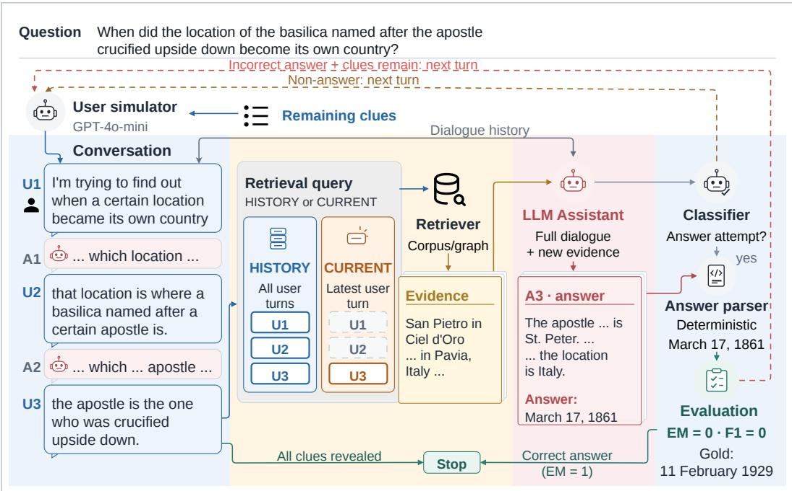

Figure 1: Overview of a multi-turn retrieval simulation, shown at turn 3. The user simulator has just revealed the next clue (u<sub>3</sub>). The retriever is then queried with either all user turns so far (u<sub>1</sub>+u<sub>2</sub>+u<sub>3</sub>) or only the latest (u ), depending on the retrieval policy. The LLM then answers from this retrieved evidence together with the conversation history, and the response classifier flags its output as an answer attempt. The text after the Answer: marker is scored against the gold answer. Here the predicted date is wrong, so the assistant receives a score of 0 F1.

(MS) (Trivedi et al., 2022). In addition, we separate MuSiQue by reasoning depth into 2-hop, 3- hop, and 4-hop subsets (MS-2, MS-3, MS-4). Deeper questions require longer chains of evidence and also produce longer sharded conversations. This lets us observe multi-turn degradation across conversations of varying length and reasoning depth.

We evaluate 150 questions from each of these five subsets, for 750 reviewed questions in total. For retrieval, HotpotQA and 2Wiki each use a fixed corpus of 1,000 questions, while MuSiQue uses a single shared corpus of 1,000 questions spanning its three hops. This 1,000-question corpus size matches the setting on which these methods are commonly evaluated (Gutierrez et al., 2024; Gutiérrez et al., 2025; Luo et al., 2025; S et al., 2026). The reviewed questions are included in these pools, while the rest contribute candidate passages but are not scored.

## 3.2 FROM A FULL QUESTION TO A CONVERSATION

Following the original benchmark’s segment, rephrase, verify, and inspect process, a GPT-4o-mini module first segments each multi-hop question into its individual units of information and then rephrases each unit as a conversational user turn. Both steps follow a set of rules we define to ensure a fair comparison. Each resulting shard set is automatically verified and then manually inspected against these rules. Appendix A details this process and the rules every valid shard set must satisfy, and Appendix E lists the exact prompts.

While the original benchmark assumes order-insensitive shards, multi-hop questions form reasoning chains that require sequential context. We therefore make two adaptations. First, we order the shards according to the question’s compositional structure rather than presenting them in an arbitrary order, so that later shards can refer back to entities introduced earlier using expressions such as “that person” or “that film.” Second, we tighten the sharding constraints after observing that the sharding model could leak intermediate answers into the shard text or turn a clue into a direct subquestion (e.g. “who voices Glenn Quagmire?”) instead of presenting it as a piece of the user’s description (e.g. “it was created by whoever does the voice of Glenn Quagmire”). Shards must therefore preserve original entities and relations without introducing unmentioned facts or explicitly decomposing the query into sub-problems. The final 750 shard sets were manually reviewed under these criteria.

## 3.3 SIMULATION TYPES

Table 1 describes five information-delivery conditions from the original benchmark, each of which presents the same underlying information in a different conversational form.

FULL against SHARDED is our central comparison. CONCAT lets us separate changes caused by shard formulation from those caused by distributing the same information across multiple conversational turns. Following Laban et al. (2026), we use closed-book CONCAT as an information-preservation check, requiring $\overline { { \mathrm { F 1 } } } _ { \mathrm { C O N C A T } } \geq 0 . \bar { 8 } \overline { { \mathrm { F 1 } } } _ { \mathrm { F U L L } }$

Table 1: Information-delivery conditions. Each box represents one user turn.
<table><tr><td>Condition</td><td colspan="5">Assistant Input</td></tr><tr><td>FULL</td><td colspan="5">The original question, in one turn</td></tr><tr><td>CONCAT</td><td colspan="2">All shards as a list, in one turn</td><td colspan="3">U1 u2 u3</td></tr><tr><td>SHARDED</td><td colspan="2">One shard per turn</td><td>u1</td><td colspan="2">u2 u3</td></tr><tr><td>RECAP</td><td colspan="5">SHARDED, then one final turn restating</td></tr><tr><td rowspan="3">SNOWBALL</td><td colspan="5">every shard u1 u2</td></tr><tr><td colspan="2">SHARDED, with each turn repeating all</td><td></td><td>u3</td><td colspan="2">u1 u2 u3</td></tr><tr><td colspan="2">earlier shards</td><td>u1</td><td>u1u2</td><td colspan="2">u1 u2 U3</td></tr></table>

## 4 EXPERIMENTAL SETUP

## 4.1 RETRIEVAL METHODS

Our comparison consists of eight retrieval settings over the shared corpus: a closed-book configuration (NONE), two passage retrievers (BM25 and dense vanilla RAG), one hierarchical retriever (RAPTOR), and four graph retrievers (HippoRAG, HippoRAG2, ToG-2, LightRAG). All retrieval methods use bgelarge-en-v1.5 where applicable, while retriever-specific index structures, query-grounding procedures, and evidence units are preserved. Most passage-oriented systems use top-five retrieval. Hierarchical and graph systems retain their respective retrieval units and output rules.

For graph-based retrievers, we build a graph from the same passage corpus using an LLM-based OpenIE procedure. Following prior graph retrievers (Gutierrez et al., 2024; Gutiérrez et al., 2025; Luo et al., 2025), we extract entity mentions and relation-bearing triples from each passage. For methods that require graph seeds, the fixed query-NER LLM component extracts mentions from the visible query, and dense similarity links them to nodes in the corpus-local graph.

Methods originally designed for external knowledge graphs are adapted to this shared graph so that all retrievers use identical source evidence. Implementation details are provided in Appendix D.

## 4.2 LANGUAGE MODELS

We evaluate ten LLMs from four model families: GPT-4o-mini and 5.6 Luna (OpenAI), Llama-3.1- 8B-Instruct and Llama-3.3-70B-Instruct (Meta), Gemma-4-31B-IT (Google), Qwen3-4B, Qwen3-8B, Qwen3-14B, Qwen3-32B, and Qwen3.6-27B (Alibaba). The selection spans 4B to 70B+ parameters across both API and open-weight models. Every model follows a shared output format in which candidate answers appear after a designated Answer: marker. Exact model versions and serving configurations are listed in Appendix D.4. Evaluating API models across all combinations of datasets, retrievers, query policies, and simulation types would be prohibitively expensive. We therefore use a prespecified set of API models and rely on open-weight models for broader model coverage.

## 4.3 EVALUATION METRICS

LLM generation is stochastic, and otherwise identical runs can produce different answers. We simulate each question five times, which lets us account for the run-to-run variation while keeping the substantially larger model-by-retriever evaluation tractable.

Answers are scored using normalized exact match (EM) and token-level F1, following the evaluation used in each source dataset (Yang et al., 2018; Trivedi et al., 2022). We retain the conversation-level BEST scoring convention of Laban et al. (2026). BEST is the maximum F1 over all answer attempts

in a conversation. Conversations with no answer attempt receive zero. We also report paired 95% confidence intervals for differences between conditions using bootstrap resampling over questions.

Table 2: F1 (×100) under FULL and SHARDED, averaged over ten LLMs. Red shading indicates a loss and blue a gain relative to FULL; intensity reflects the absolute difference in F1 points. Rows are ordered by mean FULL score.
<table><tr><td></td><td colspan="4">FULL</td><td colspan="5">SHARDED (history)</td><td colspan="5">SHARDED (current)</td><td colspan="2">Mean gap</td></tr><tr><td>Retriever</td><td>HP</td><td>2W MS-2 MS-3 MS-4</td><td></td><td></td><td>HP</td><td></td><td></td><td>2W MS-2 MS-3 MS-4</td><td></td><td>HP</td><td></td><td>2W MS-2 MS-3 MS-4</td><td></td><td></td><td>Hist. Curr.</td><td></td></tr><tr><td>HippoRAG2</td><td>75.9 69.0</td><td>49.0</td><td>37.6</td><td>21.6</td><td>68.0</td><td>57.9</td><td>40.5</td><td>34.0</td><td>18.6</td><td>65.8</td><td>51.7</td><td>39.2</td><td>29.3</td><td>17.7</td><td></td><td>+6.8 +9.9</td></tr><tr><td>RAPTOR</td><td>70.2 63.0</td><td>42.2</td><td>35.8</td><td>20.7</td><td>65.4</td><td>52.3</td><td>32.4</td><td>34.0</td><td>18.6</td><td>60.4</td><td>46.4</td><td>30.4</td><td>29.3</td><td>17.0</td><td>+5.8</td><td>+9.7</td></tr><tr><td>HippoRAG</td><td>66.6 71.5</td><td>42.3</td><td>27.7</td><td>19.9</td><td>62.6</td><td>61.0</td><td>38.3</td><td>25.4</td><td>16.8</td><td>60.5</td><td>54.3</td><td>37.1</td><td>25.6</td><td>16.1</td><td>+4.8 +6.9</td><td></td></tr><tr><td>Dense</td><td>71.6 60.1</td><td>37.8</td><td>37.0</td><td>20.5</td><td>65.5</td><td>48.6</td><td>31.0</td><td>33.9</td><td>17.9</td><td>60.4</td><td>45.8</td><td>28.3</td><td>29.3</td><td>17.3</td><td>+6.0 +9.2</td><td></td></tr><tr><td>ToG-2</td><td>67.0 52.3</td><td>46.1</td><td>34.9</td><td>21.5</td><td>62.0</td><td>48.2</td><td>40.0</td><td>32.1</td><td>21.3</td><td>62.5</td><td>49.2</td><td>34.7</td><td>26.1</td><td>17.1</td><td>+3.7</td><td>+6.4</td></tr><tr><td>BM25</td><td>61.0 52.9</td><td>29.2</td><td>21.8</td><td>17.8</td><td>54.5</td><td>37.6</td><td>24.2</td><td>21.1</td><td>12.5</td><td>54.2</td><td>44.2</td><td>28.2</td><td>24.1</td><td>14.0</td><td>+6.5</td><td>+3.6</td></tr><tr><td>LightRAG</td><td>60.8 42.1</td><td>33.5</td><td>26.8</td><td>18.2</td><td>59.6</td><td>37.3</td><td>30.3</td><td>25.8</td><td>17.8</td><td>55.6</td><td>36.2</td><td>28.9</td><td>23.8</td><td>16.4</td><td>+2.1</td><td>+4.1</td></tr><tr><td>Mean</td><td>67.6 58.7</td><td>40.0</td><td>31.6</td><td>20.0</td><td>62.5</td><td>49.0</td><td>33.8</td><td>29.5</td><td>17.6</td><td>59.9</td><td>46.8</td><td>32.4</td><td>26.8</td><td>16.5</td><td>+5.1</td><td>+7.1</td></tr><tr><td>Closed book 31.3 37.3</td><td></td><td>19.2</td><td>15.9</td><td>11.4</td><td>27.4</td><td>29.8</td><td>15.3</td><td>14.2</td><td>8.5</td><td></td><td></td><td></td><td>一</td><td></td><td>+4.0</td><td></td></tr></table>

## 5 RESULTS

## 5.1 MULTI-TURN DEGRADATION IS PRESENT WITHOUT RETRIEVAL

We find that multi-turn degradation is already present without retrieval. Averaged over all ten LLMs and the five datasets, closed-book F1 falls from 0.230 under FULL to 0.190 under SHARDED, a relative decline of 17%. For the largest model in each family, CONCAT retains 94.3% of FULL performance, and all five datasets satisfy the information-preservation criterion. This extends the multi-turn sensitivity reported by Laban et al. (2026) from generation tasks to multi-hop QA. Appendix A.3 reports the full per-model and per-dataset breakdown.

## 5.2 RETRIEVAL DOES NOT ELIMINATE MULTI-TURN DEGRADATION

Multi-turn degradation persists with retrieval. Table 2 shows that retrieval improves answer quality over the closed-book setting, yet every retrieval method has a positive mean FULL–SHARDED gap under both query policies. Averaged over ten LLMs, seven retrieval methods, and five datasets, we see a decline of 5.1 F1 points under HISTORY and 7.1 under CURRENT, corresponding to relative losses of 11.7% and 16.3%, respectively.

Notably, the strongest retrieval method suffers the largest absolute degradation. HippoRAG2 attains the highest mean FULL score of 50.6, yet loses 6.8 F1 points under HISTORY and 9.9 under CURRENT, more than any other method. This indicates that single-turn retrieval quality does not predict multi-turn robustness. The same pattern holds among methods with similar single-turn performance. Dense and ToG-2 have mean FULL scores of 45.4 and 44.4, yet lose 6.0 and 3.7 points under HISTORY. In short, each retrieval method degrades differently, and single-turn evaluation conceals these differences, underscoring the need to evaluate retrieval systems in multi-turn settings.

The highest-scoring models are not necessarily the most robust. Figure 2 shows that 5.6 Luna, the highest-scoring model under both FULL and SHARDED, still loses 5.4 F1 points on average under HISTORY, with significant declines in 28 of its 35 retriever–dataset pairs. Gemma-4-31B provides a contrasting example: despite ranking fifth under FULL, it loses only 0.7 F1 points on average, although its run-to-run unreliability nearly doubles (Appendix B.3). In fact, a model that scores 5.1 points above Gemma under FULL (Llama-3.3-70B) ends at essentially the same level under the multi-turn setting. These comparisons suggest that a highly capable LLM can lose its entire advantage in a multi-turn setting. Multi-turn robustness therefore has to be tested under simulated underspecified conversations, not inferred from single-turn scores.

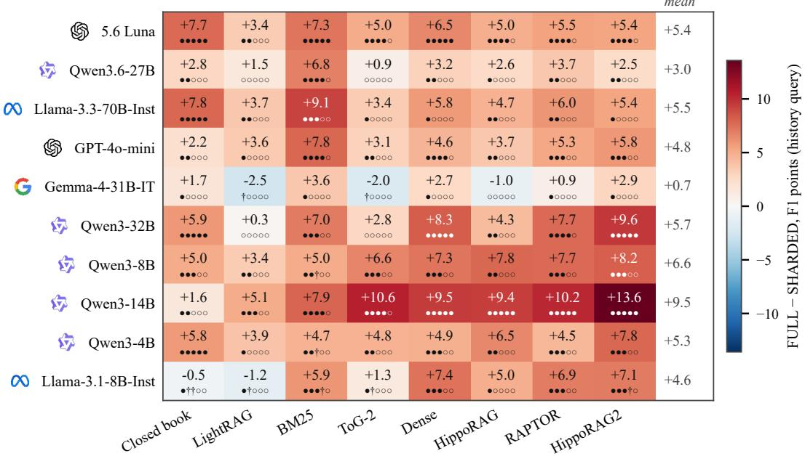  
Figure 2: FULL vs. SHARDED F1 (points) under history queries. Each cell averages over the five datasets. Rows are ordered by mean FULL score across the seven retrieval methods. The five symbols beneath each value summarize dataset-level paired 95% bootstrap intervals for $\Delta =$ FULL − SHARDED: • entirely above zero, † entirely below zero, and ◦ containing zero. Intervals excluding zero indicate a statistically significant difference at the 5% level.

More conversational history is not always a better retrieval query. A natural question is how much of the retrieval query should come from earlier turns. We test this by comparing HISTORY, which passes every user turn to the retriever, with CURRENT, which passes only the latest one. Our results show that using previous user turns (i.e., HISTORY) improves mean SHARDED performance for six of the seven retrieval methods. BM25 is the exception where switching to CURRENT reduces its mean gap from 6.5 to 3.6 F1 points. Its MuSiQue-3hop result is the only case where SHARDED exceeds FULL. This indicates that earlier turns generally provide useful retrieval context, although the benefit depends on how the retriever processes its query. This is consistent with work showing that conversational history often needs to be selected, denoised, or otherwise resolved before retrieval (Mo et al., 2024b;a). Section 5.4 shows what the two queries retrieve.

Based on these results, we attribute the degradation to two forces. First, formulation, or being lost in translation: converting a fully specified question into conversational shards changes what the retriever finds, even when the semantic content is preserved. Second, the lost-in-conversation effect of Laban et al. (2026): distributing the same shards across turns may independently affect both retrieval and the assistant’s ability to integrate the evidence. We isolate these effects next.

## 5.3 DECOMPOSING THE GAP: FORMULATION AND MULTI-TURN DELIVERY

The FULL–SHARDED gap combines two changes: the formulation of the question and its delivery across turns. We use CONCAT as an intermediate condition to write the total gap as

$$
\begin{array} { r l } & { \Delta = \overline { { P } } _ { \mathrm { F U L L } } - \overline { { P } } _ { \mathrm { S H A R D E D } } } \\ & { \quad = \underbrace { \overline { { P } } _ { \mathrm { F U L L } } - \overline { { P } } _ { \mathrm { C O N C A T } } } _ { \Delta _ { \mathrm { f o r m } } } + \underbrace { \overline { { P } } _ { \mathrm { C O N C A T } } - \overline { { P } } _ { \mathrm { S H A R D E D } } } _ { \Delta _ { \mathrm { t u r n } } } . } \end{array}\tag{1}
$$

Here, $\overline { { P } }$ denotes mean F1. The formulation contrast $\left( \Delta _ { \mathrm { f o r m } } \right)$ changes both the retrieval query and the assistant’s input. The multi-turn contrast $( \Delta _ { \mathrm { t u r n } } )$ additionally distributes the same shards across turns and introduces repeated retrieval and answer opportunities.

Table 3: Decomposition of the FULL–SHARDED F1 gap (×100) under HISTORY queries. All cells average over ten LLMs. FULL, Mean, and Total columns also average over the five datasets.
<table><tr><td colspan="2"></td><td colspan="5">FULL – CONCAT</td><td></td><td colspan="2"></td><td colspan="4">CONCAT – SHARDED</td><td>Total</td></tr><tr><td>Retriever</td><td>FULL</td><td>HP</td><td></td><td></td><td></td><td>2W MS-2 MS-3 MS-4 Mean</td><td></td><td>HP</td><td></td><td></td><td></td><td>2W MS-2 MS-3 MS-4 Mean</td><td></td><td>FULL - SH.</td></tr><tr><td>BM25</td><td>36.5</td><td>+14.5</td><td>+21.6</td><td>+10.5</td><td>+5.8</td><td>+6.2</td><td>+11.7</td><td>-8.0</td><td>-6.4</td><td>-5.5</td><td>-5.1</td><td>-0.9</td><td>-5.2</td><td>+6.5</td></tr><tr><td>Dense</td><td>45.4</td><td>+8.3</td><td>+13.0</td><td>+7.7</td><td>+5.2</td><td>+1.9</td><td>+7.2</td><td>-2.3</td><td>-1.5</td><td>-0.9</td><td>-2.1</td><td>+0.8</td><td>-1.2</td><td>+6.0</td></tr><tr><td>RAPTOR</td><td>46.4</td><td>+7.6</td><td>+15.5</td><td>+10.0</td><td>+4.7</td><td>+2.6</td><td>+8.1</td><td>-2.8</td><td>-4.9</td><td>-0.1</td><td>-2.9</td><td>-0.5</td><td>-2.2</td><td>+5.8</td></tr><tr><td>HippoRAG2</td><td>50.6</td><td>+7.7</td><td>+9.3</td><td>+10.1</td><td>+6.2</td><td>+2.2</td><td>+7.1</td><td>+0.2</td><td>+1.8</td><td>-1.7</td><td>-2.6</td><td>+0.9</td><td>-0.3</td><td>+6.8</td></tr><tr><td>HippoRAG</td><td>45.6</td><td>+2.0</td><td>+4.3</td><td>+0.2</td><td>+0.6</td><td>-0.3</td><td>+1.4</td><td>+2.0</td><td>+6.2</td><td>+3.8</td><td>+1.8</td><td>+3.4</td><td>+3.4</td><td>+4.8</td></tr><tr><td>LightRAG</td><td>36.3</td><td>+1.5</td><td>+3.1</td><td>+2.5</td><td>+1.6</td><td>+1.0</td><td>+2.0</td><td>-0.2</td><td>+1.7</td><td>+0.6</td><td>-0.6</td><td>-0.7</td><td>+0.2</td><td>+2.1</td></tr><tr><td>ToG-2</td><td>44.4</td><td>+3.1</td><td>+4.5</td><td>+4.2</td><td>+3.7</td><td>-1.4</td><td>+2.8</td><td>+1.9</td><td>-0.4</td><td>+1.9</td><td>-0.8</td><td>+1.6</td><td>+0.9</td><td>+3.7</td></tr><tr><td>Closed book</td><td>23.0</td><td>+2.1</td><td>+5.3</td><td>+2.5</td><td>+1.5</td><td>+1.3</td><td>+2.5</td><td>+1.8</td><td>+2.2</td><td>+1.4</td><td>+0.3</td><td>+1.7</td><td>+1.5</td><td>+4.0</td></tr></table>

Formulation losses differ sharply across retrievers. Table 3 shows a positive mean $\Delta _ { \mathrm { f o r m } }$ for every retriever. BM25 has the largest drop, at 11.7 F1 points, while Dense, RAPTOR, and HippoRAG2 lose 7.1–8.1 points. By contrast, HippoRAG, LightRAG, and ToG-2 lose only 1.4–2.8 points. Interestingly, the latter three methods first use an LLM to extract entities or keywords from the query before retrieval. Since FULL and CONCAT preserve the underlying entities and relations, this preprocessing may make them less sensitive to conversational rephrasing, although the advantage does not necessarily carry over once the evidence is distributed across turns.

Multi-turn delivery can partially reverse formulation losses. The pattern changes once the same shards are distributed across turns. BM25 recovers 5.2 F1 points over CONCAT, while RAPTOR, Dense, and HippoRAG2 recover 2.2, 1.2, and 0.3 points, respectively. The three retrievers that were least affected by formulation do not show the same recovery: HippoRAG loses a further 3.4 points, while LightRAG and ToG-2 also decline slightly.

We interpret this pattern as the interaction of two opposing effects within $\Delta _ { \mathrm { t u r n } } .$ . Repeated retrieval gives formulation-sensitive methods additional opportunities to recover evidence missed by the single CONCAT query, offsetting part of their initial loss. At the same time, distributing the question across turns adds a cost of its own. Even without retrieval, SHARDED falls 1.5 points below CONCAT. Thus, retrievers with larger formulation losses recover through repeated retrieval, but this recovery remains incomplete, and every retriever ultimately exhibits a net FULL–SHARDED degradation.

So far, both effects are inferred from answer scores alone. Next, we test whether the retrieved passages show the same pattern, using per-query and cumulative Recall@5.

## 5.4 RETRIEVAL COVERAGE ACROSS TURNS

Question formulation changes which evidence is retrieved. We observe in Table 4 that mean Recall@5 falls from 56.7 under FULL to 49.2 under CONCAT, but the effect again varies substantially across retrievers. For instance, BM25 drops from 45.6 to 18.6, whereas HippoRAG increases from 61.7 to 65.1. As with the reformulation results, this shows that changing a question’s phrasing substantially changes the evidence retrieved for the LLM, whereas methods that preprocess the query with an LLM are less affected.

Successive retrieval can recover missed evidence. Under HISTORY, cumulative recall reaches 55.8, close to the 56.7 FULL baseline. BM25 again provides the clearest example as its recall falls to 18.6 under CONCAT, but reaches 35.3 when retrievals are accumulated across SHARDED turns. This supports the explanation above that later retrievals can recover supporting evidence missed by the single CONCAT query, although the amount of recovery differs across retrievers.

Coverage across turns does not guarantee answer recovery. Moreover, when we compare cumulative recall with answer performance, higher retrieval coverage does not consistently correspond to higher F1. Under CURRENT, cumulative recall reaches 61.0 and exceeds FULL for every retriever, yet SHARDED answer performance remains lower. For instance, HippoRAG2 reaches

Table 4: Supporting-passage Recall@5 (×100), averaged over ten LLMs and five datasets. For SHARDED, per query is the mean over retrieval turns, final turn uses the last retrieval, and cumulative is the union of every turn’s top-five passages. Underlined entries exceed the row’s FULL recall. RAPTOR is omitted because its retrieval units consist of normal passages and their summary nodes.
<table><tr><td rowspan="2">Retriever</td><td colspan="2">Single turn</td><td colspan="3">SHARDED, history query</td><td colspan="3">SHARDED, current-turn query</td></tr><tr><td>FULL</td><td>CONCAT</td><td>per query</td><td>final turn</td><td>cumulative</td><td>per query</td><td>final turn</td><td>cumulative</td></tr><tr><td>BM25</td><td>45.6</td><td>18.6</td><td>19.5</td><td>30.3</td><td>35.3</td><td>22.4</td><td>35.5</td><td>51.7</td></tr><tr><td>Dense</td><td>62.6</td><td>51.9</td><td>35.3</td><td>54.4</td><td>58.9</td><td>29.9</td><td>43.3</td><td>65.6</td></tr><tr><td>HippoRAG2</td><td>70.7</td><td>63.0</td><td>40.9</td><td>64.6</td><td>69.6</td><td>35.0</td><td>52.5</td><td>74.8</td></tr><tr><td>HippoRAG</td><td>61.7</td><td>65.1</td><td>32.7</td><td>63.2</td><td>65.0</td><td>27.7</td><td>50.1</td><td>65.4</td></tr><tr><td>LightRAG</td><td>40.9</td><td>41.4</td><td>24.4</td><td>40.1</td><td>46.0</td><td>19.4</td><td>30.8</td><td>44.8</td></tr><tr><td>ToG-2</td><td>58.5</td><td>55.4</td><td>32.0</td><td>54.9</td><td>60.0</td><td>28.1</td><td>47.1</td><td>63.4</td></tr><tr><td>Mean</td><td>56.7</td><td>49.2</td><td>30.8</td><td>51.3</td><td>55.8</td><td>27.1</td><td>43.2</td><td>61.0</td></tr></table>

74.8 cumulative recall, compared with 70.7 under FULL, while its F1 remains 9.9 points lower. In other words, retrieval coverage alone is not sufficient in multi-turn RAG; the LLM must also be able to piece together evidence that becomes available across separate turns. We test this directly through a paired study (Appendix B.4): when a FULL and SHARDED conversation both retrieve all of their supporting passages, SHARDED still scores 11.6 F1 points lower under HISTORY.

The multi-turn gap stems more from unreliability than reduced aptitude. The preceding sections report mean performance, but they do not show whether the multi-turn setting consistently lowers performance or instead makes outcomes more variable across repeated runs. Following the original benchmark, we therefore examine aptitude (90th-percentile F1 across a question’s five simulations) and unreliability (difference between 90th and 10th percentiles). We find that under HISTORY, unreliability increases from 13.4 F1 points under FULL to 19.7 under SHARDED, a 47% increase, while estimated aptitude falls by only 1.9 points. Consistent with the original benchmark, multi-turn degradation in RAG is thus driven more by unreliability than by reduced aptitude (Appendix B.3).

We also test whether agent-style interventions can mitigate this degradation by considering RECAP and SNOWBALL, which consolidate or repeat information from earlier turns (Appendix B.1). Here, the restated information affects not only the assistant but also the retrieval query. We find that for the retrievers least affected by formulation (Section 5.3), consolidation can fully recover single-turn performance, while for the remaining retrievers it provides only partial recovery. Beyond these conversation-side interventions, we also evaluate Plan-on-Graph (Chen et al., 2024), an agentic retrieval method in which the LLM plans subquestions and guides graph search. We observe that its multi-turn gap nearly disappears, shrinking to about 2 F1 points (6%) under HISTORY. However, this “improvement” comes with much higher token usage, more LLM calls, and second-lowest overall F1 scores of any retrieval method we test. This suggests that agentic retrieval can reduce multi-turn degradation, but substantial work remains to make it more capable and efficient (Appendix B.2).

Finally, we address a further concern. Token F1 may overstate the degradation by penalizing lexically different but semantically correct answers. We validate our findings on a three-LLM subset using LLM-as-a-judge evaluation of semantic correctness. Our results show that the degradation remains consistent across retrieval methods and query policies, indicating that the observed gap is not an artifact of lexical-overlap scoring (Appendix B.5).

## 6 CONCLUSION

We conduct a large-scale, controlled study of how retrieval-augmented LLMs behave when fully specified benchmark questions are instead spread across a conversation. Across the retrieval methods and LLMs we test, retrieval does not eliminate the lost in conversation effect observed in prior work (Laban et al., 2026). RAG systems remain less accurate and less reliable across turns. Our decomposition traces this degradation to two sources. Some systems are lost in translation, losing performance as soon as the question is reformulated into conversational clues, while others are lost in conversation, retrieving the needed evidence but failing to use it across turns. These failures, however, are not inevitable. At least one model retains nearly all of its single-turn performance, and for some retrieval families, consolidating the conversation can fully recover the gap. As retrieval methods advance on single-turn benchmarks, our results underscore the need to additionally evaluate them under multi-turn, conversational delivery, so that robustness is demonstrated rather than assumed.

## REPRODUCIBILITY STATEMENT

We have taken several steps to ensure reproducibility of our work. We outline our sharding procedure in Appendix A.1 and disclose all prompts in Appendix E. Retriever configurations, model versions, and experimental methodology are detailed in Sections 3–4 and Appendix D. We plan to publicly release our codebase, experiment results, and project documentation.

## AI USE STATEMENT

In this work, we use generative AI for four purposes. First, the benchmark is built with a semiautomatic shard construction pipeline that relies on an LLM. Every resulting shard set was manually reviewed and corrected accordingly by the authors before any experiment was run. Second, we use LLM as an automated judge to assess answer correctness for an ablation study (Appendix B.5). Third, we use AI tools to assist with writing the scripts that generate the paper’s figures. Lastly, we also correct grammatical errors in our text with the help of an AI tool. All ideas, experimental design, results and interpretations are the authors’ own, and the authors take full responsibility for the paper’s content.

## ACKNOWLEDGMENTS

This research was funded in part by DOE grants DE-SC0022098 and DE-SC0023349 and by NSF grants PPoSS CCF 2316233 and OAC-2339607.

## REFERENCES

Mohammed Ali, Abdelrahman Abdallah, Amit Agarwal, Hitesh Laxmichand Patel, and Adam Jatowt. RECOR: Reasoning-focused multi-turn conversational retrieval benchmark. In Maria Liakata, Viviane P. Moreira, Jiajun Zhang, and David Jurgens (eds.), Findings of the Association for Computational Linguistics: ACL 2026, pp. 2688–2723, San Diego, California, United States, July 2026. Association for Computational Linguistics. ISBN 979-8-89176-395-1. doi: 10.18653/v1/ 2026.findings-acl.129. URL https://aclanthology.org/2026.findings-acl.129/.

Raviteja Anantha, Svitlana Vakulenko, Zhucheng Tu, Shayne Longpre, Stephen Pulman, and Srinivas Chappidi. Open-Domain Question Answering Goes Conversational via Question Rewriting. In Kristina Toutanova, Anna Rumshisky, Luke Zettlemoyer, Dilek Hakkani-Tur, Iz Beltagy, Steven Bethard, Ryan Cotterell, Tanmoy Chakraborty, and Yichao Zhou (eds.), Proceedings ofthe 2021 Conference of the North American Chapter of the Association for Computational Linguistics: Human Language Technologies, pp. 520–534, Online, June 2021. Association for Computational Linguistics. doi: 10.18653/v1/2021.naacl-main.44. URL https://aclanthology.org/2021. naacl-main.44/.

Liyi Chen, Panrong Tong, Zhongming Jin, Ying Sun, Jieping Ye, and Hui Xiong. Plan-on-Graph: Self-correcting adaptive planning of large language model on knowledge graphs. In The Thirtyeighth Annual Conference on Neural Information Processing Systems, 2024. URL https:// openreview.net/forum?id=CwCUEr6wO5.

Yiruo Cheng, Kelong Mao, Ziliang Zhao, Guanting Dong, Hongjin Qian, Yongkang Wu, Tetsuya Sakai, Ji-Rong Wen, and Zhicheng Dou. CORAL: Benchmarking multi-turn conversational retrieval-augmented generation. In Luis Chiruzzo, Alan Ritter, and Lu Wang (eds.), Findings of the Associationfor Computational Linguistics: NAACL 2025, pp. 1308–1330, Albuquerque, New Mexico, April 2025. Association for Computational Linguistics. ISBN 979-8-89176-195-7. doi: 10. 18653/v1/2025.findings-naacl.72. URL https://aclanthology.org/2025.findings-naacl. 72/.

Florin Cuconasu, Giovanni Trappolini, Federico Siciliano, Simone Filice, Cesare Campagnano, Yoelle Maarek, Nicola Tonellotto, and Fabrizio Silvestri. The Power of Noise: Redefining Retrieval

for RAG Systems. In Proceedings ofthe 47th International ACM SIGIR Conference on Research and Development in Information Retrieval, SIGIR ’24, pp. 719–729, New York, NY, USA, 2024. Association for Computing Machinery. ISBN 9798400704314. doi: 10.1145/3626772.3657834. URL https://doi.org/10.1145/3626772.3657834.

Yunfan Gao, Yun Xiong, Xinyu Gao, Kangxiang Jia, Jinliu Pan, Yuxi Bi, Yi Dai, Jiawei Sun, Meng Wang, and Haofen Wang. Retrieval-augmented generation for large language models: A survey. arXiv preprint arXiv:2312.10997, 2023.

Xinyan Guan, Jiali Zeng, Fandong Meng, Chunlei Xin, Yaojie Lu, Hongyu Lin, Xianpei Han, Le Sun, and Jie Zhou. DeepRAG: Thinking to retrieve step by step for large language models. In The Fourteenth International Conference on Learning Representations, 2026. URL https: //openreview.net/forum?id=VI2YaggHIF.

Zirui Guo, Lianghao Xia, Yanhua Yu, Tu Ao, and Chao Huang. LightRAG: Simple and fast retrievalaugmented generation. In Christos Christodoulopoulos, Tanmoy Chakraborty, Carolyn Rose, and Violet Peng (eds.), Findings of the Association for Computational Linguistics: EMNLP 2025, pp. 10746–10761, Suzhou, China, November 2025. Association for Computational Linguistics. ISBN 979-8-89176-335-7. doi: 10.18653/v1/2025.findings-emnlp.568. URL https://aclanthology. org/2025.findings-emnlp.568/.

Bernal Jimenez Gutierrez, Yiheng Shu, Yu Gu, Michihiro Yasunaga, and Yu Su. HippoRAG: Neurobiologically inspired long-term memory for large language models. In The Thirty-eighth Annual Conference on Neural Information Processing Systems, 2024. URL https://openreview. net/forum?id=hkujvAPVsg.

Bernal Jiménez Gutiérrez, Yiheng Shu, Weijian Qi, Sizhe Zhou, and Yu Su. From RAG to memory: Non-parametric continual learning for large language models. In Forty-second International Conference on Machine Learning, 2025. URL https://openreview.net/forum?id=LWH8yn4HS2.

Christine Herlihy, Jennifer Neville, Tobias Schnabel, and Adith Swaminathan. On overcoming miscalibrated conversational priors in llm-based chatbots. arXiv preprint arXiv:2406.01633, 2024.

Xanh Ho, Anh-Khoa Duong Nguyen, Saku Sugawara, and Akiko Aizawa. Constructing a multi-hop qa dataset for comprehensive evaluation of reasoning steps. In Proceedings ofthe 28th International Conference on Computational Linguistics, pp. 6609–6625, 2020.

Ehsan Kamalloo, Nouha Dziri, Charles Clarke, and Davood Rafiei. Evaluating open-domain question answering in the era of large language models. In Anna Rogers, Jordan Boyd-Graber, and Naoaki Okazaki (eds.), Proceedings of the 61st Annual Meeting of the Association for Computational Linguistics (Volume 1: Long Papers), pp. 5591–5606, Toronto, Canada, July 2023. Association for Computational Linguistics. doi: 10.18653/v1/2023.acl-long.307. URL https://aclanthology. org/2023.acl-long.307/.

Yannis Katsis, Sara Rosenthal, Kshitij Fadnis, Chulaka Gunasekara, Young-Suk Lee, Lucian Popa, Vraj Shah, Huaiyu Zhu, Danish Contractor, and Marina Danilevsky. mt RAG: A multi-turn conversational benchmark for evaluating retrieval-augmented generation systems. Transactions of the Associationfor Computational Linguistics, 13:784–808, 2025. doi: 10.1162/tacl.a.19. URL https://aclanthology.org/2025.tacl-1.36/.

Wai-Chung Kwan, Xingshan Zeng, Yuxin Jiang, Yufei Wang, Liangyou Li, Lifeng Shang, Xin Jiang, Qun Liu, and Kam-Fai Wong. MT-eval: A multi-turn capabilities evaluation benchmark for large language models. In Yaser Al-Onaizan, Mohit Bansal, and Yun-Nung Chen (eds.), Proceedings of the 2024 Conference on Empirical Methods in Natural Language Processing, pp. 20153–20177, Miami, Florida, USA, November 2024. Association for Computational Linguistics. doi: 10.18653/ v1/2024.emnlp-main.1124. URL https://aclanthology.org/2024.emnlp-main.1124/.

Philippe Laban, Hiroaki Hayashi, Yingbo Zhou, and Jennifer Neville. LLMs get lost in multiturn conversation. In International Conference on Learning Representations, volume 2026, pp. 54738–54778, 2026.

Patrick Lewis, Ethan Perez, Aleksandra Piktus, Fabio Petroni, Vladimir Karpukhin, Naman Goyal, Heinrich Küttler, Mike Lewis, Wen-tau Yih, Tim Rocktäschel, Sebastian Riedel, and Douwe Kiela. Retrieval-augmented generation for knowledge-intensive nlp tasks. In Proceedings of the 34th International Conference on Neural Information Processing Systems, NIPS ’20, Red Hook, NY, USA, 2020. Curran Associates Inc. ISBN 9781713829546.

Nelson F. Liu, Kevin Lin, John Hewitt, Ashwin Paranjape, Michele Bevilacqua, Fabio Petroni, and Percy Liang. Lost in the Middle: How Language Models Use Long Contexts. Transactions ofthe Associationfor Computational Linguistics, 12:157–173, 2024. doi: 10.1162/tacl\_a\_00638. URL https://aclanthology.org/2024.tacl-1.9/.

Linhao Luo, Zicheng Zhao, Gholamreza Haffari, Dinh Phung, Chen Gong, and Shirui Pan. GFM-RAG: Graph foundation model for retrieval augmented generation. In The Thirty-ninth Annual Conference on Neural Information Processing Systems, 2025. URL https://openreview.net/ forum?id=0QNmAvQQqj.

Shengjie Ma, Chengjin Xu, Xuhui Jiang, Muzhi Li, Huaren Qu, Cehao Yang, Jiaxin Mao, and Jian Guo. Think-on-graph 2.0: Deep and faithful large language model reasoning with knowledgeguided retrieval augmented generation. In The Thirteenth International Conference on Learning Representations, 2025. URL https://openreview.net/forum?id=oFBu7qaZpS.

Xinbei Ma, Yeyun Gong, Pengcheng He, hai zhao, and Nan Duan. Query rewriting in retrievalaugmented large language models. In The 2023 Conference on Empirical Methods in Natural Language Processing, 2023. URL https://openreview.net/forum?id=gXq1cwkUZc.

Sewon Min, Victor Zhong, Luke Zettlemoyer, and Hannaneh Hajishirzi. Multi-hop Reading Comprehension through Question Decomposition and Rescoring. In Anna Korhonen, David Traum, and Lluís Màrquez (eds.), Proceedings ofthe 57th Annual Meeting ofthe Associationfor Compu tational Linguistics, pp. 6097–6109, Florence, Italy, July 2019. Association for Computational Linguistics. doi: 10.18653/v1/P19-1613. URL https://aclanthology.org/P19-1613/.

Fengran Mo, Kelong Mao, Yutao Zhu, Yihong Wu, Kaiyu Huang, and Jian-Yun Nie. ConvGQR: Generative query reformulation for conversational search. In Anna Rogers, Jordan Boyd-Graber, and Naoaki Okazaki (eds.), Proceedings of the 61st Annual Meeting of the Association for Computational Linguistics (Volume 1: Long Papers), pp. 4998–5012, Toronto, Canada, July 2023. Association for Computational Linguistics. doi: 10.18653/v1/2023.acl-long.274. URL https://aclanthology.org/2023.acl-long.274/.

Fengran Mo, Abbas Ghaddar, Kelong Mao, Mehdi Rezagholizadeh, Boxing Chen, Qun Liu, and Jian-Yun Nie. CHIQ: Contextual history enhancement for improving query rewriting in conversational search. In Yaser Al-Onaizan, Mohit Bansal, and Yun-Nung Chen (eds.), Proceedings of the 2024 Conference on Empirical Methods in Natural Language Processing, pp. 2253–2268, Miami, Florida, USA, November 2024a. Association for Computational Linguistics. doi: 10.18653/v1/ 2024.emnlp-main.135. URL https://aclanthology.org/2024.emnlp-main.135/.

Fengran Mo, Chen Qu, Kelong Mao, Tianyu Zhu, Zhan Su, Kaiyu Huang, and Jian-Yun Nie. Historyaware conversational dense retrieval. In Lun-Wei Ku, Andre Martins, and Vivek Srikumar (eds.), Findings ofthe Associationfor Computational Linguistics: ACL 2024, pp. 13366–13378, Bangkok, Thailand, August 2024b. Association for Computational Linguistics. doi: 10.18653/v1/2024. findings-acl.792. URL https://aclanthology.org/2024.findings-acl.792/.

Gustavo Penha, Arthur Câmara, and Claudia Hauff. Evaluating the Robustness of Retrieval Pipelines with Query Variation Generators. In Advances in Information Retrieval: 44th European Conference on IR Research, ECIR 2022, Stavanger, Norway, April 10–14, 2022, Proceedings, Part I, pp. 397–412, Berlin, Heidelberg, 2022. Springer-Verlag. ISBN 978-3-030-99735-9. doi: 10.1007/ 978-3-030-99736-6\_27. URL https://doi.org/10.1007/978-3-030-99736-6\_27.

Ofir Press, Muru Zhang, Sewon Min, Ludwig Schmidt, Noah Smith, and Mike Lewis. Measuring and Narrowing the Compositionality Gap in Language Models. In Houda Bouamor, Juan Pino, and Ka lika Bali (eds.), Findings of the Association for Computational Linguistics: EMNLP 2023, pp. 5687– 5711, Singapore, December 2023. Association for Computational Linguistics. doi: 10.18653/v1/ 2023.findings-emnlp.378. URL https://aclanthology.org/2023.findings-emnlp.378/.

David Rau, Hervé Déjean, Nadezhda Chirkova, Thibault Formal, Shuai Wang, Stéphane Clinchant, and Vassilina Nikoulina. BERGEN: A benchmarking library for retrieval-augmented generation. In Yaser Al-Onaizan, Mohit Bansal, and Yun-Nung Chen (eds.), Findings ofthe Associationfor Computational Linguistics: EMNLP 2024, pp. 7640–7663, Miami, Florida, USA, November 2024. Association for Computational Linguistics. doi: 10.18653/v1/2024.findings-emnlp.449. URL https://aclanthology.org/2024.findings-emnlp.449/.

Stephen Robertson and Hugo Zaragoza. The probabilistic relevance framework: BM25 and beyond. Foundations and trends® in information retrieval, 4(1-2):1–174, 2009.

Sara Rosenthal, Yannis Katsis, Vraj Shah, Lihong He, Lucian Popa, and Marina Danilevsky. MTRAG-UN: A benchmark for open challenges in multi-turn RAG conversations. In Maria Liakata, Viviane P. Moreira, Jiajun Zhang, and David Jurgens (eds.), Findings of the Association for Computational Linguistics: ACL 2026, pp. 10363–10369, San Diego, California, United States, July 2026. Association for Computational Linguistics. ISBN 979-8-89176-395-1. doi: 10.18653/ v1/2026.findings-acl.503. URL https://aclanthology.org/2026.findings-acl.503/.

PAVAN KUMAR S, Kiran Kumar Nakka, C Vamshi Krishna Reddy, Divyateja Pasupuleti, Prakhar Agarwal, Harpinder Jot Singh, Anshu Avinash, and Nirav Pravinbhai Bhatt. BrowseNet: Graphbased associative memory for contextual information retrieval. In The Fourteenth International Conference on Learning Representations, 2026. URL https://openreview.net/forum?id= 2q5CugVPoK.

Parth Sarthi, Salman Abdullah, Aditi Tuli, Shubh Khanna, Anna Goldie, and Christopher D Manning. RAPTOR: Recursive abstractive processing for tree-organized retrieval. In The Twelfth International Conference on Learning Representations, 2024. URL https://openreview.net/forum? id=GN921JHCRw.

Melanie Sclar, Yejin Choi, Yulia Tsvetkov, and Alane Suhr. Quantifying language models’ sensitivity to spurious features in prompt design or: How i learned to start worrying about prompt formatting. In The Twelfth International Conference on Learning Representations, 2024. URL https:// openreview.net/forum?id=RIu5lyNXjT.

Freda Shi, Xinyun Chen, Kanishka Misra, Nathan Scales, David Dohan, Ed H Chi, Nathanael Schärli, and Denny Zhou. Large Language Models can be easily distracted by irrelevant context. In International conference on machine learning, pp. 31210–31227. PMLR, 2023.

Jiuding Sun, Chantal Shaib, and Byron C Wallace. Evaluating the zero-shot robustness of instructiontuned language models. In The Twelfth International Conference on Learning Representations, 2024. URL https://openreview.net/forum?id=g9diuvxN6D.

Harsh Trivedi, Niranjan Balasubramanian, Tushar Khot, and Ashish Sabharwal. MuSiQue: Multihop questions via single-hop question composition, 2022. URL https://arxiv.org/abs/2108. 00573.

Harsh Trivedi, Niranjan Balasubramanian, Tushar Khot, and Ashish Sabharwal. Interleaving retrieval with chain-of-thought reasoning for knowledge-intensive multi-step questions. In Anna Rogers, Jordan Boyd-Graber, and Naoaki Okazaki (eds.), Proceedings ofthe 61st Annual Meeting ofthe Association for Computational Linguistics (Volume 1: Long Papers), pp. 10014–10037, Toronto, Canada, July 2023. Association for Computational Linguistics. doi: 10.18653/v1/2023.acl-long. 557. URL https://aclanthology.org/2023.acl-long.557/.

Liang Wang, Haonan Chen, Nan Yang, Xiaolong Huang, Zhicheng Dou, and Furu Wei. Chain-of-Retrieval Augmented Generation. In The Thirty-ninth Annual Conference on Neural Information Processing Systems, 2025. URL https://openreview.net/forum?id=gUPGGCM4WH.

Zeqiu Wu, Yi Luan, Hannah Rashkin, David Reitter, Hannaneh Hajishirzi, Mari Ostendorf, and Gaurav Singh Tomar. CONQRR: Conversational query rewriting for retrieval with reinforcement learning. In Yoav Goldberg, Zornitsa Kozareva, and Yue Zhang (eds.), Proceedings ofthe 2022 Conference on Empirical Methods in Natural Language Processing, pp. 10000–10014, Abu Dhabi, United Arab Emirates, December 2022. Association for Computational Linguistics. doi: 10.18653 v1/2022.emnlp-main.679. URL https://aclanthology.org/2022.emnlp-main.679/.

Shitao Xiao, Zheng Liu, Peitian Zhang, Niklas Muennighoff, Defu Lian, and Jian-Yun Nie. C-Pack: Packed resources for general chinese embeddings. In Proceedings ofthe 47th International ACM SIGIR Conference on Research and Development in Information Retrieval, SIGIR ’24, pp. 641–649, New York, NY, USA, 2024. Association for Computing Machinery. ISBN 9798400704314. doi: 10.1145/3626772.3657878. URL https://doi.org/10.1145/3626772.3657878.

Zhilin Yang, Peng Qi, Saizheng Zhang, Yoshua Bengio, William Cohen, Ruslan Salakhutdinov, and Christopher D Manning. HotpotQA: A dataset for diverse, explainable multi-hop question answering. In Proceedings of the 2018 conference on empirical methods in natural language processing, pp. 2369–2380, 2018.

Ori Yoran, Tomer Wolfson, Ori Ram, and Jonathan Berant. Making retrieval-augmented language models robust to irrelevant context. In International Conference on Learning Representations, volume 2024, pp. 29862–29883, 2024.

Wenting Zhao, Xiang Ren, Jack Hessel, Claire Cardie, Yejin Choi, and Yuntian Deng. WildChat: 1m chatGPT interaction logs in the wild. In The Twelfth International Conference on Learning Representations, 2024. URL https://openreview.net/forum?id=Bl8u7ZRlbM.

Lianmin Zheng, Wei-Lin Chiang, Ying Sheng, Siyuan Zhuang, Zhanghao Wu, Yonghao Zhuang, Zi Lin, Zhuohan Li, Dacheng Li, Eric Xing, Hao Zhang, Joseph E. Gonzalez, and Ion Stoica. Judging LLM-as-a-judge with MT-bench and chatbot arena. In Thirty-seventh Conference on Neural Information Processing Systems Datasets and Benchmarks Track, 2023. URL https: //openreview.net/forum?id=uccHPGDlao.

Lianmin Zheng, Wei-Lin Chiang, Ying Sheng, Tianle Li, Siyuan Zhuang, Zhanghao Wu, Yonghao Zhuang, Zhuohan Li, Zi Lin, Eric Xing, Joseph E. Gonzalez, Ion Stoica, and Hao Zhang. LMSYSchat-1m: A large-scale real-world LLM conversation dataset. In The Twelfth International Conference on Learning Representations, 2024. URL https://openreview.net/forum?id= BOfDKxfwt0.

## A BENCHMARK CONSTRUCTION AND VALIDATION

## A.1 SHARD CONSTRUCTION AND VALIDATION

We follow the two-stage segmentation and conversationalization procedure of Laban et al. (2026). Given a fully specified question, GPT-4o-mini first divides its informational content into nonoverlapping segments. A second prompt selects the segment that expresses the user’s objective and rewrites it as the opening turn. The remaining segments become successive user turns.

Due to differences in question structure across the three datasets, we use separate prompt pairs for HotpotQA, 2WikiMultiHopQA, and MuSiQue (example in Appendix E). For comparison questions, the prompts separate the requested comparison from the entities being compared and introduce each candidate once. For questions with dependent relations, later turns may refer to entities introduced earlier. In general, we keep each follow-up focused on one unresolved relation at a time. This preserves the underlying reasoning chain without collapsing several dependencies into a single turn or exposing them as explicit subquestions. These and four other constraints are formalized as properties P1–P6 below.

These prompts implement a set of six properties that every accepted shard must satisfy. We adopt the information-preservation and surface-fidelity requirements of the original benchmark and refine its initial-intent property. Order insensitivity and maximal sharding, however, are discarded. We find that they do not transfer to multi-hop questions where clues resolve one another, and we replace them with a dependency-ordered revelation framework as mentioned previously in this section.

P1 (Information Equivalence). The shard set carries exactly the information of the original question. No relation, entity, date, or value necessary to answer may be dropped, and none may be added – a shard may not introduce specifics, structure, or causal links that the original question does not state.

P2 (Resolution Blindness). No shard names the final answer or any intermediate entity that the question only resolves to during reasoning.

P3 (Underspecified Intent). The first shard states the answer target and the relations through which the answer is found, while withholding every identifying specific. It may not be more informative than the original question’s own framing.

P4 (Dependency-ordered revelation). Follow-up shards may bind entities introduced earlier through placeholder references (“that person is. . . ”), and shards are revealed in a fixed order consistent with the question’s dependency structure.

P5 (Single-clue granularity). Each follow-up introduces one substantive clue: one relation applied to a named anchor or to a single unresolved placeholder. A relation with its named anchor is one clue and is never split. A nested chain is never packed into one. Comparisons introduce each candidate as its own constraint. Turns that add no information are discarded. No specific shard count is targeted. The number of follow-ups emerges naturally from the question’s clue structure.

P6 (Verbatim preservation). Shards keep the question’s own language. Names, titles, dates, numbers, and unusual phrasing carry over verbatim, and so do the question’s defects. Ambiguity or awkward wording present in the original is never clarified or repaired.

Crucially, these properties control the semi-automatic generation but do not guarantee it. Multihop questions —especially at three- and four-hops—are inherently convoluted, and the sharding LLM can still hallucinate entities, merge separate dependencies into one turn, or pack two clues into a single shard. We therefore manually reviewed every shard set in the benchmark before any substantial experimental budget was committed. Reviewers edited shards that violated a named property, removed questions whose source text contained factual errors or missing referents, and left the rest unchanged. All sharding prompts are included in our public release.

Table 5 shows representative outputs from the three dataset families. Figure 3 summarizes the conversation lengths across the complete benchmark.

One thing worth noting is that turn count reflects how many dependencies must be introduced separately rather than directly reproducing a dataset’s annotated hop count.

Table 5: Examples of shard construction across the five evaluated datasets. Highlighting marks the span of the FULL question that each user turn carries, and the coloured square on a turn matches its span. The order of the colored spans in the FULL question may differ from the order of the turns below, because shards are revealed according to their dependencies.

HotpotQA Who wrote the novel that the movie directed by Stanley Kubrick that was sampled in the album   
“Where Blood and Fire Bring Rest” was based on? [Stephen King]   
I’m trying to find out who the author of a novel is   
it’s related to a movie directed by Stanley Kubrick   
and it was sampled in the album ’Where Blood and Fire Bring Rest   
the novel was the basis for that movie   
HotpotQA The world’s greatest Super-Heroes anthology showcased one of four superheroes known for   
speaking the phrase “SHAZAM”, what was their name? [Captain Marvel]   
I’m trying to find out the name of a superhero   
this superhero was featured in the world’s greatest Super-Heroes anthology   
they’re one of four superheroes known for saying a specific phrase   
and that phrase is ’SHAZAM   
HotpotQA Who married a man who starred in Marcus Welby, M.D.? [Barbra Streisand]   
I’m trying to find out who married someone   
that person married a man who starred in something   
and that something is Marcus Welby, M.D.   
2WikiMultiHopQA When did William Louis, Prince Of Anhalt-Harzgerode’s father die? [30 June 1670]   
I’m trying to find out when someone died   
the person I’m asking about is William Louis, Prince Of Anhalt-Harzgerode’s father   
2WikiMultiHopQA Which film has the director who is older, Ethnic Notions or Gordon Of Ghost City?   
[Gordon Of Ghost City]   
I’m trying to figure out which of two films has the director who is older   
one film is Ethnic Notions   
the other film is Gordon Of Ghost City   
MuSiQue-2hop Who played the girlfriend of Alex P. Keaton’s actor on Family Ties in Back to the Future?   
[Claudia Wells]   
I’m trying to find out who played a certain role   
that role is of the girlfriend of someone   
that someone was the actor of Alex P. Keaton on the show Family Ties   
the role was in the movie Back to the Future   
MuSiQue-3hop What time do alcohol sales begin in the largest state of the region where the fictional Gilead   
is located in The Handmaid’s Tale? [5am]   
I’m trying to find out what time alcohol sales begin somewhere   
that place is the largest state of a certain region   
and that region is where the fictional Gilead is located   
that fictional Gilead is in The Handmaid’s Tale   
MuSiQue-4hop Who burned down the city where Dunn Dunn’s recording artist died during the conflict   
after which occurred the historical period of A Rose for Emily? [Confederate Gen. John Bell Hood]   
I’m trying to find out who burned down a certain city   
that city is where a certain recording artist died during a certain conflict   
that recording artist made Dunn Dunn   
the conflict is the one after which occurred a certain historical period   
that historical period is the one of A Rose for Emily

## A.2 USER SIMULATION AND RESPONSE CLASSIFICATION

A conversation in our simulation begins with the intent shard presented verbatim to the assistant as the first user turn. From there, a fixed GPT-4o-mini user simulator takes over. After each assistant response, it receives the dialogue so far and the remaining unrevealed shards, selects at most one, and rewrites it as a short continuation of the conversation. The prompt requires the simulator to retain all information in the selected shard without drawing on any other unrevealed shard. We use temperature 1.0 and a maximum output length of 200 tokens. Although the next shard is selected in response to the dialogue, we find 98.7% of conversations retained the dependency order established during construction. This indicates that the simulated conversations largely retain the intended reasoning chain, rather than being contaminated by out-of-order or contextually premature shards.

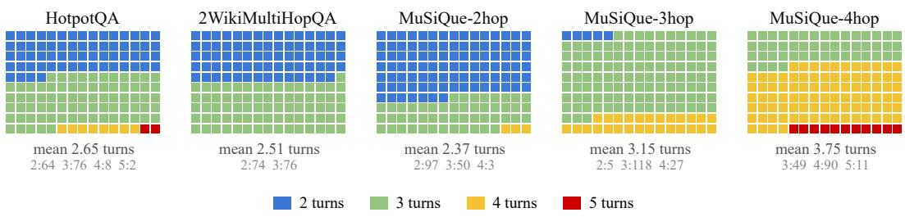  
Figure 3: Distribution of user turns in the constructed shard sets. Each square is one of the 150 evaluated questions in a dataset.

The information introduced by each shard is fixed, but its wording can vary across simulations. To illustrate this variation, we examine one HotpotQA example for the GPT-4o-mini assistant under BM25, dense RAG, and HippoRAG2 with the HISTORY query policy. Across five simulations of each setting, the opening intent was identical in all 15 conversations as intended. The following census shard appeared in 11 distinct forms, all of which retained the year and the reference to the census. Table 6 showcases these variations.

Table 6: Five realizations of one HotpotQA clue, sampled from 15 conversations with the GPT-4omini across 3 different retrieval configurations
<table><tr><td colspan="3">Example According to the 2010 census, what was the population of the city after which the vice president, in April 1813, was named?</td></tr><tr><td>Turn 1 (intent)</td><td>I’m trying to find out the population of a city</td><td></td></tr><tr><td>Turn 2 Turn 2 (simulated)</td><td>it was based on the 2010 census The population info is from the 2010 census.</td><td>11 distinct / 15</td></tr><tr><td></td><td>the population I mean was based on the 2010 census. The population was based on the 2010 census. It was based on the 2010 census. √the population info is based on the 2010 census</td><td></td></tr><tr><td>Turn 3</td><td></td><td></td></tr><tr><td>Turn 4</td><td></td><td></td></tr></table>

As shown in Figure 1, the simulation also uses a fixed GPT-4o-mini response classifier to categorize the assistant’s responses. We adopt the seven response categories of the original benchmark (Laban et al., 2026), adapted from Herlihy et al. (2024): (1) answer attempt, (2) clarification, (3) interrogation, (4) discussion, (5) hedging, (6) refusal, and (7) missing response. Only responses classified as answer attempts are passed to the deterministic answer parser and scored. The classification prompt is provided in Appendix E.

Answer attempts account for 44.2% of SHARDED assistant turns with retrieval under HISTORY, followed by clarification requests (40.7%) and discussion (9.0%); refusals, interrogations, hedging, and missing responses make up the remaining 6.1%. The distribution is nearly identical under CURRENT (43.8%, 40.9%, and 9.1%).

## A.3 CLOSED-BOOK COMPARISON

Figure 4 gives the dataset- and model-level closed-book results for the five-LLM comparison reported in the main text. Table 7 reports the complete results for all ten models.

We observe that the CONCAT degradation is most pronounced among smaller models. Llama-3.1- 8B-Inst and Qwen3-8B both fall below the 80% information-preservation criterion, while Gemma-4-31B-IT and Qwen3.6-27B retain 98% and 97%, respectively. This sensitivity to paraphrasing reinforces the observation of the original benchmark that smaller models are particularly vulnerable to surface-level rephrasing, even when the semantic content of the question is preserved. Broader studies of LLM sensitivity to paraphrased prompts report the same pattern (Sclar et al., 2024; Sun et al., 2024).

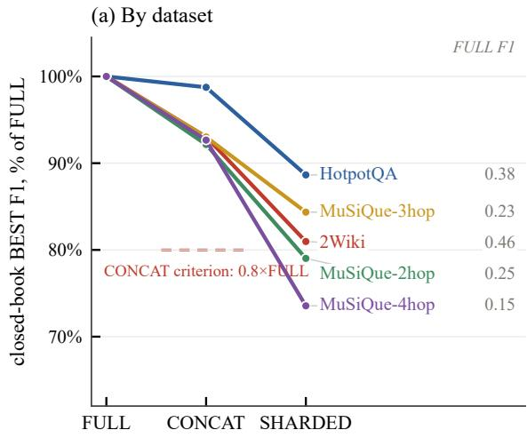

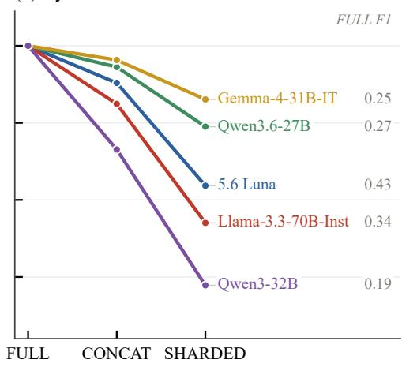  
Figure 4: Closed-book performance across different simulation conditions. The displayed models in Panel (b) are 5.6 Luna and the largest evaluated member of each open-weight model series: Llama-3.3-70B, Gemma-4-31B, Qwen3.6-27B, and Qwen3-32B.

Table 7: Complete closed-book results. F1 is reported on a 0–1 scale.
<table><tr><td rowspan="2"></td><td colspan="3">Closed-book BEST F1</td><td colspan="2">Relative to FULL</td></tr><tr><td>FULL</td><td>CONCAT</td><td>SHARDED</td><td>CONCAT/FULL</td><td>SHARDED drop (%)</td></tr><tr><td colspan="6">Datasets, pooled over all ten LLMs</td></tr><tr><td>HotpotQA</td><td>.313</td><td>.292</td><td>.274</td><td>0.93</td><td>12%</td></tr><tr><td>2Wiki</td><td>.373</td><td>.320</td><td>.298</td><td>0.86</td><td>20%</td></tr><tr><td>MuSiQue-2hop</td><td>.192</td><td>.167</td><td>.153</td><td>0.87</td><td>20%</td></tr><tr><td>MuSiQue-3hop</td><td>.159</td><td>.145</td><td>.142</td><td>0.91</td><td>11%</td></tr><tr><td>MuSiQue-4hop</td><td>.114</td><td>.101</td><td>.085</td><td>0.89</td><td>26%</td></tr><tr><td colspan="6">LLMs, pooled over the five datasets, in descending order of FULL</td></tr><tr><td>5.6Luna</td><td>.426</td><td>.405</td><td>.348</td><td>0.95</td><td>18%</td></tr><tr><td>∞ Llama-3.3-70B</td><td>.337</td><td>.312</td><td>.260</td><td>0.92</td><td>23%</td></tr><tr><td>Qwen3.6-27B</td><td>.266</td><td>.259</td><td>.238</td><td>0.97</td><td>10%</td></tr><tr><td>GPT-4o-mini</td><td>.264</td><td>.215</td><td>.242</td><td>0.82</td><td>8%</td></tr><tr><td>G Gemma-4-31B</td><td>.251</td><td>.246</td><td>.233</td><td>0.98</td><td>7%</td></tr><tr><td>Qwen3-32B</td><td>.190</td><td>.165</td><td>.131</td><td>0.87</td><td>31%</td></tr><tr><td>Qwen3-8B</td><td>.163</td><td>.128</td><td>.113</td><td>0.78</td><td>31%</td></tr><tr><td>Qwen3-4B</td><td>.154</td><td>.125</td><td>.096</td><td>0.81</td><td>38%</td></tr><tr><td>Qwen3-14B</td><td>.147</td><td>.125</td><td>.131</td><td>0.85</td><td>11%</td></tr><tr><td>∞ Llama-3.1-8B</td><td>.106</td><td>.071</td><td>.111</td><td>0.67</td><td>-5%</td></tr><tr><td>All</td><td>.230</td><td>.205</td><td>.190</td><td>0.89</td><td>17%</td></tr></table>

## B ADDITIONAL RESULTS AND ANALYSES

## B.1 AGENT-STYLE CONSOLIDATION: RECAP AND SNOWBALL

If the multi-turn gap were caused only by information arriving in pieces, then reassembling the pieces should remove it. Laban et al. (2026) test this with two agent-style interventions and find that both improve multi-turn performance without restoring the single-turn baseline. We repeat both interventions with retrieval in the loop. RECAP appends one final turn to the conversation that consolidates all previously revealed shards and asks the model to answer again. SNOWBALL, in contrast, repeats all previously revealed shards at every turn. We run both conditions on three LLMs (GPT-4o-mini, Qwen3-32B, and Llama-3.3-70B) across all five datasets and seven retrieval settings. The two interventions differ in how they handle the end of the conversation. RECAP assumes that the final turn is known in advance, which is realistic only in a simulation-like setting. SNOWBALL, by contrast, can be applied throughout the interaction without knowing when the conversation will end, making it the more practical intervention.

It is worth noting that the retrieval query policy also changes what these interventions present to the retriever. Under HISTORY, the recap-turn query contains every shard twice: once in its original conversational turn and once in the final restatement. For SNOWBALL, earlier shards are repeated increasingly often as the conversation grows. Under CURRENT, the recap query consists only of the final restatement, which contains the same shard content as CONCAT together with the recap framing sentence. We therefore treat CURRENT as the standard test of consolidation, since each shard appears exactly once in the retrieval query, while using HISTORY as a complementary setting.

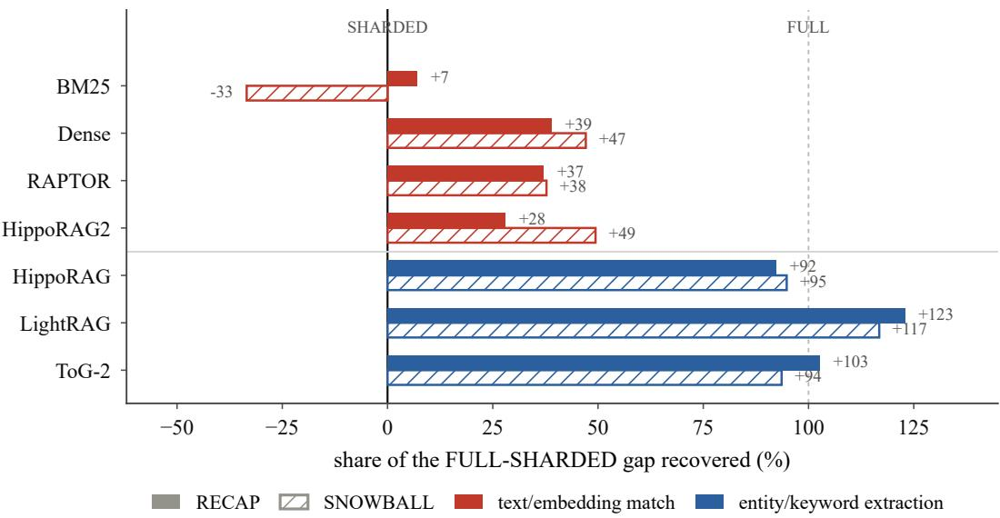  
Figure 5: Recovery of the FULL–SHARDED performance gap under RECAP and SNOW-BALL, using the CURRENT retrieval query. Recovery is normalized such that 0% corresponds to SHARDED and 100% to FULL. Negative values indicate performance below SHARDED.

We first consider RECAP under CURRENT. Figure 5 shows consolidation is highly effective for HippoRAG, LightRAG, and ToG-2, recovering 92–123% of the FULL–SHARDED gap and bringing performance back to approximately the FULL level. BM25, Dense, RAPTOR, and HippoRAG2 recover much less, at 7–39%. This division closely follows the formulation losses in Table 3: HippoRAG, LightRAG, and ToG-2 lose only 1.4–2.8 F1 points from FULL to CONCAT, whereas the remaining retrievers lose 7.1–11.7 points. The pattern therefore echoes the earlier decomposition: consolidation works best for retrieval methods that are already relatively insensitive to the sharded formulation. The same qualitative division holds under HISTORY (Figure 6).

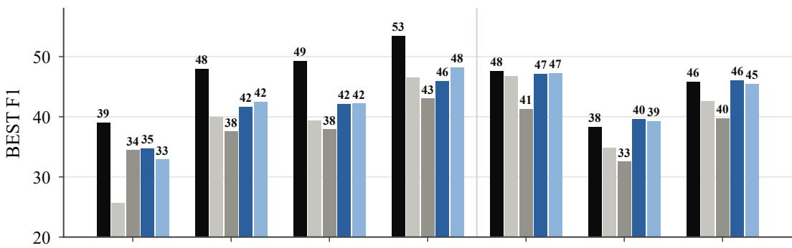

Retriever fed the full history (RECAP query holds every shard twice)  
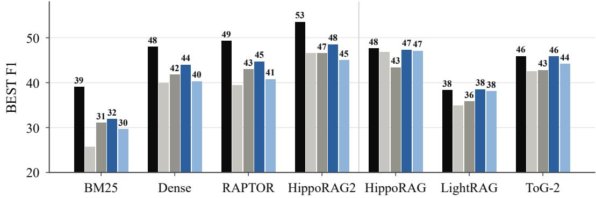  
Figure 6: Mean F1 (×100) under all five conditions, averaged over the three LLMs and five datasets. The upper panel uses CURRENT retrieval queries and the lower panel uses HISTORY. Colors distinguish the two consolidation interventions.

To understand why, we examine the evidence retrieved at the recap turn itself. We observe that the recall shows the same separation as the answer scores. HippoRAG retrieves at least as much supporting evidence under RECAP as it does under FULL, whereas BM25 remains below both CONCAT and its own final SHARDED retrieval. The consolidated restatement contains all of the question information, yet BM25 still retrieves less useful evidence from it than from the final SHARDED turn. This behavior mirrors the formulation split from Section 5.3: BM25, Dense, RAPTOR, and HippoRAG2 operate directly on the supplied query text or its embedding, whereas HippoRAG, LightRAG, and ToG-2 first transform the query into entities or keywords. The latter group is therefore less dependent on the exact surface form of the consolidated question, which helps explain why RECAP restores much more of their answer performance.

SNOWBALL shows a similar pattern under CURRENT. Because each new turn carries forward all previously revealed shards, the retriever receives a progressively more complete query as the interaction unfolds. HippoRAG, LightRAG, and ToG-2 recover 94–117% of the gap, while Dense, RAPTOR, and HippoRAG2 recover 38–49%. BM25 is again the exception and remains below plain SHARDED. Repeating earlier information can therefore recover substantial performance, but only when the resulting turn also forms an effective retrieval query.

Overall, the two interventions point to the same conclusion. Restating earlier turns can recover most, if not all, of the multi-turn gap, going beyond the partial recovery reported by the original benchmark in a non-retrieval setting. The extent of this recovery, however, depends strongly on the retriever. Methods that first extract entities from the query to start their graph-retrieval procedure return close to their single-turn performance, whereas methods that rely directly on the surface form of the text recover only part of that gap. Consolidation therefore helps a RAG system only when the resulting restatement also serves as an effective retrieval query.

## B.2 ADAPTIVE GRAPH PLANNING RETRIEVAL: PLAN-ON-GRAPH

The consolidation conditions in the previous section restate the question before retrieval. A different approach is to let the LLM plan the retrieval process extensively. Plan-on-graph (PoG) (Chen et al., 2024) is a self-correcting adaptive planning method for knowledge-graph augmented LLMs. Given a query, PoG first uses the LLM to decompose it into sub-objectives. It then explores the graph one hop at a time. At each hop, the LLM has to select which relations to follow, which resulting entities to prune. It also updates a running memory of the explored subgraph, the reasoning paths found so far, and the status of each sub-objective. And after each hop, the LLM judges whether the accumulated evidence is enough for a correct answer. If it is not, a reflection step can add new starting entities or backtrack to an earlier one. This process of exploration continues until the evidence is considered sufficient or the maximum depth of four hops is reached.

ToG-2 (Ma et al., 2025) also uses the LLM to guide graph traversal but with far tighter constraints and less LLM usage. It makes one batched LLM call per hop to select relations for a beam of at most three entities (width W=3), ranks the resulting entities with dense passage scores and stops after a fixed maximum depth matched to each dataset’s hop count. Unlike PoG, ToG-2 has no memory or reflection step. Our PoG adaptation runs over the same corpus-derived OpenIE graph as ToG-2 and the other graph retrievers. Because of the high per-conversation cost of PoG’s planning loop, we evaluate it on the eight open-weight models we use in the main experiments. All results reported in this section are averaged over these eight LLMs and the five datasets unless stated otherwise.

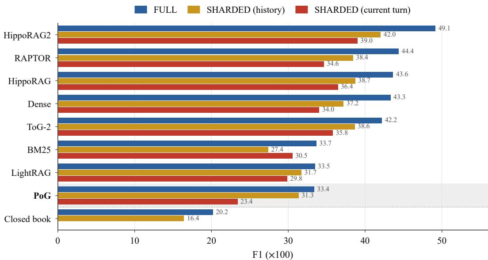  
Figure 7: Averaged F1 (×100) under FULL and both SHARDED policies. Rows are ordered by FULL score.

As PoG decomposes the query internally, it follows that its retrieval should benefit from seeing the accumulated question history, i.e., the HISTORY policy. We observe exactly this in our results (Figure 7). Under HISTORY, PoG loses only 2.0 F1 points (6.1%) between FULL and SHARDED; on HotpotQA, SHARDED even performs better than FULL (50.4 vs. 49.7). Under CURRENT, however, the loss grows to 10.0 points (29.9%), the largest relative decline of any retrieval method. This indicates that, with only the latest shard as its query, PoG has too little of the question to decompose effectively.

One thing worth noting is that, PoG’s small HISTORY gap starts from a low absolute level. PoG’s FULL score of 33.4 is level with BM25 (33.7) and LightRAG (33.5), the two weakest retrieval methods. Under SHARDED with HISTORY, PoG ranks second to last among all the retrieval methods.

These results do not support adaptive graph planning as a practical alternative to simpler methods for reducing multi-turn degradation. PoG’s small HISTORY gap comes with low single-turn accuracy, the largest CURRENT loss of any method, and substantially higher retrieval cost. Each FULL retrieval requires 22.1 LLM planning calls, compared with 2.5 for ToG-2. This difference is not explained by depth alone, since on MuSiQue 4-hop, both methods may explore four hops and PoG still makes 9.0× as many calls. Over a full SHARDED conversation, PoG makes 47.5 LLM calls for retrieval alone, against 6.9 for ToG-2. Each PoG call is short, so the token overhead is 2.9× that of ToG-2. Unlike the conversation-side consolidation in the previous section, where restating the question recovers most of the gap for some retrievers, PoG’s retrieval-side planning does not translate its additional LLM usage into competitive answer quality.

## B.3 APTITUDE AND UNRELIABILITY

The results so far report mean scores, but as noted in Section 4.3, repeated simulations of the same configuration can produce different answers. A mean score can therefore mask whether multi-turn delivery makes a system uniformly worse or merely less predictable. To quantify this, we adopt the aptitude and unreliability measures of the original benchmark (Laban et al., 2026). For each question, let $\mathbf { S } = ( S _ { 1 } , \ldots , S _ { 5 } )$ denote the F1 scores from five simulations with the assistant, retrieval method, query policy, and condition fixed. We define aptitude A and unreliability U as

$$
\begin{array} { l } { { A = \mathrm { p e r c e n t i l e } _ { 9 0 } ( S ) , } } \\ { { U = \mathrm { p e r c e n t i l e } _ { 9 0 } ( S ) - \mathrm { p e r c e n t i l e } _ { 1 0 } ( S ) . } } \end{array}\tag{2}
$$

We use linear interpolation to estimate the percentiles. These are descriptive estimates from five simulations. We then average the per-question values across datasets and the models or retrieval methods being compared.

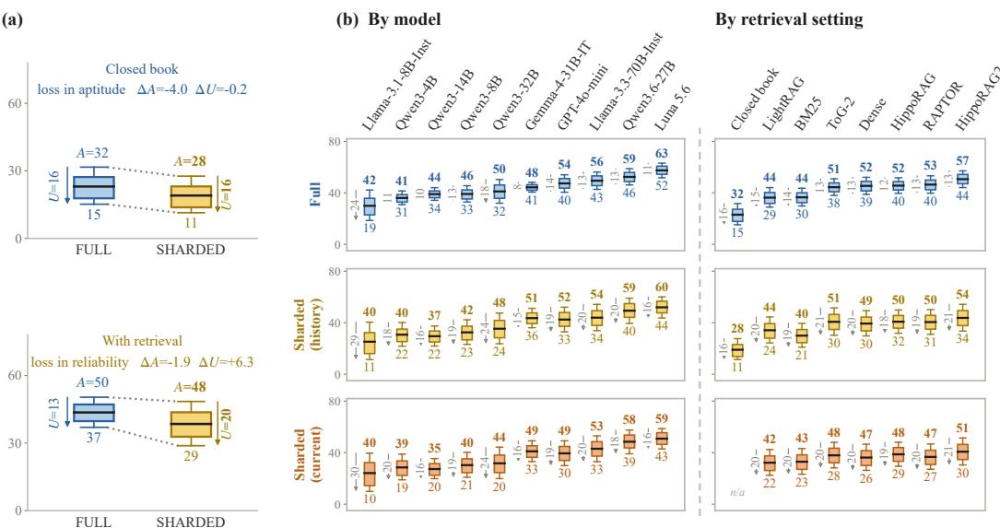  
Figure 8: Aptitude and unreliability under multi-turn setting. (a) Without retrieval, aptitude falls while unreliability remains the same. With retrieval, aptitude holds but unreliability increases sharply. (b) Per-model and per-retriever breakdown, ordered by mean FULL score.

Figure 8 shows the comparison. Without retrieval, both the ceiling and the floor fall by similar amounts (4.0 and 3.8 points), so the distribution shifts down as a whole and unreliability is unchanged. With retrieval, however, the ceiling falls only 1.9 points while the floor drops 8.2, and unreliability widens from 13.4 to 19.7. In other words, closed-book multi-turn loss is a uniform decline in performance, whereas retrieval-augmented loss concentrates in the lower-scoring simulations and leaves the best outcomes largely intact.

Under HISTORY, unreliability increases for all ten LLMs under SHARDED, with gains ranging from 5.1 to 7.8 points. Aptitude falls for eight of the ten. The two exceptions are Gemma-4-31B, whose aptitude actually improves by 3.1 points, and Qwen3.6-27B, which essentially stays the same (+0.3). Gemma is a particularly revealing case. On one hand, it remains the most consistent model even after sharding, with the lowest SHARDED unreliability of all ten LLMs (15.0). On the other hand, its unreliability nearly doubles from its FULL value of 7.6, even though its mean F1 drops only 0.7 points (Section 5.2). The small mean change hides the fact that its best runs improved while its worst runs deteriorated. A model’s mean robustness to multi-turn conversation can conceal an increase in unreliability.

Table 8: Aptitude A, unreliability U, and mean F1 P (×100) under FULL and SHARDED (HISTORY). Shading marks the change in U.
<table><tr><td></td><td colspan="3">FULL</td><td colspan="3">SHARDED</td><td rowspan="2">∆A</td><td rowspan="2">∆U</td></tr><tr><td></td><td>A</td><td>U</td><td>P</td><td>A</td><td>U</td><td>P</td></tr><tr><td colspan="8">LLM Assistants (35 retrieval configurations each)</td></tr><tr><td>Llama-3.1-8B-Inst</td><td>42.1</td><td>23.6</td><td>29.9</td><td>40.5</td><td>29.1 25.3</td><td>-1.7</td><td>+5.4</td></tr><tr><td>Qwen3-4B</td><td>41.4</td><td>10.6</td><td>36.0</td><td>40.2</td><td>18.3</td><td>30.7 -1.3</td><td>+7.8</td></tr><tr><td>Qwen3-14B</td><td>44.0</td><td>9.9</td><td>39.0</td><td>37.5</td><td>15.5 29.5</td><td>-6.6</td><td>+5.7</td></tr><tr><td>Qwen3-8B</td><td>45.5</td><td>12.6</td><td>39.1</td><td>42.3</td><td>19.1</td><td>32.5 -3.2</td><td>+6.5</td></tr><tr><td>Qwen3-32B</td><td>50.3</td><td>18.4</td><td>41.1</td><td>47.5</td><td>23.8</td><td>35.4 -2.8</td><td>+5.4</td></tr><tr><td>Gemma-4-31B-IT</td><td>48.1</td><td>7.6</td><td>44.3</td><td>51.2</td><td>15.0</td><td>43.6 +3.1</td><td>+7.5</td></tr><tr><td>GPT-4o-mini</td><td>54.0</td><td>13.5</td><td>47.3</td><td>52.1</td><td>19.2</td><td>42.5 -1.9</td><td>+5.7</td></tr><tr><td>Llama-3.3-70B-Inst</td><td>56.2</td><td>13.5</td><td>49.4</td><td>54.3</td><td>20.4</td><td>44.0 -1.9</td><td>+6.9</td></tr><tr><td>Qwen3.6-27B</td><td>58.8</td><td>12.6</td><td>52.4</td><td>59.1</td><td>19.6</td><td>49.3 +0.3</td><td>+6.9</td></tr><tr><td>Luna 5.6</td><td>63.0</td><td>11.4</td><td>57.4</td><td>60.1</td><td>16.4</td><td>52.0 -2.9</td><td>+5.1</td></tr><tr><td colspan="8">Retrieval settings (50 configurations each)</td></tr><tr><td>LightRAG</td><td>44.1</td><td>15.2</td><td>36.3</td><td>44.5</td><td>20.2 34.2</td><td>+0.4</td><td>+5.0</td></tr><tr><td>BM25</td><td>43.6</td><td>13.8</td><td>36.5</td><td>39.5</td><td>18.5</td><td>30.0 -4.1</td><td>+4.7</td></tr><tr><td>ToG-2</td><td>50.9</td><td>12.9</td><td>44.4</td><td>51.5</td><td>21.2</td><td>40.7 +0.6</td><td>+8.3</td></tr><tr><td>Dense</td><td>52.1</td><td>13.3</td><td>45.4</td><td>49.4</td><td>19.6</td><td>39.4 -2.7</td><td>+6.3</td></tr><tr><td>HippoRAG</td><td>51.7</td><td>12.1</td><td>45.6</td><td>49.9</td><td>18.1</td><td>40.8 -1.8</td><td>+6.0</td></tr><tr><td>RAPTOR</td><td>53.2</td><td>13.5</td><td>46.4</td><td>50.2</td><td>19.2</td><td>40.5 -3.0</td><td>+5.8</td></tr><tr><td>HippoRAG2</td><td>57.1</td><td>13.0</td><td>50.6</td><td>54.3</td><td>20.8</td><td>43.8 -2.7</td><td>+7.8</td></tr><tr><td>Closed book</td><td>31.7</td><td>16.5</td><td>23.0</td><td>27.7</td><td>16.3</td><td>19.0 -4.0</td><td>-0.2</td></tr></table>

We observe the same pattern under CURRENT, where mean unreliability reaches 19.9 points. Every model and every retrieval method shows higher unreliability than under FULL with either query policy. Table 8 reports the HISTORY values.

## B.4 ANSWERING UNDER COMPLETE SUPPORTING-SOURCE COVERAGE

Section 5.4 showed that cumulative retrieval coverage under SHARDED approaches or exceeds the FULL baseline while answer quality remains lower. Both observations are averages, however, and could in principle describe different conversations: the ones that retrieve the evidence need not be the ones which answer poorly. In order to assess whether the finding holds at the level of individual conversations, we conduct a paired comparison of FULL and SHARDED under HISTORY. Each pair shares the LLM, dataset, question, retriever and simulation. We consider only those pairs whose conversations retrieve all of the question’s supporting passages. One thing worth noting is that complete supporting-source coverage does not remove distractor passages from the retrieved context. To answer correctly, the LLM must therefore identify the relevant evidence among these distractors and combine it across turns to produce the final answer.

Among the 54,876 qualifying pairs (24.4% of the 225,000 eligible), we find that mean BEST F1 falls from 73.7 under FULL to 62.1 under SHARDED, a difference of 11.6 points (95% paired bootstrap CI [9.9–13.4]). This effect is not confined to any single dataset: Table 9 shows significant declines on four of the five datasets. Moreover, complete coverage becomes increasingly rare as the required evidence grows, falling from 46.9% of HotpotQA pairs to 0.5% on MuSiQue-4hop.

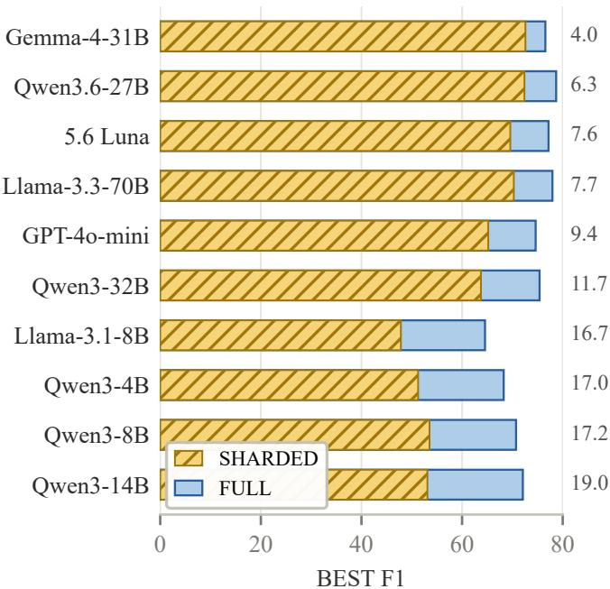  
Figure 9: Paired F1 by LLM under complete supporting-source coverage. FULL–SHARDED difference reported on the right.

This sharp decline highlights a practical limitation of current retrieval methods: as more supporting passages are required, retrieving all of them becomes increasingly difficult.

Table 9: Paired F1 under complete supporting-source coverage across datasets (HISTORY, six retrievers, RAPTOR excluded). •: the paired bootstrap 95% interval of the gap lies above zero.
<table><tr><td>Dataset</td><td>Pairs</td><td>FULL</td><td>SHARDED</td><td>Gap</td></tr><tr><td>HotpotQA</td><td>21,107</td><td>78.5</td><td>67.0</td><td> $1 1 . 5 ^ { \bullet }$ </td></tr><tr><td>2Wiki</td><td>17,578</td><td>77.5</td><td>68.4</td><td> $9 . 0 ^ { \bullet }$ </td></tr><tr><td>MuSiQue-2hop</td><td>14,255</td><td>64.3</td><td>50.7</td><td> $1 3 . 6 ^ { \bullet }$ </td></tr><tr><td>MuSiQue-3hop</td><td>1,723</td><td>57.9</td><td>35.3</td><td> $2 2 . 5 ^ { \bullet }$ </td></tr><tr><td>MuSiQue-4hop</td><td>213</td><td>47.0</td><td>28.4</td><td>18.6</td></tr></table>

Looking across LLM assistants, however, we observe that the 11.6-point aggregate gap is far from uniform across models. Figure 9 reveals pronounced model-level differences: every LLM retains a significant decline, but the magnitude varies almost fivefold, from 4.0 F1 points for Gemma-4-31B to 19.0 for Qwen3-14B. Six models lose 4-12 points, while the four smallest lose 17–19 points and retain only about three quarters of their FULL performance. Encouragingly, when all supporting sources are retrieved, the stronger LLM assistants preserve substantially more of their singleturn performance than the smaller models. The most robust retain over 90% of their FULL performance, suggesting that large multi-turn losses are not inevitable, although the remaining gap leaves clear room for improvement.

These conclusions, however, apply only to the 24.4% of paired conversations in which both conditions retrieve every supporting passage. In the remaining pairs, FULL and SHARDED can also differ in how much supporting evidence they retrieve, so retrieval itself may contribute to the overall loss, as examined in Sections 5.3 and 5.4.

## B.5 LLM-AS-A-JUDGE EVALUATION

Token F1 rewards lexical overlap and penalizes semantically equivalent answers that differ in wording from the reference answer (Kamalloo et al., 2023). We therefore test whether the FULL - SHARDED degradation persists under binary semantic-correctness measures. We follow prior QA and RAG work that use an LLM to assess a candidate answer against the question and reference answer (Rau et al., 2024).

Table 10: F1 scores (×100) and binary judge accuracy under the HISTORY query policy, pooled over Llama-3.3-70B, Gemma-4-31B, and Qwen3-32B and the five datasets. Shading marks the size of the gap.
<table><tr><td></td><td colspan="3">Token F1 (BEST)</td><td colspan="3">LLM judge (BEST)</td></tr><tr><td>Retriever</td><td>FULL</td><td>SHARDED</td><td>Gap</td><td>FULL</td><td>SHARDED</td><td>Gap</td></tr><tr><td>HippoRAG2</td><td>53.3</td><td>47.4</td><td>+6.0</td><td>55.7</td><td>50.2</td><td>+5.5</td></tr><tr><td>RAPTOR</td><td>48.2</td><td>43.3</td><td>+4.9</td><td>50.3</td><td>45.4</td><td>+4.8</td></tr><tr><td>HippoRAG</td><td>47.2</td><td>44.5</td><td>+2.7</td><td>49.0</td><td>47.4</td><td>+1.6</td></tr><tr><td>Dense</td><td>47.1</td><td>41.5</td><td>+5.6</td><td>49.2</td><td>43.2</td><td>+6.0</td></tr><tr><td>ToG-2</td><td>46.0</td><td>44.5</td><td>+1.4</td><td>47.9</td><td>47.1</td><td>+0.8</td></tr><tr><td>BM25</td><td>36.6</td><td>30.0</td><td>+6.6</td><td>38.4</td><td>30.7</td><td>+7.7</td></tr><tr><td>LightRAG</td><td>36.0</td><td>35.5</td><td>+0.5</td><td>37.6</td><td>37.2</td><td>+0.5</td></tr><tr><td>Closed book</td><td>25.9</td><td>20.8</td><td>+5.1</td><td>24.7</td><td>21.2</td><td>+3.4</td></tr><tr><td>Mean</td><td>42.5</td><td>38.5</td><td>+4.1</td><td>44.1</td><td>40.3</td><td>+3.8</td></tr></table>

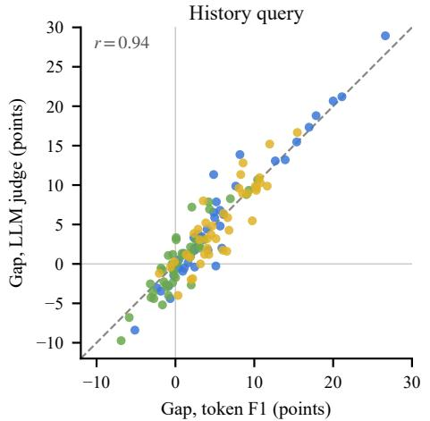

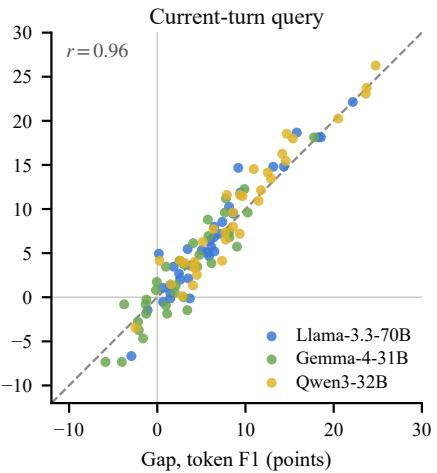  
Figure 10: FULL–SHARDED gaps are consistent across metrics. Each point represents one model–dataset–retriever combination, comparing the gap under token F1 with the same gap under the binary judge.

We rescore the conversations for Llama-3.3-70B, Gemma-4-31B, and Qwen3-32B across all five datasets, all retrieval methods with both query policies, and the closed-book setting. We use GPT-4omini at temperature zero to assign binary CORRECT/INCORRECT judgments. For each stored answer attempt, the LLM receives the original question, the reference answer and its aliases, and the extracted candidate answer. The judge is instructed to accept semantically equivalent answers despite lexical or formatting differences, while rejecting contradictory or ambiguous responses. We apply the BEST convention from Section 4.3 and compute paired 95% question-cluster bootstrap confidence intervals using 5,000 resamples, keeping all observations associated with each question together.

Table 10 and Figure 10 compare the two metrics. We find that the mean HISTORY gap changes only from 4.1 points under token F1 to 3.8 under the judge, and every retrieval method retains a positive mean gap under both query policies. The per-configuration gaps under token F1 and the LLM judge are strongly correlated, with r = 0.94 under HISTORY and 0.96 under CURRENT. Directly comparing the two measured gaps, the token-F1 gap exceeds the judge gap by 0.3 points under HISTORY (95% CI [−0.2, 0.8]) and is 0.2 points smaller under CURRENT (95% CI [−0.8, 0.5]). Both intervals include zero, and no gap reverses from a significant decline to a significant improvement under the bootstrap intervals.

Because LLM judges can carry their own biases (Zheng et al., 2023), we treat this analysis as a robustness check rather than a replacement for F1. That said, the FULL–SHARDED degradation remains nearly unchanged under a judge explicitly instructed to accept semantically equivalent wording, confirming that the observed loss reflects answer quality rather than lexical mismatch.

## C QUALITATIVE RETRIEVAL AND CONVERSATION EXAMPLE

Figure 11 shows a representative SHARDED conversation, in which the assistant commits to an incorrect date before arriving at the correct answer at a later turn.

<table><tr><td rowspan=1 colspan=1>MuSiQue-3hop                                                Llama-3.3-70B – HippoRAG – CURRENTFull questionThe Real Housewives series from the largest city of the state where WEKL transmits started when?Reference answer: October 7, 2008</td></tr><tr><td rowspan=1 colspan=1>User Turn 1: I’m trying to find out when a certain series started</td></tr><tr><td rowspan=1 colspan=1>Retrieved passages. [1] Xiao Shuxian [2] In the Heat of the Sun [3] Sun Moon Lake Wen Wu Temple [4] Bo Yikao[5] Gregoire BoonzaierLLM assistant Turn 1                                                                   ClarificationTo help you find the start date of the series, could you please provide more details about the seriesyou&#x27;re looking for, such as its title or genre? This will help narrow down the search.Answer: Unknown</td></tr><tr><td rowspan=1 colspan=1>User Turn 2: that series is The Real Housewives series</td></tr><tr><td rowspan=1 colspan=1>Retrieved passages. [1] The Real Housewives of New York City [2] The Real Housewives of Atlanta [3] New YorkCity [4] Taylor Armstrong [5] New York CityLLM assistant Turn 2                                                                Answer attemptThe Real Housewives series has multiple installments, each focusing on a different city. According tothe retrieved context, The Real Housewives of New York City premiered on March 4, 2008, and TheReal Housewives of Atlanta premiered on October 7, 2008. If you&#x27;re looking for the start date of aspecific installment, please let me know the city, and I&#x27;ll do my best to provide the answer.Answer: March 4, 2008</td></tr><tr><td rowspan=1 colspan=1>User Turn 3: The series is from the largest city of the state.Retrieved passages. [1] Xiao Shuxian [2] In the Heat of the Sun [3] Sun Moon Lake Wen Wu Temple [4] Bo Yikao[5] Gregoire BoonzaierLLM assistant Turn 3                                                                   ClarificationSince you mentioned the series is from the largest city of a state, I&#x27;ll need more information to determinewhich state and city you&#x27;re referring to. There are many states with multiple cities, and each has itsown Real Housewives series. For example, California has The Real Housewives of Orange County,The Real Housewives of Beverly Hills, and others. If you could provide the state or more details aboutthe city, I&#x27;d be happy to try and help you find the start date of the series.Answer: Unknown</td></tr><tr><td rowspan=1 colspan=1>User Turn 4: and that state is where WEKL transmits.</td></tr><tr><td rowspan=1 colspan=1>Retrieved passages. [1] WEKL [2] Canada-United States border [3] Geography of the United States [4] Economy ofthe United States [5] United StatesLLM assistant Turn 4                                                                Answer attemptBased on the retrieved context, WEKL is a radio station located in Augusta, Georgia, and it broadcastson 102.3 MHz. Since Augusta is a city in the state of Georgia, I&#x27;ll assume the largest city in Georgia isAtlanta. The Real Housewives of Atlanta is a reality TV series that premiered on October 7, 2008.Answer: October 7, 2008</td></tr><tr><td rowspan=1 colspan=1>Figure 11: A SHARDED conversation with Llama-3.3-70B and HippoRAG under CURRENTretrieval queries.</td></tr></table>

## D RETRIEVAL SYSTEMS AND CONFIGURATION SUMMARY

We evaluate retrieval families spanning lexical passage retrieval, dense passage retrieval, knowledgegraph traversal, and hierarchical retrieval. The descriptions below summarize the evaluated systems; implementation details are reported in Table 11.

## D.1 RETRIEVAL SYSTEMS

• NONE. A closed-book control that measures the assistant’s parametric performance without external evidence.

• BM25 (Robertson & Zaragoza, 2009). A lexical passage retriever that favors exact term overlap and returns the five highest-ranked passages from the shared corpus.

• Dense TextRAG (Xiao et al., 2024). A semantic passage retriever that ranks the shared corpus with normalized BGE-large embeddings and returns five passages.

• HippoRAG (Gutierrez et al., 2024). A memory-inspired graph retriever that links query entities to a knowledge graph (NER) and uses Personalized PageRank to propagate relevance across related concepts before ranking supporting passages.

• HippoRAG2 (Gutiérrez et al., 2025). A graph retriever that combines phrase-level conceptual structure with passage-level context and uses language-model recognition to filter candidate facts.

• RAPTOR (Sarthi et al., 2024). A hierarchical retriever that recursively organizes passages into a tree of leaves and summaries, allowing retrieval at different levels of abstraction.

• ToG-2 (Ma et al., 2025). A hybrid graph-text retriever that tightly couples knowledge-graph traversal with passage retrieval. It uses an LLM to select promising graph relations and reason over retrieved evidence while passage relevance guides subsequent graph exploration.

• LightRAG (Guo et al., 2025). A graph-enhanced retriever that extracts local and global query keywords. Uses vector search to match them to entities and relationships, and uses graph connectivity to retrieve additional relevant evidence.

## D.2 IMPLEMENTATION DETAILS

Table 11 summarizes the indexing, retrieval, and generation interfaces used in the benchmark.

Table 11: Implementation details of the evaluated retrieval families.
<table><tr><td rowspan="2">Retriever</td><td colspan="2">Indexing</td><td colspan="2">Retrieval</td><td rowspan="2">Generation Model context</td></tr><tr><td>Knowledge type</td><td>Index content</td><td>Query input</td><td>Granularity</td></tr><tr><td>NONE</td><td>Closed-book</td><td></td><td></td><td></td><td>Parametric only</td></tr><tr><td>BM25 (Robertson &amp; Zaragoza, 2009)</td><td>Plain text</td><td>Frozen passages</td><td>Lexical terms</td><td>Passage</td><td>5 retrieved passages</td></tr><tr><td>Dense TextRAG (Xiao et al., 2024)</td><td>Plain text</td><td>Passage embeddings</td><td>Dense query</td><td>Passage</td><td>5 retrieved passages</td></tr><tr><td>HippoRAG (Gutierrez et al., 2024)</td><td>Phrase graph</td><td>Phrases, passages</td><td>Query phrases</td><td>Entity, passage</td><td>5 retrieved passages</td></tr><tr><td>HippoRAG2 (Gutiérrez et al., 2025)</td><td>Fact graph, passages</td><td>Facts, entities, passages</td><td>Query-to-fact</td><td>Fact, entity, passage</td><td>5 retrieved passages</td></tr><tr><td>RAPTOR (Sarthi et al., 2024)</td><td>Summary tree</td><td>Passage leaves, summaries</td><td>Dense query</td><td>Collapsed-tree node</td><td>5 leaf/summary nodes</td></tr><tr><td>ToG-2 (Ma et al., 2025)</td><td>OpenIE graph, passages</td><td>Entities, relations, passages</td><td>Query entities</td><td>Path, passage</td><td>Triples + 5 passages</td></tr><tr><td>LightRAG (Guo et al., 2025)</td><td>Entity-relation graph, text</td><td>Entities, relations, chunks</td><td>Native keywords</td><td>Local, global</td><td>Entities, relations, passages</td></tr></table>

## D.3 PARENT CORPORA

Table 12 reports the size of the parent corpus built for each dataset.

Table 12: Parent corpora used for retrieval.
<table><tr><td rowspan="2">Corpus</td><td colspan="2">Questions</td><td colspan="3">Parent corpus</td></tr><tr><td>Evaluated</td><td>Donor</td><td>Documents</td><td>Passages</td><td>Approx. tokens</td></tr><tr><td>HotpotQA</td><td>150</td><td>850</td><td>1,000</td><td>9,772</td><td>907,305</td></tr><tr><td>2WikiMultiHopQA</td><td>150</td><td>850</td><td>1,000</td><td>6,324</td><td>466,381</td></tr><tr><td>MuSiQue (2/3/4-hop)</td><td>450</td><td>550</td><td>1,000</td><td>11,693</td><td>966,093</td></tr></table>

```yaml
query_linking: phrase_to_entity
graph_propagation: personalized_pagerank
retrieval_top_k: 5
```

## D.4 MODEL VERSIONS AND ACCESS

Table 13 lists the models used in our experiments together with their versions and access details. We serve open-weight models locally with vLLM on NVIDIA A100 GPUs. All models use temperature 1.0 and a 1,000-token answer cap. We disable reasoning and thinking for all models except two, both of which use a 10,000-token cap. One exception is 5.6 Luna, which reasons natively each turn because its responses frequently exceeded the standard limit. The other is Qwen3.6-27B, which keeps thinking disabled but uses the official non-thinking instruct sampler at temperature 0.7. The user simulator uses T = 1.0 and the response classifier uses T = 0 throughout all experiments.

Table 13: Evaluated LLMs with versions and access details.
<table><tr><td>Display name</td><td>Model ID / revision</td><td>|θ|</td><td>Access</td></tr><tr><td>GPT-4o-mini</td><td>gpt-40-mini-2024-07-18</td><td></td><td>OpenAI API</td></tr><tr><td>5.6 Luna</td><td>gpt-5.6-luna</td><td></td><td>OpenAI API</td></tr><tr><td>Qwen3-4B</td><td>Qwen/Qwen3-4B</td><td>4B</td><td>Local vLLM</td></tr><tr><td>Qwen3-8B</td><td>Qwen/Qwen3-8B</td><td>8B</td><td>Local vLLM</td></tr><tr><td>Qwen3-14B</td><td>Qwen/Qwen3-14B</td><td>14B</td><td>Local vLLM</td></tr><tr><td>Qwen3-32B</td><td>Qwen/Qwen3-32B</td><td>32B</td><td>Local vLLM</td></tr><tr><td>Qwen3.6-27B</td><td>Qwen/Qwen3.6-27B</td><td>27B</td><td>Local vLLM</td></tr><tr><td>Llama-3.1-8B-Inst</td><td>meta-llama/Llama-3.1-8B-Instruct</td><td>8B</td><td>Local vLLM</td></tr><tr><td>Llama-3.3-70B-Inst</td><td>meta-llama/Llama-3.3-70B-Instruct</td><td>70B</td><td>Local vLLM</td></tr><tr><td>Gemma-4-31B-IT</td><td>google/gemma-4-31B-it</td><td>31B</td><td>Local vLLM</td></tr></table>

## D.5 RETRIEVER CONFIGURATIONS

The principal configurations are given below in a compact form. All systems use the shared corpus and the same answer-generation interface. Retriever-specific settings define only how that corpus is indexed and how evidence is selected.

## BM25 Configuration

retrieval\_top\_k: 5

## Dense TextRAG Configuration

embedding\_model: BAAI/bge-large-en-v1.5   
similarity: cosine   
retrieval\_top\_k: 5

## HippoRAG Configuration

## HippoRAG2 Configuration

```yaml
query_linking: dense_concept_linking
fact_candidates: 5
passage_node_weight: 0.05
retrieval_top_k: 5
```

## RAPTOR Configuration

index\_structure: collapsed\_tree

retrieval\_top\_k: 5

summary\_length\_limit: 100

context\_limit: 3500

## ToG-2 Configuration

relation\_selection: batched

beam\_width: 3

seed\_entities: 5

retrieval\_top\_k: 5

traversal\_depth: dataset\_matched

## LightRAG Configuration

query\_type: local\_and\_global

chunk\_token\_size: 1200

chunk\_overlap\_token\_size: 100

local\_evidence\_tokens: 400

global\_evidence\_tokens: 400

## E PROMPTS

We disclose the prompts used across our pipeline below. We show the shard-construction prompts for a single dataset (HotpotQA) here. The prompts for the remaining datasets follow the same structure and will be provided in our code repository.

## E.1 SHARD CONSTRUCTION

Each fully specified question is first segmented into information units, and the segments are then rephrased into a multi-turn conversation. Both steps are run with the shared GPT-4o-mini scaffold.

```jsonl
Segmentation
You are given a fully specified factual question, and your task is to segment the
question into units of information that each represent a single piece of
information needed to answer it.
You must output a list of segments in the following JSON format:
{"segments": [
{"segment": "[short excerpt from the question]"},
{"segment": "[short excerpt from the question]"}
]}
Rules:
- [Non-overlapping] Segments must be non-overlapping and together cover the entire
question. You can leave gaps for non-essential portions (delimiters, articles like
"the", question marks).
- [Coherent units] Each segment should be a coherent clue or constraint. Do not
split noun phrases, relations, dates, titles, or named entities into fragments.
Prefer 2-4 segments for short questions under 30 words. Only use 5+ segments when
the question truly contains 5+ independent constraints.
- [Preserve bridge relations] HotpotQA questions often ask through a bridge entity.
Keep relation phrases intact, such as "creator of what 2012 film", "album released
in 1981", or "grandfather to the children of Mark Antony". Do not reduce them to
vague fragments like "what film", "the company", "details", or "connection".
- [No external information] Only segment what's actually in the question. Do not
add facts from your own knowledge.
Example Question:
Glenn Quagmire is voiced by the creator of what 2012 film?
Example Output:
{"segments": [
{"segment": "Glenn Quagmire is voiced by"},
{"segment": "the creator of what 2012 film"}
]}
Now segment the following question. Output ONLY a JSON object with the "segments"
field.
Question: {question}
```

Rephrasing   
You are given segments of a fully specified question. Your task is to turn them   
into a multi-turn conversation: (1) choose an "intent shard" that opens the   
conversation by naming WHAT THE USER IS LOOKING FOR, and (2) rephrase each   
remaining segment into a conversational follow-up turn that adds one clue.   
Output a JSON object in the following format:   
{   
"answer\_target": "[what the question is ultimately asking for: a prize, a film,   
a date, a person's middle name, a city, etc.]",

```jsonl
"initial_segment": "[exact segment text the intent shard is based on]",
"initial_shard": "[short conversational opener naming the answer target - like
a user starting a search]",
"shards": [
{"segment": "[segment text]", "shard": "[conversational follow-up turn
that adds this clue]"}
]
}
Rules:
- [Intent shard names the GOAL, not the subject] The initial_shard must announce
WHAT THE USER WANTS TO FIND (the answer target), not just the first noun in the
question. If the question asks "...won what prize?", the opener is about finding a
prize ("trying to find what award someone won"), NOT "an American playwright"
(that's a clue, it goes in a follow-up). If the question asks "what 2012 film?",
the opener is about a film. If it asks "the middle name of the actress", the
opener is about finding a middle name. The conversation should open the way a real
user opens: stating their goal.
- [Transform every segment] Every segment must appear exactly once - as the
initial_segment or in the shards list. Do not drop or merge segments.
- [Conversational turns] Each shard should sound like a real user speaking a turn
natural, brief, can include filler ("oh and", "btw", "I think"). 1-2 sentences.
This is a conversation, not a list of fragments.
- [No new information / no answer leakage] Only re-present what is in the segments.
Do NOT add facts from your own knowledge, and never reveal or hint at the actual
answer.
- [PRESERVE THE CHAIN - most important] These questions often reach the answer
through a chain of hops: an entity, a relation to a bridge entity, then the final
thing being asked. Every link MUST survive across the shards, and the final thing
being asked must stay the final thing being asked. Do NOT collapse the chain to
the bridge entity. Example: "Glenn Quagmire is voiced by the creator of what 2012
film?" must NOT become "what film is Quagmire from" - that drops the "voiced by
the creator of" hops and asks a different question.
- [Back-reference is allowed] To keep the chain, a follow-up shard MAY refer back
to something in an earlier shard ("that person", "that film", "the same director").
A real multi-turn user speaks this way. Preserving the relation matters more than
making each shard independently self-contained.
- [Shards are CONSTRAINTS, not sub-questions] This keeps the shards faithful to a
lazy, underspecified user. Each follow-up states a CONSTRAINT or CLUE the user
knows about what they want - it does NOT pose a reasoning step for the solver. The
user supplies clues; the user does NOT hand over the solution plan. (The intent
shard naming the goal is fine - that is the user stating what they want, not a
reasoning step.)
GOOD (clue the user asserts): "and it was created by whoever voices Glenn
Quagmire", "the one directed by that same person", "it came out in 2012"
BAD (sub-question that decomposes the task): "who voices Glenn Quagmire?",
"what did that person create?", "first find the director"
The GOOD form leaves the reasoning to the solver; the BAD form does the solver's
job. Phrase follow-ups as declarative clues, not as step-by-step questions for
the assistant.
[Order of shards] Order the follow-up shards from most to least important.
Worked example A - goal-first opener, target named (NOT hinted):
Question: "Venus is a play by an American playwright who won what prize?"
Output:
{
"answer_target": "a prize / award won by the playwright",
"initial_segment": "won what prize",
"initial_shard": "I'm trying to figure out what prize someone won",
"shards": [
{"segment": "an American playwright", "shard": "they're an American
playwright"},
{"segment": "Venus is a play by", "shard": "and they wrote the play
Venus"}
```

]   
}   
Worked example B - bridge chain preserved, follow-up is a declarative clue (not a   
sub-question):   
Question: "Glenn Quagmire is voiced by the creator of what 2012 film?"   
Output:   
{   
"answer\_target": "a 2012 film",   
"initial\_segment": "the creator of what 2012 film",   
"initial\_shard": "looking for a 2012 film",   
"shards": [   
{"segment": "Glenn Quagmire is voiced by", "shard": "it was created by   
whoever does the voice of Glenn Quagmire"}   
]   
}   
Now complete the task for the following question and segments.   
Question: {question}   
Segments:   
{segments\_json}

## E.2 SIMULATION SCAFFOLD

During each simulated conversation, a shared GPT-4o-mini plays the user (revealing one shard per turn) and classifies each assistant turn into one of seven response categories.

User simulator   
You are simulating a user of an interactive LLM system (like ChatGPT).   
The user is inherently lazy, and answers in short form, providing only minimal   
information to the system. You should not be proactive.   
Here's the conversation so far:   
{conversation\_block}   
Here are the shards that have already been revealed:   
{revealed\_block}   
Here are all the shards that have not been revealed yet:   
{remaining\_block}   
You must generate a response to the conversation so far. Here are the rules:   
- [Providing a Shard] You can reveal the content of a shard to the system in your   
response if it will help the system move closer to answering the problem. You   
should select the shard to reveal that is most "basic" and is the current most   
relevant shard.   
- [One Shard at a Time] You should only reveal at most one shard at a time.   
- [Never Mix Unrevealed Shards] After selecting one shard, that selected shard is   
the ONLY source of new information for your response. You may use the conversation   
and already revealed shards to make the response coherent, but you must not add,   
combine, hint at, or paraphrase information from any other unrevealed shard. This   
remains true even when another unrevealed shard is closely related or would make   
the response more useful.   
Example: suppose unrevealed shard 2 says "and they wrote the play Venus" and   
unrevealed shard 3 says "they're an American playwright". If you select shard 2:   
WRONG: "They're an American playwright and wrote the play Venus." This leaks   
information from shard 3.   
CORRECT: "They wrote the play Venus." This conversationally rephrases shard 2   
and reveals nothing from shard 3.

```jsonl
- [Preserve the Original Goal] The initial intent shard establishes what the user
ultimately wants. A later non-intent shard adds a constraint that identifies or
qualifies that original target; it does not replace the original goal with a new
intermediate question. Do not introduce a later shard with phrases such as "I'm
looking for", "I want to know", or "I'm trying to find out" unless that selected
shard is itself the intent shard. State the later constraint declaratively and
connect it to the target already under discussion.
Example: the initial intent is "I'm trying to find out what year a certain
Governor ended their term" and the selected later shard is "the city is where
the author of Pacem in Terris died".
WRONG: "I'm looking for the city where the author of Pacem in Terris died." This
changes the goal into answering the intermediate city question.
CORRECT: "The city I mean is where the author of Pacem in Terris died." This
conversationally adds the constraint while preserving the original goal.
- [Reveal Entire Shard] If you reveal a shard, you must make sure to include *all
the information in the shard*. For example, if the shard is "your symptoms are
that you have a headache in the mornings", your response can't just be "yeah I
have headaches", you must say "yup mostly headaches in the mornings".
- [Irrelevant Clarifications] If the system asks you a question irrelevant to the
shards, asks you a generic question ("Can you give me a hint?"), you should
respond with an answer that does not provide a shard. ("I don't know", "Is that
really important?", etc.) You should not reveal any information beyond what is
available in the shards.
- [No Repeated Shards] You should not reveal the same shard more than once.
Carefully review the shards revealed already, and only reveal a shard if its
‘shard_id‘ is not on the list.
- [Rephrase Shards] If you reveal a shard, you should rephrase it in a
conversational way. Do not copy the shard verbatim.
- [Do Not Ask Questions] Your response should always be declarative sentences, and
not questions.
- [Brevity of Response] You should favor being succinct. Your answer can also have
typos, improper grammar, capitalization, etc. You are simulating a real person
talking to an AI, who is in a hurry.
- [Format] Your response should be formatted as a JSON object with the following
keys:
- ‘response‘: The response to the conversation so far.
- ‘shard_id‘: The shard you are revealing to the system. The shard_id can be
an integer, or -1 if you did not reveal any shards.
For example:
{"response": "I don't know", "shard_id": -1}
or:
{"response": "yeah I want it to [...]", "shard_id": 1}
```

## Response classifier

You are reviewing a multi-turn conversation between a user and an assistant, and   
are given the last turn of the conversation.   
Here is the full specification of the problem the system is attempting to solve:   
{initial\_shard}   
Specification:   
{shards\_json}   
You must classify the response of the assistant according to the response type:   
‘answer\_attempt‘: The response contains a complete answer attempt to the user's   
question (not templated or hypothetical), that can be extracted verbatim. See the   
task-specific answer description for more details.

- ‘clarification‘: The response is short (less than 100 words) and contains a   
single question addressed to the user that directly inquires about an aspect of   
the user's query. A clarification turn cannot be long (see ‘discussion‘), cannot   
contain a vague question (see ‘discussion‘) and cannot contain multiple questions   
(see ‘interrogation‘).   
‘interrogation‘: The response contains multiple questions addressed to the user,   
sometimes organized in a list or bullet-points.   
‘discussion‘: The response discusses the question in detail, without providing a   
final answer, asking a specific clarification question, or a refusal to answer.   
The response may or may not contain a vague question (e.g., "What else can I help   
you with?").   
- ‘hedge‘: The response contains multiple answer candidates based on hypotheticals   
(ifs) or branching (case 1, case 2) with corresponding descriptions.   
- ‘refuse‘: The response contains an explicit or implicit refusal to answer the   
user's question without a follow-up question or a request.   
‘missing‘: The response is empty/blank.   
You must output your answer in the following JSON format:   
{"response\_type":   
"refuse|missing|answer\_attempt|hedge|clarification|interrogation|discussion"}   
Rules:   
- The assistant giving a hint at how an answer could look like is not a final   
answer. You should only select ‘answer\_attempt‘ if the conversation could end at   
this stage with the user having an entirely final answer to the problem they've   
formulated.   
- [Task Specific Answer] {answer\_description}   
Conversation's last turn:   
{last\_turn}

## E.3 ASSISTANT

The assistant answers the user’s question, optionally conditioned on retrieved context, and self-marks its committed answer with a final Answer: line that is parsed deterministically. The retrievalaugmented variant is shown below; the closed-book variant is the same prompt with the retrievedcontext instructions and block removed.

```jsonl
Assistant system prompt
You are a helpful AI assistant answering a user's question. You have access to
retrieved context that may be relevant.
The user will ask you a factual question. Use the retrieved context to answer when
it is relevant; if it does not contain the answer, you may answer from your own
knowledge. If something is not clear, you can ask the user to clarify what they
need. Be natural and helpful.
Whenever you state or conclude an answer - even briefly, with caveats, or
mid-sentence - you MUST end your reply with a single final line, on its own line,
in exactly this format, concise and definitive, devoid of additional elaborations:
Answer: <your answer to the user's main question>
Put in the Answer line the KIND of thing the question asks for: for a single
entity, date, number, or yes/no, give just that and keep it short; if the question
asks for a description, advantage, reason, or property, state that requested
description itself, not just the subject entity it is about.
For example: "Answer: 2049", "Answer: Orchid Console", "Answer: June 10, 1990" or
"Answer: lower latency and simpler maintenance". If your reply does not state an
answer (for example, you are asking a clarifying question instead), do not write
an "Answer:" line.
Retrieved context:
{retrieved_context}
```

## E.4 EVALUATION

For the robustness analysis in Appendix B.5, a binary judge rescores each extracted answer against the reference answer and its aliases.

LLM-as-a-judge   
You are judging whether a predicted answer correctly answers a factual   
short-answer question.   
Mark it CORRECT if it clearly gives the reference answer or any other acceptable   
answer. Each listed acceptable answer counts as a full answer. Exact wording is   
not required. Accept equivalent names, spellings, dates, and number formats.   
Extra details are allowed if they do not change or contradict the answer. A   
response may give information about more than one named entity. In that case,   
judge the answer it gives for the entity asked about.   
Mark it INCORRECT if it gives several possible answers for the same target without   
choosing one, contradicts the reference answer, or does not answer the question.   
Question: {question}   
Reference answer: {gold}   
Other acceptable answers: {aliases}   
Predicted answer: {candidate}   
Reply with exactly one word: CORRECT or INCORRECT.