# MOMENTUM-COUPLED RUBRIC ADAPTATION FOR DETAILED IMAGE CAPTIONING

Zhenwen Ji<sup>1,2</sup>, Lei Jin<sup>1</sup>, Shanyong Wang<sup>1</sup>, Jiaming Lu<sup>1</sup>, Chengqiang Lu<sup>1</sup>, Yi Wu<sup>1</sup>, Yao Hu<sup>1</sup>, Lizhen Cui<sup>2</sup>, Yanyu Xu<sup>2</sup>

<sup>1</sup>Xiaohongshu Inc.

<sup>2</sup>the Joint SDU-NTU Centre for Artificial Intelligence Research (C-FAIR), Shandong University jizhenwen@xiaohongshu.com, xu yanyu@sdu.edu.cn

## ABSTRACT

Detailed image captioning requires accurate and comprehensive descriptions of fine-grained visual content, yet caption quality spans factual accuracy, information coverage, and clarity. Compared with conventional methods that rely mainly on high-quality supervision or holistic rewards, rubric-based reinforcement learning decomposes these requirements into explicit criteria and provides targeted, structured feedback. However, existing methods often use separate models for caption generation, rubric construction, and judging, which may lead to inconsistent interpretations across roles. Some dynamic rubric methods alternate updates between the caption policy and rubric generator while keeping the judge fixed, but staged optimization may still leave rubric construction and judging out of step with policy optimization. We propose MoCo Rubric, a two-stage framework that coordinates these roles. First, role-conditioned, shared-parameter multi-task supervised fine-tuning equips a single vision–language model to serve as the Caption Policy, Rubric Generator, and Rubric Judge. Then, the Generator constructs rubrics online from captions sampled by the current Policy, reference captions, and image evidence. The Judge provides rubric-based rewards, and only the Policy receives GRPO updates. As Policy updates change the candidates being evaluated, we use an exponential moving average of the Policy parameters to update one momentum model shared by the Generator and Judge. This gradual transfer lets both rubric roles track Policy updates without separate RL optimization while smoothing parameter changes that could disrupt their rubric capabilities under direct synchronization. Under bounded Policy updates, we derive an upper bound on the parameter gap between the Policy and momentum model and analyze the smoothing effect of momentum updates. Across five captioning benchmarks, MoCo Rubric achieves an average pairwise win rate of 72.83%, the best mean rank in blind ranking, and the highest average score in caption-based question answering. Our code is available at https://github.com/a23wen/MoCo-Rubric.

## 1 INTRODUCTION

Detailed image captioning requires accurate and comprehensive descriptions of fine-grained visual content, including objects, attributes, actions, and relationships. It has various applications, such as providing rich supervision for vision–language aligning and training (Chen et al., 2024), helping blind people understand their captured surroundings (Gurari et al., 2020), and enabling language models to answer visual questions only using descriptions (Xing et al., 2025). However, considering the fact that one image can admit many valid descriptions and limited reference captions cannot cover every relevant details, one of central challenges is how to involve more reliable feedback on factual accuracy and coverage of important visual information beyond limited references.

Conventional image captioning methods often rely on high-quality supervised data (Chen et al., 2024; Lei et al., 2026) or holistic rewards based on caption scores and downstream questionanswering utility (Rennie et al., 2017; Xing et al., 2026) to provide criterion-level yet limited feedback on factual errors and missing visual information. Very recent Rubric-based reinforcement learning methods instead involve additional feedback by decomposing caption quality into explicit, image-specific criteria and criterion-level judgments into structured rewards (Huang et al., 2026). The rewards are formed through a three-role feedback loop, where a Caption Policy produces candidates, a Rubric Generator defines the criteria, and a Rubric Judge applies them. Yet the differences from different backbones and optimization trajectories may lead to semantic inconsistency and missing temporal coordination within the feedback loop. Firstly, the semantic inconsistency usually arises from the implementation of three roles instantiated as different backbones (Huang et al., 2026; Wang et al., 2026a), such as Rubric Generator using Gemini and Rubric Judge using GPT in Fig. 1 (a). For example, Fig. 1(a) shows four columns of car listings, while a candidate caption describes a two-column grid. The Generator defines a broad criterion that checks only whethe the caption mentions a grid of cars, and the Judge marks it as satisfied, leaving the column-count error undetected. Recently, EvoLM (Wang et al., 2026a; Li et al., 2026) alternately optimized the Caption Policy and Rubric Generator using same or different backbones to ease such semantic inconsistency, yet the fixed Rubric Judge leads to another challenge of missing temporal coordination. The Rubric Generator might overlook important quality differences among the Policy’s current candidates, and the Rubric Judge may interpret or apply the resulting criteria differently than intended. Thus, there occurs a nature question that how rubric construction and judging remain semantically consistent and temporally coordinated with an evolving Caption Policy?

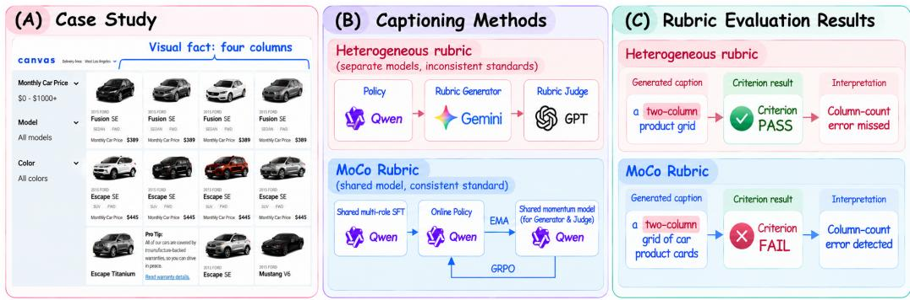  
Figure 1: Comparison of heterogeneous and shared model distributions in rubric-based caption optimization.

Targeted it, we propose MOCO RUBRIC, a momentum-coupled rubric adaptation framework for detailed image captioning. It includes a Shared Multi-Role SFT stage to semantically align the three roles and a Policy RL with Momentum Transfer stage only optimizing the Caption Policy and gradually transferring its updates to two rubric roles. Specifically, the Shared Multi-Role SFT targets semantic consistency by combining a common backbone with explicit role-specific supervision. Assigning all three roles to a common backbone provides a natural starting point for reducing crossmodel semantic variation by placing them in the same visual–language representation space. Sharing a backbone alone, however, does not establish the distinct capabilities required to generate captions, formulate evaluation criteria, and apply those criteria reliably. We therefore employ role-conditioned multi-task supervised fine-tuning on a single vision–language model, explicitly supervising caption generation, rubric construction, and rubric judging. The resulting checkpoint initializes both the online Caption Policy and the momentum model shared by the Rubric Generator and Rubric Judge, ensuring that all three roles enter reinforcement learning from the same learned foundation.

Further, we optimize only the Caption Policy with online rubric rewards while updating the model shared by the Rubric Generator and Rubric Judge through momentum transfer, allowing rubric feedback to adapt to the evolving Policy. Temporal coordination requires the generated rubric content responsive to predicted candidates and the Rubric Generator and Rubric Judge coordinated in parameter space within the same iteration. Existing dynamic rubric methods such as DynamicRubric and EvoLM address content adaptation by optimizing the Policy and Generator in alternating stages while keeping the Judge fixed (Wang et al., 2026a; Li et al., 2026). Such stage-wise alternating optimization refreshes the Generator only at update boundaries, allowing it to lag behind the evolving Policy within each stage, while the Judge remains outside the adaptation process. Thus, our MoCo rubrics instead combines candidate-conditioned rubric construction with joint momentum transfer to the Generator and Judge, addressing both content responsiveness and evaluator-state coordination without separate reinforcement learning for either rubric role. During training, current Policy candidates, reference captions, and image evidence guide rubric construction, the Judge scores the candidates against the shared rubric, and only the Policy is optimized through GRPO (Shao et al., 2024). Because Stage I places all three roles in a shared parameter space, Policy updates may contain changes to visual and linguistic representations relevant across the three tasks. These updates nevertheless optimize caption generation rather than evaluator quality, so directly copying the latest Policy parameters could disrupt the learned rubric capabilities. We therefore use an exponential moving average, inspired by MoCo (He et al., 2020), to transfer Policy changes gradually to the momentum model shared by the Generator and Judge. Both roles use the same lagged parameter version, which remains fixed throughout rubric construction and scoring for each candidate group, thereby coordinating criterion formulation and execution without separate optimization. We further analyze how the momentum coefficient and synchronization interval jointly control parameter tracking and update smoothness.

Using Qwen3-VL-8B-Instruct (Bai et al., 2025) for all three roles, MoCo Rubric achieves a 72.83% average pairwise win rate across five detailed image captioning benchmarks. It outperforms RubiCap (Huang et al., 2026) by 2.90 percentage points, even though RubiCap employs proprietary models as its Rubric Generator and Rubric Judge. MoCo Rubric also obtains the best mean rank in blind ranking and the highest average score in caption-based question answering, demonstrating improvements in both overall caption quality and downstream utility.

In summary, we introduce MOCO RUBRIC, a momentum-coupled rubric adaptation framework for detailed image captioning. Shared Multi-Role SFT stage uses a common backbone to establish a shared semantic foundation for the Caption Policy, Rubric Generator, and Rubric Judge. Then, we develop Policy RL with Momentum Transfer, which combines candidate-conditioned rubric con struction with joint exponential-moving-average transfer of Policy updates to both rubric roles while optimizing only the Caption Policy. Further we analyze how the momentum coefficient and synchronization interval affect parameter tracking and update smoothness. Finally, we validate MoCo Rubric on five detailed image captioning benchmarks through pairwise caption comparison, blind ranking, and caption-based question answering, with ablations supporting the complementary effects of Shared Multi-Role SFT, candidate-conditioned rubrics, and joint momentum transfer.

## 2 RELATED WORK

Image Captioning and Evaluation. Captioner training combines improved supervision with direct optimization of generation quality. Synthetic captioning, data filtering, and model collaboration provide rich descriptions for supervised learning (Li et al., 2022; Chen et al., 2024; Singla et al., 2024; Lei et al., 2026). RL has progressed from optimizing sequence-level metrics (Rennie et al., 2017) to rewards tailored to detailed descriptions. Recent methods assess question-answering utility (Xing et al., 2026; Yang et al., 2026a), balance factual correctness, coverage, and linguistic quality (Tang et al., 2026; Ye et al., 2026b), or express image-specific requirements through rubrics (Huang et al., 2026). The approaches extend training beyond imitation of reference captions, making the reward’s ability to distinguish evolving policy outputs important. Caption evaluation has expanded from reference matching to semantic and preference-based assessment. BLEU and CIDEr measure agreement with reference text (Papineni et al., 2002; Vedantam et al., 2015), while semantic and cross-modal metrics capture content correspondence (Anderson et al., 2016; Hessel et al., 2021). Fine-grained measures examine hallucinations and visual details that aggregate similarity can overlook (Rohrbach et al., 2018; Dong et al., 2024). For increasingly open-ended descriptions, LLM and VLM judges offer broader quality assessments (Chan et al., 2023; Lee et al., 2024). CapArena aggregates anonymous human pairwise preferences into model rankings, and its automated counterpart uses VLM comparisons (Cheng et al., 2025). These complementary tools assess caption quality externally; we focus on adapting structured rewards during training.

Rubric-Based Reinforcement Learning. Rubric-based RL decomposes open-ended quality requirements into explicit criteria and aggregates their judgments into rewards (Gunjal et al., 2025; Huang et al., 2025; Wang et al., 2026b; Viswanathan et al., 2025; Yu et al., 2025). Beyond deriving criteria from instructions and references, rubric construction uses response contrasts, highquality examples, and recursive refinement to improve specificity and discrimination (Liu et al., 2026; Zhang et al., 2026; Shen et al., 2026; Ye et al., 2026a). Online approaches condition evaluation criteria on current responses, external evidence, or previously collected rubrics, allowing evaluation content to adapt as the policy changes (Jia et al., 2026; Shao et al., 2026; Guan et al., 2026; Wang et al., 2026a). Building on explicit, adaptive criteria, we ask whether the parameters that generate and apply them can be driven by Policy RL alone, and examine the reliability and cost of doing so. Training rubric roles extends adaptation from evaluation content to evaluation capability. Rubric-ARM alternates generator and judge optimization (Xu et al., 2026), whereas EvoLM and DynamicRubric alternate policy and generator updates with a fixed judge or verifier (Li et al., 2026; Wang et al., 2026a). Other approaches jointly optimize response and rubric generation through shared models or separate role adapters (Sheng et al., 2026; Guan et al., 2026; Ding et al., 2026; Chen et al., 2025; Yu et al., 2026). These methods introduce learning objectives for the rubric roles to improve evaluation alongside generation. Our approach starts from shared multi-role initialization, applies RL gradients only to the Policy, and updates one momentum model shared by both rubric roles through an exponential moving average of Policy parameters. This parametertransfer mechanism removes separate RL updates and associated supervision construction for the rubric roles.

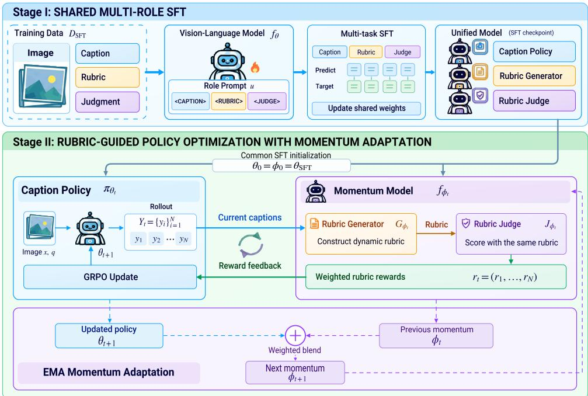  
Figure 2: Overview of MoCo Rubric. Stage I trains the three roles through shared multi-role SFT. In Stage II, current Policy candidates inform the rubric, the momentum Generator and Judge assign rewards, and only the Policy receives RL gradients. The shared rubric model is updated through EMA at synchronization boundaries.

## 3 METHODOLOGY

## 3.1 FRAMEWORK OVERVIEW

Given an image x and a captioning instruction $q ,$ detailed image captioning aims to generate a description y that is factually accurate and covers important visual information. Because an image can admit multiple valid descriptions, a limited set of reference captions may not capture every relevant detail. We therefore train with image-specific rubric feedback that evaluates generated captions at the criterion level. We denote the Caption Policy by $\pi _ { \theta } .$ , the Rubric Generator by $G _ { \phi } ,$ and the Rubric Judge by $J _ { \phi } { \mathrm { : } }$ ; the latter two are the rubric roles. Reference captions are used for rubric construction during training, whereas inference uses only x and q and runs the Caption Policy alone.

This feedback depends on the Policy describing the image, the Generator using it to construct rubrics, and the Judge applying those rubrics to captions. Separately instantiated roles can disagree about caption quality, and Policy updates can change the candidates that the rubric roles need to evaluate. As illustrated in Fig. 2, MoCo Rubric addresses these challenges in two stages. Shared Multi-Role SFT explicitly teaches one vision–language model to generate captions, construct rubrics, and judge captions under different role prompts. Policy RL with Momentum Transfer then uses current Policy candidates to construct rubrics and optimize only the Policy; an exponential moving average (EMA) transfers its parameter updates to a single momentum model shared by the Generator and Judge. These two stages establish a common role foundation and keep rubric feedback responsive as the Policy evolves.

## 3.2 SHARED MULTI-ROLE SFT

Using the same backbone for all three roles provides a common starting point, but does not by itself teach the model how to formulate or apply evaluation criteria. We therefore train one vision– language model $f _ { \theta }$ with role-conditioned, sample-aligned supervision. For a given image, the Policy record pairs $( x , q )$ with a target caption; the Generator record pairs the image, reference captions, and candidate captions with a target rubric; and the Judge records pair a candidate caption and rubric items with criterion-level decisions and rationales. The records are linked by their underlying image and caption instances, while role prompts distinguish the three tasks.

Let $D _ { \mathrm { S F T } }$ be the resulting mixed dataset. All three roles update the same parameters through the autoregressive objective

$$
{ \mathcal { L } } _ { \mathrm { S F T } } ( \theta ) = \mathbb { E } _ { ( u , v ) \sim D _ { \mathrm { S F T } } } \left[ - \sum _ { \ell = 1 } ^ { | v | } \log p _ { \theta } ( v _ { \ell } \mid u , v _ { < \ell } ) \right] ,\tag{1}
$$

where u comprises a role prompt and its task inputs, and v is the corresponding supervision target. We initialize both the online Policy and the momentum model from the resulting checkpoint, $\theta _ { 0 } = \phi _ { 0 } = \theta _ { \mathrm { S F T } }$ . During Stage II, the Generator and Judge use the same parameters $\phi$ under their respective role prompts; only the Policy parameters θ receive RL gradients. This initialization establishes the rubric-role capabilities before parameter transfer begins.

## 3.3 RUBRIC-GUIDED POLICY OPTIMIZATION WITH MOMENTUM ADAPTATION

Stage II adapts the content of each rubric to current Policy candidates and transfers Policy parameter changes gradually to the two pretrained rubric roles.

Online rubric construction. At Policy update t, we sample $N = 1 6$ captions from the behavior Policy, $Y _ { t } ~ = ~ \{ y _ { i } \} _ { i = 1 } ^ { N }$ , and select a random subset $S _ { t } \subseteq Y _ { t }$ of $M = 4$ captions for rubric construction. Given the reference captions $C ^ { \mathrm { r e f } }$ , the Generator produces $R _ { t } = G _ { \phi _ { t } } ( x , C ^ { \mathrm { r e f } } , S _ { t } ) =$ $\{ ( c _ { k } , e _ { k } , w _ { k } ) \} _ { k = 1 } ^ { K _ { t } }$ , where $c _ { k }$ is a criterion, $e _ { k }$ specifies how to decide whether it is satisfied, and $w _ { k } > 0$ is its weight. The subset $S _ { t }$ exposes differences among current candidates, the references supply a quality anchor beyond that subset, and the image provides the factual basis for each criterion. The resulting rubric is applied to every caption in $Y _ { t }$ , including captions outside $S _ { t }$

The Judge receives each caption and the image-grounded rubric, without direct access to the image, and produces a decision $\bar { b _ { i k } } \in \{ 0 , 1 \}$ for each item, along with a rationale. A value of one means that caption $y _ { i }$ satisfies item $k .$ The criterion-level decisions yield a normalized weighted reward $\begin{array} { r } { b _ { i k } = \left[ J _ { \phi _ { t } } ( y _ { i } , R _ { t } ) \right] _ { k } , r _ { i } = \frac { \sum _ { k = 1 } ^ { K _ { t } } w _ { k } b _ { i k } } { \sum _ { k = 1 } ^ { K _ { t } } w _ { k } } \in [ 0 , 1 ] } \end{array}$ . Using the same rubric and momentum checkpoint for the whole group makes reward differences comparable across candidates. The Judge’s rationales explain the item decisions, while only the binary decisions and weights contribute to $r _ { i }$

Policy optimization and momentum transfer. We standardize the rewards within each group to obtain GRPO advantages, $\begin{array} { r } { A _ { i } = \frac { r _ { i } - \mathrm { m e a n } _ { j } ( r _ { j } ) } { \mathrm { s t d } _ { i } ( r _ { i } ) + \epsilon } } \end{array}$ , where $\epsilon > 0$ ensures numerical stability. The Policy optimizes the GRPO clipped surrogate using these advantages (Shao et al., 2024). Writing $\begin{array} { r l } { \mathbf { r } _ { t } } & { { } = } \end{array}$ $( r _ { 1 } , \ldots , r _ { N } )$ , we summarize Policy update as $\theta _ { t + 1 } = \mathrm { G R P O U p d a t e } ( \theta _ { t } ; x , q , Y _ { t }$ , stopgrad(r<sub>t</sub>)). The Generator and Judge receive no gradients from this update. Their capabilities come from Stage I, while transferring changes in shared visual and linguistic representations may help them remain coordinated with the evolving Policy. The Generator and Judge share momentum parameters $\phi _ { t }$ initialized as $\phi _ { 0 } = \theta _ { 0 }$ . After every H Policy updates, the shared momentum model is updated by

$$
\phi _ { t + 1 } = { \left\{ \begin{array} { l l } { m \phi _ { t } + ( 1 - m ) \theta _ { t + 1 } , } & { ( t + 1 ) { \bmod { H } } = 0 , } \\ { \phi _ { t } , } & { { \mathrm { o t h e r w i s e } } , } \end{array} \right. }\tag{2}
$$

where $m \in [ 0 , 1 ]$ is the momentum coefficient.

Synchronization and adaptation. Since the RL objective optimizes caption generation rather than rubric quality, we do not assume that copying Policy parameters improves either rubric role. We use a controlled transfer, inspired by MoCo (He et al., 2020). We define the transfer rule as an exponential moving average (EMA), aiming to balance adaptation with retention of those capabilities:

$$
S ( \phi _ { t } , \theta _ { t + 1 } ) = m \phi _ { t } + ( 1 - m ) \theta _ { t + 1 } .\tag{3}
$$

Here $m \in [ 0 , 1 ]$ is the momentum coefficient; the two terms retain the previous momentum parameters and incorporate the updated Policy parameters, respectively.

EMA retains part of the previous rubric-role state while incorporating a fraction of the updated Policy parameters. The update occurs after the current group has been scored and before a subsequent group is evaluated. Both rubric roles therefore use the same parameter version to formulate and execute each rubric. Rubric content changes with the candidate group, whereas the model parameters change only at synchronization boundaries. The cases $m = 1 , ( m , H ) = ( 0 , 1 )$ , and $m = 0$ with $H > 1$ correspond to frozen rubric roles, copying after every Policy update, and periodic full copying, respectively. The tracking and smoothing effects of intermediate values are analyzed below; whether the rubric roles retain their task performance requires empirical evaluation.

## 3.4 TRACKING–STABILITY ANALYSIS

We analyze how the momentum coefficient m and synchronization interval H balance tracking of the current Policy against smooth updates of the shared rubric model. Let $\bar { \theta } _ { s }$ and $\bar { \phi } _ { s }$ be Policy and momentum parameters at synchronization boundary s. Define the tracking error $e _ { s } = \lVert \bar { \theta } _ { s } - \bar { \phi } _ { \underline { { s } } } \rVert$ , the Policy displacement $\Delta _ { s } = \mathrm { \bar { \lVert } } \bar { \theta } _ { s } - \bar { \theta } _ { s - 1 } \rVert$ , and the momentum-update magnitude $u _ { s } = \| \phi _ { s } - \phi _ { s - 1 } \|$

Proposition 1 (Tracking–stability trade-off). Suppose $0 \leq m < 1$ , each Policy update satisfies $\lVert { \boldsymbol { \theta } } _ { t + 1 } - { \boldsymbol { \theta } } _ { t } \rVert \leq \delta$ , and synchronization occurs every H updates. Then

$$
e _ { s } \leq m ^ { s } e _ { 0 } + \frac { m ( 1 - m ^ { s } ) } { 1 - m } H \delta , u _ { s } \leq ( 1 - m ) ( e _ { s - 1 } + \Delta _ { s } ) .\tag{4}
$$

Shared initialization gives $e _ { 0 } = 0 ;$ , and hence $e _ { s } \le m H \delta / ( 1 - m )$ . Thus, the Policy–momentum parameter gap remains bounded under bounded Policy updates, while m and H jointly determine how closely the rubric roles track the current Policy.

To quantify stochastic smoothing, we consider the local approximation $\bar { \theta } _ { s } - \bar { \theta } _ { s - 1 } = H v + \varepsilon _ { s }$ $\mathbb { E } [ \varepsilon _ { s } ] = 0 , \mathrm { \dot { C } o v } ( \varepsilon _ { s } ) = H \Sigma$ , where the mean drift v is approximately constant within the local analysis window and $\varepsilon _ { s }$ is independent across non-overlapping synchronization intervals. The covariance assumption models the aggregation of H approximately independent per-step perturbations with locally stationary covariance. These stochastic assumptions are used only for the smoothing analysis and are not required for Proposition 1. Let $q _ { s } = \phi _ { s } - \phi _ { s - 1 }$ . In the stationary regime, $\begin{array} { r } { \mathbb { E } [ \bar { q } _ { s } ] = \bar { H } v . } \end{array}$ $\begin{array} { r } { \mathrm { C o v } ( q _ { s } ) = \frac { 1 \dot { - } m } { 1 + m } H \Sigma } \end{array}$ . Compared with periodic full copying $( m = 0 )$ , EMA therefore reduces the stochastic update covariance by the factor $( 1 - m ) / ( 1 + m )$ , while preserving the long-run mean drift. A larger m produces smoother rubric-role updates but increases tracking lag, whereas a larger H increases the drift and noise accumulated between synchronizations. Appendix D gives the full finite-step and stationary derivations. These results describe parameter tracking and smoothing, rather than guaranteeing that caption optimization improves rubric construction or judging.

## 4 EXPERIMENTS

## 4.1 EXPERIMENTAL SETUP

Implementation Details. We use Qwen3-VL-8B-Instruct (Bai et al., 2025) as the backbone and perform full-parameter training on H100 GPUs (80GB). Both SFT and RL datasets contain equal proportions of data from PixMo-Cap (Deitke et al., 2024) and DenseFusion (Li et al., 2024). For SFT, we use 20,000 supervision records generated by GPT-5.5 (OpenAI, 2026): 10,000 for the Policy and 5,000 each for the Generator and Judge. We train for 300 steps with a learning rate of $1 \times 1 0 ^ { - 5 }$ and a global batch size of 64. For RL, we optimize the Policy with GRPO (Shao et al., 2024) on 5,000 samples for 600 steps at a learning rate of $1 \times 1 0 ^ { - 6 }$ . We use a per-device batch size of 8 and two gradient accumulation steps. Both stages use AdamW (Loshchilov & Hutter, 2019) with cosine learning rate decay and a 5% warmup ratio.

Table 1: Pairwise win rates (%) against Qwen3-VL-8B across five captioning benchmarks. Average denotes the benchmark mean. Best results are bold; second-best results are underlined.
<table><tr><td>Method</td><td>PixMo-Cap</td><td>DenseFusion</td><td>CapArena</td><td>CompreCap</td><td>DOCCI</td><td>Average</td></tr><tr><td>Captioning Baselines</td><td></td><td></td><td></td><td></td><td></td><td></td></tr><tr><td>ShareGPT4V-7B</td><td>2.02</td><td>1.80</td><td>2.67</td><td>5.21</td><td>2.41</td><td>2.82</td></tr><tr><td>RICO-Flash-7B</td><td>8.89</td><td>5.41</td><td>9.00</td><td>9.87</td><td>9.04</td><td>8.44</td></tr><tr><td>OmniCaptioner-8B</td><td>10.91</td><td>10.62</td><td>12.17</td><td>10.05</td><td>11.24</td><td>11.00</td></tr><tr><td>JoyCaption-8B</td><td>11.72</td><td>4.81</td><td>12.67</td><td>25.85</td><td>14.46</td><td>13.90</td></tr><tr><td>MetaCaptioner-8B</td><td>22.63</td><td>23.25</td><td>19.00</td><td>32.50</td><td>18.47</td><td>23.17</td></tr><tr><td>CapRL-InternVL-8B</td><td>23.03</td><td>16.83</td><td>15.67</td><td>25.67</td><td>15.26</td><td>19.29</td></tr><tr><td>CapRL-Qwen3VL-4B</td><td>42.22</td><td>39.48</td><td>48.83</td><td>34.83</td><td>50.00</td><td>43.07</td></tr><tr><td>Qwen3-VL-32B</td><td>64.85</td><td>63.73</td><td>62.00</td><td>56.19</td><td>57.23</td><td>60.80</td></tr><tr><td>Rubric-based Methods</td><td></td><td></td><td></td><td></td><td></td><td></td></tr><tr><td>RubiCap</td><td>70.14</td><td>67.80</td><td>72.33</td><td>63.57</td><td>75.80</td><td>69.93</td></tr><tr><td>EvoLM</td><td>59.19</td><td>53.71</td><td>56.17</td><td>48.47</td><td>62.63</td><td>56.03</td></tr><tr><td>Our Framework</td><td></td><td></td><td></td><td></td><td></td><td></td></tr><tr><td>SFT (shared)</td><td>55.15</td><td>53.31</td><td>51.83</td><td>49.19</td><td>54.22</td><td>52.74</td></tr><tr><td>Ours</td><td>73.94</td><td>70.34</td><td>78.00</td><td>63.38</td><td>78.51</td><td>72.83</td></tr></table>

Table 2: Caption-based question answering across five benchmarks. Average is the mean across benchmarks. Bold and underlined values indicate the best and second-best results, respectively.
<table><tr><td>Method</td><td>CaptionQA</td><td>BLINK</td><td>TextVQA</td><td>DocVQA</td><td>ChartQA</td><td>Average</td></tr><tr><td>Base</td><td>80.41</td><td>47.05</td><td>58.00</td><td>69.18</td><td>61.28</td><td>63.18</td></tr><tr><td>RubiCap</td><td>83.28</td><td>49.05</td><td>56.85</td><td>77.90</td><td>64.44</td><td>66.31</td></tr><tr><td>Qwen3-VL-32B</td><td>82.92</td><td>50.94</td><td>56.69</td><td>75.06</td><td>62.16</td><td>65.55</td></tr><tr><td>EvoLM</td><td>82.00</td><td>49.00</td><td>57.08</td><td>77.21</td><td>62.44</td><td>65.55</td></tr><tr><td>SFT (shared)</td><td>81.05</td><td>47.69</td><td>56.44</td><td>76.13</td><td>63.16</td><td>64.89</td></tr><tr><td>Ours</td><td>84.24</td><td>50.10</td><td>58.33</td><td>79.05</td><td>64.12</td><td>67.17</td></tr></table>

Benchmarks. We evaluate both caption quality and downstream task utility. Caption quality evaluation covers PixMo-Cap (Deitke et al., 2024), DenseFusion (Li et al., 2024), CapArena (Cheng et al., 2025), CompreCap (Lu et al., 2025a), and DOCCI (Onoe et al., 2024), with blind ranking and ablation studies conducted on PixMo-Cap and DenseFusion. Downstream evaluation spans caption utility (CaptionQA (Yang et al., 2026b)), visual perception and reasoning (BLINK (Fu et al., 2024)), and scene-text understanding (TextVQA (Singh et al., 2019)). It also includes document understanding (DocVQA (Mathew et al., 2021)) and chart understanding and reasoning (ChartQA (Masry et al., 2022)). These complementary tasks test whether generated captions preserve visual information needed to answer diverse questions, complementing direct assessments of caption quality.

Baselines. We compare captioning baselines with rubric-based methods. Captioning baselines include ShareGPT4V-7B (Chen et al., 2024), RICO-Flash-7B (Wang et al., 2025), OmniCaptioner-8B (Lu et al., 2025b), JoyCaption-8B (fpgaminer), MetaCaptioner-8B (Lei et al., 2026), the InternVL-8B and Qwen3-VL-4B variants of CapRL (Xing et al., 2026), and the larger Qwen3-VL-32B-Instruct (Bai et al., 2025). For rubric-based methods, we adapt and reproduce RubiCap (Huang et al., 2026) and EvoLM (Li et al., 2026) for our captioning task and training data. We select EvoLM as the alternating-training baseline because the original method shares Policy and Generator parameters, offering a closer comparison to our shared initialization. DynamicRubric (Wang et al., 2026a) also follows an alternating-training approach, but we do not reproduce it because its Generator training requires additional ranking annotations for anchor responses. Our RubiCap reproduction uses

Table 3: Component ablation on PixMo-Cap and DenseFusion, reported as win rates (%). Bold and underlined values indicate the best and second-best available results, respectively.
<table><tr><td>ID</td><td>SFT initialization</td><td>Rubrics</td><td>Rubric-role update</td><td>PixMo-Cap</td><td>DenseFusion</td><td>Average</td></tr><tr><td>M1</td><td>Policy only</td><td></td><td></td><td>57.37</td><td>56.91</td><td>57.14</td></tr><tr><td>M2</td><td>Shared across roles</td><td></td><td></td><td>55.15</td><td>53.31</td><td>54.23</td></tr><tr><td>M3</td><td>Separate per role</td><td>Offline, fixed</td><td>No momentum update</td><td>70.74</td><td>66.00</td><td>68.37</td></tr><tr><td>M4</td><td>Separate per role</td><td>Online</td><td>No momentum update</td><td>71.31</td><td>67.13</td><td>69.22</td></tr><tr><td>M5</td><td>Separate per role</td><td>Online</td><td>EMA  $( m = 0 . 9 9 , H = 1 )$ </td><td>65.06</td><td>61.80</td><td>63.43</td></tr><tr><td>M6</td><td>Shared across roles</td><td>Online</td><td>No momentum update</td><td>68.48</td><td>64.73</td><td>66.61</td></tr><tr><td>M7</td><td>Shared across roles</td><td>Online</td><td>Full synchronization</td><td>71.72</td><td>65.73</td><td>68.73</td></tr><tr><td>M8</td><td>Shared across roles</td><td>Online</td><td> $\operatorname { E M A } \left( m = 0 . 9 9 , H = 1 \right)$ </td><td>73.94</td><td>70.34</td><td>72.14</td></tr></table>

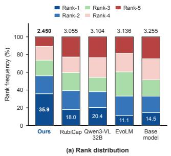

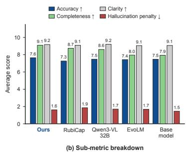

<table><tr><td colspan="2">Generator Judge</td><td colspan="2">PixMo Dense Cap Fusion</td></tr><tr><td>Frozen Frozen</td><td>68.48</td><td>64.73</td><td>66.61</td></tr><tr><td>EMA</td><td>Frozen</td><td>71.14</td><td>67.00 69.07</td></tr><tr><td>Frozen</td><td>EMA</td><td>68.27 63.40</td><td>65.84</td></tr><tr><td>Full sync</td><td>Full sync</td><td>71.72 65.73</td><td>68.73</td></tr><tr><td>EMA</td><td>EMA</td><td>73.94 70.34</td><td>72.14</td></tr></table>

Figure 3: Blind ranking on PixMo-Cap and DenseFusion: rank distributions (left) and caption quality scores (right), averaged across the two datasets.  
Table 4: Role transfer; EMA $( m , H ) = ( 0 . 9 9 , 1 )$

Gemini 3.1 Pro as the Rubric Generator and GPT-5.6-terra as the Rubric Judge. We report the shared SFT model to assess gains from subsequent reinforcement learning.

Evaluation Metrics. Following CapArena (Cheng et al., 2025), an LLM judge compares each method’s captions against Qwen3-VL-8B-Instruct; we report win rates. Following RubiCap (Huang et al., 2026), we blind-rank captions from five representative methods and report rank distributions and quality scores. For question answering, we follow Prism (Qiao et al., 2024), as adopted in CapRL (Xing et al., 2026), using a fixed text-only model with captions as its sole source of visual information. We report benchmark scores; evaluation prompts and the question-answering protocol are provided in Appendices A.1 and A.3.

## 4.2 MAIN RESULTS

Pairwise Caption Comparison. Table 1 shows that MoCo Rubric achieves a 72.83% average win rate across five benchmarks, exceeding Qwen3-VL-32B by 12.03 percentage points with an 8B backbone. RubiCap and EvoLM also surpass the specialized captioners on average, while MoCo Rubric further exceeds them by 2.90 and 16.80 points, respectively, despite RubiCap’s use of proprietary models for rubric generation and judging. EvoLM trails shared SFT on CompreCap (48.47% versus 49.19%), illustrating that dynamic rubric training does not improve every benchmark. The advantage persists with GPT-5.6 Sol as the evaluator, and both LLM evaluators show high agreement with human preferences on the tested caption pairs (Appendices B.1 and B.2).

Caption-Based Visual Question Answering. Using captions as the sole visual input to a fixed text-only model, MoCo Rubric achieves the highest average score of 67.17 in Table 2, exceeding RubiCap and shared SFT by 0.86 and 2.28 points. It ranks first on CaptionQA, TextVQA, and DocVQA and second on BLINK and ChartQA, showing that the caption gains also benefit downstream question answering.

Blind Ranking. In the joint evaluation of five anonymized methods, MoCo Rubric achieves the best mean rank (2.450) and highest first-place share (35.9%) in Figure 3. It leads in accuracy and completeness, has clarity comparable to Qwen3-VL-32B, and improves on RubiCap’s mean rank (3.055) and hallucination penalty (1.859 versus 1.614).

## 4.3 ANALYSIS

Which Components Drive the Gains? We ablate components and combinations to assess contributions to caption quality. In Table 3, replacing fixed offline rubrics with online rubrics (M3→M4) improves average win rate by 0.85 pp, supporting criteria adapted to current Policy candidates. Shared initialization alone offers no advantage: shared SFT underperforms Policy-only SFT (M2 vs. M1), and remains below separate initialization when rubric roles are frozen (M6 vs. M4). Its benefit emerges with momentum transfer. Under separate initialization, EMA reduces average win rate from 69.22% to 63.43% (M4→M5); with shared initialization, it raises win rate from 66.61% to 72.14% (M6→M8). This contrast supports a common parameter foundation for transferring Policy updates to both rubric roles. EMA outperforms full synchronization by 3.41 pp (M7→M8), indicating that gradual transfer contributes to the gains. These results highlight complementary contributions: online rubrics adapt evaluation criteria to current candidates, while shared initialization and momentum updates jointly support cross-role parameter transfer. Training diagnostics further show fewer rollout groups with zero within-group reward variation under our method (Appendix B.3).

Which Roles Benefit from Momentum Transfer? Starting from the shared SFT checkpoint, we apply EMA to either rubric role or both. Table 4 shows that Generator-only EMA raises the average win rate from 66.61% to 69.07%, whereas updating only the Judge lowers it to 65.84%. Joint EMA reaches 72.14%, exceeding Generator-only EMA and full synchronization (68.73%), suggesting that Judge updates help when coordinated with Generator updates through momentum transfer.

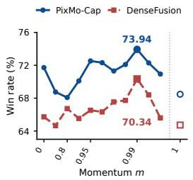

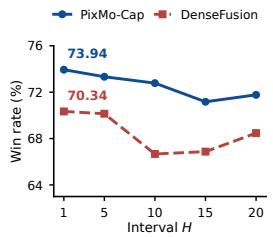

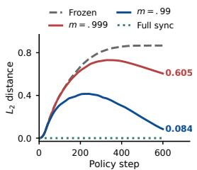  
Figure 4: Left: Momentum coefficient analysis at $H = 1 ,$ , with tested coefficients equally spaced and the frozen reference $( m = 1 )$ shown separately. Middle: Synchronization interval analysis at $m = 0 . 9 9$ . Markers indicate measured results; lines connect adjacent tested settings. Right:Policy–momentum tracking at $H = 1$ Frozen and full-sync curves are boundary references.

## How Do Transfer Magnitude and Frequency Affect Performance?

The momentum coefficient m controls transfer magnitude, and the interval H controls transfer frequency. Figure 4 shows that $m = 0 . 9 9$ performs best with stepwise synchronization; at this coefficient, $H \mathrm { ~ = ~ } 5$ remains close to $H = 1$ . Table 5 reports the highest mean win rate of 72.14% at $( m , H ) \ = \ ( 0 . 9 \bar { 9 } , 1 )$ , with 71.79% at (0.99, 5); longer intervals reduce win rates at $m = 0 . 9 9$ , although the effect of H is not monotonic at other coefficients. These results motivate selecting m and H jointly and are consistent with the tracking–stability trade-off in Section 3.4, without establishing it as the cause of the performance differences

Table 5: Equal-weight mean win rate (%) across PixMo-Cap and DenseFusion in the joint m × H sweep.
<table><tr><td>m</td><td> $H = 1$ </td><td> $H = 5$ </td><td> $H = 2 0$ </td></tr><tr><td>0.95</td><td>69.58</td><td>68.18</td><td>69.29</td></tr><tr><td>0.99</td><td>72.14</td><td>71.79</td><td>70.18</td></tr><tr><td>0.999</td><td>68.28</td><td>66.67</td><td>69.48</td></tr></table>

How Closely Does the Momentum Model Track the Policy? Figure 4 shows the parameter distance between the Policy and the momentum model at H = 1. In separate runs with $\mathrm { m } = 0 . 9 9$ and $\mathrm { { m } = 0 . 9 9 9 }$ , the distance initially increases and then levels off or declines, reaching 0.084 and 0.605, respectively, at step 600. At that step, the frozen reference computed from the $\mathrm { m } = 0 . 9 9$ Policy trajectory has a distance of 0.867, while the ideal reference with full synchronization at every step has zero distance. Relative to the frozen reference on the same Policy trajectory, EMA reduces the parameter distance in later training. This observation provides empirical support for the tracking error analysis in Proposition 1 of Section 3.4.

## 5 CONCLUSION

We presented a framework that coordinates caption generation, rubric construction, and judging to address cross-role mismatch in detailed image captioning. Shared multi-task SFT establishes a foundation, while online rubrics and EMA parameter updates sustain adaptation as the Policy evolves. Experiments show stronger overall performance than existing methods across complementary evaluations, with gains in caption quality and downstream utility. These results support coordinated rubric adaptation as an approach to reinforcement learning for detailed image captioning.

## AI USE STATEMENT

AI systems, including LLMs, did not contribute to the development of the research ideas or the writing of this paper to a degree that would warrant authorship or contributor status. In this work, LLMs were used for open-ended task evaluation and served as objects of study.

## ETHICS STATEMENT

We study image captioning using publicly available datasets, and our work does not involve private or sensitive data. The proposed training procedure is designed as a general-purpose optimization method. Within the scope of this study, we have not identified specific ethical risks related to fairness, bias, discrimination, privacy, or security. This research was conducted in accordance with established standards of research integrity.

## REPRODUCIBILITY STATEMENT

We provide training details, implementation settings for our method, and evaluation procedures in the main text and appendix to support reproduction of the reported results.

## REFERENCES

Peter Anderson, Basura Fernando, Mark Johnson, and Stephen Gould. Spice: Semantic propositional image caption evaluation, 2016. URL https://arxiv.org/abs/1607.08822.

Shuai Bai, Yuxuan Cai, Ruizhe Chen, Keqin Chen, Xionghui Chen, Zesen Cheng, Lianghao Deng, Wei Ding, Chang Gao, Chunjiang Ge, Wenbin Ge, Zhifang Guo, Qidong Huang, Jie Huang, Fei Huang, Binyuan Hui, Shutong Jiang, Zhaohai Li, Mingsheng Li, Mei Li, Kaixin Li, Zicheng Lin, Junyang Lin, Xuejing Liu, Jiawei Liu, Chenglong Liu, Yang Liu, Dayiheng Liu, Shixuan Liu, Dunjie Lu, Ruilin Luo, Chenxu Lv, Rui Men, Lingchen Meng, Xuancheng Ren, Xingzhang Ren, Sibo Song, Yuchong Sun, Jun Tang, Jianhong Tu, Jianqiang Wan, Peng Wang, Pengfei Wang, Qiuyue Wang, Yuxuan Wang, Tianbao Xie, Yiheng Xu, Haiyang Xu, Jin Xu, Zhibo Yang, Mingkun Yang, Jianxin Yang, An Yang, Bowen Yu, Fei Zhang, Hang Zhang, Xi Zhang, Bo Zheng, Humen Zhong, Jingren Zhou, Fan Zhou, Jing Zhou, Yuanzhi Zhu, and Ke Zhu. Qwen3-vl technical report, 2025. URL https://arxiv.org/abs/2511.21631.

David M. Chan, Suzanne Petryk, Joseph E. Gonzalez, Trevor Darrell, and John Canny. CLAIR: Evaluating image captions with large language models. In Houda Bouamor, Juan Pino, and Kalika Bali (eds.), Proceedings ofthe 2023 Conference on Empirical Methods in Natural Language Processing, pp. 13638–13646, Singapore, December 2023. Association for Computational Linguistics. doi: 10.18653/v1/2023.emnlp-main.841. URL https://aclanthology.org/ 2023.emnlp-main.841/.

Lin Chen, Jinsong Li, Xiaoyi Dong, Pan Zhang, Conghui He, Jiaqi Wang, Feng Zhao, and Dahua Lin. Sharegpt4v: Improving large multi-modal models with better captions. In European Conference on Computer Vision, pp. 370–387. Springer, 2024.

Xiusi Chen, Shanyong Wang, Cheng Qian, Hongru Wang, Peixuan Han, and Heng Ji. Decisionflow: Advancing large language model as principled decision maker. arXiv preprint arXiv:2505.21397, 2025.

Kanzhi Cheng, Wenpo Song, Jiaxin Fan, Zheng Ma, Qiushi Sun, Fangzhi Xu, Chenyang Yan, Nuo Chen, Jianbing Zhang, and Jiajun Chen. Caparena: Benchmarking and analyzing detailed image captioning in the llm era, 2025. URL https://arxiv.org/abs/2503.12329.

Matt Deitke, Christopher Clark, Sangho Lee, Rohun Tripathi, Yue Yang, Jae Sung Park, Mohammadreza Salehi, Niklas Muennighoff, Kyle Lo, Luca Soldaini, Jiasen Lu, Taira Anderson, Erin Bransom, Kiana Ehsani, Huong Ngo, YenSung Chen, Ajay Patel, Mark Yatskar, Chris Callison-Burch, Andrew Head, Rose Hendrix, Favyen Bastani, Eli VanderBilt, Nathan Lambert, Yvonne Chou, Arnavi Chheda, Jenna Sparks, Sam Skjonsberg, Michael Schmitz, Aaron Sarnat, Byron Bischoff, Pete Walsh, Chris Newell, Piper Wolters, Tanmay Gupta, Kuo-Hao Zeng, Jon Borchardt, Dirk Groeneveld, Crystal Nam, Sophie Lebrecht, Caitlin Wittlif, Carissa Schoenick, Oscar Michel, Ranjay Krishna, Luca Weihs, Noah A. Smith, Hannaneh Hajishirzi, Ross Girshick, Ali Farhadi, and Aniruddha Kembhavi. Molmo and pixmo: Open weights and open data for state-ofthe-art vision-language models, 2024. URL https://arxiv.org/abs/2409.17146.

Hongxin Ding, Baixiang Huang, Yue Fang, Weibin Liao, Zheng Li, Jinyang Zhang, Zhijing Wu, Junfeng Zhao, and Yasha Wang. Evorubrics: Dynamic rubrics as rewards via adversarial coevolution for llm reinforcement learning, 2026. URL https://arxiv.org/abs/2606. 23038.

Hongyuan Dong, Jiawen Li, Bohong Wu, Jiacong Wang, Yuan Zhang, and Haoyuan Guo. Benchmarking and improving detail image caption, 2024. URL https://arxiv.org/abs/ 2405.19092.

fpgaminer. JoyCaption. GitHub repository. URL https://github.com/fpgaminer/ joycaption. Accessed September 26, 2026.

Xingyu Fu, Yushi Hu, Bangzheng Li, Yu Feng, Haoyu Wang, Xudong Lin, Dan Roth, Noah A. Smith, Wei-Chiu Ma, and Ranjay Krishna. Blink: Multimodal large language models can see but not perceive, 2024. URL https://arxiv.org/abs/2404.12390.

Xin Guan, Xiaomeng Hu, Shen Huang, Zhenyi Wang, Bo Zhang, Zijian Li, Pengjun Xie, Bo Liu, and Jiuxin Cao. Evorubric: Self-evolving rubric-driven rl for open-ended generation, 2026. URL https://arxiv.org/abs/2605.29847.

Anisha Gunjal, Anthony Wang, Elaine Lau, Vaskar Nath, Yunzhong He, Bing Liu, and Sean Hendryx. Rubrics as rewards: Reinforcement learning beyond verifiable domains, 2025. URL https://arxiv.org/abs/2507.17746.

Danna Gurari, Yinan Zhao, Meng Zhang, and Nilavra Bhattacharya. Captioning images taken by people who are blind. In European Conference on Computer Vision, pp. 417–434. Springer, 2020.

Kaiming He, Haoqi Fan, Yuxin Wu, Saining Xie, and Ross Girshick. Momentum contrast for unsupervised visual representation learning, 2020. URL https://arxiv.org/abs/1911. 05722.

Jack Hessel, Ari Holtzman, Maxwell Forbes, Ronan Le Bras, and Yejin Choi. CLIPScore: A reference-free evaluation metric for image captioning. In Marie-Francine Moens, Xuanjing Huang, Lucia Specia, and Scott Wen-tau Yih (eds.), Proceedings of the 2021 Conference on Empirical Methods in Natural Language Processing, pp. 7514–7528, Online and Punta Cana, Dominican Republic, November 2021. Association for Computational Linguistics. doi: 10.18653/v1/2021.emnlp-main.595. URL https://aclanthology.org/2021. emnlp-main.595/.

Tzu-Heng Huang, Sirajul Salekin, Javier Movellan, Frederic Sala, and Manjot Bilkhu. Rubicap: Rubric-guided reinforcement learning for dense image captioning. arXiv preprint arXiv:2603.09160, 2026.

Zenan Huang, Yihong Zhuang, Guoshan Lu, Zeyu Qin, Haokai Xu, Tianyu Zhao, Ru Peng, Jiaqi Hu, Zhanming Shen, Xiaomeng Hu, Xijun Gu, Peiyi Tu, Jiaxin Liu, Wenyu Chen, Yuzhuo Fu, Zhiting Fan, Yanmei Gu, Yuanyuan Wang, Zhengkai Yang, Jianguo Li, and Junbo Zhao. Reinforcement learning with rubric anchors, 2025. URL https://arxiv.org/abs/2508.12790.

Ruipeng Jia, Yunyi Yang, Wen Wang, Yuxin Wu, Yongbo Gai, Siyuan Tao, Mengyu Zhou, Jianhe Lin, Xiaoxi Jiang, and Guanjun Jiang. Open rubric system: Scaling reinforcement learning with pairwise adaptive rubric, 2026. URL https://arxiv.org/abs/2602.14069.

Yebin Lee, Imseong Park, and Myungjoo Kang. FLEUR: An explainable reference-free evaluation metric for image captioning using a large multimodal model. In Lun-Wei Ku, Andre Martins, and Vivek Srikumar (eds.), Proceedings ofthe 62nd Annual Meeting ofthe Associationfor Computational Linguistics (Volume 1: Long Papers), pp. 3732–3746, Bangkok, Thailand, August 2024. Association for Computational Linguistics. doi: 10.18653/v1/2024.acl-long.205. URL https://aclanthology.org/2024.acl-long.205/.

Zhenxin Lei, Zhangwei Gao, Changyao Tian, Erfei Cui, Guanzhou Chen, Danni Yang, Yuchen Duan, Zhaokai Wang, Wenhao Li, Weiyun Wang, et al. Metacaptioner: Towards generalist visual captioning with open-source suites. In International Conference on Learning Representations, volume 2026, pp. 102906–102945, 2026.

Junnan Li, Dongxu Li, Caiming Xiong, and Steven Hoi. Blip: Bootstrapping language-image pre-training for unified vision-language understanding and generation, 2022. URL https: //arxiv.org/abs/2201.12086.

Shuyue Stella Li, Rui Xin, Teng Xiao, Yike Wang, Rulin Shao, Zoey Hao, Melanie Sclar, Sewoong Oh, Faeze Brahman, Pang Wei Koh, and Yulia Tsvetkov. Evolm: Self-evolving language models through co-evolved discriminative rubrics, 2026. URL https://arxiv.org/abs/2605. 03871.

Xiaotong Li, Fan Zhang, Haiwen Diao, Yueze Wang, Xinlong Wang, and Ling-Yu Duan. Densefusion-1m: Merging vision experts for comprehensive multimodal perception, 2024. URL https://arxiv.org/abs/2407.08303.

Tianci Liu, Ran Xu, Tony Yu, Ilgee Hong, Carl Yang, Tuo Zhao, and Haoyu Wang. Openrubrics: Towards scalable synthetic rubric generation for reward modeling and llm alignment, 2026. URL https://arxiv.org/abs/2510.07743.

Ilya Loshchilov and Frank Hutter. Decoupled weight decay regularization, 2019. URL https: //arxiv.org/abs/1711.05101.

Fan Lu, Wei Wu, Kecheng Zheng, Shuailei Ma, Biao Gong, Jiawei Liu, Wei Zhai, Yang Cao, Yujun Shen, and Zheng-Jun Zha. Benchmarking large vision-language models via directed scene graph for comprehensive image captioning, 2025a. URL https://arxiv.org/abs/2412. 08614.

Yiting Lu, Jiakang Yuan, Zhen Li, Shitian Zhao, Qi Qin, Xinyue Li, Le Zhuo, Licheng Wen, Dongyang Liu, Yuewen Cao, Xiangchao Yan, Xin Li, Tianshuo Peng, Shufei Zhang, Botian Shi, Tao Chen, Zhibo Chen, Lei Bai, Peng Gao, and Bo Zhang. Omnicaptioner: One captioner to rule them all, 2025b. URL https://arxiv.org/abs/2504.07089.

Ahmed Masry, Do Xuan Long, Jia Qing Tan, Shafiq Joty, and Enamul Hoque. ChartQA: A benchmark for question answering about charts with visual and logical reasoning. In Smaranda Muresan, Preslav Nakov, and Aline Villavicencio (eds.), Findings ofthe Associationfor Computational Linguistics: ACL 2022, pp. 2263–2279, Dublin, Ireland, May 2022. Association for Computational Linguistics. doi: 10.18653/v1/2022.findings-acl.177. URL https://aclanthology. org/2022.findings-acl.177/.

Minesh Mathew, Dimosthenis Karatzas, and C. V. Jawahar. Docvqa: A dataset for vqa on document images, 2021. URL https://arxiv.org/abs/2007.00398.

Yasumasa Onoe, Sunayana Rane, Zachary Berger, Yonatan Bitton, Jaemin Cho, Roopal Garg, Alexander Ku, Zarana Parekh, Jordi Pont-Tuset, Garrett Tanzer, Su Wang, and Jason Baldridge. Docci: Descriptions of connected and contrasting images, 2024. URL https://arxiv.org/ abs/2404.19753.

OpenAI. Introducing GPT-5.5, 2026. URL https://openai.com/index/ introducing-gpt-5-5/. Published April 23, 2026.

Kishore Papineni, Salim Roukos, Todd Ward, and Wei-Jing Zhu. Bleu: a method for automatic evaluation of machine translation. In Pierre Isabelle, Eugene Charniak, and Dekang Lin (eds.), Proceedings of the 40th Annual Meeting of the Association for Computational Linguistics, pp. 311–318, Philadelphia, Pennsylvania, USA, July 2002. Association for Computational Linguistics. doi: 10.3115/1073083.1073135. URL https://aclanthology.org/P02-1040/.

Yuxuan Qiao, Haodong Duan, Xinyu Fang, Junming Yang, Lin Chen, Songyang Zhang, Jiaqi Wang, Dahua Lin, and Kai Chen. Prism: A framework for decoupling and assessing the capabilities of vlms. In A. Globerson, L. Mackey, D. Belgrave, A. Fan, U. Paquet, J. Tomczak, and C. Zhang (eds.), Advances in Neural Information Processing Systems, volume 37, pp. 111863–111898. Curran Associates, Inc., 2024. doi: 10.52202/ 079017-3552. URL https://proceedings.neurips.cc/paper\_files/paper/ 2024/file/cac9e747a1d480c78312226959566cef-Paper-Conference.pdf.

Steven J Rennie, Etienne Marcheret, Youssef Mroueh, Jerret Ross, and Vaibhava Goel. Self-critical sequence training for image captioning. In 2017 IEEE conference on computer vision and pattern recognition (CVPR), pp. 1179–1195. IEEE, 2017.

Anna Rohrbach, Lisa Anne Hendricks, Kaylee Burns, Trevor Darrell, and Kate Saenko. Object hallucination in image captioning. In Ellen Riloff, David Chiang, Julia Hockenmaier, and Jun’ichi Tsujii (eds.), Proceedings of the 2018 Conference on Empirical Methods in Natural Language Processing, pp. 4035–4045, Brussels, Belgium, October-November 2018. Association for Computational Linguistics. doi: 10.18653/v1/D18-1437. URL https://aclanthology.org/ D18-1437/.

Rulin Shao, Akari Asai, Shannon Zejiang Shen, Hamish Ivison, Varsha Kishore, Jingming Zhuo, Xinran Zhao, Molly Park, Samuel G. Finlayson, David Sontag, Tyler Murray, Sewon Min, Pradeep Dasigi, Luca Soldaini, Faeze Brahman, Wen tau Yih, Tongshuang Wu, Luke Zettlemoyer, Yoon Kim, Hannaneh Hajishirzi, and Pang Wei Koh. Dr tulu: Reinforcement learning with evolving rubrics for deep research, 2026. URL https://arxiv.org/abs/2511.19399.

Zhihong Shao, Peiyi Wang, Qihao Zhu, Runxin Xu, Junxiao Song, Xiao Bi, Haowei Zhang, Mingchuan Zhang, Y. K. Li, Y. Wu, and Daya Guo. Deepseekmath: Pushing the limits of mathematical reasoning in open language models, 2024. URL https://arxiv.org/abs/2402. 03300.

William F. Shen, Xinchi Qiu, Chenxi Whitehouse, Lisa Alazraki, Shashwat Goel, Francesco Barbieri, Timon Willi, Akhil Mathur, and Ilias Leontiadis. Rethinking rubric generation for improving llm judge and reward modeling for open-ended tasks, 2026. URL https://arxiv.org/ abs/2602.05125.

Leheng Sheng, Wenchang Ma, Ruixin Hong, Xiang Wang, An Zhang, and Tat-Seng Chua. Reinforcing chain-of-thought reasoning with self-evolving rubrics, 2026. URL https://arxiv. org/abs/2602.10885.

Amanpreet Singh, Vivek Natarajan, Meet Shah, Yu Jiang, Xinlei Chen, Dhruv Batra, Devi Parikh, and Marcus Rohrbach. Towards vqa models that can read, 2019. URL https://arxiv.org/ abs/1904.08920.

Vasu Singla, Kaiyu Yue, Sukriti Paul, Reza Shirkavand, Mayuka Jayawardhana, Alireza Ganjdanesh, Heng Huang, Abhinav Bhatele, Gowthami Somepalli, and Tom Goldstein. From pixels to prose: A large dataset of dense image captions, 2024. URL https://arxiv.org/abs/2406. 10328.

Zhijiang Tang, Linhua Wang, Jiaxin Qi, Weihao Jiang, Peng Hou, Anxiang Zeng, and Jianqiang Huang. Cccaption: Dual-reward reinforcement learning for complete and correct image captioning, 2026. URL https://arxiv.org/abs/2602.21655.

Ramakrishna Vedantam, C. Lawrence Zitnick, and Devi Parikh. Cider: Consensus-based image description evaluation, 2015. URL https://arxiv.org/abs/1411.5726.

Vijay Viswanathan, Yanchao Sun, Shuang Ma, Xiang Kong, Meng Cao, Graham Neubig, and Tongshuang Wu. Checklists are better than reward models for aligning language models, 2025. URL https://arxiv.org/abs/2507.18624.

Beining Wang, Weihang Su, Hongtao Tian, Hao Kong, Tao Yang, Ting Yao, Qingyi Pan, Yueyue Wu, Qingyao Ai, Min Zhang, and Yiqun Liu. Co-evolving llm evaluators and policies via dynamicrubric, 2026a. URL https://arxiv.org/abs/2607.20083.

Shanyong Wang, Shuhang Lin, Yining Zhao, Xi Zhu, and Yongfeng Zhang. Meet dynamic individual preferences: Resolving conflicting human value with paired fine-tuning. arXiv preprint arXiv:2604.12479, 2026b.

Yuchi Wang, Yishuo Cai, Shuhuai Ren, Sihan Yang, Linli Yao, Yuanxin Liu, Yuanxing Zhang, Pengfei Wan, and Xu Sun. Rico: Improving accuracy and completeness in image recaptioning via visual reconstruction, 2025. URL https://arxiv.org/abs/2505.22613.

Long Xing, Qidong Huang, Xiaoyi Dong, Pan Zhang, Yuhang Zang, Yuhang Cao, Jinsong Li, Shuangrui Ding, Weiming Zhang, Nenghai Yu, et al. Scalecap: Inference-time scalable image captioning via dual-modality debiasing. arXiv preprint arXiv:2506.19848, 2025.

Long Xing, Xiaoyi Dong, Yuhang Zang, Yuhang Cao, Jianze Liang, Qidong Huang, Jiaqi Wang, Feng Wu, and Dahua Lin. Caprl: Stimulating dense image caption capabilities via reinforcement learning. In International Conference on Learning Representations, volume 2026, pp. 13066– 13093, 2026.

Ran Xu, Tianci Liu, Zihan Dong, Tony Yu, Ilgee Hong, Carl Yang, Linjun Zhang, Tao Zhao, and Haoyu Wang. Alternating reinforcement learning for rubric-based reward modeling in non verifiable llm post-training, 2026. URL https://arxiv.org/abs/2602.01511.

Penghui Yang, Long Xing, Xiaoyi Dong, Yuhang Zang, Yuhang Cao, Yibin Wang, Yujie Zhou, Jiazi Bu, Jianze Liang, Qidong Huang, Jiaqi Wang, Feng Wu, and Dahua Lin. Caprl++: Unified reinforcement learning with verifiable rewards for dense image and video captioning, 2026a. URL https://arxiv.org/abs/2606.09393.

Shijia Yang, Yunong Liu, Bohan Zhai, Ximeng Sun, Zicheng Liu, Emad Barsoum, Manling Li, and Chenfeng Xu. Captionqa: Is your caption as useful as the image itself?, 2026b. URL https: //arxiv.org/abs/2511.21025.

Chongrui Ye, Yuxiang Liu, Yu Wang, Haofei Yu, Yining Zhao, Ge Liu, Julian McAuley, and Jiaxuan You. Auto-dreamer: Learning offline memory consolidation for language agents. arXiv preprint arXiv:2605.20616, 2026a.

Shaokai Ye, Vasileios Saveris, Yihao Qian, Jiaming Hu, Elmira Amirloo, and Peter Grasch. Balcaprl: A balanced framework for rl-based mllm image captioning, 2026b. URL https://arxiv. org/abs/2605.07394.

Haofei Yu, Zhengyang Qi, Yining Zhao, Kolby Nottingham, Keyang Xuan, Bodhisattwa Prasad Majumder, Hao Zhu, Paul Pu Liang, and Jiaxuan You. Sotopia-rl: Reward design for social intelligence. arXiv preprint arXiv:2508.03905, 2025.

Haofei Yu, Yining Zhao, Lenore Blum, Manuel Blum, and Paul Pu Liang. Ctm-ai: A blueprint for general ai inspired by a model of consciousness. arXiv preprint arXiv:2605.04097, 2026.

Junkai Zhang, Zihao Wang, Lin Gui, Swarnashree Mysore Sathyendra, Jaehwan Jeong, Victor Veitch, Wei Wang, Yunzhong He, Bing Liu, and Lifeng Jin. Chasing the tail: Effective rubric-based reward modeling for large language model post-training, 2026. URL https: //arxiv.org/abs/2509.21500.

System prompt   
You are an image captioning assistant. You output only plain-text   
image descriptions without any markdown formatting, headers, bullet   
points, or structural elements. Your descriptions are detailed,   
flowing paragraphs.   
User prompt   
<image>Describe this image in detail.

## A IMPLEMENTATION AND EVALUATION DETAILS

## A.1 PROMPT TEMPLATES

We provide the prompts for the Caption Policy, Rubric Generator, Rubric Judge, and two external caption evaluations. Per-example inputs are represented by placeholders. The Policy and Generator receive the image, denoted by <image> below. Both external evaluators also receive the image, whereas the Rubric Judge receives only the caption and rubrics.

## A.1.1 CAPTION GENERATION

The Caption Policy generates a detailed image description using the following prompt.

## A.1.2 RUBRIC GENERATION

The Rubric Generator receives the image, two reference captions, and four sampled current-Policy captions. The following template specifies the criterion, binary evaluation rule, and weight of each rubric item.

User prompt   
<image>   
You generate strict, image-grounded rubrics for distinguishing the   
quality of image captions.   
You receive one image, two strong reference captions, and four   
captions sampled from the current policy. The image is the final   
authority. The references help identify reliable details. The policy   
captions reveal quality differences that the rubrics should capture;   
none of the captions is automatically correct.   
Reference caption 1:   
<reference\_caption\_1>   
Reference caption 2:   
<reference\_caption\_2>   
Current-policy caption 1:   
<policy\_caption\_1>   
Current-policy caption 2:   
<policy\_caption\_2>   
Current-policy caption 3:   
<policy\_caption\_3>   
Current-policy caption 4:   
<policy\_caption\_4>   
Goal:

```csv
User prompt (continued)
Generate binary rubric items that capture important, image-verifiable
differences among the policy captions. Prioritize decision boundaries
that separate more accurate and precise captions from vague,
incomplete, incorrect, or unsupported ones. Do not optimize for
exhaustive coverage or generate easy items merely because they
describe true image content.
Instructions:
1. Inspect the image and use the references to identify salient,
reliable facts.
2. Compare the policy captions to identify any meaningful,
image-verifiable difference that affects caption quality. Consider
factual correctness, specificity, important omissions, unsupported
claims, and any other distinction that materially separates better
captions from worse ones.
3. Verify each difference against the image, then express the correct
distinction as a self-contained rubric that also applies to future
captions.
4. Preserve the most specific important fact supported by the image.
Do not weaken an exact count, visible text, identity, attribute,
action, or spatial relation into a broader condition simply to make
more captions pass.
5. Define each Pass/Fail boundary at the highest reliable specificity
supported by the image. When an important fact is precisely verifiable
and that precision matters to caption quality, vague wording, an
incorrect value, or omission must fail. Do not enforce uncertain,
unimportant, or incidental details.
6. Choose a rubric set that reflects overall caption quality: preserve
important distinctions while giving appropriate credit for accurate
central content. Avoid relying entirely on error-specific checks or
broad, easy-to-pass facts, and consolidate errors that arise from the
same underlying fact.
7. Keep each item atomic and non-redundant. Do not create overlapping
or nested criteria for the same underlying fact.
8. Judge semantic meaning rather than exact wording, except when exact
visible text, numbers, names, or counts are the fact being tested.
Illustrative example:
If the image clearly shows exactly five masks and the count materially
distinguishes caption quality, use one rubric requiring exactly five
masks. "Multiple masks", a wrong count, or omission of the important
count must fail; do not add separate broader criteria for the presence
of masks. Apply this precision-preserving principle to any reliable
distinction, not only counts.
Weights:
- 3.0 for a central fact or severe factual error.
- 2.0 for an important quality distinction.
- 1.0 for a useful secondary distinction.
Return only one valid JSON object inside one ```json code fence:
`json
{
"rubrics": [
{
"criterion": "...",
"evaluation_rule": "Pass if ...; fail if ...",
"weight": 1.0
```

User prompt (continued)   
Do not mention the references or policy captions in the output. Do not   
add extra fields or text outside the JSON code fence.

## A.1.3 RUBRIC-BASED SCORING

The text-only Rubric Judge evaluates each caption against the supplied rubrics, returning a reason followed by a binary decision for each item. The variables in braces are filled for each request.

System prompt   
You are a strict reward evaluator for image captions. Judge only   
whether the candidate caption satisfies the supplied rubrics. The   
rubrics are the ground truth. Do not reward unsupported claims. Do not   
penalize issues that are not covered by the rubrics. Give one concise,   
caption-grounded reason before each binary decision. Return valid JSON   
only.

User prompt template   
You are an image-caption reward judge.   
Your task is to evaluate whether a generated caption satisfies each   
supplied rubric criterion.   
Judge by semantic meaning and intent, not exact wording or keyword   
matching.   
Generated caption:   
{generated\_caption}   
Rubrics:   
{rubrics}   
Evaluation rules:   
1. Evaluate every rubric independently, in the same order as listed.   
2. Before pass, write a concise, specific reason grounded in the   
generated caption and the current rubric. For pass=1, identify how all   
required conditions are satisfied; for pass=0, identify the decisive   
unmet, contradicted, or unsupported condition.   
3. Set pass=1 only if the caption satisfies both the criterion and its   
evaluation\_rule.   
4. Set pass=0 if the caption omits required information, contradicts   
the rule, or contains unsupported content explicitly covered by the   
rubric.   
5. Judge only the requirements in the current rubric. Do not penalize   
issues that the rubric does not cover.   
6. Accept synonyms, different sentence structures, and other   
semantically equivalent expressions.   
7. Do not penalize style, fluency, grammar, or length unless the   
rubric explicitly requires it.   
Return exactly one valid JSON object in this format:   
{example\_json}   
The items array must contain exactly {item\_count} elements, one per   
rubric, in the same order.   
Each item must contain exactly two fields in this order: reason, then   
pass.   
Each reason must be a non-empty JSON string containing a concise,   
specific, evidence-based explanation.   
Each pass value must be the integer 0 or 1, not true/false and not a   
string.

User prompt template (continued)   
Return valid JSON only. Do not include markdown, code fences,   
comments, scores, or text outside the JSON object.

Here {generated caption} is the candidate caption and {item count} is the number of rubric items, N. The {rubrics} field lists all N items in the following format; the ellipsis denotes repeated entries.

Rubric serialization   
1. weight=<weight\_1>   
criterion: <criterion\_1>   
evaluation\_rule: <evaluation\_rule\_1>   
N. weight=<weight\_N>   
criterion: <criterion\_N>   
evaluation\_rule: <evaluation\_rule\_N>

The {example json} field contains exactly N example items, alternating the two reason–decision patterns below. This two-item illustration specifies the output format; it is not a judgment of a particular caption.

```json
Output-format example for two rubric items
{
"items": [
{
"reason": "The caption states the required subject and
attribute.",
"pass": 1
},
{
"reason": "The caption omits a required detail.",
"pass": 0
}
]
}
```

## A.1.4 PAIRWISE EVALUATION FOR WIN RATE

An external evaluator receives the image and two captions and returns A, B, or Tie, together with a reason. In the stored pairwise evaluation requests, Caption A is the evaluated method’s output and Caption B is the Qwen3-VL-8B-Instruct baseline output.

Evaluation prompt   
Given an image and two candidate captions, determine which caption is   
better.   
Evaluation guidelines:   
1. Precision:   
Caption should accurately match the image.   
Penalize wrong color, quantity, spatial relation, posture, etc.   
2. Informativeness:   
Caption should include salient information.   
More specific descriptions are preferred when accurate.   
3. Hallucination:

Evaluation prompt (continued)   
Penalize descriptions of objects or elements absent from the image.   
4. Attention to detail:   
Carefully inspect image details.   
5. Assistive description:   
Imagine describing the image to a visually impaired person.   
6. Reverse thinking:   
Ask what image the caption makes you imagine and whether it matches   
the actual image.   
7. Ties are acceptable:   
If both captions are similarly good, output Tie.   
Ignore:   
- writing style or phrasing   
- caption length   
- grammatical variations   
Caption A:   
<caption\_A>   
Caption B:   
<caption\_B>   
Example output:   
{   
"reason": "...",   
"judgment": "A" | "B" | "Tie"   
}   
Return only one JSON object in exactly the same format as the example   
output. Do not include markdown, code fences, or any text before or   
after the JSON.

## A.1.5 BLIND RANKING

The evaluator receives the image and five captions labeled Caption A through Caption E, without model names. The prompt below includes the four scoring dimensions, score aggregation rule, and output template used for both PixMo-Cap and DenseFusion.

Evaluation prompt   
You are an expert image captioning evaluator. Given the image above   
and the 5 captions below, rigorously assess each caption.   
## Scoring   
Score each caption on four dimensions (integers 0-10):   
1. accuracy - Are the described objects, actions, text, colors, and   
spatial relationships factually correct for this image? Penalize for   
any wrong attribute, misidentified object, or incorrect action.   
2. completeness - Does the caption cover all visually significant   
elements (main subjects, notable actions, background context,   
on-screen text if present)? Penalize for missing key details.   
3. clarity - Is the caption well-written, specific, grammatically   
correct, and unambiguous? Penalize for vague language or redundancy.

Evaluation prompt (continued)   
4. hallucination\_penalty - Does the caption assert things NOT visible   
in the image? 0 = zero hallucination; 10 = pervasive fabrication. Be   
strict: even plausible but unverifiable claims count as mild   
hallucination (2-4). This score is applied as a penalty.   
Compute: total\_score = (accuracy + completeness + clarity) / 3.0 -   
hallucination\_penalty x 1.5   
## Captions to Evaluate   
Caption A:   
<caption\_A>   
Caption B:   
<caption\_B>   
Caption C:   
<caption\_C>   
Caption D:   
<caption\_D>   
Caption E:   
<caption\_E>   
## Output Format   
Respond ONLY with a single valid JSON object - no markdown fences, no   
extra text.   
{   
"assessments": {   
"Caption A": {   
"justification": "<2-3 sentences citing specific visual evidence   
from the image>",   
"accuracy": "<int 0-10>",   
"completeness": "<int 0-10>",   
"clarity": "<int 0-10>",   
"hallucination\_penalty": "<int 0-10>",   
"total\_score": "<float>"   
},   
"Caption B": {   
"justification": "<2-3 sentences citing specific visual evidence   
from the image>",   
"accuracy": "<int 0-10>",   
"completeness": "<int 0-10>",   
"clarity": "<int 0-10>",   
"hallucination\_penalty": "<int 0-10>",   
"total\_score": "<float>"   
},   
"Caption C": {   
"justification": "<2-3 sentences citing specific visual evidence   
from the image>",   
"accuracy": "<int 0-10>",   
"completeness": "<int 0-10>",   
"clarity": "<int 0-10>",   
"hallucination\_penalty": "<int 0-10>",   
"total\_score": "<float>"   
},   
"Caption D": {   
"justification": "<2-3 sentences citing specific visual evidence   
from the image>",   
"accuracy": "<int 0-10>",   
"completeness": "<int 0-10>",   
"clarity": "<int 0-10>",   
"hallucination\_penalty": "<int 0-10>",

Evaluation prompt (continued)   
"total\_score": "<float>"   
},   
"Caption E": {   
"justification": "<2-3 sentences citing specific visual evidence   
from the image>",   
"accuracy": "<int 0-10>",   
"completeness": "<int 0-10>",   
"clarity": "<int 0-10>",   
"hallucination\_penalty": "<int 0-10>",   
"total\_score": "<float>"   
}   
},   
"ranking": [   
"Caption A",   
"Caption B",   
"Caption C",   
"Caption D",   
"Caption E"   
]   
}   
The "ranking" list must contain all 5 caption labels ordered from best   
(index 0) to worst (index 4), sorted strictly by total\_score   
descending.

## A.2 REPRODUCTION OF RUBICAP AND EVOLM

## A.2.1 RUBICAP

We adapt RubiCap (Huang et al., 2026) to our captioning setting and initialize the Caption Policy from the same shared-SFT checkpoint used by our method. Before RL training, Gemini 3.1 Pro constructs image-specific rubrics using reference captions generated by Gemini 3.1 Pro and GPT-5.6-terra. These rubrics are generated once and reused throughout training. For each sampled caption, GPT-5.6-terra serves as the Rubric Judge, checking whether it satisfies each criterion and aggregating the weighted binary judgments into a scalar reward. The Policy is then optimized with GRPO, while the Judge remains fixed and the rubrics are neither regenerated nor updated. This preserves RubiCap’s offline rubric-guided optimization while adapting its initialization and evaluation models to our experimental setting.

## A.2.2 EVOLM

We adapt EvoLM’s (Li et al., 2026) alternating Policy–Generator optimization and self-constructed preference pairs to our captioning setting. The Policy, Generator, and Judge are initialized from the same shared-SFT checkpoint, with the Judge kept fixed throughout training. Rubric generation uses the same prompt and inputs as our method. We alternate between 50 steps of Policy optimization and 50 steps of Generator optimization. For Generator training, preference pairs consist of captions from the current Policy and a checkpoint 50 Policy-update steps earlier, treating the current captions as preferred. Following EvoLM, the Generator reward combines the Judge-score difference between preferred and dispreferred captions with a format-validity reward, weighted by 0.7 and 0.3, respectively. Both optimization phases use GRPO, with 600 total updates across the two roles.

## A.3 CAPTION-BASED QUESTION ANSWERING PROTOCOL

We follow the decoupled VQA protocol of Prism (Qiao et al., 2024), as adopted in CapRL (Xing et al., 2026), to evaluate the utility of generated captions for downstream question answering. Each captioning model first describes the input image without access to the associated questions, using the caption generation prompt in Appendix A.1. A fixed text-only language model then receives the generated description and a question, together with answer options when applicable. The description serves as its sole source of visual information.

We evaluate this pipeline on CaptionQA, BLINK, TextVQA, DocVQA, and ChartQA. The answering model is held fixed across captioning methods, and its predictions are scored against the reference answers using the corresponding evaluation procedure for each benchmark. This setting measures how effectively captions preserve information needed for downstream questions under a common answering model.

## B SUPPLEMENTARY EVALUATION RESULTS

## B.1 EVALUATION WITH GPT-5.6

We repeat the pairwise caption comparison in Table 1 with GPT-5.6 Sol (reasoning effort: none) as the evaluator in place of Gemini 3.1 Pro. We keep the generated captions, image–caption pairs, comparison prompt, and Qwen3-VL-8B-Instruct baseline fixed, and use the same win-rate metric. In every comparison, Caption A is the evaluated method’s output and Caption B is the Qwen3-VL-8B-Instruct baseline output. Table 6 reports the results.

Table 6: Pairwise win rates (%) against Qwen3-VL-8B with GPT-5.6 Sol as the evaluator. Average denotes the benchmark mean. Best results are bold; second-best results are underlined.
<table><tr><td>Method</td><td>PixMo-Cap</td><td>DenseFusion</td><td>CapArena</td><td>CompreCap</td><td>DOCCI</td><td>Average</td></tr><tr><td>Captioning Baselines</td><td></td><td></td><td></td><td></td><td></td><td></td></tr><tr><td>ShareGPT4V-7B</td><td>1.00</td><td>0.20</td><td>0.50</td><td>1.25</td><td>1.00</td><td>0.79</td></tr><tr><td>RICO-Flash-7B</td><td>5.02</td><td>4.02</td><td>5.34</td><td>8.06</td><td>4.20</td><td>5.33</td></tr><tr><td>OmniCaptioner-8B</td><td>5.62</td><td>3.41</td><td>6.34</td><td>7.89</td><td>9.80</td><td>6.61</td></tr><tr><td>JoyCaption-8B</td><td>11.65</td><td>6.43</td><td>11.52</td><td>31.18</td><td>13.60</td><td>14.87</td></tr><tr><td>MetaCaptioner-8B</td><td>14.06</td><td>10.64</td><td>13.52</td><td>20.97</td><td>14.80</td><td>14.80</td></tr><tr><td>CapRL-InternVL-8B</td><td>19.88</td><td>18.67</td><td>14.52</td><td>23.12</td><td>14.80</td><td>18.20</td></tr><tr><td>CapRL-Qwen3VL-4B</td><td>29.12</td><td>31.33</td><td>24.04</td><td>28.32</td><td>28.80</td><td>28.32</td></tr><tr><td>Qwen3-VL-32B</td><td>52.61</td><td>50.60</td><td>49.58</td><td>52.33</td><td>48.20</td><td>50.67</td></tr><tr><td>Rubric-based Methods</td><td></td><td></td><td></td><td></td><td></td><td></td></tr><tr><td>RubiCap</td><td>60.44</td><td>60.64</td><td>62.77</td><td>62.37</td><td>64.60</td><td>62.16</td></tr><tr><td>EvoLM</td><td>59.84</td><td>54.82</td><td>59.27</td><td>58.06</td><td>60.40</td><td>58.48</td></tr><tr><td>Our Framework</td><td></td><td></td><td></td><td></td><td></td><td></td></tr><tr><td>SFT (shared)</td><td>56.83</td><td>55.42</td><td>57.76</td><td>54.84</td><td>60.20</td><td>57.01</td></tr><tr><td>Ours</td><td>67.47</td><td>67.67</td><td>69.45</td><td>69.18</td><td>70.20</td><td>68.79</td></tr></table>

MoCo Rubric ranks first on all five benchmarks under GPT-5.6 Sol, with an average win rate of 68.79%. It exceeds RubiCap by 6.63 percentage points, EvoLM by 10.31 points, and Qwen3-VL-32B by 18.12 points on average. RubiCap ranks second on each benchmark, while both RubiCap and EvoLM outperform the strongest captioning baseline, Qwen3-VL-32B, on average.

Although the absolute win rates vary with the evaluator, MoCo Rubric has the highest average under both judges (72.83% with Gemini 3.1 Pro and 68.79% with GPT-5.6 Sol). This consistency supports the compatibility of the pairwise evaluation protocol with different LLM evaluators and shows that our method’s relative advantage persists across the two judges. Each benchmark result uses images with valid judgments for all 12 methods (498, 498, 599, 558, and 500 images, respectively); 67 of 31,920 attempted comparisons were excluded by the evaluator’s content filter.

## B.2 HUMAN ANNOTATION AGREEMENT

We assess the agreement between LLM judges and human preferences on 500 Qwen3-8B versus GPT-5.6 caption pairs, comprising 250 PixMo-Cap and 250 DenseFusion examples. Two annotators independently labeled each pair while blinded to the caption sources and to each other’s judgments. Their annotations were reconciled into a final A/B/tie preference label for each pair. We measure exact agreement as the proportion of valid LLM judge responses that match these final labels; invalid responses are excluded from the denominator.

Table 7: Agreement between LLM judges and final human preferences on Qwen3-8B versus GPT 5.6 caption pairs.
<table><tr><td>LLM judge</td><td>Exact agreement</td></tr><tr><td>Gemini 3.1 Pro</td><td>429/499 (85.97%)</td></tr><tr><td>GPT-5.6 Sol</td><td>412/497 (82.90%)</td></tr></table>

Both judges show high agreement with the final human labels on this comparison set. These results support the use of our LLM-judge metric as a proxy for human caption preferences in this setting.

## B.3 TRAINING REWARD DYNAMICS

Figure 5 compares the logged mean training reward and train/frac reward zero std for RubiCap and MoCo Rubric. The latter is the fraction of rollout groups whose sampled captions all receive the same reward, yielding no within-group reward advantage for GRPO. Both runs contain 126 logged points over 624 update steps; step 600 is the checkpoint used for external evaluation.

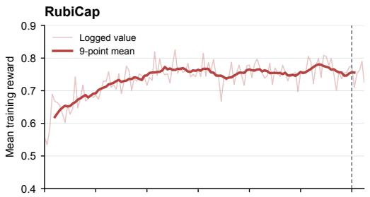

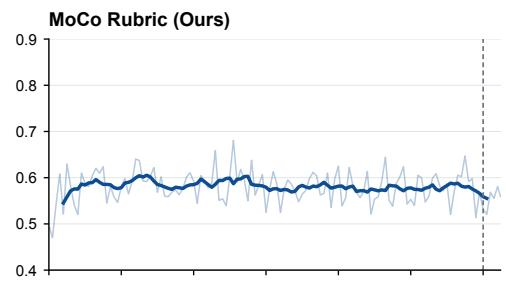

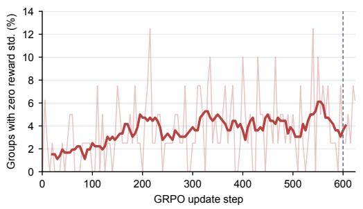

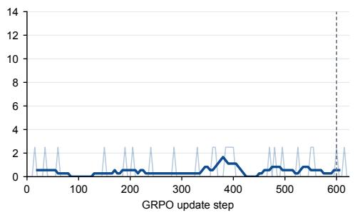  
Figure 5: GRPO training dynamics of RubiCap and MoCo Rubric. The upper panels show mean training reward; the lower panels show the fraction of rollout groups with zero within-group reward standard deviation. Light traces are logged values and dark traces are centered nine-point moving averages. Dashed lines mark the evaluated step-600 checkpoints.

RubiCap’s mean reward rises from 0.652 over steps 1–100 to 0.763 over steps 201–300, then re mains near 0.758 over steps 301–600. MoCo Rubric does not show the same sustained rise toward a high-reward plateau: its mean reward is 0.588 over steps 201–300 and 0.577 over steps 301– 600. Across logged points from steps 5–600, the mean fraction of zero-standard-deviation groups is 3.59% for RubiCap and 0.46% for MoCo Rubric; over steps 301–600, it is 4.33% and 0.58%, respectively. Thus, fewer rollout groups lack a within-group reward advantage under our method. These are single-run training diagnostics. The two methods use different rubrics and judges, and these runs start from different SFT checkpoints; reward magnitudes are therefore not directly comparable measures of caption quality, and the curves alone do not isolate the cause of the difference.

## C QUALITATIVE CASE STUDIES

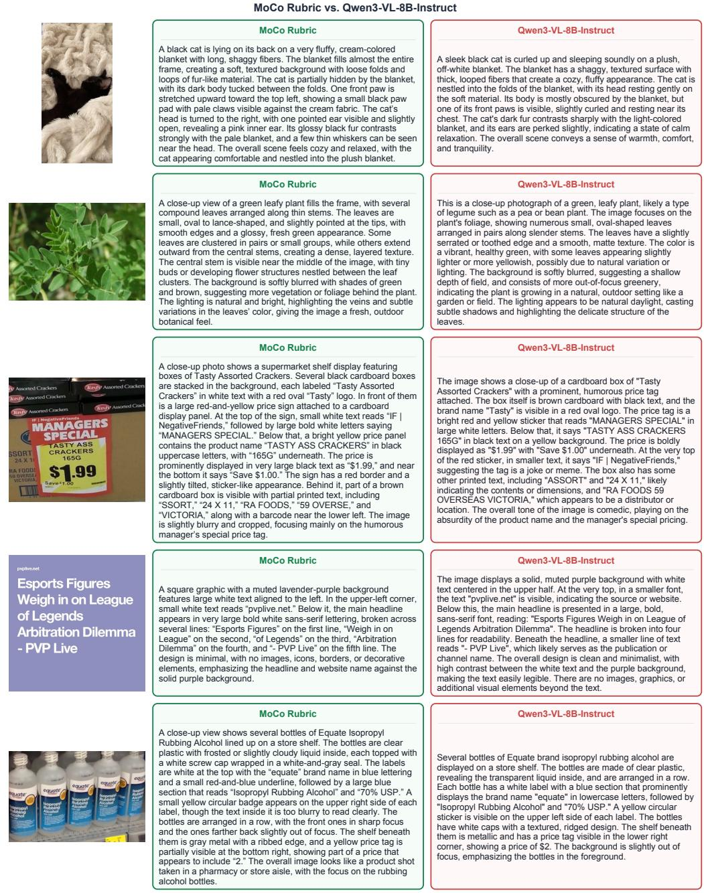  
Figure 6: MoCo Rubric vs. Qwen3-VL-8B-Instruct. The selected examples illustrate differences in object pose, leaf shape, product layout, text alignment, and label position.


## When you find out that Elon has left Twitter and switched to Reddit


## www.channelnewsasia.com

Commentary: The fall of once-great   
Hyflux, a unicorn in the Singapore story - Channel   
NewsAsia


## MoCo Rubric vs. RubiCap

## MoCo Rubric

A person is lying on their side in a bed, covered by a white sheet, with their head resting on a pillow and one arm bent near their face. The bed has white bedding with visible wrinkles and folds, and a pale floral-patterned pillow or blanket is visible behind the person. In the foreground, a large segmented worm-like creature is curled on the bed, forming a loose ring with one end extending downward toward the lower left. The creature has a brownish, reddish-brown body with dark ridges and a ribbed, segmented texture, resembling a giant millipede or earthworm. Its body is thick and rounded, with a darker, more tapered tail-like end at the bottom. The scene has a humorous, surreal quality because the large creature appears to be resting beside the sleeping person, creating the impression that it is sharing the bed.

## MoCo Rubric

The image is a meme with a large bold black headline at the top on a white background that reads, “When you find out that Elon has left Twitter and switched to Reddit.” Below the text is a movie-style image of a hooded, bearded figure standing dramatically in front of a bright glowing sunset or sunrise. The figure has long dark hair and beard, wears a dark hooded robe, and raises both hands outward in a commanding or theatrical gesture. Behind the figure is a large dark silhouette resembling a stylized Reddit alien mascot, with long curved arms or wing-like shapes extending upward and outward. The background is warm and hazy, with golden light on the right side and a misty landscape in the distance. Across the bottom of the image, large yellow text with a black outline reads, “Let the hunt for Elon Musk begin.” The overall joke implies that when Elon Musk leaves Twitter and moves to Reddit, people will start searching for him on the platform

## MoCo Rubric

A square graphic with a solid dark burgundy background features centered white text in a clean sans-serif font. At the top, the heading reads “Hotel Service Tip:”. Below it, the main message says “Be H.O.S.P.I.T.A.B.L.E. to guests” followed by the expanded acronym in parentheses: “(Help, Observe, Smile, Protect, Impress, Thank, Anticipate, Befriend, Listen, Engage).” Beneath the tip is a small tilde symbol followed by the attribution “The\_Appraiser.” In the bottom-right corner, the website “www.hotelevaluations.com.au” appears in smaller white text. The overall design is simple, minimal, and professional, resembling a social media tip card or hotel service reminder.

## MoCo Rubric

A square graphic with a muted lavender-purple background features large white text aligned to the left. At the top, in smaller bold white lettering, it reads “www.channelnewsasia.com.” Below it, the main headline appears in very large bold white sans-serif type, broken across several lines: “Commentary: The fall of once-great Hyflux, a unicorn in the Singapore story.” Under the headline, separated by a hyphen, the source is written in large bold white text as “- Channel NewsAsia,” with “NewsAsia” on the next line. The design is minimal, with no images or decorative elements, relying entirely on typography and a solid paste purple background.

## MoCo Rubric

A dramatic promotional banner with a deep purple background features elegant white script text on the left reading “The Secret Love Life of Ophelia,” with “The” and “of” in smaller italic lettering and “Secret Love Life” and “Ophelia” in large flowing cursive. On the right side, a person is shown from the shoulders up, wearing a rich purple blazer with structured shoulders and a matching purple garment underneath. Their hair is styled in tight braids or twists gathered upward, with warm golden-brown highlights visible against the dark purple backdrop. They are holding a bouquet of purple flowers, likely lisianthus or similar blossoms, with several open purple petals, pale green buds, and long green stems. The flowers partially frame the person’s face, with some blooms near the nose and mouth area, creating a poetic, intimate composition. The person’s expression is serious and intense, with dark eye makeup and a subtle, contemplative gaze. Long dangling earrings are visible on both sides, adding a refined detail. The overall mood is theatrical, romantic, and mysterious, with the purple color palette and floral imagery evoking themes of Shakespearean tragedy, hidden emotions, and the character of Ophelia.

## RubiCap

A person is lying on their side in a bed, covered with a white duvet or sheet, with their face obscured by a blur. They are wearing a white T-shirt and appear to be resting on a pillow with a light floral pattern. The bed has pale, wrinkled bedding and a beige wall or headboard behind it. At the foot of the bed, a large segmented worm-like creature is curled in a loose loop on the white sheets. It has a brownish, glossy, ribbed body with darker shading along the ridges, and its tapered tail curves downward toward the lower left. The creature’s size is exaggerated compared to the bed, making it look like an enormous earthworm or centipede-like animal resting near the sleeper. The overall scene is humorous and surreal, as the sleeping person appears completely unaware of the large creature beside them.

## RubiCap

The image is a meme with a white background and large bold black text at the top reading, “When you find out that Elon has left Twitter and switched to Reddit.” Beneath the caption is a rectangular movie still showing a dark, hooded, bearded figure standing in a dramatic sunset or sunrise, with the face intentionally blurred. The figure has long dark hair and a long beard visible below the blur, wears a textured hooded garment, and raises both hands outward with fingers spread in a theatrical gesture. Behind the figure are large dark curved shapes resembling scythe blades or wing-like forms, silhouetted against a warm golden sky with a bright light source on the right. At the bottom of the still, large bold yellow text with a black outline reads, “Let the hunt for Elon Musk begin.” The overall tone is humorous and conspiratorial, implying that Elon Musk’s move to Reddit has triggered a dramatic, almost apocalyptic search for him.

## RubiCap

A square graphic with a solid dark burgundy background presents a hotel service tip in centered white text. At the top, in a larger bold sans-serif font, it reads "Hotel Service Tip:". Below it, in a larger bold block of text, the main message says: “Be H.O.S.P.I.T.A.B.L.E. to guests (Help, Observe, Smile, Protect, Impress, Thank, Anticipate, Befriend, Listen, Engage).” The acronym and its expanded meaning are arranged across multiple lines for readability. Near the lower center, a small tilde-like symbol “\~” appears followed by the attribution “The\_Appraiser” in white. In the bottom right corner, the website “www.hotelevaluations.com.au” is displayed in smaller white text. The overall design is minimal, with no images or decorative elements, relying entirely on typography and contrast between the white lettering and the deep red background.

## RubiCap

The image is a square graphic with a muted lavender-purple background and large bold white text aligned to the left. At the top, in smaller white text, it reads “www.channelnewsasia.com.” Below it, the main headline is displayed in very large, rounded, bold white lettering: “Commentary: The fall of once-great Hyflux, a unicorn in the Singapore story - Channel NewsAsia.” The headline is broken across multiple lines, with “Commentary: The” on the first main line, “fall of once-great” on the next, “Hyflux, a unicorn in” on the following line, “the Singapore story” beneath that, and “- Channel NewsAsia” at the bottom. The typography is clean and modern, with wide spacing and a strong contrast between the bright white text and the soft purple background. There are no images, logos, or decorative elements besides the text.

## RubiCap

A wide, moody promotional image with a deep purple background features a person on the right whose face is intentionally obscured by a large rectangular blur. The visible details suggest a formal portrait style: the person has dark, tightly braided hair with warm golden highlights, styled upward and back, and wears dangling silver earrings. They are dressed in a rich purple blazer with structured shoulders, creating a strong color harmony with the background. In front of them is a bouquet of purple lisianthus flowers, some fully bloomed and others still in bud form, with green stems and leaves. Several flowers are positioned close to the obscured face area, including a prominent purple bloom near the center and additional buds and stems extending to the left and right. The bouquet has a dramatic, theatrical feel, with the purple flowers and greenery contrasting against the dark purple suit and background. On the left side of the image, large elegant white script text reads “The Secret Love Life of Ophelia.” The typography is ornate and romantic, with “The” and “of” in smaller italic lettering above and beside the larger words. “Secret Love Life” appears across the upper left and center-left, while “Ophelia” dominates the lower left in a very large, flowing serif style. The overall composition feels like a dramatic poster or book-cover design, using purple tones, floral imagery, and refined typography to evoke mystery, romance, and Shakespearean themes

Figure 7: MoCo Rubric vs. RubiCap. The selected examples illustrate fabricated facial blurring and errors in text layout and typography.

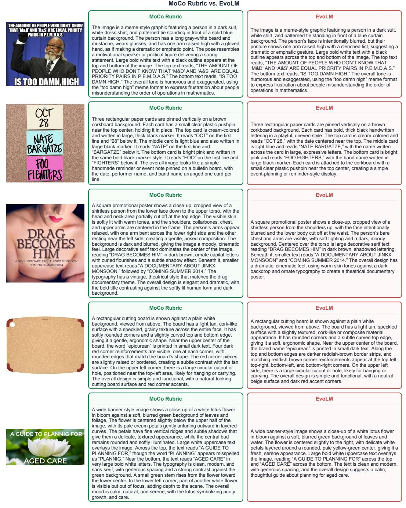  
Figure 8: MoCo Rubric vs. EvoLM. The selected examples illustrate fabricated facial blurring and border details, as well as errors in text layout and transcription.

## D PROOFS AND ADDITIONAL MOMENTUM ANALYSIS

## D.1 PROOF OF PROPOSITION 1

At synchronization boundary $s ,$ the momentum update is

$$
\bar { \phi } _ { s } = m \bar { \phi } _ { s - 1 } + ( 1 - m ) \bar { \theta } _ { s } .\tag{5}
$$

Define

$$
d _ { s } = \bar { \theta } _ { s } - \bar { \phi } _ { s } , \qquad \xi _ { s } = \bar { \theta } _ { s } - \bar { \theta } _ { s - 1 } ,\tag{6}
$$

so that $e _ { s } = | d _ { s } |$ and $\Delta _ { s } = | \xi _ { s } |$ . Substituting Eq. (5) into d<sub>s</sub> gives

$$
\begin{array} { l } { d _ { s } = \bar { \theta } _ { s } - \left[ m \bar { \phi } _ { s - 1 } + ( 1 - m ) \bar { \theta } _ { s } \right] } \\ { \quad = m ( \bar { \theta } _ { s } - \bar { \phi } _ { s - 1 } ) } \\ { \quad = m ( \xi _ { s } + d _ { s - 1 } ) . } \end{array}\tag{7}
$$

Taking norms and applying the triangle inequality yields

$$
e _ { s } \leq m e _ { s - 1 } + m \Delta _ { s } .\tag{8}
$$

Recursively expanding this inequality gives

$$
e _ { s } \leq m ^ { s } e _ { 0 } + \sum _ { j = 1 } ^ { s } m ^ { s - j + 1 } \Delta _ { j } .\tag{9}
$$

Because synchronization occurs every H Policy updates and each update satisfies $| \theta _ { t + 1 } - \theta _ { t } | \leq \delta .$ we have

$$
\begin{array} { l } { \displaystyle \Delta _ { s } = | \bar { \theta } _ { s } - \bar { \theta } _ { s - 1 } | } \\ { \displaystyle \quad \leq \sum _ { h = 1 } ^ { H } \left| \theta _ { ( s - 1 ) H + h } - \theta _ { ( s - 1 ) H + h - 1 } \right| } \\ { \displaystyle \quad \leq H \delta . } \end{array}\tag{10}
$$

Substituting this result into Eq. (9) and evaluating the geometric series yields

$$
\begin{array} { r } { e _ { s } \leq m ^ { s } e _ { 0 } + H \delta \sum _ { j = 1 } ^ { s } m ^ { s - j + 1 } } \\ { = m ^ { s } e _ { 0 } + \frac { m ( 1 - m ^ { s } ) } { 1 - m } H \delta . } \end{array}\tag{11}
$$

Since shared initialization gives $\bar { \theta } _ { 0 } = \bar { \phi } _ { 0 }$ and therefore $e _ { 0 } = 0 ,$

$$
e _ { s } \le \frac { m ( 1 - m ^ { s } ) } { 1 - m } H \delta \le \frac { m H \delta } { 1 - m } .\tag{12}
$$

For the momentum-update magnitude, Eq. (5) gives

$$
\begin{array} { r } { \bar { \phi } _ { s } - \bar { \phi } _ { s - 1 } = ( 1 - m ) ( \bar { \theta } _ { s } - \bar { \phi } _ { s - 1 } ) } \\ { = ( 1 - m ) ( \xi _ { s } + d _ { s - 1 } ) . } \end{array}\tag{13}
$$

Taking norms gives

$$
u _ { s } = | \bar { \phi } _ { s } - \bar { \phi } _ { s - 1 } | \leq ( 1 - m ) ( e _ { s - 1 } + \Delta _ { s } ) ,\tag{14}
$$

which completes the proof.

## D.2 LOCAL DRIFT–NOISE ANALYSIS

We next derive the stochastic smoothing result used in the main text. Consider the local Policydisplacement model

$$
\xi _ { s } = \bar { \theta } _ { s } - \bar { \theta } _ { s - 1 } = H v + \varepsilon _ { s } ,\tag{15}
$$

where

$$
\begin{array} { r } { \mathbb { E } [ \varepsilon _ { s } ] = 0 , \qquad \mathrm { C o v } ( \varepsilon _ { s } ) = H \Sigma . } \end{array}\tag{16}
$$

We assume that v is approximately constant over the local analysis window and that $\varepsilon _ { s }$ is independent across non-overlapping synchronization intervals. Because $d _ { s - 1 }$ depends only on noise from preceding intervals, this assumption also implies that $\varepsilon _ { s }$ is independent of $d _ { s - 1 }$

Substituting Eq. (15) into Eq. (7) gives

$$
d _ { s } = m d _ { s - 1 } + m H v + m \varepsilon _ { s } .\tag{17}
$$

Under shared initialization, $d _ { 0 } = 0 .$ . Recursively expanding Eq. (17) yields

$$
d _ { s } = m H \sum _ { j = 1 } ^ { s } m ^ { s - j } v + m \sum _ { j = 1 } ^ { s } m ^ { s - j } \varepsilon _ { j } .\tag{18}
$$

Its finite-step mean is

$$
\mathbb { E } [ d _ { s } ] = \frac { m H ( 1 - m ^ { s } ) } { 1 - m } v .\tag{19}
$$

Using the independence of the noise terms, its covariance is

$$
\begin{array} { l } { \displaystyle \mathrm { C o v } ( d _ { s } ) = m ^ { 2 } \sum _ { j = 1 } ^ { s } m ^ { 2 ( s - j ) } \mathrm { C o v } ( \varepsilon _ { j } ) } \\ { \displaystyle = \frac { m ^ { 2 } H ( 1 - m ^ { 2 s } ) } { 1 - m ^ { 2 } } \Sigma . } \end{array}\tag{20}
$$

For $0 \leq m < 1$ , taking $s \to \infty$ gives

$$
\mathbb { E } [ d _ { s } ] \longrightarrow \frac { m H } { 1 - m } v , \quad \quad \mathrm { C o v } ( d _ { s } ) \longrightarrow \frac { m ^ { 2 } H } { 1 - m ^ { 2 } } \Sigma .\tag{21}
$$

Thus, the stationary expected squared tracking error is

$$
\mathbb { E } \left[ \vert d _ { s } \vert ^ { 2 } \right] = \frac { m ^ { 2 } H ^ { 2 } } { ( 1 - m ) ^ { 2 } } \vert v \vert ^ { 2 } + \frac { m ^ { 2 } H } { 1 - m ^ { 2 } } \operatorname { t r } ( \Sigma ) .\tag{22}
$$

We now consider the momentum-model update

$$
q _ { s } = \bar { \phi } _ { s } - \bar { \phi } _ { s - 1 } .\tag{23}
$$

From Eq. (13),

$$
q _ { s } = \left( 1 - m \right) \left( d _ { s - 1 } + H v + \varepsilon _ { s } \right) .\tag{24}
$$

Its finite-step mean is

$$
\mathbb { E } [ q _ { s } ] = H ( 1 - m ^ { s } ) v .\tag{25}
$$

Since $d _ { s - 1 }$ and $\varepsilon _ { s }$ are independent,

$$
\begin{array} { l } { \displaystyle \mathrm { C o v } ( q _ { s } ) = ( 1 - m ) ^ { 2 } \left[ \mathrm { C o v } ( d _ { s - 1 } ) + H \Sigma \right] } \\ { \displaystyle = \frac { 1 - m } { 1 + m } ( 1 - m ^ { 2 s } ) H \Sigma . } \end{array}\tag{26}
$$

Taking the stationary limit gives

$$
\mathbb { E } [ q _ { s } ] \longrightarrow H v , \qquad \mathrm { C o v } ( q _ { s } ) \longrightarrow \frac { 1 - m } { 1 + m } H \Sigma .\tag{27}
$$

For periodic full copying, $m = 0$ , so $q _ { s } = \xi _ { s }$ and Cov $\left( q _ { s } \right) = H \Sigma$ . EMA therefore reduces the stationary update covariance, relative to full copying at the same H, by the factor

$$
{ \frac { 1 - m } { 1 + m } } .\tag{28}
$$

However, Eq. (21) shows that increasing m also increases the mean tracking lag and tracking variance. Similarly, increasing H increases both the systematic displacement and accumulated noise between synchronization boundaries. These results establish a parameter-space tracking–stability trade-off; they do not imply that Policy optimization necessarily improves the task-level quality of rubric generation or judging.