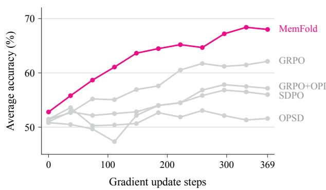
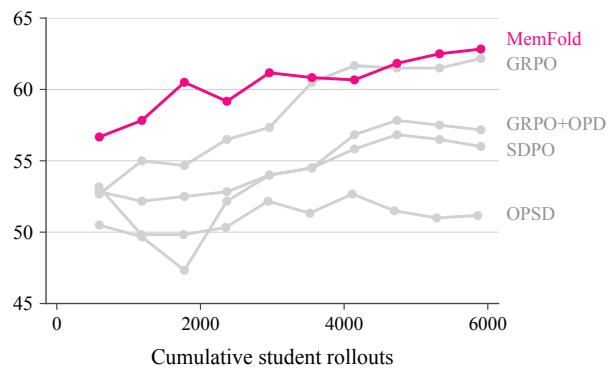
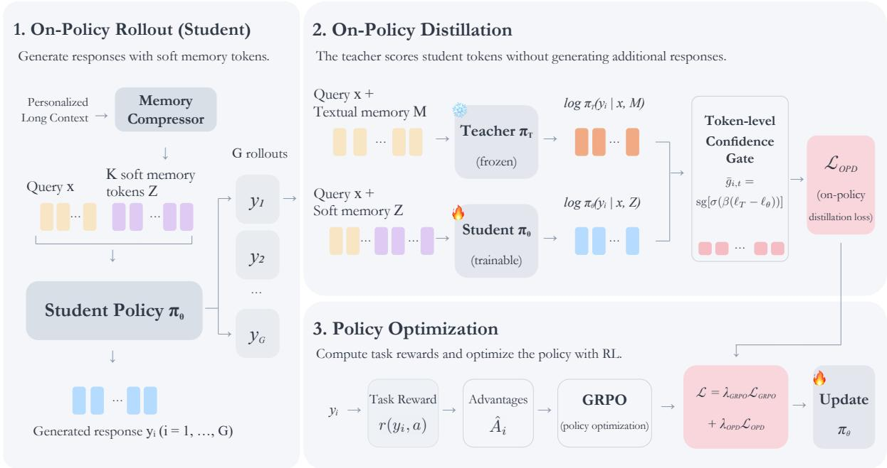
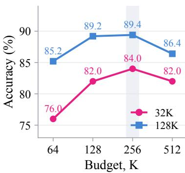
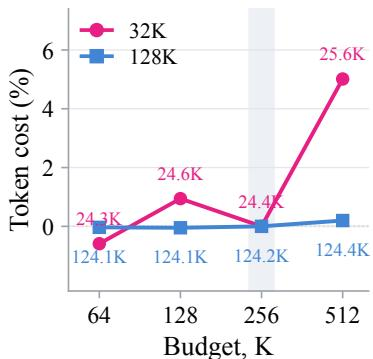
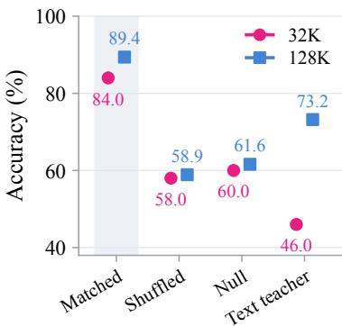
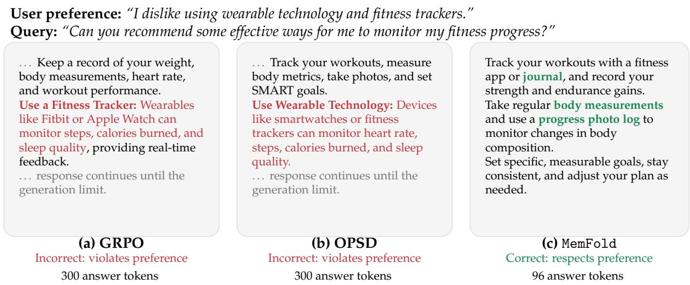
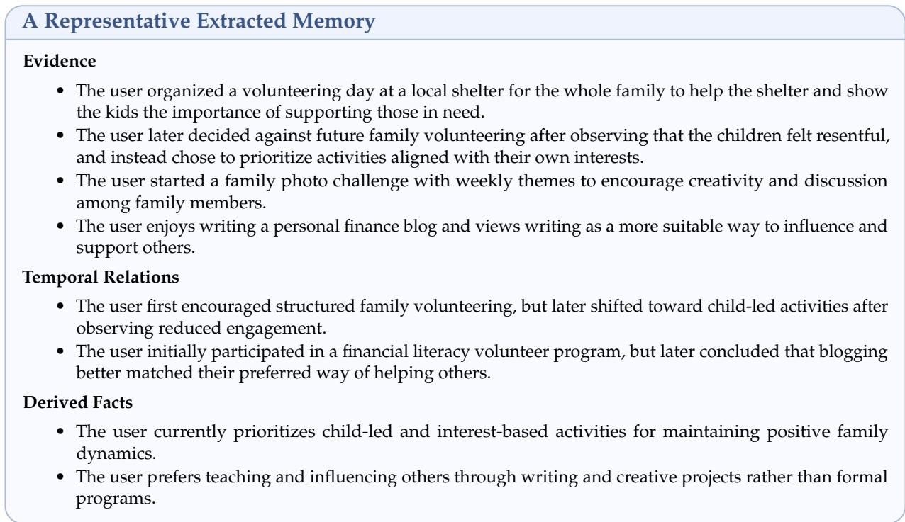

# MemFold: Learning Compact Soft Memory for Long-Context Personalization via On-Policy Optimization

Jingxuan Wu 2,\*, Yuzhe Yang 1,\*, Yiqiao Huang 3, Chengzhi Liu 1, Qingni Wang 1, Chengxuan Qian 1, Shutong Wu 4, Jiawei Zhang 4 and Xin Eric Wang 1

1University of California, Santa Barbara, 2University of North Carolina at Chapel Hill 3Harvard University, 4University of Wisconsin–Madison

Correspondence: jingxwu@unc.edu, yuzheyang@ucsb.edu

## Abstract

An assistant that serves the same user over a long horizon has to answer from what that user has revealed: which preferences still hold, which were revised, and which constraints apply now. Retaining that information is not the same as acting on it, and the two are usually optimized as if they were. Keeping the information as text makes the reader’s input grow with the retained history, while compressing it into a fixed number of latent vectors bounds the interface but is typically trained to reconstruct text or imitate reference answers, both of which are scored on sequences the reader never produced. We present MemFold, which optimizes a fixed-budget soft memory by the behavior it supports. A query-conditioned textual memory is compressed into K continuous vectors that form the reader’s memory interface, and the reader is then trained on its own rollouts under two complementary signals: group-relative rewards for task outcomes, and confidence-gated on-policy distillation in which a frozen textual-memory teacher re-scores the student’s sampled tokens under the textual memory. The teacher is never sampled from, so supervision stays on the student’s current distribution and adds no autoregressive decoding; at inference it is removed entirely. Across three Qwen backbones, MemFold attains the highest accuracy we measure on PersonaMem-32K and PersonaMem-128K, with margins that widen at the longer history length, and transfers to PrefEval and LongMemEval without target-domain training. Ablations attribute most of the task gain to the reward term and a smaller additional gain to the teacher signal, and memory interventions show that the reader depends on the instance-specific content of its soft memory.

§ MemFold MemFold MemFold.github.io

  
Figure 1: Using Qwen2.5-3B-Instruct on PersonaMem-32K, MemFold improves test accuracy more rapidly during training and achieves higher final performance than the baselines (left), while reaching comparable test accuracy with fewer student rollouts (right), demonstrating both effective optimization and greater sample efficiency. Experimental settings are provided in Appendix B.1.

## 1 Introduction

A long-running assistant is asked similar questions by different people, and the suitable answer is not the same for each of them. What makes a response suitable is the set of facts, preferences, and constraints that this particular user has revealed in earlier interactions. The same holds for one user across time: a request phrased identically in March and in September can call for different advice because what the user wants has changed in between. Personalization in this setting is therefore a property of the response rather than of the store. It is the extent to which an answer reflects the information about this user that is in force at the moment the answer is produced.

That last qualification does much of the work. A long history mixes enduring preferences with one-off activities, constraints that held only for a period, explicit revisions, and the reasons behind those revisions. Recency does not resolve them: the most recent mention of an activity is not necessarily a new preference, and an early statement is not necessarily stale. On benchmarks built around evolving user profiles, models recover the course of a preference change and the reasons behind it more reliably than they let the resulting preference constrain a concrete recommendation [1], and they continue to recommend options a user has objected to when the objection was expressed implicitly rather than as an instruction [2, 3]. Evaluations that score forgetting alongside recall find agents still acting on information a later turn has invalidated [4], and condensed histories can retain the facts of an episode while losing the preference signal that made it matter [5]. Retaining the evidence and acting on it are thus separate requirements, and a memory mechanism has to be judged against both.

Two representations carry that evidence forward. Textual memory keeps it as text, which is readable and editable, but its length varies with the amount retained and it is re-encoded at every turn [6–11]. Latent memory replaces the text with a fixed number of continuous vectors, giving the reader an interface whose size is independent of how long the interaction has been [12–17]. That fixed budget is a property of the interface, and it does not by itself determine whether the compressed representation still supports the behavior the text did.

The gap this leaves is one of optimization rather than representation. Compressors are typically trained to reconstruct the source text [14, 18] or to align with reference answers under a frozen decoder [19], and both objectives score the model on sequences it did not produce, so neither reaches the errors the reader makes once the text is gone. Recent work closes part of this loop by treating memory as a resource a policy learns to use, optimizing what a memory stores, retrieves, or spends its budget on against a task reward [20–24]. A scalar outcome, however, reports only that a response was wrong; it does not indicate which decisions in it failed to use what the memory held. A characteristic failure of this kind is a response that is fluent and topically appropriate, with the preference violation confined to one recommendation among several, which we examine in Section 6. A sequence-level reward charges the entire response for that span.

Our starting point is to judge a compact memory not by whether it returns the text, but by where the reader, given only the compact memory, under-uses what the text would support. This can be measured directly, because the textual and compressed memories can be evaluated on the same response. Given a response sampled by a reader conditioned on soft memory, a frozen copy of that reader conditioned on the corresponding textual memory can score the identical token sequence. The resulting token-level log-probability differences locate where the reader is less confident under compression than under the text, on trajectories the reader actually visits. We use them to weight the reader’s own tokens rather than as a target to imitate, so the signal complements the task reward: the reward indicates whether a response is correct, while the comparison indicates which of its tokens the textual reading supports more strongly.

Based on this observation, our contributions are threefold: ❶ Prior compressors are trained on sequences the reader never produces; we propose MemFold, which optimizes a fixed-budget soft-memory interface directly by the downstream behavior it supports, on the reader’s own rollouts. ❷ We introduce a confidence-gated on-policy distillation objective that re-scores the student’s own generations under textual memory; in expectation it acts as a reverse KL toward the textual-memory reader with bounded per-token influence, adding a dense signal to the sequence-level reward without letting the teacher dominate it. ❸ We show that MemFold achieves the highest accuracy on all four benchmarks across three backbones, with margins that widen at longer history lengths, and transfers to unseen benchmarks without target-domain training.

## 2 Related Work

Memory and personalization in long-horizon interaction. Long-horizon assistants are commonly given an explicit textual store, written across sessions and queried at inference [6– 11, 25, 26], with benchmarks measuring the recall and multi-session reasoning that results [27–29]. A second line asks whether retained information changes what the model says to a given user, through personalized generation from user profiles [30–33], histories in which preferences develop over time [1], preferences expressed implicitly rather than as instructions [2, 3], and whether information a later turn has invalidated is dropped as well as recalled [4]. We adopt the distinction those benchmarks draw: retrieval accuracy over a history and preference-consistent behavior in a response are different quantities. Because the content stays in text, the tokens the reader processes also grow with the amount retained, and the store is optimized separately from the model consuming it.

Compact memory and behavioral optimization. A complementary line shortens the representation, by dropping or rewriting tokens [34, 35] or, building on prompt and prefix tuning [36, 37], by encoding context into continuous vectors read in the embedding space [12–18, 38], often through latent-query resamplers [39, 40] as ours is. Their objectives, reconstruction or supervised imitation, are scored on sequences the reader did not generate, as is distillation that aligns a compressed context with reference answers under a frozen decoder [19]. Reinforcement learning instead trains on the model’s own samples [41–43] and has been used to decide what a memory stores, retrieves, or spends its budget on [20–24, 44–46], whereas we hold the interface fixed and optimize how it is read; on-policy distillation adds the per-token signal a scalar reward lacks [47–49] but uses a stronger teacher and a signed gap that pulls the student toward it. Ours is closer to context distillation [50]: a frozen copy of the student’s own initialization, never sampled from, re-scores the student’s tokens under the textual memory it has had compressed away, and a non-negative gate replaces the signed gap. The two differ only in their memory, which ties the signal to compression rather than to a more accurate solver.

## 3 Methodology

MemFold has two parts: a fixed-budget memory interface and an on-policy procedure that optimizes how the reader uses it. A memory writer turns the history visible at query time into query-relevant textual memory, a compressor maps that memory into K soft vectors, and the reader is then trained on its own rollouts under a task reward together with a frozen textualmemory teacher that re-scores those same rollouts (Figure 2). Supervised training is used only to initialize the interface; its data construction and training details are deferred to Appendix A.1.1 and Appendix A.1.2.

  
Figure 2: ❶ On-policy rollout: The student generates responses conditioned on the query and K compressed soft memory tokens. ❷ On-policy distillation: A frozen textual-memory teacher scores the student’s tokens, and a detached teacher–student confidence gate $\bar { g } _ { i , t }$ weights the student’s own tokens. ❸ Policy optimization: GRPO task rewards and the gated distillation term jointly update the student, while the teacher and compressor remain frozen.

## 3.1 Problem Formulation

A query x arrives at time τ, and the model may condition only on the interaction history C visible before τ. Because no annotation indicates which statements in C remain valid, the model must infer them from the history. All components share a frozen backbone $\theta _ { 0 }$ and a single LoRA adapter θ. The adapter first produces a query-conditioned textual memory $M = e _ { \theta } ( C , x )$

containing the relevant evidence, temporal relations, and derived facts. A compressor $\mathcal { C } _ { \phi }$ then maps it to a fixed-size continuous memory $Z = \mathcal { C } _ { \phi } ( E ( M ) ) \in \mathbb { R } ^ { K \times d }$ , where E comprises the first four Transformer blocks of $\theta _ { 0 } .$ , K is the memory budget, and d is the reader’s input embedding dimension.

The same adapter, acting as the reader, generates $y \sim \pi _ { \boldsymbol { \theta } } ( \cdot \mid x , Z )$ . During on-policy training, a frozen copy of the initialized reader, $\pi _ { T } ( \cdot \mid x , M ) : = \pi _ { \theta _ { \mathrm { i n i t } } } ( \cdot \mid x , M )$ , instead reads the textual memory and serves as a behavioral reference. Teacher and student thus initially share all weights and differ only in their memory inputs. Both score each student-sampled trajectory, and their confidence gap identifies tokens for which the compressed-memory reader is less confident. We use this gap to weight the student’s own tokens alongside the task reward, bounding the teacher’s influence on each token rather than matching its distribution. At inference, only $\pi _ { \theta } ( \cdot \mid x , Z )$ is retained, so the memory interface remains fixed at K vectors regardless of the history length.

## 3.2 Fixed-Budget Soft Memory

This component supplies the interface that Section 3.3 acts on. Two properties are what the method requires of it: its size does not depend on the length of C, and the reader can read it. We instantiate these requirements with a standard Perceiver-style compressor.

Textual memory. We first transform the long context C into a structured, query-relevant textual memory M, filtering irrelevant history before compression. The adapter is first trained on memories extracted by an external model from the history and query alone, and thereafter writes M itself, so the external model is not needed at inference.

Fixed-budget compression. We encode M with the frozen encoder E, the first four Transformer blocks of the backbone, and a lightweight Perceiver-style compressor aggregates the variablelength sequence with K learned latent queries $Q _ { K } \colon$

$$
Z = { \mathcal { C } } _ { \phi } { \big ( } E ( M ) { \big ) } = P _ { \phi } { \big ( } \mathrm { C o m p } _ { \phi } ( Q _ { K } , E ( M ) ) { \big ) } \in \mathbb { R } ^ { K \times d } ,
$$

where $P _ { \phi }$ projects the compressed states into the reader’s input embedding space. The reader therefore always receives exactly K memory vectors, regardless of the lengths of C and M.

Initialization. We first pretrain the compressor on raw history prefixes h: the frozen backbone must reconstruct the textual memory from $Z _ { h } = C _ { \phi } ( E ( h ) )$ ,

$$
\mathcal { L } _ { \mathrm { r e c } } = - \frac { 1 } { \vert M \vert } \sum _ { t = 1 } ^ { \vert M \vert } \log p _ { \theta _ { 0 } } ( m _ { t } \vert x , Z _ { h } , m _ { < t } ) ,\tag{1}
$$

then adapt it to textual-memory inputs, $Z = { \mathcal { C } } _ { \phi } ( E ( M ) )$ , and initialize the reader on answer generation from $( x , Z )$ . These objectives are scored on sequences the reader did not produce, so they make the interface readable without directly optimizing how the reader uses it on its own generations. On-policy optimization addresses this remaining gap.

Algorithm 1 MemFold on-policy memory optimization   
Require: Reader-initialized adapter $\theta _ { \mathrm { i n i t } } ,$ compressor $C _ { \phi } ,$ frozen teacher $\pi _ { T } ;$ training examples   
$( C , x , a )$ with reference answer a and cached on-policy memories $M ^ { \mathrm { i n i t } } = e _ { \theta _ { \mathrm { i n i t } } } ( \stackrel { \cdot } { C } , \stackrel { \cdot } { x } )$   
Ensure: Trained adapter θ   
1: Initialize $\theta \gets \theta _ { \mathrm { i n i t } } ;$ freeze compressor, projector, and teacher   
2: for each training minibatch of $( C , x , a )$ do   
3: Load cached $M ^ { \mathrm { i n i t } }$ and compute $Z \gets C _ { \phi } ( E ( M ^ { \mathrm { i n i t } } ) )$   
4: Snapshot rollout policy $\pi _ { \mathrm { o l d } }  s \mathrm { g } [ \pi _ { \boldsymbol { \theta } } ]$   
5: Sample $y _ { 1 } , \dots , y _ { G } \sim \pi _ { \mathrm { o l d } } ( \cdot \mid x , Z )$   
6: Score rewards $r _ { i } = r ( y _ { i } , a )$ and compute $\hat { A } _ { i }$   
7: for each sampled response i and unmasked token t do   
8: $\ell _ { \theta , i , t } \gets \log \pi _ { \theta } ( y _ { i , t } \mid x , Z , y _ { i , < t } )$   
9: $\ell _ { T , i , t } \gets \log \pi _ { T } ( y _ { i , t } \mid x , M ^ { \mathrm { i n i t } } , y _ { i , < t } )$   
10: $\bar { g } _ { i , t }  s g [ \sigma ( \beta ( \ell _ { T , i , t } - \ell _ { \theta , i , t } ) ) ]$   
11: end for   
12: Compute $\mathcal { L } _ { \mathrm { G R P O } }$ and ${ \mathcal { L } } _ { \mathrm { O P D } }$ over shared response masks   
13: Update the LoRA adapter θ   
14: end for   
15: return $\theta ;$ at inference, write $M = e _ { \theta } ( C , x )$ and answer from $\left( x , C _ { \phi } ( E ( M ) ) \right)$ without the teacher

## 3.3 On-Policy Memory Optimization

Initialization leaves two gaps. First, a reader trained on reference answers receives no signal about errors in its own generations. Second, a task reward does score the reader’s own samples, but one scalar per response does not identify which tokens failed to use what the textual memory held. MemFold closes the first by optimizing on the student’s rollouts, and the second by rescoring those same rollouts under the textual memory. Algorithm 1 summarizes the resulting loop.

On-policy rollouts. For each query x, the current soft-memory policy samples a group of responses $\{ y _ { i } \} _ { i = 1 } ^ { G } \colon y _ { i } \sim \pi _ { \theta } ( \cdot \mid \bar { x _ { , } } Z )$ . Each response receives a task reward $\boldsymbol { r } _ { i } ,$ from which we compute the group-relative advantage $\begin{array} { r } { \hat { A } _ { i } = \frac { r _ { i } - \mu _ { r } } { \sigma _ { r } + \epsilon } . \operatorname { L e t } \rho _ { i , t } ( \theta ) = \frac { \pi _ { \theta } \left( y _ { i , t } | x , Z , y _ { i , < t } \right) } { \pi _ { \mathrm { o l d } } \left( y _ { i , t } | x , Z , y _ { i , < t } \right) } } \end{array}$ . The group-relative policy objective is

$$
\mathcal { L } _ { \mathrm { G R P O } } = - \mathbb { E } \left[ \frac { 1 } { G } \sum _ { i = 1 } ^ { G } \frac { 1 } { | y _ { i } | } \sum _ { t = 1 } ^ { | y _ { i } | } \operatorname* { m i n } \big ( \rho _ { i , t } \hat { A } _ { i } , \mathrm { c l i p } ( \rho _ { i , t } , 1 - \epsilon , 1 + \epsilon ) \hat { A } _ { i } \big ) \right] .\tag{2}
$$

On-policy memory distillation. GRPO evaluates complete responses but does not reveal where the soft-memory reader under-uses what the memory contains. The textual-memory teacher $\pi _ { T }$ offers a reference for how the same backbone reads the uncompressed memory: it scores each token sampled by the student,

$$
\ell _ { T , i , t } = \log \pi _ { T } ( y _ { i , t } \mid x , M , y _ { i , < t } ) , \qquad \ell _ { \theta , i , t } = \log \pi _ { \theta } ( y _ { i , t } \mid x , Z , y _ { i , < t } ) ,\tag{3}
$$

and we weight the student’s own tokens by a detached gate $\bar { g } _ { i , t } = s \mathrm { g } [ \sigma ( \beta ( \ell _ { T , i , t } - \ell _ { \theta , i , t } ) ) ]$

$$
\mathcal { L } _ { \mathrm { O P D } } = - \mathbb { E } \Big [ \frac { 1 } { G } \sum _ { i = 1 } ^ { G } \frac { 1 } { | y _ { i } | } \sum _ { t = 1 } ^ { | y _ { i } | } \bar { g } _ { i , t } \ell _ { \theta , i , t } \Big ] .\tag{4}
$$

The objective strengthens the student’s sampled tokens in proportion to how much more the textual-memory reading supports them than the soft-memory reading does. Per sample, the gate is largest where the teacher is more confident and approaches zero where it is less confident than the student. The objective never promotes tokens the student did not sample, so it re-ranks the student’s own candidates by the teacher’s relative confidence rather than importing the teacher’s own choices; in expectation, this re-ranking acts as a reverse KL with a bounded per-token coefficient. The bound is deliberate: $\pi _ { T }$ is a frozen reader of the textual memory, not an accuracy oracle, so no single token on which it is strongly over- or under-confident can dominate the update. Signed feedback on task outcomes comes from GRPO.

Joint objective and training. The two signals address different gaps and are combined as

$$
\begin{array} { r } { \mathcal { L } _ { \mathrm { M e m F o l d } } = \lambda _ { \mathrm { G R P O } } \mathcal { L } _ { \mathrm { G R P O } } + \lambda _ { \mathrm { O P D } } \mathcal { L } _ { \mathrm { O P D } } , } \end{array}
$$

with the textual-memory teacher and compressor frozen throughout and no additional KL regularization in the final configuration. Because the gate and teacher log-probability are detached, ${ \mathcal { L } } _ { \mathrm { O P D } }$ reduces to a gate-weighted likelihood on the student’s own samples with no gradient through the teacher branch; its expected update vanishes when the soft and textual readings agree and weakens as they converge (Appendix C). At inference time, the teacher and all distillation computations are removed, and generation conditions only on $( x , Z )$ ; additional implementation details are in Appendix A.1.3.

## 4 Experiments

## 4.1 Experimental Setup

Datasets & Benchmarks. We evaluate on several benchmarks with complementary focuses. PersonaMem-32K and PersonaMem-128K [1] evaluate dynamic user preference tracking under increasingly long conversational histories. We train on PersonaMem-32K and evaluate directly on the implicit persona subset of PrefEval [2] to test cross-dataset personalization generalization. We also train on LoCoMo [27] and evaluate directly on LongMemEval [28] without task-specific training to assess generalization to broader long-term memory reasoning tasks.

Backbone Models. We evaluate our method with three backbone models: Qwen2.5-3B-Instruct and Qwen2.5-7B-Instruct [51], as well as Qwen3-4B [52].

Baselines. We organize the baselines into three categories. For training objectives, we compare with GRPO [42] and OPSD [49]. For latent-memory and context-compression methods, we include AutoCompressor [13], MemGen [38], and xRAG [15]. These methods compress textual context into compact continuous representations for downstream inference. Finally, Full Text serves as the uncompressed-context baseline, directly providing the complete textual history to the backbone model.

## Evaluation.

We report accuracy (Acc.) and average end-to-end token-equivalent count (#Tok.) per test instance; accounting rules are in Appendix B.2. PrefEval uses PersonaMem-32K checkpoints; predictions on PrefEval and LongMemEval are scored via the Gemini-3.8-flash API [53] with low thinking, with LongMemEval additionally using structured yes/no outputs. Greedy decoding (T = 0) is used by default; ablations report mean accuracy and Pass@16 over 16 samples (T = 1.0, top-p = 0.98).

Table 1: Main results for in-domain and direct cross-dataset evaluation, reporting accuracy and end-to-end token-equivalent counts. Weighted averages use benchmark sample counts. Best and second-best accuracies are highlighted for each backbone and benchmark.
<table><tr><td rowspan="3">Model Method</td><td rowspan="3"></td><td colspan="4">In-Domain</td><td colspan="4">Out-of-Domain</td><td colspan="2"></td></tr><tr><td colspan="2">PersonaMem-32K</td><td colspan="2">PersonaMem-128K</td><td colspan="2">PrefEval</td><td colspan="2">LongMemEval</td><td colspan="2">Weighted Avg.</td></tr><tr><td>Acc.↑</td><td>#Tok.↓</td><td>Acc.↑</td><td>#Tok.↓</td><td colspan="2">Acc.↑ #Tok.↓</td><td colspan="2">Acc.↑ #Tok.↓</td><td>Acc.↑</td><td>#Tok.↓</td></tr><tr><td rowspan="7">Ow-3B Instruct</td><td>Full Text</td><td>46.0</td><td>24,518</td><td>21.9</td><td>124,317</td><td>12.9</td><td>1,893</td><td>26.6</td><td>145,521</td><td>18.8</td><td>58,803</td></tr><tr><td>xRAG</td><td>36.0</td><td>28,714</td><td>55.8</td><td>121,118</td><td>8.5</td><td>1,693</td><td>10.2</td><td>115,744</td><td>15.9</td><td>50,040</td></tr><tr><td>AutoCompressor†</td><td>32.0</td><td>25,006</td><td>30.5</td><td>123,999</td><td></td><td></td><td></td><td></td><td></td><td></td></tr><tr><td>MemGen</td><td>54.0</td><td>49,510</td><td>66.1</td><td>123,302</td><td>13.3</td><td>19,386</td><td>3.8</td><td>208,378</td><td>18.7</td><td>86,809</td></tr><tr><td>GRPO</td><td>68.0</td><td>27,297</td><td>58.4</td><td>123,410</td><td>11.3</td><td>1,893</td><td>26.0</td><td>145,521</td><td>23.2</td><td>58,762</td></tr><tr><td>OPSD</td><td>54.0</td><td>27,297</td><td>29.6</td><td>123,410</td><td>12.8</td><td>1,893</td><td>26.2</td><td>145,521</td><td>19.9</td><td>58,762</td></tr><tr><td>MMemFold</td><td>70.0</td><td>24,395</td><td>88.4</td><td>123,229</td><td>19.9</td><td>2,692</td><td>32.4</td><td>122,545</td><td>33.8</td><td>52,662</td></tr><tr><td rowspan="7">Owwe-7B Instruct</td><td>Full Text</td><td>60.0</td><td>24,517</td><td>24.0</td><td>124,317</td><td>14.0</td><td>1,893</td><td>25.4</td><td>145,532</td><td>19.8</td><td>58,806</td></tr><tr><td>xRAG</td><td>62.0</td><td>28,733</td><td>64.9</td><td>121,118</td><td>10.9</td><td>1,703</td><td>12.2</td><td>115,754</td><td>19.8</td><td>50,049</td></tr><tr><td>AutoCompressor†</td><td>66.0</td><td>25,506</td><td>30.7</td><td>123,999</td><td></td><td></td><td>9.6</td><td>109,030</td><td></td><td></td></tr><tr><td>MemGen</td><td>76.0</td><td>49,510</td><td>78.5</td><td>123,302</td><td>14.1</td><td>20,002</td><td>11.0</td><td>178,477</td><td>23.4</td><td>78,769</td></tr><tr><td>GRPO</td><td>70.0</td><td>27,297</td><td>62.2</td><td>123,411</td><td>14.1</td><td>1,893</td><td>25.0</td><td>145,535</td><td>25.0</td><td>58,766</td></tr><tr><td>OPSD</td><td>64.0</td><td>27,297</td><td>47.2</td><td>123,420</td><td>13.2</td><td>1,895</td><td>25.0</td><td>145,542</td><td>22.4</td><td>58,770</td></tr><tr><td>MMemFold</td><td>88.0</td><td>24,851</td><td>94.4</td><td>124,640</td><td>14.1</td><td>2,192</td><td>36.8</td><td>122,089</td><td>33.0</td><td>52,451</td></tr><tr><td rowspan="7">Owe--4B</td><td>Full Text</td><td>56.0</td><td>24,500</td><td>4.3</td><td>124,301</td><td>13.6</td><td>1,894</td><td>27.8</td><td>145,506</td><td>17.6</td><td>58,796</td></tr><tr><td>xRAG</td><td>66.0</td><td>28,934</td><td>65.2</td><td>121,146</td><td>2.8</td><td>1,827</td><td>6.6</td><td>115,925</td><td>13.8</td><td>50,176</td></tr><tr><td>AutoCompressor+</td><td>58.0</td><td>25,519</td><td>30.8</td><td>123,982</td><td></td><td></td><td>14.2</td><td>107,087</td><td></td><td></td></tr><tr><td>MemGen</td><td>56.0</td><td>49,510</td><td>65.7</td><td>124,302</td><td>12.3</td><td>19,717</td><td>10.4</td><td>112,881</td><td>20.0</td><td>60,345</td></tr><tr><td>GRPO</td><td>62.0</td><td>24,500</td><td>65.7</td><td>123,393</td><td>13.8</td><td>1,895</td><td>27.4</td><td>145,527</td><td>25.7</td><td>58,684</td></tr><tr><td>OPSD</td><td>74.0</td><td>24,500</td><td>39.5</td><td>123,441</td><td>13.8</td><td>1,895</td><td>26.0</td><td>145,527</td><td>22.3</td><td>58,691</td></tr><tr><td>MMemFold</td><td>84.0</td><td>24,395</td><td>89.4</td><td>124,155</td><td>15.2</td><td>2,268</td><td>38.6</td><td>123,488</td><td>33.4</td><td>52,810</td></tr></table>

AutoCompressor yields no valid outputs in these settings: its PersonaMem-32K-trained checkpoints return a single prediction on PrefEval, while the 3B checkpoint produces malformed LongMemEval outputs.

## 4.2 Results

Table 1 reports accuracy and average end-to-end tokens per test instance for every method under a shared backbone and evaluation protocol. MemFold obtains the highest accuracy on every benchmark and backbone, tying the strongest baseline in one cell on PrefEval. Two patterns in the table matter more than the individual entries. First, the advantage widens with history length: the margin over the best competing method is larger at PersonaMem-128K than at 32K for all three backbones, and several baselines that are competitive at 32K fall sharply at 128K, whereas MemFold does not, even though its reader is given the same K vectors in both settings and only the history behind them grows. Second, the accuracy does not come from spending more at inference: average end-to-end cost stays close to full-context inference and is lower in aggregate for all three backbones. The consistent exception is PrefEval, where the history is too short for reader-side savings to offset memory-construction costs. xRAG uses slightly fewer tokens, but at a substantial accuracy cost. What the table cannot show is where the gain originates, or whether the reader is using the memory at all; we take those up in Sections 5 and 6, respectively.

## 5 Ablation Study

Table 2 isolates the contributions of memory-interface initialization and the two on-policy objectives. Reader initialization produces the largest initialization gain, indicating that the model must first learn to consume the soft-memory interface before on-policy optimization can be effective. Writer initialization provides an additional gain by improving the textual memory from which the soft representation is constructed. Among the on-policy objectives, GRPO accounts for most of the task improvement, while OPD provides a complementary gain through token-level guidance from the textual-memory teacher when combined with GRPO. Finally, the text-space control performs comparably but does not outperform the full soft-memory model, suggesting that fixed-budget compression is not the primary bottleneck under this training configuration.

Table 2: Ablation of initialization and on-policy objectives. The text-space control uses textual memory, whereas MemFold uses fixed-budget soft memory. ✓ = satisfies, ✗ = does not satisfy, and N/A = not applicable.
<table><tr><td rowspan="2">Method</td><td colspan="2">Initialization</td><td colspan="2">On-Policy Objectives</td><td rowspan="2">Memory Interface</td><td colspan="2">PersonaMem-32K</td><td colspan="2">PersonaMem-128K</td></tr><tr><td>Writer</td><td>Reader</td><td>OPD</td><td>GRPO</td><td>Mean↑</td><td>Pass@16 ↑</td><td>Mean ↑</td><td>Pass@16 ↑</td></tr><tr><td>w/o Writer Initialization</td><td>x</td><td>√</td><td>√</td><td></td><td>Soft</td><td>70.8</td><td>82.0</td><td>80.0</td><td>85.7</td></tr><tr><td>w/o Reader Initialization</td><td>√</td><td>x</td><td>√</td><td>√</td><td>Soft</td><td>47.9</td><td>76.0</td><td>46.2</td><td>67.0</td></tr><tr><td>w/o OPD</td><td>J</td><td>√</td><td>x</td><td>√</td><td>Soft</td><td>71.9</td><td>84.0</td><td>86.9</td><td>91.8</td></tr><tr><td>w/o GRPO</td><td>√</td><td>√</td><td>√</td><td>x</td><td>Soft</td><td>58.6</td><td>78.0</td><td>70.2</td><td>82.3</td></tr><tr><td>Initialization Only</td><td>√</td><td>√</td><td>x</td><td>x</td><td>Soft</td><td>60.5</td><td>82.0</td><td>70.8</td><td>85.1</td></tr><tr><td>Text-Space Control</td><td>√</td><td>N/A</td><td>√</td><td>√</td><td>Text</td><td>69.3</td><td>88.0</td><td>85.5</td><td>91.9</td></tr><tr><td>MMemFold</td><td>√</td><td>√</td><td>√</td><td>√</td><td>Soft</td><td>75.4</td><td>88.0</td><td>87.9</td><td>93.6</td></tr></table>

## 6 Discussion

We examine how the learned interface transfers across datasets, how efficiently it trains, how its budget affects accuracy and cost, and whether the reader uses instance-specific memory. A final example illustrates a failure of personalization in a single response.

We consider two OOD settings that target different memory capabilities. For PrefEval, we directly evaluate frozen PersonaMem-32K checkpoints on its implicit-persona subset. This setting preserves the underlying task of modeling user preferences while changing the dataset distribution and evaluation format, thereby measuring cross-dataset personalization transfer. For LongMemEval, we evaluate checkpoints trained and selected only on LoCoMo. This setting tests a broader form of long-context memory generalization involving multi-session reasoning, temporal relations, and knowledge updates. As shown in Table 1, source-domain improvements do not necessarily translate into stronger OOD performance. On PrefEval, GRPO and OPSD provide inconsistent gains and can even underperform the untrained Full Text baseline for some backbones, suggesting that their optimization may specialize to the source-domain supervision and input format. The latent-memory baselines perform poorly on LongMemEval, though not uniformly on PrefEval, where MemGen remains competitive. In contrast, MemFold maintains more robust performance across the personalization and long-context OOD settings, indicating that the learned soft-memory interface remains transferable under dataset-distribution shifts. The transfer is not uniform: on PrefEval with Qwen2.5-7B-Instruct, MemFold only ties the strongest baselines, and the methods occupy a narrow accuracy range, making this setting less discriminative than the others.

##  Does the learned memory interface also improve training efficiency?

Figure 1 compares training with Qwen2.5-3B-Instruct on PersonaMem-32K. MemFold improves accuracy more rapidly with optimizer updates and reaches comparable accuracy with fewer student rollouts. Its reward and distillation objectives reuse the same responses, while the teacher scores sampled tokens without autoregressive generation. These curves compare complete method configurations, including different inputs and initializations (Appendix B.1). The observed advantage therefore reflects the full training recipe. The curves measure optimization and rollout efficiency; total training cost also includes initialization and teacher forward passes.

 How much does the outcome depend on the particular budget K we chose, in accuracy and in what it costs to run?

Sensitivity of accuracy to the budget. Increasing K eightfold from 64 to 512 does not produce monotonic gains (Figure 3). Both curves are single-peaked at K = 256 and nearly flat from 128 upward, so only the smallest budget is clearly under-provisioned and the useful range is broad rather than a sharp optimum. The longer histories give a flatter curve, as expected if the writer is already discarding most of the history before compression, so that adding vectors changes what survives less than it changes how much. The decline at 512 is the more informative end. Extra capacity is not free here, and because the compressor and reader are initialized under a fixed budget that we did not retune per K, we read that decline as a property of this training recipe rather than as evidence that more vectors carry less.

  
Figure 3: Accuracy across budgets and history lengths (Qwen3-4B).

Cost of the budget. End-to-end token cost barely moves across budgets (Figure 4), varying by less than one percent on the longer benchmark. The change is not monotonic in K: increasing the budget from 64 to 512 adds 448 vectors to the reader’s input, roughly a third of the token difference measured on PersonaMem-32K. Most of the variation therefore comes from generated tokens. Every configuration still reads the interaction history once to build the textual memory; on the longer benchmark, that pass accounts for all but a fraction of a percent of the per-instance cost. Enlarging the budget therefore costs little, and shrinking it saves little. A compact memory keeps the reader’s interface independent of history length, but does not remove the cost of reading the full interaction history for each instance.

  
Figure 4: Token cost relative to $K = 2 5 6$ (Qwen3-4B); labels show absolute counts.

 Is the reader actually using the memory builtfor this instance, or answeringfrom what the task alone makes likely?

Replacing the matched soft memory with shuffled or null memory causes substantial accuracy drops on both datasets (Figure 5). The model therefore depends on the content of the memory built for this instance, rather than ignoring it or answering from task priors alone. The intervention establishes that the memory is used; it does not establish which parts of it are used, and in particular it does not show that the reader resolves the correct time-dependent version of a preference when the history contains several. The textual-memory teacher is not an accuracy oracle: its task accuracy is well below the final student’s. This is consistent with how L uses it (Section 3.3). The gate weights only tokens the student has already sampled, and its influence on any single token is bounded, so the teacher can reinforce tokens the student under-reads from its memory without its lower accuracy dominating the update. GRPO drives most of the task-level gain (Section 5).

  
Figure 5: Accuracy across memory conditions and the text teacher (Qwen3-4B).

 What does a personalization failure actually look like in a response, when the aggregate scores only say that one was produced?

Aggregate scores do not reveal localized personalization failures. Figure 6 shows one such case: although the GRPO and OPSD responses are generally relevant, both recommend wearable trackers that contradict the user’s preference. In contrast, MemFold provides preference-consistent alternatives, including journaling, body measurements, and progress photos. This example illustrates a failure pattern rather than its frequency.

  
Figure 6: A PrefEval implicit-persona example with Qwen3-4B. The displayed preference summarizes the interaction history and is not given explicitly to the models. GRPO and OPSD recommend wearable trackers, whereas MemFold respects the preference by suggesting non-wearable alternatives. Colored spans mark preference-relevant content. Token counts cover generated answers only; this example illustrates a failure mode, not its frequency or end-to-end efficiency.

## 7 Conclusion

We presented MemFold, which judges a compact personalized memory by the generations it supports rather than by the text it reconstructs. A query-conditioned textual memory is compressed into K soft vectors forming a fixed-budget reader interface, and the reader is optimized on its own rollouts under two complementary signals: group-relative rewards for task outcomes, and confidence-gated on-policy distillation in which a frozen textual-memory teacher re-scores the student’s sampled tokens. Across three backbones it achieves the highest accuracy we measured on PersonaMem-32K and PersonaMem-128K, transfers to PrefEval and LongMemEval without target-domain training, and still depends on instance-specific memory under shuffled- and null-memory interventions.

## References

[1] Bowen Jiang, Zhuoqun Hao, Young-Min Cho, Bryan Li, Yuan Yuan, Sihao Chen, Lyle Ungar, Camillo J Taylor, and Dan Roth. Know me, respond to me: Benchmarking llms for dynamic user profiling and personalized responses at scale. arXiv preprint arXiv:2504.14225, 2025.

[2] Siyan Zhao, Mingyi Hong, Yang Liu, Devamanyu Hazarika, and Kaixiang Lin. Do llms recognize your preferences? evaluating personalized preference following in llms, 2025. URL https://arxiv.org/abs/2502.09597.

[3] Qianyun Guo, Yibo Li, Yue Liu, and Bryan Hooi. Towards natural personalization: Evaluating long-horizon preference following in personalized user-llm interactions. arXiv preprint arXiv:2603.04191, 2026.

[4] Md Nayem Uddin, Kumar Shubham, Eduardo Blanco, Chitta Baral, and Gengyu Wang. From recall to forgetting: Benchmarking long-term memory for personalized agents. arXiv preprint arXiv:2604.20006, 2026.

[5] Ben Wang, Kang Zhou, Lifan Guo, Feng Chen, and Chi Zhang. Finperma: A theoryinformed, event-grounded personalized-memory benchmark for llm agents. arXiv preprint arXiv:2608.04095, 2026.

[6] Charles Packer, Sarah Wooders, Kevin Lin, Vivian Fang, Shishir G Patil, Ion Stoica, and Joseph E Gonzalez. Memgpt: Towards llms as operating systems. arXiv preprint arXiv:2310.08560, 2023.

[7] Wanjun Zhong, Lianghong Guo, Qiqi Gao, He Ye, and Yanlin Wang. Memorybank: Enhancing large language models with long-term memory. In Proceedings of the AAAI Conference on Artificial Intelligence, volume 38, pages 19724–19731, 2024.

[8] Prateek Chhikara, Dev Khant, Saket Aryan, Taranjeet Singh, and Deshraj Yadav. Mem0: Building production-ready ai agents with scalable long-term memory. arXiv preprint arXiv:2504.19413, 2025.

[9] Wujiang Xu, Zujie Liang, Kai Mei, Hang Gao, Juntao Tan, and Yongfeng Zhang. A-mem: Agentic memory for llm agents. arXiv preprint arXiv:2502.12110, 2025.

[10] YuFei Luo, Xiucheng Xu, and Zhen Yang. Memsif: From structured interactions to dual-track fact memory for llm agents. arXiv preprint arXiv:2608.01742, 2026.

[11] Yuxin Liao, Le Wu, Min Hou, Hao Liu, Han Wu, and Zishu Wang. Leanmem: Simple and efficient long-term memory for llm agents. arXiv preprint arXiv:2608.03463, 2026.

[12] Jesse Mu, Xiang Lisa Li, and Noah Goodman. Learning to compress prompts with gist tokens. In Advances in Neural Information Processing Systems, volume 36, pages 19327–19352, 2023.

[13] Alexis Chevalier, Alexander Wettig, Anirudh Ajith, and Danqi Chen. Adapting language models to compress contexts. In Proceedings of the 2023 Conference on Empirical Methods in Natural Language Processing, pages 3829–3846, 2023.

[14] Tao Ge, Jing Hu, Lei Wang, Xun Wang, Si-Qing Chen, and Furu Wei. In-context autoencoder for context compression in a large language model. In International Conference on Learning Representations, 2024.

[15] Xin Cheng, Xun Wang, Xingxing Zhang, Tao Ge, Si-Qing Chen, Furu Wei, Huishuai Zhang, and Dongyan Zhao. xrag: Extreme context compression for retrieval-augmented generation with one token. Advances in Neural Information Processing Systems, 37:109487–109516, 2024.

[16] Zeju Li, Yizhou Zhou, and Qiang Xu. Latent context compilation: Distilling long context into compact portable memory. arXiv preprint arXiv:2602.21221, 2026.

[17] Zhengze Zhou and Hejian Sang. Latentpress: Context compression beyond text and vision. arXiv preprint arXiv:2609.01507, 2026.

[18] Zeyu Zhang, Rui Li, Xiaoyan Zhao, Yang Zhang, Wenjie Wang, Xu Chen, and Tat-Seng Chua. Nextmem: Towards latent factual memory for llm-based agents. arXiv preprint arXiv:2603.15634, 2026.

[19] Md Mostafizer Rahman, Md Faizul Ibne Amin, Md Shahajada Mia, Yutaka Watanobe, and Fang Liu. Compressing long context into answer-aligned memory embeddings for llm inference. arXiv preprint arXiv:2609.25537, 2026.

[20] Muxin Fu, Xiangyuan Xue, Yafu Li, Zefeng He, Siyuan Huang, Xiaoye Qu, Yu Cheng, and Yang Yang. Latentmem: Customizing latent memory for multi-agent systems. arXiv preprint arXiv:2602.03036, 2026.

[21] Tao Feng, Chongrui Ye, Tianyang Luo, Jingjun Xu, Xueqiang Xu, Haozhen Zhang, Ge Liu, and Jiaxuan You. Elasticmem: Latent memory as a learnable resource for llm agents. arXiv preprint arXiv:2605.30690, 2026.

[22] Yi Yu, Liuyi Yao, Yuexiang Xie, Qingquan Tan, Jiaqi Feng, Yaliang Li, and Libing Wu. Agentic memory: Learning unified long-term and short-term memory management for large language model agents. arXiv preprint arXiv:2601.01885, 2026.

[23] Jing Yu, Yibo Zhao, Jiaming Zhang, and Xiang Li. Lazymem: Retrieve broadly, construct selectively for efficient long-term agent memory. arXiv preprint arXiv:2607.22690, 2026.

[24] Bowen Ye, Yongchao Xu, Zhijian Li, Xiang Yin, Junkai Ma, and Wenzhao Li. Coevo-mem: Coevolving retrieval policy and memory bank for llm agents. arXiv preprint arXiv:2608.01739, 2026.

[25] Patrick Lewis, Ethan Perez, Aleksandra Piktus, Fabio Petroni, Vladimir Karpukhin, Naman Goyal, Heinrich Kuttler, Mike Lewis, Wen-tau Yih, Tim Rockt¨ aschel, et al. Retrieval-¨ augmented generation for knowledge-intensive nlp tasks. Advances in neural information processing systems, 33:9459–9474, 2020.

[26] Runnan Fang, Yuan Liang, Xiaobin Wang, Jialong Wu, Shuofei Qiao, Pengjun Xie, Fei Huang, Huajun Chen, and Ningyu Zhang. Memp: Exploring agent procedural memory. In Findings of the Association for Computational Linguistics: ACL 2026, pages 17490–17502, 2026.

[27] Adyasha Maharana, Dong-Ho Lee, Sergey Tulyakov, Mohit Bansal, Francesco Barbieri, and Yuwei Fang. Evaluating very long-term conversational memory of llm agents. In Proceedings of the 62nd Annual Meeting of the Association for Computational Linguistics (Volume 1: Long Papers), pages 13851–13870, 2024.

[28] Di Wu, Hongwei Wang, Wenhao Yu, Yuwei Zhang, Kai-Wei Chang, and Dong Yu. Longmemeval: Benchmarking chat assistants on long-term interactive memory. arXiv preprint arXiv:2410.10813, 2024.

[29] Wen-Yu Chang and Yun-Nung Chen. When users don’t ask: Benchmarking context-driven memory retrieval in conversational agents. arXiv preprint arXiv:2609.03467, 2026.

[30] Alireza Salemi, Sheshera Mysore, Michael Bendersky, and Hamed Zamani. Lamp: When large language models meet personalization. In Proceedings of the 62nd Annual Meeting of the Association for Computational Linguistics (Volume 1: Long Papers), pages 7370–7392, 2024.

[31] Alireza Salemi and Hamed Zamani. Lamp-qa: A benchmark for personalized long-form question answering. In Proceedings of the 2025 Conference on Empirical Methods in Natural Language Processing, pages 1139–1159, 2025.

[32] Weizhi Zhang, Xiaokai Wei, Wei-Chieh Huang, Zheng Hui, Chen Wang, Michelle Gong, and Philip S. Yu. Memorycd: Benchmarking long-context user memory of llm agents for lifelong cross-domain personalization. arXiv preprint arXiv:2603.25973, 2026.

[33] Yeonjun In, Wonjoong Kim, Sangwu Park, Kanghoon Yoon, and Chanyoung Park. Personalize-then-store: Benchmarking and learning personalized memory for long-horizon agents. arXiv preprint arXiv:2605.25535, 2026.

[34] Huiqiang Jiang, Qianhui Wu, Chin-Yew Lin, Yuqing Yang, and Lili Qiu. Llmlingua: Compressing prompts for accelerated inference of large language models. In Proceedings of the 2023 Conference on Empirical Methods in Natural Language Processing, pages 13358–13376, 2023.

[35] Zongqian Li, Yinhong Liu, Yixuan Su, and Nigel Collier. Prompt compression for large language models: A survey. arXiv preprint arXiv:2410.12388, 2024.

[36] Brian Lester, Rami Al-Rfou, and Noah Constant. The power of scale for parameter-efficient prompt tuning. In Proceedings of the 2021 Conference on Empirical Methods in Natural Language Processing, pages 3045–3059, 2021.

[37] Xiang Lisa Li and Percy Liang. Prefix-tuning: Optimizing continuous prompts for generation. In Proceedings of the 59th Annual Meeting of the Association for Computational Linguistics, pages 4582–4597, 2021.

[38] Guibin Zhang, Muxin Fu, and Shuicheng Yan. Memgen: Weaving generative latent memory for self-evolving agents. In International Conference on Learning Representations, volume 2026, pages 22555–22588, 2026.

[39] Andrew Jaegle, Sebastian Borgeaud, Jean-Baptiste Alayrac, Carl Doersch, Catalin Ionescu, David Ding, Skanda Koppula, Daniel Zoran, Andrew Brock, Evan Shelhamer, et al. Perceiver io: A general architecture for structured inputs & outputs. In International Conference on Learning Representations, 2022.

[40] Jean-Baptiste Alayrac, Jeff Donahue, Pauline Luc, Antoine Miech, Iain Barr, Yana Hasson, Karel Lenc, Arthur Mensch, Katherine Millican, Malcolm Reynolds, et al. Flamingo: a visual language model for few-shot learning. In Advances in Neural Information Processing Systems, volume 35, pages 23716–23736, 2022.

[41] Long Ouyang, Jeffrey Wu, Xu Jiang, Diogo Almeida, Carroll Wainwright, Pamela Mishkin, Chong Zhang, Sandhini Agarwal, Katarina Slama, Alex Ray, et al. Training language models to follow instructions with human feedback. In Advances in Neural Information Processing Systems, volume 35, pages 27730–27744, 2022.

[42] Zhihong Shao, Peiyi Wang, Qihao Zhu, Runxin Xu, Junxiao Song, Xiao Bi, Haowei Zhang, Mingchuan Zhang, YK Li, Yang Wu, et al. Deepseekmath: Pushing the limits of mathematical reasoning in open language models. arXiv preprint arXiv:2402.03300, 2024.

[43] Daya Guo, Dejian Yang, Haowei Zhang, Junxiao Song, Ruoyu Zhang, Runxin Xu, Qihao Zhu, Shirong Ma, Peiyi Wang, Xiao Bi, et al. Deepseek-r1: Incentivizing reasoning capability in llms via reinforcement learning. arXiv preprint arXiv:2501.12948, 2025.

[44] Sikuan Yan, Xiufeng Yang, Zuchao Huang, Ercong Nie, Zifeng Ding, Zonggen Li, Xiaowen Ma, Jinhe Bi, Kristian Kersting, Jeff Z Pan, Hinrich Schutze, Volker Tresp, and Yunpu Ma.¨ Memory-r1: Enhancing large language model agents to manage and utilize memories via reinforcement learning. arXiv preprint arXiv:2508.19828, 2025.

[45] Yu Wang, Ryuichi Takanobu, Zhiqi Liang, Yuzhen Mao, Yuanzhe Hu, Julian McAuley, and Xiaojian Wu. Mem-α: Learning memory construction via reinforcement learning. arXiv preprint arXiv:2509.25911, 2025.

[46] Yuanyi Song, Yukai Wang, Xinbei Ma, Zhihui Fu, Jianghao Lin, Weiwen Liu, Jun Wang, Huarong Deng, Yong Yu, and Weinan Zhang. Retrieval-driven memory reconsolidation for long-term llm agents. arXiv preprint arXiv:2609.16053, 2026.

[47] Rishabh Agarwal, Nino Vieillard, Yongchao Zhou, Piotr Stanczyk, Sabela Ramos, Matthieu Geist, and Olivier Bachem. On-policy distillation of language models: Learning from self-generated mistakes. In International Conference on Learning Representations, 2024.

[48] Yuxian Gu, Li Dong, Furu Wei, and Minlie Huang. Minillm: Knowledge distillation of large language models. In International Conference on Learning Representations, 2024.

[49] Siyan Zhao, Zhihui Xie, Mengchen Liu, Jing Huang, Guan Pang, Feiyu Chen, and Aditya Grover. Self-distilled reasoner: On-policy self-distillation for large language models. arXiv preprint arXiv:2601.18734, 2026.

[50] Charlie Snell, Dan Klein, and Ruiqi Zhong. Learning by distilling context. arXiv preprint arXiv:2209.15189, 2022.

[51] Qwen, :, An Yang, Baosong Yang, Beichen Zhang, Binyuan Hui, Bo Zheng, Bowen Yu, Chengyuan Li, Dayiheng Liu, Fei Huang, Haoran Wei, Huan Lin, Jian Yang, Jianhong Tu, Jianwei Zhang, Jianxin Yang, Jiaxi Yang, Jingren Zhou, Junyang Lin, Kai Dang, Keming Lu, Keqin Bao, Kexin Yang, Le Yu, Mei Li, Mingfeng Xue, Pei Zhang, Qin Zhu, Rui Men, Runji Lin, Tianhao Li, Tianyi Tang, Tingyu Xia, Xingzhang Ren, Xuancheng Ren, Yang Fan, Yang Su, Yichang Zhang, Yu Wan, Yuqiong Liu, Zeyu Cui, Zhenru Zhang, and Zihan Qiu. Qwen2.5 technical report, 2025. URL https://arxiv.org/abs/2412.15115.

[52] An Yang, Anfeng Li, Baosong Yang, Beichen Zhang, Binyuan Hui, Bo Zheng, Bowen Yu, Chang Gao, Chengen Huang, Chenxu Lv, et al. Qwen3 technical report. arXiv preprint arXiv:2505.09388, 2025.

[53] Google DeepMind. Gemini 3.8 flash: Our most intelligent flash model for longhorizon engineering and agents, 2026. URL https://ai.google.dev/gemini-api/docs/ generate-content/latest-model. Accessed: 2026-09-23.

[54] Aohan Zeng, Xin Lv, Zhenyu Hou, Zhengxiao Du, Qinkai Zheng, Bin Chen, Da Yin, Chendi Ge, Chenghua Huang, Chengxing Xie, et al. Glm-5: from vibe coding to agentic engineering. arXiv preprint arXiv:2602.15763, 2026.

[55] Jonas Hubotter, Frederike L ¨ ubeck, Lejs Behric, Anton Baumann, Marco Bagatella, Daniel ¨ Marta, Ido Hakimi, Idan Shenfeld, Thomas Kleine Buening, Carlos Guestrin, et al. Reinforcement learning via self-distillation. arXiv preprint arXiv:2601.20802, 2026.

## A Implementation Details

## A.1 MemFold

A.1.1 Textual Memory Construction Memory format. For each context–query pair, the external extractor produces a structured memory M consisting of three fields: grounded evidence, temporal relations, and derived facts. Memories are extracted by GLM-5.2 [54] from the history and the question only; the reference answer is never provided to the extractor. We retain only annotations that are grounded in the interaction history and relevant to the corresponding query. The adapter is trained on the resulting context–query–memory examples and subsequently writes M without the external extractor; we denote the adapter after this stage by $\theta _ { w }$

Example. Figure 7 presents a representative memory template, illustrating how evidence, temporal relations, and derived facts are organized within the structured textual memory.

  
Figure 7: A representative structured textual memory extracted from a long PersonaMem interaction history. For readability, we show a representative subset of the extracted entries.

## A.1.2 Soft-Memory Construction and Initialization

Compressor architecture. We serialize the fields of textual memory M in a fixed order and encode the resulting sequence with a frozen backbone encoder. The sequence is processed in chunks of at most 2,048 tokens, with every 32 consecutive hidden states mean-pooled to form the compressor input H. A two-layer Perceiver-style compressor with K learned queries, a latent dimension of 768, and 12 attention heads aggregates these representations. A backbone-specific projector maps the compressed states into the reader’s input embedding space:

Table 3: Hidden-state layer selection. Dev. Score is the mean development AUC over value and update discrimination; the remaining metrics are measured on the held-out update task. Bold indicates the selected layer.
<table><tr><td>Backbone</td><td>Layer</td><td>Dev. Score</td><td>Update Top-1</td><td>Update AUC</td><td>Margin</td></tr><tr><td rowspan="5">Qwen2.5-3B</td><td>L1</td><td>98.98</td><td>96.12</td><td>97.55</td><td>0.207</td></tr><tr><td>L4</td><td>100.00</td><td>100.00</td><td>100.00</td><td>0.319</td></tr><tr><td>L12</td><td>94.39</td><td>79.61</td><td>90.37</td><td>0.091</td></tr><tr><td>L24</td><td>86.13</td><td>67.96</td><td>79.04</td><td>0.042</td></tr><tr><td>L36 (final)</td><td>77.49</td><td>37.86</td><td>51.76</td><td>-0.041</td></tr><tr><td rowspan="5">Qwen3-4B</td><td>L1</td><td>95.92</td><td>93.20</td><td>96.35</td><td>0.148</td></tr><tr><td>L4</td><td>98.98</td><td>98.06</td><td>99.19</td><td>0.298</td></tr><tr><td>L12</td><td>96.94</td><td>87.38</td><td>90.27</td><td>0.151</td></tr><tr><td>L24</td><td>84.85</td><td>60.19</td><td>72.15</td><td>0.038</td></tr><tr><td>L36 (final)</td><td>77.29</td><td>41.75</td><td>55.48</td><td>-0.021</td></tr><tr><td rowspan="5">Qwen2.5-7B</td><td>L1</td><td>97.62</td><td>96.12</td><td>97.78</td><td>0.266</td></tr><tr><td>L4</td><td>98.98</td><td>100.00</td><td>100.00</td><td>0.321</td></tr><tr><td>L12</td><td>87.96</td><td>69.90</td><td>80.04</td><td>0.078</td></tr><tr><td>L24</td><td>76.95</td><td>33.98</td><td>48.29</td><td>-0.037</td></tr><tr><td>L28 (final)</td><td>73.69</td><td>33.01</td><td>47.60</td><td>-0.024</td></tr></table>

$$
\begin{array} { r } { \mathcal { C } _ { \phi } ( H ) = P _ { \phi } \left( \mathrm { C o m p } _ { \phi } ( Q _ { K } , H ) \right) \in \mathbb { R } ^ { K \times d } , } \end{array}
$$

where $\mathcal { C } _ { \phi }$ denotes the composition of the compressor and projector. Unless otherwise specified, we use $\dot { K } = 2 5 6$ and train a separate compressor for each dataset–backbone configuration.

Hidden-state layer selection. We select the encoder layer using a frozen, probe-free retrieval experiment over 3,347 memory records from 272 sessions. Candidate layers are evaluated on their ability to distinguish competing attribute values and temporal updates. Selection uses the mean development AUC of the two tasks, while the held-out split is used only for reporting. As shown in Table 3, the fourth Transformer block achieves the highest development score for all three backbones and consistently performs best on held-out update discrimination. We therefore use its output as the compressor input.

Initialization overview. The soft-memory interface is initialized through four sequential procedures: compressor reconstruction, representation warmup, auxiliary reasoning adaptation, and reader initialization. These procedures optimize distinct objectives rather than a single combined initialization objective. Their optimization settings and trainable modules are summarized in Table 5.

For example $i ,$ let $c _ { i }$ denote its shared-context identifier, $h _ { i }$ its permitted history prefix, $q _ { i }$ its question, $o _ { i }$ its answer options, $m _ { i }$ its textual memory, $s _ { i }$ its auxiliary reasoning target, and $a _ { i }$ its answer target. During compressor reconstruction and representation warmup, the soft representation is computed from cached history-prefix states:

$$
Z _ { i } = { \mathcal { C } } _ { \phi } { \big ( } E ( h _ { i } ) { \big ) } .
$$

During auxiliary reasoning adaptation and reader initialization, it is computed from textualmemory states:

$$
Z _ { i } = { \mathcal { C } } _ { \phi } { \big ( } E ( m _ { i } ) { \big ) } ,
$$

where E is the frozen backbone encoder. Cached encoder states are treated as constants, and gradients propagate through $\mathcal { C } _ { \phi }$

We obtain a context-level unit representation by averaging over the K soft positions and applying $\ell _ { 2 }$ normalization:

$$
u _ { i } = \mathrm { n o r m } _ { 2 } \left( \frac { 1 } { K } \sum _ { k = 1 } ^ { K } Z _ { i k } \right) .
$$

For examples i and $j$ from different shared contexts, the separation loss is

$$
\mathcal { L } _ { \mathrm { s e p } } ( i , j ) = \left[ \sqrt { 2 - 2 \kappa } - \| u _ { i } - u _ { j } \| _ { 2 } \right] _ { + } , \qquad \kappa = 0 . 8 .
$$

All cross-entropy terms below are averaged over supervised target positions; soft prefixes, prompts, and padding positions are excluded.

Compressor reconstruction. The frozen decoder reconstructs the textual memory from the compressed history representation:

$$
\mathcal { L } _ { \mathrm { r e c } } ( i ) = - \frac { 1 } { | m _ { i } | } \sum _ { t = 1 } ^ { | m _ { i } | } \log p _ { \theta _ { 0 } } \left( m _ { i t } \mid Z _ { i } , q _ { i } , m _ { i , < t } \right) .
$$

The complete reconstruction objective is

$$
\boxed { \mathcal { L } _ { \mathrm { r e c o n s t r u c t i o n } } = \mathbb { E } _ { i } \left[ \mathcal { L } _ { \mathrm { r e c } } ( i ) + \mathcal { L } _ { \mathrm { s e p } } ( i , j ) \right] , }
$$

where $j$ is sampled from a different shared context. The encoder and decoder remain frozen, while the full compressor and projector are updated. No answer or reasoning supervision is used in this procedure.

Representation warmup. Representation warmup operates on two cached history-state views per context and uses no decoder or answer supervision. It combines separation across different contexts, alignment between views of the same context, and decorrelation among context prototypes:

$$
\begin{array} { r } { \boxed { \mathcal { L } _ { \mathrm { w a r m u p } } = \mathcal { L } _ { \mathrm { s e p } } ^ { \mathrm { a l l } } + 0 . 1 \mathcal { L } _ { \mathrm { a l i g n } } + 0 . 1 \mathcal { L } _ { \mathrm { G r a m } } . } } \end{array}
$$

Here, $\mathcal { L } _ { \mathrm { s e p } } ^ { \mathrm { a l l } }$ averages the separation hinge over different-context pairs, $\mathcal { L } _ { \mathrm { a l i g n } }$ is the mean cosine distance between same-context views, and ${ \mathcal { L } } _ { \mathrm { G r a m } }$ penalizes squared off-diagonal similarities between normalized context prototypes. The entire compressor and projector are updated.

Auxiliary reasoning adaptation. The third procedure adapts the compressor using textualmemory states and evidence-grounded reasoning targets. Let

$$
\ell _ { i } ( Z ) = - { \frac { 1 } { | s _ { i } | } } \sum _ { t = 1 } ^ { | s _ { i } | } \log p _ { \theta _ { 0 } , \omega } ( s _ { i , t } \mid Z , q _ { i } , o _ { i } , s _ { i , < t } )
$$

denote the reasoning-target negative log-likelihood. For a mismatched memory from a different context, we define

$$
\mathcal { L } _ { \mathrm { r a n k } } ( i , j ) = \left[ \delta + \ell _ { i } ( Z _ { i } ) - \ell _ { i } ( Z _ { j } ) \right] _ { + } .
$$

The question, options, and reasoning target remain fixed, so only the soft memory is replaced in the negative example. The complete objective is

$$
\boxed { \mathcal { L } _ { \mathrm { a u x } } = \mathbb { E } _ { i } \left[ \ell _ { i } ( Z _ { i } ) + \lambda _ { \mathrm { r a n k } } \mathcal { L } _ { \mathrm { r a n k } } ( i , j ) + 0 . 1 \mathcal { L } _ { \mathrm { s e p } } ( i , j ) \right] . }
$$

We use $( \lambda _ { \mathrm { { r a n k } } } , \delta ) \ : = \ : ( 0 . 2 , 0 . 0 5 )$ in the first epoch and (1.0, 0.1) in the remaining epochs. This procedure updates the full compressor and projector together with a temporary rank-8 LoRA $\omega$ on the frozen backbone. $\omega$ is discarded afterward; only the adapted compressor and projector are transferred to reader initialization.

Reader initialization. The final initialization procedure trains the reader to generate gold answers from self-generated textual memories. Specifically, the writer-initialized adapter $\theta _ { w }$ generates and caches $\bar { M } _ { i } ^ { w } = e _ { \theta _ { w } } ( C _ { i } , q _ { i } )$

The adapter continues training from $\theta _ { w }$ . Let $\phi _ { 0 }$ denote the compressor parameters at the beginning of reader initialization, and retain a frozen reference copy. The trainable and reference soft representations are

$$
Z _ { i } = C _ { \phi } \bigl ( E \bigl ( M _ { i } ^ { w } \bigr ) \bigr ) , \qquad Z _ { i } ^ { 0 } = { \mathrm s g } \bigl [ C _ { \phi _ { 0 } } \bigl ( E \bigl ( M _ { i } ^ { w } \bigr ) \bigr ) \bigr ] .
$$

The answer objective is

$$
{ \mathcal { L } } _ { \mathrm { a n s w e r } } ( i ) = - { \frac { 1 } { \left| a _ { i } \right| } } \sum _ { t = 1 } ^ { \left| a _ { i } \right| } \log \pi _ { \theta } ( a _ { i , t } \mid Z _ { i } , q _ { i } , o _ { i } , a _ { i , < t } ) .
$$

To limit drift in the soft-memory representation, we use the normalized anchoring loss

$$
\mathcal { L } _ { \mathrm { a n c h o r } } ( i ) = \frac { \frac { 1 } { K d } \Vert Z _ { i } - Z _ { i } ^ { 0 } \Vert _ { F } ^ { 2 } } { \operatorname* { m a x } \bigl ( \frac { 1 } { K d } \Vert Z _ { i } ^ { 0 } \Vert _ { F } ^ { 2 } , 1 0 ^ { - 8 } \bigr ) } .
$$

The complete reader-initialization objective is

$$
\begin{array} { r } { \mathcal { L } _ { \mathrm { r e a d e r - i n i t } } = \mathbb { E } _ { i } [ \mathcal { L } _ { \mathrm { a n s w e r } } ( i ) + 0 . 1 \mathcal { L } _ { \mathrm { a n c h o r } } ( i ) ] . } \end{array}
$$

Ranking, auxiliary reasoning supervision, and writer replay are disabled in this procedure. We update the reader LoRA $\theta ,$ the final resampler layer, the resampler’s output normalization layer, and the projector, while keeping the backbone $\theta _ { 0 } ,$ , the remaining compressor parameters, and the reference compressor frozen. The resulting adapter, $\theta _ { \mathrm { i n i t } } ,$ , initializes on-policy optimization and, when kept frozen, serves as the textual-memory teacher $\pi _ { T }$ . Before on-policy optimization begins, it is also used once to generate a new fixed training-memory snapshot, $M _ { i } ^ { \mathrm { { i n i t } } } = e _ { \theta _ { \mathrm { { i n i t } } } } ( C _ { i } , q _ { i } )$

which is cached and held fixed throughout on-policy training.

## A.1.3 On-Policy Training Details

Memory snapshots. For reader initialization, training memories are generated once by the writer-initialized adapter $\theta _ { w }$ using greedy decoding and cached. After selecting the readerinitialization checkpoint $\theta _ { \mathrm { i n i t } } ,$ we regenerate the training memories once with $\theta _ { \mathrm { i n i t } } .$

$$
M ^ { \mathrm { i n i t } } = e _ { \theta _ { \mathrm { i n i t } } } ( C , x ) .
$$

These memories and their encoder representations are cached and remain fixed throughout on-policy optimization; they are not refreshed after policy updates. The teacher reads the cached textual memory $M ^ { \mathrm { i n i t } }$ , while the student receives $\bar { Z } = \bar { C _ { \phi } } ( \bar { E } ( M ^ { \mathrm { i n i t } } ) )$ ) compressed from the same memory. At evaluation, memories are generated by the final adapter $\theta ,$ so that a single adapter both writes and reads at test time.

OPD implementation. In code, the OPD term is computed as $\bar { g } _ { i , t } \left( \ell _ { T , i , t } - \ell _ { \theta , i , t } \right)$ , with both $\ell _ { T , i , t }$ and $\bar { g } _ { i , 1 }$ detached. Because $\ell _ { T , i , t }$ carries no gradient, this differs from Eq. 4 only by a constant and yields the same gradient, $- \bar { g } _ { i , t } \nabla _ { \theta } \ell _ { \theta , i , t } ;$ only the logged loss value differs.

Rewards and advantages. For PersonaMem, $r ( y , a ) = 1$ if the parsed option of $y$ matches the gold answer $^ { a , }$ and 0 otherwise. For LoCoMo, we case-fold the generated and reference answers and extract word units using $[ \backslash \{ \mathfrak { w } ] + \} ,$ , yielding sequences $S _ { y }$ and $S _ { a }$ . Let

$$
O = \sum _ { w } \operatorname* { m i n } \bigl ( \mathrm { c o u n t } _ { S _ { y } } ( w ) , \mathrm { c o u n t } _ { S _ { a } } ( w ) \bigr ) .
$$

The LoCoMo reward is

$$
r ( y , a ) = 0 . 7 5 \frac { 2 O } { \left| S _ { y } \right| + \left| S _ { a } \right| } + 0 . 2 5 \Im \{ S _ { y } = S _ { a } \} ,
$$

and is set to zero if either sequence is empty. No additional format penalty is applied. Grouprelative advantages ${ \hat { A } } _ { i }$ follow Section 3.3; a group whose reward variance is at most 10−6 is treated as having identical rewards, so all its ${ \hat { A } } _ { i }$ are set to 0. Such a group contributes no GRPO gradient, while the other enabled objectives remain active.

OPD token mask. OPD is computed only over student-generated response positions. The mask excludes the prompt and soft-memory prefix, includes the first EOS token, and excludes padding after EOS; if no EOS is generated, the full response is used.

## A.2 Training Configuration

Table 4 summarizes the shared architectural and algorithmic hyperparameters used by MemFold. Unless otherwise specified, we use a fixed soft-memory budget of 256 tokens and extract textualmemory representations from the fourth Transformer block.

Table 4: Shared architecture and optimization hyperparameters used by MemFold.
<table><tr><td>Hyperparameter Setting</td></tr><tr><td>Memory representation and compressor Soft-memory budget K 256 soft tokens</td></tr><tr><td>Mean-pooling window 32 hidden states Compressor depth 2 layers Latent dimension 768</td></tr><tr><td>Attention heads 12</td></tr><tr><td></td></tr><tr><td>Training and optimization</td></tr><tr><td></td></tr><tr><td>LoRA rank / scaling / dropout 16 / 32 / 0.05 OPD gate scale β 5.0</td></tr></table>

Table 5 reports the procedure-specific optimization configuration for PersonaMem-32K. All procedures use AdamW with weight decay 0.01 and global gradient clipping at 1.0.

Memory-writer initialization uses cosine learning-rate decay with a 5% warmup, whereas all subsequent procedures use constant learning rates without warmup. Representation warmup combines cross-context separation, alignment, and Gram-matrix regularization, each with a weight of 0.1. During auxiliary reasoning adaptation, the ranking weight increases from 0.2 in the first epoch to 1.0 in the remaining epochs, while the separation weight remains 0.1. The corresponding ranking margins are 0.05 and 0.1, respectively. Reader initialization additionally applies a soft-output anchoring loss with weight 0.1.

Memory-writer initialization, reader initialization, and on-policy optimization train a single LoRA adapter on the query, key, value, output, gate, up, and down projections. Memory-writer initialization updates only this adapter, yielding $\theta _ { w }$ . Reader initialization continues training the same adapter together with the final resampler layer, resampler output normalization, and projector, while the backbone and remaining compressor parameters are frozen. The temporary rank-8

Table 5: Training configuration for PersonaMem-32K.
<table><tr><td>Procedure</td><td>Learning Rate</td><td></td><td>Duration Updated Modules</td></tr><tr><td>Memory-interface initialization</td><td></td><td></td><td></td></tr><tr><td>Memory-writer initialization</td><td> $1 \times 1 0 ^ { - 5 }$ </td><td>3 epochs Adapter</td><td></td></tr><tr><td>Compressor reconstruction</td><td> $3 \times 1 0 ^ { - 4 }$   $1 \times 1 0 ^ { - 4 }$ </td><td></td><td>25 updates Compressor, projector 100 updates Compressor, projector</td></tr><tr><td>Representation warmup Auxiliary reasoning adaptation</td><td> $1 \times 1 0 ^ { - 4 } \to$ </td><td></td><td>3 epochs Temporary LoRA ω, compressor, projector</td></tr><tr><td>Reader initialization</td><td> $5 \times 1 0 ^ { - 5 } / 3 \times 1 0 ^ { - }$  -5  $1 \times 1 0 ^ { - 5 }$ </td><td>3 epochs</td><td>Adapter, selected compressor modules,</td></tr><tr><td></td><td></td><td></td><td>projector</td></tr><tr><td>On-policy optimization</td><td></td><td></td><td></td></tr><tr><td>Joint OPD-GRPO optimization</td><td> $3 \times 1 0 ^ { - 7 }$ </td><td>3 epochs Adapter</td><td></td></tr></table>

LoRA ω used for auxiliary reasoning adaptation is discarded before reader initialization. During on-policy optimization, only the adapter is updated; the backbone, soft-memory compressor, projector, and textual-memory teacher remain frozen.

For PersonaMem, on-policy rollouts use eight responses per query, a temperature of 1.0, top-p of 0.98, and a maximum response length of five tokens. We set $\lambda _ { \mathrm { O P D } } = 0 . 0 2$ and $\lambda _ { \mathrm { G R P O } } = 0 . 3$ . For LoCoMo, we use four responses per query, a temperature of 0.8, top-p of 0.95, and a maximum response length of 64 tokens. Both OPD and GRPO are assigned a coefficient of 1.0. We use no additional reference-policy or KL regularization.

Frozen-backbone computation uses BF16, whereas LoRA parameters and numerically sensitive log-probability and loss computations use FP32. Cached encoder representations are stored in FP16 and converted to BF16 when loaded. Memory-writer initialization uses FlashAttention-2, while reader initialization and on-policy optimization use SDPA. These procedures are trained with distributed data parallelism on four GPUs, whereas compressor reconstruction, representation warmup, and auxiliary reasoning adaptation use a single GPU. All experiments were conducted on NVIDIA H200 GPUs. In the PersonaMem-32K/Qwen2.5-3B efficiency experiment, on-policy optimization completed 369 updates on four GPUs in approximately 12.9 minutes of training wall-clock time, excluding evaluation and the preceding initialization procedures.

## A.3 Datasets & Benchmarks

PersonaMem-32K and PersonaMem-128K. PersonaMem [1] evaluates whether models can track evolving user preferences and answer personalized multiple-choice questions based on long conversational histories. The 32K and 128K variants differ in context length, and our evaluation uses 50 and 233 test questions, respectively.

PrefEval. PrefEval [2] evaluates whether models can infer and apply implicit user preferences from interaction histories; we use its 1,000-example implicit-persona subset to assess cross-dataset personalization generalization. We evaluate the PersonaMem-32K-trained checkpoints and score

their predictions using the Gemini API.

LongMemEval. LongMemEval [28] evaluates long-term interactive memory across tasks such as knowledge updates, multi-session reasoning, temporal reasoning, and user-preference recall. We use the cleaned 500-question LongMemEval-S split as a held-out benchmark and evaluate answers with gemini-3.8-flash using LOW thinking and structured yes/no outputs.

## A.4 Baseline Implementation Details

All baselines use the same Qwen backbone, source-domain data splits, visible-history boundary, and evaluation protocol within each experimental setting. Hyperparameters and checkpoints are selected only on the source-domain validation set, and all parameters remain frozen during OOD evaluation. Because the original implementations of xRAG, MemGen, and AutoCompressor do not directly support our Qwen backbones and datasets, we describe them as adapted implementations rather than exact reproductions of official checkpoints.

xRAG. Our xRAG implementation preserves the original frozen-retriever, frozen-languagemodel, and projector-only training design [15]. A frozen GTE-large encoder retrieves individual messages from the visible history, and a two-layer MLP with a GELU activation maps each retrieved vector to one soft token in the Qwen embedding space. We first train the projector to reconstruct source-domain context messages and then fine-tune it on source-domain QA while keeping both the retriever and Qwen backbone frozen. The retrieval query, top-k, and learning rate are selected exclusively using source-domain validation data.

MemGen. Our MemGen implementation uses the official Weaver core [38] with an interface adapted to Qwen and our data formats. The Weaver generates latent memories that are injected into the reasoner, using eight prompt latents, eight inference latents, and at most five inferencetime augmentations. The Weaver, projection parameters, latent parameters, and their associated rank-16 LoRA modules are trained on the source-domain split. Histories exceeding the Weaver’s input limit are split into chunks of 28,672 tokens so that every visible message is processed; no history is truncated. The reported PersonaMem and PrefEval checkpoints use the trained Weaver latent memory with the Trigger disabled, and therefore do not reflect MemGen’s full Trigger-based closed-loop procedure.

AutoCompressor. We adapt the recurrent summary-token mechanism of AutoCompressor [13] to the Qwen backbones. Each visible history is divided into 1,536-token segments, with every segment producing 32 learned summary vectors that are carried forward to compress subsequent segments. The final reader receives only the accumulated summaries, system instruction, and question rather than the compressed raw segments. We jointly train the summary embeddings and rank-16 Qwen LoRA modules for one source-domain epoch, using a fixed seed of 42 and without selecting the training duration based on test performance.

OPSD. We implement OPSD [49] using a fixed version of its official trainer as a full-history QA baseline. The student receives the complete history visible before the query time τ together with the question, while the frozen teacher may additionally access the reference answer for the same source-domain training example, as specified by the method. Training uses generalized

Jensen–Shannon divergence with point-wise clipping of 0.05 and no task reward. The reader is trained with rank-64 LoRA, a learning rate of $5 \times 1 0 ^ { - 6 } .$ , and temperature 1.1 for 500 steps; reference answers are never available during validation, OOD evaluation, or test-time inference.

Vanilla GRPO. Vanilla GRPO [42] is implemented with TRL as a full-history QA baseline without teacher-distribution supervision. For each source-domain question, the policy samples eight completions and computes advantages using group-normalized task rewards without a separate value model. PersonaMem uses strict multiple-choice exact match as the reward, whereas openended source-domain QA uses normalized token F1. We set the KL coefficient to zero, use rank-64 LoRA with a learning rate of $5 \times 1 0 ^ { - 6 }$ , and train for 1000 steps at temperature 1.2; evaluation uses the same deterministic decoding protocol as the other methods.

## B Evaluation Details

## B.1 Eficiency Comparison Setup

Figure 1 compares the training dynamics of five complete method configurations using Qwen2.5- 3B-Instruct on PersonaMem-32K. The figure is intended as a system-level comparison of optimization and rollout efficiency, rather than a controlled ablation in which only the loss function changes. SDPO [55] and GRPO+OPD appear only in this comparison; the latter applies our OPD objective to a full-history student without soft memory.

Table 6: Configurations compared in Figure 1.
<table><tr><td>Method</td><td>Student Input</td><td>Initialization</td><td>Supervision</td><td>Loss</td></tr><tr><td>GRPO</td><td>Full interaction history</td><td>Base model</td><td>Task reward</td><td> $\mathcal { L } _ { \mathrm { G R P O } }$ </td></tr><tr><td>OPSD</td><td>Full interaction history</td><td>Base model</td><td>On-policy self-distillation</td><td> $\mathcal { L } _ { \mathrm { O P S D } }$ </td></tr><tr><td>SDPO</td><td>Full interaction history</td><td>Base model</td><td>Successful-rollout feedback; EMA teacher</td><td> $\begin{array} { r } { \sum _ { t } D _ { \mathrm { K L } } ( p _ { t } \Vert q _ { t } ) } \end{array}$ </td></tr><tr><td></td><td>GRPO+OPD Full interaction Base model history</td><td></td><td>Task reward; textual-memory teacher</td><td> $\lambda _ { \mathrm { G R P O } } \mathcal { L } _ { \mathrm { G R P O } }$   $+ \lambda _ { \mathrm { O P D } } \mathcal { L } _ { \mathrm { O P D } }$ </td></tr><tr><td>MemFold</td><td> $K = 2 5 6$  soft-memory vectors</td><td>Reader- initialization checkpoint</td><td>Task reward; textual-memory teacher</td><td> $\lambda _ { \mathrm { G R P O } } \mathcal { L } _ { \mathrm { G R P O } }$   $+ \lambda _ { \mathrm { O P D } } \mathcal { L } _ { \mathrm { O P D } }$ </td></tr></table>

The GRPO and OPD losses are defined in Eqs. 2 and 4; for GRPO+OPD, the student conditions on the full history in place of Z. $\mathcal { L } _ { \mathrm { O P S D } }$ denotes the generalized Jensen–Shannon objective with point-wise clipping described in Appendix A.4. For SDPO, the table shows the defining reverse-KL objective in Hubotter et al.¨ [55, Eq. (1)], with $p _ { t } = \pi _ { \theta } ( \cdot \mid C , x , y _ { < t } )$ and $q _ { t } = \mathrm { s g } [ \pi _ { \mathrm { E M A } } ( \cdot \ | $ $C , x , f , y _ { < t } ) ]$ . Here $f$ is successful-rollout feedback, and the teacher scores the student’s sampled prefixes with gradients stopped. The corresponding distillation advantage for a candidate token v is $A _ { t } ^ { \mathrm { S D P O } } ( v ) = \log q _ { t } ( v ) \bar { - } \log p _ { t } ( v )$

Training-step and rollout accounting. A gradient update step denotes one optimizer update after gradient accumulation, rather than one microbatch. Cumulative student rollouts count the number of student responses generated up to each checkpoint. Repeated sampling of the same question contributes a new rollout, whereas teacher forward passes do not. Groups whose rewards are all identical still count toward cumulative rollouts, although they contribute no GRPO gradient. At the final checkpoint of 369 optimizer updates (16 rollouts per update), GRPO, GRPO+OPD, SDPO, and MemFold each produce 5,904 student rollouts, while OPSD produces 5,860 because its final batch is padded to full size and the padded entries are not counted as rollouts.

Evaluation and plotting. Each method is trained for a fixed 369 optimizer updates and evaluated at steps 37, 74, 111, 148, 185, 222, 259, 296, 333, and 369. Training is not stopped or checkpointselected using test performance. Every checkpoint is evaluated on the same 50 PersonaMem-32K test questions using greedy decoding under the same fixed set of 12 deterministic answer-option permutations. The reported curves come from one training run per method; the permutations are repeated evaluations of the same checkpoint rather than independent training seeds. The final curves directly connect the measured checkpoints without smoothing. Where confidence intervals are shown, they are obtained by bootstrapping test questions and therefore do not represent variation across training seeds. For the training rollouts in Figure 1, all five configurations use temperature 1.0 and $\mathrm { t o p } { - } p = 1 . 0$

## B.2 End-to-End Token-Equivalent Accounting

Let P and A denote the textual reader prompt and generated answer, respectively, measured using each method’s actual prompt and tokenizer. We count every discrete token processed or generated at each inference stage and treat each soft, summary, or latent position as one token equivalent. Repeated processing by different components is counted separately. We exclude padding, training-only annotation and teacher computation, and evaluation-judge tokens; cached computation and memory-construction costs are not amortized across questions or trials. Reported values are averaged over questions within each trial and then over five trials. This metric measures logical token-equivalent processing, not FLOPs or wall-clock latency. Table 7 summarizes the components counted for each method.

## C Theoretical Analysis of ${ \mathcal { L } } _ { \mathrm { O P D } }$

We analyze the sampled-token surrogate introduced in Section 3.3. Let $\Delta _ { i , t } = \ell _ { T , i , t } - \ell _ { \theta , i , t }$ and $\bar { g } _ { i , t } = \mathrm { s g } [ \sigma ( \beta \Delta _ { i , t } ) ]$ , where $\beta > 0$ . During differentiation, sampled trajectories and their masks are held fixed. We distinguish the gradient computed on a sampled batch from its idealized conditional expectation, and state explicitly which properties hold for each.

Table 7: End-to-end token-equivalent accounting by method.
<table><tr><td>Method</td><td>#Tok.</td><td>Accounting Note</td></tr><tr><td>Full Text / GRPO / OPSD</td><td> $P + A$ </td><td>P contains the full visible history, query, and instructions.</td></tr><tr><td>xRAG</td><td> $T _ { \mathrm { r e t r i e v e r } } + P + K _ { \mathrm { x R A G } } + A$ </td><td>Counts retriever inputs and projected retrieval positions consumed by the reader.</td></tr><tr><td>AutoCompressor</td><td> $\begin{array} { r } { \sum _ { s } T _ { \mathrm { A C } } ^ { ( s ) } + P + K _ { \mathrm { A C } } + A } \end{array}$ </td><td>Each compression pass includes processed text and carried summary positions.</td></tr><tr><td>MemGen</td><td> $T _ { \mathrm { { W e a v e r } } } + K _ { \mathrm { { W e a v e r } } } + T _ { \mathrm { { r e a s o n e r } } } + K _ { \mathrm { { r e a s o n e r } } } + A$ </td><td>Weaver and reasoner computation are counted separately; repeated history reads are retained.</td></tr><tr><td>MemFold</td><td> $T _ { \mathrm { w r i t e r - i n } } + T _ { \mathrm { m e m o r y - o u t } } + T _ { \mathrm { c o m p r e s s o r - i n } } + P + K + A$ </td><td>Counts memory generation and subsequent compressor encoding as separate operations.</td></tr></table>

## C.1 Gradient of the Sampled Surrogate

Proposition 1 (Gradient of the sampled surrogate). Let ${ \widehat { \mathbb { E } } } _ { B }$ denote the masked token average over a fixed rollout batch B. The implemented surrogate is

$$
\begin{array} { r } { \widehat { \mathcal { L } } _ { \mathrm { O P D } } = \widehat { \mathbb { E } } _ { B } \left[ \bar { g } _ { i , t } \left( \mathbf { s g } [ \ell _ { T , i , t } ] - \ell _ { \theta , i , t } \right) \right] , } \end{array}\tag{5}
$$

and its gradient is

$$
\nabla _ { \boldsymbol { \theta } } \widehat { \mathcal { L } } _ { \mathrm { O P D } } = - \widehat { \mathbb { E } } _ { \boldsymbol { B } } \left[ \bar { g } _ { i , t } \nabla _ { \boldsymbol { \theta } } \ell _ { \boldsymbol { \theta } , i , t } \right] .\tag{6}
$$

Proof. The sampled tokens, masks, gate, and teacher log-probabilities are constant in the backward pass. Differentiating each summand therefore leaves only the student log-probability term. □

The update is thus gradient-equivalent to gate-weighted negative log-likelihood on studentgenerated tokens, with no gradient through the teacher or the gate. This is a surrogate gradient with fixed samples, rather than a total derivative through the rollout distribution.

Gate semantics. The gate is monotone in the sampled-token confidence gap:

$$
\bar { g } _ { i , t } \left\{ \begin{array} { l l } { \to 1 , } & { \beta \Delta _ { i , t } \to + \infty , } \\ { = 1 / 2 , } & { \Delta _ { i , t } = 0 , } \\ { \to 0 , } & { \beta \Delta _ { i , t } \to - \infty . } \end{array} \right.\tag{7}
$$

Tokens assigned substantially higher probability by the teacher receive larger reinforcement weights, equal log-probabilities give weight $1 / 2 ,$ and tokens assigned substantially higher probability by the student receive weights approaching zero. These regimes describe relative confidence on the sampled token; they do not by themselves establish token correctness or identify the information lost during compression.

## C.2 Relationship to Reverse KL

Fix a query and generated prefix, denoted collectively by $h ,$ and write

$$
p _ { \theta } ( a ) = \pi _ { \theta } ( a \mid h , Z ) , \qquad q ( a ) = \pi _ { T } ( a \mid h , M ) , \qquad \Delta ( a ) = \log q ( a ) - \log p _ { \theta } ( a ) .
$$

Assume a finite vocabulary and strictly positive probabilities. With $q$ fixed, the reverse KL $D _ { \mathrm { K L } } ( p _ { \theta } \| q ) = \mathbb { E } _ { a \sim p _ { \theta } } [ \log p _ { \theta } ( \bar { a } ) - \log q ( a ) ]$ has gradient

$$
\nabla _ { \theta } D _ { \mathrm { K L } } \bigl ( p _ { \theta } \| q \bigr ) = - \mathbb { E } _ { a \sim p _ { \theta } } \bigl [ \Delta ( a ) \nabla _ { \theta } \log p _ { \theta } ( a ) \bigr ] ,\tag{8}
$$

where the term $\mathbb { E } _ { a \sim p _ { \theta } } [ \nabla _ { \theta } \log p _ { \theta } ( a ) ]$ arising from differentiating log $p _ { \theta }$ vanishes by the scorefunction identity. Both objectives can therefore be estimated from student-generated samples. At the level of individual samples, they differ in the coefficient applied to $\nabla _ { \theta } \log p _ { \theta } ( a )$ : reverse KL uses the unbounded, signed log-ratio $\Delta ( a )$ , whereas OPD uses the bounded, nonnegative weight $\bar { g } ( a ) = \sigma ( \beta \Delta ( a ) ) \in ( 0 , 1 )$ ). Note, however, that nonnegative sample weights do not imply that every token probability increases: probability normalization and shared parameters couple the updates across tokens. The following results make the relationship precise.

## C.3 Expected Update: Stationarity and Bounded Influence

Proposition 2 (Conditional stationarity and local attenuation). At a fixed prefix $h ,$ suppose tokens are sampled exactly from the same distribution $p _ { \theta }$ used to compute their log-probabilities, and define the expected surrogate gradient

$$
\mathcal { G } ( \theta ; h ) = - \mathbb { E } _ { a \sim p _ { \theta } } \left[ \bar { g } ( a ) \nabla _ { \theta } \log p _ { \theta } ( a ) \right] .\tag{9}
$$

Then $p _ { \theta } = q$ implies $\mathcal { G } ( \theta ; h ) = 0$ . More generally,

$$
\| \mathcal { G } ( \theta ; h ) \| \leq \frac { \beta } { 4 } \sqrt { \mathbb { E } _ { a \sim p _ { \theta } } [ \Delta ( a ) ^ { 2 } ] } \sqrt { \mathbb { E } _ { a \sim p _ { \theta } } [ \| \nabla _ { \theta } \log p _ { \theta } ( a ) \| ^ { 2 } ] } .\tag{10}
$$

In particular, if the score second moment is bounded, $\mathbb { E } _ { a \sim p _ { \theta } } [ \| \nabla _ { \theta } \log p _ { \theta } ( a ) \| ^ { 2 } ] \le S ^ { 2 }$ , then $\left\| { \mathcal { G } } ( \theta ; h ) \right\| \leq$ $\begin{array} { r } { \frac { \beta S } { 4 } \sqrt { { \mathbb E } _ { a \sim p _ { \theta } } [ \Delta ( a ) ^ { 2 } ] } } \end{array}$ , which vanishes as the mean-squared log-probability gap vanishes.

Proof. By the score-function identity, $\begin{array} { r } { \mathbb { E } _ { a \sim p _ { \theta } } [ \nabla _ { \theta } \log p _ { \theta } ( a ) ] = \sum _ { a } \nabla _ { \theta } p _ { \theta } ( a ) = \nabla _ { \theta } 1 = 0 } \end{array}$ . Subtracting the constant $\frac 1 2$ from the gate therefore leaves the expectation unchanged:

$$
\begin{array} { r } { \mathcal { G } ( \theta ; h ) = - \mathbb { E } _ { a \sim p _ { \theta } } \left[ \left( \bar { g } ( a ) - \frac 1 2 \right) \nabla _ { \theta } \log p _ { \theta } ( a ) \right] . } \end{array}\tag{11}
$$

If $p _ { \theta } = q ,$ then $\Delta ( a ) = 0$ and $\begin{array} { r } { \bar { g } ( a ) = \frac { 1 } { 2 } } \end{array}$ for every token, proving stationarity. Since $\begin{array} { r } { \sigma ^ { \prime } ( u ) \leq \frac { 1 } { 4 } } \end{array}$ and $\begin{array} { r } { \sigma ( 0 ) = \frac { 1 } { 2 } , | \bar { g } ( a ) - \frac { 1 } { 2 } | \le \frac { \beta } { 4 } | \Delta ( a ) | } \end{array}$ . Applying the triangle inequality and the Cauchy–Schwarz inequality to Eq. (11) yields Eq. (10). □

Corollary 1 (Expected OPD as a saturated reverse KL). Under the assumptions of Proposition $2 ,$

$$
\mathcal { G } ( \theta ; h ) = - \frac { 1 } { 2 } \mathbb { E } _ { a \sim p _ { \theta } } \left[ \operatorname { t a n h } \left( \frac { \beta \Delta ( a ) } { 2 } \right) \nabla _ { \theta } \log p _ { \theta } ( a ) \right] ,\tag{12}
$$

and

$$
\begin{array} { r }   { \Big \| \mathcal { G } ( \theta ; h ) - \frac { \beta } { 4 } \nabla _ { \theta } D _ { \mathrm { K L } } ( p _ { \theta } \| q ) \Big \| \le \frac { \beta ^ { 3 } } { 4 8 } \mathbb { E } _ { a \sim p _ { \theta } } [ | \Delta ( a ) | ^ { 3 } \| \nabla _ { \theta } \log p _ { \theta } ( a ) \| ] . } \end{array}\tag{13}
$$

Proof. Eq. (12) follows from Eq. (11) and the identity $\begin{array} { r } { \sigma ( u ) - \frac { 1 } { 2 } = \frac { 1 } { 2 } \operatorname { t a n h } ( u / 2 ) } \end{array}$ . By Eq. (8),

$$
\begin{array} { r } { \mathcal { G } ( \theta ; h ) - \frac { \beta } { 4 } \nabla _ { \theta } D _ { \mathrm { K L } } ( p _ { \theta } | | q ) = - \mathbb { E } _ { a \sim p _ { \theta } } \left[ \left( \frac { 1 } { 2 } \operatorname { t a n h } \left( \frac { \beta \Delta ( a ) } { 2 } \right) - \frac { \beta \Delta ( a ) } { 4 } \right) \nabla _ { \theta } \log p _ { \theta } ( a ) \right] . } \end{array}
$$

Since | tanh $( u ) - u | \leq | u | ^ { 3 } / 3$ , the scalar coefficient is bounded in absolute value by $\begin{array} { r l } { \frac { 1 } { 2 } \cdot \frac { 1 } { 3 } \thinspace \left| \frac { \beta \Delta ( a ) } { 2 } \right| ^ { 3 } = } & { { } } \end{array}$ $\frac { \beta ^ { 3 } } { 4 8 } | \Delta ( a ) | ^ { 3 }$ . The triangle inequality completes the proof. □

Corollary 1 clarifies what the gate does in expectation. The expected OPD update replaces the unbounded log-ratio $\Delta ( a )$ in the reverse-KL gradient with the bounded, sign-preserving coefficient $\frac { 1 } { 2 } \operatorname { t a n h } ( \breve { \beta } \Delta ( a ) / 2 ) \stackrel { \cdot } { \in } \ \left( - \frac { 1 } { 2 } , \frac { 1 } { 2 } \right)$ . When the confidence gap is small, OPD behaves as a reverse $\bar { \mathrm { K L } }$ toward the textual-memory teacher scaled by $\beta / 4 .$ . When the gap is large, the influence of any single token is capped, so tokens on which the frozen teacher is strongly overor under-confident cannot dominate the update. This is consistent with treating $\pi _ { T }$ as a reference reader of the uncompressed memory rather than as an accuracy oracle. The nonnegativity of $\bar { g }$ is a property of the per-sample weights: once the zero-mean baseline $\frac { 1 } { 2 }$ is removed, the effective expected coefficient is signed, and the expected update does move the student toward the teacher, with bounded strength.

Proposition 3 (OPD does not import the teacher’s own choices). Fix a prefix h and treat the logits $z \in \mathbf { \bar { R } } ^ { | \mathcal { V } | } o f p _ { \theta } ( \cdot \mid h , Z ) = \operatorname { s o f t m a x } ( z )$ as free parameters. For tokens $a _ { 1 } , \ldots , a _ { n }$ sampled at $h ,$ the descent direction of $\widehat { \mathcal { L } } _ { \mathrm { O P D } }$ with respect to z is

$$
- \nabla _ { z } \widehat { \mathcal { L } } _ { \mathrm { O P D } } = \frac { 1 } { n } \sum _ { j = 1 } ^ { n } \bar { g } ( a _ { j } ) \big ( e _ { a _ { j } } - p _ { \theta } \big ) ,\tag{14}
$$

where $e _ { a }$ is the one-hot vector of token a. Consequently: (i) the logit of every token outside $\{ a _ { j } \} _ { j = 1 } ^ { n }$ decreases or stays unchanged, regardless of the teacher $q ;$ and (ii) under exact sampling from $p _ { \theta }$ , the expected change in the logit of any token b is

$$
p _ { \theta } ( b ) \Big ( \bar { g } ( b ) - \mathbb { E } _ { a \sim p _ { \theta } } [ \bar { g } ( a ) ] \Big ) ,\tag{15}
$$

whose magnitude is at most $p _ { \theta } ( b )$

Proof. For a softmax policy, $\nabla _ { z }$ log $p _ { \theta } ( a ) = e _ { a } - p _ { \theta } .$ , which gives the descent direction. For $b \notin \{ a _ { j } \}$ , its b-th component is $\begin{array} { r } { - \frac { 1 } { n } \sum _ { j } \bar { g } ( a _ { j } ) p _ { \theta } ( b ) \leq 0 } \end{array}$ , proving (i). Taking the expectation over $a \sim p _ { \theta } ,$ the b-th component becomes $\mathring { p } _ { \theta } ( b ) \bar { g } ( b ) - p _ { \theta } ( b ) \mathbb { E } _ { a \sim p _ { \theta } } [ \bar { g } ( a ) ]$ ]. Since $\bar { g } \in ( 0 , 1 )$ , the factor in parentheses lies in $( { \bar { - } } 1 , 1 )$ , proving (ii). □

Proposition 3 separates two senses in which a student can be “pulled toward” a teacher. Imitating the teacher’s own choices, as in supervised fine-tuning on teacher outputs or forward-KL distillation, follows $- \nabla _ { z } \mathbf { C E } ( q , p _ { \theta } ) = q - p _ { \theta }$ . Its b-th component $q ( b ) - p _ { \theta } ( b )$ can be large even when $p _ { \theta } ( b ) \approx 0 ,$ , so tokens the teacher prefers are promoted whether or not the student produces them. Under OPD, by contrast, tokens the student did not sample are never promoted, and in expectation every logit change is scaled by the student’s own probability. The pull established in Corollary 1 is therefore confined to re-ranking the student’s own candidates according to the teacher’s relative confidence; the teacher’s own choices outside the student’s support are never imported. The statement holds for the logits at a fixed prefix; with shared parameters $\theta ,$ updates are additionally coupled across prefixes, as noted in Section C.2.

## C.4 Remarks on the Implemented Estimator

Remark 1. Decomposing Eq. (6) as

$$
\begin{array} { r } { \nabla _ { \theta } \widehat { \mathcal { L } } _ { \mathrm { O P D } } = - \widehat { \mathbb { E } } _ { \boldsymbol { B } } \left[ \left( \bar { g } _ { i , t } - \frac { 1 } { 2 } \right) \nabla _ { \theta } \ell _ { \theta , i , t } \right] - \frac { 1 } { 2 } \widehat { \mathbb { E } } _ { \boldsymbol { B } } \left[ \nabla _ { \theta } \ell _ { \theta , i , t } \right] } \end{array}
$$

separates the saturated reverse-KL term analyzed above from a baseline term. Under exact sampling, the baseline term has zero mean and contributes only variance. Under tempered or nucleus sampling, however, it becomes a self-imitation term toward the truncated sampling distribution, which tends to sharpen p . Our PersonaMem rollouts use temperature 1.0 and top- $\cdot p = 0 . 9 8$ , close to exact sampling. The LoCoMo rollouts use temperature 0.8 and $t o p \cdot p = 0 . 9 5$ , where this effect is larger. Sample-dependent per-sequence normalization 1/|y |further prevents exact cancellation.

Remark 2. The results above are local, conditional statements about the expected update at a fixed prefix. They do not guarantee that training reaches the regime $p _ { \boldsymbol { \theta } } \approx \boldsymbol { q } ,$ , that attenuation is monotone over training, or that the OPD coefficient λ need not be tuned.

## D Limitations

First, the memory writer is initialized on memories extracted by a stronger external model; although this model is not needed at inference, the quality of the initial textual memory depends on it, and learning the writer without such supervision is left to future work. Second, our experiments cover Qwen backbones of up to 7B parameters; whether the same gains hold for larger models and other model families remains to be verified.