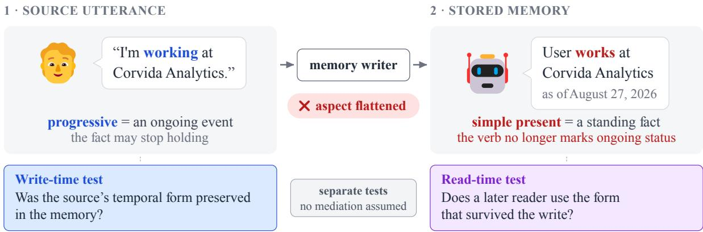
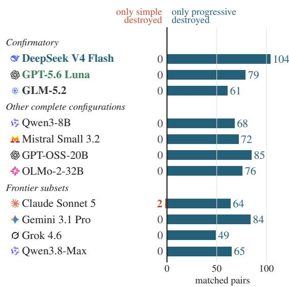
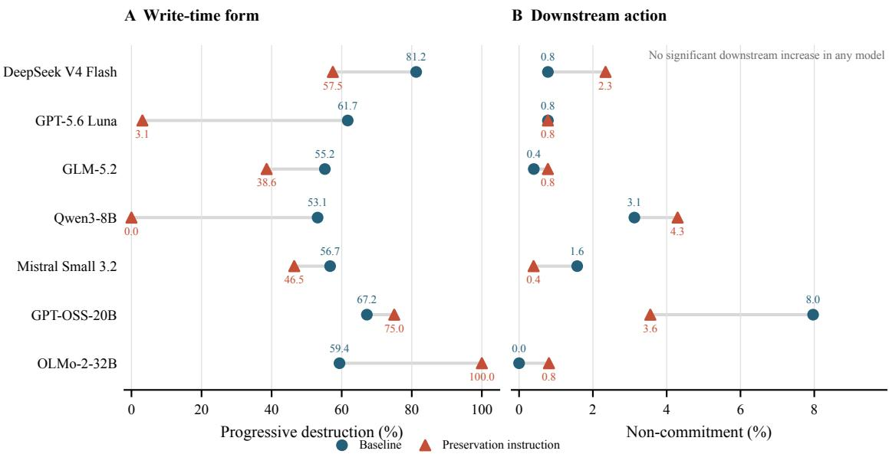

# Memory Consolidation Flattens the Temporal Shape of User Facts

Sugam Panthi, Muhaiminul Yeamin, Siyan Luo, Rabab Abdelfattah

AIMS Lab, The University of Southern Mississippi

{sugam.panthi, muhaiminul.yeamin, siyan.luo, rabab.abdelfattah}@usm.edu

## Abstract

Long-term memory systems turn conversations into short stored notes. A note can keep a user fact while losing evidence about whether the fact still holds. For example, “I am driving a Peugeot” can become “The user drives a Peugeot,” which drops the cue that the activity is ongoing. We call this aspectual flattening and measure it with LAPSE, a benchmark of matched user statements that differ only in temporal form. We find that memory writers flatten aspect selectively. Three writer models flattened the progressive statement but kept its simple-present match in 244 of 381 pairs, never the reverse. The asymmetry holds in all 11 model configurations tested and in the installed pipelines mem0, Graphiti, and Letta. The lost cue matters to later readers. In exploratory tests, changing only the stored verb shifted all three readers’ estimates that a fact still holds. When readers could ask the user before acting, two of three acted without asking more often on flattened notes. Our planned memory-use task could not detect this, because readers there acted on almost every stored fact, even expired ones. Memory writing can thus remove evidence that later models use to decide whether to act.

## 1 Introduction

Consider a user who says, “I am driving a Peugeot.” A memory writer, the model or pipeline step that consolidates a conversation into stored notes, may store The user drives a Peugeot. The object and relation survive, but the overt cue that the activity is ongoing does not. If the note is retrieved months later, the model reading it has less evidence for deciding whether to check the fact first. We call this transformation aspectual flattening.

Memory systems already address storage, retrieval, decay, contradictions, and timing (Packer et al., 2023; Wu et al., 2025; Chhikara et al., 2025). The user’s wording carries further evidence about whether a fact still holds: is working at Corvida and works at Corvida need not support the same assumption months later. A system can keep the person, employer, and timestamp while erasing that distinction during memory writing.

Aspect is how a sentence presents the internal temporal structure of a situation, for example as ongoing or as a standing state (Vendler, 1957; Comrie, 1976; Friedrich et al., 2023). Moens and Steedman (1988) argued that aspect changes the temporal category of a proposition, and that any usable temporal database queried in natural language must embody an event ontology that supports such changes. Models still misread aspect: they may infer that a progressive event reached its endpoint when the text does not say so (Ma and Miyao, 2026). In a memory system, the source sentence may be rewritten before any such inference begins. We ask whether memory writing keeps the aspectual evidence that a reader, the model that later uses the note, would need.

Testing this question requires a comparison that changes the wording without changing the situation. We build LAPSE (Linguistic Aspect Persistence and Stability Evaluation), a controlled benchmark of matched user statements (Table 1). Within a pair, the surrounding words, situation, and elapsed time stay fixed; only the temporal form changes. Controls test two other explanations for an apparent effect: a model’s general tendency to act on any stored fact, and content that sounds temporary on its own. We fixed the main test and its analysis before collecting data.

We ask two separate questions (Figure 1): whether memory writing keeps the source cue, and whether a later reader uses the cue that survives.

Good reader behavior would not show that the writer kept the cue, so each question needs its own test.

Our contributions are:

• Construct and benchmark. We name aspectualflattening and release LAPSE, a benchmark of matched user statements that differ only in temporal form, with its stimulus builder, model outputs, labels, and analysis programs.

• Write-time result. Memory writers flatten the progressive while keeping the matched simple present, in 244 of 381 pairs with no reversals. The direction holds in all 11 model configurations we tested, and the installed memory pipelines mem0, Graphiti, and Letta also flatten.

• Read-time evidence. Changing only the stored verb changes what a later model does: a flattened note raises readers’ estimates that the fact still holds and makes some readers act on it without asking the user first.

## 2 Related Work

Long-term agent memory. Generative Agents, MemoryBank, MemGPT, RecallM, THEANINE, A-MEM, Mem0, and Graphiti store and retrieve long-lived information in different forms (Park et al., 2023; Zhong et al., 2024; Packer et al., 2023; Kynoch et al., 2023; Ong et al., 2025; Xu et al., 2025; Chhikara et al., 2025; Rasmussen et al., 2025). Their temporal mechanisms include timestamps, recency, decay, graph chronology, and consolidation. Recent systems also build semantic timelines or attach lifecycle relations and policies to extracted facts (Su et al., 2026; Yacoubi et al., 2026; Mullick and Tüzün, 2026). These methods reason over stored events, metadata, or relations among memories. LAPSE asks an earlier question: does memory writing preserve temporal evidence already present in the user’s words?

Long-context and temporal evaluation. Lo-CoMo and LongMemEval test long-horizon recall, temporal reasoning, updates, and abstention (Maharana et al., 2024; Wu et al., 2025). Their user turns include temporary-form statements, but we found no question that requires noticing that form (Appendix G). Which stored form receives retrieval credit can also change conclusions drawn from these benchmarks (Panthi and Abdelfattah, 2026b). TVCP predicts validity from historical text and timestamps (Wenzel and Jatowt, 2024), while Chronocept evaluates temporal-concept understanding (Goel et al., 2026). Most closely, STALE studies stale personalized knowledge after a later observation changes the world (Chao et al., 2026), and StateAuditor repairs downstream responses from timestamped old-to-new transitions (Sun and He, 2026). Memora evaluates obsolete or invalidated memories as user circumstances change (Uddin et al., 2026), while MemStrata retires a stale value after a newer assertion contradicts it (Yadav, 2026). Those settings provide a contradiction or later update. LAPSE instead holds the history fixed and changes only the source wording, asking whether the write step itself removes the cue.

Qualification and relation loss. Manufactured Confidence shows that consolidation can strip epistemic hedges and turn tentative reports into facts that guide later action (Kwon, 2026). TANGLE likewise finds that end-to-end memory extraction can lose relations needed to interpret unresolved conflicts, and separates extraction from downstream reasoning with pipeline and oracle tracks (Yang et al., 2026). Both show that rewriting can erase decision-relevant qualification. Outside memory, fixed RAG compression also drops details that stronger readers would have used (Panthi and Abdelfattah, 2026a). The memory studies’ cues are hedge words such as “probably” and “reportedly” or relations between facts; LAPSE tests a cue carried by the verb form alone.

Aspect as a model diagnostic. Ma and Miyao use the imperfective paradox to test whether models infer that a past progressive event reached its endpoint (Ma and Miyao, 2026). There, the original premise is available when the model reasons. LAPSE asks whether a memory writer keeps present-progressive evidence before a later reader sees the note. A recent reanalysis attributes some apparent culmination errors to label mapping and lexical variation, and uses lexically matched minimal pairs (Han and Sun, 2026). Our same-lexeme control addresses the same concern, but our outcome is the stored note rather than a naturallanguage-inference judgment.

## 3 Temporal Form as Memory Evidence

Progressive form typically presents an event as ongoing. Simple present often supports a habitual or stative reading, and perfect constructions relate an earlier event to a later reference point (Comrie, 1976; Dowty, 1979). “I am working at Corvida” presents the job as ongoing and possibly temporary; “I work at Corvida” presents it as a standing state. Both cues are defeasible: context can make a progressive long-lived and a simple state short-lived. Our claim is narrow. When content and context are held constant, a memory writer should not erase a form distinction that bears on whether the fact will still hold.

Figure 1: LAPSE separates what a writer stores from how a reader uses it. Panels 1–2 show a note observed in an installed memory pipeline: the writer replaces progressive working with simple-present works but keeps a date.
<table><tr><td>Factor</td><td>Levels</td><td>Values (main testhighlighted)</td><td>Varied to test</td></tr><tr><td>Form</td><td>5</td><td>progressive simple present bounded| perfect progressive| perfect simple</td><td>the manipulated variable</td></tr><tr><td>Frame</td><td>8</td><td>all eight: lodging | workplace | vehicle | class | household | equipment| affiliate role | project</td><td>whether it holds across kinds of fact</td></tr><tr><td>Carrier</td><td>6</td><td>life update | after a request | bare statement | mid-message formal note | list item</td><td>whether the surrounding conversation matters</td></tr><tr><td>Gap</td><td>6</td><td>fresh (2 days) | near (42 days) | boundary | expired-soon| stale (245 days) stale-long</td><td>fresh and boundary serve as positive controls</td></tr><tr><td>Task</td><td>7</td><td>write: memory write guided memory write use: direct use | memory use | guided memory use ask: validity question | send-or-check choice</td><td>what is stored versus how it is used</td></tr></table>

Main test: progressive vs. simple present in all eight frames, with the life-update carrier, the stale gap, and the memory-write task: 128 matched pairs per configuration.  
Table 1: The LAPSE design. An example pair is “I am working at Corvida” vs. “I work at Corvida”; both members use the same verb. Appendix A gives every template.

We call a rewrite destructive when it removes the source’s overt marking of ongoingness or boundedness, or when it adds an unsupported fact that cancels that marking. A paraphrase may change person, drop politeness, or compress syntax and still keep the source’s temporal meaning, which is all the test asks.

A timestamp says when a statement was recorded, whereas aspect helps express what kind of claim was recorded, so the two carry different information. Linguistic form is only one source of evidence about whether a fact still holds. LAPSE therefore measures one controlled capability and is not designed to rank systems.

## 4 The LAPSE Evaluation

## 4.1 Factorial design

The unit of analysis is a matched pair of user statements, each given to a model with the same memory-writing instruction. Within a pair, the topic, main verb, surrounding conversation (the carrier), and elapsed time are identical; only the temporal form changes. Table 1 summarizes the design. Besides form, it varies the frame, the kind of fact a statement reports (for example, a workplace or a vehicle), along with the carrier, the time gap, and the task. These factors test whether a result is tied to one wording or setting.

The main test uses progressive–simple pairs in the life-update carrier at a stale gap of 245 days. Every source has an absolute timestamp. No form receives an extra temporal adverb such as “at the moment,” and an automatic check rejects pairs that differ outside the intended marking. Two gaps serve as positive controls: at the fresh gap (2 days) and the boundary gap (60 days, before any stated end month), a reader should still use the fact.

## 4.2 Write and read tasks

In the memory-write task, a model receives a short conversation and writes one stored note. Guided memory writing adds an instruction to preserve temporal qualification. The corresponding memory-use tasks give the resulting note to a later model with a user request. The validity question asks whether the fact is still safe to assume. The send-or-check choice asks the model either to use the fact or to verify it first; its results were null or degenerate and appear in Appendix C.6.

We call each tested system a model configuration because the serving provider and settings can change a model’s outputs. Each complete configuration receives 6,008 requests. Seven complete configurations and four smaller frontier-model subsets yield 45,000 requests. The three confirmatory configurations and all analysis choices were fixed before data collection. The other configurations test breadth and are not part of the confirmatory tests.

## 4.3 Scoring

Write outputs receive one of five labels. A FAITH-FUL note preserves the source’s temporal meaning. A COERCED-STATIVE note removes overt ongoingness or boundedness, and a MANUFAC-TURE note invents an unsupported fact that sounds durable. The main outcome counts those two labels as destructive rewrites. Outputs the rules cannot resolve are labeled RESIDUAL, and outputs that omit the invented name identifying the fact are labeled WITNESS-DROPPED. Both are excluded from the matched test, and a pair is dropped if either side is excluded. For behavior, the main contrast is whether the model uses the remembered fact in the requested output (PROCEED) or withholds it or returns a placeholder (HEDGE/TEMPLATE). Two rarer behavior labels, a partial answer with a clarifying question and a confabulated value, are excluded from this contrast.

Memory-write outputs, which carry the main result, are labeled by a deterministic rule cascade that matches explicit surface cues. Before data collection, it labeled all 290 items of a constructed test battery correctly, and every output of a 289-request pilot run was read by hand; the two recall gaps that reading found were fixed. Because it matches surface cues, the cascade can miss paraphrased destruction, which it labels as faithful (Appendix B).

Behavior outputs from the use tasks are labeled by the same cascade and by an open-weight judge model. Because LLM judges can carry position, verbosity, and self-enhancement biases (Zheng et al., 2023), a binary behavior label is assigned automatically only when the cascade and the judge agree. Two blinded humans independently labeled a stratified 250-item gold set of behavior outputs, then adjudicated disagreements. On eligible items, human–human binary agreement was 99.1% (218/220, κ = .949); judge–gold agreement was 95.2% (219/230, κ = .780). Five-way agreement was lower, so the two-way label is the main behavior outcome.

## 4.4 Confirmatory analysis and controls

For each confirmatory configuration, the main test condition contains 128 matched progressive– simple pairs, minus the exclusions reported in Table 2. A one-sided exact McNemar test compares progressive-only destruction with the reverse pattern. We correct the three tests for multiple comparisons and count the prediction as confirmed if at least two configurations are significant after correction and all three show the predicted direction. For the five other carriers, a sign test requires the predicted direction in all five for each configuration (p = .03125). A same-lexeme subset, the fresh and boundary controls, the validity question, and a scan of 4.26 million combinations of markers and generic response text for accidental matches test alternative explanations. We compare forms within each configuration and do not interpret absolute hedge rates, because the main behavioral confound is a tendency to use every stored fact regardless of form.

## 5 Consolidation Flattens Temporal Form

In all three confirmatory configurations, memory writers selectively destroyed the progressive form (Table 2). In 244 of 381 pairs, the writer destroyed only the progressive member; no pair showed the

<table><tr><td>Model</td><td>Matched pairs</td><td>Progressive Simple only</td><td>only</td><td>Adjusted p</td></tr><tr><td> DeepSeek V4 Flash</td><td>128</td><td>104</td><td>0</td><td> $1 . 5 \times 1 0$  -31</td></tr><tr><td>GPT-5.6 Luna</td><td>128</td><td>79</td><td>0</td><td> $3 . 3 \times 1 0 ^ { - }$  -24</td></tr><tr><td>GLM-5.2</td><td>125</td><td>61</td><td>0</td><td> $4 . 3 \times 1 0 ^ { - 1 9 }$ </td></tr><tr><td>Total</td><td>381</td><td>244</td><td>0</td><td></td></tr></table>

Table 2: Confirmatory matched-pair results. “Progressive only” counts pairs where the writer destroys the progressive member but not its simple-present match; “Simple only” is the reverse. p is the adjusted one-sided exact McNemar value.

reverse.

The direction was the same in every configuration we tested (Figure 2a). Across all 11 configurations, the writer destroyed only the progressive member in 807 usable pairs and only the simple member in two. Both reversals came from Claude Sonnet 5, one of the four smaller frontier-model subsets (Table 10). The other three subsets showed no reversals, although Gemini 3.1 Pro had 17 unparsed outputs.

The direction held in all four robustness checks. A stricter test that makes the two forms share the same lexical head yielded 217 progressive-only destructions and no reversals across the seven complete configurations. All five alternative carriers showed the same direction for each confirmatory model. The result also held when we left out one frame at a time, and when we resampled frames or items within frames (Appendix C).

Two controls checked simpler explanations. The validity question asks whether an old fact is still safe to assume, which tests whether the models simply do not know that such facts can change. Every configuration except Mistral Small 3.2 answered “no” in nearly every case; Mistral answered “no” in 35 of 96. Outside Mistral, the answer barely differed by source form (Table 16), so the question measures general caution about old facts and does not track aspect. The scan for accidental text matches flagged seven benign generic matches, and none changed a score (Appendix C.6).

The loss also appeared on real user text. We screened 104 life-circumstance statements from WildChat (Zhao et al., 2024), LoCoMo, and Long-MemEval (Maharana et al., 2024; Wu et al., 2025) and passed them through the three confirmatory writers. Each writer lost a present progressive with no other time cue in 5–9 of 27–29 cases. It lost a perfect progressive in 12–14 of 26–27 cases (Table 25).

## 5.1 What predicts flattening

Flattening rates varied by frame, by writer, and by writing instruction.

The frame matters. Vehicle and workplace progressives were destroyed most often, household and project progressives least (Figure 2b; Table 11). No frame reversed the direction. The matched simple-present statement was kept in 23 of the 24 combinations of writer and frame; the exception is GLM-5.2 in the equipment frame, which destroyed 8 of 16 simple statements.

Some writers also remove lexical time cues. DeepSeek and GLM removed “for now” and “at the moment,” usually leaving only a date. Luna kept these lexical cues more often than it kept the progressive (Table 14).

A preservation instruction helps some writers and hurts others. Asking the writer to preserve tense and aspect nearly eliminated progressive destruction for Luna and Qwen3-8B, partly helped DeepSeek V4 Flash, and had smaller benefits for GLM-5.2 and Mistral Small 3.2. The same instruction made GPT-OSS-20B and OLMo-2-32B worse (Table 15).

Size made little difference within one model family. Qwen3-8B and Qwen3.8-Max differed by only 1.2 percentage points in raw progressive destruction in the main test condition.

## 6 Released Memory Systems Also Flatten

Released memory pipelines also flattened progressive statements, but which cue they removed depended on the pipeline and the writer model. The controlled prompts above use one fixed writing instruction, so we installed three released memory systems and ran their own write steps. In mem0 2.0.19 (Chhikara et al., 2025), with DeepSeek V4 Flash as the writer, 49 of 128 progressive statements were flattened (95% CI 30–47%). None of the 128 matched simple-present controls gained progressive wording or “currently.” The pipeline also removed “for now” from 91 notes and “at the moment” from 104, usually leaving a date (Appendix D).

The lodging frame shows that the pipeline can change which cue is lost. With the same DeepSeek writer, the controlled prompt destroyed all 16 lodging progressives, and mem0 flattened none of them.

(a) Direction in every configuration  
  
All 11: 807 progressive only, 2 simple only  
Figure 2: Every writer loses the progressive form far more often than the simple form; how often depends on the frame. (a) Matched pairs in the main test condition in which the writer destroys only one member. (b) Left: progressive statements destroyed per frame by the confirmatory writers under the controlled prompt. Right: notes from the installed mem0 pipeline that lost a temporal cue: the progressive form, or “at the moment” or “for now” when the source attached it to a simple-present statement. Rows are ordered by the confirmatory writers’ mean progressive-minus-simple difference.

(b) Size varies by frame
<table><tr><td rowspan="2"></td><td colspan="3">Controlled prompt progressive destroyed</td><td colspan="3">Installed mem0 (DeepSeek writer) temporal cue lost</td></tr><tr><td>Q DeepSeek</td><td>5 Luna</td><td>GLM</td><td>progressive &quot;at the form</td><td>moment&quot;</td><td>n</td></tr><tr><td>Vehicle</td><td>16/16</td><td>16/16</td><td>13/16</td><td>16/16</td><td>14/16</td><td>15/16</td></tr><tr><td>Workplace</td><td>16/16</td><td>16/16</td><td>11/15</td><td>16/16</td><td>16/16</td><td>11/16</td></tr><tr><td>Equipment</td><td>16/16</td><td>16/16</td><td>16/16†</td><td>1/16</td><td>7/16</td><td>7/16</td></tr><tr><td>Affiliate role</td><td>13/16</td><td>16/16</td><td>7/15</td><td>9/16</td><td>16/16</td><td>13/16</td></tr><tr><td>Class</td><td>13/16</td><td>3/16</td><td>15/15</td><td>6/16</td><td>14/16</td><td>9/16</td></tr><tr><td>Lodging</td><td>16/16</td><td>8/16</td><td>3/16</td><td>0/16</td><td>16/16</td><td>13/16</td></tr><tr><td>Household</td><td>7/16</td><td>4/16</td><td>1/16</td><td>1/16</td><td>9/16</td><td>10/16</td></tr><tr><td>Project</td><td>7/16</td><td>0/16</td><td>3/16</td><td>0/16</td><td>12/16</td><td>13/16</td></tr><tr><td>All frames</td><td>104/128</td><td>79/128</td><td>69/125</td><td>49/128</td><td>104/128</td><td>91/128</td></tr></table>

Matched simple-present statements were kept in every cell except †GLM equipment (8/16 destroyed); mem0 added progressive wording to 0 of 128 simple statements.

Instead, mem0 removed “at the moment” from all 16 lodging statements that carried it (Figure 2b).

Flattening also happened with a second writer, in different frames. With Gemini 3 Flash as the writer and the same inputs, mem0 flattened 15 of 128 progressive statements (95% CI 7–19%), almost all in the vehicle frame. It removed “at the moment” from 1 note and “for now” from 22. It also added “currently” to 16 simple-present notes, all in the equipment frame, where the statement already says the cello is on loan. For example, “I use a Ferrandell cello on loan” became “User plays a Ferrandell cello which is currently on loan.” Table 17 compares the two writers by frame.

Graphiti 0.30.1 (Rasmussen et al., 2025) and Letta 0.16.8 (Packer et al., 2023), tested with DeepSeek V4 Flash as the writer, also flattened progressive inputs. Graphiti flattened 15 of 32, and Letta flattened 26 of the 29 it stored, usually as label-style facts such as “Works at: . . . ”.

## 7 Readers Judge and Act on the Stored Form

The preceding sections showed that writers change stored temporal form. We next asked whether a later model uses that form. After the planned memory-use task, we used a dated-note task, first on controlled notes and then on notes from the installed pipelines, where verb-only edits isolate the stored verb. A final task gave readers a choice between acting on a note and asking the user first. The memory-use task and the final task had their analyses fixed before data collection; the tasks in between are exploratory.

## 7.1 Controlled notes

The planned downstream task could not detect temporal evidence. In the memory-use task, a reader gets the stored note and a user request. Readers used 59–60 of 60 facts whose stated end month had already passed, in the three frames with unambiguous end months. A task that ignores an explicit end date cannot register weaker temporal evidence, so its null says nothing about aspect in particular. Readers also used 97–100% of stale facts. If preserved notes made readers more cautious, guided memory writing should have made them withhold facts more often. Instead, withholding stayed at or below 5.5% for every complete configuration under both write instructions, with no significant within-model comparison (best exact p = .125).

A dated-note task changes several features at once. We built a narrower task for three reader models: DeepSeek V4 Flash on its official endpoint, GPT-5.6 Luna, and GLM-5.2. A reader sees one third-person memory note, its write date, and today’s date eight months later. It first gives a persistence estimate from 0 to 100 for whether the note still holds, then either fills a field asking for current information or writes UNKNOWN. Relative to the memory-use task, this changes five things at once: it removes the conversation, recasts the note in the third person, shows a write date, asks about persistence before action, and offers an explicit UNKNOWN response. Any of these could make readers less ready to act, so the dated-note results do not explain the memory-use null.

<table><tr><td>Reader</td><td>Progressive Simple fills</td><td>fills</td><td>Predicted: reverse</td><td>p</td></tr><tr><td>DeepSeek V4 Flash (official)</td><td>6/96</td><td>29/96</td><td></td><td>26:3 1.5×10 -5</td></tr><tr><td>GLM-5.2 (OpenRouter)</td><td>14/96</td><td>28/96</td><td>17:3</td><td>.003</td></tr><tr><td>GPT-5.6 Luna (OpenRouter)</td><td>42/96</td><td>50/96</td><td>23:15</td><td>.26</td></tr></table>

Table 3: Action in the exploratory dated-note task. “Predicted” counts paired outcomes where only the simplepresent note leads the reader to fill the current field; “reverse” counts the opposite. Values are unadjusted two-sided exact McNemar tests.

Readers rated progressive notes as less durable. All three readers filled the field for fresh simplepresent notes and answered UNKNOWN for expired bounded notes. For stale notes, every reader gave the progressive a persistence estimate 16–32 points below the matched simple-present note $( p < 1 0 ^ { - 1 0 }$ for each reader). Only DeepSeek V4 Flash and GLM-5.2 reliably changed whether they filled the field. GPT-5.6 Luna moved in the same direction, but its paired comparison was not significant (Table 3). Through OpenRouter, DeepSeek V4 Flash showed the same persistence difference but no fieldfill difference (Appendix E).

## 7.2 Notes written by installed pipelines

We next gave the notes stored by the three installed pipelines of Section 6 to the same three readers, in the same dated-note format. Each pipeline received progressive, simple-present, and bounded versions of 96 facts in sessions dated 2026-01-06, and the stored notes were read eight months later. Nothing was edited between writer and reader. These experiments are exploratory, with predictions fixed before any reader call.

What a reader can recover depends on what the pipeline keeps besides the verb. When a pipeline kept a temporal cue, either the progressive verb or Letta’s “Currently,” readers filled the field less often for that note than for the matched simplepresent note in all nine comparisons. We corrected the 15 exploratory tests (three readers on five pipeline subsets) together. Five of the six comparisons on kept verbs remained significant; the exception was GPT-5.6 Luna on mem0 notes. None of the three “Currently” comparisons remained significant (Table 24).

When a date survived, readers could still use it. The mem0 pipeline date-stamped 23 of 37 flattened progressive notes but only 6 matched simple notes, and DeepSeek V4 Flash and GLM-5.2 still told those notes apart by the date.

When no cue survived, readers showed no reliable difference. Graphiti writes no date in its fact text, and 40 of its 47 flattened facts are stringidentical to the fact written from the simple-present statement. No reader model showed a reliable difference on these 47 facts, and none did on Letta’s 62 labels with no temporal cue, although their wording is less tightly matched. In both subsets, the raw counts lean in the predicted direction; the null tests do not establish equivalence.

Metadata can mislead the reader. Graphiti’s valid\_at field equaled the write time for all 287 stored graph edges, regardless of source form. When its unset end field, invalid\_at, was shown as “valid until: not set,” every reader treated preserved progressive facts as more likely to still hold. An explicit end date, by contrast, survived every writer, and every reader answered “unknown” on at least 92 of 94–96 such items. Appendix F gives the details.

## 7.3 Verb-only edits

The pipeline notes still differ in more than the verb, for example in stored dates. To isolate the verb, we took mem0’s own notes, edited each one mechanically, and checked every edit by hand. Each edit either flattened a progressive verb or restored one in a note written from a simple-present statement. Flattening the 57 notes that mem0 had preserved raised persistence estimates for every reader $( p < 1 0 ^ { - 5 }$ for each). The stored verb therefore causally affects persistence estimates in this format. The effect on field filling was weaker: readers already rarely filled the current field in these frames, and flattening changed that rate little. For the 37 facts whose progressive mem0 had flattened, we restored the progressive in the note mem0 wrote from the simple-present statement. This reduced filled fields for DeepSeek V4 Flash but not for GPT-5.6

<table><tr><td>Reader</td><td>Persistence increase</td><td>Flattening fills</td><td>Restoration fills (p)</td></tr><tr><td> DeepSeek V4 Flash (official)</td><td>37.3 points</td><td>1→4</td><td> $1 5 \substack {  } 3 ( . 0 0 2 )$ </td></tr><tr><td>GPT-5.6 Luna (OpenRouter)</td><td>18.2 points</td><td> $1 6 \to 2 2$ </td><td> $1 8 \to 1 8 ( 1 )$ </td></tr><tr><td>GLM-5.2 (OpenRouter)</td><td>24.6 points</td><td> $0 \to 2$ </td><td> $2 0 \to 1 5 \ ( . 3 0 )$ </td></tr></table>

Table 4: Effects of minimally editing mem0 notes. “Flattening” changes a preserved progressive to simple present; “restoration” makes the reverse edit. Fill columns show counts before and after the edit.

Luna or GLM-5.2 (Table 4).

## 7.4 Acting without checking

Flattened notes made some readers skip the check. The verification-tool task asks whether the stored verb changes an action. The reader gets one dated note, a user request, and two tools. One tool completes the request with the remembered value, and the other asks the user to confirm that value first. The two notes in a pair differ only in the verb: “user works at Corvida” versus “user is working at Corvida”. We used the 120 facts in LAPSE whose note keeps the same verb in both forms, from six frames (lodging and household change the verb). Crossing them with two or three request wordings gave 291 pairs per reader. Each reader’s note age came from earlier runs on 69 of these facts, at an age where neither tool dominated. For GLM-5.2, one of those runs was a test with its analysis fixed in advance; it leaned the same way but was not significant after correction (17:5 discordant pairs, p = .051). The test below repeats it with more facts and new request wordings.

With eight-month-old notes, GLM-5.2, the primary reader, acted without asking on the simplepresent note alone in 91 pairs and on the progressive note alone in 19 (Table 5). The difference was significant after correction both per pair $( p = 2 . 8 { \times } 1 0 ^ { - 1 2 } )$ and per fact, and it held on the 51 facts not used in calibration. In the pairs we read by hand, GLM-5.2’s reasoning said a progressive value may have changed in eight months and treated the simple-present value as stable.

Gemini 3 Flash, tested at one month (an age chosen on 30 separate facts), showed the same direction (Table 5). DeepSeek V4.1 Flash, a later model than the DeepSeek V4 Flash used elsewhere, leaned the same way (corrected $p = . 0 7 6 )$ GPT-5.6 Luna asked for confirmation on almost every older note. For GLM-5.2, five of the six frames leaned toward acting on the simple-present note, most strongly affiliate roles and classes (Ap-

<table><tr><td>Reader, note age</td><td>acted on</td><td>acted on</td><td>Simple Progressive Simple only : Difference prog. only</td><td>(points)</td><td>Corrected p</td></tr><tr><td>GLM-5.2, 8 months</td><td>187/291</td><td>116/291</td><td>91:19</td><td></td><td>+25 2.8×10 -12</td></tr><tr><td>Gemini 3 Flash, 1 month</td><td>135/291</td><td>114/291</td><td>23:2</td><td></td><td>+7 1.9×10−5</td></tr><tr><td>DeepSeek V4.1 Flash, 1 month 155/291</td><td></td><td>144/291</td><td>30:19</td><td>+4</td><td>.076</td></tr></table>

Table 5: Readers acted without asking more often on simple-present notes in the verification-tool task. The difference is in percentage points and excludes unparsed responses. p is the one-sided exact McNemar test, corrected across the three readers. Table 20 gives intervals and serving endpoints.

pendix E.1).

Notes written by mem0 show the effect when no date survives. We repeated the test on notes written by the installed mem0 pipeline. Restoring the progressive in the same 37 notes used in the minimal-edit test cut GLM-5.2’s unasked actions from 30 to 17. This was the only one of six pipeline tests that passed the multiple-comparison correction. A stored date such as “as of January 2026” almost always made GLM-5.2 ask, so the verb mattered only on lines without one.

## 8 Discussion

Flattening rates differ widely across frames, which argues against treating aspect as one uniform feature. LAPSE cannot tell whether this variation comes from grammar, content priors, or their interaction. The frames that lose the cue also depend on the writer model (Section 6).

For system design, “always expire progressives” is too rigid because aspect is defeasible. A useful record keeps the original wording, normalized fact, temporal form, and observation time in separate fields. A later decision rule can then combine that evidence without treating grammar as an expiration date. The pipeline-to-reader tests show that such fields also need values derived from the source. Graphiti’s valid\_at records when the fact was learned, not when it began, and readers took an unset invalid\_at as “still valid” strongly enough to override a preserved verb.

## 9 Conclusion

Memory writing can retain a user fact while removing temporal-form evidence about whether it still holds. LAPSE isolates that loss with matched linguistic contrasts and separates what a writer stores from what a later reader does. Across the tested configurations, writers flattened progressive sources more often than matched simple-present sources. Installed pipelines flattened too, with every writer we tried, in frames that depended on the writer. The stored verb also affected later readers. A verb-only edit shifted all three readers’ persistence estimates, and a flattened note made GLM-5.2 and Gemini 3 Flash act without asking more often. Memory systems that make later validity decisions should store temporal form as evidence instead of discarding it.

## 10 Limitations

Synthetic English stimuli. LAPSE is synthetic and English-only, with a deliberately neutral vocabulary. It leaves out many pragmatic, discourse, and language-specific ways of signaling that a fact is temporary, and its scoring of English notes may not transfer to structured or multilingual memories. The lexical-marker test covers two phrases in one sentence position. Five bounded-form situations say “until December” in a late-December session, so bounded-form claims rest on the three frames with a computed end month.

Model and system coverage. Four of the eleven configurations are frontier subsets scored by the rule cascade alone. Each installed pipeline was run in one version: mem0 with two writer models, Graphiti and Letta with one. These checks show that flattening occurs in released systems but cannot estimate how often it occurs in deployed products.

Downstream behavior. The action tests use synthetic notes, one sample per item at temperature zero, and a system prompt that states when to rely on memory and when to confirm. The study measures whether a reader acts without asking, not whether that action led to a wrong outcome.

Serving variation. Identical temperature-zero calls to a reasoning model vary by about five persistence points on the vendor endpoint and about three times as much across OpenRouter hosts. The confirmatory configurations did not log the serving host.

## Ethical Considerations

The controlled LAPSE stimuli are synthetic: all names, companies, institutions, projects, and residences are invented. The work evaluates system behavior and makes no inferences about users. Two checks use existing datasets under their licenses: a marker search over WildChat, which contains real user conversations, and a writer test on 104 statements screened from WildChat, LoCoMo, and LongMemEval. The release includes excerpts of WildChat user turns, which remain subject to Wild-Chat’s terms. A public release should preserve applicable provider and dataset terms and remove request metadata that is not needed for reproduction.

## References

Hanxiang Chao, Yihan Bai, Rui Sheng, Tianle Li, and Yushi Sun. 2026. STALE: Can LLM agents know when their memories are no longer valid? arXiv preprint arXiv:2605.06527.

Prateek Chhikara, Dev Khant, Saket Aryan, Taranjeet Singh, and Deshraj Yadav. 2025. Mem0: Building production-ready AI agents with scalable long-term memory. In ECAI 2025: 28th European Conference on Artificial Intelligence, volume 413 of Frontiers in Artificial Intelligence and Applications, pages 2993– 3000. IOS Press.

Bernard Comrie. 1976. Aspect: An Introduction to the Study of Verbal Aspect and Related Problems. Cambridge University Press.

David R. Dowty. 1979. Word Meaning and Montague Grammar: The Semantics ofVerbs and Times in Generative Semantics and in Montague’s PTQ. D. Reidel.

Annemarie Friedrich, Nianwen Xue, and Alexis Palmer. 2023. A kind introduction to lexical and grammatical aspect, with a survey of computational approaches. In Proceedings of the 17th Conference of the European Chapter ofthe Associationfor Computational Linguistics, pages 599–622, Dubrovnik, Croatia. Association for Computational Linguistics.

Krish Goel, Sanskar Pandey, KS Mahadevan, Harsh Kumar, and Vishesh Khadaria. 2026. Chronocept: Instilling a sense of time in machines. In Proceedings of the 19th Conference of the European Chapter of the Association for Computational Linguistics (Volume 4: Student Research Workshop), pages 437–456.

Kaiqiao Han and Yizhou Sun. 2026. The imperfective paradox is not necessarily in large language models: A benchmark failure before a model failure. arXiv preprint arXiv:2608.25005.

Alex Kwon. 2026. Manufactured confidence: How memory consolidation turns hearsay into confident facts. arXiv preprint arXiv:2606.29279.

Brandon Kynoch, Hugo Latapie, and Dwane van der Sluis. 2023. RecallM: An adaptable memory mechanism with temporal understanding for large language models. arXiv preprint arXiv:2307.02738.

Bolei Ma and Yusuke Miyao. 2026. The imperfective paradox in large language models. In Proceedings

of the 64th Annual Meeting of the Association for Computational Linguistics (Volume 1: Long Papers), pages 15093–15111.

Adyasha Maharana, Dong-Ho Lee, Sergey Tulyakov, Mohit Bansal, Francesco Barbieri, and Yuwei Fang. 2024. Evaluating very long-term conversational memory of LLM agents. In Proceedings ofthe 62nd Annual Meeting ofthe Associationfor Computational Linguistics (Volume 1: Long Papers), pages 13851– 13870.

Marc Moens and Mark Steedman. 1988. Temporal ontology and temporal reference. Computational Linguistics, 14(2):15–28.

Ansuman Mullick and Eray Tüzün. 2026. Fortunate recall: Ontology-driven memory lifecycle management for persistent coherence in LLMs. arXiv preprint arXiv:2609.10413. Concurrent work.

Kai Tzu-iunn Ong, Namyoung Kim, Minju Gwak, Hyungjoo Chae, Taeyoon Kwon, Yohan Jo, Seungwon Hwang, Dongha Lee, and Jinyoung Yeo. 2025. Towards lifelong dialogue agents via timeline-based memory management. In Proceedings of the 2025 Conference of the Nations of the Americas Chapter ofthe Associationfor Computational Linguistics: Human Language Technologies (Volume 1: Long Papers), pages 8631–8661.

Charles Packer, Sarah Wooders, Kevin Lin, Vivian Fang, Shishir G. Patil, Ion Stoica, and Joseph E. Gonzalez. 2023. MemGPT: Towards LLMs as operating systems. arXiv preprint arXiv:2310.08560.

Sugam Panthi and Rabab Abdelfattah. 2026a. Fixed RAG compression collapses measured reader scaling. arXiv preprint arXiv:2606.21807.

Sugam Panthi and Rabab Abdelfattah. 2026b. Same ranking, different winner: How scoring targets shape LLM memory benchmarks. arXiv preprint arXiv:2605.24060.

Joon Sung Park, Joseph C. O’Brien, Carrie J. Cai, Meredith Ringel Morris, Percy Liang, and Michael S. Bernstein. 2023. Generative agents: Interactive simulacra of human behavior. In Proceedings ofthe 36th Annual ACM Symposium on User Interface Software and Technology.

Preston Rasmussen, Pavlo Paliychuk, Travis Beauvais, Jack Ryan, and Daniel Chalef. 2025. Zep: A temporal knowledge graph architecture for agent memory. arXiv preprint arXiv:2501.13956.

Miao Su, Yucan Guo, Zhongni Hou, Long Bai, Zixuan Li, Yufei Zhang, Guojun Yin, Wei Lin, Xiaolong Jin, Jiafeng Guo, and Xueqi Cheng. 2026. Beyond dialogue time: Temporal semantic memory for personalized LLM agents. In Findings of the Association for Computational Linguistics: ACL 2026, pages 29935–29951.

Haofei Sun and Lin He. 2026. When memory updates but behavior does not: Repairing implicit stale dependencies in personalized agent responses. arXiv preprint arXiv:2608.01619.

Md Nayem Uddin, Kumar Shubham, Eduardo Blanco, Chitta Baral, and Gengyu Wang. 2026. From recall to forgetting: Benchmarking long-term memory for personalized agents. arXiv preprint arXiv:2604.20006.

Zeno Vendler. 1957. Verbs and times. The Philosophical Review, 66(2).

Georg Wenzel and Adam Jatowt. 2024. Temporal validity change prediction. In Findings of the Association for Computational Linguistics: ACL 2024, pages 1424–1446.

Di Wu, Hongwei Wang, Wenhao Yu, Yuwei Zhang, Kai-Wei Chang, and Dong Yu. 2025. LongMemEval: Benchmarking chat assistants on long-term interactive memory. In International Conference on Learning Representations.

Wujiang Xu, Zujie Liang, Kai Mei, Hang Gao, Juntao Tan, and Yongfeng Zhang. 2025. A-Mem: Agentic memory for LLM agents. In Advances in Neural Information Processing Systems, volume 38, pages 20004–20031.

Meriem Yacoubi, Pia Schmidt, Nenad Petrovic, Ahmed Frikha, Martin Kirchhoff, and Alois Knoll. 2026. MemoryLACE: Memory lifecycle-aware consolidation and evidence retrieval. arXiv preprint arXiv:2609.03201. Concurrent work.

Neeraj Yadav. 2026. Temporal validity in retrieval memory: Eliminating stale-fact errors for AI agents over evolving knowledge. arXiv preprint arXiv:2606.26511.

Lu Yang, Shusheng Xu, Zhuoran Li, Tongkai Yang, and Longbo Huang. 2026. When personal memory has no single answer: Evaluating LLM agents under irreducible conflict. arXiv preprint arXiv:2608.13921.

Wenting Zhao, Xiang Ren, Jack Hessel, Claire Cardie, Yejin Choi, and Yuntian Deng. 2024. WildChat: 1m ChatGPT interaction logs in the wild. In International Conference on Learning Representations.

Lianmin Zheng, Wei-Lin Chiang, Ying Sheng, Siyuan Zhuang, Zhanghao Wu, Yonghao Zhuang, Zi Lin, Zhuohan Li, Dacheng Li, Eric P. Xing, Hao Zhang, Joseph E. Gonzalez, and Ion Stoica. 2023. Judging LLM-as-a-judge with MT-bench and chatbot arena. arXiv preprint arXiv:2306.05685.

Wanjun Zhong, Lianghong Guo, Qiqi Gao, He Ye, and Yanlin Wang. 2024. MemoryBank: Enhancing large language models with long-term memory. Proceedings ofthe AAAI Conference on Artificial Intelligence, 38(17):19724–19731.

## A Evaluation Materials

## A.1 Stimulus construction

Each case contains a dated two-turn conversation followed by one evaluation query. The canonical history wrapper is:

[Session dated {date}]   
User: hey! quick life update — {key line}   
also, any podcast recommendations for my   
commute?   
Assistant: Nice! For podcasts, try 99%   
Invisible or Radiolab — both great for   
commutes.

The baseline memory-write query (artifact ID e1) is: Before we continue: write concise memory notes about me for yourfuture sessions. Just the notes. Guided memory writing (artifact ID l2) appends the instruction Preserve the speaker’s tense and aspect; convert relative or deictic time expressions to absolute dates; never introduce words like “currently.” The validity question (artifact ID explicit) asks: Answer yes or no first: would it be safe to assume, without checking with me, that [frame-specific description] is still the case today?

Table 6 lists the eight progressive/simple templates.
<table><tr><td>Frame</td><td>Progressive</td><td>Simple</td></tr><tr><td>Lodging</td><td>I&#x27;m staying at {residence} on Fifth Street.</td><td>I stay at {residence} on Fifth Street.</td></tr><tr><td>Workplace Vehicle</td><td>I&#x27;m working at {company}. I&#x27;m driving a {vehicle}.</td><td>I work at {company}. I drive a {vehicle}.</td></tr><tr><td>Class</td><td>I&#x27;m taking a ceramics class at {studio} on Tuesdays.</td><td>I take a ceramics class at {studio} on Tuesdays.</td></tr><tr><td></td><td>Household My cousin {name} is staying</td><td>My cousin {name} stays with</td></tr><tr><td></td><td>with me. Equipment I&#x27;m using a {maker} cello on</td><td>me. I use a {maker} cello on loan</td></tr><tr><td>Affiliate</td><td>loan from the conservatory. I&#x27;m lecturing at {college} as an</td><td>from the conservatory. I lecture at {college} as an</td></tr><tr><td>role Project</td><td>affiliate. I&#x27;m working on Project {name}. I work on Project {name}.</td><td>affiliate.</td></tr></table>

Table 6: Canonical progressive/simple templates. Capitalization is normalized here; released JSONL contains the exact emitted strings.

Bounded forms add an explicit endpoint derived from the session date. Perfect progressive and perfect simple forms use matched lexical heads. The six gap bins are computed deterministically from an absolute evaluation date; the reference build uses 2026-08-11, while run builds use 2026-08-25. The builder uses no random number generator.

## A.2 Models and serving

Table 7 lists every model configuration. Complete configurations contain 6,008 cases and are scored by both the rule cascade and the judge. Frontier subsets contain 736 cases (the main memory-write cells, the fresh and boundary controls, and the validity question). They are scored by the cascade alone because they contain no behavior task for the judge. All generation uses temperature 0.

<table><tr><td>Model</td><td>Role / cases</td><td>Serving</td></tr><tr><td>DeepSeek V4 Flash deepseek/ deepseek-v4-flash</td><td>6,008</td><td>confirmatory OpenRouter, pinned provider</td></tr><tr><td>GPT-5.6 Luna openai/gpt-5. 6-luna</td><td>6,008</td><td>confirmatory OpenRouter, pinned provider</td></tr><tr><td>GLM-5.2 z-ai/glm-5.2</td><td>6,008</td><td>confirmatory OpenRouter; 76 empty responses re-requested</td></tr><tr><td>米Claude Sonnet 5 anthropic/</td><td>frontier 736</td><td>OpenRouter subset; cascade-only</td></tr><tr><td>claude-sonnet-5 Qwen3-8B local/qwen3-8b</td><td>estimation 6,008</td><td>A100/vLLM</td></tr><tr><td>HMistral Small 3.2 local/</td><td>estimation 6,008</td><td>A100/vLLM</td></tr><tr><td>mistral-small-3. 2-24b GPT-OSS-20B</td><td>extension</td><td>A100/vLLM; low reasoning, 768-token</td></tr><tr><td>openai/gpt-oss-20b OLMo-2-32B</td><td>6,008 extension</td><td>runner patch A100/vLLM; native 4,096-token</td></tr><tr><td>allenai/ OLMo-2-0325- 32B-Instruct</td><td>6,008</td><td>context</td></tr><tr><td>Gemini 3.1 Pro google/gemini-3.</td><td>frontier 736</td><td>OpenRouter subset; cascade-only</td></tr><tr><td>1-pro-preview ø Grok 4.6</td><td>frontier</td><td>OpenRouter subset; cascade-only</td></tr><tr><td>x-ai/grok-4.6 Qwen3.8-Max</td><td>736 frontier</td><td>OpenRouter; 12 empty responses</td></tr></table>

Table 7: Model configurations and their roles. Only the three confirmatory rows enter the corrected tests; all other rows are descriptive. Frontier rows are 736-case subsets.

## B Scoring and Adjudication

## B.1 Write labels

FAITHFUL preserves the source’s temporal meaning; RESIDUAL is unresolved by the automatic rules; WITNESS-DROPPED omits the identifying fact; COERCED-STATIVE turns a temporary or bounded presentation into an unbounded state; and MANUFACTURE adds an unsupported durable fact. The primary binary collapse treats the last two labels as destructive and excludes the middle two. Memory-write outputs are labeled by the cascade alone; the judge scores only behavior outputs. Both are blinded to the paired condition during scoring.

The cascade was checked on a constructed battery whose labels are true by construction. It labeled all 290 canonical items correctly. In the battery run made before the pilot fixes, it recovered none of 98 adversarial paraphrases; in particular, it labeled 30 paraphrased claims of currency (MANUFACTURE) as FAITHFUL. The cascade can therefore undercount destruction on either side of a pair. The human gold set in Table 8 contains behavior outputs only.

## B.2 Behavior labels and judge prompt

The judge receives only the user request, the model response, and the key fact. It never sees the form, gap, session date, or paired output, and it returns exactly one label. PROCEED requires the requested output (for example, an email) to contain the key fact with no doubt about it. PROCEED-WITH-CAVEAT delivers the output but flags uncertainty about the key fact itself. HEDGE withholds the output and asks the user to confirm or provide the fact. TEMPLATE delivers the output’s shape but leaves a placeholder for the fact. The released prompt includes positive and negative examples for each rule and uses first-match parsing.

Three boundary rules, set by human adjudication, are part of the judge prompt and were fixed before scoring. A caveat counts only when it targets the key fact, not a phone number, surname, or another field. A placeholder request changes TEMPLATE to HEDGE only when the request occurs inside the requested output. Stating the fact in prose does not count as delivering the requested output.

The judge is ByteDance Seed’s Seed-OSS-36B-Instruct, from a model family not among those evaluated, served locally at temperature 0 with reasoning budget 0. Official bf16 weights were quantized at serve time to $\mathrm { f p } 8$ weight-only Marlin kernels (w8a16) on an A100; maximum context was 4,096 tokens.

<table><tr><td>Comparison</td><td></td><td>Scheme Eligible n</td><td></td><td>Agree Agreement</td><td>κ</td></tr><tr><td>Human 1 vs. Human 2</td><td>five-way</td><td>250</td><td>225</td><td>90.0%</td><td>.677</td></tr><tr><td>Human 1 vs. Human 2</td><td>binary</td><td>220</td><td>218</td><td>99.1%</td><td>.949</td></tr><tr><td>Cascade vs. gold</td><td>five-way</td><td>250</td><td>164</td><td>65.6%</td><td>.306</td></tr><tr><td>Cascade vs. gold</td><td>binary</td><td>163</td><td>158</td><td>96.9%</td><td>.876</td></tr><tr><td>Judge vs. gold</td><td>five-way</td><td>250</td><td>228</td><td>91.2% .723</td><td></td></tr><tr><td>Judge vs. gold</td><td>binary</td><td>230</td><td>219</td><td>95.2%.780</td><td></td></tr></table>

Table 8: Scorer validation on the blinded, adjudicated gold set. Eligible n differs because residual and confabulation categories are excluded from the corresponding binary partitions.

The 250-item sample was stratified over evaluation tasks, frames, forms, gaps, and cases where the cascade and judge disagreed. Annotators independently labeled all items while blind to those attributes and adjudicated 25 disagreements. We report five-way κ because it motivated the judgeprompt revision, but the binary labels are the main outcome.

## B.3 Detector convergence by complete model configuration

Table 9 reports how often the cascade and the judge disagree on binary behavior labels in each complete configuration.

<table><tr><td>Model</td><td>Binary n</td><td>Disagree</td><td>Rate</td></tr><tr><td>DeepSeek</td><td>3,208</td><td>11</td><td>0.34%</td></tr><tr><td>Luna</td><td>3,333</td><td>0</td><td>0.00%</td></tr><tr><td>GLM</td><td>3,108</td><td>5</td><td>0.16%</td></tr><tr><td>Qwen3-8B</td><td>3,306</td><td>0</td><td>0.00%</td></tr><tr><td>HMistral</td><td>3,214</td><td>55</td><td>1.71%</td></tr><tr><td>GPT-OSS</td><td>3,179</td><td>4</td><td>0.13%</td></tr><tr><td>OLMo</td><td>3,269</td><td>58</td><td>1.77%</td></tr></table>

Table 9: Cascade–judge disagreement on jointly mapped binary behavioral labels. Mistral and OLMo disagreements are concentrated in the household frame and remain similar across time gaps.

## C Complete Results

## C.1 All model configurations

Table 10 reports every model configuration. Raw progressive and simple percentages use all eligible outputs on each side; $b / c$ and n are paired. Values outside the three confirmatory configurations are descriptive estimates with no corrected significance claim.

<table><tr><td>Model</td><td>Tier</td><td>Prog. Simple</td><td>n</td><td>b c</td></tr><tr><td> DeepSeek V4 Flash</td><td>confirmatory</td><td>104/128 0/128 (81.2) (0.0)</td><td></td><td>128 104 0</td></tr><tr><td>GPT-5.6 Luna</td><td>confirmatory</td><td>79/128 0/128 (61.7) (0.0)</td><td>128</td><td>79 0</td></tr><tr><td>牌GLM-5.2</td><td>confirmatory</td><td>69/125 8/127 (55.2)</td><td>125</td><td>61 0</td></tr><tr><td></td><td></td><td>(6.3) 79/128 17/128</td><td></td><td></td></tr><tr><td>米Claude Sonnet 5</td><td>frontier</td><td>(61.7) (13.3)</td><td>128</td><td>64 2</td></tr><tr><td>Qwen3-8B</td><td>estimation</td><td>68/128 0/128 (53.1) (0.0)</td><td>128</td><td>68 0</td></tr><tr><td>Mistral Small 3.2</td><td>estimation</td><td>72/127 0/128 (56.7) (0.0)</td><td>127</td><td>72 0</td></tr><tr><td>GPT-OSS-20B</td><td>extension</td><td>86/128 1/128 (67.2) (0.8)</td><td>128</td><td>85 0</td></tr><tr><td>OLMo-2-32B</td><td>extension</td><td>76/128 0/128 (59.4) (0.0)</td><td>128</td><td>76 0</td></tr><tr><td>Gemini 3.1 Pro</td><td>frontier</td><td>84/122 0/127 (68.9) (0.0)</td><td>122</td><td>84 0</td></tr><tr><td>ø Grok 4.6</td><td></td><td>49/128 0/128</td><td></td><td></td></tr><tr><td>Qwen3.8-Max</td><td>frontier</td><td>(38.3) (0.0) 69/127 4/128</td><td>128</td><td>490</td></tr><tr><td>All configurations</td><td>frontier</td><td>(54.3) (3.1)</td><td>127</td><td>650</td></tr></table>

Table 10: Main-condition estimates for all 11 model configurations. Percentages are in parentheses. Claude is the only configuration with reversals (c > 0), consistent with its tendency to add markers such as “currently” to simple-form notes at every time gap (13.3% in the main condition).

## C.2 Frame profile

Table 11 gives the frame-level counts behind Figure 2b.
<table><tr><td>Frame</td><td>DeepSeek</td><td>Luna</td><td>新GLM</td></tr><tr><td>Affiliate role</td><td>13/16–0/16 (81.2)</td><td>16/16–0/16 (100.0)</td><td>7/15–0/16 (46.7)</td></tr><tr><td>Class</td><td>13/16–0/16 (81.2)</td><td>3/16–0/16 (18.8)</td><td>15/15–0/16 (100.0)</td></tr><tr><td>Equipment</td><td>16/16–0/16 (100.0)</td><td>16/16–0/16 (100.0)</td><td>16/16–8/16 (50.0)</td></tr><tr><td>Household</td><td>7/16–0/16 (43.8)</td><td>4/16–0/16 (25.0)</td><td>1/16–0/16 (6.2)</td></tr><tr><td>Lodging</td><td>16/16–0/16 (100.0)</td><td>8/16–0/16 (50.0)</td><td>3/16–0/16 (18.8)</td></tr><tr><td>Project</td><td>7/16–0/16 (43.8)</td><td>0/16–0/16 (0.0)</td><td>3/16–0/16 (18.8)</td></tr><tr><td>Vehicle</td><td>16/16–0/16 (100.0)</td><td>16/16–0/16 (100.0)</td><td>13/16–0/16 (81.2)</td></tr><tr><td>Workplace</td><td>16/16–0/16 (100.0)</td><td>16/16–0/16 (100.0)</td><td>11/15–0/15 (73.3)</td></tr></table>

Table 11: Frame-level progressive-minus-simple destruction in the main test condition. Each entry is progressive-only over eligible progressive pairs, then simple-only over eligible simple pairs (percentage-point difference). Denominators reflect the scoring rule’s exclusions.

## C.3 Same-lexeme and carrier robustness

Table 12 gives the same-lexeme results (artifact ID R1): 217 progressive-only destructions and no reversals across the seven complete configurations. The four frontier subsets do not include these cells. For each complete configuration, all five other carriers give a positive difference, so 35 of 35 model– carrier cells have the predicted sign.

<table><tr><td>Writer</td><td>Progressive only</td><td>Simple only</td></tr><tr><td>DeepSeek</td><td>27</td><td>0</td></tr><tr><td>Luna</td><td>32</td><td>0</td></tr><tr><td>第GLM</td><td>30</td><td>0</td></tr><tr><td>Qwen3-8B</td><td>32</td><td>0</td></tr><tr><td>Mistral</td><td>32</td><td>0</td></tr><tr><td>GPT-OSS</td><td>32</td><td>0</td></tr><tr><td>OLMo</td><td>32</td><td>0</td></tr></table>

Table 12: Same-lexeme pairs: discordant pairs in which only the progressive or only the simple member is destroyed.

Leaving out any one frame, or both vehicle and workplace, preserves the result for every confirmatory writer. A 10,000-sample frame bootstrap gives risk-difference intervals of [.65, .95] for DeepSeek, [.34, .90] for Luna, and [.28, .71] for GLM. Clusterwithin-frame resampling also excludes zero.

## C.4 Perfect forms

The same loss appears when tense is held constant. Every complete writer often turns a perfect progressive into a current stative. Perfect-simple controls are also sometimes rewritten as current, so these results are descriptive (Table 13).

<table><tr><td>Writer</td><td>Perfect prog. lost</td><td>Perfect simple made current</td></tr><tr><td>DeepSeek</td><td>64/80</td><td>39/71</td></tr><tr><td>Luna</td><td>63/80</td><td>19/79</td></tr><tr><td>常GLM</td><td>54/79</td><td>36/56</td></tr><tr><td>Qwen3-8B</td><td>61/80</td><td>12/70</td></tr><tr><td>Mistral Small</td><td>52/80</td><td>36/75</td></tr><tr><td>GPT-OSS-20B</td><td>60/80</td><td>45/63</td></tr><tr><td>OLMo-2-32B</td><td>54/80</td><td>34/68</td></tr></table>

Table 13: Perfect-progressive loss and the matched perfect-simple control. Residual outputs are excluded. The two columns use different error rules.

## C.5 Lexical-marker test

A separate test compared the progressive with simple-present statements ending in “for now” or “at the moment.” DeepSeek and GLM usually converted these markers to a date. Luna kept the lexical markers more often than it kept the progressive.

<table><tr><td>Writer</td><td>Progressive lost</td><td>&quot;for now&quot; lost</td><td>“at the moment&quot; lost</td></tr><tr><td>DeepSeek</td><td>89/128</td><td>128/128</td><td>128/128</td></tr><tr><td>Luna</td><td>84/128</td><td>44/128</td><td>59/127</td></tr><tr><td>中GLM</td><td>59/127</td><td>106/128</td><td>102/127</td></tr></table>

Table 14: Loss of grammatical and lexical temporal cues. Marker counts include hand-read nominal renderings that retained only a date. This test is not part of the confirmatory analysis.

## C.6 Write intervention and downstream task

Table 15 gives progressive destruction under baseline and guided memory writing. These comparisons are descriptive and are not part of the confirmatory multiple-comparison correction.

<table><tr><td>Writer</td><td>Baseline (%)</td><td>Guided (%)</td><td>b/c</td></tr><tr><td>DeepSeek</td><td>81.2</td><td>57.5</td><td>36/6</td></tr><tr><td>Luna</td><td>61.7</td><td>3.1</td><td>78/3</td></tr><tr><td>華GLM</td><td>55.2</td><td>38.6</td><td>37/9</td></tr><tr><td>Qwen3-8B</td><td>53.1</td><td>0</td><td>68/0</td></tr><tr><td>HMistral</td><td>56.7</td><td>46.5</td><td>13/0</td></tr><tr><td>GPT-OSS</td><td>67.2</td><td>75.0</td><td>14/23</td></tr><tr><td>OLMo</td><td>59.4</td><td>100</td><td>0/52</td></tr></table>

Table 15: Progressive destruction under baseline and guided memory writing. b/c counts matched items destroyed only under baseline versus only under guided writing.

Figure 3 plots the write-time rates next to the downstream withholding rates. In the memoryuse task, withholding is at most 5.5% for every model configuration under both write instructions. No model-level comparison between baseline and guided memory use is significant; the smallest exact value is $p = . 1 2 5$ . The send-or-check choice is also null or degenerate, except for a marginal DeepSeek contrast $( p = . 0 5 9 )$ and a reverse direction for GPT-OSS.

  
Figure 3: The preservation instruction changes progressive-form destruction sharply for some writers, raises it for GPT-OSS and OLMo, and does not reliably increase withholding in the memory-use task. Exact paired counts are in Table 15.

## C.7 Validity question and accidental-match scan

The validity question asks directly whether an old fact is safe to assume. Table 16 splits the answer by source form. In every configuration except Mistral the expected “no” is near-universal for the simple form as well as the progressive, so the answer does not depend on the temporal form: it reflects generic caution about a months-old fact, not sensitivity to the progressive’s ongoingness cue. Mistral is the one configuration whose answers move with form, and in the expected direction.

<table><tr><td>Model</td><td>Prog. &quot;no&quot;</td><td>Simple “no&quot;</td></tr><tr><td> DeepSeek V4 Flash</td><td>47/48</td><td>45/48</td></tr><tr><td>GPT-5.6 Luna</td><td>48/48</td><td>48/48</td></tr><tr><td>案GLM-5.2</td><td>48/48</td><td>48/48</td></tr><tr><td>米Claude Sonnet 5</td><td>48/48</td><td>48/48</td></tr><tr><td>Qwen3-8B</td><td>48/48</td><td>48/48</td></tr><tr><td>HMistral Small 3.2</td><td>25/48</td><td>10/48</td></tr><tr><td>GPT-OSS-20B</td><td>48/48</td><td>48/48</td></tr><tr><td>OLMo-2-32B</td><td>48/48</td><td>48/48</td></tr><tr><td>Gemini 3.1 Pro</td><td>41/41</td><td>38/38</td></tr><tr><td>ø Grok 4.6</td><td>48/48</td><td>48/48</td></tr><tr><td>Qwen3.8-Max</td><td>48/48</td><td>48/48</td></tr></table>

Table 16: Validity question by source form at the stale gap. Gemini 3.1 Pro denominators exclude 7 and 10 off-template responses.

The scan for accidental text matches enumerates 4,263,744 combinations of markers and generic response text. Seven matches are flagged, all benign substring collisions involving ordinary makes or nouns. None changes a score.

## D Installed-Pipeline Details

The scaled mem0 test uses separate user identifiers and one dated source conversation per case. mem0 stored all 128 progressive facts and flattened 49. By frame, the counts are affiliate role 9/16, class 6/16, equipment 1/16, household 1/16, lodging 0/16, project 0/16, vehicle 16/16, and workplace 16/16. It added no progressive wording or “currently” to 128 simple controls. Date anchors appear in 109 progressive notes and 49 simple notes. In two additional input sets, it removed “for now” from 91 of 128 notes and “at the moment” from 104 of 128.

The same 512 inputs were also run with google/gemini-3-flash-preview as mem0’s writer, with everything else unchanged. Table 17 compares the two writers. Gemini 3 Flash flattened 15 of 128 progressive statements and added “currently” to 16 of 128 simple statements, all in the equipment frame. A stratified hand-read of 36 Gemini 3 Flash notes agreed with every automatic label.

<table><tr><td></td><td colspan="3">Progressive</td><td colspan="3">“for now&quot;</td></tr><tr><td>Frame</td><td>DS</td><td>Gem DS</td><td></td><td>Gem</td><td>DS</td><td>Gem</td></tr><tr><td>Vehicle</td><td>16</td><td>14</td><td>14</td><td>0</td><td>15</td><td>1</td></tr><tr><td>Workplace</td><td>16</td><td>1</td><td>16</td><td>1</td><td>11</td><td>4</td></tr><tr><td>Equipment</td><td>1</td><td>0</td><td>7</td><td>0</td><td>7</td><td>0</td></tr><tr><td>Affiliate role</td><td>9</td><td>0</td><td>16</td><td>0</td><td>13</td><td>4</td></tr><tr><td>Class</td><td>6</td><td>0</td><td>14</td><td>0</td><td>9</td><td>13</td></tr><tr><td>Lodging</td><td>0</td><td>0</td><td>16</td><td>0</td><td>13</td><td>0</td></tr><tr><td>Household</td><td>1</td><td>0</td><td>9</td><td>0</td><td>10</td><td>0</td></tr><tr><td>Project</td><td>0</td><td>0</td><td>12</td><td>0</td><td>13</td><td>0</td></tr><tr><td>All (of 128)</td><td>49</td><td>15</td><td>104</td><td>1</td><td>91</td><td>22</td></tr></table>

Table 17: Temporal cues lost in mem0 notes by writer model (DeepSeek V4 Flash, Gemini 3 Flash), out of 16 inputs per frame. Progressive counts flattened notes; the other columns count notes that lost the phrase.

## E Exploratory Reader Details

The dated-note test uses 96 source facts across eight situations. Each reader model receives simplepresent, progressive, and explicitly bounded notes at fresh and stale gaps, first as a 0–100 persistence question and then as a field fill with UNKNOWN available. This produces 1,152 requests per reader model. DeepSeek V4 Flash ran on the official DeepSeek endpoint; GPT-5.6 Luna and GLM-5.2 ran through OpenRouter with the quantization fixed but the serving host chosen by the router. No request failed, and one unparsed DeepSeek field fill was excluded. A hand-read found 60/60 parser decisions correct. Table 18 gives the stale-note comparison for each reader.

<table><tr><td>Reader</td><td>Persistence diff. Simple Prog. b : c</td><td></td><td></td><td></td><td>p</td></tr><tr><td> DeepSeek, official</td><td>-31.5</td><td>29</td><td>6</td><td></td><td>26:3 1.5×10−5</td></tr><tr><td>Luna, OpenRouter</td><td>-16.1</td><td>50</td><td></td><td>42 23:15</td><td>.26</td></tr><tr><td>GLM, OpenRouter</td><td>-18.5</td><td>28</td><td>14</td><td>17:3</td><td>.003</td></tr></table>

Table 18: Stale progressive versus simple-present notes in the dated-note test $( n = 9 6$ pairs per reader model). Persistence diff. is the progressive minus the simplepresent persistence estimate. Simple and Prog. count filled fields; b : c counts pairs filled only for the simple versus only for the progressive note.

Fresh simple-present notes receive mean persistence 94.8–97.4 and are used in 87–96 of 96 cases. Expired bounded notes receive means 0– 2.4 and are refused in all 96 cases by each reader model. The stale simple-present form is itself used in only 28–50 of 96 cases, so the displayed date and UNKNOWN option drive much of the abstention. Repeating the persistence question reproduces the stale progressive-minus-simple-present contrast (-29.3, -15.6, and -18.7). DeepSeek’s mean absolute change between identical calls is 4.9 points on the official endpoint but 15.7 points between the official and OpenRouter runs. On OpenRouter, DeepSeek’s field-fill contrast is null despite a similar persistence contrast.

The minimal-edit test isolates the stored verb while holding the note format, date, reader prompt, key fact, and response options fixed. We mechanically restore progressive form in notes written from simple-present statements, or flatten progressive form in notes where mem0 preserved it, then handcheck every edit. Table 19 reports the paired results. The persistence p-values use two-sided Wilcoxon signed-rank tests; the field-fill values use exact twosided McNemar tests.

<table><tr><td>Edit</td><td>Reader</td><td>n</td><td> $\Delta P \left( p \right)$ </td><td>Fills before→after b : c</td><td></td><td>p</td></tr><tr><td rowspan="3">Restore prog. Luna</td><td>DeepSeek 37</td><td></td><td>-13.9 (.00034)</td><td> $1 5  3$ </td><td>13:1 .0018</td><td></td></tr><tr><td></td><td>37</td><td> $- 6 . 1 \stackrel { \cdot } { ( } . 0 0 0 4 5 )$ </td><td> $1 8  1 8$ </td><td>6:6</td><td>1.0</td></tr><tr><td>襲GLM</td><td>37</td><td> $- 9 . 4 ( 1 . 3 { \times } 1 0 ^ { - 6 } )$ </td><td> $2 0  1 5$ </td><td>10:5</td><td>.30</td></tr><tr><td rowspan="3">Flatten prog. Luna</td><td>DeepSeek 57</td><td></td><td> $+ 3 7 . 3 ( 2 . 6 \times 1 0 ^ { - 8 } )$ </td><td> $1  4$ </td><td>1:4</td><td>.375</td></tr><tr><td></td><td>57</td><td> $+ 1 8 . 2 \ : ( 1 . 5 \times 1 0 ^ { - 6 } )$ </td><td> $1 6  2 2$ </td><td>7:13</td><td>.263</td></tr><tr><td>馨GLM</td><td>57</td><td> $+ 2 4 . 6 ( 7 . 9 { \times } 1 0 ^ { - 1 0 } )$ </td><td> $0  2$ </td><td>0:2</td><td>.50</td></tr></table>

Table 19: Minimal edits to mem0’s stored notes. $\Delta P$ is the persistence estimate after minus before. For field fill, b : c counts items filled only before versus only after the edit. Endpoints follow Table 18; tests are exploratory.

## E.1 Verification-tool task

The reader receives one dated note, a user request, and two tools: one completes the request with the remembered value, and one asks the user to confirm it first. The system prompt tells the reader to act if the stored value can be relied on as still current and to ask for confirmation if it may no longer be current. Only the first tool call is scored, and a call counts as acting only if it uses the stored value exactly. In each reader’s main-test cell, all 30 notes written the same day were acted on and all 30 notes that had explicitly expired were confirmed.

The main test crosses the 120 same-verb contents of LAPSE with two or three request wordings, for 291 pairs per reader. Lodging and household are excluded because their edits change the verb. The analysis was fixed before any target call. It uses a one-sided exact McNemar test per pair and a one-sided sign test per content, each corrected across the three readers. The prediction counted as confirmed only if GLM-5.2 at eight months passed both. GLM-5.2 and DeepSeek V4.1 Flash were tested at note ages set from the calibration runs below. The eight-month GLM row of Table 22 was itself a test with its analysis fixed in advance, on 69 pairs; it was not significant after correction (p = .051), and the main test is its larger repetition. The age choice used only the rate of acting on simple-present notes, but the same runs produced the form contrast that motivated the repetition. The 69 facts of those runs are among the 120 used here, with new request wordings. Gemini 3 Flash was admitted by a sweep on 30 separate contents, which placed it at one month. Three candidates could not be tested: GPT-5.6 Luna confirms at every age, Mistral Small 3.2 confirmed only 12 of 30 expired notes, and Qwen3.8-Max rejects a required tool call. DeepSeek V4.1 Flash ran on the official endpoint; it is a later model than the DeepSeek V4 Flash used elsewhere in the paper. Table 20 gives the result.

<table><tr><td>Reader</td><td></td><td></td><td>Months acted on acted on</td><td>Simple Progressive Simple only: Contents prog. only</td><td>+:-</td><td>Difference Corrected (95% CI)</td><td>p</td></tr><tr><td>美GLM</td><td></td><td>8187/291</td><td>116/291</td><td>91:19</td><td>54:9</td><td> $\begin{array} { c } { { + 2 5 \left( 1 8 , 3 2 \right) 2 . 8 \times 1 0 ^ { - 1 2 } } } \\ { { + 7 \left( 4 , 1 1 \right) 1 . 9 \times 1 0 ^ { - 5 } } } \\ { { + 4 \left( - 1 , 8 \right) . 0 7 6 } } \end{array}$ </td><td></td></tr><tr><td>Gemini 3 Flash</td><td></td><td>1 135/291</td><td>114/291</td><td>23:2</td><td>19:0</td><td></td><td></td></tr><tr><td>DeepSeek 4.1</td><td></td><td>1 155/291</td><td>144/291</td><td>30:19</td><td>23:13</td><td></td><td></td></tr></table>

Table 20: Verification-tool main test (291 pairs, 120 contents per reader). “Contents $+ : - "$ counts contents whose pairs lean toward acting on the simple-present or the progressive note. The difference is in percentage points, with a bootstrap interval over contents. p is the one-sided exact McNemar test, Holm-corrected across the three readers. GLM ran on Baidu (fp8) through OpenRouter, Gemini 3 Flash on Google AI Studio, DeepSeek on its official endpoint. Three GLM pairs with a truncated value are excluded.

GLM’s per-pair splits by kind of fact are 27:1 for affiliate role, 31:0 for class, and 12:4 for workplace. They are 12:7 for project and 6:1 for vehicle. Equipment reverses at 3:6, and both of its forms are rarely acted on. Every request wording leans the same way. Gemini 3 Flash never acts on a class note in either form. DeepSeek’s project notes go the other way (4:10).

The mem0 test uses notes written by installed mem0 with DeepSeek V4 Flash as the writer (Section 6). In the preserved subset, mem0 kept the progressive and we flatten the verb by hand (34 pairs). The simple-source subset covers the contents where mem0 flattened the progressive statement; we take the note mem0 wrote from the matched simplepresent statement and restore the progressive (37 pairs). The six tests are corrected as one family (Table 21). For GLM, the verb matters on stored lines without a date, which split 14:1 in the simplesource subset. Lines with a date split 1:1 in both subsets. Gemini 3 Flash’s four reversed pairs in the preserved subset are all equipment or project notes.

<table><tr><td>Reader</td><td>Subset</td><td>acted on</td><td>Simple Progressive Simple only : acted on</td><td>prog. only</td><td>Corrected p</td></tr><tr><td>GLM,8 mo</td><td>preserved</td><td>9/34</td><td>7/34</td><td>4:2</td><td>1</td></tr><tr><td></td><td>simple source</td><td>30/37</td><td>17/37</td><td>15:2</td><td>.007</td></tr><tr><td>Gemini 3 Flash, 1 mo preserved</td><td></td><td>10/34</td><td>14/34</td><td>0:4</td><td>1</td></tr><tr><td></td><td>simple source</td><td>19/37</td><td>14/37</td><td>5:0</td><td>.16</td></tr><tr><td> DeepSeek 4.1, 1 mo preserved</td><td></td><td>16/34</td><td>11/34</td><td>6:1</td><td>.25</td></tr><tr><td></td><td>simple source</td><td>14/37</td><td>13/37</td><td>4:3</td><td>1</td></tr></table>

Table 21: Verification-tool test on mem0’s stored notes. “Simple” is the flattened or simple-source note. p is the one-sided exact McNemar test, Holm-corrected across the six tests. One DeepSeek preserved pair is unparsed.

Before the main test, the same task ran on 69 pairs whose notes came from Graphiti, at one, three, and eight months (Table 22). Its eight-month GLM cell had its analysis fixed in advance and did not pass the correction (raw $p = . 0 1 7 )$ . These runs set the note ages of GLM and DeepSeek in the main test, and 69 of its 120 contents appear in them with other request wordings.

<table><tr><td>Reader</td><td>Simple Months acted on</td><td>Progressive Simple only : acted on</td><td></td><td>prog. only</td><td></td><td>p Note</td></tr><tr><td>DeepSeek 4.1 1</td><td></td><td>33/69</td><td>28/69</td><td>5:0</td><td>.062</td><td></td></tr><tr><td></td><td>3</td><td>20/69</td><td>14/69</td><td>9:3</td><td>.146</td><td></td></tr><tr><td></td><td>8</td><td>5/69</td><td>2/69</td><td>5:2</td><td></td><td>.453 bound.</td></tr><tr><td>GLM</td><td>1</td><td>61/69</td><td>66/69</td><td>1:4</td><td></td><td>.375 bound.</td></tr><tr><td></td><td>3</td><td>59/69</td><td>50/69</td><td>14:3</td><td>.013</td><td></td></tr><tr><td></td><td>8</td><td>38/69</td><td>28/69</td><td>17:5</td><td>.017</td><td></td></tr><tr><td>Luna</td><td>1</td><td>1/69</td><td>0/69</td><td></td><td></td><td>1:0 1.000 bound.</td></tr><tr><td></td><td>3</td><td>1/69</td><td>0/69</td><td></td><td></td><td>1:0 1.000 bound.</td></tr><tr><td></td><td>8</td><td>0/69</td><td>0/69</td><td></td><td>0:0 1.000 bound.</td><td></td></tr></table>

Table 22: Verification-tool calibration runs by note age (69 same-verb pairs per cell). “Acted on” counts first tool calls that complete the request with the remembered value instead of asking for confirmation. p is an unadjusted two-sided exact McNemar test. “Bound.” marks a floor or ceiling cell (an arm under 10% or over 90%). DeepSeek 4.1 is DeepSeek V4.1 Flash.

## F Pipeline-to-Reader Details

Each pipeline receives 288 isolated inputs: 96 key facts (witnesses) in progressive, simple-present, and explicitly bounded form. The writer clock is fixed to 2026-01-06, and readers evaluate the stored witness-bearing line on 2026-09-08. A line is labeled preserved when it contains a progressive verb or an explicit ongoing marker such as “currently”; nominal and simple-present rewrites are labeled flattened. Missing witness lines are dropped and counted. Table 23 gives the writer outcomes, and Table 24 how often each reader used the stored facts.

<table><tr><td>Pipeline/form</td><td></td><td>Stored Preserved Flattened Dropped</td><td></td><td></td></tr><tr><td>mem0/progressive</td><td>94</td><td>57</td><td>37</td><td>2</td></tr><tr><td>mem0/simple</td><td>96</td><td>0</td><td>96</td><td>0</td></tr><tr><td>mem0/bounded</td><td>94</td><td>76</td><td>18</td><td>2</td></tr><tr><td>Graphiti/progressive</td><td>95</td><td>48</td><td>47</td><td>1</td></tr><tr><td>Graphiti/simple</td><td>96</td><td>0</td><td>96</td><td>0</td></tr><tr><td>Graphiti/bounded</td><td>96</td><td>54</td><td>42</td><td>0</td></tr><tr><td>Letta/progressive</td><td>90</td><td>28</td><td>62</td><td>6</td></tr><tr><td>Letta/simple</td><td>93</td><td>1</td><td>92</td><td>3</td></tr><tr><td>Letta/bounded</td><td>95</td><td>18</td><td>77</td><td>1</td></tr></table>

Table 23: Writer outcomes in the pipeline-to-reader experiments. Bounded lines can be labeled flattened after losing progressive morphology while still retaining their explicit end date.

<table><tr><td>Reader</td><td>Pipeline Cue</td><td></td><td>n Prog. used</td><td>Simple used</td><td>Simple only</td><td>Prog. only</td><td></td><td>Raw p</td></tr><tr><td rowspan="5">DeepSeek</td><td>mem0</td><td>verb</td><td>57</td><td>1</td><td>12</td><td>12</td><td>1</td><td>.003</td></tr><tr><td>Graphiti verb</td><td></td><td>48</td><td>4</td><td>19</td><td>18</td><td>3</td><td>.0015</td></tr><tr><td>Graphiti</td><td>none</td><td>47</td><td>18</td><td>25</td><td>13</td><td>6</td><td>.17</td></tr><tr><td>Letta</td><td>“Currently&quot;</td><td>28</td><td>0</td><td>6</td><td>6</td><td>0</td><td>.031</td></tr><tr><td>Letta</td><td>none</td><td>62</td><td>16</td><td>22</td><td>13</td><td>7</td><td>.26</td></tr><tr><td rowspan="5">Luna</td><td>mem0</td><td>verb</td><td>57</td><td>16</td><td>21</td><td>12</td><td>7</td><td>.36</td></tr><tr><td>Graphiti verb</td><td></td><td>48</td><td>16</td><td>29</td><td>15</td><td>2</td><td>.0024</td></tr><tr><td>Graphiti</td><td>none</td><td>47</td><td>22</td><td>28</td><td>9</td><td>3</td><td>.15</td></tr><tr><td>Letta</td><td>&quot;Currently&quot;</td><td>28</td><td>10</td><td>12</td><td>7</td><td>4</td><td>.55</td></tr><tr><td>Letta</td><td>none</td><td>62</td><td>40</td><td>42</td><td>12</td><td>9</td><td>.66</td></tr><tr><td rowspan="5">端GLM</td><td>mem0</td><td>verb</td><td>57</td><td>0</td><td>10</td><td>10</td><td>0</td><td>.002</td></tr><tr><td>Graphiti</td><td>i verb</td><td>48</td><td>1</td><td>13</td><td>13</td><td>1</td><td>.0018</td></tr><tr><td>Graphiti</td><td>none</td><td>47</td><td>22</td><td>28</td><td>12</td><td>6</td><td>.24</td></tr><tr><td>Letta</td><td>“Currently&quot;</td><td>28</td><td>0</td><td>8</td><td>8</td><td>0</td><td>.0078</td></tr><tr><td>Letta</td><td>none</td><td>62</td><td>23</td><td>32</td><td>16</td><td>7</td><td>.093</td></tr></table>

Table 24: Reader use of each pipeline’s stored facts. “Simple only” and “Prog. only” are discordant matched pairs. Values are exact McNemar tests. Under Holm correction across these 15 tests, five remain below .05: the mem0 verb rows for DeepSeek and GLM and the Graphiti verb rows for all three readers.

mem0 2.0.19 and Graphiti 0.30.1 use DeepSeek on the official endpoint; Letta 0.16.8 uses DeepSeek through OpenRouter because the official endpoint rejects its tool loop. Reader endpoints match Appendix E. The mem0 test contains 1,064 rows per reader with no unparsed outputs; the Graphiti and Letta test contains 1,704 rows per reader with four unparsed outputs in total. Independent spot-checks found 45/45 field fills correctly parsed in each test.

The mem0 prediction that flattened notes would produce no reader-model contrast fails in two readers because mem0 moves the cue into a date stamp. For Graphiti, the predicted null on its 47 cueabsent facts holds in all three readers, as does the predicted contrast on its 48 verb-preserved facts. Letta’s pooled null prediction fails in two readers because 28 lines retain a “Currently” prefix; the 62 bare-label lines are null in all three. These nulls do not prove equivalence: their raw counts lean in the predicted direction, and only 40 of 47 Graphiti pairs and 11 of 61 comparable Letta pairs are string-identical. Graphiti sets valid\_at to the write time on all 287 witness edges and never sets invalid\_at for a progressive input. It does extract an explicit endpoint from 91 of 96 bounded inputs, contrary to our prediction fixed before the run.

## G Benchmark Screen

The LongMemEval input is deduplicated to 1,744 user-turn segments; LoCoMo contributes 2,486 turns. A high-recall marker search followed by contextual inspection yields 80 unique utterances containing progressive or perfect marking. The search was designed to find examples and its recall is unknown, so this count is not a rate. We read the benchmark questions about these utterances and found none that can be answered only by noticing that the statement was in temporary form: when a fact changes, a later turn says so, or the most recent mention answers the question. This is the authors’ reading of a set selected by the search, not a blind count.

To check that the marked forms occur outside curated benchmarks, we also ran the same marker search over 809,281 English user turns of WildChat-1M (Zhao et al., 2024). A hit is a regularexpression match and nothing more. We read all 339 progressive and perfect-progressive hits under a fixed three-question rule (the user’s own firstperson statement; a current state with a plausible end; a life circumstance rather than the tool stack of the current question). This yields 57 distinct lifecircumstance facts in temporary form, 14 of which match a LAPSE frame almost exactly (“from yesterday I’m staying at my parent’s place”; “I have been taking fluoxetine for approximately 21 months”), and about 200 tool-in-use statements. The bounded and adverbial marker classes had near-zero precision and are excluded. This is an occurrence check, not a rate: recall is unknown, the read was performed by the authors rather than blind annotators, and WildChat users state such facts only when a task requires them. The rule and every hit excerpt are released.

## G.1 Writer test on screened utterances

We also passed 104 screened life-circumstance statements through the three confirmatory writers. The set contains WildChat utterances and dialogue from LoCoMo and LongMemEval. All outputs labeled dropped or flat were hand-read. Table 25 gives the results.

<table><tr><td>Source form</td><td>DeepSeek</td><td>Luna</td><td>GLM</td></tr><tr><td>Bare present progressive</td><td>9/27</td><td>6/28</td><td>5/29</td></tr><tr><td>Bare perfect progressive</td><td>13/27</td><td>14/27</td><td>12/26</td></tr><tr><td>Duration-bearing</td><td>5/45</td><td>4/45</td><td>8/44</td></tr></table>

Table 25: Loss of temporal qualification in stored realutterance facts. Denominators include only stored facts. The regex screen is not a prevalence sample, and labels were read by one analyst.

## H Reproducibility and Release

The confirmatory protocol was frozen internally on 2026-08-12, before scored outcomes were opened. It was not deposited in a third-party registry, so we describe it as fixed before data collection, not as preregistered. The freeze is commit a60dcc5b5c0f555b05c3d766e8f50cf3 24250c3a; the frozen specification has SHA-256 8521448b3f012ebac0f131bd2c200e7f 14041fb4816e7307a137ec8b86053deb. The released specification also includes later dated amendments. The estimation rows and exploratory experiments they added are not part of the confirmatory tests.

The release includes the deterministic stimulus builder, reference and run manifests, raw response traces, and cascade and judge outputs. It also includes the blinded gold labels and adjudication rules, the two analysis programs with their expected byte outputs, the mem0 traces, and a claimto-artifact hash ledger. The generator is v2.0.1 (source SHA-16 58fb635d3b996e71); the reference stimulus file has SHA-16 87561af0713a9fff. Analysis programs are rerun before any figure build, and the build aborts unless their textual outputs reproduce the committed SHA-16 values exactly. Every plotted count is then derived from hash-verified artifacts and serialized to one figure-data JSON file.

All names, companies, institutions, projects, and residences in LAPSE are invented. A contamination screen found no strong web collisions after rotating three weak names. Model outputs can still contain provider-generated text, so the public release should preserve applicable provider terms and redact any request metadata not needed for reproduction. The benchmark evaluates memory systems, not users, and contains no personal conversations.