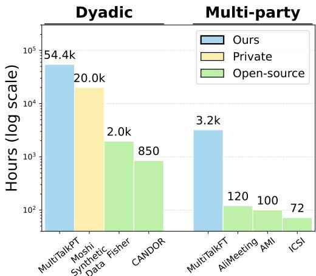
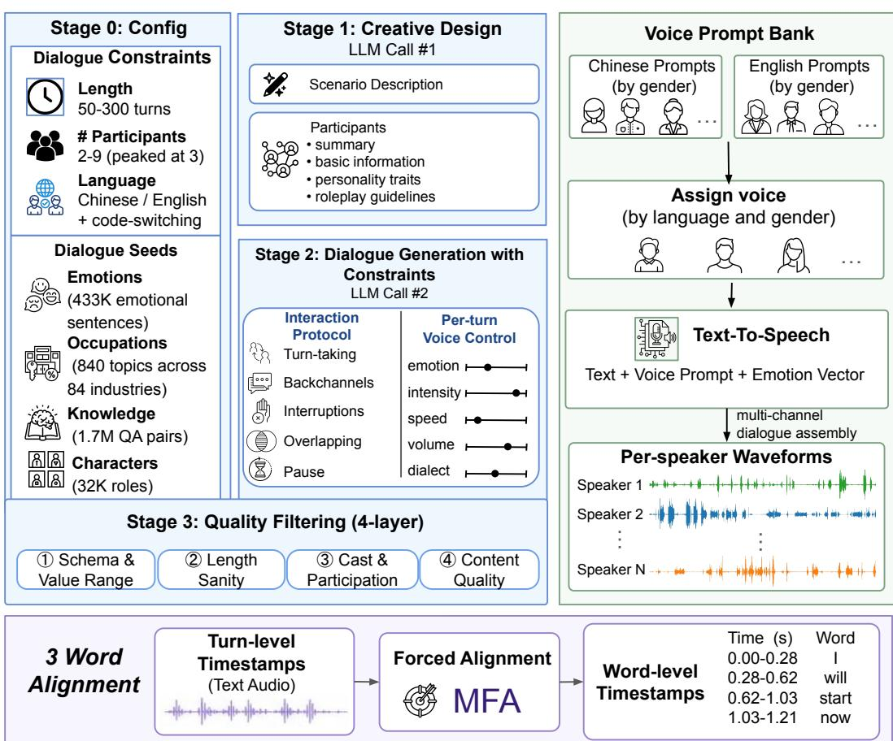
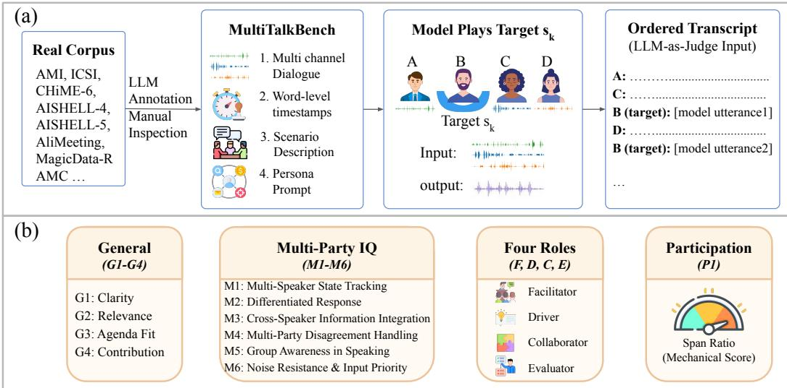
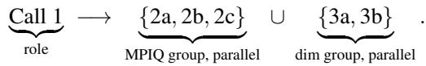

# MultiTalk: Scaling Full-Duplex Speech Models to Long, Multi-Party, Bilingual Conversation

Ke Wang1∗, Houxing Ren1∗, Zimu Lu1, Yunqiao Yang1, Zhuofan Zong1, Mingjie Zhan1†, Hongsheng Li1,2† 1CUHK MMLab, 2CPII under InnoHK wangk@link.cuhk.edu.hk hsli@ee.cuhk.edu.hk

## Abstract

End-to-end full-duplex speech models have brought open-source machine conversation close to human fluency, yet existing systems fall short of real-world deployment in two entangled respects: long-context conversational robustness and multi-party interaction capability. Realistic settings, including meetings, group lessons, family dinners, and social-robot reception, are inherently long-horizon and multi-party at the same time, requiring a single model to perceive, attribute, contextualize, and respond across multiple speakers over extended durations. Progress along these axes is bottlenecked by both data and evaluation. On the data side, open multi-party conversational speech corpora total only a few hundred hours and are not designed for codec-frame-level full-duplex modeling. On the evaluation side, existing long-audio benchmarks focus on passive listening, while existing speechto-speech benchmarks remain dyadic and short. In this work, we extend the Moshi paradigm along long-horizon and multi-party axes simultaneously, in both English and Chinese, with three contributions. First, we release an open data engine and a 57.6,k-hour synthetic training corpus for long, multi-party, English–Chinese full-duplex dialogue. The engine produces parallel-stream audio with controllable length, participant count, conversational dynamics (turn-taking, overlap, backchannels, interruption, addressee shifts, long-range co-reference), and language (English, Chinese), exceeding all prior open multi-party conversational speech corpora by more than an order of magnitude. Second, we introduce MultiTalkBench, built from real human recordings, to jointly evaluate long-form full-duplex dialogue with an average duration of 32.6 minutes, multi-party, and bilingual full-duplex dialogue, with explicit probes for long-range entity tracking, topic coherence, and addressee selection. Third, we train a bilingual Moshi-style full-duplex model on the released corpus that sustains coherent multi-party English–Chinese conversation over extended durations, substantially outperforming open-source baselines including Moshi, MiniCPM-o-4.5, and Qwen3-Omni-30B-A3B-Instruct.

## 1 Introduction

End-to-end full-duplex speech models have brought open-source machine conversation closer than ever to human fluency. A single model now listens, thinks, and speaks simultaneously, collapsing the long-standing ASR → LLM → TTS pipeline into a unified system with sub-second response latency, in line with commercial reference points such as GPT-4o [48] and Gemini Live [62, 63]. Among open systems, Moshi [11] has emerged as the de facto architectural reference. Its ideas have been adopted, refined, or competed against by a rapidly growing family of full-duplex and streaming speech-to-speech models, including J-Moshi [47], GLM-4-Voice [86, 87], Step-Audio [24, 72], Qwen-Omni [74, 75], Kimi-Audio [29], MiniCPM-o [83], and bilingual native full-duplex systems such as FLM-Audio and RoboEgo [81, 82].

Despite this rapid progress, existing full-duplex models fall short of real-world deployment in two critical respects: long-context conversational robustness and multi-party interaction capability. A deployed conversational agent runs continuously rather than over short isolated clips, so realistic settings, including meetings, group lessons, family dinners, and social-robot reception scenarios, are inherently long-horizon and multi-party at the same time. Across hours of continuous audio, a single model must simultaneously perceive utterances from multiple distinct human speakers, attribute each utterance to the correct speaker, maintain coherent context over extended history, and respond with appropriate addressee selection. This is fundamentally a problem of semantics and turn-taking, orthogonal to the acoustic source-separation and diarization literature. Classical multi-party dialogue research [61, 15, 25], addressee detection [90, 21, 26], and recent multi-party social-robot work [1] have advanced modular pipelines. However, no end-to-end full-duplex speech model has been trained or evaluated for the one-model, many-user, long-horizon setting that real deployment demands.

Realizing this capability depends on the availability of suitable training data, yet such data is extremely difficult and costly to collect. An open-source spoken-dialogue corpus for long × multi-party × bilingual × parallelstream training is essentially absent. Classical dyadic telephone corpora, including Switchboard [19], Fisher [9], and HKUST/MTS [36], are monolingual. Open multi-party speech corpora, including AMI [6], ICSI [27], AISHELL-4 [18], and AliMeeting [84], together amount to only a few hundred hours and were not designed for codec-frame-level full-duplex modeling. Reflecting this scarcity, every recent Moshi-style system falls back on proprietary in-house data or on TTSsynthesized stereo dialogue that is not publicly redistributed [11, 65, 89, 86, 24, 47]. An open data engine for long, multi-party, bilingual full-duplex audio is precisely the missing ingredient.

  
Figure 1: Training-data scale comparison.

Compounding these training-data gaps, current evaluation protocols are also inadequate as shown in Table 1. Recent long-audio benchmarks, including BLAB [2], AudioMarathon [22], and ChronosAudio [44], demonstrate that audio LLMs suffer substantial accuracy degradation as audio length grows from seconds to tens of minutes. Crucially, however, these benchmarks measure passive listening rather than interactive generation. Speech-to-speech benchmarks such as VoiceBench, AudioBench, AIR-Bench, SD-Eval, and S2S-Arena focus on dyadic instruction-following, whereas Talking Turns, Full-Duplex-Bench, and MTalk-Bench focus on dyadic turn-taking and overlap dynamics. URO-Bench [76] is the only speech-to-speech benchmark that covers bilingual English–Chinese multi-round interaction alongside paralinguistic dimensions, yet it too remains dyadic and short.

Meaningful progress along any of these dimensions requires a unified treatment that integrates model, training corpus, and benchmark. In this work, we extend the Moshi paradigm along both axes simultaneously and in both Chinese and English. Our contributions are as follows:

• A data engine and an open 57.6,k-hour synthetic training corpus for long, multi-party, bilingual full-duplex dialogue. The engine generates parallel-stream audio conversations with controllable length, number of participants, conversational dynamics (turn-taking, overlap, backchannels, interruption, addressee shifts, long-range co-reference), and language (English, Chinese). It combines persona- and memory-conditioned dialogue planning, multispeaker bilingual TTS, and acoustically faithful multi-channel mixing to produce data with codec-frame-level alignment suitable for Moshi-style training. We release both the engine and a 57.6 k-hour corpus, exceeding the union of all prior open full-duplex speech corpora as shown in Figure 1.

• MultiTalkBench, the first benchmark to jointly evaluate long, multi-party, and bilingual full-duplex dialogue. MultiTalkBench tests speech-to-speech systems on (a) interactive conversations longer than ten minutes with explicit probes for long-range entity tracking and topic coherence, (b) one-model-many-user multi-party interaction with quantitative addressee-selection and turn-taking metrics, and (c) English–Chinese bilingual abilities. To our knowledge, no prior benchmark addresses these axes jointly in a fully interactive, end-to-end speech setting.

Table 1: Statistics of MultiTalkBench and prior speech evaluation benchmarks.
<table><tr><td></td><td>MultiTalkBench</td><td>VoiceBench</td><td>FDB-v1.5</td><td>MTalk-Bench</td></tr><tr><td rowspan="2">Total (h) Max. (min)</td><td>56.5</td><td>55.9</td><td>1.9</td><td>1.5</td></tr><tr><td>43.6</td><td>0.9</td><td>0.2</td><td>0.8</td></tr><tr><td rowspan="3">Multi-party Full-duplex Bilingual</td><td></td><td>X</td><td>X</td><td>(only 9.8 min)</td></tr><tr><td></td><td>××</td><td>√</td><td>X</td></tr><tr><td></td><td></td><td>x</td><td>x</td></tr></table>

• A bilingual Moshi-style full-duplex model. The model demonstrates that a single end-toend system can sustain coherent multi-party English–Chinese conversation over extended durations, substantially outperforming open-source baselines including Moshi, MiniCPM-o-4.5, and Qwen3-Omni-30B-A3B-Instruct.

## 2 Methods

## 2.1 Automatic Data Engine

To construct long, multi-party, bilingual full-duplex dialogue data for Moshi-style training, we build an automatic data engine (Figure 2) that produces parallel-stream speech along three controllable axes: conversation length, number of participants, and language. Given dialogue seeds spanning emotions, occupations, knowledge, and characters, the engine first performs two-pass symbolic script synthesis: one LLM call constructs the scenario, cast, and interaction trajectory, while a second call realizes the full dialogue under this fixed world model. The scripts are then rendered with bilingual multi-speaker TTS and multi-channel mixing, followed by word-level alignment for codec-frame-level supervision.

## 2.1.1 Seed Data Collection

To support diverse and grounded dialogue generation, we assemble four pools of seed material that serve as optional conditioning input for the script synthesizer, including emotional seed, knowledge seed, character seed, and occupational seed. Emotional seeds are taken from dair-ai/emotion [59], yielding 433K sentences annotated with discrete affect labels for grounding emotional tone. Knowledge seeds consist of 1.7M question–answer pairs from AM-DeepSeek-R1-0528-Distilled and AM-Qwen3-Distilled [64], which together span a broad spectrum of reasoning domains; we apply keyword-based filtering to discard items containing code fragments, markdown artifacts, error tracebacks, and other formatting unsuitable for spoken interaction. Character seeds are obtained by prompting gemini-2.5-pro to normalize raw role descriptions into a unified schema covering identity, background, personality traits, and roleplay guidelines, producing 32K deduplicated profiles. Occupational seeds comprise 840 discussion topics organized across 84 industries, supplying domainspecific context for task-oriented conversation. Synthetic-data construction and back-translation have also been explored in mathematical reasoning and software-development tasks [41, 43, 39, 38].

## 2.1.2 Dialogue Script Synthesis

Each dialogue is conditioned on a small set of seeds together with a sampled scenario configuration that fixes its global parameters: number of participants, ranging from 2 to 9 and most commonly 3, target turn count, ranging from 50 to 300, language (English or Chinese), and level of AI involvement. Seeds are injected via prompt-level system-message substitution. To separate global scenario planning from local dialogue realization, we use a two-stage synthesis pipeline. The first call constructs the world model, including the cast, setting, participant roles, and high-level interaction trajectory. The second call realizes the full dialogue under this fixed scenario, while enforcing per-turn TTS annotations, speaker consistency, and cast closure.

Creative Design. The first call emits a creative-design block, a four- to six-sentence scenario paragraph, and a closed cast in which each participant is described along four stable dimensions:

2 TTS Rendering  
  
Figure 2: Automatic data engine for parallel-stream full-duplex dialogue. (1) Dialogue Script Synthesis turns a sampled configuration (length, participants, language) and four seed pools (emotions, occupations, knowledge, characters) into a constrained dialogue script via two LLM calls followed by a four-layer quality filter. (2) TTS Rendering synthesizes per-utterance waveforms with IndexTTS2 from a gender-matched voice prompt and an emotion vector, then assembles them into per-speaker parallel streams. (3) Word Alignment refines turn-level timestamps to word-level alignments via Montreal Forced Aligner (MFA).

summary, basic information, personality traits, and roleplay guidelines. Transient affective state is confined to the scenario paragraph, so that the second call can modulate per-turn TTS controls without contradicting any persona. The prompt enforces a cast-closure invariant (every named participant in the scenario must appear in the participant list) and instructs the model not to quote any seed verbatim, breaking the surface-form attractor we observed in single-prompt formulations.

Dialogue Generation. The second call ingests this creative-design block and emits an array of turns subject to three constraint families encoded directly in the prompt. A spoken-length distribution requests 60% short turns (1–15 words), 30% medium (15–40), and 10% long, with consecutive long turns prohibited. An interaction protocol schematizes four behaviors: backchannels are short turns inserted between another speaker’s adjacent turns; interruptions terminate the preceding turn with an em-dash marker, followed immediately by the interrupting turn; overlapping speech is flagged on adjacent turns; and pauses are realized as explicit silence turns {speaker=silence, text=[Xs]} with X ∈ [1, 5]. Explicit silence turns are critical for full-duplex training because they let the renderer insert genuine acoustic silence rather than rely on inter-turn gaps that vanish under tight TTS concatenation. Finally, afive-dimensional TTS control vector (emotion, intensity, speed, volume, dialect) is attached to each non-silence turn, and its text field is constrained to be TTS-safe: parenthetical or bracketed performance cues are forbidden, all affective information is carried by the voice control object, and the field is passed verbatim to the TTS module. More broadly, code-assisted reasoning and reflection provide examples of structured intermediate generation and verification in language models [91, 70, 57].

Quality Filtering. A four-layer filter rejects scripts with structured reason codes, so that prompt iterations can be tied to per-class failure-rate deltas. The filter verifies (i) JSON schema and TTSannotation value ranges, (ii) spoken-length sanity (per-turn word count and consecutive samespeaker runs), (iii) cast closure and minimum participation per speaker, and (iv) content quality (no adjacent verbatim repetition, no AI-template openings, no role-breaking phrases). Other generation methods use editing, infilling, or alignment objectives to improve outputs; these are complementary methodological directions rather than components of our data engine [55, 56, 53].

## 2.1.3 TTS Rendering and Word Alignment

Per-Utterance Synthesis. Each script is rendered into per-utterance waveforms by IndexTTS2 [92], a zero-shot TTS model conditioned on a speaker prompt and an emotion vector. We curate Chinese and English prompt banks partitioned by gender. For each dialogue, the bank matching the script language is shuffled, and prompts are drawn without replacement and assigned to participants by gender, ensuring that no two participants share a voice. Drawing prompts at the dialogue level rather than the corpus level yields exponentially many prompt combinations per cast, breaking the speaker-text correlations that would otherwise let downstream models exploit shortcuts for speaker identification. For each non-silence turn, the synthesizer receives an eight-dimensional emotion vector obtained by one-hot indexing the annotated emotion category and scaling by its intensity. Silence turns bypass the synthesizer and emit zero-valued audio of the requested duration.

Multi-Channel Assembly. The per-utterance waveforms are assembled into a multi-channel track in which the assistant occupies channel 0, producing the per-speaker waveform pair consumed by downstream models. Each turn is mixed into its speaker’s channel at a position determined by sequential placement, subject to a same-channel non-overlap invariant that forbids any turn from beginning before the previous endpoint of its own channel. Cross-speaker overlap, by contrast, is freely admitted, and the script’s interaction protocol is realized through this asymmetric placement policy. A subsequent gap-compression pass tightens inter-turn silence so that adjacent cross-speaker boundaries overlap by 0.2 to 0.6 seconds for normal transitions, or by 1 to 2 seconds when the preceding turn was marked as interrupted.

Word Alignment. To support training a time-aligned text stream in the spirit of Moshi’s Inner Monologue, we obtain word-level timestamps for assistant turns by forced alignment with the Montreal Forced Aligner [46].

## 2.2 MultiTalkBench

To evaluate full-duplex speech models under realistic long-form interaction, we introduce MultiTalk-Bench (Figure 3), a benchmark for long, multi-party, bilingual dialogue. MultiTalkBench places the model in a multi-party meeting as a specific named participant, rather than as a generic one-on-one assistant. This design probes capabilities that are central to deployed conversational agents but undercovered by existing benchmarks: long-range entity tracking, topic coherence, addressee selection, and turn-taking across multiple speakers.

Data Collection. Unlike the synthetic training corpus, MultiTalkBench is constructed from real human conversational recordings. The audio is sourced from the test split of publicly released multi-party speech corpora that together span English meeting (AMI [6], ICSI [27]), English naturalistic dinnerparty (CHiME-6 [71]), Mandarin meeting (AISHELL-4 [18], AliMeeting [84]), Mandarin in-car multi-speaker (AISHELL-5 [10]), and Mandarin conversational telephone (MagicData-RAMC [80]) settings. We retain only sessions for which per-speaker close-mic or lapel audio is available, since far-field arrays alone do not yield the channel-isolated streams required to feed each non-target participant into the model as a separate input. Sessions are further filtered for clean alignment, absence of ghost speakers, and per-channel SNR above an acoustic-quality threshold. From the filtered pool we generate 104 evaluation samples. We construct a persona prompt per $( M , s _ { k } )$ via a two-pass offline pipeline. Per-speaker seeds (alias, self-introduced name when available, gender heuristic, role hint, three representative quotes) are sent with a transcript excerpt to a writer LLM, which returns a meeting-level scenario paragraph plus a 10-field profile per speaker. Source corpora such as AMI provide audio but define no model task. MultiTalkBench reuses them as input audio while contributing the task definition, persona prompts, dimensions, and scoring procedure.

  
Figure 3: MultiTalkBench. (a) Each test instance is built from a real multi-party conversation annotated and inspected into multi-channel dialogue with word-level timestamps, a scenario descrip tion, and per-speaker persona prompts. The model plays a designated target participant $s _ { k } ,$ , and its generated utterances are spliced into the ordered transcript fed to an LLM-as-Judge. (b) The metric spans four general dimensions, six multi-party intelligence dimensions, four roles, and a mechanical span-ratio participation score.

Metric. The metric covers four groups. The General group evaluates basic response quality, including clarity, relevance, agenda fit, and contribution. The Multi-Party IQ group evaluates capabilities specific to conversations with $\geq 3$ speakers, including multi-speaker state tracking, differentiated response to different addressees, cross-speaker information integration, multi-party disagreement handling, group awareness in speaking, and resistance to noisy or low-priority inputs. The Role-conditional group evaluates role-specific behavior for four meeting roles: Facilitator, Driver, Collaborator, and Evaluator. Finally, Participation is a mechanical dimension defined below. For target speaker $s _ { k }$ in meeting M with utterance set $U _ { k } \subseteq U$ , we define the time-span participation ratio and its matching coefficient as

$$
r ( s _ { k } ) = \frac { \operatorname* { m a x } _ { u \in U _ { k } } u \mathrm { . e n d } - \operatorname* { m i n } _ { u \in U _ { k } } u \mathrm { . s t a r t } } { \operatorname* { m a x } _ { u \in U } u \mathrm { . e n d } - \operatorname* { m i n } _ { u \in U } u \mathrm { . s t a r t } } , \quad \mathrm { c o e f } ( s _ { k } ) = \operatorname* { m a x } \bigl ( 0 , 1 - | r _ { \mathrm { m o d e l } } - r ^ { \mathrm { G T } } | \bigr ) \in [ 0 , 1 ] ,\tag{1}
$$

where $r ^ { \mathrm { G T } }$ is computed identically over the human reference alignment, and we report $P _ { 1 } = 1 0 0$ coef $\in [ 0$ , 100]. For each sample, the target $s _ { k }$ is assigned exactly one of the four meeting roles, so within the Role-conditional group only that role’s sub-dimensions are scored. The four roles therefore partition the sample set, and the role-group total is the sum of the four per-role scores, in contrast to the General and Multi-Party IQ groups, whose sub-dimensions apply to every sample and average to the group total. The three LLM-judge groups are weighted equally $( 1 / 3 )$ each) in the final score. These content-level scores are assigned to offline model responses inserted into the human-conversation transcript; they do not directly measure response latency or interruption timing.

## 2.3 Training

To obtain a Moshi-style model capable of long-horizon, multi-party, bilingual full-duplex dialogue, we adopt a two-phase training recipe initialized from the public kyutai/moshiko-pytorch-bf16. In the first phase, we perform bilingual pre-training on MultiTalkPT, a 54.4k-hour full-duplex corpus comprising both English and Chinese dialogues (Table 1). Per-language sampling weights are tuned so that each epoch is approximately 60% English and 40% Chinese, adapting the model to

Chinese while preserving English ability and introducing a user-stream prediction objective. In the second phase, we specialize the resulting dyadic checkpoint for multi-party interaction by fine-tuning on MultiTalkFT, a 3.2k-hour bilingual multi-party corpus with per-speaker streams and system prompts. To isolate the contribution of data, we leave Moshi’s dual-stream architecture entirely unmodified and mix all non-target speakers into the user channel. This stage restricts training to multi-party conversations so that the model concentrates capacity on cross-talk with multiple users.

## 3 Experiments

In this section, we evaluate the effectiveness of our data engine (Section 2.1) and two-phase training recipe (Section 2.3) for long, multi-party, bilingual full-duplex dialogue. We compare Moshi-MTB with four publicly available speech dialogue baselines on MultiTalkBench (Section 2.2), focusing on both long-context conversational consistency and multi-party interaction ability.

## 3.1 Implementation Details

Parameters. Both training phases share the same loss weighting and user-stream design. The text head uses a padding weight of 0.2 and an end-of-text padding weight of 0.6. The audio heads use a first-codebook weight multiplier of 100 and a non-semantic-codebook weight of 1.0 on the Moshi stream. The user audio stream is supervised jointly with the Moshi stream: its loss is scaled by 0.5, with a first-codebook multiplier of 100 and a non-semantic-codebook weight of 0.5, and is linearly warmed up over the first 500 optimizer steps to avoid destabilizing the pre-trained Moshi-side distribution. On-the-fly augmentation mixes far-field noise sampled from the DNS-Challenge noise corpus into the user channel. We perform full-parameter training with AdamW and a one-cycle schedule with pct\_start=0.01. Both phases use a global batch size of 21 h of audio. For pre-training, the model is trained on MultiTalkPT for 5,000 steps. The peak learning rate is $3 \times 1 0 ^ { - 5 }$ . For fine-tuning, the model is trained exclusively on MultiTalkFT for 200 steps, with the peak learning rate lowered to $2 \times 1 0 ^ { - 6 }$ for the temporal transformer and $4 \times 1 0 ^ { - 6 }$ for the depth transformer.

Baselines. Moshiko-7B [11] is the original Moshi base without persona finetuning. PersonaPlex-7B [58] is a persona-conditioned Moshi variant. MiniCPM-o-4.5 [83] is a streaming chunked model with explicit is\_listen gating. Qwen3-Omni-30B [75] is a 30B mixture-of-experts foundation model, the largest in the comparison. Moshi-MTB (ours) is a Moshi-7B backbone finetuned on the multi-party portion of our corpus with the language-balanced training recipe in Section 2.3.

## 3.2 Main Results

Table 2 reports whether the data engine and corpus introduced in Section 2.1 provide effective training material for the long, multi-party, bilingual full-duplex setting. First, training the offthe-shelf Moshiko-7B checkpoint on MultiTalkPT + MultiTalkFT under our two-phase recipe increases the overall final score by +182.2% (Moshiko-7B 4.66 → Moshi-MTB 13.15). Second, the resulting model outperforms all four open-source baselines, including MiniCPM-o-4.5 (11.05) and Qwen3-Omni-30B (4.94). Together, these observations provide consistent evidence for the effectiveness of the proposed training data.

Multi-party gain. The two groups that target multi-party competence both improve sharply over the Moshiko-7B backbone. Multi-Party IQ rises from 2.41 to 8.56 (+255.2%), narrowly trailing the strongest baseline (MiniCPM-o-4.5, 9.00). Moshi-MTB in fact leads MiniCPM-o-4.5 on Speaker Tracking (14.56 vs. 13.60), Group Awareness (15.80 vs. 14.40), and Noise Resistance (12.77 vs. 8.23), with the residual aggregate gap concentrated on Information Integration and Disagreement Handling. The Role-conditional group, which scores behaviors that emerge only when the model is assigned a designated meeting role, increases from 6.62 to 12.16 (+83.7%), exceeding MiniCPMo-4.5 (7.81) by +55.7%. The largest model in the comparison, Qwen3-Omni-30B, reaches only 2.81 and 5.08 on these two groups respectively, indicating that performance on multi-party behavior is bounded by training distribution rather than by parameter count. This empirically validates the multi-party diagnosis of Section 1: existing open full-duplex models are trained predominantly on dyadic interaction, and one operative intervention is data composition.

Table 2: Detailed results on MultiTalkBench, broken down by sub-dimension. Bold: best result among models per row. The ∆ column reports relative change of Moshi-MTB over its Moshiko-7B backbone. Italics: human reference (oracle upper bound).
<table><tr><td rowspan="2"></td><td colspan="2">Open SOTA</td><td colspan="2">Moshi family</td><td rowspan="2">Moshi-MTB</td><td rowspan="2">∆</td><td rowspan="2">Human</td></tr><tr><td>Qwen3-Omni</td><td>MiniCPM-o-4.5</td><td>PersonaPlex Moshiko-7B</td><td></td></tr><tr><td>Size</td><td>30B</td><td>9B</td><td>7B</td><td>7B</td><td>7B</td><td>一</td><td>一</td></tr><tr><td>General</td><td>6.93</td><td>16.35</td><td>2.76</td><td>4.96</td><td>18.73</td><td>+277.6%</td><td>80.53</td></tr><tr><td>Clarity</td><td>5.91</td><td>18.63</td><td>4.35</td><td>5.25</td><td>19.41</td><td>+269.7%</td><td>69.71</td></tr><tr><td>Relevance</td><td>6.47</td><td>21.91</td><td>3.23</td><td>7.52</td><td>22.72</td><td>+202.1%</td><td>88.22</td></tr><tr><td>Agenda Fit</td><td>8.52</td><td>14.88</td><td>3.46</td><td>6.58</td><td>25.39</td><td>+285.9%</td><td>89.42</td></tr><tr><td>Contribution</td><td>6.80</td><td>9.97</td><td>0.00</td><td>0.48</td><td>7.40</td><td>+1441.7%</td><td>74.76</td></tr><tr><td>Multi-Party IQ</td><td>2.81</td><td>9.00</td><td>1.71</td><td>2.41</td><td>8.56</td><td>+255.2%</td><td>64.18</td></tr><tr><td>Speaker Tracking</td><td>3.89</td><td>13.60</td><td>4.45</td><td>5.41</td><td>14.56</td><td>+169.1%</td><td>82.45</td></tr><tr><td>Differentiated Response</td><td>2.28</td><td>5.85</td><td>1.20</td><td>1.66</td><td>4.37</td><td>+163.3%</td><td>54.57</td></tr><tr><td>Information Integration</td><td>3.78</td><td>9.38</td><td>1.84</td><td>1.44</td><td>2.89</td><td>+100.7%</td><td>63.94</td></tr><tr><td>Disagreement Handling</td><td>0.90</td><td>2.54</td><td>0.00</td><td>0.00</td><td>0.96</td><td></td><td>40.62</td></tr><tr><td>Group Awareness</td><td>5.23</td><td>14.40</td><td>2.06</td><td>3.58</td><td>15.80</td><td>+341.3%</td><td>70.43</td></tr><tr><td>Noise Resistance</td><td>0.78</td><td>8.23</td><td>0.72</td><td>2.39</td><td>12.77</td><td>+434.3%</td><td>73.08</td></tr><tr><td>Role-conditional</td><td>5.08</td><td>7.81</td><td>3.10</td><td>6.62</td><td>12.16</td><td>+83.7%</td><td>61.51</td></tr><tr><td>Facilitator</td><td>1.24</td><td>0.51</td><td>0.67</td><td>0.71</td><td>5.11</td><td>+619.7%</td><td>16.20</td></tr><tr><td>Driver</td><td>3.54</td><td>1.90</td><td>0.66</td><td>0.30</td><td>1.49</td><td>+396.7%</td><td>33.35</td></tr><tr><td>Collaborator</td><td>0.30</td><td>4.84</td><td>1.70</td><td>5.55</td><td>5.24</td><td>-5.6%</td><td>9.50</td></tr><tr><td>Evaluator</td><td>0.00</td><td>0.56</td><td>0.06</td><td>0.06</td><td>0.33</td><td>+450.0%</td><td>2.46</td></tr><tr><td>Participation</td><td>13.71</td><td>37.10</td><td>97.87</td><td>97.86</td><td>91.94</td><td>-6.0%</td><td>100.00</td></tr><tr><td>Final Score</td><td>4.94</td><td>11.05</td><td>2.52</td><td>4.66</td><td>13.15</td><td>+182.2%</td><td>68.74</td></tr><tr><td>EN</td><td>4.54</td><td>7.25</td><td>4.27</td><td>7.82</td><td>10.87</td><td>+39.0%</td><td>68.35</td></tr><tr><td>ZH</td><td>5.49</td><td>16.23</td><td>0.14</td><td>0.36</td><td>16.27</td><td>+4419.4%</td><td>69.28</td></tr></table>

Bilingual unlock. The largest single improvement occurs on Chinese. ZH final score increases from 0.36 on Moshiko-7B to 16.27 on Moshi-MTB, a factor of about 45×, converting an English-only checkpoint into a bilingual model. English performance is preserved, with EN final increasing from 7.82 to 10.87 (+39.0%). This pattern is consistent with the bilingual-by-design construction of MultiTalkPT, which introduces a second language without displacing the first.

Limitations and headroom. On Multi-Party IQ, MiniCPM-o-4.5 narrowly leads (9.00 vs. 8.56), which we attribute to its broader pre-training corpus. On Participation, PersonaPlex-7B attains the highest score (97.87), yet its General, Multi-Party IQ, and Role-conditional scores all fall in the bottom quartile, yielding a final score of 2.52, the lowest among the five compared models. All five models remain far below the human reference (13.15 vs. 68.74), indicating substantial headroom on the long, multi-party, bilingual full-duplex setting evaluated here.

Additional analyses. With the preceding training stage fixed, increasing the fraction of MultiTalkFT from 0% to 25%, 50%, 75%, and 100% raises the Final Score from 7.95 to 10.39, 11.78, 12.77, and 13.15, respectively. In size-matched 800-hour comparisons, the score is 10.39 with a random subset, 8.30 with only three-speaker conversations, and 9.55 with only the shortest conversations. Moshi-MTB scores 13.44 on three-speaker samples versus 11.96 on larger groups, and 21.23 on conversations under 30 minutes versus 12.07 on longer ones. The benefit also transfers to F-Actor [94], whose Final Score increases from 6.94 to 15.16 after training with MultiTalk. To complement MultiTalkBench’s offline content scores, we directly measure interaction behavior: Moshi-MTB achieves 870 ms response onset latency, 2230 ms stop latency, 94.1% backchannel continuation, and 98.8% side-conversation ignoring, versus 782 ms, 5475 ms, 93.7%, and 92.0% for Moshiko-7B. These results support benefits from MultiTalkFT scale and diversity, cross-architecture transfer, and improved interruption handling, without establishing a scaling law for the entire corpus or isolating every source of synthetic-to-real variation.

## 3.3 Human Evaluation

To validate that the LLM-as-judge protocol of Section 2.2 produces scores aligned with human judgment, we conduct a human evaluation comparing rater scores against two LLM judges. We randomly sample 20 evaluation samples from the 104 in MultiTalkBench for each of the five models in Table 2, yielding 100 samples for human review. We compute Spearman’s ρ and Kendall’s τ between human references and two automatic judges, Gemma-4-31B and Qwen3.5-27B. Results are reported in Table 3. The Gemma-4-31B judge achieves Spearman correlations with human references of $\rho \ge 0 . 8 4$ on every metric group, peaking at $\rho = 0 . 8 9 8$ on the Final Score. Inter-judge agreement between the two LLM judges remains above $\rho = 0 . 7 2$ across all groups and reaches $\rho = 0 . 8 4 7$ on the Final Score. These results support the use of LLM-as-judge as a reproducible substitute for human evaluation during iterative model development.

Table 3: Correlation between human references and two LLM judges (Gemma-4-31B and Qwen3.5- 27B) on MultiTalkBench. Each cell reports Spearman’s $\rho /$ Kendall’s τ.
<table><tr><td>Metric Group</td><td>Gemma-4-31B vs. Human  $( \rho / \tau )$ </td><td>Qwen3.5-27B vs. Human  $( \rho / \tau )$ </td><td>Gemma-4-31B vs. Qwen3.5-27B  $( \rho / \tau )$ </td></tr><tr><td>General</td><td>0.845 / 0.739</td><td>0.761 / 0.614</td><td>0.838 / 0.701</td></tr><tr><td>Multi-Party IQ Role-conditional</td><td>0.854 / 0.764</td><td>0.770 / 0.644 0.734 / 0.631</td><td>0.768 / 0.649 0.720 / 0.604</td></tr><tr><td></td><td>0.888 / 0.805</td><td></td><td></td></tr><tr><td>Final Score</td><td>0.898 / 0.787</td><td>0.846 / 0.700</td><td>0.847 / 0.706</td></tr></table>

## 4 Related Works

Full-duplex speech corpora. Public conversational corpora cover the dyadic, multi-party, and bilingual axes only in isolation. Classical dyadic telephone corpora, Switchboard [19] (∼260 h), Fisher [9] (∼2 k h), and HKUST/MTS [36] (∼200 h), provide dual-channel audio suitable for fullduplex training but are language-monolingual and contain only two speakers per session. Naturalistic dyadic video-chat data such as the 850-hour CANDOR corpus [52] adds scale and overlap phenomena but remains English-only and dyadic. Open multi-party meeting corpora, including AMI [6] (∼100 h), ICSI [27] (∼72 h), AISHELL-4 [18] (∼120 h), and AliMeeting [84] (∼120 h), together amount to only ∼400 h, are each English- or Chinese-only, and were designed for distant-microphone ASR and diarization rather than codec-frame-level dialogue modeling. English–Chinese code-switched resources such as ASCEND [37], SEAME [45], and TALCS [30] are short, single-channel, or domain restricted to classroom and interview settings. Reflecting this scarcity, every recent Moshi-style system has fallen back on proprietary in-house data or TTS-synthesized stereo dialogue that is not publicly redistributed [11, 65, 89, 86, 24, 47]. The 57.6 k-hour parallel-stream bilingual corpus released in this work fills the long × multi-party × bilingual gap left by the union of these resources.

Full-duplex speech dialogue models. End-to-end spoken dialogue systems differ in how they perceive and emit speech, and whether they can do so simultaneously. Nativefull-duplex models maintain parallel input and output streams at codec-frame rate, exemplified by Moshi’s Mimi codec and RQ-Transformer with an Inner Monologue text scaffold [11], SyncLLM’s periodic synchronization tokens [65], OmniFlatten’s flattened multi-stream sequence [89], and SALMONN-omni’s codec-free embedding-level formulation [85]. J-Moshi adapts this recipe to Japanese using 344 h of real stereo dialogue augmented with 602 h of multi-stream-TTS-synthesized data [47], and FLM-Audio and RoboEgo extend native full-duplex modeling to bilingual English–Chinese [81, 82]. Streaming endto-end models such as GLM-4-Voice [86, 87], Step-Audio 1/2 [24, 72], Qwen2.5/3-Omni [74, 75], Kimi-Audio [29], Baichuan-Audio/Omni [31, 32], LLaMA-Omni 1/2 [16, 17], and MinMo [7] achieve low-latency interaction through half-duplex turn-taking or time-division-multiplexed duplexing [83]. Adjacent audio-visual generation work has also explored unified autoregressive modeling of synchronized speech and video [93]. Architecture search and preference-based optimization have been investigated for other language-model objectives [23, 42, 79]. Across these families, none of these systems is trained or evaluated on multi-party (≥3 speaker) interaction, and none reports stable behavior on conversations longer than several minutes.

Evaluation of long-form and multi-party speech dialogue. Task-specific benchmark design has been studied in multimodal mathematics, website generation, slide generation, spreadsheet understanding, and voice-assistant evaluation [67, 40, 78, 54, 69]. Long-form audio benchmarks such as BLAB [2], AudioMarathon [22], and ChronosAudio [44] show that audio LLMs degrade sharply as input length grows from seconds to tens of minutes, but only evaluate passive listening. Spoken-dialogue benchmarks such as VoiceBench [8], AudioBench [66], AIR-Bench [77],

SD-Eval [4], and S2S-Arena [28] probe instruction-following, paralinguistic understanding, and arena-style preference, while Talking Turns [5], Full-Duplex-Bench v1/v1.5/v2 [35, 34, 33], MTR-DuplexBench [88], FD-Bench [49], and MTalk-Bench [12] target turn-taking, overlap, and multi-turn dynamics. URO-Bench [76] is the only existing speech-to-speech benchmark to combine bilingual English–Chinese evaluation with multi-round and paralinguistic dimensions. On the multi-party side, prior evaluation has been almost exclusively text-based, including addressee-and-response selection [90], pre-trained representations of speaker roles [21], diagnostic studies of LLM behavior on multi-party conversations [50], and recent multi-modal triadic addressee benchmarks [26], complemented on the audio side by voice-activity-projection turn-taking models [15, 25]. None of these benchmarks evaluates one-model-many-user multi-party interaction longer than a few minutes in an interactive full-duplex setting, the joint gap that MultiTalkBench is designed to fill. Work on visual and document reasoning further illustrates the use of task-specific representations and intermediate computation across modalities [68, 13, 60, 73].

## 5 Conclusion

In this work, we presented MultiTalk, addressing data, benchmark, and modeling gaps in opensource full-duplex speech systems for long-horizon, multi-party, bilingual interaction. We release a 57.6k-hour parallel-stream corpus (MultiTalkPT for bilingual pre-training, MultiTalkFT for multi party fine-tuning) and MultiTalkBench, the first benchmark probing long, multi-party, bilingual full-duplex dialogue jointly. Trained under our two-phase recipe, Moshi-MTB raises the overall MultiTalkBench score by +182% over its Moshiko-7B initialization, unlocks Chinese from 0.36 to 16.27 while preserving English, and exceeds all four open-source baselines including a 30B mixture-of-experts system, while remaining well below the 68.74 human reference. These results suggest two readings: multi-party competence in open full-duplex models is bounded by training distribution, and the gap to human performance shows that MultiTalkBench remains far from saturated. Promising directions include dialogue-aware synthesis for closer train-test acoustic match, extension to additional languages, and scaling the recipe to larger backbones.

## 6 Acknowledgements

This work is supported in part by the Centre for Perceptual and In-teractive Intelligence (CPII) Ltd under the Innovation and Technology Commission (ITC)’s InnoHK.

## References

[1] Giulio Antonio Abbo, Maria Jose Pinto-Bernal, Martijn Catrycke, and Tony Belpaeme. Fast multi-party open-ended conversation with a social robot, 2025.

[2] Orevaoghene Ahia, Martijn Bartelds, Kabir Ahuja, Hila Gonen, Valentin Hofmann, Siddhant Arora, Shuyue Stella Li, Vishal Puttagunta, Mofetoluwa Adeyemi, Charishma Buchireddy, Ben Walls, Noah Bennett, Shinji Watanabe, Noah A. Smith, Yulia Tsvetkov, and Sachin Kumar. Blab: Brutally long audio bench, 2025.

[3] Anthropic. Claude sonnet 4.6 system card. Technical report, Anthropic, February 2026.

[4] Junyi Ao, Yuancheng Wang, Xiaohai Tian, Dekun Chen, Jun Zhang, Lu Lu, Yuxuan Wang, Haizhou Li, and Zhizheng Wu. Sd-eval: A benchmark dataset for spoken dialogue understanding beyond words. Advances in Neural Information Processing Systems, 37:56898–56918, 2024.

[5] Siddhant Arora, Zhiyun Lu, Chung-Cheng Chiu, Ruoming Pang, and Shinji Watanabe. Talking turns: Benchmarking audio foundation models on turn-taking dynamics, 2025.

[6] Jean Carletta, Simone Ashby, Sebastien Bourban, Mike Flynn, Maël Guillemot, Thomas Hain, Jaroslav Kadlec, Vasilis Karaiskos, Wessel Kraaij, Melissa Kronenthal, Guillaume Lathoud, Mike Lincoln, Agnes Lisowska Masson, Iain McCowan, Wilfried Post, Dennis Reidsma, and Pierre D. Wellner. The ami meeting corpus: A pre-announcement. In Machine Learning for Multimodal Interaction, 2005.

[7] Qian Chen, Yafeng Chen, Yanni Chen, Mengzhe Chen, Yingda Chen, Chong Deng, Zhihao Du, Ruize Gao, Changfeng Gao, Zhifu Gao, Yabin Li, Xiang Lv, Jiaqing Liu, Haoneng Luo, Bin Ma, Chongjia Ni, Xian Shi, Jialong Tang, Hui Wang, Hao Wang, Wen Wang, Yuxuan Wang, Yunlan Xu, Fan Yu, Zhijie Yan, Yexin Yang, Baosong Yang, Xian Yang, Guanrou Yang, Tianyu Zhao, Qinglin Zhang, Shiliang Zhang, Nan Zhao, Pei Zhang, Chong Zhang, and Jinren Zhou. Minmo: A multimodal large language model for seamless voice interaction, 2025.

[8] Yiming Chen, Xianghu Yue, Chen Zhang, Xiaoxue Gao, Robby T. Tan, and Haizhou Li. Voicebench: Benchmarking llm-based voice assistants, 2024.

[9] Christopher Cieri, David Miller, and Kevin Walker. The fisher corpus: a resource for the next generations of speech-to-text. In Maria Teresa Lino, Maria Francisca Xavier, Fátima Ferreira, Rute Costa, and Raquel Silva, editors, Proceedings of the Fourth International Conference on Language Resources and Evaluation (LREC’04), Lisbon, Portugal, May 2004. European Language Resources Association (ELRA).

[10] Yuhang Dai, He Wang, Xingchen Li, Zihan Zhang, Shuiyuan Wang, Lei Xie, Xin Xu, Hongxiao Guo, Shaoji Zhang, Hui Bu, and Wei Chen. Aishell-5: The first open-source in-car multi-channel multi-speaker speech dataset for automatic speech diarization and recognition, 2025.

[11] Alexandre Défossez, Laurent Mazaré, Manu Orsini, Amélie Royer, Patrick Pérez, Hervé Jégou, Edouard Grave, and Neil Zeghidour. Moshi: a speech-text foundation model for real-time dialogue. Technical report, 2024.

[12] Yuhao Du, Qianwei Huang, Guo Zhu, Zhanchen Dai, Shunian Chen, Qiming Zhu, Le Pan, Minghao Chen, Yuhao Zhang, Li Zhou, Benyou Wang, and Haizhou Li. Mtalk-bench: Evaluating speech-to-speech models in multi-turn dialogues via arena-style and rubrics protocols, 2025.

[13] Chengqi Duan, Kaiyue Sun, Rongyao Fang, Manyuan Zhang, Yan Feng, Ying Luo, Yufang Liu, Ke Wang, Peng Pei, Xunliang Cai, Hongsheng Li, Yi Ma, and Xihui Liu. Codeplot-cot: Mathematical visual reasoning by thinking with code-driven images. In Proceedings of the IEEE/CVF Conference on Computer Vision and Pattern Recognition (CVPR) Findings, pages 9586–9596, June 2026.

[14] Harishchandra Dubey, Ashkan Aazami, Vishak Gopal, Babak Naderi, Sebastian Braun, Ross Cutler, Hannes Gamper, Mehrsa Golestaneh, and Robert Aichner. Icassp 2023 deep noise suppression challenge. In ICASSP, 2023.

[15] Erik Ekstedt and Gabriel Skantze. Voice activity projection: Self-supervised learning of turn-taking events, 2022.

[16] Qingkai Fang, Shoutao Guo, Yan Zhou, Zhengrui Ma, Shaolei Zhang, and Yang Feng. Llama-omni: Seamless speech interaction with large language models. arXiv preprint arXiv:2409.06666, 2024.

[17] Qingkai Fang, Yan Zhou, Shoutao Guo, Shaolei Zhang, and Yang Feng. Llama-omni2: Llmbased real-time spoken chatbot with autoregressive streaming speech synthesis. arXiv preprint arXiv:2505.02625, 2025.

[18] Yihui Fu, Luyao Cheng, Shubo Lv, Yukai Jv, Yuxiang Kong, Zhuo Chen, Yanxin Hu, Lei Xie, Jian Wu, Hui Bu, Xin Xu, Jun Du, and Jingdong Chen. Aishell-4: An open source dataset for speech enhancement, separation, recognition and speaker diarization in conference scenario. 2021.

[19] J.J. Godfrey, E.C. Holliman, and J. McDaniel. Switchboard: telephone speech corpus for research and development. In [Proceedings] ICASSP-92: 1992 IEEE International Conference on Acoustics, Speech, and Signal Processing, volume 1, pages 517–520 vol.1, 1992.

[20] Google DeepMind. Gemma 4: Byte for byte, the most capable open models. https://blog. google/innovation-and-ai/technology/developers-tools/gemma-4/, 2026.

[21] Jia-Chen Gu, Chongyang Tao, Zhen-Hua Ling, Can Xu, Xiubo Geng, and Daxin Jiang. Mpc-bert: A pre-trained language model for multi-party conversation understanding, 2021.

[22] Peize He, Zichen Wen, Yubo Wang, Yuxuan Wang, Xiaoqian Liu, Jiajie Huang, Zehui Lei, Zhuangcheng Gu, Xiangqi Jin, Jiabing Yang, Kai Li, Zhifei Liu, Weijia Li, Cunxiang Wang, Conghui He, and Linfeng Zhang. Audiomarathon: A comprehensive benchmark for long-context audio understanding and efficiency in audio llms, 2025.

[23] Yuxuan Hu, Jihao Liu, Ke Wang, Jinliang Zheng, Weikang Shi, Manyuan Zhang, Qi Dou, Rui Liu, Aojun Zhou, and Hongsheng Li. LM-searcher: Cross-domain neural architecture search with LLMs via unified numerical encoding. In Christos Christodoulopoulos, Tanmoy Chakraborty, Carolyn Rose, and Violet Peng, editors, Proceedings of the 2025 Conference on Empirical Methods in Natural Language Processing, pages 9408–9421, Suzhou, China, November 2025. Association for Computational Linguistics.

[24] Ailin Huang, Boyong Wu, Bruce Wang, Chao Yan, Chen Hu, Chengli Feng, Fei Tian, Feiyu Shen, Jingbei Li, Mingrui Chen, Peng Liu, Ruihang Miao, Wang You, Xi Chen, Xuerui Yang, Yechang Huang, Yuxiang Zhang, Zheng Gong, Zixin Zhang, Hongyu Zhou, Jianjian Sun, Brian Li, Chengting Feng, Changyi Wan, Hanpeng Hu, Jianchang Wu, Jiangjie Zhen, Ranchen Ming, Song Yuan, Xuelin Zhang, Yu Zhou, Bingxin Li, Buyun Ma, Hongyuan Wang, Kang An, Wei Ji, Wen Li, Xuan Wen, Xiangwen Kong, Yuankai Ma, Yuanwei Liang, Yun Mou, Bahtiyar Ahmidi, Bin Wang, Bo Li, Changxin Miao, Chen Xu, Chenrun Wang, Dapeng Shi, Deshan Sun, Dingyuan Hu, Dula Sai, Enle Liu, Guanzhe Huang, Gulin Yan, Heng Wang, Haonan Jia, Haoyang Zhang, Jiahao Gong, Junjing Guo, Jiashuai Liu, Jiahong Liu, Jie Feng, Jie Wu, Jiaoren Wu, Jie Yang, Jinguo Wang, Jingyang Zhang, Junzhe Lin, Kaixiang Li, Lei Xia, Li Zhou, Liang Zhao, Longlong Gu, Mei Chen, Menglin Wu, Ming Li, Mingxiao Li, Mingliang Li, Mingyao Liang, Na Wang, Nie Hao, Qiling Wu, Qinyuan Tan, Ran Sun, Shuai Shuai, Shaoliang Pang, Shiliang Yang, Shuli Gao, Shanshan Yuan, Siqi Liu, Shihong Deng, Shilei Jiang, Sitong Liu, Tiancheng Cao, Tianyu Wang, Wenjin Deng, Wuxun Xie, Weipeng Ming, Wenqing He, Wen Sun, Xin Han, Xin Huang, Xiaomin Deng, Xiaojia Liu, Xin Wu, Xu Zhao, Yanan Wei, Yanbo Yu, Yang Cao, Yangguang Li, Yangzhen Ma, Yanming Xu, Yaoyu Wang, Yaqiang Shi, Yilei Wang, Yizhuang Zhou, Yinmin Zhong, Yang Zhang, Yaoben Wei, Yu Luo, Yuanwei Lu, Yuhe Yin, Yuchu Luo, Yuanhao Ding, Yuting Yan, Yaqi Dai, Yuxiang Yang, Zhe Xie, Zheng Ge, Zheng Sun, Zhewei Huang, Zhichao Chang, Zhisheng Guan, Zidong Yang, Zili Zhang, Binxing Jiao, Daxin Jiang, Heung-Yeung Shum, Jiansheng Chen, Jing Li, Shuchang Zhou, Xiangyu Zhang, Xinhao Zhang, and Yibo Zhu. Step-audio: Unified understanding and generation in intelligent speech interaction, 2025.

[25] Koji Inoue, Bing’er Jiang, Erik Ekstedt, Tatsuya Kawahara, and Gabriel Skantze. Multilingual turn-taking prediction using voice activity projection, 2024.

[26] Koji Inoue, Divesh Lala, Mikey Elmers, Keiko Ochi, and Tatsuya Kawahara. An llm benchmark for addressee recognition in multi-modal multi-party dialogue, 2025.

[27] A. Janin, D. Baron, J. Edwards, D. Ellis, D. Gelbart, N. Morgan, B. Peskin, T. Pfau, E. Shriberg, A. Stolcke, and C. Wooters. The icsi meeting corpus. In 2003 IEEE International Conference on Acoustics, Speech, and Signal Processing, 2003. Proceedings. (ICASSP ’03)., volume 1, pages I–I, 2003.

[28] Feng Jiang, Zhiyu Lin, Fan Bu, Yuhao Du, Benyou Wang, and Haizhou Li. S2s-arena, evaluating speech2speech protocols on instruction following with paralinguistic information, 2025.

[29] KimiTeam, Ding Ding, Zeqian Ju, Yichong Leng, Songxiang Liu, Tong Liu, Zeyu Shang, Kai Shen, Wei Song, Xu Tan, Heyi Tang, Zhengtao Wang, Chu Wei, Yifei Xin, Xinran Xu, Jianwei Yu, Yutao Zhang, Xinyu Zhou, Y. Charles, Jun Chen, Yanru Chen, Yulun Du, Weiran He, Zhenxing Hu, Guokun Lai, Qingcheng Li, Yangyang Liu, Weidong Sun, Jianzhou Wang, Yuzhi Wang, Yuefeng Wu, Yuxin Wu, Dongchao Yang, Hao Yang, Ying Yang, Zhilin Yang, Aoxiong Yin, Ruibin Yuan, Yutong Zhang, and Zaida Zhou. Kimi-audio technical report, 2025.

[30] Chengfei Li, Shuhao Deng, Yaoping Wang, Guangjing Wang, Yaguang Gong, Changbin Chen, and Jinfeng Bai. Talcs: An open-source mandarin-english code-switching corpus and a speech recognition baseline. 2022.

[31] Tianpeng Li, Jun Liu, Tao Zhang, Yuanbo Fang, Da Pan, Mingrui Wang, Zheng Liang, Zehuan Li, Mingan Lin, Guosheng Dong, Jianhua Xu, Haoze Sun, Zenan Zhou, and Weipeng Chen. Baichuan-audio: A unified framework for end-to-end speech interaction, 2025.

[32] Yadong Li, Jun Liu, Tao Zhang, Tao Zhang, Song Chen, Tianpeng Li, Zehuan Li, Lijun Liu, Lingfeng Ming, Guosheng Dong, Da Pan, Chong Li, Yuanbo Fang, Dongdong Kuang, Mingrui Wang, Chenglin Zhu, Youwei Zhang, Hongyu Guo, Fengyu Zhang, Yuran Wang, Bowen Ding, Wei Song, Xu Li, Yuqi Huo, Zheng Liang, Shusen Zhang, Xin Wu, Shuai Zhao, Linchu Xiong, Yozhen Wu, Jiahui Ye, Wenhao Lu, Bowen Li, Yan Zhang, Yaqi Zhou, Xin Chen, Lei Su, Hongda Zhang, Fuzhong Chen, Xuezhen Dong, Na Nie, Zhiying Wu, Bin Xiao, Ting Li, Shunya Dang, Ping Zhang, Yijia Sun, Jincheng Wu, Jinjie Yang, Xionghai Lin, Zhi Ma, Kegeng Wu, Jia li, Aiyuan Yang, Hui Liu, Jianqiang Zhang, Xiaoxi Chen, Guangwei Ai, Wentao Zhang, Yicong Chen, Xiaoqin Huang, Kun Li, Wenjing Luo, Yifei Duan, Lingling Zhu, Ran Xiao, Zhe Su, Jiani Pu, Dian Wang, Xu Jia, Tianyu Zhang, Mengyu Ai, Mang Wang, Yujing Qiao, Lei Zhang, Yanjun Shen, Fan Yang, Miao Zhen, Yijie Zhou, Mingyang Chen, Fei Li, Chenzheng Zhu, Keer Lu, Yaqi Zhao, Hao Liang, Youquan Li, Yanzhao Qin, Linzhuang Sun, Jianhua Xu, Haoze Sun, Mingan Lin, Zenan Zhou, and Weipeng Chen. Baichuan-omni-1.5 technical report, 2025.

[33] Guan-Ting Lin, Shih-Yun Shan Kuan, Jiatong Shi, Kai-Wei Chang, Siddhant Arora, Shinji Watanabe, and Hung-yi Lee. Full-duplex-bench-v2: A multi-turn evaluation framework for duplex dialogue systems with an automated examiner. arXiv preprint arXiv:2510.07838, 2026.

[34] Guan-Ting Lin, Shih-Yun Shan Kuan, Qirui Wang, Jiachen Lian, Tingle Li, and Hung-yi Lee. Full-duplex-bench v1. 5: Evaluating overlap handling for full-duplex speech models. arXiv preprint arXiv:2507.23159, 2025.

[35] Guan-Ting Lin, Jiachen Lian, Tingle Li, Qirui Wang, Gopala Anumanchipalli, Alexander H Liu, and Hung-yi Lee. Full-duplex-bench: A benchmark to evaluate full-duplex spoken dialogue models on turn-taking capabilities. arXiv preprint arXiv:2503.04721, 2025.

[36] Yi Liu, Pascale Fung, Yongsheng Yang, Christopher Cieri, Shudong Huang, and David Graff. Hkust/mts: A very large scale mandarin telephone speech corpus. In Qiang Huo, Bin Ma, Eng-Siong Chng, and Haizhou Li, editors, Chinese Spoken Language Processing, pages 724–735, Berlin, Heidelberg, 2006. Springer Berlin Heidelberg.

[37] Holy Lovenia, Samuel Cahyawijaya, Genta Winata, Peng Xu, Yan Xu, Zihan Liu, Rita Frieske, Tiezheng Yu, Wenliang Dai, Elham J. Barezi, Qifeng Chen, Xiaojuan Ma, Bertram Shi, and Pascale Fung. ASCEND: A spontaneous Chinese-English dataset for code-switching in multiturn conversation. In Nicoletta Calzolari, Frédéric Béchet, Philippe Blache, Khalid Choukri, Christopher Cieri, Thierry Declerck, Sara Goggi, Hitoshi Isahara, Bente Maegaard, Joseph Mariani, Hélène Mazo, Jan Odijk, and Stelios Piperidis, editors, Proceedings ofthe Thirteenth Language Resources and Evaluation Conference, pages 7259–7268, Marseille, France, June 2022. European Language Resources Association.

[38] Zimu Lu, Houxing Ren, Yunqiao Yang, Ke Wang, Zhuofan Zong, Junting Pan, Mingjie Zhan, and Hongsheng Li. Webgen-agent: Enhancing interactive website generation with multi-level feedback and step-level reinforcement learning. In C. Vondrick, B. Hariharan, C. Raffel, L. Pinto, D. Yang, and A. Faust, editors, International Conference on Learning Representations, volume 2026, pages 83478–83525, 2026.

[39] Zimu Lu, Houxing Ren, Yunqiao Yang, Ke Wang, Zhuofan Zong, Mingjie Zhan, and Hongsheng Li. Fullstack-agent: Enhancing agentic full-stack web coding via development-oriented testing and repository back-translation, 2026.

[40] Zimu Lu, Yunqiao Yang, Houxing Ren, Haotian Hou, Han Xiao, Ke Wang, Weikang Shi, Aojun Zhou, Mingjie Zhan, and Hongsheng Li. Webgen-bench: Evaluating llms on generating interactive and functional websites from scratch. In D. Belgrave, C. Zhang, H. Lin, R. Pascanu, P. Koniusz, M. Ghassemi, and N. Chen, editors, Advances in Neural Information Processing Systems, volume 38, Main Conference. Curran Associates, Inc., 2025.

[41] Zimu Lu, Aojun Zhou, Houxing Ren, Ke Wang, Weikang Shi, Junting Pan, Mingjie Zhan, and Hongsheng Li. MathGenie: Generating synthetic data with question back-translation for enhancing mathematical reasoning of LLMs. In Lun-Wei Ku, Andre Martins, and Vivek Srikumar, editors, Proceedings of the 62nd Annual Meeting of the Association for Computational Linguistics (Volume 1: Long Papers), pages 2732–2747, Bangkok, Thailand, August 2024. Association for Computational Linguistics.

[42] Zimu Lu, Aojun Zhou, Ke Wang, Houxing Ren, Weikang Shi, Junting Pan, Mingjie Zhan, and Hongsheng Li. Step-controlled dpo: Leveraging stepwise error for enhanced mathematical reasoning, 2024.

[43] Zimu Lu, Aojun Zhou, Ke Wang, Houxing Ren, Weikang Shi, Junting Pan, Mingjie Zhan, and Hongsheng Li. Mathcoder2: Better math reasoning from continued pretraining on modeltranslated mathematical code. In Y. Yue, A. Garg, N. Peng, F. Sha, and R. Yu, editors, International Conference on Learning Representations, volume 2025, pages 76545–76565, 2025.

[44] Kaiwen Luo, Liang Lin, Yibo Zhang, Moayad Aloqaily, Dexian Wang, Zhenhong Zhou, Junwei Zhang, Kun Wang, Li Sun, and Qingsong Wen. Chronosaudio: A comprehensive long-audio benchmark for evaluating audio-large language models, 2026.

[45] Dau-Cheng Lyu, Tien Ping Tan, Chng Eng Siong, and Haizhou Li. Seame: a mandarin-english code-switching speech corpus in south-east asia. In Interspeech, 2010.

[46] Michael McAuliffe, Michaela Socolof, Sarah Mihuc, Michael Wagner, and Morgan Sonderegger. Montreal Forced Aligner: Trainable Text-Speech Alignment Using Kaldi. In Interspeech 2017, pages 498–502, 2017.

[47] Atsumoto Ohashi, Shinya Iizuka, Jingjing Jiang, and Ryuichiro Higashinaka. Towards a japanese full-duplex spoken dialogue system. In Proceedings of the 26th Interspeech Conference, 2025.

[48] OpenAI. Gpt-4o system card, 2024.

[49] Yizhou Peng, Yi-Wen Chao, Dianwen Ng, Yukun Ma, Chongjia Ni, Bin Ma, and Eng Siong Chng. Fd-bench: A full-duplex benchmarking pipeline designed for full duplex spoken dialogue systems, 2025.

[50] Nicolò Penzo, Maryam Sajedinia, Bruno Lepri, Sara Tonelli, and Marco Guerini. Do LLMs suffer from multi-party hangover? a diagnostic approach to addressee recognition and response selection in conversations. In Yaser Al-Onaizan, Mohit Bansal, and Yun-Nung Chen, editors, Proceedings of the 2024 Conference on Empirical Methods in Natural Language Processing, pages 11210–11233, Miami, Florida, USA, November 2024. Association for Computational Linguistics.

[51] Qwen Team. Qwen3.5: Towards native multimodal agents, February 2026.

[52] Andrew Reece, Gus Cooney, Peter Bull, Christine Chung, Bryn Dawson, Casey Fitzpatrick, Tamara Glazer, Dean Knox, Alex Liebscher, and Sebastian Marin. Advancing an interdisciplinary science of conversation: Insights from a large multimodal corpus of human speech, 2022.

[53] Houxing Ren, Zimu Lu, Weikang Shi, Haotian Hou, Yunqiao Yang, Ke Wang, Aojun Zhou, Junting Pan, Mingjie Zhan, and Hongsheng Li. Alignment with fill-in-the-middle for enhancing code generation. In Christos Christodoulopoulos, Tanmoy Chakraborty, Carolyn Rose, and Violet Peng, editors, Proceedings of the 2025 Conference on Empirical Methods in Natural Language Processing, pages 8304–8320, Suzhou, China, November 2025. Association for Computational Linguistics.

[54] Houxing Ren, Mingjie Zhan, Zimu Lu, Ke Wang, Yunqiao Yang, Haotian Hou, and Hongsheng Li. Towards robust real-world spreadsheet understanding with multi-agent multi-format reasoning. In Maria Liakata, Viviane P. Moreira, Jiajun Zhang, and David Jurgens, editors, Proceedings of the 64th Annual Meeting of the Association for Computational Linguistics (Volume 1: Long Papers), pages 1906–1933, San Diego, California, United States, July 2026. Association for Computational Linguistics.

[55] Houxing Ren, Mingjie Zhan, Zimu Lu, Ke Wang, Yunqiao Yang, Haotian Hou, Junting Pan, and Hongsheng Li. Edit-based refinement for parallel masked diffusion language models, 2026.

[56] Houxing Ren, Mingjie Zhan, Zhongyuan Wu, and Hongsheng Li. Empowering character-level text infilling by eliminating sub-tokens, 2024.

[57] Houxing Ren, Mingjie Zhan, Zhongyuan Wu, Aojun Zhou, Junting Pan, and Hongsheng Li. ReflectionCoder: Learning from reflection sequence for enhanced one-off code generation. In Wanxiang Che, Joyce Nabende, Ekaterina Shutova, and Mohammad Taher Pilehvar, editors, Proceedings of the 63rd Annual Meeting of the Association for Computational Linguistics (Volume 1: Long Papers), pages 9999–10020, Vienna, Austria, July 2025. Association for Computational Linguistics.

[58] Rajarshi Roy, Jonathan Raiman, Sang gil Lee, Teodor-Dumitru Ene, Robert Kirby, Sungwon Kim, Jaehyeon Kim, and Bryan Catanzaro. Personaplex: Voice and role control for full duplex conversational speech models, 2026.

[59] Elvis Saravia, Hsien-Chi Toby Liu, Yen-Hao Huang, Junlin Wu, and Yi-Shin Chen. CARER: Contextualized affect representations for emotion recognition. In Proceedings of the 2018 Conference on Empirical Methods in Natural Language Processing, pages 3687–3697, Brussels, Belgium, October-November 2018. Association for Computational Linguistics.

[60] Weikang Shi, Aldrich Yu, Rongyao Fang, Houxing Ren, Ke Wang, Aojun Zhou, Changyao Tian, Xinyu Fu, Yuxuan Hu, Zimu Lu, Linjiang Huang, Si Liu, Rui Liu, and Hongsheng Li. MathCanvas: Intrinsic visual chain-of-thought for multimodal mathematical reasoning. In Maria Liakata, Viviane P. Moreira, Jiajun Zhang, and David Jurgens, editors, Proceedings of the 64th Annual Meeting ofthe Associationfor Computational Linguistics (Volume 1: Long Papers), pages 27933–27954, San Diego, California, United States, July 2026. Association for Computational Linguistics.

[61] Gabriel Skantze. Turn-taking in conversational systems and human-robot interaction: A review. Comput. Speech Lang., 67:101178, 2021.

[62] Gemini Team, Rohan Anil, Sebastian Borgeaud, Jean-Baptiste Alayrac, Jiahui Yu, Radu Soricut, Johan Schalkwyk, Andrew M. Dai, Anja Hauth, Katie Millican, David Silver, Melvin Johnson, Ioannis Antonoglou, Julian Schrittwieser, Amelia Glaese, Jilin Chen, Emily Pitler, Timothy Lillicrap, Angeliki Lazaridou, Orhan Firat, James Molloy, Michael Isard, Paul R. Barham, Tom Hennigan, Benjamin Lee, Fabio Viola, Malcolm Reynolds, Yuanzhong Xu, Ryan Doherty, Eli Collins, Clemens Meyer, Eliza Rutherford, Erica Moreira, Kareem Ayoub, Megha Goel, Jack Krawczyk, Cosmo Du, Ed Chi, Heng-Tze Cheng, Eric Ni, Purvi Shah, Patrick Kane, Betty Chan, Manaal Faruqui, Aliaksei Severyn, Hanzhao Lin, YaGuang Li, Yong Cheng, Abe Ittycheriah, Mahdis Mahdieh, Mia Chen, Pei Sun, Dustin Tran, Sumit Bagri, Balaji Lakshminarayanan, Jeremiah Liu, Andras Orban, Fabian Güra, Hao Zhou, Xinying Song, Aurelien Boffy, Harish Ganapathy, Steven Zheng, HyunJeong Choe, Ágoston Weisz, Tao Zhu, Yifeng Lu, Siddharth Gopal, Jarrod Kahn, Maciej Kula, Jeff Pitman, Rushin Shah, Emanuel Taropa, Majd Al Merey, Martin Baeuml, Zhifeng Chen, Laurent El Shafey, Yujing Zhang, Olcan Sercinoglu, George Tucker, et al. Gemini: A family of highly capable multimodal models, 2025.

[63] Gemini 2.5 Team. Gemini 2.5: Pushing the frontier with advanced reasoning, multimodality, long context, and next generation agentic capabilities, 2025.

[64] Xiaoyu Tian, Yunjie Ji, Haotian Wang, Shuaiting Chen, Sitong Zhao, Yiping Peng, Han Zhao, and Xiangang Li. Not all correct answers are equal: Why your distillation source matters, 2025.

[65] Bandhav Veluri, Benjamin N Peloquin, Bokai Yu, Hongyu Gong, and Shyamnath Gollakota. Beyond turn-based interfaces: Synchronous llms as full-duplex dialogue agents, 2024.

[66] Bin Wang, Xunlong Zou, Geyu Lin, Shuo Sun, Zhuohan Liu, Wenyu Zhang, Zhengyuan Liu, AiTi Aw, and Nancy F. Chen. Audiobench: A universal benchmark for audio large language models, 2025.

[67] Ke Wang, Junting Pan, Weikang Shi, Zimu Lu, Houxing Ren, Aojun Zhou, Mingjie Zhan, and Hongsheng Li. Measuring multimodal mathematical reasoning with math-vision dataset. In The Thirty-eight Conference on Neural Information Processing Systems Datasets and Benchmarks Track, 2024.

[68] Ke Wang, Junting Pan, Linda Wei, Aojun Zhou, Weikang Shi, Zimu Lu, Han Xiao, Yunqiao Yang, Houxing Ren, Mingjie Zhan, and Hongsheng Li. MathCoder-VL: Bridging vision and

code for enhanced multimodal mathematical reasoning. In Wanxiang Che, Joyce Nabende, Ekaterina Shutova, and Mohammad Taher Pilehvar, editors, Findings ofthe Associationfor Computational Linguistics: ACL 2025, pages 2505–2534, Vienna, Austria, July 2025. Association for Computational Linguistics.

[69] Ke Wang, Houxing Ren, Zimu Lu, Mingjie Zhan, and Hongsheng Li. Voiceassistant-eval: Benchmarking ai assistants across listening, speaking, and viewing, 2025.

[70] Ke Wang, Houxing Ren, Aojun Zhou, Zimu Lu, Sichun Luo, Weikang Shi, Renrui Zhang, Linqi Song, Mingjie Zhan, and Hongsheng Li. Mathcoder: Seamless code integration in llms for enhanced mathematical reasoning. In B. Kim, Y. Yue, S. Chaudhuri, K. Fragkiadaki, M. Khan, and Y. Sun, editors, International Conference on Learning Representations, volume 2024, pages 5009–5042, 2024.

[71] Shinji Watanabe, Michael Mandel, Jon Barker, Emmanuel Vincent, Ashish Arora, Xuankai Chang, Sanjeev Khudanpur, Vimal Manohar, Daniel Povey, Desh Raj, David Snyder, Aswin Shanmugam Subramanian, Jan Trmal, Bar Ben Yair, Christoph Boeddeker, Zhaoheng Ni, Yusuke Fujita, Shota Horiguchi, Naoyuki Kanda, Takuya Yoshioka, and Neville Ryant. Chime-6 challenge:tackling multispeaker speech recognition for unsegmented recordings, 2020.

[72] Boyong Wu, Chao Yan, Chen Hu, Cheng Yi, Chengli Feng, Fei Tian, Feiyu Shen, Gang Yu, Haoyang Zhang, Jingbei Li, Mingrui Chen, Peng Liu, Wang You, Xiangyu Tony Zhang, Xingyuan Li, Xuerui Yang, Yayue Deng, Yechang Huang, Yuxin Li, Yuxin Zhang, Zhao You, Brian Li, Changyi Wan, Hanpeng Hu, Jiangjie Zhen, Siyu Chen, Song Yuan, Xuelin Zhang, Yimin Jiang, Yu Zhou, Yuxiang Yang, Bingxin Li, Buyun Ma, Changhe Song, Dongqing Pang, Guoqiang Hu, Haiyang Sun, Kang An, Na Wang, Shuli Gao, Wei Ji, Wen Li, Wen Sun, Xuan Wen, Yong Ren, Yuankai Ma, Yufan Lu, Bin Wang, Bo Li, Changxin Miao, Che Liu, Chen Xu, Dapeng Shi, Dingyuan Hu, Donghang Wu, Enle Liu, Guanzhe Huang, Gulin Yan, Han Zhang, Hao Nie, Haonan Jia, Hongyu Zhou, Jianjian Sun, Jiaoren Wu, Jie Wu, Jie Yang, Jin Yang, Junzhe Lin, Kaixiang Li, Lei Yang, Liying Shi, Li Zhou, Longlong Gu, Ming Li, Mingliang Li, Mingxiao Li, Nan Wu, Qi Han, Qinyuan Tan, Shaoliang Pang, Shengjie Fan, Siqi Liu, Tiancheng Cao, Wanying Lu, Wenqing He, Wuxun Xie, Xu Zhao, Xueqi Li, Yanbo Yu, Yang Yang, Yi Liu, Yifan Lu, Yilei Wang, Yuanhao Ding, Yuanwei Liang, Yuanwei Lu, Yuchu Luo, Yuhe Yin, Yumeng Zhan, Yuxiang Zhang, Zidong Yang, Zixin Zhang, Binxing Jiao, Daxin Jiang, Heung-Yeung Shum, Jiansheng Chen, Jing Li, Xiangyu Zhang, and Yibo Zhu. Step-audio 2 technical report, 2025.

[73] Han Xiao, Yina Xie, Guanxin Tan, Yinghao Chen, Rui Hu, Ke Wang, Aojun Zhou, Hao Li, Hao Shao, Xudong Lu, Peng Gao, Yafei Wen, Xiaoxin Chen, Shuai Ren, and Hongsheng Li. Adaptive markup language generation for contextually-grounded visual document understanding. In 2025 IEEE/CVF Conference on Computer Vision and Pattern Recognition (CVPR), pages 29558–29568, 2025.

[74] Jin Xu, Zhifang Guo, Jinzheng He, Hangrui Hu, Ting He, Shuai Bai, Keqin Chen, Jialin Wang, Yang Fan, Kai Dang, Bin Zhang, Xiong Wang, Yunfei Chu, and Junyang Lin. Qwen2.5-omni technical report. arXiv preprint arXiv:2503.20215, 2025.

[75] Jin Xu, Zhifang Guo, Hangrui Hu, Yunfei Chu, Xiong Wang, Jinzheng He, Yuxuan Wang, Xian Shi, Ting He, Xinfa Zhu, Yuanjun Lv, Yongqi Wang, Dake Guo, He Wang, Linhan Ma, Pei Zhang, Xinyu Zhang, Hongkun Hao, Zishan Guo, Baosong Yang, Bin Zhang, Ziyang Ma, Xipin Wei, Shuai Bai, Keqin Chen, Xuejing Liu, Peng Wang, Mingkun Yang, Dayiheng Liu, Xingzhang Ren, Bo Zheng, Rui Men, Fan Zhou, Bowen Yu, Jianxin Yang, Le Yu, Jingren Zhou, and Junyang Lin. Qwen3-omni technical report, 2025.

[76] Ruiqi Yan, Xiquan Li, Wenxi Chen, Zhikang Niu, Chen Yang, Ziyang Ma, Kai Yu, and Xie Chen. Uro-bench: Towards comprehensive evaluation for end-to-end spoken dialogue models, 2025.

[77] Qian Yang, Jin Xu, Wenrui Liu, Yunfei Chu, Ziyue Jiang, Xiaohuan Zhou, Yichong Leng, Yuanjun Lv, Zhou Zhao, Chang Zhou, and Jingren Zhou. Air-bench: Benchmarking large audio-language models via generative comprehension, 2024.

[78] Yunqiao Yang, Wenbo Li, Houxing Ren, Zimu Lu, Ke Wang, Zhiyuan Huang, Zhuofan Zong, Mingjie Zhan, and Hongsheng Li. Slidesgen-bench: Evaluating slides generation via computational and quantitative metrics, 2026.

[79] Yunqiao Yang, Houxing Ren, Zimu Lu, Ke Wang, Weikang Shi, Aojun Zhou, Junting Pan, Mingjie Zhan, and Hongsheng Li. Probability-consistent preference optimization for enhanced LLM reasoning. In Wanxiang Che, Joyce Nabende, Ekaterina Shutova, and Mohammad Taher Pilehvar, editors, Findings ofthe Associationfor Computational Linguistics: ACL 2025, pages 6435–6448, Vienna, Austria, July 2025. Association for Computational Linguistics.

[80] Zehui Yang, Yifan Chen, Lei Luo, Runyan Yang, Lingxuan Ye, Gaofeng Cheng, Ji Xu, Yaohui Jin, Qingqing Zhang, Pengyuan Zhang, Lei Xie, and Yonghong Yan. Open source magicdataramc: A rich annotated mandarin conversational(ramc) speech dataset, 2022.

[81] Yiqun Yao, Xiang Li, Xin Jiang, Xuezhi Fang, Naitong Yu, Wenjia Ma, Aixin Sun, and Yequan Wang. Flm-audio: Natural monologues improves native full-duplex chatbots via dual training, 2026.

[82] Yiqun Yao, Xiang Li, Xin Jiang, Xuezhi Fang, Naitong Yu, Aixin Sun, and Yequan Wang. Roboego system card: An omnimodal model with native full duplexity, 2025.

[83] Yuan Yao, Tianyu Yu, Ao Zhang, Chongyi Wang, Junbo Cui, Hongji Zhu, Tianchi Cai, Haoyu Li, Weilin Zhao, Zhihui He, et al. Minicpm-v: A gpt-4v level mllm on your phone. arXiv preprint arXiv:2408.01800, 2024.

[84] Fan Yu, Shiliang Zhang, Yihui Fu, Lei Xie, Siqi Zheng, Zhihao Du, Weilong Huang, Pengcheng Guo, Zhijie Yan, Bin Ma, Xin Xu, and Hui Bu. M2met: The icassp 2022 multi-channel multi-party meeting transcription challenge. 2022.

[85] Wenyi Yu, Siyin Wang, Xiaoyu Yang, Xianzhao Chen, Xiaohai Tian, Jun Zhang, Guangzhi Sun, Lu Lu, Yuxuan Wang, and Chao Zhang. Salmonn-omni: A standalone speech llm without codec injection for full-duplex conversation, 2025.

[86] Aohan Zeng, Zhengxiao Du, Mingdao Liu, Kedong Wang, Shengmin Jiang, Lei Zhao, Yuxiao Dong, and Jie Tang. Glm-4-voice: Towards intelligent and human-like end-to-end spoken chatbot, 2024.

[87] Aohan Zeng, Zhengxiao Du, Mingdao Liu, Lei Zhang, Shengmin Jiang, Yuxiao Dong, and Jie Tang. Scaling speech-text pre-training with synthetic interleaved data, 2024.

[88] He Zhang, Wenqian Cui, Haoning Xu, Xiaohui Li, Lei Zhu, Haoli Bai, Shaohua Ma, and Irwin King. Mtr-duplexbench: Towards a comprehensive evaluation of multi-round conversations for full-duplex speech language models, 2026.

[89] Qinglin Zhang, Luyao Cheng, Chong Deng, Qian Chen, Wen Wang, Siqi Zheng, Jiaqing Liu, Hai Yu, Chaohong Tan, Zhihao Du, and Shiliang Zhang. Omniflatten: An end-to-end gpt model for seamless voice conversation, 2025.

[90] Rui Zhang, Honglak Lee, Lazaros Polymenakos, and Dragomir Radev. Addressee and response selection in multi-party conversations with speaker interaction rnns, 2017.

[91] Aojun Zhou, Ke Wang, Zimu Lu, Weikang Shi, Sichun Luo, Zipeng Qin, Shaoqing Lu, Anya Jia, Linqi Song, Mingjie Zhan, and Hongsheng Li. Solving challenging math word problems using gpt-4 code interpreter with code-based self-verification. In B. Kim, Y. Yue, S. Chaudhuri, K. Fragkiadaki, M. Khan, and Y. Sun, editors, International Conference on Learning Representations, volume 2024, pages 4468–4494, 2024.

[92] Siyi Zhou, Yiquan Zhou, Yi He, Xun Zhou, Jinchao Wang, Wei Deng, and Jingchen Shu. Indextts2: A breakthrough in emotionally expressive and duration-controlled auto-regressive zero-shot text-to-speech. arXiv preprint arXiv:2506.21619, 2025.

[93] Zhuofan Zong, Jiale Yuan, Yufei Liu, Dongzhi Jiang, Hao Shao, Zimu Lu, Ke Wang, Yunqiao Yang, Mingjie Zhan, and Hongsheng Li. Voca: Unified autoregressive modeling for talking audio-video generation. In Paolo Favaro, Zuzana Kukelova, Atsuto Maki, Anna Rohrbach, Konrad Schindler, and Federico Tombari, editors, Computer Vision – ECCV 2026, pages 138–156, Cham, 2026. Springer Nature Switzerland.

[94] Maike Züfle, Ondrej Klejch, Nicholas Sanders, Jan Niehues, Alexandra Birch, and Tsz Kin Lam. F-actor: Controllable conversational behaviour in full-duplex models, 2026.

## Appendix

## A Limitations

Absolute capability headroom. The strongest model in our experiments, Moshi-MTB, attains a Final score of 13.15 versus a human reference of 68.74 on MultiTalkBench (Table 2). This gap reflects two compounding factors. First, long-horizon multi-party bilingual dialogue lies beyond the reach of all open-source full-duplex systems we evaluated, so the empirical ceiling our recipe approaches is itself low. Second, our 7B-parameter backbone bounds the headroom that data alone can recover, and we have not evaluated this recipe on larger backbones. MultiTalkBench is therefore best read as a forward-looking benchmark with substantial headroom rather than a saturated one.

Synthetic training audio. MultiTalkPT and MultiTalkFT are rendered with a zero-shot TTS system (IndexTTS2) and assembled into multi-channel streams under scripted overlap and gapcompression rules. This pipeline delivers codec-frame-level alignment and controllable conversational dynamics at the 57.6k-hour scale required for full-duplex pre-training, while maintaining acoustic realism through far-field DNS noise mixing on the user channel during training (Section 3). We emphasize that, since MultiTalkPT/MultiTalkFT are synthetic while MultiTalkBench is not, training on MultiTalkPT/MultiTalkFT and evaluating on MultiTalkBench is by construction a cross-domain assessment. The strong MultiTalkBench scores reported in Section 3 indicate that our pipeline closes the synthetic-to-real gap to a useful extent. Extending the engine with dialogue-aware TTS or real-prosody grafting is a natural direction for future work, and would further enrich the interactional nuance available to the model.

Language coverage. The reported benchmark evaluates English and Chinese separately; it does not test intra-sentential code-switching. Extension to lower-resource languages may be limited by TTS quality and voice diversity, script fluency and cultural appropriateness, language-dependent codec and ASR errors, and the availability of real multi-party recordings and native-speaker validation of the judge. Our results should not be assumed to generalize beyond English and Chinese.

## B Compute Resources

Both phases of Moshi-MTB were trained on NVIDIA H800-80GB GPUs, with bf16 mixed precision. Phase 1 used approximately 560 GPU-hours. Phase 2 used approximately 33 GPU-hours. TTS rendering with IndexTTS2 ran on 64 GPUs over 30 days for the 57.6k-hour corpus.

## C Broader Impacts

Positive impacts. Robust long-horizon multi-party speech models can improve accessibility (realtime captioning and turn-taking support for hearing-impaired users in group settings), education (automated facilitators in group lessons), and assistive robotics (social robots that handle reception, family, or care scenarios involving multiple humans). Releasing an open data engine and corpus also lowers the entry barrier for academic research, which has so far been blocked by the proprietary in-house data used by every Moshi-style system.

Negative impacts and mitigations. The same capabilities enable risks. First, voice impersonation: improved zero-shot multi-speaker generation could be misused for deepfake calls and socialengineering attacks. Second, covert surveillance: a model that tracks multiple speakers over hours could be repurposed for unauthorized monitoring. Third, addressee manipulation: targeted-response capability could amplify persuasive or coercive content in group conversations.

We adopt three mitigations. First, MultiTalkPT/FT contains no real-speaker identity. Second, the released model checkpoint is gated behind a usage policy that prohibits impersonation, deceptive media, and surveillance applications, mirroring the policies of comparable speech-foundation releases. Third, we publish the engine prompts and filter rules in full, so that downstream users can audit and adjust the conversational distribution they generate.

## D Licenses

All third-party assets were verified against their authoritative sources.

Models and tools. Moshiko-7B [11] (code MIT, weights CC-BY 4.0), IndexTTS2 [92] (Apache-2.0), Montreal Forced Aligner [46] (MIT), PersonaPlex [58] (code MIT, weights NVIDIA Open Model License), MiniCPM-o 4.5 [83] (code and weights Apache-2.0), and Qwen3-Omni-30B-A3B-Instruct [75] (Apache-2.0). The judges Gemma-4-31B [20] and Qwen3.5-27B [51] are governed by the Gemma Terms of Use and Apache-2.0 respectively. Gemini 2.5 Pro [63], used for character-seed normalization, is governed by the Gemini API Additional Terms, which restrict using outputs to train competing generative services. Claude Sonnet 4.6 [3], used for dialogue script synthesis, is governed by Anthropic’s Usage Policies and Commercial Terms of Service, which prohibit using outputs to develop competing models or services. As with Gemini, this restriction propagates to our derivatives.

Speech corpora. CC-BY 4.0: AMI [6], ICSI [27]. CC-BY-SA 4.0: CHiME-6 [71], AISHELL-4 [18], AliMeeting [84], ASCEND [37]. CC-BY-NC-ND 4.0: MagicData-RAMC [80]. DNS-Challenge noise [14] is distributed under MIT and CC-BY 4.0 with mixed component licenses.

Text seed sources. dair-ai/emotion [59] is licensed for educational and research use only and derives from public Twitter/X content. a-m-team/AM-DeepSeek-R1-0528-Distilled [64] and a-m-team/AM-Qwen3-Distilled [64] are research-only per the a-m-team distillation-series notice. These restrictions propagate to our derivatives.

Released artifacts. The MultiTalk data engine is released under Apache-2.0. MultiTalkPT and MultiTalkFT are released under CC-BY-NC 4.0, dictated by the research-only text seed datasets, and the Gemini API terms. MultiTalkBench is released under CC-BY-SA 4.0. The accompanying scoring scripts, persona prompts, segmentation indices, and judge templates are released under Apache-2.0.

MultiTalkPT Bilingual dyadic pre-training corpus, 54.4 k hours, parallel-stream audio with codecframe-level word alignments.

https://huggingface.co/datasets/MultiTalk/MultiTalkPT

MultiTalkFT Multi-party fine-tuning corpus, 3.2 k hours, parallel-stream audio with role and speaker labels. https://huggingface.co/datasets/MultiTalk/MultiTalkFT

MultiTalkBench Long-form, multi-party, bilingual full-duplex evaluation benchmark.

https://huggingface.co/datasets/MultiTalk/MultiTalkBench

Code Data engine, evaluation and scoring scripts.

https://anonymous.4open.science/r/MultiTalk/

## E Details of MultiTalkBench

Overview. MultiTalkBench is the first benchmark to jointly evaluate long, multi-party, bilingual full-duplex spoken dialogue. Each evaluation sample corresponds to a single (meeting, target speaker) pair: the system-under-test plays the role of one named participant in an otherwise humanconducted meeting, while the other participants are reproduced from ground-truth alignments. A sample is graded along three concerns: (a) long interactions (>10 min, with explicit probes for long-range entity tracking and topic coherence), (b) one-model-many-user multi-party interaction (addressee selection, turn-taking, group awareness), and (c) English–Chinese bilingual ability. The dataset (audio, sentence-level alignments, persona prompts, meeting profiles) is released on the Hugging Face Hub at MultiTalk/MultiTalkBench. This appendix documents the tasks the benchmark imposes on each sample.

## E.1 Four Roles

Spoken meetings are conducted by participants playing one of four behavioural roles:

Facilitator. Opens or closes the meeting, transitions between agenda items at least three times, allocates speaking turns, and announces or confirms decisions.

Driver. Initiates new directions and concrete proposals more often than they respond, and carries the discussion forward with substantive content.

Collaborator. Builds on others’ ideas, integrates opposing positions and lowers friction. The share of extending utterances exceeds the share of independent initiations.

Evaluator. Surfaces risks, counter-examples and constraints. Questioning utterances exceed 35 % of their turns.

## E.2 Metric

Each completed sample is scored along 14 or 15 ordinal dimensions ∈ {1, 2, 3, 4, 5} ∪ {N/A}, organised into three groups, and either 5 (Facilitator) or 4 (Driver / Collaborator / Evaluator) rolespecific dimensions, for a rubric total of 27 ordinal dimensions across all roles.

General dimensions (G). Applied to every sample regardless of role:

G1 – Clarity and Actionability. The utterances are clear and contain enough concrete information to react, decide, or act on.

G2 – Relevance and Accuracy of Response. Replies address what was actually said, with the right qualifiers and no straw-manning or partial answers.

G3 – Agenda Fit and Rhythm Awareness. Contributions match the active topic and the meeting stage (explore / align / decide / wrap up).

G4 – Contribution to Meeting Progress. After the speaker contributes, the discussion is clearer, more focused, or closer to a decision rather than circular.

Multi-party dimensions (M). The MPIQ (Multi-Person IQ) axes that distinguish multi-party from dyadic dialogue:

M1 – Multi-Speaker State Tracking. Maintains correct attribution of statements to speakers across long contexts, including under ≥ 4 active participants.

M2 – Differentiated Response. Gives distinguishably different answers to participants with different positions, and does not paper over disagreement with generic acknowledgements.

M3 – Cross-Speaker Information Integration. Merges information scattered across speakers, and identifies cross-turn contradictions and latent consensus.

M4 – Multi-Party Disagreement Handling. When three or more parties disagree, identifies each party’s core concern and proposes an integrative path rather than handling only the loudest two-way conflict.

M5 – Group Awareness. Recognises that every utterance is public to all participants, balances its content across listeners, and does not strongly endorse one party’s controversial proposal in front of the others.

M6 – Noise Resistance & Input Priority. Avoids being overridden by the most recent or most repeated input, and explicitly flags contradictory instructions instead of silently siding.

Role-specific dimensions (F / D / C / E). A further 4–5 dimensions are evaluated conditional on the primary role:

Table 4: Six-call judging pipeline per evaluation sample.
<table><tr><td>Call</td><td>Group</td><td>Dimensions / output</td></tr><tr><td>1</td><td></td><td>primary role, secondary role, confidence, turn count</td></tr><tr><td>2a</td><td>MPIQ</td><td>M1, M2</td></tr><tr><td>2b</td><td>MPIQ</td><td>M3, M4</td></tr><tr><td>2c</td><td>MPIQ</td><td>M5, M6</td></tr><tr><td>3a</td><td>General</td><td>G1, G2, G3, G4</td></tr><tr><td>3b</td><td>Role</td><td>4–5 role-specific dims  $( \boldsymbol { \mathrm { F } } ^ { * } , \boldsymbol { \mathrm { D } } ^ { * } , \boldsymbol { \mathrm { C } } ^ { * } , \boldsymbol { \mathrm { o r } } \boldsymbol { \mathrm { E } } ^ { * } )$ </td></tr></table>

<table><tr><td>Facilitator</td><td>F1 Agenda Momentum, F2 Participation Activation, F3 Decision Conver- gence, F4 Summary &amp; Closure, F5 Neutrality &amp; Fairness.</td></tr><tr><td>Driver</td><td>D1 New-Direction Initiation, D2 Proposal Actionability, D3 Argumenta- tion &amp; Push, D4 Pace Control.</td></tr><tr><td></td><td>Collaborator C1 Extension &amp; Building, C2 Integration, C3 Friction Reduction, C4 Sup- portive Progress.</td></tr><tr><td>Evaluator</td><td>E1 Accuracy of Challenges, E2 Constructive Criticism, E3 Suffi- ciency of Evidence, E4 Risk-to-Action Conversion.</td></tr></table>

The full per-dimension definitions, evaluation cues, and high/low-score signals (the strings actually inserted into the judge’s system prompt) are released alongside the code in prompt\_builder.py. We summarise them here for space.

## E.3 Judging Pipeline

Each sample is scored by exactly six calls to a judge LLM (Gemma-4-31B-it). The calls are organised so that the only sequential dependency is role identification:

The transcript that every call sees is built by interleaving the model’s own offline output (timestamped tokens, segmented at silence gaps of 1.2 s) with the ground-truth peer alignments, sorted by start time, and re-aliased so speakers appear as $\mathbb { A } \colon , \mathbb { B } \colon , \ldots$ . to discourage memorisation of the persona prompt. Each judge prompt also carries an explicit reminder that only lines beginning with the target alias may be used as evidence. The roles, calls, and dimensions covered are summarised in Table 4.

## E.4 Mechanical Participation Score

The judge measures the quality of the system’s contributions. We need an additional, untrainable signal for whether the system spoke at all and at the right rate. From the offline alignment we extract a participation ratio

$$
r _ { \mathrm { { s u r } } } ~ = ~ { \frac { \mathrm { ( l a s t ~ t a r g e t ~ e n d ) } - \mathrm { ( f i r s t ~ t a r g e t ~ s t a r t ) } } { \mathrm { ( l a s t ~ m e e t i n g ~ e n d ) } - \mathrm { ( f i r s t ~ m e e t i n g ~ s t a r t ) } } } ~ \in ~ [ 0 , 1 ] ,
$$

and the analogous ratio $r _ { \mathrm { G T } }$ for the human reference speaker on the same sample. The participation coefficient is

$$
\mathrm { c o e f } \ = \ \mathrm { m a x } ( 0 , 1 - | r _ { \mathrm { { s U T } } } - r _ { \mathrm { { G T } } } | ) .
$$

A model whose presence matches the human reference incurs no penalty (coef = 1). A silent model loses approximately $1 - r _ { \mathrm { G T } } . \ \mathrm { A }$ model that monologues against a participatory reference is penalised symmetrically. This is reported separately as $\mathbf { P 1 } = \mathbf { \bar { 1 } } 0 0 \cdot \mathbf { \bar { c } } \mathrm { o e f } \in [ 0 , 1 0 0 ]$

## E.5 Final Score

Each ordinal dimension score $s \in \{ 1 , \ldots , 5 , \mathrm { N / A } \}$ is normalised to [0, 100] by $\tilde { s } = ( s - 1 ) / 4 \cdot 1 0 0 .$ with N/A pinned to the rubric minimum (treated as $\tilde { s } = 0 )$ .

Let S denote the full set of $N = | S |$ evaluation samples, and let $S _ { \rho } \subset S$ denote the subset assigned role $\rho \in \{ F , D , C , E \}$ , so that $\{ \mathcal { S } _ { \rho } \} _ { \rho }$ partitions S. For a single sample, the General and MPIQ groups average across all of their sub-dimensions, while the Role-conditional group averages only across the sub-dimensions of that sample’s assigned role $\rho ( s )$

$$
G ( s ) = \frac { 1 } { 4 } \sum _ { i = 1 } ^ { 4 } \tilde { s } _ { G _ { i } } ( s ) , \qquad M ( s ) = \frac { 1 } { 6 } \sum _ { i = 1 } ^ { 6 } \tilde { s } _ { M _ { i } } ( s ) , \qquad R ( s ) = \frac { 1 } { | D _ { \rho ( s ) } | } \sum _ { i \in D _ { \rho ( s ) } } \tilde { s } _ { R _ { i } } ( s ) ,
$$

where $D _ { \rho }$ is the set of sub-dimensions defined for role $\rho \left( | D _ { F } | = 5 , | D _ { D } | = | D _ { C } | = | D _ { E } | = 4 \right)$

The General and MPIQ group scores reported in Table 2 are sample averages,

$$
\begin{array} { r } { \bar { G } = \frac { 1 } { N } \displaystyle \sum _ { s \in \mathcal { S } } G ( s ) , \qquad \bar { M } = \frac { 1 } { N } \displaystyle \sum _ { s \in \mathcal { S } } M ( s ) , } \end{array}
$$

whereas each per-role column is the role’s contribution to the overall sample average,

$$
\begin{array} { r } { \bar { R } _ { \rho } = \frac { 1 } { N } \displaystyle \sum _ { s \in \mathcal { S } _ { \rho } } R ( s ) = \frac { | \mathcal { S } _ { \rho } | } { N } \cdot \underbrace { \frac { 1 } { | \mathcal { S } _ { \rho } | } \displaystyle \sum _ { s \in \mathcal { S } _ { \rho } } R ( s ) } _ { \mathrm { m e a n w i t h i n r o l e } \rho } , } \end{array}
$$

so that the Role-conditional group score is exactly the sum of the four per-role columns and equal the sample average of $R ( s )$

$$
\bar { R } = \sum _ { \rho \in \{ F , D , C , E \} } \bar { R } _ { \rho } = \frac { 1 } { N } \sum _ { s \in \cal S } R ( s ) .
$$

The final score combines the three groups equally:

$$
\mathrm { F I N A L S C O R E } = \textstyle \frac { 1 } { 3 } \big ( \bar { G } + \bar { M } + \bar { R } \big ) \in [ 0 , 1 0 0 ] .
$$

Grades are assigned via fixed thresholds: $\mathrm { A } + \geq 9 0 , \mathrm { A } \geq 8 5 , \mathrm { A } - \geq 8 0 , \mathrm { B } + \geq 7 5 , \mathrm { B } \geq 7 0 , \mathrm { B } - \geq 6 5 ,$ $\mathbf { C } + \geq 6 0 , \mathbf { C } \geq 5 5 , \mathbf { C } - \geq 5 0$ , F otherwise.

## NeurIPS Paper Checklist

## 1. Claims

Question: Do the main claims made in the abstract and introduction accurately reflect the paper’s contributions and scope?

Answer: [Yes]

Justification: The three contributions claimed in the abstract and Section 1 (an open data engine and 57.6k-hour corpus, MultiTalkBench, and a bilingual Moshi-style model) are realized by Section 2 and substantiated experimentally in Section 3.

Guidelines:

• The answer [N/A] means that the abstract and introduction do not include the claims made in the paper.

• The abstract and/or introduction should clearly state the claims made, including the contributions made in the paper and important assumptions and limitations. A [No] or [N/A] answer to this question will not be perceived well by the reviewers.

• The claims made should match theoretical and experimental results, and reflect how much the results can be expected to generalize to other settings.

• It is fine to include aspirational goals as motivation as long as it is clear that these goals are not attained by the paper.

## 2. Limitations

Question: Does the paper discuss the limitations of the work performed by the authors?

Answer: [Yes]

Justification: We discuss limitations in the dedicated paragraph “Limitations and headroom” in Section 3.2 and in the expanded Limitations section (Appendix A).

Guidelines:

• The answer [N/A] means that the paper has no limitation while the answer [No] means that the paper has limitations, but those are not discussed in the paper.

• The authors are encouraged to create a separate “Limitations” section in their paper.

• The paper should point out any strong assumptions and how robust the results are to violations of these assumptions (e.g., independence assumptions, noiseless settings, model well-specification, asymptotic approximations only holding locally). The authors should reflect on how these assumptions might be violated in practice and what the implications would be.

• The authors should reflect on the scope of the claims made, e.g., if the approach was only tested on a few datasets or with a few runs. In general, empirical results often depend on implicit assumptions, which should be articulated.

• The authors should reflect on the factors that influence the performance of the approach. For example, a facial recognition algorithm may perform poorly when image resolution is low or images are taken in low lighting. Or a speech-to-text system might not be used reliably to provide closed captions for online lectures because it fails to handle technical jargon.

• The authors should discuss the computational efficiency of the proposed algorithms and how they scale with dataset size.

• If applicable, the authors should discuss possible limitations of their approach to address problems of privacy and fairness.

• While the authors might fear that complete honesty about limitations might be used by reviewers as grounds for rejection, a worse outcome might be that reviewers discover limitations that aren’t acknowledged in the paper. The authors should use their best judgment and recognize that individual actions in favor of transparency play an important role in developing norms that preserve the integrity of the community. Reviewers will be specifically instructed to not penalize honesty concerning limitations.

## 3. Theory assumptions and proofs

Question: For each theoretical result, does the paper provide the full set of assumptions and a complete (and correct) proof?

Answer: [N/A]

Justification: The paper presents an empirical data-engine, benchmark, and model contribution. It contains no formal theorems or proofs.

## Guidelines:

• The answer [N/A] means that the paper does not include theoretical results.

• All the theorems, formulas, and proofs in the paper should be numbered and crossreferenced.

• All assumptions should be clearly stated or referenced in the statement of any theorems.

• The proofs can either appear in the main paper or the supplemental material, but if they appear in the supplemental material, the authors are encouraged to provide a short proof sketch to provide intuition.

• Inversely, any informal proof provided in the core of the paper should be complemented by formal proofs provided in appendix or supplemental material.

• Theorems and Lemmas that the proof relies upon should be properly referenced.

## 4. Experimental result reproducibility

Question: Does the paper fully disclose all the information needed to reproduce the main experimental results of the paper to the extent that it affects the main claims and/or conclusions of the paper (regardless of whether the code and data are provided or not)?

Answer: [Yes]

Justification: The data engine pipeline is described in Section 2.1. Benchmark construction is described in Section 2.2. The two-phase training recipe, with all loss weights, learning rates, schedules, batch size, and step counts, is described in Section 3. The released corpus and benchmark, together with the code, are sufficient for replication.

## Guidelines:

• The answer [N/A] means that the paper does not include experiments.

• If the paper includes experiments, a [No] answer to this question will not be perceived well by the reviewers: Making the paper reproducible is important, regardless of whether the code and data are provided or not.

• If the contribution is a dataset and/or model, the authors should describe the steps taken to make their results reproducible or verifiable.

• Depending on the contribution, reproducibility can be accomplished in various ways. For example, if the contribution is a novel architecture, describing the architecture fully might suffice, or if the contribution is a specific model and empirical evaluation, it may be necessary to either make it possible for others to replicate the model with the same dataset, or provide access to the model. In general. releasing code and data is often one good way to accomplish this, but reproducibility can also be provided via detailed instructions for how to replicate the results, access to a hosted model (e.g., in the case of a large language model), releasing of a model checkpoint, or other means that are appropriate to the research performed.

• While NeurIPS does not require releasing code, the conference does require all submissions to provide some reasonable avenue for reproducibility, which may depend on the nature of the contribution. For example

(a) If the contribution is primarily a new algorithm, the paper should make it clear how to reproduce that algorithm.

(b) If the contribution is primarily a new model architecture, the paper should describe the architecture clearly and fully.

(c) If the contribution is a new model (e.g., a large language model), then there should either be a way to access this model for reproducing the results or a way to reproduce the model (e.g., with an open-source dataset or instructions for how to construct the dataset).

(d) We recognize that reproducibility may be tricky in some cases, in which case authors are welcome to describe the particular way they provide for reproducibility. In the case of closed-source models, it may be that access to the model is limited in some way (e.g., to registered users), but it should be possible for other researchers to have some path to reproducing or verifying the results.

## 5. Open access to data and code

Question: Does the paper provide open access to the data and code, with sufficient instructions to faithfully reproduce the main experimental results, as described in supplemental material?

Answer: [Yes]

Justification: All assets are submitted as anonymized URLs for review and will be hosted publicly upon de-anonymization. Reproduction commands are documented in the README. Guidelines:

• The answer [N/A] means that paper does not include experiments requiring code.

• Please see the NeurIPS code and data submission guidelines (https://neurips.cc/ public/guides/CodeSubmissionPolicy) for more details.

• While we encourage the release of code and data, we understand that this might not be possible, so [No] is an acceptable answer. Papers cannot be rejected simply for not including code, unless this is central to the contribution (e.g., for a new open-source benchmark).

• The instructions should contain the exact command and environment needed to run to reproduce the results. See the NeurIPS code and data submission guidelines (https: //neurips.cc/public/guides/CodeSubmissionPolicy) for more details.

• The authors should provide instructions on data access and preparation, including how to access the raw data, preprocessed data, intermediate data, and generated data, etc.

• The authors should provide scripts to reproduce all experimental results for the new proposed method and baselines. If only a subset of experiments are reproducible, they should state which ones are omitted from the script and why.

• At submission time, to preserve anonymity, the authors should release anonymized versions (if applicable).

• Providing as much information as possible in supplemental material (appended to the paper) is recommended, but including URLs to data and code is permitted.

## 6. Experimental setting/details

Question: Does the paper specify all the training and test details (e.g., data splits, hyperparameters, how they were chosen, type of optimizer) necessary to understand the results?

Answer: [Yes]

Justification: Section 3 specifies the training and test details.

Guidelines:

• The answer [N/A] means that the paper does not include experiments.

• The experimental setting should be presented in the core of the paper to a level of detail that is necessary to appreciate the results and make sense of them.

• The full details can be provided either with the code, in appendix, or as supplemental material.

## 7. Experiment statistical significance

Question: Does the paper report error bars suitably and correctly defined or other appropriate information about the statistical significance of the experiments?

Answer: [No]

Justification: To address reliability, we instead report Spearman’s ρ and Kendall’s τ between human and LLM-judge scores, plus inter-judge agreement (Section 3.3, Table 3).

Guidelines:

• The answer [N/A] means that the paper does not include experiments.

• The authors should answer [Yes] if the results are accompanied by error bars, confidence intervals, or statistical significance tests, at least for the experiments that support the main claims of the paper.

• The factors of variability that the error bars are capturing should be clearly stated (for example, train/test split, initialization, random drawing of some parameter, or overall run with given experimental conditions).

• The method for calculating the error bars should be explained (closed form formula, call to a library function, bootstrap, etc.)

• The assumptions made should be given (e.g., Normally distributed errors).

• It should be clear whether the error bar is the standard deviation or the standard error of the mean.

• It is OK to report 1-sigma error bars, but one should state it. The authors should preferably report a 2-sigma error bar than state that they have a 96% CI, if the hypothesis of Normality of errors is not verified.

• For asymmetric distributions, the authors should be careful not to show in tables or figures symmetric error bars that would yield results that are out of range (e.g., negative error rates).

• If error bars are reported in tables or plots, the authors should explain in the text how they were calculated and reference the corresponding figures or tables in the text.

## 8. Experiments compute resources

Question: For each experiment, does the paper provide sufficient information on the computer resources (type of compute workers, memory, time of execution) needed to reproduce the experiments?

Answer: [Yes]

Justification: Compute for both training phases, data-engine, and benchmark inference are reported in Appendix B.

Guidelines:

• The answer [N/A] means that the paper does not include experiments.

• The paper should indicate the type of compute workers CPU or GPU, internal cluster, or cloud provider, including relevant memory and storage.

• The paper should provide the amount of compute required for each of the individual experimental runs as well as estimate the total compute.

• The paper should disclose whether the full research project required more compute than the experiments reported in the paper (e.g., preliminary or failed experiments that didn’t make it into the paper).

## 9. Code of ethics

Question: Does the research conducted in the paper conform, in every respect, with the NeurIPS Code of Ethics https://neurips.cc/public/EthicsGuidelines?

Answer: [Yes]

Justification: The research conforms to the NeurIPS Code of Ethics.

Guidelines:

• The answer [N/A] means that the authors have not reviewed the NeurIPS Code of Ethics.

• If the authors answer [No], they should explain the special circumstances that require a deviation from the Code of Ethics.

• The authors should make sure to preserve anonymity (e.g., if there is a special consideration due to laws or regulations in their jurisdiction).

## 10. Broader impacts

Question: Does the paper discuss both potential positive societal impacts and negative societal impacts of the work performed?

Answer: [Yes]

Justification: Positive and negative societal impacts are discussed in Appendix C.

Guidelines:

• The answer [N/A] means that there is no societal impact of the work performed.

• If the authors answer [N/A] or [No], they should explain why their work has no societal impact or why the paper does not address societal impact.

• Examples of negative societal impacts include potential malicious or unintended uses (e.g., disinformation, generating fake profiles, surveillance), fairness considerations (e.g., deployment of technologies that could make decisions that unfairly impact specific groups), privacy considerations, and security considerations.

• The conference expects that many papers will be foundational research and not tied to particular applications, let alone deployments. However, if there is a direct path to any negative applications, the authors should point it out. For example, it is legitimate to point out that an improvement in the quality of generative models could be used to generate Deepfakes for disinformation. On the other hand, it is not needed to point out that a generic algorithm for optimizing neural networks could enable people to train models that generate Deepfakes faster.

• The authors should consider possible harms that could arise when the technology is being used as intended and functioning correctly, harms that could arise when the technology is being used as intended but gives incorrect results, and harms following from (intentional or unintentional) misuse of the technology.

• If there are negative societal impacts, the authors could also discuss possible mitigation strategies (e.g., gated release of models, providing defenses in addition to attacks, mechanisms for monitoring misuse, mechanisms to monitor how a system learns from feedback over time, improving the efficiency and accessibility of ML).

## 11. Safeguards

Question: Does the paper describe safeguards that have been put in place for responsible release of data or models that have a high risk for misuse (e.g., pre-trained language models, image generators, or scraped datasets)?

Answer: [Yes]

Justification: Appendix C details our release safeguards.

Guidelines:

• The answer [N/A] means that the paper poses no such risks.

• Released models that have a high risk for misuse or dual-use should be released with necessary safeguards to allow for controlled use of the model, for example by requiring that users adhere to usage guidelines or restrictions to access the model or implementing safety filters.

• Datasets that have been scraped from the Internet could pose safety risks. The authors should describe how they avoided releasing unsafe images.

• We recognize that providing effective safeguards is challenging, and many papers do not require this, but we encourage authors to take this into account and make a best faith effort.

## 12. Licenses for existing assets

Question: Are the creators or original owners of assets (e.g., code, data, models), used in the paper, properly credited and are the license and terms of use explicitly mentioned and properly respected?

Answer: [Yes]

Justification: All upstream assets are cited in the main text and licensed appropriately in Appendix D.

Guidelines:

• The answer [N/A] means that the paper does not use existing assets.

• The authors should cite the original paper that produced the code package or dataset.

• The authors should state which version of the asset is used and, if possible, include a URL.

• The name of the license (e.g., CC-BY 4.0) should be included for each asset.

• For scraped data from a particular source (e.g., website), the copyright and terms of service of that source should be provided.

• If assets are released, the license, copyright information, and terms of use in the package should be provided. For popular datasets, paperswithcode.com/datasets has curated licenses for some datasets. Their licensing guide can help determine the license of a dataset.

• For existing datasets that are re-packaged, both the original license and the license of the derived asset (if it has changed) should be provided.

• If this information is not available online, the authors are encouraged to reach out to the asset’s creators.

## 13. New assets

Question: Are new assets introduced in the paper well documented and is the documentation provided alongside the assets?

Answer: [Yes]

Justification: The new assets introduced in this paper are well-documented, with anonymized URLs provided for review.

Guidelines:

• The answer [N/A] means that the paper does not release new assets.

• Researchers should communicate the details of the dataset/code/model as part of their submissions via structured templates. This includes details about training, license, limitations, etc.

• The paper should discuss whether and how consent was obtained from people whose asset is used.

• At submission time, remember to anonymize your assets (if applicable). You can either create an anonymized URL or include an anonymized zip file.

## 14. Crowdsourcing and research with human subjects

Question: For crowdsourcing experiments and research with human subjects, does the paper include the full text of instructions given to participants and screenshots, if applicable, as well as details about compensation (if any)?

Answer: [N/A]

Justification: The paper does not involve crowdsourcing or research with human subjects. Guidelines:

• The answer [N/A] means that the paper does not involve crowdsourcing nor research with human subjects.

• Including this information in the supplemental material is fine, but if the main contribution of the paper involves human subjects, then as much detail as possible should be included in the main paper.

• According to the NeurIPS Code of Ethics, workers involved in data collection, curation, or other labor should be paid at least the minimum wage in the country of the data collector.

## 15. Institutional review board (IRB) approvals or equivalent for research with human subjects

Question: Does the paper describe potential risks incurred by study participants, whether such risks were disclosed to the subjects, and whether Institutional Review Board (IRB) approvals (or an equivalent approval/review based on the requirements of your country or institution) were obtained?

Answer: [N/A]

Justification: The paper does not involve crowdsourcing or research with human subjects.

Guidelines:

• The answer [N/A] means that the paper does not involve crowdsourcing nor research with human subjects.

• Depending on the country in which research is conducted, IRB approval (or equivalent) may be required for any human subjects research. If you obtained IRB approval, you should clearly state this in the paper.

• We recognize that the procedures for this may vary significantly between institutions and locations, and we expect authors to adhere to the NeurIPS Code of Ethics and the guidelines for their institution.

• For initial submissions, do not include any information that would break anonymity (if applicable), such as the institution conducting the review.

## 16. Declaration of LLM usage

Question: Does the paper describe the usage of LLMs if it is an important, original, or non-standard component of the core methods in this research? Note that if the LLM is used only for writing, editing, or formatting purposes and does not impact the core methodology, scientific rigor, or originality of the research, declaration is not required.

Answer: [Yes]

Justification: LLMs are a core component of our data engine.

Guidelines:

• The answer [N/A] means that the core method development in this research does not involve LLMs as any important, original, or non-standard components.

• Please refer to our LLM policy in the NeurIPS handbook for what should or should not be described.