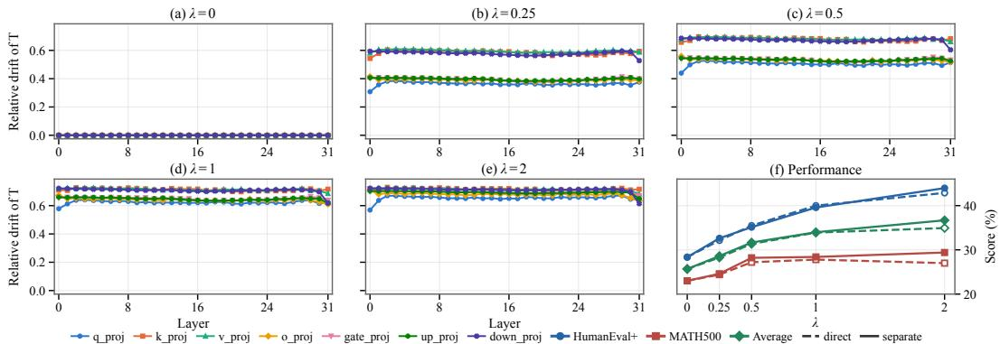
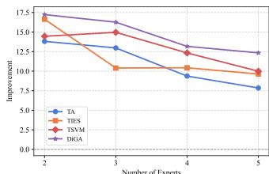
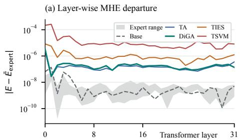
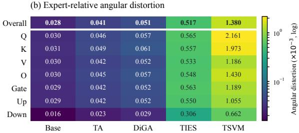
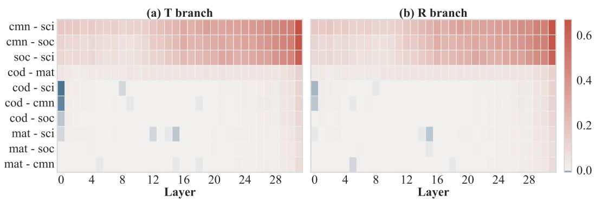
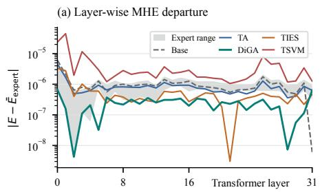
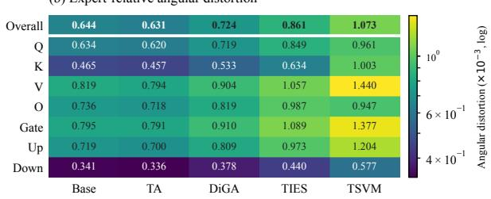

# ORTHOGONAL YET COUPLED: DECOUPLING GEO-METRIC COMPONENTS FOR MODEL MERGING

Zijing Wang1, Yongkang Liu1∗, Mingyang Wang2,3, Ercong Nie4, Mengjie Zhao1 Yunpu Ma2,3, Kang Liu1, Zihan Wang1, Shi Feng1, Daling Wang1∗, Hinrich Schutze¨ 2,3

1Northeastern University, China

2CIS, LMU Munich, Germany

3Munich Center for Machine Learning (MCML), Germany

4Shanghai Jiao Tong University, China

wzj1718@gmail.com

## ABSTRACT

Merging pretrained models has emerged as an effective approach for consolidating diverse capabilities into a single unified model. However, prevailing merging methods typically treat each task vector as an indivisible merging unit, overlooking the heterogeneous geometric changes encoded within it. This treatment can induce cross-component coupling: when merging decisions are derived from statistics of the complete task vector, the geometric characteristics of one component may influence how another is selected, weighted, or combined, potentially degrading the quality of the merged model. To address this issue, we propose DiGA, a Disentangled Geometry-Aware model merging framework. Using the pretrained weights as a shared geometric reference, DiGA orthogonally decomposes each task vector into components corresponding to distinct geometric attributes. Rather than merging the task vectors as a whole, DiGA aggregates corresponding components independently within their respective subspaces and subsequently recombines them into a unified update. This component-wise formulation preserves the geometric identity of each component and prevents the characteristics of one component from interfering with the aggregation of another. Furthermore, DiGA can be incorporated into a broad range of existing model merging methods. Extensive experiments across diverse models, tasks, and merging methods demonstrate that DiGA improves merged-model performance and reduces capability degradation. Our repository is on https://github.com/wzj1718/DiGA.

## 1 INTRODUCTION

Artificial General Intelligence (AGI) represents the ultimate goal of AI research, requiring models capable of performing a diverse range of tasks across various domains (Legg & Hutter, 2007; Bommasani et al., 2021; Wei & Heim, 2026). The computational cost of pre-training large models for AGI from scratch has become prohibitively high (Kaplan et al., 2020; Hoffmann et al., 2022). A promising alternative is to build upon existing pretrained models and develop specialized experts through fine-tuning, which can then be consolidated to acquire diverse capabilities. Model merging offers a scalable approach to consolidating domain-specific fine-tuned models into a single unified model without additional training (MitchellWortsman, 2022; Wang et al., 2025; Yang et al., 2026a).

Most existing model merging methods operate on task vectors (Ilharco et al., 2023; Huang et al., 2024; Chen et al., 2025), defined as the parameter differences between task-specific fine-tuned models and a shared pretrained model. Early approaches, such as Task Arithmetic (Ilharco et al., 2023), merge task-specific knowledge through linear combinations of task vectors, with scaling coefficients controlling their relative contributions. Subsequent methods improve upon direct superposition by sparsifying task vectors to retain task-relevant parameters (Yu et al., 2024), resolving conflicting up date signs across models (Yadav et al., 2023), or exploiting low-rank structures to selectively retain dominant update directions before aggregation (Lee et al., 2025; Stoica et al., 2025). Recent studies have further examined the geometric relationships among task vectors and leveraged orthogonality on the orthogonal-group manifold to alleviate interference during merging (Yang et al., 2026b).

Despite these advances, existing methods generally treat each task vector as a single, indivisible merging unit. This treatment implicitly assumes that all changes encoded in a task update can be handled by the same aggregation rule. However, a task vector may simultaneously encode multiple types of geometric changes relative to the pretrained parameters (Qiu et al., 2023; Ma et al., 2024). In particular, a task update can contain changes in orientation and structure. The former reorients the pretrained parameter structure, whereas the latter modifies its internal geometry or extends beyond it. Yet existing merging methods do not explicitly distinguish these effects, instead operating on the complete task vector as a single geometric object.

We argue that such treatment introduces a previously overlooked form of interference, which we term cross-component coupling. Many merging methods derive masks, weights, signs, normalization factors, or other aggregation decisions from statistics of the complete task vector. Consequently, the magnitude, direction, or distribution of one geometric component can alter the aggregation decisions applied to another, even when the two components occupy orthogonal subspaces. Geometrically distinct changes that should ideally be handled independently become coupled during merging. This source of interference is distinct from the commonly studied conflicts among task vectors from different experts: it arises within each task vector, before or during cross-model aggregation.

To address this issue, we propose DiGA, a Disentangled Geometry-Aware model merging framework. DiGA uses the pretrained model as a shared geometric reference and orthogonally decomposes each task vector into orientation and structural components. Instead of merging the original task vectors directly, DiGA aggregates the two component families independently within their respective subspaces and then recombines them into a unified update. By preventing the statistics of one component family from affecting the aggregation of another, DiGA explicitly eliminates crosscomponent coupling while retaining the original semantics of the underlying merging operator.

Contributions. (i) We identify cross-component coupling, a previously overlooked interference in model merging that arises when geometrically heterogeneous components within a task vector are jointly processed by the same aggregation decisions. (ii) We propose DiGA, which orthogonally decomposes each task vector into orientation and structural components, independently merges corresponding components within their respective subspaces, and subsequently recombines them into a unified update. (iii) We extensively evaluate DiGA across diverse models, tasks, and merging methods, demonstrating consistent improvements in merged-model performance and broad compatibility with existing merging frameworks.

## 2 BACKGROUND

## 2.1 TASK-VECTOR MERGING

Let $\theta _ { 0 }$ denote a pretrained model and $\{ \theta _ { i } \} _ { i = 1 } ^ { N }$ denote task-specific experts obtained by independently fine-tuning $\theta _ { 0 }$ . For a matrix parameter with base weight $W _ { 0 }$ and corresponding expert weight $W _ { i }$ we define the task update as

$$
\Delta _ { i } = { \cal W } _ { i } - { \cal W } _ { 0 } .\tag{1}
$$

Task-vector merging forms the merged weight by aggregating these updates:

$$
\boldsymbol { W ^ { \star } } = \boldsymbol { W _ { 0 } } + \mathcal { F } ( \{ \Delta _ { i } \} _ { i = 1 } ^ { N } ) ,\tag{2}
$$

where $\mathcal { F }$ denotes the merging operator. Although existing methods instantiate $\mathcal { F }$ differently, they generally treat each $\Delta _ { i }$ as a single and indivisible aggregation unit.

## 2.2 LIMITATIONS OF WHOLE-VECTOR AGGREGATION

Treating a task vector as a single aggregation unit implicitly assumes that all changes encoded within it can be processed under the same merging decisions. However, fine-tuning can induce heterogeneous geometric changes relative to the shared pretrained parameters. Some changes may primarily alter the orientation of the pretrained parameter structure, whereas others may modify its internal geometry or introduce variation beyond the pretrained structure.

Whole-vector aggregation does not explicitly distinguish these effects. This becomes particularly problematic for adaptive merging methods, whose masks, weights, sign decisions, normalization factors, or expert-selection rules are derived from statistics of the complete task update. Under such operators, the geometric characteristics associated with one type of change can affect how another type is aggregated. We refer to this phenomenon as cross-component coupling.

This observation motivates two questions: how can the heterogeneous geometric effects within a task update be explicitly disentangled, and how can they be merged without allowing the characteristics of one component to influence the treatment of another? We address these questions with DiGA.

## 3 METHODOLOGY

DiGA is a disentangled geometry-aware model merging framework that uses the pretrained model as a shared geometric reference. It first constructs an orthogonal decomposition of each task update into components with distinct geometric roles, then aggregates corresponding components independently within their respective subspaces, and finally recombines the resulting updates into a unified model.

## 3.1 GEOMETRIC DISENTANGLEMENT OF TASK UPDATES

Since all experts originate from the same pretrained model, the base weight provides a natural shared reference for characterizing their geometric changes. We use this reference to distinguish an orientation component, which captures structure-preserving changes in the orientation of the pretrained parameter frame, from a structural component, which captures changes that alter the internal geometry of the frame or extend beyond the pretrained parameter subspace.

For $W _ { 0 } \in \mathbb { R } ^ { m \times n }$ with $m \geq n$ and full column rank, its reduced QR factorization (Bjorck, 1967) is¨

$$
W _ { 0 } = Q H , \qquad Q ^ { \top } Q = I ,\tag{3}
$$

where $Q \in \mathbb { R } ^ { m \times n }$ has orthonormal columns spanning the column space of $W _ { 0 } ,$ , and $H \in \mathbb { R } ^ { n \times n }$ is an upper triangular matrix. The columns of $\dot { Q }$ provide a common coordinate frame for all expert updates. We take Q itself as the geometric anchor. Its in-frame tangent directions define a reference subspace for decomposing task updates.

The first-order directions associated with within-frame reorientation of the orthonormal frame $Q$ have the form $Q A$ , where the coordinate matrix A is skew-symmetric, i.e., $A ^ { \top } = - A$ (proof in Appendix E.1). These directions form the orientation subspace:

$$
{ \mathcal { T } } _ { Q } = \{ Q A : A ^ { \top } = - A \} .\tag{4}
$$

This subspace captures structure-preserving changes in the orientation of the pretrained parameter frame. To obtain an exact orthogonal decomposition of task updates, we pair $\tau _ { Q }$ with its orthogonal complement:

$$
\mathcal { R } _ { Q } = \mathcal { T } _ { Q } ^ { \perp } = \{ X \in \mathbb { R } ^ { m \times n } : Q ^ { \top } X \mathrm { i s ~ s y m m e t r i c } \} .\tag{5}
$$

Here, X denotes a change in the original parameter space, and $Q ^ { \top } X$ gives its coordinates within the reference frame. We refer to $\mathcal { R } _ { Q }$ as the structural subspace, as it captures changes that modify the internal geometry of the pretrained frame or introduce variation outside its span. The characterization of $\mathcal { R } _ { Q }$ in $\operatorname { E q . } \left( 5 \right)$ is proved in Appendix E.2.

The two subspaces impose different in-frame coordinate conditions: skew-symmetric for $\tau _ { Q }$ and symmetric for $\mathcal { R } _ { Q }$ . To obtain the corresponding components of a task update $\Delta _ { i } .$ , we therefore express its in-frame coordinates as $G _ { i } = Q ^ { \top } \Delta .$ and separate them into skew-symmetric and symmetric parts. This gives the unique orthogonal decomposition $G _ { i } = \mathrm { s k e w } ( G _ { i } ) \dot { + } \mathrm { s y m } ( G _ { i } )$ , where

$$
\operatorname { s k e w } ( G _ { i } ) = { \frac { G _ { i } - G _ { i } ^ { \top } } { 2 } } , \qquad \operatorname { s y m } ( G _ { i } ) = { \frac { G _ { i } + G _ { i } ^ { \top } } { 2 } } .\tag{6}
$$

Proposition 1 (Base-Induced Orthogonal Decomposition). For a fixed base frame $Q ,$ the matrix space admits the orthogonal direct sum

$$
\mathbb { R } ^ { m \times n } = \mathcal { T } _ { Q } \oplus ^ { \perp } \mathcal { R } _ { Q } .\tag{7}
$$

  
Figure 1: Cross-component coupling and performance in TIES-Merging. Using five OFT experts based on Llama-3.1-8B, we vary the structural contribution as $\Delta _ { i } ( \lambda ) ~ = ~ \bar { T } _ { i } + \lambda R _ { i }$ while keeping $T _ { i }$ fixed. (a–e) For each $\lambda ,$ , both routes use identical magnitude masks computed from the complete task updates. $T _ { \mathrm { m i x } } ( \lambda )$ applies the sign-election and expert-selection decisions computed from $\{ \Delta _ { i } ( \lambda ) \} _ { i = 1 } ^ { N }$ to the fixed orientation components, whereas $T _ { \mathrm { s e p } } ( \lambda )$ computes these decisions from $\{ T _ { i } \} _ { i = 1 } ^ { N }$ under the same masks. We report the layer-wise relative drift $\bar { \| } T _ { \mathrm { m i x } } ( \lambda ) - T _ { \mathrm { s e p } } ( \lambda ) \| _ { F } / \| T _ { \mathrm { s e p } } ( \bar { \lambda } ) \| _ { F } ^ { \star }$ . The increasing drift shows that the structural contribution alters how the fixed orientation components are aggregated. (f) Corresponding performance of direct and separate TIES merging across λ on HumanEval+ and MATH500, together with their arithmetic mean. Separate processing achieves a higher average at every tested nonzero λ.

Here, $\oplus ^ { \perp }$ denotes an orthogonal direct sum. Consequently, every task update has the unique decomposition

$$
\Delta _ { i } = T _ { i } + R _ { i } , \qquad T _ { i } = P _ { T _ { Q } } ( \Delta _ { i } ) , \quad R _ { i } = P _ { \mathcal { R } _ { Q } } ( \Delta _ { i } ) ,\tag{8}
$$

where $P _ { T _ { Q } }$ and $P _ { \mathcal { R } _ { Q } }$ denote orthogonal projections under the Frobenius inner product. Their closed forms are

$$
T _ { i } = Q \operatorname { s k e w } ( G _ { i } ) = Q \operatorname { s k e w } ( Q ^ { \top } \Delta _ { i } ) ,\tag{9}
$$

$$
R _ { i } = Q \operatorname { s y m } ( G _ { i } ) + ( I - Q Q ^ { \top } ) \Delta _ { i } .\tag{10}
$$

For any pair of experts i and j, this decomposition further gives

$$
\langle T _ { i } , R _ { j } \rangle _ { F } = 0 .\tag{11}
$$

The existence, uniqueness, and cross-component orthogonality of the decomposition are proved in Appendix E.3. For $m < n$ , we use the analogous row-space construction in Appendix E.4. We refer to $T _ { i }$ and $R _ { i }$ as the orientation component and structural component, respectively. In $R _ { i } , Q \operatorname { s y m } ( G _ { i } )$ captures within-frame structural deformation, while $( I - { \bar { Q } } Q ^ { \top } ) \Delta _ { i }$ captures variation beyond the pretrained parameter span. Because $Q$ is shared across experts, corresponding components lie in the same geometric subspaces. Both components are substantial: Appendix Table 8 reports average ratios $\| T _ { i } \| _ { F } / \| R _ { i } \| _ { F }$ of 0.809 for OFT and 0.520 for LoRA. Their orthogonality, however, does not guarantee independent processing by a merging operator.

## 3.2 CROSS-COMPONENT COUPLING

The decomposition above formalizes the limitation of whole-vector aggregation described in Section 2.2. For a fixed linear merger, decomposing each task update as $\Delta _ { i } = \bar { T } _ { i } + R _ { i }$ does not change the merged result, since linear aggregation distributes over the two components. This equivalence generally breaks for adaptive merging rules whose decisions depend on update statistics. By Proposition 1,

$$
\| \Delta _ { i } \| _ { F } ^ { 2 } = \| T _ { i } \| _ { F } ^ { 2 } + \| R _ { i } \| _ { F } ^ { 2 } , \qquad \langle \Delta _ { i } , \Delta _ { j } \rangle _ { F } = \langle T _ { i } , T _ { j } \rangle _ { F } + \langle R _ { i } , R _ { j } \rangle _ { F } .\tag{12}
$$

Thus, despite cross-component orthogonality, statistics of the complete task updates still mix information from both component families. When such statistics govern adaptive merging decisions, one component can influence how the other is selected, weighted, or combined, establishing the cross-component coupling described in Section 2.2.

TIES-Merging (Yadav et al., 2023) makes this dependence particularly visible. Its elected sign and retained expert set are determined from the complete task updates; consequently, changing $R _ { i }$ can change how a fixed $T _ { i }$ is aggregated. Figure 1 quantifies this effect through a controlled structural-strength sweep. As the contribution of $R _ { i }$ increases, the aggregation of the fixed $T _ { i }$ under whole-vector decisions increasingly drifts from its independently aggregated counterpart. The corresponding performance results further show that this coupling can affect the quality of the merged model. These observations motivate preserving component identity throughout the merging process.

## 3.3 COMPONENT-WISE AGGREGATION

To eliminate cross-component coupling, DiGA aggregates corresponding components independently within their respective geometric subspaces. Specifically, the same branch operator $\mathcal { G }$ is independently applied to the orientation and structural component families:

$$
\Delta _ { T } = \mathcal { G } \left( \{ T _ { i } \} _ { i = 1 } ^ { N } \right) , \qquad \Delta _ { R } = \mathcal { G } \left( \{ R _ { i } \} _ { i = 1 } ^ { N } \right) .\tag{13}
$$

The resulting component-wise updates are then recombined with the pretrained weight:

$$
\begin{array} { r } { W ^ { \star } = W _ { 0 } + \Delta _ { T } + \Delta _ { R } . } \end{array}\tag{14}
$$

Because $\mathcal { G }$ computes aggregation statistics independently within each component family, one family cannot affect the aggregation decisions of the other. Thus, DiGA preserves component identity and avoids cross-component coupling from whole-vector adaptive aggregation.

This disentangle–aggregate–recombine formulation is not tied to a specific merging rule: compatible operators can be applied independently to the two component families, as examined in Section 4.4. Beyond this general framework, DiGA instantiates $\mathcal { G }$ to account for directional redundancy, source strength, and directional consensus within each subspace. For notational convenience, let $\{ D _ { i } \} _ { i = 1 } ^ { N }$ denote either $\{ T _ { i } \} _ { i = 1 } ^ { N }$ or $\{ R _ { i } \} _ { i = 1 } ^ { N }$ . DiGA constructs a nonredundant aggregate direction while preserving source strengths, then calibrates its magnitude using directional consensus.

Redundancy-aware direction construction. Expert components within the same geometric subspace can overlap directionally, causing direct aggregation to repeatedly reinforce shared directions and distort the merged update. Prior work shows that such repeated aggregation can inflate dominant singular values and degrade performance (Li et al., 2026); Appendix Figure 4 also shows nontrivial cosine similarity within each component family. To reduce this redundancy while preserving source strength, we decompose each component into its norm $n _ { i }$ and unit orientation $u _ { i } \colon$

$$
n _ { i } = \| D _ { i } \| _ { F } , \qquad u _ { i } = \frac { D _ { i } } { n _ { i } } .\tag{15}
$$

We retain $n _ { i }$ and apply Gram–Schmidt orthogonalization only to the orientations. Let $\mathcal { A } _ { i } = \{ j <$ $i : \| r _ { j } \| _ { F } > \epsilon \}$ denote the directions retained before processing source i. We compute

$$
r _ { i } = u _ { i } - \sum _ { j \in \mathcal { A } _ { i } } \langle u _ { i } , e _ { j } \rangle _ { F } e _ { j } , \qquad e _ { i } = \frac { r _ { i } } { \| r _ { i } \| _ { F } } \operatorname { i f } \| r _ { i } \| _ { F } > \epsilon .\tag{16}
$$

Here, $r _ { i }$ is the part of $u _ { i }$ unexplained by previously retained directions. After processing all sources, let $\mathcal { A } = \{ i : \| \bar { r } _ { i } \| _ { F } > \epsilon \}$ denote the retained set. We then combine these directions using the original source norms:

$$
v = \sum _ { i \in \mathcal { A } } n _ { i } e _ { i } , \quad \quad \hat { v } = \frac { v } { \| v \| _ { F } } .\tag{17}
$$

The resulting vˆ is a nonredundant aggregate direction that preserves the relative influence of the original expert components. Numerical details and ordering sensitivity are reported in Appendix F.

Consensus-aware magnitude calibration. The unit direction $\hat { v }$ specifies the orientation of the component-wise update but does not determine how far the merged model should move along this direction. We use the mean source norm $\begin{array} { r } { \bar { n } = \frac { 1 } { N } \sum _ { i = 1 } ^ { N } n _ { i } } \end{array}$ as a reference adaptation scale.

Table 1: Performance of merging five Llama-3.1-8B experts adapted with LoRA or OFT.
<table><tr><td>Model</td><td></td><td>MATH500</td><td>HumanEval+</td><td>ScienceQA</td><td>CommonsenseQA</td><td>Social-IQA</td><td>Task Avg.</td><td>AGIEval</td><td>ARC-Avg</td><td>Transfer Avg.</td></tr><tr><td></td><td>Llama-3.1-8B</td><td>18.40</td><td>22.44</td><td>71.27</td><td>70.60</td><td>48.26</td><td>46.19</td><td>35.38</td><td>40.27</td><td>37.82</td></tr><tr><td rowspan="10"></td><td>Individual Experts</td><td>27.20</td><td>41.28</td><td>90.87</td><td>83.70</td><td>58.14</td><td>60.24</td><td></td><td></td><td></td></tr><tr><td>TA</td><td>26.60</td><td>38.48</td><td>86.47</td><td>80.43</td><td>54.40</td><td>57.28</td><td>38.27</td><td>43.00</td><td>40.64</td></tr><tr><td>OrthoMerge-C</td><td>25.60</td><td>37.74</td><td>86.69</td><td>80.10</td><td>54.35</td><td>56.90</td><td>38.43</td><td>43.04</td><td>40.74</td></tr><tr><td>OrthoMerge-G</td><td>24.60</td><td>38.66</td><td>86.42</td><td>79.69</td><td>54.66</td><td>56.81</td><td>37.47</td><td>41.33</td><td>39.40</td></tr><tr><td>TIES</td><td>27.60</td><td>41.59</td><td>83.45</td><td>80.59</td><td>56.19</td><td>57.88</td><td>38.05</td><td>42.92</td><td>40.49</td></tr><tr><td>OrthoMerge-C</td><td>27.20</td><td>43.05</td><td>83.86</td><td>81.16</td><td>58.24</td><td>58.70</td><td>37.72</td><td>42.50</td><td>40.11</td></tr><tr><td>OrthoMerge-G</td><td>24.60</td><td>38.54</td><td>84.08</td><td>79.85</td><td>56.40</td><td>56.69</td><td>36.90</td><td>41.12</td><td>39.01</td></tr><tr><td>TSVM</td><td>19.40</td><td>33.60</td><td>87.86</td><td>83.13</td><td>58.55</td><td>56.51</td><td>33.62</td><td>41.22</td><td>37.42</td></tr><tr><td>OrthoMerge-C OrthoMerge-G</td><td>19.80 21.80</td><td>31.59 41.04</td><td>88.04</td><td>83.13</td><td>58.44</td><td>56.20</td><td>34.26</td><td>41.54</td><td>37.90 38.85</td></tr><tr><td>DiGA</td><td>26.40</td><td>40.49</td><td>88.53 88.89</td><td>82.56 82.31</td><td>57.68 57.83</td><td>58.32 59.18</td><td>36.39 36.16</td><td>41.30 43.23</td><td>39.70</td></tr><tr><td rowspan="9"></td><td></td><td></td><td>38.78</td><td>91.28</td><td>82.56</td><td>56.76</td><td>59.32</td><td></td><td></td><td></td></tr><tr><td>Individual Experts TA</td><td>27.20 25.20</td><td>32.93</td><td></td><td>76.74</td><td>51.89</td><td>54.04</td><td>38.47</td><td>41.98</td><td>40.22</td></tr><tr><td>TIES</td><td>27.80</td><td></td><td>83.45</td><td></td><td>52.35</td><td>55.82</td><td>37.83</td><td></td><td>39.91</td></tr><tr><td>DARE</td><td>18.80</td><td>40.00 31.28</td><td>81.88</td><td>77.07 80.92</td><td>58.03</td><td>54.55</td><td>34.70</td><td>41.99 38.37</td><td>36.53</td></tr><tr><td></td><td>23.40</td><td>35.91</td><td>83.72 86.38</td><td>80.18</td><td>55.02</td><td>56.18</td><td>36.82</td><td>42.34</td><td>39.58</td></tr><tr><td>TSVM OrthoMerge</td><td>24.80</td><td>38.41</td><td>87.72</td><td>80.51</td><td>55.17</td><td>57.32</td><td>38.78</td><td>42.75</td><td>40.76</td></tr><tr><td></td><td>29.40</td><td>40.12</td><td>88.26</td><td>79.93</td><td>55.27</td><td></td><td></td><td></td><td></td></tr><tr><td>DiGA</td><td></td><td></td><td></td><td></td><td></td><td>58.60</td><td>38.97</td><td>42.86</td><td>40.92</td></tr></table>

Source strength alone, however, does not indicate whether the experts consistently support a common direction. We therefore measure directional consensus using the average pairwise cosine similarity of the original normalized components:

$$
\bar { c } = \frac { 1 } { N ( N - 1 ) } \sum _ { i \neq j } \langle u _ { i } , u _ { j } \rangle _ { F } .\tag{18}
$$

We compute c¯ before orthogonalization because the original overlap, although redundant when constructing the aggregate direction, provides the relevant signal of agreement among experts. We use the following parameter-free affine calibration:

$$
\gamma = ( 1 + { \bar { c } } ) { \bar { n } } .\tag{19}
$$

This is the simplest rule that retains the mean source scale when average similarity is zero, increases it under positive agreement, and attenuates it under negative agreement. Combining this magnitude with the aggregated direction gives

$$
\mathcal { G } \left( \{ D _ { i } \} _ { i = 1 } ^ { N } \right) = \gamma \hat { v } = ( 1 + \bar { c } ) \bar { n } \hat { v } .\tag{20}
$$

Applied independently to the orientation and structural component families, this operator yields $\Delta _ { T }$ and $\Delta _ { R }$ in Eq. (13). Their subsequent orthogonal recombination through Eq. (14) produces the final DiGA merged model.

## 4 EXPERIMENTS AND RESULTS

## 4.1 EXPERIMENTAL SETUP

We evaluate DiGA against representative data-free merging methods, including Task Arithmetic (TA) (Ilharco et al., 2023), TIES-Merging (Yadav et al., 2023), DARE (Yu et al., 2024), TSVM (Gargiulo et al., 2025), and OrthoMerge-C/G (Yang et al., 2026b), across both languageonly and vision-language settings. Our experiments cover parameter-efficient experts adapted with LoRA and OFT, fully fine-tuned language experts, and vision-language experts specialized in spatial reasoning, OCR, and medical multimodal reasoning. We apply DiGA to the two-dimensional attention and MLP projection matrices in each Transformer block, while parameters outside this decomposition are merged using TA. Evaluation covers the corresponding target capabilities together with transfer benchmarks where applicable.

We defer the complete experimental specifications to the appendix. Appendix A provides the expert models, task configurations, and detailed merging setup; Appendix B describes the evaluation benchmarks; Appendix C summarizes the compared merging methods; and Appendix D specifies the evaluation harnesses, decoding and scoring protocols, expert orderings, and configuration.

## 4.2 MAIN RESULTS

Language-only expert merging. Table 1 reports the results of merging five Llama-3.1-8B experts adapted with LoRA and OFT. DiGA obtains the highest target-task average in both settings, reaching 59.18% and 58.60%, respectively. These scores exceed the strongest corresponding baselines by 0.48 and 1.28 points and approach the individual-expert averages, with gaps of only 1.06 and 0.72 points. In the OFT setting, it obtains the strongest MATH500, HumanEval+, and ScienceQA results while remaining competitive on CommonsenseQA and Social-IQA. These gains persist across LoRA and OFT, suggesting that geometric disentanglement is not specific to a single adaptation scheme. DiGA also maintains transfer performance beyond the expert training domains. Its trans fer averages exceed the base-model average of 37.82% in both settings, and it achieves the highest ARC-Avg under both LoRA and OFT. This indicates that improved target-capability integration does not systematically trade off against the evaluated transfer performance.

Table 2: Merging five fully fine-tuned language experts from MergeBench.
<table><tr><td>Method</td><td>Multilingual</td><td>Coding</td><td>Math</td><td>Instruction</td><td>Safety</td><td>Avg</td></tr><tr><td>Llama-3.2-3B</td><td>34.10</td><td>27.09</td><td>28.35</td><td>6.84</td><td>32.58</td><td>25.79</td></tr><tr><td>Individual Experts</td><td>35.00</td><td>44.29</td><td>69.83</td><td>39.93</td><td>83.38</td><td>54.49</td></tr><tr><td>TA</td><td>35.20</td><td>37.55</td><td>40.56</td><td>10.91</td><td>41.12</td><td>33.07</td></tr><tr><td>OrthoMerge-C</td><td>35.20</td><td>37.32</td><td>39.73</td><td>9.61</td><td>41.00</td><td>32.57</td></tr><tr><td>OrthoMerge-G</td><td>34.90</td><td>38.32</td><td>43.75</td><td>13.31</td><td>43.19</td><td>34.69</td></tr><tr><td>TIES</td><td>35.20</td><td>40.42</td><td>56.18</td><td>26.43</td><td>44.70</td><td>40.59</td></tr><tr><td>OrthoMerge-C</td><td>35.10</td><td>40.45</td><td>55.27</td><td>22.55</td><td>43.98</td><td>39.47</td></tr><tr><td>OrthoMerge-G</td><td>34.90</td><td>39.39</td><td>51.48</td><td>22.74</td><td>42.53</td><td>38.21</td></tr><tr><td>TSVM</td><td>35.30</td><td>41.59</td><td>56.03</td><td>20.15</td><td>50.49</td><td>40.71</td></tr><tr><td>OrthoMerge-C</td><td>35.30</td><td>41.09</td><td>56.71</td><td>20.70</td><td>50.57</td><td>40.87</td></tr><tr><td>OrthoMerge-G</td><td>34.90</td><td>40.71</td><td>52.77</td><td>20.33</td><td>46.12</td><td>38.97</td></tr><tr><td>DiGA</td><td>35.20</td><td>41.34</td><td>55.22</td><td>25.32</td><td>48.37</td><td>41.09</td></tr></table>

Table 3: Merging three fully fine-tuned Qwen2.5-VL-7B-Instruct experts.
<table><tr><td>Method</td><td></td><td>OCRBench MMSI-Bench EmbSpatial MMMUMed PathVQA|</td><td></td><td></td><td></td><td>| Avg</td></tr><tr><td>Qwen2.5VL-7B-Instruct</td><td>84.40</td><td>27.90</td><td>69.45</td><td>53.33</td><td>66.54</td><td>|60.32</td></tr><tr><td>Individual Experts</td><td>84.60</td><td>34.20</td><td>70.16</td><td>54.67</td><td>66.72</td><td>|62.07</td></tr><tr><td>TA</td><td>84.50</td><td>29.60</td><td>70.80</td><td>50.00</td><td>66.12</td><td>|60.20</td></tr><tr><td>OrthoMerge-C</td><td>84.50</td><td>29.40</td><td>70.96</td><td>50.67</td><td>66.27</td><td>60.36</td></tr><tr><td>OrthoMerge-G</td><td>83.70</td><td>30.70</td><td>70.99</td><td>50.67</td><td>66.48</td><td>60.51</td></tr><tr><td>TIES</td><td>82.30</td><td>32.10</td><td>71.70</td><td>52.67</td><td>65.68</td><td>60.89</td></tr><tr><td>OrthoMerge-C</td><td>83.10</td><td>33.10</td><td>71.90</td><td>52.67</td><td>66.95</td><td>61.54</td></tr><tr><td>OrthoMerge-G</td><td>84.10</td><td>32.00</td><td>72.42</td><td>52.67</td><td>66.89</td><td>61.62</td></tr><tr><td>TSVM</td><td>83.30</td><td>31.00</td><td>72.09</td><td>51.33</td><td>67.55</td><td>61.05</td></tr><tr><td>OrthoMerge-C</td><td>83.30</td><td>31.50</td><td>71.90</td><td>52.00</td><td>67.22</td><td>61.18</td></tr><tr><td>OrthoMerge-G</td><td>83.30</td><td>32.10</td><td>72.31</td><td>53.33</td><td>67.28</td><td>61.66</td></tr><tr><td>DiGA</td><td>84.20</td><td>32.60</td><td>72.14</td><td>52.67</td><td>67.61</td><td>61.84</td></tr></table>

Table 4: Ablation study of DiGA in the five-expert OFT setting. Values in parentheses denote changes relative to the complete method.
<table><tr><td>Setting</td><td>MATH500</td><td>HumanEval+</td><td>ScienceQA</td><td>CommonsenseQA</td><td>Social-IQA</td><td>Task Avg.</td><td>Transfer Avg.</td></tr><tr><td>DiGA</td><td>29.40</td><td>40.12</td><td>88.26</td><td>79.93</td><td>55.27</td><td>58.60</td><td>40.92</td></tr><tr><td>T only</td><td>25.00 (-4.40)</td><td>28.29 (-11.83)</td><td>80.26 (-8.00)</td><td>75.35 (-4.58)</td><td>50.61 (-4.66)</td><td>51.90 (-6.70)</td><td>39.86 (-1.06)</td></tr><tr><td>R only</td><td>24.60 (-4.80)</td><td>35.24 (-4.88)</td><td>86.33 (-1.93)</td><td>78.62 (-1.31)</td><td>53.02 (-2.25)</td><td>55.56 (-3.04)</td><td>40.50 (-0.42)</td></tr><tr><td>Whole-vector aggregation</td><td>28.00 (-1.40)</td><td>40.00 (-0.12)</td><td>88.17 (-0.09)</td><td>79.93 (0.00)</td><td>55.12 (-0.15)</td><td>58.24 (-0.36)</td><td>40.86 (-0.06)</td></tr><tr><td>w/o redundancy removal</td><td>28.40 (-1.00)</td><td>38.60 (-1.52)</td><td>87.72 (-0.54)</td><td>80.75 (+0.82)</td><td>55.58 (+0.31)</td><td>58.21 (-0.39)</td><td>40.82 (-0.10)</td></tr><tr><td>w/o consensus calibration</td><td>28.20 (-1.20)</td><td>40.06 (-0.06)</td><td>88.31 (+0.05)</td><td>79.93 (0.00)</td><td>54.86 (-0.41)</td><td>58.27 (-0.33)</td><td>40.76 (-0.16)</td></tr><tr><td>w/o source magnitude</td><td>24.60 (-4.80)</td><td>34.39 (-5.73)</td><td>78.15 (-10.11)</td><td>81.90(+1.97)</td><td>56.86 (+1.59)</td><td>55.18 (-3.42)</td><td>39.97 (-0.95)</td></tr><tr><td>Symmetric orthogonalization</td><td>29.40 (0.00)</td><td>39.76 (-0.36)</td><td>86.51 (-1.75)</td><td>80.34 (+0.41)</td><td>55.12 (-0.15)</td><td>58.23 (-0.37)</td><td>40.71 (-0.21)</td></tr></table>

We next evaluate DiGA on the fully fine-tuned language experts from MergeBench. As shown in Table 2, DiGA obtains an overall average of 41.09%, compared with 40.87% for the strongest baseline. It remains competitive across all five capabilities, with strong results in coding and instruction following. Together with the LoRA/OFT results, these experiments show that the effectiveness of DiGA extends from parameter-efficient experts to fully fine-tuned language experts.

Vision-language expert merging. We further evaluate DiGA with three Qwen2.5-VL-7B-Instruct experts specialized in OCR, spatial reasoning, and medical multimodal reasoning. As shown in Table 3, DiGA reaches an average score of 61.84%, exceeding the base model by 1.52 points and the strongest compared baseline by 0.18 points. It also approaches the individual-expert average, with a gap of 0.23 points. DiGA achieves the highest PathVQA score of 67.61% and remains competitive on the other four benchmarks. These results show that the component-wise geometric treatment also remains effective in vision-language expert merging.

  
Figure 2: Performance gains over the base model with different numbers of OFT experts.

Scaling with the number of experts. Figure 2 compares performance gains over the base model when merging two to five OFT experts. DiGA achieves the largest gain at each expert count, with the largest advantage observed in the five-expert setting. These results show that the benefit of DiGA persists as the number of merged experts increases from two to five within this expert suite. Detailed results are reported in Appendix Tables 9, 10, 11, and 12.

Table 5: Generality and update-level effects of component-wise processing. Values in parentheses are changes relative to direct merging. Component-Separate applies the base merger independently to the orientation and structural families, while Component-Joint applies it jointly to all decomposed components. Update statistics are computed over the target matrices; per-task results are in Appendix Table 14. $\Delta _ { \mathrm { C o m p } }$ denotes the merged update under each componentprocessing mode. Norm ratio denotes $\| \Delta _ { \mathrm { C o m p } } \| _ { F } / \| \Delta _ { \mathrm { D i r e c t } } \| _ { F } ;$ relative distance denotes $\| \Delta _ { \mathrm { C o m p } } -$ $\bar { \Delta } _ { \mathrm { D i r e c t } } \| \bar { \boldsymbol { F } } / \| \Delta _ { \mathrm { D i r e c t } } \| _ { F } ;$ and zero fraction is the fraction of zero entries in $\Delta = W _ { \mathrm { m e r g e d } } - W _ { \mathrm { b a s e } } .$
<table><tr><td></td><td></td><td colspan="2">Performance</td><td colspan="4">Merged-update statistics</td></tr><tr><td>Base merger</td><td>Processing</td><td>Task Avg.</td><td>Transfer Avg.</td><td>Norm ratio</td><td>Zero frac. (Direct / Comp.)</td><td>Rel. dist.</td><td>Cosine</td></tr><tr><td>TIES</td><td>Component-Separate</td><td>56.08 (+0.26)</td><td>40.03 (+0.12)</td><td>0.989</td><td>0.0004 / 0.0278</td><td>0.592</td><td>0.823</td></tr><tr><td>DARE</td><td>Component-Separate</td><td>55.11 (+0.56)</td><td>36.66 (+0.13)</td><td>1.000</td><td>0.0232 / 0.0143</td><td>0.736</td><td>0.729</td></tr><tr><td>TSVM</td><td>Component-Separate</td><td>56.55 (+0.37)</td><td>40.02 (+0.44)</td><td>0.975</td><td>0.0203 / 0.0207</td><td>0.971</td><td>0.517</td></tr><tr><td>TSVM</td><td>Component-Joint</td><td>53.93 (−2.25)</td><td>40.17 (+0.59)</td><td>0.636</td><td>0.0203 / 0.0314</td><td>0.907</td><td>0.458</td></tr></table>

## 4.3 ABLATION STUDIES

Table 4 examines the contributions of geometric disentanglement and the component-wise aggregation design in the five-expert OFT setting.

Contribution of the two geometric components. Retaining only the orientation component (T only) reduces Task Avg. from 58.60 to 51.90, whereas retaining only the structural component (R only) yields 55.56, corresponding to drops of 6.70 and 3.04 points, respectively. These results show that both components contribute complementary task information, with the structural component accounting for a larger share of the retained performance.

Effect of component separation. We test the cross-component coupling hypothesis with Wholevector aggregation, which uses the same aggregation rule as DiGA but applies it to the complete task updates rather than separating the orientation and structural families. Whole-vector aggregation reduces Task Avg. from 58.60 to 58.24 and Transfer Avg. from 40.92 to 40.86. Although modest, the consistent degradation supports the benefit of preserving component identity during aggregation.

Aggregation design. Removing redundancy-aware orthogonalization reduces Task Avg. by 0.39 points, while removing consensus-aware magnitude calibration decreases it by 0.33 points. Removing source-magnitude weighting causes a larger 3.42-point drop, indicating that preserving component magnitudes is particularly important for constructing the aggregate direction. Replacing sequential Gram–Schmidt with order-independent symmetric orthogonalization yields 58.23, close to the full method. Together, these results support the proposed aggregation design.

## 4.4 COMPONENT SEPARATION AS A GENERAL MERGING PRINCIPLE

Generality across existing merging operators. We examine whether the merging principle of DiGA, separating each task update into orientation and structural components and merging the two families independently—can also benefit existing methods. We apply this principle to TIES, DARE, and TSVM by replacing $\mathcal { F } ( \{ \Delta _ { i } \} _ { i = 1 } ^ { N } )$ with $\mathcal { F } ( \{ \breve { T } _ { i } \} _ { i = 1 } ^ { N } ) + \mathcal { F } ( \{ R _ { i } \} _ { i = 1 } ^ { \bar { N } } )$ , while otherwise preserving the original merging procedure. As shown in Table 5, component separation improves both Task Avg. and Transfer Avg. for all three methods. The consistent improvements demonstrate that the idea of DiGA can be widely applied to other merging methods, highlighting its generality.

Preserving component identity is essential. We test whether decomposition alone is sufficient or whether the two component families must remain separated during aggregation. For TSVM, we compare Component-Joint, which jointly aggregates all decomposed components, with Component Separate, which aggregates the two families independently before recombination. Component-Separate improves Task Avg. by 0.37 points over TSVM, whereas Component-Joint decreases it by 2.25 points. Their 2.62-point gap shows that decomposition alone is insufficient; preserving component identity during aggregation is essential to avoid cross-component coupling.

Geometric characteristics of the merged update. We further examine how component separation alters the merged update. As shown in Table 5, the norm ratios remain close to one, while the component-separated solutions differ substantially in direction from their direct-merging counterparts. Thus, the gains cannot be explained by increased adaptation magnitude; component separation primarily changes the direction of the merged update, consistent with the proposed effect of avoiding cross-component coupling during aggregation.

  
Figure 3: Geometric effects of merging on OFT experts. (a) Layer-wise MHE departure from the expert regime. (b) Expert-relative angular distortion overall and across projection types.

## 4.5 GEOMETRIC EFFECTS OF MERGING

We examine how different merging strategies reshape the internal directional geometry of the resulting weights. Following Minimum Hyperspherical Energy (MHE) (Liu et al., 2018), we treat normalized row vectors of each attention and MLP projection matrix as points on a unit hypersphere. For each matrix, we compute its hyperspherical energy and report the layer-wise absolute deviation from the mean energy of the five OFT experts. Figure 3(a) shows that the experts occupy a narrow geometric regime, while merging methods depart from it to different extents.

We further compare the pairwise row-wise cosine structure of each merged matrix with that of the individual experts and average the absolute differences across experts and matrices. Figure 3(b) shows that closer alignment with expert geometry does not necessarily yield better merging performance. The base model and TA remain closer to the expert angular structures than DiGA but achieve lower OFT Task Avg., whereas TIES and TSVM introduce much larger distortions. DiGA lies between these extremes, achieving the strongest OFT Task Avg. while avoiding excessive disruption of the expert-induced directional structure. The same trend holds across attention and MLP projections. Similar effects are observed for LoRA experts in Appendix Figure 5.

These results suggest that effective merging does not simply preserve expert geometry as closely as possible. Rather, successful merging appears to require a controlled reorganization of the underlying directional structure, balancing geometric preservation with the flexibility needed to integrate multiple expert capabilities. More broadly, this suggests a promising direction for future model merging: designing objectives that distinguish geometry that should be preserved from geometry that can be adaptively reorganized, rather than treating geometric similarity itself as the optimization target.

## 5 RELATED WORK

Structure and Geometry of Model Adaptation. Prior work shows that downstream adaptation exhibits structured parameter changes, often within low-dimensional subspaces, motivating methods such as LoRA (Hu et al., 2022; Liu et al., 2026). Orthogonal fine-tuning models adaptation as rotations of pretrained weights that preserve pairwise angular relationships (Qiu et al., 2023; Liu et al., 2024a), while qGOFT relaxes this constraint to allow controlled changes in norms and angles (Ma et al., 2024). Building on these observations, we ask whether such directional-reorganization geom etry can be isolated within general task updates and exploited for model merging.

Model Merging. Model merging combines independently adapted models without joint retraining, from weight averaging (Wang et al., 2026b;c;a) and task arithmetic (Ilharco et al., 2023) to methods that mitigate interference through sparsification, sign resolution, parameter statistics, or adaptive weighting (Yadav et al., 2023; Yu et al., 2024; Jin et al., 2023; Yang et al., 2024). Recent approaches further exploit structured task representations: TSVM (Gargiulo et al., 2025) uses singular-vector representations with orthogonalization, while Iso-CTS (Marczak et al., 2025) models common and task-specific subspaces. In contrast, our work separates geometrically distinct components within each task update before aggregation.

## 6 CONCLUSION

We identify cross-component coupling as a previously overlooked source of interference in model merging and propose DiGA, which disentangles task updates into orthogonal orientation and structural components and merges them separately before recombination. Experiments across language and vision-language experts show that DiGA improves merged-model performance and reduces capability degradation. Results with existing merging methods further support component-wise processing as a general and reusable merging principle.

## AI USE STATEMENT

In this work, we used generative AI tools for improving the readability and language quality of the manuscript. All AI-assisted modifications were reviewed and verified by the authors. We take full responsibility for the final content of this work, including all text, claims, mathematical formulations, and experimental results.

## REPRODUCIBILITY STATEMENT

We provide an anonymous repository containing the implementation of DiGA, together with the merging algorithms, experimental scripts, and evaluation code used in this work. Detailed experimental settings, datasets, baselines, and implementation configurations are documented in Section 4.1 and the appendix. The appendix also provides the assumptions, derivations, and proofs for the base-induced orthogonal decomposition, cross-component orthogonality, and cross-component coupling analysis.

## REFERENCES

Loubna Ben Allal, Niklas Muennighoff, Logesh Kumar Umapathi, Ben Lipkin, and Leandro Von Werra. A framework for the evaluation of code generation models, 2022.

Jacob Austin, Augustus Odena, Maxwell Nye, Maarten Bosma, Henryk Michalewski, David Dohan, Ellen Jiang, Carrie Cai, Michael Terry, Quoc Le, et al. Program synthesis with large language models. arXiv preprint arXiv:2108.07732, 2021.

Shuai Bai, Keqin Chen, Xuejing Liu, Jialin Wang, Wenbin Ge, Sibo Song, Kai Dang, Peng Wang, Shijie Wang, Jun Tang, et al. Qwen2.5-vl technical report. arXiv preprint arXiv:2502.13923, 2025.

Stella Biderman, Hailey Schoelkopf, Lintang Sutawika, Leo Gao, Jonathan Tow, Baber Abbasi, Alham Fikri Aji, Pawan Sasanka Ammanamanchi, Sidney Black, Jordan Clive, et al. Lessons from the trenches on reproducible evaluation of language models. arXiv preprint arXiv:2405.14782, 2024.

Ake Bj ˚ orck. Solving linear least squares problems by gram-schmidt orthogonalization. ¨ BIT Numerical Mathematics, 7(1):1–21, 1967.

Rishi Bommasani, Drew A Hudson, Ehsan Adeli, Russ Altman, Simran Arora, Sydney von Arx, Michael S Bernstein, Jeannette Bohg, Antoine Bosselut, Emma Brunskill, et al. On the opportunities and risks of foundation models. arXiv preprint arXiv:2108.07258, 2021.

Zhongang Cai, Ruisi Wang, Chenyang Gu, Fanyi Pu, Junxiang Xu, Yubo Wang, Wanqi Yin, Zhitao Yang, Chen Wei, Tongxi Zhou, et al. Scaling spatial intelligence with multimodal foundation models. In Proceedings of the IEEE/CVF Conference on Computer Vision and Pattern Recognition, pp. 7879–7890, 2026.

Junying Chen, Ruyi Ouyang, Anningzhe Gao, Shunian Chen, Guiming Hardy Chen, Xidong Wang, Ruifei Zhang, Zhenyang Cai, Ke Ji, Guangjun Yu, et al. Huatuogptvision, towards injecting medical visual knowledge into multimodal llms at scale. corr, abs/2406.19280, 2024b. doi: 10.48550. arXiv preprint ARXIV.2406.19280, 2024.

Shiqi Chen, Jinghan Zhang, Tongyao Zhu, Wei Liu, Siyang Gao, Miao Xiong, Manling Li, and Junxian He. Bring reason to vision: Understanding perception and reasoning through model merging. In Forty-second International Conference on Machine Learning, 2025. URL https: //openreview.net/forum?id=ntCAP6tMoX.

Peter Clark, Isaac Cowhey, Oren Etzioni, Tushar Khot, Ashish Sabharwal, Carissa Schoenick, and Oyvind Tafjord. Think you have solved question answering? try arc, the ai2 reasoning challenge. arXiv preprint arXiv:1803.05457, 2018.

Karl Cobbe, Vineet Kosaraju, Mohammad Bavarian, Mark Chen, Heewoo Jun, Lukasz Kaiser, Matthias Plappert, Jerry Tworek, Jacob Hilton, Reiichiro Nakano, et al. Training verifiers to solve math word problems. arXiv preprint arXiv:2110.14168, 2021.

Mengfei Du, Binhao Wu, Zejun Li, Xuan-Jing Huang, and Zhongyu Wei. Embspatial-bench: Benchmarking spatial understanding for embodied tasks with large vision-language models. In Proceedings of the 62nd Annual Meeting of the Association for Computational Linguistics (Volume 2: Short Papers), pp. 346–355, 2024.

Antonio Andrea Gargiulo, Donato Crisostomi, Maria Sofia Bucarelli, Simone Scardapane, Fabrizio Silvestri, and Emanuele Rodola. Task singular vectors: Reducing task interference in model merging. In Proceedings of the Computer Vision and Pattern Recognition Conference, pp. 18695– 18705, 2025.

Aaron Grattafiori, Abhimanyu Dubey, Abhinav Jauhri, et al. The llama 3 herd of models. arXiv preprint arXiv:2407.21783, 2024.

Seungju Han, Kavel Rao, Allyson Ettinger, Liwei Jiang, Bill Yuchen Lin, Nathan Lambert, Yejin Choi, and Nouha Dziri. Wildguard: Open one-stop moderation tools for safety risks, jailbreaks, and refusals of llms. Advances in neural information processing systems, 37:8093–8131, 2024.

Xuehai He, Yichen Zhang, Luntian Mou, Eric Xing, and Pengtao Xie. Pathvqa: 30000+ questions for medical visual question answering. arXiv preprint arXiv:2003.10286, 2020.

Yifei He, Siqi Zeng, Yuzheng Hu, Rui Yang, Tong Zhang, and Han Zhao. Mergebench: A benchmark for merging domain-specialized llms. Advances in Neural Information Processing Systems, 38, 2026.

Dan Hendrycks, Collin Burns, Saurav Kadavath, Akul Arora, Steven Basart, Eric Tang, Dawn Song, and Jacob Steinhardt. Measuring mathematical problem solving with the math dataset. In Thirty-fifth Conference on Neural Information Processing Systems Datasets and Benchmarks Track (Round 2).

Jordan Hoffmann, Sebastian Borgeaud, Arthur Mensch, Elena Buchatskaya, Trevor Cai, Eliza Rutherford, Diego de Las Casas, Lisa Anne Hendricks, Johannes Welbl, Aidan Clark, et al. Training compute-optimal large language models. arXiv preprint arXiv:2203.15556, 2022.

Edward J. Hu, Yelong Shen, Phillip Wallis, Zeyuan Allen-Zhu, Yuanzhi Li, Shean Wang, Lu Wang, and Weizhu Chen. Lora: Low-rank adaptation of large language models. In International Conference on Learning Representations, 2022.

Chenyu Huang, Peng Ye, Tao Chen, Tong He, Xiangyu Yue, and Wanli Ouyang. Emr-merging: Tuning-free high-performance model merging. Advances in Neural Information Processing Systems, 37:122741–122769, 2024.

Gabriel Ilharco, Marco Tulio Ribeiro, Mitchell Wortsman, Suchin Gururangan, Ludwig Schmidt, Hannaneh Hajishirzi, and Ali Farhadi. Editing models with task arithmetic. In International Conference on Learning Representations, 2023.

Xisen Jin, Xiang Ren, Daniel Preotiuc-Pietro, and Pengxiang Cheng. Dataless knowledge fusion by merging weights of language models. In The Eleventh International Conference on Learning Representations, 2023. URL https://openreview.net/forum?id=FCnohuR6AnM.

Jared Kaplan, Sam McCandlish, Tom Henighan, Tom B Brown, Benjamin Chess, Rewon Child, Scott Gray, Alec Radford, Jeffrey Wu, and Dario Amodei. Scaling laws for neural language models. arXiv preprint arXiv:2001.08361, 2020.

Yu-Ang Lee, Ching-Yun Ko, Tejaswini Pedapati, I-Hsin Chung, Mi-Yen Yeh, and Pin-Yu Chen. Star: Spectral truncation and rescale for model merging. In Proceedings of the 2025 Conference ofthe Nations ofthe Americas Chapter ofthe Associationfor Computational Linguistics: Human Language Technologies (Volume 2: Short Papers), pp. 496–505, 2025.

Shane Legg and Marcus Hutter. Universal intelligence: A definition of machine intelligence. Minds and machines, 17(4):391–444, 2007.

Jia Li, Edward Beeching, Lewis Tunstall, Ben Lipkin, Roman Soletskyi, Shengyi Huang, Kashif Rasul, Longhui Yu, Albert Q Jiang, Ziju Shen, et al. Numinamath: The largest public dataset in ai4maths with 860k pairs of competition math problems and solutions. Hugging Face repository, 13(9):9, 2024.

Yayuan Li, Ze Peng, Jian Zhang, Jintao Guo, Yue Duan, and Yinghuan Shi. When shared knowledge hurts: Spectral over-accumulation in model merging. In Forty-third International Conference on Machine Learning, 2026. URL https://openreview.net/forum?id=WUjk3RVZyV.

Hunter Lightman, Vineet Kosaraju, Yuri Burda, Harrison Edwards, Bowen Baker, Teddy Lee, Jan Leike, John Schulman, Ilya Sutskever, and Karl Cobbe. Let’s verify step by step. In International Conference on Learning Representations, volume 2024, pp. 39578–39601, 2024.

Jiawei Liu, Chunqiu Steven Xia, Yuyao Wang, and Lingming Zhang. Is your code generated by chatgpt really correct? rigorous evaluation of large language models for code generation. Advances in neural information processing systems, 36:21558–21572, 2023.

Weiyang Liu, Rongmei Lin, Zhen Liu, Lixin Liu, Zhiding Yu, Bo Dai, and Le Song. Learning towards minimum hyperspherical energy. In S. Bengio, H. Wallach, H. Larochelle, K. Grauman, N. Cesa-Bianchi, and R. Garnett (eds.), Advances in Neural Information Processing Systems, volume 31. Curran Associates, Inc., 2018. URL https://proceedings.neurips.cc/paper\_files/paper/2018/file/ 177540c7bcb8db31697b601642eac8d4-Paper.pdf.

Weiyang Liu, Zeju Qiu, Yao Feng, Yuliang Xiu, Yuxuan Xue, Longhui Yu, Haiwen Feng, Zhen Liu, Juyeon Heo, Songyou Peng, et al. Parameter-efficient orthogonal finetuning via butterfly factorization. In International Conference on Learning Representations, volume 2024, pp. 38317– 38350, 2024a.

Yongkang Liu, Xing Li, Mengjie Zhao, Shanru Zhang, Zijing Wang, Qian Li, Shi Feng, Feiliang Ren, Daling Wang, and Hinrich Schutze. Smoa: Spectrum modulation adapter for parameter-¨ efficient fine-tuning. arXiv preprint arXiv:2605.21147, 2026.

Yuliang Liu, Zhang Li, Mingxin Huang, Biao Yang, Wenwen Yu, Chunyuan Li, Xu-Cheng Yin, Cheng-Lin Liu, Lianwen Jin, and Xiang Bai. Ocrbench: on the hidden mystery of ocr in large multimodal models. Science China Information Sciences, 67(12):220102, 2024b.

Pan Lu, Swaroop Mishra, Tanglin Xia, Liang Qiu, Kai-Wei Chang, Song-Chun Zhu, Oyvind Tafjord, Peter Clark, and Ashwin Kalyan. Learn to explain: Multimodal reasoning via thought chains for science question answering. Advances in neural information processing systems, 35:2507–2521, 2022.

Xinyu Ma, Xu Chu, Zhibang Yang, Yang Lin, Xin Gao, and Junfeng Zhao. Parameter efficient quasiorthogonal fine-tuning via givens rotation. In Forty-first International Conference on Machine Learning, 2024. URL https://openreview.net/forum?id=1zFkjbTgwC.

Daniel Marczak, Simone Magistri, Sebastian Cygert, Bartłomiej Twardowski, Andrew D. Bagdanov, and Joost van de Weijer. No task left behind: Isotropic model merging with common and taskspecific subspaces. In Forty-second International Conference on Machine Learning, 2025. URL https://openreview.net/forum?id=RBZpAa27ls.

Mantas Mazeika, Long Phan, Xuwang Yin, Andy Zou, Zifan Wang, Norman Mu, Elham Sakhaee, Nathaniel Li, Steven Basart, Bo Li, David Forsyth, and Dan Hendrycks. HarmBench: A standardized evaluation framework for automated red teaming and robust refusal. In Ruslan Salakhutdinov, Zico Kolter, Katherine Heller, Adrian Weller, Nuria Oliver, Jonathan Scarlett, and Felix Berkenkamp (eds.), Proceedings ofthe 41st International Conference on Machine Learning, volume 235 of Proceedings of Machine Learning Research, pp. 35181–35224. PMLR, 21–27 Jul 2024. URL https://proceedings.mlr.press/v235/mazeika24a.html.

Gabriel Ilharco MitchellWortsman. Model soups: averaging weights of multiple fine-tuned models improves accuracy without increasing inference time. In Proceedings of the 39th International Conference on Machine Learning, Baltimore, Maryland, 2022.

Jake Poznanski, Luca Soldaini, and Kyle Lo. olmocr 2: Unit test rewards for document ocr. arXiv preprint arXiv:2510.19817, 2025.

Zeju Qiu, Weiyang Liu, Haiwen Feng, Yuxuan Xue, Yujun Feng, Zhen Liu, Dan Zhang, Adrian Weller, and Bernhard Scholkopf. Controlling text-to-image diffusion by orthogonal finetuning.¨ Advances in Neural Information Processing Systems, 36:79320–79362, 2023.

Paul Rottger, Hannah Kirk, Bertie Vidgen, Giuseppe Attanasio, Federico Bianchi, and Dirk Hovy.¨ Xstest: A test suite for identifying exaggerated safety behaviours in large language models. In Proceedings of the 2024 Conference of the North American Chapter of the Association for Computational Linguistics: Human Language Technologies (Volume 1: Long Papers), pp. 5377–5400, 2024.

Maarten Sap, Hannah Rashkin, Derek Chen, Ronan Le Bras, and Yejin Choi. Social iqa: Commonsense reasoning about social interactions. In Proceedings of the 2019 conference on empirical methods in natural language processing and the 9th international joint conference on natural language processing (EMNLP-IJCNLP), pp. 4463–4473, 2019.

Xinyue Shen, Zeyuan Chen, Michael Backes, Yun Shen, and Yang Zhang. ” do anything now”: Characterizing and evaluating in-the-wild jailbreak prompts on large language models. In Proceedings of the 2024 on ACM SIGSAC Conference on Computer and Communications Security, pp. 1671–1685, 2024.

George Stoica, Pratik Ramesh, Boglarka Ecsedi, Leshem Choshen, and Judy Hoffman. Model merging with svd to tie the knots. In International Conference on Learning Representations, volume 2025, pp. 4501–4519, 2025.

Alon Talmor, Jonathan Herzig, Nicholas Lourie, and Jonathan Berant. Commonsenseqa: A question answering challenge targeting commonsense knowledge. In Proceedings of the 2019 Conference of the North American Chapter of the Association for Computational Linguistics: Human Language Technologies, Volume 1 (Long and Short Papers), pp. 4149–4158, 2019.

Zijing Wang, Yongkang Liu, Yingfeng Luo, Ming Wang, Zhen Song, Shi Feng, Xiaocui Yang, Dingyang Lin, Daling Wang, Yifei Zhang, et al. Scaling intelligence through model merging: A comprehensive survey. 2025.

Zijing Wang, Yongkang Liu, Mingyang Wang, Ercong Nie, Deyuan Chen, Zhengjie Zhao, Shi Feng, Daling Wang, Xiaocui Yang, Yifei Zhang, et al. Plam: Training-free plateau-guided model merging for better visual grounding in mllms. In Findings of the Association for Computational Linguistics: ACL 2026, pp. 21019–21035, 2026a.

Zijing Wang, Mingyang Wang, Ercong Nie, Yongkang Liu, Shi Feng, Mengjie Zhao, Daling Wang, Xiaocui Yang, and Hinrich Schutze. Dim ¨ \textsuperscript {3}: Bridging multilingual and multimodal models via direction-and magnitude-aware merging. arXiv preprint arXiv:2605.12960, 2026b.

Zijing Wang, Xingle Xu, Yongkang Liu, Yiqun Zhang, Peiqin Lin, Shi Feng, Daling Wang, Xiaocui Yang, and Hinrich Schutze. Why do more experts fail? a theoretical analysis of model merging. In¨ Proceedings ofthe 64th Annual Meeting ofthe Associationfor Computational Linguistics (Volume 1: Long Papers), pp. 45460–45482, 2026c.

Kevin Wei and Lennart Heim. Designing incident reporting systems for harms from general-purpose ai. In Proceedings of the AAAI Conference on Artificial Intelligence, volume 40, pp. 38016– 38029, 2026.

Yuxiang Wei, Zhe Wang, Jiawei Liu, Yifeng Ding, and Lingming Zhang. Magicoder: Empowering code generation with oss-instruct. In International Conference on Machine Learning, pp. 52632– 52657. PMLR, 2024.

Prateek Yadav, Derek Tam, Leshem Choshen, Colin Raffel, and Mohit Bansal. Ties-merging: Resolving interference when merging models. In Advances in Neural Information Processing Systems, 2023.

Enneng Yang, Zhenyi Wang, Li Shen, Shiwei Liu, Guibing Guo, Xingwei Wang, and Dacheng Tao. Adamerging: Adaptive model merging for multi-task learning. In International Conference on Learning Representations, volume 2024, pp. 22743–22763, 2024.

Enneng Yang, Li Shen, Guibing Guo, Xingwei Wang, Xiaochun Cao, Jie Zhang, and Dacheng Tao. Model merging in llms, mllms, and beyond: Methods, theories, applications, and opportunities. ACM Computing Surveys, 58(8):1–41, 2026a.

Sihan Yang, Runsen Xu, Yiman Xie, Sizhe Yang, Mo Li, Jingli Lin, Chenming Zhu, Xiaochen Chen, Haodong Duan, Xiangyu Yue, et al. Mmsi-bench: A benchmark for multi-image spatial intelligence. arXiv preprint arXiv:2505.23764, 2025.

Sihan Yang, Kexuan Shi, and Weiyang Liu. Orthogonal model merging. arXiv preprint arXiv:2602.05943, 2026b.

Le Yu, Bowen Yu, Haiyang Yu, Fei Huang, and Yongbin Li. Language models are super mario: Absorbing abilities from homologous models as a free lunch. In International Conference on Machine Learning, 2024.

Xiang Yue, Yuansheng Ni, Kai Zhang, Tianyu Zheng, Ruoqi Liu, Ge Zhang, Samuel Stevens, Dongfu Jiang, Weiming Ren, Yuxuan Sun, et al. Mmmu: A massive multi-discipline multimodal understanding and reasoning benchmark for expert agi. In Proceedings of the IEEE/CVF conference on computer vision and pattern recognition, pp. 9556–9567, 2024.

Kaichen Zhang, Bo Li, Peiyuan Zhang, Fanyi Pu, Joshua Adrian Cahyono, Kairui Hu, Shuai Liu, Yuanhan Zhang, Jingkang Yang, Chunyuan Li, et al. Lmms-eval: Reality check on the evaluation of large multimodal models. In Findings of the Association for Computational Linguistics: NAACL 2025, pp. 881–916, 2025.

Wanjun Zhong, Ruixiang Cui, Yiduo Guo, Yaobo Liang, Shuai Lu, Yanlin Wang, Amin Saied, Weizhu Chen, and Nan Duan. Agieval: A human-centric benchmark for evaluating foundation models. In Findings of the association for computational linguistics: NAACL 2024, pp. 2299– 2314, 2024.

Jeffrey Zhou, Tianjian Lu, Swaroop Mishra, Siddhartha Brahma, Sujoy Basu, Yi Luan, Denny Zhou, and Le Hou. Instruction-following evaluation for large language models. arXiv preprint arXiv:2311.07911, 2023.

## A EXPERIMENTAL SETUP

We compare DiGA with representative data-free merging methods, including Task Arithmetic (TA) (Ilharco et al., 2023), TIES-Merging (Yadav et al., 2023), DARE (Yu et al., 2024), Task Singular Vector Merging (TSVM) (Gargiulo et al., 2025), and the conflict-aware and global variants of OrthoMerge (Yang et al., 2026b), denoted OrthoMerge-C and OrthoMerge-G. Baseline merging coefficients follow the evaluation protocol of OrthoMerge and are fixed before test evaluation, with no tuning on the test sets. For DiGA, we apply the proposed decomposition to the two-dimensional attention and MLP projection matrices in each Transformer block. Parameters not covered by this matrix decomposition, such as embeddings, normalization parameters, and the language-model head, are merged using TA. Decoding and evaluation follow the standard protocol of each benchmark.

We evaluate DiGA across language-only and vision-language models, covering expert models obtained through parameter-efficient and full fine-tuning and spanning diverse specialized capabilities. Our experiments are designed to assess not only the overall merging performance of DiGA, but also whether its gains arise from the proposed component-wise geometric disentanglement and whether this principle generalizes across different merging operators.

## A.1 LANGUAGE-ONLY EXPERTS

Expert based on LoRA fine-tuning We first evaluate DiGA on language-only experts. For Llama-3.1-8B (Grattafiori et al., 2024), we use two matched suites of expert checkpoints from OrthoMerge (Yang et al., 2026b), adapted with LoRA and Orthogonal Finetuning (OFT), respectively. Each suite contains five experts specialized in code generation, mathematical reasoning, scientific question answering, commonsense reasoning, and social knowledge, trained on Magicoder-OSS-Instruct (Wei et al., 2024), NuminaMath-TIR (Li et al., 2024), ScienceQA (Lu et al., 2022), Com monsenseQA (Talmor et al., 2019), and Social-IQA (Sap et al., 2019), respectively. We evaluate these capabilities on HumanEval+ (Liu et al., 2023), MATH500 (Lightman et al., 2024), ScienceQA, CommonsenseQA, and Social-IQA. To assess transfer beyond the training domains, we also evaluate on AGIEval (Zhong et al., 2024) and ARC-Avg, the average accuracy over 12 machine-translated ARC-Challenge subsets (Clark et al., 2018). We report the macro averages over the five target-task benchmarks and the two transfer benchmarks as Task Avg. and Transfer Avg., respectively.

Expert based on full fine-tuning We evaluate fully fine-tuned experts from MergeBench (He et al., 2026) by merging five Llama-3.2-3B (Grattafiori et al., 2024) experts specialized in instruction following, mathematics, coding, multilinguality, and safety. Instruction following is evaluated on IFEval (Zhou et al., 2023), mathematics on GSM8K (Cobbe et al., 2021) with chain-ofthought prompting, coding on HumanEval+ (Liu et al., 2023) and MBPP+ (Austin et al., 2021), and multilinguality on ARC-Avg. Safety is evaluated on WildGuardTest (Han et al., 2024), Harm-Bench (Mazeika et al., 2024), XSTest (Rottger et al., 2024), and DoAnythingNow (Shen et al.,¨ 2024). For capabilities with multiple benchmarks, we first average their benchmark scores and then compute the macro average across the five capabilities.

## A.2 VISION-LANGUAGE EXPERTS

We further evaluate the proposed merging principle in a representative vision-language setting. Using Qwen2.5-VL-7B-Instruct (Bai et al., 2025) as the shared base model, we merge three experts specialized in spatial reasoning, optical character recognition, and medical multimodal reasoning: SenseNova-SI-1.1-Qwen2.5-VL-7B (Cai et al., 2026), olmOCR-2-7B-1025 (Poznanski et al., 2025), and HuatuoGPT-Vision-7B (Chen et al., 2024), respectively. Spatial reasoning is evaluated on MMSI-Bench (Yang et al., 2025) and EmbSpatial (Du et al., 2024), optical character recognition on OCRBench (Liu et al., 2024b), and medical multimodal reasoning on MMMU-Med (Yue et al., 2024) and PathVQA (He et al., 2020). We report the macro average across the five benchmarks.

## B BENCHMARKS

MATH500 (Lightman et al., 2024) is a mathematical reasoning benchmark derived from the MATH (Hendrycks et al.) dataset. It contains 500 challenging competition-level mathematics problems spanning seven subjects and evaluates models’ mathematical reasoning and problem-solving abilities.

HumanEval+ (Liu et al., 2023) extends HumanEval with substantially more test cases for each programming problem, providing a stricter assessment of the functional correctness of model-generated code.

ScienceQA (Lu et al., 2022) is a large-scale multiple-choice benchmark covering natural, social, and language science. We evaluate on image-free test examples using only the questions and answer choices, excluding hints, lectures, and explanations, and report answer accuracy.

CommonsenseQA (Talmor et al., 2019) is a multiple-choice question answering benchmark designed to evaluate commonsense knowledge and reasoning. It requires models to infer implicit relationships and leverage prior knowledge to answer questions.

Social-IQA (Sap et al., 2019) is a multiple-choice benchmark for social commonsense reasoning. It evaluates whether models can infer people’s intentions, reactions, and motivations in everyday social situations.

AGIEval (Zhong et al., 2024) is a bilingual, human-centric benchmark comprising questions from official admission and qualification examinations, as well as academic competitions, in both Chinese and English. We use the full benchmark to evaluate the out-of-domain generalization of merged models across diverse exam domains and both languages.

ARC-Avg denotes the average accuracy over 12 machine-translated variants of ARC-Challenge, the difficult subset of the AI2 Reasoning Challenge (ARC) (Clark et al., 2018), which comprises grade-school multiple-choice science questions requiring scientific knowledge and reasoning.

MBPP+ extends MBPP (Austin et al., 2021) with substantially expanded test cases for 399 curated tasks, enabling a more rigorous execution-based evaluation of functional correctness.

GSM8K (Cobbe et al., 2021) is a dataset of 8.5K linguistically diverse grade-school mathematics word problems that require multi-step reasoning using elementary arithmetic. We evaluate on its test set using 8-shot chain-of-thought prompting and final-answer exact-match accuracy.

IFEval (Zhou et al., 2023) evaluates the ability of language models to follow explicitly verifiable instructions. It contains approximately 500 prompts spanning 25 instruction types, with compliance automatically evaluated at both the prompt and instruction levels.

WildGuardTest (Han et al., 2024) is a human-annotated safety moderation benchmark containing 5,299 examples with labels for prompt harmfulness, response harmfulness, and response refusal. We use its harmful prompts to evaluate the harmfulness of model-generated responses.

HarmBench (Mazeika et al., 2024) is a standardized benchmark for evaluating automated red teaming and robust refusal against a diverse set of harmful behaviors. We use its textual behaviors directly as test prompts to measure attack success rates.

XSTest (Rottger et al., 2024) is a diagnostic benchmark for exaggerated safety behavior, compris- ¨ ing 250 safe prompts and 200 unsafe contrast prompts. It evaluates whether models appropriately comply with safe requests while refusing unsafe ones.

DoAnythingNow (Shen et al., 2024) evaluates model robustness against in-the-wild jailbreak attacks. It analyzes 1,405 jailbreak prompts and identifies 131 jailbreak communities exhibiting diverse attack strategies.

OCRBench (Liu et al., 2024b) is a comprehensive benchmark for evaluating the OCR capabilities of large multimodal models. It contains 1,000 manually verified question-answer pairs drawn from 29 datasets and covers text recognition, scene-text VQA, document-oriented VQA, key information extraction, and handwritten mathematical expression recognition.

MMSI-Bench (Yang et al., 2025) is a visual question answering benchmark for multi-image spatial intelligence. It contains 1,000 expert-constructed multiple-choice questions selected from a pool of more than 120,000 images and evaluates spatial grounding and reasoning across multiple views.

EmbSpatial-Bench (Du et al., 2024) evaluates spatial understanding in embodied environments. It is automatically derived from embodied scenes and covers six egocentric spatial relationships.

MMMU-medical (Yue et al., 2024) denotes the medical subset of MMMU, covering expert-level medical knowledge and multimodal reasoning. It requires models to interpret specialized visual information and answer domain-specific questions.

PathVQA (He et al., 2020) is a medical visual question answering benchmark containing 32,799 manually verified question-answer pairs over 4,998 pathology images collected from textbooks and digital libraries. It includes both yes/no and open-ended questions; in our experiments, we report accuracy on the yes/no subset.

## C MERGING METHODS

Task Arithmetic (TA) (Ilharco et al., 2023) represents each task by the parameter difference between a fine-tuned model and its base model, referred to as a task vector, and merges multiple task vectors through linear addition. It provides a simple additive baseline for model merging.

TIES-Merging (Yadav et al., 2023) mitigates interference between task vectors through three steps: trimming redundant parameters, electing the sign with the greatest total magnitude, and merging only the sign-consistent updates. It is designed to reduce destructive interference among taskspecific updates.

DARE (Yu et al., 2024) reduces task interference by randomly dropping a portion of parameters from each task vector and rescaling the remaining updates to preserve their expected magnitude. The resulting sparse task vectors are then merged using a standard merging strategy.

Task Singular Vector Merging (TSVM) (Gargiulo et al., 2025) exploits the matrix structure of task updates by decomposing them into singular vectors. It selects and combines task-specific singular components to reduce interference while preserving important update directions.

OrthoMerge (Yang et al., 2026b) argues that conventional Euclidean merging can destroy the intrinsic geometric structure of pretrained weights. It therefore performs merging on the Riemannian manifold of the orthogonal group by mapping orthogonal transformations to the Lie algebra, where they can be efficiently integrated while preserving their geometric structure.

## D EVALUATION

For evaluation, we follow the protocols used by OrthoMerge throughout all experiments. General text benchmarks evaluated with lm-evaluation-harness (Biderman et al., 2024) use greedy decoding for generation-based tasks and likelihood-based scoring for multiple-choice tasks. HumanEval+ and MBPP+ are evaluated separately with bigcode-evaluation-harness (Allal et al., 2022), using a temperature of 0.2 and generating 10 samples per problem. For safety evaluation, we use the Ai2 safety-eval framework on WildGuardTest, HarmBench, XSTest, and DoAnythingNow, with model responses judged by WildGuard under the default evaluation protocol. Vision-language benchmarks are evaluated with lmms-eval (Zhang et al., 2025) using the Qwen2.5-VL wrapper and greedy generation. Option-based tasks are scored from the answer letters generated by the model, whereas open-ended outputs are normalized and evaluated using the corresponding benchmark-specific postprocessing procedures.

We use a fixed expert ordering across all layers and both component branches within each experimental setting. For the LoRA and OFT settings, the ordering is Social-IQA, Magicoder, CommonsenseQA, NuminaMath, and ScienceQA. For the fully fine-tuned language setting, the ordering is Multilingual, Coding, Math, Instruction, and Safety. For the vision-language setting, the ordering is Optical Character Recognition, Spatial Reasoning, and Medical Multimodal Reasoning. All experiments were conducted on NVIDIA RTX A6000 GPUs with 48 GB of memory per GPU.

## E GEOMETRIC DERIVATION OF THE BASE-INDUCED ORTHOGONAL DECOMPOSITION

## E.1 WITHIN-FRAME REORIENTATION AND THE ORIENTATION COMPONENT

We derive the first-order geometry of within-frame reorientation and the closed-form projection of a task update onto the corresponding orientation subspace.

First-order geometry of within-frame reorientation. Consider a local in-frame change of the base-induced orthonormal frame Q. Its first-order form can be written as

$$
Q ^ { \prime } = Q + \varepsilon Q A + O ( \varepsilon ^ { 2 } ) ,\tag{21}
$$

where $\varepsilon$ denotes the magnitude of the local change and $A \in \mathbb { R } ^ { n \times n }$ describes how the directions within the frame are mixed. Requiring the perturbed frame to remain orthonormal gives

$$
\begin{array} { c } { { { Q ^ { \prime } } ^ { \top } Q ^ { \prime } = \left( Q + \varepsilon Q A \right) ^ { \top } \left( Q + \varepsilon Q A \right) + O ( \varepsilon ^ { 2 } ) } } \\ { { = I + \varepsilon \left( A ^ { \top } + A \right) + O ( \varepsilon ^ { 2 } ) . } } \end{array}\tag{22}
$$

Hence, preserving orthonormality to first order requires

$$
A ^ { \top } = - A .\tag{23}
$$

Thus, first-order reorientation within the base-induced frame is characterized by skew-symmetric coefficients.

Projection onto the orientation subspace. For an observed task update $\Delta _ { i }$ , the within-frame coordinates are $G _ { i } = Q ^ { \top } \Delta _ { i }$ . The update itself is not assumed to arise from an orthogonal transformation. Instead, we identify the part of $\Delta _ { i }$ that lies in the orientation subspace $\tau _ { Q }$ characterized above. Since these directions have the form $Q A$ with $A ^ { \top } = - A$ , this component is obtained from

$$
A _ { i } ^ { \star } = \arg \operatorname* { m i n } _ { A ^ { \top } = - A } \left\| \Delta _ { i } - Q A \right\| _ { F } ^ { 2 } .\tag{24}
$$

Using $\Delta _ { i } = Q Q ^ { \top } \Delta _ { i } + ( I - Q Q ^ { \top } ) \Delta _ { i }$ and $G _ { i } = Q ^ { \top } \Delta _ { i }$ , the objective becomes

$$
\left\| \Delta _ { i } - Q A \right\| _ { F } ^ { 2 } = \left\| G _ { i } - A \right\| _ { F } ^ { 2 } + \left\| ( I - Q Q ^ { \top } ) \Delta _ { i } \right\| _ { F } ^ { 2 } .\tag{25}
$$

The second term is independent of A, so the projection depends only on the within-frame coordinates $G _ { i }$ . Since

$$
G _ { i } = \mathrm { s k e w } ( G _ { i } ) + \mathrm { s y m } ( G _ { i } ) ,\tag{26}
$$

and the skew-symmetric and symmetric parts are orthogonal under the Frobenius inner product, the closest skew-symmetric matrix to $G _ { i }$ is

$$
A _ { i } ^ { \star } = \operatorname { s k e w } ( G _ { i } ) .\tag{27}
$$

The resulting projection of $\Delta _ { i }$ onto $\tau _ { Q }$ is therefore

$$
T _ { i } = Q A _ { i } ^ { \star } = Q \operatorname { s k e w } ( G _ { i } ) = Q \operatorname { s k e w } \left( Q ^ { \top } \Delta _ { i } \right) ,\tag{28}
$$

which gives the orthogonal projection of $\Delta _ { i }$ onto the orientation subspace $\tau _ { Q }$

## E.2 CHARACTERIZATION OF THE STRUCTURAL SUBSPACE

We characterize the orthogonal complement of $\tau _ { Q }$ and its within-frame and out-of-frame parts.

The orientation subspace $\mathcal { T } _ { Q } = \{ Q A : A ^ { \top } = - A \}$ is a linear subspace of $\mathbb { R } ^ { m \times n }$ . Under the Frobenius inner product, its orthogonal complement is

$$
\mathcal { T } _ { Q } ^ { \perp } = \{ X \in \mathbb { R } ^ { m \times n } : Q ^ { \top } X \mathrm  { i s } s y m m e t r i c \} = \mathcal { R } _ { Q } ,\tag{29}
$$

because $\langle X , Q A \rangle _ { F } = \langle Q ^ { \top } X , A \rangle _ { F }$ vanishes for every skew-symmetric A if and only if $Q ^ { \top } X$ is symmetric.

The internal structure of $\mathcal { R } _ { Q }$ follows by writing any $X \in \mathcal { R } _ { Q }$ as $X = Q ( Q ^ { \top } X ) + ( I - Q Q ^ { \top } ) X$ Since $S = Q ^ { \top } X$ is symmetric, the first term has the form $\it Q S$ , whereas the second is orthogonal to the column space of $Q$ . Conversely, any sum of these two forms has symmetric in-frame coordinates and therefore belongs to $\mathcal { R } _ { Q }$ . Hence,

$$
{ \mathcal { R } } _ { Q } = \{ Q S : S ^ { \top } = S \} \oplus ^ { \perp } \{ X : Q ^ { \top } X = 0 \} ,\tag{30}
$$

where the two subspaces are orthogonal because $\langle Q S , X \rangle _ { F } = \langle S , Q ^ { \top } X \rangle _ { F } = 0$ whenever $Q ^ { \top } X =$ 0.

## E.3 EXISTENCE, UNIQUENESS, AND CROSS-COMPONENT ORTHOGONALITY

We establish that every task update admits a unique decomposition into $T _ { i }$ and $R _ { i }$ , and that the two component families are orthogonal across experts, as stated in Proposition 1.

Existence of the decomposition. For any task update $\Delta _ { i } ,$ its coordinates in the base-induced frame are $G _ { i } = Q ^ { \top } \Delta _ { i }$ i. Using $I = Q Q ^ { \top } + \mathbf { \bar { ( } } I - Q \mathbf { \bar { ( } } Q ^ { \top } )$ ), we write

$$
\Delta _ { i } = Q G _ { i } + ( I - Q Q ^ { \top } ) \Delta _ { i } .\tag{31}
$$

Decomposing the coordinate matrix into its skew-symmetric and symmetric parts, $G _ { i } = \mathrm { s k e w } ( G _ { i } ) +$ sym $( \bar { G _ { i } } )$ , and substituting into Eq. (31) gives

$$
\Delta _ { i } = Q \operatorname { s k e w } ( G _ { i } ) + \left[ Q \operatorname { s y m } ( G _ { i } ) + ( I - Q Q ^ { \top } ) \Delta _ { i } \right] .\tag{32}
$$

Accordingly, define

$$
\begin{array} { r } { T _ { i } = Q \mathrm { s k e w } ( G _ { i } ) , \qquad R _ { i } = Q \mathrm { s y m } ( G _ { i } ) + ( I - Q Q ^ { \top } ) \Delta _ { i } . } \end{array}\tag{33}
$$

Because skew $\left( G _ { i } \right)$ is skew-symmetric, $T _ { i } \in \mathcal T _ { Q }$ . Moreover, since $Q ^ { \top } Q = I$ and $Q ^ { \top } ( I - Q Q ^ { \top } ) =$ $0 ,$

$$
Q ^ { \top } R _ { i } = \operatorname { s y m } ( G _ { i } ) ,\tag{34}
$$

which is symmetric. Hence $R _ { i } \in \mathcal R _ { Q }$ . Therefore, Eq. (32) gives a valid decomposition $\Delta _ { i } = T _ { i } + R _ { i }$ for every task update.

Uniqueness of the decomposition. Suppose that $\Delta _ { i }$ admits two decompositions,

$$
\Delta _ { i } = T _ { i } + R _ { i } = T _ { i } ^ { \prime } + R _ { i } ^ { \prime } ,\tag{35}
$$

with $T _ { i } , T _ { i } ^ { \prime } \in \mathcal { T } _ { Q }$ and $R _ { i } , R _ { i } ^ { \prime } \in \mathcal { R } _ { Q }$ . Rearranging gives

$$
E : = T _ { i } - T _ { i } ^ { \prime } = R _ { i } ^ { \prime } - R _ { i } .\tag{36}
$$

The left-hand side implies $E \in \mathcal { T } _ { Q }$ , while the right-hand side implies $E \in \mathcal { R } _ { Q } = \mathcal { T } _ { Q } ^ { \perp }$ . Thus $E$ is orthogonal to itself, so $\| E \| _ { F } ^ { 2 } = 0$ , and therefore $E = 0$ . It follows that $T _ { i } = T _ { i } ^ { \prime }$ and $R _ { i } = R _ { i } ^ { \prime }$ proving uniqueness.

Cross-component orthogonality. Because all experts share the same reference frame $Q ,$ their components lie in the same pair of orthogonal subspaces: $T _ { i } \in \mathcal { T } _ { Q } , R _ { j } \in \mathcal { R } _ { Q } = \mathcal { T } _ { Q } ^ { \perp }$ . Hence, for any pair of experts $i , j ,$

$$
\langle T _ { i } , R _ { j } \rangle _ { F } = 0 .\tag{37}
$$

Thus, the orientation and structural component families remain orthogonal even across different experts. Taking $j = i$ and using $\Delta _ { i } = T _ { i } \stackrel { \cdot } { + } R _ { i }$ yields

$$
\| \Delta _ { i } \| _ { F } ^ { 2 } = \| T _ { i } \| _ { F } ^ { 2 } + \| R _ { i } \| _ { F } ^ { 2 } .\tag{38}
$$

More generally, for any pair of experts $i , j$

$$
\langle \Delta _ { i } , \Delta _ { j } \rangle _ { F } = \langle T _ { i } , T _ { j } \rangle _ { F } + \langle R _ { i } , R _ { j } \rangle _ { F } ,\tag{39}
$$

because the cross terms $\langle T _ { i } , R _ { j } \rangle _ { F }$ and $\langle R _ { i } , T _ { j } \rangle _ { F }$ both vanish.

## E.4 WIDE-MATRIX CASE

For a full-row-rank weight $W _ { 0 } \in \mathbb { R } ^ { m \times n }$ with $m < n$ , we apply the column-space construction to $W _ { 0 } ^ { \top }$ using its reduced QR factorization:

$$
W _ { 0 } ^ { \top } = Q H , \qquad Q ^ { \top } Q = I ,\tag{40}
$$

where $Q \in \mathbb { R } ^ { n \times m }$ . The columns of $Q$ form an orthonormal frame for the row space of $W _ { 0 }$

For a task update $\Delta _ { i } \in \mathbb { R } ^ { m \times n }$ , its coordinates within this row-space frame are

$$
G _ { i } = \Delta _ { i } Q .\tag{41}
$$

Applying the projections derived above to $\Delta _ { i } ^ { \top }$ and transposing the results back gives

$$
T _ { i } = \mathrm { s k e w } ( G _ { i } ) Q ^ { \top } = \mathrm { s k e w } \left( \Delta _ { i } Q \right) Q ^ { \top } .\tag{42}
$$

The structural component is correspondingly

$$
R _ { i } = \Delta _ { i } - T _ { i }
$$

$$
= \operatorname { s y m } ( G _ { i } ) Q ^ { \top } + \Delta _ { i } \left( I - Q Q ^ { \top } \right) .\tag{43}
$$

Since transposition preserves the Frobenius inner product, the projection, uniqueness, and crosscomponent orthogonality results established in Appendices E.1–E.3 carry over directly to this rowspace construction.

## F DIGA ALGORITHM AND IMPLEMENTATION DETAILS

## F.1 MERGING PROCEDURE

Algorithm 1 DiGA for a Target Matrix Parameter   
Require: Base weight $W _ { 0 } ,$ , expert weights $\{ W _ { i } \} _ { i = 1 } ^ { N }$ , numerical tolerance ϵ   
Ensure: Merged weight $\dot { W } ^ { \star }$   
1: $\Delta _ { i }  W _ { i } ^ { \setminus } - W _ { 0 }$ for all i   
2: if rows $( W _ { 0 } ) \geq \mathrm { c o l s } ( W _ { 0 } )$ then   
$\begin{array} { r l } { : } & { { } Q , \dot { H } \longleftarrow \mathrm { Q R } ( W _ { 0 } ) ; \tilde { G _ { i } } \gets Q ^ { \top } \Delta _ { i } ; T _ { i } \gets Q \mathrm { s k e w } ( G _ { i } ) } \end{array}$   
4: else   
$\begin{array} { r l } { 5 \colon } & { { } Q , H \gets \mathrm { Q R } ( W _ { 0 } ^ { \top } ) ; G _ { i } \gets \Delta _ { i } Q ; T _ { i } \gets \mathrm { s k e w } ( G _ { i } ) Q ^ { \top } } \end{array}$   
6: end if   
7: $R _ { i } \gets \Delta _ { i } - T _ { i }$ for all i   
8: for $( b , \{ \tilde { D } _ { i } \} _ { i = 1 } ^ { N } ) \in \left\{ ( T , \{ T _ { i } \} _ { i = 1 } ^ { N } ) , ( R , \{ R _ { i } \} _ { i = 1 } ^ { N } ) \right\}$ do   
9: $n _ { i }  \| D _ { i } \| _ { F } , u _ { i }  D _ { i } / n _ { i }$ for all $i ; A \gets \emptyset$   
10: for $i = 1$ to N do   
11: $\begin{array} { r } { r _ { i }  u _ { i } - \sum _ { j \in \mathcal { A } } \langle u _ { i } , e _ { j } \rangle _ { F } e _ { j } } \end{array}$   
12: if $\| r _ { i } \| _ { F } > \epsilon$ then   
13: $\overset { \cdot } { e } _ { i } \overset { \cdot } {  } r _ { i } / \| r _ { i } \| _ { F } ; \mathcal { A }  \mathcal { A } \cup \{ i \}$   
14: end if   
15: end for   
16: $\textstyle v \gets \sum _ { i \in { \mathcal { A } } } n _ { i } e _ { i } ; \hat { v } \gets v / \| v \| _ { F }$   
17: $\begin{array} { r } { \bar { n }  \frac { 1 } { N } \sum _ { i } n _ { i } ; \bar { c }  \frac { 1 } { N ( N - 1 ) } \sum _ { i \neq j } \langle u _ { i } , u _ { j } \rangle _ { F } } \end{array}$   
18: $\Delta _ { b } \gets ( 1 + \bar { c } ) \bar { n } \hat { v }$   
19: end for   
20: $W ^ { \star }  W _ { 0 } + \Delta _ { T } + \Delta _ { R }$   
21: return $W ^ { \star }$

Numerical handling. We use a numerical tolerance of $\epsilon = 1 0 ^ { - 8 }$ in the Gram–Schmidt procedure. $\operatorname { I f } \| r _ { i } \| _ { F } \leq \epsilon ,$ the corresponding residual direction is treated as numerically redundant and omitted from the directional construction. To verify that the retained directions are not near-degenerate before normalization, Table 6 reports the distribution of the pre-normalization residual norms $\rho _ { i } =$ $\| r _ { i } \| _ { F }$ for OFT and $\operatorname { L o R A }$ . All measured residual norms exceed $1 0 ^ { - 1 }$ , and no direction is removed by the tolerance. This suggests that the normalization step operates away from the near-degenerate regime in these experiments.

Table 6: Distribution of pre-normalization Gram–Schmidt residual norms $\rho _ { i } = \| r _ { i } \| _ { F }$ in the fiveexpert OFT and LoRA settings. Each row summarizes 896 noninitial Gram–Schmidt steps across 224 target matrices using the expert ordering of the corresponding main experiment. Values are rounded to four decimal places.
<table><tr><td>Adapt.</td><td>Branch</td><td>Min.</td><td>1st pct.</td><td>5th pct.</td><td>Median</td></tr><tr><td>OFT</td><td>T</td><td>0.6330</td><td>0.7455</td><td>0.8803</td><td>0.9971</td></tr><tr><td>OFT</td><td>R</td><td>0.6390</td><td>0.7454</td><td>0.8815</td><td>0.9971</td></tr><tr><td>LoRA</td><td>T</td><td>0.8259</td><td>0.9264</td><td>0.9895</td><td>1.0000</td></tr><tr><td>LoRA</td><td>R</td><td>0.8369</td><td>0.9246</td><td>0.9909</td><td>1.0000</td></tr></table>

Table 7: Sensitivity of DiGA to all 5! = 120 expert orderings in the five-expert OFT setting. OrthoMerge is included as a baseline, while symmetric orthogonalization serves as an orderindependent reference. Mean and standard deviation are computed over all permutations.
<table><tr><td>Reference / Statistic</td><td>MATH500</td><td>HumanEval+</td><td>ScienceQA</td><td>CommonsenseQA</td><td>Social-IQA</td><td>Task Avg.</td><td>AGIEval</td><td>ARC-Avg</td><td>Transfer Avg.</td></tr><tr><td>OrthoMerge</td><td>24.80</td><td>38.41</td><td>87.72</td><td>80.51</td><td>55.17</td><td>57.32</td><td>38.78</td><td>42.75</td><td>40.76</td></tr><tr><td>Symmetric orthogonalization</td><td>29.40</td><td>39.76</td><td>86.51</td><td>80.34</td><td>55.12</td><td>58.23</td><td>38.59</td><td>42.83</td><td>40.71</td></tr><tr><td>Default order</td><td>29.40</td><td>40.12</td><td>88.26</td><td>79.93</td><td>55.27</td><td>58.60</td><td>38.97</td><td>42.86</td><td>40.92</td></tr><tr><td>Mean ± std</td><td>28.34 ± 0.85</td><td>39.84 ± 0.53</td><td>86.65 ± 1.29</td><td>80.29 ± 0.42</td><td>55.06 ± 0.18</td><td>58.03 ± 0.31</td><td>38.40 ± 0.43</td><td>42.88 ± 0.07</td><td>40.64 ± 0.23</td></tr><tr><td>Min-max</td><td>25.40–30.60</td><td>38.60-41.28</td><td>84.58-88.40</td><td>79.52–81.24</td><td>54.66-55.53</td><td>57.04–58.67</td><td>37.70-39.21</td><td>42.68-43.01</td><td>40.27-41.11</td></tr></table>

## F.2 SENSITIVITY TO EXPERT ORDERING

Sequential Gram–Schmidt removes from each expert direction the components already represented by preceding experts, making the resulting basis dependent on expert ordering. We therefore evaluate all 5! = 120 permutations of the five OFT experts. Table 7 reports the default ordering together with the mean, standard deviation, and range over all permutations. Complete per-order results are provided in Tables 15, 16 and 17, where code, math, science, comm, and social denote the Magicoder, NuminaMath, ScienceQA, CommonsenseQA, and Social-IQA experts, respectively.

The aggregate target-task performance is relatively stable across orderings, with a Task Avg. of 58.03 ± 0.31 and a range of 57.04–58.67. Moreover, 118 of the 120 orderings achieve a higher Task Avg. than OrthoMerge, showing that the improvement is not confined to a small subset of favorable permutations. Order sensitivity is more visible on individual benchmarks, particularly MATH500 and ScienceQA, but is reduced after averaging across the five target tasks. Transfer performance is similarly stable, with a Transfer Avg. of 40.64 ± 0.23 and a range of 40.27–41.11.

As an order-independent reference, we replace sequential Gram–Schmidt with symmetric orthogonalization while retaining the same component-wise aggregation procedure. This variant achieves a Task Avg. of 58.23 and a Transfer Avg. of 40.71, compared with 57.32 and 40.76 for OrthoMerge. These results indicate that expert ordering affects the specific solution produced by sequential Gram–Schmidt, while the overall target-task gains remain robust across orderings.

Table 8: Geometric statistics of the orientation and structural components for OFT and LoRA experts. $t / r$ denotes the norm ratio $\| T _ { i } \| _ { F } / \| R _ { i } \| _ { F }$ cos and cos denote the cosine similarities between the task update $\Delta _ { i }$ and its orientation component $T _ { i }$ and structural component $R _ { i } .$ , respectively, with $\theta _ { T }$ and $\theta _ { R }$ denoting the corresponding angles. $t _ { \mathrm { c o s } }$ denotes the cosine similarity between $T _ { i }$ and $R _ { i }$ . For each expert, all quantities are computed after flattening and concatenating the target weight matrices.
<table><tr><td rowspan="2">Model</td><td colspan="6">OFT</td><td colspan="6">LoRA</td></tr><tr><td> $t _ { \mathrm { c o s } }$ </td><td> $t / r$ </td><td>COST</td><td>COSR</td><td> $\theta _ { T }$ </td><td> $\theta _ { R }$ </td><td> $t _ { \mathrm { c o s } }$ </td><td> $t / r$ </td><td>COST</td><td>COSR</td><td> $\theta _ { T }$ </td><td> $\theta _ { R }$ </td></tr><tr><td>Commonsense</td><td>0.000015</td><td>0.773</td><td>0.611</td><td>0.791</td><td>52.304</td><td>37.695</td><td>0.000193</td><td>0.506</td><td>0.452</td><td>0.892</td><td>63.148</td><td>26.841</td></tr><tr><td>Magicoder</td><td>-0.000013</td><td>0.822</td><td>0.635</td><td>0.773</td><td>50.594</td><td>39.406</td><td>0.000007</td><td>0.531</td><td>0.469</td><td>0.883</td><td>62.024</td><td>27.975</td></tr><tr><td>NuminaMath</td><td>-0.000017</td><td>0.866</td><td>0.655</td><td>0.756</td><td>49.112</td><td>40.889</td><td>0.000009</td><td>0.508</td><td>0.453</td><td>0.892</td><td>63.087</td><td>26.912</td></tr><tr><td>ScienceQA</td><td>0.000024</td><td>0.776</td><td>0.613</td><td>0.790</td><td>52.178</td><td>37.821</td><td>0.000202</td><td>0.512</td><td>0.456</td><td>0.890</td><td>62.877</td><td>27.112</td></tr><tr><td>SocialIQA</td><td>-0.000003</td><td>0.807</td><td>0.628</td><td>0.778</td><td>51.104</td><td>38.897</td><td>0.000062</td><td>0.541</td><td>0.476</td><td>0.880</td><td>61.601</td><td>28.396</td></tr><tr><td>Average</td><td></td><td>0.809</td><td>0.628</td><td>0.778</td><td>51.058</td><td>38.942</td><td></td><td>0.520</td><td>0.461</td><td>0.887</td><td>62.547</td><td>27.447</td></tr></table>

  
Figure 4: Layer-wise pairwise cosine similarities among the orientation (a) and structural (b) com ponents of five OFT experts. For each expert pair and layer, cosine similarity is computed separately for each attention and MLP projection matrix and averaged across projections. Abbreviations denote commonsense (cmn), science (sci), social reasoning (soc), code generation (cod), and mathematics (mat).

  
Figure 5: Geometric effects of merging on LoRA experts. (a) Layer-wise MHE departure from the expert regime. (b) Expert-relative angular distortion overall and across projection types.

Table 9: Performance comparison on MATH500 and HumanEval+.
<table><tr><td>Model</td><td>MATH500</td><td>HumanEval+</td><td>Avg</td></tr><tr><td>Llama-3.1-8B</td><td>18.40%</td><td>22.44%</td><td>20.42%</td></tr><tr><td>Individual Experts</td><td>27.20%</td><td>38.78%</td><td>32.99%</td></tr><tr><td>TA</td><td>27.00%</td><td>41.46%</td><td>34.23%</td></tr><tr><td>TIES</td><td>30.40%</td><td>43.72%</td><td>37.06%</td></tr><tr><td>TSVM</td><td>26.40%</td><td>43.35%</td><td>34.88%</td></tr><tr><td>DiGA</td><td>28.40%</td><td>46.89%</td><td>37.65%</td></tr></table>

Table 10: Performance comparison on MATH500, HumanEval+, and ScienceQA.
<table><tr><td>Model</td><td>MATH500</td><td>HumanEval+</td><td>ScienceQA</td><td>Avg</td></tr><tr><td>Llama-3.1-8B</td><td>18.40%</td><td>22.44%</td><td>71.27%</td><td>37.37%</td></tr><tr><td>Individual Experts</td><td>27.20%</td><td>38.78%</td><td>91.28%</td><td>52.42%</td></tr><tr><td>TA</td><td>26.60%</td><td>36.46%</td><td>87.95%</td><td>50.34%</td></tr><tr><td>TIES</td><td>27.40%</td><td>41.22%</td><td>74.69%</td><td>47.77%</td></tr><tr><td>TSVM</td><td>26.80%</td><td>40.43%</td><td>89.75%</td><td>52.33%</td></tr><tr><td>DiGA</td><td>27.20%</td><td>42.87%</td><td>90.83%</td><td>53.63%</td></tr></table>

Table 11: Performance comparison on MATH500, HumanEval+, ScienceQA, and CommonsenseQA.
<table><tr><td>Model</td><td>MATH500</td><td>HumanEval+</td><td>ScienceQA</td><td>CommonsenseQA</td><td>Avg</td></tr><tr><td>Llama-3.1-8B</td><td>18.40%</td><td>22.44%</td><td>71.27%</td><td>70.60%</td><td>45.68%</td></tr><tr><td>Individual Experts</td><td>27.20%</td><td>38.78%</td><td>91.28%</td><td>82.56%</td><td>59.96%</td></tr><tr><td>TA</td><td>25.20%</td><td>33.11%</td><td>85.79%</td><td>76.09%</td><td>55.05%</td></tr><tr><td>TIES</td><td>27.40%</td><td>41.59%</td><td>80.53%</td><td>74.94%</td><td>56.12%</td></tr><tr><td>TSVM</td><td>24.00%</td><td>38.90%</td><td>89.52%</td><td>79.61%</td><td>58.01%</td></tr><tr><td>DiGA</td><td>26.60%</td><td>40.67%</td><td>88.94%</td><td>79.20%</td><td>58.85%</td></tr></table>

Table 12: Performance comparison on MATH500, HumanEval+, ScienceQA, CommonsenseQA, and Social-IQA.
<table><tr><td>Model</td><td>MATH500</td><td>HumanEval+</td><td>ScienceQA</td><td>CommonsenseQA</td><td>Social-IQA</td><td>Avg</td></tr><tr><td>Llama-3.1-8B Individual Experts</td><td>18.40%</td><td>22.44%</td><td>71.27%</td><td>70.60%</td><td>48.26%</td><td>46.19%</td></tr><tr><td></td><td>27.20%</td><td>38.78%</td><td>91.28%</td><td>82.56%</td><td>56.76%</td><td>59.32%</td></tr><tr><td>TA</td><td>25.20%</td><td>32.93%</td><td>83.45%</td><td>76.74%</td><td>51.89%</td><td>54.04%</td></tr><tr><td>TIES</td><td>27.80%</td><td>40.00%</td><td>81.88% 86.38%</td><td>77.07%</td><td>52.35%</td><td>55.82%</td></tr><tr><td>TSVM</td><td>23.40% 29.00%</td><td>35.91% 40.37%</td><td>88.22%</td><td>80.18% 79.93%</td><td>55.02%</td><td>56.18%</td></tr><tr><td>DiGA</td><td></td><td></td><td></td><td></td><td>55.12%</td><td>58.53%</td></tr></table>

Table 13: Per-benchmark safety results for fully fine-tuned language expert merging. Arrows indicate whether lower or higher values are preferred. Safety is the macro average after converting the lower-is-better metrics as 100 − score.
<table><tr><td>Model</td><td>WildGuardTest↓</td><td>HarmBench ↓</td><td>XSTest ↑</td><td>DoAnythingNow↓</td><td>Safety</td></tr><tr><td>Llama-3.2-3B</td><td>72.90</td><td>73.13</td><td>45.33</td><td>69.00</td><td>32.58</td></tr><tr><td>Individual Experts</td><td>13.75</td><td>10.94</td><td>67.20</td><td>9.00</td><td>83.38</td></tr><tr><td>TA</td><td>60.21</td><td>62.19</td><td>46.89</td><td>60.00</td><td>41.12</td></tr><tr><td>OrthoMerge-C</td><td>60.88</td><td>65.00</td><td>49.56</td><td>59.67</td><td>41.00</td></tr><tr><td>OrthoMerge-G</td><td>58.21</td><td>61.25</td><td>50.89</td><td>58.67</td><td>43.19</td></tr><tr><td>TIES</td><td>50.60</td><td>62.81</td><td>58.89</td><td>66.67</td><td>44.70</td></tr><tr><td>OrthoMerge-C</td><td>51.94</td><td>64.38</td><td>60.89</td><td>68.67</td><td>43.98</td></tr><tr><td>OrthoMerge-G</td><td>53.14</td><td>65.31</td><td>58.22</td><td>69.67</td><td>42.53</td></tr><tr><td>TSVM</td><td>47.13</td><td>63.13</td><td>62.22</td><td>50.00</td><td>50.49</td></tr><tr><td>OrthoMerge-C</td><td>47.13</td><td>62.81</td><td>60.89</td><td>48.67</td><td>50.57</td></tr><tr><td>OrthoMerge-G</td><td>51.00</td><td>60.31</td><td>55.78</td><td>60.00</td><td>46.12</td></tr><tr><td>DiGA</td><td>47.00</td><td>60.63</td><td>65.11</td><td>64.00</td><td>48.37</td></tr></table>

Table 14: Per-benchmark results for direct merging and component-separated processing in the fiveexpert OFT setting.
<table><tr><td>Method</td><td>MATH500</td><td>HumanEval+</td><td>ScienceQA</td><td>CommonsenseQA</td><td>Social-IQA</td><td>Task Avg.</td><td>AGIEval</td><td>ARC-Avg</td><td>Transfer Avg.</td></tr><tr><td>TIES</td><td>27.80</td><td>40.00</td><td>81.88</td><td>77.07</td><td>52.35</td><td>55.82</td><td>37.83</td><td>41.99</td><td>39.91</td></tr><tr><td>TIES (Comp.-Sep.)</td><td>28.40 (+0.60)</td><td>39.57 (-0.43)</td><td>81.70 (-0.18)</td><td>77.72 (+0.65)</td><td>53.02 (+0.67)</td><td>56.08 (+0.26)</td><td>38.10 (+0.27)</td><td>41.95 (-0.04)</td><td>40.03 (+0.12)</td></tr><tr><td>DARE</td><td>18.80</td><td>31.28</td><td>83.72</td><td>80.92</td><td>58.03</td><td>54.55</td><td>34.70</td><td>38.37</td><td>36.53</td></tr><tr><td>DARE (Comp.-Sep.)</td><td>19.60 (+0.80)</td><td>32.93 (+1.65)</td><td>83.72 (0.00)</td><td>81.08 (+0.16)</td><td>58.24 (+0.21)</td><td>55.11 (+0.56)</td><td>34.74 (+0.04)</td><td>38.58 (+0.21)</td><td>36.66 (+0.13)</td></tr><tr><td>TSVM</td><td>23.40</td><td>35.91</td><td>86.38</td><td>80.18</td><td>55.02</td><td>56.18</td><td>36.82</td><td>42.34</td><td>39.58</td></tr><tr><td>TSVM (Comp.-Sep.)</td><td>24.80 (+1.40)</td><td>36.59 (+0.68)</td><td>86.02 (-0.36)</td><td>80.02 (-0.16)</td><td>55.32 (+0.30)</td><td>56.55 (+0.37)</td><td>37.64 (+0.82)</td><td>42.40 (+0.06)</td><td>40.02 (+0.44)</td></tr><tr><td>TSVM (Comp.-Joint)</td><td>21.80</td><td>32.74</td><td>84.22</td><td>78.21</td><td>52.66</td><td>53.93</td><td>37.93</td><td>42.41</td><td>40.17</td></tr></table>

Table 15: Complete results for all 120 expert orderings in the five-expert OFT setting (Part 1 of 3).
<table><tr><td>Model</td><td colspan="5">MATH500 HUMANEVAL+ ScienceQA CommonsenseQA Social-IQA Task Avg.</td></tr><tr><td>perm000-code-comm-social-science-math</td><td>27.80%</td><td>39.39%</td><td>88.04%</td><td>79.77%</td><td>55.42% 58.08% 38.24% 42.91% 40.58%</td></tr><tr><td>perm001-social-comm-code-math-science</td><td>28.40%</td><td>39.39%</td><td>88.17%</td><td>80.18%</td><td>55.32%58.29% 38.97% 42.94% 40.96%</td></tr><tr><td>perm002-social-science-comm-math-code</td><td>28.80%</td><td>38.72%</td><td>86.69% 80.59%</td><td>55.17% 57.99% 38.86% 43.00%</td><td>40.93%</td></tr><tr><td>perm003-science-social-code-math-comm</td><td>28.80%</td><td>40.24%</td><td>84.76% 80.92%</td><td>54.81%</td><td>57.91% 38.46% 42.92% 40.69%</td></tr><tr><td>perm004-social-science-math-code-comm</td><td>27.40%</td><td>39.76%</td><td>86.65%</td><td>80.75%</td><td>54.86% 57.88% 38.72% 42.91% 40.82%</td></tr><tr><td>perm005-math-comm-code-social-science</td><td>28.60%</td><td>39.88%</td><td>87.95% 80.02%</td><td>55.12%</td><td>58.31% 38.20% 42.97% 40.58%</td></tr><tr><td>perm006-social-science-math-comm-code</td><td>27.60%</td><td>39.63%</td><td>86.47% 80.59%</td><td>55.02%</td><td>57.86% 38.90% 42.81% 40.86%</td></tr><tr><td>perm007-social-comm-math-science-code</td><td>27.40%</td><td>38.72%</td><td>88.08% 79.93%</td><td>55.42%57.91% 39.01% 43.00%</td><td>41.00%</td></tr><tr><td>perm008-science-code-math-comm-social</td><td>28.20%</td><td>40.30%</td><td>84.94% 80.34%</td><td>54.86% 57.73% 38.06% 42.81%</td><td>40.43%</td></tr><tr><td>perm009-science-comm-code-social-math</td><td>29.40%</td><td>39.76%</td><td>85.12%</td><td>80.18% 55.07%</td><td>57.91% 37.88% 42.89% 40.38%</td></tr><tr><td>perm010-math-science-social-comm-code</td><td>27.80%</td><td>39.70%</td><td>84.85% 81.16%</td><td>54.91% 57.68% 38.36% 42.90%</td><td>40.63%</td></tr><tr><td>perm011-social-math-code-science-comm</td><td>27.80%</td><td>40.49%</td><td>86.87% 80.51%</td><td></td><td>54.86%58.11% 39.01% 42.86% 40.94%</td></tr><tr><td>perm012-social-comm-science-code-math</td><td>27.00%</td><td>39.70%</td><td>88.04%</td><td>80.26% 55.17% 58.03% 38.80% 42.96%</td><td>40.88%</td></tr><tr><td>perm013-math-comm-social-code-science</td><td>27.20%</td><td>39.33%</td><td>88.13%</td><td>79.85%</td><td>55.22%57.95% 38.15% 42.84% 40.50%</td></tr><tr><td>perm014-code-social-science-math-comm</td><td>29.00%</td><td>39.57%</td><td>86.65%</td><td>80.75%</td><td>54.96% 58.19% 38.85% 42.90% 40.88%</td></tr><tr><td>perm015-comm-social-math-code-science</td><td>28.20%</td><td>39.27%</td><td>88.22%</td><td>79.69%</td><td>54.81%58.04% 38.12% 42.95% 40.53%</td></tr><tr><td>perm016-social-math-science-code-comm</td><td>28.00%</td><td>39.45%</td><td>86.65%</td><td>80.67%</td><td>54.91% 57.94% 38.86% 42.86% 40.86%</td></tr><tr><td>perm017-science-code-math-social-comm</td><td>27.60%</td><td>41.28%</td><td>84.71%</td><td>81.00%</td><td>54.91% 57.90% 38.59% 42.93% 40.76%</td></tr><tr><td>perm018-comm-code-social-science-math</td><td>28.80%</td><td>40.37%</td><td>88.08%</td><td>79.93%</td><td>55.17%58.47% 38.32% 42.93% 40.63%</td></tr><tr><td>perm019-comm-science-math-code-social</td><td>29.00%</td><td>39.88%</td><td>86.60%</td><td>80.02%</td><td>55.02%58.10% 37.94% 42.91% 40.43%</td></tr><tr><td>perm020-code-comm-social-math-science</td><td>29.20%</td><td>39.88%</td><td>87.95%</td><td>80.02% 55.02%</td><td>58.41% 38.17% 42.93% 40.55%</td></tr><tr><td>perm021-comm-social-code-science-math</td><td>29.00%</td><td>38.72%</td><td>87.81%</td><td>79.61%</td><td>55.37%58.10% 38.29% 42.93% 40.61%</td></tr><tr><td>perm022-science-code-comm-math-social</td><td>27.40%</td><td>40.85%</td><td>84.94%</td><td>80.34%</td><td>55.07%57.72% 37.99% 42.68% 40.34%</td></tr><tr><td>perm023-science-comm-code-math-social</td><td>27.80%</td><td>40.18%</td><td>85.07%</td><td>80.43%</td><td>54.91% 57.68% 38.00% 42.85% 40.43%</td></tr><tr><td>perm024-code-comm-math-science-social</td><td>28.80%</td><td>39.57%</td><td>86.65%</td><td>79.52%</td><td>55.07%57.92% 37.92% 42.82% 40.37%</td></tr><tr><td>perm025-code-math-comm-science-social</td><td>28.20%</td><td>39.27%</td><td>86.96%</td><td>80.18%</td><td>55.12%57.95% 37.87% 42.86% 40.37%</td></tr><tr><td>perm026-social-math-code-comm-science</td><td>29.40%</td><td>40.00%</td><td>88.17%</td><td>80.10%</td><td>55.17%58.57% 38.97% 42.90% 40.94%</td></tr><tr><td>perm027-comm-science-social-code-math</td><td>28.60%</td><td>40.18%</td><td>86.78%</td><td>80.10%</td><td>55.07% 58.15% 37.98% 42.92% 40.45%</td></tr><tr><td>perm028-math-code-social-comm-science</td><td>28.60%</td><td>39.33%</td><td>88.22%</td><td>79.93%</td><td>55.02%58.22% 39.15% 42.90% 41.03%</td></tr><tr><td>perm029-social-math-comm-code-science</td><td>29.20%</td><td>39.57%</td><td>88.26%</td><td>80.10%</td><td>55.37% 58.50% 38.87% 42.85% 40.86%</td></tr><tr><td>perm030-code-science-comm-social-math</td><td>28.40%</td><td>39.33%</td><td>85.21%</td><td>80.18%</td><td>55.07% 57.64% 37.95% 42.80% 40.38%</td></tr><tr><td>perm031-comm-code-science-math-social</td><td>28.40%</td><td>38.90%</td><td>86.74%</td><td>80.26%</td><td>55.32%57.92% 37.80% 42.85% 40.33%</td></tr><tr><td>perm032-math-social-science-comm-code</td><td>27.80%</td><td>39.94%</td><td>86.69%</td><td>80.67%</td><td>54.91%58.00% 38.81% 42.95% 40.88%</td></tr><tr><td>perm033-comm-code-social-math-science</td><td>29.00%</td><td>40.37%</td><td>88.08%</td><td>79.61%</td><td>55.07%58.43% 38.27% 42.86% 40.57%</td></tr><tr><td>perm034-comm-science-code-math-social</td><td>26.80%</td><td>39.57%</td><td>86.47%</td><td>79.93%</td><td>54.91%57.54% 37.93% 42.78% 40.36%</td></tr><tr><td>perm035-math-social-comm-science-code</td><td>28.00%</td><td>40.06%</td><td>88.13%</td><td>80.26%</td><td>55.27%58.34% 38.87% 42.90% 40.89%</td></tr><tr><td>perm036-comm-science-code-social-math</td><td>27.00%</td><td>39.82%</td><td>86.33%</td><td>79.93%</td><td>55.17%57.65% 37.92% 42.83% 40.38%</td></tr><tr><td>perm037-math-comm-science-code-social</td><td>28.40%</td><td>40.06%</td><td>86.87%</td><td>80.02%</td><td>55.22%58.11% 37.86% 42.85% 40.36%</td></tr><tr><td>perm038-comm-social-code-math-science</td><td>29.00%</td><td>39.82%</td><td>88.08%</td><td>80.02%</td><td>55.42% 58.47% 38.13% 42.78% 40.46%</td></tr><tr><td>perm039-math-social-comm-code-science</td><td>28.00%</td><td>40.79%</td><td>88.26%</td><td>80.26%</td><td>55.32%58.53% 38.84% 42.93% 40.89%</td></tr><tr><td>perm040-comm-math-science-social-code</td><td>28.00%</td><td>38.60%</td><td>86.92%</td><td>80.18%</td><td>55.02%57.74% 37.77% 42.82% 40.30%</td></tr><tr><td>perm041-comm-math-code-science-social</td><td>27.40%</td><td>39.45%</td><td>86.87%</td><td>80.10%</td><td>54.96%57.76% 37.81% 42.90% 40.36%</td></tr><tr><td>perm042-social-code-science-math-comm</td><td>28.40%</td><td>39.94%</td><td>86.78%</td><td>80.67%</td><td>54.81% 58.12% 38.79% 42.87% 40.83%</td></tr><tr><td>perm043-code-science-social-math-comm</td><td>28.60%</td><td>39.63%</td><td>85.03%</td><td>81.00% 54.81%</td><td>57.81% 38.51% 42.93% 40.72%</td></tr><tr><td>perm044-comm-social-math-science-code</td><td>28.00%</td><td>40.37%</td><td>87.86%</td><td>79.77% 55.32%</td><td>58.26% 37.99% 42.83% 40.41%</td></tr></table>

Table 16: Complete results for all 120 expert orderings in the five-expert OFT setting (Part 2 of 3).
<table><tr><td>Model</td><td colspan="5">MATH500 HUMANEVAL+ ScienceQA CommonsenseQA Social-IQA Task Avg. AGIEval ARC-Avg Transfer Avg.</td></tr><tr><td>perm045-comm-social-science-math-code</td><td>29.40%</td><td>39.94%</td><td>87.95%</td><td>79.93%</td><td>55.32% 58.51% 38.27% 42.96% 40.62%</td></tr><tr><td>perm046-code-science-social-comm-math</td><td>27.40%</td><td>40.18%</td><td>85.12%</td><td>80.84%</td><td>55.02% 57.71% 38.50% 42.87% 40.69%</td></tr><tr><td>perm047-math-social-science-code-comm</td><td>28.00%</td><td>39.94%</td><td>86.87%</td><td>80.92%</td><td>54.96% 58.14% 38.76% 42.92% 40.84%</td></tr><tr><td>perm048-science-code-comm-social-math</td><td>27.40%</td><td>40.18%</td><td>84.85%</td><td>80.34%</td><td>55.12%57.58% 37.95% 42.79% 40.37%</td></tr><tr><td>perm049-science-comm-social-code-math</td><td>28.80%</td><td>39.82%</td><td>85.12%</td><td>80.34%</td><td>54.76% 57.77% 37.92% 42.73% 40.33%</td></tr><tr><td>perm050-math-code-comm-social-science</td><td>28.40%</td><td>39.82%</td><td>88.04%</td><td>79.77%</td><td>55.22% 58.25% 38.20% 42.86% 40.53%</td></tr><tr><td>perm051-code-comm-math-social-science</td><td>28.20%</td><td>40.06%</td><td>87.95%</td><td>79.85%</td><td>55.27%58.27% 38.28% 42.93% 40.61%</td></tr><tr><td>perm052-comm-math-social-code-science</td><td>28.80%</td><td>39.94%</td><td>88.08%</td><td>79.85%</td><td>55.27% 58.39% 38.28% 42.88% 40.58%</td></tr><tr><td>perm053-social-science-code-math-comm</td><td>27.40%</td><td>40.12%</td><td>86.47%</td><td>80.75%</td><td>54.91%57.93% 38.85% 42.94% 40.90%</td></tr><tr><td>perm054-code-science-math-comm-social</td><td>27.20%</td><td>38.96%</td><td>85.07%</td><td>80.18%</td><td>54.96% 57.27% 38.00% 42.89% 40.45%</td></tr><tr><td>perm055-comm-code-math-science-social</td><td>29.40%</td><td>39.33%</td><td>86.78%</td><td>79.69%</td><td>55.02%58.04% 37.70% 42.84% 40.27%</td></tr><tr><td>perm056-science-social-comm-code-math</td><td>27.80%</td><td>39.82%</td><td>85.07%</td><td>81.00%</td><td>54.81% 57.70% 38.43% 42.88% 40.66%</td></tr><tr><td>perm057-math-science-code-comm-social</td><td>28.60%</td><td>41.22%</td><td>85.07%</td><td>80.26%</td><td>54.66% 57.96% 38.05% 42.83% 40.44%</td></tr><tr><td>perm058-code-math-social-comm-science</td><td>29.40%</td><td>39.45%</td><td>88.31%</td><td>80.10%</td><td>55.07% 58.47% 39.04% 42.90% 40.97%</td></tr><tr><td>perm059-science-math-code-social-comm</td><td>27.60%</td><td>39.57%</td><td>84.58%</td><td>81.08%</td><td>54.81% 57.53% 38.40% 42.82% 40.61%</td></tr><tr><td>perm060-social-code-math-comm-science</td><td>28.40%</td><td>39.88%</td><td>88.31%</td><td>79.61%</td><td>55.07% 58.25% 38.85% 42.84% 40.85%</td></tr><tr><td>perm061-social-code-math-science-comm</td><td>29.00%</td><td>40.24%</td><td>87.05%</td><td>80.51%</td><td>55.17% 58.39% 38.87% 42.92% 40.90%</td></tr><tr><td>perm062-math-social-code-comm-science</td><td>27.40%</td><td>39.94%</td><td>88.26%</td><td>80.10%</td><td>55.17%58.17% 38.92% 42.98% 40.95%</td></tr><tr><td>perm063-math-science-social-code-comm</td><td>29.00%</td><td>40.91%</td><td>84.85%</td><td>81.00%</td><td>55.02% 58.16% 38.46% 42.88% 40.67%</td></tr><tr><td>perm064-math-social-code-science-comm</td><td>29.20%</td><td>40.00%</td><td>86.87%</td><td>80.59%</td><td>55.02% 58.34% 38.95% 42.80% 40.88%</td></tr><tr><td>perm065-code-comm-science-math-social</td><td>28.20%</td><td>39.45%</td><td>86.87%</td><td>80.10%</td><td>55.12%57.95% 37.76% 42.88% 40.32%</td></tr><tr><td>perm066-social-code-comm-math-science</td><td>29.40%</td><td>40.12%</td><td>88.26%</td><td>79.93%</td><td>55.27%58.60% 38.97% 42.86% 40.92%</td></tr><tr><td>perm067-code-social-comm-science-math</td><td>28.60%</td><td>39.27%</td><td>88.22%</td><td>80.34%</td><td>55.17%58.32% 38.93% 42.86% 40.90%</td></tr><tr><td>perm068-comm-math-science-code-social</td><td>30.00%</td><td>39.76%</td><td>86.83%</td><td>80.18%</td><td>55.12%58.38% 37.80% 42.83% 40.32%</td></tr><tr><td>perm069-code-math-science-social-comm</td><td>28.20%</td><td>39.70%</td><td>85.21%</td><td>81.00%</td><td>54.81% 57.78% 38.72% 42.84% 40.78%</td></tr><tr><td>perm070-math-comm-social-science-code</td><td>27.00%</td><td>40.61%</td><td>88.08%</td><td>80.02%</td><td>54.96% 58.13% 38.33% 42.97% 40.65%</td></tr><tr><td>perm071-math-science-comm-code-social</td><td>30.20%</td><td>39.39%</td><td>85.25%</td><td>80.10%</td><td>55.02% 57.99% 38.12% 42.78% 40.45%</td></tr><tr><td>perm072-math-science-comm-social-code</td><td>29.60%</td><td>40.73%</td><td>85.30%</td><td>80.26%</td><td>55.07% 58.19% 37.91% 42.73% 40.32%</td></tr><tr><td>perm073-code-social-math-comm-science</td><td>30.60%</td><td>38.90%</td><td>88.22%</td><td>79.93%</td><td>55.27% 58.58% 39.20% 42.99% 41.10%</td></tr><tr><td>perm074-comm-code-math-social-science</td><td>29.00%</td><td>39.82%</td><td>87.99%</td><td>79.69%</td><td>55.22%58.34% 38.10% 42.93% 40.52%</td></tr><tr><td>perm075-science-code-social-comm-math</td><td>25.40%</td><td>38.96%</td><td>84.94%</td><td>80.92%</td><td>54.96% 57.04% 38.49% 42.78% 40.64%</td></tr><tr><td>perm076-science-comm-math-code-social</td><td>28.40%</td><td>39.94%</td><td>84.98%</td><td>80.34%</td><td>55.02% 57.74% 37.98% 42.88% 40.43%</td></tr><tr><td>perm077-science-social-comm-math-code</td><td>27.40%</td><td>40.30%</td><td>85.07%</td><td>81.00%</td><td>54.86% 57.73% 38.46% 42.97% 40.72%</td></tr><tr><td>perm078-science-code-social-math-comm</td><td>27.80%</td><td>39.15%</td><td>84.80%</td><td>81.00%</td><td>54.86%57.52% 38.58% 42.99% 40.79%</td></tr><tr><td>perm079-code-science-math-social-comm</td><td>28.00%</td><td>39.57%</td><td>84.98%</td><td>81.00%</td><td>54.76% 57.66% 38.53% 42.92% 40.73%</td></tr><tr><td>perm080-social-comm-code-science-math</td><td>28.80%</td><td>39.57%</td><td>88.22%</td><td>80.10%</td><td>55.37% 58.41% 38.92% 42.92% 40.92%</td></tr><tr><td>perm081-math-science-code-social-comm</td><td>28.60%</td><td>39.94%</td><td>84.98%</td><td>81.24%</td><td>55.00% 57.95% 38.41% 42.96% 40.69%</td></tr><tr><td>perm082-science-math-comm-code-social</td><td>28.40%</td><td>40.24%</td><td>85.07%</td><td>80.34%</td><td>55.07%57.82% 37.93% 42.75% 40.34%</td></tr><tr><td>perm083-code-science-comm-math-social</td><td>27.80%</td><td>40.12%</td><td>85.25%</td><td>80.26%</td><td>55.07%57.70% 38.03% 42.75% 40.39%</td></tr><tr><td>perm084-code-math-comm-social-science</td><td>30.40%</td><td>39.33%</td><td>88.17%</td><td>79.93%</td><td>55.53% 58.67% 38.45% 42.92% 40.69%</td></tr><tr><td>perm085-science-social-code-comm-math</td><td>27.00%</td><td>39.39%</td><td>84.89%</td><td>80.92%</td><td>54.91% 57.42% 38.50% 42.82% 40.66%</td></tr><tr><td>perm086-science-math-comm-social-code</td><td>28.20%</td><td>40.79%</td><td>84.98%</td><td>80.18%</td><td>55.12% 57.85% 38.13% 42.80% 40.47%</td></tr><tr><td>perm087-comm-math-social-science-code</td><td>26.80%</td><td>40.30%</td><td>87.95%</td><td>80.02%</td><td>55.07%58.03% 38.27% 42.93% 40.60%</td></tr><tr><td>perm088-science-comm-social-math-code</td><td>29.60%</td><td>40.18%</td><td>85.25%</td><td>80.10%</td><td>55.22% 58.07% 37.83% 42.88% 40.36%</td></tr><tr><td>perm089-comm-code-science-social-math</td><td>29.20%</td><td>39.82%</td><td>86.74%</td><td>79.93%</td><td>55.17% 58.17% 37.84% 42.93% 40.39%</td></tr></table>

Table 17: Complete results for all 120 expert orderings in the five-expert OFT setting (Part 3 of 3).
<table><tr><td rowspan=1 colspan=11>Model            MATH500HUMANEVAL+ScienceQACommonsenseQASocial-IQATask Avg.AGIEvalARC-AvgTransfer Avg.</td></tr><tr><td rowspan=2 colspan=11>perm090-science-math-social-comm-code27.20%  40.61% 84.67%  80.75%  54.76%57.60% 38.49% 42.85%40.67%perm091-social-comm-science-math-code</td></tr><tr><td rowspan=1 colspan=6>29.00% 39.88% 88.17% 80.10% 55.32%</td><td rowspan=1 colspan=4>58.49% 39.08% 42.99%41.04%</td></tr><tr><td rowspan=1 colspan=1>perm092-social-math-science-comm-code</td><td rowspan=1 colspan=6>28.00%  39.82% 86.96%  80.67%  54.76%5</td><td rowspan=1 colspan=3>8.04% 38.85% 43.01%</td><td rowspan=1 colspan=1>40.93%</td></tr><tr><td rowspan=1 colspan=1>perm093-social-science-code-comm-math</td><td rowspan=1 colspan=6>28.60%  40.24% 86.65%  80.51%  55.12%</td><td rowspan=1 colspan=3>58.22% 38.88% 42.99%</td><td rowspan=1 colspan=1>40.94%</td></tr><tr><td rowspan=1 colspan=1>perm094-math-code-comm-science-social</td><td rowspan=1 colspan=5>28.20%  39.94% 86.74%  79.93%</td><td rowspan=1 colspan=1>55.27%5</td><td rowspan=1 colspan=3>8.02% 37.82% 42.87%</td><td rowspan=1 colspan=1>40.35%</td></tr><tr><td rowspan=1 colspan=1>perm095-comm-science-social-math-code</td><td rowspan=1 colspan=1>27.60%</td><td rowspan=1 colspan=1>39.39%</td><td rowspan=1 colspan=3>86.65%  80.02%</td><td rowspan=1 colspan=1>55.07% 5</td><td rowspan=1 colspan=3>7.75% 37.86% 42.82%</td><td rowspan=1 colspan=1>40.34%</td></tr><tr><td rowspan=1 colspan=1>perm096-science-math-code-comm-social</td><td rowspan=1 colspan=1>29.80%</td><td rowspan=1 colspan=1>40.61%</td><td rowspan=1 colspan=3>84.89%  80.26%</td><td rowspan=1 colspan=1>55.07% 5</td><td rowspan=1 colspan=2>8.13% 37.99%</td><td rowspan=1 colspan=1>42.80%</td><td rowspan=1 colspan=1>40.40%</td></tr><tr><td rowspan=1 colspan=1>perm097-social-code-science-comm-math</td><td rowspan=1 colspan=1>27.20%</td><td rowspan=1 colspan=1>39.15%</td><td rowspan=1 colspan=2>86.78%</td><td rowspan=1 colspan=1>80.51%</td><td rowspan=1 colspan=1>54.91% 5</td><td rowspan=1 colspan=2>7.71% 38.85%</td><td rowspan=1 colspan=1>42.95%</td><td rowspan=1 colspan=1>40.90%</td></tr><tr><td rowspan=1 colspan=1>perm098-comm-social-science-code-math</td><td rowspan=1 colspan=1>28.20%</td><td rowspan=1 colspan=1>40.30%</td><td rowspan=1 colspan=2>87.90%</td><td rowspan=1 colspan=1>79.69%</td><td rowspan=1 colspan=1>55.27%58.27%</td><td rowspan=1 colspan=2>38.29%</td><td rowspan=1 colspan=1>42.77%</td><td rowspan=1 colspan=1>40.53%</td></tr><tr><td rowspan=1 colspan=1>perm099-math-code-science-social-comm</td><td rowspan=1 colspan=1>29.40%</td><td rowspan=1 colspan=1>38.84%</td><td rowspan=1 colspan=2>85.21%</td><td rowspan=1 colspan=1>80.80%</td><td rowspan=1 colspan=1>54.66%5</td><td rowspan=1 colspan=2>7.78% 38.45% 4</td><td rowspan=1 colspan=1>2.92%</td><td rowspan=1 colspan=1>40.69%</td></tr><tr><td rowspan=1 colspan=1>perm100-math-code-social-science-comm</td><td rowspan=1 colspan=1>28.00%</td><td rowspan=1 colspan=1>40.30%</td><td rowspan=1 colspan=3>86.96%  80.75%</td><td rowspan=1 colspan=1>54.91%5</td><td rowspan=1 colspan=2>8.18% 38.91%</td><td rowspan=1 colspan=1>42.92%</td><td rowspan=1 colspan=1>40.92%</td></tr><tr><td rowspan=1 colspan=1>perm101-science-math-social-code-comm</td><td rowspan=1 colspan=1>28.20%</td><td rowspan=1 colspan=1>40.79%</td><td rowspan=1 colspan=3>84.62%  81.00%</td><td rowspan=1 colspan=1>54.81% 5</td><td rowspan=1 colspan=2>7.88% 38.35%</td><td rowspan=1 colspan=1>42.93%</td><td rowspan=1 colspan=1>40.64%</td></tr><tr><td rowspan=1 colspan=1>perm102-science-social-math-comm-code</td><td rowspan=1 colspan=1>27.40%</td><td rowspan=1 colspan=1>39.76%</td><td rowspan=1 colspan=3>84.89%  80.59%</td><td rowspan=1 colspan=1>54.96% 5</td><td rowspan=1 colspan=2>7.52% 38.56% 4</td><td rowspan=1 colspan=1>2.79%</td><td rowspan=1 colspan=1>40.68%</td></tr><tr><td rowspan=1 colspan=1>perm103-code-math-science-comm-social</td><td rowspan=1 colspan=1>27.40%</td><td rowspan=1 colspan=1>39.94%</td><td rowspan=1 colspan=2>85.34%</td><td rowspan=1 colspan=1>80.18%</td><td rowspan=1 colspan=1>55.07% 5</td><td rowspan=1 colspan=2>7.59% 37.99%</td><td rowspan=1 colspan=1>42.80%</td><td rowspan=1 colspan=1>40.40%</td></tr><tr><td rowspan=1 colspan=1>perm104-comm-math-code-social-science</td><td rowspan=1 colspan=1>28.80%</td><td rowspan=1 colspan=1>39.27%</td><td rowspan=1 colspan=1>87.99%</td><td></td><td rowspan=1 colspan=1>79.85%</td><td rowspan=1 colspan=1>55.27%</td><td rowspan=1 colspan=1>58.24%</td><td rowspan=1 colspan=1>38.23%</td><td rowspan=1 colspan=1>42.92%</td><td rowspan=1 colspan=1>40.58%</td></tr><tr><td rowspan=1 colspan=1>perm105-social-code-comm-science-math</td><td rowspan=1 colspan=1>27.80%</td><td rowspan=1 colspan=1>39.45%</td><td rowspan=1 colspan=1>88.26%</td><td></td><td rowspan=1 colspan=1>79.93%</td><td rowspan=1 colspan=1>55.12%</td><td rowspan=1 colspan=1>58.11%</td><td rowspan=1 colspan=1>38.82%</td><td rowspan=1 colspan=1>42.93%</td><td rowspan=1 colspan=1>40.88%</td></tr><tr><td rowspan=1 colspan=1>perm106-code-comm-science-social-math</td><td rowspan=1 colspan=1>28.60%</td><td rowspan=1 colspan=1>39.57%</td><td rowspan=1 colspan=1>86.87%</td><td></td><td rowspan=1 colspan=1>79.93%</td><td rowspan=1 colspan=1>54.91%</td><td rowspan=1 colspan=1>57.98%</td><td rowspan=1 colspan=1>37.92%</td><td rowspan=1 colspan=1>42.83%</td><td rowspan=1 colspan=1>40.38%</td></tr><tr><td rowspan=1 colspan=1>perm107-comm-science-math-social-code</td><td rowspan=1 colspan=1>28.20%</td><td rowspan=1 colspan=1>40.06%</td><td rowspan=1 colspan=1>86.47%</td><td></td><td rowspan=1 colspan=1>79.93%</td><td rowspan=1 colspan=1>54.96%</td><td rowspan=1 colspan=1>57.92%</td><td rowspan=1 colspan=1>37.77%</td><td rowspan=1 colspan=1>42.86%</td><td rowspan=1 colspan=1>40.32%</td></tr><tr><td rowspan=1 colspan=1>perm108-science-comm-math-social-code</td><td rowspan=1 colspan=1>29.20%</td><td rowspan=1 colspan=1>40.12%</td><td rowspan=1 colspan=1>85.12%</td><td></td><td rowspan=1 colspan=1>80.10%</td><td rowspan=1 colspan=1>55.12%</td><td rowspan=1 colspan=1>57.93%</td><td rowspan=1 colspan=1>37.98%</td><td rowspan=1 colspan=1>42.86%</td><td rowspan=1 colspan=1>40.42%</td></tr><tr><td rowspan=1 colspan=1>perm109-social-comm-math-code-science</td><td rowspan=1 colspan=1>29.00%</td><td rowspan=1 colspan=1>39.57%</td><td rowspan=1 colspan=1>88.26%</td><td></td><td rowspan=1 colspan=1>80.02%</td><td rowspan=1 colspan=1>55.22%</td><td rowspan=1 colspan=1>58.41%</td><td rowspan=1 colspan=1>38.81%</td><td rowspan=1 colspan=1>42.90%</td><td rowspan=1 colspan=1>40.86%</td></tr><tr><td rowspan=1 colspan=1>perm110-code-social-math-science-comm</td><td rowspan=1 colspan=1>27.80%</td><td rowspan=1 colspan=1>39.70%</td><td rowspan=1 colspan=1>86.74%</td><td></td><td rowspan=1 colspan=1>80.75%</td><td rowspan=1 colspan=1>54.71%</td><td rowspan=1 colspan=1>57.94%</td><td rowspan=1 colspan=1>38.95%</td><td rowspan=1 colspan=1>42.90%</td><td rowspan=1 colspan=1>40.93%</td></tr><tr><td rowspan=1 colspan=1>perm111-science-social-math-code-comm</td><td rowspan=1 colspan=1>29.20%</td><td rowspan=1 colspan=1>39.94%</td><td rowspan=1 colspan=2>84.71%</td><td rowspan=1 colspan=1>80.84%</td><td rowspan=1 colspan=1>55.07% 5</td><td rowspan=1 colspan=2>7.95% 38.63%</td><td rowspan=1 colspan=1>42.82%</td><td rowspan=1 colspan=1>40.73%</td></tr><tr><td rowspan=1 colspan=1>perm112-code-social-science-comm-math</td><td rowspan=1 colspan=1>28.40%</td><td rowspan=1 colspan=1>40.12%</td><td rowspan=1 colspan=2>86.87%</td><td rowspan=1 colspan=1>80.75%</td><td rowspan=1 colspan=1>55.02% 5</td><td rowspan=1 colspan=2>8.23% 39.03%</td><td rowspan=1 colspan=1>42.86%</td><td rowspan=1 colspan=1>40.95%</td></tr><tr><td rowspan=1 colspan=1>perm113-math-code-science-comm-social</td><td rowspan=1 colspan=1>29.00%</td><td rowspan=1 colspan=1>40.37%</td><td rowspan=1 colspan=2>88.22%</td><td rowspan=1 colspan=1>79.93%</td><td rowspan=1 colspan=1>55.12%5</td><td rowspan=1 colspan=2>8.53% 38.01% 4</td><td rowspan=1 colspan=1>2.84%</td><td rowspan=1 colspan=1>40.43%</td></tr><tr><td rowspan=1 colspan=1>perm114-math-comm-code-science-social</td><td rowspan=1 colspan=1>27.00%</td><td rowspan=1 colspan=1>39.27%</td><td rowspan=1 colspan=2>86.78%</td><td rowspan=1 colspan=1>79.85%</td><td rowspan=1 colspan=1>55.07% 5</td><td rowspan=1 colspan=2>7.59% 37.82% 4</td><td rowspan=1 colspan=1>2.87%</td><td rowspan=1 colspan=1>40.35%</td></tr><tr><td rowspan=1 colspan=1>perm115-math-comm-science-social-code</td><td rowspan=1 colspan=1>29.40%</td><td rowspan=1 colspan=1>40.00%</td><td rowspan=1 colspan=2>86.65%</td><td rowspan=1 colspan=1>80.10%</td><td rowspan=1 colspan=1>55.02% 5</td><td rowspan=1 colspan=2>8.23% 37.98% 4</td><td rowspan=1 colspan=1>2.91%</td><td rowspan=1 colspan=1>40.45%</td></tr><tr><td rowspan=1 colspan=1>perm116-social-science-comm-code-math</td><td rowspan=1 colspan=1>28.00%</td><td rowspan=1 colspan=1>40.12%</td><td rowspan=1 colspan=2>86.51%</td><td rowspan=1 colspan=1>80.84%</td><td rowspan=1 colspan=1>55.07%5</td><td rowspan=1 colspan=2>8.11% 38.73%</td><td rowspan=1 colspan=1>42.92%</td><td rowspan=1 colspan=1>40.83%</td></tr><tr><td rowspan=1 colspan=1>perm117-code-math-social-science-comm</td><td rowspan=1 colspan=1>28.40%</td><td rowspan=1 colspan=1>40.12%</td><td rowspan=1 colspan=3>87.05%  80.84%</td><td rowspan=1 colspan=1>55.00%58.28%</td><td rowspan=1 colspan=2>39.13%</td><td rowspan=1 colspan=1>42.82%</td><td rowspan=1 colspan=1>40.98%</td></tr><tr><td rowspan=1 colspan=1>perm118-code-social-comm-math-science</td><td rowspan=1 colspan=1>29.00%</td><td rowspan=1 colspan=1>40.37%</td><td rowspan=1 colspan=3>88.26%  80.10%</td><td rowspan=1 colspan=1>55.07%5</td><td rowspan=1 colspan=2>8.56% 39.21% 4</td><td rowspan=1 colspan=1>3.00%</td><td rowspan=1 colspan=1>41.11%</td></tr><tr><td rowspan=1 colspan=1>perm119-social-math-comm-science-code</td><td rowspan=1 colspan=1>28.60%</td><td rowspan=1 colspan=1>38.90%</td><td rowspan=1 colspan=3>88.40%  79.93%</td><td rowspan=1 colspan=1>55.17% 5</td><td rowspan=1 colspan=3>8.20% 38.82% 42.99%</td><td rowspan=1 colspan=1>40.91%</td></tr></table>