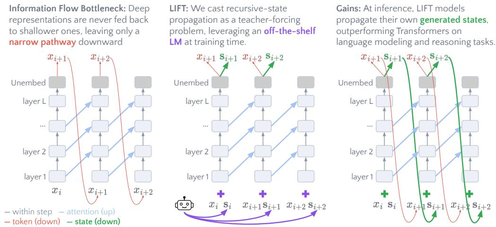
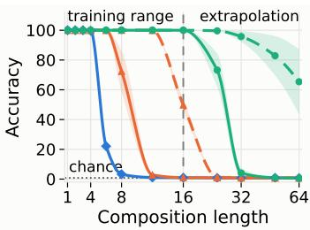
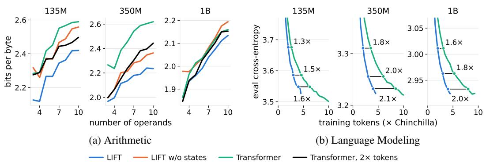
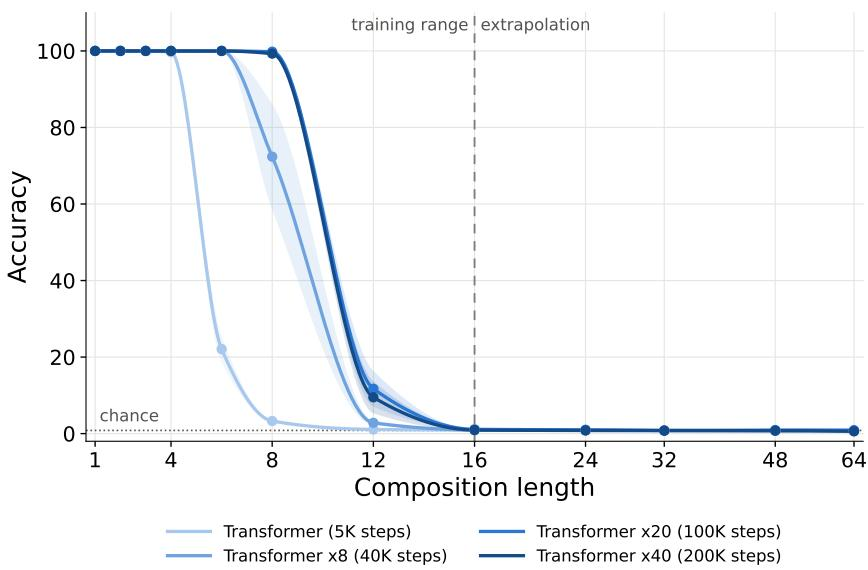
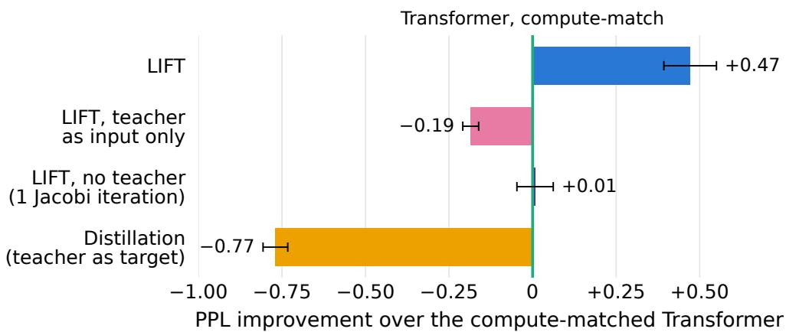
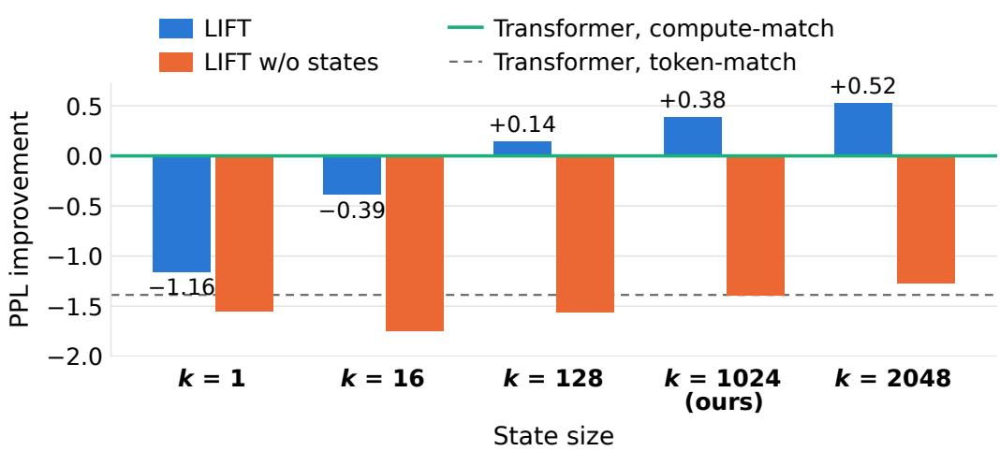
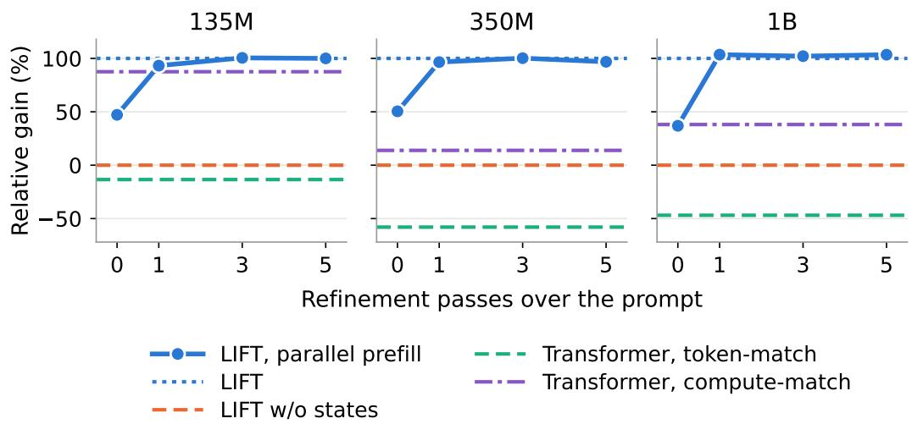

# PRETRAINING LATENT INFORMATION FEEDBACK TRANSFORMERS WITH TEACHER SUPERVISION

Dor Tirosh1 Ido Amos2 Mor Geva1

1Blavatnik School of Computer Science and AI, Tel Aviv University

2The Hebrew University of Jerusalem

{dortirosh@mail,morgeva@tauex}.tau.ac.il

## ABSTRACT

Transformer language models (LMs) are feed-forward: deep-layer representations are never fed back to shallower layers, and the only pathway for information to flow downward across generation steps is the decoded token. This narrow channel forces models to recompute intermediate results and to discard alternative continuations. In this work, we remove this bottleneck during pretraining, introducing the LIFT (Latent Information Feedback Transformer) architecture and training method which enable LMs to propagate state across generation. We achieve this by turning recurrent-state learning into a teacher-forced prediction problem: each input token is paired with an information-dense state, derived from the next-token distribution of an off-the-shelf pretrained LM. The model, extended with a small number of additional parameters, is then trained to predict both the next token and the next state. As the input states are precomputed, pretraining remains fully parallel across positions. At inference, the model’s own predicted states are fed back, with a minor computational overhead that decreases with model size. Experiments with pretrained models ranging from 135M to 1B parameters show that LIFT consistently outperforms standard Transformers and baselines on language modeling, downstream reasoning tasks, and procedural tasks under token-matched budget, while being on par with or ahead of compute-matched Transformers. Moreover, a controlled study on a state-tracking task shows that a tiny LIFT outperforms samesize Transformers trained on 8× more data, even when trained with the states of a Transformer that fails the task. Overall, we show that LMs can learn to exploit deep-to-shallow feedback during pretraining via scalable teacher supervision.1

## 1 INTRODUCTION

Scaling language models (LMs) has been driven by major improvements to the Transformer architecture (Fedus et al., 2022; DeepSeek-AI et al., 2024; Qiu et al., 2025). Still, the design is feedforward: deeper layer representations are never fed back to shallower ones. The only pathway through which information propagates “downward” is the decoded token. This creates a narrow communication channel that bottlenecks the computation, leading the model to recompute previous computations (Fan et al., 2021; Biran et al., 2024) or drop possible continuations (Zhu et al., 2025).

Several efforts have attempted to mitigate this bottleneck at post-training, by teaching models to generate compressed representations of their reasoning traces. During inference, these methods propagate a continuous hidden representation at each step instead of a single token (Hao et al., 2025; Shen et al., 2025; Wei et al., 2026). Although promising, such methods require expensive sequential latent rollouts during training, which may not suffice for rewiring the model to this new input distribution of richer continuous representations (Rizvi-Martel et al., 2026; Wu et al., 2026).

A natural question that arises is whether we can teach LMs to exploit such deep-to-shallow feedback at pretraining, while avoiding infeasible training costs resulting from sequential processing. Recent work tackles this by approximating full recurrence via Jacobi-style iterations, updating positions in parallel through multiple forward passes (Zeng et al., 2026a; Cai et al., 2026; Wang et al., 2026;

  
Figure 1: We remove the information flow bottleneck in Transformers (left) by introducing the LIFT architecture and pretraining approach (middle), which allows state propagation at inference (right).

Huang et al., 2026; Zhang & Ren, 2026). However, this approach has an inherent quality–efficiency tradeoff: a better approximation requires more iterations and thus more training cost.

In this work, we propose LIFT (Latent Information Feedback Transformer), an alternative approach for pretraining LMs with state propagation, which converts recurrent-state learning into a teacherforced prediction problem (Figure 1). During training, the model receives at every position a token $x _ { i }$ and state ${ \bf s } _ { i } ,$ and is trained to predict both the next token $x _ { i + 1 }$ and the next state $\mathbf { s } _ { i + 1 }$ . To keep training efficient, we capitalize on the prevalence of publicly available LMs and obtain states from next-token distributions of an external “teacher” model2 which runs in parallel on the same texts. At inference, the model feeds its own predicted states back through this channel, alongside it generated tokens. Importantly, the states used in training are informative from the first training step and produced independently of the trained model, preserving parallelism across sequence positions.

We evaluate LIFT through comprehensive experiments, demonstrating its added expressivity and consistent performance gains. First, we consider $S _ { 5 }$ permutation composition, a state-tracking task that fixed-depth Transformers cannot solve as sequence length N grows (Merrill et al., 2024). Training two-layer Transformer models on this task shows that, while a vanilla Transformer fails on sequences of $N \geq 1 2$ steps, LIFT models solve 12-step sequences (100% accuracy) even when the states come from a Transformer teacher that itself fails at that length (3%). Thus, the feedback channel lets a fixed-depth model solve longer sequences than a Transformer of the same depth can, and parallel training on fixed-depth Transformer states is sufficient for learning it.

Next, we pretrain LIFT LMs from 135M to 1B parameters, on up to 100B tokens at the 1B scale (about 5× the Chinchilla budget; Hoffmann et al., 2022), and evaluate them on language modeling and a wide suite of downstream benchmarks. Across evaluations, LIFT outperforms tokenmatched Transformers at every scale, as well as distillation and Jacobi-iteration feedback baselines, and is level with or ahead of compute-matched Transformers. The largest gains are on procedural tasks, such as multi-operand arithmetic and pattern continuation, where LIFT matches or beats a Transformer trained on $2 \times$ more tokens at every scale.

Overall, our work shows that Transformer LMs can learn to exploit deep-to-shallow feedback through efficient, fully parallel pretraining with teacher-forced states, improving both language modeling and reasoning. Our contributions can be summarized as follows:

• We introduce, to our knowledge, the first method for pretraining a Transformer LM with a teacher-forced latent feedback channel: a pretrained LM supplies the states during training, keeping training fully parallel, and the model generates its own states at inference.

• We develop LIFT, which uses next-token distributions as states, aligning state supervision with the model’s native prediction task.

• On a synthetic state-tracking task, we show that the feedback channel lets a fixed-depth LIFT solve the task at lengths where a Transformer of the same depth fails.

• We demonstrate the advantages of LIFT LMs of 135M to 1B parameters, which achieve better language modeling capabilities and downstream performance in token-matched and compute-matched settings, compared to a standard Transformer and to feedback variants.

## 2 INFORMATION FLOW BOTTLENECK IN TRANSFORMER LMS

Consider an L-layer autoregressive Transformer $\operatorname { L M } , p _ { \theta }$ , with hidden dimension d and vocabulary V (Vaswani et al., 2017). For an input sequence of tokens $x _ { 1 } , \ldots , x _ { n }$ , let $\mathbf { h } _ { i } ^ { \ell } \in \mathbb { R } ^ { d }$ denote the representation at position i after layer ℓ, with ${ \bf h } _ { i } ^ { 0 }$ being the input token embedding. At each position, the output projection $U \in \mathbb { R } ^ { | \nu | \times d }$ produces the next-token distribution:

$$
\mathbf { p } _ { i } = \mathrm { s o f t m a x } ( \mathbf { o } _ { i } ) ; \mathbf { o } _ { i } = U \mathbf { h } _ { i } ^ { L } ,\tag{1}
$$

where $\mathbf { o } _ { i }$ are the logits. At inference, information moves across positions via two channels:

Attention channel:

$$
{ \bf h } _ { i \leq j } ^ { \ell }  { \bf h } _ { j } ^ { \ell + 1 }
$$

Token feedback channel:

$$
{ \bf h } _ { i } ^ { L }  { \bf p } _ { i }  x _ { i + 1 }  { \bf h } _ { i + 1 } ^ { 0 } .\tag{2}
$$

Communication upward is mediated by attention, which lets later positions $j > i$ read the representation at a previous position i. Token feedback is the only way to move information downward; a representation can influence a shallower hidden representation in subsequent steps only at decoding time, and only by encoding information in the current position’s output, which re-enters as input in the next step. Crucially, this channel is extremely narrow, limited to a single decoded token $x _ { i + 1 }$ which can carry at most $\log _ { 2 } { \left| \mathcal { V } \right| }$ bits of information (≈ 17 bits for $| \mathcal { V } | = 1 \tilde { 0 0 } \small { , } 0 0 0 )$ ).

Allowing lower layers to access previously computed higher-layer representations, i.e., $\mathbf { h } _ { i } ^ { L }  \mathbf { h } _ { i + 1 } ^ { 0 } ,$ could potentially enhance the model’s computation. First, later positions could reuse results computed in deep layers. Without such access, an intermediate result that emerges deep in the model is out of reach of lower layers that need it, so the model must recompute it earlier or fail (Fan et al., 2021). For instance, when a model resolves the first hop of a multi-hop query “too late” for its remaining layers to complete the second, routing that late representation back into an earlier layer corrects up to 66% of the failures (Biran et al., 2024). Second, the model could carry several continuations forward, rather than committing to the sampled token. This matters when the model must explore alternatives: in graph reachability, continuous thoughts that hold many search paths at once let a two-layer Transformer find the answer in as many steps as the graph’s diameter, instead of following a single path, which requires quadratically more steps (Zhu et al., 2025). Third, the computation’s depth could grow with the sequence, as in a recurrent network. This matters for tasks whose number of sequential steps grows with the input, such as state tracking over a long sequence, which fixed-depth Transformers cannot solve (Merrill et al., 2024; Merrill & Sabharwal, 2025).

## 3 LATENT INFORMATION FEEDBACK TRANSFORMERS (LIFT)

Motivated by the problem above, we propose LIFT, a scalable architecture and training method for deep-to-shallow state propagation across positions, effectively removing the information flow bottleneck (Figure 1). We describe the modified architecture that fuses states with input tokens (§3.1), and explain our approach for parallel training with teacher-forced states (§3.2).

## 3.1 LIFT ARCHITECTURE FOR NEXT TOKEN-STATE PREDICTION

Our goal is to let LMs propagate an additional state alongside the predicted token, carrying more information from deep layers. LIFT implements this by predicting a state along with every token:

$$
x _ { i + 1 } , \mathbf { s } _ { i + 1 } = p _ { \theta } ( \mathbf { \Delta } x _ { \leq i } , \mathbf { s } _ { \leq i } )\tag{3}
$$

Token and state prediction In LIFT models, both $x _ { i + 1 }$ and $\mathbf { s } _ { i + 1 }$ are derived from the model’s output logits $\mathbf { o } _ { i }$ . The next token $x _ { i + 1 }$ is sampled as usual (Eq. 1), while $\mathbf { s } _ { i + 1 }$ is obtained by truncating the output distribution to its top-k tokens: the k largest logits are kept, the rest are set to −∞, and a softmax with temperature τ renormalizes over the kept tokens:

$$
\begin{array} { r l } & { \mathbf { o } _ { i } ^ { \prime } = \mathrm { t o p } _ { k } ( \mathbf { o } _ { i } ) } \\ & { \mathbf { s } _ { i + 1 } = \mathrm { s o f t m a x } ( \mathbf { o } _ { i } ^ { \prime } / \tau ) \in \mathbb { R } ^ { | \mathcal { V } | } , } \end{array}\tag{4}
$$

so that $\mathbf { s } _ { i + 1 }$ has at most k non-zero entries. Building the state from the model’s output distribution lets the model carry substantially more information than the sampled token: it ranks the alternative continuations and retains much of the context that produced it (Morris et al., 2024).

Notably, a possible alternative for states could be the model’s hidden representations before the output projection (Hao et al., 2025; Shen et al., 2025; Cai et al., 2026). We use distributions as they are the more natural choice in our case, where the model learns to predict the teacher’s states (§3.2). For any two models that share a tokenizer, these distributions live in the same space, where coordinates correspond to token probabilities, and predicting them is a well-established objective (Hinton et al., 2015). The student’s own predictions, which replace the teacher’s states at inference, then live in that same space too. Hidden states have no shared coordinates across models (Sriram et al., 2018), so the student would have to regress onto another model’s internal representation, which need not align with its own and which, in our early exploration, we found harder to predict.

Token and state fusion To process the joint input of tokens and states, we design a dedicated fusion layer that transforms them into a single representation, which feeds the standard Transformer blocks. Specifically, $\mathbf { s } _ { i }$ is first projected through the token embedding matrix $E \in \mathbb { R } ^ { | \nu | \times d }$ , yielding the empirical mean induced by $\mathbf { s } _ { i } .$ , and then concatenated with $\mathbf { h } _ { i \cdot } ^ { 0 ^ { \smash { \searrow } } }$ . The concatenation is fused through a SwiGLU block (Shazeer, 2020) with a residual connection to the token embedding:

$$
\begin{array} { r l } & { \mathbf { u } _ { i } = \left[ \mathrm { R M S N o r m } ( \mathbf { h } _ { i } ^ { 0 } ) \mathrm { ~ ; ~ R M S N o r m } ( W _ { s } E ^ { \top } \mathbf { s } _ { i } ) \right] } \\ & { \hat { \mathbf { h } } _ { i } ^ { 0 } = \mathbf { h } _ { i } ^ { 0 } + W _ { d } \big ( \mathrm { S i L U } ( W _ { g } \mathbf { u } _ { i } ) \odot W _ { u } \mathbf { u } _ { i } \big ) } \end{array}\tag{5}
$$

where $W _ { s } \in \mathbb { R } ^ { d \times d } , W _ { g } , W _ { u } \in \mathbb { R } ^ { 2 d \times 2 d }$ and $W _ { d } \in \mathbb { R } ^ { d \times 2 d }$ are the fusion layer’s parameters. At the first position, where no previous output exists, the projected state $E ^ { \top } { \mathbf s } _ { 1 }$ is replaced by a learned vector. The fusion layer holds all the parameters LIFT adds: $1 1 d ^ { 2 }$ weights and the initial-state vector, 3% of our 1B model. Since the Transformer stack grows with $L d ^ { \tilde { 2 } }$ , this share shrinks with depth. The fused representation $\hat { \mathbf { h } } _ { i } ^ { 0 }$ is then fed to the standard Transformer stack, interacting with the context, which in turn contains information about previous tokens and states by the same mechanism.

## 3.2 LIFT TRAINING WITH TEACHER-FORCED STATES

Decoding in autoregressive Transformers is already sequential, so feeding back the state (Eq. 3) adds only a minor cost. However, at training time, such recurrent computations forfeit the parallelism that enables scalable training of Transformer LMs. To tackle this, we observe that this dependency disappears if the input states are computed in advance: instead of obtaining them via autoregressive generation, the states can be supplied by an external teacher, through teacher forcing. This reduces the problem to finding a teacher capable of producing informative states. Here, we capitalize on the growing availability of open pretrained LMs (Wolf et al., 2020), which offers many capable teachers, recycling their pre-invested compute into a higher-quality training signal.

Training with teacher states Given a training sequence $\mathbf { x } = \langle x _ { 1 } , \ldots , x _ { n } \rangle$ , the teacher first processes x in parallel, emitting for every position i its own output logits $\mathbf { o } _ { i } ^ { \star }$ . These logits are then transformed according to Eq. 4 to yield teacher states $\mathbf { s } _ { i + 1 } ^ { \star }$ . Notably, as the teacher is frozen, it admits common training optimizations that require fixed weights (e.g., Xiao et al., 2023; Aminabadi et al., 2022). Once the states are all available, they are paired with their matching tokens, i.e., $( x _ { i + 1 } , \mathbf { s } _ { i + 1 } ^ { \star } )$ The pairs are then passed to the model’s fusion layer in parallel (Eq. 5), and forwarded through the full backbone as in standard causal-LM training, without propagating gradients to the teacher. The state channel is thus teacher-forced, same as the token channel, and full parallelism is maintained.

At inference, states are produced by the model autoregressively, making input processing sequential. To allow prompt prefilling in one parallel pass without states, we employ prefix state dropout during training: the states of each training sequence are replaced with probability p by a learned bias $\mathbf { b } \in \mathbb { R } ^ { d }$ (§A.1). The model thus learns to operate both with and without states, allowing prefilling.

Mitigating train–inference state distribution shifts Because the model is trained on teacher states but consumes its own states at inference, a mismatch between the two distributions can accumulate over decoding steps (Ranzato et al., 2016). We mitigate this in two ways. First, we supervise the model’s state predictions with the teacher’s, so that the states it generates at inference remain close to those it was trained on. To this end, we add a state-alignment term to the training objective:

$$
\mathcal { L } = \sum _ { i } \Big ( \underbrace { - \log { \mathbf { p } _ { i } ( x _ { i + 1 } ) } } _ { \mathrm { l a n g u a g e m o d e l i n g } } + \lambda \underbrace { \mathcal { D } _ { k } \big ( \mathbf { o } _ { i } ^ { \star } \mid \mid \mathbf { o } _ { i } \big ) } _ { \mathrm { s t a t e a l i g n m e n t } } \Big ) ,\tag{6}
$$

where $\lambda \geq 0$ weights the two terms and $\mathcal { D } _ { k }$ is a forward-KL divergence (Hinton et al., 2015) adapted to top-k distributions (§A.2).

Second, in the last 10% of training, we adapt the model to its own states, dropping the teacher and the alignment term. Each training step executes one or two initial forward passes (with probability 50%), to produce the model’s own states: the first pass reads the input tokens with the bias b at every position. The second (optional) pass is fed the states predicted by the first. To train the model, we pass the states produced at the end of the process above instead of those typically supplied by the teacher, without propagating gradients back to the initial iterations (further details are in §A.3).

## 4 EVALUATION OF STATE TRACKING CAPABILITIES

We start by evaluating LIFT on state tracking, showing the expressive advantage of its architecture over a standard Transformer, and how it can learn from both strong and weak teachers.

The $S _ { 5 }$ task In this task, a model must predict the composition of a sequence of permutations, which requires state tracking along the sequence (Liu et al., 2023). Let S be the group of permutations of five elements (120 in total). Given an initial state $s _ { 0 } ~ \in ~ S _ { 5 }$ and permutations $a _ { 1 } , \dotsc , a _ { N } \in S _ { 5 }$ , the model must predict the final state $s _ { N }$ obtained by applying them to $s _ { \mathrm { 0 } } \colon$

$$
s _ { N } = a _ { N } \circ \cdots \circ a _ { 1 } \circ s _ { 0 } , \qquad s _ { i } = a _ { i } \circ s _ { i - 1 } .\tag{7}
$$

We encode all the elements in $S _ { 5 }$ as single tokens; thus, the model is given the sequence of tokens $\langle s _ { 0 } , a _ { 1 } , \ldots , a _ { N } \rangle$ and should predict a single token. Importantly, this task is ${ \mathsf { N C } } ^ { 1 } .$ complete: unless ${ \mathsf { T } } { \mathsf { C } } ^ { \widetilde { 0 } } = { \mathsf { N } } { \mathsf { C } } ^ { 1 }$ , a Transformer of fixed depth cannot solve it for growing N, and the number of layers must grow as Ω(log N) (Merrill & Sabharwal, 2025). Conversely, a recurrent model needs only a constant number of layers, as its computation depth grows with the sequence (Merrill et al., 2024).

Experimental setup We train two-layer Transformers with 2M parameters from scratch; LIFT adds its fusion layer (7% of the parameters). Input sequences of lengths $N \in [ 1 , 1 6 ]$ are drawn from 12 fixed generators of $S _ { 5 }$ at every training step, with a random initial state. We report accuracy on 2,000 held-out se-

Transformer   
Transformer x8   
LIFT (Transformer x8 teacher)   
LIFT RNN   
LIFT (LIFT-RNN teacher)

Figure 2: $S _ { 5 }$ accuracy at increasing task lengths N (linear for $N { \overset { - } { \leq } } 1 6$ , logarithmic for $N { > } 1 6 )$ of Transformers (solid lines) versus LIFT models (dashed lines). Standard error is over seeds.

quences per length, up to $N { = } 6 4$ , averaged accuracy over 3 seeds (see §B.1 for more details). We compare the following models:

1. Transformer: A token-matched vanilla Transformer, trained for 5,000 steps. Following Liu et al. (2023), the loss is computed on the correct state $s _ { i }$ at every position $i ,$ not only on the final $s _ { N }$ At test time, it answers in one parallel pass.

2. Transformer×8: Same as the above baseline, except that the model is trained 8× longer (40,000 steps). Notably, larger training budgets do not yield substantial improvements (see §C.1).

3. LIFT-RNN: The LIFT architecture trained sequentially for 40,000 steps: at every position the output distribution is embedded with the token and passed to the next position, and gradients flow across steps using only the answer loss.

4. LIFT (Transformer×8 teacher): Trained in parallel for 5,000 steps with this teacher.

5. LIFT (RNN teacher): Trained in parallel for 5,000 steps with LIFT-RNN as a teacher.

Results Figure 2 shows that the fixed-depth Transformer struggles with this task, as theory predicts: even with 8× the training budget, it solves only lengths up to N=6 and is at chance from N=12 on. Training sequentially with latent feedback (LIFT-RNN) removes this bottleneck, allowing a model of the same depth to solve every length in the training range. When trained fully in parallel on the states of this recurrent model, LIFT inherits its unbounded computation depth: it matches the teacher in the training range and even extrapolates beyond it, achieving 96% at N=32 and 65% at $N { = } 6 4$ , although trained only on lengths up to N=16. Interestingly, LIFT shows such extrapolation even when trained with a depth-bounded non-recurrent teacher. LIFT solves every length up to N=12 and half of the sequences at $N { = } 1 6$ , whereas its teacher, a same-size Transformer trained with 8× the budget, is at chance beyond N=8. We stress that, trained this way, LIFT does not acquire unbounded depth and fails beyond the training range. Still, learning from the teacher’s states yields a large gain over a standard Transformer, even one trained much longer.

## 5 EXPERIMENTS WITH PRETRAINED LMS

We conduct comprehensive evaluations of LIFT LMs in two setups, benchmarking against vanilla Transformer and distillation baselines on a wide set of benchmarks (§5.2), and comparing with feedback Transformers that approximate recurrent states through repeated parallel passes (§5.3).

## 5.1 EXPERIMENTAL SETTING

Pretrained LMs We pretrain LIFT LMs with 135M, 350M and 1B parameters, using the OLMo 2 architecture, codebase and pretraining data (Walsh et al., 2025), each for 5× its Chinchilla token budget (Hoffmann et al., 2022). Models at 135M scale are trained with three seeds, and larger models with one seed (due to compute constraints). The teacher at each scale is a same-size model pretrained for 10× its Chinchilla budget; stronger teachers, either larger or trained for much longer, change the results only marginally (§D.4). LIFT uses k=1024, τ=1.5 and λ=1.5 at every scale; see §D for ablations and §B.2 for additional implementation details. We compare against the following baselines, all evaluated after an identical learning-rate annealing phase (Wen et al., 2025):

1. Vanilla Transformer: A standard OLMo 2 Transformer, identical to LIFT except for the fusion layer. We report results for a model trained on the same token budget and on the same compute budget as ours, accounting for the teacher’s forward pass (§F.1).

2. Distillation: The vanilla Transformer trained with the forward-KL distillation term (Hinton et al.,   
2015) in Eq. 6, isolating the effect of the distillation objective from that of the latent feedback.

3. LIFT w/o states: Our trained LIFT LM with the channel “switched off”: in place of a state, the fusion layer receives the learned bias b of prefix state dropout (§3.2). No state is fed back, so the model runs as a standard Transformer in one parallel pass.

Comparison with feedback Transformers We adapt the setup of T2MLR (Cai et al., 2026): a Transformer whose layers read a state computed by deeper layers at earlier positions, pretrained by refining all positions in parallel over repeated passes (Jacobi iterations) instead of sequentially. All models share the SmolLM2-135M backbone (Allal et al., 2025) and are trained on a 10B-token FineWeb-Edu sample (Penedo et al., 2024). We compare LIFT with $\mathbf { T } ^ { 2 } \mathbf { M L R } ,$ both our own training run and the published checkpoint. In addition, we compare with the concurrent models of Wang et al. (2026), which feed the hidden state at the previous position back to the input and train with a few passes per token. At the time of writing, the official code and models are not publicly available, so we implemented the method ourselves, using the schedule of the authors’ larger runs; we call this adaptation Multi-pass Transformer. We also compare against a vanilla Transformer. Models are compared under (a) matched tokens, each trains on about 10B tokens, and (b) matched compute, each receives the training FLOPs of T2MLR’s 10B-token run, so cheaper methods train on more tokens, revisiting the data once exhausted. See §B.3 for implementation details.

## Evaluation benchmarks We use the following evaluations for both sets of experiments:

1. Language modeling: Perplexity on held-out text of the training corpus: for the three-scale experiments, the 1M-token C4 (Raffel et al., 2020) validation subset of the OLMo 2 evaluation set (Walsh et al., 2025); for the feedback comparison, a held-out FineWeb-Edu sample of 127K tokens. Perplexity on the other sources of the OLMo 2 evaluation set is reported in §C.

2. Downstream tasks: Twenty benchmark suite run through OLMES (Gu et al., 2025), covering the base-model evaluation families of OLMo 2 and OLMo 3 (Team Olmo et al., 2025). Eight of these are at chance or floor (under 3%) for all models at these scales; the other twelve form three groups, each reported as the mean over its benchmarks (the full list is in §B.4):

• MC: Multiple-choice questions on science, commonsense and world knowledge. Each answer option is scored by its likelihood given the question and the highest wins.

• Gen.: Generative tasks on reading comprehension, knowledge recall and multi-step reasoning. The model generates the answer, scored by F1 or exact match against the reference.

• RC: Reference-completion tasks in science, knowledge, math and code. The reference answer is scored by its likelihood under the model, reported in bits-per-byte (BPB), lower is better.

3. Arithmetic: Our own synthetic task, testing multi-step computation carried in the model’s latent state (no chain of thought). Each sample adds and subtracts 2–10 single-digit numbers, e.g. 2 + $0 \ - \ 6 + \ 7 + \ 5 = ( \mathrm { a n s w e r \ 8 } )$ ; we report the correct answer’s BPB (more metrics in §B.4).

## 5.2 EVALUATING LANGUAGE MODELING, KNOWLEDGE, AND REASONING CAPABILITIES

LIFT outperforms Transformer baselines at matched tokens and at matched compute Table 1 presents the main results, with a per-benchmark breakdown in §C. At matched tokens, LIFT is ahead on every metric at every scale: perplexity drops by 5–5.5%, and it wins 33 of the 36 downstream benchmark comparisons. At matched compute, where the Transformer trains on over 40% more data, LIFT keeps the lead on every metric at 350M and 1B and is level with or ahead of it at 135M. These gains are consistent over the three 135M-scale training runs (see §C.4). Importantly, the gains come from the added channel rather than from the training signal alone: LIFT w/o states, the same weights run without the channel, and the distillation baseline, trained with the same statealignment objective but without the channel, trail LIFT on perplexity and on most of the benchmarks at every scale. Further ablations reinforce this (§D): training LIFT with a narrower channel, without the state-alignment objective, or without the teacher at all significantly erodes the gains.

LIFT’s token advantage grows with training Figure 3b compares the cross-entropy on the evaluation set at matched checkpoints along training, showing how many more training tokens the Transformer baseline needs to reach the performance of LIFT. At every scale, this multiplier grows along training: the longer both models train, the more tokens the Transformer needs to catch up, suggesting that the token efficiency of LIFT increases with training.

The largest gains are on procedural tasks Across all evaluations, LIFT achieves the largest gains on procedural tasks—our arithmetic task and the pattern continuation task from the OLMES basic-skills suite—which require a step-by-step answer derivation. On arithmetic, LIFT is ahead of the Transformer baseline at every scale, outperforming its own teacher, which was trained on 2× more tokens (1–5% fewer bits on average; §C.5). These gains persist across increasing numbers of operands (Figure 3a). Pattern continuation asks for the next element of a short sequence that follows a rule, over numbers, letters, symbols or dates $( \mathrm { e . g . , ~ 2 ~ 4 ~ 6 ~ 8 \to 1 0 , ~ E ~ { \ G ~ I ~ K \to M } } )$ . LIFT beats the token-matched Transformer by 6–10% in bits per byte at every scale, and the 2×-token Transformer by 4–5% at 350M and 1B (a tie at 135M; §C.6).

Performance with parallel prefill LIFT models can process the input prompt sequentially (with state predictions) or in parallel (with the bias state; LIFT w/o states in Table 1). The results show that LIFT w/o states is comparable to the token-matched Transformer baseline across all scales, indicating LIFT maintains strong capabilities without sequential processing of the input. In §E, we compare additional methods for performing parallel prefill with LIFT models, which vary in efficiency and quality. We find that iteratively refining the prompt, as in the adaptation phase (§3.2), recovers much of the gain of sequential processing within a few iterations.

Table 1: Performance of LIFT LMs against non-feedback Transformer baselines at three scales.
<table><tr><td>Model</td><td></td><td>Tokens</td><td>PPL↓</td><td>Arith. BPB↓</td><td>MC acc. %</td><td>Gen. F1/EM %</td><td>RC BPB↓</td></tr><tr><td rowspan="5">135M</td><td>LIFT</td><td>13.4B</td><td>30.65</td><td>2.29</td><td>39.4</td><td>15.5</td><td>1.078</td></tr><tr><td>LIFT w/o states</td><td>13.4B</td><td>32.44</td><td>2.42</td><td>38.7</td><td>12.0</td><td>1.105</td></tr><tr><td>Transformer, token-match</td><td>13.4B</td><td>32.43</td><td>2.46</td><td>38.1</td><td>13.6</td><td>1.110</td></tr><tr><td>Transformer, compute-match</td><td>19.3B</td><td>31.04</td><td>2.50</td><td>39.5</td><td>14.1</td><td>1.080</td></tr><tr><td>Distillation</td><td>13.4B</td><td>31.77</td><td>2.36</td><td>39.1</td><td>12.6</td><td>1.089</td></tr><tr><td rowspan="5">350M</td><td>LIFT</td><td>34.9B</td><td>23.82</td><td>2.12</td><td>45.0</td><td>23.2</td><td>0.921</td></tr><tr><td>LIFT w/o states</td><td>34.9B</td><td>24.96</td><td>2.21</td><td>44.2</td><td>21.0</td><td>0.945</td></tr><tr><td>Transformer, token-match</td><td>34.9B</td><td>25.15</td><td>2.46</td><td>43.2</td><td>21.0</td><td>0.956</td></tr><tr><td>Transformer, compute-match</td><td>49.9B</td><td>24.32</td><td>2.33</td><td>44.1</td><td>22.0</td><td>0.942</td></tr><tr><td>Distillation</td><td>34.9B</td><td>24.52</td><td>2.23</td><td>44.5</td><td>22.1</td><td>0.932</td></tr><tr><td rowspan="6">B</td><td>LIFT</td><td>107.4B</td><td>18.81</td><td>1.99</td><td>52.5</td><td>35.0</td><td>0.772</td></tr><tr><td>LIFT w/o states</td><td>107.4B</td><td>19.62</td><td>2.05</td><td>51.2</td><td>32.9</td><td>0.791</td></tr><tr><td>Transformer, token-match</td><td>107.4B</td><td>19.79</td><td>2.03</td><td>50.5</td><td>32.9</td><td>0.808</td></tr><tr><td>Transformer, compute-match</td><td>152.4B</td><td>19.17</td><td>2.07</td><td>51.6</td><td>34.8</td><td>0.792</td></tr><tr><td>Distillation</td><td>107.4B</td><td>19.40</td><td>1.95</td><td>52.0</td><td>34.8</td><td>0.781</td></tr><tr><td></td><td></td><td></td><td></td><td></td><td></td><td></td></tr></table>

  
Figure 3: LIFT performance on arithmetic and language modeling. (a) LIFT shows a consistent advantage on arithmetic that persists as task complexity increases, outperforming a baseline trained on 2× more tokens. (b) Throughout training, LIFT is more token-efficient than a vanilla Transformer, and the advantage grows with training: each horizontal segment marks the additional tokens the Transformer needs to reach the same loss.

## 5.3 COMPARISON WITH JACOBI-ITERATION FEEDBACK TRANSFORMERS

Table 2 shows the average results over three training seeds, with seed noise and additional results reported in §C.7. At matched tokens, LIFT shows the best average performance on every metric, tied with T2MLR on generation tasks, though we note that in this setting all methods are within noise. At matched compute, LIFT is on par with or better than the vanilla Transformer on all tasks, outperforming the latent feedback baselines. On the arithmetic task, performance is within the noise estimate compared to our reproduction of T2MLR, though this is mainly due to the relatively high variance of the latter. Notably, the feedback baselines fall behind the vanilla Transformer on every metric (except arithmetic) once compute is matched.

Crucially, pretraining with multiple iterations introduces a tradeoff between approximation quality and training efficiency. More iterations improve state approximation, providing a better training signal per token, but they make each token more expensive to process (Cai et al., 2026). Our results reflect this tradeoff: with 16 refinement passes, $\mathrm { T } ^ { 2 } \mathrm { M L R }$ achieves lower perplexity than the Multipass Transformer at matched tokens, but at matched compute, their order reverses as the Multipass Transformer’s fewer passes let it train on more tokens. LIFT obtains its training states from a teacher, avoiding this iterative approximation, and is equal to or better than both methods on every metric under either budget. Multi-pass training also increases memory use because activations from the passes used for backpropagation must be stored. LIFT uses less peak memory than both feedback baselines at the measured batch sizes (see §F.2 for memory usage comparison).

Table 2: Comparison with Jacobi-iteration feedback Transformers at matched tokens and matched compute. We report results for ${ \mathrm { T } } ^ { 2 } { \mathrm { M L R } }$ using the official checkpoint $( \ ^ { \ast } H F ^ { \prime \prime } )$ and our reproduction.
<table><tr><td></td><td colspan="6">Token-matched 10B tokens</td><td colspan="6">Compute-matched2.3×1019 FLOPs</td></tr><tr><td>Model</td><td>FLOPs</td><td>PPL↓</td><td>Arith. ↓</td><td>MC %</td><td>Gen. %</td><td>RC↓</td><td>Tokens</td><td>PPL↓</td><td>Arith. ↓</td><td>MC %</td><td>Gen. %</td><td>RC↓</td></tr><tr><td>LIFT</td><td>1.44e19</td><td>19.42</td><td>2.18</td><td>36.7</td><td></td><td>7.8 1.705</td><td>16.2B</td><td>18.04</td><td>2.18</td><td>38.0</td><td>9.5</td><td>1.629</td></tr><tr><td>Transformer</td><td>1.02e19</td><td>20.30</td><td>2.35</td><td>36.2</td><td></td><td>6.71.761</td><td>23.0B</td><td>18.02</td><td>2.30</td><td>38.1</td><td>8.5</td><td>1.622</td></tr><tr><td>T²MLR (our run)</td><td>2.32e19</td><td>19.92</td><td>2.27</td><td>36.5</td><td>7.8</td><td>1.737</td><td>10.0B</td><td>19.92</td><td>2.27</td><td>36.5</td><td>7.8</td><td>1.737</td></tr><tr><td>T2MLR (HF)</td><td>2.35e19</td><td>21.55</td><td>2.38</td><td>35.3</td><td></td><td>6.5 1.816</td><td>10.1B</td><td>21.55</td><td>2.38</td><td>35.3</td><td>6.5</td><td>1.816</td></tr><tr><td>Multi-pass Transformer</td><td>1.31e19</td><td>20.40</td><td>2.25</td><td>36.3</td><td></td><td>6.5 1.773</td><td>17.8B</td><td>18.58</td><td>2.25</td><td>37.6</td><td>7.7</td><td>1.675</td></tr></table>

## 6 RELATED WORK

Latent feedback in post-training A growing body of work attempts to post-train LMs to use forms of latent feedback, typically focusing on reasoning tasks. Hao et al. (2025) train LMs to reason by treating the last hidden state as a latent token, processed for a fixed number of steps. This approach, and several follow-up efforts that adapt the learning signal (Shen et al., 2025; Wei et al., 2026), rely on sequential rollouts that are difficult to scale. To reduce this cost, Wu et al. (2025) replace the sequential rollouts with Jacobi iterations. Rather than replacing tokens with latents, Tang & Lu (2026) keep the decoded token and route the previous token’s higher-layer states to lower layers, fine-tuning the model with sequential processing over groups of tokens. Alternative approaches feed back soft tokens, the probability-weighted average of token embeddings, similar to LIFT. These soft tokens are used either without any training (Zhang et al., 2025; Zhuang et al., 2025) or with reinforcement learning (Butt et al., 2026). Finally, some works teacher-force the latent inputs using supervision from gold reasoning traces (Tan et al., 2025; Amos et al., 2026) or from an oracle (Gozeten et al., 2026); this enables parallel training but requires annotated reasoning.

Latent feedback in pretraining More related to our work are methods focusing on latent feed back during pretraining. Early approaches compute the states with exact recurrence, which makes training sequential over positions (Fan et al., 2021) or over segments (Bulatov et al., 2022). More recent feedback LMs instead approximate Jacobi iterations, following fixed-point iteration method developed to parallelize RNN training (Lim et al., 2024; Danieli et al., 2026). These LMs feed back either keys and values (Zhang & Ren, 2026) or hidden states (Zeng et al., 2026a; Huang et al., 2026; Cai et al., 2026; Wang et al., 2026), and trade training cost for approximation quality, a tradeoff we examine in §5.3. In all of these methods, states are self-generated at training time, requiring sequential rollouts or an approximation, unlike LIFT, which teacher-forces the states with a trained LM. In Kumar & Isola (2026), an RNN is similarly pretrained with teacher-forced memory, but using an encoder trained in tandem. Tack et al. (2026) use a pretrained teacher, but only as a source of targets: the model predicts concepts extracted from it and mixes them into its hidden states. We provide an extended discussion and detailed comparison in §G.

## 7 CONCLUSION

We introduce LIFT, a Transformer LM enhanced with deep-to-shallow feedback during pretraining, realized by a state constructed from the next-token output distribution. Unlike prior methods that rely on expensive sequential rollouts or state approximations, LIFT leverages an external teacher model to provide informative states, supporting parallel training. During pretraining, LIFT is aligned to predict its own states, removing the reliance on the teacher at inference time. In a controlled setting on an $S _ { 5 }$ state-tracking task, a two-layer LIFT successfully solves the task at lengths where its own teacher, trained for 8× longer, fails to exceed chance performance. Through extensive LM pretraining experiments at the 135M–1B parameter scale, we show LIFT outperforms a standard Transformer on a variety of tasks, when matched in tokens and compute, and displays training token efficiency that grows as training progresses. Compared against alternative feedback methods, LIFT is comparable to or better than all baselines considered in both token and compute matched setting.

Notably, our work focuses on a certain choice for the teacher that shares the architecture of the student. Studying the effects of teachers with other sizes and possibly different vocabularies is an attractive avenue for future work. Another is training LIFT far beyond its teacher’s training budget, a regime in which its performance and training dynamics remain open questions.

## ACKNOWLEDGMENTS

We thank Oren Pereg and Jonathan Mamou for their support and useful discussions in early stages of this work. We also thank Ziyang Cai and Xingyu Zhu for kindly sharing their trained T2MLR models. This research was supported in part by Intel and a Moonshot Grant by the Planning and Budgeting Committee of the Council for Higher Education in Israel. It was made possible through a GPU compute resource grant funded by the Association of University Heads, the Council for Higher Education and the AI Research Compute Center.

## REFERENCES

Loubna Ben Allal, Anton Lozhkov, Elie Bakouch, Gabriel Mart´ın Blazquez, Guilherme Penedo,´ Lewis Tunstall, Andres Marafioti, Agust´ ´ın Piqueres Lajar´ın, Hynek Kydl´ıcek, Vaibhav Srivas-ˇ tav, Joshua Lochner, Caleb Fahlgren, Xuan-Son Nguyen, Ben Burtenshaw, Clementine Four-´ rier, Haojun Zhao, Hugo Larcher, Mathieu Morlon, Cyril Zakka, Colin Raffel, Leandro von Werra, and Thomas Wolf. SmolLM2: When smol goes big — data-centric training of a fully open small language model. In Second Conference on Language Modeling, 2025. URL https://openreview.net/forum?id=3JiCl2A14H.

Reza Yazdani Aminabadi, Samyam Rajbhandari, Ammar Ahmad Awan, Cheng Li, Du Li, Elton Zheng, Olatunji Ruwase, Shaden Smith, Minjia Zhang, Jeff Rasley, and Yuxiong He. DeepSpeed-Inference: Enabling efficient inference of Transformer models at unprecedented scale. In SC22: International Conference for High Performance Computing, Networking, Storage and Analysis, pp. 1–15. IEEE, November 2022. doi: 10.1109/SC41404.2022.00051.

Ido Amos, Avi Caciularu, Mor Geva, Amir Globerson, Jonathan Herzig, Lior Shani, and Idan Szpektor. Latent reasoning with supervised thinking states, 2026. URL https://arxiv.org/ abs/2602.08332.

Jacob Austin, Augustus Odena, Maxwell Nye, Maarten Bosma, Henryk Michalewski, David Dohan, Ellen Jiang, Carrie Cai, Michael Terry, Quoc Le, and Charles Sutton. Program synthesis with large language models. arXiv preprint arXiv:2108.07732, 2021.

Samy Bengio, Oriol Vinyals, Navdeep Jaitly, and Noam Shazeer. Scheduled sampling for sequence prediction with recurrent neural networks. In C. Cortes, N. Lawrence, D. Lee, M. Sugiyama, and R. Garnett (eds.), Advances in Neural Information Processing Systems, volume 28. Curran Associates, Inc., 2015. URL https://proceedings.neurips.cc/paper\_files/ paper/2015/file/e995f98d56967d946471af29d7bf99f1-Paper.pdf.

Eden Biran, Daniela Gottesman, Sohee Yang, Mor Geva, and Amir Globerson. Hopping too late: Exploring the limitations of large language models on multi-hop queries. In Yaser Al-Onaizan, Mohit Bansal, and Yun-Nung Chen (eds.), Proceedings of the 2024 Conference on Empirical Methods in Natural Language Processing, pp. 14113–14130, Miami, Florida, USA, November 2024. Association for Computational Linguistics. doi: 10.18653/v1/2024.emnlp-main.781. URL https://aclanthology.org/2024.emnlp-main.781/.

Yonatan Bisk, Rowan Zellers, Ronan Le Bras, Jianfeng Gao, and Yejin Choi. PIQA: Reasoning about physical commonsense in natural language. Proceedings of the AAAI Conference on Artificial Intelligence, 34(05):7432–7439, April 2020. ISSN 2159-5399. doi: 10.1609/aaai.v34i05. 6239. URL https://ojs.aaai.org/index.php/AAAI/article/view/6239.

Aydar Bulatov, Yury Kuratov, and Mikhail Burtsev. Recurrent memory Transformer. In S. Koyejo, S. Mohamed, A. Agarwal, D. Belgrave, K. Cho, and A. Oh (eds.), Advances in Neural Information

Processing Systems, volume 35, pp. 11079–11091. Curran Associates, Inc., 2022. doi: 10.52202/ 068431-0805. URL https://proceedings.neurips.cc/paper\_files/paper/ 2022/file/47e288629a6996a17ce50b90a056a0e1-Paper-Conference.pdf.

Collin Burns, Pavel Izmailov, Jan Hendrik Kirchner, Bowen Baker, Leo Gao, Leopold Aschenbrenner, Yining Chen, Adrien Ecoffet, Manas Joglekar, Jan Leike, Ilya Sutskever, and Jeffrey Wu. Weak-to-strong generalization: Eliciting strong capabilities with weak supervision. In Ruslan Salakhutdinov, Zico Kolter, Katherine Heller, Adrian Weller, Nuria Oliver, Jonathan Scarlett, and Felix Berkenkamp (eds.), Proceedings of the 41st International Conference on Machine Learning, volume 235 of Proceedings of Machine Learning Research, pp. 4971–5012. PMLR, 21–27 Jul 2024. URL https://proceedings.mlr.press/v235/burns24b.html.

Dan Busbridge, Amitis Shidani, Floris Weers, Jason Ramapuram, Etai Littwin, and Russell Webb. Distillation scaling laws. In Aarti Singh, Maryam Fazel, Daniel Hsu, Simon Lacoste-Julien, Felix Berkenkamp, Tegan Maharaj, Kiri Wagstaff, and Jerry Zhu (eds.), Proceedings of the 42nd International Conference on Machine Learning, volume 267 of Proceedings ofMachine Learning Research, pp. 5977–6045. PMLR, 13–19 Jul 2025. URL https://proceedings.mlr. press/v267/busbridge25a.html.

Natasha Butt, Ariel Kwiatkowski, Ismail Labiad, Julia Kempe, and Yann Ollivier. Soft tokens, hard truths. In C. Vondrick, B. Hariharan, C. Raffel, L. Pinto, D. Yang, and A. Faust (eds.), International Conference on Learning Representations, volume 2026, pp. 114650–114675, 2026. URL https://proceedings.iclr.cc/paper\_files/paper/2026/file/ ba9f3bcc11c65c9591a563254e863c10-Paper-Conference.pdf.

Ziyang Cai, Xingyu Zhu, Yihe Dong, Yinghui He, and Sanjeev Arora. T2MLR: Transformer with temporal middle-layer recurrence, 2026. URL https://arxiv.org/abs/2607.15178.

Mark Chen, Jerry Tworek, Heewoo Jun, Qiming Yuan, Henrique Ponde de Oliveira Pinto, Jared Kaplan, Harri Edwards, Yuri Burda, Nicholas Joseph, Greg Brockman, et al. Evaluating large language models trained on code. arXiv preprint arXiv:2107.03374, 2021.

Christopher Clark, Kenton Lee, Ming-Wei Chang, Tom Kwiatkowski, Michael Collins, and Kristina Toutanova. BoolQ: Exploring the surprising difficulty of natural yes/no questions. In Jill Burstein, Christy Doran, and Thamar Solorio (eds.), Proceedings of the 2019 Conference of the North American Chapter of the Association for Computational Linguistics: Human Language Technologies, Volume 1 (Long and Short Papers), pp. 2924–2936, Minneapolis, Minnesota, June 2019. Association for Computational Linguistics. doi: 10.18653/v1/N19-1300. URL https://aclanthology.org/N19-1300/.

Peter Clark, Isaac Cowhey, Oren Etzioni, Tushar Khot, Ashish Sabharwal, Carissa Schoenick, and Oyvind Tafjord. Think you have solved question answering? Try ARC, the AI2 reasoning challenge. arXiv preprint arXiv:1803.05457, 2018.

Karl Cobbe, Vineet Kosaraju, Mohammad Bavarian, Mark Chen, Heewoo Jun, Lukasz Kaiser, Matthias Plappert, Jerry Tworek, Jacob Hilton, Reiichiro Nakano, Christopher Hesse, and John Schulman. Training verifiers to solve math word problems. arXiv preprint arXiv:2110.14168, 2021.

Federico Danieli, Pau Rodriguez, Miguel Sarabia, Xavier Suau, and Luca Zappella. ParaRNN: Unlocking parallel training of nonlinear RNNs for large language models. In C. Vondrick, B. Hariharan, C. Raffel, L. Pinto, D. Yang, and A. Faust (eds.), International Conference on Learning Representations, volume 2026, pp. 53548–53579, 2026. URL https://proceedings.iclr.cc/paper\_files/paper/2026/file/ 57d8ebf4c2f050a6485f370d47656a9e-Paper-Conference.pdf.

DeepSeek-AI et al. DeepSeek-V3 technical report, 2024. URL https://arxiv.org/abs/ 2412.19437.

Mostafa Dehghani, Stephan Gouws, Oriol Vinyals, Jakob Uszkoreit, and Łukasz Kaiser. Universal Transformers. In International Conference on Learning Representations, 2019. URL https: //openreview.net/forum?id=HyzdRiR9Y7.

Dheeru Dua, Yizhong Wang, Pradeep Dasigi, Gabriel Stanovsky, Sameer Singh, and Matt Gardner. DROP: A reading comprehension benchmark requiring discrete reasoning over paragraphs. In Jill Burstein, Christy Doran, and Thamar Solorio (eds.), Proceedings of the 2019 Conference of the North American Chapter ofthe Associationfor Computational Linguistics: Human Language Technologies, Volume 1 (Long and Short Papers), pp. 2368–2378, Minneapolis, Minnesota, June 2019. Association for Computational Linguistics. doi: 10.18653/v1/N19-1246. URL https: //aclanthology.org/N19-1246/.

Angela Fan, Thibaut Lavril, Edouard Grave, Armand Joulin, and Sainbayar Sukhbaatar. Addressing some limitations of transformers with feedback memory, 2021. URL https://arxiv.org/ abs/2002.09402.

William Fedus, Barret Zoph, and Noam Shazeer. Switch Transformers: Scaling to trillion parameter models with simple and efficient sparsity. Journal of Machine Learning Research, 23(120):1–39, 2022. URL http://jmlr.org/papers/v23/21-0998.html.

Guhao Feng, Bohang Zhang, Yuntian Gu, Haotian Ye, Di He, and Liwei Wang. Towards revealing the mystery behind chain of thought: A theoretical perspective. In A. Oh, T. Naumann, A. Globerson, K. Saenko, M. Hardt, and S. Levine (eds.), Advances in Neural Information Processing Systems, volume 36, pp. 70757–70798. Curran Associates, Inc., 2023. doi: 10.52202/ 075280-3100. URL https://proceedings.neurips.cc/paper\_files/paper/ 2023/file/dfc310e81992d2e4cedc09ac47eff13e-Paper-Conference.pdf.

Tommaso Furlanello, Zachary Lipton, Michael Tschannen, Laurent Itti, and Anima Anandkumar. Born again neural networks. In Jennifer Dy and Andreas Krause (eds.), Proceedings of the 35th International Conference on Machine Learning, volume 80 of Proceedings of Machine Learning Research, pp. 1607–1616. PMLR, 10–15 Jul 2018. URL https://proceedings.mlr. press/v80/furlanello18a.html.

Jonas Geiping, Sean McLeish, Neel Jain, John Kirchenbauer, Siddharth Singh, Brian Bartoldson, Bhavya Kailkhura, Abhinav Bhatele, and Tom Goldstein. Scaling up test-time compute with latent reasoning: A recurrent depth approach. In D. Belgrave, C. Zhang, H. Lin, R. Pascanu, P. Koniusz, M. Ghassemi, and N. Chen (eds.), Advances in Neural Information Processing Systems, volume 38, Main Conference, pp. 41340–41391. Curran Associates, Inc., 2025. doi: 10.52202/ 085713-1380. URL https://proceedings.neurips.cc/paper\_files/paper/ 2025/file/3b01972cf31e6fa0fe29e4b8b5c2a0a1-Paper-Conference.pdf.

Gemma Team. Gemma 2: Improving open language models at a practical size, 2024. URL https: //arxiv.org/abs/2408.00118.

Fabian Gloeckle, Badr Youbi Idrissi, Baptiste Roziere, David Lopez-Paz, and Gabriel Synnaeve.\` Better & faster large language models via multi-token prediction. In Ruslan Salakhutdinov, Zico Kolter, Katherine Heller, Adrian Weller, Nuria Oliver, Jonathan Scarlett, and Felix Berkenkamp (eds.), Proceedings of the 41st International Conference on Machine Learning, volume 235 of Proceedings of Machine Learning Research, pp. 15706–15734. PMLR, 21–27 Jul 2024. URL https://proceedings.mlr.press/v235/gloeckle24a.html.

Alperen Gozeten, Muhammed Ildiz, Xuechen Zhang, Hrayr Harutyunyan, Ankit Singh Rawat, and Samet Oymak. Continuous chain of thought enables parallel exploration and reasoning. In C. Vondrick, B. Hariharan, C. Raffel, L. Pinto, D. Yang, and A. Faust (eds.), International Conference on Learning Representations, volume 2026, pp. 82881–82914, 2026. URL https://proceedings.iclr.cc/paper\_files/paper/2026/file/ 85ec26ef94c3acb4c195e905df1ff4f7-Paper-Conference.pdf.

Yuling Gu, Oyvind Tafjord, Bailey Kuehl, Dany Haddad, Jesse Dodge, and Hannaneh Hajishirzi. OLMES: A standard for language model evaluations. In Luis Chiruzzo, Alan Ritter, and Lu Wang (eds.), Findings of the Association for Computational Linguistics: NAACL 2025, pp. 5020–5048, Albuquerque, New Mexico, April 2025. Association for Computational Linguistics. ISBN 979-8- 89176-195-7. doi: 10.18653/v1/2025.findings-naacl.282. URL https://aclanthology. org/2025.findings-naacl.282/.

Shibo Hao, Sainbayar Sukhbaatar, DiJia Su, Xian Li, Zhiting Hu, Jason E Weston, and Yuandong Tian. Training large language models to reason in a continuous latent space. In Second Conference on Language Modeling, 2025. URL https://openreview.net/forum?id= Itxz7S4Ip3.

Dan Hendrycks, Collin Burns, Steven Basart, Andy Zou, Mantas Mazeika, Dawn Song, and Jacob Steinhardt. Measuring massive multitask language understanding. In International Conference on Learning Representations, 2021a. URL https://openreview.net/forum?id= d7KBjmI3GmQ.

Dan Hendrycks, Collin Burns, Saurav Kadavath, Akul Arora, Steven Basart, Eric Tang, Dawn Song, and Jacob Steinhardt. Measuring mathematical problem solving with the MATH dataset. In J. Vanschoren and S. Yeung (eds.), Proceedings of the Neural Information Processing Systems Track on Datasets and Benchmarks, volume 1, 2021b. URL https: //datasets-benchmarks-proceedings.neurips.cc/paper\_files/paper/ 2021/file/be83ab3ecd0db773eb2dc1b0a17836a1-Paper-round2.pdf.

Geoffrey Hinton, Oriol Vinyals, and Jeff Dean. Distilling the knowledge in a neural network, 2015. URL https://arxiv.org/abs/1503.02531.

Jordan Hoffmann, Sebastian Borgeaud, Arthur Mensch, Elena Buchatskaya, Trevor Cai, Eliza Rutherford, Diego de Las Casas, Lisa Anne Hendricks, Johannes Welbl, Aidan Clark, Thomas Hennigan, Eric Noland, Katherine Millican, George van den Driessche, Bogdan Damoc, Aurelia Guy, Simon Osindero, Karen Simonyan, Erich Elsen, Oriol Vinyals, Jack Rae, and Laurent Sifre.´ An empirical analysis of compute-optimal large language model training. In S. Koyejo, S. Mohamed, A. Agarwal, D. Belgrave, K. Cho, and A. Oh (eds.), Advances in Neural Information Processing Systems, volume 35, pp. 30016–30030. Curran Associates, Inc., 2022. doi: 10.52202/ 068431-2176. URL https://proceedings.neurips.cc/paper\_files/paper/ 2022/file/c1e2faff6f588870935f114ebe04a3e5-Paper-Conference.pdf.

Zeyi Huang, Xuehai He, LiLiang Ren, Yiping Wang, Baolin Peng, Hao Cheng, Shuohang Wang, Pengcheng He, Jianfeng Gao, Yong Jae Lee, and Yelong Shen. Latent recurrent Transformer: Architecture exploration, training strategies, and scaling behavior, 2026. URL https://arxiv. org/abs/2605.26797.

Mandar Joshi, Eunsol Choi, Daniel Weld, and Luke Zettlemoyer. TriviaQA: A large scale distantly supervised challenge dataset for reading comprehension. In Regina Barzilay and Min-Yen Kan (eds.), Proceedings ofthe 55th Annual Meeting ofthe Associationfor Computational Linguistics (Volume 1: Long Papers), pp. 1601–1611, Vancouver, Canada, July 2017. Association for Computational Linguistics. doi: 10.18653/v1/P17-1147. URL https://aclanthology.org/ P17-1147/.

Yoon Kim and Alexander M. Rush. Sequence-level knowledge distillation. In Jian Su, Kevin Duh, and Xavier Carreras (eds.), Proceedings of the 2016 Conference on Empirical Methods in Natural Language Processing, pp. 1317–1327, Austin, Texas, November 2016. Association for Computational Linguistics. doi: 10.18653/v1/D16-1139. URL https://aclanthology. org/D16-1139/.

Akarsh Kumar and Phillip Isola. Pretraining recurrent networks without recurrence, 2026. URL https://arxiv.org/abs/2606.06479.

Tom Kwiatkowski, Jennimaria Palomaki, Olivia Redfield, Michael Collins, Ankur Parikh, Chris Alberti, Danielle Epstein, Illia Polosukhin, Jacob Devlin, Kenton Lee, Kristina Toutanova, Llion Jones, Matthew Kelcey, Ming-Wei Chang, Andrew M. Dai, Jakob Uszkoreit, Quoc Le, and Slav Petrov. Natural Questions: A benchmark for question answering research. Transactions of the Association for Computational Linguistics, 7:452–466, 2019. doi: 10.1162/tacl a 00276. URL https://aclanthology.org/Q19-1026/.

Zhiyuan Li, Hong Liu, Denny Zhou, and Tengyu Ma. Chain of thought empowers Transformers to solve inherently serial problems. In B. Kim, Y. Yue, S. Chaudhuri, K. Fragkiadaki, M. Khan, and Y. Sun (eds.), International Conference on Learning Representations, volume 2024, pp. 11911– 11943, 2024. URL https://proceedings.iclr.cc/paper\_files/paper/2024/ file/3309b4112c9f04a993f2bbdd0274bba1-Paper-Conference.pdf.

Hunter Lightman, Vineet Kosaraju, Yuri Burda, Harrison Edwards, Bowen Baker, Teddy Lee, Jan Leike, John Schulman, Ilya Sutskever, and Karl Cobbe. Let’s verify step by step. In B. Kim, Y. Yue, S. Chaudhuri, K. Fragkiadaki, M. Khan, and Y. Sun (eds.), International Conference on Learning Representations, volume 2024, pp. 39578–39601, 2024. URL https://proceedings.iclr.cc/paper\_files/paper/2024/file/ aca97732e30bcf1303bc22ac3924fd16-Paper-Conference.pdf.

Yi Heng Lim, Qi Zhu, Joshua Selfridge, and Muhammad Firmansyah. Parallelizing non-linear sequential models over the sequence length. In B. Kim, Y. Yue, S. Chaudhuri, K. Fragkiadaki, M. Khan, and Y. Sun (eds.), International Conference on Learning Representations, volume 2024, pp. 55334–55360, 2024. URL https://proceedings.iclr.cc/paper\_files/paper/2024/file/ f3bfbd65743e60c685a3845bd61ce15f-Paper-Conference.pdf.

Bingbin Liu, Jordan T. Ash, Surbhi Goel, Akshay Krishnamurthy, and Cyril Zhang. Transformers learn shortcuts to automata. In The Eleventh International Conference on Learning Representations, 2023. URL https://openreview.net/forum?id=De4FYqjFueZ.

Will Merrill and Ashish Sabharwal. A little depth goes a long way: The expressive power of log-depth Transformers. In D. Belgrave, C. Zhang, H. Lin, R. Pascanu, P. Koniusz, M. Ghassemi, and N. Chen (eds.), Advances in Neural Information Processing Systems, volume 38, Main Conference, pp. 95315–95339. Curran Associates, Inc., 2025. doi: 10.52202/ 085713-3186. URL https://proceedings.neurips.cc/paper\_files/paper/ 2025/file/88dd7aa6979e352fda7c4952ca8eac59-Paper-Conference.pdf.

William Merrill and Ashish Sabharwal. The expressive power of Transformers with chain of thought. In B. Kim, Y. Yue, S. Chaudhuri, K. Fragkiadaki, M. Khan, and Y. Sun (eds.), International Conference on Learning Representations, volume 2024, pp. 7690–7706, 2024. URL https://proceedings.iclr.cc/paper\_files/paper/2024/file/ 1f59721c106ea80f613299039112f651-Paper-Conference.pdf.

William Merrill, Jackson Petty, and Ashish Sabharwal. The illusion of state in state-space models. In Ruslan Salakhutdinov, Zico Kolter, Katherine Heller, Adrian Weller, Nuria Oliver, Jonathan Scarlett, and Felix Berkenkamp (eds.), Proceedings of the 41st International Conference on Machine Learning, volume 235 of Proceedings of Machine Learning Research, pp. 35492–35506. PMLR, 21–27 Jul 2024. URL https://proceedings.mlr.press/ v235/merrill24a.html.

Todor Mihaylov, Peter Clark, Tushar Khot, and Ashish Sabharwal. Can a suit of armor conduct electricity? A new dataset for open book question answering. In Ellen Riloff, David Chiang, Julia Hockenmaier, and Jun’ichi Tsujii (eds.), Proceedings of the 2018 Conference on Empirical Methods in Natural Language Processing, pp. 2381–2391, Brussels, Belgium, October-November 2018. Association for Computational Linguistics. doi: 10.18653/v1/D18-1260. URL https://aclanthology.org/D18-1260/.

Tsvetomila Mihaylova and Andre F. T. Martins. Scheduled sampling for Transformers. In Fer-´ nando Alva-Manchego, Eunsol Choi, and Daniel Khashabi (eds.), Proceedings of the 57th Annual Meeting of the Association for Computational Linguistics: Student Research Workshop, pp. 351–356, Florence, Italy, July 2019. Association for Computational Linguistics. doi: 10.18653/v1/P19-2049. URL https://aclanthology.org/P19-2049/.

John X. Morris, Wenting Zhao, Justin Chiu, Vitaly Shmatikov, and Alexander Rush. Language model inversion. In B. Kim, Y. Yue, S. Chaudhuri, K. Fragkiadaki, M. Khan, and Y. Sun (eds.), International Conference on Learning Representations, volume 2024, pp. 35863–35883, 2024. URL https://proceedings.iclr.cc/paper\_files/paper/2024/file/ 999fcab97007ebef0cda9949550b4a9e-Paper-Conference.pdf.

Guilherme Penedo, Hynek Kydl´ıcek, Loubna Ben Allal, Anton Lozhkov, Margaret Mitchell,ˇ Colin Raffel, Leandro Von Werra, and Thomas Wolf. The FineWeb datasets: Decanting the web for the finest text data at scale. In A. Globerson, L. Mackey, D. Belgrave, A. Fan, U. Paquet, J. Tomczak, and C. Zhang (eds.), Advances in Neural Information Processing Systems, volume 37, pp. 30811–30849. Curran Associates, Inc., 2024. doi: 10.52202/079017-0970.

URL https://proceedings.neurips.cc/paper\_files/paper/2024/file/ 370df50ccfdf8bde18f8f9c2d9151bda-Paper-Datasets\_and\_Benchmarks\_ Track.pdf.

Zihan Qiu, Zekun Wang, Bo Zheng, Zeyu Huang, Kaiyue Wen, Songlin Yang, Rui Men, Le Yu, Fei Huang, Suozhi Huang, Dayiheng Liu, Jingren Zhou, and Junyang Lin. Gated attention for large language models: Non-linearity, sparsity, and attentionsink-free. In D. Belgrave, C. Zhang, H. Lin, R. Pascanu, P. Koniusz, M. Ghassemi, and N. Chen (eds.), Advances in Neural Information Processing Systems, volume 38, Main Conference, pp. 100092–100118. Curran Associates, Inc., 2025. doi: 10.52202/ 085713-3345. URL https://proceedings.neurips.cc/paper\_files/paper/ 2025/file/904e89bb4e632e75fb47f093b620b257-Paper-Conference.pdf.

Colin Raffel, Noam Shazeer, Adam Roberts, Katherine Lee, Sharan Narang, Michael Matena, Yanqi Zhou, Wei Li, and Peter J. Liu. Exploring the limits of transfer learning with a unified text-totext transformer. Journal of Machine Learning Research, 21(140):1–67, 2020. URL http: //jmlr.org/papers/v21/20-074.html.

Pranav Rajpurkar, Jian Zhang, Konstantin Lopyrev, and Percy Liang. SQuAD: 100,000+ questions for machine comprehension of text. In Jian Su, Kevin Duh, and Xavier Carreras (eds.), Proceedings of the 2016 Conference on Empirical Methods in Natural Language Processing, pp. 2383–2392, Austin, Texas, November 2016. Association for Computational Linguistics. doi: 10.18653/v1/D16-1264. URL https://aclanthology.org/D16-1264/.

Marc’Aurelio Ranzato, Sumit Chopra, Michael Auli, and Wojciech Zaremba. Sequence level training with recurrent neural networks. In International Conference on Learning Representations, 2016. URL https://arxiv.org/abs/1511.06732.

Siva Reddy, Danqi Chen, and Christopher D. Manning. CoQA: A conversational question answering challenge. Transactions ofthe Associationfor Computational Linguistics, 7:249–266, 2019. doi: 10.1162/tacl a 00266. URL https://aclanthology.org/Q19-1016/.

Michael Rizvi-Martel, Guillaume Rabusseau, and Marius Mosbach. The illusion of superposition? A principled analysis of latent thinking in language models. In Third Conference on Language Modeling, 2026. URL https://arxiv.org/abs/2604.06374.

Keisuke Sakaguchi, Ronan Le Bras, Chandra Bhagavatula, and Yejin Choi. WinoGrande: An adversarial Winograd schema challenge at scale. Communications of the ACM, 64(9):99–106, August 2021. ISSN 1557-7317. doi: 10.1145/3474381.

Maarten Sap, Hannah Rashkin, Derek Chen, Ronan Le Bras, and Yejin Choi. Social IQa: Commonsense reasoning about social interactions. In Kentaro Inui, Jing Jiang, Vincent Ng, and Xiaojun Wan (eds.), Proceedings of the 2019 Conference on Empirical Methods in Natural Language Processing and the 9th International Joint Conference on Natural Language Processing (EMNLP-IJCNLP), pp. 4463–4473, Hong Kong, China, November 2019. Association for Computational Linguistics. doi: 10.18653/v1/D19-1454. URL https://aclanthology.org/ D19-1454/.

Nikunj Saunshi, Nishanth Dikkala, Zhiyuan Li, Sanjiv Kumar, and Sashank J. Reddi. Reasoning with latent thoughts: On the power of looped Transformers. In Y. Yue, A. Garg, N. Peng, F. Sha, and R. Yu (eds.), International Conference on Learning Representations, volume 2025, pp. 14855–14881, 2025. URL https://proceedings.iclr.cc/paper\_files/paper/ 2025/file/2676109d49d1eb26d6bc584a8f556305-Paper-Conference.pdf.

Noam Shazeer. GLU variants improve transformer, 2020. URL https://arxiv.org/abs/ 2002.05202.

Zhenyi Shen, Hanqi Yan, Linhai Zhang, Zhanghao Hu, Yali Du, and Yulan He. CODI: Compressing chain-of-thought into continuous space via self-distillation. In Christos Christodoulopoulos, Tanmoy Chakraborty, Carolyn Rose, and Violet Peng (eds.), Proceedings ofthe 2025 Conference on Empirical Methods in Natural Language Processing, pp. 677–693, Suzhou, China, November 2025. Association for Computational Linguistics. ISBN 979-8-89176-332-6. doi: 10.18653/v1/ 2025.emnlp-main.36. URL https://aclanthology.org/2025.emnlp-main.36/.

Charlie Snell, Jaehoon Lee, Kelvin Xu, and Aviral Kumar. Scaling LLM test-time compute optimally can be more effective than scaling parameters for reasoning. In Y. Yue, A. Garg, N. Peng, F. Sha, and R. Yu (eds.), International Conference on Learning Representations, volume 2025, pp. 10131–10165, 2025. URL https://proceedings.iclr.cc/paper\_files/paper/ 2025/file/1b623663fd9b874366f3ce019fdfdd44-Paper-Conference.pdf.

Anuroop Sriram, Heewoo Jun, Sanjeev Satheesh, and Adam Coates. Cold fusion: Training Seq2Seq models together with language models. In Interspeech 2018, pp. 387–391, 2018. doi: 10.21437/ Interspeech.2018-1392.

Mirac Suzgun, Nathan Scales, Nathanael Scharli, Sebastian Gehrmann, Yi Tay, Hyung Won Chung,¨ Aakanksha Chowdhery, Quoc Le, Ed Chi, Denny Zhou, and Jason Wei. Challenging BIG-bench tasks and whether chain-of-thought can solve them. In Anna Rogers, Jordan Boyd-Graber, and Naoaki Okazaki (eds.), Findings of the Association for Computational Linguistics: ACL 2023, pp. 13003–13051, Toronto, Canada, July 2023. Association for Computational Linguistics. doi: 10.18653/v1/2023.findings-acl.824. URL https://aclanthology.org/2023. findings-acl.824/.

Jihoon Tack, Jack Lanchantin, Jane Dwivedi-Yu, Andrew Cohen, Ilia Kulikov, Janice Lan, Shibo Hao, Yuandong Tian, Jason E Weston, and Xian Li. LLM pretraining with continuous concepts. In C. Vondrick, B. Hariharan, C. Raffel, L. Pinto, D. Yang, and A. Faust (eds.), International Conference on Learning Representations, volume 2026, pp. 54214–54231, 2026. URL https://proceedings.iclr.cc/paper\_files/paper/2026/file/ 59056767478c7df64e6250eadfeb0a04-Paper-Conference.pdf.

Alon Talmor, Jonathan Herzig, Nicholas Lourie, and Jonathan Berant. CommonsenseQA: A question answering challenge targeting commonsense knowledge. In Jill Burstein, Christy Doran, and Thamar Solorio (eds.), Proceedings of the 2019 Conference of the North American Chapter of the Associationfor Computational Linguistics: Human Language Technologies, Volume 1 (Long and Short Papers), pp. 4149–4158, Minneapolis, Minnesota, June 2019. Association for Computational Linguistics. doi: 10.18653/v1/N19-1421. URL https://aclanthology.org/ N19-1421/.

Wenhui Tan, Jiaze Li, Jianzhong Ju, Zhenbo Luo, Ruihua Song, and Jian Luan. Think silently, think fast: Dynamic latent compression of LLM reasoning chains. In D. Belgrave, C. Zhang, H. Lin, R. Pascanu, P. Koniusz, M. Ghassemi, and N. Chen (eds.), Advances in Neural Information Processing Systems, volume 38, Main Conference, pp. 4646–4668. Curran Associates, Inc., 2025. doi: 10.52202/ 085713-0164. URL https://proceedings.neurips.cc/paper\_files/paper/ 2025/file/0706261aedab63814a2b73c32564b4c4-Paper-Conference.pdf.

Mohan Tang and Sidi Lu. Turbo Connection: Reasoning as information flow from higher to lower layers. In Forty-third International Conference on Machine Learning, 2026. URL https: //openreview.net/forum?id=pLIJx2cFib.

Team Olmo, Allyson Ettinger, Amanda Bertsch, Bailey Kuehl, David Graham, David Heineman, Dirk Groeneveld, Faeze Brahman, Finbarr Timbers, Hamish Ivison, Jacob Morrison, Jake Poznanski, Kyle Lo, Luca Soldaini, Matt Jordan, Mayee Chen, Michael Noukhovitch, Nathan Lambert, Pete Walsh, Pradeep Dasigi, Robert Berry, Saumya Malik, Saurabh Shah, Scott Geng, Shane Arora, Shashank Gupta, Taira Anderson, Teng Xiao, Tyler Murray, Tyler Romero, Victoria Graf, Akari Asai, Akshita Bhagia, Alexander Wettig, Alisa Liu, Aman Rangapur, Chloe Anastasiades, Costa Huang, Dustin Schwenk, Harsh Trivedi, Ian Magnusson, Jaron Lochner, Jiacheng Liu, Lester James V. Miranda, Maarten Sap, Malia Morgan, Michael Schmitz, Michal Guerquin, Michael Wilson, Regan Huff, Ronan Le Bras, Rui Xin, Rulin Shao, Sam Skjonsberg, Shannon Zejiang Shen, Shuyue Stella Li, Tucker Wilde, Valentina Pyatkin, Will Merrill, Yapei Chang, Yuling Gu, Zhiyuan Zeng, Ashish Sabharwal, Luke Zettlemoyer, Pang Wei Koh, Ali Farhadi, Noah A. Smith, and Hannaneh Hajishirzi. Olmo 3, 2025. URL https: //arxiv.org/abs/2512.13961.

Ashish Vaswani, Noam Shazeer, Niki Parmar, Jakob Uszkoreit, Llion Jones, Aidan N Gomez, Łukasz Kaiser, and Illia Polosukhin. Attention is all you need. In I. Guyon, U. Von

Luxburg, S. Bengio, H. Wallach, R. Fergus, S. Vishwanathan, and R. Garnett (eds.), Advances in Neural Information Processing Systems, volume 30. Curran Associates, Inc., 2017. URL https://proceedings.neurips.cc/paper\_files/paper/2017/ file/3f5ee243547dee91fbd053c1c4a845aa-Paper.pdf.

Evan Pete Walsh, Luca Soldaini, Dirk Groeneveld, Kyle Lo, Shane Arora, Akshita Bhagia, Yuling Gu, Shengyi Huang, Matt Jordan, Nathan Lambert, Dustin Schwenk, Oyvind Tafjord, Taira Anderson, David Atkinson, Faeze Brahman, Christopher Clark, Pradeep Dasigi, Nouha Dziri, Allyson Ettinger, Michal Guerquin, David Heineman, Hamish Ivison, Pang Wei Koh, Jiacheng Liu, Saumya Malik, William Merrill, Lester James Validad Miranda, Jacob Morrison, Tyler Murray, Crystal Nam, Jake Poznanski, Valentina Pyatkin, Aman Rangapur, Michael Schmitz, Sam Skjonsberg, David Wadden, Christopher Wilhelm, Michael Wilson, Luke Zettlemoyer, Ali Farhadi, Noah A. Smith, and Hannaneh Hajishirzi. 2 OLMo 2 furious (COLM’s version). In Second Conference on Language Modeling, 2025. URL https://openreview.net/forum? id=2ezugTT9kU.

Xi Wang, Ziyang Cai, Zheng Zhan, Harry Dong, Ying Fan, Gustavo de Rosa, Tim Pearce, and John Langford. Full-bandwidth transformer, 2026. URL https://arxiv.org/abs/2608. 08888.

Xuezhi Wang, Jason Wei, Dale Schuurmans, Quoc V Le, Ed H. Chi, Sharan Narang, Aakanksha Chowdhery, and Denny Zhou. Self-consistency improves chain of thought reasoning in language models. In The Eleventh International Conference on Learning Representations, 2023. URL https://openreview.net/forum?id=1PL1NIMMrw.

Jason Wei, Xuezhi Wang, Dale Schuurmans, Maarten Bosma, Brian Ichter, Fei Xia, Ed Chi, Quoc V Le, and Denny Zhou. Chain-of-thought prompting elicits reasoning in large language models. In S. Koyejo, S. Mohamed, A. Agarwal, D. Belgrave, K. Cho, and A. Oh (eds.), Advances in Neural Information Processing Systems, volume 35, pp. 24824–24837. Curran Associates, Inc., 2022. doi: 10.52202/ 068431-1800. URL https://proceedings.neurips.cc/paper\_files/paper/ 2022/file/9d5609613524ecf4f15af0f7b31abca4-Paper-Conference.pdf.

Xilin Wei, Xiaoran Liu, Yuhang Zang, Xiaoyi Dong, Yuhang Cao, Jiaqi Wang, Xipeng Qiu, and Dahua Lin. SIM-CoT: Supervised implicit chain-of-thought. In C. Vondrick, B. Hariharan, C. Raffel, L. Pinto, D. Yang, and A. Faust (eds.), International Conference on Learning Representations, volume 2026, pp. 56721–56742, 2026. URL https://proceedings.iclr.cc/paper\_files/paper/2026/file/ 5d087955ee13fe9a7402eedec879b9c3-Paper-Conference.pdf.

Kaiyue Wen, Zhiyuan Li, Jason Wang, David Hall, Percy Liang, and Tengyu Ma. Understanding warmup-stable-decay learning rates: A river valley loss landscape view. In Y. Yue, A. Garg, N. Peng, F. Sha, and R. Yu (eds.), International Conference on Learning Representations, volume 2025, pp. 42840–42885, 2025. URL https://proceedings.iclr.cc/paper\_files/paper/2025/file/ 6a1fe80a9e2dcda0b3e5fd0fd87eb097-Paper-Conference.pdf.

Thomas Wolf, Lysandre Debut, Victor Sanh, Julien Chaumond, Clement Delangue, Anthony Moi, Pierric Cistac, Tim Rault, Remi Louf, Morgan Funtowicz, Joe Davison, Sam Shleifer, Patrick von Platen, Clara Ma, Yacine Jernite, Julien Plu, Canwen Xu, Teven Le Scao, Sylvain Gugger, Mariama Drame, Quentin Lhoest, and Alexander Rush. Transformers: State-of-the-art natural language processing. In Qun Liu and David Schlangen (eds.), Proceedings of the 2020 Conference on Empirical Methods in Natural Language Processing: System Demonstrations, pp. 38– 45, Online, October 2020. Association for Computational Linguistics. doi: 10.18653/v1/2020. emnlp-demos.6. URL https://aclanthology.org/2020.emnlp-demos.6/.

Haoyi Wu and Kewei Tu. Layer-condensed KV cache for efficient inference of large language models. In Lun-Wei Ku, Andre Martins, and Vivek Srikumar (eds.), Proceedings of the 62nd Annual Meeting of the Association for Computational Linguistics (Volume 1: Long Papers), pp. 11175–11188, Bangkok, Thailand, August 2024. Association for Computational Linguistics. doi: 10.18653/v1/2024.acl-long.602. URL https://aclanthology.org/2024. acl-long.602/.

Haoyi Wu, Zhihao Teng, and Kewei Tu. Parallel continuous chain-of-thought with Jacobi iteration. In Christos Christodoulopoulos, Tanmoy Chakraborty, Carolyn Rose, and Violet Peng (eds.), Proceedings of the 2025 Conference on Empirical Methods in Natural Language Processing, pp. 914–926, Suzhou, China, November 2025. Association for Computational Linguistics. ISBN 979-8-89176-332-6. doi: 10.18653/v1/2025.emnlp-main.47. URL https: //aclanthology.org/2025.emnlp-main.47/.

Junhong Wu, Jinliang Lu, Zixuan Ren, Gangqiang Hu, Zhi Wu, Dai Dai, and Hua Wu. LLMs are single-threaded reasoners: Demystifying the working mechanism of Soft Thinking. In C. Vondrick, B. Hariharan, C. Raffel, L. Pinto, D. Yang, and A. Faust (eds.), International Conference on Learning Representations, volume 2026, pp. 4533–4548, 2026. URL https://proceedings.iclr.cc/paper\_files/paper/2026/file/ 0895de150660b6c2aef9b0f098cb1dcd-Paper-Conference.pdf.

Guangxuan Xiao, Ji Lin, Mickael Seznec, Hao Wu, Julien Demouth, and Song Han. SmoothQuant: Accurate and efficient post-training quantization for large language models. In Andreas Krause, Emma Brunskill, Kyunghyun Cho, Barbara Engelhardt, Sivan Sabato, and Jonathan Scarlett (eds.), Proceedings of the 40th International Conference on Machine Learning, volume 202 of Proceedings of Machine Learning Research, pp. 38087–38099. PMLR, 23–29 Jul 2023. URL https://proceedings.mlr.press/v202/xiao23c.html.

Zhenrui Yue, Bowen Jin, Huimin Zeng, Honglei Zhuang, Zhen Qin, Jinsung Yoon, Lanyu Shang, Jiawei Han, and Dong Wang. Hybrid latent reasoning via reinforcement learning. In D. Belgrave, C. Zhang, H. Lin, R. Pascanu, P. Koniusz, M. Ghassemi, and N. Chen (eds.), Advances in Neural Information Processing Systems, volume 38, Main Conference, pp. 5501–5530. Curran Associates, Inc., 2025. doi: 10.52202/ 085713-0195. URL https://proceedings.neurips.cc/paper\_files/paper/ 2025/file/087f7678af2abbe0c37ecc30bd7d1adf-Paper-Conference.pdf.

Rowan Zellers, Ari Holtzman, Yonatan Bisk, Ali Farhadi, and Yejin Choi. HellaSwag: Can a machine really finish your sentence? In Anna Korhonen, David Traum, and Llu´ıs Marquez\` (eds.), Proceedings of the 57th Annual Meeting of the Association for Computational Linguistics, pp. 4791–4800, Florence, Italy, July 2019. Association for Computational Linguistics. doi: 10. 18653/v1/P19-1472. URL https://aclanthology.org/P19-1472/.

Boyi Zeng, He Li, Shixiang Song, Yixuan Wang, Zitong Wang, Ziwei He, Xinbing Wang, and Zhouhan Lin. PonderLM-2: Pretraining LLM with latent thoughts in continuous space. In Fortythird International Conference on Machine Learning, 2026a. URL https://openreview. net/forum?id=yVFxjNzCQm.

Boyi Zeng, Shixiang Song, Siyuan Huang, Yixuan Wang, He Li, Ziwei He, Xinbing Wang, Zhiyu Li, and Zhouhan Lin. PonderLM: Pretraining language models to ponder in continuous space. In C. Vondrick, B. Hariharan, C. Raffel, L. Pinto, D. Yang, and A. Faust (eds.), International Conference on Learning Representations, volume 2026, pp. 91874– 91893, 2026b. URL https://proceedings.iclr.cc/paper\_files/paper/2026/ file/94572a66c6b0710c5263f15d8ef6b463-Paper-Conference.pdf.

Wenbo Zhang and Xiang Ren. WhiteMatter: All-to-all cross-layer connections via KV mixing, 2026. URL https://arxiv.org/abs/2608.18486.

Xiangdong Zhang, Debing Zhang, Shaofeng Zhang, Xiaohan Qin, Yu Cheng, and Junchi Yan. NITP: Next implicit token prediction for LLM pre-training. In Forty-third International Conference on Machine Learning, 2026. URL https://openreview.net/forum?id=oPQmCKS1tV.

Zhen Zhang, Xuehai He, Weixiang Yan, Ao Shen, Chenyang Zhao, and Xin Wang. Soft Thinking: Unlocking the reasoning potential of LLMs in continuous concept space. In D. Belgrave, C. Zhang, H. Lin, R. Pascanu, P. Koniusz, M. Ghassemi, and N. Chen (eds.), Advances in Neural Information Processing Systems, volume 38, Main Conference, pp. 168990–169012. Curran Associates, Inc., 2025. doi: 10.52202/ 085713-5629. URL https://proceedings.neurips.cc/paper\_files/paper/ 2025/file/f7396d1c54d51416958d63e285377103-Paper-Conference.pdf.

Wanjun Zhong, Ruixiang Cui, Yiduo Guo, Yaobo Liang, Shuai Lu, Yanlin Wang, Amin Saied, Weizhu Chen, and Nan Duan. AGIEval: A human-centric benchmark for evaluating foundation models. In Kevin Duh, Helena Gomez, and Steven Bethard (eds.), Findings of the Association for Computational Linguistics: NAACL 2024, pp. 2299–2314, Mexico City, Mexico, June 2024. Association for Computational Linguistics. doi: 10.18653/v1/2024.findings-naacl.149. URL https://aclanthology.org/2024.findings-naacl.149/.

Hanlin Zhu, Shibo Hao, Zhiting Hu, Jiantao Jiao, Stuart J Russell, and Yuandong Tian. Reasoning by superposition: A theoretical perspective on chain of continuous thought. In D. Belgrave, C. Zhang, H. Lin, R. Pascanu, P. Koniusz, M. Ghassemi, and N. Chen (eds.), Advances in Neural Information Processing Systems, volume 38, Main Conference, pp. 79931–79963. Curran Associates, Inc., 2025. doi: 10.52202/ 085713-2670. URL https://proceedings.neurips.cc/paper\_files/paper/ 2025/file/72c363c2a573ca2128bd176d3317696b-Paper-Conference.pdf.

Yufan Zhuang, Liyuan Liu, Chandan Singh, Jingbo Shang, and Jianfeng Gao. Mixture of Inputs: Text generation beyond discrete token sampling. In D. Belgrave, C. Zhang, H. Lin, R. Pascanu, P. Koniusz, M. Ghassemi, and N. Chen (eds.), Advances in Neural Information Processing Systems, volume 38, Main Conference, pp. 26363–26387. Curran Associates, Inc., 2025. doi: 10.52202/085713-0889. URL https://proceedings.neurips.cc/paper\_files/paper/2025/file/ 25c61012c845908bff2ea6223cdc6192-Paper-Conference.pdf.

## A ADDITIONAL METHOD DETAILS

## A.1 PREFIX STATE DROPOUT

For each training sequence, with probability $p ,$ we draw a prefix length $m \sim \mathcal { U } \{ 0 , \dots , n \}$ and feed the fusion layer (Eq. 5)

$$
\tilde { \mathbf { e } } _ { i } = \left\{ \begin{array} { l l } { \mathbf { b } } & { 1 < i \leq m } \\ { E ^ { \top } \mathbf { s } _ { i } ^ { \star } } & { i > m } \end{array} \right.\tag{8}
$$

in place of the projected state $E ^ { \top } \mathbf { s } _ { i } ^ { \star }$ . The first position always keeps the learned initial-state vector, since no previous output exists there at inference either. Because m ranges up to the full length, the model also learns to process an entire sequence without states, the mode evaluated as LIFT w/o states (§5.2). The same augmentation is applied to the loss-carrying pass of the adaptation phase (§A.3).

## A.2 THE STATE-ALIGNMENT LOSS

The alignment term $\mathcal { D } _ { k }$ of Eq. 6 compares the teacher’s and the student’s distributions at the state temperature $\tau$ on the k tokens of $\mathbf { s } _ { i + 1 } ^ { \star }$ , aggregating the remaining probability mass into a single tail outcome. Formally, let $S$ be the k tokens of $\mathbf { s } _ { i + 1 } ^ { \star }$ , let $\mathbf { p } _ { \tau } ^ { \star } ~ = ~ \mathrm { s o f t m a x } ( \mathbf { o } _ { i } ^ { \star } / \tau )$ and ${ \bf p } _ { \tau } = \mathrm { s o f t m a x } ( { \bf o } _ { i } / \tau )$ be the teacher’s and the student’s full-vocabulary distributions at temperature τ , and let $\dot { P }$ and $Q$ be the mass each puts on S. Since the state renormalizes the teacher’s probabilities on S (Eq. 4), $p _ { \tau } ^ { \star } ( v ) = P s _ { i + 1 } ^ { \star } ( v )$ for $v \in S$ . Then

$$
\mathcal { D } _ { k } \big ( { \mathbf { o } } _ { i } ^ { \star } \| { \mathbf { o } } _ { i } \big ) = \tau ^ { 2 } \Big [ \sum _ { v \in S } P s _ { i + 1 } ^ { \star } ( v ) \log \frac { P s _ { i + 1 } ^ { \star } ( v ) } { p _ { \tau } ( v ) } + ( 1 - P ) \log \frac { 1 - P } { 1 - Q } \Big ] ,\tag{9}
$$

where $\tau ^ { 2 }$ is the usual distillation scaling (Hinton et al., 2015). Keeping only the terms on S would push the student to lower the probability of every token outside S, a constant pressure to sharpen its distribution. With the tail, the loss is minimized exactly when the student matches the teacher on S and puts mass $1 - P$ outside it; and as a KL between coarsened distributions, it is a lower bound on the full-vocabulary KL that does not decrease as k grows.

## A.3 ADAPTATION PHASE

In the last 10% of training, each microbatch draws its number of passes $R \in \{ 2 , 3 \}$ with equal probability and runs:

1. Pass 1 (no gradient). Every position after the first is fed the bias b, which carries no information about the context; the first position keeps its learned initial state (§3.1). The logits at every position give a state (Eq. 4).

2. Pass 2 (no gradient, only when $R = 3 )$ . Every position after the first is fed the state that pass 1 predicted at the preceding position, over the whole sequence, yielding refined states.

3. Final pass (with gradient). Each sequence independently draws, with probability p, a prefix length $m \sim \mathcal { U } \{ 0 , . . . , n \}$ (Eq. 8). Positions $1 < i \le m$ are fed b, and all later positions the states of the previous pass. This is the only pass that carries a loss: the language-modeling term of Eq. 6 over every position, with the alignment term off $( \lambda = 0 )$

The fed-back states are detached, so no gradient flows between passes, and the no-gradient passes add 1.5 forward passes per step on average (Table 18). The teacher is not needed in this phase.

## B EXPERIMENTAL SETUP

## B.1 $S _ { 5 }$ STATE TRACKING: SETUP

Models and training. All models of §4 use the OLMo 2 block (§B.2), slightly adapted to their tiny size and small vocabulary: two layers, width 256, four attention heads of dimension 64, a SwiGLU MLP of hidden size 512, RoPE with $\theta = 1 0 { , } 0 0 0$ , and untied input and output embeddings over a synthetic vocabulary of 1,047 tokens (padded to 1,152) that includes the 120 elements of S5. They are trained in fp32 with AdamW $( \beta = \mathsf { \bar { ( 0 . 9 , 0 . 9 5 ) } } , \epsilon = 1 0 ^ { - 8 }$ , weight decay 0.1 on weight matrices), a peak learning rate of $1 0 ^ { - 3 }$ with 200 warm-up steps and a cosine decay to 0.01× the peak, gradient clipping at 1.0, and batches of 512 sequences. Each step draws a fresh batch of a single length, chosen uniformly from the training lengths $N \in \{ 1 , 2 , 3 , \bar { 4 } , 6 , 8 , 1 2 , 1 6 \}$ . The initial state is uniform over $S _ { 5 }$ , and each $a _ { i }$ is drawn uniformly from 12 fixed generators, which include a transposition and a 5-cycle and thus generate $S _ { 5 }$ . The input is $\langle \mathrm { B O S } , s _ { 0 } , a _ { 1 } , \dots , a _ { N } , = \rangle$ , and the answer is predicted at the last position.

LIFT on $S _ { 5 }$ . These models differ from the recipe of §3 in several respects. The fusion layer is a single linear map, $\hat { \mathbf { h } } _ { i } ^ { 0 } = W _ { f } \left[ \mathbf { h } _ { i } ^ { 0 } ; W _ { e } ^ { \top } \mathbf { s } _ { i } \right]$ with $W _ { f } \in \mathbb { R } ^ { d \times 2 d }$ , in place of Eq. 5, and the state keeps the top $k = 2 5 6$ tokens at $\tau = 1$ . LIFT-RNN is trained on the answer loss alone, backpropagating through all positions. The teacher-fed models add the forward KL to the teacher’s full output distribution at every position before the answer, with weight 1, and use no prefix state dropout. The teacher’s states are built from its logits, computed in one parallel pass for the Transformer×8 teacher and sequentially, as at inference, for the LIFT-RNN teacher. In the last 10% of steps, the teacher-fed models are instead fed their own states, computed sequentially with no gradient through the states, and the losses are unchanged.

Evaluation. We report the accuracy of the argmax prediction at the answer position. LIFT models are evaluated sequentially, as at inference, each position fed the state predicted at the preceding one; the Transformer answers in one parallel pass. Each length has one evaluation set, shared by all models and seeds and excluded from training: 2,000 sequences, except at N=1 (200) and $\dot { N } { = } 2$ (1,728), which have only 1,440 and 17,280 distinct sequences. All models are trained with three seeds (0, 1 and 2), and each teacher-fed LIFT model uses the teacher of its own seed, giving three distinct student–teacher pairs.

## B.2 IMPLEMENTATION DETAILS

Training budgets and teachers. The three-scale experiments use training budgets of 5× the Chinchilla token budget (Hoffmann et al., 2022): 13.4B, 34.9B, and 107.4B tokens for the 135M, 350M, and 1B models, respectively (rounded in Table 3). At each scale, we use a pretrained vanilla baseline of the same size as one teacher and a larger pretrained model as the other. The larger teachers for the 135M and 350M models are pretrained vanilla baselines; for the 1B model, we use pretrained OLMo 2-7B (Walsh et al., 2025). Table 16 lists the teacher sizes and checkpoint training budgets. The compute-matched budgets are given in §F.1.

Model configurations. All three models use the OLMo 2 block (Walsh et al., 2025): RoPE (θ = 500,000), RMSNorm with QK-norm, a SwiGLU MLP (Shazeer, 2020) with ratio 8, a head dimension of 128, and the dolma2 tokenizer (vocabulary 100,278, padded to 100,352). The 1B model is OLMo 2’s 1B configuration unchanged; the 135M and 350M models scale down its width and depth, and tie the input and output embeddings. Table 3 lists the configurations; model names refer to non-embedding parameter counts.

Table 3: Model and training configurations. Parameter counts exclude the RMSNorm vectors; the 1B counts both embedding matrices, the smaller models one tied matrix.
<table><tr><td></td><td>135M</td><td>350M</td><td>1B</td></tr><tr><td>Non-embedding parameters</td><td>134.3M</td><td>348.9M</td><td>1,073.7M</td></tr><tr><td>Total parameters</td><td>237.0M</td><td>490.2M</td><td>1,484.9M</td></tr><tr><td>Hidden dimension d</td><td>1024</td><td>1408</td><td>2048</td></tr><tr><td>Layers</td><td>8</td><td>11</td><td>16</td></tr><tr><td>Attention heads</td><td>8</td><td>11</td><td>16</td></tr><tr><td>Embeddings</td><td>tied</td><td>tied</td><td>untied</td></tr><tr><td>Context length</td><td>1024</td><td>2048</td><td>4096</td></tr><tr><td>Global batch (sequences)</td><td>1040</td><td>512</td><td>512</td></tr><tr><td>Tokens per step</td><td>1.06M</td><td>1.05M</td><td>2.10M</td></tr><tr><td>Training budget (5× Chinchilla)</td><td>13.4B</td><td>34.9B</td><td>107B</td></tr><tr><td>Warm-up (steps / tokens)</td><td>2000 / 2.1B</td><td>3000 / 3.1B</td><td>4000 / 8.4B</td></tr><tr><td>Peak learning rate</td><td> $6 \times 1 0 ^ { - 4 }$ </td><td> $5 \times 1 0 ^ { - 4 }$ </td><td> $4 \times 1 0 ^ { - 4 }$ </td></tr></table>

Optimization. We use AdamW with $\beta = ( 0 . 9 , 0 . 9 5 ) , \epsilon = 1 0 ^ { - 8 }$ , weight decay 0.1 (not applied to the embeddings), gradient clipping at a norm of 1.0, and a z-loss with weight $1 0 ^ { - 5 }$ , all as in OLMo 2. Training runs in bf16 mixed precision with the cross-entropy loss computed in fp32. The state input, the teacher’s top-k distribution, is quantized to 8 bits. Within each model size, LIFT and its vanilla control share the configuration, the random seed and therefore the exact data order.

LIFT hyperparameters. The three-scale experiments use the same LIFT settings at every scale. The state keeps the top $k = 1 0 2 4$ tokens at temperature τ = 1.5 (Eq. 4); the alignment term uses the same k and τ, with weight $\lambda = 1 . 5 ( \mathrm { E q . } 6 )$ . Prefix state dropout is applied to each training sequence with probability $p = 0 . 5 ( \ S \mathrm { A } . 1 )$ . The adaptation phase covers the last 10% of training, coinciding with the learning-rate anneal, and draws one or two no-gradient passes per step with equal probability (§A.3). The comparison of §5.3 uses its own settings (§B.3).

Pretraining data. The training corpus is sampled from the OLMo 2 stage-1 pretraining mix: DCLM-baseline, StarCoder, peS2o, Proof-Pile-2 and OLMo-Mix, tokenized with the dolma2 tokenizer. Our stratified versions sample whole files per source domain so that the source mixture is preserved: approximately 93.8% DCLM, 2.6% StarCoder, 2.0% peS2o, 1.3% Proof-Pile-2 and 0.4% OLMo-Mix. We use a 400B-token selection for the 350M and 1B runs and a 40B-token selection for the 135M runs; every run consumes its budget from a single pass over a random order of its selection.

Learning-rate schedule. All models follow the WSD protocol of Wen et al. (2025). The learning rate warms up linearly from zero over the steps listed in Table 3, is then held constant at the peak value for the first 90% of the training budget (4.5× Chinchilla), and is annealed over the last 10% (0.5× Chinchilla), branching from the trunk checkpoint at 90%. The anneal uses the inverseproportional decay shape of Wen et al. (2025), in which the reciprocal of the learning rate rises linearly, and ends at 0.1× the peak value. All results reported in §5 are after an identical annealing over the last 10% of training to an LR of 0.1× the starting value.

## B.3 FEEDBACK-TRANSFORMER COMPARISON: SETUP

Setup. All models of §5.3 are trained with the $\mathrm { T } ^ { 2 } \mathbf { M } \mathbf { L }$ R authors’ training code on the SmolLM2- 135M backbone (Allal et al., 2025): 30 layers, width 576, 9 attention heads with 3 key-value heads, tied embeddings, 135M parameters including embeddings, and the SmolLM2 tokenizer of 49,152 tokens. The data is the 10B-token FineWeb-Edu sample (sample-10BT; Penedo et al., 2024) packed into sequences of 2,048 tokens; one epoch is 19,073 steps of 256 sequences. The training configuration is identical for all models: AdamW with $\beta = ( 0 . 9 , 0 . 9 8 )$ and weight decay 0.01, a peak learning rate of $5 \times 1 0 ^ { - 4 }$ with a warm-up of 954 steps (5%), a global batch of 256 sequences (0.5M tokens per step), gradient clipping at 1.0, bf16 precision, and a WSD schedule with a linear decay to 0.1× the peak over the last 10% of steps; for LIFT that last 10% is the adaptation phase of §3.2. T2MLR runs in the authors’ configuration, T2MLR(13,18) with 16 forward and 4 backward refinement passes, and is evaluated with the exact sequential recurrence, as in their paper. LIFT uses $k = 1 0 2 4$ and is trained without the KL objective, so that the measured gain comes from state propagation and not from the distillation signal; its teacher is the last checkpoint of the vanilla baseline model (the same model, trained on 23B tokens). The compute-matched budget is T2MLR’s 19,073 steps at 2.28× the FLOPs of a vanilla step per token; at 1.36× per token in the trunk and 1.87× in the adaptation phase, LIFT reaches it after 16.2B tokens and the vanilla model after 23.0B. The checkpoint the authors published was trained for 19,294 steps against our 19,073 (1.2% more tokens), with a cosine decay to 0.001× the peak. Parameter counts are 138.2M for LIFT, 136.2M for T2MLR, 135.2M for the Multi-pass Transformer and 134.5M for the vanilla model. Perplexity is measured in fp32 on 127K held-out FineWeb-Edu tokens; the arithmetic and LM-eval protocols are those of §B.4.

Multi-pass Transformer. We take from the paper (Wang et al., 2026) its feedback path, a gated linear unit that fuses the previous top-layer state (the value) with the current token embedding (the gate); its pass schedule, 75% of the batches with a single pass, 22% with two and 3% with three, which is the schedule the authors report for their larger runs; its prefix mixin, which leaves a random prefix of each sequence on plain embeddings in the extra passes, so that training matches the promptthen-generation structure of inference; and its stabilizers, noise on the carried state and normalization of the fused input (the third, tying the input and output embeddings, the shared backbone already does). We could not take their optimizer, since all models here share one and changing it for a single model would confound the comparison, nor their depth scaling of the residual branches, which alters the backbone shared by all models here and which we replace by carrying the normalized top-layer state. We use the shared 135M, 10B-token setup instead of their 1B model and 400B-token dataset. As with $\mathrm { T } ^ { 2 } \mathrm { M L R }$ , we report the model in its recurrent mode.

## B.4 EVALUATION BENCHMARKS

Downstream suite. The twenty suites are run with OLMES (Gu et al., 2025) and its task configurations (Table 4); LIFT scores every prompt and answer with its own states. The window is each model’s trained context (1,024 / 2,048 / 4,096 tokens at 135M / 350M / 1B; 2,048 for the SmolLM2 models), and at 135M, generation is capped at 256 tokens, the same for every 135M model, so its generative numbers compare within the size, not across sizes. Cloze scoring appends each answer option to the question and scores it by its length-normalized log-likelihood; the prediction is the highest-scoring option. Bits per byte is − log P(gold answer) divided by the answer’s UTF-8 bytes. The main table keeps a suite if, at 1B, at least one model is five points above chance (multiple choice) or above 5% (generative); bits-per-byte suites always enter. This leaves out the letter-format multiple choice (MMLU, AGI-Eval), where every model is at chance, and generative math and code (GSM8K, MATH, HumanEval, MBPP), where every model is under 3%. BoolQ is left out as well: a yes/no cloze whose majority class is 62%, which several models fall below and which moves by ten points across training seeds. Every excluded suite is reported in Tables 7–15.

Arithmetic. Expressions are generated by drawing n integers uniformly from 0 to 9 and $n - 1$ operators uniformly from $\{ + , - \}$ , and are evaluated left to right; duplicates are discarded, which is why the $n = 2$ bin holds all 200 possible expressions. The answer is an integer, possibly negative. Every prompt consists of the same three worked examples (3-shot), followed by the query, one expression per line, and the scored continuation is the answer with its leading space:

Table 4: The downstream suite. Items: scored instances (per task for the core tasks); Shots: incontext examples; Group: the Table 1 column, or the reason a suite is reported only in the appendix. Task sources are cited below the table.
<table><tr><td>Suite</td><td>Tests</td><td>Items</td><td>Shots</td><td>Scoring</td><td>Group</td></tr><tr><td>Core 8: ARC-Easy, ARC-Challenge, CommonsenseQA, HellaSwag,</td><td>Science and commonsense questions</td><td>500-1,267</td><td>5</td><td>cloze acc.</td><td>MC</td></tr><tr><td>OpenBookQA, PIQA, SocialIQA, WinoGrande MMLU</td><td>57 academic subjects</td><td>14,042</td><td>5</td><td>cloze acc.</td><td>MC</td></tr><tr><td>Basic skills (OLMES)</td><td>Arithmetic, string operations, pattern continuation, coding,</td><td>5,967</td><td>5</td><td>cloze acc.</td><td>MC</td></tr><tr><td>Generative QA: CoQA, SQuAD, Jeopardy,</td><td>logical reasoning, common knowledge Conversational, extractive and</td><td>7,983 / 1,000 / 2,116 / 1,000 /</td><td>5 (CoQA</td><td>F1</td><td>Gen.</td></tr><tr><td>Natural Questions, DROP TriviaQA</td><td>closed-book QA Closed-book trivia</td><td>1,000 7,993</td><td>0) 5</td><td>F1</td><td>Gen.</td></tr><tr><td>BBH</td><td>27 reasoning tasks with chain of thought</td><td>6,511</td><td>3</td><td>exact</td><td>Gen.</td></tr><tr><td>ARC, MMLU, basic skills; MATH;</td><td>The gold answer&#x27;s</td><td>3,548 / 14,042 /</td><td>5/5/5/4</td><td>match bits per</td><td>RC</td></tr><tr><td>HumanEval; MBPP</td><td>likelihood</td><td>5,967 / 5,000 / 164 / 500</td><td>/3/3</td><td>byte</td><td></td></tr><tr><td>BoolQ</td><td>Yes/no questions on a passage</td><td>1,000</td><td>5</td><td>cloze acc.</td><td>coin flip</td></tr><tr><td>MMLU, letter format</td><td>As above, scored by the option letter</td><td>14,042</td><td>5</td><td>letter acc.</td><td>at chance</td></tr><tr><td>AGI-Eval English</td><td>Exam questions, letter format</td><td>2,646</td><td>1</td><td>letter acc.</td><td>at chance</td></tr><tr><td>GSM8K</td><td>Grade-school math, chain of thought</td><td>1,319</td><td>5 and 8</td><td>exact match</td><td>under 3%</td></tr><tr><td>MATH-500, Minerva MATH</td><td>Competition math</td><td>500,5,000</td><td>4</td><td>exact</td><td>under 3%</td></tr><tr><td>HumanEval, MBPP</td><td>Program synthesis, 20 samples at T=0.8</td><td>164,500</td><td>3</td><td>match pass@1</td><td>under 3%</td></tr></table>

Sources: ARC (Clark et al., 2018), CommonsenseQA (Talmor et al., 2019), HellaSwag (Zellers et al., 2019), OpenBookQA (Mihaylov et al., 2018), PIQA (Bisk et al., 2020), SocialIQA (Sap et al., 2019), Wino-Grande (Sakaguchi et al., 2021), MMLU (Hendrycks et al., 2021a), CoQA (Reddy et al., 2019), SQuAD (Rajpurkar et al., 2016), Natural Questions (Kwiatkowski et al., 2019), DROP (Dua et al., 2019), TriviaQA (Joshi et al., 2017), BBH (Suzgun et al., 2023), MATH (Hendrycks et al., 2021b), HumanEval (Chen et al., 2021), MBPP (Austin et al., 2021), BoolQ (Clark et al., 2019), AGI-Eval (Zhong et al., 2024), GSM8K (Cobbe et al., 2021).

$$
{ \begin{array} { l l l l l l l } { { 4 } } & { - } & { 6 } & { = } & { - 2 } & { } & { } \\ { 0 } & { + } & { 5 } & { + } & { 7 } & { - } & { 1 \quad - } & { 3 \ = \ 8 } \\ { 3 } & { - } & { 3 } & { - } & { 1 } & { = } & { - 1 } & { } \\ { 2 } & { + } & { 0 } & { - } & { 6 } & { + } & { 7 \quad + } & { 5 } & { = } \end{array} }
$$

with answer 8. Bits per byte is − log P(answer) summed over the set and divided by the total number of UTF-8 bytes of the scored answers. The exact-match accuracy of the teacher-forced argmax is recorded alongside it (Table 12): it is substantial only at two operands and a few percent from three operands on, for every model, which is why Table 1 reports bits per byte.

## C ADDITIONAL RESULTS

## C.1 TRANSFORMER TRAINING BUDGET ON $S _ { 5 }$

§4 attributes the two-layer Transformer’s ceiling on $S _ { 5 }$ to depth. Every $S _ { 5 }$ model has $d _ { \mathrm { m o d e l } } = 2 5 6$ and trains with batch size 512 for 5,000 steps unless stated otherwise. A competing explanation is that the model is simply undertrained, so we trained the same baseline at four budgets, all else held fixed: the token-matched 5,000 steps, 8× (40,000), 20× (100,000) and 40× (200,000). Figure 4 reports all four, with three seeds each, under the protocol of §4.

The model gains nothing after 20×, where the 20× and 40× curves coincide, and it remains at ≈ 10% at $N { = } 1 2$ and at chance at N=16 and every longer length, in every seed of every budget.

  
Figure 4: The same two-layer Transformer on $S _ { 5 }$ at four training budgets, darker lines for longer training. Bands show standard error over three seeds. Training beyond 100K steps (20×) brings no further gain.

## C.2 PERPLEXITY BY SOURCE AND EVALUATION UNCERTAINTY

Table 5 reports perplexity on every source of the OLMo 2 perplexity evaluation set: the full C4 validation subset and 10% of each other source. LIFT is ahead of the token-matched, computematched and distillation baselines on all eleven sources at every size. Table 6 gives, for the paper’s training seed, a paired bootstrap interval over the evaluation sequences for every perplexity gap of Table 1; it measures how much a gap depends on the held-out text at a fixed training run, not seed variance.

## C.3 DOWNSTREAM RESULTS PER SUITE

Tables 7–9 give every OLMES suite for the rows of Tables 1 and 16, including the suites left out of the main table.

## C.4 SEED VARIANCE AT 135M

Table 10 gives the 135M rows of Table 1 over three training seeds.

## C.5 ARITHMETIC BY NUMBER OF OPERANDS

Tables 11 and 12 break the arithmetic results down by the number of operands: bits per byte of the answer, and exact-match accuracy of the teacher-forced argmax.

Table 5: Perplexity by source on the OLMo 2 perplexity evaluation set: the full C4 validation slice (971 sequences of 1,024 tokens) and 10% of each other source (at least 50 sequences). Columns as in Table 1; lower is better, bold is the best in a row.
<table><tr><td>Source</td><td>LIFT</td><td>w/o states</td><td>Tr. token</td><td>Tr. compute</td><td>Distillation</td><td>Seqs</td></tr><tr><td colspan="7">135M</td></tr><tr><td>C4</td><td>30.65</td><td>32.44</td><td>32.43</td><td>31.04</td><td>31.77</td><td>971</td></tr><tr><td>Common Crawl</td><td>31.55</td><td>33.44</td><td>33.55</td><td>32.01</td><td>32.63</td><td>50</td></tr><tr><td>Books</td><td>33.58</td><td>35.93</td><td>35.90</td><td>33.85</td><td>34.86</td><td>50</td></tr><tr><td>Wikipedia</td><td>19.64</td><td>20.70</td><td>20.78</td><td>19.87</td><td>20.39</td><td>50</td></tr><tr><td>peS2o</td><td>17.85</td><td>18.93</td><td>19.00</td><td>18.12</td><td>18.56</td><td>51</td></tr><tr><td>S2ORC</td><td>38.88</td><td>40.91</td><td>41.50</td><td>39.69</td><td>40.34</td><td>97</td></tr><tr><td>Reddit</td><td>33.89</td><td>35.83</td><td>35.74</td><td>34.37</td><td>34.88</td><td>50</td></tr><tr><td>Stack (code)</td><td>7.10</td><td>7.45</td><td>7.59</td><td>7.20</td><td>7.38</td><td>50</td></tr><tr><td>Pile</td><td>18.20</td><td>19.29</td><td>19.30</td><td>18.52</td><td>18.87</td><td>66</td></tr><tr><td>ICE</td><td>30.52</td><td>32.98</td><td>33.92</td><td>31.23</td><td>32.28</td><td>89</td></tr><tr><td>WikiText-103</td><td>24.69</td><td>26.72</td><td>26.88</td><td>25.23</td><td>26.30</td><td>50</td></tr><tr><td colspan="7">350M</td></tr><tr><td>C4</td><td>23.82</td><td>24.96</td><td>25.15</td><td>24.32</td><td>24.52</td><td>971</td></tr><tr><td>Common Crawl</td><td>24.70</td><td>25.90</td><td>26.02</td><td>25.06</td><td>25.32</td><td>50</td></tr><tr><td>Books</td><td>24.29</td><td>25.69</td><td>25.94</td><td>24.76</td><td>25.12</td><td>50</td></tr><tr><td>Wikipedia</td><td>15.85</td><td>16.52</td><td>16.75</td><td>16.11</td><td>16.29</td><td>50</td></tr><tr><td>peS2o</td><td>12.48</td><td>12.99</td><td>13.04</td><td>12.67</td><td>12.77</td><td>51</td></tr><tr><td>S2ORC</td><td>27.44</td><td>28.68</td><td>29.32</td><td>28.46</td><td>28.15</td><td>97</td></tr><tr><td>Reddit</td><td>26.79</td><td>28.17</td><td>28.30</td><td>27.49</td><td>27.65</td><td>50</td></tr><tr><td>Stack (code)</td><td>5.94</td><td>6.13</td><td>6.25</td><td>6.04</td><td>6.04</td><td>50</td></tr><tr><td>Pile</td><td>14.07</td><td>14.77</td><td>14.97</td><td>14.49</td><td>14.64</td><td>66</td></tr><tr><td>ICE</td><td>24.51</td><td>26.00</td><td>26.73</td><td>25.61</td><td>26.44</td><td>89</td></tr><tr><td>WikiText-103</td><td>18.43</td><td>19.56</td><td>19.59</td><td>18.86</td><td>19.07</td><td>50</td></tr><tr><td colspan="7">1B</td></tr><tr><td>C4</td><td>18.81</td><td>19.62</td><td>19.79</td><td>19.17</td><td>19.40</td><td>971</td></tr><tr><td>Common Crawl</td><td>19.62</td><td>20.37</td><td>20.59</td><td>19.96</td><td>20.16</td><td>50</td></tr><tr><td>Books</td><td>17.82</td><td>18.71</td><td>19.05</td><td>18.27</td><td>18.44</td><td>50</td></tr><tr><td>Wikipedia</td><td>12.31</td><td>12.73</td><td>12.88</td><td>12.46</td><td>12.68</td><td>50</td></tr><tr><td>peS2o</td><td>10.07</td><td>10.39</td><td>10.53</td><td>10.26</td><td>10.33</td><td>51</td></tr><tr><td>S2ORC</td><td>22.38</td><td>23.05</td><td>23.69</td><td>23.12</td><td>23.63</td><td>97</td></tr><tr><td>Reddit</td><td>21.74</td><td>22.63</td><td>22.78</td><td>22.22</td><td>22.34</td><td>50</td></tr><tr><td>Stack (code)</td><td>4.85</td><td>4.97</td><td>5.03</td><td>4.89</td><td>4.93</td><td>50</td></tr><tr><td>Pile</td><td>11.28</td><td>11.71</td><td>11.87</td><td>11.50</td><td>11.61</td><td>66</td></tr><tr><td>ICE</td><td>19.34</td><td>20.23</td><td>20.43</td><td>19.91</td><td>19.96</td><td>89</td></tr><tr><td>WikiText-103</td><td>13.79</td><td>14.36</td><td>14.45</td><td>13.96</td><td>14.17</td><td>50</td></tr></table>

Table 6: Evaluation-set uncertainty of the perplexity gaps of Table 1, for the paper’s training seed: the gap of LIFT to each Transformer baseline with a paired bootstrap 95% interval over the evaluation sequences (both models scored on the same text; 5,000 resamples). This measures how much a gap depends on the held-out text, at a fixed training run; it is not seed variance, which Table 10 reports for 135M. Negative is in favor of LIFT.
<table><tr><td>∆ PPL</td><td>135M</td><td>350M</td><td>1B</td></tr><tr><td>vs. Transformer, token-match</td><td>-1.77 [-1.85, -1.70]</td><td>-1.33 [-1.39, -1.28]</td><td>-0.99 [-1.05, -0.93]</td></tr><tr><td>vs. Transformer, compute-match</td><td>-0.38 [-0.44, -0.33]</td><td>-0.50 [-0.55, -0.46]</td><td>-0.36 [-0.40, -0.32]</td></tr><tr><td>vs. Distillation</td><td>-1.11 [-1.17, -1.06]</td><td>-0.70 [-0.74, -0.66]</td><td>-0.59 [-0.63, -0.55]</td></tr></table>

Table 7: OLMES results at 135M for the rows of Tables 1 and 16: the suites of the three Table 1 groups, then the suites left out of it (at chance or floor for every model, and BoolQ). Accuracy % for the multiple-choice, generative and excluded rows; bits per byte (lower is better) for the BPB rows; suites as in Table 4. Gray: the 2×-token teacher, outside the bold rule. Bold: best in the row.
<table><tr><td>Suite</td><td>LIFT 135M@29.6B</td><td>w/o states 135M@29.6B</td><td>13.4B</td><td>Tr. token Tr. compute 19.3B</td><td>13.4B</td><td>Distillation 2× tokens 29.6B</td></tr><tr><td>Core 8 (cloze)</td><td>44.0</td><td>43.3</td><td>42.5</td><td>43.9</td><td>43.9</td><td>44.7</td></tr><tr><td>MMLU (cloze)</td><td>28.1</td><td>27.9</td><td>27.3</td><td>28.0</td><td>27.6</td><td>28.2</td></tr><tr><td>Basic skills (cloze)</td><td>46.0</td><td>44.8</td><td>44.6</td><td>46.4</td><td>45.8</td><td>47.2</td></tr><tr><td>Generative QA</td><td>13.4</td><td>11.3</td><td>11.4</td><td>13.8</td><td>10.7</td><td>15.5</td></tr><tr><td>TriviaQA</td><td>13.6</td><td>13.3</td><td>13.8</td><td>14.8</td><td>14.3</td><td>14.8</td></tr><tr><td>BBH (CoT)</td><td>19.5</td><td>11.3</td><td>15.6</td><td>13.8</td><td>12.9</td><td>14.7</td></tr><tr><td>ARC BPB</td><td>1.039</td><td>1.076</td><td>1.082</td><td>1.032</td><td>1.039</td><td>0.990</td></tr><tr><td>MMLU BPB</td><td>1.298</td><td>1.336</td><td>1.347</td><td>1.314</td><td>1.313</td><td>1.276</td></tr><tr><td>Basic skills BPB</td><td>1.338</td><td>1.367</td><td>1.377</td><td>1.327</td><td>1.340</td><td>1.308</td></tr><tr><td>MATH BPB</td><td>0.998</td><td>1.024</td><td>1.022</td><td>1.000</td><td>1.013</td><td>0.976</td></tr><tr><td>HumanEval BPB</td><td>0.842</td><td>0.866</td><td>0.853</td><td>0.842</td><td>0.871</td><td>0.843</td></tr><tr><td>MBPP BPB</td><td>0.951</td><td>0.965</td><td>0.976</td><td>0.967</td><td>0.960</td><td>0.947</td></tr><tr><td>Not in Table 1</td><td></td><td></td><td></td><td></td><td></td><td></td></tr><tr><td>BoolQ (cloze)</td><td>63.8</td><td>63.8</td><td>59.9</td><td>58.8</td><td>63.9</td><td>63.3</td></tr><tr><td>MMLU (letter)</td><td>25.3</td><td>26.1</td><td>26.1</td><td>26.1</td><td>25.7</td><td>24.9</td></tr><tr><td>AGI-Eval (letter)</td><td>21.6</td><td>21.9</td><td>22.3</td><td>21.6</td><td>23.6</td><td>23.0</td></tr><tr><td>GSM8K (5-shot)</td><td>2.3</td><td>2.3</td><td>1.4</td><td>1.7</td><td>1.8</td><td>2.3</td></tr><tr><td>GSM8K (8-shot)</td><td>2.2</td><td>2.0</td><td>2.7</td><td>1.9</td><td>2.5</td><td>2.6</td></tr><tr><td>MATH-500</td><td>0.2</td><td>0.0</td><td>0.2</td><td>0.0</td><td>0.2</td><td>0.2</td></tr><tr><td>Minerva MATH</td><td>0.2</td><td>0.0</td><td>0.0</td><td>0.0</td><td>0.1</td><td>0.2</td></tr><tr><td>HumanEval pass @1</td><td>0.2</td><td>0.1</td><td>0.1</td><td>0.1</td><td>0.0</td><td>0.2</td></tr><tr><td>MBPP pass@1</td><td>0.0</td><td>0.0</td><td>0.0</td><td>0.0</td><td>0.0</td><td>0.0</td></tr></table>

Table 8: OLMES results at 350M for the rows of Tables 1 and 16: the suites of the three Table 1 groups, then the suites left out of it (at chance or floor for every model, and BoolQ). Accuracy % for the multiple-choice, generative and excluded rows; bits per byte (lower is better) for the BPB rows; suites as in Table 4. Gray: the 2×-token teacher, outside the bold rule. Bold: best in the row.
<table><tr><td>Suite</td><td>LIFT 350M@77.8B</td><td>w/o states 350M@77.8B</td><td>34.9B</td><td>Tr. token Tr. compute Distillation 2× tokens 49.9B</td><td>34.9B</td><td>77.8B</td></tr><tr><td>Core 8 (cloze)</td><td>51.2</td><td>49.8</td><td>48.9</td><td>50.8</td><td>50.4</td><td>51.7</td></tr><tr><td>MMLU (cloze)</td><td>30.2</td><td>30.1</td><td>30.3</td><td>31.0</td><td>30.6</td><td>31.1</td></tr><tr><td>Basic skills (cloze)</td><td>53.8</td><td>52.7</td><td>50.3</td><td>50.4</td><td>52.4</td><td>52.6</td></tr><tr><td>Generative QA</td><td>27.3</td><td>24.0</td><td>21.5</td><td>23.1</td><td>24.8</td><td>26.6</td></tr><tr><td>TriviaQA</td><td>21.9</td><td>20.6</td><td>20.1</td><td>21.7</td><td>21.4</td><td>23.6</td></tr><tr><td>BBH (CoT)</td><td>20.3</td><td>18.4</td><td>21.3</td><td>21.3</td><td>20.1</td><td>21.9</td></tr><tr><td>ARC BPB</td><td>0.872</td><td>0.893</td><td>0.905</td><td>0.893</td><td>0.875</td><td>0.865</td></tr><tr><td>MMLU BPB</td><td>1.139</td><td>1.164</td><td>1.173</td><td>1.154</td><td>1.155</td><td>1.129</td></tr><tr><td>Basic skills BPB</td><td>1.099</td><td>1.136</td><td>1.169</td><td>1.153</td><td>1.129</td><td>1.153</td></tr><tr><td>MATH BPB</td><td>0.859</td><td>0.878</td><td>0.886</td><td>0.865</td><td>0.872</td><td>0.849</td></tr><tr><td>HumanEval BPB</td><td>0.735</td><td>0.758</td><td>0.751</td><td>0.750</td><td>0.729</td><td>0.694</td></tr><tr><td>MBPP BPB</td><td>0.825</td><td>0.840</td><td>0.851</td><td>0.839</td><td>0.832</td><td>0.815</td></tr><tr><td>Not in Table 1</td><td></td><td></td><td></td><td></td><td></td><td></td></tr><tr><td>BoolQ (cloze)</td><td>63.7</td><td>63.6</td><td>61.7</td><td>55.9</td><td>46.2</td><td>58.1</td></tr><tr><td>MMLU (letter)</td><td>24.3</td><td>24.3</td><td>25.0</td><td>26.9</td><td>25.0</td><td>25.9</td></tr><tr><td>AGI-Eval (letter)</td><td>22.7</td><td>22.2</td><td>23.0</td><td>22.2</td><td>21.4</td><td>23.8</td></tr><tr><td>GSM8K (5-shot)</td><td>1.4</td><td>1.4</td><td>2.0</td><td>2.0</td><td>1.4</td><td>2.7</td></tr><tr><td>GSM8K (8-shot)</td><td>2.3</td><td>1.9</td><td>2.4</td><td>1.8</td><td>1.7</td><td>3.0</td></tr><tr><td>MATH-500</td><td>1.0</td><td>1.2</td><td>0.0</td><td>0.2</td><td>0.4</td><td>1.0</td></tr><tr><td>Minerva MATH</td><td>0.9</td><td>0.6</td><td>0.2</td><td>0.2</td><td>0.5</td><td>0.8</td></tr><tr><td>HumanEval pass @1</td><td>0.2</td><td>0.2</td><td>0.3</td><td>0.4</td><td>0.2</td><td>0.5</td></tr><tr><td>MBPP pass@1</td><td>0.1</td><td>0.2</td><td>0.1</td><td>0.2</td><td>0.1</td><td>0.3</td></tr></table>

Table 9: OLMES results at 1B for the rows of Tables 1 and 16: the suites of the three Table 1 groups, then the suites left out of it (at chance or floor for every model, and BoolQ). Accuracy % for the multiple-choice, generative and excluded rows; bits per byte (lower is better) for the BPB rows; suites as in Table 4. Gray: the 2×-token teacher, outside the bold rule. Bold: best in the row.
<table><tr><td>Suite</td><td>LIFT 1B@222B</td><td>LIFT 1B@4001B</td><td>1B@222B</td><td>1B@4001B</td><td>107.4B</td><td>w/o states w/o states Tr. token Tr. compute Distillation 2× tokens 152.4B</td><td>107.4B</td><td>222B</td></tr><tr><td>Core 8 (cloze)</td><td>59.4</td><td>58.3</td><td>58.3</td><td>56.7</td><td>58.0</td><td>59.0</td><td>58.5</td><td>60.2</td></tr><tr><td>MMLU (cloze)</td><td>35.4</td><td>35.1</td><td>34.7</td><td>34.3</td><td>34.4</td><td>34.9</td><td>35.0</td><td>35.6</td></tr><tr><td>Basic skills (cloze)</td><td>62.6</td><td>62.2</td><td>60.6</td><td>61.5</td><td>59.3</td><td>60.9</td><td>62.5</td><td>63.0</td></tr><tr><td>Generative QA</td><td>42.2</td><td>42.1</td><td>39.3</td><td>39.5</td><td>38.6</td><td>40.5</td><td>41.4</td><td>43.5</td></tr><tr><td>TriviaQA</td><td>37.3</td><td>37.6</td><td>36.1</td><td>35.7</td><td>34.9</td><td>37.9</td><td>36.7</td><td>41.2</td></tr><tr><td>BBH (CoT)</td><td>25.6</td><td>27.8</td><td>23.2</td><td>26.2</td><td>25.2</td><td>26.0</td><td>26.4</td><td>27.4</td></tr><tr><td>ARC BPB</td><td>0.753</td><td>0.752</td><td>0.768</td><td>0.774</td><td>0.770</td><td>0.771</td><td>0.759</td><td>0.744</td></tr><tr><td>MMLU BPB</td><td>0.991</td><td>0.991</td><td>1.008</td><td>1.011</td><td>1.023</td><td>1.004</td><td>1.003</td><td>0.979</td></tr><tr><td>Basic skills BPB</td><td>0.845</td><td>0.866</td><td>0.885</td><td>0.874</td><td>0.955</td><td>0.919</td><td>0.884</td><td>0.858</td></tr><tr><td>MATH BPB</td><td>0.734</td><td>0.731</td><td>0.750</td><td>0.748</td><td>0.762</td><td>0.742</td><td>0.740</td><td>0.726</td></tr><tr><td>HumanEval BPB</td><td>0.596</td><td>0.579</td><td>0.611</td><td>0.577</td><td>0.599</td><td>0.589</td><td>0.584</td><td>0.565</td></tr><tr><td>MBPP BPB</td><td>0.711</td><td>0.716</td><td>0.724</td><td>0.733</td><td>0.740</td><td>0.728</td><td>0.717</td><td>0.711</td></tr><tr><td>Not in Table 1</td><td></td><td></td><td></td><td></td><td></td><td></td><td></td><td></td></tr><tr><td>BoolQ (cloze)</td><td>64.9</td><td>60.4</td><td>65.7</td><td>53.2</td><td>63.8</td><td>64.2</td><td>66.8</td><td>55.4</td></tr><tr><td>MMLU (letter)</td><td>24.8</td><td>23.3</td><td>25.0</td><td>23.9</td><td>26.4</td><td>27.1</td><td>25.0</td><td>28.9</td></tr><tr><td>AGI-Eval (letter)</td><td>21.7</td><td>21.7</td><td>20.6</td><td>20.7</td><td>24.6</td><td>21.7</td><td>21.4</td><td>23.1</td></tr><tr><td>GSM8K (5-shot)</td><td>2.0</td><td>2.6</td><td>2.0</td><td>1.9</td><td>2.9</td><td>2.7</td><td>3.0</td><td>2.4</td></tr><tr><td>GSM8K (8-shot)</td><td>2.5</td><td>2.3</td><td>2.4</td><td>2.4</td><td>2.0</td><td>2.3</td><td>2.0</td><td>1.8</td></tr><tr><td>MATH-500</td><td>2.6</td><td>1.6</td><td>0.4</td><td>0.0</td><td>1.6</td><td>0.6</td><td>1.2</td><td>0.4</td></tr><tr><td>Minerva MATH</td><td>1.2</td><td>0.7</td><td>0.5</td><td>0.3</td><td>1.0</td><td>1.0</td><td>0.7</td><td>0.9</td></tr><tr><td>HumanEval pass@1</td><td>2.7</td><td>2.5</td><td>2.3</td><td>1.9</td><td>1.7</td><td>2.1</td><td>2.0</td><td>2.3</td></tr><tr><td>MBPP pass@1</td><td>1.0</td><td>0.8</td><td>0.7</td><td>0.5</td><td>0.4</td><td>0.7</td><td>1.0</td><td>1.0</td></tr></table>

Table 10: The 135M rows of Table 1 over three training seeds (6198 / 6199 / 6200): mean ± sd of each column. We regard a difference between two models as beyond seed noise when their mean ± sd ranges do not overlap. Pattern: the basic-skills pattern-continuation task (534 questions).
<table><tr><td>Model</td><td>PPL↓</td><td>MC %</td><td> $G \mathrm { e n . } \%$ </td><td> $\mathrm { R C } \left( \mathrm { B P B } \downarrow \right)$ </td><td></td><td></td><td>Basic skills ↓ Pattern % Pattern BPB ↓</td></tr><tr><td>LIFT</td><td> $3 0 . 5 7 \pm 0 . 0 8$ </td><td> $3 9 . 5 \pm 0 . 1$ </td><td> $1 5 . 0 \pm 0 . 6$ </td><td> $1 . 0 7 6 \pm 0 . 0 0 6$ </td><td> $1 . 3 2 6 \pm 0 . 0 1 8$ </td><td> $5 3 . 2 \pm 0 . 7$ </td><td> $1 . 3 3 9 \pm 0 . 0 4 5$ </td></tr><tr><td>LIFT w/o states</td><td> $3 2 . 3 9 \pm 0 . 0 7$ </td><td> $3 8 . 8 \pm 0 . 2$ </td><td> $1 1 . 9 \pm 0 . 5$ </td><td> $1 . 1 0 5 \pm 0 . 0 0 5$ </td><td> $1 . 3 6 4 \pm 0 . 0 0 7$ </td><td> $5 3 . 2 \pm 0 . 7$ </td><td> $1 . 3 8 0 \pm 0 . 0 4 6$ </td></tr><tr><td>Transformer, token-match</td><td> $3 2 . 4 4 \pm 0 . 0 2$ </td><td> $3 8 . 4 \pm 0 . 5$ </td><td> $1 3 . 0 \pm 0 . 6$ </td><td> $1 . 1 1 2 \pm 0 . 0 0 4$ </td><td> $1 . 3 9 0 \pm 0 . 0 1 1$ </td><td> $5 0 . 7 \pm 2 . 0$ </td><td> $1 . 4 2 7 \pm 0 . 0 5 1$ </td></tr><tr><td>Transformer, compute-match</td><td> $3 1 . 0 4 \pm 0 . 0 0$ </td><td> $3 9 . 2 \pm 0 . 3$ </td><td> $1 3 . 6 \pm 0 . 6$ </td><td> $1 . 0 8 5 \pm 0 . 0 0 5$ </td><td> $1 . 3 4 8 \pm 0 . 0 3 6$ </td><td> $5 2 . 2 \pm 0 . 5$ </td><td> $1 . 3 9 3 \pm 0 . 0 0 3$ </td></tr><tr><td>Distillation</td><td> $3 1 . 8 1 \pm 0 . 0 4$ </td><td> $3 9 . 2 \pm 0 . 4$ </td><td> $1 3 . 0 \pm 0 . 4$ </td><td> $1 . 0 9 6 \pm 0 . 0 0 6$ </td><td> $1 . 3 6 1 \pm 0 . 0 1 9$ </td><td> $5 0 . 5 \pm 1 . 4$ </td><td> $1 . 3 7 3 \pm 0 . 0 2 2$ </td></tr></table>

Table 11: Arithmetic by number of operands: bits per byte of the answer (lower is better), for the rows of Tables 1 and 16 plus the vanilla Transformer trained on 2× the tokens (Figure 3a); 1,000 expressions per operand count (200 at two operands), three-shot. Avg. is over all expressions (total bits over total answer bytes), the number reported in Table 1. Bold: best in the column within a size.
<table><tr><td></td><td></td><td></td><td colspan="10">Number of operands n</td><td></td></tr><tr><td>Model</td><td></td><td>Tokens</td><td>Teacher (size@tokens)</td><td>2</td><td>3</td><td>4</td><td>5</td><td>6</td><td>7</td><td>8</td><td>9</td><td>10</td><td>Avg.</td></tr><tr><td rowspan="7">135M</td><td>LIFT</td><td>13.4B</td><td>135M@29.6B</td><td>2.03</td><td>2.13</td><td>2.12</td><td>2.27</td><td>2.27</td><td>2.35</td><td>2.36</td><td>2.42</td><td>2.42</td><td>2.29</td></tr><tr><td>LIFT</td><td>13.4B</td><td>350M@38.4B</td><td>2.23</td><td>2.21</td><td>2.17</td><td>2.26</td><td>2.25</td><td>2.32</td><td>2.35</td><td>2.38</td><td>2.41</td><td>2.29</td></tr><tr><td>LIFT w/o states</td><td>13.4B</td><td>135M@29.6B</td><td>2.24</td><td>2.32</td><td>2.26</td><td>2.37</td><td>2.37</td><td>2.47</td><td>2.49</td><td>2.55</td><td>2.56</td><td>2.42</td></tr><tr><td>LIFT w/o states</td><td>13.4B</td><td>350M@38.4B</td><td>2.33</td><td>2.28</td><td>2.24</td><td>2.44</td><td>2.45</td><td>2.58</td><td>2.59</td><td>2.63</td><td>2.64</td><td>2.48</td></tr><tr><td>Transformer, token-match</td><td>13.4B</td><td></td><td>2.02</td><td>2.28</td><td>2.29</td><td>2.42</td><td>2.45</td><td>2.55</td><td>2.57</td><td>2.58</td><td>2.59</td><td>2.46</td></tr><tr><td>Transformer, compute-match</td><td>19.3B</td><td></td><td>2.03</td><td>2.21</td><td>2.32</td><td>2.48</td><td>2.52</td><td>2.61</td><td>2.62</td><td>2.62</td><td>2.65</td><td>2.50</td></tr><tr><td>Transformer, 2× tokens</td><td>29.6B</td><td></td><td>2.20</td><td>2.28</td><td>2.29</td><td>2.37</td><td>2.37</td><td>2.44</td><td>2.45</td><td>2.47</td><td>2.50</td><td>2.39</td></tr><tr><td>Distillation LIFT</td><td>13.4B</td><td>135M@29.6B</td><td>2.03</td><td>2.18</td><td>2.22</td><td>2.32</td><td>2.33</td><td>2.43</td><td>2.45</td><td>2.48</td><td>2.49</td><td>2.36</td></tr><tr><td rowspan="9">350M</td><td></td><td>34.9B</td><td>350M@77.8B</td><td>1.56</td><td>1.97</td><td>2.00</td><td>2.11</td><td>2.13</td><td>2.18</td><td>2.19</td><td>2.24</td><td>2.24</td><td>2.12</td></tr><tr><td>LIFT</td><td>34.9B</td><td>1B@111.8B</td><td>1.50</td><td>1.94</td><td>1.99</td><td>2.11</td><td>2.16</td><td>2.18</td><td>2.22</td><td>2.27</td><td>2.28</td><td>2.14</td></tr><tr><td>LIFT w/o states</td><td>34.9B</td><td>350M@77.8B</td><td>1.64</td><td>2.00</td><td>2.07</td><td>2.20</td><td>2.21</td><td>2.28</td><td>2.30</td><td>2.35</td><td>2.36</td><td>2.21</td></tr><tr><td>LIFT w/o states</td><td>34.9B</td><td>1B@111.8B</td><td>1.55</td><td>2.10</td><td>2.16</td><td>2.30</td><td>2.33</td><td>2.36</td><td>2.39</td><td>2.43</td><td>2.44</td><td>2.30</td></tr><tr><td>Transformer, token-match</td><td>34.9B</td><td></td><td>2.04</td><td>2.27</td><td>2.24</td><td>2.38</td><td>2.45</td><td>2.54</td><td>2.59</td><td>2.60</td><td>2.62</td><td>2.46</td></tr><tr><td>Transformer, compute-match</td><td>49.9B</td><td></td><td>1.84</td><td>2.06</td><td>2.11</td><td>2.25</td><td>2.33</td><td>2.42</td><td>2.49</td><td>2.49</td><td>2.51</td><td>2.33</td></tr><tr><td>Transformer, 2× tokens</td><td>77.8B</td><td></td><td>1.64</td><td>2.00</td><td>2.06</td><td>2.15</td><td>2.24</td><td>2.30</td><td>2.38</td><td>2.40</td><td>2.44</td><td>2.24</td></tr><tr><td>Distillation</td><td>34.9B</td><td>350M@77.8B</td><td>1.83</td><td>2.07</td><td>2.08</td><td>2.20</td><td>2.20</td><td>2.27</td><td>2.31</td><td>2.36</td><td>2.41</td><td>2.23</td></tr><tr><td>LIFT LIFT</td><td>107.4B</td><td>1B@222B</td><td>0.74</td><td>1.86</td><td>1.93</td><td>1.96</td><td>1.99</td><td>2.04</td><td>2.07</td><td>2.11</td><td>2.13</td><td>1.99</td></tr><tr><td rowspan="9">LIFT B</td><td></td><td>107.4B</td><td>1B@4001B</td><td>0.71</td><td>1.84</td><td>1.91</td><td>1.98</td><td>2.02</td><td>2.07</td><td>2.12</td><td>2.18</td><td>2.21</td><td>2.02</td></tr><tr><td></td><td>107.4B</td><td>7B@701B</td><td>0.79</td><td>1.79</td><td>1.83</td><td>1.88</td><td>1.92</td><td>1.98</td><td>2.02</td><td>2.05</td><td>2.06</td><td>1.92</td></tr><tr><td>LIFT w/o states</td><td>107.4B</td><td>1B@222B</td><td>0.93</td><td>1.98</td><td>1.98</td><td>2.01</td><td>2.03</td><td>2.08</td><td>2.12</td><td>2.18</td><td>2.19</td><td>2.05</td></tr><tr><td>LIFT w/o states</td><td>107.4B</td><td>1B@4001B</td><td>0.77</td><td>1.91</td><td>1.94</td><td>1.98</td><td>1.99</td><td>2.03</td><td>2.07</td><td>2.11</td><td>2.12</td><td>1.99</td></tr><tr><td>LIFT w/o states</td><td>107.4B</td><td>7B@701B</td><td>1.04</td><td>1.87</td><td>1.88</td><td>1.93</td><td>1.96</td><td>2.01</td><td>2.05</td><td>2.08</td><td>2.10</td><td>1.97</td></tr><tr><td>Transformer, token-match</td><td>107.4B</td><td></td><td>1.04</td><td>1.86</td><td>1.97</td><td>2.01</td><td>2.03</td><td>2.07</td><td>2.12</td><td>2.15</td><td>2.16</td><td>2.03</td></tr><tr><td>Transformer, compute-match</td><td>152.4B</td><td></td><td>0.95</td><td>1.94</td><td>2.01</td><td>2.02</td><td>2.05</td><td>2.11</td><td>2.17</td><td>2.20</td><td>2.21</td><td>2.07</td></tr><tr><td>Transformer, 2× tokens</td><td>222B</td><td></td><td>0.78</td><td>1.85</td><td>1.94</td><td>1.96</td><td>2.03</td><td>2.06</td><td>2.10</td><td>2.15</td><td>2.15</td><td>2.01</td></tr><tr><td>Distillation</td><td>107.4B</td><td>1B@222B</td><td>0.77</td><td>1.73</td><td>1.92</td><td>1.93</td><td>1.95</td><td>2.00</td><td>2.05</td><td>2.07</td><td>2.09</td><td>1.95</td></tr></table>

Table 12: Arithmetic by number of operands: exact-match accuracy % of the teacher-forced argmax, for the expressions and rows of Table 11. Avg. is over all expressions. Bold: best in the column within a size.
<table><tr><td></td><td></td><td></td><td></td><td colspan="8">Number of operands n</td><td></td><td></td></tr><tr><td></td><td>Model</td><td>Tokens</td><td>Teacher (size@tokens)</td><td>2</td><td>3</td><td>4</td><td>5</td><td>6</td><td>7</td><td>8</td><td>9</td><td>10</td><td>Avg.</td></tr><tr><td></td><td>LIFT</td><td>13.4B</td><td>135M@29.6B</td><td>7.0</td><td>5.0</td><td>3.4</td><td>2.4</td><td>3.2</td><td>2.5</td><td>2.2</td><td>3.0</td><td>1.9</td><td>3.0</td></tr><tr><td></td><td>LIFT</td><td>13.4B</td><td>350M@38.4B</td><td>5.5</td><td>4.4</td><td>4.4</td><td>3.3</td><td>4.0</td><td>2.5</td><td>2.2</td><td>2.5</td><td>3.6</td><td>3.4</td></tr><tr><td></td><td>LIFT w/o states</td><td>13.4B</td><td>135M@29.6B</td><td>6.0</td><td>4.5</td><td>3.8</td><td>3.1</td><td>3.1</td><td>2.7</td><td>1.7</td><td>3.1</td><td>2.8</td><td>3.2</td></tr><tr><td>135M</td><td>LIFT w/o states</td><td>13.4B</td><td>350M@38.4B</td><td>5.0</td><td>4.7</td><td>3.5</td><td>3.3</td><td>3.9</td><td>2.0</td><td>2.3</td><td>2.8</td><td>2.3</td><td>3.1</td></tr><tr><td></td><td>Transformer, token-match</td><td>13.4B</td><td></td><td>7.0</td><td>4.5</td><td>4.1</td><td>3.0</td><td>2.6</td><td>3.0</td><td>2.4</td><td>2.0</td><td>2.9</td><td>3.2</td></tr><tr><td></td><td>Transformer, compute-match</td><td>19.3B</td><td></td><td>5.5</td><td>4.6</td><td>3.3</td><td>2.2</td><td>2.9</td><td>2.7</td><td>3.0</td><td>3.0</td><td>2.0</td><td>3.0</td></tr><tr><td></td><td>Transformer, 2× tokens</td><td>29.6B</td><td></td><td>4.5</td><td>4.6</td><td>3.4</td><td>2.3</td><td>2.8</td><td>3.0</td><td>2.8</td><td>2.6</td><td>2.8</td><td>3.1</td></tr><tr><td></td><td>Distillation</td><td>13.4B</td><td>135M@29.6B</td><td>7.0</td><td>5.2</td><td>3.9</td><td>2.9</td><td>2.6</td><td>2.2</td><td>2.5</td><td>2.1</td><td>2.4</td><td>3.1</td></tr><tr><td></td><td>LIFT</td><td>34.9B</td><td>350M@77.8B</td><td>21.5</td><td>6.4</td><td>4.2</td><td>4.2</td><td>2.4</td><td>2.7</td><td>3.3</td><td>2.5</td><td>2.5</td><td>4.0</td></tr><tr><td></td><td>LIFT</td><td>34.9B</td><td>1B@111.8B</td><td>22.5</td><td>5.6</td><td>5.3</td><td>4.1</td><td>2.5</td><td>2.2</td><td>3.0</td><td>3.1</td><td>1.9</td><td>3.9</td></tr><tr><td></td><td>LIFT w/o states</td><td>34.9B</td><td>350M@77.8B</td><td>15.0</td><td>6.4</td><td>4.3</td><td>3.6</td><td>3.1</td><td>1.9</td><td>2.2</td><td>3.1</td><td>2.6</td><td>3.7</td></tr><tr><td>350M</td><td>LIFT w/o states</td><td>34.9B</td><td>1B@111.8B</td><td>23.0</td><td>5.4</td><td>4.9</td><td>3.8</td><td>2.0</td><td>2.5</td><td>2.5</td><td>2.9</td><td>2.3</td><td>3.8</td></tr><tr><td></td><td>Transformer, token-match</td><td>34.9B</td><td></td><td>9.5</td><td>5.1</td><td>4.3</td><td>3.4</td><td>2.8</td><td>3.0</td><td>2.2</td><td>2.2</td><td>3.1</td><td>3.4</td></tr><tr><td></td><td>Transformer, compute-match</td><td>49.9B</td><td></td><td>8.5</td><td>4.9</td><td>4.6</td><td>2.9</td><td>1.9</td><td>3.3</td><td>2.7</td><td>2.5</td><td>2.2</td><td>3.3</td></tr><tr><td></td><td>Transformer, 2× tokens</td><td>77.8B</td><td></td><td>13.0</td><td>6.1</td><td>3.3</td><td>3.2</td><td>2.9</td><td>2.7</td><td>2.9</td><td>3.4</td><td>2.7</td><td>3.6</td></tr><tr><td>Distillation</td><td></td><td>34.9B</td><td>350M@77.8B</td><td>11.0</td><td>5.1</td><td>4.1</td><td>3.8</td><td>3.4</td><td>2.1</td><td>2.7</td><td>2.9</td><td>2.8</td><td>3.5</td></tr><tr><td></td><td>LIFT</td><td>107.4B</td><td>1B@222B</td><td>58.5</td><td></td><td>5.3</td><td>5.2</td><td>4.9</td><td>3.7</td><td>3.0</td><td>3.0</td><td>2.6</td><td>5.9</td></tr><tr><td></td><td>LIFT</td><td>107.4B</td><td>1B@4001B</td><td>63.0</td><td>8.7 12.8</td><td>4.4</td><td>4.5</td><td>4.3</td><td>4.5</td><td>3.4</td><td>2.6</td><td>2.0</td><td>6.2</td></tr><tr><td></td><td>LIFT</td><td>107.4B</td><td>7B@701B</td><td>63.5</td><td>11.4</td><td>5.7</td><td>4.5</td><td>3.7</td><td>2.9</td><td>3.7</td><td>3.6</td><td>2.5</td><td>6.2</td></tr><tr><td></td><td>LIFT w/o states</td><td>107.4B</td><td>1B@222B</td><td>46.5</td><td>8.9</td><td>4.6</td><td>4.5</td><td>4.1</td><td>2.8</td><td>2.6</td><td>1.9</td><td>2.3</td><td>5.0</td></tr><tr><td></td><td>LIFT w/o states</td><td>107.4B</td><td>1B@4001B</td><td>59.5</td><td>10.8</td><td>4.4</td><td>3.9</td><td>4.1</td><td>3.6</td><td>3.0</td><td>3.1</td><td>3.5</td><td>5.9</td></tr><tr><td>B</td><td>LIFT w/o states</td><td>107.4B</td><td>7B@701B</td><td></td><td></td><td></td><td></td><td></td><td></td><td></td><td>4.5</td><td></td><td>5.6</td></tr><tr><td></td><td></td><td>107.4B</td><td></td><td>47.0 46.5</td><td>10.8</td><td>5.3 4.6</td><td>4.3</td><td>2.9</td><td>2.7</td><td>3.4</td><td>4.0</td><td>3.0 2.2</td><td>5.1</td></tr><tr><td></td><td>Transformer, token-match</td><td>152.4B</td><td></td><td></td><td>8.1</td><td></td><td>4.1</td><td>4.1</td><td>2.1</td><td>3.3</td><td>3.4</td><td>2.2</td><td>4.9</td></tr><tr><td></td><td>Transformer, compute-match</td><td></td><td></td><td>48.5</td><td>9.0</td><td>3.8 4.1</td><td>3.5 5.4</td><td>3.7</td><td>2.0</td><td>3.0</td><td>3.3</td><td>2.3</td><td>6.0</td></tr><tr><td>Distillation</td><td>Transformer, 2× tokens</td><td>222B 107.4B</td><td>1B@222B</td><td>56.0 56.5</td><td>13.3 14.1</td><td>6.2</td><td>5.1</td><td>3.8 4.8</td><td>3.0 2.5</td><td>2.4 2.4</td><td>3.4</td><td>2.9</td><td>6.4</td></tr></table>

## C.6 PATTERN CONTINUATION

Table 13 gives the pattern-continuation results discussed in §5.2.

Table 13: Pattern continuation, the basic-skills task of OLMES (534 five-shot questions, $\mathrm { { e . g . , 2 4 } }$ $6 8  1 0 ) \cdot$ : cloze accuracy % and bits per byte of the answer (BPB, lower is better), for the rows of Table 1 at the paper’s training seed, and the Transformer trained on 2× the tokens (gray, outside the bold rule). Three-seed statistics at 135M are in Table 10. Bold: best in column.
<table><tr><td></td><td colspan="2">135M</td><td colspan="2">350M</td><td colspan="2">1B</td></tr><tr><td>Model</td><td>Acc. %</td><td>BPB↓</td><td>Acc. %</td><td>BPB↓</td><td>Acc. %</td><td>BPB↓</td></tr><tr><td>LIFT</td><td>53.2</td><td>1.356</td><td>64.4</td><td>1.134</td><td>72.1</td><td>0.851</td></tr><tr><td>LIFT w/o states</td><td>52.6</td><td>1.383</td><td>63.7</td><td>1.121</td><td>70.6</td><td>0.965</td></tr><tr><td>Transformer, token-match</td><td>50.7</td><td>1.443</td><td>58.4</td><td>1.216</td><td>66.1</td><td>0.948</td></tr><tr><td>Transformer, compute-match</td><td>52.6</td><td>1.396</td><td>58.1</td><td>1.144</td><td>67.6</td><td>0.955</td></tr><tr><td>Distillation</td><td>48.9</td><td>1.392</td><td>60.7</td><td>1.153</td><td>69.7</td><td>0.890</td></tr><tr><td>Transformer, 2× tokens</td><td>53.6</td><td>1.352</td><td>63.5</td><td>1.180</td><td>70.4</td><td>0.896</td></tr></table>

## C.7 FEEDBACK-TRANSFORMER COMPARISON: RESULTS

Seeds. Every model of Table 2 except T2MLR (HF) is trained with three seeds (42, 43, 44). Table 14 reports the mean and standard deviation of each column; Table 2 shows the means.

Table 14: The models of Table 2 over three training seeds (42 / 43 / 44): mean ± sd of each column. T2MLR (HF) is not listed: it is the authors’ single released checkpoint, so it has no seed statistics. We regard a difference between two models as beyond seed noise when their mean ± sd ranges do not overlap. T2MLR (our run) sets the compute budget, so its row is the same under both budgets. Bold: the best mean within each budget. Per-suite results of seed 42 are in Table 15.
<table><tr><td>Model</td><td>PPL↓</td><td>Arith. ↓</td><td>MC %</td><td>Gen. %</td><td>RC↓</td></tr><tr><td colspan="6">Token-matched (10B tokens)</td></tr><tr><td>LIFT</td><td> ${ \bf 1 9 . 4 2 \pm 0 . 0 2 }$ </td><td> $\mathbf { 2 . 1 8 2 \pm 0 . 0 0 7 }$ </td><td> ${ \bf 3 6 . 7 \pm 0 . 2 7 }$ </td><td> $\mathbf { 7 . 8 \pm 0 . 6 1 }$ </td><td> $\mathbf { 1 . 7 0 5 \pm 0 . 0 2 3 }$ </td></tr><tr><td>Transformer</td><td> $2 0 . 3 0 \pm 0 . 0 3$ </td><td> $2 . 3 4 5 \pm 0 . 1 5 6$ </td><td> $3 6 . 2 \pm 0 . 1 9$ </td><td> $6 . 7 \pm 0 . 2 1$ </td><td> $1 . 7 6 1 \pm 0 . 0 0 2$ </td></tr><tr><td>T²MLR (our run)</td><td> $1 9 . 9 2 \pm 0 . 0 6$ </td><td> $2 . 2 6 7 \pm 0 . 1 0 1$ </td><td> $3 6 . 5 \pm 0 . 0 4$ </td><td> $7 . 8 \pm 0 . 9 4$ </td><td> $1 . 7 3 7 \pm 0 . 0 1 0$ </td></tr><tr><td>Multi-pass Transformer</td><td> $2 0 . 4 0 \pm 0 . 0 4$ </td><td> $2 . 2 4 9 \pm 0 . 0 6 4$ </td><td> $3 6 . 3 \pm 0 . 3 6$ </td><td> $6 . 5 \pm 0 . 2 5$ </td><td> $1 . 7 7 3 \pm 0 . 0 1 7$ </td></tr><tr><td colspan="6">Compute-matched  $( 2 . 3 \times 1 0 ^ { 1 9 }$  FLOPs)</td></tr><tr><td>LIFT</td><td> $1 8 . 0 4 \pm 0 . 0 4$ </td><td> $\mathbf { 2 . 1 8 4 \pm 0 . 0 3 2 }$ </td><td> $3 8 . 0 \pm 0 . 1 9$ </td><td> ${ \bf 9 . 5 \pm 0 . 3 3 }$ </td><td> $1 . 6 2 9 \pm 0 . 0 1 6$ </td></tr><tr><td>Transformer</td><td> ${ \bf 1 8 . 0 2 \pm 0 . 0 2 }$ </td><td> $2 . 2 9 6 \pm 0 . 0 5 8$ </td><td> ${ \bf 3 8 . 1 \pm 0 . 3 7 }$ </td><td> $8 . 5 \pm 0 . 2 3$ </td><td> $\mathbf { 1 . 6 2 2 \pm 0 . 0 0 8 }$ </td></tr><tr><td>T²MLR (our run)</td><td> $1 9 . 9 2 \pm 0 . 0 6$ </td><td> $2 . 2 6 7 \pm 0 . 1 0 1$ </td><td> $3 6 . 5 \pm 0 . 0 4$ </td><td> $7 . 8 \pm 0 . 9 4$ </td><td> $1 . 7 3 7 \pm 0 . 0 1 0$ </td></tr><tr><td>Multi-pass Transformer</td><td> $1 8 . 5 8 \pm 0 . 0 3$ </td><td> $2 . 2 4 9 \pm 0 . 0 3 7$ </td><td> $3 7 . 6 \pm 0 . 0 2$ </td><td> $7 . 7 \pm 0 . 1 7$ </td><td> $1 . 6 7 5 \pm 0 . 0 0 8$ </td></tr></table>

Table 15 gives every OLMES suite for §5.3 (seed 42; three-seed statistics in Table 14).

Table 15: OLMES results for the feedback-Transformer comparison (Table 2), every suite of the scan; the T2MLR columns coincide across the two budgets. Rows and units as in Table 7. Bold: best within a budget.
<table><tr><td></td><td colspan="5">Token-matched 10B tokens</td><td colspan="5">Compute-matched 2.3×1019 FLOPs</td></tr><tr><td>Suite</td><td>LIFT</td><td>Trans- former</td><td>T2MLR (ours)</td><td>T2MLR (HF)</td><td>Multi- pass</td><td>LIFT</td><td>Trans- former</td><td>T2MLR T2MLR Multi- (ours)</td><td>(HF)</td><td>pass</td></tr><tr><td>Core 8 (cloze)</td><td>42.0</td><td>40.7</td><td>42.5</td><td>40.7</td><td>41.9</td><td>43.8</td><td>44.1</td><td>42.5</td><td>40.7</td><td>43.4</td></tr><tr><td>MMLU (cloze)</td><td>27.4</td><td>27.5</td><td>27.2</td><td>26.5</td><td>26.9</td><td>27.9</td><td>28.3</td><td>27.2</td><td>26.5</td><td>27.9</td></tr><tr><td>Basic skills (cloze)</td><td>40.4</td><td>39.8</td><td>39.6</td><td>38.7</td><td>40.1</td><td>42.1</td><td>42.9</td><td>39.6</td><td>38.7</td><td>41.4</td></tr><tr><td>Generative QA</td><td>5.2</td><td>4.5</td><td>5.7</td><td>3.8</td><td>4.6</td><td>8.0</td><td>7.8</td><td>5.7</td><td>3.8</td><td>6.6</td></tr><tr><td>TriviaQA</td><td>4.1</td><td>4.2</td><td>4.0</td><td>4.2</td><td>3.6</td><td>3.9</td><td>3.7</td><td>4.0</td><td>4.2</td><td>4.2</td></tr><tr><td>BBH (CoT)</td><td>13.9</td><td>10.8</td><td>13.7</td><td>11.6</td><td>11.7</td><td>17.5</td><td>14.7</td><td>13.7</td><td>11.6</td><td>12.7</td></tr><tr><td>ARC BPB</td><td>1.047</td><td>1.078</td><td>1.077</td><td>1.110</td><td>1.067</td><td>1.004</td><td>0.993</td><td>1.077</td><td>1.110</td><td>1.018</td></tr><tr><td>MMLU BPB</td><td>1.359</td><td>1.390</td><td>1.384</td><td>1.442</td><td>1.392</td><td>1.319</td><td>1.321</td><td>1.384</td><td>1.442</td><td>1.335</td></tr><tr><td>Basic skills BPB</td><td>1.593</td><td>1.680</td><td>1.637</td><td>1.744</td><td>1.671</td><td>1.521</td><td>1.515</td><td>1.637</td><td>1.744</td><td>1.546</td></tr><tr><td>MATH BPB</td><td>1.864</td><td>1.944</td><td>1.937</td><td>2.011</td><td>2.015</td><td>1.808</td><td>1.877</td><td>1.937</td><td>2.011</td><td>1.943</td></tr><tr><td>HumanEval BPB</td><td>2.121</td><td>2.268</td><td>2.161</td><td>2.273</td><td>2.188</td><td>2.050</td><td>2.044</td><td>2.161</td><td>2.273</td><td>2.093</td></tr><tr><td>MBPP BPB</td><td>2.091</td><td>2.215</td><td>2.176</td><td>2.319</td><td>2.201</td><td>1.964</td><td>1.967</td><td>2.176</td><td>2.319</td><td>2.077</td></tr><tr><td>Not in Table 2</td><td></td><td></td><td></td><td></td><td></td><td></td><td></td><td></td><td></td><td></td></tr><tr><td>BoolQ (cloze)</td><td>61.1</td><td>56.2</td><td>44.1</td><td>63.9</td><td>46.9</td><td>63.8</td><td>61.6</td><td>44.1</td><td>63.9</td><td>58.7</td></tr><tr><td>MMLU (letter)</td><td>25.3</td><td>25.2</td><td>26.0</td><td>25.2</td><td>27.0</td><td>25.4</td><td>25.8</td><td>26.0</td><td>25.2</td><td>25.8</td></tr><tr><td>AGI-Eval (letter)</td><td>21.4</td><td>23.6</td><td>22.3</td><td>22.9</td><td>22.7</td><td>20.7</td><td>21.4</td><td>22.3</td><td>22.9</td><td>23.5</td></tr><tr><td>GSM8K (5-shot)</td><td>2.4</td><td>2.6</td><td>1.7</td><td>1.4</td><td>1.7</td><td>2.6</td><td>2.4</td><td>1.7</td><td>1.4</td><td>2.1</td></tr><tr><td>GSM8K (8-shot)</td><td>2.4</td><td>2.0</td><td>1.4</td><td>1.6</td><td>1.7</td><td>2.4</td><td>1.7</td><td>1.4</td><td>1.6</td><td>1.8</td></tr><tr><td>MATH-500</td><td>0.0</td><td>0.0</td><td>0.0</td><td>0.0</td><td>0.0</td><td>0.0</td><td>0.0</td><td>0.0</td><td>0.0</td><td>0.0</td></tr><tr><td>Minerva MATH</td><td>0.0</td><td>0.0</td><td>0.1</td><td>0.0</td><td>0.0</td><td>0.0</td><td>0.1</td><td>0.1</td><td>0.0</td><td>0.0</td></tr><tr><td>HumanEval pass@1</td><td>0.0</td><td>0.0</td><td>0.0</td><td>0.0</td><td>0.0</td><td>0.0</td><td>0.0</td><td>0.0</td><td>0.0</td><td>0.0</td></tr><tr><td>MBPP pass@1</td><td>0.0</td><td>0.0</td><td>0.0</td><td>0.0</td><td>0.0</td><td>0.0</td><td>0.0</td><td>0.0</td><td>0.0</td><td>0.0</td></tr></table>

## D ABLATIONS

Beyond a Transformer, LIFT spends about one forward pass per training token, the teacher’s. The compute-matched Transformer spends the same compute on over 40% more tokens instead, and LIFT is ahead of it at every scale (Table 1). Here we ask where that lead comes from, changing one thing at a time: how the teacher’s forward pass is used (§D.1), how wide the fed-back state is (§D.2), whether the gain is built in the teacher-forced trunk or in the adaptation phase (§D.3), and how strong the teacher must be (§D.4). Every variant keeps the architecture, recipe, learning-rate schedule and data order of §B.2. Figures 5 and 6 plot each variant’s improvement over the computematched Transformer, so the zero line stands for spending the extra pass on more data. We lead with perplexity on the full C4 validation subset, which separates the variants well beyond seed noise, and report the downstream columns of Table 1 after it.

## D.1 TEACHER FORCING: INPUTS, TARGETS, OR NO TEACHER

We compare four ways to spend the extra forward pass:

1. LIFT: the teacher’s states are both the inputs and the alignment target (§3.2).

2. LIFT, teacher as input only: LIFT with λ = 0 throughout, so the teacher’s states are inputs and never targets.

3. LIFT, no teacher (1 Jacobi iteration): no teacher at any point; the extra pass is the model’s own. Each training step first runs a pass without gradient in which every position after the first receives the bias b, and the states it predicts (Eq. 4) are fed to the pass that carries the loss, with prefix state dropout as usual and λ = 0. This is the adaptation phase (§A.3) run from the first step, one Jacobi iteration without gradient between the passes. The last 10% of training is LIFT’s adaptation phase, unchanged.

4. Distillation: the teacher’s states are the target only, and nothing is fed back (the baseline of Table 1).

Every variant is trained at 135M with the three seeds of Table 10.

Spending the extra forward pass (135M, three seeds)  
  
Figure 5: Teacher ablation at 135M: spending LIFT’s extra forward pass. Each bar is a model’s perplexity improvement on the full C4 validation subset over the compute-matched Transformer, which spends that compute on more tokens (the zero line; right is better): the mean over three training seeds of the per-seed difference, with whiskers of ±1 sd.

Only the teacher’s states as inputs and targets beat the compute-matched Transformer. At 135M, LIFT improves perplexity over the compute-matched Transformer by $0 . 4 7 { \pm } 0 . 0 8 \ : ( \mathrm { F i g u r e } \ : 5 )$ Trained on its own states, the same architecture ties it $( + 0 . 0 1 \pm 0 . 0 5$ , within 0.07 at every seed); the teacher thus accounts for 98% of LIFT’s gain over the compute-matched Transformer. Selfgenerated states do improve on a Transformer trained on the same tokens, by 1.40 perplexity, but spending the extra pass on data instead improves on it by about as much, 1.39. With the teacher’s states as inputs only $( \lambda = 0 )$ , LIFT falls $0 . 1 9 \pm 0 . 0 2$ behind the compute-matched Transformer $( 3 1 . 2 3 \pm 0 . { \overset { \cdot } { 0 } } 3$ against $3 1 . 0 4 \pm 0 . 0 0 )$ , and behind the no-teacher variant too. Without the alignment term the model makes less use of the teacher’s states, reaching $3 0 . 7 2 \pm 0 . 0 4$ when fed them against $3 0 . 2 5 \pm 0 . 0 5$ for LIFT, and its own states drift further from them: feeding it its own states instead costs 0.51 perplexity, against 0.32 for LIFT, and run without states it is a full point behind the token-matched Transformer (33.47 against 32.44). The alignment term is thus what carries the teacher-forced channel over to inference (§3.2).

As a target only, the teacher is worth less than the data. Distillation falls behind the computematched Transformer by $0 . 7 7 \pm 0 . 0 4$ . Its forward pass through the teacher is better spent on more tokens; used as both inputs and targets, the same teacher’s states give LIFT its lead.

Tuned distillation. The Distillation baseline of Table 1 reuses LIFT’s support and temperature: the top 1,024 tokens with an aggregated tail, $\tau = 1 . 5 , \lambda = 1 . 5 ,$ next-token loss kept. Three further variants at 135M, with the same teacher, seed, data order and schedule, do not close the gap. The same baseline at $\tau = 1$ ties it (31.80 against 31.77). The recipe of Busbridge et al. (2025), a pure forward KL over the full vocabulary at $\tau = 1$ without the next-token loss, is behind even the token-matched Transformer (32.66 against 32.43, [0.19, 0.29]), and annealing that student with the next-token loss recovers only part of the gap (32.29). LIFT leads the best of the four by 1.11 ([1.06, 1.17]).

Downstream columns. At 135M and matched compute, most downstream differences are within seed noise, in the sense of Table 10 (overlapping mean ± sd ranges). Two are beyond it: LIFT’s generative score $( 1 5 . 0 { \pm } 0 . 6 $ against $1 3 . 6 { \pm } 0 . { \overset { \cdot } { 6 } } )$ and Distillation’s reference-completion loss (1.096± 0.006 against $1 . 0 8 5 \pm 0 . 0 0 5$ bits per byte). Without a teacher no column moves beyond noise; on arithmetic the no-teacher variant has LIFT’s mean (2.28 bits per byte for both), and both are within the compute-matched Transformer’s spread $( 2 . 3 9 \pm 0 . 0 9 )$

Backpropagating through own states. Training on the model’s own states exactly means backpropagating through the recurrence, as LIFT-RNN does on $S _ { 5 }$ (§4). This makes training sequential over positions, removing the parallelism that pretraining relies on: each position waits for the state of the one before it, the backward pass traverses every step, and the attention inputs of every step must be stored, which grows quadratically with the sequence length in a direct implementation; ac tivation checkpointing and fused attention kernels, built for parallel training, do not apply as they are. Feedback models therefore truncate the recurrence to a few parallel passes and backpropagate through them, as T2MLR and the Multi-pass Transformer do. At matched compute both fall behind the vanilla Transformer, and both need more memory than LIFT (§5.3, Table 19). The noteacher variant above is the cheapest point of this family, one extra pass without gradient, and ties the compute-matched Transformer. None of the variants that generate their own training states beats a Transformer given the same compute; LIFT, whose training states come from the teacher, does.

## D.2 CHANNEL WIDTH

We vary $k ,$ the number of teacher tokens a state keeps (Eq. 4), at 135M, in both the fed-back state and the support of the alignment term, with everything else as in Table 1, including its seed. At k = 1 the state is the teacher’s top token scaled by its probability, a second token channel; $k = 1 0 2 4$ is our setting. Figure 6 shows each model with its states and, for reference, the same model run without them (LIFT w/o states in Table 1).

Widening the channel  
  
Figure 6: Channel width at 135M: improvement in perplexity over the compute-matched Transformer (the zero line; up is better) for k from 1 to 2048, with the model’s own states fed back (LIFT) and for the same model run without states (LIFT w/o states). Dashed: the token-matched Transformer. Every step in k is beyond the paired bootstrap 95% interval over evaluation sequences (Table 6’s protocol).

The gain grows with the width of the channel. Perplexity improves monotonically with k. The one-token channel is 1.16 behind the compute-matched Transformer and $k = 1 6$ is 0.39 behind; only $k \geq 1 2 8$ is ahead of it, by 0.14, by 0.38 at k = 1024 and by 0.52 at k = 2048. Measured against the token-matched Transformer, k = 1 keeps 13% of LIFT’s gain, k = 16 keeps 56% and $k = 1 2 8$ keeps 86%. An extra token of input is thus not what LIFT’s states contribute; their width is. Arithmetic follows the same order: 2.50, 2.35, 2.31 and 2.29 bits per byte at k = 1, 16, 128 and 1024, the one-token channel at the level of the Transformers (2.46 token-matched, 2.50 compute-matched).

The width acts through the states. Run without states, the models trained at every k are within 0.48 perplexity of each other and within 0.36 of the token-matched Transformer: widening the channel, which also widens the alignment term’s support, does not train a better Transformer. What grows with k is what the states carry at inference, 0.40 perplexity at k = 1, 1.36 at $k = 1 6 , 1 . 7 0$ at k = 128, 1.78 at k = 1024 and 1.79 at k = 2048.

Choice of k. Returns diminish with width, from 0.77 perplexity between k = 1 and 16 and 0.53 between 16 and 128 to 0.24 between 128 and 1024, still well beyond evaluation noise (paired bootstrap 95% interval [0.20, 0.29]). Doubling to k = 2048 improves perplexity by a further 0.14 ([0.10, 0.18]; one training seed, against a seed spread of 0.08 for LIFT at 135M), but not through the states: what they carry has stopped growing (1.78 at $k = 1 0 2 4 .$ , 1.79 at $k = 2 0 4 8 )$ , and the model run without states improves by about as much (32.31 against 32.44), within the spread of the without-states models across k. The width costs almost nothing: k enters the compute only through the soft-token sum $E ^ { \top } \mathbf { s } _ { i } , 0 . 1 3 \%$ of a training step at 1B for $k = 1 0 2 4$ (Table 18). We use $\dot { k } = 1 0 \bar { 2 } 4$ at every scale.

## D.3 TRUNK VS. ADAPTATION PHASE

The gain is built by the teacher-forced trunk, not by the adaptation phase. Two further runs isolate the adaptation phase of §3.2. Adaptation only: we take the token-matched Transformer at 90% of training, add a freshly initialized fusion layer, and run LIFT’s adaptation phase over the last 10%. At 135M this reaches 32.53 perplexity, slightly worse than the Transformer itself (32.43); at 1B, 19.68 against 19.79, 12% of LIFT’s gain over the Transformer (18.81). No adaptation: LIFT at 1B trained with the teacher until the end keeps 73% of that gain (19.07) and is still ahead of the compute-matched Transformer (19.17); adapting over the last 5% instead of 10% recovers the rest (18.81). The adaptation phase thus fits to the model’s own states a channel that the teacher-forced trunk has already made useful. Run over the whole of training, it is the no-teacher variant above, which only ties the compute-matched Transformer.

## D.4 TEACHER STRENGTH

Table 16 reports LIFT trained at each scale with the same-size teacher of §5.1 and with stronger teachers, either larger or trained for much longer.

Table 16: Teacher choice: LIFT and LIFT w/o states per teacher (size@training tokens) against the token-matched vanilla Transformer. Tokens: the training budget of every model in the row block, 5× the Chinchilla budget of its size. Teacher PPL: the teacher’s own perplexity on the same evaluation set. The results hold on every metric, and barely change, with a larger teacher or one trained much longer. Other columns as in Table 1. Bold: best in column within a size.
<table><tr><td>Model</td><td>Size</td><td>Tokens</td><td>Teacher (size@tokens)</td><td>Teacher PPL</td><td>PPL↓</td><td>Arith. ↓</td><td>MC %</td></tr><tr><td>LIFT</td><td>135M</td><td>13.4B</td><td>135M@29.6B</td><td>29.80</td><td>30.65</td><td>2.29</td><td>39.4</td></tr><tr><td>LIFT</td><td>135M</td><td>13.4B</td><td>350M@38.4B</td><td>24.91</td><td>30.40</td><td>2.29</td><td>39.5</td></tr><tr><td>LIFT w/o states</td><td>135M</td><td>13.4B</td><td>135M@29.6B</td><td>29.80</td><td>32.44</td><td>2.42</td><td>38.7</td></tr><tr><td>LIFT w/o states</td><td>135M</td><td>13.4B</td><td>350M@38.4B</td><td>24.91</td><td>32.40</td><td>2.48</td><td>39.0</td></tr><tr><td>Transformer, token-match</td><td>135M</td><td>13.4B</td><td></td><td>一</td><td>32.43</td><td>2.46</td><td>38.1</td></tr><tr><td>LIFT</td><td>350M</td><td>34.9B</td><td>350M@77.8B</td><td>23.49</td><td>23.82</td><td>2.12</td><td>45.0</td></tr><tr><td>LIFT</td><td>350M</td><td>34.9B</td><td>1B@111.8B</td><td>19.72</td><td>23.78</td><td>2.14</td><td>45.3</td></tr><tr><td>LIFT w/o states</td><td>350M</td><td>34.9B</td><td>350M@77.8B</td><td>23.49</td><td>24.96</td><td>2.21</td><td>44.2</td></tr><tr><td>LIFT w/o states</td><td>350M</td><td>34.9B</td><td>1B@111.8B</td><td>19.72</td><td>25.01</td><td>2.30</td><td>44.2</td></tr><tr><td>Transformer, token-match</td><td>350M</td><td>34.9B</td><td>一</td><td>一</td><td>25.15</td><td>2.46</td><td>43.2</td></tr><tr><td>LIFT</td><td>1B</td><td>107.4B</td><td>1B@222B</td><td>18.62</td><td>18.81</td><td>1.99</td><td>52.5</td></tr><tr><td>LIFT</td><td>1B</td><td>107.4B</td><td>1B@4001B</td><td>17.31</td><td>18.77</td><td>2.02</td><td>51.9</td></tr><tr><td>LIFT</td><td>1B</td><td>107.4B</td><td>7B@701B</td><td>14.97</td><td>18.85</td><td>1.92</td><td>51.7</td></tr><tr><td>LIFT w/o states</td><td>1B</td><td>107.4B</td><td>1B@222B</td><td>18.62</td><td>19.62</td><td>2.05</td><td>51.2</td></tr><tr><td>LIFT w/o states</td><td>1B</td><td>107.4B</td><td>1B@4001B</td><td>17.31</td><td>19.64</td><td>1.99</td><td>50.9</td></tr><tr><td>LIFT w/o states</td><td>1B</td><td>107.4B</td><td>7B@701B</td><td>14.97</td><td>19.78</td><td>1.97</td><td>50.5</td></tr><tr><td>Transformer, token-match</td><td>1B</td><td>107.4B</td><td></td><td>一</td><td>19.79</td><td>2.03</td><td>50.5</td></tr></table>

## E PREFILL MODES: REFINING THE PROMPT’S KEY-VALUE CACHE

During prefill nothing is generated: the pass over the prompt only builds the key-value cache that decoding attends to, and the state entering the first answer token. The evaluations of §5 build this cache sequentially, feeding each prompt position the state predicted at the preceding one. Here we ask whether the cache can be built in parallel instead, and at what price. Decoding is sequential in every mode, as it is in any autoregressive Transformer: each answer token is fed the state predicted at the preceding position (Eq. 4). Only the construction of the prompt’s cache differs.

Prefill modes. W/o states: one parallel pass over the prompt with the learned bias b at every position after the first, as in a standard Transformer. R refinements: R further parallel passes over the prompt, each fed, at every position after the first, the state that the previous pass predicted at the preceding position; the first decoding step attends to the cache of the last pass. Sequential: the prompt is processed one position at a time, as the answer is; this is LIFT as evaluated in §5. The reference point is LIFT w/o states, which uses no states in prefill or decoding.

Relative gain. For each group g of MC, Gen. and RC, the states gain is $G _ { g } = x _ { q } ^ { \mathrm { L I F T } } - x _ { q } ^ { \mathrm { w / o } }$ the difference between LIFT, with states through prefill and decoding, and LIFT w/o states. The relative gain of a mode or model X is $( x _ { g } ^ { X } - x _ { g } ^ { \mathrm { w / o } } ) / \dot { G } _ { g }$ , and we report its mean over the three groups: 0% is LIFT w/o states and 100% is LIFT.

  
Figure 7: Relative gain of LIFT with parallel prefill (blue points) by the number of refinement passes over the prompt, against LIFT (100%) and LIFT w/o states (0%). The token- and compute-matched Transformers are placed on the same scale; below 0%, a model is behind LIFT w/o states.

One refinement pass suffices for the key-value cache. With one refinement pass, LIFT matches sequential prefill to within 0.2 points on MC, Gen. and RC at every scale, a relative gain of 93– 104%; three and five passes change the scores by at most 0.2 points (Figure 7, Table 17). Arithmetic, reported separately in Table 17, follows the same pattern: one refinement recovers 89–102% of its states gain, and three passes essentially all of it. The Full-bandwidth Transformer shows the same pattern for its fused prefill passes, where most of the improvement comes from the first one (Wang et al., 2026). Refining the prompt’s cache thus costs one extra parallel forward pass rather than n sequential steps.

Without refinement, LIFT stays ahead of the Transformer baselines. Prefilling without states and decoding with them keeps a relative gain of 37–51%, at the prefill cost of a standard Transformer. In this mode LIFT is ahead of the token-matched Transformer at every scale, as LIFT w/o states already is, and it is ahead of the compute-matched Transformer at 350M and level with it at 1B (Figure 7). On arithmetic this mode keeps less of the gain, 18–26%; it is still ahead of the computematched Transformer at every scale and of the token-matched one at 135M and 350M, and level with the latter at 1B.

Cost. Prefill without states has no sequential dependency along the prompt: it is one parallel pass. With R refinements, positions depend on each other only across consecutive passes, so the prompt is read in R + 1 parallel passes at R + 1 times the FLOPs of one. Sequential prefill costs the FLOPs of one pass, since the key-value cache avoids recomputation, but reads a prompt of n tokens in n dependent steps. A refined cache can thus be obtained either with one extra parallel pass, doubling the prefill FLOPs, or with n sequential steps at the FLOPs of one pass. Counting every forward pass, over the prompt or over one answer token, as one step, an answer of D tokens takes $D + 1$ steps without refinement and D + 2 with one: the extra pass adds $1 / ( D + 1 )$ of the steps, a share that shrinks as the answer grows. At the mean answer lengths of our generative tasks, it adds 17% on TriviaQA (5 tokens), 13% on the generative QA suite (6.5 tokens) and 0.5% on chain-of-thought BBH (209 tokens).

Table 17: Prefill modes of LIFT on arithmetic and the OLMES groups of Table 1, with the tokenand compute-matched Transformers of that table. Prefill cost: forward passes to read a prompt of n tokens, and FLOPs relative to one forward pass over the prompt. Full propagation: every answer token is fed the state predicted at the preceding position; –: a model without states. The prefill, decoding and cost columns describe how each model runs in deployment, where the answer is generated one token at a time. They are not the cost of scoring these benchmarks, where a given answer, as on MC and RC, is scored in one parallel pass by the models without states.
<table><tr><td rowspan="2">Model</td><td colspan="8">Prefill cost</td></tr><tr><td></td><td>Prefill</td><td>Decoding</td><td>passes FLOPs</td><td></td><td>Arith. BPB ↓</td><td>MC acc. %</td><td>Gen. %</td><td>RC BPB↓</td></tr><tr><td rowspan="9">135M</td><td>LIFT</td><td>w/o states</td><td>w/o states</td><td>1</td><td>1×</td><td>2.42</td><td>38.7</td><td>12.0</td><td>1.105</td></tr><tr><td>LIFT</td><td>w/o states</td><td>full propagation</td><td>1</td><td>1×</td><td>2.40</td><td>38.9</td><td>13.9</td><td>1.093</td></tr><tr><td>LIFT</td><td>1 refinement</td><td>full propagation</td><td>2</td><td>2×</td><td>2.30</td><td>39.3</td><td>15.3</td><td>1.079</td></tr><tr><td>LIFT</td><td>3 refinements</td><td>full propagation</td><td>4</td><td>4×</td><td>2.29</td><td>39.4</td><td>15.5</td><td>1.078</td></tr><tr><td>LIFT</td><td>5 refinements</td><td>full propagation</td><td>6</td><td>6×</td><td>2.29</td><td>39.4</td><td>15.5</td><td>1.078</td></tr><tr><td>LIFT</td><td>sequential</td><td>full propagation</td><td>n</td><td>1x</td><td>2.29</td><td>39.4</td><td>15.5</td><td>1.078</td></tr><tr><td>Transformer, token-matched</td><td></td><td></td><td>1</td><td>1×</td><td>2.46</td><td>38.1</td><td>13.6</td><td>1.110</td></tr><tr><td>Transformer, compute-matched</td><td></td><td></td><td>1</td><td>1x</td><td>2.50</td><td>39.5</td><td>14.1</td><td>1.080</td></tr><tr><td>LIFT LIFT</td><td>w/o states</td><td>w/o states</td><td>1</td><td>1x</td><td>2.21</td><td>44.2</td><td>21.0</td><td>0.945</td></tr><tr><td rowspan="8">350M</td><td></td><td>w/o states</td><td>full propagation</td><td>1</td><td>1x</td><td>2.19</td><td>44.9</td><td>21.7</td><td>0.936</td></tr><tr><td>LIFT</td><td>1 refinement</td><td>full propagation</td><td>2</td><td>2×</td><td>2.12</td><td>45.0</td><td>23.2</td><td>0.922</td></tr><tr><td>LIFT</td><td>3 refinements</td><td>full propagation</td><td>4</td><td>4×</td><td>2.12</td><td>45.1</td><td>23.1</td><td>0.921</td></tr><tr><td>LIFT</td><td>5 refinements</td><td>full propagation</td><td>6</td><td>6×</td><td>2.12</td><td>45.0</td><td>23.0</td><td>0.922</td></tr><tr><td>LIFT</td><td>sequential</td><td>full propagation</td><td>n</td><td>1×</td><td>2.12</td><td>45.0</td><td>23.2</td><td>0.921</td></tr><tr><td>Transformer, token-matched</td><td></td><td></td><td>1</td><td>1×</td><td>2.46</td><td>43.2</td><td>21.0</td><td>0.956</td></tr><tr><td>Transformer, compute-matched</td><td></td><td></td><td>1</td><td>1×</td><td>2.33</td><td>44.1</td><td>22.0</td><td>0.942</td></tr><tr><td>LIFT LIFT</td><td>w/o states</td><td>w/o states</td><td>1</td><td>1x</td><td>2.05</td><td>51.2</td><td>32.9</td><td>0.791</td></tr><tr><td rowspan="8">LIFT B</td><td></td><td>w/o states</td><td>full propagation</td><td>1</td><td>1x</td><td>2.03</td><td>51.6</td><td>33.9</td><td>0.784</td></tr><tr><td>LIFT</td><td>1 refinement</td><td>full propagation</td><td>2</td><td>2×</td><td>2.00</td><td>52.5</td><td>35.2</td><td>0.772</td></tr><tr><td></td><td>3 refinements</td><td></td><td>4</td><td>4×</td><td>1.99</td><td>52.5</td><td>35.1</td><td></td></tr><tr><td>LIFT</td><td>5 refinements</td><td>full propagation</td><td></td><td></td><td>1.99</td><td>52.5</td><td></td><td>0.772</td></tr><tr><td></td><td>sequential</td><td>full propagation</td><td>6</td><td>6× 1x</td><td>1.99</td><td>52.5</td><td>35.2 35.0</td><td>0.772</td></tr><tr><td>LIFT</td><td></td><td>full propagation</td><td>n 1</td><td>1×</td><td>2.03</td><td>50.5</td><td>32.9</td><td>0.772</td></tr><tr><td>Transformer, token-matched</td><td></td><td></td><td>1</td><td>1x</td><td>2.07</td><td>51.6</td><td>34.8</td><td>0.808</td></tr><tr><td>Transformer, compute-matched</td><td></td><td></td><td></td><td></td><td></td><td></td><td></td><td>0.792</td></tr></table>

## F COST ANALYSIS

## F.1 TRAINING AND INFERENCE FLOPS

Table 18 itemizes every addition LIFT makes to a vanilla Transformer’s compute, excluding the teacher’s forward pass, for the 1B model $( d = 2 0 4 8 , L = 1 6 , N = 1 . 0 7 8$ non-embedding parameters, $k = 1 0 2 4 , | \mathcal { V } | = 1 0 0 , 3 5 2 )$ . A multiply-add counts as two FLOPs. Percentages are relative to the standard 6N FLOPs per training token (2N forward, 4N backward) over non-embedding parameters; counting the output head and the attention scores at 4k context lowers every percentage by about a quarter. The scaling column uses $N \approx 1 6 L d ^ { 2 }$ , the OLMo 2 block shape at $\mathrm { i } \mathbf { \bar { B } } ( N \approx 2 \mathrm { 0 } L d ^ { 2 }$ at 32B, where the fusion block is 0.85%).

Three remarks. First, the KL term needs the student’s full-vocabulary log-partition at temperature τ, one extra pass over logits that the language-modeling loss already materializes; no (B, T, |V|)

Table 18: Compute added per token by LIFT at 1B, excluding the teacher forward. The trunk is the first 90% of training; the adaptation phase is the last 10% (§3.2).
<table><tr><td rowspan="2">Component</td><td rowspan="2">FLOPs / token</td><td colspan="3">1B</td></tr><tr><td>(MFLOPs)</td><td>% of a 6N Scaling step</td><td></td></tr><tr><td>Fusion block, Eq. (5), forward + backward</td><td>66d2</td><td>277</td><td>4.3%</td><td> $1 1 d ^ { 2 } / N =$  11/(16L), falls with depth</td></tr><tr><td>Soft-token sum  $E ^ { \top } { \mathbf s } _ { i }$  , forward 4kd + backward</td><td></td><td>8</td><td>0.13% k/(24Ld)</td><td></td></tr><tr><td>Forward KL on the top-k support + tail, forward + backward</td><td> $\approx 5 | \mathcal { V } | + 2 0 k$ </td><td>0.5</td><td></td><td> $< 0 . 0 1 \% \approx 5 | \mathcal { V } | / ( 9 6 L d ^ { 2 } )$ </td></tr><tr><td>Prefix state dropout, learned bias</td><td>0</td><td>0</td><td>0 -</td><td></td></tr><tr><td>Trunk total, per training token Adaptation phase: 1.5 extra no-gradient forwards on</td><td> $1 . 5 \left( 2 N + 2 2 d ^ { 2 } + 2 k d \right)$ </td><td>286 3,366</td><td>4.4% those steps</td><td>+52% of fixed by the schedule</td></tr><tr><td>average Whole run (0.9× trunk + 0.1× adaptation)</td><td></td><td></td><td>≈9.6%</td><td></td></tr><tr><td>Inference, per generated token</td><td> $2 2 d ^ { 2 } + 2 k d + \mathrm { t o p } { - k }$ </td><td>97</td><td>4.5% of a 11/(16L) 2N forward</td><td></td></tr></table>

tensor is created beyond them. Second, the adaptation passes run without gradient and their fedback distribution is detached, so they hold no activation memory; a step in that phase costs about 1.5× a trunk step. Third, over a whole run the additions total under 10% of the vanilla training FLOPs, and every term except the schedule-fixed adaptation shrinks with model size.

Compute-matched budgets. The compute-matched Transformers receive the training FLOPs of the whole LIFT run, including the teacher’s forward pass, the fusion layer and the extra passes of the adaptation phase: 19.3B, 49.9B and 152.4B tokens at 135M, 350M and 1B, i.e., 1.42–1.44× LIFT’s budget. This accounting also charges a teacher forward pass during the adaptation phase, which our implementation mistakenly ran although its output is not used there (§A.3); without it, the matched budgets would be 18.8B, 48.7B and 148.8B tokens. The compute-matched baselines thus train on about 2.5% more tokens than the method requires, which favors them.

## F.2 MEMORY FOOTPRINT

Table 19 reports the peak GPU memory of LIFT, T2MLR and the Multi-pass Transformer in the setting of §5.3, measured with the same code, in the same container and on the same hardware. Setup: 2 NVIDIA B200 GPUs (183 GB each) with data parallelism, PyTorch 2.9 (NVIDIA container 25.10), bf16, sequences of 2,048 tokens, a global batch of 256 sequences reached by gradient accumulation, and the production configuration of each method: T2MLR(13,18) with 16 forward and 4 backward refinement passes, and LIFT in its trunk configuration, including the teacher forward pass and the top-k (k = 1024) state construction, with the forward-KL term enabled. The latter makes this a conservative memory comparison for the KL-free model of §5.3. Peak memory is the maximum memory allocated by PyTorch on one GPU.

LIFT’s memory beyond a vanilla step includes the teacher’s logits for the top-k selection and the dense soft-token matrix, both transient. T2MLR stores the recurrent cache and the activations of the refinement passes it differentiates through. The Multi-pass Transformer has the largest peak memory because its three-pass batches retain activations from all three passes.

Table 19: Peak memory per GPU of LIFT, T2MLR and the Multi-pass Transformer at 135M (SmolLM2 backbone, 2,048-token sequences, B200). Memory is the peak allocated by PyTorch. The Multi-pass Transformer’s peak is measured on a three-pass batch, which determines the memory needed to run its full schedule.
<table><tr><td>Model</td><td>Micro-batch / GPU</td><td>Peak memory</td></tr><tr><td>LIFT</td><td>8</td><td>35.4 GB</td></tr><tr><td>T2MLR(13,18)</td><td>8</td><td>44.7 GB</td></tr><tr><td>Multi-pass Transformer</td><td>8</td><td>62.9 GB</td></tr><tr><td>LIFT</td><td>4</td><td>18.5 GB</td></tr><tr><td>T2MLR(13,18)</td><td>4</td><td>23.0 GB</td></tr><tr><td>Multi-pass Transformer</td><td>4</td><td>32.1 GB</td></tr></table>

## G EXTENDED RELATED WORK

Depth and sequential computation. Looped and recurrent-depth Transformers reapply a block of layers to increase the computation spent on each token (Dehghani et al., 2019; Saunshi et al., 2025; Geiping et al., 2025); their inference cost grows with the number of iterations, and the depth available to a token is still bounded by the iterations run at that step. Chain of thought instead adds serial computation through generated tokens (Wei et al., 2022), which extends the expressivity of fixed-depth Transformers (Feng et al., 2023; Li et al., 2024; Merrill & Sabharwal, 2024), and test-time methods scale it further through sampling, verification and search (Wang et al., 2023; Lightman et al., 2024; Snell et al., 2025). Every such step, however, passes through the single decoded token. In LIFT, the computation’s depth grows with the sequence at a fixed per-token cost (§F.1), and the approach is complementary to both.

Teachers as targets and as inputs. Pretrained teachers usually serve as targets: knowledge distillation matches their distributions (Hinton et al., 2015; Kim & Rush, 2016), also in LM pretraining (Gemma Team, 2024), and richer objectives supervise future tokens or latents (Gloeckle et al., 2024; Zhang et al., 2026), leaving inference unchanged. An LM’s distribution has also been fed to another model as an input, but one that remains at inference (Sriram et al., 2018). In LIFT, the teacher’s distribution is a training input that the model learns to replace with its own, and our distillation baseline isolates the target role (§5.1). As with born-again and weak-to-strong stu dents (Furlanello et al., 2018; Burns et al., 2024), the student can surpass its teacher (§4); our adaptation phase is scheduled sampling (Bengio et al., 2015; Mihaylova & Martins, 2019) on the state channel.

Comparison with the closest methods. Table 20 lists, for the methods closest to LIFT, what is fed back, where it enters the model, whether the sampled token is kept, how the fed-back states are obtained during training, and at which stage the channel is learned. LIFT is the only method whose training-time states are supplied by an external pretrained LM, which is what allows a single parallel pass during pretraining.

Table 20: Methods that feed information back across generation steps. Training-time states: how the fed-back states are obtained during training; own means generated by the model being trained. †arXiv preprint.
<table><tr><td>Method</td><td>Fed-back signal</td><td>Enters at</td><td>Token</td><td>Training-time states</td><td>Stage</td></tr><tr><td>Feedback Transformer (Fan et al., 2021)</td><td>All layers&#x27; states of past positions</td><td>Attention of every layer</td><td>kept</td><td>own, sequential</td><td>pretraining</td></tr><tr><td>RMT (Bulatov et al., 2022)</td><td>Output memory tokens of the previous segment</td><td>Input of the next segment</td><td>kept</td><td>own, sequential over segments</td><td>pretraining</td></tr><tr><td>LCKV (Wu &amp; Tu, 2024)</td><td>Top-layer keys and values</td><td>Attention of every layer</td><td>kept</td><td>own, iterative parallel passes</td><td>pretraining</td></tr><tr><td>Turbo Connection (Tang &amp; Lu, 2026)</td><td>Higher-layer states of the previous token</td><td>Lower layers</td><td>kept</td><td>own, sequential in groups</td><td>fine-tuning</td></tr><tr><td>PonderLM (Zeng et al., 2026b)</td><td>Top-k soft token of its own prediction</td><td>Input of the same position</td><td>kept</td><td>own, extra passes per position</td><td>pretraining</td></tr><tr><td>PonderLM-2 (Zeng et al., 2026a)</td><td>Last hidden state</td><td>An added input position</td><td>kept</td><td>own, Jacobi passes</td><td>pretraining</td></tr><tr><td>T2MLR† (Cai et al., 2026)</td><td>Middle-layer hidden state</td><td>An earlier middle layer</td><td>kept</td><td>own, Jacobi passes</td><td>pretraining</td></tr><tr><td>Full-bandwidth Transformer† (Wang et al., 2026)</td><td>Top-layer hidden state</td><td>Input, gated with the token</td><td>kept</td><td>own, one to three parallel pretraining passes</td><td></td></tr><tr><td>Latent Recurrent Transformer† (Huang et al., 2026)</td><td>Hidden state of a source layer</td><td>Attention and residual stream</td><td>kept</td><td>own, interleaved parallel pretraining training</td><td></td></tr><tr><td>WhiteMatter† (Zhang &amp; Ren, 2026)</td><td>Keys and values of all layers</td><td>Attention of every layer</td><td>kept</td><td>own, fixed-point passes</td><td>pretraining</td></tr><tr><td>Coconut (Hao et al., 2025)</td><td>Last hidden state</td><td>Input</td><td>replaced</td><td>own, sequential</td><td>post-training</td></tr><tr><td>CODI (Shen et al., 2025)</td><td>Projected last hidden state</td><td>Input</td><td>replaced</td><td>own, sequential</td><td>post-training</td></tr><tr><td>PCCoT (Wu et al., 2025) Soft Thinking,</td><td>Last hidden state</td><td>Input</td><td>replaced</td><td>own, Jacobi passes</td><td>post-training</td></tr><tr><td>MoI (Zhang et al., 2025;</td><td>Soft token of its own distribution</td><td>Input</td><td></td><td>replaced, mixed none (training-free)</td><td>inference only</td></tr><tr><td>Zhuang et al., 2025) HRPO (Yue et al., 2025)</td><td>Soft token of its own</td><td>Input, gated with the</td><td>kept</td><td>own, RL rollouts</td><td>post-training</td></tr><tr><td>CoT2 (Gozeten et al.,</td><td>distribution Soft token</td><td>token Input</td><td>replaced</td><td>teacher-forced, from an</td><td>task training</td></tr><tr><td>2026) CoLaR (Tan et al., 2025)</td><td>Compressed reasoning-token</td><td>Input</td><td>replaced</td><td>oracle teacher-forced, from gold traces</td><td>post-training</td></tr><tr><td>Thinking States† (Amos</td><td>embeddings Compressed reasoning of</td><td>A shallow layer</td><td>kept</td><td>teacher-forced, from</td><td>post-training</td></tr><tr><td>et al., 2026) CoCoMix (Tack et al.,</td><td>the previous chunk Its own predicted concept</td><td>Interleaved with</td><td>kept</td><td>gold annotations own, same pass</td><td>pretraining</td></tr><tr><td>2026) SMT† (Kumar &amp; Isola,</td><td>vector RNN memory</td><td>hidden states RNN state</td><td></td><td>teacher-forced, from a</td><td>pretraining</td></tr><tr><td>2026) LIFT (ours)</td><td>Top-k next-token</td><td>Input, fused with the</td><td>kept</td><td>jointly trained encoder teacher-forced, from a</td><td>(RNN) pretraining</td></tr></table>