# PROGRESSCOMPASS: EMBODIED PROGRESS REWARD MODELS ARE LOST WITHOUT THE RIGHT CONTEXT

Jianshu Zhang1∗ Keliang Wu1∗ Chengxuan Qian2 Xiyuan Yang3 Ce Zhang4 Ariel Tian1 Anbang Liu1 Haoran Lu1 Han Liu1

1Northwestern 2UCSB 3UIUC 4CMU ∗Equal contribution

Project Page: https://andyzworks.github.io/progresscompass

## ABSTRACT

Embodied agents now take on ever longer tasks. For long tasks, knowing only whether a task finally succeeds or fails says little; the steps along the way matter. Progress Reward Models (PRMs) score how far a task has come at every step, and serve as dense rewards, verifiers and monitors. Yet in long tasks the current frame alone often cannot tell how far the task has come, because progress depends on what happened before. We call this problem context-dependent progress estimation. Existing benchmarks on progress estimation mostly focus on short tasks whose progress can be read from the current observation, and whether PRMs can estimate progress when context is needed remains underexplored. We therefore build CONTEXTPROGRESS-BENCH, with 24 manipulation tasks for 120 episodes. The benchmark covers three settings: (i) State Recall, where information needed for progress appeared earlier but is not in the current frame; (ii) Sequence Tracking, where steps follow a fixed order, so progress requires knowing which steps are done and which comes next; and (iii) Recurrence Disambiguation, where lookalike frames sit at very different progress. We then run a paired diagnosis: each PRM keeps the same input format in both runs, and in one run its instruction integrates the right context. Results show that even for PRMs that read the entire history would still get lost in estimating progress. However, with the right context, the same five models cut their progress error by 77–82%. This suggests that Embodied PRMs are thus not incapable in progress estimation, but lost without the right context. We therefore propose ProgressCompass, an autonomous agentic loop that reorients an existing PRM and uses current general-purpose VLMs to supply the context the PRM needs. Wrapped in the loop, the same frozen PRM cuts its progress error by 63% and raises its rank agreement by 76%. With such a compass, PRMs estimate progress far better on longer, more complex tasks.

One at a time, move each red block to the green mat and back to its original position, from left to right.

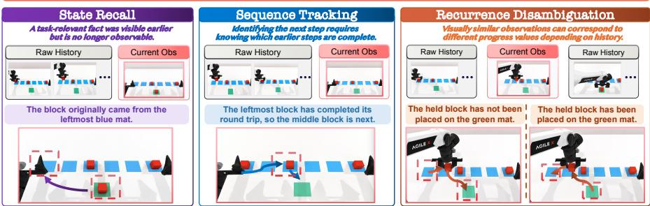  
Figure 1: Why a Progress Reward Model (PRM) needs context. Given the overall task instruction (top), the current frame alone may not suffice to estimate progress. (i) State Recall: information needed for progress, such as which mat the block came from, appeared earlier but is not in the current frame. (ii) Sequence Tracking: steps follow a fixed order, so progress needs knowing which steps are done. (iii) Recurrence Disambiguation: look-alike frames sit at different progress.

## 1 INTRODUCTION

Embodied agents now take on ever longer tasks. For a long task, knowing only whether the task finally succeeds or fails says little; the steps along the way matter. A Progress Reward Model (PRM) scores how far a task has come at every step. PRMs serve as dense rewards where the environment gives none (Ma et al., 2023b; Zhang et al., 2025; Fei et al., 2026), as verifiers that decide whether a step is finished (Du et al., 2023), and as monitors that notice when an execution has stalled (Park et al., 2026). Recent PRMs trained on large robot corpora score arbitrary instructions and trajectories (Zhang et al., 2026b; Tan et al., 2026; Liang et al., 2026; Zhang et al., 2026d).

These PRMs work well when the current frame shows the answer: a glass is half poured when it looks half full. Many long tasks are not like this. Figure 1 shows one instruction: move each red block to the green mat and back to its original position, one at a time, from left to right. Three moments in this task cannot be scored from the current frame alone. When a block is carried back, the frame shows the block but not which blue mat it came from, so the PRM must recall a state that is no longer visible (State Recall). When the middle block is moving, the frame does not show whether the leftmost block has already finished its round trip, so the PRM must track where the task is in its fixed order (Sequence Tracking). Just before and just after the held block is placed, the two frames look almost the same but sit at different progress, so the PRM must tell which moment it is in (Recurrence Disambiguation). In each case progress is well defined, but the current frame does not determine it. We call this problem context-dependent progress estimation.

The obvious fix is to give the PRM the whole history. The history, however, is only a record of what was observed. What the PRM needs is one specific fact that the record establishes, such as which mat a block came from or how many round trips are done, and which fact matters depends on the instruction and on the current frame. We call this fact the context.

Existing benchmarks on progress estimation, such as value-order evaluation over robot datasets (Ma et al., 2025; Budzianowski et al., 2025) and Progress-Bench (Zhang et al., 2026b), mostly focus on short tasks whose progress can be read from the current observation, so whether PRMs can estimate progress when context is needed remains underexplored. We therefore build CONTEXTPROGRESS-BENCH, a high-quality benchmark of 24 tasks, 120 episodes and 552 annotated subtask intervals from RMBench (Chen et al., 2026d), RoboDojo (Chen et al., 2026c) and LIBERO-Mem (Chung et al., 2026). We select every task by hand so that it needs context, and annotate by hand the context each episode requires in each time interval.

We then run a paired diagnosis on five PRMs. For each PRM, both runs use the same input format, and in one run the instruction integrates the right context, so only the context differs. Without the right context, every PRM is far off: MAE lies between 15.6 and 31.0 on a 0 to 100 scale. Models that read or retrieve from the entire history still get lost. With the right context, the MAE of every PRM falls by 77% to 82%, to between 3.4 and 6.7, and the gain holds on 93.3% of paired intervals rather than on a few easy episodes. Anchored on its own previous endpoint instead of the true one, every PRM still improves but far less. The errors also follow the three settings: a PRM forgets a state that has left the frame, drifts ahead in an ordered task, or gives near-identical values to repeated events. Embodied PRMs are thus not incapable, but lost without the right context.

This finding tells us what to build, and it points to two kinds of models that complement each other. A PRM scores a step well once it knows which step is underway, but it cannot work out that step from the history. Vision-Language Models (VLMs) are poorly calibrated estimators of progress, but they are good at understanding a task, breaking it into steps and providing context. Each does well what the other does poorly, and we design an agentic loop around this split. We propose ProgressCompass, an autonomous agentic loop that keeps the PRM frozen and uses current general-purpose VLMs to supply the context it needs. An Orienter reads the frames and states the current step, the frozen PRM scores that step, a Verifier checks whether the step is finished, and a text-only Navigator runs the loop.

Wrapped in the loop, the same frozen PRM cuts its progress error by 63% and raises its rank agreement by 76%, closing 78% of the gap to ground-truth context. It stays robust when the video stops early (Early stop), does more than asked (Extra steps), or follows an unrelated task (Mismatch). We further ablate its components, and parallelize the loop so that no component within the loop sits idle, which cuts wall-clock time by 65.6% and keeps the cost of the added components low.

Our contributions can be summarized as follows.

• We formulate context-dependent progress estimation and build CONTEXTPROGRESS-BENCH, which isolates its three settings.

• Through a paired diagnosis, we show that current PRMs are lost without the right context, even with the full history, and are reliable once the right context is supplied.

• We propose ProgressCompass, an autonomous agentic loop that supplies the right context to a frozen PRM with general-purpose VLMs, and estimates progress accurately and robustly.

## 2 CONTEXT-DEPENDENT PROGRESS ESTIMATION

## 2.1 TASK FORMULATION

Let x be a task instruction. Let $O = \left( o _ { 1 } , \dots , o _ { T } \right)$ be one execution of the task, where $T$ is the number of observations and $o _ { t }$ is the observation at time t. The ground-truth progress at that time is $p _ { t } \in [ 0 , 1 ]$ ], and the model predicts $\hat { p } _ { t }$

We study progress annotation. The model assigns a progress value to every observation of an execution. At time $t ,$ let $H _ { t } = o _ { 1 : t - 1 }$ denote the observation history before $o _ { t } ,$ with $H _ { 1 } = \varnothing$ . What the context has to supply at t comes from $x , H _ { t } ,$ and $o _ { t } ;$ later observations do not change it.

Of these inputs, the simplest Progress Reward Model (PRM) uses only the current observation, ${ \hat { p } } _ { t } = f ( o _ { t } \mid x )$ . We study tasks where this cannot work, because progress depends on information that $o _ { t }$ does not carry. We call such progress estimation context-dependent.

The right context makes progress estimable from $o _ { t } .$ . If the current observation lacks a piece of information, the natural fix is to supply it. We call this missing piece the context $c _ { t }$ . Without it, no estimator can recover $p _ { t } ;$ with it, the current observation is enough again:

$$
{ \underbrace { f ( o _ { t } \mid x ) } _ { \mathrm { w i t h o u t c o n t e x t } } } \neq p _ { t } , \qquad { \underbrace { f ( o _ { t } \mid x , c _ { t } ) } _ { \mathrm { w i t h c o n t e x t } } } = p _ { t } .\tag{1}
$$

The two sides differ only by $c _ { t } ,$ and the gap between them is what a context-dependent task costs a model that ignores its history. Theorem 1 in Section 4 turns this gap into a floor on the error of every estimator that reads only x and $o _ { t } .$ , whatever its capacity.

Having the history is not having the context. At time t, only the history $H _ { t }$ can supply $c _ { t }$ , and the obvious choice is to hand the model the history itself, as if $c _ { t }$ were $H _ { t }$ . But Equation 1 asks for one specific piece of information, whereas $H _ { t }$ is a raw stream of past observations that contains it somewhere. The history helps only after it has been turned into the context.

Context is history interpreted for the task and the moment. $H _ { t }$ records what was observed. $c _ { t }$ is what that record means given the instruction x and the observation $o _ { t }$ in front of the model: which outcomes hold, how far the task has come, which occurrence is underway. Nothing in $H _ { t }$ states these directly, and the same history yields a different $c _ { t }$ at a different moment, so this is an interpretation rather than a retrieval:

$$
c _ { t } = \phi ( H _ { t } \mid x , o _ { t } ) ,\tag{2}
$$

where $\phi$ is conditioned on the instruction x and the current observation $o _ { t }$ , because x says what to look for and $o _ { t }$ says what is already visible, and together they decide which reading of the history is the one the estimator needs. Context-dependent progress estimation thus comes down to $\phi \colon$ Section 2.2 names the three kinds of fact that ϕ must recover, Section 3 shows that current PRMs, even when handed the entire history, do not carry out $\phi$ on their own, and Section 4 assigns ϕ to general-purpose VLMs around a frozen $f .$

## 2.2 THREE FORMS OF CONTEXT DEPENDENCE

The mapping $\phi$ in Equation 2 turns the history into the context that instruction x and the current observation $o _ { t }$ need. Its three inputs play fixed roles: x says what to look for, $o _ { t }$ says what is already visible, and $H _ { t }$ is where the rest has to be found. We distinguish three forms by what $o _ { t }$ is missing;

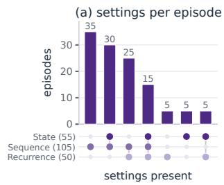

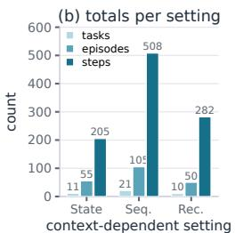

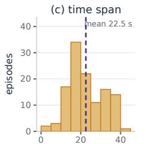

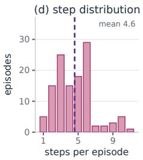  
Figure 2: Statistics of CONTEXTPROGRESS-BENCH. (a) Episodes grouped by the context forms they require. (b) Tasks, episodes and annotated steps per form. (c) Episode duration. (d) Annotated steps per episode; every episode needs context at least once.

Figure 1 shows all three arising from a single instruction. In each form, ϕ reads something different from the history, and the context takes a different shape. Each form also contributes its own term to the error floor of Theorem 1, so that the cost of each can be stated separately.

State Recall: What happened before? Some task-relevant facts are visible only for a while. A state change happens, and later frames no longer show whether it happened or what the state was before. Here x fixes which facts matter, $o _ { t }$ tells which of them are currently hidden, and ϕ has to recall those from the history. The context is the set of task-relevant facts visible earlier but not in $o _ { t } .$

Sequence Tracking: Where are we in the sequence? Some tasks consist of K steps that must be completed in order. The current frame shows a step being performed, but not whether the steps before it have actually been done. Here $x$ fixes the order, $H _ { t }$ tells which steps have been completed, and ϕ has to judge whether the step shown in $o _ { t }$ is the one that comes next. Because the steps are ordered, the completed ones form a prefix of the sequence, and the first step not yet completed is the one that should be in progress; we call its index the active position $a _ { t }$ , which runs from 1 (nothing done) to $K + 1$ (all done). The context is this position together with the judgment that $o _ { t }$ indeed shows step $a _ { t } .$ , which holds exactly when every step before the one in $o _ { t }$ is done.

Recurrence Disambiguation: Which occurrence is this? Some tasks repeat the same event several times. Frames from different repetitions are visually indistinguishable, written $o _ { u } \approx o _ { v }$ , but sit at different progress values $( p _ { u } \neq p _ { v } ) ;$ ; so can frames from different stages of one repetition, such as just before and just after the event takes place. Here the repeated event is tied to $x , o _ { t }$ shows one such look-alike moment, and ϕ has to place it against what the history has recorded. The context is how many occurrences of the event have been completed so far, which gives the occurrence index $r _ { t }$ of the current one, together with whether that occurrence is already underway. The index separates look-alike frames from different repetitions; the second part separates look-alike frames within one.

## 2.3 CONTROLLED BENCHMARK CONSTRUCTION

Source trajectories. CONTEXTPROGRESS-BENCH is built from robot-manipulation trajectories in RMBench (Chen et al., 2026d), RoboDojo (Chen et al., 2026c), and LIBERO-Mem (Chung et al., 2026), itself built on LIBERO (Liu et al., 2023). From these sources we select by hand the tasks whose progress is context-dependent in the sense of Section 2.1, that is, tasks in which the current observation alone does not determine progress and at least one form of Section 2.2 is needed. For every episode we then annotate by hand the subtask intervals and, for each interval, the context that estimating its progress requires: the earlier outcome it depends on, its position in the ordered plan, or the occurrence of a repeated event it belongs to.

Benchmark scope. The benchmark contains 24 tasks, and for each task we sample five episodes at random. The resulting 120 videos contain 71,708 frames of execution. Figure 2 summarizes its context forms, coverage, episode length, and decomposition depth.

## 3 WHERE PROGRESS REWARD MODELS GET LOST

Evaluation setting. We evaluate five Progress Reward Models (PRMs): ProgressLM-3B-RL (Zhang et al., 2026b), Robo-Dopamine-GRM-3B (Tan et al., 2026), RoboMeter-4B (Liang et al.,

Table 1: The Context Gap. Left: the same frozen model with the same input format, first without context, then with the correct context for each annotated subtask. The two with-context settings differ in where that context puts the estimate: oracle at the true position of its subtask, self-chained at where the model ended the previous one. (Green values) are the relative change from the same model w/o context. Right: each dot is one subtask of one model, at its MAE without context (x) and with context $( y ) ,$ coloured as on the left; dots below the diagonal are where context helped.
<table><tr><td rowspan="2">Model</td><td>w/o context</td><td></td><td>w/ context: oracle</td><td colspan="2">w/ context: self-chained</td></tr><tr><td>MAE↓</td><td> $\rho \uparrow$ </td><td>MAE↓</td><td> $\rho \uparrow$ </td><td>MAE↓</td><td> $\rho \uparrow$ </td></tr><tr><td>ProgressLM</td><td>17.95 0.74</td><td></td><td>4.18(-77%) 0.99(+35%)</td><td></td><td>16.70(-7%) 0.99(+34%)</td><td></td></tr><tr><td>Robo-Dopamine</td><td>15.590.74</td><td></td><td>3.43(-78%) 0.98(+31%)</td><td></td><td>4.66(-70%) 0.97(+31%)</td><td></td></tr><tr><td>RoboMeter</td><td>25.42 0.53</td><td></td><td>4.91(-81%) 0.93(+75%)</td><td></td><td>11.39(-55%) 0.92(+74%)</td><td></td></tr><tr><td>TOPReward</td><td>30.95 0.56</td><td></td><td>6.70(-78%) 0.90(+62%)</td><td></td><td>9.42(-70%) 0.89(+59%)</td><td></td></tr><tr><td>VLAC</td><td>24.430.72</td><td></td><td>4.50(-82%) 0.97(+35%)</td><td></td><td>17.13(-30%) 0.94(+30%)</td><td></td></tr></table>

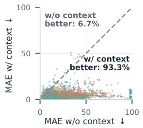

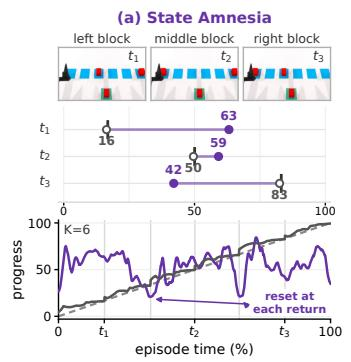

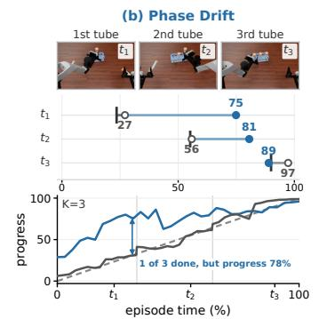

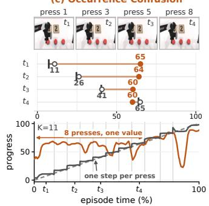  
Figure 3: Three typical errors, one episode each. The task each panel runs on is (a) move each red block onto the green mat and back to where it came from, from left to right; (b) insert three tubes into a rack in a prescribed order; (c) press the same button eight times.

2026), TOPReward with Molmo2-4B (Chen et al., 2026b; Clark et al., 2026) and VLAC-8B (Zhang et al., 2026d). For each model, both runs use the same input format: without context gives the episode instruction, and with context replaces it with the instruction of the active subtask, which integrates the annotated context, on the interval that subtask occupies. This context is given by hand: we write it from the annotation and set every subtask boundary ourselves, so the model never decides where a subtask begins or ends. The two runs are paired on all 552 annotated subtask intervals, so they differ in $c _ { t }$ alone. We report two metrics: (i) MAE is the mean absolute error of the predicted progress, so it asks how accurate each individual estimate is; (ii) Spearman’s $\rho$ is the rank correlation between the predicted curve and time, so it asks whether the estimates are ordered correctly, whatever their absolute level. A model can be right about the ordering and wrong about the values, or the reverse, and without context these models are often wrong about both.

## 3.1 DO PROGRESS REWARD MODELS LOSE THE TASK WITHOUT CONTEXT?

They do, and by a wide margin. Without context, as Table 1 shows, every one of the five is far from the true progress and orders the episode unreliably. Supplying the context turns both around on every model at once, cutting the error by about four fifths and bringing the ordering near perfect. The gain is not an average over easy episodes: the right-hand panel of Table 1 pairs the two runs interval by interval, and almost every pair lies below the diagonal: whether a PRM is right turns on whether it is told where in the task it is, not on what it can see. The oracle column is the error left once the step is known, the local term of Theorem 1. Anchored on its own endpoints instead of the oracle, every model still improves, but far less, in the order of how firmly each closes a subtask.

## 3.2 HOW THE THREE FORMS FAIL

Figure 3 shows what being lost looks like in each form. (a) State amnesia. Once a state change has happened and left the frame, everything after it is read against a scene that no longer records it. The blocks are interchangeable and a block leaving the green mat gives no sign of where it belongs, so from the first return onwards the curve falls back instead of accumulating. (b) Phase drift. The order of the steps is not visible in a frame, so the model reads a step as a later one than it ${ \mathrm { i s } } ,$ or credits an early step as though a later one were already underway; the first insertion is complete and the curve already sits where the second should be. (c) Occurrence confusion. Repeated actions produce near-identical frames and the model returns near-identical values for all of them, so it cannot say which repetition is underway: eight presses give one value, a plateau where the truth is a staircase. In all three the model perceives the event and has nowhere to put it.

## 4 PROGRESSCOMPASS: REORIENTING PROGRESS REWARD MODELS

Who plays $f .$ Section 3 shows that $f$ is not where the deficit lies: given the context $c _ { t }$ for the moment it is looking at, a Progress Reward Model (PRM) estimates progress reliably, which is the right-hand side of Equation 1. A PRM P therefore plays $f ,$ and we keep it frozen. In our experiments $\mathcal { P }$ is RoboMeter-4B, but any PRM that scores a clip against a step instruction can in principle take its place, since the loop only reads the value $\mathcal { P }$ returns.

Who plays $\phi .$ What is missing is the map that produces that context $c _ { t }$ of Equation 2. In Section 3 we played $\phi$ by hand: we wrote $c _ { t }$ and set every subtask boundary. Without annotation, nobody does either. Producing $c _ { t }$ is task understanding rather than scoring, and PRMs are not trained for it. Vision-Language Models are the reverse. They are not calibrated progress estimators, but they are good at understanding a task, breaking it into steps and providing context, so a VLM takes over the part we played by hand, and we call it the Orienter O. A PRM scores a moment once placed, a VLM says where the moment sits, and neither does the other’s job. With no boundaries given, the system must itself decide when each subtask ends and orient again, so it must run as a loop.

Run as a loop. $\mathcal { P }$ and O cover the two maps, but nothing yet makes them run on their own. Producing $c _ { t }$ again whenever the task moves on first requires deciding that it has. That decision is a yes-or-no question about the frames, which a VLM answers well even though it cannot produce the value itself, so we hand it to a second VLM, the Verifier V, kept apart from O because the component that says what should happen should not also rule on whether it did. Furthermore, we have O emit a second output beside the context, the expected transition $\tau _ { t } .$ which states what the frames should show once the current step is done. It commits O to a checkable prediction, so $\nu$ rules on a stated outcome instead of on completion in the abstract and the text side supplies what the pixels leave open; Section 5.3 measures what it is worth. Throughout, $\bar { \mathcal P }$ is given only the frames since the current step began, which is exactly the input on which Section 3.1 found it reliable and, for a locally identifiable step, all it needs (Definition 1). Only a controller is then missing. We add a textonly one, the Navigator $\mathcal { N }$ , which calls the other three and carries the plan and what has been confirmed from one step into the next. $\mathcal { N }$ closes a loop, orient, estimate, verify and orient again, which we call ProgressCompass: the PRMs of Section 3 are not blind but lost.

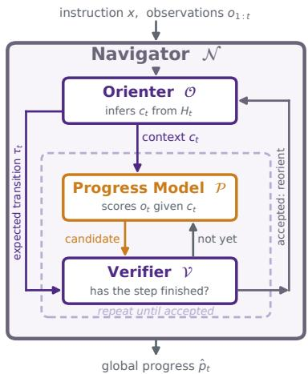  
Figure 4: ProgressCompass. The Navigator $\mathcal { N }$ runs the loop. $\mathcal { O }$ gives the context $c _ { t }$ to the frozen PRM $\mathcal { P }$ and the expected transition $\tau _ { t }$ to V; $\mathcal { P }$ proposes a completion and $\nu$ checks it until the step is accepted, then O reorients.

Reduced error floor by ProgressCompass. This division of labour can be stated as a bound. With the K steps of the plan and the active position $a _ { t }$ of Section 2.2, the true progress is $p _ { t } =$ $\big ( ( a _ { t } - 1 ) + p _ { t } ^ { \mathrm { l o \bar { c } } } \big ) / K$ , where $p _ { t } ^ { \mathrm { l o c } } \in [ 0 , 1 ]$ is the progress within step $a _ { t } ,$ , and ProgressCompass outputs $\hat { p } _ { t } = \big ( ( k _ { t } - 1 ) + \hat { p } _ { t } ^ { \mathrm { l o c } } \big ) / K$ , where $k _ { t }$ is the step that $\mathcal { N }$ holds and $\hat { p } _ { t } ^ { \mathrm { l o c } }$ the estimate of $\mathcal { P } _ { \cdot }$ . The

ProgressLM Robo-Dopamine TOPReward VLAC R2VLM RoboMeter (backbone) ProgressCompass

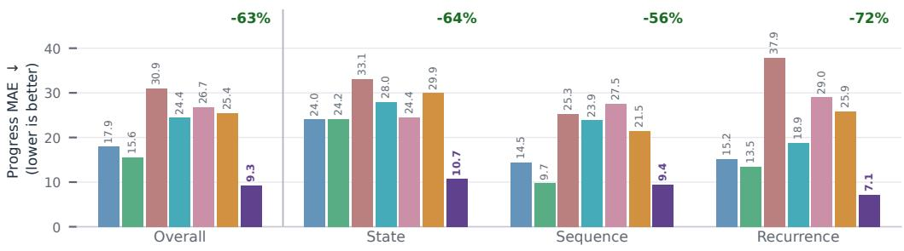

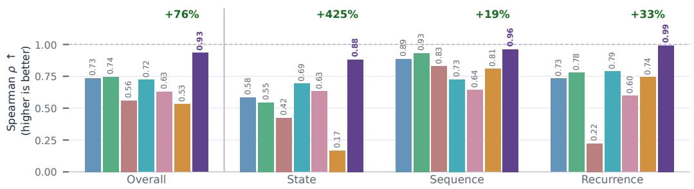  
Figure 5: Main results. Progress MAE (top, lower is better) and Spearman $\rho$ (bottom, higher is better) per context form; green is the change over the frozen RoboMeter.

error $\varepsilon = \mathbb { E } \left| \hat { p } _ { t } - p _ { t } \right|$ | averages over the frames of a task, as MAE does; $\varepsilon ^ { f }$ is that of any current-frame estimator $f ( o _ { t } \mid x )$ of Equation 1, and $\varepsilon ^ { \mathrm { P C } }$ that of ProgressCompass. The context floor $\delta _ { \mathrm { X } }$ of form X is the error that no estimate from x and $o _ { t }$ alone can avoid on that form: for two frames that show the same scene at different progress, half their progress gap, weighted by how often such frames occur. The position error $\eta ^ { \mathrm { P \dot { C } } }$ counts how many steps $k _ { t }$ is off from $a _ { t } ,$ , at least one for a wrong position and the largest error for a wrong plan. The local error $\lambda$ is the error of $\mathcal { P }$ within a step, on the frames where $k _ { t } = a _ { t }$

Theorem 1 (Context floor and error of ProgressCompass). For every K-step task,

(no context, any f)

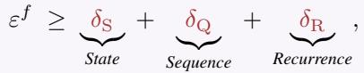

(ProgressCompass)

The first bound holds for every such $f .$ In the second bound, a step is passed before it is complete only $i f \mathcal { P }$ proposes its completion early and V accepts, so V lets an early proposal through with probability at most β, its false-accept rate. We put the proof in Appendix A.4.

Context is irreplaceable. The first row is the cost of missing context. Frames that show the same scene receive the same estimate, so each form of Section 2.2 adds a floor that no estimator reading only x and $o _ { t }$ can remove, whatever its capacity. The row covers only such current-frame estimators; that the PRMs of Section 3, which read a sampled history, are lost as well is an empirical finding (Figure 3). In the second row, $c _ { t }$ states which outcomes hold, which step is underway and which occurrence it ${ \mathrm { i s } } ,$ so none of the three floors remains, and errors in $c _ { t }$ are charged to the two terms that follow. In our runs, $c _ { t }$ is the subtask instruction from O, P is RoboMeter-4B on the frames of the current step, and $k _ { t }$ is the step $\mathcal { N }$ holds. $\mathcal { P }$ pays the local term, and $\nu$ keeps the position term small: a premature advance needs a false accept, and because $\mathcal { N }$ records an outcome only on acceptance, it does not corrupt later steps; a missed completion only delays the position (Lemmas 3 and 4). ProgressCompass is therefore more accurate than every current-frame estimator whenever $( \eta ^ { \mathrm { P C } } + \bar { \lambda ) } / K < \delta _ { \mathrm { S } } \bar { + } \delta _ { \mathrm { Q } } + \delta _ { \mathrm { R } }$ , a condition rather than a guarantee (Appendix A.2).

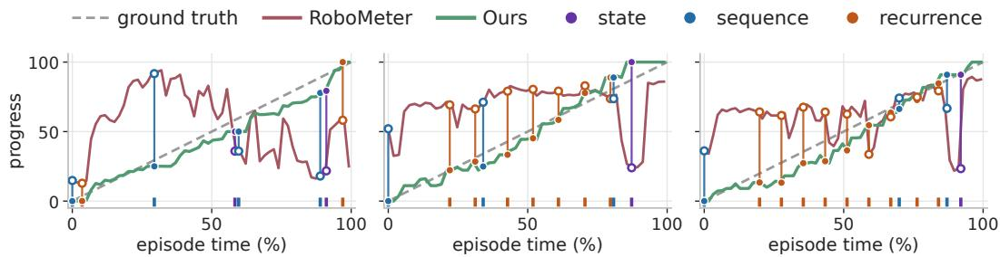  
Figure 6: Progress curves on three episodes. Ticks mark moments that need context; vertical lines join ours (filled) and RoboMeter (hollow).

## 5 RESULTS

Experimental setup. We implement ProgressCompass with Qwen3.5-27B (Qwen Team, 2026) as the Orienter, Qwen3.5-9B as the Verifier and, without frames, as the Navigator, and RoboMeter 4B, lightweight and not reliant on careful prompting, as the frozen Progress Reward Model (PRM), decoding at temperature 0. We compare against the five PRMs of Section 3, each reading the full episode and instruction, and against R2VLM (Zhang et al., 2026e), which conditions on retrieved context and is the closest existing method. RoboMeter-4B is both a baseline and our backbone, so every gain uses the same frozen weights.

## 5.1 OVERALL PERFORMANCE

As shown in Figure 5, wrapping the frozen RoboMeter-4B in ProgressCompass more than halves its progress error, from 25.4 to 9.3, and lifts its rank agreement from 0.53 to 0.93. No weight changes and the inputs are the same, so the whole gain comes from the context. It is also the best method on every context form, ahead of every frozen model and of R2VLM, and recovers 78% of the deficit that oracle context would close. Transition timing improves with it: boundary error falls by two thirds, and the share of annotated boundaries matched within 5% of episode duration roughly triples. Figure 6 shows the same gap on single episodes.

## 5.2 WHEN INSTRUCTION AND EXECUTION DO NOT MATCH

We build 15 held-out negatives by breaking the correspondence between an instruction and its execution in three directions: the execution does less than asked, more than asked, or something unrelated. Each has its own correct behaviour, and we score the whole curve against it (Figure 7).

Early stop keeps the instruction and cuts the video short, so the correct value is the progress performed. Every action shown is correct, so a model that reads the scene sees a finished task: TOPReward deviates by 50.3 and RoboMeter by 32.7, against 7.3 for ProgressCompass.

Extra steps keeps the video and deletes steps from the instruction, so the video does more than was asked and the correct terminal value is 100. ProgressCompass deviates by 15.8 against 24.0 to 40.2, and alone reaches 100.

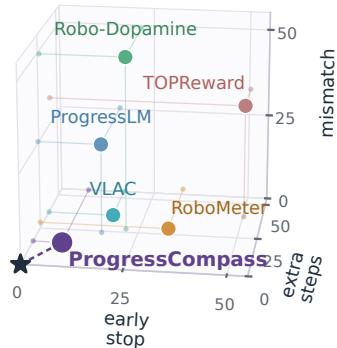  
Figure 7: Negatives. Mean deviation of each method from the correct progress on Early stop, Extra steps and Mismatch; lower is better.

Mismatch substitutes a structurally valid instruction from an unrelated domain, so the correct curve is zero everywhere. ProgressCompass never exceeds zero. VLAC also scores 0.0, but not by rejecting: with the correct instruction it ends at −63.8. ProgressLM, Robo-Dopamine and TOPReward deviate by 25.4, 49.1 and 32.5.

## 5.3 WHAT THE EXPECTED TRANSITION BUYS

We remove the expected transition two ways: w/o $\tau _ { t }$ at V keeps it everywhere else (O emits it and $\mathcal { P }$ receives it) but V sees only the frames and the subtask sentence, and w/o $\tau _ { t }$ at $\mathcal { O }$ and $\nu$ drops it from $\mathcal { O } \mathrm { { s } }$ output altogether. We score the error at the end of each annotated subtask k, where a correct curve reads $k / K$ · 100 and V uses $\tau _ { t }$ to accept a completion. Removing $\tau _ { t }$ at V doubles this error from 8.6 to 17.2, and removing it at O as well raises it to 18.8 (Figure 8). The order holds on every form: the error more than doubles on State, triples on Recurrence, and rises least on Sequence, whose steps end in a visible action. Progress MAE rises from 9.3 to 17.5 and 18.3. Verification changes, not planning: O proposes the same

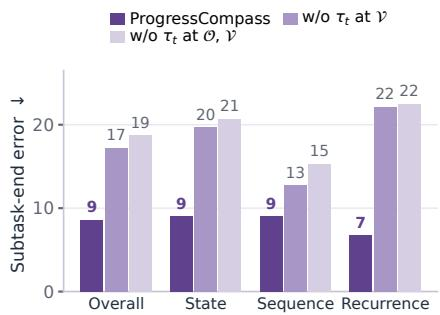  
Figure 8: Ablating $\tau _ { t } .$ . Error at the end of each subtask; lower is better.

number of steps in all three runs, while episodes that stall with a subtask unverified rise from 7 to 40 and 45. Removing $\tau _ { t }$ thus keeps the plan and enlarges the position term of Theorem 1.

## 5.4 PARALLELIZING THE LOOP ACROSS EPISODES

The loop is sequential within an episode, since $\mathcal { O }$ proposes the next step only after V has checked the current one, but episodes share nothing. We therefore run up to five episodes at once, and a dependency-aware scheduler sends each episode’s next ready call to the model it needs, so that a model idle for one episode serves another. The order within every episode is unchanged: time per episode falls from 114.7 to 39.5 s, with MAE and $\rho$ unchanged within paired bootstrap intervals.

## 6 RELATED WORK

Embodied progress and process reward models. Current progress models are built in three main ways (Zhang et al., 2026c): frozen foundation models score progress zero-shot (Du et al., 2023; Sontakke et al., 2023; Ma et al., 2025; Budzianowski et al., 2025; Chen et al., 2026b); temporal and relative supervision derives it from frame order or comparisons within demonstrations (Dwibedi et al., 2019; Ma et al., 2023b;a; Donahue & Elhamifar, 2024; Huang et al., 2024); and models trained on progress targets add task stages (Hung et al., 2025; Chen et al., 2026a; Zhang et al., 2025) and now score arbitrary trajectories (Zhang et al., 2026b; Tan et al., 2026; Liang et al., 2026; Zhang et al., 2026d;e). Their evaluations mostly use tasks whose progress can be read from the current observation, so context-dependent progress estimation remains underexplored.

Agentic context management. A long-horizon agent cannot keep all it has seen in its prompt, so it manages what it carries forward: language agents curate their working context (Yao et al., 2023; Zhang et al., 2026f; Yi et al., 2026), web agents reflect, roll back and aggregate evidence (Hu et al., 2025; Wang et al., 2026), and long-video models keep an explicit memory (Song et al., 2024; He et al., 2024; Zhang et al., 2026a). Embodied agents ground instructions into plans, revise them from feedback (Ichter et al., 2023; Huang et al., 2023b; Singh et al., 2023; Liang et al., 2023; Huang et al., 2023a), and remember the scene (Pashevich et al., 2021; Liu et al., 2025). Embodied progress estimation needs the same: over a long task, a PRM that reads the raw history gets lost. We bring context management to a frozen PRM, which needs one specific fact at each step.

## 7 CONCLUSION

We formulate context-dependent progress estimation and build CONTEXTPROGRESS-BENCH to isolate its three settings. A paired diagnosis shows that current Progress Reward Models (PRMs) are not blind but lost: without the right context they stay far from the true progress, even when they read the whole history, and each cuts its error by 77% to 82% once the context is given. ProgressCompass supplies that context to a frozen PRM with general-purpose VLMs, without annotation or training. It more than halves the error of its backbone and stays robust when the execution does less than asked, more than asked, or something unrelated.

## REFERENCES

Paweł Budzianowski, Emilia Wisnios, Michał Tyrolski, Gracjan G´ oral, Igor Kulakov, Viktor Pe-´ trenko, and Krzysztof Walas. OpenGVL: Benchmarking visual temporal progress for data curation. In CoRL Workshop on Making Sense ofData in Robotics, 2025.

Qianzhong Chen, Justin Yu, Mac Schwager, Pieter Abbeel, Yide Shentu, and Philipp Wu. SARM: Stage-aware reward modeling for long horizon robot manipulation. In International Conference on Learning Representations, 2026a.

Shirui Chen, Cole Harrison, Ying-Chun Lee, Angela Jin Yang, Zhongzheng Ren, Lillian J. Ratliff, Jiafei Duan, Dieter Fox, and Ranjay Krishna. TOPReward: Token probabilities as hidden zeroshot rewards for robotics. arXiv preprint arXiv:2602.19313, 2026b. doi: 10.48550/arXiv.2602. 19313. URL https://arxiv.org/abs/2602.19313.

Tianxing Chen, Yue Chen, Zixuan Li, Junyuan Tang, Kailun Su, Haoran Lu, Weijie Wan, Baijun Chen, Songling Liu, Haowen Yan, Honghao Su, Zhiyang Dou, Kaixuan Wang, Dandan Zhang, Yunze Liu, Yan Qin, Qiwei Liang, Qiwei Wu, Zijian Lin, Wenwei Lin, Yuran Wang, Minghua He, Tianshu Wu, Ruihai Wu, Jingquan Zhou, Kai-Chong Lei, Haibao Yu, Yuanfeng Ji, Weiyang Jin, Guanyu Lin, Xiaofan Li, Qi Xiong, Renjing Xu, Zhongyu Li, Wenhao Chai, Enze Xie, Ziwei Wang, Yao Mu, Hao Dong, Wojciech Matusik, Mingyu Ding, Wenbo Ding, Ping Luo, and Masayoshi Tomizuka. RoboDojo: A unified sim-and-real benchmark for comprehensive evaluation of generalist robot manipulation policies. arXiv preprint arXiv:2607.04434, 2026c. doi: 10.48550/arXiv.2607.04434. URL https://arxiv.org/abs/2607.04434.

Tianxing Chen, Yuran Wang, Mingleyang Li, Yan Qin, Hao Shi, Zixuan Li, Yifan Hu, Yingsheng Zhang, Kaixuan Wang, Yue Chen, Hongcheng Wang, Junjie Wang, Tianhang Yang, Renjing Xu, Ruihai Wu, Yao Mu, Yaodong Yang, Hao Dong, and Ping Luo. RMBench: Memory dependent robotic manipulation benchmark with insights into policy design. arXiv preprint arXiv:2603.01229, 2026d. doi: 10.48550/arXiv.2603.01229. URL https://arxiv.org/ abs/2603.01229.

Nhat Chung, Taisei Hanyu, Toan Nguyen, Huy Le, Frederick Bumgarner, Duy Minh Ho Nguyen, Khoa Vo, Kashu Yamazaki, Chase Rainwater, Tung Kieu, Anh Nguyen, and Ngan Le. Rethinking progression of memory state in robotic manipulation: An object-centric perspective. Proceedings of the AAAI Conference on Artificial Intelligence, 40(5):3407–3415, 2026. doi: 10. 1609/aaai.v40i5.37337. URL https://ojs.aaai.org/index.php/AAAI/article/ view/37337.

Christopher Clark, Jieyu Zhang, Zixian Ma, Jae Sung Park, Mohammadreza Salehi, Rohun Tripathi, Sangho Lee, Zhongzheng Ren, Chris Dongjoo Kim, Yinuo Yang, Vincent Shao, Yue Yang, Weikai Huang, Ziqi Gao, Taira Anderson, Jianrui Zhang, Jitesh Jain, George Stoica, Winson Han, Ali Farhadi, and Ranjay Krishna. Molmo2: Open weights and data for vision-language models with video understanding and grounding. In Proceedings ofthe IEEE/CVF Conference on Computer Vision and Pattern Recognition, pp. 28652–28668, 2026. URL https://openaccess. thecvf.com/content/CVPR2026/html/Clark\_Molmo2\_Open\_Weights\_and\_ Data\_for\_Vision-Language\_Models\_with\_Video\_CVPR\_2026\_paper.html.

Gerard Donahue and Ehsan Elhamifar. Learning to predict activity progress by self-supervised video alignment. In Proceedings of the IEEE/CVF Conference on Computer Vision and Pattern Recognition, pp. 18667–18677, 2024.

Yuqing Du, Ksenia Konyushkova, Misha Denil, Akhil Raju, Jessica Landon, Felix Hill, Nando de Freitas, and Serkan Cabi. Vision-language models as success detectors. In Conference on Lifelong Learning Agents (CoLLAs), 2023.

Debidatta Dwibedi, Yusuf Aytar, Jonathan Tompson, Pierre Sermanet, and Andrew Zisserman. Temporal cycle-consistency learning. In Proceedings of the IEEE/CVF Conference on Computer Vision and Pattern Recognition, pp. 1801–1810, 2019.

Senyu Fei, Siyin Wang, Li Ji, Ao Li, Shiduo Zhang, Liming Liu, Jinlong Hou, Jingjing Gong, Xianzhong Zhao, and Xipeng Qiu. SRPO: Self-referential policy optimization for vision-languageaction models. In IEEE/CVF Conference on Computer Vision and Pattern Recognition (CVPR), 2026.

Bo He, Hengduo Li, Young Kyun Jang, Menglin Jia, Xuefei Cao, Ashish Shah, Abhinav Shrivastava, and Ser-Nam Lim. MA-LMM: Memory-augmented large multimodal model for long-term video understanding. In Proceedings of the IEEE/CVF Conference on Computer Vision and Pattern Recognition, pp. 13504–13514, 2024.

Minda Hu, Tianqing Fang, Jianshu Zhang, Jun-Yu Ma, Zhisong Zhang, Jingyan Zhou, Hongming Zhang, Haitao Mi, Dong Yu, and Irwin King. WebCoT: Enhancing web agent reasoning by reconstructing chain-of-thought in reflection, branching, and rollback. In Findings of the Association for Computational Linguistics: EMNLP 2025, pp. 5155–5173, 2025.

Tao Huang, Guangqi Jiang, Yanjie Ze, and Huazhe Xu. Diffusion reward: Learning rewards via conditional video diffusion. In Computer Vision – ECCV 2024, pp. 478–495, 2024. doi: 10.1007/ 978-3-031-72946-1 27.

Wenlong Huang, Chen Wang, Ruohan Zhang, Yunzhu Li, Jiajun Wu, and Li Fei-Fei. VoxPoser: Composable 3d value maps for robotic manipulation with language models. In Proceedings of The 7th Conference on Robot Learning, volume 229 of Proceedings of Machine Learning Research, pp. 540–562. PMLR, 2023a. URL https://proceedings.mlr.press/v229/ huang23b.html.

Wenlong Huang, Fei Xia, Ted Xiao, Harris Chan, Jacky Liang, Pete Florence, Andy Zeng, Jonathan Tompson, Igor Mordatch, Yevgen Chebotar, Pierre Sermanet, Tomas Jackson, Noah Brown, Linda Luu, Sergey Levine, Karol Hausman, and Brian Ichter. Inner monologue: Embodied reasoning through planning with language models. In Proceedings of The 6th Conference on Robot Learning, volume 205 of Proceedings ofMachine Learning Research, pp. 1769–1782. PMLR, 2023b. URL https://proceedings.mlr.press/v205/huang23c.html.

Kuo-Han Hung, Pang-Chi Lo, Jia-Fong Yeh, Han-Yuan Hsu, Yi-Ting Chen, and Winston H. Hsu. VICtoR: Learning hierarchical vision-instruction correlation rewards for long-horizon manipulation. In International Conference on Learning Representations, 2025. URL https: //openreview.net/forum?id=UpQLu9bzAR.

Brian Ichter, Anthony Brohan, Yevgen Chebotar, Chelsea Finn, Karol Hausman, Alexander Herzog, Daniel Ho, Julian Ibarz, Alex Irpan, Eric Jang, Ryan Julian, Dmitry Kalashnikov, Sergey Levine, Yao Lu, Carolina Parada, Kanishka Rao, Pierre Sermanet, Alexander T. Toshev, Vincent Vanhoucke, Fei Xia, Ted Xiao, Peng Xu, Mengyuan Yan, Noah Brown, Michael Ahn, Omar Cortes, Nicolas Sievers, Clayton Tan, Sichun Xu, Diego Reyes, Jarek Rettinghouse, Jornell Quiambao, Peter Pastor, Linda Luu, Kuang-Huei Lee, Yuheng Kuang, Sally Jesmonth, Nikhil J. Joshi, Kyle Jeffrey, Rosario Jauregui Ruano, Jasmine Hsu, Keerthana Gopalakrish nan, Byron David, Andy Zeng, and Chuyuan Kelly Fu. Do as i can, not as i say: Grounding language in robotic affordances. In Proceedings of The 6th Conference on Robot Learning, volume 205 of Proceedings of Machine Learning Research, pp. 287–318. PMLR, 2023. URL https://proceedings.mlr.press/v205/ichter23a.html.

Anthony Liang, Yigit Korkmaz, Jiahui Zhang, Minyoung Hwang, Abrar Anwar, Sidhant Kaushik, Aditya Shah, Alex S. Huang, Luke Zettlemoyer, Dieter Fox, Yu Xiang, Anqi Li, Andreea Bobu, Abhishek Gupta, Stephen Tu, Erdem Bıyık, and Jesse Zhang. ROBOMETER: Scaling generalpurpose robotic reward models via trajectory comparisons. In Robotics: Science and Systems XXII, 2026. URL https://www.roboticsproceedings.org/rss22/p140.pdf.

Jacky Liang, Wenlong Huang, Fei Xia, Peng Xu, Karol Hausman, Brian Ichter, Pete Florence, and Andy Zeng. Code as policies: Language model programs for embodied control. In 2023 IEEE International Conference on Robotics and Automation, pp. 9493–9500, 2023. doi: 10.1109/ ICRA48891.2023.10160591.

Bo Liu, Yifeng Zhu, Chongkai Gao, Yihao Feng, Qiang Liu, Yuke Zhu, and Peter Stone. LIBERO: Benchmarking knowledge transfer for lifelong robot learning. In Advances in Neural Information Processing Systems, volume 36, pp. 44776–44791. Curran Associates, Inc., 2023. doi: 10.52202/ 075280-1939. URL https://proceedings.neurips.cc/paper\_files/paper/ 2023/hash/8c3c666820ea055a77726d66fc7d447f-Abstract-Datasets\_ and\_Benchmarks.html.

Peiqi Liu, Zhanqiu Guo, Mohit Warke, Soumith Chintala, Chris Paxton, Nur Muhammad Mahi Shafiullah, and Lerrel Pinto. DynaMem: Online dynamic spatio-semantic memory for open world mobile manipulation. In 2025 IEEE International Conference on Robotics and Automation, pp. 13346–13355, 2025. doi: 10.1109/ICRA55743.2025.11127619.

Yecheng Jason Ma, Vikash Kumar, Amy Zhang, Osbert Bastani, and Dinesh Jayaraman. LIV: Language-image representations and rewards for robotic control. In Proceedings of the 40th International Conference on Machine Learning, volume 202 of Proceedings ofMachine Learning Research, pp. 23301–23320. PMLR, 2023a. URL https://proceedings.mlr.press/ v202/ma23b.html.

Yecheng Jason Ma, Shagun Sodhani, Dinesh Jayaraman, Osbert Bastani, Vikash Kumar, and Amy Zhang. VIP: Towards universal visual reward and representation via value-implicit pre-training. In International Conference on Learning Representations, 2023b. URL https://openreview. net/forum?id=VZIKjcWQxk.

Yecheng Jason Ma, Joey Hejna, Ayzaan Wahid, Chuyuan Fu, Dhruv Shah, Jacky Liang, Zhuo Xu, Sean Kirmani, Peng Xu, Danny Driess, Ted Xiao, Jonathan Tompson, Osbert Bastani, Dinesh Jayaraman, Wenhao Yu, Tingnan Zhang, Dorsa Sadigh, and Fei Xia. Vision language models are in-context value learners. In International Conference on Learning Representations (ICLR), 2025.

Seongheon Park, Wendi Li, Changdae Oh, Samuel Yeh, Zsolt Kira, Michael Hagenow, and Sharon Li. Hide-and-seek in trajectories: Discovering failure signals for VLA runtime monitoring. arXiv preprint arXiv:2605.30834, 2026.

Alexander Pashevich, Cordelia Schmid, and Chen Sun. Episodic transformer for vision-andlanguage navigation. In Proceedings of the IEEE/CVF International Conference on Computer Vision, pp. 15942–15952, 2021.

Qwen Team. Qwen3.5: Towards native multimodal agents. https://qwen.ai/blog?id= qwen3.5, 2026.

Ishika Singh, Valts Blukis, Arsalan Mousavian, Ankit Goyal, Danfei Xu, Jonathan Tremblay, Dieter Fox, Jesse Thomason, and Animesh Garg. ProgPrompt: Program generation for situated robot task planning using large language models. Autonomous Robots, 47:999–1012, 2023. doi: 10. 1007/s10514-023-10135-3.

Enxin Song, Wenhao Chai, Guanhong Wang, Yucheng Zhang, Haoyang Zhou, Feiyang Wu, Haozhe Chi, Xun Guo, Tian Ye, Yanting Zhang, Yan Lu, Jenq-Neng Hwang, and Gaoang Wang. MovieChat: From dense token to sparse memory for long video understanding. In Proceedings of the IEEE/CVF Conference on Computer Vision and Pattern Recognition, pp. 18221–18232, 2024.

Sumedh Sontakke, Jesse Zhang, Seb Arnold, Karl Pertsch, Erdem Bıyık, Dorsa Sadigh, Chelsea´ Finn, and Laurent Itti. RoboCLIP: One demonstration is enough to learn robot policies. In Advances in Neural Information Processing Systems, volume 36, pp. 55681–55693, 2023. doi: 10.52202/075280-2430.

Huajie Tan, Sixiang Chen, Yijie Xu, Zixiao Wang, Cheng Chi, Yuheng Ji, Yaoxu Lyu, Zhongxia Zhao, Xiansheng Chen, Peterson Co, Shaoxuan Xie, Guocai Yao, Pengwei Wang, Zhongyuan Wang, and Shanghang Zhang. General process reward modeling for robotic reinforcement learning. In Proceedings of the IEEE/CVF Conference on Computer Vision and Pattern Recog nition, pp. 22412–22422, 2026. URL https://openaccess.thecvf.com/content/ CVPR2026/html/Tan\_General\_Process\_Reward\_Modeling\_for\_Robotic\_ Reinforcement\_Learning\_CVPR\_2026\_paper.html.

Rui Wang, Ce Zhang, Jun-Yu Ma, Jianshu Zhang, Hongru Wang, Yi Chen, Boyang Xue, Tianqing Fang, Zhisong Zhang, Hongming Zhang, Haitao Mi, Dong Yu, and Kam-Fai Wong. WebAggregator: Enhancing compositional reasoning capabilities of deep research agent foundation models. arXiv preprint arXiv:2510.14438, 2026.

Shunyu Yao, Jeffrey Zhao, Dian Yu, Nan Du, Izhak Shafran, Karthik Narasimhan, and Yuan Cao. ReAct: Synergizing reasoning and acting in language models. In The Eleventh International Conference on Learning Representations, 2023. URL https://openreview.net/forum? id=WE\_vluYUL-X.

Lu Yi, Runlin Lei, Liuyi Yao, Yuexiang Xie, Yuyang Li, Wenhao Zhang, Zhewei Wei, Yaliang Li, and Jian-Yun Nie. Learning agent-compatible context management for long-horizon tasks. arXiv preprint arXiv:2605.30785, 2026.

Ce Zhang, Jing Bi, Jinxi He, Jianshu Zhang, Jingyang Lin, Yunzhong Xiao, Minghao Fu, Yaqi Xie, Zhentao Xie, Weicong Chen, Katia Sycara, and Ming Zhou. StreamScout: Learning when to look deeper for streaming video understanding. arXiv preprint arXiv:2609.00291, 2026a.

Jiahui Zhang, Yusen Luo, Abrar Anwar, Sumedh Anand Sontakke, Joseph J. Lim, Jesse Thomason, Erdem Biyik, and Jesse Zhang. ReWiND: Language-guided rewards teach robot policies without new demonstrations. In Conference on Robot Learning (CoRL), 2025.

Jianshu Zhang, Chengxuan Qian, Haosen Sun, Haoran Lu, Dingcheng Wang, Letian Xue, and Han Liu. ProgressLM: Towards progress reasoning in vision-language models. In Proceedings of the 64th Annual Meeting of the Association for Computational Linguistics (Volume 1: Long Papers), pp. 11243–11271, San Diego, California, United States, 2026b. Association for Computational Linguistics. doi: 10.18653/v1/2026.acl-long.516. URL https://aclanthology.org/ 2026.acl-long.516/.

Jianshu Zhang, Keliang Wu, Haoran Lu, Anbang Liu, Ce Zhang, Weijie Yin, Chengxuan Qian, Xiyuan Yang, Zhenyu Pan, Guo Ye, and Han Liu. Progress reward modeling for robotic learning: A comprehensive survey. arXiv preprint arXiv:2607.21655, 2026c.

Qi Zhang, Shaopeng Zhai, Shengzhe Zhang, Litao Liu, Tianyi Zhang, Fuxian Huang, and Ming Zhou. A generalist pair-wise progress critic model for vision-language-action robots. In Fortythird International Conference on Machine Learning, 2026d. URL https://openreview. net/forum?id=i7mfaYYLDf.

Yuelin Zhang, Sijie Cheng, Chen Li, Zongzhao Li, Yuxin Huang, Yang Liu, and Wenbing Huang. Recurrent reasoning with vision-language models for estimating long-horizon embodied task progress. In Proceedings ofthe IEEE/CVF Conference on Computer Vision and Pattern Recognition, 2026e.

Yuxiang Zhang, Jiangming Shu, Ye Ma, Xueyuan Lin, Shangxi Wu, and Jitao Sang. Memory as action: Autonomous context curation for long-horizon agentic tasks. arXiv preprint arXiv:2510.12635, 2026f.

## A THEORETICAL ANALYSIS

## A.1 SETUP

Step form. Let x have $K$ ordered steps $e _ { 1 } , \ldots , e _ { K }$ . At time $t ,$ the active position $a _ { t } \in \{ 1 , \ldots , K +$ $1 \}$ is one plus the number of completed steps, $b _ { k }$ is the time at which $e _ { k }$ becomes active, and $p _ { t } ^ { \mathrm { f o c } } \in [ 0 , 1 ]$ is the progress within the active step (0 once all steps are done). We analyse

$$
p _ { t } = \frac { ( a _ { t } - 1 ) + p _ { t } ^ { \mathrm { l o c } } } { K } , \qquad \hat { p } _ { t } = \frac { ( k _ { t } - 1 ) + \hat { p } _ { t } ^ { \mathrm { l o c } } } { K } ,\tag{3}
$$

where $k _ { t }$ is the step $\mathcal { N }$ holds and $\hat { p } _ { t } ^ { \mathrm { l o c } }$ the estimate of $\mathcal { P } ;$ the second expression is how $\mathcal { N }$ reports progress, on a 0 to 100 scale in the experiments. The step form is an analysis device. If an annotation defines progress differently, both bounds of Theorem 1 move by at most the mean absolute difference between the two definitions. Two frames that show the same scene and differ only in details that carry no progress count as the same observation $( o _ { u } \approx o _ { v } )$ . An error is $\varepsilon = \mathbb { E } \left| \hat { p } _ { t } - p _ { t } \right|$ over the executions and frames of a task, as MAE estimates it.

Definition 1 (Locally identifiable step). Each step $e _ { k }$ has a self-contained description $q _ { k }$ (object, source, target, completion condition) such that for $t \in [ b _ { k } , b _ { k + 1 } )$ the pair $( q _ { k } , o _ { b _ { k } : t } )$ determines $p _ { t } ^ { \mathrm { l o c } }$

This is why $\mathcal { P }$ receives only the frames since the current step began; Theorem 1 does not assume it. Under Definition 1, the earlier history affects $p _ { t }$ only through $c _ { t } ^ { \star } = ( a _ { t } , q _ { a _ { t } } , b _ { a _ { t } } )$ , a sufficient context of constant size.

## A.2 CONVENTIONS OF THE SECOND BOUND

No component is assumed accurate; every term is defined, not assumed small. The bound compares $k _ { t }$ with $a _ { t } ,$ which requires the plan of $\bar { \mathcal { O } }$ to match the annotated steps; every frame of an episode whose plan does not match is charged the largest position error $K$ . If $k _ { t } = a _ { t }$ but $c _ { t }$ is wrong, the error falls in $\lambda .$ . For a step $e _ { k } , \alpha _ { k }$ is the probability that $\mathcal { P }$ proposes its completion early while $\mathcal { N }$ holds $e _ { k }$ , and $\beta _ { k }$ the probability that $\nu$ accepts such a proposal given one is made; $\alpha = \operatorname* { m a x } _ { k } \alpha _ { k } .$ $\beta = \operatorname* { m a x } _ { k } \beta _ { k }$ , and $\gamma$ is the rate at which V rejects a true completion. By the chain rule the rate of a premature advance is $\alpha _ { k } \beta _ { k }$ , with no independence assumed.

## A.3 CONTEXT FLOORS AND LEMMAS

Definition 2 (Context floors). For a scene o, let $\begin{array} { r } { m ( o ) = \operatorname* { m i n } _ { v \in [ 0 , 1 ] } \mathbb { E } [  | v - p _ { t } |  | o _ { t } = o ] } \end{array}$ . Label each context-dependentframe with oneform, and let $\delta _ { \mathrm { X } } = \mathbb { E } [ m ( o _ { t } ) \bar { \mathbf { 1 } _ { } } [ t$ is labelled X]] for $\mathrm { X } \in \{ \mathrm { S } , \mathrm { Q } , \mathrm { R } \}$

If the frames showing o split into two equally frequent groups whose progress differs by $\delta ,$ then $m ( o ) = \delta / 2 ; m ( o ) = 0$ whenever o determines progress. Unlabelled frames are left out, so the floors are conservative.

Lemma 1 (Context floor). (a) Any estimator with the same output on twoframes ofthe same scene whose progress differs by δ has mean error at least $\delta / 2$ on them. (b) Every estimator whose output depends only on x, $o _ { t } ,$ , and randomness independent ofthe execution has $\varepsilon \ge \delta _ { \mathrm { S } } + \delta _ { \mathrm { Q } } + \delta _ { \mathrm { R } }$

Proof. (a) For a common output $v , | v - p ^ { ( i ) } | + | v - p ^ { ( j ) } | \geq \delta$ . (b) Given $o _ { t } = o _ { \mathsf { i } }$ , the output is independent of $p _ { t }$ , so its conditional error is at least $m ( o ) ;$ averaging over $o _ { t }$ and using $m \geq 0$ gives the bound. □

Lemma 2 (History gap). Let an estimator receive B frames sampled uniformly and independently from $O 1 : t ,$ , and let two executions differ only in a window ofLframes. With probability $( 1 - L / t ) ^ { B } \dot { \geq }$ $1 - B L / t$ no sampledframefalls in the window, and Lemma 1(a) applies.

Proof. Each sample misses the window with probability $1 - L / t$ ; Bernoulli’s inequality gives the bound, and without such a frame both inputs are identical. □

Lemma 3 (Accumulation without verification). $I f k _ { t }$ advances whenever $\mathcal { P }$ proposes a completion, with no verification, then (a) while $k _ { t } > a _ { t } , \hat { p } _ { t } - p _ { t } \geq ( 1 - p _ { t } ^ { \mathrm { l o c } } ) / K$ until $e _ { a _ { t } }$ completes; (b) a recorded false completion corrupts every later context that refers to it; and (c) with independent premature advances ofrate α, an episode contains one with probability $1 - ( 1 - \alpha ) ^ { K }$

Proof. (a) With $k _ { t } \geq a _ { t } + 1$ , Equation 3 gives $\hat { p } _ { t } - p _ { t } \ge ( 1 + \hat { p } _ { t } ^ { \mathrm { l o c } } - p _ { t } ^ { \mathrm { l o c } } ) / K$ . (b) Later contexts are produced from the record. (c) is the complement of no premature advance in K steps. □

Lemma 4 (Verification). In ProgressCompass,for a step $e _ { k }$ ofan episode whose plan matches: (a) N passes $e _ { k }$ early only ifP proposes early and V accepts, with probability $\alpha _ { k } \beta _ { k } \le \alpha \beta$ against $\alpha _ { k }$ without $\mathcal { V } ; ( b )$ the record holds afalse completion only in that event; (c) a rejected true completion keeps the position one step behind and the record unchanged; (d) after a premature advance the position realigns when $e _ { k }$ truly completes, unless anotherfalse accept occursfirst.

Proof. N advances and records an outcome only after V accepts, which gives $\mathrm { ( a ) - ( c ) }$ by the chain rule. For (d), while $e _ { k }$ is incomplete $a _ { t } \ = \ k$ and $k _ { t } = k + 1$ , and $a _ { t }$ becomes $k + 1$ when $e _ { k }$ completes. □

## A.4 PROOF OF THEOREM 1

Theorem (Theorem 1, with its terms spelled out). Fix a task with K steps. (i) Every estimator f whose output depends only on x, $o _ { t }$ , and independent randomness satisfies $\varepsilon ^ { f } \geq \delta _ { \mathrm { { S } } } + \bar { \delta } _ { \mathrm { { Q } } } + \delta _ { \mathrm { { R } } } .$ (ii) $\varepsilon ^ { \mathrm { P C } } \leq ( \eta ^ { \mathrm { \bar { P C } } } + \bar { \lambda } ) / K ,$ , where $\eta ^ { \mathrm { P C } } = \mathbb { E } [ d _ { t } ]$ with $d _ { t } = ( | k _ { t } - a _ { t } | + 1 ) \mathbf { 1 } [ k _ { t } \neq a _ { t } ]$ if the plan matches and $d _ { t } = K$ otherwise, and $\dot { \lambda } = \mathbb { E } [ | \dot { \hat { p } } _ { t } ^ { \mathrm { l o c } } - p _ { t } ^ { \mathrm { l o c } } | | ]$ the plan matches and $k _ { t } = a _ { t } ]$ . (iii) A step is passed early with probability at most $\alpha \beta ,$ , against α without $\nu ,$ and a rejected true completion only delays the position.

Proof. (i) is Lemma 1(b), and (iii) is Lemma 4. For (ii), on an episode whose plan matches, Equation 3 gives $\hat { p } _ { t } - p _ { t } = \left( \big ( k _ { t } - a _ { t } \big ) + \big ( \hat { p } _ { t } ^ { \mathrm { l o c } } - p _ { t } ^ { \mathrm { l o c } } \big ) \right) / K . \mathrm { I f } \ k _ { t } = a _ { t }$ the error is $| \hat { p } _ { t } ^ { \mathrm { l o c } } - p _ { t } ^ { \mathrm { l o c } } | / K ; \mathrm { i f } k _ { t } \bar { \neq } a _ { t }$ it is at most $( | k _ { t } - a _ { t } | + 1 ) / K = d _ { t } / K ;$ and if the plan does not match it is at most $1 = d _ { t } / K$ Hence at every frame $| \hat { p } _ { t } - \overset { \cdot } { p } _ { t } | \leq d _ { t } / K + | \hat { p } _ { t } ^ { \mathrm { l o c } } - \hat { p } _ { t } ^ { \mathrm { l o c } } |$ | 1[the plan matches and $k _ { t } = a _ { t } ] / K$ , and taking expectations gives $\varepsilon ^ { \mathrm { P \hat { C } } } \overset { \cdot } { \leq } ( \eta ^ { \mathrm { P C } } + \lambda ) / \overset { \cdot } { K }$ □

Remark 1 (Weights and scope). With step weights $w _ { \ell }$ summing to one, $\begin{array} { r } { \hat { p } _ { t } = \sum _ { \ell < k _ { t } } w _ { \ell } + w _ { k _ { t } } \hat { p } _ { t } ^ { \mathrm { l o c } } } \end{array}$ and every $1 / K$ in (ii) becomes max w ; we use $w _ { \ell } = 1 / K$ throughout. The first bound covers current-frame estimators and, with the probability of Lemma 2, estimators that read a fixed budget of sampled frames. It does not cover a model that reads the whole history; whether such models use it is the empirical question of Section 3. The theorem gives a condition under which ProgressCompass is more accurate, not a guarantee.

## B PR O G R E S SCO M P A S S IMPLEMENTATION

Models and decoding. The Orienter O is Qwen3.5-27B, and the Verifier V and the Navigator $\mathcal { N }$ are Qwen3.5-9B. All three decode at temperature 0 with thinking disabled and return JSON under a fixed schema. The frozen PRM P is RoboMeter-4B. The episode is sampled every 10 frames, with at most 128 frames.

Navigator. $\mathcal { N }$ never sees a frame. It reads the instruction and a text state that holds the plan, whether each step is satisfied, the verified memory, the current position, and the step in flight, and it makes exactly one call per turn by fixed rules: while a step is in flight it asks $\mathcal { P }$ and V to resolve it; when every step is satisfied it asks O once to review the plan for an omitted step, and then ends; when the video ends it ends; otherwise it asks O for the next step.

Orienter. O sees the current frame and no later frame, together with the instruction, the plan, and the verified memory. On its first call it lists the visible task objects with their counts and builds the plan: an ordered list of the outcomes the instruction requires, with one step per occurrence when an action repeats and a visually checkable criterion for each step. On later calls it may add, correct, remove, or reorder open steps, while satisfied steps stay fixed. It then describes the next open step: a self-contained subtask sentence, the current state before it, the expected transition $\tau _ { t } ,$ , the state after it, and a hint on whether completion is a lasting state, a brief interaction, or an observation. Every step must be required by the instruction; the frame grounds its objects but does not add steps.

PRM. P scores the frames since the current step began against the subtask sentence. From its curve we take a completion candidate: a high-score frame, the peak before a sustained drop, or the end of the video.

Verifier. V sees three frames in order, at the start of the step, during it, and at the candidate, together with the subtask sentence, $\tau _ { t } ,$ the predicted state after the step, and the verified memory. It first records what each frame shows and the visible change, with counts when the step moves one of several identical objects, and only then decides whether the step was newly carried out and finished. The descriptions of $\supset$ are references, and the frames decide every disagreement; an outcome already present at the start does not count, and uncertain evidence is a rejection. On acceptance, its description of the candidate frame enters the verified memory and $\mathcal { N }$ advances the position; on rejection, the step stays in flight, with at most eight verifications per step.

## C INFERENCE DETAILS OF THE COMPARED MODELS

We run every compared model with its own input format and inference procedure, and map its output to a 0 to 100 progress scale. Without context, a model scores the whole episode under the episode instruction; with context, it scores each annotated subtask clip under the instruction of that subtask. The settings of each model are as follows.

ProgressLM. We run ProgressLM (Zhang et al., 2026b) with n demo=5. Without context, we set max frames=0 and sample RMBench at 7.5 FPS and RoboDojo and LIBERO-Mem at 2.5 FPS; with context, we sample RMBench at 7.5 FPS and RoboDojo and LIBERO-Mem at 3.0 FPS. We parse the value enclosed by <score>, clip it to [0, 1], and multiply it by 100.

Robo-Dopamine. We run Robo-Dopamine (Tan et al., 2026). The last frame of the input video serves as the required goal image. We use frame interval=5 without context and frame interval=10 with context, both with batch size=10. We run the released incremental, forward, and backward modes separately, apply the mode-specific official post-processing, and average the three resulting curves.

RoboMeter. We run RoboMeter (Liang et al., 2026) in frame steps mode with prefix sample frames=8. Without context, RMBench is evaluated at every original frame and RoboDojo and LIBERO-Mem at 2.5 FPS; with context, all three sources are sampled at 3.0 FPS. The predicted reward at each sampled prefix is stored on a 0 to 100 progress scale.

TOPReward. We run TOPReward (Chen et al., 2026b) with Molmo2-4B as its backend (Clark et al., 2026), with num samples=48 and long side=0, and max frames=96 without context and max frames=48 with context. Both use mean token-log-probability reduction, with videodescription generation and the chat template disabled. For each video, the raw instruction rewards over sampled prefixes are min-max normalized and multiplied by 100.

VLAC. We run VLAC (Zhang et al., 2026d) in critic mode with compress fps=5, batch num=5, pair skip=5, temperature=0.5, top k=1, and think=false; with context, we additionally set in context done=false and done threshold=0.9. The released preprocessing resizes input images to 448 × 448. When sampling omits the original terminal frame, the runner appends that frame and its terminal prediction to the saved curve.