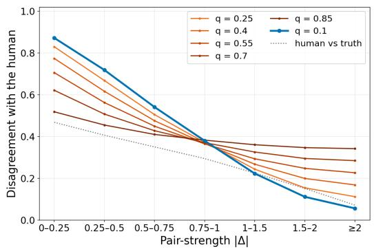
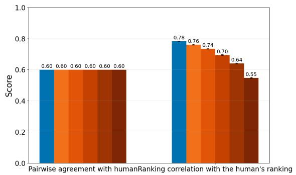
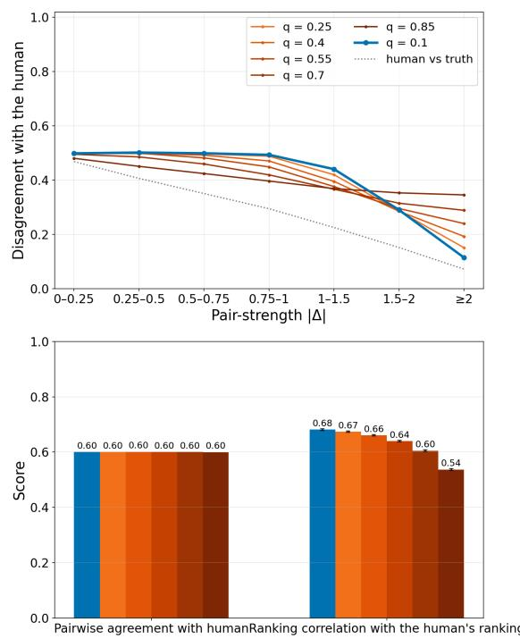

# Pair Difficulty Matters: Rethinking Pairwise LLM-as-a-Judge Evaluation and Consistency

Bruno Brocai Heidelberg University German Department bruno.brocai@gs.uni-heidelberg.de

Maria Becker Heidelberg University German Department maria.becker@gs.uni-heidelberg.de

## Abstract

Large Language Model judges are widely used to rank texts and text-generating systems through pairwise comparison, and their reliability is typically assessed via three proxies: position bias, transitivity, and pairwise agreement (self- or human-labeled). Because these proxies drive judge selection and benchmarking, a substantial literature reporting that judges perform poorly on them risks steering practitioners away from otherwise capable evaluators. We argue this assessment is misleading. Under the Bradley–Terry geometry underlying pairwise aggregation, each proxy is dominated by close-rank-gap pairs, where inconsistency is information-theoretically expected and individual verdicts contribute little to the aggregate ranking; far-gap pairs carry the ranking signal but barely move the proxies. We formalize this argument and validate it in a controlled simulation and on two human-rated corpora: the proxies correlate only weakly with ranking accuracy against gold, and their predictive component concentrates in the far-gap regime. Judges should therefore be assessed on rank-gap-conditional metrics, ideally against human rankings. Code at https://github.com/brunobrocai/PairDifficulty.

## 1 Introduction

LLM-as-a-judge has become a central paradigm for evaluating generated text across many domains (Gu et al., 2026). However, a growing body of work has documented systematic problems with LLM-judges that fall broadly under the heading of inconsistency, and several distinct forms have been identified. Models exhibit run-to-run inconsistency, returning different verdicts across repeated queries under identical or near-identical settings. They exhibit position bias — by far the most-discussed failure mode — preferring one slot of a pairwise comparison at rates well above chance. They also exhibit non-transitivity at the level of the induced preference graph.

A separate line of work has compared LLM verdicts not to internal consistency criteria but to individual pairwise judgments, focusing on human–LLM divergence at the pair level (e.g., Fein et al., 2026; Zheng et al., 2023; Li et al., 2024). These two strands — internal inconsistency on the one hand, and disagreement with humans on the other — are typically treated as distinct problems. However, the comparisons that dominate aggregate inconsistency metrics are often the comparisons that matter least for ranking recovery. We argue that they are closely connected: They are both affected by pair gap / difficulty, and because of this, are both unreliable proxies of judge quality when it comes to recovering human-derived rankings.

## 2 Related Work

Swapping two responses can flip a judge’s verdict — a phenomenon documented early on by Wang et al. (2024) and Zheng et al. (2023), and usually addressed by balanced-position aggregation. Shi et al. (2025) provide the most thorough analysis to date and find that the gap between texts is a key factor: pairs close in quality are affected far more strongly than distant ones.

Xu et al. (2025) document non-transitivity in pairwise rankings and show that, like position bias, it concentrates on close pairs; they mitigate it through round-robin tournaments and Bradley– Terry (BT) aggregation. Wang et al. (2026) target inconsistency directly and document that 85–90% of transitivity violations are tie-driven and that judge capability does not monotonically reduce inconsistency. SAGE (Feng et al., 2025) evaluates judges along exactly these two axes without requiring human-labeled comparisons, and finds that even top models fail on roughly a quarter of difficult cases. All of this work treats inconsistency as a defect that needs to be reduced rather than asking what its structure reveals about the judge.

Zheng et al. (2023) measure pair-level agreement between LLM judges and humans directly and find that this agreement is gap-conditional: the residual disagreement concentrates on close pairs where humans also disagree. Thakur et al. (2025) argue that aggregate alignment metrics are misleading proxies for judge usefulness: judges with substantially lower percent agreement can still produce ranking correlations with humans that are nearly identical, because consistent biases preserve relative ordering even when they distort absolute scores. We extend this line of argument along an orthogonal axis. While Thakur et al. decompose by use case (scoring versus ranking), we decompose by the rank gap of the items being compared, and show that aggregate inconsistency is dominated by close-pair behavior that a calibrated judge often produces.

## 3 Theory

We aggregate pairwise verdicts under the BT model (Bradley and Terry, 1952), the most robust ranking algorithm for most use cases (Daynauth et al., 2025). Under BT, each item i carries a latent strength $\theta _ { i } ,$ and the probability that i is preferred to j is $\operatorname* { P r } ( i \ \succ \ j ) = \sigma ( \theta _ { i } - \theta _ { j } )$ , where $\sigma ( x ) =$ $( 1 + e ^ { - x } ) ^ { - 1 }$ is the logistic function. In a pair with a true strength gap $\Delta = \theta _ { i } - \theta _ { j }$ , the two possible outcomes have log-probabilities log $\sigma ( \Delta )$ and log $\sigma ( - \Delta )$ , which differ by exactly |∆|. Close pairs are near-coinflips, and the two outcomes are nearly equally consistent with the model; far pairs are lopsided, and one outcome is much more consistent than the other. A flipped verdict therefore changes that pair’s log-likelihood contribution by |∆|:

• Close pair $( \Delta \approx 0 ) \mathrm { : }$ : both outcomes have nearly the same likelihood, so a flip is nearly free under the model and exerts little pull on ˆθ.

• Far pair (large $| \Delta | ) \colon$ the two outcomes differ in log-likelihood by $| \Delta |$ , so a flip is strong evidence against the current ˆθ and pulls the MLE toward revising it.

This separates two failure modes that aggregate metrics conflate. Close-pair self-inconsistency — the judge flipping its own verdict across runs — is Bayes-optimal noise: the BT model itself assigns the two outcomes near-equal probability, so a flip is consistent with the model and the recovered ranking barely moves. Far-pair self-inconsistency, by contrast, is where calibration error becomes visible: the model strongly predicts one outcome, so absorbing a flip in the other direction forces ˆθ to revise what the latent strengths must be. Noise of the first kind is irreducible and does not systematically bias the recovered ranking; error of the second kind does. The same |∆|-weighting applies to judge–human disagreement: when the judge’s verdict diverges from the human verdict, the induced shift in ˆθ is again largest in the high-|∆| regime, while close-pair disagreement is bounded below by the noise human annotators themselves cannot avoid. Pair-level agreement metrics — Krippendorff’s α, raw agreement rates, position-flip rates — weight every pair equally and therefore systematically overweight the regime that contributes least to ranking distance from gold, whether the comparison is judge-vs-judge or judge-vs-human.

This predicts the empirical pattern: aggregate reliability and position-bias scores should correlate weakly with ranking accuracy against human gold, with predictive signal concentrated in the far-pair tail. It also clarifies prior findings: position bias is empirically strongest on close pairs (Shi et al., 2025), exactly where its information cost is lowest, and human annotators themselves disagree most on close pairs (Zheng et al., 2023) — as BT predicts. Judges and humans agree on what the hard cases are; the question this paper takes up is whether the measures recognize that the hard cases are also the cheap ones.

## 4 Simulation: Human Agreement

To isolate the effect of disagreement distribution independently of model-specific behavior, we construct a controlled simulation in which judges differ only in where across the rank-gap spectrum their errors occur.

We simulate a dataset with normally distributed BT strengths and generate human comparisons from randomly drawing the winner of each comparison by using BT-probability (see appendix C for results with other simulation settings). Then we simulate models based on the human comparisons to ensure exactly equal pairwise agreement. The simulated models pick the human’s winner 60% of the time — they only differ on which pair gold gaps these errors concentrate. We do that by sampling error pairs with different weights, where weight $q = 0$ means the disagreement is completely evenly distributed and $q = 1$ means all disagreement is concentrated on far pairs.

  
Figure 1: Simulation results for BT Judges with identical pairwise agreement. Top shows how disagreement between judges and humans is differently distributed, while overall agreement is exactly equal (bottom left). Despite this, ranking correlation with the human gold varies substantially depending on where disagreement occurs (bottom right).

As Figure 1 shows, pairwise agreement between simulated judges and humans is equal across different q — the only difference is that some judges agree less with humans on distant pairs, while others more on close pairs. Despite that, agreement with gold falls sharply as judge errors increase at higher $| \Delta |$ |s, even if these errors are counterbalanced by higher accuracy on close pairs. Therefore, pairwise-level agreement is not the same as ranking correlation due to the spread of disagreement, and cannot substitute for ranking correlation. Namely, it cannot distinguish a judge that performs well on easy/far pairs but uses a misaligned heuristic (e.g. length) to tie-break close pairs from a judge doing exactly the opposite, but the former is a much better judge.

## 5 Experiment: Model Inconsistencies

Datasets CLEAR (Crossley et al., 2023) is a dataset of English school text excerpts rated on comprehensibility by teachers. The human rating was performed pairwise: teachers were shown two texts and asked to pick which one is easier for students to understand. We use 200 randomly selected texts. ASAP 2.0 (Crossley et al., 2025) is a corpus of student writing tests for grades 6 to 10, where students were tasked to argue for a position on a topic using a source text on that topic. The essays are human-rated on a scale of 1–6. We use 200 student essays from the test set on the topic of algorithmic facial emotion detection for grade 10.

Ranking human-labeled corpus texts rather than model outputs provides a clean gold standard for pairwise rank gaps, which is unavailable when the ranked items are the generating models themselves.

Position Bias We evaluate GPT-5.4-nano and - mini, Ministral-3-3B and -14B, as well as Gemma-3-4B and -12B (see appendix A) on both the CLEAR and the ASAP 2.0 corpus. Each pair is evaluated twice with reversed answer orderings. We measure position bias using two standard metrics: (1) the consistency, i.e., the frequency with which the same verdict is retained after position reversal; and (2) inconsistent-pair primacy (IPP), the proportion of inconsistent pairs in which the judge prefers the first-shown response. An IPP of .5 indicates that inconsistent verdicts split evenly between positions.

Dividing positional consistency into different |∆|-quartiles shows that position bias exists mostly on close pairs. Since a flipped verdict amounts to a tie under balanced aggregation, this reflects indecision on very close pairs ("too close to score").

Crucially, consistency, IPP, and rank correlation with gold do not track each other (Tables 1 and 2). On CLEAR, the two GPTs flip at indistinguishable rates1, yet mini achieves significantly higher $\rho .$ On ASAP the pattern reverses: nano is significantly more consistent while the two rank the field equally well. Ministral behaves similarly on ASAP; only on CLEAR do its bias and correlation align in the expected direction. This is evidence that aggregate bias metrics are weak predictors of ranking performance, not that bias is benign.

Gemma-3-4B is the limiting case: almost entirely indecisive on close pairs, yet its far-pair judgments suffice to recover a ranking comparable to much more consistent judges. Its ceiling is naturally capped — it cannot resolve the "middle pack" — but the bias metric overstates the damage. The mild top-quartile inconsistency present in every model points instead to genuine conceptual misalignment: some pairs humans rank far apart are treated by the model as close. Fixing that is the more promising lever for correlation gains.

<table><tr><td rowspan="2">Judge</td><td colspan="3">Consistency (1–flip)</td><td rowspan="2">IPP all</td><td colspan="3">% non-transitive triads</td><td rowspan="2">ρ</td></tr><tr><td>all</td><td>close (Q1 gap)</td><td>far (Q4 gap)</td><td>cyc</td><td>mix</td><td>ineq</td></tr><tr><td rowspan="6">CLEAR</td><td>GPT-5.4-nano</td><td>.78</td><td>.72</td><td>.90</td><td>.61</td><td>0.0 0.8</td><td></td><td>9.9</td><td>+0.691</td></tr><tr><td>GPT-5.4-mini</td><td>.80</td><td>.66</td><td>.96</td><td>.97</td><td>0.0</td><td>0.4</td><td>9.5</td><td>+0.825</td></tr><tr><td>Ministral-3-3B</td><td>.79</td><td>.70</td><td>.92</td><td>.89</td><td>0.0</td><td>0.4</td><td>6.2</td><td>+0.755</td></tr><tr><td>Ministral-3-14B</td><td>.84</td><td>.73</td><td>.97</td><td>.89</td><td>0.0</td><td>0.8</td><td>4.1</td><td>+0.788</td></tr><tr><td>Gemma-3-4B</td><td>.22</td><td>.09</td><td>.46</td><td>1.00</td><td>0.0</td><td>0.0</td><td>27.2</td><td>+0.676</td></tr><tr><td>Gemma-3-12B</td><td>.76</td><td>.57</td><td>.96</td><td>.99</td><td>0.0</td><td>0.0</td><td>7.8</td><td>+0.830</td></tr><tr><td rowspan="6">ASAP</td><td>GPT-5.4-nano</td><td>.79</td><td>.74</td><td>.85</td><td>.21</td><td>0.0</td><td>4.9</td><td>10.7</td><td>+0.677</td></tr><tr><td>GPT-5.4-mini</td><td>.73</td><td>.62</td><td>.84</td><td>.03</td><td>0.0</td><td>0.0</td><td>13.8</td><td>+0.674</td></tr><tr><td>Ministral-3-3B</td><td>.78</td><td>.65</td><td>.94</td><td>.02</td><td>0.0</td><td>0.4</td><td>7.1</td><td>+0.726</td></tr><tr><td>Ministral-3-14B</td><td>.83</td><td>.77</td><td>.94</td><td>.02</td><td>0.0</td><td>0.0</td><td>3.6</td><td>+0.690</td></tr><tr><td>Gemma-3-4B</td><td>.34</td><td>.19</td><td>.53</td><td>1.00</td><td>0.0</td><td>0.0 0.9</td><td>29.3</td><td>+0.668</td></tr><tr><td>Gemma-3-12B</td><td>.84</td><td>.78</td><td>.95</td><td>.86</td><td>0.0</td><td></td><td>4.9</td><td>+0.735</td></tr></table>

Table 1: Inconsistency as a close-pair phenomenon does not track ranking accuracy. Consistency is how often the judge chooses the same text across the swapped pairs; IPP is inconsistent-pair primacy, with .5 indicating perfect balance. CLOSE/FAR are the same rate restricted to the bottom/top quartile of the gold gap $| g _ { a } - g _ { b } |$ . Triad-% is the proportion of all triads. $\rho$ is the Spearman correlation of the LLM-derived BT skill against human gold.

Non-Transitivity We analyze non-transitivity only on triads, distinguishing (1) cyclical $( A \prec B$ $B \prec C , C \prec A )$ , (2) mixed $( A \succ B , B \succ C .$ $C \sim A )$ , and (3) inequality $( A \sim B , B \sim C ,$ $A \ \not \sim \ C )$ . Given the close-pair indecision documented above, inequality non-transitivity can be substantively valid: if |∆| between A and C is large enough to score, the triad is consistent with the model’s own behavior.

Across all judges, non-transitivity is dominated by the inequality type and tracks consistency tightly (Pearson r = .928): it is largely a re-expression of the indecision already captured by position bias. Within each family the larger model generally produces fewer non-transitivities, so the metric mainly tracks model size — generally, but not reliably, a proxy for judge quality. Despite far higher nontransitivity, Gemma-3-4B does not correlate significantly worse with human gold than GPT-5.4-nano (Table 1), confirming that intransitivity is a weak model-selection signal.

<table><tr><td>Proxy</td><td> $\rho _ { s }$  vs ranking ρ</td><td>PHolm</td></tr><tr><td>Consistency, all</td><td>+0.559</td><td>0.198</td></tr><tr><td>Consistency, close</td><td>+0.245</td><td>0.892</td></tr><tr><td>Consistency, far</td><td>+0.897</td><td>0.001*</td></tr><tr><td>Primacy (IPP)</td><td>+0.126</td><td>0.892</td></tr><tr><td>Intransitivity</td><td>-0.608</td><td>0.174</td></tr></table>

Table 2: Spearman correlation between inconsistencies and the model’s ability to replicate human gold ranking, and the associated Holm-corrected significance. Two-sided permutation p (10,000 reshuffles) over the 12 judge-corpus points, Holm-corrected across the five proxies. With N=12 the test is well-powered for strong effects but has limited power against moderate effects. We note this as a limitation but emphasize the practical implication: a metric whose correlation with gold ranking is too weak to survive correction at this scale is too noisy to be used as a model-selection signal in practice.

## 6 Conclusion

Internal consistency and pairwise agreement with humans are useful judge properties, but the central question is whether a judge recovers the same latent ranking structure as humans. Therefore, the most direct evaluation criterion is the agreement between human and LLM rankings, and imperfect local consistency should not be treated as disqualifying. Aggregate inconsistency metrics such as position bias should be read in light of pair difficulty: a metric that weights all pairs equally rewards judges that excel on low-information comparisons and penalizes those that excel on the informative, far-gap comparisons.

This is not to say close pairs are irrelevant. Bias mitigation does help in making an already wellaligned judge more decisive on close pairs, which improves ranking granularity. Close pairs will matter more as judges improve and as tasks get harder (e.g. leaderboarding closely-performing state-ofthe-art models). But since LLM judges still struggle on many tasks (Bavaresco et al., 2025), the far-pair regime is where gains are currently largest.

Two implications follow for benchmarks. For item design, judge accuracy scales with the rank gap between responses, so prompts that are difficult for the models being judged are exactly those that yield pairs that are easy for an aligned judge. This offers an explanation for the separability reported for benchmarks such as ArenaHard (Li et al., 2025). However, item pools that elicit uniformly strong or uniformly weak responses both compress the gap, so item difficulty should be designed for response spread, not for higher difficulty as such. For gold standards, pair difficulty should be made observable. Items should be organized into rankings rather than isolated pairs wherever possible, and where that is infeasible, pair-difficulty-aware metrics should be reported. We do not recommend a specific metric, however, since the choice depends on how the human gold pairs were elicited and needs new behavioral data. For example, annotators could rate pair closeness directly, but this presupposes that humans can estimate closeness reliably; alternatively, annotator disagreement could proxy for difficulty, but how well disagreement tracks the rank gap has, to our knowledge, not been systematically studied. Instead of chasing everlower bias and ever-higher pairwise agreement, the next generation of judge evaluations should target the regimes where ranking signal actually lives.

## Limitations

Our rank-gap analysis requires a notion of latent strength on each corpus. CLEAR comes with BTscores pre-computed. On ASAP 2.0 we use pointwise human ratings as a strength proxy; this is a noisier estimator of θhuman than pairwise-derived strengths and weakens within-bucket contrasts, so the reported pattern on ASAP 2.0 is a lower bound. Specifically, real ties, though likely rare, cannot be distinguished from a quality gap that is below the rating resolution. We therefore also provide a reanalysis excluding gold ties in appendix D.

The datasets we used both come from the educational domain, and so our results may not generalize to certain settings where LLM-as-a-judge is often used, such as QA and leaderboards. We made this choice because the two datasets provide textlevel ground truth, which is needed to measure pair difficulty. For these other settings, to our knowledge, there do not exist datasets with item-level ground truth we could have evaluated on.

We restrict our attention to pairwise judging. The theoretical argument is specific to binary comparison, and listwise judging introduces additional position-bias structure (Shi et al., 2025) that the present framework does not address.

Finally, our experiments assume the goal of LLM-as-a-judge is to recover a human gold standard that is usually somewhat subjective. Human raters are themselves imperfect estimators of any underlying quality, and what they rate may diverge from what we actually care about estimating — on CLEAR, for instance, teacher ratings of text comprehensibility are not the same construct as comprehension measured directly from student readers. In settings with an objective gold and well-separated candidates, such as verifiable math or code tasks with skill-stratified models, the close-pair regime our analysis emphasizes becomes sparse and the practical importance of the misweighting effect diminishes, though the underlying information theory remains unchanged.

## Use of AI Assistants

AI writing assistance was used for sentence-level paraphrasing and polishing of author-written text; it was not used to generate research ideas, technical claims, related-work positioning, or citations. AIassisted coding tools used during analysis script development are documented in the released code repository’s README.

## References

Anna Bavaresco, Raffaella Bernardi, Leonardo Bertolazzi, Desmond Elliott, Raquel Fernández, Albert Gatt, Esam Ghaleb, Mario Giulianelli, Michael Hanna, Alexander Koller, Andre Martins, Philipp Mondorf, Vera Neplenbroek, Sandro Pezzelle, Barbara Plank, David Schlangen, Alessandro Suglia, Aditya K Surikuchi, Ece Takmaz, and Alberto Testoni. 2025. LLMs instead of Human Judges? A

Large Scale Empirical Study across 20 NLP Evaluation Tasks. In Proceedings of the 63rd Annual Meeting of the Association for Computational Linguistics (Volume 2: Short Papers), pages 238–255, Vienna, Austria.

Ralph Allan Bradley and Milton E. Terry. 1952. Rank Analysis of Incomplete Block Designs: I. The Method of Paired Comparisons. Biometrika, 39(3/4):324–345.

Scott Crossley, Aron Heintz, Joon Suh Choi, Jordan Batchelor, Mehrnoush Karimi, and Agnes Malatinszky. 2023. A large-scaled corpus for assessing text readability. Behavior Research Methods, 55(2):491– 507.

Scott A. Crossley, Perpetual Baffour, L. Burleigh, and Jules King. 2025. A Large-Scale Corpus for Assessing Source-Based Writing Quality: ASAP 2.0. Assessing Writing, 65:100954.

Roland Daynauth, Christopher Clarke, Krisztian Flautner, Lingjia Tang, and Jason Mars. 2025. Ranking Unraveled: Recipes for LLM Rankings in Head-to-Head AI Combat. In Proceedings of the 63rd Annual Meeting ofthe Associationfor Computational Linguistics (Volume 1: Long Papers), pages 26078– 26091, Vienna, Austria.

Daniel Fein, Sebastian Russo, Violet Xiang, Kabir Jolly, Rafael Rafailov, and Nick Haber. 2026. LitBench: A Benchmark and Dataset for Reliable Evaluation of Creative Writing. In Proceedings ofthe 19th Conference ofthe European Chapter ofthe Associationfor Computational Linguistics (Volume 1: Long Papers), pages 7740–7755, Rabat, Morocco.

Yuanning Feng, Sinan Wang, Zhengxiang Cheng, Yao Wan, and Dongping Chen. 2025. Are We on the Right Way to Assessing LLM-as-a-Judge? Preprint, arXiv:2512.16041.

Gemma Team, Aishwarya Kamath, Johan Ferret, Shreya Pathak, Nino Vieillard, Ramona Merhej, Sarah Perrin, Tatiana Matejovicova, Alexandre Ramé, Morgane Rivière, Louis Rouillard, Thomas Mesnard, Geoffrey Cideron, Jean bastien Grill, Sabela Ramos, Edouard Yvinec, Michelle Casbon, Etienne Pot, Ivo Penchev, and 197 others. 2025. Gemma 3 Technical Report. Preprint, arXiv:2503.19786.

Jiawei Gu, Xuhui Jiang, Zhichao Shi, Hexiang Tan, Xuehao Zhai, Chengjin Xu, Wei Li, Yinghan Shen, Shengjie Ma, Honghao Liu, Saizhuo Wang, Kun Zhang, Zhouchi Lin, Bowen Zhang, Lionel Ni, Wen Gao, Yuanzhuo Wang, and Jian Guo. 2026. A survey on LLM-as-a-judge. The Innovation, 7(6):101253.

Junlong Li, Shichao Sun, Weizhe Yuan, Run-Ze Fan, Hai Zhao, and Pengfei Liu. 2024. Generative Judge for Evaluating Alignment. In International Conference on Learning Representations, volume 2024, pages 27547–27574.

Tianle Li, Wei-Lin Chiang, Evan Frick, Lisa Dunlap, Tianhao Wu, Banghua Zhu, Joseph E. Gonzalez, and Ion Stoica. 2025. From crowdsourced data to highquality benchmarks: Arena-hard and benchbuilder pipeline. In Proceedings of the 42nd International Conference on Machine Learning, volume 267 of Proceedings ofMachine Learning Research, pages 34209–34231, Vancouver, Canada. PMLR.

Alexander H. Liu, Kartik Khandelwal, Sandeep Subramanian, Victor Jouault, Abhinav Rastogi, Adrien Sadé, Alan Jeffares, Albert Jiang, Alexandre Cahill, Alexandre Gavaudan, Alexandre Sablayrolles, Amélie Héliou, Amos You, Andy Ehrenberg, Andy Lo, Anton Eliseev, Antonia Calvi, Avinash Sooriyarachchi, Baptiste Bout, and 101 others. 2026. Ministral 3. Preprint, arXiv:2601.08584.

OpenAI. 2026. Introducing GPT-5.4 mini and nano. https://openai.com/index/introducing-gpt-5- 4-mini-and-nano/.

Lin Shi, Chiyu Ma, Wenhua Liang, Xingjian Diao, Weicheng Ma, and Soroush Vosoughi. 2025. Judging the Judges: A Systematic Study of Position Bias in LLMas-a-Judge. In Proceedings ofthe 14th International Joint Conference on Natural Language Processing and the 4th Conference ofthe Asia-Pacific Chapter of the Association for Computational Linguistics, pages 292–314, Mumbai, India. The Asian Federation of Natural Language Processing and The Association for Computational Linguistics.

Aman Singh Thakur, Kartik Choudhary, Venkat Srinik Ramayapally, Sankaran Vaidyanathan, and Dieuwke Hupkes. 2025. Judging the Judges: Evaluating Alignment and Vulnerabilities in LLMs-as-Judges. In Proceedings ofthe Fourth Workshop on Generation, Evaluation and Metrics (GEM2), pages 404–430, Vienna, Austria.

Peiyi Wang, Lei Li, Liang Chen, Zefan Cai, Dawei Zhu, Binghuai Lin, Yunbo Cao, Lingpeng Kong, Qi Liu, Tianyu Liu, and Zhifang Sui. 2024. Large Language Models are not Fair Evaluators. In Proceedings ofthe 62nd Annual Meeting ofthe Associationfor Computational Linguistics (Volume 1: Long Papers), pages 9440–9450, Bangkok, Thailand.

Yidong Wang, Yunze Song, Tingyuan Zhu, Xuanwang Zhang, Zhuohao Yu, Hao Chen, Chiyu Song, Qiufeng Wang, Zhen Wu, Xinyu Dai, Yue Zhang, Cunxiang Wang, Wei Ye, and Shikun Zhang. 2026. TrustJudge: Inconsistencies of LLM-as-a-judge and how to alleviate them. In The Fourteenth International Conference on Learning Representations (ICLR).

Yi Xu, Laura Ruis, Tim Rocktäschel, and Robert Kirk. 2025. Investigating Non-Transitivity in LLM-as-a-Judge. In Proceedings of the 42nd International Conference on Machine Learning, volume 267 of Proceedings of Machine Learning Research, pages 69583–69612, Vancouver, Canada. PMLR.

Lianmin Zheng, Wei-Lin Chiang, Ying Sheng, Siyuan Zhuang, Zhanghao Wu, Yonghao Zhuang, Zi Lin,

Zhuohan Li, Dacheng Li, Eric Xing, Hao Zhang, Joseph Gonzalez, and Ion Stoica. 2023. Judging LLM-as-a-Judge with MT-Bench and Chatbot Arena. In Advances in Neural Information Processing Systems, volume 36, pages 46595–46623. Curran Associates, Inc.

## A Models

We evaluate six judges spanning three model families and two size tiers per family. Table 3 summarizes parameter counts, licenses, and access modalities. All model use is consistent with the intended research and evaluation use stated by each provider. We focus on smaller models (3B–14B parameters) because the variance-limited regime our analysis targets is most pronounced at this scale; larger models exhibit ceiling effects on the corpora we use.

<table><tr><td>Model</td><td>Params</td><td>Access</td></tr><tr><td>GPT-5.4 nano (OpenAI, 2026)</td><td>undisclosed</td><td>API</td></tr><tr><td>GPT-5.4 mini (OpenAI, 2026)</td><td>undisclosed</td><td>API</td></tr><tr><td>Ministral 3 3B (Liu et al., 2026)</td><td>3B</td><td>Open weights</td></tr><tr><td>Ministral 3 14B (Liu et al., 2026)</td><td>14B</td><td>Open weights</td></tr><tr><td>Gemma 3 4B (Gemma Team et al., 2025)</td><td>4B</td><td>Open weights</td></tr><tr><td>Gemma 3 12B (Gemma Team et al., 2025)</td><td>12B</td><td>Open weights</td></tr></table>

Table 3: Judge models.

Note that this generation of OpenAI models does not support fully deterministic output (which we used for the open weight models), which may inflate the reported inconsistency numbers and prevent exact replication. Nevertheless, these models are state-of-the-art (e.g., mini’s top performance on CLEAR) and widely used in production, so we felt it was important to include them in order to situate API-based models within our broader thesis.

All open-weights inference was run locally on Apple Silicon using llama.cpp with Q8\_0 quantization, which is deterministic under greedy decoding and introduces minimal precision loss relative to FP16. Total wall-clock across the four openweights judges and two corpora was approximately 20 hours.

## B Prompts

## B.1 CLEAR: readability ease

Note: Exact instructions used for the human rating.

System prompt (CLEAR)   
You are a school teacher.   
Pairwise judging prompt (CLEAR)   
Which text is easier for students to   
understand?   
Text A:   
{text\_a}   
Text B:   
{text\_b}

## B.2 ASAP 2.0: holistic essay quality

Reformulates the pointwise criteria of the human raters into pairwise criteria.

You are an expert essay grader comparing the overall (holistic) quality of two source-based, argumentative student essays written in response to the same writing prompt. Pick the higher-quality essay using the criteria below.

## Pairwise judging prompt (ASAP 2.0)

You are judging the overall (holistic) quality of a source-based, argumentative essay written by a school student in response to the writing prompt shown below. Quality is holistic: weigh everything that goes into a strong essay together, not any single feature in isolation.

What contributes to holistic quality:

\- whether the essay develops a clear, well-supported point of view on the issue, with genuine critical thinking (vs. a vague, simplistic, or missing position)

\- whether it uses appropriate, accurate examples, reasons, and evidence drawn from the source text(s) (vs. sparse, misused, or merely personal-opinion support)

\- whether it is well organized and focused, with coherence and smooth progression of ideas (vs. disjointed or unfocused)

\- command of language: varied, accurate, apt vocabulary and meaningful sentence variety (vs. weak word choice or monotonous/broken structure)

\- control of grammar, usage, and mechanics (vs. errors frequent or serious enough to obscure meaning)

The students first read the source article below, then wrote their essay in response to the writing prompt that follows. Use it to judge whether the essay’s evidence is accurate and genuinely drawn from the source (vs. vague, misremembered, or fabricated).

Source article — "Making Mona Lisa Smile" by   
Nick D’Alto:   
[full article text omitted here, see (Crossley   
et al., 2025)]   
—   
Writing prompt the students responded to:   
{assignment}   
—   
Essay A:   
{text\_a}   
—   
Essay B:   
{text\_b}   
—   
Which essay is higher quality overall?

## C Simulation Under Different Settings

The simulation in section 4 makes several assumptions (BT-behaving human, normal strength distribution, LLM-human pairwise agreement of only .6, judges that do not tie), but our code also allows for other simulation settings, which was run as a robustness check.

• Deterministic human judge. The human picks the higher-gold item with fixed probability p rather than according to BT probabilities, deterministically at p = 1. Every judge disagreement is now an outright error with respect to gold, so far-pair disagreement is even more damaging for ranking recovery. Close-pair disagreements are errors in the same sense, but cost almost no ranking information.

• Uniform strength distribution. A uniform distribution yields fewer close pairs and more far pairs relative to the normal baseline, so farpair performance carries an even larger share of the ranking signal, and ranking recovery separates more strongly.

• Higher pairwise agreement. As agreement rises, all simulated judges approach the rankcorrelation ceiling; the ranking correlation differences between them shrink, and pair difficulty matters less.

For a judge that coinflips on close pairs instead of actively disagreeing, the judges with identical agreement still recover the ranking differently, though the difference is lower. Naturally, fewer of the judges’ disagreements can now come from close pairs, so more disagreements have to fall on far pairs even for the far-pair-aligned judges. We report this variant separately (Figure 2) since it changes both the agreement distribution as well as the ranking recovery.

  
Figure 2: Simulation results for BT Judges with identical pairwise agreement that coinflip below a certain pair gap. Top shows how disagreement between judges and humans is differently distributed, while overall agreement is exactly equal (bottom left). Despite this, ranking correlation with the human gold varies substantially depending on where disagreement occurs (bottom right).

## D ASAP Without Gold-Tied Pairs

Due to integer pointwise scoring, ASAP 2.0 gold gaps have a low resolution, and ties are common. But a tie indicates a quality difference below rating resolution, not necessarily equality. The items may still have a quality difference that is imperceptible by the gold standard. But judge inconsistency is still measurable, unless we assume exact ties. We therefore report the numbers including ties in Table 1. But to confirm that no conclusion depends on these pairs, we repeat the ASAP analyses with them excluded (Table 4) as a robustness check.

The close bucket then becomes gap = 1; the far bucket is unchanged (gap ≥ 2). Consistency remains close < far for all six judges. Ranking recovery does not degrade when gold-tied pairs are dropped from the BT input: ρ against the human gold rises for every judge, by +0.01 to +0.06, likely because we are removing noise. The Table 2 result is likewise unaffected, with Spearman(farconsistency, correlation with human gold) = .897 under the new binning, identical to the reported value.

<table><tr><td rowspan="2">Judge</td><td colspan="3">Consistency (1—flip)</td><td colspan="2">ρvs gold</td></tr><tr><td>close (gap = 0) 28.2%</td><td>close (gap = 1) 44.9%</td><td>far  $\left( \mathrm { g a p } \ge 2 \right)$  26.8%</td><td>all verdicts</td><td>tied excluded</td></tr><tr><td>GPT-5.4-nano</td><td>.74</td><td>.78</td><td>.85</td><td>+0.677</td><td>+0.735</td></tr><tr><td>GPT-5.4-mini</td><td>.62</td><td>.73</td><td>.84</td><td>+0.674</td><td>+0.726</td></tr><tr><td>Ministral-3-3B</td><td>.65</td><td>.76</td><td>.94</td><td>+0.726</td><td>+0.786</td></tr><tr><td>Ministral-3-14B</td><td>.77</td><td>.80</td><td>.94</td><td>+0.690</td><td>+0.753</td></tr><tr><td>Gemma-3-4B</td><td>.19</td><td>.32</td><td>.53</td><td>+0.668</td><td>+0.678</td></tr><tr><td>Gemma-3-12B</td><td>.78</td><td>.81</td><td>.95</td><td>+0.735</td><td>+0.797</td></tr></table>

Table 4: ASAP 2.0 robustness check with gold-tied pairs removed. Consistency is reported for the three gold-gap buckets.