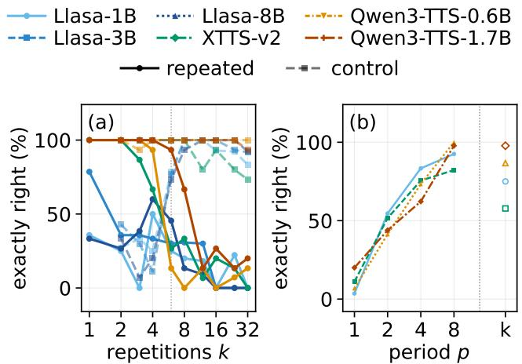

# REPETITION, NOT LENGTH: ISOLATING THE COUNTING FAILURE IN NEURAL TEXT-TO-SPEECH

Kirill Borodin1, Vasilii Kudryavtsev1, Maxim Maslov2, Grach Mkrtchian2,3

1BitmanagerAI, Dubai, UAE 2lab260, Yerevan, Armenia 3MTUCI, Moscow, Russia kborodin.research@gmail.com

## ABSTRACT

Text-to-speech models loop, truncate and lose count on text that repeats a phrase many times. We show that repetition itself is what breaks them, not the length that comes with it. Every repeated sentence in our test set is paired with a control of matched sentence and word count in which no word ever repeats back-to-back. Six models from three architectures render the controls almost perfectly and fail the repeated twins: 94.3% against 18.2% exactly right at � ≥ 6. The gap survives greedy decoding, repetition-penalty sweeps, four independent speech recognisers and 420 analysis specifications without once reversing sign; a held-out fourth architecture lands within a point of its predicted gap, and one of two non-autoregressive baselines shows the same failure. Varying the period of the text shows the failure grows smoothly with periodicity, half of it surviving when no word is adjacent to itself.

Index Terms— speech synthesis, hallucination, repetition, autoregressive models, evaluation

## 1. INTRODUCTION

Ask a text-to-speech (TTS) model to repeat a word a dozen times and it will frequently get the count wrong: it stops early, runs on, or locks into a loop. The behaviour is documented as a stability problem [1, 2] and usually attributed to exposure bias or missing alignment constraints, with fixes proposed at the level of attention supervision or decoding rules [3–5]; it is the speech analogue of neural text degeneration [6, 7].

Such reports confound two variables, because repeating a phrase � times makes the text both longer and repetitive. If long inputs are simply harder, nothing about repetition needs explaining. Our design separates the two: every repeated item is paired with a length-matched control of the same carrier and word count, in which the � copies of one word become non-adjacent distinct fillers, drawn from a fixed pool of eight. A length account predicts the two curves coincide. They do not.

We contribute: (i) a controlled manipulation isolating repetition from length, validated on six checkpoints, two non- autoregressive baselines and a held-out architecture; (ii) a purpose-built test set and a judge methodology for repetitive speech; and (iii) a negative mechanistic result: the contraction account of [8] does not describe any decoder we measured.

Table 1. Likelihood of the paired texts under two independent scorers: mean NLL per token (lower = more probable) and the share of 54 pairs whose control is less probable. A panel-internal scorer agrees (supplementary material).
<table><tr><td rowspan="2">Scorer</td><td colspan="2">NLL/token</td><td rowspan="2">n ctl. less probable (% of pairs)</td></tr><tr><td>rep.</td><td>ctl.</td></tr><tr><td>phi-2</td><td>3.69</td><td>4.89</td><td>87</td></tr><tr><td>GPT-2-large</td><td>3.36</td><td>5.34</td><td>100</td></tr></table>

## 2. EXPERIMENTAL SETUP

Test set. 180 items, generated deterministically by a released script; the texts are authored, not drawn from a corpus, since every sentence must contain its target word a known number of times. Templates follow fixed constraints: targets are common one- or two-syllable words without close homophones, and carriers are plain conversational English. Six carrier templates each fix a prefix, target and sufix (“The dog was very . . . big”); the target is repeated � ∈ {1, 2, 3, 4, 6, 8, 12, 16, 24, 32} times; we call this sweep of � the ladder. Sentence-repetition, tongue-twister and number-phrase item types are built the same way. Every item at � ≥ 2 has a length-matched control from the same template: the � copies are replaced, in fixed order, by fillers from a per-template pool of eight, so only repetition difers within a pair. The pool cycles above �=8, making those controls period-8; a never-cycled variant quantifies the diference (Sec. 3). Nor are the items improbable strings (Table 1): under two independent language models the control is the less probable text in most pairs, so the repeated items are, if anything, the more natural ones. The generation script, test set, transcripts and analysis code are released.1

Models. Six checkpoints from three architectures form the panel: Llasa at 1B/3B/8B (Llama backbones over Xcodec2 tokens [9]), Qwen3-TTS at 0.6B/1.7B [10], and XTTSv2 [11]. Outside the panel: VITS [12] and F5-TTS [13] as non-autoregressive baselines, CosyVoice 2 [4] as a fourth architecture held out until the analysis was frozen, and penalty, greedy and sampling ablations of panel members (Tables 3 and 6). Every system renders every item at three seeds under each system’s shipped decoding defaults. The defaults make Qwen3-TTS the most stochastic family, so its larger check-point’s near-zero count-error gap (Sec. 3) is not conservative decoding at work.

Judge. The judge, the speech recogniser whose transcript we count, is a CTC model (wav2vec2-large-960hlv60-self; greedy best-path, no language model). The natural choice, Whisper large-v3 [14], is unsuitable here: its decoder is autoregressive with a language-model prior and hallucinates on exactly the audio under study [8]. On concate-nated utterances whose true count is known by construction, Whisper recovers a median 0.25 of the count on the 48 trials where it returns anything, and nothing at all in the other 60 of 108; the CTC judge recovers 1.00 (�=108) on the same audio. The full audit and the four-recogniser replication are in the supplementary material.

Metrics. �ˆ is the number of renditions of the target found in the transcript, counted in order and non-overlapping, skipping unrecognised words (stopping at the first miss would void every later filler). Three quantities are reported. Relative count error: $( \hat { c } - k ) / k$ , negative for undercounts. Exactly right: the share of generations with ${ \hat { c } } = k$ $G a p \mathrm { : }$ control minus repeated exactly-right rate, in percentage points; seen from the repeated side we also call it the deficit. Headline analyses cover the word-repetition ladder and its controls (other item types: supplementary material). Exclusion rules blind to the count (a template the judge cannot transcribe, our token budget, degenerate audio) keep 1558 of 2052 generations; the accounting is in the supplementary material and Table 6 shows the gap with every rule of. Individual analyses run on slightly diferent populations, so each number carries its own �.

Uncertainty. Every bracketed range [·, ·] in this paper is a 95% confidence interval: Wilson for single rates; for panel summaries, a nonparametric bootstrap over checkpoints, the unit our claims generalise over (generations cluster within one). Every headline estimate is computed four ways (per checkpoint, per family, mixed-efects and hierarchical Bayes; Table 2) and under 420 specifications, so no conclusion rests on one analysis choice.

## 3. RESULTS

## 3.1. The limit tracks repetition, not length

Figure 1(a) is the central test. Each control carries its twin’s carrier and word count, so any account in which length is what hurts (attention span, exposure bias, duration budgets) predicts the two curves coincide. They do not: from $k { = } 6$ the controls hold at 94.3% exactly right while repeated items fall from 40.5% at �=6 to 6.8% at �=32, 18.2% pooled (Table 3). Below $k { = } 6$ the two curves do not separate.

The miscounts are large and biased toward undercounting. Repeated items run a median count error of −12.5% per checkpoint against 0.0% [0.0, 0.0] for controls (�=525), at every � up to 32, in five of six checkpoints; the sixth ties at zero on this metric yet still loses 60.0 points of exact rate. Before exclusions, at $k { \geq } 8 \ ( n { = } 5 4 0 )$ , 51.3% truncate or undercount and 36.3% loop or overcount.

Table 2 gives the headline estimates under every clustering treatment. The exact-rate gap is positive in all 6 of 6 checkpoints and all 3 families, and all six interval constructions of the mixed-efects model exclude zero.

  
Fig. 1. The repeated–control dissociation, in the paper’s headline metric. (a) Exactly-right renderings against �: from $k { = } 6 ,$ , length- matched controls (dashed) stay near-perfect while repeated text (solid) collapses; below $k { = } 6$ transcription noise afects both conditions. (b) On the four checkpoints measured, at fixed carrier, word count and requested count, exact renderings rise smoothly with period $p ;$ hollow markers: the all-distinct $p { = } k$ items.

The statistical model also predicts out of sample: partial pooling of the three architectures puts the gap for an un- seen architecture at 65.3 [5.9, 93.3] points; the widest prior widens that interval to include zero, so we tested the prediction. CosyVoice 2, the design most likely to be immune thanks to its alignment supervision, its numbers predicted before it generated a waveform, lands within a point of the prediction, at 64.4 (Tables 2 and 3).

The $k { \geq } 6$ threshold was chosen after seeing where the curves diverge, so we also quote the unconditioned whole- ladder gap (Table 2) and vary the threshold along with every other analysis choice: across 420 specifications over six axes (exclusions, threshold, control variant, seeds, aggregation, outcome definition) the gap spans 34.4–86.4 points, median 70.5, and 0 of 420 reverse sign (Table 6).

Above �=8 the cycled control is itself period-8, and the headline gaps above use that cycled control. Using never-cycled fillers throughout shrinks the per-family �≥6 gap from 75.4 to 67.6 points and the per-checkpoint one from 76.7 to 69.6. Most of the diference is vocabulary dificulty, not periodicity: 1.7 points survive one unit of counting tolerance, and none of it shows on median error. Re-generated at matched � (12–32) with fully aperiodic controls, the rates are 10.0% against 83.1% $\scriptstyle ( n = 3 4 9 )$ : 73.1 points with no cycling anywhere.

Extension to $k \leq 1 2 8$ (exploratory). Within $k \leq 3 2$ the deficit is proportional in �, not saturating (residual 2.6 against 485.3 for a saturating fit), so no collapse point lies inside the main ladder. Extending 4 checkpoints to $k \leq 1 2 8$ shows the two conditions diverging in absolute terms (Table 4): the median rendered count of repeated items falls as the requested count rises, while controls keep climbing. The fitted saturation scale drops 4.2-fold, but the factor depends on the fitted form (3.1–5.4 across three saturating forms) and is not unanimous (in Qwen3-TTS-1.7B it moves the other way), so this cannot tell a hard limit from ordinary saturation.

Table 2. Headline estimates with 95% intervals, in exactly-right points (the count-error row: points of median relative error). The last two rows are the pre-registered out-of-panel prediction and its test.
<table><tr><td>Quantity</td><td>est. 95% interval</td></tr><tr><td>Exact-rate gap, per checkpoint (n=6) Exact-rate gap, per family (n=3) Exact-rate gap, mixed effects (widest of six) Count-error gap, per checkpoint</td><td>76.7 [68.4, 84.4] 75.4 [71.1, 78.9] 76.4 [63.2, 89.2] 10.4 [5.6, 13.9]</td></tr><tr><td>Exact-rate gap, whole ladder (n=1559) Predicted gap, unseen architecture Observed, CosyVoice 2 [4] (n=90 per arm) 64.4</td><td>46.8 65.3 [5.9, 93.3]</td></tr></table>

Table 3. Every system tested, $k \geq 6 ,$ CTC judge: median $( { \hat { c } } - k ) / k$ and exactly-right rate, repeated (rep.) against control (ctl.). Systems in the lower block are outside the panel; their count errors are in the supplementary material.
<table><tr><td rowspan="2">Model size</td><td>count err.</td><td colspan="2">exact (%)</td></tr><tr><td>rep. ctl.</td><td>rep.</td><td>ctl.</td></tr><tr><td>Llasa-1B [9] 1B</td><td>-12.5 0.0</td><td>13.3</td><td>91.5</td></tr><tr><td>Llasa-3B [9] 3B</td><td>-8.3 0.016.9</td><td></td><td>94.1</td></tr><tr><td>Llasa-8B [9] 8B</td><td>-16.7 0.011.8</td><td></td><td>93.2</td></tr><tr><td>XTTS-v2 [11] 0.4B</td><td>-12.50.016.7</td><td></td><td>87.8</td></tr><tr><td>Qwen3-TTS-0.6B [10] 0.6B Qwen3-TTS-1.7B [10] 1.7B</td><td>-12.5 0.0 0.0</td><td>7.9 0.038.9</td><td>100.0 98.9</td></tr><tr><td>Panel, pooled</td><td>6 ckpts. -8.3</td><td>0.018.2</td><td>94.3</td></tr><tr><td>CosyVoice 2 [4]</td><td>held-out</td><td>28.9</td><td>93.3</td></tr><tr><td>F5-TTS [13]</td><td>non-AR</td><td>25.6</td><td>85.6</td></tr><tr><td>VITS [12]</td><td></td><td>65.6</td><td>58.9</td></tr><tr><td></td><td>non-AR</td><td></td><td></td></tr></table>

## 3.2. The deficit is graded in the period

So far, repetition and periodicity vary together; a second ladder holds carrier, word count and requested count fixed and varies only the period �. The deficit is graded, not a step: exact rates rise 10.4, 47.9, 73.6, 93.1% at �=1, 2, 4, 8, monotone in all four checkpoints measured (Table 5; Fig. 1b).

The decisive step is �=2: no token is ever adjacent to itself, yet half the deficit remains (0.547 on the strictest of five scoring rules, 0.69–0.86 on the others). Nor is it a power-of-two artifact: at �=24 the odd step �=3 (62.3%) and non-power $p { = } 6 \left( 9 0 . 0 \% \right)$ land between their neighbours, as pre-registered. A comma, full stop or “and” between repetitions recovers none of it (�=465): the copies are segmented, just miscounted.

Whether the ordering of a period-� text or its restricted vocabulary carries the efect is unresolved. Shufling each item’s own words recovers almost none of the gap pooled $\left( 0 . 6 \% \right)$ , but that pooled number averages over a split: two checkpoints gain 17.8 points, one is null, and XTTS-v2 loses 30.0. That split is why the title claims repetition rather than periodicity.

Table 4. The $k \leq 1 2 8$ extension, 4 checkpoints: median rendered count against the requested count. Repeated renderings regress while controls advance.
<table><tr><td>Requested count</td><td>repeated</td><td>control</td></tr><tr><td> $k { = } 4 8$ </td><td>25.0</td><td>46.0</td></tr><tr><td> $k { = } 6 4$ </td><td>25.0</td><td>59.5</td></tr><tr><td> $k { = } 9 6$ </td><td>22.0</td><td>64.0</td></tr><tr><td> $k { = } 1 2 8$ </td><td>17.0</td><td>66.5</td></tr></table>

Table 5. The period ladder: exactly-right rate (%) against the period � of the text at fixed carrier, word count and requested count, pooled over the four checkpoints measured. The second row re-measures at �=24 with the odd and non-power steps added.
<table><tr><td></td><td> $p { = } 1$ </td><td> $p { = } 2$ </td><td> $p { = } 3$ </td><td> $p { = } 4$ </td><td> $p { = } 6$ </td><td>p=8</td></tr><tr><td>Ladder scan (n=1539)</td><td>10.4</td><td>47.9</td><td></td><td>73.6</td><td> $-$ </td><td>93.1</td></tr><tr><td>At k=24 (n=1202)</td><td>8.5</td><td>51.2</td><td>62.3</td><td>75.2</td><td>90.0</td><td>92.9</td></tr></table>

## 3.3. Not the decoding rule or our analysis choices

Table 6 varies the decoding rule and the analysis. The families ship penalties difering by an order of magnitude; swept over 4-fold (XTTS-v2) and 3-fold (Qwen3-TTS-0.6B) ranges, the gap stays put (15.6–21.1% and 7.8–16.7% exact). The three Llasa checkpoints apply no penalty at all and show it at full size; with the penalty disabled entirely, Qwen3-TTS-0.6B renders 10.0% exactly against 100.0%.

Greedy decoding and repetition-aware sampling leave the gap in place. Nor do our exclusion rules create the gap: with every rule of it is 61.7 points. The one rule that falls unevenly, the token budget (hit by 10.6% of repeated against 5.6% of control generations), can only cut counts short; keeping those rows would widen the gap, so excluding them is conservative. Re-scored with four independent recognisers it stays at 65.1– 76.7 points, positive everywhere; the per-judge analysis is in the supplementary material.

## 3.4. Non-autoregressive baselines

VITS shows no dissociation on the same strings through the same judge: −6.7 points against the panel’s 76.1 (Table 3). F5-TTS, flow-matching rather than autoregressive, shows a 60.0-point gap, so the failure is not specific to autoregressive decoding.

What plausibly separates the two is where the count must live: VITS predicts a duration per token, F5-TTS one total. Handed the oracle total duration, F5-TTS improves markedly below �=12 and not at all at or above it (Table 7): given the right length, the model still cannot place thirty-two repetitions inside it.

## 3.5. Repetition slows the growth of the state

The failure is also visible in the decoder’s state space. On a 136-item subset we record per-step hidden states at deep probe layers and compute the trajectory’s efective rank $N _ { \mathrm { e f f } } =$ $\begin{array} { r } { \exp ( - \sum _ { i } p _ { i } \log p _ { i } ) , p _ { i } } \end{array}$ the normalised singular values: the number of distinguishable states visited. The statistic is the capacity gain $d N _ { \mathrm { e f f } } / d$ log �, fitted separately on repeated items and on their length-matched controls.

Table 6. The gap under decoding and analysis variations. RAS is repetition-aware sampling [5].
<table><tr><td></td><td>gap (pts)</td></tr><tr><td>Panel,  $k \geq 6$  Exclusions off (n=1620)</td><td>76.1</td></tr><tr><td>No penalty (Llasa ×3)</td><td>61.7 78.9</td></tr><tr><td> $\mathrm { G r e e d y } \left( \mathrm { Q w e n 3 - T T S - 0 . 6 B } \right)$  Sampled (Qwen3-TTS-0.6B) RAS on (Qwen3-TTS-0.6B) RAS off (Qwen3-TTS-0.6B)</td><td>72.2 75.0 94.3</td></tr></table>

Table 7. F5-TTS handed the oracle total duration: exactly-right rate (%).
<table><tr><td></td><td>free oracle duration</td></tr><tr><td>Below  $k { = } 1 2 \ ( n { = } 3 0 )$  43.3</td><td>76.7</td></tr><tr><td>At or above  $k { = } 1 2 \ ( n { = } 6 0 )$  16.7</td><td>16.7</td></tr></table>

Repeated text grows new states at 0.46 of its control’s rate, median across the panel, with the two intervals disjoint in 5 of 6 checkpoints (Table 8). The gain stays bounded away from zero in 5 of $^ { 6 , }$ so this is a slowing, not a halt. At checkpoint level the gap in gains is 24.7 [13.7, 36.5] states per unit log �; by family, 20.1 [10.7, 38.5]. The ceiling columns of Table 8 agree.

## 4. DISCUSSION

A mechanism tried, and rejected. The contraction account of decoder hallucination [8] attributes looping to attractor dynamics: repeated conditioning drives the decoder state toward a fixed point, and once states have contracted together no readout can recover the count. It motivated this study; it fails here.

We estimated the contraction factor �: the largest singular value of the map from the decoder state at one repetition boundary to the next. $q < 1$ means states drift together; $q > 1$ that they separate. Across five checkpoints � runs 21.0–347.7: expansive in every item, on repeated and control text alike. It grows with scale inside Llasa, and the one checkpoint with zero median count error sits at $q { = } 2 4 . 7$ . Nor is attention near- uniform over the � copies (logit spread 1.23 nats, a 3.4-fold ratio), and flatter attention predicts better counting (�=0.59), the opposite of the account’s prediction.

What fails is not storage. The requested count stays decodable from late hidden states while the rendering fails (ridge probe, median $R ^ { 2 } { = } 0 . 4 8 )$ , as in text models [15]. Past the ladder $\scriptstyle ( k = 4 8 - 1 2 8 )$ that decodability thins (Table 9): one checkpoint fails to beat a constant predictor, a second ties it (0.99), and on the two Qwen checkpoints, where the probe still wins, a probe given only the audio length does as well, so the surviving signal need not encode the count. Deciding between state and readout needs an intervention at fixed state; our rank-1 patches fail their own positive control, so the question stays open.

Table 8. State capacity per checkpoint: growth of distinguishable states $d N _ { \mathrm { e f f } } / d$ log � with 95% intervals, and the saturating-fit ceiling of $N _ { \mathrm { e f f } } ,$ , repeated against control.
<table><tr><td rowspan="3">Model</td><td>capacity gain</td><td>ceiling</td></tr><tr><td>rep.</td><td>ctl. rep. ctl.</td></tr><tr><td></td><td></td></tr><tr><td>Llasa-1B [9] Llasa-3B [9]</td><td>18.2 [9.8,25.7] 56.7 [50.9,63.5] 181 247</td><td></td></tr><tr><td></td><td>12.4 [-1.8,23.3] 58.9 [52.8,68.0] 178 249</td><td></td></tr><tr><td>Llasa-8B [9]</td><td>15.0 [11.0,20.3] 45.5 [37.2,53.1] 188 228</td><td></td></tr><tr><td>XTTS-v2 [11]</td><td>24.0 [16.9,31.1] 34.8 [29.1,40.7]81 105</td><td></td></tr><tr><td></td><td>Qwen3-TTS-0.6B [10] 20.9 [16.3,25.9] 34.9 [30.6,39.6] 81 115</td><td></td></tr><tr><td>Qwen3-TTS-1.7B [10] 33.4 [29.6,37.2] 41.5 [37.7,45.8] 107 133</td><td></td><td></td></tr></table>

Table 9. Probe MAE past the ladder (�=48–128) as a fraction of a constant predictor’s; below 1 the count is still decodable. The control column runs the same probe on control items.
<table><tr><td>Checkpoint</td><td>repeated</td><td>control</td></tr><tr><td>Llasa-1B [9]</td><td>1.01</td><td>0.86</td></tr><tr><td>Llasa-3B [9]</td><td>0.99</td><td>0.83</td></tr><tr><td>Llasa-8B [9]</td><td>0.86</td><td>0.59</td></tr><tr><td>Qwen3-TTS-0.6B [10]</td><td>0.74</td><td>0.95</td></tr><tr><td>Qwen3-TTS-1.7B [10]</td><td>0.90</td><td>0.89</td></tr></table>

Related work. Closest is representational collapse [16]; Sec. 3.5 measures it under a length-matched control and finds a slowing, not a fixed point. Counting and state-tracking studies [17–22] delimit what transformers can count, but those limits are model properties, invariant to the period of the input; our efect moves with it.

Limits. Repetition is not separated from training-set frequency, though Table 1 points the wrong way for the obvious form of that confound. The judge is validated on audio, not listeners; the panel, six checkpoints in three families, is as wide as compute allowed.

## 5. CONCLUSION

With length held fixed, repetition alone breaks every autore- gressive text-to-speech system we tested: six checkpoints from three architectures render controls exactly in 94.3% and re- peated text in 18.2%: a 76.1-point gap, per checkpoint 76.7 [68.4, 84.4], that nothing we varied reverses (34.4–86.4 across 420 specifications). The gap is graded in the text’s period, half remaining with no adjacent repeats. It extends to a held-out architecture (64.4 points, as predicted) and one of two parallel decoders: not autoregression itself. Repeated text grows distin- guishable states at 0.46 of the control’s rate, and the attractor mechanism fails its own measurement (� never below 1). Why the readout fails is the open question.

## COMPLIANCE WITH ETHICAL STANDARDS

This is a computational study of publicly released text-to- speech checkpoints, evaluated on synthetic text written by the authors. It involved no human subjects, no animal subjects and

no personal data, and no ethical approval was required. The authors declare no competing financial interests.

## ACKNOWLEDGEMENTS

The authors used Claude Fable 5 (Anthropic) only to polish the language of this paper. All ideas, experimental design, experiments and analysis are the authors’ own; the authors reviewed all text and take full responsibility for it. The authors declare no conflicts of interest.

## 6. REFERENCES

[1] Yakun Song, Zhuo Chen, Xiaofei Wang, et al., “ELLA-V: Stable neural codec language modeling with alignment-guided sequence reordering,” in Proceedings ofthe AAAI Conference on Artificial Intelligence, 2025.

[2] Chengyi Wang, Sanyuan Chen, Yu Wu, et al., “Neural codec language models are zero-shot text to speech synthesizers,” arXiv preprint arXiv:2301.02111, 2023, VALL-E.

[3] Detai Xin, Xu Tan, Kai Shen, et al., “RALL-E: Robust codec language modeling with chain-of-thought prompting for text-to- speech synthesis,” arXiv preprint arXiv:2404.03204, 2024.

[4] Zhihao Du, Yuxuan Wang, Qian Chen, et al., “CosyVoice 2: Scalable streaming speech synthesis with large language models,” arXiv preprint arXiv:2412.10117, 2024.

[5] Sanyuan Chen, Shujie Liu, Long Zhou, et al., “VALL-E 2: Neural codec language models are human parity zero-shot text to speech synthesizers,” arXiv preprint arXiv:2406.05370, 2024, Repetition Aware Sampling.

[6] Ari Holtzman, Jan Buys, Li Du, et al., “The curious case of neural text degeneration,” in International Conference on Learning Representations (ICLR), 2020.

[7] Sean Welleck, Ilia Kulikov, Stephen Roller, et al., “Neural text generation with unlikelihood training,” in International Conference on Learning Representations (ICLR), 2020.

[8] Ivan Viakhirev, Kirill Borodin, and Grach Mkrtchian, “From dispersion to attraction: Spectral dynamics of hallucination across whisper model scales,” arXiv preprint arXiv:2604.08591, 2026.

[9] Zhen Ye, Xinfa Zhu, Chi-Min Chan, et al., “Llasa: Scaling train-time and inference-time compute for Llama-based speech synthesis,” arXiv preprint arXiv:2502.04128, 2025, Also introduces the X-Codec2 speech tokenizer used by the 1B/3B/8B Llasa models.

[10] Hangrui Hu, Xinfa Zhu, Ting He, et al., “Qwen3-TTS technical report,” arXiv preprint arXiv:2601.15621, 2026.

[11] Edresson Casanova et al., “XTTS: A massively multilingual zero-shot text-to-speech model,” in Proceedings ofInterspeech 2024, 2024, pp. 4978–4982.

[12] Jaehyeon Kim, Jungil Kong, and Juhee Son, “Conditional variational autoencoder with adversarial learning for end-to- end text-to-speech,” in Proceedings of the 38th International Conference on Machine Learning (ICML), 2021, vol. 139 of PMLR, pp. 5530–5540.

[13] Yushen Chen, Zhikang Niu, Ziyang Ma, et al., “F5-TTS: A fairytaler that fakes fluent and faithful speech with flow matching,” in Proceedings ofthe 63rd Annual Meeting ofthe Associationfor Computational Linguistics (ACL), 2025.

[14] Alec Radford, Jong Wook Kim, Tao Xu, et al., “Robust speech recognition via large-scale weak supervision,” in Proceedings of the 40th International Conference on Machine Learning (ICML), 2023, vol. 202 of PMLR, pp. 28492–28518.

[15] Sohan Venkatesh, “Repeated-token counting reveals a dissociation between representations and outputs,” arXiv preprint arXiv:2605.09239, 2026.

[16] Federico Barbero, Andrea Banino, Steven Kapturowski, et al., “Transformers need glasses! Information over-squashing in language tasks,” arXiv preprint arXiv:2406.04267, 2024.

[17] Gilad Yehudai, Haim Kaplan, Guy Dar, et al., “When can transformers count to �?,” arXiv preprint arXiv:2407.15160, 2024.

[18] Marco Salzer, Chris K¨ ocher, Alexander Kozachinskiy, Georg¨ Zetzsche, and Anthony Widjaja Lin, “The counting power of transformers,” arXiv preprint arXiv:2505.11199, 2025.

[19] Xiang Zhang, Juntai Cao, and Chenyu You, “Counting ability of large language models and impact of tokenization,” arXiv preprint arXiv:2410.19730, 2024.

[20] Michael Hahn, “Theoretical limitations of self-attention in neural sequence models,” Transactions ofthe Associationfor Computational Linguistics, vol. 8, pp. 156–171, 2020, arXiv preprint arXiv:1906.06755.

[21] Lena Strobl et al., “What formal languages can transformers express? A survey,” Transactions of the Association for Compu tational Linguistics, vol. 12, pp. 543–561, 2024, arXiv preprint arXiv:2311.00208.

[22] Belinda Z. Li, Zifan Carl Guo, and Jacob Andreas, “(how) do language models track state?,” arXiv preprint arXiv:2503.02854, 2025.

# Supplementary Material

## A. THE TEST SET IN FULL

The test set contains 180 items in five families (Table S1); scoring counts occurrences of a target unit against an expected count, not string matches against a reference transcript.

The �-ladder. Word repetition and controls run $k \in \{ 1 , 2 , 3 , 4 ,$ 6, 8, 12, 16, 24, 32}, bracketing the expected collapse point $k ^ { * } \in \mathsf { 4 { - } } 1 6 ;$ sentence repetition stops at $k \ = \ 1 6 .$ twisters at $k = 4$ (Table S4); numbers are fixed strings, no ladder (Table S3).

Word-repetition carriers. Table S2 reproduces all six carrier templates verbatim. The six targets are common, short, phonet- ically distinct from every filler, and homophone-free, limiting judge mis-transcription noise; the judge audit (Section C) later located the transcription risk in the judge’s autoregressive decoder, not the word list.

Number phrases. Table S3 reproduces all ten phrases verbatim. One digit-word recurs at several magnitudes, so correct rendering needs a place-value counter, not adjacent-token runs.

Sentence repetition and tongue twisters. Sentence items (Table S4) score one content word at expected count �; twister items expect per-copy occurrences × �, the w6 and w7 targets (per-copy 0) probing phonological stress only, outside the counting metric.

Matched controls. Same prefix, sufix, and word count, the � target copies replaced by � distinct fillers cycled from the pool, the target never appearing in its own control. Only periodicity is removed: an item-control diference cannot reflect sequence length, generation duration, or text amount, the basis of the main text’s dissociation test.

Repetition-boundary lists. Word- and sentence-repetition items list their � target copies in order, controls their � fillers; the boundary-location step (Section J) searches one explicit, model-agnostic list, left-to-right and non-rewinding in both arms, so fitted decay rates compare directly.

The instrumented subset. Teacher-forced hidden-state and attention capture (Section J) covers word repetition, sentence repetition, and controls at $k \geq 2 ,$ , 136 items; twisters and numbers are behavioural-only.

## B. SCORING

Two flags. As built, Count A is Whisper large-v3 [14]; the judge audit (Section C) showed its autoregressive decoder systematically undercounts correct periodic speech, so the main text uses a CTC judge scored by relative count error, and Whisper-derived numbers are flagged where they recur. A judge swap changes only the transcript source: Count B is recalibrated per judge, and every transcript-independent piece survives.

Three metrics. Count A counts exact whole-token target matches in the normalised transcript (lower-cased, punctuation stripped, numerals expanded to number words). Count B in-verts a per-model, per-family, per-template linear fit of duration on �, calibrated only on a trusted low-� regime $( k \leq 3 ,$ , Count A exact, duration > 0.2 s) fixed before seeing high-� behaviour. An item is correct only if Count A exactly equals the expected count and the duration ratio against the fit lies in [0.70, 1.45].

Exclusions. Audio that is empty or degenerate (duration < 0.25 s, $\mathrm { R M S } < 1 0 ^ { - 3 }$ , spectral flatness $> 0 . 3 5$ , or an empty transcript) carries no count and is reported as its own rate, checked before any transcript-based label. At |Count $\mathbf { A } -$ Count B| > max(1, 0.15·expected count) the item is a flagged disagreement, never a synthesised number.

## C. THE JUDGE IS PART OF THE EXPERIMENT

On ground truth known by construction, the natural instrument, Whisper large-v3, scores 0.25 of the true repetition count; the CTC recogniser that replaced it scores 1.00. Whisper’s decoder is autoregressive with a language-model prior: it discounts a further verbatim repeat and closes the sentence on repeated audio, the failure mode under study, in the instrument that must certify it. Every earlier Whisper-judged number is flagged where it recurs.

Head-to-head on synthetic ground truth. Six verified �=1 atoms per arm, a target word rendered exactly once and a matched control utterance with no internal repetition, each concatenated $k \in \{ 2 , 4 , 8 , 1 6 , 3 2 \}$ times with 0.25 s silences: the true count is exact by construction, and both recognisers score identical audio. The replacement, a wav2vec2 recog- niser (large, LV-60 self-trained) under connectionist temporal classification (CTC), has no autore ressive decoder and no internal language model: per-frame character distributions, purely local, so errors cannot correlate with repetition. Whisper’s $k \geq 4$ ratios pool �=4 and �=8 only: every $k { = } 1 6$ and �=32 call returned no transcript, a missing measurement,

The audit enlarged from one donor system to six. Table S5 is the original audit, six donor utterances from one source model. The enlarged audit takes donor atoms from all six checkpoints, gated on presence (the CTC recogniser finds the target exactly once in the unconcatenated clip): 27 of 36 atoms pass, giving 108 trials at $k \geq 4 .$ . There the CTC judge’s median ratio is 1.00 on every one of the six donors; Whisper scores 0.25 on the 48 trials that return a transcript and nothing on the other 60 of 108. The main text quotes this audit, so the 0.19 above and its 0.25 are two audits, not two answers.

## C.1. Four independent judges on the full population

The remaining objection is that CTC’s blank/repeat collapse is exactly the confound that would produce the headline dissocia- tion were the judge doing the counting. The same generated audio was therefore re-scored, under the paper’s own scoring and population rules, by four judges: the primary (wav2vec2 large, LV-60 self-trained), HuBERT large LS-960 (same out-put structure, diferent pretraining), wav2vec2 robust-ft, and Whisper large-v3, autoregressive with no blank-collapse rule at all.

Table S1. Item families.
<table><tr><td>Family</td><td>Count</td><td>What it tests</td></tr><tr><td>word repetition</td><td>60</td><td>a single word repeated k times in a fixed carrier</td></tr><tr><td>matched control</td><td>54</td><td>the same carrier, k distinct filler words (no repetition)</td></tr><tr><td>sentence repetition</td><td>32</td><td>a whole short sentence repeated k times</td></tr><tr><td>tongue twisters</td><td>24</td><td>a twister sentence (with internal repetition) repeated k times</td></tr><tr><td>numbers</td><td>10</td><td>English number phrases with intrinsic digit-word repetition</td></tr><tr><td>Total</td><td>180</td><td></td></tr></table>

Table S2. Word-repetition carriers: fixed prefix, target repeated � times, fixed sufix; the filler pool builds the matched control at the same �.
<table><tr><td>ID</td><td>Prefix</td><td>Target</td><td>Suffix</td><td>Filler pool (for the control)</td></tr><tr><td>t1</td><td>The dog was</td><td>very</td><td>big and it ran across the field.</td><td>quite, really, truly, fairly, rather, somewhat, extremely, notably</td></tr><tr><td>t2</td><td>She said</td><td>no</td><td>to the offer and then left the room.</td><td>yes, maybe, sure, fine, okay, well, right, hmm</td></tr><tr><td>t3</td><td>He walked</td><td>far</td><td>into the forest before turning back.</td><td>deep, fast, long, wide, high, low, near, past</td></tr><tr><td>t4</td><td>The light was</td><td>blue</td><td>before the storm arrived.</td><td>green, bright, pale, dim, warm, cold, sharp, soft</td></tr><tr><td>t5</td><td>The runner moved</td><td>quick</td><td>along the narrow path.</td><td>swift, smooth, steady, light, sharp, loose, tight, clean</td></tr><tr><td>t6</td><td>They were</td><td>really</td><td>tired after the long journey.</td><td>truly, quite, very, rather, deeply, clearly, plainly, surely</td></tr></table>

Table S3. Number-phrase items, with the target digit-word and its true count.
<table><tr><td>ID</td><td>Phrase</td><td>Target</td><td>Count</td></tr><tr><td>n01</td><td>six hundred sixty six thousand six hundred sixty six</td><td>six</td><td>6</td></tr><tr><td>n02</td><td>seven hundred seventy seven thousand seven hundred seventy seven</td><td>seven</td><td>6</td></tr><tr><td>n03</td><td>nine hundred ninety nine thousand nine hundred ninety nine</td><td>nine</td><td>6</td></tr><tr><td>n04</td><td>three hundred thirty three thousand three hundred thirty three</td><td>three</td><td>6</td></tr><tr><td>n05</td><td>six hundred sixty six million six hundred sixty six thousand six hundred sixty six</td><td>six</td><td>9</td></tr><tr><td>n06</td><td>eight hundred eighty eight thousand eight hundred eighty eight</td><td>eight</td><td>6</td></tr><tr><td>n07</td><td>five hundred fifty five</td><td>five</td><td>3</td></tr><tr><td>n08</td><td>four hundred forty four</td><td>four</td><td>3</td></tr><tr><td>n09</td><td>two hundred twenty two million two hundred twenty two thousand two hundred twenty two</td><td>two</td><td>9</td></tr><tr><td>n10</td><td>one hundred eleven thousand one hundred eleven</td><td>one</td><td>5</td></tr></table>

Table S4. Sentence-repetition items (� ∈ {1, 2, 3, 4, 6, 8, 12, 16}, expected count �) and tongue-twister items (� ∈ {1, 2, 4}, expected count per-copy occurrences of the target × �).
<table><tr><td>ID</td><td>Sentence</td><td>Target</td><td>Per-copy</td></tr><tr><td>s1</td><td>The bell rang twice.</td><td>bell</td><td></td></tr><tr><td>s2</td><td>He counted the stones.</td><td>stones</td><td></td></tr><tr><td>s3</td><td>Rain fell on the roof.</td><td>rain</td><td></td></tr><tr><td>s4</td><td>The door stayed open.</td><td>door</td><td></td></tr><tr><td>w1</td><td>She sells sea shells by the sea shore.</td><td>sea</td><td>2</td></tr><tr><td>w2</td><td>Peter Piper picked a peck of pickled peppers.</td><td>peck</td><td>1</td></tr><tr><td>w3</td><td>How much wood would a woodchuck chuck.</td><td>chuck</td><td>1</td></tr><tr><td>w4</td><td>Red lorry yellow lorry red lorry yellow lorry.</td><td>lorry</td><td>4</td></tr><tr><td>w5</td><td>The sixth sick sheikh&#x27;s sixth sheep is sick.</td><td>sixth</td><td>2</td></tr><tr><td>w6</td><td>Six slick slim sycamore saplings.</td><td>s (alliteration only)</td><td>0</td></tr><tr><td>w7</td><td>Fresh French fried fly fritters.</td><td>fr (alliteration only)</td><td>0</td></tr><tr><td>w8</td><td>Truly rural truly rural truly rural.</td><td>rural</td><td>3</td></tr></table>

Table S5. Head-to-head validation on identical synthetic ground truth. Median counted/true ratio, � ≥ 4 pooled. The repeated-sentence arm is periodic at the sentence grain, not an aperiodic control.
<table><tr><td>Recogniser</td><td>Material</td><td>k ≥ 4 ratio</td><td>Notes</td></tr><tr><td>CTC</td><td>periodic (repeated word)</td><td>1.00</td><td>22/24 exact; 2 off by 1 (k=16, 32)</td></tr><tr><td>CTC</td><td>repeated sentence (control)</td><td>1.00</td><td>23/24 exact; 1 off by 1 (k=32)</td></tr><tr><td>Whisper large-v3</td><td>periodic (repeated word)</td><td>0.19</td><td>no transcript at k=16, 32</td></tr><tr><td>Whisper large-v3</td><td>repeated sentence (control)</td><td>0.25</td><td>no transcript at k=16,32</td></tr></table>

Every judge’s gap is positive in 6 of 6 checkpoints and 3 of 3 families, clearing the pre-committed +50-point floor (Table S6); the weakest judge keeps 85% of the published gap. Decisive is which arm moves: across the four judges the repeated arm’s exact rate spans 1.0 point and the control arm’s 12.2 (top rows of the table); changing the scorer moves the arm the models get right and pins the arm they get wrong, the reverse of a judge-side collapse. The disagreement asymmetry agrees (+0.27 counts where the confound requires −1.0 or lower), and the one CTC-specific confound runs in our disfavour: blank- collapse merges back-to-back identical words (“VERYVERY VERRYYVERYVERY” for twelve requested copies of very), depressing same-word runs and never distinct-word controls, so it can inflate the gap but not manufacture it.

A cross-lingual check. The audit replicates in Spanish (same XTTS-v2 weights): on Spanish ground truth built the same way, the CTC judge scores 1.00 of the true count where Whisper large-v3 scores 0.19 and returns nothing at the two highest �. The Spanish counting arm itself failed its pre-registered rendering-quality gate (control exact rate 20.4% against a 50% floor), so the cross-lingual dissociation is reported as untested rather than replicated.

## D. CHECKPOINT-LEVEL INFERENCE AND THE SPECIFICATION CURVE

The exact-rate gap is positive in six of six checkpoints and never below 60 points. The checkpoint is the sampling unit, one repeated-minus-control diference per contrast, positive meaning present; Table S7 gives the per-checkpoint contrasts, Table S8 the panel summary, and the exact-rate column feeds the main text’s headline table.

No multiplicity correction can rescue these �-values; we do not ask it to. The smallest two-sided exact � at � = 6 is $2 / 2 ^ { 6 } = 0 . 0 3 1$ and Holm’s floor $3 \times 0 . 0 3 1 = 0 . 0 9 4$ , so the paper rests on efect sizes and consistency; direction generalises, magnitude does not.

## D.1. The clustering, modelled instead of counted

Modelled any way that respects the clustering, the arm ef- fect stays near 76 points and every interval excludes zero. Six checkpoints are three families, so independent replicates would double-count; gaps recomputed from the shared panel definition (Section E) match the numbers above exactly.

Mixed-efects and cluster-robust models. The primary specification, crossed random intercepts with a family-varying arm slope, pays its standard error out of three families, not 982 gen- erations; Table S9 gives every construction with its clustering unit.

The main text quotes the widest of the six, the checkpoint clustered OLS; all six exclude zero, and the GEE agrees on its diferent scale. The Wald interval is excluded as artefact: three families barely identify the family-varying arm-slope variance, so shrinkage undercuts the between-family spread.

A hierarchical Bayesian model. A binomial logit model, partially pooled: control and gap logits each carry a grand mean, family ofset and nested checkpoint ofset. Two independent samplers converge and agree to 0.12 points on the panel gap (Table S10).

With random efects at zero the panel gap is 74.9 points, [41.5, 89.4], beneath the intervals above because it marginalises over the between-family variance they condi- tion away. The main text leads with the posterior predictive gap for a new family (Table S11), wide enough to place the efect with high probability, not to exclude a deficit-free fourth architecture.

Prior sensitivity, both directions. The widest prior’s predictive interval includes zero, a one-in-twenty-five chance that a fourth family shows no deficit or reverses it, the cost of locating a between-family variance from three families; every prior leaves a large efect in every observed family. Table S11 refits the identical model under tighter and much wider priors.

The specification curve. 420 specifications, zero sign reversals (Table S12). Six crossed axes: exclusion rule, � threshold, cycled versus never-cycled (aperiodic) controls, seed subset, aggregation level, and outcome, exact-rate versus median- relative-error gap, scales reported separately; of 600 crossed cells, 180 duplicate populations, leaving 420, none infeasible.

The exact-rate spread is 2.5× and never changes sign; the median-error gap is never negative, its non-positive cells exactly zero. The main text’s 0 of 420 is exactly sign-preservation; the two ranges must not be averaged.

The � threshold owns the spread (Table S13): $k _ { \operatorname* { m i n } { } } = 1$ pulls in the sub-horizon range where the arms have not yet dissociated, compressing the gap mechanically. The weakest cell keeps every degenerate and cap-hit generation and stays 34 points positive.

## D.2. What the brackets mean

Every bracketed pair is a 95% interval, the kind set by the estimand: Wilson score for rates, nonparametric bootstrap over templates or items for fitted quantities, the across-checkpoint range for the � = 6 panel means. Item-pooled intervals ignore within-checkpoint clustering and run too narrow; the main text leans on the checkpoint-level number.

## E. THE SHAPE OF THE DEFICIT

Saturating versus proportional. Proportional wins in five of six checkpoints and pooled, by orders of magnitude in residual: no counting horizon within $k \leq 3 2$ . The refuted contraction hypothesis (Section K) would bound the largest separable repetition count by a constant $N ^ { * }$ , so a decoder driven past that horizon should saturate whatever the request; median rendered count above $k = 6$ is fitted with a constant �, a proportional ��, and the interpolating $N ^ { * } ( 1 - e ^ { - k / N ^ { * } } )$ ), free to put a horizon anywhere (Table S14).

Table S6. Four judges on the full panel population: exact rates and repeated-versus-control gap in points $( k \geq 6 ,$ paired panel), then the gap by checkpoint and by family.
<table><tr><td></td><td>primary</td><td>HuBERT</td><td>robust-ft</td><td>Whisper</td></tr><tr><td>control exact (%)</td><td>94.3</td><td>89.5</td><td>82.1</td><td>92.9</td></tr><tr><td>repeated exact (%)</td><td>18.2</td><td>17.9</td><td>17.5</td><td>17.1</td></tr><tr><td>gap (points)</td><td>+76.7</td><td>+72.3</td><td>+65.1</td><td>+75.5</td></tr><tr><td>Llasa-1B</td><td>78.1</td><td>78.6</td><td>65.2</td><td>69.9</td></tr><tr><td>Llasa-3B</td><td>77.2</td><td>74.8</td><td>65.9</td><td>76.0</td></tr><tr><td>Llasa-8B</td><td>81.4</td><td>80.3</td><td>69.7</td><td>71.7</td></tr><tr><td>Qwen3-TTS-0.6B</td><td>92.2</td><td>87.8</td><td>82.2</td><td>92.2</td></tr><tr><td>Qwen3-TTS-1.7B</td><td>60.0</td><td>57.8</td><td>50.0</td><td>71.1</td></tr><tr><td>XTTS-v2</td><td>71.1</td><td>54.4</td><td>57.8</td><td>72.2</td></tr><tr><td>family: Llasa</td><td>78.9</td><td>77.9</td><td>66.9</td><td>72.5</td></tr><tr><td>family: Qwen3-TTS</td><td>76.1</td><td>72.8</td><td>66.1</td><td>81.7</td></tr><tr><td>family: XTTS</td><td>71.1</td><td>54.4</td><td>57.8</td><td>72.2</td></tr></table>

Table S7. The three per-checkpoint contrasts, signed so positive means the deficit is present: exact-rate and median-error gaps in percentage points, the capacity gap in distinguishable states per unit log �.
<table><tr><td>checkpoint</td><td>exact-rate (pts)</td><td>median-error (pts)</td><td>capacity</td></tr><tr><td>Llasa-1B [9]</td><td>+78.1</td><td>+12.5</td><td>+38.5</td></tr><tr><td>Llasa-3B</td><td>+77.2</td><td>+8.3</td><td>+46.5</td></tr><tr><td>Llasa-8B</td><td>+81.4</td><td>+16.7</td><td>+30.5</td></tr><tr><td>Qwen3-TTS-0.6B [10]</td><td>+92.2</td><td>+12.5</td><td>+14.0</td></tr><tr><td>Qwen3-TTS-1.7B</td><td>+60.0</td><td>+0.0</td><td>+8.1</td></tr><tr><td>XTTS-v2 [11]</td><td>+71.1</td><td>+12.5</td><td>+10.7</td></tr></table>

Table S8. Panel-level summary of the three contrasts: mean, bootstrap 95% CI, two-sided exact sign-test $p ,$ and the count of positive checkpoints.
<table><tr><td>contrast</td><td>mean</td><td>95% CI</td><td> $p$ </td><td>positive</td></tr><tr><td>exact-rate gap (pts)</td><td>76.7</td><td>[68.4, 84.4]</td><td>0.031</td><td>6/6</td></tr><tr><td>median-error gap (pts)</td><td>10.4</td><td>[5.6, 13.9]</td><td>0.062</td><td>5/6</td></tr><tr><td>capacity gap</td><td>24.7</td><td>[13.7, 36.5]</td><td>0.031</td><td>6/6</td></tr></table>

Table S9. Interval constructions for the arm efect (control − repeated, percentage points). The Wald row is reported for reference and is not one of the six intervals the main text’s “all six” refers to.
<table><tr><td>Construction</td><td>n clusters</td><td>Estimate</td><td>95% interval</td><td>Criterion</td></tr><tr><td>Mixed model, crossed RE, Wald (reference only)</td><td>3 fam.</td><td>76.4</td><td>[71.9, 80.9]</td><td>Z</td></tr><tr><td>the six constructions the main text&#x27;s “all six&quot; counts:</td><td></td><td></td><td></td><td></td></tr><tr><td>Mixed model, crossed RE, t(2)</td><td>3 fam.</td><td>76.4</td><td>[66.6, 86.3]</td><td>t(2)</td></tr><tr><td>OLS, clustered by family</td><td>3</td><td>76.2</td><td>[68.7, 83.7]</td><td>t(2)</td></tr><tr><td>OLS, clustered by checkpoint</td><td>6</td><td>76.2</td><td>[63.2, 89.2]</td><td>t(5)</td></tr><tr><td>Family-level means, t-interval</td><td>3</td><td>75.4</td><td>[65.6, 85.2]</td><td>t(2)</td></tr><tr><td>Cluster bootstrap over families (20k)</td><td>3</td><td>76.0</td><td>[71.1, 79.0]</td><td>percentile</td></tr><tr><td>Cluster bootstrap over checkpoints (20k)</td><td>6</td><td>76.2</td><td>[67.2, 84.8]</td><td>percentile</td></tr><tr><td>check, not one of the six (different link function):</td><td></td><td></td><td></td><td></td></tr><tr><td>GEE, binomial, clustered by family</td><td>3</td><td>OR ≈ 96, log-odds [3.31, 5.83]</td><td></td><td>t(2)</td></tr></table>

Table S10. Posterior arm-efect gap (percentage points, control − repeated), partially pooled; all �(gap > 0) = 1.000 to the precision shown. Llasa [9], Qwen3-TTS [10], XTTS-v2 [11].
<table><tr><td>Level</td><td>Unit</td><td>Mean</td><td>95% credible interval</td></tr><tr><td>Family</td><td>Llasa</td><td>79.3</td><td>[73.4, 84.4]</td></tr><tr><td>Family</td><td>Qwen3-TTS</td><td>74.1</td><td>[67.7, 79.9]</td></tr><tr><td>Family</td><td>XTTS</td><td>73.7</td><td>[63.5, 82.2]</td></tr><tr><td>Checkpoint</td><td>Llasa-1B</td><td>79.5</td><td>[70.5, 86.9]</td></tr><tr><td>Checkpoint</td><td>Llasa-3B</td><td>77.2</td><td>[67.0, 85.5]</td></tr><tr><td>Checkpoint</td><td>Llasa-8B</td><td>81.0</td><td>[72.7, 88.0]</td></tr><tr><td>Checkpoint</td><td>Qwen3-TTS-0.6B</td><td>87.6</td><td>[80.1, 93.8]</td></tr><tr><td>Checkpoint</td><td>Qwen3-TTS-1.7B</td><td>60.5</td><td>[50.4, 70.0]</td></tr><tr><td>Checkpoint</td><td>XTTS-v2</td><td>73.7</td><td>[63.5, 82.2]</td></tr></table>

The soft-horizon fit, free to find a plateau, puts $N ^ { * }$ at or past the ladder’s top in all six. That does not bear on the refuted contraction account either way: the ladder stops short of the regime a horizon would govern.

Which rows the panel may report. Four exclusions, one shared population definition.

1. Ablation arms are not panel members: the XTTS-v2 decoding-ablation arms (Section G.1) are one checkpoint under altered decoding; pooling would count XTTS-v2 five times.

2. Degenerate and empty audio has no count: reported as its own rate, not as a large negative error.

3. Templates whose vocabulary the judge cannot transcribe: the CTC judge (Section C) renders neither t2 filler, so that template scored the recogniser’s orthogra- phy; hitting both arms, the criterion cannot favour the control side.

4. Items cut of by our own token budget: generations that hit the harness limit have median relative error −0.44 against −0.08, our budget truncating audio, not failed counting; removal leaves the pooled median unchanged, per-model figures not.

A fifth correction is a scoring fix, not an exclusion: the unit counter stopped at the first unit it could not find, right for repeated items, wrong for controls; it now skips, verified bit-identical on repeated items, lifting pooled control mean error −0.150 → −0.090.

The extension ladder. Because the main ladder cannot tell a distant horizon from none, the same three carriers ran at $k \in \{ 4 8 , 6 4 , 9 6 , 1 2 8 \}$ , with two recorded protocol departures: the token budget rises $2 0 4 8  8 1 9 2$ , and the controls draw from a 146-word pool never cycled. XTTS-v2 is not run: every $k \geq 4 8$ item exceeds its decoder’s ceiling, censoring counts by architecture, not horizon.

Do the exclusions fall evenly on the two arms? The one unbalanced rule removes the worst repeated generations, shrink- ing the reported gap. Table S15 gives panel rates before any other filter.

The template rule is exactly balanced, structurally. The budget rule hits repeated items about twice as often, as a looping model should on periodic text; excluding them shrinks the gap, keeping them would enlarge it. Degeneracy is near-balanced and small on both arms.

## E.1. Fitted-form dependence of the horizon ratio

The horizon ratio’s direction is form-independent: no curve family moves any checkpoint across 1. The saturating form was adopted only after the main ladder ran proportional, so the refit uses families we did not choose: one-parameter, unit slope at $k  0 ,$ , asymptoting to ${ \hat { K } } ,$ , difering only in the bend. A flagged repair, favourable to us: the Qwen harness counted decode steps one token short, leaving budget-truncated items inside the horizon fits; repaired and rerun, the soft-horizon ratio moves $3 . 5  4 . 2$ and the three-family range $2 . 7 \mathrm { - } 4 . 3  3 . 1 \mathrm { - }$ 5.4, only the two Qwen checkpoints moving (Table S16).

Table S16. Three saturating families refit to the pooled extension ladder: fitted horizons for each arm and their ratio.
<table><tr><td>family</td><td>ê(k)</td><td> $\hat { K } _ { \mathrm { r e p } }$ </td><td> $\hat { K } _ { \mathrm { c t l } }$ </td><td>ratio</td></tr><tr><td>soft horizon</td><td> $\hat { K } ( 1 - e ^ { - k / \hat { K } } )$ </td><td>24.8</td><td>104.8</td><td>4.22</td></tr><tr><td>hyperbolic</td><td> $\hat { K } k / ( \hat { K } + k )$ </td><td>33.6</td><td>181.7</td><td>5.40</td></tr><tr><td>tanh</td><td> $\hat { K } \operatorname { t a n h } ( k / \hat { K } )$ </td><td>23.7</td><td>74.6</td><td>3.14</td></tr></table>

The soft horizon is the reported fit, hyperbolic and tanh bracket- ing it; $\hat { K } _ { \mathrm { c t l } }$ is unchanged to the digit under the repair, matching a bug confined to the repeated arm’s truncated items. Table S17 repeats it per checkpoint.

Table S17. Per-checkpoint horizon ratios under the three saturating families.
<table><tr><td>checkpoint</td><td>soft horizon</td><td>hyperbolic</td><td>tanh</td></tr><tr><td>Llasa-1B [9]</td><td>5.97</td><td>8.46</td><td>4.50</td></tr><tr><td>Llasa-8B</td><td>4.12</td><td>5.23</td><td>3.06</td></tr><tr><td>Qwen3-TTS-0.6B [10]</td><td>13.13</td><td>16.33</td><td>4.90</td></tr><tr><td>Qwen3-TTS-1.7B</td><td>0.29</td><td>0.57</td><td>0.07</td></tr></table>

Direction is form-independent; magnitude is not. All three families agree on which checkpoints lower the horizon, the one below 1 being Section E.3’s exception; the headline 4.2 is a point inside 3.1–5.4, so the main text quotes the range beside it. This tests the curve choice only: every family saturates by construction.

## E.2. Do our own exclusions make the gap?

Our exclusions flatter the gap by about fourteen points and do not create it; the main text gives both numbers. About a quarter of panel generations are removed by three rules, each defensible alone: three defensible rules can still sum to a selected sample. Table S18 restores each rule in turn.

Table S11. Prior sensitivity on the four group-level scales �: new-family predictive gap (points).
<table><tr><td>Prior on σ</td><td>Mean</td><td>95% CrI</td><td>P(gap &gt; 0)</td></tr><tr><td>HalfNormal(0.5), tighter, favourable</td><td>71.7</td><td>[26.6, 90.9]</td><td>1.000</td></tr><tr><td>HalfNormal(1.0), reported</td><td>65.3</td><td>[5.9, 93.3]</td><td>0.996</td></tr><tr><td>HalfNormal(3.0), much wider, unfavourable</td><td>52.3</td><td>[-1.6, 96.1]</td><td>0.956</td></tr></table>

Table S12. Specification curve; � is the number of specifications under that outcome definition.
<table><tr><td>Outcome</td><td>n</td><td>Range (pts)</td><td>Median</td><td>Positive</td><td>Zero / negative</td></tr><tr><td>Exact-rate gap</td><td>210</td><td>[34.4, 86.4]</td><td>70.5</td><td>210/210</td><td>0/0</td></tr><tr><td>Median-error gap</td><td>210</td><td>[0.0, 19.5]</td><td>8.3</td><td>197/210</td><td>13 /0</td></tr><tr><td>Both outcomes combined</td><td>420</td><td>一</td><td></td><td>407/420</td><td>13/0</td></tr></table>

Table S13. Which forking choice moves the exact-rate gap (median gap at each level, percentage points), sorted by spread, descending.
<table><tr><td>Axis</td><td>Spread (pts)</td><td>Median gap by level</td></tr><tr><td>k threshold</td><td>22.8</td><td>k≥1: 58.0, k≥6: 74.7, k≥8: 78.3, k≥12: 80.7, k≥16: 69.4</td></tr><tr><td>Exclusion rule</td><td>9.7</td><td>panel: 75.8, +templates: 68.8, +cap-hits: 76.7, +de- generate: 75.7, everything: 67.1</td></tr><tr><td>Aggregation level</td><td>2.3</td><td>pooled: 70.6, checkpoint: 71.3, family: 69.1</td></tr><tr><td>Control construction</td><td>2.3</td><td>cycled: 72.0, aperiodic: 69.7</td></tr><tr><td>Seed subset</td><td>1.1</td><td>all seeds: 69.7, seed 0 only: 70.8</td></tr></table>

Table S14. Constant, proportional and soft-horizon fits to the median rendered count above � = 6: residual sums of squares, fitted slope �, fitted horizon $N ^ { * }$ , and the winning form.
<table><tr><td>model</td><td>sat. SSE</td><td>prop. SSE</td><td>b</td><td>soft  $N ^ { * }$ </td><td>best</td></tr><tr><td>Llasa-1B [9]</td><td>477.5</td><td>35.0</td><td>0.855</td><td>85</td><td>proportional</td></tr><tr><td>Llasa-3B</td><td>464.2</td><td>79.3</td><td>0.913</td><td>119</td><td>soft horizon</td></tr><tr><td>Llasa-8B</td><td>353.5</td><td>2.0</td><td>0.830</td><td>71</td><td>proportional</td></tr><tr><td>Qwen3-TTS-0.6B [10]</td><td>499.3</td><td>1.4</td><td>0.953</td><td>338</td><td>proportional</td></tr><tr><td>Qwen3-TTS-1.7B</td><td>668.8</td><td>5.1</td><td>1.107</td><td>640</td><td>proportional</td></tr><tr><td>XTTS-v2 [11]</td><td>378.0</td><td>0.8</td><td>0.860</td><td>90</td><td>proportional</td></tr><tr><td>pooled</td><td>485.3</td><td>2.6</td><td>0.950</td><td>278</td><td>proportional</td></tr></table>

Only the template rule does work, and on the control side: the judge emits neither t2 filler, so restored t2 rows score the recogniser’s vocabulary, judge noise on the control arm shrinking the gap. The budget rule, the one that could have flattered us, does not, truncation hitting both arms; degenerate audio scored zero is the harshest choice.

## E.3. The inverting checkpoint is the panel’s weakest

Qwen3-TTS-1.7B [10], the one checkpoint that shows no repeated-side saturation within $k \leq 1 2 8$ and inverts the horizon ratio, is also last on all three measures in Table S7, and the only checkpoint last on any: the exception sits where the efect is smallest, where smallest tips into absent. Separating its two candidates, a per-repetition map that may not contract (Section K) or a horizon past � = 128, needs a longer ladder than its generation budget allows. A weakest checkpoint exists in any panel, so the ranking is no evidence for the contraction account; but it rules out the worry that the horizon result rests on discarding a contradicting checkpoint.

## F. ALTERNATIVE EXPLANATIONS, ANSWERED WITH MEASUREMENTS

Five falsifiable alternative explanations, each answered with a measurement, none overturning the dissociation; the clos- ing paragraph collects the statistical machinery, including an uncorrected count of the comparisons.

Naturalness. The control is the less probable text under every independent scorer: naturalness runs opposite the al- ternative. Objection: twelve copies of very are far more out-of-distribution than twelve distinct intensifiers (Section A), so failure driven by improbability rather than periodicity would leave the repeated item less probable in most of the 54 pairs.

Table S15. Exclusion rates by arm, before any other filter.
<table><tr><td>arm</td><td>template rule</td><td>token budget</td><td>degenerate</td></tr><tr><td>repeated  $( n = 1 0 8 0 )$ </td><td>16.7%</td><td>10.5%</td><td>4.4%</td></tr><tr><td>control (n = 972)</td><td>16.7%</td><td>5.6%</td><td>3.7%</td></tr></table>

Table S18. The gap with each exclusion rule lifted in turn, and with nothing excluded at all.
<table><tr><td>population</td><td>n</td><td>exact rep</td><td>exact ctl</td><td>gap</td></tr><tr><td>panel (as reported)</td><td>1234</td><td>18.2%</td><td>94.3%</td><td>76.1</td></tr><tr><td>+ judge-unmeasurable template</td><td>1424</td><td>17.2%</td><td>79.8%</td><td>62.6</td></tr><tr><td>+ budget-truncated items</td><td>1362</td><td>16.3%</td><td>93.1%</td><td>76.7</td></tr><tr><td>+ degenerate audio (scored 0)</td><td>1242</td><td>17.9%</td><td>93.9%</td><td>76.0</td></tr><tr><td>nothing excluded at all</td><td>1620</td><td>14.8%</td><td>76.5%</td><td>61.7</td></tr></table>

Test: per-token cross-entropy, same 54 pairs, three scorers in the roles Table S19 names; the template-bootstrap gap intervals exclude zero for both independent scorers.

The disagreement. Scorers agree on direction and pooled size, not on shape across �: phi-2’s gap narrows and reverses at $k \geq 2 4$ , wholly past every panel $k ^ { * }$ of 1–8 (Table S20). Where collapse happens both agree, and only that conjunction is claimed; the harder-to-predict member, always the control, is rendered correctly.

Unit invariance. Collapse points difer by a mean 1.7 repetitions across units while token cost at collapse difers 1.34×: repetition’s pattern, not the budget’s. Objection: a purely acoustic attractor predicts sentence repetition, several times costlier in tokens per repetition, collapsing at much smaller �; the contraction account predicts comparable $k ^ { * }$ across units. Test (Table S20): per model, $k ^ { * }$ , the largest � with accuracy above 0.5, for both units.

Llasa-8B, completed after the table was committed, returns ${ k _ { \mathrm { w o r d } } ^ { * } } { = } 4 , { k _ { \mathrm { s e n t } } ^ { * } } { = } 3$ , leaving the mean diference 1.7 unchanged; the token ratio, 1.50×, stays provisional. These $k ^ { * }$ are Whisper- judged (Section C); the conclusion needs only a consistent threshold across families.

The capacity confound. Raw, diversit -adjusted, and correctonly panel medians agree within two hundredths (Table S21): the rank gap is not monotonous audio. Objection: sixteen correct verys make audio genuinely more monotonous than sixteen distinct words; efective-rank decline could measure that surface fact. It holds only if the gap in rank growth closes once output diversity is regressed out and only correct renderings are compared. Test: ${ \cal N } _ { \mathrm { e f f } }$ regressed on log � with three diversity covariates of the emitted token sequence, held only for Llasa, so the other adjusted cells are inestimable, not zero; and refitted on items labelled correct (Section B).

One flag: Llasa-1B’s correct-only 0.01 is one noisy near- zero slope driving a ratio to zero without the gap closing. Two qualifications stand: the adjusted control is well-powered for only three of six checkpoints, and the correct-only control corroborates directionally, not decisively; its Whisper-judged label (Section C) only removes items from the repeated correct pool, leaving cells under-powered, not inflated.

Count survival in the representation. Repeated retention falls below its control in six of six checkpoints (Table S22). Objection: in text-only autoregressive LMs a linear probe, exactly the Lipschitz readout the contraction account constrains, decodes the true count near-perfectly at every layer: unused, not erased [15]; degradation predicts the opposite. Test: ridge regression predicts $\log _ { 2 } k$ from the mean hidden state over the first and last thirds of each instrumented trajectory, with leave-one-template-out cross-validation; retention, best-layer late-window over early-window $R ^ { 2 }$ , cancels probe capacity and item dificulty, the matched control decoding the same quantity from non-repetitive text of equal length. Best-layer $\bar { R ^ { 2 } }$ stays modest, far from the text-LM near-perfect case.

A second pooling defect, found in verification. The first-reported statistics pooled the no-penalty ablation; the six panel checkpoints alone give the medians shown, repeated still lower in six of six, the ablation a consistent, separate seventh point. Conclusion: qualified favour for representational degradation over output policy; yet below-1 retention is degradation, not erasure, and the accounts are not exclusive.

The XTTS repetition-penalty ablation. Objection and test: XTTS-v2 ships a 5.0 repetition penalty on acoustic-token de- coding (Section D); its high $k ^ { * }$ could be that crutch’s artifact. The ablation is the identical checkpoint at penalty 1.0, ex- cluded from every panel-pooled statistic. Result: penalty of gives strictly worse counting on both arms, a wider relative dissociation, and a compressed capacity range: the paired capacity gap moves from excluding zero to crossing it, the one cell in the panel-plus-ablation set where the capacity contrast misses significance, reported, not omitted; by CTC relative count error both arms degrade too far to isolate periodicity from decoding breakdown. The selective-masking reading is withdrawn; what stands: an ablation uninformative about the dissociation, XTTS-v2 penalty-on still the conservative panel member.

Statistical treatment. Wilson intervals for every proportion, working at the 0% and 100% boundaries. Bootstrap over templates, not items: the 54 pairs are 6 templates × 9 values of �, so item resampling understates uncertainty; � accompa- nies every estimate. No multiple-comparison correction;

Table S19. Naturalness check, three scorers, 54 matched pairs. “Ctl. higher”: fraction of pairs in which the control has the higher (less probable) per-token cross-entropy.
<table><tr><td>Scorer</td><td>Role</td><td></td><td>Rep. mean</td><td>Ctl. mean</td><td>Gap</td><td>Ctl. higher</td></tr><tr><td rowspan="2">Llasa-1B phi-2</td><td colspan="2">panel backbone pri-</td><td>14.85</td><td>16.05</td><td>1.20</td><td>89%</td></tr><tr><td colspan="2">independent, mary</td><td>3.69</td><td>4.89</td><td>1.20</td><td>87%</td></tr><tr><td>gpt2-large</td><td>secondary check</td><td>cross-</td><td>3.36</td><td>5.34</td><td>1.98</td><td>100%</td></tr></table>

Table S20. Unit invariance, as committed. Token counts are medians at the reported $k ^ { * } ;$ n/a where no � cleared the 0.5 threshold.
<table><tr><td>Model</td><td> $k _ { \mathrm { w o r d } } ^ { * }$ </td><td>tok. (word)</td><td> $k _ { \mathrm { s e n t } } ^ { * }$ </td><td>tok. (sent)</td></tr><tr><td>Llasa-1B</td><td>0</td><td>n/a</td><td>3</td><td>351</td></tr><tr><td>Llasa-3B</td><td>1</td><td>209</td><td>3</td><td>457</td></tr><tr><td>Qwen3-TTS-0.6B</td><td>4</td><td>53</td><td>4</td><td>80</td></tr><tr><td>Qwen3-TTS-1.7B</td><td>8</td><td>80</td><td>4</td><td>86</td></tr><tr><td>XTTS-v2</td><td>4</td><td>89</td><td>4</td><td>128</td></tr><tr><td>XTTS-v2 (no penalty, ablation)</td><td>2</td><td>63</td><td>1</td><td>29</td></tr></table>

Table S21. Capacity-confound ratios (repeated/control slope of ${ \cal N } _ { \mathrm { e f f } }$ against log �). � pairs are repeated-side/control-side rows entering each regression; — marks an inestimable cell (fewer than 12 usable rows, or fewer than 4 distinct � values).
<table><tr><td>Model</td><td>Raw +diversity</td><td>correct-only</td></tr><tr><td>Llasa-1B</td><td>0.42 0.50</td><td> $0 . 0 1 \ ( n { = } 1 4 / 3 2 )$ </td></tr><tr><td>Llasa-3B 0.28</td><td>0.34</td><td>0.80 (n=24/22)</td></tr><tr><td>Llasa-8B 0.43</td><td>0.75</td><td>—(n=0/0)</td></tr><tr><td>Qwen3-TTS-0.6B</td><td>0.57</td><td>0.31 (n=42/84)</td></tr><tr><td>Qwen3-TTS-1.7B 0.78</td><td></td><td>0.47 (n=64/82)</td></tr><tr><td>XTTS-v2 0.60</td><td></td><td>0.56 (n=22/41)</td></tr><tr><td>Panel median</td><td>0.50 0.50</td><td>0.47</td></tr><tr><td>XTTS-v2 (no penalty, abl., not pooled) 0.89</td><td></td><td>—(n=9/22)</td></tr></table>

Table S22. Ridge-probe retention (late-window best-layer $R ^ { 2 }$ / early-window best-layer $R ^ { 2 } ) .$ All entries �=54 items.
<table><tr><td>Model</td><td>Repeated retention</td><td>Control retention</td></tr><tr><td>Llasa-1B</td><td>0.97</td><td>1.09</td></tr><tr><td>Llasa-3B</td><td>0.87</td><td>0.99</td></tr><tr><td>Llasa-8B</td><td>0.96</td><td>1.09</td></tr><tr><td>Qwen3-TTS-0.6B</td><td>1.46</td><td>1.74</td></tr><tr><td>Qwen3-TTS-1.7B</td><td>0.77</td><td>1.12</td></tr><tr><td>XTTS-v2</td><td>1.92</td><td>2.85</td></tr><tr><td>Panel median</td><td>0.97</td><td>1.11</td></tr><tr><td>XTTS-v2 (no penalty, abl., not pooled)</td><td>1.37</td><td>1.40</td></tr></table>

the counts, for readers to apply their own: six per-model capacity-gain tests, up to eighteen confound cells, six probe- retention tests, nine naturalness � values under two scorers; a family-wise guarantee divides �=0.05 by six for the primary contrast, or by the low twenties.

## G. DECODING-RULE VARIATIONS

## G.1. The repetition penalty

The strongest decoding-level rival, and the emptiest: three checkpoints never had a repetition penalty and show a 78.9- point gap. The families ship penalties an order of magnitude apart (XTTS-v2 5.0, Qwen3-TTS 1.05, Llasa none), and a penalty by construction suppresses repeated tokens; had it pro- duced the periodicity-specific deficit, the contraction account would explain what the sampler already explains. Table S23 sweeps it an order of magnitude in both directions.

Sweeping it changes nothing that matters. The two architectures disagree on the slope’s sign, the signature of a lever not acting on the relevant quantity; penalty disabled, Qwen3-TTS 0.6B keeps a 90-point gap with no repetition penalty anywhere in the decoder. Disabling XTTS-v2’s penalty collapses its control, so that arm says nothing about repetition; slopes are fitted only over arms whose control survives, and Qwen3-TTS is the useful contrast.

Table S23. The repetition-penalty sweep on the two architectures that ship one; a collapsed control arm says nothing about repetition.
<table><tr><td>Architecture</td><td>Penalty</td><td>Rep. exact (%)</td><td>Ctl. exact (%)</td><td>Control</td></tr><tr><td>XTTS-v2</td><td>1.00</td><td>15.3</td><td>30.9</td><td>collapsed</td></tr><tr><td>XTTS-v2</td><td>2.00</td><td>15.6</td><td>92.2</td><td>intact</td></tr><tr><td>XTTS-v2</td><td>3.00</td><td>21.1</td><td>91.1</td><td>intact</td></tr><tr><td>XTTS-v2 (shipped)</td><td>5.00</td><td>16.7</td><td>87.8</td><td>intact</td></tr><tr><td>XTTS-v2</td><td>8.00</td><td>15.6</td><td>84.4</td><td>intact</td></tr><tr><td>Qwen3-TTS-0.6B</td><td>1.00</td><td>10.0</td><td>100.0</td><td>intact</td></tr><tr><td>Qwen3-TTS-0.6B (shipped)</td><td>1.05</td><td>7.8</td><td>100.0</td><td>intact</td></tr><tr><td>Qwen3-TTS-0.6B</td><td>1.50</td><td>10.0</td><td>80.0</td><td>intact</td></tr><tr><td>Qwen3-TTS-0.6B</td><td>3.00</td><td>16.7</td><td>83.3</td><td>intact</td></tr></table>

## G.2. Greedy decoding

Greedy decoding leaves the gap within three points of sampled: the dissociation lives in the conditioning, not the draw. The contraction account bounds a readout with no reference to the sampler, yet every panel generation was sampled; stochastic token choice is exactly the perturbation breaking the posited time-invariant map, and greedy removes it. Table S24 compares the arms.

Table S24. Greedy against sampled decoding on Qwen3-TTS-0.6B, $k \geq 6 .$
<table><tr><td>Arm</td><td>n</td><td>Exact rep.</td><td>Exact ctl.</td><td>Gap</td></tr><tr><td>sampled, three seeds</td><td>216</td><td>8.3%</td><td>83.3%</td><td>75.0</td></tr><tr><td>sampled, seed 0</td><td>72</td><td>5.6%</td><td>83.3%</td><td>77.8</td></tr><tr><td>greedy</td><td>72</td><td>11.1%</td><td>83.3%</td><td>72.2</td></tr></table>

Qwen3-TTS-0.6B, $k \geq 6 ;$ greedy is deterministic, one seed being the whole arm, and the greedy-sampled pair is the one the main text’s variations table quotes. The truncation confound, checked: greedy on repetitive text hits a generation budget more readily, and truncated counts are censored downward, exactly what would fake a greedy deficit; the cap-hit rate is $0 . 0 \%$ on both arms. Limits: one checkpoint, one alternative decoding mode: Qwen3-TTS-0.6B’s deficit is not a sampling artifact; the panel’s could still be, and beam search remains untested.

## G.3. Repetition-aware sampling

The one mitigation purpose-built for this failure leaves the deficit intact, landing above the pre-committed survives band. Sections G.2 and G.1 suppress a token by its frequency in history with a scalar; VALL-E 2’s Repetition Aware Sampling instead “refines the original nucleus sampling process by accounting for token repetition in the decoding history” [5]. What was implemented. A reimplementation from the published description, no code being released: draw by nucleus sampling; if the drawn token’s repetition ratio over a $K { = } 1 0 { \mathrm { - s t e p } }$ window exceeds $t _ { r } { = } 0 . 1$ , redraw from the untruncated distribu- tion. Three arms on Qwen3-TTS-0.6B: no-op threshold, paper defaults, and top- $\scriptstyle \cdot p = 0$ . Three gates: at the no-op threshold RAS reproduces stock decoding bitwise, the same decoder, not a similar one; it fires on 48.8% of repeated-item decode steps against 10.8% on controls; and the control arm holds 100.0% exact, so the gap does not survive by the mitigation breaking the controls.

Result: the deficit survives. Exact-rate gaps, $k \geq 6 ,$ CTC judge, panel exclusions (Table S25).

Table S25. Repetition-aware sampling on Qwen3-TTS-0.6B: exact-rate gaps against the pre-committed band.
<table><tr><td>Arm</td><td>Rep. exact</td><td>Gap</td><td>95% CI</td></tr><tr><td> $\mathbf { n 0 - o p } \left( = \mathrm { s t o c k } \right)$ </td><td>7.9%</td><td>+92.1</td><td> $\left[ + 8 6 . 5 , + 9 7 . 8 \right]$ </td></tr><tr><td>RAS, paper defaults</td><td>5.7%</td><td>+94.3</td><td> $[ + 8 9 . 7 , + 9 8 . 9 ]$ </td></tr><tr><td> ${ \mathrm { R A S , ~ t o p } } { \cdot } p { = } 0$ </td><td>12.4%</td><td>+87.6</td><td> $[ + 8 0 . 9 , + 9 4 . 4 ]$ </td></tr></table>

The band was pre-committed from this checkpoint’s sweeps: survives at $\geq + 6 6 . 7$ points, the floor across penalty and greedy arms, mitigates at $\leq + 3 3 . 4 ;$ RAS lands above the band’s top. A reproduction for free: the no-op arm reproduces the published Qwen3-TTS-0.6B rows exactly, identical per-item counts on 233 of 233 paired items. What weakens it: one checkpoint; two top-� settings; a description implemented, not the authors’ code; and a summation ambiguity in the published ratio, resolved in the mitigation’s favour, moving the fire rate by half but not the verdict.

## H. THE PERIOD LADDER IN FULL

Exact renderings rise monotonically with period in every checkpoint, and half the deficit survives at period 2, where no token is adjacent to itself. The published design never varied periodicity alone, its repeated arm confounding period 1 with verbatim token identity; this ladder varies only the period, $p \in \{ 1 , 2 , 4 , 8 , k \}$ , all thresholds pre-committed before any audio existed.

Design. At fixed carrier, word count and requested count $k \in \{ 1 6 , 2 4 , 3 2 \} \colon p { = } 1$ is $A A A A \ldots$ (the published repeated arm), $\scriptstyle p = 2$ is $1 B A B \ldots , p { = } 4$ and $p { = } 8$ cycle four and eight distinct words $\scriptstyle ( p = 8$ the published cycled control), and $p { = } k$ is � distinct words (the published never-cycled control). $p \in$ {2, 4, 8} draw rotation-balanced from one shared eight-word pool and are the only vocabulary-matched arms; $p { = } 1$ and $p { = } k$ inherit the published arms’ vocabularies, a reported confound. Five carriers (the sixth is excluded panel-wide, Section E), three seeds, three checkpoints (Llasa-1B, Qwen3-TTS-0.6B, XTTS-v2), standard exclusions: $n = 1 1 3 4$ of 1395 rows.

The full ladder. Exact rate $( = k$ requested units delivered, in order, the main text’s statistic), headline ordered-scan rule, in Table S26.

Every checkpoint is monotone across $p = 1 , 2 , 4 ,$ 8: a graded deficit, not a step. $p { = } k$ sits below $p { = } 8$ everywhere, as its vocabulary caveat predicts, outside the monotonicity claim.

Five scoring rules. $D ( p ) = E ( 8 ) - E ( p )$ under five rules, pre- committed calls $D ( 2 ) / D ( 1 ) \geq 0 . 5 0$ $\mathrm { P E R I O D I C I T Y } , \leq 0 . 2 5$ VERBATIM TOKEN IDENTITY, between GRADED; ratio pooled over checkpoints (Table S27).

The magnitude of $D ( 2 )$ is rule-dependent, the PERIODICITY verdict unanimous; “by family” reproduces the ordered scan, so four independent methods, not five. The headline ratio clears 0.50 by only 0.002, Qwen3-TTS-0.6B carrying the pooled call (per-checkpoint scan ratios 0.426, 0.630, 0.430), while both recount rules clear 0.50 on every checkpoint; the stored bootstrap interval was built on strict conjunction, not the ordered scan, so the across-rule range is the honest companion to the scan estimate.

$\scriptstyle p = 2$ by rotation. Exact rate of the decisive cell over the pool’s four rotations (Table S28).

Table S28. The decisive $p { = } 2$ cell over the pool’s four rotations: exactly-right rate by rotation, and its range.
<table><tr><td>checkpoint</td><td>rot. 0</td><td>rot. 1</td><td>rot. 2</td><td>rot. 3</td><td>range</td></tr><tr><td>Llasa-1B</td><td>69.7</td><td>55.6</td><td>42.9</td><td>51.4</td><td>26.8</td></tr><tr><td>Qwen3-TTS-0.6B</td><td>24.4</td><td>48.9</td><td>38.6</td><td>53.3</td><td>28.9</td></tr><tr><td>XTTS-v2</td><td>57.8</td><td>55.6</td><td>53.3</td><td>40.0</td><td>17.8</td></tr></table>

A single-rotation $p { = } 2$ arm could have read roughly $2 5 \%$ to 70% exact; rotation balancing is what makes the cell readable.

The disambiguation arm. If the deficit were a failure to individuate token-identical neighbours, marking each copy’s boundary should restore the count; punctuation restores 0.9% of it, and individuation is falsified. The arm holds period 1 and edits only the boundary: bare (very very $\nu e r y . \ldots$ , the published arm), comma (very, $\nu e r y , \dots , )$ and stop (Very. $V e r y \ldots . . . )$ , both length-matched, and and-conjoined (very and $\nu e r y . \dots )$ , adding $k - 1$ words; Qwen3-TTS-0.6B and XTTS-v2 only, $n = 3 5 3$ after exclusions. Pre-committed: recovered fraction $R \ =$ $( E ( \mathrm { d i s } ) - E ( \mathrm { b a r e } ) ) / ( E ( 8 ) - E ( \mathrm { b a r e } ) )$ against each checkpoint’s own �(8) ceiling, $R \ge 0 . 5 0$ supported, $R \leq 0 . 1 5$ falsified. Exact rate by variant $( k \in \{ 1 6 , 2 4 , 3 2 \}$ ; Qwen3 = Qwen3-TTS-$0 . 6 \mathrm { B } , \mathrm { X T T S } = \mathrm { X T T S }  – \mathrm { v } 2 )$ , with per-variant confound means (Table S29).

Mean � over the length-matched cells is $R _ { \mathrm { m a t c h e d } } = 0 . 0 0 9 .$ with $R _ { \mathrm { a n d } } = 0 . 0 4 7$ beside it, never averaged in: both far under the $0 . 1 5$ bar, the pre-committed falsification. The and-variant nearly doubles the word count, which no front-end can silently normalise away, so its small positive � is conservative, added length independently hurting counting.

The odd steps. Periods 3 and 6, which neither a power-of-two decoder nor a pool-cycling efect predicts should interpolate, land exactly where periodicity predicts. Only �=24 admits such periods, so both ran there on Llasa-1B, Qwen3-TTS-0.6B, Qwen3-TTS-1.7B and XTTS-v2, 720 generations, all else as above; pre-committed before any audio, against the �=24-only ladder: confirmed if $E ( 2 ) < E ( 3 ) < E ( 4 )$ (Test A) and $E ( 4 ) < E ( 6 ) < E ( 8 )$ (Test B) pooled, refuted if either odd step reaches $E ( 8 )$ or falls below $E ( 2 )$

Both tests pass: the pooled ordered-scan rates at $p \ =$ $1 , 2 , 3 , 4 , 6 , 8$ are the row the main text’s period table carries, monotone across all six periods under all four counting rules and every leave-one-checkpoint-out fit. Every adjacent gap excludes zero except the saturated ladder top (Table S30), so Test B’s upper inequality is not separable from noise.

Shufled order at fixed composition. Destroying the periodic order while fixing each item’s filler multiset recovers most of the deficit on both Qwen checkpoints, none of it on Llasa-1B, and destroys XTTS-v2: periodic ordering drives the deficit on some architectures, not all. The test answers the rival the ladder cannot, a decoder failing on low type-token ratio rather than periodic ordering, per a pre-committed protocol. $p { = } 2$ is uninformative by a counting argument (exactly two orders of twelve A’s and twelve B’s avoid adjacent equal tokens, both the periodic item, so aperiodicity forces adjacent verbatim repetition) and at $p { = } 8$ no deficit remains, so everything rests on $p { = } 4 ,$ , where zero adjacency is constructible and was achieved exactly.

Pooled, shufling recovers nothing: $E ~ 7 5 . 2 \% \to 7 5 . 3 \%$ against a 17.7-point deficit, $R ( 4 ) = + 0 . 0 0 6$ , the pre-committed confirmation band excluded $( P [ \bar { R } \ge 0 . 5 0 ] = 0 . 0 1 0 )$ , written outcome intermediate. But the pooled figure is arithmetic, not consensus: three of four per-checkpoint intervals exclude zero, in opposite directions (Table S31).

Dropping XTTS-v2, $R ( 4 ) = + 0 . 4 7 3 \colon$ a real architecture split, reported as such, not as the mean. The collapse is no artifact: every shufled XTTS-v2 row renders clean, full-length speech, the collapse survives the order-insensitive recount, and re- rendered periodic controls are byte-identical to the published audio on all four checkpoints, matching published rates on every cell. The placebo correction, pre-committed to fire at $\Delta ( 8 ) \ \leq \ - 5$ points, tripped by exactly 0.0 and is declined; corrected or not, no conclusion changes. The cost to the title: “periodicity, not length” holds here on two checkpoints, fails on a third and reverses on a fourth, while the length-matched dissociation holds on all six panel checkpoints and a held-out architecture, so the title now carries what survives everywhere (repetition, not length) and periodicity is the architecturedependent finding.

## I. THE NON-AUTOREGRESSIVE BASELINES

One parallel decoder is immune to the deficit and one re- produces it, so autoregression is not the cause: the architec- tural reading of the deficit does not survive. The main text’s scope claim is about autoregressive decoders, and no non- autoregressive system had been measured; two such baselines therefore run the published repeated and control arms, beside the panel (Table S32).

Table S26. The full period ladder: exactly-right rate (%) by period at � ∈ {16, 24, 32} under the ordered-scan rule, with cell sizes.
<table><tr><td>checkpoint</td><td> $p { = } 1$ </td><td> $\scriptstyle p = 2$ </td><td> $p { = } 4$ </td><td> $p { = } 8$ </td><td> $p { = } k$ </td><td> $n \left( 1 , 2 , 4 , 8 , k \right)$ </td></tr><tr><td>Llasa-1B</td><td>3.6</td><td>54.6</td><td>83.3</td><td>92.5</td><td>75.0</td><td>28, 130, 84, 40, 44</td></tr><tr><td>Qwen3-TTS-0.6B</td><td>6.8</td><td>41.3</td><td>73.3</td><td>100.0</td><td>86.7</td><td>44, 179, 90, 45, 45</td></tr><tr><td> $X \mathrm { T T S - v } 2$ </td><td>11.1</td><td>51.7</td><td>75.6</td><td>82.2</td><td>57.8</td><td>45, 180, 90, 45, 45</td></tr><tr><td>MEAN</td><td>7.2</td><td>49.2</td><td>77.4</td><td>91.6</td><td>73.2</td><td></td></tr></table>

Table S27. The period-2 recovery under five scoring rules: deficits $D ( p ) = E ( 8 ) - E ( p )$ in points, the decisive ratio $D ( 2 ) / D ( 1 )$ , and the pre-committed verdict.
<table><tr><td>rule</td><td> $D ( 1 )$ </td><td> $D ( 2 )$ </td><td> $D ( 4 )$ </td><td> $D ( 2 ) / D ( 1 )$ </td><td>verdict</td></tr><tr><td>ordered scan (headline)</td><td>84.4</td><td>42.4</td><td>14.2</td><td>0.502</td><td>PERIODICITY</td></tr><tr><td>unbounded recount</td><td>82.9</td><td>60.9</td><td>20.1</td><td>0.734</td><td>PERIODICITY</td></tr><tr><td>strict conjunction</td><td>82.9</td><td>61.2</td><td>21.2</td><td>0.738</td><td>PERIODICITY</td></tr><tr><td>cap hits kept (censored bound)</td><td>81.9</td><td>43.5</td><td>13.5</td><td>0.531</td><td>PERIODICITY</td></tr><tr><td>by family</td><td>84.4</td><td>42.4</td><td>14.2</td><td>0.502</td><td>PERIODICITY</td></tr></table>

Table S29. The disambiguation arm at period 1: exactly-right rate and recovered fraction � by boundary variant, with per-variant confound means.
<table><tr><td colspan="3">exact rate</td><td colspan="2">recovered R</td><td colspan="3">confound means</td></tr><tr><td>variant</td><td>Qwen3</td><td>XTTS</td><td>Qwen3</td><td>XTTS</td><td>words</td><td>chars</td><td>dur. (s)</td></tr><tr><td>bare</td><td>6.8</td><td>11.1</td><td></td><td></td><td>31.8</td><td>170.6</td><td>11.65</td></tr><tr><td>comma</td><td>6.8</td><td>8.9</td><td> $+ 0 . 0 0 0$ </td><td>-0.031</td><td>31.8</td><td>194.3</td><td>13.11</td></tr><tr><td>stop</td><td>9.8</td><td>13.6</td><td>+0.031</td><td>+0.036</td><td>31.6</td><td>191.6</td><td>13.42</td></tr><tr><td>and</td><td>15.6</td><td>11.1</td><td>+0.094</td><td>+0.000</td><td>54.8</td><td>263.0</td><td>16.23</td></tr></table>

Table S30. Adjacent-step gaps in exactly-right points on the $k { = } 2 4$ ladder, carrier-cluster bootstrap 95% intervals.
<table><tr><td>adjacent steps gap (pts)</td><td></td><td>95% interval</td></tr><tr><td> $E ( 3 ) - E ( 2 )$ </td><td> $+ 1 0 . 9$ </td><td> $[ + 2 . 1 , + 1 6 . 8 ]$ </td></tr><tr><td> $E ( 4 ) - E ( 3 )$ </td><td> $+ 1 2 . 9$ </td><td> $\left[ + 3 . 6 , + 2 1 . 2 \right]$ </td></tr><tr><td> $E ( 6 ) - E ( 4 )$ </td><td> $+ 1 4 . 7$ </td><td> $[ + 2 . 2 , + 2 8 . 3 ]$ </td></tr><tr><td> $E ( 8 ) - E ( 6 )$ </td><td>+2.7</td><td> $[ - 2 . 4 , + 7 . 7 ]$ </td></tr></table>

The two disagree. VITS shows no dissociation; F5-TTS shows one close to the panel’s, and neither has a generation- step recurrence. Table S33 gives the gap per � band, in points.

Table S33. The gap per � band, in points: the two non-autoregressive baselines against the autoregressive panel.
<table><tr><td></td><td>VITS</td><td>F5-TTS</td><td>AR panel</td></tr><tr><td> $k = 2 { \ - } { - } 4$ </td><td>+6.7</td><td>+8.9</td><td>-1.0</td></tr><tr><td> $k = 6 { - } 8$ </td><td>-10.0</td><td>+43.3</td><td>+60.0</td></tr><tr><td> $k = 1 2 – 1 6$ </td><td>-13.3</td><td>+56.7</td><td>+85.7</td></tr><tr><td> $k = 2 4 – 3 2$ </td><td>+3.3</td><td>+80.0</td><td>+83.4</td></tr></table>

F5-TTS’s gap grows with � like the panel’s, its durations scale with � (median 2.6 s at �=1, 11.6 s at �=32), so it renders rather than truncates, and its controls hold above 83%: periodicity-specific there too.

VITS’s null is not a floor efect. At � = 6–8 VITS renders repeated 76.7% and control 66.7% exact: far of the floor, ordered the opposite way. Nor is it the stock configuration: the stock duration predictor would have to carry the count (output length is the sum of predicted phoneme durations), so it was perturbed at two settings chosen to degrade it (Table S34).

The gap here is control minus repeated: every VITS arm is negative, repeated-side median relative error exactly zero in all three, and both perturbations lower the control side further, a judge efect silent on repetition; stock defaults were not load-bearing, and the report is the sign, not the size. The null also does the judge’s work: the same repeated words, same test set and same recogniser produce no gap, so whatever CTC blank-collapse costs, it does not create the dissociation.

What plausibly separates them. VITS predicts a duration per input token, so “how many” is carried structurally by the input; F5-TTS estimates one total duration and denoises the whole mel in parallel, so it must represent how much speech to produce, the burden an autoregressive decoder carries in its state. A hypothesis, not a result: formed after seeing the two baselines, resting on � = 2 systems, untested.

The intervention: supplying the duration. Handing F5-TTS the correct total duration repairs the deficit below $k = 1 2$ and does nothing at all above: the paper’s one intervention on the proposed mechanism. The supplied value is the median of F5-

Table S31. Shufled order at fixed composition: exactly-right rate on periodic and shufled �=4 items per checkpoint, with the bootstrap 95% interval on the diference.
<table><tr><td>checkpoint</td><td>E periodic</td><td>E shuffled</td><td>Δ</td><td>95% CI</td></tr><tr><td>Qwen3-TTS-1.7B</td><td>80.0</td><td>97.8</td><td> $+ 1 7 . 8$ </td><td> $[ + 5 . 6 , + 3 4 . 4 ]$ </td></tr><tr><td>Qwen3-TTS-0.6B</td><td>73.3</td><td>91.1</td><td> $+ 1 7 . 8$ </td><td> $[ + 6 . 7 , + 3 2 . 2 ]$ </td></tr><tr><td>Llasa-1B</td><td>74.1</td><td>68.9</td><td> $- 5 . 2$ </td><td> $[ - 2 2 . 0 , + 1 1 . 3 ]$ </td></tr><tr><td> $X \mathrm { T T S - v } 2$ </td><td>73.3</td><td>43.3</td><td> $- 3 0 . 0$ </td><td> $[ - 5 3 . 3 , - 6 . 7 ]$ </td></tr></table>

Table S32. The published arms on the two non-autoregressive baselines, beside the panel: exactly-right rates and the gap in points.
<table><tr><td>model</td><td>repeated exact (%)</td><td>control exact (%)</td><td>gap (pts)</td></tr><tr><td>Llasa-1B</td><td>13.3</td><td>91.5</td><td>+78.1</td></tr><tr><td>Llasa-3B</td><td>16.9</td><td>94.1</td><td>+77.2</td></tr><tr><td>Llasa-8B</td><td>11.8</td><td>93.2</td><td>+81.4</td></tr><tr><td>Qwen3-TTS-0.6B</td><td>7.8</td><td>100.0</td><td>+92.2</td></tr><tr><td> $\mathrm { Q w e n 3 - T T S - 1 . 7 B }$ </td><td>38.9</td><td>98.9</td><td>+60.0</td></tr><tr><td>XTTS-v2</td><td>16.7</td><td>87.8</td><td>+71.1</td></tr><tr><td>F5-TTS (2024)</td><td>25.6</td><td>85.6</td><td>+60.0</td></tr><tr><td>VITS (2021)</td><td>65.6</td><td>58.9</td><td>-6.7</td></tr></table>

Table S34. VITS under perturbed duration settings; the gap is control minus repeated, negative in every arm.
<table><tr><td>arm</td><td>setting</td><td>exact rep</td><td>exact ctl</td><td>gap</td></tr><tr><td>stock</td><td></td><td>67.6%</td><td>49.1%</td><td>-18.5</td></tr><tr><td>duration</td><td>duration-noise scale 1.6</td><td>53.7%</td><td>20.4%</td><td>-33.3</td></tr><tr><td>rate</td><td>speaking rate 1.35</td><td>61.1%</td><td>31.5%</td><td>-29.6</td></tr></table>

TTS’s own control renderings at the same � plus the measured reference-clip length, never a function of the repeated item’s output. Table S35 gives the split by �.

Below � = 12 exact rises from 43.3% to 76.7% and median error goes to zero, the split the main text quotes; at or above, the gain is 0.0 points: given the correct total length, the model still cannot place thirty-two repetitions inside it. The mild end is substantially a duration-estimation failure; the severe end, where the AR panel’s deficit is worst, is not. One model, $n \ = \ 1 5$ per cell, one seed triple, a median rather than an item-specific target: a direction, not an efect size.

## J. STATE INSTRUMENTATION

The panel is the main text’s six checkpoints; per-layer hidden states were captured for every generation the state-space sections analyse, at a per-checkpoint probe density of every layer to every fourth $( P = 9 \mathrm { - } 1 6$ probed layers). States were captured by one teacher-forced forward pass over the realised token sequence (Llasa, XTTS-v2) or read out inside the generation loop itself (Qwen3-TTS), position � carrying, by causality, the exact state that produced token �. Instrumented generation was validated equivalent to normal generation before any measure- ment was interpreted: sampling is byte-for-byte identical, and captured inputs reproduce incremental generation. A seventh registry entry, XTTS-v2 with repetition penalty disabled, is an ablation of that row (Section G.1), excluded by construction from every panel-pooled statistic.

The count probe. Ridge regression predicts log � from mean-pooled hidden states under leave-one-template-out cross- validation, penalty $\alpha = 1 . 0$ at every layer, item family and checkpoint, never swept or tuned. No layer is fixed in advance: per checkpoint, item family and window (early: mean state over the trajectory’s first third; late: final third), the probe is fit at all � probed layers and the argmax of cross-validated $R ^ { 2 }$ reported. Selected-layer leave-one-template-out $R ^ { 2 }$ spans 0.18– 0.71 across the 24 checkpoint–family–window cells (�=54 items each); these fits are the ones behind Section F’s retention ratios.

## K. THE CONTRACTION PREMISE, MEASURED

This section expands the main text’s negative result. The candidate mechanism held that softmax attention over � near- identical copies flattens toward uniformity, so the decoder meets the same conditioning at every repetition boundary and the boundary-to-boundary state map is efectively autonomous; were that map a contraction (largest singular value $q < 1 )$ , states would converge geometrically and no Lipschitz read- out, the stop head included, could separate counts past an explicit horizon (the implication itself is machine-verified in the release). The hypothesis is quantitative: measure $q .$ Here it is measured on five checkpoints, three Llasa [9] and two Qwen3-TTS [10], and rejected.

Table S35. F5-TTS handed the oracle total duration: exactly-right rate and median relative error, free against given, by $k .$
<table><tr><td> $k$ </td><td>free exact (%)</td><td>given exact (%)</td><td>free median</td><td>given median</td></tr><tr><td>6</td><td>46.7</td><td>80.0</td><td>-0.167</td><td>+0.000</td></tr><tr><td>8</td><td>40.0</td><td>73.3</td><td>-0.125</td><td>+0.000</td></tr><tr><td>12</td><td>33.3</td><td>40.0</td><td>-0.083</td><td>-0.083</td></tr><tr><td>16</td><td>20.0</td><td>26.7</td><td>-0.062</td><td>-0.062</td></tr><tr><td>24</td><td>6.7</td><td>0.0</td><td>-0.167</td><td>-0.125</td></tr><tr><td>32</td><td>6.7</td><td>0.0</td><td>-0.094</td><td>-0.125</td></tr></table>

Two estimators failed first. The boundary-distance estimator fit log $d _ { m } = a + m$ log � to boundary-state distances located by a text-attention centroid; its one assumption, monotone centroid motion, is false (≈51% of steps advance, a random walk), and it returned $\hat { q } \approx 1 . 0 0 \ [ 0 . 9 9 , 1 . 0 2 ]$ everywhere it ran. Its boundary-free replacement, windowed dispersion converted to a per-repetition rate, put $\hat { q }$ below 1 on the identical trajectories: it measures typical spread, not the worst-direction Lipschitz constant the horizon requires.

The estimator behind the reported $q \mathrm { . }$ Teacher-forcing the generated tokens makes the window-to-window map a deter- ministic, diferentiable endomorphism; � is its largest singular value under a per-layer root-mean-square metric, required to survive a sweep over four lags and sub-stacks. Teacher-forcing deletes the token channel, biasing � toward the premise; inde-pendent cache perturbation biases against. Four pre-committed validation gates passed on all five checkpoints (synthetic positive control, relative error $3 . 7 \times 1 0 ^ { - 4 } ;$ ; exactly zero back- ward map; Jacobian-vector products against finite diferences, $\leq 1 . 5 \times 1 0 ^ { - 3 }$ ; Qwen replay cosine ≥0.99920).

The five-checkpoint panel. Table S36 reports the headline setting (lag �, whole stack): 346 items (repeated plus lengthmatched control), 15,243 attempted measurements, 14,796 valid; the 447 excluded are accounted for below, not silently dropped. $q < 1$ occurs in 0 of 346 items on either arm; the recorded fraction below 1 is exactly 0.0, both arms, every checkpoint. Pooled, $q$ runs 21.0–347.7, the main text’s quoted range; the most favourable cell anywhere (smallest bootstrap lower bound over all lags, sub-stacks and arms) is Qwen3-TTS-0.6B’s 3.35, a panel-wide floor of 3.3. Contraction was never a live description of these decoders.

Both arms expansive, in all sixteen cells. In all sixteen (lag × sub-stack) cells, on every checkpoint, on both arms, the bootstrap CI for � lies entirely at or above 1 and the fraction of items with $q < 1$ is 0.0 (Table S37). The one significant paired contrast points the wrong way (Llasa-1B: repetition more expansive than its control); the rest are null (Table S36). The premise fails on both arms: contraction was never there for periodicity to break.

Two facts sharpen the refutation past replication. First, $q$ grows with scale inside Llasa: one family, same estimator, same headline cell, $3 8 . 1  1 1 8 . 8  3 4 7 . 7$ from 1B through 8B, so a “contraction mechanism specific to the larger checkpoints” is excluded in the rescuing direction. Second, Qwen3-TTS-1.7B, the one checkpoint with zero median count error, is exactly as expansive as the rest $( q = 2 4 . 7 \ [ 2 3 . 1 , 2 5 . 7 ] )$ : whatever separates counting from miscounting here, it is not $q .$ Skip accounting. Llasa-8B skipped 21.8% of its 1677 attempted measurements (236 exceeding its 700-token read window, 129 out of memory, reported distinctly); Llasa-3B skipped 3.1% (70 of 2286, all window), Llasa-1B 0.4%, and both Qwen checkpoints none. Every skipped anchor is recorded with its reason; truncation is exact on a causal model (a shorter read window changes which anchors form, not the values returned).

## L. DILUTION AT THE ITEM LEVEL, AND PROBING PAST THE LADDER

Within each (model, �) cell, the flattest-attention items are counted best: the item-level reading of Lemma 1 fails with the sign reversed. Flattening that destroys the ability to tell occurrences apart predicts a negative within-cell correlation between attention flatness and count error (undercounting makes count error negative). Measured over three flatness measures fixed in advance, signed so higher is flatter and pooled by Fisher � weighted by cell size, all three run positive on repeated items with intervals excluding zero, and controls sit at zero on all three (nothing to dilute; Table S38). Only the item-level reading falls: Lemma 1 still holds in aggregate (near-uniform attention over repeated spans, entropy growing as log �), but dilution does not pick which generations fail. Reverse causation stays open, a stalled decoder yielding exactly this peaked profile; only intervening on attention could separate consequence from cause.

Probing past the horizon. The contraction hypothesis forbade a Lipschitz readout from separating counts past $N ^ { * } .$ , saying nothing below (Section K); every probe so far was fitted on the main ladder, $k \leq 3 2$ , where it permits success. The $k =$ $4 8 . . .$ . 128 items were regenerated with hidden-state capture on five checkpoints, three Llasa [9] and two Qwen3-TTS [10] (XTTS-v2’s token ceiling censors every $k \geq 4 8$ item), with the same ridge probe and folds; twelve aperiodic control items matched on $k$ and template give each checkpoint its own control arm. Because $k = 4 8 \dots$ . 128 spans a third of the main ladder’s log range, low $R ^ { 2 }$ alone proves nothing; the constant predictor is the yardstick (Table S39). All five decode the count below the horizon. Past it, the probe-MAE ratio against the constant predictor decides, ratios within ±0.02 of 1 called indistinguishable rather than rounded either way (Table S40). Every control arm sits below 1, none in the tie band: where the count is lost, narrowness of the target range is ruled out on that checkpoint’s own data. Under the strict threshold the contraction account’s prediction holds in 1 of $5 ;$ by efect size, 2 of 5 show nothing recoverable past the horizon and 3 clearly do. We quote 1 of 5, the less favourable reading. And the last two columns void the Qwen recoveries: a predictor given only log trajectory length, no hidden states, beats the state probe on both Qwen checkpoints and loses on all three Llasa (repeated arm, $k = 4 8$ . . . 128, same folds). Budget-truncated trajectories are far commoner on the repeated arm (1–6 of 12 items per checkpoint, against 0–1 on the matched control; worst, 6 of Qwen3-TTS-0.6B’s 12), and truncated length is not independent of �: babble length alone carries �, no count read from state. The two Qwen recoveries are voided; the three Llasa probes beat the baseline, and their representational reading stands.

Table S36. Largest singular value � of the per-repetition map at the headline setting (lag �, whole stack), per arm, with the paired repeated-versus-control test. Checkpoints as in the main text’s panel table.
<table><tr><td>checkpoint</td><td>layers</td><td>n pairs</td><td>q repeated  $[ 9 5 \% \mathrm { C I } ]$ </td><td>q control  $[ 9 5 \% \mathrm { C I } ]$ </td><td>paired p</td></tr><tr><td>Llasa-1B</td><td>16</td><td>29</td><td>38.1 [32.9, 51.4]</td><td>31.8 [27.3, 39.8]</td><td>0.017</td></tr><tr><td>Llasa-3B</td><td>28</td><td>26</td><td>118.8 [101.9, 156.5]</td><td>86.4 [77.2, 137.3]</td><td>0.269</td></tr><tr><td>Llasa-8B</td><td>32</td><td>29</td><td>347.7 [258.1, 393.5]</td><td>185.4 [142.1, 236.5]</td><td>0.256</td></tr><tr><td>Qwen3-TTS-0.6B</td><td>28</td><td>44</td><td>21.0 [19.7, 24.2]</td><td>21.9 [20.6, 23.2]</td><td>0.931</td></tr><tr><td>Qwen3-TTS-1.7B</td><td>28</td><td>45</td><td>24.7 [23.1, 25.7]</td><td>23.6 [21.4, 25.1]</td><td>0.177</td></tr></table>

Table S37. Range of � over all sixteen (lag × sub-stack) cells, per arm. Checkpoints as in the main text’s panel table.
<table><tr><td>checkpoint</td><td>repeated: range over 16 cells</td><td>control: range over 16 cells</td></tr><tr><td>Llasa-1B</td><td>[3.90, 78.10]</td><td>[3.50, 46.61]</td></tr><tr><td>Llasa-3B</td><td>[9.33, 182.80]</td><td>[7.60, 148.28]</td></tr><tr><td>Llasa-8B</td><td>[11.43, 499.13]</td><td>[12.28, 329.33]</td></tr><tr><td>Qwen3-TTS-0.6B</td><td>[3.35, 29.47]</td><td>[3.41, 28.23]</td></tr><tr><td>Qwen3-TTS-1.7B</td><td>[3.45, 37.83]</td><td>[3.35, 31.18]</td></tr></table>

Table S38. Within-cell correlation between attention flatness and count error, pooled by Fisher �; positive means flatter items are counted better.
<table><tr><td>flatness measure</td><td>repeated</td><td>control</td></tr><tr><td>largest single share</td><td> $+ 0 . 5 9 \ [ + 0 . 3 5 , + 0 . 7 5 ]$ </td><td> $+ 0 . 0 1 \ [ - 0 . 3 4 , + 0 . 3 7 ]$ </td></tr><tr><td>block entropy</td><td> $+ 0 . 4 3 \ [ + 0 . 1 6 , + 0 . 6 5 ]$ </td><td> $+ 0 . 1 7 \ [ - 0 . 2 0 , + 0 . 4 9 ]$ </td></tr><tr><td>deviation from uniform</td><td> $+ 0 . 5 5 \ [ + 0 . 3 0 , + 0 . 7 2 ]$ </td><td> $+ 0 . 0 5 \ [ - 0 . 3 1 , + 0 . 3 9 ]$ </td></tr></table>

Table S39. Ridge-probe decoding of the requested count against the constant predictor, below the horizon $( k \leq 3 2 )$ and past it $( k = 4 8 \dots 1 2 8 )$
<table><tr><td>checkpoint</td><td>arm</td><td>probe MAE</td><td>constant MAE</td><td> $R ^ { 2 }$ </td></tr><tr><td>Llasa-1B</td><td>repeated  $k = 2 \dots 3 2$ </td><td>0.63</td><td>1.12</td><td>+0.62</td></tr><tr><td>Llasa-3B</td><td> $\mathrm { r e p e a t e d } \ k = 2 \ldots 3 2$ </td><td>0.86</td><td>1.12</td><td>+0.41</td></tr><tr><td>Llasa-8B</td><td> $\mathrm { r e p e a t e d } \ k = 2 \ldots 3 2$ </td><td>0.75</td><td>1.12</td><td>+0.52</td></tr><tr><td>Qwen3-TTS-0.6B</td><td> $\mathrm { r e p e a t e d } \ k = 2 \ldots 3 2$ </td><td>0.79</td><td>1.12</td><td>+0.47</td></tr><tr><td>Qwen3-TTS-1.7B</td><td>repeated  $k = 2 \dots 3 2$ </td><td>0.79</td><td>1.12</td><td>+0.47</td></tr><tr><td>Llasa-1B</td><td>repeated k = 48 . . . 128</td><td>0.50</td><td>0.50</td><td>-0.02</td></tr><tr><td>Llasa-3B</td><td>repeated k = 48 . . . 128</td><td>0.49</td><td>0.50</td><td>-0.02</td></tr><tr><td>Llasa-8B</td><td>repeated k = 48 . . . 128</td><td>0.43</td><td>0.50</td><td>+0.19</td></tr><tr><td>Qwen3-TTS-0.6B</td><td>repeated k = 48 . . . 128</td><td>0.37</td><td>0.50</td><td>+0.34</td></tr><tr><td>Qwen3-TTS-1.7B</td><td>repeated k = 48 . . . 128</td><td>0.45</td><td>0.50</td><td>+0.15</td></tr><tr><td>Llasa-1B</td><td>control k = 48 . . . 128</td><td>0.43</td><td>0.50</td><td>+0.26</td></tr><tr><td>Llasa-3B</td><td>control k = 48 . . . 128</td><td>0.41</td><td>0.50</td><td>+0.33</td></tr><tr><td>Llasa-8B</td><td>control k = 48 . . . 128</td><td>0.29</td><td>0.50</td><td>+0.56</td></tr><tr><td>Qwen3-TTS-0.6B</td><td>control k = 48 . . . 128</td><td>0.47</td><td>0.50</td><td>+0.10</td></tr><tr><td>Qwen3-TTS-1.7B</td><td> $\operatorname { c o n t r o l } k = 4 8 \dots 1 2 8$ </td><td>0.44</td><td>0.50</td><td>+0.20</td></tr></table>

Table S40. Past-horizon verdicts: probe-to-constant MAE ratios with the ±0.02 tie band, and the length-only control on the repeated arm.
<table><tr><td rowspan="2">checkpoint</td><td colspan="3">MAE ratio vs. constant</td><td colspan="2">MAE, repeated arm</td></tr><tr><td>rep.</td><td>reading</td><td>ctl.</td><td>length-only</td><td>state probe</td></tr><tr><td>Llasa-1B</td><td>1.01</td><td>indistinguishable</td><td>0.86</td><td>0.61</td><td>0.51</td></tr><tr><td>Llasa-3B</td><td>0.99</td><td>indistinguishable</td><td>0.83</td><td>0.56</td><td>0.49</td></tr><tr><td>Llasa-8B</td><td>0.86</td><td>recovers the count</td><td>0.59</td><td>0.45</td><td>0.43</td></tr><tr><td>Qwen3-TTS-0.6B</td><td>0.74</td><td>recovers the count</td><td>0.95</td><td>0.30</td><td>0.37</td></tr><tr><td>Qwen3-TTS-1.7B</td><td>0.90</td><td>recovers the count</td><td>0.89</td><td>0.36</td><td>0.45</td></tr></table>

## M. CAUSAL INTERVENTIONS ON THE COUNT

No causal conclusion stands: the intervention instrument fails its own positive control. Full-residual activation patching, overwriting the residual stream at 128 consecutive positions with a donor’s states, is too disru tive to inter ret: states from an unrelated item move the rendered count 1.34× as much as a donor that actually difers in �, and even a length- matched same-� control donor drives 44.4% of its runs into the token budget. The rank-1 replacement, transferring only the probe’s count coordinate, removes the damage and returns equivalence bounds (Table S41); but its positive control, the identical write applied to a carrier direction Qwen3-TTS-1.7B decodes perfectly (leave-one-template-out sign accuracy 1.00), moves the output by at most 1.3% of a full carrier transfer at the published magnitude, and on every readout tested the informative write is statistically indistinguishable from a pure sampler re-roll $( p ~ \ge ~ 0 . 3 8 )$ . A null from an intervention transferring nothing along any direction says nothing about the count direction.

Table S41. Rank-1 count-coordinate patching on four checkpoints in two families [9, 10], 2,178 scored runs, thresholds pre-committed before any audio. P1 ratio: unrelated-to-informative disruption. Worst cell: largest median shift across donor kinds as a fraction of a full donor-to-receiver transfer (noise-floor bar: below 25%). Bound: 90% TOST equivalence bound on the informative cross-� cell in the same units, the smallest excludable efect.
<table><tr><td>checkpoint</td><td>P1 ratio</td><td>worst cell</td><td>bound</td><td>verdict</td></tr><tr><td>Qwen3-TTS-0.6B</td><td>1.38</td><td>14%</td><td>9%</td><td>readable null</td></tr><tr><td>Qwen3-TTS-1.7B</td><td>1.12</td><td>9%</td><td>6%</td><td>readable null</td></tr><tr><td>Llasa-1B</td><td>0.57</td><td>25%</td><td>20%</td><td>readable null</td></tr><tr><td>Llasa-8B</td><td>0.90</td><td>42%</td><td></td><td>cannot tell</td></tr></table>

Llasa-8B fails decisively: worst cell 42% of full transfer, a same-� donor carrying exactly the receiver’s count disrupting as much as a cross-� one (0.246 against 0.217 median absolute shift), unchanged at doubled seeds; an arm where the right answer disrupts like the wrong one measures foreign state, not diferent count. The verdict, cannot tell, is not no, and the main text says so. What survives is methodological: rank-1 probe- direction patching at this magnitude is no working instrument on these decoders, and a causal null from this family is only as good as its positive and disruption controls; ours initially lacked both.