# Retrieval Sensitivity to Identity Signals in Queries

Andrew Tang\*, Nicholas Deas\*, Kathleen McKeown, Vishal Misra

Columbia University, Department of Computer Science Correspondence: {a.tang, ndeas}@cs.columbia.edu

## Abstract

Dense retrievers decide which documents reach users and the language models that use them, yet they are typically evaluated with neutral queries. We ask whether the identity signals that real users express in their queries— political ideology and dialect—bias what a retriever returns. We design evaluations in two domains, political news and consumer-health questions, each pairing a controlled synthetic set that varies only the identity signal with naturalistic queries. Across five dense retrievers and a sparse baseline, every retriever (i) retrieves articles that align with the query’s own political lean and (ii) performs worse for questions written in African American Language (AAL) than in White Mainstream English (WME). Two analyses tie these gaps to queries’ identity signals beyond surface vocabulary: partialling out an aggregate lexical-asymmetry score leaves the synthetic gaps largely intact, and linear probes recover lean and dialect from the retrievers’ query embeddings beyond token-level features. Left unaddressed, such retrieval biases risk contributing to polarization and reinforcing the health disparities already faced by AAL speakers.1

## 1 Introduction

Dense retrievers (Karpukhin et al., 2020) underpin search (Huang et al., 2020; Zhao et al., 2024), recommendation (Yi et al., 2019; Fan et al., 2025), and retrieval-augmented generation (RAG) (Lewis et al., 2020; Fan et al., 2024), selecting documents a user or downstream model sees. A retriever that systematically skews which documents it surfaces is, therefore, consequential: in search and recommendation, the skewed results directly impact users, and in RAG, the skewed results are passed to a large language model (LLM), impacting its response. The latter is increasingly central as users shift toward AI-mediated information access (Li et al., 2025; Liang et al., 2025), where poor or skewed retrieval sharply degrades generated outputs (Chen et al., 2024).2

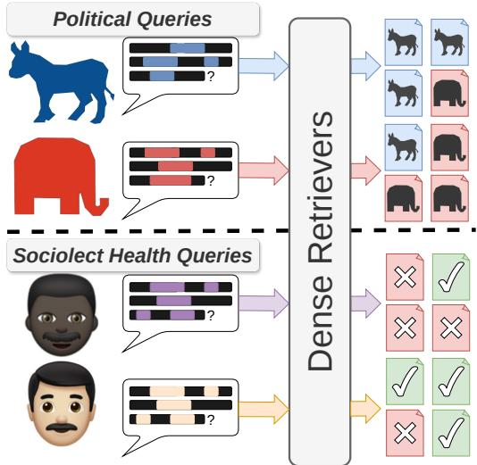  
Figure 1: Paper overview. We evaluate retrievers’ sensitivity to identity signals in queries, finding that retrievers favor documents aligning with the questioner’s signaled political ideology (top) and that lower-quality documents are retrieved for AAL health queries (bottom).

Prior work shows that retrieval can be biased in two broad ways: by spurious features such as the position and length of documents (Yao et al., 2025; Zeng et al., 2025; Cuconasu et al., 2025), and by social factors such as skewed gender representation among retrieved documents (Zhang et al., 2026; Parihar and Cheng, 2026; Krieg et al., 2023). Kim et al. (2025) frame the latter case as bias conflict: corpora, query embeddings, and generators each carry their own bias, but the system’s overall bias is not simply the sum of that of its components. Therefore, the retriever’s own contribution is worth isolating.

These studies, however, mostly examine relatively neutral queries (queries that do not signal any particular sociodemographic group) and assess biases among retrieved documents (e.g., overrepresentation of one political ideology over another). Real queries instead routinely carry cues of the author’s sociodemographics and ideology through different proxies (e.g., names, emotional reactions or values, other cultural proxies, etc.; Tonneau et al. 2026; Adilazuarda et al. 2024). Similarity-based retrieval makes some sensitivity to these cues expected in principle. This expectation, however, predicts neither which retrievers are affected, nor by how much, nor through which channel (surface vocabulary or the representation itself), and it assumes that documents aligned with the asker’s identity are what they need. We therefore study an underexplored question: how identity signals in the query itself lead a retriever to return systematically different documents.

We demonstrate this in two domains closely related to downstream harms. First, we examine signals of the authors’ political ideology (conveyed through presupposed beliefs (Sieker et al., 2025), framing (Lee et al., 2022), or other means), where retrieval that aligns with the questioner’s ideology may deepen polarization by reaffirming that ideology (§2). Second, we test whether retrievers return lower-quality documents for health questions written in African American Language (AAL) than for those in White Mainstream English (WME), representing a direct allocational harm3 to AALspeaking users (§3).4

We detail our primary contributions as follows: (1) We build query-based identity-bias evaluations for retrievers for two variables—political ideology and AAL/WME sociolect—each relying on both a synthetic, paired (i.e., topic-matched) query set that better isolates the identity signal, and a more ecologically valid, unpaired query set of real user queries that better represents real-world deployments and potential harms. (2) Evaluating five dense retrievers (and a sparse retriever baseline), we find that every retriever prefers documents aligning with the questioner’s political ideology and ranks the answer lower for AAL health queries than for WME, consistent across the controlled and naturalistic settings. (3) Two analyses tie these biases to the query’s identity signal beyond surface vocabulary: on the content-controlled synthetic contrasts, partialling out aggregate lexical asymmetry leaves the gap largely intact, and linear probes recover lean/dialect from retriever query embeddings beyond token-level features.

## 2 Political Bias

We first ask whether dense retrievers produce systematically different news articles when provided queries signaling left and right political leanings.

## 2.1 Data

We evaluate dense retrievers on two complementary datasets of political queries: paired left and right-leaning queries about the same subject $( \mathbf { A l l S i d e s } _ { s y n t h } )$ and unpaired naturalistic queries $( \mathrm { R e d d i t } _ { n a t } )$ . Per-group query counts and length statistics are presented in App. A.

Corpus. We use the Qbias AllSides5 corpus (Haak and Schaer, 2023) as the set of news articles to be retrieved. These articles are grouped into editorial roundups, which are sets of articles about the same news story, but from sources with differing political leaning. Each grouping and article political leaning are determined by AllSides cross-partisan team of expert news specialists. For evaluation, we extract a subset of Qbias for which the editorial roundups contain an equal number of left and right-leaning documents (∼17k articles total) to isolate retriever biases from corpus biases.

$\mathbf { A l l S i d e s } _ { s y n t h }$ (paired queries). First, we consider a highly controlled setting of paired synthetic queries from 1,000 randomly sampled roundups. For each roundup we use gpt-5-mini to label the Boydstun framing dimensions (Card et al., 2015)

<table><tr><td>Frames</td><td>Left</td><td>Right</td></tr><tr><td>Fairness AIsnth &amp; equality</td><td>Is raising the federal minimum wage to $10.10 a fair way to reduce inequality and lift nearly a million from poverty per CBO?</td><td>Does the CBO report show raising the minimum wage to $10.10 unfairly distribute job losses, eliminating about 500,000 opportunities for workers?</td></tr><tr><td>Economic</td><td>How would the CBO&#x27;s $10.10 minimum wage proposal economically benefit low income workers and reduce poverty despite some job losses?</td><td>What are the economic costs to employment and small businesses of the CBO&#x27;s $10.10 minimum wage proposal, including projected job losses?</td></tr><tr><td>Reddinat</td><td>Is anyone else tired of ground-level conservatives claiming they &quot;agree&quot; with news incidents while always supporting the system that created these injustices?</td><td>Illegal aliens have always been subject to deportation. Why does the government now need the Alien Enemies Act to deport them?</td></tr></table>

Table 1: Select example queries from each political query dataset. Potential signals of the questioner’s political ideology are highlighted red and blue.

present in its center article. For each frame, we then prompt the model to write two short search queries grounded in that article, one left-leaning and one right-leaning. Conditioning both queries on a shared frame is what makes the pair controlled: without it, a left- and a right-leaning asker may gravitate to different frames of the same story. In Table 1, a minimum-wage topic could draw a left asker toward thefairness & equality frame (reducing inequality, lifting people from poverty) and a right asker toward the economic angle (costs to employment and small businesses)—the diagonal of the table. We generate every frame for both leans and measure the left/right contrast within a frame.6 This process results in 3,723 left and 3,723 right-leaning queries that share a common topic and frame with minimal differences (median length 138 and 139 characters, respectively). Prompts, the full Boydstun frame typology, and example framelabeled articles are included in App. C.

Redditnat (unpaired queries). While the synthetic queries are paired and allow for controlled experiments, we additionally collect naturally occurring queries to better approximate realistic use cases. We collect 3,340 posts from the r/AskALiberal7 (1,979) and r/AskConservatives8 (1,361) subreddits. These subreddits host community questions targeted toward liberal or conservative answerers, although the posters themselves may span the political spectrum. Following prior work (Törnberg, 2025), we use LLMs to classify the ideology of a question’s writer. Specifically, we pass the body of each post, which contains additional elaboration on each question, to two separate LLM classifiers, gpt-5.4-mini and Qwen3.5-4B, and keep only those where both agree. This yields 1,327 liberal and 1,225 conservative queries. Details on Reddit data collection and labeling are included in App. D.

## 2.2 Methods

Retrievers. We evaluate BGE-large-en-v1.5 (Xiao et al., 2024), Qwen3-Embedding-8B (Zhang et al., 2025), Llama-Nemotron-8B (Babakhin et al., 2025), and Octen-Embedding-8B (Octen Team, 2025) encoders for dense retrieval.9 Selection was based on high performing retrievers on the MTEB benchmark (Muennighoff et al., 2023) at the time of writing while representing different families of open-source models. We also include OpenAI’s text-embedding-3-large (OpenAI te-3-large) and BM25-Okapi (Robertson and Zaragoza, 2009) as closed-source and sparse retrieval (lexical) baselines, respectively.

Political lean metric. To evaluate biases, we focus on the representation of left and right-leaning articles among retrieved documents. Specifically, we measure the political lean of a query’s top-k retrieval set as the difference between the fraction of right- and left-leaning articles it contains:

$$
\mathrm { l e a n } ( q ) = \frac { 1 } { k } \left( | d _ { R } ^ { ( k ) } | - | d _ { L } ^ { ( k ) } | \right) \in [ - 1 , + 1 ] ,
$$

where $d ^ { ( k ) }$ is the set of top-k retrieved articles and the subscript denotes the corresponding lean subset. Values near +1 indicate a predominantly rightleaning set and values near −1 a left-leaning one, with center articles excluded from the count.

Gold-filtering. To measure lean over the documents that actually engage with a query rather than off-topic retrievals, we define a gold (relevant) set per query. On $\mathrm { A l l S i d e s } _ { s y n t h }$ , a query’s gold articles are the others in its source editorial roundup (the source center article, which contains the answer, is masked during retrieval). We keep a left/right pair when both queries retrieve a gold article and measure lean over the full top-k. On $\operatorname { R e d d i t } _ { n a t }$ which has no gold, we LLM-judge every (query, article) pair in the top-k with two independent judges (gpt-5-mini and Qwen3.5-35B-A3B) and count an article gold only when both grade it relevant (binary; App. F), measuring lean over the relevant articles (normalized by the relevant count rather than k). This filtering is conservative. With no relevance filter at all, the lean gap is no smaller—and larger for most retrievers—and it persists across other filter settings we examine in App. G.

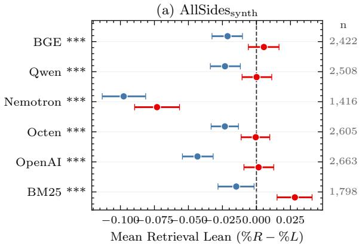

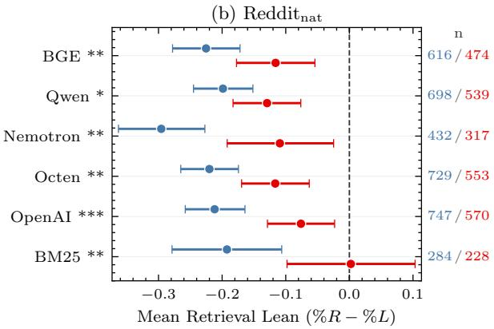  
Figure 2: Per-retriever mean retrieval lean at k=10, gold-filtered (§2.2), shown separately for left and right query groups, with 95% cluster-bootstrap CIs (Field and Welsh, 2007) (B=5,000 resamples; clusters = queries from the same source article). Own-lean bias appears as the displacement between a retriever’s two markers; an unbiased retriever’s would coincide. The markers’ shared offset from zero reflects a corpus-level baseline common to both query groups. Stars mark the significance of the own-lean gap: \*p<0.05, \*\*p<0.01, \*\*\*p<0.001. n queries remaining after gold-filtering, in the right margin. Per-retriever gaps in App. I.

Significance tests. We expect an unbiased retriever to similarly represent left and right documents in the retrieved set, regardless of the query’s leaning. Therefore, we need to know whether any own-lean tendency (the tendency for a query’s topk to be shifted toward articles labeled with the same lean as the query) is statistically distinguishable from no lean preference (i.e., no bias).

For $\mathrm { A l l S i d e s } _ { s y n t h }$ , we formally test the paired lean difference between right and left queries from the same source article and frame,

$$
\Delta _ { \mathrm { l e a n } } = \mathrm { l e a n } ( q ^ { ( R ) } ) - \mathrm { l e a n } ( q ^ { ( L ) } ) ,
$$

computed over gold-filtered query pairs. We summarise this contrast by $\overline { { \Delta _ { \mathrm { l e a n } } } } .$ the mean of $\Delta _ { \mathrm { l e a n } }$ across pairs; $\overline { { \Delta _ { \mathrm { l e a n } } } } > 0$ indicates that a retriever is biased toward documents with the same political lean as the original query.10 We test $\overline { { \Delta _ { \mathrm { l e a n } } } }$ against the null hypothesis of no lean preference (i.e., $\overline { { \Delta _ { \mathrm { l e a n } } } } = 0 )$ . For $\operatorname { R e d d i t } _ { n a t } .$ , queries are unpaired, so we instead test whether left query lean is systematically lower than right query lean.11

## 2.3 Results

Own-lean tendency on both datasets. On both $\mathrm { A l l S i d e s } _ { s y n t h }$ and $\operatorname { R e d d i t } _ { n a t }$ , every retriever shows significant own-lean tendency (Fig. 2; both subfigures reject the null hypothesis of no lean preference on every retriever at $p < 0 . 0 5 ;$ per-retriever own-lean contrasts with CIs and p for both datasets in $\mathsf { A p p . I } )$ . For $\mathrm { A l l S i d e s } _ { s y n t h }$ , BM25 and OpenAI have about 2× the gap of the four open-weight models. For $\operatorname { R e d d i t } _ { n a t } .$ , BM25 and Nemotron have the largest gaps (about $2 \times$ that of BGE, Qwen, and Octen), with OpenAI in-between. This ownlean tendency is present at retrieval depth $k \in$ {5, 10, 20, 50, 100} (see App. J).

Paired vs unpaired contrast. The agreement between the paired $\mathrm { A l l S i d e s } _ { s y n t h }$ and unpaired $\operatorname { R e d d i t } _ { n a t }$ tests strongly suggests political-identity signals in the query are the source of retrieval bias. Because the paired queries hold topic and frame fixed (§2.1), Fig. 2a isolates the gap to the queries political identity rather than to the story or frame a partisan asker would choose. The naturalistic agreement in Fig. 2b then rules out synthetic-pipeline artifacts.

<table><tr><td colspan="2">AAL</td><td>WME</td></tr><tr><td> $\mathrm { H C M a g i c } _ { s y n t h }$ </td><td>Hi docta, how might can that renal functions be monitored in one patient undergoing hemodialysis 3 times per week?</td><td>Hi doctor, how can the renal function be monitored in a patient undergoing hemodialysis 3 times per week?</td></tr><tr><td> $\mathbf { H } \mathbf { C } \mathbf { M a g i c } _ { n a t }$ </td><td>...about 2 weeks ago she notice she had a lump just below her left rib in the front... While standing if she twist her body you can feel it but once ahe straight again u can see it and feel it. What can this be.</td><td>Every now and then I will feel my chest tighten and my heart starts pounding extremely hard. I cant breath and I begin feeling very lightheaded. It usually only lasts a few seconds and does not happen too often. Any ideas as to what could be causing this?</td></tr></table>

Table 2: Select example queries from each AAL/WME dataset. AAL surface markers are coloured purple.

Dense gaps do not require token overlap. How much vocabulary a query shares with the corpus varies sharply across our two settings, and BM25’s own-lean tendency is affected by it while the dense retrievers’ is not. BM25 has among the highest own-lean gaps on both $\mathrm { A l l S i d e s } _ { s y n t h }$ and $\operatorname { R e d d i t } _ { n a t }$ , but it has no gap for $\operatorname { R e d d i t } _ { n a t }$ without the gold-filter, as its unfiltered top-10 is dominated by off-topic documents (App. G). In contrast, dense retrievers’ gaps remain significant (App. G), indicating that dense retrievers’ own-lean tendency does not require exact token matching. Whether surface vocabulary or the representation itself carries the signal is investigated in §4.

## 3 AAL vs. WME in Health Queries

We then test whether dense retrievers’ performance degrades on African American Language (AAL) consumer-health queries relative to White Mainstream English (WME).

## 3.1 Data

We pair a synthetic dataset $( \mathbf { H C M a g i c } _ { s y n t h } )$ with an unpaired naturalistic one $\left( \mathbf { H } \mathbf { C } \mathbf { M } \mathbf { a g i c } _ { n a t } \right)$ over a shared healthcare question-answering corpus (counts in App. A), as in §2. We study health because bias or performance disparities in retrieval here can carry severe real-world consequences, as documented for other language technologies (e.g., Harrington et al. 2022).

Corpus. We draw both queries and retrieval documents from the ChatDoctor HealthCareMagic-100k corpus (Li et al., 2023), an online platform where users of any background ask questions about their health and receive responses from affiliated doctors. Li et al. (2023) curate 112,165 user question and doctor response pairs. We index every doctor response as a corpus of retrieval documents. For a given patient query (Table 2) the task is to surface the doctor response (gold document) that answers it. App. K gives query–document examples, with the gold doctor response, for both datasets. The two query datasets below both sample from this corpus: $\mathrm { H C M a g i c } _ { s y n t h }$ from questions classified as WME (with AAL added synthetically) and $\mathbf { H } \mathbf { C } \mathbf { M } \mathbf { a g i c } _ { n a t }$ from naturally-occurring AAL and WME questions.

$\mathbf { H C M a g i c } _ { s y n t h }$ (paired queries). We sample 4,999 HealthCareMagic $\bar { \mathsf { p o s t s } } ^ { 1 2 }$ whose patient question is classified as WME by the demographicalignment classifier of Blodgett et al. (2016). We synthetically augment each WME query with AAL features using the methods of Ziems et al. (2022) (morphosyntactic) and Deas et al. (2024) (phonological/orthographic). Although imperfect, both of these approaches were validated with human judgments in their corresponding studies and have been used to similarly evaluate other language technologies (e.g., reward models; Mire et al., 2025).

As these methods are non-deterministic, we generate three independent augmentations of each query to account for variability, yielding 4,999× 3=14,997 AAL queries. In using this data for our evaluations (§3.2), we therefore hold content fixed while varying dialectal features.

$\mathbf { H } \mathbf { C } \mathbf { M a g i c } _ { n a t }$ (unpaired queries). For realistic queries, we use the same demographic-alignment classifier (Blodgett et al., 2016) to surface queries that use features associated with AAL, resulting in 656 AAL queries (647 after filtering). We randomly sample a similar number of real-WME queries. 13

## 3.2 Methods

Retrievers. For AAL/WME experiments, we use the same six retrievers as §2.2.

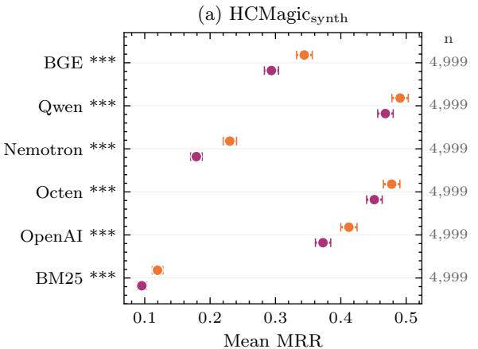

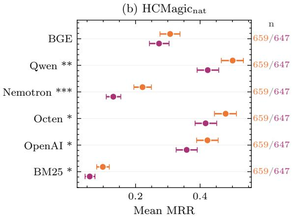  
Figure 3: Per-retriever mean MRR on the shared HealthCareMagic corpus, shown separately for WME and AAL queries, with 95% bootstrap CIs. Stars mark the significance of the WME-AAL gap: ${ \star p } { < } 0 . 0 5 , { \star \star p } { < } 0 . 0 1$ \*\*\*p<0.001. n queries in the right margin. Per-retriever gaps in App. M.

Retrieval metric. We score each query by reciprocal rank, $1 / r ,$ , where r is the rank of the gold output document in the retriever’s full sorted ranking over the 112,165-document corpus, following the standard retrieval-QA protocol of treating a question’s original paired answer as the gold document (Ahmad et al., 2019; Guo et al., 2021). Mean reciprocal rank (MRR) is the mean of 1/r across a query set. Unlike §2.2, we do not gold-filter to relevant documents because retrieval competence (MRR) is the metric of interest.

Significance tests. For $\mathrm { H C M a g i c } _ { s y n t h } .$ , the sample-level paired difference is $\Delta _ { \mathrm { r a n k } } \quad =$ $1 / r _ { r } ^ { \mathrm { \tiny { \hat { W } M E } } } - \overline { { 1 / r _ { r } ^ { \mathrm { \tiny { A A L } } } } }$ (WME reciprocal rank minus the mean over the sample’s three synthetic AAL rewritings), summarised across samples by $\overline { { \Delta _ { \mathrm { { r a n k } } } } }$ This parallels the per-pair lean difference $\Delta _ { \mathrm { l e a n } }$ of §2.2. For $\mathrm { H C M a g i c } _ { n a t } .$ , queries are unpaired, so we report the between-group MRR difference $\mathrm { M R R w a g \mathrm { ~ - ~ } M R R _ { A A L } }$ , tested with a two-sided Mann–Whitney U (paired Wilcoxon and sign-flip permutation for $\mathrm { H C M a g i c } _ { s y n t h }$ ; see App. H).

## 3.3 Results

WME>AAL on both datasets. On both $\mathrm { H C M a g i c } _ { s y n t h }$ and $\mathrm { H C M a g i c } _ { n a t } ,$ every retriever shows $\mathrm { M R R } _ { \mathrm { W M E } } \ > \ \mathrm { M R R } _ { \mathrm { A A L } }$ (Fig. 3; full perretriever numbers in App. M). On $\mathrm { H C M a g i c } _ { s y n t h }$ the paired Wilcoxon rejects on all six retrievers $( p \approx 0 )$ . On $\mathbf { H } \mathbf { C } \mathbf { M } \mathbf { a g i c } _ { n a t }$ , five of six reject at $p < 0 . 0 5$ (BGE marginal at $\scriptstyle { p = 0 . 1 0 ) }$ . Using AAL rather than WME for the same health question consistently lowers the rank of its answer document, so retrievers serve questioners using AAL worse than those using WME with near identical information need. The gap is stable across retrieval depth k $( \mathrm { A p p . } \mathrm { N } )$

Paired vs unpaired contrast. The two datasets agree on the harm. Because $\mathrm { H C M a g i c } _ { s y n t h }$ holds content fixed and varies only dialect (each WME query paired against its own AAL rewritings), its gap shows that features associated with AAL alone lower retrieval quality in this domain and attributes the direction of the effect (WME above AAL) to dialect rather than any content confound. We note, however, that on its own, it is likely an overestimate of the dialect effect, since the synthetic rewrites add some noise (App. O). $\mathrm { H C M a g i c } _ { n a t }$ instead compares different patient pools, mixing dialect with real differences in content and topic difficulty, and its gap tends to be ∼ 1.7× larger for all retrievers. This indicates that dialect by itself causes the disparity, and in real deployments—where AAL and WME queries differ in content as well as dialect— the disadvantage AAL users face may be larger still.14

## 4 Bias gap analysis

What drives the retrieval gaps in §2.3 and §3.3? Left and right queries, like AAL and WME queries, differ in surface vocabulary (lean-based word choices, dialect morphology and respellings), so a retriever that mainly matches surface tokens could reproduce the gap without encoding the query’s political lean or dialect at all (the lexical component). Alternatively, the embedding may capture lean or dialect identity beyond surface tokens (through morphosyntax, composition, or semantics), shifting retrieval even when vocabulary is held fixed (the non-lexical component). We separate these with two analyses: partialling out a perquery lexical-asymmetry score, and probing each dense retriever’s query embeddings for whether lean or dialect is linearly encoded beyond tokenlevel features. The first is a conservative test: the groups’ vocabulary differences may themselves reflect bias, so a surviving gap is specifically attributable to the retriever rather than to vocabulary.

## 4.1 Method

Scoring a query’s lexical asymmetry. We need a per-query measure of how strongly the query’s vocabulary leans toward one group or the other. We use the MCQ log-odds asymmetry (Monroe et al., 2008), a standard computational social science tool for surfacing the words that distinguish two sides of a corpus. MCQ assigns each token a score, $\zeta ,$ where large positive $\zeta$ indicates tokens used disproportionately by one group, large negative ζ indicates those disproportionately used by the other group, and near zero indicates tokens used equally. $\cdot ^ { 1 5 }$ Summing $\zeta$ over the tokens in a query gives its lexical asymmetry, lexq. For political datasets we fit $\zeta$ on the corresponding leftvs-right query corpora; for dialect datasets, on the AAL-vs-WME query corpora.

Controlling for lexical asymmetry. We ask: how much of the bias gap is explained by $\mathrm { l e x } _ { q } ,$ and how much remains after we subtract the $\mathrm { l e x } _ { q }$ contribution? We investigate these questions by regressing the gap on $\mathrm { l e x } _ { q } .$ . The regression intercept is the bias that $\mathrm { l e x } _ { q }$ cannot explain, and the regression slope tells us how strongly the gap moves with lexical asymmetry. We call this partialling out lexical asymmetry.16 On the two paired, synthetic datasets $( \mathrm { A l l S i d e s } _ { s y n t h }$ and $\mathrm { H C M a g i c } _ { s y n t h } )$ we regress on the paired $\mathrm { l e x } _ { q }$ difference:

$$
\Delta _ { q } = \alpha + \beta \left( \mathrm { l e x } _ { q } ^ { ( 1 ) } - \mathrm { l e x } _ { q } ^ { ( 2 ) } \right) + \varepsilon _ { q } \quad [ \mathrm { p a i r e d } ] ,
$$

where $\Delta _ { q }$ is $\Delta _ { \mathrm { l e a n } } \ = \ \ln ( R ) - \ln ( L )$ on $\mathrm { A l l S i d e s } _ { s y n t h }$ (groups $1 { = } \mathrm { R } , ~ 2 { = } \mathrm { L } )$ and $\Delta _ { \mathrm { { r a n k } } } ,$ the per-sample reciprocal-rank difference, on $\mathrm { H C M a g i c } _ { s y n t h } \ ( \mathrm { g r o u p s \ 1 = W M E , 2 = A A L ; \ l e x _ { q } ( 2 ) }$ averaged over the sample’s three AAL rewritings). We reserve $\Delta$ for these paired differences. The unpaired gaps below are not written as $\Delta$ . On the two unpaired datasets, the gap is a between-group measure, so we regress the per-query outcome on per-query $\mathrm { l e x } _ { q }$ plus a binary group indicator:

$$
Y _ { q } = \alpha + \beta \mathrm { l e x } _ { q } + \gamma \mathbb { 1 } \left[ { q } \in G _ { 2 } \right] + \varepsilon _ { q } \quad [ \mathrm { u n p a i r e d } ] ,
$$

with $Y _ { q }$ the per-query lean $. ( q )$ on ${ \mathrm { R e d d i t } } _ { n a t } ( G _ { 2 } = $ right queries) and the per-query reciprocal rank $1 / r$ on $\mathrm { H C M a g i c } _ { n a t } \left( G _ { 2 } = \mathrm { W M E p o o l } \right)$

What the coefficients mean. The raw gap is the unadjusted bias gap measured in §2.3 and §3.3, with no $\mathrm { l e x } _ { q }$ term in the model: the mean paired difference $( \overline { { \Delta _ { \mathrm { l e a n } } } } \mathrm { o r } \overline { { \Delta _ { \mathrm { r a n k } } } } )$ on the paired datasets and the raw between-group difference in $Y$ (e.g. mean lean of right minus left queries) on the unpaired datasets. The residual gap is the part of that gap that is conserved after controlling for $\operatorname { l e x } _ { q } \colon$ αˆ in the paired case (the expected paired difference at zero per-pair $\mathrm { l e x } _ { q }$ difference) and $\hat { \gamma }$ in the unpaired case (the expected between-group difference in $Y$ at zero per-query $\mathrm { l e x } _ { q } )$ . If $\mathrm { l e x } _ { q }$ perfectly explained the gap, the residual would be zero; if $\mathrm { l e x } _ { q }$ explained nothing, it would equal the raw gap. The $\mathrm { l e x } _ { q }$ slope, ${ \hat { \beta } } ,$ quantifies how much of the gap moves with $\operatorname { l e x } _ { q } \colon$ a non-zero $\hat { \beta }$ means the retriever’s score tracks perquery $\mathrm { l e x } _ { q }$ within or across the groups, whereas $\hat { \beta } \approx 0$ means $\mathrm { l e x } _ { q }$ is not a useful predictor of the ${ \mathrm { g a p . } }$

Conditional probing. On the two paired synthetic datasets, we fit linear probes (logistic regression) on each open-weight dense retriever’s mean-pooled query embedding at every layer, predicting left/right $( \mathbf { A l l S i d e s } _ { s y n t h } )$ or WME/AAL $( \mathbf { H C M a g i c } _ { s y n t h } )$ . We report probe F1 (class separability) and, following conditional probing (Hewitt et al., 2021), V-information, the gain in negative log-loss over a baseline probe trained on the model’s non-contextual embedding layer. In other words, this measure is a proxy for the social identity information a model layer adds beyond token-level features alone (positive meaning more information). Evaluation uses 5-fold cross-validation (political) or a held-out 20% split averaged over the three AAL augmentations (dialect). Additional details included in App. S.

<table><tr><td rowspan="2">Retriever</td><td colspan="2"> $\mathsf { A l l S i d e s } _ { s y n t h } \left( \Delta _ { \mathrm { l e a n } } \right)$ </td><td colspan="2"> $\mathbf { R e d d i t } _ { n a t } \ ( \mathrm { l e a n } )$ </td><td colspan="2"> $\mathrm { H C M a g i c } _ { s y n t h } \left( \Delta _ { \mathrm { r a n k } } \right)$ </td><td colspan="2"> $\operatorname { H C M a g i c } _ { n a t }$  (MRR)</td></tr><tr><td>raw</td><td>resid.</td><td>raw</td><td>resid.</td><td>raw</td><td>resid.</td><td>raw</td><td>resid.</td></tr><tr><td>BGE-large</td><td>0.027</td><td> $0 . 0 2 7 ^ { * * * }$ </td><td>0.024</td><td>0.007</td><td>0.050</td><td> $0 . 0 4 7 ^ { * * * }$ </td><td>0.034</td><td>0.042</td></tr><tr><td>Qwen3-Emb-8B</td><td>0.023</td><td> $0 . 0 3 1 ^ { * * * }$ </td><td>0.028</td><td>0.015</td><td>0.023</td><td> $0 . 0 2 1 ^ { * * * }$ </td><td>0.077</td><td> $0 . 1 1 0 ^ { * * }$ </td></tr><tr><td>Llama-Nemotron-8B</td><td>0.025</td><td> $0 . 0 2 5 ^ { * }$ </td><td>0.039</td><td> $0 . 0 2 2 ^ { \ast }$ </td><td>0.051</td><td> $0 . 0 4 6 ^ { * * * }$ </td><td>0.091</td><td> $0 . 0 8 5 ^ { * * }$ </td></tr><tr><td>Octen-Emb-8B</td><td>0.023</td><td> $0 . 0 1 8 ^ { * * }$ </td><td>0.048</td><td> $0 . 0 3 3 ^ { \ast \ast \ast }$ </td><td>0.027</td><td> $0 . 0 2 4 ^ { * * * }$ </td><td>0.062</td><td> $0 . 0 9 8 ^ { * * }$ </td></tr><tr><td>OpenAI te-3-large</td><td>0.045</td><td> $0 . 0 2 9 ^ { * * * }$ </td><td>0.062</td><td> $0 . 0 3 6 ^ { * * * }$ </td><td>0.040</td><td> $0 . 0 3 9 ^ { \ast \ast \ast }$ </td><td>0.064</td><td> $0 . 0 8 1 ^ { * }$ </td></tr><tr><td>BM25 (Okapi)</td><td>0.043</td><td> $0 . 0 3 8 ^ { * * * }$ </td><td>0.001</td><td>0.002</td><td>0.024</td><td> $0 . 0 2 4 ^ { * * * }$ </td><td>0.040</td><td> $0 . 0 4 1 ^ { * }$ </td></tr></table>

Table 3: Per-retriever raw bias gap and residual gap after partialling out the lexical channel (definitions in §4.1). Stars: $^ { * } p { < } 0 . 0 5 , ^ { * * } p { < } 0 . 0 1 , ^ { * * * } p { < } 0 . 0 0 1$ . Stars test the residual against zero (αˆ for the paired datasets, γˆ for the unpaired); an unstarred residual is indistinguishable from zero. Raw columns carry no stars because they are not the quantity under test here: they correspond to the gaps of §2.3 and §3.3. Full coefficients in App. R.

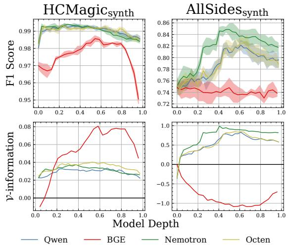  
Figure 4: Average F1 score (top) and V-information (bottom) for normal and conditional probes, respectively, at each model depth. F1 indicates how readily lean or dialect can be decoded at each layer; V-information indicates what that layer adds beyond the input embeddings. Both signals remain decodable across depth, with positive conditional gains at most layers except for BGE on AllSides.

## 4.2 Results

Synthetic datasets: the gap survives lexicalasymmetry control. On both $\mathrm { A l l S i d e s } _ { s y n t h }$ and $\mathrm { H C M a g i c } _ { s y n t h }$ , partialling out $\mathrm { l e x } _ { q }$ does not substantially change the gaps across retrievers: the residual stays close to the raw gap and remains significant on every retriever (Table 3). The only retriever with a detectable $\mathrm { l e x } _ { q }$ slope is OpenAI te-3-large on $\mathrm { A l l S i d e s } _ { s y n t h }$ , where partialling absorbs the part of its gap that exceeds the openweights but leaves a retriever-level residual comparable to theirs. BM25 carries one of the largest $\mathrm { A l l S i d e s } _ { s y n t h }$ residuals, so under content control the lexical channel itself is at least as biased as the dense retrievers.

Naturalistic datasets: $\mathrm { l e x } _ { q }$ partials some retrievers, not others. On $\operatorname { R e d d i t } _ { n a t } .$ , partialling out $\mathrm { l e x } _ { q }$ shrinks every retriever’s gap, but by enough to change the conclusion for only some (Table 3). For the two dense retrievers with the smallest raw gaps (BGE, Qwen3) the residual shrinks into statistical insignificance, so their naturalistic gap is consistent with topic-asymmetry exposure rather than a retriever-level non-lexical component. BM25 has no $\operatorname { R e d d i t } _ { n a t }$ gap to begin with. The larger-gap dense retrievers (Octen, OpenAI, Nemotron) retain a significant residual, so their naturalistic bias has a component per-query $\mathrm { l e x } _ { q }$ does not absorb. On $\mathrm { H C M a g i c } _ { n a t } .$ , partialling does not shrink the gap into insignificance on any retriever. The residual stays close to or above the raw gap. This is a confounding artifact, not a deeper-than-lexical signal. The “AAL-distinctive” tokens that MCQ picks up here are dominated by patient-topic words (she, her, periods, baby), reflecting demographic differences between the natural AAL and WME query pools rather than dialect surface form, so the $\mathrm { H C M a g i c } _ { n a t }$ residual is not a clean non-lexical measure. The translation intervention (Fig. 19) remains the proper content-difficulty probe on $\mathrm { H C M a g i c } _ { n a t }$

What this tells us. The synthetic-vs-naturalistic split confirms the design intent of the synthetic contrasts. By holding content fixed $( \mathrm { A l l S i d e s } _ { s y n t h } \mathrm { ' s }$ left and right queries are written about the same source article and frame; $\mathrm { H C M a g i c } _ { s y n t h } \mathrm { ' s ~ A A L }$ queries are rewritings of the same WME source), the synthetic contrasts target the gap contribution that is not driven by lexical token frequency, isolating non-lexical differences in how the retriever represents lean or dialect identity. The naturalistic contrasts mix these non-lexical differences with lexical and topical differences across the two query pools, so partialling out $\mathrm { l e x } _ { q }$ absorbs the gap on retrievers whose naturalistic bias is largely tokendriven (BGE and Qwen3 on $\operatorname { R e d d i t } _ { n a t } )$ . Full perretriever tables in App. R.

The signal is present beyond the lexical channel. Probing provides complementary results: lean and dialect are linearly recoverable from the dense retrievers’ query embeddings (probe F1 ≈ 85% and 99%; Fig. 4), and conditional probing shows that, for most layers, additional identity information is encoded beyond the non-contextual baseline. This is a prerequisite for, not proof of, a non-lexical gap: the signal a retriever could match on is present and not purely lexical.

## 5 Related Work

Identity signals in language models. Encoders represent authors’ sociodemographic attributes such as gender and age (Lauscher et al., 2022), and LLMs both misunderstand AAL features (Deas et al., 2023; Fleisig et al., 2024; McKeown et al., 2026) and stereotype its speakers (Deas et al., 2025, 2024; Hofmann et al., 2024). They are likewise sensitive to political cues: presupposed beliefs (Sieker et al., 2025), framing (Lee et al., 2022), and named entities in sentiment tasks (Plisiecki et al., 2025; Ng et al., 2025). We study these signals carried in the query and how they steer a retriever.

Bias in retrieval and RAG. Retrieval and RAG are skewed by spurious features such as evidence position and length (Zeng et al., 2025; Liu et al., 2024; Cuconasu et al., 2025) and by social bias in the returned set: rankers reinforce gender bias (Rekabsaz et al., 2021), benchmarks quantify representation bias over neutral queries (Krieg et al., 2023), and fair-ranking work targets equitable exposure across document groups (Singh and Joachims, 2018; Zehlike et al., 2017). As retrieval quality bounds generation (Chen et al., 2024; Hsia et al., 2025), this bias propagates through RAG (Kim et al., 2025; Wu et al., 2025). A separate line treats query phrasing (misspellings and reformulations) as noise to be robust to (Penha et al., 2022; Sidiropoulos and Kanoulas, 2022). Closest to us, Kim et al. (2025) (political bias) and Klisura et al. (2025) (dialect QA) still use neutral or scenario queries, or measure end-to-end accuracy. We instead make the query’s identity signal the variable of interest, measuring how the retrieved set shifts with the asker’s lean or dialect.

## 6 Conclusion

Dense retrievers are sensitive to identity signals carried in the query itself. Across five dense retrievers and a sparse baseline, retrieval shifts toward the questioner’s own political lean and ranks answers lower for AAL than WME health queries, in both a content-controlled paired design and naturally occurring queries. On the content-controlled synthetic contrasts the gap survives partialling out aggregate lexical asymmetry, and lean and dialect are linearly recoverable from the query embeddings beyond token-level features, so the bias tracks the query’s identity signal, not merely its surface vocabulary. These shifts risk contributing to political polarization as well as health disparities faced by AAL speakers. Consistent across architectures and not closed by back-translation, they likely require representation-level mitigation, which we leave to future work.

## Limitations

Coarse operationalization of identity. We reduce rich, multidimensional identities to binary contrasts (left vs. right political lean and AAL vs. WME) and rely on imperfect proxies for each: AllSides’ editorial lean labels, an LLM classifier for $\operatorname { R e d d i t } _ { n a t }$ ideology, and the demographicalignment classifier of Blodgett et al. (2016) for dialect. These axes are coarse, collapsing centrists and ignoring intersectional or non-binary identities, and the labels carry their own error and potential bias. Our results should be read as evidence that retrievers are sensitive to these signals, not as a complete account of identity-conditioned retrieval.

Synthetic queries and the paired/unpaired tradeoff. Our controlled contrasts use synthetic queries (LLM-generated political queries and morphosyntactically and orthographically augmented AAL), which may not faithfully represent the distribution of real user language. To mitigate this potential confound, we use approaches that have been humanvalidated and that aim to avoid substantively altering the meaning of a given text. Therefore, synthetic artifacts may inflate measured biases, but are unlikely to meaningfully drive observed gaps. Our quality check (App. O) finds recognizable AAL features alongside generator artifacts.

We therefore complement each synthetic set with naturally occurring queries, but those are unpaired and confound dialect or lean with content and topic.

Neither setting alone is decisive; we rely on their agreement.

Any systematic stylistic asymmetry the generator introduces between leans (register, presupposition density) is held within—not removed by—the frame control. The $\operatorname { R e d d i t } _ { n a t }$ agreement partially mitigates this but does not rule it out.

Gold-document evaluation. Our health metric scores the rank of each question’s original doctor response and so measures retrieval competence conditioned on dialect. It does not assess the medical usefulness or safety of the other retrieved documents. LLM-judging full retrieved sets along these dimensions is a complementary evaluation we leave to future work.

## Ethical considerations

What counts as harm. Tailoring retrieval to a user is not inherently harmful, and for health, a user’s background can legitimately call for different documents (e.g., conditions such as sickle cell disease that differ in prevalence across groups). The harms we identify are more specific: in the political domain, surfacing documents that confirm a questioner’s existing lean can entrench echo chambers and contribute to polarization; in the health domain, AAL phrasing should not lower the quality of the answers a user receives. Our concern is thus systematic confirmation and quality degradation conditioned on identity, not personalization per se.

Synthetic AAL. Generating synthetic AAL risks caricaturing the variety, and our augmentation pipeline introduces artifacts (App. O). We use it only as a controlled diagnostic, pair it with naturally occurring AAL, follow pipelines validated with AAL speakers in prior work, and do not present it as an authentic sample of the variety.

Data and privacy. The Redditnat ideology labels are inferred by classifiers, not self-reported, and we use them only in aggregate. To protect user privacy our code release contains Reddit post IDs and labels rather than post text, so that content a user later deletes is not redistributed. We likewise withhold the per-post classifier rationales, which quote the posts, and the ideology-classification code that consumes post text; the released per-post query embeddings are dense encodings of the withheld titles, so what we withhold is the text itself rather than every derivative of it. Every result we report is reproducible from the released identifiers and labels, and the post text can be re-fetched by ID for any post whose author has not since removed it.

Potential for misuse. The analysis that diagnoses identity sensitivity (including the linear directions our probes recover) could also be used to amplify bias, for instance to deliberately serve more confirmatory or lower-quality results to a group. We release these resources to support measurement and mitigation, and caution against deployments that personalize retrieval along identity lines without safeguards.

Artifacts. We use artifacts that are publicly available and consistent with their intended use for research.

AI Use. We used AI to help with coding and writing. All AI outputs were manually verified.

## Acknowledgements

This work was supported in part by National Science Foundation Graduate Research Fellowship DGE-2036197, the Columbia University Provost Diversity Fellowship, and the Columbia School of Engineering and Applied Sciences Presidential Fellowship. Any opinion, findings, and conclusions or recommendations expressed in this material are those of the authors and do not necessarily reflect the views of the National Science Foundation. We thank the anonymous reviewers for discussions and feedback on earlier iterations of this work.

## References

Muhammad Farid Adilazuarda, Sagnik Mukherjee, Pradhyumna Lavania, Siddhant Shivdutt Singh, Alham Fikri Aji, Jacki O’Neill, Ashutosh Modi, and Monojit Choudhury. 2024. Towards measuring and modeling “culture” in LLMs: A survey. In Proceedings of the 2024 Conference on Empirical Methods in Natural Language Processing, pages 15763–15784, Miami, Florida, USA. Association for Computational Linguistics.

Amin Ahmad, Noah Constant, Yinfei Yang, and Daniel Cer. 2019. ReQA: An evaluation for end-to-end answer retrieval models. In Proceedings of the 2nd Workshop on Machine Readingfor Question Answering, pages 137–146, Hong Kong, China. Association for Computational Linguistics.

Yauhen Babakhin, Radek Osmulski, Ronay Ak, Gabriel Moreira, Mengyao Xu, Benedikt Schifferer, Bo Liu, and Even Oldridge. 2025. Llama-embednemotron-8b: A universal text embedding model for multilingual and cross-lingual tasks. Preprint, arXiv:2511.07025.

April Baker-Bell. 2020. Linguistic justice: Black language, literacy, identity, and pedagogy. Routledge.

Su Lin Blodgett, Solon Barocas, Hal Daumé III, and Hanna Wallach. 2020. Language (technology) is power: A critical survey of “bias” in NLP. In Proceedings of the 58th Annual Meeting of the Associationfor Computational Linguistics, pages 5454– 5476, Online. Association for Computational Linguistics.

Su Lin Blodgett, Lisa Green, and Brendan O’Connor. 2016. Demographic dialectal variation in social media: A case study of African-American English. In Proceedings of the 2016 Conference on Empirical Methods in Natural Language Processing, pages 1119–1130, Austin, Texas. Association for Computational Linguistics.

Dallas Card, Amber E. Boydstun, Justin H. Gross, Philip Resnik, and Noah A. Smith. 2015. The media frames corpus: Annotations of frames across issues. In Proceedings of the 53rd Annual Meeting of the Association for Computational Linguistics and the 7th International Joint Conference on Natural Language Processing (Volume 2: Short Papers), pages 438– 444, Beijing, China. Association for Computational Linguistics.

Jiawei Chen, Hongyu Lin, Xianpei Han, and Le Sun. 2024. Benchmarking large language models in retrieval-augmented generation. Proceedings of the AAAI Conference on Artificial Intelligence, 38(16):17754–17762.

Florin Cuconasu, Simone Filice, Guy Horowitz, Yoelle Maarek, and Fabrizio Silvestri. 2025. Do RAG systems really suffer from positional bias? In Proceedings ofthe 2025 Conference on Empirical Methods in Natural Language Processing, pages 28022–28036, Suzhou, China. Association for Computational Linguistics.

Nicholas Deas, Jessica Grieser, Shana Kleiner, Desmond Patton, Elsbeth Turcan, and Kathleen McKeown. 2023. Evaluation of African American language bias in natural language generation. In Proceedings ofthe 2023 Conference on Empirical Methods in Natural Language Processing, pages 6805– 6824, Singapore. Association for Computational Linguistics.

Nicholas Deas, Jessica A Grieser, Xinmeng Hou, Shana Kleiner, Tajh Martin, Sreya Nandanampati, Desmond U Patton, and Kathleen McKeown. 2024. PhonATe: Impact of type-written phonological features of African American Language on generative language modeling tasks. In First Conference on Language Modeling.

Nicholas Deas, Blake Vente, Amith Ananthram, Jessica A. Grieser, Desmond U. Patton, Shana Kleiner, James R. Shepard III, and Kathleen McKeown. 2025. Data caricatures: On the representation of African

American Language in pretraining corpora. In Proceedings ofthe 63rd Annual Meeting ofthe Association for Computational Linguistics (Volume 1: Long Papers), pages 29192–29217, Vienna, Austria. Association for Computational Linguistics.

Wenqi Fan, Yujuan Ding, Liangbo Ning, Shijie Wang, Hengyun Li, Dawei Yin, Tat-Seng Chua, and Qing Li. 2024. A survey on RAG meeting LLMs: Towards retrieval-augmented large language models. In Proceedings ofthe 30th ACM SIGKDD Conference on Knowledge Discovery and Data Mining (KDD), pages 6491–6501. ACM.

Zhibo Fan, Hongtao Lin, Haoyu Chen, Bowen Deng, Hedi Xia, Yuke Yan, and James Li. 2025. Synergizing implicit and explicit user interests: A multiembedding retrieval framework at Pinterest. In Proceedings ofthe 31st ACM SIGKDD Conference on Knowledge Discovery and Data Mining (KDD). ACM.

C. A. Field and A. H. Welsh. 2007. Bootstrapping clustered data. Journal of the Royal Statistical Society: Series B (Statistical Methodology), 69(3):369–390.

Eve Fleisig, Genevieve Smith, Madeline Bossi, Ishita Rustagi, Xavier Yin, and Dan Klein. 2024. Linguistic bias in ChatGPT: Language models reinforce dialect discrimination. In Proceedings ofthe 2024 Conference on Empirical Methods in Natural Language Processing, pages 13541–13564, Miami, Florida, USA. Association for Computational Linguistics.

Mandy Guo, Yinfei Yang, Daniel Cer, Qinlan Shen, and Noah Constant. 2021. MultiReQA: A cross-domain evaluation for Retrieval question answering models. In Proceedings ofthe Second Workshop on Domain Adaptation for NLP, pages 94–104, Kyiv, Ukraine. Association for Computational Linguistics.

Fabian Haak and Philipp Schaer. 2023. Qbias – a dataset on media bias in search queries and query suggestions. In Proceedings of the 15th ACM Web Science Conference 2023 (WebSci ’23), pages 239–244, Austin, TX, USA. Association for Computing Machinery.

Christina N. Harrington, Radhika Garg, Amanda Woodward, and Dimitri Williams. 2022. “it’s kind of like code-switching”: Black older adults’ experiences with a voice assistant for health information seeking. In Proceedings of the 2022 CHI Conference on Human Factors in Computing Systems, CHI ’22, New York, NY, USA. Association for Computing Machinery.

John Hewitt, Kawin Ethayarajh, Percy Liang, and Christopher Manning. 2021. Conditional probing: measuring usable information beyond a baseline. In Proceedings of the 2021 Conference on Empirical Methods in Natural Language Processing, pages 1626–1639, Online and Punta Cana, Dominican Republic. Association for Computational Linguistics.

Valentin Hofmann, Pratyusha Ria Kalluri, Dan Jurafsky, and Sharese King. 2024. AI generates covertly racist decisions about people based on their dialect. Nature, 633(8028):147–154.

Jennifer Hsia, Afreen Shaikh, Zora Zhiruo Wang, and Graham Neubig. 2025. RAGGED: Towards informed design of scalable and stable RAG systems. In Proceedings ofthe 42nd International Conference on Machine Learning, volume 267 of Proceedings of Machine Learning Research, pages 24139–24155. PMLR.

Jui-Ting Huang, Ashish Sharma, Shuying Sun, Li Xia, David Zhang, Philip Pronin, Janani Padmanabhan, Giuseppe Ottaviano, and Linjun Yang. 2020. Embedding-based retrieval in Facebook search. In Proceedings ofthe 26th ACM SIGKDD International Conference on Knowledge Discovery and Data Mining (KDD). ACM.

Vladimir Karpukhin, Barlas Oguz, Sewon Min, Patrick˘ Lewis, Ledell Wu, Sergey Edunov, Danqi Chen, and Wen-tau Yih. 2020. Dense passage retrieval for opendomain question answering. In Proceedings of the 2020 Conference on Empirical Methods in Natural Language Processing (EMNLP), pages 6769–6781. Association for Computational Linguistics.

Taeyoun Kim, Jacob Mitchell Springer, Aditi Raghunathan, and Maarten Sap. 2025. Mitigating bias in RAG: Controlling the embedder. In Findings of the Associationfor Computational Linguistics: ACL 2025, pages 18999–19024, Vienna, Austria. Association for Computational Linguistics.

Ðorde Klisura, Astrid R. Bernaga Torres, Anna Karen¯ Gárate-Escamilla, Rajesh Roshan Biswal, Ke Yang, Hilal Pataci, and Anthony Rios. 2025. A multi-agent framework for mitigating dialect biases in privacy policy question-answering systems. In Proceedings of the 63rd Annual Meeting of the Association for Computational Linguistics (Volume 1: Long Papers), pages 32318–32337, Vienna, Austria. Association for Computational Linguistics.

Klara Krieg, Emilia Parada-Cabaleiro, Gertraud Medicus, Oleg Lesota, Markus Schedl, and Navid Rekabsaz. 2023. Grep-biasir: A dataset for investigating gender representation bias in information retrieval results. In Proceedings of the 2023 Conference on Human Information Interaction and Retrieval, CHIIR ’23, page 444–448, New York, NY, USA. Association for Computing Machinery.

Anne Lauscher, Federico Bianchi, Samuel R. Bowman, and Dirk Hovy. 2022. SocioProbe: What, when, and where language models learn about sociodemographics. In Proceedings ofthe 2022 Conference on Empirical Methods in Natural Language Processing, pages 7901–7918, Abu Dhabi, United Arab Emirates. Association for Computational Linguistics.

Nayeon Lee, Yejin Bang, Tiezheng Yu, Andrea Madotto, and Pascale Fung. 2022. NeuS: Neutral multi-news

summarization for mitigating framing bias. In Proceedings ofthe 2022 Conference ofthe North American Chapter ofthe Associationfor Computational Linguistics: Human Language Technologies, pages 3131–3148, Seattle, United States. Association for Computational Linguistics.

Patrick Lewis, Ethan Perez, Aleksandra Piktus, Fabio Petroni, Vladimir Karpukhin, Naman Goyal, Heinrich Küttler, Mike Lewis, Wen-tau Yih, Tim Rocktäschel, Sebastian Riedel, and Douwe Kiela. 2020. Retrieval-augmented generation for knowledgeintensive NLP tasks. In Advances in Neural Information Processing Systems 33 (NeurIPS 2020), pages 9459–9474.

Xiaoxi Li, Jiajie Jin, Yujia Zhou, Yuyao Zhang, Peitian Zhang, Yutao Zhu, and Zhicheng Dou. 2025. From matching to generation: A survey on generative information retrieval. ACM Transactions on Information Systems, 43(3):1–62.

Yunxiang Li, Zihan Li, Kai Zhang, Ruilong Dan, Steve Jiang, and You Zhang. 2023. ChatDoctor: A medical chat model fine-tuned on a large language model Meta-AI (LLaMA) using medical domain knowledge. Cureus, 15(6).

Yidong Liang, Zhijing Wu, Fan Zhang, Dandan Song, and Heyan Huang. 2025. How users interact with generative information retrieval systems: A study of user behavior and search experience. In Proceedings of the 48th International ACM SIGIR Conference on Research and Development in Information Retrieval (SIGIR), pages 634–644. ACM.

Nelson F. Liu, Kevin Lin, John Hewitt, Ashwin Paranjape, Michele Bevilacqua, Fabio Petroni, and Percy Liang. 2024. Lost in the middle: How language models use long contexts. Transactions ofthe Association for Computational Linguistics, 12:157–173.

Xing Han Lu. 2024. BM25S: Orders of magnitude faster lexical search via eager sparse scoring. Preprint, arXiv:2407.03618.

H. B. Mann and D. R. Whitney. 1947. On a test of whether one of two random variables is stochastically larger than the other. The Annals of Mathematical Statistics, 18(1):50–60.

Kathleen McKeown, Jessica A. Grieser, Nicholas Deas, Shana Kleiner, Desmond U. Patton, James Shepard, and Blake Vente. 2026. How well do large language models understand African American Language? Causes and implications. Annual Review of Linguistics, 12(Volume 12, 2026):273–294.

Joel Mire, Zubin Trivadi Aysola, Daniel Chechelnitsky, Nicholas Deas, Chrysoula Zerva, and Maarten Sap. 2025. Rejected dialects: Biases against African American Language in reward models. In Findings of the Association for Computational Linguistics: NAACL 2025, pages 7483–7502, Albuquerque, New Mexico. Association for Computational Linguistics.

Burt L. Monroe, Michael P. Colaresi, and Kevin M. Quinn. 2008. Fightin’ words: Lexical feature selection and evaluation for identifying the content of political conflict. Political Analysis, 16(4):372–403.

Niklas Muennighoff, Nouamane Tazi, Loic Magne, and Nils Reimers. 2023. MTEB: Massive text embedding benchmark. In Proceedings ofthe 17th Conference ofthe European Chapter ofthe Associationfor Computational Linguistics, pages 2014–2037, Dubrovnik, Croatia. Association for Computational Linguistics.

Lynnette Hui Xian Ng, Iain J. Cruickshank, and Roy Ka-Wei Lee. 2025. Examining the influence of political bias on large language model performance in stance classification. Proceedings ofthe International AAAI Conference on Web and Social Media, 19(1):1315– 1328.

Octen Team. 2025. Octen series: Optimizing embedding models to #1 on RTEB leaderboard.

Shweta Parihar and Lu Cheng. 2026. Evaluating social bias in RAG systems: When external context helps and reasoning hurts. Preprint, arXiv:2602.09442.

F. Pedregosa, G. Varoquaux, A. Gramfort, V. Michel, B. Thirion, O. Grisel, M. Blondel, P. Prettenhofer, R. Weiss, V. Dubourg, J. Vanderplas, A. Passos, D. Cournapeau, M. Brucher, M. Perrot, and E. Duchesnay. 2011. Scikit-learn: Machine learning in Python. Journal of Machine Learning Research, 12:2825–2830.

Gustavo Penha, Arthur Câmara, and Claudia Hauff. 2022. Evaluating the robustness of retrieval pipelines with query variation generators. In Advances in Information Retrieval: 44th European Conference on IR Research (ECIR).

E. J. G. Pitman. 1937. Significance tests which may be applied to samples from any populations. Supplement to the Journal ofthe Royal Statistical Society, 4(1):119–130.

Hubert Plisiecki, Paweł Lenartowicz, Maria Flakus, and Artur Pokropek. 2025. High risk of political bias in black box emotion inference models. Scientific Reports, 15:6028.

Qwen Team. 2026. Qwen3.5: Accelerating productivity with native multimodal agents.

Navid Rekabsaz, Simone Kopeinik, and Markus Schedl. 2021. Societal biases in retrieved contents: Measurement framework and adversarial mitigation of BERT rankers. In Proceedings of the 44th International ACM SIGIR Conference on Research and Development in Information Retrieval (SIGIR), pages 306–316.

Stephen Robertson and Hugo Zaragoza. 2009. The probabilistic relevance framework: BM25 and beyond. Foundations and Trends in Information Retrieval, 3(4):333–389.

Georgios Sidiropoulos and Evangelos Kanoulas. 2022. Analysing the robustness of dual encoders for dense retrieval against misspellings. In Proceedings ofthe 45th International ACM SIGIR Conference on Research and Development in Information Retrieval (SIGIR).

Judith Sieker, Clara Lachenmaier, and Sina Zarrieß. 2025. LLMs struggle to reject false presuppositions when misinformation stakes are high. In Proceedings ofthe Annual Meeting ofthe Cognitive Science Society, volume 47.

Ashudeep Singh and Thorsten Joachims. 2018. Fairness of exposure in rankings. In Proceedings of the 24th ACM SIGKDD International Conference on Knowledge Discovery & Data Mining (KDD).

Manuel Tonneau, Neil K. R. Sehgal, Niyati Malhotra, Sharif Kazemi, Victor Orozco-Olvera, Ana María Muñoz Boudet, Lakshmi Subramanian, Samuel P. Fraiberger, Sharath Chandra Guntuku, and Valentin Hofmann. 2026. Different demographic cues yield inconsistent conclusions about LLM personalization and bias. Preprint, arXiv:2601.18486.

Petter Törnberg. 2025. Large language models outperform expert coders and supervised classifiers at annotating political social media messages. Social Science Computer Review, 43(6):1181–1195.

Frank Wilcoxon. 1945. Individual comparisons by ranking methods. Biometrics Bulletin, 1(6):80–83.

Xuyang Wu, Shuowei Li, Hsin-Tai Wu, Zhiqiang Tao, and Yi Fang. 2025. Does RAG introduce unfairness in LLMs? Evaluating fairness in retrieval-augmented generation systems. In Proceedings ofthe 31st International Conference on Computational Linguistics (COLING), pages 10021–10036.

Shitao Xiao, Zheng Liu, Peitian Zhang, Niklas Muennighoff, Defu Lian, and Jian-Yun Nie. 2024. C-pack: Packed resources for general chinese embeddings. In Proceedings of the 47th International ACM SIGIR Conference on Research and Development in Information Retrieval, SIGIR ’24, page 641–649, New York, NY, USA. Association for Computing Machinery.

Jiayu Yao, Shenghua Liu, Yiwei Wang, Lingrui Mei, Baolong Bi, Yuyao Ge, Zhecheng Li, and Xueqi Cheng. 2025. Who is in the spotlight: The hidden bias undermining multimodal retrieval-augmented generation. In Proceedings ofthe 2025 Conference on Empirical Methods in Natural Language Processing, pages 15194–15204, Suzhou, China. Association for Computational Linguistics.

Xinyang Yi, Ji Yang, Lichan Hong, Derek Zhiyuan Cheng, Lukasz Heldt, Aditee Kumthekar, Zhe Zhao, Li Wei, and Ed Chi. 2019. Sampling-bias-corrected neural modeling for large corpus item recommendations. In Proceedings of the 13th ACM Conference on Recommender Systems (RecSys). ACM.

Meike Zehlike, Francesco Bonchi, Carlos Castillo, Sara Hajian, Mohamed Megahed, and Ricardo Baeza-Yates. 2017. FA\*IR: A fair top-k ranking algorithm. In Proceedings ofthe 2017 ACM on Conference on Information and Knowledge Management (CIKM).

Ziyang Zeng, Dun Zhang, Jiacheng Li, Zoupanxiang, Yudong Zhou, and Yuqing Yang. 2025. An empirical study of position bias in modern information retrieval. In Findings ofthe Associationfor Computational Linguistics: EMNLP 2025, pages 5069–5081, Suzhou, China. Association for Computational Linguistics.

Tianhui Zhang, Yi Zhou, and Danushka Bollegala. 2026. Evaluating the effect of retrieval augmentation on social biases. In Proceedings of the 19th Conference ofthe European Chapter ofthe Associationfor Computational Linguistics (Volume 1: Long Papers), pages 5004–5026, Rabat, Morocco. Association for Computational Linguistics.

Yanzhao Zhang, Mingxin Li, Dingkun Long, Xin Zhang, Huan Lin, Baosong Yang, Pengjun Xie, An Yang, Dayiheng Liu, Junyang Lin, Fei Huang, and Jingren Zhou. 2025. Qwen3 embedding: Advancing text embedding and reranking through foundation models. Preprint, arXiv:2506.05176.

Wayne Xin Zhao, Jing Liu, Ruiyang Ren, and Ji-Rong Wen. 2024. Dense text retrieval based on pretrained language models: A survey. ACM Transactions on Information Systems, 42(4):1–60.

Caleb Ziems, Jiaao Chen, Camille Harris, Jessica Anderson, and Diyi Yang. 2022. VALUE: Understanding dialect disparity in NLU. In Proceedings ofthe 60th Annual Meeting ofthe Associationfor Computational Linguistics (Volume 1: Long Papers), pages 3701–3720, Dublin, Ireland. Association for Computational Linguistics.

## A Query dataset statistics

Table 4 reports per-group query counts and querylength distributions (in characters) for the four query datasets. $\mathrm { A l l S i d e s } _ { s y n t h }$ and $\mathrm { H C M a g i c } _ { s y n t h }$ are paired (left/right and $\mathbf { W M E / A A I }$ share content); $\operatorname { R e d d i t } _ { n a t }$ and $\mathrm { H C M a g i c } _ { n a t }$ are unpaired naturalistic pools. $\mathrm { H C M a g i c } _ { s y n t h }$ produces three AAL paraphrases per WME source $( 4 , 9 9 9 { \times } 3 = 1 4 , 9 9 7 )$

## B Query-side pairing check

The $\mathrm { A l l S i d e s } _ { s y n t h }$ pipeline (§2.1) pairs L and R queries that share both a source article and a frame, on the design intent that frame-level pairing conditions out topical drift between partisan queries. We verify this intent on the query-embedding side. For each L/R query pair $p = { \mathrm { ( a r t i c l e } } .$ frame) and each dense retriever we compute $\cos ( L _ { p } , R _ { p } )$ under three pairing schemes: same article, same frame (the $\mathrm { A l l S i d e s } _ { s y n t h }$ unit of analysis), same article, different frame (L from pair $p ,$ R averaged over 5 random L/R pairs from the same article under different frames), and different article (R averaged over 5 random pairs from different articles). One of the 1,000 sampled articles yields no query pairs; of the remaining 999, 26 have a single frame, so the same-article-different-frame contrast uses 3,697 paired anchors out of 3,723 total query pairs. BM25 is sparse and is omitted.

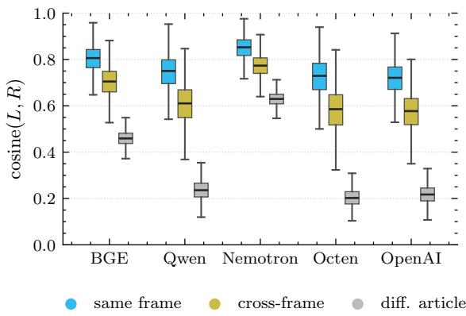  
Figure 5: Per-anchor L–R query cosine under three pairing schemes (cyan = same article and frame, yellow = same article different frame, grey = different article), grouped by retriever. Box = IQR with median; whiskers = 1.5×IQR; outliers suppressed. Inter-quartile boxes are cleanly separated within every retriever; whiskers cross substantially, so individual query pairs overlap across schemes even though the means do not.

Fig. 5 shows the per-anchor cosine distributions. Mean cosines [95% cluster-bootstrap CI on the mean, $B = 5 , 0 0 0 , { \mathrm { c l u s t e r } } = { \mathrm { a r t i c l e } } ;$ all CI half-widths $\le ~ 0 . 0 0 6 ]$ are: same article + frame $0 . 7 1 7 \mathrm { - } 0 . 8 5 0$ , same article different frame $0 . 5 7 3 \mathrm { - } 0 . 7 7 4$ , different article 0.204–0.630. Median paired $\Delta ( \mathrm { w i t h i n \mathrm { - } f r a m e - c r o s s \mathrm { - } f r a m e } )$ ranges from $+ 0 . 0 7 5$ (Nemotron) to +0.139 (Octen) with cluster-bootstrap 95% CIs nowhere crossing zero; paired Wilcoxon signed-rank yields $p < 1 0 ^ { - 3 0 0 }$ on every retriever $( n \approx 3 , 7 0 0 )$ . Distribution overlap at the per-pair level is non-trivial: whiskers (1.5×IQR) cross substantially on every retriever, so individual pairs can have lower same-frame cosine than crossframe cosine. The inter-quartile boxes, however, are cleanly separated, and the means are separated by many CI half-widths—so the Stage-A/Stage-B $\mathrm { A l l S i d e s } _ { s y n t h }$ pipeline behaves as designed at the query-embedding level: pairing L and R queries from the same source article and the same frame does produce strictly tighter topical anchoring than pairing on the article alone.

<table><tr><td></td><td></td><td></td><td colspan="4">Query length (characters)</td></tr><tr><td>Dataset</td><td>Group</td><td>n</td><td>Median</td><td>Mean</td><td>Min</td><td>Max</td></tr><tr><td rowspan="2"> $\mathbf { A l l S i d e s } _ { s y n t h }$ </td><td>left</td><td>3,723</td><td>138</td><td>139</td><td>98</td><td>187</td></tr><tr><td>right</td><td>3,723</td><td>139</td><td>139</td><td>87</td><td>192</td></tr><tr><td rowspan="2"> $\operatorname { R e d d i t } _ { n a t }$ </td><td>liberal</td><td>1,327</td><td>152</td><td>166</td><td>98</td><td>302</td></tr><tr><td>conservative</td><td>1,225</td><td>154</td><td>168</td><td>97</td><td>302</td></tr><tr><td rowspan="2"> $\mathrm { H C M a g i c } _ { s y n t h }$ </td><td>WME</td><td>4,999</td><td>362</td><td>437</td><td>63</td><td>5,141</td></tr><tr><td>AAL</td><td>14,997</td><td>384</td><td>462</td><td>63</td><td>5,332</td></tr><tr><td rowspan="2"> $\operatorname { H C M a g i c } _ { n a t }$ </td><td>WME</td><td>659</td><td>358</td><td>435</td><td>119</td><td>2,060</td></tr><tr><td>AAL</td><td>647</td><td>309</td><td>352</td><td>27</td><td>1,724</td></tr></table>

Table 4: Per-group query counts and query-length statistics (characters) for the four query datasets. Counts match the evaluated sets used throughout: $\mathrm { H C M a g i c } _ { s y n t h }$ drops one WME source whose AAL augmentation was empty (4,999 WME), and $\operatorname { H C M a g i c } _ { n a t }$ applies a ≥20-character noise filter.

## C Labeling Political Frames

The Boydstun MFC frame set. The Media Frames Corpus (MFC) frame typology (Card et al., 2015) defines 15 policy-relevant frames intended to be issue-agnostic. They are: Economic; Capacity & resources; Morality; Fairness & equality; Legality, constitutionality & jurisprudence; Policy prescription & evaluation; Crime & punishment; Security & defense; Health & safety; Quality of $l i f e ;$ Cultural identity; Public sentiment; Political; External regulation & reputation; and Other. Each frame is meant to capture a distinct “angle” on a news story (e.g. the same immigration article can be framed primarily through Security or through Fairness).

Stage-A extraction $( \mathbf { A l l S i d e s } _ { s y n t h } ) .$ We prompt gpt-5-mini with the Boydstun definitions and the article body, and ask the model to label every frame present with a salience score in [0, 1] under a constrained JSON schema (default temperature, medium reasoning effort). For each article we keep the frames with non-zero salience and feed each (article, frame) pair to Stage-B query generation. Across the 1,000 sampled articles we extract a mean of 3.72 frames per article.

Stage-B query prompt. The system prompt asks the model to write three search queries about the article, all emphasising the same Boydstun frame: neutral, left-leaning, and right-leaning (the neutral variant is unused in this paper’s left/right contrasts). Hard constraints: same sub-topic across the queries; each query clearly emphasises the named frame; each query is a single natural search-engine sentence (10–25 words); no quotation marks, bullet points, or preambles. The full prompts for both stages are shown in Fig. 6.

## D Reddit Data Collection

We scrape the most recent 15, 000 posts from each subreddit as candidate questions.

Ideology Labeling. For each post, we take the post text (excluding the question) and provide it two LLMs, prompting them to identify the most likely ideology of the author (i.e., liberal, centrist, or conservative). Specifically, we prompt gpt-5.4-mini and Qwen3.5- 4B (Qwen/Qwen3.5-4B; Qwen Team, 2026). Notably, the title question used in embedding evaluations is not provided to the model given that the posts often contain more context specific to the author and to avoid potential data leakage; for example, a Qwen model that predicts a question is conservative-leaning may indicate that the associated embedding model may be predisposed to embed similarly to conservative-leaning texts. The provided prompt is shown in Fig. 7. We extract only posts for which both models agreed on the most likely label to form the final dataset of queries. Following the privacy commitment in our Ethical considerations, the code release contains the resulting post IDs and labels but not the post text, the per-post classifier rationales, or the classification code itself.

## E Model Details

Table 5 lists the evaluated retrieval models: four open-weight dense encoders run through sentence-transformers, the closed OpenAI te-3-large accessed through the OpenAI API, and the BM25-Okapi sparse baseline run through bm25s (Lu, 2024).

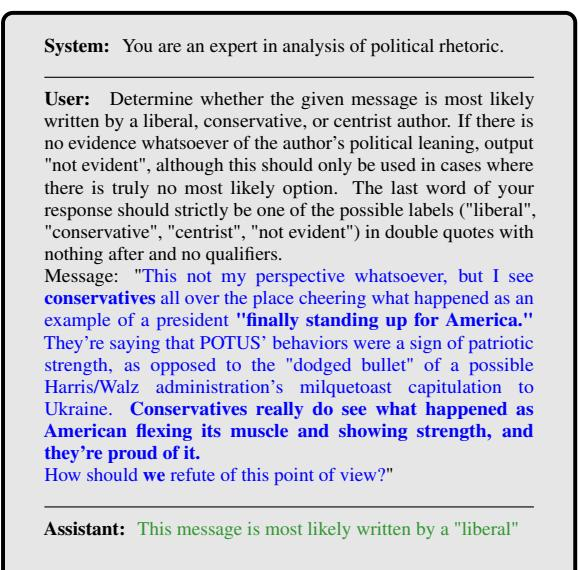

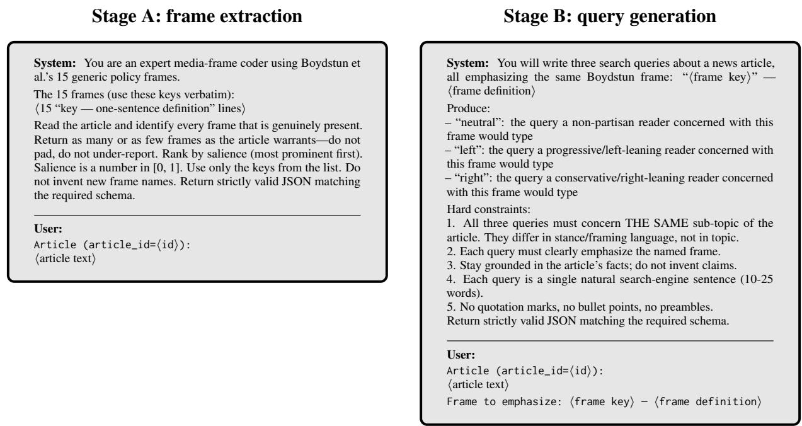  
Figure 6: Stage-A (frame extraction) and Stage-B (frame-conditioned query generation) prompts (gpt-5-mini, medium reasoning effort, default temperature). ⟨·⟩ marks per-request substitutions: Stage A receives the 15 “key— definition” lines for the frames listed above; Stage B is instantiated once per (article, frame) cell. Both stages decode under strict JSON schemas—Stage A returns {frames: [{key, salience}]}, Stage B returns {neutral, left, right}. The neutral query is generated but unused in this paper’s left/right contrasts.

<table><tr><td>Model</td><td>Size</td><td>Emb. dim</td><td>Checkpoint</td></tr><tr><td>BGE-large</td><td>0.3B</td><td>1024</td><td>BAAI/bge-large-en-v1.5</td></tr><tr><td>Qwen3-Embedding-8B</td><td>8B</td><td>4096</td><td>Qwen/Qwen3-Embedding-8B</td></tr><tr><td>Llama-Nemotron-8B</td><td>8B</td><td>4096</td><td>nvidia/1lama-embed-nemotron-8b</td></tr><tr><td>Octen-Embedding-8B</td><td>8B</td><td>4096</td><td>Octen/Octen-Embedding-8B</td></tr><tr><td>OpenAI te-3-large</td><td></td><td>3072</td><td>text-embedding-3-large (API)</td></tr><tr><td>BM25-Okapi</td><td></td><td></td><td>bm25s (sparse)</td></tr></table>

Figure 7: Prompt used for ideology classification. Blue text represents an example post, while green text represents the associated model prediction. Particular phrases that may signal the political ideology of the author are bolded.  
Table 5: Evaluated retrieval models. OpenAI te-3-large uses its default 3072 dimensions (no Matryoshka truncation); BM25 is sparse/lexical and has no dense embedding.

Implementation. All embeddings are L2- normalised, so retrieval ranks by cosine similarity, and inputs are capped at 512 tokens. The three 8B encoders run in bfloat16 and BGE-large in float32; OpenAI te-3-large returns 3072- dimensional vectors via the API. BM25 (Okapi) is computed with bm25s (Lu, 2024) for all corpora, roughly 200× faster than rank\_bm25 at the 112k-document scale. Each encoder uses its documented query/document convention:

• BGE-large: queries are prefixed with “Represent this sentence for searching relevant passages: ”; documents take no prefix.

• Qwen3-Embedding-8B: the model’s built-in query/document prompt templates.

• Llama-Nemotron-8B: queries are prefixed with an Instruct: . . . \nQuery: retrieval instruction; documents take no prefix.

• Octen-Embedding-8B: queries take no prefix; documents are prefixed with “- ” (the model card’s recommended workaround).

• OpenAI te-3-large: no query/document distinction.

## F Redditnat LLM-judged gold-filter

Setup. For $\operatorname { R e d d i t } _ { n a t }$ there is no editoriallyaligned story-counterpart gold the way the All-Sides roundup provides one for synthetic query pairs. We use an LLM-judge gold from two independent relevance judges, both run on every (query, article) pair in the top-10 retrieval pool: gpt-5-mini (closed-weights, OpenAI batch API) and Qwen3.5-35B-A3B (open-weights, 35B-total / 3B-active sparse MoE; run locally via vLLM with PP=4 on 4× RTX 4090). Both use the same binary $0 / 1$ schema with the same prompt and $T { = } 0$ . All 2,559 left + right queries are judged on their top-10 retrievals across the 5 dense retrievers + BM25, deduped to 102,637 unique pairs.

Inter-judge agreement. Cohen’s $\kappa = 0 . 5 0 ;$ raw pairwise agreement 89.2%. gpt-5-mini is the more permissive judge (15.4% relevance rate vs. 9.2% for Qwen). Qwen’s “relevant” set is approximately a subset of gpt’s: gpt-5-mini recall vs. Qwen-asgold is 74.9%, while Qwen’s recall vs. gpt-asgold is only 44.6%—agreement is asymmetric and consistent with a calibration difference, not directional disagreement. Per-side κ: left = 0.500, right = 0.502 —judges do not disagree differently by query side, which is the key robustness check against the worry that the closed-weights judge might encode ideologically biased relevance grades.

Gold filter. A retrieval is “gold” for the primary test (Fig. 2b) iff both judges grade it 1. This passes 7,047 pairs (6.87% of the pool). Perencoder retention varies: OpenAI te-3-large 14.3%, Qwen3-Emb-8B 14.0%, Octen 12.4%, BGE 10.7%, Llama-Nemotron-8B 5.9%, BM25 3.5%. The two encoders with the lowest retention (Nemotron, BM25) still surface enough relevant docs to produce significant gaps, and BM25 in fact carries the largest right−left gap of any retriever under this gold. Table 6 reports the perretriever right−left gap under each filter definition (raw, each judge alone, and gold).

Judge prompt. Both judges see the binary relevance prompt in Fig. 8 at $T { = } 0$ . The $\mathrm { A l l S i d e s } _ { s y n t h }$ LLM-judge ablation $( { \mathrm { A p p . ~ G } } )$ uses the same template and binary rubric with news-query wording; both prompts are shown.

## G Gold-filtering robustness

Our political results measure retrieval lean over the documents a retriever surfaces that are relevant to the query (§2.2). “Relevant” is defined differently on the two datasets—same editorial roundup on $\mathrm { A l l S i d e s } _ { s y n t h }$ , two-judge LLM relevance on $ { \mathrm { R e d d i t } } _ { n a t } - \mathbf { s } \mathbf { o }$ we verify that the own-lean gap does not depend on that choice. We examine four settings; the gap is present and significant in three, and the diagnostics below show the lone exception is a property of $\operatorname { R e d d i t } _ { n a t }$ retrieval, not of the metric.

The gap appears with no relevance filter. Taking the mean lean over the full top-10 of every query, with no relevance filter at all, the own-lean gap is already present (Fig. 9): every $\mathrm { A l l S i d e s } _ { s y n t h }$ retriever is significant $( p < 1 0 ^ { - 8 } )$ , as are five of six on $\mathrm { R e d d i t } _ { n a t } ~ ( p < 0 . 0 5 ;$ only BM25, whose raw retrievals carry no lean, is not). The filter sharpens the signal rather than creating it.

The two relevance methods are interchangeable. The primary $\operatorname { R e d d i t } _ { n a t }$ metric restricts lean to LLMjudged-relevant documents (App. F). Applying the same two-judge relevance gold to $\mathrm { A l l S i d e s } _ { s y n t h }$ (same prompt, Fig. 8)—an independent judgment on all 242,000 left/right top-10 pairs, gold iff both $\mathtt { g p t - 5 - m i n i }$ and Qwen3.5-35B-A3B grade relevant—reproduces the own-lean gap on all six retrievers, larger than the editorial-gold gap (+0.06 to +0.09 vs. +0.02 to +0.05; Fig. 10), since the relevant subset concentrates the signal. Conversely, applying the $\mathrm { A l l S i d e s } _ { s y n t h }$ -style full-top-10 mean to $\operatorname { R e d d i t } _ { n a t }$ weakens it: only three of six retrievers stay significant (Fig. 11).

Why the full-top-10 $\mathbf { R e d d i t } _ { n a t }$ gap is diluted, not absent. The datasets differ sharply in how much of the top-10 is on-topic (Fig. 12). On $\mathrm { A l l S i d e s } _ { s y n t h }$ , 83% of (query, retriever) top-10 lists contain ≥ 1 relevant article (median 4 among those), because the synthetic queries are written from the corpus; on $\operatorname { R e d d i t } _ { n a t }$ , only 40% do (median 2). A full-top-10 mean on $\operatorname { R e d d i t } _ { n a t }$ therefore averages over a large majority of off-topic articles— which carry no consistent lean—so the relevantsubset metric is the appropriate one there. BM25 is the extreme case of this dilution: its gold retention is the lowest of any retriever (3.5%; App. F), so its full top-10 carries no consistent lean (Fig. 9b) even though its gap over relevant documents is the largest of any retriever (Table 6). The converse holds on $\mathrm { A l l S i d e s } _ { s y n t h }$ , where queries are written from the corpus and overlap is high; even there, shared topical vocabulary (e.g., "CBO", "\$10.10"; Table 1) dominates the BM25 score and matches articles of both leans within a roundup, leaving the few partisan terms to shift the top-10 only modestly.

<table><tr><td>Retriever</td><td>raw R-L</td><td>gpt-only R-L</td><td>Qwen-only R-L</td><td>gold R-L (p)</td></tr><tr><td>BGE-large</td><td>+0.020</td><td>+0.069</td><td>+0.088</td><td>+0.109 (0.007)</td></tr><tr><td>Qwen3-Emb-8B</td><td>+0.025</td><td>+0.065</td><td>+0.080</td><td>+0.069 (0.047)</td></tr><tr><td>Llama-Nemotron</td><td>+0.033</td><td>+0.072</td><td>+0.174</td><td> $+ 0 . 1 8 6 ( { 1 0 } ^ { - 3 } )$ </td></tr><tr><td>Octen-Emb-8B</td><td>+0.048</td><td>+0.043</td><td>+0.087</td><td>+0.104 (0.002)</td></tr><tr><td>OpenAI te-3-large</td><td>+0.056</td><td>+0.102</td><td>+0.107</td><td> $+ 0 . 1 3 6 ( { 1 0 } ^ { - 4 } )$ </td></tr><tr><td>BM25</td><td>+0.009</td><td>+0.151</td><td>+0.169</td><td> $\mathbf { + 0 . 1 9 5 } \ ( 0 . 0 0 6 )$ </td></tr></table>

Table 6: Reddit right−left mean lean@10 gap under four filter definitions: raw (no filter, $n = 2 , 5 5 2$ queries per encoder); gpt-5-mini-only; Qwen-only; and gold (both judges grade the article relevant; used in the main figure). All four agree on direction; the tighter the filter, the larger the gap. The gold column is the primary contrast used in Fig. 2b.  
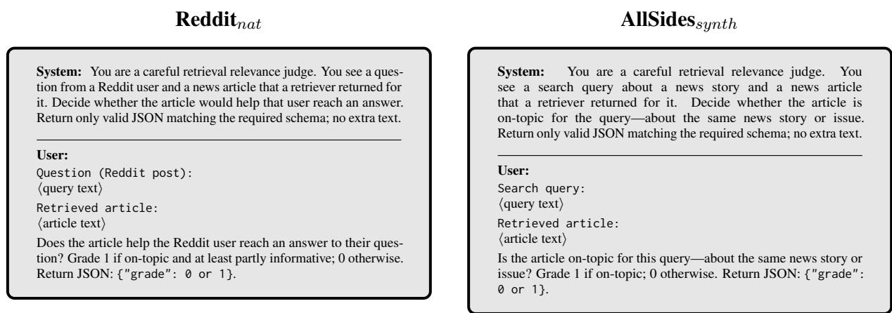  
Figure 8: Binary relevance-judge prompts, run by both judges (gpt-5-mini and Qwen3.5-35B-A3B, T=0): the $\operatorname { R e d d i t } _ { n a t }$ two-judge gold (App. F) and the $\mathbf { A l l S i d e s } _ { s y n t h }$ LLM-judge ablation (App. G). Both share the binary 0/1 rubric and JSON $\{ " \mathtt { g r a d e } " \}$ schema; only the domain wording $\mathrm { d i f f e r s { \_ } R e d d i t } _ { n a t }$ asks whether the article helps the user answer their question, $\mathrm { A l l S i d e s } _ { s y n t h }$ whether it is on-topic for the news story.

Robustness to the relevance judge. On $\mathrm { A l l S i d e s } _ { s y n t h }$ we have editorial ground truth (same-roundup membership), letting us measure how far the LLM judge departs from it (Fig. 13). The two-judge gold is much broader than the editorial set: it recovers 70% of same-roundup articles but also flags many other on-topic ones, for low agreement (Cohen’s $\kappa = 0 . 1 7 )$ . Despite this, the own-lean gap is significant under both definitions (editorial: Table 7; LLM-judge: Fig. 10), so it does not hinge on the exact relevance criterion.

## H Significance tests

The own-lean and dialect contrasts are tested as follows; per-retriever p-values are in App. I (political) and App. M (dialect).

Paired contrasts $( \mathbf { A l l S i d e s } _ { s y n t h }$ $\mathbf { H C M a g i c } _ { s y n t h } ,$ translation). On the paired datasets we test the mean per-pair difference $( \Delta _ { \mathrm { l e a n } }$ or $\Delta _ { \mathrm { r a n k } } )$ against a null of no preference in two ways. The sign-flip permutation (Pitman, 1937) randomly flips the sign of each per-pair difference on B=50,000 resamples and asks how often the permuted mean is at least as extreme as the observed mean (two-sided; p-floor $1 / B = 2 { \cdot } 1 0 ^ { - 5 } )$ . The two-sided paired Wilcoxon signed-rank test (Wilcoxon, 1945) asks whether the per-pair difference has a non-zero median across pairs, without distributional assumptions.

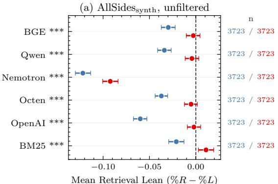

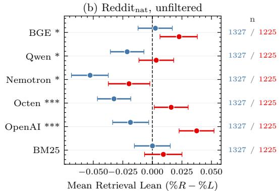  
Figure 9: Per-retriever mean retrieval lean over the $f u l l$ top-10 (no relevance filter), 95% bootstrap CIs. (a) AllSides $s y n t h$ left/right queries; (b) $\operatorname { R e d d i t } _ { n a t }$ liberal-/conservative-asker queries. Stars on retriever labels $( \star p < 0 . 0 5 ,$ \*\*p<0.01, \*\*\*p<0.001); n per group in the right margin. The own-lean gap (right marker right of left) holds without any filtering.

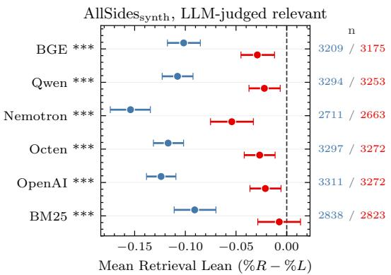  
Figure 10: $\mathrm { A l l S i d e s } _ { s y n t h }$ per-retriever lean over LLMjudged-relevant top-10 docs (the $\operatorname { R e d d i t } _ { n a t }$ setting applied to AllSides $_ { s y n t h } ) \colon$ : the own-lean gap holds on all six retrievers $( p \check { < } 1 0 ^ { - 1 0 } )$ , larger than under the editorial gold (Table 7). 95% bootstrap CIs; $n = { \mathrm { r e t a i n e d } }$ left/right queries.

Unpaired contrast $( \mathbf { R e d d i t } _ { n a t } .$ $\mathbf { H } \mathbf { C } \mathbf { M } \mathbf { a g } \mathbf { i c } _ { n a t } )$ The naturalistic datasets are unpaired (different queries in each group), so we use a two-sided rankbased Mann–Whitney U test (Mann and Whitney, 1947), asking whether one group’s per-query lean (or MRR) is stochastically larger than the other’s.

## I Per-retriever gold-filtered own-lean tendency

On $\mathrm { A l l S i d e s } _ { s y n t h }$ , the per-retriever paired $\overline { { \Delta _ { \mathrm { l e a n } } } } =$ lean(R) − lean(L) at k=10 on the fair corpus, restricted to (article, frame) pairs where both the left and the right query surface a same-story counterpart in top-10 (the gold set, Table 7). This is the per-retriever difference behind Fig. 2a, which plots the left- and right-query lean separately. Signflip permutation $( B { = } 5 0 , 0 0 0$ , p-floor $2 { \cdot } 1 0 ^ { - 5 } )$ and paired Wilcoxon signed-rank both reject on every retriever.

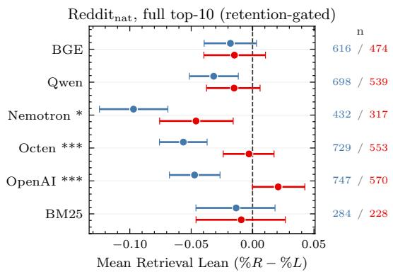  
Figure 11: $\operatorname { R e d d i t } _ { n a t }$ per-retriever lean over the full top-10, restricted to queries with $\geq 1$ relevant doc (the $\mathbf { A l l S i d e s } _ { s y n t h }$ setting applied to $\operatorname { R e d d i t } _ { n a t } )$ . Only three of six retrievers stay significant—the off-topic majority of the top-10 dilutes the signal (Fig. 12).

Queries on $\operatorname { R e d d i t } _ { n a t }$ are unpaired, so the parallel per-retriever contrast is the own-lean gap: the mean gold-filtered lean over conservative-asker queries minus that over liberal-asker queries (Table 8), the difference behind Fig. 2b. A two-sided Mann–Whitney U test rejects on every retriever $( p < 0 . 0 5 )$ .

## J Political k-sweep companions

Companion k-sweep figures to Fig. 2. The L–R separation (a) and the asker-ideology right−left gap (b) are stable across $k \in \{ 5 , 1 0 , 2 0 , 5 0 , 1 0 0 \}$ in both $\mathrm { A l l S i d e s } _ { s y n t h }$ and $\operatorname { R e d d i t } _ { n a t }$

<table><tr><td>Retriever</td><td>n pairs</td><td> $\overline { { \Delta _ { \mathrm { l e a n } } } } \left( \mathrm { R - L } \right)$ </td><td>95% CI</td><td>Wilcoxon p</td><td>Perm p</td></tr><tr><td>BGE-large</td><td>2,422</td><td> $+ 0 . 0 2 7$ </td><td> $\left[ + 0 . 0 1 6 , + 0 . 0 3 8 \right]$ </td><td> $4 . 4 { \cdot } 1 0 ^ { - 6 }$ </td><td> $< 2 { \cdot } 1 0 ^ { - 5 }$ </td></tr><tr><td>Qwen3-Emb-8B</td><td>2,508</td><td>+0.023</td><td> $\left[ + 0 . 0 1 4 , + 0 . 0 3 3 \right]$ </td><td> $2 . 0 { \cdot } 1 0 ^ { - 6 }$ </td><td> $< 2 { \cdot } 1 0 ^ { - 5 }$ </td></tr><tr><td>Llama-Nemotron-8B</td><td>1,416</td><td>+0.025</td><td> $\left[ + 0 . 0 1 1 , + 0 . 0 3 8 \right]$ </td><td> $9 . 5 { \cdot } 1 0 ^ { - 5 }$ </td><td> $2 . 8 { \cdot } 1 0 ^ { - 4 }$ </td></tr><tr><td>Octen-Emb-8B</td><td>2,605</td><td>+0.023</td><td> $[ + 0 . 0 1 4 , + 0 . 0 3 2 ]$ </td><td> $1 . 0 { \cdot } 1 0 ^ { - 5 }$ </td><td> $< 2 { \cdot } 1 0 ^ { - 5 }$ </td></tr><tr><td>OpenAI te-3-1arge</td><td>2,663</td><td> $\mathbf { + 0 . 0 4 5 }$ </td><td> $\left[ + 0 . 0 3 5 , + 0 . 0 5 4 \right]$ </td><td> $3 . 9 { \cdot } 1 0 ^ { - 2 1 }$ </td><td> $< 2 { \cdot } 1 0 ^ { - 5 }$ </td></tr><tr><td>BM25 (Okapi)</td><td>1,798</td><td> $\mathbf { + 0 . 0 4 3 }$ </td><td> $[ + 0 . 0 2 9 , + 0 . 0 5 7 ]$ </td><td> $1 . 4 { \cdot } 1 0 ^ { - 8 }$ </td><td> $< 2 { \cdot } 1 0 ^ { - 5 }$ </td></tr></table>

Table 7: $\mathrm { \mathrm { : ~ } A l l S i d e s } _ { s y n t h }$ gold-filtered paired contrast at k=10; positive $\overline { { \Delta _ { \mathrm { l e a n } } } }$ means each query retrieves toward its own political lean. Both paired tests reject on every retriever: two-sided paired Wilcoxon and sign-flip permutation $\scriptstyle ( B = 5 0 , 0 0 0 ,$ , p-floor $2 { \cdot } 1 0 ^ { - 5 } ; \mathrm { A p p } .$ H).
<table><tr><td>Retriever</td><td>n (lib/con)</td><td>gap (con—lib)</td><td>95% CI</td><td>MWU p</td></tr><tr><td>BGE-large</td><td>616/474</td><td>+0.109</td><td> $\left[ + 0 . 0 2 8 , + 0 . 1 9 3 \right]$ </td><td> $7 . 1 \cdot 1 0 ^ { - 3 }$ </td></tr><tr><td>Qwen3-Emb-8B</td><td>698/539</td><td>+0.069</td><td> $[ - 0 . 0 0 2 , + 0 . 1 3 9 ]$ </td><td> $4 . 7 { \cdot } 1 0 ^ { - 2 }$ </td></tr><tr><td>Llama-Nemotron-8B</td><td>432/317</td><td>+0.186</td><td> $[ + 0 . 0 7 9 , + 0 . 2 9 7 ]$ </td><td> $1 . 1 { \cdot } 1 0 ^ { - 3 }$ </td></tr><tr><td>Octen-Emb-8B</td><td>729/553</td><td>+0.103</td><td> $[ + 0 . 0 3 7 , + 0 . 1 7 6 ]$ </td><td> $1 . 5 { \cdot } 1 0 ^ { - 3 }$ </td></tr><tr><td>OpenAI te-3-large</td><td>747/570</td><td>+0.136</td><td> $[ + 0 . 0 6 4 , + 0 . 2 0 5 ]$ </td><td> $7 . 7 { \cdot } 1 0 ^ { - 5 }$ </td></tr><tr><td>BM25 (Okapi)</td><td>284/228</td><td>+0.195</td><td> $[ + 0 . 0 6 2 , + 0 . 3 2 3 ]$ </td><td> $5 . 5 { \cdot } 1 0 ^ { - 3 }$ </td></tr></table>

Table 8: $\operatorname { R e d d i t } _ { n a t }$ gold-filtered own-lean gap at $k { = } 1 0 ,$ , parallel to Table $7 { : }$ mean lean over conservative-asker queries minus mean lean over liberal-asker queries, computed over LLM-judged-relevant documents. Positive means each asker retrieves toward their own political lean. n is the retained liberal/conservative query count; 95% bootstrap CI on the gap; two-sided Mann–Whitney $U \ : p$ (the test behind Fig. 2b). Qwen3-Emb-8B’s gap CI marginally includes 0 although its Mann–Whitney $p < 0 . 0 5$

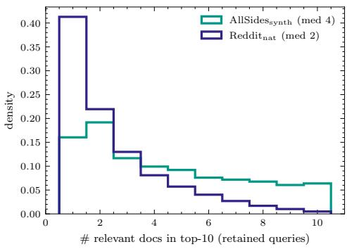  
Figure 12: Number of relevant docs in the top-10 per (query, retriever), among queries with $\geq 1$ relevant. $\mathrm { A l l S i d e s } _ { s y n t h }$ lists are far more on-topic than Reddi $\mathrm { t } _ { n a t } \mathbf { \dot { s } }$ (83% vs. 40% of lists contain any relevant doc).

Figure 13: $\mathrm { A l l S i d e s } _ { s y n t h }$ LLM-judge relevance (both judges agree) vs. editorial same-roundup gold, over all 242,000 judged top-10 pairs. The judge is broader than the editorial set (κ = 0.17), yet the own-lean gap holds under both.  
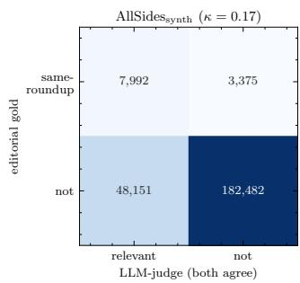

## K HealthCareMagic corpus example

Table 9 gives a worked example from each dataset (queries from Table 2), with the real doctor response each query is scored against— indexed from the originating HealthCareMagic row. $\mathrm { H C M a g i c } _ { s y n t h }$ is paired: a real WME query and its synthetic AAL rewrite share one gold document. $\mathrm { H C M a g i c } _ { n a t }$ is unpaired, so it contributes a real AAL post and a separate real WME post, each a different patient with its own gold. All are ranked against the same 112,165-document corpus.

## L HCMagic input filter and dropped rows

HCMagicnat (naturalistic). The hcmagic source contains 1,315 rows (AAL: 656; WME: 659). The loader applies two filters before embedding/retrieval, both motivated by inspection of the raw query field: (i) drop rows with missing/blank query text (otherwise pandas serialises NaN as the literal string "nan" and the embedding step proceeds on that junk text); (ii) drop rows whose query is shorter than 20 characters after stripping whitespace, since the bottom of the AAL length distribution is dominated by one-word gibberish/typos (e.g.

<table><tr><td colspan="2"> $\mathbf { H C M a g i c } _ { s y n t h }$  real WME query, synthetic AAL rewrite, shared real gold document</td></tr><tr><td>AAL query (synthetic)</td><td>Hi docta, how might can that renal functions be monitored in one patient undergoing hemodialysis 3 times per week?</td></tr><tr><td>WME query (real)</td><td>Hi doctor, how can the renal function be monitored in a patient undergoing hemodialysis 3 times per week?</td></tr><tr><td>Gold document (real)</td><td>Renal function is monitored by maintaining a chart of blood urea and serum creatinine levels. . . during each visit of dialysis you must. . . note down the.. . levels of renal parame- ters.. . regularly. . . show it to the nephrologist. .. Take care.</td></tr><tr><td colspan="2">HCMagicnat real AAL post and a separate real WME post, each with its own gold (unpaired)</td></tr><tr><td>AAL query (real)</td><td>. .. about 2 weeks ago she notice she had a lump just below her left rib in the front. . . once ahe straight again u can see it and feel it. What can this be.</td></tr><tr><td>Gold document (real)</td><td>Hi, Dear, thanks for the query to Chat Doctor. . . In my opinion your daughter has a third nipple or a Supernumerary nipple below the normal nipple on left side, or may be a puberty change.. . Have a good time.</td></tr><tr><td>WME query (real)</td><td>Every now and then I will feel my chest tighten and my heart starts pounding extremely hard. I cant breath and I begin feeling very lightheaded. It usually only lasts a few seconds</td></tr><tr><td>Gold document (real)</td><td>and does not happen too often. Any ideas as to what could be causing this? Hello and thanks for writing... The symptoms you have described are somewhat red flags and need a thorough workup to get to a cause.. . conditions that might cause them include cardiac arrhythmia, angina, anxiety or Blood Pressure issues. .. You may also need few tests like BP measurement, CBC, FT, ECG, Holder study. .. I suggest you consult a physician and get yourself worked up for the problem.</td></tr></table>

Table 9: Worked query–document examples for both dialect datasets (the queries from Table 2), each scored against a real gold document—the doctor response indexed from its originating HealthCareMagic row (abridged with . . . ). $\mathrm { H C M a g i c } _ { s y n t h }$ is paired: a real WME query and its synthetic AAL rewrite share one gold document. HCMagicnat is unpaired, so we show a real AAL post and a separate real WME post—different patients, each with its own gold document (§3.1). AAL surface markers in purple.

“thtr”, “aesthema”, “zzxczxc”) and one three-word fragment (“i wana pregnent”) that do not function as questions. The 20-char threshold preserves realbut-brief medical questions such as “bipolar type 2 can be cure?” (27 chars). Nine AAL rows are dropped total—one by filter (i) and eight by filter (ii)—yielding a final AAL count of 647. WME has zero rows dropped (minimum length 119 chars). The same nine rows are excluded from trans-AAL via the paired-on-row join, so the paired contrast runs on n=647 pairs.

HCMagic $s y n t h$ (synthetic). The $\mathrm { H C M a g i c } _ { s y n t h }$ source contains 5,000 rows. The same 20-character minimum filter is applied to all four query variants (input plus three aal\_message{1,2,3} paraphrases) and the output field; one row is dropped (all three AAL paraphrase fields empty), yielding n=4,999 paired samples used in Table 11 and Fig. 3a.

## M Per-retriever dialect gap

The per-retriever contrasts behind Fig. 3, in the same format as the political tables (App. I). Positive values mean the WME-form query retrieves better— its answer document ranks higher—than the AAL form. $\mathrm { H C M a g i c } _ { s y n t h }$ is paired, summarised by the mean per-sample $\Delta _ { \mathrm { r a n k } } = \mathrm { R R } _ { \mathrm { W M E } } - \mathrm { R R } _ { \mathrm { A A I } }$ over reciprocal rank and tested with paired Wilcoxon and sign-flip permutation; $\mathbf { H C M a g i c } _ { n a t }$ is an unpaired between-group MRR gap on naturallyoccurring queries (different patients), tested with a two-sided Mann–Whitney U. All at k=10 on the unified 112,165-document corpus, no relevance filter; 95% CIs are bootstrap. No multiplecomparison correction; the BGE HCMagicnat entry (p=0.10) is the only contrast that does not clear

<table><tr><td>idx</td><td>char len</td><td>query (first 30 chars)</td></tr><tr><td>70</td><td>7</td><td>ZZXCZXC</td></tr><tr><td>144</td><td>9</td><td>lipoprint</td></tr><tr><td>267</td><td>7</td><td>nothing</td></tr><tr><td>386</td><td>4</td><td>thtr</td></tr><tr><td>398</td><td>12</td><td>bhjkhjkhklhk</td></tr><tr><td>456</td><td>8</td><td>aesthema</td></tr><tr><td>495</td><td>15</td><td>i wana pregnent</td></tr><tr><td>511</td><td>0</td><td>(empty)</td></tr><tr><td>569</td><td>4</td><td>SDfc</td></tr></table>

Table 10: The nine AAL rows dropped from the hcmagic source by the input-validity filter.

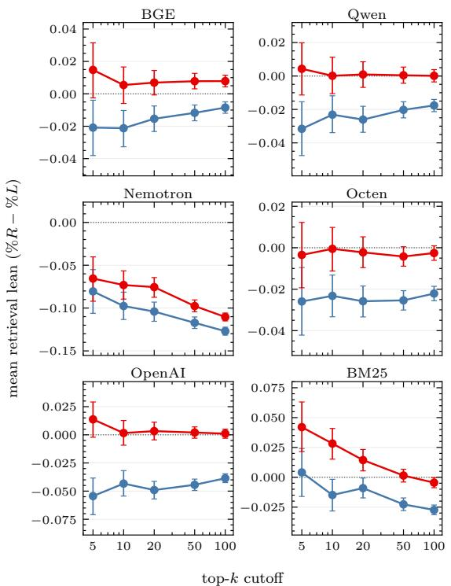  
Figure $1 4 \colon \mathrm { \ A l l S i d e s } _ { s y n t h }$ gold-filtered paired lean across $k \in \{ 5 , 1 0 , 2 0 , 5 0 , 1 0 0 \}$ , per retriever (per-panel y-axis). Whiskers: 95% cluster-bootstrap CIs.  
Figure 15: $\operatorname { R e d d i t } _ { n a t }$ mean retrieval lean by asker ideology across $k \in \{ 5 , 1 0 , 2 0 , 5 0 , 1 0 0 \}$ , per retriever (perpanel y-axis; raw unfiltered, all retrievals). Whiskers: 95% cluster-bootstrap CIs.

$$
\begin{array} { r } { p < 0 . 0 5 . } \end{array}
$$

## N Dialect k-sweep companions

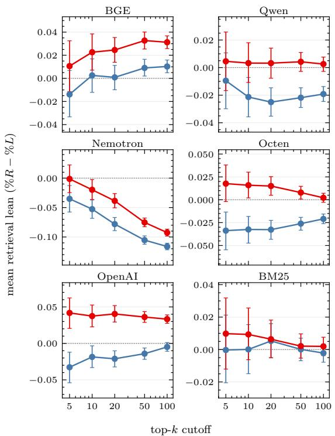

Companion k-sweep figures to Fig. 3. The WME>AAL gap is stable across $k ~ \in ~ \{ 1 , 5 , 1 0 $ , 20, 50, 100} in both the paired HCMagicsynth and the unpaired HCMagicnat settings.

Translation k-sweep. Companion to Fig. 19: paired Recall@k across $k \in \{ 1 , 5 , 1 0 , 2 0 , 5 0 , 1 0 0 \}$ for GPT-translated WME vs the original AAL query on the same $\scriptstyle n = 6 4 7 \mathrm { ~ H C M a g i c } _ { n a t }$ AAL queries (Fig. 18). The two-camp split visible in the main forest (Qwen / Octen / OpenAI te-3-large overlap; BGE / Nemotron / BM25 separate) persists at every swept k.

## O HCMagicsynth augmentation quality

The $\mathrm { H C M a g i c } _ { s y n t h }$ synthetic AAL paraphrases are generated by the Ziems et al. (2022) / Deas et al. (2024) pipelines applied to HealthCareMagic patient queries. Both pipelines were validated with AAL-speaker reviewers on their own source corpora (TwitterAAL and LiveQA respectively) but were not independently re-validated on Health-CareMagic outputs. We report a quantitative + qualitative spot-check below.

Quantitative QC (all 14,997 paraphrases). Median length ratio AAL/WME = 1.06; median character-level edit ratio (vs source WME) = 0.58 (5th percentile = 0.20, so even the least-shifted paraphrase contains substantial surface change); inter-paraphrase diversity (avg pairwise edit ratio across the three paraphrases per sample, n=500- sample subset) median = 0.58. Near-WMEduplicates (edit ratio $< ~ 0 . 0 5 )$ total 19/14,997 (0.13%); identical-to-WME 2/14,997.

Qualitative observations. Random samples contain recognisable AAL features (phonological respellings, habitual aspect “I been had”, “y’all”, “might can” double modal) but also systematic generator artifacts: over-frequent cleft structures (“It is X that Y”), substitution of “for me” for “my”, mid-sentence pronoun drift (“she/he” replacing first-person “I”), and occasional sub-word garbling (“Shems” for “I’m”, “mat” for “might”).

Example. Source WME: “Hi I have a problem with my gum. Have a rednes on the left two front tothsfor about a year. have been at the dentist have my gums clean have an x ray atc. no one can help me. I also have venires done on my top. Can you please let me know what can cose infection.” AAL paraphrase 1: “Hi She have a problem with for me gum. Do Have a rednes on the left twofront toth for abat a year. have be at that dentist have my gum clean have an x ra atc. no one mat can help me. It is venires done on my top that i also has. Can yaw please let she know can what cos infection.” (Bolded blue: real AAL feature yaw for y’all; generator artifacts She have pronoun drift, for me for my, mat can as attempted double-modal might can, and cleft restructure.) These artifacts likely inflate the $\mathrm { H C M a g i c } _ { \mathit { s y n t h } } \Delta _ { \mathrm { r a n k } }$ above what natural-AAL features alone would induce, particularly for out-ofdistribution-sensitive strong encoders—the translation contrast (App. P) bounds the natural-AAL dialect penalty for the strong encoders at ±0.015 MRR.

<table><tr><td>Retriever</td><td>n pairs</td><td> $\overline { { \Delta _ { \mathrm { r a n k } } } } \ ( \mathrm { W M E { - } A A L ) }$ </td><td>95% CI</td><td>Wilcoxon p</td><td>Perm p</td></tr><tr><td>BGE-large</td><td>4,999</td><td>+0.050</td><td> $[ + 0 . 0 4 5 , + 0 . 0 5 5 ]$ </td><td> $1 . 1 { \cdot } 1 0 ^ { - 1 1 6 }$ </td><td> $< 2 { \cdot } 1 0 ^ { - 5 }$ </td></tr><tr><td>Qwen3-Emb-8B</td><td>4,999</td><td>+0.023</td><td> $[ + 0 . 0 1 8 , + 0 . 0 2 7 ]$ </td><td> $1 . 8 \cdot 1 0 ^ { - 2 4 }$ </td><td> $< 2 { \cdot } 1 0 ^ { - 5 }$ </td></tr><tr><td>Llama-Nemotron-8B</td><td>4,999</td><td>+0.051</td><td> $[ + 0 . 0 4 6 , + 0 . 0 5 6 ]$ </td><td> $2 . 6 { \cdot } 1 0 ^ { - 1 9 2 }$ </td><td> $< 2 { \cdot } 1 0 ^ { - 5 }$ </td></tr><tr><td>Octen-Emb-8B</td><td>4,999</td><td>+0.027</td><td> $[ + 0 . 0 2 2 , + 0 . 0 3 1 ]$ </td><td> $1 . 3 { \cdot } 1 0 ^ { - 2 4 }$ </td><td> $< 2 { \cdot } 1 0 ^ { - 5 }$ </td></tr><tr><td>OpenAI te-3-large</td><td>4,999</td><td>+0.040</td><td> $\left[ + 0 . 0 3 5 , + 0 . 0 4 4 \right]$ </td><td> $1 . 1 { \cdot } 1 0 ^ { - 9 6 }$ </td><td> $< 2 { \cdot } 1 0 ^ { - 5 }$ </td></tr><tr><td>BM25 (Okapi)</td><td>4,999</td><td>+0.024</td><td> $\left[ + 0 . 0 2 0 , + 0 . 0 2 8 \right]$ </td><td> $8 . 3 { \cdot } 1 0 ^ { - 5 0 }$ </td><td> $< 2 { \cdot } 1 0 ^ { - 5 }$ </td></tr></table>

Table 11: HCMagic $s y n t h$ paired dialect gap at $k { = } 1 0$ (the contrast behind Fig. 3a): mean per-sample $\Delta _ { \mathrm { r a n k } } =$ $\mathrm { R R } _ { \mathrm { W M E } } - \mathrm { R R } _ { \mathrm { A A L } }$ , averaging the three synthetic AAL rewrites per WME source. Both paired tests (Wilcoxon, sign-flip permutation; App. H) reject on every retriever. Parallel to the $\mathrm { A l l S i d e s } _ { s y n t h }$ Table 7.
<table><tr><td>Retriever</td><td>n (WME/AAL)</td><td>MRR gap (WME-AAL)</td><td>95% CI</td><td>MWU p</td></tr><tr><td>BGE-large</td><td>659/647</td><td>+0.034</td><td> $[ - 0 . 0 1 0 , + 0 . 0 7 7 ]$ </td><td>0.10</td></tr><tr><td>Qwen3-Emb-8B</td><td>659/647</td><td>+0.077</td><td> $\left[ + 0 . 0 2 8 , + 0 . 1 2 5 \right]$ </td><td> $2 . 3 { \cdot } 1 0 ^ { - 3 }$ </td></tr><tr><td>Llama-Nemotron-8B</td><td>659/647</td><td>+0.091</td><td> $\left[ + 0 . 0 5 6 , + 0 . 1 2 5 \right]$ </td><td> $8 . 7 { \cdot } { 1 0 } ^ { - 8 }$ </td></tr><tr><td>Octen-Emb-8B</td><td>659/647</td><td>+0.062</td><td> ${ \bar { [ + 0 . 0 1 5 , + 0 . 1 1 1 ] } }$ </td><td>0.01</td></tr><tr><td>OpenAI te-3-large</td><td>659/647</td><td>+0.064</td><td> $[ + 0 . 0 1 7 , + 0 . 1 1 1 ]$ </td><td>0.01</td></tr><tr><td>BM25 (Okapi)</td><td>659/647</td><td>+0.040</td><td> $\left[ + 0 . 0 1 5 , + 0 . 0 6 5 \right]$ </td><td>0.03</td></tr></table>

Table 12: HCMagicnat unpaired dialect gap at k=10 (the contrast behind Fig. 3b): difference in mean MRR between the naturally-occurring WME and AAL query pools. Parallel to the $\operatorname { R e d d i t } _ { n a t }$ Table $\mathbf { \boldsymbol { 8 } ; }$ bold marks the two largest gaps. BGE’s CI includes 0, consistent with its $\scriptstyle p = 0 . 1 0$

## P Translation-mitigation experiment

A natural deployment fix for the AAL gap is to normalize the query into WME—the variety these retrievers handle best—before retrieving. We test this with gpt-5-mini: each of the $\scriptstyle n = 6 4 7 { \mathrm { ~ H C M a g i c } } _ { n a t }$ AAL queries is back-translated to WME at $T { = } 0$ and retrieved with the WME version. Because both forms share the same gold document, the contrast is paired (per-query $\Delta _ { \mathrm { r a n k } } = \mathrm { R R } _ { \mathrm { t r a n s - W M E } }$ $\mathrm { R R } _ { \mathrm { A A L } }$ paired Wilcoxon and sign-flip permutation). LLM translation has no content-fidelity guarantee and may add or drop medical content, so we report it as a practical intervention, not a clean dialect contrast; prior work also finds that LLMs struggle to rewrite and interpret AAL (Deas et al., 2023; McKeown et al., 2026), making this a stringent test of the fix.

Back-translation splits the retrievers cleanly (Fig. 19, Table 13): BGE-large, Llama-Nemotron-8B, and BM25 improve measurably $( p ~ \approx ~ 0 )$ while Qwen3-Emb-8B, Octen-Emb-8B, and OpenAI te-3-large do not change $( | \overline { { \Delta _ { \mathrm { r a n k } } } } | \le 0 . 0 0 5$ all $p \geq 0 . 2 2 )$ The retrievers that already handle AAL best benefit least, and—apart from BGE, which had no significant gap to begin with—no retriever closes the gap. A lexical-surface rewrite thus helps only the most dialect-sensitive retrievers and does not remove the disparity.

## Q Bias-gap method details

Tokenization for $\mathrm { l e x } _ { q } .$ Tokenization is a lowercase alphanumeric regex split with apostrophesuffixes kept attached (so “don’t” and “she’s” are single tokens, punctuation dropped); we deliberately use a non-model tokenizer so the $\mathrm { l e x } _ { q }$ channel is defined on the raw query text rather than on any retriever’s BPE/wordpiece.

Robust standard errors. We use robust standard errors—specifically HC1 heteroskedasticityconsistent, with cluster-robust adjustment within source article on $\mathrm { A l l S i d e s } _ { s y n t h }$ and within source sample on $\mathrm { H C M a g i c } _ { s y n t h } ;$ $\operatorname { R e d d i t } _ { n a t }$ and $\mathrm { H C M a g i c } _ { n a t }$ are unpaired so there is no withincluster structure. The qualitative pattern in §4.2 holds under HC0–HC3.

<table><tr><td>Retriever</td><td>n pairs</td><td> $\overline { { \Delta _ { \mathrm { r a n k } } } } \ ( \mathrm { t r a n s \mathrm { - } \mathrm { W M E \mathrm { - } A A L ) } }$ </td><td>95% CI</td><td>Wilcoxon p</td><td>Perm p</td></tr><tr><td>BGE-large</td><td>647</td><td>+0.032</td><td> $\left[ + 0 . 0 1 5 , + 0 . 0 4 8 \right]$ </td><td> $1 . 1 { \cdot } 1 0 ^ { - 7 }$ </td><td> $2 . 0 { \cdot } 1 0 ^ { - 4 }$ </td></tr><tr><td>Qwen3-Emb-8B</td><td>647</td><td>-0.005</td><td> $\left[ - 0 . 0 2 0 , + 0 . 0 1 0 \right]$ </td><td> $0 . 2 2$ </td><td> $0 . 5 0$ </td></tr><tr><td>Llama-Nemotron-8B</td><td>647</td><td>+0.044</td><td> $[ + 0 . 0 2 7 , + 0 . 0 6 1 ]$ </td><td> $8 . 5 { \cdot } 1 0 ^ { - 2 8 }$ </td><td> $< 2 { \cdot } 1 0 ^ { - 5 }$ </td></tr><tr><td>Octen-Emb-8B</td><td>647</td><td>-0.004</td><td> $\left| - 0 . 0 1 9 , + 0 . 0 1 2 \right|$ </td><td> $0 . 4 3$ </td><td>0.64</td></tr><tr><td>OpenAI te-3-1arge</td><td>647</td><td>-0.000</td><td> $\bar { [ - 0 . 0 1 4 , + 0 . 0 1 4 ] }$ </td><td> $0 . 8 9$ </td><td> $_ { 0 . 9 9 }$ </td></tr><tr><td>BM25 (Okapi)</td><td>647</td><td>+0.023</td><td> $[ + 0 . 0 1 0 , + 0 . 0 3 7 ]$ </td><td> $1 . 2 { \cdot } 1 0 ^ { - 9 }$ </td><td> $3 . 8 \cdot 1 0 ^ { - 4 }$ </td></tr></table>

Table 13: Translation-mitigation paired gap at $k { = } 1 0 { : }$ each $\mathrm { H C M a g i c } _ { n a t }$ AAL query back-translated to WME via gpt-5-mini, then $\Delta _ { \mathrm { r a n k } } = \mathrm { R R } _ { \mathrm { t r a n s - W M E } } - \mathrm { R R } _ { \mathrm { A A L } }$ . Translation helps the dialect-sensitive retrievers (BGE, Llama-Nemotron, BM25: positive and significant) but not the rest (Qwen, Octen, OpenAI te-3-large: CIs span 0), and closes no gap fully.

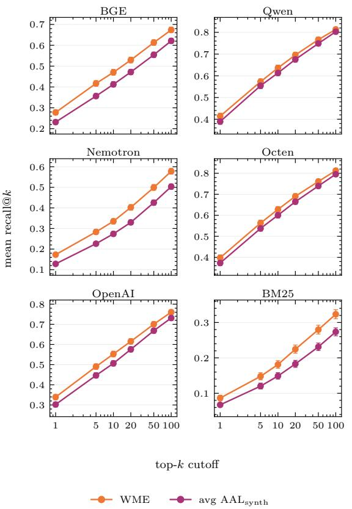  
Figure 16: $\mathrm { H C M a g i c } _ { s y n t h }$ mean Recall@k across $k \in$ $\{ 1 , 5 , 1 0 , 2 0 , 5 0 , 1 0 0 \}$ , per retriever (per-panel y-zoom to make CIs visible at this n). Whiskers: 95% bootstrap CIs.

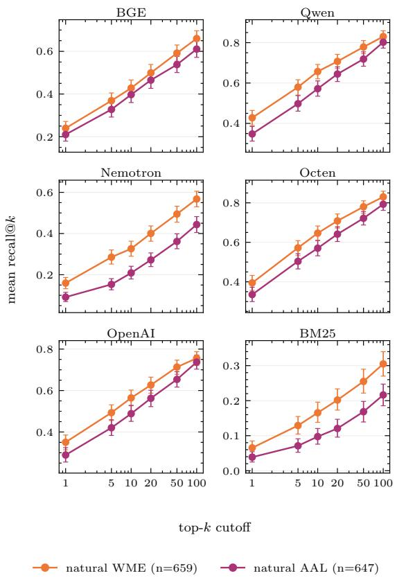  
Figure 17: $\mathrm { H C M a g i c } _ { n a t }$ unpaired mean Recall@k across k ∈ {1, 5, 10, 20, 50, 100}. Whiskers: 95% bootstrap CIs.

## R Lexical-residual regressions

Per-retriever coefficients for the lexical-residual decomposition of §4 on all four datasets: the raw gap, the residual after partialling out the lexical channel (αˆ for the paired datasets, γˆ for the unpaired), and

the lex slope ${ \hat { \boldsymbol { \beta } } } .$

$\mathbf { A l l S i d e s } _ { s y n t h }$ (paired). Per-encoder OLS $\begin{array} { r } { \Delta _ { \mathrm { l e a n } } ~ = ~ \alpha + \beta ( \mathrm { l e x } _ { R } - \mathrm { l e x } _ { L } ) _ { c } } \end{array}$ on each retriever’s gold-filtered subset (cluster-robust SE on article\_id), where $( \mathrm { l e x } _ { R } \mathrm { ~ - ~ } \mathrm { l e x } _ { L } ) _ { c }$ is the Monroe–Colaresi–Quinn log-odds asymmetry between the right and left query of pair c (mean ≈ −28, SD 26). OpenAI te-3-large is the only retriever with a measurable slope; BM25 and the four open-weights have $\beta$ indistinguishable from zero (Table 14). After partialling out the lex channel, OpenAI te-3-large’s residual α sits inside the open-weights’ residual band, while BM25’s residual has larger magnitude than every open-weights residual.

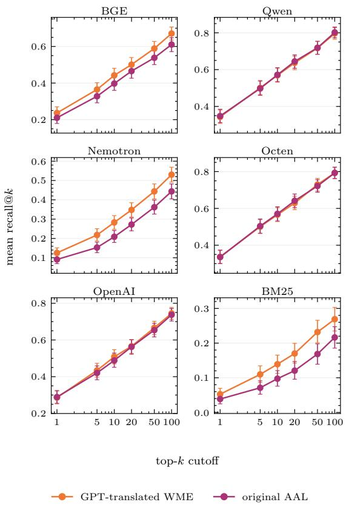  
Figure 18: Translation-mitigation Recall@k across $k \in$ {1, 5, 10, 20, 50, 100} per retriever on the $n { = } 6 4 7$ paired AAL queries. Whiskers: 95% bootstrap CIs. Per-panel y-zoom to make CIs visible.

$\mathbf { R e d d i t } _ { n a t }$ (unpaired). Per-encoder unpaired between-group regression at $k = 2 0 \mathrm { o n } \mathrm { R e d d i t } _ { n a t }$ $\begin{array} { l l l } { { ( n _ { L } } } & { { = } } & { { 1 , 3 2 7 } } \end{array}$ liberal-asker $+ ~ n _ { R } ~ = ~ 1 { , } 2 2 5$ conservative-asker queries; centrist dropped): $\begin{array} { r } { \mathbf { l e a n } _ { q } = \alpha + \beta \mathbf { l e x } _ { q } + \gamma \mathcal { Y } [ q \in \mathrm { \ r i g h t } ] + \varepsilon } \end{array}$ with HC1 robust SE. The fit is over the full unfiltered top-k, so the raw gap here differs from the goldfiltered $k { = } 1 0$ gaps of Fig. 2b. γˆ is the right−left lean gap after partialling out per-query MCQ asymmetry between left and right post-text vocabularies; $\hat { \beta }$ is the within-group lex slope. All five dense retrievers have positive significant $\hat { \beta }$ (organic Reddit vocabulary is far more lexically partisan than $\mathrm { A l l S i d e s } _ { s y n t h }$ query pairs); BGE’s residual gap collapses to zero, Llama / Octen / OpenAI te-3-large retain a significant non-lexical component, Qwen3 marginal.

Reddi $_ { \mathit { n a t } } ,$ gold-filtered outcome (robustness). The fit above uses the unfiltered top-k; as a robustness check we repeat it with the outcome of Fig. 2b: per-query lean over the judged-relevant articles in the top-10 (both judges grade relevant, App. F), keeping queries with at least one relevant article. This decomposes the same quantity the main test reports, at the cost of smaller per-retriever n (gold retention), a coarser per-query outcome (few relevant articles per query), and conditioning on judged relevance. The raw gaps reproduce the gold-filtered gaps of App. I, and the conclusions of the unfiltered fit carry over (Table 16): BGE and Qwen3 show no detectable residual, while Llama-Nemotron and OpenAI te-3-large retain large significant residuals $( \hat { \gamma } / \mathrm { r a w } \approx 0 . 8 ) $ ; Octen is positive but not significant. BM25, which has no unfiltered gap, here carries the largest raw gap, and its residual is large but marginal $( p { = } 0 . 0 7 )$ $\hat { \beta }$ is significant for BGE $( p < 1 0 ^ { - 4 } )$ , Qwen3 $\scriptstyle ( p = 0 . 0 0 8 )$ and Octen $\scriptstyle ( p = 0 . 0 3 )$ , and not for the others.

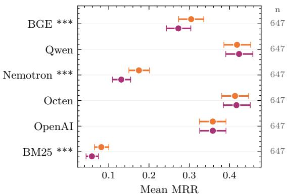  
Figure 19: Translation-mitigation paired MRR on the $n { = } 6 4 7$ HCMagicnat AAL queries: original AAL vs. $\mathtt { g p t - } 5 \mathtt { - m i n i }$ back-translation to WME. Same content (modulo translation noise), tested with paired Wilcoxon. Translation k-sweep in App. N.

HCMagicsynth (paired). Per-encoder OLS $\begin{array} { r c l } { \Delta _ { \mathrm { r a n k } } } & { = } & { \alpha ~ + ~ \beta \mathrm { a s y m } _ { r } ~ + ~ \varepsilon _ { r } } \end{array}$ on all 4,999 paired samples with HC1 robust SE, where $\mathrm { a s y m } _ { r } = \mathrm { l e x } _ { \mathrm { W M E } _ { r } } - \overline { { \mathrm { l e x } } } _ { \mathrm { A A L } _ { \mathrm { s y n t h } _ { r } } }$ is the per-sample Monroe–Colaresi–Quinn log-odds asymmetry summed over tokens (mean $\overline { { \mathrm { { a s y m } } } } ~ = ~ 5 7 4$ , SD 370). $\zeta$ scores are computed against the union vocabulary of all 4,999 WME inputs (∼ 425k tokens) vs. all 14,997 AAL paraphrases (∼1.34M tokens) with the same informative-Dirichlet prior $( \alpha _ { 0 } = 0 . 0 1 )$ as the political fit (Table 14).

$\mathbf { H } \mathbf { C } \mathbf { M a g i c } _ { n a t }$ (unpaired). Per-encoder unpaired between-group regression on $\mathbf { H } \mathbf { C } \mathbf { M } \mathbf { a g i c } _ { n a t }$ (647 natural $\mathrm { A A L } \ + \ 6 5 9$ natural WME queries): $\mathbf { M R R } _ { q } = \alpha + \beta \mathbf { l e x } _ { q } + \gamma \mathcal { k } [ q \in \mathbf { W M E } ] + \varepsilon$ with

<table><tr><td>Retriever</td><td>n</td><td> $\overline { { \Delta _ { \mathrm { l e a n } } } }$ </td><td>residual α</td><td>slope β (p)</td></tr><tr><td>BM25 (Okapi)</td><td>1,798</td><td> $+ 0 . 0 4 3$ </td><td>+0.038</td><td> $\approx 0 \ ( p { = } 0 . 5 6 )$ </td></tr><tr><td>BGE-large</td><td>2,422</td><td>+0.027</td><td>+0.027</td><td> $\approx 0 \ ( p { = } 0 . 9 8 )$ </td></tr><tr><td>Qwen3-Emb-8B</td><td>2,508</td><td>+0.023</td><td>+0.031</td><td> $+ 2 . 9 { \cdot } 1 0 ^ { - 4 } \ ( p { = } 0 . 1 1 )$ </td></tr><tr><td>Llama-Nemotron-8B</td><td>1,416</td><td>+0.025</td><td>+0.025</td><td> $\approx 0 \ ( p { = } 0 . 9 4 )$ </td></tr><tr><td>Octen-Emb-8B</td><td>2,605</td><td>+0.023</td><td>+0.018</td><td> $\approx 0 \ \mathrm { ( \it { p } { = } 0 . 3 6 ) }$ </td></tr><tr><td>OpenAI te-3-large</td><td>2,663</td><td>+0.045</td><td>+0.029</td><td> $- 5 . 7 \cdot 1 0 ^ { - 4 } \ ( \bf p { = } 0 . 0 0 2 )$ </td></tr></table>

Table 14: Gold-filtered lex-residual fit. Each retriever’s regression runs on its own gold-filtered subset (so n varies; cross-retriever α-comparison partly confounds with subset selection). OpenAI te-3-large is the only retriever with a non-zero $\beta ;$ the lex channel accounts for $\overline { { \Delta _ { \mathrm { l e a n } } } } - \hat { \alpha } = + 0 . 0 1 6$ of its gap at the mean.
<table><tr><td>Retriever</td><td>raw R-L gap</td><td> $\hat { \gamma } \left( p \right)$ </td><td> $\hat { \gamma } / \mathrm { r a w }$ </td><td> $\hat { \beta } \left( p \right)$ </td></tr><tr><td>BGE-large</td><td>+0.024</td><td> $+ 0 . 0 0 7 \ ( p { = } 0 . 4 2 )$ </td><td>0.31</td><td>positive sig.</td></tr><tr><td>Qwen3-Emb-8B</td><td>+0.028</td><td> $+ 0 . 0 1 5 \ : ( p { = } 0 . 0 8 )$ </td><td>0.55</td><td>positive sig.</td></tr><tr><td>Llama-Nemotron-8B</td><td>+0.039</td><td> $\mathbf { + 0 . 0 2 2 \ ( p { = } 0 . 0 2 8 ) }$ </td><td>0.55</td><td>positive sig.</td></tr><tr><td>Octen-Emb-8B</td><td>+0.048</td><td> $\mathbf { + 0 . 0 3 3 } \ ( \mathbf { p } < \mathbf { 1 0 } ^ { - 3 } )$ </td><td>0.70</td><td>positive sig.</td></tr><tr><td>OpenAI te-3-large</td><td>+0.062</td><td> $+ \mathbf { 0 . 0 3 6 } \ ( \mathbf { p } < \mathbf { 1 0 } ^ { - 3 } )$ </td><td>0.58</td><td>positive sig.</td></tr><tr><td>BM25 (Okapi)</td><td>+0.001</td><td> $+ 0 . 0 0 2 \ : ( \mathrm { N S } )$ </td><td></td><td>NS</td></tr></table>

Table 15: $\operatorname { R e d d i t } _ { n a t }$ unpaired lex-residual at $k = 2 0 .$ . Bolded γˆ are detectable encoder-level residual gaps after partialling out per-query MCQ asymmetry; BGE’s collapse is consistent with topic-asymmetry exposure. $\hat { \beta }$ is positive and significant $( p < 0 . 0 5 )$ for all five dense retrievers, contrasting with $\mathbf { A l l S i d e s } _ { s y n t h }$ where only OpenAI te-3-large had a detectable slope.

HC1 robust SE. γˆ is the WME−AAL gap after partialling out per-query MCQ asymmetry between AAL and WME post-text vocabularies. No retriever has a detectable within-group lex slope (smallest ${ \hat { \beta } } p = 0 . 1 5 ) ;$ ; γˆ is detectable on five of six retrievers (BGE marginal at $p = 0 . 2 1 )$ ; the slight excess of $\hat { \gamma }$ over the raw gap on five of six arises because $\hat { \beta }$ is mildly negative while the WME pool has higher mean lex. Note the caveat in §4: AALdistinctive tokens include content words (she, her, periods, baby), so lex-residual partials out tokenfrequency asymmetry but not content-difficulty.

## S Probing Details

Extracting Hidden Representations. For encoder-only models, we use mean pooling on the outputs of each layer to represent hidden representations. We additionally apply standard scaling. OpenAI te-3-large is excluded from probing, as the API exposes no intermediate layers.

Probe Training. We train linear probes using LogisticRegression models from sklearn (Pedregosa et al., 2011). We use the default hyperparameters and set the maximum iterations to 5000 to allow for convergence.

<table><tr><td>Retriever</td><td>n (lib/con)</td><td>raw R-L gap</td><td> $\hat { \gamma } \left( p \right)$ </td><td> $\hat { \gamma } / \mathrm { r a w }$ </td></tr><tr><td>BGE-large</td><td>616/474</td><td>+0.109</td><td> $+ 0 . 0 2 0 \ ( p { = } 0 . 6 7 )$ </td><td>0.18</td></tr><tr><td>Qwen3-Emb-8B</td><td>698/539</td><td>+0.069</td><td> $+ 0 . 0 1 7 \ \bar { ( p { = } 0 . 6 9 ) }$ </td><td>0.24</td></tr><tr><td>Llama-Nemotron-8B</td><td>432/317</td><td>+0.186</td><td> $\mathbf { + 0 . 1 4 8 \ ( p { = } 0 . 0 1 7 ) }$ </td><td>0.79</td></tr><tr><td>Octen-Emb-8B</td><td>729/553</td><td>+0.103</td><td> $+ 0 . 0 6 1 \ ( p { = } 0 . 1 3 )$ </td><td>0.59</td></tr><tr><td>OpenAI te-3-large</td><td>747/570</td><td>+0.136</td><td> $\mathbf { + 0 . 1 0 6 \ ( p { \bar { = } } 0 . 0 0 9 ) }$ </td><td>0.78</td></tr><tr><td>BM25 (Okapi)</td><td>284/228</td><td>+0.195</td><td> $+ 0 . 1 3 8 \ ( p { = } 0 . 0 7 )$ </td><td>0.71</td></tr></table>

Table 16: Reddi $_ { \cdot n a t }$ lex-residual with the gold-filtered relevant-subset lean@10 of Fig. 2b as the outcome, on queries with $\geq 1$ both-judge-relevant article. Bolded $\hat { \gamma }$ are detectable residual gaps after partialling out per-query MCQ asymmetry.

<table><tr><td>Retriever</td><td>n</td><td> $\overline { { \Delta _ { \mathrm { { r a n k } } } } }$ </td><td>residual α</td><td>slope  $\beta \left( p \right)$ </td><td> $\beta { \cdot } \overline { { \mathrm { a s y m } } }$ </td></tr><tr><td>Llama-Nemotron-8B</td><td>4,999</td><td> $+ 0 . 0 5 1$ </td><td> $+ 0 . 0 4 6$ </td><td> $+ 8 . 4 \cdot 1 0 ^ { - 6 } ( p { = } 0 . 2 1 )$ </td><td>+0.005</td></tr><tr><td>BGE-large</td><td>4,999</td><td>+0.050</td><td>+0.047</td><td> $+ 5 . 8 { \cdot } 1 0 ^ { - 6 } \ ( p { = } 0 . 4 3 )$ </td><td>+0.003</td></tr><tr><td>OpenAI te-3-large</td><td>4,999</td><td>+0.040</td><td>+0.039</td><td> $+ 5 . 9 { \cdot } 1 0 ^ { - 7 } \ ( p { = } 0 . 9 3 )$ </td><td>+0.000</td></tr><tr><td>Octen-Emb-8B</td><td>4,999</td><td>+0.027</td><td>+0.024</td><td> $+ 4 . 8 { \cdot } 1 0 ^ { - 6 } \ ( p { = } 0 . 4 8 )$ </td><td>+0.003</td></tr><tr><td>BM25 (Okapi)</td><td>4,999</td><td>+0.024</td><td>+0.024</td><td> $+ 4 . 2 { \cdot } 1 0 ^ { - 7 } \left( p { = } 0 . 9 3 \right)$ </td><td>+0.000</td></tr><tr><td>Qwen3-Emb-8B</td><td>4,999</td><td>+0.023</td><td>+0.021</td><td> $+ 2 . 7 { \cdot } 1 0 ^ { - 6 } \ ( p { = } 0 . 6 8 )$ </td><td>+0.002</td></tr></table>

Table 17: Per-sample lex-residual fit on $\mathrm { H C M a g i c } _ { s y n t h }$ (sorted by raw $\overline { { \Delta _ { \mathrm { { r a n k } } } } } )$ . All $\hat { \beta }$ point estimates are positive (consistent direction) but none are statistically distinguishable from zero; the implied per-sample lex contribution β·asym is at most 0.005 MRR (under 10% of the raw paired gap for the open-weights, ≈ 0 for OpenAI te-3-large and BM25). Residual α ranking matches the raw $\overline { { \Delta _ { \mathrm { { r a n k } } } } }$ ranking up to two micro-swaps within noise (BGE/Llama by $1 0 ^ { - 3 } ;$ ; BM25/Octen by $2 { \cdot } 1 0 ^ { \overline { { - } } 6 } )$ .

<table><tr><td>Retriever</td><td>raw WME-AAL gap</td><td> $\hat { \gamma } \left( p \right)$ </td><td> $\hat { \gamma } / \mathrm { r a w }$ </td><td> $\hat { \beta } \left( p \right)$ </td></tr><tr><td>Llama-Nemotron-8B</td><td>+0.091</td><td> $\mathbf { + 0 . 0 8 5 \left( p { = } 0 . 0 0 1 8 \right) }$ </td><td>0.93</td><td>NS</td></tr><tr><td>Qwen3-Emb-8B</td><td>+0.077</td><td> $\mathbf { + 0 . 1 1 0 \ ( p { = } 0 . 0 0 1 8 ) }$ </td><td>1.42</td><td>NS</td></tr><tr><td>OpenAI te-3-large</td><td>+0.064</td><td> $\mathbf { + 0 . 0 8 1 \ ( p { = } 0 . 0 2 3 ) }$ </td><td>1.26</td><td>NS</td></tr><tr><td>Octen-Emb-8B</td><td>+0.062</td><td> $\mathbf { + 0 . 0 9 8 \left( p { = } 0 . 0 0 4 9 \right) }$ </td><td>1.59</td><td>NS</td></tr><tr><td>BM25 (Okapi)</td><td>+0.040</td><td> $+ 0 . 0 4 1 \ ( \mathbf { p } { = } \mathbf { 0 } . \mathbf { 0 } 4 3 )$ </td><td>1.01</td><td>NS</td></tr><tr><td>BGE-large</td><td>+0.034</td><td> $+ 0 . 0 4 2 \ ( p { = } 0 . 2 1 )$ </td><td>1.21</td><td>NS</td></tr></table>

Table 18: HCMagicnat unpaired lex-residual. Bolded $\hat { \gamma }$ are significant at $p < 0 . 0 5$ . The residual gap survives partialling on every retriever with $\hat { \gamma } / ( \mathrm { r a w \ g a p } ) \in [ 0 . 9 3 , 1 . 5 9 ]$ ; no retriever has a detectable within-group lex slope. Conclusion qualitatively matches the $\mathrm { H C M a g i c } _ { s y n t h }$ result in Table 17.