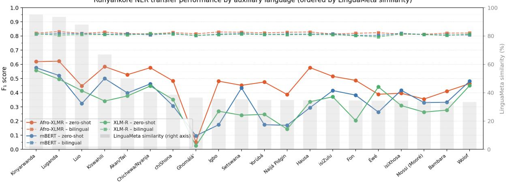
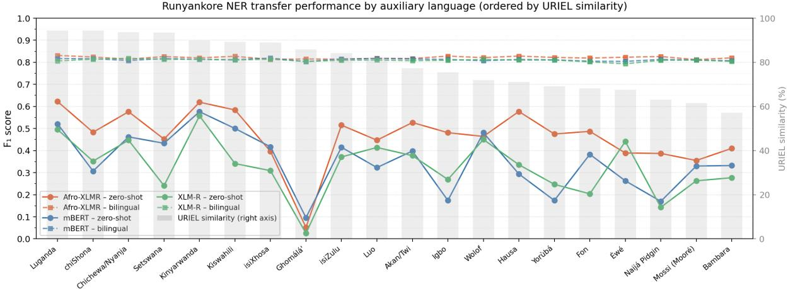
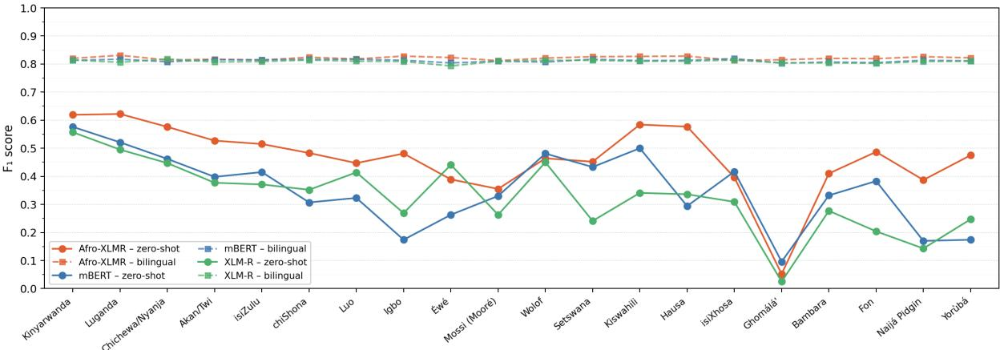
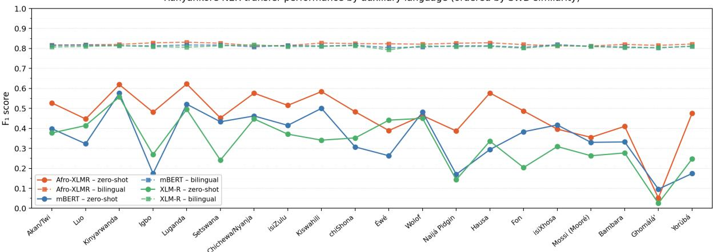

# RunyaNER: Auxiliary Language Selection for Runyankore NER

Prosper Arineitwe Asiimwe Francois Meyer Jan Buys

Department of Computer Science, University of Cape Town arnari002@myuct.ac.za, {francois.meyer, jan.buys}@uct.ac.za

## Abstract

Cross-lingual zero-shot transfer and multilingual fine-tuning are promising approaches for NLP tasks such as Named Entity Recognition (NER) in low-resource languages, but in the absence of target language benchmarks, it is unclear which auxiliary language selection strategy leads to the best transfer. We introduce RunyaNER,1 the first publicly available NER benchmark for the East African language Runyankore, and use it to investigate the choice of which languages to use for transfer. Created with a semi-automated pipeline and fully manually verified, RunyaNER contains over 237k annotated words across 30k sentences. We benchmark pretrained models on RunyaNER, establishing that our dataset is of sufficient quality and size to produce effective Runyankore NER models. We then use RunyaNER to investigate auxiliary language selection in cross-lingual zero-shot and multilingual fine-tuning settings. Our experiments show that while transfer performance is highly sensitive to auxiliary language selection, embedding-based measures computed from labelled training spans correlate more strongly with downstream transfer performance than traditional linguistic features based on metadata or typology. By releasing RunyaNER and providing a systematic analysis of auxiliary language selection strategies, this work contributes both a new benchmark resource and practical insights for multilingual transfer in low-resource settings.

## 1 Introduction

Despite rapid advances in NLP, many African languages remain severely underrepresented in computational resources, benchmark datasets, and pretrained language models (PLMs) (Mussandi and Wichert, 2024). This imbalance limits the development of downstream NLP systems for large populations of speakers across the continent. In particular, many African languages still lack the annotated datasets required to train and evaluate PLMs on structured prediction tasks such as NER.

<table><tr><td>Split</td><td>Sentences</td><td>Tokens</td><td>Named entity spans</td></tr><tr><td>Train</td><td>15,001</td><td>118,622</td><td>2,720</td></tr><tr><td>Dev</td><td>7,498</td><td>59,028</td><td>1,364</td></tr><tr><td>Test</td><td>7,508</td><td>59,426</td><td>1,427</td></tr><tr><td>Total</td><td>30,007</td><td>237,076</td><td>5,511</td></tr></table>

Table 1: Summary statistics for RunyaNER.

Runyankore, a Bantu language spoken by over two million people in western Uganda (Namyalo et al., 2016; Eberhard et al., 2025), is one such underrepresented language. It belongs to the Runyakitara macrolanguage, which also includes closely related varieties such as Rukiga, Runyoro, and Rutooro (Bernsten, 1998). Although some efforts have begun to develop computational resources for Runyankore and related languages (Katushemererwe et al., 2020; Bamutura et al., 2020), publicly available benchmark datasets for downstream NLP tasks remain scarce.

Beyond the absence of resources, an additional challenge for low-resource NLP is determining how to effectively leverage supervision from related languages for which annotated datasets are available. Multilingual PLMs (Devlin et al., 2019; Conneau et al., 2020) enable cross-lingual transfer through shared multilingual representations, but transfer performance varies across languages and tasks (Lauscher et al., 2020; Xu et al., 2022). Recent work has emphasised the influence of auxiliary language selection, particularly in zero-shot settings where no target-language supervision is available (Adelani et al., 2022; Eronen et al., 2023). However, it remains unclear which notions of language similarity provide the most reliable guidance for selecting effective transfer languages.

In this work, we address both challenges by introducing RunyaNER, the first publicly available NER dataset for Runyankore, and using it to systematically study auxiliary language selection for lowresource transfer. RunyaNER consists of 237,076 annotated words (5,511 named entity spans) across 30,007 sentences. The dataset was created by annotating publicly available corpora using a semiautomated human-in-the-loop workflow, with all annotation and verification performed by one of the authors, an L1 speaker of Runyankore.

We establish the first benchmark for Runyankore NER under monolingual fine-tuning, cross-lingual zero-shot transfer, and multilingual fine-tuning settings. We further investigate auxiliary language selection across 20 African languages from MasakhaNER 2.0 (Adelani et al., 2022), comparing metadata-based, typological, and embeddingbased similarity measures. Our goal is to determine whether embedding-based similarity measures provide better guidance for auxiliary language selection than traditional linguistic resources.

Under cross-lingual zero-shot transfer, performance is highly sensitive to auxiliary language choice, with closely related Great Lakes Bantu languages yielding the strongest transfer. However, across the full set of auxiliary languages, embedding-based similarity measures computed from labelled training spans, particularly prototype cosine similarity and Sliced Wasserstein Distance (SWD), correlate more strongly with downstream transfer effectiveness than metadata-based or typological similarity measures. In contrast, once modest amounts of Runyankore supervision are introduced through multilingual fine-tuning, differences between auxiliary language choices become substantially smaller.

To our knowledge, this is the first systematic study of auxiliary language selection for African NER using both linguistic resource and embeddingbased similarity measures. In addition to introducing the first publicly available NER dataset for Runyankore, our findings provide practical guidance for multilingual transfer in low-resource settings and highlight the value of embedding-based similarity, when a labelled target training split is available for selecting effective auxiliary languages under weak NER supervision.

## 2 Background

## 2.1 NER with Multilingual PLMs

Multilingual PLMs such as mBERT (Devlin et al., 2019) and XLM-R (Conneau et al., 2020) enable cross-lingual transfer by learning shared representations across languages. This allows supervision from high-resource languages to benefit lowresource languages in tasks such as NER (Pires et al., 2019; Lauscher et al., 2020), which has improved NER performance for many African languages (Adelani et al., 2022).

However, transfer performance varies substantially across languages and depends on factors such as tokenisation coverage (Rust et al., 2021), morphological and syntactic divergence (Lin et al., 2019), and the degree of language representation in multilingual pretraining corpora (Conneau et al., 2020; Ogueji et al., 2021). Prior work has also shown that transfer is generally more effective between linguistically related languages (Lauscher et al., 2020; Mahata et al., 2023). Regionally focussed models such as AfriBERTa (Ogueji et al., 2021) and Afro-XLMR (Alabi et al., 2022) further demonstrate the importance of language relatedness in multilingual transfer for African NLP.

## 2.2 Auxiliary Language Selection for Cross-Lingual Transfer

A key challenge in cross-lingual learning is selecting auxiliary languages that maximise transfer performance. Existing approaches derive similarity metrics either from external linguistic resources or from multilingual representation spaces. Linguistic similarity measures are typically based on resources such as URIEL/lang2vec (Littell et al., 2017) and LinguaMeta (Ritchie et al., 2024), which capture genealogical, phonological, syntactic, and geographic properties. Embedding-based approaches instead measure similarity directly in multilingual embedding spaces, including cosine similarity between mean-pooled embeddings (Artetxe and Schwenk, 2019) and distributionbased metrics such as Sliced Wasserstein Distance (SWD) (Nguyen et al., 2020).

Several studies have shown that embeddingbased similarity metrics correlate more strongly with downstream transfer performance than manually engineered typological or metadata-based features (Shaffer, 2021; Philippy et al., 2023; Yu et al., 2021). However, findings vary across tasks, models, and language families, making it unclear which similarity measures provide the most reliable guidance for realistic low-resource settings such as African-language NER.

<table><tr><td>Example 1 RUNYANKORE Elly KaruhangapER akahwihwisa ahabwa KadagapER kutaayaayira faamu ya Musev-</td></tr><tr><td>eniPER. ENGLISH</td></tr><tr><td>Elly Karuhanga murmurs over Kadaga&#x27;s trip to Museveni&#x27;s ranch.</td></tr><tr><td>Example 2 RUNYANKORE</td></tr><tr><td>African UnionORG omuri Addis AbabaLOC omukwezi kw&#x27;okubanza  ${ \bf 2 0 1 7 } _ { \mathrm { D A T E } }$ </td></tr><tr><td>ENGLISH African Union in Addis Ababa in January</td></tr></table>

## 3 RunyaNER Dataset

RunyaNER is constructed using two publicly available Runyankore-English parallel corpora: the Sunbird African Language Technology (SALT) corpus2 and the Multilingual Parallel Text Corpora (MPTC) (Babirye et al., 2023). SALT provides broader domain coverage, including news, public communication, and conversational content, while MPTC contributes shorter and structurally more regular sentences. After preprocessing and filtering, the combined corpus contains 30,007 annotated Runyankore sentences, of which approximately 72% originate from SALT and 28% from MPTC.

All sentences were annotated following the MasakhaNER 2.0 guidelines (Adelani et al., 2022) using four entity types: PER (person), LOC (location), ORG (organisation), and DATE (date). All annotation and verification were performed by one of the authors, an L1 speaker of Runyankore, and no external annotators were recruited. Before labelling, the annotator studied the MasakhaNER 2.0 guidelines and applied them to a short practice sample. Quality is therefore operationalised as exhaustive guideline-based correction by a single trained L1 speaker rather than inter-annotator agreement. To reduce annotation time, we adopted a semiautomated human-in-the-loop workflow. An initial seed set of approximately 500 sentences, drawn from both source corpora and including both entitybearing and entity-free examples, was annotated manually. We then fine-tuned XLM-R (Conneau et al., 2020) on this seed data together with Luganda training data from MasakhaNER 2.0, and used the resulting model to pre-annotate the remaining corpus. All predicted labels were reviewed and corrected manually in Doccano.3 Sunbird’s Sunflower machine-translation system4 was consulted only when the English parallel was missing or fragmentary, and only as a reading aid.

Before annotation, both source corpora were normalised to remove encoding artefacts, irregular spacing, and malformed punctuation. Sentences containing severe formatting or structural errors were discarded. The final dataset was split into train, development, and test partitions using a stratified procedure to preserve consistent entity distributions across splits. Table 1 summarises the dataset statistics, while Examples 1 and 2 illustrate annotated Runyankore sentences with their corresponding entity labels.

## 4 Benchmarking PLMs on RunyaNER

This section establishes baseline results for Runyankore NER using multilingual PLMs under three supervision regimes: monolingual fine-tuning, cross-lingual zero-shot transfer, and multilingual (bilingual) fine-tuning with one auxiliary language. The aim is to compare how model pretraining and supervision regime affect Runyankore NER, and to provide a controlled empirical foundation for the auxiliary language selection analysis in Section 5.

## 4.1 Experimental Setup

We evaluate three encoder-only multilingual PLMs: mBERT (Devlin et al., 2019), XLM-R (Conneau et al., 2020), and Afro-XLMR (Alabi et al., 2022).

Afro-XLMR adapts XLM-R through continued pretraining on 17 African languages, many of which are related to Runyankore. This comparison allows us to examine whether broad multilingual coverage alone (mBERT, XLM-R) is sufficient for Runyankore, or whether regionally adapted pretraining yields additional gains. We follow the MasakhaNER fine-tuning setup (Adelani et al., 2022), training all our models for 10 epochs with AdamW (Loshchilov and Hutter, 2019), a maximum sequence length of 164, and a batch size of 32.

For evaluation, we report span-level microaveraged precision, recall, and $\mathrm { F _ { 1 } }$ .

<table><tr><td></td><td colspan="3">DATE</td><td colspan="3">LOC</td><td colspan="3">ORG</td><td colspan="3">PER</td><td colspan="3">Overall</td></tr><tr><td>Model</td><td>P</td><td>R</td><td>F1</td><td>P</td><td>R</td><td>F1</td><td>P</td><td>R</td><td>F1</td><td>P</td><td>R</td><td>F1</td><td>P</td><td>R</td><td>F1</td></tr><tr><td>Afro-XLMR</td><td>0.760</td><td>0.790</td><td>0.770</td><td>0.870</td><td>0.890</td><td>0.880</td><td>0.740</td><td>0.720</td><td>0.730</td><td>0.850</td><td>0.820</td><td>0.830</td><td>0.818</td><td>0.833</td><td>0.826</td></tr><tr><td>XLM-R</td><td>0.750</td><td>0.710</td><td>0.730</td><td>0.870</td><td>0.880</td><td>0.870</td><td>0.780</td><td>0.670</td><td>0.720</td><td>0.830</td><td>0.820</td><td>0.820</td><td>0.823</td><td>0.798</td><td>0.810</td></tr><tr><td>mBERT</td><td>0.720</td><td>0.720</td><td>0.720</td><td>0.850</td><td>0.880</td><td>0.870</td><td>0.730</td><td>0.680</td><td>0.710</td><td>0.890</td><td>0.840</td><td>0.860</td><td>0.804</td><td>0.803</td><td>0.803</td></tr></table>

Table 2: Monolingual fine-tuning results on RunyaNER (Baseline). Precision (P), recall (R), and $\mathrm { F _ { 1 } }$ -score (F1) are reported for each entity type and overall.
<table><tr><td rowspan="2">Code</td><td rowspan="2">Language</td><td rowspan="2">Subgroup</td><td colspan="4">Zero-shot  $\mathbf { F } _ { 1 }$ </td><td colspan="4">Multilingual  $\mathbf { F } _ { 1 }$ </td></tr><tr><td>Afro-XLMR</td><td>mBERT</td><td>XLM-R</td><td>Mean</td><td>Afro-XLMR</td><td>mBERT</td><td>XLM-R</td><td>Mean</td></tr><tr><td>kin</td><td>Kinyarwanda</td><td>Bantu (Great Lakes)</td><td>0.619</td><td>0.576</td><td>0.557</td><td>0.584</td><td>0.820</td><td>0.813</td><td>0.814</td><td>0.816</td></tr><tr><td>lug</td><td>Luganda</td><td>Bantu (Great Lakes)</td><td>0.622</td><td>0.521</td><td>0.495</td><td>0.546</td><td>0.831</td><td>0.817</td><td>0.806</td><td>0.818</td></tr><tr><td>nya</td><td>Chichewa/Nyanja</td><td>Bantu (Southeast)</td><td>0.576</td><td>0.462</td><td>0.447</td><td>0.495</td><td>0.814</td><td>0.808</td><td>0.818</td><td>0.813</td></tr><tr><td>swa</td><td>Kiswahili</td><td>Bantu (Swahili)</td><td>0.584</td><td>0.500</td><td>0.341</td><td>0.475</td><td>0.827</td><td>0.812</td><td>0.810</td><td>0.816</td></tr><tr><td>wol</td><td>Wolof</td><td>Senegambian</td><td>0.464</td><td>0.481</td><td>0.450</td><td>0.465</td><td>0.821</td><td>0.807</td><td>0.813</td><td>0.814</td></tr><tr><td>twi</td><td>Akan/Twi</td><td>Kwa</td><td>0.527</td><td>0.398</td><td>0.377</td><td>0.434</td><td>0.817</td><td>0.810</td><td>0.807</td><td>0.811</td></tr><tr><td>zul</td><td>isiZulu</td><td>Bantu (Southern)</td><td>0.515</td><td>0.415</td><td>0.371</td><td>0.434</td><td>0.814</td><td>0.815</td><td>0.809</td><td>0.813</td></tr><tr><td>hau</td><td>Hausa</td><td>Chadic</td><td>0.577</td><td>0.294</td><td>0.336</td><td>0.402</td><td>0.828</td><td>0.813</td><td>0.810</td><td>0.817</td></tr><tr><td>luo</td><td>Luo</td><td>Nilotic</td><td>0.447</td><td>0.323</td><td>0.414</td><td>0.395</td><td>0.818</td><td>0.817</td><td>0.810</td><td>0.815</td></tr><tr><td>sna</td><td>chiShona</td><td>Bantu (Southern)</td><td>0.483</td><td>0.307</td><td>0.352</td><td>0.381</td><td>0.824</td><td>0.816</td><td>0.814</td><td>0.818</td></tr><tr><td>tsn</td><td>Setswana</td><td>Bantu (Southern)</td><td>0.452</td><td>0.433</td><td>0.241</td><td>0.375</td><td>0.826</td><td>0.817</td><td>0.813</td><td>0.819</td></tr><tr><td>xho</td><td>isiXhosa</td><td>Bantu (Southern)</td><td>0.396</td><td>0.417</td><td>0.309</td><td>0.374</td><td>0.813</td><td>0.819</td><td>0.814</td><td>0.815</td></tr><tr><td>ewe</td><td>Éwé</td><td>Kwa</td><td>0.389</td><td>0.263</td><td>0.441</td><td>0.364</td><td>0.823</td><td>0.804</td><td>0.793</td><td>0.807</td></tr><tr><td>fon</td><td>Fon</td><td>Volta-Niger</td><td>0.487</td><td>0.383</td><td>0.204</td><td>0.358</td><td>0.819</td><td>0.805</td><td>0.802</td><td>0.809</td></tr><tr><td>bam</td><td>Bambara</td><td>Mande</td><td>0.410</td><td>0.332</td><td>0.277</td><td>0.340</td><td>0.820</td><td>0.807</td><td>0.804</td><td>0.810</td></tr><tr><td>ibo</td><td>Igbo</td><td>Volta-Niger</td><td>0.481</td><td>0.243</td><td>0.269</td><td>0.331</td><td>0.828</td><td>0.813</td><td>0.809</td><td>0.817</td></tr><tr><td>mos</td><td>Mossi (Mooré)</td><td>Gur</td><td>0.355</td><td>0.330</td><td>0.263</td><td>0.316</td><td>0.812</td><td>0.810</td><td>0.810</td><td>0.811</td></tr><tr><td>yor</td><td>Yorùbá</td><td>Volta-Niger</td><td>0.475</td><td>0.174</td><td>0.247</td><td>0.299</td><td>0.822</td><td>0.811</td><td>0.810</td><td>0.814</td></tr><tr><td>pcm</td><td>Naijá Pidgin</td><td>English-based</td><td>0.387</td><td>0.170</td><td>0.143</td><td>0.233</td><td>0.826</td><td>0.813</td><td>0.809</td><td>0.816</td></tr><tr><td>bbj</td><td>Ghomálá&#x27;</td><td>Grassfields</td><td>0.052</td><td>0.096</td><td>0.025</td><td>0.058</td><td>0.815</td><td>0.803</td><td>0.804</td><td>0.807</td></tr></table>

Table 3: Zero-shot cross-lingual and multilingual (bilingual) fine-tuning $\mathrm { F _ { 1 } }$ results on the RunyaNER test set for all auxiliary languages, ordered by zero-shot mean $\mathrm { F _ { 1 } }$

We consider three fine-tuning regimes. In the monolingual setting, we fine-tune only on the RunyaNER training split and evaluate on its test set. In the zero-shot setting, we fine-tune on MasakhaNER 2.0 training data for one auxiliary language and evaluate directly on the RunyaNER test set without exposure to Runyankore training data. In multilingual (bilingual) fine-tuning, we fine-tune on a combination of RunyaNER training data and MasakhaNER 2.0 training data from one auxiliary language, still evaluating on the RunyaNER test set. The RunyaNER development and test partitions are used only for NER evaluation; they are never used to train a model or to construct a similarity metric. We experiment with all 20 languages in MasakhaNER 2.0 (listed in Table 3) as auxiliary languages.

## 4.2 Results

Table 2 reports overall and entity-level results for monolingual fine-tuning. All three models achieve performance levels that reflect reasonably effective NER capabilities, with Afro-XLMR achieving the highest overall $\mathrm { F _ { 1 } }$ , followed by XLM-R and then

mBERT.

This pattern holds across most entity types and is also reflected across precision and recall, with a small bias towards higher recall in Afro-XLMR.

Afro-XLMR is considered a strong and wellestablished PLM for African languages. The fact that it achieves the best performance here reaffirms the value of regionally focussed multilingual PLMs. Even though Runyankore was not included in Afro-XLMR pretraining or adaptation, related Bantu languages such as Kinyarwanda and Kirundi were, which benefits RunyaNER through cross-lingual transfer.

Table 3 summarises Runyankore NER performance under cross-lingual zero-shot transfer and multilingual fine-tuning.

For zero-shot transfer, performance varies greatly across auxiliary languages. The strongest transfer consistently comes from Great Lakes Bantu languages (Luganda and Kinyarwanda), which are geographically and genealogically related to Runyankore.

Performance declines for less related languages.

This indicates that zero-shot transfer is highly sensitive to auxiliary language similarity. Afro-XLMR is generally more robust than mBERT and XLM-R in this regime, suggesting that regionally adapted pretraining is beneficial when the model must rely entirely on cross-lingual generalisation.

In the multilingual (bilingual) fine-tuning setting, adding one auxiliary language yields only modest improvements over the Runyankore monolingual baseline. The gains are largest for mBERT, whereas Afro-XLMR and XLM-R remain close to their monolingual results. This pattern suggests that models with broader multilingual coverage benefit more from additional cross-lingual supervision, while regionally adapted models already capture much of the transferable signal needed for Runyankore NER. The highest-ranked auxiliaries are again predominantly Bantu languages, although some more distant languages are also competitive once Runyankore supervision is included.

These results show that pretraining choice matters most under weak supervision. When Runyankore training data is available, all three models perform strongly and gaps are relatively small. In cross-lingual zero-shot transfer, however, the choice of model and auxiliary language becomes critical, with Afro-XLMR and closely related Bantu languages providing the strongest results.

## 5 Auxiliary Language Selection for Cross-Lingual Transfer

The substantial variation in performance across auxiliary languages motivates examining whether useful transfer languages can be identified systematically using metadata-based, typological, or embedding-based similarity signals. In this section, we investigate which measure of language similarity is most predictive for selecting auxiliary languages that optimise transfer for Runyankore NER. Metadata and typological measures require no Runyankore NER labels; the embedding-based measures use gold spans from the training split only.

## 5.1 Language Similarity Metrics

We compare four methods, two of which rely on traditional linguistic resources (metadata and typological features), and two of which are based on model representation (embedding) similarity (cosine similarity and Sliced Wasserstein Distance). We evaluate their ability to predict downstream performance under two regimes: cross-lingual zero-shot transfer and multilingual (bilingual) fine-tuning. Transfer effectiveness is measured using entity-level span $F _ { 1 }$ , and correlations are computed across 20 auxiliary languages and three encoders (mBERT, XLM-R, Afro-XLMR).

<table><tr><td rowspan="2">Metric</td><td colspan="2">mBERT</td><td colspan="2">XLM-R</td><td colspan="2">Afro-XLMR</td></tr><tr><td>0-shot</td><td>multi</td><td>0-shot</td><td>multi</td><td>0-shot multi</td><td></td></tr><tr><td>LinguaMeta</td><td>0.24</td><td>0.34</td><td>0.34</td><td>0.18</td><td>0.56*</td><td>0.25</td></tr><tr><td>URIEL</td><td>0.53*</td><td>0.51*</td><td>0.41</td><td>0.51*</td><td>0.52*</td><td>0.10</td></tr><tr><td>Cosine</td><td> $0 . 5 9 5 ^ { * * }$ </td><td>0.571**</td><td>0.638**</td><td>0.634**</td><td>0.488*</td><td>0.239</td></tr><tr><td>SWD</td><td> $\mathbf { 0 . 6 3 5 ^ { \ast \ast } }$ </td><td> $\overline { { 0 . 5 6 1 } } ^ { * }$ </td><td> $\overline { { 0 . 6 3 5 } } { ^ { * * } }$ </td><td>0.337</td><td>0.466*</td><td>0.340</td></tr></table>

Table 4: Spearman correlation $( \rho )$ between similarity metrics and Runyankore NER $F _ { 1 }$ across $n = 2 0$ auxiliary languages. Embedding-based $\rho$ is the strongest layer. We boldface the highest $\rho$ per metric type and underline the highest $\rho$ overall. $^ { * } \textit { p } < \ 0 . 0 5 .$ ∗∗ $p < 0 . 0 1$ (two-tailed).

The four metrics differ in the target-language supervision they require. LinguaMeta and URIEL are computed from published metadata and typological inventories and need no Runyankore NER labels. Prototype cosine similarity and SWD compare gold entity-span embeddings. For both embedding metrics, we extract spans only from the RunyaNER training split and from the MasakhaNER 2.0 training splits of the auxiliary languages. The development and test partitions are never used to construct prototypes or span distributions. Embedding-based selection is therefore not a no-label procedure: it assumes a labelled target training set, or an equivalent seed of gold spans. What it does not use is the evaluation set, so the subsequent transfer experiments remain uncontaminated. We treat LinguaMeta and URIEL as the label-free baselines against which these span-based measures are compared.

Metadata similarity (LinguaMeta). This method uses structured metadata such as script, geographic region, and language location to estimate cross-lingual relatedness (Ritchie et al., 2024). Individual features are normalised and combined into a single similarity score, capturing coarse-grained signals such as script compatibility and regional overlap. While simple and interpretable, this approach primarily reflects geographic and sociolinguistic proximity rather than linguistic structure.

Typological similarity (URIEL/lang2vec). This method represents languages using typological feature vectors derived from URIEL (Littell et al.,

2017), accessed via lang2vec. We use concatenated syntactic and phonological vectors derived from resources such as WALS (Dryer and Haspelmath, 2013) and PHOIBLE (Moran and McCloy, 2019). Similarity is computed using cosine similarity between these vectors, yielding a linguistically grounded measure that reflects structural similarity between languages.

Prototype cosine similarity. This representationbased metric operates directly in multilingual embedding space. For each language, gold entity spans from the corresponding training split are encoded using a pretrained multilingual model and aggregated into entity-type prototypes via mean pooling. Similarity is computed as cosine similarity between corresponding Runyankore and auxiliary prototypes, capturing alignment of named entities in the model’s representation space. This method is layer-dependent, and similarity is computed separately at each encoder layer. Recent work has shown that model-based similarity measures can outperform hand-crafted feature-based methods for transfer prediction (Deshpande et al., 2022; Dou and Neubig, 2021; Muller et al., 2021; Ebrahimi et al., 2025).

Sliced Wasserstein Distance (SWD). SWD compares full distributions of entity-span embeddings rather than only their means, using the same training-split spans as the cosine prototypes. It approximates the Wasserstein-1 distance by projecting embeddings onto multiple random directions and averaging one-dimensional distances (Nguyen et al., 2020). Unlike cosine similarity, SWD captures higher-order geometric differences such as dispersion and multimodality, providing a richer notion of representational similarity.

## 5.2 Which similarity metrics predict transfer?

We evaluate predictive usefulness by computing Spearman $\rho$ between similarity scores and Runyankore NER $F _ { 1 }$ across $n \ = \ 2 0$ auxiliary languages. For LinguaMeta and URIEL, we use a single similarity score per language. For prototype cosine similarity and SWD, which are layerdependent, we report the strongest observed Spearman correlation across layers. Because this bestlayer choice is optimistic, we treat those coefficients as an upper bound on the layer-wise signal rather than as a pre-specified test. Table 4 marks two-tailed significance under the standard t approximation for Spearman $\rho$ with $n = 2 0$ (critical $| \rho | \approx 0 . 4 4$ at $p \ < \ 0 . 0 5$ and $| \rho | \approx 0 . 5 6$ at $p < 0 . 0 1 )$ .

Correlation coefficients are presented in Table 4. Coefficients are higher for zero-shot transfer than multilingual fine-tuning, confirming that auxiliary language selection is most critical when no Runyankore supervision is available for the NER model itself. Among linguistically-informed methods, typological similarity (URIEL) provides a more consistent signal than language metadata (LinguaMeta), although several LinguaMeta coefficients are not significant at $n = 2 0$ . Embeddingbased metrics are the most informative: the strongest cosine and SWD zero-shot correlations reach $p < 0 . 0 1$ , but the Afro-XLMR multilingual cosine coefficient and several SWD multilingual coefficients are not significant. These results support embedding-based similarity as a stronger predictor of transfer than metadata or typology, while remaining compatible with a modest sample of twenty auxiliaries.

## 5.3 Similarity ordering and transfer performance

Figures 1, 2, 3, and 4 plot Runyankore NER transfer performance across auxiliary languages, ordered according to each similarity metric.

These plots provide a detailed visualisation of the results underlying the trends in Table 4. The weaker correlations of linguistic resource-based methods are reflected in the more unstable performance patterns of Figures 1 and 2. While these metrics are broadly predictive (very high-similarity languages tend to transfer better than very lowsimilarity ones), performance varies substantially across individual language rankings.

In contrast, embedding-based similarity measures produce more consistent alignment between similarity ordering and transfer effectiveness, as shown in Figure 3, and 4. This is especially visible for prototype cosine similarity in Figure 3, where we see a clear relationship between similarity and transfer performance for the languages closest to Runyankore in multilingual embedding space. Embedding-based cosine similarity offers a more precise signal than linguistic resource-based metrics, distinguishing between individual top-ranked auxiliary language candidates rather than only separating highly dissimilar languages.

The plots also show a strong regime-dependent pattern. In the cross-lingual zero-shot setting, transfer performance varies substantially across auxiliary languages, indicating that auxiliary language selection is important when no Runyankore supervision is available. In contrast, multilingual fine-tuning produces substantially flatter transfer curves, suggesting that auxiliary language similarity becomes less important once modest amounts of Runyankore supervision are introduced.

Runyankore NER transfer performance by auxiliary language (ordered by LinguaMeta similarity)  
  
Figure 1: Runyankore NER transfer performance by auxiliary language ordered according to LinguaMeta similarity relative to Runyankore. Languages are arranged from highest to lowest similarity. Solid lines indicate cross-lingual zero-shot transfer, while dashed lines indicate multilingual fine-tuning performance.

  
Figure 2: Runyankore NER transfer performance by auxiliary language ordered according to URIEL typological similarity relative to Runyankore.

## 5.4 From individual languages to auxiliary language groups

In many multilingual transfer settings, supervision is drawn from groups of auxiliary languages rather than a single source language (Shaffer, 2021; Ebrahimi et al., 2025). We therefore extend the analysis from individual auxiliary languages to auxiliary language quartets. For each similarity metric, languages were first ranked according to their similarity to Runyankore. We then constructed language quartets by selecting the four highest-ranked auxiliary languages under each similarity scheme (the first two columns of Table 5 list the resulting language groups). For layer-dependent embeddingbased metrics, rankings were averaged across all layers and the three multilingual PLMs to obtain a model-agnostic ordering. The resulting quartets therefore represent the strongest auxiliary language groups predicted by each similarity metric.

Table 5 reports $\mathrm { F _ { 1 } }$ scores for the highest-ranked quartet under each method. We compare these results to the top-ranked single auxiliary language predicted by each similarity metric (similarly averaged for the embedding-based metrics). In the zeroshot setting, using multiple auxiliary languages consistently outperforms using a single auxiliary language, with quartets improving mean $\mathrm { F _ { 1 } }$ by several points. In multilingual fine-tuning, this advantage largely disappears: differences between quartets and single auxiliaries are small, suggesting that once Runyankore supervision is available, additional auxiliary languages offer little benefit.

  
Figure 3: Runyankore NER transfer performance by auxiliary language ordered according to prototype cosine similarity relative to Runyankore.

Runyankore NER transfer performance by auxiliary language (ordered by SwD similarity)  
  
Figure 4: Runyankore NER transfer performance by auxiliary language ordered according to Sliced Wasserstein Distance (SWD) similarity relative to Runyankore. Lower SWD values indicate stronger representational similarity.

The results reaffirm that, in cross-lingual zeroshot transfer, auxiliary language selection is crucial. Cosine-based quartets consistently achieve the best performance across all models, followed by LinguaMeta and SWD. As in individual auxiliary language selection, embedding representation-based similarity is more effective for selecting transfer languages.

Performance differences between quartets are much smaller in multilingual fine-tuning than in zero-shot transfer. Performance converges across grouping strategies, and no single method consistently dominates. As in individual auxiliary language selection, once modest Runyankore supervision is available, the importance of auxiliary group language selection is substantially reduced.

These results reinforce the earlier findings. Auxiliary language selection is critical under crosslingual zero-shot transfer, where embedding-based similarity provides the strongest guidance. Under multilingual fine-tuning, however, the effect of auxiliary choice is substantially reduced.

## 6 Conclusion

We introduced RunyaNER, the first publicly available NER dataset for Runyankore, and established benchmark results for Runyankore NER using multilingual PLMs under monolingual, zero-shot, and multilingual fine-tuning settings. Our experiments show that auxiliary language selection is particularly important in cross-lingual zero-shot transfer, where closely related Great Lakes Bantu languages yield the strongest transfer performance. Embedding-based similarity measures, computed from labelled training spans rather than from the evaluation set, correlate more strongly with downstream transfer effectiveness than metadata-based or typological approaches, while auxiliary language choice becomes substantially less important once Runyankore supervision is introduced through multilingual fine-tuning. We hope that RunyaNER will support future research on lowresource African NLP and multilingual transfer learning.

<table><tr><td rowspan="2">Similarity</td><td>Auxiliary</td><td colspan="4">Zero-shot  $\mathbf { F } _ { 1 }$ </td><td colspan="4">Multilingual  $\mathbf { F } _ { 1 }$ </td></tr><tr><td>language(s)</td><td>Afro-XLMR</td><td>mBERT</td><td>XLM-R</td><td>Mean</td><td>Afro-XLMR</td><td>mBERT</td><td>XLM-R</td><td>Mean</td></tr><tr><td colspan="10">Quartets</td></tr><tr><td>LinguaMeta</td><td>lug/kin/swa/luo</td><td>0.644</td><td>0.615</td><td>0.635</td><td>0.631</td><td>0.817</td><td>0.821</td><td>0.809</td><td>0.816</td></tr><tr><td>URIEL</td><td>tsn/nya/lug/swa</td><td>0.593</td><td>0.582</td><td>0.566</td><td>0.580</td><td>0.812</td><td>0.813</td><td>0.816</td><td>0.814</td></tr><tr><td>Cosine</td><td>lug/sna/kin/nya</td><td>0.651</td><td>0.619</td><td>0.653</td><td>0.641</td><td>0.825</td><td>0.815</td><td>0.814</td><td>0.818</td></tr><tr><td>SWD</td><td>kin/twi/luo/ibo</td><td>0.598</td><td>0.515</td><td>0.562</td><td>0.558</td><td>0.817</td><td>0.815</td><td>0.809</td><td>0.814</td></tr><tr><td colspan="10">Single auxiliary</td></tr><tr><td>LinguaMeta</td><td>kin</td><td>0.619</td><td>0.576</td><td>0.557</td><td>0.584</td><td>0.820</td><td>0.813</td><td>0.814</td><td>0.816</td></tr><tr><td>URIEL</td><td>lug</td><td>0.622</td><td>0.521</td><td>0.495</td><td>0.546</td><td>0.831</td><td>0.817</td><td>0.806</td><td>0.818</td></tr><tr><td>Cosine</td><td>kin</td><td>0.619</td><td>0.576</td><td>0.557</td><td>0.584</td><td>0.817</td><td>0.820</td><td>0.814</td><td>0.817</td></tr><tr><td>SWD</td><td>twi</td><td>0.527</td><td>0.398</td><td>0.377</td><td>0.434</td><td>0.817</td><td>0.810</td><td>0.807</td><td>0.811</td></tr></table>

Table 5: Runyankore NER performance under different auxiliary language selection schemes. Top-ranked quartets are shown for each similarity scheme, alongside the most similar single auxiliary language per scheme. Bold indicates the highest value in each column.

## Limitations

This study focuses only on Runyankore NER, and the observed auxiliary-language selection patterns may not generalise to other NLP tasks or languages. Our experiments are limited to three encoder-based multilingual models and twenty African auxiliary languages, which restricts broader architectural and linguistic coverage and yields modest power for Spearman tests (n = 20). RunyaNER was annotated and verified by a single L1 speaker, so we cannot report inter-annotator agreement; quality rests on exhaustive guideline-based correction rather than multi-annotator adjudication. In addition, the two sources of the dataset are concentrated in relatively similar domains. Embedding-based similarity measures require gold entity spans from the target training split and are therefore not a labelfree selection method; they also depend on modelling choices such as encoder layer selection and embedding aggregation, which were not evaluated exhaustively. We report the strongest layer-wise correlation for those metrics, which should be read as an upper bound.

## Acknowledgements

Computations were performed using facilities provided by the University of Cape Town’s ICTS High Performance Computing team: hpc.uct.ac.za.

## References

David Ifeoluwa Adelani, Graham Neubig, Sebastian Ruder, Shruti Rijhwani, Michael Beukman, Chester Palen-Michel, Constantine Lignos, Jesujoba O. Alabi, Shamsuddeen H. Muhammad, Peter Nabende, Cheikh M. Bamba Dione, Andiswa Bukula, Rooweither Mabuya, Bonaventure F. P. Dossou, Blessing Sibanda, Happy Buzaaba, Jonathan Mukiibi, Godson Kalipe, Derguene Mbaye, and 26 others. 2022. MasakhaNER 2.0: Africa-centric transfer learning for named entity recognition. In Proceedings of the 2022 Conference on Empirical Methods in Natural Language Processing, pages 4488–4508, Abu Dhabi, United Arab Emirates. Association for Computational Linguistics.

Jesujoba O. Alabi, David Ifeoluwa Adelani, Marius Mosbach, and Dietrich Klakow. 2022. Adapting pretrained language models to African languages via multilingual adaptive fine-tuning. In Proceedings of the 29th International Conference on Computational Linguistics, pages 4336–4349, Gyeongju, Republic of Korea. International Committee on Computational Linguistics.

Mikel Artetxe and Holger Schwenk. 2019. Massively multilingual sentence embeddings for zeroshot cross-lingual transfer and beyond. Transactions of the Association for Computational Linguistics, 7:597–610.

Claire Babirye, Francis Jeremy Tusubira, Joyce Nakatumba-Nabende, Andrew Katumba, Medadi Ssentanda, Peter Nabende, Jonathan Mukiibi, Eric Peter Wairagala, and Tobius Bateesa. 2023. Multilingual Parallel Text Corpora for East African Languages.

David Bamutura, Peter Ljunglöf, and Peter Nebende. 2020. Towards computational resource grammars for Runyankore and rukiga. In Proceedings of the Twelfth Language Resources and Evaluation Conference, pages 2846–2854, Marseille, France. European Language Resources Association.

Jan Bernsten. 1998. Runyakitara: Uganda’s ’new’ language. Journal of Multilingual and Multicultural Development, 19(2):93–107.

Alexis Conneau, Kartikay Khandelwal, Naman Goyal, Vishrav Chaudhary, Guillaume Wenzek, Francisco Guzmán, Edouard Grave, Myle Ott, Luke Zettlemoyer, and Veselin Stoyanov. 2020. Unsupervised cross-lingual representation learning at scale. In Proceedings of the 58th Annual Meeting of the Association for Computational Linguistics, pages 8440– 8451, Online. Association for Computational Linguistics.

Ameet Deshpande, Partha Talukdar, and Karthik Narasimhan. 2022. When is BERT multilingual? isolating crucial ingredients for cross-lingual transfer. In Proceedings of the 2022 Conference of the North American Chapter of the Association for Computational Linguistics: Human Language Technologies, pages 3610–3623, Seattle, United States. Association for Computational Linguistics.

Jacob Devlin, Ming-Wei Chang, Kenton Lee, and Kristina Toutanova. 2019. BERT: Pre-training of deep bidirectional transformers for language understanding. In Proceedings ofthe 2019 Conference of the North American Chapter ofthe Associationfor Computational Linguistics: Human Language Technologies, Volume 1 (Long and Short Papers), pages 4171–4186, Minneapolis, Minnesota. Association for Computational Linguistics.

Zi-Yi Dou and Graham Neubig. 2021. Word alignment by fine-tuning embeddings on parallel corpora. In Proceedings ofthe 16th Conference ofthe European Chapter of the Association for Computational Linguistics: Main Volume, pages 2112–2128, Online. Association for Computational Linguistics.

Matthew S. Dryer and Martin Haspelmath, editors. 2013. WALS Online (v2020.4). Zenodo.

David M. Eberhard, Gary F. Simons, and Charles D. Fennig, editors. 2025. Ethnologue: Languages of the World, twenty-eighth edition. SIL International, Dallas, Texas. Online version: https://www. ethnologue.com/.

Abteen Ebrahimi, Adam Wiemerslage, and Katharina von der Wense. 2025. Model-based ranking of source languages for zero-shot cross-lingual transfer. In Proceedings of the 2025 Conference on Empirical Methods in Natural Language Processing, pages 32404– 32449, Suzhou, China. Association for Computational Linguistics.

Juuso Eronen, Michal Ptaszynski, and Fumito Masui. 2023. Zero-shot cross-lingual transfer language selection using linguistic similarity. Information Processing & Management, 60(3):103250.

Fridah Katushemererwe, Andrew Caines, and Paula Buttery. 2020. Building natural language processing tools for runyakitara. Applied Linguistics Review, 12.

Anne Lauscher, Vinit Ravishankar, Ivan Vulic, and´ Goran Glavaš. 2020. From zero to hero: On the limitations of zero-shot language transfer with multilingual Transformers. In Proceedings of the 2020 Conference on Empirical Methods in Natural Language Processing (EMNLP), pages 4483–4499, Online. Association for Computational Linguistics.

Yu-Hsiang Lin, Chian-Yu Chen, Jean Lee, Zirui Li, Yuyan Zhang, Mengzhou Xia, Shruti Rijhwani, Junxian He, Zhisong Zhang, Xuezhe Ma, Antonios Anastasopoulos, Patrick Littell, and Graham Neubig. 2019. Choosing transfer languages for cross-lingual learning. In Proceedings of the 57th Annual Meeting of the Association for Computational Linguistics, pages 3125–3135, Florence, Italy. Association for Computational Linguistics.

Patrick Littell, David R. Mortensen, Ke Lin, Katherine Kairis, Carlisle Turner, and Lori Levin. 2017. URIEL and lang2vec: Representing languages as typological, geographical, and phylogenetic vectors. In Proceedings of the 15th Conference of the European Chapter of the Association for Computational Linguistics: Volume 2, Short Papers, pages 8–14, Valencia, Spain. Association for Computational Linguistics.

Ilya Loshchilov and Frank Hutter. 2019. Decoupled weight decay regularization. Preprint, arXiv:1711.05101.

Sainik Kumar Mahata, Dipanjan Saha, Dipankar Das, and Sivaji Bandyopadhyay. 2023. Transfer learning in low-resourced MT: An empirical study. In Proceedings of the 20th International Conference on Natural Language Processing (ICON), pages 646– 650, Goa University, Goa, India. NLP Association of India (NLPAI).

Steven Moran and Daniel McCloy, editors. 2019. PHOIBLE 2.0. Max Planck Institute for the Science of Human History, Jena.

Benjamin Muller, Yanai Elazar, Benoît Sagot, and Djamé Seddah. 2021. First align, then predict: Understanding the cross-lingual ability of multilingual BERT. In Proceedings ofthe 16th Conference ofthe European Chapter ofthe Associationfor Computational Linguistics: Main Volume, pages 2214–2231, Online. Association for Computational Linguistics.

Joaquim Mussandi and Andreas Wichert. 2024. NLP tools for African languages: Overview. In Proceedings of the 16th International Conference on Computational Processing of Portuguese - Vol. 2, pages 73–82, Santiago de Compostela, Galicia/Spain. Association for Computational Lingustics.

Saudah Namyalo, Bebwa Isingoma, and Christiane Meierkord. 2016. Towards assessing the space of English in Uganda’s linguistic ecology: Facts and issues. In Christiane Meierkord, Bebwa Isingoma, and Saudah Namyalo, editors, Ugandan English: Its Sociolinguistics, Structure and Uses in a Globalising Post-Protectorate, volume G59 of Varieties of English Around the World, pages 19–50. John Benjamins Publishing Company, Amsterdam.

Khai Nguyen, Nhat Ho, Tung Pham, and Hung Bui. 2020. Distributional sliced-wasserstein and applications to generative modeling. Preprint, arXiv:2002.07367.

Kelechi Ogueji, Yuxin Zhu, and Jimmy Lin. 2021. Small data? no problem! exploring the viability of pretrained multilingual language models for lowresourced languages. In Proceedings ofthe 1st Workshop on Multilingual Representation Learning, pages 116–126, Punta Cana, Dominican Republic. Association for Computational Linguistics.

Fred Philippy, Siwen Guo, and Shohreh Haddadan. 2023. Identifying the correlation between language distance and cross-lingual transfer in a multilingual representation space. In Proceedings ofthe 5th Workshop on Research in Computational Linguistic Typology and Multilingual NLP, pages 22–29, Dubrovnik, Croatia. Association for Computational Linguistics.

Telmo Pires, Eva Schlinger, and Dan Garrette. 2019. How multilingual is multilingual BERT? In Proceedings of the 57th Annual Meeting of the Association for Computational Linguistics, pages 4996–5001, Florence, Italy. Association for Computational Linguistics.

Sandy Ritchie, Daan van Esch, Uche Okonkwo, Shikhar Vashishth, and Emily Drummond. 2024. Linguameta: Unified metadata for thousands of languages. In Proceedings of the Joint International Conference on Computational Linguistics, Language Resources and Evaluation, pages 10530—-10538, Torino, Italy. European Language Resources Association.

Phillip Rust, Jonas Pfeiffer, Ivan Vulic, Sebastian Ruder,´ and Iryna Gurevych. 2021. How good is your tokenizer? on the monolingual performance of multilingual language models. In Proceedings of the 59th Annual Meeting ofthe Associationfor Computational Linguistics and the 11th International Joint Conference on Natural Language Processing (Volume 1: Long Papers), pages 3118–3135, Online. Association for Computational Linguistics.

Kyle Shaffer. 2021. Language clustering for multilingual named entity recognition. In Findings of the Associationfor Computational Linguistics: EMNLP 2021, pages 40–45, Punta Cana, Dominican Republic. Association for Computational Linguistics.

Ningyu Xu, Tao Gui, Ruotian Ma, Qi Zhang, Jingting Ye, Menghan Zhang, and Xuanjing Huang. 2022. Cross-linguistic syntactic difference in multilingual

BERT: How good is it and how does it affect transfer? In Proceedings of the 2022 Conference on Empirical Methods in Natural Language Processing, pages 8073–8092, Abu Dhabi, United Arab Emirates. Association for Computational Linguistics.

Dian Yu, Taiqi He, and Kenji Sagae. 2021. Language embeddings for typology and cross-lingual transfer learning. In Proceedings of the 59th Annual Meeting ofthe Associationfor Computational Linguistics and the 11th International Joint Conference on Natural Language Processing (Volume 1: Long Papers), pages 7210–7225, Online. Association for Computational Linguistics.

## A Embedding-Based Similarity Results

<table><tr><td></td><td></td><td>Avg. Rank Code Language</td><td>Subgroup</td><td colspan="2">Afro-XLMR</td><td colspan="2">mBERT</td><td colspan="2">XLM-R</td></tr><tr><td></td><td></td><td></td><td></td><td> $\mathrm { M e a n } \pm \mathrm { S t d }$ </td><td>Rank</td><td> $\mathrm { M e a n } \pm \mathrm { S t d }$ </td><td>Rank</td><td> $\mathrm { M e a n } \pm \mathrm { S t d }$ </td><td>Rank</td></tr><tr><td>1.33</td><td>kin</td><td>Kinyarwanda</td><td>Bantu (Great Lakes)</td><td>0.9984±0.0040</td><td>(2)</td><td>0.9913±0.0069</td><td>(1)</td><td>0.999989±0.000019</td><td>(1)</td></tr><tr><td>3.33</td><td>lug</td><td>Luganda</td><td>Bantu (Great Lakes)</td><td>0.9979±0.0055</td><td>(4)</td><td>0.9899±0.0084</td><td>(4)</td><td>0.999986±0.000030</td><td>(2)</td></tr><tr><td>4.33</td><td>nya</td><td>Chichewa/Nyanja</td><td>Bantu (Southeast)</td><td>0.9976±0.0065</td><td>(7)</td><td>0.9904±0.0077</td><td>(3)</td><td>0.999985±0.000029</td><td>(3)</td></tr><tr><td>4.67</td><td>luo</td><td>Luo</td><td>Nilotic</td><td>0.9981±0.0047</td><td>(3)</td><td>0.9880±0.0096</td><td>(7)</td><td>0.999982±0.000029</td><td>(4)</td></tr><tr><td>5.00</td><td>twi</td><td>Akan/Twi</td><td>Kwa</td><td>0.9985±0.0033</td><td>(1)</td><td>0.9891±0.0086</td><td>(5)</td><td>0.999972±0.000057</td><td>(9)</td></tr><tr><td>7.00</td><td>zul</td><td>isiZulu</td><td>Bantu (Southern)</td><td>0.9975±0.0063</td><td>(9)</td><td>0.9884±0.0093</td><td>(6)</td><td>0.999979±0.000045</td><td>(6)</td></tr><tr><td>7.33</td><td>sna</td><td>chiShona</td><td>Bantu (Southern)</td><td>0.9970±0.0081</td><td>(12)</td><td>0.9910±0.0071</td><td>(2)</td><td>0.999974±0.000072</td><td>(8)</td></tr><tr><td>8.67</td><td>ibo</td><td>Igbo</td><td>Volta-Niger</td><td>0.9976±0.0065</td><td>(8)</td><td>0.9879±0.0095</td><td>(8)</td><td>0.999972±0.000054</td><td>(10)</td></tr><tr><td>9.67</td><td>ewe</td><td>Éwé</td><td>Kwa</td><td>0.9977±0.0053</td><td>(6)</td><td>0.9815±0.0151</td><td>(16)</td><td>0.999975±0.000046</td><td>(7)</td></tr><tr><td>10.67</td><td>mos</td><td>Mossi (Mooré)</td><td>Gur</td><td>0.9972±0.0073</td><td>(10)</td><td>0.9865±0.0108</td><td>(11)</td><td>0.999971±0.000054</td><td>(11)</td></tr><tr><td>10.67</td><td>wol</td><td>Wolof</td><td>Senegambian</td><td>0.9969±0.0079</td><td>(15)</td><td>0.9849±0.0118</td><td>(12)</td><td>0.999979±0.000037</td><td>(5)</td></tr><tr><td>11.33</td><td>tsn</td><td>Setswana</td><td>Bantu (Southern)</td><td>0.9977±0.0053</td><td>(5)</td><td>0.9825±0.0141</td><td>(14)</td><td>0.999967±0.000089</td><td>(15)</td></tr><tr><td>12.33</td><td>swa</td><td>Kiswahili</td><td>Bantu (Swahili)</td><td>0.9970±0.0059</td><td>(11)</td><td>0.9840±0.0135</td><td>(13)</td><td>0.999970±0.000053</td><td>(13)</td></tr><tr><td>14.33</td><td>hau</td><td>Hausa</td><td>Chadic</td><td>0.9967±0.0071</td><td>(16)</td><td>0.9878±0.0097</td><td>(9)</td><td>0.999910±0.000257</td><td>(18)</td></tr><tr><td>14.67</td><td>xho</td><td>isiXhosa</td><td>Bantu (Southern)</td><td>0.9963±0.0098</td><td>(20)</td><td>0.9877±0.0099</td><td>(10)</td><td>0.999967±0.000082</td><td>(14)</td></tr><tr><td>16.00</td><td>bbj</td><td>Ghomálá&#x27;</td><td>Grassfields</td><td>0.9966±0.0088</td><td>(17)</td><td>0.9742±0.0220</td><td>(19)</td><td>0.999971±0.000061</td><td>(12)</td></tr><tr><td>16.67</td><td>bam</td><td>Bambara</td><td>Mande</td><td>0.9966±0.0093</td><td>(18)</td><td>0.9821±0.0155</td><td>(15)</td><td>0.999956±0.000086</td><td>(17)</td></tr><tr><td>16.67</td><td>fon</td><td>Fon</td><td>Volta-Niger</td><td>0.9970±0.0072</td><td>(14)</td><td>0.9766±0.0190</td><td>(17)</td><td>0.999892±0.000277</td><td>(19)</td></tr><tr><td>17.67</td><td>pcm</td><td>Naijá Pidgin</td><td>English-based</td><td>0.9970±0.0055</td><td>(13)</td><td>0.9726±0.0233</td><td>(20)</td><td>0.999828±0.000551</td><td>(20)</td></tr><tr><td>17.67</td><td>yor</td><td>Yorùbá</td><td>Volta-Niger</td><td>0.9965±0.0093</td><td>(19)</td><td>0.9755±0.0185</td><td>(18)</td><td>0.999964±0.000064 (16)</td><td></td></tr></table>

Table A.1: Prototype cosine similarity between Runyankore and each auxiliary language, averaged across the 12 layers $( \mathrm { m e a n } \pm \mathrm { s t d } )$ . Languages are ordered by average rank across Afro-XLMR, mBERT, and XLM-R (lower is better). Each model reports mean cosine similarity (± std) and the within-model rank.

<table><tr><td rowspan="2">Avg. Rank Code Language</td><td rowspan="2"></td><td rowspan="2"></td><td rowspan="2">Subgroup</td><td colspan="2">Afro-XLMR</td><td colspan="2">mBERT</td><td colspan="2">XLM-R</td></tr><tr><td> $\mathrm { M e a n } \pm \mathrm { S t d }$ </td><td>Rank</td><td> $\mathrm { M e a n } \pm \mathrm { S t d }$ </td><td>Rank</td><td> $\mathrm { M e a n } \pm \mathrm { S t d }$ </td><td>Rank</td></tr><tr><td>1.33</td><td>twi</td><td>Akan/Twi</td><td>Kwa</td><td>0.0058±0.0012</td><td>(1)</td><td> $0 . 0 0 9 2 { \scriptstyle \pm 0 . 0 0 1 8 }$ </td><td>(1)</td><td>0.0056±0.0015</td><td>(2)</td></tr><tr><td>1.67</td><td>kin</td><td>Kinyarwanda</td><td>Bantu (Great Lakes)</td><td>0.0059±0.0010</td><td>(2)</td><td> $0 . 0 0 9 5 { \scriptstyle \pm 0 . 0 0 1 8 }$ </td><td>(2)</td><td>0.0054±0.0014</td><td>(1)</td></tr><tr><td>3.00</td><td>luo</td><td>Luo</td><td>Nilotic</td><td>0.0061±0.0011</td><td>(3)</td><td> $0 . 0 0 9 7 { \scriptstyle \pm 0 . 0 0 2 0 }$ </td><td>(3)</td><td>0.0060±0.0016</td><td>(3)</td></tr><tr><td>5.33</td><td>ibo</td><td>Igbo</td><td>Volta-Niger</td><td>0.0064±0.0011</td><td>(7)</td><td>0.0103±0.0018</td><td>(5)</td><td>0.0061±0.0015</td><td>(4)</td></tr><tr><td>6.33</td><td>lug</td><td>Luganda</td><td>Bantu (Great Lakes)</td><td>0.0062±0.0011</td><td>(4)</td><td>0.0100±0.0018</td><td>(4)</td><td>0.0068±0.0017</td><td>(11)</td></tr><tr><td>6.67</td><td>tsn</td><td>Setswana</td><td>Bantu (Southern)</td><td>0.0064±0.0011</td><td>(6)</td><td>0.0106±0.0019</td><td>(9)</td><td>0.0063±0.0015</td><td>(5)</td></tr><tr><td>8.33</td><td>nya</td><td>Chichewa/Nyanja</td><td>Bantu (Southeast)</td><td>0.0065±0.0011</td><td>(8)</td><td>0.0104±0.0019</td><td>(7)</td><td>0.0067±0.0017</td><td>(10)</td></tr><tr><td>8.33</td><td>zul</td><td>isiZulu</td><td>Bantu (Southern)</td><td>0.0066±0.0011</td><td>(9)</td><td>0.0109±0.0022</td><td>(10)</td><td>0.0064±0.0017</td><td>(6)</td></tr><tr><td>8.67</td><td>ewe</td><td>Éwé</td><td>Kwa</td><td>0.0063±0.0011</td><td>(5)</td><td> $0 . 0 1 1 7 { \scriptstyle \pm 0 . 0 0 2 2 }$ </td><td>(14)</td><td>0.0065±0.0018</td><td>(7)</td></tr><tr><td>9.67</td><td>swa</td><td>Kiswahili</td><td>Bantu (Swahili)</td><td>0.0067±0.0011</td><td>(10)</td><td>0.0103±0.0018</td><td>(6)</td><td>0.0069±0.0018</td><td>(13)</td></tr><tr><td>10.00</td><td>sna</td><td>chiShona</td><td>Bantu (Southern)</td><td>0.0070±0.0013</td><td>(13)</td><td>0.0106±0.0021</td><td>(8)</td><td>0.0066±0.0017</td><td>(9)</td></tr><tr><td>10.33</td><td>wol</td><td>Wolof</td><td>Senegambian</td><td>0.0069±0.0013</td><td>(12)</td><td>0.0113±0.0021</td><td>(11)</td><td>0.0066±0.0017</td><td>(8)</td></tr><tr><td>13.33</td><td>pcm</td><td>Naijá Pidgin</td><td>English-based</td><td>0.0068±0.0012</td><td>(11)</td><td>0.0114±0.0020</td><td>(13)</td><td>0.0072±0.0019</td><td>(16)</td></tr><tr><td>15.33</td><td>hau</td><td>Hausa</td><td>Chadic</td><td>0.0071±0.0013</td><td>(14)</td><td> $0 . 0 1 1 4 { \scriptstyle \pm 0 . 0 0 2 2 }$ </td><td>(12)</td><td>0.0078±0.0021</td><td>(20)</td></tr><tr><td>15.33</td><td>xho</td><td>isiXhosa</td><td>Bantu (Southern)</td><td>0.0079±0.0014</td><td>(19)</td><td>0.0120±0.0021</td><td>(15)</td><td>0.0068±0.0018</td><td>(12)</td></tr><tr><td>16.33</td><td>fon</td><td>Fon</td><td>Volta-Niger</td><td>0.0073±0.0013</td><td>(15)</td><td> $0 . 0 1 2 2 \pm 0 . 0 0 2 4$ </td><td>(16)</td><td>0.0073±0.0021</td><td>(18)</td></tr><tr><td>16.33</td><td>mos</td><td>Mossi (Mooré)</td><td>Gur</td><td>0.0077±0.0014</td><td>(18)</td><td> $0 . 0 1 2 4 { \scriptstyle \pm 0 . 0 0 2 5 }$ </td><td>(17)</td><td>0.0071±0.0021</td><td>(14)</td></tr><tr><td>16.67</td><td>bbj</td><td>Ghomálá&#x27;</td><td>Grassfields</td><td>0.0074±0.0014</td><td>(16)</td><td> $0 . 0 1 3 2 { \scriptstyle \pm 0 . 0 0 2 6 }$ </td><td>(19)</td><td>0.0071±0.0019</td><td>(15)</td></tr><tr><td>18.00</td><td>bam</td><td>Bambara</td><td>Mande</td><td>0.0076±0.0014</td><td>(17)</td><td> $0 . 0 1 2 5 { \scriptstyle \pm 0 . 0 0 2 2 }$ </td><td>(18)</td><td>0.0075±0.0020</td><td>(19)</td></tr><tr><td>19.00</td><td>yor</td><td>Yorùbá</td><td>Volta-Niger</td><td>0.0081±0.0015</td><td>(20)</td><td> $0 . 0 1 4 6 { \pm } 0 . 0 0 2 8$ </td><td>(20)</td><td> $0 . 0 0 7 3 { \scriptstyle \pm 0 . 0 0 2 0 }$ </td><td>(17)</td></tr></table>

Table A.2: Sliced Wasserstein Distance (SWD) results between Runyankore and each auxiliary language, averaged across the 12 layers (mean ± std). Languages are ordered by average rank across Afro-XLMR, mBERT, and XLM-R (lower is better). Each model reports mean SWD (± std) and the within-model rank.