# SIPO: UNIFYING REINFORCEMENT LEARNING WITH ON-POLICY SELF-DISTILLATION

Zhenrui Yue1, Huimin Zeng1, Yueqi Wang2, Yaokun Liu1, Fengran Mo3, Jinghan Zhang4, Mung Yao Jia1, Gyuseok Lee1, Yang Zhang5, Na Wei1, Dong Wang1

1University of Illinois, 2UC San Diego, 3Rochester Institute of Technology

4Clemson University, 5Miami University

{zhenrui3, dwang24}@illinois.edu

## ABSTRACT

Reinforcement learning with verifiable rewards (RLVR) has become a standard paradigm for improving large language models (LLMs) on various tasks, yet its sparse outcome rewards lack token-level credit assignment for intermediate steps. To address this, on-policy self-distillation (OPSD) leverages a self-teacher with privileged context to provide additional dense learning signals. However, because the self-teacher is often overconfident and imposes excessive penalties on long reasoning trajectories, OPSD frequently struggles in practice. To mitigate this, we propose self-instructing policy optimization (SIPO) with a contrastive self-teacher to provide dense credit. At each iteration, SIPO samples multiple rollouts per prompt from the current policy, scores them with environment rewards, and constructs two teacher contexts for each rollout by pairing the reference answer with mistakes made within the group. The model then re-evaluates its own responses under both contexts, using the difference between the two teacher log-probabilities as token-level feedback, so that biases shared by both contexts are expected to largely cancel. The resulting objective yields a token-level advantage for every rollout: the reward still sets the main direction of each update while the self-teacher redistributes credit across tokens. Even in groups where every rollout fails and group-relative advantages vanish, SIPO still provides a learning signal. By preserving direct optimization of the task reward while providing dense, token-level feedback, this approach bridges reinforcement learning and on-policy self-distillation. Extensive experiments across multiple reasoning and code-generation benchmarks demonstrate that SIPO outperforms both RLVR and OPSD baselines without an external teacher or additional generation.

## 1 INTRODUCTION

Large language models (LLMs) have demonstrated strong capabilities in complex reasoning tasks (Yang et al., 2025; Comanici et al., 2025; Singh et al., 2025). A critical mechanism behind these recent advancements is reinforcement learning with verifiable rewards (RLVR), which fine-tunes LLMs using outcome-level feedback (Lambert et al., 2024; Guo et al., 2025; Zhang et al., 2026). By directly optimizing for task rewards, RLVR enables models to discover reasoning strategies beyond those present in supervised data. Among RLVR methods, group relative policy optimization (GRPO) has emerged as a widely adopted approach that eliminates the need for a learned critic by estimating advantages from multiple rollouts per prompt (Shao et al., 2024).

However, a fundamental limitation of the RLVR paradigm remains: outcome rewards are inherently sparse. A single scalar reward assigned to an entire trajectory fails to provide token-level credit assignment, making it difficult for the model to identify which reasoning steps contributed to success or failure (Lightman et al., 2023; Zhang et al., 2025). This sparsity is most severe on challenging problems: when every sampled rollout fails, group-relative advantages vanish and the prompt provides no learning signal at all, leaving the compute spent on sampling these rollouts unused. When training Qwen3-8B on DAPO-Math-17k, such uniformly failed groups account for 20–30% of all groups early in training and still about 10% at the end (see Section 4).

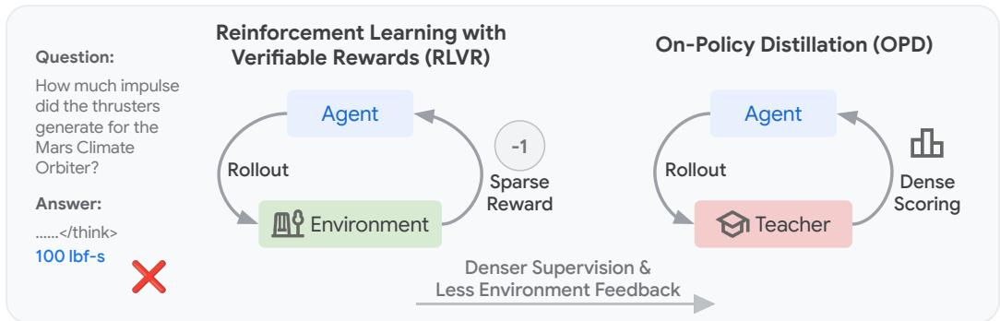  
Figure 1: Reinforcement learning versus on-policy distillation. Reinforcement learning learns from sparse, task-grounded environment rewards, whereas on-policy distillation scores the student’s own rollouts with a teacher, providing denser supervision but less direct environment feedback.

Recent work on on-policy distillation (OPD) addresses this gap by providing dense, token-level supervision with an external teacher (Agarwal et al., 2024; Lu & Lab, 2025). As illustrated in Figure 1, the student policy learns from its own rollouts: a more capable teacher model evaluates these trajectories to produce a token-level target distribution, which the student is then trained to match. However, OPD requires an external teacher to score the student’s rollouts and minimizes a divergence objective rather than directly optimizing for task rewards; consequently, it underperforms without a strong teacher model, as the student’s learning potential is upper-bounded by the capabilities of the teacher (Li et al., 2026). On-policy self-distillation (OPSD) (Zhao et al., 2026) instead conditions the model itself on privileged information to act as the teacher, but such a self-teacher is often overconfident and imposes excessive penalties on long reasoning trajectories (see Figure 4). Moreover, in scenarios where successful rollouts are rarely sampled or the teacher fails to provide meaningful supervision, the distillation signal becomes sparse or even absent (Hübotter et al., 2026).

To bridge this gap, we introduce self-instructing policy optimization (SIPO), a simple and effective RL framework that unifies reward-based policy gradients and on-policy self-distillation through a single token-level advantage. Specifically, at each iteration, SIPO samples multiple rollouts from the current policy, scores them with the reward function, and constructs two teacher contexts for each rollout: the reference answer and a mistake from the group, such as the rollout’s own wrong answer. Following OPSD, the model re-evaluates its own responses under both contexts without generating new text. To counter the self-teacher’s overconfidence, we construct contrastive self-teachers (Heakl et al., 2026; Pan et al., 2026) and use the difference between the two teacher log-probabilities as token-level feedback, so that biases shared by both contexts are expected to largely cancel. A token thus gains credit when it is more likely under the correct context than under the mistaken one. The resulting objective then adds this clipped contrastive feedback to the group-relative advantage, yielding a token-level advantage for every rollout: the reward still sets the main direction of each update while the self-teacher redistributes credit across tokens. Importantly, since the contrast needs no successful rollout, uniformly failed groups, which lack any RL signal and are left untouched by prior contrastive methods, still contribute to learning via the self-distillation feedback, thereby improving sample efficiency. We validate SIPO across multiple reasoning and code-generation benchmarks, where it outperforms both RLVR and OPSD baselines without requiring an external teacher model or additional generation at training time. We summarize our contributions as follows:1

• We propose self-instructing policy optimization (SIPO), which unifies reward-based policy gradients and on-policy self-distillation through a single token-level advantage. Specifically, SIPO adds contrastive self-teacher feedback to the advantage of every rollout, so that even groups in which every rollout fails still provide a learning signal.

• For the contrastive self-teacher, we construct two teacher contexts by pairing the reference answer with mistakes made within each prompt group, incorporating environment feedback when available. This enables the model to derive dense, token-level signals directly from its on-policy generations, eliminating the need for an external teacher.

• Extensive experiments on STEM reasoning and code-generation benchmarks demonstrate that SIPO outperforms both RLVR and OPSD baselines under comparable computational budgets. Further analyses suggest that the contrastive self-teacher mitigates the overconfidence of a standard self-teacher, and provides a useful learning signal to uniformly failed groups.

## 2 RELATED WORK

## 2.1 REINFORCEMENT LEARNING

Reinforcement learning (RL) is a paradigm where an agent interacts with an environment and learns to make decisions that maximize cumulative rewards (Sutton et al., 1998). Recently, RL has been adopted to improve LLMs through reinforcement learning from human feedback (RLHF) (Ouyang et al., 2022). Such fine-tuning typically employs policy gradient algorithms like REINFORCE (Sutton et al., 1999). To reduce variance, actor-critic methods like A2C (Mnih et al., 2016) leverage learned critic networks for advantage estimation. Building on this, proximal policy optimization (PPO) (Schulman et al., 2017) bounds policy updates via a clipped surrogate objective, achieving improved training stability and robustness. Alongside these approaches, direct preference optimization (DPO) (Rafailov et al., 2023) aligns language models using pairwise human preference comparisons. More recently, reinforce leave-one-out (RLOO) (Ahmadian et al., 2024) proposes to generate multiple responses and uses the mean reward of the remaining responses as a baseline. Similarly, group relative policy optimization (GRPO) (Shao et al., 2024) and its variants like REINFORCE++ and DAPO (Hu, 2025; Yu et al., 2025) compute baselines from group-level or batch-level reward statistics across candidate completions, reducing memory overhead while maintaining stability. However, a fundamental limitation of these RLVR methods is that outcome rewards assign a single scalar to an entire trajectory, providing coarse credit assignment at the token level. In this work, we address this limitation by unifying reward-based policy gradients with on-policy distillation, enabling dense, token-level supervision while preserving direct optimization using the task reward.

## 2.2 ON-POLICY DISTILLATION

On-policy distillation (OPD) addresses RLVR’s sparse credit assignment by providing dense, tokenlevel learning signals (Agarwal et al., 2024; Lu & Lab, 2025). In OPD, a capable teacher evaluates the student’s on-policy rollouts to produce token-level target distributions; the student is then trained to minimize its divergence from these targets. Agarwal et al. (2024) introduce a generalized framework for OPD that studies various divergence measures and demonstrates that on-policy training can mitigate distribution mismatches in offline distillation. More recently, Lu & Lab (2025) show that OPD achieves reasoning performance comparable to standard RL at a lower computational cost by providing dense supervision on the student’s own rollouts. Inspired by such advancements, on-policy self-distillation (OPSD) is proposed to improve the model’s performance via a self-teacher that leverages privileged information (e.g., ground truth) (Zhao et al., 2026; Hübotter et al., 2026). Similarly, on-policy distillation can improve downstream task performance by incorporating demonstrations or additional feedback for continual learning (Shenfeld et al., 2026; He et al., 2026). To systematically understand these underlying dynamics, Li et al. (2026) reveal that successful OPD requires a teacher that offers novel capabilities while maintaining compatible reasoning patterns with the student. Concurrent to our work, Yang et al. (2026) propose RLSD, which combines self-distillation and RLVR by using a privileged teacher to scale update magnitudes while environmental rewards govern update directions. Building on this idea, Heakl et al. (2026) and Pan et al. (2026) contrast teachers conditioned on correct and incorrect answers to derive token-level evidence, but leave uniformly failed groups without learning signals. Combining these complementary insights, we propose SIPO: by unifying RLVR with OPSD, our approach jointly leverages sparse outcome signals and dense token-level supervision, yielding stronger reasoning performance without additional generation.

## 3 METHODOLOGY

## 3.1 PRELIMINARIES

We consider the standard RLVR setting where an LLM-based policy $\pi _ { \theta }$ is trained to maximize a verifiable reward $r ( x , y )$ given a prompt x and a generated response y. At each training iteration, the policy samples a group of G rollouts $\{ y _ { i } \} _ { i = 1 } ^ { G } \sim \pi _ { \theta } ( \cdot \mid x )$ for each prompt x. The reward function then scores each rollout, producing binary rewards $r _ { i } \in \{ 0 , 1 \}$

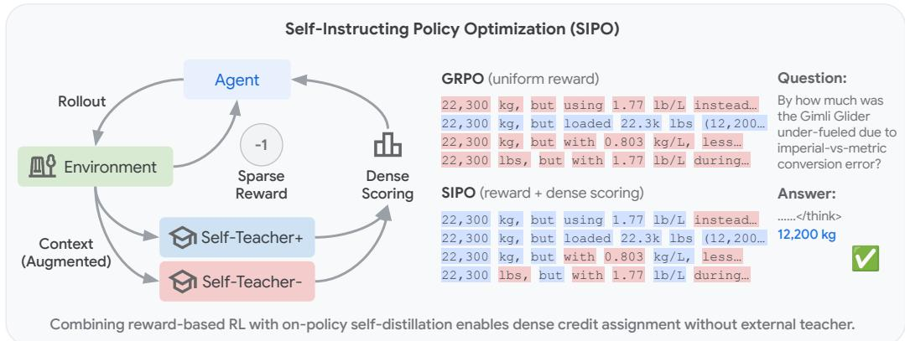  
Figure 2: Overview of SIPO. SIPO combines sparse environment rewards with dense, contrastive self-teacher credit for fine-grained credit assignment. Left: the agent learns from outcome-level rewards and token-level scores from a self-teacher that contrasts a correct and an incorrect context. Right: unlike GRPO, which assigns a uniform advantage to all tokens, SIPO aims to credit the reasoning steps (in blue) that lead to the correct answer.

GRPO. Group relative policy optimization (Shao et al., 2024) replaces the learned value function with group statistics, $\begin{array} { r } { \hat { A } _ { i } = \frac { r _ { i } - \mu } { \sigma + \epsilon } } \end{array}$ , where $\mu$ and σ are the mean and standard deviation of the group rewards. Following Dr. GRPO (Liu et al., 2025), we drop $\sigma ,$ i.e., ${ \hat { A } } _ { i } = r _ { i } - \mu .$ Every token in y shares this advantage, and the policy is trained with the policy-gradient surrogate (Sutton et al., 1999):

$$
\mathcal { L } _ { \mathrm { G R P O } } ( \theta ) = - \mathbb { E } _ { x \sim \mathcal { D } , \{ y _ { i } \} _ { i = 1 } ^ { G } \sim \pi _ { \theta } ( \cdot | x ) } \left[ \frac { 1 } { \sum _ { i } | y _ { i } | } \sum _ { i = 1 } ^ { G } \sum _ { t = 1 } ^ { | y _ { i } | } \hat { A } _ { i } \log \pi _ { \theta } ( y _ { i , t } \mid x , y _ { i , < t } ) \right] ,\tag{1}
$$

whose gradient is the standard policy gradient; we omit the KL penalty to a reference policy.

OPD. On-policy distillation (Agarwal et al., 2024) instead lets a teacher π re-score the student’s own rollouts; minimizing the reverse KL on the sampled tokens (Lu & Lab, 2025) gives the same form with a token-level advantage:

$$
\mathcal { L } _ { \mathrm { O P D } } ( \theta ) = - \mathbb { E } _ { x \sim \mathcal { D } , \{ y _ { i } \} _ { i = 1 } ^ { G } \sim \pi _ { \theta } ( \cdot | x ) } \left[ \frac { 1 } { \sum _ { i } | y _ { i } | } \sum _ { i = 1 } ^ { G } \sum _ { t = 1 } ^ { | y _ { i } | } A _ { i , t } ^ { \mathrm { O P D } } \log \pi _ { \theta } ( y _ { i , t } \mid x , y _ { i , < t } ) \right] ,\tag{2}
$$

where $A _ { i , t } ^ { \mathrm { O P D } } = \operatorname { s g } \left[ \log \pi _ { T } ( y _ { i , t } \mid x , y _ { i , < t } ) - \log \pi _ { \theta } ( y _ { i , t } \mid x , y _ { i , < t } ) \right]$ and sg[·] denotes stop-gradient, so each token’s term is a sampled estimate of the reverse KL gradient $\nabla \mathbb { D } _ { \mathrm { K L } } ( \pi _ { \theta } \parallel \pi _ { T } )$ . OPD provides dense signals, but it depends on a compatible teacher and does not optimize the task reward directly.

## 3.2 SELF-INSTRUCTING POLICY OPTIMIZATION

SIPO keeps the policy-gradient objective of GRPO to directly optimize the task reward, but replaces its uniform advantage with a token-level advantage from a contrastive self-teacher, which re-evaluates each response under a correct and an incorrect privileged context. We describe the details below.

SIPO Self-Teacher. SIPO adopts the group-based sampling strategy of GRPO. Given a prompt $x ,$ the actor generates a group of $G$ candidate responses $\{ y _ { i } \} _ { i = 1 } ^ { G }$ . The reward function evaluates these rollouts to produce outcome rewards $r _ { i }$ . Together with the reference answer, these outcomes are then used to construct a pair of self-teacher contexts.

For each prompt group, we split the rollouts into correct and incorrect ones, $S ^ { + } ( x ) = \{ j : r _ { j } = 1 \}$ and $S ^ { - } ( \bar { x } ) = \bar { \{ j : r _ { j } = 0 \} }$ . For every rollout $y _ { i }$ , SIPO builds two augmented teacher prompts, a positive prompt $x _ { i } ^ { + }$ and a negative prompt $\boldsymbol { x } _ { i } ^ { - }$ , sharing the same template and differing only in the privileged information placed before the original prompt x. When a reference answer $a ^ { \star }$ is available, the positive prompt contains it and the negative prompt contains an incorrect answer $\boldsymbol { a } _ { i } ^ { - }$ :

$$
x _ { i } ^ { + } = \mathsf { a u g m e n t } ( x , a ^ { \star } ) , \quad x _ { i } ^ { - } = \mathsf { a u g m e n t } ( x , a _ { i } ^ { - } ) .\tag{3}
$$

For an incorrect rollout, $\boldsymbol { a } _ { i } ^ { - }$ is its own final answer as judged by the verifier; for a correct rollout, it is the most common incorrect answer in the group. Since $a _ { i } ^ { - }$ depends on the outcome of the rollout itself, this construction is a form of hindsight relabeling. Incorrect rollouts without a valid judged answer, e.g., truncated responses, receive no teacher term, since substituting another answer from the group would contrast the reference with a mistake the rollout did not make. When no reference answer is available, as in code generation where the ground truth is a test suite, the two prompts instead contain a successful and a failed sibling rollout from the same group (a pair we also use on science QA whenever both siblings exist); rollouts without such a pair, including those in uniformly failed groups, receive no contrastive feedback (Section A.1).

Conditioned on each augmented prompt, the self-teacher re-evaluates the same response $y _ { i } { \mathrm { : } }$

$$
\pi _ { T } ( y _ { i , t } \mid x _ { i } ^ { \pm } , y _ { i , < t } ) \triangleq \pi _ { \bar { \theta } } ( y _ { i , t } \mid x _ { i } ^ { \pm } , y _ { i , < t } ) ,\tag{4}
$$

where $\bar { \theta }$ denotes the teacher parameters (synchronized with the current policy every K training steps). The student is evaluated on the same response tokens under the original prompt-response pair $( x , y _ { i } )$ Thus, SIPO does not require additional generation: it only adds two teacher forward passes, one for each augmented prompt concatenated with the existing rollout. Since the teacher and student differ only in the prompt prefix, re-evaluating the shared response tokens avoids the need to resample, resulting in only a modest computational overhead compared to generation.

SIPO Objective. From the teacher evaluations, SIPO computes a token-level contrastive evidence

$$
\begin{array} { r } { e _ { i , t } = \mathrm { s g } \Big [ \log \pi _ { T } ( y _ { i , t } \mid x _ { i } ^ { + } , y _ { i , < t } ) - \log \pi _ { T } ( y _ { i , t } \mid x _ { i } ^ { - } , y _ { i , < t } ) \Big ] . } \end{array}\tag{5}
$$

A positive $e _ { i , t }$ indicates that token $y _ { i , t }$ is more likely when the teacher sees correct rather than incorrect information, and a negative $e _ { i , t }$ indicates the opposite. We then add the clipped evidence to the group-relative advantage, and the SIPO loss takes the same form as Equations (1) and (2):

$$
\begin{array} { l } { { \displaystyle { \mathcal { L } } _ { \mathrm { S I P O } } ( \theta ) = - { \mathbb { E } } _ { x \sim \mathcal { D } , \{ y _ { i } \} _ { i = 1 } ^ { G } \sim \pi _ { \theta } ( \cdot | x ) } \left[ \frac { 1 } { \sum _ { i } | y _ { i } | } \sum _ { i = 1 } ^ { G } \sum _ { t = 1 } ^ { | y _ { i } | } A _ { i , t } \log \pi _ { \theta } ( y _ { i , t } \mid x , y _ { i , < t } ) \right] , } } \\ { { \displaystyle \quad \quad \quad \quad \quad \quad A _ { i , t } = \hat { A } _ { i } + \kappa \cdot \mathrm { c l i p } ( e _ { i , t } , - \delta , \delta ) , } } \end{array}\tag{6}
$$

where κ scales the teacher term, δ bounds the evidence per token, and $e _ { i , t } = 0$ for rollouts without a contrastive pair. We use $\delta = 0 . 2$ and $\kappa \in \{ 0 . 1 , 0 . 2 , \bar { 0 } . 5 \}$ (Section B). SIPO thus combines the sequence-level advantage of GRPO with a token-level advantage in the spirit of OPD, where the student log-probability in $A _ { i , t } ^ { \mathrm { { O P D } } }$ is replaced by a second teacher evaluation. For clarity, we write all three losses in their on-policy form; in practice, we optimize the clipped importance-weighted surrogate (Schulman et al., 2017). Because rewards are binary, the smallest nonzero $| \hat { A } _ { i } |$ is $1 / G ;$ with $\kappa \delta < 1 / G$ , the teacher term cannot flip the sign of $\hat { A } _ { i }$ in groups with mixed outcomes (we additionally apply a sign-preserving projection as a safeguard; see Section A.2), so the reward alone determines the main direction of each update while the evidence redistributes credit across tokens. In a uniformly failed group, $\hat { A } _ { i } = 0$ and $A _ { i , t } = \kappa \cdot \mathrm { c l i p } ( e _ { i , t } , - \delta , \delta )$ , so these rollouts, which GRPO discards, still receive a token-level signal indicating which tokens agree with the reference answer rather than with the rollout’s own mistake.

In summary, the contrast between the two self-teacher evaluations provides a dense, token-level learning signal that addresses the fundamental limitations of sparse outcome rewards, even on uniformly failed groups. We expect tokens such as routine derivations or formatting to receive $e _ { i , t } \approx 0$ , while tokens specific to the correct or the incorrect answer receive positive or negative credit. By adding this evidence to the advantage, SIPO is designed to indicate which intermediate steps moved the trajectory toward or away from the correct answer, while the reward keeps the direction of each update. Furthermore, because the incorrect answers are directly collected from the policy’s own rollouts, the negative context tracks the mistakes the policy currently makes, keeping the contrast relevant as the policy improves. Therefore, the supervision signal evolves with every training iteration and requires neither an external teacher nor additional sampling, only two extra forward passes.

<table><tr><td rowspan="2"></td><td colspan="3">Competition Math</td><td colspan="3">Standard Math</td><td rowspan="2">Avg.</td></tr><tr><td>AIME24</td><td>AIME25</td><td>AMC23</td><td>MATH500</td><td>Minerva</td><td>Olympiad</td></tr><tr><td>Qwen3-8B</td><td>26.3</td><td>23.4</td><td>59.7</td><td>73.8</td><td>20.2</td><td>41.7</td><td>40.8</td></tr><tr><td>+GRPO</td><td>54.9</td><td>40.3</td><td>84.7</td><td>84.6</td><td>29.4</td><td>50.1</td><td>57.3</td></tr><tr><td>+ SDPO</td><td>33.4</td><td>25.5</td><td>63.8</td><td>77.6</td><td>25.4</td><td>43.5</td><td>44.9</td></tr><tr><td>+ RLSD</td><td>49.5</td><td>38.2</td><td>85.6</td><td>84.8</td><td>30.9</td><td>51.2</td><td>56.7</td></tr><tr><td>+ SIPO</td><td>56.8</td><td>41.4</td><td>87.8</td><td>85.8</td><td>32.0</td><td>53.0</td><td>59.4</td></tr></table>

Table 1: Comparison of SIPO and baselines on math reasoning benchmarks. All methods train Qwen3-8B on DAPO-Math-17k; we report the best checkpoint with avg@32 on AIME24 and AIME25, avg@8 on AMC23, and avg@1 on MATH500, Minerva Math (Minerva), and Olympiad-Bench (Olympiad). Best results are in bold and second-best results are underlined.
<table><tr><td rowspan="2"></td><td colspan="2">Chemistry</td><td colspan="2">Physics</td><td colspan="2">Biology</td><td colspan="2">Materials</td><td colspan="2">Tool use</td><td rowspan="2">Avg.</td></tr><tr><td>1h</td><td>5h</td><td>1h</td><td>5h</td><td>1h</td><td>5h</td><td>1h</td><td>5h</td><td>1h</td><td>5h</td></tr><tr><td>Qwen3-8B</td><td colspan="2">41.2</td><td colspan="2">59.2</td><td colspan="2">30.8</td><td colspan="2">58.9</td><td colspan="2">57.5</td><td>49.5</td></tr><tr><td>+ GRPO</td><td>63.3</td><td>63.4</td><td>63.6</td><td>63.6</td><td>49.8</td><td>49.8</td><td>73.9</td><td>74.1</td><td>60.2</td><td>65.7</td><td>62.7</td></tr><tr><td>+ SDPO</td><td>73.2</td><td>80.9</td><td>66.6</td><td>75.6</td><td>50.6</td><td>56.8</td><td>72.1</td><td>78.4</td><td>68.0</td><td>68.5</td><td>69.1</td></tr><tr><td>+ RLSD</td><td>73.2</td><td>74.6</td><td>67.5</td><td>70.3</td><td>44.0</td><td>44.0</td><td>66.7</td><td>69.0</td><td>62.4</td><td>62.5</td><td>63.4</td></tr><tr><td>+ SIPO</td><td>76.9</td><td>79.6</td><td>74.6</td><td>79.2</td><td>46.8</td><td>58.7</td><td>77.1</td><td>79.5</td><td>64.6</td><td>67.4</td><td>70.4</td></tr></table>

Table 2: Comparison of SIPO and baselines on science QA and tool use. We report the best avg@16 within 1h and 5h of wall-clock training. See Table 6 for off-policy GRPO and Table 5 for results with Olmo3-7B. Best results are in bold and second-best results are underlined.

## 4 EXPERIMENTS

We evaluate SIPO in two scenarios: (1) standard RLVR with binary rewards and a reference answer, and (2) code generation, where correctness is determined by unit tests and no reference answer is available. The experimental settings are as follows:

• Datasets and Models. We cover four domains with outcome-level correctness rewards: math, training on DAPO-Math-17k (Yu et al., 2025) and evaluating on AIME24, AIME25, AMC23, MATH-500 (Hendrycks et al., 2021; Lightman et al., 2023), Minerva Math and Olympiad-Bench (He et al., 2024); science QA on SciKnowEval (Chemistry, Physics, Biology and Materials) (Feng et al., 2024); tool use on ToolAlpaca (Tang et al., 2023); and code generation on LiveCodeBench v6 (Jain et al., 2024), where unit tests determine the reward, with held-out IFE val (Zhou et al., 2023), ArenaHard-v2 (Li et al., 2024), and MMLU-Pro (Wang et al., 2024) for generalization. We use Qwen3-8B (Yang et al., 2025) on all tasks and Olmo3-7B-Instruct (Olmo et al., 2025) on science QA and tool use.

• Baselines. We compare SIPO against GRPO (Shao et al., 2024) with asymmetric clipping (Yu et al., 2025), SDPO (Hübotter et al., 2026), which performs on-policy self-distillation without the policy-gradient term, RLSD (Yang et al., 2026), which rescales the reward advantage with a privileged self-teacher, and, on code generation, SFT on self-teacher responses. All methods use verl (Sheng et al., 2025), with details in Section B.

## 4.1 RESULTS

Math Results. Table 1 summarizes results on the math reasoning benchmarks with Qwen3-8B. We make the following observations: (1) Overall performance: SIPO achieves the best result on all benchmarks and the highest average accuracy 59.4, improving over GRPO by 2.1% and RLSD by 2.7%. (2) Competition-level problems: The gains hold on hard benchmarks, where SIPO reaches 56.8 on AIME24 and 41.4 on AIME25, compared with 54.9 and 40.3 for GRPO. In contrast, RLSD falls below GRPO on both AIME benchmarks despite better results on standard benchmarks, suggesting that reweighting the reward advantage does not consistently help on long reasoning trajectories. (3) Comparison to self-distillation: SDPO improves the base model by only 4.1% on average and remains below other methods, consistent with the observation that a self-teacher alone struggles on complex reasoning (see Figure 4). By keeping the reward as the main learning signal and adding contrastive token-level credit, SIPO benefits from self-distillation without inheriting this limitation, and it is the only self-distillation method that improves over GRPO on all six benchmarks.

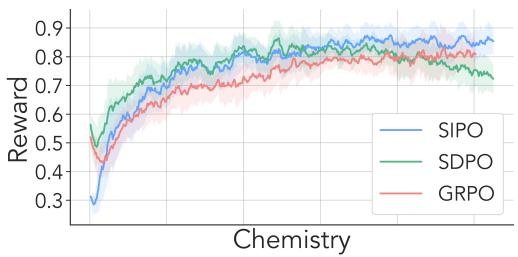

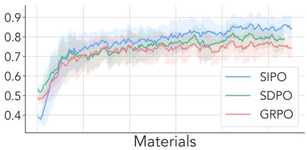

Figure 3: Reward curves of SIPO, SDPO, and GRPO on Chemistry and Materials. SIPO converges faster and reaches a higher final reward than both baselines by combining sparse outcome rewards with dense, token-level credit from the contrastive self-teacher.
<table><tr><td rowspan="2"></td><td>Task</td><td colspan="5">Holdout tasks</td></tr><tr><td>LCBv6</td><td>IFEval</td><td>ArenaHard-v2 (hard prompt)</td><td>ArenaHard-v2 (creative writing)</td><td>MMLU-Pro</td><td>Avg. (holdout)</td></tr><tr><td>Qwen3-8B</td><td>27.9</td><td>83.9</td><td>14.0</td><td>13.7</td><td>62.5</td><td>43.5</td></tr><tr><td>Self-teacher SFT</td><td>42.7</td><td>83.7</td><td>11.2</td><td>8.9</td><td>61.9</td><td>41.4</td></tr><tr><td>GRPO</td><td>41.2</td><td>82.2</td><td>12.0</td><td>10.8</td><td>62.3</td><td>41.8</td></tr><tr><td>SDPO</td><td>48.8</td><td>83.2</td><td>12.3</td><td>11.1</td><td>62.9</td><td>42.4</td></tr><tr><td>RLSD</td><td>55.4</td><td>83.0</td><td>12.3</td><td>11.8</td><td>62.5</td><td>42.4</td></tr><tr><td>SIPO</td><td>56.3</td><td>83.5</td><td>12.7</td><td>12.0</td><td>62.6</td><td>42.7</td></tr></table>

Table 3: Comparison of SIPO and baselines on code generation and holdout tasks. Holdout benchmarks only measure generalization beyond LCBv6, and self-teacher SFT trains on responses generated by the self-teacher. SIPO achieves the highest LCBv6 accuracy while maintaining strong generalization. Best results are in bold and second-best results are underlined.

Reasoning Results. Table 2 summarizes results on the reasoning benchmarks in science QA and tool use with Qwen3-8B (see Table 5 for Olmo3-7B). Based on these results, we make the following observations: (1) Overall performance: SIPO achieves the highest average accuracy 70.4, representing an improvement over SDPO by 1.3% and large gains over RLSD (by 7.0%) and GRPO (by 7.7%). Additionally, SIPO secures the best result in 6 of the 10 settings, highlighting its effectiveness across scientific reasoning and tool use. The same trends hold with Olmo3-7B, where SIPO improves over SDPO by 1.4% and GRPO by 6.7% on average (Table 5), and GRPO with four off-policy mini-batch steps per batch still falls well below SIPO with both backbones (Table 6). (2) Training efficiency: SIPO learns faster than the baselines, with 1 hour of SIPO often matching 5 hours of baseline training. For example, SIPO reaches 76.9 on Chemistry at 1h, surpassing GRPO (63.4) and RLSD (74.6) at 5h. Similarly, SIPO reaches 74.6 on Physics at 1h, exceeding 5h GRPO (63.6) and RLSD (70.3) and rivaling 5h SDPO before peaking at 79.2 at 5h. These results indicate that the self-teacher signal improves sample efficiency by converting reference answers and in-group mistakes into dense token-level supervision. (3) Comparison to reward-only and distillation-only baselines: SDPO is competitive on several tasks and obtains the best result in 4 of the 10 settings, while RLSD improves over GRPO by only 0.7% on average and falls behind it on Biology and Materials. However, SIPO is the most consistent method on average, suggesting that combining reward-based policy gradients with on-policy self-distillation provides a stronger learning signal than either reward optimization or self-distillation alone. (4) SDPO on short versus long reasoning: SDPO is close to SIPO here but substantially worse on math (Table 1), likely because distilling toward an answer-aware teacher costs little on short responses but shortens the long reasoning needed for math.

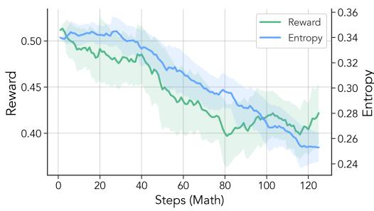

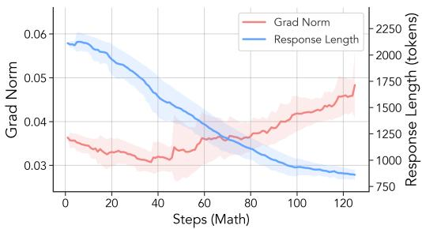  
Figure 4: Training dynamics of SDPO on DAPO-Math-17k with Qwen3-8B. Left: training reward and entropy. Right: gradient norm and response length. Reward, entropy, and response length decrease steadily, while the gradient norm grows.

Code Generation Results. Table 3 further evaluates whether the improvements from SIPO generalize to code generation without a reference answer (LCBv6), as well as to held-out tasks (e.g., IFEval). We observe the following: (1) Learning without a reference answer: On LiveCodeBench v6, SIPO improves base model accuracy from 27.9 to 56.3, outperforming SFT on self-teacher responses, GRPO, SDPO and the strongest baseline RLSD (55.4). This demonstrates that contrasting successful and failed sibling rollouts effectively converts sparse code-verification outcomes into a much stronger learning signal. Unlike on math and science QA, uniformly failed groups receive no contrastive feedback on code generation, since no successful sibling is available; the gains therefore come from mixed groups alone, suggesting that a reference solution or execution feedback could further strengthen SIPO on code. (2) Forgetting and generalization: The holdout benchmarks are never used for training and only measure whether training on LCBv6 preserves the general capabilities of the model. SIPO preserves holdout performance comparable to or better than the baseline methods. Its average holdout score is 42.7, close to the base model’s 43.5 and higher than SFT, GRPO, SDPO and RLSD. In contrast, SFT improves LCBv6 but lowers the holdout average to 41.4, suggesting stronger forgetting behavior. Among all trained methods, SIPO stays closest to the base model, losing only 0.8% on average, so its gains on LCBv6 come with little forgetting.

Learning Dynamics. Beyond final accuracy, we also examine the training dynamics of SIPO to understand why combining reward-based optimization with a contrastive self-teacher yields a stronger learning signal. Based on Figure 3, Figure 4 and Figure 5, we make the following observations: (1) Reward trajectories: SIPO attains higher reward than both SDPO and GRPO throughout training and continues improving when the baselines begin to plateau. In Chemistry, SDPO peaks early and then steadily declines, GRPO plateaus, while SIPO maintains a stable upward trajectory. We attribute this to the policy gradient term in SIPO, which keeps optimizing toward verifiable outcomes even after the self-teacher signal saturates. (2) Long reasoning on math: On math (Figure 5), SIPO and GRPO start from the same reward, after which SIPO stays slightly above GRPO, whereas RLSD stalls while its teacher term

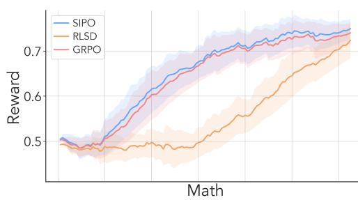  
Figure 5: Training reward of SIPO, GRPO, and RLSD on Math with Qwen3-8B. SIPO improves from the start of training and stays above GRPO throughout, while RLSD stalls near its initial reward until its teacher weight decays to zero at step 50.

is active and only begins to improve once its teacher weight λ decays to zero at step 50, after which it reduces to GRPO. This suggests that contrastive credit adds to the reward signal without slowing learn ing, whereas reweighting the advantage with a self-teacher may delay progress on long trajectories. (3) Self-distillation collapses on long reasoning: On math, the reward, entropy, and response length of SDPO steadily decrease, with responses shrinking below 1,000 tokens, while the gradient norm grows (Figure 4). We hypothesize that an answer-aware self-teacher favors continuations that head directly to the answer, so distilling toward it cuts the long reasoning that math requires, whereas on the short responses of science QA and tool use this shortcut costs little. (4) Why SIPO avoids thisfailure: Both teacher contexts carry an answer, so the preference for short continuations that head directly to the answer is expected to appear on both sides and largely cancel in the contrast. The remaining evidence only reflects which tokens are specific to the correct or the incorrect answer, while the reward still sets the update direction, so SIPO keeps the long reasoning that math requires. Consistent with this, within the same math run, the single-teacher evidence log $\pi _ { T } ( y _ { i , t } \mid x _ { i } ^ { + } , y _ { i , < t } ) - \log \pi _ { \theta } ( y _ { i , t } \mid x , y _ { i , < t } )$ has a near-zero median but a consistently negative mean $\left( - 0 . 0 0 2 \mathrm { t o } - 0 . 0 0 4 \right)$ that grows during training, indicating a tail of heavily penalized tokens, whereas the contrastive evidence $e _ { i , t }$ fluctuates around zero (|mean| < 0.001) without a consistent sign.

<table><tr><td></td><td colspan="3">Competition Math</td><td colspan="3">Standard Math</td><td rowspan="2">Avg.</td></tr><tr><td></td><td>AIME24</td><td>AIME25</td><td>AMC23</td><td>MATH500</td><td>Minerva</td><td>Olympiad</td></tr><tr><td>Qwen3-8B</td><td>26.3</td><td>23.4</td><td>59.7</td><td>73.8</td><td>20.2</td><td>41.7</td><td>40.8</td></tr><tr><td>+ GRPO</td><td>54.9</td><td>40.3</td><td>84.7</td><td>84.6</td><td>29.4</td><td>50.1</td><td>57.3</td></tr><tr><td>+ GRPO w/ analytic KL</td><td>25.6</td><td>18.2</td><td>66.5</td><td>76.2</td><td>27.5</td><td>41.6</td><td>42.6</td></tr><tr><td>+ RLSD</td><td>49.5</td><td>38.2</td><td>85.6</td><td>84.8</td><td>30.9</td><td>51.2</td><td>56.7</td></tr><tr><td>+ RLSD w/ contrastive</td><td>56.7</td><td>39.8</td><td>86.8</td><td>83.2</td><td>31.2</td><td>51.9</td><td>58.3</td></tr><tr><td>+ SIPO</td><td>56.8</td><td>41.4</td><td>87.8</td><td>85.8</td><td>32.0</td><td>53.0</td><td>59.4</td></tr></table>

Table 4: Ablation of how the self-teacher is used on math with Qwen3-8B. GRPO w/ analytic KL adds an analytic reverse KL toward a privileged self-teacher. RLSD rescales the advantage with token-level evidence from a self-teacher conditioned on the reference answer. RLSD w/ contrastive replaces this evidence with the contrast between a correct and an incorrect teacher context. SIPO adds the contrastive evidence to the advantage of every rollout, including uniformly failed groups. Best results are in bold and second-best results are underlined.

Ablation Studies. Table 4 examines how the self-teacher should enter the update on math. We make the following observations: (1) Distribution-level distillation collapses on long reasoning: Adding an analytic KL toward a single self-teacher to GRPO decreases the reward throughout training, and its best checkpoint, near the start of training, reaches only 42.6 on average, 14.7% below GRPO and barely above the base model. As with SDPO (Figure 4), matching a single answer-conditioned teacher likely removes the long reasoning required on math. On science QA and tool use, whose responses are short, the same variant remains competitive (71.2 vs. 70.4 for SIPO with Qwen3-8B; Table 7), so this failure is specific to long reasoning. (2) A single teacher gives weak token-level credit: RLSD, which uses a single teacher only to rescale the reward advantage, avoids this collapse but stays slightly below GRPO (56.7 vs. 57.3), even though its teacher weight decays to zero after 50 steps, and learns more slowly while the teacher is active (Figure 5). (3) The contrastive teacher is the key ingredient: Replacing the evidence of RLSD with the contrast between a correct and an incorrect teacher context, which also allows keeping the teacher weight at 0.5 throughout training instead of decaying it to zero, raises the average from 56.7 to 58.3, surpassing GRPO, with the largest gain on AIME24. This suggests that the benefit comes from the contrast rather than from token-level reweighting alone. (4) Learningfrom every rollout: Adding the contrastive evidence to the advantage of every rollout, including uniformly failed groups (with the negative contexts in Section A.1), further raises the average to 59.4, with gains on all six benchmarks.

## 5 CONCLUSION

In this paper, we introduced SIPO, which unifies reinforcement learning with on-policy self-distillation through a single token-level advantage. Instead of distilling toward a single self-teacher, SIPO contrasts the teacher’s evaluations under a correct and an incorrect privileged context, so that shared biases largely cancel and even uniformly failed groups receive dense credit. Across math, science QA, tool use and code generation tasks, SIPO outperforms RL and self-distillation baselines, remains stable on long math reasoning where self-distillation collapses, and requires no external teacher or additional generation. Moreover, SIPO forgets little on holdout evaluation and adds only teacher forward passes, making it a drop-in replacement for GRPO when environmental feedback is available.

## REFERENCES

Rishabh Agarwal, Nino Vieillard, Yongchao Zhou, Piotr Stanczyk, Sabela Ramos Garea, Matthieu Geist, and Olivier Bachem. On-policy distillation of language models: Learning from selfgenerated mistakes. In The twelfth international conference on learning representations, 2024.

Arash Ahmadian, Chris Cremer, Matthias Gallé, Marzieh Fadaee, Julia Kreutzer, Olivier Pietquin, Ahmet Üstün, and Sara Hooker. Back to basics: Revisiting reinforce style optimization for learning from human feedback in llms. arXiv preprint arXiv:2402.14740, 2024.

Gheorghe Comanici, Eric Bieber, Mike Schaekermann, Ice Pasupat, Noveen Sachdeva, Inderjit Dhillon, Marcel Blistein, Ori Ram, Dan Zhang, Evan Rosen, et al. Gemini 2.5: Pushing the frontier with advanced reasoning, multimodality, long context, and next generation agentic capabilities. arXiv preprint arXiv:2507.06261, 2025.

Kehua Feng, Xinyi Shen, Weijie Wang, Xiang Zhuang, Yuqi Tang, Qiang Zhang, and Keyan Ding. Sciknoweval: Evaluating multi-level scientific knowledge of large language models. arXiv preprint arXiv:2406.09098, 2024.

Daya Guo, Dejian Yang, Haowei Zhang, Junxiao Song, Ruoyu Zhang, Runxin Xu, Qihao Zhu, Shirong Ma, Peiyi Wang, Xiao Bi, et al. Deepseek-r1: Incentivizing reasoning capability in llms via reinforcement learning. arXiv preprint arXiv:2501.12948, 2025.

Chaoqun He, Renjie Luo, Yuzhuo Bai, Shengding Hu, Zhen Thai, Junhao Shen, Jinyi Hu, Xu Han, Yujie Huang, Yuxiang Zhang, et al. Olympiadbench: A challenging benchmark for promoting agi with olympiad-level bilingual multimodal scientific problems. In Proceedings of the 62nd Annual Meeting ofthe Associationfor Computational Linguistics (Volume 1: Long Papers), pp. 3828–3850, 2024.

Yinghui He, Simran Kaur, Adithya Bhaskar, Yongjin Yang, Jiarui Liu, Narutatsu Ri, Liam Fowl, Abhishek Panigrahi, Danqi Chen, and Sanjeev Arora. Self-distillation zero: Self-revision turns binary rewards into dense supervision. arXiv preprint arXiv:2604.12002, 2026.

Ahmed Heakl, Abdelrahman M Shaker, Youssef Mohamed, Rania Elbadry, Omar Fetouh, Fahad Shahbaz Khan, and Salman Khan. Cepo: Rlvr self-distillation using contrastive evidence policy optimization. arXiv preprint arXiv:2605.19436, 2026.

Dan Hendrycks, Collin Burns, Saurav Kadavath, Akul Arora, Steven Basart, Eric Tang, Dawn Song, and Jacob Steinhardt. Measuring mathematical problem solving with the math dataset. arXiv preprint arXiv:2103.03874, 2021.

Jian Hu. Reinforce++: A simple and efficient approach for aligning large language models. arXiv preprint arXiv:2501.03262, 2025.

Jonas Hübotter, Frederike Lübeck, Lejs Behric, Anton Baumann, Marco Bagatella, Daniel Marta, Ido Hakimi, Idan Shenfeld, Thomas Kleine Buening, Carlos Guestrin, et al. Reinforcement learning via self-distillation. arXiv preprint arXiv:2601.20802, 2026.

Naman Jain, King Han, Alex Gu, Wen-Ding Li, Fanjia Yan, Tianjun Zhang, Sida Wang, Armando Solar-Lezama, Koushik Sen, and Ion Stoica. Livecodebench: Holistic and contamination free evaluation of large language models for code. arXiv preprint arXiv:2403.07974, 2024.

Nathan Lambert, Jacob Morrison, Valentina Pyatkin, Shengyi Huang, Hamish Ivison, Faeze Brahman, Lester James V Miranda, Alisa Liu, Nouha Dziri, Shane Lyu, et al. Tulu 3: Pushing frontiers in open language model post-training. arXiv preprint arXiv:2411.15124, 2024.

Tianle Li, Wei-Lin Chiang, Evan Frick, Lisa Dunlap, Tianhao Wu, Banghua Zhu, Joseph E Gonzalez, and Ion Stoica. From crowdsourced data to high-quality benchmarks: Arena-hard and benchbuilder pipeline. arXiv preprint arXiv:2406.11939, 2024.

Yaxuan Li, Yuxin Zuo, Bingxiang He, Jinqian Zhang, Chaojun Xiao, Cheng Qian, Tianyu Yu, Huanang Gao, Wenkai Yang, Zhiyuan Liu, et al. Rethinking on-policy distillation of large language models: Phenomenology, mechanism, and recipe. arXiv preprint arXiv:2604.13016, 2026.

Hunter Lightman, Vineet Kosaraju, Yuri Burda, Harrison Edwards, Bowen Baker, Teddy Lee, Jan Leike, John Schulman, Ilya Sutskever, and Karl Cobbe. Let’s verify step by step. In The twelfth international conference on learning representations, 2023.

Zichen Liu, Changyu Chen, Wenjun Li, Penghui Qi, Tianyu Pang, Chao Du, Wee Sun Lee, and Min Lin. Understanding r1-zero-like training: A critical perspective. arXiv preprint arXiv:2503.20783, 2025.

Kevin Lu and Thinking Machines Lab. On-policy distillation. Thinking Machines Lab: Connectionism, 2025. doi: 10.64434/tml.20251026. https://thinkingmachines.ai/blog/on-policy-distillation.

Volodymyr Mnih, Adria Puigdomenech Badia, Mehdi Mirza, Alex Graves, Timothy Lillicrap, Tim Harley, David Silver, and Koray Kavukcuoglu. Asynchronous methods for deep reinforcement learning. In International conference on machine learning, pp. 1928–1937. PmLR, 2016.

Team Olmo, Allyson Ettinger, Amanda Bertsch, Bailey Kuehl, David Graham, David Heineman, Dirk Groeneveld, Faeze Brahman, Finbarr Timbers, Hamish Ivison, et al. Olmo 3. arXiv preprint arXiv:2512.13961, 2025.

Long Ouyang, Jeffrey Wu, Xu Jiang, Diogo Almeida, Carroll Wainwright, Pamela Mishkin, Chong Zhang, Sandhini Agarwal, Katarina Slama, Alex Ray, et al. Training language models to follow instructions with human feedback. Advances in Neural Information Processing Systems, 35: 27730–27744, 2022.

Leyi Pan, Shuchang Tao, Yunpeng Zhai, Lingzhe Zhang, Zhaoyang Liu, Bolin Ding, Aiwei Liu, and Lijie Wen. Rlcsd: Reinforcement learning with contrastive on-policy self-distillation. arXiv preprint arXiv:2606.11709, 2026.

Rafael Rafailov, Archit Sharma, Eric Mitchell, Christopher D Manning, Stefano Ermon, and Chelsea Finn. Direct preference optimization: Your language model is secretly a reward model. Advances in Neural Information Processing Systems, 36:53728–53741, 2023.

John Schulman, Filip Wolski, Prafulla Dhariwal, Alec Radford, and Oleg Klimov. Proximal policy optimization algorithms. arXiv preprint arXiv:1707.06347, 2017.

Zhihong Shao, Peiyi Wang, Qihao Zhu, Runxin Xu, Junxiao Song, Xiao Bi, Haowei Zhang, Mingchuan Zhang, YK Li, Y Wu, et al. Deepseekmath: Pushing the limits of mathematical reasoning in open language models. arXiv preprint arXiv:2402.03300, 2024.

Idan Shenfeld, Mehul Damani, Jonas Hübotter, and Pulkit Agrawal. Self-distillation enables continual learning. arXiv preprint arXiv:2601.19897, 2026.

Guangming Sheng, Chi Zhang, Zilingfeng Ye, Xibin Wu, Wang Zhang, Ru Zhang, Yanghua Peng, Haibin Lin, and Chuan Wu. Hybridflow: A flexible and efficient rlhf framework. In Proceedings ofthe Twentieth European Conference on Computer Systems, pp. 1279–1297, 2025.

Aaditya Singh, Adam Fry, Adam Perelman, Adam Tart, Adi Ganesh, Ahmed El-Kishky, Aidan McLaughlin, Aiden Low, AJ Ostrow, Akhila Ananthram, et al. Openai gpt-5 system card. arXiv preprint arXiv:2601.03267, 2025.

Richard S Sutton, Andrew G Barto, et al. Reinforcement learning: An introduction. MIT press Cambridge, 1998.

Richard S Sutton, David McAllester, Satinder Singh, and Yishay Mansour. Policy gradient methods for reinforcement learning with function approximation. Advances in neural information processing systems, 12, 1999.

Qiaoyu Tang, Ziliang Deng, Hongyu Lin, Xianpei Han, Qiao Liang, Boxi Cao, and Le Sun. Toolalpaca: Generalized tool learning for language models with 3000 simulated cases. arXiv preprint arXiv:2306.05301, 2023.

Yubo Wang, Xueguang Ma, Ge Zhang, Yuansheng Ni, Abhranil Chandra, Shiguang Guo, Weiming Ren, Aaran Arulraj, Xuan He, Ziyan Jiang, et al. Mmlu-pro: A more robust and challenging multitask language understanding benchmark. Advances in Neural Information Processing Systems, 37: 95266–95290, 2024.

An Yang, Anfeng Li, Baosong Yang, Beichen Zhang, Binyuan Hui, Bo Zheng, Bowen Yu, Chang Gao, Chengen Huang, Chenxu Lv, et al. Qwen3 technical report. arXiv preprint arXiv:2505.09388, 2025.

Chenxu Yang, Chuanyu Qin, Qingyi Si, Minghui Chen, Naibin Gu, Dingyu Yao, Zheng Lin, Weiping Wang, Jiaqi Wang, and Nan Duan. Self-distilled rlvr. arXiv preprint arXiv:2604.03128, 2026.

Qiying Yu, Zheng Zhang, Ruofei Zhu, Yufeng Yuan, Xiaochen Zuo, Yu Yue, Weinan Dai, Tiantian Fan, Gaohong Liu, Lingjun Liu, et al. Dapo: An open-source llm reinforcement learning system at scale. arXiv preprint arXiv:2503.14476, 2025.

Jinghan Zhang, Fengran Mo, Tharindu Cyril Weerasooriya, Ruimin Dai, Xiaoyan Han, Yanjie Fu, Dakuo Wang, and Kunpeng Liu. Starpo: Stability-augmented reinforcement policy optimization. arXiv preprint arXiv:2604.08905, 2026.

Zhenru Zhang, Chujie Zheng, Yangzhen Wu, Beichen Zhang, Runji Lin, Bowen Yu, Dayiheng Liu, Jingren Zhou, and Junyang Lin. The lessons of developing process reward models in mathematical reasoning. In Findings of the Association for Computational Linguistics: ACL 2025, pp. 10495– 10516, 2025.

Siyan Zhao, Zhihui Xie, Mengchen Liu, Jing Huang, Guan Pang, Feiyu Chen, and Aditya Grover. Self-distilled reasoner: On-policy self-distillation for large language models. arXiv preprint arXiv:2601.18734, 2026.

Jeffrey Zhou, Tianjian Lu, Swaroop Mishra, Siddhartha Brahma, Sujoy Basu, Yi Luan, Denny Zhou, and Le Hou. Instruction-following evaluation for large language models. arXiv preprint arXiv:2311.07911, 2023.

Prompt for SIPO   
<|im\_start|>user   
Here is a reference solution:   
<reference answer $a ^ { \star }$ | incorrect answer $a _ { i } ^ { - } >$   
After understanding the reference solution, please try to   
solve this problem using your own approach below.   
<question><|im\_end|>   
<|im\_start|>assistant  
Figure 6: Prompt template for the SIPO self-teacher. The positive prompt $x _ { i } ^ { + }$ contains the reference answer and the negative prompt $\boldsymbol { x } _ { i } ^ { - }$ the incorrect answer $\boldsymbol { a } _ { i } ^ { - }$ . Without a reference answer (code generation), the slot holds a successful or a failed sibling rollout (Section A.1).

## A METHOD DETAILS

## A.1 CONSTRUCTION OF CONTRASTIVE PAIRS

In the main text, the two teacher prompts pair the reference answer with an incorrect answer $a _ { i } ^ { - }$ , and Figure 6 shows their template. This section details the remaining cases. When no reference answer is available (e.g., in code generation), the two teacher prompts instead contain a successful sibling $y _ { j } ^ { + }$ and a failed sibling $y _ { k } ^ { - }$ from the same group:

$$
x _ { i } ^ { + } = \mathsf { a u g m e n t } ( x , y _ { j } ^ { + } ) , \quad x _ { i } ^ { - } = \mathsf { a u g m e n t } ( x , y _ { k } ^ { - } ) , \quad j \in \mathcal { S } ^ { + } ( x ) , \ k \in \mathcal { S } ^ { - } ( x ) .\tag{7}
$$

Both siblings differ from $y _ { i }$ , and we also use this pair on science QA whenever both exist. Unlike Hübotter et al. (2026), we do not add environment feedback to the teacher prompts, so that the two contexts differ only in the correct versus incorrect information.

A rollout receives contrastive feedback only if both of its teacher prompts can be constructed, which excludes three cases. First, uniformly correct groups contain no incorrect answer or failed sibling to serve as the negative context, and we do not construct an artificial one, so these rollouts receive neither a nonzero advantage nor a teacher signal. Second, some incorrect rollouts have no valid judged answer, e.g., a math response that is truncated or places its boxed answer before further text, or a multiple-choice response without an answer tag. Since the negative context of an incorrect rollout is its own answer, we skip these rollouts instead of substituting another answer from the group; in preliminary experiments, substituting the most common incorrect answer of the group led to a growing positive advantage on uniformly failed groups as the fraction of truncated responses increased. Third, when no reference answer is available (code generation), the contrast requires both a successful and a failed sibling, so rollouts in uniformly failed groups receive no contrastive feedback. On science QA, which provides reference answers, such groups fall back to the answer-based pair.

## A.2 SIGN-PRESERVING PROJECTION

To guarantee that the teacher term never reverses the direction set by the reward, we apply a signpreserving projection to the token-level advantage in Equation (6):

$$
A _ { i , t } = \Pi _ { \hat { A } _ { i } } \Bigl ( \hat { A } _ { i } + \kappa \cdot \mathrm { c l i p } \bigl ( e _ { i , t } , - \delta , \delta \bigr ) \Bigr ) , \qquad \Pi _ { \hat { A } } ( z ) = \left\{ \begin{array} { l l } { \mathrm { m a x } ( z , 0 ) } & { \hat { A } > 0 , } \\ { \mathrm { m i n } ( z , 0 ) } & { \hat { A } < 0 , } \\ { z } & { \hat { A } = 0 . } \end{array} \right.\tag{8}
$$

With binary rewards, the smallest nonzero $| \hat { A } _ { i } |$ is $1 / G$ , so the projection is inactive whenever $\kappa \delta < 1 / G$ , which holds in all our settings $( \kappa \delta \leq 0 . 1 < 1 / 8 )$ . Rollouts in uniformly failed groups $( \hat { A } _ { i } = 0 )$ are left unchanged, so their advantage keeps the sign of the evidence.

## B EXPERIMENT SETTINGS

We evaluate SIPO in two settings: (1) standard RLVR environments, where feedback is limited to binary rewards and a reference answer is available, and (2) a code generation environment, where correctness is determined by unit tests and no reference answer is available. In standard RLVR tasks, SIPO contrasts the reference answer with incorrect answers from the same group. By comparing its evaluations under the two contexts, the self-teacher is designed to identify which tokens support the correct answer and to provide dense credit assignment. For code generation, outputs are executed against training unit tests, with separate test cases held out for evaluation. The environment returns a binary reward, which is one only if all training tests pass. Since no reference answer exists, SIPO contrasts a successful and a failed same-question rollout (Section A.1), converting sparse code-verification outcomes into dense token-level learning signals.

Datasets and Models. We evaluate SIPO and baseline methods across four benchmark families: math, science QA, tool use, and code generation. For math, we train on the deduplicated English subset of DAPO-Math-17k (Yu et al., 2025) (14,116 problems) and evaluate on AIME24, AIME25, AMC23, MATH-500 (Hendrycks et al., 2021; Lightman et al., 2023), Minerva Math, and OlympiadBench (He et al., 2024), reporting avg@32 on AIME24 and AIME25, avg@8 on AMC23, and avg@1 on the remaining benchmarks. For science QA, we use undergraduate-level reasoning subsets from SciKnowEval (Feng et al., 2024), including Chemistry, Physics, Biology, and Materials Science. For tool use, we use ToolAlpaca (Tang et al., 2023), where the model must map a tool-API specification and user request to the correct tool call. For code generation, we use questions from LiveCodeBench v6 (Jain et al., 2024), where generated solutions are evaluated by unit tests. For science QA, tool use, and code generation, we construct a train-test split to measure in-domain generalization. For LiveCodeBench v6, we additionally split the available unit tests into training tests used for the reward and held-out tests used for evaluation. We follow the data preprocessing pipeline of Hübotter et al. (2026) and adopt their reward formulations and evaluation protocols to ensure direct comparability. We use Qwen3-8B (Yang et al., 2025) on all tasks and additionally Olmo3-7B-Instruct (Olmo et al., 2025) on science QA and tool use.

Baselines and Implementation Details. We compare SIPO against an improved variant of GRPO (Shao et al., 2024), which incorporates recent modifications such as asymmetric clipping (Yu et al., 2025). All methods take a single gradient step per generation batch, i.e., they are trained on-policy, except on LCBv6, where all methods take four mini-batch steps per batch following the GRPO setting of Hübotter et al. (2026); we additionally report GRPO with four off-policy mini-batch steps per batch on science QA and tool use in Table 6. To isolate the contribution of reward-based optimization, we further compare against SDPO (Hübotter et al., 2026), which performs on-policy self-distillation without the policy gradient term. We also compare against RLSD (Yang et al., 2026), which uses a privileged self-teacher to rescale the magnitude of the reward advantage, with a teacher weight that decays linearly from 0.5 to zero over the first 50 steps, as in the original setting. For all methods, we use the verl implementation (Sheng et al., 2025), perform a hyperparameter sweep, and report results for the configurations that achieve the best performance across target tasks. For SIPO, we use $\delta = 0 . 2$ and tune $\kappa \in \{ 0 . 1 , 0 . 2 , 0 . 5 \}$ . We use a learning rate of $1 0 ^ { - 5 }$ for science QA and tool use, and $1 0 ^ { - 6 }$ for math and LCBv6. Across all settings, we use rollout group size $G = 8$ and token-level rollout importance correction; the train batch size is 32 prompts, except for math, where it is 128. The self-teacher is a periodic snapshot of the policy, synchronized every 10 training steps. Environment feedback is not used in the teacher prompts; on LCBv6, the teacher contexts are sibling rollouts (Section A.1). For science QA and tool use, we report avg@16 relative to wall-clock training time, with each run allocated up to 12 hours; for math, we train for 125 steps and report the best checkpoint. The prompt template is shown in Figure 6.

## C ADDITIONAL RESULTS

## C.1 RESULTS WITH OLMO3-7B

Table 5 reports the science QA and tool use results with Olmo3-7B. The trends match those with Qwen3-8B: SIPO achieves the highest average accuracy (66.5), improving over SDPO by 1.4% and

<table><tr><td rowspan="2"></td><td colspan="2">Chemistry</td><td colspan="2">Physics</td><td colspan="2">Biology</td><td colspan="2">Materials</td><td colspan="2">Tool use</td><td rowspan="2">Avg.</td></tr><tr><td>1h</td><td>5h</td><td>1h</td><td>5h</td><td>1h</td><td>5h</td><td>1h</td><td>5h</td><td>1h</td><td>5h</td></tr><tr><td>Olmo3-7B</td><td colspan="2">22.8</td><td colspan="2">37.7</td><td colspan="2">16.2</td><td colspan="2">36.7</td><td colspan="2">39.3</td><td>30.5</td></tr><tr><td>+ GRPO</td><td>51.4</td><td>57.5</td><td>62.7</td><td>62.7</td><td>49.8</td><td>49.8</td><td>73.3</td><td>73.5</td><td>56.8</td><td>60.6</td><td>59.8</td></tr><tr><td>+ SDPO</td><td>68.0</td><td>80.0</td><td>59.9</td><td>66.1</td><td>48.0</td><td>52.8</td><td>73.7</td><td>79.1</td><td>60.8</td><td>62.1</td><td>65.1</td></tr><tr><td>+ SIPO</td><td>71.2</td><td>75.9</td><td>66.0</td><td>66.4</td><td>53.1</td><td>55.0</td><td>76.9</td><td>77.0</td><td>58.8</td><td>64.7</td><td>66.5</td></tr></table>

Table 5: Comparison of SIPO and baselines on science QA and tool use with Olmo3-7B. The setting follows Table 2. Best results are in bold and second-best results are underlined.
<table><tr><td rowspan="2"></td><td colspan="2">Chemistry</td><td colspan="2">Physics</td><td colspan="2">Biology</td><td colspan="2">Materials</td><td colspan="2">Tool use</td><td rowspan="2">Avg.</td></tr><tr><td>1h</td><td>5h</td><td>1h</td><td>5h</td><td>1h</td><td>5h</td><td>1h</td><td>5h</td><td>1h</td><td>5h</td></tr><tr><td>Qwen3-8B</td><td colspan="2">41.2</td><td colspan="2">59.2</td><td colspan="2">30.8</td><td colspan="2">58.9</td><td colspan="2">57.5</td><td>49.5</td></tr><tr><td>+ GRPO (off-policy)</td><td>65.9</td><td>74.5</td><td>63.8</td><td>72.7</td><td>35.1</td><td>59.9</td><td>74.3</td><td>77.1</td><td>64.9</td><td>67.7</td><td>65.6</td></tr><tr><td>+ GRPO (on-policy)</td><td>63.3</td><td>63.4</td><td>63.6</td><td>63.6</td><td>49.8</td><td>49.8</td><td>73.9</td><td>74.1</td><td>60.2</td><td>65.7</td><td>62.7</td></tr><tr><td>Olmo3-7B</td><td colspan="2">22.8</td><td colspan="2">37.7</td><td colspan="2">16.2</td><td colspan="2">36.7</td><td colspan="2">39.3</td><td>30.5</td></tr><tr><td>+ GRPO (off-policy)</td><td>39.7</td><td>56.7</td><td>55.3</td><td>63.3</td><td>35.6</td><td>55.8</td><td>70.9</td><td>75.0</td><td>56.4</td><td>65.0</td><td>57.4</td></tr><tr><td>+ GRPO (on-policy)</td><td>51.4</td><td>57.5</td><td>62.7</td><td>62.7</td><td>49.8</td><td>49.8</td><td>73.3</td><td>73.5</td><td>56.8</td><td>60.6</td><td>59.8</td></tr></table>

Table 6: GRPO with off-policy and on-policy updates. GRPO (off-policy) takes four mini-batch gradient steps per generation batch, while GRPO (on-policy) takes one step, matching the setting of all methods in Table 2. We report the best avg@16 within 1h and 5h of wall-clock training. The better result for each base model is in bold.

GRPO by 6.7%, and obtains the best result in 7 of the 10 settings. SDPO remains competitive on Chemistry and Materials at 5h, consistent with its behavior on short responses discussed in Section 4.

## C.2 OFF-POLICY GRPO

Table 6 compares GRPO with four off-policy mini-batch steps per generation batch against its onpolicy variant, which is the GRPO baseline reported in the main text. Off-policy updates help GRPO with Qwen3-8B (65.6 vs. 62.7 on average) but not with Olmo3-7B (57.4 vs. 59.8), and both variants remain well below SIPO (70.4 and 66.5), so the gains of SIPO do not stem from restricting GRPO to on-policy updates.

## C.3 REWARD CURVES ON PHYSICS AND BIOLOGY

Figure 7 shows the reward curves of SIPO and SDPO on Physics and Biology with Qwen3-8B. SIPO reaches higher reward earlier in training and keeps improving. On Physics, this translates into 74.6 at 1h versus 66.6 for SDPO (Table 2); on Biology, SDPO is slightly ahead at 1h (50.6 vs. 46.8), but SIPO overtakes it at 5h (58.7 vs. 56.8).

## C.4 COMPARISON WITH THE ANALYTIC KL VARIANT

Table 7 compares SIPO with an earlier variant that, instead of the contrastive token-level advantage, adds an analytic KL divergence between the student and a self-teacher conditioned on successful sibling rollouts to the GRPO objective (denoted GRPO w/ analytic KL in Table 4). On science QA and tool use, whose responses are relatively short, the analytic KL variant performs comparably or better (71.2 vs. 70.4 with Qwen3-8B and 69.7 vs. 66.5 with Olmo3-7B). On math, however, where responses span thousands of tokens, the analytic KL variant collapses during training and ends barely above the base model (Table 4), which we attribute to the overconfident self-teacher imposing excessive penalties over long reasoning trajectories. We therefore adopt the contrastive formulation, which remains stable on both short and long reasoning tasks.

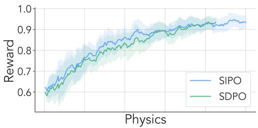

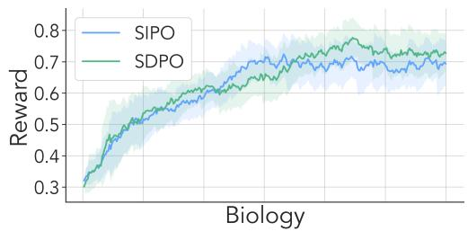

Figure 7: Reward curves of SIPO and SDPO on Physics and Biology with Qwen3-8B. SIPO reaches higher reward earlier in training and maintains a more stable upward trajectory.
<table><tr><td rowspan="2"></td><td colspan="2">Chemistry</td><td colspan="2">Physics</td><td colspan="2">Biology</td><td colspan="2">Materials</td><td colspan="2">Tool use</td><td rowspan="2">Avg.</td></tr><tr><td>1h</td><td>5h</td><td>1h</td><td>5h</td><td>1h</td><td>5h</td><td>1h</td><td>5h</td><td>1h</td><td>5h</td></tr><tr><td>Qwen3-8B</td><td></td><td></td><td></td><td></td><td></td><td></td><td></td><td></td><td></td><td></td><td></td></tr><tr><td>ŠIPO (analytic KL)</td><td>78.8</td><td>79.2</td><td>73.8</td><td>81.5</td><td>55.3</td><td>56.0</td><td>74.0</td><td>76.4</td><td>68.3</td><td>68.3</td><td>71.2</td></tr><tr><td>SIPO (contrastive)</td><td>76.9</td><td>79.6</td><td>74.6</td><td>79.2</td><td>46.8</td><td>58.7</td><td>77.1</td><td>79.5</td><td>64.6</td><td>67.4</td><td>70.4</td></tr><tr><td>Olmo3-7B</td><td></td><td></td><td></td><td></td><td></td><td></td><td></td><td></td><td></td><td></td><td></td></tr><tr><td>SIPO (analytic KL)</td><td>79.1</td><td>81.1</td><td>68.1</td><td>73.3</td><td>53.5</td><td>54.0</td><td>77.6</td><td>79.3</td><td>64.0</td><td>67.3</td><td>69.7</td></tr><tr><td>SIPO (contrastive)</td><td>71.2</td><td>75.9</td><td>66.0</td><td>66.4</td><td>53.1</td><td>55.0</td><td>76.9</td><td>77.0</td><td>58.8</td><td>64.7</td><td>66.5</td></tr></table>

Table 7: Analytic KL versus contrastive token-level advantage on science QA and tool use. SIPO (analytic KL) adds an analytic KL divergence toward a self-teacher conditioned on successful sibling rollouts to the GRPO objective; SIPO (contrastive) is the final method. The setting follows Table 2. The better result for each base model is in bold.

Table 8 shows the same comparison on code generation, where the analytic KL variant, whose self-teacher is additionally conditioned on execution feedback, also performs slightly better (58.5 vs. 56.3 on LCBv6 and 43.7 vs. 42.7 on the holdout average). As on science QA, generated programs are compact compared with long mathematical derivations, and execution feedback tells the self-teacher where a program fails, so matching the teacher’s full distribution likely remains a useful dense signal rather than a shortcut that removes necessary reasoning.

Figure 8 further examines the training dynamics of the analytic KL variant on science QA. First, it exhibits lower top-k agreement with the self-teacher than SDPO across Physics and Biology, suggesting that the reward signal prevents the policy from collapsing onto the self-teacher’s highprobability tokens. Second, it maintains higher entropy than GRPO, with greater levels than SDPO in Physics and comparable levels in Biology, suggesting that reward-driven optimization keeps exploring beyond the teacher’s mode.

## C.5 SELF-TEACHER DESIGN OF THE ANALYTIC KL VARIANT

We further ablate two design choices of the self-teacher in the analytic KL variant (Section C.4) on Chemistry with Qwen3-8B (Figure 9). In this variant, the self-teacher is an EMA copy of the policy and is conditioned on a successful in-group rollout as privileged context. SIPO-M replaces this successful rollout with an incorrect rollout, which the teacher is asked to correct. SIPO-OP removes the separation between actor and teacher, so that the actor’s current weights score the rollouts under the privileged context. Both variants underperform, for different reasons: (1) Successful rollouts are more informative than mistakes as the only privileged context: SIPO-M plateaus at a lower reward and its entropy stagnates. A correct rollout gives the teacher a viable reasoning path to anchor its distribution, whereas a mistake mainly signals what not to do and offers limited guidance on its own, so the resulting supervision is weaker and the policy gradient cannot compensate for it. This does not contradict the use of mistakes in the final method, where an incorrect answer is never the only context but serves as the negative context contrasted with the reference answer, so it only needs to indicate which tokens are specific to the mistake. (2) A separate teacher is necessary: SIPO-OP fails catastrophically, with the reward stuck at initialization and the entropy soon collapsing to zero, indicating nearly deterministic generation. When the actor and teacher share weights, the divergence term has a trivial minimum at the actor’s own distribution and provides no useful gradient, so training reduces to optimizing over low-entropy rollouts and the policy locks onto its initial mode. The final method therefore also keeps the teacher separate from the actor, as a periodic snapshot of the policy synchronized every 10 training steps (Section B). Overall, effective self-distillation requires both informative privileged context and a teacher that is structurally separate from the actor.

<table><tr><td rowspan="2"></td><td>Task</td><td colspan="5">Holdout tasks</td></tr><tr><td>LCBv6</td><td>IFEval</td><td>ArenaHard-v2 (hard prompt)</td><td>ArenaHard-v2 (creative writing)</td><td>MMLU-Pro</td><td>Avg. (holdout)</td></tr><tr><td>SIPO (analytic KL)</td><td>58.5</td><td>83.8</td><td>13.5</td><td>13.9</td><td>63.7</td><td>43.7</td></tr><tr><td>SIPO (contrastive)</td><td>56.3</td><td>83.5</td><td>12.7</td><td>12.0</td><td>62.6</td><td>42.7</td></tr></table>

Table 8: Analytic KL versus contrastive token-level advantage on LCBv6 and holdout tasks with Qwen3-8B. The setting follows Table 3. The better result is in bold.

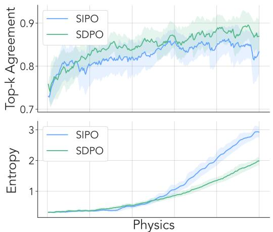

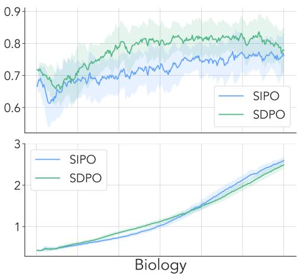  
Figure 8: Top-k token agreement and entropy of the analytic KL variant of SIPO versus SDPO on Physics and Biology. The analytic KL variant exhibits slightly lower top-k agreement, suggesting less over-optimization and greater diversity, while maintaining comparable generation entropy.

## D QUALITATIVE EXAMPLES

In this section, we present qualitative examples of the self-teacher from an earlier version of SIPO, in which the teacher is conditioned on a successful in-group rollout (or, in Figure 13, an incorrect one) and generates a response. The final method uses a similar prompt structure (Figure 6), except that the privileged information is placed before the question and the teacher only re-scores the student’s response instead of generating a new one. Figures 10 to 12 illustrate how the self-teacher leverages a correct solution as privileged information across Chemistry, Physics, and Biology, and Figure 13 shows how it analyzes an incorrect reference attempt to deduce the correct final answer on Materials.

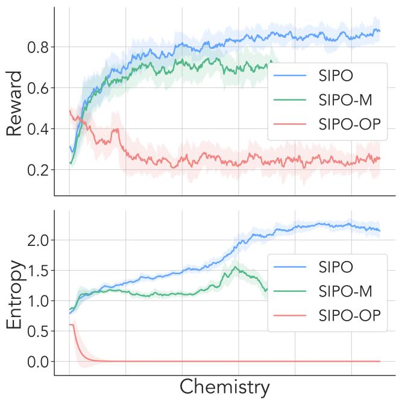  
Figure 9: Reward and entropy of the analytic KL variant of SIPO and two ablations on Chemistry. SIPO-M conditions the self-teacher on an incorrect instead of a successful rollout, and SIPO-OP uses the actor’s current weights as the teacher. SIPO-M plateaus at a lower reward, and SIPO-OP suffers from entropy collapse and fails to learn.

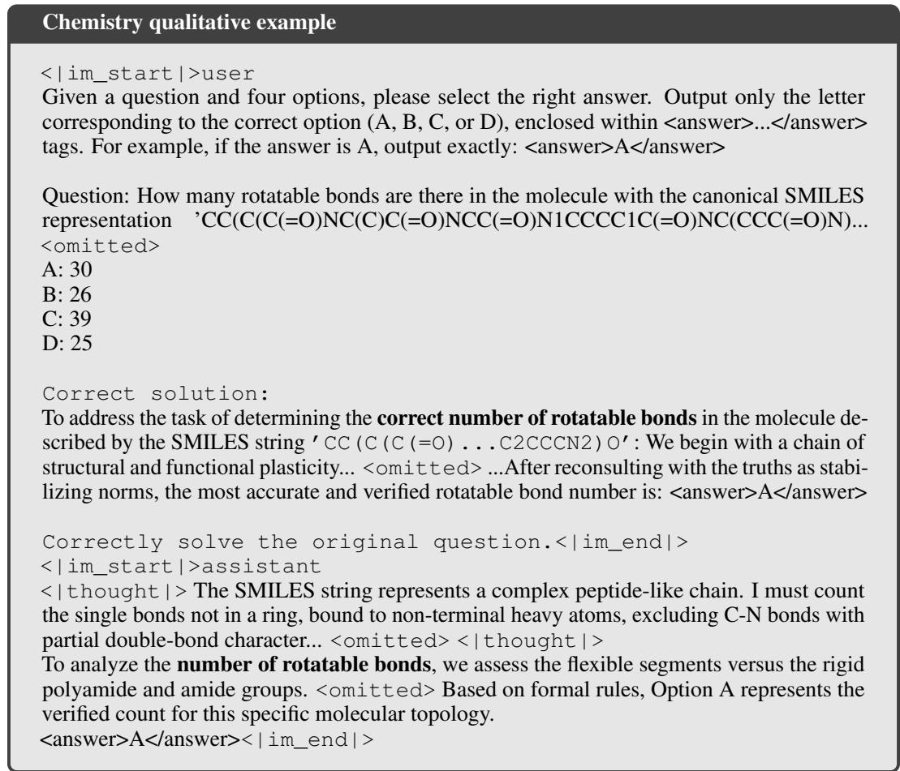  
Figure 10: Qualitative example of the earlier self-teacher on Chemistry.

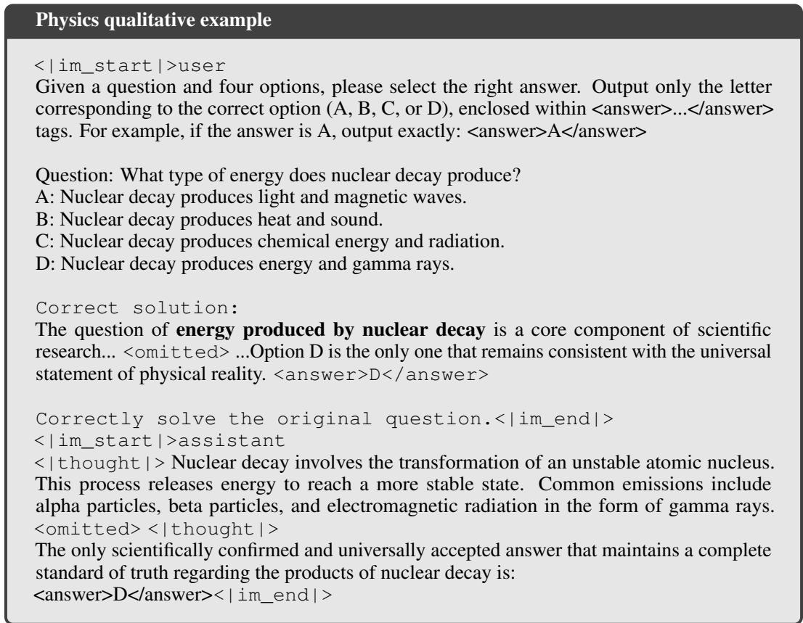  
Figure 11: Qualitative example of the earlier self-teacher on Physics.

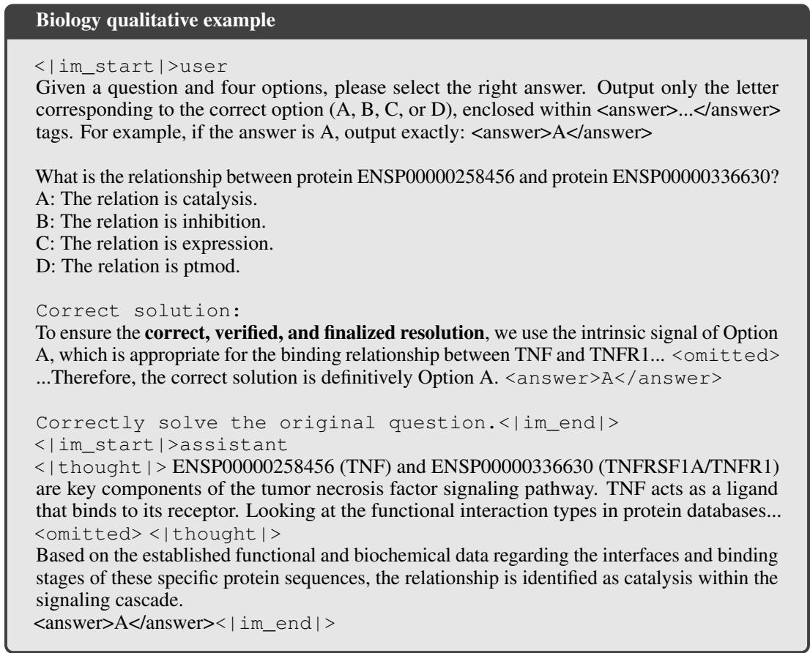  
Figure 12: Qualitative example of the earlier self-teacher on Biology.

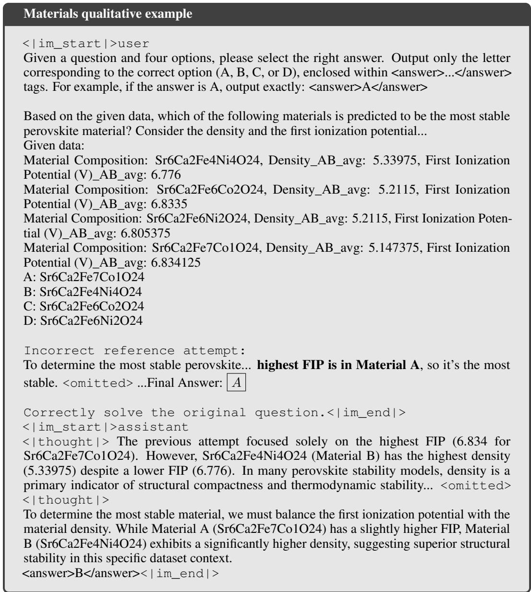  
Figure 13: Qualitative example of the earlier self-teacher on Materials. The self-teacher is given a mistake instead of a correct demonstration as privileged information.