# SemOPT: Fixing Semantic Errors in LLM-based Optimization Modeling via Reward-Guided Search

Zetong Zhou<sup>1,2∗</sup>, Wentao Zhang<sup>1,2∗</sup>, Jingyuan Wang<sup>1,2†</sup>, Yifan Yang<sup>1,2</sup>, Zizhuo Wang<sup>3</sup>, Shixi Hu<sup>4</sup>

<sup>1</sup>School of Computer Science and Engineering, Beihang University, Beijing, China <sup>2</sup>MIIT Key Laboratory of Data and Decision Intelligence, Beihang University, Beijing, China <sup>3</sup>School of Data Science, The Chinese University of Hong Kong, Shenzhen, China <sup>4</sup>Cardinal Operations Technology Co., Shanghai, China {ztzhou, jywang}@buaa.edu.cn

## Abstract

Operations research supports decision-making in domains such as energy, economics, and healthcare. Solving operations research problems typically begins with optimization modeling, which translates a natural-language problem description into executable solver code. LLMs offer a promising way to automate this process, but they remain prone to errors. In practice, these errors can be divided into two categories: syntactic errors refer to solver code that fails to run successfully or is judged infeasible by the solver; semantic errors refer to solver code that successfully returns an objective value but violates the intent of the original problem. Since semantic errors do not trigger runtime failures, they are difficult to detect and rectify. To address this problem, we introduce SemOPT, a semantic-guided framework for correcting LLM-based optimization models. SemOPT combines a semantic reward model that distinguishes faithful math models from plausible but incorrect ones with an adaptive correction system that applies hierarchical rewardguided search over the modeling space. Experiments on seven optimization modeling benchmarks show that SemOPT establishes a new state of the art and achieves an average 7.6% accuracy improvement over the strongest baseline on complex datasets.

## 1 Introduction

Operations research (OR) provides a fundamental methodology for decision-making in domains such as energy (Krishnamurthy et al., 2018), economics (Garcia and You, 2015), healthcare (Delgado et al., 2022), and beyond (Singh, 2012). Solving OR problems typically starts with optimization modeling, which translates a natural-language problem description into a math model and solver code (e.g., Gurobi) (Huang et al., 2025b). Constructing the model traditionally requires substantial domain expertise, but recent progress in LLMs has automated this process, with existing methods using fine-tuning or agent-based workflows to emulate human modeling processes (Jiang et al., 2025; Huang et al., 2025a; Ahmaditeshnizi et al., 2024; AhmadiTeshnizi et al., 2024).

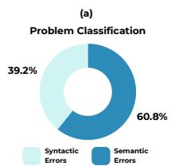

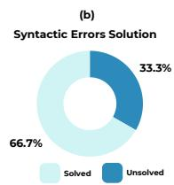

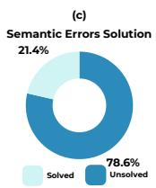  
Figure 1: (a) Distribution of syntactic versus semantic errors. (b)(c) Correction rates of syntactic and semantic errors via self-reflection.

Despite their promise, LLM-based modeling systems remain error-prone (Yang et al., 2026). We divide their failures into syntactic and semantic errors. Syntactic errors refer to solver code that fails to run successfully or is judged infeasible by the solver. These failures are directly exposed by execution or solver feedback. Semantic errors, in contrast, refer to solver code that runs successfully and returns an objective value but violates the intent of the original problem, typically through misunderstood constraints, incorrect objectives, or invalid modeling assumptions. These errors are harder to identify because execution feedback provides no explicit signal of the underlying logical mismatch. To quantify this issue, we prompt an LLM to generate solver code end-to-end on the optimization modeling benchmark IndustryOR (Huang et al., 2025a) and execute the generated codes to categorize failures. As shown in Figure 1, semantic errors are more prevalent than syntactic errors. Moreover, three rounds of self-reflection (Shinn et al., 2023) correct 66.7% of syntactic errors but only 21.4% of semantic errors, confirming that semantic errors are the main bottleneck.

Recent work has started to recognize the importance of correcting semantic errors in optimization modeling, with search-based methods providing the most instructive direction. Autoformulator (Astorga et al., 2025) uses Monte Carlo Tree Search(MCTS) to explore candidate math model components, while SolverLLM (Li et al., 2025) incrementally constructs math models over structured elements with outcome-guided search. These methods broaden the hypothesis space beyond singlepass generation, but two limitations remain. First, they often rely on general-purpose LLM evaluators, which are not specifically trained to distinguish semantically faithful math models from plausible but incorrect ones. Second, their search spaces are usually organized around fine-grained mathematical components, entangling high-level modeling decisions with low-level implementation details. As a result, when an error stems from an incorrect modeling strategy, these methods tend to revise local equations rather than backtrack to the reasoning step where the error actually originated.

To overcome these challenges, we propose SemOPT, a semantic-guided framework for correcting LLM-based optimization models. SemOPT first trains a semantic reward model to evaluate the logical faithfulness between a problem description and generated solver code. It then uses this reward signal to guide hierarchical search over three stages: modeling strategy, math model, and solver code, allowing the framework to revise errors at the appropriate level of abstraction. Finally, an adaptive gating mechanism triggers search only when the initial solver code falls below the semantic confidence threshold, reducing unnecessary computation on straightforward instances. Experiments across seven benchmarks show that SemOPT establishes a new state of the art on most datasets.

Our contributions are summarized as follows:

• We identify semantic errors as a core bottleneck in LLM-based optimization modeling and design a dedicated semantic reward model for error localization and faithfulness evaluation.

• We introduce a semantic-guided correction mechanism that uses the reward model to guide hierarchical search, and an adaptive gating mechanism balances accuracy and inference cost.

• Extensive experiments across seven benchmarks demonstrate that SemOPT achieves a 7.6% accuracy improvement over the strongest baseline on complex datasets.

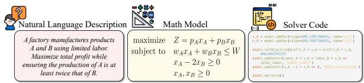  
Figure 2: Overview of the three stages in optimization modeling process.

## 2 Preliminaries and Framework

## 2.1 Notation

As illustrated in Figure 2, optimization modeling successively connects three objects: a naturallanguage description, a math model, and a solver code (Yang et al., 2024).

Natural Language Description. Let P denote the input problem description. It specifies the optimization context, parameters, objective intent, decision logic, and constraints in natural language.

Math Model. A math model M formalizes P through decision variables x, an objective f(x), and constraints. Let $\mathbf { 0 } ( \pmb { x } ) ~ \le ~ \mathbf { 0 }$ and $\mathbf { \boldsymbol { h } } ( \mathbf { \boldsymbol { x } } ) = \mathbf { \boldsymbol { 0 } }$ denote inequality and equality constraints, respectively. Formally, M is formulated as:

$$
\operatorname* { m i n } _ { \mathbf { x } } f ( { \pmb x } ) , \quad \mathrm { s . t . } { \pmb g } ( { \pmb x } ) \leq \mathbf { 0 } , \quad h ( { \pmb x } ) = \mathbf { 0 } .\tag{1}
$$

Solver Code. Let C denote executable solver code that implements M, including the variables, objective, and constraints. Executing C with a solver returns an objective value y or an execution failure.

## 2.2 Problem Statement

Automated optimization modeling asks an LLM parameterized by θ to map a problem description P to solver code C, denoted as $C \sim p _ { \theta } ( \cdot | P )$ . The desired output must satisfy two requirements: it should be executable, and the implemented model should be semantically faithful to P. We therefore distinguish two failure modes.

Syntactic Error. A syntactic error occurs when C fails to run successfully or is judged infeasible by the solver. In this case, the failure is directly exposed by execution or solver feedback.

Semantic Error. A semantic error occurs when C runs successfully and returns an objective value y, but the implemented math model is not faithful to the intent of P. Such errors arise from semanticlevel modeling mismatches, including misunderstood constraints, incorrect objectives, or invalid modeling assumptions.

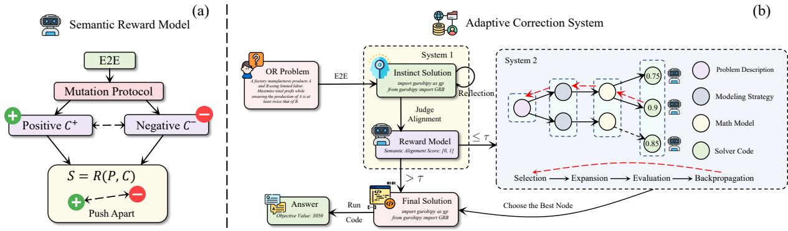  
Figure 3: Overview of the SemOPT framework. (a) Training pipeline of the semantic reward model. (b) Inference architecture of the adaptive correction system.

## 2.3 Framework Overview

As illustrated in Figure 3, SemOPT corrects semantic errors with a semantic reward model and an adaptive correction system. Figure 3(a) shows how the reward model is trained to evaluate logical consistency, while Figure 3(b) shows how the trained model guides inference-time correction.

Given a problem description P, SemOPT first samples initial solver code $C _ { i n i t } \sim p _ { \theta } ( \cdot | P )$ . It then applies a solver-informed evaluation: the code is executed, and if a syntax error occurs, the error message is appended to the context for up to $K = 3$ rounds of reflection until the code runs or the budget is exhausted. The final confidence score is $S = \mathbb { I } ( C ) \cdot R ( P , C )$ , where $\mathbb { I } ( C ) = 1$ if the code executes successfully after reflection and 0 otherwise, and R is the semantic reward model. The resulting score for the initial solver code is $S _ { i n i t } = \mathbb { I } ( C _ { i n i t } ) \cdot R ( P , C _ { i n i t } )$

Next, SemOPT applies an adaptive gate with threshold τ. If $S _ { i n i t } > \tau$ , the framework accepts $C _ { i n i t }$ and stops, avoiding unnecessary computation. If $S _ { i n i t } \le \tau$ , the initial solver code falls below the semantic confidence threshold, and SemOPT activates semantic-guided MCTS. The search decomposes correction into modeling strategy, mathematic model, and solver code, uses R as the value signal to navigate the tree, and returns refined solver code C.

## 3 Semantic Reward Model

We train a semantic reward model R to assess whether generated solver code is faithful to the input problem. We instantiate R with a pre-trained LLM backbone (Michailidis et al., 2024) and replace the language modeling head with a value head that outputs a continuous scalar. During inference, this scalar is normalized with a sigmoid function to produce a confidence score in [0, 1] for adaptive gating. During training, the raw value is used in the contrastive objective. The training pipeline consists of two steps: constructing preference data and learning R from pairwise comparisons.

## 3.1 Data Construction

We construct a preference dataset $\mathcal { D } _ { p r e f }$ from $\mathcal { D } _ { b a s e } = \{ ( P _ { k } , y _ { k } ^ { * } ) \} _ { k = 1 } ^ { K }$ , where $P _ { k }$ is a problem description and $y _ { k } ^ { * }$ is the optimal value. For each problem, we define one preference entry as

$$
\mathcal { E } _ { k } = ( P _ { k } , \mathcal { C } _ { k } ^ { + } , \mathcal { C } _ { k } ^ { - } ) .\tag{2}
$$

Here, $\mathcal { C } _ { k } ^ { + }$ contains solver code that runs successfully, is semantically faithful to $P _ { k }$ , and returns $y _ { k } ^ { * } .$ whereas $\mathcal { C } _ { k } ^ { - }$ contains solver code that runs successfully and returns objective values but is semantically incorrect. The full dataset is

$$
\mathcal { D } _ { p r e f } = \{ \mathcal { E } _ { 1 } , \mathcal { E } _ { 2 } , \ldots , \mathcal { E } _ { K } \} .\tag{3}
$$

Trajectory Collection. For each $P _ { k }$ , we sample $N _ { \mathrm { c a n d } }$ candidate solver code instances $\{ C _ { k , i } \} _ { i = 1 } ^ { N _ { \mathrm { c a n d } } }$ from the generator $p _ { \theta } ( \cdot | P _ { k } )$ and execute each candidate to obtain an objective value ${ \hat { y } } _ { k , i }$ . Let $r _ { k , i } =$ $| \hat { y } _ { k , i } - y _ { k } ^ { * } | / | y _ { k } ^ { * } |$ . After discarding candidates that fail to run or are judged infeasible by the solver, we initialize the preference sets according to objectivevalue correctness:

$$
\begin{array} { r l } & { C _ { k , i } \in \mathcal { C } _ { k } ^ { + } \iff r _ { k , i } < 1 0 ^ { - 6 } , } \\ & { C _ { k , i } \in \mathcal { C } _ { k } ^ { - } \iff r _ { k , i } \geq 1 0 ^ { - 6 } . } \end{array}\tag{4}
$$

Only candidates that run successfully and return objective values are retained, so $\mathcal { C } _ { k } ^ { - }$ captures semantic rather than syntactic failures.

Trajectory Augmentation. Natural sampling covers frequent errors but leaves long-tail semantic traps underrepresented. We therefore augment each entry $\mathcal { E } _ { k }$ with hard negatives produced by targeted mutations (Li et al., 2026). For each positive code instance $C \in \mathcal { C } _ { k } ^ { + }$ , we sample L mutation operators $\{ m _ { \ell } \} _ { \ell = 1 } ^ { L }$ from Table 9 in Appendix B.1. Each operator is injected into C independently, producing L mutated code instances $\{ \bar { C } _ { \ell } \} _ { \ell = 1 } ^ { L }$ . Candidates that fail to run or are judged infeasible by the solver are discarded, and the remaining mutants that return objective values are added to $\mathcal { C } _ { k } ^ { - }$ as hard semantic negatives. This augmentation forces R to distinguish faithful math models from structurally plausible but semantically wrong solver code.

## 3.2 Contrastive Training

The reward model R is trained to measure semantic consistency between a problem description P and solver code C. A straightforward approach is supervised fine-tuning (SFT) (Dong et al., 2024), which assigns label 1 to $C \in \mathcal { C } _ { k } ^ { + }$ and label 0 to $C \in \mathcal { C } _ { k } ^ { - }$ This formulation trains on individual labeled examples, limiting the amount of supervision and making the model more prone to surface-pattern fitting rather than generalization.

We therefore train R with a Bradley-Terry pairwise objective (Sun et al., 2025). For each entry $\mathcal { E } _ { k }$ we sample a winner $C _ { w i n }$ from the correct code set $\mathcal { C } _ { k } ^ { + }$ and a loser $C _ { l o s e }$ from the incorrect code set $\mathcal { C } _ { k } ^ { - }$ . This pairwise construction expands the effective training set by pairing correct code instances with multiple incorrect ones, and it reduces the tendency to fit surface patterns in individual labeled examples. We define the reward margin as

$$
\Delta _ { \theta } = R _ { \theta } ( P _ { k } , C _ { w i n } ) - R _ { \theta } ( P _ { k } , C _ { l o s e } ) .\tag{5}
$$

The semantic reward model is optimized by minimizing the negative log-likelihood of the winner being preferred over the loser:

$$
\mathcal { L } ( \boldsymbol { \theta } ) = - \mathbb { E } _ { ( P _ { k } , C _ { w i n } , C _ { l o s e } ) \sim \mathcal { D } _ { p r e f } } [ \log \sigma ( \Delta _ { \boldsymbol { \theta } } ) ] .\tag{6}
$$

Here, $\sigma ( \cdot )$ is the sigmoid function. This objective trains R to assign higher semantic consistency scores to faithful solver code than to solver code that runs successfully and returns objective values but is semantically incorrect.

## 4 Adaptive Correction System

Using the semantic signal from R, we build an adaptive correction system that repairs semantic errors through hierarchical search while controlling inference cost to remain acceptable. The system balances single-pass generation and deeper reasoning with an adaptive gate (Ji et al., 2026): initial solver code with high semantic confidence is accepted directly, whereas lower-confidence code is routed to MCTS-based correction.

## 4.1 Gating via Direct Inference

Given a problem description $P ,$ we first sample initial solver code from the generator, denoted as $C _ { i n i t } \sim p _ { \theta } ( \cdot | P )$ . Then the code is executed, reflected upon for up to K rounds if syntax errors arise, and scored as $S _ { i n i t } = \mathbb { I } ( C _ { i n i t } ) \cdot R ( P , C _ { i n i t } )$ Given a threshold τ , the gate compares $S _ { i n i t }$ against τ to determine the final solver code C:

$$
C = \left\{ \begin{array} { l l } { C _ { i n i t } , } & { S _ { i n i t } > \tau , } \\ { \mathrm { M C T S } ( P ) , } & { S _ { i n i t } \leq \tau . } \end{array} \right.\tag{7}
$$

When $S _ { i n i t } > \tau$ , the system returns $C _ { i n i t }$ directly and avoids additional inference. Otherwise, the initial solver code falls below the semantic confidence threshold, and the system activates the hierarchical search described below for correction.

## 4.2 Hierarchical Decomposition

When search is triggered, we use MCTS to explore the hypothesis space (Ding et al., 2025). Prior search-based methods are themselves hierarchical over formulation components such as decision variables, objectives, and constraints (Astorga et al., 2025), but their search stays within a single level of modeling abstraction. In contrast, our search follows the modeling process of human OR experts. It decomposes solver code generation into a threestage trajectory $\boldsymbol { S } = ( \boldsymbol { v } ^ { ( 1 ) } , \boldsymbol { \mathsf { \bar { v } } } ^ { ( 2 ) } , \boldsymbol { v } ^ { ( 3 ) } )$ , organized as a search tree $\tau$ rooted at v<sup>(0)</sup>:

• Modeling Strategy $( v ^ { ( 1 ) } )$ defines decision variables and selects the optimization framework, such as LP or MILP.

• Math Model $( v ^ { ( 2 ) } )$ mathematically formalizes the objective and constraints.

• Solver Code $( v ^ { ( 3 ) } )$ implements the math model as executable solver code C.

This hierarchy factorizes the generation policy as

$$
\pi _ { \boldsymbol { \theta } } ( \boldsymbol { S } | \boldsymbol { P } ) = \prod _ { k = 1 } ^ { 3 } \pi _ { \boldsymbol { \theta } } ( v ^ { ( k ) } | v ^ { ( < k ) } , P ) ,\tag{8}
$$

where $v ^ { ( < k ) } = \{ v ^ { ( 0 ) } , \ldots , v ^ { ( k - 1 ) } \}$ denotes the partial modeling history. This decomposition enables MCTS to revise high-level modeling choices before committing to equations or code.

## 4.3 MCTS Process

The MCTS procedure, detailed in Algorithm 1 in Appendix $\mathbf { A } ,$ starts from the root $\boldsymbol { v } ^ { ( 0 ) }$ of the hierarchical tree $\tau$ . Each node v stores a visit count $N ( v )$ and an estimated semantic value $Q ( v )$ , both initialized to zero. Each iteration contains four phases as follows.

1. Selection. Starting from $v ^ { ( 0 ) }$ , the algorithm follows the child with the largest UCT score until reaching a leaf v˜:

$$
U C T ( v ^ { ( i + 1 ) } ) = Q ( v ^ { ( i + 1 ) } ) + \omega \cdot \sqrt { \frac { \ln N ( v ^ { ( i ) } ) } { N ( v ^ { ( i + 1 ) } ) + \epsilon } } ,\tag{9}
$$

where $\omega$ controls exploration and ϵ prevents division by zero. For newly expanded nodes that have not yet received semantic rewards, we follow Autoformulator (Astorga et al., 2025) and use the same LLM as the policy network to assign initial prior scores. These priors support the cold-start choice among unscored successors.

2. Expansion. If v˜ is non-terminal at depth i, we expand it by sampling H successors from the policy network:

$$
v _ { j } ^ { ( i + 1 ) } \sim \pi _ { \theta } ( \cdot | \tilde { v } , P ) , \quad j \in \{ 1 , \dots , H \} .\tag{10}
$$

These nodes are added to $\tau ,$ and the successor with the highest LLM prior is selected as $v ^ { * }$ for simulation. If v˜ is already terminal, we set $v ^ { * } = \tilde { v }$ The prompts for each expansion layer are provided in Appendix I.

3. Simulation. Starting from $v ^ { * }$ , the rollout recursively samples lower-level states until a terminal solver code C is obtained. The system then applies the same solver-informed evaluation: $C$ is executed, and upon syntax errors, the model reflects with appended error messages for up to K rounds. The final reward is computed as $S =$ $\mathbb { I } ( C ) \cdot R ( P , C )$ , where $\mathbb { I } ( C ) = 1$ if the code runs successfully after reflection and 0 otherwise.

4. Backward. The score S is propagated from $v ^ { * }$ to $\boldsymbol { v } ^ { ( 0 ) }$ . For every node v on this path, we update:

$$
\begin{array} { l } { { N ( v )  N ( v ) + 1 , } } \\ { { Q ( v )  Q ( v ) + \displaystyle \frac { S - Q ( v ) } { N ( v ) } . } } \end{array}\tag{11}
$$

The process repeats iteratively until the budget $T _ { m a x }$ is exhausted.

In this way, MCTS repeatedly rolls out partial modeling states to terminal solver code and transfers semantic consistency scores back to intermediate nodes. The resulting $Q ( v )$ values estimate how semantically promising each modeling branch is, therefore enabling the search to suppress flawed intermediate choices and converge efficiently toward a correct solver code.

## 5 Experiments

We evaluate SemOPT through the following three research questions:

• RQ1: Overall Performance. How does SemOPT compare with baselines across benchmarks?

• RQ2: Component Analysis. Are the proposed modules effective, and does SemOPT generalize across LLM backbones?

• RQ3: Efficiency. How does SemOPT trade off accuracy and computational cost?

## 5.1 Experimental Setup

Datasets. We evaluate on seven benchmarks (Xiao et al., 2025) divided into two groups: (1) Standard Datasets: NL4Opt (Ramamonjison et al., 2022), NL4LP (Ahmaditeshnizi et al., 2024), EasyLP (Huang et al., 2025b), and ReSocratic (Yang et al., 2025c), which primarily contain standard linear programming problems; and (2) Complex Datasets: IndustryOR (Huang et al., 2025a), ComplexLP (Huang et al., 2025b), and ComplexOR (Xiao et al., 2024), which include implicit constraints, long-context descriptions and serve as the primary testbed for semantic alignment.

Baselines. We compare SemOPT with ten baselines in four groups: (1) Standard: Standard Prompting and Self-Reflection (Shinn et al., 2023); (2) Workflow: OptiMUS (AhmadiTeshnizi et al., 2024), Chain-of-Experts (Xiao et al., 2024), OptiTree (Liu et al., 2025), and SAC-Opt (Zhang et al., 2025); (3) Fine-tuned: ORLM (Huang et al., 2025a) and SIRL (Chen et al., 2025); (4) Search-based: Autoformulator (Astorga et al., 2025) and Solver-LLM (Li et al., 2025). For fairness, all baselines use the same policy model and search settings as SemOPT, except the fine-tuned baselines, which use their own fine-tuned models.

Implementation Details. We instantiate the policy networks $( p _ { \theta } , \pi _ { \theta } )$ with GPT-4.1 Nano and finetune the semantic reward model R from Qwen3- 4B-Instruct-2507 (Yang et al., 2025a). We report Accuracy, counting a solution as correct when its solver result differs from the ground truth by less than 10<sup>−6</sup>. We also report two sampling metrics: Pass@N (P@N), the probability that at least one of N samples is correct, and Best-of-N (BoN), the accuracy of the best solution selected by the reward model. Appendix B provides the remaining implementation details.

Table 1: Main results on seven optimization benchmarks. The best results are highlighted in bold, and the secondbest results are underlined. Red arrows indicate absolute performance gains over the strongest baseline.
<table><tr><td rowspan="2">Category</td><td rowspan="2">Method</td><td colspan="4">Standard Datasets</td><td colspan="3">Complex Datasets</td></tr><tr><td>NL4Opt</td><td>NL4LP</td><td>EasyLP</td><td>ReSocratic</td><td>IndustryOR</td><td>ComplexLP</td><td>ComplexOR</td></tr><tr><td rowspan="2">Standard</td><td>Prompting</td><td>65.4%</td><td>75.8%</td><td>87.2%</td><td>67.5%</td><td>47.6%</td><td>41.4%</td><td>44.4%</td></tr><tr><td>Reflection</td><td>65.0%</td><td>76.4%</td><td>87.2%</td><td>68.0%</td><td>54.8%</td><td>39.6%</td><td>38.9%</td></tr><tr><td rowspan="4">Workflow</td><td>OptiMUS</td><td>79.0%</td><td>90.5%</td><td>93.6%</td><td>78.7%</td><td>57.1%</td><td>45.1%</td><td>59.3%</td></tr><tr><td>Chain-of-Experts</td><td>74.8%</td><td>90.5%</td><td>93.2%</td><td>79.4%</td><td>59.5%</td><td>46.0%</td><td>50.0%</td></tr><tr><td>OptiTree</td><td>73.8%</td><td>82.0%</td><td>93.4%</td><td>72.5%</td><td>47.6%</td><td>73.8%</td><td>63.0%</td></tr><tr><td>SAC-Opt</td><td>85.1%</td><td>95.5%</td><td>94.3%</td><td>89.3%</td><td>57.1%</td><td>74.8%</td><td>55.6%</td></tr><tr><td rowspan="2">Fine-tuned</td><td>ORLM</td><td>73.8%</td><td>76.4%</td><td>90.4%</td><td>61.8%</td><td>42.9%</td><td>59.5%</td><td>50.0%</td></tr><tr><td>SIRL</td><td>86.4%</td><td>95.5%</td><td>98.1%</td><td>87.8%</td><td>45.2%</td><td>80.2%</td><td>44.4%</td></tr><tr><td rowspan="2">Search-based</td><td>Autoformulator</td><td>76.2%</td><td>85.4%</td><td>94.9%</td><td>79.4%</td><td>49.2%</td><td>52.3%</td><td>48.1%</td></tr><tr><td>SolverLLM</td><td>82.7%</td><td>88.8%</td><td>94.5%</td><td>83.1%</td><td>50.8%</td><td>68.5%</td><td>57.4%</td></tr><tr><td rowspan="2">Ours</td><td>SemOPT (BoN)</td><td>87.9% (↑1.5%)</td><td>96.1% (↑0.6%)</td><td>97.6%</td><td>89.8% (↑0.5%)</td><td>64.3% (↑4.8%)</td><td>82.9% (↑2.7%)</td><td>66.7% (↑3.7%)</td></tr><tr><td>SemOPT (P@N)</td><td>91.1% (↑4.7%)</td><td>99.4% (↑3.9%)</td><td>98.5% (↑0.4%)</td><td>93.1% (↑3.8%)</td><td>66.7% (↑7.2%)</td><td>86.5% (↑6.3%)</td><td>72.2% (↑9.2%)</td></tr></table>

## 5.2 Overall Performance

Main Results. As shown in Table 1, SemOPT obtains the best results on most datasets, with especially clear gains on complex benchmarks. On ComplexOR, SemOPT reaches 72.2% accuracy, surpassing the strongest baseline by 9.2%. The small gap between the Best-of-N and Pass@N results of SemOPT shows that the reward model reliably selects semantically faithful candidates when they appear in the sampled set.

We make further observations as follows: 1) Standard and workflow methods lag behind on complex applied datasets, showing that generation or workflow decomposition alone is insufficient without a semantic verification signal. 2) Fine-tuned methods, especially SIRL, are strong on simpler datasets but less consistent on complex tasks, indicating that fine-tuning helps translate explicit requirements but still misses implicit constraints in long-context problems. 3) Search-based methods improve over single-pass generation but remain below SemOPT. Their reliance on general-purpose evaluators and on flat search makes recovery from strategy-level modeling errors difficult, whereas SemOPT backtracks across modeling strategy, math model, and code.

Objective-value matching is the standard protocol on these benchmarks, but it can credit a semantically incorrect formulation whenever that formulation happens to attain the same optimum. We therefore additionally validate SemOPT at the formulation level on 100 LP problems with reference formulations, scoring predictions by graph edit distance and human audit alongside objective matching. SemOPT improves over the strongest fine-tuned baseline under all three criteria, indicating that the gains extend to formulation faithfulness rather than final-answer matching alone. Appendix D details the protocol and the full results.

Robustness Analysis. We next recalibrate difficulty labels. Existing labels often depend on the number of constraints rather than the difficulty of finding a correct solution, yielding weak correlation with actual solver accuracy (Xiao et al., 2025). We therefore sample three solutions from the direct generator p<sub>θ</sub>(C|P) and label an instance as Easy if all three samples are correct, Hard if none are correct, and Medium otherwise. This definition aligns difficulty with single-pass generation success.

Table 1 shows that SIRL is the best or near-best baseline on multiple datasets, so we use it as the strongest baseline for the robustness comparison. The results in Table 2 show that SemOPT achieves clear improvements over SIRL on complex datasets. Except for the Medium subset of ComplexOR, which contains only a small number of instances, we can also notice that the improvement generally becomes larger as difficulty increases. This pattern supports the role of semantic-guided search in correcting hard cases where implicit requirements and high-level modeling decisions often cause errors.

## 5.3 Component Analysis

We evaluate three variants to isolate the contribution of each component: (1) Backbone Variants, which replace the generation backbone with Gemini-2.5-Flash-Lite, GPT-4.1 mini, and Qwen3- Max, testing whether the correction framework generalizes across LLM backbones; (2) Critic Variants, which replace the fine-tuned semantic reward model with either the generation backbone (GPT-4.1 Nano) or the reward-model backbone (Qwen3- 4B-Instruct-2507) during MCTS evaluation, testing whether the trained reward model provides a stronger semantic value signal; (3) Adaptive Gating Ablation, which removes the confidence threshold and runs MCTS for all queries, testing whether adaptive gating reduces unnecessary inference cost.

Table 2: Accuracy (Best-of-N) across difficulty levels. We compare SemOPT against the single strongest baseline (SIRL) on Easy, Medium, and Hard subsets.
<table><tr><td>Dataset</td><td>Difficulty</td><td>SIRL</td><td>SemOPT</td></tr><tr><td rowspan="2">NL4Opt</td><td>Easy</td><td>93.6%</td><td>94.4% (↑0.8%)</td></tr><tr><td>Medium Hard</td><td>82.0% 69.2%</td><td>84.0% (↑2.0%)</td></tr><tr><td rowspan="4">ComplexLP</td><td>Easy</td><td>88.6%</td><td>71.8% (↑2.6%) 88.6% (+0.0%)</td></tr><tr><td>Medium</td><td>94.1%</td><td>97.1% (↑3.0%)</td></tr><tr><td>Hard</td><td>54.5%</td><td></td></tr><tr><td></td><td></td><td>63.6% (↑9.1%)</td></tr><tr><td rowspan="3">ComplexOR</td><td>Easy</td><td>55.6%</td><td>77.8% (↑22.2%)</td></tr><tr><td>Medium</td><td>50.0%</td><td> $5 0 . 0 \% \left( + 0 . 0 \% \right)$ </td></tr><tr><td>Hard</td><td>28.6%</td><td>57.1% (↑28.5%)</td></tr></table>

Backbone Variants. Table 3 presents the performance gains across diverse LLM backbones. SemOPT consistently outperforms standard prompting in Best-of-N settings across all tested generators. These gains indicate that the semantic correction framework generalizes across LLM backbones rather than depending on a single generator.

Because the fine-tuned baselines use their own specialized generators whereas SemOPT uses GPT-4.1 Nano, we further control for the generator itself. Keeping the semantic reward model, the adaptive gate, and the MCTS procedure fixed, we replace only SemOPT’s generator with the fine-tuned models of ORLM and SIRL. As reported in Table 4, SemOPT outperforms ORLM and SIRL on all three datasets. The improvements reflect the correction framework rather than the choice of generator.

Critic Variants. We examine the role of the semantic reward model from two angles: discrimination quality and downstream search accuracy. For discrimination quality, we evaluate whether the reward model distinguishes semantically faithful solver code from incorrect executable solver code. The test set is constructed from single-pass generation on NL4Opt, ComplexLP, and ComplexOR.

Table 3: Performance across LLM backbones. We compare SemOPT with standard prompting in BoN settings.
<table><tr><td>Backbone LLM</td><td>Method</td><td>NL4Opt</td><td>ComplexLP</td><td>ComplexOR</td></tr><tr><td>Gemini-2.5</td><td>Prompting (BoN)</td><td>70.1%</td><td>64.0%</td><td>55.6%</td></tr><tr><td>Flash-Lite</td><td>SemOPT (BoN)</td><td>79.0%</td><td>75.7%</td><td>63.0%</td></tr><tr><td rowspan="2">GPT-4.1 mini</td><td>Prompting (BoN)</td><td>74.8%</td><td>64.8%</td><td>55.6%</td></tr><tr><td>SemOPT (BoN)</td><td>86.9%</td><td>79.3%</td><td>66.7%</td></tr><tr><td rowspan="2">Qwen3-Max</td><td>Prompting (BoN)</td><td>76.2%</td><td>66.7%</td><td>55.6%</td></tr><tr><td>SemOPT (BoN)</td><td>88.8%</td><td>82.0%</td><td>66.7%</td></tr></table>

Table 4: Fine-tuned generator control on complex datasets. We replace only SemOPT’s generator with the fine-tuned models of ORLM and SIRL.
<table><tr><td>Variant</td><td>IndustryOR</td><td>ComplexLP</td><td>ComplexOR</td></tr><tr><td>ORLM</td><td>42.9%</td><td>59.5%</td><td>50.0%</td></tr><tr><td>SemOPT w/ ORLM generator</td><td>61.9%</td><td>74.8%</td><td>66.7%</td></tr><tr><td>SIRL</td><td>45.2%</td><td>80.2%</td><td>44.4%</td></tr><tr><td>SemOPT w/ SIRL generator</td><td>66.7%</td><td>85.6%</td><td>66.7%</td></tr></table>

As shown in Table 5, the fine-tuned reward model achieves the highest AUC/F1 on all three datasets compared with both its unfine-tuned backbone and the policy LLM used for generation.

For downstream search accuracy, Figure 4(a) breaks down model outputs into correct solutions, syntactic errors, and semantic errors under different critic models. The fine-tuned semantic reward model not only achieves the highest proportion of correct solutions across all benchmarks, but also yields a lower share of semantic errors compared to both the unfine-tuned base model and generalpurpose LLM. This confirms that the reward model provides more precise semantic signals, guiding the search toward semantically consistent solutions.

Because SemOPT differs from prior search-based methods in both evaluation and search structure, Table 6 separates their effects. Both controls use SemOPT’s semantic reward model. RM-only reranking samples the same number of end-to-end solver-code candidates and selects one without search, whereas Autoformulator-style + Semantic RM applies MCTS to formulation components such as variables, objectives, and constraints, without SemOPT’s strategy–math-model–code hierarchy. RM-only reranking performs worst, showing that reward-guided selection alone is insufficient. The Autoformulator-style variant narrows the gap, but SemOPT remains better, supporting the value of the correction hierarchy. Conversely, replacing the reward model with a general LLM critic while keeping the SemOPT hierarchy reduces performance by 4.8, 4.5, and 5.6 points. The evaluator and hierarchy therefore provide complementary gains.

Table 5: Reward-model discrimination performance. Each cell reports AUC / F1.
<table><tr><td>Dataset</td><td>Qwen3-4B Instruct-2507</td><td>GPT-4.1 Nano</td><td>SemOPT RM</td></tr><tr><td>NL4Opt</td><td>0.546 / 0.781</td><td>0.596 / 0.776</td><td>0.744 / 0.849</td></tr><tr><td>ComplexLP</td><td>0.619 / 0.760</td><td>0.701 / 0.785</td><td>0.820 / 0.800</td></tr><tr><td>ComplexOR</td><td>0.576 / 0.667</td><td>0.611 / 0.696</td><td>0.833 / 0.778</td></tr></table>

Table 6: Factorizing the semantic evaluator and the correction hierarchy on complex datasets (BoN accuracy).
<table><tr><td>Variant</td><td>IndustryOR</td><td>ComplexLP</td><td>ComplexOR</td></tr><tr><td>Autoformulator</td><td>49.2%</td><td>52.3%</td><td>48.1%</td></tr><tr><td>RM-only reranking</td><td>52.4%</td><td>50.5%</td><td>44.4%</td></tr><tr><td>Autoformulator-style + Semantic RM</td><td>61.9%</td><td>68.5%</td><td>61.1%</td></tr><tr><td>SemOPT hierarchy + general LLM</td><td>59.5%</td><td>78.4%</td><td>61.1%</td></tr><tr><td>SemOPT</td><td>64.3%</td><td>82.9%</td><td>66.7%</td></tr></table>

Adaptive Gating Ablation. Figure 4(b) analyzes the trade-off between accuracy and inference cost. This ablation removes the gate and runs MCTS for every query. This change increases API calls substantially: on NL4Opt, w/o Gating uses about 2.6× more calls than the full framework while improving accuracy by less than 1%. Average API calls also increase as dataset difficulty increases from NL4Opt to ComplexOR, indicating that the gate allocates more search budget to harder tasks.

## 5.4 Efficiency

We evaluate efficiency from two perspectives: whether SemOPT improves over common iterative and search baselines under comparable budgets, and whether reward-guided search avoids the cost of exhaustive hypothesis enumeration.

Comparison with Iterative and Search Baselines. Table 7 compares SemOPT with two classic iterative and search baselines, Self-Refinement (SR) and Beam Search (BS), on the combined hard subsets of NL4Opt, ComplexLP, and ComplexOR. To evaluate the efficiency of SemOPT itself, we set the iteration count of SR and the beam-search budget of BS so that both baselines use no less inference cost than SemOPT. Under this setting, SemOPT achieves the highest accuracy while using less time and fewer API calls. This result shows that the improvement of SemOPT comes from more effective semantic reward-guided correction rather than a larger inference budget.

Comparison with Exhaustive Search. We next compare SemOPT with a brute-force Naive Search (NS) baseline that exhaustively evaluates a fixed candidate space. As shown in Table 8, NS obtains slightly higher accuracy on NL4Opt and ComplexLP, but requires 84 API calls per instance. SemOPT matches NS on ComplexOR and trails it by only 0.9 average accuracy points across the three datasets, while reducing API calls to 12–19% of NS. These results show that SemOPT preserves nearly the same accuracy as exhaustive search but avoids most of its inference cost.

(b)  
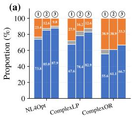  
Correct Syntactic Error Semantic Error 1 Qwen3-4B 2 GPT-4.1 Nano 3 SemOPT RM

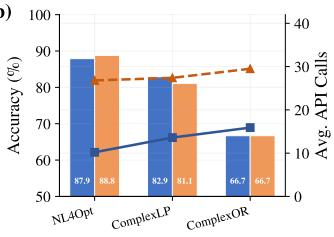  
SemOPT (Acc.) w/o Gating (Acc.) SemOPT (Calls) w/o Gating (Calls)  
Figure 4: (a) Breakdown of model outputs under different critic models. (b) Efficiency evaluation of the adaptive gating mechanism.

Table 7: Efficiency comparison with iterative and search baselines on the combined hard subsets of NL4Opt, ComplexLP, and ComplexOR.
<table><tr><td>Method</td><td>Acc.</td><td>Time (s)</td><td>API Calls</td></tr><tr><td>SR (25 iters)</td><td>55.7%</td><td>61.2</td><td>26.0</td></tr><tr><td>BS (beam 2, branch 5)</td><td>63.3%</td><td>38.9</td><td>30.0</td></tr><tr><td>SemOPT</td><td>67.1%</td><td>32.3</td><td>25.1</td></tr></table>

Comparison with Pass@N Scaling. Figure 5 further compares SemOPT with standard prompting under Pass@N scaling. SemOPT lies on the upperleft side of the prompting curves, achieving higher accuracy with fewer API calls. For example, on ComplexLP, SemOPT reaches 86.5% accuracy with 13.6 calls on average, whereas standard prompting saturates at 64.9% even with 64 calls. These results indicate that semantic guidance changes the costaccuracy trade-off rather than merely increasing the number of sampled code instances.

## 6 Related Work

LLMs for Optimization Modeling. Recent work on LLM-based optimization modeling falls into four groups. Standard methods such as Reflexion (Shinn et al., 2023) refine math models through iterative feedback. Workflow frameworks, including OptiMUS (AhmadiTeshnizi et al., 2024) and Chain-of-Experts (Xiao et al., 2024), decompose modeling into multi-agent pipelines. Fine-tuned models, such as ORLM (Huang et al., 2025a) and SIRL (Chen et al., 2025), adapt LLMs with domainspecific instruction tuning or reinforcement learning. Search-based approaches, including Autoformulator (Astorga et al., 2025) and SolverLLM (Li et al., 2025), explore broader hypothesis spaces beyond single-pass generation. These methods improve modeling ability, but mainly target feasible or superficially plausible math models rather than semantic consistency with problem requirements.

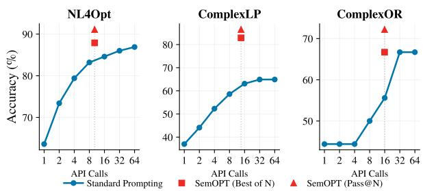

Table 8: Comparison with exhaustive Naive Search (NS). Each cell reports accuracy / API calls.
<table><tr><td>Method</td><td>NL4Opt</td><td>ComplexLP</td><td>ComplexOR</td></tr><tr><td>NS</td><td>89.7% / 84.0</td><td>83.8% / 84.0</td><td>66.7% / 84.0</td></tr><tr><td>SemOPT</td><td>87.9% / 10.2</td><td>82.9% / 13.6</td><td>66.7% / 15.9</td></tr></table>

Figure 5: Comparison between SemOPT and the standard prompting baseline across optimization benchmarks.

Error Correction in Optimization Modeling. LLMs produce modeling errors through hallucinated or misinterpreted problem structure (Xie et al., 2025), commonly categorized as syntactic or semantic errors (Wang et al., 2025). Syntactic errors occur when generated solver code fails to run or is judged infeasible; execution or solver feedback directly exposes them. OptLLM (Zhang et al., 2024) and ORThought (Yang et al., 2026) refine code from tracebacks, while LLMOPT (Jiang et al., 2025) reduces such errors through domainspecific fine-tuning. Semantic errors occur when solver code runs and returns an objective value but violates the original problem intent through misunderstood constraints, incorrect objectives, or invalid modeling assumptions. Although semantic error correction has been studied for LLM-generated content (Yang et al., 2025b; Gu et al., 2025; Islam et al., 2024), work targeting optimization modeling remains limited. Autoformulator (Astorga et al., 2025) and SolverLLM (Li et al., 2025) address this issue through broader search and candidate selection, but rely on general-purpose verifiers that lack the domain sensitivity needed to separate plausible math models from semantically correct ones.

## 7 Conclusion

We propose SemOPT, a framework for correcting semantic errors in LLM-based optimization modeling. SemOPT combines a pairwise-trained semantic reward model with semantic-guided MCTS over modeling strategies, math models, and solver code, while adaptive gating invokes search only when the initial solver code falls below the semantic confidence threshold. Comprehensive experiments across seven benchmarks show that SemOPT achieves the best results on most datasets, with especially strong gains on complex benchmarks. These results support semantic-guided search for reliable optimization modeling.

## Limitations

This work focuses on automated optimization modeling from natural-language problem descriptions to executable solver code. Although SemOPT improves semantic consistency across seven benchmarks, our evaluation is still centered on benchmark tasks rather than deployed decision-making workflows. The framework also assumes access to solver execution and reward-model training data for constructing semantic supervision. Future work will further investigate this direction in broader real-world settings, including domain transfer, more diverse optimization tasks, and more efficient semantic-guided search.

## Ethical Considerations

SemOPT is intended as a research framework for improving the reliability of LLM-based optimization modeling. The main societal risk is over-reliance on automatically generated solver code in highstakes decision-making settings. Executable optimization models still sometimes encode incorrect objectives, omit important constraints, or reflect inappropriate assumptions about the problem context. Such errors create risks of harmful decisions when used without expert review. We therefore recommend that generated models be audited by domain experts before deployment. The work uses existing optimization-modeling benchmarks and does not collect human-subject data. The framework also uses commercial and open-weight LLMs, so reproducibility and environmental cost depend on model availability, API behavior, and compute budget. AI assistance was used only for language polishing and basic code drafting; it was not used to formulate the research idea, design the experiments, derive the claims, or generate the results.

## Acknowledgements

Prof. Jingyuan Wang’s work is supported by the National Natural Science Foundation of China (No. 72242101), the Science and Technology Development Fund Macau SAR (0052/2023/RIA1), and State Key Laboratory of Complex & Critical Software Environment (SKLCCSE-2025ZX-17). Prof. Zizhuo Wang’s research is partially supported by the National Natural Science Foundation of China (NSFC) [Grant 72394361, 72425013], the Guangdong Provincial Key Laboratory of Mathematical Foundations for Artificial Intelligence (2023B1212010001), and the 1+1+1 CUHK-CUHK(SZ)-GDSTC Joint Collaboration Fund No 2025A0505000079.

## References

Ali AhmadiTeshnizi, Wenzhi Gao, Herman Brunborg, Shayan Talaei, Connor Lawless, and Madeleine Udell. 2024. Optimus-0.3: Using large language models to model and solve optimization problems at scale. arXiv:2407.19633.

Ali Ahmaditeshnizi, Wenzhi Gao, and Madeleine Udell. 2024. OptiMUS: Scalable optimization modeling with (MI)LP solvers and large language models. In Proc. ofICML, pages 577–596.

Nicolás Astorga, Tennison Liu, Yuanzhang Xiao, and Mihaela van der Schaar. 2025. Autoformulation of mathematical optimization models using LLMs. In Proc. of ICML, pages 1864–1886.

Yitian Chen, Jingfan Xia, Siyu Shao, Dongdong Ge, and Yinyu Ye. 2025. Solver-informed rl: Grounding large language models for authentic optimization modeling. In Proc. ofNeurIPS, pages 106027–106069.

Erwin J. Delgado, Xavier Cabezas, Carlos Martin-Barreiro, Víctor Leiva, and Fernando Rojas. 2022. An equity-based optimization model to solve the location problem for healthcare centers applied to hospital beds and covid-19 vaccination. Mathematics, 10(11):1825.

Yifu Ding, Wentao Jiang, Shunyu Liu, Yongcheng Jing, Jinyang Guo, Yingjie Wang, Jing Zhang, Zengmao Wang, Ziwei Liu, Bo Du, Xianglong Liu, and Dacheng Tao. 2025. Dynamic parallel tree search for efficient LLM reasoning. In Proc. ofACL, pages 11233–11252.

Guanting Dong, Hongyi Yuan, Keming Lu, Chengpeng Li, Mingfeng Xue, Dayiheng Liu, Wei Wang, Zheng Yuan, Chang Zhou, and Jingren Zhou. 2024. How abilities in large language models are affected by supervised fine-tuning data composition. In Proc. of ACL, pages 177–198.

Daniel J. Garcia and Fengqi You. 2015. Supply chain design and optimization: Challenges and opportunities. Computers & Chemical Engineering, 81:153–170.

Jian Gu, Aldeida Aleti, Chunyang Chen, and Hongyu Zhang. 2025. A semantic-based optimization approach for repairing llms: Case study on code generation. arXiv:2503.12899.

Chenyu Huang, Zhengyang Tang, Shixi Hu, Ruoqing Jiang, Xin Zheng, Dongdong Ge, Benyou Wang, and Zizhuo Wang. 2025a. ORLM: A customizable framework in training large models for automated optimization modeling. Operations Research, 73(6):2986– 3009.

Xuhan Huang, Qingning Shen, Yan Hu, Anningzhe Gao, and Benyou Wang. 2025b. LLMs for mathematical modeling: Towards bridging the gap between natural and mathematical languages. In Proc. of NAACL Findings, pages 2678–2710.

Nafis Tanveer Islam, Joseph Khoury, Andrew Seong, Elias Bou-Harb, and Peyman Najafirad. 2024. Enhancing source code security with llms: Demystifying the challenges and generating reliable repairs. arXiv:2409.00571.

Yixin Ji, Juntao Li, Yang Xiang, Hai Ye, Kaixin Wu, Kai Yao, Jia Xu, Linjian Mo, and Min Zhang. 2026. A survey of test-time compute: From intuitive inference to deliberate reasoning. Computational Linguistics, pages 1–51.

Caigao Jiang, Xiang Shu, Hong Qian, Xingyu Lu, Jun Zhou, Aimin Zhou, and Yang Yu. 2025. Llmopt: Learning to define and solve general optimization problems from scratch. In Proc. ofICLR.

Dheepak Krishnamurthy, Canan Uckun, Zhi Zhou, Prakash R. Thimmapuram, and Audun Botterud. 2018. Energy storage arbitrage under day-ahead and real-time price uncertainty. IEEE TPWRS, 33(1):84– 93.

Dong Li, Xujiang Zhao, Linlin Yu, Yanchi Liu, Wei Cheng, Zhengzhang Chen, Zhong Chen, Feng Chen, Chen Zhao, and Haifeng Chen. 2025. Solverllm: Leveraging test-time scaling for optimization problem via llm-guided search. In Proc. of NeurIPS, pages 100028–100058.

Jiaxi Li, Yucheng Shi, Xiao Huang, Jin Lu, and Ninghao Liu. 2026. Mits: Enhanced tree search reasoning for llms via pointwise mutual information. In Proc. of PAKDD, pages 288–300.

Haoyang Liu, Jie Wang, Yuyang Cai, Xiongwei Han, Yufei Kuang, and Jianye Hao. 2025. Optitree: Hierarchical thoughts generation with tree search for llm optimization modeling. In Proc. of NeurIPS, pages 120713–120781.

Kostis Michailidis, Dimos Tsouros, and Tias Guns. 2024. Constraint modelling with llms using incontext learning. In 30th International Conference

on Principles and Practice of Constraint Programming, pages 20:1–20:27.

Rindranirina Ramamonjison, Timothy Yu, Raymond Li, Haley Li, Giuseppe Carenini, Bissan Ghaddar, Shiqi He, Mahdi Mostajabdaveh, Amin Banitalebi-Dehkordi, Zirui Zhou, and Yong Zhang. 2022. Nl4opt competition: Formulating optimization problems based on their natural language descriptions. In Proc. ofthe NeurIPS 2022 Competitions Track, pages 189–203.

Noah Shinn, Federico Cassano, Ashwin Gopinath, Karthik Narasimhan, and Shunyu Yao. 2023. Reflexion: language agents with verbal reinforcement learning. In Proc. ofNeurIPS, pages 8634–8652.

Ajay Singh. 2012. An overview of the optimization modelling applications. Journal of Hydrology, 466– 467:167–182.

Hao Sun, Yunyi Shen, and Jean-Francois Ton. 2025. Rethinking reward modeling in preference-based large language model alignment. In Proc. ofICLR.

Qinglin Wang, Zhihong Sun, Ruyun Wang, Tao Huang, Zhi Jin, Ge Li, and Chen Lyu. 2025. Semguard: Realtime semantic evaluator for correcting llm-generated code. In Proc. ofASE, pages 1919–1930.

Ziyang Xiao, Jingrong Xie, Lilin Xu, Shisi Guan, Jingyan Zhu, Xiongwei Han, Xiaojin Fu, WingYin Yu, Han Wu, Wei Shi, Qingcan Kang, Jiahui Duan, Tao Zhong, Mingxuan Yuan, Jia Zeng, Yuan Wang, Gang Chen, and Dongxiang Zhang. 2025. A survey of optimization modeling meets llms: progress and future directions. In Proc. of IJCAI, pages 10742– 10750.

Ziyang Xiao, Dongxiang Zhang, Yangjun Wu, Lilin Xu, Yuan Wang, Xiongwei Han, Xiaojin Fu, Tao Zhong, Jia Zeng, Mingli Song, and Gang Chen. 2024. Chain-of-experts: When llms meet complex operations research problems. In Proc. ofICLR.

Wantong Xie, Yi-Xiang Hu, Jieyang Xu, Feng Wu, and Xiangyang Li. 2025. Murka: Multi-reward reinforcement learning with knowledge alignment for optimization tasks. In Proc. ofNeurIPS, pages 34878– 34905.

Linzi Xing, Xinglu Wang, Yuxi Feng, Zhenan Fan, Jing Xiong, Zhijiang Guo, Xiaojin Fu, Rindra Ramamonjison, Mahdi Mostajabdaveh, Xiongwei Han, Zirui Zhou, and Yong Zhang. 2024. Towards humanaligned evaluation for linear programming word problems. In Proc. of LREC-COLING, pages 16550– 16556.

An Yang, Anfeng Li, Baosong Yang, Beichen Zhang, Binyuan Hui, Bo Zheng, Bowen Yu, Chang Gao, Chengen Huang, Chenxu Lv, Chujie Zheng, Dayiheng Liu, Fan Zhou, Fei Huang, Feng Hu, Hao Ge, Haoran Wei, Huan Lin, Jialong Tang, and 41 others. 2025a. Qwen3 technical report. arXiv:2505.09388.

Beinuo Yang, Qishen Zhou, Junyi Li, Chenxing Su, Panagiotis Angeloudis, and Simon Hu. 2026. Orthought: Benchmarking and automating logistics optimization modeling via structured llm reasoning. Artificial Intelligencefor Transportation, 6:100059.

Chengrun Yang, Xuezhi Wang, Yifeng Lu, Hanxiao Liu, Quoc V. Le, Denny Zhou, and Xinyun Chen. 2024. Large language models as optimizers. In Proc. of ICLR.

Ling Yang, Zhaochen Yu, Tianjun Zhang, Minkai Xu, Joseph E Gonzalez, Bin Cui, and Shuicheng Yan. 2025b. Supercorrect: Advancing small llm reasoning with thought template distillation and self-correction. In Proc. ofICLR.

Zhicheng Yang, Yiwei Wang, Yinya Huang, Zhijiang Guo, Wei Shi, Xiongwei Han, Liang Feng, Linqi Song, Xiaodan Liang, and Jing Tang. 2025c. Optibench meets resocratic: Measure and improve llms for optimization modeling. In Proc. ofICLR.

Jihai Zhang, Wei Wang, Siyan Guo, Li Wang, Fangquan Lin, Cheng Yang, and Wotao Yin. 2024. Solving general natural-language-description optimization problems with large language models. In Proc. of NAACL Industry Track, pages 483–490.

Xinyu Zhang, Boxuan Zhang, Yuchen Wan, Lingling Zhang, Yixing Yao, Bifan Wei, Yaqiang Wu, and Jun Liu. 2026. OptiVerse: A comprehensive benchmark towards optimization problem solving. In Proc. of ACL Findings, pages 3059–3073.

Yansen Zhang, Qingcan Kang, Yujie Chen, Yufei Wang, Xiongwei Han, Tao Zhong, Mingxuan Yuan, and Chen Ma. 2025. Sac-opt: Semantic anchors for iterative correction in optimization modeling. arXiv:2510.05115.

## A MCTS Algorithm

```latex
Algorithm 1 Semantic-Guided MCTS Process
Input: Problem Description P, Semantic Reward Model R,
Policy Network $\pi _ { \theta } .$ , Budget $T _ { m a x }$ , Expansion Count H,
Exploration Constant $\omega ,$ Reflection Rounds $K$
Output: Best Solver Code $C ^ { * }$
1: Initialize tree $\tau$ with root node $v ^ { ( 0 ) }$
2: for $i t e r \gets 1$ to $T _ { m a x }$ do
3: $\boldsymbol { v } ^ { ( i ) }  \boldsymbol { v } ^ { ( 0 ) }$
4: while $v ^ { ( i ) }$ is not a leaf node do
5: $\boldsymbol { v } ^ { ( i + 1 ) }$ ←
arg ma $\begin{array} { r } { \mathfrak { c } _ { u \in c h i l d r e n ( v ^ { ( i ) } ) } \left( Q ( u ) + \omega \cdot \sqrt { \frac { \ln N ( v ^ { ( i ) } ) } { N ( u ) + \epsilon } } \right) } \end{array}$
6: $v ^ { ( i ) }  v ^ { ( i + 1 ) }$
7: $\tilde { v }  v ^ { ( i ) }$
8: if v˜ is not a terminal state then
9: Sample $\{ v _ { 1 } ^ { ( i + 1 ) } , \ldots , v _ { H } ^ { ( i + 1 ) } \}$ via $v _ { j } ^ { ( i + 1 ) }$ ∼
π<sub>θ</sub> $( \cdot | \tilde { v } , P )$
10: Add $\{ v _ { 1 } ^ { ( i + 1 ) } , \ldots , v _ { H } ^ { ( i + 1 ) } \}$ to $\tau$ as children of v˜
11: $v ^ { * } $ Select the node with the highest LLM prior
12: else
13: $v ^ { \ast }  \tilde { v }$
14: if $v ^ { \ast }$ is not a terminal state then
15: $C \gets \mathrm { R o L L O U T } ( v ^ { * } , \pi _ { \theta } )$
16: else
17: C ← Extract solver code from $v ^ { * }$
18: for $k \gets 1$ to K do
19: Execute C and collect output
20: if no syntax error then
21: break
22: else
23: $C  \pi _ { \theta } ( C ,$ error_msg, P)
24: $\mathbb { I }  \mathbf { 1 }$ [no syntax error]
25: Score $\dot { S }  \mathbf { \bar { I } } \cdot R ( P , \dot { C } )$
26: v $ { v } ^ { * }$
27: while v ̸= NULL do
28: $N ( v ) \gets N ( v ) + 1$
29: $\begin{array} { r } { Q ( v )  Q ( v ) + \frac { S - Q ( v ) } { N ( v ) } } \end{array}$
30: v ← P arent(v)
31: $v  v ^ { ( 0 ) }$
32: for k ← 1 to 3 do
33: v ← arg max<sub>u∈children(v)</sub> Q(u)
34: C<sup>∗</sup> ← Solver code of v
35: return $C ^ { * }$
```

## B Training and Implementation Details

## B.1 Semantic Mutation Operators

Table 9 details the mutation operators used to construct hard semantic negatives for reward-model training. These operators are designed to preserve executable solver code whenever possible while perturbing the modeling intent. They cover three common sources of semantic error in optimization modeling: variable declarations, objective definitions, and constraints.

Variable-level mutations alter the admissible solution space by relaxing variable types or removing bounds. Objective-level mutations change what the solver optimizes, either by flipping the optimization sense, changing coefficient signs, or dropping objective terms. Constraint-level mutations modify feasibility logic through comparator changes, right-hand-side shifts, variable swaps, index mismatches, or complete constraint removal. After the mutation process, candidates that fail execution or are judged infeasible are filtered out, so the remaining hard negatives correspond to executable but semantically incorrect solver code.

Table 9: Semantic mutation operators for hard negative construction.  
Dimension Operator Implementation Logic   
Type Relax Relax variable types (e.g., BINARY → CONTINUOUS)   
Variable   
Bound Remove Remove lower/upper bounds   
Sense Flip Swap direction (e.g., MIN → MAX)   
Objective Coeff Noise Flip sign of variable coefficient in objective   
Term Drop Remove a term from objective expression   
Comparator Flip Swap inequality signs (e.g., ≥→≤)   
RHS Shift Modify RHS constant b to b × (1 ± ϵ)   
Constraint Var Swap Swap positions of two variables of same type   
Index Mismatch Swap iteration sets in loop constructs   
Constraint Drop Remove an entire constraint declaration

## B.2 Hyperparameter Settings

Table 10 details the hyperparameter configurations for the SemOPT framework to facilitate reproducibility. The settings cover the generator, the MCTS reasoning process, and the adaptive gating mechanism. The exploration constant ω regulates the balance between visiting new nodes and exploiting high-scoring branches. The node expansion size H defines the breadth of candidate generation at each reasoning step. Additionally, the gating threshold τ serves as the confidence cutoff for triggering the hierarchical search. This parameter is critical for balancing inference accuracy and computational cost by filtering straightforward instances.

Table 10: Hyperparameter configurations for SemOPT.
<table><tr><td rowspan=1 colspan=1>Parameter</td><td rowspan=1 colspan=1>Value</td></tr><tr><td rowspan=1 colspan=1>Generator (LLM) SettingsTemperatureTop-pMax Tokens</td><td rowspan=1 colspan=1>0.90.92048</td></tr><tr><td rowspan=1 colspan=1>MCTS SettingsExploration Constant (ω)SimulationsNode Expansion Size (H)Reward Scale</td><td rowspan=1 colspan=1>1.414[4, 16]4[0, 1]</td></tr><tr><td rowspan=2 colspan=1>Adaptive Gating SettingsGating Threshold (τ)</td><td rowspan=1 colspan=1></td></tr><tr><td rowspan=1 colspan=1>0.6</td></tr></table>

## B.3 Reward Model Training Details

The semantic reward model is initialized from Qwen3-4B-Instruct-2507. We train it on 3,000 optimization-modeling problems from OR-Instruct (Huang et al., 2025a), split into 2,700 training and 300 validation problems, which yield 8,254 positive–negative preference pairs. We verify that the reward-model training problems do not overlap with the evaluation benchmarks. Table 11 summarizes the main training configuration.

Table 11: Detailed training configuration for the semantic reward model.
<table><tr><td>Base Model</td><td>Train / Val Problems</td><td>Pairs</td><td>Epochs</td><td>Batch</td><td>LR</td><td>Max Len.</td></tr><tr><td>Qwen3-4B-Instruct-2507</td><td>2700/300</td><td>8254</td><td>3</td><td>32</td><td>2e-5</td><td>2048</td></tr></table>

## C Baseline Details

This section supplements the baseline descriptions in the experimental setup.

## C.1 Standard Methods

Standard Prompting is a single-pass generation baseline. It directly prompts the policy model to produce solver code from the problem description, without self-revision, external tool feedback, finetuning, or search. Self-Reflection follows the Reflexion framework (Shinn et al., 2023), which improves a language agent through verbal feedback stored in memory rather than parameter updates. In our setting, the model reflects on previous execution or solver feedback and regenerates solver code in later attempts.

## C.2 Workflow Methods

OptiMUS (AhmadiTeshnizi et al., 2024) is a modular LLM-based system for modeling and solving (MI)LP problems from natural-language descriptions. It develops math models, writes and debugs solver code, evaluates generated solutions, and uses these evaluations to improve correctness and efficiency. Chain-of-Experts (Xiao et al., 2024) is a multi-agent framework for complex OR problems. It assigns agents to specialized OR roles and uses a conductor to coordinate forward thought construction and backward reflection. OptiTree (Liu et al., 2025) performs tree search over a hierarchical taxonomy of OR problem types. It identifies simpler subproblems and synthesizes global modeling thoughts from the selected hierarchy. SAC-Opt (Zhang et al., 2025) uses semantic anchors extracted from the original problem and reconstructed from generated code. It aligns the two sets of anchors and selectively corrects mismatched objectives or constraints.

## C.3 Fine-tuned Methods

ORLM (Huang et al., 2025a) trains open-weight LLMs for optimization modeling using OR-Instruct, a semi-automated data synthesis framework. The resulting models are specialized for translating natural-language OR problems into math models and solver code. SIRL (Chen et al., 2025) applies solver-informed reinforcement learning with verifiable rewards. External optimization solvers evaluate executable code and the associated LP representation, providing rewards based on syntax, feasibility, and solution quality.

## C.4 Search-based Methods

Autoformulator (Astorga et al., 2025) formulates optimization models through MCTS over a hierarchical space of modeling choices. It uses symbolic pruning to remove redundant branches and LLM-based evaluation to score partial math models. SolverLLM (Li et al., 2025) is a training-free testtime scaling framework. It generates math models and solver code through MCTS, using dynamic expansion, prompt backpropagation, and uncertainty backpropagation to guide the search process.

## D Model-Level Semantic Validation

Objective-value matching is the standard evaluation protocol on optimization-modeling benchmarks, but it credits a semantically incorrect formulation whenever that formulation happens to attain the reference optimum. This section reports a complementary validation of SemOPT at the formulation level.

Evaluation Protocol. Following prior work on human-aligned evaluation of LP word problems (Xing et al., 2024), we convert the predicted and the reference LP model into attributed bipartite graphs and compute the graph edit distance (GED) between them. Variable nodes encode bounds and objective coefficients, constraint nodes encode constraint bounds, and edges encode variable– constraint coefficients. We report three metrics. GED Acc. counts a prediction as correct only when the edit distance is zero, which yields a strict lower bound on formulation correctness. Obj Acc. is the objective-matching metric used in the main experiments, which is an upper bound because a semantically wrong model can return the correct objective by coincidence. For instances on which the two criteria disagree, we manually audit the predicted and the reference formulation, and report the human-verified correctness rate as Oracle Acc.

Dataset. The benchmarks used in the main experiments either release only target objective values, contain too few formulation-level instances, or are too simple for the three metrics to separate meaningfully. We therefore extract 100 LP problems with explicit reference formulations from OptiVerse (Zhang et al., 2026), denoted OptiVerse-LP-100, and compare SemOPT against SIRL, the strongest fine-tuned baseline.

Table 12: Formulation-level validation on OptiVerse-LP-100.
<table><tr><td>Method</td><td>GED Acc.</td><td>Oracle Acc.</td><td>Obj Acc.</td></tr><tr><td>SIRL</td><td>36%</td><td>36%</td><td>38%</td></tr><tr><td>SemOPT</td><td>44%</td><td>47%</td><td>49%</td></tr></table>

Results. As shown in Table 12, SemOPT improves over SIRL by 8 points in GED Acc., 11 points in Oracle Acc., and 11 points in Obj Acc. The gain therefore extends to formulation faithfulness rather than final-answer matching alone. The small gap between GED Acc. and Obj Acc. also indicates that objective matching is a useful proxy for semantic correctness, although not a complete one.

The two residual gaps have different causes. The Obj–Oracle gap corresponds to false positives under objective matching. In OptiVerse-53, for instance, the problem specifies a total investment of 200,000 yuan, whereas SemOPT models it as an upper bound of at most 200,000 yuan; the optimum happens to exhaust the full budget, so the objective matches although the formulation does not. The GED–Oracle gap instead usually reflects imperfections in the reference model. In OptiVerse-678, the reference model imposes only non-negativity on the number of trucks, while SemOPT additionally imposes integrality; GED marks this as a mismatch even though the stricter formulation is semantically valid.

Counterfactual Sensitivity. We further test whether the reward model responds to specific problem statements rather than to surface features of the solver code. In ComplexLP-1, the original description requires food quantities to be integers, and the corresponding solver code encodes this integrality requirement, receiving a reward score of 0.72. We then modify only the problem description so that food quantities may be fractional, leaving the solver code unchanged. The reward score drops to 0.41. The reward model is thus sensitive to mismatches between individual problem requirements and the solver code, even though it emits a scalar score without sentence-level rationales.

## E Parameter Sensitivity Analysis

## E.1 Gating Threshold Sensitivity

We tune the gating threshold τ on the validation set over {0.2, 0.4, 0.6, 0.8, 1.0} and select τ = 0.6 as the default trade-off between accuracy and inference cost. Table 13 reports the corresponding testset behavior on NL4Opt, ComplexLP, and ComplexOR. Lower thresholds trigger search only for low-confidence cases and reduce API calls, but they under-correct difficult instances. Higher thresholds approach the w/o Gating setting and slightly improve accuracy on some datasets, but require substantially more calls. The default τ = 0.6 keeps accuracy close to the best setting while avoiding much of the extra inference cost.

Table 13: Sensitivity to the gating threshold τ. Each cell reports accuracy / API calls.
<table><tr><td>Dataset</td><td>τ = 0.2</td><td>τ = 0.4</td><td>τ = 0.6</td><td>τ = 0.8</td><td>τ = 1.0</td></tr><tr><td>NL4Opt</td><td>72.9% / 4.1</td><td>79.0% / 8.4</td><td>87.9% / 10.2</td><td>88.8% / 19.6</td><td>88.8% / 26.8</td></tr><tr><td>ComplexLP</td><td>53.2% / 4.6</td><td>73.8% / 10.2</td><td>82.9% / 13.6</td><td>83.8% / 20.1</td><td>81.1% / 27.4</td></tr><tr><td>ComplexOR</td><td>44.4% / 5.8</td><td>63.0% / 13.1</td><td>66.7% / 15.9</td><td>66.7% / 22.3</td><td>66.7% / 29.5</td></tr></table>

## E.2 Sampling Efficiency

We further analyze the impact of the node expansion size H on the performance of SemOPT. As illustrated in Figure 6, we evaluate both Best-of-N and Pass@N metrics across NL4Opt, ComplexLP, and ComplexOR. The results indicate that while accuracy consistently improves as H increases from 1 to 10, the performance gain saturates rapidly. Specifically, the accuracy typically reaches a plateau around H = 4 across all datasets. This observation demonstrates the high sampling efficiency of our framework. It indicates that SemOPT achieves near-optimal performance with a minimal computational budget, justifying our selection of H = 4 as the default setting for the main experiments as reasonable.

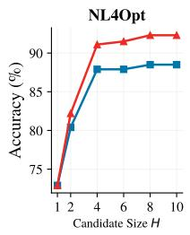

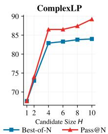

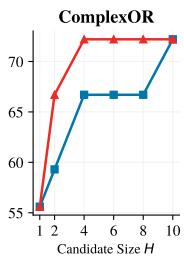  
Figure 6: Impact of node expansion size H on SemOPT performance across three benchmarks.

## F Result Variability Analysis

## F.1 Run-to-Run Variation

To assess the stability of the hard-subset comparison, Table 14 reports mean accuracy with runto-run variation on the hard subsets of NL4Opt, ComplexLP, and ComplexOR. Each value is computed over repeated runs on the same instances; the reported ± values therefore describe variation induced by stochastic generation and MCTS exploration, rather than uncertainty over the benchmark population. SemOPT improves over the strongest baseline on all three hard subsets, with the largest margin on ComplexOR. The relatively higher variation on NL4Opt reflects the fact that several instances lie near the decision boundary, so small changes in the sampled search trajectory can change the selected solution. Despite this variance, the mean accuracy of SemOPT remains above the strongest baseline in every setting, confirming that the improvement is not attributable to a single favorable run.

Table 14: Hard-subset accuracy with variation.
<table><tr><td>Hard Subset</td><td>SIRL</td><td>SemOPT</td></tr><tr><td>NL4Opt</td><td> $6 9 . 2 \% \pm 2 . 5 6 \%$ </td><td> $7 1 . 8 \% \pm 4 . 4 4 \%$ </td></tr><tr><td>ComplexLP</td><td> $5 4 . 5 \% \pm 5 . 2 5 \%$ </td><td> $6 3 . 6 \% \pm 3 . 0 3 \%$ </td></tr><tr><td>ComplexOR</td><td> $2 8 . 6 \% \pm 0 . 0 0 \%$ </td><td> $5 7 . 1 \% \pm 0 . 0 0 \%$ </td></tr></table>

## F.2 Paired Hard-Subset Analysis

Run-to-run variation alone does not quantify uncertainty caused by the finite number of test instances. We therefore report absolute counts and paired instance-level tests in Table 15. The confidence interval is a 90% conditional exact interval for the paired net gain, computed from discordant pairs and scaled by the number of instances. The p-value is from the exact two-sided McNemar/binomial test on the same discordant outcomes.

The combined hard subsets contain 79 instances, on which SemOPT wins seven paired cases and loses one, yielding a 7.6-point net gain and a positive 90% interval. The ComplexOR-hard result is based on only seven instances (2/7 versus 4/7), so it should be interpreted as supportive rather than conclusive evidence. Taken together with the repeatedrun results above, the paired counts provide a more complete picture: the advantage persists across the combined hard set, while the small ComplexOR subset warrants caution.

Table 15: Paired analysis on hard subsets. Counts are the number of solved instances over the subset size.
<table><tr><td>Subset</td><td>SIRL</td><td>SemOPT</td><td>SemOPT-only / SIRL-only</td><td>Gain</td><td>90% CI /p</td></tr><tr><td>NL4Opt-hard</td><td>27/39</td><td>28/39</td><td>1/0</td><td>+2.6%</td><td> $\left[ - 2 . 3 \% , 2 . 6 \% \right] / 1 . 0 0 0$ </td></tr><tr><td>ComplexLP-hard</td><td>18/33</td><td>21/33</td><td>4/1</td><td>+9.1%</td><td> $\left[ - 4 . 8 \% , 1 4 . 8 \% \right] / 0 . 3 7 5$ </td></tr><tr><td>ComplexOR-hard</td><td>2/7</td><td>4/7</td><td>2/0</td><td>+28.5%</td><td> $\left[ - 1 5 . 8 \% , 2 8 . 6 \% \right] / 0 . 5 0 0$ </td></tr><tr><td>Combined hard</td><td>47/79</td><td>53/79</td><td>7/1</td><td>+7.6%</td><td> $[ 0 . 6 \% , 1 0 . 0 \% ] \ : / \ : 0 . 0 7 0$ </td></tr></table>

## G Error Analysis

## G.1 Syntactic Error Handling

This section specifies how syntactic and runtime errors are accounted for during search. When a rollout reaches a solver-code leaf, the code is executed. If the solver or the Python runtime reports an error, the error message is appended to the context and the generator regenerates the code for up to K reflection rounds. If execution still fails after K rounds, the rollout receives a score of 0 and is not passed to the semantic reward model.Every node that initially triggers an error undergoes regeneration, and its final score enters backpropagation like any other node.

Table 16: Syntactic error handling during search. The error rate is computed over all evaluated nodes; repair outcomes are computed over the nodes that initially triggered repair.
<table><tr><td>Dataset</td><td>Syntax-error Rate</td><td>Correctly Repaired</td><td>Still Erroneous (Score 0)</td></tr><tr><td>IndustryOR</td><td>33.1%</td><td>64.1%</td><td>35.9%</td></tr><tr><td>ComplexLP</td><td>34.2%</td><td>74.7%</td><td>25.3%</td></tr><tr><td>ComplexOR</td><td>46.8%</td><td>81.8%</td><td>18.2%</td></tr></table>

Table 16 reports the resulting statistics. Roughly one third of the evaluated nodes on IndustryOR and ComplexLP trigger at least one execution error, and the rate rises to 46.8% on ComplexOR, whose problems involve larger and more heavily indexed models. Reflection repairs the majority of these cases, and the remaining nodes are assigned a score of 0. This separates code-level execution handling, which relies on solver feedback, from semantic correction, which is applied only to code that already runs.

## G.2 Semantic Error Taxonomy

To characterize the errors that remain after correction, we analyze the 40 instances that SemOPT still answers incorrectly under BoN on IndustryOR, ComplexLP, and ComplexOR. We first categorize each error by the layer of the search hierarchy at which it originates, then further categorize the math-model errors by the component of the formulation that is wrong.

Table 17: Distribution of the 40 remaining SemOPT errors by hierarchy layer, and of the 28 math-model errors by formulation component.
<table><tr><td>Error Category</td><td>Count</td><td>Share</td></tr><tr><td>By hierarchy layer (40 errors)</td><td></td><td></td></tr><tr><td>Modeling Strategy</td><td>9</td><td>22.5%</td></tr><tr><td>Math Model</td><td>28</td><td>70.0%</td></tr><tr><td>Solver Code</td><td>3</td><td>7.5%</td></tr><tr><td>By formulation component (28 math-model errors)</td><td></td><td></td></tr><tr><td>Parameter</td><td>2</td><td>7.1%</td></tr><tr><td>Decision Variable</td><td>7</td><td>25.0%</td></tr><tr><td>Objective Function</td><td>4</td><td>14.3%</td></tr><tr><td>Constraint</td><td>15</td><td>53.6%</td></tr></table>

As Table 17 shows, most residual errors occur at the math-model layer, and constraints are the single largest source within that layer. This is consistent with the observation that constraints carry the implicit requirements of a problem description and are therefore the hardest component to recover from natural language. Only 7.5% of the errors are introduced at the solver-code layer, indicating that implementation is rarely the bottleneck once a faithful math model is available. The 22.5% of errors that originate at the strategy layer support including an explicit strategy layer in the search hierarchy, since an incorrect optimization framework or variable definition cannot be repaired by later layers. The taxonomy also suggests a practical ordering for future improvements: stronger extraction of implicit constraints should address the dominant error source, while better strategy classification can prevent errors from propagating into every downstream representation. In contrast, additional code-level repair is likely to have a smaller effect once the generated program is already executable.

## H Qualitative Analysis

As illustrated in Figure 7, we present a case study on “IndustryOR-37” to illustrate how SemOPT resolves semantic ambiguities. The core challenge of this problem involves an implicit “backlogging” constraint. This allows for unmet demand to be carried over to subsequent periods, a logic that contradicts standard non-negative inventory assumptions.

Failure of Direct Inference. As shown in the figure, the direct inference (System 1) fails to capture this hidden requirement. It generates a standard inventory balance equation that assumes nonnegativity, leading to an invalid model.

Reasoning Process of SemOPT. In contrast, through its capacity of semantic discrimination, SemOPT manages to figure out the correct answer. SemOPT activates MCTS to explore the modeling space. At the leaf nodes, the semantic reward model distinguishes between plausible but incorrect math models. As shown in the figure, the model assigns the highest confidence score of 0.56 to the math model that explicitly incorporates the backlog variable. In contrast, it assigns a lower score of 0.44 to the candidate that omits this variable. This effectively suppresses the semantically misaligned solution. Both candidates are executable, so solver feedback alone cannot distinguish them; the decision depends on whether the formulation captures the problem’s implicit backlog logic. This trajectory confirms that SemOPT uses the reward model to actively reason through conflicting constraints and successfully rectifies semantic errors that standard prompting methods fail to identify.

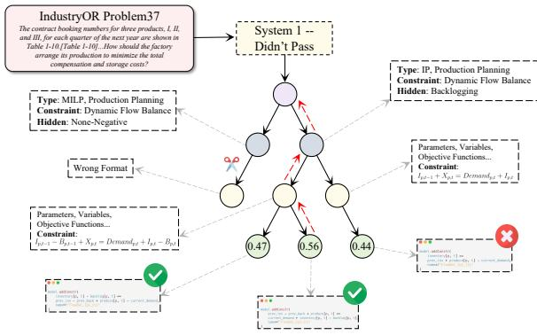  
Figure 7: Case study on IndustryOR-37.

## I Prompts for Optimization

To ensure reproducibility, we provide the prompts of SemOPT as follows:

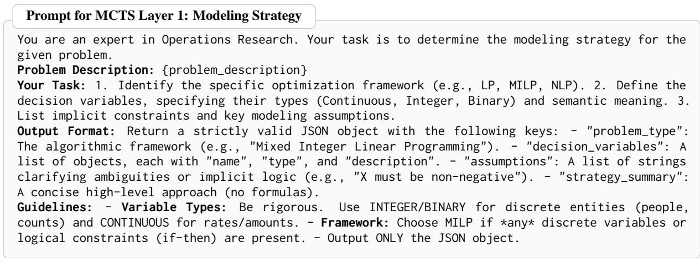  
Figure 8: Full prompt for the modeling-strategy layer of MCTS.

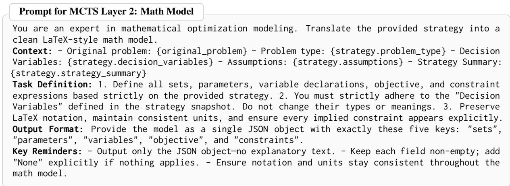  
Figure 9: Full prompt for the math model layer of MCTS.

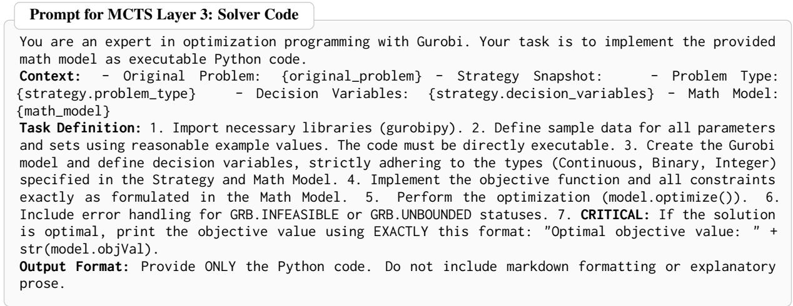