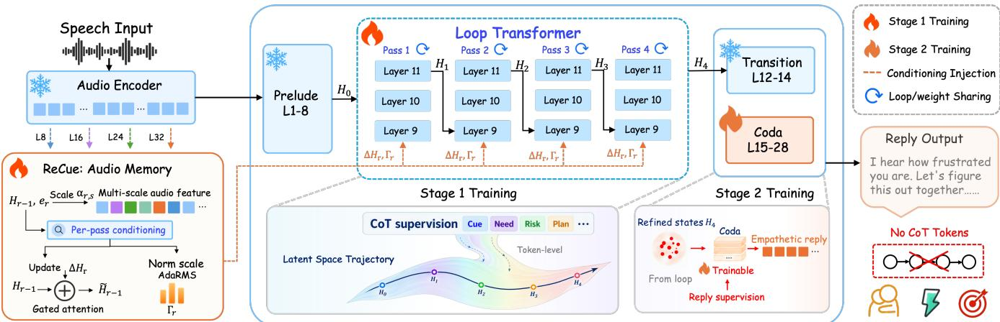
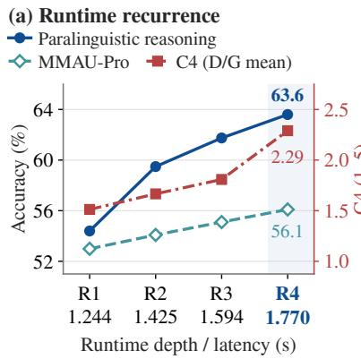
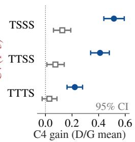

# THINKING IN DEPTH, SPEAKING DIRECTLY: RECURRENT LATENT REASONING FORPARALINGUISTICALLY GROUNDED SPOKEN DIALOGUE

Shengbo Cai1,3, Yuxiang Wang2,3, Jingran Xie1, Zhisheng Zhang1, Shun Lei1, Di Cao3, Teddy Sun3, Zhiyong Wu1,†

1Tsinghua University 2The Chinese University of Hong Kong, Shenzhen 3Tencent Hunyuan

## ABSTRACT

Empathetic spoken dialogue requires models to use both what is said and how it is said to decide how to respond. Explicit CoT can improve paralinguistic perception and make acoustic cues more explicit in replies, yet does not ensure their effective use in response planning. We call this mismatch the perception–reasoning gap. In addition, CoT may not fully capture acoustic cues in words, and generating it adds inference latency. To address these limitations, we introduce LoopSLM, which builds on looped Transformers for latent reasoning, reusing a decoder block to refine hidden states with acoustic grounding at every pass. Its two-stage training further narrows the perception–reasoning gap by separating learning to reason from learning to respond, enabling direct inference without CoT. On EchoMind, LoopSLM improves paralinguistic understanding, reasoning, and reply quality over Qwen2.5-Omni-7B. Against the CoT-SFT baseline, LoopSLM gains over 20 points in reasoning accuracy while generating 64.5% fewer tokens at half the latency. It also outperforms Qwen3-Omni-Thinking on most empathetic reply metrics with 34× lower latency. Despite training only on dialogue data, LoopSLM improves accuracy on general audio benchmarks.

Index Terms— Speech language models, paralinguistic reasoning, empathetic dialogue, looped Transformers, latent reasoning

## 1. INTRODUCTION

In empathetic spoken dialogue, what a speaker conveys and what constitutes an appropriate reply depend not only on the words but also on how they are delivered. The same words can convey confidence, hesitation, frustration, or vulnerability through prosody, voice quality, and timing. A speech language model (SLM) must therefore do more than recognize these paralinguistic cues. It must infer what they imply about the speaker’s state and communicative needs, then use that inference to shape its reply [1, 2]. Paralinguistically grounded reasoning links how something is said to what the model should say in response. The challenge is to provide supervision that teaches models how to use paralinguistic cues when planning a reply.

Chain-of-thought (CoT) provides one such supervisory signal by making intermediate reasoning explicit [3]. Speech-grounded CoT can encourage models to attend to acoustic evidence [4]. Yet recognizing and describing that evidence does not ensure that models can use it for reasoning. In our comparisons, CoT fine-tuning improves paralinguistic understanding and makes generated replies more explicit about these cues but weakens models’ ability to use them when deciding how to respond (Table 1). We call this mismatch the perception–reasoning gap. Beyond this reasoning gap, textual CoT also increases inference latency, as reasoning tokens must be generated before the reply. Can CoT be used only during training to teach the model to reason with paralinguistic cues while allowing direct responses at inference?

Latent reasoning avoids textual CoT at inference but does not by itself close the perception–reasoning gap. Models therefore still need supervision on how paralinguistic cues should shape replies. For example, Coconut and CODI learn latent steps through gradual CoT replacement or representation distillation, leaving those steps only indirectly aligned with the original CoT and weakening credit assignment across the reasoning process [5, 6]. CoLaR addresses this limitation with denser CoT targets, and its gains confirm that supervision quality is critical [7]. Yet it still predicts compressed latent steps autoregressively at inference. Together, these findings motivate a design that combines dense speech-grounded CoT supervision with iterative reasoning through recurrent decoder depth. Looped Transformers, in turn, supply the recurrent-depth component by reusing layers for iterative refinement of hidden states, an approach shown to improve reasoning without adding latent positions [8, 9, 10].

We therefore introduce LoopSLM, which combines recurrent reasoning in decoder depth with acoustic grounding at every pass. Two-stage training first uses speech-grounded CoT to strengthen paralinguistic understanding and reasoning, then uses the refined states to improve empathetic replies while preserving that reasoning. LoopSLM responds directly at inference without CoT.

Relative to Qwen2.5-Omni-7B, LoopSLM improves mean paralinguistic understanding and reasoning accuracy on EchoMind by 9.8 and 6.6 points, respectively, and raises scores in all four dimensions of reply quality. Against a matched CoT-SFT baseline, it gains more than 20 points in reasoning accuracy with 64.5% fewer generated tokens and half the latency. It also outperforms Qwen3-Omni-Thinking [11] on most metrics of empathetic reply quality with 34× lower latency. Although trained only on dialogue data, it improves accuracy on the general audio benchmarks MMSU and MMAU-Pro. Our contributions are:

• We propose LoopSLM, which, to our knowledge, is the first SLM to incorporate a looped Transformer architecture. It moves latent response planning to recurrent decoder depth without autoregressive reasoning tokens at inference.

• We introduce a two-stage CoT-to-response curriculum that separates learning to reason from learning to respond. Stage 1 strengthens paralinguistic reasoning with speech-grounded CoT, while Stage 2 turns the refined states into empathetic replies.

• We provide controlled evidence that LoopSLM’s gains depend on learned recurrent refinement rather than depth alone, while isolating the roles of acoustic memory and staged supervision.

  
Fig. 1. LoopSLM overview. Speech-grounded CoT trains a weight-shared Loop unrolled for four passes, with ReCue re-anchoring each pass to acoustic memory. The Loop and ReCue are then frozen while the Coda learns a direct-response readout. Inference emits no CoT tokens.

## 2. METHOD

LoopSLM moves speech-grounded response planning from the sequence axis to recurrent decoder depth without adding latent positions or reasoning tokens (Fig. 1). The architecture combines a shared early-middle Loop for recurrent refinement, ReCue (Reanchoring to acoustic Cues) for acoustic grounding at every pass, and a Coda for direct response generation. Let $H _ { 0 }$ denote the state entering the Loop and Hr the state after pass r, for $r = 1 , \ldots , R$ Training separates recurrent refinement under CoT supervision from direct response learning.

## 2.1. ReCue: per-pass acoustic re-anchoring

Prior layerwise analyses show that paralinguistic information is strongly encoded by audio encoders but can degrade across the decoder, including in Qwen2.5-Omni [12]. Our analysis further finds that decoder representations of identical words with different delivery lose much of their separation before the middle layers. Placing the Loop early lets refinement begin while more of this information remains, but each recurrent pass still receives only the previous decoder state. ReCue therefore gives every pass renewed access to the original acoustic evidence through a compact memory built from multiple depths of the frozen audio encoder.

Let $A _ { s }$ denote the encoder activations at depth $s , \ \Psi _ { s }$ their projection, and Q a shared set of 16 learned queries. We write $\operatorname { C A } ( q , m )$ for cross-attention from q to m. One bank per scale,

$$
M _ { s } = \mathrm { C A } \bigl ( Q , \Psi _ { s } ( A _ { s } ) \bigr ) , \quad s \in \{ 8 , 1 6 , 2 4 , 3 2 \} ,\tag{1}
$$

forms the memory $M = \{ M _ { s } \}$ , built once per utterance. Pass r then mixes the scales and reads the result into the state:

$$
\begin{array} { r l } & { \qquad \widehat { M } _ { r } = \sum _ { s } \alpha _ { r , s } M _ { s } , } \\ & { \qquad \widetilde { H } _ { r - 1 } = H _ { r - 1 } + g _ { r } \mathrm { C A } \bigl ( H _ { r - 1 } + e _ { r } , \widehat { M } _ { r } \bigr ) , } \end{array}\tag{2}
$$

with learned mixing weights $\alpha _ { r }$ conditioned on the state pooled over audio positions and on an iteration embedding $e _ { r }$ that distinguishes passes. A second head reads the same inputs and produces the scaleonly modulation Γr of the Loop’s pre-norms; ReCue therefore returns $( \widetilde { H } _ { r - 1 } , \Gamma _ { r } ) = C _ { \phi } ( H _ { r - 1 } , M , r )$ with parameters ϕ. The gate $g _ { r }$ and the $\Gamma _ { r }$ head are zero-initialized, so ReCue leaves the backbone unperturbed at initialization.

## 2.2. Weight-shared looped Transformer

To increase computation per token without extending the sequence, we repeat a compact block of decoder layers [8, 9]. We build on the 28-layer Qwen2.5-Omni-7B Thinker [13] and select the recurrent block and response readout boundary through placement experiments. Looping L9–11 rather than L15–17 improves understanding and reasoning on EchoMind by 6.29 and 3.57 points, respectively, whereas L15–17 improves response style. This late-layer pattern echoes textual CoT by favoring response expression over reasoning. At the other extreme, looping L3–5 harms transcription fidelity.

Together, these results suggest a division of labor along decoder depth. L9–11 occupies an early-middle region where transcription remains stable and vocal distinctions remain accessible, whereas layers from L15 onward mainly support response expression. Accordingly, we partition the decoder into a Prelude (L1–8), the Loop (L9– 11, $\theta _ { L } )$ , a Transition (L12–14), and the Coda (L15–28, θC). The Prelude and Transition remain frozen throughout training.

The Loop input $H _ { 0 }$ is the output of L8. At pass $^ { r , }$ the shared block updates the state returned by ReCue as

$$
H _ { r } = F _ { 9 : 1 1 } ( \widetilde { H } _ { r - 1 } ; \theta _ { L } , \Gamma _ { r } ) , \quad r = 1 , \ldots , R .\tag{3}
$$

All passes share $\theta _ { L }$ and operate on the previous pass’s state. Each pass maintains a separate causal attention history over earlier tokens, so recurrence increases depth without breaking autoregressive causality. The Transition and Coda map $H _ { R }$ to the next-token distribution through the original language model head. We use $R = 4$ throughout training. At inference, the four passes run during prompt processing and at each decoding step, increasing executed depth from 28 to 37 layer calls without duplicating Transformer weights.

## 2.3. Two-stage CoT-to-response training

CoT and response supervision serve different roles, so LoopSLM applies them in separate stages. For user speech a and task context $x ,$ each training example provides a speech-grounded CoT trace z and a response y (Sec. 3.1). Both stages minimize the same tokenlevel cross-entropy over a supervised span $u _ { k }$

$$
\mathcal { L } _ { k } = - \frac { 1 } { \left| u _ { k } \right| } \sum _ { t = 1 } ^ { \left| u _ { k } \right| } \log p _ { \Theta } ( u _ { k , t } \mid a , x , u _ { k , < t } ) .\tag{4}
$$

Table 1. Paralinguistic understanding, reasoning, empathetic replies, and general audio. S/H: synthetic/human speech; D/G: DeepSeek/Gemini judges. Blue bold: best among comparable-scale (≤9B) systems; underline: best overall.
<table><tr><td></td><td colspan="2">Cost</td><td colspan="6">Paralinguistic dialogue</td><td colspan="2">General audio</td></tr><tr><td></td><td colspan="2"></td><td colspan="2">Accuracy (S/H)</td><td colspan="4">Response (D/G)</td><td colspan="2"></td></tr><tr><td>Model</td><td>#P</td><td>Tok↓</td><td>Underst.</td><td>Reason.</td><td>C1 C2</td><td>C3</td><td>C4</td><td></td><td></td><td>SD-Eval MMSU MMAU-Pro</td></tr><tr><td>Off-the-shelf models</td><td></td><td></td><td></td><td></td><td></td><td></td><td></td><td></td><td></td><td></td></tr><tr><td>Qwen2.5-Omni</td><td>7B</td><td></td><td>43.560.47/55.0957.59/56.604.57/4.424.31/4.414.00/4.401.37/1.46</td><td></td><td></td><td></td><td></td><td></td><td>4.62</td><td>63.46</td></tr><tr><td>Kimi-Audio</td><td>7B</td><td></td><td>25.346.31/43.58</td><td></td><td>50.78/49.313.45/3.142.82/2.732.38/2.631.72/1.72</td><td></td><td></td><td></td><td>2.86 59.98</td><td>53.71 45.91</td></tr><tr><td>Audio-Flamingo-3</td><td>7B</td><td>18.2 65.08/55.30</td><td></td><td>59.47/58.17</td><td>1.96/1.40 1.37/1.22</td><td></td><td>1.92/1.841.23/1.09</td><td>2.30</td><td>61.64</td><td>53.20</td></tr><tr><td>OSUM-EChat</td><td>3B</td><td>120.540.37/37.07</td><td></td><td>50.33/52.32</td><td>3.80/3.31 3.73/3.60</td><td></td><td>4.16/4.121.84/1.96</td><td>3.34</td><td>51.60</td><td>42.97</td></tr><tr><td>MiniCPM-o 4.5</td><td>9B</td><td></td><td>17.5 67.19/58.96</td><td>63.25/62.57</td><td>2.70/2.21</td><td></td><td>2.11/2.002.92/2.871.30/1.24</td><td>1.77</td><td>58.36</td><td>50.29</td></tr><tr><td>MiMo-Audio-Think†</td><td>7B</td><td></td><td>377.856.02/47.05</td><td>60.88/60.24</td><td>3.89/3.23</td><td>2.78/2.17</td><td>2.63/2.312.01/1.94</td><td></td><td>4.88 61.92</td><td>54.45</td></tr><tr><td>Qwen3-Omni-Thinking†</td><td>30B</td><td>711.069.13/70.06</td><td></td><td>61.85/66.524.64/4.35</td><td></td><td></td><td>4.02/3.723.96/3.842.76/2.79</td><td>4.82</td><td>68.98</td><td>61.82</td></tr><tr><td colspan="9">CoT-SFT on our data (CoT emission not enforced)</td><td></td></tr><tr><td>Qwen2.5-Omni</td><td>7B</td><td>96.9 60.86/56.62</td><td></td><td></td><td>43.77/42.464.78/4.704.52/4.714.05/4.462.60/2.81</td><td></td><td></td><td>4.83</td><td>63.74</td><td>52.77</td></tr><tr><td>Kimi-Audio</td><td>7B</td><td>81.5 56.73/50.31</td><td></td><td></td><td>42.50/37.124.68/4.694.31/4.663.79/4.372.60/2.83</td><td></td><td></td><td></td><td>5.10 56.98</td><td>46.05</td></tr><tr><td>Audio-Flamingo-3</td><td>7B</td><td></td><td>32.370.05/57.03</td><td>54.87/54.27</td><td>4.55/4.53</td><td>4.15/4.523.61/4.221.68/1.94</td><td></td><td></td><td>5.14 59.96</td><td>53.09</td></tr><tr><td>Qwen3-Omni-Thinking†</td><td>30B</td><td>171.672.78/70.77</td><td></td><td>69.55/70.92</td><td>4.75/4.71</td><td>4.40/4.643.80/4.332.59/2.79</td><td></td><td>4.87</td><td>69.82</td><td>60.05</td></tr><tr><td colspan="9">LoopSLM on Qwen2.5-Omni-7B (direct response)</td><td></td></tr><tr><td>LoopSLM-R1</td><td>7B</td><td></td><td>35.2 67.33/61.91 60.80/58.674.74/4.684.59/4.734.10/4.591.93/2.02</td><td></td><td></td><td></td><td></td><td>5.19</td><td>63.72</td><td>49.29</td></tr><tr><td>LoopSLM-R4</td><td>7B</td><td></td><td>34.4 70.10/64.97 63.90/63.38 4.80/4.75</td><td></td><td></td><td>4.62/4.764.21/4.54 2.24/2.34</td><td></td><td>5.22</td><td>64.72</td><td>56.09</td></tr><tr><td>w/o ReCue mem.</td><td>7B</td><td></td><td>34.865.52/61.4163.34/62.634.67/4.624.39/4.663.93/4.452.26/2.44</td><td></td><td></td><td></td><td></td><td></td><td>4.73 63.44</td><td>53.98</td></tr></table>

#P denotes total parameters. Tok is the mean continuation length in each model’s native tokens and includes emitted reasoning. † denotes native thinking. Qwen3-Omni is an A3B-30B MoE.

Here, Θ contains all model parameters, while $\Omega _ { k } \subset \Theta$ is the subset updated in stage k.

Stage 1. CoT-supervised recurrent refinement. Recurrence adds computation but does not by itself teach how acoustic evidence should shape the reply. Stage 1 sets $u _ { 1 } = z$ and $\Omega _ { 1 } = \left\{ \theta _ { L } , \phi \right\}$ so only the Loop and ReCue are updated. With the Coda fixed, this loss directs CoT supervision into the recurrent path and teaches it to transform acoustic evidence into a response plan.

Stage 2. Direct-response readout. Stage 2 starts from the Stage 1 model and sets $u _ { 2 } = y$ and $\Omega _ { 2 } = \{ \theta _ { C } \}$ in (4), where $\theta _ { C }$ includes the final normalization. Using response targets with no preceding trace, we train only the Coda to map the refined states directly to replies and leave the Loop and ReCue frozen. This preserves the recurrent refinement learned from CoT.

## 3. EXPERIMENTAL SETUP

## 3.1. Training data

Stage 1 bootstraps the recurrent path from explicit CoT, so each trace must explain how vocal cues affect the reply rather than restating the transcript. Since existing corpora lack such supervision, we construct a bilingual dataset from re-annotated LIME-440K [14] and public human-recorded emotional-speech corpora. Gemini-3.5- Flash annotates each clip with a compact Cue / Need / Risk / Plan trace and a response: Cue captures audible prosodic and voicequality evidence, while the remaining slots encode the user’s need, response risks, and reply strategy. We retain only answerable conversational utterances whose affect is not explicit in the transcript, reducing text-only shortcuts. Because Stage 1 distills explicit CoT into latent reasoning, we keep the traces at roughly 70 tokens. After filtering, the dataset contains 380,540 utterances (431.9 h), with 71% synthetic audio by duration and a 62.2/37.8% Chinese/English split. We train on eight H800 GPUs, running Stage 1 for one epoch over the full dataset and Stage 2 for half an epoch.

## 3.2. Evaluation

EchoMind [1] evaluates paralinguistic understanding, reasoning, and empathetic reply generation. We report understanding/reasoning MCQ accuracy (%) on synthetic/human speech (S/H). DeepSeek V4 Flash and Gemini-3.7-Flash (D/G) rate replies on a 1–5 scale for context fit (C1), naturalness (C2), colloquialism (C3), and speech information relevance (C4). SD-Eval [15] provides DeepSeek scores on a 1–10 scale for dialogues spanning emotion, accent, age, and background sound. MMSU [16] and MMAU-Pro [17] assess general audio understanding and reasoning using accuracy (%).

We compare off-the-shelf models, CoT-SFT models trained on our data, and LoopSLM. The five additional off-the-shelf baselines are Kimi-Audio, Audio-Flamingo-3, OSUM-EChat, MiniCPM-o 4.5, and MiMo-Audio [18, 19, 20, 21, 22]. The Qwen2.5 comparison uses the same base model and training data for CoT-SFT and LoopSLM. CoT emission is not enforced for CoT-SFT at inference. Cross-model comparisons use median end-to-end latency for naturally terminated continuations. Figure 2(a) reports median fixed-length latency for generating 64 continuation tokens at batch size 1 on a single H800 GPU.

## 4. RESULTS

## 4.1. Stronger reasoning with empathetic replies

LoopSLM improves paralinguistic understanding, reasoning, and empathetic reply quality (Table 1). Relative to Qwen2.5-Omni-7B,

Table 2. Training ablations on EchoMind. Bold indicates the best result (R=4). Sk denotes stage k, and † indicates that the Loop remains trainable in S2. S/H and C1–C4 follow Sec. 3.2.
<table><tr><td></td><td>Accuracy (S/H)</td><td colspan="2">Response (D)</td><td></td></tr><tr><td>Training recipe</td><td>Under. Reason.</td><td>C1 C2</td><td>C3 C4</td><td>Tok↓</td></tr><tr><td>Two-stage training ablations, all at R=4</td></tr><tr><td>w/o S2</td><td>63.0/59.1 61.1/59.3 2.95 2.42 2.47 1.70195.0 Joint CoT+Resp. 66.4/59.7 51.5/49.6 3.57 3.31 3.061.70</td><td></td><td></td><td>70.7</td></tr><tr><td>S1, S2 Loop</td><td>69.6/63.765.1/63.54.694.444.04 2.26</td><td>65.4/60.256.8/54.34.71 4.363.84 2.30</td><td></td><td>35.1 34.0</td></tr><tr><td>Resp.→Resp.</td></tr><tr><td>LoopSLM-R4</td><td></td><td>70.1/65.0 63.9/63.44.80 4.62 4.21 2.24</td><td>34.4</td></tr><tr><td>Trained loop depth</td><td></td><td></td><td></td></tr><tr><td>R=1</td><td></td><td>67.3/61.9 60.8/58.74.74 4.59 4.101.93</td><td>35.2</td></tr><tr><td>R=2</td><td></td><td>70.2/63.562.7/61.24.78 4.604.161.94</td><td>35.5</td></tr><tr><td>R=3 R=6</td><td>69.0/62.963.3/60.94.79 4.56 4.05 2.05 47.5/23.457.5/49.84.744.414.082.51</td><td></td><td>34.8 36.8</td></tr></table>

LoopSLM-R4 raises mean understanding and reasoning accuracy by 9.8 and 6.6 percentage points, respectively, and improves every reply quality metric. Among systems with ≤ 9B parameters, LoopSLM achieves the best performance on most evaluation metrics. It also surpasses Qwen3-Omni-Thinking on understanding and reasoning for synthetic speech and on most reply quality metrics, with 34× lower median latency. Although trained only on dialogue data, LoopSLM improves both general audio benchmarks, showing transfer beyond its training domain.

Across all three non-thinking backbones, CoT-SFT improves paralinguistic understanding and speech information relevance (C4) but lowers reasoning accuracy on synthetic and human speech, revealing the perception–reasoning gap. By contrast, the nativethinking Qwen3-Omni benefits from structured CoT supervision, which improves reasoning and shortens continuations, indicating that it can refine an established thinking mode. LoopSLM retains the same supervision without generating CoT at inference. Relative to the matched Qwen2.5 CoT-SFT baseline, it gains over 20 percentage points in reasoning accuracy with 64.5% fewer generated tokens. Although CoT-SFT retains a higher C4 score, LoopSLM improves understanding, C4, and reasoning over the base model. It therefore narrows this gap by moving CoT-supervised computation from the output sequence to recurrent decoder depth.

## 4.2. What turns CoT supervision into latent reasoning?

Table 2 shows that transferring CoT supervision into latent reasoning requires a CoT objective in Stage 1 and separate response learning in Stage 2. Replacing the Stage 1 CoT targets with response targets keeps outputs short but lowers reasoning accuracy, confirming that gains come from reasoning supervision rather than learning a concise response format. Stage 1 alone retains much of the reasoning benefit but produces long, poorly rated replies, whereas Stage 2 reduces output length by a factor of 5.7 and improves reasoning. Joint training on CoT and responses underperforms, confirming that recurrent refinement and response readout should be learned separately.

Leaving the Loop trainable in Stage 2 yields little additional reasoning accuracy but lowers understanding and most reply scores, showing that response learning should preserve the refinement learned from CoT. Removing ReCue memory mainly lowers understanding and reply quality (Table 1), confirming the value of acoustic grounding. These ablations show that LoopSLM turns CoT supervision into recurrent reasoning grounded in acoustic evidence, enabling high-quality direct responses without CoT at inference.

  
Fig. 2. Recurrent computation in LoopSLM-R4. (a) Rk runs k of the four trained passes. (b) Rows keep the leading passes trained (T) and fill the rest with stock (original L9–11) blocks (S), with ReCue active. Generic depth = C4(row) − C4(S passes skipped); trained transform = C4(TTTT) − C4(row), on synthetic speech. C4: D/G mean; error bars: 95% item-paired bootstrap CIs.

## 4.3. Is more depth enough for latent reasoning?

More recurrent computation helps, but depth alone does not explain LoopSLM’s gains. Within LoopSLM-R4, executing more trained passes improves reasoning and the use of speech information at higher inference cost (Fig. 2(a)). Because this sweep truncates a model trained for four passes, it mixes the effect of additional computation with a mismatch between training and inference depth. We therefore use the block replacement control at fixed depth in Fig. 2(b) to isolate the effect of generic depth.

Stock blocks yield little improvement over skipping those passes, whereas replacing more of them with trained recurrent blocks at the same depth produces progressively larger C4 gains. These results show that the benefit comes from the learned recurrent transformation rather than additional layer evaluations alone. Models trained at different recurrence depths show that the benefit is not monotonic (Table 2, bottom). R4 gives the strongest overall reasoning. Although R6 raises C4, degraded format adherence contributes to its lower reasoning accuracy and most reply quality scores. Effective latent reasoning therefore depends on both a learned recurrent transformation and an appropriate depth that maintains format adherence.

## 5. CONCLUSION

To our knowledge, LoopSLM is the first SLM to use looped Transformer recurrence. It transfers speech-grounded CoT supervision into acoustically grounded recurrent refinement in decoder depth. Empirically, it improves paralinguistic reasoning and reply quality while avoiding autoregressive CoT generation, and ablations show that these gains come from learned refinement rather than depth alone. By improving both paralinguistic understanding and reasoning relative to its backbone, LoopSLM narrows the perception– reasoning gap exposed by conventional CoT fine-tuning.

## 6. COMPLIANCE WITH ETHICAL STANDARDS

This work collected no new data from human participants or animals. Training used an internally curated corpus derived exclusively from appropriately licensed, publicly released speech datasets, including synthetic and human-recorded audio. Internal processing comprised curation, filtering, and automatic re-annotation rather than new participant data collection. Evaluation used public benchmarks. No speaker re-identification was attempted.

## 7. REFERENCES

[1] Li Zhou, Lutong Yu, You Lyu, Yihang Lin, Zefeng Zhao, Junyi Ao, Yuhao Zhang, Benyou Wang, and Haizhou Li, “Echo-Mind: An interrelated multi-level benchmark for evaluating empathetic speech language models,” in International Conference on Learning Representations, 2026.

[2] Yuxiang Wang, Qinke Ni, Shengbo Cai, Wan Lin, Liqiang Zhang, and Zhizheng Wu, “ParaBridge: Bridging paralinguistic perception and dialogue behavior in speech language models,” arXiv preprint arXiv:2606.10581, 2026.

[3] Jason Wei, Xuezhi Wang, Dale Schuurmans, Maarten Bosma, Brian Ichter, Fei Xia, Ed Chi, Quoc V. Le, and Denny Zhou, “Chain-of-thought prompting elicits reasoning in large language models,” in Advances in Neural Information Processing Systems, 2022, vol. 35, pp. 24824–24837.

[4] Fei Tian, Xiangyu Tony Zhang, Yuxin Zhang, Haoyang Zhang, Yuxin Li, Daijiao Liu, Yayue Deng, Donghang Wu, Jun Chen, Liang Zhao, Chengyuan Yao, Hexin Liu, Eng Siong Chng, Xuerui Yang, Xiangyu Zhang, Daxin Jiang, and Gang Yu, “Step-Audio-R1 technical report,” arXiv preprint arXiv:2511.15848, 2025.

[5] Shibo Hao, Sainbayar Sukhbaatar, DiJia Su, Xian Li, Zhiting Hu, Jason Weston, and Yuandong Tian, “Training large language models to reason in a continuous latent space,” in Conference on Language Modeling, 2025.

[6] Zhenyi Shen, Hanqi Yan, Linhai Zhang, Zhanghao Hu, Yali Du, and Yulan He, “CODI: Compressing chain-of-thought into continuous space via self-distillation,” in Proceedings of the 2025 Conference on Empirical Methods in Natural Language Processing, 2025, pp. 677–693.

[7] Wenhui Tan, Jiaze Li, Jianzhong Ju, Zhenbo Luo, Ruihua Song, and Jian Luan, “Think silently, think fast: Dynamic latent compression of LLM reasoning chains,” in Advances in Neural Information Processing Systems, 2025.

[8] Nikunj Saunshi, Nishanth Dikkala, Zhiyuan Li, Sanjiv Kumar, and Sashank J. Reddi, “Reasoning with latent thoughts: On the power of looped transformers,” in International Conference on Learning Representations, 2025.

[9] Jonas Geiping, Sean McLeish, Neel Jain, John Kirchenbauer, Siddharth Singh, Brian R. Bartoldson, Bhavya Kailkhura, Abhinav Bhatele, and Tom Goldstein, “Scaling up test-time compute with latent reasoning: A recurrent depth approach,” in Advances in Neural Information Processing Systems, 2025.

[10] Yuxiang Wang, Kunyu Feng, Yingda Shen, Haoning Xu, Junyu Wang, and Zhizheng Wu, “RecurTrace: Adaptive latent reasoning with loop-time memory,” arXiv preprint arXiv:2609.03379, 2026.

[11] Jin Xu, Zhifang Guo, Hangrui Hu, Yunfei Chu, Xiong Wang, et al., “Qwen3-Omni technical report,” arXiv preprint arXiv:2509.17765, 2025.

[12] Bhuvan Koduru, Dareen Safar B Alharthi, Rita Singh, and Bhiksha Raj, “Heard but not heeded: Paralinguistic information encoding and loss in audio-language models,” arXiv preprint arXiv:2609.00727, 2026.

[13] Jin Xu, Zhifang Guo, Jinzheng He, Hangrui Hu, Ting He, Shuai Bai, Keqin Chen, Jialin Wang, Yang Fan, Kai Dang, Bin Zhang, Xiong Wang, Yunfei Chu, and Junyang Lin, “Qwen2.5- Omni technical report,” arXiv preprint arXiv:2503.20215, 2025.

[14] Zhixian Zhao, Shuiyuan Wang, Wenjie Tian, Jingbin Hu, Ziyu Zhang, and Lei Xie, “Beyond semantic dominance: Cognitive affective reasoning and empathetic response alignment in audio language models,” in Proc. Interspeech, 2026.

[15] Junyi Ao, Yuancheng Wang, Xiaohai Tian, Dekun Chen, Jun Zhang, Lu Lu, Yuxuan Wang, Haizhou Li, and Zhizheng Wu, “SD-Eval: A benchmark dataset for spoken dialogue understanding beyond words,” in Advances in Neural Information Processing Systems, 2024, vol. 37, pp. 56898–56918.

[16] Dingdong Wang, Junan Li, Jincenzi Wu, Dongchao Yang, Xueyuan Chen, Tianhua Zhang, and Helen Meng, “MMSU: A massive multi-task spoken language understanding and reasoning benchmark,” in International Conference on Learning Representations, 2026.

[17] Sonal Kumar, Šimon Sedlácek, Vaibhavi Lokegaonkar, et al.,ˇ “MMAU-Pro: A challenging and comprehensive benchmark for holistic evaluation of audio general intelligence,” in Proceedings of the AAAI Conference on Artificial Intelligence, 2026, vol. 40, pp. 22688–22697.

[18] KimiTeam et al., “Kimi-Audio technical report,” arXiv preprint arXiv:2504.18425, 2025.

[19] Sreyan Ghosh, Arushi Goel, et al., “Audio Flamingo 3: Advancing audio intelligence with fully open large audio language models,” in Advances in Neural Information Processing Systems, 2025, vol. 38, pp. 41819–41886.

[20] Xuelong Geng et al., “OSUM-EChat: Enhancing end-to-end empathetic spoken chatbot via understanding-driven spoken dialogue,” arXiv preprint arXiv:2508.09600, 2025.

[21] Junbo Cui et al., “MiniCPM-o 4.5: Towards realtime full-duplex omni-modal interaction,” arXiv preprint arXiv:2604.27393, 2026.

[22] Dong Zhang et al., “MiMo-Audio: Audio language models are few-shot learners,” arXiv preprint arXiv:2512.23808, 2025.