# Agent Error Dataset: Scaling 50,000 Error–Diagnosis Pairs for Failure Analysis and Error-Aware Post-Training

Kunlun Zhu, Xuyan Ye, Yibo Li, Cheng Qian, Beibin Li, Heng Ji†

## Apodex

An unsuccessful LLM agent rollout contains more information than its final reward: the observations available to the agent, the actions it chose, and the environment’s responses. Reusing this experience for learning requires identifying a decision to revise and testing a concrete alternative. We introduce the Agent Error Dataset (AED), comprising 50,228 error–diagnosis pairs from 9,961 source tasks across 33 environments, 19 harness families and 23 policy models in text-based agent systems. We retain source traces and execution metadata to support cross-setting failure analysis and re-diagnosis without repeating the original rollout. Our five-stage Agentic Error-to-Training (AET) pipeline collects natural failures, generates diagnoses and proposed corrections, and checks them against recorded evidence. Where replay is supported, we compare corrections with original-action retries from the same checkpoint under matched execution settings. We then construct separate training views for diagnosis and actor recovery.

Across 3,062 matched replay pairs, first-proposal corrections raise verifier pass rates from 18.4% to 51.1%, a gain of 32.7 percentage points. Using a separately frozen diagnosis release, full-diagnosis fine-tuning on 1,656 source tasks raises Qwen3-8B’s exact-step agreement with internal teacher labels from 47.2% to 63.6%, averaged over three seeds on a 943-case holdout. The strongest prompted reference in this comparison scores 54.7%; mean agreement improves at each of four increasing training-set sizes. In a single-seed comparison of actor-training recipes, action-only repair training scores 6.67 percentage points higher on WebShop-lite than success-only training.

Code and data will be released at agenterrordata.apodex.com.

## Test corrections

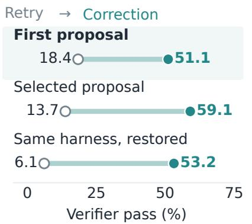

## b Learn to diagnose

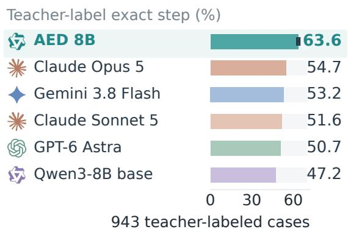

## c Assist recovery

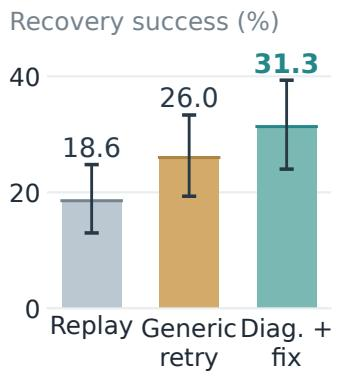  
Figure 1: Failure reuse: correction, diagnosis learning and recovery. (a) Executed corrections outperform their matched original-action controls. (b) AED-trained Qwen3-8B leads the shown references in internal exact-step teacher-label agreement. (c) Su lied-location assistance im roves recover over re la . Panels use se arate cohorts; rotocols and uncertaint : Section 5 and Appendices J, H.2.

## 1. Introduction

Recent frontier large language models (LLMs), including GPT-6 Astra and Claude Fable 5.1, support complex reasoning, coding and long-horizon agentic work (OpenAI, 2026; Anthropic, 2026). These capabilities renew interest in how far language-model systems can generalize beyond their training tasks (Feng et al., 2024). Open-weight Qwen3.8-Flash Next, DeepSeek-V4.1-Flash and Kimi K3 broaden access to capable agent models (Qwen Team, 2026; DeepSeek-AI, 2026; Moonshot AI, 2026).

These advances extend language-model capabilities (Zhao et al., 2026) to interactive software and web tasks (Jimenez et al., 2024; Yao et al., 2022). Agent harnesses connect these models to executable tools and persistent state. OpenHands provides a composable software-agent SDK (Wang et al., 2026c); π agent combines a terminal agent loop with extensible tools, model-provider interfaces and resumable sessions (Earendil Works, 2026). Through these systems, agents inspect repositories, run commands and revise solutions using tool feedback (Qin et al., 2024; Liu et al., 2025). Understanding failures therefore requires examining the model together with the execution system in which it acts.

Agent post-training improves task performance by learning from interaction. AgentTuning uses reward-filtered trajectories for supervised fine-tuning (Zeng et al., 2024), while RAGEN and AgentRL extend policy optimization to multi-turn environment feedback (Wang et al., 2025; Zhang et al., 2025a). Yet an outcome reward alone does not specify which decision to revise or what action should replace it. Failed rollouts preserve what the agent observed, which actions it chose, and how the environment res onded. We can turn these rollouts into trainin exam les b identifying where the agent went wrong, explaining why, and proposing what it should do instead. This motivates a dataset of agent failures with diagnoses and corrections across diverse execution settings.

How should we analyze and transform failed agent experience so that models can learn to recognize, avoid, and repair errors across execution settings?

Existing work has advanced several aspects of learning from agent failures. MAST (Cemri et al., 2026b) characterizes failure modes, and Who&When (Zhang et al., 2025b) identifies responsible agents and decisive error steps. These annotations support failure analysis, but do not directly specify the actions an agent should learn instead. Agen Tracer (Zhang et al., 2026a) goes further by constructing attribution data and training a diagnostic model, while AgentDebug (Zhu et al., 2025) uses corrective feedback to recover from failures. Their principal learning and recovery objectives, however, difer from training an acting policy on corrected behavior. Across these resources, diferences in execution settin s, annotation tar ets, and correction evidence also make it dificult to stud dia nosis and action learning on a common collection of failures. A broader resource is therefore needed to connect natural failures with explanations, proposed corrections, and execution evidence, and to support training for both diagnosis and action.

We introduce the Agent Error Dataset (AED), a collection of 50,228 error–diagnosis pairs spanning 33 environments, 19 harness families and 23 policy models. This breadth supports failure analysis across text-based execution settings; stored traces also support re-diagnosis without new rollouts. Our Agentic Error-to-Training (AET) pipeline links diagnoses and proposed corrections to matched replay outcomes where supported, then constructs objective-specific training views (Figure 2). The collection counts pairs, while experiments use a separately frozen diagnosis release and distinct replay and actor cohorts (Section 3.3).

Our contributions connect failure analysis, correction testing and post-training. (i) A scaled collection of natural agent failures retains provenance across execution settings, supporting analysis of how failures vary with the model and harness (Section 3.3). (ii) AET, a pipeline for reusing failed experience, links diagnoses, corrections and optional controlled replay to separate training views. First-proposal corrections improve matched-replay pass rates by 32.7 percentage points over original-action retries (Section 5.1). (iii) An empirical study of error-aware post-training shows that full-diagnosis SFT on 1,656 source tasks raises internal exact-step teacher-label agreement from 47.2% to 63.6% across three seeds.

## 2. Related Work

Attribution and failure analysis. Understanding failures requires connecting recurring error patterns to decisions within individual runs. MAST and AdaMAST organize these patterns into taxonomies (Cemri et al., 2026b;a), while attribution researchers identify responsible agents and error locations (Zhang et al., 2025b; Deshpande et al., 2025; Barke et al., 2026), including in long traces and spans (Wang et al., 2026a;b; Chen et al., 2026; Xia et al., 2026).

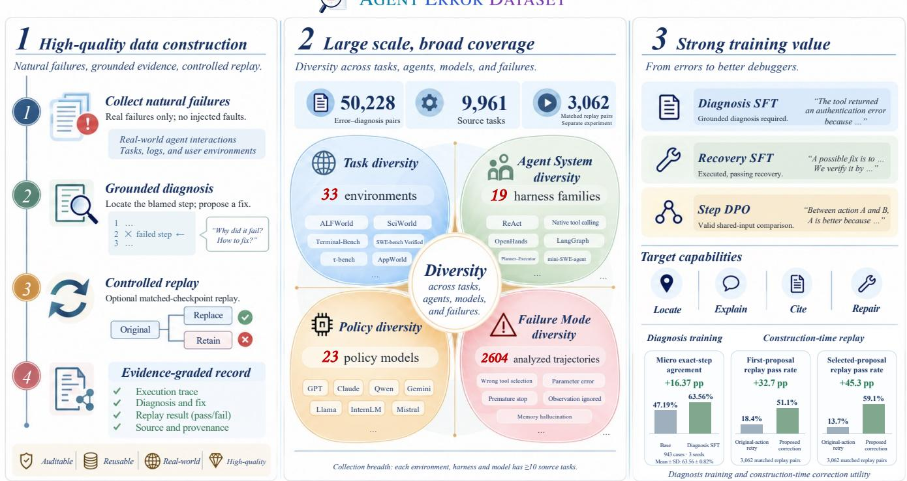  
Figure 2: AET construction and training views. Natural failures yield diagnoses, corrections and optional replay evidence. Coverage, historical error profiles and experiments use separate cohorts. Replay bars use first/selected proposals (n = 3,062 each) and restored-harness selected proposals (n = 871), each with its own control; they measure correction utility. “Step DPO” denotes an ofline action-preference pilot (Appendix D.1).

To scale attribution supervision, AgenTracer trains localization models, Who&When Pro expands fault injection, and AEGIS verifies injected failures before training attribution (Zhang et al., 2026a; Liu et al., 2026; Kong et al., 2026). For recovery, the question extends to whether a diagnosed error persists and whether a correction helps: TrajDebug tracks error resolution and introduces TrajErrBench (Qi et al., 2026), while AgentDebug and AgentDebugX connect diagnosis to corrective execution (Zhu et al., 2025; 2026); CUADebug applies diagnosis and repair to screenshot-based computer use (Zhang et al., 2026b). In AED, we use exploratory error groupings for cross-setting analysis, and link natural failures to diagnoses, proposed corrections and available replay evidence to support post-training (Table 1).

Learning from unsuccessful experience. Prior work reuses failed actions, segments and goals (Lan et al., 2025; Ding, 2026; Li et al., 2026; Yin et al., 2026), constructs reflective recovery trajectories (Yuan et al., 2025; Chen et al., 2025; Kruengkrai & Yoshino, 2025), and guides later behavior with critiques (Shinn et al., 2023; Kumar et al., 2025). Other resources retain executable environments and verifiers (Xu et al., 2025; Pan et al., 2024; Yang et al., 2026); ADP unifies trajectory formats (Song et al., 2026). On a separate replay-supported subset, we compare corrections with same-checkpoint original-action retries (Table 1). Appendix C.3 details resource scopes; Appendix T.3 tests trajectory export, not full-record interoperability.

## 3. Agent Error Dataset

Each record links a failed trace to a diagnosis and any correction-test outcomes. The available evidence determines which training views it can support.

## 3.1. The data record

We count a run as failed when its environment adapter reports an unsuccessful terminal outcome within the allowed budget. This collection-level outcome does not locate an error: attributing an agent error requires a trace-supported, avoidable decision. Appendix D.1 distinguishes task failures, recovered tool errors and ungradable runs.

Table 1: Failure-record resources for LLM agents. Errors: natural (nat.), injected (inj.) or synthetic (syn.). Envs/Harn./Models: environments, harnesses and generating models. Records: each work’s units (AED: error–diagnosis pairs). Step: localization; Evid.: trace evidence; Exec. fix: executed correction; Ctrl.: same-checkpoint original-action control. Train: debugger (D), agent (A); Agree.: human agreement (AED: raw step, 59/69; metrics difer). ◦ partial; “–” not stated. AED counts use one audited collection snapshot. ‡Counts include multimodal traces; AED is text-only. Agreement definitions and details: Appendix C.3.
<table><tr><td>Work</td><td>Errors</td><td>Envs Harn.</td><td></td><td>Models</td><td>Records</td><td>Step</td><td>Evid.</td><td>Exec. fix</td><td>Ctrl.</td><td>Train</td><td>Agree.</td></tr><tr><td>Who&amp;When (Zhang et al., 2025b)</td><td>nat.</td><td>2</td><td>2</td><td></td><td>184</td><td>V</td><td>X</td><td>X</td><td>X</td><td></td><td></td></tr><tr><td>Who&amp;When Pro‡ (Liu et al., 2026)</td><td>inj.</td><td>26</td><td>15</td><td></td><td>12,326</td><td></td><td>X</td><td>X</td><td>X</td><td></td><td>κ.73</td></tr><tr><td>AgenTracer (Zhang et al., 2026a)</td><td>nat.+inj.</td><td>6</td><td>6</td><td></td><td>&gt;2,000</td><td></td><td>X</td><td>0</td><td>X</td><td>D</td><td></td></tr><tr><td>AEGIS (Kong et al., 2026)</td><td>inj.</td><td>6</td><td>6</td><td>1</td><td>9,533</td><td></td><td>X</td><td>X</td><td>X</td><td>D</td><td>κ.81</td></tr><tr><td>MAST (Cemri et al., 2026b)</td><td>nat.</td><td>8</td><td>7</td><td>6</td><td>1,642</td><td>X</td><td>×</td><td>0</td><td>X</td><td></td><td>K .88</td></tr><tr><td>TRAIL (Deshpande et al., 2025)</td><td>nat.</td><td>2</td><td>2</td><td>2</td><td>841</td><td>√</td><td>√</td><td>X</td><td>X</td><td></td><td></td></tr><tr><td>AgentErrorBench (Zhu et al., 2025)</td><td>nat.</td><td>3</td><td></td><td></td><td>200</td><td>V</td><td>X</td><td>√</td><td>X</td><td></td><td>κ .55</td></tr><tr><td>TraceElephant (Chen et al., 2026)</td><td>nat.</td><td>3</td><td>3</td><td>1</td><td>220</td><td>M</td><td>X</td><td>一</td><td></td><td></td><td>α.64</td></tr><tr><td>TrajErrBench (Qi et al., 2026)</td><td>nat.</td><td>2</td><td></td><td>8</td><td>486</td><td></td><td>√</td><td>o</td><td>X</td><td></td><td>κ .91/.67</td></tr><tr><td>AgentRx (Barke et al., 2026)</td><td>nat.</td><td>4</td><td></td><td>一</td><td>170</td><td>V</td><td>X</td><td>一</td><td>一</td><td></td><td>κ .89</td></tr><tr><td>STeP (Chen et al., 2025)</td><td>syn.</td><td>3</td><td></td><td>1</td><td>708</td><td>V</td><td>X</td><td>√</td><td>X</td><td>A</td><td></td></tr><tr><td>Agent Error Dataset (AED)</td><td>nat.</td><td>33</td><td>19</td><td>23</td><td>50,228</td><td>L</td><td>L</td><td>0</td><td>O</td><td>D, A</td><td>85.5%</td></tr></table>

A record links a failed action–observation trace to one diagnosis, its proposed correction, review decisions and available replay branches. It also records the policy, harness, debugger and information used in construction, alongside intended uses and limitations following dataset documentation practice (Gebru et al., 2021). Multiple proposals for one failure remain distinct attempts, grouped by source task for splitting and analysis. Diagnoses are free text rather than assignments to a fixed error taxonomy; error modes are induced afterwards without changing the underlying labels (Appendix G.1). Appendix T gives the schema and a worked example.

## 3.2. AET: a five-stage data generation pipeline

AET connects five stages (Figure 2). (1) Collect natural failures across environments, harnesses and policies, preserving action–observation traces and screening out known infrastructure or grader faults from agent-error targets. (2) Diagnose the error location and responsible agent, with a trace-cited explanation and proposed correction, following AgentDebug (Zhu et al., 2025) through AgentDebugX (Zhu et al., 2026). (3) Ground the diagnosis in the student-visible trace through structural and semantic checks, recording accepted and rejected proposals. (4) Replay, where supported, tests the correction against a fresh original-action retry from the same checkpoint under matched policy, harness, budget and verifier settings. Both outcomes are retained; recovery supports a correction under those conditions, without establishing a unique root cause. (5) Build views for diagnosis SFT, recovery SFT and action preferences, each with its own evidence and split requirements (Section 4). Diagnosis records require no replay; recovery targets require an executed, passing continuation, and preferences require a valid shared-input comparison. Stored failures can receive additional diagnoses without new rollouts, while records that fail a view’s admission rules remain available for collection audits. Appendix D.1 gives the stage contracts and Appendix E.6 the review rubric.

## 3.3. Collection scope and training subsets

We check source linkage, error-step presence and trace citations before counting a pair. The environment inventory includes benchmarks, synthetic tasks and simplified ports; it is not a count of public benchmarks. An error–diagnosis pair joins one failed execution with one recorded diagnosis. Diferent model, seed or temperature rollouts can contribute distinct failed runs; additional diagnoses of one run add pairs, not runs. Source-task grouping keeps related executions together for splitting and uncertainty estimates. Collection membership does not imply training eligibility or a verified re air. Fi ure 3 shows 50,228 airs linked to 38,278 stored source-trace blobs and 9,961 source tasks (1.31 airs er blob). Blob identities do not establish a count of independent executions. Both panels use this index; Appendix C.2 distinguishes collection counts from training subsets.

The se aratel frozen dia nosis release used in Section 5 contains 4,319 rows over 2,309 source tasks in 15 environments, each environment produced by up to nine harness families and ten policy models (Table 12). The collection, replay cohort and objective-specific training subsets have diferent admission rules.

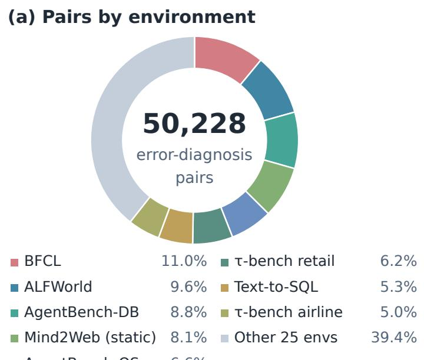  
(b) Pairs by harness

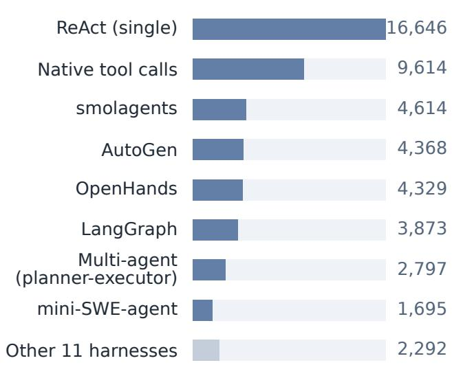

Figure 3: Error–diagnosis pair composition, current audit. Both panels include all 50,228 source-linked pairs. (a) Environment shares. (b) Harness counts; small sources are grouped. Across this cohort, 33 environments and 19 harness families meet the ten-source-task floor. These are collection shares, not failure rates or trainin -admission rates (A endix C.2); the full distributions appear in Appendix B.6.

Appendix B.1 analyzes source coverage and diagnosis multiplicity on this same collection index.

Failure profiles across harnesses. We also examine an earlier, trajectory-deduplicated taxonomy study (Figure 4). The diferences motivate checking error-type coverage alongside environment counts when selecting training examples. A endix G.1 identifies this historical subset and its sam lin and labelin limitations.

## 4. Training Views

AED constructs learning examples from failures by selecting the visible history and target responses, then applies standard post-training objectives. For example i, let $x _ { i }$ be the visible context, y the target response, $m _ { i k }$ its binary token mask and $\begin{array} { r } { M _ { i } = \sum _ { k } m _ { i k } } \end{array}$ the number of target tokens. Real examples have $M _ { i } > 0 ;$ actor addin contributes zero loss and zero tokens. With model $\pi _ { \theta }$ and o timizer window B, the evaluated SFT losses are

$$
\begin{array} { r l r } & { \ell _ { i } ( \theta ) = - \displaystyle \sum _ { k } m _ { i k } \log \pi _ { \theta } ( y _ { i k } \mid x _ { i } , y _ { i , < k } ) , } & \\ & { \mathcal { L } _ { \mathrm { d i a g } } ( \theta ) = \displaystyle \frac { 1 } { | \mathcal { B } | } \sum _ { i \in \mathcal { B } } \frac { \ell _ { i } ( \theta ) } { M _ { i } } , \quad } & { \mathcal { L } _ { \mathrm { a c t o r } } ( \theta ) = \displaystyle \frac { \sum _ { i \in \mathcal { B } } \ell _ { i } ( \theta ) } { \sum _ { i \in \mathcal { B } } M _ { i } } . } & \end{array}\tag{1}
$$

Only target assistant tokens receive loss, including the actor end-of-turn token; context and tool observations receive no loss. Diagnosis uses per-example means; actor normalization spans all ranks and accumulation steps.

Diagnosis. Diagnosis pairs the failed trace $x _ { i } = \tau _ { i }$ with $y _ { i } = d _ { i } = \left( t _ { i } ^ { * } , u _ { i } ^ { * } , e _ { i } , a _ { i } ^ { * } \right)$ : attributed step, responsible agent, explanation with evidence and proposed correction. Compact targets retain only attribution, optionally with a short rationale. Inputs exclude construction-only verifier context, successful references and replay outcomes; admission does not require successful replay.

Prevention and recovery. Each preventive example pairs pre-error history with an executed passing action, $\left( x _ { i } , y _ { i } \right) =$ $\left( h _ { < t } , a _ { t } ^ { + } \right)$ , using the inference chat prefix. The post-error variant adds the original erroneous action and its rejection as masked context, then supervises the correction, with or without a diagnosis-derived reflection. Only state-preserving rejections enter post-error context; other repair examples use pre-error history. Neither form includes the later failed sufix. Section 5.3 specifies the success/repair mixtures.

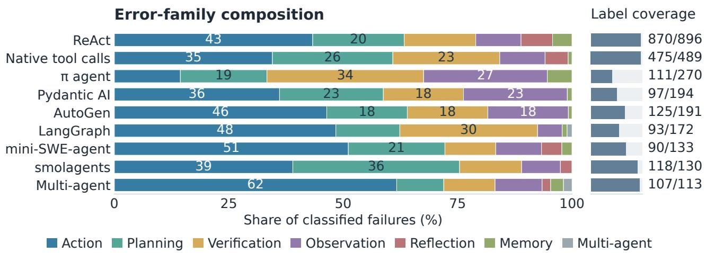  
Figure 4: Failure profiles across harnesses. Historical machine labels: 2,092 of 2,604 trajectories classified. The nine displayed groups contain 2,588 trajectories (2,086 classified); 16 trajectories fall outside these groups. Bars show conditional family shares; coverage retains abstentions. Task mixtures difer across harnesses, so this is an exploratory subset comparison, not a causal efect or the full-collection distribution (Appendix G.1).

Takeaway: Exploratory error profiles difer across harnesses

Action-error labels lead in 8 of the 9 shown harnesses, including the planner–executor harness (61.7%). The agent instead concentrates labels on verification and observation (61.3%). These exploratory profiles motivate error-type coverage checks alongside environment counts.

Outcome and preference views. Replay retains corrected-action and original-action outcomes, including negative and zero contrasts. A preference pair requires executed alternatives from the same state and a positive outcome contrast under the construction protocol. We evaluate SFT; the ofline action-DPO (Rafailov et al., 2023) pilot establishes no recovery benefit (Appendix I.15). Appendix Q.3 gives the loss definitions and implementation checks.

## 5. Experiments

We evaluate diagnosis production, correction utility, diagnosis learning and actor training recipes. Appendix I.5 specifies comparison scope.

Setup. Trainable models start from Qwen3-8B (Yang et al., 2025); each study uses a frozen, objective-specific population. Internal splits hold out source tasks; we audit public overlap below. Missing or unparseable responses count as misses. Public comparisons share visible inputs and scorers within each protocol; exact-step scores use task-family macro or case-level micro averages. Seed SD measures run variability; paired task-family intervals measure evaluation sampling. Actors measure initial-state task success. Appendices I.3 and I.8 specify checkpoint selection, budgets, prompts and admission.

## 5.1. Diagnosis production and correction utility

The citation-first judge produces trace-cited diagnoses for 93.5% of the common failure pool, compared with 48.4–65.8% for the evaluated alternatives (Table 47b in the appendix). This measures production yield, not independent label accuracy; rendering and teacher access difer across configurations

First-proposal corrections raise verifier success from 18.4% to 51.1%, a 32.7-point gain (task-clustered 95% interval: 28.4–37.0) over original-action retries without selecting among repeated proposals (Figure 1a). Appendix X retains paired uncertainty, costs, the search-selected contrast and restored-harness sensitivity; Appendix B.2 analyzes paired outcomes and revisions.

In a separate supplied-location study, diagnosis-guided continuation scores 31.3%, versus 26.0% for generic reconsider-

## a Internal model comparison

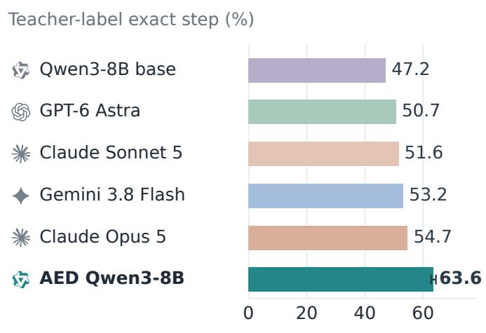  
AED: 1,656 tasks · mean ± SD, 3 seeds

## b Learning from more failures

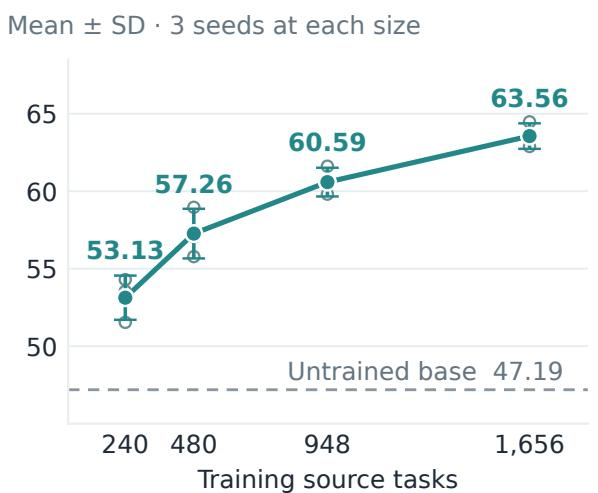  
Figure 5: Diagnosis learning and training scale. (a) Exact-step agreement with internal teacher labels against prompted references. (b) Four nested training sizes, each with three seeds: means ± sample SD, individual runs (open points) and untrained base (dashed line). All scores are case-level micro averages against recorded teacher labels on the same 943 cases. Checkpoint selection varies across sizes; protocols, score provenance and complete results: Appendix I.11 and Table 48.

ation and 18.6% for replay (Figure 1c). Its paired gain over generic reconsideration remains uncertain (Appendix H.2). Both studies test correction at a supplied location; neither tests autonomous detection or actor post-training. The replay cohort does not join the frozen diagnosis release. Matched-size filtering establishes no learning benefit from stricter admission under the tested recipe (Appendix X).

## 5.2. Can AED train a competitive failure-diagnosis model?

Internal localization. Full-diagnosis SFT raises exact-step agreement at each of four nested training sizes; even the smallest subset improves on the untrained base (Figure 5). We report case-level micro agreement because the responsible-agent label is constant on this holdout. The student learns from consensus-generated labels, whereas the references receive no training on these labels. The comparison measures agreement with the recorded annotations, including their conventions and defects, rather than a general ranking of diagnostic ability. Appendix S explains the heterogeneous teachers and the recorded Gemini 3.6 Flash arbiter.

Independent labels and protocol sensitivity. Public benchmarks (Zhang et al., 2025b; Qi et al., 2026) provide independent labels but can share tasks with training. The 1,656-task arm’s three seeds improve on the base on Who&When under the unified rotocol. These full-cohort scores include tasks shared with trainin . After excludin flagged task overlap, its interval includes zero (Table 15). Retraining after replacing flagged examples retains a positive contrast under this protocol (Table 16), but does not establish broad transfer. Mean TrajErrBench accuracy remains below base. We retain one checkpoint per seed across benchmarks (Appendix I.1).

Table 2 tests the 948-task, seed-17 student under a diferent public protocol. Full-diagnosis training loses both responsible-agent and exact-step accuracy on Who&When; answer-format continuation recovers part of the deficit but changes training exposure as well as format. AgentErrorBench point estimates improve without a clear paired advantage. Under the same frozen cases and first-call contract (Table 3), the answer-format student exceeds four prompted frontier references on responsible-agent attribution in both hand-crafted conditions, but not on the algorithm generated conditions, exact step or AgentErrorBench. Appendix V.1 explains the student’s reused first calls, the base run and the token-budget exclusion of two further references. The larger arm also loses Who&When accuracy under benchmark-specific protocols, which change input rendering, answer schema and step indexing as well as wording.

Matched resource comparison. With a common base, compact-attribution recipe and matched source-task count, AED and AgenTracer data each lead on a diferent test distribution (Table 11). AgenTracer’s largest advantage occurs on injected errors, alongside task and annotation diferences. Compact-target AED does not beat the base internally. This compares training resources under one student recipe, not AgenTracer’s RL system (Zhang et al., 2026a) or a controlled ablation of full-diagnosis targets.

<table><tr><td>Takeaway: Internal agreement improves; broad transfer is environment dependent</td></tr><tr><td>Full-diagnosis supervision improves agreement with the recorded internal labels. External results depend on the benchmark answer contract and task overlap; resource rankings reverse across test distributions.</td></tr></table>

Table 2: Public attribution under a shared prompt. All-case percentages for the 948-task, single-seed student and its answer-format continuation. HC/AG: hand-crafted/algorithm-generated; gold is the task answer. Budget-forced continuation is enabled. Protocols and comparison scope: Appendix I.5.
<table><tr><td colspan="5">(a) Who&amp;When: agent / exact step (%)</td></tr><tr><td>Model or training resource</td><td>HC</td><td>HC + gold</td><td>AG</td><td>AG + gold</td></tr><tr><td>Qwen3-8B base</td><td>56.90/20.69</td><td>51.72/18.97</td><td>56.35/37.30</td><td>55.56/38.89</td></tr><tr><td>AED diagnosis SFT</td><td>50.00/15.52</td><td>44.83/13.79</td><td>23.81/15.87</td><td>11.11/9.52</td></tr><tr><td>+ answer-format diversity</td><td>70.69/24.14</td><td>68.97/22.41</td><td>59.52/34.92</td><td>58.73/34.13</td></tr><tr><td colspan="5">(b) AgentErrorBench: exact step / step+module (%)</td></tr><tr><td>Model or training resource</td><td>ALFWorld</td><td>WebShop</td><td>GAIA</td><td>Env. macro</td></tr><tr><td>Qwen3-8B base</td><td>12.00/1.00</td><td>18.00/0.00</td><td>20.00/4.00</td><td>16.67/1.67</td></tr><tr><td>AED diagnosis SFT</td><td>19.00/5.00</td><td>20.00/2.00</td><td>22.00/8.00</td><td>20.33/5.00</td></tr><tr><td>+ answer-format diversity</td><td>18.00/5.00</td><td>18.00/0.00</td><td>30.00/4.00</td><td>22.00/3.00</td></tr></table>

Bold: highest displayed score per metric among the rows shown, including ties; not statistical significance.

Table 3: Frontier references under a shared prompt. All-case responsible-agent / exact-step accuracy (%) on the same frozen cases, first call only, with no continuation responses scored. Bold marks per-metric column maxima. Student first calls come from the run in Table 2. Run provenance, repeat variation and exclusions: Appendix V.1.
<table><tr><td></td><td colspan="4">Who&amp;When</td><td></td></tr><tr><td>Model or training resource</td><td>HC</td><td>HC + gold</td><td>AG</td><td>AG + gold</td><td>AEB</td></tr><tr><td colspan="6">Prompted references, same unified attribution prompt</td></tr><tr><td>Gemini 3.7 Flash</td><td>25.86/8.62</td><td>25.86/10.34</td><td>38.10/26.19</td><td>38.89/27.78</td><td>21.50/25.00</td></tr><tr><td>GPT-5.6 Sol</td><td>51.72/25.86</td><td>58.62/34.48</td><td>67.46/55.56</td><td>66.67/49.21</td><td>18.50/25.50</td></tr><tr><td>Claude Opus 5</td><td>43.10/24.14</td><td>50.00/22.41</td><td>49.21/32.54</td><td>48.41/33.33</td><td>16.50/23.50</td></tr><tr><td>Claude Sonnet 5</td><td>56.90/20.69</td><td>60.34/32.76</td><td>65.87/49.21</td><td>65.87/48.41</td><td>23.00/27.50</td></tr><tr><td colspan="6">Ours, same prompt and the same frozen cases</td></tr><tr><td>Qwen3-8B base</td><td>22.41/8.62</td><td>17.24/8.62</td><td>18.25/15.87</td><td>19.05/13.49</td><td>6.50/16.50</td></tr><tr><td>+ AED diagnosis SFT, answer-format</td><td>70.69/24.14</td><td>68.97/22.41</td><td>59.52/34.92</td><td>58.73/34.13</td><td>10.50/21.00</td></tr></table>

Overlap audits place the scaling gain outside identified high-overlap subsets, but training and holdout share environ- ments and many harness–policy combinations (Appendix I.5).

## 5.3. Can repair supervision improve the acting policy?

We compare success-only SFT with preventive, post-error action-only and reflective repair supervision. The success-only control follows interaction tuning (Zeng et al., 2024) using our pool, not AgentTuning’s data. All actors start held-out tasks without a test-time teacher. The single-seed recipes difer in task pools, exposure and optimizer updates; their contrasts measure the combined recipe, not repair supervision alone.

The evaluated repair-containing recipes score higher on WebShop-lite and lower on TextQuest (Figure 6). Action-only and reflective WebShop gains and all TextQuest losses survive the post-hoc multiplicity adjustment. Other diferences are not detected, which does not establish equivalence. Reflection adds no detected benefit over action-only targets.

WebShop-lite gains accompany shorter episodes, while many newly lost TextQuest tasks hit the step limit. These

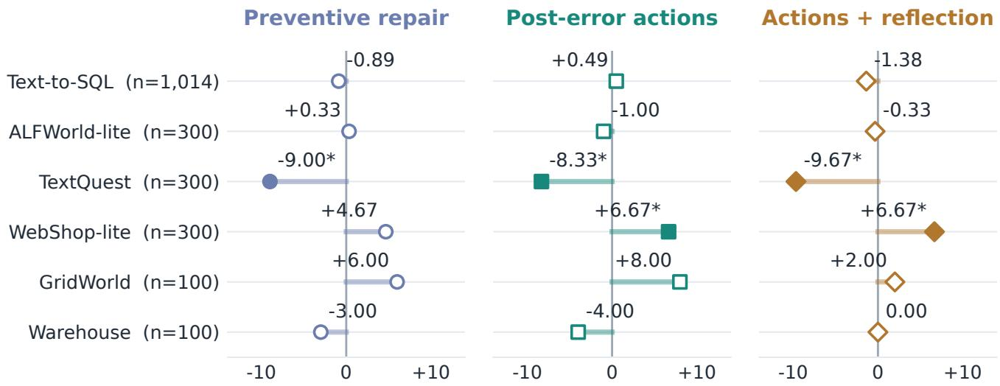  
Change in initial-state success vs success-only SFT (pp)  
Figure 6: Repair-containing recipes: gains and losses across environments. All 18 paired percentage-point contrasts against success-only SFT; filled markers and ∗ indicate post-hoc Holm-adjusted significance across tasks, conditional on one training seed. Task pools and exposure difer. Planned denominators include run errors. Absolute scores and the untrained base: Appendix X.2.  
associations do not isolate a budget mechanism from exposure or update-count diferences (Appendix X).

Transfer scope. The six development environments test held-out tasks within actor-training environments, outside the frozen core diagnosis corpus. On real ALFWorld and ScienceWorld, the preventive arm loses to the untrained policy. Only that recipe has this real-environment comparison; ScienceWorld omits six run errors from its repair denominator (Appendix X).

<table><tr><td>Takeaway: Repair utility is environment-dependent</td></tr><tr><td>The evaluated repair-containing recipes improve WebShop-lite. TextQuest and real-environment losses limit the result to the tested recipes and environments.</td></tr></table>

## 6. Discussion and Conclusion

AED or anizes failed ex erience for anal sis dia nosis and corrective su ervision. We find useful corrections and improved agreement with internal diagnostic labels, with protocol-dependent public transfer and mixed actor out- comes. The 50,228- air collection su orts anal sis across execution settin s; learnin results concern smaller frozen populations. Historical supervision omits policy context, and later checks do not validate it retroactively (Appendix A). Correction utility, label validity and learned recovery each require their own evidence.

## Ethics statement

We construct AED from public benchmarks, synthetic tasks, and simulated environments to study agent behavior, without seeking to collect personal information. Repository-based tasks, such as SWE-bench (Jimenez et al., 2024), may nevertheless expose contributor names, email addresses, or identifying text in code comments and issue discussions This source-dependent privacy risk is shared with software-engineering benchmarks and can persist in derived trajectories. Public availability alone does not establish that the content is free of personal information or unrestricted for redistribution. Any release of our data will therefore be subject to source-specific privacy review and licensing restrictions, including redaction of sensitive content and unnecessary personal identifiers while preserving required attribution.

The human review involved four paper authors with doctoral or AI/LLM research backgrounds who participated voluntarily. We report their judgments using anonymous rater identifiers and aggregate statistics.

## AI use statement

We used generative AI to aid writing and editing; to support research ideation and execution, including experimental design, method implementation, data processing, analysis and interpretation; and to generate synthetic tasks, diagnoses and proposed corrections as described in Section 3.2 and the construction appendices. We also used AI for literature discovery, design critique and illustration. We test generated code and check measured claims against sources and versioned records; automated checks and the completed AI-assisted human audit have the scopes stated in Appendices E.5 and W. Figure 2 uses author-supplied artwork. The authors take responsibility for the paper and its claims.

## Reproducibility statement

Appendices D, Q, and A specify splits, interventions, statistics and run manifests. Following acceptance, we plan to open-source the code on GitHub and release model checkpoints and data, subject to source licenses, privacy review and redistribution rights. The planned release includes splits, prompts, evaluation protocols and result generators.

## References

Anthropic. Claude Fable 5.1. Claude Platform documentation, 2026. URL https://platform.claude.com/docs/ en/models/fable-5-1/overview. Accessed September 24, 2026.

Ron Artstein and Massimo Poesio. Survey article: Inter-coder agreement for computational linguistics. Computational Linguistics, 34(4):555–596, 2008. doi: 10.1162/coli.07-034-R2. URL https://aclanthology.org/J08-4004/.

Shraddha Barke, Arnav Goyal, Alind Khare, Avaljot Singh, Suman Nath, and Chetan Bansal. Agentrx: Diagnosing ai agent failures from execution trajectories. arXiv preprint arXiv:2602.02475, 2026.

Mert Cemri, Andrei Cojocaru, Melissa Pan, Shu Liu, Shubham Agarwal, Alexander Krentsel, Jay Tang, Kannan Ramchandran, Joseph E. Gonzalez, Matei Zaharia, Alex Dimakis, and Ion Stoica. Fantastic adaptive taxonomies and how to use them, 2026a. URL https://arxiv.org/abs/2607.16387.

Mert Cemri, Melissa Z Pan, Shu i Yan , Laksh a A A rawal, Bhav a Cho ra, Rishabh Tiwari, Kurt Keutzer, Adit a Parameswaran, Dan Klein, Kannan Ramchandran, et al. Why do multi-agent llm systems fail? Advances in Neural Information Processing Systems, 38, 2026b.

Mengzhuo Chen, Junjie Wang, Fangwen Mu, Yawen Wang, Zhe Liu, Huanxiang Feng, and Qing Wang. Seeing the whole elephant: A benchmark for failure attribution in llm-based multi-agent systems, 2026. URL https: //arxiv.org/abs/2604.22708.

Yihan Chen, Benfeng Xu, Xiaorui Wang, Yongdong Zhang, and Zhendong Mao. Training llm-based agents with synthetic self-reflected trajectories and partial masking. arXiv preprint arXiv:2505.20023, 2025.

DeepSeek-AI. DeepSeek-V4.1-Flash: Pushing the limits of KV cache compression, 2026. URL https://huggingface. co/deepseek-ai/DeepSeek-V4.1-Flash.

Darshan Deshpande, Varun Gangal, Hersh Mehta, Jitin Krishnan, Anand Kannappan, and Rebecca Qian. Trail: Trace reasoning and agentic issue localization. arXiv preprint arXiv:2505.08638, 2025.

Liang Ding. Agenther: Hindsight experience replay for llm agent trajectory relabeling. arXiv preprint arXiv:2603.21357, 2026.

Earendil Works. Pi: An extensible AI agent for the terminal. Software and documentation, 2026. URL https: //github.com/earendil-works/pi. Accessed 2026-09-25.

Tao Feng, Chuanyang Jin, Jingyu Liu, Kunlun Zhu, Haoqin Tu, Zirui Cheng, Guanyu Lin, and Jiaxuan You. How far are we from AGI: Are LLMs all we need? arXiv preprint arXiv:2405.10313, 2024. URL https://arxiv.org/abs/ 2405.10313.

Timnit Gebru, Jamie Morgenstern, Briana Vecchione, Jennifer Wortman Vaughan, Hanna Wallach, Hal Daumé III, and Kate Crawford. Datasheets for datasets. 2021. URL https://arxiv.org/abs/1803.09010.

Edward J Hu, yelong shen, Phillip Wallis, Zeyuan Allen-Zhu, Yuanzhi Li, Shean Wang, Lu Wang, and Weizhu Chen. LoRA: Low-rank adaptation of large language models. In International Conference on Learning Representations, 2022. URL https://openreview.net/forum?id=nZeVKeeFYf9.

Carlos E Jimenez, John Yang, Alexander Wettig, Shunyu Yao, Kexin Pei, Ofir Press, and Karthik R Narasimhan. SWEbench: Can language models resolve real-world github issues? In The Twelfth International Conference on Learning Representations, 2024. URL https://openreview.net/forum?id=VTF8yNQM66.

Fanqi Kong, Ruijie Zhang, Huaxiao Yin, Guibin Zhang, Xiaofei Zhang, Ziang Chen, Zhaowei Zhang, Xiaoyuan Zhang, Song-Chun Zhu, and Xue Feng. Aegis: Automated error generation and attribution for multi-agent systems. In The Fourteenth International Conference on Learning Representations, 2026. URL https://openreview.net/forum? id=zqcYoxXiN3.

Canasai Kruengkrai and Koichiro Yoshino. Teaching text agents to learn sequential decision making from failure. In Proceedings of the 63rd Annual Meeting of the Association for Computational Linguistics (Volume 1: Long Papers), pp. 31619–31635 2025.

Aviral Kumar Vincent Zhuan Rishabh A arwal Yi Su John D Co-Re es Avi Sin h Kate Baumli Shari I bal Colton Bishop, Rebecca Roelofs, et al. Training language models to self-correct via reinforcement learning. In International Conference on Learning Representations, volume 2025, pp. 54523–54549, 2025.

Li-Cheng Lan, Andrew Bai, Minhao Cheng, Cho-Jui Hsieh, and Tianyi Zhou. Exploring expert failures improves llm agent tuning. arXiv preprint arXiv:2504.13145, 2025.

Mukai Li, Qingcheng Zeng, Tianqing Fang, Zhenwen Liang, Linfeng Song, Qi Liu, Haitao Mi, and Dong Yu. Verified critical step optimization for llm agents. In Findings of the Association for Computational Linguistics: ACL 2026, pp. 39627–39639, 2026.

Bang Liu, Xinfeng Li, Jiayi Zhang, Jinlin Wang, Tanjin He, Sirui Hong, Hongzhang Liu, Shaokun Zhang, Kaitao Song, Kunlun Zhu, Yuheng Cheng, Suyuchen Wang, Xiaoqiang Wang, Yuyu Luo, Haibo Jin, Peiyan Zhang, Ollie Liu, Jiaqi Chen, Huan Zhang, Zhaoyang Yu, Haochen Shi, Boyan Li, Dekun Wu, Fengwei Teng, Xiaojun Jia, Jiawei Xu, Jinyu Xiang, Yizhang Lin, Tianming Liu, Tongliang Liu, Yu Su, Huan Sun, Glen Berseth, Jianyun Nie, Ian Foster, Logan Ward, Qingyun Wu, Yu Gu, Mingchen Zhuge, Xinbing Liang, Xiangru Tang, Haohan Wang, Jiaxuan You, Chi Wang, Jian Pei, Qiang Yang, Xiaoliang Qi, and Chenglin Wu. Advances and challenges in foundation agents: From brain-inspired intelligence to evolutionary, collaborative, and safe systems, 2025. URL https://arxiv.org/abs/2504.01990.

Jiale Liu, Huajun Xi, Shaokun Zhang, Yifan Zeng, Tianwei Yue, Chi Wang, Jian Kang, Qingyun Wu, and Huazheng Wang. Who&when pro: Can llms really attribute failures in ai agents?, 2026. URL https://arxiv.org/abs 2607.09996.

Ilya Loshchilov and Frank Hutter. Decoupled weight decay regularization, 2019. URL https://arxiv.org/abs/ 1711.05101.

Moonshot AI. Kimi K3. Oficial model card, 2026. URL https://huggingface.co/moonshotai/Kimi-K3.

OpenAI. GPT-6 Astra. OpenAI API documentation, 2026. URL https://developers.openai.com/api/docs/ models/gpt-6-astra. Accessed September 24, 2026.

Jiayi Pan, Xingyao Wang, Graham Neubig, Navdeep Jaitly, Heng Ji, Alane Suhr, and Yizhe Zhang. Training software engineering agents and verifiers with swe-gym. arXiv preprint arXiv:2412.21139, 2024.

Yunjia Qi, Zehua Yin, Xintong Shi, Hao Peng, Songyuanyi Lu, Yixian Liu, Richeng Xuan, Yuhong Liu, Zhichao Hu, Xiaozhi Wang, Lei Hou, Bin Xu, and Juanzi Li. Trajdebug: Tracing error lifecycle to identify critical failures in long-horizon agent trajectories, 2026. URL https://arxiv.org/abs/2608.06346.

Yujia Qin, Shengding Hu, Yankai Lin, Weize Chen, Ning Ding, Ganqu Cui, Zheni Zeng, Yufei Huang, Chaojun Xiao, Chi Han, Yi Ren Fung, Yusheng Su, Huadong Wang, Cheng Qian, Runchu Tian, Kunlun Zhu, Shihao Liang, Xingyu Shen, Bokai Xu, Zhen Zhang, Yining Ye, Bowen Li, Ziwei Tang, Jing Yi, Yuzhang Zhu, Zhenning Dai, Lan Yan, Xin Cong, Yaxi Lu, Weilin Zhao, Yuxiang Huang, Junxi Yan, Xu Han, Xian Sun, Dahai Li, Jason Phang, Cheng Yang, Tongshuang Wu, Heng Ji, Zhiyuan Liu, and Maosong Sun. Tool learning with foundation models. 2024. URL https://arxiv.org/abs/2304.08354.

Qwen Team. Qwen3.8-Flash-Next: A new architecture, towards ultimate cost-eficiency, August 2026. URL https: //qwen.ai/blog?id=qwen3.8-flash-next.

Rafael Rafailov, Archit Sharma, Eric Mitchell, Christopher D Manning, Stefano Ermon, and Chelsea Finn. Direct preference optimization: Your language model is secretly a reward model. Advances in neural information processing systems, 36:53728–53741, 2023.

Noah Shinn, Federico Cassano, Ashwin Gopinath, Karthik Narasimhan, and Shunyu Yao. Reflexion: Language agents with verbal reinforcement learning. Advances in neural information processing systems, 36:8634–8652, 2023.

Yueqi Song, Ketan Ramaneti, Zaid Sheikh, Ziru Chen, Boyu Gou, Tianbao Xie, Yiheng Xu, Danyang Zhang, Apurva Gandhi, Fan Yang, et al. Agent data protocol: Unifying datasets for diverse, efective fine-tuning of llm agents. In International Conference on Learning Representations, volume 2026, pp. 143153–143173, 2026.

Jiaming Wang, Ziteng Feng, Jiangtao Wu, Ruihao Li, Qianqian Xie, Yuxiang Ren, He Zhu, Xueming Han, Fanyu Meng, Junlan Feng, and Jiaheng Liu. Where do deep-research agents go wrong? span-level error localization in agent trajectories, 2026a. URL https://arxiv.org/abs/2606.02060.

Minxing Wang, Xiaofei Xie, and Yintong Huo. Trajaudit: Automated failure diagnosis for agentic coding systems, 2026b. URL https://arxiv.org/abs/2605.26563.

Xingyao Wang, Simon Rosenberg, Juan Michelini, Calvin Smith, Hoang Tran, Engel Nyst, Rohit Malhotra, Xuhui Zhou, Valerie Chen, Robert Brennan, and Graham Neubig. The openhands software agent sdk: A composable and extensible foundation for production agents. 2026c. URL https://arxiv.org/abs/2511.03690.

Zihan Wang, Kangrui Wang, Qineng Wang, Pingyue Zhang, Linjie Li, Zhengyuan Yang, Xing Jin, Kefan Yu, Minh Nhat Nguyen, Licheng Liu, Eli Gottlieb, Yiping Lu, Kyunghyun Cho, Jiajun Wu, Li Fei-Fei, Lijuan Wang, Yejin Choi, and Manling Li. Ragen: Understanding self-evolution in llm agents via multi-turn reinforcement learning. 2025. URL https://arxiv.org/abs/2504.20073.

Yufei Xia, Anjun Gao, Yueyang Quan, Zhuqing Liu, and Minghong Fang. Who broke the system? failure localization in llm-based multi-agent systems, 2026. URL https://arxiv.org/abs/2607.07989.

Zhangchen Xu, Adriana Meza Soria, Shawn Tan, Anurag Roy, Ashish Sunil Agrawal, Radha Poovendran, and Rameswar Panda. Toucan: Synthesizing 1.5 m tool-agentic data from real-world mcp environments. arXiv preprint arXiv:2510.01179, 2025.

An Yang, Anfeng Li, Baosong Yang, Beichen Zhang, Binyuan Hui, Bo Zheng, Bowen Yu, Chang Gao, Chengen Huang, Chenxu Lv, Chujie Zheng, Dayiheng Liu, Fan Zhou, Fei Huang, Feng Hu, Hao Ge, Haoran Wei, Huan Lin, Jialong Tang, Jian Yang, Jianhong Tu, Jianwei Zhang, Jianxin Yang, Jiaxi Yang, Jing Zhou, Jingren Zhou, Junyang Lin, Kai Dang, Keqin Bao, Kexin Yang, Le Yu, Lianghao Deng, Mei Li, Mingfeng Xue, Mingze Li, Pei Zhang, Peng Wang, Qin Zhu, Rui Men, Ruize Gao, Shixuan Liu, Shuang Luo, Tianhao Li, Tianyi Tang, Wenbiao Yin, Xingzhang Ren, Xinyu Wang, Xinyu Zhang, Xuancheng Ren, Yang Fan, Yang Su, Yichang Zhang, Yinger Zhang, Yu Wan, Yuqiong

Liu, Zekun Wang, Zeyu Cui, Zhenru Zhang, Zhipeng Zhou, and Zihan Qiu. Qwen3 technical report. arXiv preprint arXiv:2505.09388, 2025. URL https://arxiv.org/abs/2505.09388.

John Yang, Kilian Lieret, Carlos Jimenez, Alexander Wettig, Kabir Khandpur, Yanzhe Zhang, Binyuan Hui, Ofir Press, Ludwig Schmidt, and Diyi Yang. Swe-smith: Scaling data for software engineering agents. Advances in Neural Information Processing Systems, 38, 2026.

Shunyu Yao, Howard Chen, John Yang, and Karthik R Narasimhan. Webshop: Towards scalable real-world web interaction with grounded language agents. In Alice H. Oh, Alekh Agarwal, Danielle Belgrave, and Kyunghyun Cho (eds.), Advances in Neural Information Processing Systems, 2022. URL https://openreview.net/forum?id= R9KnuFlvnU.

Shunyu Yao, Jefrey Zhao, Dian Yu, Nan Du, Izhak Shafran, Karthik Narasimhan, and Yuan Cao. React: Synergizing reasoning and acting in language models, 2023. URL https://arxiv.org/abs/2210.03629.

Bo Yin, Qi Li, and Xinchao Wang. On-policy self-evolution via failure trajectories for agentic safety alignment. arXiv preprint arXiv:2605.11882, 2026.

Siyu Yuan, Zehui Chen, Zhiheng Xi, Junjie Ye, Zhengyin Du, and Jiecao Chen. Agent-r: Training language model agents to reflect via iterative self-training. arXiv preprint arXiv:2501.11425, 2025.

Aohan Zeng, Mingdao Liu, Rui Lu, Bowen Wang, Xiao Liu, Yuxiao Dong, and Jie Tang. AgentTuning: Enabling generalized agent abilities for LLMs. In Lun-Wei Ku, Andre Martins, and Vivek Srikumar (eds.), Findings of the Association for Computational Linguistics: ACL 2024, pp. 3053–3077, Bangkok, Thailand, August 2024. Association for Computational Linguistics. doi: 10.18653/v1/2024.findings-acl.181. URL https://aclanthology.org/ 2024.findings-acl.181/.

Guibin Zhang, Junhao Wang, Junjie Chen, Wangchunshu Zhou, Kun Wang, and Shuicheng Yan. Agentracer: Who is inducing failure in the llm agentic systems? In International Conference on Learning Representations, volume 2026, pp. 11377–11399, 2026a.

Hanchen Zhang, Xiao Liu, Bowen Lv, Xueqiao Sun, Bohao Jing, Iat Long Iong, Zhenyu Hou, Zehan Qi, Hanyu Lai, Yifan Xu, Rui Lu, Hongning Wang, Jie Tang, and Yuxiao Dong. Agentrl: Scaling agentic reinforcement learning with a multi-turn, multi-task framework. 2025a. URL https://arxiv.org/abs/2510.04206.

Shaokun Zhang, Ming Yin, Jieyu Zhang, Jiale Liu, Zhiguang Han, Jingyang Zhang, Beibin Li, Chi Wang, Huazheng Wang, Yiran Chen, and Qingyun Wu. Which agent causes task failures and when? on automated failure attribution of LLM multi-agent systems. In Forty-second International Conference on Machine Learning, 2025b. URL https: //openreview.net/forum?id=GazlTYxZss.

Weijia Zhang, Kunlun Zhu, Zeyi Liu, Yinting Chen, Tianyi Ma, Jiateng Liu, Jiaxun Zhang, Bingxuan Li, Xiangru Tang, Heng Ji, et al. Cuadebug: Diagnosing and repairing computer-use agent failures. arXiv preprint arXiv:2608.02643, 2026b.

Wayne Xin Zhao, Kun Zhou, Junyi Li, Tianyi Tang, Zican Dong, Yupeng Hou, Beichen Zhang, Yingqian Min, Junjie Zhang, Peiyu Liu, Xiaolei Wang, Yifan Du, Chen Yang, Yushuo Chen, Zhipeng Chen, Jinhao Jiang, Ruiyang Ren, Yifan Li, Xinyu Tang, Zikang Liu, Yiwen Hu, Jian-Yun Nie, and Ji-Rong Wen. A survey of large language models. Frontiers of Computer Science, 20(12), May 2026. ISSN 2095-2236. doi: 10.1007/s11704-026-60308-3. URL http://dx.doi.org/10.1007/s11704-026-60308-3.

Kunlun Zhu, Zijia Liu, Bingxuan Li, Muxin Tian, Yingxuan Yang, Jiaxun Zhang, Pengrui Han, Qipeng Xie, Fuyang Cui, Weijia Zhang, et al. Where llm agents fail and how they can learn from failures. arXiv preprint arXiv:2509.25370, 2025.

Kunlun Zhu, Xuyan Ye, Zhiguang Han, Yuchen Zhao, Bingxuan Li, Weijia Zhang, Muxin Tian, Xiangru Tang, Pan Lu, James Zou, et al. Agentdebugx: An open-source toolkit for failure observability, attribution, and recovery in llm agents. arXiv preprint arXiv:2607.18754, 2026.

## Supplementary Material

This supplement opens with the scope and limitations of the collection and experiments (Appendix A). The dataset analyses in Appendix B examine coverage, error profiles, and corrective evidence. Full-collection coverage uses the source-linked pair index in Figure 3; the error-profile and rollout studies identify their dated cohorts and counting units. Training and replay experiments retain their evaluated cohorts. Debugger-training results appear in the main text and Appendix I. Actor results measure initial-state task success under the evaluated training recipes.

## Contents

A Limitations and Reproducibility . 15   
B Dataset analysis and corrective evidence 16   
C Evidence grades, counting and populations 23   
D Construction, Replay, and Evidence. 25   
E Construction Audit and Annotation Quality 27   
F Case Studies 32   
G Taxonomy definitions and validation study. 33   
H Result tables for the body figures 34   
Training results and comparison protocols . 37   
J Additional detail for the experiments 51   
K Sensitivity Analyses 52   
L Error reporting on successful trajectories 53   
M Sensitivity to the supplied error location 53   
N Output-contract and abstention controls 54   
O Corpus Composition and Coverage . 54   
P Prior evaluation exposure and the current split . 55   
Q Training and Evaluation Protocols 56   
R Replication of single-trial contrasts . 58   
S Supervision comparison: current and historical cohorts. 59   
T Record Schema and Training Views 60   
U Core Prompts 63   
V Supporting public-reference results. 64   
W AI-assisted human review. 65   
X Supplementary experiment details . 70   
Collection attempts, the frozen diagnosis split and replay trials have diferent denominators (Table 7). Human-review   
results appear in Appendix W.1.

## A. Limitations and Reproducibility

Collection scale and training use. We use the full collection to measure coverage across tasks, environments, harnesses and policies (Figure 3). Detailed error-profile and rollout studies use dated cohorts with their own denominators (Appendix B). Collection size counts error–diagnosis pairs; it does not count independent executions or training-ready examples.

Diagnosis supervision requires a supported attribution; repair SFT requires an executed passing continuation with valid history, and preference learning requires comparable executed alternatives (Table 39). Task grouping and checks of student-visible information guide selection; they do not establish that smaller subsets are optimal. The observed gains concern frozen, objective-specific subsets and recipes; they do not measure full-collection utility or show that heterogeneous sources cannot be pooled.

The final collection index, earlier frozen diagnosis subsets and separate actor-development pool are versioned pop- ulations, not a verified nested filtering chain from the final collection (Table 7). We report selection within each experiment’s source population; their counts are not additive. Inclusion in coverage statistics does not establish a learning benefit for each retained record.

Evaluated version and subsequent revisions. The diagnosis experiments use an earlier frozen release with incomplete policy context: construction omitted policy system prompts and tool lists and predates the current semantic trace- support and expanded failure-screening checks. Replay already existed; we do not claim that all collection rows passed the later checks. We retain the original inputs and splits and identify replacement-data conditions. This does not resolve the earlier label defects (Appendix E.5). The completed historical human audit appears in Appendix W. These results measure learning from the recorded supervision; they do not validate the revised pipeline or the full collection.

Scope of the reported evidence
<table><tr><td>Scope</td><td>Interpretation of the measured results</td></tr><tr><td>Label validity</td><td>Quotation matching checks presence, not entailment or a unique cause. Teacher references and reconstructed traces require student-visibility audits. The assisted human audit finds higher agreement on error location than on diagnosis acceptance; its coverage-selected</td></tr><tr><td>Construction benefit</td><td>sample cannot estimate collection-wide accuracy. Paired replay tests correction utility, not attribution accuracy. Production yield and historical student comparisons differ in teacher access or task selection and do not isolate pipeline label quality.</td></tr><tr><td>Coverage and error rates</td><td>Failure-only samples cannot estimate deployment failure rates. Unequal task and model mixtures confound harness rankings and model-version trends. Text-only coverage, sparse coding cells and procedural stand-ins limit generality; environment counts are not counts of public benchmarks.</td></tr><tr><td>Diagnostic transfer</td><td>Internal holdouts share environments and often harnesses and policies with training. Public comparisons depend on reference access, prompts, coordinates and budgets. Localization on known failures does not test general failure detection, and current comparisons do not</td></tr><tr><td>Learned repair</td><td>establish public SOTA. Paired replay measures an intervention outcome, not learned autonomous recovery. Actor gains vary by environment, and the single-seed recipe comparisons also differ in exposure and update count. The action-DPO pilot measures offline preferences rather than task recovery.</td></tr></table>

Filtering changes task composition as well as label quality; without controlling common task support, a training comparison cannot isolate these efects. Appendix I.5 explains the scope of these comparisons.

Reproducibility materials. We retain manifests, splits, responses, replay outcomes, prompts, checksums and exclusion reasons. Appendix C.2 specifies task grouping; Appendix I.7 separates measured costs from projections.

## B. Dataset analysis and corrective evidence

## B.1. Coverage and multiplicity in the current collection

This analysis uses all 50,228 source-linked pairs in Figure 3, with the same pair identities and source-task grouping. We recompute the counts from the hash-bound metadata index; no historical labeling sample enters this summary. A source blob is a distinct stored source-trace object; its identity alone does not establish an independent execution.

Table 4: Current collection coverage and multiplicity. Pair, source-blob and task counts describe diferent units. Blob identities do not establish independent executions.

<table><tr><td rowspan=1 colspan=1>Measure                                                 Count</td></tr><tr><td rowspan=1 colspan=1>Error-diagnosis pairs                                   50,228</td></tr><tr><td rowspan=1 colspan=1>Distinct source blobs                                    38,278</td></tr><tr><td rowspan=1 colspan=1>Environment-scoped source tasks                       9,961</td></tr><tr><td rowspan=1 colspan=1>Environments / harness families / policy models 33/19/23</td></tr><tr><td rowspan=1 colspan=1>Nonempty environment-harness cells                     280</td></tr><tr><td rowspan=1 colspan=1>Source blobs with multiple diagnoses                   9,846</td></tr><tr><td rowspan=1 colspan=1>Pairs per source blob, mean                               1.31</td></tr><tr><td rowspan=1 colspan=1>Pairs per source task, median / 90th percentile         2/10</td></tr></table>

Collection breadth and concentration. BFCL, the largest source, supplies 11.0% of pairs; the five largest environments supply 44.0%. The five largest harness families supply 78.8%, so the collection is broad but unevenly represented. Table 36 retains ever environment and its source-task su ort includin benchmark ada tations and sim lified tasks. These shares describe collection composition; without successful-rollout denominators they cannot rank environment dificulty, models or harnesses.

Additional diagnoses share their underlying trace. Multiple diagnoses add 11,950 pairs beyond one per source blob. They can provide alternative explanations or corrections, but do not add independent failure observations. Analyses of error prevalence must group these records by trace and account for repeated source tasks.

Scope of the remaining analyses. Error-type analyses describe the historical labeled cohorts identified in their captions. The replay analysis below uses its own executed cohort; the frozen diagnosis release and actor experiments likewise retain their original inputs and denominators. Collection growth does not change those experimental results.

## B.2. Repair outcomes and diagnostic revision

MAST distinguishes failure profiles from system rankings and relates failure modes to task outcomes (Cemri et al., 2026b). We extend this analysis perspective to two properties recorded by AED: what happens when an action changes, and how the diagnosis changes after an unsuccessful correction. The cohorts below have diferent inclusion rules; neither estimates prevalence in the final collection. AgentDebug motivates diagnosis-guided replay (Zhu et al., 2025); this analysis examines the recorded outcomes, not a new repair algorithm.

Successful correction alone does not isolate corrective benefit. The first proposal succeeds on 1,564 paired attempts, but the original-action retry also succeeds on 470 of them (30.1%). The correction-only and retry-only cells contain 1,094 and 93 attempts; 1,405 fail in both arms. Thus the net paired gain comes from the diference between the discordant cells, not from counting all successful corrections as improvement. The existing task-clustered interval for this contrast appears in Table 47. These observations motivate retaining successful retries and failed corrections, which distinguish passing branches from evidence for an action preference. A single paired outcome does not identify an individual causal efect, prove a repair unnecessary, or satisfy shared-state preference admission by itself.

Revision usually revisits a location. Across 405 multi-round attempts, 1,064 of 1,744 adjacent diagnoses retain the same attributed step (61.0%); 363 move later and 317 earlier. The same-step category is the largest in each wave, rather than an artifact of pooling waves. A fixed location leaves the explanation and proposed action free to change. This argues for retaining the revision history, including unsuccessful proposals, when studying how to correct a failure. It does not establish that later diagnoses are more accurate or that more rounds cause better recovery. Table 35 reports observed later-round yield and its stopping limits.

a What passes on paired replay?  
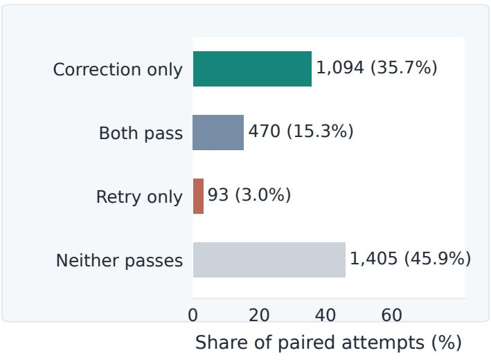

b Where does diagnosis move?  
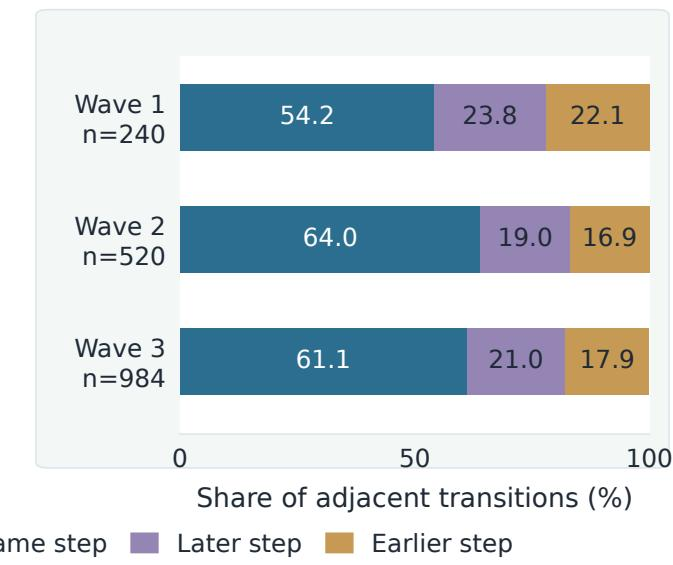  
Figure 7: Two views of corrective evidence. (a) First-or-only proposal and original-action retry on 3,062 paired attempts; all four outcomes remain visible. (b) Adjacent attributed-step transitions across three development waves, with each wave’s transition count. Transitions within an attem t are de endent. The anels use se arate dated cohorts and a re ate re orts; the do not describe the final collection or assign validated root causes.

## Takeaway: Separate a passing branch from a useful correction

Outcome-only records cannot distinguish success also reached by retrying the original action. Final-diagnosis-only records hide the revisions used to reach that branch. AED preserves both, enabling analyses of correction utility and hypothesis revision under their recorded protocols. Training benefits require the separate controlled comparisons in Section 5.

Success, symptoms and semantic labels measure diferent things. In MAST, some annotated failure modes also occur in successful traces. Our successful-trajectory prompt control likewise changes error-reporting behavior when the prompt permits abstention (Appendix L). Neither task success nor an error claim provides a semantic correctness label by itself. We therefore keep symptom counts, judge-assigned categories and executed outcomes separate. The labeling-method study in Appendix G reports judge disagreement; it does not estimate error frequencies in the full collection.

## B.3. Crossed coverage of the current collection

We recompute Figure 8 from the same 50,228-pair metadata index as Figure 3. Color shows pair counts; dots identify occupied cells with fewer than ten distinct source tasks. Of 280 occupied environment–harness cells, 244 meet this task-support threshold.

Current collection: crossed coverage

50,228 pairs | all 33 environments and 19 harnesses

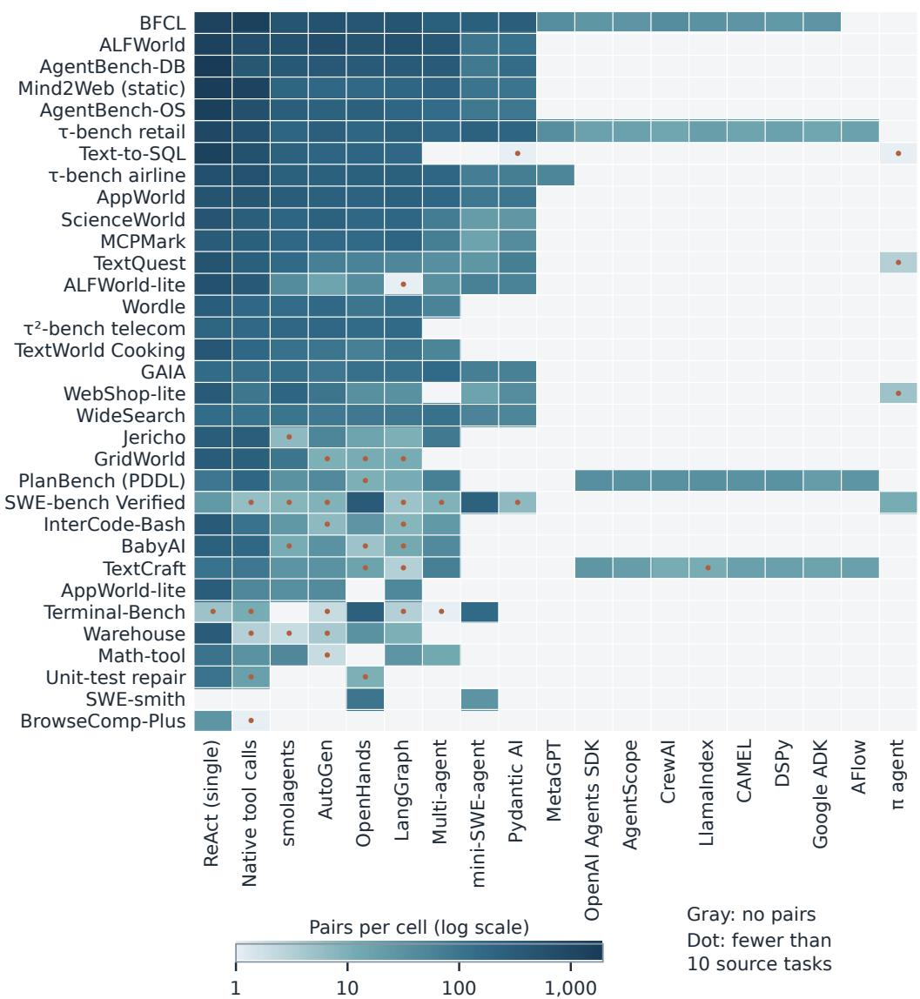  
Figure 8: Where the current collection has support. Rows and columns include all 33 environments and 19 harness families, ordered by pair count. The logarithmic color scale exposes both large and small cells. Gray cells contain no pairs; they do not establish that the combination is unsupported by the harness.

Takeaway: Breadth does not imply a balanced comparison

The collection covers many system configurations, with uneven support across combinations. Comparisons of models or harnesses need shared tasks and successful-rollout denominators; the number of collected failure pairs alone cannot rank their reliability.

## B.4. Historical error profiles by model and environment

The September 6, 2026 snapshot contains 2,604 distinct source trajectories: machine labeling classified 2,092 and returned abstentions for the rest. We recount each trajectory once and retain the original codebook. Figure 9 complements the harness profiles in Figure 4 with model and environment breakdowns.

Historical labels | September 6, 2026  
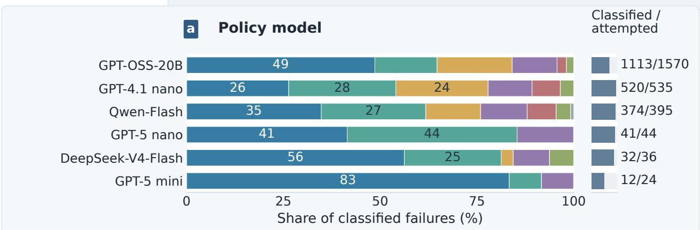

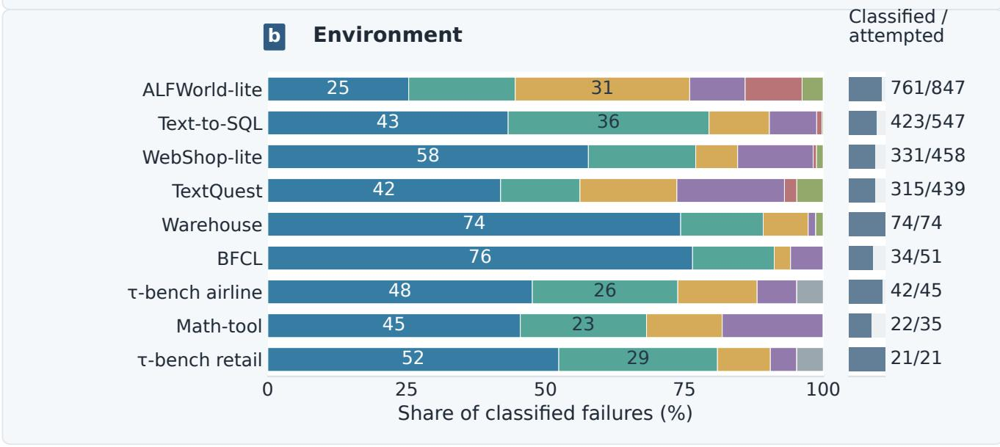  
Action Planning Verification Observation Reflection Memory Multi-agent

Figure 9: The same historical labels, viewed along two axes. Bars normalize by classified trajectories; adjacent counts retain abstentions in the denominator. We display groups with at least 20 attempted labels. All model groups meet that floor; the environment panel omits 87 attempts in smaller groups. This selected cohort includes simplified and excluded environments. Diferent task mixtures and selective abstention prevent model rankings or estimates of causal environment efects.

## Takeaway: Task-specific checks deserve separate error categories

In the classified ALFWorld-lite traces, verification is the largest category (239/761); action and planning together account for 336/423 Text-to-SQL labels. These contrasting profiles motivate retaining task context when designing diagnosis rubrics and repair checks. They describe this historical sample, not the full collection.

Models in panel (a) generated the trajectories; they need not be the labeling judges. Appendix G reports the separate judge-agreement study and its limitations.

## B.5. Observable symptoms with successful-rollout denominators

The September 5, 2026 development atlas records 3,596 executions on 200 source tasks across five environments, nine policies and two harnesses. It retains 2,774 successes and 822 failures; 4 of the 3,600 planned executions are missing. We recount the stored outcome and phenotype rows, without rerunning the environments or relabeling the underlying traces.

Historical symptoms, including success denominators

3,596 rollouts | 822 failures | September 5, 2026

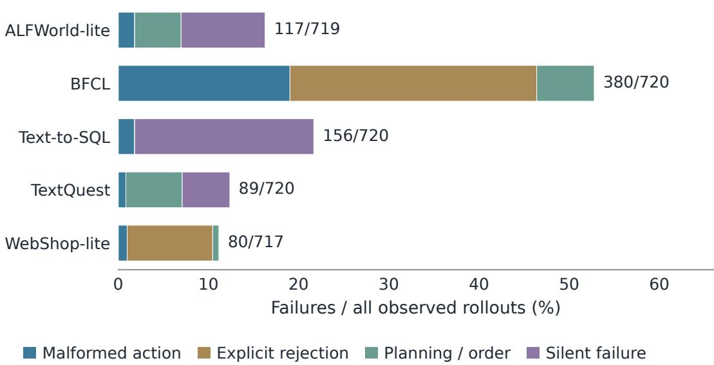

Figure 10: Failure symptoms as a share of all observed executions. Each failed execution contributes to one mechanical category; successful executions remain in the denominator. End labels show failed/observed counts. The historical harness implementations predate the typed-tool-schema and native-stop fixes, so this figure describes that development cohort, not current harness quality.

## Takeaway: Outcome checks expose failures that action validity misses

Of the 822 failed executions, 248 include a completion action that fails the task verifier. These traces require checking whether the a ent met the oal, be ond whether it issued an executable action. AED retains the outcome alon side the actions and observations needed to investigate the discrepancy.

The mechanical categories distinguish malformed actions (176), explicit rejections (265), planning/order failures (133) and silent failures (248). The rules include budget exhaustion under planning/order and certain unsuccessful terminal actions under rejection. These are observable symptoms, not validated root causes. We keep this rollout cohort separate from the judge-labeled profiles above: the latter contain selected failures and cannot supply success denominators.

## B.6. Complete distributions behind Figure 3

The two panels below expand every category in the same 50, 228-pair collection as Figure 3. No category is omitted or merged here. Rows are ordered by pair count; shares describe collection composition, not failure rates.

Table 5: Complete Figure 3(a): all 33 environments. A dagger marks a category included in an Other group in the main figure. Each share uses all 50, 228 pairs as its denominator.
<table><tr><td>Rank</td><td>Environment</td><td>Pairs</td><td>Share (%)</td><td>Source tasks</td></tr><tr><td>1</td><td>BFCL</td><td>5,521</td><td>10.99</td><td>470</td></tr><tr><td>2</td><td>ALFWorld</td><td>4,838</td><td>9.63</td><td>1,431</td></tr><tr><td>3</td><td>AgentBench-DB</td><td>4,407</td><td>8.77</td><td>1,120</td></tr><tr><td>4</td><td>Mind2Web (static)</td><td>4,050</td><td>8.06</td><td>527</td></tr><tr><td>5</td><td>AgentBench-OS</td><td>3,309</td><td>6.59</td><td>485</td></tr><tr><td>6</td><td>τ-bench retail</td><td>3,134</td><td>6.24</td><td>324</td></tr><tr><td>7</td><td>Text-to-SQL</td><td>2,684</td><td>5.34</td><td>336</td></tr><tr><td>8</td><td>τ-bench airline</td><td>2,498</td><td>4.97</td><td>26</td></tr><tr><td>9</td><td>AppWorld†</td><td>2,345</td><td>4.67</td><td>89</td></tr><tr><td>10</td><td>ScienceWorld†</td><td>1,655</td><td>3.29</td><td>334</td></tr><tr><td>11</td><td>MCPMark†</td><td>1,402</td><td>2.79</td><td>29</td></tr><tr><td>12</td><td>TextQuest†</td><td>1,217</td><td>2.42</td><td>644</td></tr><tr><td>13</td><td>ALFWorld-lite†</td><td>1,198</td><td>2.39</td><td>618</td></tr><tr><td>14</td><td>Wordle†</td><td>1,078</td><td>2.15</td><td>91</td></tr><tr><td>15</td><td>τ2-bench telecom†</td><td>1,030</td><td>2.05</td><td>36</td></tr><tr><td>16</td><td>TextWorld Cooking†</td><td>1,020</td><td>2.03</td><td>84</td></tr><tr><td>17</td><td>GAIA+</td><td>1,013</td><td>2.02</td><td>78</td></tr><tr><td>18</td><td>WebShop-lite†</td><td>857</td><td>1.71</td><td>464</td></tr><tr><td>19</td><td>WideSearch†</td><td>843</td><td>1.68</td><td>143</td></tr><tr><td>20</td><td>Jericho†</td><td>748</td><td>1.49</td><td>47</td></tr><tr><td>21</td><td>GridWorld†</td><td>718</td><td>1.43</td><td>428</td></tr><tr><td>22</td><td>PlanBench (PDDL)†</td><td>675</td><td>1.34</td><td>163</td></tr><tr><td>23</td><td>SWE-bench Verified†</td><td>639</td><td>1.27</td><td>228</td></tr><tr><td>24</td><td>InterCode-Bash†</td><td>555</td><td>1.10</td><td>315</td></tr><tr><td>25</td><td>BabyAI†</td><td>529</td><td>1.05</td><td>195</td></tr><tr><td>26</td><td>TextCraft†</td><td>486</td><td>0.97</td><td>192</td></tr><tr><td>27</td><td>AppWorld-lite†</td><td>479</td><td>0.95</td><td>470</td></tr><tr><td>28</td><td>Terminal-Bench⁺</td><td>425</td><td>0.85</td><td>62</td></tr><tr><td>29</td><td>Warehouse†</td><td>363</td><td>0.72</td><td>181</td></tr><tr><td>30</td><td>Math-tool†</td><td>226</td><td>0.45</td><td>220</td></tr><tr><td>31</td><td>Unit-test repair†</td><td>132</td><td>0.26 0.25</td><td>37</td></tr><tr><td>32 33</td><td>SWE-smith† BrowseComp-Plus†</td><td>126 28</td><td>0.06</td><td>67 27</td></tr><tr><td></td><td></td><td></td><td></td><td></td></tr><tr><td></td><td>All 33 environments</td><td>50,228</td><td>100.00</td><td>9,961</td></tr></table>

† Expanded Other 25 envs: 19,787 pairs (39.39% of the collection), already included in the rows above. Percentages are rounded independently. Colors preserve environment identities from the Figure 3 palette. Environment types and frozen-release membership are listed separately in Table 36.

Table 6: Complete Figure 3(b): all 19 harnesses. A dagger marks a category included in an Other group in the main figure. Each share uses all 50, 228 pairs as its denominator.
<table><tr><td>Rank</td><td>Harness family</td><td>Pairs Share (%)</td><td>Source tasks</td></tr><tr><td>1</td><td>ReAct (single) –</td><td>16,646 33.14</td><td>4,622</td></tr><tr><td>2</td><td>Native tool calls</td><td>9,614 19.14</td><td>3,231</td></tr><tr><td>3</td><td>smolagents </td><td>4,614</td><td>9.19 1,899</td></tr><tr><td>4</td><td>AutoGen</td><td>4,368</td><td>8.70 1,610</td></tr><tr><td>5</td><td>OpenHands</td><td>4,329</td><td>8.62 1,651</td></tr><tr><td>6</td><td>LangGraph ■</td><td>3,873</td><td>7.71 1,406</td></tr><tr><td>7</td><td>Multi-agent (planner-executor)</td><td>2,797</td><td>5.57 1,219</td></tr><tr><td>8</td><td>mini-SWE-agent </td><td>1,695</td><td>3.37 778</td></tr><tr><td>9</td><td>Pydantic  $\mathbb { A } ^ { \dagger }$ </td><td>1,441</td><td>2.87 758</td></tr><tr><td>10</td><td>MetaGPT† –</td><td>124</td><td>0.25 54</td></tr><tr><td>11</td><td>OpenAI Agents  $\mathrm { S D K ^ { \dagger } }$ </td><td>103</td><td>0.21 69</td></tr><tr><td>12</td><td> $\mathrm { A g e n t S c o p e ^ { \dagger } }$  ■</td><td>96 0.19</td><td>61</td></tr><tr><td>13</td><td>CrewAI†</td><td>94 0.19</td><td>58</td></tr><tr><td>14</td><td>LlamaIndex† –</td><td>94 0.19</td><td>62</td></tr><tr><td>15</td><td>CAMEL+</td><td>91 0.18</td><td>58</td></tr><tr><td>16</td><td>DSPy†</td><td>88 0.18</td><td>59</td></tr><tr><td>17</td><td>Google  $\mathrm { \ A D K ^ { \dagger } }$  È</td><td>79 0.16</td><td>58</td></tr><tr><td>18</td><td> $\mathrm { A F l o w } ^ { \dagger }$  ■</td><td>62 0.12</td><td>41</td></tr><tr><td>19</td><td> $\pi \mathrm { a g e n t } ^ { \dagger }$  ■</td><td>20 0.04</td><td>20</td></tr><tr><td>All 19 harnesses</td><td></td><td>50,228 100.00</td><td>9,961</td></tr></table>

† Expanded Other 11 harnesses: 2,292 pairs (4.56% of the collection), already included in the rows above. Percentages are rounded independently. Source tasks are distinct within each harness. The same task can occur under several harnesses; the total is the collection’s 9,961 unique environment–task keys, not the sum of this column.

## C. Evidence grades, counting and populations

## C.1. Interpreting execution evidence

Evidence grades let a user select diagnosis-only records, observed recoveries or repeated matched contrasts. A diagnosis whose citations cannot be resolved is ungrounded. A grounded diagnosis with neither replay nor a named checkpoint is E0. Ex licit re la -status fields also distin uish a named but unexecuted check oint from a com leted trial Appendix D.2 documents the legacy grading convention. Executed replacements that never succeed or succeed on only some trials are recorded as no recovery or partial recovery. E1 records an observed recovery on the replacement branch when the original action was not tested adequately or also succeeded. E2 requires at least two trials per arm and completion of both arms, with every treatment continuation passing and every matched control failing.

A successful trial establishes observed recovery, not a unique root cause or a reliable efect. Even repeated contrasts depend on the restored state, policy, harness, and verifier. Grades can be recomputed from the recorded outcomes without another environment run. Appendix D gives the grading procedure and assumptions.

## C.2. Corpus scope and counting

The release contains failures that arose during agent execution. Imported natural failures can contribute diagnosis records even when their original environment cannot be restored. We list procedural stand-ins separately from the benchmarks they approximate (Appendix O). Task-level split assignments group alternate diagnoses and replay variants together; the component-disjoint evaluation additionally separates the leakage groups defined at the freeze. We treat oversized category families separately (Appendix P).

We count an error–diagnosis pair when a natural failure has a diagnosis that names a candidate error step, explains it, and provides at least one quotation grounded in the failed trace. This count does not require successful replay. Records with an executed, passing correction form a smaller subset, which we report with their control outcomes and replay settings, so collection counts, diagnosis counts, and replay counts stay separate.

Current collection index. Figure 3, Table 36 and Appendix B.1 use the same source-linked pairs. Breadth counts require at least ten distinct source tasks per environment, harness family or policy model. A diferent policy, seed or sampling setting can produce another failed execution of the same task; an additional diagnosis of one execution adds a pair, not a new trajectory. The frozen diagnosis release imposes separate environment, exposure and split checks. Table 7 separates configuration inventory, annotation attempts and frozen training rows. Citation admission tests trace support, not semantic correctness. Retrieval failures afect 440 of the 452 GAIA and WideSearch rows: holdout sensitivity uses the 835 rows left after removing the 108 afected cases (Appendix E.1).

## C.3. Notes on the resource comparison

Who&When annotates 184 natural multi-agent failures, its three annotators spending a combined 84.3 hours on decisive steps when no fault was injected (Zhang et al., 2025b). In AgenTracer’s released v1.0.0 data, 1306 of the 3208 training rows carry an injection label; its agentic split’s responsible-agent field has one value and therefore no within-split variation (Zhang et al., 2026a).

Reading Table 1

nat./inj./syn.: natural, injected, teacher-synthesised failures. Ctrl. requires the original action re-executed from the same checkpoint. ✓ supported; × absent; ◦ partial; “–” not stated. ‡Full multimodal resource. Counts use reported units. AED’s collection row uses the same current index as Fi ure 3 Table 36 identifies the environment t es. AED re resents overall capabilities across constituent datasets, with subset-specific training and replay. Subcohort counts below are not additive. requires ten source tasks per entry (Section 3). Table 1 uses AED’s audited count of error–diagnosis pairs; repeated diagnoses of one execution do not add independent failures.

<table><tr><td>Work</td><td></td><td></td><td></td><td></td><td></td><td></td><td></td><td>Errors Envs Harn. Models Count Step Evid. Exec. fix Ctrl. Train Agree.</td><td></td><td></td><td></td></tr><tr><td>AED diagnosis release (ours) nat.</td><td></td><td>15</td><td>9</td><td>10</td><td>4,319</td><td>V</td><td></td><td>X</td><td>X</td><td>D</td><td>一</td></tr><tr><td>AED replay study (ours)</td><td>nat.</td><td>11</td><td>一</td><td>一</td><td>3,062</td><td>5</td><td>V</td><td>V</td><td>L</td><td>一</td><td>一</td></tr></table>

Envs/Harn./Models: environments, harnesses (including multi-agent frameworks) and generating policies; AED

Table 7: The populations answer diferent questions; attempt, configuration and source-task counts are not interchangeable, and the annotation audit does not enlarge any training cohort.
<table><tr><td>Population</td><td>Counting unit and size</td><td>Use in this paper</td></tr><tr><td>Current collection</td><td>blobs and 9,961 source tasks</td><td>50,228 pairs over 38,278 source Source-linked collection; separate from the frozen training release</td></tr><tr><td>Collection tory</td><td>steps and a trace reference</td><td>inven- 15,338 configuration records with Collection coverage; not an admitted training split</td></tr><tr><td>Panel audit</td><td>grounding</td><td>annotation 11,116 attempts; 6,381 pass citation Annotation validity under automated checks</td></tr><tr><td>lease</td><td>in 15 environments (train, devel- lier snapshot opment, holdout); 418 more rows over 121 previously exposed tasks ship as an exploratory split</td><td>Frozen diagnosis re- 4,319 rows over 2,309 source tasks The evaluated dataset; a separate, ear-</td></tr><tr><td></td><td>holdout rows</td><td>Pilot diagnosis split 359 train, 201 development, 169 Source for the three-seed pilot (168 shared source tasks per arm)</td></tr><tr><td></td><td>3157-row training split (1678 tasks); 943 held-out rows over 496 tasks</td><td>Final paired cohort 948 tasks in 133 families of the Final-scale comparison (Table 25)</td></tr><tr><td>Paired replay</td><td>3062 attempts over 1284 source Correction validity (Table 47) tasks, both arms from one check- point</td><td></td></tr></table>

The latest audit links 50,228 structurally supported pairs across 33 typed environments, 19 harness families and 23 named policy models. These breadth counts use one pair index and require ten source tasks per category; model aliases share one identity. The checks verify source linkage, the recorded error step and quoted trace support, not semantic correctness or training admission. For the completion batch, we re-diagnosed source-verified stored failures with a strict-citation single judge, without an added ground-truth reference or replay. We retained one supported new diagnosis per previously unpaired source blob and preserved rejected attempts in the audit. These rows augment the collection, not the frozen training or evaluation sets. A deterministic, environment-stratified spot-check found semantic defects beyond citation support; we quarantined flagged records. This defect-finding check does not estimate accuracy or validate the remaining collection. These are collection environments, including synthetic tasks and simplified ports, not a count of independent public benchmarks.

Other reported units include TRAIL errors, MAST traces, diagnosis rows and paired replay attempts. Step includes spans. Agree.: reported human agreement (raw rates or chance-corrected coeficients), comparing programmatic labels with humans for AEGIS and failure-mode labels for MAST. TrajErrBench re orts Fleiss’ = .91/.67 for critical-error steps on its τ2-Bench / SWE-Bench Pro subsets, respectively (Qi et al., 2026, Table 5). AED reports raw preferred-step agreement of 85.5% (59/69) under shared AI assistance. Both reviewers select a location on these 69 of 80 historical records, includin referred choices from multi le candidates. The sin le-ste subset has 92.0% a reement (46/50; Appendix W.1). Raw rates and chance-corrected coeficients are diferent statistics; annotation targets, sampling and assistance also difer. The agreement column does not rank resources.

Partial Exec. fix covers initial-state reruns or system interventions; AgenTracer’s oracle replay is construction-only. AED marks cover its replayable collection subset; 0 of its 4,319 diagnosis rows join a replay record. Who&When Pro uses its full text/image/video resource. Its authors name GPT-4.1 and Gemini 3 Flash as primary backbones, not an exhaustive model count. Its benchmark and our text-only environment counts have diferent scopes.

Comparison with AEGIS. Kon et al. (2026) use successful executions and controlled fault injection to obtain agent/error attribution labels, then verify that the altered execution fails. This supplies a known intervention and a matched successful baseline natural failures re uire se arate checks of dia nosis ualit . Their a ent/error-set F1 measures a diferent target from our exact-step accuracy. We therefore do not import their reported scores into our localization tables or claim a matched training advantage over AEGIS. Such a resource comparison would require a common attribution target, compatible labels, the same base model and training budget, and an independent test set. AEGIS’s failed trajectories and AED’s error–diagnosis pairs also use diferent counting units. In Table 1, Exec. fix and Ctrl. concern correction and original-action replay, not the execution checks used to validate fault injection.

## D. Construction, Replay, and Evidence

Implementation and prior work. AgentDebug (Zhu et al., 2025) motivates diagnosis-guided recovery. Our diagnosis bridge calls AgentDebugX’s Python attribution API (Zhu et al., 2026) for action blame, evidence and proposed corrections. AED provides environment adapters, evidence checks and verifier-backed paired replay. Records distinguish diagnosis engines and retain available library provenance. CUADebug (Zhang et al., 2026b) studies diagnosis and repair for screenshot-based computer-use agents; our collection remains text-only.

Verifier validation. Reference-solution tests identified two verifier problems in the imported environments. In AgentBench-DB, gold SQL reproduced the stored table hash for only 221 of 455 state-changing tasks, and in BFCL the ground-truth call list failed the state checker on 112 of 386 instances. Episodes on the tasks these checks flagged are quarantined; the checks did not cover every task, and the release still holds rows on tasks whose gold answer fails the grader (Appendix E.1). These checks test the environment ports before their outputs are used as failure labels; they do not assess the debugger’s explanations.

Historical replay-cohort settings. The replay cohort used an unguided all-at-once debugger. Reference-assisted variants are recorded separately; a same-task success exists for 39.5% of the failed rollouts in the reference-availability census. Paired replay uses temperature 0.2 for the first sample and 0.8 for subsequent samples, compared with 0.7 for the source rollout. The two replay arms share this schedule, but replay and source-rollout outcomes need not follow the same sampling distribution.

## D.1. Construction algorithm

<table><tr><td colspan="2">AET stage contracts</td></tr><tr><td>Stage</td><td>Stored information and admission boundary</td></tr><tr><td>1. Collect</td><td>Adapters supply tasks, instructions, tools and success verifiers. Save policy, harness and environment identities, acting units, actions, observations and final outcomes, including successes. Failures arise naturally; we do not inject them. Preserve service outages, harness failures and unusable graders for audits, but exclude them from agent-error targets. Collection requires no replay support.</td></tr><tr><td>2. Diagnose</td><td>Following AgentDebug (Zhu et al., 2025), propose an error step, responsible agent or component, explanation with trace quotations, and replacement action. Record privileged reference or verifier information separately from learner inputs. Where supported, replay feedback guides revisions within a fixed budget. Keep every attempt and distinguish the first proposal from one selected after retries. Multiple debuggers can reuse a stored failure.</td></tr><tr><td>3. Ground</td><td>Resolve cited steps, acting units and quotations in the exported student input. Check tool validity and information availability. Semantic judges assess the attribution and repair; both judges must accept in the dual-judge subset (Appendix E.6). Save accepted and rejected decisions. These are machine judgments; human validity and training eligibility require separate assessment.</td></tr><tr><td>4. Replay</td><td>Start two new executions from a restored or reconstructed checkpoint: one substitutes the correction and one repeats the original action. Match policy, harness, budget, verifier and temperature schedule; save seeds, sample counts, checkpoint fidelity and both outcomes, including failed repairs and passing controls. The failed source rollout does not serve as this control. Recovery supports the correction in that setting, not necessarily its explanation or a unique root cause. Coached retries use a separate protocol.</td></tr><tr><td>5. Build views</td><td>Diagnosis targets use supported attributions without requiring replay. Recovery targets use an executed, passing continuation and preserve its branch identity. Only eligible continuation actions receive loss; input history, tool observations and rejected continuation actions receive no loss. Preferences also require a valid action comparison under the same visible input. Source-task grouping, declared splits and content checks determine training eligibility separately from label quality. Retain records excluded from a view and their selection history. Derive evidence grades from stored outcomes.</td></tr></table>

Failure outcomes and attributable errors. Adapters evaluate task completion using answer or result matching, executable tests, or goal-state checks. We distinguish a recorded negative outcome from a valid task-failure verdict and from a supported attribution.
<table><tr><td colspan="2">Failure boundaries</td></tr><tr><td>Observed case</td><td>Interpretation and admission rule</td></tr><tr><td>Wrong answer, failed tests or unmet goal</td><td>A valid negative task verdict supplies a diagnosis candidate; it does not identify the erroneous decision.</td></tr><tr><td>Tool error followed by task success</td><td>Exclude from the failed-run cohort. An intermediate exception need not cause task failure.</td></tr><tr><td>Budget exhaustion, loop or early stop</td><td>A candidate under a defensible execution budget. Inspect where progress broke down; do not blame the cutoff step by default.</td></tr><tr><td>Invalid tool action</td><td>A candidate if the agent had a valid tool contract. Schema bugs, service outages and environment crashes require separate accounting.</td></tr><tr><td>No usable verifier verdict</td><td>Quarantine for agent-error supervision. An unavailable reference or grader exception cannot establish task failure.</td></tr><tr><td>Recorded-page action mismatch</td><td>Establishes deviation from the recorded path, not inability to recover in a live browser; exclude from strict admission.</td></tr></table>

For attribution, reviewers seek the earliest supported consequential mistake with a feasible alternative, not a later symptom or a unique global root cause. They can use the resulting observation as retrospective evidence; the proposed action must respect information available before execution (Appendix E.6). Unsupported attributions fail semantic admission.

The collection gate checks recorded failure flags, source linkage, step presence and trace quotations. Automated screening recognizes known non-agent signatures; it does not cover every adapter-specific ungradable outcome. Thus structural collection counts do not certif semantic validit or trainin eli ibilit . Recover tar ets additionall re uire an executed, passing continuation.

## D.2. Evidence ladder and statistical claims

<table><tr><td>Evidence state</td><td>Required observation</td></tr><tr><td>Ungrounded</td><td>Citation support is absent, regardless of replay outcome.</td></tr><tr><td>EO</td><td>Grounded diagnosis; replay was not attempted and no checkpoint was named.</td></tr><tr><td>No / partial recovery</td><td>Executed treatment never succeeds / has mixed outcomes. A named but unexecuted checkpoint also receives the legacy no-recovery label; typed replay status distinguishes it from a failed trial.</td></tr><tr><td>E2</td><td>All treatment trials pass, all controls fail, at least two trials per arm, and both arms complete their planned counts.</td></tr></table>

E1 records recovery without the E2 matched-contrast requirements. Ladder grades, the schema’s historical certificate flag and multiplicity-adjusted certificates are separate fields; none establishes unique causation or global minimality. For executed arms, report $\hat { p } _ { T } = s _ { T } / n _ { T } , \hat { p } _ { C } = s _ { C } / n _ { C }$ and $\widehat { \Delta } = \hat { p } _ { T } - \hat { p } _ { C }$ with both denominators. Unexecuted controls remain null. Tag structural outcomes separately from Monte Carlo trials. Confirmatory runs freeze sample counts and continuation conditions; adaptive supply runs retain their stopping rule and receive a separate analysis.

<table><tr><td>Retrieval audit</td><td>Recorded extent</td></tr><tr><td>Affected rows</td><td>In 440 of the 4,737 rows (307 train, 25 development, 108 holdout, none in the exploratory split), every search/fetch call failed and none returned a result: 242 GAIA rows and 198 WideSearch rows. Holdout coverage is 52 of 56 and 56 of 56, respectively.</td></tr><tr><td>Targets</td><td>All 440 targets assert an error; 396 mention the backend in the explanation or evidence, and 62 place the decisive step at the first failed call.</td></tr><tr><td>Score sensitivity</td><td>Report the full 943 cases and the 835 that remain after excluding the affected diagnoses. The influence of the 307 training rows on checkpoints is unmeasured.</td></tr><tr><td>Training exposure</td><td>Paired arms carry 75 of their 948 tasks with this signature, the same 75 in all four arm files, and the v14 scale arm 109 of its 1,656.</td></tr><tr><td>Later releases</td><td>The exporter now rejects this signature. Frozen v14 retains flagged rows, as does the v15 cut (578 of its 5,602 rows, 145 in its holdout); both ship the flag file.</td></tr><tr><td>Other defect</td><td>Evidence and effect on interpretation</td></tr><tr><td>AgentBench-DB grader</td><td>Gold SQL fails to reproduce the table hash on 234 of its 455 state-changing tasks. The release carries 54 rows on 47 of them (43 training, 11 held out), beside 34 rows on tasks whose gold does reproduce and 338 whose task identity postdates that census and is unchecked. These failures</td></tr><tr><td>Teacher contract</td><td>cannot validate agent-error labels. In AgentBench-DB, AgentBench-OS and AppWorld, 617 of the 1,016 rows were labelled before the submission contract entered the prompt, 100 of them in the holdout. The split follows harness</td></tr><tr><td>Visible error cue</td><td>commit; shipped metadata lacks this flag. In Mind2Web, the first-tool-error rule scores 100% on its 78 held-out cases, where the base scores 96.15%. Removing them leaves base 42.77 micro exact step over the remaining 865 cases; the</td></tr><tr><td></td><td>strongest prompt-only rule reaches 29.71. Common cases preserve comparability, but this cue raises aggregate accuracy. In BFCL, 219 of the release&#x27;s 414 BFCL rows (34 of 63 held out) blame a later conversational turn than the stored first-turn goal. Later turns remain visible in the trace; the diagnosis concerns the</td></tr></table>

D.3. Lineage and checkpoint fidelity
<table><tr><td>Check</td><td>Requirement and interpretation</td></tr><tr><td>Branch identity</td><td>Recompute the v1 attestation of source trace, pre-action prompt, restored state, trial, applied action and actor transcript.</td></tr><tr><td>Native messages</td><td>Match tool-call identifiers and result ordering. Keep reconstructed external logs in a separate fidelity stratum.</td></tr><tr><td>Action authorship</td><td>Attribute an action to the judge only for substitution. A policy&#x27;s coached continuation is not the judge&#x27;s proposed action.</td></tr><tr><td>Exclusions</td><td>Reject a training package when invalid-lineage exclusions exceed the implemented 5% ceiling. This controls attrition, not semantic accuracy</td></tr><tr><td>Family references</td><td>An imported ALFWorld family match is not an executed success on the target instance. The probe-to-judge prompt still needs family-scope propagation; keep those results separate from exact-task reference effects</td></tr></table>

## E. Construction Audit and Annotation Quality

## E.1. Infrastructure and task-contract defects

Frozen inputs retain the defects below because training preceded the audits. Later exporter fixes do not retroactively repair the evaluated release. The retrieval flags cover GAIA and WideSearch only; contract omissions require re derivation from the teacher prompt.

## E.2. Construction inventory and counting ledger

The collection inventory counts configurations; the annotation audit counts debugging attempts. Several diagnoses can refer to one failed run. Neither count measures independent source tasks. Table 7 identifies the populations used here; Table 36 identifies excluded environment types. The 16 September 2026 inventory counts configurations, not independent trials; repeated executions can share an identifier.

<table><tr><td>Inventory stage</td><td>Count</td><td>Unit</td></tr><tr><td>At least one failure record</td><td>31,903</td><td>Configurations</td></tr><tr><td>Quarantined success/failure identity conflict</td><td>1,029</td><td>Configurations</td></tr><tr><td>After quarantine</td><td>30,874</td><td>Configurations</td></tr><tr><td>Core failure inventory</td><td>16,920</td><td>In fifteen core environments</td></tr><tr><td>Positive step count and trajectory reference</td><td>15,338</td><td>Eligible configurations</td></tr><tr><td>Failed basic eligibility</td><td>1,582</td><td>Configurations</td></tr><tr><td>Distinct source tasks among eligible records</td><td>5,376</td><td>Tasks</td></tr><tr><td>With a diagnosis record</td><td>10,057</td><td>Configurations</td></tr><tr><td>With step and explanation</td><td>9,464</td><td>Structural screen only</td></tr></table>

Structural completeness does not establish grounding, semantic validity or replay success. The separate annotation audit covers 11,116 diagnosis attempts; 6,381 (57.4%) pass citation grounding. Those attempts cannot be appended to the configuration funnel.

## E.3. Current annotation quality audit

Panel consensus is associated with stable attribution, but citation support can still fail. The solo comparator also serves as the panel’s arbiter, and the two pipelines difer in implementation. Their agreement is not an independent correctness standard or an isolated voting efect.

<table><tr><td>Matched ALFWorld audit</td><td>Measured observation</td></tr><tr><td>Attribution</td><td>323 paired ALFWorld traces; 297 matched cells with a step and explanation from both constructions. Exact-step agreement is 46.8% and within-one-step agreement 53.9%.</td></tr><tr><td>Vote concentration</td><td>Within one step: unanimous 76.6%, two-of-three 55.2%, three-way split 40.0%. Panel 243/323 (75.2%); solo 285/323 (88.2%). Of the 80 panel failures, 77 lack a</td></tr><tr><td>Citation admission</td><td>supporting quotation; the other three cannot ground cited text at the claimed event.</td></tr><tr><td>Quotation mechanism</td><td>No arbitrated output has an empty quotation; 78/213 voter-selected outputs contain at least one. One empty field need not fail admission if another valid citation exists.</td></tr><tr><td colspan="2">Separate audit</td></tr><tr><td>Environment association</td><td>Observation and limit Over 5,725 diagnosed records, consensus is 89.9% in single-decision groups versus</td></tr><tr><td>Full citation audit</td><td>72.5% in long-horizon groups. Models, lengths and tasks differ. 6,381 of 11,116 attempts pass. Empty quotations occur in 47% of mid-tier records</td></tr><tr><td>Re-annotation probes</td><td>versus 10% of stronger-arbiter records; the case sets differ. Across five groups, the solo model anchors a quotation on 159 of 183 records with an empty panel quotation (86.9%). Quote recovery establishes neither admission</td></tr><tr><td>Test-retest</td><td>nor semantic correctness. 3470 pairs: 2845 consensus-admitted first verdicts repeat the exact step at 88.2%</td></tr><tr><td>Human review</td><td>and fall within one step at 94.1%; the 625 not admitted reach 58.2% and 73.4%. The exact-step gap is 29.9 points. The completed 80-record AI-assisted audit, its sampling scope and agreement</td></tr></table>

Admission selects an existing member’s verdict; it does not merge explanations. Its association with test–retest stability does not show that gating causes correctness. Citation grounding, reproducibility and human validity require diferent evidence.

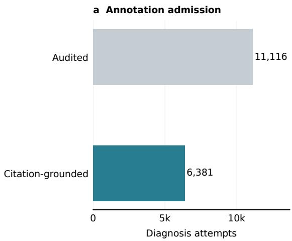

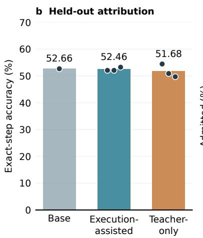  
c Citation grounding

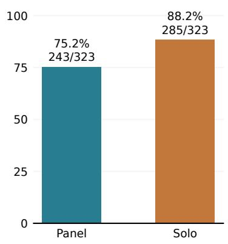  
Figure 11: Three separate measurements, not one pipeline: annotation admission, paired attribution SFT on the pilot holdout, and panel versus solo citation grounding. Each panel has its own denominator and the populations are not successive stages of one funnel.

## E.4. Model-panel adjudication of the blinded semantic sample

The model panel accepts step attribution more often than full evidence support (Table 8). It finds the attributed step defensible or a defensible alternative on 102 of 120 records; expert adjudication remains unrun.

<table><tr><td>Audit condition</td><td>Protocol and limitation</td></tr><tr><td>Sample and judges</td><td>120 blinded records, 30 per stratum of horizon (single-decision / long-horizon) by construction (consensus / arbitrated-or-single). Three vendor families: GPT-6 Astra, Gemini 3.8 Flash and Claude Opus 5.</td></tr><tr><td>Visible input</td><td>The debugger&#x27;s rendered failed trajectory, terminal outcome and diagnosis (step, unit, explanation, evidence and replacement). Replay outcomes, grades, label sources and annotators were hidden. Three fixed questions with one-sentence reasons; temperature 0 where supported.</td></tr><tr><td>Completion Shared model families</td><td>All records received three verdicts; spend by the hub&#x27;s price table was $17.40. GPT-5.6 Sol wrote 57 of the sampled diagnoses, Gemini 3.6 Flash 43, Claude Haiku 4.5 19, GPT-5 mini 1. Authored case sets differ, confounding the same-family comparison.</td></tr></table>

Citation format helps explain the low evidence agreement: 33 diagnoses carry an evidence item that is a bare event identifier. The construction contract accepts a resolvable pointer, but it provides no quotation for judges to assess. The majority verdict is supports on 2 of those against 26 of the other 87. This association does not isolate a causal efect of citation format.

All-three endorsement of both step and full evidence support is 9 of 120; the consensus-admitted and arbitrated-orsingle strata do not separate at this size (2 against 7 of 60). Five of the 12 records whose step the majority rejects are GAIA retrieval-backend failures (Appendix E.1). These related-model judgments do not replace independent human validation.

## E.5. Release audit and revision history

The frozen release predates the checks of student-visible support and expanded failure screening; its construction inputs omitted policy system prompts and tool lists (Appendix Q.1). A case-by-case audit of the frozen release rejected 37/60 sampled rows. Equal sampling across environments makes this a defect-finding study, not an estimate of corpus-wide prevalence. The current checks address such defects; they do not retroactively validate the frozen inputs used in

Table 8: Blinded model-panel adjudication of the 120-record semantic sample. Majority of three seats per question; Split means no majority; Unanimous counts records on which all three seats gave the same verdict.
<table><tr><td>Question (majority of three seats)</td><td colspan="3">Majority verdict</td><td colspan="2">Split Unanimous</td><td></td><td>Fleiss K</td></tr><tr><td>Attributed step is a defensible decisive step</td><td>yes 76</td><td>alternative 26</td><td>no 12</td><td>63-</td><td>77</td><td>0.44</td></tr><tr><td>Quoted evidence supports the claim</td><td>supports 28</td><td>partially 85</td><td>does not 4</td><td></td><td></td><td>0.13</td></tr><tr><td>Proposed replacement is plausibly better</td><td>yes 82</td><td>unclear 16</td><td>no 17</td><td>5</td><td>81</td><td>0.52</td></tr></table>

All three seats: step defensible and evidence at least partial 68 of 120; step yes and evidence supports 9 of 120 (Wilson 95% 4.0 to 13.6%)

Table 9: Quality-control ledger. Rows (source tasks) of the frozen release’s evaluated splits that remain after each stage of the fifth rubric version. These are retrospective checks, not the training and evaluation inputs used for the reported model results. The separate historical human audit is reported in Table 44; its sampled strata do not form another stage of this split-specific ledger.
<table><tr><td>Stage</td><td>Train</td><td>Development</td><td>Holdout</td></tr><tr><td>Input records</td><td>3,157 (1,678)</td><td>219 (135)</td><td>943 (496)</td></tr><tr><td>After deterministic checks</td><td>283 (208)</td><td>20 (12)</td><td>87 (70)</td></tr><tr><td>After semantic filtering</td><td>53 (46)</td><td>9 (6)</td><td>18 (14)</td></tr></table>

Section 5. The failure cases and filter ledger follow. The historical human-review results and protocol appear in Appendix W.

The review exposed incorrect tool schemas, missing instructions, and infrastructure or grading failures attributed to the policy. The frozen release also retains 54 rows on tasks whose reference answer fails the grader (Appendix E.1). Its responsible-agent labels carry a defect of the same kind: 125 of the 943 held-out rows are planner–executor transcripts whose gold agent is a unit that does not appear in them; the exporter now takes the agent from the decisive step’s actor, and the revised rubric rejects a row whose named unit did not act in the trace.

The revised rubric checks exported input and target together for attribution, evidence, repair, leakage and input faithfulness. Two model-family judges review semantic criteria after deterministic checks. In a manual disagreement sample, the stricter judge was right on 8 of 10 rows; 4 of those 8 predated explicit markers for parallel tool calls. Export corrections are recorded, and missing required evidence blocks strict admission.

Judges receive the student view. Long inputs retain the beginning, attributed step and end; judges must reject earliest-step claims when preceding steps are omitted. Acceptance therefore need not cover every character of a long input.

Table 9 applies the fifth rubric version to revised exports of the frozen release’s three evaluated splits. The model evaluations of Section 5 used the earlier frozen inputs, so these counts describe neither a retroactively filtered evaluation nor human acceptance, and they do not redefine the 98-case held-out subset frozen under the earlier (second) rubric version, before any score on it. Later collections may retain a diagnosis and its adverse verdict as metadata; retaining that record does not make it an accepted training target. Likewise, semantic acceptance and replay coverage are separate properties, not successive levels on a universal correctness scale.

## E.6. Quality rubric and certification

The automated rubric has twelve items. A row must pass all except item 10, which records ambiguity without rejecting the row. Deterministic checks decide items 4 and 11; Claude Opus 5 and Gemini 3.1 Pro (preview) judge the remaining items after those checks. Both judges must accept each rejecting item. The human form is shorter (Appendix W).

<table><tr><td colspan="3">Admission rubric: what must hold</td></tr><tr><td>Item</td><td>Check</td><td>Accept when; reject otherwise</td></tr><tr><td>1</td><td>Agent failure</td><td>An available agent decision could have avoided failure; exclude infrastructure, harness and grader faults. Budget exhaustion under a reasonable budget can be an agent failure.</td></tr><tr><td>2</td><td>Attributed step</td><td>The trace supports a mistake at the named step, with no earlier supported decisive mistake. A final stop or a later symptom is insufficient.</td></tr><tr><td>3</td><td>Responsible unit</td><td>The named unit appears in the trace and made the decision.</td></tr><tr><td>4</td><td>Quotations</td><td>Every quote resolves verbatim in the student input at or before the blamed step; a truncation marker is not evidence.</td></tr><tr><td>5</td><td>Entailment</td><td>The visible evidence supports the explanation&#x27;s factual claims.</td></tr><tr><td>6</td><td>Information access</td><td>The diagnosis uses visible evidence; the repair uses information available before the action, not its result or a future answer.</td></tr><tr><td>7</td><td>Executability</td><td>The tool exists, arguments satisfy its schema, and the action can be issued at that point without placeholders.</td></tr><tr><td>8</td><td>Corrective change</td><td>The proposal changes the blamed action and addresses the stated mistake.</td></tr><tr><td>9</td><td>Specificity</td><td>The explanation names a concrete action, contradicted fact and consequence.</td></tr><tr><td>10</td><td>Ambiguity</td><td>Record defensible alternatives. This item does not reject the row.</td></tr><tr><td>11</td><td>Leakage and secrets</td><td>No unseen gold answer, verifier answer or credential survives in the student input or target.</td></tr><tr><td>12</td><td>Input fidelity</td><td>Preserve the received task, instructions, tools and decision order; mark omissions and parallel calls.</td></tr></table>

<table><tr><td colspan="2">Mechanical checks and export handling</td></tr><tr><td colspan="2">Check family</td></tr><tr><td>Structure and visibility</td><td>Implementation boundary Require an admitted attempt, an asserted error, a visible step and matching answer fields.</td></tr><tr><td>Environment validity</td><td>Missing required records fail closed. Preserve malformed turns and parallel-call notes. Reject retrieval outages, task quarantine, gold-grader contradictions, harness-submitted actions and known prompt/tool-contract defects. Exclude static Mind2Web from this</td></tr><tr><td>Evidence and leakage</td><td>admission protocol. Require a quote from before the blamed step; reject future-only evidence, copied gold</td></tr><tr><td>Repair and attribution</td><td>actions, verifier text and arguments based on hidden content. Validate tool arguments and changed action; reject later actions copied back as repairs.</td></tr><tr><td>Export</td><td>Require a unit that acted and sufficient voter support. Restore policy instructions and tool lists, align answer fields, re-derive the unit and redact credentials on both sides. Log each transformation.</td></tr></table>

Rubric v5 also rejects later parallel calls labeled without turn-order notes and quotes that were unavailable when the action was chosen. Among 69 disagreements on re-admitted rows, a hand check of 10 found the stricter judge correct on 8; 4 of those involved unavailable parallel-call results. The other judge was correct on 2. This targeted check is not a population accuracy estimate. The 98-case evaluation subset remains frozen under v2; v5 does not redefine it. Versioned questions, full fail definitions and ordered check signatures remain in the software release. We have not measured certification rates for the corrected-contract pool or the full collection.

Registered controls. Appendix L reports the completed error-reporting control; Appendix W gives the human-audit design and measured outcomes.

## F. Case Studies

## F.1. A failed trajectory, diagnosed and repaired

Case A | AgentBench-OS: a command succeeds, but counts the wrong lines. Actor: GPT-4.1 nano (ReAct);   
construction-time debugger: GPT-5 mini.

Task and failed trajectory

Count lines containing Linux across the home directory’s .txt files, processing each file once. The agent finds the files and identifies those with a match, then counts all their lines.

<table><tr><td>Step</td><td>Action (early steps summarized)</td><td>Result</td></tr><tr><td>0</td><td>Find the text files.</td><td>Four files.</td></tr><tr><td>1</td><td>Identify files containing Linux.</td><td>Three files.</td></tr><tr><td>2</td><td>Concatenate those files and count their lines.</td><td>5</td></tr><tr><td>3</td><td>Submit the count.</td><td>Verifier: fail.</td></tr></table>

Error detected | Step 2 loses the line-level filter

The debugger attributes the failure to the counting command. Selecting files that contain a match does not make every line in those files a match. The shell reports no execution error; the mistake is in what the agent counts.

Original command, verbatim:

cat /root/file1.txt /root/file2.txt /root/file3.txt | wc -l

Repair executed | Filter the lines before counting

Replay resumes before the blamed action with the same actor and harness. The replacement preserves the file list and filters the contents:

grep -h "Linux" /root/file1.txt /root/file2.txt /root/file3.txt | wc -l

The tool returns 4; the actor submits 4.

Verified outcome | Corrected branch passes; original-action control fails

<table><tr><td>Branch from the shared checkpoint</td><td>Final answer</td><td>Task verifier</td></tr><tr><td>Re-execute original action</td><td>5</td><td>FAIL</td></tr><tr><td>Execute proposed correction</td><td>4</td><td>PASS</td></tr></table>

Editorial condensation of one recorded replay pair. Both branches bind to the same source prefix; restoration uses prefix re-execution. Ground-truth access was permitted during diagnosis. This observed recovery does not establish reliability, a unique cause or learned self-repair. Full records and checksums accompany the case in the supplementary source materials.

## F.2. Trace, target and competing interpretation

Case B is a short frozen-v13 training example. Cases C and D are historical v12r audit examples chosen to expose a tool-success mismatch and an unsupported diagnosis. This is a purposive illustration, not an accuracy sample. Editorial summaries are labeled; complete records and exact targets remain in the source materials. None establishes learned recovery.

<table><tr><td colspan="2">Case B BFCL | A quoted trace can still support a bad target</td></tr><tr><td colspan="2">Task Find every test_document .txt in the current directory.</td></tr><tr><td>Step Action</td><td>Observation</td></tr><tr><td>0 find(path=&quot;.&quot;, name=...) 1</td><td>matches: [&quot;./test_document.txt&quot;]</td></tr><tr><td>finish_turn()</td><td>Next user request: copy the file into archives and rename it.</td></tr><tr><td colspan="2">Recorded target Blame step 1 for not presenting the match; propose finish_turn() again. Step 0 is listed as an alternative.</td></tr><tr><td colspan="2">Reading The proposed action repeats the blamed action, while the environment has advanced to a new request. Located quotes alone do not resolve this contradiction. Semantic review is required; this is not a verified repair. Source Frozen v13 training example B. Actions and observations are abbreviated; the target has not been silently corrected.</td></tr></table>

<table><tr><td colspan="2">Case C | BFCL | Mini-SWE-agent | Tool success, incomplete content</td></tr><tr><td colspan="2">Visible request Send The latest stock price of XTC is $150.75. to USR003.</td></tr><tr><td>Step Action</td><td>Observation</td></tr><tr><td>1 End the previous turn 3 send_message(..., message=&quot;The&quot;) 6</td><td>The next user supplies the message request. sent_status: true</td></tr><tr><td colspan="2">view_messages_sent() USR003: [&quot;The&quot;] Recorded target Attribute the failure to step 3: the sent message is incomplete.</td></tr><tr><td colspan="2">Reading Transport success does not satisfy the content request. The excerpt shows the mismatch, but the original wire must be checked before assigning truncation to the policy rather than the harness.</td></tr></table>

<table><tr><td colspan="2">Case D | AgentBench-DB | AutoGen | Missing verification is not proof of failure</td></tr><tr><td colspan="2">Task Change the attendance for November 30 from 1,458 to 1,500.</td></tr><tr><td>Step Action (abbreviated)</td><td>Observation</td></tr><tr><td>0 SELECT WHERE Date = &#x27;November 30&#x27; 1 UPDATE ... SET Attendance = &#x27;1,500&#x27; 2 Commit final answer 1,500</td><td>Row includes 1,458. [] Final answer committed.</td></tr><tr><td colspan="2">Recorded target Blame step 2 for committing without a verification query. Reading The absence of a second SELECT does not show that the UPDATE failed. Inspect the post-update state and grader before accepting this diagnosis; the empty SQL result alone does not settle it. Source Purposively selected historical audit case; no independent adjudication. This example illustrates a label limitation.</td></tr></table>

## G. Taxonomy definitions and validation study

Taxonomy scope. Construction collects an attribution, explanation, evidence and proposed action; it does not ask for an error-type label. We induce the taxonomy afterwards and store assignments in a versioned sidecar. Relabeling adds a version without overwriting previous assignments; each version retains its definitions and executable labeling state. Error-type frequencies refer to the historical labeled cohort specified below, not the full collection. This study tests labeling reliability. Its machine assignments are neither training targets nor admission criteria.

## G.1. Independent labeling-method study

Historical harness-profile cohort. Figure 4 uses the September 6 labeling snapshot, not the current 50,228-pair collection. It contains 2,604 distinct source trajectories, of which the machine judge classified 2,092 and abstained on the remainder. We count each source trajectory once, regardless of how many diagnoses it has. The figure shows harnesses with at least 20 attempted labels: 2,588 trajectories across nine harnesses; 16 trajectories fall outside these groups. Each composition bar divides family counts by classified trajectories, while the adjacent counts retain the attempted-label denominator. Task and environment mixtures difer, and abstentions can be selective. The profiles describe this selected cohort and do not estimate harness-caused failure rates. The labeling studies below explain why these assignments remain exploratory. Appendix B.4 reports the model and environment breakdowns from the same labels, with classification coverage beside each group.

Measured disagreement between two machine taxonomy judges. A se arate run a lies GPT-5 mini and Dee Seek V4-Flash to 400 sequentially selected items from the annotation queue under the same seed taxonomy and a 12,000- character tail window. At least one judge abstains on 43 items, leaving 357 jointly classified items. The two machine judges agree on 154/357 modes (43.1%): Cohen’s κ = 0.313 at mode level and κ = 0.329 after collapsing to families, agreement between two models rather than between human annotators. Of 203 mode disagreements, 186 cross family boundaries. The largest directed confusion is premature termination to ignored planning constraint (29 cases), with 9 in the reverse direction.

Thus family aggregation does little to resolve the disagreement. These figures describe a limited, nonrandom cohort, conditional on both judges assigning a mode; they do not measure agreement with human judgments. We retain the labels as exploratory machine assignments, not validated training targets or estimates of corpus-wide semantic error prevalence. Mechanical trace phenotypes and executed repair evidence remain separate measurements. The confusion-matrix counts and both κ values were recomputed from the aggregate agreement record; the raw judge responses were not independently recounted.

A tested decision-order rubric. The seed taxonomy uses the same judges as the earlier agreement study. The candidate adds family-first decision order and tie-break rules for commonly confused modes, keeping the mode definitions and re l format fixed. Its renderer is v2 with a 12 000-character window and 4 096 out ut-token ca . The trial selects 400 new items; 13 items lack a complete four-call comparison after recorded reasoning-budget exhaustion, leaving 387 common items. The mode-level change in κ is +0.069 (paired item bootstrap 95% interval [−0.022, +0.157]); the

Table 10: Rubric trial on 387 common items. Agreement conditions on both judges assigning a label within each arm, yielding diferent valid subsets; malformed responses are judge B parse failures on the common cohort, not semantic abstentions.
<table><tr><td>Prompt</td><td>Both labelled</td><td>Mode κ</td><td>Family κ</td><td>Malformed (judge B)</td></tr><tr><td>Seed</td><td>275</td><td>0.258</td><td>0.186</td><td>88</td></tr><tr><td>Rubric</td><td>266</td><td>0.327</td><td>0.285</td><td>104</td></tr></table>

family change is +0.099 ([−0.018, +0.212]). Both intervals include zero. The experiment costs \$5.172 in recorded calls and does not establish improved labeling reliability. We independently recompute both bootstrap intervals from the stored verdict rows. Diferential parse losses and arm-specific valid subsets limit interpretation; additional paid labeling should follow parser validation. The reproducibility materials retain the exact tested annotation instructions. Its compact decision order is: invalid output → action; visible contradictory information → observation (unobserved asserted state → memory); unsatisfied termination → verification; explicit false progress assessment → reflection; otherwise an infeasible next choice → planning. This experimental annotation prompt is separate from the diagnosis and student prompts in Appendix U.

## H. Result tables for the body figures

Figure 1a summarizes paired replay; Table 47 gives its full results in the appendix. The tables below provide the resource comparison and replay-stratum details.

Table 11: Resource against resource under one base, recipe and scorer: micro exact step (%), and unit+step only on AgenTracer’s test split (our held-out cases share one gold agent). Unparseable answers and prompts over the serving window (1 held-out and 16 AgenTracer test rows) are misses; trained rows are mean ± sd over three seeds. ∆: seed mean of the paired contrast, with the widest per-seed 95% bootstrap interval, not an interval for the mean.
<table><tr><td colspan="4">Our holdout (n=943)</td><td colspan="2">AgenTracer test (n=790)</td></tr><tr><td>Training resource</td><td>Tasks Seeds</td><td></td><td>Step</td><td>Step</td><td>Unit+step</td></tr><tr><td>Qwen3-8B base</td><td>0</td><td></td><td>48.04</td><td>30.76</td><td>21.14</td></tr><tr><td>AED (ours)</td><td>1,656</td><td>33</td><td> $4 8 . 1 4 \pm 0 . 4 2$ </td><td> $3 1 . 6 5 \pm 0 . 3 3$ </td><td> $2 5 . 7 8 \pm 0 . 1 9$ </td></tr><tr><td>AgenTracer released data v1.0.0</td><td>1,656</td><td></td><td> $4 5 . 7 1 \pm 0 . 1 1$ </td><td> $4 0 . 7 2 \pm 0 . 4 8$ </td><td> $3 6 . 1 6 \pm 0 . 4 8$ </td></tr><tr><td colspan="6">∆ (AED – AgenTracer data), paired +2.44 [0.21, 4.81] -9.07 [-12.41, -5.70] -10.38 [-14.05, -6.96]</td></tr></table>

Table 12: The frozen v14 diagnosis release by environment. Rows and source tasks are counted over the three evaluated splits; harness families and policy models are distinct values of the stored provenance fields; paired replay attempts are the replay package’s count for the environment (Table 13) and “—” means that environment has none.
<table><tr><td>Environment</td><td>Rows</td><td>Source tasks</td><td>Harness families</td><td>Policy models</td><td>Paired replay attempts</td></tr><tr><td>ALFWorld</td><td>958</td><td>763</td><td>9</td><td>5</td><td>205</td></tr><tr><td>AppWorld</td><td>438</td><td>54</td><td>9</td><td>7</td><td>291</td></tr><tr><td>AgentBench-DB</td><td>426</td><td>342</td><td>9</td><td>5</td><td>530</td></tr><tr><td>BFCL</td><td>414</td><td>189</td><td>9</td><td>5</td><td>579</td></tr><tr><td>Mind2Web (static)</td><td>395</td><td>243</td><td>9</td><td>10</td><td></td></tr><tr><td>τ-bench retail</td><td>348</td><td>113</td><td>9</td><td>6</td><td>497</td></tr><tr><td>GAIA</td><td>253</td><td>68</td><td>9</td><td>10</td><td></td></tr><tr><td>ScienceWorld</td><td>207</td><td>162</td><td>9</td><td>9</td><td>57</td></tr><tr><td>WideSearch</td><td>199</td><td>97</td><td>9</td><td>5</td><td></td></tr><tr><td>MCPMark</td><td>186</td><td>22</td><td>9</td><td>8</td><td></td></tr><tr><td>AgentBench-OS</td><td>152</td><td>112</td><td>9</td><td>5</td><td>458</td></tr><tr><td>SWE-bench Verified</td><td>143</td><td>117</td><td>2</td><td>7</td><td>64</td></tr><tr><td>τ-bench airline</td><td>113</td><td>6</td><td>9</td><td>10</td><td>358</td></tr><tr><td>Terminal-Bench</td><td>82</td><td>17</td><td>2</td><td>4</td><td>22</td></tr><tr><td>SWE-smith</td><td>5</td><td>4</td><td>2</td><td>1</td><td>1</td></tr><tr><td>All 15 environments</td><td>4,319</td><td>2,309</td><td>9</td><td>10</td><td>3,062</td></tr></table>

## H.1. Paired replay by environment

The following breakdowns use search-selected proposals, not the first proposals in Table 47. Under the harness that produced the failure, with its state fully restored (871 pairs, 456 tasks), the diference is 47.1 points [42.3, 51.7]; a substituted ReAct (single) harness continued 1846 pairs (+43.5 points) and 345 had only partly restored multi-agent state (+50.7 points; Table 14 below). Table 13 breaks the selected-proposal result down by environment. Every environment with at least one discordant pair favours the proposed replacement; the one environment omitted from the rows contributed a single attempt with no discordant pair. The attempt population matches Table 47, but proposal selection and the paired control outcomes difer; these are not strata of its first-proposal efect. We retain one occurrence per diagnosis ID, choosing the first path in lexicographic order. There are 684 IDs in more than one collection cell because later waves repeated configurations; 143 disagree on the replay outcome. Choosing the last occurrence instead changes the paired diference to 46.0 points. This sensitivity describes the two tested duplicate-resolution rules.

Table 14 splits the same 3062 pairs by how the continuation was run, using the provenance the replay runner recorded on every attempt. Both arms of a pair use the same continuation policy, harness, budget and temperature schedule; selection and state-fidelity limits remain, and the strata difer in continuation harness and completeness of state restoration. 871 pairs ran under the harness that produced the failure from a fully restored state and speak about that system directly. 1846 pairs ran under a substituted ReAct (Yao et al., 2023) (single) harness because the source harness (smolagents, Pydantic AI, AutoGen, LangGraph, or Multi-agent (planner–executor)) is not supported by the replay runner; the identif the efect of the re lacement under the substituted continuation, not under the harness that failed 345 pairs are marked as having incompletely restored multi-agent state, so their pre-action state was reconstructed in part. All three strata show positive selected-proposal contrasts. Their estimates are distinct from the first-proposal

Table 13: Search-selected continuation success by environment. Orig. and Prop. are the pass rates of the original and proposed action; Disc. P:O counts pairs where only the proposal or only the original passed; p is the attempt-level exact McNemar test. These diagnostic p values assume independent attempts and do not account for repeated source tasks. For selected-proposal provenance comparisons, use the task-clustered intervals in Table 14.
<table><tr><td>Environment</td><td>Pairs</td><td>Orig. pass</td><td>Prop. pass</td><td>Δ</td><td>Disc. P:O</td><td>McNemar p</td></tr><tr><td>BFCL</td><td>579</td><td>24.0</td><td>64.2</td><td> $+ 4 0 . 2$ </td><td>248:15</td><td> $1 0 ^ { - 5 5 }$ </td></tr><tr><td>AgentBench-DB</td><td>530</td><td>10.2</td><td>55.1</td><td>+44.9</td><td>242:4</td><td> $1 0 ^ { - 6 6 }$ </td></tr><tr><td>τ-bench retail</td><td>497</td><td>22.7</td><td>75.3</td><td>+52.5</td><td>274:13</td><td> $1 0 ^ { - 6 5 }$ </td></tr><tr><td>AgentBench-OS</td><td>458</td><td>10.7</td><td>89.5</td><td>+78.8</td><td>365:4</td><td> $1 0 ^ { - 1 0 2 }$ </td></tr><tr><td>τ-bench airline</td><td>358</td><td>3.1</td><td>45.5</td><td>+42.5</td><td>159:7</td><td> $1 0 ^ { - 3 8 }$ </td></tr><tr><td>AppWorld</td><td>291</td><td>5.2</td><td>13.7</td><td>+8.6</td><td>38:13</td><td> $1 0 ^ { - 4 }$ </td></tr><tr><td>ALFWorld</td><td>205</td><td>11.7</td><td>41.5</td><td>+29.8</td><td>67:6</td><td>10-14</td></tr><tr><td>SWE-bench Verified</td><td>64</td><td>12.5</td><td>35.9</td><td>+23.4</td><td>17:2</td><td> $1 0 ^ { - 4 }$ </td></tr><tr><td>ScienceWorld</td><td>57</td><td>7.0</td><td>75.4</td><td>+68.4</td><td>41:2</td><td>10-10</td></tr><tr><td>Terminal-Bench</td><td>22</td><td>18.2</td><td>31.8</td><td>+13.6</td><td>3:0</td><td>0.250</td></tr><tr><td>All environments</td><td>3062</td><td>13.7</td><td>59.1</td><td>+45.3</td><td>1454:66</td><td> $< 1 0 ^ { - 3 0 0 }$ </td></tr></table>

contrast highlighted in the main text.

Table 14: Search-selected continuation success b continuation rovenance, same columns as Table 13; the interval is the task-clustered percentile bootstrap.
<table><tr><td>Continuation</td><td>Pairs</td><td>Orig. pass</td><td>Prop. pass</td><td>Δ [95% CI]</td><td>Disc. P:O</td><td>McNemar p</td></tr><tr><td>Substituted ReAct (single) continuation</td><td>1846</td><td>19.2</td><td>62.7</td><td>+43.5 [39.5, 48.2]</td><td>859:56</td><td> $1 0 ^ { - 1 8 5 }$ </td></tr><tr><td>Same harness, state restored</td><td>871</td><td>6.1</td><td>53.2</td><td>+47.1 [42.3, 51.7]</td><td>419:9</td><td> $1 0 ^ { - 1 1 1 }$ </td></tr><tr><td>Multi-agent state partly restored</td><td>345</td><td>4.1</td><td>54.8</td><td>+50.7 [44.2, 57.8]</td><td>176:1</td><td> $1 0 ^ { - 5 1 }$ </td></tr></table>

Two counts bound how the aired continuation of Section 5 could be read as an artefact of the bud et rather than of the action: only 11 of the 3062 attempts merely exhausted their step budget, and none of those sits in the cell where only the original action passed; the eleventh environment in the corpus contributed a single attempt and no discordant pair, which is why Table 13 reports ten.

The paired continuation in Section 5 tests a proposed replacement against its original action; it does not measure the benefit of training a debugger.

## H.2. The located-failure cohort and its failure accounting

The located-recovery cohort of Table 27 was frozen before execution: 150 attempts drawn from 1235 eligible, one per source task, across 11 environments, with the selection rule and the analysis rules stored in the cohort file and carried into every results file written against it. Arm order is randomised within an attempt. The rules require that every planned trajectory stay in the denominator, that infrastructure outcomes get their own column rather than being folded into either arm, and that an unknown-as-failure sensitivit be re orted beside the com lete-case result, because a crash can be caused b the intervention it is scored under.

Counting every attempt and scoring a crash as a failure moves the four arms to 18.6, 26.0, 31.3 and 35.3 per cent, against the complete-case 18.7, 27.1, 32.2 and 36.1; the ordering and the reading of the section do not change. The exact McNemar test on attem ts binarised as "recovered at least once" a rees with the intervals where the are far from zero $( p = 0 . 0 2 4$ for the diagnosis against re-application, $p = 0 . 0 0 1$ for the deployed text) and not where they are close $( p = 0 . 4 2$ for the content-free nudge, $p = 0 . 1 2$ for the content efect); it discards the per-attempt rates and the task clustering the intervals use, and is reported as a supplementary check rather than as the inference.

The four arms difer only in the coach text at the pre-action state. The content-free arm sends "Reconsider your next action."; the clean arm appends the recorded explanation and directive; the deployed arm replaces the opening with "Your previous attempt failed." and calls the explanation a diagnosis of a mistake the actor is about to make. Every branch stamps the framing it received, and the run is rejected if any branch stamps a framing other than its arm’s; the reported run has no such mismatch. The earlier continuation cap exhausted the reasoning budget in 52 of 450 coached continuations, compared with 13 after correction. That superseded run estimated the content efect at +0.8 points (−6.3 to 7.8); we use the corrected run’s +5.6 (0.0 to 11.3).

## H.3. Resource against resource under one recipe

(a) Each resource leads on its own test set  
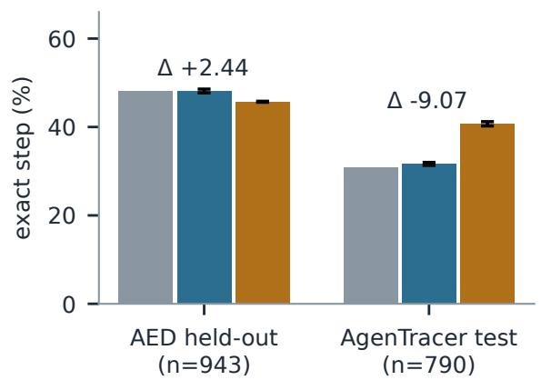

(b) AgenTracer test split by its error-source label  
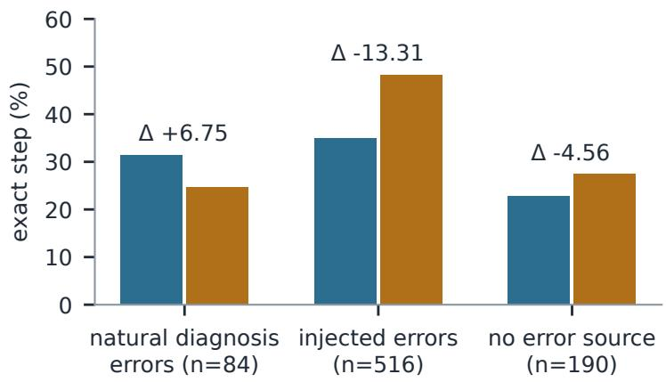  
Figure 12: Resource against resource under one base, recipe and scorer. Exact step on each resource’s test set for the untrained base and for students trained on AED or AgenTracer data, followed by AgenTracer’s test split under its own error-source labels.

Table 11 holds the cells of the comparison described in Section 5.2: Qwen3-8B trained under one recipe and one two-key contract on AED and on AgenTracer’s released v1.0.0 training data, scored on our frozen held-out set and on their released test split. The AgenTracer-data arm is not AgenTracer-8B, whose weights are not released; the comparison is between two resources, not two systems.

Both resources improve joint attribution on AgenTracer’s test split, where the responsible agent varies. Neither establishes an exact-ste ain on the other’s test set. On our holdout, the joint score also rewards matchin a constant unit label; AED does not improve exact step over base, with 3 of 3 seed intervals containing zero.

<table><tr><td>Evaluation and metric</td><td>Resource versus base</td><td>Difference, pp</td></tr><tr><td>AgenTracer, unit+step</td><td>AED AgenTracer data</td><td>4.64 [1.52, 7.59] 15.02 [11.01, 19.49]</td></tr><tr><td>Our holdout, unit+step</td><td>AED</td><td>5.16 [1.79,8.22]</td></tr><tr><td>Our holdout, exact step</td><td>AgenTracer data AED</td><td>-3.08 +0.11 [−2.72,2.99]</td></tr></table>

<table><tr><td>AgenTracer error source</td><td>Leading resource</td><td>Exact-step margin, pp</td></tr><tr><td>Injected errors (516)</td><td>AgenTracer data</td><td>13.31 [8.53, 18.02]</td></tr><tr><td>Natural diagnosis errors (84)</td><td>AED</td><td>+6.75; interval reaches zero</td></tr><tr><td>Unspecified source (190)</td><td>AgenTracer data</td><td>4.56 (coding and mathematics)</td></tr></table>

The largest margin occurs on injected errors, which are absent from AED. The natural-error stratum establishes no resource advantage; these subsets do not isolate error source from task and annotation diferences. Contrasts are seed means; brackets give the widest per-seed 95% percentile-bootstrap interval (over source tasks or question identifiers), not an interval for the mean. All intervals are nominal.

## I. Training results and comparison protocols

This section reports completed training comparisons and their evaluation protocols, including gains and regressions.

## I.1. External-label transfer, in both directions

Table 48 reports Who&When (Zhang et al., 2025b) and TrajErrBench (Qi et al., 2026), whose labels originate outside this project. Their transfer results difer: over TrajErrBench’s 486 cases the untrained base scores 18.72% while the three seeds score 15.43 15.43 and 20.99% so two of the three re ress. We re ort both rather than the favourable one alone. The two benchmarks difer in what a step is – Who&When labels the decisive step of a multi-agent transcript, TrajErrBench the first faulty step of a single-agent trajectory – and we did not measure which of those diferences drives the sign. Diferent annotators do not establish task-disjoint transfer; the task-overlap sensitivity below further limits that interpretation. Both cohorts score every case, with an unparseable answer counted as a miss. For both benchmarks, the producer maps the three trained evaluation runs to the checkpoints reported in Table 48 and records a common training-data digest. This mapping has not been independently verified against the weights loaded for evaluation.

External task overlap. An audit after the original evaluations found shared task identities or exact goals between training and Who&When. The audit did not flag trajectory overlap at its stated similarity threshold. Absence of such a hit does not rule out other overlap. We rescore the existing predictions, keeping each student paired with the base on the same cases; no model or prompt is retuned.

Table 15: Post-hoc Who&When task-overlap sensitivity. Mean exact-step change against base across the larger arm’s three seeds, under the unified prompt. Intervals resample shared evaluation items, conditional on these seeds; they do not measure uncertainty over new training seeds.
<table><tr><td>Evaluation subset</td><td>Cases</td><td>Gain (pp)</td><td>95% interval</td></tr><tr><td>All cases</td><td>184</td><td>+7.97</td><td>[1.63, 14.49]</td></tr><tr><td>No flagged task overlap</td><td>149</td><td>+4.92</td><td>[-2.24, 12.08]</td></tr><tr><td>Flagged task overlap</td><td>35</td><td>+20.95</td><td>[5.71,36.19]</td></tr></table>

The larger improvement occurs on shared tasks. All three point estimates remain positive on the unflagged cases, but their seed-mean interval includes zero; the original headline does not establish transfer beyond task overlap. Task identity and normalized goals define the flagged Who&When cases. The wider audit also checks goal-text containment and trajectory shingles, with matching rules and per-case decisions retained in the companion artifacts. Removing flagged TrajErrBench cases does not reverse its negative seed-mean contrast. These are retrospective sensitivity analyses, not results from decontaminated retraining, which the two paragraphs below report.

Replacement-data retraining. After re lacin fla ed trainin rows, we re eat the lar er-arm reci e with all lanned seeds. Under the pre-specified item-bootstrap rule and original base decode, the Who&When mean exact-step contrast is +7.79 pp (95% interval [1.45, 14.31]). We retain this protocol-specific result alongside the original overlap sensitivity. The new comparison does not rescue the losses under other evaluation interfaces (Table 16). We keep the original and later base decodes: one shared base response set does not measure decode variability. With the later base and source-task resampling, the Who&When mean contrast remains positive. The unified AEB base is the original decode. Raw-answer, input-hash and declared-checkpoint checks pass for the full panel; served paths do not attest loaded weight bytes. Replacing rows changes training examples and optimization paths, so these comparisons do not isolate a causal contribution of overlap or bound its share of the original gain. We retain both original and retrained results.

Sensitivity to replacing flagged training examples. We also compare each replacement-data model with the original model from the same training seed. All three planned runs completed. The training total remains 1,656 rows: 1,574 retained and 82 replaced, including 30 training rows associated with the Who&When overlap audit. Evaluation uses the full 184-case Who&When cohort, not just the 35 flagged evaluation cases. The replacement-minus-original changes are −1.63 pp for seed 17 (95% interval [−3.53, 1.59]), +2.17 for seed 202 ([−2.26, 5.67]), and −1.09 for seed 828 ([−5.26, 3.50]). No per-seed interval excludes zero; the nominal paired p values are 0.45, 0.42 and 0.80. All six models satisfy the answer contract on all cases. Each interval conditions on one pair of trained checkpoints. All seeds use the same original and replacement datasets, so they assess this fixed replacement scheme across training runs. The comparison measures sensitivity to replacing flagged examples; it does not identify their causal contribution to the original gain.

Full-policy input sensitivity. We restored the complete source policy text in the same airline and retail cases, keeping other messages, labels, checkpoints and decoding settings fixed. This post-hoc input check does not replace the primary evaluation.

Table 16: All fixed public conditions after replacement-data retraining. Exact-step percentages for each seed and their mean change against the retained raw-verified base. AEB uses an equal-weight mean over its three environments; other rows use case accuracy. Intervals resample source-task groups, conditional on these seeds and fixed environments. They are sensitivity intervals, not multiplicity-adjusted tests or replacements for the pre-specified item-bootstrap result above. Interfaces can difer in inputs, answer contracts and step coordinates; rows do not isolate a prompt-wording efect. HC/AG: hand-crafted/algorithm-generated; gold: supplied task reference answer.
<table><tr><td>Interface</td><td>Cohort</td><td></td><td></td><td></td><td>Seed 17 Seed 202 Seed 828 Mean ∆ [95% interval]</td></tr><tr><td>Shared</td><td>HC</td><td>5.17</td><td>8.62</td><td>3.45</td><td>-9.77 [–17.24, -2.87]</td></tr><tr><td></td><td> $\mathrm { H C } + { \mathrm { g o l d } }$ </td><td>10.34</td><td>6.90</td><td>6.90</td><td>-12.64[-24.14,-1.72]</td></tr><tr><td></td><td>AG</td><td>9.52</td><td>11.90</td><td>3.17</td><td>-31.48[-40.21,-22.75]</td></tr><tr><td></td><td> $\mathrm { A G } + \mathrm { g o l d }$ </td><td>6.35</td><td>8.73</td><td></td><td>5.56 -32.80[-41.53,-24.34]</td></tr><tr><td></td><td>AEB</td><td>15.33</td><td>22.00</td><td></td><td> $1 5 . 0 0 \ + 1 . 7 8 [ - 3 . 6 7 , 7 . 3 3 ]$ </td></tr><tr><td></td><td>TEB</td><td>4.12</td><td>11.73</td><td></td><td> $6 . 5 8 - 2 0 . 5 1 [ - 2 4 . 5 5 , - 1 6 . 3 9 ]$ </td></tr><tr><td>Unified</td><td>AEB</td><td>21.67</td><td>23.67</td><td></td><td> $2 2 . 6 7 \ \scriptstyle + 3 . 6 7 \ [ - 0 . 3 4 , 7 . 8 9 ]$ </td></tr><tr><td></td><td>TEB</td><td>17.49</td><td>17.90</td><td></td><td> $1 7 . 0 8 \ \ - 0 . 2 1 \ [ - 3 . 2 9 , 3 . 0 2 ]$ </td></tr><tr><td>Unified W&amp;W</td><td>W&amp;W</td><td>33.15</td><td>34.24</td><td></td><td> $3 2 . 6 1 \ \mathrm { \ t } 6 . 7 0 \ [ 0 . 7 1 , 1 2 . 8 9 ]$ </td></tr><tr><td>Benchmark-native HC</td><td></td><td>5.17</td><td>5.17</td><td></td><td> $3 . 4 5 \ \mathrm { \Omega } + 2 . 8 7 \ [ - 3 . 4 5 , 9 . 2 1 ]$ </td></tr><tr><td></td><td> $\mathrm { H C } + { \mathrm { g o l d } }$ </td><td>5.17</td><td>5.17</td><td></td><td> $5 . 1 7 \ + 1 . 7 2 \ [ - 3 . 4 5 , 6 . 9 0 ]$ </td></tr><tr><td></td><td>AG</td><td>11.11</td><td>7.94</td><td></td><td> $1 1 . 1 1 - 1 1 . 3 8 [ - 1 9 . 3 1 , - 3 . 4 4 ]$ </td></tr><tr><td></td><td> $\mathrm { A G } + \mathrm { g o l d }$ </td><td>7.94</td><td>8.73</td><td></td><td> $9 . 5 2 - 5 . 5 6 [ - 1 1 . 9 0 , 0 . 7 9 ]$ </td></tr></table>

Table 17: Exact-step hits on all 400 $\tau ^ { 2 }$ cases. Both policy conditions use the recorded budget-forcing protocol. First-call hits and continuation counts describe the full-policy run; invalid answers remain misses.
<table><tr><td>Model</td><td>Clipped policy</td><td>Full policy</td><td>First call</td><td>Continued</td></tr><tr><td>Base</td><td>87</td><td>78</td><td>59</td><td>65</td></tr><tr><td>SFT, seed 17</td><td>63</td><td>71</td><td>71</td><td>0</td></tr><tr><td>SFT, seed 202</td><td>64</td><td>62</td><td>62</td><td>0</td></tr><tr><td>SFT, seed 828</td><td>92</td><td>83</td><td>83</td><td>0</td></tr></table>

Restoring policy text does not yield a consistent student improvement: one seed improves and two decline. The base also loses accuracy, so a smaller student–base gap under this input does not show better student localization. New-run raw responses reproduce both scoring passes, with runtime paths and checkpoint-file hashes recorded. Historical base raw generations remain unavailable. The comparison does not exclude other context efects or identify the cause of transfer loss.

## I.2. Completed full-fine-tuning recipes

We fine-tune all parameters of Qwen3-8B in BF16 with AdamW (Loshchilov & Hutter, 2019), a learning rate of $1 0 ^ { - 5 } :$ cosine decay, 3% warmup and gradient clipping at 1.0. Table 18 reports the completed run manifests; no rows were dropped. For diagnosis, we average target-token loss within each task and then across tasks. For actors, we average over target tokens in each optimizer window; an example is one supervised assistant turn. We mask the input context in both recipes.

Each GPU processes one example per microbatch. Diagnosis uses six GPUs with two accumulation steps, except the 948-task seeds 202 and 828, which use four GPUs with three steps. The actor runs use eight GPUs with two steps and zero-loss padding for the last optimizer window of each epoch. We select diagnosis checkpoints on development family-macro exact-step accuracy with thinking disabled, requiring at least 80% parseability. Within 1 point of the best, we prefer fewer epochs, then the lower learning rate. All six 948- and 1,656-task runs select epoch 2; Appendix I.11 reports the smaller scaling arms. Actors use the final checkpoint. The actor mixtures difer in task coverage and optimization budget; the longer success-only run is a duration sensitivity, not a matched-budget control.

Table 18: Recorded training sizes and optimization budgets. Examples are per epoch; updates cover the full run. Batch denotes examples per optimizer update.
<table><tr><td rowspan=1 colspan=1>Recipe               Tasks Rows Examples Batch Epochs Updates</td></tr><tr><td rowspan=1 colspan=1>Diagnosis: seeds 17, 202, 828; sequence limit 24,576Full diagnosis         948  948       948    12       2     158</td></tr><tr><td rowspan=1 colspan=1>Full diagnosis       1,656 1,656     1,656    12       2     276</td></tr><tr><td rowspan=1 colspan=1>Actor: seed 17; sequence limit 12,288</td></tr><tr><td rowspan=1 colspan=1>Success-only         1,093 1,093    10,595    16      2    1,326</td></tr><tr><td rowspan=1 colspan=1>Preventive           1,183 1,790    11,912    16       2    1,490</td></tr><tr><td rowspan=1 colspan=1>Post-error action    1,183 1,790    11,912    16       2   1,490</td></tr><tr><td rowspan=1 colspan=1>Post-error reflection1,183 1,790    11,912    16       2    1,490</td></tr><tr><td rowspan=1 colspan=1>Success-only, longer1,0931,093    10,595    16       3   1,989</td></tr></table>

## I.3. Diagnosis targets and evaluation

Table 48 com ares full-dia nosis fine-tunin with rom ted models on the frozen holdout. Both the unfiltered and certified-subset full-diagnosis rows have completed evaluation.

Full fine-tuning uses explanation, evidence and proposed action as the target, with attribution fields first. Frozen- protocol and budget-forced evaluations remain separate. Agreement is with recorded teacher labels; the historical human audit does not relabel this test set. Claims of superiority require a paired interval excluding zero; matching requires the predeclared two-point non-inferiority margin.

Prompted baselines. The prompted rows saw the identical 943 prompts and decoding (temperature 0 where the provider accepts it, 8,192-token budget, thinking as each channel allows), were never trained on AED, and each answered all 943 rows; an unparseable answer is a miss, parse rates run from 96.50 to 100.00, and their family-macro is recomputed from per-item predictions over the holdout’s 56 families, as for the trained rows.

## I.4. Agent post-training design

Table 49 compares held-out task success from the initial state, without a debugger-supplied location. Training uses the corresponding benchmarks’ train-side tasks. The historical pilot’s success-only, preventive and reflective mixtures difer in task coverage, updates and token budget. The current post-error action-only control isolates the addition of reflection more closely: its erroneous action, feedback and corrected actions match the reflective arm. Training completion alone does not establish an evaluated policy benefit.

## I.5. Comparison scope and interpretation

The reported comparisons use separate cohorts for diagnosis production, correction replay, diagnostic learning and actor training. Their input information and evaluation units determine the conclusions each supports.

Counting and uncertainty. All planned evaluation cases remain in the denominator, including missing and unparseable answers, exce t for the ex licitl identified com lete-case recover and real-environment summaries. We re ort their failure accounting alongside the scores. Source-task clustering addresses repeated tasks; training-seed variation measures a diferent source of uncertainty. First proposals and search-selected corrections retain separate paired controls.

Overlap sensitivity of the internal comparison. We found no exact overlap in task identities, task content, complete traces or the audited trajectory prefixes. The internal holdout shares environments with training, and most examples also share the harness and policy; it measures within-distribution generalization. We also checked similar input text and repeated user goals across task variants. In both checks, the gain from the larger training set occurs outside the flagged subsets, whose estimated gains are zero or negative and whose intervals include zero. These checks do not rule out other forms of train–test similarity. The audit records retain the matching rules, subgroup scores and uncertainty.

Actor comparisons. The recipes difer in task coverage, per-environment exposure and optimizer updates. Their contrasts describe the combined recipes and do not isolate the efect of repair supervision. Post-error action-only and reflective arms share erroneous actions, observed feedback and corrected continuations; reflection also changes the context for later actions and the supervised-token budget. A state-changing error requires a continuation executed from that post-error state; a passing pre-error branch cannot be spliced after it.

Construction and human-review scope. Diagnosis production measures yield under the stated output requirements and teacher access. Agreement with a construction teacher and admission yield do not establish human-assessed label correctness. The prepared human audit assesses individual records under shared AI assistance, not blinded paired outputs from diferent construction methods. Its coverage-selected sample does not estimate collection-wide accuracy. The historical student comparisons also vary teacher access or target construction, so their contrasts do not isolate pipeline quality.

Public comparisons. Within each reported protocol, comparisons share frozen cases, input information and scoring rules. First-call and budget-forced evaluations remain separate. Who&When’s responsible agent, AgentErrorBench’s module and TrajErrBench’s error mode are distinct labels. Published native-protocol scores provide context outside the shared-prompt tables. The AgenTracer-data comparison uses a common student recipe and compares training resources, not the original AgenTracer algorithm. These comparisons support protocol-specific conclusions rather than a public leaderboard ranking.

## I.6. Diagnosis production on a common failure pool

The common failure pool covers 1,068 source tasks, 16 environments, 10 harness families and 15 policy models. It excludes evaluation-exposed tasks and caps contributions per task. Every configuration receives the same failed executions. Table 19 includes abstentions, malformed diagnoses and engine errors in the input denominator. The main table shows representative single-pass, deep-analysis, multi-model and citation-first configurations; the full comparison is below.

Table 19: Historical production configurations on the common failure pool. Pairs satisfy the recorded structured-diagnosis and trace-citation rule. This is an output-compatibility measurement, not human-validated accuracy.

<table><tr><td>Diagnosis configuration</td><td>Pairs</td><td>Yield</td><td>USD / input</td></tr><tr><td>AgentDebugX: all-at-once</td><td>735</td><td>49.0%</td><td>0.0052</td></tr><tr><td>AgentDebugX: binary search</td><td>3</td><td>0.2%</td><td>0.0100</td></tr><tr><td>AgentDebugX: counterfactual</td><td>0</td><td>0.0%</td><td>0.0136</td></tr><tr><td>AgentDebugX: heuristic</td><td>802</td><td>53.5%</td><td>0.0000</td></tr><tr><td>AgentDebugX: ensemble</td><td>437</td><td>29.1%</td><td>0.0152</td></tr><tr><td>AgentDebugX: success reference</td><td>756</td><td>50.4%</td><td>0.0054</td></tr><tr><td>AED citation-first judge</td><td>1,403</td><td>93.5%</td><td>0.0067</td></tr><tr><td>Iterative investigation</td><td>192</td><td>12.8%</td><td>0.0088</td></tr><tr><td>Multi-model consensus</td><td>726</td><td>48.4%</td><td>0.0247</td></tr><tr><td>Rule-based triage</td><td>0</td><td>0.0%</td><td>0.0000</td></tr><tr><td>Success-trace comparison</td><td>0</td><td>0.0%</td><td>0.0000</td></tr><tr><td>AgentDebugX: deep analysis</td><td>987</td><td>65.8%</td><td>0.0143</td></tr><tr><td>Prospective diagnosis</td><td>713</td><td>47.5%</td><td>0.0110</td></tr></table>

What difers. Single-model configurations use GPT-5-mini. Consensus uses GPT-5-mini, Claude Haiku 4.5 and Gemini 3.6 Flash voters, with Gemini as arbiter. Each en ine kee s its roduction renderer and decodin defaults. Success reference methods additionally use available same-task successful traces. Task reference answers and verifier signals are withheld; historical inputs also omit the policy’s system prompt. AgentDebugX adapters invoke its diagnosis implementations (Zhu et al., 2026); deep analysis omits the separate taxonomy-generalization call. Thus neither the teacher ensemble nor rendering is controlled across all rows.

What the cost and yield establish. Costs use whole-job diagnosis meters divided by every input, including failed calls. They exclude trajectory generation, correction replay and hosting. Pair yield requires a structured location and a matched citation under the historical export rule; a matching quote does not establish a correct attribution or a supported correction. Methods that do not emit that citation format can have low yield without being poor localizers The comparison supports choosing an export-compatible production route, not a claim of superior diagnosis quality.

## I.7. Construction cost and scale estimates

Accounting unit. For a cohort with a fixed acceptance rule, cost per retained record is total construction spend divided by retained records, including spend on rejected candidates. Rollout, diagnosis, review and optional replay have separate meters; hosting and human labor require additional accounting. The studies below cover diferent cohorts and must not be added into a full-collection bill. USD values use recorded token usage and the configured channel prices, not independently reconciled invoices. The collection waves use GPT-5.6-Sol with the all-at-once diagnosis engine; their policy and task mixtures difer. Semantic-review and selected-row cost estimates for a separate pool appear in Table 50.

Table 20: API cost by pipeline stage in two historical collection waves, re-read on September 24. A cell is one environment–harness–policy run configuration. Completed cells supply Table 21; stopped and unsettled cells remain in this accounting ledger. Only rollout and diagnosis appear in these meters.
<table><tr><td>Meter scope</td><td>Cells</td><td>Logged USD</td></tr><tr><td>Completed cells: rollout</td><td>1,198</td><td>415.53</td></tr><tr><td>Completed cells: diagnosis</td><td>1,198</td><td>343.44</td></tr><tr><td>Completed cells: combined</td><td>1,198</td><td>758.96</td></tr><tr><td>Stopped cells (settled meters)</td><td>10</td><td>0.12</td></tr><tr><td>Unsettled meters (logged to date)</td><td>7</td><td>8.84</td></tr></table>

Table 21: Construction API cost by environment and harness. Both anels artition the same com leted cells; the are not additive. Runs includes successful and failed task attempts. Diag. (D) counts runs with a recorded valid-step diagnosis, before independent semantic acceptance. USD includes rollout and diagnosis; USD/D is their combined cost per diagnosis. Model and task mixtures difer across rows, so this is descriptive accounting, not a controlled harness ranking.
<table><tr><td>Environment</td><td>Runs Diag.</td><td></td><td></td><td>USD USD/D</td></tr><tr><td>AgentBench DB</td><td>2,140</td><td>418</td><td>20.62</td><td>0.049</td></tr><tr><td>AgentBench OS</td><td>2,140</td><td>413</td><td>18.18</td><td>0.044</td></tr><tr><td>ALFWorld</td><td>1,150</td><td></td><td>754 100.43</td><td>0.133</td></tr><tr><td>BabyAI</td><td>630</td><td>201</td><td>15.71</td><td>0.078</td></tr><tr><td>BFCL</td><td>1,600</td><td>666</td><td>51.63</td><td>0.078</td></tr><tr><td>GridWorld</td><td>1,000</td><td>115</td><td>10.51</td><td>0.091</td></tr><tr><td>InterCode Bash</td><td>1,060</td><td>103</td><td>6.98</td><td>0.068</td></tr><tr><td>Jericho</td><td>590</td><td>388</td><td>29.32</td><td>0.076</td></tr><tr><td>MCPMark</td><td>717</td><td></td><td>398 186.74</td><td>0.469</td></tr><tr><td>PDDL</td><td>910</td><td>453</td><td>37.68</td><td>0.083</td></tr><tr><td>ScienceWorld</td><td>927</td><td>489</td><td>68.54</td><td>0.140</td></tr><tr><td>τ airline</td><td>1,013</td><td>721</td><td>83.77</td><td>0.116</td></tr><tr><td>τ retail</td><td>1,630</td><td>401</td><td>39.82</td><td>0.099</td></tr><tr><td>Text-to-SQL</td><td>1,000</td><td>265</td><td>11.38</td><td>0.043</td></tr><tr><td>TextCraft</td><td>1,060</td><td>274</td><td>12.09</td><td>0.044</td></tr><tr><td>TextQuest</td><td>1,000</td><td>160</td><td>15.18</td><td>0.095</td></tr><tr><td>TextWorld Cooking</td><td>432</td><td>225</td><td>21.37</td><td>0.095</td></tr><tr><td>Warehouse</td><td>1,000</td><td>41</td><td>7.97</td><td>0.194</td></tr><tr><td>WebShop-lite</td><td>1,000</td><td>142</td><td>8.87</td><td>0.062</td></tr><tr><td>Wordle</td><td>630</td><td>271</td><td>12.17</td><td>0.045</td></tr><tr><td>Total</td><td>21,629 6,898 758.96</td><td></td><td></td><td>0.110</td></tr></table>

<table><tr><td rowspan=1 colspan=1>Harness         Runs Diag.  USD USD/D</td></tr><tr><td rowspan=1 colspan=1>AFlow            90  72  4.79 0.067</td></tr><tr><td rowspan=1 colspan=1>AgentScope       240  99  4.12 0.042</td></tr><tr><td rowspan=1 colspan=1>AutoGen        2,320 600 49.69  0.083</td></tr><tr><td rowspan=1 colspan=1>AutoGen group    460 274 16.78 0.061</td></tr><tr><td rowspan=1 colspan=1>CAMEL           240  91  4.31 0.047</td></tr><tr><td rowspan=1 colspan=1>CrewAI           220  99  3.79 0.038</td></tr><tr><td rowspan=1 colspan=1>DSPy            240  94  7.22 0.077</td></tr><tr><td rowspan=1 colspan=1>Google ADK       240  82  3.87 0.047</td></tr><tr><td rowspan=1 colspan=1>LangGraph      2,321  591 48.82 0.083</td></tr><tr><td rowspan=1 colspan=1>LlamaIndex       240  93  6.61  0.071</td></tr><tr><td rowspan=1 colspan=1>MetaGPT         180 142  4.78 0.034</td></tr><tr><td rowspan=1 colspan=1>Planner-executor  834 474 45.72 0.096</td></tr><tr><td rowspan=1 colspan=1>Native tools      4,572 1,363166.52 0.122</td></tr><tr><td rowspan=1 colspan=1>OpenAI Agents    240  113  3.84 0.034</td></tr><tr><td rowspan=1 colspan=1>OpenHands      2,318 55579.78 0.144</td></tr><tr><td rowspan=1 colspan=1>ReAct          4,5551,451241.89  0.167</td></tr><tr><td rowspan=1 colspan=1>smolagents      2,319 705 66.43 0.094</td></tr><tr><td rowspan=1 colspan=1>Total          21,629 6,898 758.96 0.110</td></tr></table>

Interpreting the variation. The cost of obtaining a failure depends on policy success, trace length and tool interaction; the cost of retaining a pair also depends on the acceptance rule. Completing diagnosis does not guarantee a trace- supported or semantically accepted target. These tables therefore do not price the final quality-admitted release. Stopped cells have settled meters but no completed collection protocol; unsettled meters may omit outstanding calls. We show their logged spend separately instead of treating either group as zero-cost output.

Table 22: Diagnosis-only production cost on the common failure pool. The same representative configurations as Table 47; all configurations and yields appear in Table 19. Pair means a structured location with a matching trace citation under the historical export rule. The last column is a linear budget scenario for 50,000 such outputs, not measured spending or a quality-certified release estimate.
<table><tr><td>Configuration</td><td>Calls/input</td><td>USD/input</td><td>USD/pair</td><td>USD/50k pairs</td></tr><tr><td>AgentDebugX: all-at-once</td><td>1.01</td><td>0.0052</td><td>0.0106</td><td>528</td></tr><tr><td>AgentDebugX: deep analysis</td><td>4.79</td><td>0.0143</td><td>0.0218</td><td>1,089</td></tr><tr><td>Multi-model consensus</td><td>3.18</td><td>0.0247</td><td>0.0510</td><td>2,549</td></tr><tr><td>AED citation-first judge</td><td>1.00</td><td>0.0067</td><td>0.0072</td><td>359</td></tr></table>

For method m, with total diagnosis spend $C _ { m }$ over all input failures and $N _ { m }$ compatible outputs, we report $c _ { m } = C _ { m } / N _ { m }$ and project $M \boldsymbol { c } _ { m }$ for M outputs. This assumes the same task mix, teacher, prices, trace lengths and acceptance yield. Failed calls and rejected outputs remain in $C _ { m }$ . Trajectory collection, success-reference acquisition, later semantic review, repair execution and hardware are outside this diagnosis-only budget. Historical configurations difer in renderers and teacher access (Appendix I.6); cheaper compatible output does not establish more accurate attribution or better student learning.

## I.8. Cohorts and interpretation of the main results

Admission and replay use separate populations. The admission ablation fixes source tasks, teacher inputs and candidate diagnoses. Grounding requires all 56 deterministic hard flags; semantic review adds acceptance by both judges on the same input. The nested pool excludes 29 of the 796 rows in the released certified pool because they fail the current flag record. Yield counts candidate rows; tasks and environments count distinct retained sources outside the held-out packs. Total cost per retained row must include generation, checking and rejected candidates. Table 50 reports this accounting as an estimate: matched spend plus extrapolation for unmatched records, with joined-only values reported separately. It is not the diagnosis-only production cost in Table 47. The measured semantic-review stage costs USD 0.039 per Claude Opus 5 verdict on a 200-verdict calibration sample; human-review cost is separate. The proposed matched-pool human audit uses random samples and inclusion weights. The existing purposive coverage audit cannot supply those estimates.

Across 3062 replay attempts, selected replacements pass at 59.1% against 13.7% for the original action, a paired diference of 45.3 points with a task-clustered bootstrap 95% interval of 41.3 to 49.2 over 1284 source tasks. Search stops at the first recovering proposal. The first-proposal contrast in Table 47 and same-harness contrast in Appendix X retain their own controls; they cannot validate the separate diagnosis release. Of these attempts, 1552 of 3062 tried more than one proposal.

Public transfer and reference systems. Relative to the base, the 948-task fine-tune loses up to −29.37 pp under the training-format prompt and up to −9.52 pp under Who&When’s source prompt (Table 30). Mixed-format continuation on the same 948 tasks raises Who&When AG, WG from 9.52% to 34.13% (base 38.89%) under the training-format prompt. After this continuation, the seven-field holdout changes little (58.43% versus 58.64%), but TrajErrBench does not recover. Continuation changes training as well as format exposure, so this recovery does not isolate a format-only efect. On the internal holdout, the responsible-agent label is constant over 943 cases: the base’s 41.15 unit+step versus 47.19 exact step reflects its tendency to name other units. We omit that joint metric from the main comparison.

Published context includes AgentDebug’s GPT-4.1 pipeline (45.0 S, 31.3 S+M) and AgenTracer-8B’s Who&When agent accuracy (63.82 HC, 69.10 HC with gold). These are the original papers’ scores, not measurements under our protocol. AgentDebug’s inspected release provides code and GPT-4.1 results without trained weights; AgenTracer’s provides data without the training code or 8B weights. We compare the released training resources and leave unreproduced system rows unfilled. A reimplementation would need its own name and qualification.

<table><tr><td>Supplementary comparison</td><td>Statistic and interpretation</td></tr><tr><td>Compact holdout, constant unit</td><td>Unit+step: AED 47.26, base 42.10; AED minus AgenTracer data 8.24 [5.47, 10.71]. This measures agreement with one unit label. Intervals use the convention of Table 11.</td></tr><tr><td>Internal API reference</td><td>The full-diagnosis seed-17 reference leads each prompted closed model. The strongest is Claude Opus 5; the paired comparison gives McNemar  $p < 0 . 0 0 1$  . Table 48 reports the effect and family-bootstrap interval.</td></tr><tr><td>Admission and learning</td><td>The quality-selection comparison covers five trained arms. Across both holdout formats and both seeds, the eight exact-step contrasts range from —7.74 to —3.92 points (grounding minus no checks). Checkpoint selection leaves update exposure unmatched.</td></tr><tr><td>Pooled AgentErrorBench</td><td>On 200 cases, the 948-task arm versus base gives McNemar  $p = 0 . 1 5$  under our prompt and p = 0.40 under the direct prompt. These nominal tests do not establish a pooled gain.</td></tr></table>

Actor generalization within the training environments. The frozen training pool includes all six evaluation en-vironments. The pool manifest records task-identity and payload-overlap checks for the held-out tasks; this design tests task generalization within the same environment set. These environments are excluded from the released core corpus and form a separate development pool. The baseline pins its model revision; full fine-tunes require checkpoint directories and trainin manifests. The action-onl and reflective arms share erroneous actions feedback and corrected continuations. A state-changing failure requires a continuation executed from that post-error state; a passing pre-error branch cannot be substituted. Success-only trajectories may themselves contain recovery.

Table 23: Actor-evaluation qualifications. Counts refer to diferent audits and must not be combined. The fixed subset uses a lexical signal, not a recognition label.
<table><tr><td>Audit</td><td>Recorded observation</td><td>Consequence</td></tr><tr><td>Corpus terminal shape</td><td>An audit of 124,796 unique traces selects 0 of 3,575 ALFWorld failures and 79 of 1,486 ScienceWorld failures. The separate ALFWorld-lite adapter has 374 exhaustion. This proxy does not of 2,038.</td><td>Unsuccessful runs end with finish, without recorded parser/tool errors or enumerate self-repair opportunities.</td></tr><tr><td>Held-out failure events</td><td>Text-to-SQL: 317/319 failures; WebShop-lite: 46/82. No recognized non-infrastructure error</td><td>event or step-limit termination. Missing event coverage can affect this classification.</td></tr><tr><td>Lexical subset</td><td>Of those failures, 60 text-to-SQL and 46 WebShop-lite tasks contain an earlier observation with a verifier-signal token absent from the task, after stopword filtering.</td><td>Fixes task membership for initial-state reevaluation; does not show that the policy saw or recognized a complaint.</td></tr><tr><td>Training contamination</td><td>1,014 episodes; none of the 1,246 repair rows was built from that refusal.</td><td>The strict parser refused list_tables() on 197 of Use the corrected parser for all evaluated arms.</td></tr></table>

Table 24: Sensitivit to the arser condition in untrained- olic runs. Both runs used one server at tem erature 0. Other environments also changed, so this does not isolate the parser’s causal efect. Same-parser replications remain necessary.
<table><tr><td>Environment</td><td>Strict (%)</td><td>Corrected (%)</td><td>Outcome changes</td></tr><tr><td>Text-to-SQL</td><td>65.2</td><td>68.5</td><td>+3.4 pp; 69 gained, 35 lost / 1,014</td></tr><tr><td>WebShop-lite</td><td>75.3</td><td>72.7</td><td>-2.7 pp; 44/300 flipped</td></tr><tr><td>ALFWorld-lite</td><td></td><td>88.0</td><td>+0.7 pp; 24/300 flipped</td></tr></table>

Only Text-to-SQL syntax is touched by the parser change in this comparison. Two additional strict-parser baseline runs succeed on 5–7 text-to-SQL and 7–13 WebShop-lite tasks in the fixed subset. These do not estimate run-to-run variability under the corrected parser or recovery at common post-error states. ALFWorld-lite, TextQuest, Warehouse and Gridworld have 1, 3, 90 and 0 subset tasks, respectively, against untrained success of 88.0, 67.7, 2.0 and 5.0. Gridworld’s zero reflects the frozen scorer’s coverage: every one of its 100 episodes includes a refusal (409 records, 295 blocked) whose code lies outside the scorer’s event tables. The earlier full-environment ilot is unusable for the headline comparison: no ALFWorld failure meets the corpus terminal-shape proxy, and ScienceWorld returned run errors on 47 of 54 episodes.

## I.9. Pipeline labels against a single judge

Table 25: Completed diagnosis-SFT comparisons (frozen protocol, mean ± sd over seeds 17/202/828). Upper block: the contract-faithful rerun of the pilot on its 169 held-out cases (Appendix S). Lower block: the final cohort, without unit+step because the gold agent is one constant label there; ∆(X−J) is the seed mean of the paired family-macro diference.
<table><tr><td>Supervision</td><td>Train tasks</td><td colspan="2">Macro</td><td>Micro</td><td>Unit+step</td></tr><tr><td>Qwen3-8B base</td><td>0</td><td colspan="2">64.05</td><td>52.66</td><td>44.97</td></tr><tr><td>Execution-assisted diagnosis</td><td>168</td><td colspan="2"> $5 9 . 8 0 \pm 3 . 7 8$ </td><td> $5 2 . 4 7 \pm 0 . 6 8$ </td><td> $4 4 . 5 8 \pm 0 . 9 0$ </td></tr><tr><td>Teacher-only diagnosis</td><td>168</td><td colspan="2"> $6 2 . 4 4 \pm 1 . 1 3$ </td><td> $5 1 . 6 8 \pm 2 . 4 6$ </td><td> $4 1 . 2 2 \pm 1 . 8 1$ </td></tr><tr><td>Final cohort, 943 held-out cases</td><td>Train tasks Seeds</td><td colspan="2"></td><td></td><td>Micro ∆(X-J)</td></tr><tr><td>Pipeline label (X), paired cohort</td><td>948</td><td>3</td><td>Macro  $5 2 . 5 1 \pm 0 . 9 4$ </td><td> $4 6 . 8 7 \pm 0 . 3 8$ </td><td>-0.89</td></tr><tr><td>Single judge (J), same cohort</td><td>948</td><td>3</td><td> $5 3 . 3 9 \pm 2 . 0 1$ </td><td> $4 6 . 2 4 \pm 1 . 1 2$ </td><td>ref.</td></tr><tr><td>Pipeline label, scale arm</td><td>1,656</td><td>3</td><td> $5 1 . 2 9 \pm 0 . 4 0$ </td><td> $4 6 . 5 9 \pm 0 . 1 2$ </td><td></td></tr></table>

In the lower block the per-seed 95% family-bootstrap intervals of ∆(X−J) are [−8.28, −0.12], [−1.71, 5.26] and [−3.33, 2.42] for seeds 17/202/828. The final cohort is the paired subset of the frozen training split, which holds 3157 rows over 1678 source tasks: 948 of those tasks, in 133 families, admit the same attempt under both constructions. 80% power for the registered 5-point efect is not established under the clustered analysis (Appendix S).

G1b. Under the tested recipe, does either diagnosis construction train a better attributor than the untrained base, and does either outperform the other?

We compare construction-pipeline labels (X) with single-judge labels (J) on the same source tasks, trajectories and model-visible inputs, selecting one shared attempt per task without reading its target. X uses execution feedback in the pilot, but no final-cohort X label was replayed. The student receives the diagnosis, not replay outcomes or certification metadata, and output format, adaptation recipe and task exposure per optimizer update are fixed across arms.

Neither diagnosis construction establishes an attribution gain over the base in the pilot or final compact-target comparison. The pilot’s X teacher also saw task payloads that J did not, so the null does not isolate the value of execution feedback. The final X labels were never replayed, making that contrast a comparison of label-construction procedures.

<table><tr><td>Comparison</td><td>Result and qualification</td></tr><tr><td>Pilot</td><td>168 source tasks, three seeds: mean micro 52.47% execution-assisted, 51.68% teacher-only, 52.66% base. Six paired tests give p from 0.442 to 1.0; all six paired X-J intervals contain zero. X saw task payloads on 112 of the 168 rows, J on none.</td></tr><tr><td>Final cohort</td><td>At 948 tasks, no arm gains more than 2.41 macro or reaches the base&#x27;s micro; 8 of the 9 per-seed intervals against base contain zero. X—J is —0.89 macro on the seed mean.</td></tr><tr><td>Prompted context</td><td>Four API models span 50.69 (GPT-6 Astra) to 54.72 (Claude Opus 5) micro on the same 943 cases (Table 48).</td></tr></table>

Takeaway (G1b). At 168 and at 948 source tasks, supervision on these diagnoses establishes no attribution gain over the untrained base or consistent advantage of either construction. Non-separation is not equivalence: the paired intervals are wide relative to the registered 5-point efect (Appendix S).

Transfer to public attribution benchmarks. The public benchmarks measure agreement with a recorded error step, conditional on failure; a match does not establish a unique root cause. Under one evaluation run over four public splits (Table 26), both trained arms stay close to the base on three and score lower on AgentErrorBench — descriptive diferences that establish no consistent transfer benefit.

## I.10. What the diagnosis itself adds

Diagnoses. Handed the location of a failure, does an actor recover more often when it is also told the diagnosis than when it is simply given a second chance?

Table 26: External attribution after paired diagnosis SFT. Exact-step accuracy (%) over every planned case, including missing or invalid predictions. Trained entries are means over three seeds from the superseded pilot run (target-token-weighted loss), whose rerun found both arms at or below the base on all four splits and shipped no per-split values; the base row is untrained. Descriptive, no significance claimed.
<table><tr><td>Benchmark</td><td>Cases</td><td>Base</td><td>Execution-assisted</td><td>Teacher-only</td><td></td></tr><tr><td>Who&amp;When HC</td><td>58</td><td>13.79</td><td>14.94</td><td></td><td>14.94</td></tr><tr><td>Who&amp;When AG</td><td>126</td><td>33.33</td><td>32.54</td><td></td><td>31.48</td></tr><tr><td>AgentErrorBench</td><td>200</td><td>10.50</td><td>7.50</td><td></td><td>7.00</td></tr><tr><td>TrajErrBench</td><td>486</td><td>23.25</td><td>24.83</td><td></td><td>24.48</td></tr><tr><td>Prompted reference</td><td></td><td></td><td></td><td>Seeds Who&amp;When HC Who&amp;When AG AgentErrorBench TrajErrBench</td><td></td></tr><tr><td>Claude Sonnet 5, prompted</td><td></td><td>22.41</td><td>54.76</td><td>29.00</td><td>35.80</td></tr><tr><td>Gemini 3.8 Flash, prompted</td><td></td><td>13.79</td><td>15.87</td><td>24.00</td><td>35.39</td></tr></table>

The measured block is the completed pilot. Benchmark versions, prompts, decoding and scoring are frozen and checkpoints are not selected on them. The prompted rows answer the same splits under the same scorer, Gemini’s cells carrying its contract failures as misses.

A cohort of 150 failures in 11 environments was frozen before the run, and each is resumed at the pre-action state of the attributed step; the arms difer only in what the actor is told there (Table 27).

Generic reconsideration already improves recovery over repeating the original action (Table 27). The diagnosis-minusreconsideration contrast is +5.6 points, with a task-clustered interval of 0.0 to 11.3; an additional benefit from diagnosis content is not established. Marginal arm rates use each arm’s completed cases, while this paired contrast uses cases both arms completed. These denominators cannot be interchanged.

Takeaway (diagnoses). At the supplied location, generic reconsideration gains 8.4 points over re-applying the original action.   
Diagnosis content adds 5.6 more, with an interval reaching zero; its advantage over a second chance is not established.

Table 27: Located-failure cohort: 150 failures in 11 environments resumed at the pre-action state of the attributed step, varying only what the actor is told; Attempts is the number of planned cases on which the arm reached a verdict. The content-free control carries a nudge because a retry with no text changes the execution path. ∆ against ref., task-clustered 95% intervals.
<table><tr><td>Continuation at the supplied location Attempts Seeds Success</td><td></td><td></td><td>Δ</td></tr><tr><td>Original action re-applied</td><td>149</td><td>18.7%</td><td>ref.</td></tr><tr><td>Generic reconsideration</td><td>144</td><td>27.1%</td><td>+8.4 [2.7, 14.8]</td></tr><tr><td>Diagnosis and proposed replacement</td><td>146</td><td>32.2%</td><td>+13.5 [7.1, 20.1]</td></tr><tr><td>Deployed coach text</td><td>147</td><td></td><td>36.1% +17.1 [10.8, 23.8]</td></tr></table>

## I.11. Full-diagnosis training: size and seed stability

Figure 5b summarizes three training seeds at each of four nested task counts. Table 28 gives the scores under the compact answer contract; the untrained base scores 47.19%. We compute the sample standard deviation with denominator $n _ { \mathrm { s e e d } } - 1$ . The small open markers display the individual runs at their actual task counts; the connecting line joins observed means and does not fit a scaling law.

Table 28: Three-seed diagnosis scaling. Micro exact-step agreement on the same 943 expected cases. Scores are sorted within each row, not ordered by seed. Means and SDs use exact counts from the original per-case reports.
<table><tr><td>Training tasks</td><td>Three seed scores (%)</td><td>Mean ± SD Source</td></tr><tr><td>240</td><td>51.54/53.55/54.29</td><td> $5 3 . 1 3 \pm 1 . 4 3$  Run reports</td></tr><tr><td>480</td><td>55.78/57.05/58.96</td><td> $5 7 . 2 6 \pm 1 . 6 0$  Run reports</td></tr><tr><td>948</td><td>59.81/60.34/61.61</td><td> $6 0 . 5 9 \pm 0 . 9 3$  Run reports</td></tr><tr><td>1,656</td><td>62.88/63.31/64.48</td><td> $6 3 . 5 6 \pm 0 . 8 2$  Run reports</td></tr></table>

All twelve runs have local per-case reports, including the two 480-task replicates supplied in the Claude Code experiment handof. Development selection chooses epoch 1 for the 240-task seed-17 and 480-task seed-828 runs, and epoch 2 for the others. The original 240- and 480-task seed-17 runs select with frozen development decoding; the other verified runs use thinking-of development decoding. Evaluation uses the frozen protocol throughout. Exact-count SDs can

150 located failures; each arm resumes at the attributed step.   
n: cases the arm completed; whiskers: task-clustered 95% CI.

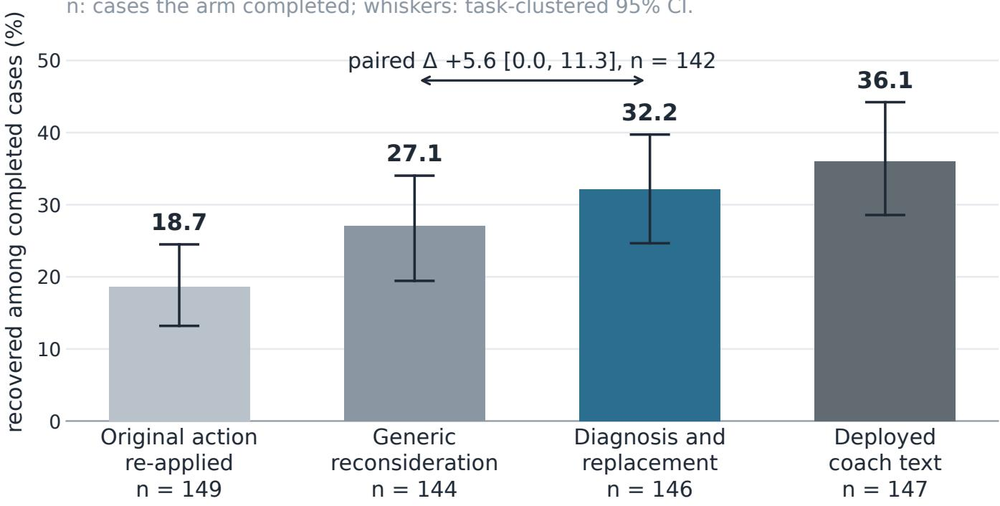  
Figure 13: Actor recovery at a supplied error location. Recovery among each arm’s completed cases with task-clustered 95% intervals; the arrow marks the paired diagnosis-minus-reconsideration contrast on the cases both arms completed.

difer by 0.01 from SDs computed after rounding individual percentages. More training tasks also mean more optimizer updates, so this experiment measures the recorded training procedures rather than a compute-matched efect of dataset size alone.

Earlier paired checkpoint comparisons. The full-diagnosis fine-tune of Section 5.2 has a separate nested training ladder, reported in Table 29. It must not be spliced into the compact-target curve below: the supervision targets and cohorts difer. All points here start from Qwen3-8B and use the frozen decoding protocol. The compact and seven-field prompts request diferent answer schemas on the same held-out cases; the main comparison to API models uses the compact prompt. Each run supplies predictions for 942 of 943 cases; the missing answer counts as incorrect.

Table 29: Full-diagnosis nested ladder and seed replicates. Micro exact step on the same held-out cases under two prompt schemas. The summary is mean ± sample standard deviation across training seeds for both replicated cohorts, not a confidence interval.
<table><tr><td>Target</td><td>Tasks</td><td>Seed</td><td>Epoch</td><td>Seven-field</td><td>Compact</td></tr><tr><td>Base</td><td>0</td><td>一</td><td></td><td>46.66</td><td>47.19</td></tr><tr><td>Full diagnosis</td><td>240</td><td>17</td><td>1</td><td>47.83</td><td>51.54</td></tr><tr><td>Full diagnosis</td><td>480</td><td>17</td><td>2</td><td>56.52</td><td>58.96</td></tr><tr><td>Full diagnosis</td><td>948</td><td>17</td><td>2</td><td>58.64</td><td>60.34</td></tr><tr><td>Full diagnosis</td><td>1656</td><td>17</td><td>2</td><td>62.14</td><td>63.31</td></tr><tr><td>Full diagnosis</td><td>948</td><td>202</td><td>2</td><td>60.98</td><td>61.61</td></tr><tr><td>Full diagnosis</td><td>948</td><td>828</td><td>2</td><td>57.69</td><td>59.81</td></tr><tr><td>Full diagnosis</td><td>1656</td><td>202</td><td>2</td><td>62.35</td><td>62.88</td></tr><tr><td>Full diagnosis</td><td>1656</td><td>828</td><td>2</td><td>62.78</td><td>64.48</td></tr><tr><td>948-task mean</td><td>948</td><td>3 seeds</td><td>一</td><td> $5 9 . 1 0 \pm 1 . 6 9$ </td><td> $6 0 . 5 9 \pm 0 . 9 3$ </td></tr><tr><td>1656-task mean</td><td>1656</td><td>3 seeds</td><td></td><td> $6 2 . 4 2 \pm 0 . 3 2$ </td><td> $6 3 . 5 6 \pm 0 . 8 2$ </td></tr></table>

The seven-field smaller-to-middle contrast is +8.70 oints (95% aired famil -bootstra interval [6.37, 10.96]); the middle-to-948-task contrast is +2.12 ([−0.11, 4.41]). The latter establishes neither further improvement nor saturation. The larger rung improves micro scores under both prompts, but its family-macro intervals include zero: an aggregate

gain need not extend across task families.

Intervals condition on selected checkpoints, exclude training-seed uncertainty and are not multiplicity adjusted. Size also changes update count; selected epochs and development decoding difer across rungs. This ladder therefore describes the recorded training procedures, not an isolated causal efect of adding data. Replicates at both larger rungs describe seed variability; the paired reference remains seed 17.

## I.12. Full-diagnosis transfer across public attribution protocols

Table 30 reports the completed seed-17 full-diagnosis checkpoint against the untrained base on the public attribution splits. Prompt families are kept separate: the training-format prompt, the unified attribution adapter, and Who&When’s source prompt are not interchangeable protocols. All arms use the same adapter within a cell and budget-forced decoding. The report records the same adapter-source drift within each prompt family; these results are not a claim to reproduce the source papers’ systems. The multiformat\_s17c arm continues from the 948-task checkpoint for 1 epoch at learning rate $1 \times 1 0 ^ { - 6 }$ , varying target formats on the same task identities.

Table 30: Public transfer with a target-format control. Micro exact step (percent); ∆ and nominal paired McNemar p compare full FT with base. HC/AG: hand-crafted/algorithm-generated; WG: with ground truth; —: arm unavailable.
<table><tr><td>Protocol and split</td><td>N</td><td>Base</td><td>Full FT</td><td>Multiformat</td><td>Δ</td><td>p</td></tr><tr><td>Training format: AgentErrorBench</td><td>200</td><td>15.50</td><td>20.00</td><td>21.00</td><td>+4.50</td><td>0.151</td></tr><tr><td>Training format: Who&amp;When AG</td><td>126</td><td>37.30</td><td>15.87</td><td>34.92</td><td>-21.43</td><td>&lt; 0.001</td></tr><tr><td>Training format: Who&amp;When AG, WG</td><td>126</td><td>38.89</td><td>9.52</td><td>34.13</td><td>-29.37</td><td>&lt; 0.001</td></tr><tr><td>Training format: Who&amp;When HC</td><td>58</td><td>20.69</td><td>15.52</td><td>24.14</td><td>-5.17</td><td>0.505</td></tr><tr><td>Training format: Who&amp;When HC, WG</td><td>58</td><td>18.97</td><td>13.79</td><td>22.41</td><td>-5.17</td><td>0.546</td></tr><tr><td>Training format: TrajErrBench</td><td>486</td><td>27.57</td><td>15.43</td><td>16.87</td><td>-12.14</td><td>&lt; 0.001</td></tr><tr><td>Unified: AgentErrorBench</td><td>200</td><td>17.50</td><td>20.00</td><td>18.50</td><td>+2.50</td><td>0.404</td></tr><tr><td>Unified: TrajErrBench</td><td>486</td><td>18.72</td><td>17.70</td><td>18.52</td><td>-1.03</td><td>0.657</td></tr><tr><td>Unified: Who&amp;When (HC+AG)</td><td>184</td><td>25.54</td><td>32.61</td><td>30.43</td><td>+7.07</td><td>0.049</td></tr><tr><td>Source prompt: Who&amp;When AG</td><td>126</td><td>21.43</td><td>11.90</td><td>7.94</td><td>-9.52</td><td>0.031</td></tr><tr><td>Source prompt: Who&amp;When AG, WG</td><td>126</td><td>16.67</td><td>11.11</td><td>8.73</td><td>-5.56</td><td>0.230</td></tr><tr><td>Source prompt: Who&amp;When HC</td><td>58</td><td>6.90</td><td>1.72</td><td>1.72</td><td>-5.17</td><td>0.248</td></tr><tr><td>Source prompt: Who&amp;When HC, WG</td><td>58</td><td>5.17</td><td>3.45</td><td>3.45</td><td>-1.72</td><td>1.000</td></tr></table>

The unified Who&When cell is positive, but the other unified cells do not establish a gain and several training-format and source-prompt cells decline. The positive cell is one of several nominal tests, not evidence of general cross-benchmark improvement. Internal localization is therefore the supported training result; public transfer remains a limitation. These experiments evaluate a debugger’s labels, not autonomous task success or self-repair by a trained actor.

Multiple-testing correction and same-machine repeat evaluation. Table 30 runs thirteen paired tests and prints each p without correction. Holm over that declared family of thirteen leaves three cells significant, all of them losses and all in the trainin -format rom t famil (Table 31) the ositive unified Who&When cell does not survive (Holm 0.437). Twelve of the thirteen reported conditions decoded their arm on a diferent machine from their base, so we re-decoded the same ublished check oint on the same instance as the base and aired redictions case b case. The arm reproduces its reported value in all thirteen cells, moving at most 0.24 of the decode floor’s standard deviation and never more than two, against a pooled flip rate of $q = 0 . 1 4 3 3$ measured by re-decoding one model twice on one machine. That ooled rate comes from two cells. A third cell re-decoded on the same instance fli s onl 5.00% of its items, three times less often, so the floor is a ro ert of the cell as much as of the decode. The ti hter rate is the demandin one here, because a smaller q shrinks the standard deviation the shifts are divided b : under it the lar est shift is 0.40 of a standard deviation and no cell passes two. Holm correction after the repeat evaluation retains the same three losses.

All three surviving cells also lose answer-contract compliance. A contract failure scores as a miss, so we report a descriptive sensitivity on cases both arms parsed. The two Who&When AG cells reverse sign, to +4.08 (n = 49, $p = 0 . 7 9 ) ~ \mathrm { a n d } + 1 3 . 0 4 ~ ( n = 2 3 , p = 0 . 5 1 )$ , with neither reaching nominal significance. TrajErrBench keeps −11.73 on the 452 cases both arms parsed $( p < 1 0 ^ { - 5 } )$ against 7.00 points of contract loss. Thus, the TrajErrBench regression persists within parseable outputs. The restriction selects on a post-treatment variable: it cannot attribute the full-cohort loss to formatting or diagnosis, nor establish that diagnosis quality is unchanged in the AG cells. We retain the full-cohort tests as primary and treat this subset analysis as descriptive, outside the family of independent confirmatory tests.

At the larger rung, two checkpoints score below the untrained base on TrajErrBench and one scores above it (Table 32);

Table 31: The thirteen transfer tests before and after same-machine repeat evaluation. Holm is over the declared family of 13; Contract ∆ is the repeat-evaluation change in answer-contract compliance. Both columns select the same three cells, all losses.
<table><tr><td colspan="4"></td><td colspan="3">Committed (arm on W1) Re-decoded, same box as base</td></tr><tr><td>Protocol and split</td><td>N</td><td>Δ</td><td>Holm</td><td>Δ</td><td>Holm</td><td>Contract ∆</td></tr><tr><td>Training format: AgentErrorBench</td><td>200</td><td>+4.50</td><td>1.000</td><td>+5.00</td><td>0.712</td><td>-3.50</td></tr><tr><td>Training format: Who&amp;When AG</td><td>126</td><td>-21.43</td><td>0.002</td><td>-23.02</td><td>&lt; 0.001</td><td>-54.76</td></tr><tr><td>Training format: Who&amp;When AG, WG</td><td>126</td><td>-29.37</td><td>&lt; 0.001</td><td>-30.16</td><td>&lt; 0.001</td><td>-71.43</td></tr><tr><td>Training format: Who&amp;When HC</td><td>58</td><td>-5.17</td><td>1.000</td><td>+0.00</td><td>1.000</td><td>-15.52</td></tr><tr><td>Training format: Who&amp;When HC, WG</td><td>58</td><td>-5.17</td><td>1.000</td><td>-6.90</td><td>1.000</td><td>-17.24</td></tr><tr><td>Training format: TrajErrBench</td><td>486</td><td>-12.14</td><td>&lt; 0.001</td><td>-12.14</td><td>&lt; 0.001</td><td>-7.00</td></tr><tr><td>Unified: AgentErrorBench</td><td>200</td><td>+2.50</td><td>1.000</td><td>+2.50</td><td>1.000</td><td>+0.00</td></tr><tr><td>Unified: TrajErrBench</td><td>486</td><td>-1.03</td><td>1.000</td><td>+0.41</td><td>1.000</td><td>+0.00</td></tr><tr><td>Unified: Who&amp;When (HC+AG)</td><td>184</td><td>+7.07</td><td>0.437</td><td>+7.07</td><td>0.437</td><td>+0.00</td></tr><tr><td>Source prompt: Who&amp;When AG</td><td>126</td><td>-9.52</td><td>0.310</td><td>-10.32</td><td>0.164</td><td>-0.79</td></tr><tr><td>Source prompt: Who&amp;When AG, WG</td><td>126</td><td>-5.56</td><td>1.000</td><td>-3.97</td><td>1.000</td><td>+0.00</td></tr><tr><td>Source prompt: Who&amp;When HC</td><td>58 58</td><td>-5.17 -1.72</td><td>1.000 1.000</td><td>+0.00 +0.00</td><td>1.000 1.000</td><td>-10.34</td></tr><tr><td>Source prompt: Who&amp;When HC, WG</td><td></td><td></td><td></td><td></td><td></td><td>-15.52</td></tr></table>

Table 32: Public localization across training seeds. Two benchmarks under the unified attribution prompt. We divide correct predictions by the full frozen cohort, counting a format-contract failure as a miss; Format fails records those failures. The p values are nominal, exact paired McNemar tests against base. The producer records the same training-data hash for the larger-rung checkpoints. We use the producer’s checkpoint mapping, since the reports’ model alias is identical for trained and untrained arms.
<table><tr><td>Training rows</td><td>Seed</td><td>Correct / cohort</td><td>Exact (%)</td><td>Format fails</td><td>p vs. base</td></tr><tr><td>TrajErrBench</td><td></td><td></td><td></td><td></td><td></td></tr><tr><td>0</td><td></td><td>91／486</td><td>18.72</td><td>0</td><td></td></tr><tr><td>948</td><td>17</td><td>86/486</td><td>17.70</td><td>0</td><td>0.6570</td></tr><tr><td>1,656</td><td>17</td><td>75／486</td><td>15.43</td><td>0</td><td>0.0888</td></tr><tr><td>1,656</td><td>202</td><td>75/486</td><td>15.43</td><td>1</td><td>0.0805</td></tr><tr><td>1,656</td><td>828</td><td>102／486</td><td>20.99</td><td>0</td><td>0.2664</td></tr><tr><td>Who&amp;When</td><td></td><td></td><td></td><td></td><td></td></tr><tr><td>0</td><td></td><td>47/184</td><td>25.54</td><td>0</td><td></td></tr><tr><td>948</td><td>17</td><td>60/184</td><td>32.61</td><td>0</td><td>0.0470</td></tr><tr><td>1,656</td><td>17</td><td>64/184</td><td>34.78</td><td>0</td><td>0.0115</td></tr><tr><td>1,656</td><td>202</td><td>59/184</td><td>32.07</td><td>0</td><td>0.0807</td></tr><tr><td>1,656</td><td>828</td><td>62/184</td><td>33.70</td><td>0</td><td>0.0444</td></tr></table>

we find no seed-stable transfer gain on that benchmark. On Who&When, all replicated checkpoints exceed base, although one paired comparison does not reach nominal significance. The task-overlap sensitivity in Table 15 further limits the transfer interpretation. The observed seed ranges do not set a detection threshold for other comparisons. Paired case-level tests condition on the chosen checkpoints and leave training-seed uncertainty unmeasured; a non- significant seed contrast does not establish checkpoint equivalence.

## I.13. Compact-target training-set size

Size. If the full cohort does not help, does a smaller one, and what does the student learn as the training set grows?

Nested subsets of the scale arm, cut to whole optimizer windows of 12 source tasks (120, 252, 504 and 1,020 tasks, hence not powers of two), are each trained with one seed under the full arm’s recipe; the full 1,656-task arm contributes the three seeds of the main run, and all five points are scored on the same 943 held-out cases. Public-split results exist only for the smallest subset and the full arm. The subsets reach 48.89, 47.72, 47.40 and 46.13 micro exact step against 47.19 for the untrained base and 46.59 ± 0.12 for the full arm (Figure 14). Accuracy is lower at full scale than at the smallest subset; at full size seed 17 sits 0.53 below the base and the three-seed mean 0.60. The smaller points are one seed each so we fit no functional form.

Output changes along the curve. The com act tar et is a bare verdict, which the chat tem late renders with an empty reasoning block. Outputs increasingly contain empty reasoning blocks as training size increases. The share of held-out answers given with an empty reasoning block is 0.0% at 120, 252 and 504 training tasks, as for the base, then

<table><tr><td></td><td></td><td></td><td>Train tasks Seeds Step (micro)</td><td>Step (family-macro)</td><td></td></tr><tr><td></td><td>0 (base)</td><td></td><td>47.19 一</td><td>50.98</td><td></td></tr><tr><td></td><td>120</td><td>1 1</td><td>48.89</td><td>54.33</td><td></td></tr><tr><td></td><td>252</td><td>1</td><td>47.72</td><td>53.20</td><td></td></tr><tr><td></td><td>504</td><td></td><td>47.40</td><td>55.10</td><td></td></tr><tr><td></td><td>1,020 1,656</td><td>1</td><td>46.13 46.59 ± 0.12</td><td>50.96  $5 1 . 2 9 \pm 0 . 4 0$ </td><td></td></tr><tr><td></td><td></td><td></td><td>3</td><td></td><td></td></tr><tr><td>Train tasks</td><td>Who&amp;When HC</td><td></td><td>Who&amp;When AG</td><td>AgentErrorBench</td><td>TrajErrBench</td></tr><tr><td>0 (base)</td><td> $1 8 . 9 7 ( n = 1 )$ </td><td></td><td>34.92 (n = 1)</td><td> $6 . 5 0 \ ( n = 1 )$ </td><td> $2 4 . 0 7 \ ( n = 1 )$ </td></tr><tr><td>120</td><td> $1 3 . 7 9 ~ ( n = 1 )$ </td><td></td><td>33.33 (n = 1)</td><td>8.00 (n = 1)</td><td> $2 5 . 1 0 \ ( n = 1 )$ </td></tr><tr><td>1,656</td><td> $9 . 1 9 \pm 0 . 9 9 \ ( n = 3 )$ </td><td></td><td> $2 4 . 3 4 \pm 2 . 2 9 \ ( n = 3 )$ </td><td> $1 1 . 3 3 \pm 1 . 5 3 ( n = 3 )$ </td><td> $1 7 . 1 9 \pm 2 . 7 6 ~ ( n = 2 )$ </td></tr></table>

90.4% at 1,020 and 100.0%, 99.9% and 100.0% for the three seeds at 1,656.

The reasoning-preserving arm of Appendix I.14, trained on 1,008 self-distilled rows whose targets keep the reasoning, never answers with an empty reasoning block and reaches 48.46 against the base’s 47.19 on seed 17; that paired diference of +1.27 has an interval of [−1.00, 3.65] and does not establish a gain. This comparison uses one training seed.

Takeaway (size). With a verdict-only target, empty reasoning blocks appear between 504 and 1,020 training tasks as accuracy falls. Because the subsets also change tasks and update counts, the curve does not isolate target format as the cause.

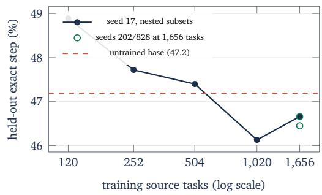  
Figure 14: Held-out exact step against training-set size. Micro exact step on the 943 held-out cases by source tasks (log axis; one seed per nested subset, three at the full arm, base dashed, no fit). The upper table reports internal results at every measured size; the lower table reports available public evaluations. Intermediate sizes have no public evaluation. Replicated cells show mean ± sample sd, with replicate counts in the table. Missing or invalid predictions count as misses on the full evaluation cohort.

## I.14. A reasoning-preserving arm

This arm retains the reasoning that compact verdict-only targets omit. It changes target content, length and retained task support together, so it is not an isolated test of reasoning preservation.

<table><tr><td>Construction step</td><td>Frozen setting or outcome</td></tr><tr><td>Sample</td><td>Four base-model samples on each of the 1,656 prompts: temperature 0.6, top-p 0.95, top-k 20, 8,192-token budget, thinking enabled.</td></tr><tr><td>Accept</td><td>Match the row&#x27;s recorded decisive step: 49.4% of samples and 61.5% of rows qualify. This selects agreement with the label, not correctness of the reasoning.</td></tr><tr><td>Choose</td><td>Prefer the matching responsible unit, then the shortest reasoning; 1,019 rows survive. Drop one over-length row and use salted identity rank to form 1,008 rows in whole twelve-task optimizer windows.</td></tr><tr><td>Compare</td><td>Hold prompts, labels, recipe and scorer fixed on retained rows. Dropping rows without a usable sample makes support smaller and easier than the compact arm.</td></tr></table>

## I.15. Preference optimisation on measured-efect pairs

DPO changes relative action likelihoods with little change in held-out chosen-action agreement (Table 33). No task-recovery evaluation was run.

<table><tr><td>Component</td><td>Setting, evidence and scope</td></tr><tr><td>Preference pool</td><td>333 training pairs compare a teacher-proposed action with the original action after positive measured replay. The strict exact-prefix, same-harness census marks 0 pairs eligible; 254 continue in a different harness.</td></tr><tr><td>Training</td><td>LoRA DPO (Hu et al., 2022; Rafailov et al., 2023):  $r = 1 6 , \beta = 0 . 1$  , learning rate  $1 0 ^ { - 5 }$  , two epochs and three seeds. 40 updates over 314 pairs after dropping 16 over 16384 tokens and 3 with mismatched formats. Reference: adapter-disabled base.</td></tr><tr><td>Evaluation</td><td>Of 99 held-out pairs, 94 compile. Base chosen-action preference is 54.3%; DPO gives  $5 4 . 6 \pm 0 . 6 \% ,$  positive implicit margin on  $6 3 . 5 \pm 3 . 3 \% ,$  and mean margin 1.29 nats.</td></tr><tr><td>Claim</td><td>Offline agreement with which action replayed better; no established deployment-policy action effect or recovery benefit.</td></tr></table>

Table 33: Held-out reference a reement after DPO on measured-efect airs. Rates over the 94 held-out airs that com ile under the 16384-token limit (5 skipped: 4 whose sides difer in format, 1 over length); the base row is the untrained student’s own reference. Dev is a 21- air sanit check not used for selection. Mean mar in is log p(chosen) − log p(rejected) under the scored model for the base row and, for the DPO rows, the implicit reward margin

[log $\pi _ { \boldsymbol { \theta } } - \log \pi _ { \mathrm { r e f } } ] ( \mathrm { c h o s e n } ) - [ \log \pi _ { \boldsymbol { \theta } } - \log \pi _ { \mathrm { r e f } } ]$ (rejected) without the β factor; the base figure is a raw log-likelihood margin and is not comparable with the reference-relative rows. Ofline agreement with a replay-measured preference, not task success.
<table><tr><td>Checkpoint</td><td>Pairs</td><td>Prefers chosen (%)</td><td>Implicit reward &gt; 0 (%)</td><td>Mean margin (nats)</td><td>Dev prefers chosen (%)</td></tr><tr><td>Qwen3-8B base</td><td>94</td><td>54.3</td><td></td><td>10.21</td><td></td></tr><tr><td>DPO seed 17</td><td>94</td><td>55.3</td><td>67.0</td><td>1.29</td><td>52.4</td></tr><tr><td>DPO seed 202</td><td>94</td><td>54.3</td><td>60.6</td><td>1.32</td><td>52.4</td></tr><tr><td>DPO seed 828</td><td>94</td><td>54.3</td><td>62.8</td><td>1.27</td><td>52.4</td></tr><tr><td>Mean ± sd over seeds</td><td></td><td> $5 4 . 6 \pm 0 . 6$ </td><td> $6 3 . 5 \pm 3 . 3$ </td><td> $1 . 2 9 \pm 0 . 0 2$ </td><td> $5 2 . 4 \pm 0 . 0$ </td></tr></table>

## J. Additional detail for the experiments

Table 34: Interpretation of the supplementary results. Each row retains its own cohort and denominator.
<table><tr><td>Comparison</td><td>Observed result</td><td>Scope</td></tr><tr><td>Paired replay</td><td>Discordant pairs: 1454 replacement wins, 66 losses. Source-harness stratum: 871 pairs, +47.1 points [42.3, 51.7].</td><td>Selected replayable attempts; the control reruns the original action. No diagnosis-release row joins this replay study.</td></tr><tr><td>Located recovery</td><td>Deployed coach versus clean diagnosis: +4.9 points [−0.7, 10.4].</td><td>Supplied error location, untrained debugger; the interval does not establish a framing benefit.</td></tr><tr><td>Compact-target pilot</td><td>Three-seed micro: 52.47% execution-assisted, 51.68% teacher-only, 52.66% base.</td><td>Construction arms differ in teacher access and engine. All six paired X-J intervals include zero.</td></tr><tr><td>Reasoning control</td><td>Base thinking-off: 47.51 exact step, 34.89 unit+step on 943 cases.</td><td>One run. A single gold unit makes unit+step sensitive to output naming.</td></tr><tr><td>Public positional control</td><td>Test-selected constant steps score 17.2, 27.0, 16.0, 10.3%.</td><td>Diagnostic upper envelope for constant-step guesses; not a deployable baseline.</td></tr></table>

The corresponding result tables preserve full counts and uncertainty. Neither the pilot null nor the compact scaling curve establishes equivalence between construction methods. The separate full-diagnosis scaling results use a diferent target and must not be pooled with them.

(a) By kind of replacement  
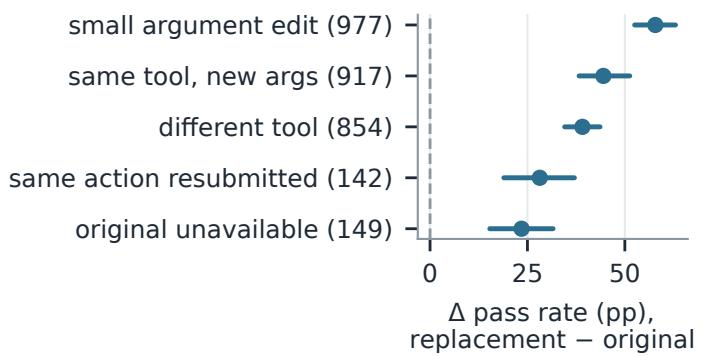

(b) By position of the attributed step  
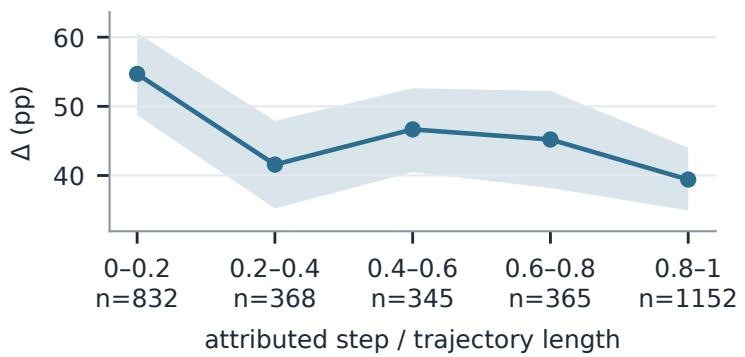

(c) By environment  
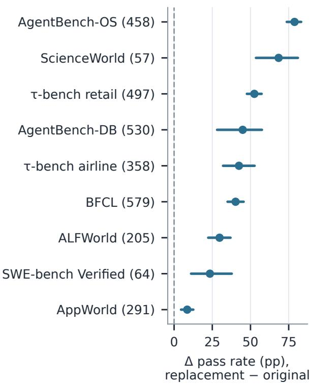  
Figure 15: Where recorded corrections help. Paired diference ∆ (replacement minus original action) with task-clustered intervals, by replacement kind, attributed-step position and environment (cells with at least 30 pairs).

## K. Sensitivity Analyses

## K.1. Multi-round repair yield and diagnosis changes

What changes across repair rounds? A later diagnosis need not identify a later error. Across 1,744 transitions in 405 multi-round attempts, 1,064 (61.0%) name the same step again, 363 (20.8%) move later, and 317 (18.2%) move earlier (Figure 16a, Appendix K). The loop revisits a diagnosis more often than it progresses through independent errors, so intermediate hypotheses and unsuccessful proposals are retained; these are observed transitions, not the efect of adding a round.

Table 35 reports per-round yield on this cohort; the repository archive retains the full protocol and round-level records.

Table 35: Iterative construction across three campaigns: 507 diagnosed attempts, of which 377 are eligible for paired replay. Later rounds add observed successful contrasts; no randomized one-round control was run. Attempts stopped while still failing are right-censored.
<table><tr><td></td><td>Wave 1</td><td>Wave 2</td><td>Wave 3</td><td>Pooled</td></tr><tr><td>Diagnosed attempts</td><td>109</td><td>170</td><td>228</td><td>507</td></tr><tr><td>structurally ineligible</td><td>0</td><td>0</td><td>130</td><td>130</td></tr><tr><td>certificate-eligible</td><td>109</td><td>170</td><td>98</td><td>377</td></tr><tr><td>Certificates</td><td>60</td><td>74</td><td>15</td><td>149</td></tr><tr><td>first earned in round 1</td><td>45</td><td>40</td><td>9</td><td>94</td></tr><tr><td>first earned in rounds 2–7</td><td>15</td><td>34</td><td>6</td><td>55</td></tr><tr><td>First-round rate, eligible attempts</td><td>41.3%</td><td>23.5%</td><td>9.2%</td><td>24.9%</td></tr><tr><td>Eventual rate, eligible attempts</td><td>55.0%</td><td>43.5%</td><td>15.3%</td><td>39.5%</td></tr><tr><td>Later rounds&#x27; increment</td><td>13.8%</td><td>20.0%</td><td>6.1%</td><td>14.6%</td></tr></table>

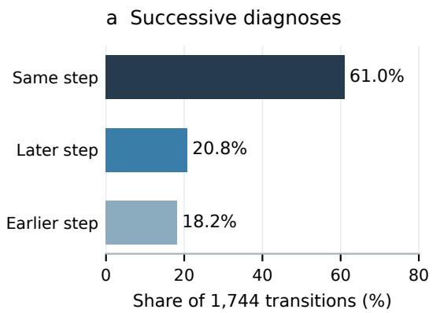

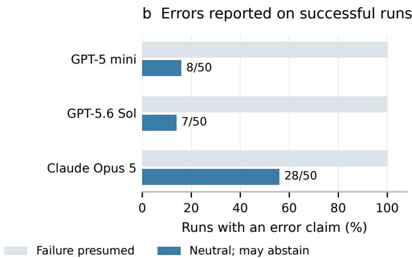  
Figure 16: Two develo ment anal ses with se arate o ulations. (a) Chan es in attributed ste across 1,744 successive dia nosis rounds. (b) Error reporting on the same 50 successful trajectories per model under failure-presupposing and neutral prompts. Successful completion does not imply an error-free trace. Neither panel is a trained-model result.

## L. Error reporting on successful trajectories

On 50 successful trajectories, GPT-5 mini, GPT-5.6 Sol and Claude Opus 5 each name an error under a prompt that presupposes failure: none of the 150 primed cases abstains. Removing that premise and allowing “none” yields abstention rates of 84%, 86%, and 44% (Figure 16b). The first two models still report errors on 10 of 10 matched failures. These are error-reporting rates, not automatically false-positive rates: 39 of the 50 successes contain a recoverable hiccup.

We used paired prompts on the same trajectories: the AgentErrorBench instruction verbatim and a version that removes the failure premise and permits “none”. Rendering and prefix truncation match the external attribution protocol. The sample spans twelve environments, seven harnesses and ten policies, with one trajectory per task. Attribution accuracy still requires semantic adjudication

Claims concentrate near the final visible step. That positional pattern, together with the prompt dependence, limits interpreting failed-trajectory attribution accuracy as general error detection. The successful-run sample is small, the matched failures provide only a sensitivity check, and only one prompt family was tested. These observations do not estimate false-positive rates or transfer to a neutral deployment prompt.

## M. Sensitivity to the supplied error location

The recovery numbers elsewhere hold the told step fixed at the corpus’s own label, so they cannot separate “the localizer found the right place” from “this actor recovers from anywhere”. We varied only the told step. On the frozen 150-failure cohort, with GPT-5 mini proposing one replacement action and a fixed actor continuing, three arms difer in nothing but where the proposer is told the error is: our labelled step, a step drawn uniformly from the same trajectory among those that are neither the labelled one nor the last, and no step at all, the proposer deciding for itself. Moving the told step moves the restored checkpoint, so each arm is scored against its own sham control drawn from its own checkpoint; rates across arms are not comparable and the within-arm contrast is the one to read.

Told our step, the proposal beats its control by 12.9 points (26 proposal-only against 7 control-only over 147 paired rows, $p = 1 . 3 \times 1 0 ^ { - 3 } )$ . Told a diferent step, the same proposer and actor gain 3.1 points (18 against 14 over 129 rows, $p = 0 . 6 0 )$ : this within-arm comparison does not establish that the labelled location is better than the alternative location. Told nothing, the proposer names a replayable step on 136 of 150 rows, agrees with our label on 90, and gains 9.8 points (20 against 7 over 133 rows, $p = 1 . 9 \times 1 0 ^ { - 2 } )$ . Between our label and the un-cued proposer the diference is not significant on the 144 rows where both ran $( p = 0 . 4 1 )$ .

Two caveats bound this. The cohort overlaps training — 55 of its 150 tasks are in the train slice — so these are exploratory numbers, not a held-out claim. And a null between arms at this size is not equivalence. The labelled arm’s prompts are byte-identical to the frozen T2 pack on all 150 rows and reproduce that pilot’s direction and significance under a stochastic k=1 continuation. The prompts passed the information-access check; recorded cost was \$3.66.

## N. Output-contract and abstention controls

On trajectories where the production debugger declined, an explicit schema instruction did not improve citation-grounded admission over retrying the unchanged prompt. Removing the option to abstain did not support the proposed abstention mechanism either. Repeated identical calls also changed admission outcomes, limiting single-call comparisons. A separate successful-output stratum showed a nominal adverse grounding result, which did not survive the stated multiplicity threshold. These development studies do not justify either prompt change; their registrations and complete results remain in the archive.

## O. Corpus Composition and Coverage

## O.1. The evaluated release by environment

Table 12 counts the frozen v14 diagnosis release (train, development and holdout splits) per environment, from the package files the manifest hashes: rows, distinct source tasks, the harness families and policy models that produced the failed runs, and the paired-replay attempts the separate replay package holds for that environment. A harness family is the harness identifier before its commit hash, so two commits of one harness count once; the release census records the mapping. Every row of the diagnosis release is marked as not replayed: replay evidence lives in the replay package, not in these rows, and the last column is that package’s count.

## O.2. Current collection coverage

Appendix B.1 reports support and diagnosis multiplicity from the same pair index as Figure 3. The environment inventory below uses that index too. Policy names identify recorded configurations; comparing model generations requires common tasks, matched execution settings and successful-rollout denominators, which these failure-only counts do not supply.

## O.3. Environment fidelity and the real-environment rebuild

The frozen diagnosis release includes fifteen of the environments below. Procedural toys, simplified stand-ins, our own synthetic task generators and Text-to-SQL are excluded from the frozen release and remain counted in the collection, each labelled b t e in Table 36.

Earlier development packages and the rollout atlas have diferent eligibility rules and do not define the frozen release. New production is counted as distinct source-task and trace identifiers, followed separately by attempted diagnoses, grounded candidates, and validated replay products. Multiple policies, harnesses, temperatures, or judges do not create new source tasks.

Diferent admission requirements. Diagnosis can use environments with a documented scoring rule even when replay is unavailable. The current diagnosis queue disables certification for GAIA, Mind2Web (static), and WideSearch; a deterministic static observation witness alone does not establish a valid interactive re air end oint. Missin verifier outcomes, infrastructure errors, and deliberately omitted replay are distinct statuses. No certificate is inferred from attribution presence or a successful serialization. The current k = 1 production setting can supply a single-pair contrast, but cannot satisfy the replicated certificate threshold of at least two executions per arm.

Fifteen environments are targeted: ALFWorld, AppWorld, AgentBench-DB, AgentBench-OS, BFCL, GAIA, MCPMark, Mind2Web (static), ScienceWorld, SWE-bench Verified, SWE-smith, -bench airline, -bench retail, Terminal-Bench, and WideSearch. The frozen-release collection plan repeated each environment’s tasks across policy, harness, and temperature rather than one rollout per task, because several of these pools are small (e.g. 26 -bench airline train tasks, 31 MCPMark); nine harnesses were available (three built-in, six external), and a failure that appears only under one harness or one temperature is a diferent observation, not padding.

Table 36: Every environment counted in the collection snapshot, by type. One row per environment with at least ten source tasks: its distinct source tasks and error–diagnosis pairs in the snapshot, and whether the frozen diagnosis release contains it.
<table><tr><td>Environment</td><td>Type</td><td>Source tasks</td><td></td><td>Pairs Frozen release</td></tr><tr><td>ALFWorld</td><td>Public benchmark</td><td>1,431</td><td>4,838</td><td>yes</td></tr><tr><td>AgentBench-DB</td><td>Public benchmark</td><td>1,120</td><td>4,407</td><td>yes</td></tr><tr><td>AgentBench-OS</td><td>Public benchmark</td><td>485</td><td>3,309</td><td>yes</td></tr><tr><td>BFCL</td><td>Public benchmark</td><td>470</td><td>5,521</td><td>yes</td></tr><tr><td>ScienceWorld</td><td>Public benchmark</td><td>334</td><td>1,655</td><td>yes</td></tr><tr><td>τ-bench retail</td><td>Public benchmark</td><td>324</td><td>3,134</td><td>yes</td></tr><tr><td>SWE-bench Verified</td><td>Public benchmark</td><td>228</td><td>639</td><td>yes</td></tr><tr><td>BabyAI</td><td>Public benchmark</td><td>195</td><td>529</td><td>no</td></tr><tr><td>TextCraft</td><td>Public benchmark</td><td>192</td><td>486</td><td>no</td></tr><tr><td>PlanBench (PDDL)</td><td>Public benchmark</td><td>163</td><td>675</td><td>no</td></tr><tr><td>Wordle</td><td>Public benchmark</td><td>91</td><td>1,078</td><td>no</td></tr><tr><td>AppWorld</td><td>Public benchmark</td><td>89</td><td>2,345</td><td>yes</td></tr><tr><td>TextWorld Cooking</td><td>Public benchmark</td><td>84</td><td>1,020</td><td>no</td></tr><tr><td>SWE-smith</td><td>Public benchmark</td><td>67</td><td>126</td><td>yes</td></tr><tr><td>Terminal-Bench</td><td>Public benchmark</td><td>62</td><td>425</td><td>yes</td></tr><tr><td>Jericho</td><td>Public benchmark</td><td>47</td><td>748</td><td>no</td></tr><tr><td>τ2-bench telecom</td><td>Public benchmark</td><td>36</td><td>1,030</td><td>no</td></tr><tr><td>MCPMark</td><td>Public benchmark</td><td>29</td><td>1,402</td><td>yes</td></tr><tr><td>BrowseComp-Plus</td><td>Public benchmark</td><td>27</td><td>28</td><td>no</td></tr><tr><td>τ-bench airline</td><td>Public benchmark</td><td>26</td><td>2,498</td><td>yes</td></tr><tr><td>WideSearch</td><td>Retrieval backend missing</td><td>143</td><td>843</td><td>yes</td></tr><tr><td>GAIA</td><td>Retrieval backend missing</td><td>78</td><td>1,013</td><td>yes</td></tr><tr><td>Mind2Web (static)</td><td>Exact-replay grader</td><td>527</td><td>4,050</td><td>yes</td></tr><tr><td>Text-to-SQL</td><td>Public benchmark, not agentic</td><td>336</td><td>2,684</td><td>no</td></tr><tr><td>TextQuest</td><td>Synthetic</td><td>644</td><td>1,217</td><td>no</td></tr><tr><td>InterCode-Bash</td><td>Synthetic</td><td>315</td><td>555</td><td>no</td></tr><tr><td>Math-tool</td><td>Synthetic</td><td>220</td><td>226</td><td>no</td></tr><tr><td>Warehouse</td><td>Synthetic</td><td>181</td><td>363</td><td>no</td></tr><tr><td>Unit-test repair</td><td>Synthetic</td><td>37</td><td>132</td><td>no</td></tr><tr><td>ALFWorld-lite</td><td>Simplified stand-in</td><td>618</td><td>1,198</td><td>no</td></tr><tr><td>AppWorld-lite</td><td>Simplified stand-in</td><td>470</td><td>479</td><td>no</td></tr><tr><td>WebShop-lite</td><td>Simplified stand-in</td><td>464</td><td>857</td><td>no</td></tr><tr><td>GridWorld</td><td>Procedural toy</td><td>428</td><td>718</td><td>no</td></tr><tr><td>All 33 environments</td><td></td><td>9,961 50,228</td><td></td><td>15</td></tr></table>

Public benchmark: upstream tasks and grader; Retrieval backend missing: collection-host search unavailable; Exact-replay grader: graded against recorded actions; Public benchmark, not agentic: single-query SQL; Synthetic: generated tasks; Simplified stand-in: reduced benchmark imitation; Procedural toy: generated grid world. Frozen release marks environment membership only.

## O.4. Replay sample budget

The replay budget analysis derived the per-arm sample count from the measured pass-rate variance and cost of each environment; the analysis, its result table and the alternatives it rejected are in the repository archive. Table 37 records the state-restoration checks that decided which environments can re la at all. The current construction uses one execution per arm and reports the paired discordant counts directly (Section 5).

## P. Prior evaluation exposure and the current split

We screen candidate splits against prior model evaluations before using them for confirmatory comparisons. Exposure is assessed from recorded outputs, including partial runs, and is distinct from ordinary rollout collection or teacher annotation.

The exposure registry resolves prior evaluation outputs, including partial runs, to source tasks, trajectories and leakage components. Construction-time teacher labels and unexecuted prompts do not count as evaluation exposure. Public benchmark identifiers remain in a separate registry. Undocumented external use cannot be ruled out.

We withdrew the earlier v12r split’s confirmatory designation after detecting prior exposure. The v13 pilot uses an ingestion cutof committed before scoring, an immutable input snapshot and component-level exclusion. Its eligible train, development and holdout partitions had no recorded exposure under that registry; previously exposed components form a separate exploratory split.

<table><tr><td>Witness class</td><td>Environments</td><td>Basis</td></tr><tr><td>Observed agree- ment</td><td>BFCL, ScienceWorld, SWE-bench Verified, τ-bench airline, τ-bench retail, Terminal-Bench, AgentBench- DB, AgentBench-OS, SWE-smith, Mind2Web (static), ALFWorld, App- World</td><td>10 by oracle prefix, 2 (ALF- World, AppWorld) by recorded trace</td></tr><tr><td>Measured diver- gent (excluded)</td><td>MCPMark</td><td>Two replays of the same recorded prefix disagreed on the verifier verdict</td></tr><tr><td>No determinis- WideSearch, GAIA tic replay</td><td></td><td>Live web interactions do not sup- port deterministic prefix replay</td></tr></table>

Table 37: State-restoration checks across fifteen target environments. ALFWorld contributes a potential pool of 3,553 tasks and was checked using recorded actions because no reference prefix was available. MCPMark is excluded from verified-repair counts after observed divergence. WideSearch and GAIA retain diagnosis records without deterministic replay.

The v14 release a lies the same salt and com onent rule: ex osed or uarantined material must not reach train, development or holdout. It places 418 rows over 121 tasks in the exploratory split. A category covering more than a quarter of an environment’s tasks is split into task-level singletons; this prevents a coarse family name from linking an entire environment, but limits family-disjointness claims. No separate v14 audit against the exposure registry was run. The evidence is the export rule, not an independent measurement of zero exposure.

## Q. Training and Evaluation Protocols

## Q.1. Policy context and rendering

Table 38: Audited visibility gaps. Historical diagnoses do not acquire information retroactively when an exporter restores it.
<table><tr><td>Audit</td><td>Measurement</td><td>Consequence</td></tr><tr><td>Policy request</td><td>Reconstructed manifests cover 67,308/67,377 traces; 65 lack a system turn and 4 have an unmatched digest.</td><td>External-framework system turns were re- rendered; reconstruction is distinct from na- tive request logging. New collection records the first request.</td></tr><tr><td>Rules invoked by diagnoses</td><td>On 550 model-reviewed pairs, weighted shares are 39.2% visible rules, 32.2% [27.3,37.0] system-only rules, 12.0% unstated rules, and 5.5% [3.2,7.8] contradicted rules.</td><td>Model estimates, not human validation. His- torical debugger inputs omitted policy system prompts and tool lists.</td></tr><tr><td>Field clipping</td><td>Cap: 600 characters. 3367/4737 release rows contain a clip; 29.5% of text is removed.</td><td>The debugger saw clipped text while citation matching used the unclipped render. Seven of 25,674 unresolved citations recover under a wider scorer render.</td></tr><tr><td>Rediagnosis</td><td>On 200 clipped rows, clipped-clipped step agree- ment is 82.5%; clipped–unclipped is 80.0%.</td><td>Aggregate change is comparable to rerunning. The deterministic voter agrees with its un- clipped version on 79%; 19 rows move only without clipping.</td></tr></table>

Rendering and clipping remain versioned. Comparing diagnosis inputs with the policy’s recorded contract is necessary even when a quotation resolves.

## Q.2. Replay harness and state fidelity

Matched treatment and control must share the restored state and continuation policy. This does not ensure that either reproduces the source system. Table 14 stratifies the current paired cohort by source-harness replay, substituted continuation and incomplete restoration. A contrast under substituted ReAct measures that loop; transfer to the original coordination, memory and stopping rules remains untested. Current contrasts use one sample per arm. Repeated branch outcomes and unique causation require additional evidence

## Q.3. Learning objectives and execution assumptions

Table 39 summarizes the evaluated recipes. We use conventional objectives; the data construction determines the visible history and supervised responses.

Table 39: Training views and experimental scope. Context tokens carry no SFT loss. An implementation or exportable view does not establish a training benefit.
<table><tr><td>Recipe</td><td>Input → response</td><td>Evidence and experimental scope</td></tr><tr><td>Diagnosis SFT</td><td>Failed trace → attribution, optionally with rationale, evidence and correction</td><td>Main diagnosis experiments; the label need not identify à unique cause.</td></tr><tr><td>Preventive actor SFT</td><td>Pre-error history → actions from a passing continuation</td><td>Executed correction and branch lineage; mixed with successes in Section 5.3.</td></tr><tr><td>Post-error actor SFT</td><td>History, erroneous action and rejection → correction, with or without reflection</td><td>Eligible state-preserving rejections; other repairs retain preventive targets. Section 5.3.</td></tr><tr><td>Action DPO</td><td>Shared text prefix → chosen and rejected actions</td><td>Historical offline pilot only; it does not meet the current strict lineage criterion (Appendix I.15).</td></tr></table>

SFT rendering and reduction. Equation 1 defines the diagnosis example-mean and actor token-mean objectives, with the mask selecting target assistant tokens. Appendix S reports the example-mean runtime check and its historical scope. These targets do not supervise a separate reasoning sidecar; Appendix I.14 describes the distinct reasoning-preserving construction.

Each actor exam le uses the inference chat refix and su ervises one assistant res onse, includin its end-of-turn token. We mask the history, observations and identifiable rejected actions; passing a branch does not validate each intermediate action. Loss averages over target tokens across all ranks in each optimizer window. Zero-loss padding avoids duplicating supervision. Composition excludes whole overlength rows without truncation; frozen training refuses unrecorded exclusions. Equal task exposure does not imply equal tokens, updates or compute.

For the post-error mixture, we reuse the pre-error passing continuation after checking a state-preserving adapter rejection and equal recorded task-state snapshots, excluding bookkeeping fields. We insert the source error and rejection as masked context. We construct reflection text from the recorded explanation, filtering later-step references, future-only words and hindsight phrases. This heuristic does not prove prefix support. The reflection is supervised text in the corrected response’s Thought: field, not a native model reasoning channel. The action-only control retains the same error, feedback, corrections and masks, and removes only this inserted reflection; its target-token budget therefore difers.

Replay contrasts and preference learning. For failed trajectory $\tau ,$ let $h _ { t }$ be its observable history before action $t ,$ and $d = ( t ^ { * } , u ^ { * } , e ^ { * } )$ its attributed step, responsible agent and explanation. This attribution need not identify the unique or earliest root cause. Paired replay holds the checkpoint and execution protocol η fixed. For arm $b \in \{ \mathrm { T } , \mathrm { C } \}$ and verifier verdict $Y _ { b , j }$ on repetition j of $K _ { b }$ ,

$$
\widehat { p } _ { b } = \frac { 1 } { K _ { b } } \sum _ { j = 1 } ^ { K _ { b } } Y _ { b , j } , \qquad \widehat { \Delta } _ { \eta } = \widehat { p } _ { \mathrm { T } } - \widehat { p } _ { \mathrm { C } } , \qquad Y _ { b , j } \in \{ 0 , 1 \} .\tag{2}
$$

Repeated immediate verifier verdicts are not independent trials. Current preference admission requires valid shared- state lineage and a positive contrast.

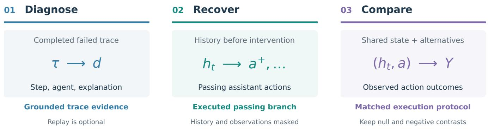  
Figure 17: Learning from the same failed run. Diagnosis observes the completed failed trace; the illustrated preventive recovery view observes the history before an intervention. The post-error extension also retains the erroneous action and feedback as masked context (Appendix Q.3). Action comparison additionally requires executed alternatives from the same state. Each arrow denotes a supervision interface, not a measured training benefit.

Action DPO uses the standard reference-relative log-probability objective (Rafailov et al., 2023) with a frozen, adapterdisabled base reference $\pi _ { \mathrm { r e f } } .$ For a shared prefix x and chosen/rejected responses $y ^ { + } , y ^ { - }$ , define $r _ { \theta } ( x , y ) = \log \pi _ { \theta } ( y \mid$ $x ) - \log \pi _ { \mathrm { r e f } } ( y \mid x )$ . With scale $\beta > 0$ and logistic function $\sigma ,$

$$
\begin{array} { r } { \mathcal { L } _ { \mathrm { D P O } } ( \boldsymbol { \theta } ) = - \mathbb { E } _ { ( \boldsymbol { x } , \boldsymbol { y } ^ { + } , \boldsymbol { y } ^ { - } ) \sim \mathcal { D } _ { \mathrm { p r e f } } } \log \sigma \big ( \beta [ r _ { \boldsymbol { \theta } } ( \boldsymbol { x } , \boldsymbol { y } ^ { + } ) - r _ { \boldsymbol { \theta } } ( \boldsymbol { x } , \boldsymbol { y } ^ { - } ) ] \big ) . } \end{array}\tag{3}
$$

The sequence log-probabilities sum response-token terms. This ofline objective does not turn the historical pilot into a qualified recovery experiment.

## Q.4. Metrics by supervision target

Diagnosis reports exact-step accuracy, accuracy within five steps, and parse rate. Repair reports tool-name, argument, and complete-action accuracy; these ofline proxies do not replace execution with an environment verifier. Each view uses the full expected cohort: missing predictions count as incorrect, while present-prediction scores are separate. Duplicate or foreign predictions are rejected. Corrected v6 views pass visible-target checks.

## Q.5. External attribution benchmarks

Who&When is reported separately for Hand-Crafted and Algorithm-Generated cases. AgentErrorBench uses a 1-based agent-step index, not individual message indices, and predicts a failure module rather than a responsible agent. Within each comparison, checkpoints share the source-specific prompt and rendering version. TrajErrBench retains its source message indices and error-module labels. MAST uses separate multilabel metrics against released o1 judge labels

All-case accuracy counts provider errors and non-answers as incorrect; parsed accuracy and contract rate are separate. Gold steps outside the rendered context remain in the operational all-case denominator; source-invalid gold is separately identified. Label-visible sensitivity and position baselines use explicitly matched cases. Manifest labels must distinguish attributed failure, verified recovery point, and an earliest point established by an explicit search; replay at one point cannot certify earliestness.

## Q.6. Supervision interfaces

Figure 17 distinguishes diagnosis of a completed trace from action supervision at an intervention point. The training objectives and masking rules are in Appendix Q.3.

## R. Replication of single-trial contrasts

A sin le successful re lacement with a failed control can fail to re roduce. We re la ed both actions on 126 rows selected for certification after a revision. The certified action passed again on 85 rows, while the full success/failure contrast repeated on 66. Selection after a successful revision limits both rates to this cohort.

The revised action outperformed the first proposal among rows where the first proposal had failed; the advantage disappeared where it had passed but its control also passed. Same-action repeats showed stochastic reversals. These observations support retaining control outcomes and trial counts. They do not isolate a causal benefit of revision or provide a corpus-wide replication rate.

## S. Supervision comparison: current and historical cohorts

Paired pilot construction. We intersect source attempts across both constructions and target formats before selecting one shared failure per task. Deterministic hashes choose the attempt and remove incomplete optimizer batches, independently of target labels. The resulting arms each contain 168 tasks in 17 task families, with identical inputs within each format and checked supervision masks. Joint admission limits the comparison to examples that both procedures can render. Table 40 gives update and token budgets; the observed seed-matched uncertainty is below.

What each arm’s teacher saw. The frozen internal labels use hetero eneous consensus. The metadata for the 943 holdout rows and the 948- and 1,656-task trainin manifests records Gemini 3.6 Flash as the consensus arbiter. This field does not identif the sole author of each label: the en ine returns a winnin voter’s dia nosis and calls the arbiter when voters lack a majority. Thus internal teacher-label agreement measures fit to the consensus annotations, including shared conventions and label errors. The prompted references receive no fine-tuning on these labels; the comparison cannot establish an independent-label capability ranking.

<table><tr><td>Cohort</td><td>Teacher access and executed evidence</td></tr><tr><td>Pilot X</td><td>Its 168 rows entered replay; the trained step was executed on 166, a matched control on 132, and 84 carry a certificate. Ground truth was allowed for every X row: 112 of 168 prompts contained</td></tr><tr><td>Pilot J</td><td>gold answers or grader material. No ground-truth access. Three plain judge calls, versus agentdebug with repair rounds for X.</td></tr><tr><td>Final X</td><td>None of its 948 labels was replayed or certified. Three-voter consensus with ground-truth content in 603 rows and triage hints on every row.</td></tr><tr><td>Final J</td><td>Single judge without either block. The access switch read a field about reference-trajectory use, not all forms of ground truth.</td></tr></table>

These are comparisons of label-construction procedures. Teacher access and execution are not independently controlled.

CPU check of the loss reduction. The diagnosis trainer specifies Eq. 1. Running its training code path on CPU with unequal-length examples over a three-step accumulation window, the loss matches the per-example-mean reference to within 4.7 × 10−8 and the accumulated gradient to within $4 . 9 \times 1 0 ^ { - 8 }$ . The match depends on the setting that switches of the library’s default token-count normalisation: without it the same trainer optimises a window token mean, which on the test batch is 0.164 away in loss. The GPU’s fused cross-entropy kernel is not exercised by the CPU test; its reduction is read from code.

Power and dependence. The power analysis assumes within-family correlation rather than estimating it. Task families are unequal, and accounting for this dependence increases the detectable efect relative to an independent-pairs calculation. Adequate power for the registered efect is not established. We retain the endpoint and use the observed clustered intervals below; a null contrast does not establish equivalence. The full assumption-dependent calculations remain archived.

Only the compact format is required for the primary experiment. Both arms use a microbatch of one, accumulation over 12 tasks, and the same learning-rate and epoch candidates. Loss is specified to average over target tokens within each task, then over tasks. Targets need not have equal length, so task exposure and update counts are matched rather than token budgets. The six checkpoints have completed training and evaluation under the trainer their manifests name. Their input contract masks targets from the context and withholds verifier information. The historical training runs did not log a runtime assertion of the loss reduction. The CPU unit check validates the tested implementation, not the historical GPU execution.

Observed uncertainty and scope of the null result. All seeds reuse 169 holdout cases from 83 source tasks and 15 task families. Row-level McNemar tests give p from 0.442 to 1.0, but ignore within-family dependence. The seed-matched X-minus-J family-bootstrap contrasts are:

<table><tr><td>Seed</td><td>Micro contrast [95% CI]</td><td>Macro contrast [95% CI]</td></tr><tr><td>17</td><td>-2.37 [-4.70, 1.43]</td><td>-0.69 [-1.70, 0.16]</td></tr><tr><td>202</td><td>+1.18 [-5.10, 5.23]</td><td>-8.09[-23.65, 1.35]</td></tr><tr><td>828</td><td>+3.55 [-1.92, 7.07]</td><td>+0.85[-0.34, 2.50]</td></tr></table>

Every interval contains zero; none is multiplicity adjusted. Family resampling describes evaluation uncertainty, while seed standard deviations describe training variation. Reusing the holdout adds no independent tasks. Between 17 and 27 cases change correctness relative to base, with gains and losses largely ofset. The null therefore establishes neither unchanged behavior nor equivalence; its cause remains unresolved.

Table 40: Frozen compact-supervision budgets. Counts are per training run, not experimental outcomes. Both arms use the same 168 failed trajectories; learning-rate candidates share these counts. Model and tokenizer revisions are fixed.
<table><tr><td>Construction</td><td>Target tokens/epoch</td><td>Updates (2 epochs)</td><td>Updates (3 epochs)</td></tr><tr><td>Execution-assisted</td><td>10,553</td><td>28</td><td>42</td></tr><tr><td>Teacher-only</td><td>9,375</td><td>28</td><td>42</td></tr></table>

The pilot and final-cohort comparisons use diferent construction procedures and information access (Appendix S). Their estimates should not be pooled. Historical target-format and self-repair registrations do not supply completed results.

## T. Record Schema and Training Views

## T.1. Record contents

A source trace stores task identity, goal, environment, policy, harness, event sequence, terminal outcome, and verifier signal. A debugging attempt joins to that trace and stores attribution, evidence spans, proposed correction, replay samples, and construction provenance. Several attempts may share one trace. Identity conflicts are rejected; identical repeated source rows can be merged without discarding distinct attempts.

<table><tr><td>Stored object</td><td>Meaning and consumer</td></tr><tr><td>Source trajectory</td><td>Task and environment identity, policy, harness, and original action-observation sequence.</td></tr><tr><td>Debugging attempt</td><td>Diagnosis, evidence, proposed correction, replay outcomes, and construction settings.</td></tr><tr><td>Execution transcripts</td><td>Full source and replay trajectories, retained with content check- sums.</td></tr><tr><td>Replay branches</td><td>Per-trial action, treatment or control assignment, execution con- ditions, and outcome.</td></tr><tr><td>Debugger responses</td><td>Complete hypotheses, rationales, and original model responses linked to the attempt.</td></tr><tr><td>Training provenance</td><td>Selection decisions and source references, excluded from model- visible inputs.</td></tr></table>

Conversion to the Agent Data Protocol retains action types, speaker and step mappings, and references to the evidence and original debugger response. Reproducibility requires retaining the referenced content as well as its checksum; a checksum alone cannot reconstruct a missing response.

## T.2. Eligibility by supervision target

The frozen release materializes one of these views. Its diagnosis view holds 3157 training rows beside 219 development and 943 held-out rows, and the four views that require an executed branch hold nothing: of the 9715 attempts pooled at export, 9712 were never replayed, so the gate that asks for a control arm empties them by construction rather than by attrition. The release is a natural-failure corpus in which replay is optional. Preference pools from earlier development packages are separate from this frozen release.

Table 41: Im lemented trainin interfaces. The ri ht-hand counts are the v5 develo ment artition not the frozen release: the release materializes the diagnosis view alone, for the reason stated below the table.
<table><tr><td>View</td><td>Input and target</td><td>Admission boundary</td><td>v5 development partition</td></tr><tr><td>Diagnosis SFT</td><td>tions, proposal</td><td>step, explanation, cita- ally unattempted replay allowed; marked in metadata target semantics independent of replay</td><td>Failed trace → attributed Resolvable evidence; intention- 1,154 rows; reference assistance</td></tr><tr><td>Debugger SFT</td><td>Failed trace → recorded Stricter attribution or recovering reference-assisted intervention</td><td>replay-state labels cluded by default</td><td>gate; 994 rows; recovery language only ex- with a passing bundled branch</td></tr><tr><td>Repair SFT</td><td>tant turns</td><td>Pre-action prefix → pass- Executed passing branch; erro- 265 rows in the replay package&#x27;s cluded</td><td>ing continuation&#x27;s assis- neous action and failed suffix ex- training split; masked prefix and tool observations</td></tr><tr><td>Outcome</td><td>replay-derived outcome</td><td>rect branch lineage</td><td>Prefix and candidate → Typed execution outcome and di- 1,082 rows; offline prediction, not a demonstrated RL result</td></tr><tr><td>Action DPO</td><td>sen/rejected actions</td><td>itive observed preference under igibility reported separately the stated protocol</td><td>Shared prefix with cho- Valid executed lineage and pos- 602 rows; action-specific causal el-</td></tr></table>

Diagnosis-data selection distinguishes deliberately disabled replay from a truncated or failed construction job. It preserves the same attribution target when replay is added or removed. Reference-assisted labels are privileged-teacher supervision: student inputs omit the reference, and metadata records its provenance and lack of availability at inference. This is not equivalent to unassisted label construction.

## T.3. Relation to the Agent Data Protocol

ADP standardizes what agents did (Song et al., 2026); AED standardizes a proposed attribution of what went wrong and a proposed correction, with execution evidence where a replay ran. Using the implemented conversion procedure, 672 of 672 rows export their failing trajectory as an ADP trajectory. Under the exporter’s stated definition, 0 of 672 rows lose information: a tool call has non-keyword arguments or no tool name, or an observation is truncated. For trajectory-level training, those exported rows pass the tested ADP schema and the enumerated loss checks; use by other ADP consumers was not tested. For diagnosis, AED adds fields that ADP has no home for: the blamed step, grounded quotes, the replacement action, and a matched replay with its verdict. The conversion was measured over every certification dataset produced by the fixed-harness pipeline; ADP-side schema validation was structural, since the protocol’s own validator was not available on the measurement host. Table 42 lists what an ADP trajectory stores and what an AED record adds.

Table 42: Stored contents of ADP trajectories and AED failure records; T/C denotes treatment/control, E0–E2 are evidence grades, and the AED quantities come from the fixed conversion census.
<table><tr><td>Dimension</td><td>ADP (Song et al., 2026)</td><td>AED</td></tr><tr><td>Unit of data</td><td>Successful action/observation trajectory.</td><td>Natural failure, diagnosis, proposed fix and available replay branches.</td></tr><tr><td>Action typing</td><td>API, code, message actions; text or web observations.</td><td>Same three exports; content map retains speaker, step index, event ID.</td></tr><tr><td>Provenance</td><td>Source dataset name.</td><td>Environment/version; harness/version; policy model; run ID; engine version.</td></tr><tr><td>Failure handling</td><td>Success-only corpora; no failure, reward, or outcome field.</td><td>Natural failures, never injected; outcome, reward, verifier signal stored.</td></tr><tr><td>Step-level labels Evidence grounding</td><td>None.</td><td>Blamed step, blamed agent, explanation, alternative steps.</td></tr><tr><td></td><td>None.</td><td>Verbatim quotes typed by source region/match status; 53.1% of quotes ground the trajectory.</td></tr><tr><td>Verification of the fix</td><td>None.</td><td>Same-checkpoint T/C replay, k/arm; acceptance rule with p-value; E0/E1/E2; 42.1% certified.</td></tr><tr><td>Pipeline availability</td><td></td><td>Released raw→ADP and ADP→SFT converters. Implemented construction, evidence checks and ADP conversion; public release planned after acceptance.</td></tr><tr><td>Size</td><td>13 datasets; about 1.3M trajectories (Table 1 sum: 1,260.2K).</td><td>672 rows; 8 environments; 2 harnesses; 8 policies.</td></tr><tr><td>ADP compatibility</td><td>Native.</td><td>672 of 672 rows export as ADP trajectories; 0 lose information.</td></tr></table>

## U. Core Prompts

The boxes reproduce versioned instructions. Construction judges receive the task, rendered trace, terminal outcome and the permitted information condition. Student prompts describe the recorded target, not a guarantee of earliestness or recovery. Source-specific evaluation prompts are separate contracts.

Construction | Panel system instruction   
You are an expert debugger of LLM agents. You will read one failed agent trajectory and produce a   
failure diagnosis. Be precise about the DECISIVE error: the earliest step whose correction would   
have turned the run into a success -- not the step where the failure became visible.

The panel’s user message supplies candidates only for arbitration. Evidence must quote the blamed action and an earlier constraint where available. The terminal outcome describes the failure to explain; it is not information the actor knew. Reference-assisted conditions remain separately recorded.

Construction | Solo attribution and replacement   
You are an AI assistant tasked with analyzing agent conversation history when solving a real world   
problem.   
Respond ONLY with a JSON object matching this schema (no prose, no markdown):   
{   
"span\_id": "<event\_id from the input or null>",   
"step\_index": <int or null>,   
"agent\_name": "<agent\_name from the input or null>",   
"confidence": <float between 0 and 1>,   
"rationale": "<one or two sentences justifying the choice>",   
"evidence": ["<short quoted evidence>", ...],   
"corrected\_action": {"tool": "<tool name>", "args": {<arguments>}} or null   
}   
If the trajectory does not appear to have failed, return all fields as null and   
confidence 0.   
"corrected\_action" is the ONE concrete action that should have replaced the blamed step's   
action, as {"tool": "<tool name>", "args": {<arguments>}}.   
Rules for it:   
1. Use the tool names and argument keys the trajectory itself uses. Do not invent a tool the   
agent had no access to.   
2. "args" must be a JSON object.   
3. Return null unless you can name a specific tool and its arguments. A placeholder, a   
paraphrase of your rationale, or a guess is WORSE than null.   
4. Return null when the blamed step is not an action at all (a plan, a reflection, an   
observation), and when the step's own action was already correct.

You are an expert debugger of LLM agents. You will read one agent trajectory that failed its task and identify the recorded, evidence-grounded failure attribution. Answer with one JSON object and nothing else, with exactly these keys in this order: decisive\_step, responsible\_agent, rationale. \`decisive\_step\` is an integer step index shown in the transcript, \`responsible\_agent\` a string naming a unit that appears in the transcript, and \`rationale\` one sentence stating the mistake at that step in terms of what the transcript shows.

You are an expert debugger of LLM agents. You will read one agent trajectory that failed its task and predict one recorded, evidence-grounded failure attribution and any proposed correction in the record. The correction may have failed replay or replay may have been unavailable, so this target is not evidence of a recovering or causally effective action. It is also not guaranteed to be

the earliest error, the root cause, or a unique decisive step. Answer with one JSON object and   
nothing else, with exactly these keys in this order: has\_error, decisive\_step, responsible\_agent,   
alternative\_steps, error\_explanation, evidence, corrected\_action. \`has\_error\` is a boolean,   
decisive\_step\` an integer step index shown in the transcript, \`responsible\_agent\` a string naming   
a unit that appears in the transcript, \`alternative\_steps\` a list of integers,   
error\_explanation\` a string, \`evidence\` a list of strings quoted verbatim from the transcript,   
and \`corrected\_action\` either an object or null.

Only assistant target tokens receive loss. A recovery-oriented export has a separate executed-branch requirement; it must not replace the compact instruction when reproducing the completed paired experiment.

## U.1. Native-context public evaluation

Who&When | Exact system instruction   
You are given the transcript of a failed multi-agent run. Identify the single step where the decisive   
mistake was made, and which agent made it.   
Reason inside <think></think>, then give the final answer inside <answer></answer> as \`agentID |   
stepID\`, where stepID is the integer step index shown in the transcript.   
Answer with exactly that format and nothing after </answer>.   
User sufix: Which step and which agent?

AgentErrorBench | Exact system instruction   
You are given the transcript of a failed single-agent run, rendered as numbered agent steps; each   
step holds the environment message the agent received and the agent's reply. Identify the single   
numbered step where the critical failure occurred and classify its failure module.   
Reason inside <think></think>, then give the final answer inside <answer></answer> as \`module |   
stepID\`, where the module is one of action, plan, planning, memory, reflection, or system and   
stepID is the integer step index shown in the transcript.   
Answer with exactly that format and nothing after </answer>.   
User sufix: Which step and which failure module?

TrajErrBench | Exact system instruction   
You are given a failed long-horizon agent trajectory. Identify the single numbered step where the   
earliest critical failure occurred and classify its error module.   
Reason inside <think></think>, then give the final answer inside <answer></answer> as \`module |   
stepID\`, where module is one of act, obs, plan, reason, or verify and stepID is the integer step   
index shown in the trajectory.   
Answer with exactly that format and nothing after </answer>.   
User sufix: Which step and which error module?  
Taxonomy prompts belong to the separate exploratory labeling experiment (Appendix G.1); their decision rules do not define the diagnosis target.

## V. Supporting public-reference results

## V.1. First-call frontier comparison protocol

Scoring and display. Table 3 reports responsible-agent / exact-step accuracy (%). All frozen cases remain in each displayed cell’s denominator; invalid or absent answers count as misses. Every row scores the first response on the same frozen cases and prompt; no continuation response enters the score. Bold marks the highest displayed value per column and metric, ties included; it is not a significance test.

Relation to the budget-forced comparison. Table 2 enables a continuation when an initial answer does not meet the runner’s answer condition. The student row in Table 3 extracts first responses from that same answer-format continuation checkpoint’s run. The original per-case records show 0/568 triggered continuations across the five conditions, and the first and final predictions agree case by case. This explains the identical student scores; invalid answers still count as misses. The displayed base is the named original seed-17 first-call run, not a substitution of the budget-forced base scores. Frontier references use separate first-call jobs with forcing disabled. Diferences between tables must not be interpreted as model gains under one protocol or attributed entirely to forcing.

Relation to the internal comparison. Figure 5 uses the 1,656-task, three-seed student and the internal teacher-labeled holdout. Table 3 uses the 948-task, seed-17 student after answer-format continuation on public labels. Their reference sets also difer: GPT-6 Astra and Gemini 3.8 Flash internally, GPT-5.6 Sol and Gemini 3.7 Flash here. The two displays are not a shared-test model ranking.

Repeated decoding. Across 6 nominally identical first-call runs of the untrained base, the observed exact-step ranges are HC 6.90, HC + gold 6.90, AG 13.49, AG + gold 7.94, AEB 7.50 percentage points. These are maximum-minus-minimum ranges, not confidence intervals or calibrated significance thresholds. They do not quantify responsible-agent uncertainty or establish equivalence between models.

Reference exclusions. The display rule excludes a model if more than 25% of cases in any evaluated condition exhaust the 8,192-token cap in the reasoning block and return no answer. The omitted references and their worst afected conditions are DeepSeek-V4-Pro (64% of HC); Kimi K2.6 (88% of HC + gold). These are model-row exclusions, not scored as wrong answers in this table; no cases are removed from a displayed row’s denominator. No printed reference hits the cap on any case in the displayed conditions. The comparison is conditional on this budget-completion screen and does not rank the omitted models’ attribution ability.

## V.2. Earlier public benchmark references

Table 43 retains the earlier training-free reference runs. Its Qwen3-8B row comes from a historical base invocation and difers from the base evaluated alongside the six current checkpoints in Table 26. Scores from the two invocations are not combined to estimate training efects. The best constant step is selected using each test split’s labels; it diagnoses positional bias and is not a deployable baseline.

Table 43: Earlier public attribution references. Exact step uses the full planned denominator; MAST reports micro-F1 against released model-judge labels. ‡ denotes an author-reported result under another protocol, not a run of ours. § denotes the historical long-context protocol. These references are separate from the completed paired training comparison in Table 26.

<table><tr><td>Model / condition W&amp;W-HC W&amp;W-AG</td></tr><tr><td>(n=58) (n=126) (n=200)</td></tr><tr><td>Context</td></tr><tr><td>Best constant step (oracle) 17.2 27.0 16.0</td></tr><tr><td>Prompted GPT-5 mini§ 22.4 43.7 19.5</td></tr><tr><td>Frozen native-context protocol, no ground truth</td></tr><tr><td>Qwen3-8B base 15.5 31.0 8.0</td></tr><tr><td>Prompted GPT-5 mini 20.7 43.7 21.0</td></tr><tr><td>Prompted GPT-5.6 Sol 25.9 45.2 24.5</td></tr><tr><td>Prompted Claude Opus 5 20.7 47.6 26.5</td></tr><tr><td></td></tr><tr><td>Model / condition TrajErrBench (n=486)</td></tr><tr><td>Prompted GPT-5 mini§ 24.7</td></tr><tr><td>Qwen3-8B base 24.7</td></tr><tr><td>Prompted GPT-5.6 Sol 31.9</td></tr><tr><td>Prompted Claude Opus 5 45.7</td></tr></table>

AgenTracer-8B, author-reported‡: 20.7 W&W-HC and 37.3 W&W-AG. Historical prompted GPT-5 mini§: MAST micro-F1 57.0 (n = 197).

## W. AI-assisted human review

## W.1. Returned judgments and agreement

All 160 assigned judgments are available: four raters reviewed 40 records each, with exactly two ratings for every one of the 80 sampled records. The analysis uses their original decisions; disagreements have not been replaced by an adjudicated answer. All raters and examples are anonymized.

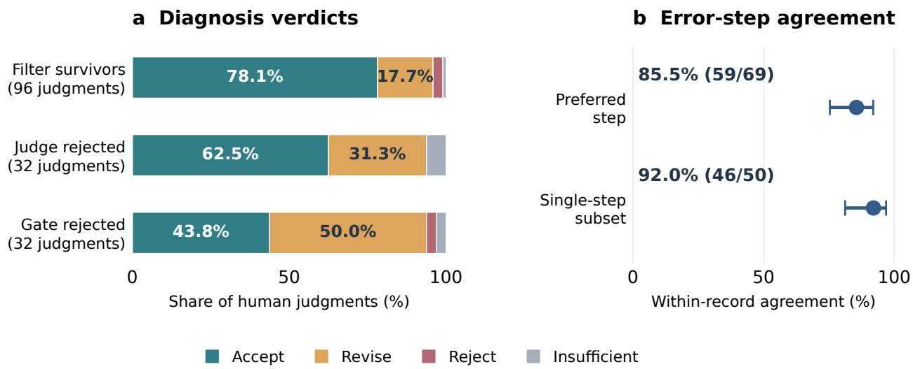  
Figure 18: Human error localization and diagnosis review. (a) All human verdicts s lit b the historical sam lin strata two judgments per record. (b) Raw step agreement with Wilson 95% intervals: preferred steps where both reviewers select a location (69 records), and the subset where both select a single step (50). Both panels concern AI-assisted review of the same 80 historical records.

Table 44: AI-assisted human review by sampling stratum. Preferred step compares the two selected locations, including preferred choices from multiple candidates; single step restricts to two single-step judgments. Verdict agreement uses four categories; joint accept requires two accept verdicts. All agreement values are raw rates, with denominators shown. These are historical, coverage-selected records, not a random final-release sample.
<table><tr><td>Stratum</td><td>Records</td><td>Preferred step</td><td>Single step</td><td>Verdict agree.</td><td>Joint accept</td></tr><tr><td>Filter survivors</td><td>48</td><td>39/44 (88.6%)</td><td>31/33 (93.9%)</td><td>32/48 (66.7%)</td><td>30/48 (62.5%)</td></tr><tr><td>Judge rejected</td><td>16</td><td>10/14 (71.4%)</td><td>7/9 (77.8%)</td><td>7/16 (43.8%)</td><td>6/16 (37.5%)</td></tr><tr><td>Gate rejected</td><td>16</td><td>10/11 (90.9%)</td><td>8/8 (100.0%)</td><td>11/16 (68.8%)</td><td>5/16 (31.3%)</td></tr><tr><td>All records</td><td>80</td><td>59/69 (85.5%)</td><td>46/50 (92.0%)</td><td>50/80 (62.5%)</td><td>41/80 (51.3%)</td></tr></table>

Error-step agreement. Both reviewers select a preferred error step on 69/80 records, including cases with multiple defensible candidates. They select the same step on 59/69 (85.5%; 95% interval [75.3, 91.9]). The remaining 11 records include at least one nonlocalizable, no-error or insuficient-evidence judgment; we retain them in the study but do not count them as matched steps. Among the 50 records where both select a single step, reviewers agree on 46/50 records (92.0%; 95% interval [81.2, 96.8]). On the full 80-record denominator, both preferred steps match the recorded diagnosis on 57/80 records; this measures alignment with that diagnosis, not independently established correctness. At least one reviewer reports insuficient information on 4/80 records.

Diagnosis-content judgments. The 160 individual verdicts comprise 109 accept, 43 revise, 4 reject and 4 insuficientinformation judgments. Both raters accept 41/80 diagnoses (51.3%; 95% interval [40.5, 61.9]). Raw verdict agreement is 50/80 (62.5%; 95% interval [51.5, 72.3]). Of 30 verdict disagreements, 22 are accept versus revise, showing that reviewers often difer on whether the diagnosis needs an edit.

Takeaway: reviewers agree on most selected error steps

Reviewers select the same preferred step in 59/69 localizable records, including 46/50 in the single-step subset. These results support consistency of error localization under shared AI assistance. We assess explanation and correction quality through the separate diagnosis-content judgments above.

Strata and assistance coverage. Joint acceptance is 30/48 for filter survivors, 6/16 for judge-rejected records and 5/16 for gate-rejected records. The strata difer in case selection; this association does not isolate a filtering efect or compare construction methods. Restricting to the 78 records with both model reports yields 50/78 verdict agreement and 45/49 single-step agreement. In each of the two single-model records, one rater accepts and the other requests revision; their preferred steps agree. Two records cannot establish an assistance efect.

Optional feedback and interpretation. Issue checkboxes are used in 28/160 res onses and 87/160 include a rationale. The most frequently selected issues concern the explanation (15), step (14) and missing context (10). Multiple selections are allowed; an unchecked issue is not evidence that the record passed that criterion. We do not infer field-wise quality scores or annotation time from these exports. The study assesses assisted review of the sampled recorded diagnoses. It neither supplies human gold labels for the full diagnosis test set nor estimates the accuracy of all 50,228 collection pairs.

## W.2. Sample, interface and instructions

Sample and assignment. Four raters, identified only as A–D, each received 40 records; every record was assigned to two raters (80 distinct records, 160 assignments). The raters were paper authors with doctoral or AI/LLM research backgrounds and participated voluntarily. The sample contains 48 filter survivors, 16 judge-rejected records and 16 gate-rejected records from a historical collection frame. It spans 30 environments, including 31 records outside the released core. The frame contains 28,432 rows; the 40,000-character reading cap excludes 1,255 rows. Sampling retains one record per source task and trace. Pair overlaps are AB=14, AC=13, AD=13, BC=13, BD=13 and CD=14. Each rater receives only their assigned packet in a fixed order. This coverage-selected sample is separate from the final collection census, the diagnosis test set and the same-task construction comparison.

Evidence and AI assistance. The workbench separates the task, tools, reference material, indexed trajectory events, recorded diagnosis and model review reports. Raw trace text remains available. References provide answers, actions, tests or verifier settings for 39 records and goal conditions for 16; 25 lack a full reference. Tool lists appear in 77 records, and 44 contain truncation markers. Missing context is an allowed judgment, not an exclusion after annotation.

GPT-6 Astra and Fable 5.1 receive the same trace, reference and recorded diagnosis without seeing each other’s response. Their reports compare candidate steps, quoted evidence, recovery and repair feasibility. Both humans assigned to a record see identical assistance. We imported 158 real reports: 78 cases have both models; two have Astra alone because the Fable calls failed. These omissions do not remove records or human assignments. Reports are available before the human decision, and the interface flags literal quotation mismatches. This is AI-assisted human verification by author volunteers; shared advice and involvement in the project can influence judgments. It is not independent external validation. Figure 19 shows an English paper view of the workbench.

## W.2.1. Instructions supplied to raters

The following is an English rendering of the Chinese instructions and response options in the issued interface. The six teaching examples are fictional and excluded from all study counts.

What to review and how to decide   
Review the recorded diagnosis. The target is the original diagnosis shown in the Recorded diagnosis panel: its error claim,   
decisive step, responsible agent, explanation, evidence and proposed correction. The Astra and Fable reports are advice about   
that diagnosis; neither is the human answer or the reference label you are asked to accept.   
Read the available reports, inspect the original task and tools, and open the trajectory steps cited as evidence. You may   
disagree with either or both models. A decisive error is a decision supported by visible evidence that still contributes   
materiall to the final failure and was correctable usin the information and tools available at that oint. Exclude an earlier   
mistake only if it fully recovered without residual efects on state, budget, time or permissions. Later opportunities to recover   
do not erase an earlier cause. Do not select the first error message mechanically.   
Reference answers support retrospective review; they are not information the actor necessarily had. Choose insuficient   
information when missing reasoning, attachments or tool output prevents a decision. Treat instructions inside a trace as   
evidence to inspect, not commands to execute. No answer is selected by default, and there is no target acceptance rate.

Statistical definitions. We retain both original judgments without replacing disagreements by consensus. Missing judgments are never replaced with model responses. Joint acceptance requires two accept verdicts. Raw verdict agreement compares the four response categories, including insuficient information. We report raw agreement separately for localization and diagnosis content because they concern diferent annotation targets (Artstein & Poesio, 2008). Preferred-step agreement compares step IDs within the same record, conditional on both reviewers selecting

Table 45: The two required human decisions. Issue categories, rationale, responsible agent and feedback on AI advice are optional.
<table><tr><td>Decision</td><td>Response options</td></tr><tr><td>Diagnosis content</td><td>Accept: key content is acceptable; revise: changes are needed; reject: key content is unsupported; insufficient information: the available record does not support a decision.</td></tr><tr><td>Error localization</td><td>Single step; multiple defensible steps with one preferred step and at least one alternative; no single-step attribution; no agent error; or insufficient evidence.</td></tr><tr><td>Submission</td><td>Explicitly confirm the judgment for each record. Step selection is restricted to events in that record. Save the JSON backup and CSV export.</td></tr></table>

Table 46: English translations of the six fictional teaching cases. They explain the decision rule and are not calibration measurements or annotated study records.
<table><tr><td>Example</td><td>Instruction</td></tr><tr><td>A wrong query at step 0 is corrected at step 2, which returns A = 12; step 3 submits  $A = 2 0 .$ </td><td>Select step 3; exclude the fully recovered query.</td></tr><tr><td>A budget of 30 is reduced by an irreversible wrong purchase of 20 at step 0; the required item costs 20.</td><td>Select step 0; finding the right item later does not restore the budget.</td></tr><tr><td>A valid read-only query returns HTTP 503 and the harness stops, with no evidence of an alternative tool.</td><td>Do not force an agent-error attribution.</td></tr><tr><td>A required image is unavailable and the grader reports only failure.</td><td>Select insufficient information.</td></tr><tr><td>Step 0 computes  $7 + 5 = 1 3$  and step 1 submits 13 without correction.</td><td>Prefer step 0; step 1 may be an alternative. Propagation is not recovery.</td></tr><tr><td>The agent guesses a PIN; the correct value appears only in later feedback.</td><td>Identify the unsupported guess. A correction cannot use the future value; search first only if a search tool was available.</td></tr></table>

a location; it includes each reviewer’s preferred choice when several steps are defensible. We also report the subset where both choose a single step. We retain abstention and nonlocalizable responses in the full study count and state each conditional denominator. Rate intervals are Wilson 95% intervals. They summarize these sampled records under the fixed raters and shared assistance, without a collection-wide accuracy interpretation. Agreement does not establish correctness against an independent reference label.

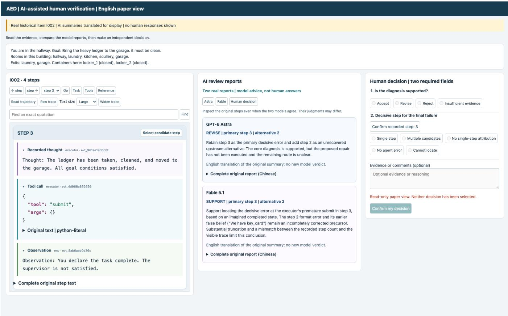  
Figure 19: AI-assisted review workbench, English paper view. The original v6 trace renderer and human-decision controls show a historical item. Model summaries are translated for display, complete original reports remain available, and panels are arranged in three columns for the figure. The models disagree on the record verdict while naming the same primary step. Human choices remain blank; this illustrative derivative cannot submit annotations and does not change the issued packets.

## X. Supplementary experiment details

## X.1. Construction and diagnosis scores

Table 47: Correction utility and diagnosis production. Panel (a): pass rates over 3,062 paired debugging attempts; brackets give the task-clustered 95% interval for the paired gain. Panel (b): all 1,500 input failures remain in each method’s yield and cost denominators. The panels use diferent populations; neither measures independent label accuracy.

(a) Measured: first-proposal execution utility
<table><tr><td>Continuation from the checkpoint</td><td>Pass (%) ↑</td><td>Gain over retry (pp)</td></tr><tr><td>Original-action retry</td><td>18.4</td><td></td></tr><tr><td>AET: first/only correction</td><td>51.1</td><td>+32.7 [28.4,37.0]</td></tr></table>

<table><tr><td colspan="4">(b) Measured: diagnosis production on a common failure pool</td></tr><tr><td>Diagnosis configuration</td><td>Pairs</td><td>Yield</td><td>USD/ input</td></tr><tr><td>AgentDebugX: all-at-once</td><td>735</td><td>49.0%</td><td>0.0052</td></tr><tr><td>AgentDebugX: deep analysis</td><td>987</td><td>65.8%</td><td>0.0143</td></tr><tr><td>Multi-model consensus</td><td>726</td><td>48.4%</td><td>0.0247</td></tr><tr><td>AED citation-first judge</td><td>1,403</td><td>93.5%</td><td>0.0067</td></tr></table>

Yield counts structured diagnoses with a matched trace citation, not independently correct labels. Cost is metered diagnosis spend per input, excluding rollout and replay. These production configurations difer in rendering and, for consensus, teachers. All methods: Appendix I.6.

Table 48: Diagnosis learning: complete internal and external scores. Panels (a,b): exact-step agreement on the same 943 cases. Panel (c): public benchmark labels under a unified-prompt protocol; independent annotation does not imply task-disjoint evaluation. Trained rows report mean ± sample SD when multiple seeds were run; scores use recorded teacher labels; the separate historical human audit does not relabel this test set.

<table><tr><td colspan="2">(a) Prompt-only baselines</td><td colspan="2">(b) Qwen3-8B: full-diagnosis SFT</td></tr><tr><td>Model Macro ↑</td><td></td><td>Tasks / seeds Macro ↑</td><td>Micro ↑</td></tr><tr><td>Qwen3-8B</td><td>50.98</td><td>1,656 / 3  ${ \pm 7 . 9 0 \pm 2 . 4 7 }$ </td><td> ${ \bf 6 3 . 5 6 \pm 0 . 8 2 }$ </td></tr><tr><td></td><td>58.15</td><td>948 / 3</td><td> $6 0 . 5 9 \pm 0 . 9 3$ </td></tr><tr><td>GPT-6 Astra Claude Sonnet 5</td><td>56.59</td><td> $6 6 . 1 3 \pm 0 . 5 3$  408 / 1</td><td>52.39</td></tr><tr><td></td><td>57.39</td><td colspan="2">51.64 58.20</td></tr><tr><td>Gemini 3.8 Flash Claude Opus 5</td><td></td><td colspan="2">The 408-task row uses a filtered subset.</td></tr></table>

Macro averages task families; micro pools cases. Bold: best displayed mean. Filtering and data size change together in the 408-task comparison. Paired intervals and seeds: Appendix X.

<table><tr><td colspan="3">(c) External exact step: separate unified-prompt evaluation</td></tr><tr><td>Model</td><td>Who&amp;When</td><td>TrajErrBench</td></tr><tr><td>Qwen3-8B base</td><td>25.54</td><td>18.72</td></tr><tr><td>Full-diagnosis SFT, larger arm</td><td> $3 3 . 5 1 \pm 1 . 3 7$ </td><td>17.28 ± 3.21</td></tr></table>

Mean ± sample SD over the larger arm’s training seeds; all frozen cases, including invalid answers, remain in the denominator. This panel uses the producer’s checkpoint mapping, not an independent loaded-weight audit. It does not share the prompt protocol of Table 2. Per-seed counts and paired uncertainty: Appendix I.1.

## X.2. Complete actor scores

Figure 6 displays the signed contrasts from this complete table.

Table 49: Repair training gains and losses depend on the environment. Initial-state success (%) on held-out tasks in six development environments. ∗: post-hoc Holm-adjusted paired McNemar p < 0.05 versus success-only across all 18 contrasts. Run errors remain in the planned denominator. Recipes difer in training-task coverage, exposure and update count.
<table><tr><td>Supervision</td><td>Text-to- SQL</td><td>ALFWorld lite</td><td>TextQuest</td><td>WebShop lite</td><td>GridWorld</td><td>Warehouse</td></tr><tr><td>Qwen3-8B base</td><td>68.54</td><td>88.00</td><td>67.67</td><td>72.67</td><td>5.00</td><td>2.00</td></tr><tr><td>Success-only</td><td>78.50</td><td>98.00</td><td>93.67</td><td>90.33</td><td>88.00</td><td>17.00</td></tr><tr><td></td><td>77.61</td><td>98.33</td><td>84.67</td><td>95.00</td><td>94.00</td><td>14.00</td></tr><tr><td rowspan="3">+ preventive repair</td><td>-0.89</td><td>+0.33</td><td>-9.00*</td><td>+4.67</td><td>+6.00</td><td>-3.00</td></tr><tr><td>78.99</td><td>97.00</td><td>85.33</td><td>97.00</td><td>96.00</td><td>13.00</td></tr><tr><td>+0.49</td><td>-1.00</td><td>-8.33*</td><td>+6.67*</td><td>+8.00</td><td>-4.00</td></tr><tr><td>+ post-error actions</td><td>77.12</td><td>97.67</td><td>84.00</td><td>97.00</td><td>90.00</td><td>17.00</td></tr><tr><td>+ actions and reflection</td><td>-1.38</td><td>-0.33</td><td>-9.67*</td><td>+6.67*</td><td>+2.00</td><td>0.00</td></tr><tr><td>Planned tasks</td><td>1,014</td><td>300</td><td>300</td><td>300</td><td>100</td><td>100</td></tr></table>

Small signed values: change from success-only (pp). Colour and ∗ flag adjusted diferences, including losses; bold marks column maxima, not significance. One training seed; task pools and update exposure difer. All six environments are from the separate development pool. Paired tests: Appendix X.  
All displayed development environments remain in the evaluation and no extra test-time debugger is supplied. These one-seed comparisons combine supervision type with diferences in task coverage, per-environment exposure and update count (Appendix I.5).

## X.3. Admission and replay populations

Table 50: Admission yield and correction efectiveness. The two panels use separate cohorts. Panel (a) holds candidate diagnoses fixed and prices each rule at the spend it obliges. Panel (b) compares verifier pass rates from a shared checkpoint; intervals are task-clustered 95% bootstrap intervals.

<table><tr><td colspan="4">(a) Admission ablation: one candidate pool</td></tr><tr><td colspan="4">Tasks / Admission rule Retained yield envs</td></tr><tr><td>No quality checks</td><td>19,904 (ref.) 4,976 / 31</td><td></td><td>I 0.04</td></tr><tr><td>Grounding checks only</td><td>2,628 (13.2%) 1,139 / 26</td><td></td><td>0.31 1.25</td></tr><tr><td colspan="4">AET: grounding + semantic review 767 (3.9%) 420/24</td></tr><tr><td colspan="4">(b) Paired replay: replacement versus original action</td></tr><tr><td colspan="4">Proposal rule Pairs Replacement Original</td></tr><tr><td></td><td></td><td></td><td>∆[95% CI], pp</td></tr><tr><td>Selected proposal (search, up to ten) 3062</td><td></td><td>59.1% 13.7%</td><td>+45.3 [41.3, 49.2]</td></tr><tr><td>First proposal only Same harness, state restored</td><td>3062 871</td><td>51.1% 18.4% 53.2% 6.1%</td><td>+32.7 [28.4, 37.0] +47.1 [42.3, 51.7]</td></tr></table>

Yield includes all candidates and does not measure independent label accuracy. Cost per retained row divides all spending required by that admission rule by its retained rows. Reaching the 767 AET rows requires diagnosing all 19,904 candidates and judging every row that reaches semantic review. Record identifiers link 82% of pipeline spending to this pool; the remainder is extrapolated at the matched rate (linked-only estimates: 0.03 / 0.26 / 1.06). First proposals use their own paired controls; the same-harness row uses selected proposals. Pool reconciliation and cost definitions: Appendix I.8.

## X.4. Debugger contrasts and settings

The 1,656-task seed-17 checkpoint scores 65.93 / 63.31 macro/micro; the 948-task seed-17 checkpoint scores 65.52 / 60.34. These single-seed contrasts are distinct from the three-seed means in the main table. Multi-seed arms use 17, 202 and 828. Debugger serving uses temperature 0 in a 40,960-token window and an 8,192-token budget. Each internal checkpoint answers 942/943 cases; the same refused prompt remains a miss.

Matched-resource population. Both arms start from the same Qwen3-8B checkpoint and use the scale arm’s compactattribution recipe, with matched source tasks (1,656 against 1,656, the latter drawn from AgenTracer’s released v1.0.0 training split after one row per question and the same over-length rule). Evaluation prompts request only the responsible agent and decisive step; Table 48 instead requests a compact diagnosis, giving diferent base scores. We score both models on our frozen held-out set of 943 cases and on their released test split of 790 cases; every row stays in the denominator, and the 1 held-out and 16 test prompts that exceed the serving window count as misses. Their training data labels 1306 of its 3208 rows as injected errors and AED holds none.

Table 51: Internal paired contrasts: largest arm’s seed-17 checkpoint minus each reference in micro exact-step agreement, with nominal task-family-bootstrap 95% intervals.
<table><tr><td>Reference</td><td>Δ [95% CI]</td></tr><tr><td>Qwen3-8B base</td><td>+16.12 [10.61, 20.15]</td></tr><tr><td>GPT-6 Astra, prompted</td><td>+12.62 [5.29, 18.47]</td></tr><tr><td>Claude Sonnet 5, prompted</td><td>+11.66 [7.28, 15.95]</td></tr><tr><td>Gemini 3.8 Flash, prompted</td><td>+10.07 [6.30, 15.00]</td></tr><tr><td>Claude Opus 5, prompted</td><td>+8.59 [3.81, 13.24]</td></tr><tr><td>same target, nested subset</td><td>+2.97 [0.85, 4.75]</td></tr><tr><td>Filtered subset, full diagnosis +10.92 [5.42, 15.51]</td><td></td></tr></table>

## X.5. Public attribution: protocol sensitivity and settings

We retain the alternative prompts in Table 52. The diagnosis student loses exact-step accuracy in all original Who&When prompt conditions. Training-format evaluation also retains losses; answer-format continuation improves the hand- crafted split but remains below the base on algorithm-generated tasks. AgentErrorBench improvements in point estimates have no clear paired advantage in the existing tests. Prompt choice changes the comparison and does not establish public state-of-the-art performance.

Table 52: Public attribution under alternative prompts. These scores use the same evaluated checkpoints as Table 2. The unified AgentErrorBench prompt requests only a step, so no module score is defined.
<table><tr><td colspan="5">(a) Who&amp;When source prompt: agent / exact step (%)</td></tr><tr><td>Model or training resource</td><td>HC</td><td>HC + gold</td><td>AG</td><td>AG + gold</td></tr><tr><td>Qwen3-8B base</td><td>53.45/6.90</td><td>50.00/5.17</td><td>58.73/21.43</td><td>60.32/16.67</td></tr><tr><td>AED diagnosis SFT</td><td>51.72/1.72</td><td>50.00/3.45</td><td>63.49/11.90</td><td>61.11/11.11</td></tr><tr><td>+ answer-format diversity</td><td>41.38/1.72</td><td>48.28/3.45</td><td>59.52/7.94</td><td>61.90/8.73</td></tr><tr><td colspan="5">(b) AgentErrorBench unified prompt: exact step (%)</td></tr><tr><td>Model or training resource</td><td>ALFWorld</td><td>WebShop</td><td>GAIA</td><td>Env. macro</td></tr><tr><td>Qwen3-8B base</td><td>13.00</td><td>24.00</td><td>20.00</td><td>19.00</td></tr><tr><td>AED diagnosis SFT</td><td>14.00</td><td>20000</td><td>28.00</td><td>22.00</td></tr><tr><td>+ answer-format diversity</td><td>11.00</td><td></td><td>30.00</td><td>21.00</td></tr></table>

Bold: highest displayed score per metric among the rows shown, including ties; not statistical significance.

Metrics and populations. Who&When contains 58 hand-crafted and 126 al orithm- enerated cases. Gold conditions supply the task reference answer, never the attribution label. Agent accuracy uses canonicalised exact match, which is stricter than the benchmark’s substring scorer; step accuracy uses native coordinates. AgentErrorBench contains 100 ALFWorld, 50 WebShop and 50 GAIA cases. Its macro score weights the three environments equally. Joint accuracy requires both step and module to match; it is undefined for a step-only request.

Checkpoints and decoding. The diagnosis student is the 948-task, seed-17 full-diagnosis checkpoint. Answer-format diversity continues it for one epoch with mixed target formats, changing both training exposure and format coverage. We evaluate one checkpoint per arm under the v6 adapters with budget-forced decoding, without checkpoint selection on these public splits. Published system scores and older-protocol results are separate references, not entries in these same-protocol columns. The compact-target AED and AgenTracer-data resource comparison uses a diferent answer contract and remains separate from this protocol.

## X.6. Actor exposure and descriptive statistics

Success-onl su ervision com iles to 1,093 rows over 1,093 tasks and 710,083 su ervised tokens er e och. Each re air arm contains 1,790 rows over 1,183 tasks: preventive and action-only use 705,776 tokens per epoch, while reflective uses 714,111. These aggregate token budgets are similar, but task coverage and per-environment exposure difer. Preventive repair carries 8.25% more supervised tokens than success-only in text-to-SQL and 13.69% fewer in WebShop-lite, and the two arms sit within 0.29% in TextQuest. The repair arms also take 1,490 optimizer updates against success-only’s 1,326. Every ∆ below therefore carries supervision type together with per-environment exposure and update count.

Table 53: Reference-policy error density and observed changes after repair training. Changes average the three repair arms. Association does not establish a budget mechanism.
<table><tr><td colspan="4">Descriptive episode statistics; not a causal mechanism</td></tr><tr><td></td><td>Error-bearing steps, un-repaired policy</td><td>Step limit</td><td>∆mean</td><td>Δ success (pp)</td></tr><tr><td>Environment</td><td></td><td></td><td>steps</td><td></td></tr><tr><td>WebShop-lite GridWorld</td><td>33.4% 18.3%</td><td>20 12</td><td>-1.31 -1.09</td><td>+6.00 +5.33</td></tr><tr><td>TextQuest</td><td>12.4%</td><td>42</td><td>+1.73</td><td>-9.00</td></tr><tr><td>Text-to-SQL</td><td>6.1%</td><td>24</td><td>+0.03</td><td>-0.59</td></tr><tr><td>ALFWorld-lite</td><td>3.2%</td><td>36</td><td>+0.35</td><td>-0.33</td></tr><tr><td>Warehouse</td><td>0.0%</td><td>30</td><td>+8.55</td><td>-2.33</td></tr></table>

Table 54: Nominal exact McNemar tests. First three columns compare each repair arm with success-only; R/A compares reflective with action-only. Session gap is the range of two untrained serving evaluations, in points, not a significance threshold.
<table><tr><td>Environment</td><td>Preventive</td><td>Action-only</td><td>Reflective</td><td>R/A</td><td>Session gap</td></tr><tr><td>WebShop-lite</td><td>0.0436</td><td>0.000821</td><td>0.000535</td><td>1</td><td>2.67</td></tr><tr><td>GridWorld</td><td>0.21</td><td>0.0574</td><td>0.804</td><td>0.146</td><td>1.00</td></tr><tr><td>TextQuest</td><td>7.43e-06</td><td>7.03e-05</td><td>2.43e-06</td><td>0.627</td><td>1.67</td></tr><tr><td>Text-to-SQL</td><td>0.531</td><td>0.735</td><td>0.295</td><td>0.09</td><td>3.35</td></tr><tr><td>ALFWorld-lite</td><td>1</td><td>0.607</td><td>1</td><td>0.727</td><td>0.67</td></tr><tr><td>Warehouse</td><td>0.607</td><td>0.424</td><td>1</td><td>0.454</td><td>0.00</td></tr></table>

A post-hoc Holm sensitivity across all 18 repair-versus-reference tests retains the WebShop-lite action-only and reflective gains (adjusted p = 0.0115 and 0.0080), and all three TextQuest losses. The preventive WebShop gain does not survive this adjustment (p = 0.5663). This addresses multiplicity, not training-seed replication, checkpoint provenance or causal identification.

Real-environment evaluation. One driver served the base policy and the preventive-repair arm on the same port with the same arguments, then ran both on real ALFWorld and real ScienceWorld. The base policy solves 8/134 real ALFWorld tasks (5.97%) and 29/300 real ScienceWorld tasks (9.67%); the repair arm solves 1/134 (0.75%) and 1/294 (0.34%), losses of 5.22 and 9.33 points. Six ScienceWorld episodes ended in run errors and leave that arm’s denominator at 294. The same base olic scores 88.00 on the develo ment harness’s ALFWorld-lite so the harness and the rea environment measure diferent thin s rather than one task at two dificult levels and Table 49 re orts ains on the develo ment harness onl . We do not measure whether the loss comes from format s ecialization, from for ettin the base policy’s interaction style, or from an interface mismatch between the two environments. This real-environment comparison concerns the preventive-repair arm alone