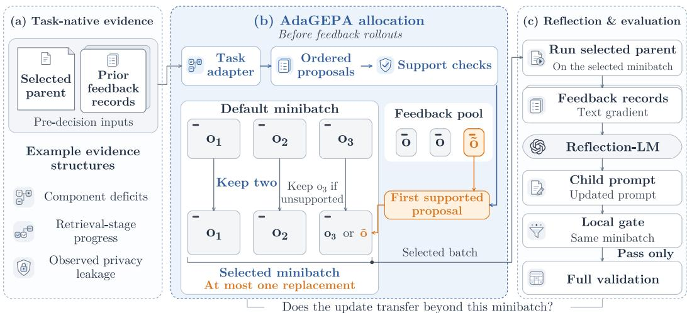
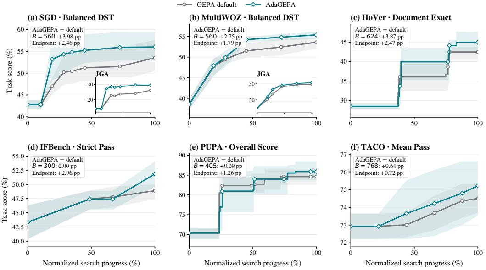
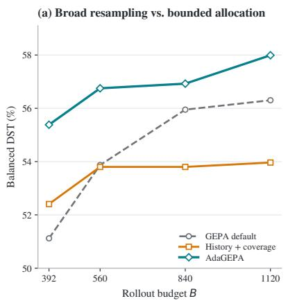
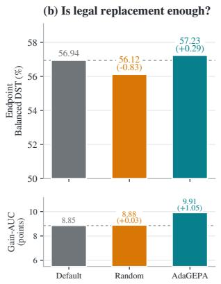
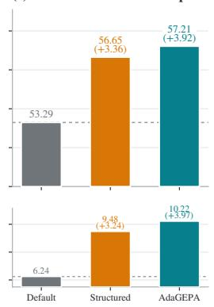
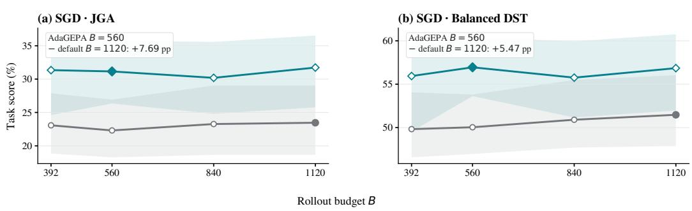
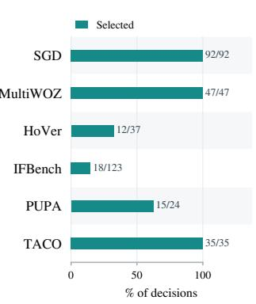
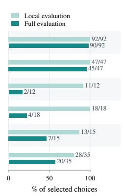
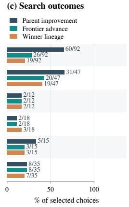

# ADAGEPA: ADAPTIVE FEEDBACK ALLOCATION FOR REFLECTIVE PROMPT OPTIMIZATION

Junyang Chen1 Zecheng Wang1 Jingbang Chen1,2,†

1The Chinese University of Hong Kong, Shenzhen 2Shenzhen Loop Area Institute

†Corresponding author.

## ABSTRACT

Prompt optimization improves the performance of language-model systems on downstream tasks by refining their prompts. Classical methods evaluate prompts on task examples and use the resulting feedback to guide prompt revisions through reflection. However, when feedback selection does not account for the prompt’s weaknesses, these revisions may improve performance on selected examples without yielding broader task improvements. To address this issue, we propose AdaGEPA, an adaptive feedback-allocation method that uses the prompt’s performance and task structure to select examples for the next prompt revision. Our method replaces at most one example in each feedback minibatch to target an identified weakness while preserving the remaining feedback context. Across our main experiments on six downstream benchmarks, AdaGEPA achieves higher mean validation scores than non-adaptive feedback selection under matched rollout budgets. AdaGEPA also finds high-performing prompts earlier across several tasks. In the initial Schema-Guided Dialogue (SGD) study, its half-budget prompts outperform the non-adaptive baseline’s full-budget prompts in joint goal accuracy on new dialogues from services seen and unseen during search. Overall, our findings highlight the potential of adaptive feedback allocation to improve both the effectiveness and rollout-budget efficiency of reflective prompt optimization.

## 1 INTRODUCTION

Prompt optimization adapts language-model systems to downstream tasks by refining their instructions without updating model weights (Yang et al., 2024; Pryzant et al., 2023). These tasks include task-oriented dialogue (Rastogi et al., 2020; Budzianowski et al., 2018), mathematical reasoning (Dekoninck et al., 2026), instruction following (Pyatkin et al., 2025), and multi-hop verification (Jiang et al., 2020). Beyond scalar outcomes, task executions can provide richer evidence, including reasoning traces, tool outputs, and evaluator feedback that can reveal why an output failed. Reflective prompt optimizers use this evidence to guide subsequent prompt revisions. Agrawal et al. (2025) introduced GEPA, a reflective prompt optimizer that maintains a pool of candidate prompts and uses natural-language reflection to revise a selected parent based on feedback from a minibatch of task examples. Because the examples in that minibatch determine which evidence shapes the next prompt revision, their selection can affect both the revised candidate and the subsequent search trajectory. This raises a natural question: how should feedback examples be selected to address the current prompt’s weaknesses and improve performance beyond the selected minibatch?

The GEPA default shuffles feedback examples without targeting the selected parent’s weaknesses. A natural alternative is to resample the entire minibatch to favor examples with larger loss gaps, repeated failures, or underrepresented task groups. However, our initial experiments reveal a gap between early progress and the final search outcome: although this strategy can improve early candidate quality and produce more candidates that improve on their parents, it does not consistently improve the best validation score found by the end of search. One challenge is that reflection turns feedback from a small minibatch into a prompt revision that affects behavior across the task. A revision that fixes the selected errors may leave other errors unresolved or weaken behavior that was already correct. This tension echoes two established observations: example choice and ordering matter in curriculum learning, while a shared update can help one behavior but harm another in multi-task learning (Bengio et al., 2009; Yu et al., 2020). These observations suggest that difficulty and coverage alone do not reliably identify feedback that leads to broader task improvements. We therefore study how task structure and the parent prompt’s performance can guide feedback selection toward revisions that benefit examples beyond the minibatch.

  
Figure 1: AdaGEPA adapts the feedback minibatch before reflection. (a) Cached evaluation records provide task-specific signals about the selected parent and search state. (b) A task adapter prioritizes eligible proposals and replaces at most one example in the default minibatch. If none passes the support checks, the default minibatch is retained. (c) The selected minibatch supplies feedback for the next prompt revision. The resulting candidate is compared with its parent on that minibatch and proceeds to full validation if its local score improves.

In this paper, we study pre-reflection feedback allocation and propose AdaGEPA, a lightweight method that uses cached evaluation records and task structure to select examples for the next prompt revision. Figure 1 shows how AdaGEPA makes this choice after parent selection and before feedback generation. Depending on the task, this structure may describe service categories, evaluation components, or intermediate execution stages. Rather than resampling the entire minibatch, AdaGEPA replaces at most one example in the default minibatch. Retaining the other examples preserves most of the default feedback context while adding targeted evidence about the prompt’s weaknesses. If no eligible replacement is available, AdaGEPA uses the default minibatch.

For example, in dialogue state tracking, cached evaluations can reveal whether the current parent struggles with intent prediction or slot-value tracking. A task-specific adapter can then propose an example whose task profile is aligned with those weaknesses. The replacement is applied only if it satisfies the task-specific eligibility and scheduling rules. The selected examples then provide feedback for the prompt revision. The resulting candidate is evaluated on the same minibatch and, if it improves on the parent, proceeds to full validation to determine whether it improves the best score found so far.

## Our contributions are summarized as follows:

• We formalize pre-reflection feedback allocation as a distinct decision in reflective prompt search: after parent selection, the optimizer chooses which examples inform reflection. We define its immediate utility as the expected one-step gain in the best-so-far validation score.

• We propose AdaGEPA, a lightweight method that uses task structure and cached evaluations to target a prompt’s weaknesses through at most one minibatch replacement, without adding language-model calls or altering subsequent reflection and evaluation.

• Across six downstream benchmarks, AdaGEPA yields higher mean final validation scores than default feedback selection at matched budgets and finds high-scoring prompts earlier. In the initial Schema-Guided Dialogue (SGD) study, prompts found using half the budget outperform full-budget baseline prompts on new dialogues from seen and unseen services.

• Through task-specific controls and trajectory analyses, we trace feedback choices through candidate evaluation, best-score improvements, and the parent-child path to the final winner (winner lineage). This shows how early candidate improvements relate to final outcomes and whether they persist as search continues.

## 2 RELATED WORK

Textual feedback and prompt optimization. Prompt optimizers differ in how they use evaluation evidence. OPRO uses earlier candidates and objective values to guide new proposals. EvoPrompt and Promptbreeder combine LM-generated mutations with task-level fitness, while MIPRO uses stochastic minibatches and a surrogate objective to optimize instructions and demonstrations (Yang et al., 2024; Guo et al., 2024; Fernando et al., 2023; Opsahl-Ong et al., 2024). Other methods use feedback to shape prompt revisions directly. ProTeGi derives natural-language critiques from minibatch examples, TextGrad propagates textual feedback through compound computation graphs, and GEPA reflects on task-native feedback and execution trajectories within a Pareto-based search (Pryzant et al., 2023; Yuksekgonul et al., 2024; Agrawal et al., 2025). Our work focuses on the decision before reflection: which examples should inform the next prompt revision. We then examine whether that revision improves performance beyond the selected examples.

Data selection in prompt search. Data selection enters prompt search at several decision points. During optimization, APEX uses prompt-lineage history and solvability to choose mutation data, and rank sensitivity to choose candidate-evaluation data. Its $2 \times 2$ ablation examines these choices separately (Wang et al., 2026). TwinBandit jointly selects challenging instances and mutation strategies through two bandits (Park et al., 2025), whereas IPOMP updates the candidate-evaluation subset as optimization proceeds (Dong et al., 2025). Other methods select data before the search begins. SESS constructs a representative submodular evaluation subset under OPRO (Nian et al., 2026), and p1 filters user prompts by separating prompt-quality variation from response stochasticity (Gao et al., 2026). For reflective updates, AdaGEPA uses the prompt’s performance and task structure to select the examples that guide the next prompt revision.

Downstream outcomes and search control. Downstream outcomes can guide individual edits or broader search decisions. Learning to Self-Evolve rewards context edits by their improvement on a holdout set and trains an editing policy with reinforcement learning (Chen et al., 2026). ReASearch lets an agent choose prompt and program revisions, minibatches, evaluation budgets, and stopping decisions (Li et al., 2026). RLMOpt and OEO also place candidate revision, evaluation, and search continuation under the optimizer’s control (Satheesha et al., 2026; Xue & Yang, 2026). DIVE instead evolves reusable skill artifacts through diversity-driven search (Xiong et al., 2026). We focus on an earlier, narrower decision: which examples inform reflection. We examine whether the resulting candidate improves the best full-validation score and whether it or one of its descendants becomes the final selected prompt.

## 3 PRELIMINARIES

## 3.1 PROMPT OPTIMIZATION UNDER A ROLLOUT BUDGET

We study prompt optimization for a compound AI system under a task-level rollout budget. We use Φ to denote a candidate system instantiated with a particular prompt configuration. Model weights and all non-prompt components remain fixed across candidates (Agrawal et al., 2025). A task instance is a pair (x, m), where x is the system input and m contains the information used to evaluate its output. The task metric $\mu ( \Phi ( x ) , m ) \in [ 0 , 1 ]$ returns a scalar score, and the feedback function $\mu _ { f }$ supplements it with task-native textual feedback for reflection.

We measure this budget in rollouts. A rollout consists of running a candidate Φ on one task instance and evaluating its output with $\mu .$ The optimization budget B limits how many of these task-level evaluations may be performed. Calls to models and tools, including the language model used for reflection, are counted separately.

## 3.2 REFLECTIVE SEARCH WITH SCHEDULED FEEDBACK

During development search, the optimizer uses a feedback set $\mathcal { D } _ { \mathrm { f e e d b a c k } }$ and a validation set $\mathcal { D } _ { \mathrm { p a r e t o } }$ At the start of each epoch, the examples in $\mathcal { D } _ { \mathrm { f e e d b a c k } }$ are randomly shuffled and then used sequentially in minibatches. We call each scheduled use of a task example a feedback occurrence, so repeated uses of the same example count as distinct occurrences. Running a candidate on the selected occurrences produces execution records and evaluator feedback for reflection. $\mathcal { D } _ { \mathrm { p a r e t o } }$ supports full candidate evaluation, parent selection, and winner selection.

At proposal step $t , \mathcal { P } _ { t }$ contains the candidates that have completed full evaluation on $\mathcal { D } _ { \mathrm { p a r e t o } } .$ Parent selection uses their instance-level scores, so a candidate that performs best on some instances can still be selected as a parent even if it does not have the highest average score (Agrawal et al., 2025).

After an existing candidate $\Phi _ { k }$ is selected as the parent, the default feedback schedule supplies the next b occurrences to form $\mathcal { M } _ { t } ^ { 0 }$ . Running the parent on these occurrences produces execution records and evaluator feedback. The Reflection-LM uses this information to revise one prompt component of the parent candidate, producing a new candidate $\Phi ^ { \prime }$ , called the child. The resulting child is then evaluated on the same minibatch as its parent. If its average score is higher than the paren $\therefore \mathbf { s } ,$ it is fully evaluated on $\mathcal { D } _ { \mathrm { p a r e t o } }$ and added to the candidate pool. Parent choice and prompt revision therefore adapt during search, but the feedback minibatch does not depend on the selected parent’s current state. Appendix B.2 provides additional details of this search transition.

## 3.3 PRE-REFLECTION FEEDBACK ALLOCATION

Feedback allocation occurs after parent selection but before any rollout is executed on the next feedback minibatch. The chosen occurrences therefore determine which execution records and evaluator feedback serve as input to the Reflection-LM. We call this decision pre-reflection feedback allocation. At proposal step t, let $\xi _ { t }$ denote the pre-reflection search state, including the selected parent, the default minibatch $\hat { \mathcal { M } } _ { t } ^ { 0 }$ , cached evaluation records, and the state of the feedback schedule. Let $\mathbb { A } ( \xi _ { t } )$ denote the feedback-allocation actions available in this state. An action $a _ { t } \in \mathbb { A } ( \xi _ { t } )$ selects b occurrences and produces $\textstyle { \mathcal { M } } _ { t } ( a _ { t } )$ . The default action $a _ { 0 }$ leaves $\mathcal { M } _ { t } ^ { 0 }$ unchanged, so $\dot { \mathcal { M } } _ { t } ( a _ { 0 } ) = \mathcal { M } _ { t } ^ { 0 }$ Across actions, the selected parent, minibatch size, rollout cap, and all subsequent search rules remain fixed. The optimizer chooses the action using only information available in $\xi _ { t }$ , prior to generating the child or observing any later search outcome.

## 4 METHODS

## 4.1 MOTIVATION AND DESIGN RATIONALE

Feedback selection should consider not only whether the resulting prompt improves the examples used for reflection, but also how it performs on the full validation set. The local gate admits a child when it improves on its parent over the selected minibatch (Agrawal et al., 2025). However, a child that passes this gate need not outperform its parent under full validation (Appendix A). Even an improvement over the parent may leave the best-so-far score unchanged. Therefore, feedback allocation must distinguish local repair, parent-level improvement, and frontier progress.

One simple alternative is to resample the entire minibatch using loss gaps, repeated failures, and coarse task coverage. Our design studies show that this history-and-coverage rule can improve early candidate quality, but its gains do not consistently persist as search continues (Appendices C.2.1 and C.3.2). Therefore, difficulty and coverage can identify promising feedback, but cannot tell us whether the resulting revision will advance the best-so-far validation score.

To address this limitation, our proposed method, AdaGEPA, aims to combine task structure with cached evaluations of the selected parent. Depending on the task, this structure may describe behaviors, components, or stages, while the cached records reveal where the parent performs poorly. A task adapter uses this evidence to propose one replacement for the default minibatch. By keeping the remaining examples unchanged, this one-slot design preserves most of the default feedback context while directing one position toward a task-relevant weakness.

## 4.2 IMMEDIATE FRONTIER UTILITY

We define the immediate utility of a feedback choice by how much the resulting prompt revision advances the best validation score found so far. Let $\bar { S } ( \Phi )$ denote the average score of candidate Φ on the full validation set $\mathcal { D } _ { \mathrm { p a r e t o } } .$ , and let $H _ { t }$ be the highest score in the candidate pool at the start of proposal step t:

$$
\bar { S } ( \Phi ) = \frac { 1 } { | \mathcal { D } _ { \mathrm { p a r e t o } } | } \sum _ { ( x _ { i } , m _ { i } ) \in \mathcal { D } _ { \mathrm { p a r e t o } } } \mu ( \Phi ( x _ { i } ) , m _ { i } ) , \quad H _ { t } = \operatorname* { m a x } _ { \Phi \in \mathcal { P } _ { t } } \bar { S } ( \Phi ) .
$$

Given a feedback choice $a \in \mathbb { A } ( \xi _ { t } )$ , let $H _ { t + 1 } ^ { ( a ) }$ be the best-so-far score after applying a in state $\xi _ { t }$ and completing the resulting proposal transition. We then define its one-step frontier gain, expected gain, and advantage over the default action $a _ { 0 }$ as

$$
\begin{array} { r } { g _ { t } ( a ) = H _ { t + 1 } ^ { ( a ) } - H _ { t } , \quad U ( a \mid \xi _ { t } ) = \mathbb { E } [ g _ { t } ( a ) \mid \xi _ { t } ] , \quad \mathrm { A d v } ( a \mid \xi _ { t } ) = U ( a \mid \xi _ { t } ) - U ( a _ { 0 } \mid \xi _ { t } ) . } \end{array}
$$

Because reflection and candidate evaluation are stochastic, the same feedback choice can yield different frontier gains even from the same state. Accordingly, $U ( a \mid \xi _ { t } )$ denotes the expected frontier gain over this randomness, while $\operatorname { A d v } ( a \mid \xi _ { t } )$ compares that expectation with the expected gain under the default action $a _ { 0 }$

## 4.3 BOUNDED FEEDBACK ALLOCATION

AdaGEPA limits each action to at most one replacement, preserving most of the default feedback context. Let the default minibatch $\mathcal { M } _ { t } ^ { 0 }$ have size b. The first $b - 1$ occurrences remain fixed, and only the final occurrence may be replaced:

$$
\mathcal { M } _ { t } ( a _ { 0 } ) = ( o _ { t , 1 } ^ { 0 } , \dots , o _ { t , b - 1 } ^ { 0 } , o _ { t , b } ^ { 0 } ) , \mathcal { M } _ { t } ( a ) = ( o _ { t , 1 } ^ { 0 } , \dots , o _ { t , b - 1 } ^ { 0 } , \tilde { o } _ { t , b } ( a ) ) .
$$

The replacement is chosen in three steps. (1) Propose. A task adapter uses the evidence available in $\xi _ { t }$ to nominate possible replacement occurrences and rank them according to a fixed priority rule. (2) Check. A replacement proposal is supported only if the proposed occurrence belongs to $\mathcal { D } _ { \mathrm { f e e d b a c k } }$ , is distinct from every occurrence in the default minibatch, and satisfies the adapterspecific schedule constraints. Proposals targeting the same occurrence are treated as a single action. (3) Select. AdaGEPA selects the first supported replacement proposal in priority order. If none is supported, it applies the default action $a _ { 0 }$ and leaves $\mathcal { M } _ { t } ^ { 0 }$ unchanged. Feedback selection does not consume the task-level rollout budget. Before a proposal step begins, the runner verifies that enough budget remains to compare the parent and child on the minibatch and to fully evaluate the child if it passes the local gate.

Algorithm 1 summarizes this shared selection procedure. The task adapter A supplies an ordered list of replacement proposals, while the support check and default fallback are shared across tasks.

Algorithm 1: AdaGEPA feedback selection   
Input : selected parent $\Phi _ { k } .$ , default minibatch $\mathcal { M } _ { t } ^ { 0 } .$ , cached records C, feedback set $\mathcal { D } _ { \mathrm { f e e d b a c k } }$ , schedule   
state q, frozen task adapter $A .$   
Output : selected batch M and updated schedule state $q ^ { \prime } .$   
1 L ← A.propose $( \Phi _ { k } , \mathcal { M } _ { t } ^ { 0 } , C , \mathcal { D } _ { \mathrm { f e e d b a c k } } , q )$   
2 for each distinct occurrence o in $L ,$ in adapter priority order:   
3 if Supported(o, M0, Dfeedback, q):   
4 $( { \mathcal { M } } , q ^ { \prime } ) \gets$ ReplaceFinal $( \boldsymbol { \mathcal { M } } _ { t } ^ { 0 } , \boldsymbol { o } , \boldsymbol { q } )$   
5 return $( \mathcal { M } , q ^ { \prime } )$   
6 return $( \mathcal { M } _ { t } ^ { 0 } , q )$

Feedback selection uses only information already available in $\xi _ { t }$ and adds no model calls. The parent then produces reflection records on the selected minibatch. The child is evaluated on this minibatch and proceeds to full validation only after passing the local gate.

## 4.4 TASK-SPECIFIC PROPOSAL RULES

Task adapters convert cached evaluation records, task metadata, and allocation history into prioritized replacement proposals. Depending on the task, the proposal rule can be a deterministic rule, a replay policy over eligible feedback-bearing occurrences, or a model fitted before evaluation. In each case, the evidence schema, proposal semantics, priority rule, and any fitted parameters are fixed before evaluation. At each search step, the adapter applies this fixed configuration to the selected parent’s cached evaluations and the occurrences currently available under the feedback schedule.

For example, if cached evaluation records show that the selected parent performs poorly on a particular behavior, a task adapter can propose an eligible occurrence associated with that behavior. When several occurrences qualify, a fixed task-specific rule ranks them using the available search evidence. The relevant task structure can represent services, evaluation components, or stages. Appendix B.4 summarizes the task-specific evidence schemas and proposal rules used in our experiments.

## 5 EXPERIMENTS

## 5.1 EXPERIMENTAL SETUP

Evaluation design. Development-search curves track when each method discovers high-quality candidates and how the performance gap evolves with the rollout budget. We compare AdaGEPA with the GEPA default at matched checkpoints by evaluating the candidate saved by each method at the same rollout budget. In the initial SGD study, we also compare AdaGEPA at B = 560 with the full-budget GEPA default. For SGD, MultiWOZ, and HoVer, we further evaluate frozen candidates on new examples (search-external panels), without further prompt optimization.

Tasks and common configuration. Our experiments separate design studies from evaluations of the final method. Full-minibatch history-and-coverage studies on SGD, AIME, and LiveBench-Math (White et al., 2025) test whether these signals are sufficient to guide feedback selection. We then evaluate AdaGEPA’s bounded one-slot intervention across six benchmarks: dialogue state tracking (SGD and MultiWOZ), multi-hop verification (HoVer), instruction following (IFBench), privacy-sensitive generation (PUPA), and algorithmic code generation (TACO). The main paired experiments use feedback minibatches of three occurrences. We use gpt-4.1-mini (Task-LM) to execute task examples and gpt-5.1 (Reflection-LM) to generate prompt revisions. Within each comparison, the two arms share the initial candidate, rollout cap, and search procedure. They differ only in feedback selection. Matched ablations and controls examine the contributions of one-slot replacement, task-specific targeting, proposal-pool construction, and ordering. Task configurations, evaluation protocols, and additional results appear in Appendices B and C.

Metrics and statistics. Each task is evaluated using its task-specific metric. In the main AdaGEPA results, endpoint scores are reported as percentages and paired differences as percentage points. For dialogue state tracking, Balanced DST combines state and dialogue-component correctness, while joint goal accuracy (JGA) requires the complete dialogue state to be correct. HoVer reports exact supporting-document retrieval, IFBench reports the rate of responses that pass all instruction verifiers, PUPA averages response quality and privacy preservation, and TACO reports mean problem pass rate. For development searches, Gain-AUC measures the area between the best-so-far curve and its initial score over the normalized rollout budget. We pair runs by optimization seed and report mean scores and mean paired differences in the main tables. Appendix B.8 defines the metrics, repeated-evaluation aggregation, and run-inclusion rules. Appendix C reports median paired differences, win/tie/loss counts, uncertainty intervals, and per-run results.

## 5.2 MAIN RESULTS

The main experiments address two questions: whether adaptive feedback selection helps search discover higher-scoring prompts under the same rollout budget, and whether the resulting prompts retain their gains on examples not used during search. Figure 2 traces how best-so-far candidate quality changes over search, while Table 1 summarizes the earlier-checkpoint and endpoint comparisons. In development search, AdaGEPA reached a higher mean endpoint than the GEPA default across all six benchmarks. The clearest early gains appeared on SGD, MultiWOZ, and HoVer, while the smaller improvements on IFBench, PUPA, and TACO emerged later. Two additional SGD studies also showed a clear early mean advantage, although the endpoint gaps gradually narrowed as the rollout budget increased further.

  
Figure 2: Development-search trajectories across six benchmarks. Curves show mean best-so-far task scores over normalized search progress, from the shared initial candidate at 0% to the final checkpoint at 100% within each task; shading shows 95% seed-resampling intervals. Each panel uses the metric named in its title. The SGD and MultiWOZ insets show JGA, which requires the complete dialogue state to be correct. Callouts report mean paired differences (AdaGEPA minus GEPA default) at the labeled earlier checkpoint and endpoint while retaining the corresponding absolute B values. The SGD panel shows the initial study. HoVer and PUPA use step curves because candidates become available at seed-dependent budgets.

Table 1: Development-search candidate quality. Entries are mean task scores over optimization seeds, reported as percentages. Parentheses give paired mean differences (AdaGEPA minus GEPA default) in percentage points. Earlier checkpoints and endpoints are task-specific and listed by their absolute B values. The final column reports the paired difference in budget-normalized Gain-AUC over each seed’s development-search trajectory.
<table><tr><td rowspan="2">Task / study</td><td rowspan="2">Metric</td><td rowspan="2">n</td><td colspan="3">Earlier checkpoint</td><td colspan="3">Endpoint</td><td rowspan="2">∆ Gain-AUC</td></tr><tr><td>B</td><td>GEPA default</td><td>AdaGEPA (∆)</td><td>B</td><td>GEPA default</td><td>AdaGEPA (∆)</td></tr><tr><td rowspan="2">SGD initial</td><td>Balanced DST</td><td>5</td><td>560</td><td>51.23</td><td>55.21 (+3.98)</td><td>1120</td><td>53.53</td><td>55.99 (+2.46)</td><td>+3.49</td></tr><tr><td rowspan="2">JGA Balanced DST</td><td rowspan="2">5</td><td rowspan="2">560</td><td>23.65</td><td>28.46 (+4.81)</td><td rowspan="2">1120</td><td>26.15</td><td>29.42 (+3.27)</td><td rowspan="2"></td></tr><tr><td>51.80</td><td>53.59 (+1.79)</td><td>55.59</td><td>55.18 (−0.40)</td></tr><tr><td rowspan="2">SGD extension</td><td rowspan="2">JGA Balanced DST</td><td rowspan="2"></td><td rowspan="2"></td><td>23.65</td><td>26.54 (+2.88)</td><td rowspan="2">1120</td><td>27.50</td><td>28.27 (+0.77)</td><td rowspan="2">+0.73</td></tr><tr><td>52.17</td><td>53.74 (+1.58)</td><td>55.35</td><td>55.33 (−0.03)</td></tr><tr><td rowspan="2">SGD replication</td><td rowspan="2">JGA Balanced DST</td><td rowspan="2"></td><td rowspan="2">10 560</td><td>24.42</td><td>26.54 (+2.12)</td><td rowspan="2"></td><td>28.17</td><td>28.17 ( 0.00)</td><td rowspan="2">+0.99</td></tr><tr><td>51.50</td><td>54.25 (+2.75)</td><td>53.59</td><td>55.39 (+1.79)</td></tr><tr><td rowspan="2">MultiWOZ</td><td rowspan="2">JGA</td><td rowspan="2"></td><td rowspan="2">5 560</td><td>28.08</td><td>29.04 (+0.96)</td><td rowspan="2">1120</td><td>29.62</td><td>30.77 (+1.15)</td><td rowspan="2">+1.48</td></tr><tr><td></td><td></td><td></td><td></td></tr><tr><td>HoVer</td><td>Document Exact</td><td>5 5</td><td>624</td><td>36.07</td><td>39.93 (+3.87)</td><td>1120</td><td>42.47</td><td>44.93 (+2.47)</td><td>+1.90</td></tr><tr><td>IFBench</td><td>Strict pass</td><td>5</td><td>300 405</td><td>47.41 83.90</td><td>47.41 (0.00) 83.99 (+0.09)</td><td>560 607</td><td>48.89</td><td>51.85 (+2.96)</td><td>+1.23 -0.11</td></tr><tr><td>PUPA</td><td>Privacy-quality</td><td>5</td><td></td><td></td><td></td><td>1424</td><td>84.64</td><td>85.90 (+1.26) 75.21 (+0.72)</td><td></td></tr><tr><td>TACO</td><td>Mean pass</td><td></td><td>768</td><td>73.01</td><td>73.65 (+0.64)</td><td></td><td>74.50</td><td></td><td>+0.45</td></tr></table>

To test the second question, we evaluated frozen candidates from SGD, MultiWOZ, and HoVer on examples not used during development search. The clearest transfer result came from the initial SGD study. Using half the optimization rollout budget, AdaGEPA found prompts that exceeded the GEPA default’s full-budget prompts by 7.69 JGA points on new dialogues from previously seen services (in-domain) and 5.19 points on unseen services. The two additional SGD studies also favored AdaGEPA at B = 560 on both panels, although the endpoint gaps narrowed as the GEPA default continued to improve. Table 2 reports both Balanced DST and the stricter JGA for SGD and MultiWOZ. On MultiWOZ, AdaGEPA led by 1.56 Balanced DST points at B = 560 and 3.12 points

Table 2: Search-external candidate quality. Entries are mean task scores over optimization seeds, reported as percentages. Parentheses give paired mean differences (AdaGEPA minus GEPA default) in percentage points. Earlier checkpoints and endpoints are listed by their absolute B values. Dialogue-state-tracking rows report Balanced DST followed by JGA.
<table><tr><td rowspan="2">Task / study</td><td rowspan="2">Panel</td><td rowspan="2">Metric</td><td rowspan="2">n</td><td colspan="2">Earlier checkpoint</td><td rowspan="2"></td><td colspan="2">Endpoint</td></tr><tr><td>B GEPA default</td><td>AdaGEPA (∆)</td><td>B GEPA default</td><td>AdaGEPA (∆)</td></tr><tr><td rowspan="4">SGD initial</td><td rowspan="2">In-domain</td><td>Balanced DST</td><td></td><td></td><td>50.04</td><td>56.95 (+6.91)</td><td>51.47</td><td>56.85 (+5.38)</td></tr><tr><td>JGA</td><td>5 560</td><td>22.31</td><td>31.15 (+8.85)</td><td>1120</td><td>23.46</td><td>31.73 (+8.27)</td></tr><tr><td rowspan="2">Unseen service</td><td>Balanced DST</td><td></td><td>56.29</td><td>61.03 (+4.74)</td><td></td><td>57.33</td><td>59.69 (+2.36)</td></tr><tr><td>JGA</td><td></td><td>28.08</td><td>34.04 (+5.96)</td><td></td><td>28.85</td><td>32.31 (+3.46)</td></tr><tr><td rowspan="5">SGD extension</td><td>In-domain</td><td>Balanced DST</td><td></td><td>51.24</td><td></td><td>53.85 (+2.61)</td><td>55.27</td><td>55.40 (+0.13)</td></tr><tr><td></td><td>JGA</td><td>5 560</td><td>23.85</td><td>27.88 (+4.04)</td><td>1120</td><td>28.08</td><td>29.62 (+1.54)</td></tr><tr><td>Unseen service</td><td>Balanced DST</td><td></td><td>56.21</td><td>59.88 (+3.67)</td><td></td><td>59.90</td><td>60.40 (+0.50)</td></tr><tr><td></td><td>JGA</td><td></td><td>26.99</td><td>32.69 (+5.71)</td><td></td><td>32.12</td><td>32.88 (+0.77)</td></tr><tr><td>In-domain</td><td>Balanced DST</td><td></td><td>51.05</td><td>54.24 (+3.19)</td><td></td><td>54.20</td><td>55.24 (+1.04)</td></tr><tr><td rowspan="4">SGD replication</td><td></td><td>JGA</td><td>10 560</td><td></td><td>23.08</td><td>28.65 (+5.58)</td><td>27.40 1120</td><td></td><td>29.62 (+2.21)</td></tr><tr><td>Unseen service</td><td>Balanced DST</td><td></td><td></td><td>56.56</td><td>57.67 (+1.11)</td><td></td><td>59.04</td><td>58.79 (−0.24)</td></tr><tr><td></td><td>JGA</td><td></td><td></td><td>27.88</td><td>29.90 (+2.02)</td><td></td><td>31.25</td><td>30.87 (−0.38)</td></tr><tr><td>Search-external</td><td>Balanced DST</td><td>5</td><td>560</td><td>50.92</td><td>52.47 (+1.56)</td><td>1120</td><td>51.21</td><td>54.33 (+3.12)</td></tr><tr><td rowspan="2">MultiWOZ HoVer</td><td></td><td>JGA</td><td></td><td></td><td>26.92</td><td>26.92 ( 0.00)</td><td></td><td>25.77</td><td>28.65 (+2.88)</td></tr><tr><td>Search-external</td><td>Document Exact</td><td>5</td><td>624</td><td>40.32</td><td>41.82 (+1.50)</td><td>1120</td><td>44.74</td><td>46.64 (+1.90)</td></tr></table>

n counts paired optimization runs. Panel construction and metric definitions appear in Appendix B.8; rollout checkpoints and full paired results appear in Appendices B.7 and C.1.  
at B = 1120. HoVer also showed positive mean search-external differences of 1.50 Document Exact points at B = 624 and 1.90 points at B = 1120.

## 5.3 ABLATION STUDIES

We focus the main component ablations on SGD, which provides the most complete set of matched controls. Controls on the remaining tasks examine the same design choices under different feedback structures, with full results reported in Appendix C.2.

We first examine how much of the feedback minibatch should be changed. On SGD, full-minibatch history-and-coverage sampling improved early candidate quality but stalled as the GEPA default continued to improve, motivating a more bounded intervention (Figure 3a). On AIME, replacing the full minibatch with a coarse selection rule left an endpoint deficit of 1.6 correct answers relative to the GEPA default. Applying the same rule to only one slot reduced this gap to 0.4. The one-slot constraint therefore bounds the intervention by introducing targeted feedback while preserving most of the default feedback context.

We next examine which components make a one-slot replacement useful. Random Legal retains the one-slot constraint but samples uniformly from the legal alternatives, testing whether any legal replacement is sufficient without task-specific selection. Relative to the GEPA default, its mean Gain-AUC differed by only +0.03 points, while its endpoint was 0.83 points lower. AdaGEPA exceeded Random Legal by 1.02 Gain-AUC points and 1.12 endpoint points. These results suggest that bounding the intervention to one replacement does not by itself improve search. Structured Unordered retains AdaGEPA’s supported proposal pool and fallback but omits fitted ordering. It recovered most of AdaGEPA’s mean improvement over the default, suggesting that structuring the proposal space accounts for most of the observed gain. The fitted ordering provided a smaller additional improvement that varied across configurations. Full paired results and additional controls are reported in Appendix C.2.2.

Finally, we examine how task-specific structure should guide feedback selection. On SGD, AdaGEPA refines service-level selection using intent and slot deficits. Its mean unseen-service JGA exceeded the service-level-only control by 4.81 points at B = 560 and 0.38 points at $B = 1 1 2 0$ (Table 24). On MultiWOZ, service-aware routing yielded a mean endpoint Balanced DST 2.15 points above uniform selection of unused examples, while fitted occurrence ordering within the selected service provided no further gain. Across both tasks, task-specific proposal structure was more effective than generic coverage alone, while finer fitted ordering was not consistently beneficial.

  
Figure 3: Component ablations on SGD. (a) Best-so-far development Balanced DST compares the GEPA default, full-minibatch history-and-coverage selection, and AdaGEPA using an ordering fitted from ten prior searches. (b) Endpoint Balanced DST at B = 1120 (upper) and Gain-AUC (lower) compare the GEPA default, Random Legal, and AdaGEPA over ten paired optimization runs. Random Legal uniformly samples one legal replacement. (c) The same measures compare AdaGEPA with Structured Unordered, which uses the same supported replacement pool and fallback but omits fitted ordering. Parentheses show mean paired differences from the GEPA default. Full statistics and additional controls appear in Appendix C.2.2.

## 6 DISCUSSION

The development curves suggest that feedback selection may matter most when useful feedback is hard to reach within the search budget. AdaGEPA can find useful candidates early, while its lead sometimes narrows as search continues. One possible explanation is that AdaGEPA’s task-specific feedback selection brings relevant examples into reflection before the shuffled schedule reaches them. This leads to a testable hypothesis: holding the task and adapter fixed, AdaGEPA should provide the greatest benefit when the default schedule can cover only a small part of the feedback pool within the search budget.

Selecting a relevant example does not ensure that the resulting prompt revision will remain useful through later search. On MultiWOZ, service-aware routing produced higher development scores than uniform selection of unused examples, while fitted within-service ordering did not preserve that gain. PUPA illustrates the next hurdle: even when feedback from observed privacy failures was reused, most resulting candidates did not appear in winner lineages. A child can enter the candidate pool without setting a new best score and may later be selected as the parent for another revision. Therefore, a fuller assessment of feedback allocation should consider both the immediate frontier change and whether the resulting child lies on the winner lineage (Appendix C.3).

Across tasks, AdaGEPA operates at the same pre-reflection decision point and uses task-specific evaluator signals to identify weaknesses of the parent prompt and guide replacement proposals. Development search tracks when useful candidates are discovered, and search-external evaluation tests the resulting prompts on new examples. Our results suggest that adaptive feedback allocation can accelerate candidate discovery when relevant feedback is scarce. Its longer-term value depends on whether the resulting revisions generalize beyond the selected examples and remain useful as search proceeds.

## 7 CONCLUSION

Reflective prompt optimization depends not only on how a prompt is revised but also on which feedback examples shape that revision. We proposed AdaGEPA to address this allocation problem using task structure and observed prompt performance. Our analyses show why this choice matters: improvements on the selected examples do not reliably advance the best score on the full validation set. Across six benchmarks, AdaGEPA achieved higher mean validation scores under matched rollout budgets and often found higher-scoring candidates earlier in search. Search-external evaluations on SGD, MultiWOZ, and HoVer further showed positive mean gains on new examples. These findings highlight feedback allocation as a consequential design choice for reflective prompt optimization, affecting both when useful prompts are found and whether their gains extend to new examples. A promising next step is to account for longer-term search value by selecting feedback that produces useful future parents, even when the immediate candidate does not advance the frontier.

## AI USE STATEMENT

We used generative AI tools to assist with writing and editing experimental and analysis scripts, organizing and analyzing experiment records, identifying potentially relevant literature, and restructuring, language editing, and polishing of the manuscript. The authors reviewed all AI-assisted outputs, checked reported numerical results against the corresponding experiment records, and verified citations against their original sources. The authors take responsibility for the final text, claims, code, and other artifacts.

## REPRODUCIBILITY STATEMENT

Sections 4 and 5.1 describe AdaGEPA’s feedback-selection procedure and evaluation design. Appendix A documents the local-to-full proposal-alignment audit. Appendix B specifies the task adapters, data roles and evaluation panels, rollout budgets, model request settings, metrics, and statistical procedures. Appendix C provides additional checkpoint and paired-seed results, controls, and resource accounting. The accompanying code artifact contains an executable reference implementation of the shared bounded one-slot feedback-allocation contract and its GEPA-compatible batch sampler.

## REFERENCES

Lakshya A. Agrawal, Shangyin Tan, Dilara Soylu, Noah Ziems, Rishi Khare, Krista Opsahl-Ong, Arnav Singhvi, Herumb Shandilya, Michael J. Ryan, Meng Jiang, Christopher Potts, Koushik Sen, Alexandros G. Dimakis, Ion Stoica, Dan Klein, Matei Zaharia, and Omar Khattab. GEPA: Reflective prompt evolution can outperform reinforcement learning, 2025. URL https:// arxiv.org/abs/2507.19457.

Yoshua Bengio, Jer´ ome Louradour, Ronan Collobert, and Jason Weston. Curriculum learning. Inˆ Proceedings of the 26th Annual International Conference on Machine Learning, pp. 41–48, 2009. doi: 10.1145/1553374.1553380.

Paweł Budzianowski, Tsung-Hsien Wen, Bo-Hsiang Tseng, Inigo Casanueva, Stefan Ultes, Osman˜ Ramadan, and Milica Gasiˇ c. MultiWOZ: A large-scale multi-domain wizard-of-oz dataset for´ task-oriented dialogue modelling. In Proceedings of the 2018 Conference on Empirical Methods in Natural Language Processing, pp. 5016–5026, 2018. doi: 10.18653/v1/D18-1547.

Xiaoyin Chen, Canwen Xu, Yite Wang, Boyi Liu, Zhewei Yao, and Yuxiong He. Learning to selfevolve, 2026. URL https://arxiv.org/abs/2603.18620.

Jasper Dekoninck, Nikola Jovanovic, Tim Gehrunger, K´ ari R´ ognvaldsson, Ivo Petrov, Chenhao Sun,¨ and Martin Vechev. Beyond benchmarks: MathArena as an evaluation platform for mathematics with LLMs, 2026. URL https://arxiv.org/abs/2605.00674.

Ximing Dong, Shaowei Wang, Dayi Lin, and Ahmed E. Hassan. Model performance-guided evaluation data selection for effective prompt optimization. In Findings of the Association for Computational Linguistics: ACL 2025, pp. 2844–2859, 2025. doi: 10.18653/v1/2025.findings-acl.147.

Chrisantha Fernando, Dylan Banarse, Henryk Michalewski, Simon Osindero, and Tim Rockt”aschel. Promptbreeder: Self-referential self-improvement via prompt evolution, 2023. URL https://arxiv.org/abs/2309.16797.

Zhaolin Gao, Yu (Sid) Wang, Bo Liu, Thorsten Joachims, Kiante Brantley, and Wen Sun. ´ p1: Better prompt optimization with fewer prompts, 2026. URL https://arxiv.org/abs/2604. 08801.

Qingyan Guo, Rui Wang, Junliang Guo, Bei Li, Kaitao Song, Xu Tan, Guoqing Liu, Jiang Bian, and Yujiu Yang. EvoPrompt: Connecting LLMs with evolutionary algorithms yields powerful prompt optimizers. In International Conference on Learning Representations, 2024. URL https: //arxiv.org/abs/2309.08532.

Yichen Jiang, Shikha Bordia, Zheng Zhong, Charles Dognin, Maneesh Singh, and Mohit Bansal. HoVer: A dataset for many-hop fact extraction and claim verification. In Findings of the Association for Computational Linguistics: EMNLP 2020, pp. 3441–3460, 2020. doi: 10.18653/v1/ 2020.findings-emnlp.309.

Junbo Li, Boyi Liu, Canwen Xu, Yite Wang, Yuxiong He, Zhangyang Wang, Qiang Liu, and Zhewei Yao. The optimizer is the agent: Reasoning-driven search across prompts, programs, and ML workflows, 2026. URL https://arxiv.org/abs/2608.06714.

Jinming Nian, Zhiyuan Peng, Hongwei Shang, Dae Hoon Park, and Yi Fang. Submodular evaluation subset selection in automatic prompt optimization, 2026. URL https://arxiv.org/abs/ 2601.03493.

Krista Opsahl-Ong, Michael J. Ryan, Josh Purtell, David Broman, Christopher Potts, Matei Zaharia, and Omar Khattab. Optimizing instructions and demonstrations for multi-stage language model programs. In Proceedings of the 2024 Conference on Empirical Methods in Natural Language Processing, pp. 9340–9366, 2024. doi: 10.18653/v1/2024.emnlp-main.525.

Young-Joon Park, Seong-Ryeong Lee, Anh-Dung Vo, Minsung Jung, and Daewoo Choi. TwinBandit Prompt Optimizer: Adaptive prompt optimization via synergistic dual MAB-guided feedback. In Proceedings of the 34th ACM International Conference on Information and Knowledge Management, pp. 5115–5119, 2025. doi: 10.1145/3746252.3760824.

Reid Pryzant, Dan Iter, Jerry Li, Yin Lee, Chenguang Zhu, and Michael Zeng. Automatic prompt optimization with “gradient descent” and beam search. In Proceedings of the 2023 Conference on Empirical Methods in Natural Language Processing, pp. 7957–7968, 2023. doi: 10.18653/v1/ 2023.emnlp-main.494.

Valentina Pyatkin, Saumya Malik, Victoria Graf, Hamish Ivison, Shengyi Huang, Pradeep Dasigi, Nathan Lambert, and Hannaneh Hajishirzi. Generalizing verifiable instruction following. In Advances in Neural Information Processing Systems, volume 38, pp. 54870–54896, 2025. doi: 10.52202/085713-1645.

Abhinav Rastogi, Xiaoxue Zang, Srinivas Sunkara, Raghav Gupta, and Pranav Khaitan. Towards scalable multi-domain conversational agents: The schema-guided dialogue dataset. In Proceedings of the AAAI Conference on Artificial Intelligence, volume 34, pp. 8689–8696, 2020. doi: 10.1609/aaai.v34i05.6394.

Subhash Bangalore Satheesha, Nirvik Pande, Deepthi Duddempudi, and Bharath Dandala. RL-MOpt: Adaptive prompt optimization via recursive language models, 2026. URL https: //arxiv.org/abs/2608.10471.

Fei Wang, Si Si, Cho-Jui Hsieh, and Inderjit S. Dhillon. APEX: Automated prompt engineering expert with dynamic data selection, 2026. URL https://arxiv.org/abs/2606.11459.

Colin White, Samuel Dooley, Manley Roberts, Arka Pal, Ben Feuer, Siddhartha Jain, Ravid Shwartz-Ziv, Neel Jain, Khalid Saifullah, Sreemanti Dey, Shubh-Agrawal, Sandeep Singh Sandha, Siddartha Naidu, Chinmay Hegde, Yann LeCun, Tom Goldstein, Willie Neiswanger, and Micah Goldblum. LiveBench: A challenging, contamination-limited LLM benchmark. In International Conference on Learning Representations, 2025. URL https://arxiv.org/abs/2406. 19314.

Siheng Xiong, Ali Payani, Oguzhan Gungordu, and Faramarz Fekri. DIVE: Unlocking selfimprovement in frozen language models through diversity-driven skill evolution, 2026. URL https://arxiv.org/abs/2608.12486.

Hui Xue and Fan Yang. Rethinking self-evolving agents: Do we still need prescribed optimization pipelines?, 2026. URL https://arxiv.org/abs/2608.09629.

Chengrun Yang, Xuezhi Wang, Yifeng Lu, Hanxiao Liu, Quoc V. Le, Denny Zhou, and Xinyun Chen. Large language models as optimizers. In International Conference on Learning Representations, 2024. URL https://arxiv.org/abs/2309.03409.

Tianhe Yu, Saurabh Kumar, Abhishek Gupta, Sergey Levine, Karol Hausman, and Chelsea Finn. Gradient surgery for multi-task learning. In Advances in Neural Information Processing Systems, volume 33, pp. 5824–5836, 2020. URL https://arxiv.org/abs/2001.06782.

Mert Yuksekgonul, Federico Bianchi, Joseph Boen, Sheng Liu, Zhi Huang, Carlos Guestrin, and James Zou. TextGrad: Automatic “differentiation” via text. In Advances in Neural Information Processing Systems, 2024. URL https://arxiv.org/abs/2406.07496.

## A LOCAL-TO-FULL PROPOSAL ALIGNMENT

We examine local-to-full alignment across 458 proposal transitions from 60 development runs on AIME, LiveBench-Math, and IFBench. Each transition passed the strict local gate and completed full evaluation within the common $B \leq 5 6 0$ rollout prefix. The runs include the GEPA default and several historical adaptive policies, so this analysis characterizes proposal-level alignment rathe than the effect of a particular method.

For each proposal, the local change is the child-minus-parent score change on the selected minibatch, while the full-set change is the corresponding change on $\mathcal { D } _ { \mathrm { p a r e t o } }$ . Because every minibatch contains three examples, using score sums rather than averages does not change the sign or ordering of the local changes. Correlations use raw score-sum changes for both quantities. Because the validationset sizes differ across tasks, the pooled correlations are descriptive. The Pearson and Spearman correlations were 0.076 and 0.108, respectively, indicating weak local-to-full alignment.

Table 3: Full-validation child-minus-parent outcomes among proposals that passed the local gate. Dataset rows partition the complete proposal set, while the GEPA default row is a cross-task subset.
<table><tr><td>Scope</td><td>Proposals</td><td>Positive</td><td>Zero</td><td>Negative</td><td>Positive rate</td></tr><tr><td>AIME</td><td>142</td><td>77</td><td>16</td><td>49</td><td>54.23%</td></tr><tr><td>LiveBench-Math</td><td>226</td><td>111</td><td>28</td><td>87</td><td>49.12%</td></tr><tr><td>IFBench</td><td>90</td><td>45</td><td>10</td><td>35</td><td>50.00%</td></tr><tr><td>All proposals</td><td>458</td><td>233</td><td>54</td><td>171</td><td>50.87%</td></tr><tr><td>GEPA default subset</td><td>150</td><td>85</td><td>14</td><td>51</td><td>56.67%</td></tr></table>

Although every proposal passed the local gate, 233 of 458 improved on its parent under full validation. The remaining 225 were unchanged or worse. Together with the low correlations, these outcomes distinguish improvement on the selected minibatch from progress on the full validation set. This analysis follows realized search trajectories rather than forked alternatives and therefore does not estimate the counterfactual advantage of different feedback choices from the same state.

## B IMPLEMENTATION AND EVALUATION PROTOCOL

Roadmap. We first describe the shared search setting, default search transition, allocation contract, and task-specific adapters. We then specify the comparison controls and rollout budgets, followed by the evaluation, statistical, model-request, and integrity protocols.

## B.1 SEARCH SETTING AND DATA ROLES

All paired comparisons use the same GEPA search implementation, with candidate merging disabled. AdaGEPA intervenes after parent selection and changes only the feedback minibatch used for reflection. Within each comparison, the methods share all remaining search and evaluation settings, including the rollout budget and model request configuration. Search-external evaluations use frozen checkpoint candidates without further prompt optimization.

During optimization, $\mathcal { D } _ { \mathrm { f e e d b a c k } }$ supplies examples and evaluator feedback for reflection and local parent–child comparison, whereas $\mathcal { D } _ { \mathrm { p a r e t o } }$ supports full candidate evaluation, parent selection, and final winner selection.

Table 4 summarizes the optimization runs and saved-state sets used in the reported comparisons. Paired search arms start from the same prompt and, in the main AdaGEPA comparisons, reuse the same initial validation records.1 Search-external evaluations reuse candidates from the corresponding searches and therefore do not add optimization runs.

Table 4: Optimization runs and saved-state sets used in the reported comparisons. For SGD, 5- formation and 10-formation identify the number of formation searches used to fit the ordering. Same-state comparisons reuse states from their source searches.
<table><tr><td>Task</td><td>Experiment</td><td>Repeats</td></tr><tr><td>SGD</td><td>Ordering formation sets</td><td>5 / 10 searches</td></tr><tr><td>SGD</td><td>Initial study (5 formation searches)</td><td>5 paired runs</td></tr><tr><td>SGD</td><td>Extension study (5 formation searches)</td><td>5 paired runs</td></tr><tr><td>SGD</td><td>Replication study (10 formation searches)</td><td>10 paired runs</td></tr><tr><td>SGD</td><td>History-and-coverage and formation controls</td><td>5 paired runs</td></tr><tr><td>SGD</td><td>Random Legal three-arm control</td><td>10 paired runs</td></tr><tr><td>SGD</td><td>Strong-prompt continuation</td><td>5 paired continuations</td></tr><tr><td>SGD</td><td>Same-state comparisons</td><td>2 panels, each from 5 source runs</td></tr><tr><td>MultiWOZ</td><td>Service-aware search and allocation controls</td><td>5 paired runs</td></tr><tr><td>HoVer</td><td>Stage-progress replay</td><td>5 paired runs</td></tr><tr><td>AIME</td><td>Full-minibatch and bounded controls</td><td>5 paired runs</td></tr><tr><td>LiveBench-Math</td><td>Full-minibatch design study</td><td>10 paired runs</td></tr><tr><td>IFBench</td><td>Verifier-allocation comparison</td><td>5 paired runs</td></tr><tr><td>PUPA</td><td>Privacy-feedback reuse</td><td>5 paired runs</td></tr><tr><td>TACO</td><td>Coarse-skill allocation</td><td>5 paired runs</td></tr></table>

## B.2 GEPA SEARCH TRANSITION

Before proposal step t, the candidate pool $\mathcal { P } _ { t }$ contains all candidates that have undergone full evaluation on $\mathcal { D } _ { \mathrm { p a r e t o } }$ . GEPA samples a parent using its Pareto-based selector (Agrawal et al., 2025). The selector prunes redundant candidates from the parent-selection support and then samples each remaining candidate in proportion to the number of validation instances on which it is tied for the best score. This pruning affects only parent selection and does not remove candidates from $\mathcal { P } _ { t }$

The default sampler maintains an epoch-shuffled schedule over $\mathcal { D } _ { \mathrm { f e e d b a c k } }$ . After parent selection, the next b scheduled instances form the feedback minibatch $\mathcal { M } _ { t } ^ { 0 }$ . Running the parent $\Phi _ { k }$ on this minibatch produces outputs, scores, execution trajectories, and task-native feedback. The Reflection-LM uses these records to revise one prompt component of the parent and produce a child candidate $\Phi ^ { \prime }$

The parent and child are evaluated on the same occurrence-level minibatch. The strict local gate advances the child to full validation only if its average minibatch score exceeds that of the parent. The implementation compares the corresponding score sums, which yields the same decision because both candidates are evaluated on the same b occurrences. Under the configuration used in this paper, a child that passes the local gate is fully evaluated on $\mathcal { D } _ { \mathrm { p a r e t o } }$ and added to the candidate pool. At the end of search, the candidate with the highest average score on $\mathcal { D } _ { \mathrm { p a r e t o } }$ is returned.

## B.3 SHARED ALLOCATION CONTRACT

The six task-specific AdaGEPA adapters share the one-slot contract defined in Section 4. AdaGEPA starts from a three-occurrence default minibatch, retains the first two occurrences as anchors, and allows the task adapter to propose a replacement only for the third. The proposal is executed only if it passes the task-specific support check and scheduling rules. Otherwise, the default minibatch is retained.

## B.4 TASK-SPECIFIC ADAPTERS

The shared interface leaves the evidence schema and proposal rule task specific. Table 5 lists the adapter names used in the results, while Table 6 summarizes how each task maps evaluation evidence to a feedback proposal. The proposal rules and any fitted parameters are fixed before evaluation.

AIME and LiveBench-Math are reported as design studies rather than as part of the six-benchmark adapter comparison. Table 6 includes AIME because it also contains a bounded one-slot comparison; LiveBench-Math examines only full-minibatch allocation and is reported separately.

Table 5: Task-specific AdaGEPA adapters. The main results use the shared AdaGEPA name; mechanism tables use shortened forms of these adapter names.
<table><tr><td>Benchmark</td><td>Task-specific adapter</td></tr><tr><td>SGD</td><td>Hierarchical service-component adapter</td></tr><tr><td>MultiWOZ</td><td>Service-aware routing adapter</td></tr><tr><td>HoVer</td><td>Stage-progress replay adapter</td></tr><tr><td>IFBench</td><td>Mean-deficit adapter</td></tr><tr><td>PUPA</td><td>Observed-deficit replay adapter</td></tr><tr><td>TACO</td><td>Coarse-skill adapter</td></tr></table>

Table 6: Task-specific evidence schemas and proposal rules for the bounded one-slot comparisons. Full-minibatch design controls are summarized separately in Table 8.
<table><tr><td>Task</td><td>Evidence used</td><td>Proposal rule</td><td>Question examined</td></tr><tr><td>SGD</td><td>Search progress, service exposure, static task pro- files, and selected-parent component deficits.</td><td>Frozen models rank legal service-level proposals and, when supported, refine the choice within the selected service.</td><td>Component-aware proposal ordering and search-external candidate quality.</td></tr><tr><td>MultiWOZ</td><td>vice metadata.</td><td>A frozen service-aware rule ranks le- Selected-parent compo- gal service-level proposals using search Service-aware routing nent deficits, service ex- context, intervention exposure, and versus generic coverage posure, and frozen ser- candidate-wide DST features, then se- and fitted within-service lects an eligible occurrence within the occurrence ordering. chosen service.</td><td></td></tr><tr><td>HoVer</td><td>history.</td><td>Intermediate retrieval A fixed replay rule prioritizes an eligi- progress, unresolved fi- ble occurrence whose trajectory made Stage-progress-guided nal outcomes, and replay retrieval progress but did not resolve the feedback reuse. task.</td><td></td></tr><tr><td>AIME</td><td>topic clusters.</td><td>Failure history, repeated The bounded rule applies the history- exposure, and coarse and-coverage signal to at most one sup- ported replacement.</td><td>History-and-coverage allocation under a bounded one-slot intervention.</td></tr><tr><td>IFBench</td><td>Selected-parent verifier deficits and prior expo- sure under overlapping objectives.</td><td>The fixed mean-deficit rule prioritizes Feedback allocation under supported examples from weak verifier overlapping verifier groups.</td><td>objectives.</td></tr><tr><td>PUPA</td><td>signals.</td><td>Update type, prior feed- On privacy-facing updates, a fixed rule Feedback reuse and back observations, and reuses eligible feedback with previously downstream candidate visible privacy-leakage observed privacy leakage. Other update outcomes under coupled types retain the default minibatch.</td><td>objectives.</td></tr><tr><td>TACO</td><td>Validation-supported parent skill deficits.</td><td>A fixed rule prioritizes a supported ex- skill labels and selected- ample from an underperforming skill group.</td><td>Whether coarse skill identity provides sufficient resolution for feedback allocation.</td></tr></table>

The SGD instantiation uses fitted proposal ordering. Table 7 summarizes its formation evidence, frozen models, and runtime selection rule. All fitted quantities remain fixed during evaluation.

## B.5 COMPARISON CONTROLS

Table 8 summarizes the controls used to separate action capacity, replacement support, ordering, and task-specific targeting. The APEX-style and SESS-style controls adapt ideas from their source systems (Wang et al., 2026; Nian et al., 2026). They preserve the surrounding search transition but are not full reproductions of those systems.

Table 7: Compact configuration of the fitted SGD proposal ordering.
<table><tr><td>Component</td><td>Specification</td></tr><tr><td>Formation evidence</td><td>The reported configurations use five or ten designated development searches under the default feedback rule to collect proposal states and one-step targets.</td></tr><tr><td>Ordering target</td><td>The target is the observed one-step Balanced-DST frontier gain after a complete proposal transition. Rejected or non-advancing proposals receive zero.</td></tr><tr><td>Frozen models</td><td>Two ridge models rank legal service-level proposals and eligible within-service refinements using search progress, service exposure, static task profiles, and selected-parent deficits.</td></tr><tr><td>Runtime selection</td><td>The service-level model ranks legal service-level proposals, and the refinement model ranks eligible occurrences within the selected service. A distinct refinement is used when available; otherwise the service-level proposal is used, with the default minibatch as the final fallback.</td></tr></table>

The PUPA component-composition comparator changes candidate components rather than feedback selection and is therefore reported separately.

## B.6 SGD SAME-STATE FORK PROTOCOL

Each comparison restores a fixed search state $\xi _ { t }$ . Each distinct action is evaluated using $K = 3$ independent proposal transitions; when two arms select the same action, they share those transitions. For a deterministic arm that chooses action $^ { a , }$ we estimate its immediate frontier gain and its contrast with the default choice $a _ { 0 }$ as

$$
\widehat { U } ( a \mid \xi _ { t } ) = \frac { 1 } { K } \sum _ { r = 1 } ^ { K } \bigl ( H _ { t + 1 } ^ { ( a , r ) } - H _ { t } \bigr ) , \qquad \widehat { \mathrm { A d v } } ( a \mid \xi _ { t } ) = \widehat { U } ( a \mid \xi _ { t } ) - \widehat { U } ( a _ { 0 } \mid \xi _ { t } ) .
$$

Random Legal independently draws an action from the legal replacement pool on each repeat. Its estimate therefore averages over both the replacement distribution and the randomness of the resulting proposal transitions. Transition repeats are first averaged within each state, after which state-level contrasts are aggregated within the source optimization run. The resulting source-run means form the statistical units in the reported summaries.

The two panels use separate source states and are analyzed independently. Results appear in $\mathsf { A p - }$ pendix C.2.3.

## B.7 ROLLOUT BUDGETS AND CANDIDATE CHECKPOINTS

The rollout budget B counts logical candidate–example evaluations at the task level, rather than raw provider requests. A proposal step includes a local parent–child comparison and may also trigger full validation when the child passes the local gate. The runner begins a proposal step only when the remaining budget can cover both stages if needed. The candidate saved at a checkpoint is therefore selected only from candidates whose full validation is complete by the stated budget.

Rollout caps and reported checkpoints follow the fixed protocol for each benchmark. Because development-validation sizes and proposal schedules differ, absolute B values are benchmarkspecific. Table 10 lists the rollout cap, development-validation size, and checkpoints used in the reported comparisons.

Because B is an upper bound, local rejection and budget reservation for possible full validation can leave the realized number of task-level evaluations below the cap.

## B.8 EVALUATION PANELS, METRICS, AND STATISTICS

Development results use each task’s search validation data. Search-external evaluations score frozen checkpoint candidates on separate examples that were not used during search or candidate selection. SGD uses two 104-example panels: a train-derived in-domain panel and an official-test panel covering 15 unseen services. MultiWOZ uses a deterministic 104-dialogue panel from its official test split. HoVer uses a fixed 253-example panel that excludes examples sharing source IDs with the search data and reports the full 300-example panel as a secondary evaluation. AIME divides its 90 development examples evenly between feedback and validation. Table 11 summarizes the evaluation settings and metrics for all tasks.

Table 8: Control designs and the factors they are intended to isolate.
<table><tr><td>Control</td><td>Preserved structure</td><td>Changed factor</td><td>Purpose</td></tr><tr><td>SGD Random Legal</td><td>One-slot capacity, the legal replacement pool, and the search</td><td>Samples uniformly from legal replacements with- out task-aware ordering</td><td>Isolate the value of legal replacement alone.</td></tr><tr><td>SGD Structured Unordered</td><td>schedule AdaGEPA&#x27;s supported proposal set and one-slot</td><td>Selects from the same supported proposal set without fitted occurrence</td><td>Separate structured replacement support from fitted ordering.</td></tr><tr><td>SGD service-level-only</td><td>capacity One-slot capacity, service-level targeting, and the</td><td>ordering Omits within-service component refinement</td><td>Isolate component-level targeting beyond service selection.</td></tr><tr><td>MultiWOZ coverage-only</td><td>search transition One-slot capacity and prior exposure information</td><td>Selects unused examples without task-specific ser- vice routing</td><td>Compare generic unused-example coverage with service-aware</td></tr><tr><td>MultiWOZ fitted ordering</td><td>One-slot capacity and service-aware proposal routing</td><td>Ranks supported occur- rences within the selected service</td><td>routing. Measure the value of fitted ordering beyond rank-neutral service-aware</td></tr><tr><td>AIME bounded one-slot</td><td>The history-and- coverage signal and surrounding search</td><td>Applies the same signal to at most one replace- ment instead of resam-</td><td>routing. Separate selection direction from intervention capacity.</td></tr><tr><td>IFBench all-pass-risk verifier feedback,</td><td>transition One-slot capacity,</td><td>pling the full minibatch Aggregates feedback by all-verifier failure risk</td><td>Compare alternative aggregations</td></tr><tr><td>PUPA coverage-only</td><td>and support checks One-slot capacity and the surrounding</td><td>rather than mean deficit Selects unseen examples without observed leakage</td><td>of overlapping verifier feedback. Compare generic coverage with</td></tr><tr><td>History and coverage (SGD, AIME,</td><td>search transition The surrounding search transition and</td><td>feedback Resamples the full mini- batch using difficulty,</td><td>observed-feedback reuse. Test the earlier full-minibatch</td></tr><tr><td>LiveBench-Math) SGD formation size</td><td>rollout accounting The fitted adapter architecture and</td><td>repetition, and coverage Varies the number of de- velopment searches used</td><td>allocation hypothesis. Measure sensitivity to the amount</td></tr><tr><td>APEX-style (SGD, AIME)</td><td>evaluation protocol The task-matched feedback capacity</td><td>to fit proposal ordering Prioritizes feedback us- ing failure history</td><td>of formation evidence. Provide a neighboring adaptive</td></tr><tr><td>SESS-style (SGD)</td><td>and search transition The search transition and epoch composition</td><td>Uses a fixed representa- tive schedule rather than parent-conditioned selec- tion</td><td>mutation-data control. Compare adaptive allocation with static representativeness.</td></tr></table>

For development protocols evaluated at multiple rollout checkpoints, let H(B) denote the quality of the best budget-complete candidate available by rollout B. Over the evaluated budget range $[ B _ { 0 } , B _ { 1 } ]$ , we summarize progress above the initial checkpoint as

Table 9: Same-state fork panels. Every selected state admits every arm compared in its panel.
<table><tr><td>Panel</td><td>Source states</td><td>Actions compared</td><td>Repeats</td></tr><tr><td>Four-arm comparison</td><td>15 states from five development runs</td><td>GEPA default, Random Legal, Struc- tured Unordered, and AdaGEPA (5 for- mation runs)</td><td>3 per distinct action</td></tr><tr><td>Ordering comparison</td><td>15 states from a separate set of five development runs</td><td>Structured Unordered and AdaGEPA (10 3 per distinct formation runs)</td><td>action</td></tr></table>

Table 10: Rollout caps, development-validation sizes, and key checkpoints used in the reported comparisons.
<table><tr><td>Task</td><td>Rollout cap B</td><td>Development-validation size</td><td>Key reported checkpoints</td></tr><tr><td>SGD</td><td>1120</td><td>104</td><td>104, 392, 560, 840, 1120</td></tr><tr><td>MultiWOZ</td><td>1120</td><td>104</td><td>104, 300, 392, 560, 840, 1120</td></tr><tr><td>HoVer</td><td>1120</td><td>300</td><td>300, 624, 1120</td></tr><tr><td>AIME</td><td>560</td><td>45</td><td>45, 150, 300, 336, 392, 560</td></tr><tr><td>LiveBench-Math</td><td>560</td><td>50</td><td>50, 150, 300, 560</td></tr><tr><td>IFBench</td><td>560</td><td>54</td><td>54, 300, 392, 560</td></tr><tr><td>PUPA</td><td>607</td><td>111</td><td>111, 405,607</td></tr><tr><td>TACO</td><td>1424</td><td>256</td><td>256, 768, 1424</td></tr></table>

$$
{ \mathrm { G a i n – A U C } } = { \frac { 1 } { B _ { 1 } - B _ { 0 } } } \int _ { B _ { 0 } } ^ { B _ { 1 } } ( H ( B ) - H ( B _ { 0 } ) ) \ d B .
$$

This budget-normalized area captures both how early improvements appear and how large they are. For metrics reported as proportions, Gain-AUC is multiplied by 100 and reported in points.2

The optimization run, indexed by its seed, is the statistical unit. We first compute the difference between AdaGEPA and its reference method within each paired seed, then summarize the differences by their mean, median, win/tie/loss (W/T/L) counts, and a 95% uncertainty interval. When a frozen candidate has repeated evaluation draws, we average those scores before computing the paired difference. For bootstrap intervals, five-run analyses enumerate all paired-seed resamples, whereas ten-run analyses use 100,000 samples drawn with a fixed random seed.3 Reported aggre gates include all completed, protocol-conforming runs at the stated checkpoint.

## B.9 MODEL REQUESTS AND INTEGRITY

None of the reported configurations explicitly sets top p. Model names are given in normalized provider/model form. The recorded requests identify each model endpoint but do not include a provider-issued immutable snapshot identifier.

Subsequent Task-LM and Reflection-LM executions are independent across arms, allowing their search trajectories to diverge. Quality summaries include all completed, protocol-conforming runs that reach the reported checkpoint and respect the budget and data boundaries. Failed runs are not replaced. Post-search analyses use cached records without modifying the recorded trajectories or scores. Logical rollout budgets and physical resources are accounted for separately. The rollout budget B follows the task-level protocol, while provider retries, Reflection-LM calls, tokens, configured cost, and wall-clock time are recorded independently. Equal rollout caps therefore need not imply equal physical resource use.

Table 11: Evaluation panels and data roles. Search-external panels evaluate frozen checkpoint candidates without further prompt optimization.
<table><tr><td>Task</td><td>Development evaluation</td><td>Search-external evaluation</td></tr><tr><td>SGD</td><td>Search validation</td><td>In-domain (104); unseen-service (104)</td></tr><tr><td>MultiWOZ</td><td>Search validation</td><td>Search-external panel (104; official-test split)</td></tr><tr><td>HoVer</td><td>Search validation</td><td>Search-external panel (253); full evaluation panel (300) secondary</td></tr><tr><td>AIME</td><td>Held-out development split</td><td></td></tr><tr><td>LiveBench-Math</td><td>Search validation</td><td></td></tr><tr><td>IFBench</td><td>Search validation</td><td></td></tr><tr><td>PUPA</td><td>Search validation</td><td></td></tr><tr><td>TACO</td><td>Search validation</td><td></td></tr></table>

Table 12: Task metrics and their aggregation.
<table><tr><td>Task</td><td>Metric</td><td>Definition and aggregation</td></tr><tr><td>SGD/ MultiWOZ</td><td>Balanced DST; JGA</td><td>Balanced DST averages a per-example score with weight  $1 / 2$  on ex- act joint-state correctness and 1/6 each on active-intent correctness, requested-slot F1, and slot-value F1. Checkpoint candidates are se- lected by Balanced DST. JGA is the fraction of examples with a com- pletely correct dialogue state; both metrics are reported for the same</td></tr><tr><td>HoVer</td><td>Document Exact</td><td>frozen candidate. Fraction of examples for which the cumulative retrieval after the final hop covers all three normalized gold supporting-document titles.</td></tr><tr><td>AIME</td><td>Formatted-answer accuracy</td><td>Fraction of responses containing the formatted reference answer (# # # &lt;integer&gt;&#x27;); the number of solved problems is also re- ported.</td></tr><tr><td></td><td>LiveBench-Math Task-specific score</td><td>Mean score assigned by the pinned task-specific deterministic scor- ers; the number of full-credit problems is also reported.</td></tr><tr><td>IFBench</td><td>Strict pass rate</td><td>Mean of binary item scores, where an item receives one only when the response passes every instruction-specific verifier.</td></tr><tr><td>PUPA</td><td>Privacy-quality score</td><td>Let F indicate that the generated response is judged at least as good as the reference, and let R indicate the reverse comparison. The per- example quality score is  $q = 1 [ F \vee ( F = R ) ]$  , with  $1 [ F \land \bar { \neg } R ]$  as a stricter secondary measure. If l is the fraction of unique private- information entries leaked into the request sent to the external model, privacy is  $p = 1 - \ell .$  The overall score is  $( q + p ) / 2 ,$  averaged across validation examples.</td></tr><tr><td>TACO</td><td>Mean problem pass rate; strict pass rate</td><td>Mean problem pass rate averages the fraction of tests passed for each problem. Strict pass rate counts a problem as correct only when all of its tests pass.</td></tr></table>

## C ADDITIONAL EMPIRICAL EVIDENCE

Roadmap. We first provide detailed search and search-external results for the comparisons reported in the main text. We then examine what drives feedback allocation and where its value persists or disappears. The appendix concludes with a cross-task synthesis and resource accounting.

## C.1 SEARCH AND SEARCH-EXTERNAL RESULTS

This section expands the search and search-external comparisons reported in the main text. It presents the three tasks with search-external panels—SGD, MultiWOZ, and HoVer—together with the SGD formation-prompt comparisons. Development-only controls for the remaining tasks appear in Appendices C.2 and C.3, followed by the task-level synthesis in Appendix C.4.

Table 13: Model request configurations for the reported experiments. T denotes temperature, L the maximum output-token setting, R the configured retry count, and τ the request timeout in seconds.
<table><tr><td>Task</td><td>Task-LM or task evaluator</td><td>Reflection-LM</td></tr><tr><td>SGD, MultiWOZ</td><td> $\mathsf { o p e n a i / g p t } - 4 . 1 \mathsf { - m i n i } ; T = 1 , L = 1 0 2 4 ,$   $R = 5 , \tau = 2 4 0$ </td><td> $\mathsf { o p e n a i / g p t { - } } 5 . 1 ; T = 1 , L = 1 6 0 0 0 , R = 3 ,$   $\tau = 6 0 0$ </td></tr><tr><td>HoVer</td><td> $\mathsf { o p e n a i / g p t { - } 4 . 1 \mathrm { - } m i n i ; } T = 1 , L = 5 1 2 , R = 2 ,$   $\tau = 6 0 0$ </td><td> $\mathsf { o p e n a i / g p t { - } } 5 . 1 ; T = 1 , L = 4 0 9 6 , R = 2 ,$  τ = 600</td></tr><tr><td>AIME</td><td> $\mathsf { o p e n a i } / \mathsf { g p t } - 4 . 1 \mathsf { - m i n i } ; T = 1 , L = 1 6 0 0 0 ,$   $R = 5 , \tau = 2 4 0$ </td><td> $\mathsf { o p e n a i / g p t { - } } 5 . 1 ; T = 1 , L = 1 6 0 0 0 , R = 3 ,$   $\tau = 6 0 0$ </td></tr><tr><td>LiveBench-Math</td><td> $\mathsf { o p e n a i } / \mathsf { g p t } - 4 . 1 \mathsf { - m i n i } ; T = 1 , L = 1 6 0 0 0 ,$   $\bar { R } = 3 , \tau \stackrel {  } { = } 6 0 0$ </td><td> $\mathsf { o p e n a i / g p t { - } } 5 . 1 ; T = 1 , L = 1 6 0 0 0 , R = 3 ,$   $\tau = 6 0 0$ </td></tr><tr><td>IFBench</td><td> $\mathsf { o p e n a i } / \mathsf { g p t } - 4 . 1 \mathsf { - m i n i } ; T = 1 , L = 1 6 0 0 0 ,$   $R = 5 , \tau = 2 4 0$ </td><td> $\mathsf { o p e n a i / g p t { - } } 5 . 1 ; T = 1 , L = 1 6 0 0 0 , R = 3 ,$   $\tau = 6 0 0$ </td></tr><tr><td>PUPA</td><td>openai  $/ { \mathfrak { g } } { \mathfrak { p } } \mathrm { t } - 4 . 1 { \mathrm { - } } { \mathfrak { m } } { \mathrm { i } } { \mathrm { n } } { \mathrm { i } } ; \operatorname { t a s k } T = 1 , L = 1 0 2 4 ,$  evaluator  $\bar { T ^ { = } } 0 , L = 1 2 8 ; R = 5 , \tau = 1 8 0$ </td><td> $\mathsf { o p e n a i / g p t { - } } 5 . 1 ; T = 1 , L = 4 0 9 6 , R = 5 ,$   $\tau = 1 8 0$ </td></tr><tr><td>TACO</td><td> $\mathsf { o p e n a i } / \mathsf { g p t } - 4 . 1 \mathsf { - m i n i } ; T = 1 , L = 1 6 0 0 0 ,$   $R = 3 , \tau = 6 0 0$ </td><td> $\mathsf { o p e n a i / g p t { - } } 5 . 1 ; T = 1 , L = 1 6 0 0 0 , R = 3 ,$   $\tau = 6 0 0$ </td></tr></table>

  
Figure 4: Search-external in-domain SGD quality across frozen rollout checkpoints. Curves show means over five paired optimization runs on the 104-example panel, with 95% seed-resampling intervals. Filled markers identify AdaGEPA at $B \ : = \ : 5 6 0$ and the GEPA default at $B = 1 1 2 0$ Annotations report their paired mean differences.

## C.1.1 INITIAL SGD STUDY

Figure 4 shows in-domain candidate quality across the frozen checkpoints, while Table 14 reports the corresponding results on the unseen-service panel.

At the matched $B = 5 6 0$ checkpoint, AdaGEPA improved mean unseen-service JGA by 5.96 points, with a 95% paired-seed interval of [4.81, 6.92]. At $\bar { B } = 1 1 2 0$ , the mean JGA differences were +8.27 points in-domain $\mathrm { ( W / T / L = 5 / 0 / \bar { 0 } }$ , interval [+4.23, +13.65]) and +3.46 points on unseen services $\mathbf { \bar { ( W / T / L = 4 / 0 / 1 } }$ , interval $[ + 0 . 5 8 , + 5 . 7 7 ] )$ Comparing AdaGEPA at $\bar { B } = 5 6 0$ with the GEPA default at $B ^ { ' } = 1 1 2 0$ gives +7.69 points in-domain and +5.19 points on unseen services, with $\mathrm { W / T / L } = 5 / 0 / 0$ for both comparisons.

## C.1.2 SGD EXTENSION STUDY

The SGD extension study uses the same 5-formation configuration as the initial study with a different set of paired optimization runs. Table 15 reports the paired differences corresponding to the arm means in Table 2, together with Gain-AUC and cross-budget comparisons. The cross-budget rows compare AdaGEPA at $B = 5 6 0$ with the GEPA default at $B = 1 1 2 0$

At $B = 5 6 0$ , the mean differences favor AdaGEPA on development and on both search-external panels. The differences narrow by $B = 1 1 2 0$ as the default search continues to improve.

Table 14: Search-external SGD candidate quality across frozen checkpoints on the 104-dialogue panel covering all 15 unseen services. Values are means over five paired optimization runs.
<table><tr><td rowspan="2">Arm</td><td colspan="4">JGA (%)</td><td colspan="4">Balanced DST (%)</td></tr><tr><td>B392</td><td>B560</td><td>B840</td><td>B1120</td><td>B392</td><td>B560</td><td>B840</td><td>B1120</td></tr><tr><td>GEPA default</td><td>27.88</td><td>28.08</td><td>28.27</td><td>28.85</td><td>55.81</td><td>56.29</td><td>56.14</td><td>57.33</td></tr><tr><td>AdaGEPA</td><td>31.92</td><td>34.04</td><td>31.92</td><td>32.31</td><td>58.28</td><td>61.03</td><td>59.35</td><td>59.69</td></tr></table>

Table 15: Paired SGD differences for the extension study. All values are AdaGEPA minus the GEPA default, in points. The search-external results use the existing fixed in-domain and unseen-service panels.
<table><tr><td>Evaluation</td><td>Contrast and metric</td><td>Mean</td><td>W/T/L</td><td>95% paired-seed interval</td></tr><tr><td>Development</td><td>Gain-AUC, Balanced DST</td><td>+0.73</td><td>3/0/2</td><td>[−1.06, +2.52]</td></tr><tr><td>Development</td><td>B = 560 vs. B = 560, Balanced DST</td><td>+1.79</td><td>4/0/1</td><td>[+0.03, +4.00]</td></tr><tr><td>Development</td><td>B = 1120 vs. B = 1120, Balanced DST</td><td>-0.40</td><td>3/0/2</td><td>[−1.67, +0.87]</td></tr><tr><td>In-domain panel</td><td>B = 560 vs. B = 560, JGA</td><td>+4.04</td><td>3/0/2</td><td>[−2.12, +11.54]</td></tr><tr><td>In-domain panel</td><td>B = 1120 vs. B = 1120, JGA</td><td>+1.54</td><td>2/1/2</td><td>[−1.15, +4.23]</td></tr><tr><td>In-domain panel</td><td>B = 560 vs. default B = 1120, JGA</td><td>-0.19</td><td>2/0/3</td><td>[-3.65, +3.27]</td></tr><tr><td>Unseen-service</td><td>B = 560 vs. B = 560, JGA</td><td>+5.71</td><td>5/0/0</td><td>[+3.72, +7.69]</td></tr><tr><td>panel Unseen-service</td><td>B = 1120 vs. B = 1120, JGA</td><td>+0.77</td><td>3/0/2</td><td>[−5.00, +6.54]</td></tr><tr><td>panel Unseen-service panel</td><td>B = 560 vs. default B = 1120, JGA</td><td>+0.58</td><td>3/0/2</td><td>[-3.91, +5.00]</td></tr></table>

## C.1.3 SGD REPLICATION STUDY

The SGD replication study includes ten paired optimization runs under a fixed 10-formation configuration. Table 16 reports paired development and search-external differences at B = 560 and B = 1120, together with comparisons between AdaGEPA at B = 560 and the GEPA default at B = 1120. Development results use Balanced DST and Gain-AUC. Search-external results use JGA or Balanced DST as indicated. All differences and intervals are reported in points.

At B = 560, the mean differences favor AdaGEPA on development and both search-external panels. By B = 1120, the development and unseen-service mean differences are near zero, while the indomain JGA difference remains positive on average.

Table 17 reports per-run unseen-service differences in Balanced DST and JGA for the initial, extension, and replication SGD studies at B = 560 and B = 1120.

## C.1.4 SGD FORMATION-PROMPT COMPARISONS

Direct deployment. From five GEPA default formation searches, we selected the prompt with the highest development score and evaluated it directly, without further optimization. Table 18 compares this formation prompt with AdaGEPA’s B = 560 candidates on the same unseen-service panel.

The selected formation prompt scored above the mean of the AdaGEPA B = 560 candidates, showing that formation search can itself yield a competitive deployable prompt.

Continuation from the formation prompt. We also started the GEPA default and AdaGEPA from the same selected formation prompt, allowing a paired comparison from a stronger initialization. By B = 1120, the GEPA default and AdaGEPA had improved on the starting prompt by 3.22 and 3.00 Balanced DST points, respectively. AdaGEPA ended 0.22 points below the default. Both methods therefore improved the stronger starting prompt by similar amounts.

Table 16: Paired SGD differences for the replication study. Search-external scores evaluate frozen checkpoint candidates on the fixed in-domain and unseen-service panels.
<table><tr><td>Evaluation</td><td>Contrast and metric</td><td>Mean</td><td>Median</td><td>W/T/L</td><td>95% paired-seed interval</td></tr><tr><td>Development</td><td>Gain-AUC</td><td>+0.99</td><td>+0.11</td><td>5/0/5</td><td>[−2.46, +4.72]</td></tr><tr><td>Development</td><td> $B = 5 6 0 \mathrm { v s } . B = 5 6 0 ,$  Balanced DST</td><td>+1.58</td><td>+0.51</td><td>6/0/4</td><td>[-2.15, +5.86]</td></tr><tr><td>Development</td><td>B = 1120 vs. B = 1120, Balanced DST</td><td>-0.03</td><td>1 -0.24</td><td>5/0/5</td><td>[-3.02, +2.90]</td></tr><tr><td>Development</td><td>B = 560 vs. default B = 1120, Balanced DST</td><td>-1.61</td><td>-1.48</td><td>4/0/6</td><td>[-4.38, +1.12]</td></tr><tr><td>In-domain panel</td><td>B = 560 vs. B = 560, JGA</td><td>+5.58</td><td>+5.29</td><td>7/0/3</td><td>[−0.38, +11.44]</td></tr><tr><td>In-domain panel</td><td>B = 1120 vs. B = 1120, JGA</td><td>+2.21</td><td>+2.88</td><td>7/0/3</td><td>[-1.92, +5.87]</td></tr><tr><td>In-domain panel</td><td>B = 560 vs. default B = 1120, JGA</td><td>+1.25</td><td>+4.81</td><td>6/0/4</td><td>[−3.94, +6.06]</td></tr><tr><td>Unseen-service panel</td><td>B = 560 vs. B = 560, JGA</td><td>+2.02</td><td>+1.92</td><td>6/0/4</td><td>[-2.50, +6.73]</td></tr><tr><td>Unseen-service panel</td><td>B = 1120 vs. B = 1120, JGA</td><td>-0.38</td><td>+0.48</td><td>5/0/5</td><td>[-3.65, +2.50]</td></tr><tr><td>Unseen-service panel</td><td>B = 560 vs. default B = 1120, JGA</td><td>-1.35</td><td>0.00</td><td>5/0/5</td><td>[−5.48, +2.60]</td></tr><tr><td>Unseen-service panel</td><td>B = 560 vs. B = 560, Balanced DST</td><td>+1.11</td><td>+1.90</td><td>6/0/4</td><td>[−2.86, +5.11]</td></tr><tr><td>Unseen-service panel</td><td>B = 1120 vs. B = 1120,</td><td>-0.24</td><td>+0.35</td><td>5/0/5</td><td>[-3.23, +2.46]</td></tr><tr><td>Unseen-service panel</td><td>Balanced DST B = 560 vs. default B = 1120, Balanced DST</td><td>-1.37</td><td>-0.14</td><td>5/0/5</td><td>[-4.98, +2.07]</td></tr></table>

Table 17: Per-run SGD search-external differences on the unseen-service panel. Values are AdaGEPA minus the GEPA default in percentage points.
<table><tr><td colspan="2"></td><td colspan="2">Balanced DST</td><td colspan="2">JGA</td></tr><tr><td>SGD study</td><td>Run</td><td>B = 560</td><td>B = 1120</td><td>B = 560</td><td>B = 1120</td></tr><tr><td rowspan="6">Initial</td><td>1</td><td>+2.96</td><td>-0.38</td><td>+3.85</td><td>-1.92</td></tr><tr><td>2</td><td>+5.19</td><td>+3.46</td><td>+5.77</td><td>+5.77</td></tr><tr><td>3</td><td>+5.15</td><td>+1.05</td><td>+5.77</td><td>+2.88</td></tr><tr><td>4</td><td>+4.99</td><td>+5.46</td><td>+6.73</td><td>+6.73</td></tr><tr><td>5</td><td>+5.42</td><td>+2.23</td><td>+7.69</td><td>+3.85</td></tr><tr><td>1</td><td>+1.07</td><td>+2.81</td><td>+3.53</td><td>+3.85</td></tr><tr><td rowspan="6">Extension</td><td>2</td><td>+5.10</td><td>-4.58</td><td>+7.05</td><td>-7.69</td></tr><tr><td>3</td><td>+3.92</td><td>+6.27</td><td>+5.77</td><td>+11.54</td></tr><tr><td>4</td><td>+6.89</td><td>-3.12</td><td>+9.29</td><td>-5.77</td></tr><tr><td>5</td><td>+1.37</td><td>+1.12</td><td>+2.88</td><td>+1.92</td></tr><tr><td>1</td><td>+5.10</td><td>+2.49</td><td>+8.65</td><td>+3.85</td></tr><tr><td>2</td><td>+0.14</td><td>-4.03</td><td>+0.96</td><td>-3.85</td></tr><tr><td rowspan="8">Replication</td><td>3</td><td>+7.74</td><td>+4.52</td><td>+9.62</td><td>+3.85</td></tr><tr><td>4</td><td>-6.01</td><td>-1.49</td><td>-6.73</td><td>-3.85</td></tr><tr><td>5</td><td>-5.42</td><td>-1.40</td><td>-5.77</td><td>-0.96</td></tr><tr><td>6</td><td>+3.66</td><td>+6.27</td><td>+2.88</td><td>+5.77</td></tr><tr><td>7</td><td>-8.13</td><td>-10.32</td><td>-6.73</td><td>-11.54</td></tr><tr><td>8</td><td>+11.02</td><td>+2.10</td><td>+13.46</td><td>+1.92</td></tr><tr><td>9</td><td>-4.53</td><td>+2.68</td><td>-5.77</td><td>+3.85</td></tr><tr><td>10</td><td>+7.53</td><td>-3.28</td><td>+9.62</td><td>-2.88</td></tr></table>

Table 18: Direct deployment comparison on unseen-service SGD. Scores are JGA percentages, and the difference is AdaGEPA minus the formation prompt in percentage points.
<table><tr><td>Evaluation</td><td>Formation prompt</td><td>AdaGEPA  $B = 5 6 0$ </td><td>Difference</td><td>95% interval</td></tr><tr><td>Unseen-service JGA</td><td>36.54</td><td>32.69</td><td>-3.85</td><td> $[ - 1 3 . 9 7 , + 5 . 8 2 ]$ </td></tr></table>

Table 19: MultiWOZ search-external differences on the fixed 104-dialogue panel drawn from the official test split. Values are AdaGEPA minus the GEPA default in percentage points.
<table><tr><td rowspan="2">Run</td><td colspan="2">Balanced DST</td><td colspan="2">JGA</td></tr><tr><td> $B = 5 6 0$ </td><td> ${ \cal B } = { \bf 1 1 2 0 }$ </td><td> $B = 5 6 0$ </td><td> ${ \cal B } = { \bf 1 1 2 0 }$ </td></tr><tr><td>1</td><td>+3.30</td><td>+3.49</td><td>+2.88</td><td>+3.85</td></tr><tr><td>2</td><td>-4.48</td><td>+3.05</td><td>-9.62</td><td>-1.92</td></tr><tr><td>3</td><td>+6.11</td><td>+3.67</td><td>+8.65</td><td>+4.81</td></tr><tr><td>4</td><td>+6.86</td><td>+10.01</td><td>+6.73</td><td>+17.31</td></tr><tr><td>5</td><td>-4.01</td><td>-4.64</td><td>-8.65</td><td>-9.62</td></tr></table>

## C.1.5 MULTIWOZ SEARCH-EXTERNAL CHECKPOINT EVALUATION

Frozen candidates saved at $B \ : = \ : 5 6 0$ and $B = 1 1 2 0$ from five paired MultiWOZ optimization runs were evaluated on a fixed 104-dialogue search-external panel drawn from the official test split. Table 19 reports the per-run Balanced DST and JGA differences at both budgets.

At $B = 5 6 0$ , the mean and median Balanced DST differences were +1.56 and +3.30 points, with $\mathbf { W } / \mathrm { T } / \mathrm { L } = 3 / 0 / 2$ and a 95% interval of $[ - 2 . 7 4 , + 5 . 8 5 ]$ . The corresponding JGA differences were 0.00 and +2.88 points, with $\mathbf { W } / \mathrm { T } / \mathrm { L } = 3 \mathbf { \bar { / } } 0 / 2$ and an interval of $[ - 6 . 7 3 , + 6 . 7 3 ]$ . At $B = 1 1 2 0$ , the mean and median Balanced DST differences were +3.12 and +3.49 points, with $\mathbf { W } / \mathrm { T } / \mathrm { L } = 4 / 0 / 1$ and an interval of $[ - 1 . 3 8 , + 7 . 3 2 ]$ The corresponding JGA differences were +2.88 and +3.85 points, with $\mathbf { W } / \mathrm { T } / \mathrm { L } \stackrel { - } { = } 3 / 0 / 2$ and an interval of [−4.23, +10.96].

## C.1.6 HOVER DEVELOPMENT AND SEARCH-EXTERNAL EVALUATION

We evaluated stage-progress replay against the GEPA default across five paired optimization runs. Table 20 reports the development endpoints and executed replay counts. Stage-progress replay improved the mean endpoint by 2.47 percentage points, with a median difference of 0.33 points, W/T/L $\overset { \_ } { = } 3 / 1 / 1$ , and a 95% interval of $[ - 0 . 6 0 , \bar { + 6 . 9 3 } ]$ points. Replay opportunities were sparse, but the candidates that passed the local gate advanced the frontier and entered winner lineages.

Frozen candidates saved at $B = 6 2 4$ and B = 1120 from five paired HoVer optimization runs were evaluated on a fixed 253-example search-external panel. Table 21 reports the per-run differences in Document Exact at both budgets.

At $B = 6 2 4$ , the mean and median differences were +1.50 and 0.00 points, with $\mathbf { W } / \mathrm { T } / \mathrm { L } = 2 / 1 / 2$ and a 95% interval of $[ - 5 . 5 3 , + 1 0 . 4 3 ]$ . At $B = 1 1 2 0$ , they were +1.90 and +1.19 points, with $\mathbf { W } / \mathrm { T } / \mathrm { L } = 3 / 0 / 2$ and an interval of $[ - 3 . 2 4 , + 8 . 4 6 ]$ . On the secondary full 300-example panel at $B = 1 1 2 0$ , the mean difference was +1.53 points.

## C.2 WHAT DRIVES FEEDBACK ALLOCATION?

The following controls examine four design choices: intervention capacity, proposal support, taskspecific targeting, and ordering. SGD provides the most complete set of matched controls, while MultiWOZ, AIME, IFBench, and PUPA test the corresponding choices under different feedback structures. HoVer and TACO are included in the mechanism analysis in Appendix C.3; the LiveBench-Math design study is reported there as a feedback-pool saturation case.

Table 20: Paired HoVer development results. Scores and differences are percentages and percentage points, respectively. Replays count executed stage-progress replacements.
<table><tr><td>Run</td><td>GEPA default</td><td>AdaGEPA</td><td>Difference</td><td>Replays</td></tr><tr><td>1</td><td>43.00</td><td>43.00</td><td>0.00</td><td>1</td></tr><tr><td>2</td><td>43.33</td><td>43.67</td><td>+0.33</td><td>2</td></tr><tr><td>3</td><td>43.67</td><td>42.00</td><td>-1.67</td><td>2</td></tr><tr><td>4</td><td>38.33</td><td>49.67</td><td>+11.33</td><td>4</td></tr><tr><td>5</td><td>44.00</td><td>46.33</td><td>+2.33</td><td>3</td></tr><tr><td>Mean</td><td>42.47</td><td>44.93</td><td>+2.47</td><td>2.4</td></tr></table>

Table 21: Per-run differences in HoVer search-external Document Exact. Values are AdaGEPA minus the GEPA default on the fixed 253-example panel, in percentage points.
<table><tr><td>Run</td><td> $\mathbf { B } = \mathbf { 6 2 4 }$   ${ \cal B } = { \bf 1 1 2 0 }$ </td></tr><tr><td>1</td><td>+1.98</td></tr><tr><td>-9.88</td><td>-0.79 +1.19</td></tr><tr><td>2 3</td><td>-1.98</td></tr><tr><td></td><td>-6.32</td></tr><tr><td>4 +17.39 5 0.00</td><td>+13.83 +1.58</td></tr></table>

## C.2.1 SGD: FULL-MINIBATCH HISTORY AND COVERAGE

The full-minibatch history-and-coverage sampler ranks feedback examples using loss gaps, repeated failures, and coarse service coverage before resampling all three minibatch positions. Table 22 compares it with the GEPA default across five paired optimization runs.

The sampler led the default by 1.29 Balanced DST points at $B = 3 9 2$ . At $B = 5 6 0$ , the two arms were nearly tied, and the default improved further at later budgets. Across the five runs, 148 of 150 selected slots contained first-time feedback occurrences, indicating that the rule mainly prioritized examples not previously selected for reflection. The component metrics moved in different directions. Active intent improved by 1.15 points, while requested-slot, slot-value, and joint-state exact scores decreased by 4.94, 1.02, and 3.08 points, respectively. This pattern motivated a narrower intervention that preserves most of the scheduled minibatch and directs one position using task-specific evidence.

## C.2.2 SGD: ONE-SLOT REPLACEMENT AND ORDERING

The SGD controls examine whether a legal one-slot replacement is sufficient, whether a taskstructured proposal pool adds value, whether fitted ordering adds value within that pool, and how results vary with the amount of formation evidence. The table also includes neighboring feedbackallocation controls based on failure history and representative scheduling. Table 23 reports paired differences for each paired comparison. Each row uses its own paired set of optimization runs. Results are not pooled across studies.

Random Legal remained close to the GEPA default in these runs, so legal one-slot replacement alone was not sufficient to reproduce AdaGEPA’s mean improvement. AdaGEPA had higher mean Gain-AUC and endpoint scores than Random Legal. Structured Unordered retained most of AdaGEPA’s mean improvement, while adding fitted ordering produced a smaller mean increment in this configuration. For AdaGEPA minus Random Legal, the 95% paired-seed intervals were [−1.78, +3.63] Gain-AUC points and [−1.79, +4.11] endpoint percentage points. For AdaGEPA minus Structured Unordered, the corresponding intervals were [−1.89, +2.55] and [−3.61, +4.85].

Beyond proposal-pool construction and ordering, we also isolate the granularity of task-specific targeting. The service-level-only control targets weak services but omits within-service refinement based on the parent’s intent and slot deficits. Table 24 compares its frozen candidates with the GEPA default and AdaGEPA candidates from the initial SGD study on the unseen-service panel. AdaGEPA exceeded the service-level-only control by 4.81 JGA points at B = 560 and 0.38 points at $B = 1 1 2 0$

Table 22: Paired SGD development results for the full-minibatch history-and-coverage sampler. Checkpoint values are Balanced DST percentages. Gain-AUC is reported in points.
<table><tr><td>Arm</td><td> ${ \boldsymbol { B } } = \mathbf { 3 9 2 }$ </td><td> $B = 5 6 0$ </td><td> $\mathbf { \delta B = 8 4 0 }$ </td><td> ${ \cal B } = { \bf 1 1 2 0 }$ </td><td>Gain-AUC</td></tr><tr><td>GEPA default</td><td>51.12</td><td>53.87</td><td>55.95</td><td>56.30</td><td>9.44</td></tr><tr><td>History-and-coverage</td><td>52.41</td><td>53.80</td><td>53.80</td><td>53.96</td><td>8.99</td></tr></table>

Table 23: Paired SGD development controls. Each entry is the first named arm minus its comparator. Gain-AUC differences are reported in points. Endpoint differences are reported in percentage points. Each row uses its own paired run set.
<table><tr><td>Contrast</td><td>Gain-AUC / W/T/L</td><td>Endpoint / W/T/L</td></tr><tr><td colspan="3">One-slot replacement and ordering</td></tr><tr><td>AdaGEPA - GEPA default</td><td>+3.97 /5/0/0</td><td>+3.92 / 5/0/0</td></tr><tr><td>Structured Unordered — GEPA default</td><td>+3.24/3/0/2</td><td>+3.36 / 3/0/2</td></tr><tr><td>AdaGEPA — Structured Unordered</td><td>+0.74/4/0/1</td><td>+0.56 /3/0/2</td></tr><tr><td>AdaGEPA – Random Legal</td><td>+1.02/5/0/5</td><td>+1.12/5/0/5</td></tr><tr><td>Random Legal – GEPA default</td><td>+0.03 /5/0/5</td><td>-0.83 /5/0/5</td></tr><tr><td colspan="3">Full-minibatch baseline and formation-size sensitivity</td></tr><tr><td>AdaGEPA (5 formation runs) — history-and-coverage</td><td>+0.27 /3/0/2</td><td>+1.90/4/0/1</td></tr><tr><td>AdaGEPA (10 formation runs) — history-and-coverage</td><td>+2.86/3/0/2</td><td>+4.03 /3/0/2</td></tr><tr><td>AdaGEPA (10 formation runs) — AdaGEPA (5</td><td>+2.59/4/0/1</td><td>+2.13/4/0/1</td></tr><tr><td>formation runs)</td><td></td><td></td></tr><tr><td>AdaGEPA (10 formation runs) – GEPA default</td><td>+2.41/3/0/2</td><td>+1.69 /3/0/2</td></tr><tr><td>AdaGEPA (15 formation runs) – GEPA default</td><td>+1.60/5/0/0</td><td>+0.48/4/0/1</td></tr><tr><td>AdaGEPA (20 formation runs) – GEPA default</td><td>-0.18/3/0/2</td><td>-0.99 / 2/0/3</td></tr><tr><td colspan="3">Neighboring feedback-allocation controls</td></tr><tr><td>APEX-style failure prioritization – GEPA default</td><td> $+ 1 . 0 1 / 3 / 0 / 2$ </td><td>+1.92/3/0/2</td></tr><tr><td>AdaGEPA — APEX-style failure prioritization</td><td>+2.97/3/0/2</td><td>+2.00 / 2/0/3</td></tr><tr><td>SESS-style representative schedule — GEPA default</td><td> $+ 2 . 1 7 / 4 / 0 / 1$ </td><td>+2.73 /3/0/2</td></tr><tr><td>AdaGEPA (10 formation runs) – SESS-style representative schedule</td><td> $+ 0 . 2 4 / 2 / 0 / 3$ </td><td>-1.05 /2/0/3</td></tr></table>

APEX-style prioritizes feedback using failure history, while SESS-style places a fixed representative subset at the beginning of each epoch. AdaGEPA had higher mean Gain-AUC and endpoint scores than APEX-style in their paired comparison. The 10-formation AdaGEPA configuration and SESSstyle produced similar mean Gain-AUC, while SESS-style had a slightly higher endpoint score. Formation-size effects were nonmonotonic. The 10-formation configuration had positive mean differences over the GEPA default in both Gain-AUC and endpoint score. With 15 formation runs, the Gain-AUC difference remained positive but the endpoint difference was small. With 20 formation runs, both mean differences were negative.

## C.2.3 SGD: SAME-STATE ALLOCATION COMPARISONS

The comparison protocol and state selection are specified in Appendix B.6. The four-arm panel evaluates the GEPA default, Random Legal, Structured Unordered, and AdaGEPA with five formation runs from the same saved SGD states. These comparisons measure immediate frontier gain from the next proposal transition rather than outcomes from a complete search trajectory.

Table 25 reports frontier-gain contrasts after averaging three transition repeats within each state and then aggregating the state-level values within each source optimization run. Random Legal had the largest positive mean difference over the GEPA default. Structured Unordered was close to Random Legal, while AdaGEPA did not increase mean frontier gain over Structured Unordered on this panel.

A second same-state panel compared AdaGEPA with 10 formation runs against its corresponding Structured Unordered ablation, holding the proposal pool and replacement opportunity fixed. Both arms executed 45 one-slot replacements. The local gate passed for 41 AdaGEPA transitions and 42

Table 24: Unseen-service JGA (%) for the initial SGD study. The service-level-only control omits AdaGEPA’s within-service component refinement.
<table><tr><td>Arm</td><td> $B = 5 6 0$ </td><td> ${ \cal B } = { \bf 1 1 2 0 }$ </td></tr><tr><td>GEPA default</td><td>28.08</td><td>28.85</td></tr><tr><td>Service-level-only</td><td>29.23</td><td>31.92</td></tr><tr><td>AdaGEPA</td><td>34.04</td><td>32.31</td></tr></table>

Table 25: Four-arm same-state contrasts on saved SGD development states. Frontier-gain differences and intervals are reported in percentage points. Each source optimization run contributes three states, with three transition repeats per distinct action and state.
<table><tr><td>Contrast</td><td>Mean</td><td>Median</td><td>W/T/L</td><td>95% paired-seed interval</td></tr><tr><td>AdaGEPA — Structured Unordered</td><td>-0.187</td><td>-0.191</td><td>2/0/3</td><td> $[ - 0 . 4 5 4 , + 0 . 0 5 3 ]$ </td></tr><tr><td>Structured Unordered — Random Legal</td><td>-0.007</td><td>-0.031</td><td>2/0/3</td><td> $[ - 0 . 6 4 1 , + 0 . 7 4 9 ]$ </td></tr><tr><td>Random Legal – GEPA default</td><td>+0.312</td><td>+0.301</td><td>4/0/1</td><td> $[ - 0 . 0 2 2 , + 0 . 7 3 5 ]$ </td></tr><tr><td> $\mathrm { A d a G E P A - G E P A }$  default</td><td>+0.118</td><td>+0.039</td><td>3/0/2</td><td> $[ - 0 . 5 7 3 , + 0 . 8 9 7 ]$ </td></tr></table>

Structured Unordered transitions. Of these, 11 AdaGEPA transitions and 4 Structured Unordered transitions advanced the current frontier.

The paired mean difference was +0.533 percentage points, with a median of +0.281, W/T/L $= \ : 3 / 1 / 1$ , and a 95% paired-seed interval of $[ - 0 . 0 \bar { 0 } 1 , \bar { + } 1 . 1 3 5 ]$ ]. With the replacement count and structured pool held fixed, fitted ordering therefore produced a positive mean immediate gain on this panel. The largest differences occurred in two of the five source runs. Because the 5-formation and 10-formation panels use different saved states, they show that the immediate contribution of ordering can vary across configurations and state sets. They do not provide a matched comparison of formation size.

## C.2.4 MULTIWOZ: SERVICE-AWARE ROUTING AND ORDERING

Table 27 separates two choices in the MultiWOZ adapter: whether replacement uses task-specific service-aware routing rather than generic unused-example coverage, and whether eligible occurrences within the selected service are ordered by a fitted model. Coverage-only samples uniformly from unused feedback occurrences. The service-aware rank-neutral arm retains service selection but removes fitted within-service occurrence ordering. The fitted model was trained on MultiWOZ default-search traces.

The service-aware rank-neutral arm exceeded the GEPA default by 1.79 endpoint points and 1.48 Gain-AUC points, with four of five paired runs favoring it on both measures. Relative to Coverage-only, the corresponding differences were +2.15 and +1.55 points, with paired intervals of [0.59, 3.48] and [0.08, 3.09]. Coverage-only remained close to the GEPA default. Adding fitted within-service occurrence ordering reduced the endpoint by 2.83 points and Gain-AUC by 1.26 points relative to the rank-neutral arm. All five paired runs favored the rank-neutral arm on the endpoint. In these runs, the improvement beyond coverage-only came from service-aware routing rather than fitted within-service occurrence ordering.

## C.2.5 AIME: FULL-MINIBATCH AND ONE-SLOT CONTROLS

Table 28 examines whether the outcome of a coarse history-and-coverage rule depends on how much of the feedback minibatch it changes. The full-minibatch controls resample all three positions, whereas the bounded variant changes at most one.

Both full-minibatch controls trailed the GEPA default in endpoint quality and Gain-AUC. For history-and-coverage, restricting the same selection rule to one slot recovered 1.2 correct answers and 0.98 Gain-AUC units relative to full-minibatch resampling. This reduced the endpoint gap from 1.6 to 0.4 answers, although the bounded variant remained below the GEPA default on both summaries. The comparison therefore indicates that limiting intervention capacity reduced the loss from coarse feedback selection, but did not make the selection signal sufficient to improve the overall search.

Table 26: Same-state frontier gains for the 10-formation AdaGEPA configuration. Values are sourcerun means in percentage points after averaging three transition repeats within each state.
<table><tr><td>Source run</td><td>AdaGEPA</td><td>Structured Unordered</td><td>Difference</td></tr><tr><td>1</td><td>0.000</td><td>0.144</td><td>-0.144</td></tr><tr><td>2</td><td>0.000</td><td>0.000</td><td>0.000</td></tr><tr><td>3</td><td>1.739</td><td>0.167</td><td>+1.572</td></tr><tr><td>4</td><td>0.413</td><td>0.132</td><td>+0.281</td></tr><tr><td>5</td><td>0.958</td><td>0.000</td><td>+0.958</td></tr><tr><td>Mean</td><td>0.622</td><td>0.089</td><td>+0.533</td></tr></table>

Table 27: MultiWOZ component controls over five paired optimization runs. Endpoint values are Balanced DST percentages, and Gain-AUC is reported in points. Coverage-only removes taskspecific service routing, while the rank-neutral arm removes fitted occurrence ordering within the service-aware proposal space.
<table><tr><td>Arm</td><td>Endpoint</td><td>Gain-AUC</td></tr><tr><td>GEPA default</td><td>53.59</td><td>11.46</td></tr><tr><td>Coverage-only</td><td>53.24</td><td>11.39</td></tr><tr><td>Service-aware rank-neutral</td><td>55.39</td><td>12.94</td></tr><tr><td>Service-aware + fitted ordering</td><td>52.56</td><td>11.68</td></tr></table>

## C.2.6 IFBENCH: VERIFIER AGGREGATION

The IFBench development comparison examines two ways of aggregating overlapping verifier feedback. Mean-deficit targeting averages the applicable verifier deficits, whereas all-pass-risk targeting prioritizes examples by the risk that at least one verifier fails. Table 29 compares their search outcomes.

Mean-deficit targeting produced the larger endpoint and Gain-AUC improvements, with paired W/T/L of $3 / 2 / 0$ and $4 / 1 / 0$ , respectively. All-pass-risk targeting executed more verifier-targeted replacements but produced a smaller endpoint improvement. In this comparison, replacement frequency alone therefore does not explain the search outcome. How the verifier signals were aggregated also mattered.

## C.2.7 PUPA: PRIVACY FEEDBACK REUSE

Observed-deficit replay reuses an eligible example for which privacy leakage was previously observed. We compare it with the GEPA default and a coverage-only one-slot control across five paired optimization runs (Table 30).

Compared with coverage-only, observed-deficit replay increased the mean endpoint by 0.69 percentage points with $\mathbf { W } / \mathbf { \check { T } } / \mathbf { L } = \mathbf { \dot { 3 } } / 0 / 2$ , and Gain-AUC by 0.44 points with $\mathbf { W } / \mathrm { T } / \mathrm { L } \stackrel { \cdot } { = } 4 / 0 / 1$ . The corresponding t intervals were $[ - 4 . 0 1 , + 5 . 3 9 ]$ and [−2.01, +2.89] points. Compared with the GEPA default, the mean endpoint increased by 1.26 percentage points with $\mathrm { { W / T / \bar { L } } = 3 / 0 / 2 }$ , whereas Gain-AUC changed by −0.11 points with $\mathbf { W } / \mathrm { T } / \mathrm { L } = 2 / 0 / 3$ . All 15 realized replay replacements used examples with previously observed privacy leakage, while coverage-only used none. Compared with coverage-only, observed leakage provided a positive mean replay signal, although its effect varied across runs.

Prompt-component control. This control changes the functional components of the candidate prompt rather than the feedback examples used for reflection. Its mean endpoint differed from the GEPA default by −0.13 percentage points, with $\mathrm { { W / T / L } = 2 / 0 / 3 }$ . Eligible component changes were supported in only two of five optimization runs and executed in one, so we report this neighboring control separately from the feedback-allocation comparisons.

Table 28: AIME development controls over five paired optimization runs. The endpoint is the mean number of correctly solved validation problems out of 45 at $B = 5 6 0$ . Gain-AUC uses the same correct-answer scale.
<table><tr><td>Method</td><td>Gain-AUC</td><td>B = 560 endpoint</td></tr><tr><td>GEPA default</td><td>7.33</td><td>20.4</td></tr><tr><td>History-and-coverage, full minibatch</td><td>5.45</td><td>18.8</td></tr><tr><td>History-and-coverage, one slot</td><td>6.43</td><td>20.0</td></tr><tr><td>APEX-style, full minibatch</td><td>5.54</td><td>18.6</td></tr></table>

Table 29: IFBench development controls over five paired optimization runs. Endpoints are strict all-verifier pass percentages at $B = 5 6 0 .$ and differences are relative to the GEPA default. Verifiertargeted replacements are pooled across the five runs.
<table><tr><td>Arm</td><td>Endpoint</td><td> $\pmb { \Delta }$ </td><td>Gain-AUC</td><td> $\pmb { \Delta }$ </td><td>Targeted repl.</td></tr><tr><td>GEPA default</td><td>48.89</td><td></td><td>2.92</td><td></td><td>一</td></tr><tr><td>Mean-deficit</td><td>51.85</td><td>+2.96</td><td>4.15</td><td>+1.23</td><td>8</td></tr><tr><td>All-pass-risk</td><td>49.63</td><td>+0.74</td><td>3.81</td><td>+0.89</td><td>39</td></tr></table>

## C.3 WHERE ALLOCATION VALUE PERSISTS OR DISAPPEARS

## C.3.1 MECHANISM FUNNEL AND EVENT-LEVEL EVIDENCE

The mechanism funnel traces an adaptive feedback choice from proposal to candidate outcome. Nomination records a proposed replacement, support indicates that it passed the eligibility checks, and action records an executed replacement. After full evaluation, a parent improvement means that a candidate outperforms its parent on the full validation set. A frontier advance raises the best validation score found so far. Winner-lineage membership means that the candidate lies on the parent–child path to the final winner, including the winner itself. These outcomes may overlap and do not form a strictly nested sequence. Figure 5 summarizes the conversion rates, while Tables 31 and 32 provide the corresponding counts. Counts are pooled across paired runs for description, while statistical comparisons retain the optimization run as their unit.

Decision counts include steps at which no adaptive replacement was selected. HoVer logs do not separate nomination from support. Figure 5 uses decisions as the denominator in panel (a) and selected adaptive choices in panels (b) and (c).

The funnels reveal different bottlenecks across tasks. SGD, MultiWOZ, and TACO executed nearly all nominated replacements, so their differences arose after the allocation decision was realized. MultiWOZ service-aware routing matched the GEPA default in parent improvements and produced slightly more frontier advances and winner-lineage candidates. HoVer and IFBench applied fewer adaptive actions, while PUPA filtered choices both at support and during candidate formation. In PUPA, seven replay-induced candidates passed the local gate and three entered the final winner lineages.

Because the AIME controls resample all three minibatch positions rather than making a one-slot replacement, we analyze their mechanism counts separately from Figure 5. History-and-coverage allocation and APEX-style failure prioritization produced 23 and 26 parent improvements, respectively, compared with 18 for the GEPA default, yet neither improved endpoint quality or Gain-AUC. History-and-coverage advanced the frontier 13 times, but these advances summed to 36 validation points and occurred later in the search. The GEPA default advanced the frontier 10 times for a total of 44 points. APEX-style produced 26 parent improvements compared with 18 for the GEPA default, but the positive parent-relative gains summed to 75 points for both arms. Event frequency alone therefore did not determine search quality. The magnitude and timing of the gains explain the lower endpoint and Gain-AUC of both controls.

## C.3.2 LIVEBENCH-MATH: FEEDBACK-POOL SATURATION

LiveBench-Math provides a small-feedback-pool setting for the full-minibatch design study. The protocol uses 50 feedback examples, 50 search-validation examples, and a rollout cap of $B = 5 6 0$

Table 30: PUPA development endpoints across five paired optimization runs. Scores and differences are privacy–quality percentages and percentage points. Coverage-only uses the same one-slot capacity but selects unseen examples without using observed leakage feedback.
<table><tr><td>Run</td><td>GEPA default</td><td>Coverage-only</td><td>Replay</td><td>Replay – default</td></tr><tr><td>1</td><td>80.80</td><td>81.13</td><td>85.10</td><td>+4.30</td></tr><tr><td>2</td><td>86.94</td><td>86.75</td><td>84.59</td><td>-2.34</td></tr><tr><td>3</td><td>85.10</td><td>85.14</td><td>86.64</td><td>+1.54</td></tr><tr><td>4</td><td>83.64</td><td>86.40</td><td>90.75</td><td>+7.11</td></tr><tr><td>5</td><td>86.70</td><td>86.64</td><td>82.39</td><td>-4.31</td></tr><tr><td>Mean</td><td>84.64</td><td>85.21</td><td>85.90</td><td>+1.26</td></tr></table>

(a) Adaptive choice

  
(b) Candidate formation

  
Figure 5: Feedback selection and candidate outcomes across six benchmarks. (a) Adaptive choices among feedback-allocation decisions. (b) Local and full evaluations following selected choices. (c) Parent improvements, frontier advances, and winner-lineage membership. Bars show percentages together with their counts and denominators. Panels (b) and (c) condition on the adaptive choices selected in panel (a). Counts are pooled across paired runs within each benchmark, and the outcomes in panel (c) may overlap.

The cluster-aware sampler combines loss gap, repetition control, and coarse mathematical-topic coverage. Because it can replace all three minibatch examples, this design differs from AdaGEPA’s one-slot intervention.

Table 33 summarizes ten paired optimization runs. Relative to the GEPA default, the cluster-aware sampler improved the mean score by 0.4, 0.8, and 0.5 correct answers at $B = 1 5 0 , 3 0 0$ , and 560, respectively, and increased mean Gain-AUC by 1.397 correct-answer units. $\mathbf { B y } B = 5 6 0$ , the default schedule had covered 99.0% of the feedback pool on average. The diminishing lead suggests that feedback allocation has less influence once the default schedule has exposed reflection to nearly all available examples.

Table 31: Action realization and candidate formation in the reported search comparisons. A dash means that the stage is not defined for that arm or that its count cannot be reconstructed from the available logs.
<table><tr><td>Task</td><td>Arm</td><td></td><td>Dec. Nom.</td><td></td><td></td><td></td><td></td><td>Sup. Act Refl. Local eval Local pass Full eval</td><td></td></tr><tr><td>SGD</td><td>Service-component</td><td>92</td><td>92</td><td>92</td><td>92</td><td>92</td><td>92</td><td>90</td><td>90</td></tr><tr><td>SGD</td><td>Random Legal</td><td>95</td><td>95</td><td>95</td><td>95</td><td>95</td><td>95</td><td>90</td><td>90</td></tr><tr><td>SGD</td><td>default</td><td>92</td><td>一</td><td>一</td><td>一</td><td>92</td><td>92</td><td>90</td><td>90</td></tr><tr><td>MultiWOZ</td><td>default</td><td>47</td><td></td><td>一</td><td>一</td><td>46</td><td>46</td><td>45</td><td>45</td></tr><tr><td>MultiWOZ</td><td>Service-aware routing</td><td>47</td><td>47</td><td>47</td><td>47</td><td>47</td><td>47</td><td>45</td><td>45</td></tr><tr><td>HoVer</td><td>default</td><td>24</td><td>一</td><td>一</td><td>一</td><td>23</td><td>23</td><td>10</td><td>10</td></tr><tr><td>HoVer</td><td>Stage-progress replay</td><td>37</td><td></td><td>一</td><td>12</td><td>11</td><td>11</td><td>2</td><td>2</td></tr><tr><td>IFBench</td><td>default</td><td>141</td><td></td><td>一</td><td>一</td><td>135</td><td>135</td><td>28</td><td>28</td></tr><tr><td>IFBench</td><td>Mean-deficit</td><td>123</td><td>18</td><td>18</td><td>18</td><td>18</td><td>18</td><td>4</td><td>4</td></tr><tr><td>PUPA</td><td>default</td><td>23</td><td></td><td>1</td><td>一</td><td>19</td><td>17</td><td>12</td><td>12</td></tr><tr><td>PUPA</td><td>Coverage-only</td><td>23</td><td>23</td><td>22</td><td>22</td><td>一</td><td>17</td><td>13</td><td>13</td></tr><tr><td>PUPA</td><td>Observed-deficit replay</td><td>24</td><td>24</td><td>15</td><td>15</td><td>一</td><td>13</td><td>7</td><td>7</td></tr><tr><td>TACO</td><td>default</td><td>43</td><td>一</td><td>一</td><td>一</td><td>36</td><td>36</td><td>20</td><td>20</td></tr><tr><td>TACO</td><td>Coarse-skill</td><td>35</td><td>35</td><td>35</td><td>35</td><td>28</td><td>28</td><td>20</td><td>20</td></tr></table>

Table 32: Outcomes of fully evaluated candidates in the same comparisons. Parent improvements, frontier advances, and winner-lineage membership may overlap. The final column counts candidates that both advanced the frontier and entered the winner lineage.
<table><tr><td>Task</td><td>Arm</td><td>Full eval</td><td>Parent gain</td><td>Frontier</td><td>Lineage</td><td>Both</td></tr><tr><td>SGD</td><td>Service-component</td><td>90</td><td>60</td><td>26</td><td>19</td><td>17</td></tr><tr><td>SGD</td><td>Random Legal</td><td>90</td><td>60</td><td>30</td><td>22</td><td>18</td></tr><tr><td>SGD</td><td>default</td><td>90</td><td>66</td><td>32</td><td>25</td><td>21</td></tr><tr><td>MultiWOZ</td><td>default</td><td>45</td><td>31</td><td>19</td><td>16</td><td>12</td></tr><tr><td>MultiWOZ</td><td>Service-aware routing</td><td>45</td><td>31</td><td>20</td><td>19</td><td>17</td></tr><tr><td>HoVer</td><td>default</td><td>10</td><td>9</td><td>9</td><td>6</td><td>6</td></tr><tr><td>HoVer</td><td>Stage-progress replay</td><td>2</td><td>2</td><td>2</td><td>2</td><td>2</td></tr><tr><td>IFBench</td><td>default</td><td>28</td><td>10</td><td>6</td><td>8</td><td>4</td></tr><tr><td>IFBench</td><td>Mean-deficit</td><td>4</td><td>2</td><td>2</td><td>3</td><td>2</td></tr><tr><td>PUPA</td><td>default</td><td>12</td><td>11</td><td>8</td><td>6</td><td>6</td></tr><tr><td>PUPA</td><td>Coverage-only</td><td>13</td><td>9</td><td>7</td><td>5</td><td>4</td></tr><tr><td>PUPA</td><td>Observed-deficit replay</td><td>7</td><td>5</td><td>3</td><td>3</td><td>3</td></tr><tr><td>TACO</td><td>default</td><td>20</td><td>9</td><td>6</td><td>5</td><td>4</td></tr><tr><td>TACO</td><td>Coarse-skill</td><td>20</td><td>8</td><td>8</td><td>7</td><td>6</td></tr></table>

Table 33: LiveBench-Math development results over ten paired optimization runs. Scores are the number of correct answers among 50 search-validation examples, and Gain-AUC uses the same scale. Cluster-aware denotes the full-minibatch design described above rather than the one-slot AdaGEPA method.
<table><tr><td>Method</td><td> $\mathbf { \mathit { B } } = \mathbf { 1 5 0 }$ </td><td> $\mathbf { B } = \mathbf { 3 0 0 }$ </td><td> $B = 5 6 0$ </td><td> $\mathbf { G a i n - A U C }$ </td></tr><tr><td>GEPA default</td><td>37.6</td><td>39.4</td><td>40.7</td><td>4.877</td></tr><tr><td>Cluster-aware</td><td>38.0</td><td>40.2</td><td>41.2</td><td>6.274</td></tr></table>

## C.4 CROSS-TASK SYNTHESIS

Table 34 summarizes task-level outcomes across evaluation settings, while Table 35 relates each task’s allocation signal to the search behavior observed under that design.

Table 34: Task-level outcome summary. Differences are measured in each task’s native metric relative to the GEPA default. The table distinguishes evaluation settings and intervention types. Results are not aggregated across tasks.
<table><tr><td>Task / intervention</td><td>Evaluation setting</td><td>Task metric</td><td>Summary relative to the GEPA default</td></tr><tr><td>SGD / one-slot</td><td>Three paired studies on frozen in-domain and unseen-service panels</td><td>JGA</td><td>At B = 1120, in-domain differences were +8.27, +1.54, and +2.21 points across the initial, extension, and replication studies; unseen-service differences were +3.46, +0.77, and −0.38 points.</td></tr><tr><td>MultiWOZ / one-slot</td><td>Development search and a frozen official-test panel</td><td>Balanced DST</td><td>Development endpoint +1.79 points; search-external +3.12 at B = 1120.</td></tr><tr><td>HoVer / one-slot</td><td>Development search and frozen search-external panel</td><td>Document Exact</td><td>Development endpoint +2.47 points and search-external endpoint +1.90 points at B = 1120. The full-minibatch rule trailed the GEPA default by 1.6</td></tr><tr><td>AIME / full and one-slot</td><td>Five paired optimization runs</td><td>Correct answers out of 45</td><td>correct answers. Its bounded one-slot variant reduced this gap to 0.4 answers, while its Gain-AUC remained 0.89 points lower.</td></tr><tr><td>LiveBench-Math / full-minibatch</td><td>Ten paired optimization runs</td><td>Correct answers out of 50</td><td>The cluster-aware sampler led by 0.5 correct answers at B = 560, compared with 0.8 at B = 300.</td></tr><tr><td>IFBench / one-slot</td><td>Five paired optimization runs</td><td>Truncation-robust strict endpoint</td><td>Mean-deficit targeting +2.96 percentage points.</td></tr><tr><td>PUPA / one-slot</td><td>Five paired optimization runs</td><td>Privacy-quality score</td><td>Observed-deficit replay +1.26 percentage points.</td></tr><tr><td>TACO / one-slot</td><td>Five paired optimization runs</td><td>Mean-pass / strict pass</td><td>+0.72/ + 1.09 percentage points, with W/T/L = 3/0/2 for both.</td></tr></table>

Table 35: Cross-task interpretation of the signals used for feedback allocation and the search behavior observed in each task. These patterns motivate task-specific hypotheses rather than a single aggregate comparison across tasks.
<table><tr><td>Task</td><td>Allocation signal</td><td>Observed search behavior</td></tr><tr><td>SGD</td><td>Hierarchical service and component deficits</td><td>Structured replacement improves early discovery, while the advantage may narrow as the default schedule reaches more feedback.</td></tr><tr><td>MultiWOZ</td><td>Service-aware routing</td><td>Selecting the relevant service helps, while fitted within-service ordering does not preserve the same gain.</td></tr><tr><td>HoVer</td><td>Intermediate retrieval-stage progress</td><td>Replay opportunities are sparse, but some replay-induced candidates persist into winner lineages.</td></tr><tr><td>AIME LiveBench-</td><td>Coarse clusters and failure history Coarse mathematical-topic clusters and</td><td>Additional parent improvements do not consistently accumulate as frontier gains. The allocation advantage narrows as the default schedule approaches complete</td></tr><tr><td>Math IFBench</td><td>loss gaps Overlapping verifier deficits</td><td>coverage of the small feedback pool. A shared prompt update can redistribute gains across verifier objectives.</td></tr><tr><td>PUPA</td><td>Observed privacy leakage</td><td>Leakage feedback provides an executable replay direction, although only some</td></tr><tr><td>TACO</td><td>Validation-supported primary-skill deficits</td><td>candidates remain useful through later search. Bounded replacements are frequently executed, but only a subset advances the frontier or enters winner lineages.</td></tr></table>

## C.5 RESOURCE ACCOUNTING

Table 36 reports per-run resource use for the main one-slot development comparisons. The logical rollout budget B counts task-level evaluations, while requests, tokens, and configured cost record physical usage. For comparable per-run totals, the shared initial evaluations are assigned to both paired arms.

Table 37 compares the resources used to reach the AdaGEPA candidate at B = 560 with those used by the paired GEPA default trajectory through $B = 1 1 2 0$ in each SGD study. The table reports realized search-prefix usage, while candidate quality at the corresponding checkpoints is reported separately in Table 2.

Table 36: Per-run resources at the reported development endpoints. Request, token, and configuredcost entries are shown in AdaGEPA/GEPA-default order. Tokens are reported in millions, and n is the number of paired optimization runs.
<table><tr><td>Task / study</td><td>B</td><td>n</td><td>Successful requests</td><td>Tokens (M)</td><td>Configured USD</td></tr><tr><td>SGD initial</td><td>1120</td><td>5</td><td>1107.2 / 1105.8</td><td>5.102 / 4.532</td><td>2.242 / 1.974</td></tr><tr><td>SGD extension</td><td>1120</td><td>5</td><td>1110.4 /1103.6</td><td>4.731 / 4.195</td><td>2.085 / 1.828</td></tr><tr><td>SGD replication</td><td>1120</td><td>10</td><td>1103.7 / 1104.4</td><td>4.728 / 4.590</td><td>2.059 / 2.005</td></tr><tr><td>MultiWOZ</td><td>1120</td><td>5</td><td>1103.0 / 1104.4</td><td>4.723 / 5.072</td><td>2.050 / 2.209</td></tr><tr><td>HoVer</td><td>1120</td><td>5</td><td>3775.8 / 3715.0</td><td>3.589 / 3.436</td><td>1.645 / 1.537</td></tr><tr><td>IFBench</td><td>560</td><td>5</td><td>550.2 / 549.0</td><td>1.637 / 1.573</td><td>1.349 / 1.414</td></tr><tr><td>PUPA</td><td>607</td><td>5</td><td>2781.8 / 2916.8</td><td>2.469 / 2.603</td><td>1.316 / 1.393</td></tr><tr><td>TACO</td><td>1424</td><td>5</td><td>1323.4 / 1334.6</td><td>4.695 / 5.189</td><td>2.771 / 2.936</td></tr></table>

Table 37: Per-run physical resources for SGD search prefixes ending at AdaGEPA B = 560 and GEPA default B = 1120. Entries are shown in that order, and tokens are reported in millions. Usage pairs gives the number of runs with exact prefix accounting relative to the total number of paired optimization runs.
<table><tr><td>SGD study</td><td>Usage pairs</td><td>Successful requests</td><td>Tokens (M)</td><td>Configured USD</td></tr><tr><td>Initial</td><td>5/5</td><td>550.8 / 1105.8</td><td>1.869 / 4.532</td><td>0.826 / 1.974</td></tr><tr><td>Extension</td><td>5/5</td><td>551.4 / 1103.6</td><td>1.728 / 4.195</td><td>0.758 / 1.828</td></tr><tr><td>Replication</td><td>9/10</td><td>548.0 / 1104.6</td><td>1.807 / 4.627</td><td>0.783 / 2.022</td></tr></table>

Exact B = 560 prefix accounting is available for nine of the ten replication pairs, so the replication resource row uses those nine pairs. The quality analysis includes all ten paired optimization runs.

Fitting the SGD ordering requires a formation set of prior GEPA-default searches. The five-search formation set used 5,522 successful requests, 22.491 million recorded tokens, and \$9.816 in configured cost. The ten-search formation set used 11,044 successful requests, 44.156 million tokens, and \$19.168. These one-time formation resources are recorded separately from subsequent optimization runs.

Table 38 reports the physical resources used for search-external evaluation of the frozen candidate in Table 2. These evaluation resources are recorded separately from development search.

Table 38: Package-level resources for the reported search-external evaluations. Requests count successful Task-LM calls, and tokens are reported in millions.
<table><tr><td>Task / study</td><td>Requests</td><td>Tokens (M)</td><td>Configured USD</td></tr><tr><td>SGD initial</td><td>4,264</td><td>19.579</td><td>7.136</td></tr><tr><td>SGD extension</td><td>5,824</td><td>21.461</td><td>7.902</td></tr><tr><td>SGD replication, in-domain</td><td>3,536</td><td>15.679</td><td>5.703</td></tr><tr><td>SGD replication, unseen services</td><td>3,536</td><td>15.607</td><td>5.692</td></tr><tr><td>MultiWOZ, B = 560 and B = 1120</td><td>1,872</td><td>13.099</td><td>4.705</td></tr><tr><td>HoVer, B = 624 and B = 1120</td><td>12,000</td><td>17.164</td><td>6.890</td></tr></table>