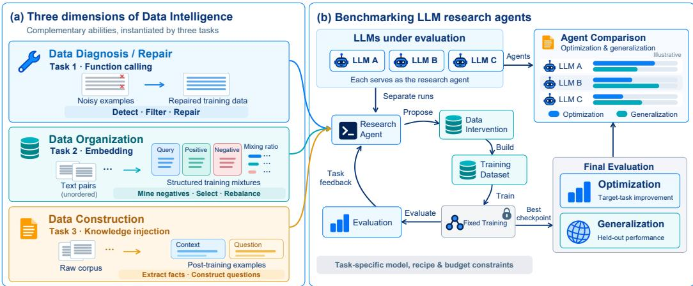
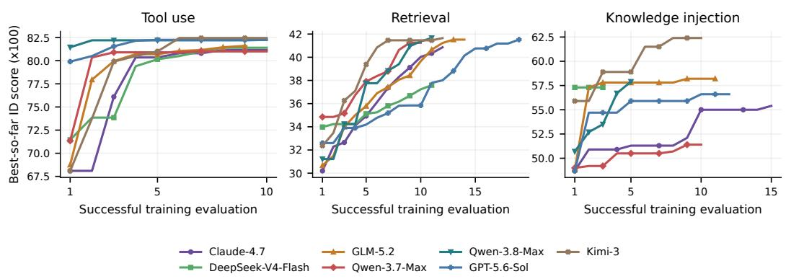
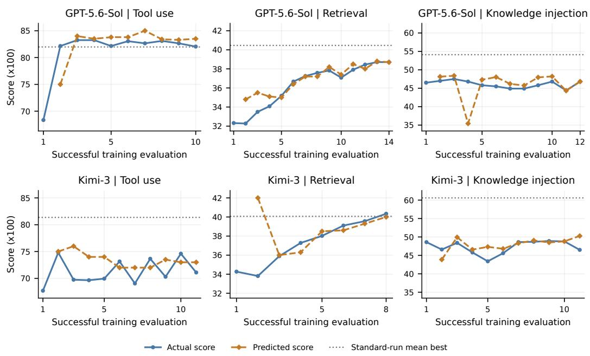

# AUTODATABENCH: A DATA-CENTRIC TESTBED FOR ACCELERATING AUTO RESEARCH

Ruifeng Yuan1, Yizhi Li2, Yaxin Du3, Fengyu Cai4, Yiqi Liu5, Hou Pong Chan6, Chenghua Lin5, Yun Chen7, Jian Yang8, Bryan Dai2, Pinyan Lu7, Chenghao Xiao7,†

1The Hong Kong Polytechnic University, 2IQuest Research, 3Shanghai Jiaotong University, 4TU Darmstadt, 5The University of Manchester, 6University of Macau, 7Shanghai University of Finance and Economics, 8Beihang University

huggingface.co/AutoDataBench § github.com/AutoDataBench/AutoDataBench

## ABSTRACT

Existing auto-research benchmarks often entangle multiple sources of improvement, including training frameworks, hyperparameters, compute budgets, and data, making it difficult to attribute why one frontier agent outperforms another to specific research capabilities. In this work, we isolate and systematically evaluate Data Intelligence: an agent’s ability to understand, manipulate, and improve the data that shapes model capabilities. We introduce AutoDataBench, a controlled testbed built on a conceptual framework of data intelligence spanning data diagnosis, data organization, and data construction, instantiated through three highly curated optimization tasks while holding non-data factors fixed. Across tool use, retrieval, and knowledge injection, we evaluate frontier LLMs’ ability to improve training data through iterative experimentation under task-specific resource budgets. Beyond optimization performance, we ask: do LLMs understand what their data interventions do? We compare predictions made before training with observed outcomes to seek evidence of data-effect reasoning beyond trial and error, and explore whether iterative feedback helps LLMs better understand how changes to training data affect model performance. Finally, we show that reusing AutoDataBench trajectories for mid-training improves downstream coding performance, highlighting its value in both evaluating data intelligence and generating high-quality training data.

## 1 INTRODUCTION

As large language models (LLMs) become increasingly capable, benchmarks have expanded across software engineering (Jimenez et al., 2024), GPU kernel optimization (Ouyang et al., 2025), mathematical reasoning (Glazer et al., 2024), scientific reasoning (Wang et al., 2026b), and complex task execution in terminal environments (Merrill et al., 2026). Yet performance in these domains does not directly establish how effectively LLMs can understand and improve training data. This capability matters because data quality and composition substantially influence model performance (Li et al., 2024), while evaluating alternative data choices can require costly training experiments (Magnusson et al., 2025). Training-data optimization also presents a demanding evaluation setting: an LLM must diagnose problems in examples, decide what to select, revise, or construct, and use experimental feedback to guide subsequent decisions across a large space of possible interventions. This motivates our central question: how effectively can current LLMs understand and improve training data?

Evaluating data intelligence requires moving beyond whether an LLM can produce a plausible explanation or executable data-processing code. Broad auto-research benchmarks allow multiple routes to improvement, potentially leaving data intelligence underexplored (Huang et al., 2024b; Chan et al., 2025). Improving training data requires LLMs to integrate domain knowledge, semantic understanding, and reasoning about learning outcomes. The relevant test is whether an LLM’s data decisions improve model performance and whether it can revise those decisions when empirical results challenge its expectations. Establishing such competence could enable LLMs to help construct and refine training data for subsequent models, potentially supporting future systems that improve through repeated data creation, training, and evaluation.

We introduce AutoDataBench, a controlled testbed for evaluating the data intelligence of frontier LLMs within a shared agent framework. Auxiliary models and code execution support bulk data processing, allowing the evaluation to focus on LLMs’ ability to analyze datasets and design scalable optimization strategies. The benchmark focuses on training-data improvement through iterative experimentation under prescribed training pipelines and task-specific resource budgets. It covers three complementary dimensions—data diagnosis and repair, data organization, and data construction— instantiated through tool use, retrieval, and knowledge injection. Together, these tasks span diverse data problems and training paradigms, supporting systematic evaluation of LLMs’ data intelligence across different learning objectives.

Within each task, an LLM inspects the available data, implements a data intervention, submits the resulting dataset for training, and uses evaluation feedback to guide subsequent decisions. We assess both optimization on the target task and generalization beyond the distribution used for feedback. For each task, additional evaluation data are withheld during optimization and used only to evaluate checkpoints selected using target-task feedback. We compare LLMs through the performance of models trained on their data and retain the full optimization trajectories for behavioral analysis.

Beyond optimization performance, we further explore whether LLMs can predict how data interventions affect model performance and whether their predictions improve with experience. We record predictions after a dataset is committed and before training, then compare them with observed outcomes. This provides a behavioral probe of LLMs’ understanding of data effects and how that understanding evolves with experimental feedback.

Finally, we explore AutoDataBench as a data engine. Its trajectories capture data inspection, diagnosis, organization, and construction, providing training material for learning from experimentation. We compare mid-training with and without auto-research trajectories under a matched token budget, followed by identical SFT. Incorporating these trajectories improves downstream coding performance, with larger gains on CRUXEval input prediction and SWE-bench Multilingual than on MBPP and LiveCodeBench. These results demonstrate the potential for benchmark-generated trajectories to support learning beyond the benchmark itself.

Our contributions are fourfold: (1) AutoDataBench, a controlled testbed spanning data diagnosis and repair, organization, and construction through diverse tasks and training paradigms; (2) a systematic evaluation of frontier LLMs’ data intelligence within a shared agent framework, examining optimization performance, generalization, and iterative behavior; (3) an exploration of LLMs’ ability to predict the effects of data interventions and refine these predictions through experimental feedback; and (4) an investigation of AutoDataBench as a data engine, exploring the reuse of optimization trajectories as mid-training data.

## 2 RELATED WORK

LLM Benchmarking. SWE-bench, KernelBench, and FrontierMath assess software engineering, GPU kernel generation, and mathematical reasoning (Jimenez et al., 2024; Ouyang et al., 2025; Glazer et al., 2024). These capability benchmarks do not directly assess how effectively agents improve training data. DataComp and DataComp-LM standardize training to compare data-curation choices (Gadre et al., 2023; Li et al., 2024), while DCA-Bench evaluates discovery of dataset quality issues (Huang et al., 2024a). PostTrainBench allows agents to choose data and training methods under bounded compute (Rank et al., 2026). Curation-Bench studies iterative data-policy search under fixed training recipes, emphasizing research scaffolds and policy exploration (Kang et al., 2026). AutoDataBench compares frontier LLMs within a shared framework across tool-use data repair, retrieval-data organization, and knowledge-data construction. Fixed pipelines span supervised fine-tuning, contrastive learning, and distillation. Hidden evaluations measure generalization, while predictions recorded before training probe expectations about data effects. These complementary views connect data decisions to downstream learning outcomes.

  
Figure 1: Overview of AutoDataBench. (a) Three dimensions of data intelligence: data diagnosis and repair, data organization, and data construction. (b) Agents iteratively propose data interventions, construct training datasets, and use feedback from a fixed training and evaluation pipeline. Final evaluation measures target-task improvement and generalization to held-out evaluation distri butions.

Auto Research. Work on automated research studies whether LLMs can carry out extended experimental workflows. MLAgentBench and MLE-bench examine machine learning experimentation and engineering (Huang et al., 2024b; Chan et al., 2025); RE-Bench compares research-engineering performance with human experts, and PaperBench evaluates research replication (Wijk et al., 2025; Starace et al., 2025). The AI Scientist connects idea generation, implementation, experiments, and manuscript writing (Lu et al., 2024). These settings motivate evaluating how models use tools, interpret feedback, and revise decisions over multiple experiments. AutoDataBench adopts this experimental loop to examine a specific capability: understanding and improving training data. By keeping the agent framework and task-specific learning pipelines fixed, it connects LLMs’ data decisions to measurable learning outcomes and exposes how those decisions evolve with feedback.

## 3 AUTODATABENCH: DESIDERATA AND SETUP

## 3.1 DESIDERATA

We have the following design desiderata for AutoDataBench.

Extensibility. AutoDataBench is designed to support diverse task types, training paradigms, and datasets. Existing auto-research benchmarks typically target fixed training paradigms, mostly LLM post-training with SFT or RL. Our core agentic framework is task-agnostic: tasks, training frameworks, and tools can be defined in a plug-and-play manner, allowing new or specialized learning paradigms beyond the current LLM post-training landscape.

Data-centrality. AutoDataBench isolates data decisions by fixing non-data components. Unlike benchmarks that allow agents to control all components, each task fixes the training framework, available augmentation tools, and source datasets. Agents improve the submitted training data within these constraints, enabling controlled evaluation of their understanding of how data interventions affect model outcomes.

Generalizability Probing. Each task includes an out-of-distribution (OOD) evaluation hidden from the agent throughout iterative optimization, alongside the target task used for feedback. Evaluating checkpoints selected using target-task feedback on this hidden distribution probes whether the agent’s data strategies generalize beyond the optimization target and helps identify “benchmaxxing” behavior.

## 3.2 BENCHMARK FRAMEWORK

Figure 1 summarizes the AutoDataBench framework. Each task specifies the source data, base model, training procedure, and resource budget. The evaluated LLM iteratively inspects data, im plements interventions, and submits datasets to a fixed training and evaluation pipeline. Target-task feedback guides subsequent decisions, while hidden evaluation data assess the generalization of the selected checkpoint. The full optimization trajectory is retained for analysis.

The toolset provides data access, code execution, training and evaluation interfaces, and auxiliary generation and embedding models deployable on a single GPU. Task prompts explicitly prohibit the evaluated LLM from directly processing the dataset example by example; bulk operations must instead be implemented through code and auxiliary models. This focuses the evaluation on datasetlevel analysis and scalable optimization strategies, reflecting the practical cost constraints of curating hundreds of thousands or millions of examples.

## 3.3 INITIAL TASK TYPES AND SETUPS

## 3.3.1 TASK 1: TRAINING TOOL-USE MODELS (WITH POLLUTED DATA)

Real-world datasets commonly contain annotation errors and inconsistencies that are not identified in advance (Huang et al., 2024a), making data diagnosis and repair an important part of preparing reliable training data. We evaluate this capability through training a tool-use model on a deliberately corrupted function-calling dataset. The evaluated LLM must discover undisclosed quality issues and develop scalable curation strategies, reasoning about consistency among user requests, tool specifications, and target calls. It may filter or repair examples, remove duplicates, synthesize supervision, and adjust data mixtures under a limited data budget. Downstream tool-use performance measures whether these interventions improve the usefulness of the data for model learning.

Setups We construct approximately 40k single-turn examples based on XLAM-FUNCTION-CALLING-60K (Liu et al., 2024), augmented with no-call examples, covering five categories: simple, multiple, parallel, parallel multiple, and irrelevance. Each example contains a user query, available tool schemas, and target function calls. We apply seven probabilistic corruption operators to callable training examples, introducing errors in arguments, function labels, tool schemas, and query–call alignment. These include both structural inconsistencies and semantic mismatches that schema checks alone cannot reliably detect. Corruption annotations are withheld from the evaluated LLM, and evaluation data are left unchanged. The LLM constructs a training set of up to 16k examples, requiring decisions about both data quality and composition. Appendix A.1 details the corruption procedure.

We fine-tune Qwen2-1.5B-Instruct (Yang et al., 2024) using a fixed LoRA pipeline (Hu et al., 2022). The evaluated LLM has access to Qwen3-4B-Instruct-2507 (Yang et al., 2025a) and Qwen3- Embedding-0.6B (Zhang et al., 2025) for data processing. Each checkpoint is evaluated on 2,000 in-distribution examples, evenly distributed across the five categories. Target functions in callable test examples are absent from the training pool. Macro-averaged AST accuracy is the primary metric, with overall and per-category scores returned as optimization feedback.

For OOD evaluation, we evaluate the checkpoint with the highest ID score on the held-out BFCL single-turn subsets (Patil et al., 2025), including both expert-curated (non-live) and user-contributed (live) examples. BFCL scores are withheld throughout optimization, and we report macro-averaged accuracy across ten categories. This evaluation tests whether data strategies optimized using ID feedback transfer to a different function-calling distribution.

## 3.3.2 TASK 2: TRAINING EMBEDDING MODELS

Training data have long been central to retrieval effectiveness, with data quality, negative selection, and source composition shaping what an embedding model learns (Thakur et al., 2025). We evaluate data organization by asking LLMs to construct training data for an embedding model under a fixed contrastive-learning pipeline with InfoNCE loss (van den Oord et al., 2018). The challenge is to identify informative negatives without mislabeling relevant passages, and to balance data sources under a limited training budget. This task tests whether LLMs can reason about relationships among examples and organize them into effective training supervision.

Setups For training set, we leverage the RLHN collection (Thakur et al., 2025), which is itself a subset of the BGE training set with hard-negatives re-labeled by SOTA API models. By default, we only provide the agent with the anchors and the positives, and the agent is expected to mine the hard negatives itself. For hard negative mining, we provide the agent with access to Qwen3- Embedding-0.6B and an extra Qwen3-4B to validate whether the mined hard negatives are actually hard negatives; total token budget for these two external models is 25B tokens. Each training trial uses at most 600k pairs, with a cumulative data budget equivalent to ten trials of 600k pairs each. The agent may distribute this budget across at most 20 training-and-evaluation rounds by using smaller datasets in some trials. The raw dataset contains over 818k pairs, requiring the agent to reason over data mixing strategies. The base model is the 6-layer version of MiniLM (Wang et al., 2020), which is built by taking every second layer of the original 12-layer MiniLM.

The resulted checkpoint for each run is evaluated against ArguAna, FEVERHardNegatives, FiQA2018, HotpotQAHardNegatives, SCIDOCS (Thakur et $\mathrm { { a l . } }$ , 2021; 2025), which are 5 indistribution tasks covered by the training sets which the agent is expected to optimize. The resulted scores are immediately provided as feedback to the agent, allowing it to reason and evolve the strategies for next-round optimization. The mean nDCG@10 across the five ID datasets serves as the optimization and checkpoint-selection metric.

We also evaluate the best in-distribution checkpoint on OOD tasks, including ClimateFEVERHard-Negatives, CQADupstackGamingRetrieval, CQADupstackUnixRetrieval, Touche2020Retrieval.v3, TRECCOVID (Thakur et al., 2021; 2025). While the ID task performance inspects agents’ capability to optimize training set for a benchmark, OOD evaluation serves an important analysis purpose, aiming to understand agents’ behaviors on “benchmaxxing” benchmarks by over-optimizing in-distribution tasks and what this means to OOD generalization.

## 3.3.3 TASK 3: KNOWLEDGE INJECTION

Constructing effective training data that convey new knowledge is an important step toward LLM self-improvement, enabling models to turn external information into material for further learning. We evaluate this aspect of data construction by asking LLMs to construct context–question–answer examples from a corpus containing facts beyond a target model’s knowledge cutoff. Under a fixed offline privileged-context distillation pipeline, a frozen teacher accesses supporting context and a question, while the student learns to answer the question without that context (Padmanabhan et al., 2023). The challenge is to identify useful information and formulate questions and grounded answers that support knowledge acquisition. This task tests whether LLMs can transform raw text into training material that helps a model acquire new factual knowledge.

Setups We use the instruction-tuned version of TALKIE, a 13B language model whose base model was pretrained on 260B tokens of English text published before 1931, as the target model for knowledge injection. We use a conversion compatible with vLLM (Kwon et al., 2023) of this checkpoint as the common initialization for data generation, training, and evaluation.

Offline distillation training. Each submitted example contains a supporting context c, a question $q ,$ and an answer continuation y constructed before training. Let $P _ { T }$ denote the frozen teacher and $P _ { S }$ the adapted student, both initialized from the same Talkie checkpoint. Both are teacher-forced over the submitted continuation. At answer position $t ,$ the teacher observes the context, question, and answer prefix,

$$
P _ { t } = P _ { T } ( \cdot \mid c , q , y _ { < t } ) ,\tag{1}
$$

whereas the student observes only the question and the teacher-forced answer before position t,

$$
Q _ { t } = P _ { S } ( \cdot \mid q , y _ { < t } ) .\tag{2}
$$

Training uses a fixed forward KL objective that aligns the student’s answer-token distributions with those of the context-conditioned teacher. The loss function and training hyperparameters are held constant across data interventions.

We construct a knowledge inspection benchmark containing Novel (ID) and Retention (OOD) subsets, respectively measuring effectiveness of knowledge injection post-1930 and knowledge retention pre-1930. Novel accuracy guides optimization and checkpoint selection, while Retention is reserved for hidden evaluation of the selected checkpoint. The novel-knowledge split contains 1,000 post-cutoff facts, with 100 examples from each decade from the 1930s through the 2020s. Within each decade we sample 50 person and 50 event questions, balance factual predicates where possible, require direct support in the associated Wikipedia summary (the raw unstructured corpus), and retain at most one probe per Wikidata entity.

Likelihood-based multiple-choice evaluation. To reduce confounding from TALKIE’S instructionfollowing and generation behavior, we compute the mean token log-likelihood of each complete candidate answer conditioned on the question, select the highest-scoring option, and report accuracy. This evaluates factual knowledge without requiring the model to generate answers in a prescribed format.

## 3.4 IMPLEMENTATION DETAILS

All evaluated LLMs operate within a shared framework and are accessed through external APIs. Each run uses a single NVIDIA A800 GPU and has a wall-clock limit of 24 hours, covering LLM API calls, data processing, auxiliary-model inference, training, and evaluation. Each run permits at most 20 training-and-evaluation rounds. Independently, the sum of the submitted training-set sizes is capped at ten times the task-specific maximum per-round dataset size, allowing more than ten rounds when some trials use smaller datasets. Runs terminate when the time or resource budget is exhausted. Qwen3-4B and Qwen3-Embedding-0.6B support bulk data generation and embedding based processing, respectively. Each training trial restarts from the same initial checkpoint under fixed training settings, enabling comparison of successive data interventions.

## 4 EXPERIMENTAL RESULTS

## 4.1 REPORTING PROTOCOL

We evaluate seven frontier LLMs from the GPT, Claude, Kimi, DeepSeek, GLM, and Qwen families. For each LLM–task combination, we conduct three independent standard runs (63 runs in total) and average their ID and OOD results. Within each run, we select the checkpoint with the highest ID score and evaluate its ID and hidden-evaluation performance. Table 1 reports the three-run mean and sample standard deviation of the selected ID scores, together with the three-run mean OOD score at those checkpoints. The ID best column additionally reports the maximum ID score across the three runs. Overall is the unweighted mean of the three task-wise ID means. Appendix A.2 provides all per-run results and aggregation details.

Baselines. Tool use randomly samples 16k examples from the corrupted pool. Retrieval uses a fixed random subset of 600k query–positive pairs from the original pool (seed 42), with in-batch negatives but no explicit hard negatives. Its score comes from the first successful training evaluation of an existing run, before iterative optimization. Knowledge injection uses the unadapted Talkie model as a no-training reference.

Expert reference. Tool use applies schema validation and deduplication to the pre-corruption pool, then selects 16k examples proportionally across categories to form an oracle-clean reference. Retrieval uses expert-guided hard-negative mining and data reorganization. Knowledge injection uses human-designed keyword- and rule-based data mining without LLM-assisted construction.

## 4.2 LLM ABILITY ON AUTODATABENCH

Table 1 shows that Kimi-3 achieves the highest Overall score (60.68), driven by its strength in knowledge injection, while GPT-5.6-Sol leads in mean tool-use and retrieval ID performance.

Tool-use curation approaches the oracle-clean reference. Despite operating on the corrupted pool, LLMs achieve mean ID accuracies of 80.82–81.98, substantially above the random baseline of

Table 1: Performance across tasks (scores ×100). Overall averages the three task-wise ID means (Novel for knowledge injection). For each LLM and task, Mean/Best denote the mean/maximum across three standard runs; ± indicates sample standard deviation. OOD reports mean hiddenevaluation scores at ID-selected checkpoints: BFCL for tool use, held-out retrieval datasets for retrieval, and Retention for knowledge injection. Bold marks the best LLM result.
<table><tr><td></td><td></td><td colspan="3">Tool use</td><td colspan="3">Retrieval</td><td colspan="3">Knowledge</td></tr><tr><td>Method</td><td>Overall</td><td>ID mean</td><td>ID best</td><td>OOD</td><td>ID mean</td><td>ID best</td><td>OOD</td><td>ID mean</td><td>ID best</td><td>OOD</td></tr><tr><td>Baseline</td><td>47.98</td><td>70.45</td><td></td><td>55.18</td><td>34.38</td><td></td><td>31.13</td><td>39.10</td><td>1</td><td>47.84</td></tr><tr><td>Expert</td><td>56.89</td><td>81.65</td><td></td><td>60.23</td><td>40.62</td><td></td><td>34.76</td><td>48.40</td><td>一</td><td>48.55</td></tr><tr><td>DeepSeek-V4-Flash</td><td>55.20</td><td>80.97±0.59</td><td>81.40</td><td>57.26</td><td>36.22±1.26</td><td>37.59</td><td>29.53</td><td>48.40±7.71</td><td>57.30</td><td>49.38</td></tr><tr><td>Qwen-3.7-Max</td><td>56.80</td><td>80.82±0.24</td><td>81.00</td><td>57.90</td><td>39.22±2.51</td><td>41.25</td><td>30.18</td><td>50.37±1.31</td><td>51.40</td><td>47.33</td></tr><tr><td>Claude-4.7</td><td>58.31</td><td>81.00±0.15</td><td>81.15</td><td>58.95</td><td>38.99±2.31</td><td>40.86</td><td>29.61</td><td>54.93±0.57</td><td>55.40</td><td>50.37</td></tr><tr><td>Qwen-3.8-Max</td><td>58.56</td><td>81.92±0.33</td><td>82.25</td><td>59.44</td><td>39.40±2.65</td><td>41.66</td><td>29.65</td><td>54.37±5.36</td><td>57.90</td><td>47.74</td></tr><tr><td>GPT-5.6-Sol</td><td>58.85</td><td>81.98±0.34</td><td>82.25</td><td>57.92</td><td>40.46±1.32</td><td>41.52</td><td>26.15</td><td>54.10±3.42</td><td>56.60</td><td>47.62</td></tr><tr><td>GLM-5.2</td><td>59.10</td><td>81.15±0.39</td><td>81.60</td><td>58.24</td><td>38.55±2.62</td><td>41.52</td><td>30.03</td><td>57.60±0.52</td><td>58.20</td><td>47.15</td></tr><tr><td>Kimi-3</td><td>60.68</td><td>81.37±1.50</td><td>82.45</td><td>59.32</td><td>40.07±1.83</td><td>41.65</td><td>29.85</td><td>60.60±2.31</td><td>62.40</td><td>48.71</td></tr></table>

70.45 and close to the oracle-clean reference of 81.65. Gains also transfer to BFCL: all LLMs exceed the random baseline of 55.18, but remain below the oracle-clean reference of 60.23, indicating a remaining gap in transfer performance.

Competitive ID retrieval performance does not ensure OOD transfer. GPT-5.6-Sol leads in mean ID score (40.46), approaching the expert reference of 40.62. Yet all LLMs fall below the expert’s OOD score of 34.76. Qwen-3.7-Max ranks highest on mean OOD performance (30.18), while GPT-5.6-Sol ranks lowest (26.15). This rank reversal shows that strategies favored by targettask feedback need not retain their advantage on unseen distributions.

LLM-based data construction improves knowledge acquisition. All LLMs match or exceed the expert’s Novel accuracy of 48.40, with Kimi-3 reaching a mean of 60.60 (+12.20 points). Knowl edge acquisition and preservation produce different rankings: Claude-4.7 leads in mean Retention (50.37), while GLM-5.2 ranks second on Novel (57.60) but scores 47.15 on Retention, below the unadapted model’s 47.84.

## 4.3 BEHAVIORAL ANALYSIS

Figure 2 traces the best-performing standard run of each LLM on each task, selected by its highest observed ID score. Each curve records the best score achieved up to each successful evaluation, using Novel accuracy for knowledge injection. This view exposes how strong outcomes emerge within individual runs; Table 1 separately reports performance across runs.

Most runs improve through iterative experimentation. Across the 63 standard runs, 61 improve on their initial datasets: all 21 runs each for tool use and retrieval, and 19 of 21 for knowledge injection. Mean first-to-best gains are 8.11, 6.46, and 4.91 points, respectively (Appendix A.4). Similar scores can nevertheless reflect different optimization paths. In tool use, Qwen-3.8-Max starts at 81.45 and reaches 82.25, whereas Kimi-3 rises from 68.10 to 82.45 by its sixth evaluation. In retrieval, Qwen-3.8-Max and GPT-5.6-Sol reach their peaks at evaluations 11 and 19. In knowledge injection, DeepSeek-V4-Flash’s selected run peaks at its first evaluation, while Kimi-3 improves from 55.90 to 62.40 through later revisions. These descriptive gains capture the combined outcome of experimentation and checkpoint selection.

Strong runs make targeted data decisions. In Tool-use, GLM-5.2 identified argument accuracy as a bottleneck and targeted its audits accordingly. Its repairs converted numeric strings while preserving non-numeric IDs despite inconsistent schema types. In Retrieval, Qwen-3.8-Max increased sampling from smaller sources while assigning different mined negatives to repeated query–positive pairs. With 600k examples and five negatives per example, the next evaluation improved from 39.40 to 40.95. In Knowledge Injection, Kimi-3 shifted from up to ten original QA pairs per source to five selected pairs plus their paraphrases, raising Novel ID accuracy from 58.90 to 61.50 within the 10kexample limit. These cases illustrate diagnosis, sampling, and augmentation decisions associated with successful refinement, without isolating each change’s causal contribution.

Figure 2: Best-so-far ID scores in the best-performing standard run of each LLM on each task (scores ×100; Knowledge uses Novel). Runs are selected by their maximum ID score, with ties resolved by the earliest run. Each trajectory ends at its own last successful evaluation; failed evaluations are excluded. These selected runs illustrate optimization behavior, not average performance or equalcompute comparisons.  
  
Figure 3: Predicted and observed scores across training evaluations for GPT-5.6-Sol and Kimi-3. Horizontal lines show the mean best score across standard runs. The first evaluation has no forecast.

## 4.4 CAN LLMS PREDICT THE EFFECTS OF THEIR DATA INTERVENTIONS?

Experimental setup. We conduct one prediction-enabled run for GPT-5.6-Sol and Kimi-3 on each task under the same resource budgets as the standard runs. After an initial training evaluation, each LLM must record its predicted evaluation score, an uncertainty interval, and a brief justification before every subsequent training evaluation. The observed score is then returned as feedback for further data optimization. Prediction accuracy is not part of the optimization objective. Figure 3 compares forecasts with observed scores and includes the mean best score across standard runs as a reference.

Table 2: Benchmark as Data Engine: Transfer of auto-research trajectories to general coding tasks. Both models use a 5B-token mid-training budget followed by identical SFT.
<table><tr><td></td><td>MBPP Base</td><td>MBPP Plus</td><td>CRUXEval Input</td><td>LiveCodeBench v5</td><td>SWE-bench Multilingual</td></tr><tr><td>Control</td><td>85.45</td><td>72.75</td><td>72.00</td><td>44.89</td><td>27.67</td></tr><tr><td>+ Auto-Research</td><td>86.24</td><td>73.28</td><td>74.12</td><td>45.80</td><td>33.33</td></tr><tr><td>∆</td><td>+0.79</td><td>+0.53</td><td>+2.12</td><td>+0.91</td><td>+5.66</td></tr></table>

LLMs can broadly track performance during data optimization. The predicted and observed scores generally follow similar trajectories, particularly on retrieval, where GPT-5.6-Sol and Kimi-3 achieve mean absolute errors of 0.64 and 1.55 points, respectively. Forecasts become closer to observed scores after the early evaluations, suggesting that LLMs can adjust their quantitative expectations using accumulated feedback, despite occasional errors on individual interventions.

Prediction-enabled runs tend to achieve lower optimization scores. In four of the six model– task combinations, the best observed score falls below the corresponding standard-run mean. The largest deficits occur in knowledge injection: GPT-5.6-Sol and Kimi-3 reach best Novel scores of 47.50 and 48.90, respectively, compared with standard-run means of 54.10 and 60.60. Kimi-3 also performs substantially worse on tool use, while improvements are limited to GPT-5.6-Sol on tool use and Kimi-3 on retrieval. Overall, the observed differences lean negative, suggesting that explicit forecasting may impose an additional burden on data optimization.

## 4.5 BENCHMARK AS DATA ENGINE

We investigate whether optimization trajectories collected from AutoDataBench can improve downstream coding performance when reused as mid-training data. These auto-research trajectories capture agents’ interactions during data inspection, diagnosis, organization, and construction.

To isolate the effect of these trajectories, we adopt the code-oriented mid-training setup of Wang et al. (2026a) at a reduced scale. Starting from the Qwen2.5-Coder-14B base model (Hui et al., 2024), we downsample the mid-training corpus to a 5B-token budget and construct two matched runs: a control trained on the original mixture and a treatment that incorporates auto-research trajectories. The trajectory corpus contains 8M tokens and is upsampled tenfold, contributing 80M tokens within the treatment’s 5B-token budget. Both checkpoints subsequently undergo identical SFT on 202,800 conversations for three epochs, such that the primary difference between the two models is the presence of auto-research data during mid-training. Appendix A.5 details the training configuration.

Table 2 shows that incorporating auto-research trajectories improves all five evaluation scores, with gains varying across tasks. Auto-research data provides modest gains on MBPP (Base and Plus) (Austin et al., 2021; Liu et al., 2023) and LiveCodeBench (Jain et al., 2025), while producing larger improvements on CRUXEval input prediction (Gu et al., 2024) (72.00 → 74.12) and SWE-bench Multilingual (Yang et al., 2025b) (27.67 → 33.33). These gains are notable given that auto-research trajectories account for only 1.6% of the mid-training tokens, even after upsampling. Notably, the latter two tasks require more than direct code synthesis: CRUXEval input prediction requires reasoning backward from observed program behavior, while SWE-bench Multilingual requires diagnosing and modifying unfamiliar repositories across heterogeneous programming environments. These behaviors more closely resemble the exploratory structure of auto-research trajectories, where an agent iteratively inspects evidence, forms hypotheses, and acts on an evolving context. These results support AutoDataBench’s dual role as an evaluation environment and a source of training data that benefits downstream coding tasks.

## 5 CONCLUSION

We introduced AutoDataBench, a controlled testbed for evaluating LLMs’ data intelligence through data repair, organization, and construction under fixed training procedures. Agent-curated data approaches expert references on tool use and retrieval and improves knowledge acquisition, while strong ID performance does not consistently transfer to hidden evaluations. Optimization trajectories reveal diverse refinement strategies. Prediction-enabled runs broadly track retrieval scores but achieve lower best scores than standard-run means in four of six comparisons. These findings motivate evaluating data intelligence through optimization outcomes, generalization, and predictions of data effects. Reusing auto-research trajectories during mid-training improves downstream coding performance, with the largest gains on CRUXEval input prediction and SWE-bench Multilingual, supporting AutoDataBench as a challenging testbed for data intelligence and a valuable source of training data.

## REFERENCES

Jacob Austin, Augustus Odena, Maxwell Nye, Maarten Bosma, Henryk Michalewski, David Dohan, Ellen Jiang, Carrie Cai, Michael Terry, Quoc Le, and Charles Sutton. Program synthesis with large language models. arXiv preprint arXiv:2108.07732, 2021. URL https://arxiv.org/abs/2108.07732.

Jun Shern Chan, Neil Chowdhury, Oliver Jaffe, James Aung, Dane Sherburn, Evan Mays, Giulio Starace, Kevin Liu, Leon Maksin, Tejal Patwardhan, Aleksander Madry, and Lilian Weng. MLE-bench: Evaluating machine learning agents on machine learning engineering. In International Conference on Learning Representations, volume 2025, pp. 50466–50494, 2025. URL https://proceedings.iclr.cc/paper\_files/paper/2025/file/ 7e3767db483c942b883eb4f8cfb74e31-Paper-Conference.pdf.

Samir Yitzhak Gadre, Gabriel Ilharco, Alex Fang, Jonathan Hayase, Georgios Smyrnis, Thao Nguyen, Ryan Marten, Mitchell Wortsman, Dhruba Ghosh, Jieyu Zhang, Eyal Orgad, Rahim Entezari, Giannis Daras, Sarah Pratt, Vivek Ramanujan, Yonatan Bitton, Kalyani Marathe, Stephen Mussmann, Richard Vencu, Mehdi Cherti, Ranjay Krishna, Pang Wei Koh, Olga Saukh, Alexander J Ratner, Shuran Song, Hannaneh Hajishirzi, Ali Farhadi, Romain Beaumont, Sewoong Oh, Alex Dimakis, Jenia Jitsev, Yair Carmon, Vaishaal Shankar, and Ludwig Schmidt. DataComp: In search of the next generation of multimodal datasets. In Advances in Neural Information Processing Systems, volume 36, pp. 27092–27112. Curran Associates, Inc., 2023. doi: 10.52202/075280-1179. URL https://proceedings.neurips.cc/paper\_files/paper/2023/file/ 56332d41d55ad7ad8024aac625881be7-Paper-Datasets\_and\_Benchmarks.pdf.

Elliot Glazer, Ege Erdil, Tamay Besiroglu, Diego Chicharro, Evan Chen, Alex Gunning, Caroline Falkman Olsson, Jean-Stanislas Denain, Anson Ho, Emily de Oliveira Santos, Olli Järviniemi, Matthew Barnett, Robert Sandler, Matej Vrzala, Jaime Sevilla, Qiuyu Ren, Elizabeth Pratt, Lionel Levine, Grant Barkley, Natalie Stewart, Bogdan Grechuk, Tetiana Grechuk, Shreepranav Varma Enugandla, and Mark Wildon. FrontierMath: A Benchmark for Evaluating Advanced Mathematical Reasoning in AI. arXiv preprint arXiv:2411.04872, 2024. URL https://arxiv.org/abs/2411.04872.

Alex Gu, Baptiste Roziere, Hugh James Leather, Armando Solar-Lezama, Gabriel Synnaeve, and Sida Wang. CRUXEval: A benchmark for code reasoning, understanding and execution. In Proceedings ofthe 41st International Conference on Machine Learning, volume 235, pp. 16568– 16621. PMLR, 2024. URL https://proceedings.mlr.press/v235/gu24c.html.

Edward J. Hu, Yelong Shen, Phillip Wallis, Zeyuan Allen-Zhu, Yuanzhi Li, Shean Wang, Lu Wang, and Weizhu Chen. LoRA: Low-rank adaptation of large language models. In International Conference on Learning Representations, 2022. URL https://arxiv.org/abs/2106.09685.

Benhao Huang, Yingzhuo Yu, Jin Huang, Xingjian Zhang, and Jiaqi Ma. DCA-Bench: A benchmark for dataset curation agents. arXiv preprint arXiv:2406.07275, 2024a. URL https://arxiv.org/abs/ 2406.07275.

Qian Huang, Jian Vora, Percy Liang, and Jure Leskovec. MLAgentBench: Evaluating language agents on machine learning experimentation. In Proceedings ofthe 41st International Conference

on Machine Learning, volume 235 of Proceedings of Machine Learning Research, pp. 20271– 20309. PMLR, 2024b. URL https://proceedings.mlr.press/v235/huang24y.html.

Binyuan Hui, Jian Yang, Zeyu Cui, Jiaxi Yang, Dayiheng Liu, Lei Zhang, Tianyu Liu, Jiajun Zhang, Bowen Yu, Keming Lu, Kai Dang, Yang Fan, Yichang Zhang, An Yang, Rui Men, Fei Huang, Bo Zheng, Yibo Miao, Shanghaoran Quan, Yunlong Feng, Xingzhang Ren, Xuancheng Ren, Jingren Zhou, and Junyang Lin. Qwen2.5-Coder technical report. arXiv preprint arXiv:2409.12186, 2024. URL https://arxiv.org/abs/2409.12186.

Naman Jain, King Han, Alex Gu, Wen-Ding Li, Fanjia Yan, Tianjun Zhang, Sida Wang, Armando Solar-Lezama, Koushik Sen, and Ion Stoica. LiveCodeBench: Holistic and contamination free evaluation of large language models for code. In International Conference on Learning Representations, 2025. URL https://proceedings.iclr.cc/paper\_files/paper/2025/hash/ 94074dd5a072d28ff75a76dabed43767-Abstract-Conference.html.

Carlos E. Jimenez, John Yang, Alexander Wettig, Shunyu Yao, Kexin Pei, Ofir Press, and Karthik R. Narasimhan. SWE-bench: Can language models resolve real-world github issues? In The Twelfth International Conference on Learning Representations, 2024. URL https://arxiv.org/abs/2310. 06770.

Feiyang Kang, Hanze Li, Adam Nguyen, Mahavir Dabas, Jiaqi W. Ma, Frederic Sala, Dawn Song, and Ruoxi Jia. Can generalist agents automate data curation? arXiv preprint arXiv:2606.04261, 2026. URL https://arxiv.org/abs/2606.04261.

Woosuk Kwon, Zhuohan Li, Siyuan Zhuang, Ying Sheng, Lianmin Zheng, Cody Hao Yu, Joseph E. Gonzalez, Hao Zhang, and Ion Stoica. Efficient memory management for large language model serving with PagedAttention. In Proceedings ofthe 29th Symposium on Operating Systems Principles, 2023. URL https://arxiv.org/abs/2309.06180.

Jeffrey Li, Alex Fang, Georgios Smyrnis, Maor Ivgi, Matt Jordan, Samir Gadre, Hritik Bansal, Etash Guha, Sedrick Keh, Kushal Arora, Saurabh Garg, Rui Xin, Niklas Muennighoff, Reinhard Heckel, Jean Mercat, Mayee Chen, Suchin Gururangan, Mitchell Wortsman, Alon Albalak, Yonatan Bitton, Marianna Nezhurina, Amro Abbas, Cheng-Yu Hsieh, Dhruba Ghosh, Josh Gardner, Maciej Kilian, Hanlin Zhang, Rulin Shao, Sarah Pratt, Sunny Sanyal, Gabriel Ilharco, Giannis Daras, Kalyani Marathe, Aaron Gokaslan, Jieyu Zhang, Khyathi Chandu, Thao Nguyen, Igor Vasiljevic, Sham Kakade, Shuran Song, Sujay Sanghavi, Fartash Faghri, Sewoong Oh, Luke Zettlemoyer, Kyle Lo, Alaaeldin El-Nouby, Hadi Pouransari, Alexander Toshev, Stephanie Wang, Dirk Groeneveld, Luca Soldaini, Pang Wei Koh, Jenia Jitsev, Thomas Kollar, Alexandros G. Dimakis, Yair Carmon, Achal Dave, Ludwig Schmidt, and Vaishaal Shankar. DataComp-LM: In search of the next generation of training sets for language models. In Advances in Neural Information Processing Systems, volume 37, pp. 14200–14282. Curran Associates, Inc., 2024. doi: 10.52202/079017-0455. URL https://proceedings.neurips.cc/paper\_files/paper/2024/ file/19e4ea30dded58259665db375885e412-Paper-Datasets\_and\_Benchmarks\_Track.pdf.

Jiawei Liu, Chunqiu Steven Xia, Yuyao Wang, and Lingming Zhang. Is your code generated by ChatGPT really correct? rigorous evaluation of large language models for code generation. In Advances in Neural Information Processing Systems, volume 36, pp. 21558–21572, 2023. URL https://proceedings.neurips.cc/paper\_files/paper/2023/hash/ 43e9d647ccd3e4b7b5baab53f0368686-Abstract-Conference.html.

Zuxin Liu, Thai Hoang, Jianguo Zhang, Ming Zhu, Tian Lan, Shirley Kokane, Juntao Tan, Weiran Yao, Zhiwei Liu, Yihao Feng, Rithesh Murthy, Liangwei Yang, Silvio Savarese, Juan Carlos Niebles, Huan Wang, Shelby Heinecke, and Caiming Xiong. APIGen: Automated pipeline for generating verifiable and diverse function-calling datasets. In Advances in Neural Information Processing Systems, 2024. URL https://arxiv.org/abs/2406.18518.

Chris Lu, Cong Lu, Robert Tjarko Lange, Jakob Foerster, Jeff Clune, and David Ha. The AI scientist: Towards fully automated open-ended scientific discovery. arXiv preprint arXiv:2408.06292, 2024. URL https://arxiv.org/abs/2408.06292.

Ian Magnusson, Nguyen Tai, Ben Bogin, David Heineman, Jena D. Hwang, Luca Soldaini, Akshita Bhagia, Jiacheng Liu, Dirk Groeneveld, Oyvind Tafjord, Noah A. Smith, Pang Wei

Koh, and Jesse Dodge. DataDecide: How to predict best pretraining data with small experiments. In Proceedings of the 42nd International Conference on Machine Learning, volume 267 of Proceedings of Machine Learning Research, pp. 42487–42502. PMLR, 2025. URL https://proceedings.mlr.press/v267/magnusson25a.html.

Mike A. Merrill, Alexander G. Shaw, Nicholas Carlini, Boxuan Li, Harsh Raj, Ivan Bercovich, Lin Shi, Jeong Yeon Shin, Thomas Walshe, E. Kelly Buchanan, Junhong Shen, Guanghao Ye, Haowei Lin, Jason Poulos, Maoyu Wang, Marianna Nezhurina, Jenia Jitsev, Di Lu, Orfeas Menis Mastromichalakis, Zhiwei Xu, Zizhao Chen, Yue Liu, Robert Zhang, Leon Liangyu Chen, Anurag Kashyap, Jan-Lucas Uslu, Jeffrey Li, Jianbo Wu, Minghao Yan, Song Bian, Vedang Sharma, Ke Sun, Steven Dillmann, Akshay Anand, Andrew Lanpouthakoun, Bardia Koopah, Changran Hu, Etash Guha, Gabriel H. S. Dreiman, Jiacheng Zhu, Karl Krauth, Li Zhong, Niklas Muennighoff, Robert Amanfu, Shangyin Tan, Shreyas Pimpalgaonkar, Tushar Aggarwal, Xiangning Lin, Xin Lan, Xuandong Zhao, Yiqing Liang, Yuanli Wang, Zilong Wang, Changzhi Zhou, David Heineman, Hange Liu, Harsh Trivedi, John Yang, Junhong Lin, Manish Shetty, Michael Yang, Nabil Omi, Negin Raoof, Shanda Li, Terry Yue Zhuo, Wuwei Lin, Yiwei Dai, Yuxin Wang, Wenhao Chai, Shang Zhou, Dariush Wahdany, Ziyu She, Jiaming Hu, Zhikang Dong, Yuxuan Zhu, Sasha Cui, Ahson Saiyed, Arinbjörn Kolbeinsson, Jesse Hu, Christopher Michael Rytting, Ryan Marten, Yixin Wang, Alex Dimakis, Andy Konwinski, and Ludwig Schmidt. Terminal-Bench: Benchmarking Agents on Hard, Realistic Tasks in Command Line Interfaces. arXiv preprint arXiv:2601.11868, 2026. URL https://arxiv.org/abs/2601.11868.

Anne Ouyang, Simon Guo, Simran Arora, Alex L Zhang, William Hu, Christopher Re, and Azalia Mirhoseini. KernelBench: Can LLMs write efficient GPU kernels? In Proceedings of the 42nd International Conference on Machine Learning, volume 267 of Proceedings of Machine Learning Research, pp. 47356–47415. PMLR, 2025. URL https://proceedings.mlr.press/v267/ouyang25a. html.

Shankar Padmanabhan, Yasumasa Onoe, Michael J. Q. Zhang, Greg Durrett, and Eunsol Choi. Propagating knowledge updates to LMs through distillation. In Advances in Neural Information Processing Systems, 2023. URL https://arxiv.org/abs/2306.09306.

Shishir G Patil, Huanzhi Mao, Fanjia Yan, Charlie Cheng-Jie Ji, Vishnu Suresh, Ion Stoica, and Joseph E. Gonzalez. The berkeley function calling leaderboard (BFCL): From tool use to agentic evaluation of large language models. In Proceedings of the 42nd International Conference on Machine Learning, volume 267 of Proceedings ofMachine Learning Research, pp. 48371–48392. PMLR, 2025. URL https://proceedings.mlr.press/v267/patil25a.html.

Ben Rank, Hardik Bhatnagar, Ameya Prabhu, Shira Eisenberg, Karina Nguyen, Matthias Bethge, and Maksym Andriushchenko. PostTrainBench: Can LLM agents automate LLM post-training? arXiv preprint arXiv:2603.08640, 2026. URL https://arxiv.org/abs/2603.08640.

Mohammad Shoeybi, Mostofa Patwary, Raul Puri, Patrick LeGresley, Jared Casper, and Bryan Catanzaro. Megatron-LM: Training multi-billion parameter language models using model parallelism. arXiv preprint arXiv:1909.08053, 2019. URL https://arxiv.org/abs/1909.08053.

Giulio Starace, Oliver Jaffe, Dane Sherburn, James Aung, Jun Shern Chan, Leon Maksin, Rachel Dias, Evan Mays, Benjamin Kinsella, Wyatt Thompson, Johannes Heidecke, Amelia Glaese, and Tejal Patwardhan. PaperBench: Evaluating AI’s ability to replicate AI research. In Proceedings of the 42nd International Conference on Machine Learning, volume 267 of Proceedings ofMachine Learning Research, pp. 56843–56873. PMLR, 2025. URL https://proceedings.mlr.press/v267/ starace25a.html.

Nandan Thakur, Nils Reimers, Andreas Rücklé, Abhishek Srivastava, and Iryna Gurevych. BEIR: A heterogeneous benchmark for zero-shot evaluation of information retrieval models. In Proceedings ofthe Neural Information Processing Systems Track on Datasets and Benchmarks, volume 1, 2021. URL https://datasets-benchmarks-proceedings.neurips.cc/paper\_files/paper/2021/ file/65b9eea6e1cc6bb9f0cd2a47751a186f-Paper-round2.pdf.

Nandan Thakur, Crystina Zhang, Xueguang Ma, and Jimmy Lin. Hard negatives, hard lessons: Revisiting training data quality for robust information retrieval with LLMs. In Findings of the Association for Computational Linguistics: EMNLP 2025, pp. 9064–9083. Association for

Computational Linguistics, 2025. doi: 10.18653/v1/2025.findings-emnlp.481. URL https: //aclanthology.org/2025.findings-emnlp.481/.

Aaron van den Oord, Yazhe Li, and Oriol Vinyals. Representation learning with contrastive predictive coding. arXiv preprint arXiv:1807.03748, 2018. URL https://arxiv.org/abs/1807.03748.

Haowen Wang, Yaxin Du, Jian Yang, Jiajun Wu, Shukai Liu, Yuxuan Zhang, Pingjie Wang, Siheng Chen, Tuney Zheng, Ming Zhou, Xianglong Liu, and Bryan Dai. Mira: Mid-training rubric anchoring for source-aware data selection, 2026a. URL https://arxiv.org/abs/2605.30288.

Miles Wang, Robi Lin, Kat Hu, Joy Jiao, Neil Chowdhury, Ethan Chang, and Tejal Patwardhan. FrontierScience: Evaluating AI’s Ability to Perform Expert-Level Scientific Tasks. arXiv preprint arXiv:2601.21165, 2026b. URL https://arxiv.org/abs/2601.21165.

Wenhui Wang, Furu Wei, Li Dong, Hangbo Bao, Nan Yang, and Ming Zhou. MiniLM: Deep selfattention distillation for task-agnostic compression of pre-trained transformers. In Advances in Neural Information Processing Systems, 2020. URL https://arxiv.org/abs/2002.10957.

Hjalmar Wijk, Tao Roa Lin, Joel Becker, Sami Jawhar, Neev Parikh, Thomas Broadley, Lawrence Chan, Michael Chen, Joshua M Clymer, Jai Dhyani, Elena Ericheva, Katharyn Garcia, Brian Goodrich, Nikola Jurkovic, Megan Kinniment, Aron Lajko, Seraphina Nix, Lucas Jun Koba Sato, William Saunders, Maksym Taran, Ben West, and Elizabeth Barnes. RE-Bench: Evaluating frontier AI R&D capabilities of language model agents against human experts. In Proceedings of the 42nd International Conference on Machine Learning, volume 267 of Proceedings of Machine Learning Research, pp. 66772–66832. PMLR, 2025. URL https://proceedings.mlr.press/v267/ wijk25a.html.

An Yang, Baosong Yang, Binyuan Hui, et al. Qwen2 technical report. arXiv preprint arXiv:2407.10671, 2024. URL https://arxiv.org/abs/2407.10671.

An Yang, Anfeng Li, Baosong Yang, Beichen Zhang, Binyuan Hui, Bo Zheng, Bowen Yu, Chang Gao, Chengen Huang, Chenxu Lv, Chujie Zheng, Dayiheng Liu, Fan Zhou, Fei Huang, Feng Hu, Hao Ge, Haoran Wei, Huan Lin, Jialong Tang, Jian Yang, Jianhong Tu, Jianwei Zhang, Jianxin Yang, Jiaxi Yang, Jing Zhou, Jingren Zhou, Junyang Lin, Kai Dang, Keqin Bao, Kexin Yang, Le Yu, Lianghao Deng, Mei Li, Mingfeng Xue, Mingze Li, Pei Zhang, Peng Wang, Qin Zhu, Rui Men, Ruize Gao, Shixuan Liu, Shuang Luo, Tianhao Li, Tianyi Tang, Wenbiao Yin, Xingzhang Ren, Xinyu Wang, Xinyu Zhang, Xuancheng Ren, Yang Fan, Yang Su, Yichang Zhang, Yinger Zhang, Yu Wan, Yuqiong Liu, Zekun Wang, Zeyu Cui, Zhenru Zhang, Zhipeng Zhou, and Zihan Qiu. Qwen3 technical report, 2025a. URL https://arxiv.org/abs/2505.09388.

John Yang, Kilian Lieret, Carlos E. Jimenez, Alexander Wettig, Kabir Khandpur, Yanzhe Zhang, Binyuan Hui, Ofir Press, Ludwig Schmidt, and Diyi Yang. SWE-smith: Scaling data for software engineering agents. arXiv preprint arXiv:2504.21798, 2025b. URL https://arxiv.org/abs/2504. 21798.

Yanzhao Zhang, Mingxin Li, Dingkun Long, Xin Zhang, Huan Lin, Baosong Yang, Pengjun Xie, An Yang, Dayiheng Liu, Junyang Lin, Fei Huang, and Jingren Zhou. Qwen3 Embedding: Advancing text embedding and reranking through foundation models. arXiv preprint arXiv:2506.05176, 2025. URL https://arxiv.org/abs/2506.05176.

## A APPENDIX

## A.1 TOOL-USE DATA CORRUPTION

Corruptions are applied sequentially in the order listed in Table 3, using a deterministic random generator derived from seed 42 and the example identifier. Each operator is attempted according to its configured probability and skipped when its prerequisites are not satisfied; multiple operators may affect the same example. No-call examples are excluded. Of the 40,001 pool examples, 16,877 (42.19%) receive at least one corruption operation, including 4,176 receiving multiple operations. The agent-facing pool removes all corruption tags, while evaluation examples receive no injected corruption.

Table 3: Corruption operators for the tool-use training pool. Attempt probabilities apply to callable examples; application counts record operations that pass their applicability checks. Counts overlap because an example may receive multiple corruptions.
<table><tr><td>Operator</td><td>Operation</td><td>Attempt probability</td><td>Application count</td></tr><tr><td>Argument type error</td><td>Convert a numeric or Boolean argument value to a string.</td><td>12%</td><td>1,516</td></tr><tr><td>Missing argument</td><td>Delete one supplied argument, prioritizing required pa- rameters and otherwise selecting an optional parameter.</td><td>12%</td><td>4,139</td></tr><tr><td>Extra argument</td><td>Add a parameter borrowed from another tool in the same example that is absent from the called tool&#x27;s schema.</td><td>10%</td><td>2,617</td></tr><tr><td></td><td>Wrong function label Replace a called function with the most similar alterna- tive among the available tools, using cosine similarity of</td><td>12%</td><td>3,132</td></tr><tr><td>ruption</td><td>embeddings of tool names and descriptions. Argument value cor- Replace an argument value with a different value of the same type drawn from the pool of values for the same</td><td>12%</td><td>4,140</td></tr><tr><td></td><td>parameter name. Schema inconsistency Mark an omitted parameter as required, or change the declared type of a supplied parameter.</td><td>8%</td><td>1,910</td></tr><tr><td></td><td>Query-call mismatch Replace the query with a different query drawn from ex- amples whose first target call uses the same function as the current first call, leaving the target calls unchanged.</td><td>12%</td><td>4,263</td></tr></table>

## A.2 ADDITIONAL EXPERIMENTAL RESULTS

Tables 4–6 detail the same seven LLMs and standard runs summarized in Table 1. Each LLM has three scored standard runs per task, giving 21 runs per task and 63 in total. All scores are multiplied by 100. Runs are numbered chronologically within each LLM and task. Prediction-enabled runs are shown separately in Figure 3.

Reading the per-run tables. Evals counts successful training evaluations with a numeric ID score. First, Best, and Last denote the ID scores at the first, best, and last successful evaluations, respectively; At is the first successful evaluation attaining Best. OOD is measured at the ID-selected checkpoint: BFCL for tool use, the five held-out retrieval datasets for retrieval, and hidden Retention for knowledge injection. Novel alone determines Knowledge checkpoint selection, with the earliest evaluation used to resolve ties. All listed runs enter the aggregate statistics.

Aggregation. The ID mean and sample standard deviation in Table 1 summarize the three Best ID values for each LLM and task; ID best is their maximum. OOD averages the corresponding selected-checkpoint scores. Sample standard deviations use denominator n − 1, with n = 3. Overall is the unweighted mean of the three task-wise ID means. All summaries are computed from the per-run values reported here, retaining precision during aggregation and rounding the final results to two decimal places. Overall is computed before rounding the task-wise means.

Table 4: Tool-use results for individual standard runs (scores ×100). ID is macro AST accuracy; OOD is BFCL accuracy.
<table><tr><td>LLM</td><td>Run</td><td>Evals</td><td>First ID</td><td>Best ID</td><td>At</td><td>Last ID</td><td>OOD</td></tr><tr><td>DeepSeek-V4-Flash</td><td>1</td><td>10</td><td>70.00</td><td>81.20</td><td>9</td><td>81.15</td><td>53.83</td></tr><tr><td></td><td>2</td><td>10</td><td>75.90</td><td>80.30</td><td>8</td><td>80.20</td><td>59.16</td></tr><tr><td></td><td>3</td><td>10</td><td>71.45</td><td>81.40</td><td>8</td><td>81.25</td><td>58.80</td></tr><tr><td>Qwen-3.7-Max</td><td>1</td><td>10</td><td>71.35</td><td>81.00</td><td>7</td><td>79.80</td><td>56.85</td></tr><tr><td></td><td>2</td><td>10</td><td>77.20</td><td>80.55</td><td>10</td><td>80.55</td><td>58.56</td></tr><tr><td></td><td>3</td><td>10</td><td>71.35</td><td>80.90</td><td>10</td><td>80.90</td><td>58.28</td></tr><tr><td>Claude-4.7</td><td>1</td><td>10</td><td>68.10</td><td>81.15</td><td>8</td><td>80.00</td><td>58.70</td></tr><tr><td></td><td>2</td><td>10</td><td>72.20</td><td>81.00</td><td>10</td><td>81.00</td><td>59.71</td></tr><tr><td></td><td>3</td><td>11</td><td>71.30</td><td>80.85</td><td>7</td><td>79.60</td><td>58.43</td></tr><tr><td>Qwen-3.8-Max</td><td>1</td><td>10</td><td>73.75</td><td>81.90</td><td>6</td><td>81.15</td><td>60.19</td></tr><tr><td></td><td>2</td><td>10</td><td>81.45</td><td>82.25</td><td>10</td><td>82.25</td><td>59.71</td></tr><tr><td></td><td>3</td><td>10</td><td>79.00</td><td>81.60</td><td>8</td><td>81.40</td><td>58.43</td></tr><tr><td>GPT-5.6-Sol</td><td>1</td><td>10</td><td>79.90</td><td>82.25</td><td>5</td><td>82.10</td><td>58.20</td></tr><tr><td></td><td>2</td><td>10</td><td>79.20</td><td>81.60</td><td>6</td><td>81.15</td><td>59.71</td></tr><tr><td></td><td>3</td><td>11</td><td>80.25</td><td>82.10</td><td>10</td><td>81.60</td><td>55.85</td></tr><tr><td>GLM-5.2</td><td>1</td><td>10</td><td>70.75</td><td>80.90</td><td>7</td><td>80.25</td><td>57.42</td></tr><tr><td></td><td>2</td><td>9</td><td>68.75</td><td>81.60</td><td>9</td><td>81.60</td><td>58.55</td></tr><tr><td></td><td>3</td><td>10</td><td>71.00</td><td>80.95</td><td>3</td><td>79.60</td><td>58.76</td></tr><tr><td>Kimi-3</td><td>1</td><td>17</td><td>70.50</td><td>79.65</td><td>17</td><td>79.65</td><td>57.03</td></tr><tr><td></td><td>2</td><td>10</td><td>68.10</td><td>82.45</td><td>6</td><td>82.10</td><td>59.82</td></tr><tr><td></td><td>3</td><td>10</td><td>65.85</td><td>82.00</td><td>5</td><td>81.50</td><td>61.12</td></tr></table>

Table 5: Retrieval results for individual standard runs (scores ×100). ID is mean nDCG@10; OOD is mean nDCG@10 on the five held-out datasets.
<table><tr><td>LLM</td><td>Run</td><td>Evals</td><td>First ID</td><td>Best ID</td><td>At</td><td>Last ID</td><td>OOD</td></tr><tr><td>DeepSeek-V4-Flash</td><td>1</td><td>6</td><td>32.99</td><td>35.10</td><td>6</td><td>35.10</td><td>28.37</td></tr><tr><td></td><td>2</td><td>11</td><td>33.98</td><td>37.59</td><td>11</td><td>37.59</td><td>30.24</td></tr><tr><td></td><td>3</td><td>13</td><td>30.76</td><td>35.98</td><td>13</td><td>35.98</td><td>29.99</td></tr><tr><td>Qwen-3.7-Max</td><td>1</td><td>10</td><td>34.85</td><td>41.25</td><td>9</td><td>40.86</td><td>30.05</td></tr><tr><td></td><td>2</td><td>12</td><td>35.14</td><td>36.41</td><td>11</td><td>36.09</td><td>29.13</td></tr><tr><td></td><td>3</td><td>10</td><td>34.86</td><td>39.99</td><td>9</td><td>38.73</td><td>31.35</td></tr><tr><td>Claude-4.7</td><td>1</td><td>11</td><td>32.36</td><td>36.41</td><td>11</td><td>36.41</td><td>31.02</td></tr><tr><td></td><td>2</td><td>12</td><td>30.20</td><td>40.86</td><td>12</td><td>40.86</td><td>27.38</td></tr><tr><td></td><td>3</td><td>13</td><td>30.71</td><td>39.71</td><td>12</td><td>39.62</td><td>30.43</td></tr><tr><td>Qwen-3.8-Max</td><td>1</td><td>5</td><td>34.67</td><td>36.48</td><td>5</td><td>36.48</td><td>28.77</td></tr><tr><td></td><td>2</td><td>9</td><td>27.60</td><td>40.06</td><td>8</td><td>40.02</td><td>28.14</td></tr><tr><td></td><td>3</td><td>11</td><td>31.22</td><td>41.66</td><td>11</td><td>41.66</td><td>32.04</td></tr><tr><td>GPT-5.6-Sol</td><td>1</td><td>19</td><td>32.60</td><td>41.52</td><td>19</td><td>41.52</td><td>28.07</td></tr><tr><td></td><td>2</td><td>15</td><td>32.60</td><td>38.99</td><td>13</td><td>38.24</td><td>25.75</td></tr><tr><td></td><td>3</td><td>18</td><td>32.47</td><td>40.88</td><td>18</td><td>40.88</td><td>24.63</td></tr><tr><td>GLM-5.2</td><td>1</td><td>10</td><td>34.89</td><td>36.58</td><td>9</td><td>36.33</td><td>29.39</td></tr><tr><td></td><td>2</td><td>10</td><td>34.91</td><td>37.54</td><td>8</td><td>37.02</td><td>31.59</td></tr><tr><td></td><td>3</td><td>14</td><td>30.67</td><td>41.52</td><td>13</td><td>41.52</td><td>29.11</td></tr><tr><td>Kimi-3</td><td>1</td><td>12</td><td>32.37</td><td>41.65</td><td>12</td><td>41.65</td><td>29.67</td></tr><tr><td></td><td>2</td><td>9</td><td>30.89</td><td>40.50</td><td>9</td><td>40.50</td><td>29.19</td></tr><tr><td></td><td>3</td><td>9</td><td>32.31</td><td>38.06</td><td>9</td><td>38.06</td><td>30.69</td></tr></table>

Table 6: Knowledge Injection results for individual standard runs (scores ×100). ID is Novel accuracy; OOD is hidden Retention accuracy.
<table><tr><td>LLM</td><td>Run</td><td>Evals</td><td>First ID</td><td>Best ID</td><td>At</td><td>Last ID</td><td>OOD</td></tr><tr><td>DeepSeek-V4-Flash</td><td>1</td><td>3</td><td>57.30</td><td>57.30</td><td>1</td><td>55.20</td><td>49.55</td></tr><tr><td></td><td>2</td><td>11</td><td>41.80</td><td>43.90</td><td>7</td><td>42.90</td><td>48.20</td></tr><tr><td></td><td>3</td><td>16</td><td>43.80</td><td>44.00</td><td>2</td><td>41.40</td><td>50.39</td></tr><tr><td>Qwen-3.7-Max</td><td>1</td><td>13</td><td>46.30</td><td>48.90</td><td>12</td><td>48.80</td><td>47.34</td></tr><tr><td></td><td>2</td><td>10</td><td>49.00</td><td>51.40</td><td>9</td><td>49.10</td><td>47.11</td></tr><tr><td></td><td>3</td><td>10</td><td>48.10</td><td>50.80</td><td>10</td><td>50.80</td><td>47.53</td></tr><tr><td>Claude-4.7</td><td>1</td><td>15</td><td>48.70</td><td>55.40</td><td>15</td><td>55.40</td><td>50.82</td></tr><tr><td></td><td>2</td><td>12</td><td>48.80</td><td>54.30</td><td>8</td><td>53.80</td><td>50.35</td></tr><tr><td></td><td>3</td><td>9</td><td>47.90</td><td>55.10</td><td>9</td><td>55.10</td><td>49.93</td></tr><tr><td>Qwen-3.8-Max</td><td>1</td><td>5</td><td>50.70</td><td>57.90</td><td>5</td><td>57.90</td><td>46.86</td></tr><tr><td></td><td>2</td><td>5</td><td>48.20</td><td>48.20</td><td>1</td><td>46.00</td><td>48.45</td></tr><tr><td></td><td>3</td><td>15</td><td>54.90</td><td>57.00</td><td>14</td><td>56.50</td><td>47.91</td></tr><tr><td>GPT-5.6-Sol</td><td>1</td><td>16</td><td>51.10</td><td>55.50</td><td>9</td><td>54.80</td><td>49.68</td></tr><tr><td></td><td>2</td><td>17</td><td>45.80</td><td>50.20</td><td>10</td><td>46.60</td><td>41.89</td></tr><tr><td></td><td>3</td><td>12</td><td>48.70</td><td>56.60</td><td>10</td><td>53.80</td><td>51.30</td></tr><tr><td>GLM-5.2</td><td>1</td><td>10</td><td>48.90</td><td>57.30</td><td>10</td><td>57.30</td><td>47.16</td></tr><tr><td></td><td>2</td><td>11</td><td>48.80</td><td>58.20</td><td>9</td><td>56.10</td><td>44.73</td></tr><tr><td></td><td>3</td><td>11</td><td>57.00</td><td>57.30</td><td>10</td><td>56.00</td><td>49.55</td></tr><tr><td>Kimi-3</td><td>1</td><td>11</td><td>52.20</td><td>61.40</td><td>5</td><td>59.00</td><td>48.75</td></tr><tr><td></td><td>2</td><td>14</td><td>44.10</td><td>58.00</td><td>10</td><td>57.00</td><td>48.50</td></tr><tr><td></td><td>3</td><td>10</td><td>55.90</td><td>62.40</td><td>8</td><td>62.30</td><td>48.89</td></tr></table>

## A.3 REFERENCE RESULTS

The Baseline and Expert rows follow the constructions described in Section 4.1. The tool-use oracleclean reference applies schema validation, deduplication, and category-proportional selection to the pre-corruption pool. The retrieval baseline randomly samples 600k query–positive pairs with seed 42, retaining in-batch negatives without adding explicit hard negatives. It is evaluated before iterative data optimization and achieves mean nDCG@10 scores of 34.38 on ID datasets and 31.13 on OOD datasets.

Knowledge injection uses unadapted Talkie as the no-training reference, with Novel accuracy of 39.10 and Retention accuracy of 47.84. The retrieval expert reference uses experience-based hardnegative mining and data reorganization. The Knowledge expert reference uses keyword- and rulebased mining without LLM-assisted construction. The reference results have no repeated-run uncertainty estimates.

## A.4 OPTIMIZATION TRAJECTORIES AND REFINEMENT STATISTICS

Figure 2 selects the run with the highest observed ID score for each LLM and task from Tables 4– 6 ; ties are resolved by the earliest run. Each curve is a cumulative maximum through that run’s last successful evaluation. Individual trials can therefore decrease in score even when the displayed curve does not. Evaluation indices count successful training trials. The curves describe selected runs and do not imply equal compute use.

Table 7 complements those curves with first-to-best gains across all scored standard runs. Improvement occurs in all 21 tool-use runs, all 21 retrieval runs, and 19 of 21 knowledge-injection runs. Mean gains are 8.11, 6.46, and 4.91 points, respectively, including runs with zero gain. These statistics measure improvement beyond each run’s initial dataset, rather than improvement over the fixed Baseline row. They exclude prediction-enabled runs and do not isolate the effect of feedback from checkpoint selection or training variability.

Retrieval strategy revisions. In Qwen-3.8-Max’s selected retrieval run, the initial dataset contains 150,564 query–positive pairs and scores 31.22. Negative mining excludes known positives and duplicate passages and applies a similarity margin, reaching 34.24. Adding auxiliary-model relevance judgments yields 32.70. Subsequent revisions to the data mixture, training-set size, and negative count reach 41.66. These sequential comparisons document the strategy changes discussed in Section 4.3; they do not isolate the causal contribution of each operation.

Table 7: Refinement across all scored standard runs. Improvement compares each run’s best ID score with its first successful evaluation. Mean gains include runs with no improvement and are measured in score points.
<table><tr><td>Task</td><td>Scored runs</td><td>Improved runs</td><td>Mean gain</td></tr><tr><td>Tool use</td><td>21</td><td>21</td><td>8.11</td></tr><tr><td>Retrieval</td><td>21</td><td>21</td><td>6.46</td></tr><tr><td>Knowledge injection</td><td>21</td><td>19</td><td>4.91</td></tr></table>

## A.5 DATA ENGINE TRAINING DETAILS

The following settings apply to the mid-training and supervised fine-tuning experiments in Section 4.5, separately from the benchmark optimization runs and their resource limits.

Mid-training. We initialize from the Qwen2.5-Coder-14B base model and continue pre-training with Megatron-LM (Shoeybi et al., 2019), using 8-way tensor parallelism, 4-way context parallelism (zigzag, per document), no pipeline parallelism, 16-way data parallelism, and sequence parallelism. Each arm (control and with auto-research) contains exactly 5.0B source tokens in its final training mixture, which is consumed exactly once. In the auto-research arm, the 8M-token trajectory corpus is upsampled tenfold before forming this mixture, contributing 80M tokens (1.6% of the total). Documents are shuffled with seed 42 and packed into 131,072-token sequences. Attention is isolated between documents, and positions restart from zero within each document; documents longer than 128K are split into independent segments. No token is trained to predict the first token of the next document, and padding is excluded from the loss. The loss is normalized by the global number of valid target tokens. The context window is extended from 32K to 128K by training directly at this length with native RoPE (base $1 0 ^ { 6 } )$ ), without YaRN or other interpolation.

We use a global batch size of 256 packed sequences (about 33.6M token positions per step) with a micro-batch size of 1, for 150 optimization steps per arm. The optimizer is Adam $( \beta _ { 1 } = 0 . 9 $ $\beta _ { 2 } = 0 . 9 5 , \epsilon = 1 0 ^ { - 8 } )$ , with weight decay 0.1 and gradient clipping at 1.0. The learning rate warms up linearly over 5 steps to $5 \times \mathrm { \overline { { 1 } } 0 ^ { - 5 } }$ and then decays with a cosine schedule to $1 0 ^ { - 5 }$ at step 150. Training uses bf16 precision and full per-layer activation recomputation, with RMSNorm $\epsilon = 1 0 ^ { - 6 }$ inherited from the base model configuration.

Supervised fine-tuning. Each mid-trained checkpoint (step 150) is fine-tuned on the same set of 202,800 multi-turn conversations with tool definitions and tool outputs (1.32B tokens per epoch), rendered with the model’s native Qwen chat template. Only assistant responses and their end-ofturn tokens are supervised, giving 666M target tokens per epoch. System, user, and tool messages, role headers, and padding are masked out. Conversations are packed into 131,072-token sequences with attention isolated between samples. The 4 conversations that exceed 128K are split into 128K windows with 64K of overlapping history, and each assistant target is supervised exactly once per epoch.

We train for 3 epochs with a global batch size of 512 packed sequences (20 steps per epoch, 60 steps in total), shuffling the data independently in each epoch. The learning rate warms up linearly over 6 steps $( 1 0 \% ) \ \mathrm { t o ~ 5 \times 1 0 ^ { - 5 } }$ and then decays with a cosine schedule to $1 0 ^ { - 5 }$ . Adam is used with $\beta _ { 1 } = \dot { 0 . 9 } , \beta _ { 2 } = 0 . 9 5 , \epsilon = 1 0 ^ { - 8 }$ , weight decay 0.01, and gradient clipping at 1.0. Fine-tuning runs with the same parallel layout as mid-training $\langle \mathrm { T P } = 8 , \mathrm { C P } = 4 , \mathrm { D P } = \bar { 1 6 } )$ , in bf16 with full activation recomputation. The optimizer state is re-initialized when fine-tuning starts from the mid-trained weights. Apart from the mid-training corpus, all settings are identical for the two arms, including the random seed (42).