# Taming Speculative Search for Test-Time Scaling in LLM Serving

Jinwoo Jeong   
Korea University   
Seoul, Republic of Korea   
jwjeong@csl.korea.ac.kr   
Myeongjae Jeon   
POSTECH   
Pohang, Republic of Korea   
mj.jeon@postech.ac.kr

## Abstract

Test-time scaling has recently emerged as a powerful approach for improving LLM reasoning by allocating additional computation during inference, substantially enhancing accuracy on challenging tasks such as mathematics and coding. To accelerate the exploration of reasoning paths, recent studies proposed speculative execution. However, we show that supporting speculative execution poses two unique challenges for LLM serving systems: (1) an explosion in the search space ofcandidate paths and (2) frequent, fine-grained verification tasks for candidates.

To address these challenges, this paper proposes Spec-Scale, a serving system for eficient speculative execution. We introduce three techniques to reconcile the trade-of between latency and computational overhead: (1) early pruning of low-quality candidate paths, (2) deduplicating computation across redundant candidate paths, and (3) deferring fine-grained verification tasks. We evaluate SpecScale on challenging reasoning benchmarks, including MATH and Olympiad. Our results show that SpecScale significantly outperforms both non-speculative and recent speculative approaches, delivering substantial improvements in throughput and latency while preserving answer quality.

## 1 Introduction

In the last few years, the success of large language models (LLMs) has been largely driven by training-time scaling: increasing model parameters, training data, and compute budgets to improve model quality [16, 19, 33, 34]. This paradigm has delivered remarkable progress across a wide range of tasks, from natural language understanding to code generation. However, continued scaling along this axis faces fundamental limitations. Training state-of-the-art models now demands massive computational resources, making further scaling increasingly costly and inaccessible [12, 16, 19].

Recent work has highlighted an orthogonal direction: testtime scaling [4, 25, 28, 31, 38, 41]. Instead of training everlarger models, test-time scaling improves model performance by allocating more computation for smaller models during

Woohyung Choi Korea University Seoul, Republic of Korea whchoi@csl.korea.ac.kr

Jeongseob Ahn   
Korea University   
Seoul, Republic of Korea   
jsahn@csl.korea.ac.kr

inference. At a high level, test-time scaling generates multiple candidates (reasoning paths) for a single query, and then uses a separate learned reward model [24, 45] to verify these candidates and select the most promising ones. The search then continues only along the selected candidates, repeating this “expand–verify–select” loop (called a step) until at least one complete solution is found. Notably, these methods have demonstrated substantial gains on complex reasoning tasks such as mathematical problem solving without modifying model parameters or retraining [3, 31, 39].

While test-time scaling is promising, its search process can incur substantial idle time because multiple candidate paths expand in parallel with diverging lengths, and each step requires verification before the search can proceed. This synchronous scheduling inevitably leaves faster candidates idle while slower ones catch up, causing significant waiting time at every step. To reduce the idle time, speculative execution has emerged as a key mechanism [7, 23]. Instead of waiting for all candidates to be verified at each step, it speculatively expands any candidate as soon as it finishes its current step, anticipating that it will remain among the top-� candidates. This strategy can substantially reduce waiting time and improve end-to-end latency, since promising candidates continue to make progress while others catch up.

However, we observe that speculative execution of reasoning paths constitutes a fundamentally diferent workload for LLM serving systems compared to conventional inference. It exhibits two distinct characteristics that existing systems are not designed to handle. First, speculation causes an explosion in the candidate space, especially in batched inference settings typical of online LLM serving. As candidates can be expanded before their scores are known, the speculative approach explores many more candidate paths than the nonspeculative approach. This amplifies decoding computation and increases KV memory pressure. Second, verification is triggered independently for each candidate path upon completion, leading to frequent, fine-grained verification tasks. These small and irregular tasks not only underutilize the

GPU, but also repeatedly interrupt the decode steps. Consequently, without appropriate system support, the cost of speculation can outweigh the performance gains.

To address these challenges, we present SpecScale, a serving system designed to eficiently support speculative execution through three key techniques. First, we propose an earlypruning technique to proactively discard unpromising paths before they consume excessive resources. Intuitively, not all speculative executions are equally promising. Once a candidate’s score falls below the current top-�, it can no longer enter the final top-� set, rendering its continued speculative execution unnecessary. Pruning these paths early significantly reduces the aggregate compute load without compromising the accuracy of the final output. Furthermore, we can terminate the search once � perfect-score candidates have been observed, pruning all remaining explorations because the top-� set is already determined.

Second, to further reduce the computational overhead of exploring multiple candidate paths, we introduce a computation deduplication technique that shares decoding computation across candidates with identical prefixes. In test-time scaling, our analysis identifies that many candidate paths follow the same partial reasoning for several steps, creating opportunities to reuse computation on common prefixes. Instead of decoding each candidate separately, Spec-Scale performs a single decode step for each distinct prefix and reuses the resulting logits to advance all candidates that share that prefix. It only splits them into separate paths when their sampled next tokens diverge. Note that this technique can also be applied to the non-speculative approach.

Last, to address the overhead of increased verification tasks in speculation, we introduce lazy verification, a deferred batching strategy. Instead of verifying every step immediately, verification requests are enqueued and processed in large, GPU-eficient batches. However, deferring verification introduces an inherent trade-of between latency and throughput: waiting longer yields larger, more eficient batches but can diminish the benefit of speculative execution. We navigate this trade-of using three policies based on the amount of deferred work, sibling-group completion, and a per-sample deferral limit that jointly determine when verification is triggered. This design maximizes hardware utilization while preserving the latency gains of speculation.

We implement SpecScale as a lightweight LLM serving framework that supports continuous batching [44], paged attention [20], prefix KV caching and sharing [46], and fused attention kernels [42]. We evaluate four generator–verifier pairs drawn from the Qwen2.5 and Llama3 families on math reasoning benchmarks, including GSM8K [9], MATH-500 [14], and OlympiadBench [13]. All experiments are conducted on a single NVIDIA A100 GPU. Across all datasets, SpecScale consistently outperforms both the naive-speculative and a recent speculation approach, FastTTS [7], delivering substantial improvements in throughput and end-to-end latency while preserving answer quality. On the MATH dataset, for the Qwen2.5-7B-Instruct paired with the Qwen2.5-Math-PRM-7B, SpecScale achieves 2.18× and 1.87× higher throughput than the naive speculation and FastTTS, respectively.

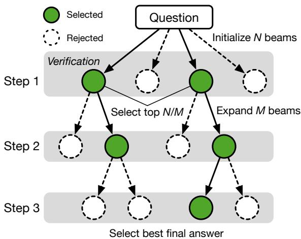  
Figure 1. Beam search with Process Reward Model (PRM), where beam size (�) is 4 and beam width (�) is 2

## 2 Background

## 2.1 LLM Inference and Serving

Transformer-based generative models consist of stacked selfattention and feed-forward layers that compute contextual representations for input tokens, followed by a language modeling (LM) head. The LM head produces logits, unnormalized scores over the vocabulary, which are converted into a probability distribution through a Softmax function.

Inference proceeds in two phases: prefill and decode. In the prefill phase, the model processes the entire input token sequence in parallel to generate the first output token. Then, in the decode phase, the model generates subsequent tokens auto-regressively until an End-of-Sentence (EOS) token is produced or the maximum generation length is reached [36].

During generation, the next output token is selected by sampling from the probability distribution computed from the logits. The sampling process is influenced by a temperature parameter, which scales the logits before the Softmax, thereby controlling the randomness of the next token [15]. A higher temperature increases the spread of the distribution, allowing the model to generate more diverse tokens, while a lower temperature sharpens the distribution, making the model more likely to output high-probability, deterministic tokens. Thus, the temperature directly controls the tradeof between the randomness and coherence required by the specific generative AI application.

To serve these models eficiently, modern LLM serving systems build on several foundational techniques [1, 10, 20, 42, 44, 46]. However, they do not address the distinct resource management challenges that arise specifically from test-time scaling methods.

<table><tr><td>Dataset</td><td>Qwen2.5-3B</td><td>Qwen2.5-32B</td><td>Qwen2.5-3B w/ PRM (8 beams)</td></tr><tr><td>GSM8K</td><td>88.90 %</td><td>93.90 %</td><td>94.70 %</td></tr><tr><td>MATH-500</td><td>60.60 %</td><td>80.30 %</td><td>76.24 %</td></tr><tr><td>OlympiadBench</td><td>19.52 %</td><td>32.65 %</td><td>30.40 %</td></tr></table>

Table 1. Efectiveness of test-time scaling on the math datasets in terms of accuracy

## 2.2 Test-Time Scaling

Test-time scaling improves accuracy by allocating additional computation during inference [4, 31, 38], yielding substantial gains on complex reasoning tasks such as mathematics and coding [22, 28]. Test-time scaling methods can be broadly categorized into two classes: (1) internal, which encourages models to think by producing a long Chain-of-Thought reasoning [30, 32], and (2) external, which improves reasoning performance using sampling or verifier-guided methods with reward models [31, 39]. Our work focuses on the external approach, where a smaller model can achieve accuracy comparable to that of a larger model by exploring and verifying multiple candidate paths at inference time [3].

In the external approach, a straightforward method is bestof-� sampling [26], where the LLM generates � independent responses and an Outcome Reward Model (ORM) [35] selects the highest-scoring one. However, best-of-� has intrinsic limitations in accuracy, because it evaluates only final responses and does not guide intermediate reasoning.

To overcome these limitations, recent test-time scaling techniques, such as beam search [31] and Monte Carlo Tree Search (MCTS) [24, 35], incrementally explore and prune candidate paths, allowing step-wise guidance based on intermediate verification. Since MCTS is known to incur substantially higher per-iteration cost due to repeated rollouts [7], it is less practical for latency-sensitive online serving. In this work, we therefore focus on beam search.

Figure 1 illustrates how test-time scaling with beam search can improve the quality of model responses by incrementally exploring the solution space. At each step, beam search keeps track of � candidate sequences, where � is called the beam size. For a given input, the LLM initially generates � independent sequences. Once all � candidate steps are complete, they are evaluated by a Process Reward Model (PRM) [24, 35], which provides step-wise feedback by scoring intermediate reasoning steps, and only the top-� sequences with the highest scores are retained for further expansion. Each selected sequence is then expanded into � new candidates, where � denotes the beam width. To ensure that the number of active beams remains constant, the selection ratio is configured such that top- $\mathbf { \mathcal { k } } = N / M$ . This procedure efectively resembles a breadth-first search that limits the search space while preserving high-quality trajectories. The process continues until � complete sequences are generated, and the final answer is selected based on the highest weighted sum of the step-wise scores.

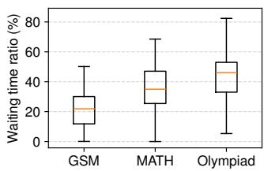  
(a) 4 beams

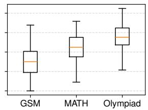  
(b) 8 beams  
Figure 2. Distribution of waiting time ratio for test-time scaling with beam search

Table 1 shows that the smaller Qwen2.5-3B model with PRM-based test-time scaling achieves accuracy comparable to the larger Qwen2.5-32B model on three math datasets.

## 2.3 Ineficiency of Test-Time Scaling

Although tree-based test-time scaling methods show strong performance in reasoning tasks [31, 37, 41], they introduce structural ineficiencies, primarily due to waiting (or idle) time. Since the number of generated tokens varies across candidate sequences, the naive execution must wait for all candidates at each step to complete verification before selecting the top-� for the next step. Even though some candidates complete early (e.g., their paths generate fewer tokens than others), they cannot proceed to the next step until the scores of all concurrent candidates have been computed. Consequently, this results in substantial waiting time at every step.

We evaluate the waiting time under a single batch setting (batch size 1) on three math reasoning datasets: GSM [9], MATH [14], and Olympiad [13]. Their dificulty increases in the order of GSM (grade-school math problems), MATH (competition-level), and Olympiad. Figure 2 shows the distribution of waiting time ratios for the Qwen2.5-3B-Instruct model under test-time scaling with beam search. For each dataset, the box plots are computed over 100 randomly sampled problems for beam sizes 4 and 8, respectively. We use Qwen2.5-Math-PRM-7B for verification. The median waiting time accounts for approximately 20–55% of the total execution time, and this proportion becomes larger as the problem dificulty increases. Thus, reducing waiting time is essential for achieving eficient test-time scaling.

## 3 Speculative Execution and Its Challenges 3.1 Speculative Execution

Rather than waiting for all candidates to complete each step, speculative execution expands any candidate that finishes early, anticipating that it is likely to be selected for the next step [7, 23]. Figure 3 illustrates (a) an example search tree and (b) how speculation accelerates the naive process. At Step 1, the A and B paths begin generating tokens in parallel. In the non-speculative approach, although B finishes earlier than A (e.g., B produces two tokens while A produces four), it must wait until A completes; only then are both candidates verified together. In contrast, the speculative approach immediately expands B to the next step as soon as it finishes, without waiting for A. When A’s verification later completes, if B ultimately has a higher score than A, the speculative path has already made progress, efectively reducing execution time by eliminating unnecessary waiting.

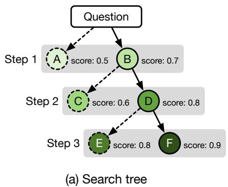

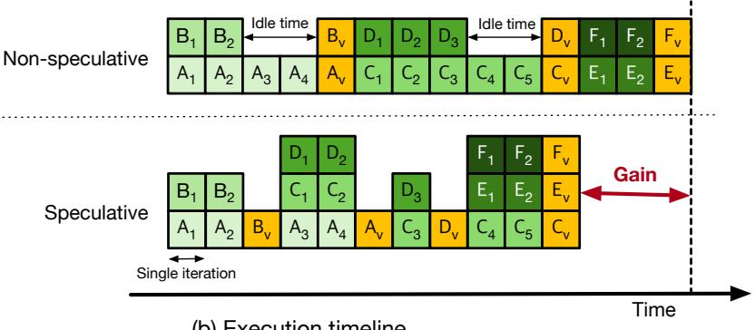  
(b) Execution timeline  
Figure 3. Test-time scaling with two approaches: (a) example search tree, (b) execution timeline of non-speculation and speculation. The numeric subscript on each rectangle indicates the order of the decoding phases, while the subscript v denotes verification.

## 3.2 Challenges for Speculative Execution in Serving

Although speculation enables each path to progress independently without a synchronized verification step, it introduces two fundamental challenges. First, speculation expands the search space, substantially increasing the number of candidate paths. As a result, speculative execution generates far more tokens, which amplifies the computational load of the decode phase. Second, verification is triggered independently for each candidate path, resulting in frequent, finegrained verification tasks. These small and irregular tasks not only underutilize the GPU, but also repeatedly interrupt the reasoning steps. We provide an in-depth performance characterization of speculative execution in the following.

Environment: We evaluate test-time scaling with beam search using Qwen2.5-3B-Instruct as the generation model and Qwen2.5-Math-PRM-7B as the process reward model. We use beam sizes of 4 and 8. All experiments are conducted on a single NVIDIA A100 80GB GPU. We describe the experi mental setup in more detail in Section 5.1.

3.2.1 Increased Decode Computation. We first evaluate the additional computational overhead introduced by speculative execution. Figure 4 presents the number of concurrently explored candidate paths (i.e., reasoning sequences) for both non-speculative and speculative approaches as the number of requests increases. With a beam size of 4, the nonspeculative approach concurrently explores an average of roughly three active candidates per request, whereas speculative execution increases this to around six. As the number of requests increases, the gap in the number of simultaneously running candidates widens significantly. When the beam size is increased to 8, this discrepancy becomes even more severe, indicating substantially higher computational load under speculative execution. Speculative execution performs extra computation on candidate paths that do not contribute to the final result, unlike the non-speculative method, which executes only the selected generation path.

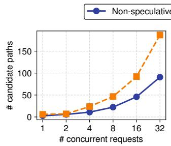  
(a) 4 beams

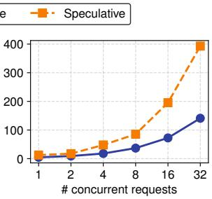  
(b) 8 beams

Figure 4. Number of candidate paths according to concurrent requests on MATH dataset using Qwen2.5-3B-Instruct  
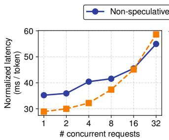  
(a) 4 beams

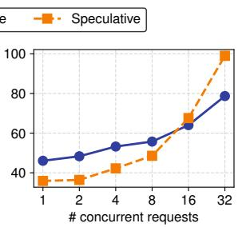  
(b) 8 beams  
Figure 5. Normalized token latency with regard to concurrent requests on MATH dataset using Qwen2.5-3B-Instruct

Second, we measure average token generation latency to quantify the increased computational load. Figure 5 shows the output token latency as the number of requests increases. When the number of requests is low, speculative execution significantly reduces the output token latency. However, as the number of requests grows, the latency of the speculative approach increases much more rapidly than that of the baseline. Eventually, for more than 8 requests in both cases, its latency surpasses the non-speculative approach.

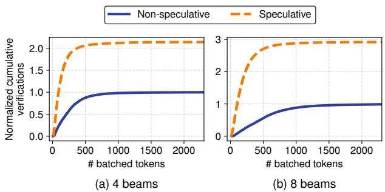  
Figure 6. Cumulative number of tokens per verification batch on MATH dataset using Qwen2.5-3B-Instruct

3.2.2 Increased Verification Steps. The speculative approach introduces additional performance overhead in the form of fine-grained verification tasks, as each candidate path performs verification independently to proceed to the next step. In contrast, non-speculative execution benefits from bulk verification across candidates within the same step, which enables eficient batching and high compute utilization. Speculative execution breaks this batching op portunity, leading to ineficient, fragmented verifications and reduced hardware utilization. Note that the verification task is a prefill-only workload, where the PRM verifies the given tokens in a single forward pass without autoregressive decoding. As verification occurs more frequently, the generation model is repeatedly preempted, leading to further performance degradation.

Figure 6 shows the normalized cumulative number of verifications for the non-speculative and speculative methods. All values are normalized by the total number ofverifications in the non-speculative baseline, so the non-speculative curve always converges to 1, while the speculative curve indicates how many times more verification calls it performs relative to the baseline. In both beam size settings, the speculative method accumulates verifications much more rapidly than the non-speculative baseline within a smaller number of batched tokens, and its curve eventually saturates at roughly 2–3× the baseline level.

## 4 Towards Eficient Speculation

To address the challenges of speculative execution, we design SpecScale around three key techniques: early pruning, computation deduplication, and lazy verification. Figure 7 presents an overview of our proposed system and its workflow. 1 When a question arrives, the generator constructs a search tree of candidate paths using the LLM. At this time, our computation deduplication technique is applied to reduce the computational overhead. 2 Once a candidate reaches a verification point (e.g., completes a step), the corresponding node is enqueued to the verifier as a verification task. 3 The verifier applies lazy verification: instead of processing each task immediately, it opportunistically batches queued tasks and runs the PRM on large, GPU-eficient batches. 4 The resulting PRM scores are sent back to the generator, which updates the search tree and decides which candidates are allowed to continue speculatively. 5 Using these scores, SpecScale performs early pruning, terminating branches that can no longer become part of the final top-� solutions, and focusing computation on the most promising paths. In the following, we describe these three techniques in turn: early pruning, computation deduplication, and lazy verification.

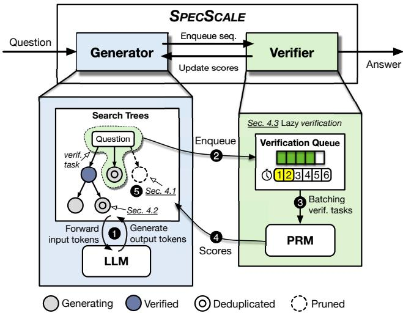  
Figure 7. Overview of our proposed system: SpecScale

## 4.1 Early Pruning of Search Tree

While reasoning with multiple candidate paths, not all candidates are equally promising. Although the set of top-k candidates can only be finalized after all candidates complete verification, it becomes possible to determine that some paths can no longer be part of the final top-� results, even before all verification finishes. Early pruning exploits this insight by terminating the evaluation of such paths as soon as possible. For example, once the number of verified candidates exceeds �, any candidate whose score is ranked below the current top-� cannot be part of the final top-� set, regardless of how the remaining evaluations proceed. Thus, continuing to process such candidates is wasteful.

Figure 8 illustrates the workflow for pruning candidates during speculative execution. We assume a beam size of 4 and a beam width of 4, which implies � = 1. Suppose that four candidate sequences initialized with a prompt are generating their first step in parallel. During this process, once a candidate (e.g., B) completes the step, the candidate performs verification. 1 After verification, the candidate B expands its candidate path and proceeds to the next step as speculative execution. Subsequently, when another candidate (e.g., D) completes its step and is verified, if the number of verified candidates exceeds � (i.e., 1) and this candidate’s score is lower than those of the previously verified candidates, further exploration of its path becomes unnecessary, as at least � other candidates with higher scores already exist. 2 Thus, we can immediately prune the lowest-scoring candidate D to minimize the additional computation introduced by speculative execution.

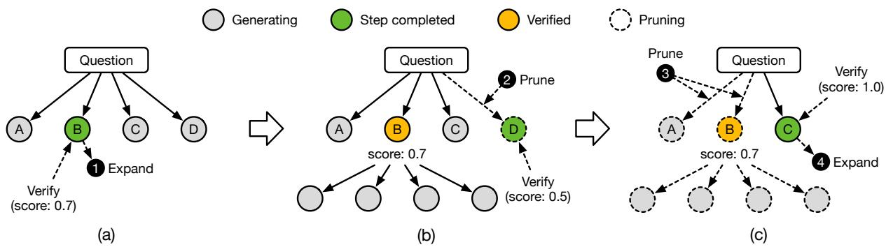  
Figure 8. Speculative execution with early pruning, where beam size (�) and beam width (�) are both 4, implying top-� = 1

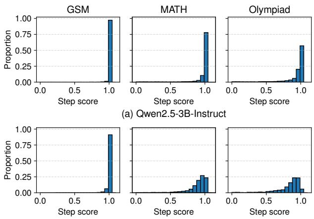  
(b) Llama3.2-3B-Instruct  
Figure 9. Step score distribution

In addition, we leverage the scoring characteristics of the PRM. The PRM produces floating-point scores in the range [0, 1], where the maximum value 1.0 denotes a perfect score. When multiple candidates have the same score, we cannot distinguish which one is strictly better [3]. Consequently, once the number of candidates with a perfect score reaches �, we can finalize them as the selected candidates and prune all remaining ones. For instance, if a verified candidate C receives the perfect score of 1.0, 3 we prune all remaining candidate paths and 4 finalize C as the selected candidate.

Figure 9 presents the distribution of step-wise scores assigned by the PRMs across the three datasets. In this experiment, we use Qwen2.5-3B-Instruct and Llama3.2-3B-Instruct as generative models, together with Qwen2.5-Math-PRM-7B and Llama3.1-8B-PRM as their corresponding PRMs, respectively. Even with the small model Qwen2.5-3B-Instruct for the Olympiad dataset, a large fraction of steps receive the maximum score of 1.0, indicating that we can significantly reduce unnecessary speculation with early pruning.

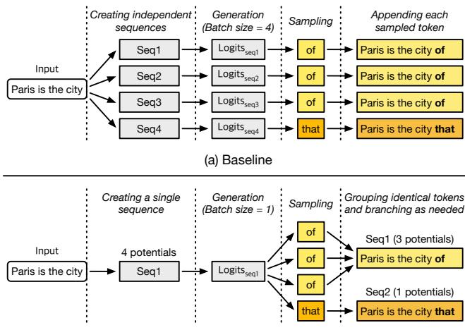  
(b) On-demand branching  
Figure 10. Baseline vs. computation deduplication approach

## 4.2 Computation Deduplication

One key ineficiency in exploring multiple candidates is redundant decoding across candidate paths that share the same token prefix. In existing LLM serving systems, multiple beams (i.e., candidate paths) are instantiated as independent sequences, all initialized with the same prompt and subsequently expanded in parallel.

Figure 10a shows an example with a beam size of 4, where the model executes four separate forward passes, even though they all evaluate the logits for the same input prefix, “Paris is the city”. As a result, each decoding iteration recomputes the same logits separately for every candidate. Moreover, in this example, three paths sample the same next token, “of”, incurring redundant computation again.

To quantify the degree of redundancy, we measure the common prefix token ratio. In this experiment, we use a sampling temperature of 0.8, following the setting in [3]. Across the three datasets, Figure 11 shows the fraction of tokens that can be shared among completed candidates at each step. We observe that 25–50% of generated tokens are common across candidates. The ratio is higher on easier benchmarks, where the model’s predictions are more confident, indicating that similar reasoning processes take place across candidates. Overall, these results reveal substantial opportunities for sharing computation, even under relatively diverse sampling regimes.

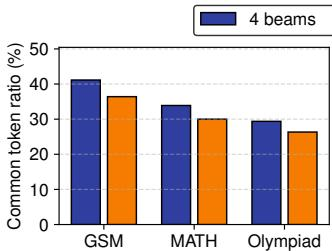  
(a) Qwen2.5-3B

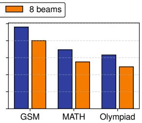  
(b) Llama3.2-3B  
Figure 11. Common token (%) across candidates of each step

To eliminate redundant computation, we propose a deduplication method that shares output logits among the candidates with identical input sequences. Figure 10b illustrates how the proposed method efectively eliminates redundant computation via on-demand branching. Instead of instantiat ing four independent sequences, we create a single sequence whose potential size is initialized to 4, indicating that it implicitly represents four candidates. When this sequence is scheduled, we run a single decoding step over the current prefix to obtain the output logits. We then sample as many tokens as the potential size (4 in this example) from the same logits. Note that each token is sampled as an independent trial (i.e., four times) from the same distribution.

After sampling, we identify the opportunity to group the sampled tokens. For instance, if three samples produce “of” and one produces “that” , we form two groups: {“of”, “of”, $\{ \sigma f ^ { , } \}$ and {“that” }. Once more than one group is formed, we create one child sequence per group, extending each with its corresponding token and assigning its potential size to the group’s cardinality (3 and 1 in the example).

This construction yields a tree of explicit sequences that is probabilistically equivalent to running four independent samples, but it executes exactly one model forward pass for each distinct token prefix. The amount of decode computation is therefore proportional to the number of unique prefixes explored, rather than to the total number of logical candidates. This difers from prefix-based KV sharing in existing serving systems, which reduces redundant KV computation over shared prefixes [46] but still requires one forward pass per candidate. CD instead performs a single forward pass for identical candidates and samples all corresponding candidates from the same logits.

Meanwhile, when sampling next tokens, each sequence can have a diferent potential size, indicating that it needs a diferent number of samples from its logits. As a result, we cannot sample all sequences in a single batch, because

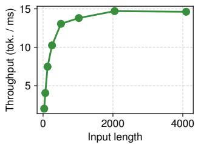  
(a) Qwen2.5-Math-PRM-7B

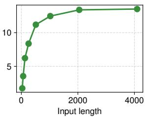  
(b) Llama3.1-8B-PRM  
Figure 12. Throughput of verification in a microbenchmark each one would require a diferent output shape. To preserve batching eficiency, we group sequences by potential size and perform batched sampling separately for each group.

## 4.3 Lazy Verification

To mitigate the verification overhead caused by speculative execution, we introduce a deferred batching strategy that queues verification requests and processes them in large, GPU-eficient batches. The basic idea is simple. Instead of invoking the verification immediately whenever a candidate completes a step, we enqueue its verification request in a bufer. Periodically, we flush the bufer and run verification on a batch containing many candidates at once. This improves throughput because verification is a prefill-only workload whose performance scales well with batch size.

However, deferring verification introduces an inherent latency-throughput trade-of: longer deferrals yield larger, more eficient batches but reduce the benefit of speculative execution. Our lazy verification identifies a balanced point that reconciles high verification throughput with low idle time for eficient speculative execution. We use three policies that jointly control the verification time.

First, we flush the queue when the total number of tokens across all enqueued requests exceeds a pre-defined threshold. We determine this threshold via ofline profiling. Specifically, we measure the verification token throughput of two PRM models, Qwen2.5-Math-PRM-7B and Llama3.1-8B-PRM, as we vary the number of input tokens. Figure 12 shows that token throughput saturates around 2,048 input tokens for both models: beyond this point, additional tokens yield diminishing throughput gains. For other models or hardware configurations, the same profiling step can be run once before deployment to select an appropriate threshold.

Second, when all candidates within the same sibling group (i.e., descendants of the same parent node in the search tree) complete their current step, we immediately verify them together, along with any deferred requests currently in the queue. Further delaying these candidates would introduce extra latency compared to the non-speculative baseline without providing additional batching benefit.

Finally, under low request load, the verification queue may take a long time to accumulate enough tokens to reach the threshold, which again increases the waiting time for the early completed paths. To prevent excessive deferral in this regime, we track, for each sample, how many times its verification steps have been deferred. Once this per-sample deferral count exceeds a small limit, we flush the queue and immediately verify all pending candidates. In our deployment, we empirically set the maximum deferral count to six, which provides stable latency under light load.

These policies allow SpecScale to opportunistically batch verification workloads, improving GPU utilization and reducing the number of fragmented verification calls, while keeping verification latency within reasonable bounds.

## 5 Evaluation

## 5.1 Experimental Setup

Environment and models: To evaluate SpecScale and baselines on a common serving substrate, we implement a lightweight framework that incorporates state-of-the-art LLM serving optimizations, including continuous batching [44], paged attention [20], prefix KV caching and sharing [46], and fused attention kernels based on FlashInfer [42]. We run all experiments using this framework on a server equipped with Intel Xeon Gold 6326 processors and a single NVIDIA A100 80GB GPU. We use PyTorch v2.9 [2] and CUDA 12.8 [29].

We pair instruction-tuned LLMs as generators with process reward models (PRMs) as verifiers. Specifically, we use two models from the Qwen2.5 family (3B and 7B) and two from the Llama family (3B and 8B) as generators. For verification, we adopt the corresponding PRMs trained for mathematical reasoning tasks: Qwen2.5-Math-PRM-7B for the Qwen models and Llama3.1-8B-PRM for the Llama models. This pairing ensures architectural consistency between each generator–verifier pair.

Benchmarks: For performance evaluation, we use three math reasoning datasets: GSM8K [9], MATH-500 [14], and OlympiadBench [13]. For GSM8K, we randomly sample 1,000 problems and use all problems from MATH-500 and Olympiad-Bench. We set the maximum number ofconcurrently running requests to 32, because this is where the non-speculative base line starts to surpass the naive speculation (Section 3.2.1).

We follow the hyperparameter configuration of Snell et al. [31] for our beam search-based test-time scaling, including a cap of 40 beam expansion steps and a fixed beam width of 4. Since their configuration does not specify the sampling temperature, we set it to 0.8, following Beeching et al. [3].

Comparisons: We evaluate the efectiveness of our techniques against three baselines, a conventional beam search method without speculation (Non-spec), a naive speculation (Naive-spec), and FastTTS [7], a recently proposed approach. Naive-spec expands multiple candidate paths through speculative execution and performs verification for each completed step, resulting in frequent verification. FastTTS mitigates this overhead through two techniques, Speculative Candidate Selection and Lookahead Verification, both ofwhich we reimplement in our framework because the publicly released code supports only a batch size of one [8] and thus cannot accommodate our target serving setting.

Both techniques difer from our design. Lookahead Verification batches completed beams only within a single request, whereas our lazy verification batches them across concurrent requests once a flush is triggered, yielding larger verification batches and higher GPU utilization. Speculative Candidate Selection reduces unnecessary expansions, but still sufers from redundant computation.

We omit the other two techniques ofFastTTS, Preemptible Scheduling and Dynamic Prefix-Aware Scheduling. They target severely resource-constrained deployments in which the beams of even a single request cannot all be executed concurrently. Our study instead focuses on a server-class environment handling multiple concurrent requests.

To validate our reimplementation, we compared its throughput with the released FastTTS implementation at a batch size of one, using Qwen2.5-7B-Instruct on MATH-500. The two implementations achieved similar throughput at beam sizes of 4, 8, 16, and 32; detailed results are omitted due to space constraints.

## 5.2 Throughput Performance

We first evaluate the maximum output token throughput across three datasets and four model configurations. To assess the contribution of each component, we incrementally enable our three techniques, early pruning (EP), computation deduplication (CD), and lazy verification (LV), on top of the naive speculation method. For this evaluation, we issue all requests immediately and measure the token throughput over all problems in the datasets.

Figure 13 presents token throughput for beam sizes 4 and 8. In most cases, the naive speculation approach results in lower token throughput than the non-speculative case. This is because naive speculation increases the amount of decode computation as well as verification calls, as discussed in Section 3.2. In a serving environment, the performance benefits of naive speculative execution exhibit diminishing returns due to frequent verification calls. FastTTS alleviates the frequent verification overhead of naive speculation by batching verification calls, leading to improved token throughput. Although FastTTS reduces the number of active candidates by dynamically adjusting the branching factor, its benefits are still insuficient for large models in serving environments where multiple requests are processed concurrently.

On the other hand, SpecScale (EP) achieves better performance compared to the naive-speculative approach by efectively mitigating unnecessary speculative execution, but it shows performance similar to the non-speculative case. On the MATH and Olympiad datasets with 8 beams, SpecScale (EP) achieves 1.18× and 1.05× higher throughput, respectively, than the non-speculative baseline on the Qwen2.5-3B-Instruct model. For the Llama-3.2-3B-Instruct model, although early pruning improves throughput over the naive speculative approach, it still does not reach the non-speculative baseline. This discrepancy mainly comes from how frequently each model produces perfect scores during verification. When a candidate with a perfect score is generated, we can immediately advance to the next step, thereby bypassing additional verification and reducing overall verification overhead. However, as shown in Figure 9, the Llama models generate fewer perfect scores than Qwen2.5. Consequently, the verification overhead is not suficiently reduced, and the throughput benefit of speculative execution is limited for Llama models.

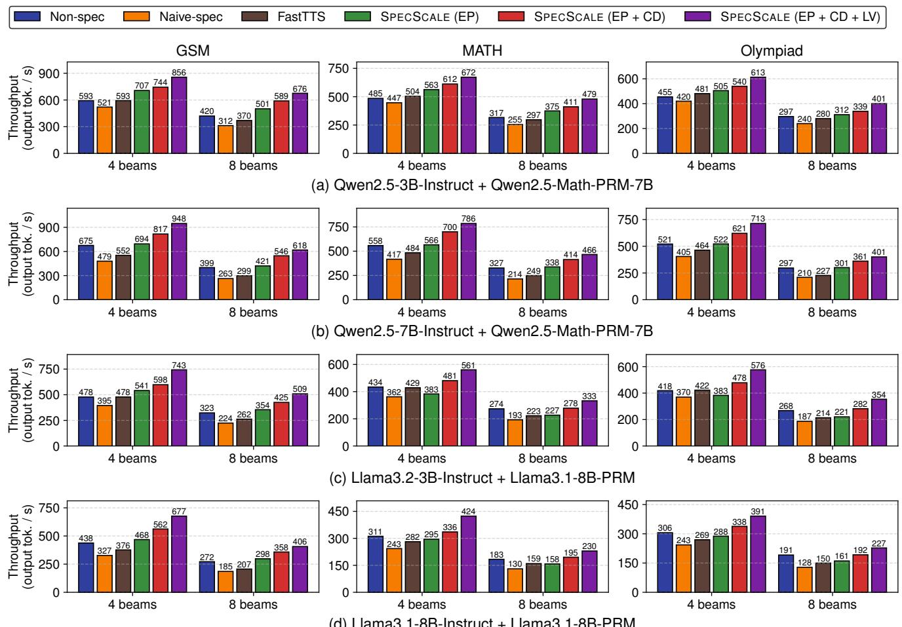  
(d) Llama3.1-8B-Instruct + Llama3.1-8B-PRM  
Figure 13. Token throughput performance for GSM, MATH, and Olympiad datasets on Qwen2.5 and Llama3 models

SpecScale (EP+CD), which additionally incorporates computation deduplication, further improves performance. On the MATH dataset with 8 beams, SpecScale (EP+CD) further improves throughput by 1.10× and 1.22× over SpecScale (EP) on the Qwen2.5-3B-Instruct and Qwen2.5-7B-Instruct models, respectively. The additional performance gain of EP+CD is less significant for smaller models than for larger ones, because small models do not fully utilize the available compute resources even with speculative execution, making the benefit of reducing redundant computation less significant. Finally, SpecScale (EP+CD+LV), which includes all three techniques, yields the highest token throughput among all configurations by further reducing verification overhead.

Overall, SpecScale consistently delivers higher throughput than both the non-speculative baseline and FastTTS. On the MATH dataset, with 8 beams, SpecScale achieves 1.51× and 1.43× higher throughput than the baseline for Qwen2.5- 3B-Instruct and Qwen2.5-7B-Instruct, respectively.

## 5.3 Serving Performance

In this section, we evaluate the serving performance of models utilizing test-time scaling methods. We measure the endto-end token latency of Qwen2.5-3B-Instruct and Qwen2.5- 7B-Instruct by increasing the request rate in our serving framework. We present normalized output token latency, defined as the end-to-end latency divided by the number of generated output tokens [44]. We use Poisson distributions for generating a realistic request arrival pattern.

Figure 14 exhibits the normalized output token latency (yaxis) against the request rate (x-axis) for beam sizes 4 and 8 on the MATH dataset. The naive speculation approach shows comparable latency to, or even slightly lower than, the nonspeculative case at low request rates. This is because, despite efectively reducing waiting time, it triggers frequent small verification batches, which introduce verification overhead and thereby ofset the latency gains. At higher request loads, its performance further degrades as the increased number of candidates amplifies the overall computational overhead, which becomes more significant with larger beam sizes or larger models.

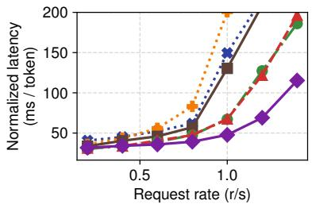  
(a) Qwen2.5-3B-Instruct (4 beams)

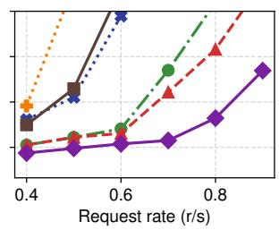  
(b) Qwen2.5-3B-Instruct (8 beams)

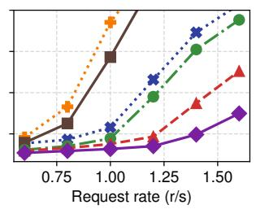  
(c) Qwen2.5-7B-Instruct (4 beams)

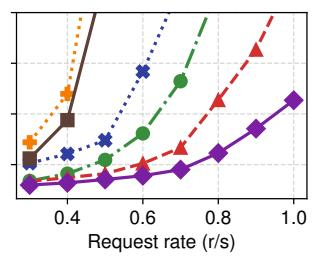  
(d) Qwen2.5-7B-Instruct (8 beams)  
Figure 14. Serving performance for MATH on Qwen2.5-3B-Instruct and Qwen2.5-7B-Instruct

FastTTS exhibits lower latency than both non-speculative and naive speculative approaches on Qwen2.5-3B-Instruct by reducing the verification overhead through Lookahead Verification. However, as the request rate increases, the performance gap narrows. With larger beam sizes or larger models, FastTTS leads to higher latency than the non-speculative approach, as the computational overhead of speculative execution dominates even with Speculative Candidate Selection.

In contrast, SpecScale (EP) efectively mitigates unnecessary speculative executions and improves the normalized latency. SpecScale (EP+CD) further enhances the normalized latency by eliminating redundant computation. The performance benefit of computation deduplication is not observed for Qwen2.5-3B-Instruct (4 beams), as the smaller beam size does not fully utilize the computational resources. On the other hand, larger beam sizes or larger models show the ef fectiveness of deduplication. Finally, SpecScale (EP+CD+LV) achieves the lowest normalized latency among all configurations by substantially reducing verification overhead.

For Qwen2.5-7B-Instruct with 4 beams, our EP+CD+LV achieves an average normalized latency of about 75 ms at a load of roughly 1.6 requests per second. At a similar latency level, FastTTS can serve only around 0.8 requests per second. For a given latency budget, SpecScale can serve more requests (i.e., higher goodput) than both the naive speculation and FastTTS. This allows SpecScale to explore more candidates (i.e., more beams) within the same budget, potentially leading to higher reasoning accuracy.

## 5.4 Performance Analysis

To analyze the performance improvements, we quantify the contributions of our three techniques by comparing them against the baselines. For this analysis, we focus on Qwen2.5- 7B-Instruct model with a beam size of4 on the MATH dataset, corresponding to the throughput results in Figure 13.

Figure 15a shows where execution time is spent by breaking it into three components: generation, verification, and the remaining time (labeled as Etc., including scheduling and tokenization). In the non-speculative case, generation takes approximately 2.3× longer than verification, and Etc. accounts for about 7% of the total runtime. Within Etc., tokenization alone contributes roughly 40% of the time, because the PRM requires a specific input template, forcing us to reformat the generated output tokens at every verification step. For naive speculation, both generation and verification take substantially longer than in the baseline, leading to even higher overall runtime. In FastTTS, the verification time is reduced, but the generation time remains significant, as the dynamic branching is inefective at small beam sizes. In particular, at a beam size of 4, it is not applied because candidates share the same previous scores.

On the other hand, SpecScale (EP) reduces both generation and verification time. Figure 15b presents the number of candidate paths (i.e., reasoning sequences) and the token latency for the baselines and our three design options. These results are extracted from the same experiment as Figure 15a. Our early pruning (EP) efectively reduces the number of candidate paths by pruning unnecessary exploration paths early. As a result, the token latency is also reduced compared to naive speculation. SpecScale (EP+CD) further reduces the generation time by deduplicating computation across candidates that share identical input sequences. As shown in Figure 15b, this decreases the number of concurrent reasoning paths, which in turn lowers the token latency.

While SpecScale (EP+CD+LV) slightly increases the waiting time because verification is deferred and performed in batches, it reduces the overall verification time by making the verification process more eficient. Figure 15c decomposes the inter-step time into waiting time and verification time. Without lazy verification, the speculative approaches eliminate most of the waiting time, but they sufer from frequent, small verification calls. With lazy verification, SpecScale (EP+CD+LV) introduces a modest amount of waiting by deferring verification into batches, yet substantially reduces overall verification time by making PRM execution more eficient. Overall, SpecScale (EP+CD+LV) achieves the lowest token latency by improving verification eficiency.

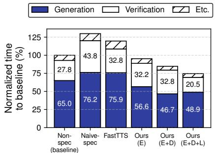  
(a) Benchmark time breakdown

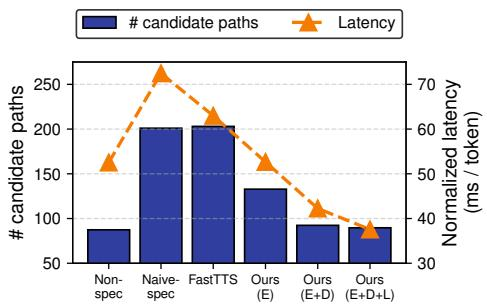  
(b) Number of candidate paths and latency

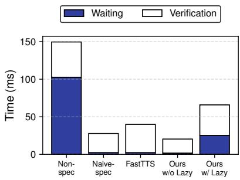  
(c) Decomposition of inter-step time

Figure 15. Quantitative analysis of SpecScale and baselines for MATH on Qwen2.5-7B-Instruct with beam size 4 (E: Early Pruning, D: Computation Deduplication, and L: Lazy Verification)
<table><tr><td rowspan="2">Dataset</td><td rowspan="2">Non-spec</td><td colspan="3">SPECSCALE</td></tr><tr><td>EP</td><td>EP+CD</td><td>EP+CD+LV</td></tr><tr><td>GSM8K</td><td>92.99</td><td>93.90 (+0.91)</td><td>93.79 (+0.80)</td><td>93.49 (+0.50)</td></tr><tr><td>MATH-500</td><td>74.03</td><td> $7 3 . 9 6 \left( - 0 . 0 7 \right)$ </td><td> $7 3 . 9 7 \left( - 0 . 0 6 \right)$ </td><td>75.43 (+1.40)</td></tr><tr><td>OlympiadBench</td><td>27.18</td><td>27.51 (+0.33)</td><td>28.64 (+1.46)</td><td>27.94 (+0.76)</td></tr></table>

(a) 4 beams

<table><tr><td rowspan="2">Non-spec</td><td colspan="3">SPECSCALE</td></tr><tr><td>EP</td><td>EP+CD</td><td>EP+CD+LV</td></tr><tr><td>94.70</td><td>94.20 (-0.50)</td><td>93.80 (−0.90)</td><td>94.09 (−0.61)</td></tr><tr><td>76.24</td><td>79.21 (+2.97)</td><td>79.16 (+2.92)</td><td>76.82 (+0.58)</td></tr><tr><td>30.40</td><td>29.39 (−1.01)</td><td>30.70 (+0.30)</td><td>31.48 (+1.08)</td></tr></table>

(b) 8 beams  
Table 2. Answer accuracy (%) of Qwen2.5-3B-Instruct with a PRM verifier. The numbers in parentheses denote the accuracy diference in percentage points compared to the baseline (Non-spec).

## 5.5 Impact on Answer Quality

We evaluate whether our three techniques afect answer quality. Early pruning uses two strategies: 1) stopping the speculative expansion of candidates once their scores indicate that they can no longer enter the final top-�, and 2) proceeding to the next step once � candidates achieve a perfect score.

The first strategy exploits the fact that standard beam search retains only the top-� candidates at each step. A candidate whose score falls below the current �-th highest score cannot survive selection. Thus, stopping the speculative expansion of such candidates does not afect the final candidate selection. In contrast, the second strategy may afect candi date selection because it proceeds as soon as � candidates achieve a perfect score, even if some remaining candidates would also achieve the same score and require tie-breaking.

Table 2 reports the answer accuracy of SpecScale and the non-speculative baseline using Qwen2.5-3B-Instruct at beam sizes 4 and 8. These results are extracted from the experiments in Figure 13(a). Across both beam sizes, the accuracy diference of EP ranges from −1.01 to +2.97 percentage points. Further incorporating CD and LV does not materially afect accuracy. These results indicate that SpecScale maintains answer accuracy comparable to the non-speculative baseline.

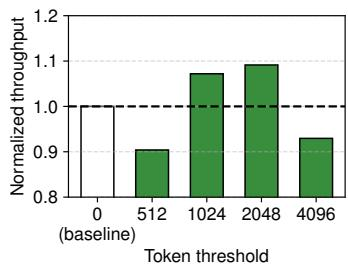  
(a) 4 beams

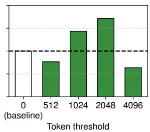  
(b) 8 beams  
Figure 16. Normalized output token throughput with varying batching token thresholds for lazy verification

## 5.6 Analysis of Lazy Verification Technique

To assess our choice of the token threshold for triggering lazy verification, we conduct a sensitivity study using Qwen2.5- 3B-Instruct on MATH-500, varying the threshold from 256 to 4,096 tokens. We keep EP and CD enabled and all other settings fixed throughout the study.

Figure 16 shows output token throughput with beam sizes of 4 and 8, normalized to the throughput of SpecScale with lazy verification disabled (EP+CD) for each beam size. For both beam sizes, throughput improves as the threshold increases from 512 to 2,048 tokens. At a threshold of 2,048 tokens, SpecScale achieves the highest throughput for both beam sizes, reaching 1.09× and 1.14× the baseline throughput for beam sizes 4 and 8, respectively. However, further increasing the threshold to 4,096 tokens reduces throughput below the baseline for both beam sizes. This trend is consistent with the trade-of discussed in Section 4.3: larger batches improve verification eficiency, but excessive deferral reduces the benefit of speculative execution.

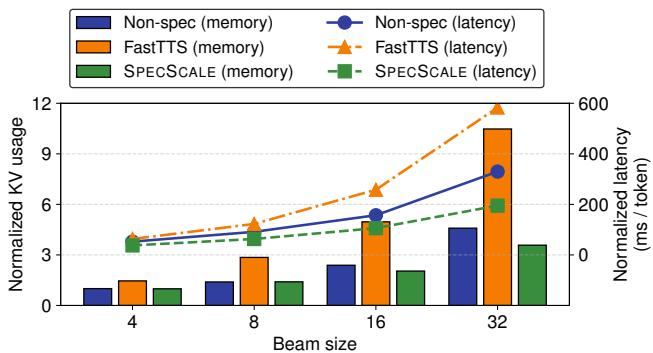  
Figure 17. Normalized KV memory usage (left y-axis) and token latency (right y-axis) as the beam size increases

## 5.7 Scalability

We evaluate how SpecScale scales with the beam size and concurrency for MATH on Qwen2.5-7B-Instruct.

Beam size: Figure 17 shows the normalized output token latency and KV memory usage as the beam size increases from 4 to 32. For the non-speculative case, the memory usage for KVs grows approximately in proportion to the beam size because memory allocated to all candidate paths is not reclaimed until their verification completes. The latency also increases with the beam size, as more candidate paths are explored and verified in parallel. For FastTTS, both memory usage and latency increase more sharply due to the speculatively expanded paths, even though Speculative Candidate Selection becomes efective from a beam size of 8.

On the other hand, SpecScale reduces active KV usage by early pruning unpromising candidates and keeps latency lower even as the beam size increases. At a beam size of 32, Non-spec shows approximately 330ms, whereas SpecScale maintains a lower latency of about 195ms while simultaneously reducing KV memory usage by roughly 22%. For a fixed latency budget, SpecScale can aford to use a larger beam size and thus explore more candidates than the baselines.

Concurrency: Figure 18 shows the output token throughput when varying the number of concurrent requests from 16 to 128 with beam sizes of 4 and 8. For a beam size of 4, both the non-speculative approach and FastTTS saturate around 64 concurrent requests, whereas SpecScale continues to increase throughput beyond this point. From 16 to 128 concurrent requests, SpecScale exhibits higher throughput than the other three approaches for both beam sizes 4 and 8.

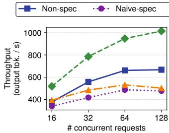  
(a) 4 beams

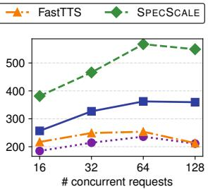  
(b) 8 beams  
Figure 18. Token throughput according to the number of concurrent requests

## 6 Related Work

Prior studies have addressed the performance overhead of speculative execution in test-time scaling [6, 7, 23]. Recently, FastTTS [7] introduced two techniques, Speculative Candidate Selection and Lookahead Verification, to reduce the overhead of speculative execution and verification, respectively. Speculative Candidate Selection proactively limits the expansion of candidates predicted to be less promising, whereas our early pruning operates on scores observed after verification and deterministically eliminates candidates once they can no longer enter the final top-�. Lookahead Verification defers candidate verification, similar to SpecScale. However, it flushes deferred candidates only when all candidates complete their current step, which limits opportunities for early pruning.

Concurrent with our work, SPEX [47] addresses the performance bottleneck of synchronized verification in tree-based test-time compute scaling. It speculatively expands completed candidates while waiting for stragglers, distributes speculative budget across concurrent requests, and employs adaptive early termination based on the confidence margin of the leading candidate. SPEX relies on a heuristic confidencemargin threshold for early termination, whereas EP deterministically discards candidates once � verified candidates outrank them. In addition, SPEX does not explicitly optimize verification batch eficiency or redundant forward computation. LV batches fragmented PRM verification across concurrent requests, while CD eliminates redundant forward passes by coalescing candidates that are identical at runtime.

SPECS [6] and ORCHES [23] introduce an additional lightweight model. SPECS drafts reasoning steps with a small model along high-confidence paths and switches to the target model depending on problem dificulty. ORCHES proceeds with the scores of a lightweight verifier while the target PRM verifies in parallel on a GPU-PIM system. This requires additional hardware to support concurrent generation and verification and still incurs misprediction penalties.

Prefix KV caching [11, 17, 40] and shared-prefix attention kernels [18, 43] reuse the KV cache of a common prefix, but each candidate still requires a separate forward pass to generate its output token. Thus, the decoding cost remains proportional to the number of candidates. Tree-based speculative decoding [5, 21, 27] shares attention computation over a token tree generated by a draft model and discards mispredicted branches. In contrast, CD coalesces identical candidates at runtime, eliminating redundant forward computation beyond attention and KV reuse.

## 7 Conclusions

This paper identified why naive speculation, despite removing step-level synchronization barriers, can hurt performance in test-time scaling and explored the design space for efective solutions. We presented SpecScale, a serving system that enables eficient speculative execution through early pruning, computation deduplication, and lazy verification. Through our experiments, SpecScale consistently achieved higher throughput and lower end-to-end latency than both the non-speculative and FastTTS approaches.

## References

[1] Amey Agrawal, Nitin Kedia, Ashish Panwar, Jayashree Mohan, Nipun Kwatra, Bhargav Gulavani, Alexey Tumanov, and Ramachandran Ramjee. 2024. Taming Throughput-Latency Tradeof in LLM Inference with Sarathi-Serve. In 18th USENIX Symposium on Operating Systems Design and Implementation (OSDI).

[2] Jason Ansel, Edward Yang, Horace He, Natalia Gimelshein, Animesh Jain, Michael Voznesensky, Bin Bao, Peter Bell, David Berard, Evgeni Burovski, Geeta Chauhan, Anjali Chourdia, Will Constable, Alban Desmaison, Zachary DeVito, Elias Ellison, Will Feng, Jiong Gong, Michael Gschwind, Brian Hirsh, Sherlock Huang, Kshiteej Kalam barkar, Laurent Kirsch, Michael Lazos, Mario Lezcano, Yanbo Liang, Jason Liang, Yinghai Lu, CK Luk, Bert Maher, Yunjie Pan, Christian Puhrsch, Matthias Reso, Mark Saroufim, Marcos Yukio Siraichi, Helen Suk, Michael Suo, Phil Tillet, Eikan Wang, Xiaodong Wang, William Wen, Shunting Zhang, Xu Zhao, Keren Zhou, Richard Zou, Ajit Math ews, Gregory Chanan, Peng Wu, and Soumith Chintala. 2024. Py Torch 2: Faster Machine Learning Through Dynamic Python Bytecode Transformation and Graph Compilation. In 29th ACM International Conference on Architectural Support for Programming Languages and Operating Systems (ASPLOS).

[3] Edward Beeching, Lewis Tunstall, and Sasha Rush. 2024. Scaling test-time compute with open models. htps://huggingface.co/spaces/ HuggingFaceH4/blogpost-scaling-test-time-compute (Accessed: 2026- 04-15).

[4] Bradley Brown, Jordan Juravsky, Ryan Ehrlich, Ronald Clark, Quoc V. Le, Christopher Ré, and Azalia Mirhoseini. 2024. Large Language Monkeys: Scaling Inference Compute with Repeated Sampling. (2024). arXiv:2407.21787 [cs.LG] htps://arxiv.org/abs/2407.21787

[5] Tianle Cai, Yuhong Li, Zhengyang Geng, Hongwu Peng, Jason D. Lee, Deming Chen, and Tri Dao. 2024. MEDUSA: Simple LLM inference acceleration framework with multiple decoding heads. In Proceedings ofthe 41st International Conference on Machine Learning (ICML).

[6] Mert Cemri, Nived Rajaraman, Rishabh Tiwari, Xiaoxuan Liu, Kurt Keutzer, Ion Stoica, Kannan Ramchandran, Ahmad Beirami, and Ziteng Sun. 2025. SPECS: Faster Test-Time Scaling through Speculative Drafts. arXiv:2506.15733 [cs.AI] htps://arxiv.org/abs/2506.15733

[7] Hao Mark Chen, Zhiwen Mo, Guanxi Lu, Shuang Liang, Lingxiao Ma, Wayne Luk, and Hongxiang Fan. 2026. FastTTS: Accelerating Test-Time Scaling for Edge LLM Reasoning. In Proceedings ofthe 31st ACM International Conference on Architectural Support for Programming Languages and Operating Systems (ASPLOS).

[8] Mark Cheney. 2026. FastTTS: Accelerating Test-Time Scaling for Edge LLM Reasoning (Artifact). htps://github.com/ihc-fan-lab/FastTTS/ blob/1c01d54efe41d9b503895385fdbe08393fa2c513/config.py#L62- L64. ASPLOS’26 artifact, commit 1c01d54.

[9] Karl Cobbe, Vineet Kosaraju, Mohammad Bavarian, Mark Chen, Heewoo Jun, Lukasz Kaiser, Matthias Plappert, Jerry Tworek, Jacob Hilton, Reiichiro Nakano, Christopher Hesse, and John Schulman. 2021. Training Verifiers to Solve Math Word Problems. (2021). arXiv:2110.14168 [cs.LG] htps://arxiv.org/abs/2110.14168

[10] Tri Dao, Dan Fu, Stefano Ermon, Atri Rudra, and Christopher Ré. 2022. FlashAttention: Fast and Memory-Eficient Exact Attention with IO-Awareness. In Advances in Neural Information Processing Systems (NeurIPS).

[11] Bin Gao, Zhuomin He, Puru Sharma, Qingxuan Kang, Djordje Jevdjic, Junbo Deng, Xingkun Yang, Zhou Yu, and Pengfei Zuo. 2024. Cost-Eficient Large Language Model Serving for Multi-turn Conversations with CachedAttention. In 2024 USENIX Annual Technical Conference (ATC).

[12] Amir Gholami, Zhewei Yao, Sehoon Kim, Coleman Hooper, Michael W Mahoney, and Kurt Keutzer. 2024. Ai and memory wall. IEEE Micro 44, 3 (2024).

[13] Chaoqun He, Renjie Luo, Yuzhuo Bai, Shengding Hu, Zhen Thai, Junhao Shen, Jinyi Hu, Xu Han, Yujie Huang, Yuxiang Zhang, Jie Liu, Lei Qi, Zhiyuan Liu, and Maosong Sun. 2024. OlympiadBench: A Challenging Benchmark for Promoting AGI with Olympiad-Level Bilingual Multimodal Scientific Problems. In Proceedings of the 62nd Annual Meeting ofthe Association for Computational Linguistics (ACL).

[14] Dan Hendrycks, Collin Burns, Saurav Kadavath, Akul Arora, Steven Basart, Eric Tang, Dawn Song, and Jacob Steinhardt. 2021. Measuring Mathematical Problem Solving With the MATH Dataset. In Thirtyfifth Conference on Neural Information Processing Systems Datasets and Benchmarks Track (Round 2).

[15] Geofrey Hinton, Oriol Vinyals, and Jef Dean. 2015. Distilling the Knowledge in a Neural Network. arXiv preprint arXiv:1503.02531 (2015). htps://arxiv.org/abs/1503.02531

[16] Jordan Hofmann, Sebastian Borgeaud, Arthur Mensch, Elena Buchatskaya, Trevor Cai, Eliza Rutherford, Diego de Las Casas, Lisa Anne Hendricks, Johannes Welbl, Aidan Clark, Tom Hennigan, Eric Noland, Katie Millican, George van den Driessche, Bogdan Damoc, Aurelia Guy, Simon Osindero, Karen Simonyan, Erich Elsen, Jack W. Rae, Oriol Vinyals, and Laurent Sifre. 2022. Training Compute-Optimal Large Language Models. (2022). arXiv:2203.15556 [cs.CL] htps://arxiv.org/abs/2203.15556

[17] Jinwoo Jeong and Jeongseob Ahn. 2025. Accelerating LLM Serving for Multi-turn Dialogues with Eficient Resource Management. In Proceedings of the 30th ACM International Conference on Architectural Support for Programming Languages and Operating Systems (ASPLOS).

[18] Jordan Juravsky, Bradley Brown, Ryan Ehrlich, Daniel Y. Fu, Christopher Ré, and Azalia Mirhoseini. 2024. Hydragen: High-Throughput LLM Inference with Shared Prefixes. arXiv preprint arXiv:2402.05099 (2024). arXiv:2402.05099 htps://arxiv.org/abs/2402.05099

[19] Jared Kaplan, Sam McCandlish, Tom Henighan, Tom B. Brown, Benjamin Chess, Rewon Child, Scott Gray, Alec Radford, Jefrey Wu, and Dario Amodei. 2020. Scaling Laws for Neural Language Models. (2020). arXiv:2001.08361 [cs.LG] htps://arxiv.org/abs/2001.08361

[20] Woosuk Kwon, Zhuohan Li, Siyuan Zhuang, Ying Sheng, Lianmin Zheng, Cody Hao Yu, Joseph E. Gonzalez, Hao Zhang, and Ion Stoica. 2023. Eficient Memory Management for Large Language Model Serving with PagedAttention. In 29th ACM Symposium on Operating Systems Principles (SOSP).

[21] Yaniv Leviathan, Matan Kalman, and Yossi Matias. 2023. Fast inference from transformers via speculative decoding. In Proceedings of the 40th International Conference on Machine Learning (ICML).

[22] Dacheng Li, Shiyi Cao, Chengkun Cao, Xiuyu Li, Shangyin Tan, Kurt Keutzer, Jiarong Xing, Joseph E. Gonzalez, and Ion Stoica. 2025. S\*: Test Time Scaling for Code Generation. In Findings of the Association for Computational Linguistics (ACL).

[23] Sixu Li, Yuzhou Chen, Chaojian Li, Yonggan Fu, Zheng Wang, Zhongzhi Yu, Haoran You, Zhifan Ye, Wei Zhou, Yongan Zhang, and Yingyan (Celine) Lin. 2025. ORCHES: Orchestrated Test-Time-Compute-based LLM Reasoning on Collaborative GPU-PIM HEterogeneous System. In Proceedings of the 58th IEEE/ACM International Symposium on Microarchitecture (MICRO).

[24] Hunter Lightman, Vineet Kosaraju, Yuri Burda, Harrison Edwards, Bowen Baker, Teddy Lee, Jan Leike, John Schulman, Ilya Sutskever, and Karl Cobbe. 2024. Let’s Verify Step by Step. In The Twelfth International Conference on Learning Representations (ICLR).

[25] Aman Madaan, Niket Tandon, Prakhar Gupta, Skyler Hallinan, Luyu Gao, Sarah Wiegrefe, Uri Alon, Nouha Dziri, Shrimai Prabhumoye, Yiming Yang, Shashank Gupta, Bodhisattwa Prasad Majumder, Katherine Hermann, Sean Welleck, Amir Yazdanbakhsh, and Peter Clark. 2023. Self-Refine: Iterative Refinement with Self-Feedback. In Advances in Neural Information Processing Systems (NeurIPS).

[26] Llama Team AI @ Meta. 2023. Llama 2: Open Foundation and Fine-Tuned Chat Models. (2023). arXiv:2307.09288 [cs.CL] htps://arxiv. org/abs/2307.09288

[27] Xupeng Miao, Gabriele Oliaro, Zhihao Zhang, Xinhao Cheng, Zeyu Wang, Zhengxin Zhang, Rae Ying Yee Wong, Alan Zhu, Lijie Yang, Xiaoxiang Shi, Chunan Shi, Zhuoming Chen, Daiyaan Arfeen, Reyna Abhyankar, and Zhihao Jia. 2024. SpecInfer: Accelerating Large Language Model Serving with Tree-based Speculative Inference and Verification. In Proceedings ofthe 29th ACMInternational Conference on Architectural Supportfor Programming Languages and Operating Systems (ASPLOS).

[28] Niklas Muennighof, Zitong Yang, Weijia Shi, Xiang Lisa Li, Li Fei Fei, Hannaneh Hajishirzi, Luke Zettlemoyer, Percy Liang, Emmanuel Candes, and Tatsunori Hashimoto. 2025. s1: Simple test-time scaling. In Proceedings ofthe 2025 Conference on Empirical Methods in Natural Language Processing (EMNLP).

[29] NVIDIA, Péter Vingelmann, and Frank H.P. Fitzek. 2025. CUDA, release: 12.8. htps://developer.nvidia.com/cuda-12-8-0-downloadarchive (Accessed: 2026-04-15).

[30] OpenAI. 2024. Learning to Reason with LLMs. htps://openai.com/ index/learning-to-reason-with-llms/ (Accessed: 2026-04-15).

[31] Charlie Victor Snell, Jaehoon Lee, Kelvin Xu, and Aviral Kumar. 2025. Scaling LLM Test-Time Compute Optimally Can be More Efective than Scaling Parameters for Reasoning. In The Thirteenth International Conference on Learning Representations (ICLR).

[32] DeepSeek-AI Team. 2025. DeepSeek-R1: Incentivizing Reasoning Capability in LLMs via Reinforcement Learning. arXiv:2501.12948 [cs.CL] htps://arxiv.org/abs/2501.12948

[33] OpenAI Team. 2024. GPT-4 Technical Report. arXiv:2303.08774 [cs.CL] htps://arxiv.org/abs/2303.08774

[34] OpenAI Team. 2024. GPT-4o System Card. arXiv:2410.21276 [cs.CL] htps://arxiv.org/abs/2410.21276

[35] Jonathan Uesato, Nate Kushman, Ramana Kumar, Francis Song, Noah Siegel, Lisa Wang, Antonia Creswell, Geofrey Irving, and Irina Higgins. 2022. Solving math word problems with process- and outcome-based feedback. (2022). arXiv:2211.14275 [cs.LG] htps://arxiv.org/abs/2211. 14275

[36] Ashish Vaswani, Noam Shazeer, Niki Parmar, Jakob Uszkoreit, Llion Jones, Aidan N Gomez, Ł ukasz Kaiser, and Illia P olosukhin. 2017. Attention is All you Need. In Advances in Neural Information Processing Systems (NeurIPS).

[37] Ziyu Wan, Xidong Feng, Muning Wen, Stephen Marcus McAleer, Ying Wen, Weinan Zhang, and Jun Wang. 2024. AlphaZero-like tree-search can guide large language model decoding and training. In Proceedings of the 41st International Conference on Machine Learning (ICML).

[38] Jun Wang, Meng Fang, Ziyu Wan, Muning Wen, Jiachen Zhu, Anjie Liu, Ziqin Gong, Yan Song, Lei Chen, Lionel M. Ni, Linyi Yang, Ying Wen, and Weinan Zhang. 2024. OpenR: An Open Source Framework for Advanced Reasoning with Large Language Models. arXiv preprint arXiv:2410.09671 (2024). arXiv:2410.09671 [cs.AI] htps://arxiv.org/ abs/2410.09671

[39] Yangzhen Wu, Zhiqing Sun, Shanda Li, Sean Welleck, and Yiming Yang. 2025. Inference Scaling Laws: An Empirical Analysis of Compute-Optimal Inference for Problem-Solving with Language Models. In The Thirteenth International Conference on Learning Representations (ICLR).

[40] Jiayi Yao, Hanchen Li, Yuhan Liu, Siddhant Ray, Yihua Cheng, Qizheng Zhang, Kuntai Du, Shan Lu, and Junchen Jiang. 2025. CacheBlend: Fast Large Language Model Serving for RAG with Cached Knowledge Fusion. In Proceedings ofthe Twentieth European Conference on Computer Systems (EuroSys).

[41] Shunyu Yao, Dian Yu, Jefrey Zhao, Izhak Shafran, Thomas L. Grifiths, Yuan Cao, and Karthik Narasimhan. 2023. Tree of thoughts: deliberate problem solving with large language models. In Proceedings of the 37th International Conference on Neural Information Processing Systems (NeurIPS).

[42] Zihao Ye, Lequn Chen, Ruihang Lai, Wuwei Lin, Yineng Zhang, Stephanie Wang, Tianqi Chen, Baris Kasikci, Vinod Grover, Arvind Krishnamurthy, and Luis Ceze. 2025. FlashInfer: Eficient and Customizable Attention Engine for LLM Inference Serving. In Eighth Conference on Machine Learning and Systems (MLSys).

[43] Jinjun Yi, Zhixin Zhao, Yitao Hu, Ke Yan, Weiwei Sun, Hao Wang, Laiping Zhao, Yuhao Zhang, Wenxin Li, and Keqiu Li. 2026. PAT: Accelerating LLM Decoding via Prefix-Aware Attention with Resource Eficient Multi-Tile Kernel. In Proceedings ofthe 31st ACM International Conference on Architectural Support for Programming Languages and Operating Systems (ASPLOS).

[44] Gyeong-In Yu, Joo Seong Jeong, Geon-Woo Kim, Soojeong Kim, and Byung-Gon Chun. 2022. Orca: A Distributed Serving System for Transformer-Based Generative Models. In 16th USENIX Symposium on Operating Systems Design and Implementation (OSDI).

[45] Zhenru Zhang, Chujie Zheng, Yangzhen Wu, Beichen Zhang, Runji Lin, Bowen Yu, Dayiheng Liu, Jingren Zhou, and Junyang Lin. 2025. The Lessons of Developing Process Reward Models in Mathematical Reasoning. In Findings of the Association for Computational Linguistics (ACL).

[46] Lianmin Zheng, Liangsheng Yin, Zhiqiang Xie, Chuyue Sun, Jef Huang, Cody Hao Yu, Shiyi Cao, Christos Kozyrakis, Ion Stoica, Joseph E. Gonzalez, Clark Barrett, and Ying Sheng. 2024. SGLang: eficient execution of structured language model programs. In Advances in Neural Information Processing Systems (NeurIPS).

[47] Shuzhang Zhong, Haochen Huang, Shengxuan Qiu, Pengfei Zuo, Runsheng Wang, and Meng Li. 2026. Breaking the Reward Barrier: Accelerating Tree-of-Thought Reasoning via Speculative Exploration. In 20th USENIX Symposium on Operating Systems Design and Implementation (OSDI).