Switching Linear Attention

Hyun Dong Lee∗ Stanford University

E. Kelly Buchanan Stanford University

Xavier Gonzalez Stanford University†

Emily B. Fox Stanford University

Nicolas Zucchet Stanford University

Scott W. Linderman Stanford University

## Abstract

Designing expressive sequence layers with efficient inference remains a central challenge in modern machine learning. Standard softmax attention achieves excellent sequence modeling performance through rich nonlinear token interactions, but it requires a key–value cache that grows linearly with sequence length, limiting its scalability. Linear attention enables efficient recurrent computation with a constant memory footprint, yet its reduced expressivity often yields inferior modeling performance. We introduce Switching Linear Attention (SwiLA), a novel sequence layer that bridges this gap by enhancing representational capacity while retaining the fixedsize recurrent state of linear attention. We derive the SwiLA recurrence from the test-time regression framework, casting the state update rule as online expectation–maximization in a mixture of linear regressions model. At test time, each output dimension dynamically selects among multiple linear attention components based on the input. Across associative recall, in-context language learning, and language modeling benchmarks, SwiLA shows strong performance and narrows the gap to softmax attention, even surpassing it in several settings.

## 1 Introduction

Attention mechanisms (Vaswani et al., 2017) have emerged as the cornerstone of modern sequence modeling, powering state-of-the-art advances in language understanding (Brown et al., 2020), visual recognition (Dosovitskiy et al., 2021), and multimodal vision-language reasoning (Alayrac et al., 2022). The key innovation is dynamic information routing based on input-dependent similarity, enabling models to selectively retrieve relevant context from across a sequence. A useful perspective on this retrieval capability is that softmax attention implicitly fits a nonlinear mapping between inputs and outputs at inference time, a form of test-time regression (TTR) that underlies its expressive in-context learning (ICL) (Garg et al., 2022; Akyurek et al. ¨ , 2023; von Oswald et al., 2023; Wang et al., 2025).

However, this expressivity comes at a high computational cost. The key-value (KV) cache required for autoregressive generation grows linearly with sequence length, which becomes prohibitive for long-context applications. Linear attention (Katharopoulos et al., 2020) addresses this bottleneck by replacing softmax with a kernel feature map, reformulating attention as a linear recurrence with a state of size O(D2), where D is the embedding dimension. However, this compression fundamentally limits associative recall: at each timestep, linear attention retrieves values through a single linear mapping of the query, and cannot capture the diverse, context-dependent retrieval patterns that softmax attention achieves through its nonlinear mapping. Empirically, linear attention consistently underperforms on tasks requiring precise memory retrieval (Arora et al., 2024a;b).

To bridge this gap, we introduce Switching Linear Attention (SwiLA), a novel sequence layer that leverages the TTR framework of Wang et al. (2025), extending it to a mixture of linear regressors‡. SwiLA divides its recurrent state into J mixture components, each maintaining its own linear regressor of size $O ( D ^ { 2 } )$ that specializes in different retrieval patterns. At each timestep, each of the D output dimensions selects a mixture component based on both a learned gating prior and the prediction errors of the current state, yielding a number of mixtures that scales exponentially as ${ \cal O } ( J ^ { D } )$ , despite having a state size that grows only polynomially as $O ( J D ^ { 2 } )$ . We derive the update rule from online expectation maximization (Cappe & Moulines ´ , 2009): the E-step computes posterior responsibilities based on prediction errors, and the M-step updates each component’s regression weights. During in-context learning, SwiLA learns an expressive piecewise linear mapping from inputs to outputs, while retaining, as in linear attention, a fixed-size recurrent state whose memory footprint is independent of sequence length. With experiments on associative recall, incontext language learning, and language modeling, we find that SwiLA performs strongly, narrowing the gap to softmax attention and even surpassing it in several settings.

## 2 Background on Test-Time Regression

A central capability of effective sequence models is in-context associative recall: given a query, retrieve relevant information from previously observed tokens. Wang et al. (2025) formalize in-context associative recall as a two-step process of memorization and retrieval. They show that the memorization step can be cast as an online regression problem, which they call test-time regression (TTR).

Memorization as regression. Given a sequence of KV pairs $( k _ { 1 } , v _ { 1 } ) , \ldots , ( k _ { T } , v _ { T } )$ with $k _ { t } \in$ $\mathbb { R } ^ { D }$ and $\boldsymbol { v } _ { t } \in \mathbb { R } ^ { D }$ , an associative memory is a function $\bar { m _ { t } } : \mathbb { R } ^ { D }  \mathbb { R } ^ { D }$ such that $m _ { t } ( k _ { i } ) \approx v _ { i }$ for $i = 1 , \ldots , t .$ . Finding such a map reduces to solving a regression problem:

$$
m _ { t } \approx \arg \operatorname* { m i n } _ { m \in \mathcal { M } } \sum _ { i = 1 } ^ { t } \Vert v _ { i } - m ( k _ { i } ) \Vert ^ { 2 } ,\tag{2.1}
$$

where M is a chosen function class.

Retrieval as function evaluation. Once the regressor $m _ { t }$ has been fit, memory retrieval is simply function application: given a query $q _ { t } ,$ the output is

$$
o _ { t } = m _ { t } ( q _ { t } ) .\tag{2.2}
$$

A sequence layer that solves eq. (2.1) and applies eq. (2.2) at each timestep performs associative recall in its forward pass. This framework is called test-time regression (TTR): the regressor $m _ { t }$ is learned in-context from the input tokens and the structure of the recurrence. Commonly, the query $q _ { t } ,$ key $k _ { t } ,$ and value vt are all projections of some input xt.

Design space. In TTR, a sequence layer is specified by the choice of the function class M and the optimization algorithm for eq. (2.1). These choices, along with the particular keys and values shown at test-time, ultimately determine the regressor $m _ { t }$ . In the parametric case, $m _ { t }$ corresponds to the fixed-size weights of a function approximator, updated online as each new pair $\left( k _ { t } , v _ { t } \right)$ arrives. In the nonparametric case, we recover kernel regression. Importantly, $m _ { t }$ is not learned during training; it is learned in-context from the input tokens at inference time, by the very structure of the recurrence. Existing sequence layers arise as special cases. Linear attention (Katharopoulos et al., 2020) uses a linear model for $m _ { t } ,$ fit with a whitened design matrix approximation. DeltaNet (Schlag et al., 2021; Yang et al., 2024b) also employs a linear model but uses SGD as its optimization algorithm. Softmax attention fits a nonparametric kernel smoother. We refer the reader to Wang et al. (2025) for a comprehensive taxonomy and to Appendix A.1 for further details.

## 2.1 Limitations motivating Switching Linear Attention

TTR reveals a fundamental tension. Linear attention and its variants compress all history into a single fixed-size state, bounding the amount of context that can be stored. At each timestep, retrieval is a single linear mapping of the query, which cannot capture the diverse, context-dependent retrieval patterns that softmax attention achieves through its nonlinear mapping. Softmax attention avoids both limitations by storing all KV pairs and retrieving via a nonlinear kernel smoother, but at the cost of a KV cache that grows with sequence length. SwiLA defines a piecewise linear map that can approximate arbitrary nonlinear functions (fig. 1A) by replacing the single linear regressor with a mixture of linear regressors (fig. 1B). Thus, SwiLA addresses the retrieval limitation of linear attention while retaining a fixed-size recurrent state whose memory footprint is independent of sequence length.

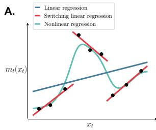

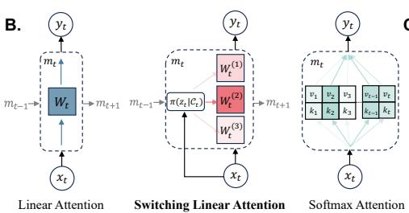

C.  
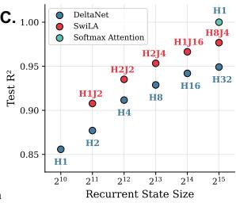  
Figure 1: Switching Linear Attention. (A): When the input–output relationship varies with context, piecewise (”switching”) regression is more expressive than linear regression. (B): SwiLA increases expressivity toward that of softmax attention while retaining, as in linear attention, a fixed-size recurrent state whose memory footprint is independent of sequence length. SwiLA’s state is a mixture of linear regressors. At each step, SwiLA selects which regressor to use based on the current input and previous state. (C): Test $R ^ { 2 }$ vs. state size for SwiLA and DeltaNet on a synthetic softmax attention regression task, with softmax attention for reference. Labels mark the best SwiLA configuration (H=heads, J=mixtures). At every budget, SwiLA better approximates softmax attention.

## 3 Switching Linear Attention

We introduce Switching Linear Attention (SwiLA), a sequence layer based on mixtures of linear regressions. SwiLA retains the fixed-size recurrent state of linear attention, while improving its retrieval expressivity through a nonlinear mapping from query to output in eq. (2.2), as in softmax attention. SwiLA is a form of TTR with,

• Regression model: mixture of linear regressors (Pearson, 1894; De Veaux, 1989)

• Optimization algorithm: online expectation–maximization (EM) (Dempster et al., 1977; Cappe & Moulines´ , 2009).

For the rest of the paper, we consider a sequence of keys $k _ { t } ,$ values $v _ { t } ,$ and queries $q _ { t }$ in $\mathbb { R } ^ { D } .$ projected from the inputs $\boldsymbol { x } _ { t } \in \mathbb { R } ^ { d _ { \mathrm { i n } } }$ . Further technical details are given in Appendix B.

## 3.1 Regression Model: Mixture of Linear Regressors

Mixture modeling is a foundational approach for modeling functions that vary based on group membership (Bishop, 2006). Consider a dataset $\{ ( k _ { t } , \bar { v } _ { t } ) \} _ { t = 1 } ^ { T }$ consisting of key–value pairs with $\boldsymbol { k } _ { t } \in \mathbb { R } ^ { D }$ and $\boldsymbol { v } _ { t } \in \mathbb { R } ^ { D }$ , assumed to be generated from a mixture of J linear Gaussian regression models. To improve expressivity in high-dimensional settings, we allow group membership to vary across the output dimension d.

Specifically, let $z _ { t d } \in \{ 1 , \dots , J \}$ denote the group membership of data point t and output dimension d. Then, given a key $k _ { t } ,$ the value $v _ { t d }$ is modeled as

$$
p ( z _ { t d } | k _ { t } ) = \mathsf { C a t } \left( z _ { t d } | \pi _ { j d } ( k _ { t } ) \right) , \qquad p ( v _ { t d } | z _ { t d } = j , k _ { t } ) = \mathcal { N } \Big ( v _ { t d } | w _ { j d } ^ { \top } k _ { t } , 1 \Big ) .\tag{3.1}
$$

Here, $\pi _ { j d } ( k _ { t } )$ denotes the prior probabilities of the mixture components. The regression weights, $w _ { j d } \in \mathbb { R } ^ { D }$ , are specific to mixture component j and output dimension d. We denote $W \in \mathbb { R } ^ { J \times D \times D }$ as the collection of all weights. Since each output dimension independently selects its own mixture component, the effective number of mixtures grows exponentially as $J ^ { D }$ , whereas the number of weights scales polynomially as $J D ^ { 2 }$

Under the probabilistic model in eq. (3.1), the marginal log-likelihood for timestep t and output dimension d is

$$
\ell _ { t d } = \log p ( v _ { t d } \mid k _ { t } ) = \log \sum _ { j = 1 } ^ { J } \pi _ { j d } ( k _ { t } ) \exp \Bigl ( - \frac { 1 } { 2 } \bigl ( v _ { t d } - w _ { j d } ^ { \top } k _ { t } \bigr ) ^ { 2 } \Bigr ) + c .\tag{3.2}
$$

Complete modeling details are given in Appendix B.2.

## 3.2 Optimization Algorithm: Online EM

The standard approach for fitting mixtures of linear regressors (3.1) is the EM algorithm. In the TTR setting, the weights W are estimated online: at each timestep t, the current estimates $W _ { t - 1 }$ are updated as the new pair $\left( k _ { t } , v _ { t } \right)$ arrives. Our choice of online EM as the optimizer is what gives rise to the SwiLA recurrence. It amounts to a one-step stochastic gradient update, where we ascend on the marginal log-likelihood (3.2) with respect to the ”fast-weights” W. In particular, the SwiLA recurrence for all mixture components j and output dimensions d is

$$
\begin{array} { r } { w _ { t j d } = w _ { t - 1 , j d } + \beta _ { t j d } \nabla _ { w _ { t - 1 , j d } } \ell _ { t d } } \\ { = w _ { t - 1 , j d } + \beta _ { t j d } r _ { t j d } \delta _ { t j d } k _ { t } . } \end{array}\tag{3.3}
$$

Here, $\beta _ { t j d }$ is a learning rate and $\delta _ { t j d } : = v _ { t d } - w _ { t - 1 , j d } ^ { \top } k _ { t }$ is a prediction error, just as in the delta rule (Schlag et al., 2021; Yang et al., 2024b). The responsibilities

$$
r _ { t j d } : = \frac { \pi _ { j d } ( k _ { t } ) \exp ( - \frac { 1 } { 2 } \delta _ { t j d } ^ { 2 } ) } { \sum _ { j ^ { \prime } } \pi _ { j ^ { \prime } d } ( k _ { t } ) \exp ( - \frac { 1 } { 2 } \delta _ { t j ^ { \prime } d } ^ { 2 } ) } ,\tag{3.4}
$$

are the posterior probabilities that the d-th dimension of vt was generated by mixture component j. Once the state $w _ { t j d }$ has been updated, the query qt then retrieves the output $o _ { t d }$ according to the mixture of linear regressors, as

$$
o _ { t d } = \sum _ { j = 1 } ^ { J } \pi _ { j d } ( q _ { t } ) w _ { t j d } ^ { \top } q _ { t } ,\tag{3.5}
$$

where $\pi _ { j d } ( q _ { t } )$ is also a learned projection from the input $x _ { t }$

In summary, we derive the SwiLA recursion (3.3) and retrieval (3.5) from the TTR framework by choosing our model as a mixture of linear regressors and our optimizer as online EM. We build on this probabilistic perspective in the next two sections: Section 3.3 adds temporal persistence to the prior over mixture assignments, and Section 3.4 derives input-dependent gating from Gaussian priors on the mixture weights.

## 3.3 Regression Model Extension: Temporal SwiLA

A natural benefit of SwiLA is that its mixture components can accommodate different ”contexts.” In many settings, context persists across consecutive inputs. For example, in an essay comparing the musician Harry Styles with the magician Harry Potter, the discussion of each person likely spans a full paragraph, and the value associated with ‘Harry’ should depend on that context. Mathematically, this persistence suggests that if input t has a high probability of belonging to mixture component $j ,$ then so should input t + 1.

However, SwiLA as formulated in Section 3.1 does not have any persistence in the mixture assignments. The mixture assignment of each time step is memoryless, starting over with another draw from its prior π. To address this limitation, we extend SwiLA with a Markovian prior that introduces dependencies between $z _ { t d }$ and $z _ { t + 1 , d } .$

The standard probabilistic approach for such temporal persistence is a hidden Markov model (HMM), but such an approach would require marginalization and computation of normalizing constants at every time step. Instead, we use a computationally tractable approximation to HMM filtering. We maintain a running probability distribution over mixture components for each output dimension $d ,$ and at each time step, take a convex combination of this distribution with a new input-dependent distribution generated from the current input. With this extension, the mixture assignments in SwiLA can persist across consecutive time steps. See Appendix B.3 for full details on this temporal recurrence.

## 3.4 Regression Model Extension: Gated SwiLA

Input-dependent state decay, or gating, has driven strong empirical gains in linear attention, as in GDN (Yang et al., 2025) and KDA (Team et al., 2025). We present two formulations of Gated SwiLA, which differ in whether the gate is applied after or before computing the responsibilities. See Appendix B.4 for full details.

Under the TTR framework, state decay is equivalent to weight regularization of the fast weights (Wang et al., 2025). Accordingly, we place Gaussian priors on SwiLA’s mixture weights, $w _ { j d } \sim \mathcal N ( 0 , \lambda _ { t i d } ^ { - 1 } I )$ , which introduces a regularization term to eq. (3.2):

$$
\ell _ { t d } = \log \sum _ { j = 1 } ^ { J } \pi _ { j d } \big ( k _ { t } \big ) \exp \Big ( { - \frac { 1 } { 2 } \big ( v _ { t d } - w _ { j d } ^ { \top } k _ { t } \big ) ^ { 2 } } \Big ) - \sum _ { j = 1 } ^ { J } \frac { \lambda _ { t j d } } { 2 } \| w _ { j d } \| _ { 2 } ^ { 2 } + c .\tag{3.6}
$$

A one-step stochastic gradient ascent on eq. (3.6) yields the recurrence

$$
w _ { t j d } = \alpha _ { t j d } w _ { t - 1 , j d } + \beta _ { t j d } r _ { t j d } \delta _ { t j d } k _ { t } , \qquad \alpha _ { t j d } : = 1 - \beta _ { t j d } \lambda _ { t j d } ,\tag{3.7}
$$

where we parameterize $\alpha _ { t j d } \in [ 0 , 1 ]$ as a learned, input-dependent gate that is applied after the responsibilities are computed.

Alternatively, following the implementation of the recurrent form of GDN (Yang et al., 2025; Yang & Zhang, 2024), which applies the gate before computing the prediction error, we obtain the recurrence

$$
w _ { t j d } = \alpha _ { t j d } w _ { t - 1 , j d } + \beta _ { t j d } r _ { t j d } ^ { - } \delta _ { t j d } ^ { - } k _ { t } ,\tag{3.8}
$$

where $\delta _ { t j d } ^ { - } : = v _ { t d } - \alpha _ { t j d } w _ { t - 1 , j d } ^ { \top } k _ { t }$ are the prediction errors at the decayed state and $r _ { t j d } ^ { - }$ are the responsibilities computed from these errors. The two formulations coincide for $J = 1$ up to a reparameterization, but differ for $J > 1$ . In practice, we use eq. (3.8) for Gated SwiLA.

## 3.5 Improving the Optimization Algorithm: Load Balancing

Without regularization, SwiLA is susceptible to expert collapse, where a few mixture components capture all responsibility mass, and the remaining experts go unused. We employ two complementary strategies to prevent this.

First, we add an auxiliary loss that adapts load balancing loss (Shazeer et al., 2017; Fedus et al., 2022). We maximize the mutual information I(token; expert) $) = H _ { \mathrm { m a r g } } { - H _ { \mathrm { c o n d } } }$ between tokens and expert assignments, where $H _ { \mathrm { m a r g } }$ is the entropy of the time-averaged responsibilities and $\dot { H } _ { \mathrm { c o n d } }$ is the mean per-token entropy. Maximizing $H _ { \mathrm { m a r g } }$ encourages balanced utilization across experts, while minimizing $\dot { H } _ { \mathrm { c o n d } } ^ { - }$ encourages per-token specialization. The auxiliary loss is,

$$
\begin{array} { r } { \mathcal { L } _ { \mathrm { M I } } = - \lambda _ { \mathrm { m a r g } } H _ { \mathrm { m a r g } } + \lambda _ { \mathrm { c o n d } } H _ { \mathrm { c o n d } } . } \end{array}\tag{3.9}
$$

It is computed for both the key-side and query-side responsibilities and averaged.

Second, following Shazeer et al. (2017), we inject learned input-dependent noise into the expert logits during training:

$$
\tilde { \pi } _ { j d } ( x _ { t } ) = \frac { \exp ( \theta _ { j d } ^ { \top } x _ { t } + \epsilon _ { t j d } \cdot \mathrm { s o f t p l u s } ( \theta _ { \mathrm { n o i s e } , j d } ^ { \top } x _ { t } ) ) } { \sum _ { j ^ { \prime } } \exp ( \theta _ { j ^ { \prime } d } ^ { \top } x _ { t } + \epsilon _ { t j ^ { \prime } d } \cdot \mathrm { s o f t p l u s } ( \theta _ { \mathrm { n o i s e } , j ^ { \prime } d } ^ { \top } x _ { t } ) ) } , \qquad \epsilon _ { t j d } \sim \mathcal { N } ( 0 , 1 ) .\tag{3.10}
$$

Noise is injected into both the key-side and query-side expert logits, as well as into the gate logits in Temporal SwiLA (Section 3.3), each with its own learned projection.

## 4 Related Work

We discuss two closely related linear attention sequence layers to SwiLA: DeltaNet (Schlag et al., 2021; Yang et al., 2024b) and Mixture-of-Memories (MoM) (Du et al., 2026) / Sparse State Expansion (SSE) (Pan et al., 2026). The similarity of these sequence layers to SwiLA motivates our use of them as our linear attention baselines in Section 5. We include a more expansive discussion of related works in Appendix C.

## 4.1 DeltaNet

DeltaNet (Schlag et al., 2021) is a sequence modeling architecture that uses the delta rule for its linear attention sequence mixer: its state $W _ { t } \in \mathbb { R } ^ { \breve { D } \times D }$ updates according to eq. (4.1), and then $W _ { t }$ provides a linear mapping from query to output, as shown in eq. (4.2):

$$
W _ { t } = W _ { t - 1 } + \beta _ { t } \left( v _ { t } - W _ { t - 1 } k _ { t } \right) k _ { t } ^ { \top }\tag{4.1}
$$

$$
o _ { t } = W _ { t } q _ { t }\tag{4.2}
$$

On the one hand, there are clear differences between SwiLA and DeltaNet. The SwiLA recurrence (3.3) is nonlinear while the delta rule (4.1) is linear in its fast-weights $W _ { t - 1 }$ Furthermore, for retrieval, DeltaNet provides a single linear mapping from query to output (4.2), while SwiLA switches adaptively between mixtures of linear regressors (3.5). In TTR, DeltaNet and SwiLA correspond to different function classes for the regressor.

On the other hand, in TTR, DeltaNet and SwiLA both use SGD as the optimizer. The delta rule optimizes $\lVert \boldsymbol { v } _ { t } - \boldsymbol { W } _ { t } \boldsymbol { k } _ { t } \rVert ^ { 2 }$ , while SwiLA maximizes the marginal log-likelihood (3.2). This similarity is why the prediction error appears in both recurrences. Moreover, it means that DeltaNet’s chunkwise parallel algorithm (Yang et al., 2024b) could be applied within each Newton iteration to parallelize SwiLA across the sequence length (Appendix D).

Chunkwise parallel algorithm SwiLA’s nonlinear recurrence in its fast weights $W _ { t }$ can theoretically be parallelized using parallel Newton iterations (Lim et al., 2024; Gonzalez et al., 2024; Gonzalez, 2026; Danieli et al., 2026). Parallel Newton iterations work by iteratively linearizing the recurrence, and then using parallel compute to evaluate the linearized system, and they are guaranteed to converge (Gonzalez, 2026). Previous implementations of these iterations relied on parallel associative scans (Blelloch, 1990), which incur a prohibitive $O ( T D ^ { 2 } )$ memory cost by materializing all hidden states (Yang, 2024). To overcome this, we observe that each Newton iteration applied to SwiLA shares the same rank-one update structure as the delta rule recurrence, enabling a novel chunkwise parallel Newton algorithm that avoids the parallel scan’s memory bottleneck. Although our current experiments rely on a fast recurrent (sequential) Triton kernel for SwiLA, the systems-level optimization of this chunkwise parallel approach presents an interesting direction for future work. We discuss parallelization further in Appendix D.

## 4.2 Mixture-of-Memories

The most similar method to SwiLA is the Mixture-of-Memories (MoM) layer introduced by Du et al. (2026). MoM also splits the hidden state into J different memory states, and uses a learnable router to select which memories to activate based on the input. The Sparse State Expansion (SSE) layer of Pan et al. (2026) also uses a mixture of memories, albeit with sparse updates. Since the routers of these layers do not depend on the previous state, their recurrences are linear in their hidden states $\Breve { W _ { t } }$ . In contrast, we derive our SwiLA update from the TTR framework. Consequently, our “router” is based on the posterior responsibilities, which are functions not only of the input but also the prior state, rendering our recurrence nonlinear in $W _ { t }$ . Increasingly, theoretical (Siems et al., 2026; Merrill et al., 2026) and empirical (Farsang & Grosu, 2025; Zattra et al., 2025; Mishra et al., 2026) results demonstrate that nonlinear recurrences have superior expressivity to linear recurrences.

## 5 Experimental Results

We evaluate SwiLA in three settings. Section 5.1 highlights SwiLA’s ability to approximate the input–output mapping of a single softmax attention head. Section 5.2 evaluates SwiLA on two synthetic benchmarks: context-dependent associative recall and in-context language learning. Section 5.3 scales to language models pretrained on FineWeb-Edu, with downstream evaluation on commonsense reasoning and recall-intensive tasks. Complementing these evaluations, Section 5.4 profiles training and inference efficiency, and Section 5.5 ablates SwiLA’s key design choices.

For our language modeling evaluation, we compare SwiLA against a suite of ungated and gated baselines: DeltaNet (Schlag et al., 2021; Yang et $\mathsf { a l . } ,$ , 2024b), Gated DeltaNet (GDN) (Yang et al., 2025), KDA (Team et al., 2025), and MoM (Du et al., 2026) with DeltaNet-style (DN-MoM) and GDN-style (GDN-MoM) updates, as well as Transformer++ (Touvron et al., 2023) and FoX (Lin et al., 2025) for softmax attention variants. We further compare Hybrid GDN and Hybrid Temporal SwiLA, which interleave three recurrent layers with one softmax attention layer following Team et al. (2025). The recurrent state size is matched across all recurrent models in every experiment. See Appendix E for full experimental details.

## 5.1 Approximating Softmax Attention

We test whether SwiLA can better approximate the input–output mapping of a single softmax attention head than DeltaNet, given the same recurrent state size.

Setup. We construct a synthetic regression task in which the target function is causal softmax attention. In this experiment, we set $D = 3 2$ . Inputs $\boldsymbol { x } _ { t } \in \mathbb { R } ^ { D }$ are drawn from 32 randomly sampled clusters in $\mathbb { R } ^ { D }$ . Using fixed, randomly sampled projection matrices $\theta _ { Q } , \theta _ { K } , \theta _ { V }$ , we compute queries $q _ { t } = \theta _ { Q } x _ { t }$ , keys $k _ { t } = \theta _ { K } x _ { t }$ , and values $\boldsymbol { v _ { t } } \overset { - } { = } \boldsymbol { \theta _ { V } } \boldsymbol { x _ { t } }$ . The regression targets are the outputs of causal softmax attention with temperature $\tau = \sqrt { D } / 2$

$$
o _ { t } = \sum _ { i = 1 } ^ { t } \frac { \exp ( { q _ { t } ^ { \top } k _ { i } / \tau } ) } { \sum _ { j = 1 } ^ { t } \exp ( { q _ { t } ^ { \top } k _ { j } / \tau } ) } v _ { i } .\tag{5.1}
$$

We generate 65,536 training sequences of length 512 and report test $R ^ { 2 }$ on a held-out set of 2,048 sequences. We compare DeltaNet and SwiLA at matched state budgets $B = H \times J ,$ where H is the number of heads and J the number of mixtures per head $\overset { \smile } { \boldsymbol { J } } = 1$ recovers DeltaNet). All configurations use a fixed head dimension of $D = { \hat { 3 } } 2$ , giving a total recurrent state size of $B \times D ^ { \breve { 2 } }$ . For different factorizations $\left( H , J \right)$ , we expand the key and value dimensions to keep D fixed, ensuring that both models maintain the same total recurrent state size. For each budget $B \in \{ 1 , 2 , 4 , 8 , 1 6 , 3 2 \}$ , we sweep all factorizations $\left( H , J \right)$ with $H \times J = B$ and $J \leq 1 6$ for SwiLA, and set $H = B , J = 1$ for DeltaNet. For a given state budget, many additional configurations become available if the head dimension D is also allowed to vary. For instance, a budget of $H \times J \times D ^ { 2 } = 4 \times 1 \times 3 2 ^ { 2 } = 4 { , } 0 9 6$ can equivalently be realized by $H = 4$ heads with $\breve { J } = 4$ mixtures and keys and values projected down to dimension $d = 1 6$ , since $4 \times 4 \times 1 6 ^ { 2 } = 4 , 0 9 6$ . We fix $D = 3 2$ for this experiment.

Results. Figure 1C plots test $R ^ { 2 }$ against recurrent state size. At every state budget, the best SwiLA configuration achieves a higher $R ^ { 2 }$ than DeltaNet. At B=2, the one-head SwiLA (H1J2) outperforms the two-head DeltaNet (H2) by a clear margin, and this advantage persists as the budget increases. This indicates that allocating budget to mixtures within a head, rather than to independent heads, better approximates softmax attention.

As the budget grows, the best SwiLA configurations tend to balance heads and mixtures (e.g., H2J2 at $B { \stackrel { \smile } { = } } 4 )$ rather than concentrating all budget in either dimension. Both forms of capacity—parallel heads and per-head mixtures—play complementary roles.

In Figure S1, we plot all SwiLA configurations at each budget, where the right panel shows the number of model parameters on the x-axis. Overall, these results confirm that SwiLA provides a more expressive function class for approximating softmax attention than the independent-head decomposition used by DeltaNet.

## 5.2 Synthetic Benchmarks

We evaluate SwiLA on two synthetic benchmarks: context-dependent associative recall and in-context language learning benchmarks.

Context-Dependent Associative Recall (CDAR). Adapted from the associative recall task of Arora et al. (2024a), we design a variant that tests whether a model can maintain multiple separate associative memories and persist context information to select the correct one at retrieval time. In CDAR, the same key maps to different values depending on a context token. Recurrent models must therefore contend with interference across contexts and retain which context is active when answering queries. Crucially, since the context token appears only once at the start of each block and the query region is separated from the context blocks, the task requires temporal persistence of context awareness that cannot be resolved by the short convolutions commonly prepended to recurrent layers. Each example contains C context blocks followed by a query region. A context block begins with a context token $c _ { i }$ and lists key-value pairs under that context. In the query region, each context’s queries are grouped contiguously: the context token appears once, followed by keys whose values the model must predict. For instance, with $C \stackrel { } { = } 2$ contexts and 3 key-value pairs each:

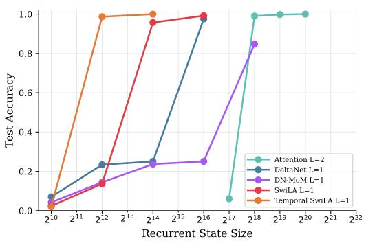  
(A) Context-Dependent Associative Recall

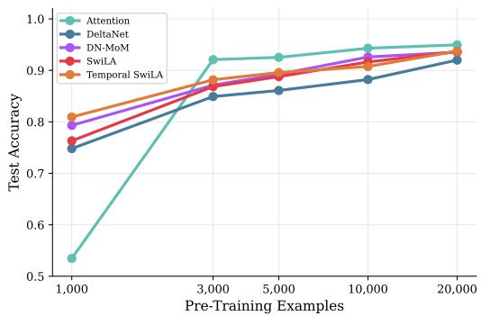  
(B) RegBench  
Figure 2: Synthetic Benchmarks. (A) Context-Dependent Associative Recall with 4 contexts and 32 key-value pairs per context: test accuracy vs. state size. (B) RegBench: test accuracy as a function of training set size.

$$
\mathbf { c _ { 1 } } , k _ { 2 } , v _ { 1 , 2 } , k _ { 1 } , v _ { 1 , 1 } , k _ { 3 } , v _ { 1 , 3 } \mid \mathbf { c _ { 2 } } , k _ { 3 } , v _ { 2 , 3 } , k _ { 2 } , v _ { 2 , 2 } , k _ { 1 } , v _ { 2 , 1 } \mid \mathbf { c _ { 2 } } , k _ { 3 } , ? , k _ { 1 } , ? , k _ { 2 } , ? \mid \mathbf { c _ { 1 } } , k _ { 2 } , ? , k _ { 3 } , ? , k _ { 1 } , ? , k _ { 2 }
$$

context blocks

queries

The key set is shared across all contexts, but each (context, key) pair maps to a distinct value. The model must use the context token to determine which mapping is active and carry that information forward to the answer positions. Loss is computed only at answer positions. We use $C = 4$ contexts with 32 key-value pairs each (128 total associations), vocabulary size 8,192, and sequence length 1,024. Figure 2A shows the best test accuracy across learning rates and random seeds. Temporal SwiLA with a single head with dimension $D = 3 2$ and 4 mixtures (recurrent state size of $2 ^ { 1 2 } )$ is the smallest configuration that achieves near-perfect accuracy, suggesting that the mixtures with temporal priors are crucial. All other recurrent models (nearly) solve the task with one layer as the state size increases, while the Transformer requires two, consistent with recent findings that single-layer Transformers cannot perform associative recall beyond chance (Okpekpe & Orvieto, 2025).

RegBench: In-Context Language Learning. RegBench (Akyurek et al.¨ , 2024) tests how efficiently different architectures learn to perform in-context language learning using probabilistic finite automata (PFAs), where they found that Transformers outperformed recurrent models. Each input packs 10–20 example strings from a randomly generated PFA (4-12 states, alphabet size 4-18) into a single sequence, and the model must learn the PFA’s nexttoken distribution in-context via next-token prediction. We compare five 8-layer models: SwiLA and Temporal SwiLA, DN-MoM, DeltaNet, and a Transformer. We report accuracy on a held-out test set of 500 PFAs using the best checkpoint by validation loss. As shown in Figure 2B, Temporal SwiLA and DN-MoM exhibit strong sample efficiency, outperforming the Transformer in the low-data regime (1,000 training PFAs), while the Transformer’s accuracy improves steeply with more data and ultimately reaches the highest accuracy. All models achieve similar performance at scale, with DeltaNet slightly trailing.

## 5.3 Pretraining Language Models

We evaluate SwiLA on a realistic language modeling pipeline. All models have 374M parameters, share the same architecture skeleton (24 layers and 1024 hidden size), and are trained on 15B tokens from FineWeb-Edu (Penedo et al., 2024). SwiLA and its variants show strong results across all tasks, narrowing the gap to Transformer++ and even surpassing it on several benchmarks.

Table 1: Commonsense Reasoning. Best result per task in bold, second best underlined.
<table><tr><td></td><td colspan="3">Perplexity (↓)</td><td colspan="7">Accuracy (↑, %)</td></tr><tr><td>Model (374M)</td><td>Wiki.</td><td>LMB.</td><td>LMB.</td><td>PIQA</td><td>Hella.</td><td>Wino.</td><td>ARC-E</td><td>ARC-C</td><td>SIQA</td><td>BoolQ Avg.</td></tr><tr><td>Transformer++</td><td>28.2</td><td>37.4</td><td>33.5</td><td>66.0</td><td>32.4</td><td>52.6</td><td>56.0</td><td>24.1</td><td>38.4 59.1</td><td>45.3</td></tr><tr><td>FoX</td><td>28.7</td><td>50.3</td><td>30.8</td><td>65.2</td><td>32.2</td><td>52.5</td><td>57.2</td><td>23.2</td><td>37.9 58.0</td><td>44.6</td></tr><tr><td>DeltaNet</td><td>29.8</td><td>46.3</td><td>27.9</td><td>63.9</td><td>31.9</td><td>51.6</td><td>55.6</td><td>21.8 38.3</td><td>58.3</td><td>43.7</td></tr><tr><td>Gated DeltaNet</td><td>27.7</td><td>35.7</td><td>32.0</td><td>66.0</td><td>33.3 51.8</td><td>57.5</td><td>24.6</td><td>39.0</td><td>55.8</td><td>45.0</td></tr><tr><td>KDA</td><td>23.4</td><td>26.8</td><td>36.4</td><td>67.0</td><td>34.9</td><td>51.5 60.7</td><td>27.3</td><td>38.9</td><td>56.2</td><td>46.6</td></tr><tr><td>DN-MoM</td><td>40.0</td><td>84.5</td><td>24.1</td><td>62.6</td><td>30.4</td><td>49.2 52.2</td><td>22.8</td><td>36.6</td><td>62.0</td><td>42.5</td></tr><tr><td>GDN-MoM</td><td>35.3</td><td>56.9</td><td>27.5</td><td>64.6</td><td>31.6</td><td>50.2 54.2</td><td>23.6 22.8</td><td>37.2 38.1</td><td>53.3</td><td>42.8</td></tr><tr><td>SwiLA</td><td>28.8</td><td>43.0</td><td>30.4</td><td>66.6</td><td>32.0</td><td>51.5 56.1</td><td></td><td></td><td>60.1</td><td>44.7</td></tr><tr><td>Gated SwiLA</td><td>27.8</td><td>31.8</td><td>34.6</td><td>66.1</td><td>32.7</td><td>50.4</td><td>57.5</td><td>25.0 38.1</td><td>59.1 61.5</td><td>45.4 45.2</td></tr><tr><td>Temporal SwiLA</td><td>28.6 27.8</td><td>39.4</td><td>31.5</td><td>66.5</td><td>31.7</td><td>51.1</td><td>57.2</td><td>23.2 38.8 38.5</td><td>58.4</td><td>45.4</td></tr><tr><td>Gated Temporal SwiLA</td><td></td><td>31.7</td><td>34.5</td><td>65.8</td><td>32.9</td><td>51.8</td><td>56.5</td><td>24.5</td><td></td><td></td></tr><tr><td>Hybrid GDN</td><td>31.6</td><td>56.3</td><td>28.5</td><td>64.8</td><td>32.2</td><td>50.7</td><td>54.6</td><td>23.1 39.0</td><td>61.4</td><td>44.3</td></tr><tr><td>Hybrid Temporal SwiLA</td><td>27.8</td><td>40.0</td><td>32.4</td><td>66.1</td><td>32.6</td><td>50.2</td><td>57.2</td><td>23.3</td><td>37.7 61.1</td><td>45.1</td></tr></table>

Commonsense Reasoning. Following Gu & Dao (2024), we evaluate our model on a suite of commonsense reasoning tasks: Wikitext (Merity et al., 2016), LAMBADA (Paperno et al., 2016), PIQA (Bisk et al., 2020), HellaSwag (Zellers et al., 2019), WinoGrande (Sakaguchi et al., 2019), ARC-easy and ARC-challenge (Clark et al., 2018), SIQA (Sap et al., 2019), and BoolQ (Clark et al., 2019). Among the linear attention layers, KDA achieves the strongest commonsense results. Every SwiLA variant attains higher average accuracy than DeltaNet, DN-MoM and GDN-MoM, and the Gated SwiLA variants additionally exceed GDN, slightly surpassing Transformer++ on average and outperforming it on several individual benchmarks.

Recall-Intensive Tasks. To measure the ability to perform context-based retrieval and comprehension, we evaluate on six recall-intensive tasks following Arora et al. (2024c): SWDE (Lockard et al., 2019; Arora et al., 2023), FDA (Arora et al., 2023), SQuAD (Rajpurkar et al., 2018), TriviaQA (Joshi et al., 2017), NQ (Kwiatkowski et al., 2019), and DROP (Dua et al., 2019). Table 2 shows that the softmax attention models achieve the highest scores, with FoX attaining the best average, benefiting from their full KV caches that grow linearly with context length. Every SwiLA variant outperforms DeltaNet and both MoM variants on all six recall benchmarks, and Gated SwiLA variants achieve the highest averages among all recurrent models, including KDA. Among the hybrid models, Hybrid Temporal SwiLA surpasses both Hybrid GDN and Transformer++, approaching the recall performance of FoX. These gains confirm that SwiLA’s mixture structure meaningfully improves associative recall compared to a single linear regressor, narrowing the gap to softmax attention while retaining a fixed-size recurrent state.

## 5.4 Throughput Comparison

We profile the training and inference throughput and peak memory of six 1.3B-parameter models, a scale widely adopted for such analyses (Gu & Dao, 2023; Yang et al., 2025): Transformer, GDN, Hybrid GDN, SwiLA, Temporal SwiLA, and Hybrid Temporal SwiLA. For the hybrid models, we follow the 3:1 layer ratio of Team et al. (2025), interleaving three recurrent layers with one Transformer layer. See Appendix E.4 for details.

Overall, SwiLA achieves 4–5× higher end-to-end inference throughput than the Transformer baseline, as it does not require a KV cache and can therefore accommodate substantially larger batch sizes. Relative to GDN, SwiLA is approximately 2× slower at training time and 1.25–1.5× slower at inference time, and it has a larger memory footprint. We expect that part, though not all, of this gap can be narrowed through further engineering, such as custom CUDA kernels or the parallelization of the recurrence discussed in Appendix D.

## 5.5 Ablation Study

We conduct ablation experiments that isolate the contribution of the number of experts, temporal persistence, and the load-balancing loss. We train 115M-parameter SwiLA variants on 5B tokens and report test perplexity on 100M held-out tokens in Figure S5, alongside routing diagnostics defined in Appendix E.5. We highlight three findings. First, temporal persistence consistently improves perplexity over vanilla SwiLA. Second, load balancing loss is critical for vanilla SwiLA, which otherwise suffers severe expert collapse, but has a negligible effect on Temporal SwiLA; temporal persistence itself appears to act as a natural regularizer against collapse. Third, under a fixed recurrent state size budget, more experts do not necessarily help: increasing the number of experts from 4 to 16 slightly degrades performance, since each expert must then use smaller query, key, and value projections, creating a tradeoff between expert count and per-expert projection capacity.

Table 2: Recall-Intensive Tasks. All scores use the contains metric (%, ↑). Best in bold, second best underlined. All inputs are truncated to 2K tokens.
<table><tr><td>Model</td><td>SWDE</td><td>FDA</td><td>SQuAD</td><td>TriviaQA NQ</td><td></td><td>DROP</td><td>Avg.</td></tr><tr><td>Transformer++</td><td>28.4</td><td>29.5</td><td>31.5</td><td>46.0</td><td>15.6</td><td>18.9</td><td>28.3</td></tr><tr><td>FoX</td><td>36.4</td><td>53.0</td><td>30.6</td><td>46.4</td><td>15.6</td><td>20.2</td><td>33.7</td></tr><tr><td>DeltaNet</td><td>7.9</td><td>5.4</td><td>23.4</td><td>41.7</td><td>10.5</td><td>14.9</td><td>17.3</td></tr><tr><td>Gated DeltaNet</td><td>9.1</td><td>5.5</td><td>25.2</td><td>44.4</td><td>12.9</td><td>18.0</td><td>19.2</td></tr><tr><td>KDA</td><td>13.9</td><td>5.5</td><td>25.5</td><td>46.8</td><td>12.5</td><td>17.6</td><td>20.3</td></tr><tr><td>DN-MoM</td><td>5.4</td><td>2.1</td><td>21.2</td><td>37.0</td><td>9.1</td><td>14.8</td><td>14.9</td></tr><tr><td>GDN-MoM</td><td>8.3</td><td>3.8</td><td>18.4</td><td>41.7</td><td>10.0</td><td>16.3</td><td>16.4</td></tr><tr><td>SwiLA</td><td>12.9</td><td>8.0</td><td>24.7</td><td>42.5</td><td>12.9</td><td>17.6</td><td>19.7</td></tr><tr><td>Gated SwiLA</td><td>10.2</td><td>10.1</td><td>26.3</td><td>45.2</td><td>13.6</td><td>17.5</td><td>20.5</td></tr><tr><td>Temporal SwiLA</td><td>13.6</td><td>11.6</td><td>23.8</td><td>42.8</td><td>13.3</td><td>17.2</td><td>20.3</td></tr><tr><td>Gated Temporal SwiLA</td><td>12.0</td><td>7.5</td><td>26.0</td><td>44.9</td><td>13.8</td><td>19.2</td><td>20.6</td></tr><tr><td>Hybrid GDN</td><td>25.0</td><td>38.2</td><td>34.9</td><td>43.7</td><td>16.0</td><td>19.1</td><td>29.5</td></tr><tr><td>Hybrid Temporal SwiLA</td><td>32.3</td><td>49.1</td><td>30.0</td><td>45.8</td><td>14.9</td><td>18.9</td><td>31.8</td></tr></table>

## 6 Conclusion

We introduce Switching Linear Attention (SwiLA), a sequence layer that retains a recurrent state whose size is independent of sequence length as in linear attention, while representing a nonlinear map from queries to outputs as in softmax attention. Building on the test-time regression (TTR) framework (Wang et al., 2025), which unifies the design of sequence layers around associative recall, we derive SwiLA from a mixture of linear regressions via online expectation–maximization. Across associative recall, in-context language learning, and language modeling benchmarks, SwiLA performs strongly and narrows the gap to softmax attention, even surpassing it in several settings.

Limitations While SwiLA increases the expressivity of standard linear attention, it retains a fixed state size. As a result, its capacity cannot grow with the context length, unlike the KV cache of softmax attention1. Moreover, as SwiLA uses a nonlinear recurrence, we currently pretrain SwiLA with sequential evaluation across the sequence length, whereas both softmax and linear attention mechanisms are designed to allow for training that is parallelized across the sequence length. While we can parallelize the nonlinear recurrence of SwiLA using multiple Newton iterations, further optimizations are required to design custom kernels that yield speed-ups over optimized kernels for sequential evaluation.

Future Outlook SwiLA demonstrates the promise of TTR: we can design sequence layers with desired in-context learning properties by choosing appropriate regression models and update algorithms. We anticipate TTR to open up a range of possibilities between the efficiency of linear attention and the expressivity of softmax attention. For example, while SwiLA shows the promise of mixture modeling as occupying a useful middle ground between these two extremes, other function classes such as local linear regression (Zuo et al., 2026) may prove useful in fully exploring this space. Moreover, SwiLA’s enhanced ability to approximate softmax attention (Figure 1C) while retaining a fixed-state size appears promising for distillation—converting pretrained softmax layers into recurrent layers for efficient inference (Bick et al., 2024; Wang et al., 2024; Zhang et al., 2024a).

## Acknowledgments

H.D.L. is supported by the Ketterer-Vorwald Stanford Interdisciplinary Graduate Fellowship. N.Z. is supported by Postdoc.Mobility grant P500-2 235376 from the Swiss National Science Foundation. E.B.F. is supported in part by ONR Grant N00014-22-1-2110 and the Stanford Institute for Human-Centered Artificial Intelligence (HAI), and is a Biohub, San Francisco, Investigator. S.W.L. is supported by grants from the NIH (U01NS136507, R01NS131987, R01NS113119, RF1MH133778, R01AG097491, R01NS130789), the NSF (2440859), and the Simons and McKnight Foundations. We thank the members of the Linderman Lab and the Dynamode Lab for feedback throughout this project. We are also grateful for GPU support from the Stanford Research Computing Center’s Sherlock cluster, from VESSL AI, and from Marlowe (Kapfer et al., 2025), Stanford University’s GPU-based Computational Instrument, supported by Stanford HAI and Stanford Research Computing.

## References

Ekin Akyurek, Dale Schuurmans, Jacob Andreas, Tengyu Ma, and Denny Zhou. What learn-¨ ing algorithm is in-context learning? Investigations with linear models. In International Conference on Learning Representations (ICLR), 2023.

Ekin Akyurek, Bailin Wang, Yoon Kim, and Jacob Andreas. In-context language learning:¨ Architectures and algorithms. arXiv preprint arXiv:2401.12973, 2024.

Jean-Baptiste Alayrac, Jeff Donahue, Pauline Luc, Antoine Miech, Iain Barr, Yana Hasson, Karel Lenc, Arthur Mensch, Katherine Millican, Malcolm Reynolds, et al. Flamingo: A visual language model for few-shot learning. In Advances in Neural Information Processing Systems, volume 35, pp. 23716–23736, 2022.

Simran Arora, Brandon Yang, Sabri Eyuboglu, Avanika Narayan, Andrew Hojel, Immanuel Trummer, and Christopher Re. Language models enable simple systems for generating ´ structured views of heterogeneous data lakes. arXiv preprint arXiv:2304.09433, 2023.

Simran Arora, Sabri Eyuboglu, Aman Timber, Isys Johnson, Michael Poli, James Zou, Atri Rudra, and Christopher Re. Zoology: Measuring and improving recall in efficient´ language models. In International Conference on Learning Representations, 2024a.

Simran Arora, Sabri Eyuboglu, Michael Zhang, Aman Timber, Silas Alberti, Dylan Zinber, James Zou, Christopher Re, and Christopher Re. Simple linear attention language models´ balance the recall-throughput tradeoff. In International Conference on Machine Learning. PMLR, 2024b.

Simran Arora, Aman Timalsina, Aaryan Singhal, Benjamin Spector, Sabri Eyuboglu, Xinyi Zhao, Ashish Rao, Atri Rudra, and Christopher Re. Just read twice: Closing the recall gap´ for recurrent language models. arXiv preprint arXiv:2407.05483, 2024c.

Maximilian Beck, Korbinian Poppel, Phillip Lippe, and Sepp Hochreiter. Tiled flash linear¨ attention: More efficient linear rnn and xLSTM kernels. In Advances in Neural Information Processing Systems (NeurIPS), 2025.

Ali Behrouz, Peilin Zhong, and Vahab Mirrokni. Titans: Learning to memorize at test time. arXiv preprint arXiv:2501.00663, 2024.

Alfredo Bellen and Marino Zennaro. Parallel algorithms for initial-value problems for difference and differential equations. Journal of Computational and Applied Mathematics, 25 (3):341–350, 1989.

Aviv Bick, Kevin Li, Eric Xing, J Zico Kolter, and Albert Gu. Transformers to SSMs: Distilling quadratic knowledge to subquadratic models. In Neural Information Processing Systems (NeurIPS), 2024.

Christopher M Bishop. Pattern recognition and machine learning. Springer, 2006.

Yonatan Bisk, Rowan Zellers, Ronan Le Bras, Jianfeng Gao, and Yejin Choi. Piqa: Reasoning about physical commonsense in natural language. In Thirty-Fourth AAAI Conference on Artificial Intelligence, 2020.

Guy E. Blelloch. Prefix Sums and Their Applications. Technical Report CMU-CS-90-190, Carnegie Mellon University, School of Computer Science, 1990.

Tom Brown, Benjamin Mann, Nick Ryder, Melanie Subbiah, Jared D Kaplan, Prafulla Dhariwal, Arvind Neelakantan, Pranav Shyam, Girish Sastry, Amanda Askell, et al. Language models are few-shot learners. In Advances in Neural Information Processing Systems, volume 33, pp. 1877–1901, 2020.

Olivier Cappe and Eric Moulines. On-line expectation–maximization algorithm for latent´ data models. Journal of the Royal Statistical Society Series B: Statistical Methodology, 71(3): 593–613, 2009.

Christopher Clark, Kenton Lee, Ming-Wei Chang, Tom Kwiatkowski, Michael Collins, and Kristina Toutanova. BoolQ: Exploring the surprising difficulty of natural yes/no

questions. In Proceedings of the 2019 conference of the north American chapter of the association for computational linguistics: Human language technologies, volume 1 (long and short papers), pp. 2924–2936, 2019.

Peter Clark, Isaac Cowhey, Oren Etzioni, Tushar Khot, Ashish Sabharwal, Carissa Schoenick, and Oyvind Tafjord. Think you have solved question answering? Try ARC, the AI2 reasoning challenge. ArXiv, abs/1803.05457, 2018.

Federico Danieli, Miguel Sarabia, Xavier Suau, Pau Rodr´ıguez, and Luca Zappella. Deep-PCR: Parallelizing Sequential Operations in Neural Networks. In Advances in Neural Information Processing Systems (NeurIPS), 2023.

Federico Danieli, Pau Rodriguez, Miguel Sarabia, Xavier Suau, and Luca Zappella. ParaRNN: Unlocking parallel training of nonlinear rnns for large language models. In International Conference on Learning Representations (ICLR), 2026.

Tri Dao and Albert Gu. Transformers are SSMs: Generalized models and efficient algorithms through structured state space duality. In International Conference on Machine Learning (ICML), 2024.

Tri Dao, Dan Fu, Stefano Ermon, Atri Rudra, and Christopher Re. FlashAttention: Fast and´ memory-efficient exact attention with IO-awareness. In Advances in neural information processing systems, 2022.

Richard D De Veaux. Mixtures of linear regressions. Computational Statistics & Data Analysis, 8(3):227–245, 1989.

Arthur P Dempster, Nan M Laird, and Donald B Rubin. Maximum likelihood from incomplete data via the EM algorithm. Journal ofthe royal statistical society: series B (methodological), 39(1):1–22, 1977.

Alexey Dosovitskiy, Lucas Beyer, Alexander Kolesnikov, Dirk Weissenborn, Xiaohua Zhai, Thomas Unterthiner, Mostafa Dehghani, Matthias Minderer, Georg Heigold, Sylvain Gelly, et al. An image is worth 16x16 words: Transformers for image recognition at scale. In International Conference on Learning Representations, 2021.

Jusen Du, Weigao Sun, Disen Lan, Jiaxi Hu, and Yu Cheng. Mom: Linear sequence modeling with mixture-of-memories. In International Conference on Learning Representations (ICLR), 2026.

Dheeru Dua, Yizhong Wang, Pradeep Dasigi, Gabriel Stanovsky, Sameer Singh, and Matt Gardner. Drop: A reading comprehension benchmark requiring discrete reasoning over paragraphs. In Proceedings of the 2019 Conference of the North American Chapter of the Associationfor Computational Linguistics: Human Language Technologies, Volume 1 (Long and Short Papers), pp. 2368–2378, 2019.

Monika Farsang and Radu Grosu. Scaling up liquid-resistance liquid-capacitance networks´ for efficient sequence modeling. In Advances in Neural Information Processing Systems (NeurIPS), 2025.

William Fedus, Barret Zoph, and Noam Shazeer. Switch transformers: Scaling to trillion parameter models with simple and efficient sparsity. Journal of Machine Learning Research, 23(120):1–39, 2022.

Chelsea Finn, Pieter Abbeel, and Sergey Levine. Model-agnostic meta-learning for fast adaptation of deep networks. In International Conference on Machine Learning (ICML), 2017.

Shivam Garg, Dimitris Tsipras, Percy S Liang, and Gregory Valiant. What can transformers learn in-context? A case study of simple function classes. In Neural Information Processing Systems (NeurIPS), 2022.

Carles Gelada, Jacob Buckman, Sean Zhang, and Txus Bach. Scaling context requires rethinking attention. arXiv preprint arXiv:2507.04239, 2025.

Xavier Gonzalez. Unifying Optimization and Dynamics to Parallelize Sequential Computation: A Guide to Parallel Newton Methods for Breaking Sequential Bottlenecks. PhD thesis, Stanford University, 2026. URL https://purl.stanford.edu/vf943fc9855.

Xavier Gonzalez, Andrew Warrington, Jimmy T Smith, and Scott W Linderman. Towards scalable and stable parallelization of nonlinear RNNs. Advances in Neural Information Processing Systems, 37:5817–5849, 2024.

Xavier Gonzalez, E Kelly Buchanan, Hyun Dong Lee, Jerry Weihong Liu, Ke Alexander Wang, David M Zoltowski, Christopher Re, and Scott W Linderman. A unifying frame-´ work for parallelizing sequential models with linear dynamical systems. arXiv preprint arXiv:2509.21716, 2025.

Albert Gu. On the tradeoffs of state space models and transformers, 2025. URL https: //goombalab.github.io/blog/2025/tradeoffs/.

Albert Gu and Tri Dao. Mamba: Linear-time sequence modeling with selective state spaces. arXiv preprint arXiv:2312.00752, 2023.

Albert Gu and Tri Dao. Mamba: Linear-time sequence modeling with selective state spaces. In Conference on Language Modeling (COLM), 2024.

Han Guo, Songlin Yang, Tarushii Goel, Eric P Xing, Tri Dao, and Yoon Kim. Log-linear attention. In International Conference on Learning Representations (ICLR), 2026.

David Ha, Andrew Dai, and Quoc V Le. Hypernetworks. In International Conference on Learning Representations (ICLR), 2017.

Dongchen Han, Yifan Pu, Zhuofan Xia, Yizeng Han, Xuran Pan, Xiu Li, Jiwen Lu, Shiji Song, and Gao Huang. Bridging the divide: Reconsidering softmax and linear attention. Advances in Neural Information Processing Systems, 37:79221–79245, 2024a.

Dongchen Han, Tianzhu Ye, Yizeng Han, Zhuofan Xia, Siyuan Pan, Pengfei Wan, Shiji Song, and Gao Huang. Agent attention: On the integration of softmax and linear attention. In European conference on computer vision, pp. 124–140. Springer, 2024b.

Geoffrey E Hinton and David C Plaut. Using fast weights to deblur old memories. In Proceedings of the ninth annual conference of the Cognitive Science Society, pp. 177–186, 1987.

Cheng-Ping Hsieh, Simeng Sun, Samuel Kriman, Shantanu Acharya, Dima Rekesh, Fei Jia, Yang Zhang, and Boris Ginsburg. Ruler: What’s the real context size of your long-context language models? In Conference on Language Modeling (COLM), 2024.

Kazuki Irie and Samuel J Gershman. Fast weight programming and linear transformers: From machine learning to neurobiology. Transactions on Machine Learning Research (TMLR), 2025.

Kazuki Irie, Imanol Schlag, Robert Csord ´ as, and J ´ urgen Schmidhuber. Going beyond linear¨ transformers with recurrent fast weight programmers. In Neural Information Processing Systems (NeurIPS), 2021.

Mandar Joshi, Eunsol Choi, Daniel S Weld, and Luke Zettlemoyer. TriviaQA: A large scale distantly supervised challenge dataset for reading comprehension. In Proceedings of the 55th Annual Meeting of the Association for Computational Linguistics (Volume 1: Long Papers), pp. 1601–1611, 2017.

Craig Kapfer, Kurt Stine, Balasubramanian Narasimhan, Christopher Mentzel, and Emmanuel Candes. Marlowe: Stanford’s gpu-based computational instrument, 2025. URL\` https://doi.org/10.5281/zenodo.14751899.

Angelos Katharopoulos, Apoorv Vyas, Nikolaos Pappas, and Franc¸ois Fleuret. Transformers are RNNs: Fast autoregressive transformers with linear attention. In International Conference on Machine Learning, pp. 5156–5165. PMLR, 2020.

Tom Kwiatkowski, Jennimaria Palomaki, Olivia Redfield, Michael Collins, Ankur Parikh, Chris Alberti, Danielle Epstein, Illia Polosukhin, Jacob Devlin, Kenton Lee, et al. Natural

questions: A benchmark for question answering research. Transactions of the Association for Computational Linguistics, 7:453–466, 2019.

Yi Heng Lim, Qi Zhu, Joshua Selfridge, and Muhammad Firmansyah Kasim. Parallelizing non-linear sequential models over the sequence length. In International Conference on Learning Representations, 2024.

Zhixuan Lin, Evgenii Nikishin, Xu He, and Aaron Courville. Forgetting transformer: Softmax attention with a forget gate. In International Conference on Learning Representations, volume 2025, pp. 69704–69738, 2025.

Bo Liu, Rui Wang, Lemeng Wu, Yihao Feng, Peter Stone, and Qiang Liu. Longhorn: State space models are amortized online learners. arXiv preprint arXiv:2407.14207, 2024.

Colin Lockard, Prashant Shiralkar, and Xin Luna Dong. Openceres: When open information extraction meets the semi-structured web. In Proceedings of the 2019 Conference of the North American Chapter of the Association for Computational Linguistics: Human Language Technologies, Volume 1 (Long and Short Papers), pp. 3047–3056, 2019.

Eric Martin and Chris Cundy. Parallelizing linear recurrent neural nets over sequence length. In International Conference on Learning Representations (ICLR), 2018.

Stephen Merity, Caiming Xiong, James Bradbury, and Richard Socher. Pointer sentinel mixture models, 2016.

William Merrill, Hongjian Jiang, Yanhong Li, and Ashish Sabharwal. Why are linear RNNs more parallelizable? arXiv preprint arXiv:2603.03612, 2026.

Mayank Mishra, Shawn Tan, Ion Stoica, Joseph Gonzalez, and Tri Dao. M2 RNN: Non-Linear RNNs with Matrix-Valued States for Scalable Language Modeling. arXiv preprint arXiv:2603.14360, 2026.

Destiny Okpekpe and Antonio Orvieto. Revisiting associative recall in modern recurrent models. arXiv preprint arXiv:2508.19029, 2025.

Yuqi Pan, Yongqi An, Zheng Li, Yuhong Chou, Ruijie Zhu, Xiaohui Wang, Mingxuan Wang, Jinqiao Wang, and Guoqi Li. Scaling linear attention with sparse state expansion. In International Conference on Learning Representations (ICLR), 2026.

Denis Paperno, German Kruszewski, Angeliki Lazaridou, Ngoc-Quan Pham, Raffaella ´ Bernardi, Sandro Pezzelle, Marco Baroni, Gemma Boleda, and Raquel Fernandez. The´ LAMBADA dataset: Word prediction requiring a broad discourse context. In Proceedings of the 54th annual meeting of the association for computational linguistics (volume 1: Long papers), pp. 1525–1534, 2016.

Karl Pearson. Contributions to the mathematical theory of evolution. Proceedings of the Royal Society of London, 54(326-330):329–333, 1894.

Guilherme Penedo, Hynek Kydl´ıcek, Anton Lozhkov, Margaret Mitchell, Colin Raffel,ˇ Leandro Von Werra, Thomas Wolf, et al. The FineWeb datasets: Decanting the web for the finest text data at scale. Advances in Neural Information Processing Systems, 37:30811–30849, 2024.

Liangzu Peng, Aditya Chattopadhyay, Luca Zancato, Elvis Nunez, Wei Xia, and Stefano Soatto. Gated kalmanet: A fading memory layer through test-time ridge regression. arXiv preprint arXiv:2511.21016, 2025.

Korbinian Poppel, Maximilian Beck, and Sepp Hochreiter. FlashRNN: I/O-aware optimiza-¨ tion of traditional RNNs on modern hardware. In International Conference on Learning Representations (ICLR), 2025.

Pranav Rajpurkar, Robin Jia, and Percy Liang. Know what you don’t know: Unanswerable questions for squad. In Proceedings of the 56th Annual Meeting of the Association for Computational Linguistics (Volume 2: Short Papers), pp. 784–789, 2018.

Keisuke Sakaguchi, Ronan Le Bras, Chandra Bhagavatula, and Yejin Choi. Winogrande: An adversarial Winograd schema challenge at scale. arXiv preprint arXiv:1907.10641, 2019.

Maarten Sap, Hannah Rashkin, Derek Chen, Ronan Le Bras, and Yejin Choi. Social IQa: Commonsense reasoning about social interactions. In Proceedings of the 2019 conference on empirical methods in natural language processing and the 9th international joint conference on natural language processing (EMNLP-IJCNLP), pp. 4463–4473, 2019.

Imanol Schlag, Kazuki Irie, and Jurgen Schmidhuber. Linear transformers are secretly fast ¨ weight programmers. In International Conference on Machine Learning (ICML), 2021.

Jurgen Schmidhuber. Learning to control fast-weight memories: An alternative to dynamic¨ recurrent networks. Neural Computation, 4(1):131–139, 1992.

Noam Shazeer, Azalia Mirhoseini, Krzysztof Maziarz, Andy Davis, Quoc Le, Geoffrey Hinton, and Jeff Dean. Outrageously large neural networks: The sparsely-gated mixtureof-experts layer. arXiv preprint arXiv:1701.06538, 2017.

Andy Shih, Suneel Belkhale, Stefano Ermon, Dorsa Sadigh, and Nima Anari. Parallel sampling of diffusion models. In Advances in Neural Information Processing Systems (NeurIPS), 2023.

Julien Siems, Riccardo Grazzi, Kirill Kalinin, Hitesh Ballani, and Babak Rahmani. Learning state-tracking from code using linear RNNs. arXiv preprint arXiv:2602.14814, 2026.

Jimmy T.H. Smith, Andrew Warrington, and Scott W. Linderman. Simplified state space layers for sequence modeling. In International Conference on Learning Representations (ICLR), 2023.

Yang Song, Chenlin Meng, Renjie Liao, and Stefano Ermon. Accelerating feedforward computation via parallel nonlinear equation solving. In International Conference on Machine Learning (ICML), 2021.

Yu Sun, Xinhao Li, Karan Dalal, Jiarui Xu, Arjun Vikram, Genghan Zhang, Yann Dubois, Xinlei Chen, Xiaolong Wang, Sanmi Koyejo, Tatsunori Hashimoto, and Carlos Guestrin. Learning to (learn at test time): RNNs with expressive hidden states. In International Conference on Machine LEarning (ICML), 2025.

Arnuv Tandon, Karan Dalal, Xinhao Li, Daniel Koceja, Marcel Rød, Sam Buchanan, Xiaolong Wang, Jure Leskovec, Sanmi Koyejo, Tatsunori Hashimoto, Carlos Guestrin, Jed McCaleb, Yejin Choi, and Yu Sun. End-to-end test-time training for long context. arXiv preprint arXiv:2512.23675, 2025.

Zhiwei Tang, Jiasheng Tang, Hao Luo, Fan Wang, and Tsung-Hui Chang. Accelerating parallel sampling of diffusion models. In International Conference on Machine Learning (ICML), 2024.

Kimi Team, Yu Zhang, Zongyu Lin, Xingcheng Yao, Jiaxi Hu, Fanqing Meng, Chengyin Liu, Xin Men, Songlin Yang, Zhiyuan Li, et al. Kimi linear: An expressive, efficient attention architecture. arXiv preprint arXiv:2510.26692, 2025.

Hugo Touvron, Thibaut Lavril, Gautier Izacard, Xavier Martinet, Marie-Anne Lachaux, Timothee Lacroix, Baptiste Rozi´ ere, Naman Goyal, Eric Hambro, Faisal Azhar, et al.\` Llama: Open and efficient foundation language models. arXiv preprint arXiv:2302.13971, 2023.

Ashish Vaswani, Noam Shazeer, Niki Parmar, Jakob Uszkoreit, Llion Jones, Aidan N Gomez, Łukasz Kaiser, and Illia Polosukhin. Attention is all you need. In Advances in Neural Information Processing Systems, volume 30, 2017.

Christoph von der Malsburg. The correlation theory of brain function. Internal Report 81-2, Department of Neurobiology, Max Planck Institute for Biophysical Chemistry, Goettingen, 1981.

Johannes von Oswald, Eyvind Niklasson, Ettore Randazzo, Joao Sacramento, Alexander˜ Mordvintsev, Andrey Zhmoginov, and Max Vladymyrov. Transformers learn in-context

by gradient descent. In International Conference on Machine Learning, pp. 35150–35174. PMLR, 2023.

Johannes Von Oswald, Maximilian Schlegel, Alexander Meulemans, Seijin Kobayashi, Eyvind Niklasson, Nicolas Zucchet, Nino Scherrer, Nolan Miller, Mark Sandler, Max Vladymyrov, et al. Uncovering mesa-optimization algorithms in transformers. arXiv preprint arXiv:2309.05858, 2024.

Johannes von Oswald, Nino Scherrer, Seijin Kobayashi, Luca Versari, Songlin Yang, Maximilian Schlegel, Kaitlin Maile, Yanick Schimpf, Oliver Sieberling, Alexander Meulemans, et al. MesaNet: Sequence modeling by locally optimal test-time training. In International Conference on Learning Representations (ICLR), 2026.

Bowen Wang, Matteo Zecchin, and Osvaldo Simeone. Distributed Associative Memory via Online Convex Optimization. In ICASSP 2026 - 2026 IEEE International Conference on Acoustics, Speech and Signal Processing (ICASSP). IEEE, 2026.

Junxiong Wang, Daniele Paliotta, Avner May, Alexander M Rush, and Tri Dao. The Mamba in the Llama: Distilling and accelerating hybrid models. In Neural Information Processing Systems (NeurIPS), 2024.

Ke Alexander Wang, Jiaxin Shi, and Emily B Fox. Test-time regression: A unifying framework for designing sequence models with associative memory. arXiv preprint arXiv:2501.12352, 2025.

Songlin Yang. DeltaNet explained: A gentle and comprehensive introduction to the deltanet. https://sustcsonglin.github.io/blog/2024/deltanet-2/, December 2024. blogpost.

Songlin Yang and Yu Zhang. FLA: A Triton-based library for hardware-efficient implementations of linear attention mechanism, January 2024. URL https://github.com/fla-org/ flash-linear-attention.

Songlin Yang, Bailin Wang, Yikang Shen, Rameswar Panda, and Yoon Kim. Gated linear attention transformers with hardware-efficient training. In International Conference on Machine Learning (ICML), 2024a.

Songlin Yang, Bailin Wang, Yu Zhang, Yikang Shen, and Yoon Kim. Parallelizing linear transformers with the delta rule over sequence length. Advances in neural information processing systems, 37:115491–115522, 2024b.

Songlin Yang, Jan Kautz, and Ali Hatamizadeh. Gated delta networks: Improving Mamba2 with delta rule. In International Conference on Learning Representations (ICLR), 2025.

Ted Zadouri, Markus Hoehnerbach, Jay Shah, Timmy Liu, Vijay Thakkar, and Tri Dao. FlashAttention-4: Algorithm and kernel pipelining co-design for asymmetric hardware scaling. arXiv preprint arXiv:2603.05451, 2026.

Riccardo Zattra, Giacomo Baggio, Umberto Casti, Augusto Ferrante, and Francesco Ticozzi. Context-selective state space models: Feedback is all you need. arXiv preprint arXiv:2510.14027, 2025.

Rowan Zellers, Ari Holtzman, Yonatan Bisk, Ali Farhadi, and Yejin Choi. Hellaswag: Can a machine really finish your sentence? In Proceedings of the 57th Annual Meeting of the Association for Computational Linguistics, 2019.

Michael Zhang, Simran Arora, Rahul Chalamala, Alan Wu, Benjamin Spector, Aaryan Singhal, Krithik Ramesh, and Christopher Re. Lolcats: On low-rank linearizing of large ´ language models. arXiv preprint arXiv:2410.10254, 2024a.

Michael Zhang, Kush Bhatia, Hermann Kumbong, and Christopher Re. The hedgehog & the´ porcupine: Expressive linear attentions with softmax mimicry. In International Conference on Learning Representations (ICLR), 2024b.

Yu Zhang and Songlin Yang. Flame: Flash language modeling made easy, January 2025. URL https://github.com/fla-org/flame.

Yudong Zhang, Weixuan Sun, Xingwu Sun, Wei Ding, Ruiqi Xie, Hongyi Wang, Junjie Chen, Jiacheng Liu, Shaobo Wang, Yuwei Zhang, et al. A survey of linear attention: Algorithm, theory, application, and infrastructure. Authorea Preprints, 2026.

Yifei Zuo, Yutong Yin, Zhichen Zeng, Ang Li, Banghua Zhu, and Zhaoran Wang. Local linear attention: An optimal interpolation of linear and softmax attention for test-time regression. In International Conference on Learning Representations (ICLR), 2026.

## A Extended Background

## A.1 Design Space of Test-Time Regression

The test-time regression framework of Wang et al. (2025) recovers a broad class of existing sequence layers through different design choices. Linear attention (Katharopoulos et al., 2020) corresponds to linear regression with a whitened design matrix approximation. Adding decaying regression weights yields gated linear attention and state-space models (Yang et al., 2024a; Dao & $\mathrm { G u } ,$ 2024). Learning the regression in an online streaming manner with stochastic gradient descent produces DeltaNet (Schlag et al., 2021; Yang et al., 2024b), with further variations recovering Longhorn (Liu et al., 2024), Gated DeltaNet (Yang et al., 2025), and Titans (Behrouz et al., 2024). Softmax attention arises as a nonparametric local constant regressor.

## A.2 Mixtures of Linear Regressions

Consider a dataset $\{ ( x _ { t } , y _ { t } ) \} _ { t = 1 } ^ { T }$ with $\boldsymbol { x } _ { t } \in \mathbb { R } ^ { D }$ and $y _ { t } \in \mathbb { R } ^ { D } .$ , assumed to be generated from a mixture of J linear Gaussian regression models. Let $z _ { t } \in \{ 1 , \ldots , J \}$ denote a latent component indicator with mixing weights $\pi = ( \pi _ { 1 } , \ldots , \pi _ { J } )$ , where $\pi _ { j } > 0$ and $\begin{array} { r } { \sum _ { j = 1 } ^ { J } \pi _ { j } = } \end{array}$ 1.

Conditioned on $z _ { t } = j .$ , the output yt is generated according to

$$
y _ { t } \mid x _ { t } , z _ { t } = j \sim \mathcal { N } ( W _ { j } x _ { t } , \Sigma _ { j } ) ,\tag{A.1}
$$

where $W _ { j } ~ \in ~ \mathbb { R } ^ { D \times D }$ is the regression matrix and $\Sigma _ { j } ~ \in ~ \mathbb { R } ^ { D \times D }$ is the noise covariance, often restricted to the isotropic form $\Sigma _ { j } = \sigma _ { j } ^ { 2 } I _ { D }$ . The complete parameter set is $\Theta =$ $\{ \pi _ { j } , W _ { j } , \Sigma _ { j } \} _ { j = 1 } ^ { J } .$

Given parameters Θ, inference over the latent variables is performed by computing the responsibilities

$$
r _ { t m } = \frac { \pi _ { m } \mathcal { N } ( y _ { t } ; W _ { m } x _ { t } , \Sigma _ { m } ) } { \sum _ { j ^ { \prime } = 1 } ^ { J } \pi _ { j ^ { \prime } } \mathcal { N } ( y _ { t } ; W _ { j ^ { \prime } } x _ { t } , \Sigma _ { j ^ { \prime } } ) } ,\tag{A.2}
$$

which represent the posterior probability that observation $\left( x _ { t } , y _ { t } \right)$ was generated by component $j .$ The model parameters and responsibilities can be estimated using the Expectation– Maximization (EM) algorithm, which alternates between computing the responsibilities (E-step) and maximizing the expected complete-data log-likelihood with respect to Θ (Mstep).

## B Model Specification Details

## B.1 Derivation of SwiLA Recurrence

In this appendix, we work out in more detail the derivation of the SwiLA recurrence in eq. (3.3).

To make bookkeeping easier, we define

$$
\pi _ { j } : = \pi _ { j d } ( k _ { t } ) \exp ( - \textstyle { \frac { 1 } { 2 } } \delta _ { t j d } ^ { 2 } )\tag{B.1}
$$

$$
Z : = \sum _ { j } \pi _ { j }\tag{B.2}
$$

Taking derivatives, it follows that

$$
\begin{array} { r l } & { \frac { \partial \pi _ { j } } { \partial w _ { t - 1 , j d } } = \pi _ { j d } ( k _ { t } ) \exp ( - \delta _ { t j d } ^ { 2 } / 2 ) \delta _ { t j d } k _ { t } } \\ & { \qquad = \pi _ { j } \delta _ { t j d } k _ { t } } \\ & { \frac { \partial Z } { \partial w _ { t - 1 , j d } } = \frac { \partial \pi _ { j } } { \partial w _ { t - 1 , j d } } } \end{array}
$$

Thus, we obtain

$$
\begin{array} { r } { \frac { \partial \ell _ { t d } } { \partial w _ { t - 1 , j d } } = \frac { \partial \pi _ { j } / \partial w _ { t - 1 , j d } } { Z } } \\ { = r _ { t j d } \delta _ { t j d } k _ { t } . \qquad = } \end{array}
$$

## B.2 Details of the SwiLA Layer

In the practical implementation of Swi ${ \mathcal { A } } ,$ we obtain many quantities of interest as learnable projections of the input $\boldsymbol { x } _ { t } \in \mathbb { R } ^ { d _ { \mathrm { i n } } }$ .

In keeping with standard practice, we generate keys, queries, and values as projections of the input $x _ { t } ,$ , according to

$$
\begin{array} { r c l } { q _ { t } = \theta _ { Q } x _ { t } } \\ { k _ { t } = \theta _ { K } x _ { t } } \\ { v _ { t } = \theta _ { V } x _ { t } . } \end{array}
$$

These projections can also have nonlinearities applied to them, such as the sigmoid linear unit SiL $\bar { \ j ( x ) } : = x \sigma ( x )$ . For language model pretraining (Section 5.3), we apply SiLU to the queries, keys, and values.

Up to reshaping, the learning rate $\beta$ comes from a linear mapping from the inputs, followed by a sigmoid function to keep the learning rate in [0, 1]. Similarly, our priors on the keys $\pi ( k _ { t } )$ and queries $\pi ( q _ { t } )$ for the mixture memberships come from linear projections applied to the inputs $x _ { t } ,$ followed by the application of softmax over the mixture-component dimension (to make sure the priors are valid probabilities). In language model pretraining, we use a low-rank projection to reduce the number of parameters used by these projections.

## B.3 Temporal SwiLA Details

We provide more details on how we encourage temporal persistence in our priors over mixture component assignment $\pi _ { d } ( k _ { t } )$ and $\pi _ { d } ( q _ { t } )$ .

In our implementation, the temporal recurrence for both these priors is a convex combination of the previous filtered posterior and a new input-dependent distribution. The relative weighting is controlled by $g ,$ which is a learned function of the input $x _ { t } ,$ dictating the amount of persistence of stickiness in our distribution over mixture component assignment. The range of $g$ is [0, 1]: if $g$ is close to 1, then we use a new probability distribution suggested by the input, while if $g$ is close to 0, at time t we use a very similar probability distribution to that used at time $t - 1$

To make this recursion formal, for time t we define $\bar { r } _ { t d }$ to be our probability distribution over mixture components for the keys, and $\bar { \rho } _ { t d }$ to be our probability distribution over the mixture components for the queries. Using these definitions, we can then define the recurrences as

$$
g _ { t d } ^ { k } = \sigma ( ( { \theta } _ { g } ^ { k } ) ^ { \top } x _ { t } + b _ { g } ^ { k } ) , \quad g _ { t d } ^ { q } = \sigma ( ( { \theta } _ { g } ^ { q } ) ^ { \top } x _ { t } + b _ { g } ^ { q } )\tag{B.3}
$$

$$
\bar { r } _ { t j d } = ( 1 - g _ { t d } ^ { k } ) r _ { t - 1 , j d } + g _ { t d } ^ { k } ( \pi _ { j d } ^ { k } ( k _ { t } ) ) ,\tag{B.4}
$$

$$
\bar { \rho } _ { t j d } = ( 1 - g _ { t d } ^ { q } ) \bar { \rho } _ { t - 1 , j d } + g _ { t d } ^ { q } ( \pi _ { j d } ^ { q } ( q _ { t } ) ) ,\tag{B.5}
$$

where $\pi _ { d } ^ { k } ( k _ { t } )$ and $\pi _ { d } ^ { q } ( q _ { t } )$ come from the learnable projections followed by softmaxes discussed in Appendix B.2. Finally, at time t, we use $\bar { r } _ { t j d }$ as our prior for the key mixture assignment in eq. (3.4), and we use $\bar { \rho } _ { t j d }$ as our prior for the query mixture assignment in eq. (3.5).

## B.4 Gated SwiLA Details

We provide more details on the equivalence of the two gating formulations in Section 3.4 when $J = 1$ , and on the granularity at which the gate can be applied.

Equivalence of the two gating formulations when $J = 1$ . Eqs. (3.7) and (3.8) differ only in whether the prediction errors and responsibilities are evaluated at the undecayed or the decayed state. When $J = 1$ , we obtain $r _ { t 1 d } = r _ { t 1 d } ^ { - } = 1$ , so the responsibilities drop out of both updates. Dropping the index j and writing each as an affine map of $w _ { t - 1 , d } ,$

$$
\begin{array} { r l } { \mathsf { e q . } ( 3 . 7 ) \colon } & { { } w _ { t d } = ( \alpha _ { t d } I - \beta _ { t d } k _ { t } k _ { t } ^ { \top } ) w _ { t - 1 , d } + \beta _ { t d } v _ { t d } k _ { t } , } \end{array}\tag{B.6}
$$

$$
\begin{array} { r l } { \mathrm { e q . } ( 3 . 8 ) \colon } & { { } w _ { t d } = \alpha _ { t d } \bigl ( I - \beta _ { t d } k _ { t } k _ { t } ^ { \top } \bigr ) w _ { t - 1 , d } + \beta _ { t d } v _ { t d } k _ { t } . } \end{array}\tag{B.7}
$$

With $\alpha _ { t d } > 0$ , re-parameterizing $\left( \alpha _ { t d } , \beta _ { t d } , v _ { t d } \right) \mapsto \left( \alpha _ { t d } , \beta _ { t d } / \alpha _ { t d } , \alpha _ { t d } v _ { t d } \right)$ makes the two equivalent.

Granularity of the gate. Section 3.4 places an isotropic Gaussian prior $w _ { j d } \sim \mathcal { N } ( 0 , \lambda _ { t j d } ^ { - 1 } I )$ on each row of the state. More generally, we may place a prior $w _ { j d d ^ { \prime } } \sim \mathcal { N } ( 0 , \lambda _ { t j d d ^ { \prime } } ^ { - 1 } )$ , where $d ^ { \prime }$ indexes the key dimension, so that $w _ { j d d ^ { \prime } }$ is the weight connecting key dimension $d ^ { \prime }$ to output dimension d within mixture component j. One step of gradient ascent on the resulting objective yields

$$
w _ { t j d } = \alpha _ { t j d } \odot w _ { t - 1 , j d } + \beta _ { t j d } r _ { t j d } \delta _ { t j d } k _ { t } , \qquad \alpha _ { t j d d ^ { \prime } } : = 1 - \beta _ { t j d } \lambda _ { t j d d ^ { \prime } } ,\tag{B.8}
$$

where ⊙ is the Hadamard product. Collecting the fast weights into $W _ { t j } \in \mathbb { R } ^ { D \times D }$ with $( W _ { t j } ) _ { d d ^ { \prime } } = w _ { t j d d ^ { \prime } }$ , such that rows index output dimensions and columns index key dimensions, the granularity of the decay is controlled by restricting how $\lambda _ { t j d d ^ { \prime } }$ varies over its indices. Tying the precision across the output index, $\lambda _ { t j d d ^ { \prime } } = \lambda _ { t j d ^ { \prime } } ,$ , gives a right diagonal scaling $W _ { t - 1 , j } \mathrm { D i a g } ( a _ { t j } ) .$ , i.e. one gate per key dimension, as in KDA (Team et al., 2025). Tying it across the key index, $\lambda _ { t j d d ^ { \prime } } = \lambda _ { t j d } ,$ , gives a left diagonal scaling $\mathrm { D i a g } ( \alpha _ { t j } ) W _ { t - 1 , j } ,$ i.e. one gate per output dimension, which is eq. (3.7). The restriction $\lambda _ { t j d d ^ { \prime } } = \lambda _ { t j }$ recovers the scalar per-head decay of GDN (Yang et al., 2025).

## C Extended Related Work

Test-time regression SwiLA is motivated by the test-time regression (TTR) framework of Wang et al. (2025), which allows for the principled design of sequence layers based on ICL desiderata. TTR is related to many other important concepts in sequence modeling, including mesa-optimization, test-time training (TTT), and fast-weights. Mesa-optimization (Von Oswald et al., 2024) also shows that effective sequence layers optimize a learning objective during ICL, but often emphasizes the role of pretraining in unlocking such capabilities; whereas TTR focuses on how a chosen recurrent update affects ICL regardless of pretraining. TTT also considers the recurrent state to be the parameters of a function, but often considers more general functional relationships (like MLPs) or more general losses, such as reconstruction (Sun et al., 2025) or next-token prediction (Tandon et al., 2025), and is pretrained to encourage metalearning (Finn et al., 2017). The fast-weights paradigm (von der Malsburg, 1981; Hinton & Plaut, 1987; Schmidhuber, 1992; Irie et al., 2021; Irie & Gershman, 2025) also distinguishes between pretrained “slow” weights and test-time “fast” weights, but tends to focus more on the fast weights being generated by hypernetworks (Ha et al., 2017).

Other papers have built on TTR with different design goals in mind. For example, Von Oswald et al. (2024); von Oswald et al. (2026) construct a linear attention sequence layer they call a mesa-layer, which uses correct Newton updates for linear regression (instead of the whitened design matrix approximation used in linear attention (Katharopoulos et al., 2020)) to fully optimize the regression objective. Peng et al. (2025) introduce Gated KalmaNet Attention (GKA), which draws inspiration from Kalman filtering. Zuo et al. (2026) introduced Local Linear Attention (LLA), which drew on TTR to interpolate between linear and softmax attention via local linear regression; however, like softmax attention, LLA still requires a memory store that scales as O(TD) memory, whereas SwiLA uses a fixed state size like linear attention. To our knowledge, SwiLA is the first sequence layer to extend the TTR framework by specifically incorporating mixture modeling; though Wang et al. (2026) use a collection of TTR agents which communicate with each other via a fixed weight matrix.

Efficient attention The main motivation for this paper is that standard softmax attention (Vaswani et al., 2017) is highly expressive, but can be computationally expensive: it suffers from a KV cache that grows with the sequence length. In contrast, linear attention mechanisms (Zhang et al., 2026) compress context to a fixed-dimensional state, and so are computationally cheaper—but this fixed state often results in too much compression of the context, limiting long-range modeling capabilities (Arora et al., 2024a; von Oswald et al., 2026; Tandon et al., 2025). This dilemma has been noted by many in the literature (Zhang et al., 2024b; Han et al., 2024a;b). One mechanism to increase the expressivity of recurrent architecture is state expansion, namely to make the fixed state-size bigger (Gu, 2025; Gelada et al., 2025). One perspective on the benefits of SwiLA is that the mixture of regressors is a form of state expansion.

Another approach is to relax the constraint of fixed state size, and instead allow the state to grow with the sequence length, albeit slower than linearly (as the KV cache does). For example, Guo et al. (2026) introduce log-linear attention, a sequence layer with state size that grows logarithmically in the sequence length.

Finally, an orthogonal approach to efficient attention is to optimize the software implementations of attention (Dao et al., 2022; Zadouri et al., 2026) or linear attention (Yang & Zhang, 2024; Beck et al., 2025), with the goal of making them as performant as possible on GPUs. Such approaches also include optimizing the software implementations of sequential evaluations of nonlinear RNNs (Poppel et al.¨ , 2025; Mishra et al., 2026).

## D Chunkwise Parallel Algorithms

DeltaNet admits a chunkwise parallel algorithm (Yang et al., 2024b; Yang, 2024) that parallelizes its linear recurrence (4.1) over the sequence length. The SwiLA recurrence (3.3) is nonlinear in its hidden state, which makes it harder to parallelize. Nevertheless, SwiLA can still be parallelized, at least theoretically, using parallel Newton iterations (Lim et al., 2024; Gonzalez et al., 2024; Danieli et al., 2026; Gonzalez, 2026).

However, most previous implementations of parallel Newton iterations use the parallel associative scan (Blelloch, 1990), colloquially known as the pscan. A pscan-based implementation would materialize the full state at every time step, which scales very badly for matrix-valued hidden states (Yang, 2024).

One of the novel contributions of this paper is that we show that we can parallelize the nonlinear SwiLA recurrence with parallel Newton iterations; but where every Newton iteration is parallelized with the chunkwise parallel algorithm used for DeltaNet (Yang et al., 2024b; Yang, 2024).

Nonetheless, in all our experiments, we use an optimized recurrent Triton kernel for SwiLA (i.e. we evaluate the nonlinear recurrence sequentially). The purpose of this appendix is to show that a chunkwise parallel implementation is also available in principle. An optimized implementation of this novel chunkwise parallel algorithm for nonlinear recurrences is an interesting direction for future work.

## D.1 Background on Parallelizing Recurrences

To develop our novel chunkwise parallel algorithm for nonlinear recurrences, we combine two ideas:

• the chunkwise parallel algorithm for DeltaNet (Yang et al., 2024b); and

• parallel Newton iterations for nonlinear recurrences (Lim et al., 2024; Danieli et al., 2026; Gonzalez, 2026)

DeltaNet’s chunkwise parallel algorithm Consider a linear recurrence of the form

$$
W _ { t } = A _ { t } W _ { t - 1 } + b _ { t } .
$$

When the transition matrices $A _ { t }$ are unstructured, parallel evaluation via associative scans (Blelloch, 1990) requires materializing and multiplying dense matrices, which can be prohibitively costly. Yang et al. (2024b) observe that when $A _ { t }$ has the structure of a rank-one perturbation of the identity

$$
A _ { t } = I - \beta _ { t } k _ { t } k _ { t } ^ { \top } ,\tag{D.1}
$$

the recurrence admits an efficient ”chunkwise” algorithm. This algorithm gets its name because the sequence is divided into ”chunks” of size C. Within each chunk, the dependency among timesteps is captured by a strictly lower triangular matrix $\boldsymbol { \Lambda } \in \mathbb { R } ^ { C \times C }$ with entries

$$
\Lambda _ { s , t } = { \left\{ \begin{array} { l l } { - \beta _ { s } k _ { s } ^ { \top } k _ { t } } & { { \mathrm { i f ~ } } s > t , } \\ { 0 } & { { \mathrm { o t h e r w i s e } } , } \end{array} \right. }\tag{D.2}
$$

and intra-chunk states are recovered via forward substitution through this triangular dependency structure. Boundary states are propagated sequentially across the $\breve { N : = } { T / C }$ chunk boundaries, but this cost is amortized over the chunk size. The algorithm avoids materializing full $D \times D$ transition matrices, operating instead on $C \times C$ matrices of key inner products, and is well suited to modern GPU hardware.

Parallel Newton iterations for nonlinear recurrences Many sequence models involve nonlinear state updates $w _ { t } = f _ { t } ( w _ { t - 1 } )$ , which seem like they must be evaluated sequentially. Recent work (Song et al., 2021; Danieli et al., 2023; Lim et al., 2024; Gonzalez et al., 2025; Gonzalez, 2026) shows that such recurrences can be parallelized by recasting sequence evaluation as a fixed-point problem over the full trajectory. Starting from an initial guess for the entire trajectory, often denoted by $w _ { 1 : T } ^ { ( 0 ) }$ , fixed-point methods iteratively converge to the true nonlinear rollout $w _ { 1 : T }$ . A broad class of methods, including Newton, quasi-Newton, and Picard iterations, can be written in the unified form

$$
w _ { t } ^ { ( i + 1 ) } = f _ { t } ( w _ { t - 1 } ^ { ( i ) } ) + A _ { t } ^ { ( i ) } \left( w _ { t - 1 } ^ { ( i + 1 ) } - w _ { t - 1 } ^ { ( i ) } \right) ,\tag{D.3}
$$

where $A _ { t } ^ { ( i ) }$ approximates the Jacobian $\partial f _ { t } / \partial w _ { t - 1 } ( w _ { t - 1 } ^ { ( i ) } )$ . Because each iteration defines a linear dynamical system, the full sequence can be evaluated using a parallel scan in O(log T) depth (Blelloch, 1990; Martin & Cundy, 2018; Smith et al., 2023). Moreover, these fixed-point iterations are guaranteed to converge in at most T iterations (Bellen & Zennaro, 1989; Shih et al., 2023; Tang et al., 2024; Gonzalez et al., 2024).

Our core insight in combining these two approaches is that if Jacobian approximation $A _ { t } ^ { ( i ) }$ in the parallel Newton iterations in eq. (D.3) has the identity-minus-rank-one form of the delta rule eq. (D.1), then each fixed-point step can be parallelized with DeltaNet’s chunkwise parallel algorithm.

## D.2 Linearizing the SwiLA Recurrence

To apply parallel Newton iterations to SwiLA, we must first linearize its recurrence (3.3). For each mixture component j and output dimension d, we can write the SwiLA recurrence as

$$
w _ { t j d } = f ( w _ { t - 1 , j d } ) : = w _ { t - 1 , j d } + \beta _ { t j d } r _ { t j d } \delta _ { t j d } k _ { t } .
$$

To linearize this recurrence, we start by computing the Jacobians $\frac { \partial f } { \partial w _ { t - 1 , j d } } \in \mathbb { R } ^ { D \times D }$ . We start this process with some intermediate computations using shorthands defined in Appendix B.1, obtaining

$$
\begin{array} { r l } & { \frac { \partial \delta _ { t j d } } { \partial w _ { t - 1 , j d } } = - k _ { t } ^ { \top } } \\ & { \frac { \partial r _ { t j d } } { \partial w _ { t - 1 , j d } } = \frac { Z ^ { \partial \pi _ { j } / \partial w _ { t - 1 , j d } } - \pi _ { j } ^ { \partial Z / \partial w _ { t - 1 , j d } } } { Z ^ { 2 } } } \\ & { \qquad = \frac { \left( Z - \pi _ { j } \right) \left( \pi _ { j } \delta _ { t j d } k _ { t } ^ { \top } \right) } { Z ^ { 2 } } } \\ & { \qquad = ( 1 - r _ { t j d } ) r _ { t j d } \delta _ { t j d } k _ { t } ^ { \top } } \end{array}
$$

Using these derivatives and the product rule, it follows that

$$
\begin{array} { r l } & { \frac { \partial r _ { t j d } \delta _ { t j d } } { \partial { w _ { t - 1 , j d } } } = r _ { t j d } \frac { \partial \delta _ { t j d } } { \partial { w _ { t - 1 , j d } } } + \delta _ { t j d } \frac { \partial r _ { t j d } } { \partial { w _ { t - 1 , j d } } } } \\ & { \qquad = - r _ { t j d } k _ { t } ^ { \top } + r _ { t j d } ( 1 - r _ { t j d } ) \delta _ { t j d } ^ { 2 } k _ { t } ^ { \top } } \\ & { \qquad = - r _ { t j d } \left( 1 - \delta _ { t j d } ^ { 2 } ( 1 - r _ { t j d } ) \right) k _ { t } ^ { \top } . } \end{array}
$$

Thus, it follows that

$$
\frac { \partial f } { \partial w _ { t - 1 , j d } } = I - g _ { t j d } k _ { t } k _ { t } ^ { \top } ,\tag{D.4}
$$

where

$$
g _ { t j d } = \beta _ { t j d } r _ { t j d } [ 1 - \delta _ { t j d } ^ { 2 } ( 1 - r _ { t j d } ) ] .\tag{D.5}
$$

Thus, the Jacobian of the per-expert, per output dimension SwiLA recurrence is a rank-one perturbation of the identity, which is exactly the structure exploited by the chunkwise algorithm of Yang et al. (2024b).

Applying the Newton linearization, the i-th iteration solves the linear recurrence

$$
w _ { t j d } ^ { ( i + 1 ) } = ( I - g _ { t j d } ^ { ( i ) } k _ { t } k _ { t } ^ { \top } ) w _ { t - 1 , j d } ^ { ( i + 1 ) } + k _ { t } p _ { t j d } ^ { ( i ) } ,\tag{D.6}
$$

where the effective input term is

$$
p _ { t j d } ^ { ( i ) } : = g _ { t j d } ^ { ( i ) } k _ { t } ^ { \top } w _ { t - 1 , j d } ^ { ( i ) } + \beta _ { t j d } r _ { t j d } ^ { ( i ) } \delta _ { t j d } ^ { ( i ) } .\tag{D.7}
$$

This effective input term follows because we know from eq. (D.3) that bias term $b _ { t }$ takes the form $f _ { t } ( w _ { t - 1 } ^ { ( i ) } ) - A _ { t } w _ { t - 1 } ^ { ( i ) }$

In this setting, $A _ { t } = I - g _ { t j d } ^ { ( i ) } k _ { t } k _ { t } ^ { \top }$ , and so the bias term is given by

$$
\begin{array} { r l } & { b _ { t } ^ { ( i ) } = w _ { t - 1 , j d } ^ { ( i ) } + \beta _ { t j d } r _ { t j d } ^ { ( i ) } \delta _ { t j d } ^ { ( i ) } k _ { t } - \left( I - g _ { t j d } ^ { ( i ) } k _ { t } k _ { t } ^ { \top } \right) w _ { t - 1 } ^ { ( i ) } } \\ & { ~ = k _ { t } \left( g _ { t j d } ^ { ( i ) } k _ { t } ^ { \top } w _ { t - 1 } ^ { ( i ) } + \beta _ { t j d } r _ { t j d } ^ { ( i ) } \delta _ { t j d } ^ { ( i ) } \right) . } \end{array}
$$

Because eq. (D.6) is a linear recurrence with identity-minus-rank-one transitions, each Newton iteration can be solved efficiently using the chunkwise algorithm. Note, however, that this is a quasi-Newton iteration because these Jacobians are only approximate: they ignore the cross mixture component interactions coming from the denominator of the responsibilities in eq. (3.4). However, Gonzalez et al. (2024) proves that quasi-Newton iterations are still guaranteed to converge globally, regardless of the form of the Jacobian approximation.

A limitation of quasi-Newton iterations, however, is that their backwards pass is only approximate (Gonzalez, 2026). We can surmount this by running fixed-point iterations in the backwards pass as well; or, alternatively, by modifying the SwiLA recurrence so that the Jacobians above are exact (for example, by using ”unnormalized” responsibilities in eq. (3.4), i.e. removing the denominators, which is the only source of cross mixture component interaction).

We have attempted these approaches: in configurations inspired by the language modeling pretraining settings (batch size of $^ { 1 6 , }$ sequence length $T = \dot { 4 } 0 9 6$ , 8 heads, $D = 6 4$ , and $J = \breve { 4 }$ mixture components), these various approaches converge in around 10 Newton iterations with synthetic inputs. However, despite this rapid convergence in Newton iterations, we so far did not optimize the parallel Triton kernels efficiently, so we were effectively the same speed as our sequential Triton kernel. Future work should be able to further accelerate such chunkwise parallel approaches for nonlinear recurrences.

## D.3 Chunkwise Parallel Algorithm

To maximize hardware utilization, we implement the linearized recurrence using a chunkwise parallel algorithm following Yang et al. (2024b). We try to follow the notation in Yang (2024).

In particular, we divide the sequence length into chunks of size C. We use [n] to indicate boundary states and $\Pi _ { [ n ] } ^ { c } = \Pi _ { n C + c } ^ { \star }$ to denote states within a chunk. Within each Newton iteration $i ,$ the computation proceeds in three steps.

1. Intra-chunk precomputation. For all timesteps t in parallel, we compute the Jacobian coefficients $g _ { t j d } ^ { ( i ) }$ and effective inputs $p _ { t j d } ^ { ( i ) } .$ , and form the strictly lower triangular dependency matrix $\Lambda _ { [ n ] , j } ^ { ( i ) } \in \mathbb { R } ^ { C \times C }$ with entries

$$
( \Lambda _ { [ n ] , j } ^ { ( i ) } ) _ { s , t } = \left\{ { \begin{array} { l l } { - g _ { [ n ] , j } ^ { ( i ) , s } ( k _ { [ n ] } ^ { s } ) ^ { \top } k _ { [ n ] } ^ { t } } & { { \mathrm { i f } } s > t , } \\ { 0 } & { { \mathrm { o t h e r w i s e . } } } \end{array} } \right.\tag{D.8}
$$

2. Boundary state resolution. For each chunk $n ,$ we compute the aggregate transition and history matrices via forward substitution through the unit lower triangular system $( I - \Lambda _ { [ n ] , j } ^ { ( i ) } ) \colon$

$$
M _ { [ n ] , j } ^ { ( i ) } = ( I - \Lambda _ { [ n ] , j } ^ { ( i ) } ) ^ { - 1 } \mathrm { d i a g } ( g _ { [ n ] , j } ^ { ( i ) } ) K _ { [ n ] } ,\tag{D.9}
$$

$$
H _ { [ n ] , j } ^ { ( i ) } = ( I - \Lambda _ { [ n ] , j } ^ { ( i ) } ) ^ { - 1 } \operatorname { v e c } ( p _ { [ n ] , j } ^ { ( i ) , 1 } , \ldots , p _ { [ n ] , j } ^ { ( i ) , C } ) .\tag{D.10}
$$

These aggregates allow the boundary states to be updated sequentially across chunks:

$$
w _ { [ n + 1 ] , j } ^ { ( i + 1 ) } = w _ { [ n ] , j } ^ { ( i + 1 ) } + K _ { [ n ] } ^ { \top } ( H _ { [ n ] , j } ^ { ( i ) } - M _ { [ n ] , j } ^ { ( i ) } w _ { [ n ] , j } ^ { ( i + 1 ) } ) .\tag{D.11}
$$

3. Parallel output generation. Given the boundary states, the outputs within each chunk are computed in parallel:

$$
O _ { [ n ] , j } ^ { ( i + 1 ) } = K _ { [ n ] } w _ { [ n ] , j } ^ { ( i + 1 ) } + ( K _ { [ n ] } K _ { [ n ] } ^ { \top } \odot L ) ( H _ { [ n ] , j } ^ { ( i ) } - M _ { [ n ] , j } ^ { ( i ) } w _ { [ n ] , j } ^ { ( i + 1 ) } ) ,\tag{D.12}
$$

where $\boldsymbol { L } \in \mathbb { R } ^ { C \times C }$ is a strictly lower triangular causal mask ensuring autoregressive validity.

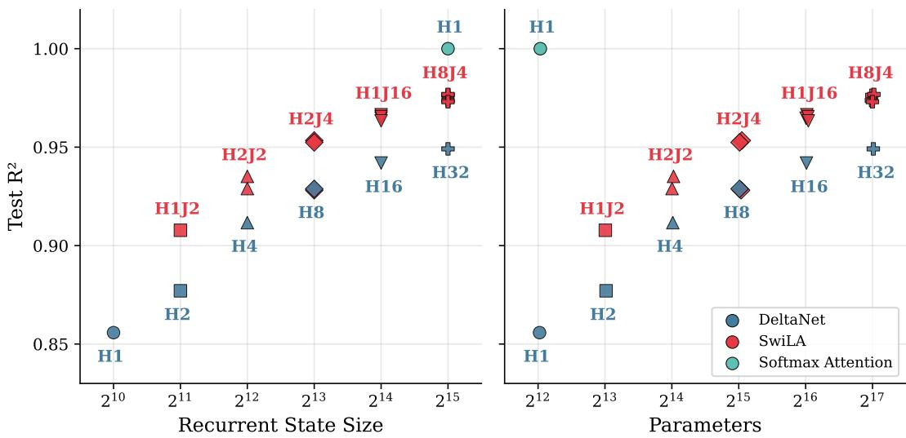  
Figure S1: Approximating Softmax Attention. Test $R ^ { 2 }$ vs. recurrent state size (left) and parameter count (right) for SwiLA and DeltaNet on the synthetic attention regression task. The dashed line indicates trainable softmax attention. Labels mark the best SwiLA configuration (H=heads, J=mixtures) at each budget. At every state budget, SwiLA better approximates the attention mapping.

## E Experimental Details

For all experiments, we heavily utilized architecture implementations in Yang & Zhang (2024).

## E.1 Approximating Softmax Attention

Each model receives input sequences $\boldsymbol { x } \in \mathbb { R } ^ { T \times D } .$ , where $T = 5 1 2$ and $D = 3 2 ,$ and must approximate the output of causal softmax self-attention with fixed, ground-truth projections $\dot { \theta _ { q } } , \dot { \theta } _ { k } , \theta _ { v }$ . Models receive only x and must learn their own $Q / K / V$ projections.

Data Generation At each sequence position, a cluster index is sampled uniformly from $C = 3 2$ clusters. The input is $x _ { t } ^ { \bullet } = \mathrm { L 2 n o r m a l i z e } ( \mu _ { c } + 0 . 5 \epsilon _ { t } )$ , where $\mu _ { c } \sim \mathcal { N } ( 0 , I _ { 3 2 } )$ are fixed cluster centers and $\epsilon _ { t } \sim \mathcal { N } ( 0 , I _ { 3 2 } )$ . The query, key, and value projections $\boldsymbol { \theta } _ { q } , \boldsymbol { \theta } _ { k } , \boldsymbol { \theta } _ { v } \in \mathbb { R } ^ { 3 2 \times 3 2 }$ are random matrices, with each entry sampled from a standard normal distribution. The attention temperature is $\tau = \sqrt { D } / 2$ , and the sequence length is $T = 5 1 2$ . We generate 65,536 training, 2,048 validation, and 2,048 test sequences.

Models.

• MHA. Standard causal multi-head softmax attention with learned $W _ { q } , W _ { k } , W _ { v }$ (bias enabled) and output projection $W _ { o }$ (no bias). Scaling factor $1 / \sqrt { d _ { k } }$

• DeltaNet. Learned projections with SiLU activation followed by L2 normalization on $Q / K .$ . SiLU activation on V. Scalar $\beta$ per head via a linear layer $\dot { \mathbb { R } ^ { d _ { \mathrm { i n } } } }  \mathbb { R } ^ { H }$ followed by sigmoid. RMSNorm on the output, then an output projection.

• SwiLA. Same $Q / K / V$ projection scheme as DeltaNet (SiLU + L2 normalization on $Q / K ,$ SiLU on V). Separate $\hat { \beta }$ per head, output dimension, and mixture component. Routing logits are computed via SwiGLU projections (inner dimension set to 256) with softmax activation. RMSNorm on the output, then an output projection. MI auxiliary loss coefficient $\lambda = 0 . 0 0 1$ . We do not employ input-dependent noise injection.

## E.2 Synthetic Benchmarks

Context-Dependent Associative Recall (CDAR) Context-Dependent Associative Recall (CDAR) is a synthetic sequence modeling task that extends Multi-Query Associative Recall (MQAR) from Arora et al. (2024a) to multiple contexts. Each input sequence has length 1024 and consists of two zones: a context zone containing C = 4 distinct contexts, each defining 32 unique key–value pairs (128 total associations), followed by a query zone in which the model must retrieve the correct value for a given (context, key) pair. The vocabulary size is 8192. Query positions within the query zone are sampled according to a power-law distribution $p ( i ) \propto i ^ { a - 1 }$ with exponent $a = 0 . 0 1$ , following the Zoology benchmark setup (Arora et al., 2024a).

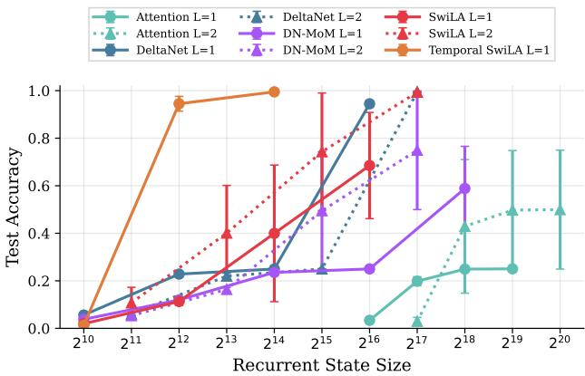  
Figure S2: Context-Depedent Associative Recall. CDAR with 4 contexts and 32 key-value pairs per context: test accuracy vs. state size.

We generate 100,000 training examples and 3,000 test examples. All queries for each context are grouped contiguously, context tokens are not repeated within query groups, and nonquery positions are filled with zeros. Training uses a batch size of 64.

All models use a GPT-NeoX-style pre-norm block structure following the Zoology framework (Arora et al., 2024a): each block consists of a sequence mixer followed by a state mixer (MLP, hidden multiplier 4), with LayerNorm, residual connections, and dropout on each sub-layer. The sequence mixer is the model-specific layer (Temporal SwiLA, DeltaNet, Softmax Attention, or MoM), while the state mixer is shared across all models. All models use a short convolution (kernel size 2) before the sequence mixer.

We detail the hyperparameters that differ across models:

• Temporal SwiLA. $d _ { \mathrm { m o d e l } } \in \{ 3 2 , 6 4 , 1 2 8 \} , n _ { \mathrm { l a y e r s } } = 1 , H = 1$ head, $K = 4$ mixture components, and key/value expansion factors $e _ { k } = e _ { v } = 0 . 5$ . We used SwiGLU projections for π and $\beta ,$ with inner dimensions 256 and 32, respectively, and input-dependent noise injection. We set the MI auxiliary loss coefficient $\bar { \lambda = } 0 . 0$

• SwiLA. $d _ { \mathrm { m o d e l } } \in \{ 3 2 , 6 4 , 1 2 8 , 2 5 6 \}$ $n _ { \mathrm { l a y e r s } } \in \{ 1 , 2 \}$ , H = 1 head, $K = 4$ mixture components, and key/value expansion factors $e _ { k } = e _ { v } = 0 . 5$ . We used SwiGLU projections for π and $\beta ,$ with inner dimensions 256 and $^ { 3 2 , }$ respectively, and input-dependent noise injection. We set the MI auxiliary loss coefficient $\lambda = 0 . 0$

• DeltaNet. $d _ { \mathrm { m o d e l } } \in \{ 3 2 , 6 4 , 1 2 8 , 2 5 6 \}$ }, $n _ { \mathrm { l a y e r s } } \in \{ 1 , 2 \}$ , H = 4 heads, $e _ { k } = e _ { v } = 2 . 0$

• Softmax Attention. $d _ { \mathrm { m o d e l } } \in \{ 3 2 , 6 4 , 1 2 8 , 2 5 6 \}$ $n _ { \mathrm { l a y e r s } } ~ \in ~ \{ 1 , 2 \}$ , H = 4 heads, RoPE positional encoding with $\theta = 1 0 , 0 0 0 .$

• DeltaNet-MoM. $d _ { \mathrm { m o d e l } } ~ \in ~ \{ 3 2 , 6 4 , 1 2 8 , 2 5 6 \}$ $n _ { \mathrm { l a y e r s } } ~ \in ~ \{ 1 , 2 \}$ , M = 4 memories with top- $- k = 2$ routing, H = 1 head, $e _ { v } = 1 . 0 $

All models are trained with AdamW and a grid search over four learning rates log-spaced from $3 . 1 6 \times 1 0 ^ { - 4 } \mathrm { t o } 1 0 ^ { - 2 }$ , i.e. $\{ 3 . 1 6 \times 1 0 ^ { - 4 } , 1 0 ^ { - 3 } , 3 . 1 6 \times 1 0 ^ { - 3 } , 1 0 ^ { - 2 } \}$ . All models are trained for 50 epochs. For each configuration and learning rate, we run three random seeds. We report the maximum accuracy across the learning-rate sweep and three random seeds in

Figure 2A because learning on these algorithmic tasks typically exhibits sharp, step-like transitions, and our primary objective is to assess whether an architecture can learn the target algorithm rather than its optimization speed or robustness. For completeness, we report the mean test accuracy across learning rates in Figure S2, which yields the same qualitative conclusions, with the largest improvements obtained by Temporal SwiLA.

RegBench: In-Context Language Learning All models have 8 layers, $d _ { \mathrm { m o d e l } } = 2 5 6$ , MLP inner dimension 1,024 $( 4 \times \breve { d _ { \mathrm { m o d e l } } } )$ , embedding dropout 0.1, and no residual dropout. SwiLA, Temporal SwiLA, DN-MoM, and DeltaNet all prepend a short convolution of width 4. We compare: SwiLA (2 heads, 2 mixtures, expand k = expand $s = 0 . 5 ) ;$ Temporal SwiLA (same as SwiLA with a temporal gate); DN-MoM (1 head, 4 memories, top-2 routing, $d _ { \mathrm { h e a d } } = 6 4 _ { \cdot }$ expand $\mathsf { \Pi } _ { \mathsf { - } } \mathsf { v } = 1 . 0$ , DeltaNet backend); DeltaNet (4 heads, expand $\mathbf { k } =$ expand $\mathsf { \Pi } _ { \cdot } \mathsf { v } = 1 . 0 ) ;$ and Transformer (4 heads with RoPE). The recurrent state size is matched across SwiLA, DN-MoM, and DeltaNet at $1 6 , 3 8 4 = 4 \times 6 4 \times 6 4$ per layer. For both SwiLA and Temporal SwiLA, we do not use input-dependent noise injection and set the MI loss coefficient to 0.005.

We use AdamW with learning rate $2 . 5 \times 1 0 ^ { - 4 }$ and weight decay 0.1. The learning rate follows a cosine schedule with 10% linear warmup (from $1 0 ^ { - 6 } )$ and minimum learning rate $2 . 5 \times 1 0 ^ { - 5 }$ . Batch size is 32 and models are trained for 200 epochs. We report test accuracy using the checkpoint with the lowest validation loss.

## E.3 Pretraining Language Models

All models are pretrained on a subset of the FineWeb-Edu dataset (Penedo et al., 2024) (sample-100BT subset) using the 32K-Llama2 tokenizer. Training sequences have length 4,096.

All models are trained with identical optimization hyperparameters chosen following Yang et al. (2024b). We use the AdamW optimizer with a learning rate of $3 \times 1 0 ^ { - 4 }$ and weight decay of 0.01. The learning rate follows a cosine decay schedule with 954 warmup steps and a minimum learning rate ratio of 0.1 (i.e., final learning rate $3 \times 1 0 ^ { - 5 } )$ . Gradient norms are clipped to 1.0. Training runs for 28,610 steps with a global batch size of 128 sequences, totaling approximately 15B tokens. Training is conducted on a node of 8 NVIDIA H100 GPUs.

All thirteen models—Transformer++ (Touvron et al., 2023), DeltaNet (Yang et al., 2024b), GDN (Yang et al., 2025), two MoM variants (DeltaNet-MoM and GDN-MoM) (Du et al., 2026), KDA (Team et al., 2025), FoX (Lin et al., 2025), SwiLA, Temporal SwiLA, Gated SwiLA, Gated Temporal SwiLA, Hybrid GDN, and Hybrid Temporal SwiLA—share the same architecture skeleton: 24 layers and a hidden dimension of 1,024, targeting approximately 374M total parameters. Feed-forward intermediate dimensions are adjusted slightly across architectures to match the total parameter count. Following the default configurations in Zhang & Yang (2025), we use 16 heads with head dimension 64 for Transformer++. DeltaNet, GDN, KDA, and FoX use 8 heads with head dimensions of 128.

SwiLA, Temporal SwiLA, Gated SwiLA, and Gated Temporal SwiLA use 8 heads with 4 mixtures per head and 64-dimensional key and value projections. This gives a recurrent matrix state of $8 \times 4 \times 6 4 \times 6 4 = 1 3 1 , 0 7 2$ scalars per layer, matching the $8 \times 1 2 8 \times 1 2 8 =$ $^ { 1 3 1 , 0 7 2 }$ state scalars used by DeltaNet, GDN, and KDA. For all SwiLA variants, we disable input-dependent router and temporal gate noise. We set the load balancing loss coefficients to 0.001 for SwiLA, 0.0005 for Temporal SwiLA, 0.0005 for Gated SwiLA, and 0.00025 for Gated Temporal SwiLA. For Gated SwiLA variants, we tie the precision across the output index, i.e., one gate per key dimension, as in KDA (Team et al., 2025). Hybrid Temporal SwiLA uses the same 0.0005 coefficient as Temporal SwiLA. Hybrid GDN and Hybrid Temporal SwiLA contain six full causal-attention layers at layers 4, 8, 12, 16, 20, and 24, with the remaining 18 layers using GDN and Temporal SwiLA, respectively. The full-attention layers use 8 heads with head dimension 128.

For GDN-MoM, we use GDN for the recurrent memory updates and employ three routed memories with $\displaystyle { \mathrm { t o p } } { - k } = 2 ,$ , together with one shared memory. Each memory uses 8 heads with head dimension $^ { 6 4 , }$ giving a total main recurrent state size of $4 \times 8 \times 6 4 \times 6 4 = 1 3 1 , 0 7 2$ scalars per layer.

For DeltaNet-MoM, we trained the following three architectural configurations and report the one with the best average performance on the commonsense benchmark (best configuration in bold):

1. 374.1M parameters: 4 heads, head dimension 64, 7 routed memories with top-k = 4, one shared memory, and an MLP intermediate dimension of 2,634.

2. 374.2M parameters: 1 head, head dimension 128, 7 routed memories with top-k = 4, one shared memory, and an MLP intermediate dimension of 3,412.

3. 374.1M parameters: 2 heads, head dimension 128, 3 routed memories with topk = 2, one shared memory, and an MLP intermediate dimension of 3,326.

Each of the three configurations maintains 131,072 main recurrent-state scalars per layer. Following Du et al. (2026), we use shared memory and adjust the MLP intermediate dimension to match the parameter counts of the other models.

## E.4 Throughput Comparison

1.3B Params - Training Throughput and Memory on a Single H100 GPU

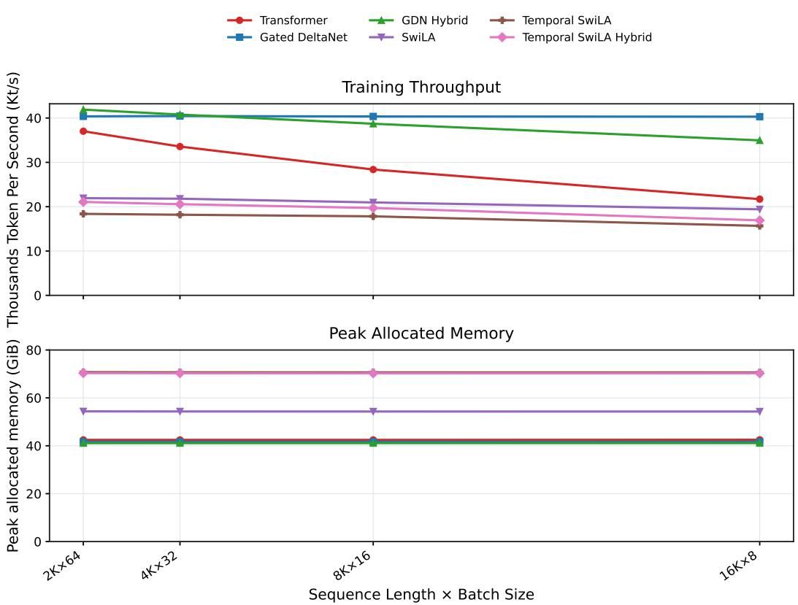  
Figure S3: Training throughput and peak memory of 1.3B models with 128K training tokens on a single H100 GPU (i.e., 1M training tokens on 8xH100 GPUs). Following the training throughput experiment of Yang et al. (2025), we fix the total number of training tokens while varying the sequence length and batch size.

Training throughput and memory. We benchmark complete training updates on a single NVIDIA H100 for the six 1.3B models: Transformer, Gated DeltaNet (GDN), Hybrid GDN, SwiLA, Temporal SwiLA, and Hybrid Temporal SwiLA. At sequence lengths 2,048, 4,096, 8,192, and 16,384 we use microbatch sizes 64, 32, 16, and 8, respectively, holding the workload fixed at 131,072 tokens per update. A timed update comprises the forward pass and loss computation, the backward pass, global gradient-norm clipping, and an AdamW step. For each configuration, three warm-up updates are followed by three timed updates with CUDA synchronization. Throughput is 131,072 divided by the mean wall-clock update time, reported in thousands of tokens per second, and peak memory is PyTorch’s maximum allocated CUDA memory after warm-up.

Generation throughput and memory. We measure end-to-end autoregressive generation for the same six models on a single NVIDIA H100. Each input is a synthetic 2,048-token prompt extended by 128 generated tokens using greedy decoding. We sweep batch sizes from 1 to 128 in powers of two. For each model, batch sizes beyond the first out-of-memory failure are omitted. One warm-up call is followed by three timed calls to the full generation routine, with CUDA synchronized around the timed loop. Reported values are means over the three calls, where the wall-clock time of a generation call includes both prefill and decoding. Peak memory is PyTorch’s maximum allocated CUDA memory after warmup.

1.3B Params - Inference Throughput and Memory on a Single H100 GPU (prompt length 2048)  
Inference throughput  
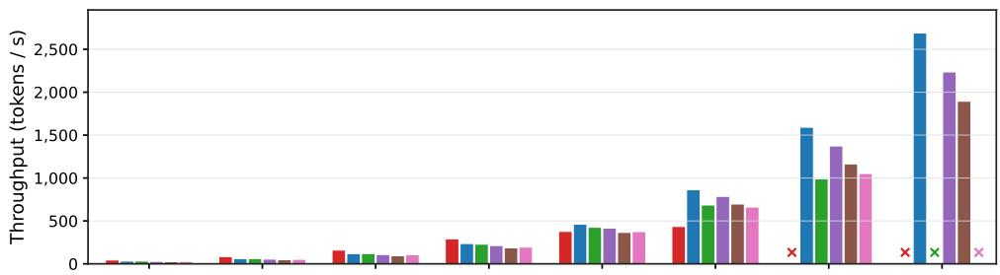

Peak memory  
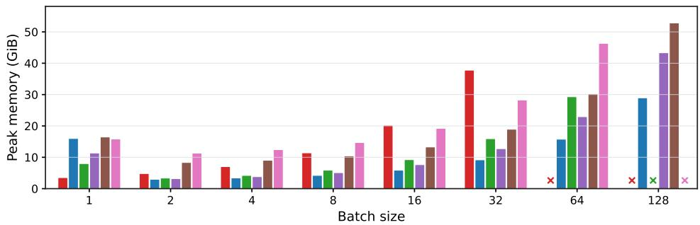  
Figure S4: Inference throughput and peak memory of 1.3B models on a single H100 GPU. Following the inference throughput experiment of Gu & Dao (2023), we fix the prompt length to 2048 and vary the batch size. Throughput and peak memory are measured over the full inference pass, combining prefill and decode. An X marks configurations where the model runs out of memory.

## E.5 Ablation Study

We conducted ablation experiments that isolate the contribution of the number of mixture components, temporal persistence, and the load balancing loss. We trained variants of 115M SwiLA on 5B tokens and evaluated test perplexity on 100M tokens, reported in the legend of Figure S5. To analyze routing dynamics, we tracked three statistics during training, computed separately for the key-value-side responsibilities and the query-side responsibilities. Utilization entropy measures the entropy of the marginal expert usage distribution, averaged over batch and sequence positions; it equals 1 when experts are used uniformly and is lower when usage is concentrated on a few experts. Routing entropy measures the average per-token entropy of the routing distribution; it equals 1 when each token spreads its responsibility uniformly across all experts and approaches 0 when each token commits to a single expert. Dead expert fraction counts the fraction of experts whose marginal usage falls below 10% of uniform usage (i.e., below 0.1/J).

Without load balancing, vanilla SwiLA suffers significant expert collapse: KV-side utilization entropy drops sharply, and the dead expert fraction exceeds 40%. Adding the load-balancing auxiliary loss resolves this, maintaining high utilization entropy and near-zero dead experts throughout training. Temporal SwiLA is notably more robust, maintaining reasonable utilization even without load balancing. Across all configurations except for the vanilla SwiLA without load balancing, routing entropy stabilizes in the 0.4–0.6 range, indicating moderately selective but not fully hard routing.

## SwiLA router diagnostics

SwiLA 4J, no load balancing | PPL 36.769   
SwiLA 4J, load balancing | PPL 16.807   
Temporal SwiLA 4J, no load balancing | PPL 16.718   
Temporal SwiLA 4J, load balancing | PPL 16.715   
Temporal SwiLA 16J, load balancing | PPL 16.862

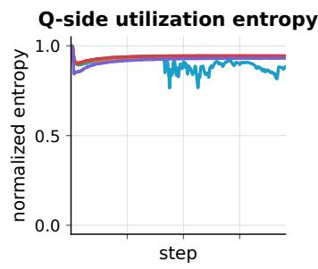

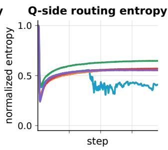

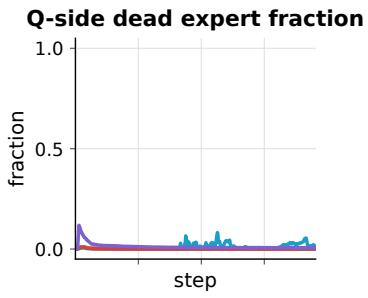

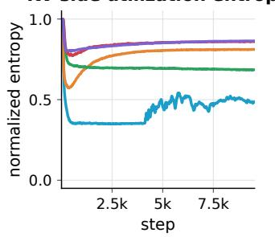

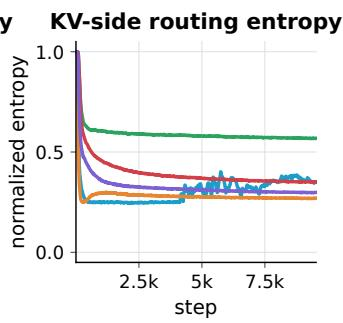

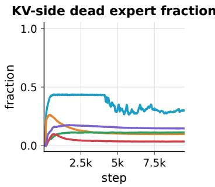  
Figure S5: Switching Linear Attention router diagnostics. Utilization entropy, routing entropy, and dead expert fraction over the course of training, shown separately for the query-side responsibilities (top) and key-value-side responsibilities (bottom). Without load balancing, vanilla SwiLA (4J) collapses on the KV side, with low utilization entropy and a dead expert fraction near 40%; load balancing and temporal persistence each prevent this collapse.