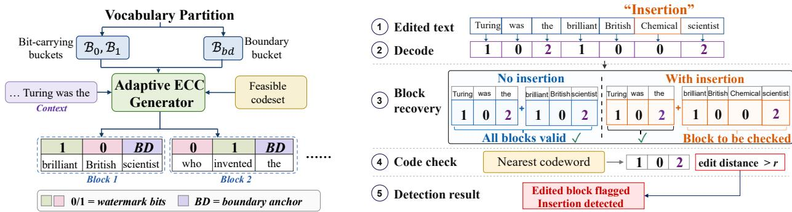

# Anchor-ECC: Local Integrity Checking for Watermarked LLM Outputs via Error-Correcting Codes

Zewei Deng1, Muhammad Siddeek2, Liyan Xie1, Mohamed Seif3,5 Mengdi Wang5, H. Vincent Poor5, Andrea Goldsmith4,5

1University of Minnesota 2Google 3Oakland University 4Stony Brook University 5Princeton University

€ Project Page | § Code

## Abstract

LLM watermarking has become an effective approach to distinguishing AI-generated text from human-written text by embedding detectable patterns during generation. However, a small post-generation edit may change the meaning of the text without removing its overall watermark signal, creating a risk that the modified content is still attributed to the original model. We propose Anchor-ECC, which incorporates the error-correcting code (ECC) constraints and explicit boundary anchors into the watermark structure and pairs them with a dynamic-programming decoder to detect and localize post-generation edits. Across Qwen3-8B, Mistral-7B-Instruct-v0.3, and OPT-125M, the approximate-hard setting achieves about 99.7% block-level true positive rate (TPR) with at most 7.6% false alarm rate (FAR) for edit detection under mixed insertions, deletions, and substitutions, while preserving the distinction between watermarked outputs and unwatermarked text. Additional quality experiments identify lower-perplexity configurations that retain strong edit-detection performance. Together, these results extend LLM watermarking from source identification to local integrity verification while supporting configurable trade-offs between detection reliability and generation quality.

## 1 Introduction

As large language models (LLMs) become increasingly widespread, the need for techniques to verify content authenticity, ownership, and responsible usage has become increasingly important. Watermarking addresses this need by embedding hidden signals into LLM outputs that enable content tracking, attribution, and verification, helping prevent misuse and ensure accountability [Aaronson, 2023, Dathathri et al., 2024, Chao et al., 2024].

Existing watermarking methods and their detectors are largely designed for document- or segment-level decisions, focusing on whether text is generated by an LLM or a human author [Zhao et al., 2025, Pan et al., 2025, Li et al., 2024]. They offer limited evidence for determining whether and where a watermarked passage was modified after generation. This distinction matters because a local insertion, deletion, or substitution can spoof a claim, stance, certainty level, or source while leaving the document-level watermark detectable. The modified statement may therefore remain associated with the original generator, creating an attribution risk for the content creator [Pang et al., 2024, Zhou et al., 2024].

In this work, we propose Anchor-ECC for local integrity checking of watermarked LLM outputs. It combines two complementary error-correcting-code (ECC) constraints: (1) Varshamov–Tenengolts (VT) constraints handle insertions and deletions [Levenshtein, 1966, Schoeny et al., 2017], while (2) Hammingtype constraints detect substitutions [Hamming, 1950]. Each joint codeword forms the payload of a short block, followed by a dedicated boundary anchor that separates it from the next block. We realize these structural symbols by partitioning the model vocabulary into two payload buckets for bits 0 and 1 and a disjoint boundary-anchor bucket. At detection time, a global decoder reconstructs a minimum-cost block alignment, flags blocks that violate the joint constraints, and narrows each alarm to candidate edit locations. These localized alarms direct semantic or human review to short passages that may contain spoofing edits.

The repeated ECC structure also retains the conventional watermark function: a global watermark score can test whether a candidate text is consistent with the keyed watermark. To reduce generation distortion, we further construct semantically balanced payload buckets, select lexically usable boundary anchors with light semantic content, apply finite logit biasing, and complete each codeword adaptively during sampling. These generation choices expose a measurable quality–reliability trade-off while leaving the codebook and detector unchanged. The main contributions of this paper are summarized as follows:

• We introduce Anchor-ECC, a blockwise integrity layer that embeds joint VT–Hamming constraints in LLM outputs, turning a document-level watermark into local structural evidence.

• We design a global dynamic-programming decoder that recovers latent boundaries, flags inconsistent blocks, and refines each alarm to a set of candidate edit sites.

• We evaluate the detection performance of Anchor-ECC against matched baselines across a range of watermarking strengths, using both synthetic and question-aware benign and spoofing edits. We further characterize watermark identifiability and the current realization cost.

## 1.1 Related Work

Our work builds on the green-list watermarking framework, which promotes a keyed subset of tokens by shifting model logits [Kirchenbauer et al., 2023]; Zhao et al. [2024] replace the context-dependent green list with a fixed partition and establish robustness guarantees. We are further related to the pattern-based watermarking approach in Chen et al. [2025], which targets order-agnostic LLMs. There also exists a watermarking scheme that utilizes pseudorandom error-correcting codes [Christ and Gunn, 2024], but it focuses on robust watermark detection rather than edit localization. Combinatorial watermarking embeds prescribed bucket patterns and flags post-generation edits when those patterns are disrupted [Xie et al., 2025]. It targets the same edit-detection task through local sequence structure, making its two- and fourbucket variants matched non-ECC baselines in Section 3. A synchronization-assisted VT construction combines a synchronization string with VT blocks to detect and localize insertions and deletions [Deng et al., 2026]. Anchor-ECC instead uses explicit boundary anchors, intersects VT and Hamming constraints to cover substitutions, and recovers corrupted boundaries through a global block-decomposition decoder.

There is also a line of work that proposes detectors to flag long content, such as AI-generated content detection [Bao et al., 2024, Chakraborty et al., 2023, Gehrmann et al., 2019, Li et al., 2025, Mitchell et al., 2023, Sadasivan et al., 2023]. The watermark agnostic approach in Kashtan and Kipnis [2024] seeks finer granularity by applying the Higher Criticism metric to detect sparse anomalies. Lei et al. [2025] introduced a Bayesian framework to flag the LLM-generated segments [Cohen, 2022]. While their objective is related to ours, they do not consider post-generation edits made to LLM output. Recent work also studies identifying watermarked spans within mixed-source documents. These approaches, such as Zhao et al. [2025] and Pan et al. [2025], are designed to detect long, contiguous watermarked regions and assume that the underlying watermarked text remains largely intact. In contrast, we focus on localizing structural changes caused by token-level edits to watermarked LLM output.

## 2 Proposed Watermarking and Edit Detection Methods

Let V denote the tokenizer vocabulary and $x \ : = \ : ( x _ { 1 } , \ldots , x _ { T } )$ a watermarked token sequence. Under Anchor-ECC, each generated token maps to a structural symbol in {0, 1, 2}: 0 and 1 denote the two payload buckets, while 2 denotes the boundary-anchor bucket. Post-generation insertions, deletions, and substitutions transform x into an observed sequence $y = ( x _ { 1 } ^ { \prime } , \dots , x _ { T ^ { \prime } } ^ { \prime } )$

  
Figure 1: Left: Overview of the Anchor-ECC watermark embedding procedure. The tokenizer vocabulary is partitioned into two buckets $B _ { 0 } , B _ { 1 }$ and a disjoint boundary-anchor bucket $ { \beta _ { \mathrm { b d } } }$ . The feasible codeword set $\mathcal { C } = \mathcal { V } _ { a } ( n ) \Gamma$ H combines VT and Hamming constraints. During Anchor-ECC generation, the adaptive generator tracks the current block prefix and restricts or biases the next-token distribution toward feasible bits, while boundary anchors close each structural block. Right: Overview of block-addressable integrity detection and candidate refinement using an insertion example. The edited text is first decoded into structural symbols, globally parsed into structural blocks, and then checked against the feasible codeword set C. A block is flagged as suspicious when its minimum edit distance to the feasible set exceeds the tolerance threshold r.

Given y and the watermark key, the detector maps the observed tokens to the same structural alphabet and recovers a minimum-cost decomposition into candidate ECC blocks. A recovered block is flagged when its payload distance exceeds the tolerance r or its boundary is inferred to have been deleted or substituted; each alarm is further refined to candidate payload positions, insertion gaps, or boundary sites. Figure 1 summarizes this generation and detection pipeline.

## 2.1 Error-Correcting Code Design

VT Codes for Insertion/Deletion Detection. VT codes are classical single insertion–deletion correcting codes defined over binary sequences [Levenshtein, 1966]. For a fixed length n and syndrome parameter $a \in \{ 0 , 1 , \ldots , n \}$ , the VT code $\mathcal { V } _ { a } ( n ) \subset \{ 0 , 1 \} ^ { n }$ is defined as

$$
\mathcal { V } _ { a } ( n ) \triangleq \left\{ x \in \{ 0 , 1 \} ^ { n } : \sum _ { i = 1 } ^ { n } i x _ { i } \equiv a \ ( \bmod n + 1 ) \right\} .\tag{1}
$$

A single insertion or deletion predictably changes the weighted-sum constraint, enabling syndrome-based detection and localization. We use this property to enforce block-level consistency under insertion/deletion edits.

Hamming Codes for Substitution Detection. Hamming codes use linear parity constraints to detect and correct substitution (bit-flip) errors [Hamming, 1950]. Given a parity-check matrix H, the corresponding Hamming code of length n is

$$
{ \mathcal { H } } = \left\{ x \in \{ 0 , 1 \} ^ { n } : H x ^ { \top } = 0 \right\} ,\tag{2}
$$

where H is a pre-specified parity-check matrix. If a single bit is flipped, the resulting non-zero syndrome uniquely identifies the error location. At the structural level, a bucket-changing substitution appears as a payload-bit flip without changing sequence length. Hamming-type parity constraints therefore provide a complementary detection layer to VT codes.

Joint Codeword Design. We combine the VT and Hamming constraints by constructing a feasible codeword space that simultaneously allows detection of insertion–deletion and substitution edits. Let $\nu _ { a } ( n )$ denote a VT code with syndrome a, and let H denote a Hamming code of the same length. Combining the constraints in Eqs. (1) and (2), we define the feasible codeword set as

$$
\mathcal { C } = \mathcal { V } _ { a } ( n ) \cap \mathcal { H } .
$$

This intersection represents the set of binary sequences that are simultaneously constrained by the VT condition for insertion–deletion sensitivity and by the Hamming parity condition for substitution sensitivity. The VT syndrome parameter a is fixed in our experiments, and the Hamming constraint is applied using the standard parity-check matrix over the original coordinate order.

## 2.2 Anchor-ECC Watermarking

The Anchor-ECC watermark consists of two major components: a mixed-constraint code design with two bit-carrying buckets and a small pool of boundary anchors. At a high level, the language model generates ordinary tokens in its native vocabulary space, while the watermarking layer tracks only a derived symbolic sequence consisting of watermark bits and boundary markers.

Two Bit-Carrying Buckets. Recall that V denotes the tokenizer vocabulary. After excluding permanently banned tokens and setting aside tokens reserved for boundaries, we partition the remaining usable vocabulary $\nu _ { \mathrm { w m } }$ into two disjoint buckets $B _ { 0 }$ and $\boldsymbol { B } _ { 1 }$ , which represent watermark bits 0 and 1, respectively. We do not assign punctuation, numbers, or other special lexical categories to separate buckets. Instead, the generator can use such tokens naturally whenever they remain available. This retains the usable lexical categories in the two payload buckets without further vocabulary fragmentation.

Boundary Anchors. To separate consecutive ECC blocks, we reserve a boundary-anchor pool $ { \beta _ { \mathrm { b d } } }$ , disjoint from the two bit-carrying buckets. These anchors mark block boundaries and are not interpreted as watermark bits. Our integrity-detection experiments use a compact pool of 150 model-specific anchors. Keeping this pool sparse reduces the probability that a non-key-aware insertion or substitution accidentally creates a boundary symbol, which could introduce a spurious split and disturb block alignment.

Watermarking Process. As illustrated in Figure 1 (left), during the watermarking process, each closed watermark block consists of n watermark-bit symbols followed by one boundary anchor. During generation, each emitted token is mapped to either a watermark bit through $B _ { 0 } , B _ { 1 }$ or to a boundary anchor through $\boldsymbol { B } _ { \mathrm { b d } }$ For a partial block prefix, the generator restricts or biases the next-token distribution toward bit values that keep the prefix compatible with at least one codeword in C. Once n watermark-bit symbols have been generated, the next structural symbol is forced or encouraged to be a boundary anchor, and this closes the current block.

Watermark Identifiability. We also evaluate whether the complete text remains identifiable as watermarked. Because the observed structural sequence may not be aligned with the beginning of a block, we test every phase $s \in \{ 0 , \ldots , n \}$ , defined as the number of leading symbols skipped before partitioning the remaining sequence into consecutive blocks. For each phase, $D _ { s }$ measures how well the resulting blocks match the watermark structure by combining payload distance to the nearest valid codeword, boundary-anchor mismatches, unmatched prefix and suffix symbols, and disagreement with the length-derived block estimate $\widehat { J } = \mathrm { r o u n d } ( T ^ { \prime } / ( n + 1 ) )$ ). Appendix A.1 gives the exact cost. With $D ^ { * } = \operatorname* { m i n } _ { s } D _ { s }$ , we define

$$
S _ { \mathrm { g l o b a l } } \triangleq \frac { 1 } { 1 + D ^ { * } / \operatorname* { m a x } ( 1 , \widehat { J } ) } .\tag{3}
$$

Here, higher $S _ { \mathrm { g l o b a l } }$ indicates stronger consistency with the keyed ECC watermark.

## 2.3 Pretrained-Model Realization and Distortion Reduction

The ECC layer specifies valid structural sequences and how to decode them, but it does not prescribe a unique linguistic realization mechanism. To instantiate it on existing pretrained models without retraining, we map tokens to structural buckets and intervene in the next-token distribution. We implement three complementary mechanisms that support different operating points between structural adherence and linguistic flexibility.

Soft Watermarking via Logit Biasing. Hard watermarking realizes each structural bit by sampling exclusively from its designated bucket. We also consider a soft variant that adds a logit bias δ toward tokens in the desired bucket while retaining probability mass for alternatives. Formally, for a desired bucket B, similar to Aaronson [2023], we modify the next-token logits from the original $z _ { t }$ to $\tilde { z } _ { t }$ as

$$
\tilde { z } _ { t } ( v ) = \left\{ \begin{array} { l l } { z _ { t } ( v ) + \delta , } & { v \in \mathcal { B } , } \\ { z _ { t } ( v ) , } & { v \notin \mathcal { B } . } \end{array} \right.\tag{4}
$$

This preserves probabilistic flexibility while statistically encouraging compliance with the structural bit. The bias parameter δ governs the detectability–distortion trade-off; we use $\delta = 2 0$ as an approximate-hard setting and $\delta \ \in \ \{ 2 , 5 \}$ for soft watermarking.

Semantic-Balanced Bucket Splitting. Watermark bits are realized through the two payload buckets defined above. Naive partitioning can cause certain buckets to lack semantically appropriate tokens, leading to unnatural generations. To mitigate this, we construct semantically balanced buckets. Inspired by the semantic balanced partitioning strategy of Guo et al. [2024], we group semantically similar tokens and distribute each group across the structural buckets. For the compact-anchor protocol, we select 150 clean single-token words with light semantic content and bounded frequency in the long-form question answering (LFQA) corpus [Blagojevic, 2021], then split the non-anchor tokens in each group approximately evenly between $B _ { 0 }$ and $\boldsymbol { B } _ { 1 }$ . As a generation-quality ablation, we allocate one eighth of the eligible vocabulary to $\boldsymbol { B } _ { \mathrm { b d } }$ , distribute boundary quotas in proportion to the semantic-group sizes, spread the selected anchors across within-group LFQA frequency ranks, and balance the remainder between the two payload buckets. This preserves semantic coverage at payload and boundary positions without changing the ECC block format or decoder.

Adaptive Codeword Completion. The joint feasible set C contains multiple codewords, so we adopt an adaptive codeword selection mechanism during token generation. At each payload position, we identify the codewords that match the bits generated so far and collect their next bits. The generator then restricts or biases sampling toward the corresponding payload buckets. When both bit values remain possible, the model’s token distribution can choose between them without any intervention; when only one remains, the generation rule favors that value via Eq. (4). Each sampled bit therefore narrows the set of possible codeword completions.

With finite logit bias δ, the model may still sample a bit that makes the current prefix inconsistent with every codeword in C. We then compare the current prefix with the equal-length prefix of every codeword, retain those with the fewest mismatched positions, and use their next bits to guide the following step.

Together, soft biasing preserves probabilistic support, semantic-balanced splitting preserves lexical diversity, and adaptive completion uses codebook redundancy to provide multiple valid token choices. The ablation study in Section 3 quantifies the resulting improvement relative to non-adaptive constrained generation.

## 2.4 Edit Detection

The detection of post-generation edits is performed in two steps, as visualized in Figure 1 (right). First, we decode the observed token sequence to recover the ECC blocks and their associated information bits. We then check whether the recovered bits are consistent with the code space C.

Decoding. We first map each token to its bucket label, obtaining a structural sequence over $\{ 0 , 1 , 2 \}$ , where 0 and 1 denote watermark bits and 2 denotes a boundary anchor. Under mixed post-generation edits, boundary anchors may be deleted or substituted to disrupt local alignment. Therefore, rather than relying on observed boundary symbols alone, we formulate boundary recovery as a global decoding problem that searches for the minimum-cost block decomposition of the entire structural sequence.

Let $\boldsymbol { y } : = \{ x _ { k } ^ { \prime } \} _ { k = 1 } ^ { T ^ { \prime } }$ denote the observed token sequence. We consider all possible segmentations of $y$ into candidate blocks, together with assignments of codewords and boundary states. Each block is associated with: (i) a bit-carrying segment, and (ii) a boundary state indicating whether the boundary is intact, deleted, or substituted. We define the total decoding cost as

$$
\mathcal { L } \triangleq \sum _ { k } \Big ( d _ { \mathrm { e d i t } } ( y _ { k } , c _ { k } ) + c _ { \mathrm { b d } } ( k ) \Big ) ,\tag{5}
$$

where $y _ { k }$ is the observed token subsequence assigned to block k, $c _ { k } \in \mathcal { C }$ is a candidate codeword, $d _ { \mathrm { e d i t } }$ is the edit distance between the observed subsequence and the codeword, and $c _ { \mathrm { b d } } ( k )$ is a boundary penalty defined as

$$
c _ { \mathrm { b d } } ( k ) = \left\{ \begin{array} { l l } { 0 , } & { { \mathrm { b o u n d a r y ~ i n t a c t } } , } \\ { 1 , } & { { \mathrm { b o u n d a r y ~ d e l e t e d ~ o r ~ s u b s t i t u t e d } } . } \end{array} \right.
$$

Then we recover the blocks by minimizing the total decoding cost $\mathcal { L }$ in Eq. (5) over all possible block segmentations, codeword assignments, and boundary states. We implement this optimization using dynamic programming, which efficiently enumerates candidate segmentations and returns the minimum-cost decomposition. This decoding procedure can thus be viewed as a form of minimum-cost sequence parsing under edit noise. Boundary positions are treated as latent variables inferred through global consistency rather than explicitly detected. For structural-sequence length L and per-block search budget $e ,$ the memoized decoder has complexity $O ( L e | \mathcal { C } | n ( n + e ) )$ . In our experiments, we set $n = 7 , e = 3$ , and $| { \mathcal { C } } | = 1 0$ as fixed constants; decoding scales approximately linearly with sequence length; Appendix $_ { \mathrm { A } . 2 }$ reports practical runtime.

Remark 1. We note that block-boundary recovery does not require every anchor to remain intact. Theoretically, under a sparse independent edit model with per-token edit rate $\epsilon \ll 1$ , the probability that two consecutive boundary anchors are both deleted is on the order of $\epsilon ^ { 2 }$ , which is negligible for small $\epsilon .$ Thus, an isolated missing boundary can typically be resolved using adjacent intact anchors and the global block-decomposition decoder in Eq. (5), limiting cascading misalignment.

Remark 2 (Implicit Block Count Determination). Although the number of blocks is not explicitly specified, the decoding objective implicitly regularizes the segmentation. Since each block is matched with a fixedlength codeword and boundary edits incur additional cost, segmentations with unrealistic block counts (either too many or too few) result in higher total edit distance. As a result, the optimal solution naturally recovers a block count that approximately matches the ground truth.

Detection. Given the decoded block decomposition, we analyze the parsed bit-carrying sequence block by block. For each block $j = 1 , \dots , J ,$ , let $\hat { c } ^ { ( j ) }$ denote the bit sequence assigned to that block by the decoder. We compare each parsed block symbol $\hat { c } ^ { ( j ) }$ with the feasible codeword set $\mathcal { C }$ under edit distance. For a threshold $r \geq 0$ , block $j$ is structurally consistent when its boundary is intact and min $c \in \mathcal { C } d _ { \mathrm { e d i t } } ( \hat { c } ^ { ( j ) } , c ) \leq r$ . Therefore, a larger payload distance or a deleted/substituted boundary may flag the block as suspicious.

Under hard watermarking and the approximate-hard setting, we use $r \ = \ 0$ as an unedited block is expected to be consistent with C, so any observed inconsistency indicates a possible edit. For finite soft-bias settings, model outputs may occasionally produce blocks that deviate from the VT–Hamming feasible set C even before any post-generation edit is applied. Therefore, to reduce false alarms caused in soft-bias regimes, we use $r = 2$ for $\delta = 2$ and $r = 1$ for $\delta = 5$ in our experiments.

In addition to block-level detection, the detector can return a candidate set of possible edit locations for each flagged block. We obtain this set from the union of minimum-edit-distance alignments between the parsed block and its nearest codewords in C. The candidates may be payload positions, insertion gaps, or the boundary position. When several codewords or alignments are equally plausible, especially after multiple or length-changing edits, we keep the locations suggested by all of them. This refinement narrows inspection to positions flagged by the codeword alignments.

## 3 Numerical Experiments

Model and Data. We evaluate Qwen3-8B, Mistral-7B-Instruct-v0.3, and OPT-125M using model-specific semantic vocabulary partitions. We generate watermarked answers for 256 independent English long-form question answering (LFQA) prompts [Blagojevic, 2021]. LFQA provides a natural setting for the attribution threat studied here: a watermarked answer to a concrete question can later be locally altered to spoof a factual claim, stance, certainty level, or source while retaining the surrounding generated content. All main ECC experiments target 18 boundary-closed watermark blocks per answer. The default integrity detection uses the compact 150-anchor partition. We evaluate the one-eighth boundary allocation separately as a generation-quality variant under the same prompts, block target, adaptive nearest-feasible generation, and sampling protocol. Unless otherwise specified, experiments use CUDA inference with 4-bit quantization. For English LFQA generation, tokenizer special tokens, control-character tokens, and tokens containing non-ASCII characters are masked.

To evaluate edit detection performance, we apply synthetic post-generation edits to the generated text. Specifically, we consider structural insertions, deletions, and payload-bit substitutions applied uniformly at random; the substitution operation flips the selected bucket bit. We use edit rates $\{ 0 . 2 , 0 . 4 , 0 . 6 , 0 . 8 \}$ to select affected blocks and sample between one and k edit operations in each selected block, for $k \in \{ 1 , 2 , 3 \}$

Baselines. We include the KGW watermarking scheme [Kirchenbauer et al., 2023] as a standard token-level watermarking baseline. Since KGW is not designed for explicit edit localization, we adapt it to our block-wise edit-detection protocol by applying the same synthetic mixed-edit attacks and reporting block-level detection metrics. We further compare against two recent watermark-segment localization methods, Zhao-AOL [Zhao et al., 2025] and WaterSeeker [Pan et al., 2025]. Since both methods operate on token-level watermark scores rather than defining standalone watermarking schemes, we instantiate them using the same KGW-style red-green watermark source. We generate KGW-watermarked continuations under the same prompts, length budget, and mixed-edit protocol, and partition them into fixed 8-token blocks to match our ECC block length (with the boundary token). For each edited sequence, token-level KGW watermark-deficit scores are passed to Zhao-AOL or WaterSeeker, and the resulting token/span predictions are mapped to block-level edit predictions by overlap with edited block spans. We run all three KGW-based methods on each model with $\delta \in \{ 2 , 5 , 2 0 \}$ ; Appendix A.3.2 reports the complete comparison.

We also include two fixed-pattern combinatorial watermarking (CW) families evaluated in prior postgeneration edit detection work [Xie et al., 2025]: the two-bucket alternating pattern (CW-AB) and four-bucket ACADBCBD pattern (CW-4). At each token, the original CW detector examines the w overlapping windows that contain it $( w = 2$ for CW-AB and $w = 8$ for CW-4) and records the fraction that match the prescribed pattern. We flag the token only when none of these windows matches. Under the detector’s strict threshold rule, this corresponds to $\tau _ { e } = 1 / w \colon 0 . 5$ for CW-AB and 0.125 for CW-4. We use these thresholds at every watermark strength, and flag a block when any token in it is flagged.

We also include the synchronization-assisted VT construction of Deng et al. [2026], which is referred to as Sync-VT, as an ECC baseline for localized integrity checking. The construction is designed for insertion and deletion; Appendix A.3.1 separates its results by edit operation, including substitutions from the shared mixed-edit protocol.

Evaluation Metrics. We report block-level true positive rate (TPR), the fraction of edited blocks that are flagged, and false alarm rate (FAR), the fraction of unedited blocks that are flagged. Candidate coverage (Cov.) is the fraction of true edit events whose reference payload position, insertion gap, or boundary position appears in the candidate set returned for the corresponding block. Global verification reports ROC-AUC using the score in Eq. (3) against matched unwatermarked generations and human LFQA answers. Generation quality reports base-model PPL over saved continuations, either conditioned on the original prompt or scored without it.

Cross-model Local Detection. Table 1 shows that finite soft bias interacts with each model’s next-token distribution: at $\delta \in \{ 2 , 5 \}$ , both clean code adherence and the TPR–FAR operating point vary across models. Once the embedded structure is nearly complete at δ = 20, all three models reach TPR above 0.996. Mistral and OPT keep FAR below 0.008, while Qwen3 has a higher FAR of 0.075 because its clean generations contain fewer exactly feasible blocks. Within each model, candidate coverage increases with watermark strength; across the three models, it ranges from 0.510–0.613 at $\delta = 2$ and from 0.781–0.802 at δ = 20. At the approximate-hard setting, the same codebook and decoder achieve consistently high edit sensitivity across all three models.

Table 1: Three-model LFQA results, macro-averaged over four edit rates and three edit budgets. Clean is the mean number of initially feasible blocks among 18; Cov. is candidate coverage.
<table><tr><td>Model</td><td>δ</td><td>Clean</td><td>TPR↑</td><td>FAR↓ Cov. ↑</td></tr><tr><td>Qwen3-8B</td><td>2 5 20</td><td>1.78 0.2621 6.84 0.5217 16.71 0.9966</td><td>0.0839 0.2107 0.0754</td><td>0.5103 0.6106 0.7811</td></tr><tr><td>Mistral-7B</td><td>2 5 20</td><td>1.70 5.34 0.5443 17.93 0.9978</td><td>0.2630 0.0851 0.2119 0.0071</td><td>0.5108 0.5874 0.8009</td></tr><tr><td>OPT-125M</td><td>2 5 20</td><td>6.56 15.26 18.00</td><td>0.1843 0.0115 0.3366 0.0162 0.9980 0.0025</td><td>0.6134 0.7576 0.8023</td></tr></table>

Block-level Detection Results. Table 2 compares all methods under the same Qwen3/LFQA protocol. At δ = 2, Anchor-ECC and WaterSeeker use relatively conservative operating points, reaching 0.2621/0.0839 and 0.2898/0.1951 TPR/FAR, respectively. Sync-VT, KGW, Zhao-AOL, and the two CW variants attain TPRs from 0.7173 to 0.9626, but with FARs from 0.6093 to 1.0000. At δ = 5, Anchor-ECC increases to 0.5217/0.2107, while WaterSeeker remains more conservative at 0.3132/0.1273; the other baselines attain TPRs from 0.7560 to 0.9619 with FARs from 0.4963 to 0.9964. At δ = 20, Anchor-ECC reaches 0.9966/0.0754, compared with 0.7464/0.1029 for Sync-VT, 0.7772/0.1003 for KGW, 0.7848/0.1592 for Zhao-AOL, 0.3438/0.0259 for WaterSeeker, 0.3863/0.1093 for CW-AB, and 0.8290/0.1378 for CW-4. Across the three watermarking strengths, Anchor-ECC retains measurable detection sensitivity under soft bias, with TPR increasing as the watermark strength rises. For Sync-VT, insertion/deletion TPR remains above 0.95 at δ = 20, while substitution accounts for most of its recall gap (Appendix A.3.1).

Table 2: Qwen3/LFQA block detection across watermark strengths, macro-averaged over four edit rates and $k \in \{ 1 , 2 , 3 \}$
<table><tr><td rowspan="2">Method</td><td colspan="2">δ = 2</td><td colspan="2">δ = 5</td><td colspan="2"> $\overline { { \delta = 2 0 } }$ </td></tr><tr><td>TPR↑</td><td>FAR↓</td><td>TPR ↑</td><td>FAR↓</td><td>TPR ↑</td><td>FAR↓</td></tr><tr><td>Anchor-ECC</td><td>0.2621</td><td>0.0839</td><td>0.5217</td><td>0.2107</td><td>0.9966</td><td>0.0754</td></tr><tr><td>Sync-VT</td><td>0.8880</td><td>0.8880</td><td>0.8828</td><td>0.8793</td><td>0.7464</td><td>0.1029</td></tr><tr><td>KGW</td><td>0.9558</td><td>0.8909</td><td>0.8774</td><td>0.5672</td><td>0.7772</td><td>0.1003</td></tr><tr><td>Zhao-AOL</td><td>0.7173</td><td>0.6093</td><td>0.7560</td><td>0.4963</td><td>0.7848</td><td>0.1592</td></tr><tr><td>WaterSeeker</td><td>0.2898</td><td>0.1951</td><td>0.3132</td><td>0.1273</td><td>0.3438</td><td>0.0259</td></tr><tr><td>CW-AB</td><td>0.8025</td><td>0.8051</td><td>0.7703</td><td>0.7754</td><td>0.3863</td><td>0.1093</td></tr><tr><td>CW-4</td><td>0.9626</td><td>1.0000</td><td>0.9619</td><td>0.9964</td><td>0.8290</td><td>0.1378</td></tr></table>

LLM-guided Sparse Edits. Beyond random synthetic edits, we evaluate Qwen3-8B watermarked LFQA answers under question-aware LLM-guided editing. An instruction model proposes local edits under three benign motivations—grammar polishing, clarity improvement, and style softening—and three malicious motivations—claim distortion, stance shift, and source spoofing. The instruction model outputs structured token-level edits, which are replayed on the saved generated token IDs to produce the edited sequence and exact block-level ground truth. We then map this sequence through the same vocabulary partition for detection.

Table 3 reports the two bias settings separately. Each setting contains 72 edited examples, with 12 examples from each of the six motivations; the corresponding benign and malicious groups contain 36 examples each. At δ = 5, the detector achieves TPR 0.8261, FAR 0.1814, and candidate coverage 0.4169. Increasing the bias to $\delta \ = \ 2 0$ raises TPR to 0.9193 and coverage to 0.5040 while reducing FAR to 0.0921. Benign and malicious edits have similar detection sensitivity because the detector responds to structural change rather than intent.

Table 3: Block detection and candidate coverage on the balanced Qwen3 LLM-guided edit sample. Edited blocks is the mean number per text.
<table><tr><td>δ</td><td>Intent</td><td>Texts</td><td>Edited blocks</td><td>TPR↑</td><td>FAR↓</td><td>Cov. ↑</td></tr><tr><td rowspan="4">5</td><td>Overall</td><td>72</td><td>5.75</td><td>0.8261</td><td>0.1814</td><td>0.4169</td></tr><tr><td>Benign</td><td>36</td><td>6.00</td><td>0.8380</td><td>0.2153</td><td>0.5088</td></tr><tr><td>Malicious</td><td>36</td><td>5.50</td><td>0.8131</td><td>0.1489</td><td>0.3422</td></tr><tr><td>Overall</td><td>72</td><td>5.33</td><td>0.9193</td><td>0.0921</td><td>0.5040</td></tr><tr><td rowspan="3">20</td><td>Benign</td><td>36</td><td>5.44</td><td>0.9337</td><td>0.0951</td><td>0.5520</td></tr><tr><td>Malicious</td><td>36</td><td>5.22</td><td>0.9043</td><td></td><td></td></tr><tr><td></td><td></td><td></td><td></td><td>0.0891</td><td>0.4608</td></tr></table>

Table 3 treats every block modified by the editor as edited, even when its final bucket sequence remains unchanged, as can occur when a token is replaced by another token in the same bucket. Appendix Table 10 separately evaluates blocks whose bucket sequences do change. These structurally visible blocks account for 90.3% of edited blocks at δ = 5 and 91.1% at δ = 20. Among them, the detector flags 86.90% at δ = 5 and all structurally visible blocks at $\delta = 2 0$ . The overall TPR in Table 3 is lower because it also counts edited blocks whose bucket sequences remain unchanged.

Watermark Identifiability. Our primary evaluation concerns local edit detection, while the construction must also serve the conventional role of a watermark: distinguishing watermarked text from non-watermarked text. For each model and bias setting, we apply the global score in Eq. (3) to 256 watermarked answers and a combined negative set of 256 matched unwatermarked generations and 251 human LFQA answers. Across all three model families and watermark strengths, ROC-AUC is at least 0.9985 (Table 4). The repeated ECC structure thus supports document-level watermark identification alongside block-level edit localization.

Table 4: Global watermark-identifiability ROC-AUC under the compact-anchor protocol, using matched unwatermarked generations and human LFQA answers as negatives.
<table><tr><td>Model</td><td> $\overline { { \delta = 2 } }$ </td><td> $\overline { { \delta = 5 } }$ </td><td> $\overline { { \delta = 2 0 } }$ </td></tr><tr><td>Qwen3-8B</td><td>0.99847</td><td>0.99988</td><td>0.99998</td></tr><tr><td>Mistral-7B</td><td>1.00000</td><td>0.99998</td><td>1.00000</td></tr><tr><td>OPT-125M</td><td>0.99908</td><td>1.00000</td><td>0.99958</td></tr></table>

Boundary Allocation and Perplexity. Each encoded block requires a boundary token, so the limited lexical choices in the compact 150-token boundary set may contribute substantially to generation cost. We test this effect with a quality-oriented variant that assigns one eighth of the eligible vocabulary to the boundary set and divides the remaining vocabulary evenly between the two payload buckets. Table 5 compares the two allocations under the same generation settings. The one-eighth allocation lowers conditional PPL at every model–bias setting, including reductions of 35.7–59.6% at δ = 20.

Table 5: Conditional perplexity (PPL) for compact-150 and boundary-1/8 anchor allocations (lower is better). “Reduction” reports the percentage decrease in PPL when replacing the default compact-150 allocation with boundary-1/8, providing an ablation study of how anchor allocation affects PPL.
<table><tr><td>Model</td><td>δ</td><td>Compact-150</td><td>Boundary-1/8</td><td>Reduction</td></tr><tr><td rowspan="3">Qwen3-8B</td><td>2</td><td>22.98</td><td>12.54</td><td>45.4%</td></tr><tr><td>5</td><td>32.27</td><td>15.43</td><td>52.2%</td></tr><tr><td>20</td><td>67.04</td><td>30.11</td><td>55.1%</td></tr><tr><td rowspan="3">Mistral-7B</td><td>2</td><td>11.20</td><td>8.27</td><td>26.1%</td></tr><tr><td>5</td><td>15.80</td><td>10.41</td><td>34.1%</td></tr><tr><td>20</td><td>44.68</td><td>18.04</td><td>59.6%</td></tr><tr><td rowspan="3">OPT-125M</td><td>2</td><td>18.89</td><td>14.71</td><td>22.1%</td></tr><tr><td>5</td><td>26.45</td><td>18.10</td><td>31.6%</td></tr><tr><td>20</td><td>30.20</td><td>19.43</td><td>35.7%</td></tr></table>

Matched unwatermarked conditional PPL is 1.96, 2.07, and 3.21 for Qwen3, Mistral, and OPT, respectively, and all comparisons are within model. The ECC code and decoder are unchanged, so the reduction comes from additional lexical choices at boundary positions. A larger boundary set also increases the chance that an inserted or substituted token maps to a boundary, creating a spurious split or concealing a corrupted anchor. Boundary allocation therefore trades lower PPL against boundary distinctiveness and detection reliability.

Qualitative Generation Examples. Conditional PPL summarizes the distributional cost of watermark realization; the saved generations provide a direct view of the resulting text. Table 6 compares Qwen3-8B outputs for matched prompts at δ = 2 and δ = 20 under the compact-anchor integrity protocol. Across all three prompts, both operating points preserve the requested topic and central content. Appendix A.4 provides five unmodified examples at each bias.

Table 6: Matched verbatim sentence prefixes from saved Qwen3-8B generations. Text is truncated only at sentence boundaries and is not rewritten.

<table><tr><td colspan="2">Prompt 1: why do marathoners and triathletes tend to have small body frames?</td></tr><tr><td>δ = 2</td><td>Marathoners and triathletes frequently have smaller body frames due to the typical demands of their</td></tr><tr><td>δ = 20</td><td>sports. Marathoners and triathlon athletes frequently have smaller body frames due to competitive modesty, which is an advantage since typical running efficiency reduces the amount waste carried across long</td></tr><tr><td colspan="2">distances. Prompt 2: what are magnet links? Context: I see them on lots of torrent sites.</td></tr><tr><td>δ = 2</td><td>Magnet links are a type of widely used hyperlink that allows users to locate nearly any file on the internet without requiring beforehand knowledge of where it is stored.</td></tr><tr><td>δ = 20</td><td>Magnet links are URL-based addresses primarily used to locate and retrieve digital files across peer- to-peer network systems; they directly reference the content identified by hash values specifically generated for each item stored digitally along separate nodes.</td></tr><tr><td>δ = 2</td><td>Prompt 3: why does the education system favours memory retention over imagination? The education system often emphasizes memory retention primarily due to its focus on standardized testing alongside measurable outcomes.</td></tr><tr><td>δ = 20</td><td>The education system tends to prioritize memory across various levels of learning due to measurable formal assessments and standardized testing, aiming mainly therefore at evaluating knowledge retention efficiently.</td></tr></table>

## 4 Conclusion

We propose Anchor-ECC, an ECC-based watermark that turns a document-level attribution signal into local evidence of post-generation edits. By combining VT and Hamming constraints with boundary anchors and global decoding, the watermark provides reliable block-level localization under sparse edits. Across Qwen3-8B, Mistral-7B-Instruct-v0.3, and OPT-125M, the approximate-hard setting achieves block-level TPR above 0.996 and FAR at or below 0.0754, while retaining strong global identifiability with ROC-AUC of at least 0.9985. The decoder further narrows each block alarm to candidate token positions, insertion gaps, or boundary sites, giving reviewers a narrower region to inspect. Results on question-aware benign and spoofing edits show that this local evidence remains informative beyond randomly sampled token perturbations. We further explore two approaches to improving generation quality, each with a distinct trade-off. Soft watermarking reduces PPL with some loss in local detection reliability, whereas a larger boundary pool provides more lexical choices and reduces conditional PPL by 22.1–52.2% under the soft settings, at the cost of a greater risk of boundary corruption. Together, these options provide flexible quality–reliability operating points for different application requirements.

## References

Scott Aaronson. Watermarking of large language models. In Workshop on Large Language Models and Transformers, 2023. Simons Institute, UC Berkeley.

Guangsheng Bao, Yanbin Zhao, Zhiyang Teng, Linyi Yang, and Yue Zhang. Fast-detectGPT: Efficient zeroshot detection of machine-generated text via conditional probability curvature. In The Twelfth International Conference on Learning Representations, 2024.

Vladimir Blagojevic. LFQA. https://huggingface.co/datasets/vblagoje/lfqa, 2021. Dataset.

Souradip Chakraborty, Amrit Singh Bedi, Sicheng Zhu, Bang An, Dinesh Manocha, and Furong Huang. On the possibilities of AI-generated text detection. 2023. arXiv preprint arXiv:2304.04736.

Patrick Chao, Yan Sun, Edgar Dobriban, and Hamed Hassani. Watermarking language models with error correcting codes. 2024. arXiv preprint arXiv:2406.10281.

Ruibo Chen, Yihan Wu, Yanshuo Chen, Chenxi Liu, Junfeng Guo, and Heng Huang. A watermark for order-agnostic language models. In Proceedings of the Thirteenth International Conference on Learning Representations, 2025.

Miranda Christ and Sam Gunn. Pseudorandom error-correcting codes. In Advances in Cryptology – CRYPTO 2024, volume 14925 of Lecture Notes in Computer Science, pages 325–347. Springer, 2024. doi: 10.1007/ 978-3-031-68391-6\_10.

Shay Cohen. Bayesian analysis in natural language processing. Springer Nature, 2022.

Sumanth Dathathri, Abigail See, Sumedh Ghaisas, Po-Sen Huang, Rob McAdam, Johannes Welbl, Vandana Bachani, Alex Kaskasoli, Robert Stanforth, Tatiana Matejovicova, et al. Scalable watermarking for identifying large language model outputs. Nature, 634(8035):818–823, 2024.

Zewei Deng, Muhammad Siddeek, Liyan Xie, Mohamed Seif, Mengdi Wang, H. Vincent Poor, and Andrea Goldsmith. Detecting post-generation edits to watermarked LLM outputs via error-correcting codes. In Findings of the Association for Computational Linguistics: EMNLP 2026, 2026.

Sebastian Gehrmann, Hendrik Strobelt, and Alexander Rush. GLTR: Statistical detection and visualization of generated text. In Proceedings of the 57th Annual Meeting of the Association for Computational Linguistics: System Demonstrations, pages 111–116, 2019.

Yuxuan Guo, Zhiliang Tian, Yiping Song, Tianlun Liu, Liang Ding, and Dongsheng Li. Context-aware watermark with semantic balanced green-red lists for large language models. In Yaser Al-Onaizan, Mohit Bansal, and Yun-Nung Chen, editors, Proceedings of the 2024 Conference on Empirical Methods in Natural Language Processing, pages 22633–22646, Miami, Florida, USA, November 2024. Association for Computational Linguistics.

Richard W Hamming. Error detecting and error correcting codes. The Bell system technical journal, 29(2): 147–160, 1950.

Idan Kashtan and Alon Kipnis. An Information-Theoretic Approach for Detecting Edits in AI-Generated Text. Harvard Data Science Review, (Special Issue 5), nov 8 2024.

John Kirchenbauer, Jonas Geiping, Yuxin Wen, Jonathan Katz, Ian Miers, and Tom Goldstein. A watermark for large language models. In Proceedings ofthe 40th International Conference on Machine Learning, volume 202 of Proceedings ofMachine Learning Research, pages 17061–17084. PMLR, 2023.

Eric Lei, Hsiang Hsu, and Chun-Fu Chen. Pald: Detection of text partially written by large language models. In Proceedings of the Thirteenth International Conference on Learning Representations, 2025.

Vladimir Iosifovich Levenshtein. Binary codes capable of correcting deletions, insertions, and reversals. In Soviet Physics-Doklady, volume 10, 1966.

Xiang Li, Feng Ruan, Huiyuan Wang, Qi Long, and Weijie J Su. Robust detection of watermarks for large language models under human edits. Journal of the Royal Statistical Society Series B: Statistical Methodology, page qkaf056, 2025.

Xingchi Li, Guanxun Li, and Xianyang Zhang. Segmenting watermarked texts from language models. 2024. arXiv preprint arXiv:2410.20670.

Eric Mitchell, Yoonho Lee, Alexander Khazatsky, Christopher D Manning, and Chelsea Finn. DetectGPT: Zero-shot machine-generated text detection using probability curvature. In Proceedings of the International Conference on Machine Learning, pages 24950–24962, 2023.

Leyi Pan, Aiwei Liu, Yijian Lu, Zitian Gao, Yichen Di, Lijie Wen, Irwin King, and Philip S Yu. Waterseeker: Pioneering efficient detection of watermarked segments in large documents. In Findings of the Association for Computational Linguistics: NAACL 2025, pages 2866–2882, 2025.

Qi Pang, Shengyuan Hu, Wenting Zheng, and Virginia Smith. No free lunch in LLM watermarking: Tradeoffs in watermarking design choices. In Proceedings ofthe Thirty-eighth Annual Conference on Neural Information Processing Systems, 2024.

Vinu Sankar Sadasivan, Aounon Kumar, Sriram Balasubramanian, Wenxiao Wang, and Soheil Feizi. Can AI-generated text be reliably detected? 2023. arXiv preprint arXiv:2303.11156.

Clayton Schoeny, Antonia Wachter-Zeh, Ryan Gabrys, and Eitan Yaakobi. Codes correcting a burst of deletions or insertions. IEEE Transactions on Information Theory, 63(4):1971–1985, 2017.

Liyan Xie, Muhammad Siddeek, Mohamed Seif, Andrea J Goldsmith, and Mengdi Wang. Detecting post-generation edits to watermarked LLM outputs via combinatorial watermarking, 2025. URL https: //arxiv.org/abs/2510.01637.

Xuandong Zhao, Prabhanjan Vijendra Ananth, Lei Li, and Yu-Xiang Wang. Provable robust watermarking for ai-generated text. In Proceedings of the Twelfth International Conference on Learning Representations, 2024.

Xuandong Zhao, Chenwen Liao, Yu-Xiang Wang, and Lei Li. Efficiently identifying watermarked segments in mixed-source texts. In Proceedings of the 63rd Annual Meeting of the Association for Computational Linguistics (Volume 1: Long Papers), pages 6304–6316, 2025.

Tong Zhou, Xuandong Zhao, Xiaolin Xu, and Shaolei Ren. Bileve: Securing text provenance in large language models against spoofing with bi-level signature. Advances in Neural Information Processing Systems, 37:56054–56075, 2024.

## A Additional Numerical Results and Details

## A.1 Global Watermark Score

For phase s, let $J _ { s } = \lfloor ( T ^ { \prime } - s ) / ( n + 1 ) \rfloor$ be the number of complete blocks after skipping the first s structural symbols. Let $p _ { j } ^ { ( s ) }$ contain the first n symbols of block $j ,$ , and let $b _ { j } ^ { ( s ) }$ be its final, expected boundary symbol. We define the following heuristic phase cost:

$$
D _ { s } = \sum _ { j = 1 } ^ { J _ { s } } \left[ \operatorname* { m i n } _ { c \in \mathcal { C } } d _ { H } \left( p _ { j } ^ { ( s ) } , c \right) + \mathbf { 1 } \Big \{ b _ { j } ^ { ( s ) } \neq 2 \Big \} \right] + s + \left[ T ^ { \prime } - s - J _ { s } ( n + 1 ) \right] + \Big | J _ { s } - \widehat { J } \Big | .
$$

The first term measures payload disagreement with the nearest feasible codeword and boundary mismatch within each complete block. The next two terms count unmatched symbols before the first complete block and after the last one. The final term penalizes disagreement between the recovered block count $J _ { s }$ and the length-based estimate ${ \widehat { J } } .$ The verifier uses the minimum cost across phases in Eq. (3).

## A.2 Decoder Complexity and Practical Runtime

The decoder uses a memoized dynamic program over positions in the observed structural sequence. At each position, it considers $2 e + 1$ candidate payload lengths from $n - e { \mathrm { ~ t o ~ } } n + e$ and compares each candidate segment with every codeword in C. A Levenshtein comparison costs $O ( n ( n + e ) )$ ), giving total complexity $O ( L e | \mathcal { C } | n ( n + e ) )$ ), where L is the structural-sequence length. With $n = 7 , e = 3$ , and $| { \mathcal { C } } | = 1 0$ fixed, the practical scaling is approximately linear in L. On an Intel i7-13650HX, decoding an 18-block sequence requires 31.6 ms for clean text and 61.0 ms under the strongest evaluated attack, including candidate-location extraction.

## A.3 Additional Results

## A.3.1 Synchronization-Assisted VT Baseline

Table 7: Sync-VT on Qwen3/LFQA, macro-averaged over four edit rates and $k \in \{ 1 , 2 , 3 \}$ . †The original construction addresses insertion and deletion; substitution results are reported for completeness under the shared mixed-edit protocol.
<table><tr><td>δ</td><td>Attack</td><td>TPR↑</td><td>FAR↓ Cov. ↑</td></tr><tr><td rowspan="3">2</td><td>Insertion</td><td>0.8890 0.8881</td><td rowspan="3">0.2994 0.4149</td></tr><tr><td>Deletion</td><td>0.8878 0.8892</td></tr><tr><td>Substitution†</td><td>0.8872 0.8868</td></tr><tr><td rowspan="3">5</td><td>Insertion</td><td>0.8828</td><td rowspan="3">0.8776 0.2983 0.4176</td></tr><tr><td>Deletion</td><td>0.8885 0.8790</td></tr><tr><td>Substitution†</td><td>0.8771 0.8814</td></tr><tr><td rowspan="3">20</td><td>Insertion</td><td>0.9581</td><td>0.0000 0.0809 0.6463</td></tr><tr><td>Deletion</td><td>0.9515</td><td>0.0975 0.6761</td></tr><tr><td>Substitution†</td><td>0.3297</td><td>0.1305 0.0000</td></tr></table>

## A.3.2 Full KGW-Based Baseline Comparison

Table 8: Full LFQA sweep for Anchor-ECC and KGW-based baselines. Each entry is macro-averaged over four edit rates and $k \in \{ 1 , 2 , 3 \}$
<table><tr><td rowspan="2">Model</td><td rowspan="2">Method</td><td> $\overline { { \delta = 2 } }$ </td><td> $\overline { { \delta = 5 } }$ </td><td> $\overline { { \delta = 2 0 } }$ </td></tr><tr><td>TPR FAR</td><td>TPR FAR</td><td>TPR FAR</td></tr><tr><td rowspan="4">Qwen3-8B</td><td>Anchor-ECC</td><td>0.2621 0.0839</td><td>0.5217 0.2107</td><td>0.9966 0.0754</td></tr><tr><td>KGW</td><td>0.9558 0.8909</td><td>0.87740.5672</td><td>0.7772 0.1003</td></tr><tr><td>Zhao-AOL</td><td>0.71730.6093</td><td>0.75600.4963</td><td>0.78480.1592</td></tr><tr><td>WaterSeeker</td><td>0.28980.1951</td><td>0.3132 0.1273</td><td>0.34380.0259</td></tr><tr><td rowspan="4">Mistral-7B</td><td>Anchor-ECC</td><td>0.2630 0.0851</td><td>0.54430.2119</td><td>0.9978 0.0071</td></tr><tr><td>KGW</td><td>0.96420.9254</td><td>0.89130.6416</td><td>0.7833 0.1022</td></tr><tr><td>Zhao-AOL</td><td>0.71720.6248</td><td>0.7645 0.5382</td><td>0.7863 0.1615</td></tr><tr><td>WaterSeeker</td><td>0.29290.2149</td><td>0.30810.1360</td><td>0.34840.0249</td></tr><tr><td rowspan="4">OPT-125M</td><td>Anchor-ECC</td><td>0.18430.0115</td><td>0.33660.0162</td><td>0.9980 0.0025</td></tr><tr><td>KGW</td><td>0.88860.6144</td><td>0.79390.1868</td><td>0.77800.1054</td></tr><tr><td>Zhao-AOL</td><td>0.7942 0.5410</td><td>0.7904 0.2312</td><td>0.7850 0.1596</td></tr><tr><td>WaterSeeker</td><td>0.34760.1150</td><td>0.34880.0358</td><td>0.35070.0237</td></tr></table>

<table><tr><td>Example 1 (sample 10). Prompt: why do marathoners and triathletes tend to have small body frames? Watermarked response: Marathoners and triathletes frequently have smaller body frames due to the typical demands of their sports.</td></tr><tr><td>Example 2 (sample 188). Prompt: what are magnet links? Context: I see them on lots of torrent sites.</td></tr><tr><td>Watermarked response: Magnet links are a type of widely used hyperlink that allows users to locate</td></tr></table>

## A.3.3 Single-Edit Breakdown

Table 9 reports Qwen3 block-level TPR and FAR for k = 1, with one uniformly sampled insertion, deletion, or substitution per affected block. Anchor-ECC maintains near-perfect TPR across edit rates, whereas KGW and AOL have lower recall with higher FAR and WaterSeeker is conservative but low-recall.

Table 9: Block-level edit detection under the single-edit setting (k = 1), where each affected block receives one mixed edit sampled from substitution, insertion, and deletion. AOL denotes KGW+AOL, and WS denotes KGW+WaterSeeker.
<table><tr><td rowspan=1 colspan=1>Edit Rate</td><td rowspan=1 colspan=1>Method</td><td rowspan=1 colspan=1>TPR↑  FAR↓</td></tr><tr><td rowspan=1 colspan=1>0.2</td><td rowspan=1 colspan=1>Anchor-ECCKGWZhao-AOLWaterSeeker</td><td rowspan=1 colspan=1>0.9989  0.07300.6922  0.03500.7983  0.07760.4568  0.0232</td></tr><tr><td rowspan=1 colspan=1>0.4</td><td rowspan=1 colspan=1>Anchor-ECCKGWZhao-AOLWaterSeeker</td><td rowspan=1 colspan=1>0.9973  0.07470.7052  0.05710.7737  0.11320.3365  0.0284</td></tr><tr><td rowspan=2 colspan=1>0.6</td><td rowspan=2 colspan=1>Anchor-ECCKGWZhao-AOLWaterSeeker</td><td rowspan=1 colspan=1>0.9968  0.0689</td></tr><tr><td rowspan=1 colspan=1>0.7246  0.08540.7702  0.15220.2914  0.0279</td></tr><tr><td rowspan=2 colspan=1>0.8</td><td rowspan=2 colspan=1>Anchor-ECCKGWZhao-AOLWaterSeeker</td><td rowspan=1 colspan=1>0.9973  0.07150.7244  0.13830.7433  0.1933</td></tr><tr><td rowspan=1 colspan=1>0.2572  0.0400</td></tr></table>

## A.4 Source Text Generation for Question-Aware Editing

We construct source continuations from 256 independent English LFQA prompts. Each prompt is a long-form question, and the Qwen3-8B continuation is a watermarked answer that can later be locally edited. This setup is well matched to malicious-edit evaluation: an editor can spoof how the answer addresses the question by changing certainty, attribution, numerical claims, or definitional boundaries. We use chat-template prompting with thinking disabled and adaptive Anchor-ECC generation.

The following examples use the same five LFQA prompts at each $\delta \in \{ 2 , 5 , 2 0 \}$ so that the effect of watermark strength can be inspected directly. Every response is generated text from the saved Qwen3-8B artifacts. We normalize whitespace for typesetting and truncate only at a sentence boundary; no displayed words are rewritten or selectively removed.

A.4.1 $\delta \ = \ 2$

## Example 3 (sample 180).

Prompt: why does the education system favours memory retention over imagination?

Watermarked response: The education system often emphasizes memory retention primarily due to its focus on standardized testing alongside measurable outcomes.

## Example 4 (sample 114).

Prompt: how did the original mathematicians prove their formulas and theories, and to who?

Watermarked response: Original mathematicians proved their formulas and formalized theories through rigorous logical reasoning, carefully structured arguments, and systematic exploration of previously established mathematical principles.

## Example 5 (sample 190).

Prompt: how come americans have large portion sizes and relatively cheap prices for their food?

Watermarked response: The combination of large portion sizes and generally lower food prices in the United States largely stems from economic factors, industrial practices across the food industry, and consumer behavior alongside government policies.

## A.4.2 δ = 5

## Example 1 (sample 10).

Prompt: why do marathoners and triathletes tend to have small body frames?

Watermarked response: Marathoners and triathletes frequently have smaller body frames due to the typical demands of their sports.

## Example 2 (sample 188).

Prompt: what are magnet links? Context: I see them on lots of torrent sites.

Watermarked response: Magnet links are a type of widely used hyperlink that allows users to locate nearly any file on the internet without requiring beforehand knowledge of where it is stored.

## Example 3 (sample 180).

Prompt: why does the education system favours memory retention over imagination?

Watermarked response: The education system often emphasizes memory retention primarily due to its focus on standardized assessments alongside curriculum requirements.

Example 4 (sample 114).

Prompt: how did the original mathematicians prove their formulas and theories, and to who?

Watermarked response: Original mathematicians, such as Eu largely through logical deduction and geometric reasoning.early Greek mathematician Euclid, developed formal proofs by starting with axioms and gradually deriving theorems through deductive formal logic.

## Example 5 (sample 190).

Prompt: how come americans have large portion sizes and relatively cheap prices for their food?

Watermarked response: The combination of large portion sizes and generally lower food prices in the United States largely stems from economic factors, industrial agriculture primarily focused on efficiency rather than quality or modest portions.

A.4.3 δ = 20
<table><tr><td>Example 1 (sample 10). Prompt: why do marathoners and triathletes tend to have small body frames? Watermarked response: Marathoners and triathlon athletes frequently have smaller body frames due to competitive modesty, which is an advantage since typical running efficiency reduces the amount waste carried across long distances.</td></tr><tr><td>Example 2 (sample 188). Prompt: what are magnet links? Context: I see them on lots of torrent sites. Watermarked response: Magnet links are URL-based addresses primarily used to locate and retrieve digital files across peer-to-peer network systems; they directly reference the content identified by hash values specifically generated for each item stored digitally along separate nodes.</td></tr><tr><td>Example 3 (sample 180). Prompt: why does the education system favours memory retention over imagination? Watermarked response: The education system tends to prioritize memory across various levels of learning due to measurable formal assessments and standardized testing, aiming mainly therefore at evaluating knowledge retention efficiently.</td></tr><tr><td>Example 4 (sample 114). Prompt: how did the original mathematicians prove their formulas and theories, and to who? Watermarked response: Original mathematicians often used logical deduction alongside empirical observation to validate formulas and theories across various mathematical domains throughout history.</td></tr><tr><td>Example 5 (sample 190). Prompt: how come americans have large portion sizes and relatively cheap prices for their food? Watermarked response: The combination of large portion sizes and generally lower food prices in the</td></tr></table>

## A.5 LLM-Guided Editing and Downstream Risk Assessment

This appendix describes the LLM-guided editing experiment in more detail. We start from the Qwen3-8B LFQA generations at δ = 5 and δ = 20. For each selected continuation, the editor model is given the source prompt, the generated suffix, and an indexed edit-unit table. Each edit unit contains an approximate token surface, its associated ECC block ID, bit index, and bucket ID. The editor is also given one of six editing motivations. We group grammar\_polish, clarity\_improvement, and style\_softening as benign intents, and claim\_distortion, stance\_shift, and source\_spoofing as malicious or adversarial intents.

The editor does not directly rewrite the full text. Instead, it outputs a JSON object containing local edit instructions, which specifies a text-unit index or insertion gap, optional original text, new content when applicable, and a short reason. The program validates the JSON, tokenizes the proposed new content, and applies the instructions to the saved generated token IDs. It then maps the complete edited token sequence through the same vocabulary partition and runs the detector on the resulting structural sequence. Editor instructions and ground-truth locations are used only for evaluation and are not supplied to the detector. This design gives exact block-level ground truth while still allowing the edit choices to be guided by semantic motivations. The editor is asked to produce between six and ten local instructions, but chooses their operations and target locations. No detector output or evaluation metric is supplied to the editor.

Table 10: Structural visibility in the balanced LLM-guided sample. A block is visible when its final bucket sequence differs from the original. Visible TPR is the fraction of these visible edited blocks that are flagged.
<table><tr><td>δ</td><td>Edited blocks</td><td>Visible blocks</td><td>Visibility</td><td>Visible TPR</td></tr><tr><td>5</td><td>414</td><td>374</td><td>0.9034</td><td>0.8690</td></tr><tr><td>20</td><td>384</td><td>350</td><td>0.9115</td><td>1.0000</td></tr></table>

Table 11 reports the balanced sample by motivation and bias. Each stratum contains 216 evaluated blocks; the edited and clean counts provide the denominators for TPR and FAR, respectively. Candidate coverage is consistently lower than block TPR, reflecting the greater difficulty of within-block refinement.

Table 11: Qwen3 LLM-guided edit results by motivation. E/C gives the numbers of edited and clean blocks. The first three motivations are benign and the last three are malicious.
<table><tr><td rowspan=1 colspan=1>δ       Motivation</td><td rowspan=1 colspan=1>Blocks (E/C)</td><td rowspan=1 colspan=1>TPR ↑FAR↓ Cov. ↑</td></tr><tr><td rowspan=6 colspan=1>grammar_polishclarity_improvementstyle_softening5claim_distortionstance_shiftsource_spoofing</td><td rowspan=1 colspan=1>72/144</td><td rowspan=1 colspan=1>0.80560.22920.5931</td></tr><tr><td rowspan=1 colspan=1>66/150</td><td rowspan=5 colspan=1>0.87880.20000.45220.83330.21740.48700.81540.11920.37580.78790.15330.32040.83580.17450.3368</td></tr><tr><td rowspan=1 colspan=1>78/138</td></tr><tr><td rowspan=1 colspan=1>65/151</td></tr><tr><td rowspan=1 colspan=1>66/150</td></tr><tr><td rowspan=1 colspan=1>67/149</td></tr><tr><td rowspan=6 colspan=1>grammar_polishclarity_improvementstyle_softening20claim_distortionstance_shiftsource_spoofing</td><td rowspan=1 colspan=1>75/141</td><td rowspan=6 colspan=1>0.89330.13480.52120.96670.08970.56170.95080.06450.57640.11180.49410.87690.05300.35600.91180.10140.5494</td></tr><tr><td rowspan=1 colspan=1>60/156</td></tr><tr><td rowspan=2 colspan=1>61/15555/161</td></tr><tr><td rowspan=1 colspan=1>0.9273</td></tr><tr><td rowspan=1 colspan=1>65/151</td></tr><tr><td rowspan=1 colspan=1>68/148</td></tr></table>