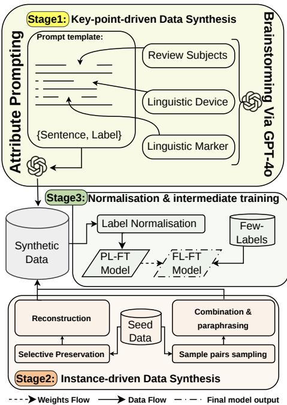
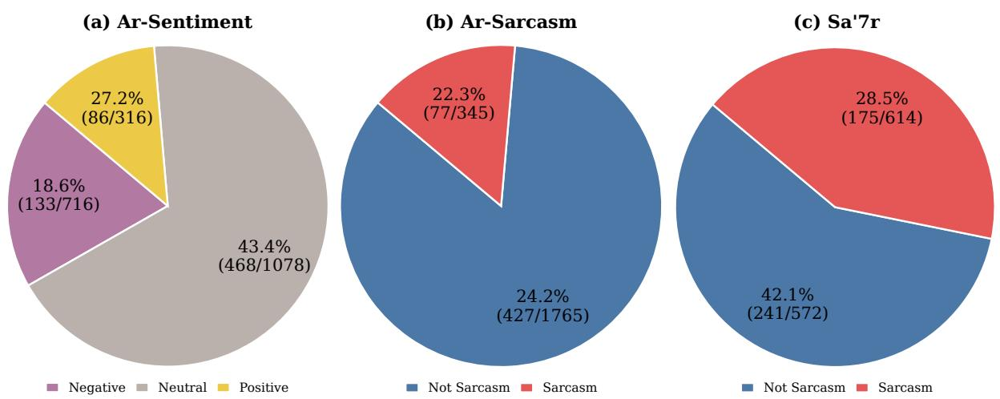
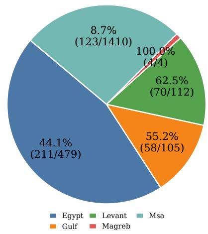
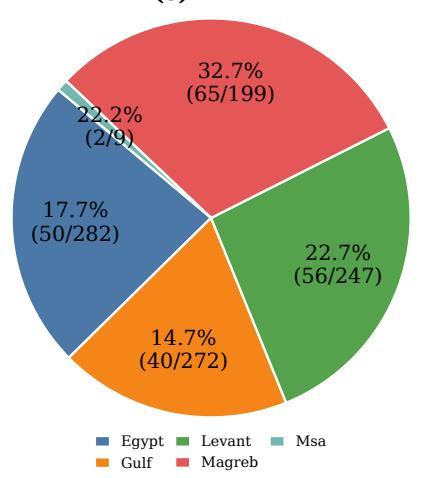

# BARRAC: Adaptation of an English Aspect-based Sentiment Analysis Approach for Classification Tasks in Arabic Dialects

Ali Almutairi1, Gelareh Mohammadi1,

Imran Razzak2, Aditya Joshi1,

1University of New South Wales, Australia, 2MBZUAI, UAE ali.almutairi@unsw.edu.au

## Abstract

With the rapid growth of Arabic NLP, several models, datasets and benchmarks have been reported. This paper asks whether approaches developed for majority languages like English can be adapted to Arabic tasks. We adapt an English aspect-based sentiment analysis framework to Arabic classification tasks and present the adaptation as BARRAC: Brainstorming Alignment and Replaced Representation learning for ArabiC tasks. BARRAC replaces consumer-review attribute pools with Arabic linguistic devices and markers for dialectal sentiment, sarcasm, and dialect identification, and replaces noisy self-training with two-stage training. Evaluated on five Arabic dialect datasets, BARRAC achieves a mean macro-F1 of 63.93%, outperforming the best few-label SOTA by 3%, and outperforming GPT-4o on four out of five tasks. Error analysis provides insights into remaining challenges. These results demonstrate that adapting taskspecific approaches is a promising direction for Arabic NLP alongside adapting models, datasets and benchmarks.

## 1 Introduction

Arabic is a Semitic language with over 1,400 years of written history (Belinkov et al., 2018) and one of the six oficial languages of the United Nations, with more than 422 million native speakers (Boudad et al., 2018). Since the early finitestate morphology of Beesley (1996), Arabic NLP has produced dedicated pre-trained models (Antoun et al., 2020; Abdul-Mageed et al., 2021), evaluation suites (Seelawi et al., 2021), recurring NADI dialect-identification shared tasks (Talafha et al., 2025; Abdul-Mageed et al., 2024, 2023), and community datasets for sentiment and sarcasm (Abu Farha and Magdy, 2020; AlMazrua et al., 2022). Yet these resources remain limited in scale and diversity compared to English, especially for low-resource tasks such as fine-grained sarcasm detection and cross-dialect sentiment classification (Abdhood et al., 2025). We argue this gap calls for a community-involved efort in which native speakers critically adapt and refine approaches first devised for English.

We show how DS²-ABSA (Xu et al., 2025), an English aspect-based sentiment analysis framework, can be adapted to text classification tasks in Arabic, including low-resource dialects. Our adaptation is called BARRAC: Brainstorming Alignment and Replaced Representation learning for ArabiC tasks. Existing responses to label scarcity, zero-shot transfer, SFT, and few-label methods, such as Cluster&Tune (Shnarch et al., 2022), IDoFew (Alsuhaibani et al., 2024), and noisy self-training (Xu et al., 2025), have not, to our knowledge, extended a complete English data-synthesis framework to Arabic sociolinguistic tasks. Benchmarking 14 baselines across dialectal sarcasm, sentiment, and dialect tasks with fewlabels, our adaptation reaches a mean Macro-F1 of 63.93%, surpassing the best supervised baseline by 8.48%, SOTA few-label method by 3% and is comparable to GPT-4o at a fraction of its parameter count, with consistent gains across all five datasets. Methodological contributions devised for English, we conclude, can be meaningfully adapted to serve other languages and communities.

## 2 Motivation

Arabic NLP has grown rapidly, with dedicated venues such as the ArabicNLP conference reflecting the field’s increasing maturity (Abdhood et al., 2025). While acknowledging the focus on building datasets and benchmarks is valuable, we ask an alternative question: “how can an English aspect-based sentiment analysis approach be adapted for classification tasks in Arabic?” DS²-ABSA is a dual-stream (key-point-driven and instance-driven) synthesis framework addressing label scarcity in Aspect-Based Sentiment Analysis (ABSA). However, its attribute pools are grounded exclusively in consumer-review domains, and it presupposes tangible review subjects with discrete, reviewable aspects such as food quality, making it non-trivially applicable to tasks with a fundamentally diferent label space, output structure, and subject matter. Via our proposed BARRAC, we demonstrate how DS²-ABSA can be systematically adapted beyond its original scope: from tasks centred on tangible consumer entities to tasks centred on linguistic and sociolinguistic phenomena, specifically, sarcasm, dialects, and sentiments.

  
Figure 1: BARRAC framework.

## 3 Methodology

## 3.1 ABSA Method

Given a consumer-review sentence, DS2-ABSA outputs one or more (aspect term, sentiment polarity) pairs over two domains, restaurant and laptop reviews. It addresses label scarcity by synthesising training data through two complementary streams. The key-point-driven stream builds samples from scratch: it samples an attribute tuple (review subject, aspect category, aspect term, opinion term), prompts an LLM to generate a sentence satisfying all four, and derives the label from the output.

The instance-driven stream diversifies the seed corpus by combining, paraphrasing, and selectively reconstructing masked samples. A final refinement stage applies rule-based normalisation and noisy self-training, where a teacher model trained on the synthetic data re-annotates noisy instances.

## 3.2 Adaptation to BARRAC

BARRAC (see Figure 1) extends the components of DS²-ABSA as follows.

## 3.2.1 Attribute Linguistic Device

A linguistic device is a coarse-grained rhetorical or communicative mechanism through which a speaker conveys meaning beyond the literal content of an utterance. In the original framework, the aspect category serves an analogous role as a coarse-grained dimension of a product or service (e.g., screen resolution), brainstormed per domain via GPT-4o. Such categories are inherently tied to the physical properties of reviewable entities and have no natural counterpart when the subject of analysis is a linguistic or sociolinguistic phenomenon rather than a product. We substitute aspect categories with linguistic devices conditioned on the target task: for sarcasm detection, we use coarse-grained rhetorical mechanisms such as mock\_praise and verbal\_irony; for dialect identification, we use dialect regions (Egyptian, Gulf, Levantine, Maghrebi, and Modern Standard Arabic), conditioning the attribute hierarchy on the target class directly; and for sentiment analysis, we use sentiment sub-categories representing domainspecific manifestations of each polarity class, such as frustration with price hikes for negative sentiment in the economy domain. In all three cases, the substituted attribute preserves the coarse conditioning role of the original aspect category, from which finer-grained attributes are subsequently derived, while grounding the hierarchy in the relevant linguistic phenomenon rather than product features. Please refer to Table 9 for further details.

## 3.2.2 Attribute Linguistic Marker

A linguistic marker is a fine-grained lexical or phrasal unit whose presence in an utterance reliably signals the activation of a particular linguistic device, functioning as a surface-level cue from which deeper communicative intent can be inferred. In the original framework, the aspect term serves this role as a fine-grained noun phrase naming the specific opinion target (e.g., decor), conditioned on the aspect category. Like aspect categories, aspect terms presuppose the existence of a discrete, nameable physical entity, which is absent in linguistic classification tasks. We substitute aspect terms with class-conditioned linguistic markers: for sarcasm, these are Arabic words and phrases that signal the active sarcasm device (e.g., <مఈఃݿ ؇ ل < for mock\_praise); for dialect identification, these are phonological, morphological, and lexical features characteristic of each dialect region (e.g., < ده ۬ إل < for Egyptian); and for sentiment analysis, these are Arabic trigger phrases whose presence strongly signals a particular polarity (e.g., < ۋݷ ؇ڣ ءఈః༚> for negative sentiment). In all three cases, markers are brainstormed conditioned on the class-level linguistic device, preserving the coarse-to-fine hierarchy of the original framework. Please refer to Table 9 for further details.

<table><tr><td>Dataset</td><td>Split</td><td>Total</td><td>Classes</td><td>Tok. Total</td><td>Tok. Mean</td><td>Tok. Med.</td><td>Tok. Min</td><td>Tok. Max</td></tr><tr><td rowspan="5">DART</td><td>Train</td><td>一</td><td>一</td><td>一</td><td>一</td><td></td><td>一</td><td>一</td></tr><tr><td>Real Labels</td><td>100</td><td>5</td><td>1,447</td><td>14.47</td><td>14.00</td><td>3</td><td>28</td></tr><tr><td>Eval</td><td>255</td><td>5</td><td>3,645</td><td>14.29</td><td>13.00</td><td>1</td><td>31</td></tr><tr><td>Test</td><td>1,009</td><td>5</td><td>14,304</td><td>14.18</td><td>13.00</td><td>2</td><td>35</td></tr><tr><td>Synthetic Labels</td><td>42929</td><td>5</td><td>1002785</td><td>23.36</td><td>24.00</td><td>2</td><td>59</td></tr><tr><td rowspan="5">Ar-Dialects</td><td>Train</td><td>5,905</td><td>5</td><td>86,630</td><td>14.67</td><td>15.00</td><td>1</td><td>32</td></tr><tr><td>Real Labels</td><td>100</td><td>5</td><td>1,482</td><td>14.82</td><td>15.00</td><td>3</td><td>28</td></tr><tr><td>Eval</td><td>2,432</td><td>5</td><td>36,107</td><td>14.85</td><td>15.00</td><td>1</td><td>29</td></tr><tr><td>Test</td><td>2,110</td><td>5</td><td>31,273</td><td>14.82</td><td>15.00</td><td>1</td><td>29</td></tr><tr><td>Synthetic Labels</td><td>42929</td><td>5</td><td>1002785</td><td>23.36</td><td>24.00</td><td>2</td><td>59</td></tr><tr><td rowspan="5">Sa&#x27;7r</td><td>Train</td><td>3,958</td><td>2</td><td>57,333</td><td>14.49</td><td>10.00</td><td>1</td><td>59</td></tr><tr><td>Real Labels</td><td>100</td><td>2</td><td>1,487</td><td>14.87</td><td>10.00</td><td>2</td><td>54</td></tr><tr><td>Eval</td><td>3,458</td><td>2</td><td>49,352</td><td>14.27</td><td>10.00</td><td>1</td><td>59</td></tr><tr><td>Test</td><td>1,186</td><td>2</td><td>16,976</td><td>14.31</td><td>10.00</td><td>2</td><td>59</td></tr><tr><td>Synthetic Labels</td><td>38542</td><td>2</td><td>770288</td><td>19.99</td><td>21.00</td><td>2</td><td>62</td></tr><tr><td rowspan="5">Ar-Sarcasm</td><td>Train</td><td>5,905</td><td>2</td><td>86,811</td><td>14.70</td><td>15.00</td><td>1</td><td>29</td></tr><tr><td>Real Labels</td><td>100</td><td>2</td><td>1,421</td><td>14.21</td><td>14.00</td><td>2</td><td>25</td></tr><tr><td>Eval</td><td>2,432</td><td>2</td><td>35,987</td><td>14.80</td><td>15.00</td><td>1</td><td>32</td></tr><tr><td>Test</td><td>2,110</td><td>2</td><td>31,273</td><td>14.82</td><td>15.00</td><td>1</td><td>29</td></tr><tr><td>Synthetic Labels</td><td>38556</td><td>2</td><td>857920</td><td>22.25</td><td>23.00</td><td>2</td><td>53</td></tr><tr><td rowspan="5">Ar-Sentiment</td><td>Train</td><td>5,835</td><td>3</td><td>85,989</td><td>14.74</td><td>15.00</td><td>1</td><td>32</td></tr><tr><td>Real Labels</td><td>100</td><td>3</td><td>1,384</td><td>13.84</td><td>13.50</td><td>2</td><td>29</td></tr><tr><td>Eval</td><td>2,502</td><td>3</td><td>36,846</td><td>14.73</td><td>15.00</td><td>1</td><td>29</td></tr><tr><td>Test</td><td>2,110</td><td>3</td><td>31,273</td><td>14.82</td><td>15.00</td><td>1</td><td>29</td></tr><tr><td>Synthetic Labels</td><td>48599</td><td>3</td><td>1039146</td><td>21.38</td><td>22.00</td><td>2</td><td>67</td></tr></table>

Table 1: Statistics of the train, real labels, evaluation, and test splits used in the five Arabic classification datasets. Tok. Total, Tok. Mean, Tok. Med., Tok. Min, and Tok. Max denote the total, mean, median, minimum, and maximum number of tokens per split, respectively.

Task Instruction The original instruction asks the model to “label the sentence by extracting the aspect term(s) and identifying their corresponding sentiment polarity”. This is not suitable for singlelabel (predicting one class at a time) tasks, which have no multi-pair structure. We substitute a taskspecific objective such as “identifying whether the text is sarcastic or not sarcastic”. The prompt structure “Label the [sentence/text] by task instruction” is preserved verbatim, with only the objective replaced in the attribute prompting. Additional details are provided in Table 10 for task instruction and Table 11 for attribute prompting.

Domain Scope DS²-ABSA restricts brainstorming to two domains, restaurants and laptops, sourcing both the topic pool and category hierarchy. This suits ABSA but limits diversity and is unsuitable for tasks spanning public discourse. We replace it with 10 domains: economy, sports, health, environment, entertainment, transportation, government services and infrastructure, technology and the internet, education, and food.

Examples of Steps 1 and 2 in BARRAC are provided in Tables 13 and 14, respectively.

Training Strategy Instead of DS²-ABSA’s noisy self-training, which risks error accumulation across iterative re-annotation (Zou and Caragea, 2023), we employ intermediate training (Alsuhaibani et al., 2024): The Pseudo-Label Fine-Tuning (PL-FT) model is trained using pseudolabels, which will be obtained from systematic synthesis data pipelines. Once training is complete, we utilise the weights from the PL-FT model as initialisation weights for the subsequent Few-Labels Fine-Tuning (FT-FL) model on actual labelled data (see Figure 1 Stage 3). The synthetic corpus acts as task-adaptive initialisation, while the final decision boundary is refined solely through gold-standard supervision.

<table><tr><td>Method/Dataset Ar-Sent. Ar-Sarc. Sa&#x27;7r</td></tr><tr><td>DART Ar-Dial. Mean Without Fine-Tuning</td></tr><tr><td>ArabicBERT 3.27 24.68 45.77 32.63 5.30 2.72</td></tr><tr><td>ARBERTv2 2.18 11.41 47.56 32.92 10.77 7.88</td></tr><tr><td>AraBERT-Twitter 4.14 25.02 46.76 38.52 7.40 10.14</td></tr><tr><td>MARBERTv2 5.05 20.17 50.40 51.74 10.77 6.03</td></tr><tr><td>SFT with 100 Labels</td></tr><tr><td></td></tr><tr><td>BERT 45.72 49.34 59.91 10.12 16.02 36.22 DistilBERT 43.74 49.44 64.90 6.98 16.02 36.22</td></tr><tr><td>ArabicBERT 57.77 58.71 64.48 25.56 26.33 46.57</td></tr><tr><td>ARBERTv2 60.25 61.91 61.88 52.67 40.58 55.46</td></tr><tr><td>SOTA Few-label Methods with 100 Labels</td></tr><tr><td>Cluster&amp;Tune* 57.98 57.05 64.90 49.75 39.79 53.89</td></tr><tr><td>IDoFew* 54.22 60.82 63.54 53.24 32.38 52.84</td></tr><tr><td>IDoFew*+ 58.73 61.74 66.88 51.60 35.73 54.93</td></tr><tr><td>BARRAC (Ours) 65.61 69.06 67.03 68.76 49.19 63.93</td></tr></table>

Table 2: Mac-F1 results on 5 Arabic datasets. “ ” indicates ARBERTv2 as SOTA backbone model and “+” indicates it is adapted to our training hyperparameters.

## 4 Experiment Setup

We evaluate our adaptation to DS2-ABSA for text classification with few-labels across 5 publicly available Arabic datasets: Ar-Sentiment, Ar-Sarcasm, Ar-Dialects (Abu Farha and Magdy, 2020), Sa’7r (AlMazrua et al., 2022), and DART (Alsarsour et al., 2018); spanning three tasks, sarcasm detection, dialect identification, and sentiment analysis. We fine-tune all models using 100 real labels to mimic low-resource settings. For synthetic data generation, we follow the hyperparameters reported in Xu et al. (2025) without modification, except for the LLM (GPT-4o) used for generation.

We release the synthetic data used in our experiments, We use ARBERTv2 as the backbone classification model across all experiments for the fewlabel frameworks.

We report the macro-F1 score, consistent with prior work on Arabic text classification under class imbalance. For all baselines, we use a unified configuration: the same number of epochs, batch size, learning rate, optimiser, and random seed across all experiments. All baselines are trained using exactly 100 balanced labelled examples. Table 3 summarises the hyperparameters used for intermediate and final training across all three tasks.

## 4.1 Comparative Models

We compare against general-purpose and Arabicspecific pre-trained language models fine-tuned on the available labelled data, namely BERT, Distil-BERT, ArabicBERT, and ARBERTv2. We further compare against Cluster&Tune, IDoFew and its Arabic-adapted variants, as well as the noisy selftraining from the DS²-ABSA paper and its variants. BERT models: We have compared BARRAC with publicly available language models that include

<table><tr><td>Parameter</td><td>Value</td></tr><tr><td>PL-FT model epochs</td><td>1</td></tr><tr><td>FL-FT model epochs</td><td>20</td></tr><tr><td>Learning rate (all other datasets)</td><td> $5 \times 1 0 ^ { - 5 }$ </td></tr><tr><td>Learning rate (Sa&#x27;7r)</td><td> $3 \times 1 0 ^ { - 5 }$ </td></tr><tr><td>Batch size</td><td>32</td></tr><tr><td>Optimizer</td><td>Adam</td></tr><tr><td>Seed</td><td>42</td></tr></table>

Table 3: Training hyperparameters used across all datasets and baselines.

BERT (Devlin et al., 2019) and DistilBERT (Sanh et al., 2020).

Arabic-BERT models: We have also used the Arabic BERT in our study. These models are: ArabicBERT (Safaya et al., 2020), ARBERTv2 (Abdul-Mageed et al., 2021), AraBERT-Twitter (Antoun et al., 2020), and MARBERTv2 (Abdul-Mageed et al., 2021).

LLMs: We evaluate BARRAC against fine-tuned LLMs through Supervised Fine-Tuning (SFT), as they have shown efectiveness in managing intricate tasks. To achieve this, we select AllAM-7B (Bari et al., 2025), Llama3.1-8B (Meta, 2024), AceGPT (Zhu et al., 2025), Qwen2.5-72B-instruct (Team, 2024), and GPT-4o (OpenAI, 2025) as representative models in our comparison.

Intermediate models: In order to assess the efficacy of our intermediate stage, we conducted a comparison of BARRAC’s performance with that of Cluster & Tune (Shnarch et al., 2022) and IDoFew (Alsuhaibani et al., 2024), both of which utilise an inter-training task.

## 5 Results

Table 2 compares BARRAC against three baseline groups. Direct inference BERT-based models (BBMs) perform near chance (means of 20.97– 27.62), confirming that task supervision is indispensable. Supervised fine-tuning (SFT) on the 100 labels lifts the strongest Arabic encoder, ARBERTv2, to a mean of 55.46. The BERT and DistilBERT collapse on DART (10.12 and 6.98), predicting only a subset of the five dialect classes: their English-centric vocabularies fragment dialect-bearing tokens. The few-label SOTA methods Cluster&Tune (Shnarch et al., 2022) and IDoFew (Alsuhaibani et al., 2024), both instantiated with ARBERTv2, do not surpass plain AR-BERTv2 SFT on average (53.89 and 54.93), suggesting that intermediate clustering objectives developed for English text classification transfer imperfectly to dialectal Arabic tasks.

BARRAC achieves the best macro-F1 on all five datasets, with a mean of 63.93: +8.48 over the best SFT baseline and +3 over the best few-label SOTA method. The improvements are consistent across binary and multi-label spaces, dataset sizes, and both multi-dialect and Saudi-only distributions, indicating that the dual-stream paradigm generalises well beyond its original ABSA setting. Within BARRAC, backbone and training recipe both matter: running the adapted synthesis pipeline with the original DS²-ABSA configuration, with an Arabic encoder under noisy self-training attains 60.92. Since this comparison varies the backbone and recipe jointly, we isolate the training-strategy effect separately in (§5.1).

Table 5 compares BARRAC against multiple LLMs. We outperform open-weight LLMs by a wide margin and match GPT-4o on average (63.93 vs. 63.98), surpassing it on four of the five datasets. See 5 for the full breakdown.

Zero-seed transfer to DART. DART provides our strictest generalisation test: unlike the other four datasets, no DART data was used to seed synthesis; the dialect synthetic corpus was generated from Ar-Dialects seeds, and DART contributes only its 100 gold labels, evaluation, and test sets. Despite this, our method reaches 68.76 on DART, +16.09 over ARBERTv2 SFT and +15.52 over the best SOTA method. The synthetic dialect data thus encodes transferable, class-discriminative dialectal evidence rather than memorising seed-set artefacts, which is precisely the property required of synthetic data in low-resource settings.

Comparison with LLMs. Table 5 benchmarks against LLMs, selected to span scale (7B–72B and a frontier closed model), language specialisation (Arabic-centric ALLaM and AceGPT vs. multilingual Llama and Qwen), and accessibility (open vs. closed weights). Our 163M-parameter encoder outperforms every open-weight LLM by a wide margin (best: ALLaM-7B at 56.77, 7.16 vs. ours); notably, Arabic-centric pre-training alone does not close the gap, and scale does not help (Qwen2.5-72B trails ALLaM-7B by 17.20). Most strikingly, our model is comparable on average to GPT-4o (63.93 vs. 63.98, the same model that generated our synthetic data) and surpasses it on four of the five datasets. The student thus matches its teacher at a small fraction of the parameter count and inference cost, and without API dependence. GPT-4o retains a clear advantage on Ar-Sentiment (72.47 vs. 65.61).

<table><tr><td>Model</td><td colspan="5">Ar-Sent. Ar-Sarc. Sa’7r DART Ar-Dial. Mean</td></tr><tr><td>OurSIntermediate training</td><td>65.61</td><td>69.06</td><td>67.03 68.76</td><td>49.19</td><td>63.93</td></tr><tr><td>Noisy self-training</td><td>65.31</td><td>66.43</td><td>64.2066.43</td><td>42.21</td><td>60.92</td></tr><tr><td>Noisy self-training+</td><td>64.06</td><td>62.07</td><td>64.24 67.82</td><td>44.37</td><td>60.51</td></tr></table>

Table 4: A comparative analysis of our proposed method and the DS2-ABSA training strategies was conducted across five distinct evaluation datasets, maintaining the consistency of the ARBERTv2 backbone model. ”+” indicates SOTA baselines adapted to our training hyperparameters.

<table><tr><td>Method/Dataset</td><td colspan="4">Ar-Sent. Ar-Sarc. Sa’7r DART Ar-Dial. Mean</td></tr><tr><td></td><td colspan="4">SFT using 100 Labels (LLMs)</td></tr><tr><td>ALLaM-7B-Instruct</td><td>63.28</td><td>67.07</td><td>61.72 54.99</td><td>36.79 56.77</td></tr><tr><td>Llama 3.1 8B</td><td>56.81</td><td>58.32 57.94 36.35</td><td>29.92</td><td>47.87</td></tr><tr><td>AceGPT-16B</td><td>16.89</td><td>45.55 32.54 0.35</td><td>16.02</td><td>22.27</td></tr><tr><td>Qwen2.5-72B-Instruct</td><td>53.53</td><td>56.99</td><td>34.11 27.56 25.66</td><td>39.57</td></tr><tr><td>GPT-40</td><td>72.47</td><td>67.14 65.1866.49</td><td>48.63</td><td>63.98</td></tr><tr><td>BARRAC (Ours)</td><td>65.61</td><td>69.06 67.03 68.76</td><td>49.19</td><td>63.93</td></tr></table>

Table 5: Macro-F1 (%) results on against LLMs.

## 5.1 Efect of the Synthetic–Gold Training Strategy

In Table 4 we contrast two ways of combining synthetic and gold data on the same ARBERTv2 backbone. Noisy self-training, as in the original DS²- ABSA, mixes pseudo-labelled synthetic data with gold data throughout training; we evaluate it under both the original hyper-parameters (60.92) and hyper-parameters tuned to our setting (60.51). Our intermediate training strategy, fine-tuning first on synthetic data, then on the 100 gold labels, reaches 63.93, a +3.01 improvement over the best selftraining variant, with gains on all datasets, largest on Ar-Dialects (+4.82) and Ar-Sarcasm (+2.63) in a non-iterative learning protocol. Because synthetic labels are noisier than gold labels, interleaving them allows label noise to persist into the final model, whereas intermediate training treats synthesis as task-adaptive initialisation and reserves the final optimisation steps for clean supervision. The training strategy choice is consequential, accounting for roughly a third of our total improvement over direct SFT.

## 5.2 Ablation Study

Table 6 ablates BARRAC. On the synthesis side, removing the instance-driven stream costs 4.11 mean F1, more than twice the cost of removing the key-point-driven stream 1.61; both streams help on nearly every dataset, highlighting their complementarity. Removing label normalisation costs 2.02. On the training side, removing the synthetic stage entirely costs 8.47. Conversely, removing the gold fine-tuning stage is catastrophic 27.26: Ar-Sentiment and Ar-Dialects collapse to 16.06 and 13.47, while binary sarcasm degrades more gracefully (60.98 and 59.95). This asymmetry suggests that synthetic data alone sufices to learn coarse binary distinctions but cannot calibrate fine-grained decision boundaries under the distribution shift between LLM-generated and real tweets; even 100 gold labels are decisive for anchoring the label space. Together, the two trainingside ablations show that synthetic and gold data are not interchangeable but strictly complementary: each stage alone underperforms their sequential combination by 8.5 and 27.3 points, respectively.

<table><tr><td>BARRAC w/o</td><td>Ar-Sent.</td><td>Ar-Sarc.</td><td>Sa’7r</td><td>DART</td><td>Ar-Dial.</td><td>Mean</td></tr><tr><td>Key-Point-Driven</td><td>64.08</td><td>65.16</td><td>67.55</td><td>67.62</td><td>47.18</td><td>62.32</td></tr><tr><td>Instance-Driven</td><td>59.69</td><td>64.35</td><td>62.91</td><td>66.37</td><td>45.77</td><td>59.82</td></tr><tr><td>Normalisation</td><td>63.83</td><td>65.48</td><td>65.75</td><td>67.30</td><td>47.18</td><td>61.91</td></tr><tr><td>Inter-model (PL-FT)</td><td>60.25</td><td>61.91</td><td>61.88</td><td>52.67</td><td>40.58</td><td>55.46</td></tr><tr><td>Final model (FL-FT)</td><td>16.06</td><td>60.98</td><td>59.95</td><td>32.90</td><td>13.47</td><td>36.67</td></tr><tr><td>Full Model</td><td>65.61</td><td>69.06</td><td>67.03</td><td>68.76</td><td>49.19</td><td>63.93</td></tr></table>

Table 6: Ablation study results reported using Macro-F1 (%).

## 6 Error Analysis

To better understand the remaining failure modes, we manually examined misclassified instances from each dataset. Specifically, we randomly sampled 20 misclassified examples per dataset and grouped them according to the underlying source of error. As shown in Table 7, most errors fall into four broad categories: Insuficient Context, where very short texts provide limited evidence; Linguistic Overlap, where lexical cues are shared across classes; Label Ambiguity, where multiple interpretations are plausible; and Annotation Ambiguity, where the gold label appears debatable. See Appendix A (Figure 2, Table 7) for details.

## 7 Conclusion

We asked whether a task-specific data-synthesis framework devised for English aspect-based sentiment analysis could be adapted to Arabic sociolinguistic classification. By regrounding the components of DS²-ABSA in task-specific Arabic linguistic markers across a ten-domain space, and replacing noisy self-training with intermediate training followed by few-label fine-tuning, our adaptation attains a mean macro-F1 of 63.93 across five datasets and three tasks. In our experiments, it improves on the strongest supervised baseline by 8.48% and the best few-label method by +3%, and performs comparably to GPT-4o 63.98 on average while exceeding it on four of five datasets, at a substantially smaller parameter count. These gains hold across binary, three-way, and five-way label spaces and transfer to a zero-seed dataset.

## 8 Limitations

Several factors limit the scope of our conclusions. The generation pipeline itself, however, relies on a single proprietary model (GPT-4o), so regenerating the data from scratch or extending the approach to new tasks incurs API cost, ofers limited transparency into the generation process, and may effectively bound the student’s performance by the teacher’s competence; the gap that remains on Ar-Sentiment would be consistent with such a ceiling, though we cannot establish this from our experiments alone. Our evaluation covers a single language, five datasets, three tasks, and a 100-label budget, so we make no claims about behaviour beyond this particular low-resource setting, and results may not transfer to other languages, dialects, or tasks. The class-balanced synthetic corpus that appears to strengthen minority-class evidence may also shift decision thresholds, which we tentatively associate with the precision cost observed in sarcasm detection; with only 100 gold labels, the finetuning stage may be insuficient to fully recalibrate it. Performance on low-support dialects (e.g., Gulf, Levantine, and Maghrebi) is likewise limited, plausibly in part because of an imperfect match between synthetic and real usage. Finally, some of the residual error may not be purely learnable: prior work suggests the neutral–polar boundary in Ar-Sentiment and the irony-hashtag construction of Sa’7r introduce label ambiguity in the source corpora, which could upper-bound achievable performance independently of the model.

## 9 Ethical Considerations

All datasets used are publicly available and were, to our knowledge, employed in accordance with their licenses and intended research use.

## 10 Generative AI usage disclosure

The authors disclose the use of generative AI tools to assist with translation, LaTeX code cleanup, formatting, and the addition of Arabic script.

## References

Sura F. Abdhood, Nazlia Omar, and Sabrina Tiun. 2025. Data augmentation for arabic text classification: A review of current methods, challenges and prospective directions. PeerJ Computer Science, 11:e2685.

Muhammad Abdul-Mageed, AbdelRahim Elmadany, and El Moatez Billah Nagoudi. 2021. ARBERT & MARBERT: Deep bidirectional transformers for Arabic. In Proceedings of the 59th Annual Meeting of the Association for Computational Linguistics and the 11th International Joint Conference on Natural Language Processing (Volume 1: Long Papers), pages 7088–7105, Online. Association for Computational Linguistics.

Muhammad Abdul-Mageed, AbdelRahim Elmadany, Chiyu Zhang, El Moatez Billah Nagoudi, Houda Bouamor, and Nizar Habash. 2023. NADI 2023: The fourth nuanced Arabic dialect identification shared task. In Proceedings of ArabicNLP 2023, pages 600– 613, Singapore (Hybrid). Association for Computational Linguistics.

Muhammad Abdul-Mageed, Amr Keleg, Abdel-Rahim Elmadany, Chiyu Zhang, Injy Hamed, Walid Magdy, Houda Bouamor, and Nizar Habash. 2024. NADI 2024: The fifth nuanced Arabic dialect identification shared task. In Proceedings of the Second Arabic Natural Language Processing Conference, pages 709–728, Bangkok, Thailand. Association for Computational Linguistics.

Ibrahim Abu Farha and Walid Magdy. 2020. From Arabic sentiment analysis to sarcasm detection: The ArSarcasm dataset. In Proceedings of the 4th Workshop on Open-Source Arabic Corpora and Processing Tools, with a Shared Task on Offensive Language Detection, pages 32–39, Marseille, France.

Halah AlMazrua, Najla AlHazzani, Amaal AlDawod, Lama AlAwlaqi, Noura AlReshoudi, Hend Al-Khalifa, and Luluh AlDhubayi. 2022. Sa‘7r:

A saudi dialect irony dataset. In Proceedinsg of the 5th Workshop on Open-Source Arabic Corpora and Processing Tools with Shared Tasks on Qur’an QA and Fine-Grained Hate Speech Detection, pages 60–70, Marseille, France. European Language Resources Association.

Israa Alsarsour, Esraa Mohamed, Reem Suwaileh, and Tamer Elsayed. 2018. DART: A large dataset of dialectal Arabic tweets. In LREC 2018.

Abdullah Alsuhaibani, Hamad Zogan, Imran Razzak, Shoaib Jameel, and Guandong Xu. 2024. Idofew: Intermediate training using dualclustering in language models for few labels text classification. In WSDM, page 18–27.

Wissam Antoun, Fady Baly, and Hazem Hajj. 2020. AraBERT: Transformer-based model for Arabic language understanding. In Proceedings of the 4th Workshop on Open-Source Arabic Corpora and Processing Tools, with a Shared Task on Ofensive Language Detection, pages 9– 15.

M Saiful Bari, Yazeed Alnumay, Norah A. Alzahrani, Nouf M. Alotaibi, Hisham Abdullah Alyahya, Sultan AlRashed, Faisal Abdulrahman Mirza, Shaykhah Z. Alsubaie, Hassan A. Alahmed, Ghadah Alabduljabbar, Raghad Alkhathran, Yousef Almushayqih, Raneem Alnajim, Salman Alsubaihi, Maryam Al Mansour, Saad Amin Hassan, Dr. Majed Alrubaian, Ali Alammari, Zaki Alawami, and 7 others. 2025. ALLam: Large language models for arabic and english. In The Thirteenth International Conference on Learning Representations.

Kenneth R. Beesley. 1996. Arabic finite-state morphological analysis and generation. In COLING 1996 Volume 1: The 16th International Conference on Computational Linguistics.

Yonatan Belinkov, Alexander Magidow, Alberto Barrón-Cedeño, Avi Shmidman, and Maxim Romanov. 2018. Studying the history of the arabic language: Language technology and a large-scale historical corpus. Preprint, arXiv:1809.03891.

Naaima Boudad, Rdouan Faizi, Rachid Oulad Haj Thami, and Raddouane Chiheb. 2018. Sentiment analysis in arabic: A review of the

literature. Ain Shams Engineering Journal, 9(4):2479–2490.

Jacob Devlin, Ming-Wei Chang, Kenton Lee, and Kristina Toutanova. 2019. BERT: Pre-training of deep bidirectional transformers for language understanding. In NAACL, pages 4171–4186.

Meta. 2024. Introducing meta llama 3: The most capable openly available llm to date.

OpenAI. 2025. GPT-Family (April 14 version). Large language model.

Ali Safaya, Moutasem Abdullatif, and Deniz Yuret. 2020. KUISAIL at SemEval-2020 task 12: BERT-CNN for ofensive speech identification in social media. In Proceedings of the Fourteenth Workshop on Semantic Evaluation, pages 2054–2059, Barcelona (online).

Victor Sanh, Lysandre Debut, Julien Chaumond, and Thomas Wolf. 2020. Distilbert, a distilled version of bert: smaller, faster, cheaper and lighter. Preprint, arXiv:1910.01108.

Haitham Seelawi, Ibraheem Tufaha, Mahmoud Gzawi, Wael Farhan, Bashar Talafha, Riham Badawi, Zyad Sober, Oday Al-Dweik, Abed Alhakim Freihat, and Hussein Al-Natsheh. 2021. ALUE: Arabic language understanding evaluation. In Proceedings of the Sixth Arabic Natural Language Processing Workshop, pages 173– 184, Kyiv, Ukraine (Virtual). Association for Computational Linguistics.

Eyal Shnarch, Ariel Gera, Alon Halfon, Lena Dankin, Leshem Choshen, Ranit Aharonov, and Noam Slonim. 2022. Cluster & tune: Boost cold start performance in text classification. In ACL, pages 7639–7653.

Bashar Talafha, Hawau Olamide Toyin, Peter Sullivan, AbdelRahim A. Elmadany, Abdurrahman Juma, Amirbek Djanibekov, Chiyu Zhang, Hamad Alshehhi, Hanan Aldarmaki, Mustafa Jarrar, Nizar Habash, and Muhammad Abdul-Mageed. 2025. NADI 2025: The first multidialectal Arabic speech processing shared task. In Proceedings of The Third Arabic Natural Language Processing Conference: Shared Tasks, pages 720–733, Suzhou, China. Association for Computational Linguistics.

Qwen Team. 2024. Qwen2.5: A party of foundation models.

Hongling Xu, Yice Zhang, Qianlong Wang, and Ruifeng Xu. 2025. DS2-ABSA: Dual-stream data synthesis with label refinement for few-shot aspect-based sentiment analysis. In Proceedings of the 63rd Annual Meeting of the Association for Computational Linguistics (Volume 1: Long Papers), pages 15460–15478, Vienna, Austria. Association for Computational Linguistics.

Jianqing Zhu, Huang Huang, Zhihang Lin, Juhao Liang, Zhengyang Tang, Khalid Almubarak, Abdulmohsen Alharthik, Bang An, Juncai He, Xiangbo Wu, Fei Yu, Junying Chen, Zhuoheng Ma, Yuhao Du, He Zhang, Emad A. Alghamdi, Lian Zhang, Ruoyu Sun, Haizhou Li, and 2 others. 2025. Second language (arabic) acquisition of llms via progressive vocabulary expansion. Preprint, arXiv:2412.12310.

Henry Peng Zou and Cornelia Caragea. 2023. JointMatch: A unified approach for diverse and collaborative pseudo-labeling to semisupervised text classification. In Proceedings of the 2023 Conference on Empirical Methods in Natural Language Processing, pages 7290– 7301. Association for Computational Linguistics.

## A Extended Error Analysis

Figure 2 reports our model’s error rate per gold class (misclassified instances over class support) on each test set; Table 8 presents representative instances that our model classifies correctly while all competing few-label baselines fail. Examples are drawn from the intersection of baseline errors and our model’s correct predictions to characterise the source of the gains in §5; our model’s own dominant failure modes, visible in Figure 2, are discussed throughout this section.

On Ar-Sentiment, errors are far from uniform across polarities: the neutral class is misclassified at 43.4%, against 27.2% for positive and 18.6% for negative. This mirrors the documented subjectivity of neutral annotations in the source corpus, where re-annotation shifted a large fraction of neutral and positive labels (Abu Farha and Magdy, 2020): the neutral–polar boundary is partly an annotation artefact rather than a purely learnable distinction. The qualitative examples reflect the same phenomenon; all baselines mislabel a congratulatory news headline as positive on surface lexis (ฟฃዛኗ, “congratulates”), whereas our model, exposed to synthetic neutral instances containing polar trigger words, correctly returns neutral. Residual neutral errors of this kind plausibly account for much of the remaining gap to GPT-4o on this task (§5).

On Ar-Sarcasm, error rates are nearly balanced across classes (24.2% on not-sarcasm vs. 22.3% on sarcasm), i.e., sarcastic recall reaches 77.7%, a sharp contrast with the recall bottleneck characteristic of this dataset, whose original baseline detected only 38% of sarcastic tweets (Abu Farha and Magdy, 2020). The cost is precision: because the sarcastic class comprises only 16% of the test set, the 24.2% false-alarm rate on the majority class accounts for 427 of the 504 total errors. We attribute this trade-of to our class-balanced synthetic corpus, which strengthens minority-class evidence but shifts the decision threshold toward sarcasm; with only 100 gold labels, the subsequent fine-tuning stage cannot fully re-calibrate it. On Sa’7r the false-alarm tendency is amplified (42.1% on notsarcasm vs. 28.5% on sarcasm), which we trace to the corpus construction: Sa’7r was collected via irony-indicative hashtags, keywords, and phrases, so its non-ironic tweets contain the very surface markers that signal irony elsewhere (AlMazrua et al., 2022), weakening exactly the marker-level evidence our synthesis injects. The Zamalek example in Table 8 illustrates the converse skill: all baselines misread enthusiastic, hyperbolic fan discourse as sarcastic, while our model correctly withholds the sarcasm label.

On Ar-Dialects, error rates are inversely related to gold-class support: MSA, with 1,410 test instances, is misclassified at only 8.7%, while Gulf (n=105) and Levantine (n=112) reach 55.2% and 62.5%, and all four Maghrebi instances are missed, though with n=4 this cell measures support scarcity, not model behaviour, and it depresses macro-F1, partly explaining why Ar-Dialects remains our lowest-scoring task (49.19). With 100 gold labels spread over five classes ( 20 per class), the gold stage cannot calibrate rare dialects whose synthetic representations imperfectly match real usage. Zero-seed DART, whose test set is dialect-balanced, shows a strikingly diferent profile: error rates are uniform and moderate (14.7%– 32.7%; the 2/9 MSA cell is again too small to interpret), with no class collapsing, further evidence that the synthetic dialect evidence transfers as generalisable markers rather than corpusspecific artefacts (§5). Maghrebi remains the hardest dialect (32.7%), consistent with DART’s own annotation study, which found Maghrebi the least reliably identifiable group even for human annotators (Alsarsour et al., 2018). The dialect examples in Table 8 show the characteristic baseline failure our model avoids: collapsing dialectal tweets onto MSA or Levnt, whereas our model recovers the gold dialect from sparse function-word evidence (e.g., Levantine ري ؇ݱ݁, مఈ႙ၽܳ؇۱).

  
(e)) DARTRT (e) D(e) DART

(d) Ar-D(d) Ar-DialeDialectsects(d) Ar-DialectsAr-Dialectsts  

  
Egypt Levant Msa Egypt Levant Msa44.1%Egypt Levant Msa Egypt Levant Msagypt Levant Msa Egypt Levant MsaLevant Ms Egypt Levant Msvant Ms Egypt Levant MsMsa Egypt Levant Msas Egypt Levan MsEgypt Levan MsEgypt Levant MsaEgypt Levant Msa Egypt Levant Msa44.1%pt Levant Msa Egypt Levant MsaLevant Msa Egypt Levant Msant Ms Egypt Levant MsMs Egypt Levant MsEgypt Levant MsaFigure 2: Misclassified instances distribution across five Arabic datasets. Percentages are computed over the test set.

<table><tr><td>Dataset</td><td>Error Type</td><td>Example</td><td>Gold</td><td>Pred.</td></tr><tr><td></td><td>Insufficient Context</td><td> $\nsim$   ${ \bar { N } } i c { \bar { e } } , n i c e .$ </td><td>MGH</td><td>LEV</td></tr><tr><td>DART / Ar-Dialects</td><td>Linguistic Overlap</td><td> $S ^ { \prime } _ { 1 } , C _ { 2 } L _ { 2 } = 1 0$  I said it before and I repeat it.</td><td>MGH</td><td>MSA</td></tr><tr><td></td><td>Linguistic Overlap</td><td> $\therefore \sin ^ { 2 } x = 1 5 1$  If you excelled now.</td><td>LEV</td><td>GLF</td></tr><tr><td></td><td>Questionable Annota-</td><td> $4 . 0 2 5 6 4 5 6 5 6 \div 6 0 0 0 4 5 5 5 5 5 5 6 = 1 5 5 5 5 5 5 5 5 5 1 5 1 5 1 4 1 5 2 5$ </td><td>MSA</td><td>LEV</td></tr><tr><td></td><td>tion</td><td>Please, if they are going to come in the style of Gilbert Zwain and Nayla Mouawad, forget about this whole story.  $\therefore \vert \sin ^ { 2 } ( \pi ) = \sin ( \pi )$ </td><td></td><td></td></tr><tr><td></td><td></td><td>May God grant him success, God willing.  $\tan ( \frac { \pi } { 2 } \cot ( \frac { \pi } { 2 } + \cot ( \frac { \pi } { 2 } ) , \cos ( \frac { \pi } { 2 } ) + \cot ( \frac { \pi } { 2 } ) , \tan ( \frac { \pi } { 2 } ) ) = \tan ( \frac { \pi } { 2 } \cos ( \frac { \pi } { 2 } ) , \sin ( \frac { \pi } { 2 } \pi ) , \sin ( 2 \pi ) )$ </td><td></td><td></td></tr><tr><td>Ar-Sarcasm /</td><td>tion</td><td> $5 5 \div 5 \leq 5 5$  I brought&quot;the notebook and colours for the art class. You&#x27;re good at that, but</td><td></td><td></td></tr><tr><td>Sa&#x27;7r</td><td>Label Ambiguity</td><td>teaching and its principles are a hundred obstacles away, you extra. ds  $\sin ^ { \circ } \cup ^ { \bullet }$ </td><td>Not-Sarc.</td><td>Sarc.</td></tr><tr><td></td><td>Linguistic Overlap</td><td> $S a y ^ { \cdot } { } ^ { \cdot } I s w e a r ^ { \prime \prime } , h a h a .$   $[ 1 5 ( \sum \limits _ { i = 1 } ^ { n } i ) ] = 1  1 , ( \sum \limits _ { i = 1 } ^ { n } i ) = 1  \infty 4 , ( \sum \limits _ { i = 1 } ^ { n } i ) = 1$ </td><td>Not-Sarc.</td><td>Sarc.</td></tr><tr><td></td><td>Questionable Annota-</td><td>Honestly, he completely messed it up with Paris; his choices were bad.  $\int \limits _ { 0 } ^ { + 1 } d x + 1 \leq 1 \int \limits _ { 0 } ^ { \infty } d x \ d x + 1 \int \limits _ { 0 } ^ { \infty } d x \leq 1$ </td><td>Sarc.</td><td>Not-Sarc.</td></tr><tr><td></td><td>tion</td><td>Praise be to Ġod, praise be to God; all thanks and gratitude belong to You, O God.  $1 1 0 0 - 1 1 \int 1 0 0 0 1 d m 5 \int 1 2 1 5 1 1 5 1 6 4 4 7$ </td><td></td><td></td></tr><tr><td></td><td>Label Ambiguity</td><td>No, baby, that&#x27;s wrong. Do you want me to disconnect the internet from you?  $5 ^ { 2 } + 4 1 \leq 1 5 \div 2 6$ </td><td>Sarc.</td><td>Not-Sarc.</td></tr><tr><td></td><td>Insufficient Context</td><td>just something quick.</td><td></td><td>Sarc.</td></tr><tr><td>Sentiment</td><td>Questionable Annota- tion</td><td> $p s \int \sin ( \frac { \pi } { 2 } \pi - \frac { 1 } { 4 } \pi - \frac { 1 } { 4 } ) d \frac { 1 } { 2 } d \frac { 1 } { 3 } = \sin ( \frac { 1 } { 2 } \pi ) , \cos ( \frac { 1 } { 2 } \pi \times \frac { 1 } { 2 } ) = \sin ( \frac { 1 } { 2 } \pi )$  Girls who have not started fasting, Ramadan is near and time is short, so I wanted to remind those who forgot.</td><td>Neu.</td><td>Pos.</td></tr><tr><td></td><td>Label Ambiguity</td><td> $v = 0 0 0 k g = 0 . 0 0 5 m ^ { 3 } \times 0 . 0 0 5 m / s = 0 . 0 0 1 m / s = 0 . 0 0 3 m / s = 1 . 2 5 m / s$  Thank God, after a long search, Pokémon is finally downloading.</td><td>Neu.</td><td>Pos.</td></tr><tr><td></td><td>Questionable Annota- tion</td><td> $\because N - C ^ { x } = b + 5 ( b > 0 ) = 3 5$  False weather forecast; they said there would be snow but it turned out hot.</td><td>Neu.</td><td>Neg.</td></tr><tr><td></td><td>Insufficient Context</td><td> $0 L  - \frac { 1 } { 2 } \vert b \vert \vert \# ( : \dot { \bar { w } } \vert , \bar { s } )$  Yes indeed :) #Lifestyle</td><td> $\mathrm { P o s . }$ </td><td>Neu.</td></tr><tr><td></td><td>Questionable Annota-</td><td> $\cos ( 3 ) = ( 3 ) \cos ( \cos \alpha ) ( - 1 ) = ( 3 - 1 ) ( - 1 2 ) ( - 1 ) = ( 3 - 1 ) ( - 1 )$  I want my Harry Potter book :( When we moved house, the box containing my</td><td> $\mathrm { P o s . }$ </td><td></td></tr></table>

Table 7: Representative errors made by our model. Most errors arise from insuficient context, linguistic overlap between classes, label ambiguity, or questionable annotations.

<table><tr><td>Text / English Translation</td><td>Gold</td><td>C&amp;T</td><td>IDoFew</td><td>NST</td><td>Ours</td></tr><tr><td colspan="6">Dialect Identification</td></tr><tr><td> $p > k \pi _ { 0 } \leq c \leq l _ { \rho } \log c \cup b \infty$  They give you money for saying this.</td><td>LEV</td><td>GLF</td><td>GLF</td><td>GLF</td><td>LEV</td></tr><tr><td> $\sin x , \cos x \sin , \sin ( 1 , 2 ) , \sin x = 3 , \sin x = \frac { 1 } { 2 } , \sin x = \frac { 1 } { 2 } , \sin x = \sin x + \frac { 1 } { 2 } , \sin x = \frac { 1 } { 2 } , \sin x = \frac { 1 } { 2 } , \sin x = \frac { 1 } { 2 } , \sin x = \frac { 1 } { 2 } , \sin x .$  Since you and your side is leaving mine, I&#x27;ll leave you. May you be</td><td>GLF</td><td>MGH</td><td>MGH</td><td>MGH</td><td>GLF</td></tr><tr><td>blessed with much good; I am neither in need nor asking.  $\cdots L ( \mu , \mu , \mu ) = 0 . 2 4 \mu ( \mu , \mu ) = 0 . 2 4 1 L \mu ^ { 3 } = 0 . 2 4 1 L \mu$  France boycott, Morocco is joining the African Union soon ...</td><td>MGH</td><td>MSA</td><td>MSA</td><td>MSA</td><td>MGH</td></tr><tr><td> $a ( \sum ) = \sum \limits _ { j = 1 } ^ { \infty } a ( \sum \limits _ { i = 1 } ^ { n } c - 1 ) = \sum \limits _ { j = 1 } ^ { \infty } a ( \sum \limits _ { j = 1 } ^ { n } a ( \sum \limits _ { i = 1 } ^ { n } c - 1 ) = \sum \limits _ { j = 1 } ^ { \infty } ( \sum \limits _ { i = 1 } ^ { n } b ) ( \sum \limits _ { j = 1 } ^ { n } c - 1 ) = \sum \limits _ { j = 1 } ^ { \infty } a ( \sum \limits _ { j = 1 } ^ { n } a ( \sum \limits _ { i = 1 } ^ { n } a ) ) c$  And they are upset if we raise ticket prices. You will pay whether you like</td><td>GLF</td><td>EGY</td><td>EGY</td><td>EGY</td><td>GLF</td></tr><tr><td colspan="6">it or not and stay quiet so you can watch Al-Ittihad and its fans.</td></tr><tr><td colspan="6">Sarcasm Detection</td></tr><tr><td> $\sin , \psi _ { 1 } ( t - 1 , - 1 ) = \cos , \psi _ { 2 } ( t - 1 ) = \cos , \psi _ { 1 } ( t - 1 )$  Now you enter online chat rooms; thank God.</td><td>sarcasm</td><td></td><td></td><td>not-sarcasm not-sarcasm not-sarcasm</td><td>sarcasm</td></tr><tr><td> $4 5 - 1 \leq 5 \leq 4 5 5 \leq 3 5 1 1 \leq 4 5 1 \leq 1 5 1 \leq 5 1 \leq 5 1 \leq 5 1$ </td><td>not-sarcasm</td><td>sarcasm</td><td>sarcasm</td><td>sarcasm</td><td>not-sarcasm</td></tr><tr><td>Excuse me, Fahad bin Mohammed&#x27;s words are about something else.  $\sin ( \frac { \pi } { 2 } ) + \cos ( \frac { \pi } { 2 } - \alpha ) , \sin ( 2 ) + \cos ( \frac { \pi } { 2 } - \alpha ) , \cos ( 2 ) \leq \sin ( 2 \pi - \alpha ) , \sin ( 2 \pi - \alpha )$ </td><td>not-sarcasm</td><td>sarcasm</td><td>sarcasm</td><td>sarcasm</td><td>not-sarcasm</td></tr><tr><td> $4 5 \dot { s } < 1 1 6 . \dot { s } 1 1 2 4 \dot { s } 3 2 3 4 6 \dot { s } 1 1 \dot { s } 2 3 0 1 \dot { s } 1 1 \dot { s } 1 1 \dot { s } 1 1 \dot { s } 1 1 \dot { s } 1 1 \dot { s } 1 1 \dot { s } 1 \dot { s } 1 \dot { s } 1 \dot { s } 1 \dot { s } 1 \dot { s } 1 \dot { s } 1 \dot { s } 1 \dot { s } 1 \dot { s } 1 \dot { s } 1 \dot { s } 1 \dot { s } 1 \dot { s } 1 \dot { s } 1 \dot { s } 1 \dot { s } 1 \dot { s } 1 \dot { s } 1 \dot { s } 1 \dot { s } 1 \dot { s } 1 \dot { s } 1 \dot { s } 1 \dot { s } 1 \dot { s } 1 \dot { s } 1 \dot { s } 1 \dot { s } 1 \dot { s } 1 \dot { s } 1 \dot { s } 1 \dot { s } 1 \dot { s } 1 \dot { s } 1 \dot { s } 1 \dot { s } 1 \dot { s } 1 \dot { s } 1 \dot { s } 1 \dot { s } 1 \dot { s } 1 \dot { s } 1 \dot { s } 1 \dot { s } 1 \dot { s } 1 \dot { s } 1 \dot { s } 1 \dot { s } 1 \dot { s } 1 \dot { s } 1 \dot { s } 1 \dot { s } 1 \dot { s } 1 \dot { s } 1 \dot { s } 1 \dot { s } 1 \dot { s } 1 \dot { s } 1 \dot { s } 1 \dot { s } 1 \dot { s } 1 \dot { s } 1 \dot { s } 1 \dot { s } 1 \dot { s } 1 \dot { s } 1 \dot { s } 1 \dot { s } 1 \dot { s } 1 \dot { s } 1 \dot { s } 1 \dot { s } 1 \dot { s } 1 \dot { s } 1 \dot { s } 1 \dot { s } 1 \dot { s } 1 \dot { s } 1 \dot { s } 1 \dot { s } 1 \dot { s } 1 \dot { s } 1 \dot { s } 1 \dot { s } 1 \dot { s } 1 \dot { s } 1 \dot 1 \dot { s } 1 \dot { s } 1 \dot { s } 1 \dot 1 \dot { s } 1 \dot { s } 1 \dot 1 \dot { s } 1 \dot 1 \dot { s 1 } \dot 1 \dot { s 1 } \dot 1 \dot  s 1 \dot 1  s$  What matters is that any player wears Zamalek&#x27;s shirt and plays for</td><td></td><td></td><td></td><td></td><td></td></tr><tr><td colspan="6">Zamalek ... Sentiment Classification</td></tr><tr><td colspan="6"> $( \sin ^ { 2 } \alpha - 1 ) \cos \alpha = 1 5 , 0 \sin \alpha + 1 \cos \alpha \sin \alpha \sin \alpha \sin \beta \sin \alpha \sin \beta \sin \alpha \sin \beta \cos \alpha \sin \beta \cos \alpha \sin \beta \cos \alpha \sin \beta$ </td></tr><tr><td>The European Union congratulates Lebanon on forming its new</td><td>neutral</td><td>positive</td><td>positive</td><td>positive</td><td>neutral</td></tr><tr><td>government headed by Saad Hariri.  $\sin ( \frac { \pi } { 2 } \cos ( \frac { \pi } { 2 } ) ) \leq \sin ( \pi ) , \sin ( \frac { \pi } { 2 } \cos \pi ) , \sin ( \frac { \pi } { 2 } \sin ( \frac { \pi } { 2 } ) ) \leq 1 \sin ( \pi \pi ) \leq 1$  Arab Weather, your news is always late, and you do not have your own</td><td>negative</td><td>neutral</td><td>neutral</td><td>positive</td><td>negative</td></tr></table>

Table 8: Examples of correctly classified instances by the proposed model where competing baselines make incor rect predictions. Arabic texts are shown with English translations. C&T denotes Cluster&Tune, and NST denotes noisy self-training.

<table><tr><td>Attribute</td><td>Prompt</td></tr><tr><td>Tweet Topic</td><td>Brainstorm a list of Arabic Twitter tweet topics (at least 200). Please adhere to the following guidelines: - Summarise each topic as a short, neutral description of a real-world event, situation, or subject that Arabic Twitter users commonly discuss.</td></tr><tr><td>Linguistic De- vice (Sarcasm)</td><td>government services and infrastructure, technology and the internet, education, and food culture. - Topics must be neutral, without sentiment, dialect, or rhetorical bias. Your output should be a Python list of strings, with each element being a topic description. Output ONLY the Python list, nothing else.</td></tr><tr><td rowspan="2"></td><td>Brainstorm a list of commonly used sarcasm devices in Arabic tweets about the domain: {topic domain}.</td></tr><tr><td>Please adhere to the following guidelines: - Sarcasm devices are coarse-grained rhetorical mechanisms, not specific words or phrases. - They describe the way sarcasm is expressed, e.g. verbal irony, hyperbole, mock praise. - Always include direct_statement&#x27; as the non-sarcastic baseline device.</td></tr><tr><td rowspan="4">Linguistic De- vice (Sentiment)</td><td>Your output should be a Python list of strings, with each element being a device name. Out- put ONLY the Python list, nothing else.</td></tr><tr><td>Brainstorm a list of commonly used sentiment categories in Arabic tweets about the domain: {topic domain}. Please adhere to the following guidelines:</td></tr><tr><td>- Sentiment categories are coarse-grained expressive modes, not specific words or phrases. - They describe the way a polarity is expressed, e.g. frustration, celebration, factual reporting. - Provide categories for each of the three polarities: positive, neutral, and negative.</td></tr><tr><td>Your output should be a Python dict with keys “&quot;positive&quot;, “&quot;neutral&quot;, and &quot;negative&quot;, each mapping to a list of category names. Output ONLY the Python dict, nothing else.</td></tr><tr><td>Linguistic Marker</td><td>Brainstorm a list of Arabic words or phrases that signal {linguistic device} in tweets about {topic domain}. Please adhere to the following guidelines: - Markers are fine-grained and concrete surface cues, not broad descriptions. - A marker is text a native speaker would immediately associate with the given device, dialect, or polarity. - Include lexical items, multiword phrases, and, for dialects, characteristic morphological and phonological forms. - Provide diverse markers spanning formal, colloquial, and mixed register.</td></tr></table>

Table 9: Brainstorming prompts used in BARRAC. The linguistic device prompt is task-specific; the tweet topic and linguistic marker prompts are shared across tasks, with the device slot instantiated per task. For dialect, the device set is fixed a priori by the label space (EGY, GLF, LEV, MGH, MSA)

<table><tr><td rowspan=1 colspan=1>Task</td><td rowspan=1 colspan=1>Task Instruction / Label Space</td></tr><tr><td rowspan=1 colspan=1>Sarcasm</td><td rowspan=1 colspan=1>identifying whether the tweet is sarcastic ornot sarcastic.Label space: sarcastic, not sarcastic</td></tr><tr><td rowspan=1 colspan=1>Dialect</td><td rowspan=1 colspan=1>identifying which Arabic dialect the tweet iswritten in.Label space: EGY, GLF, LEV, MGH, MSA</td></tr><tr><td rowspan=1 colspan=1>Sentiment</td><td rowspan=1 colspan=1>identifying the sentiment of the tweet.Label space: positive, neutral, negative</td></tr></table>

Table 10: Task instructions and label spaces substituted into the {task instruction} and {label space} slots of all BARRAC prompts.

<table><tr><td>Method</td><td>Prompt</td></tr><tr><td rowspan="6">Attribute Prompting</td><td>Write a tweet for the Arabic Twitter: {tweet topic} Label the tweet by {task instruction}.</td></tr><tr><td>Requirements: - Keep a consistent style and annotation standard with the examples.</td></tr><tr><td>- Convey linguistic device in the tweet, using the marker type 'linguistic marker' as a signal.</td></tr><tr><td>- Keep a consistent tweet style with examples. - Express {expression pattern} across the tweet.</td></tr><tr><td></td></tr><tr><td>Here are some examples: Tweet: {tweet}</td></tr><tr><td></td><td></td></tr><tr><td>Tweet: &lt;Arabic tweet text&gt; Label: &lt;{label space}&gt;</td><td>Label: {label}</td></tr><tr><td></td><td>Given 2 Arabic Twitter example tweets with the labels, please combine them to generate {K} diverse tweets. Label each tweet by {task instruction}.</td></tr><tr><td rowspan="7">Sample Combination</td><td>Requirements:</td></tr><tr><td>- Keep a consistent style and annotation standard with the examples. - Maintain the same format as the examples.</td></tr><tr><td>- Combine the aspects and meanings of both examples in every generated tweet.</td></tr><tr><td>- If both examples share the same label, all {K} generated tweets must carry that label; otherwise,</td></tr><tr><td>generate an equal number of tweets for each label.</td></tr><tr><td></td></tr><tr><td>Examples: Tweet: {tweet}</td></tr><tr><td rowspan="8"></td><td>Label: {label}</td></tr><tr><td>Tweet: {tweet'}</td></tr><tr><td>Label: {label'}</td></tr><tr><td></td></tr><tr><td>{K} Diverse Combined Tweets with Labels: 1. Tweet:</td></tr><tr><td>Given an Arabic Twitter example tweet with the label, please paraphrase it to generate {K} diverse tweets. Label each tweet by {task instruction}.</td></tr><tr><td>Requirements:</td></tr><tr><td>- Keep a consistent style and annotation standard with the example. - Maintain the same format as the example.</td></tr><tr><td>- The meaning of the example tweet should be unchanged. - All generated tweets must carry the same label as the example.</td></tr><tr><td>Tweet: {tweet}</td></tr><tr><td></td></tr><tr><td>Example:</td></tr><tr><td>Label: {label}</td></tr><tr><td>{K} Diverse Paraphrased Tweets with Labels: 1. Tweet: Given a partially masked Arabic Twitter tweet, please fill and reconstruct it to generate {K} diverse</td></tr><tr><td>Selective Reconstruction</td><td>tweets following the example. Label each tweet by {task instruction}.</td></tr><tr><td>Requirements: Example: Tweet: {tweet} Label: {label} {K} Diverse Reconstructed Tweets with Labels: 1. Tweet:</td><td>Masked tweet: {masked tweet} - Keep a consistent style and annotation standard with the example. - Maintain the same format as the example. - The unmasked part of the tweet should be unchanged.</td></tr><tr><td>Method</td><td>Input Prompt / Output Write a tweet for the Arabic Twitter: a government announcement about electricity price increases</td></tr><tr><td></td><td>Label the tweet by identifying whether the tweet is sarcastic or not sarcastic. Requirements: - Keep a consistent style and annotation standard with the examples. - Convey mock_praise in the tweet, using the sarcasm marker  $\cdot x _ { \cdot } v$  ("how wonderful") as a signal.</td></tr><tr><td></td><td>- Keep a consistent tweet style with examples. - Express consistent across the tweet. Tweet:  ${ < } \mathbf { A }$  rabic tweet text&gt;</td></tr><tr><td>Attribute Prompting (Sarcasm) .. Tweet: How wonderful, a wise decision, they raised electricity prices and we thank them</td><td>Label: &lt;sarcastic or not sarcastic&gt;  $p s \sin ( - 1 , - 1 , 0 ) , \angle \alpha \sin ( 1 , - 3 , 0 ) , c = \angle \alpha , \beta = 1 , \beta = 1 , \alpha , \angle$ </td></tr><tr><td>Method</td><td>Input Prompt / Output Given 2 Arabic Twitter example tweets with the labels, please combine them to generate 4 diverse tweets. Label each tweet by</td></tr><tr><td></td><td>identifying the sentiment of the tweet. Requirements: - Keep a consistent style and annotation standard with the examples. - Maintain the same format as the examples.</td></tr><tr><td></td><td>- Combine the aspects and meanings of both examples in every generated tweet. - If both examples share the same label, all 4 generated tweets must carry that label; otherwise, generate an equal number of tweets for each label.</td></tr><tr><td>Sample Combination</td><td>Examples: Tweet:  $\sin ( 3 + \pi ) = \sin ( \frac { \pi } { 2 } , \frac { \pi } { 2 } )$ </td></tr><tr><td></td><td>Vegetable prices rose insanely this week</td></tr><tr><td>(Sentiment)</td><td>Label: negative Tweet:  $C ^ { ( n ) } ( 0 , \infty ) = ( 0 , \infty )$ </td></tr><tr><td></td><td>The traffic on the road has been suffocating since morning</td></tr><tr><td></td><td>Label: negative</td></tr><tr><td></td><td>4 Diverse Combined Tweets with Labels: 1. Tweet:</td></tr><tr><td></td><td> $\sin ( \frac { 1 } { 2 } , \cos \alpha ) = \sin ( \frac { 1 } { 2 } \alpha + \sin ^ { 2 } \alpha ) \cos \alpha \cos \beta$ </td></tr><tr><td></td><td>I stood an hour in traffic just to buy vegetables at insane prices Label: negative</td></tr><tr><td></td><td>2. Tweet:  $\tan ( x - \cos \angle \frac { \pi } { 2 } ) = ( \sin \alpha \cos \alpha ) + \sin ( \frac { \pi } { 2 } ) , \tan ^ { 2 } \alpha \sin ( \alpha \cos \alpha \sin \alpha )$  The traffic is suffocating and market prices are unbearable, an exhausting day</td></tr><tr><td></td><td>Label: negative</td></tr><tr><td></td><td>3. Tweet:  $\sin ^ { \circ } 1 , \cos , \sin , \sin , \sin , \sin , \cos , \sin , \sin , \sin , \sin , \sin , \sin , \sin , \sin , \sin , \sin , \sin , \sin , \sin , \theta ,$  From the morning traffic to the cost of vegetables, everything has become harder</td></tr><tr><td></td><td>Label: negative</td></tr><tr><td></td><td>4. Tweet:  $x = - \sqrt { 1 0 } ( - x ) ( - 0 . 1 + x ) ( - 0 . 1 2 ) ( 1 . 3 + x ) ( - 1 . 2 + 1 ) ( - 1 . 3 + x )$ </td></tr><tr><td></td><td>Vegetable prices are insane and the road is choked, the situation is hard this week Label: negative</td></tr><tr><td></td><td>Given a partially masked Arabic Twitter tweet, please fill and reconstruct it to generate 4 diverse tweets following the example.</td></tr><tr><td></td><td>Label each tweet by identifying which Arabic dialect the tweet is written in.</td></tr><tr><td></td><td>Masked tweet:  ω| &lt;mask&gt; &lt;mask&gt; &lt;mask&gt;  $c \cdot a _ { i } \cdot c _ { }$ </td></tr><tr><td></td><td>What is this &lt;mask&gt; &lt;mask&gt; &lt;mask&gt; since morning</td></tr><tr><td></td><td></td></tr><tr><td></td><td>Requirements:</td></tr><tr><td>Selective</td><td>- Keep a consistent style and annotation standard with the example.</td></tr><tr><td></td><td>- Maintain the same format as the example.</td></tr><tr><td>Reconstruction</td><td>- The unmasked part of the tweet should be unchanged.</td></tr><tr><td></td><td></td></tr><tr><td>(Dialect)</td><td>Example:</td></tr><tr><td></td><td>Tweet:  $[ \cos ^ { \alpha 1 1 } \sin \alpha , \sin ^ { 5 } \alpha ] = 5 \cos \alpha 1$ </td></tr><tr><td></td><td>What is all this traffic since morning</td></tr><tr><td></td><td>Label: EGY</td></tr><tr><td></td><td></td></tr><tr><td></td><td>4 Diverse Reconstructed Tweets with Labels: 1. Tweet:</td></tr><tr><td></td><td> $C : 0 1 1 \dot { 0 } 0 . 5 \dot { 2 } 0 . 5 0 3 \dot { 6 } 0 . 3 0 1 1$ </td></tr><tr><td></td><td>What is all this traffic since morning Label: EGY</td></tr><tr><td></td><td>2. Tweet:  $C ( 0 ) ^ { 1 } \log _ { 2 } ^ { 2 } ( 5 0 ^ { 2 } ) \{ > \log _ { 2 } ^ { 1 } ( 0 . 2 4 )$  What is this, the weather has been so hot since morning</td></tr><tr><td></td><td>Label: EGY</td></tr><tr><td></td><td>3. Tweet:  $[ \cos ^ { 2 } \alpha ] \cos \alpha \leq \sin ^ { 2 } \alpha \leq \cos \alpha \leq \frac { 1 } { 2 }$  What is this, the queue hasn't ended since morning</td></tr></table>

Table 11: Prompt template for attribute prompting in BARRAC. {task instruction} and {label space} are instantiated per task (Table 10). {expression pattern} takes the values consistent, mixed, or implicit for sarcasm and sentiment, and formal, colloquial, or mixed for dialect.

Table 12: Prompts for instance-driven data synthesis in BARRAC. The reconstruction prompt is applied to both masking strategies, difering only in the masked tweet supplied.

Table 13: Example of key-point-driven synthetic data from LLMs in BARRAC. Slots instantiated from the sampled attribute tuple and the task instruction are shown in blue; English glosses are given in italics and do not form part of the prompt. The output below the dashed line is the model response.

Table 14: Examples of instance-driven synthetic data from LLMs in BARRAC. Slots instantiated per task are shown in blue; English glosses are given in italics and do not form part of the prompt. The output below each dashed line is the model response for $K = 4$ . The output below the dashed line is the model response.