# Blackboard Intelligence Can Surpass Autoregressive on Globally Constrained Problems

Woosang Jeon<sup>1∗</sup> Jaeyeon Kim<sup>2∗</sup> Sham Kakade<sup>2</sup> Yilun Du<sup>2</sup> Amrit Singh Bedi<sup>3</sup>

Arun Kumar Chithanar Chul Lee Taehyeong Kim<sup>1</sup> Sitan Chen<sup>2†</sup>

<sup>1</sup>Seoul National University <sup>2</sup>Harvard University <sup>3</sup>University of Central Florida

## Abstract

Next-token prediction has driven remarkable progress in large language models, yet a growing body of evidence suggests that they can struggle on problems governed by complex global constraints. In this work, we focus on this regime and ask whether some of these limitations arise from the inference interface induced by next-token prediction itself. We study this question through blackboard intelligence: an inference-time perspective in which a model works on a fixed, revisable canvas and searches over candidate solution states rather than committing to a causal, left-to-right trajectory. We instantiate this idea with diffusion language models, whose any-order prediction interface naturally exposes predictions over partially filled solution states. Our key observation is that mean confidence, a simple modelinternal quantity available from the standard masked diffusion objective, provides a useful proxy for global coherence and can guide inference-time search and revision. Empirically, across ZebraLogic, Nurse Rostering, and Job-Shop Scheduling, Blackboard consistently improves inference while holding the fine-tuned LLaDA-8B-Instruct checkpoint fixed and substantially outperforms same-scale autoregressive baselines, reaching 90.4% accuracy on ZebraLogic-Hard, 76.4% exact feasibility on Nurse Rostering, and 80.2% optimality on JSSP. Stronger autoregressive search and refinement also fail to close the gap on ZebraLogic-Hard, while Blackboard surpasses tested frontier LLMs there and on JSSP despite their substantially greater scale and strong test-time reasoning. We open-source our codebase at https://github.com/jwoosang1/blackboard-intelligence.

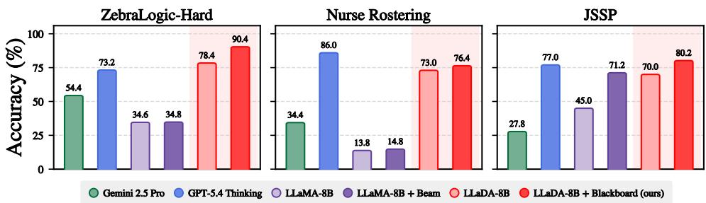  
Figure 1: Across three globally constrained domains, blackboard inference consistently improves LLaDA-8B-Instruct over its standard inference (shaded) and outperforms same-scale autoregressive baselines; on ZebraLogic-Hard and JSSP, it also exceeds the tested frontier LLMs.

## 1 Introduction

In recent years, autoregressive next-token prediction has been the dominant modeling paradigm underlying Large Language Models (LLMs). This paradigm has delivered remarkable gains in language modeling, coding, mathematics, and agentic tasks [Achiam et al., 2023, Jaech et al., 2024, Comanici et al., 2025, Guo et al., 2025, Anthropic, 2025], leading to the view that sufficiently advanced LLMs can solve arbitrarily complex problems. At the same time, a growing body of evidence suggests that this perspective may be incomplete; LLMs can struggle in domains governed by complex combinatorial or logical constraints [Nagarajan et al., 2025, Lin et al., 2025, Abgaryan et al., 2025, Tso et al., 2026, Fesser et al., 2026].

In this work, we ask whether some of these limits arise not merely from model scale or data, but also from the inference interface induced by next-token prediction. We argue that models that instead operate on a fixed canvas and natively support any-order unmasking and remasking to search over the solution space can offer an alternative inference interface in domains where next-token prediction struggles. We informally refer to this canvas-based, revision-capable inference as blackboard intelligence: the model iteratively builds and revises a candidate solution, resembling how humans solve structured problems by dynamically maintaining and searching over partial solutions.

Diffusion language models, specifically masked diffusion models [Shi et al., 2024, Sahoo et al., 2024, Nie et al., 2025], offer a natural instantiation of blackboard intelligence. While recent largescale diffusion language models have been studied primarily through the lens of inference-time efficiency [DeepMind, 2025, Wu et al., 2025a,b, Labs et al., 2025, Song et al., 2025], in this work, we shift the focus from speed to intelligence: we ask whether their flexible inference interface can support problem-solving capabilities difficult to realize with standard autoregressive generation.

Contribution. Our central claim is that the standard masked diffusion objective gives rise to a statelevel inference interface that enables diffusion language models to exhibit blackboard intelligence on globally constrained problems. In particular, we show that a simple notion of mean confidence provides a useful model-internal signal of the global coherence of the current state. Unlike next-token prediction, masked diffusion makes predictions over arbitrary unrevealed, i.e., masked, positions, making such a state-level signal natively available. We use this mean confidence to guide inferencetime search, revision, and adaptive intervention over a fixed canvas.

Empirically, without changing the fine-tuned LLaDA-8B-Instruct [Nie et al., 2025] checkpoint, Blackboard improves standard inference across three domains that involve global constraints: ZebraLogic, Nurse Rostering, and JSSP, reaching 90.4% accuracy on ZebraLogic-Hard, 76.4% exact feasibility on Nurse Rostering, and 80.2% optimality on JSSP (Figure 1). Next, we show that stronger autoregressive inference does not recover comparable gains in our evaluation, even with substantially increased inference-time computation. On ZebraLogic-Hard, LLaMA-3.1-8B Instruct [Meta, 2024] reaches only 35.0% with wider beam search and 36.6% with verifier-guided refinement, while frontier autoregressive models such as GPT-5.4 [OpenAI, 2026] and Gemini 2.5 Pro [Google DeepMind, 2025] also remain below Blackboard on ZebraLogic-Hard and JSSP despite extensive inference-time reasoning.

Implication. Our empirical results point to an interface-level distinction between autoregressive and masked-diffusion-based generation: the masked-diffusion interface can enable a distinct form of problem solving based on blackboard intelligence, in which a persistent partial solution can be evaluated and revised throughout inference. This form of state-level inference control is not directly exposed by a standard next-token decoding pass, and the autoregressive search and refinement procedures do not recover comparable gains from additional inference-time computation.

Organization. Section 2 reviews autoregressive and diffusion LLMs. Section 3 introduces mean confidence and empirically demonstrates its effectiveness as a state-level reliability signal. Building on this signal, Section 4 develops an algorithmic instantiation of blackboard intelligence and evaluates it across the three domains.

## 2 Preliminaries and Framework

In this section, we briefly review the training and inference procedures of both autoregressive and diffusion language models. Let $p _ { \mathrm { d a t a } }$ denote the target distribution over discrete sequences that a generative model $f _ { \theta }$ aims to sample from, with vocabulary V and sequence length L. For a sequence $\mathbf { \bar { x } } = ( \mathbf { x } ^ { 1 } , \dots , \mathbf { x } ^ { L } ) \in \mathcal { V } ^ { L }$ , we write $\mathbf { x } ^ { < i } : = ( \mathbf { x } ^ { 1 } , \ldots , \mathbf { x } ^ { i - 1 } )$ for its prefix before position i.

Autoregressive LLMs. Autoregressive LLMs factorize the data distribution causally as $p _ { \mathrm { d a t a } } ( \mathbf { x } ) =$ $\begin{array} { r } { \prod _ { i = 1 } ^ { L } p _ { \mathrm { d a t a } } ( \mathbf { x } ^ { i } | \mathbf { x } ^ { < i } ) } \end{array}$ . Accordingly, an autoregressive model $f _ { \theta }$ is trained to approximate the nexttoken posterior $f _ { \theta } ( \cdot | \mathbf { x } ^ { < i } ) \approx p _ { \mathrm { d a t a } } ( \mathbf { x } ^ { i } | \mathbf { x } ^ { < i } )$ , typically by minimizing the cross-entropy loss. At inference time, starting from a prompt $\hat { \mathbf { x } } ^ { < 1 } = [ \mathrm { p r o m p t } ]$ (or empty prefix), we iteratively sample $v \sim f _ { \theta } ( \cdot \mid \hat { \mathbf { x } } ^ { < i } )$ and append it to form $\hat { \mathbf { x } } ^ { < i + 1 }$

Diffusion LLMs: training. Diffusion LLMs (dLLMs), instantiated by masked diffusion models $\mathrm { [ S a } \cdot$ hoo et al., 2024, Shi et al., 2024, Lou et al., 2023], learn to predict the clean-token posterior at all unrevealed positions from partially observed sequences, rather than predicting only the next token.

Formally, let $\mathbf { x } \sim p _ { \mathrm { d a t a } }$ be a clean sequence. We sample an integer $n \sim \operatorname { U n i f } \{ 1 , \dots , L \}$ , choose a subset $M \subseteq \{ 1 , \ldots , L \}$ of size n uniformly at random, and construct a masked sequence ${ \textbf { z } } \in$ $( \mathcal { V } \cup \{ \mathbf { m } \} ) ^ { L }$ by replacing the indices in M with an auxiliary mask token m. This masking procedure induces a joint distribution over $\mathbf { \Gamma } ( \mathbf { x } , \mathbf { z } )$ and, for each masked position $i \in M$ , the associated coordinate wise posterior is $p ( \mathbf { x } ^ { i } = v \mid \mathbf { z } )$ . The masked diffusion model, parameterized by $f _ { \theta } ,$ takes z as input and outputs a categorical distribution $f _ { \theta } ^ { i } ( \cdot | \mathbf { z } ) \approx p ( \mathbf { x } ^ { i } = \cdot | \mathbf { \dot { z } } )$ for each position i. The training objective is the cross-entropy loss over the masked positions.

$$
\mathcal { L } ( \boldsymbol { \theta } ) = \mathbb { E } _ { \mathbf { x } , \mathbf { z } } \left[ \frac { 1 } { | M | } \sum _ { i : \mathbf { z } ^ { i } = \mathbf { m } } - \log f _ { \boldsymbol { \theta } } ^ { i } ( \mathbf { x } ^ { i } | \mathbf { z } ) \right] ,
$$

Diffusion LLMs: inference. dLLM inference starts from a length-L masked sequence $\mathbf { x } _ { 1 } ~ =$ $( \mathbf { m } , \ldots , \mathbf { m } )$ or generally with a given prompt $\mathbf { x } _ { 1 } = ( [ \mathrm { p r o m p t } ] , \mathbf { m } , \dots , \mathbf { m } )$ . It proceeds over a monotonically decreasing time grid $t _ { 0 } = 1 > \cdots > t _ { N } = 0 .$ . At each step $t _ { \ell } ,$ given a partially masked sequence $\mathbf x _ { t _ { \ell } } \in ( \bar { \mathcal V } \cup \{ \bar { \mathbf m \} } ) ^ { L }$ , we proceed in two steps to obtain $\mathbf { x } _ { t _ { \ell + 1 } } \colon ( \mathbf { a } )$ Choose a subset of masked tokens S and (b) For each $i \in S$ , unmask $\mathbf { x } _ { t _ { \ell } } ^ { i }$ to a clean token sampled from $f _ { \theta } ^ { i } ( \cdot | \mathbf { x } _ { t _ { \ell } } )$

Notably, the choice of $s$ in step (a) is highly flexible and central to dLLMs’ gains on downstream tasks. Since the model produces a predictive distribution $f _ { \theta } ^ { i } ( \cdot | \mathbf { x } _ { t _ { \ell } } ) \in \Delta ( \bar { \mathcal { V } } )$ for every masked position i, it enables informed choices of S at each step.

A standard way to instantiate this flexibility is greedy decoding, also referred to as confidencebased decoding. This strategy is especially common in dLLMs, as it is easy to deploy and is practically effective on downstream benchmarks [Nie et al., 2025, Kim et al., 2025b, Zheng et al., 2024, Peng et al., 2025, Ben-Hamu et al., 2025, Hayakawa et al., 2025]. Specifically, the sampler computes a confidence score for every masked position and selects the highest-scoring positions, $\mathcal { S } = \mathbf { \bar { \mathrm { T o p K } } } _ { i : \mathbf { x } _ { t } ^ { i } = \mathbf { m } } [ \mathrm { s c o r e } ( i ) ]$ , where score(i) quantifies how certain the model is about its prediction at position i. Common choices include the maximum predicted probability ma $\mathrm { x } _ { v \in \mathcal { V } } f _ { \theta } ^ { i } ( v \mid \mathbf { x } _ { t } )$ , the margin between the top two probabilities $f _ { \theta } ^ { i } ( v _ { 1 } \mid \mathbf { x } _ { t } ) - f _ { \theta } ^ { i } ( v _ { 2 } \mid \mathbf { x } _ { t } )$ , where $v _ { 1 }$ and $v _ { 2 }$ are the most and second-most likely tokens, and the negative entropy of the categorical distribution.

## 3 Mean Confidence as a Probe of Global Coherence

## 3.1 Next-token prediction under global constraints

Curse of complexity in LLM reasoning. We first revisit the empirical finding of Lin et al. [2025]. ZebraLogic is a family of logic-grid puzzles derived from constraint satisfaction problems. Each instance specifies entities, attributes, and natural-language clues, and the task is to recover the unique assignment satisfying all clues simultaneously (Figure 2, left). As difficulty scales from ZebraLogic-S to ZebraLogic-XL, the search space grows exponentially and state-of-the-art LLM performance deteriorates sharply (Figure 3).

We additionally consider Nurse Rostering, a constrained feasibility problem that retains ZebraLogic’s requirement of satisfying all constraints while introducing an operational scheduling structure. The task assigns staff to shifts across multiple days under coupled coverage, workload, and temporal constraints (Figure 2, middle). A similar difficulty trend emerges as conflicts among these constraints become denser (Appendix E.2).

Finally, we consider the Job-Shop Scheduling Problem (JSSP), which extends this scheduling structure from constrained feasibility to combinatorial optimization. In JSSP, each job consists of an ordered sequence of operations, where each operation must be processed on a specified machine for a specified duration. The goal is to construct a feasible schedule satisfying all precedence and machinecapacity constraints while minimizing the makespan, the completion time of the last operation. Unlike ZebraLogic and nurse rostering, JSSP requires not only finding a feasible assignment but also searching for a globally optimal one (Figure 2, right). The difficulty trend remains pronounced under this optimization objective, particularly as problem size grows (Appendix F.2).

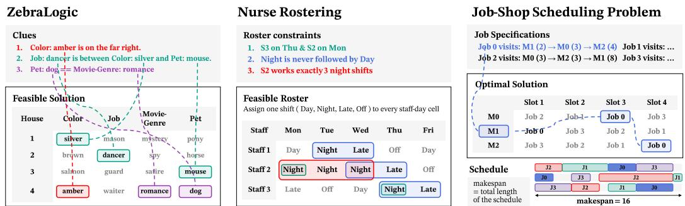  
Figure 2: Illustration of globally constrained tasks. ZebraLogic asks for a feasible assignment satisfying all clues; Nurse Rostering asks for a feasible staff–day shift assignment satisfying roster constraints; and JSSP asks for a feasible schedule with globally minimum makespan.

Limit of next-token prediction. We view this curse ofcomplexity as consistent with an interfacelevel limitation of next-token prediction, especially on problems that require global structure. Such globally constrained problems can be efficiently approached by maintaining a partially filled answer, backtracking when constraints are violated, and branching over multiple candidates. Autoregressive prediction, however, operates through a serialized trace, making such procedures cumbersome: changing an earlier decision requires recovering information from a long history and regenerating what follows. Moreover, because the next-token prediction objective supervises only local continuation, it provides no explicit signal for whether a partial state is globally coherent.

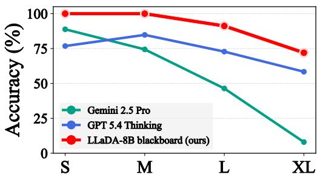  
Figure 3: Curse of complexity on ZebraLogic. Frontier LLM accuracy degrades sharply with difficulty; LLaDA-8B blackboard remains high.

## 3.2 Deriving mean confidence

In contrast, dLLMs are trained to predict clean tokens at all masked positions from partially filled sequences where an arbitrary subset of the answer has been revealed, not just a prefix. This makes it possible to backtrack by remasking any part of a candidate’s partial answer, and gives the model a more global sense of uncertainty about the current state. This leads us to ask:

Does a dLLM already carry a signal of proximity to a globally coherent completion?

Idealized Gibbs model. To study this question more precisely, we consider an idealized Gibbs distribution, $p _ { \mathrm { d a t a } } ( \mathbf { x } ) \propto e ^ { - \beta V ( \mathbf { x } ) }$ , where $V \colon \mathcal { V } ^ { L } \to \mathbb { R } _ { \geq 0 }$ is a potential function and $\beta > 0$ is an inverse-temperature parameter. This model provides a natural abstraction of globally constrained data distributions: $V ( \mathbf { x } )$ is defined over sequence space, and the distribution puts more probability mass into the sequence with low global potential. In ZebraLogic and Nurse Rostering, $V ( \mathbf { x } )$ can be viewed as measuring the number of violated constraints, so the solutions correspond to low-energy states. In JSSP, $V ( \mathbf { x } )$ encodes both feasibility and suboptimality.

Strictly speaking, the solution distribution of globally constrained problems corresponds to the zero-temperature limit $\beta \to \infty$ , where the Gibbs measure is supported on satisfying or globally optimal configurations. We use the finite-β Gibbs model as a smooth relaxation of this limit and as an abstraction from which to derive our notion of mean confidence.

From the Gibbs model to mean confidence. Assume that a masked diffusion model $f _ { \theta }$ is trained on the idealized Gibbs distribution introduced above, $\mathrm { i . e . , } f _ { \theta } ^ { i } ( \cdot \mid \mathbf { z } ) \approx p _ { \mathrm { d a t a } } ( \mathbf { x } ^ { i } = \cdot \mid \mathbf { z } )$ . We now ask whether these coordinate-wise posteriors can be used as a reliability signal for the current state z.

To answer this, we define the (ground-truth) mean confidence as follows:

$$
\mathcal { C } ( \mathbf { z } ) \colon = \frac { 1 } { | M | } \sum _ { i \in M } \operatorname* { m a x } _ { v } p _ { \mathrm { d a t a } } ( \mathbf { x } ^ { i } = v \mid \mathbf { z } ) ,
$$

where $M = \{ i | \mathbf { z } ^ { i } = \mathbf { m } \}$ is the set of masked indices. In other words, $\mathcal { C } ( \mathbf { z } )$ averages how concentrated the conditional posterior is across all masked positions. This simple notion of mean confidence connects to global coherence: write $V ^ { \star } ( { \bf { z } } ) = \mathrm { m i n } _ { { \bf { x } } \times { \bf { z } } } V ( { \bf { x } } )$ for the lowest potential attainable by any completion of z. To clarify, $\mathbf { x } \succeq \mathbf { z }$ indicates sequences x that agree with z on the non-masked indices. Under suitable finite-support assumptions,

$$
\mathbb { E } _ { \mathbf { x } \succeq \mathbf { z } } [ V ( \mathbf { x } ) \vert \mathbf { z } ] - V ^ { \star } ( \mathbf { z } ) \leq \psi ( \mathcal { C } ( \mathbf { z } ) ) \times | M | / \beta
$$

holds, where $\psi ( c ) = - c \log c - ( 1 - c ) \log ( 1 - c ) + ( 1 - c ) \log ( \lvert \mathcal { V } \rvert - 1 )$ is a monotonically decreasing function over c. The implication of the above inequality is that a larger $\mathcal { C } ( \mathbf { z } )$ yields a stronger upper bound: the conditional expectation over all completions $\mathbf { \bar { E } _ { x \succeq z } } [ V ( \mathbf { x } ) \mid \mathbf { \bar { z } } ]$ is closer to the best attainable potential $V ^ { \star } ( \mathbf { z } )$ . Since a masked diffusion model approximates the unmasking posterior, the model gives direct access to the empirical mean confidence in practice, i.e.,

$$
\mathcal { C } _ { \boldsymbol { \theta } } ( \mathbf { z } ) \colon = \frac { 1 } { | M | } \sum _ { i \in M } \operatorname* { m a x } _ { v } f _ { \boldsymbol { \theta } } ^ { i } ( v \mid \mathbf { z } ) \approx \mathcal { C } ( \mathbf { z } ) .
$$

Interface-level distinction from LLMs. The analysis above motivates mean confidence as a modelinternal signal of global coherence that naturally arises from a pretrained dLLM. We emphasize that autoregressive models, by contrast, do not natively expose an analogous signal, as they predict next-token distributions conditioned on partially generated prefixes $\mathbf { x } ^ { < \breve { i } }$ . As a result, they cannot directly condense a state-level reliability signal analogous to mean confidence from their native next-token predictions alone.

Prior work on deploying mean confidence. We note that variants of mean confidence have appeared previously in the dLLM literature [Lee et al., 2025, Xu et al., 2025]. However, these works use mean confidence in a distinct context, either to accelerate parallel decoding or to support particle-based decoding procedures, whereas our work leverages it for inference-time control tailored to globally structured tasks. We defer a detailed comparison to Section 4.3.

## 3.3 Empirically verifying mean confidence

We now verify whether mean confidence provides a meaningful signal of global coherence in practice, using ZebraLogic and JSSP as representative feasibility and optimization tasks. We first elaborate on the design of each task and then show how mean confidence appears as a signal of global coherence. This leads to the central algorithmic ingredients of what we call blackboard intelligence.

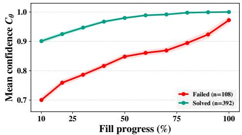

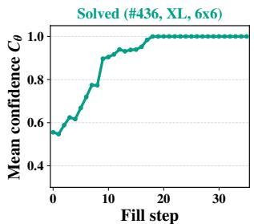

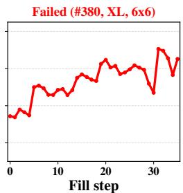  
Figure 4: Mean confidence trajectories on ZebraLogic. (Left) Aggregated over all evaluation instances, solved puzzles exhibit consistently higher mean confidence $\mathcal { C } _ { \theta }$ than failed ones. (Right) Per-puzzle trajectories: mean confidence rises smoothly toward 1.0 for correctly solved puzzles (green), whereas it remains unstable for incorrect ones (red).

ZebraLogic. Each puzzle in ZebraLogic is generated by a constraint-based generator [Lin et al., 2025] and then converted into natural-language clues. Following the official ZebraLogic benchmark, we group instances into {Small, Medium, Large, X-Large} tiers according to log search-space size. To further characterize constraint-solving difficulty, we encode each puzzle with a Z3 SMT solver and record the number of conflicts encountered during search. This conflict count provides a complementary measure of constraint difficulty within and across the search-space tiers. To obtain a stronger stress test, we construct ZebraLogic-Hard following the same recipe: a 500-instance held-out variant that preserves the official benchmark format while increasing constraint difficulty. ZebraLogic-Hard consequently has a broadly similar search-space scale across the four difficulty tiers, but substantially higher Z3 conflict counts. We detail the task construction in Appendix C.1.1. <sup>2</sup>

For evaluation, we fine-tune LLaDA-8B-Instruct [Nie et al., 2025] on 30k training instances with LoRA [Hu et al., 2021] and evaluate it on 500 held-out instances. We use greedy decoding as defined in Section 2; throughout this work, this refers to the instance that unmasks a single token at each step.

Under this evaluation setup, for each correct and incorrect puzzle, we track the mean confidence $\mathcal { C } _ { \theta } ( \mathbf { x } _ { t . } )$ along the intermediate inference trajectory and aggregate the trajectories across puzzles. As shown in Figure 4 (left), we observe a clear separation trend: the mean confidence trajectory for correctly solved puzzles (green line) is consistently higher than that for incorrectly solved puzzles (red line). Interestingly, we also observe that the confidence trajectory is not only higher for correctly solved puzzles but also more stable. In particular, incorrectly solved puzzles often exhibit confidence drops after wrong token fills, leading to an unstable confidence trajectory, whereas correctly solved puzzles maintain a more stable trajectory (Figure 4, right). The same pattern holds on Nurse Rostering (Appendix E.1).

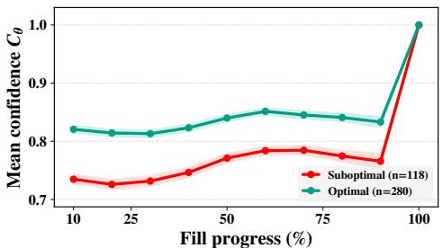

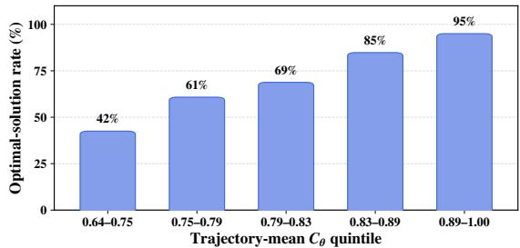  
Figure 5: Mean confidence trajectories on JSSP. (Left) Across evaluation instances, inference trajectories that yield optimal solutions exhibit higher mean confidence than those that induce suboptimal solutions. (Right) Optimal-solution rate increases monotonically across quintiles of trajectory-averaged mean confidence.

JSSP. We now ask whether mean confidence remains practically useful in a more challenging domain, namely JSSP. Unlike ZebraLogic, a sequence here is evaluated by its makespan rather than simply by whether it satisfies all constraints, likely inducing a more complex posterior and confidence landscape. Adopting the natural-language input format of Abgaryan et al. [2025], which evaluates LLMs on the JSSP, we construct 30k training examples and an evaluation set of 400 instances. We detail the task construction in Appendix C.1.3.

We use the same greedy decoding and repeat the run-level analysis. In particular, we compare the aggregated mean confidence between runs that yield globally optimal makespans and runs that yield suboptimal makespans. As shown in Figure 5 (left), runs that produce optimal solutions maintain higher mean confidence throughout inference, with a clear separation. As in ZebraLogic, we observe a connection between mean confidence trajectory and global coherence. In particular, the aggregate mean confidence along the intermediate inference trajectory is strongly associated with the optimal-solution rate, as shown in Figure 5 (right).

## 4 Confidence-Driven Blackboard Inference

In this section, we present how we intervene at inference time using the mean confidence signal and how this enables blackboard intelligence. In particular, we ask the following questions:

• Section 4.1: How can we utilize mean confidence to intervene at inference time?

• Section 4.2: How does Blackboard inference compare with autoregressive inference?

## • Section 4.3: How does Blackboard compare with existing dLLM methods?

We study these questions across the three domains introduced in Section 3; ZebraLogic, Nurse Rostering, and JSSP, with additional transfer studies in related globally constrained feasibility and optimization settings (Appendix I).

## 4.1 Blackboard as an inference interface

We develop inference-time algorithms around the empirical observation from Section 3: higher mean confidence suggests that the current trajectory is reliable, while drops in mean confidence suggest that recent fills may have moved the state away from a globally coherent completion. Motivated by this signal, we build our inference procedures around three simple algorithmic components, adapting the corrective action to task structure only where necessary.

TRIGGER( $\{ \mathcal { C } _ { \theta } ( \mathbf { x } _ { t _ { i } } ) \} _ { i = 0 } ^ { N - 1 } , \rho , \tau ) \colon$ Given a greedy decoding trajectory $\{ \mathbf { x } _ { t _ { i } } \} _ { i = 0 } ^ { N - 1 }$ , we summarize mean confidence over a task-specific late phase to decide whether additional inference is needed. If the resulting late-phase confidence statistic is at least τ, we keep the greedy output; otherwise, we trigger additional inference. The task-specific statistic is defined in Appendix G; the latephase fraction $\rho$ and threshold τ are selected on held-out training traces and fixed before test evaluation. This avoids spending extra computation on trajectories that appear reliable, while allocating additional inference to trajectories whose confidence becomes unreliable.

SEARCH(z, f , d, k): When additional inference is triggered, mean confidence can guide search over candidate continuations from the current grid z. At each masked cell, we branch over the top-k candidate values, simulate a depth-d greedy decoding rollout per branch, and choose the branch with the highest mean confidence. This gives a simple way to search over the fixed canvas using the dLLM’s own confidence signal.

• BACKTRACK(z, f ): We use confidence drops as a signal of coherence loss. If a new fill decreases mean confidence, we treat it as unreliable and backtrack one step by reverting the fill.

Algorithm 1 Confidence-guided corrective inference for feasibility tasks   
Require: Prompt p, dLLM $f _ { \theta } ,$ , trigger parameters $( \rho , \tau )$ , anchor threshold $\alpha ,$ search depth/width (d, k)   
1: $( \hat { \mathbf { z } } , \{ \mathcal { C } _ { \theta } ( \cdot ) \} _ { i = 0 } ^ { \hat { N } - 1 } )$ ← GREEDY(p, f<sub>θ</sub>) # initial greedy decoding   
2: if TRIGGER({C<sub>θ</sub>(·)}<sup>N−1</sup><sub>i=0</sub> , ρ, τ ) = False: return zˆ # skip additional inference   
3: z ← INITIALIZE(p) # restart from prompt   
4: while z has masked cells do   
5: if C (z) < α: z ← SEARCH(z, f , d, k) # mean-confidence-guided search   
6: else: (z<sub>next</sub>, accepted) ← BACKTRACK(z, f<sub>θ</sub>) # confidence-gated fill   
7: if accepted: z ← z<sub>next</sub>   
8: else: z ← SEARCH(z, f<sub>θ</sub>, d, k) # invoke search   
9: return z

Constrained feasibility. For ZebraLogic and Nurse Rostering, the goal is to recover a globally feasible assignment satisfying all constraints, so we use mean confidence directly to guide search and revision. We instantiate this corrective procedure in Algorithm 1. We first run greedy inference and retain its output if the confidence trigger does not fire; otherwise, we re-initialize from the prompt and alternate between BACKTRACK(z, f ) and SEARCH(z, $f _ { \theta } , d , k )$ . When $\mathcal { C } _ { \boldsymbol { \theta } } ( \mathbf { z } ) < \alpha$ , we invoke search directly; otherwise, backtracking accepts only fills that do not decrease mean confidence, invoking search if no fill is accepted. We use $\alpha = 0 . 9$ , search depth $d = 3 ,$ , and width $k = 5 ,$ . For ZebraLogic, the trigger uses the late-phase minimum with $( \rho , \tau ) = ( 0 . 8 0 , 1 . 0 )$ , whereas Nurse Rostering uses the late-phase mean with $( \rho , \tau ) = ( 0 . 9 0 , 0 . 9 5 )$

Global optimization. For JSSP, where solution quality is determined by makespan, we use mean confidence to decide when additional inference is needed and the task objective to select among completed candidates. We first run greedy inference and apply TRIGGER $\langle \mathcal { C } _ { \theta } ( \cdot ) \} _ { i = 0 } ^ { N - 1 } , \rho , \tau \rangle$ with $( \rho , \tau \bar { ) } = ( 0 . 5 0 , 0 . 7 0 )$ . If the trigger does not fire, we keep the greedy schedule. Otherwise, we perform Best-of-N sampling with N = 10 and retain the valid schedule with the lowest makespan.

Across both settings, blackboard intelligence uses state-level confidence to decide when the current canvas should be trusted or further explored. This provides a common inference-control interface, with corrective actions that adapt to task structure: search and revision for constrained feasibility, and objective-guided candidate exploration for global optimization.

## 4.2 Comparison to Autoregressive Inference

In this section, we compare Blackboard with autoregressive inference on the same globally constrained problems. We fine-tune LLaMA-3.1-8B-Instruct and LLaDA-8B-Instruct on the same 30k taskspecific examples with matched configurations, using their respective next-token and any-order prediction objectives. Both models use the same one-cell–one-token output representation, aligning each commitment with an atomic decision variable in the underlying constrained assignment. This setup lets us isolate the effect of Blackboard within a fixed LLaDA checkpoint while comparing against autoregressive inference after matched downstream adaptation.

Across-domain comparison. Across all three domains, Blackboard consistently improves the corresponding fine-tuned LLaDA checkpoint (Figure 1). On ZebraLogic, accuracy improves from 78.4% to 90.4%; on Nurse Rostering, exact feasibility improves from 73.0% to 76.4%; and on JSSP, optimality improves from 70.0% to 80.2%. These gains show that state-level confidence can support effective inference-time control across globally constrained tasks. Detailed per-domain comparisons are provided in Appendices D.1, E.2, and F.1.

Autoregressive search, however, shows a different cross-domain pattern under simple continuation search: beam search improves LLaMA on JSSP but yields only marginal gains on ZebraLogic and Nurse Rostering. This contrast is consistent with JSSP admitting many valid or near-optimal completions, so preserving alternative trajectories can retain promising schedules, whereas ZebraLogic and Nurse Rostering require coordinated satisfaction of globally coupled constraints, leaving continuation search alone with limited opportunities to repair an inconsistent partial assignment.

Scaling autoregressive inference. On ZebraLogic, autoregressive accuracy gains remain limited despite substantially greater inference-time computation allocated to wider search and explicit refinement, and do not match the gain achieved by Blackboard over standard inference with the same LLaDA checkpoint. Figure 6 summarizes this scaling behavior on a common observed-latency axis. We first scale continuation search, where widening beam search from B = 8 to B = 64 increases accuracy only marginally, from 34.8% to 35.0%. We then move beyond continuation search and give the same fine-tuned LLaMA checkpoint a persistent candidate solution with an explicit opportunity to revise earlier decisions. In self-critique, the model identifies clues it believes are violated and regenerates a revised solution conditioned on its own diagnosis. In perfect-verifier refinement, a programmatic checker instead supplies the exact violated clues before regeneration. Self-critique reaches 26.2%, and even with exact error localization, perfect-verifier refinement reaches only 36.6%, compared with 34.6% under greedy decoding. Further details are provided in Appendix D.5.1.

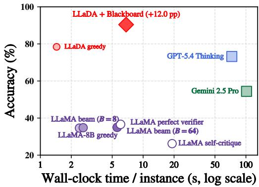  
Figure 6: Accuracy–latency on ZebraLogic. Blackboard improves the same LLaDA-8B checkpoint, while autoregressive search and refinement show limited accuracy scaling.

The fine-tuned LLaMA and LLaDA systems are measured on the same hardware, while frontier-model latency is shown as an API-level practical reference. Hardware-matched compute measurements are reported in Appendix D.5.3. Although autoregressive decoding is substantially more FLOP-efficient due to KV caching, the hardware-matched measurements show that this compute-efficiency advantage does not translate into stronger accuracy scaling from additional search and refinement.

Frontier LLMs. We finally broaden the comparison to frontier autoregressive models that combine substantially greater model scale with strong test-time reasoning, including chain-of-thought, selfverification, and dedicated reasoning modes. GPT-5.4 Thinking is the strongest tested configuration: Blackboard reaches 90.4% versus 73.2% on ZebraLogic and 80.2% versus 77.0% optimality on JSSP, while GPT-5.4 Thinking remains stronger on Nurse Rostering. These comparisons place the gains from state-level inference control in the context of substantially larger models with strong general-purpose test-time reasoning. Full prompting and latency details are provided in Appendix H.

Together, these results suggest that Blackboard provides state-level inference control that stronger autoregressive inference does not consistently recover with additional test-time computation.

## 4.3 Comparison to Existing dLLM Methods and Ablations

Having contrasted Blackboard with autoregressive inference, we next situate it among existing dLLM inference-time methods and use controlled variants to examine the sources of its gains. We consider remasking methods [Wang et al., 2025, Kim et al., 2025a, Schiff et al., 2026, Huang et al., 2025], represented by PRISM [Kim et al., 2025a], and search-based methods [Shen et al., 2026, Xu et al., 2025, Fu et al., 2025]. Among the latter, LoPA [Xu et al., 2025] is particularly relevant because it also uses mean-confidence lookahead. The key distinction lies in how the signal is used: LoPA uses it to enable parallel commitment for reducing the inference cost, whereas we use it to evaluate candidate states and determine when further inference is needed.

To isolate the role of selective triggering, we additionally evaluate an always-on Blackboard variant that applies the same corrective inference procedure to every puzzle, without the puzzle-level confidence trigger. Further intervention and search ablations are provided in Appendix D.6.

Table 1 reveals distinct uses of confidence during dLLM inference on Zebralogic. PRISM modestly improves over greedy decoding (79.2% versus 78.4%), suggesting that token-level reconsideration alone provides limited gains on ZebraLogic. In contrast, LoPA substantially reduces inference effort, from 35 NFE under greedy decoding to 6.74 NFE, illustrating how mean-confidence lookahead can support efficient parallel commitment. Applying Blackboard correction

Table 1: dLLM inference on ZebraLogic.
<table><tr><td>Inference</td><td>NFE</td><td>Acc. (%)</td></tr><tr><td>Greedy</td><td>35</td><td>78.4</td></tr><tr><td>PRISM</td><td>54</td><td>79.2</td></tr><tr><td>LoPA</td><td>6.74</td><td>73.0</td></tr><tr><td>Blackboard (always-on)</td><td>280</td><td>86.8</td></tr><tr><td>Blackboard</td><td>129</td><td>90.4</td></tr></table>

to every puzzle already improves accuracy to 86.8%. Selective confidence triggering further raises accuracy to 90.4% while reducing average inference effort from 280 to 129 NFE, showing that state-level confidence is useful not only for guiding corrective inference but also for deciding when such intervention should be invoked.

This pattern extends across domains, with the role of confidence adapting to task structure. On Nurse Rostering, selective triggering improves over both greedy inference and always-on correction (76.4% versus 73.0% and 57.4%; Appendix E.3). On JSSP, confidence instead allocates objective-based candidate exploration, reducing average NFE from 217 to 149 relative to untriggered BoN while retaining comparable solution quality (Appendix F.3). Together, these results support state-level confidence as a reusable inference-control signal across globally constrained problems.

## 5 Conclusion

Recent rapid progress in generative modeling, especially in LLMs, has largely centered on scaling next-token prediction and improving post-training. Our results highlight a complementary axis of progress: the inference interface itself can shape how models solve globally constrained problems. Diffusion language models, equipped with blackboard intelligence, expose partially specified solution states that can be evaluated, searched, and revised throughout inference, with state-level confidence providing a native signal for controlling this process.

Across three representative globally constrained settings—ZebraLogic, Nurse Rostering, and JSSP— our analysis shows that mean confidence tracks the global coherence of partially specified solutions. Building on this signal, Blackboard uses state-level confidence to control when and how inference intervenes, consistently improving inference while holding the fine-tuned LLaDA-8B checkpoint fixed and outperforming same-scale autoregressive baselines. Moreover, stronger autoregressive inference does not consistently recover these gains with additional test-time computation.

Together, our results suggest that progress on globally constrained problem solving may depend not only on larger models or stronger deliberation, but also on what intermediate state a model exposes to inference and how that state can be evaluated and revised. Our study focuses on globally constrained problems, where success depends on maintaining coherence across interacting decisions. An important next question is how far blackboard intelligence extends beyond this regime and which problems benefit most from revisable inference over partial solution states.

## References

Henrik Abgaryan, Tristan Cazenave, and Ararat Harutyunyan. Starjob: Dataset for llm-driven job shop scheduling. arXiv preprint arXiv:2503.01877, 2025.

Josh Achiam, Steven Adler, Sandhini Agarwal, Lama Ahmad, Ilge Akkaya, Florencia Leoni Aleman, Diogo Almeida, Janko Altenschmidt, Sam Altman, Shyamal Anadkat, et al. Gpt-4 technical report. arXiv preprint arXiv:2303.08774, 2023.

Gautham Govind Anil, Sachin Yadav, Dheeraj Nagaraj, Karthikeyan Shanmugam, and Prateek Jain. Interleaved gibbs diffusion: Generating discrete-continuous data with implicit constraints. arXiv preprint arXiv:2502.13450, 2025.

Anthropic. Claude Code. https://www.anthropic.com/product/claude-code, 2025. Agentic coding system. Accessed: 2026-05-02.

Heli Ben-Hamu, Itai Gat, Daniel Severo, Niklas Nolte, and Brian Karrer. Accelerated sampling from masked diffusion models via entropy bounded unmasking. arXiv preprint arXiv:2505.24857, 2025.

Jiangjie Chen, Qianyu He, Siyu Yuan, Aili Chen, Zhicheng Cai, Weinan Dai, Hongli Yu, Jiaze Chen, Xuefeng Li, Qiying Yu, et al. Enigmata: Scaling logical reasoning in large language models with synthetic verifiable puzzles. Advances in Neural Information Processing Systems, 38:3613–3661, 2026.

Gheorghe Comanici, Eric Bieber, Mike Schaekermann, Ice Pasupat, Noveen Sachdeva, Inderjit Dhillon, Marcel Blistein, Ori Ram, Dan Zhang, Evan Rosen, et al. Gemini 2.5: Pushing the frontier with advanced reasoning, multimodality, long context, and next generation agentic capabilities. arXiv preprint arXiv:2507.06261, 2025.

Leonardo De Moura and Nikolaj Bjørner. Z3: An efficient smt solver. In International conference on Tools and Algorithms for the Construction and Analysis of Systems, pages 337–340. Springer, 2008.

Google DeepMind. Gemini diffusion, 2025. URL https://blog.google/technology/ google-deepmind/gemini-diffusion/.

Lukas Fesser, Yasha Ektefaie, Ada Fang, Sham M Kakade, and Marinka Zitnik. Evaluating relational reasoning in llms with rel. arXiv preprint arXiv:2604.12176, 2026.

Hengyu Fu, Baihe Huang, Virginia Adams, Charles Wang, Venkat Srinivasan, and Jiantao Jiao. From bits to rounds: Parallel decoding with exploration for diffusion language models. arXiv preprint arXiv:2511.21103, 2025.

Shansan Gong, Ruixiang Zhang, Huangjie Zheng, Jiatao Gu, Navdeep Jaitly, Lingpeng Kong, and Yizhe Zhang. Diffucoder: Understanding and improving masked diffusion models for code generation. arXiv preprint arXiv:2506.20639, 2025.

Google DeepMind. Gemini 2.5 Pro. https://ai.google.dev/gemini-api/docs/models/ gemini-2.5-pro, June 2025. Large language model; stable model ID gemini-2.5-pro; released 2025-06-17; accessed 2026-05-02.

Daya Guo, Dejian Yang, Haowei Zhang, Junxiao Song, Peiyi Wang, Qihao Zhu, Runxin Xu, Ruoyu Zhang, Shirong Ma, Xiao Bi, et al. Deepseek-r1: Incentivizing reasoning capability in llms via reinforcement learning. arXiv preprint arXiv:2501.12948, 2025.

Satoshi Hayakawa, Yuhta Takida, Masaaki Imaizumi, Hiromi Wakaki, and Yuki Mitsufuji. Demystifying maskgit sampler and beyond: Adaptive order selection in masked diffusion. arXiv preprint arXiv:2510.04525, 2025.

Edward J Hu, Yelong Shen, Phillip Wallis, Zeyuan Allen-Zhu, Yuanzhi Li, Shean Wang, Lu Wang, and Weizhu Chen. Lora: Low-rank adaptation of large language models. arXiv preprint arXiv:2106.09685, 2021.

Zemin Huang, Yuhang Wang, Zhiyang Chen, and Guo-Jun Qi. Don’t settle too early: Self-reflective remasking for diffusion language models. arXiv preprint arXiv:2509.23653, 2025.

Aaron Jaech, Adam Kalai, Adam Lerer, Adam Richardson, Ahmed El-Kishky, Aiden Low, Alec Helyar, Aleksander Madry, Alex Beutel, Alex Carney, et al. Openai o1 system card. arXiv preprint arXiv:2412.16720, 2024.

Xia Jiang, Jing Chen, Cong Zhang, Jie Gao, Chengpeng Hu, Chenhao Zhang, Yaoxin Wu, and Yingqian Zhang. Reasoning in a combinatorial and constrained world: Benchmarking llms on natural-language combinatorial optimization. arXiv preprint arXiv:2602.02188, 2026.

Jaeyeon Kim, Seunggeun Kim, Taekyun Lee, David Z Pan, Hyeji Kim, Sham Kakade, and Sitan Chen. Fine-tuning masked diffusion for provable self-correction. arXiv preprint arXiv:2510.01384, 2025a.

Jaeyeon Kim, Kulin Shah, Vasilis Kontonis, Sham Kakade, and Sitan Chen. Train for the worst, plan for the best: Understanding token ordering in masked diffusions. arXiv preprint arXiv:2502.06768, 2025b.

Inception Labs, Samar Khanna, Siddhant Kharbanda, Shufan Li, Harshit Varma, Eric Wang, Sawyer Birnbaum, Ziyang Luo, Yanis Miraoui, Akash Palrecha, et al. Mercury: Ultra-fast language models based on diffusion. arXiv preprint arXiv:2506.17298, 2025.

Sanghyun Lee, Seungryong Kim, Jongho Park, and Dongmin Park. Lookahead unmasking elicits accurate decoding in diffusion language models. arXiv preprint arXiv:2511.05563, 2025.

Bill Yuchen Lin, Ronan Le Bras, Kyle Richardson, Ashish Sabharwal, Radha Poovendran, Peter Clark, and Yejin Choi. Zebralogic: On the scaling limits of llms for logical reasoning. arXiv preprint arXiv:2502.01100, 2025.

Aaron Lou, Chenlin Meng, and Stefano Ermon. Discrete diffusion modeling by estimating the ratios of the data distribution. arXiv preprint arXiv:2310.16834, 2023.

Meta. Llama-3.1-8B-Instruct. https://huggingface.co/meta-llama/Llama-3. 1-8B-Instruct, 2024. Hugging Face model card. Accessed: 2026-05-04.

Vaishnavh Nagarajan, Chen Henry Wu, Charles Ding, and Aditi Raghunathan. Roll the dice & look before you leap: Going beyond the creative limits of next-token prediction. arXiv preprint arXiv:2504.15266, 2025.

Shen Nie, Fengqi Zhu, Zebin You, Xiaolu Zhang, Jingyang Ou, Jun Hu, Jun Zhou, Yankai Lin, Ji-Rong Wen, and Chongxuan Li. Large language diffusion models. arXiv preprint arXiv:2502.09992, 2025.

OpenAI. GPT-5.4. https://developers.openai.com/api/docs/models/gpt-5.4, March 2026. Large language model; snapshot gpt-5.4-2026-03-05; accessed 2026-05-02.

Fred Zhangzhi Peng, Zachary Bezemek, Sawan Patel, Jarrid Rector-Brooks, Sherwood Yao, Avishek Joey Bose, Alexander Tong, and Pranam Chatterjee. Path planning for masked diffusion model sampling, 2025. URL https://arxiv.org/abs/2502.03540.

Laurent Perron and Vincent Furnon. Or-tools. URL https://developers.google.com/ optimization/.

Subham S Sahoo, Marianne Arriola, Yair Schiff, Aaron Gokaslan, Edgar Marroquin, Justin T Chiu, Alexander Rush, and Volodymyr Kuleshov. Simple and effective masked diffusion language models. Advances in Neural Information Processing Systems, 37:130136–130184, 2024.

Yair Schiff, Omer Belhasin, Roy Uziel, Guanghan Wang, Marianne Arriola, Gilad Turok, Michael Elad, and Volodymyr Kuleshov. Learn from your mistakes: Self-correcting masked diffusion models. arXiv preprint arXiv:2602.11590, 2026.

Yangyi Shen, Tianjian Feng, Jiaqi Han, Wen Wang, Tianlang Chen, Chunhua Shen, Jure Leskovec, and Stefano Ermon. Improving diffusion language model decoding through joint search in generation order and token space. arXiv preprint arXiv:2601.20339, 2026.

Jiaxin Shi, Kehang Han, Zhe Wang, Arnaud Doucet, and Michalis Titsias. Simplified and generalized masked diffusion for discrete data. Advances in neural information processing systems, 37: 103131–103167, 2024.

Yuxuan Song, Zheng Zhang, Cheng Luo, Pengyang Gao, Fan Xia, Hao Luo, Zheng Li, Yuehang Yang, Hongli Yu, Xingwei Qu, et al. Seed diffusion: A large-scale diffusion language model with high-speed inference. arXiv preprint arXiv:2508.02193, 2025.

Joseph Tso, Preston Schmittou, Quan Huynh, and Jibran Hutchins. Constraintbench: Benchmarking llm constraint reasoning on direct optimization. arXiv preprint arXiv:2602.22465, 2026.

Guanghan Wang, Yair Schiff, Subham Sekhar Sahoo, and Volodymyr Kuleshov. Remasking discrete diffusion models with inference-time scaling. arXiv preprint arXiv:2503.00307, 2025.

Anjiang Wei, Yuheng Wu, Yingjia Wan, Tarun Suresh, Huanmi Tan, Zhanke Zhou, Sanmi Koyejo, Ke Wang, and Alex Aiken. Satbench: Benchmarking llms’ logical reasoning via automated puzzle generation from sat formulas. In Proceedings ofthe 2025 Conference on Empirical Methods in Natural Language Processing, pages 33820–33837, 2025.

Chengyue Wu, Hao Zhang, Shuchen Xue, Shizhe Diao, Yonggan Fu, Zhijian Liu, Pavlo Molchanov, Ping Luo, Song Han, and Enze Xie. Fast-dllm v2: Efficient block-diffusion llm. arXiv preprint arXiv:2509.26328, 2025a.

Chengyue Wu, Hao Zhang, Shuchen Xue, Zhijian Liu, Shizhe Diao, Ligeng Zhu, Ping Luo, Song Han, and Enze Xie. Fast-dllm: Training-free acceleration of diffusion llm by enabling kv cache and parallel decoding. arXiv preprint arXiv:2505.22618, 2025b.

Chenkai Xu, Yijie Jin, Jiajun Li, Yi Tu, Guoping Long, Dandan Tu, Mingcong Song, Hongjie Si, Tianqi Hou, Junchi Yan, and Zhijie Deng. Lopa: Scaling dllm inference via lookahead parallel decoding. arXiv preprint arXiv:2512.16229, 2025.

Jiacheng Ye, Jiahui Gao, Shansan Gong, Lin Zheng, Xin Jiang, Zhenguo Li, and Lingpeng Kong. Beyond autoregression: Discrete diffusion for complex reasoning and planning. arXiv preprint arXiv:2410.14157, 2024.

Kaiwen Zheng, Yongxin Chen, Hanzi Mao, Ming-Yu Liu, Jun Zhu, and Qinsheng Zhang. Masked diffusion models are secretly time-agnostic masked models and exploit inaccurate categorical sampling. arXiv preprint arXiv:2409.02908, 2024.

## A Related Works

Globally constrained reasoning. Recent work has increasingly evaluated language models on tasks whose correctness depends on global feasibility, consistency, or optimality rather than local textual plausibility. ZebraLogic identifies a “curse of complexity” in logic-grid reasoning, where accuracy degrades sharply as the underlying constraint structure becomes harder [Lin et al., 2025]. Enigmata broadens this direction to synthetic verifiable puzzles with controllable difficulty and rule-based evaluation [Chen et al., 2026], while SATBench and REL study assignment search and relational reasoning under many interacting constraints [Wei et al., 2025, Fesser et al., 2026]. For optimization, StarJob, NLCO, and ConstraintBench evaluate whether LLMs can directly produce feasible or near-optimal solutions to scheduling and combinatorial optimization problems [Abgaryan et al., 2025, Jiang et al., 2026, Tso et al., 2026]. Our experiments focus on three representative settings: ZebraLogic for unique constrained feasibility, Nurse Rostering for operational constrained feasibility, and JSSP for global optimization.

Diffusion language models and comparison to autoregressive models. Following the advent of masked diffusion models, they have been scaled up [Nie et al., 2025, Song et al., 2025, Gong et al., 2025], showing benchmark performance comparable to their LLM counterparts. These models commonly employ confidence-based decoding as the default inference-time algorithm. Several preliminary lines of work show that inference-time flexibility, instantiated by any-order generation, can induce behavior fundamentally different from next-token prediction [Nagarajan et al., 2025, Kim et al., 2025b, Ye et al., 2024, Anil et al., 2025]. This has also motivated a line of research on inference-time control.

Inference-time control for diffusion language models. A line of remasking work begins with Wang et al. [2025], where positions are heuristically chosen for remasking to revise some early decisions. Later work improves this by learning where to remask [Kim et al., 2025a, Huang et al., 2025, Schiff et al., 2026]. Although these methods differ slightly in formulation and empirical consequences, they are all based on per-position likelihood, which may lack a global coherence signal.

Another growing line of work studies inference-time search using additional signals. Lee et al. [2025] use mean confidence as a quantity for simulating sequential Monte Carlo. Xu et al. [2025] employ mean confidence as the main search quantity in a branching-based search, although they report gains mainly in inference-time speed-up by enhancing parallel decoding ability. Fu et al. [2025], Shen et al. [2026] also employ search algorithms, but differ in both motivation and the quantities used.

In summary, prior work points to the limitations of LLMs on globally structured problems, as well as the use of mean confidence to drive inference-time algorithms for dLLMs. In contrast, our work takes a distinct perspective: we use mean confidence as a proxy for global coherence, deciding when to trust a trajectory, when to search, and when to backtrack, without changing the architecture or training objective.

## B Mean Confidence under the Idealized Gibbs Model

We provide the derivation underlying the bound stated in Section 3.2. Consider a Gibbs distribution

$$
p _ { \mathrm { d a t a } } ( \mathbf { x } ) = \frac { 1 } { Z } e ^ { - \beta V ( \mathbf { x } ) } , \qquad \mathbf { x } \in \mathcal { V } ^ { L } ,
$$

where $V : \mathcal { V } ^ { L } \to \mathbb { R } _ { > 0 }$ is a non-negative potential and $\beta > 0$ is an inverse-temperature parameter. For a partial state z with masked positions $M = \{ i : \mathbf { z } ^ { i } = \mathbf { m } \}$ , write

$$
V ^ { \star } ( { \bf z } ) \ = \ \operatorname* { m i n } _ { { \bf x } \succeq { \bf z } } V ( { \bf x } ) ,
$$

where the minimum is over all completions of z.

We bound the conditional excess potential $\mathbb { E } [ V ( \mathbf { x } ) \mid \mathbf { z } ] - V ^ { \star } ( \mathbf { z } )$ in terms of the (true) mean confidence

$$
\mathcal { C } ( \mathbf { z } ) = \frac { 1 } { | M | } \sum _ { i \in M } \operatorname* { m a x } _ { v } p _ { \mathrm { d a t a } } ( \mathbf { x } ^ { i } = v \mid \mathbf { z } ) .
$$

The argument proceeds in two steps.

Step 1: entropy upper-bounds excess potential. Let $q ( \mathbf { x } ) = p _ { \mathrm { d a t a } } ( \mathbf { x } \mid \mathbf { z } )$ be the conditional distribution over completions of z. Since $V ( \mathbf { x } ) \geq V ^ { \star } ( \mathbf { z } )$ for all completions and $q ( \mathbf { x } ) \propto e ^ { - \beta V ( \mathbf { x } ) }$ standard Gibbs variational manipulation gives

$$
\mathbb { E } _ { q } [ V ( \mathbf { x } ) ] - V ^ { \star } ( \mathbf { z } ) \leq \frac { 1 } { \beta } H ( q ) ,
$$

where $H ( q )$ is the entropy of the conditional distribution over completions.

Step 2: Fano-type coordinate bound. For each masked coordinate $i \in M$ , define

$$
c _ { i } = \operatorname* { m a x } _ { v } p _ { \mathrm { d a t a } } ( \mathbf { x } ^ { i } = v \mid \mathbf { z } ) .
$$

A Fano-type bound gives

$$
H ( \mathbf { x } ^ { i } \mid \mathbf { z } ) \ \leq \ \psi ( c _ { i } ) , \qquad \psi ( c ) = - c \log c - ( 1 - c ) \log ( 1 - c ) + ( 1 - c ) \log ( | \mathcal { V } | - 1 ) .
$$

By subadditivity of entropy,

$$
H ( q ) = H ( \mathbf { x } ^ { M } \mid \mathbf { z } ) \leq \sum _ { i \in M } H ( \mathbf { x } ^ { i } \mid \mathbf { z } ) \leq \sum _ { i \in M } \psi ( c _ { i } ) .
$$

Since $\psi$ is concave on $[ 1 / | \nu | , 1 ]$ , Jensen’s inequality yields

$$
\sum _ { i \in M } \psi ( c _ { i } ) \ \leq \ | M | \psi ( { \mathcal { C } } ( \mathbf { z } ) ) .
$$

Combining the two steps,

$$
\mathbb { E } [ V ( \mathbf { x } ) \mid \mathbf { z } ] - V ^ { \star } ( \mathbf { z } ) \leq \frac { \mid M \mid } { \beta } \psi ( \mathcal { C } ( \mathbf { z } ) ) ,
$$

which recovers the bound in Section 3.2. Because ψ is monotone decreasing on $[ 1 / | \nu | , 1 ]$ , high mean confidence forces this upper bound on conditional excess potential to be small.

Caveat. The bound is stated for C computed under the true conditional $p _ { \mathrm { d a t a } } ( \cdot \textbf { | z } )$ , which is not available in practice. Our experiments compute the model-derived $\mathcal { C } _ { \boldsymbol { \theta } } ( \mathbf { z } )$ from an SFT-trained dLLM, as defined in Section 3.2; the derivation motivates this choice but does not directly bound the model-derived quantity.

## C Experimental Setup

## C.1 Tasks and Data

We follow the data formulation in Section 3. This appendix details construction choices for our setup.

## C.1.1 ZebraLogic

Output representation. We restrict the attribute-value vocabulary to entries that tokenize as a single token under the LLaMA and LLaDA tokenizers, fixing the unit of commitment at one cell = one token. This isolates decoding behavior from multi-token surface-form effects (sub-token boundaries, tokenizer-specific splits, copy-from-prompt heuristics) so that the main source of difficulty is the constraint structure rather than surface-form tokenization.

Generation and verification. We adapt the Enigmata puzzle generator [Chen et al., 2026] with three modifications: single-token vocabulary, higher Z3 conflict targets, and ZebraLogic-style natural-language clue templates. Each instance is produced by a constraint-based generator that first samples a target grid of size $N \times M$ with single-token attribute values, then emits clues from a fixed predicate vocabulary: eq, ne, directly\_left/right, somewhere\_left/right, next\_to, far\_left/right, between, n\_houses\_between, at\_house\_N, and not\_at\_house\_N. We verify uniqueness with the Z3 SMT solver [De Moura and Bjørner, 2008]; instances admitting multiple solutions or failing within the solver budget are rejected.

Table 2: ZebraLogic-Hard vs. the official ZebraLogic benchmark. Search-space sizes are comparable across tiers, while Z3 conflict counts are higher in our variant. Z3 conflicts are averaged over 32 runs with different random seeds.
<table><tr><td></td><td colspan="2">ZL official</td><td colspan="2">ZL-Hard</td></tr><tr><td>Category</td><td>log_ss</td><td>Z3</td><td>log_ss</td><td>Z3</td></tr><tr><td>Small</td><td>1.26</td><td>0.3</td><td>2.37</td><td>6.0</td></tr><tr><td>Medium</td><td>3.58</td><td>8.0</td><td>4.35</td><td>19.8</td></tr><tr><td>Large</td><td>6.83</td><td>27.1</td><td>7.45</td><td>50.2</td></tr><tr><td>X-Large</td><td>12.38</td><td>83.6</td><td>12.60</td><td>161.4</td></tr><tr><td>Overall</td><td>5.92</td><td>28.9</td><td>6.69</td><td>59.4</td></tr></table>

Difficulty tiers. Tier assignment follows the official ZebraLogic binning by log search-space size [Lin et al., 2025]. Relative to the official benchmark, ZebraLogic-Hard has a broadly similar search-space scale but substantially higher Z3 conflict counts across difficulty tiers (Table 2), making it a stronger stress test of partial-assignment feasibility.

Splits and deduplication. The training set contains 30,000 puzzles, stratified across the four difficulty tiers. The held-out evaluation set contains 500 puzzles (125 per tier). Train and evaluation sets are generated with different random seeds and checked for exact duplicates using a fingerprint over the clue set and target grid; no duplicates were found.

Evaluation. A puzzle is counted as solved iff every cell in the predicted grid matches the unique satisfying assignment. There is no partial credit.

Official benchmark conversion. For single-token grid filling, category and value names from the official benchmark are mapped to single-token aliases. The relational predicates, constraint graph, and unique satisfying assignment are preserved. The adapted official ZebraLogic benchmark used in Appendix D.7 is produced by the same conversion procedure.

## C.1.2 Nurse Rostering

Task and output representation. Each instance specifies a staff-by-day roster in which every cell receives one shift from the single-token vocabulary {day, late, night, off}. The prompt provides natural-language rules over staff–day assignments, and the model outputs a Markdown table with one row per staff member and one column per day. As in ZebraLogic, one grid cell corresponds to one token under both the LLaMA and LLaDA tokenizers.

Generation and verification. We generate instances by sampling a target roster and a set of relational, temporal, and counting constraints. Relational constraints include fixed, equal, and unequal assignments; temporal constraints specify allowed or forbidden consecutive shifts; and counting constraints specify row-level shift counts, day-level coverage, or maximum consecutive work periods. We use Z3 to verify that every retained instance has a unique satisfying roster.

Difficulty bands. We partition the 500 held-out instances into four equal-size difficulty bands using the number of conflicts encountered by Z3 during constraint solving: d0 contains 0–1 conflicts, d1 contains 2–4, d2 contains 5–9, and d3 contains 10–31 conflicts. This difficulty measure is used only for reporting and is not provided to the model.

Splits and evaluation. The training set contains 30,000 generated rosters. The held-out evaluation set contains 500 instances, with 125 instances in each difficulty band. Training and evaluation instances are generated with different random seeds and checked for duplicate constraint sets and target rosters. We report exact feasibility: an output is correct only if every predicted staff–day assignment matches the unique satisfying roster.

## C.1.3 JSSP

Output representation. Inputs follow the natural-language Starjob description [Abgaryan et al., 2025]. For the output, instead of predicting per-operation start times, we use a $K \times { \bar { J } }$ grid whose row m lists the J jobs that pass through machine m, in execution order. A grid is row-valid iff each row is a permutation of $\{ 0 , \ldots , J - \overline { { 1 } } \}$ . For row-valid grids, we recover the induced schedule by earliest-start simulation under the specified job precedence constraints and machine queue orders, then compute its makespan. This compact form keeps the output length and per-cell single-token structure aligned with the ZebraLogic setup, while validity and makespan remain exactly computable from the grid.

Generation and verification. Each instance is generated by sampling job processing times and machine permutations, then solving the resulting job-shop instance with OR-Tools CP-SAT [Perron and Furnon]. Instances without an optimality certificate are rejected and resampled. The solved schedule is converted to the compact machine-by-slot grid by sorting operations on each machine by start time; each cell stores a single-token job identifier encoded as a digit string.

Multiple optimal solutions. JSSP instances often admit multiple schedules with the same optimal makespan. During training-set generation we collect additional schedules that match the CP-SATcertified optimum when available. During SFT, when alternative optimal schedules exist, we use them as targets with probability 0.5 by sampling uniformly from the stored alternative set. At evaluation time, outputs are scored by validity and makespan rather than by cellwise agreement with a particula target grid.

Splits and deduplication. The training set contains 30,000 instances. The held-out evaluation set contains 400 instances spanning grid sizes from 3×3 through 8×8, all with CP-SAT-certified optimal makespans. Train and evaluation sets are generated with different random seeds and checked for exact overlap by hashing job processing times and machine permutations; no overlap was found.

Evaluation. The main text reports % optimal and % within 5%. Concretely, for row-valid grids we simulate the induced schedule and compute

$$
\mathrm { \ m s \mathrm { \_ r a t i o } = \frac { a c t u a l \mathrm { \_ m a k e s p a n } } { o p t i m a l \mathrm { \_ m a k e s p a n } } , }
$$

counting a puzzle as optimal when ms\_ratio = 1 and within 5% when ms\_ratio $\leq 1 . 0 5$ . For finer-grained analysis, this appendix additionally reports mean ms\_ratio alongside the two main-text metrics. Invalid outputs include row-permutation violations and row-valid grids whose induced precedence-plus-queue dependency graph contains a cycle (no feasible schedule exists). Invalid outputs are not counted toward the optimality or within-5% rates: % optimal and % within 5% use the full n=400 denominator with invalid outputs counted as fail; mean ms\_ratio is computed over valid entries only, avoiding an arbitrary penalty value.

## C.2 SFT Recipe, Hyperparameters, and Compute

We fine-tune LLaMA-3.1-8B-Instruct (LLM) and LLaDA-8B-Instruct (dLLM) on each task using matched LoRA configurations, optimizer settings, and learning-rate schedules within a task. Sequence length, batch configuration, and training duration are adjusted to accommodate the task-specific input-output format.

For Nurse Rostering, both reported LLaMA and LLaDA systems use the epoch-8 checkpoint; the LLaDA checkpoint is selected using a held-out validation split before test evaluation.

Compute. Fine-tuning was conducted on NVIDIA RTX PRO 6000 Blackwell GPUs with 96 GB memory per GPU using PyTorch DDP. Since sequence length and training duration differ substantially across tasks, we do not interpret training wall-clock time as a cross-task efficiency comparison. Testtime NFE is reported separately in the main results tables.

Table 3: SFT hyperparameters. LLM and dLLM configurations are matched within each task except for architecture-required masking and decoding mechanics.
<table><tr><td></td><td>ZebraLogic</td><td>Nurse Rostering JSSP</td></tr><tr><td>Base models (LLM / dLLM)</td><td colspan="2">LLaMA-3.1-8B-Instruct / LLaDA-8B-Instruct</td></tr><tr><td>LoRA</td><td colspan="2"></td></tr><tr><td>Rank r / α / dropout Targets</td><td colspan="2">256 / 256 / 0.05 q/k/v/o_proj</td></tr><tr><td>Optimization</td><td colspan="2"></td></tr><tr><td>Optimizer (weight decay 0.01)</td><td colspan="2">AdamW</td></tr><tr><td>Learning rate (cosine, warmup 100)</td><td colspan="2">1×10−4, minimum ratio 0.1</td></tr><tr><td>Maximum gradient norm</td><td colspan="2">1.0</td></tr><tr><td>Seed</td><td colspan="2">2026</td></tr><tr><td>Task-specific</td><td></td><td></td></tr><tr><td>Maximum sequence length</td><td>512 1152</td><td>768</td></tr><tr><td>Micro-batch / gradient accumulation</td><td>6 × 4 1 × 16</td><td>3 × 8</td></tr><tr><td>Training schedule Reported checkpoint</td><td>20 epochs 12 epochs final epoch epoch 8 (validation-best)</td><td>50 epochs final epoch</td></tr></table>

## C.3 Pre-Fine-Tuning Task Adaptation

We evaluate the instruction-tuned models before task-specific fine-tuning, using the same task inputs and task-specific output interfaces as in the matched-model comparison. Exact task success is near zero across all three domains, showing that task-specific SFT is needed to adapt both model families to these specialized constrained output formats before their inference interfaces are compared.

Table 4: Performance before task-specific fine-tuning. ZebraLogic-Hard and Nurse Rostering report exact feasibility; JSSP reports exact optimality.
<table><tr><td>Task</td><td>Metric</td><td>LLaDA-8B-Instruct</td><td>LLaMA-3.1-8B-Instruct</td></tr><tr><td>ZebraLogic-Hard (n = 500)</td><td>exact feasibility</td><td>0.8 (4/500)</td><td>0.4 (2/500)</td></tr><tr><td>Nurse Rostering (n = 500)</td><td>exact feasibility</td><td>0.0 (0/500)</td><td>0.0 (0/500)</td></tr><tr><td>JSSP (n = 400)</td><td>exact optimality</td><td>0.0 (0/400)</td><td>0.0 (0/400)</td></tr></table>

For JSSP, LLaMA produces a valid schedule on 55/400 instances (13.8%) before task-specific fine-tuning, but none is exactly optimal; LLaDA produces no valid schedules.

## C.4 Prompts

All methods use the same task-specific Markdown-table output format. Standard, thinking, and SFT rows use the base prompt. CoT rows prepend a single worked example and append an explicit reasoning and verification instruction.

## C.4.1 Base prompt

```markdown
### SYSTEM:
You are a precision logic solver engine.
Output ONLY a valid Markdown table as the solution.
### PUZZLE CONTEXT:
<puzzle text>
### FINAL SOLUTION:
```

ZebraLogic prompts list categories, value pools, clues, and an empty Markdown table headed by | House | <attr> | ... |. Nurse Rostering prompts specify the staff members, days, shift vocabulary (day, late, night, off), and natural-language roster rules, followed by an empty table headed by | Staff | D1 | ... |. JSSP prompts follow the Starjob-style description [Abgaryan et al., 2025] and end with an empty machine-by-slot Markdown table headed by | Machine | Slot\_1 | ... |.

## C.4.2 ZebraLogic CoT prompt

The ZebraLogic CoT prompt prepends a worked example and appends an explicit instruction. The final answer is required to use the same Markdown-table format as the base prompt.

## Prepended example.

```markdown
# Example Problem
There are 3 houses (numbered 1, 2, 3). Each house has people with two attribute categories:
- Color: red, green, blue
- Drink: tea, coffee, milk
Each value is unique per category and per house.
Clues:
1. The red house is at position 1.
2. The person who drinks tea is in the green house.
3. The person who drinks coffee is directly right of the milk drinker.
# Reasoning (Example)
Step 1. From clue 1: house 1 is red.
Step 2. Remaining colors {green, blue} go to houses 2, 3.
Step 3. From clue 3: coffee is directly right of milk, so milk-coffee sits at adjacent positions (1,2)
,→ or (2,3).
Step 4. From clue 2: tea is in the green house. Test case A: green at house 2. Then house 3 is blue.
Drinks: tea is at house 2 (green), so milk and coffee go to houses 1 and 3. From clue 3 they must be,→
adjacent, contradiction.,→
Step 5. Therefore green is at house 3. House 2 is blue. Tea is at house 3 (green). Milk-coffee adjacent:
,→ (1,2). House 1: red, milk. House 2: blue, coffee. House 3: green, tea.
# Self-check (Example)
Verify each clue against the candidate:
- Clue 1: red house at position 1 v
- Clue 2: tea drinker is in green house (house 3) v
- Clue 3: coffee (house 2) directly right of milk (house 1) v
All clues satisfied.
# Final Solution (Example)
| House | Color | Drink |
|---|---|---|
| 1 | red | milk |
| 2 | blue | coffee |
| 3 | green | tea |
```

## Appended instruction.

Solve this puzzle in three sections:   
1. Reasoning. Walk through the deductions step by step, considering constraints and eliminating   
,→ possibilities. Use the same style as the example.   
2. Self-check. Before finalizing, verify your candidate solution against EACH clue one by one. List each   
clue and confirm it is satisfied. If any clue is violated, revise your reasoning and produce a,→   
corrected candidate, then re-check.,→   
3. Final Solution. Output the final answer as a Markdown table only, in the same format as the example.   
,→ Do not add any commentary after the table.

## C.4.3 Nurse Rostering CoT prompt

The Nurse Rostering CoT prompt uses the same reasoning–self-check–final-table structure as ZebraLogic, with a roster-specific worked example.

Prepended example.

```markdown
# Example Problem
```

There are 2 staff members (S1 to S2) and 3 days (D1 to D3).   
Shifts: day, late, night, off.   
Rules:   
1. S1 works day on D1.   
2. On D1, S2's shift is different from S1's.   
3. For S1, a day shift is never immediately followed by a day shift.   
4. S2 works off on exactly 1 day.   
# Reasoning (Example)   
Step 1. Rule 1 -> S1,D1 = day.   
Step 2. Rule 2 -> S2,D1 != day. Rule 3 -> S1,D2 != day.   
Step 3. Assign remaining cells consistently and check the counting rule   
(Rule 4: S2 off exactly once).   
A consistent completion is S1 = [day, night, day], S2 = [night, off, late].   
# Self-check (Example)   
- Rule 1: S1,D1 = day v   
- Rule 2: S2,D1 (night) != S1,D1 (day) v   
- Rule 3: S1,D1=day, S1,D2=night (not day) v   
- Rule 4: S2 off on D2 only = 1 day v   
# Final Solution (Example)   
| Staff | D1 | D2 | D3 |   
| --- | --- | --- | --- |   
| S1 | day | night | day |   
| S2 | night | off | late |

Appended instruction.

Solve this puzzle in three sections:   
1. Reasoning. Work through the deductions step by step.   
2. Self-check. Verify your candidate against EACH rule one by one. If any   
rule is violated, revise and re-check.   
3. Final Solution. Output ONLY the Markdown table, with one row per staff   
member and one column per day. Do not add commentary after the table.

## C.4.4 JSSP CoT prompt

The JSSP CoT prompt prepends a worked example and appends the instruction below. We omit clue-by-clue self-checking because JSSP has no direct analogue of natural-language clue verification.

## Prepended example.

```markdown
# Example Problem
You have 3 jobs to schedule on 2 machines (Machine 0, Machine 1). Each job must visit every machine
exactly once, in a fixed order. No two jobs can use the same machine at the same time. Goal:,→
minimize the total completion time (makespan).,→
Job 0 requires: Machine 0 for 3 time units, Machine 1 for 2 time units.
Job 1 requires: Machine 1 for 2 time units, Machine 0 for 1 time unit.
Job 2 requires: Machine 0 for 2 time units, Machine 1 for 3 time units.
Fill in the processing order for each machine.
Each row lists the jobs processed on that machine, in order.
## Solution
| Machine | Slot_1 | Slot_2 | Slot_3 |
|---|---|---|---|
| M0 | 2 | 0 | 1 |
| M1 | 1 | 2 | 0 |
```

## Appended instruction.

Think step by step about the scheduling constraints and job precedence, showing your work. Then output   
,→ the final solution table in Markdown format at the end.

## D ZebraLogic Additional Results

## D.1 Main Evaluation Results

Table 5 reports the full comparison on ZebraLogic-Hard, including frontier LLMs, same-scale autoregressive baselines, standard LLaDA inference, and existing dLLM inference-time methods. The main text focuses on the corresponding interface-level comparisons and inference-time diagnostics.

Table 5: Evaluation results on ZebraLogic-Hard.
<table><tr><td>Class</td><td>Model</td><td>Inference</td><td>NFE</td><td>S</td><td>M</td><td>L</td><td>XL</td><td>All</td></tr><tr><td rowspan="4">Frontier LLMs</td><td colspan="2">GPT-5.4</td><td></td><td>60.8</td><td>27.2</td><td>9.6</td><td>0.0</td><td>24.4</td></tr><tr><td colspan="2">GPT-5.4 (CoT prompting)</td><td></td><td>66.4</td><td>50.4</td><td>21.6</td><td>3.2</td><td>35.4</td></tr><tr><td colspan="2">GPT-5.4 Thinking Gemini 2.5 Pro</td><td></td><td>76.8</td><td>84.8</td><td>72.8</td><td>58.4</td><td>73.2</td></tr><tr><td colspan="2"></td><td></td><td>88.8</td><td>74.4</td><td>46.4</td><td>8.0</td><td>54.4</td></tr><tr><td rowspan="4">8B-LLM</td><td colspan="2">LLaMA-3.1-8B</td><td>80</td><td>80.8</td><td>48.0</td><td>8.8</td><td>0.8</td><td>34.6</td></tr><tr><td colspan="2">LLaMA-3.1-8B</td><td>643</td><td>81.6</td><td>48.0</td><td>8.8</td><td>0.8</td><td>34.8</td></tr><tr><td colspan="2">LLaMA-3.1-8B</td><td>583</td><td>68.0</td><td>33.6</td><td>3.2</td><td>0.0</td><td>26.2</td></tr><tr><td colspan="2">LLaMA-3.1-8B</td><td>200</td><td>82.4</td><td>51.2</td><td>11.2</td><td>1.6</td><td>36.6</td></tr><tr><td rowspan="6">8B-dLLM</td><td>LLaDA-8B</td><td>Perfect vérifier Greedy</td><td></td><td></td><td>94.4</td><td></td><td>51.2</td><td>78.4</td></tr><tr><td>LLaDA-8B</td><td>PRISM</td><td>35 54</td><td>100.0 99.2</td><td></td><td>68.0</td><td>47.2</td><td></td></tr><tr><td>LLaDA-8B</td><td>LoPA</td><td>6.74</td><td>100.0</td><td>94.4 93.6</td><td>76.0</td><td>36.8</td><td>79.2 73.0</td></tr><tr><td>LLaDA-8B</td><td>Blackboard Search</td><td>273</td><td>100.0</td><td>99.2</td><td>61.6 87.2</td><td>74.4</td><td>90.2</td></tr><tr><td></td><td></td><td></td><td></td><td></td><td></td><td>75.2</td><td></td></tr><tr><td>LLaDA-8B</td><td>Blackboard</td><td>129</td><td>100.0</td><td>99.2</td><td>87.2</td><td></td><td>90.4</td></tr></table>

## D.2 Separation and Grid-Size Controls

We report two controls for the ZebraLogic confidence-separation analysis in Section 3: separation across 10% fill intervals and separation within fixed grid sizes. Solved runs maintain higher $\mathcal { C } _ { \theta }$ throughout most of decoding (Table 6), and the gap remains positive within every grid size (Table 7).

Table 6: Progressive separation of $\mathcal { C } _ { \theta }$ trajectories at 10%-fill intervals on ZebraLogic-Hard $( n _ { \mathrm { { s o l v e d } } } { = } 3 9 2$ $n _ { \mathrm { f a i l e d } } { = } 1 0 8 )$
<table><tr><td>Fill %</td><td>Solved  $\mathcal { C } _ { \theta }$ </td><td> $\mathrm { F a i l e d } \mathcal { C } _ { \theta }$ </td><td> $\Delta$ </td><td> $\mathrm { C o h e n } ^ { \prime } \mathrm { s } \ d$ </td></tr><tr><td>10%</td><td> $0 . 8 9 3 \pm 0 . 1 3 6$ </td><td> $0 . 6 8 2 \pm 0 . 0 9 3$ </td><td>+0.211</td><td>1.81</td></tr><tr><td>20%</td><td> $0 . 9 1 3 \pm 0 . 1 2 2$ </td><td> $0 . 7 3 4 \pm 0 . 1 0 0$ </td><td>+0.180</td><td>1.61</td></tr><tr><td>30%</td><td> $0 . 9 3 7 \pm 0 . 1 0 3$ </td><td> $0 . 7 7 3 \pm 0 . 0 9 6$ </td><td>+0.164</td><td>1.64</td></tr><tr><td>40%</td><td> $0 . 9 5 6 \pm 0 . 0 8 6$ </td><td> $0 . 8 0 4 \pm 0 . 0 8 9$ </td><td>+0.152</td><td>1.73</td></tr><tr><td>50%</td><td> $0 . 9 7 5 \pm 0 . 0 6 3$ </td><td> $0 . 8 3 5 \pm 0 . 0 8 7$ </td><td>+0.140</td><td>1.84</td></tr><tr><td>60%</td><td> $0 . 9 8 4 \pm 0 . 0 4 8$ </td><td> $0 . 8 5 1 \pm 0 . 0 9 1$ </td><td>+0.133</td><td>1.84</td></tr><tr><td>70%</td><td> $0 . 9 9 0 \pm 0 . 0 3 9$ </td><td> $0 . 8 7 4 \pm 0 . 0 8 8$ </td><td>+0.116</td><td>1.71</td></tr><tr><td>80%</td><td> $0 . 9 9 5 \pm 0 . 0 3 2$ </td><td> $0 . 8 9 9 \pm 0 . 0 9 4$ </td><td>+0.097</td><td>1.38</td></tr><tr><td>90%</td><td> $0 . 9 9 8 \pm 0 . 0 1 8$ </td><td> $0 . 9 1 6 \pm 0 . 1 0 8$ </td><td>+0.082</td><td>1.06</td></tr><tr><td>100%</td><td> $1 . 0 0 0 \pm 0 . 0 0 0$ </td><td> $0 . 9 7 2 \pm 0 . 1 1 8$ </td><td>+0.028</td><td>0.33</td></tr></table>

<table><tr><td>Grid cells</td><td>Solved  $\mathcal { C } _ { \theta }$ </td><td>Failed  $\mathcal { C } _ { \theta }$ </td><td> $\Delta$ </td><td>p</td></tr><tr><td>8</td><td>0.997</td><td>0.880</td><td> $+ 0 . 1 1 8$ </td><td>0.003</td></tr><tr><td>12</td><td>0.997</td><td>0.822</td><td> $+ 0 . 1 7 5$ </td><td> $< 0 . 0 0 1$ </td></tr><tr><td>16</td><td>0.975</td><td>0.810</td><td>+0.165</td><td>0.010</td></tr><tr><td>20</td><td>0.942</td><td>0.860</td><td>+0.082</td><td> $< 0 . 0 0 1$ </td></tr><tr><td>24</td><td>0.896</td><td>0.808</td><td>+0.087</td><td>&lt; 0.001</td></tr><tr><td>30</td><td>0.872</td><td>0.806</td><td>+0.066</td><td>&lt; 0.001</td></tr><tr><td>36</td><td>0.822</td><td>0.761</td><td>+0.061</td><td>0.014</td></tr></table>

Table 7: Grid-size-controlled separation of mean trajectory $\mathcal { C } _ { \theta }$ on ZebraLogic-Hard. Separation is significant at every grid size.

## D.3 Constraint Graph Propagation

We test whether a committed cell affects predictions at constraint-linked cells more than unrelated cells. For each fill location, we compare a correct fill against a plausible wrong fill and measure the change in top-1 accuracy at other cells, grouped by graph distance from the perturbed cell.

Figure 7 shows that the correct–wrong response gap is largest at direct clue links and decays with graph distance. This indicates that the model’s predictive changes are localized along the puzzle constraint graph.

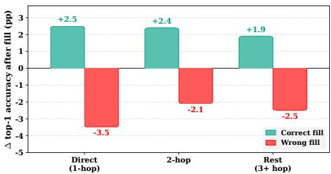  
Figure 7: Constraint propagation is graph-localized on ZebraLogic-Hard: the correct–wrong response gap is largest at direct clue links and decays with distance.

## D.4 Sparse Correction Recovery on Greedy Failures

As an oracle diagnostic, we reveal a small fraction of ground-truth cells on the 108 ZebraLogic-Hard puzzles failed by greedy decoding and rerun greedy inference. Table 8 shows that sparse revelation recovers most failures: 15% revealed cells solve 87.0% of failed puzzles, and 25% solves all failures.

Table 8: Recovery of greedy failures by ground-truth revelation. Denominator is the 108 ZebraLogic-Hard puzzles failed by greedy decoding.
<table><tr><td>GT revealed</td><td>Solved</td><td>Recovery rate</td></tr><tr><td>0%</td><td>0/108</td><td>0.0%</td></tr><tr><td>5%</td><td>35/108</td><td>32.4%</td></tr><tr><td>15%</td><td>94/108</td><td>87.0%</td></tr><tr><td>25%</td><td>108/108</td><td>100.0%</td></tr></table>

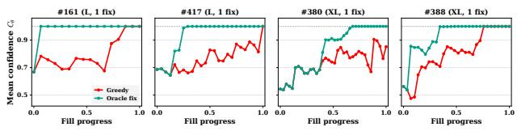  
Figure 8: Per-puzzle recovery trajectories under sparse ground-truth correction (four representative greedy failures). One or two corrections are typically sufficient to redirect $\mathcal { C } _ { \theta }$ back to convergence.

Most recovered puzzles require only one or two revealed cells, suggesting that many greedy failures are locally correctable rather than globally unrecoverable.

## D.5 Autoregressive Inference-Time Refinement Diagnostic

We evaluate stronger autoregressive inference procedures on ZebraLogic-Hard using the same finetuned LLaMA-3.1-8B checkpoint as in the main comparison. This diagnostic asks whether additional autoregressive search or explicit revision can recover gains comparable to Blackboard inference. We do not introduce revision-specific supervision, since doing so would alter the matched downstream training setting. Instead, the perfect-verifier condition provides exact violated-clue feedback while withholding the correct assignments, giving the autoregressive model a favorable inference-time test of whether it can repair a known inconsistency. ZebraLogic-Hard provides a particularly clean setting for this diagnostic because violated clues can be identified exactly by a programmatic checker. All compute measurements use the same NVIDIA RTX PRO 6000 GPU. Wall-clock time, peak memory, and FLOPs are reported per instance for each complete inference procedure.

## D.5.1 Refinement Protocol

Each refinement procedure begins from the same deterministic autoregressive solution used in the main LLaMA greedy baseline. The resulting Markdown table is serialized into the next prompt as a previous attempt. The model then generates a complete replacement table rather than editing tokens in place.

Self-critique. The model first inspects its current candidate and identifies the clues it believes are violated:

```markdown
### SYSTEM:
You are a careful logic-puzzle checker. Given a puzzle and a proposed
solution table, identify which clues the solution VIOLATES and why. If fully
consistent, say ``NO VIOLATIONS''. Do NOT rewrite the table.
### USER:
PUZZLE:
<puzzle text>
PROPOSED SOLUTION:
<current candidate table>
Which clues does this solution violate?
```

Unless the model returns NO VIOLATIONS, its critique is supplied to the subsequent revision prompt. This condition therefore tests the full self-diagnosis-and-repair loop using the same fine-tuned checkpoint.

Perfect-verifier refinement. A programmatic checker instead returns the exact clues violated by the current candidate. It does not reveal the correct assignment, any correct cell value, or an edit that would repair a violation. This removes error localization as a bottleneck while retaining the model’s need to infer how a known inconsistency should be repaired into a globally consistent solution.

Revision. For either feedback source, we augment the original SFT prompt immediately before its final-answer marker:

```markdown
### PREVIOUS ATTEMPT:
<current candidate table>
### FEEDBACK:
<self-generated critique or verifier feedback>
### CORRECTED FINAL SOLUTION:
```

All generations use deterministic decoding. We allow at most three refinement rounds and terminate early when the feedback source returns NO VIOLATIONS. A malformed or infeasible regenerated table is counted as incorrect.

## D.5.2 Tiered Refinement Results

Table 9: Autoregressive refinement results by ZebraLogic-Hard tier. All refinement methods start from the same deterministic LLaMA-3.1-8B solution used in the main greedy baseline and are evaluated on the full n = 500 test set.

<table><tr><td>Inference</td><td>S</td><td>M</td><td>L</td><td>XL</td><td>All</td></tr><tr><td>Greedy initial solution</td><td>80.8</td><td>48.0</td><td>8.8</td><td>0.8</td><td>34.6</td></tr><tr><td>Self-critique (up to 3 rounds)</td><td>68.0</td><td>33.6</td><td>3.2</td><td>0.0</td><td>26.2</td></tr><tr><td>Perfect-verifier refinement (up to 3 rounds)</td><td>82.4</td><td>51.2</td><td>11.2</td><td>1.6</td><td>36.6</td></tr></table>

Self-critique decreases accuracy across every difficulty tier, indicating that self-generated diagnosis can destabilize candidate solutions rather than reliably repair them. Perfect-verifier feedback avoids this degradation and improves overall accuracy from 34.6% to 36.6%, but the gain remains modest even when the exact violated clues are supplied. In particular, performance remains low on the Large and X-Large tiers despite exact violated-clue feedback.

## D.5.3 Hardware-Matched Compute

Table 10: Hardware-matched autoregressive inference-time diagnostic on ZebraLogic-Hard. All methods use the same fine-tuned LLaMA-3.1-8B checkpoint and are measured on an NVIDIA RTX PRO 6000 GPU.
<table><tr><td>Inference</td><td>Time / inst.</td><td>Peak memory</td><td>FLOPs / inst.</td><td>Accuracy (%)</td></tr><tr><td>Greedy</td><td>2.40 s</td><td>17.1 GB</td><td>8.2T</td><td>34.6</td></tr><tr><td>Beam search  $( B = 8 )$ </td><td>2.61 s</td><td>18.0 GB</td><td>17.2T</td><td>34.8</td></tr><tr><td>Beam search  $( B = 6 4 )$ </td><td>5.59 s</td><td>25.7 GB</td><td>85.1 T</td><td>35.0</td></tr><tr><td>Self-critique</td><td>19.14s</td><td>17.1 GB</td><td>59.8T</td><td>26.2</td></tr><tr><td>Perfect-vêrifier refinement</td><td>6.03 s</td><td>17.1 GB</td><td>20.5T</td><td>36.6</td></tr></table>

Widening beam search from $B = 8$ to $B = 6 4$ yields only a 0.2 pp accuracy gain while increasing FLOPs by 4.9×. Self-critique reduces accuracy by 8.4 pp relative to greedy decoding, while perfect-verifier refinement improves it by only 2.0 pp despite exact violated-clue feedback. Thus, on ZebraLogic-Hard, substantially stronger autoregressive inference—including wider search, explicit revision, and oracle-assisted error localization—does not recover gains comparable to Blackboard inference. This is a ZebraLogic-specific diagnostic: autoregressive search can have task-dependent effects, as illustrated by the substantially stronger beam-search result on JSSP.

## D.6 dLLM Baselines and Inference Ablations

We describe the dLLM baselines used in Section 4.3 and report inference-time ablations on ZebraLogic-Hard. Unless stated otherwise, all methods use the same SFT-trained LLaDA-8B backbone.

## D.6.1 PRISM

We implement PRISM following Kim et al. [2025a] by adding a remasking head to the SFT-trained LLaDA-8B backbone: LayerNorm → Linear(d→d) → GELU → Linear(d→1) with $d = 4 0 9 6$ The head is trained jointly with the unmasking objective using

$$
\mathcal { L } = \mathcal { L } _ { \mathrm { u n m a s k } } + \lambda \frac { 1 } { | \mathcal { R } | } \sum _ { i \in \mathcal { R } } \left( \mathrm { s o f t p l u s } ( h _ { i } ) - y _ { i } \right) ^ { 2 } , \quad y _ { i } = ( 1 - \alpha _ { t } ) \mathbf { 1 } [ \tilde { x } _ { i } \neq x _ { i } ] + \alpha _ { t } v _ { i } , \quad \alpha _ { t } = ( 1 - t ) ^ { 2 } ,
$$

where $v _ { i }$ is the constraint-violation count from the puzzle generator. All other LoRA and SFT settings match Appendix C.2.

At inference time, a clean token at position i is remasked when its raw head output $h _ { i }$ exceeds a threshold $t h r ;$ unmasking and remasking are interleaved for up to 150 steps. We swept $t h r \in$ $\{ 0 . 7 , 0 . 8 , 0 . 9 , 0 . 9 5 \}$ and sampling temperature $T \in \{ 0 . 0 , 0 . 3 , 0 . 7 , \bar { 1 } . 0 \}$ , and report the best observed configuration, $t h r = 0 . 8$ and ${ \bar { T } } = 1 . 0 { \bar { . } }$ , which reaches 79.2% on ZebraLogic-Hard.

## D.6.2 Blackboard Search and Trigger Ablations

We additionally consider Blackboard Search, a controlled variant that isolates Blackboard’s meanconfidence-guided search component. Unlike full Blackboard, it applies depth-3 search at fixed intervals without confidence-drop-based within-trajectory control or backtracking. Every 3 committed cells, each masked position is expanded over its top-5 candidate values, rolled out greedily for depth 3, and scored by the projected final $\mathcal { C } _ { \theta }$ . The best length-3 path is committed.

We then ablate puzzle-level triggering for both intervention types. Triggered settings invoke the corresponding intervention only when

$$
\operatorname* { m i n } _ { i \geq 0 . 8 N } \mathcal { C } _ { \boldsymbol { \theta } } ( \mathbf { x } _ { t _ { i } } ) < 1 . 0 .
$$

Puzzle-level triggering improves both intervention types while reducing inference effort. For Blackboard Search, triggering improves accuracy from 84.6% to 90.2% while reducing average NFE from 866 to 273. For full Blackboard, triggering improves accuracy from 86.8% to 90.4% while reducing

Table 11: Trigger and intervention ablation on ZebraLogic-Hard. The bottom two rows use the validation-selected trigger $( \rho , \tau ) = ( 0 . 8 , 1 . 0 )$
<table><tr><td colspan="2">Setting NFE</td><td>Accuracy</td></tr><tr><td>Greedy</td><td>35</td><td>78.4%</td></tr><tr><td>Blackboard Search (w/o trigger) Blackboard (w/o trigger)</td><td>866 280</td><td>84.6% 86.8%</td></tr><tr><td>Blackboard Search</td><td>273</td><td>90.2%</td></tr><tr><td>Blackboard</td><td>129</td><td>90.4%</td></tr></table>

average NFE from 280 to 129. Among the triggered variants, Blackboard achieves essentially the same accuracy as Blackboard Search (90.4% versus 90.2%) while using less than half the inference effort (129 versus 273 NFE).

## D.6.3 Lookahead Depth

We vary Blackboard lookahead depth while holding the validation-selected trigger $( \rho , \tau ) = ( 0 . 8 , 1 . 0 )$ branching factor $k = 5$ , and anchor threshold $\bar { \theta } _ { \mathrm { a n c h o r } } = 0 . 9 0$ fixed.

Table 12: Lookahead-depth ablation for Blackboard on ZebraLogic-Hard. Each cell reports solve rate (%).
<table><tr><td>Depth d</td><td>S</td><td>M</td><td>L</td><td>XL</td><td>All</td></tr><tr><td>d=3</td><td>100.0</td><td>99.2</td><td>87.2</td><td>75.2</td><td>90.4</td></tr><tr><td>d=4</td><td>100.0</td><td>97.6</td><td>84.0</td><td>76.8</td><td>89.6</td></tr><tr><td>d=5</td><td>100.0</td><td>97.6</td><td>84.8</td><td>75.2</td><td>89.4</td></tr></table>

Depth $d = 3$ performs best overall. Increasing lookahead depth provides no consistent benefit: $d = 4$ slightly improves the X-Large tier but reduces performance on Medium and Large puzzles, while $d = 5$ is lower overall.

## D.7 Official ZebraLogic Benchmark

In the main text, we evaluate on ZebraLogic-Hard, a 500-instance variant constructed to stress-test partial-assignment feasibility. For completeness, we also report results on the official ZebraLogic benchmark of Lin et al. [2025] (n = 1000 puzzles).

Adaptation of the official benchmark. We adapt the official ZebraLogic puzzles to our singletoken grid-filling format while preserving their constraint structure. Each clue is parsed into the canonical predicate vocabulary used for ZebraLogic-Hard, and category/value names are replaced with single-token aliases. The conversion succeeds on all 1000 puzzles, and all converted constraints remain solvable by Z3 with the original solution.

Setup. All methods use the same SFT-trained LLaDA-8B checkpoint as in the main text and the same Blackboard inference framework with $d { = } 3 , k { = } 5$ , and $\theta _ { \mathrm { a n c h o r } } { = } 0 . 9 0$ . For this evaluation, Blackboard uses $( \rho , \tau ) = ( 2 / 3 , 1 . 0 )$ ) and triggers when

$$
\operatorname* { m i n } _ { i \geq \rho N } \mathcal { C } _ { \theta } ( \mathbf { x } _ { t _ { i } } ) < \tau .
$$

Result. Blackboard improves over greedy by $+ 4 . 7 \mathrm { p p } ( 8 0 . 9 \%  8 5 . 6 \% )$ , with larger gains on Large and X-Large puzzles. It also outperforms its untriggered variant while using fewer NFEs (145 versus 223), providing supplementary evidence that confidence-triggered correction remains useful after conversion of the official benchmark to the single-token grid interface.

Table 13: Results on the adapted official ZebraLogic benchmark $( n = 1 0 0 0 .$ , search-space bins Small/Medium/Large/X-Large following Lin et al. [2025]). Blackboard uses $( \rho , \tau ) = ( 2 / 3 , 1 . 0 )$ non-triggered puzzles keep their greedy result.
<table><tr><td>Model</td><td>NFE</td><td>S</td><td>M</td><td>L</td><td>XL</td><td>All</td></tr><tr><td>LLaDA-8B (greedy)</td><td>32</td><td>96.6</td><td>89.6</td><td>74.5</td><td>50.0</td><td>80.9</td></tr><tr><td>LLaDA-8B (Blackboard, w/o trigger)</td><td>223</td><td>96.6</td><td>93.6</td><td>78.0</td><td>48.5</td><td>82.4</td></tr><tr><td>LLaDA-8B (Blackboard)</td><td>145</td><td>96.6</td><td>93.9</td><td>83.5</td><td>58.5</td><td>85.6</td></tr></table>

## E Nurse Rostering Additional Results

We provide additional Nurse Rostering analyses: confidence separation between solved and failed trajectories, performance across conflict-based difficulty bands, and the effect of confidence-triggered steering.

## E.1 Confidence Separation by Difficulty

We partition the 500 held-out instances into four equal-size difficulty bands using the number of conflicts encountered by the Z3 solver during constraint solving: d0 contains instances with 0–1 conflicts, d1 with 2–4, d2 with 5–9, and d3 with 10–31 conflicts.

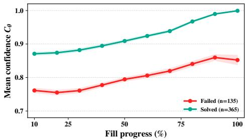

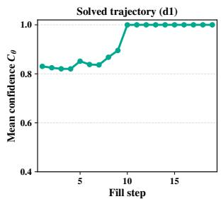

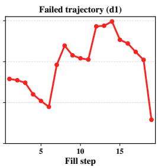  
Figure 9: Mean confidence trajectories on Nurse Rostering. (Left) Aggregated over evaluation instances, solved rosters exhibit higher mean confidence than failed ones. (Right) Illustrative d1 trajectories: the solved trajectory converges toward high confidence, whereas the shown failed trajectory undergoes substantial late-stage variation.

Figure 9 reproduces the aggregate solved–failed confidence separation observed on ZebraLogic. The right panel provides qualitative trajectory examples, while the quantitative analysis below measures this separation over all held-out instances and across difficulty bands.

Table 14: Separation between solved and failed Nurse Rostering trajectories, measured by Cohen’s d of trajectory-averaged mean confidence.
<table><tr><td>Conflict band</td><td>d0</td><td>d1</td><td>d2</td><td>d3</td><td>All</td></tr><tr><td>Cohen&#x27;s d</td><td>2.48</td><td>2.18</td><td>2.03</td><td>1.82</td><td>2.16</td></tr></table>

Mean confidence separates solved from failed trajectories in every difficulty band. Although the separation decreases moderately with conflict density, it remains large even on d3, supporting mean confidence as a reliability signal for selective correction.

## E.2 Performance Across Conflict Bands

Table 15 reports exact feasibility across the Z3-conflict difficulty bands defined above, together with the full comparison to frontier and same-scale autoregressive baselines.

Performance generally declines as constraint interactions increase. Among the same-scale models, Blackboard improves over LLaDA greedy in d1–d3, with gains increasing on the more conflict-dense bands: +1.6 pp on d1, +5.6 pp on d2, and +6.4 pp on d3. The d0 rate is unchanged at 95.2%, leaving little headroom for correction. GPT-5.4 Thinking provides the strongest frontier result at 86.0% overall, illustrating that the relative advantage of Blackboard is task-dependent.

Table 15: Evaluation results on Nurse Rostering. Instances are grouped by Z3-conflict difficulty bands (d0–d3); ALL is exact feasibility over the full evaluation set.
<table><tr><td>Class</td><td>Model</td><td>Inference</td><td>NFE</td><td>d0</td><td>d1</td><td>d2</td><td>d3</td><td>All</td></tr><tr><td>Frontier LLMs</td><td colspan="3">GPT-5.4 GPT-5.4 (CoT prompting) GPT-5.4 Thinking Gemini 2.5 Pro</td><td>52.0 91.2 92.0 73.6</td><td>8.0 67.2 90.4</td><td>3.2 31.2 84.0</td><td>0.0 14.4 77.6</td><td>15.8 51.0 86.0</td></tr><tr><td>8B-LLM</td><td>LLaMA-3.1-8B LLaMA-3.1-8B LLaMA-3.1-8B</td><td>Greedy Beam search Sample-BoN</td><td>97 773 773</td><td>39.2 42.4 40.8</td><td>8.0 8.0 8.0</td><td>5.6 6.4 4.8</td><td>2.4 2.4 2.4</td><td>13.8 14.8 14.0</td></tr><tr><td>8B-dLLM</td><td>LLaDA-8B LLaDA-8B</td><td>Greedy Blackboard</td><td>22 120</td><td>95.2 95.2</td><td>84.0 85.6</td><td>60.0 65.6</td><td>52.8 59.2</td><td>73.0 76.4</td></tr></table>

## E.3 Why Confidence Triggering Matters

The corrective cascade is not applied to every roster. The validation-selected trigger uses the mean confidence over the final 10% of filling steps and fires when this statistic falls below $\tau = 0 . 9 5$ i.e., $( \rho , \tau ) = ( 0 . 9 0 , 0 . 9 5 )$ . Table 16 shows that always applying the cascade is harmful: it can overwrite already-correct rosters. The confidence trigger protects high-confidence trajectories while concentrating correction on the subset with elevated failure risk.

Table 16: Effect of confidence-triggered steering on Nurse Rostering. The full cascade is evaluated on all 500 instances; Blackboard applies it only to triggered instances and otherwise retains the greedy roster.
<table><tr><td>Method</td><td>Cascade applied</td><td>Mean NFE</td><td>Exact feasibility (%)</td></tr><tr><td>LLaDA-8B greedy</td><td></td><td>22</td><td>73.0</td></tr><tr><td>Cascade on every instance</td><td>100%</td><td>325</td><td>57.4</td></tr><tr><td>Confidence-triggered Blackboard</td><td>19.6%</td><td>120</td><td>76.4</td></tr></table>

The trigger fires on 98/500 instances. Among these triggered instances, greedy decoding solves 4, whereas the corrective cascade yields 21 correct rosters. This corresponds to 19 failure-to-solution changes and 2 regressions. The remaining 402 non-triggered instances retain their greedy output, including 361 already-correct rosters. Thus, the trigger is necessary both for accuracy and for limiting corrective compute.

## F JSSP Additional Results

## F.1 Main Evaluation Results

Table 17 reports the full comparison on JSSP, including frontier LLMs and matched 8B autoregressive and diffusion models. The main text summarizes the headline comparison, while the analyses below examine performance by problem size and the role of confidence-triggered computation.

Table 17: Evaluation results on JSSP.
<table><tr><td>Class</td><td>Model</td><td>Inference</td><td>NFE</td><td>% opt</td><td>% within 5%</td></tr><tr><td rowspan="4">Frontier LLMs</td><td rowspan="4">GPT-5.4 GPT-5.4 (CoT prompting) GPT-5.4 Thinking</td><td rowspan="4"></td><td></td><td>11.0</td><td>16.5</td></tr><tr><td></td><td>30.0</td><td>37.2</td></tr><tr><td></td><td>77.0</td><td>90.2</td></tr><tr><td></td><td>27.8</td><td>35.0</td></tr><tr><td rowspan="3">8B-LLM</td><td>LLaMA-3.1-8B</td><td>Greedy</td><td>85</td><td>45.0</td><td>66.2</td></tr><tr><td>LLaMA-3.1-8B</td><td>Beam search</td><td>850</td><td>71.2</td><td>89.5</td></tr><tr><td>LLaMA-3.1-8B</td><td>Sample-BoN</td><td>850</td><td>63.0</td><td>83.8</td></tr><tr><td rowspan="2">8B-dLLM</td><td>LLaDA-8B</td><td>Greedy</td><td>22</td><td>70.0</td><td>91.0</td></tr><tr><td>LLaDA-8B</td><td>Blackboard</td><td>149</td><td>80.2</td><td>95.2</td></tr></table>

## F.2 Per-Size Results

Table 18 reports JSSP results by grid size. For each size, % optimal and % within 5% use all instances at that size as the denominator, with invalid outputs counted as failures; mean ms\_ratio is computed over valid outputs only.

Table 18: JSSP per-size results. Each cell reports % optimal / % within 5% / mean ms\_ratio. Mean ms\_ratio is computed over valid outputs only. Blackboard uses the validation-selected setting $( \rho , \tau ) = ( 0 . 5 , 0 . 7 )$ with N=10 (Section 4.1). The bottom row corresponds to the Blackboard entry in Table 17.
<table><tr><td>Method</td><td>3×3</td><td> $4 \times 3$ </td><td> $4 \times 4$ </td><td> $5 \times 4$ </td><td> $5 \times 5$ </td><td> $6 \times 6$ </td><td> $8 \times 8$ </td></tr><tr><td>GPT-5.4</td><td>35/35/1.11</td><td>27/39/1.11</td><td>17/23/1.20</td><td>2/10/1.23</td><td>1/ 6/1.29</td><td>0/ 0/1.37</td><td>0/ 0/1.58</td></tr><tr><td>GPT-5.4 (CoT)</td><td>82/82/1.02</td><td>77/84/1.07</td><td>47/60/1.06</td><td>7/21/1.17</td><td>6/ 9/1.19</td><td>0/ 2/1.36</td><td>0/ 0/2.19</td></tr><tr><td>GPT-5.4 (thinking)</td><td>100/100/1.00</td><td>96/100/1.00</td><td>94/99/1.00</td><td>79/100/1.01</td><td>73/96/1.01</td><td>40/60/1.05</td><td>0/ 8/1.15</td></tr><tr><td>Gemini 2.5 Pro</td><td>88/88/1.01</td><td>46/57/1.10</td><td>43/59/1.09</td><td>15/22/1.19</td><td>7/15/1.28</td><td>2/ 2/1.53</td><td>0/ 0/1.59</td></tr><tr><td>LLaMA-3.1-8B (beam-10)</td><td>100/100/1.00</td><td>98/100/1.00</td><td>90/97/1.00</td><td>72/92/1.01</td><td>67/91/1.01</td><td>22/78/1.04</td><td>0/0/11.12</td></tr><tr><td>LLaMA-3.1-8B (sample-BoN T=1.0)</td><td>90/90/1.01</td><td>95/98/1.00</td><td>81/91/1.01</td><td>58/88/1.02</td><td>57/85/1.02</td><td>21/67/1.04</td><td>0/ 0/12.19</td></tr><tr><td>LLaDA-8B (greedy)</td><td>98/98/1.00</td><td>86/100/1.01</td><td>91/97/1.00</td><td>69/95/1.01</td><td>66/90/1.01</td><td>33/84/1.03</td><td>0/ 8/1.11</td></tr><tr><td>LLaDA-8B (BoN, w/o trigger)</td><td>100/100/1.00</td><td>93/100/1.00</td><td>97/99/1.00</td><td>86/98/1.01</td><td>79/99/1.01</td><td>60/97/1.01</td><td>8/31/1.07</td></tr><tr><td>LLaDA-8B (Blackboard)</td><td>98/98/1.00</td><td>91/100/1.00</td><td>96/97/1.00</td><td>83/96/1.01</td><td>78/99/1.01</td><td>53/97/1.01</td><td>8/31/1.07</td></tr></table>

Blackboard improves most on the larger grid sizes, where greedy decoding is more often suboptimal.   
On the hardest 8×8 tier, it attains the joint-highest within-5% rate in the table.

## F.3 Blackboard vs. Untriggered BoN

Table 19 compares Blackboard with untriggered BoN on JSSP.

Table 19: Blackboard versus untriggered BoN on JSSP. Blackboard uses the validation-selected setting $( \rho , \tau ) = ( 0 . 5 , 0 . 7 )$
<table><tr><td>Method</td><td>Mean NFE</td><td>% within 5%</td><td>Mean ms ratio</td></tr><tr><td>dLLM greedy</td><td>22</td><td>91.0</td><td>1.013</td></tr><tr><td>dLLM BoN (w/o trigger)</td><td>217</td><td>96.2</td><td>1.007</td></tr><tr><td>dLLM Blackboard</td><td>149</td><td>95.2</td><td>1.008</td></tr></table>

Blackboard reduces average NFEs by 31% relative to untriggered BoN, with a 1.0 pp drop in within-5% rate.

## F.4 Per-Trajectory Quality Before BoN Selection

We compare individual stochastic trajectories before Best-of-N selection on the same JSSP puzzles where the Blackboard trigger fires. Both LLaMA-3.1-8B and LLaDA-8B are sampled with $\bar { N } = 1 0$ and T = 1.0; metrics are computed over valid trajectories.

Table 20: Per-trajectory JSSP quality before Best-of-N selection on the 226 puzzles for which the validation-selected Blackboard trigger fires. Both models are sampled with $N = 1 0$ and $T = 1 . 0 ;$ metrics are computed over valid trajectories. Unique makespans is the average number of distinct makespans among the $N = 1 0$ samples per puzzle.
<table><tr><td>Model</td><td>Valid trajectories</td><td>% optimal</td><td>Median ms_ratio</td><td>Unique makespans</td></tr><tr><td>LLaMA-3.1-8B</td><td>2,164</td><td>35.1</td><td>1.039</td><td>2.65</td></tr><tr><td>LLaDA-8B</td><td>2,219</td><td>51.0</td><td>1.000</td><td>2.88</td></tr></table>

LLaDA produces higher-quality individual trajectories while retaining comparable schedule diversity, suggesting that the BoN gain is not explained solely by broader sampling diversity.

## G Validation Selection, Sensitivity, and Uncertainty

## G.1 Confidence Trigger Selection

We select trigger hyperparameters before test evaluation using held-out training trajectories that are disjoint from the reported test sets. For each trajectory, a task-specific greedy failure is treated as the positive class and trigger firing as the prediction. We use a task-specific late-phase confidence statistic, then evaluate candidate late-phase fractions $\rho$ and thresholds $\tau$ and freeze the pair maximizing a task-appropriate failure-detection score.

The task-specific late-phase confidence statistic referenced in Section 4.1 is defined as follows. For ZebraLogic and JSSP, we use the minimum mean confidence within the late phase:

$$
s _ { \rho } ( x ) = \operatorname* { m i n } _ { \substack { i \in \{ \lceil \rho N \rceil , \ldots , N - 1 \} } } \mathcal { C } _ { \theta } ( x _ { t _ { i } } ) .
$$

For Nurse Rostering, we use the late-phase mean confidence to reduce sensitivity to isolated confidence dips:

$$
s _ { \rho } ^ { \mathrm { N R } } ( x ) = \frac { 1 } { N - \lceil \rho N \rceil } \sum _ { i = \lceil \rho N \rceil } ^ { N - 1 } \mathcal { C } _ { \theta } ( x _ { t _ { i } } ) .
$$

In all settings, additional inference is invoked when the corresponding late-phase confidence statistic falls below $\tau .$

A late-phase window avoids two degenerate choices. Early in inference, most cells remain masked, and solved and failed trajectories are less separated; near completion, few masked cells remain and confidence can saturate. We therefore select $\rho$ jointly with τ, rather than fixing either value by hand.

Table 21: Pre-test trigger selection from greedy trajectories. Precision and recall refer to detecting greedy failures. ZebraLogic and JSSP select the pair with maximum $F _ { 1 } \mathrm { { i } }$ ; Nurse Rostering selects by $F _ { 0 . 5 }$ to prioritize precision and avoid overwriting already-correct rosters.
<table><tr><td>Task</td><td>Statistic</td><td> $( \rho , \tau )$ </td><td>Precision (%)</td><td>Recall (%)</td><td>Selection score</td></tr><tr><td>ZebraLogic-Hard</td><td>late-phase min</td><td>(0.80, 1.00)</td><td>92.7</td><td>85.1</td><td> $F _ { 1 } = 8 8 . 7$ </td></tr><tr><td>Nurse Rostering</td><td>late-phase mean</td><td>(0.90, 0.95)</td><td>97.6</td><td>71.0</td><td> $F _ { 0 . 5 } = 9 0 . 8 $ </td></tr><tr><td>JSSP</td><td>late-phase min</td><td>(0.50, 0.70)</td><td>21.4</td><td>79.6</td><td> $F _ { 1 } = 3 3 . 8$ </td></tr></table>

The task-specific confidence statistic is fixed before the $\rho { - } \tau$ selection, and the selected settings are frozen before test evaluation and used for all main-text and task-specific results. Confidence separates optimal from suboptimal schedules less sharply on JSSP than it separates exact-feasibility failures on ZebraLogic and Nurse Rostering. Nevertheless, the selected trigger recalls 79.6% of non-optimal greedy schedules while selectively allocating objective-ranked BoN computation.

## G.2 Corrective-Operator Sensitivity on ZebraLogic

We vary the anchor confidence threshold α and candidate width k on the greedy-failure subset while holding depth $d = 3$ fixed. Recovery is unchanged across $\alpha \in \{ 0 . 8 \bar { 5 } , 0 . 9 \bar { 0 } , 0 . 9 5 \}$ , so Table 22 summarizes sensitivity to candidate width. We use $\alpha = 0 . 9 0$ and $k = 5$ in the main ZebraLogic experiments.

Table 22: ZebraLogic corrective-operator sensitivity on greedy failures $( n \ : = \ : 2 5 )$ . Recovery is unchanged across $\alpha \in \{ 0 . 8 5 , 0 . 9 0 , 0 . 9 5 \}$ ; NFE ranges report variation across these α settings.
<table><tr><td>Candidate width k</td><td>3</td><td>5 (main)</td><td>7</td></tr><tr><td>Recovered instances</td><td>21/25</td><td>22/25</td><td>23/25</td></tr><tr><td>Recovery rate</td><td>84%</td><td>88%</td><td>92%</td></tr><tr><td>Mean NFE</td><td>286-317</td><td>440-484</td><td>594-635</td></tr></table>

Performance is stable across the tested anchor thresholds, while increasing candidate width yields a gradual accuracy–compute trade-off.

## G.3 Evaluation Uncertainty and Paired Comparisons

We quantify uncertainty for selected headline results. For the ZebraLogic-Hard greedy comparison, both models are evaluated on the same 500 instances, so we use a paired nonparametric bootstrap with 20,000 resamples for the accuracy gap. All marginal rates use 95% Wilson score intervals. These intervals characterize finite held-out evaluation uncertainty rather than variation across independently retrained checkpoints.

Table 23: Uncertainty for selected main-task results. Marginal rates report 95% Wilson intervals; the ZebraLogic-Hard greedy gap uses a paired bootstrap with 20,000 resamples.
<table><tr><td>Task</td><td>Result</td><td>Estimate [95% CI]</td></tr><tr><td rowspan="4">ZebraLogic-Hard</td><td>LLaDA greedy</td><td>78.4 [74.6, 81.8]</td></tr><tr><td>LLaMA greedy</td><td>34.6 [30.6, 38.9]</td></tr><tr><td>Paired greedy gap</td><td>+43.8 [+39.2, +48.2]</td></tr><tr><td>LLaDA Blackboard</td><td>90.4 [87.5, 92.7]</td></tr><tr><td rowspan="2">Nurse Rostering</td><td>LLaDA greedy</td><td>73.0 [68.9, 76.7]</td></tr><tr><td>LLaDA Blackboard</td><td>76.4 [72.5, 79.9]</td></tr><tr><td rowspan="3">JSSP</td><td>LLaMA beam-10 optimality</td><td>71.2 [66.6, 75.5]</td></tr><tr><td>LLaDA Blackboard optimality</td><td>80.2 [76.1, 83.9]</td></tr><tr><td>LLaDA Blackboard within 5%</td><td>95.2 [92.7, 96.9]</td></tr></table>

On ZebraLogic-Hard, the paired LLaDA–LLaMA greedy gap is positive in every difficulty tier: +19.2, +46.4, +59.2, and +50.4 pp on S, M, L, and XL, respectively, with the 95% paired-bootstrap interval excluding zero in all four tiers. Across the full evaluation set, LLaDA alone solves 224 instances whereas LLaMA alone solves 5; the continuity-corrected McNemar test gives $\chi ^ { 2 } = 2 0 7 . 5$ $( p < 1 0 ^ { - 4 0 } )$ . The marginal intervals further show that the main cross-domain conclusions are stable under held-out evaluation uncertainty, while the smaller Nurse Rostering gain is correspondingly less separated.

## H Frontier API References

The main-text results include frontier API models as black-box reference points on ZebraLogic-Hard, Nurse Rostering, and JSSP, using the same task-specific input-output format as the fine-tuned models. These results are not compute-normalized comparisons: model scale, serving configuration, training data, reasoning budgets, and hidden internal computation are not exposed for the API models.

For ZebraLogic-Hard and JSSP, we additionally report observed client-side wall-clock latency and emitted-output-token counts. These are practical descriptors rather than measurements of comparable inference compute. Nurse Rostering API results are reported as accuracy references only.

Measurement protocol. We use a fixed prompt template per task and mode and do not tune prompts, sampling settings, or reasoning budgets on a per-puzzle basis. Wall-clock latency is measured clientside from request submission to complete response receipt, including network and provider-side latency observed by the client. Output token counts come from provider usage fields.

Table 24: Frontier API references on ZebraLogic-Hard (n = 500).
<table><tr><td>Model</td><td>Mode</td><td>Acc</td><td>Median latency</td><td>Median output tok.</td></tr><tr><td>GPT-5.4</td><td>standard</td><td>24.4%</td><td>16.2s</td><td>965</td></tr><tr><td>GPT-5.4</td><td>CoT</td><td>35.4%</td><td>31.0s</td><td>2,207</td></tr><tr><td>GPT-5.4</td><td>thinking</td><td>73.2%</td><td>72.9s</td><td>3,934</td></tr><tr><td>Gemini 2.5 Pro</td><td>thinking</td><td>54.4%</td><td>101.4s</td><td>11,000</td></tr></table>

ZebraLogic-Hard. GPT-5.4 Thinking is the strongest frontier API reference on ZebraLogic-Hard, reaching 73.2%. The matched fine-tuned LLaDA-8B Blackboard system reaches 90.4%; the API latency and token columns should be interpreted only as practical descriptors rather than computenormalized quantities.

Table 25: Frontier API references on Nurse Rostering (n = 500). The metric is exact-feasibility rate.
<table><tr><td>Model</td><td>Mode</td><td>Exact feasibility</td></tr><tr><td>GPT-5.4</td><td>standard</td><td>15.8%</td></tr><tr><td>GPT-5.4</td><td>CoT</td><td>51.0%</td></tr><tr><td>GPT-5.4</td><td>thinking</td><td>86.0%</td></tr><tr><td>Gemini 2.5 Pro</td><td>thinking</td><td>34.4%</td></tr></table>

Nurse Rostering. GPT-5.4 Thinking is the strongest tested frontier reference on Nurse Rostering, reaching 86.0% exact feasibility. The matched fine-tuned LLaDA-8B Blackboard system reaches 76.4%; therefore, Nurse Rostering is presented as evidence of cross-domain steering transfer rather than a universal frontier-model superiority claim.

Table 26: Frontier API references on JSSP. All rows use the full n=400 evaluation set. % optimal and % within 5% use the full set as denominator, with invalid outputs counted as failures. Mean ms\_ratio is computed over valid outputs only.
<table><tr><td>Model</td><td>Mode</td><td>% opt</td><td>% within 5%</td><td>Mean ms ratio</td><td>Med lat</td><td>Med tok</td></tr><tr><td>GPT-5.4</td><td>standard</td><td>11.0</td><td>16.5</td><td>1.233</td><td>4s</td><td>224</td></tr><tr><td>GPT-5.4</td><td>CoT</td><td>30.0</td><td>37.2</td><td>1.185</td><td>40 s</td><td>2,686</td></tr><tr><td>GPT-5.4</td><td>thinking</td><td>77.0</td><td>90.2</td><td>1.015</td><td>170.6 s</td><td>10,472</td></tr><tr><td>Gemini 2.5 Pro</td><td>thinking</td><td>27.8</td><td>35.0</td><td>1.201</td><td>106.5s</td><td>11,758</td></tr></table>

JSSP. GPT-5.4 thinking is the strongest frontier API reference on JSSP, reaching 77.0% optimal and 90.2% within 5%. For reference, the matched fine-tuned LLaDA-8B system in Table 17 reaches 80.2% optimal and 95.2% within 5%; the API latency and token columns should be interpreted only as practical descriptors rather than compute-normalized quantities.

The frontier rows are included only for the three main-task settings. The rotating-shift roster and ATSP experiments in Appendix I are supplementary transfer studies evaluated primarily through matched-model and within-backbone comparisons.

## I Supplementary Transfer Studies

Beyond the three main-task settings, we evaluate the same state-level confidence interface on two supplementary globally constrained domains. These studies are transfer evidence rather than additional headline comparisons: they test whether confidence can support task-appropriate inference when both the constraint structure and output representation differ from the main tasks.

The studies also illustrate that Blackboard is not a fixed search operator. For rotating-shift roster completion, confidence is most informative only at the trajectory level and is used for verifier-free candidate ranking. For asymmetric TSP, a computable tour-length objective is available, so confidence instead gates objective-ranked Best-of-N search, as in JSSP.

Table 27: Summary of supplementary transfer studies.
<table><tr><td>Domain</td><td>Problem type</td><td>Confidence role</td><td>Corrective action</td></tr><tr><td>Rotating-shift roster Asymmetric TSP</td><td>unique feasibility permutation optimization</td><td>trajectory-level ranking compute allocation</td><td>Cθ-BoN objective-BoN</td></tr></table>

## I.1 Rotating-Shift Roster

## I.1.1 Task and Setup

We consider a rotating-shift rostering problem whose combinatorial core is Latin-square completion. The output is an n × n staff–day grid, where each cell contains one of n shift types. Every staff member must work each shift exactly once, and every shift must be covered exactly once on each day. A set of given assignments pins a unique feasible completion.

We use $n = 7$ grids and a held-out evaluation set of 320 instances, stratified into four equalsize difficulty bands of 80 instances each. Difficulty is the number of backtracks required by an independent minimum-remaining-values solver: d0 has zero backtracks, d1 has 5–19, d2 has 20–49, and d3 has 50–149. The model is not given this statistic.

Unlike ZebraLogic, an incorrect local assignment can remain locally plausible in this domain. On a triggered instance, we therefore sample K = 10 complete rosters and select the candidate with the highest mean $\mathcal { C } _ { \theta }$ over the final five commit steps (LAST5). The statistic and trigger threshold are selected on a separate 240-instance validation split. No solver, task objective, or feasibility verifier is used for candidate ranking.

## I.1.2 Difficulty-Controlled Results

Table 28 reports exact-match feasibility across solver-backtrack bands. The confidence-triggered Best-of-N procedure improves performance in every band, with its largest gain on search-hard d3 instances.

Table 28: Rotating-shift roster exact-match feasibility (%) by solver-backtrack difficulty. Each band contains 80 held-out instances.
<table><tr><td>Method</td><td>All</td><td>d0</td><td>d1</td><td>d2</td><td>d3</td></tr><tr><td>LLaMA-3.1-8B (greedy)</td><td>8.8</td><td>13.8</td><td>5.0</td><td>5.0</td><td>11.2</td></tr><tr><td>LLaMA-3.1-8B (beam-10)</td><td>26.2</td><td>35.0</td><td>21.2</td><td>23.8</td><td>25.0</td></tr><tr><td>LLaMA-3.1-8B (Sample-BoN-10)</td><td>17.5</td><td>21.2</td><td>15.0</td><td>13.8</td><td>20.0</td></tr><tr><td>LLaDA-8B (greedy)</td><td>95.3</td><td>98.8</td><td>98.8</td><td>92.5</td><td>91.2</td></tr><tr><td>LLaDA-8B (Blackboard)</td><td>97.8</td><td>98.8</td><td>98.8</td><td>95.0</td><td>98.8</td></tr></table>

The aggregate gain is bounded by the strong greedy baseline, but Blackboard reduces the number of greedy errors from 15 to 7 (53% reduction). On the hardest d3 band, it improves exact feasibility by 7.6 pp. ZebraLogic-style local lookahead steering is not effective in this domain, indicating that the appropriate corrective action depends on the confidence landscape.

## I.1.3 Trigger and Candidate-Selection Diagnostic

The confidence trigger fires on 15/320 instances (4.7%), precisely the 15 instances failed by greedy decoding. Thus, it has 100% precision and recall for greedy failures on this evaluation set, with no regressions from intervening on already-correct rosters.

Table 29: Selective confidence-ranked BoN on rotating-shift roster. A fired instance receives ten additional stochastic completions.
<table><tr><td>Method</td><td>Trigger rate</td><td>Mean decodes</td><td>Exact feasibility (%)</td></tr><tr><td>LLaDA-8B (greedy)</td><td></td><td>1.00</td><td>95.3</td></tr><tr><td>BoN-10 on every instance</td><td>100%</td><td>11.00</td><td>97.8</td></tr><tr><td>Confidence-triggered Blackboard</td><td>4.7%</td><td>1.47</td><td>97.8</td></tr></table>

Among the 15 triggered candidate pools, at least one correct roster appears in 13 pools, and LAST5 confidence selects a correct roster in 8. The trigger therefore recovers more than half of residual greedy errors while avoiding unconditional sampling.

## I.2 Asymmetric Traveling Salesperson

## I.2.1 Task and Setup

We additionally evaluate on asymmetric traveling salesperson problems (ATSP), where the cost from city i to city j need not equal the reverse cost. Given an n × n distance matrix, the model outputs an n × n permutation matrix: row k specifies the city visited in position k of the tour. The matrix is decoded into a tour beginning and ending at city 0.

We evaluate 300 held-out instances, with 100 each at $n \in \{ 6 , 7 , 8 \}$ . Each instance has a unique certified optimum; instances whose best and second-best tours tie are excluded. We report exactoptimal rate and the rate within 5% of the optimal tour length. Difficulty is defined independently by the relative optimality gap,

$$
\frac { \mathrm { s e c o n d \_ b e s t \_ l e n g t h - o p t i m a l \_ l e n g t h } } { \mathrm { o p t i m a l \_ l e n g t h } } ,
$$

where a smaller gap makes the unique optimum harder to distinguish. Instances are divided into gap quartiles from g0 (largest gap, easiest) to $^ { \mathrm { g 3 } }$ (smallest gap, hardest).

Blackboard uses the same high-level procedure as JSSP: mean confidence gates additional computation, but the $K = 1 0$ candidates are ranked by the exact task objective—minimum valid tour length—rather than by $\mathcal { C } _ { \theta }$

## I.2.2 Matched Objective-Selection Results

Table 30 compares matched 8B autoregressive and diffusion models. Objective-based Best-of-N substantially helps both model families; the relevant comparison is therefore under the same objective-selection rule.

Table 30: ATSP results on 300 held-out instances. Invalid permutation matrices count as failures for both metrics.
<table><tr><td>Model and inference</td><td>% optimal</td><td>% within 5%</td><td> $^ { \mathrm { g 3 } }$  % optimal</td></tr><tr><td>LLaMA-3.1-8B (greedy)</td><td>68.7</td><td>81.3</td><td>40.8</td></tr><tr><td>LLaMA-3.1-8B (objective-BoN-10)</td><td>89.0</td><td>94.7</td><td>75.0</td></tr><tr><td>LLaDA-8B (greedy)</td><td>70.7</td><td>82.3</td><td>39.5</td></tr><tr><td>LLaDA-8B (Blackboard)</td><td>92.7</td><td>97.3</td><td>82.9</td></tr></table>

Objective selection improves the autoregressive model from 68.7% to 89.0% exact optimality. Nevertheless, LLaDA candidates remain higher quality under the same selection rule, and Blackboard reaches 92.7% exact optimality.

## I.2.3 Results by Optimality-Gap Difficulty

Table 31: LLaDA-8B ATSP exact-optimal rate (%) by optimality-gap quartile. g0 has the largest optimality gap; g3 has the smallest gap.
<table><tr><td>Method</td><td>All</td><td> ${ \bf g 0 }$ </td><td> $_ { \mathrm { g 1 } }$ </td><td> $\mathrm { g } 2$ </td><td> $^ { \mathrm { g 3 } }$ </td></tr><tr><td>LLaDA-8B (greedy)</td><td>70.7</td><td>91.9</td><td>84.0</td><td>68.0</td><td>39.5</td></tr><tr><td>LLaDA-8B (Blackboard)</td><td>92.7</td><td>98.6</td><td>97.3</td><td>92.0</td><td>82.9</td></tr></table>

The benefit grows as the optimum becomes less distinguishable: Blackboard gains +6.7 pp on g0 and +43.4 pp on g3. This pattern is consistent with objective-based candidate selection being most useful when several tours have similar likelihood but only one is globally optimal.

## I.2.4 Confidence-Triggered Objective BoN

Table 32: Compute effect of confidence-triggered objective BoN on ATSP. A fired instance receives ten additional candidates, selected by minimum tour length.
<table><tr><td>Method</td><td>Trigger rate</td><td>Mean decodes</td><td>% optimal</td></tr><tr><td>LLaDA-8B (greedy)</td><td></td><td>1.0</td><td>70.7</td></tr><tr><td>Objective-BoN-10 on every instance</td><td>100%</td><td>11.0</td><td>92.7</td></tr><tr><td>Confidence-triggered Blackboard</td><td>70%</td><td>8.0</td><td>92.7</td></tr></table>

The trigger fires increasingly often from easy to hard gap bands (38%, 64%, 81%, and 95% for g0 through g3), and preserves the exact-optimal rate of unconditional objective-BoN while reducing average decodes by 27%. Here, confidence is used to allocate objective-based search budget; it is not itself used as the candidate-ranking objective.