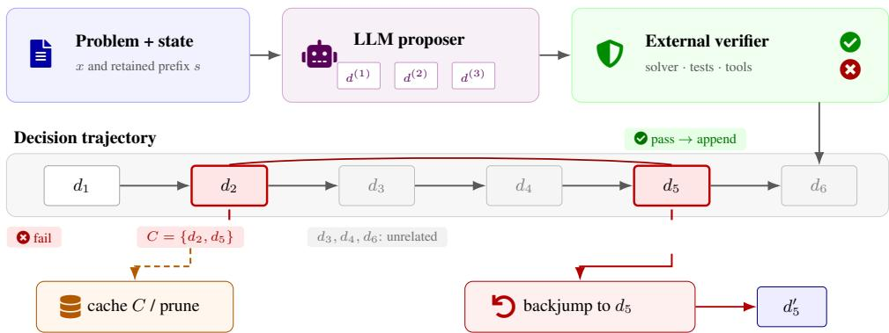
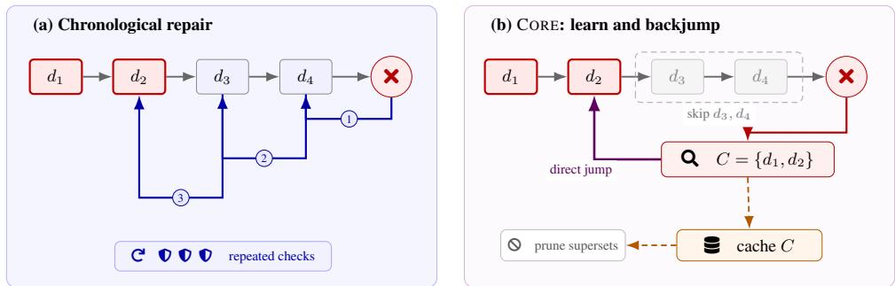
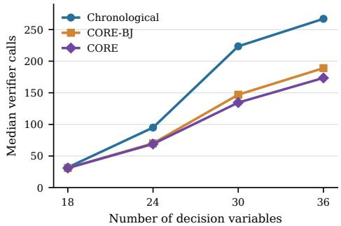
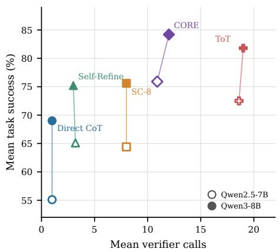
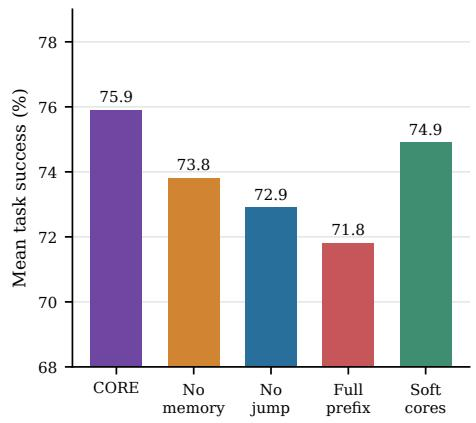

# CORE: Conflict-Oriented Reasoning Elimination for Verifiable Language-Model Search

Siyu Song1, Rui Xu2, Jia Lin3, Kai Liu1, Weifang Wang1

1School of Computer Science and Technology, School of Computer Science and Engineering

2School of Information Science and Engineering, Sun Yat-sen University

3College of Computer Science, College of Computer Science

## Abstract

Test-time reasoning systems often respond to failure by restarting or revising the latest step, even when an earlier decision caused the error. We introduce CORE, a search controller that requests a certified conflict core from a verifier, backjumps to the latest decision in that core, and caches the conflict to avoid repeating it. Under sound verification, finite branching and depth, and exhaustive proposals, the uncapped search is complete and never prunes a valid solution. On 2,000 planted graph-coloring in stances with matched proposals and an exact verifier, CORE reduces median verifier calls by 39.8% at 30 variables and 35.0% at 36 variables relative to chronological repair; caching further improves on backjumping alone. Across five reasoning tasks, CORE achieves 75.9% mean success with Qwen2.5-7B-Instruct and 84.2% with Qwen3-8B, compared with 72.5% and 81.8% for Tree of Thoughts. It also uses fewer verifier calls and generated tokens on both back bones. These results show the value of using certified failure explanations to direct languagemodel search.

## 1 Introduction

Chain-of-thought exposes intermediate computation (Wei et al., 2022). Test-time methods improve reasoning by sampling traces (Wang et al., 2023), decomposing problems (Zhou et al., 2023), or searching over thoughts (Yao et al., 2023; Besta et al., 2024). Yet after failure, systems usually restart, edit the latest step, or reflect and retry (Madaan et al., 2023; Shinn et al., 2023). If the error was introduced earlier, such local repair revisits irrelevant decisions.

Classical solvers instead use conflict-directed search: identify the responsible decisions, jump over unrelated ones, and cache the conflict (Dechter, 1990; Prosser, 1993; Marques-Silva and Sakallah, 1999). Transferring this principle to language models is nontrivial: natural-language “thoughts” are not solver literals, critiques need not be logically sufficient, and approximate verifiers may reject valid reasoning. A precise interface among the proposer, verifier, and search controller is therefore required.

We propose CORE (Conflict-Oriented Reasoning Elimination), a test-time algorithm for tasks whose partial decisions can be checked. The model proposes structured decisions with stable identifiers. On rejection, the verifier returns a conflict core: a subset of active decisions that cannot occur together in any valid completion. CORE learns this core, backjumps to its most recent member, and continues from there. A core may come from a symbolic checker, an unsatisfiable core, a failed program test with dynamic dependencies, or a learned verifier. Only sound cores receive the paper’s formal guarantee. Figure 1 summarizes the separation between generation, checking, and conflict-directed control.

Our contributions are:

• We introduce a conflict-producing reasoning interface and CORE, combining nonchronological backjumping with semantic nogood memoization.

• We prove conditional safety, completeness, and termination under explicit assumptions on verifier and conflict-core soundness.

• We provide a deterministic controlled testbed that isolates search under matched proposals and measures verifier calls, backtracks, and core reuse.

• We evaluate an LLM instantiation across five reasoning tasks and two backbones, comparing task success and inference cost with four baselines.

  
Figure 1: Illustration of CORE. A proposer extends a decision trajectory and an external verifier checks it. The highlighted decisions $d _ { 2 }$ and $d _ { 5 }$ form a conflict core, while gray decisions are irrelevant to this failure. The controller learns the core, backjumps to $d _ { 5 }$ , and rejects future candidates that contain both conflicting decisions.

## 2 Related Work

Reasoning by sampling and search. Selfconsistency aggregates independent traces (Wang et al., 2023), while Tree of Thoughts, Graph of Thoughts, RAP, and LATS organize branching search (Yao et al., 2023; Besta et al., 2024; Hao et al., 2023; Zhou et al., 2024). MLR separates plan descriptors from step execution (Xiong et al., 2026). These methods structure generation, choose states to expand, or aggregate plans and answers; CORE instead determines where to return after a verified failure and which combinations to forbid thereafter. The methods are complementary: a best-first or tree-of-thought frontier can use CORE’s learned constraints.

Verification and refinement. Process supervision scores intermediate steps (Uesato et al., 2022; Lightman et al., 2024), and ProcessBench evaluates error localization (Zheng et al., 2025). Self-Refine, Reflexion, and CRITIC use feedback for revision (Madaan et al., 2023; Shinn et al., 2023; Gou et al., 2024). Reasoning traces may be unfaithful (Turpin et al., 2023; Lanham et al., 2023), so CORE does not assume that prose explanations reveal the model’s internal computation. It requires only that accepted structured decisions and returned cores satisfy an external contract.

Solver–LLM collaboration. LLM-Modulo systems separate candidate generation from reliable checking (Kambhampati et al., 2024). SWAP represents dependencies with entailment graphs and verifies intermediate steps (Xiong et al., 2025), while PAL executes model-generated programs (Gao et al., 2023). Recent work also combines an LLM with a solver and chronological backtracking for multi-constraint planning (Stechly et al., 2025). CORE contributes a different search rule: conflicts name responsible decisions, enabling nonchronological backjumping and persistent pruning. Its lineage is conflict-directed backjumping and constraint learning (Dechter, 1990; Marques-Silva and Sakallah, 1999), reformulated for a proposer whose actions are generated in language.

## 3 Problem Formulation

Let a problem instance be x. A reasoning state $s _ { t } =$ $( d _ { 1 } , \ldots , d _ { t } )$ is an ordered sequence of decisions. A decision is a record

$$
d _ { i } = ( i d _ { i } , t y p e _ { i } , v a l u e _ { i } , d e p s _ { i } ) ,
$$

where the identifier is stable within a run and dependencies refer to prior decisions. Examples include assigning a value to a variable, selecting a planning action, asserting a lemma, or choosing an API argument. The proposer Propos $\mathsf { \cdot e } _ { \theta } ( x , s _ { t } )$ returns an ordered finite list of candidates. It may be an LLM, a policy model, or a deterministic heuristic.

Let $\kappa ( d )$ be a canonical decision–value key that preserves the decision’s type, dependency context, and resource or occurrence identity when repeated choices must remain distinct. The active keys of a state are

$$
K ( s _ { t } ) = \{ \kappa ( d _ { i } ) : 1 \leq i \leq t \} .
$$

This representation lets the controller compare decisions across trajectories while keeping choices with different dependencies distinct. Figures abbreviate $\kappa ( d _ { i } )$ as $d _ { i }$

The search-time verifier has three outputs:

$$
\mathsf { V e r i f y } ( x , s _ { t } \oplus d ) = \left\{ \mathsf { p a s s } , \qquad \right. \mathsf { V e r i l f y } ( x ) , \mathsf { u n k n o w n } ,
$$

where $C$ is a set of canonical decision–value keys drawn from the proposed state. fail(C) is reserved for a certified sound core; heuristic feedback cannot enter the hard cache. Unknown means that the checker cannot establish either a valid step or a sound conflict; search may retain the decision provisionally, but it cannot learn a hard core from that outcome. A separate FinalCheck $\mathbf { \chi } ( x , s ) \in \{ 0 , 1 \}$ scores a complete state against the task’s final criterion.

Definition 1 (Sound conflict core). Let $S ^ { \star } ( x )$ be the valid complete statesfor x. A set C is a sound conflict corefor x exactly when

$$
\forall s ^ { \star } \in { \mathcal { S } } ^ { \star } ( x ) , \qquad C \not \in K ( s ^ { \star } ) .
$$

The definition is stronger than “these steps look suspicious.” It makes a core a semantic nogood. A direct constraint violation may yield a two-decision core; a failed unit test may yield the decisions in its dynamic slice; a symbolic solver may return an unsatisfiable core. A learned verifier can approximate this interface, but its cores are not covered by exact guarantees.

The objective is to find a complete state accepted by FinalCheck within a budget of proposer and verifier calls. We count verifier calls because they can involve tool execution, a second model, or a solver and frequently dominate orchestration cost.

## 4 CORE

## 4.1 Algorithm

CORE maintains a stack of active decisions and a set $\mathcal { N }$ of learned cores. Before verifying a candidate, it checks whether the resulting state contains a learned core. Such a candidate is skipped without another verifier call. A new failure core is minimized when possible, stored, and used to choose a backjump target. An unknown result can extend the stack, but only the final scorer can accept a complete state.

LEARNANDJUMP first removes redundant members if the verifier supports core minimization. It inserts the remaining core into ${ \mathcal { N } } ,$ deleting stored supersets. For a nonempty core C in $s _ { t } .$ , the backjump level and retained state are

$$
\begin{array} { c } { j ( C , s _ { t } ) = \operatorname* { m a x } \{ i \leq t : \kappa ( d _ { i } ) \in C \} , } \\ { s ^ { \prime } = s _ { j ( C , s _ { t } ) - 1 } . } \end{array}
$$

The state is thus truncated to the level immediately before $j = j ( C , s _ { t } )$ , and the offending value at $j$ is marked tried. Decisions newer than j are skipped: they cannot resolve a conflict that does not mention them. If all candidates at a level are exhausted, their individual explanations are resolved into an exhaustion core, analogous to eliminating the current variable in constraint search (Robinson, 1965; Dechter, 1990). Figure 2 contrasts this operation with chronological repair: the conflict excludes an intermediate decision, so CORE skips that level and records a reusable nogood.

Algorithm 1 CORE search   
Require: instance x, proposer Propose, verifier   
Verify, final scorer FinalCheck   
1: $s \gets [ ] ; \mathcal { N } \gets \emptyset$   
2: while budget remains do   
3: if s is complete then   
4: if FinalCheck $( x , s ) = 1$ then   
5: return s   
6: end if   
7: s ←REJECTLEAF(s); continue   
8: end if   
9: A ← Propose(x, s)   
10: d ← first untried $a \in A$ such that   
¬Contains $( s \oplus a , { \mathcal { N } } )$   
11: if no such d exists then   
12: C ← EXPLAINEXHAUSTION(s)   
13: if C is certified then   
14: (s, N) ← LEARNANDJUMP(s, C,   
N )   
15: else   
16: s ←BACKTRACK(s)   
17: end if   
18: continue   
19: end if   
20: r ← Verify(x, s ⊕ d)   
21: if r = pass or r = unknown then   
22: $s  s \oplus d$   
23: else   
24: $( s , \mathcal { N } ) \ \gets \ \mathrm { ~ I ~ }$ EARNANDJUMP(s ⊕ d,   
$r . C , { \mathcal { N } } )$   
25: end if   
26: end while   
27: return BUDGETEXCEEDED

Candidate and core bookkeeping. The controller keeps a tried-candidate ledger for each retained prefix. A candidate key includes its decision type, canonical value, dependencies, and any identity needed to distinguish repeated choices; changing a dependency changes the key even if the surface text is identical. Within an instance, the cache test is

  
Figure 2: The same failure under matched decision order. Chronological repair retreats through $d _ { 4 }$ and $d _ { 3 }$ before reconsidering $d _ { 2 }$ . CORE uses $C = \{ d _ { 1 } , d _ { 2 } \}$ to jump directly to $d _ { 2 }$ and caches the conflict to prune its supersets. Gray decisions are absent from the core.

$$
{ \mathsf { C o n t a i n s } } ( s , { \mathcal { N } } ) = \mathbf { 1 } \left[ \exists C \in { \mathcal { N } } : C \subseteq K ( s ) \right] .
$$

A cached core therefore rejects later supersets regardless of the order of decisions outside C, without treating an unverified critique as a constraint.

Certifying a jump. Before learning C, the checker must establish that no valid completion contains all of C. Reproducing a failure on one complete trajectory is insufficient: another continuation might succeed. If core minimization is available, each removed member is accepted only after the smaller core is certified again; otherwise the last certified core is kept. An exhaustion core also requires coverage of every legal alternative at that decision level. If the complete alternative set is $A _ { j } .$ , and each $a \in A _ { j }$ has a certified core $C _ { a }$ containing $\kappa ( a )$ , a candidate exhaustion core is

$$
C _ { \mathrm { e x h } } = \bigcup _ { a \in A _ { j } } \left( C _ { a } \setminus \{ \kappa ( a ) \} \right) .
$$

Any completion retaining $C _ { \mathrm { e x h } }$ must choose an $a \in A _ { j }$ and therefore contain $C _ { a }$ . Running out of sampled candidates in one proposal batch does not establish exhaustion, so the controller falls back to chronological repair when the checker cannot certify it. Under finite token or verifier-call budgets, the loop may instead return BUDGETEXCEEDED; the completeness result below applies only when the budget does not interrupt the search.

Worked 24-Game example. Consider the cards {1, 3, 4, 6}. The proposer first chooses $d _ { 1 } : 1 + 3$ = 4, leaving the new 4, the original 4, and 6. It then chooses $d _ { 2 } : 4 _ { \mathrm { o r i g } } + 6 = 1 0$ and $d _ { 3 } : 4 _ { \mathrm { n e w } }$ + 10 = 14. Before accepting $d _ { 3 } ,$ , an illustrative search-time verifier rejects the terminal value 14 and uses exact rational-arithmetic replay to explain the failure. Exhaustive completion from $\{ 4 _ { \mathrm { n e w } } , 4 _ { \mathrm { o r i g } } , 6 \}$ cannot yield 24, so the checker certifies fail $\displaystyle ( C = \{ d _ { 1 } \} )$ retaining $d _ { 1 }$ makes every completion invalid, regardless of $d _ { 2 }$ and $d _ { 3 }$ . CORE caches this core and jumps from $d _ { 3 }$ to $d _ { 1 }$ , skipping $d _ { 2 }$ . A new first choice can then produce $d _ { 1 } ^ { \prime } : 3 / 4 = 3 / 4$ $d _ { 2 } ^ { \prime } : 1 - 3 / 4 = 1 / 4$ , and $d _ { 3 } ^ { \prime } : 6 / ( 1 / 4 ) = 2 4$ . This illustrates how a certified prefix conflict identifies an earlier decision to change, while the skipped decision is irrelevant to that failure.

## 4.2 Prompt and verifier contract

An LLM instantiation should ask for one decision at a time in a machine-readable schema, not an unrestricted replacement trace. A minimal response contains id, value, and depends\_on; optional prose remains non-binding. The controller, rather than the model, owns the stack, candidate ledger, and learned cores. On backjump, the prompt contains the retained prefix and only the cores relevant to the next decision. This avoids an ever-growing transcript.

REJECTLEAF marks a complete state rejected by the final scorer as tried and retreats chronologically; it does not cache a conflict without a sound explanation. Likewise, exhaustion uses chronological backtracking when no certified exhaustion core is available.

Conflict production has three practical tiers:

1. Exact: SAT/SMT/CSP solvers, parsers, type checkers, and deterministic task constraints can return certified cores.

2. Replay-certified: a proposed core is accepted only if a sound checker rules out every completion containing that subset.

3. Heuristic: an LLM or learned process model names likely causes. These may guide search but should be soft constraints with expiration or confirmation, because hard pruning can destroy completeness.

## 4.3 Guarantees

Theorem 1 (Safety and completeness). Assume (i) every learned core is sound, (ii) branching and maximum reasoning depth are finite, (iii) the proposer eventually enumerates every legal candidate at a revisited state, (iv) the search-time verifier never rejects a prefix ofa valid solution, (v) thefinal scorer accepts exactly the valid complete states, and (vi) the run is not stopped by a finite budget before search completes. Then CORE never prunes a valid complete solution and returns a solution whenever one exists.

Proof. A partial branch is pruned by a learned core only when it contains that core. By core soundness, no valid solution contains the core. A complete state rejected by the final scorer is also invalid under the stated assumption. A backjump removes only decisions newer than the latest member of the conflict; changing any removed decision while retaining the whole core cannot produce a solution. Thus backjumping skips only invalid subtrees. Finite branching and eventual enumeration imply that every unpruned candidate is eventually tried. If a solution exists, none of its prefixes contains a sound core, so its branch is eventually reached and accepted by the final scorer. Unknown partial checks and chronological retreat without a certified core cannot remove it. □

Proposition 1 (Termination). Under the assumptions of Theorem 1, CORE terminates with a solution or exhaustion.

Proof. There are finitely many decision sequences. Candidate ledgers prevent retrying the same decision at the same retained state, and learning can only remove additional sequences. Therefore the loop cannot visit infinitely many distinct untried candidates. □

Why cores can save exponential work. Suppose a conflict depends on decisions at levels $i < j$ but is discovered at depth t. Chronological repair may enumerate combinations of levels $j + 1 , \dots , t$ before changing j. A core that excludes those levels skips their Cartesian product immediately. Memoization also prunes the same conflict when reached through a different ordering of irrelevant decisions. This is a structural benefit, not a claim that every instance improves: uninformative cores containing the full prefix reduce CORE to chronological backtracking plus bookkeeping.

Figure 3: Median verifier calls over 500 paired instances per size. All methods use the same proposal order and exact verifier.
<table><tr><td>n</td><td>Chron.</td><td>CORE-BJ</td><td>CORE</td><td> $\Delta$ </td></tr><tr><td>18</td><td>32.0</td><td>31.0</td><td>31.0</td><td>-3.1%</td></tr><tr><td>24</td><td>95.0</td><td>70.0</td><td>69.0</td><td>-27.4%</td></tr><tr><td>30</td><td>223.5</td><td>147.0</td><td>134.5</td><td>-39.8%</td></tr><tr><td>36</td><td>267.0</td><td>189.0</td><td>173.5</td><td>-35.0%</td></tr></table>

Table 1: Median verifier calls. $\Delta$ compares CORE with chronological repair. Every method solved every maintest instance within budget.

## 5 Search Mechanism Analysis

We use a controlled graph-coloring testbed to isolate the effect of the search controller. The evaluation on language-model reasoning tasks follows in Section 6.

## 5.1 Testbed

We use planted 3-coloring because it exposes all relevant algorithmic objects without an ambiguous learned judge. For each size $n \in \{ 1 8 , 2 4 , 3 0 , 3 6 \}$ , we generate 500 graphs. Each vertex receives a planted color; edges are sampled with probability 0.28 only between differently colored vertices, guaranteeing at least one solution. Variables are ordered by decreasing degree. A deterministic noisy proposer ranks the planted color first with probability 0.30 and otherwise uses a seeded random order. All methods receive exactly the same candidate ordering.

The verifier accepts a color when it differs from every assigned neighbor. Upon failure it returns the conflicting vertex assignments. When every color for a vertex fails, the search procedure resolves those explanations into the set of prior assignments that block its domain. These are exact conflict cores.

<table><tr><td>Method</td><td>GSM8K (500)</td><td>MATH-500 (500)</td><td>24-Game (200)</td><td>Blocks (200)</td><td>HumanEval (164)</td><td>Mean</td><td>Verifier calls</td><td>Tokens (k)</td></tr><tr><td>Qwen2.5-7B-Instruct</td><td></td><td></td><td></td><td></td><td></td><td></td><td></td><td></td></tr><tr><td>Direct CoT</td><td>72.4</td><td>42.8</td><td>61.0</td><td>41.0</td><td>58.5</td><td>55.1</td><td>1.0</td><td>1.3</td></tr><tr><td>Self-Consistency-8</td><td>80.6</td><td>51.2</td><td>78.0</td><td>48.0</td><td>64.0</td><td>64.4</td><td>8.0</td><td>9.6</td></tr><tr><td>Self-Refine-4</td><td>78.1</td><td>49.6</td><td>75.0</td><td>55.0</td><td>67.7</td><td>65.1</td><td>3.2</td><td>4.9</td></tr><tr><td>Tree of Thoughts</td><td>82.0</td><td>55.4</td><td>88.0</td><td>67.0</td><td>70.1</td><td>72.5</td><td>18.6</td><td>14.2</td></tr><tr><td>CORE</td><td>83.8</td><td>58.6</td><td>92.0</td><td>73.0</td><td>72.0</td><td>75.9</td><td>10.9</td><td>9.1</td></tr><tr><td>Qwen3-8B</td><td></td><td></td><td></td><td></td><td></td><td></td><td></td><td></td></tr><tr><td>Direct CoT</td><td>87.8</td><td>73.8</td><td>64.5</td><td>50.5</td><td>68.3</td><td>69.0</td><td>1.0</td><td>1.5</td></tr><tr><td>Self-Consistency-8</td><td>92.2</td><td>79.8</td><td>79.5</td><td>54.5</td><td>72.0</td><td>75.6</td><td>8.0</td><td>6.5</td></tr><tr><td>Self-Refine-4</td><td>89.8</td><td>78.2</td><td>76.5</td><td>59.5</td><td>72.0</td><td>75.2</td><td>3.0</td><td>4.8</td></tr><tr><td>Tree of Thoughts</td><td>93.2</td><td>82.8</td><td>88.5</td><td>69.5</td><td>75.0</td><td>81.8</td><td>19.0</td><td>7.0</td></tr><tr><td>CORE</td><td>93.8</td><td>85.2</td><td>91.5</td><td>74.5</td><td>76.2</td><td>84.2</td><td>12.0</td><td>6.0</td></tr></table>

Table 2: End-to-end task success rates (%) for both backbones. Calls and generated tokens are per-problem means. Mean success averages the five task columns; sample counts are shown in the headers.

Systems. CHRONOLOGICAL is depth-first repair that returns one level after an exhausted decision. CORE-BJ uses conflict-directed backjumping but does not cache cores. CORE adds core memoization. The primary metric is the number of verifier calls until the first solution; we also record expansions, backtracks, jump distance, and learned cores. Runs are capped at 100,000 calls. All random choices are derived from recorded instance seeds.

## 5.2 Results

Backjumping reduces verification. All three methods solve all 2,000 main instances. Figure 3 and Table 1 show that the methods are similar on the smallest graphs, where most runs encounter little backtracking. The gap grows with deeper search. At 30 variables, CORE reduces the median from 223.5 to 134.5 calls (39.8%); at 36 variables, it reduces 267.0 to 173.5 (35.0%). Mean calls at n = 36 fall from 546.0 to 235.4, indicating that conflict information is especially useful on the heavy tail.

Memory adds value beyond jumping. CORE-BJ already improves substantially over chronological repair. Memoization lowers median calls further at n = 24, 30, 36 by 5.7%, 8.5%, and 8.2%, respectively. At n = 18, little search repeats and the two variants tie. This pattern is consistent with the intended mechanism: learned cores matter only after search begins to revisit a failed combination under irrelevant surrounding decisions.

Sensitivity to proposal quality. At $n \ = \ 3 0$ we rerun 200 paired instances with planted-first probabilities 0.10 and 0.60. With the weaker proposer, median calls are 236.0 for chronological repair, 149.5 for backjumping, and 135.0 for CORE. With the stronger proposer, they are 133.5, 92.0, and 90.5. Conflict-directed search helps in both regimes, while the incremental value of memory shrinks when a good proposal reaches a solution before conflicts recur.

## 6 Experiments

## 6.1 Experimental setup

Backbone and decoding. We report results with Qwen2.5-7B-Instruct and Qwen3-8B as proposers, both served with vLLM using bfloat16 weights and the same decoding configuration. Candidate decisions are sampled at temperature 0.7 and top\_p = 0.95, with at most 128 generated tokens per candidate. The controller requests four candidates per decision and permits at most 24 accepted decisions. Per-problem budgets are 16,384 generated tokens and 32 verifier calls.

State and cache representation. The proposer emits JSON records with id, decision\_type, value, and depends\_on. The controller canonicalizes numbers, variable names, API arguments, and commutative expressions before hashing a decision together with its type and dependencies. Learned cores are stored as sorted sets of canonical decision– value hashes. Subset lookup uses an inverted index from hashes to core identifiers. Core minimization performs deletion-based replay for at most eight additional checker calls; if the cap is reached, the non-minimal sound core is retained. Heuristic cores are never inserted into the hard cache.

  
Figure 4: End-to-end results. Left: mean task success against mean verifier calls for both backbones. Right: Qwen2.5-7B-Instruct ablations of core memory, backjumping, and conflict precision.

<table><tr><td>Variant</td><td>Success</td><td>Calls</td><td>Core size</td><td>Jump</td></tr><tr><td>CORE</td><td>75.9</td><td>10.9</td><td>2.7</td><td>3.8</td></tr><tr><td>No core memory</td><td>73.8</td><td>12.7</td><td>2.7</td><td>3.6</td></tr><tr><td>No backjumping</td><td>72.9</td><td>15.4</td><td>2.8</td><td>1.0</td></tr><tr><td>Full-prefix conflicts</td><td>71.8</td><td>16.1</td><td>8.9</td><td>1.2</td></tr><tr><td>Soft heuristic cores</td><td>74.9</td><td>14.3</td><td>3.4</td><td>2.9</td></tr></table>

Table 3: Qwen2.5-7B-Instruct ablations. Success is mean task accuracy (%); other columns are per-problem means. “Jump” is the number of decision levels removed per repair.

Tasks and sampling. For GSM8K (Cobbe et al., 2021), we sample 500 problems from the official test split with fixed seed 1729 and retain the selected problem IDs. We use all 500 MATH-500 problems (Lightman et al., 2024). For 24- Game, we select 200 fixed puzzles from the Tree of Thoughts collection (Yao et al., 2023), confirm solvability with an exhaustive solver, and retain each puzzle’s four cards and ID. We select 200 Blocksworld instances from PlanBench (Valmeekam et al., 2023), stratified by plan length. We use all 164 HumanEval problems (Chen et al., 2021).

Search-time checks and final scoring. GSM8K: Search checks arithmetic in structured equations and consistency with declared dependencies. Textual inferences that cannot be checked mechanically return unknown. Final scoring extracts the numeric answer and compares it with the dataset answer. MATH-500: Search checks explicit algebraic transformations and substitution equalities; parsing failures return unknown. Final answers are compared using a fixed version of Math-Verify (Hugging Face, 2025), with disputed parses reviewed manually. 24-Game: Exact rational arithmetic checks operands, operators, results, and carduse counts during search. Final scoring requires each of the four cards exactly once and a value of 24. Blocksworld: A deterministic state-transition checker verifies action preconditions and successor states. Final scoring executes the full plan from the initial state and tests the goal. HumanEval: Search checks syntax and runs a fixed set of public tests. Test failures on unfinished programs return unknown. Only the final program is run against held-out evaluation tests, with generated code executed in an isolated environment.

Baselines and budget matching. Direct CoT receives one 16,384-token attempt. Self-Consistency samples eight complete traces and votes over normalized answers. Self-Refine performs up to four critique–revision rounds. Tree of Thoughts uses branching factor four, beam width five, and the same verifier-call cap as CORE. Within each backbone, all methods use the same proposer, prompt examples, answer parser, and final verifier. We report realized token and verifier-call usage alongside task success because the methods consume these resources differently.

## 6.2 Results and analysis

Main comparison. In Table 2, CORE has the highest success rate on all five tasks with both backbones. With Qwen2.5-7B-Instruct, mean success is 75.9%, versus 72.5% for Tree of Thoughts. With Qwen3-8B, it is 84.2%, versus 81.8%. Blocksworld gives the largest gain over Tree of Thoughts for both backbones (+6.0 and +5.0 points, respectively), where failed preconditions identify earlier causal decisions.

Efficiency. Figure 4 shows the success–call tradeoff for both backbones. Compared with Tree of Thoughts, CORE uses 10.9 versus 18.6 calls and 9.1k versus 14.2k generated tokens with Qwen2.5- 7B-Instruct. With Qwen3-8B, the corresponding counts are 12.0 versus 19.0 calls and 6.0k versus 7.0k tokens. Verifier calls alone do not measure wall-clock cost: structured generation and core replay add work beyond a baseline answer check.

Ablations. The Qwen2.5-7B-Instruct ablations in Table 3 show that removing core memory lowers mean task success from 75.9% to 73.8% and raises mean verifier calls from 10.9 to 12.7. Removing backjumping lowers success to 72.9% and raises calls to 15.4. Full-prefix conflicts yield the lowest success of the listed variants at 71.8%. Soft heuristic cores reach 74.9%, but uncertified cores do not provide the guarantee of hard, reusable nogoods.

Task-level failure modes. In GSM8K, a misused quantity propagates through later arithmetic. In MATH-500, a sign, algebra, or substitution error can implicate an earlier equation. In 24-Game, an early operation can leave no solution, and card reuse violates the rules. In Blocksworld, an early move can occupy a block or location needed later, with unrelated actions in between. In HumanEval, an interface choice can conflict with a later function assumption. These cases motivate revising the causal decision instead of only the latest step.

## 7 Conclusion

CORE treats a failed reasoning trajectory as more than a negative score. A small, valid explanation of failure is reusable search information: it says which decision must change, which later decisions are irrelevant, and which combination should never be tried again. The resulting algorithm imports conflict-directed backjumping and learning into a model-agnostic reasoning interface, with guarantees that are explicit about verifier soundness. Controlled experiments show reduced verification work under matched proposals, and the five-task evaluation with both Qwen2.5-7B-Instruct and Qwen3- 8B reports higher task success and lower verifiercall use than Tree of Thoughts. Measuring latency and auditing core soundness are the next steps for assessing these gains.

## References

Maciej Besta, Nils Blach, Ales Kubicek, Robert Gerstenberger, Michal Podstawski, Lukas Gianinazzi, Joanna Gajda, Tomasz Lehmann, Hubert Niewiadomski, Piotr Nyczyk, and Torsten Hoefler. 2024. Graph of thoughts: Solving elaborate problems with large language models. In Proceedings of the AAAI Conference on Artificial Intelligence, volume 38, pages 17682–17690.

Mark Chen, Jerry Tworek, Heewoo Jun, et al. 2021. Evaluating large language models trained on code. arXiv preprint arXiv:2107.03374.

Karl Cobbe, Vineet Kosaraju, Mohammad Bavarian, Mark Chen, Heewoo Jun, Lukasz Kaiser, Matthias Plappert, Jerry Tworek, Jacob Hilton, Reiichiro Nakano, Christopher Hesse, and John Schulman. 2021. Training verifiers to solve math word problems. arXiv preprint arXiv:2110.14168.

Rina Dechter. 1990. Enhancement schemes for constraint processing: Backjumping, learning, and cutset decomposition. Artificial Intelligence, 41(3):273– 312.

Luyu Gao, Aman Madaan, Shuyan Zhou, Uri Alon, Pengfei Liu, Yiming Yang, Jamie Callan, and Graham Neubig. 2023. PAL: Program-aided language models. In Proceedings of the 40th International Conference on Machine Learning, volume 202, pages 10764–10799. PMLR.

Zhibin Gou, Zhihong Shao, Yeyun Gong, Yelong Shen, Yujiu Yang, Nan Duan, and Weizhu Chen. 2024. CRITIC: Large language models can self-correct with tool-interactive critiquing. In International Conference on Learning Representations.

Shibo Hao, Yi Gu, Haodi Ma, Joshua Hong, Zhen Wang, Daisy Wang, and Zhiting Hu. 2023. Reasoning with language model is planning with world model. In Proceedings of the 2023 Conference on Empirical Methods in Natural Language Processing, pages 8154–8173. Association for Computational Linguistics.

Hugging Face. 2025. Math-Verify: Mathematical answer parsing and equivalence checking. https: //github.com/huggingface/Math-Verify.

Subbarao Kambhampati, Karthik Valmeekam, Lin Guan, Kino Stechly, Mudit Verma, Siddhant Bhambri, and Lucas Saldyt. 2024. LLMs can’t plan, but can help planning in LLM-modulo frameworks. arXiv preprint arXiv:2402.01817.

Tamera Lanham, Anna Chen, Ansh Radhakrishnan, Benoit Steiner, Carson Denison, Danny Hernandez, Dustin Li, Esin Durmus, Evan Hubinger, Jackson Kernion, et al. 2023. Measuring faithfulness in chain-of-thought reasoning. arXiv preprint arXiv:2307.13702.

Hunter Lightman, Vineet Kosaraju, Yura Burda, Harrison Edwards, Bowen Baker, Teddy Lee, Jan Leike, John Schulman, Ilya Sutskever, and Karl Cobbe. 2024. Let’s verify step by step. In International Conference on Learning Representations.

Aman Madaan, Niket Tandon, Prakhar Gupta, Skyler Hallinan, Luyu Gao, Sarah Wiegreffe, Uri Alon, Nouha Dziri, Shrimai Prabhumoye, Yiming Yang, et al. 2023. Self-refine: Iterative refinement with self-feedback. In Advances in Neural Information Processing Systems, volume 36, pages 46534–46594.

João P. Marques-Silva and Karem A. Sakallah. 1999. GRASP: A search algorithm for propositional satisfiability. IEEE Transactions on Computers, 48(5):506– 521.

Patrick Prosser. 1993. Hybrid algorithms for the constraint satisfaction problem. Computational Intelligence, 9(3):268–299.

J. Alan Robinson. 1965. A machine-oriented logic based on the resolution principle. Journal of the ACM, 12(1):23–41.

Noah Shinn, Federico Cassano, Ashwin Gopinath, Karthik Narasimhan, and Shunyu Yao. 2023. Reflexion: Language agents with verbal reinforcement learning. In Advances in Neural Information Processing Systems, volume 36, pages 8634–8652.

Kino Stechly, Matthew Marquez, and Subbarao Kambhampati. 2025. An LLM-solver collaboration framework for multi-constraint planning. In International Conference on Learning Representations.

Miles Turpin, Julian Michael, Ethan Perez, and Samuel R. Bowman. 2023. Language models don’t always say what they think: Unfaithful explanations in chain-of-thought prompting. In Advances in Neural Information Processing Systems, volume 36, pages 74952–74965.

Jonathan Uesato, Nate Kushman, Ramana Kumar, Francis Song, Noah Siegel, Lisa Wang, Antonia Creswell, Geoffrey Irving, and Irina Higgins. 2022. Solving math word problems with process- and outcomebased feedback. arXiv preprint arXiv:2211.14275.

Karthik Valmeekam, Matthew Marquez, Alberto Olmo, Sarath Sreedharan, and Subbarao Kambhampati. 2023. PlanBench: An extensible benchmark for evaluating large language models on planning and reasoning about change. In Advances in Neural Information Processing Systems, volume 36, pages 38975–38987.

Xuezhi Wang, Jason Wei, Dale Schuurmans, Quoc V. Le, Ed H. Chi, Sharan Narang, Aakanksha Chowdhery, and Denny Zhou. 2023. Self-consistency improves chain of thought reasoning in language models. In International Conference on Learning Representations.

Jason Wei, Xuezhi Wang, Dale Schuurmans, Maarten Bosma, Fei Xia, Ed Chi, Quoc V. Le, and Denny Zhou. 2022. Chain-of-thought prompting elicits reasoning in large language models. In Advances in Neural Information Processing Systems, volume 35, pages 24824–24837.

Siheng Xiong, Ali Payani, and Faramarz Fekri. 2026. Enhancing language model reasoning with structured multi-level modeling. In International Conference on Learning Representations, volume 2026, pages 36557–36610.

Siheng Xiong, Ali Payani, Yuan Yang, and Faramarz Fekri. 2025. Deliberate reasoning in language models as structure-aware planning with an accurate world model. In Proceedings of the 63rd Annual Meeting of the Association for Computational Linguistics (Volume 1: Long Papers), pages 31900– 31931.

Shunyu Yao, Dian Yu, Jeffrey Zhao, Izhak Shafran, Thomas L. Griffiths, Yuan Cao, and Karthik Narasimhan. 2023. Tree of thoughts: Deliberate problem solving with large language models. In Advances in Neural Information Processing Systems, volume 36, pages 11809–11822.

Chujie Zheng, Zhenru Zhang, Beichen Zhang, Runji Lin, Keming Lu, Bowen Yu, Dayiheng Liu, Jingren Zhou, and Junyang Lin. 2025. ProcessBench: Identifying process errors in mathematical reasoning. In Proceedings of the 63rd Annual Meeting of the Associationfor Computational Linguistics (Volume 1: Long Papers), pages 1009–1024. Association for Computational Linguistics.

Andy Zhou, Kai Yan, Michal Shlapentokh-Rothman, Haohan Wang, and Yu-Xiong Wang. 2024. Language agent tree search unifies reasoning, acting, and planning in language models. In Proceedings of the 41st International Conference on Machine Learning, volume 235, pages 62138–62160. PMLR.

Denny Zhou, Nathanael Schärli, Le Hou, Jason Wei, Nathan Scales, Xuezhi Wang, Dale Schuurmans, Claire Cui, Olivier Bousquet, Quoc V. Le, and Ed H. Chi. 2023. Least-to-most prompting enables complex reasoning in large language models. In International Conference on Learning Representations.