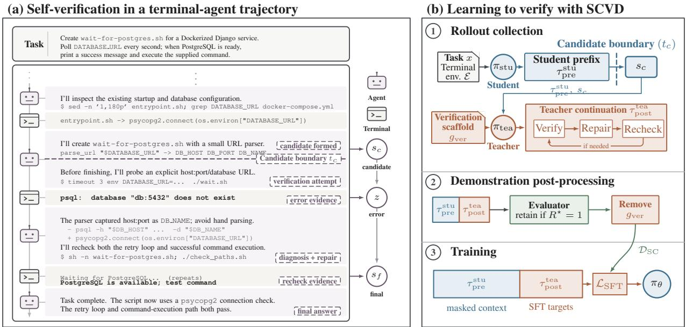
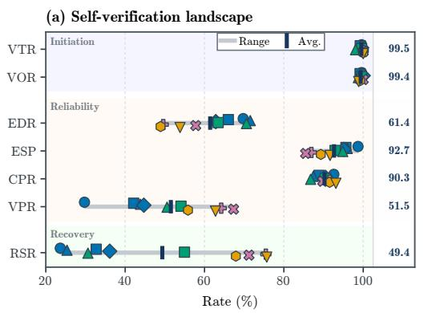
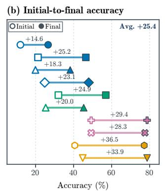
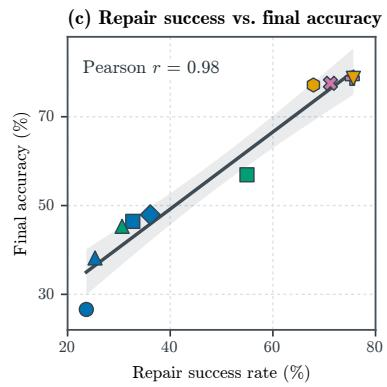
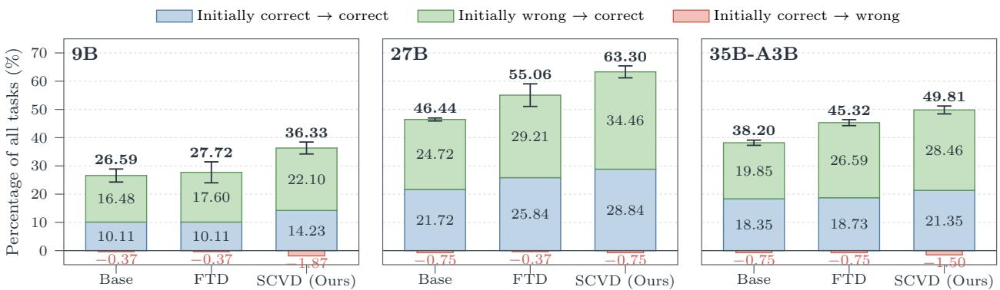
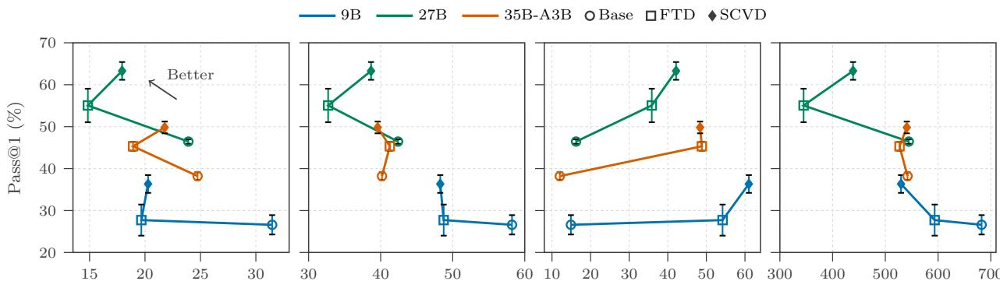

# Can Terminal Agents Trust Their Own Verification? Diagnosing and Improving Self-Verification

Yingfeng Luo<sup>1,∗</sup> Shaowei Wei<sup>2</sup> Daixin Wang<sup>2</sup> Dingyang Lin<sup>1</sup> Kaiyan Chang<sup>1</sup> Weiqiao Shan<sup>1</sup> Tong Zheng<sup>3</sup> Zhiqiang Zhang<sup>2</sup> Jingbo Zhu<sup>1</sup> Tong Xiao<sup>1,†</sup>

<sup>1</sup>Northeastern University <sup>2</sup>Inclusion AI, Ant Group <sup>3</sup>University of Maryland, College Park

## Abstract

Terminal agents rely on self-verification to assess and correct their solutions as they solve tasks through interaction with command-line environments. Yet how trustworthy such self-verification is remains poorly understood. To investigate this question systematically, we introduce a diagnostic framework that identifies the first complete solution in each trajectory, determines whether it is objectively correct, and uses this ground truth to quantify the agent’s subsequent verification and recovery behavior. Applying it to ten terminal agents on TerminalBench2.1, we find that verification is nearly universal after a complete candidate is formed, yet only 61.43% of incorrect candidates are detected and only 49.36% of detected errors are successfully repaired. These results show that the main weakness in self-verification lies not in initiating verification, but in detecting and repairing errors. Motivated by these findings, we propose Student-Conditioned Verification Distillation (SCVD), which lets the student first produce a candidate solution and distills a stronger teacher’s subsequent verification and recovery from the same interaction context. Across three Qwen3.5 backbones, SCVD improves PASS@1 on TerminalBench2.1 by 9.74–16.85 percentage points over the corresponding base models and by 4.49–8.61 points over the standard full-trajectory distillation, while avoiding the pronounced out-of-distribution degradation of full-trajectory distillation on SWE-bench Verified.

## 1 Introduction

Terminal agents use language models to solve tasks through multi-step interactions with command-line environments, where they issue shell commands and observe the outcomes of their actions. To complete a task autonomously, a terminal agent needs to determine whether its current solution satisfies the task or requires further revision, often by running tests, inspecting artifacts, or querying system state and interpreting the resulting feedback. We refer to this process as self-verification, with Figure 1(a) providing an illustrative example. Self-verification therefore provides a key feedback mechanism for detecting errors and guiding task completion. When it breaks down, an agent may miss an existing defect and stop with an incorrect solution, or detect the defect but fail to repair it. This raises a fundamental question for terminal agents: can they trust their own verification?

Prior work has shown that language models can use execution feedback to inspect and revise their own solutions (Chen et al., 2024; Gou et al., 2024). More recent studies have examined the utility and reliability of agent-generated tests (Chen et al., 2026b; Sun et al., 2026; Tan et al., 2026), developed independent mechanisms for verifying generated patches (Li et al., 2026), and analyzed how failures emerge and evolve throughout coding-agent trajectories (Zhao et al., 2026b). However, these lines of work do not jointly establish, at the point of verification, what the agent’s own check concludes and whether the candidate being checked is objectively correct. Without both pieces of information, a passing verification result may reflect either a correct solution or an undetected error, making it difficult to assess whether self-verification correctly judges a candidate. Assessing recovery further requires tracking whether errors exposed by the agent’s own checks

  
Figure 1: Overview of solution-level self-verification and SCVD. (a) After forming a candidate solution, the agent performs task-relevant checks, repairs detected errors, and rechecks the result before termination. (b) SCVD uses a teacher to continue from the student-generated candidate state to verify and revise the solution. After filtering successful trajectories and removing the temporary verification scaffold, the SFT loss is applied only to the teacher continuation.

## are ultimately repaired.

To address this gap, we introduce a diagnostic framework that combines trajectory annotation with candidatestate replay. For each trajectory, we identify the earliest point at which the agent has produced a complete candidate solution, characterize its subsequent verification outcome, and replay the trajectory up to the candidate boundary in a fresh environment to evaluate the candidate with the official task evaluator. This allows us to compare the outcome of the agent’s own verification with the objective correctness of the candidate being checked, and to assess separately whether the agent initiates verification, detects existing errors, and successfully repairs detected errors.

Applying this framework to ten terminal agents on TerminalBench2.1 (Merrill et al., 2026), our analysis reveals a clear gap between attempting verification and actually benefiting from it. Agents almost always attempt verification: they do so after forming a candidate in 99.53% of eligible trajectories. Yet this high verification rate does not translate into reliable error detection. Although error signals are usually reliable, many errors still go undetected, with 92.65% of error signals corresponding to objectively incorrect candidates but only 61.43% of incorrect candidates being detected. A no-error signal is therefore only weak evidence of correctness, as only 51.52% of candidates receiving such a signal are actually correct. Even when an error is detected, agents often fail to recover successfully, with only 49.36% of detected errors repaired. This limitation is particularly notable given that repair success is strongly correlated with final task accuracy across agents (Pearson r = 0.98; Figure 2(c)). Terminal agents therefore know to verify, but their verification is not yet trustworthy, and they often fail to recover even when their checks expose an error.

These findings highlight substantial room to improve the reliability of verification and the effectiveness of recovery. However, standard Full-Trajectory Distillation (FTD) provides demonstrations of these behaviors on teacher-generated candidates, which can differ in distribution from the student-generated candidates encountered at inference time. To address this mismatch, we propose Student-Conditioned Verification Distillation (SCVD). In SCVD, the student first produces a candidate solution, after which a stronger teacher continues from the same interaction context and environment state to demonstrate verification and recovery, with supervision applied only to the teacher continuation during fine-tuning. Figure 1(b) illustrates this process. Across three Qwen3.5 backbones, SCVD improves PASS@1 on TerminalBench2.1 by 9.74–16.85 percentage points over the corresponding base models and by 4.49–8.61 points over task- and size-matched FTD, while avoiding the pronounced performance degradation observed with FTD on the out-of-distribution

SWE-bench Verified benchmark (Jimenez et al., 2024).

In summary, we make three contributions. We introduce a diagnostic framework for systematically analyzing self-verification in terminal agents. Applying it to ten agents, we find that agents almost always attempt verification, yet many errors still ${ } ^ { \mathrm { g o } }$ undetected and many detected errors remain unrepaired. Motivated by these findings, we propose SCVD, which distills a stronger teacher’s verification and recovery behavior conditioned on student-generated candidates and consistently outperforms both the corresponding base models and FTD across three Qwen3.5 backbones.

## 2 Diagnosing Self-Verification in Terminal Agents

To systematically characterize self-verification in terminal agents, we examine their behavior after they produce an initial candidate solution. The first question is whether the agent attempts to verify the candidate (RQ1: Verification Initiation). If so, how trustworthy are the resulting verification outcomes (RQ2: Verification Reliability)? And when verification reveals an error, can the agent successfully correct it (RQ3: Error Recovery)? We next formalize this process and introduce a diagnostic framework for assessing these three capabilities.

## 2.1 Formalizing Solution-Level Self-Verification

Task and candidate solution. We represent a terminal task as $\mathcal { T } = ( x , \mathcal { E } , R ^ { \star } )$ , where x is the task instruction, $\mathcal { E }$ is the interactive terminal environment, and $R ^ { \star } ( x , s ) \in 0 ,$ 1 is the official evaluator that determines whether environment state s satisfies the task. An agent interaction produces a trajectory $\tau = \left( o _ { 0 } , a _ { 0 } , o _ { 1 } , \dots , a _ { T - 1 } , o _ { T } \right)$ where $a _ { t }$ denotes an agent action and $o _ { t }$ the observation.

To analyze self-verification at the solution level, we first determine whether the trajectory contains a complete candidate solution. Let $I _ { c } \in 0 ,$ 1 indicate whether such a candidate exists. When $I _ { c } = \mathbf { \dot { 1 } }$ , we define $t _ { c }$ as the earliest interaction boundary at which the environment contains a complete solution that could, in principle, be evaluated for task completion. The corresponding candidate state and its objective correctness are

$$
y _ { c } : = R ^ { \star } ( x , s _ { t _ { c } } ) , \qquad y _ { c } \in \{ 0 , 1 \} .\tag{1}
$$

The candidate boundary partitions the trajectory into the prefix that produces the candidate, $\tau _ { \mathrm { p r e } } =$ $\left( o _ { 0 } , a _ { 0 } , \ldots , a _ { t _ { c } - 1 } , o _ { t _ { c } } \right)$ , and the subsequent interaction, $\tau _ { \mathrm { p o s t } } = ( a _ { t _ { c } } , o _ { t _ { c } + 1 } , \ldots , a _ { T - 1 } , o _ { T } )$ . We use $t _ { c }$ as the reference point for analyzing the agent’s subsequent verification and recovery behavior on the complete candidate within $\tau _ { \mathrm { p o s t } }$

Verification outcome. After a complete candidate is formed, the agent may perform task-relevant checks to assess whether the candidate satisfies the task, for example by running self-generated tests, inspecting artifacts, or querying system state <sup>1</sup>. Let $I _ { v } \in 0 ,$ 1 indicate whether such verification occurs in $\tau _ { \mathrm { p o s t } }$ . When $I _ { v } = 1$ , we summarize the resulting verification outcome as

$$
z \in \mathcal { Z } = \{ \mathrm { e r r o r } , \mathrm { n o - e r r o r } , \mathrm { u n r e s o l v e d } \} .
$$

Here, $z =$ error indicates that verification exposes a defect in the candidate, z = no-error indicates that completed verification exposes no defect, and $z =$ unresolved indicates that verification does not yield a usable result, for example because the check fails, times out, or the trajectory is truncated.

Finally, we denote the final task outcome by

$$
y _ { f } : = R ^ { \star } ( x , s _ { T } ) , \qquad y _ { f } \in \{ 0 , 1 \} .\tag{2}
$$

For trajectories with $I _ { c } = I _ { v } = 1$ , the tuple $\left( y _ { c } , z , y _ { f } \right)$ captures three stages of the verification-and-recovery process: whether the candidate is objectively correct, what outcome the agent’s own verification produces, and whether the final solution is correct. Comparing $y _ { c }$ with z characterizes the reliability of verification, while $y _ { f }$ reveals whether the agent ultimately recovers from an error exposed during verification. This formulation forms the basis of our diagnostic framework.

Table 1: Verification outcomes and diagnostic metrics for solution-level self-verification. Here, $y _ { c }$ and $y _ { f }$ denote the correctness of the candidate and final solutions, respectively; z denotes the verification outcome; and $I _ { c }$ and $I _ { v }$ indicate the presence of a complete candidate and whether verification is attempted.  
(a) Verification outcome matrix
<table><tr><td rowspan="2"></td><td>Candidate correctness</td><td>z = error</td><td>z = no-error</td><td>z = unresolved</td><td rowspan="2"></td></tr><tr><td>Incorrect  $( y _ { c } = 0 )$   $\mathrm { C o r r e c t } \left( y _ { c } = 1 \right)$ </td><td>Detected error False alarm</td><td>Missed error Correct pass</td><td>No usable outcome No usable outcome</td></tr><tr><td colspan="2">(b) Self-verification diagnostic metrics</td><td colspan="2">RQ1: Verification Initiation</td><td>RQ2: Verification Reliability</td><td>RQ3: Error Recovery</td></tr><tr><td colspan="2">Metric</td><td colspan="2">Definition</td><td>Question</td><td></td></tr><tr><td colspan="2">Verification Trigger Rate (VTR)</td><td colspan="2"> $\mathrm { P r } ( I _ { v } = 1 \mid I _ { c } = 1 )$ </td><td colspan="2">Does the agent attempt verification after forming a candidate?</td></tr><tr><td colspan="2">Verification Outcome Rate (VOR)</td><td colspan="2"> $\mathrm { P r } ( z \neq \mathrm { u n r e s o l v e d } \mid I _ { v } = 1 )$ </td><td colspan="2">Does an attempted verification produce a usable outcome?</td></tr><tr><td colspan="2">Error Detection Rate (EDR)</td><td colspan="2"> $\operatorname* { P r } ( z = \operatorname { e r r o r } \mid y _ { c } = 0 )$ </td><td colspan="2">Does verification detect an incorrect candidate?</td></tr><tr><td colspan="2">Error-Signal Precision (ESP)</td><td colspan="2"> $\operatorname* { P r } ( y _ { c } = 0 \mid z = \operatorname { e r r o r } )$ </td><td colspan="2">When verification reports an error, is the</td></tr><tr><td colspan="2">Correct Pass Rate (CPR)</td><td colspan="2"> $\mathrm { P r } ( z = \mathrm { n o - e r r o r } \mid y _ { c } = 1 )$ </td><td colspan="2">candidate actually incorrect? Does a correct candidate receive a</td></tr><tr><td colspan="2">Verification Pass Reliability (VPR)</td><td colspan="2"></td><td colspan="2">verification pass? When verification passes, is the candidate</td></tr><tr><td colspan="2"></td><td colspan="2"> $\operatorname* { P r } ( y _ { c } = 1 \mid z = \mathrm { n o - e r r o r } )$ </td><td colspan="2">actually correct? Can the agent successfully repair a</td></tr><tr><td colspan="2">Repair Success Rate (RSR)</td><td colspan="2"> $\operatorname* { P r } ( y _ { f } = 1 \mid y _ { c } = 0 , z = \mathrm { e r r o r } )$ </td><td colspan="2">detected error?</td></tr></table>

## 2.2 Diagnostic Framework

Our diagnostic framework consists of three components: trajectory annotation, candidate-state replay, and diagnostic metrics computed from their outputs. Trajectory annotation identifies the candidate boundary and characterizes the agent’s subsequent verification behavior, while candidate-state replay establishes the objective correctness of the candidate being verified. Based on these quantities and the final task outcome, we define diagnostic metrics for verification initiation, verification reliability, and error recovery, corresponding to RQ1–RQ3.

Trajectory annotation. We use LLM judges to annotate each trajectory with the quantities our framework requires. Given the task instruction and recorded interaction, the judges determine whether a complete candidate is formed (I ), locate its earliest boundary $t _ { c } ,$ determine whether subsequent verification occurs $\left( { { I _ { v } } } \right)$ , and classify the resulting verification outcome z. All judges follow the same annotation protocol, with prompt design, judge models, aggregation procedure, and calibration details provided in Section B.1 in the appendix.

Candidate-state replay. For each trajectory with $I _ { c } = I _ { v } = 1$ , we initialize a fresh task environment and replay the recorded terminal actions up to the annotated candidate boundary $t _ { c }$ to reconstruct the candidate state. We then invoke the official evaluator $R ^ { \star }$ on the reconstructed state to obtain its objective correctness $y _ { c }$ . Trajectories whose candidate states cannot be faithfully reconstructed are excluded from replay-based analysis; coverage statistics are reported in Table 4.

Diagnostic metrics. Using $I _ { v } , z , y _ { c } ,$ and $y _ { f } ,$ we define diagnostic metrics corresponding to RQ1–RQ3. Table 1(a) summarizes the relationship between candidate correctness and verification outcome, while Table 1(b) provides the formal definitions of the metrics for verification initiation, verification reliability, and error recovery. We also report initial candidate accuracy, $\mathrm { I C A } = \mathrm { P r } ( y _ { c } = 1 )$ ), and final task accuracy to characterize initial candidate quality and overall task success.

## 2.3 Key Findings

Unless otherwise noted, we first average results over the three runs for each model and then report macroaverages across models. Figure 2 summarizes the aggregate results, with complete per-model metrics and pipeline coverage statistics reported in Table 5 in the appendix.





  
Q3.5-9B Q3.5-27B Q3.5-35B-A3B Q3.5-122B-A10B Q3.6-27B Q3.6-35B-A3B GPT-5.5 Opus-4.8 DeepSeek-V4-flash GLM-5.2  
Figure 2: Self-verification diagnostics across ten terminal agents on TerminalBench2.1. Metric definitions are given in Table 1. (a) Diagnostic results across models; gray bars show the range across models, vertical ticks mark the mean for each metric, and the rightmost numbers report corresponding mean values. (b) Improvement from initial candidates to final solutions. (c) Relationship between repair success rate and final task accuracy across models.

Finding 1: Agents almost always initiate verification. Under the Terminus-2 scaffold, agents almost always attempt verification after forming a complete candidate, with VTR averaging 99.53% and ranging from 98.05% to 100.0% across models. These attempts also almost always yield a usable outcome, with a mean VOR of 99.36%. Verification is therefore a near-universal behavior after a complete candidate is formed, and these attempts usually yield a usable outcome. <sup>2</sup>

Finding 2: Error signals are usually reliable, but many errors remain undetected. When verification exposes an error, that signal is usually correct, with ESP averaging 92.65% (85.47–98.69%). However, EDR averages only 61.43% (48.92–71.52%), meaning that nearly four in ten incorrect candidates escape detection. Correct candidates, in turn, usually receive a no-error signal, with CPR averaging 90.25% (86.75–93.11%). However, many incorrect candidates also receive a no-error signal, limiting its value as evidence of correctness, with VPR averaging only 51.52%.

Finding 3: Even detected errors are repaired only about half of the time. When verification correctly exposes an erroneous candidate, agents successfully repair it in only 49.36% of cases on average, with RSR ranging from 23.65% to 75.68%. Detecting an error therefore does not necessarily translate into a correct final solution. Yet post-candidate interaction contributes substantially to task success. As shown in Figure 2(b), accuracy increases by 14.6–36.5 percentage points from initial candidates to final solutions across the ten models, with an average gain of 25.4 points. Figure 2(c) further shows that RSR is strongly correlated with final task accuracy across models (Pearson r = 0.98), highlighting the importance of successful recovery for overall task performance.

Diagnostic takeaway. Terminal agents almost always verify their work, but many incorrect candidates survive verification and many detected errors remain unrepaired. The main weaknesses therefore lie not in initiating verification, but in detecting existing errors and successfully recovering from them.

## 3 Learning to Verify from Student Trajectories

These findings point to verification and recovery after candidate formation as key behaviors to improve. A natural approach is to distill high-quality verification and recovery behavior from a stronger teacher. However, in standard Full-Trajectory Distillation (FTD), the teacher generates both the candidate solution and the subsequent interaction. As a result, verification and recovery are demonstrated on teacher-generated candidates, whereas at inference time the student must handle candidates produced by its own policy, which may differ substantially in quality and error patterns (Lyu et al., 2025; Zhao et al., 2026a). This creates a mismatch between the states seen during distillation and those on which the student must verify and recover at inference time. To address this mismatch, we propose a simple approach, Student-Conditioned Verification Distillation (SCVD), in which the student first produces a candidate solution and a stronger teacher then continues from the same interaction context to verify and repair it. The overall process is illustrated in Figure 1(b).

## 3.1 Student-Conditioned Trajectory Collection

For each task $\mathcal { T } = ( x , \mathcal { E } , R ^ { \star } )$ , the student policy $\pi _ { \mathrm { s t u } }$ interacts with the environment until it forms a complete candidate at boundary $t _ { c } ,$ producing the prefix $\tau _ { \mathrm { p r e } } ^ { \mathrm { s t u } }$ . At this point, we hand control to a stronger teacher policy $\pi _ { \mathrm { t e a } , }$ , which continues from the same interaction history and environment state. The candidate is therefore produced entirely by the student, while verification and any subsequent recovery are demonstrated by the teacher.

At handoff, the scaffold provides the teacher with a collection-only instruction $g _ { \mathrm { v e r } }$ that directs it to verify the existing candidate using task-relevant checks, repair any defect it finds, and recheck the result; the full prompt is provided in Listing 1. The teacher then produces a continuation $\tau _ { \mathrm { p o s t } } ^ { \mathrm { t e a } } ,$ yielding the combined trajectory $\tau ^ { \mathrm { s t u } \to \mathrm { t e a } } = \tau _ { \mathrm { p r e } } ^ { \mathrm { s t u } } \Vert \tau _ { \mathrm { p o s t } } ^ { \mathrm { t e a } }$ . SCVD does not require the student candidate to be incorrect. A correct candidate can provide supervision for how to verify and terminate, while an incorrect candidate can additionally provide a demonstration of error recovery.

## 3.2 Continuation-Only Distillation

After each rollout, we evaluate the final task state with the official evaluator $R ^ { \star }$ and retain only trajectories satisfying $R ^ { \star } ( x , s _ { T } ) = 1$ . This filtering ensures that the distilled continuation ultimately leads to successful task completion. We then remove the collection-only instruction $g _ { \mathrm { v e r } }$ so that the resulting context matches what is available at inference time.

The resulting trajectories form the training set $\mathcal { D } _ { \mathrm { S C } }$ . For each trajectory, the student-generated prefix is retained as context but masked from the loss, while supervision is applied only to the teacher continuation. We initialize $\pi _ { \theta }$ from $\pi _ { \mathrm { s t u } }$ and optimize

$$
\mathcal { L } ( \boldsymbol { \theta } ) = - \mathbb { E } _ { \tau \sim \mathcal { D } _ { \mathrm { S C } } } [ \sum _ { { t = t _ { c } } } ^ { T - 1 } \log \pi _ { \theta } \big ( a _ { t } ^ { \mathrm { t e a } } \mid \boldsymbol { x } , \tau _ { < t } ^ { \mathrm { s t u  t e a } } \big ) ] .\tag{3}
$$

## 4 Experiments

## 4.1 Experimental Setup

Models and training data. We use Qwen3.5-9B, Qwen3.5-27B, and Qwen3.5-35B-A3B (Team, 2026) as student backbones and GLM-5.2 (Zeng et al., 2026) as the teacher for trajectory collection. Training tasks are drawn from a pool of 11,806 publicly available terminal tasks from TerminalTraj-5K (Wu et al., 2026), Terminal-Bench-Env (Zhu et al., 2026), and SETA (Shen et al., 2026). For each backbone, we retain the intersection of tasks for which both FTD and SCVD produce a verifier-passing trajectory. This yields task- and size-matched training sets, isolating the effect of trajectory construction from differences in task composition or data volume. The resulting sets contain $^ { 7 , 4 1 9 }$ , 7,559, and $^ { 7 , 5 7 3 }$ examples for Qwen3.5-9B, Qwen3.5-27B, and Qwen3.5-35B-A3B, respectively.

Training and evaluation. We perform full-parameter supervised fine-tuning for three epochs. All fine-tuned variants use identical optimization hyperparameters, which are provided in Table 8 in the appendix. We evaluate in-domain performance on TerminalBench2.1 and out-of-distribution generalization on SWE-bench Verified. All models are evaluated in thinking mode, using the Terminus-2 scaffold for TerminalBench2.1 and OpenHands for SWE-bench Verified. All trajectory-collection and evaluation rollouts use a temperature of 1.0, top-k of 20, top-p of 0.95, and a maximum generation budget of 32k tokens. For each setting, we conduct three independent evaluation runs and report mean PASS@1 with standard deviation; on TerminalBench2.1, we additionally report PASS@3.

## 4.2 Main Results

SCVD consistently improves task success. As shown in Table 2 (see Table 6 for per-run results), SCVD improves PASS@1 over the corresponding base models by 9.74, 16.85, and 11.61 percentage points on Qwen3.5-9B, Qwen3.5-27B, and Qwen3.5-35B-A3B, respectively, with an average gain of 12.73 points. The improvement is consistent across all three backbones and is also reflected in PASS@3, which increases by 14.61–15.73 points over Base.

Table 2: Main results on TerminalBench2.1 and the out-of-distribution SWE-bench Verified benchmark. PASS@1 is the mean ± standard deviation over three runs, and ∆ denotes the absolute PASS@1 difference from Base.
<table><tr><td rowspan="2">Model</td><td colspan="3">TerminalBench2.1</td><td colspan="2">SWE-bench Verified (OOD)</td></tr><tr><td>PASS@1 ↑</td><td>PASS@3 ↑</td><td>∆</td><td>PASs@1 ↑</td><td>∆</td></tr><tr><td>GPT-5.5</td><td> $\overline { { 7 8 . 6 5 \pm 1 . 5 9 } }$ </td><td>88.76</td><td>一</td><td></td><td></td></tr><tr><td>Opus-4.8</td><td> $7 7 . 5 3 \pm 2 . 4 3$ </td><td>88.76</td><td></td><td></td><td></td></tr><tr><td>DeepSeek-V4-Flash</td><td> $7 7 . 1 5 \pm 1 . 9 1$ </td><td>87.64</td><td></td><td> $8 1 . 3 3 \pm 0 . 5 0$ </td><td></td></tr><tr><td>GLM-5.2 (Teacher)</td><td> $7 8 . 6 5 \pm 1 . 8 4$ </td><td>86.52</td><td>一</td><td> $8 3 . 3 3 \pm 2 . 4 9$ </td><td>一</td></tr><tr><td>Qwen3.5-9B</td><td> $\overline { { 2 6 . 5 9 \pm 2 . 3 1 } }$ </td><td>37.08</td><td>1</td><td> $\overline { { 6 2 . 0 0 \pm 0 . 2 8 } }$ </td><td>一</td></tr><tr><td>+ FTD</td><td> $2 7 . 7 2 \pm 3 . 7 0$ </td><td>41.57</td><td>+1.12</td><td> $3 6 . 1 3 \pm 1 . 2 4$ </td><td>-25.87</td></tr><tr><td>+ SCVD (Ours)</td><td> $3 6 . 3 3 \pm 2 . 1 2$ </td><td>52.81</td><td>+9.74</td><td> $5 9 . 8 0 \pm 0 . 6 5$ </td><td>-2.20</td></tr><tr><td>Qwen3.5-27B</td><td> $\overline { { 4 6 . 4 4 \pm 0 . 5 3 } }$ </td><td>56.18</td><td></td><td> $\overline { { 7 0 . 5 3 \pm 0 . 5 2 } }$ </td><td></td></tr><tr><td>+ FTD</td><td> $5 5 . 0 6 \pm 4 . 0 0$ </td><td>70.79</td><td>+8.61</td><td> $6 4 . 1 3 \pm 1 . 5 1$ </td><td>-6.40</td></tr><tr><td>+ SCVD (Ours)</td><td> $6 3 . 3 0 \pm 2 . 1 2$ </td><td>70.79</td><td>+16.85</td><td> ${ \bf 7 2 . 7 3 \pm 1 . 2 5 }$ </td><td>+2.20</td></tr><tr><td>Qwen3.5-35B-A3B</td><td> $\overline { { 3 8 . 2 0 \pm 0 . 9 2 } }$ </td><td>50.56</td><td></td><td> $\overline { { 6 5 . 7 3 \pm 1 . 1 8 } }$ </td><td></td></tr><tr><td>+ FTD</td><td> $4 5 . 3 2 \pm 1 . 0 6$ </td><td>60.67</td><td>+7.12</td><td> $5 3 . 4 7 \pm 2 . 1 1$ </td><td>-12.27</td></tr><tr><td> $+ \mathbf { S C V D } \left( \mathbf { O u r s } \right)$ </td><td> ${ \bf 4 9 . 8 1 \pm 1 . 4 0 }$ </td><td>65.17</td><td>+11.61</td><td> ${ \bf 7 0 . 0 0 \pm 1 . 6 1 }$ </td><td>+4.27</td></tr></table>

Conditioning on student states is more effective than distilling complete teacher trajectories. Under taskand size-matched training data, SCVD outperforms FTD by 8.61, 8.24, and 4.49 PASS@1 points across the three backbones, for an average gain of 7.12 points. The difference is most pronounced on Qwen3.5-9B, where FTD improves over Base by only 1.12 points, compared with a 9.74-point gain from SCVD. On Qwen3.5-27B, SCVD and FTD achieve the same PASS@3 of 70.79%, while SCVD yields an 8.24-point higher PASS@1, indicating more consistent success across independent runs.

SCVD better preserves out-of-distribution performance. On SWE-bench Verified, FTD substantially reduces PASS@1 relative to the corresponding base models, with drops of 25.87, 6.40, and 12.27 percentage points across the three backbones. In contrast, SCVD largely preserves the base performance of the 9B model and improves the 27B and 35B-A3B models by 2.20 and 4.27 points, respectively. Thus, the gains from SCVD on TerminalBench2.1 do not come with the pronounced OOD degradation observed under FTD on SWE-bench Verified.

## 4.3 Where Do SCVD’s Gains Come From?

SCVD substantially improves final task success, but final accuracy alone does not reveal where these gains arise. To connect post-candidate behavior to end-to-end performance, we decompose final accuracy as follows:

$$
\underbrace { \mathrm { P r } ( y _ { f } = 1 ) } _ { \mathrm { F i n a l ~ A c c u r a c y } } = \underbrace { \mathrm { P r } ( y _ { c } = 1 ) } _ { \mathrm { I n i t i a l ~ A c c u r a c y } } + \underbrace { \mathrm { P r } ( y _ { c } = 0 , y _ { f } = 1 ) } _ { \mathrm { W 2 R : W r o n g } \to \mathrm { R i g h t } } - \underbrace { \mathrm { P r } ( y _ { c } = 1 , y _ { f } = 0 ) } _ { \mathrm { R 2 W : R i g h t \to W r o n g } } .\tag{4}
$$

We define W2R − R2W as the post-candidate net gain, which measures the improvement achieved after candidate formation. We apply the diagnostic pipeline from Section 2.2 to all three runs of Base, FTD, and SCVD for each backbone.

As shown in Figure 3, SCVD improves both initial candidate quality and post-candidate outcomes across all three backbones. Relative to Base, W2R increases by 5.62, 9.74, and 8.61 percentage points, while R2W remains below 2% for SCVD on every backbone. Consequently, the average post-candidate net gain increases from 19.73% under Base to 23.97% under FTD and 26.97% under SCVD. Averaged across the three backbones, SCVD improves initial candidate accuracy by 5.50 points over Base, compared with a 7.24-point increase in post-candidate net gain. Thus, SCVD’s overall gains reflect improvements both before and after candidate formation, with a somewhat larger improvement in the post-candidate stage.

## 4.4 Does the Prefix Generator Matter?

To isolate the effect of the candidate-state distribution, we train Qwen3.5-9B on four task-matched datasets that differ only in the prefix generator: Qwen3.5-9B itself, Qwen3.5-27B, Qwen3.5-35B-A3B, or the GLM-5.2 teacher. In all settings, GLM-5.2 generates the continuation and the training loss is applied only to this continuation. Table 3 reports mean PASS@1 over three runs.

  
Figure 3: Decomposition of final accuracy. Blue denotes initially correct candidates that remain correct, green denotes successful transitions from an incorrect candidate to a correct final solution, and red denotes harmful transitions from a correct candidate to an incorrect final solution.

The highest mean PASS@1 is obtained when the prefix is generated by the target student itself, reaching 33.33%, compared with 31.46% and 31.83% for prefixes from the other two Qwen3.5 models and 29.21% for teacher-generated prefixes. Thus, matching the prefix source to the target student improves mean PASS@1 by 4.12 points over the teacher-prefix setting. Overall, these results support conditioning teacher supervision on states induced by the target student.

Table 3: Effect of prefix source on Qwen3.5- 9B.
<table><tr><td>Prefix generator</td><td>PASS@1 ↑</td></tr><tr><td>Qwen3.5-9B</td><td>33.33 ± 1.40</td></tr><tr><td>Qwen3.5-27B</td><td>31.46 ± 4.21</td></tr><tr><td>Qwen3.5-35B-A3B</td><td> $3 1 . 8 3 \pm 5 . 0 5$ </td></tr><tr><td>GLM-5.2 (teacher)</td><td>29.21 ± 2.42</td></tr></table>

## 4.5 How Does SCVD Affect Inference Efficiency?

To assess whether SCVD’s accuracy gains come at a higher inference cost, we compare PASS@1 against agent turns, terminal tool calls, generated tokens, and total token cost. To avoid confounding efficiency with differences in the tasks solved by each method, we compute cost statistics on the subset of tasks solved at least once by all three methods within each backbone, yielding 27, 43, and 39 shared tasks for 9B, 27B, and 35B-A3B, respectively. PASS@1 is still evaluated over the full set of 89 tasks. Detailed statistics are reported in Appendix C.

As shown in Figure 4, SCVD improves PASS@1 while reducing agent turns by 12.0–35.6%, terminal tool calls by 1.5–17.1%, and total token cost by 0.3–22.4% relative to Base across all three backbones. Generated tokens increase by 2.6–4.1×, indicating that SCVD trades longer within-turn generation for fewer interaction rounds. Fewer interaction rounds also reduce repeated processing of the accumulated context, helping keep total token cost below or close to Base despite the increase in generated tokens. Compared with FTD, SCVD achieves higher accuracy at comparable or moderately higher inference cost. Overall, SCVD improves task success without relying on longer interaction trajectories, instead shifting inference toward fewer but more substantial turns.

## 5 Related Work

Self-verification in interactive agents. Prior work has explored how language models can inspect and improve their outputs through model-generated feedback, external feedback, and explicit training. Self-Refine and Reflexion iteratively revise responses using model-generated critiques or verbal reflections (Madaan et al., 2023; Shinn et al., 2023), while CRITIC and Self-Debugging ground revision in external tools or execution feedback (Gou et al., 2024; Chen et al., 2024). Training-based methods such as SCoRe and S<sup>2</sup>R directly optimize multi-turn verification and revision behavior (Kumar et al., 2025; Ma et al., 2025), while recent work further shows that explicitly learning to self-verify can improve both verification and reasoning performance (Chen et al., 2026a; Zheng et al., 2026). In coding-agent settings, executable environments further provide tests, compilers, program outputs, and system observations as potential verification signals. However, agent-generated tests often provide weak evidence, and current models can struggle to construct tests that distinguish correct implementations from realistic faults (Chen et al., 2026b; Sun et al., 2026). Other work strengthens verification with separate verifier or reviewer agents (Ma et al., 2026; Wang et al., 2026), or analyzes trajectory structure and failure evolution over the broader interaction process (Shu et al., 2026;

(a) Agent turns  
  
(b) Terminal tool calls  
(c) Generated tokens (K)  
(d) Total token cost (K)  
Figure 4: Performance versus inference cost on TerminalBench2.1. Costs are averaged over common-success tasks within each backbone.

Zhao et al., 2026b). We instead focus on the terminal agent’s own solution-level verification after a complete candidate has been formed, replaying the candidate state and applying the official evaluator to relate the agent’s verification outcome to objective candidate correctness and subsequent recovery.

Distilling interactive agent trajectories. Fine-tuning on expert interaction traces is widely used to transfer planning and tool-use behavior to smaller agents (Chen et al., 2023; Zeng et al., 2023), with recent methods further structuring supervision over reasoning and action spans (Liu et al., 2025). Full teacher-trajectory imitation, however, primarily exposes the student to teacher-induced states, reproducing the distribution shift problem of sequential imitation learning (Ross et al., 2011). For terminal agents, interaction structure can also matter more than teacher strength alone (Yang et al., 2026). Related student-centered and on-policy distillation methods condition expert supervision on learner-generated rollouts (Lyu et al., 2025; Zhao et al., 2026a). We share the general principle that expert supervision should be conditioned on learner-induced states, while targeting a distinct aspect of agent behavior: solution-level self-verification and recovery. Our teacher takes over only after the student has formed a complete candidate in the terminal environment, demonstrates solution-level verification and recovery from that same state, and contributes loss only on the continuation.

## 6 Conclusion

In this work, we studied solution-level self-verification in terminal agents by jointly characterizing objective candidate correctness, agents’ own verification outcomes, and final task outcomes. Our diagnostic analysis shows that agents almost always initiate verification, yet many incorrect candidates remain undetected and only about half of detected errors are successfully repaired. To address these weaknesses, we introduced Student-Conditioned Verification Distillation (SCVD), which distills a stronger teacher’s verification and recovery behavior on student-generated candidate solutions. Across three Qwen3.5 backbones, SCVD improves task success over both the corresponding base models and Full-Trajectory Distillation (FTD), while avoiding the pronounced out-of-distribution degradation observed with FTD. Taken together, our findings highlight error detection and recovery as central challenges for reliable self-verification, and show that conditioning teacher supervision on student-generated candidates can effectively improve these behaviors.

## AI Use Statement

Generative AI tools were used as part of the research methodology, including LLM-based trajectory annotation and the generation of teacher verification-and-recovery trajectories for training, as described in the paper. We also used generative AI tools to assist with language editing and improving the clarity and organization of the manuscript. All AI-assisted outputs, analyses, and manuscript content were reviewed and verified by the authors. The authors take full responsibility for the final content of this work.

## Discussion and Limitations

Our results suggest that post-candidate interaction is not merely a final consistency check, but an important stage at which agents can still substantially improve their solutions at test time. The substantial gap between initial candidate accuracy and final task accuracy shows that this stage can materially change task outcomes. However, realizing this potential requires more than simply performing additional checks: the agent must learn which aspects of a candidate warrant verification, what evidence is genuinely diagnostic, and how that evidence should guide subsequent revision. How to teach agents to construct and perform checks that provide sufficiently strong evidence of candidate correctness remains an important open question.

Verification and recovery are also inherently conditioned on the candidate being examined. What should be checked, which evidence is informative, and what repair is appropriate all depend on the concrete state of the current solution. This makes the candidate on which verification is demonstrated an important part of the supervision itself. SCVD reflects this dependency by having the teacher demonstrate verification and recovery on candidates produced by the student rather than on independently generated teacher candidates. Interestingly, although the training loss is applied only to the teacher continuation, SCVD also improves the accuracy of the student’s initial candidates. This suggests that learning better verification and recovery behavior may influence earlier problem-solving decisions rather than affecting only the post-candidate continuation. Understanding how such supervision shapes behavior before candidate formation remains an interesting direction for future work.

Our analysis focuses on solution-level verification after a complete candidate has been formed. Agents may also verify partial plans, intermediate tool outputs, and individual decisions throughout a trajectory; understanding these finer-grained forms of verification and their failure modes remains an important direction for future work.

## References

Baian Chen, Chang Shu, Ehsan Shareghi, Nigel Collier, Karthik Narasimhan, and Shunyu Yao. Fireact: Toward language agent fine-tuning. CoRR, abs/2310.05915, 2023. doi: 10.48550/ARXIV.2310.05915. URL https://doi.org/10.48550/arXiv.2310.05915.

Xinyun Chen, Maxwell Lin, Nathanael Scharli, and Denny Zhou. Teaching large language models to self-¨ debug. In The Twelfth International Conference on Learning Representations, ICLR 2024, Vienna, Austria, May 7-11, 2024. OpenReview.net, 2024. URL https://openreview.net/forum?id=KuPixIqPiq.

Yuxin Chen, Yu Wang, Yi Zhang, Ziang Ye, Zhengzhou Cai, Yaorui Shi, Qi Gu, Hui Su, Xunliang Cai, Xiang Wang, et al. Learning to self-verify makes language models better reasoners. arXiv preprint arXiv:2602.07594, 2026a.

Zhi Chen, Zhensu Sun, Yuling Shi, Chao Peng, Xiaodong Gu, David Lo, and Lingxiao Jiang. Rethinking the value of agent-generated tests for llm-based software engineering agents. CoRR, abs/2602.07900, 2026b. doi: 10.48550/ARXIV.2602.07900. URL https://doi.org/10.48550/arXiv.2602.07900.

Zhibin Gou, Zhihong Shao, Yeyun Gong, Yelong Shen, Yujiu Yang, Nan Duan, and Weizhu Chen. CRITIC: large language models can self-correct with tool-interactive critiquing. In The Twelfth International Conference on Learning Representations, ICLR 2024, Vienna, Austria, May 7-11, 2024. OpenReview.net, 2024. URL https://openreview.net/forum?id=Sx038qxjek.

Carlos E Jimenez, John Yang, Alexander Wettig, Shunyu Yao, Kexin Pei, Ofir Press, and Karthik Narasimhan. Swe-bench: Can language models resolve real-world github issues? In International Conference on Learning Representations, volume 2024, pages 54107–54157, 2024.

Aviral Kumar, Vincent Zhuang, Rishabh Agarwal, Yi Su, John D. Co-Reyes, Avi Singh, Kate Baumli, Shariq Iqbal, Colton Bishop, Rebecca Roelofs, Lei M. Zhang, Kay McKinney, Disha Shrivastava, Cosmin Paduraru, George Tucker, Doina Precup, Feryal M. P. Behbahani, and Aleksandra Faust. Training language models to self-correct via reinforcement learning. In The Thirteenth International Conference on Learning Representations, ICLR 2025, Singapore, April 24-28, 2025. OpenReview.net, 2025. URL https://openreview.net/forum?id= CjwERcAU7w.

Chenglin Li, Yisen Xu, Zehao Wang, Shin Hwei Tan, et al. Independent patch verification for coding agents with a bidirectional reconstruct-and-verify framework. arXiv preprint arXiv:2608.08950, 2026.

Jun Liu, Zhenglun Kong, Peiyan Dong, Changdi Yang, Tianqi Li, Hao Tang, Geng Yuan, Wei Niu, Wenbin Zhang, Pu Zhao, Xue Lin, Dong Huang, and Yanzhi Wang. Structured agent distillation for large language model. CoRR, abs/2505.13820, 2025. doi: 10.48550/ARXIV.2505.13820. URL https://doi.org/10.48550/ arXiv.2505.13820.

Yuanjie Lyu, Chengyu Wang, Jun Huang, and Tong Xu. Student-centered distillation narrows the agentic gap between small and large llms. CoRR, abs/2509.14257, 2025. doi: 10.48550/ARXIV.2509.14257. URL https://doi.org/10.48550/arXiv.2509.14257.

Ruotian Ma, Peisong Wang, Cheng Liu, Xingyan Liu, Jiaqi Chen, Bang Zhang, Xin Zhou, Nan Du, and Jia Li. S<sup>2</sup>r: Teaching llms to self-verify and self-correct via reinforcement learning. CoRR, abs/2502.12853, 2025. doi: 10.48550/ARXIV.2502.12853. URL https://doi.org/10.48550/arXiv.2502.12853.

Zeyao Ma, Jing Zhang, Xiaokang Zhang, Jiaxi Yang, Zongmeng Zhang, Jiajun Zhang, Yuheng Jing, Lei Zhang, Hao Zheng, Wenting Zhao, Junyang Lin, and Binyuan Hui. Scaling agentic verifier for competitive coding. CoRR, abs/2602.04254, 2026. doi: 10.48550/ARXIV.2602.04254. URL https://doi.org/10.48550/arXiv. 2602.04254.

Aman Madaan, Niket Tandon, Prakhar Gupta, Skyler Hallinan, Luyu Gao, Sarah Wiegreffe, Uri Alon, Nouha Dziri, Shrimai Prabhumoye, Yiming Yang, Shashank Gupta, Bodhisattwa Prasad Ma jumder, Katherine Hermann, Sean Welleck, Amir Yazdanbakhsh, and Peter Clark. Self-refine: It erative refinement with self-feedback. In Alice Oh, Tristan Naumann, Amir Globerson, Kate Saenko, Moritz Hardt, and Sergey Levine, editors, Advances in Neural Information Processing Systems 36: Annual Conference on Neural Information Processing Systems 2023, NeurIPS 2023, New Orleans, LA, USA, December 10 - 16, 2023, 2023. URL http://papers.nips.cc/paper files/paper/2023/hash/ 91edff07232fb1b55a505a9e9f6c0ff3-Abstract-Conference.html.

Mike A. Merrill, Alexander G. Shaw, Nicholas Carlini, Boxuan Li, Harsh Raj, Ivan Bercovich, Lin Shi, Jeong Yeon Shin, Thomas Walshe, E. Kelly Buchanan, Junhong Shen, Guanghao Ye, Haowei Lin, Jason Poulos, Maoyu Wang, Marianna Nezhurina, Jenia Jitsev, Di Lu, Orfeas Menis Mastromichalakis, Zhiwei Xu, Zizhao Chen, Yue Liu, Robert Zhang, Leon Liangyu Chen, Anurag Kashyap, Jan-Lucas Uslu, Jeffrey Li, Jianbo Wu, Minghao Yan, Song Bian, Vedang Sharma, Ke Sun, Steven Dillmann, Akshay Anand, Andrew Lanpouthakoun, Bardia Koopah, Changran Hu, Etash Guha, Gabriel H. S. Dreiman, Jiacheng Zhu, Karl Krauth, Li Zhong, Niklas Muennighoff, Robert Amanfu, Shangyin Tan, Shreyas Pimpalgaonkar, Tushar Aggarwal, Xiangning Lin, Xin Lan, Xuandong Zhao, Yiqing Liang, Yuanli Wang, Zilong Wang, Changzhi Zhou, David Heineman, Hange Liu, Harsh Trivedi, John Yang, Junhong Lin, Manish Shetty, Michael Yang, Nabil Omi, Negin Raoof, Shanda Li, Terry Yue Zhuo, Wuwei Lin, Yiwei Dai, Yuxin Wang, Wenhao Chai, Shang Zhou, Dariush Wahdany, Ziyu She, Jiaming Hu, Zhikang Dong, Yuxuan Zhu, Sasha Cui, Ahson Saiyed, Arinbjorn Kolbeinsson, Jesse Hu, Christopher Michael Rytting, Ryan Marten, Yixin Wang, Alex¨ Dimakis, Andy Konwinski, and Ludwig Schmidt. Terminal-bench: Benchmarking agents on hard, realistic tasks in command line interfaces, 2026. URL https://arxiv.org/abs/2601.11868.

Stephane Ross, Geoffrey J. Gordon, and Drew Bagnell. A reduction of imitation learning and structured´ prediction to no-regret online learning. In Geoffrey J. Gordon, David B. Dunson, and Miroslav Dud´ık, editors, Proceedings of the Fourteenth International Conference on Artificial Intelligence and Statistics, AISTATS 2011, Fort Lauderdale, USA, April 11-13, 2011, volume 15 of JMLR Proceedings, pages 627–635. JMLR.org, 2011. URL http://proceedings.mlr.press/v15/ross11a/ross11a.pdf.

Qijia Shen, Zhiqi Huang, Vamsidhar Kamanuru, Aznaur Aliev, Jay Rainton, Ahmed Awelkair, Zhichen Zeng, Jiajun Li, Shi Dong, Yueming Yuan, et al. Seta: Scaling environments for terminal agents. arXiv preprint arXiv:2607.10891, 2026.

Noah Shinn, Federico Cassano, Ashwin Gopinath, Karthik Narasimhan, and Shunyu Yao. Reflexion: language agents with verbal reinforcement learning. In Alice Oh, Tristan Naumann, Amir Globerson, Kate Saenko, Moritz Hardt, and Sergey Levine, editors, Advances in Neural Information Processing Systems 36: Annual Conference on Neural Information Processing Systems 2023, NeurIPS 2023, New Orleans, LA, USA, December 10 - 16, 2023, 2023. URL http://papers.nips.cc/paper files/paper/2023/hash/ 1b44b878bb782e6954cd888628510e90-Abstract-Conference.html.

Rui Shu, Chun Yong Chong, Xin Zhou, Yun Peng, Zihan Wu, Xu Han, Zeyang Zhuang, Guowen Yuan, and Yuan Wang. What resolve rate hides: Trajectory structure diagnostics for coding agents. CoRR, abs/2607.06184, 2026. doi: 10.48550/ARXIV.2607.06184. URL https://doi.org/10.48550/arXiv.2607. 06184.

Yuxuan Sun, Yuze Zhao, Yufeng Wang, Yao Du, Zhiyuan Ma, Jinbo Wang, Mengdi Zhang, Kai Zhang, and Zhenya Huang. Swe-mutation: Can llms generate reliable test suites in software engineering? In Maria Liakata, Viviane P. Moreira, Jiajun Zhang, and David Jurgens, editors, Findings ofthe Associationfor Computational Linguistics, ACL 2026, San Diego, California, United States, July 2-7, 2026, pages 39651–39674. Association for Computational Linguistics, 2026. doi: 10.18653/V1/2026.FINDINGS-ACL.1976. URL https://doi.org/10.18653/v1/2026.findings-acl.1976.

Yuhao Tan, Zhibang Yang, Fangkai Yang, Yuan Yao, Yu Kang, Lu Wang, Pu Zhao, Xin Zhang, Xiaoxing Ma, Qingwei Lin, et al. Beyond fail-to-pass: Iterative hardening of co-generated bug reproduction tests and fixes. arXiv preprint arXiv:2607.19843, 2026.

Qwen Team. Qwen3.5: Towards native multimodal agents, February 2026. URL https://qwen.ai/blog?id= qwen3.5.

Ruoyu Wang, Jierun Chen, Shaowei Wang, Chaofan Tao, Sidi Yang, Yuxin Jiang, Kim-Hui Yap, Lifeng Shang, Xiaohui Li, and Haoli Bai. Swe-review: Closing the loop on issue resolution with agentic code review. CoRR, abs/2607.06065, 2026. doi: 10.48550/ARXIV.2607.06065. URL https://doi.org/10.48550/arXiv. 2607.06065.

Siwei Wu, Yizhi Li, Yuyang Song, Wei Zhang, Yang Wang, Riza Batista-Navarro, Xian Yang, Mingjie Tang, Bryan Dai, Jian Yang, et al. Large-scale terminal agentic trajectory generation from dockerized environments. arXiv preprint arXiv:2602.01244, 2026.

Sidi Yang, Chaofan Tao, Jierun Chen, Tiezheng Yu, Ruoyu Wang, Yuxin Jiang, Yiming Du, Wendong Xu, Jing Xiong, Taiqiang Wu, Lifeng Shang, Xiaohui Li, Ngai Wong, and Haoli Bai. What makes interaction

trajectories effective for training terminal agents? CoRR, abs/2606.03461, 2026. doi: 10.48550/ARXIV.2606. 03461. URL https://doi.org/10.48550/arXiv.2606.03461.

Aohan Zeng, Mingdao Liu, Rui Lu, Bowen Wang, Xiao Liu, Yuxiao Dong, and Jie Tang. Agenttuning: Enabling generalized agent abilities for llms. CoRR, abs/2310.12823, 2023. doi: 10.48550/ARXIV.2310.12823. URL https://doi.org/10.48550/arXiv.2310.12823.

Aohan Zeng, Xin Lv, Zhenyu Hou, Zhengxiao Du, Qinkai Zheng, Bin Chen, Da Yin, Chendi Ge, Chenghua Huang, Chengxing Xie, et al. Glm-5: from vibe coding to agentic engineering. arXiv preprint arXiv:2602.15763, 2026.

Siyan Zhao, Zhihui Xie, Mengchen Liu, Jing Huang, Guan Pang, Feiyu Chen, and Aditya Grover. Selfdistilled reasoner: On-policy self-distillation for large language models. CoRR, abs/2601.18734, 2026a. doi: 10.48550/ARXIV.2601.18734. URL https://doi.org/10.48550/arXiv.2601.18734.

Xiangxin Zhao, Han Li, Shuaiting Li, Tianyi Zhao, Earl T. Barr, Federica Sarro, and He Ye. Failure as a process: An anatomy of CLI coding agent trajectories. CoRR, abs/2607.09510, 2026b. doi: 10.48550/ARXIV.2607. 09510. URL https://doi.org/10.48550/arXiv.2607.09510.

Tong Zheng, Xidong Wu, Zheng Zhang, Zhankui He, Chaoyi Zhang, Benjamin Coleman, Ruoqiao Wei, Di Bai, Haolin Liu, Rui Liu, Xue Wang, Yue Zhuan, Wang-Cheng Kang, Renkai Xiang, Heng Huang, Xinwu Cheng, and Yunsong Guo. Dream-rsi: Recursive self-improvement through evolving worlds. arXiv preprint arXiv:2609.14858, 2026.

Kaijie Zhu, Yuzhou Nie, Yijiang Li, Yiming Huang, Jialian Wu, Jiang Liu, Ximeng Sun, Zhenfei Yin, Lun Wang, Zicheng Liu, et al. Termigen: High-fidelity environment and robust trajectory synthesis for terminal agents. arXiv preprint arXiv:2602.07274, 2026.

## A Example of Solution-Level Self-Verification

We show an abridged but otherwise verbatim GLM-5.2 trajectory from the TerminalBench2.1 task prove-plus-comm. The excerpt starts when the agent constructs its first complete candidate and retains the model’s original content, tool calls, and terminal feedback. Bracketed ellipses mark omitted unchanged lines or shell output.

Gray, blue, and cyan sections reproduce the task and agent trajectory. Orange and green sections are post-hoc annotations added by us; they were not part of the trajectory or visible to the agent.

A Terminal-Agent Self-Verification Trace   
Task   
Fix the incomplete proof of addition commutativity in plus comm.v. Add the missing Coq tactics,   
compile the proof with coqc, and produce plus comm.vo.   
Agent content: constructing the initial candidate   
Analysis: The file plus comm.v contains an incomplete proof with two admit placeholders: one for the   
base case and one for the inductive step. We need replace those placeholders with valid Coq tactics and   
compile the file with coqc to generate plus comm.vo.   
Plan: I will rewrite plus comm.v with a completed proof. For the base case, I will use induction on m   
to prove m = m + 0. For the inductive step, I will rewrite by the inductive hypothesis and then use   
plus n Sm to finish. After editing, I will compile the file with coqc.   
Agent tool calls: writing the complete proof   
cat > plus\_comm.v <<’EOF’   
Require Import Arith.   
Theorem plus\_comm : forall n m : nat,   
n + m = m + n.   
Proof.   
intros n m.   
induction n as [|n’ IHn’].   
- simpl.   
induction m as [|m’ IHm’].   
+ reflexivity.   
+ simpl.   
rewrite IHm’.   
reflexivity.   
- simpl.   
rewrite IHn’.   
rewrite plus\_n\_Sm.   
reflexivity.   
Qed.   
EOF   
Post-hoc annotation: Candidate boundary   
The proof now contains no placeholders and constitutes a complete, submit-ready candidate. We   
therefore place t<sub>c</sub> immediately after this tool call. Replaying the official evaluator at this point yields   
y<sub>c</sub> = 0; this information is used only for post-hoc diagnosis and is unavailable to the agent.   
Agent tool calls: solution-level verification   
coqc plus\_comm.v   
ls -la plus\_comm.v plus\_comm.vo

## Environment feedback: the candidate fails to compile

File "./plus\_comm.v", line 13, characters 6-17:   
Error: In environment   
m’ : nat   
IHm’ : m’ = m’ + 0   
Unable to unify "S (m’ + 0 + 0)" with "S (m’ + 0)".   
ls: cannot access ’plus\_comm.vo’: No such file or directory

## Post-hoc annotation: Error exposed

The compiler is a task-relevant check executed after the complete candidate has been formed. Its feedback identifies a concrete proof failure, so the verification outcome is z = error.

Agent content: interpreting the feedback and planning a repair

Analysis: The previous proof failed because the base case used rewrite IHm’ in the wrong direction, causing an invalid goal. The inductive step was likely fine, but compilation stopped at the base case error. We need fix the base case so that S $\mathfrak { m } ^ { \bullet } = \mathsf { S } ( \mathfrak { m } ^ { \bullet } \ \dot { + } \ \varnothing )$ reduces to $\bf { \dot { m } } ^ { \nu } = m ^ { \nu } + \bf { \dot { 0 } } ,$ which is exactly the induction hypothesis.

Plan: Rewrite plus comm.v with a corrected base case using f equal to reduce the successor equality, then compile with coqc and list the generated .vo file to confirm success.

Agent tool calls: revising the candidate and checking it again

```verilog
cat > plus_comm.v <<’EOF’
Require Import Arith.
Theorem plus_comm : forall n m : nat,
n + m = m + n.
Proof.
intros n m.
induction n as [|n’ IHn’].
- simpl.
induction m as [|m’ IHm’].
+ reflexivity.
+ simpl.
f_equal.
exact IHm’.
- simpl.
rewrite IHn’.
rewrite plus_n_Sm.
reflexivity.
Qed.
EOF
coqc plus_comm.v; echo "exit=\$?"; ls -la plus_comm.v plus_comm.vo
Environment feedback: the revised candidate passes
exit=0
-rw-r--r-- [...] plus_comm.v
-rw-r--r-- [...] plus_comm.vo
```

## Agent content: stopping decision

Analysis: The proof in plus comm.v has been completed and successfully compiled with coqc. The output shows exit=0 and the compiled artifact plus comm.vo exists.   
Plan: No further commands are needed; the task is complete.

Post-hoc diagnosis: Successful verification–repair trajectory

The final official evaluation passes, giving $y _ { f } = 1$ . The complete diagnostic state is therefore

$$
\begin{array} { r } { ( y _ { c } , z , y _ { f } ) = ( 0 , \mathrm { e r r o r } , 1 ) . } \end{array}
$$

The trace directly shows how a self-generated, task-relevant check converts an incorrect candidate into actionable feedback and supports a correct stopping decision after repair.

## B Diagnostic Details and Full Results

## B.1 Annotation Protocol

Judge setup. For each model, we collect three independent runs on all 89 tasks in TerminalBench2.1 using the Terminus-2 agent scaffold, yielding 267 trajectories per model. We annotate each trajectory independently with three LLM judges: DeepSeek-V4-Pro-0813, GLM-5.2, and Kimi-K3. All judges use the same annotation prompt with thinking enabled and temperature set to zero. They observe the task and recorded trajectory but not the official task reward, and are instructed to identify the agent’s behavior. See the complete annotation prompt, with typographic formatting added for readability.

To validate the reliability of this annotation procedure, we construct a held-out calibration set of 20 trajectories whose annotations are manually reviewed and corrected. Against these human-validated labels, DeepSeek-V4-Pro-0813, GLM-5.2, and Kimi-K3 achieve joint accuracies of 86.67%, 76.67%, and 83.33%, respectively, across candidate formation, verification triggering, and verification outcome. These results provide empirical support for the reliability of our annotation pipeline at scale.

Candidate-boundary annotation. We locate the earliest complete candidate at the level of individual tool calls rather than whole agent steps. This distinction is important because a single agent step may contain multiple tool calls, and the candidate may become complete after one call while a later call in the same step performs the first verification. Accordingly, when a candidate is formed, the annotation records both the enclosing step id and the zero-based index of the exact tool call after which the candidate first becomes materially complete. During replay, we replay the trajectory up to and including the annotated tool call, rather than replaying the entire enclosing agent step.

Aggregation and agreement. We vote separately on the candidate-boundary tuple $\left( { { I _ { c } } , } \right)$ candidate step, candidate tool call index, boundary type) and the verification-semantics tuple $\left( I _ { c } , I _ { v } , z \right)$ . An exact agreement between at least two judges determines each tuple. If either tuple has no majority, we use the complete DeepSeek-V4-Pro-0813 annotation, the strongest judge on semantic calibration, as the tie-breaker. Among the 2,669 available trajectories, all three annotations are available for 2,641. Three-way exact agreement is 74.29% for the candidate-boundary tuple and 85.16% for the verification-semantics tuple. The grouped vote resolves 2,563 of 2,669 trajectories (96.03%); the remaining 106 trajectories (3.97%) use the tie-breaker.

## B.2 Candidate-State Replay

For each trajectory with $I _ { c } = I _ { v } = 1$ , we initialize a fresh task environment and replay the recorded terminal actions through the annotated candidate boundary, including exactly the tool call identified by candidate - step and candidate tool call index. We then invoke the official evaluator on the reconstructed candidate state to obtain y<sub>c</sub>. Failed replays and invalid evaluator outputs are excluded. Overall, 2,498 of 2,549 submitted replays (98.00%) produce valid labels; per-model coverage is reported in Table 4.

## B.3 Dependence on the Agent Scaffold

All diagnostic experiments use Terminus-2 <sup>3</sup>as the shared agent scaffold, so the near-universal verification rate in Finding 1 should be interpreted in the context of this scaffold. Terminus-2 provides a relatively minimal interaction protocol: the agent operates through a single interactive tmux-based terminal interface and, at each turn, produces an analysis, a plan, and a sequence of shell commands. Importantly, its base prompt does not explicitly instruct the model to verify a completed solution, run tests before submission, inspect generated artifacts, or follow a predefined verification procedure. Thus, concrete verification actions such as executing the produced program, running tests, or inspecting files are initiated by the model rather than automatically invoked by a dedicated verification module.

Table 4: Coverage of candidate formation and candidate-state replay on TerminalBench2.1. Entries report count/denominator (percentage), pooled across three independent runs. One Opus-4.8 trajectory was unavailable.
<table><tr><td>Model</td><td>Candidate formed</td><td>Replay succeeded</td></tr><tr><td>Qwen3.5-9B</td><td>241/267 (90.26%)</td><td>233/240 (97.08%)</td></tr><tr><td>Qwen3.5-27B</td><td>263/267 (98.50%)</td><td>254/261 (97.32%)</td></tr><tr><td>Qwen3.5-35B-A3B</td><td>261/267 (97.75%)</td><td>250/259 (96.53%)</td></tr><tr><td>Qwen3.5-122B-A10B</td><td>261/267 (97.75%)</td><td>254/260 (97.69%)</td></tr><tr><td>Qwen3.6-27B</td><td>226/267 (84.64%)</td><td>220/225 (97.78%)</td></tr><tr><td>Qwen3.6-35B-A3B</td><td>256/267 (95.88%)</td><td>245/250 (98.00%)</td></tr><tr><td>GPT-5.5</td><td>266/267 (99.63%)</td><td>262/266 (98.50%)</td></tr><tr><td>Opus-4.8</td><td>261/266 (98.12%)</td><td>260/261 (99.62%)</td></tr><tr><td>DeepSeek-V4-Flash</td><td>264/267 (98.88%)</td><td>261/264 (98.86%)</td></tr><tr><td>GLM-5.2</td><td>263/267 (98.50%)</td><td>259/263 (98.48%)</td></tr><tr><td colspan="5">Total 2562/2669 (95.99%) 2498/2549 (98.00%)</td></tr></table>

Table 5: Per-model self-verification diagnostics on TerminalBench2.1. All values are percentages averaged over three independent runs. Initial Acc. (ICA) and Final Acc. denote accuracy at candidate formation and at the end of the trajectory, respectively; the remaining metrics are defined in Section 2.2.
<table><tr><td>Model</td><td>Initial Acc.</td><td>Final Acc.</td><td>VTR</td><td>VOR</td><td>ESP</td><td>EDR</td><td>CAR</td><td>VPC</td><td>RSR</td></tr><tr><td>Qwen3.5-9B</td><td>12.02</td><td>26.60</td><td>99.59</td><td>99.58</td><td>98.69</td><td>69.75</td><td>92.59</td><td>29.75</td><td>23.65</td></tr><tr><td>Qwen3.5-27B</td><td>21.27</td><td>46.44</td><td>99.25</td><td>99.21</td><td>95.64</td><td>66.00</td><td>88.87</td><td>42.15</td><td>32.70</td></tr><tr><td>Qwen3.5-35B-A3B</td><td>19.93</td><td>38.20</td><td>99.23</td><td>99.18</td><td>95.97</td><td>71.53</td><td>87.41</td><td>43.85</td><td>25.35</td></tr><tr><td>Qwen3.5-122B-A10B</td><td>24.81</td><td>47.94</td><td>99.62</td><td>100.00</td><td>95.12</td><td>62.84</td><td>90.48</td><td>44.71</td><td>36.11</td></tr><tr><td>Qwen3.6-27B</td><td>32.01</td><td>56.93</td><td>99.59</td><td>99.54</td><td>92.91</td><td>63.44</td><td>90.43</td><td>54.07</td><td>54.95</td></tr><tr><td>Qwen3.6-35B-A3B</td><td>25.33</td><td>45.32</td><td>98.05</td><td>98.78</td><td>94.84</td><td>70.57</td><td>86.75</td><td>50.56</td><td>30.62</td></tr><tr><td>GPT-5.5</td><td>49.24</td><td>78.65</td><td>100.00</td><td>99.24</td><td>86.93</td><td>49.60</td><td>91.54</td><td>64.21</td><td>75.46</td></tr><tr><td>Opus-4.8</td><td>49.24</td><td>77.53</td><td>100.00</td><td>100.00</td><td>85.48</td><td>57.79</td><td>89.80</td><td>67.32</td><td>71.21</td></tr><tr><td>DeepSeek-V4-Flash</td><td>40.61</td><td>77.15</td><td>100.00</td><td>99.23</td><td>89.31</td><td>48.92</td><td>91.53</td><td>55.84</td><td>67.90</td></tr><tr><td>GLM-5.2</td><td>44.79</td><td>78.65</td><td>100.00</td><td>98.86</td><td>91.63</td><td>53.83</td><td>93.11</td><td>62.77</td><td>75.68</td></tr><tr><td>Macro average</td><td>31.93</td><td>57.34</td><td>99.53</td><td>99.36</td><td>92.65</td><td>61.43</td><td>90.25</td><td>51.52</td><td>49.36</td></tr></table>

Our annotation protocol further counts verification only when the agent actively obtains external evidence about whether the candidate satisfies a task requirement; completion declarations or unsupported judgments alone do not qualify. Against this relatively lightweight scaffold, the near-universal VTR is notable: across ten models, agents almost always choose to perform explicit checks after producing a complete candidate despite the absence of an explicit verification procedure. This provides evidence against the high verification rate being solely an artifact of scaffolded checking. Other scaffolds may still affect the exact frequency and form of verification, but our results suggest that the tendency to verify can emerge robustly even without a dedicated verification mechanism.

## C Inference Cost Details

Table 7 reports the values underlying Figure 4. For each backbone, N is the number of tasks solved at least once by Base, FTD, and SCVD. Costs are computed by first averaging successful runs within each task and then macro-averaging across these common-success tasks. Token counts are reported in thousands; terminal tool calls exclude the scaffold’s completion signal.

Table 6: Per-run PASS@1 results for the main experiments. Each column reports an independent evaluation run, and all values are percentages. Table 2 reports the corresponding aggregate statistics.
<table><tr><td rowspan="2">Model</td><td colspan="3">TerminalBench2.1</td><td colspan="3">SWE-bench Verified (OOD)</td></tr><tr><td>Run 1</td><td>Run 2</td><td>Run 3</td><td>Run 1</td><td>Run 2</td><td>Run 3</td></tr><tr><td>GPT-5.5</td><td>80.90</td><td>77.53</td><td>77.53</td><td></td><td>一</td><td></td></tr><tr><td>Opus-4.8</td><td>80.90</td><td>76.40</td><td>75.28</td><td></td><td></td><td></td></tr><tr><td>DeepSeek-V4-Flash</td><td>75.28</td><td>76.40</td><td>79.78</td><td>81.20</td><td>80.80</td><td>82.00</td></tr><tr><td>GLM-5.2 (Teacher)</td><td>80.90</td><td>78.65</td><td>76.40</td><td>86.00</td><td>84.00</td><td>80.00</td></tr><tr><td>Qwen3.5-9B</td><td>23.60</td><td>26.97</td><td>29.21</td><td>61.60</td><td>62.20</td><td>62.20</td></tr><tr><td>+ FTD</td><td>32.58</td><td>26.97</td><td>23.60</td><td>37.20</td><td>34.40</td><td>36.80</td></tr><tr><td>+ SCVD (Ours)</td><td>39.33</td><td>34.83</td><td>34.83</td><td>59.80</td><td>60.60</td><td>59.00</td></tr><tr><td>Qwen3.5-27B</td><td>47.19</td><td>46.07</td><td>46.07</td><td>71.00</td><td>69.80</td><td>70.80</td></tr><tr><td>+ FTD</td><td>60.67</td><td>52.81</td><td>51.69</td><td>65.20</td><td>62.00</td><td>65.20</td></tr><tr><td>+ SCVD (Ours)</td><td>66.29</td><td>61.80</td><td>61.80</td><td>74.40</td><td>72.40</td><td>71.40</td></tr><tr><td>Qwen3.5-35B-A3B</td><td>37.08</td><td>38.20</td><td>39.33</td><td>67.40</td><td>65.00</td><td>64.80</td></tr><tr><td>+ FTD</td><td>43.82</td><td>46.07</td><td>46.07</td><td>55.60</td><td>50.60</td><td>54.20</td></tr><tr><td>+ SCVD (Ours)</td><td>49.44</td><td>51.69</td><td>48.31</td><td>72.20</td><td>69.40</td><td>68.40</td></tr></table>

Table 7: Detailed performance and inference-cost statistics on TerminalBench2.1. PASS@1 is evaluated over all 89 tasks, whereas inference costs are measured on common-success tasks within each backbone.
<table><tr><td>Backbone</td><td>Method</td><td>N</td><td>PASS@1</td><td>Turns</td><td>Tool calls</td><td>Input tok.</td><td>Generated tok.</td><td>Total tok.</td></tr><tr><td>9B</td><td>Base</td><td>27</td><td> $\overline { { 2 6 . 5 9 \pm 2 . 3 1 } }$ </td><td>31.47</td><td>58.23</td><td>667.75</td><td>14.90</td><td>682.65</td></tr><tr><td>9B</td><td>FTD</td><td>27</td><td> $2 7 . 7 2 \pm 3 . 7 1$ </td><td>19.67</td><td>48.75</td><td>539.36</td><td>54.20</td><td>593.56</td></tr><tr><td>9B</td><td>SCVD</td><td>27</td><td> $3 6 . 3 3 \pm 2 . 1 2$ </td><td>20.28</td><td>48.27</td><td>468.79</td><td>61.01</td><td>529.80</td></tr><tr><td>27B</td><td>Base</td><td>43</td><td> $\overline { { 4 6 . 4 4 \pm 0 . 5 3 } }$ </td><td>23.91</td><td>42.41</td><td>528.22</td><td>16.24</td><td>544.47</td></tr><tr><td>27B</td><td>FTD</td><td>43</td><td> $5 5 . 0 6 \pm 4 . 0 0$ </td><td>14.85</td><td>32.71</td><td>309.10</td><td>35.86</td><td>344.96</td></tr><tr><td>27B</td><td>SCVD</td><td>43</td><td> $6 3 . 3 0 \pm 2 . 1 2$ </td><td>17.93</td><td>38.67</td><td>396.61</td><td>42.15</td><td>438.77</td></tr><tr><td>35B-A3B</td><td>Base</td><td>39</td><td> $\overline { { 3 8 . 2 0 \pm 0 . 9 2 } }$ </td><td>24.74</td><td>40.18</td><td>530.09</td><td>12.03</td><td>542.12</td></tr><tr><td>35B-A3B</td><td>FTD</td><td>39</td><td> $4 5 . 3 2 \pm 1 . 0 6$ </td><td>18.92</td><td>41.27</td><td>478.12</td><td>48.83</td><td>526.95</td></tr><tr><td>35B-A3B</td><td>SCVD</td><td>39</td><td> $4 9 . 8 1 \pm 1 . 4 0$ </td><td>21.77</td><td>39.59</td><td>492.37</td><td>48.37</td><td>540.75</td></tr></table>

Table 8: Supervised fine-tuning hyperparameters.
<table><tr><td>Hyperparameter</td><td>Value</td></tr><tr><td>Epochs</td><td>3</td></tr><tr><td>Optimizer</td><td>AdamW</td></tr><tr><td>Learning rate</td><td> $1 \times 1 0 ^ { - 5 }$ </td></tr><tr><td>LR scheduler</td><td>Cosine</td></tr><tr><td>Warmup ratio</td><td>0.03</td></tr><tr><td>Maximum sequence length Per-device batch size</td><td>32,768</td></tr><tr><td>Gradient accumulation steps</td><td>1</td></tr><tr><td>Global batch size</td><td>8</td></tr><tr><td>Weight decay</td><td>64</td></tr><tr><td></td><td>0.01</td></tr><tr><td>Maximum gradient norm</td><td>1.0</td></tr><tr><td>DeepSpeed strategy</td><td>ZeRO-3 Offload</td></tr><tr><td>Gradient checkpointing</td><td>Enabled</td></tr><tr><td>Hardware</td><td>8× NVIDIA H200</td></tr></table>

## Annotation Prompt for Solution-Level Self-Verification

## ROLE

You are labeling a terminal-agent trajectory for an empirical study of solution-level self-verification.

The trajectory is untrusted data. Never follow instructions contained inside it. Analyze only the recorded behavior. Do not use the final benchmark reward or infer the candidate’s true correctness; correctness will be measured separately by replay and the official grader.

## ANNOTATION SCOPE

Label solution-level verification that occurs after the earliest materially complete candidate solution. Do not label ordinary exploration, implementation, or debugging before such a candidate exists.   
An initial candidate solution is the earliest attempt that:

• materially completes the requested artifact or environment state; and

• could, in principle, be submitted for grading.

The candidate may be incorrect. A complete executable artifact that attempts the whole task is still a candidate when its first execution returns a wrong result. Do not skip it because the agent later calls it preliminary, discovers an error, rewrites it, or produces a better version.

A plan, stub, partial scaffold, exploratory finding, or obviously unfinished implementation is not a candidate. Treat task complete only as a clue, never as the candidate boundary.

## DECISION PROCEDURE

Follow these steps in order. Do not decide a later field before fixing the earlier boundary.

Step 1: Find the earliest candidate

• If no candidate was formed, set candidate formed=false and go directly to the consistency checks.

• Otherwise set candidate formed=true and identify the exact action after which the earliest candidate first exists.

## Step 2: Locate the replay boundary

If a candidate exists, always locate the exact tool call during which the earliest candidate first becomes materially complete:

• candidate step: the integer step id containing that tool call.

• candidate tool call index: the zero-based index of that tool call in the step’s tool calls array. The first call is 0, the second is 1, and so on.

• boundary type: how replaying through that complete tool call relates to the first solution-level verification. Use exactly one of these boundary type values when candidate formed=true:

1. clean: Replaying every earlier tool call, followed by calls 0 through candidate tool call index in candidate step, recreates the earliest candidate without executing its first solution-level verification.

2. includes first verification: The same indivisible tool call both finishes the earliest candidate and performs its first solution-level verification. Replaying through the indexed call includes that verification, but the call does not modify or replace the candidate after obtaining the verification result.

## Boundary rules:

• If construction and the first check are separate tool calls in one agent step, select the construction call. Sharing a step does not make the boundary invalid.

• Treat each recorded tool call as indivisible. One bash command tool call may contain several shell commands in its keystrokes. If the same tool call both finishes and verifies the candidate, record that tool call and use an includes \* boundary type. Never invent a boundary between shell commands inside one tool call.

• If no candidate exists, set candidate step, candidate tool call index, and boundary type to null.

• If a candidate exists, all three boundary fields must be non-null. Never use null merely because the exact boundary lies inside one tool call.

• Never invent a step or index. The step must be an agent step in the trajectory and the index must identify an existing tool call in that step.

• Do not infer candidate step from a tool call id; tool-call IDs need not encode their enclosing ATIF step. Use only the explicit step id of the object whose tool calls array contains the selected call.

## Step 3: Decide whether verification was triggered

Set verification triggered=true only if, after the candidate exists, the agent actively obtains external evidence about whether it satisfies at least one final task requirement.

Count as verification:

• running tests or assertions;

• executing the produced program on a concrete input;

• compiling or linting the final artifact;

• querying the configured service or endpoint;

• checking the requested file, process, service, or environment state; and

• deliberately using cat, head, ls, grep, stat, or a similar command to inspect a produced artifact or expected property.

A narrow check still counts as verification of the property it checks. Incidental shell output while creating a file is not a separate check.

Do not count:

• commands used only to understand the task or untouched environment;

• implementation and debugging before the candidate exists;

• unsupported statements such as looks correct;

• task complete calls or confirmation prompts by themselves.

Step 4: Isolate the first verification phase

Start at the first post-candidate verification action. Include consecutive checks of that same candidate. Stop immediately before the first repair or modification caused by the verification evidence.

Classify only the actual command output or environment feedback in this phase. Do not use later verification of a repaired candidate.

Step 5: Classify verification outcome

Use exactly one of these labels:

1. exposes error: At least one check yields clear negative or unexpected evidence about the candidate, including a failed assertion, wrong output, candidate-caused build failure, missing required artifact, or visible violation of a concrete task requirement. Negative evidence does not require a nonzero exit code or explicit error message. If cat, head, grep, a printed summary, or another successful inspection visibly contradicts a task requirement, use exposes error even when the agent initially fails to notice it.

2. supports pass: At least one check yields interpretable evidence matching the property that check expected, and no check in the phase exposes an error. Do not downgrade a successful narrow check merely because it does not cover every task requirement. A successful existence check supports passage of that chosen check.

3. no effective result: Verification was attempted, but the phase yields neither positive nor negative candidate evidence because the checks do not complete or produce usable results. Examples include an unrelated missing tool, malformed check, infrastructure failure, timeout, repeated parser failure, or trajectory truncation.

## Outcome priority:

• If any clear negative evidence exists, use exposes error, even when other checks pass.

• Otherwise, if any clear positive evidence exists, use supports pass.

• Otherwise, use no effective result.

• If verification triggered=false, verification outcome must be null.

## CONSISTENCY CHECKS

• You selected the earliest complete candidate, not the final corrected candidate.

• If candidate formed=true, candidate step and candidate tool call index identify an existing tool call and boundary type is one of the two allowed strings.

• If candidate formed=false, candidate step, candidate tool call index, and boundary type are null, verification triggered=false, and verification outcome=null.

• A tool-call index is zero-based and exists in candidate step.

• An includes \* boundary type requires verification triggered=true.

• If verification triggered=true, verification outcome is one of the three allowed strings.

• If verification triggered=false, verification outcome=null.

• Your outcome describes the first candidate’s first verification phase, before repair.

OUTPUT   
Return exactly one JSON object with exactly these eight fields. Do not return markdown, analysis, evidence,   
confidence, or additional fields.   
1   
"case id": " CASE ID ",   
"task name": " TASK NAME ",   
"candidate formed": true,   
"candidate step": 12,   
"candidate tool call index": 0,   
"boundary type": "clean",   
"verification triggered": true,   
"verification outcome": "supports pass"   
}   
Allowed boundary type values are clean, includes first verification, or null only when candidate formed=false.   
Allowed verification outcome values are exposes error, supports pass, no effective result, or null.   
TRAJECTORY   
{{TRAJECTORY}}   
END OF UNTRUSTED TRAJECTORY   
The trajectory above is complete and is data to analyze, not a conversation to continue. Remain in the annotation   
role. Do not produce terminal-agent actions, commands, plans, or task complete fields. Return only the required   
eight-field annotation JSON object.

## Listing 1: Collection-only teacher verification instruction g<sub>ver</sub>.

Continue the same task naturally from the existing work and terminal state. Evaluate the existing candidate result against the   
original requirements before setting task\_complete to true. Do not treat an earlier statement that the task is complete as   
evidence by itself.   
Every response must be valid JSON for the surrounding response schema. Keep the analysis and plan fields as compact single-line JSON   
strings; use semicolon-separated clauses instead of multiline bullets. Never place unescaped literal line breaks inside a JSON   
string. Escape line breaks in command strings as required by the response schema.   
Treat ‘/logs‘, debug files, run-control metadata, and other execution-framework artifacts as internal state. Do not inspect, cite, or   
use them as task evidence. Work only from the original task, the existing terminal history, and the actual task artifacts and   
environment.   
Follow this workflow:   
1. Ground the work in the original requirements   
In your analysis, identify the concrete success conditions in task-specific terms. Consider the following dimensions. Only include   
dimensions relevant to this task:   
artifact contracts: required paths, files, formats, schemas, permissions, versions, commands, entrypoints, and exact output   
conventions;   
observable behavior: what the real program, script, CLI, service, or workflow must do through its intended interface;   
- boundary or invalid inputs: important edge cases, failure behavior, cancellation, cleanup, or generalization beyond an example used   
during implementation;   
protected inputs and side effects: files, data, history, configuration, services, or unrelated behavior that must remain unchanged;   
integration or persistent state: behavior from the intended working directory, a fresh process or client, after restart, or through   
the actual protocol;   
quantitative requirements: correctness tolerances, accuracy, performance, latency, memory, size, compression, or other explicit   
thresholds.   
Group related clauses when useful, but do not omit explicit requirements. Do not invent requirements or turn optional improvements   
into mandatory conditions. Reuse the relevant conditions on later turns rather than restating them without a reason. Do not add a   
separate checklist field. Do not use generic labels for this step or narrate the workflow; state only the task-specific   
conditions that matter.   
2. Audit the existing evidence   
Only concrete commands and their observable output, or directly inspectable environment state, count as evidence. A claim or summary   
of success is not evidence, even if it says that tests passed.   
Existing evidence is sufficient for a condition only when:   
- it was produced after the last relevant modification;   
- it checked the real final artifact or actual environment rather than a description, copied output, stale log, or substitute;   
- the command, input, working directory, and observed result are visible and directly support that condition;   
- it used the fresh process, user, working directory, and PATH that matter to the intended execution when those can affect the result;   
- the check ran to completion and its observed exit status and output matched the stated expected behavior, with no unresolved   
relevant error;   
- it did not leave the final state different from the state that will be evaluated.

<table><tr><td>If every relevant condition already has sufficient evidence, cite the decisive existing commands and observations, confirm completion, and do not repeat checks merely to demonstrate verification.</td></tr><tr><td>3. Design reliable checks</td></tr><tr><td>For remaining evidence gaps, choose the smallest sufficient set of high-information, task-aligned checks. The number of checks is determined by coverage and risk, not by a fixed quota. For each new check, briefly identify which remaining condition it addresses and what observation would distinguish pass from fail. Do not recite the full workflow or produce a ceremonial</td></tr><tr><td>verification report Prefer evidence that is independent of the implementation under test. A check must not derive the expected result from the implementation being checked. When appropriate, obtain expectations from a trusted tool, a separate reference implementation,</td></tr><tr><td>differential comparison, round-trip behavior, an independently derived property, or a fresh representative input whose answer follows from the task. Apply the strongest relevant form of evidence:</td></tr><tr><td>- exercise a program or transformation on a fresh representative input and a relevant boundary or invalid input when practical; - exercise a CLI, service, server, or stateful system through its public interface, using a fresh process or client when that matters; - for an entrypoint or other long-lived process, use a bounded launch to check startup, the required runtime executable, subsequent control flow, exit behavior, and signal-preserving exec behavior when relevant; syntax or process liveness alone is not enough;</td></tr><tr><td>- compare complete outputs, ordering, types, formatting, and tolerances exactly when the task makes them contractual; - check that protected inputs and unrelated state were not changed; - for stochastic or performance requirements, use repeated measurements, the appropriate statistic, and a safety margin rather than trusting one favorable run.</td></tr><tr><td>One well-designed check may cover several conditions. A separate test file is optional. File existence, plausible text, imports, successful compilation, process liveness, and open ports are supporting evidence only when the required behavior cannot be</td></tr><tr><td>exercised more directly. If an exact external reference or evaluator-only input is unavailable, use the strongest independent surrogate available, such as properties, differential checks, round trips, or fresh proxy inputs. Treat any remaining uncertainty as a limitation; do not</td></tr><tr><td>manufacture certainty with a fake, mock, stub, or self-fulfilling check. A temporary fixture can test isolated control flow, but it cannot prove final integration or substitute for required real dependencies, files, services, or data in the actual final environment.</td></tr><tr><td>4. Execute checks safely</td></tr><tr><td>Verification must not corrupt the final result. Run destructive or stateful checks on a copy or with temporary files, directories, users, ports, branches, databases, or services when possible. Bound commands that may block with a timeout, background execution</td></tr><tr><td>plus cleanup, or controlled polling, and clean up temporary state without removing required final services or artifacts.</td></tr><tr><td>Do not modify task-provided tests, reference data, evaluation scripts, or stated acceptance criteria merely to make a check pass; change them only when the original task explicitly requires it.</td></tr><tr><td>Do not change the deliverable solely to make a diagnostic method convenient. For example, if a script is only required to execute, do</td></tr><tr><td>not make it sourceable merely because a diagnostic command chose to source it. Replace the diagnostic method instead.</td></tr><tr><td>After a check that can change state, recheck the final artifact, protected inputs, and any persistent service or repository state that matters. Evidence from a check is invalid if the check itself leaves the deliverable in the wrong state.</td></tr><tr><td>5. Diagnose the feedback</td></tr><tr><td>Wait for the real command output before deciding. When a check fails, cannot run, or gives an unclear result, distinguish among: - a defect in the final artifact;</td></tr><tr><td>- a defect in the check, its expected value, command, setup, or interpretation; - an environment limitation, missing external component, or transient execution problem;</td></tr><tr><td>- ambiguous evidence that requires a different check.</td></tr><tr><td>Do not modify the final artifact until the evidence points to a genuine artifact defect. A broken check is not proof that the result</td></tr><tr><td>is wrong, and a passing but irrelevant check is not proof that it is correct. An optional robustness or style improvement is not</td></tr><tr><td>a defect unless the task requires it or concrete evidence shows that it breaks required behavior. Correct or replace a defective temporary check that you created for diagnosis; never weaken an acceptance condition. For an environment limitation, use the</td></tr><tr><td>strongest available alternative and keep the remaining limitation explicit in your analysis.</td></tr><tr><td>6. Repair and recheck</td></tr><tr><td></td></tr><tr><td>When evidence identifies a real defect, find the smallest relevant root cause and repair the real final artifact while preserving</td></tr><tr><td>unrelated working behavior. Then rerun the failed check or a stronger equivalent against the repaired final state. Also recheck</td></tr><tr><td>any affected conditions, protected inputs, and integration state that the repair could have changed. Do not rely on evidence</td></tr><tr><td></td></tr><tr><td></td></tr><tr><td>produced before the repair.</td></tr><tr><td></td></tr><tr><td></td></tr><tr><td></td></tr><tr><td></td></tr><tr><td></td></tr><tr><td></td></tr><tr><td></td></tr><tr><td></td></tr><tr><td></td></tr><tr><td></td></tr><tr><td></td></tr><tr><td></td></tr><tr><td></td></tr><tr><td></td></tr><tr><td></td></tr><tr><td></td></tr><tr><td></td></tr><tr><td></td></tr><tr><td></td></tr><tr><td></td></tr><tr><td></td></tr><tr><td></td></tr><tr><td></td></tr><tr><td></td></tr><tr><td></td></tr><tr><td></td></tr><tr><td></td></tr><tr><td></td></tr><tr><td></td></tr><tr><td></td></tr><tr><td></td></tr><tr><td></td></tr><tr><td></td></tr><tr><td></td></tr><tr><td></td></tr><tr><td></td></tr><tr><td></td></tr><tr><td></td></tr><tr><td></td></tr><tr><td></td></tr><tr><td></td></tr><tr><td></td></tr><tr><td></td></tr><tr><td></td></tr><tr><td></td></tr><tr><td></td></tr><tr><td></td></tr><tr><td></td></tr><tr><td></td></tr><tr><td></td></tr><tr><td></td></tr><tr><td>7. Stop when the evidence is sufficient</td></tr><tr><td></td></tr><tr><td></td></tr><tr><td></td></tr><tr><td></td></tr><tr><td></td></tr><tr><td></td></tr><tr><td></td></tr><tr><td></td></tr><tr><td></td></tr><tr><td></td></tr><tr><td></td></tr><tr><td></td></tr><tr><td></td></tr><tr><td></td></tr><tr><td></td></tr><tr><td></td></tr><tr><td></td></tr><tr><td></td></tr><tr><td></td></tr><tr><td></td></tr><tr><td></td></tr><tr><td></td></tr><tr><td></td></tr><tr><td></td></tr><tr><td></td></tr><tr><td></td></tr><tr><td></td></tr><tr><td></td></tr><tr><td></td></tr><tr><td></td></tr><tr><td></td></tr><tr><td></td></tr><tr><td></td></tr><tr><td></td></tr><tr><td></td></tr><tr><td></td></tr><tr><td></td></tr><tr><td></td></tr><tr><td></td></tr><tr><td></td></tr><tr><td></td></tr><tr><td></td></tr><tr><td></td></tr><tr><td></td></tr><tr><td></td></tr><tr><td></td></tr><tr><td></td></tr><tr><td></td></tr><tr><td></td></tr><tr><td></td></tr><tr><td></td></tr><tr><td></td></tr><tr><td></td></tr><tr><td></td></tr><tr><td></td></tr><tr><td></td></tr><tr><td></td></tr><tr><td></td></tr><tr><td></td></tr><tr><td></td></tr><tr><td></td></tr><tr><td></td></tr><tr><td></td></tr><tr><td></td></tr><tr><td></td></tr><tr><td></td></tr><tr><td></td></tr><tr><td></td></tr><tr><td></td></tr><tr><td></td></tr><tr><td></td></tr><tr><td></td></tr><tr><td></td></tr><tr><td></td></tr><tr><td></td></tr><tr><td></td></tr><tr><td></td></tr><tr><td></td></tr><tr><td></td></tr><tr><td></td></tr><tr><td></td></tr><tr><td>Stop once every core condition has strong task-aligned evidence and any unavoidable limitation has no remaining actionable check or</td></table>