# DIAGNOSING ON-POLICY SELF-DISTILLATION FOR REASONING LANGUAGE MODELS

Yang Li1, Gongle Xue1, Yuheng Yuan1, Yijia Guo1, Shizhe Zhang1, Liwen Hu1, Lei Ma1 1 Peking University

ly0376@stu.pku.edu.cn

## ABSTRACT

On-policy self-distillation (OPSD) has attracted growing interest as a promising approach to improve the reasoning ability of language models. Without external rewards nor a separate stronger teacher, the self-teacher with privileged information could provide dense signals on student’s trajectories. However, its behavior in language reasoning remains unclear, with reported outcomes ranging from modest gains to behavioral collapse. In this work, we diagnose OPSD for mathematical reasoning across models spanning 0.6B–8B parameters. We conduct controlled experiments and token-level analyses to fully delve into OPSD. We point out that teacher’s signal is shaped by reasoning-mode alignment and the complete teacher prefix, rather than by privileged semantics alone. OPSD improves reasoning only in narrow compatibility regimes. Otherwise, it produces ineffective length growth, stable degradation, or behavioral collapse. Token-level analysis shows that teacher’s signal is not stable and does not predict downstream performance. Based on these results, we argue that OPSD is a sensitive algorithm rather than a generally reliable reasoning-improvement post-training method.

## 1 INTRODUCTION

Post-training is important for improving the reasoning ability of large language models (LLMs). Reinforcement learning with verifiable rewards (RLVR), commonly optimized with algorithms such as Group Relative Policy Optimization (GRPO, Shao et al., 2024), is widely used when outputs can be verified automatically. However, these rewards are typically sparse and depend heavily on the final answer, making it difficult to assign credit across the entire reasoning trajectory.

On-policy distillation (OPD, Agarwal et al., 2024; Song & Zheng, 2026) uses a stronger model as teacher to provide dense signals on the student’s trajectories token by token. On-policy selfdistillation (OPSD, Zhao et al., 2026) replaces the teacher with a privileged self-teacher, which is a fixed copy of the student model. OPSD therefore removes the need for a stronger external model while maintaining the need for privileged training information.

Unlike the ability gap between OPD’s teacher and student, the ability gap between OPSD’s teacher and student is much smaller. It’s difficult to transfer the ability from the teacher to the student. OPSD may therefore transfer context-conditioned behavior rather than improving unprivileged reasoning ability. Therefore, we ask three questions: First, how does the privileged information shape the teacher’s signal? Second, under what joint conditions does OPSD improve reasoning ability? Third, what can training dynamics reveal about training quality and downstream performance? We study these questions through controlled experiments and token-level analyses mainly on Qwen3 (Qwen Team, 2025) and OLMo-3 (OLMo Team et al., 2026) models spanning 0.6B–8B parameters. Our main findings are:

• The OPSD signal is caused by prefix distribution mismatch rather than semantic message alone. Reasoning-mode mismatch induces the behavioral shift, and changes are little while removing the privileged information. Appropriate distirbution rather than semantic information alone can improve the performance.

• OPSD gains are modest and confined to model- and configuration-specific regimes. Its effect depends jointly on model ability, rollout length, training duration, teacher context, and initialization stage. Improvements between OPSD settings do not necessarily become gains over the base model. Moreover, different KL divergences have different effects across models.

• Initial signal statistics and training traces identify collapse more readily than downstream performance Initial forward KL does not predict the signed effect, and numerically stable optimization can still degrade performance. Instability manifests as collapse, ineffective length growth, and broken formatting. Loss and entropy-based token-selection redesigns provide no consistent remedy.

## 2 RELATED WORK

RLVR. RLVR obtains rewards from verifiable answers. GRPO samples G responses per question Q and replaces PPO’s(Schulman et al., 2017) critic with group-normalized advantages:

$$
\mathcal { I } _ { \mathrm { G R P O } } ( \theta ) = \mathbb { E } \Bigg [ \frac { 1 } { G } \sum _ { g = 1 } ^ { G } \frac { 1 } { | y ^ { S , g } | } \sum _ { i } \Big ( \operatorname* { m i n } \Big ( \rho _ { g , i } \hat { A } _ { g } , \mathrm { c l i p } ( \rho _ { g , i } , 1 - \varepsilon , 1 + \varepsilon ) \hat { A } _ { g } \Big ) - \beta D _ { \mathrm { K L } } ( \pi _ { \theta } | | \pi _ { \mathrm { r e f } } ) \Big ) \Bigg ] ,
$$

$$
\hat { A } _ { g } = \frac { r _ { g } - \bar { r } } { s _ { r } + \epsilon } , \qquad \rho _ { g , i } = \frac { \pi _ { \theta } ( y _ { i } ^ { S , g } \mid Q , y _ { < i } ^ { S , g } ) } { \pi _ { \mathrm { o l d } } ( y _ { i } ^ { S , g } \mid Q , y _ { < i } ^ { S , g } ) } .\tag{1}
$$

DAPO (Yu et al., 2025) adds asymmetric clipping, dynamic sampling, token-level normalization, and overlength handling, whereas GSPO uses sequence-level importance ratios and clipping for greater stability (Zheng et al., 2025). Although RLVR has been widely used in reasoning models, its sparse reward and verification process takes much computation and time to train.

Following work on OPSD. Recent works modify which OPSD targets or positions should be trusted. Position-Weighted OPSD emphasizes positions with more reliable teacher supervision (Liu et al., 2026). Purified OPSD applies a PMI-based correction to the privileged target (Shen et al., 2026). And β-OPSD interpolates teacher and reference distributions with return-to-go credit assignment (Xu et al., 2026). These methods improve OPSD sometimes, but they don’t analyze the underlying reasons why OPSD works and when it fails.

Rethinking OPSD. Recent analyses question the reliability and source of OPSD’s gains. Privileged supervision can degrade reasoning models on long traces (Kaur et al., 2026). Another work finds that the correct reference is not always beneficial and that apparent improvements may instead reflect recovery of reasoning behavior present in the base model (Shrestha & Tessier, 2026). These works deeply analyze a part of OPSD but lack broader explorations and global diagnosis.

## 3 PRELIMINARIES

Let $Q \sim \mathcal { D }$ denote a question and $y ^ { S } = ( y _ { 1 } ^ { S } , \ldots , y _ { N } ^ { S } )$ a student-generated rollout, with $y _ { < i } ^ { S }$ denoting the student prefix before position i. S and T identify student and teacher quantities, respectively.

## 3.1 ON-POLICY DISTILLATION (OPD)

For a student rollout $y ^ { S } \sim \pi _ { \theta } ( \cdot \mid Q ) $ , let $\pi _ { i } ^ { S } ( v ) = \pi _ { \theta } ( v \mid Q , y _ { < i } ^ { S } )$ and $\pi _ { i } ^ { T } ( v ) = \pi _ { \phi } ( v \mid Q , y _ { < i } ^ { S } )$ denote the student and fixed teacher distributions on the visited student prefix $y _ { < i } ^ { S }$ . OPD minimizes

$$
\mathcal { L } _ { \mathrm { O P D } } ( \boldsymbol { \theta } ) = \mathbb { E } _ { Q \sim \mathcal { D } , y ^ { S } \sim \pi _ { \boldsymbol { \theta } } ( \cdot | Q ) } \left[ \frac { 1 } { N } \sum _ { i = 1 } ^ { N } D \big ( \pi _ { i } ^ { T } , \pi _ { i } ^ { S } \big ) \right] .\tag{2}
$$

Here D is a divergence between next-token distributions. Each rollout is sampled from the current student. At every response position, the teacher conditions on the student-generated prefix and computes its next-token distribution. This provides dense supervision for OPD along the rollout trajectory. Gradients are not propagated through the rollout sampling process.

## 3.2 ON-POLICY SELF-DISTILLATION (OPSD)

OPSD (Zhao et al., 2026) specializes OPD by using a frozen copy $\pi _ { \theta _ { 0 } }$ of the initial student as the teacher and providing it with privileged context C. For each pair $( Q , C )$ , the student conditions only on $Q ,$ whereas the teacher conditions on $Q \oplus C : = { \mathcal { T } } _ { \mathrm { t e a c h e r } } ( Q , C )$ . The privileged information $C$ may contain a reference solution or verified answer unavailable to the student. On a studentgenerated prefix $y _ { < i } ^ { S }$ , the teacher distribution is $\pi _ { i } ^ { T } ( v ) \ : = \ : \pi _ { \theta _ { 0 } } ( v \mid Q , C , y _ { < i } ^ { S } )$ , while the student distribution remains as in OPD. OPSD instantiates D in Equation 2 as a clipped forward KL. It caps each vocabulary contribution $d _ { i , v } = \pi _ { i } ^ { T } ( v ) \bigl [ \log \pi _ { i } ^ { T } ( v ) - \dot { \log } \pi _ { i } ^ { S } ( v ) \bigr ]$ before summation:

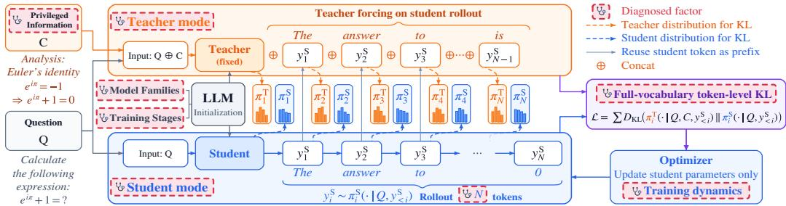  
Figure 1: Overview of our diagnosis. We design a comprehensive diagnostic pipeline to study how OPSD behaves in different settings and what can token-level dynamics reveal during training.

$$
\mathcal { L } _ { \mathrm { O P S D } } ^ { \mathrm { c l i p } } ( \theta ) = \mathbb { E } _ { ( Q , C ) \sim \mathcal { D } , y ^ { S } \sim \pi _ { \theta } ( \cdot | Q ) } \left[ \frac { 1 } { N } \sum _ { i = 1 } ^ { N } \sum _ { v \in \mathcal { V } } \operatorname* { m i n } ( d _ { i , v } , \tau _ { \mathrm { c l i p } } ) \right] .\tag{3}
$$

The clipping limits large contributions from individual vocabulary items.

## 4 EMPIRICAL METHODOLOGY AND SETUP

We write $m _ { S } , m _ { T } \in \ \{ \mathrm { N T h } , \mathrm { T h } \}$ for the student and teacher training or inference modes. The student uses mS for on-policy generation. The teacher uses mT when scoring the student’s rollout. In the paper, we abbreviate THINK as Th and NO-THINK as NTh. We mainly train Qwen3 and OLMo-3 models spanning 0.6B–8B parameters. We additionally use DeepSeek-R1-Distill-Qwen-1.5B (DeepSeek-AI et al., 2025), Falcon-H1R-7B (Falcon LLM Team et al., 2026), MiMo-7B-RL (LLM-Core-Team Xiaomi, 2025), Qwen3.5-4B (Qwen Team, 2026), and Qwen3-4B-Thinking-2507(Qwen3-4B-Thinking,Qwen Team (2025)) for additional tests.

The main OPSD experiments mainly use OpenThoughts Math 30k (Zhao et al., 2026). Default OPSD setup uses a frozen same-model teacher, full-solution teacher context. We set 1,024-token prompt and rollout caps, 100 training steps, learning rate $1 0 ^ { - 6 }$ , forward KL $( \beta \ = \ 0 ) , \tau _ { \mathrm { c l i p } } =$ 0.05, seed 42, and AdamW(Loshchilov & Hutter, 2019) optimizer. We evaluate on AIME 2024, AIME 2025, AIME 2026, and HMMT February 2025, which are sufficiently challenging to evaluate model reasoning ability. We sample eight responses per question and report Avg@8, Pass@8, and mean output length. Reported scores are average of the four benchmarks. Complete model-specific training and evaluation defaults are given in Appendix B. Detailed Results are given in Appendix G.

We use several phrases to describe model’s some performances. Ineffective deliberation denotes little decline of accuracy accompanied by substantial evaluation length growth. Stable degradation denotes that as training step or student rollout length increases, accuracy declines gradually while evaluation rollout length grows. Behavioral collapse denotes a large performance degradation accompanied by failures such as repetition, hallucination, missing of <eos> token, corrupted text, or loss of boxed-answer formatting.

## 5 EXPERIMENTAL RESULTS

We first establish a valid comparison setting. We then examine training steps, rollout length, teacher context, loss design, model ability, pipeline stage, and OPSD versus GRPO. Figure 1 summarizes the experimental pipeline. Per-dataset results and robustness checks are in Appendix G and subsection F.1.

Table 1: Controls for establishing a valid comparison setting. (a) Reasoning-mode results averaged over Qwen3-1.7B/4B/8B. For Avg@8 and Pass@8, ∆ is the absolute OPSD–Base change in percentage points. For Length, it is the relative change. Eval is the inference mode of both Base and OPSD, and S/T denote student/teacher modes. (b) Qwen3-4B feature rates. Self-correction includes Hmm/Actually/No/But. (c) No-privilege same-prefix control for mismatched NTh/Th, evaluated in Th mode. Parentheses show change from the corresponding full-solution checkpoint. Per-model results are in Table 14. Per-dataset results are in Table 49.  
(a) Reasoning-mode comparison
<table><tr><td rowspan="2">Model</td><td rowspan="2">S</td><td rowspan="2">T</td><td rowspan="2">Eval</td><td colspan="3">Avg@8</td><td colspan="3">Pass@8</td><td colspan="3">Length</td></tr><tr><td>Base</td><td>OPSD</td><td>∆</td><td>Base</td><td>OPSD</td><td>∆</td><td>Base</td><td>OPSD</td><td>∆</td></tr><tr><td rowspan="6">Qwen3 mean</td><td>Th</td><td>Th</td><td>Th</td><td>53.5</td><td>50.7</td><td>-2.8</td><td>72.2</td><td>71.1</td><td>-1.1</td><td>18,013</td><td>21,250</td><td>+17.9%</td></tr><tr><td>Th</td><td>NTh</td><td>Th</td><td>53.5</td><td>36.6</td><td>-16.9</td><td>72.2</td><td>59.5</td><td>-12.7</td><td>18,013</td><td>13,291</td><td>-26.0%</td></tr><tr><td>NTh</td><td>Th</td><td>NTh</td><td>15.8</td><td>19.6</td><td>+3.8</td><td>32.2</td><td>39.7</td><td>+7.5</td><td>5,510</td><td>14,093</td><td>+154.8%</td></tr><tr><td>NTh</td><td>NTh</td><td>NTh</td><td>15.8</td><td>15.2</td><td>-0.6</td><td>32.2</td><td>28.6</td><td>-3.6</td><td>5,510</td><td>13,634</td><td>+144.3%</td></tr><tr><td>NTh</td><td>Th</td><td>Th</td><td>53.5</td><td>56.2</td><td>+2.7</td><td>72.2</td><td>73.1</td><td>+0.9</td><td>18,013</td><td>19,527</td><td>+8.4%</td></tr><tr><td>Th</td><td>NTh</td><td>NTh</td><td>15.8</td><td>14.0</td><td>-1.8</td><td>32.2</td><td>27.8</td><td>-4.4</td><td>5,510</td><td>5,104</td><td>-8.7%</td></tr><tr><td colspan="10">(b) Qwen3-4B feature rates</td><td colspan="3"></td></tr><tr><td>Stylistic feature</td><td></td><td>NTh Base</td><td>NTh/Th</td><td></td><td>NTh/NTh</td><td>Th base</td><td></td><td></td><td></td><td>(c) No-privilege control</td><td></td><td></td></tr><tr><td></td><td></td><td></td><td></td><td></td><td></td><td></td><td>Model</td><td></td><td>Avg@8</td><td>Pass@8</td><td></td><td>Length</td></tr><tr><td>Contains “wait” Self-correction</td><td></td><td>31.6% 35.7%</td><td>47.0% 49.9%</td><td></td><td>18.2% 21.0%</td><td>100.0% 99.7%</td><td>Qwen3-1.7B Qwen3-4B</td><td></td><td>41.0(+0.2) 60.9 (-2.1)</td><td>62.5 (-0.8) 75.0(-4.2)</td><td></td><td>20,486 (+2.4%) 19,715 (+2.2%)</td></tr><tr><td>Contains &lt;think&gt;</td><td></td><td>0.0%</td><td>0.1%</td><td></td><td>0.0%</td><td>100.0%</td><td>Qwen3-8B</td><td></td><td>64.3 (-0.5)</td><td>80.8 (+4.1)</td><td></td><td>19,699 (+2.1%)</td></tr></table>

## 5.1 VALID COMPARISON SETTING

Reasoning-mode mismatch confounds attribution because Qwen3’s Th and NTh modes differ in both reasoning ability and response style. It’s necessary to confirm the training mode.

Table 1, panel (a), shows a directional effect: a NTh teacher suppresses a Th student’s accuracy and length, whereas a Th teacher increases both for a NTh student. Although there is no explicit <think> leakage, the latter still shows more Th-associated discourse features (panel (b)).

The no-privilege same-prefix control in panel (c) supports this interpretation. Across model sizes, the no-privilege versus full-solution means differ only slightly (55.4/72.8/20.0k vs 56.2/73.1/19.5k), so the apparent gain primarily reflects mode transfer rather than privileged semantics.

Because mismatch separates the rollout and evaluation policies and relies on a Qwen-specific mode switch, making comparisons across model families unavailable, all subsequent experiments are trained and tested on matched native modes, with matched Th/Th for hybrid reasoning models.

## 5.2 TRAINING STEPS AND MAXIMUM STUDENT ROLLOUT LENGTH

We first ask whether more training steps can improve final performance. We train Qwen3-1.7B and OLMo-3-7B-Think for up to 300 steps and evaluate every 50 steps (Figure 2). The result shows that overall performance declines as training continues, despite small intermediate rebounds. Sustained training therefore does not reliably improve model capability.

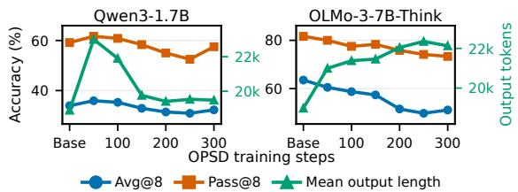  
Figure 2: Stability over training steps. Per-dataset results are in Table 52.

We next compare loss-token positions with a 256-position supervision budget. First-256 uses the equivalent OPSD-256 condition, while Uni-256 and Final-256 use a 1,024- token rollout and retain uniformly sampled or final valid response positions (Appendix F.1.2). First-256 gives the highest Avg@8 and shortest outputs while Final-256 performs the worst (Table 2).

Table 2: Results of position loss. Parentheses: change from Base. Per-dataset results are in Table 51.
<table><tr><td>Positions</td><td>Avg@8</td><td>Pass@8</td><td>Length</td></tr><tr><td>First-256</td><td>49.5(+0.7)</td><td>71.3 (+0.8)</td><td>21.4k(+14.7%)</td></tr><tr><td>Uni-256 Final-25647.8 (-1.0)</td><td>47.1 (-1.7)</td><td>72.1 (+1.6)</td><td>22.0k(+17.9%) 69.2(-1.3) 22.4k (+20.1%)</td></tr></table>

With the comparison restricted to matched modes, we then vary the maximum student training rollout length over {128, 256, 512, 1024, 2048, 4096, 6144} tokens. For instruct models, performance decreases as rollout length increases: short or intermediate rollout lengths are competitive with or better than the base, whereas the longest settings lose accuracy.

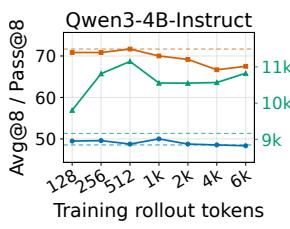

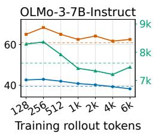

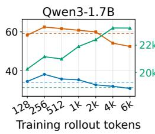

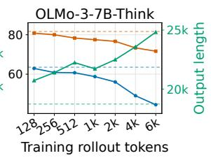  
Figure 3: OPSD vs. rollout cap for four models. Solid: OPSD. Dashed: Base. Left axes: Avg@8/Pass@8. Right: mean eval output length. Per-dataset results are in Table 50 and Table 51.

Under matched Th/Th, both models exhibit stable degradation. Prior work reports that privileged OPSD does not improve reasoning models. We find that small gains remain possible, but only for some models and only at short rollout lengths.

## 5.3 PRIVILEGED INFORMATION

We next vary privileged information to test whether target-specific information alone explains training utility. The primary conditions use target problems from OpenThoughts Math 30k. Besides the full solution, ANSWER provides only the correct final answer, while UNRELATED provides a deduplicated problem–solution pair from DAPO-Math-17k (Yu et al., 2025). The unrelated pair changes the privileged information without supplying evidence relevant to the target problem. The student receives only the target problem in all conditions.

For context type $z \in$ {SOLUTION, ANSWER, UNRELATED}, the teacher input is $Q , C ^ { ( z ) } : =$ $\mathcal { T } _ { \mathrm { t e a c h e r } } ( Q , C ^ { ( z ) } )$ . Because the intervention changes a complete prefix, it estimates the overall context effect rather than separately identifying length or target-problem position. We vary these three contexts across five model settings at maximum rollout lengths of 256 and 1,024 tokens (Table 3).

Table 3: Macro-average effect of privileged information across five model settings. Parentheses report change from Base in percentage points for $\operatorname { A v g } @ \operatorname { ‰}$ and Pass@8 and relative percent for Length. Per-model and per-dataset results are in Table 53.
<table><tr><td rowspan="2">Teacher context</td><td colspan="3">Rollout length: 256</td><td colspan="3">Rollout length: 1,024</td></tr><tr><td> $\operatorname { A v g } @ \operatorname { \overline { { \alpha } } } 8$ </td><td>Pass@8</td><td>Length</td><td> $\operatorname { A v g } @ \mathcal { Q } 8$ </td><td>Pass@8</td><td>Length</td></tr><tr><td>Full solution</td><td> ${ \pmb 5 } { \bf 0 . 5 } ( + 0 . 9 )$ </td><td> $7 1 . 5 ( + 1 . 0 ) $ </td><td> $1 6 . 2 \mathbf { k } \left( + 1 2 . 9 \% \right)$ </td><td>48.6(−1.0)</td><td> ${ \bf 6 9 . 3 ( - 1 . 2 ) }$ </td><td> $1 6 . 4 \mathrm { k } \left( + 1 2 . 2 \% \right)$ </td></tr><tr><td>Unrelated solution</td><td> $4 8 . 9 ( - 0 . 7 ) $ </td><td> $6 9 . 7 ( - 0 . 8 )$ </td><td> $1 5 . 4 \mathbf { k } \left( + 6 . 0 \% \right)$ </td><td>47.8(−1.8)</td><td> $6 7 . 3 ( - 3 . 2 ) $ </td><td> $1 8 . 0 \mathbf { k } \left( + 2 5 . 3 \% \right)$ </td></tr><tr><td>Answer only</td><td>45.9(-3.7) 65.7(-4.8)</td><td></td><td> $1 6 . 3 \mathbf { k } \left( + 6 . 4 \% \right)$ </td><td> $4 4 . 3 ( - 5 . 3 )$ </td><td> $6 6 . 3 ( - 4 . 2 )$ </td><td>17.4k(+12.9%)</td></tr></table>

Context variants exhibit a non-monotonic ordering. At both rollout lengths in Table 3, Unrelated solution outperforms Answer only. Furthermore, we apply COT+SOLUTION to Qwen3-1.7B and OLMo-3- 7B-Think by concatenating the OpenThoughts CoT trace with the gold solution on the teacher side, using exactly the same target problems and row order as Full solution while increasing the teacher prompt

Table 4: Results at a 1,024-token rollout cap. Per-dataset results are in Table 53.
<table><tr><td></td><td colspan="3">Qwen3-1.7B</td><td colspan="3">OLMo-3-7B-Think</td></tr><tr><td>Teacher context</td><td>Avg@8 Pass @8 Length Avg@8 Pass @8 Length</td><td></td><td></td><td></td><td></td><td></td></tr><tr><td>None (Base)</td><td>34.0</td><td>59.2</td><td>18.6k</td><td>63.5</td><td>81.7</td><td>18.7k</td></tr><tr><td>Answer only</td><td>35.6</td><td>59.2</td><td>25.8k</td><td>56.1</td><td>75.8</td><td>24.1k</td></tr><tr><td>Unrelated solution</td><td>37.1</td><td>60.0</td><td>22.0k</td><td>57.5</td><td>76.7</td><td>23.4k</td></tr><tr><td>Full solution</td><td>35.3</td><td>60.8</td><td>22.4k</td><td>58.8</td><td>77.5</td><td>21.7k</td></tr><tr><td>CoT + solution</td><td>30.8</td><td>55.8</td><td>18.6k</td><td>58.6</td><td>77.5</td><td>20.8k</td></tr></table>

budget from 1,024 to 8,192 tokens. For Qwen3-1.7B, Avg@8 and Pass@8 both decrease. For OLMo-3-7B-Think, neither metric improves (Table 4). Thus, providing more detailed teacher-side information does not necessarily yield better training outcomes.

## 5.4 LOCAL LOSS-DESIGN

Following the OPSD objective (Zhao et al., 2026), at position i the interior branch $0 < \beta < 1$ uses the generalized-JSD loss

$$
\ell _ { \beta } ( \pi _ { i } ^ { S } , \pi _ { i } ^ { T } ) = \beta D _ { \mathrm { K L } } ( \pi _ { i } ^ { T } \Vert m _ { \beta , i } ) + ( 1 - \beta ) D _ { \mathrm { K L } } ( \pi _ { i } ^ { S } \Vert m _ { \beta , i } ) , \quad m _ { \beta , i } = ( 1 - \beta ) \pi _ { i } ^ { S } + \beta \pi _ { i } ^ { T } .\tag{4}
$$

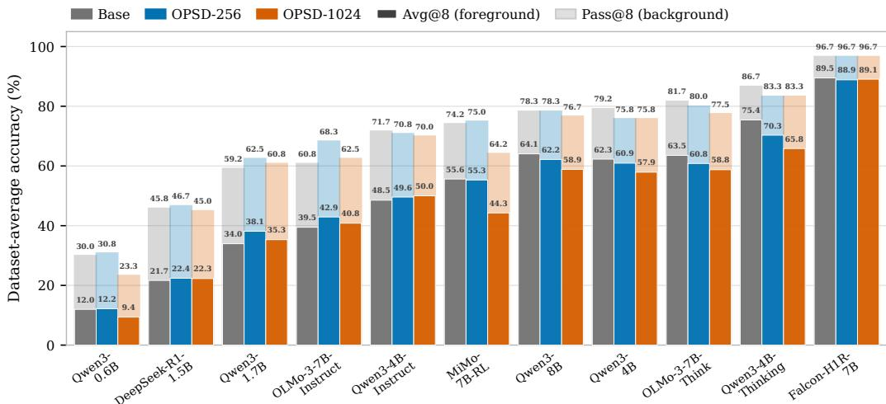  
Figure 4: OPSD results across baseline performance levels. Each model cluster reports Base, OPSD-256, and OPSD-1024. Dark foreground bars show Avg@8. Light background bars show Pass@8. Models are ordered by Base Pass@8. Per-dataset results are in Table 58.

The endpoints are defined separately: $\ell _ { 0 } = D _ { \mathrm { K L } } ( \pi _ { i } ^ { T } \Vert \pi _ { i } ^ { S } )$ (forward KL) and $\ell _ { 1 } = D _ { \mathrm { K L } } ( \pi _ { i } ^ { S } \Vert \pi _ { i } ^ { T } )$ (reverse KL). We use $\beta = \bar { 0 }$ by default and ablate $\ddot { \beta } \in \{ 0 . 5 , 1 \}$ . The result shows that only a few trained checkpoints improve over their corresponding base models, and the leading objective varies by model (Table 5, panel (a)). Changing divergence direction therefore redistributes outcomes rather than providing a reliable remedy. Vocabulary truncation, teacher-favored position selection, and student-entropy masking are likewise non-universal among models (subsubsection C.4.2 and subsubsection C.4.3).

## 5.5 INITIAL MODEL ABILITY

We then ask whether OPSD’s performance depends on the model itself. We compare Base, OPSD-256, and OPSD-1024 across eleven models under their matched student–teacher mode and standard full-solution privileged information.

The result shows that only some models with lower reasoning ability benefit from OPSD, whereas most higher-performing models degrade (Figure 4). Consistent with prior work (Kaur et al., 2026), instruction-tuned models are often less adversely affected than reasoning models, which might be attributed to their instruction following ability. The result suggests that models with stronger reasoning performance may be less likely to benefit from OPSD, and instruction models benefit more than reasoning models.

Table 5: Optimization sensitivity. (a) Avg@8 and Pass@8 changes after 100 steps of OPSD-1024 under forward KL, symmetric JSD, and reverse KL. Bold marks the best change for each model. Per-model and per-dataset results are in Table 16 and Table 55. (b) Post-training pipeline results. Format is the boxed-answer rate (%) and Length is mean output length. Per-checkpoint results are in Table 22. Per-dataset results are in Table 61 and Table 64.  
(a) Divergence objectives
<table><tr><td></td><td colspan="2">Fwd. KL</td><td colspan="2">JSD</td><td colspan="2">Rev. KL</td></tr><tr><td>Model</td><td>Avg</td><td>Pass</td><td>Avg</td><td>Pass</td><td>Avg</td><td>Pass</td></tr><tr><td>Qwen3-1.7B</td><td>+1.3</td><td>+1.6</td><td>-2.7</td><td>-4.2</td><td>-7.5</td><td>-11.7</td></tr><tr><td>Qwen3-4B</td><td>-4.4</td><td>-3.4</td><td>-5.7</td><td>-3.4</td><td>-30.3</td><td>-22.5</td></tr><tr><td>Qwen3-4B-Thinking</td><td>-9.6</td><td>-3.4</td><td>-7.4</td><td>-4.2</td><td>-1.2</td><td>-1.7</td></tr><tr><td>OLMo-3-7B-Think</td><td>-4.7</td><td>-4.2</td><td>-1.4</td><td>0.0</td><td>-1.1</td><td>+0.8</td></tr><tr><td>OLMo-3-7B-Instruct</td><td>+1.3</td><td>+1.7</td><td>-2.3</td><td>-2.5</td><td>+3.0</td><td>+0.9</td></tr><tr><td>Falcon-H1R-7B</td><td>-0.4</td><td>0.0</td><td>-1.1</td><td>-0.9</td><td>-1.4</td><td>0.0</td></tr><tr><td>MiMo-7B-RL</td><td>-11.3</td><td>-10.0</td><td>-3.0</td><td>-1.7</td><td>-5.4</td><td>-1.7</td></tr></table>

(b) Post-training stages
<table><tr><td>Model</td><td>Avg@8</td><td>Pass@8</td><td>Format</td><td>Length</td></tr><tr><td>Qwen3-4B-Base</td><td>7.29</td><td>20.00</td><td>87.19</td><td>3.0k</td></tr><tr><td>+ OPSD</td><td>4.79</td><td>17.50</td><td>74.59</td><td>10.3k</td></tr><tr><td>+ SFT</td><td>34.69</td><td>60.00</td><td>89.27</td><td>14.3k</td></tr><tr><td>+ SFT + OPSD</td><td>1.98</td><td>8.33</td><td>3.44</td><td>32.9k</td></tr><tr><td>+ SFT + GRPO</td><td>33.65</td><td>60.83</td><td>94.79</td><td>14.2k</td></tr><tr><td>+ SFT + GRPO + OPSD</td><td>3.54</td><td>14.17</td><td>5.62</td><td>37.6k</td></tr><tr><td>Qwen3-4B</td><td>62.3</td><td>79.2</td><td>97.1</td><td>17.8k</td></tr><tr><td>+ OPSD</td><td>57.9</td><td>75.8</td><td>86.4</td><td>19.9k</td></tr></table>

<table><tr><td colspan="4">Table 7: Qwen3-1.7B grid. S/T are student/teacher modes, and  $D > . 0 5$  Agree., Enc., and Disc. are percentages.</td></tr><tr><td>S T</td><td>Fwd. KL</td><td> $D > . 0 5$  Agree.</td><td>Enc. Disc.</td></tr><tr><td colspan="2">NTh NTh</td><td colspan="2">17.8 94.3 32.3 37.9</td></tr><tr><td colspan="2">NTh Th</td><td colspan="2">24.4 93.3 14.0 70.9</td></tr><tr><td colspan="2">0.193 Th NTh Th</td><td colspan="2">42.9</td></tr><tr><td colspan="2">0.468</td><td colspan="2">87.5 15.3 63.0 92.9</td></tr><tr><td colspan="2">Th 0.144 20.6</td><td colspan="2">34.5 36.0</td></tr></table>

## 5.6 SENSITIVITY TO POST-TRAINING STAGE

We next test a separate source of sensitivity: the post-training stage at which OPSD is applied. The SFT stage uses 15,000 steps on the cot split of OpenMathReasoning. The GRPO stage uses DAPO-Math-17k. Full configurations appear in subsection B.3 and subsection B.4.

The failure mode changes with pipeline stage. Direct OPSD on Qwen3-4B-Base produces ineffective deliberation, so we treat this low-ability starting point only as a sanity check. OPSD after either our SFT or SFT+GRPO stage instead produces behavioral collapse (Table 5, panel (b)). GRPO itself approximately preserves the SFT checkpoint, but the subsequent OPSD collapses. Matched Th/Th OPSD on the released Qwen3-4B instead produces stable degradation.

## 5.7 TRAINING-COMPUTE TRADE-OFF: OPSD VERSUS GRPO

Finally, we compare OPSD and GRPO on Qwen3-1.7B / 4B. Both methods train for 50 steps on exactly the same OpenMathReasoning problems in the same order. OPSD conditions its teacher on the full solution, whereas GRPO uses only the final answer for verification. Table 6 reports accuracy and training GPU-hours. Full configurations are reported in subsection C.7.

Table 6: Cells report Avg@8 / Pass@8 / GPU hours. Bold marks the best Avg@8 or Pass@8. Per-dataset results are in Table 62 and Table 63.
<table><tr><td>Model</td><td>Base</td><td> $\mathrm { O P S D _ { 5 0 } }$ </td><td> $\mathrm { G R P O _ { 5 0 } }$ </td></tr><tr><td>Qwen3-1.7B</td><td>34.0/59.2/–</td><td>38.0/63.3/0.66</td><td>37.1/63.3/114.27</td></tr><tr><td>Qwen3-4B</td><td>62.3/79.2/–</td><td>60.1/80.0/1.13</td><td>62.8/78.3/171.81</td></tr></table>

OPSD performs better than GRPO on 1.7B model with less training computation. However, the advantage decreases on 4B model. This may imply that OPSD’s accuracy advantage does not consistently scale with model size, although its computational advantage remains substantial.

## 6 ANALYSIS: FROM TOKEN-LEVEL SIGNALS TO OPTIMIZATION DYNAMICS

We analyze the frozen token-level signal across reasoning mode, checkpoint type, teacher context, and response position, then ask what training trajectories can diagnose. Each model uses 2,048 prompts with two on-policy rollouts $( n = 4 , 0 9 6 )$ . Completions are capped at 1,024 tokens except in the 6,144-token response-position analysis. Settings and per-model results are in subsection D.1.

## 6.1 MISMATCHED MODE EFFECT

Table 7 shows that mismatched pairs have substantially higher initial forward KL and high-divergence-position rates than matched pairs, despite high top-1 agreement. Mode mismatch amplifies the initial signal: both forward KL and the share of high-divergence positions increase relative to matched pairs. The effect is asymmetric, with a larger shift for Th/NTh than for NTh/Th.

Top-1 agreement changes little, indicating redistribution below the argmax. For $a _ { i } = \log \pi _ { i } ^ { T } ( y _ { i } ^ { S } ) -$ log $\pi _ { i } ^ { S } ( \bar { y } _ { i } ^ { S } )$ , mismatch shifts sampled positions from Enc. toward Disc. relative to matched baselines. Since $y _ { i } ^ { S } \sim \pi _ { i } ^ { S }$ , this relative shift is more informative than the absolute sign balance. Together with the prior results, the pattern supports mode transfer over privileged-semantic transfer.

## 6.2 PRIVILEGED INFORMATION EFFECT

To isolate privileged information, we rescore fixed student rollouts under four conditions as training, Answer only, Full solution, CoT+Solution, and Unrelated solution. To explore whether dataset influences the effect, we add OpenMathReasoning for answer only, full solution and DAPO-Math-17k for answer only. We change privileged information and teacher prompt length while keeping student’s input same in all conditions . Panel (a) of Figure 5 applies PCA after within-model standardization. Panel (a) of Table 9 reports raw ten-model macro averages.

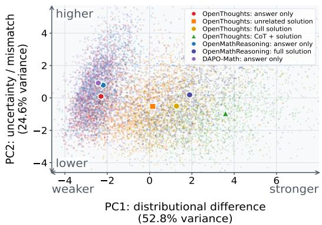  
(a) Context-condition PCA

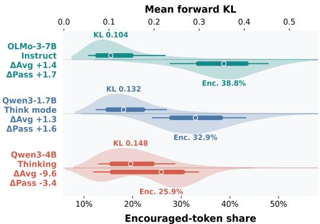  
(b) Full-solution signal contrast  
Figure 5: Privileged-context effects on the initial teacher–student signal. (a) PCA of teacher’s signal on student rollout across teacher-context conditions. (b) Full-solution of OpenThoughts signal distributions across models with different downstream OPSD performances.

The signal shifts progressively from Answer only to CoT+Solution. Even for different datasets, the signals are still clustered in the nearby area. This indicates that the type of privileged information has a greater impact on the signal. Unrelated solution also produces a clear shift despite containing no task-relevant content. These show that teacher’s signal therefore reflects the full teacher prefix, different type of privileged information would yield different signal.

Table 8: Model-type signal analysis. HE20: highestentropy 20%.
<table><tr><td>Metric</td><td>Inst.</td><td>Reason.</td></tr><tr><td>Mean Fwd. KL</td><td>0.151</td><td>0.139</td></tr><tr><td>Discouraged (%)</td><td>44.1</td><td>61.0</td></tr><tr><td>HE20 KL (%)</td><td>57.2</td><td>47.9</td></tr><tr><td>HE20 |adv.| (%)</td><td>70.5</td><td>64.6</td></tr></table>

The known answer can act as an instruction to reconsider the sampled reasoning, making the Instruct–Reasoning contrast another prefix-context effect. Across the paired Qwen3-4B and OLMo 3-7B checkpoints, mean forward KL is similar, but Reasoning has more discouraged tokens while Instruct concentrates more signal at high-entropy positions (Table 8). All four entries in this comparison are computed from the same entropy-analysis rollout pool for each checkpoint. This is consistent with instruction following turning privileged information into targeted corrections that can make OPSD more effective. This agrees with Kaur et al. (2026)’s fork-suppression analysis. Our controls further show that prefix mismatch can shift the signal even with task-irrelevant context.

A stronger signal is not necessarily more useful. Panel (b) of Figure 5 contrasts two settings that improve after full-solution OPSD with one that degrades. Their rollout-level signal distributions overlap, so neither raw mean forward KL nor the encouraged-token share predicts the downstream performance. On matched rows, CoT+Solution increases initial divergence but reduces Avg@8 relative to the full solution (Table 9, panel (b)). Training-time forward KL has the same limitation: its change varies across models and rollout caps without tracking downstream performance (Table 10).

Privileged information should therefore be treated as a context-induced distributional intervention. Adding context can strengthen the teacher–student difference without making the supervision more useful. Context construction should control the nature and magnitude of this difference, not maximize context length, information, or initial KL.

Table 9: Privileged-context effects. (a) Ten-model OpenThoughts signal averages. D > .05, Abs. adv., and Agree. are the high-KL-position rate, mean absolute sampled-token log advantage, and top-1 agreement. (b) First-batch forward KL and Avg@8 under a 1,024-token rollout cap. Only teacher context and its prefix cap change. Full per-model signal results are split across Table 26 and Table 27; downstream per-dataset results are in Table 53.

(a) Context signal
<table><tr><td>Context</td><td>Fwd. KL</td><td>D &gt; .05</td><td>Abs. adv.</td><td>Agree.</td></tr><tr><td>Answer only</td><td>0.016</td><td>2.9</td><td>0.039</td><td>98.0</td></tr><tr><td>Unrelated solution</td><td>0.054</td><td>14.9</td><td>0.100</td><td>95.0</td></tr><tr><td>Full solution</td><td>0.108</td><td>20.3</td><td>0.151</td><td>93.3</td></tr><tr><td>CoT + solution</td><td>0.179</td><td>30.8</td><td>0.224</td><td>90.6</td></tr></table>

(b) Signal and utility
<table><tr><td>Model</td><td>Context</td><td>Prefix cap</td><td>Fwd. KL</td><td>Avg@8</td></tr><tr><td>Qwen3-1.7B</td><td>Full solution</td><td>1,024</td><td>0.141</td><td>35.3</td></tr><tr><td></td><td>CoT + solution</td><td>8,192</td><td>0.218</td><td>30.8</td></tr><tr><td>OLMo-3-7B-Think</td><td>Full solution</td><td>1,024</td><td>0.115</td><td>58.8</td></tr><tr><td></td><td>CoT + solution</td><td>8,192</td><td>0.205</td><td>58.6</td></tr></table>

Table 10: Forward KL and downstream change under full-solution OPSD. KL First10 and Final10 average KL loss over the first and final ten steps. ∆ Avg and ∆ Pass are Avg@8 and Pass@8 changes from Base. DS-Qwen-1.5B refers to DeepSeek-R1-Distill-Qwen-1.5B.
<table><tr><td></td><td colspan="4">256-token rollout cap</td><td colspan="4">1,024-token rollout cap</td></tr><tr><td>Model</td><td>KL First10</td><td>KL Final10</td><td>∆ Avg</td><td>∆ Pass</td><td>KL First10</td><td>KL Final10</td><td>∆ Avg</td><td>∆ Pass</td></tr><tr><td>DS-Qwen-1.5B</td><td>0.062</td><td>0.073 ↑</td><td>+0.7</td><td>+0.9</td><td>0.032</td><td>0.040 ↑</td><td>+0.6</td><td>-0.8</td></tr><tr><td>Falcon-H1R-7B</td><td>0.112</td><td>0.087↓</td><td>-0.6</td><td>0.0</td><td>0.077</td><td>0.054↓</td><td>-0.4</td><td>0.0</td></tr><tr><td>Qwen3-0.6B</td><td>0.125</td><td>0.334↑</td><td>+0.2</td><td>+0.8</td><td>0.073</td><td>0.212↑</td><td>-2.6</td><td>-6.7</td></tr><tr><td>MiMo-7B-RL</td><td>0.175</td><td>0.340 ↑</td><td>-0.3</td><td>+0.8</td><td>0.098</td><td>0.243↑</td><td>-11.3</td><td>-10.0</td></tr><tr><td>OLMo-3-7B-Think</td><td>0.193</td><td>0.377↑</td><td>-2.7</td><td>-1.7</td><td>0.108</td><td>0.251↑</td><td>-4.7</td><td>-4.2</td></tr><tr><td>OLMo-3-7B-Instruct</td><td>0.206</td><td>0.204 ↓</td><td>+3.4</td><td>+7.5</td><td>0.120</td><td>0.151 ↑</td><td>+1.3</td><td>+1.7</td></tr><tr><td>Qwen3-1.7B</td><td>0.261</td><td>0.458↑</td><td>+4.1</td><td>+3.3</td><td>0.142</td><td>0.336 ↑</td><td>+1.3</td><td>+1.6</td></tr><tr><td>Qwen3-4B-Thinking</td><td>0.246</td><td>0.341↑</td><td>-5.1</td><td>-3.4</td><td>0.156</td><td>0.325 ↑</td><td>-9.6</td><td>-3.4</td></tr><tr><td>Qwen3-4B-Instruct</td><td>0.260</td><td>0.232 ↓</td><td>+1.1</td><td>-0.9</td><td>0.164</td><td>0.161 ↓</td><td>+1.5</td><td>-1.7</td></tr></table>

Table 11: Forward KL by response-position window. Each entry reports mean/SNR, where SNR = µ/σ and σ is the token-level standard deviation. Per-model results are in Table 29.
<table><tr><td>Response position</td><td>[0,128)</td><td>[128, 256)</td><td>[256,512)</td><td>[512, 1k)</td><td>[1k, 2k)</td><td>[2k, 4k)</td><td>[4k, 6k)</td></tr><tr><td>Mean/SNR</td><td>0.287 / 0.248</td><td>0.190 / 0.217</td><td>0.126 / 0.185</td><td>0.087 / 0.160</td><td>0.067 / 0.138</td><td>0.056 / 0.121</td><td>0.048 / 0.103</td></tr></table>

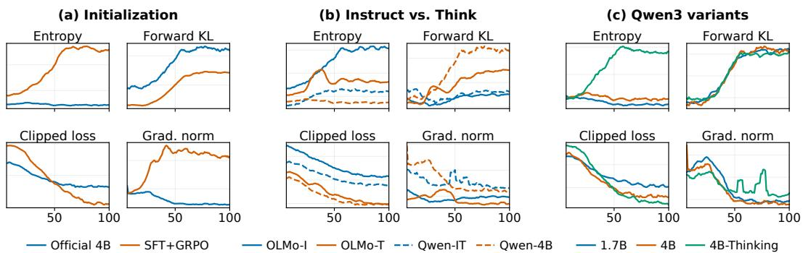  
Figure 6: OPSD training dynamics across (a) initialization, (b) Instruct/Think checkpoints, and (c) Qwen3 variants. Per-window results for the initialization comparison are in Table 31.

## 6.3 FORWARD KL AT DIFFERENT POSITIONS

Because OPSD supervises tokens throughout the sampled response, we examine how its signal changes with position.

The result show that both forward KL and SNR decrease substantially toward later positions (Ta ble 11), indicating that the signal is concentrated early in the response. Consistently, First-256 outperforms Final-256 under the same loss-token budget (Table 2). Together with Zhou et al. (2026), this result suggests a common limitation of OPD and OPSD: once a rollout takes a wrong branch, the weaker late-token signal on the student’s trajectory may be insufficient or even harmful. OPSD need not compute the loss over an entire trajectory. Applying the loss only to the early tokens of each trajectory can achieve better performance, and it takes less training time and computation.

## 6.4 OPSD TRAINING DYNAMICS

We examine whether training-time statistics can diagnose OPSD behavior before evaluation. Specifically, we track student entropy, forward KL to privileged teacher, the clipped distillation loss, and gradient norm, which characterize output uncertainty, student–teacher discrepancy, and optimization behavior. Figure 6 compares these trajectories across different initializations, Instruct and Think checkpoints, and Qwen3 variants to explore further.

The initialization contrast exhibits the clearest collapse signature: student entropy and gradient norm rise together for the SFT+GRPO actor, whereas both remain bounded or decrease for the released Qwen3-4B. The Instruct/Think comparison shows consistent mode-dependent differences: within both OLMo and Qwen, Instruct checkpoints exhibit lower forward KL and less negative clipped loss than Think checkpoints, without the joint entropy–gradient rise associated with collapse. The Qwen3 variants further show that similar forward KL values can correspond to substantially different downstream performances. Thus, the joint entropy–gradient rise is a useful online warning of collapse, but no single trace reliably predicts final performance.

## 7 CONCLUSION

In this paper, we design a comprehensive diagnostic pipeline to study the behavior of OPSD. Controlled experiments and token-level analyses show that OPSD is a sensitive algorithm. The teacher’s signal of OPSD is driven by contextual-distribution differences rather than privileged semantics alone. Both of the training configuration such as rollout cap and model itself including model type affect the performance of OPSD. Training dynamics can be used to warn of OPSD collapse rather than predicting downstream performance.

Compared with RLVR, OPSD requires no external reward or stronger privileged teacher, provides dense supervision, and uses less computation. However, OPSD offers no free lunch. Its efficiency comes at the cost of relying on unverified, training-state-dependent supervision. OPSD should therefore be viewed as a complementary post-training method rather than a complete replacement for RLVR. Its effect and generalization remain to be tested on larger models and more diverse tasks.

## AI USE STATEMENT

We used GPT-5.6, Cursor Composer, and Grok primarily for routine assistance, including generating portions of auxiliary code (such as dataset-processing code following author-specified procedures), organizing and summarizing experimental outputs, and drafting and polishing the manuscript. The overall research direction, experimental design, data processing strategy, methodology, experimental design, analysis, interpretation of the findings, and conclusions were developed and completed by the authors. Formal proof-related tasks are not applicable. The authors reviewed all AI-assisted materials, independently verified the relevant code, processed data, experimental results, and final manuscript, and take full responsibility for the final content.

## REPRODUCIBILITY STATEMENT

To support the accuracy and reproducibility of our diagnostic findings, we provide the accompanying code as supplementary material and document our experimental configurations in detail in the appendix. We also prepare to release the code for reproducibility in the future.

## REFERENCES

Rishabh Agarwal, Nino Vieillard, Yongchao Zhou, Piotr Stanczyk, Sabela Ramos, Matthieu Geist, and Olivier Bachem. On-policy distillation of language models: Learning from self-generated mistakes. In International Conference on Learning Representations, 2024. URL https:// arxiv.org/abs/2306.13649.

DeepSeek-AI. Deepseek-v3 technical report, 2025. URL https://arxiv.org/abs/2412. 19437.

DeepSeek-AI, Daya Guo, Dejian Yang, Haowei Zhang, Junxiao Song, Peiyi Wang, Qihao Zhu, Runxin Xu, Ruoyu Zhang, Shirong Ma, Xiao Bi, Xiaokang Zhang, Xingkai Yu, Yu Wu, Z. F. Wu, Zhibin Gou, Zhihong Shao, Zhuoshu Li, Ziyi Gao, et al. DeepSeek-R1: Incentivizing reasoning capability in LLMs via reinforcement learning, 2025. URL https://arxiv.org/abs/ 2501.12948.

Falcon LLM Team, Iheb Chaabane, Puneesh Khanna, Suhail Mohmad, Slim Frikha, Shi Hu, Abdalgader Abubaker, Reda Alami, Mikhail Lubinets, Mohamed El Amine Seddik, and Hakim Hacid. Falcon-h1r: Pushing the reasoning frontiers with a hybrid model for efficient test-time scaling, 2026. URL https://arxiv.org/abs/2601.02346.

Edward J. Hu, Yelong Shen, Phillip Wallis, Zeyuan Allen-Zhu, Yuanzhi Li, Shean Wang, Lu Wang, and Weizhu Chen. Lora: Low-rank adaptation of large language models, 2021. URL https: //arxiv.org/abs/2106.09685.

Simran Kaur, Narutatsu Ri, Yinghui He, Liam Fowl, and Sanjeev Arora. Rethinking on-policy selfdistillation for thinking models, 2026. URL https://arxiv.org/abs/2607.05184.

Jeonghye Kim, Xufang Luo, Minbeom Kim, Sangmook Lee, Dohyung Kim, Jiwon Jeon, Dongsheng Li, and Yuqing Yang. Why does self-distillation (sometimes) degrade the reasoning capability of LLMs?, 2026. URL https://arxiv.org/abs/2603.24472.

Team Kimi. Kimi k3: Open frontier intelligence, 2026. URL https://arxiv.org/abs/ 2607.24653.

Woosuk Kwon, Zhuohan Li, Siyuan Zhuang, Ying Sheng, Lianmin Zheng, Cody Hao Yu, Joseph E. Gonzalez, Hao Zhang, and Ion Stoica. Efficient memory management for large language model serving with pagedattention, 2023. URL https://arxiv.org/abs/2309.06180.

Gengsheng Li, Tianyu Yang, Junfeng Fang, Mingyang Song, Mao Zheng, Haiyun Guo, Dan Zhang, Jinqiao Wang, and Tat-Seng Chua. Unifying group-relative and self-distillation policy optimization via sample routing, 2026a. URL https://arxiv.org/abs/2604.02288.

Yaxuan Li, Yuxin Zuo, Bingxiang He, Jinqian Zhang, Chaojun Xiao, Cheng Qian, Tianyu Yu, Huan ang Gao, Wenkai Yang, Zhiyuan Liu, and Ning Ding. Rethinking on-policy distillation of large language models: Phenomenology, mechanism, and recipe, 2026b. URL https://arxiv. org/abs/2604.13016.

Yu Li, Shu Hong, and Tian Lan. Localizing credit at the divergence: Path-conditioned selfdistillation for LLM reasoning, 2026c. URL https://arxiv.org/abs/2606.15576.

Xiaogeng Liu, Xinyan Wang, Yingzi Ma, Yechao Zhang, and Chaowei Xiao. When are teacher tokens reliable? position-weighted on-policy self-distillation for reasoning, 2026. URL https: //arxiv.org/abs/2605.21606.

Zichen Liu, Changyu Chen, Wenjun Li, Penghui Qi, Tianyu Pang, Chao Du, Wee Sun Lee, and Min Lin. Understanding R1-Zero-like training: A critical perspective, 2025. URL https: //arxiv.org/abs/2503.20783.

LLM-Core-Team Xiaomi. Mimo: Unlocking the reasoning potential of language model – from pretraining to posttraining, 2025. URL https://arxiv.org/abs/2505.07608.

Ilya Loshchilov and Frank Hutter. Decoupled weight decay regularization, 2019. URL https: //arxiv.org/abs/1711.05101.

Feng Luo, Yu-Neng Chuang, Guanchu Wang, Zicheng Xu, Xiaotian Han, Tianyi Zhang, and Vladimir Braverman. Demystifying OPD: Length inflation and stabilization strategies for large language models, 2026. URL https://arxiv.org/abs/2604.08527.

Ivan Moshkov, Darragh Hanley, Ivan Sorokin, Shubham Toshniwal, Christof Henkel, Benedikt Schifferer, Wei Du, and Igor Gitman. AIMO-2 winning solution: Building state-of-the-art mathematical reasoning models with OpenMathReasoning dataset. arXiv preprint arXiv:2504.16891, 2025. URL https://arxiv.org/abs/2504.16891.

OLMo Team, Allyson Ettinger, Amanda Bertsch, Bailey Kuehl, David Graham, David Heineman, Dirk Groeneveld, Faeze Brahman, Finbarr Timbers, Hamish Ivison, Jacob Morrison, Jake Poznanski, Kyle Lo, Luca Soldaini, Matt Jordan, Mayee Chen, Michael Noukhovitch, Nathan Lambert, Pete Walsh, Pradeep Dasigi, Robert Berry, Saumya Malik, Saurabh Shah, Scott Geng, Shane Arora, Shashank Gupta, Taira Anderson, Teng Xiao, Tyler Murray, Tyler Romero, Victoria Graf, et al. OLMo 3, 2026. URL https://arxiv.org/abs/2512.13961.

Leyi Pan, Shuchang Tao, Yunpeng Zhai, Lingzhe Zhang, Zhaoyang Liu, Bolin Ding, Aiwei Liu, and Lijie Wen. RLCSD: Reinforcement learning with contrastive on-policy self-distillation, 2026. URL https://arxiv.org/abs/2606.11709.

Qwen Team. Qwen3 technical report, 2025. URL https://arxiv.org/abs/2505.09388.

Qwen Team. Qwen3.5: Towards native multimodal agents, February 2026. URL https://qwen. ai/blog?id=qwen3.5.

Samyam Rajbhandari, Jeff Rasley, Olatunji Ruwase, and Yuxiong He. ZeRO: Memory optimizations toward training trillion parameter models. In SC20: International Conference for High Performance Computing, Networking, Storage and Analysis, pp. 1–16. IEEE, 2020. URL https://arxiv.org/abs/1910.02054.

John Schulman, Filip Wolski, Prafulla Dhariwal, Alec Radford, and Oleg Klimov. Proximal policy optimization algorithms, 2017. URL https://arxiv.org/abs/1707.06347.

Zhihong Shao, Peiyi Wang, Qihao Zhu, Runxin Xu, Junxiao Song, Xiao Bi, Haowei Zhang, Mingchuan Zhang, Y. K. Li, Y. Wu, and Daya Guo. DeepSeekMath: Pushing the limits of mathematical reasoning in open language models, 2024. URL https://arxiv.org/abs/2402. 03300.

Zhanming Shen, Jintao Tong, Shaotian Yan, Chen Shen, Hao Chen, Wentao Ye, Xiaomeng Hu, Rui Miao, Haobo Wang, Junbo Zhao, Gang Chen, and Jieping Ye. Purified OPSD: On-policy self-distillation without losing how to think, 2026. URL https://arxiv.org/abs/2607. 02234.

Samyak Shrestha and Alexander Tessier. Rethinking privileged information in on-policy selfdistillation, 2026. URL https://arxiv.org/abs/2608.18271.

Mingyang Song and Mao Zheng. A survey of on-policy distillation for large language models, 2026. URL https://arxiv.org/abs/2604.00626.

Zhiquan Tan and Yinrong Hong. Self-supervised on-policy distillation for reasoning language models, 2026. URL https://arxiv.org/abs/2605.17497.

Rui Wang, Hongru Wang, Yi Chen, Boyang Xue, Tianqing Fang, Wenhao Yu, and Kam-Fai Wong. Demystifying on-policy distillation: Roles, pathologies, and regulations, 2026. URL https: //arxiv.org/abs/2607.13399.

Jiawei Xu, Minghui Liu, Juzheng Zhang, Tom Goldstein, and Furong Huang. β-OPSD: Deriving with Policy Optimization, Training with Self-Distillation, 2026. URL https://arxiv.org/ abs/2607.28582.

Chenxu Yang, Chuanyu Qin, Qingyi Si, Minghui Chen, Naibin Gu, Dingyu Yao, Zheng Lin, Weiping Wang, Jiaqi Wang, and Nan Duan. Self-distilled RLVR, 2026a. URL https: //arxiv.org/abs/2604.03128.

Zhicheng Yang, Zhijiang Guo, Yifan Song, Minrui Xu, Yongxin Wang, Yiwei Wang, Xiaodan Liang, and Jing Tang. Prune-OPD: Efficient and reliable on-policy distillation for long-horizon reasoning, 2026b. URL https://arxiv.org/abs/2605.07804.

Qiying Yu, Zheng Zhang, Ruofei Zhu, Yufeng Yuan, Xiaochen Zuo, Yu Yue, Weinan Dai, Tiantian Fan, Gaohong Liu, Lingjun Liu, Xin Liu, Haibin Lin, Zhiqi Lin, Bole Ma, Guangming Sheng, Yuxuan Tong, Chi Zhang, Mofan Zhang, Wang Zhang, Hang Zhu, Jinhua Zhu, Jiaze Chen, Jiangjie Chen, Chengyi Wang, Hongli Yu, Yuxuan Song, Xiangpeng Wei, Hao Zhou, Jingjing Liu, Wei-Ying Ma, Ya-Qin Zhang, Lin Yan, Mu Qiao, Yonghui Wu, and Mingxuan Wang. DAPO: An open-source LLM reinforcement learning system at scale, 2025. URL https: //arxiv.org/abs/2503.14476.

Yang Yue, Zhiqi Chen, Rui Lu, Andrew Zhao, Zhaokai Wang, Yang Yue, Shiji Song, and Gao Huang. Does reinforcement learning really incentivize reasoning capacity in llms beyond the base model?, 2025. URL https://arxiv.org/abs/2504.13837.

Dongxu Zhang, Zhichao Yang, Sepehr Janghorbani, Jun Han, Andrew Ressler II, Qian Qian, Gregory D. Lyng, Sanjit Singh Batra, and Robert E. Tillman. Fast and effective on-policy distillation from reasoning prefixes, 2026. URL https://arxiv.org/abs/2602.15260.

Siyan Zhao, Zhihui Xie, Mengchen Liu, Jing Huang, Guan Pang, Feiyu Chen, and Aditya Grover. Self-distilled reasoner: On-policy self-distillation for large language models, 2026. URL https: //arxiv.org/abs/2601.18734.

Chujie Zheng, Shixuan Liu, Mingze Li, Xiong-Hui Chen, Bowen Yu, Chang Gao, Kai Dang, Yuqiong Liu, Rui Men, An Yang, Jingren Zhou, and Junyang Lin. Group sequence policy optimization, 2025. URL https://arxiv.org/abs/2507.18071.

Lianmin Zheng, Liangsheng Yin, Zhiqiang Xie, Chuyue Sun, Jeff Huang, Cody Hao Yu, Shiyi Cao, Christos Kozyrakis, Ion Stoica, Joseph E. Gonzalez, Clark Barrett, and Ying Sheng. Sglang: Efficient execution of structured language model programs, 2024. URL https://arxiv. org/abs/2312.07104.

Ziheng Zhou, Jiaqi Li, Huacong Tang, Ying Nian Wu, and Demetri Terzopoulos. Less is more: Early stopping rollout for on-policy distillation, 2026. URL https://arxiv.org/abs/ 2605.27028.

Siqi Zhu, Xuyan Ye, Hongyu Lu, Weiye Shi, and Ge Liu. The many faces of on-policy distillation: Pitfalls, mechanisms, and fixes, 2026. URL https://arxiv.org/abs/2605.11182.

## APPENDIX CONTENTS

A Extended Related Work . 15   
B Experimental Setup . . . 16   
C Supplementary Experimental Results . . 21   
D Supplementary Analysis Results . . 29   
E Additional Experiments and Analyses . . 34   
F Robustness Checks . . . 38   
G Per-Dataset Evaluation Results . . . 41

## A EXTENDED RELATED WORK

## A.1 RLVR

RLVR optimizes reasoning policies with automatically verifiable outcome rewards. These rewards provide reliable sequence-level supervision but only coarse credit assignment within a reasoning trajectory.

GRPO replaces PPO’s learned critic with group-normalized advantages from multiple responses to the same question (Shao et al., 2024). DAPO adds asymmetric clipping, dynamic sampling, token-level normalization, and overlength handling (Yu et al., 2025). GSPO instead applies importance weighting and clipping at the sequence level (Zheng et al., 2025). Recent analyses identify response-length bias in GRPO and suggest that RLVR often reinforces successful trajectories al ready supported by the base model (Liu et al., 2025; Yue et al., 2025). Although RLVR is widely used in reasoning models(Qwen Team, 2025; Kimi, 2026; DeepSeek-AI, 2025), it requires substantial compute and wall-clock time because each update depends on multiple on-policy rollouts and reward-based optimization. This cost motivates lower-compute dense alternatives such as OPD and OPSD.

## A.2 FOLLOWING WORK ON OPSD

Recent work improves OPSD by selecting more reliable positions, correcting privileged targets, or combining dense self-distillation with verified outcomes.

Position-Weighted OPSD emphasizes positions with more reliable teacher supervision (Liu et al., 2026). Purified OPSD applies a PMI-based correction to the privileged target (Shen et al., 2026). β- OPSD interpolates teacher and reference distributions and uses return-to-go credit assignment (Xu et al., 2026).

RLSD uses rewards to set the token-update direction and the privileged teacher–student gap to scale its magnitude (Yang et al., 2026a). SRPO routes correct responses to GRPO and failed responses to self-distillation (Li et al., 2026a). RLCSD contrasts correct- and incorrect-hint teachers to reduce privilege-induced style shifts (Pan et al., 2026). SSOPD distills the shortest verified-correct response into prefixes of a long failed response (Tan & Hong, 2026). Hindsight Self-Distillation uses a successful peer to supervise where successful and failed paths diverge (Li et al., 2026c). These methods sometimes improve OPSD by changing which targets, positions, or trajectories are trusted, or by anchoring the update with verified outcomes. However, they primarily redesign the algorithm and do not explain the underlying conditions under which vanilla OPSD works or fails across models and configurations.

## A.3 RETHINKING OPD AND OPSD

Recent analyses question when dense on-policy supervision improves reasoning and when it merely changes behavior or causes degradation.

Privileged supervision can degrade reasoning models on long traces (Kaur et al., 2026). Correct references are not always beneficial, and apparent gains may recover behavior already present in the base model (Shrestha & Tessier, 2026). Li et al. (2026b) show that OPD requires compatible think ing patterns and a teacher with genuinely new capabilities. Zhu et al. (2026) find OPSD sensitive to teacher and loss design, and question whether students internalize privileged information.

Wang et al. (2026) view OPD as an exploration catalyst limited by signal quality, teacher–student mismatch, and length exploitation. Rich privileged context can suppress verbalized uncertainty and harm generalization (Kim et al., 2026). Supervision may concentrate near the response prefix (Zhang et al., 2026), while prefix drift reduces the relevance of later teacher feedback (Yang et al., 2026b). Length inflation, repetition, and truncation can consequently lead to training collapse (Luo et al., 2026). These studies analyze individual factors such as trace length, teacher compatibility, privileged context, or prefix drift in depth. However, they lack a global diagnosis that jointly controls reasoning mode, context content, rollout length, objective, model ability, and post-training stage, and that connects frozen token-level signals to end-to-end training outcomes.

## B EXPERIMENTAL SETUP

We report the training, evaluation, and systems settings used throughout the paper. Each ablation changes only the named factor.

## B.1 TRAINING FRAMEWORK AND SYSTEMS CONFIGURATION

We implement OPSD with PyTorch, Hugging Face Transformers, and TRL. Distributed jobs are launched with Accelerate and use the DeepSpeed implementation of ZeRO-3 (Rajbhandari et al., 2020) to shard the trainable student, optimizer states, and the frozen teacher across data-parallel workers. All main experiments perform full-parameter student updates. No parameter-efficient adapters are used. Both student and teacher dropout are disabled. Student forward passes use Py Torch scaled dot-product attention, with non-reentrant gradient checkpointing and the key–value cache disabled during training. Parameters and activations use bfloat16, and TF32 matrix multiplication is enabled. Training runs use 2–8 NVIDIA A800 GPUs.

The evaluated models come from the Qwen3, Qwen3.5, DeepSeek-R1, OLMo-3, Falcon-H1R, and MiMo families. A colocated inference engine generates on-policy rollouts: vLLM (Kwon et al., 2023) for Qwen3 and DeepSeek-R1-Distill, and SGLang (Zheng et al., 2024) for Qwen3.5-4B, OLMo-3, Falcon-H1R-7B, and MiMo-7B-RL. The rollout copy of the student is synchronized after every optimizer update. Each worker uses tensor parallelism of 1 for generation and data parallelism otherwise. The vLLM path uses PyTorch 2.6.0, Transformers 4.57.0, TRL 0.22.1, Accelerate 1.7.0, DeepSpeed 0.18.9, and vLLM 0.8.5. The SGLang path uses PyTorch 2.8 and SGLang 0.5.4. Both backends use the same experimental settings.

## B.2 TRAINING DATASETS AND PREPROCESSING

## B.2.1 OPSD DATA

Unless noted otherwise, OPSD experiments use the OpenThoughts Math 30k training split. The public revision contains 29,434 rows. Field normalization leaves 29,418 records before modelspecific prompt-length filtering. Each record provides a mathematics problem, reference solution, final answer, and separate CoT trace. Student and teacher prompts are rendered independently with the model’s native chat template and designated reasoning mode. Only the user-side text is repro duced below. We keep examples for which both rendered prompts contain at most 1,024 tokens and filter longer prompts without truncation. Each model–mode configuration is filtered separately because its tokenizer and template differ. Under full-solution conditioning, the resulting sets contain 21,981 examples for the standard Qwen3 models, 21,918 for Qwen3-4B-Thinking(Qwen-3-4B-Thinking-2507), 20,557 for Qwen3.5-4B with a Th teacher, 22,049 for DeepSeek-R1-Distill-Qwen-1.5B, 20,650 for OLMo-3-7B-Think, 21,911 for OLMo-3-7B-Instruct, 16,386 for Falcon-H1R-7B, and 21,642 for MiMo-7B-RL. Teacher-context controls are filtered under their modified teacher templates while retaining the student message. The data sampler uses seed 42.

For the CoT+Solution intervention, we retain the 21,981 Qwen3-1.7B or 20,650 OLMo-3-7B-Think rows and their order, concatenate the CoT and gold-solution fields in the teacher context, and raise the rendered teacher-prompt cap to 8,192 tokens. The cross-dataset replication uses the OpenMath-Reasoning cot split (Moshkov et al., 2025) with Qwen3-1.7B. We separate each generated solution into its internal CoT and post-thinking solution, then form subsets with post-thinking lengths of at most 1,024 tokens (609,613 rows) or 2,048–4,096 tokens (15,023 rows). Within each subset, the solution-only and CoT-plus-solution conditions use identical rows and ordering. The solution-only prompt caps are 1,024 and 4,096 tokens, respectively. Both augmented conditions use a 12,288- token cap.

## B.2.2 TRAINING PROMPTS

The default student user message is:

All teacher-context experiments use this student message. The teacher-side message varies as follows. Under the full-solution teacher context, the teacher user message is:

Problem: {problem}   
Here is a reference solution to this problem:   
=== Reference Solution Begin ===   
{solution}   
=== Reference Solution End ===   
After reading the reference solution above, make sure you truly understand the   
reasoning behind each step---do not copy or paraphrase it. Now, using your own   
words and independent reasoning, derive the same final answer to the problem   
above. Think step by step, explore different approaches, and don’t be afraid to   
backtrack or reconsider if something doesn’t work out:   
Please reason step by step, and put your final answer within \boxed{}.

Under CoT+Solution, the reference block contains the dataset-provided CoT followed by the gold solution. The student message and sampled rows remain fixed. Under answer-only conditioning, the teacher receives the verified final answer without its derivation:

Problem: {problem}   
Here is the verified answer:   
{answer}   
After understanding the privileged information, solve the problem using your   
own reasoning.   
Please reason step by step and put the final answer within \boxed{}.

Under the unrelated-solution control, an independently sampled problem–solution pair precedes the target problem and never claims to solve it:

Problem: {problem B}   
Solution: {solution B}   
Problem: {problem A}   
Please reason step by step, and put your final answer within \boxed{}.

For each retained prompt, the current student produces one sampled completion. The frozen teacher then scores exactly the same completion tokens under its own prompt, and the loss is applied only to non-padding response positions. Thus neither reference-solution tokens nor prompt tokens are direct prediction targets.

For the no-privilege same-prefix control in Table 1, panel (c), both sides receive the default student message above: the teacher receives no solution, answer, or additional problem. The student generates in NTh mode, the teacher scores in Th mode, and evaluation uses Th mode. All other optimization, rollout, and model-specific batch settings are the default OPSD settings below.

## B.2.3 SUPERVISED-INITIALIZATION DATA

The Qwen3-1.7B-Base and Qwen3-4B-Base supervised reasoning initialization uses the NVIDIA OpenMathReasoning cot split and excludes the tool-integrated-reasoning, GenSelect, and additional-problem splits. The source split contains 3,201,061 problem–solution rows. We use problem as the user turn and generated solution as the assistant target, render both with the Qwen3 chat template in Th mode, and keep sequences of at most 12,288 tokens. The resulting pretokenized corpus contains 2,598,095 examples. Supervised loss applies to assistant tokens, without sequence packing.

OpenMathReasoning provides the supervised initialization, cross-dataset context replication, and the matched-corpus OPSD–GRPO comparison, whereas OpenThoughts provides the problems and privileged teacher context for the main OPSD experiments. The datasets are not mixed within a training batch. Before tokenization and length filtering, we decontaminate both corpora against all 120 evaluation items from AIME 2024–2026 and HMMT25. Matched records are removed, and a second check finds zero overlaps in every final preprocessed training set. We use no training-time validation split or validation-based checkpoint selection. The four test sets in section 4 are reserved for downstream evaluation.

The teacher is a frozen copy of the initial student and receives no gradient or parameter updates. Teacher behavior therefore changes only through context or reasoning mode. The objective contains no task reward, correctness signal, policy-gradient advantage, or auxiliary supervised loss.

## B.3 SUPERVISED-INITIALIZATION CONFIGURATION

We perform full-parameter causal-language-model SFT for both Qwen3-1.7B-Base and Qwen3- 4B-Base. Both runs use the 12,288-token supervised corpus above, DeepSpeed ZeRO-2 without CPU offload, a global batch of 64 sequences, 15,000 updates (960,000 sampled sequences), and checkpoints every 500 updates. We use AdamW with peak learning rate $1 \times 1 0 ^ { - 5 } .$ , zero weight decay, gradient-norm clipping at 1.0, and a cosine schedule with 10% linear warmup. Training uses bfloat16, gradient checkpointing, no sequence packing, and seed 42. Each base checkpoint is formatted with its model-matched released Qwen3 instruction checkpoint’s chat template, with thinking enabled.

The model-specific distributed settings are 4 A800 GPUs, per-device batch size 2, and gradient accumulation 8 for Qwen3-1.7B-Base, and 8 A800 GPUs, per-device batch size 1, and gradient accumulation 8 for Qwen3-4B-Base. Thus both runs have the same global batch and sample budget. Only the model, model-matched chat template, GPU count, and per-device micro-batch differ.

## B.4 GRPO CONTROL CONFIGURATION

Both GRPO recipes use full-parameter actor updates, one PPO epoch per update, DAPO clip ratios 0.2/0.28, actor weight decay 0.01, gradient-norm clipping at 1.0, and no entropy bonus. They use a frozen-reference low-variance KL loss with coefficient 0.01 (and no reward-side KL), disable the overlong-response penalty, and offload the frozen reference parameters between scoring passes. Rollouts use eight generations per prompt, temperature 0.6, top-p = 0.95, and top-k = 20. The reward extracts a boxed answer first and falls back to an Answer: pattern. Correctness is checked with Math-Verify.

The GRPO control in subsubsection C.6.2 initializes from the Qwen3-4B-Base SFT-15k checkpoint and trains for 100 updates on DAPO-Math-17k. The corpus is rendered with the Qwen3 Th chat template and filtered to prompts of at most 1,024 tokens. We use 8 A800 GPUs with a colocated hybrid actor/vLLM layout, train batch size 16, PPO mini-batch size 8, learning rate $5 \times 1 0 ^ { - 7 }$ , and a maximum response length of 20,480. Checkpoints are saved every 25 updates. We evaluate the step-100 actor after merging FSDP shards. Decoding at evaluation matches the Qwen3 Th protocol in Table 13. The stacked OPSD run in subsubsection C.6.3 changes only the initialization, setting both student and teacher to the GRPO step-100 actor, and keeps all other Qwen3-4B OPSD settings fixed.

The released-model GRPO runs in subsection C.7 use the integer-answer OpenMathReasoning subset rendered in Th (source solutions capped at 12,288 tokens), with prompts filtered to at most 1,024 tokens. We use a colocated hybrid actor/vLLM layout on 4 A800 GPUs for Qwen3-1.7B and 8 for Qwen3-4B, train batch size 64, PPO mini-batch size 64 (1 optimizer step per trainer step), learning rate $1 \times 1 0 ^ { - 6 }$ , and a maximum response length of 24,576. Actor-parameter and optimizer offload are enabled. We evaluate and merge the step-50 actors and follow the Qwen3 Th protocol in Table 13.

## B.5 OPSD OPTIMIZATION AND ROLLOUT HYPERPARAMETERS

## B.5.1 DEFAULT OPSD CONFIGURATION

Unless stated otherwise, OPSD uses a frozen same-model teacher, matched native student–teacher reasoning modes, full-solution teacher context, 1,024-token prompt and rollout caps, and fullparameter student updates. Training runs for 100 training steps, with checkpoints saved every 25 updates and update 100 used for evaluation without validation-based selection. We use AdamW (Loshchilov & Hutter, 2019) with peak learning rate $1 \times 1 0 ^ { - 6 }$ , zero weight decay, and gradientnorm clipping at 0.1. The learning rate follows a cosine schedule with linear warmup over the first 10% of updates. The random and data seeds are 42.

For the loss in Equation 3, we set generalized-JSD parameter $\beta = 0$ and pointwise vocabularycontribution cap $\tau _ { \mathrm { c l i p } } = 0 . 0 5$ . At temperature 1.1, the implementation computes full-vocabulary contributions, caps them coordinate-wise, sums over the vocabulary, and averages over selected valid response positions. The top-k ablation in paragraph C.4.3.1 restricts vocabulary support. The entropy-masking study in subsubsection C.4.2 retains the highest- or lowest-entropy response tokens (HE20/HE80 or LE20/LE80). First-256 reuses the equivalent OPSD-256 run; Uni-256 and Final-256 keep a 1,024-token rollout but retain at most 256 uniformly sampled or final valid positions. The AdvT ablation in paragraph C.4.3.2 retains positions where the frozen teacher ranks the sampled token among its top-4 or top-16 outcomes. Other runs average over all valid response positions. Rollout top-k and loss-support k are distinct.

Student rollouts use multinomial sampling with temperature 1.1, top-p = 0.95, top-k = 20, minp = 0, presence penalty 0, and repetition penalty 1.0. In the rollout-length study, we vary only the rollout cap over {128, 256, 512, 1024, 2048, 4096, 6144} tokens where reported and keep all other settings fixed. We rebalance the per-device micro-batch and gradient accumulation at longer rollout lengths to preserve the default model-specific global batch in Table 12.

Architecture-transfer experiments also use Qwen3-4B-Thinking, DeepSeek-R1-Distill-Qwen-1.5B, Falcon-H1R-7B, and MiMo-7B-RL. Table 12 gives the distributed configuration for every OPSD checkpoint. A parenthetical teacher denotes a cross-model experiment. Otherwise, student and teacher use the same initial model.

Table 12: Distributed configurations at the default 1,024-token rollout cap. Global batch equals micro-batch × accumulation × GPUs. The length sweep rebalances micro-batch and accumulation while preserving global batch.
<table><tr><td>Student model (teacher if different)</td><td>Engine</td><td>GPUs Micro-batch Accumulation Global batch</td><td></td><td></td><td></td></tr><tr><td>Qwen3-0.6B</td><td>vLLM</td><td>2</td><td>16</td><td>4</td><td>128</td></tr><tr><td>Qwen3-1.7B</td><td>vLLM</td><td>2</td><td>8</td><td>4</td><td>64</td></tr><tr><td>Qwen3-4B / Qwen3-4B-Instruct</td><td>vLLM</td><td>2</td><td>4</td><td>4</td><td>32</td></tr><tr><td>Qwen3-4B-Instruct (Qwen3-4B)</td><td>vLLM</td><td>2</td><td>4</td><td>4</td><td>32</td></tr><tr><td>Qwen3-4B-Thinking</td><td>vLLM</td><td>2</td><td>4</td><td>4</td><td>32</td></tr><tr><td>Qwen3-8B</td><td>vLLM</td><td>4</td><td>4</td><td>2</td><td>32</td></tr><tr><td>Qwen3.5-4B</td><td>SGLang</td><td>2</td><td>4</td><td>4</td><td>32</td></tr><tr><td>DeepSeek-R1-Distill-Qwen-1.5B</td><td>vLLM</td><td>2</td><td>8</td><td>4</td><td>64</td></tr><tr><td>OLMo-3-7B-Think / OLMo-3-7B-Instruct SGLang</td><td></td><td>4</td><td>4</td><td>4</td><td>64</td></tr><tr><td>Falcon-H1R-7B</td><td>SGLang</td><td>4</td><td>2</td><td>4</td><td>32</td></tr><tr><td>MiMo-7B-RL</td><td>SGLang</td><td>4</td><td>2</td><td>4</td><td>32</td></tr></table>

Over 100 updates, the configurations in Table 12 correspond to 12,800 sampled trajectories for Qwen3-0.6B, 6,400 for Qwen3-1.7B, DeepSeek-R1-Distill-Qwen-1.5B, and the OLMo-3 models, and 3,200 for every remaining configuration. The Qwen3-1.7B and Qwen3-4B rows also apply, unchanged, when OPSD starts from their Base, SFT, or SFT+GRPO checkpoints.

## B.5.2 MAIN-TEXT CONFIGURATION COVERAGE

The reasoning-mode comparison uses the default OPSD recipe with only the stated student, teacher, and evaluation modes changed. The no-privilege control is defined above. The extended-training experiment changes the maximum step count to 300 and saves/evaluates every 50 updates. The rollout-length, loss-position, teacher-context, and divergence studies change only the named factor from the default recipe. The initial-model-ability study uses the model rows in Table 12. The post-training-stage study combines the SFT and GRPO recipes above with the default size-matched OPSD recipe, and the compute comparison uses default OPSD versus the released-model GRPO recipe. Token-analysis sampling and scoring settings are reported separately in subsection D.1.

## B.6 EVALUATION PROTOCOL AND INFERENCE SETTINGS

Each of the 30 problems in every test set is evaluated zero-shot with eight sampled completions and seed 42. Base–OPSD comparisons differ only in whether evaluation uses the base model or the corresponding trained checkpoint. All evaluation settings remain fixed. Table 13 lists the modelspecific inference defaults. The evaluation user message is:

{problem}

Unlike the training student prompt, evaluation does not prepend a Problem: label. The message is rendered with the model’s native chat template and the designated Th or NTh mode. MiMo-7B-RL uses an empty system message. All runs use 1 A800 GPU with tensor parallelism 1. The vLLM path uses PyTorch 2.6.0, Transformers 4.57.0, and vLLM 0.8.5 (Kwon et al., 2023). The SGLang path uses PyTorch 2.8 with SGLang 0.5.4 for OLMo-3 and MiMo-7B-RL, and SGLang 0.5.10 for Qwen3.5-4B and Falcon-H1R-7B (Zheng et al., 2024). Answers are extracted from the final balanced \boxed{} expression and checked with Math-Verify.

Table 13: Inference settings. Max new and Context are token counts. † For MiMo-7B-RL, 32,768 is the nominal cap. The effective cap is the context window minus the rendered prompt length and one guard token.
<table><tr><td>Model and eval mode</td><td>Engine</td><td>Max new</td><td>Context</td><td>Temp.</td><td>Top-p</td><td>Top-k</td><td>Pres. pen.</td></tr><tr><td>Qwen3-0.6/1.7/4/8B, Th</td><td>vLLM</td><td>38,912</td><td>40,960</td><td>0.6</td><td>0.95</td><td>20</td><td>0.0</td></tr><tr><td>Qwen3-1.7/4/8B, NTh</td><td>vLLM</td><td>32,768</td><td>40,960</td><td>0.7</td><td>0.80</td><td>20</td><td>0.0</td></tr><tr><td>Qwen3-4B-Instruct, NTh</td><td>vLLM</td><td>32,768</td><td>40,960</td><td>0.7</td><td>0.80</td><td>20</td><td>0.0</td></tr><tr><td>Qwen3-4B-Thinking</td><td>vLLM</td><td>81,920</td><td>90,112</td><td>0.6</td><td>0.95</td><td>20</td><td>0.0</td></tr><tr><td>Qwen3.5-4B, Th or NTh</td><td>SGLang</td><td>81,920</td><td>131,072</td><td>1.0</td><td>0.95</td><td>20</td><td>1.5</td></tr><tr><td>DeepSeek-R1-Distill-Qwen-1.5B</td><td>vLLM</td><td>32,768</td><td>40,960</td><td>0.6</td><td>0.95</td><td>off</td><td>0.0</td></tr><tr><td>OLMo-3-7B-Think</td><td>SGLang</td><td>32,768</td><td>40,960</td><td>0.6</td><td>0.95</td><td>off</td><td>0.0</td></tr><tr><td>OLMo-3-7B-Instruct</td><td>SGLang</td><td>32,768</td><td>40,960</td><td>0.6</td><td>0.95</td><td>off</td><td>0.0</td></tr><tr><td>Falcon-H1R-7B</td><td>SGLang</td><td>65,536</td><td>73,728</td><td>0.6</td><td>0.95</td><td>off</td><td>0.0</td></tr><tr><td>MiMo-7B-RL</td><td>SGLang</td><td>32,768†</td><td>32,768</td><td>0.6</td><td>0.95</td><td>off</td><td>0.0</td></tr></table>

## C SUPPLEMENTARY EXPERIMENTAL RESULTS

This section follows Section 5 and reports the corresponding extended comparisons, ablations, and model-level results.

## C.1 VALID COMPARISON SETTING: EXTENDED REASONING-MODE RESULTS

Table 14 gives the model-level results underlying the Qwen3 means in Table 1. Qwen3-1.7B, Qwen3-4B, Qwen3-8B, and Qwen3.5-4B use the same six-configuration grid.

Table 14: Model-level reasoning-mode results underlying Table 1, with the complete Qwen3.5-4B grid. Rows are macro-averaged over four benchmarks. Notation follows Table 1. Per-dataset results are in Table 49.
<table><tr><td rowspan="2">Model</td><td rowspan="2">S</td><td rowspan="2">T</td><td rowspan="2">Eval</td><td colspan="3">Avg@8</td><td colspan="3">Pass@8</td><td colspan="3">Length</td></tr><tr><td>Base</td><td>OPSD</td><td>∆</td><td>Base</td><td>OPSD</td><td>∆</td><td>Base</td><td>OPSD</td><td>∆</td></tr><tr><td>Qwen3-1.7B</td><td>Th</td><td>Th</td><td>Th</td><td>34.0</td><td>35.3</td><td>+1.3</td><td>59.2</td><td>60.8</td><td>+1.6</td><td>18,624</td><td>22,380</td><td>+20.2%</td></tr><tr><td>Qwen3-1.7B</td><td>Th</td><td>NTh</td><td>Th</td><td>34.0</td><td>19.2</td><td>-14.8</td><td>59.2</td><td>39.2</td><td>-20.0</td><td>18,624</td><td>11,109</td><td>-40.4%</td></tr><tr><td>Qwen3-1.7B</td><td>NTh</td><td>Th</td><td>NTh</td><td>9.8</td><td>14.1</td><td>+4.3</td><td>20.8</td><td>28.3</td><td>+7.5</td><td>3,923</td><td>9,731</td><td>+148.1%</td></tr><tr><td>Qwen3-1.7B</td><td>NTh</td><td>NTh</td><td>NTh</td><td>9.8</td><td>9.2</td><td>-0.6</td><td>20.8</td><td>20.8</td><td>0.0</td><td>3,923</td><td>8,463</td><td>+115.7%</td></tr><tr><td>Qwen3-1.7B</td><td>NTh</td><td>Th</td><td>Th</td><td>34.0</td><td>40.8</td><td>+6.8</td><td>59.2</td><td>63.3</td><td>+4.1</td><td>18,624</td><td>19,996</td><td>+7.4%</td></tr><tr><td>Qwen3-1.7B</td><td>Th</td><td>NTh</td><td>NTh</td><td>9.8</td><td>7.5</td><td>-2.3</td><td>20.8</td><td>20.0</td><td>-0.8</td><td>3,923</td><td>3,003</td><td>-23.5%</td></tr><tr><td>Qwen3-4B</td><td>Th</td><td>Th</td><td>Th</td><td>62.3</td><td>57.9</td><td>-4.4</td><td>79.2</td><td>75.8</td><td>-3.4</td><td>17,769</td><td>19,949</td><td>+12.3%</td></tr><tr><td>Qwen3-4B</td><td>Th</td><td>NTh</td><td>Th</td><td>62.3</td><td>47.9</td><td>-14.4</td><td>79.2</td><td>69.2</td><td>-10.0</td><td>17,769</td><td>15,108</td><td>-15.0%</td></tr><tr><td>Qwen3-4B</td><td>NTh</td><td>Th</td><td>NTh</td><td>19.6</td><td>21.5</td><td>+1.9</td><td>38.3</td><td>45.8</td><td>+7.5</td><td>6,694</td><td>17,204</td><td>+157.0%</td></tr><tr><td>Qwen3-4B</td><td>NTh</td><td>NTh</td><td>NTh</td><td>19.6</td><td>17.2</td><td>-2.4</td><td>38.3</td><td>32.5</td><td>-5.8</td><td>6,694</td><td>15,907</td><td>+137.6%</td></tr><tr><td>Qwen3-4B</td><td>NTh</td><td>Th</td><td>Th</td><td>62.3</td><td>63.0</td><td>+0.7</td><td>79.2</td><td>79.2</td><td>0.0</td><td>17,769</td><td>19,294</td><td>+8.6%</td></tr><tr><td>Qwen3-4B</td><td>Th</td><td>NTh</td><td>NTh</td><td>19.6</td><td>16.0</td><td>-3.6</td><td>38.3</td><td>30.0</td><td>-8.3</td><td>6,694</td><td>5,538</td><td>-17.3%</td></tr><tr><td>Qwen3-8B</td><td>Th</td><td>Th</td><td>Th</td><td>64.1</td><td>58.9</td><td>-5.2</td><td>78.3</td><td>76.7</td><td>-1.6</td><td>17,647</td><td>21,422</td><td>+21.4%</td></tr><tr><td>Qwen3-8B</td><td>Th</td><td>NTh</td><td>Th</td><td>64.1</td><td>42.8</td><td>-21.3</td><td>78.3</td><td>70.0</td><td>-8.3</td><td>17,647</td><td>13,655</td><td>-22.6%</td></tr><tr><td>Qwen3-8B</td><td>NTh</td><td>Th</td><td>NTh</td><td>18.0</td><td>23.2</td><td>+5.2</td><td>37.5</td><td>45.0</td><td>+7.5</td><td>5,914</td><td>15,343</td><td>+159.4%</td></tr><tr><td>Qwen3-8B</td><td>NTh</td><td>NTh</td><td>NTh</td><td>18.0</td><td>19.1</td><td>+1.1</td><td>37.5</td><td>32.5</td><td>-5.0</td><td>5,914</td><td>16,533</td><td>+179.5%</td></tr><tr><td>Qwen3-8B</td><td>NTh</td><td>Th</td><td>Th</td><td>64.1</td><td>64.8</td><td>+0.7</td><td>78.3</td><td>76.7</td><td>-1.6</td><td>17,647</td><td>19,292</td><td>+9.3%</td></tr><tr><td>Qwen3-8B</td><td>Th</td><td>NTh</td><td>NTh</td><td>18.0</td><td>18.5</td><td>+0.5</td><td>37.5</td><td>33.3</td><td>-4.2</td><td>5,914</td><td>6,771</td><td>+14.5%</td></tr><tr><td>Qwen3.5-4B</td><td>Th</td><td>Th</td><td>Th</td><td>80.6</td><td>0.0</td><td>-80.6</td><td>91.7</td><td>0.0</td><td>-91.7</td><td>38,096</td><td>81,920</td><td>+115.0%</td></tr><tr><td>Qwen3.5-4B</td><td>Th</td><td>NTh</td><td>Th</td><td>80.6</td><td>8.6</td><td>-72.0</td><td>91.7</td><td>27.5</td><td>-64.2</td><td>38,096</td><td>73,214</td><td>+92.2%</td></tr><tr><td>Qwen3.5-4B</td><td>NTh</td><td>Th</td><td>NTh</td><td>52.7</td><td>0.0</td><td>-52.7</td><td>77.5</td><td>0.0</td><td>-77.5</td><td>10,193</td><td>81,920</td><td>+703.7%</td></tr><tr><td>Qwen3.5-4B</td><td>NTh</td><td>NTh</td><td>NTh</td><td>52.7</td><td>8.0</td><td>-44.7</td><td>77.5</td><td>35.0</td><td>-42.5</td><td>10,193</td><td>70,710</td><td>+593.7%</td></tr><tr><td>Qwen3.5-4B</td><td>NTh</td><td>Th</td><td>Th</td><td>80.6</td><td>0.0</td><td>-80.6</td><td>91.7</td><td>0.0</td><td>-91.7</td><td>38,096</td><td>81,920</td><td>+115.0%</td></tr><tr><td>Qwen3.5-4B</td><td>Th</td><td>NTh</td><td>NTh</td><td>52.7</td><td>36.3</td><td>-16.4</td><td>77.5</td><td>64.2</td><td>-13.3</td><td>10,193</td><td>13,649</td><td>+33.9%</td></tr></table>

The model-level results support the conclusion in subsection 5.1: reasoning-mode mismatch transfers mode-specific behavior rather than privileged semantics. Qwen3.5-4B is a collapse case under both matched modes and is analyzed in subsection E.4.

## C.2 TRAINING STEPS, ROLLOUT LENGTH, AND LOSS-TOKEN POSITION

Figures 2 and 3 and Table 2 report the model-level trends. First-256 reuses OPSD-256; Uni-256 and Final-256 use 1,024-token rollouts and retain uniformly sampled or final valid response positions. The results match the findings in subsection 5.2 and subsection 5.2: longer training and rollouts do not reliably improve accuracy, and early positions perform best under the fixed 256-position budget. Appendix G gives the benchmark-level values, and subsection F.1 gives the seed repetitions.

## C.3 TEACHER-SIDE CONTEXT: PREFIX-LENGTH STRATIFICATION

At a fixed 256-token rollout length, we compare standard OPSD (Full) with training on gold-trace length deciles 0–4 (Short-prefix) or 7–9 (Long-prefix). Consistent with subsection 5.3, longer teacher prefixes provide no consistent advantage; the ordering varies across models (Table 15).

Table 15: Teacher-prefix-length stratification at a 256-token rollout length. Short-prefix and Longprefix retain gold-trace length deciles 0–4 and 7–9. ∆ is the OPSD–Base change (percentage points for accuracy, relative for Length). Bold marks the best Avg@8 and Pass@8 among Full, Shortprefix, and Long-prefix within each model (ties are all bolded). Per-dataset results are in Table 72.
<table><tr><td rowspan="2">Model</td><td rowspan="2">Subset</td><td colspan="3">Avg@8</td><td colspan="3">Pass@8</td><td colspan="3">Length</td></tr><tr><td>Base</td><td>OPSD</td><td>∆</td><td>Base</td><td>OPSD</td><td>∆</td><td>Base</td><td>OPSD</td><td>∆</td></tr><tr><td rowspan="3">Qwen3-1.7B</td><td>Full</td><td>34.0</td><td>38.1</td><td>+4.1</td><td>59.2</td><td>62.5</td><td>+3.3</td><td>18.6k</td><td>21.4k</td><td>+15.2%</td></tr><tr><td>Short-prefix</td><td>34.0</td><td>37.1</td><td>+3.1</td><td>59.2</td><td>62.5</td><td>+3.3</td><td>18.6k</td><td>20.9k</td><td>+12.3%</td></tr><tr><td>Long-prefix</td><td>34.0</td><td>36.7</td><td>+2.7</td><td>59.2</td><td>62.5</td><td>+3.3</td><td>18.6k</td><td>20.8k</td><td>+11.5%</td></tr><tr><td rowspan="3">Qwen3-4B</td><td>Full</td><td>62.3</td><td>60.9</td><td>-1.4</td><td>79.2</td><td>75.8</td><td>-3.4</td><td>17.8k</td><td>19.1k</td><td>+7.4%</td></tr><tr><td>Short-prefix</td><td>62.3</td><td>61.0</td><td>-1.3</td><td>79.2</td><td>79.2</td><td>+0.0</td><td>17.8k</td><td>19.0k</td><td>+6.9%</td></tr><tr><td>Long-prefix</td><td>62.3</td><td>60.6</td><td>-1.7</td><td>79.2</td><td>74.2</td><td>-5.0</td><td>17.8k</td><td>19.1k</td><td>+7.4%</td></tr><tr><td rowspan="3">Qwen3-4B-Instruct</td><td>Full</td><td>48.5</td><td>49.6</td><td>+1.1</td><td>71.7</td><td>70.8</td><td>-0.9</td><td>9.1k</td><td>10.8k</td><td>+18.0%</td></tr><tr><td>Short-prefix</td><td>48.5</td><td>48.9</td><td>+0.4</td><td>71.7</td><td>68.3</td><td>-3.4</td><td>9.1k</td><td>11.0k</td><td>+20.5%</td></tr><tr><td>Long-prefix</td><td>48.5</td><td>48.9</td><td>+0.4</td><td>71.7</td><td>67.5</td><td>-4.2</td><td>9.1k</td><td>10.6k</td><td>+15.8%</td></tr><tr><td rowspan="3">OLMo-3-7B-Instruct</td><td>Full</td><td>39.5</td><td>42.9</td><td>+3.4</td><td>60.8</td><td>68.3</td><td>+7.5</td><td>7.6k</td><td>8.3k</td><td>+9.8%</td></tr><tr><td>Short-prefix</td><td>39.5</td><td>44.4</td><td>+4.9</td><td>60.8</td><td>65.8</td><td>+5.0</td><td>7.6k</td><td>8.1k</td><td>+7.4%</td></tr><tr><td>Long-prefix</td><td>39.5</td><td>41.7</td><td>+2.2</td><td>60.8</td><td>64.2</td><td>+3.4</td><td>7.6k</td><td>8.2k</td><td>+8.2%</td></tr></table>

## C.4 LOCAL LOSS-DESIGN ABLATIONS

These ablations change the distributional contributions or response positions included in the OPSD objective.

## C.4.1 DIVERGENCE-OBJECTIVE ABLATION

The official OPSD implementation uses the forward-KL endpoint of generalized JSD $( \beta = 0 )$ . We additionally train with symmetric JSD $( \beta = 0 . 5 )$ and reverse ${ \bf \tilde { K L } } \left( \beta \stackrel { = } { = } 1 \right)$ , holding all other settings fixed.

C.4.1.1 Loss Definitions and Implementation. At a valid response position i, write $\pi _ { i } ^ { S } ( v ) =$ $\pi _ { \theta } ( v \mid Q , y _ { < i } ^ { S } )$ for the active student and $\pi _ { i } ^ { T } ( v ) = \pi _ { \theta _ { 0 } } ( v \mid Q , C , \bar { y _ { < i } ^ { S } } )$ for the teacher. For any two next-token distributions a, b on the vocabulary V,

$$
D _ { \mathrm { K L } } ( a \| b ) = \sum _ { v \in \mathcal { V } } a ( v ) \log \frac { a ( v ) } { b ( v ) } .\tag{5}
$$

Accordingly, the two KL endpoints evaluated here are

$$
\ell _ { i } ^ { \mathrm { f w d } } = D _ { \mathrm { K L } } ( \pi _ { i } ^ { T } \Vert \pi _ { i } ^ { S } ) , \qquad \ell _ { i } ^ { \mathrm { r e v } } = D _ { \mathrm { K L } } ( \pi _ { i } ^ { S } \Vert \pi _ { i } ^ { T } ) .\tag{6}
$$

For $0 < \beta < 1$ , let $m _ { \beta , i } = ( 1 - \beta ) \pi _ { i } ^ { S } + \beta \pi _ { i } ^ { T }$ and use the generalized-JSD interior

$$
\begin{array} { r l } & { \ell _ { i } ^ { \mathrm { J S D } _ { \beta } } = \beta D _ { \mathrm { K L } } ( \pi _ { i } ^ { T } \| m _ { \beta , i } ) + ( 1 - \beta ) D _ { \mathrm { K L } } ( \pi _ { i } ^ { S } \| m _ { \beta , i } ) , } \\ & { \ell _ { i } ^ { \mathrm { J S D } _ { 0 . 5 } } = \frac { 1 } { 2 } D _ { \mathrm { K L } } \Big ( \pi _ { i } ^ { T } \Big \| \frac { \pi _ { i } ^ { S } + \pi _ { i } ^ { T } } { 2 } \Big ) + \frac { 1 } { 2 } D _ { \mathrm { K L } } \Big ( \pi _ { i } ^ { S } \Big \| \frac { \pi _ { i } ^ { S } + \pi _ { i } ^ { T } } { 2 } \Big ) . } \end{array}\tag{7}
$$

The implementation dispatches the two endpoints separately rather than taking a literal $\beta \  \ 0$ or $\beta  1$ limit of Equation $\begin{array} { r } { 7 \colon \beta = 0 } \end{array}$ selects $\ell _ { i } ^ { \mathrm { f w d } } , \ddot { \beta } = \dot { 0 } . 5$ selects the symmetric JSD above, and $\beta = 1$ selects $\ell _ { i } ^ { \mathrm { r e v } }$ . The option named jsd token clip clips each pointwise vocabulary contribution to 0.05 before summing over v and averaging over valid response positions. Because negative contributions are not lower-clipped, the resulting surrogate can be negative.

Our forward-KL branch matches the official OPSD objective: both implementations use full vocabulary distributions and pointwise-before-sum clipping. Our trainer supports separate studentsampling and teacher-scoring temperatures and arbitrary loss masks. Here both temperatures are 1.1 and all valid response tokens are retained. We freeze a full-parameter teacher copy rather than the LoRA teacher documented in the official fixed-teacher path, without changing the per-token loss.

Changing divergence direction redistributes outcomes rather than providing a reliable remedy, as in subsection 5.4. Forward KL leads in some settings, while reverse KL or symmetric JSD leads in others (Table 16). paragraph C.4.3.1 further restricts the divergence to a vocabulary top-k support.

Table 16: Macro-average divergence-ablation results over four benchmarks. ∆ is the absolute change from Base for Avg@8/Pass@8 and the relative change for Length. Bold marks the best Avg@8 and Pass@8 within each model. Decoding settings are fixed across objectives. Per-dataset results are in Table 55.
<table><tr><td rowspan="2">Model</td><td rowspan="2">Objective</td><td colspan="2">Avg@8</td><td colspan="2">Pass@8</td><td colspan="2">Length</td></tr><tr><td>Value</td><td>∆</td><td>Value</td><td>∆</td><td>Value</td><td>∆</td></tr><tr><td rowspan="3">Qwen3-1.7B</td><td>Fwd. KL (β = 0)</td><td>35.31</td><td>+1.3</td><td>60.83</td><td>+1.6</td><td>22.4k</td><td>+20.3%</td></tr><tr><td> $\mathrm { J S D } \left( \beta = 0 . 5 \right)$ </td><td>31.25</td><td>-2.7</td><td>55.00</td><td>-4.2</td><td>15.2k</td><td>-18.4%</td></tr><tr><td>Rev. KL (β = 1)</td><td>26.46</td><td>-7.5</td><td>47.50</td><td>-11.7</td><td>24.4k</td><td>+31.0%</td></tr><tr><td rowspan="3">Qwen3-4B</td><td>Fwd. KL (β = 0)</td><td>57.92</td><td>-4.4</td><td>75.83</td><td>-3.4</td><td>19.9k</td><td>+12.0%</td></tr><tr><td> $\mathrm { J S D } \left( \beta = 0 . 5 \right)$ </td><td>56.56</td><td>-5.7</td><td>75.83</td><td>-3.4</td><td>14.1k</td><td>-20.7%</td></tr><tr><td>Rev. KL (β = 1)</td><td>31.98</td><td>-30.3</td><td>56.67</td><td>-22.5</td><td>27.9k</td><td>+57.0%</td></tr><tr><td rowspan="3">Qwen3-4B-Thinking</td><td>Fwd. KL (β = 0)</td><td>65.83</td><td>-9.6</td><td>83.33</td><td>-3.4</td><td>43.4k</td><td>+90.5%</td></tr><tr><td>JSD (β = 0.5)</td><td>68.02</td><td>-7.4</td><td>82.50</td><td>-4.2</td><td>17.7k</td><td>-22.3%</td></tr><tr><td>Rev. KL (β = 1)</td><td>74.17</td><td>-1.2</td><td>85.00</td><td>-1.7</td><td>34.1k</td><td>+49.7%</td></tr><tr><td rowspan="3">OLMo-3-7B-Think</td><td>Fwd. KL (β = 0)</td><td>58.75</td><td>-4.7</td><td>77.50</td><td>-4.2</td><td>21.7k</td><td>+15.8%</td></tr><tr><td>JSD (β = 0.5)</td><td>62.08</td><td>-1.4</td><td>81.67</td><td>0.0</td><td>17.3k</td><td>-7.7%</td></tr><tr><td>Rev. KL (β = 1)</td><td>62.40</td><td>-1.1</td><td>82.50</td><td>+0.8</td><td>19.9k</td><td>+6.2%</td></tr><tr><td rowspan="3">OLMo-3-7B-Instruct</td><td>Fwd. KL (β = 0)</td><td>40.83</td><td>+1.3</td><td>62.50</td><td>+1.7</td><td>7.4k</td><td>-2.1%</td></tr><tr><td>JSD (β = 0.5)</td><td>37.19</td><td>-2.3</td><td>58.33</td><td>-2.5</td><td>7.5k</td><td>-0.8%</td></tr><tr><td>Rev. KL (β = 1)</td><td>42.50</td><td>+3.0</td><td>61.67</td><td>+0.9</td><td>8.5k</td><td>+12.4%</td></tr><tr><td rowspan="3">Falcon-H1R-7B</td><td>Fwd. KL (β = 0)</td><td>89.06</td><td>-0.4</td><td>96.67</td><td>0.0</td><td>22.1k</td><td>+6.6%</td></tr><tr><td>JSD (β = 0.5)</td><td>88.44</td><td>-1.1</td><td>95.83</td><td>-0.9</td><td>20.4k</td><td>-1.6%</td></tr><tr><td>Rev. KL (β = 1)</td><td>88.13</td><td>-1.4</td><td>96.67</td><td>0.0</td><td>20.4k</td><td>-1.3%</td></tr><tr><td rowspan="3">MiMo-7B-RL</td><td> $\operatorname { F w d . } \mathrm { K L } ( \beta = 0 )$ </td><td>44.27</td><td>-11.3</td><td>64.17</td><td>-10.0</td><td>16.7k</td><td>-0.3%</td></tr><tr><td> $\mathrm { J S D } \left( \beta = 0 . 5 \right)$ </td><td>52.60</td><td>-3.0</td><td>72.50</td><td>-1.7</td><td>14.1k</td><td>-15.5%</td></tr><tr><td> ${ \mathrm { R e v . ~ K L } } ( \beta = 1 )$ </td><td>50.21</td><td>-5.4</td><td>72.50</td><td>-1.7</td><td>19.6k</td><td>+17.3%</td></tr></table>

## C.4.2 ENTROPY-BASED TOKEN SELECTION

Table 17: Selected macro-average results for student-entropy loss masking at a 256-token rollout length. Parentheses show changes from Base (percentage points for Avg@8/Pass@8, relative percentage for Length). HE/LE retain the highest/lowest-entropy 20%/80%. Bold marks the best accuracy per model. Complete results are in Table 56.
<table><tr><td>Model</td><td>Subset</td><td>Avg@8</td><td>Pass@8</td><td>Length</td></tr><tr><td rowspan="5">Qwen3-1.7B</td><td>Full</td><td>38.1(+4.1)</td><td>62.5(+3.3)</td><td>21.4k(+15.2%)</td></tr><tr><td>HE20</td><td>36.9(+2.9)</td><td>65.8(+6.6)</td><td>21.7k(+16.7%)</td></tr><tr><td>HE80</td><td>37.8(+3.8)</td><td>61.7(+2.5)</td><td>20.8k(+11.6%)</td></tr><tr><td>LE20</td><td>37.6(+3.6)</td><td>64.2(+5.0)</td><td>18.0k(−3.5%)</td></tr><tr><td>LE80</td><td>33.2(−0.8)</td><td>59.2(+0.0)</td><td>17.7k(−5.2%)</td></tr><tr><td rowspan="5">Qwen3-4B-Thinking</td><td>Full</td><td>70.3(−5.1)</td><td>83.3(-3.4)</td><td>30.5k(+34.0%)</td></tr><tr><td>HE20</td><td>71.8(−3.6)</td><td>85.0(−1.7)</td><td>30.1k(+32.2%)</td></tr><tr><td>HE80</td><td>72.1 (−3.3)</td><td>83.3(−3.4)</td><td>30.2k(+32.6%)</td></tr><tr><td>LE20</td><td>73.9(−1.5)</td><td>85.0(−1.7)</td><td>22.5k(−1.3%)</td></tr><tr><td>LE80</td><td>74.5(−0.9)</td><td>83.3(−3.4)</td><td>26.0k(+14.1%)</td></tr><tr><td rowspan="5">OLMo-3-7B-Instruct HE80</td><td>Full</td><td>42.9(+3.4)</td><td>68.3(+7.5)</td><td>8.3k(+9.8%)</td></tr><tr><td>HE20</td><td>42.2(+2.7)</td><td>69.2(+8.4)</td><td>8.1k(+7.0%)</td></tr><tr><td></td><td>42.3(+2.8)</td><td>68.3(+7.5)</td><td>8.1k(+6.4%)</td></tr><tr><td>LE20</td><td>40.2(+0.7)</td><td>66.7(+5.9)</td><td>7.9k(+3.7%)</td></tr><tr><td>LE80</td><td></td><td>44.1(+4.6) 69.2(+8.4)</td><td>8.5k(+11.3%)</td></tr></table>

We test whether OPSD should focus on positions where the student is uncertain. At the 256-token rollout length, HE20 and HE80 retain the highest-entropy 20% and 80% of response positions, LE20 and LE80 retain the corresponding lowest-entropy fractions, and Full retains all positions. All other settings are fixed. Table 17 reports selected macro averages.

Entropy-based position selection provides no consistent improvement over Full, matching subsection 5.4. Low-entropy variants more often shorten or stabilize outputs, whereas high-entropy variants more often retain standard OPSD’s length growth (Table 56). subsubsection C.4.4 reports the corresponding initial token-level signals.

## C.4.3 SELECTIVE-SUPERVISION ABLATIONS

We test two ways to concentrate OPSD supervision: restricting the divergence to a small vocabulary support and retaining only response positions favored by the teacher. The two panels in Table 18 use their respective rollout lengths and summarize the model-dependent trends in subsection 5.4.

Table 18: Selective OPSD supervision: Avg@8 change from Base (percentage points). Panels (a) and (b) use 1,024- and 256-token rollouts. Full metrics are in Table 19 and Table 20.

(a) Vocabulary support (1,024-token rollout)
<table><tr><td>Model</td><td>Full</td><td>Top-16</td><td>Top-4</td></tr><tr><td>Qwen3-1.7B</td><td>+1.3</td><td>-1.0</td><td>-8.2</td></tr><tr><td>Qwen3-4B-Instruct +1.5</td><td></td><td>+3.5</td><td>-2.8</td></tr><tr><td>OLMo-3-7B-Think</td><td>-1.1</td><td>-3.6</td><td>-60.0</td></tr></table>

<table><tr><td colspan="4">(b) Teacher-favored positions (256-token rollout)</td></tr><tr><td>Model</td><td>Full</td><td>AdvT4</td><td>AdvT16</td></tr><tr><td>Qwen3-1.7B</td><td>+4.1</td><td>+0.7</td><td>+3.2</td></tr><tr><td>Qwen3-4B</td><td>-1.4</td><td>-1.8</td><td>-0.1</td></tr><tr><td>Qwen3-4B-Thinking</td><td>-5.1</td><td>-1.0</td><td>-0.2</td></tr><tr><td>OLMo-3-7B-Think</td><td>-2.7</td><td>-1.2</td><td>-1.7</td></tr></table>

As in subsection 5.4, neither vocabulary truncation nor teacher-favored position selection improves consistently across models.

C.4.3.1 Vocabulary Top-k Distillation Loss. The default OPSD loss in Equation 3 is a full vocabulary divergence. We vary only its vocabulary support: the top-k variant evaluates per-token KL on k tokens and renormalizes both student and teacher distributions on that support, while all other settings remain fixed.

Forward KL $( \beta = 0 )$ takes the teacher’s top-k tokens and uses $D _ { \mathrm { K L } } ( \widetilde { \pi } _ { i } ^ { T } \Vert \widetilde { \pi } _ { i } ^ { S } )$ . Reverse KL (β = 1) takes the student’s top-k tokens and uses $D _ { \mathrm { K L } } ( \widetilde { \pi } _ { i } ^ { S } \Vert \widetilde { \pi } _ { i } ^ { T } )$

We report three models: Qwen3-1.7B in matched Th/Th with forward KL, Qwen3-4B-Instruct in matched NTh/NTh with forward KL, and OLMo-3-7B-Think in matched Th/Th with reverse KL, the stronger OLMo endpoint in Table 16. Table 19 compares $k \in \{ 4 , 1 6 \}$ against the matched full-vocabulary run.

Table 19: Macro-average vocabulary top-k loss results. The Qwen3 rows use forward KL with teacher Top-k. OLMo-3-7B-Think uses reverse KL with student Top-k. Full-vocab rows are the matched controls from Table 16. ∆ is the absolute change from Base for Avg@8/Pass@8 and the relative change for Length. Bold marks the best Avg@8 and Pass@8 within each model. Ties are all bolded. Per-dataset results are in Table 57.

<table><tr><td rowspan="2">Model</td><td rowspan="2">Loss support</td><td colspan="2">Avg@8</td><td colspan="2">Pass@8</td><td colspan="2">Length</td></tr><tr><td>Value</td><td>∆</td><td>Value</td><td>Δ</td><td>Value</td><td>∆</td></tr><tr><td rowspan="3">Qwen3-1.7B</td><td>Full vocab</td><td>35.31</td><td>+1.3</td><td>60.83</td><td>+1.6</td><td>22.4k</td><td>+20.3%</td></tr><tr><td>k = 16</td><td>33.02</td><td>-1.0</td><td>62.50</td><td>+3.3</td><td>22.6k</td><td>+21.4%</td></tr><tr><td>k = 4</td><td>25.83</td><td>-8.2</td><td>47.50</td><td>-11.7</td><td>28.8k</td><td>+54.6%</td></tr><tr><td rowspan="3">Qwen3-4B-Instruct</td><td>Full vocab</td><td>50.00</td><td>+1.5</td><td>70.00</td><td>-1.7</td><td>10.6k</td><td>+15.2%</td></tr><tr><td>k = 16</td><td>51.98</td><td>+3.5</td><td>70.83</td><td>-0.9</td><td>10.6k</td><td>+15.4%</td></tr><tr><td>k = 4</td><td>45.73</td><td>-2.8</td><td>69.17</td><td>-2.5</td><td>8.2k</td><td>-10.9%</td></tr><tr><td rowspan="3">OLMo-3-7B-Think</td><td>Full vocab</td><td>62.40</td><td>-1.1</td><td>82.50</td><td>+0.8</td><td>19.9k</td><td>+6.2%</td></tr><tr><td>k = 16</td><td>59.90</td><td>-3.6</td><td>81.67</td><td>0.0</td><td>20.2k</td><td>+7.9%</td></tr><tr><td>k = 4</td><td>3.54</td><td>-60.0</td><td>23.33</td><td>-58.4</td><td>32.2k</td><td>+71.9%</td></tr></table>

Vocabulary truncation provides no reliable improvement: Top-16 remains close to the fullvocabulary objective, whereas Top-4 degrades more sharply across the tested models (Table 19).

C.4.3.2 Teacher-Favored Position Selection (AdvT4 / AdvT16). The default OPSD loss averages over all valid response tokens. We vary only the position-selection rule: AdvTk restricts the per-completion average to positions where the frozen teacher ranks the sampled student token among its top-k vocabulary outcomes (pos adv teacher topk= k), with $k \in \{ 4 , 1 6 \}$ and all other settings fixed. Table 20 compares Base, the matched 256-token full-loss control, and both AdvT checkpoints.

Table 20: Teacher-favored position selection (AdvT4 / AdvT16) versus the matched 256-token fullloss control. Bold marks the best Avg@8 / Pass@8 within each model. Values are unweighted averages over AIME 2024–2026 and HMMT25.
<table><tr><td>Model</td><td>Stage</td><td>Avg@8</td><td>Pass@8</td><td>Length</td></tr><tr><td rowspan="3">Qwen3-1.7B</td><td>Base</td><td>34.0</td><td>59.2</td><td>18.6k</td></tr><tr><td>c256</td><td>38.1</td><td>62.5</td><td>21.4k</td></tr><tr><td>AdvT4 AdvT16</td><td>34.7 37.2</td><td>59.2 61.7</td><td>19.8k 19.5k</td></tr><tr><td rowspan="4">Qwen3-4B</td><td>Base</td><td>62.3</td><td>79.2</td><td>17.8k</td></tr><tr><td>c256</td><td>60.9</td><td>75.8</td><td>19.1k</td></tr><tr><td>AdvT4</td><td>60.5</td><td>76.7</td><td>18.4k</td></tr><tr><td>AdvT16</td><td>62.2</td><td>78.3</td><td>18.0k</td></tr><tr><td rowspan="3">Qwen3-4B-Thinking</td><td>Base</td><td>75.4</td><td>86.7</td><td>22.8k</td></tr><tr><td>c256</td><td>70.3</td><td>83.3</td><td>30.5k</td></tr><tr><td>AdvT4 AdvT16</td><td>74.4 75.2</td><td>85.8 85.0</td><td>26.9k 26.8k</td></tr><tr><td rowspan="4">OLMo-3-7B-Think</td><td>Base</td><td>63.5</td><td>81.7</td><td>18.7k</td></tr><tr><td>c256</td><td>60.8</td><td>80.0</td><td>21.4k</td></tr><tr><td>AdvT4</td><td>62.3</td><td>82.5</td><td>21.2k</td></tr><tr><td>AdvT16</td><td>61.9</td><td>80.8</td><td>21.4k</td></tr></table>

Neither AdvT4 nor AdvT16 consistently improves over the matched 256-token full-loss control. AdvT16 remains closer to the control on the Qwen3 models, while AdvT4 produces the milder OLMo degradation (Table 20).

## C.4.4 ENTROPY-STRATIFIED SIGNAL BY CHECKPOINT

Signal concentration does not imply training utility: entropy-based position selection provides no consistent benefit, as in subsection 5.4, although initial divergence concentrates at high-entropy positions (Table 21).

Table 21: Token-level entropy-tail signals for Table 17. HE20 KL/Adv are the highest-entropy 20% shares of total forward KL and absolute advantage, with each total computed from the same entropy-analysis rollout pool.
<table><tr><td rowspan="2">Model</td><td rowspan="2">Mode</td><td colspan="2">Highest 20%</td><td colspan="2">Lowest 20%</td><td colspan="2">HE20 share</td></tr><tr><td>KL</td><td>D &gt; .05</td><td>KL</td><td>D &gt; .05</td><td>KL</td><td>Adv</td></tr><tr><td>Qwen3-1.7B</td><td>Th/Th</td><td>0.371</td><td>66.4</td><td>0.004</td><td>0.1</td><td>51.5</td><td>69.8</td></tr><tr><td>Qwen3-1.7B</td><td>NTh/NTh</td><td>0.277</td><td>61.5</td><td>0.003</td><td>0.1</td><td>55.3</td><td>72.9</td></tr><tr><td>Qwen3-4B</td><td>Th/Th</td><td>0.349</td><td>68.4</td><td>0.002</td><td>0.1</td><td>51.2</td><td>68.4</td></tr><tr><td>Qwen3-4B</td><td>NTh/NTh</td><td>0.221</td><td>57.2</td><td>0.002</td><td>0.1</td><td>60.1</td><td>74.4</td></tr><tr><td>Qwen3-4B-Instruct</td><td>NTh/NTh</td><td>0.522</td><td>66.0</td><td>0.003</td><td>0.1</td><td>59.7</td><td>76.3</td></tr><tr><td>Qwen3-4B-Thinking-2507</td><td>Th/Th</td><td>0.405</td><td>71.1</td><td>0.004</td><td>0.2</td><td>50.0</td><td>69.1</td></tr><tr><td>OLMo-3-7B-Think</td><td>Th/Th</td><td>0.266</td><td>62.9</td><td>0.006</td><td>0.3</td><td>45.9</td><td>60.1</td></tr><tr><td>OLMo-3-7B-Instruct</td><td>NTh/NTh</td><td>0.347</td><td>70.5</td><td>0.004</td><td>0.3</td><td>54.8</td><td>64.7</td></tr></table>

## C.5 INITIAL MODEL ABILITY

Table 58 reports the complete benchmark-level results behind Figure 4, including output length. The breakdown supports the conclusion in subsection 5.5: gains are model-dependent, with improvements confined to a few lower-ability or Instruct checkpoints and degradation on most stronger reasoning checkpoints.

## C.6 POST-TRAINING STAGE AND SFT INITIALIZATION SWEEP

We initialize OPSD from Qwen3-1.7B-Base and Qwen3-4B-Base checkpoints after 0, 5,000, 10,000, or 15,000 SFT updates. Student and teacher use the same checkpoint. subsection B.3 gives the SFT configurations.

We evaluate each SFT checkpoint directly on AIME 2024–2026 and HMMT25, then run OPSD with the same checkpoint for student and teacher. Reported values are unweighted benchmark averages. Checkpoints with extended decoding use the 38,912-token evaluation.

OPSD student entropy (initialized from SFT-15k)  
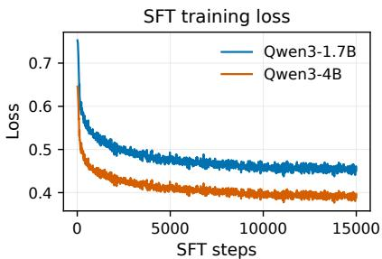

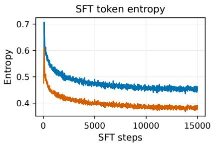

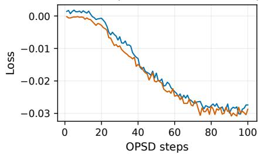

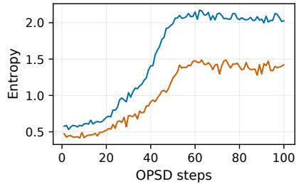  
Figure 7: Training traces for the SFT-initialization sweep. Top: SFT loss and token entropy for Qwen3-1.7B-Base and Qwen3-4B-Base. Bottom: loss and student entropy during 100-step OPSD runs from the 15k SFT checkpoints.

Table 22: Macro-average direct-SFT and downstream OPSD results. Format is the boxed-answer rate (%). Downstream OPSD initializes both student and teacher from the SFT checkpoint. Bold marks the best Avg@8 and Pass@8 within each model and stage. Per-checkpoint and per-dataset results, including the additional 7.5k and 12.5k direct-SFT evaluations, are in Table 59 and Table 60.
<table><tr><td rowspan="2">Model</td><td rowspan="2">SFT steps</td><td colspan="3">Direct SFT</td><td colspan="4">After 100-step OPSD</td></tr><tr><td>Avg@8</td><td>Pass@8</td><td>Format</td><td>Avg@8</td><td>Pass@8</td><td>Format</td><td>Length</td></tr><tr><td rowspan="4">Qwen3-1.7B-Base</td><td>Base</td><td>2.08</td><td>8.33</td><td>80.63</td><td>1.15</td><td>7.50</td><td>63.23</td><td>8.0k</td></tr><tr><td>5k</td><td>7.08</td><td>21.67</td><td>51.98</td><td>0.31</td><td>2.50</td><td>0.83</td><td>34.6k</td></tr><tr><td>10k</td><td>9.59</td><td>20.83</td><td>64.58</td><td>3.12</td><td>11.67</td><td>6.56</td><td>35.2k</td></tr><tr><td>15k</td><td>11.46</td><td>29.17</td><td>63.54</td><td>1.56</td><td>7.50</td><td>3.85</td><td>36.2k</td></tr><tr><td rowspan="4">Qwen3-4B-Base</td><td>Base</td><td>7.29</td><td>20.00</td><td>87.19</td><td>4.79</td><td>17.50</td><td>74.59</td><td>10.3k</td></tr><tr><td>5k</td><td>25.63</td><td>50.83</td><td>76.04</td><td>0.83</td><td>4.17</td><td>2.08</td><td>33.1k</td></tr><tr><td>10k</td><td>32.29</td><td>60.84</td><td>90.52</td><td>1.67</td><td>8.33</td><td>4.17</td><td>32.8k</td></tr><tr><td>15k</td><td>34.69</td><td>60.00</td><td>89.27</td><td>1.98</td><td>8.33</td><td>3.44</td><td>32.9k</td></tr></table>

OPSD remains sensitive to the post-training stage, as in subsection 5.6. Direct SFT ability rises with training, but OPSD collapses from the partially SFT-trained checkpoints (Table 22).

## C.6.1 OUTPUT DEGENERATION EXAMPLES

For the unstable SFT initializations, we inspect all eight samples for each of the 120 evaluation problems (960 generations per row). Consistent with the failure mode in subsection 5.6, Table 23 shows a shift from partially successful direct-SFT generations to repetitive, non-terminating outputs with few boxed answers after OPSD. The length increase reflects collapse, not longer successful reasoning.

Table 23: Generation-level diagnostics pooled over AIME 2024–2026 and HMMT25. Boxed is the fraction of samples with a boxed final answer. Avg@8 is the fraction of correct samples. OPSD denotes evaluation after 100-step OPSD from that SFT checkpoint.
<table><tr><td>Checkpoint</td><td>Cond.</td><td>N</td><td>Tokens</td><td>≥32k</td><td>≥38k</td><td>Boxed</td><td>Avg@8</td></tr><tr><td>1.7B SFT-5k</td><td>direct</td><td>960</td><td>23.8k</td><td>39.8%</td><td>19.5%</td><td>52.0%</td><td>7.1%</td></tr><tr><td>1.7B SFT-5k</td><td>OPSD</td><td>960</td><td>34.7k</td><td>48.0%</td><td>32.4%</td><td>0.8%</td><td>0.3%</td></tr><tr><td>1.7B SFT-10k</td><td>OPSD</td><td>960</td><td>35.2k</td><td>71.2%</td><td>55.4%</td><td>6.6%</td><td>3.1%</td></tr><tr><td>4B SFT-5k</td><td>OPSD</td><td>960</td><td>33.1k</td><td>80.0%</td><td>0.0%</td><td>2.1%</td><td>0.8%</td></tr></table>

On AIME 2024 problem 0 (answer 204), the direct 1.7B SFT-5k checkpoint produces three correct boxed answers among eight samples. One trajectory correctly uses the two stated total times:

[AIME 2024-0, Qwen3-1.7B SFT-5k, direct, excerpt]   
9/s = 4 - t/60 9/(s + 2) = 2.4 - t/60   
... final answer: \boxed{204}

After 100-step OPSD, none of the eight samples contains a boxed or correct answer, and all span 32.6k–38.9k tokens. In the 38,912-token trajectory below, the model leaves the stated four-hour total as an unknown and repeatedly searches for a nonexistent third constraint (ellipses denote omitted tokens):

[AIME 2024-0, same problem, Qwen3-1.7B SFT-5k after 100-step OPSD, excerpt]   
Total Time T1 = (9/s) + (t/60) = ?   
Alternatively perhaps there is a third condition involving different speeds   
and times? Alternatively perhaps I can get another equation from another   
scenario where she walks slower than s?   
Hmm. Hmm. ... [repeated 15,134x: Hmm. 78x: Alternatively]   
. . . [no \boxed{} answer, 38,912 tokens]

The 4B SFT-5k checkpoint after OPSD exhibits the same failure to enter a final-answer mode on AIME 2025 problem 0. Its 33,583-token unboxed trajectory ends as follows:

[AIME 2025-0, Qwen3-4B SFT-5k after 100-step OPSD, final characters]   
!!!!!!!!!!!!!!!!!!!!!!!!!!!!!!!! ... [no \boxed{} answer, 33,583 tokens]

## C.6.2 GRPO CONTROL ON THE COLLAPSING 4B SFT INITIALIZATION

We continue the Qwen3-4B-Base SFT-15k checkpoint with 100 GRPO updates under a DAPO-style verifiable math reward. This checkpoint has the strongest direct SFT result in Table 22 and collapses under 100-step OPSD. subsection B.4 gives the GRPO configuration.

OPSD’s failure mode remains pipeline-dependent, as in subsection 5.6: from the same initialization, GRPO is approximately flat and format-stable, whereas OPSD collapses; applying OPSD after GRPO collapses again (Table 5, panel (b)).

## C.6.3 OPSD AFTER SFT THEN GRPO

We next initialize both student and teacher from the GRPO step-100 actor and apply the Qwen3-4B OPSD protocol without other changes.

Table 24: Matched Th/Th OPSD from released Qwen3-4B and the SFT-then-GRPO checkpoint. Per-dataset results and training traces are in Table 64 and Table 31.
<table><tr><td>Initialization</td><td>Stage</td><td>Avg@8</td><td>Pass@8</td><td></td><td>Format Length</td></tr><tr><td rowspan="2">Qwen3-4B (Th/Th)</td><td>Base</td><td>62.3</td><td>79.2</td><td>97.1</td><td>17.8k</td></tr><tr><td>+ 100-step OPSD</td><td>57.9</td><td>75.8</td><td>86.4</td><td>19.9k</td></tr><tr><td rowspan="2">4B SFT-15k+GRPO</td><td>GRPO-100</td><td>33.65</td><td>60.83</td><td>94.79</td><td>14.2k</td></tr><tr><td>+ 100-step OPSD</td><td>3.54</td><td>14.17</td><td>5.62</td><td>37.6k</td></tr></table>

The pipeline-stage conclusion in subsection 5.6 also holds here: released Qwen3-4B degrades without collapse, whereas the SFT-then-GRPO checkpoint collapses after OPSD. Their logs separate early: entropy and gradient norm rise for the SFT-then-GRPO initialization but remain bounded or decrease for released Qwen3-4B (subsection 6.4).

## C.7 OPSD VERSUS GRPO ON RELEASED QWEN3 THINKING MODELS

For the OPSD–GRPO comparison in Table 6, we train both methods from the released Qwen3- 1.7B and Qwen3-4B models in their native Th mode and evaluate after 50 updates. Both methods consume exactly the same 3,200 examples from the OpenMathReasoning integer-answer subset in the same order: we materialize the first 3,200 rows produced by the GRPO random sampler (seed 1) as the sequential OPSD dataset. GRPO uses the final answer only for reward verification, whereas OPSD supplies the corresponding post-thinking solution as privileged teacher context.

The matched OPSD runs use a frozen same-model teacher, full-parameter updates, a 1,024-token rollout cap, global batch size 64, learning rate $1 \times 1 0 ^ { - 6 }$ , forward KL, token-contribution clipping at

0.05, and seed 42. Both model sizes train on 2 A800 GPUs; Qwen3-1.7B uses per-device batch size 8 with gradient accumulation 4, and Qwen3-4B uses per-device batch size 4 with gradient accumulation 8. The longest rendered prompt in the materialized dataset is 2,584 tokens. subsection B.4 gives the GRPO configuration, and Table 63 and Table 62 report the benchmark-level results.

The cost column in Table 6 uses training-loop time through the evaluated checkpoint and excludes evaluation and data preprocessing. The results support the trade-off in subsection 5.7: neither method dominates accuracy, while OPSD uses substantially fewer GPU-hours under these recipes. At 1.7B, OPSD has higher Avg@8 and equal Pass@8; at 4B, GRPO leads Avg@8 and OPSD leads Pass@8.

## D SUPPLEMENTARY ANALYSIS RESULTS

## D.1 TOKEN-LEVEL ANALYSIS DETAILS

This subsection reports the protocol and per-model results underlying section 6. Unless noted otherwise, the analysis uses 2,048 prompts with two on-policy rollouts each; the position-window study uses a 6,144-token rollout cap.

## D.1.1 TOKEN-LEVEL ANALYSIS PROTOCOL

We compute the token-level statistics in section 6 offline from the same student and teacher distributions used in training. For each initial checkpoint, we sample 2,048 training prompts with two on-policy rollouts each $( n \ : = \ : 4 , 0 9 6 )$ at temperature 1.1 and a 1,024-token rollout cap. The frozen self-teacher scores the visited response tokens under its privileged context. Reported forward KL is the vocabulary-summed, unclipped $\beta = 0$ divergence. Unless explicitly described as shared, the matched-mode, teacher-context, and entropy analyses use independent rollout draws under this common protocol. The model-type summary in Table 8 computes all of its metrics within the entropy-analysis draw for each checkpoint.

The $D _ { i } ^ { \mathrm { f w d } } > 0 . 0 5$ statistic thresholds this summed diagnostic and is distinct from the training-time pointwise contribution cap. Encourage and Discourage are the fractions of positions with sampledtoken log advantage $a _ { i } ~ > ~ 0$ and $a _ { i } ~ < ~ 0$ . The remainder are ties at stored precision. Because $y _ { i } ^ { S } \sim \pi _ { i } ^ { \overline { { S } } } , \mathbb { E } _ { y _ { i } ^ { S } \sim \pi _ { i } ^ { \overline { { S } } } } [ a _ { i } ] = - D _ { \mathrm { K L } } ( \pi _ { i } ^ { S } \lVert \pi _ { i } ^ { T } ) \le 0 ,$ , so student-policy sampling yields a non-positive expectation. Measurements at initialization exclude student drift and optimizer-state effects.

For the teacher-side context conditions of Table 9, Answer only, Unrelated solution, short and long Full solution, and CoT+Solution share the same student rollouts (sampled under the long-solution pool. See subsubsection D.1.5). For the position-window analysis of subsubsection D.1.6, the protocol is identical except that completions are capped at 6,144 tokens and metrics are aggregated within fixed response-position intervals.

## D.1.2 ADDITIONAL MATCHED-MODE TOKEN-LEVEL SIGNALS

Table 25 complements Table 7 with eight additional checkpoints in their native matched modes.

Table 25: Additional matched-mode signals (%). Ordered by Base Pass@8. Definitions follow Table 7.
<table><tr><td>Model</td><td>S</td><td>T</td><td>Fwd. KL</td><td>D &gt; .05</td><td>Agree.</td><td>Enc.</td><td>Disc.</td></tr><tr><td>Qwen3-0.6B</td><td>Th</td><td>Th</td><td>0.074</td><td>21.7</td><td>92.6</td><td>36.8</td><td>62.3</td></tr><tr><td>DeepSeek-R1-Distill-Qwen-1.5B</td><td>Th</td><td>Th</td><td>0.033</td><td>12.5</td><td>95.1</td><td>42.7</td><td>56.9</td></tr><tr><td>OLMo-3-7B-Instruct</td><td>NTh</td><td>NTh</td><td>0.126</td><td>24.1</td><td>92.3</td><td>38.9</td><td>51.4</td></tr><tr><td>Qwen3-4B-Instruct</td><td>NTh</td><td>NTh</td><td>0.175</td><td>18.9</td><td>93.5</td><td>21.8</td><td>36.8</td></tr><tr><td>MiMo-7B-RL</td><td>Th</td><td>Th</td><td>0.104</td><td>23.3</td><td>93.4</td><td>20.0</td><td>75.8</td></tr><tr><td>OLMo-3-7B-Think</td><td>Th</td><td>Th</td><td>0.115</td><td>23.7</td><td>92.6</td><td>37.1</td><td>60.9</td></tr><tr><td>Qwen3-4B-Thinking-2507</td><td>Th</td><td>Th</td><td>0.162</td><td>24.6</td><td>92.3</td><td>23.1</td><td>61.1</td></tr><tr><td>Falcon-H1R-7B</td><td>Th</td><td>Th</td><td>0.058</td><td>17.4</td><td>94.1</td><td>30.4</td><td>68.6</td></tr></table>

Consistent with subsection 6.2, matched-mode signal statistics vary across checkpoints and do not order downstream OPSD outcomes.

## D.1.3 WHERE THE DIVERGENCE MASS FALLS IN THE VOCABULARY

The vocabulary analysis supports the mode-transfer conclusion in subsection 5.1: large cumulative divergence contributions often come from punctuation, delimiters, the frequent word the, LaTeX markers, and reasoning-transition tokens such as “Let,” “So,” “We,” and “I.”

## D.1.4 TEACHER-SIDE CONTEXT SIGNAL BY CHECKPOINT

Tables 26 and 27 report seven context conditions for ten checkpoints; Figure 8 shows their permodel PCA views on a shared basis. The checkpoint-level results support the context finding in subsection 5.3: context type shapes the signal. Within OpenThoughts, CoT+Solution produces the largest signal for every checkpoint, while Full solution and Unrelated solution are closest for DeepSeek-R1-Distill-Qwen-1.5B.

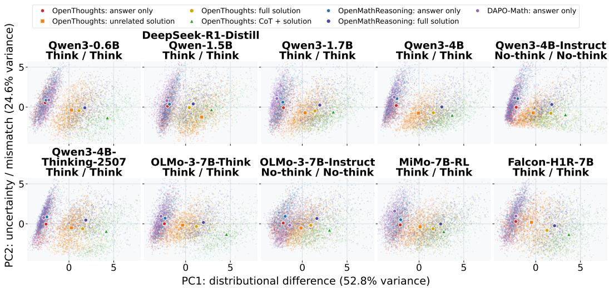  
Figure 8: Per-model teacher-context PCA for the ten checkpoints underlying the aggregate view in Figure 5. Points are rollout-level signal summaries and large markers are centroids for the seven dataset–context conditions. The panels use a common PCA basis and shared axes. Features are standardized within each model–mode setting before the joint PCA fit.

Table 26: Teacher-side context signal by checkpoint (models 1–5). Unqualified conditions use OpenThoughts; OMR and DAPO denote OpenMathReasoning and DAPO-Math-17k. CoT+Sol. denotes CoT+Solution. D > .05 and Agree. are percentages, and Abs. adv. is the mean absolute sampled-token log advantage.
<table><tr><td>Model</td><td>Mode</td><td>Context</td><td>Fwd. KL</td><td>D &gt; .05</td><td>Abs. adv.</td><td>Agree.</td></tr><tr><td rowspan="6">Qwen3-0.6B</td><td rowspan="6">Th/Th</td><td>Answer</td><td>0.010</td><td>1.8</td><td>0.036</td><td>97.9</td></tr><tr><td>Unrelated</td><td>0.046</td><td>17.5</td><td>0.112</td><td>93.8</td></tr><tr><td>Full</td><td>0.074</td><td>21.5</td><td>0.139</td><td>92.7</td></tr><tr><td>CoT+Sol.</td><td>0.134</td><td>36.9</td><td>0.214</td><td>89.1</td></tr><tr><td>OMR Answer</td><td>0.008</td><td>1.3</td><td>0.034</td><td>98.0</td></tr><tr><td>OMR Full</td><td>0.089</td><td>24.2</td><td>0.157</td><td>91.7</td></tr><tr><td rowspan="6">DeepSeek-R1-Distill-Qwen-1.5B 3 Th/Th</td><td>DAPO Answer Answer</td><td>0.004 0.004</td><td>0.8 0.9</td><td></td><td>0.032</td><td>98.1</td></tr><tr><td></td><td></td><td></td><td></td><td>0.024</td><td>98.6</td></tr><tr><td>Unrelated</td><td>0.037</td><td>11.5</td><td></td><td>0.083</td><td>95.4</td></tr><tr><td>Full</td><td>0.032</td><td></td><td>12.3</td><td>0.086</td><td>95.3</td></tr><tr><td>CoT+Sol.</td><td>0.063</td><td>25.3</td><td></td><td>0.142</td><td>92.5</td></tr><tr><td>OMR Answer OMR Full</td><td>0.004 0.038</td><td>0.7 14.5</td><td></td><td>0.023 0.098</td><td>98.6 94.5</td></tr><tr><td rowspan="6"></td><td>DAPO Answer</td><td>0.002</td><td>0.2</td><td></td><td>0.020</td><td>98.8</td></tr><tr><td>Answer</td><td>0.019</td><td>3.4</td><td></td><td>0.042</td><td>98.0</td></tr><tr><td>Unrelated</td><td>0.059</td><td></td><td>15.4</td><td>0.107</td><td>95.0</td></tr><tr><td>Full</td><td>0.144</td><td></td><td>20.2</td><td>0.184</td><td>92.9</td></tr><tr><td>CoT+Sol.</td><td>0.225</td><td>27.7</td><td></td><td>0.280</td><td>90.1</td></tr><tr><td>OMR Answer</td><td>0.016</td><td>2.6</td><td></td><td>0.037</td><td>98.1</td></tr><tr><td rowspan="6"></td><td>OMR Full DAPO Answer</td><td>0.177</td><td></td><td>22.7</td><td>0.220</td><td>91.9</td></tr><tr><td></td><td>0.007</td><td></td><td>1.9</td><td>0.032</td><td>98.4</td></tr><tr><td>Answer</td><td>0.025</td><td></td><td>3.7</td><td>0.047</td><td>97.8</td></tr><tr><td>Unrelated</td><td>0.052</td><td></td><td>15.1</td><td>0.097</td><td>95.2</td></tr><tr><td>Full</td><td>0.135</td><td></td><td>22.0</td><td>0.176</td><td>92.8</td></tr><tr><td>CoT+Sol. OMR Answer</td><td>0.203</td><td>30.3</td><td></td><td>0.242</td><td>90.3</td></tr><tr><td rowspan="6"></td><td></td><td>0.023</td><td>3.0</td><td></td><td>0.045</td><td>97.9</td></tr><tr><td>OMR Full</td><td>0.167</td><td>25.3</td><td></td><td>0.208</td><td>91.5</td></tr><tr><td>DAPO Answer</td><td>0.010</td><td>1.8</td><td></td><td>0.035</td><td>98.2</td></tr><tr><td>Answer</td><td>0.018</td><td></td><td>3.0</td><td>0.035</td><td>98.4</td></tr><tr><td>Unrelated</td><td>0.050</td><td></td><td>11.1</td><td>0.080</td><td>96.4</td></tr><tr><td>Full</td><td>0.155</td><td></td><td>18.1</td><td>0.175</td><td>93.8</td></tr><tr><td rowspan="4">Qwen3-4B-Instruct</td><td>CoT+Sol.</td><td>0.248</td><td></td><td>23.1</td><td>0.257</td><td>91.7</td></tr><tr><td>OMR Answer</td><td>0.015</td><td>2.9</td><td></td><td>0.036</td><td>98.2</td></tr><tr><td>OMR Full</td><td>0.140</td><td>21.2</td><td></td><td>0.183</td><td>92.9</td></tr><tr><td>DAPO Answer</td><td>0.006</td><td></td><td>1.4</td><td>0.025</td><td>98.7</td></tr></table>

Table 27: Teacher-side context signal by checkpoint (models 6–10 and ten-model macro average). Condition and metric definitions follow Table 26.
<table><tr><td>Model</td><td>Mode</td><td>Context</td><td>Fwd. KL</td><td>D &gt; .05</td><td>Abs. adv.</td><td>Agree.</td></tr><tr><td rowspan="7">Qwen3-4B-Thinking-2507 Th/Th</td><td rowspan="7"></td><td>Answer</td><td>0.018</td><td>3.2</td><td>0.039</td><td>98.1</td></tr><tr><td>Unrelated</td><td>0.105</td><td>19.2</td><td>0.128</td><td>94.1</td></tr><tr><td>Full</td><td>0.159</td><td>24.1</td><td>0.181</td><td>92.4</td></tr><tr><td>CoT+Sol.</td><td>0.275</td><td>34.8</td><td>0.270</td><td>89.0</td></tr><tr><td>OMR Answer</td><td>0.018</td><td>2.8</td><td>0.038</td><td>98.1</td></tr><tr><td>OMR Full</td><td>0.176</td><td>25.3</td><td>0.208</td><td>91.5</td></tr><tr><td>DAPO Answer</td><td>0.007</td><td>1.3</td><td>0.026</td><td>98.6</td></tr><tr><td rowspan="7">OLMo-3-7B-Think</td><td rowspan="7"></td><td>Answer</td><td>0.023</td><td>2.5</td><td>0.038</td><td>98.1</td></tr><tr><td>Unrelated</td><td>0.055</td><td>17.5</td><td>0.107</td><td>94.6</td></tr><tr><td>Full</td><td>0.111</td><td>23.1</td><td>0.153</td><td>92.8</td></tr><tr><td>CoT+Sol.</td><td>0.206</td><td>38.8</td><td>0.234</td><td>89.6</td></tr><tr><td>OMR Answer</td><td>0.023</td><td>1.8</td><td>0.035</td><td>98.2</td></tr><tr><td>OMR Full</td><td>0.132</td><td>25.4</td><td>0.171</td><td>91.9</td></tr><tr><td>DAPO Answer</td><td>0.004</td><td>0.7</td><td>0.023</td><td>98.8</td></tr><tr><td rowspan="6">OLMo-3-7B-Instruct</td><td rowspan="6">NTh/NTh</td><td>Answer Unrelated</td><td>0.015 0.048</td><td>3.8 15.5</td><td>0.043 0.099</td><td>97.7 95.0</td></tr><tr><td>Full</td><td>0.112</td><td>22.7</td><td></td><td>92.8</td></tr><tr><td>CoT+Sol.</td><td>0.195</td><td></td><td>0.162 0.254</td><td>89.8</td></tr><tr><td>OMR Answer</td><td>0.012</td><td>30.9 3.3</td><td>0.044</td><td>97.6</td></tr><tr><td>OMR Full</td><td>0.126</td><td>27.0</td><td>0.191</td><td>91.3</td></tr><tr><td>DAPO Answer</td><td>0.011</td><td>3.3</td><td>0.042</td><td>97.7</td></tr><tr><td rowspan="7">MiMo-7B-RL</td><td rowspan="7"></td><td>Answer</td><td>0.019</td><td>3.6</td><td>0.046</td><td>97.9</td></tr><tr><td>Unrelated</td><td>0.056</td><td>16.9</td><td>0.105</td><td>95.0</td></tr><tr><td>Full</td><td>0.103</td><td>23.0</td><td>0.147</td><td>93.5</td></tr><tr><td>CoT+Sol.</td><td>0.154</td><td>32.5</td><td>0.190</td><td>92.0</td></tr><tr><td>OMR Answer</td><td>0.018</td><td>2.9</td><td>0.044</td><td>97.9</td></tr><tr><td>OMR Full</td><td>0.122</td><td>26.0</td><td>0.171</td><td>92.4</td></tr><tr><td>DAPO Answer</td><td>0.009</td><td>1.6</td><td>0.036</td><td>98.2</td></tr><tr><td rowspan="7">Falcon-H1R-7B</td><td rowspan="7"></td><td>Answer</td><td>0.012</td><td>2.7</td><td>0.038</td><td>97.9</td></tr><tr><td>Unrelated</td><td>0.034</td><td>9.8</td><td>0.082</td><td>95.6</td></tr><tr><td>Full</td><td>0.051</td><td>15.5</td><td>0.104</td><td>94.5</td></tr><tr><td>CoT+Sol.</td><td>0.086</td><td>27.4</td><td>0.158</td><td>92.0</td></tr><tr><td>OMR Answer</td><td>0.010</td><td>1.9</td><td>0.034</td><td>98.1</td></tr><tr><td>OMR Full</td><td>0.059</td><td>18.0</td><td>0.120</td><td>93.6</td></tr><tr><td>DAPO Answer</td><td>0.007</td><td>1.3</td><td>0.029</td><td>98.4</td></tr><tr><td rowspan="7">Macro average</td><td rowspan="7"></td><td>Answer</td><td>0.016</td><td>2.9</td><td>0.039</td><td>98.0</td></tr><tr><td>Unrelated</td><td>0.054</td><td>14.9</td><td>0.100</td><td>95.0</td></tr><tr><td>Full</td><td>0.108</td><td>20.3</td><td>0.151</td><td>93.3</td></tr><tr><td>CoT+Sol.</td><td>0.179</td><td>30.8</td><td>0.224</td><td>90.6</td></tr><tr><td>OMR Answer</td><td>0.015</td><td>2.3</td><td>0.037</td><td>98.1</td></tr><tr><td>OMR Full</td><td>0.122</td><td>23.0</td><td>0.173</td><td>92.3</td></tr><tr><td>DAPO Answer</td><td>0.007</td><td>1.4</td><td>0.030</td><td>98.4</td></tr></table>

## D.1.5 LONG FULL-SOLUTION TEACHER PREFIXES

The main teacher-context analysis uses the 1,024-token prompt cap from training. The length control rescores the same student rollouts with a 12,288-token full-solution teacher prefix. Answer only and Unrelated solution retain the short budget, and token-level CoT+Solution uses a 10,240-token cap. All five prefixes share identical student completions sampled from the long-solution pool, with the short condition truncating C in $Q \oplus C$ . This offline control differs from the training intervention in subsection 5.3, which adds a separate CoT field to matched OpenThoughts rows and uses an 8,192-token teacher cap.

Consistent with subsection 5.3, prefix length alone changes the initial signal only slightly; the Answer only < Unrelated solution < Full solution ordering remains unchanged (Table 28).

Table 28: Length-control extension of the full-solution signal in Table 9: short vs. long full-solution teacher prefixes on shared student rollouts. SOL uses a 1,024-token teacher prompt cap. SOL-LONG raises it to 12,288. D > .05 and Agree. are percentages. Abs. adv. is the mean absolute sampledtoken log advantage.
<table><tr><td>Model</td><td>Mode</td><td>Prefix</td><td>Fwd KL</td><td>D &gt; .05</td><td>Abs. adv.</td><td>Agree.</td></tr><tr><td rowspan="2">Qwen3-1.7B</td><td rowspan="2">Th/Th</td><td>SOL</td><td>0.144</td><td>20.2</td><td>0.184</td><td>92.9</td></tr><tr><td>SOL-LONG</td><td>0.147</td><td>20.4</td><td>0.188</td><td>92.9</td></tr><tr><td rowspan="2">Qwen3-1.7B</td><td rowspan="2">NTh/NTh</td><td>SOL</td><td>0.090</td><td>16.7</td><td>0.125</td><td>94.7</td></tr><tr><td>SOL-LONG</td><td>0.094</td><td>17.2</td><td>0.129</td><td>94.6</td></tr><tr><td rowspan="2">Qwen3-4B</td><td rowspan="2">Th/Th</td><td>SOL</td><td>0.135</td><td>22.0</td><td>0.176</td><td>92.8</td></tr><tr><td>SOL-LONG</td><td>0.137</td><td>22.3</td><td>0.178</td><td>92.7</td></tr><tr><td rowspan="2">Qwen3-4B</td><td rowspan="2">NTh/NTh</td><td>SOL</td><td>0.066</td><td>15.2</td><td>0.109</td><td>95.2</td></tr><tr><td>SOL-LONG</td><td>0.068</td><td>15.6</td><td>0.111</td><td>95.1</td></tr><tr><td rowspan="2">Qwen3-4B-Instruct</td><td rowspan="2">NTh/NTh</td><td>SOL</td><td>0.155</td><td>18.1</td><td>0.175</td><td>93.8</td></tr><tr><td>SOL-LONG</td><td>0.158</td><td>18.3</td><td>0.178</td><td>93.7</td></tr><tr><td rowspan="2">OLMo-3-7B-Think</td><td rowspan="2">Th/Th</td><td>SOL</td><td>0.110</td><td>23.0</td><td>0.153</td><td>92.8</td></tr><tr><td>SOL-LONG</td><td>0.114</td><td>23.6</td><td>0.156</td><td>92.7</td></tr><tr><td rowspan="2">OLMo-3-7B-Instruct</td><td rowspan="2">NTh/NTh</td><td>SOL</td><td>0.112</td><td>22.6</td><td>0.162</td><td>92.8</td></tr><tr><td>SOL-LONG</td><td>0.115</td><td>23.1</td><td>0.165</td><td>92.7</td></tr><tr><td rowspan="2">Macro average</td><td rowspan="2"></td><td>SOL</td><td></td><td></td><td></td><td></td></tr><tr><td>SOL-LONG</td><td>0.116 0.119</td><td>19.7 20.1</td><td>0.155 0.158</td><td>93.6 93.5</td></tr></table>

## D.1.6 POSITION-WINDOW SIGNAL BY CHECKPOINT

The position-window results support early-token supervision in subsection 6.3: forward KL decreases with response position in every checkpoint (Table 29).

Table 29: Forward KL by response-position window (rollout cap 6,144). Each cell reports mean/SNR, where $\mathrm { S N R } = \mu / \sigma$ and σ is the token-level standard deviation. The macro row assigns equal weight to each checkpoint, matching Table 11.
<table><tr><td>Model</td><td>Mode</td><td>[0, 128)</td><td>[128, 256)</td><td>[256, 512)</td><td>[512, 1k)</td><td>[1k, 2k)</td><td>[2k, 4k)</td><td>[4k, 6k)</td></tr><tr><td>Qwen3-1.7B</td><td>Th/Th</td><td>0.291/0.238</td><td>0.224/0.214</td><td>0.138/0.186</td><td>0.091/0.153</td><td>0.066/0.124</td><td>0.048/0.104</td><td>0.041/0.090</td></tr><tr><td>Qwen3-4B</td><td>Th/Th</td><td>0.249/0.233</td><td>0.197/0.230</td><td>0.132/0.203</td><td>0.094/0.173</td><td>0.073/0.143</td><td>0.059/0.124</td><td>0.048/0.113</td></tr><tr><td>Qwen3-4B-Instruct</td><td>NTh/NTh</td><td>0.339/0.224</td><td>0.230/0.202</td><td>0.157/0.166</td><td>0.100/0.143</td><td>0.064/0.125</td><td>0.046/0.114</td><td>0.046/0.104</td></tr><tr><td>OLMo-3-7B-Think</td><td>Th/Th</td><td>0.258/0.278</td><td>0.158/0.255</td><td>0.106/0.221</td><td>0.077/0.173</td><td>0.062/0.132</td><td>0.050/0.106</td><td>0.039/0.088</td></tr><tr><td>OLMo-3-7B-Instruct</td><td>NTh/NTh</td><td>0.299/0.312</td><td>0.139/0.254</td><td>0.095/0.218</td><td>0.071/0.196</td><td>0.071/0.182</td><td>0.077/0.159</td><td>0.068/0.120</td></tr><tr><td>Macro average</td><td></td><td>0.287/0.248</td><td>0.190/0.217</td><td>0.126/0.185</td><td>0.087/0.160</td><td>0.067/0.138</td><td>0.056/0.121</td><td>0.048/0.103</td></tr></table>

## D.1.7 TRAINING-TIME FORWARD KL VERSUS DOWNSTREAM CHANGE

Table 10 pairs training-time forward KL with Avg@8 and Pass@8 changes under full-solution OPSD for nine checkpoints. For each run, we average the logged unclipped, vocabulary-summed forward KL over optimizer steps 1–10 and 91–100. Table 30 adds Qwen3-4B using its complete 256- and 1,024-token logs. Absolute Base and OPSD results for every model, rollout cap, and benchmark appear in Table 58.

Table 30: Qwen3-4B row supplementing the training-time forward-KL analysis in Table 10. KL First10 and Final10 average the first and final ten optimizer-step records. ∆ Avg and ∆ Pass are changes from Base in percentage points.
<table><tr><td></td><td colspan="4">256-token rollout cap</td><td colspan="4">1,024-token rollout cap</td></tr><tr><td>Model</td><td>KL First10</td><td>KL Final10</td><td>∆ Avg</td><td>∆ Pass</td><td>KL First10</td><td>KL Final10</td><td>∆ Avg</td><td>∆ Pass</td></tr><tr><td>Qwen3-4B</td><td>0.226</td><td>0.412↑</td><td>-1.4</td><td>一 -3.4</td><td>0.137</td><td>0.329 ↑</td><td>-4.4</td><td>-3.4</td></tr></table>

Consistent with subsection 6.2, neither early nor late forward KL tracks downstream changes across rollout caps and metrics for Qwen3-4B (Table 30).

## D.1.8 INITIALIZATION-DEPENDENT TRAINING DYNAMICS

Table 31: Mean diagnostics over early (steps 1–10) and late (steps 91–100) windows in the initialization block of Figure 6. Both runs use matched Th/Th and $\tau _ { \mathrm { c l i p } } = 0 . 0 5$ $H _ { S }$ is student entropy and $\| \nabla \|$ is the pre-clipping gradient norm.
<table><tr><td>Initialization</td><td>Steps</td><td> $H _ { S }$ </td><td> $D _ { \mathrm { K L } } ( \pi ^ { T } \lVert \pi ^ { S } )$ </td><td>|∇||</td><td>Loss</td></tr><tr><td rowspan="2">Qwen3-4B (Th/Th)</td><td>1-10</td><td>0.24</td><td>0.137</td><td>0.39</td><td>-0.009</td></tr><tr><td>91-100</td><td>0.22</td><td>0.329</td><td>0.18</td><td>-0.020</td></tr><tr><td rowspan="2">SFT+GRPO then OPSD</td><td>1-10</td><td>0.41</td><td>0.047</td><td>0.35</td><td>-0.001</td></tr><tr><td>91-100</td><td>1.29</td><td>0.215</td><td>0.86</td><td>-0.029</td></tr></table>

Consistent with subsection 6.4, only the collapsing SFT+GRPO initialization shows a joint rise in student entropy and gradient norm.

## E ADDITIONAL EXPERIMENTS AND ANALYSES

## E.1 CROSS-DATASET TEACHER-CONTEXT REPLICATION

We repeat the solution-only versus CoT-plus-solution comparison on two disjoint OpenMathRea soning subsets using Qwen3-1.7B, with identical examples and row order within each pair. More detailed teacher context does not necessarily improve training, as in subsection 5.3: adding CoT lowers Avg@8 from 34.4 to 27.8 on the at-most-1k subset and from 34.7 to 29.0 on the 2–4k subset despite the larger teacher prompt budget (Table 54).

## E.2 INSTRUCTION-ONLY TEACHER PREFIXES

We remove privileged teacher content and vary only the English student and teacher instructions. Concise-to-detailed (C→D) asks the student for a concise solution and the teacher for a detailed one. D→C reverses the instructions.

Table 32: Instruction-only prefix controls after 100 OPSD steps. Each cell reports Avg@8 / Pass@8 / mean output length. Per-dataset results are in Table 77.
<table><tr><td>Model</td><td>Base</td><td>Full solution</td><td>No priv.: C→D</td><td>No priv.: D→C</td></tr><tr><td>Qwen3-1.7B</td><td></td><td></td><td></td><td>34.0 / 59.2 / 18.6k35.3 / 60.8 / 22.4k 23.1 / 46.7 / 12.6k36.3 / 62.5 / 25.0k</td></tr><tr><td></td><td></td><td>OLMo-3-7B-Think 63.5 / 81.7 / 18.7k 58.8 / 77.5 / 21.7k 60.7 / 80.8 / 16.5k 56.4 / 75.0 / 24.1k</td><td></td><td></td></tr></table>

Teacher context shapes OPSD beyond privileged semantics, extending subsection 5.3: instruction only prefixes produce direction-dependent changes without privileged content.

## E.3 ADDITIONAL TRAINING CONTROLS

## E.3.1 POINTWISE CONTRIBUTION-CLIP THRESHOLD SWEEP

We vary only the pointwise vocabulary-contribution cap, retraining Qwen3-1.7B and OLMo-3-7B-Think with $\tau _ { \mathrm { c l i p } } \in \{ 0 . 0 1 , 0 . 1 , 0 . 2 \}$ while keeping all other settings fixed, and compare against Base and the default $\tau _ { \mathrm { c l i p } } = 0 . 0 5$ run (Table 33).

Table 33: Vocabulary-contribution clip threshold sweep after 100 OPSD steps. Bold marks the best Avg@8 / Pass@8 within each model (ties both bolded). Per-dataset results are in Table 79.
<table><tr><td>Model</td><td> $\tau _ { \mathrm { c l i p } }$ </td><td>Avg@8</td><td>Pass@8</td><td>Length</td></tr><tr><td rowspan="4">Qwen3-1.7B</td><td>Base</td><td>34.0</td><td>59.2</td><td>18.6k</td></tr><tr><td>0.01</td><td>31.4</td><td>56.7</td><td>26.2k</td></tr><tr><td>0.05</td><td>35.3</td><td>60.8</td><td>22.4k</td></tr><tr><td>0.1 0.2</td><td>32.9 30.6</td><td>60.0 53.3</td><td>16.6k 15.5k</td></tr><tr><td rowspan="6">OLMo-3-7B-Think</td><td>Base</td><td>63.5</td><td>81.7</td><td>18.7k</td></tr><tr><td>0.01</td><td>58.2</td><td>79.2</td><td>20.6k</td></tr><tr><td>0.05</td><td>58.8</td><td>77.5</td><td>21.7k</td></tr><tr><td>0.1</td><td>63.1</td><td>80.8</td><td>19.4k</td></tr><tr><td>0.2</td><td>63.1</td><td>81.7</td><td>17.0k</td></tr><tr><td></td><td></td><td></td><td></td></tr></table>

Consistent with subsection 5.4, changing the clipping threshold provides no reliable remedy. The leading threshold varies by model and does not consistently improve over the default or Base (Table 33).

## E.3.2 SHORT SFT THEN OPSD

We insert 10 supervised steps before 100-step same-prefix OPSD without privileged teacher context. The primary runs use OpenThoughts for both stages. An additional Qwen3-1.7B control uses OpenMathReasoning for SFT and OpenThoughts for OPSD.

Table 34: Ten-step SFT followed by 100-step no-privilege OPSD. OT/OMR denote the SFT corpus. OPSD uses OpenThoughts throughout. Bold marks the best Avg@8 / Pass@8 within each model– corpus block. Per-dataset results are in Table 80.
<table><tr><td>Model</td><td>SFT data</td><td>Stage</td><td>Avg@8</td><td>Pass@8</td><td>Length</td></tr><tr><td rowspan="3">Qwen3-1.7B</td><td rowspan="3">OT</td><td>Base</td><td>34.0</td><td>59.2</td><td>18.6k</td></tr><tr><td>SFT-10</td><td>5.1</td><td>17.5</td><td>6.9k</td></tr><tr><td>+ OPSD-100</td><td>5.2</td><td>16.7</td><td>6.6k</td></tr><tr><td rowspan="3">Qwen3-1.7B</td><td rowspan="3">OMR</td><td>Base</td><td>34.0</td><td>59.2</td><td>18.6k</td></tr><tr><td>SFT-10</td><td>28.0</td><td>54.2</td><td>16.9k</td></tr><tr><td>+ OPSD-100</td><td>27.1</td><td>49.2</td><td>16.9k</td></tr><tr><td rowspan="3">Qwen3-4B-Thinking</td><td rowspan="3">OT</td><td>Base</td><td>75.4</td><td>86.7</td><td>22.8k</td></tr><tr><td>SFT-10</td><td>4.9</td><td>20.8</td><td>2.0k</td></tr><tr><td>+ OPSD-100</td><td>7.8</td><td>28.3</td><td>3.1k</td></tr><tr><td rowspan="3">OLMo-3-7B-Think</td><td rowspan="3">OT</td><td>Base</td><td>63.5</td><td>81.7</td><td>18.7k</td></tr><tr><td>SFT-10</td><td>60.1</td><td>80.0</td><td>18.4k</td></tr><tr><td>+ OPSD-100</td><td>60.3</td><td>81.7</td><td>18.3k</td></tr></table>

OPSD remains sensitive to the post-SFT state, as in subsection 5.6: it does not reliably recover degraded checkpoints and changes stable checkpoints little.

## E.4 LORA DIAGNOSTICS AND QWEN3.5 COLLAPSE

We compare matched-mode full-parameter and LoRA OPSD across six model settings, then analyze Qwen3.5-4B collapse under matched modes (Table 35, Table 36).

Table 35: Matched-mode full-parameter and LoRA OPSD after 100 updates. Each cell reports Avg@8 / Pass@8 / mean output length. Bold marks the best Avg@8 and Pass@8 within each model. Ties are all bolded.
<table><tr><td>Model</td><td>Base</td><td>Full OPSD</td><td>LoRA OPSD</td></tr><tr><td>Qwen3-1.7B</td><td>34.0 / 59.2 / 18.6k</td><td>35.3 / 60.8 / 22.4k</td><td>35.8 / 61.7 / 23.3k</td></tr><tr><td>Qwen3-4B</td><td>62.3 / 79.2 / 17.8k</td><td>57.9 / 75.8 / 19.9k</td><td>59.9 / 80.0 / 20.2k</td></tr><tr><td>Qwen3-4B-Instruct</td><td>48.5 / 71.7 / 9.1k</td><td>50.0 / 70.0 / 10.6k</td><td>49.2 / 70.8 / 11.2k</td></tr><tr><td>Qwen3-4B-Thinking</td><td>75.4 / 86.7 / 22.8k</td><td>65.8 / 83.3 / 43.4k</td><td>68.0 / 82.5 / 40.5k</td></tr><tr><td>OLMo-3-7B-Think</td><td>63.5 / 81.7 / 18.7k</td><td>58.8 / 77.5 / 21.7k</td><td>62.5 / 77.5 / 21.3k</td></tr><tr><td>OLMo-3-7B-Instruct</td><td>39.5 / 60.8 / 7.6k</td><td>40.8 / 62.5 / 7.4k</td><td>41.3 / 62.5 / 7.9k</td></tr></table>

OPSD gains remain model-dependent, as in subsection 5.5. LoRA reduces drift and keeps most checkpoints closer to Base, but does not yield consistent gains.

Table 36: Qwen3.5-4B full-parameter and LoRA results after 100 matched-mode OPSD updates.
<table><tr><td>Eval mode</td><td>Evaluated state</td><td>Avg@8</td><td>Pass@8</td><td>Format</td><td>Length</td></tr><tr><td rowspan="3">NTh</td><td>Base</td><td>52.71</td><td>77.50</td><td>97.71</td><td>10.2k</td></tr><tr><td>Full OPSD (NTh/NTh)</td><td>8.02</td><td>35.00</td><td>14.90</td><td>70.7k</td></tr><tr><td>LoRA OPSD (NTh/NTh)</td><td>45.73</td><td>68.33</td><td>99.48</td><td>8.4k</td></tr><tr><td rowspan="3">Th</td><td>Base</td><td>80.62</td><td>91.67</td><td>90.52</td><td>38.1k</td></tr><tr><td>Full OPSD (Th/Th)</td><td>0.00</td><td>0.00</td><td>5.42</td><td>81.9k</td></tr><tr><td>LoRA OPSD (Th/Th)</td><td>8.54</td><td>20.83</td><td>10.62</td><td>77.4k</td></tr></table>

## E.4.1 THE NTh MODE IS NOT STRICTLY ISOLATED

Reasoning mode remains a confound rather than a clean semantic control, as in subsection 5.1. Specifically, Qwen3.5-4B sometimes emits an additional </think> delimiter after the chat template closes the empty thinking block and produces longer outputs than Qwen3-4B. The delimiter persists after full-parameter NTh/NTh training, so the two modes are not operationally isolated.

## E.4.2 THE DISTINGUISHING SIGNAL IS DYNAMIC, NOT INITIAL

Consistent with subsection 6.2, initial KL does not predict training stability. Matched modes start with lower forward KL than their corresponding mismatches, yet both later collapse; the subsequent entropy and forward-KL rise separates Qwen3.5-4B from the bounded Qwen3 controls (Table 37, Figure 9).

## E.4.3 LORA ATTENUATES THE DRIFT

Parameter restriction attenuates but does not remove the collapse behavior. The LoRA controls use rank 64 with scale 128 on q proj, k proj, v proj, o proj, gate proj, up proj, and down proj; all other parameters are frozen. LoRA removes length growth but leaves an accuracy drop for NTh/NTh, while Th/Th still collapses (Figure 9).

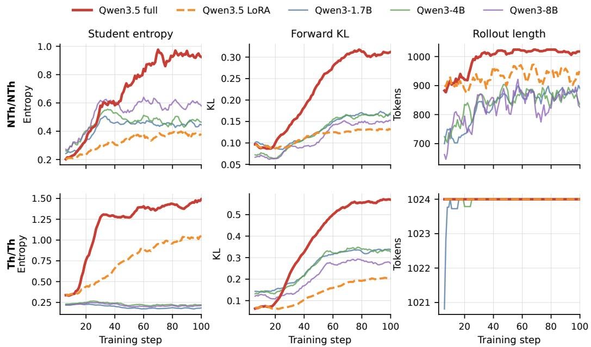  
Figure 9: Matched-mode training dynamics for full-parameter and LoRA Qwen3.5-4B versus three Qwen3 full-parameter controls. Curves are five-step moving averages from step 2 onward. Step 1 contains a one-off startup batch and is omitted.

Table 37: Initial Qwen3.5-4B token-level signals. Definitions follow Table 7. Per-setting and perdataset results for the downstream mode grid are in Table 49.
<table><tr><td>S</td><td>T</td><td>Fwd. KL</td><td>D &gt; .05</td><td>Agree.</td><td>Enc.</td><td>Disc.</td></tr><tr><td>NTh</td><td>NTh</td><td>0.087</td><td>17.7</td><td>94.7</td><td>34.1</td><td>63.4</td></tr><tr><td>NTh</td><td>Th</td><td>0.208</td><td>31.2</td><td>92.7</td><td>14.9</td><td>84.6</td></tr><tr><td>Th</td><td>NTh</td><td>0.140</td><td>27.2</td><td>92.0</td><td>56.0</td><td>43.4</td></tr><tr><td>Th</td><td>Th</td><td>0.066</td><td>16.5</td><td>95.0</td><td>40.2</td><td>58.7</td></tr></table>

## E.5 REPLICATIONS OF RECENT OPSD VARIANTS

We reproduce two recent OPSD variants: Purified OPSD replaces the raw privileged-teacher target with a PMI-corrected target, while β-OPSD uses an interpolated teacher–reference target with return-to-go credit assignment. We test whether vanilla OPSD’s model and configuration sensitivity persists under these targets.

Purified OPSD uses the authors’ main PMI setting: LoRA rank 64 (scaling 128), learning rate $5 \times 1 0 ^ { - 6 }$ , 200 updates, global batch 32, 1,024-token prompt and rollout caps, symmetric JSD, PMI strength 1, and PMI soft-clip threshold 10. We evaluate answer-only and full-solution fields. β- OPSD uses the same rank, learning rate, step count, batch size, and caps; its teacher weight increases from 0.5 to 0.8, its reference is the stop-gradient current student, and its return-to-go discount is 0.99. All rows use the four-benchmark, eight-sample protocol.

<table><tr><td>Variant</td><td>Model</td><td>Privileged field Avg@8</td><td></td><td> $\Delta _ { \mathrm { B / O } }$ </td><td>Pass@8</td><td> $\Delta _ { \mathrm { B / O } }$ </td><td></td><td>Length</td><td> $\Delta _ { \mathrm { B / O } }$ </td><td></td></tr><tr><td rowspan="9">Purified OPSD</td><td>Qwen3-1.7B</td><td>Answer</td><td>39.9</td><td> $+ 5 . 9 / + 4 . 6$ </td><td></td><td>63.3</td><td> $+ 4 . 1 / + 2 . 5$ </td><td>24.2k</td><td></td><td> $+ 2 9 . 7 / + 7 . 9$ </td></tr><tr><td>Qwen3-1.7B</td><td>Solution</td><td>37.5</td><td> $+ 3 . 5 / + 2 . 2$ </td><td>65.0</td><td></td><td> $+ 5 . 8 \dot { / } + 4 . 2$ </td><td>20.8k</td><td></td><td> $+ 1 1 . 5 / - 7 . 2$ </td></tr><tr><td>Qwen3-4B</td><td>Answer</td><td>63.3</td><td> $+ 1 . 0 \dot { / } + 5 . 4$ </td><td>79.2</td><td> $+ 0 . 0 \dot { / } + 3 . 3$ </td><td></td><td>19.6k</td><td></td><td> $+ 1 0 . 1 \dot { / } - 2 . 0$ </td></tr><tr><td>Qwen3-4B</td><td>Solution</td><td>61.3</td><td> $- 1 . 0 / + 3 . 4$ </td><td>77.5</td><td></td><td> $- 1 . 7 / + 1 . 7$ </td><td>18.5k</td><td></td><td> $+ 4 . 3 \dot { / } - 7 . 1$ </td></tr><tr><td>Qwen3-4B-Thinking</td><td>Answer</td><td>75.1</td><td> $- 0 . 3 / + 9 . 3$ </td><td>84.2</td><td></td><td> $- 2 . 5 / + 0 . 8$ </td><td>24.8k</td><td></td><td> $+ 8 . 8 \dot { / } - 4 2 . 9$ </td></tr><tr><td>Qwen3-4B-Thinking</td><td>Solution</td><td>75.3</td><td> $- 0 . 1 / + 9 . 5$ </td><td>86.7</td><td></td><td> $+ 0 . 0 / + 3 . 3$ </td><td>24.2k</td><td></td><td> $+ 6 . 2 \dot { / } - 4 4 . 2$ </td></tr><tr><td>OLMo-3-7B-Think</td><td>Answer</td><td>64.5</td><td> $+ 1 . 0 / + 5 . 7$ </td><td>80.8</td><td></td><td> $- 0 . 9 / + 3 . 3$ </td><td>19.2k</td><td></td><td> $+ 2 . 4 \dot { / } - 1 1 . 7$ </td></tr><tr><td>OLMo-3-7B-Think</td><td>Solution</td><td>63.8</td><td> $+ 0 . 3 / + 5 . 0$ </td><td>80.0</td><td></td><td> $- 1 . 7 / + 2 . 5$ </td><td>18.9k</td><td></td><td> $+ 0 . 6 / - 1 3 . 2$ </td></tr><tr><td>Qwen3-1.7B</td><td>Solution</td><td>25.1</td><td> $- 8 . 9 / - 1 0 . 2$ </td><td></td><td>49.2</td><td> $- 1 0 . 0 / - 1 1 . 7$ </td><td></td><td>13.4k</td><td> $- 2 8 . 0 / - 4 0 . 0$ </td></tr><tr><td rowspan="4">β-OPSD</td><td>Qwen3-4B-Thinking</td><td>Solution</td><td>68.6</td><td> $- 6 . 8 / + 2 . 8$ </td><td>82.5</td><td></td><td> $- 4 . 2 \dot { / } - 0 . 8$ </td><td>18.2k</td><td></td><td> $- 2 0 . 3 \dot { / } - 5 8 . 1$ </td></tr><tr><td>Qwen3-4B-Instruct</td><td>Solution</td><td>47.2</td><td> $- 1 . 3 \dot { / } - 2 . 8$ </td><td>65.8</td><td></td><td> $- 5 . 9 \dot { / } - 4 . 2$ </td><td>11.0k</td><td></td><td> $+ 2 0 . 3 / + 4 . 5$ </td></tr><tr><td>OLMo-3-7B-Think</td><td>Solution</td><td>64.1</td><td> $+ 0 . 6 / + 5 . 3$ </td><td>81.7</td><td></td><td> $+ 0 . 0 / + 4 . 2$ </td><td>18.8k</td><td></td><td> $+ 0 . 2 / - 1 3 . 5$ </td></tr><tr><td>OLMo-3-7B-Instruct Solution</td><td></td><td>42.4</td><td> $+ 2 . 9 / + 1 . 6$ </td><td>65.0</td><td></td><td> $+ 4 . 2 / + 2 . 5$ </td><td>8.3k</td><td></td><td> $+ 9 . 1 / + 1 1 . 9$ </td></tr></table>

Table 38: Paper-configuration replication results, macro-averaged over AIME 2024–2026 and HMMT25. Each $\Delta _ { \mathrm { B / O } }$ entry gives the change relative to Base / standard OPSD-1024 in the same native matched reasoning mode. Avg@8 and Pass@8 changes are absolute percentage points; Length changes are relative percentages. Per-dataset results are in Table 75 and Table 76.  
The replications retain the model dependence reported in subsection 5.5: each variant improves standard OPSD-1024 in some settings, but neither improves over Base consistently (Table 38).

## F ROBUSTNESS CHECKS

## F.1 SEED SENSITIVITY

For matched Qwen3-1.7B and OLMo-3-7B-Think, Table 39 lists the configurations repeated over training or evaluation seeds 42, 1024, and 65536. Training-seed tables contain independent training runs evaluated with seed 42. Evaluation-seed tables reuse the seed-42-trained checkpoints and vary the decoding seed.

Table 39: Seed repetitions for Qwen3-1.7B and OLMo-3-7B-Think. “Train” denotes independent training runs. “Eval” denotes decoding seeds applied to the seed-42-trained checkpoint.
<table><tr><td>Experiment family</td><td>Conditions</td><td>Training seeds</td><td>Evaluation seeds</td></tr><tr><td>Base checkpoint</td><td>Untrained Base</td><td></td><td>42 / 1024 / 65536</td></tr><tr><td>Rollout length</td><td>256 / 1024</td><td>42 /  1024 / 65536</td><td>42 / 1024 / 65536</td></tr><tr><td>Loss-token position</td><td>First / Uniform / Final-256</td><td>42 /  1024 / 65536</td><td>42 / 1024 / 65536</td></tr><tr><td>Teacher context</td><td>Solution / Answer / Unrelated</td><td>42 / 1024 / 65536</td><td>42 / 1024 / 65536</td></tr></table>

Table 40 reports the unannotated Base references under evaluation seeds 42/1024/65536. Tables 41– 46 mark Avg@8 and Pass@8 with ↑/↓ relative to Base: training-seed tables use Base@eval-42, and evaluation-seed tables use the matched evaluation seed. Ties receive no symbol. Length is unannotated.

Table 40: Base checkpoints under evaluation seeds 42/1024/65536. Training-seed tables use Base@eval-42. Evaluation-seed tables use Base at the matched evaluation seed. Per-dataset results are in Table 65.
<table><tr><td rowspan="3">Model</td><td colspan="4">Evaluation seed</td></tr><tr><td>42</td><td></td><td>1024</td></tr><tr><td></td><td>Avg@8 Pass@8 Length Avg@8 Pass@8 Length Avg@8 Pass@8 Length</td><td></td></tr><tr><td>Qwen3-1.7B</td><td>33.96 59.17</td><td>18.6k 35.10</td><td>55.00 18.6k 35.31 61.67</td></tr><tr><td>OLMo-3-7B-Think</td><td>63.54 81.67</td><td>18.7k 62.19</td><td>80.83 19.0k 63.12 79.17</td></tr></table>

## F.1.1 MAXIMUM STUDENT ROLLOUT LENGTH

The seed repetitions support the rollout-length finding in subsection 5.2: OPSD-256 has higher Avg@8 than OPSD-1024 across all training and evaluation seeds (Table 41, Table 42).

## F.1.2 LOSS-TOKEN POSITION SELECTION

The seed repetitions also support the position finding in subsection 6.3: with a fixed 256-position budget, First-256 has the highest mean Avg@8 on Qwen3-1.7B, while later-position variants remain below Base on OLMo-3-7B-Think (Table 43, Table 44).

## F.1.3 TEACHER-SIDE CONTEXT (PREFIX) INTERVENTIONS

The seed repetitions support the context finding in subsection 5.3: Answer only does not consistently lead, and Unrelated solution remains comparable to Full solution (Table 45, Table 46).

Table 41: Rollout-length results across training seeds 42/1024/65536, evaluated with seed 42. OPSD-256/1024 use full-solution context and matched Th/Th modes (subsection 5.2). Per-dataset results are in Table 66.
<table><tr><td>Model</td><td>Condition</td><td colspan="9">Training seed</td></tr><tr><td></td><td></td><td colspan="3">42</td><td colspan="3">1024</td><td colspan="3">65536</td></tr><tr><td></td><td></td><td>Avg@8</td><td>Pass@8</td><td>Length</td><td>Avg@8</td><td>Pass@8</td><td>Length</td><td>Avg@8</td><td>Pass@8</td><td>Length</td></tr><tr><td>Qwen3-1.7B</td><td>OPSD-256</td><td>38.12↑</td><td>62.50↑</td><td>21.4k</td><td>39.17↑</td><td>65.00↑</td><td>21.1k</td><td>37.08↑</td><td>65.00↑</td><td>21.3k</td></tr><tr><td></td><td>OPSD-1024</td><td>35.31↑</td><td>60.83↑</td><td>22.4k</td><td>35.94↑</td><td>56.67↓</td><td>22.0k</td><td>34.58↑</td><td>62.50↑</td><td>22.5k</td></tr><tr><td>OLMo-3-7B-Think</td><td>OPSD-256</td><td>60.83↓</td><td>80.00↓</td><td>21.4k</td><td>61.46↓</td><td>79.17↓</td><td>21.5k</td><td>61.98↓</td><td>81.67</td><td>21.5k</td></tr><tr><td></td><td>OPSD-1024</td><td>58.75↓</td><td>77.50↓</td><td>21.7k</td><td>59.17↓</td><td>78.33↓</td><td>21.8k</td><td>59.69↓</td><td>81.67</td><td>21.4k</td></tr></table>

Table 42: Rollout-length results across evaluation seeds 42/1024/65536 using the seed-42-trained checkpoints. Per-dataset results are in Table 67.
<table><tr><td>Model</td><td>Condition</td><td colspan="9">Evaluation seed</td></tr><tr><td></td><td></td><td colspan="3">42</td><td colspan="3">1024</td><td colspan="3">65536</td></tr><tr><td></td><td></td><td>Avg@8</td><td>Pass@8</td><td>Length</td><td>Avg@8</td><td>Pass@8</td><td>Length</td><td>Avg@8</td><td>Pass@8</td><td>Length</td></tr><tr><td>Qwen3-1.7B</td><td>OPSD-256</td><td>38.12↑</td><td>62.50↑</td><td>21.4k</td><td>36.98↑</td><td>59.17↑</td><td>21.0k</td><td>36.67↑</td><td>62.50↑</td><td>21.3k</td></tr><tr><td></td><td>OPSD-1024</td><td>35.31↑</td><td>60.83↑</td><td>22.4k</td><td>36.77↑</td><td>65.00↑</td><td>21.9k</td><td>36.56↑</td><td>61.67</td><td>22.2k</td></tr><tr><td>OLMo-3-7B-Think</td><td>OPSD-256</td><td>60.83↓</td><td>80.00↓</td><td>21.4k</td><td>61.98↓</td><td>80.83</td><td>21.7k</td><td>61.35↓</td><td>77.50↓</td><td>21.6k</td></tr><tr><td></td><td>OPSD-1024</td><td>58.75↓</td><td>77.50↓</td><td>21.7k</td><td>58.85↓</td><td>78.33↓</td><td>21.5k</td><td>60.31↓</td><td>79.17</td><td>21.6k</td></tr></table>

Table 43: Loss-token position results across training seeds. First-256 reuses the corresponding OPSD-256 run; Uni-256 and Final-256 use 1,024-token rollouts and retain at most 256 uniformly sampled or final loss positions. Per-dataset results are in Table 68.
<table><tr><td rowspan="3">Model</td><td rowspan="3">Condition</td><td colspan="9">Training seed</td></tr><tr><td colspan="3">42</td><td colspan="3">1024</td><td colspan="3">65536</td></tr><tr><td>Avg@8</td><td>Pass@8</td><td>Length</td><td>Avg@8</td><td>Pass@8</td><td>Length</td><td>Avg@8</td><td>Pass@8</td><td>Length</td></tr><tr><td rowspan="4">Qwen3-1.7B</td><td>First-256 /</td><td></td><td></td><td></td><td></td><td></td><td></td><td></td><td></td><td></td></tr><tr><td>OPSD-256</td><td>38.12↑</td><td>62.50↑</td><td>21.4k</td><td>39.17↑</td><td>65.00↑</td><td>21.1k</td><td>37.08↑</td><td>65.00↑</td><td>21.3k</td></tr><tr><td>Uni-256</td><td>35.21↑</td><td>61.67↑</td><td>22.6k</td><td>34.90↑</td><td>59.17</td><td>22.4k</td><td>36.56↑</td><td>62.50↑</td><td>22.8k</td></tr><tr><td>Final-256</td><td>34.27↑</td><td>59.17</td><td>23.7k</td><td>33.23↓</td><td>55.00↓</td><td>23.8k</td><td>34.17↑</td><td>58.33↓</td><td>23.7k</td></tr><tr><td rowspan="4">OLMo-3-7B-Think</td><td>First-256 /</td><td></td><td></td><td></td><td></td><td></td><td></td><td></td><td></td><td></td></tr><tr><td>OPSD-256</td><td>60.83↓</td><td>80.00↓</td><td>21.4k</td><td>61.46↓</td><td>79.17↓</td><td>21.5k</td><td>61.98↓</td><td>81.67</td><td>21.5k</td></tr><tr><td>Uni-256</td><td>59.06↓</td><td>82.50↑</td><td>21.5k</td><td>58.54↓</td><td>75.00↓</td><td>21.6k</td><td>60.00↓</td><td>80.83↓</td><td>21.1k</td></tr><tr><td>Final-256</td><td>61.25↓</td><td>79.17↓</td><td>21.1k</td><td>57.39↓</td><td>78.33↓</td><td>21.7k</td><td>57.29↓</td><td>77.50↓</td><td>21.8k</td></tr></table>

Table 44: Loss-token position results across evaluation seeds using the seed-42-trained checkpoints. First-256 reuses OPSD-256. Per-dataset results are in Table 69.
<table><tr><td>Model</td><td>Condition</td><td colspan="9">Evaluation seed</td></tr><tr><td></td><td></td><td colspan="3">42</td><td colspan="3">1024</td><td colspan="3">65536</td></tr><tr><td></td><td></td><td>Avg@8</td><td>Pass@8</td><td>Length</td><td>Avg@8</td><td>Pass@8</td><td>Length</td><td>Avg@8</td><td>Pass@8</td><td>Length</td></tr><tr><td></td><td>First-256 /</td><td></td><td></td><td></td><td></td><td></td><td></td><td></td><td></td><td></td></tr><tr><td>Qwen3-1.7B</td><td>OPSD-256</td><td>38.12↑</td><td>62.50↑</td><td>21.4k</td><td>36.98↑</td><td>59.17↑</td><td>21.0k</td><td>36.67↑</td><td>62.50↑</td><td>21.3k</td></tr><tr><td></td><td>Uni-256</td><td>35.21↑</td><td>61.67↑</td><td>22.6k</td><td>35.52↑</td><td>59.17↑</td><td>22.3k</td><td>34.27↓</td><td>58.33↓</td><td>22.8k</td></tr><tr><td></td><td>Final-256</td><td>34.27↑</td><td>59.17</td><td>23.7k</td><td>35.00↓</td><td>61.67↑</td><td>23.5k</td><td>33.85↓</td><td>58.33↓</td><td>23.3k</td></tr><tr><td></td><td>First-256 /</td><td></td><td></td><td></td><td></td><td></td><td></td><td></td><td></td><td></td></tr><tr><td>OLMo-3-7B-Think</td><td>OPSD-256</td><td>60.83↓</td><td>80.00↓</td><td>21.4k</td><td>61.98↓</td><td>80.83</td><td>21.7k</td><td>61.35↓</td><td>77.50↓</td><td>21.6k</td></tr><tr><td></td><td>Uni-256</td><td>59.06↓</td><td>82.50↑</td><td>21.5k</td><td>59.69↓</td><td>78.33↓</td><td>21.2k</td><td>58.54↓</td><td>79.17</td><td>21.5k</td></tr><tr><td></td><td>Final-256</td><td>61.25↓</td><td>79.17↓</td><td>21.1k</td><td>59.27↓</td><td>79.17↓</td><td>21.1k</td><td>58.23↓</td><td>80.00↑</td><td>21.3k</td></tr></table>

Table 45: Teacher-context results across training seeds at a 1,024-token rollout cap (Full solution / Answer only / Unrelated solution, subsection 5.3). Per-dataset results are in Table 70.
<table><tr><td>Model</td><td>Condition</td><td colspan="9">Training seed</td></tr><tr><td></td><td></td><td colspan="3">42</td><td colspan="3">1024</td><td colspan="3">65536</td></tr><tr><td></td><td></td><td>Avg@8</td><td>Pass@8</td><td>Length</td><td>Avg@8</td><td>Pass@8</td><td>Length</td><td>Avg@8</td><td>Pass@8</td><td>Length</td></tr><tr><td>Qwen3-1.7B</td><td>Solution</td><td>35.31↑</td><td>60.83↑</td><td>22.4k</td><td>35.94↑</td><td>56.67↓</td><td>22.0k</td><td>34.58↑</td><td>62.50↑</td><td>22.5k</td></tr><tr><td></td><td>Answer</td><td>35.62↑</td><td>59.17</td><td>25.8k</td><td>36.67↑</td><td>64.17↑</td><td>25.6k</td><td>34.69↑</td><td>59.17</td><td>25.5k</td></tr><tr><td></td><td>Unrelated</td><td>37.08↑</td><td>60.00↑</td><td>22.0k</td><td>38.96↑</td><td>62.50↑</td><td>21.9k</td><td>37.29↑</td><td>62.50↑</td><td>21.6k</td></tr><tr><td>OLMo-3-7B-Think</td><td>Solution</td><td>58.75↓</td><td>77.50↓</td><td>21.7k</td><td>59.17↓</td><td>78.33↓</td><td>21.8k</td><td>59.69↓</td><td>81.67</td><td>21.4k</td></tr><tr><td></td><td>Answer</td><td>56.15↓</td><td>75.83↓</td><td>24.1k</td><td>56.88↓</td><td>74.17↓</td><td>24.4k</td><td>56.98↓</td><td>74.17↓</td><td>23.9k</td></tr><tr><td></td><td>Unrelated</td><td>57.50↓</td><td>76.67↓</td><td>23.4k</td><td>56.46↓</td><td>75.00↓</td><td>23.4k</td><td>56.46↓</td><td>76.67↓</td><td>23.8k</td></tr></table>

Table 46: Teacher-context results across evaluation seeds using the seed-42-trained checkpoints and a 1,024-token rollout cap. Per-dataset results are in Table 71.
<table><tr><td>Model</td><td>Condition</td><td colspan="9">Evaluation seed</td></tr><tr><td></td><td></td><td colspan="3">42</td><td colspan="3">1024</td><td colspan="3">65536</td></tr><tr><td></td><td></td><td>Avg@8</td><td>Pass@8</td><td>Length</td><td>Avg@8</td><td>Pass@8</td><td>Length</td><td>Avg@8</td><td>Pass@8</td><td>Length</td></tr><tr><td>Qwen3-1.7B</td><td>Solution</td><td>35.31↑</td><td>60.83↑</td><td>22.4k</td><td>36.77↑</td><td>65.00↑</td><td>21.9k</td><td>36.56↑</td><td>61.67</td><td>22.2k</td></tr><tr><td></td><td>Answer</td><td>35.62↑</td><td>59.17</td><td>25.8k</td><td>35.83↑</td><td>55.83↑</td><td>25.8k</td><td>35.94↑</td><td>60.00</td><td>25.9k</td></tr><tr><td></td><td>Unrelated</td><td>37.08↑</td><td>60.00↑</td><td>22.0k</td><td>35.31↑</td><td>61.67↑</td><td>22.2k</td><td>36.67↑</td><td>59.17↓</td><td>22.0k</td></tr><tr><td>OLMo-3-7B-Think</td><td>Solution</td><td>58.75↓</td><td>77.50↓</td><td>21.7k</td><td>58.85↓</td><td>78.33↓</td><td>21.5k</td><td>60.31↓</td><td>79.17</td><td>21.6k</td></tr><tr><td></td><td>Answer</td><td>56.15↓</td><td>75.83↓</td><td>24.1k</td><td>58.85↓</td><td>79.17↓</td><td>23.9k</td><td>58.12↓</td><td>80.00↑</td><td>24.1k</td></tr><tr><td></td><td>Unrelated</td><td>57.50↓</td><td>76.67↓</td><td>23.4k</td><td>58.02↓</td><td>80.00↓</td><td>23.4k</td><td>58.65↓</td><td>75.00↓</td><td>23.3k</td></tr></table>

## F.2 TEMPERATURE ROBUSTNESS CHECKS

We vary the evaluation decoding temperature, student rollout-sampling temperature, and teacher scoring temperature while holding all other settings fixed.

## F.2.1 DECODING TEMPERATURE

The decoding-temperature check leaves the model-dependent conclusion in subsection 5.5 unchanged: small Instruct-model gains can reverse, while Qwen3-4B-Thinking degrades at both temperatures with substantial length growth (Table 47).

Table 47: Decoding-temperature robustness check, grouped by identical decode temperature within each model. The Base and OPSD values within each row are directly comparable. ∆ is OPSD minus Base. Each OPSD row uses the checkpoint trained under the default configuration. Results are unweighted averages over four benchmarks. Per-dataset results are in Table 73.
<table><tr><td rowspan="2">Model</td><td rowspan="2">Decode τ</td><td colspan="3">Base</td><td colspan="3">100-step OPSD</td><td colspan="3">∆ (OPSD – Base)</td></tr><tr><td>Avg@8</td><td>Pass@8</td><td>Length</td><td>Avg@8</td><td>Pass@8</td><td>Length</td><td>Avg@8</td><td>Pass@8</td><td>Length</td></tr><tr><td rowspan="2">Qwen3-1.7B</td><td>0.6</td><td>33.96</td><td>59.17</td><td>18.6k</td><td>35.31</td><td>60.83</td><td>22.4k</td><td>+1.35</td><td>+1.66</td><td>+3.8k</td></tr><tr><td>1.0</td><td>38.12</td><td>62.50</td><td>18.0k</td><td>36.67</td><td>65.83</td><td>21.4k</td><td>-1.45</td><td>+3.33</td><td>+3.4k</td></tr><tr><td rowspan="2">Qwen3-4B-Instruct</td><td>0.7</td><td>48.54</td><td>71.67</td><td>9.2k</td><td>50.00</td><td>70.00</td><td>10.6k</td><td>+1.46</td><td>-1.67</td><td>+1.4k</td></tr><tr><td>1.0</td><td>49.17</td><td>70.83</td><td>9.2k</td><td>48.75</td><td>66.67</td><td>10.7k</td><td>-0.42</td><td>-4.16</td><td>+1.5k</td></tr><tr><td rowspan="2"></td><td></td><td></td><td></td><td></td><td></td><td></td><td></td><td></td><td></td><td></td></tr><tr><td>0.6</td><td>75.42</td><td>86.67</td><td>22.8k</td><td>65.83</td><td>83.33</td><td>43.4k</td><td>-9.59</td><td>-3.34</td><td>+20.6k</td></tr><tr><td rowspan="2">Qwen3-4B-Thinking</td><td>1.0</td><td>76.04</td><td>86.67</td><td>23.1k</td><td>66.77</td><td>82.50</td><td>43.7k</td><td>-9.27</td><td>-4.17</td><td>+20.6k</td></tr><tr><td></td><td></td><td></td><td></td><td></td><td></td><td></td><td></td><td></td><td></td></tr><tr><td rowspan="2">OLMo-3-7B-Instruct</td><td>0.6</td><td>39.48</td><td>60.83</td><td>7.6k</td><td>40.83</td><td>62.50</td><td>7.4k</td><td>+1.35</td><td>+1.67</td><td>-0.2k</td></tr><tr><td>1.0</td><td>41.88</td><td>68.33</td><td>7.6k</td><td>38.02</td><td>61.67</td><td>7.2k</td><td>-3.86</td><td>-6.66</td><td>-0.4k</td></tr></table>

## F.2.2 TRAINING SAMPLING AND SCORING TEMPERATURES

Table 48: Training temperature check for Qwen3-1.7B OPSD. $\tau _ { S }$ is the student rollout-sampling temperature and $\tau _ { T }$ is the teacher scoring temperature. All other settings are fixed. Values are unweighted averages over four benchmarks. Bold marks the best Avg@8 and Pass@8. Ties are all bolded. Per-dataset results are in Table 74.
<table><tr><td> $\tau _ { S }$ </td><td> $\tau _ { T }$ </td><td>Eval. τ</td><td>Avg@8</td><td>Pass@8</td><td>Length</td></tr><tr><td>1.1</td><td>1.1</td><td>0.6</td><td>35.31</td><td>60.83</td><td>22.4k</td></tr><tr><td>0.6</td><td>0.6</td><td>0.6</td><td>35.42</td><td>60.83</td><td>20.0k</td></tr><tr><td>0.6</td><td>1.1</td><td>0.6</td><td>35.21</td><td>56.67</td><td>22.3k</td></tr><tr><td>1.1</td><td>0.6</td><td>0.6</td><td>32.29</td><td>57.50</td><td>18.3k</td></tr></table>

Training-temperature changes likewise provide no consistent remedy: lowering both temperatures preserves accuracy while shortening outputs, whereas asymmetric settings do not improve accuracy consistently (Table 48).

## G PER-DATASET EVALUATION RESULTS

The tables are grouped into main-text, seed-sensitivity, and additional-experiment results. Dataset averages use unrounded benchmark-level metrics, so averages of displayed values can differ by 0.1.

## G.1 MAIN-TEXT EXPERIMENT BREAKDOWNS

## G.1.1 STUDENT–TEACHER REASONING-MODE ALIGNMENT

S/T denote student/teacher modes (Th/NTh), and Eval denotes the inference mode. Each model lists its Th and NTh Base rows once because the Base checkpoint does not depend on teacher mode. NO-PRIV. retains the mismatched NTh/Th modes and problem context but removes the privileged solution.

Table 49: Per-dataset reasoning-mode results for Table 1 and Table 14, including the no-privilege control. Each dataset reports Avg@8, Pass@8, and mean output length. Dataset Avg. is the unweighted four-benchmark mean. Bold marks the best Dataset Avg. for Avg@8 and Pass@8 within each model. Ties are all bolded.
<table><tr><td rowspan="2">Model</td><td rowspan="2">S</td><td rowspan="2">T</td><td rowspan="2">Eval</td><td rowspan="2">Checkpoint</td><td colspan="3">AIME 2024</td><td colspan="3">AIME 2025</td><td colspan="3">AIME 2026</td><td colspan="3">HMMT25</td><td colspan="3">Dataset Avg.</td></tr><tr><td>Avg</td><td>Pass</td><td>Length</td><td>Avg</td><td>Pass</td><td>Length</td><td>Avg</td><td>Pass</td><td>Length</td><td>Avg</td><td>Pass</td><td>Length</td><td>Avg</td><td>Pass</td><td>Length</td></tr><tr><td rowspan="8">Qwen3-1.7B</td><td>Th Th Th</td><td></td><td>Th Th</td><td>Base</td><td>43.8 45.8</td><td>76.7 73.3</td><td>18647 22175</td><td>35.4 36.7</td><td>60.0 66.7</td><td>18266</td><td>35.0</td><td>53.3</td><td>18161</td><td>21.7</td><td>46.7</td><td>19421</td><td>34.0</td><td>59.2</td><td>18624</td></tr><tr><td></td><td>Th</td><td>OPSD</td><td></td><td></td><td></td><td></td><td></td><td></td><td>22143</td><td>36.7</td><td>63.3</td><td>21288</td><td>22.1</td><td>40.0</td><td>23913</td><td>35.3</td><td>60.8</td><td>22380</td></tr><tr><td></td><td>NTh</td><td>OPSD</td><td></td><td>28.8</td><td>53.3</td><td>12469</td><td>19.2</td><td>40.0</td><td>9756</td><td>17.5</td><td>36.7</td><td>11343</td><td>11.3</td><td>26.7</td><td>10867</td><td>19.2</td><td>39.2</td><td>11109</td></tr><tr><td>NTh</td><td></td><td>NTh Base</td><td></td><td>14.2</td><td>30.0</td><td>4958</td><td>10.4</td><td>23.3</td><td>2808</td><td>8.8</td><td>20.0</td><td>4977</td><td>5.8</td><td>10.0</td><td>2948</td><td>9.8</td><td>20.8</td><td>3923</td></tr><tr><td>NTh</td><td>Th</td><td>NTh</td><td>OPSD</td><td>20.0</td><td>36.7</td><td>10349</td><td>15.0</td><td>33.3</td><td>8806</td><td>11.7</td><td>23.3</td><td>11657</td><td>9.6</td><td>20.0</td><td>8112</td><td>14.1</td><td>28.3</td><td>9731</td></tr><tr><td>NTh</td><td>NTh</td><td>NTh</td><td>OPSD</td><td>10.8</td><td>23.3</td><td>10015</td><td>10.8</td><td>30.0</td><td>7387</td><td>9.6</td><td>20.0</td><td>10503</td><td>5.4</td><td>10.0</td><td>5946</td><td>9.2</td><td>20.8</td><td>8463</td></tr><tr><td>NTh</td><td>Th</td><td>OPSD</td><td></td><td>50.4</td><td>76.7</td><td>19576</td><td>42.1</td><td>60.0</td><td>19946</td><td>42.5 66.7</td><td></td><td>19793</td><td>28.3</td><td>50.0</td><td>20668</td><td>40.8</td><td>63.3</td><td>19996</td></tr><tr><td>NTh Th</td><td>Th</td><td>NO-PRIV.</td><td>53.3</td><td>70.0</td><td>19748</td><td>42.1</td><td>63.3</td><td>20385</td><td>42.9</td><td>70.0</td><td>20423</td><td></td><td>25.8</td><td>46.7</td><td>21387</td><td>41.0</td><td>62.5</td><td>20486</td></tr><tr><td></td><td>NTh</td><td>NTh</td><td>OPSD</td><td>8.8</td><td>23.3</td><td>3512</td><td>11.3</td><td>26.7</td><td>2458</td><td>6.3</td><td>13.3</td><td>4045</td><td>3.8</td><td>16.7</td><td>1999</td><td>7.5</td><td>20.0</td><td>3003</td></tr><tr><td rowspan="7">Qwen3-4B</td><td>Th Th Th NTh</td><td>Th</td><td>Th Th</td><td>Base OPSD</td><td>74.6 66.3</td><td>90.0 80.0</td><td>15495 18395</td><td>65.4 62.9</td><td>80.0 80.0</td><td>18696 19655</td><td>65.8 80.0 62.9 83.3</td><td></td><td>17249 18119</td><td>43.3 39.6</td><td>66.7</td><td>19636 23625</td><td>62.3 57.9</td><td>79.2</td><td>17769 19949</td></tr><tr><td></td><td>NTh</td><td>Th</td><td>OPSD</td><td>57.5</td><td>83.3</td><td>14327</td><td>46.3</td><td>70.0</td><td>15505</td><td>52.5</td><td>73.3</td><td>14392</td><td></td><td>60.0</td><td>16211</td><td>47.9</td><td>75.8</td><td>15108</td></tr><tr><td>=</td><td></td><td></td><td></td><td></td><td></td><td></td><td></td><td></td><td></td><td></td><td></td><td></td><td>35.4</td><td>50.0</td><td></td><td></td><td>69.2</td><td></td></tr><tr><td>NTh Th</td><td></td><td>NTh Base</td><td></td><td>25.0</td><td>50.0 53.3</td><td>8239</td><td>21.7</td><td>36.7</td><td>5727</td><td>19.6 43.3</td><td></td><td>7309</td><td>12.1</td><td>23.3</td><td>5500</td><td>19.6</td><td>38.3</td><td>6694</td></tr><tr><td>NTh</td><td></td><td>NTh OPSD</td><td></td><td>26.2</td><td></td><td>17508</td><td>25.8</td><td>53.3</td><td>15433</td><td>20.4 50.0</td><td></td><td>16489</td><td>13.3</td><td>26.7</td><td>19388</td><td>21.5</td><td>45.8</td><td>17204</td></tr><tr><td>NTh Th</td><td>NTh</td><td>NTh OPSD</td><td></td><td>22.9</td><td>40.0</td><td>15764</td><td>23.3</td><td>36.7</td><td>15308</td><td>14.6</td><td>30.0</td><td>15289</td><td>7.9</td><td>23.3</td><td>17266</td><td>17.2</td><td>32.5</td><td>15907</td></tr><tr><td>NTh Th</td><td>Th</td><td>Th Th</td><td>OPSD NO-PRIV.</td><td>72.5 72.9</td><td>86.7 83.3</td><td>16943 17976</td><td>68.3 65.0</td><td>80.0 76.7</td><td>20399 19795</td><td>67.1 65.4</td><td>86.7 83.3</td><td>18510 19041</td><td>44.2 40.4</td><td>63.3 56.7</td><td>21324 22048</td><td>63.0 60.9</td><td>79.2 75.0</td><td>19294 19715</td></tr><tr><td>Th</td><td>NTh</td><td>NTh</td><td>OPSD</td><td>21.3</td><td>40.0</td><td>7058</td><td>19.6</td><td>30.0</td><td>4629</td><td>14.6</td><td>30.0</td><td>6524</td><td>8.8</td><td>20.0</td><td>3940</td><td></td><td>16.0 30.0</td><td>5538</td></tr><tr><td rowspan="7">Qwen3-8B</td><td>Th Th NTh</td><td>Th</td><td>Th Base Th</td><td></td><td>76.3 67.5</td><td>86.7 76.7</td><td>14860 19649</td><td>69.6 62.5</td><td>80.0 18059</td><td>67.1</td><td>86.7 86.7</td><td>16744</td><td></td><td>43.3</td><td>60.0</td><td>20924 25193</td><td>64.1 58.9</td><td>78.3 17647</td></tr><tr><td>NTh</td><td>Th</td><td>OPSD OPSD</td><td></td><td>55.8 83.3</td><td></td><td>12931</td><td>83.3 45.0 70.0</td><td>21001 14801</td><td>65.0 49.2</td><td>80.0</td><td>19844 13775</td><td>40.4 21.3</td><td>60.0 46.7</td><td>13113</td><td></td><td>76.7 42.8 70.0</td><td>21422</td></tr><tr><td></td><td>NTh</td><td>Base</td><td></td><td>24.2 43.3</td><td>7391</td><td>19.2</td><td>40.0</td><td>4697</td><td>16.2</td><td>40.0</td><td>6901</td><td>12.5</td><td>26.7</td><td>4667</td><td></td><td>18.0 37.5</td><td>13655 5914</td></tr><tr><td>NTh Th NTh NTh</td><td></td><td>NTh OPSD</td><td></td><td>28.8 56.7</td><td>15015</td><td>27.9</td><td>43.3</td><td>14525</td></table>

## G.1.2 MAXIMUM STUDENT ROLLOUT LENGTH

Dataset Avg. gives the solid-curve points and dashed Base levels in Figure 3. Th/Th and NTh/NTh denote matched student–teacher modes. The NTh/NTh Qwen3 length sweeps are a diagnostic exception to the native Th/Th setting used for subsequent hybrid-model conclusions: they test whether the length trend also appears when the same hybrid checkpoints are operated in NTh mode. The 1024 / Uni-256 and 1024 / Final-256 rows keep the rollout cap at 1,024 tokens and apply the loss to at most 256 positions. Uniform samples without replacement, whereas Final retains the last positions. Both retain every valid position in shorter completions. The sweep curves exclude these position controls. Table 2 averages the Qwen3-1.7B and OLMo-3-7B-Think results.

Table 50: Per-dataset rollout-length results for the matched NTh/NThQwen3 sweeps in Figure 3. Each dataset reports Avg@8, Pass@8, and mean output length. Dataset Avg. gives the plotted mean.
<table><tr><td rowspan="2">Model</td><td rowspan="2">Training rollout</td><td colspan="3">AIME 2024</td><td colspan="3">AIME 2025</td><td colspan="3">AIME 2026</td><td colspan="3">HMMT25</td><td colspan="3">Dataset Avg.</td></tr><tr><td>Avg</td><td>Pass</td><td>Length</td><td>Avg</td><td>Pass</td><td>Length</td><td>Avg</td><td>Pass</td><td>Length</td><td>Avg</td><td>Pass</td><td>Length</td><td>Avg</td><td>Pass</td><td>Length</td></tr><tr><td rowspan="8">Qwen3-1.7B NTh/NTh</td><td>Base</td><td>14.2</td><td>30.0</td><td>4958</td><td>10.4</td><td>23.3</td><td>2808</td><td>8.8</td><td>20.0</td><td>4977</td><td>5.8</td><td>10.0</td><td>2948</td><td>9.8</td><td>20.8</td><td>3923</td></tr><tr><td>128</td><td>12.1</td><td>26.7</td><td>5258</td><td>10.0</td><td>23.3</td><td>3116</td><td>6.7</td><td>16.7</td><td>5283</td><td>4.2</td><td>13.3</td><td>3335</td><td>8.2</td><td>20.0</td><td>4248</td></tr><tr><td>256</td><td>14.2</td><td>33.3</td><td>6162</td><td>12.9</td><td>30.0</td><td>5492</td><td>9.6</td><td>20.0</td><td>7519</td><td>5.0</td><td>16.7</td><td>3751</td><td>10.4</td><td>25.0</td><td>5731</td></tr><tr><td>512</td><td>13.3</td><td>36.7</td><td>9160</td><td>10.4</td><td>30.0</td><td>8869</td><td>13.3</td><td>26.7</td><td>9046</td><td>4.2</td><td>13.3</td><td>5936</td><td>10.3</td><td>26.7</td><td>8253</td></tr><tr><td>1024</td><td>10.8</td><td>23.3</td><td>10015</td><td>10.8</td><td>30.0</td><td>7387</td><td>9.6</td><td>20.0</td><td>10503</td><td>5.4</td><td>10.0</td><td>5946</td><td>9.2</td><td>20.8</td><td>8463</td></tr><tr><td>2048</td><td>15.4</td><td>33.3</td><td>7255</td><td>11.7</td><td>23.3</td><td>6224</td><td>11.2</td><td>23.3</td><td>8313</td><td>5.4</td><td>20.0</td><td>4573</td><td>10.9</td><td>25.0</td><td>6591</td></tr><tr><td>4096 6144</td><td>13.8</td><td>30.0</td><td>9799</td><td>12.9</td><td>36.7</td><td>6252</td><td>6.2</td><td>20.0</td><td>10046</td><td>7.1</td><td>16.7</td><td>5354</td><td>10.0</td><td>25.8</td><td>7863</td></tr><tr><td></td><td>12.1</td><td>26.7</td><td>11950</td><td>14.2</td><td>33.3</td><td>7612</td><td>11.7</td><td>16.7</td><td>9960</td><td>4.6</td><td>13.3</td><td>5514</td><td>10.6</td><td>22.5</td><td>8759</td></tr><tr><td rowspan="8">Qwen3-4B NTh/NTh</td><td>Base</td><td>25.0</td><td>50.0</td><td>8239</td><td>21.7</td><td>36.7</td><td>5727</td><td>19.6</td><td>43.3</td><td>7309</td><td>12.1</td><td>23.3</td><td>5500</td><td>19.6</td><td>38.3</td><td>6694</td></tr><tr><td>128</td><td>20.0</td><td>40.0</td><td>11529</td><td>22.1</td><td>40.0</td><td>8779</td><td>15.0</td><td>23.3</td><td>10465</td><td>7.9</td><td>16.7</td><td>9715</td><td>16.2</td><td>30.0</td><td>10122</td></tr><tr><td>256</td><td>19.6</td><td>36.7</td><td>16505</td><td>17.5</td><td>36.7</td><td>15102</td><td>14.6</td><td>33.3</td><td>16479</td><td>8.8</td><td>20.0</td><td>17498</td><td>15.1</td><td>31.7</td><td>16396</td></tr><tr><td>512</td><td>20.8</td><td>36.7</td><td>16896</td><td>19.2</td><td>33.3</td><td>16487</td><td>13.3</td><td>30.0</td><td>17239</td><td>7.1</td><td>16.7</td><td>21014</td><td>15.1</td><td>29.2</td><td>17909</td></tr><tr><td>1024</td><td>22.9</td><td>40.0</td><td>15764</td><td>23.3</td><td>36.7</td><td>15308</td><td>14.6</td><td>30.0</td><td>15289</td><td>7.9</td><td>23.3</td><td>17266</td><td>17.2</td><td>32.5</td><td>15907</td></tr><tr><td>2048</td><td>18.8</td><td>40.0</td><td>17382</td><td>20.0</td><td>33.3</td><td>15974</td><td>17.1</td><td>36.7</td><td>16931</td><td>6.7</td><td>16.7</td><td>20779</td><td>15.6</td><td>31.7</td><td>17767</td></tr><tr><td>4096</td><td>21.2</td><td>36.7</td><td>17786</td><td>20.4</td><td>36.7</td><td>16162</td><td>14.2</td><td>36.7</td><td>18063</td><td>6.7</td><td>16.7</td><td>20520</td><td>15.6</td><td>31.7</td><td>18133</td></tr><tr><td>6144</td><td>18.3</td><td>33.3</td><td>15444</td><td>23.8</td><td>40.0</td><td>15505</td><td>15.4</td><td>36.7</td><td>15878</td><td>9.6</td><td>20.0</td><td>13964</td><td>16.8</td><td>32.5</td><td>15198</td></tr><tr><td rowspan="8">Qwen3-8B NTh/NTh</td><td>Base</td><td>24.2</td><td>43.3</td><td>7391</td><td>19.2</td><td>40.0</td><td>4697</td><td>16.2</td><td>40.0</td><td>6901</td><td>12.5</td><td>26.7</td><td>4667</td><td>18.0</td><td>37.5</td><td>5914</td></tr><tr><td>128</td><td>21.2</td><td>36.7</td><td>13958</td><td>17.9</td><td>33.3</td><td>11013</td><td>12.1</td><td>26.7</td><td>14225</td><td>7.5</td><td>20.0</td><td>10226</td><td>14.7</td><td>29.2</td><td>12356</td></tr><tr><td>256</td><td>22.1</td><td>33.3</td><td>16930</td><td>18.3</td><td>30.0</td><td>13522</td><td>14.2</td><td>30.0</td><td>17638</td><td>7.9</td><td>20.0</td><td>15279</td><td>15.6</td><td>28.3</td><td>15842</td></tr><tr><td>512</td><td>25.4</td><td>36.7</td><td>15883</td><td>25.8</td><td>40.0</td><td>14532</td><td>18.8</td><td>46.7</td><td>16116</td><td>10.0</td><td>20.0</td><td>17036</td><td>20.0</td><td>35.8</td><td>15891</td></tr><tr><td>1024</td><td>25.0</td><td>43.3</td><td>17311</td><td>23.8</td><td>36.7</td><td>14710</td><td>18.3</td><td>33.3</td><td>17127</td><td>9.2</td><td>16.7</td><td>16985</td><td>19.1</td><td>32.5</td><td>16533</td></tr><tr><td>2048</td><td>25.4</td><td>53.3</td><td>17870</td><td>21.7</td><td>33.3</td><td>14804</td><td>18.3</td><td>36.7</td><td>16582</td><td>8.3</td><td>20.0</td><td>18155</td><td>18.4</td><td>35.8</td><td>16853</td></tr><tr><td>4096</td><td>24.6</td><td>46.7</td><td>17374</td><td>21.7</td><td>36.7</td><td>14721</td><td>15.8</td><td>36.7</td><td>16801</td><td>9.6</td><td>23.3</td><td>20046</td><td>17.9</td><td>35.8</td><td>17235</td></tr><tr><td>6144</td><td>25.4</td><td>50.0</td><td>16549</td><td>20.4</td><td>43.3</td><td>14972</td><td>18.3</td><td>33.3</td><td>17073</td><td>8.3</td><td>16.7</td><td>18578</td><td>18.1</td><td>35.8</td><td>16793</td></tr></table>

Table 51: Per-dataset rollout-length results for the remaining settings in Figure 3 and 256-position controls for Qwen3-1.7B and OLMo-3-7B-Think. First-256 reuses the 256-token rollout row; Uni 256 and Final-256 use a 1,024-token rollout. Each dataset reports Avg@8, Pass@8, and mean output length. Dataset Avg. is the unweighted mean.
<table><tr><td rowspan="2">Model</td><td rowspan="2">Training rollout</td><td colspan="3">AIME 2024</td><td colspan="3">AIME 2025</td><td colspan="3">AIME 2026</td><td colspan="3">HMMT25</td><td colspan="3">Dataset Avg.</td></tr><tr><td>Avg</td><td>Pass</td><td>Length</td><td>Avg</td><td>Pass</td><td>Length</td><td>Avg</td><td>Pass</td><td>Length</td><td>Avg</td><td>Pass</td><td>Length</td><td>Avg</td><td>Pass</td><td>Length</td></tr><tr><td rowspan="9">Qwen3-1.7B</td><td>Base</td><td>43.8</td><td>76.7</td><td>18647</td><td>35.4</td><td>60.0</td><td>18266</td><td>35.0</td><td>53.3</td><td>18161</td><td>21.7</td><td>46.7</td><td>19421</td><td>34.0</td><td>59.2</td><td>18624</td></tr><tr><td>128</td><td>47.5</td><td>70.0</td><td>19086</td><td>37.1</td><td>56.7</td><td>20269</td><td>31.7</td><td>60.0</td><td>20086</td><td>21.7</td><td>46.7</td><td>21820</td><td>34.5</td><td>58.3</td><td>20315</td></tr><tr><td>256</td><td>46.3</td><td>70.0</td><td>20783</td><td>36.7</td><td>66.7</td><td>21697</td><td>45.0</td><td>73.3</td><td>20995</td><td>24.6</td><td>40.0</td><td>22306</td><td>38.1</td><td>62.5</td><td>21445</td></tr><tr><td>512</td><td>50.0</td><td>76.7</td><td>20560</td><td>31.7</td><td>56.7</td><td>21037</td><td>38.3</td><td>63.3</td><td>20711</td><td>22.9</td><td>50.0</td><td>22648</td><td>35.7</td><td>61.7</td><td>21239</td></tr><tr><td>1024</td><td>45.8</td><td>73.3</td><td>22175</td><td>36.7</td><td>66.7</td><td>22143</td><td>36.7</td><td>63.3</td><td>21288</td><td>22.1</td><td>40.0</td><td>23913</td><td>35.3</td><td>60.8</td><td>22380</td></tr><tr><td>1024 / Uni-256</td><td>48.8</td><td>76.7</td><td>21875</td><td>31.7</td><td>60.0</td><td>21873</td><td>36.7</td><td>63.3</td><td>22032</td><td>23.8</td><td>46.7</td><td>24462</td><td>35.2</td><td>61.7</td><td>22560</td></tr><tr><td>1024 / Final-256</td><td>42.5</td><td>73.3</td><td>23510</td><td>34.6</td><td>53.3</td><td>22599</td><td>37.1</td><td>63.3</td><td>22987</td><td>22.9</td><td>46.7</td><td>25800</td><td>34.3</td><td>59.2</td><td>23724</td></tr><tr><td>2048</td><td>42.5</td><td>73.3</td><td>22598</td><td>32.5</td><td>63.3</td><td>22135</td><td>36.3</td><td>63.3</td><td>21822</td><td>19.6</td><td>40.0</td><td>25466</td><td>32.7</td><td>60.0</td><td>23005</td></tr><tr><td>4096 6144</td><td>41.3</td><td>70.0 63.3</td><td>23134 23970</td><td>32.5 32.1</td><td>53.3</td><td>22858 22655</td><td>32.9</td><td>56.7</td><td>23500</td><td>21.3</td><td>36.7</td><td>26796</td><td>32.0</td><td>54.2</td><td>24072</td></tr><tr><td rowspan="9"></td><td></td><td>36.7</td><td></td><td></td><td></td><td>56.7</td><td></td><td>33.8</td><td>53.3</td><td>22585</td><td>20.8</td><td>36.7</td><td>27047</td><td>30.8</td><td>52.5</td><td>24064</td></tr><tr><td>Base</td><td>74.6</td><td>90.0</td><td>15495</td><td>65.4</td><td>80.0</td><td>18696</td><td>65.8</td><td>80.0</td><td>17249</td><td>43.3</td><td>66.7</td><td>19636</td><td>62.3</td><td>79.2</td><td>17769</td></tr><tr><td>128</td><td>70.8</td><td>86.7</td><td>16054</td><td>67.5</td><td>76.7</td><td>18469</td><td>67.9</td><td>83.3</td><td>17432</td><td>47.1</td><td>66.7</td><td>19740</td><td>63.3</td><td>78.3</td><td>17924</td></tr><tr><td>256</td><td>72.9</td><td>83.3</td><td>16485</td><td>63.8</td><td>83.3</td><td>19818</td><td>63.3</td><td>83.3</td><td>18075</td><td>43.8</td><td>53.3</td><td>21951</td><td>60.9</td><td>75.8</td><td>19082</td></tr><tr><td>512</td><td>71.7</td><td>86.7</td><td>16861</td><td>60.0</td><td>76.7</td><td>20223</td><td>62.9</td><td>83.3</td><td>18215</td><td>41.7</td><td>66.7</td><td>22330</td><td>59.1</td><td>78.3</td><td>19407</td></tr><tr><td>1024</td><td>66.3</td><td>80.0</td><td>18395</td><td>62.9</td><td>80.0</td><td>19655</td><td>62.9</td><td>83.3</td><td>18119</td><td>39.6</td><td>60.0</td><td>23625</td><td>57.9</td><td>75.8</td><td>19949</td></tr><tr><td>2048</td><td>63.3</td><td>83.3</td><td>17684</td><td>56.7</td><td>80.0</td><td>18741</td><td>57.9</td><td>76.7</td><td>17374</td><td>35.0</td><td>53.3</td><td>21690</td><td>53.2</td><td>73.3</td><td>18872</td></tr><tr><td>4096</td><td>60.0 59.2</td><td>83.3</td><td>18233</td><td>60.8</td><td>80.0</td><td>17913</td><td>55.0</td><td>83.3</td><td>17629</td><td>28.3</td><td>56.7</td><td>22830</td><td>51.0</td><td>75.8</td><td>19151</td></tr><tr><td>6144</td><td></td><td>83.3</td><td>18954</td><td>57.5</td><td>83.3</td><td>18694</td><td>57.5</td><td>73.3</td><td>17645</td><td>32.1</td><td>60.0</td><td>22426</td><td>51.6</td><td>75.0</td><td>19430</td></tr><tr><td rowspan="8">Qwen3-4B- Instruct</td><td>Base</td><td>62.5</td><td>86.7</td><td>9412</td><td>45.8</td><td>70.0</td><td>8558</td><td>55.0</td><td>80.0</td><td>8434</td><td>30.8</td><td>50.0</td><td>10254</td><td>48.5</td><td>71.7</td><td>9165</td></tr><tr><td>128</td><td>60.0</td><td>83.3</td><td>9790</td><td>47.1</td><td>70.0</td><td>8749</td><td>58.8</td><td>80.0</td><td>9095</td><td>32.1</td><td>50.0</td><td>11587</td><td>49.5</td><td>70.8</td><td>9805</td></tr><tr><td>256</td><td>63.8</td><td>86.7</td><td>10378</td><td>47.5</td><td>73.3</td><td>10414</td><td>55.8</td><td>73.3</td><td>10143</td><td>31.2</td><td>50.0</td><td>12315</td><td>49.6</td><td>70.8</td><td>10813</td></tr><tr><td>512</td><td>62.5</td><td>86.7</td><td>10748</td><td>47.1</td><td>73.3</td><td>10873</td><td>55.0</td><td>73.3</td><td>11005</td><td>30.4</td><td>53.3</td><td>11977</td><td>48.8</td><td>71.7</td><td>11151</td></tr><tr><td>1024</td><td>65.0</td><td>83.3</td><td>10141</td><td>45.8</td><td>73.3</td><td>10539</td><td>58.3</td><td>76.7</td><td>10130</td><td>30.8</td><td>46.7</td><td>11409</td><td>50.0</td><td>70.0</td><td>10555</td></tr><tr><td>2048</td><td>62.5</td><td>83.3</td><td>10870</td><td>45.8</td><td>63.3</td><td>10014</td><td>53.8</td><td>73.3</td><td>9558</td><td>32.9</td><td>56.7</td><td>11763</td><td>48.8</td><td>69.2</td><td>10551</td></tr><tr><td>4096</td><td>60.4</td><td>76.7</td><td>10090</td><td>42.9</td><td>66.7</td><td>11031</td><td>60.0</td><td>80.0</td><td>9245</td><td>30.8</td><td>43.3</td><td>11911</td><td>48.5</td><td>66.7</td><td>10569</td></tr><tr><td>6144</td><td>58.8</td><td>80.0</td><td>10459</td><td>44.2</td><td>63.3</td><td>11440</td><td>58.8</td><td>80.0</td><td>9921</td><td>31.7</td><td>46.7</td><td>11483</td><td>48.3</td><td>67.5</td><td>10826</td></tr><tr><td rowspan="9">OLMo-3-7B- Think</td><td>Base</td><td>71.7</td><td>86.7</td><td>17296</td><td>66.7</td><td>80.0</td><td>19137</td><td>71.2</td><td>90.0</td><td>17560</td><td>44.6</td><td>70.0</td><td>20950</td><td>63.5</td><td>81.7</td><td>18736</td></tr><tr><td>128</td><td>71.2</td><td>83.3</td><td>19310</td><td>68.8</td><td>83.3</td><td>20503</td><td>66.2</td><td>86.7</td><td>19815</td><td>45.4</td><td>70.0</td><td>23308</td><td>62.9</td><td>80.8</td><td>20734</td></tr><tr><td>256</td><td>67.9</td><td>86.7</td><td>20282</td><td>62.5</td><td>80.0</td><td>21406</td><td>67.5</td><td>83.3</td><td>20212</td><td>45.4</td><td>70.0</td><td>23691</td><td>60.8</td><td>80.0</td><td>21398</td></tr><tr><td>512</td><td>67.1</td><td>80.0</td><td>20896</td><td>64.2</td><td>83.3</td><td>22492</td><td>67.9</td><td>86.7</td><td>20801</td><td>43.8</td><td>63.3</td><td>24783</td><td>60.7</td><td>78.3</td><td>22243</td></tr><tr><td>1024</td><td>68.8</td><td>76.7</td><td>20502</td><td>55.4</td><td>80.0</td><td>22027</td><td>67.1</td><td>86.7</td><td>20285</td><td>43.8</td><td>66.7</td><td>24083</td><td>58.8</td><td>77.5</td><td>21724</td></tr><tr><td>1024 / Uni-256</td><td>67.1</td><td>90.0</td><td>19995</td><td>60.4</td><td>83.3</td><td>21781</td><td>66.3</td><td>86.7</td><td>20468</td><td>42.5</td><td>70.0</td><td>23707</td><td>59.1</td><td>82.5</td><td>21488</td></tr><tr><td>1024 / Final-256</td><td>70.0</td><td>83.3</td><td>19567</td><td>64.6</td><td>83.3</td><td>21531</td><td>67.1</td><td>86.7</td><td>20365</td><td>43.3</td><td>63.3</td><td>23137</td><td>61.3</td><td>79.2</td><td>21150</td></tr><tr><td>2048</td><td>64.6</td><td>83.3</td><td>20833</td><td>54.6</td><td>76.7</td><td>23336</td><td>66.2</td><td>86.7</td><td>20502</td><td>38.8</td><td>60.0</td><td>25313</td><td>56.0</td><td>76.7</td><td>22496</td></tr><tr><td>4096</td><td>57.5</td><td>76.7 73.3</td><td>21608</td><td>47.5</td><td>76.7</td><td>24474</td><td>56.7</td><td>83.3</td><td>22804</td><td>34.6</td><td>56.7</td><td>25445</td><td>49.1</td><td>73.3</td><td>23583</td></tr><tr><td rowspan="7"></td><td>6144</td><td>52.5</td><td></td><td>23037</td><td>44.2</td><td>70.0</td><td>25369</td><td>49.2</td><td>86.7</td><td>24015</td><td>32.1</td><td>56.7</td><td>26872</td><td>44.5</td><td>71.7</td><td>24823</td></tr><tr><td>Base</td><td>48.8</td><td>76.7</td><td>7459</td><td>39.6</td><td>60.0</td><td>7182</td><td>42.5</td><td>66.7</td><td>7277</td><td>27.1</td><td>40.0</td><td>8528</td><td>39.5</td><td>60.8</td><td>7612</td></tr><tr><td>128</td><td>55.0</td><td>80.0</td><td>8329</td><td>41.7</td><td>63.3</td><td>7560</td><td>48.8</td><td>73.3</td><td>7592</td><td>25.0</td><td>43.3</td><td>9661</td><td>42.6</td><td>65.0</td><td>8286</td></tr><tr><td>256</td><td>52.1</td><td>83.3</td><td>8329</td><td>41.2</td><td>73.3</td><td>7928</td><td>50.4</td><td>70.0</td><td>7865</td><td>27.9</td><td>46.7</td><td>9323</td><td>42.9</td><td>68.3</td><td>8361</td></tr><tr><td>512</td><td>54.6 53.8</td><td>80.0 76.7</td><td>7619 7201</td><td>39.6</td><td>66.7 63.3</td><td>7554 6818</td><td>49.2 46.2</td><td>66.7 66.7</td><td>7329 6983</td><td>24.6 23.8</td><td>46.7</td><td>9160</td><td>42.0</td><td>65.0</td><td>7915</td></tr><tr><td>1024</td><td>52.1</td><td>76.7</td><td>7034</td><td>39.6 39.2</td><td></td><td>6763</td><td>45.0</td><td></td><td>6945</td><td>24.6</td><td>43.3 43.3</td><td>8698 8600</td><td>40.8 40.2</td><td>62.5 64.2</td><td>7425 7335</td></tr><tr><td>2048</td><td></td><td>80.0</td><td>7374</td><td></td><td>60.0 63.3</td><td>6591</td><td>44.2</td><td>76.7 63.3</td><td>6828</td><td>25.0</td><td>40.0</td><td>8047</td><td>39.3</td><td>61.7</td><td>7210</td></tr><tr><td></td><td>4096</td><td>50.0</td><td></td><td></td><td>37.9 39.6</td></tr></table>

## G.1.3 EXTENDED-TRAINING OPSD CHECKPOINTS

Step 0 is Base, step 100 is the main-text checkpoint, and later rows continue the same matched Th/Th OpenThoughts run to 300 updates. Each dataset reports Avg@8, Pass@8, and mean output length. Dataset Avg. is the unweighted four-benchmark mean.

Table 52: Per-dataset extended-training OPSD results for Figure 2.
<table><tr><td rowspan="2">Steps</td><td colspan="2">AIME 2024</td><td rowspan="2"></td><td colspan="3">AIME 2025</td><td colspan="3">AIME 2026</td><td colspan="3">HMMT25</td><td colspan="3">Dataset Avg.</td></tr><tr><td>Pass</td><td>Len</td><td>Avg</td><td>Pass</td><td>Len</td><td>Avg</td><td>Pass</td><td>Len</td><td>Avg</td><td>Pass</td><td>Len</td><td>Avg</td><td>Pass</td><td>Len</td></tr><tr><td colspan="10">Avg Qwen3-1.7B</td><td colspan="3"></td><td colspan="3"></td></tr><tr><td>Base</td><td>43.8</td><td>76.7</td><td>18647</td><td>35.4</td><td>60.0</td><td>18266</td><td>35.0</td><td>53.3</td><td>18161</td><td>21.7</td><td>46.7</td><td>19421</td><td>34.0</td><td>59.2</td><td>18624</td></tr><tr><td>50</td><td>47.9</td><td>80.0</td><td>23206</td><td>35.4</td><td>60.0</td><td>23071</td><td>38.3</td><td>63.3</td><td>23010</td><td>22.1</td><td>43.3</td><td>25737</td><td>35.9</td><td>61.7</td><td>23756</td></tr><tr><td>100</td><td>45.8</td><td>73.3</td><td>22175</td><td>36.7</td><td>66.7</td><td>22143</td><td>36.7</td><td>63.3</td><td>21288</td><td>22.1</td><td>40.0</td><td>23913</td><td>35.3</td><td>60.8</td><td>22380</td></tr><tr><td>150</td><td>43.3</td><td>73.3</td><td>19383</td><td>31.7</td><td>56.7</td><td>19359</td><td>36.3</td><td>60.0</td><td>18536</td><td>20.4</td><td>43.3</td><td>21521</td><td>32.9</td><td>58.3</td><td>19700</td></tr><tr><td>200</td><td>41.7</td><td>73.3</td><td>19724</td><td>32.5</td><td>46.7</td><td>18206</td><td>30.4</td><td>60.0</td><td>18620</td><td>21.3</td><td>40.0</td><td>20508</td><td>31.5</td><td>55.0</td><td>19264</td></tr><tr><td>250</td><td>40.8</td><td>70.0</td><td>19622</td><td>27.5</td><td>43.3</td><td>19806</td><td>34.2</td><td>63.3</td><td>17825</td><td>21.3</td><td>33.3</td><td>20405</td><td>30.9</td><td>52.5</td><td>19414</td></tr><tr><td>300</td><td>42.1</td><td>73.3</td><td>19243</td><td>29.6</td><td>60.0</td><td>18902</td><td>33.8</td><td>56.7</td><td>18687</td><td>23.8</td><td>40.0</td><td>20578</td><td>32.3</td><td>57.5</td><td>19353</td></tr><tr><td colspan="10">OLMo-3-7B-Think</td><td colspan="3"></td><td colspan="3"></td></tr><tr><td>Base</td><td>71.7</td><td>86.7</td><td>17296</td><td>66.7</td><td>80.0</td><td>19137</td><td>71.2</td><td>90.0</td><td>17560</td><td>44.6</td><td>70.0</td><td>20950</td><td>63.5</td><td>81.7</td><td>18736</td></tr><tr><td>50</td><td>66.7</td><td>80.0</td><td>20029</td><td>66.3</td><td>83.3</td><td>20831</td><td>65.8</td><td>86.7</td><td>19779</td><td>43.3</td><td>70.0</td><td>24332</td><td>60.5</td><td>80.0</td><td>21243</td></tr><tr><td>100</td><td>68.8</td><td>76.7</td><td>20502</td><td>55.4</td><td>80.0</td><td>22027</td><td>67.1</td><td>86.7</td><td>20285</td><td>43.8</td><td>66.7</td><td>24083</td><td>58.8</td><td>77.5</td><td>21724</td></tr><tr><td>150</td><td>66.7</td><td>80.0</td><td>19975</td><td>61.7</td><td>86.7</td><td>22177</td><td>62.1</td><td>86.7</td><td>21138</td><td>39.2</td><td>60.0</td><td>24007</td><td>57.4</td><td>78.3</td><td>21824</td></tr><tr><td>200</td><td>59.6</td><td>83.3</td><td>20854</td><td>49.2</td><td>76.7</td><td>23271</td><td>58.8</td><td>86.7</td><td>21628</td><td>38.8</td><td>56.7</td><td>24472</td><td>51.6</td><td>75.8</td><td>22556</td></tr><tr><td>250</td><td>62.9</td><td>83.3</td><td>20572</td><td>49.6</td><td>76.7</td><td>23718</td><td>52.1</td><td>83.3</td><td>22067</td><td>34.6</td><td>53.3</td><td>25399</td><td>49.8</td><td>74.2</td><td>22939</td></tr><tr><td>300</td><td>61.3</td><td>80.0</td><td>20792</td><td>50.0</td><td>73.3</td><td>22752</td><td>55.0</td><td>83.3</td><td>21970</td><td>38.3</td><td>56.7</td><td>25127</td><td>51.1</td><td>73.3</td><td>22660</td></tr></table>

## G.1.4 TEACHER-SIDE CONTEXT

All rows use OpenThoughts Math 30k. None denotes Base without privileged context. For Qwen3- 1.7B and OLMo-3-7B-Think, CoT + solution uses the same examples and order as Full solution. The teacher context and prompt cap (8,192 instead of 1,024 tokens) change.

Table 53: Per-dataset teacher-context results for Table 3 and Table 4. Each dataset reports Avg@8, Pass@8, and mean output length. Dataset Avg. is the unweighted four-benchmark mean.
<table><tr><td rowspan=1 colspan=16>Privileged      AIME 2024      AIME 2025      AIME 2026      HMMT25      Dataset Avg.Model          Rolloutcontext                                                  AvgPassLengthAvgPassLengthAvgPassLengthAvgPassLengthAvgPassLength</td></tr><tr><td rowspan=1 colspan=16>None       43.876.71864735.460.01826635.0 53.31816121.746.71942134.059.218624</td></tr><tr><td rowspan=1 colspan=4>256  Full solution  46.370.020783</td><td rowspan=1 colspan=3>36.766.721697</td><td rowspan=1 colspan=1>45.0</td><td rowspan=1 colspan=1>73.3</td><td rowspan=1 colspan=1>20995</td><td rowspan=1 colspan=3>24.640.022306</td><td rowspan=1 colspan=3>38.162.521445</td></tr><tr><td rowspan=1 colspan=4>256   Answer only  49.670.023223</td><td rowspan=1 colspan=3>38.860.024084</td><td rowspan=1 colspan=1>38.3</td><td rowspan=1 colspan=1>66.7</td><td rowspan=1 colspan=1>22631</td><td rowspan=1 colspan=3>25.040.025702</td><td rowspan=1 colspan=3>37.959.223910</td></tr><tr><td rowspan=2 colspan=4>256  Unrelated   47.973.319074Qwen3-1.7B1024  Full solution  45.873.322175</td><td rowspan=1 colspan=3>40.063.319943</td><td rowspan=1 colspan=1>36.3</td><td rowspan=1 colspan=1>66.7</td><td rowspan=1 colspan=1>20098</td><td rowspan=1 colspan=3>23.346.720165</td><td rowspan=1 colspan=3>36.962.519820</td></tr><tr><td rowspan=1 colspan=2>36.766.7</td><td rowspan=1 colspan=1>22143</td><td rowspan=1 colspan=1>36.7</td><td rowspan=1 colspan=1>63.3</td><td rowspan=1 colspan=1>21288</td><td rowspan=1 colspan=3>22.140.023913</td><td rowspan=1 colspan=3>35.360.822380</td></tr><tr><td rowspan=1 colspan=4>1024  Answer only  47.176.725291</td><td rowspan=1 colspan=2>34.256.7</td><td rowspan=1 colspan=1>25710</td><td rowspan=1 colspan=1>39.6</td><td rowspan=1 colspan=1>70.0</td><td rowspan=1 colspan=1>24298</td><td rowspan=1 colspan=3>21.733.327985</td><td rowspan=1 colspan=3>35.659.225821</td></tr><tr><td rowspan=1 colspan=4>1024  Unrelated   44.270.021601</td><td rowspan=1 colspan=2>36.766.7</td><td rowspan=1 colspan=1>22245</td><td rowspan=1 colspan=1>42.5</td><td rowspan=1 colspan=1>60.0</td><td rowspan=1 colspan=1>21496</td><td rowspan=1 colspan=3>25.043.322792</td><td rowspan=1 colspan=2>37.160.0</td><td rowspan=1 colspan=1>22034</td></tr><tr><td rowspan=1 colspan=4>1024  CoT + solution35.470.018947</td><td rowspan=1 colspan=3>30.053.317435</td><td rowspan=1 colspan=1>32.9</td><td rowspan=1 colspan=2>56.718752</td><td rowspan=1 colspan=3>25.043.319299</td><td rowspan=1 colspan=2>30.855.8</td><td rowspan=1 colspan=1>18608</td></tr><tr><td rowspan=1 colspan=2>一     None      74.69</td><td rowspan=1 colspan=2>0.015495</td><td rowspan=1 colspan=2>65.480.0</td><td rowspan=1 colspan=1>18696</td><td rowspan=1 colspan=1>65.8</td><td rowspan=1 colspan=2>80.017249</td><td rowspan=1 colspan=2>43.366.7</td><td rowspan=1 colspan=1>19636</td><td rowspan=1 colspan=2>62.379.2</td><td rowspan=1 colspan=1>17769</td></tr><tr><td rowspan=1 colspan=2>256  Full solution 72.9</td><td rowspan=1 colspan=2>83.316485</td><td rowspan=1 colspan=1>63.8</td><td rowspan=1 colspan=1>83.3</td><td rowspan=1 colspan=1>19818</td><td rowspan=1 colspan=1>63.3</td><td rowspan=1 colspan=1>83.3</td><td rowspan=1 colspan=1>18075</td><td rowspan=1 colspan=2>43.853.3</td><td rowspan=1 colspan=1>21951</td><td rowspan=1 colspan=1>60.9</td><td rowspan=1 colspan=1>75.8</td><td rowspan=1 colspan=1>19082</td></tr><tr><td rowspan=1 colspan=2>256  Answer only  68.3</td><td rowspan=1 colspan=1>86.7</td><td rowspan=1 colspan=1>19266</td><td rowspan=1 colspan=1>62.9</td><td rowspan=1 colspan=1>73.3</td><td rowspan=1 colspan=1>21919</td><td rowspan=1 colspan=1>65.88</td><td rowspan=1 colspan=1>3.3</td><td rowspan=1 colspan=1>20063</td><td rowspan=1 colspan=2>40.856.7</td><td rowspan=1 colspan=1>23971</td><td rowspan=1 colspan=1>59.5</td><td rowspan=1 colspan=1>75.0</td><td rowspan=1 colspan=1>21305</td></tr><tr><td rowspan=1 colspan=2>Qwen3-4B       256  Unrelated    70.88</td><td rowspan=1 colspan=1>3.3</td><td rowspan=1 colspan=1>16952</td><td rowspan=1 colspan=1>66.3</td><td rowspan=1 colspan=1>80.0</td><td rowspan=1 colspan=1>20057</td><td rowspan=1 colspan=1>67.9</td><td rowspan=1 colspan=1>83.3</td><td rowspan=1 colspan=1>18752</td><td rowspan=1 colspan=2>42.160.0</td><td rowspan=1 colspan=1>21451</td><td rowspan=1 colspan=1>61.8</td><td rowspan=1 colspan=1>76.7</td><td rowspan=1 colspan=1>19303</td></tr><tr><td rowspan=1 colspan=2>1024  Full solution  66.38</td><td rowspan=1 colspan=1>0.0</td><td rowspan=1 colspan=1>18395</td><td rowspan=1 colspan=1>62.9</td><td rowspan=1 colspan=1>80.0</td><td rowspan=1 colspan=1>19655</td><td rowspan=1 colspan=1>62.9</td><td rowspan=1 colspan=1>83.3</td><td rowspan=1 colspan=1>18119</td><td rowspan=1 colspan=2>39.660.0</td><td rowspan=1 colspan=1>23625</td><td rowspan=1 colspan=1>57.9</td><td rowspan=1 colspan=1>75.8</td><td rowspan=1 colspan=1>19949</td></tr><tr><td rowspan=1 colspan=2>1024  Answer only  64.68</td><td rowspan=1 colspan=1>0.0</td><td rowspan=1 colspan=1>20633</td><td rowspan=1 colspan=1>58.8</td><td rowspan=1 colspan=1>73.3</td><td rowspan=1 colspan=1>22577</td><td rowspan=1 colspan=1>62.5</td><td rowspan=1 colspan=1>83.3</td><td rowspan=1 colspan=1>20981</td><td rowspan=1 colspan=2>40.060.0</td><td rowspan=1 colspan=1>25504</td><td rowspan=1 colspan=1>56.57</td><td rowspan=1 colspan=1>4.2</td><td rowspan=1 colspan=1>22424</td></tr><tr><td rowspan=1 colspan=2>1024  Unrelated    67.1</td><td rowspan=1 colspan=1>83.3</td><td rowspan=1 colspan=1>22335</td><td rowspan=1 colspan=1>62.1</td><td rowspan=1 colspan=1>86.7</td><td rowspan=1 colspan=1>25174</td><td rowspan=1 colspan=1>65.48</td><td rowspan=1 colspan=1>3.3</td><td rowspan=1 colspan=1>23074</td><td rowspan=1 colspan=2>43.860.0</td><td rowspan=1 colspan=1>26029</td><td rowspan=1 colspan=2>59.678.3</td><td rowspan=1 colspan=1>24153</td></tr><tr><td rowspan=1 colspan=2>1     None       62.58</td><td rowspan=1 colspan=1>6.7</td><td rowspan=1 colspan=1>9412</td><td rowspan=1 colspan=1>45.8</td><td rowspan=1 colspan=1>70.0</td><td rowspan=1 colspan=1>8558</td><td rowspan=1 colspan=1>55.0</td><td rowspan=1 colspan=1>80.0</td><td rowspan=1 colspan=1>8434</td><td rowspan=1 colspan=2>30.8 50.0</td><td rowspan=1 colspan=1>1025448.5</td><td rowspan=1 colspan=2>71.7</td><td rowspan=1 colspan=1>9165</td></tr><tr><td rowspan=1 colspan=1>256  Full solution</td><td rowspan=1 colspan=1>63.88</td><td rowspan=1 colspan=1>6.7</td><td rowspan=1 colspan=1>10378</td><td rowspan=1 colspan=1>47.5</td><td rowspan=1 colspan=1>73.3</td><td rowspan=1 colspan=1>10414</td><td rowspan=1 colspan=1>55.8</td><td rowspan=1 colspan=1>73.3</td><td rowspan=1 colspan=1>10143</td><td rowspan=1 colspan=1>31.25</td><td rowspan=1 colspan=1>0.0</td><td rowspan=1 colspan=1>12315</td><td rowspan=1 colspan=1>49.6</td><td rowspan=1 colspan=1>70.8</td><td rowspan=1 colspan=1>10813</td></tr><tr><td rowspan=1 colspan=1>256  Answer only</td><td rowspan=1 colspan=1>59.68</td><td rowspan=1 colspan=1>3.3</td><td rowspan=1 colspan=1>9867</td><td rowspan=1 colspan=1>44.2</td><td rowspan=1 colspan=1>70.0</td><td rowspan=1 colspan=1>9542</td><td rowspan=1 colspan=1>55.4</td><td rowspan=1 colspan=1>80.0</td><td rowspan=1 colspan=1>9266</td><td rowspan=1 colspan=1>31.7</td><td rowspan=1 colspan=1>46.7</td><td rowspan=1 colspan=1>11185</td><td rowspan=1 colspan=1>47.7</td><td rowspan=1 colspan=1>70.0</td><td rowspan=1 colspan=1>9965</td></tr><tr><td rowspan=1 colspan=1>Qwen3-4B-Instruct 256  Unrelated</td><td rowspan=1 colspan=1>63.3</td><td rowspan=1 colspan=1>83.3</td><td rowspan=1 colspan=1>9095</td><td rowspan=1 colspan=1>47.9</td><td rowspan=1 colspan=1>73.3</td><td rowspan=1 colspan=1>8854</td><td rowspan=1 colspan=1>53.87</td><td rowspan=1 colspan=1>6.7</td><td rowspan=1 colspan=1>8264</td><td rowspan=1 colspan=1>27.9</td><td rowspan=1 colspan=1>43.3</td><td rowspan=1 colspan=1>9605</td><td rowspan=1 colspan=1>48.2</td><td rowspan=1 colspan=1>69.2</td><td rowspan=1 colspan=1>8954</td></tr><tr><td rowspan=1 colspan=1>1024  Full solution</td><td rowspan=1 colspan=1>65.0</td><td rowspan=1 colspan=1>83.3</td><td rowspan=1 colspan=1>10141</td><td rowspan=1 colspan=1>45.8</td><td rowspan=1 colspan=1>73.3</td><td rowspan=1 colspan=1>10539</td><td rowspan=1 colspan=1>58.3</td><td rowspan=1 colspan=1>76.7</td><td rowspan=1 colspan=1>10130</td><td rowspan=1 colspan=1>30.8</td><td rowspan=1 colspan=1>46.7</td><td rowspan=1 colspan=1>11409</td><td rowspan=1 colspan=1>50.0</td><td rowspan=1 colspan=1>70.0</td><td rowspan=1 colspan=1>10555</td></tr><tr><td rowspan=1 colspan=1>1024  Answer only</td><td rowspan=1 colspan=1>62.1</td><td rowspan=1 colspan=1>83.3</td><td rowspan=1 colspan=1>9913</td><td rowspan=1 colspan=1>45.0</td><td rowspan=1 colspan=1>70.0</td><td rowspan=1 colspan=1>10016</td><td rowspan=1 colspan=1>52.1</td><td rowspan=1 colspan=1>83.3</td><td rowspan=1 colspan=1>9309</td><td rowspan=1 colspan=2>23.846.7</td><td rowspan=1 colspan=1>11450</td><td rowspan=1 colspan=2>45.770.8</td><td rowspan=1 colspan=1>10172</td></tr><tr><td rowspan=1 colspan=2>1024  Unrelated    53.8</td><td rowspan=1 colspan=1>73.3</td><td rowspan=1 colspan=1>11368</td><td rowspan=1 colspan=2>41.260.0</td><td rowspan=1 colspan=1>11797</td><td rowspan=1 colspan=1>52.9</td><td rowspan=1 colspan=1>66.7</td><td rowspan=1 colspan=1>9520</td><td rowspan=1 colspan=2>26.236.7</td><td rowspan=1 colspan=1>11686</td><td rowspan=1 colspan=2>43.559.2</td><td rowspan=1 colspan=1>11093</td></tr><tr><td rowspan=1 colspan=1>None</td><td rowspan=1 colspan=1>71.7</td><td rowspan=1 colspan=1>86.7</td><td rowspan=1 colspan=1>17296</td><td rowspan=1 colspan=1>66.7</td><td rowspan=1 colspan=1>80.0</td><td rowspan=1 colspan=1>19137</td><td rowspan=1 colspan=1>71.29</td><td rowspan=1 colspan=1>0.0</td><td rowspan=1 colspan=1>17560</td><td rowspan=1 colspan=2>44.670.0</td><td rowspan=1 colspan=1>20950</td><td rowspan=1 colspan=2>63.581.7</td><td rowspan=1 colspan=1>18736</td></tr><tr><td rowspan=1 colspan=1>256  Full solution</td><td rowspan=1 colspan=1>67.9</td><td rowspan=1 colspan=1>86.7</td><td rowspan=1 colspan=1>20282</td><td rowspan=1 colspan=1>62.5</td><td rowspan=1 colspan=1>80.0</td><td rowspan=1 colspan=1>21406</td><td rowspan=1 colspan=1>67.5</td><td rowspan=1 colspan=1>83.3</td><td rowspan=1 colspan=1>20212</td><td rowspan=1 colspan=2>45.470.0</td><td rowspan=1 colspan=1>23691</td><td rowspan=1 colspan=1>60.8</td><td rowspan=1 colspan=1>80.0</td><td rowspan=1 colspan=1>21398</td></tr><tr><td rowspan=1 colspan=1>256   Answer only</td><td rowspan=1 colspan=1>69.2</td><td rowspan=1 colspan=1>80.0</td><td rowspan=1 colspan=1>20708</td><td rowspan=1 colspan=1>63.8</td><td rowspan=1 colspan=1>80.0</td><td rowspan=1 colspan=1>22298</td><td rowspan=1 colspan=1>66.2</td><td rowspan=1 colspan=1>86.7</td><td rowspan=1 colspan=1>21301</td><td rowspan=1 colspan=2>42.160.0</td><td rowspan=1 colspan=1>23954</td><td rowspan=1 colspan=1>60.3</td><td rowspan=1 colspan=1>76.7</td><td rowspan=1 colspan=1>22065</td></tr><tr><td rowspan=2 colspan=2>256  Unrelated   66.7OLMo-3-7B-Think1024  Full solution  68.8</td><td rowspan=1 colspan=1>83.3</td><td rowspan=1 colspan=1>19971</td><td rowspan=1 colspan=1>63.3</td><td rowspan=1 colspan=1>83.3</td><td rowspan=1 colspan=1>21395</td><td rowspan=1 colspan=1>63.3</td><td rowspan=1 colspan=1>83.3</td><td rowspan=1 colspan=1>20782</td><td rowspan=1 colspan=2>44.663.3</td><td rowspan=1 colspan=1>23084</td><td rowspan=1 colspan=1>59.5</td><td rowspan=1 colspan=1>78.3</td><td rowspan=1 colspan=1>21308</td></tr><tr><td rowspan=1 colspan=1>76.7</td><td rowspan=1 colspan=1>20502</td><td rowspan=1 colspan=1>55.4</td><td rowspan=1 colspan=1>80.0</td><td rowspan=1 colspan=1>22027</td><td rowspan=1 colspan=1>67.1</td><td rowspan=1 colspan=1>86.7</td><td rowspan=1 colspan=1>20285</td><td rowspan=1 colspan=2>43.866.7</td><td rowspan=1 colspan=1>24083</td><td rowspan=1 colspan=1>58.8</td><td rowspan=1 colspan=1>77.5</td><td rowspan=1 colspan=1>21724</td></tr><tr><td rowspan=1 colspan=2>1024  Answer only  64.68</td><td rowspan=1 colspan=1>0.0</td><td rowspan=1 colspan=1>22921</td><td rowspan=1 colspan=1>59.2</td><td rowspan=1 colspan=1>76.7</td><td rowspan=1 colspan=1>24151</td><td rowspan=1 colspan=1>61.2</td><td rowspan=1 colspan=1>86.7</td><td rowspan=1 colspan=1>23492</td><td rowspan=1 colspan=2>39.660.0</td><td rowspan=1 colspan=1>25903</td><td rowspan=1 colspan=1>56.1</td><td rowspan=1 colspan=1>75.8</td><td rowspan=1 colspan=1>24117</td></tr><tr><td rowspan=1 colspan=2>1024  Unrelated    62.58</td><td rowspan=1 colspan=1>0.0</td><td rowspan=1 colspan=1>22662</td><td rowspan=1 colspan=1>58.3</td><td rowspan=1 colspan=1>76.7</td><td rowspan=1 colspan=1>23626</td><td rowspan=1 colspan=1>64.6</td><td rowspan=1 colspan=1>83.3</td><td rowspan=1 colspan=1>22398</td><td rowspan=1 colspan=2>44.6 66.7</td><td rowspan=1 colspan=1>24912</td><td rowspan=1 colspan=1>57.5</td><td rowspan=1 colspan=1>76.7</td><td rowspan=1 colspan=1>23400</td></tr><tr><td rowspan=1 colspan=2>1024  CoT + solution64.6</td><td rowspan=1 colspan=1>80.0</td><td rowspan=1 colspan=1>19337</td><td rowspan=1 colspan=1>64.6</td><td rowspan=1 colspan=1>80.0</td><td rowspan=1 colspan=1>21006</td><td rowspan=1 colspan=1>62.1</td><td rowspan=1 colspan=1>90.0</td><td rowspan=1 colspan=1>20053</td><td rowspan=1 colspan=2>43.360.0</td><td rowspan=1 colspan=1>22843</td><td rowspan=1 colspan=2>58.677.5</td><td rowspan=1 colspan=1>20810</td></tr><tr><td rowspan=1 colspan=2>1     None       48.8</td><td rowspan=1 colspan=1>76.7</td><td rowspan=1 colspan=1>7459</td><td rowspan=1 colspan=1>39.6</td><td rowspan=1 colspan=1>60.0</td><td rowspan=1 colspan=1>7182</td><td rowspan=1 colspan=1>42.5</td><td rowspan=1 colspan=1>66.7</td><td rowspan=1 colspan=1>7277</td><td rowspan=1 colspan=2>27.140.0</td><td rowspan=1 colspan=1>8528</td><td rowspan=1 colspan=2>39.560.8</td><td rowspan=1 colspan=1>7612</td></tr><tr><td rowspan=1 colspan=1>256  Full solution</td><td rowspan=1 colspan=1>52.1</td><td rowspan=1 colspan=1>83.3</td><td rowspan=1 colspan=1>8329</td><td rowspan=1 colspan=1>41.2</td><td rowspan=1 colspan=1>73.3</td><td rowspan=1 colspan=1>7928</td><td rowspan=1 colspan=1>50.4</td><td rowspan=1 colspan=1>70.0</td><td rowspan=1 colspan=1>7865</td><td rowspan=1 colspan=2>27.946.7</td><td rowspan=1 colspan=1>9323</td><td rowspan=1 colspan=1>42.9</td><td rowspan=1 colspan=1>68.3</td><td rowspan=1 colspan=1>8361</td></tr><tr><td rowspan=1 colspan=1>256   Answer only</td><td rowspan=1 colspan=1>32.9</td><td rowspan=1 colspan=1>60.0</td><td rowspan=1 colspan=1>4603</td><td rowspan=1 colspan=1>22.1</td><td rowspan=1 colspan=1>40.0</td><td rowspan=1 colspan=1>3889</td><td rowspan=1 colspan=1>26.7</td><td rowspan=1 colspan=1>56.7</td><td rowspan=1 colspan=1>4482</td><td rowspan=1 colspan=2>14.233.3</td><td rowspan=1 colspan=1>4500</td><td rowspan=1 colspan=1>24.0</td><td rowspan=1 colspan=1>47.5</td><td rowspan=1 colspan=1>4368</td></tr><tr><td rowspan=1 colspan=1>OLMo-3-7B-Instruct256   Unrelated</td><td rowspan=1 colspan=1>50.4</td><td rowspan=1 colspan=1>80.0</td><td rowspan=1 colspan=1>8152</td><td rowspan=1 colspan=1>37.1</td><td rowspan=1 colspan=1>60.0</td><td rowspan=1 colspan=1>7741</td><td rowspan=1 colspan=1>44.6</td><td rowspan=1 colspan=1>70.0</td><td rowspan=1 colspan=1>7590</td><td rowspan=1 colspan=2>20.836.7</td><td rowspan=1 colspan=1>8035</td><td rowspan=1 colspan=1>38.2</td><td rowspan=1 colspan=1>61.7</td><td rowspan=1 colspan=1>7880</td></tr><tr><td rowspan=1 colspan=1>1024  Full solution</td><td rowspan=1 colspan=1>53.8</td><td rowspan=1 colspan=1>76.7</td><td rowspan=1 colspan=1>7201</td><td rowspan=1 colspan=1>39.6</td><td rowspan=1 colspan=1>63.3</td><td rowspan=1 colspan=1>6818</td><td rowspan=1 colspan=1>46.2</td><td rowspan=1 colspan=1>66.7</td><td rowspan=1 colspan=1>6983</td><td rowspan=1 colspan=2>23.843.3</td><td rowspan=1 colspan=1>8698</td><td rowspan=1 colspan=1>40.8</td><td rowspan=1 colspan=1>62.5</td><td rowspan=1 colspan=1>7425</td></tr><tr><td rowspan=1 colspan=1>1024  Answer only</td><td rowspan=1 colspan=1>39.6</td><td rowspan=1 colspan=1>66.7</td><td rowspan=1 colspan=1>4595</td><td rowspan=1 colspan=1>27.9</td><td rowspan=1 colspan=1>46.7</td><td rowspan=1 colspan=1>4104</td><td rowspan=1 colspan=1>28.8</td><td rowspan=1 colspan=1>63.3</td><td rowspan=1 colspan=1>4594</td><td rowspan=1 colspan=2>14.230.0</td><td rowspan=1 colspan=1>5018</td><td rowspan=1 colspan=1>27.6</td><td rowspan=1 colspan=1>51.7</td><td rowspan=1 colspan=1>4578</td></tr><tr><td rowspan=1 colspan=16>1024  Unrelated    55.880.0 9579 40.460.0 8707 47.970.09305 21.240.01083541.462.5 9606</td></tr></table>

G.1.4.1 OpenMathReasoning Replication. We repeat the context comparison on Qwen3-1.7B using two disjoint OpenMathReasoning subsets defined by post-thinking length. Solution and CoT + solution use identical examples and ordering within each subset. Adding CoT lowers Avg@8 from 34.4 to 27.8 on the at-most-1k subset and from 34.7 to 29.0 on the 2–4k subset (Table 54).

Table 54: Qwen3-1.7B teacher-context replication on the OpenMathReasoning cot split with a 1,024-token student rollout cap. Each pair uses identical examples. Subset labels give the rendered post-thinking solution length before CoT is added. CoT + solution uses a 12,288-token teacher cap.
<table><tr><td rowspan="2">Post-thinking subset</td><td rowspan="2">Privileged context</td><td rowspan="2">Teacher cap</td><td colspan="3">AIME 2024</td><td colspan="3">AIME 2025</td><td colspan="3">AIME 2026</td><td colspan="3">HMMT25</td><td colspan="3">Dataset Avg.</td></tr><tr><td> $\mathbf { A v } \mathbf { g }$ </td><td>Pass</td><td>Length</td><td>Avg</td><td>Pass</td><td>Length</td><td>Avg</td><td>Pass</td><td>Length</td><td> $\mathbf { A v } \mathbf { g }$ </td><td>Pass</td><td>Length</td><td>Avg</td><td>Pass</td><td>Length</td></tr><tr><td rowspan="2">≤1k</td><td>Solution</td><td>1,024</td><td>45.8</td><td>73.3</td><td>22865</td><td>35.0</td><td>60.0</td><td>22109</td><td>34.6</td><td>63.3</td><td>21651</td><td>22.1</td><td>40.0</td><td>24262</td><td>34.4</td><td>59.2</td><td>22722</td></tr><tr><td>CoT + solution</td><td>12,288</td><td>37.9</td><td>76.7</td><td>16997</td><td>27.9</td><td>53.3</td><td>16101</td><td>28.3</td><td>56.7</td><td>16444</td><td>17.1</td><td>36.7</td><td>18137</td><td>27.8</td><td>55.8</td><td>16920</td></tr><tr><td rowspan="2">2-4k</td><td>Solution</td><td>4,096</td><td>45.4</td><td>66.7</td><td>21721</td><td>37.1</td><td>66.7</td><td>22442</td><td>32.5</td><td>56.7</td><td>22517</td><td>23.8</td><td>46.7</td><td>24077</td><td>34.7</td><td>59.2</td><td>22689</td></tr><tr><td>CoT + solution</td><td>12,288</td><td>38.3</td><td>80.0</td><td>17884</td><td>27.9</td><td>43.3</td><td>16633</td><td>27.1</td><td>53.3</td><td>16678</td><td>22.5</td><td>40.0</td><td>17620</td><td>29.0</td><td>54.2</td><td>17204</td></tr></table>

## G.1.5 DIVERGENCE-OBJECTIVE ABLATION

Forward KL uses $\beta = 0 ,$ , symmetric JSD uses $\beta = 0 . 5 ,$ and reverse KL uses $\beta = 1$

Table 55: Per-dataset divergence-ablation results for Table 5 and Table 16. Each dataset reports Avg@8, Pass@8, and mean output length. Dataset Avg. is the unweighted four-benchmark mean.
<table><tr><td rowspan="2">Model</td><td rowspan="2">Objective</td><td colspan="3">AIME 2024</td><td colspan="3">AIME 2025</td><td colspan="3">AIME 2026</td><td colspan="3">HMMT25</td><td colspan="3">Dataset Avg.</td></tr><tr><td>Avg</td><td>Pass</td><td>Length</td><td>Avg</td><td>Pass</td><td>Length</td><td>Avg</td><td>Pass</td><td>Length</td><td>Avg</td><td>Pass</td><td>Length</td><td>Avg</td><td>Pass</td><td>Length</td></tr><tr><td rowspan="3">Qwen3-1.7B</td><td>Fwd. KL (β = 0)</td><td>45.8</td><td>73.3</td><td>22175</td><td>36.7</td><td>66.7</td><td>22143</td><td>36.7</td><td>63.3</td><td>21288</td><td>22.1</td><td>40.0</td><td>23913</td><td>35.3</td><td>60.8</td><td>22380</td></tr><tr><td>JSD (β = 0.5)</td><td>40.0</td><td>70.0</td><td>14950</td><td>32.9</td><td>53.3</td><td>15222</td><td>33.3</td><td>60.0</td><td>14764</td><td>18.8</td><td>36.7</td><td>15931</td><td>31.3</td><td>55.0</td><td>15217</td></tr><tr><td>Rev. KL (β = 1)</td><td>37.5</td><td>63.3</td><td>23381</td><td>31.7</td><td>46.7</td><td>22391</td><td>23.8</td><td>46.7</td><td>23906</td><td>12.9</td><td>33.3</td><td>27968</td><td>26.5</td><td>47.5</td><td>24411</td></tr><tr><td rowspan="3">Qwen3-4B</td><td>Fwd. KL (β = 0)</td><td>66.3</td><td>80.0</td><td>18395</td><td>62.9</td><td>80.0</td><td>19655</td><td>62.9</td><td>83.3</td><td>18119</td><td>39.6</td><td>60.0</td><td>23625</td><td>57.9</td><td>75.8</td><td>19949</td></tr><tr><td>JSD (β = 0.5)</td><td>67.1</td><td>83.3</td><td>12485</td><td>59.6</td><td>76.7</td><td>14881</td><td>60.8</td><td>83.3</td><td>13550</td><td>38.8</td><td>60.0</td><td>15634</td><td>56.6</td><td>75.8</td><td>14137</td></tr><tr><td>Rev. KL (β = 1)</td><td>37.9</td><td>73.3</td><td>27816</td><td>36.3</td><td>56.7</td><td>27897</td><td>33.8</td><td>60.0</td><td>26749</td><td>20.0</td><td>36.7</td><td>29080</td><td>32.0</td><td>56.7</td><td>27886</td></tr><tr><td rowspan="3">Qwen3-4B-Thinking-2507</td><td>Fwd. KL (β = 0)</td><td>73.3</td><td>93.3</td><td>40191</td><td>70.4</td><td>83.3</td><td>44970</td><td>73.3</td><td>90.0</td><td>41319</td><td>46.3</td><td>66.7</td><td>46992</td><td>65.8</td><td>83.3</td><td>43368</td></tr><tr><td>JSD (β = 0.5)</td><td>76.7</td><td>86.7</td><td>15840</td><td>73.3</td><td>86.7</td><td>17668</td><td>74.2</td><td>83.3</td><td>17130</td><td>47.9</td><td>73.3</td><td>20247</td><td>68.0</td><td>82.5</td><td>17721</td></tr><tr><td>Rev. KL (β = 1)</td><td>83.8</td><td>93.3</td><td>30054</td><td>79.6</td><td>90.0</td><td>34265</td><td>74.2</td><td>83.3</td><td>33081</td><td>59.2</td><td>73.3</td><td>39100</td><td>74.2</td><td>85.0</td><td>34125</td></tr><tr><td rowspan="3">OLMo-3-7B-Think</td><td>Fwd. KL (β = 0)</td><td>68.8</td><td>76.7</td><td>20502</td><td>55.4</td><td>80.0</td><td>22027</td><td>67.1</td><td>86.7</td><td>20285</td><td>43.8</td><td>66.7</td><td>24083</td><td>58.8</td><td>77.5</td><td>21724</td></tr><tr><td>JSD (β = 0.5)</td><td>70.0</td><td>83.3</td><td>15345</td><td>64.6</td><td>83.3</td><td>17685</td><td>70.0</td><td>90.0</td><td>16173</td><td>43.8</td><td>70.0</td><td>20154</td><td>62.1</td><td>81.7</td><td>17339</td></tr><tr><td>Rev. KL (β = 1)</td><td>72.9</td><td>93.3</td><td>18338</td><td>65.0</td><td>83.3</td><td>20245</td><td>66.3</td><td>86.7</td><td>19107</td><td>45.4</td><td>66.7</td><td>22097</td><td>62.4</td><td>82.5</td><td>19947</td></tr><tr><td rowspan="3">OLMo-3-7B-Instruct</td><td>Fwd. KL (β = 0)</td><td>53.8</td><td>76.7</td><td>7201</td><td>39.6</td><td>63.3</td><td>6818</td><td>46.3</td><td>66.7</td><td>6983</td><td>23.8</td><td>43.3</td><td>8698</td><td>40.8</td><td>62.5</td><td>7425</td></tr><tr><td>JSD (β = 0.5)</td><td>50.4</td><td>80.0</td><td>7414</td><td>38.8</td><td>60.0</td><td>6771</td><td>39.6</td><td>60.0</td><td>7270</td><td>20.0</td><td>33.3</td><td>8551</td><td>37.2</td><td>58.3</td><td>7501</td></tr><tr><td>Rev. KL (β = 1)</td><td>57.5</td><td>76.7</td><td>8439</td><td>40.0</td><td>63.3</td><td>7775</td><td>47.9 66.7</td><td></td><td>8368</td><td>24.6</td><td>40.0</td><td>9583</td><td>42.5</td><td>61.7</td><td>8541</td></tr><tr><td rowspan="3">Falcon-H1R-7B</td><td>Fwd. KL (β = 0)</td><td>91.3</td><td>96.7</td><td>19401</td><td>87.9</td><td>93.3</td><td>21056</td><td>93.3</td><td>96.7</td><td>20100</td><td>83.8</td><td>100.0</td><td>27668</td><td>89.1</td><td>96.7</td><td>22056</td></tr><tr><td>JSD (β = 0.5)</td><td>92.1</td><td>96.7</td><td>17352</td><td>87.5</td><td>93.3</td><td>20365</td><td>91.7</td><td>93.3</td><td>17862</td><td>82.5</td><td>100.0</td><td>25862</td><td>88.4</td><td>95.8</td><td>20360</td></tr><tr><td>Rev. KL (β = 1)</td><td>89.6</td><td>96.7</td><td>18012</td><td>87.5</td><td>96.7</td><td>20396</td><td>90.8</td><td>96.7</td><td>18069</td><td>84.6</td><td>96.7</td><td>25214</td><td>88.1</td><td>96.7</td><td>20423</td></tr><tr><td rowspan="3">MiMo-7B-RL</td><td>Fwd. KL (β = 0)</td><td>54.6</td><td>76.7</td><td>15269</td><td>48.8</td><td>73.3</td><td>15996</td><td>50.0</td><td>66.7</td><td>15811</td><td>23.8</td><td>40.0</td><td>19524</td><td>44.3</td><td>64.2</td><td>16650</td></tr><tr><td>JSD (β = 0.5)</td><td>65.8</td><td>80.0</td><td>12495</td><td>54.6</td><td>76.7</td><td>14069</td><td>56.7</td><td>80.0</td><td>13370</td><td>33.3</td><td>53.3</td><td>16558</td><td>52.6</td><td>72.5</td><td>14123</td></tr><tr><td>Rev. KL (β = 1)</td><td>60.8</td><td>83.3</td><td>18295</td><td>48.3</td><td>70.0</td><td>19721</td><td>57.5</td><td>76.7</td><td>18197</td><td>34.2</td><td>60.0</td><td>22142</td><td>50.2</td><td>72.5</td><td>19589</td></tr></table>

## G.1.6 STUDENT-ENTROPY LOSS MASKING

All runs use a 256-token rollout. Each dataset reports Avg@8, Pass@8, and mean output length.  
Table 56: Per-dataset student-entropy loss-masking results for Table 17. Full uses all response tokens. HE20/HE80 and LE20/LE80 retain the highest- or lowest-entropy fraction of each completion.
<table><tr><td rowspan="2">Model</td><td rowspan="2">Subset</td><td colspan="3">AIME 2024</td><td colspan="3">AIME 2025</td><td colspan="3">AIME 2026</td><td colspan="3">HMMT25</td><td colspan="3">Dataset Avg.</td></tr><tr><td>Avg</td><td>Pass</td><td>Length</td><td>Avg</td><td>Pass</td><td>Length</td><td>Avg</td><td>Pass</td><td>Length</td><td>Avg</td><td>Pass</td><td>Length</td><td>Avg</td><td>Pass</td><td>Length</td></tr><tr><td rowspan="6">Qwen3-1.7B</td><td>Base</td><td>43.8</td><td>76.7</td><td>18647</td><td>35.4</td><td>60.0</td><td>18266</td><td>35.0</td><td>53.3</td><td>18161</td><td>21.7</td><td>46.7</td><td>19421</td><td>34.0</td><td>59.2</td><td>18624</td></tr><tr><td>Full</td><td>46.3</td><td>70.0</td><td>20783</td><td>36.7</td><td>66.7</td><td>21697</td><td>45.0</td><td>73.3</td><td>20995</td><td>24.6</td><td>40.0</td><td>22306</td><td>38.1</td><td>62.5</td><td>21445</td></tr><tr><td>HE20</td><td>44.6</td><td>76.7</td><td>21009</td><td>36.7</td><td>63.3</td><td>22166</td><td>39.6</td><td>73.3</td><td>21696</td><td>26.7</td><td>50.0</td><td>22074</td><td>36.9</td><td>65.8</td><td>21736</td></tr><tr><td>HE80</td><td>52.5</td><td>76.7</td><td>20083</td><td>34.6</td><td>56.7</td><td>21365</td><td>40.0</td><td>70.0</td><td>20013</td><td>24.2</td><td>43.3</td><td>21676</td><td>37.8</td><td>61.7</td><td>20784</td></tr><tr><td>LE20</td><td>49.6</td><td>73.3</td><td>17001</td><td>37.9</td><td>63.3</td><td>17766</td><td>39.2</td><td>73.3</td><td>18538</td><td>23.8</td><td>46.7</td><td>18619</td><td>37.6</td><td>64.2</td><td>17981</td></tr><tr><td>LE80</td><td>45.8</td><td>73.3</td><td>17275</td><td>37.5</td><td>60.0</td><td>16975</td><td>30.0</td><td>70.0</td><td>17773</td><td>19.6</td><td>33.3</td><td>18633</td><td>33.2</td><td>59.2</td><td>17664</td></tr><tr><td rowspan="6">Qwen3-4B</td><td>Base</td><td>74.6</td><td>90.0</td><td>15495</td><td>65.4</td><td>80.0</td><td>18696</td><td>65.8</td><td>80.0</td><td>17249</td><td>43.3</td><td>66.7</td><td>19636</td><td>62.3</td><td>79.2</td><td>17769</td></tr><tr><td>Full</td><td>72.9</td><td>83.3</td><td>16485</td><td>63.8</td><td>83.3</td><td>19818</td><td>63.3</td><td>83.3</td><td>18075</td><td>43.8</td><td>53.3</td><td>21951</td><td>60.9</td><td>75.8</td><td>19082</td></tr><tr><td>HE20</td><td>72.1</td><td>83.3</td><td>17707</td><td>67.1</td><td>83.3</td><td>20862</td><td>65.0</td><td>83.3</td><td>18957</td><td>44.6</td><td>66.7</td><td>21570</td><td>62.2</td><td>79.2</td><td>19774</td></tr><tr><td>HE80</td><td>74.2</td><td>86.7</td><td>15964</td><td>67.1</td><td>76.7</td><td>19567</td><td>65.4</td><td>83.3</td><td>18045</td><td>42.9</td><td>60.0</td><td>21436</td><td>62.4</td><td>76.7</td><td>18753</td></tr><tr><td>LE20</td><td>71.3</td><td>86.7</td><td>14544</td><td>65.4</td><td>80.0</td><td>18244</td><td>63.8</td><td>83.3</td><td>16468</td><td>39.2</td><td>60.0</td><td>19038</td><td>59.9</td><td>77.5</td><td>17073</td></tr><tr><td>LE80</td><td>71.7</td><td>83.3</td><td>14497</td><td>61.7</td><td>83.3</td><td>17405</td><td>62.5</td><td>80.0</td><td>16126</td><td>40.4</td><td>63.3</td><td>18115</td><td>59.1</td><td>77.5</td><td>16536</td></tr><tr><td rowspan="6">Qwen3-4B-Thinking-2507</td><td>Base</td><td>82.1</td><td>93.3</td><td>20319</td><td>81.7</td><td>86.7</td><td>22385</td><td>81.2</td><td>86.7</td><td>21835</td><td>56.7</td><td>80.0</td><td>26570</td><td>75.4</td><td>86.7</td><td>22777</td></tr><tr><td>Full</td><td>80.0</td><td>90.0</td><td>28157</td><td>75.4</td><td>83.3</td><td>30535</td><td>75.8</td><td>90.0</td><td>29163</td><td>50.0</td><td>70.0</td><td>34249</td><td>70.3</td><td>83.3</td><td>30526</td></tr><tr><td>HE20</td><td>78.3</td><td>90.0</td><td>27507</td><td>77.9</td><td>86.7</td><td>30304</td><td>80.4</td><td>93.3</td><td>28946</td><td>50.4</td><td>70.0</td><td>33683</td><td>71.8</td><td>85.0</td><td>30110</td></tr><tr><td>HE80</td><td>81.7</td><td>93.3</td><td>27949</td><td>75.8</td><td>86.7</td><td>30466</td><td>80.0</td><td>90.0</td><td>28820</td><td>50.8</td><td>63.3</td><td>33618</td><td>72.1</td><td>83.3</td><td>30213</td></tr><tr><td>LE20</td><td>82.9</td><td>90.0</td><td>20451</td><td>80.4</td><td>86.7</td><td>22139</td><td>81.2</td><td>93.3</td><td>21194</td><td>50.8</td><td>70.0</td><td>26172</td><td>73.9</td><td>85.0</td><td>22489</td></tr><tr><td>LE80</td><td>80.8</td><td>86.7</td><td>23551</td><td>81.2</td><td>86.7</td><td>25817</td><td>80.0</td><td>90.0</td><td>24942</td><td>55.8</td><td>70.0</td><td>29674</td><td>74.5</td><td>83.3</td><td>25996</td></tr><tr><td rowspan="5">Qwen3-4B-Instruct</td><td>Base</td><td>62.5</td><td>86.7</td><td>9412</td><td>45.8</td><td>70.0</td><td>8558</td><td>55.0</td><td>80.0</td><td>8434</td><td>30.8</td><td>50.0</td><td>10254</td><td>48.5</td><td>71.7</td><td>9165</td></tr><tr><td>Full</td><td>63.8</td><td>86.7</td><td>10378</td><td>47.5</td><td>73.3</td><td>10414</td><td>55.8</td><td>73.3</td><td>10143</td><td>31.2</td><td>50.0</td><td>12315</td><td>49.6</td><td>70.8</td><td>10813</td></tr><tr><td>HE20</td><td>63.8</td><td>83.3</td><td>9759</td><td>45.4</td><td>73.3</td><td>10840</td><td>58.8</td><td>80.0</td><td>9289</td><td>31.2</td><td>50.0</td><td>11281</td><td>49.8</td><td>71.7</td><td>10292</td></tr><tr><td>HE80</td><td>60.0</td><td>83.3</td><td>10720</td><td>45.4</td><td>73.3</td><td>11324</td><td>57.1</td><td>76.7</td><td>9767</td><td>30.8</td><td>50.0</td><td>13143</td><td>48.3</td><td>70.8</td><td>11238</td></tr><tr><td>LE20</td><td>63.8</td><td>76.7</td><td>9913</td><td>49.6</td><td>73.3</td><td>9075</td><td>60.8</td><td>76.7</td><td>8062</td><td>33.3</td><td>60.0</td><td>11582</td><td>51.9</td><td>71.7</td><td>9658</td></tr><tr><td rowspan="8">OLMo-3-7B-Think</td><td>LE80</td><td>65.4</td><td>80.0</td><td>9603</td><td>46.2</td><td>66.7</td><td>8721</td><td>55.8</td><td>80.0</td><td>8899</td><td>32.5</td><td>50.0</td><td>10999</td><td>50.0</td><td>69.2</td><td>9556</td></table>

## G.1.7 VOCABULARY TOP-k DISTILLATION LOSS

Full-vocab rows are matched 100-step controls: forward KL for Qwen3-1.7B and Qwen3-4B Instruct, and reverse KL for OLMo-3-7B-Think.

Table 57: Per-dataset vocabulary top-k results for Table 19. Each dataset reports Avg@8, Pass@8, and mean output length. Dataset Avg. is the unweighted four-benchmark mean.
<table><tr><td rowspan="2">Model</td><td rowspan="2">Support</td><td colspan="3">AIME 2024</td><td colspan="3">AIME 2025</td><td colspan="3">AIME 2026</td><td colspan="3">HMMT25</td><td colspan="3">Dataset Avg.</td></tr><tr><td>Avg</td><td>Pass</td><td>Length</td><td>Avg</td><td>Pass</td><td>Length</td><td>Avg</td><td>Pass</td><td>Length</td><td>Avg</td><td>Pass</td><td>Length</td><td>Avg</td><td>Pass</td><td>Length</td></tr><tr><td rowspan="3">Qwen3-1.7B</td><td>Full vocab</td><td>45.8</td><td>73.3</td><td>22175</td><td>36.7</td><td>66.7</td><td>22143</td><td>36.7</td><td>63.3</td><td>21288</td><td>22.1</td><td>40.0</td><td>23913</td><td>35.3</td><td>60.8</td><td>22380</td></tr><tr><td>k = 16</td><td>42.5</td><td>80.0</td><td>22299</td><td>31.7</td><td>56.7</td><td>22440</td><td>34.6</td><td>63.3</td><td>21396</td><td>23.3</td><td>50.0</td><td>24293</td><td>33.0</td><td>62.5</td><td>22607</td></tr><tr><td>k = 4</td><td>28.3</td><td>60.0</td><td>28891</td><td>28.8</td><td>46.7</td><td>28108</td><td>31.3</td><td>53.3</td><td>26761</td><td>15.0</td><td>30.0</td><td>31383</td><td>25.8</td><td>47.5</td><td>28786</td></tr><tr><td rowspan="3">Qwen3-4B-Instruct</td><td>Full vocab</td><td>65.0</td><td>83.3</td><td>10141</td><td>45.8</td><td>73.3</td><td>10539</td><td>58.3</td><td>76.7</td><td>10130</td><td>30.8</td><td>46.7</td><td>11409</td><td>50.0</td><td>70.0</td><td>10555</td></tr><tr><td>k = 16</td><td>63.8</td><td>80.0</td><td>10156</td><td>50.8</td><td>70.0</td><td>10317</td><td>59.6</td><td>80.0</td><td>9726</td><td>33.8</td><td>53.3</td><td>12112</td><td>52.0</td><td>70.8</td><td>10578</td></tr><tr><td>k = 4</td><td>57.5</td><td>80.0</td><td>8275</td><td>45.4</td><td>66.7</td><td>7677</td><td>49.6</td><td>76.7</td><td>6874</td><td>30.4</td><td>53.3</td><td>9850</td><td>45.7</td><td>69.2</td><td>8169</td></tr><tr><td rowspan="3">OLMo-3-7B-Think</td><td>Full vocab</td><td>72.9</td><td>93.3</td><td>18338</td><td>65.0</td><td>83.3</td><td>20245</td><td>66.3</td><td>86.7</td><td>19107</td><td>45.4</td><td>66.7</td><td>22097</td><td>62.4</td><td>82.5</td><td>19947</td></tr><tr><td>k = 16</td><td>70.0</td><td>86.7</td><td>18976</td><td>62.9</td><td>86.7</td><td>19850</td><td>64.6</td><td>86.7</td><td>18940</td><td>42.1</td><td>66.7</td><td>23117</td><td>59.9</td><td>81.7</td><td>20221</td></tr><tr><td>k = 4</td><td>4.2</td><td>23.3</td><td>32285</td><td>2.9</td><td>23.3</td><td>32015</td><td>4.6</td><td>26.7</td><td>32082</td><td>2.5</td><td>20.0</td><td>32482</td><td>3.5</td><td>23.3</td><td>32216</td></tr></table>

## G.1.8 INITIAL MODEL ABILITY

Checkpoint denotes Base or the rollout cap used for full-solution OPSD. Rows follow the Base Pass@8 ordering in Figure 4. Each dataset reports Avg@8, Pass@8, and mean output length.

Table 58: Per-dataset results for Figure 4. 256 and 1024 are full-solution OPSD conditions. Dataset Avg. is the unweighted four-benchmark mean.
<table><tr><td rowspan="2">Model</td><td rowspan="2">Checkpoint</td><td colspan="3">AIME 2024</td><td colspan="3">AIME 2025</td><td colspan="3">AIME 2026</td><td colspan="3">HMMT25</td><td colspan="3">Dataset Avg.</td></tr><tr><td>Avg</td><td>Pass</td><td>Length</td><td>Avg</td><td>Pass</td><td>Length</td><td>Avg</td><td>Pass</td><td>Length</td><td>Avg</td><td>Pass</td><td>Length</td><td>Avg</td><td>Pass</td><td>Length</td></tr><tr><td rowspan="2">Qwen3-0.6B</td><td>Base 256</td><td>8.8</td><td>30.0 30.0</td><td>16815</td><td>17.5</td><td>40.0</td><td>15188</td><td>12.9</td><td>26.7</td><td>16334</td><td>8.8</td><td>23.3</td><td>15532</td><td>12.0</td><td>30.0 30.8</td><td>15967</td></tr><tr><td></td><td>10.8 9.2</td><td>21812 20924</td><td>18.3 12.5</td><td>36.7 30.0</td><td>19027</td><td></td><td>10.4 30.0</td><td>21177</td><td></td><td>9.2</td><td>26.7</td><td>19708</td><td>12.2</td><td></td><td>20431</td></tr><tr><td rowspan="2">DeepSeek-R1-Distill-Qwen-1.5B</td><td>1024 Base</td><td></td><td>30.0</td><td></td><td></td><td></td><td>18855</td><td>8.3</td><td>16.7</td><td>19339</td><td>7.5</td><td>16.7</td><td>20224</td><td>9.4</td><td>23.3</td><td>19835</td></tr><tr><td>256</td><td>28.3 28.8</td><td>53.3 17211 66.7 17814</td><td></td><td>24.6 46.7 23.3 43.3</td><td>17795</td><td>15944</td><td>19.6 22.5</td><td>43.3 50.0</td><td>17906</td><td>14.2</td><td>40.0</td><td>18742</td><td>21.7</td><td>45.8</td><td>17451</td></tr><tr><td colspan="10"></td><td>18387</td><td>15.0</td><td>26.7</td><td>18842</td><td>22.4</td><td>46.7</td><td>18209</td></tr><tr><td rowspan="2">Qwen3-1.7B</td><td>1024 Base 256</td><td>30.4 43.8</td><td>63.3</td><td>17405</td><td>21.7</td><td>40.0</td><td>16524</td><td>20.4</td><td>46.7</td><td>18662</td><td>16.7</td><td>30.0</td><td>18357</td><td>22.3</td><td>45.0</td><td>17737</td></tr><tr><td>46.3 45.8</td><td>76.7 70.0</td><td>18647 20783</td><td>35.4 36.7</td><td>60.0 66.7</td><td>18266 21697</td><td></td><td>35.0 53.3 45.0 73.3</td><td></td><td>18161</td><td>21.7</td><td>46.7 40.0</td><td>19421 22306</td><td>34.0 38.1</td><td>59.2 62.5</td><td>18624 21445</td></tr><tr><td colspan="10"></td><td colspan="10">20995 24.6</td></tr><tr><td colspan="10"></td><td colspan="10">22.1</td></tr><tr><td colspan="10"></td><td colspan="10">63.3 21288</td></tr><tr><td colspan="10">OLMo-3-7B-Instruct</td><td colspan="10">66.7 7277</td></tr><tr><td colspan="10"></td><td colspan="10">70.0 7865</td></tr><tr><td colspan="10">Qwen3-4B-Instruct</td><td colspan="10">66.7 6983</td></tr><tr><td colspan="10"></td><td colspan="10">80.0 8434</td></tr><tr><td colspan="10"></td><td colspan="10">73.3 10143 31.2</td></tr><tr><td colspan="10">MiMo-7B-RL</td><td colspan="10">76.7 10130 30.8</td></tr><tr><td colspan="10"></td><td colspan="10">15674 35.4</td></tr><tr><td colspan="10">Qwen3-8B</td><td colspan="10">16580 35.0</td></tr><tr><td colspan="10"></td><td colspan="10">15811 23.8</td></tr><tr><td colspan="10"></td><td colspan="10">16744 43.3</td></tr><tr><td colspan="10">Qwen3-4B</td><td colspan="10">18616 42.9</td></tr><tr><td colspan="10"></td><td colspan="10">19844 40.4</td></tr><tr><td colspan="10"></td><td colspan="10">17249 43.3</td></tr><tr><td colspan="10">OLMo-3-7B-Think</td><td colspan="10">18075 43.8 53.3</td></tr><tr><td colspan="10"></td><td colspan="10">18119 39.6 60.0</td></tr><tr><td colspan="10"></td><td colspan="10">17560 44.6 70.0</td></tr><tr><td colspan="10">Qwen3-4B-Thinking-2507</td><td colspan="10">20212 45.4 70.0</td></tr><tr><td colspan="10"></td><td colspan="10">20285 43.8 66.7</td></tr><tr><td colspan="10"></td><td colspan="10">21835 56.7 80.0</td></tr><tr><td colspan="10"></td><td colspan="10">29164 50.0 70.0</td></tr><tr><td>Falcon-H1R-7B</td><td>Base 256</td><td>73.3 91.7 92.1 100.0</td><td>93.3 96.7</td><td>40191 17498 18825</td><td colspan="10">70.4 83.3 88.8 96.7 87.5 96.7</td><td colspan="10">46992 65.8 25429 89.5</td></tr><tr><td colspan="10"></td><td colspan="10">41319 46.2 66.7 18905 85.8 100.0</td></tr></table>

## G.1.9 SFT INITIALIZATION SWEEP

Direct evaluates the SFT checkpoint. After OPSD evaluates the matched 100-step frozen-selfteacher checkpoint. Base denotes zero SFT updates. Each dataset reports Avg@8, Pass@8, and

mean output length. Dataset Avg. is the unweighted four-benchmark mean. The 7.5k and 12.5k rows report direct SFT.  
Table 59: Per-dataset Qwen3-1.7B-Base SFT-initialization results for Table 22. Thinking-mode evaluation uses a 38,912-token maximum output length.
<table><tr><td rowspan="2">SFT steps</td><td rowspan="2">Evaluation</td><td colspan="3">AIME 2024</td><td colspan="3">AIME 2025</td><td colspan="3">AIME 2026</td><td colspan="3">HMMT25</td><td colspan="3">Dataset Avg.</td></tr><tr><td>Avg</td><td>Pass</td><td>Length</td><td>Avg</td><td>Pass</td><td>Length</td><td>Avg</td><td>Pass</td><td>Length</td><td>Avg</td><td>Pass</td><td>Length</td><td>Avg</td><td>Pass</td><td>Length</td></tr><tr><td>Base</td><td>Direct</td><td>3.8</td><td>13.3</td><td>6629</td><td>1.2</td><td>10.0</td><td>5214</td><td>3.3</td><td>10.0</td><td>5654</td><td>0.0</td><td>0.0</td><td>4805</td><td>2.1</td><td>8.3</td><td>5576</td></tr><tr><td>5k</td><td>Direct</td><td>8.8</td><td>26.7</td><td>24373</td><td>9.6</td><td>23.3</td><td>23444</td><td>7.5</td><td>23.3</td><td>23689</td><td>2.5</td><td>13.3</td><td>23591</td><td>7.1</td><td>21.7</td><td>23774</td></tr><tr><td>7.5k</td><td>Direct</td><td>9.2</td><td>26.7</td><td>24317</td><td>10.0</td><td>26.7</td><td>23141</td><td>9.6</td><td>26.7</td><td>25677</td><td>4.2</td><td>20.0</td><td>23953</td><td>8.2</td><td>25.0</td><td>24272</td></tr><tr><td>10k</td><td>Direct</td><td>10.4</td><td>20.0</td><td>22854</td><td>12.9</td><td>23.3</td><td>18654</td><td>10.4</td><td>23.3</td><td>20890</td><td>4.6</td><td>16.7</td><td>20950</td><td>9.6</td><td>20.8</td><td>20837</td></tr><tr><td>12.5k</td><td>Direct</td><td>12.9</td><td>33.3</td><td>20910</td><td>16.2</td><td>36.7</td><td>19194</td><td>10.8</td><td>30.0</td><td>21869</td><td>4.2</td><td>13.3</td><td>20361</td><td>11.0</td><td>28.3</td><td>20584</td></tr><tr><td>15k</td><td>Direct</td><td>12.9</td><td>36.7</td><td>21830</td><td>15.8</td><td>36.7</td><td>20261</td><td>12.1</td><td>30.0</td><td>22976</td><td>5.0</td><td>13.3</td><td>20620</td><td>11.5</td><td>29.2</td><td>21422</td></tr><tr><td>Base</td><td>After OPSD</td><td>2.9</td><td>16.7</td><td>8339</td><td>0.4</td><td>3.3</td><td>7601</td><td>1.2</td><td>10.0</td><td>8881</td><td>0.0</td><td>0.0</td><td>6987</td><td>1.1</td><td>7.5</td><td>7952</td></tr><tr><td>5k</td><td>After OPSD</td><td>0.8</td><td>6.7</td><td>35018</td><td>0.4</td><td>3.3</td><td>34134</td><td>0.0</td><td>0.0</td><td>34849</td><td>0.0</td><td>0.0</td><td>34599</td><td>0.3</td><td>2.5</td><td>34650</td></tr><tr><td>10k</td><td>After OPSD</td><td>5.4</td><td>16.7</td><td>34934</td><td>3.8</td><td>13.3</td><td>34525</td><td>2.5</td><td>10.0</td><td>35201</td><td>0.8</td><td>6.7</td><td>36296</td><td>3.1</td><td>11.7</td><td>35239</td></tr><tr><td>15k</td><td>After OPSD</td><td>2.5</td><td>13.3</td><td>35896</td><td>1.7</td><td>10.0</td><td>36323</td><td>2.1</td><td>6.7</td><td>35962</td><td>0.0</td><td>0.0</td><td>36550</td><td>1.6</td><td>7.5</td><td>36183</td></tr></table>

Table 60: Per-dataset Qwen3-4B-Base SFT-initialization results for Table 22.
<table><tr><td rowspan="2">SFT steps</td><td rowspan="2">Evaluation</td><td colspan="3">AIME 2024</td><td colspan="3">AIME 2025</td><td colspan="3">AIME 2026</td><td colspan="3">HMMT25</td><td colspan="3">Dataset Avg.</td></tr><tr><td>Avg</td><td>Pass</td><td>Length</td><td>Avg</td><td>Pass</td><td>Length</td><td>Avg</td><td>Pass</td><td>Length</td><td>Avg</td><td>Pass</td><td>Length</td><td>Avg</td><td>Pass</td><td>Length</td></tr><tr><td>Base</td><td>Direct</td><td>12.1</td><td>26.7</td><td>3692</td><td>7.5</td><td>26.7</td><td>2707</td><td>8.3</td><td>20.0</td><td>2889</td><td>1.2</td><td>6.7</td><td>2863</td><td>7.3</td><td>20.0</td><td>3038</td></tr><tr><td>5k</td><td>Direct</td><td>30.4</td><td>66.7</td><td>16251</td><td>30.0</td><td>53.3</td><td>16427</td><td>25.4</td><td>50.0</td><td>16250</td><td>16.7</td><td>33.3</td><td>18485</td><td>25.6</td><td>50.8</td><td>16853</td></tr><tr><td>7.5k</td><td>Direct</td><td>35.0</td><td>63.3</td><td>14817</td><td>33.8</td><td>56.7</td><td>14477</td><td>31.2</td><td>56.7</td><td>15043</td><td>20.0</td><td>33.3</td><td>15893</td><td>30.0</td><td>52.5</td><td>15057</td></tr><tr><td>10k</td><td>Direct</td><td>37.1</td><td>70.0</td><td>13999</td><td>34.6</td><td>56.7</td><td>13907</td><td>36.7</td><td>66.7</td><td>14128</td><td>20.8</td><td>50.0</td><td>14470</td><td>32.3</td><td>60.8</td><td>14126</td></tr><tr><td>12.5k 15k</td><td>Direct</td><td>42.5</td><td>73.3</td><td>13632</td><td>32.5</td><td>56.7</td><td>14781</td><td>33.3</td><td>66.7</td><td>14865</td><td>20.0</td><td>33.3</td><td>15521</td><td>32.1</td><td>57.5</td><td>14700</td></tr><tr><td></td><td>Direct</td><td>45.8</td><td>73.3</td><td>13843</td><td>34.2</td><td>63.3</td><td>13968</td><td>36.2</td><td>60.0</td><td>13625</td><td>22.5</td><td>43.3</td><td>15708</td><td>34.7</td><td>60.0</td><td>14286</td></tr><tr><td>Base</td><td>After OPSD</td><td>7.9</td><td>26.7</td><td>9927</td><td>4.6</td><td>23.3</td><td>10265</td><td>4.2</td><td>10.0</td><td>10319</td><td>2.5</td><td>10.0</td><td>10718</td><td>4.8</td><td>17.5</td><td>10308</td></tr><tr><td>5k</td><td>After OPSD</td><td>0.4</td><td>3.3</td><td>33234</td><td>1.7</td><td>6.7</td><td>32905</td><td>1.2</td><td>6.7</td><td>33055</td><td>0.0</td><td>0.0</td><td>33277</td><td>0.8</td><td>4.2</td><td>33118</td></tr><tr><td>10k</td><td>After OPSD</td><td>1.2</td><td>6.7</td><td>33153</td><td>2.9</td><td>13.3</td><td>32525</td><td>1.7</td><td>10.0</td><td>32934</td><td>0.8</td><td>3.3</td><td>32766</td><td>1.7</td><td>8.3</td><td>32844</td></tr><tr><td>15k</td><td>After OPSD</td><td>2.1</td><td>13.3</td><td>33095</td><td>3.3</td><td>10.0</td><td>32466</td><td>2.5</td><td>10.0</td><td>32770</td><td>0.0</td><td>0.0</td><td>33220</td><td>2.0</td><td>8.3</td><td>32888</td></tr></table>

The table expands the first six rows of Table 5, from Qwen3-4B-Base through SFT+GRPO+OPSD. Each dataset reports Avg@8, Pass@8, boxed-answer rate, and mean output length.

Table 61: Per-dataset post-training-pipeline results for the first six rows of Table 5. Fmt is the boxed-answer rate. Table 64 compares GRPO-then-OPSD with matched Qwen3-4B Th/Th.
<table><tr><td>Init. / method</td><td colspan="4">AIME 2024</td><td colspan="4">AIME 2025</td><td colspan="4">AIME 2026</td><td colspan="4">HMMT25</td></tr><tr><td></td><td>Avg</td><td>Pass</td><td>Fmt</td><td>Len</td><td>Avg</td><td>Pass</td><td>Fmt</td><td>Len</td><td>Avg</td><td>Pass</td><td>Fmt</td><td>Len</td><td>Avg</td><td>Pass</td><td>Fmt</td><td>Len</td></tr><tr><td>Qwen3-4B-Base (direct)</td><td>12.1</td><td>26.7</td><td>86.2</td><td>3692</td><td>7.5</td><td>26.7</td><td>89.2</td><td>2707</td><td>8.3</td><td>20.0</td><td>86.7</td><td>2889</td><td>1.2</td><td>6.7</td><td>86.7</td><td>2863</td></tr><tr><td>+ 100-step OPSD</td><td>7.9</td><td>26.7</td><td>74.2</td><td>9927</td><td>4.6</td><td>23.3</td><td>76.2</td><td>10265</td><td>4.2</td><td>10.0</td><td>73.8</td><td>10319</td><td>2.5</td><td>10.0</td><td>74.2</td><td>10718</td></tr><tr><td>SFT-15k (direct)</td><td>45.8</td><td>73.3</td><td>89.6</td><td>13843</td><td>34.2</td><td>63.3</td><td>90.4</td><td>13968</td><td>36.2</td><td>60.0</td><td>88.8</td><td>13625</td><td>22.5</td><td>43.3</td><td>88.3</td><td>15708</td></tr><tr><td>+ 100-step OPSD</td><td>2.1</td><td>13.3</td><td>3.3</td><td>33095</td><td>3.3</td><td>10.0</td><td>5.0</td><td>32466</td><td>2.5</td><td>10.0</td><td>3.3</td><td>32770</td><td>0.0</td><td>0.0</td><td>2.1</td><td>33220</td></tr><tr><td>+ GRPO</td><td>43.8</td><td>73.3</td><td>93.3</td><td>14430</td><td>34.6</td><td>56.7</td><td>96.2</td><td>13451</td><td>35.8</td><td>70.0</td><td>93.3</td><td>13860</td><td>20.4</td><td>43.3</td><td>96.2</td><td>14990</td></tr><tr><td>+ GRPO + OPSD</td><td>3.3</td><td>10.0</td><td>7.1</td><td>37973</td><td>5.0</td><td>13.3</td><td>5.4</td><td>37043</td><td>3.3</td><td>20.0</td><td>5.4</td><td>37485</td><td>2.5</td><td>13.3</td><td>4.6</td><td>37812</td></tr></table>

The 50-step OPSD and GRPO runs start from released Qwen3-1.7B and Qwen3-4B Th checkpoints and consume exactly the same 3,200 OpenMathReasoning problems in the same order. Each dataset reports Avg@8, Pass@8, boxed-answer rate, and mean output length. Table 49 gives the Base rows.

Table 62: Per-dataset 50-step GRPO results on released Qwen3 thinking checkpoints for Table 6. Fmt is the boxed-answer rate.
<table><tr><td rowspan="2">Checkpoint</td><td colspan="4">AIME 2024</td><td colspan="4">AIME 2025</td><td colspan="4">AIME 2026</td><td colspan="4">HMMT25</td></tr><tr><td>Avg</td><td>Pass</td><td>Fmt</td><td>Len</td><td>Avg</td><td>Pass</td><td>Fmt</td><td>Len</td><td>Avg</td><td>Pass</td><td>Fmt</td><td>Len</td><td>Avg</td><td>Pass</td><td>Fmt</td><td>Len</td></tr><tr><td>Qwen3-1.7B + GRPO-50</td><td>47.1</td><td>76.7</td><td>95.8</td><td>19761</td><td>37.1</td><td>63.3</td><td>97.5</td><td>19985</td><td>38.8</td><td>66.7</td><td>97.1</td><td>20334</td><td>25.4</td><td>46.7</td><td>95.8</td><td>21751</td></tr><tr><td>Qwen3-4B + GRPO-50</td><td>72.5</td><td>83.3</td><td>97.5</td><td>16342</td><td>67.9</td><td>86.7</td><td>92.9</td><td>19731</td><td>67.1</td><td>83.3</td><td>92.5</td><td>18507</td><td>43.8</td><td>60.0</td><td>91.3</td><td>22044</td></tr></table>

Table 63: Per-dataset 50-step OPSD results on the same OpenMathReasoning examples and in the same order as GRPO, corresponding to Table 6. OPSD uses the post-thinking solution as privileged teacher context. Fmt is the boxed-answer rate.
<table><tr><td rowspan="2">Checkpoint</td><td colspan="4">AIME 2024</td><td colspan="4">AIME 2025</td><td colspan="4">AIME 2026</td><td colspan="4">HMMT25</td></tr><tr><td>Avg</td><td>Pass</td><td>Fmt</td><td>Len</td><td>Avg</td><td>Pass</td><td>Fmt</td><td>Len</td><td>Avg</td><td>Pass</td><td>Fmt</td><td>Len</td><td>Avg</td><td>Pass</td><td>Fmt</td><td>Len</td></tr><tr><td>Qwen3-1.7B + OPSD-50</td><td>48.3</td><td>76.7</td><td>87.9</td><td>21217</td><td>40.4</td><td>66.7</td><td>93.3</td><td>21169</td><td>40.0</td><td>63.3</td><td>88.3</td><td>21876</td><td>23.3</td><td>46.7</td><td>91.3</td><td>23860</td></tr><tr><td>Qwen3-4B + OPSD-50</td><td>70.4</td><td>83.3</td><td>91.7</td><td>17829</td><td>63.8</td><td>86.7</td><td>88.3</td><td>20209</td><td>61.3</td><td>83.3</td><td>88.8</td><td>18498</td><td>45.0</td><td>66.7</td><td>89.2</td><td>22175</td></tr></table>

## G.1.10 OPSD AFTER SFT THEN GRPO

Qwen3-4B uses the matched Th/Th 100-step run. 4B SFT-15k + GRPO is the GRPO step-100 actor, and + OPSD applies the same matched-mode OPSD protocol. Fmt is the boxed-answer rate. Length is mean output tokens.

Table 64: Per-dataset results for Table 24. Fmt is the boxed-answer rate.
<table><tr><td rowspan="2">Checkpoint</td><td rowspan="2">Stage</td><td colspan="4">AIME 2024</td><td colspan="4">AIME 2025</td><td colspan="4">AIME 2026</td><td colspan="4">HMMT25</td></tr><tr><td>Avg</td><td>Pass</td><td>Fmt</td><td>Len</td><td>Avg</td><td>Pass</td><td>Fmt</td><td>Len</td><td>Avg</td><td>Pass</td><td>Fmt</td><td>Len</td><td>Avg</td><td>Pass</td><td>Fmt</td><td>Len</td></tr><tr><td rowspan="2">Qwen3-4B (Th/Th)</td><td>Base</td><td>74.6</td><td>90.0</td><td>98.8</td><td>15495</td><td>65.4</td><td>80.0</td><td>96.2</td><td>18696</td><td>65.8</td><td>80.0</td><td>95.0</td><td>17249</td><td>43.3</td><td>66.7</td><td>98.3</td><td>19636</td></tr><tr><td>+ OPSD</td><td>66.3</td><td>80.0</td><td>86.7</td><td>18395</td><td>62.9</td><td>80.0</td><td>86.2</td><td>19655</td><td>62.9</td><td>83.3</td><td>89.6</td><td>18119</td><td>39.6</td><td>60.0</td><td>82.9</td><td>23625</td></tr><tr><td rowspan="2">4B SFT-15k + GRPO</td><td>GRPO-100</td><td>43.8</td><td>73.3</td><td>93.3</td><td>14430</td><td>34.6</td><td>56.7</td><td>96.2</td><td>13451</td><td>35.8</td><td>70.0</td><td>93.3</td><td>13860</td><td>20.4</td><td>43.3</td><td>96.2</td><td>14990</td></tr><tr><td>+ OPSD</td><td>3.3</td><td>10.0</td><td>7.1</td><td>37973</td><td>5.0</td><td>13.3</td><td>5.4</td><td>37043</td><td>3.3</td><td>20.0</td><td>5.4</td><td>37485</td><td>2.5</td><td>13.3</td><td>4.6</td><td>37812</td></tr></table>

## G.2 SEED-SENSITIVITY BREAKDOWNS

## G.2.1 SEED SENSITIVITY: BASE CHECKPOINTS (EVALUATION SEED)

Table 65: Per-dataset Base results for Table 40. Each dataset reports Avg@8, Pass@8, and mean output length. Dataset Avg. is the unweighted four-benchmark mean.
<table><tr><td rowspan="2">Model</td><td rowspan="2">Eval seed</td><td colspan="3">AIME 2024</td><td colspan="3">AIME 2025</td><td colspan="3">AIME 2026</td><td colspan="3">HMMT25</td><td colspan="3">Dataset Avg.</td></tr><tr><td>Avg</td><td>Pass</td><td>Length</td><td>Avg</td><td>Pass</td><td>Length</td><td>Avg</td><td>Pass</td><td>Length</td><td>Avg</td><td>Pass</td><td>Length</td><td>Avg</td><td>Pass</td><td>Length</td></tr><tr><td>Qwen3-1.7B</td><td>42</td><td>43.8</td><td>76.7</td><td>18647</td><td>35.4</td><td>60.0</td><td>18266</td><td>35.0</td><td>53.3</td><td>18161</td><td>21.7</td><td>46.7</td><td>19421</td><td>34.0</td><td>59.2</td><td>18624</td></tr><tr><td></td><td>1024 65536</td><td>47.5 42.9</td><td>76.7</td><td>17907</td><td>36.7</td><td>53.3</td><td>18615</td><td>35.8</td><td>56.7</td><td>17919</td><td>20.4</td><td>33.3</td><td>19812</td><td>35.1</td><td>55.0</td><td>18563</td></tr><tr><td></td><td></td><td></td><td>73.3</td><td>18102</td><td>37.9</td><td>56.7</td><td>18542</td><td>33.3</td><td>66.7</td><td>18614</td><td>27.1</td><td>50.0</td><td>19196</td><td>35.3</td><td>61.7</td><td>18613</td></tr><tr><td>OLMo-3-7B-Think</td><td>42</td><td>71.7</td><td>86.7</td><td>17296</td><td>66.7</td><td>80.0</td><td>19137</td><td>71.2</td><td>90.0</td><td>17560</td><td>44.6</td><td>70.0</td><td>20950</td><td>63.5</td><td>81.7</td><td>18736</td></tr><tr><td></td><td>1024</td><td>67.9</td><td>83.3</td><td>17617</td><td>64.2</td><td>86.7</td><td>19148</td><td>72.1</td><td>86.7</td><td>17955</td><td>44.6</td><td>66.7</td><td>21317</td><td>62.2</td><td>80.8</td><td>19009</td></tr><tr><td></td><td>65536</td><td>70.8</td><td>86.7</td><td>17101</td><td>65.8</td><td>76.7</td><td>19099</td><td>70.0</td><td>86.7</td><td>17775</td><td>45.8</td><td>66.7</td><td>21497</td><td>63.1</td><td>79.2</td><td>18868</td></tr></table>

## G.2.2 SEED SENSITIVITY: ROLLOUT LENGTH (TRAINING SEED)

Table 66: Per-dataset training-seed results for Table 41. Each dataset reports Avg@8, Pass@8, and mean output length. Dataset Avg. is the unweighted four-benchmark mean. $\daleth _ { \boldsymbol { \mathscr { N } } }$ mark accuracy changes relative to Base@eval-42. Length is unannotated.
<table><tr><td rowspan="2">Model</td><td rowspan="2">Condition Train seed</td><td rowspan="2"></td><td colspan="3">AIME 2024</td><td colspan="3">AIME 2025</td><td colspan="3">AIME 2026</td><td colspan="3">HMMT25</td><td colspan="3">Dataset Avg.</td></tr><tr><td></td><td></td><td></td><td></td><td></td><td>Avg Pass Length Avg Pass Length Avg Pass Length Avg Pass Length Avg Pass Length</td><td></td><td></td><td></td><td></td><td></td><td></td><td></td><td></td><td></td></tr><tr><td>Qwen3-1.7B</td><td>OPSD-256 42</td><td></td><td></td><td></td><td></td><td></td><td></td><td>46.2† 70.0↓ 20783 36.7† 66.7† 21697 45.0† 73.3† 20995 24.6† 40.0↓ 22306 38.1† 62.5↑ 21445</td><td></td><td></td><td></td><td></td><td></td><td></td><td></td><td></td><td></td></tr><tr><td></td><td></td><td>1024</td><td></td><td></td><td></td><td></td><td></td><td>51.2↑ 83.3↑ 20253 36.2↑ 63.3↑ 21118 42.1† 66.7↑ 21295 27.1↑ 46.7 21828 39.2↑ 65.0† 21124</td><td></td><td></td><td></td><td></td><td></td><td></td><td></td><td></td><td></td></tr><tr><td></td><td></td><td>65536</td><td></td><td></td><td></td><td></td><td></td><td>50.4↑ 76.7 20253 37.1† 63.3↑ 20962 38.3↑ 70.0↑ 21160 22.5↑ 50.0† 22975 37.1↑ 65.0† 21338</td><td></td><td></td><td></td><td></td><td></td><td></td><td></td><td></td><td></td></tr><tr><td>Qwen3-1.7B</td><td>OPSD-102442</td><td></td><td></td><td></td><td></td><td></td><td></td><td>45.8† 73.3↓ 22175 36.7† 66.7† 22143 36.7† 63.3† 21288 22.1† 40.0↓ 23913 35.3† 60.8↑ 22380</td><td></td><td></td><td></td><td></td><td></td><td></td><td></td><td></td><td></td></tr><tr><td></td><td></td><td>1024</td><td></td><td></td><td></td><td></td><td></td><td>49.2† 73.3↓ 21091 36.7† 63.3† 21896 37.5† 60.0† 21149 20.4↓ 30.0↓ 23892 35.9† 56.7↓ 22007</td><td></td><td></td><td></td><td></td><td></td><td></td><td></td><td></td><td></td></tr><tr><td></td><td></td><td>65536</td><td></td><td></td><td></td><td></td><td></td><td>41.7↓ 76.7 22332 35.8† 53.3↓ 21324 37.1† 70.0† 21537 23.8† 50.0† 24818 34.6† 62.5↑ 22503</td><td></td><td></td><td></td><td></td><td></td><td></td><td></td><td></td><td></td></tr><tr><td>OLMo-3-7B-Think OPSD-256 42</td><td></td><td></td><td></td><td></td><td></td><td></td><td></td><td>67.9↓ 86.7 20282 62.5↓ 80.0 21406 67.5↓ 83.3↓ 20212 45.4† 70.0 23691 60.8↓ 80.0↓ 21398</td><td></td><td></td><td></td><td></td><td></td><td></td><td></td><td></td><td></td></tr><tr><td></td><td></td><td>1024</td><td></td><td></td><td></td><td></td><td></td><td>70.0↓ 90.0† 20030 64.2↓ 80.0 21893 67.5↓ 86.7↓ 20009 44.2↓ 60.0↓ 24256 61.5↓ 79.2↓ 21547</td><td></td><td></td><td></td><td></td><td></td><td></td><td></td><td></td><td></td></tr><tr><td></td><td></td><td>65536</td><td></td><td></td><td></td><td></td><td></td><td>70.8↓ 80.0↓ 20091 66.7 86.7↑ 21376 65.8↓ 90.0 20739 44.6 70.0 23802 62.0↓ 81.7 21502</td><td></td><td></td><td></td><td></td><td></td><td></td><td></td><td></td><td></td></tr><tr><td>OLMo-3-7B-Think OPSD-1024 42</td><td></td><td></td><td></td><td></td><td></td><td></td><td></td><td>68.8↓ 76.7↓ 20502 55.4↓ 80.0 22027 67.1↓ 86.7↓ 20285 43.8↓ 66.7↓ 24083 58.8↓ 77.5↓ 21724</td><td></td><td></td><td></td><td></td><td></td><td></td><td></td><td></td><td></td></tr><tr><td></td><td></td><td>1024</td><td></td><td></td><td></td><td></td><td></td><td>67.9↓ 80.0↓ 19871 62.5↓ 80.0 21995 64.6↓ 90.0 21048 41.7↓ 63.3↓ 24189 59.2↓ 78.3↓ 21776</td><td></td><td></td><td></td><td></td><td></td><td></td><td></td><td></td><td></td></tr><tr><td></td><td></td><td>65536</td><td></td><td></td><td></td><td></td><td></td><td>69.2↓ 86.7 19846 61.2↓ 83.3↑ 21643 67.1↓ 90.0 20151 41.2↓ 66.7↓ 24033 59.7↓ 81.7 21418</td><td></td><td></td><td></td><td></td><td></td><td></td><td></td><td></td><td></td></tr></table>

## G.2.3 SEED SENSITIVITY: ROLLOUT LENGTH (EVALUATION SEED)

Table 67: Per-dataset evaluation-seed results for Table 42. Each dataset reports Avg@8, Pass@8, and mean output length. Dataset Avg. is the unweighted four-benchmark mean. $\uparrow / \downarrow$ mark accuracy changes relative to Base at the matched evaluation seed. Length is unannotated.
<table><tr><td rowspan="2">Model</td><td rowspan="2">Condition Eval seed</td><td rowspan="2"></td><td colspan="3">AIME 2024</td><td colspan="3">AIME 2025</td><td colspan="3">AIME 2026</td><td colspan="3">HMMT25</td><td colspan="3">Dataset Avg.</td></tr><tr><td></td><td></td><td></td><td></td><td></td><td></td><td></td><td></td><td></td><td></td><td>Avg Pass Length Avg Pass Length Avg Pass Length Avg Pass Length Avg Pass Length</td><td></td><td></td><td></td><td></td></tr><tr><td>Qwen3-1.7B</td><td>OPSD-256 42</td><td></td><td></td><td></td><td></td><td></td><td></td><td></td><td></td><td></td><td>46.2† 70.0↓ 20783 36.7† 66.7↑ 21697 45.0† 73.3↑ 20995 24.6† 40.0↓ 22306 38.1† 62.5↑ 21445</td><td></td><td></td><td></td><td></td><td></td><td></td></tr><tr><td></td><td></td><td>1024</td><td></td><td></td><td></td><td></td><td></td><td></td><td></td><td></td><td>47.9↑ 70.0↓ 20152 36.7 60.0↑ 21390 37.9↑ 56.7 20678 25.4† 50.0↑ 21863 37.0↑ 59.2↑ 21021</td><td></td><td></td><td></td><td></td><td></td><td></td></tr><tr><td></td><td></td><td>65536</td><td></td><td></td><td></td><td></td><td></td><td></td><td></td><td></td><td>47.5↑ 73.3 20297 34.2↓ 63.3↑ 21394 41.7↑ 66.7 21027 23.3↓ 46.7↓ 22365 36.7↑ 62.5↑ 21271</td><td></td><td></td><td></td><td></td><td></td><td></td></tr><tr><td>Qwen3-1.7B</td><td>OPSD-1024  42</td><td></td><td></td><td></td><td></td><td>45.8† 73.3↓ 22175 36.7† 66.7↑ 22143 36.7† 63.3† 21288 22.1† 40.0↓ 23913 35.3† 60.8↑ 22380</td><td></td><td></td><td></td><td></td><td></td><td></td><td></td><td></td><td></td><td></td><td></td></tr><tr><td></td><td></td><td>1024</td><td></td><td></td><td></td><td></td><td></td><td>49.2↑ 76.7 21279 34.2↓ 63.3† 21384 38.8† 66.7† 21373 25.0† 53.3↑ 23458 36.8↑ 65.0† 21874</td><td></td><td></td><td></td><td></td><td></td><td></td><td></td><td></td><td></td></tr><tr><td></td><td></td><td>65536</td><td></td><td></td><td></td><td></td><td></td><td>49.6↑ 73.3 21563 35.0↓ 63.3↑ 21611 38.8† 66.7 21850 22.9↓ 43.3↓ 23902 36.6† 61.7 22231</td><td></td><td></td><td></td><td></td><td></td><td></td><td></td><td></td><td></td></tr><tr><td>OLMo-3-7B-Think OPSD-256 42</td><td></td><td></td><td></td><td></td><td></td><td></td><td></td><td>67.9↓ 86.7 20282 62.5↓ 80.0 21406 67.5↓ 83.3↓ 20212 45.4↑ 70.0 23691 60.8↓ 80.0↓ 21398</td><td></td><td></td><td></td><td></td><td></td><td></td><td></td><td></td><td></td></tr><tr><td></td><td></td><td>1024</td><td></td><td></td><td></td><td></td><td></td><td>70.0† 90.0† 20461 65.4† 83.3↓ 21875 67.9↓ 86.7 20858 44.6 63.3↓ 23498 62.0↓ 80.8 21673</td><td></td><td></td><td></td><td></td><td></td><td></td><td></td><td></td><td></td></tr><tr><td></td><td></td><td>65536</td><td></td><td></td><td></td><td>69.6↓ 86.7 20365 65.0↓ 80.0† 22070 67.5↓ 86.7 20694 43.3↓ 56.7↓ 23373 61.4↓ 77.5↓ 21626</td><td></td><td></td><td></td><td></td><td></td><td></td><td></td><td></td><td></td><td></td><td></td></tr><tr><td>OLMo-3-7B-Think OPSD-1024 42</td><td></td><td></td><td></td><td></td><td></td><td>68.8↓ 76.7↓ 20502 55.4↓ 80.0 22027 67.1↓ 86.7↓ 20285 43.8↓ 66.7↓ 24083 58.8↓ 77.5↓ 21724</td><td></td><td></td><td></td><td></td><td></td><td></td><td></td><td></td><td></td><td></td><td></td></tr><tr><td></td><td></td><td>1024</td><td></td><td></td><td></td><td>68.8† 86.7↑ 19964 62.1↓ 83.3↓ 21831 62.5↓ 83.3↓ 20286 42.1↓ 60.0↓ 24108 58.9↓ 78.3↓ 21547</td><td></td><td></td><td></td><td></td><td></td><td></td><td></td><td></td><td></td><td></td><td></td></tr><tr><td></td><td></td><td>65536</td><td></td><td></td><td></td><td></td><td></td><td>68.3↓ 83.3↓ 19832 62.5↓ 83.3† 21611 68.8↓ 86.7 20612 41.7↓ 63.3↓ 24196 60.3↓ 79.2 21563</td><td></td><td></td><td></td><td></td><td></td><td></td><td></td><td></td><td></td></tr></table>

## G.2.4 SEED SENSITIVITY: LOSS-TOKEN POSITION (TRAINING SEED)

Table 68: Per-dataset training-seed results for Table 43. First-256 reuses the corresponding OPSD-256 run. Each dataset reports Avg@8, Pass@8, and mean output length. Dataset Avg. is the unweighted four-benchmark mean. ↑/↓ mark accuracy changes relative to Base@eval-42. Length is unannotated.
<table><tr><td rowspan="2">Model</td><td rowspan="2">Condition Train seed</td><td rowspan="2"></td><td colspan="3">AIME 2024</td><td colspan="3">AIME 2025</td><td colspan="3">AIME 2026</td><td colspan="3">HMMT25</td><td colspan="3">Dataset Avg.</td></tr><tr><td></td><td></td><td></td><td></td><td></td><td></td><td></td><td></td><td></td><td></td><td></td><td>Avg Pass Length Avg Pass Length Avg Pass Length Avg Pass Length Avg Pass Length</td><td></td><td></td><td></td></tr><tr><td></td><td>First-256 /</td><td></td><td></td><td></td><td></td><td></td><td></td><td></td><td></td><td></td><td></td><td></td><td></td><td></td><td></td><td></td><td></td></tr><tr><td>Qwen3-1.7B</td><td>OPSD-256 42</td><td></td><td></td><td></td><td></td><td></td><td></td><td>46.2† 70.0↓ 20783 36.7† 66.7† 21697 45.0† 73.3† 20995 24.6† 40.0↓ 22306 38.1† 62.5↑ 21445</td><td></td><td></td><td></td><td></td><td></td><td></td><td></td><td></td><td></td></tr><tr><td></td><td></td><td>1024</td><td></td><td></td><td></td><td></td><td></td><td>51.2↑ 83.3↑ 20253 36.2† 63.3↑ 21118 42.1† 66.7† 21295 27.1↑ 46.7 21828 39.2† 65.0† 21124</td><td></td><td></td><td></td><td></td><td></td><td></td><td></td><td></td><td></td></tr><tr><td></td><td></td><td>65536</td><td></td><td></td><td></td><td></td><td></td><td></td><td></td><td></td><td></td><td></td><td></td><td></td><td></td><td>50.4↑ 76.7 20253 37.1† 63.3† 20962 38.3↑ 70.0† 21160 22.5† 50.0† 22975 37.1† 65.0† 21338</td><td></td></tr><tr><td>Qwen3-1.7B</td><td>Uni-256</td><td>42</td><td></td><td></td><td></td><td></td><td></td><td></td><td></td><td></td><td></td><td></td><td></td><td></td><td></td><td>48.8↑ 76.7 21874 31.7↓ 60.0 21873 36.7† 63.3† 22032 23.8↑ 46.7 24462 35.2† 61.7↑ 22560</td><td></td></tr><tr><td></td><td></td><td>1024</td><td></td><td></td><td></td><td></td><td></td><td></td><td></td><td></td><td></td><td></td><td></td><td></td><td></td><td>47.5↑ 73.3↓ 21809 34.2↓ 63.3↑ 22245 34.6↓ 60.0† 22053 23.3↑ 40.0↓ 23502 34.9↑ 59.2 22402</td><td></td></tr><tr><td></td><td></td><td>65536</td><td></td><td></td><td></td><td></td><td></td><td></td><td></td><td></td><td></td><td></td><td></td><td></td><td></td><td>47.9† 73.3↓ 21954 32.9↓ 63.3↑ 22906 39.6† 66.7† 22102 25.8† 46.7 24416 36.6† 62.5↑ 22845</td><td></td></tr><tr><td>Qwen3-1.7B</td><td>Final-256 42</td><td></td><td></td><td></td><td></td><td></td><td></td><td>42.5↓ 73.3↓ 23510 34.6↓ 53.3↓ 22599 37.1† 63.3↑ 22987 22.9† 46.7 25800 34.3† 59.2 23724</td><td></td><td></td><td></td><td></td><td></td><td></td><td></td><td></td><td></td></tr><tr><td></td><td></td><td>1024</td><td></td><td></td><td></td><td></td><td></td><td></td><td></td><td></td><td></td><td></td><td></td><td></td><td></td><td>44.6† 73.3↓ 23011 32.5↓ 56.7↓ 23427 34.2↓ 53.3 22334 21.7 36.7↓ 26471 33.2↓ 55.0↓ 23811</td><td></td></tr><tr><td></td><td></td><td>65536</td><td></td><td></td><td></td><td></td><td></td><td></td><td></td><td></td><td></td><td></td><td></td><td></td><td></td><td>43.8 73.3↓ 23228 33.8↓ 56.7↓ 22923 35.4† 60.0† 22885 23.8† 43.3↓ 25698 34.2† 58.3↓ 23683</td><td></td></tr><tr><td>OLMo-3-7B-Think OPSD-25642</td><td>First-256 /</td><td></td><td></td><td></td><td></td><td></td><td></td><td></td><td></td><td></td><td></td><td></td><td></td><td></td><td></td><td></td><td></td></tr><tr><td></td><td></td><td></td><td></td><td></td><td></td><td></td><td></td><td></td><td></td><td></td><td></td><td></td><td></td><td></td><td></td><td>67.9↓ 86.7 20282 62.5↓ 80.0 21406 67.5↓ 83.3↓ 20212 45.4↑ 70.0 23691 60.8↓ 80.0↓ 21398</td><td></td></tr><tr><td></td><td></td><td>1024</td><td></td><td></td><td></td><td></td><td></td><td>70.0↓ 90.0† 20030 64.2↓ 80.0 21893 67.5↓ 86.7↓ 20009 44.2↓ 60.0↓ 24256 61.5↓ 79.2↓ 21547</td><td></td><td></td><td></td><td></td><td></td><td></td><td></td><td></td><td></td></tr><tr><td></td><td></td><td>65536</td><td></td><td></td><td></td><td></td><td></td><td>70.8↓ 80.0↓ 20091 66.7 86.7† 21376 65.8↓ 90.0 20739 44.6 70.0 23802 62.0↓ 81.7 21502</td><td></td><td></td><td></td><td></td><td></td><td></td><td></td><td></td><td></td></tr><tr><td>OLMo-3-7B-Think Uni-256</td><td></td><td>42</td><td></td><td></td><td></td><td></td><td></td><td>67.1↓ 90.0† 19995 60.4↓ 83.3† 21781 66.2↓ 86.7↓ 20468 42.5↓ 70.0 23707 59.1↓ 82.5† 21488</td><td></td><td></td><td></td><td></td><td></td><td></td><td></td><td></td><td></td></tr><tr><td></td><td></td><td>1024</td><td></td><td></td><td></td><td></td><td></td><td>66.2↓ 80.0↓ 20540 62.1↓ 76.7↓ 21536 62.9↓ 86.7↓ 20011 42.9↓ 56.7↓ 24225 58.5↓ 75.0↓ 21578</td><td></td><td></td><td></td><td></td><td></td><td></td><td></td><td></td><td></td></tr><tr><td></td><td></td><td>65536</td><td></td><td></td><td></td><td></td><td></td><td>69.2↓ 83.3↓ 19260 62.1↓ 83.3↑ 21575 64.6↓ 86.7↓ 19867 44.2↓ 70.0 23562 60.0↓ 80.8↓ 21066</td><td></td><td></td><td></td><td></td><td></td><td></td><td></td><td></td><td></td></tr><tr><td>OLMo-3-7B-Think Final-256 42</td><td></td><td></td><td></td><td></td><td></td><td></td><td></td><td></td><td></td><td></td><td></td><td></td><td></td><td></td><td></td><td>70.0↓ 83.3↓ 19567 64.6↓ 83.3† 21531 67.1↓ 86.7↓ 20365 43.3↓ 63.3↓ 23137 61.2↓ 79.2↓ 21150</td><td></td></tr><tr><td></td><td></td><td>1024</td><td></td><td></td><td></td><td></td><td></td><td>64.6↓ 86.7 20191 61.2↓ 86.7† 22046 65.8↓ 86.7↓ 20157 37.9↓ 53.3↓ 24494 57.4↓ 78.3↓ 21722</td><td></td><td></td><td></td><td></td><td></td><td></td><td></td><td></td><td></td></tr><tr><td></td><td></td><td>65536</td><td></td><td></td><td></td><td></td><td></td><td>67.1↓ 83.3↓ 20310 57.9↓ 80.0 21842 62.5↓ 86.7↓ 20943 41.7↓ 60.0↓ 23971 57.3↓ 77.5↓ 21766</td><td></td><td></td><td></td><td></td><td></td><td></td><td></td><td></td><td></td></tr></table>

## G.2.5 SEED SENSITIVITY: LOSS-TOKEN POSITION (EVALUATION SEED)

Table 69: Per-dataset evaluation-seed results for Table 44. First-256 reuses OPSD-256. Each dataset reports Avg@8, Pass@8, and mean output length. Dataset Avg. is the unweighted four-benchmark mean. ↑/↓ mark accuracy changes relative to Base at the matched evaluation seed. Length is unannotated.
<table><tr><td rowspan="2">Model</td><td rowspan="2">Condition Eval seed</td><td rowspan="2"></td><td colspan="3">AIME 2024</td><td colspan="3">AIME 2025</td><td colspan="3">AIME 2026</td><td colspan="3">HMMT25</td><td colspan="3">Dataset Avg.</td></tr><tr><td></td><td></td><td></td><td></td><td></td><td></td><td></td><td></td><td></td><td></td><td></td><td></td><td>Avg Pass Length Avg Pass Length Avg Pass Length Avg Pass Length Avg Pass Length</td><td></td><td></td></tr><tr><td rowspan="4">Qwen3-1.7B</td><td rowspan="4">First-256 /</td><td></td><td></td><td></td><td></td><td></td><td></td><td></td><td></td><td></td><td></td><td></td><td></td><td></td><td></td><td></td><td></td></tr><tr><td>OPSD-256 42</td><td></td><td></td><td></td><td></td><td>46.2† 70.0↓ 20783 36.7† 66.7↑ 21697 45.0† 73.3↑ 20995 24.6↑ 40.0↓ 22306 38.1↑ 62.5† 21445</td><td></td><td></td><td></td><td></td><td></td><td></td><td></td><td></td><td></td><td></td></tr><tr><td>1024</td><td></td><td></td><td></td><td></td><td></td><td></td><td></td><td></td><td></td><td></td><td></td><td></td><td>47.9↑ 70.0↓ 20152 36.7 60.0† 21390 37.9↑ 56.7 20678 25.4↑ 50.0† 21863 37.0† 59.2† 21021</td><td></td><td></td></tr><tr><td>65536</td><td></td><td></td><td></td><td></td><td></td><td></td><td></td><td></td><td></td><td></td><td></td><td></td><td></td><td>47.5↑ 73.3 20297 34.2↓ 63.3↑ 21394 41.7↑ 66.7 21027 23.3↓ 46.7↓ 22365 36.7† 62.5↑ 21271</td><td></td></tr><tr><td rowspan="3">Qwen3-1.7B</td><td rowspan="3">Uni-256</td><td>42</td><td></td><td></td><td></td><td></td><td></td><td></td><td></td><td></td><td></td><td></td><td></td><td></td><td>48.8† 76.7 21874 31.7↓ 60.0 21873 36.7† 63.3↑ 22032 23.8↑ 46.7 24462 35.2† 61.7† 22560</td><td></td><td></td></tr><tr><td>1024</td><td></td><td></td><td></td><td></td><td></td><td></td><td></td><td></td><td></td><td></td><td></td><td></td><td>47.1↓ 73.3↓ 22073 34.6↓ 63.3↑ 21959 36.7† 60.0† 21197 23.8↑ 40.0† 24054 35.5↑ 59.2† 22321</td><td></td><td></td></tr><tr><td>65536</td><td></td><td></td><td></td><td></td><td></td><td></td><td></td><td></td><td></td><td></td><td></td><td></td><td>45.0† 73.3 22731 33.8↓ 60.0† 22116 36.2† 60.0↓ 21268 22.1↓ 40.0↓ 25005 34.3↓ 58.3↓ 22780</td><td></td><td></td></tr><tr><td rowspan="3">Qwen3-1.7B</td><td rowspan="3">Final-256 42</td><td></td><td></td><td></td><td></td><td></td><td></td><td></td><td></td><td></td><td></td><td></td><td></td><td></td><td>42.5↓ 73.3↓ 23510 34.6↓ 53.3↓ 22599 37.1↑ 63.3↑ 22987 22.9↑ 46.7 25800 34.3† 59.2 23724</td><td></td><td></td></tr><tr><td>1024</td><td></td><td></td><td></td><td></td><td></td><td></td><td></td><td></td><td></td><td></td><td></td><td></td><td>47.1↓ 73.3↓ 22673 35.8↓ 70.0† 22386 32.9↓ 53.3↓ 22467 24.2† 50.0† 26276 35.0↓ 61.7† 23450</td><td></td><td></td></tr><tr><td>65536</td><td></td><td></td><td></td><td></td><td></td><td></td><td></td><td></td><td></td><td></td><td></td><td></td><td></td><td></td><td>43.3† 70.0↓ 22396 34.2↓ 53.3↓ 22415 36.7† 66.7 22742 21.2↓ 43.3↓ 25626 33.9↓ 58.3↓ 23295</td></tr><tr><td colspan="10">OLMo-3-7B-Think OPSD-25642</td><td colspan="3"></td><td colspan="3"></td><td colspan="3"></td></tr><tr><td rowspan="3"></td><td rowspan="3">First-256 /</td><td></td><td></td><td></td><td></td><td></td><td></td><td></td><td></td><td></td><td></td><td></td><td></td><td></td><td>67.9↓ 86.7 20282 62.5↓ 80.0 21406 67.5↓ 83.3↓ 20212 45.4↑ 70.0 23691 60.8↓ 80.0↓ 21398</td><td></td><td></td></tr><tr><td>1024</td><td></td><td></td><td></td><td></td><td></td><td></td><td></td><td></td><td></td><td></td><td></td><td></td><td></td><td>70.0† 90.0† 20461 65.4† 83.3↓ 21875 67.9↓ 86.7 20858 44.6 63.3↓ 23498 62.0↓ 80.8 21673</td><td></td></tr><tr><td>65536</td><td></td><td></td><td></td><td></td><td></td><td></td><td></td><td></td><td></td><td></td><td></td><td></td><td></td><td>69.6↓ 86.7 20365 65.0↓ 80.0† 22070 67.5↓ 86.7 20694 43.3↓ 56.7↓ 23373 61.4↓ 77.5↓ 21626</td><td></td></tr><tr><td rowspan="3">OLMo-3-7B-Think Uni-256</td><td rowspan="3"></td><td>42</td><td></td><td></td><td></td><td></td><td></td><td></td><td></td><td></td><td></td><td></td><td></td><td></td><td>67.1↓ 90.0† 19995 60.4↓ 83.3↑ 21781 66.2↓ 86.7↓ 20468 42.5↓ 70.0 23707 59.1↓ 82.5↑ 21488</td><td></td><td></td></tr><tr><td>1024</td><td></td><td></td><td></td><td></td><td></td><td></td><td></td><td></td><td></td><td></td><td></td><td></td><td></td><td>70.4† 86.7† 19379 62.5↓ 80.0↓ 20906 64.6↓ 86.7 20448 41.2↓ 60.0↓ 23909 59.7↓ 78.3↓ 21160</td><td></td></tr><tr><td>65536</td><td></td><td></td><td></td><td></td><td></td><td></td><td></td><td></td><td></td><td></td><td></td><td></td><td></td><td>66.2↓ 90.0† 19865 58.3↓ 83.3↑ 21861 66.7↓ 86.7 20597 42.9↓ 56.7↓ 23683 58.5↓ 79.2 21502</td><td></td></tr><tr><td rowspan="3">OLMo-3-7B-Think Final-256 42</td><td rowspan="3"></td><td></td><td></td><td></td><td></td><td></td><td></td><td></td><td></td><td></td><td></td><td></td><td></td><td></td><td></td><td>70.0↓ 83.3↓ 19567 64.6↓ 83.3↑ 21531 67.1↓ 86.7↓ 20365 43.3↓ 63.3↓ 23137 61.2↓ 79.2↓ 21150</td><td></td></tr><tr><td>1024</td><td></td><td></td><td></td><td></td><td></td><td></td><td></td><td></td><td></td><td></td><td></td><td></td><td></td><td></td><td>66.7↓ 83.3 19477 62.9↓ 86.7 21028 65.0↓ 83.3↓ 20347 42.5↓ 63.3↓ 23681 59.3↓ 79.2↓ 21133</td></tr><tr><td>65536</td><td></td><td></td><td></td><td></td><td></td><td></td><td></td><td></td><td></td><td></td><td></td><td></td><td></td><td></td><td>69.6↓ 80.0↓ 19135 60.8↓ 86.7↑ 21740 62.9↓ 86.7 20802 39.6↓ 66.7 23577 58.2↓ 80.0† 21313</td></tr></table>

## G.2.6 SEED SENSITIVITY: TEACHER-SIDE CONTEXT (TRAINING SEED)

Table 70: Per-dataset training-seed results for Table 45. Each dataset reports Avg@8, Pass@8, and mean output length. Dataset Avg. is the unweighted four-benchmark mean. ↑/↓ mark accuracy changes relative to Base@eval-42. Length is unannotated.
<table><tr><td rowspan="2">Model</td><td rowspan="2"></td><td rowspan="2">Condition Train seed</td><td colspan="3">AIME 2024</td><td colspan="3">AIME 2025</td><td colspan="3">AIME 2026</td><td colspan="3">HMMT25</td><td colspan="3">Dataset Avg.</td></tr><tr><td></td><td></td><td></td><td></td><td></td><td></td><td></td><td></td><td>Avg Pass Length Avg Pass Length Avg Pass Length Avg Pass Length Avg Pass Length</td><td></td><td></td><td></td><td></td><td></td><td></td></tr><tr><td>Qwen3-1.7B</td><td>Solution 42</td><td></td><td></td><td></td><td></td><td></td><td></td><td></td><td></td><td></td><td></td><td></td><td>45.8† 73.3↓ 22175 36.7† 66.7† 22143 36.7† 63.3† 21288 22.1† 40.0↓ 23913 35.3↑ 60.8† 22380</td><td></td><td></td><td></td><td></td></tr><tr><td></td><td></td><td>1024</td><td></td><td></td><td></td><td></td><td></td><td></td><td></td><td></td><td>49.2† 73.3↓ 21091 36.7† 63.3↑ 21896 37.5† 60.0† 21149 20.4↓ 30.0↓ 23892 35.9↑ 56.7↓ 22007</td><td></td><td></td><td></td><td></td><td></td><td></td></tr><tr><td></td><td></td><td>65536</td><td></td><td></td><td></td><td></td><td></td><td></td><td></td><td></td><td>41.7↓ 76.7 22332 35.8↑ 53.3↓ 21324 37.1† 70.0† 21537 23.8† 50.0† 24818 34.6† 62.5↑ 22503</td><td></td><td></td><td></td><td></td><td></td><td></td></tr><tr><td>Qwen3-1.7B</td><td>Answer</td><td>42</td><td></td><td></td><td></td><td></td><td></td><td></td><td></td><td></td><td>47.1↑ 76.7 25291 34.2↓ 56.7↓ 25710 39.6† 70.0† 24298 21.7 33.3↓ 27985 35.6† 59.2 25821</td><td></td><td></td><td></td><td></td><td></td><td></td></tr><tr><td></td><td></td><td>1024</td><td></td><td></td><td></td><td></td><td></td><td></td><td>44.2† 73.3↓ 25539 37.1↑ 63.3↑ 25758 40.8↑ 70.0† 23793 24.6† 50.0† 27365 36.7↑ 64.2↑ 25614</td><td></td><td></td><td></td><td></td><td></td><td></td><td></td><td></td></tr><tr><td></td><td></td><td>65536</td><td></td><td></td><td></td><td></td><td></td><td></td><td>41.7↓ 70.0↓ 26299 32.9↓ 60.0 25511 39.6† 66.7↑ 23025 24.6† 40.0↓ 27336 34.7↑ 59.2 25543</td><td></td><td></td><td></td><td></td><td></td><td></td><td></td><td></td></tr><tr><td>Qwen3-1.7B</td><td>Unrelated 42</td><td></td><td></td><td></td><td></td><td></td><td></td><td></td><td></td><td></td><td>44.2† 70.0↓ 21601 36.7† 66.7↑ 22245 42.5↑ 60.0† 21496 25.0† 43.3↓ 22792 37.1† 60.0† 22034</td><td></td><td></td><td></td><td></td><td></td><td></td></tr><tr><td></td><td></td><td>1024</td><td></td><td></td><td></td><td></td><td></td><td></td><td></td><td>48.8↑ 76.7 21931 39.2† 66.7↑ 22286 44.2↑ 70.0† 20750 23.8↑ 36.7↓ 22481 39.0† 62.5↑ 21862</td><td></td><td></td><td></td><td></td><td></td><td></td><td></td></tr><tr><td></td><td></td><td>65536</td><td></td><td></td><td></td><td></td><td></td><td></td><td></td><td>49.2† 73.3↓ 21084 33.8↓ 63.3† 22712 41.7† 73.3↑ 20774 24.6† 40.0↓ 21909 37.3↑ 62.5↑ 21620</td><td></td><td></td><td></td><td></td><td></td><td></td><td></td></tr><tr><td>OLMo-3-7B-Think Solution</td><td>42</td><td></td><td>68.8↓ 76.7↓ 20502 55.4↓ 80.0 22027 67.1↓ 86.7↓ 20285 43.8↓ 66.7↓ 24083 58.8↓ 77.5↓ 21724</td><td></td><td></td><td></td><td></td><td></td><td></td><td></td><td></td><td></td><td></td><td></td><td></td><td></td><td></td></tr><tr><td></td><td></td><td>1024</td><td></td><td></td><td></td><td></td><td></td><td></td><td></td><td>67.9↓ 80.0↓ 19871 62.5↓ 80.0 21995 64.6↓ 90.0 21048 41.7↓ 63.3↓ 24189 59.2↓ 78.3↓ 21776</td><td></td><td></td><td></td><td></td><td></td><td></td><td></td></tr><tr><td></td><td></td><td>65536</td><td></td><td></td><td></td><td></td><td></td><td></td><td>69.2↓ 86.7 19846 61.2↓ 83.3↑ 21643 67.1↓ 90.0 20151 41.2↓ 66.7↓ 24033 59.7↓ 81.7 21418</td><td></td><td></td><td></td><td></td><td></td><td></td><td></td><td></td></tr><tr><td>OLMo-3-7B-Think Answer</td><td>42</td><td></td><td></td><td></td><td></td><td></td><td></td><td></td><td></td><td>64.6↓ 80.0↓ 22921 59.2↓ 76.7↓ 24151 61.2↓ 86.7↓ 23492 39.6↓ 60.0↓ 25903 56.1↓ 75.8↓ 24117</td><td></td><td></td><td></td><td></td><td></td><td></td><td></td></tr><tr><td></td><td></td><td>1024</td><td></td><td></td><td></td><td></td><td></td><td></td><td></td><td>62.1↓ 80.0↓ 23093 63.3↓ 76.7↓ 24413 63.8↓ 83.3↓ 23875 38.3↓ 56.7↓ 26355 56.9↓ 74.2↓ 24434</td><td></td><td></td><td></td><td></td><td></td><td></td><td></td></tr><tr><td></td><td></td><td>65536</td><td></td><td></td><td></td><td></td><td></td><td></td><td></td><td>60.8↓ 80.0↓ 23399 61.7↓ 80.0 23703 63.8↓ 80.0↓ 22945 41.7↓ 56.7↓ 25495 57.0↓ 74.2↓ 23886</td><td></td><td></td><td></td><td></td><td></td><td></td><td></td></tr><tr><td>OLMo-3-7B-Think Unrelated 42</td><td></td><td></td><td></td><td></td><td></td><td>62.5↓ 80.0↓ 22662 58.3↓ 76.7↓ 23626 64.6↓ 83.3↓ 22398 44.6 66.7↓ 24912 57.5↓ 76.7↓ 23400</td><td></td><td></td><td></td><td></td><td></td><td></td><td></td><td></td><td></td><td></td><td></td></tr><tr><td></td><td></td><td>1024</td><td></td><td></td><td></td><td>62.5↓ 83.3↓ 22345 58.8↓ 76.7↓ 23273 64.6↓ 86.7↓ 22615 40.0↓ 53.3↓ 25376 56.5↓ 75.0↓ 23402</td><td></td><td></td><td></td><td></td><td></td><td></td><td></td><td></td><td></td><td></td><td></td></tr><tr><td></td><td></td><td>65536</td><td></td><td></td><td>62.9↓ 83.3↓ 22696 61.2↓ 83.3† 23954 62.9↓ 83.3↓ 22577 38.8↓ 56.7↓ 25881 56.5↓ 76.7↓ 23777</td><td></td><td></td><td></td><td></td><td></td><td></td><td></td><td></td><td></td><td></td><td></td><td></td></tr></table>

## G.2.7 SEED SENSITIVITY: TEACHER-SIDE CONTEXT (EVALUATION SEED)

Table 71: Per-dataset evaluation-seed results for Table 46. Each dataset reports Avg@8, Pass@8, and mean output length. Dataset Avg. is the unweighted four-benchmark mean. $\uparrow / \downarrow$ mark accuracy changes relative to Base at the matched evaluation seed. Length is unannotated.
<table><tr><td rowspan="2">Model</td><td rowspan="2" colspan="2">Condition Eval seed</td><td colspan="3">AIME 2024</td><td colspan="3">AIME 2025</td><td colspan="3">AIME 2026</td><td colspan="3">HMMT25</td><td colspan="3">Dataset Avg.</td></tr><tr><td></td><td></td><td></td><td></td><td></td><td></td><td></td><td></td><td>Avg Pass Length Avg Pass Length Avg Pass Length Avg Pass Length Avg Pass Length</td><td></td><td></td><td></td><td></td><td></td><td></td></tr><tr><td>Qwen3-1.7B</td><td>Solution 42</td><td></td><td></td><td></td><td></td><td></td><td></td><td></td><td></td><td></td><td>45.8† 73.3↓ 22175 36.7† 66.7↑ 22143 36.7† 63.3↑ 21288 22.1† 40.0↓ 23913 35.3↑ 60.8↑ 22380</td><td></td><td></td><td></td><td></td><td></td><td></td></tr><tr><td></td><td></td><td>1024</td><td></td><td></td><td></td><td></td><td></td><td></td><td></td><td></td><td>49.2† 76.7 21279 34.2↓ 63.3↑ 21384 38.8† 66.7† 21373 25.0† 53.3↑ 23458 36.8↑ 65.0† 21874</td><td></td><td></td><td></td><td></td><td></td><td></td></tr><tr><td></td><td></td><td>65536</td><td></td><td></td><td></td><td></td><td></td><td>49.6† 73.3 21563 35.0↓ 63.3↑ 21611 38.8† 66.7 21850 22.9↓ 43.3↓ 23902 36.6† 61.7 22231</td><td></td><td></td><td></td><td></td><td></td><td></td><td></td><td></td><td></td></tr><tr><td>Qwen3-1.7B</td><td>Answer</td><td>42</td><td></td><td></td><td></td><td></td><td></td><td></td><td></td><td></td><td>47.1↑ 76.7 25291 34.2↓ 56.7↓ 25710 39.6† 70.0† 24298 21.7 33.3↓ 27985 35.6† 59.2 25821</td><td></td><td></td><td></td><td></td><td></td><td></td></tr><tr><td></td><td></td><td>1024</td><td></td><td></td><td></td><td></td><td></td><td></td><td>46.7↓ 70.0↓ 25361 39.2† 66.7† 25576 37.1† 53.3↓ 24341 20.4 33.3 27802 35.8† 55.8† 25770</td><td></td><td></td><td></td><td></td><td></td><td></td><td></td><td></td></tr><tr><td></td><td></td><td>65536</td><td></td><td></td><td></td><td></td><td></td><td></td><td>44.2↑ 66.7↓ 25516 36.2↓ 60.0† 26059 38.3↑ 63.3↓ 23938 25.0↓ 50.0 28063 35.9↑ 60.0↓ 25894</td><td></td><td></td><td></td><td></td><td></td><td></td><td></td><td></td></tr><tr><td>Qwen3-1.7B</td><td>Unrelated 42</td><td></td><td></td><td></td><td></td><td></td><td></td><td></td><td>44.2† 70.0↓ 21601 36.7† 66.7↑ 22245 42.5† 60.0† 21496 25.0† 43.3↓ 22792 37.1† 60.0† 22034</td><td></td><td></td><td></td><td></td><td></td><td></td><td></td><td></td></tr><tr><td></td><td></td><td>1024</td><td></td><td></td><td></td><td></td><td></td><td></td><td>46.7↓ 73.3↓ 21415 30.8↓ 63.3↑ 23628 40.4† 63.3↑ 21183 23.3↑ 46.7† 22724 35.3† 61.7↑ 22237</td><td></td><td></td><td></td><td></td><td></td><td></td><td></td><td></td></tr><tr><td></td><td></td><td>65536</td><td></td><td></td><td></td><td></td><td></td><td></td><td>46.7↑ 73.3 21583 32.9↓ 53.3↓ 22608 40.4† 63.3↓ 21519 26.7↓ 46.7↓ 22116 36.7† 59.2↓ 21956</td><td></td><td></td><td></td><td></td><td></td><td></td><td></td><td></td></tr><tr><td>OLMo-3-7B-Think Solution</td><td>42</td><td></td><td></td><td></td><td></td><td></td><td></td><td></td><td></td><td></td><td>68.8↓ 76.7↓ 20502 55.4↓ 80.0 22027 67.1↓ 86.7↓ 20285 43.8↓ 66.7↓ 24083 58.8↓ 77.5↓ 21724</td><td></td><td></td><td></td><td></td><td></td><td></td></tr><tr><td></td><td></td><td>1024</td><td></td><td></td><td></td><td></td><td></td><td></td><td>68.8† 86.7† 19964 62.1↓ 83.3↓ 21831 62.5↓ 83.3↓ 20286 42.1↓ 60.0↓ 24108 58.9↓ 78.3↓ 21547</td><td></td><td></td><td></td><td></td><td></td><td></td><td></td><td></td></tr><tr><td></td><td></td><td>65536</td><td></td><td></td><td></td><td></td><td></td><td>68.3↓ 83.3↓ 19832 62.5↓ 83.3↑ 21611 68.8↓ 86.7 20612 41.7↓ 63.3↓ 24196 60.3↓ 79.2 21563</td><td></td><td></td><td></td><td></td><td></td><td></td><td></td><td></td><td></td></tr><tr><td>OLMo-3-7B-Think Answer</td><td>42</td><td></td><td></td><td></td><td></td><td></td><td></td><td>64.6↓ 80.0↓ 22921 59.2↓ 76.7↓ 24151 61.2↓ 86.7↓ 23492 39.6↓ 60.0↓ 25903 56.1↓ 75.8↓ 24117</td><td></td><td></td><td></td><td></td><td></td><td></td><td></td><td></td><td></td></tr><tr><td></td><td></td><td>1024</td><td></td><td></td><td></td><td></td><td></td><td>64.6↓ 86.7† 22818 64.6† 83.3↓ 23461 63.8↓ 83.3↓ 23104 42.5↓ 63.3↓ 26202 58.9↓ 79.2↓ 23896</td><td></td><td></td><td></td><td></td><td></td><td></td><td></td><td></td><td></td></tr><tr><td></td><td></td><td>65536</td><td></td><td></td><td></td><td></td><td></td><td>64.6↓ 90.0† 23039 61.2↓ 80.0† 24471 63.8↓ 83.3↓ 23203 42.9↓ 66.7 25817 58.1↓ 80.0↑ 24132</td><td></td><td></td><td></td><td></td><td></td><td></td><td></td><td></td><td></td></tr><tr><td>OLMo-3-7B-Think Unrelated 42</td><td></td><td></td><td></td><td></td><td></td><td></td><td></td><td>62.5↓ 80.0↓ 22662 58.3↓ 76.7↓ 23626 64.6↓ 83.3↓ 22398 44.6 66.7↓ 24912 57.5↓ 76.7↓ 23400</td><td></td><td></td><td></td><td></td><td></td><td></td><td></td><td></td><td></td></tr><tr><td></td><td></td><td>1024</td><td></td><td></td><td></td><td></td><td></td><td></td><td></td><td></td><td></td><td></td><td></td><td></td><td></td><td></td><td>66.7↓ 86.7† 21998 61.7↓ 83.3↓ 23733 62.5↓ 83.3↓ 22389 41.2↓ 66.7 25369 58.0↓ 80.0↓ 23372</td></tr><tr><td></td><td></td><td>65536</td><td></td><td></td><td></td><td></td><td></td><td></td><td></td><td></td><td></td><td></td><td></td><td></td><td></td><td></td><td>63.3↓ 76.7↓ 22340 62.9↓ 80.0† 23792 66.2↓ 83.3↓ 22036 42.1↓ 60.0↓ 24961 58.6↓ 75.0↓ 23282</td></tr></table>

## G.3 ADDITIONAL-EXPERIMENT BREAKDOWNS

## G.3.1 TEACHER-PREFIX LENGTH STRATIFICATION

Table 72: Per-dataset teacher-prefix-length results for Table 15. Full uses the complete training set and a 256-token rollout. Short-prefix and Long-prefix are defined by gold-trace length and contain different problems. Each dataset reports Avg@8, Pass@8, and mean output length.
<table><tr><td rowspan="2">Model</td><td rowspan="2">Subset</td><td colspan="3">AIME 2024</td><td colspan="3">AIME 2025</td><td colspan="3">AIME 2026</td><td colspan="3">HMMT25</td><td colspan="3">Dataset Avg.</td></tr><tr><td>Avg</td><td>Pass</td><td>Length</td><td>Avg</td><td>Pass</td><td>Length</td><td>Avg</td><td>Pass</td><td>Length</td><td>Avg</td><td>Pass</td><td>Length</td><td>Avg</td><td>Pass</td><td>Length</td></tr><tr><td rowspan="4">Qwen3-1.7B</td><td>Base</td><td>43.8</td><td>76.7</td><td>18647</td><td>35.4</td><td>60.0</td><td>18266</td><td>35.0</td><td>53.3</td><td>18161</td><td>21.7</td><td>46.7</td><td>19421</td><td>34.0</td><td>59.2</td><td>18624</td></tr><tr><td>Full</td><td>46.3</td><td>70.0</td><td>20783</td><td>36.7</td><td>66.7</td><td>21697</td><td>45.0</td><td>73.3</td><td>20995</td><td>24.6</td><td>40.0</td><td>22306</td><td>38.1</td><td>62.5</td><td>21445</td></tr><tr><td>Short-prefix</td><td>49.2</td><td>80.0</td><td>20157</td><td>38.8</td><td>66.7</td><td>21312</td><td>36.3</td><td>60.0</td><td>20889</td><td>24.2</td><td>43.3</td><td>21264</td><td>37.1</td><td>62.5</td><td>20905</td></tr><tr><td>Long-prefix</td><td>48.8</td><td>73.3</td><td>19618</td><td>35.4</td><td>63.3</td><td>21613</td><td>37.5</td><td>66.7</td><td>20203</td><td>25.0</td><td>46.7</td><td>21638</td><td>36.7</td><td>62.5</td><td>20768</td></tr><tr><td rowspan="4">Qwen3-4B</td><td>Base</td><td>74.6</td><td>90.0</td><td>15495</td><td>65.4</td><td>80.0</td><td>18696</td><td>65.8</td><td>80.0</td><td>17249</td><td>43.3</td><td>66.7</td><td>19636</td><td>62.3</td><td>79.2</td><td>17769</td></tr><tr><td>Full</td><td>72.9</td><td>83.3</td><td>16485</td><td>63.8</td><td>83.3</td><td>19818</td><td>63.3</td><td>83.3</td><td>18075</td><td>43.8</td><td>53.3</td><td>21951</td><td>60.9</td><td>75.8</td><td>19082</td></tr><tr><td>Short-prefix</td><td>69.6</td><td>80.0</td><td>16890</td><td>69.2</td><td>86.7</td><td>20068</td><td>65.0</td><td>83.3</td><td>17880</td><td>40.4</td><td>66.7</td><td>21160</td><td>61.0</td><td>79.2</td><td>18999</td></tr><tr><td>Long-prefix</td><td>73.8</td><td>83.3</td><td>16666</td><td>63.3</td><td>80.0</td><td>20078</td><td>65.4</td><td>83.3</td><td>18218</td><td>40.0</td><td>50.0</td><td>21381</td><td>60.6</td><td>74.2</td><td>19086</td></tr><tr><td rowspan="4">Qwen3-4B-Instruct</td><td>Base</td><td>62.5</td><td>86.7</td><td>9412</td><td>45.8</td><td>70.0</td><td>8558</td><td>55.0</td><td>80.0</td><td>8434</td><td>30.8</td><td>50.0</td><td>10254</td><td>48.5</td><td>71.7</td><td>9165</td></tr><tr><td>Full</td><td>63.8</td><td>86.7</td><td>10378</td><td>47.5</td><td>73.3</td><td>10414</td><td>55.8</td><td>73.3</td><td>10143</td><td>31.2</td><td>50.0</td><td>12315</td><td>49.6</td><td>70.8</td><td>10813</td></tr><tr><td>Short-prefix</td><td>62.1</td><td>80.0</td><td>10540</td><td>47.1</td><td>70.0</td><td>10069</td><td>58.3</td><td>83.3</td><td>10383</td><td>27.9</td><td>40.0</td><td>13198</td><td>48.9</td><td>68.3</td><td>11048</td></tr><tr><td>Long-prefix</td><td>61.2</td><td>80.0</td><td>10775</td><td>49.6</td><td>70.0</td><td>10335</td><td>53.8</td><td>76.7</td><td>9665</td><td>30.8</td><td>43.3</td><td>11672</td><td>48.9</td><td>67.5</td><td>10612</td></tr><tr><td rowspan="4">OLMo-3-7B-Instruct</td><td>Base</td><td>48.8</td><td>76.7</td><td>7459</td><td>39.6</td><td>60.0</td><td>7182</td><td>42.5</td><td>66.7</td><td>7277</td><td>27.1</td><td>40.0</td><td>8528</td><td>39.5</td><td>60.8</td><td>7612</td></tr><tr><td>Full</td><td>52.1</td><td>83.3</td><td>8329</td><td>41.2</td><td>73.3</td><td>7928</td><td>50.4</td><td>70.0</td><td>7865</td><td>27.9</td><td>46.7</td><td>9323</td><td>42.9</td><td>68.3</td><td>8361</td></tr><tr><td>Short-prefix</td><td>53.8</td><td>83.3</td><td>7950</td><td>45.4</td><td>70.0</td><td>7884</td><td>49.2</td><td>66.7</td><td>7440</td><td>29.2</td><td>43.3</td><td>9411</td><td>44.4</td><td>65.8</td><td>8171</td></tr><tr><td>Long-prefix</td><td>51.2</td><td>80.0</td><td>8137</td><td>40.8</td><td>56.7</td><td>7320</td><td>50.0</td><td>76.7</td><td>7975</td><td>24.6</td><td>43.3</td><td>9499</td><td>41.7</td><td>64.2</td><td>8232</td></tr></table>

## G.3.2 TEMPERATURE ROBUSTNESS CHECKS

Table 73: Per-dataset decoding-temperature results for Table 47. Base and OPSD use the listed temperature.
<table><tr><td rowspan="2">Model</td><td rowspan="2">Decode  $\lceil \textsf { c k p t }$ </td><td colspan="3">AIME 2024</td><td colspan="3">AIME 2025</td><td colspan="3">AIME 2026</td><td colspan="3">HMMT25</td><td colspan="3">Dataset Avg.</td></tr><tr><td>Avg</td><td>Pass</td><td>Length</td><td>Avg</td><td>Pass</td><td>Length</td><td>Avg</td><td>Pass</td><td>Length</td><td>Avg</td><td>Pass</td><td>Length</td><td>Avg</td><td>Pass</td><td>Length</td></tr><tr><td rowspan="4">Qwen3-1.7B</td><td>0.6 / Base</td><td>43.8</td><td>76.7</td><td>18647</td><td>35.4</td><td>60.0</td><td>18266</td><td>35.0</td><td>53.3</td><td>18161</td><td>21.7</td><td>46.7</td><td>19421</td><td>34.0</td><td>59.2</td><td>18624</td></tr><tr><td>0.6 / OPSD</td><td>45.8</td><td>73.3</td><td>22175</td><td>36.7</td><td>66.7</td><td>22143</td><td>36.7</td><td>63.3</td><td>21288</td><td>22.1</td><td>40.0</td><td>23913</td><td>35.3</td><td>60.8</td><td>22380</td></tr><tr><td>1.0 / Base</td><td>49.2</td><td>73.3</td><td>17458</td><td>39.2</td><td>63.3</td><td>17941</td><td>40.4</td><td>66.7</td><td>17523</td><td>23.8</td><td>46.7</td><td>19009</td><td>38.1</td><td>62.5</td><td>17983</td></tr><tr><td>1.0 / OPSD</td><td>51.2</td><td>80.0</td><td>20477</td><td>35.4</td><td>73.3</td><td>21752</td><td>34.6</td><td>60.0</td><td>20409</td><td>25.4</td><td>50.0</td><td>22901</td><td>36.7</td><td>65.8</td><td>21385</td></tr><tr><td rowspan="4">Qwen3-4B-Instruct</td><td>0.7 / Base</td><td>62.5</td><td>86.7</td><td>9412</td><td>45.8</td><td>70.0</td><td>8558</td><td>55.0</td><td>80.0</td><td>8434</td><td>30.8</td><td>50.0</td><td>10254</td><td>48.5</td><td>71.7</td><td>9165</td></tr><tr><td>0.7 / OPSD</td><td>65.0</td><td>83.3</td><td>10141</td><td>45.8</td><td>73.3</td><td>10539</td><td>58.3</td><td>76.7</td><td>10130</td><td>30.8</td><td>46.7</td><td>11409</td><td>50.0</td><td>70.0</td><td>10555</td></tr><tr><td>1.0 / Base</td><td>65.0</td><td>90.0</td><td>9529</td><td>48.3</td><td>73.3</td><td>8174</td><td>54.6</td><td>80.0</td><td>8459</td><td>28.8</td><td>40.0</td><td>10532</td><td>49.2</td><td>70.8</td><td>9174</td></tr><tr><td>1.0 / OPSD</td><td>62.5</td><td>76.7</td><td>10912</td><td>46.2</td><td>70.0</td><td>10588</td><td>55.8</td><td>73.3</td><td>9258</td><td>30.4</td><td>46.7</td><td>12089</td><td>48.8</td><td>66.7</td><td>10712</td></tr><tr><td rowspan="4">Qwen3-4B-Thinking-2507</td><td>0.6 / Base</td><td>82.1</td><td>93.3</td><td>20319</td><td>81.7</td><td>86.7</td><td>22385</td><td>81.2</td><td>86.7</td><td>21835</td><td>56.7</td><td>80.0</td><td>26570</td><td>75.4</td><td>86.7</td><td>22777</td></tr><tr><td>0.6 / OPSD</td><td>73.3</td><td>93.3</td><td>40191</td><td>70.4</td><td>83.3</td><td>44970</td><td>73.3</td><td>90.0</td><td>41319</td><td>46.2</td><td>66.7</td><td>46992</td><td>65.8</td><td>83.3</td><td>43368</td></tr><tr><td>1.0 / Base</td><td>83.3</td><td>93.3</td><td>20402</td><td>79.2</td><td>90.0</td><td>22682</td><td>83.3</td><td>90.0</td><td>22180</td><td>58.3</td><td>73.3</td><td>26979</td><td>76.0</td><td>86.7</td><td>23061</td></tr><tr><td>1.0 / OPSD</td><td>74.6</td><td>90.0</td><td>40965</td><td>72.9</td><td>86.7</td><td>44799</td><td>72.9</td><td>90.0</td><td>42020</td><td>46.7</td><td>63.3</td><td>47080</td><td>66.8</td><td>82.5</td><td>43716</td></tr><tr><td rowspan="4">OLMo-3-7B-Instruct</td><td>0.6 / Base</td><td>48.8</td><td>76.7</td><td>7459</td><td>39.6</td><td>60.0</td><td>7182</td><td>42.5</td><td>66.7</td><td>7277</td><td>27.1</td><td>40.0</td><td>8528</td><td>39.5</td><td>60.8</td><td>7612</td></tr><tr><td>0.6 / OPSD</td><td>53.8</td><td>76.7</td><td>7201</td><td>39.6</td><td>63.3</td><td>6818</td><td>46.2</td><td>66.7</td><td>6983</td><td>23.8</td><td>43.3</td><td>8698</td><td>40.8</td><td>62.5</td><td>7425</td></tr><tr><td>1.0 / Base</td><td>52.9</td><td>80.0</td><td>7455</td><td>41.7</td><td>63.3</td><td>7198</td><td>48.3</td><td>76.7</td><td>7332</td><td>24.6</td><td>53.3</td><td>8518</td><td>41.9</td><td>68.3</td><td>7626</td></tr><tr><td>1.0 / OPSD</td><td>46.7</td><td>80.0</td><td>7175</td><td>41.7</td><td>63.3</td><td>6815</td><td>42.5</td><td>66.7</td><td>6921</td><td>21.2</td><td>36.7</td><td>8088</td><td>38.0</td><td>61.7</td><td>7250</td></tr></table>

Table 74: Per-dataset Qwen3-1.7B training-temperature results for Table 48. All rows use decoding temperature 0.6.
<table><tr><td rowspan="2"> $\tau _ { S }$ </td><td rowspan="2"> $\tau _ { T }$ </td><td colspan="3">AIME 2024</td><td colspan="3">AIME 2025</td><td colspan="3">AIME 2026</td><td colspan="3">HMMT25</td><td colspan="3">Dataset  $\operatorname { A v g } .$ </td></tr><tr><td> $\mathbf { A v } \mathbf { g }$ </td><td>Pass</td><td>Length</td><td> $\mathbf { A v } \mathbf { g }$ </td><td>Pass</td><td>Length</td><td> $\mathbf { A v } \mathbf { g }$ </td><td>Pass</td><td>Length</td><td> $\mathbf { A v } \mathbf { g }$ </td><td>Pass</td><td>Length</td><td> $\mathbf { A v } \mathbf { g }$ </td><td>Pass</td><td>Length</td></tr><tr><td>1.1</td><td>1.1</td><td>45.8</td><td>73.3</td><td>22175</td><td>36.7</td><td>66.7</td><td>22143</td><td>36.7</td><td>63.3</td><td>21288</td><td>22.1</td><td>40.0</td><td>23913</td><td>35.3</td><td>60.8</td><td>22380</td></tr><tr><td>0.6</td><td>0.6</td><td>46.7</td><td>76.7</td><td>19889</td><td>37.1</td><td>63.3</td><td>19212</td><td>35.4</td><td>63.3</td><td>19985</td><td>22.5</td><td>40.0</td><td>21010</td><td>35.4</td><td>60.8</td><td>20024</td></tr><tr><td>0.6</td><td>1.1</td><td>46.2</td><td>76.7</td><td>21424</td><td>34.2</td><td>53.3</td><td>22346</td><td>38.3</td><td>56.7</td><td>21255</td><td>22.1</td><td>40.0</td><td>24204</td><td>35.2</td><td>56.7</td><td>22307</td></tr><tr><td>1.1</td><td>0.6</td><td>43.8</td><td>76.7</td><td>17488</td><td>34.2</td><td>60.0</td><td>18115</td><td>30.4</td><td>53.3</td><td>18741</td><td>20.8</td><td>40.0</td><td>19019</td><td>32.3</td><td>57.5</td><td>18341</td></tr></table>

## G.3.3 REPLICATIONS OF RECENT OPSD VARIANTS

These replications use the recent papers’ LoRA(Hu et al., 2021)-based 200-step configurations. Each benchmark cell reports Avg@8 / Pass@8. The final columns give the unweighted mean and mean output length.

Table 75: Per-dataset Purified OPSD results for Table 38. Priv. is the privileged teacher field used to construct the PMI target.
<table><tr><td>Model</td><td>Priv.</td><td>AIME24</td><td>AIME25</td><td>AIME26</td><td>HMMT25</td><td>Macro Avg</td><td>Macro Pass</td><td>Length</td></tr><tr><td>Qwen3-1.7B</td><td>Answer</td><td>52.9 / 76.7</td><td>41.7 / 63.3</td><td>41.7 / 70.0</td><td>23.3 / 43.3</td><td>39.9</td><td>63.3</td><td>24.2k</td></tr><tr><td>Qwen3-1.7B</td><td>Solution</td><td>46.3 / 76.7</td><td>37.9 / 60.0</td><td>36.7 / 63.3</td><td>29.2 / 60.0</td><td>37.5</td><td>65.0</td><td>20.8k</td></tr><tr><td>Qwen3-4B</td><td>Answer</td><td>75.0 / 83.3</td><td>70.8 / 80.0</td><td>66.7 / 86.7</td><td>40.8 / 66.7</td><td>63.3</td><td>79.2</td><td>19.6k</td></tr><tr><td>Qwen3-4B</td><td>Solution</td><td>72.5 / 80.0</td><td>62.1 / 80.0</td><td>64.6 / 83.3</td><td>46.3 / 66.7</td><td>61.3</td><td>77.5</td><td>18.5k</td></tr><tr><td>Qwen3-4B-Thinking-2507</td><td>Answer</td><td>83.8 / 90.0</td><td>82.5 / 86.7</td><td>78.3 / 86.7</td><td>55.8 / 73.3</td><td>75.1</td><td>84.2</td><td>24.8k</td></tr><tr><td>Qwen3-4B-Thinking-2507</td><td>Solution</td><td>84.2 / 93.3</td><td>79.6 / 86.7</td><td>81.3 / 90.0</td><td>56.3 / 76.7</td><td>75.3</td><td>86.7</td><td>24.2k</td></tr><tr><td>OLMo-3-7B-Think</td><td>Answer</td><td>73.8 / 86.7</td><td>69.2 / 80.0</td><td>70.4 / 90.0</td><td>44.6 / 66.7</td><td>64.5</td><td>80.8</td><td>19.2k</td></tr><tr><td>OLMo-3-7B-Think</td><td>Solution</td><td>73.3 / 86.7</td><td>66.3 / 86.7</td><td>71.3 / 86.7</td><td>44.2 / 60.0</td><td>63.8</td><td>80.0</td><td>18.9k</td></tr></table>

Table 76: Per-dataset β-OPSD results for Table 38. Each benchmark cell reports Avg@8 / Pass@8.
<table><tr><td>Model</td><td>AIME24</td><td>AIME25</td><td>AIME26</td><td>HMMT25</td><td>Macro  $\mathbf { A v } \mathbf { g }$ </td><td>Macro Pass</td><td>Length</td></tr><tr><td>Qwen3-1.7B</td><td>32.5 / 63.3</td><td>27.9 / 56.7</td><td>25.4 / 50.0</td><td>14.6 / 26.7</td><td>25.1</td><td>49.2</td><td>13.4k</td></tr><tr><td>Qwen3-4B-Thinking-2507</td><td>76.7 / 86.7</td><td>74.6 / 86.7</td><td>77.1 / 90.0</td><td>46.3 / 66.7</td><td>68.6</td><td>82.5</td><td>18.2k</td></tr><tr><td>Qwen3-4B-Instruct</td><td>59.2 / 76.7</td><td>43.3 / 60.0</td><td>57.5 / 83.3</td><td>28.8 / 43.3</td><td>47.2</td><td>65.8</td><td>11.0k</td></tr><tr><td>OLMo-3-7B-Think</td><td>69.2 / 80.0</td><td>69.2 / 86.7</td><td>72.1 / 90.0</td><td>45.8 / 70.0</td><td>64.1</td><td>81.7</td><td>18.8k</td></tr><tr><td>OLMo-3-7B-Instruct</td><td>55.0 / 83.3</td><td>45.0 / 60.0</td><td>45.0 / 66.7</td><td>24.6 / 50.0</td><td>42.4</td><td>65.0</td><td>8.3k</td></tr></table>

## G.3.4 ADDITIONAL TRAINING CONTROLS

Table 77: Per-dataset English instruction-prefix controls for Table 32. C/D denote concise/detailed student-to-teacher instructions. Both instruction-only rows contain no privileged teacher context.
<table><tr><td rowspan="2">Model</td><td rowspan="2">Condition</td><td colspan="3">AIME 2024</td><td colspan="3">AIME 2025</td><td colspan="3">AIME 2026</td><td colspan="3">HMMT25</td><td colspan="3">Dataset Avg.</td></tr><tr><td>Avg</td><td>Pass</td><td>Len</td><td>Avg</td><td>Pass</td><td>Len</td><td>Avg</td><td>Pass</td><td>Len</td><td>Avg</td><td>Pass</td><td>Len</td><td>Avg</td><td>Pass</td><td>Len</td></tr><tr><td rowspan="4">Qwen3-1.7B</td><td>Base</td><td>43.8</td><td>76.7</td><td>18647</td><td>35.4</td><td>60.0</td><td>18266</td><td>35.0</td><td>53.3</td><td>18161</td><td>21.7</td><td>46.7</td><td>19421</td><td>34.0</td><td>59.2</td><td>18624</td></tr><tr><td>Full solution</td><td>45.8</td><td>73.3</td><td>22175</td><td>36.7</td><td>66.7</td><td>22143</td><td>36.7</td><td>63.3</td><td>21288</td><td>22.1</td><td>40.0</td><td>23913</td><td>35.3</td><td>60.8</td><td>22380</td></tr><tr><td>No priv.: C→D</td><td>30.0 43.3</td><td>53.3 73.3</td><td>12632</td><td>25.0 37.5</td><td>43.3</td><td>12005 25255</td><td>22.5</td><td>53.3</td><td>12903</td><td>15.0 22.1</td><td>36.7</td><td>12791</td><td>23.1 36.3</td><td>46.7</td><td>12583</td></tr><tr><td>No priv.: D→C</td><td></td><td></td><td>25307</td><td></td><td>66.7</td><td></td><td>42.1</td><td>70.0</td><td>23577</td><td></td><td>40.0</td><td>25965</td><td></td><td>62.5</td><td>25026</td></tr><tr><td rowspan="4">OLMo-3-7B-Think</td><td>Base</td><td>71.7</td><td>86.7</td><td>17296</td><td>66.7</td><td>80.0</td><td>19137</td><td>71.2</td><td>90.0</td><td>17560</td><td>44.6</td><td>70.0</td><td>20950</td><td>63.5</td><td>81.7</td><td>18736</td></tr><tr><td>Full solution</td><td>68.8</td><td>76.7</td><td>20502</td><td>55.4</td><td>80.0</td><td>22027</td><td>67.1</td><td>86.7</td><td>20285</td><td>43.8</td><td>66.7</td><td>24083</td><td>58.8</td><td>77.5</td><td>21724</td></tr><tr><td>No priv.: C→D</td><td>72.9</td><td>86.7</td><td>14621</td><td>63.3</td><td>83.3</td><td>17110</td><td>65.0</td><td>90.0</td><td>15766 23608</td><td>41.7</td><td>63.3</td><td>18436</td><td>60.7</td><td>80.8</td><td>16483</td></tr><tr><td>No priv.: D→C</td><td>62.1</td><td>80.0</td><td>23097</td><td>62.5</td><td>80.0</td><td>23728</td><td>61.7</td><td>86.7</td><td></td><td>39.2</td><td>53.3</td><td>25808</td><td>56.4</td><td>75.0</td><td>24060</td></tr></table>

Table 78: Per-dataset AdvT4 / AdvT16 results for Table 20.
<table><tr><td rowspan="2">Model</td><td rowspan="2">Stage</td><td colspan="3">AIME 2024</td><td colspan="3">AIME 2025</td><td colspan="3">AIME 2026</td><td colspan="3">HMMT25</td><td colspan="3">Dataset Avg.</td></tr><tr><td>Avg</td><td>Pass</td><td>Len</td><td>Avg</td><td>Pass</td><td>Len</td><td>Avg</td><td>Pass</td><td>Len</td><td>Avg</td><td>Pass</td><td>Len</td><td>Avg</td><td>Pass</td><td>Len</td></tr><tr><td rowspan="4">Qwen3-1.7B</td><td>Base</td><td>43.8</td><td>76.7</td><td>18647</td><td>35.4</td><td>60.0</td><td>18266</td><td>35.0</td><td>53.3</td><td>18161</td><td>21.7</td><td>46.7</td><td>19421</td><td>34.0</td><td>59.2</td><td>18624</td></tr><tr><td>c256</td><td>46.2</td><td>70.0</td><td>20783</td><td>36.7</td><td>66.7</td><td>21697</td><td>45.0</td><td>73.3</td><td>20995</td><td>24.6</td><td>40.0</td><td>22306</td><td>38.1</td><td>62.5</td><td>21445</td></tr><tr><td>AdvT4</td><td>47.1</td><td>80.0</td><td>19206</td><td>34.6</td><td>50.0</td><td>20145</td><td>35.8</td><td>56.7</td><td>18732</td><td>21.2</td><td>50.0</td><td>20992</td><td>34.7</td><td>59.2</td><td>19769</td></tr><tr><td>AdvT16</td><td>51.2</td><td>80.0</td><td>18716</td><td>37.1</td><td>60.0</td><td>19128</td><td>36.2</td><td>60.0</td><td>19273</td><td>24.2</td><td>46.7</td><td>20824</td><td>37.2</td><td>61.7</td><td>19485</td></tr><tr><td rowspan="4">Qwen3-4B</td><td>Base</td><td>74.6</td><td>90.0</td><td>15495</td><td>65.4</td><td>80.0</td><td>18696</td><td>65.8</td><td>80.0</td><td>17249</td><td>43.3</td><td>66.7</td><td>19636</td><td>62.3</td><td>79.2</td><td>17769</td></tr><tr><td>c256</td><td>72.9</td><td>83.3</td><td>16485</td><td>63.8</td><td>83.3</td><td>19818</td><td>63.3</td><td>83.3</td><td>18075</td><td>43.8</td><td>53.3</td><td>21951</td><td>60.9</td><td>75.8</td><td>19082</td></tr><tr><td>AdvT4</td><td>71.2 75.4</td><td>86.7</td><td>15568</td><td>65.0</td><td>80.0</td><td>19779 18989</td><td>64.6</td><td>86.7</td><td>17354 17268</td><td>41.2</td><td>53.3</td><td>20862</td><td>60.5</td><td>76.7</td><td>18391</td></tr><tr><td>AdvT16</td><td></td><td>86.7</td><td>14956</td><td>67.1</td><td>80.0</td><td></td><td>64.6</td><td>86.7</td><td></td><td>41.7</td><td>60.0</td><td>20689</td><td>62.2</td><td>78.3</td><td>17976</td></tr><tr><td rowspan="4">Qwen3-4B-Thinking-2507</td><td>Base</td><td>82.1</td><td>93.3</td><td>20319</td><td>81.7</td><td>86.7</td><td>22385</td><td>81.2</td><td>86.7</td><td>21835</td><td>56.7</td><td>80.0</td><td>26570</td><td>75.4</td><td>86.7</td><td>22777</td></tr><tr><td>c256</td><td>80.0</td><td>90.0</td><td>28157</td><td>75.4</td><td>83.3</td><td>30535</td><td>75.8</td><td>90.0</td><td>29164</td><td>50.0</td><td>70.0</td><td>34249</td><td>70.3</td><td>83.3</td><td>30526</td></tr><tr><td>AdvT4</td><td>83.8</td><td>93.3</td><td>23379</td><td>79.2</td><td>86.7</td><td>27465</td><td>80.8</td><td>93.3</td><td>25947</td><td>53.8</td><td>70.0</td><td>30788</td><td>74.4</td><td>85.8</td><td>26895</td></tr><tr><td>AdvT16</td><td>81.7</td><td>86.7</td><td>23679</td><td>82.1</td><td>86.7</td><td>26947</td><td>78.8</td><td>90.0</td><td>25529</td><td>58.3</td><td>76.7</td><td>31045</td><td>75.2</td><td>85.0</td><td>26800</td></tr><tr><td rowspan="4">OLMo-3-7B-Think</td><td>Base</td><td>71.7</td><td>86.7</td><td>17296</td><td>66.7</td><td>80.0</td><td>19137</td><td>71.2</td><td>90.0</td><td>17560</td><td>44.6</td><td>70.0</td><td>20950</td><td>63.5</td><td>81.7</td><td>18736</td></tr><tr><td>c256</td><td>67.9</td><td>86.7</td><td>20282</td><td>62.5</td><td>80.0</td><td>21406</td><td>67.5</td><td>83.3</td><td>20212</td><td>45.4</td><td>70.0</td><td>23691</td><td>60.8</td><td>80.0</td><td>21398</td></tr><tr><td>AdvT4</td><td>67.5</td><td>83.3</td><td>19714</td><td>67.1</td><td>83.3</td><td>21114 21636</td><td>67.5</td><td>90.0 83.3</td><td>20116 20329</td><td>47.1 42.5</td><td>73.3</td><td>23766 23956</td><td>62.3 61.9</td><td>82.5</td><td>21178</td></tr><tr><td>AdvT16</td><td>71.7</td><td>93.3</td><td>19715</td><td>67.5</td><td>83.3</td><td></td><td>65.8</td><td></td><td></td><td></td><td>63.3</td><td></td><td></td><td>80.8</td><td>21409</td></tr></table>

Table 79: Per-dataset pointwise vocabulary-contribution-cap results for Table 33.
<table><tr><td rowspan="2">Model</td><td rowspan="2">τclip</td><td colspan="3">AIME 2024</td><td colspan="3">AIME 2025</td><td colspan="3">AIME 2026</td><td colspan="3">HMMT25</td><td colspan="3">Dataset Avg.</td></tr><tr><td>Avg</td><td>Pass</td><td>Len</td><td>Avg</td><td>Pass</td><td>Len</td><td>Avg</td><td>Pass</td><td>Len</td><td>Avg</td><td>Pass</td><td>Len</td><td>Avg</td><td>Pass</td><td>Len</td></tr><tr><td rowspan="5">Qwen3-1.7B</td><td>Base</td><td>43.8</td><td>76.7</td><td>18647</td><td>35.4</td><td>60.0</td><td>18266</td><td>35.0</td><td>53.3</td><td>18161</td><td>21.7</td><td>46.7</td><td>19421</td><td>34.0</td><td>59.2</td><td>18624</td></tr><tr><td>0.01</td><td>40.4</td><td>66.7</td><td>25792</td><td>30.8</td><td>56.7</td><td>25552</td><td>32.1</td><td>63.3</td><td>24715</td><td>22.1</td><td>40.0</td><td>28918</td><td>31.4</td><td>56.7</td><td>26244</td></tr><tr><td>0.05</td><td>45.8</td><td>73.3</td><td>22175</td><td>36.7</td><td>66.7</td><td>22143</td><td>36.7</td><td>63.3</td><td>21288</td><td>22.1</td><td>40.0</td><td>23913</td><td>35.3</td><td>60.8</td><td>22380</td></tr><tr><td>0.1</td><td>44.2</td><td>76.7</td><td>16599</td><td>32.1</td><td>53.3</td><td>16320</td><td>32.9</td><td>60.0</td><td>16266</td><td>22.5</td><td>50.0</td><td>17404</td><td>32.9</td><td>60.0</td><td>16647</td></tr><tr><td>0.2</td><td>34.6</td><td>63.3</td><td>14852</td><td>32.5</td><td>53.3</td><td>15336</td><td>31.7</td><td>53.3</td><td>15600</td><td>23.8</td><td>43.3</td><td>16392</td><td>30.6</td><td>53.3</td><td>15545</td></tr><tr><td rowspan="5">OLMo-3-7B-Think</td><td>Base</td><td>71.7</td><td>86.7</td><td>17296</td><td>66.7</td><td>80.0</td><td>19137</td><td>71.2</td><td>90.0</td><td>17560</td><td>44.6</td><td>70.0</td><td>20950</td><td>63.5</td><td>81.7</td><td>18736</td></tr><tr><td>0.01</td><td>67.9</td><td>80.0</td><td>19125</td><td>59.6</td><td>86.7</td><td>20633</td><td>63.8</td><td>86.7</td><td>19651</td><td>41.7</td><td>63.3</td><td>22835</td><td>58.2</td><td>79.2</td><td>20561</td></tr><tr><td>0.05</td><td>68.8</td><td>76.7</td><td>20502</td><td>55.4</td><td>80.0</td><td>22027</td><td>67.1</td><td>86.7</td><td>20285</td><td>43.8</td><td>66.7</td><td>24083</td><td>58.8</td><td>77.5</td><td>21724</td></tr><tr><td>0.1</td><td>71.2</td><td>86.7</td><td>17730</td><td>66.7</td><td>86.7</td><td>19442</td><td>69.2</td><td>90.0</td><td>17978</td><td>45.4</td><td>60.0</td><td>22416</td><td>63.1</td><td>80.8</td><td>19391</td></tr><tr><td>0.2</td><td>72.1</td><td>90.0</td><td>15481</td><td>65.8</td><td>80.0</td><td>17428</td><td>70.8</td><td>93.3</td><td>15372</td><td>43.8</td><td>63.3</td><td>19545</td><td>63.1</td><td>81.7</td><td>16956</td></tr></table>

Table 80: Per-dataset 10-step SFT followed by 100-step no-privilege OPSD for Table 34. OT/OMR denote the SFT corpus. OPSD uses OpenThoughts.
<table><tr><td rowspan="2">Model</td><td rowspan="2">SFT data</td><td rowspan="2">Stage</td><td colspan="3">AIME 2024</td><td colspan="3">AIME 2025</td><td colspan="3">AIME 2026</td><td colspan="3">HMMT25</td><td colspan="3">Dataset Avg.</td></tr><tr><td>Avg</td><td>Pass</td><td>Len</td><td>Avg</td><td>Pass</td><td>Len</td><td>Avg</td><td>Pass</td><td>Len</td><td>Avg</td><td>Pass</td><td>Len</td><td>Avg</td><td>Pass</td><td>Len</td></tr><tr><td rowspan="4">Qwen3-1.7B</td><td rowspan="4">OT</td><td>Base</td><td>43.8</td><td>76.7</td><td>18647</td><td>35.4</td><td>60.0</td><td>18266</td><td>35.0</td><td>53.3</td><td>18161</td><td>21.7</td><td>46.7</td><td>19421</td><td>34.0</td><td>59.2</td><td>18624</td></tr><tr><td>SFT-10</td><td>7.1</td><td>23.3</td><td>9991</td><td>7.5</td><td>20.0</td><td>5382</td><td>5.8</td><td>26.7</td><td>6527</td><td>0.0</td><td>0.0</td><td>5897</td><td>5.1</td><td>17.5</td><td>6949</td></tr><tr><td>+ OPSD-100</td><td>7.9</td><td>23.3</td><td>8030</td><td>5.8</td><td>20.0</td><td>6372</td><td>5.8</td><td>16.7</td><td>5708</td><td>1.3</td><td>6.7</td><td>6183</td><td>5.2</td><td>16.7</td><td>6573</td></tr><tr><td>Base</td><td>43.8</td><td>76.7</td><td>18647</td><td>35.4</td><td>60.0</td><td>18266</td><td>35.0</td><td>53.3</td><td>18161</td><td>21.7</td><td>46.7</td><td>19421</td><td>34.0</td><td>59.2</td><td>18624</td></tr><tr><td rowspan="4">Qwen3-1.7B</td><td rowspan="4">OMR</td><td>SFT-10</td><td>35.4</td><td>66.7</td><td>17957</td><td>30.0</td><td>46.7</td><td>15927</td><td>29.6</td><td>63.3</td><td>17051</td><td>17.1</td><td>40.0</td><td>16562</td><td>28.0</td><td>54.2</td><td>16874</td></tr><tr><td>+ OPSD-100</td><td>36.7</td><td>63.3</td><td>17613</td><td>29.2</td><td>53.3</td><td>16041</td><td>26.3</td><td>53.3</td><td>17416</td><td>16.3</td><td>26.7</td><td>16416</td><td>27.1</td><td>49.2</td><td>16872</td></tr><tr><td>Base</td><td>82.1</td><td>93.3</td><td>20319</td><td>81.7</td><td>86.7</td><td>22385</td><td>81.2</td><td>86.7</td><td>21835</td><td>56.7</td><td>80.0</td><td>26570</td><td>75.4</td><td>86.7</td><td>22777</td></tr><tr><td>SFT-10</td><td>6.2</td><td>20.0</td><td>2270</td><td>6.2</td><td>30.0</td><td>1485</td><td>6.2</td><td>26.7</td><td>2841</td><td>0.8</td><td>6.7</td><td>1276</td><td>4.9</td><td>20.8</td><td>1968</td></tr><tr><td rowspan="4">OLMo-3-7B-Think</td><td rowspan="4">OT</td><td>+ OPSD-100</td><td>9.6</td><td>36.7</td><td>4579</td><td>10.4</td><td>40.0</td><td>1731</td><td>7.5</td><td>23.3</td><td>3478</td><td>3.8</td><td>13.3</td><td>2414</td><td>7.8</td><td>28.3</td><td>3050</td></tr><tr><td>Base</td><td>71.7</td><td>86.7</td><td>17296</td><td>66.7</td><td>80.0</td><td>19137</td><td>71.2</td><td>90.0</td><td>17560</td><td>44.6</td><td>70.0</td><td>20950</td><td>63.5</td><td>81.7</td><td>18736</td></tr><tr><td>SFT-10</td><td>71.7</td><td>90.0</td><td>16595</td><td>57.9</td><td>80.0</td><td>18892</td><td>70.0</td><td>90.0</td><td>17459</td><td>40.8</td><td>60.0</td><td>20552</td><td>60.1</td><td>80.0</td><td>18374</td></tr><tr><td>+ OPSD-100</td><td>68.3</td><td>83.3</td><td>16684</td><td>63.8</td><td>86.7</td><td>18251</td><td>65.4</td><td>90.0</td><td>17863</td><td>43.8</td><td>66.7</td><td>20342</td><td>60.3</td><td>81.7</td><td>18285</td></tr></table>